<!-- page: 1 -->

# Deep Learning Volatility A deep neural network perspective on pricing and calibration in (rough) volatility models_∗_ 

### Blanka Horvath 

Department of Mathematics, King’s College London blanka.horvath@kcl.ac.uk, bhorvath@turing.ac.uk 

Aitor Muguruza 

Department of Mathematics, Imperial College London & NATIXIS aitor.muguruza-gonzalez15@imperial.ac.uk 

Mehdi Tomas 

CMAP & LadHyx, Ecole´ Polytechnique mehdi.tomas@polytechnique.edu 

August 26, 2019 

##### **Abstract** 

We present a neural network based calibration method that performs the calibration task within a few milliseconds for the full implied volatility surface. The framework is consistently applicable throughout a range of volatility models—including the rough volatility family—and a range of derivative contracts. The aim of neural networks in this work is an off-line approximation of complex pricing functions, which are difficult to represent or time-consuming to evaluate by other means. We highlight how this perspective opens new horizons for quantitative modelling: The calibration bottleneck posed by a slow pricing of derivative contracts is lifted. This brings several numerical pricers and model families (such as rough volatility models) within the scope of applicability in industry practice. The form in which information from available data is extracted and stored influences network performance. This approach is inspired by representing the implied volatility and option prices as a collection of pixels. In a number of applications we demonstrate the prowess of this modelling approach regarding accuracy, speed, robustness and generality and also its potentials towards model recognition. 

**2010** _Mathematics Subject Classification_ : 60G15, 60G22, 91G20, 91G60, 91B25 

**Keywords:** Rough volatility, volatility modelling, Volterra process, machine learning, accurate price approximation, calibration, model assessment, Monte Carlo 

> _∗_ The authors are grateful to Jim Gatheral, Ben Wood, Antoine Savine and Ryan McCrickerd for stimulating discussions. MT conducted research within the Econophysique et Syst`emes Complexes under the aegis of the Fondation du Risque, a joint initiative by the Fondation de l’Ecole´ Polytechnique, l’Ecole´ Polytechnique, Capital Fund Management. MT also gratefully acknowledges the financial support of the ERC 679836 Staqamof and the Chair Analytics and Models for Regulation.

<!-- page: 2 -->

## **Contents** 

|**1** **Intr**|**oducti**|**on**|**3**|
|---|---|---|---|
|**2** **A n**|**eural **|**network perspective on model calibration**|**5**|
|2.1|A brie|f reminder of some (rough) models considered . . . . . . . . . . . . . . . . . .|5|
|2.2|Calibr|ation bottlenecks in volatility modelling and deep calibration . . . . . . . . . .|7|
|2.3|Challe|nges in neural network approximations of pricing functionals . . . . . . . . . .|8|
|2.4|Motiv proxim|ations for our choice of training setup and features of neural networks as ap- ators of pricing functionals . . . . . . . . . . . . . . . . . . . . . . . . . . . . .|9|
||2.4.1|Reasons for the choice of grid-based implicit training . . . . . . . . . . . . . .|10|
||2.4.2|Some relevant properties of deep neural networks as functional approximators|10|
|**3** **Pric**|**ing an**|**d calibration with neural networks: Optimising network and training **|**12**|
|3.1|The o|bjective function . . . . . . . . . . . . . . . . . . . . . . . . . . . . . . . . . . .|13|
||3.1.1|For vanillas . . . . . . . . . . . . . . . . . . . . . . . . . . . . . . . . . . . . .|13|
||3.1.2|Some exotic payofs . . . . . . . . . . . . . . . . . . . . . . . . . . . . . . . .|14|
|3.2|Netwo|rk architecture and training . . . . . . . . . . . . . . . . . . . . . . . . . . . .|14|
||3.2.1|Network architecture of the implied volatility map approximation . . . . . . .|15|
||3.2.2|Training of the approximation network . . . . . . . . . . . . . . . . . . . . . .|16|
|3.3|The c|alibration step . . . . . . . . . . . . . . . . . . . . . . . . . . . . . . . . . . . .|16|
|**4** **Nu**|**merica**|**l experiments**|**17**|
|4.1|Nume 4.1.1|rical accuracy and speed of the price approximation for vanillas . . . . . . . . . Neural network price approximation in (rough) Bergomi models with piece- wise constant forward variance curve . . . . . . . . . . . . . . . . . . . . . . .|18 19|
|4.2|Calibr 4.2.1|ation speed and accuracy for implied volatility surfaces . . . . . . . . . . . . . A calibration experiment with simulated data in (rough) Bergomi models with piecewise constant forward variances . . . . . . . . . . . . . . . . . . . .|21 22|
||4.2.2|Calibration in the rough Bergomi model with historical data . . . . . . . . .|23|
|4.3|Nume|rical experiments with barrier options in the rough Bergomi model . . . . . . .|26|
|**5** **Con**|**clusio**|**ns and outlook: “best-ft” models**|**26**|

<!-- page: 3 -->

## **1 Introduction** 

Approximation methods for option prices came in all shapes and forms in the past decades and they have been extensively studied in the literature and well-understood by risk managers. Clearly, the applicability of any given option pricing method (Fourier pricing, PDE methods, asymptotic methods, Monte Carlo, . . . etc.) depends on the regularity properties of the particular stochastic model at hand. Therefore, tractability of stochastic models has been one of the most decisive qualities in determining their popularity. In fact it is often a more important quality than the modelling accuracy itself: It was the (almost instantaneous) SABR asymptotic formula that helped SABR become the benchmark model in fixed income desks, and similarly the convenience of Fourier pricing is largely responsible for the popularity of the Heston model, despite the well-known hiccups of these models. Needless to say that it is the very same reason (the concise Black Scholes formula) that still makes the Black-Scholes model attractive for calculations even after many generations of more realistic and more accurate stochastic market models have been developed. On the other end of the spectrum are rough volatility models, for which (despite a plethora of modelling advantages, see [7, 23, 28] to name a few) the necessity to rely on relatively slow Monte Carlo based pricing methods creates a major bottleneck in calibration, which has proven to be a main limiting factor with respect to industrial applications. This dichotomy can become a headache in situations when we have to weigh up the objectives of accurate pricing vs. fast calibration against one another in the choice of our pricing model. In this work we explore the possibilities provided by the availability of an algorithm that –for a choice of model parameters– directly outputs the corresponding vanilla option prices (as the Black-Scholes formula does) for a large range of maturities and strikes of a given model. 

In fact, the idea of mapping model parameters to shapes of the implied volatility surface directly is not new. The stochastic volatility inspired SSVI, eSSVI surfaces (see [27, 29, 35]) do just that: A given set of parameters is translated directly to different shapes of (arbitrage-free) implied volatility surfaces, bypassing the step of specifying any stochastic dynamics for the underlying asset. For stochastic models that admit asymptotic expansions, such direct mappings from model parameters to (approximations of) the implied volatility surface in certain asymptotic regimes can be obtained (one example is the famous SABR formula). Such asymptotic formulae are typically limited to certain asymptotic regimes along the surface by their very nature. Complementary to asymptotic expansions we explore here a direct (approximative) mapping from different parameter combinations of stochastic models to different shapes of implied volatility surface for intermediate regimes. It’s appeal is that it combines the advantages of direct parametric volatility surfaces (of the SSVI family) with the possibility to link volatility surfaces to the stochastic dynamics of the underlying asset. 

In this paper we apply deep neural networks (merely) as powerful high-dimensional functional approximators to approximate the multidimensional pricing functionals from model parameters to option prices. The advantage of doing so via deep neural networks over standard (fixed-basis) functional approximations is that deep neural networks are agnostic to the approximation basis [32]. This makes them robustly applicable to several stochastic models consistently. Our objective in doing so is to move the (often time-consuming) numerical approximation of the pricing functional into an off-line preprocessing step. This preprocessing amounts to storing the approximative direct pricing functional in form of the network weights after a supervised training procedure: Using available numerical approximations of option prices as ground truth (in a stochastic model of our

<!-- page: 4 -->

choice), we train a neural network to learn an accurate approximation of the pricing functional. After training, the network outputs–for any choice of model parameters–the corresponding implied volatilities within milliseconds for a large range of maturities and strikes along the whole surface. Furthermore, we show that this procedure generalises well for unseen parameter combinations: the accuracy of price approximation of our neural network pricing functional on out-of-sample data is within the same range as the accuracy of the original numerical approximation used for training. The accuracy of this direct pricing map is demonstrated in our numerical experiments. 

One of the striking advantages of this approach is that it speeds up the (on-line) calibration Rough Volatility models to the realm of just a few milliseconds. There have been several recent contributions on neural network calibrations of stochastic models [9, 13, 36, 49, 17]. Clearly, much depends on the finesse of the particular network design with respect to the performance of these networks. One contribution of this paper is to achieve a fast and accurate calibration of the rough Bergomi model of [7] with a general forward variance curve (approximated by piecewise constant function). To demonstrate this, we first perform calibration experiments on simulated data and show calibration accuracy in controlled experiments. To demonstrate the speed and prowess of the approach we then calibrate the rough Bergomi model to historical data and display the evolution of parameters on a dataset consisting of 10 years of SPX data. 

Another advantage of our modelling choice is that by its very design it can be applied to portfolios including multiple strikes and maturities at the same time which is the first step towards their application as hedging instruments. See for example Buehler et al. [13] a motivation. 

The paper is organised as follows: In Section 2 we present a neural network perspective on model calibration and recall stochastic models that are considered in later sections. In this section we also formalise our objectives about the accuracy and speed of neural network approximation of pricing functionals and the basic ideas of our training. Section 2.4.2 recalls some background on neural networks as functional approximators and some aspects of neural network training that influenced the setup of our network architecture and training design. In Section 3.2 we describe the network architecture and training of the price approximation network such as the calibration methods we consider. In Section 4 we present numerical experiments of price approximations of vanilla and some exotic options, calibration to synthetic data and to historical data. Section 5 points to further potential applications and outlook to future work. 

Numerical experiments and codes are provided on GitHub: NN-StochVol-Calibrations , where an accessible code demo of our results can be downloaded. We also created a library of stochastic models where this approach is demonstrated to work well.

<!-- page: 5 -->

## **2 A neural network perspective on model calibration** 

In plain words, any calibration procedure is meant to fix the model parameters such that the model is as close as possible to the observed reality. In a financial context, our model represents the underlying (stocks, indices, volatility, etc.) and we are interested in calibrating the model to available market prices of financial contracts based on this underlying. 

Let us first formalise this by setting the notation _M_ := _M_ ( _θ_ ) _θ∈_ Θ which represents an abstract model with parameters _θ_ in the set Θ _⊂_ R_n_ , for some _n ∈_ N. Thus the model _M_ ( _θ_ ) (stochastic or parametric) and the corresponding prices of financial contracts are fully specified by the choice of the parameter combination _θ ∈_ Θ. Furthermore, we introduce a pricing map _P_ : _M_ ( _θ, ζ_ ) _→ R__m_ , where _ζ_ : ( _C_ (R) _→_ R_m_ ), _m ∈_ N denote the financial products we aim to price, such as vanilla options for (a set of) given maturities and strikes. Let us denote the observed market data corresponding to the contracts, by _P__MKT_ ( _ζ_ ) _∈_ R_m_ , _m ∈_ N. 

**Parameter Calibration** : The parameter configuration _θ_ˆ solves an (ideal) _δ_ -calibration problem for a model _M_ (Θ) for the conditions _P__MKT_ ( _ζ_ ) if 

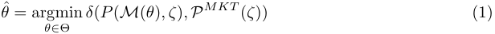

where _δ_ ( _·, ·_ ) is a suitable choice of metric for the financial contract _ζ_ at hand. For most financial models however (1) represents an idealised form of the calibration problem as in practice there rarely exists an analytical formula for the option price _P_ ( _M_ ( _θ_ ) _, ζ_ ) and for the vast majority of financial models it needs to be computed by some numerical approximation scheme. 

**Approximate Parameter Calibration** We say that the parameter configuration _θ_ˆ _∈_ Θ solves an _approximate δ-calibration_ problem for the model _M_ (Θ) for the conditions _P__MKT_ ( _ζ_ ) if 

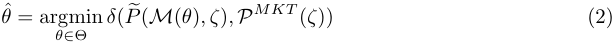

where _δ_ ( _·, ·_ ) is a suitably chosen metric and _P_� is a numerical approximation of the pricing map _P_ . 

In the remainder of this paper it is this second type of calibration problem that we will be concerned with: In our numerical experiments (Section 4) we consider the numerical approximation _P_� of the pricing map _P_ as the benchmark (available truth) for generating synthetic training samples in the training a neural network to approximate pricing maps. Clearly, the better the original numerical approximations, the better the network approximation will be. In a separate work we will illuminate this perspective with a Bayesian analysis of the calibration procedure. 

### **2.1 A brief reminder of some (rough) models considered** 

We would like to emphasize that our methodology can in principle be applied to any (classical or rough) volatility model. From the classical Black Scholes or Heston models to the rough Bergomi model of [7], also to large class of rough volatility models (see Horvath, Jacquier and Muguruza [41] for a general setup). In fact the methodology is not limited to stochastic models, also parametric models of implied volatility could be used for generating training samples of abstract models, but we have not pursued this direction further.

<!-- page: 6 -->

#### **The Rough Bergomi model** 

In the abstract model framework, the rough Bergomi model is represented by _M__rBergomi_ (Θ_rBergomi_ ), with parameters _θ_ = ( _ξ_ 0 _, ν, ρ, H_ ) _∈_ Θ_rBergomi_ . On a given filtered probability space (Ω _, F,_ ( _Ft_ ) _t≥_ 0 _,_ P) the model corresponds to the following system 

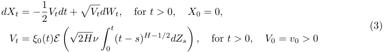

where _H ∈_ (0 _,_ 1) denotes the Hurst parameter, _ν >_ 0 , _E_ ( _·_ ) the stochastic exponential [21], and _ξ_ 0( _·_ ) _>_ 0 denotes the initial forward variance curve (see [11, Section 6]), and _W_ and _Z_ are correlated standard Brownian motions with correlation parameter _ρ ∈_ [ _−_ 1 _,_ 1]. To fit the model parameters into our abstract model framework Θ_rBergomi_ _⊂_ R_n_ for some _n ∈_ N, the initial forward variance curve _ξ_ 0( _·_ ) _>_ 0 is approximated by a piecewise constant function in our numerical experiments in Sections 4.1.1, and 4.2.1. We refer the reader to Horvath, Jacquier and Muguruza [41] for one general setting of rough volatility models and their numerical simulation. 

#### **The Heston model** 

The Heston model, appearing in our numerical experiments of Section 5 is described by the system 

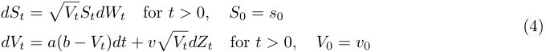

with _W_ and _Z_ Brownian motions with correlation parameter _ρ ∈_ [ _−_ 1 _,_ 1], _a, b, v >_ 0 and 2 _ab > v_2 . In our framework it is denoted by _M__Heston_ ( _θ_ ) with _θ_ = ( _a, b, v, ρ_ ) _∈_ Θ_Heston_ _⊂_ R4 . The Heston model is considered in our numerical experiments in Section 5. It was also considered by [9, 18] in neural network contexts. 

#### **The Bergomi model** 

In the general _n_ -factor Bergomi model, the volatility is expressed as 

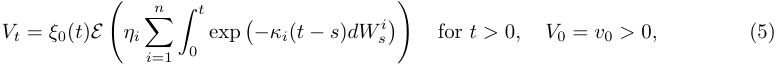

where _η_ 1 _, . . . , ηn >_ 0 and ( _W_1 _, . . . , W__n_ ) is an _n_ -dimensional correlated Brownian motion, _E_ ( _·_ ) the stochastic exponential [21], and _ξ_ 0( _·_ ) _>_ 0 denotes the initial forward variance curve, see [11, Section 6] for details. In this work we consider the Bergomi model for _n_ = 1 _,_ 2 in Section 4. Henceforth, _M_1_F Bergomi_ ( _ξ_ 0 _, β, η, ρ_ ) represents the 1 Factor Bergomi model, corresponding to the following dynamics: 

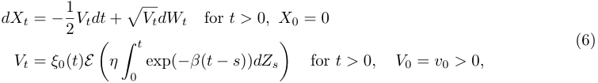

<!-- page: 7 -->

where _ν >_ 0, and _W_ and _Z_ are correlated standard Brownian motions with correlation parameter _ρ ∈_ [ _−_ 1 _,_ 1]. To fit the model parameters into our abstract model framework Θ1_F Bergomi_ _⊂_ R_n_ , for some _n ∈_ N, the initial forward variance curve _ξ_ 0( _·_ ) _>_ 0 is approximated in our numerical experiments by a piecewise constant function in Sections 4.1.1, and 4.2.1. 

#### **The SABR model** 

The stochastic alpha beta rho model of Hagan et al. [33, 34] is denoted in our setting as _M__SABR_ ( _α, β, ρ_ ) and is as 

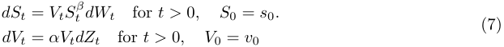

where _v_ 0 _, s_ 0 _, α >_ 0 and _β ∈_ [0 _,_ 1]. The SABR model is considered by McGhee in [55] in a neural network context (see also Section 2.3). 

### **2.2 Calibration bottlenecks in volatility modelling and deep calibration** 

Whenever for a stochastic volatility model the numerical approximate calibration procedures (2) are computationally slow, a bottleneck in calibration time can deem the model of limited applicability for industrial production irrespective of other desirable features the model might have. This is the case in particular for the family rough volatility models, where the rough fractional Brownian motion in the volatility dynamics rules out usual Markovian pricing methods such as finite differences. So far such calibration bottlenecks have been a major limiting factor for the class of rough volatility models, whose overwhelming modelling advantages have been explored and highlighted in rapidly expanding number of academic articles [1, 2, 7, 6, 8, 10, 22, 26, 28, 44, 40, 45] in the past years. Other examples include models with delicate degeneracies (such as the SABR model around zero forward) which for a precise computation of arbitrage-free prices require time consuming numerical pricing methods such as Finite Element Methods [42], Monte Carlo [15, 52] or the evaluation of multiple integrals [3]. 

Contrary to Hernandez’s [36] pioneering work, where he develops a direct calibation via NN, we set up and advocate a two setp calibration approach. 

**Two Step Approach (i) Learn a model and (ii) Calibrate to data:** One separates the calibration procedure described in (2) (resp. (2)) into two parts: **(i)** We first learn (approximate) the pricing map by a neural network that maps parameters of a stochastic model to pricing functions (or implied volatilities (cf. section (2.1) and we store this map during an off-line training procedure. In a second step **(ii)** we calibrate (on-line) the now deterministic approximative learned price map, which speeds up the on-line calibration by orders of magnitude. To formalise the two step approach, we write for a payoff _ζ_ and a model _M_ with parameters _θ ∈_ Θ 

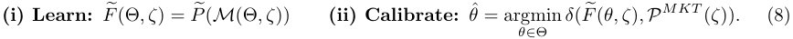

Note that in part **(ii)** of (8) we essentially replaced _P_� ( _M_ (Θ _, ζ_ )) in equation (2) by its learned (deterministic) counterpart _F_� (Θ _, ζ_ ) (which will be a Neural Network see Section 3.2) from **(i)** . Therefore, this second calibration is–by its deterministic nature–considerably faster than calibration of all those traditional stochastic models, which involve numerical simulation of the expected

<!-- page: 8 -->

payoff _P_ ( _M_ ( _θ, ζ_ )) = E[ _ζ_ ( _X_ ( _θ_ ))] for some underlying stochastic process _X__θ_ . The first part **(i)** in (8) denotes an approximation of the pricing map through a neural network, which is calibrated in a supervised training procedure using the original (possibly slow) numerical pricing maps for training (see sections 3.2 and 4 for details in specific examples). 

In the following sections we elaborate on the objectives and advantages of this two step calibration approach and present examples of neural network architectures, precise numerical recipes and training procedures to apply the two step calibration approach to a family of stochastic volatility models. We also present some numerical experiments (corresponding codes are available on GitHub: NN-StochVol-Calibrations ) and report on learning errors and on calibration times. 

### **2.3 Challenges in neural network approximations of pricing functionals** 

In general problem (1) and henceforth (2) is solved using suitable numerical optimisation techniques such as gradient descent [32], specific methods for certain metrics (such as Lavenberg-Marquadnt [53] for _L_2 ), neural networks, or tailor-made methods to the complexity of the optimisation problem and objective function at hand1 . But irrespective of their level of sophistication all optimisers for calibration share a common property: repeated (iterative) evaluation of the pricing map _θ �→ P_ ( _M_ ( _θ_ ) _, ζ_ ) (resp. an approximation _P_� thereof) on each instance _θ_ of consecutive parameter combinations until a sufficiently small distance _δ_ ( _P_� ( _M_ ( _θ_ ) _, ζ_ ) _, P__MKT_ ( _ζ_ ) between model prices and observed prices is achieved. Consequently, the pricing map is arguably the computational cornerstone of a calibration algorithm. Main differences between specific calibration algorithms effectively lie in the way the specific choice of evaluated parameter combinations _{θ_ 1 _, θ_ 2 _. . .}_ are determined, which hence determines the total number _N_ of functional evaluations of the pricing function � _P_ ( _M_ ( _θi_ ) _, ζ_ )� _i_ =1 _...N_usedinthecalibrationuntilthedesiredprecision_δ_(_P_�(_M_(ˆ_θ_)_, ζ_)_, PMKT_(_ζ_))is achieved. In case the pricing map 

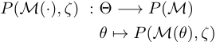

involved in (1) is available in closed form, and can be evaluated instantaneously, the calibration (2) is fast even if a high number _N_ of functional evaluations is used. If the pricing map is approximated numerically, calibration time depends strongly on the time needed to generate a functional evaluation of the numerical approximation 

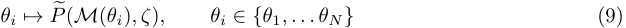

at each iteration _i_ = 1 _, . . . , N_ of the calibration procedure. Slow functional evaluations potentially cause substantial bottlenecks in calibration time. This is where we see the most powerful use of the prowess of neural network approximation: 

A neural network is constructed to replace in **(i)** of (8) the pricing map, that is to approximate (for a given financial contract _ζ_ ) the pricing map from the full set2 of model parameters Θ of the model to the corresponding prices _P_ ( _M_ ( _θ, ζ_ )). The _first challenge_ for the neural network approximator of pricing functionals is to speed up this process and enable us to obtain _faster functional evaluations_ 

> 1For details and an overview on calibration methods see [32]. 

> 2Note that the set _θ_ 1 _, . . . , θN_ in (9) is extended to the full set of possible parameter combinations Θ in (10).

<!-- page: 9 -->

and thereby lift the bottleneck of calibration. The _second challenge_ is to do so with an accuracy that remains within the error bounds of the original numerical pricing discretisation: 

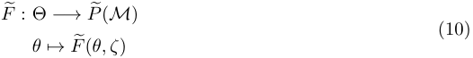

More precisely (motivated by (2)), for any parameter combination _θ ∈_ Θ we aim to approximate the numerical approximation _P_� of the true option price _P_ with the neural network _F_� up to the same order of precision _ϵ >_ 0 up to which _P_� approximates _P_ . That is, for any _θ ∈_ Θ 

_F_ �( _θ_ ) = _P_ ( _M_ ( _θ_ ) _, ζ_ ) + _O_ ( _ϵ_ ) whenever _P_ �( _M_ ( _θ_ ) _, ζ_ ) = _P_ ( _M_ ( _θ_ ) _, ζ_ ) + _O_ ( _ϵ_ ) _._ 

Therefore, our training objective is 

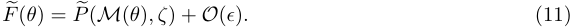

where _P_� is the available numerical approximation of the pricing function, which is considered as ground truth. In our numerical experiments in Section 4 we demonstrate that our approximation network achieves this approximation accuracy and yields a substantial speedup in terms of functional evaluations. 

### **2.4 Motivations for our choice of training setup and features of neural networks as approximators of pricing functionals** 

There are several advantages of separating the tasks of pricing and calibration which we address in full detail in a separate work. Here we recall some of the most convincing reasons to do so. Above all, the most appealing reason is that it allows us to build upon the knowledge we have gained about the models in the past decades, which is of crucial importance from a risk management perspective. By its very design, deep learning the _price approximation_ **(i)** combined with **(ii)** deterministic calibration does not cause more headache to risk managers and regulators than the corresponding stochastic models do. Designing the training as described above demonstrates how deep learning techniques can successfully extend the toolbox of financial engineering, without making compromises on any of our objectives. 

1. The knowledge gathered in many years of experience with traditional models remains useful and risk management libraries of models remain valid. The neural network is only used as a computational enhancement of models. 

2. The availability of training data for training the deep neural network does not cause any constraints as it is synthetically generated by traditional numerical methods. 

3. This can be extended beyond the models presented in this work: Whenever a consistent numerical pricer exists for a model, it can be approximated and replaced by a deep neural network that provides fast numerical evaluations of the pricing map. 

Here, we identify the grid-based apporach as our choice of training. Though a thorough analysis of the best training approaches is subject to further research, we have good reason to believe that the grid-based approach provides a powerful and robust methodology for training:

<!-- page: 10 -->

#### **2.4.1 Reasons for the choice of grid-based implicit training** 

In the grid-based approach we evaluate the values of implied volatility surface along 8 _×_ 11 gridpoints with 80 _,_ 000 different parameter combinations we effectively evaluate the ”fit” of the surface to numerically generated ones across the same number of points. By moving the evaluation of the implied volatilities into the objective function we improve the learning in many aspects: 

- The first advantage of implicit training is that it efficiently exploits the structure of the data. Updates in neighbouring volatility points _σn−_ 1 and _σn_ can be incorporated in the learning process. If the output is a full grid as in (16) this effect is further enhanced. Updates of the network on each gridpoint also imply additional information for updates of the network on neighbouring gridpoints. One can say that we regard the implied volatility surface as an image with a given number of pixels. 

- A further advantage of the image based implicit training is, that by evaluating the objective function on a larger set of (grid) points, injectivity of the mapping can be more easily guaranteed than in the pointwise training: Two distinct parameter combinations are less likely to yield the same value across a set of gridpoints, then if evaluated only on a single point. 

- We do not limit ourselves to one specific grid on the implied volatility surface. We store the generated 60 _,_ 000 sample paths for the training data and chose a set of maturities (here 8) and strikes (here 11) to evaluate prices corresponding to these paths. But we can easily add and evaluate additional maturities and strikes to the same set of paths. Note in particular that in this training design we can refine the grid on the implied volatility surface without increasing the number of training samples needed and without significantly increasing the computational time for training as the portfolio of vanilla options on the same underlying grows with different strikes and maturities. 

#### **2.4.2 Some relevant properties of deep neural networks as functional approximators** 

Deep feed forward3 neural networks are the most basic deep neural networks, originally designed to approximate some function _F__∗_ , which is not available in closed form but only through sample pairs of given input data _x_ and output data _y_ = _F__∗_ ( _x_ ). In a nutshell, a feed forward network defines a mapping _y_ = _F_ ( _x, w_ ) and the training determines (calibrates) the optimal values of network � � parameters _w_ that result in the best function approximation4 _F__∗_ ( _·_ ) _≈ F_ ( _·, w_ ) of the unknown function _F__∗_ ( _·_ ) for the given pairs of input and output data ( _x, y_ ), cf. [32, Chapter 6]. 

To formalise this, we introduce some notation and recall some basic definitions and principles of function approximation via (feedforward) neural networks: 

_Definition_ 1 (Neural network) _._ Let _L ∈_ N and the tuple ( _N_ 1 _, N_ 2 _· · · , NL_ ) _∈_ N_L_ denote the number of layers (depth) and the number of nodes (neurons) on each layer respectively. Furthermore, we introduce the functions 

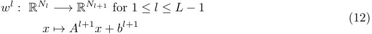

> 3The network is called feed forward if there are no feedback connections in which outputs of the model are fed back into itself. 

> 4 In our case _y_ is a 8 _×_ 11-point grid on the implied volatility surface and _x_ are model parameters _θ ∈_ Θ, for details see Section 3.

<!-- page: 11 -->

acting between layers for some _A__l_+1 _∈_ R_Nl_+1_×Nl_ . The vector _b__l_+1 _∈_ R_Nl_+1 denotes the _bias term_ and each entry _A__l_ (+1 _i,j_ )denotesthe_weight_connectingnode_i∈Nl_oflayer_l_withnode_j∈Nl_+1 of layer _l_ + 1. For the the collection of affine functions of the form (12) on each layer we fix the notation _w_ = ( _w_1 _, . . . , w__L_ ). We call the tuple _w_ the _network weights_ for any such collection of affine functions. Then a Neural Network _F_ ( _w, ·_ ) : R_N_0 _→_ R_NL_ is defined as the composition: 

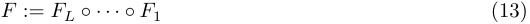

where each component is of the form _Fl_ := _σl ◦ W__l_ . The function _σl_ : R _→_ R is referred to as the _activation function_ . It is typically nonlinear and applied component wise on the outputs of the affine function _W__l_ . The first and last layers, _F_ 1 and _FL_ , are the _input_ and _output_ layers. Layers in between, _F_ 2 _· · · FL−_ 1, are called _hidden layers_ . 

The following central result of Hornik justifies the use of neural networks as approximators for multivariate functions and their derivatives. 

**Theorem 1** (Universal approximation theorem (Hornik, Stinchcombe and White [38])) **.** _Let NN__σ_ _d_ 0 _,d_ 1 _be the set of neural networks with activation function σ_ : R _�→_ R _, input dimension d_ 0 _∈_ N _and output dimension d_ 1 _∈_ N _. Then, if σ is continuous and non-constant, NN__σ_ _d_ 0 _,_ 1_isdenseinLp_(_µ_)_for_ _all finite measures µ._ 

There is a rapidly growing literature on approximation results with neural networks, see [37, 39, 56, 65] and the references therein. Among these we would like to single out one particular result: 

**Theorem 2** (Universal approximation theorem for derivatives (Hornik, Stinchcombe and White [39])) **.** _Let F__∗_ _∈C__n_ _and F_ : R_d_0 _→_ R _and NN__σ_ _d_ 0 _,_ 1_bethesetofsingle-layerneuralnetworkswith_ _activation function σ_ : R _�→_ R _, input dimension d_ 0 _∈_ N _and output dimension_ 1 _. Then, if the (non-constant) activation function is σ ∈C__n_ (R) _, then NN__σ_ _d_ 0 _,_ 1_arbitrarilyapproximatesfandall_ _its derivatives up to order n._ 

_Remark_ 1 _._ Theorem 2 highlights that the smoothness properties of the activation function are of significant importance in the approximation of derivatives of the target function _F__∗_ . In particular, to guarantee the convergence of _l_ -th order derivatives of the target function, we choose an activation function _σ ∈ C__l_ (R). Note that the ReLu activation function , _σReLu_ ( _x_ ) = ( _x_ )+ is not in _C__l_ (R) for any _l >_ 0, while _σElu_ ( _x_ ) = _α_ ( _e__x_ _−_ 1) is smooth. 

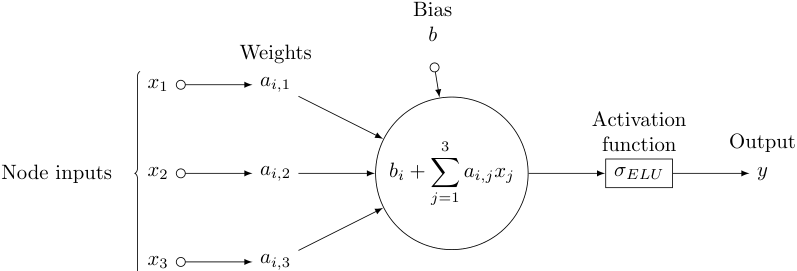

<!-- Start of picture text -->
Bias b Weights x 1 ai, 1 Activation 3 function Output Node inputs x 2 ai, 2 bi  + � ai,jxj σ ELU y j =1 x 3 ai, 3 <!-- End of picture text -->

Figure 1: In detail neuron behaviour

<!-- page: 12 -->

The following Theorem provides theoretical bounds for the above rule of thumb and establishes a connection between the number of nodes in a network and the number of training samples needed to train it. 

**Theorem 3** (Estimation bounds for Neural Networks (Barron [5])) **.** _Let NN__σ_ _d_ 0 _,d_ 1_bethesetof_ _single-layer neural networks with Sigmoid activation function σ_ ( _x_ ) = _e__x_ _<u>e</u>_ +1_x,inputdimensiond_0_∈_N _and output dimension d_ 1 _∈_ N _. Then:_ 

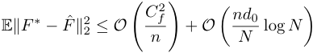

_where n is the number of nodes, N is the training set size and CF ∗ is the first absolut moment of the Fourier magnitude distribution of F__∗_ _._ 

_Remark_ 2 _._ Barron’s [5] insightful result gives a rather explicit decomposition of the error in terms of bias (model complexity) and variance: 

- _O_ � _CnF_2_∗_ � represents the model complexity, i.e. the larger _n_ (number of nodes) the smaller the error 

- _O_ � _<u>ndN</u>_ <u>0</u>log_N_ � represents the variance, i.e. a large _n_ must be compensated with a large training set _N_ in order to avoid overfitting. 

Finally, we motivate the use of multi layer networks and the choice of network depth. Even though a single layer might theoretically suffice to arbitrarily approximate any continuous function,in practice the use of multiple layers dramatically improves the approximation capacities of network. We informally recall the following Theorem due to Eldan and Shamir [20] and refer the reader to the original paper for details. 

**Theorem 4** (Power of depth of Neural Networks (Eldan and Shamir [20])) **.** _There exists a simple (approximately radial) function on_ R_d_ _, expressible by a small 3-layer feedforward neural networks, which cannot be approximated by any 2-layer network, to more than a certain constant accuracy, unless its width is exponential in the dimension._ 

_Remark_ 3 _._ In spite of the specific framework by Eldan and Shamir [20] being restrictive, it provides a theoretical justification to the power of “deep” neural networks (multiple layers) against “shallower” networks (i.e. few layers) as in [55] with a larger number of neurons. On the other hand, multiple findings indicate [9, 47] that adding hidden layers beyond 4 hidden layers does not significantly improve network performance. 

## **3 Pricing and calibration with neural networks: Optimising network and training** 

In this section we compare different objective functions (direct calibration to data to an image-based implicit learning approach) and motivate our choice of image-based objective function. We give details about network architectures for the approximation network and compare different optimisers for the calibration step.

<!-- page: 13 -->

### **3.1 The objective function** 

1. Learn the map _F__∗_ ( _θ_ ) = _{P__M_(_θ_) ( _ζi_ ) _}__n_ _i_ =1vianeralnetwork,where_{ζi}i_=1_,...,n_representsthe exotic product attributes (such as maturity, strike or barrier level) on a prespecified grid with size _n_ . 

2. Solve 

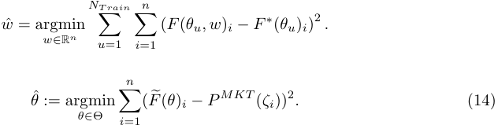

#### **3.1.1 For vanillas** 

As in many academic and industry research papers, we pursue the calibration of vanilla contracts via approximation of the implied volatility surface5 . 

We take this idea further and design an implicit form of the pricing map that is based on storing the implied volatility surface as an image given by a grid of ”pixels”. This image-based representation has a formative contribution in the performance of the network we present in Section 4. We present our contribution here; Let us denote by ∆:= _{ki, Tj}__n,_ _i_ =1 _, mj_ =1afixedgridofstrikesandmaturities, then we propose the following two step approach: 

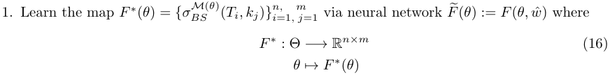

where the input is a parameter combination _θ ∈_ Θ of the stochastic model _M_ (Θ) and the output is a _n × m_ grid on the implied volatility surface _{σBS__M_(_θ_) ( _Ti, kj_ ) _}__n,_ _i_ =1 _, mj_ =1where_n, m ∈_N are chosen appropriately (see Section 3.2). Then, 

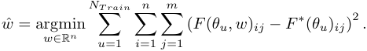

> 5For sake of completeness we introduce the Black-Scholes Call pricing function in terms of log-strike _k_ , initial spot _S_ 0, maturity _T_ and volatility _σ_ : 

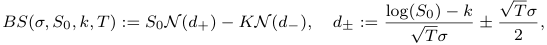

where _N_ ( _·_ ) denotes the Gaussian cumulative distribution function. The implied volatility induced by a Call option pricing function _P_ ( _K, T_ ) is then given by the unique solution _σBS_ ( _k, T_ ) of the following equation 

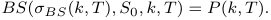

Precisely, we seek to solve the following calibration problem 

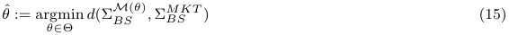

where Σ_M_ _BS_(_θ_) := _{σBS__M_(_θ_) ( _ki, Tj_ ) _}i_ =1 _,..,n, j_ =1 _,...,m_ represents the set of implied volatilities generated by the model pricing function _P_ ( _M_ ( _θ_ ) _, k, T_ ) and Σ_MKT_ _BS_ := _{σBS__MKT_ ( _ki, Tj_ ) _}i_ =1 _,..,n, j_ =1 _,...,m_ are the corresponding market implied volatilities, for some metric _d_ : R_n×m_ _×_ R_n×m_ _→_ R+ .

<!-- page: 14 -->

2. Solve 

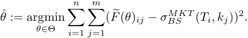

ˆ ˆ _Remark_ 4 _._ Notice that _w_ (∆) depends on ∆implicitly, consequently so does _F_� ( _θ_ ) = _F_ ( _θ, w_ (∆)) (hence the name implicit learning). This setting is similar to that of image recognition and exploits the structure of the data to reduce the complexity of the Network (see Section 4 for details). 

_Remark_ 5 _._ In our experiments we chose _n_ = 8 and _m_ = 11. At first, a criticism of mapping (16) might be the inability to extrapolate/interpolate between maturities/strikes outside the grid ∆. However, one is free to choose the grids ∆as fine as needed. In addition, one may use standard (arbitrage free) uni/bi-variate splines techniques to extrapolate/interpolate across strikes and maturities, as with traditional market data observable only at discrete points. 

Figure 2: Volatility surface generated by the neural network approximator and the corresponding original counterpart on a grid given by 8 maturities and 11 strikes. 

#### **3.1.2 Some exotic payoffs** 

Our framework extends to a number of exotic products such as: Digital barriers, no-touch (or double no-touch) barrier, cliquets or autocallables. 

We present some numerical experiments in Section 4.3, to demonstrate the pricing of digital barrier options. More precisely, in Section 4.3 we consider down-and-in such as down-and-out digital barrier options, the main building blocks of many Autocallable products. For a barrier level _B < S_ 0 and maturity _T_ the payoff is given by: 

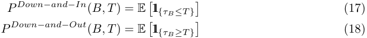

where _τB_ = inf=_B}_.Inthissetting,wemayeasilygenerateagridforbarrierlevelsand _t__{St_ maturities ∆_Barrier_ := _{Bi, Tj}__n,_ _i_ =1 _, mj_ =1thatwecanfitintheobjectivefunctionspecifiedin(14) 

### **3.2 Network architecture and training** 

Motivated by the above analysis, we choose to set up the calibration in the implicit two-step approach. This involves a separation of the calibration procedure into (i) “Deep approximation” an approximation network with an implicit training and (ii)“Calibration” a calibration layer on top. We first start by describing the approximation network in the implicit image-based training and discuss the calibration in Section 3.3 below. In addition, we will highlight specific techniques that contribute to the robustness and efficiency of our design.

<!-- page: 15 -->

#### **3.2.1 Network architecture of the implied volatility map approximation** 

Here we motivate our choice of network architecture for the following numerical experiments which were inspired by the analysis in the previous sections. Our network architecture is summarised in the graph 3.2.1 below. 

1. A fully connected feed forward neural network with 4 hidden layers (due to Theorem 4) and 30 nodes on each layers (see Figure 3.2.1 for a detailed representation) 

2. Input dimension = _n_ , number of model parameters 

3. Output dimension = 11 strikes _×_ 8 maturities for this experiment, but this choice of grid can be enriched or 

4. The four inner layers have 30 nodes each, which adding the corresponding biases results on a number 

   - ( _n_ + 1) _×_ 30 + 4 _×_ (1 + 30) _×_ 30 + (30 + 1) _×_ 88 = 30 _n_ + 6478 

of network parameters to calibrate (see Section 2.4.2 for details). 

5. Motivated by Theorem 2 we choose the Elu _σElu_ = _α_ ( _e__x_ _−_ 1) activation function for the network. 

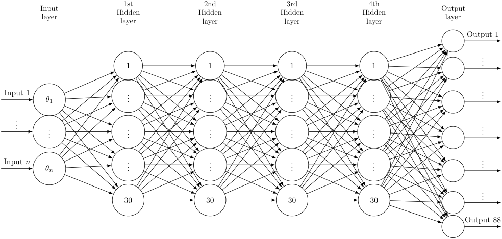

<!-- Start of picture text -->
1st 2nd 3rd 4th Input Hidden Hidden Hidden Hidden Output layer layer layer layer layer layer Output 1 1 1 1 1 ... Input 1 θ 1 ... ... ... ... ... ... ... ... ... ... ... ... Input n θn ... ... ... ... ... 30 30 30 30 ... Output 88 <!-- End of picture text -->

Figure 3: Our neural network architecture with 4 hidden layers and 30 neurons on each hidden layer, with the model parameters of the respective model on the input layer and with the 8 _×_ 11 implied volatility grid on the output layer.

<!-- page: 16 -->

#### **3.2.2 Training of the approximation network** 

We follow the common features of optimization techniques and choose mini-batches, as described in Goodfellow, Bengio and Courville [32]. Typical batch size values range from around 10 to 100. In our case we started with small batch sizes and increased the batch size until training performance consistently reached a plateau. Finally, we chose batch sizes of 32, as performance is similar for batch sizes above this level, and larger batch sizes increase computation time by computing a larger number of gradients at a time. 

In our training design, we use a number of regularisation techniques to speed up convergence of the training, to avoid overfitting and improve the network performance. 

**1) Early stopping:** We choose the number of epochs as 200 and stop updating network parameters if the error has not improved in the test set for 25 steps. 

**2) Normalisation of model parameters:** Usually, model parameters are restricted to a given domain i.e. _θ ∈_ [ _θmin, θmax_ ]. Then, we perform the following normalisation transform: 

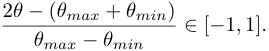

**3) Normalisation of implied volatilities:** The normalisation of implied volatilities is a more delicate matter, since _σBS_ ( _T, k, θ__train_ ) _∈_ [0 _, ∞_ ), for each _T_ and _k_ . Therefore, we choose to normalise the surface subtracting the sample empirical mean and dividing by the sample standard deviation. 

### **3.3 The calibration step** 

Once the pricing map approximation _F_� for the implied volatility is found, only the calibration step in (2) is left to solve. In general, for financial models the pricing map _F__∗_ is assumed to be smooth (at least _C_1 differentiable) with respect to all its input parameters _θ_ . 

#### **Gradient-based optimizers** 

A standard necessary first order condition for optimality in (2) is that 

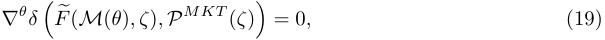

provided that the objective function is smooth. Then, a natural update rule is to move along the gradient via Gradient Descent i.e. 

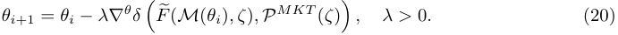

A common feature of gradient based optimization methods building on (20) is the use of the gradient _∇__θ_ _δ F_ �( _M_ ( _θ_ ) _, ζ_ ) _, P__MKT_ ( _ζ_ ) , hence its correct and precise computation is crucial for � � subsequent success. Examples of such algorithms, are Levenberg-Marquardt [53, 54], BroydenFletcher-Goldfarb-Shanno (BFGS) algorithm [58], L-BFGS-B [70] and SLSQP [50]. The main

<!-- page: 17 -->

advantage of the aforementioned methods is the quick convergence towards condition (19). However, (19) only gives necessary and not sufficient conditions for optimality, hence special care must be taken with non-convex problems. 

_Remark_ 6 _._ Notably, making use of Theorem 2 we use a smooth activation functions in order to guarantee _∇__θ_� _P ≈∇__θ_� _F_ 

#### **Gradient-free optimizers** 

Gradient-free optimization algorithms are gaining popularity due to the increasing number of high dimensional nonlinear, non-differentiable and/or non-convex problems flourishing in many scientific fields such as biology, physics or engineering. As the name suggests, gradient-free algorithms make no _C_1 assumption on the objective function. Perhaps, the most well known example is the Simplex based Nelder-Mead [57] algorithm. However, there are many other methods such as COBYLA [60] or Differential Evolution [68] and we refer the reader to [61] for an excellent review on gradientfree methods. The main advantage of these methods is the ability to find global solutions in (2) regardless of the objective function. In contrast, the main drawback is a higher computational cost compared to gradient methods. 

To conclude, we summarise the advantages of each approach in Table 1. 

||**Gradient-based**|**Gradient-free**|
|---|---|---|
|Convergence Speed|Very Fast|Slow|
|Global Solution|Depends on problem|Always|
|Smooth activation function needed|Yes to apply Theorem 2|No|
|Accurate gradient approximation needed|Yes|No|

Table 1: Comparison of Gradient vs. Gradient-free methods. 

## **4 Numerical experiments** 

In our numerical experiments we demonstrate that the accuracy of the approximation network indeed remains within the accuracy of the Monte Carlo error bounds and proclaimed in the introductory sections’ objectives. For this we first compute the benchmark Monte Carlo errors in Figures 4-5 and compare this with the neural network approximation errors in Figures 6 and 7. For this separation into steps (i) and (ii) to be computationally meaningful, the neural network approximation has to be a reasonably accurate approximation of the true pricing functionals and each functional evaluation (i.e. evaluation an option price for a given price and maturity) should have a considerable speed-up in comparison to the original numerical method. In this section we demonstrate that our network achieves both of these goals.

<!-- page: 18 -->

### **4.1 Numerical accuracy and speed of the price approximation for vanillas** 

As mentioned in Section 2 one crucial difference that sets apart this work from direct neural network approaches, as pioneered by Hernandez [36], is the separation of (i) the implied volatility approximation function, mapping from parameters of the stochastic volatility model to the implied volatility surface–thereby bypassing the need for expensive Monte-Carlo simulations—and (ii) the calibration procedure, which (after this separation) becomes a simple deterministic optimisation problem. As outlined in Section 2.3 our aim for the Step ( **i** ) in the two-step training approach is to achieve a considerable speedup per functional evaluation of option prices while maintaining the numerical accuracy of the original pricer. Here we demonstrate how our NN training for Step ( **i** ) achieves these goals outlined in Section 2.3: 

1. Approximation accuracy: here we compare the error of the approximation network error to the error of Monte Carlo evaluations. We compute Monte Carlo prices with 60 _,_ 000 paths as reference at the nodes where we compute the implied volatility grid using Algorithm 3.5 in Horvath, Jacquier and Muguruza [41]. In Figures 4 and 5 the approximation accuracy of the Monte Carlo method for the full implied volatility surface is computed using pointwise relative error with respect to the 95% Monte Carlo confidence interval. Figures 6 and 7 demonstrate that the same approximation accuracy for the neural network is achieved as for the Monte Carlo approximation (i.e. within a few basis points). For reference, the spread on options is around 0.2% in implied volatility terms for the most liquid and those below a year. This translates into 1% relative error for a implied volatility of 20%. 

2. Approximation speed: Table 2 shows the CPU computation time per functional evaluation of a full surface under two different models; rBergomi 3 and 1 Factor Bergomi 6 (for a reminder see Section 4.1.1 for details). 

||MC Pricing 1F Bergomi Full Surface|MC Pricing rBergomi Full Surface|NN Pricing Full Surface|NN Gradient Full Surface|Speed up NN vs. MC|
|---|---|---|---|---|---|
|Piecewise constant forward variance|300_,_000_µ_s|500_,_000_µ_s|30_._9_µ_s|113_µ_s|9_,_000_−_16_,_000|

Table 2: Computational time of pricing map (entire implied volatility surface) and gradients via Neural Network approximation and Monte Carlo (MC). If the forward variance curve is a constant value, then the speed-up is even more pronounced

<!-- page: 19 -->

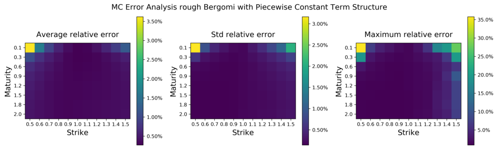

<!-- Start of picture text -->
MC Error Analysis rough Bergomi with Piecewise Constant Term Structure 3.50%0, 3.00% 35.0%. 1% Average relative error 3.00% Std relative error Maximum relative error 30.0%(0% o1 o1 2.50% o1 03 2.50% 0.3 0.3 25.0% > 0.6 > 0.6 2.00% + 0.6 cod2= 0.9 2.00% cod25 0.9 2cod= 0.9 20.090.0% #12 #12 150% 12 = 15 150% = 15 = 15 15.0% 18 18 18 2.0 1.00% 2.0 1.00%, 2.0 10.0% 0.5 0.6 0.7 0.8 0.91.0 1.11.21.31.41.5 0.5 0.6 0.7 0.8 0.91.0 1.11.21.31.41.5 0.5 0.6 0.7 0.8 0.91.0 1.11.21.31.41.5 Strike 050% Strike 0.50% Strike 5.0% <!-- End of picture text -->

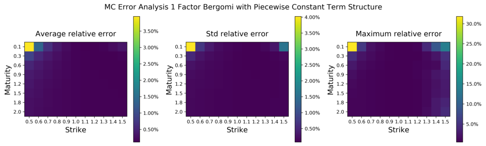

<!-- Start of picture text -->
MC Error Analysis 1 Factor Bergomi with Piecewise Constant Term Structure 4.00% 30.0% Average relative error 3.50% Std relative error 3.50% Maximum relative error 0.1 3.00% 0.1 3.00% 0.1 25.0% 0.3 0.3 0.3 > 0.6 2.50% 50.6 2.50% 5, 0.6 20.0% cd ood Ws 509 9 509 9 509 B12 2.00% B12 2.00% B12 15.0% 215 150% 215 150% 215 18 18 18 10.0% 2.0 1.00% 2.0 1.00% 2.0 0.5 0.6 0.7 0.8 0.9 1.0 1.11.21.31.41.5 0.5 0.6 0.70.8 0.9 1.01.11.21.31.41.5 0.5 0.6 0.7 0.8 0.91.0 1.11.2 1.3141.5 5.0% Strike 0.50% Strike 9.50% Strike <!-- End of picture text -->

<!-- page: 20 -->

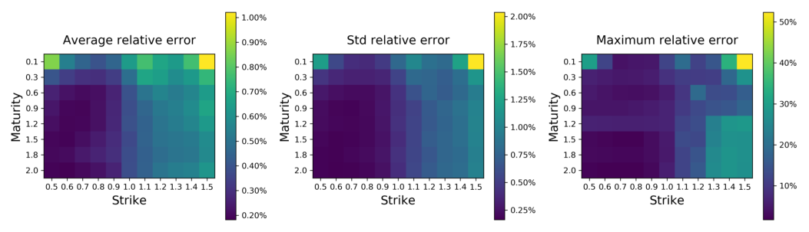

<!-- Start of picture text -->
1.00% 2.00% oe Average 9 rell a titive error 0.90%D Std relativei error 1.75% Maximumi relativei error 0.1 0.80% 0.1: 01: “ 0.3 0.3 150% 0.3 => 0.6o9 0.70% #>5 0.60.90. 1.25% c092 0.6 30% 5 0 60% FS Fs 8oO 12 1.2© 1.00% 121 Sis. 0.50% = 15 215 noe 1.8 18 0.75% 1.8 2.0 0.40%So, 2.0 2.0 0.5 0.6 0.7 0.8 0.9 1.01.11.213141.5 0.30% 0.5 0.6 0.7 0.8 0.9 1.01.1 1.2 1.3 1.415 0.5090% 0.5 0.6 0.7 0.8 0.91.01.112131415 10% strikike Strike Strike 0.20% 0.25% <!-- End of picture text -->

<!-- page: 21 -->

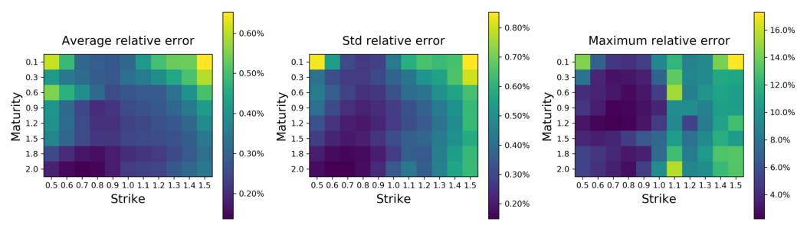

<!-- Start of picture text -->
Average relative . error 0.60% Std relative. error 0.80% Maximum. relative. error 16.0% 0.1 0.1 0.70% 0.1 14.0% 03 0.50% 0.3 0.3 0.60% 2.00% >oe poe poe 509 0.40% 5 °° 050% 5°" 10.0% D 1.2 3 1.2 ® 1.2 215 215 0.40% 215 8.0%9 1.8 0.30% 1.8 1.8 2.0 2.0 0.30%.30% 2.0 6.0% 0.5 0.6 0.7 0.8 0.9 1.01.11.21.31415 0.5 0.6 0.7 0.8.0.9 1.01.11.2131415 0.5 0.6 0.7 0.8 0.9 1.0 1.11.21.31.415 Strike: 0.20%° StrikeP 0.20% Strike: 4.0%9 <!-- End of picture text -->

<!-- page: 22 -->

Average calibration time with different optimisers 

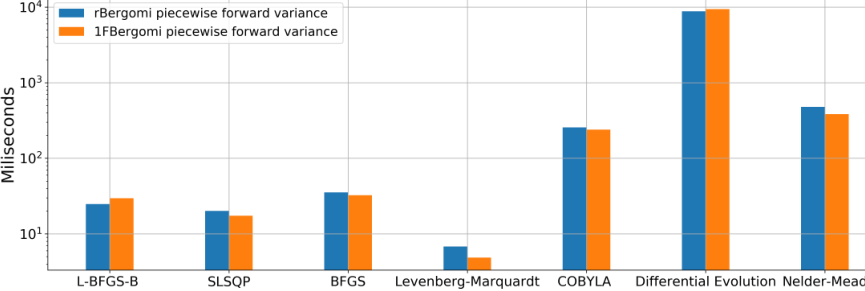

<!-- Start of picture text -->
10* @am_ rBergomi piecewise forward variance @@m 1FBergomi piecewise forward variance wv 103 xo} c ° (v) vo 2 10? = 101 L-BFGS-B SLSQP BFGS Levenberg-Marquardt COBYLA Differential Evolution Nelder-Mead <!-- End of picture text -->

<!-- page: 23 -->

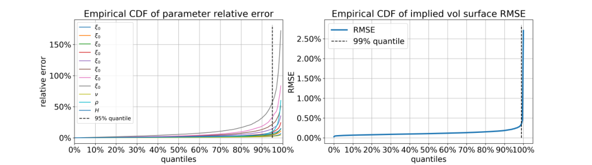

<!-- Start of picture text -->
Empirical CDF of parameter relative error Empirical CDF of implied vol surface RMSE —F — RMSE 150%} — & 2.50%] ----- 99% quantile : —é i 1 5 —. | | 2.00% £ — & ' i 2 100%} — & 1] | D 1.50% FS — * i) || 2 © —_—?P H 0) ' s — ft 1.00% = 50%} f --- 95% quantile i 0.50% 0% “T 0.00% ' 0% 10% 20% 30% 40% 50% 60% 70% 80% 90% 100% 0% 10% 20% 30% 40% 50% 60% 70% 80% 90%100% quantiles quantiles <!-- End of picture text -->

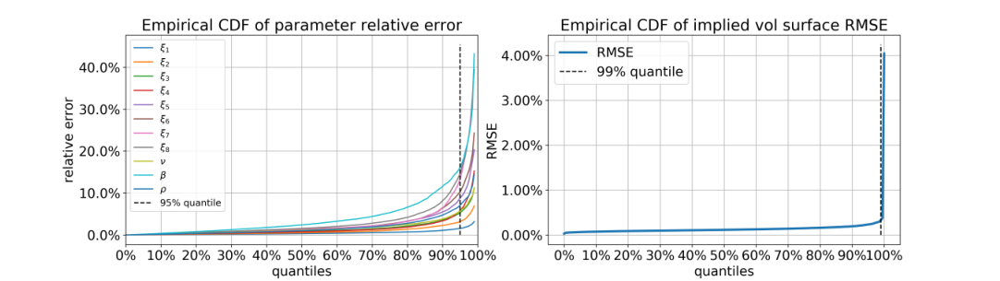

<!-- Start of picture text -->
Empirical CDF of parameter relative error Empirical CDF of implied vol surface RMSE 40.0%) —E ' | 4.00%} —— RMSE ----- 99% quantile -© 30.0%)— &® 3.00%9 5 — ryt ay o & ' wn 6 ' Fa 20.0% } fs | 2 2.00% 2 10.0%}—s° )) 1.00% --- 95% quantile Y 1 0.0% —— ' 0.00% ' 0% 10% 20% 30% 40% 50% 60% 70% 80% 90% 100% 0% 10% 20% 30% 40% 50% 60% 70% 80% 90%100% quantiles quantiles <!-- End of picture text -->

<!-- page: 24 -->

following optimisation problem for the rough Bergomi model 

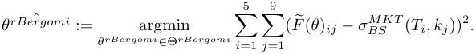

where _θ__rBergomi_ = ( _ξ_ 1 _, ξ_ 2 _, ξ_ 3 _, ξ_ 4 _, ξ_ 5 _, ν, ρ, H_ ) and Θ_rBergomi_ = [0 _._ 01 _,_ 0 _._ 25]5 _×_ [0 _._ 5 _,_ 4] _×_ [ _−_ 1 _,_ 0] _×_ [0 _._ 025 _,_ 0 _._ 5]. As for the time grid we choose 

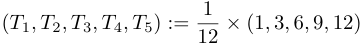

and for the strike grid 

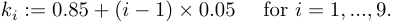

We consider SPX market smiles between 01/01/2010 and 18/03/2019 on the pre-specified time and strike grid. Figure 11 shows the historical evolution of rough Bergomi parameters calibrated to SPX using the neural network price. In particular we note that _H <_<u>1</u> 2aspreviouslydiscussedinmany academic papers [1, 2, 7, 6, 8, 10, 22, 26, 28, 44, 40, 45], moreover we may confirm that under Q, _H ∈_ [0 _._ 1 _,_ 0 _._ 15] as found in Gatheral, Jaisson and Rosenbaum [28] under P. Figure 12, benchmarks the NN optimal fit using Levenberg-Marquardt and Differential Evolution against a brute force MC calibration via Levenberg-Marquardt. Again, we find that the discrepancy between both is below 0 _._ 2% most of the time and conclude that the Differential Evolution algorithm does outperform the Levenberg-Marquardt. This in turn, suggests that the neural network might not be precise enough on first order derivatives. This observation, is left as an open question for further research. Perhaps surprisingly, we sometimes obtain a better fit using the neural network than the MC pricing itself. This could be caused by the fact that gradients in the neural network are exact, whereas when using MC brute force calibration we resort to finite differences to approximate gradients.

<!-- page: 25 -->

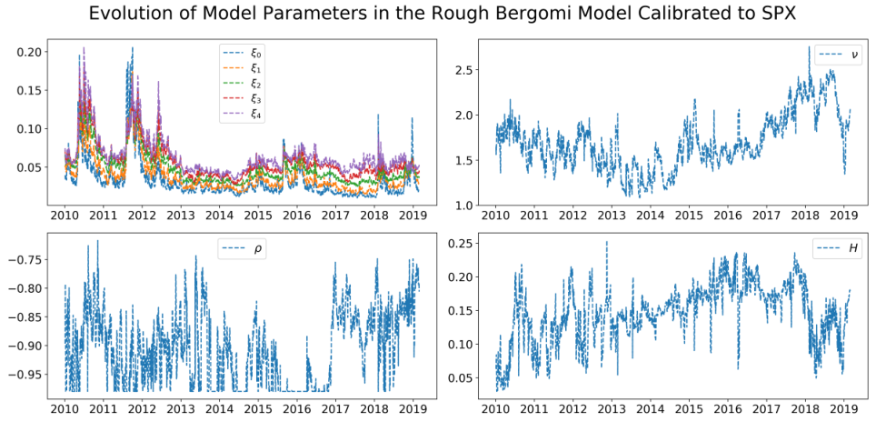

<!-- Start of picture text -->
Evolution of Model Parameters in the Rough Bergomi Model Calibrated to SPX moo Et 2.5 . 0.200.15 it | == Eo Se v \ Mm | => & 2.0 i] od gall wh i} | a. & Ny | 0.20 a lhe | 1 om hy | i i fk ¥ | : 0.054 Be i HE SO gL iC hay ten 1s yy nyt h i , —° 2010 2011 2012 2013 2014 2015 2016 2017 2018 2019 2010 2011 2012 2013 2014 2015 2016 2017 2018 2019 — ° 0.25 ! ---- H -0.75 ly ; id | | b - ; ; ' | | f, | 020 ! a ae 4 i ah WAM ha AMR akan Te \ it 1 a eh ee 085) i a | { ei A Ei a yd ara he TY WY / 095) HAE | Ml WEE: ia 0.05 i: 2010 2011 2012 2013 2014 2015 2016 2017 2018 2019 2010 2011 2012 2013 2014 2015 2016 2017 2018 2019 <!-- End of picture text -->

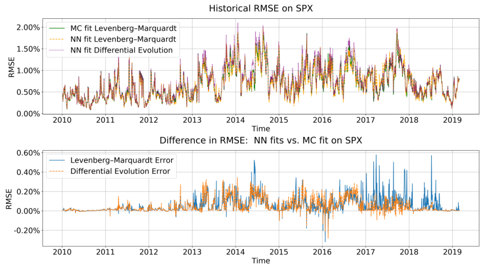

<!-- Start of picture text -->
Historical RMSE on SPX 2.00%; —— MC fit Levenberg-Marquardt : t 1.50%} ----- NN fit Levenberg-Marquardt ii ne | i" + NN fit Differential Evolution r ie or na vail 2 00% | ; mn? Ail CU ei Eee Lt ao” / ORR gay aa WEVAuD VE : | 0.50%} AAA ALAA Ma ANAT i 1 AAR 0.00%9, 2010 2011 2012 2013 2014 2015 2016 2017 2018 2019 Time Difference in RMSE: NN fits vs. MC fit on SPX 0.60%°} — Levenberg-Marquardt Error 0.40% ----- Differential Evolution Error WwW 0.20% | int i \ HEF an ih iy | yn HH 1a 1 We f 0.00% hal ‘ Li) iH ti al | -0.20% 2010 2011 2012 2013 2014 2015 2016 2017 2018 2019 Time <!-- End of picture text -->

<!-- page: 26 -->

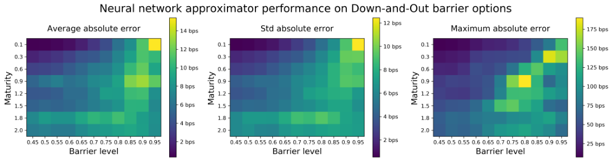

<!-- Start of picture text -->
Neural network approximator performance on Down-and-Out barrier options Average absolute error 14 bps Std absolute error 12 bps Maximum. absolute error 175 bps on 12 bps o1 10 bps Or 150 bps 0.3 0.3 0.3 > 0.6 10 bps > 0.6 8 bps > 0.6 125 bps =5 09 8bps = 09 =5 09 100 bps we 12 wm 12 6bps  % 1.2 = 15 6 bps = 15 = 15 75 bps 1.8 1.8 4 bps 18 4 bps 50 bps 2.0 2.0 2.0 0.45 0.5 0.55 0.6 0.65 0.7 0.75 0.8 0.85 0.9 0.95 2 bps 0.45 0.5 0.55 0.6 0.65 0.7 0.75 0.8 0.85 0.9 0.95 2 bps 0.45 0.5 0.55 0.6 0.65 0.7 0.75 0.8 0.85 0.9 0.95 25 bps Barrier level Barrier level Barrier level <!-- End of picture text -->

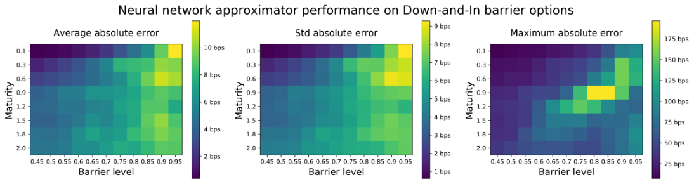

<!-- Start of picture text -->
Neural network approximator performance on Down-and-In barrier options Average absolute error Std absolute error 9 bps Maximum. absolute error 01 10 bps 01 8 bps o1 175 bps 0.3 0.3 7 bps 0.3 150 bps 0.6 8 bps 0.6 0.6 > > 6 bps > 125 bps = 09 = 09 = 09 3 3 5 b bps =] 100 b Fi obps P12 Fi Ps =15 215 abps 215 75 bps 18 4 bps 18 3 bps 18 2.0 2.0 2.0 50 bps 0.45 0.5 0.55 0.6 0.65 0.7 0.75 0.8 0.85 0.9 0.95 2 bps 0.45 0.5 0.55 0.6 0.65 0.7 0.75 0.8 0.85 0.9 0.95 2 bps 0.45 0.5 0.55 0.6 0.65 0.7 0.75 0.8 0.85 0.9 0.95 25 bps Barrier level Barrier level 1 bps Barrier level <!-- End of picture text -->

<!-- page: 27 -->

control over reliability and interpretability of network outputs. The implicit grid based approach that we advocate here, also allows further applications that opens up further landscapes for financial modelling. 

**Potential applications and outlook towards mixture of “expert” models** : In the previous sections we set up a powerful approximation method to closely approximate implied volatilities under different stochastic models and highlighted that the choice of the objective function (evaluation of the surface on a grid, inspired by pixels of an image) was crucial for the performance of the network. Now we are interested in the inverse task and ask whether a neural network—trained by this objective function to multiple stochastic models simultaneously—can identify which stochastic model a given set of data comes from. By doing so, potential applications we have in mind are twofold: 

(1) Ultimately we are interested in which model (or what mixture of existing stochastic models) best describes the market. 

(2) From a more academic and less practical perspective, we are interested whether and to what extent is it possible to“translate” parameters of one stochastic model to parameters of another. 

We conduct a further, preliminary experiment as a proof of concept in the classification setting. We train a further neural network to identify which of three given stochastic volatility model generated a given implied volatility surface. 

**Training procedure:** Implied volatility surfaces in this experiment were generated by the Heston, Bergomi and rough Bergomi models (see Section 2.1 for a reminder). For each volatility surface, a “flag” was assigned corresponding to the model (eg: 1 for Heston, 2 for Bergomi and 3 for rough Bergomi). The training set thus consists of surfaces of the form: (Σ_M_ _BS_(_θ_) _, I_ ), where _M_ is one of the three models _M_Heston , _M_Bergomi , _M_rBergomi , _θ_ an admissible combination of parameters for that model (thus in ΘHeston , ΘBergomi or ΘrBergomi ) and _I_ the flag identifying the model which generated the surface ( _I_ = 1 if _M_ = _M_Heston , _I_ = 2 if _M_ = _M_Bergomi and _I_ = 3 if _M_ = _M_rBergomi ). 

> Bergomi We define a mixture of these surfaces as Σ_M_Mixture((_a,b,c_)) := _a_ Σ_M_Heston + _b_ Σ_M_Bergomi + _c_ Σ_M_rough , where _a, b, c ≥_ 0 and _a_ + _b_ + _c_ = 1. So far the training is suitable for recognition of a single model surface (either _a_ = 0 _, b_ = 0 _, c_ = 1, _a_ = 0 _, b_ = 1 _, c_ = 0 or _a_ = 1 _, b_ = 0 _, c_ = 0). To generalise this to mixtures, we randomly select surfaces (one from each model) and compute the mixture surface 

> Bergomi Σ_M_Mixture((_a,b,c_)) = _a_ Σ_M_Heston + _b_ Σ_M_Bergomi + _c_ Σ_M_rough . The corresponding probabilities are ( _a, b, c_ = 1 _− a − b_ ). 

**Network Architecture:** The classifier is a small, fully connected feedforward network for the same reasons as those outlined in section 3.2. The network is composed of 2 hidden layers (of 100 and 50 output nodes respectively) with exponentially linear activation functions and an output layer with a softmax activation function. Thus, the output of the network represents the probabilities of a given surface belonging to a particular model. We used stochastic gradient descent with 20 epochs to minimize cross-entropy (the cross-entropy of two discrete distributions ( _p, q_ ) with _K_ possible distinct values is _H_ ( _p, q_ ) := _−_� 1 _≤i≤K__pi_log_qi._). 

**A numerical experiment on model recognition:** We report on one of many experiments here as a proof of concept: We test the method on mixtures of rough Bergomi and Heston surfaces

<!-- page: 28 -->

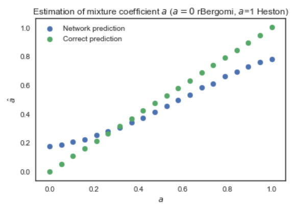

<!-- Start of picture text -->
Estimation of mixture coefficient4 (a4 = 0 rBergomi, a=1 Heston) 1.0 @ Network prediction . @® Correct prediction . bad ° C8 Ld . . s - oe bad a6 e . eo” s 0 . ®.td . a4 ee a2 3° 6 rd eo @etd s s oo es a0 a2 a4 oL6 OB 1.0 a <!-- End of picture text -->

<!-- page: 29 -->

- [5] A.R. Barron. Approximation and estimation bounds for artificial neural networks. _Machine Learning_ . Vol.14:1,1994 Pages 115-133 . 

- [6] C. Bayer, P. Friz, P. Gassiat, J. Martin and B. Stemper. A regularity structure for rough volatility. arXiv:1710.07481, 2017. 

- [7] C. Bayer, P. Friz and J. Gatheral. Pricing under rough volatility. _Quantitative Finance_ , `16` (6): 1-18, 2015. 

- [8] C. Bayer, P. Friz, A. Gulisashvili, B. Horvath and B. Stemper. Short-time near the money skew in rough fractional stochastic volatility models. arXiv:1703.05132, 2017. 

- [9] C. Bayer and B. Stemper. Deep calibration of rough stochastic volatility models. _Preprint_ , arXiv:1810.03399 

- [10] M. Bennedsen, A. Lunde and M.S. Pakkanen. Hybrid scheme for Brownian semistationary processes. _Finance and Stochastics_ , `21` (4): 931-965, 2017. 

- [11] L. Bergomi. Stochastic Volatility Modeling. Chapman & Hall/CRC financial mathematical series. _Chapman & Hall/CRC_ , 2015. 

- [12] A. Brostr¨om and R. Kristiansson. Exotic Derivatives and Deep Learning. _Unpublished Thesis_ , KTH Royal Institute of Technology, School of Engineering Sciences, Stockholm, Sweden, 2018. 

- [13] H. Buehler, L. Gonon, J. Teichmann and B. Wood. Deep Hedging. _Preprint_ , arXiv:1802.03042, 2018. 

- [14] J. Cao, J. Chen and J.C. Hull. A Neural Network Approach to Understanding Implied Volatility Movements. SSRN:3288067, 2018. 

- [15] B. Chen, C. W. osterlee and H. Van Der Weide. Efficient unbiased simulation scheme for the SABR stochastic volatility model, 2011. 

- [16] D. Clevert, T. Unterthiner, S. Hochreiter. Fast and accurate deep network learning by exponential linear units (ELUs). _Preprint_ , arXiv:1511.07289, 2015. 

- [17] J. De Spiegeleer, D. Madan, S. Reyners and W. Schoutens. Machine learning for quantitative finance: Fast derivative pricing, hedging and fitting.SSRN:3191050, 2018. 

- [18] G. Dimitroff, D. R¨oder and C. P. Fries. Volatility model calibration with convolutional neural networks. _Preprint_ , SSRN:3252432, 2018. 

- [19] M. Duembgen and L.C.G. Rogers. Estimate Nothing. _Quantitative Finance_ , `14` (12), pp.20652072, 2014. 

- [20] R. Eldan and O. Shamir. The power of depth for feedforward neural neworks. _JMLR: Workshop and Conference Proceedings_ `Vol 49:1-34` , 2016. 

- [21] C. Dol´eans-Dade. Quelques applications de la formule de changement de variables pour les semimartingales. _Z. Wahrscheinlichkeitstheorie verwandte Gebiete_ , `Vol 16: 181-194` , 1970. 

- [22] O. El Euch and M. Rosenbaum. The characteristic function of rough Heston models. To appear in _Mathematical Finance_ .

<!-- page: 30 -->

- [23] O. El Euch and M. Rosenbaum. Perfect hedging in rough Heston models, to appear in _The Annals of Applied Probability_ , 2018. 

- [24] J. Friedman, R. Tibshiran and T. Hastie. The Elements of Statistical Learning. _Springer New York Inc_ , 2001. 

- [25] R. Ferguson and A. Green. Deeply learning derivatives. Preprint arXiv:1809.02233, 2018. 

- [26] M. Fukasawa. Asymptotic analysis for stochastic volatility: martingale expansion. _Finance and Stochastics_ , `15` : 635-654, 2011. 

- [27] J. Gatheral. A parsimonious arbitrage-free implied volatility parameterization with application to the valuation of volatility derivatives, _Presentation at Global Derivatives_ , 2004. 

- [28] J. Gatheral, T. Jaisson and M. Rosenbaum. Volatility is rough. _Quantitative Finance_ , `18` (6): 933-949, 2018. 

- [29] J. Gatheral, A. Jacquier. Arbitrage-free SVI volatility surfaces. _Quantitative Finance_ , `14` (1): 59-71, 2014 

- [30] A. Gulisashvili, B.Horvath and A. Jacquier. Mass at zero in the uncorrelated SABR model. _Quantitative Finance_ , `18` (10): 1753-1765, 2018. 

- [31] A. Gulisashvili, B.Horvath and A. Jacquier. On the probability of hitting the boundary for Brownian motions on the SABR plane. _Electronic Communications in Probability_ , `21` (75): 1-13, 2016. 

- [32] I. Goodfellow, Y. Bengio and A. Courville. Deep Learning. _MIT Press_ , 2016. 

- [33] P. Hagan, D. Kumar, A. Lesniewski, and D. Woodward. Managing smile risk. _Wilmott Magazine_ , `September issue: 84-108` , 2002. 

- [34] P. Hagan, A. Lesniewski, and D. Woodward. Probability distribution in the SABR model of stochastic volatility. Large Deviations and Asymptotic Methods in Finance, _Springer Proceedings in Mathematics and Statistics_ , `110` , 2015. 

- [35] S. Hendriks, C. Martini The Extended SSVI Volatility Surface. _Preprint_ , SSRN:2971502, 2017. 

- [36] A. Hernandez. Model calibration with neural networks. _Risk_ , 2017. 

- [37] K.Hornik. Approximation capabilities of multilayer feedforward networks. _NeuralNetworks_ , `4` (2):251-257, 1991. 

- [38] K. Hornik, M. Stinchcombe, and H. White. Multilayer feedforward networks are universal approximators. _Neural Networks_ , `2` (5):359-366, 1989. 

- [39] K. Hornik. M. Stinchcombe and H. White. Universal approximation of an unknown mapping and its derivatives using multilayer feedforward networks. _Neural Networks_ . Vol. 3:11, 1990. 

- [40] B. Horvath, A. Jacquier and C. Lacombe. Asymptotic behaviour of randomised fractional volatility models. arXiv:1708.01121, 2017.

<!-- page: 31 -->

- [41] B. Horvath, A. Jacquier and A. Muguruza. Functional central limit theorems for rough volatility. arXiv:1711.03078, 2017. 

- [42] B. Horvath, O. Reichmann. Dirichlet Forms and Finite Element Methods for the SABR Model. _SIAM Journal on Financial Mathematics_ , `p. 716-754` (2), May 2018. 

   - Hutchinson, James M., Andrew W. Lo, and Tomaso Poggio. ”A nonparametric approach to pricing and hedging derivative securities via learning networks.” The Journal of Finance 49.3 (1994): 851-889. 

- [43] J.M. Hutchinson, A.W. Lo, T. Poggio. A nonparametric approach to pricing and hedging derivative securities via learning networks. _The Journal of Finance_ , `49 p. 851-889` (3), 1994. 

- [44] A. Jacquier, C. Martini and A. Muguruza. On VIX futures in the rough Bergomi model. _Quantitative Finance_ , `18` (1): 45-61, 2018. 

- [45] A. Jacquier, M. Pakkanen and H. Stone. Pathwise large deviations for the rough Bergomi model. _Journal of Applied Probability_ , 55(4): pp.1078-1092, 2018. 

- [46] A. Jentzen, B. Kuckuck, A. Neufeld, P. von Wurstemberger. Strong error analysis for stochastic gradient descent optimization algorithms, Preprint arXiv:1801.09324 ,2018. 

- [47] S. Ioffe and C. Szegedy. Batch normalisation: Accelerating deep network training by reducing internal covariate shift. _Preprint_ , arXiv:1502.03167, 2015. 

- [48] D.P. Kingman and J. Ba, Adam: A Method for Stochastic Optimization. _Conference paper_ , 3rd International Conference for Learning Representations, 2015. 

- [49] A. Kondratyev. Learning curve dynamics with artificial neural networks. _Preprint_ , SSRN:3041232, 2018. 

- [50] D. Kraft. A Software Package for Sequential Quadratic Programming. _DFVLR-FB_ pp.88-28, 1988. 

- [51] G. Kutyniok, H. B¨olcskei, P. Grohs and P. Petersen, Optimal approximation with sparsely connected deep neural networks, _Preprint_ arXiv:1705.01714, 2017. 

- [52] A. Leitao Rodriguez, L.A. Grzelak and C.W. Oosterlee. On an efficient multiple time step Monte Carlo simulation of the SABR model. _Quantitative Finance_ , `17` (10), pp.1549-1565, 2017. 

- [53] K. Levenberg. A Method for the Solution of Certain Non-Linear Problems in Least Squares. _Quarterly of Applied Mathematics_ . 2: pp. 164-168, 1944. 

- [54] D. Marquardt. An Algorithm for Least-Squares Estimation of Nonlinear Parameters. _SIAM Journal on Applied Mathematics_ . 11 (2): pp. 431-441,1963.‘ 

- [55] W. A. McGhee. An artificial neural network representation of the SABR stochastic volatility model. _Preprint_ , SSRN:3288882, 2018. 

- [56] H.N. Mhaskar. Approximation properties of a multilayered feedforward artificial neural network. _Advances in Computational Mathematics_ , `1` (1): 61-80, 1993.

<!-- page: 32 -->

- [57] J. A. Nelder and R. Mead. A simplex method for function minimization. _Computer Journal_ . 7: pp. 308-313, 1965. 

- [58] J. Nocedal and S. Wright. Numerical Optimization. Springer Series in Operations Research and Financial Engineering. _Springer-Verlag New York_ , 2006. 

- [59] D. Pedamonti. Comparison of non-linear activation functions for deep neural networks on MNIST classification task. _Preprint_ , arXiv:1804.02763 

- [60] M. J. D. Powell. A direct search optimization method that models the objective and constraint functions by linear interpolation. Advances in Optimization and Numerical Analysis, eds. S. Gomez and J-P. Hennart, _Kluwer Academic (Dordrecht)_ , pp. 51-67, 1994. 

- [61] L. M. Rios and N. V. Sahinidis. Derivative-free optimization: a review of algorithms and comparison of software implementations. _Journal of Global Optimization_ . Vol. 56: 3 pp. 12471293, 2013. 

- [62] M. Sabate Vidales, D. Siska and L. Szpruch. Martingale Functional Control variates via Deep Learning _Preprint_ 1810.05094, 2018. 

- [63] N. Ruiz, S. Schulter and M. Chandraker, Learning to simulate, _Preprint_ arXiv:1810.02513, 2018. 

- [64] L. Setayeshgar and H. Wang. Large deviations for a feed-forward network, _Advances in Applied Probability_ , 43: 2, pp. 545571, 2011. 

- [65] U. Shaham, A. Cloninger, and R. R. Coifman. Provable approximation properties for deep neural networks. _Appl. Comput. Harmon. Anal._ , `44` (3): 537-557, 2018. 

- [66] J. Sirignano and K. Spiliopoulos. Stochastic Gradient Descent in Continuous Time: A Central Limit Theorem. _SIAM J. Finan. Math._ , 8(1), pp. 933-961, 2017. 

- [67] H. Stone. Calibrating rough volatility models: a convolutional neural network approach. _Preprint_ , arXiv:1812.05315, 2018. 

- [68] R. Storn and K. Price. A Simple and Efficient Heuristic for global Optimization over Continuous Spaces. _Journal of Global Optimization_ . Vol.11:4, pp341-359, 1997. 

- [69] V. N. Vapnik. Statistical Learning Theory. _Wiley-Interscience_ , 1998. 

- [70] C. Zhu, R. H. Byrd and J. Nocedal. L-BFGS-B: Algorithm 778: L-BFGS-B, FORTRAN routines for large scale bound constrained optimization. _ACM Transactions on Mathematical Software_ , 23: 4, pp. 550-560, 1997.
