<!-- page: 1 -->

Looking Forward to Backward-Looking Rates: A Modeling Framework for Term Rates Replacing LIBOR 

Andrei Lyashenko1 and Fabio Mercurio2 

> 1Quantitative Risk Management, Inc. 

> 2Bloomberg, L.P. _∗_ 

### **Abstract** 

In this paper, we define and model forward risk-free term rates, which appear in the payoff definition of derivatives, and possibly cash instruments, based on the new interest-rate benchmarks that will be replacing IBORs globally. We show that the classic interest rate modeling framework can be naturally extended to describe the evolution of both the forward-looking (IBOR-like) and backward-looking (setting-inarrears) term rates using the same stochastic process. In particular, we show that the extension of the popular LIBOR Market Model (LMM) to the backward-looking rates completes the model by providing additional information about the rate dynamics not accessible in the LMM. 

In this paper, we show that the classic interest rate modeling framework can be naturally extended to describe the evolution of the backward-looking (setting-in-arrears) term rates selected to replace IBORs in derivative contracts. We demonstrate that the backwardlooking rates have all the analytic properties needed for pricing vanilla derivatives such as swaps, caps/floors and swaptions. Moreover, modeling these rates turns out to be highly beneficial as it provides additional information, such as the rate dynamics in the money-market risk-neutral measure, which is not available when dealing with forwardlooking rates only. Finally, the extension of the popular LIBOR Market Model (LMM) to backward-looking rates results in a more complete modeling framework that can be used to simultaneously model the evolution of forward-looking (IBOR-like) and backward-looking term rates using the same stochastic processes for both. 

> _∗_ The views and opinions expressed in this article are our own and do not represent the opinions of any firm or institution. Bloomberg LP and Bloomberg Professional service are trademarks and service marks of Bloomberg Finance L.P., a Delaware limited partnership, or its subsidiaries. All rights reserved.

<!-- page: 2 -->

# **1 Introduction** 

IBOR rates, which include LIBOR, EURIBOR, TIBOR, CDOR, and other similar rates, represent the cost of funds among large global banks for short-term unsecured borrowing on the interbank market. They are key reference rates in many financial products with the total market exposure worldwide of over $370 trillion. IBOR quotes are rate indications based on surveys rather than actual transactions, because the unsecured short-term lending market between banks has not been sufficiently active lately. During the 2007-09 credit crisis, widespread attempts to manipulate LIBOR by banks were reported and later investigated by both the UK and US governments. 

In 2013-2014, the Financial Stability Board (FSB) conducted fundamental reviews of major interest rate benchmarks and recommended developing alternative nearly risk-free rates (RFRs) that are better suited as the reference rates for certain financial transactions. By now, RFRs have been selected in all major economies: The US selected a new Treasuries repo financing rate called SOFR (Secured Overnight Funding Rate); the UK selected the reformed SONIA (Sterling Overnight Index Average); Switzerland selected SARON (Swiss Average Rate Overnight); Japan selected TONA (Tokyo Overnight Average Rate); and the Euro zone selected a new unsecured overnight rate called ESTER (Euro Short-Term Rate). 

Since all the selected RFRs are overnight rates, in order for them to be used as a replacement for IBORs in both new and existing contracts (as fallback rates), they first need to be converted into term rates.1 There are two main approaches being considered by both ISDA and national regulators: 

- Compounded setting-in-arrears rate, which is backward looking in nature and is known at the end of the corresponding application period;2 

- A market implied prediction of this compounded setting-in-arrears rate, which is forward looking in nature and is known at the beginning of the application period. 

The first choice drove (and is driving) the definition of the new RFR futures and vanilla swaps, whereas the second seems to be favored when it comes to defining fallbacks for cash products. 

Instantaneous rate modeling seems to be the natural choice when it comes to the valuation and risk management of the new RFR-based derivatives, and possibly cash instruments, because a compounded setting-in-arrears term rate can be generated by simulating daily the underlying RFR in the corresponding application period. However, this is not a compulsory choice. In this paper, in fact, we show that by modeling the dynamics of term 

> 1Mechanisms for converting legacy contracts into new ones referencing the RFRs are discussed in Duffie (2018) and Zhu (2018). 

> 2In the US, where the RFR is SOFR, this compounded setting-in-arrears rate is also called SAFR. The term SAFR was used for the first time by Mr. Quarles, Vice Chairman for Supervision at the Federal Reserve, who said in a speech on July 19, 2018: “I think it is appropriate for the Federal Reserve to consider publishing a compound average of SOFR that market participants could then use. It has been suggested that we could call it SAFR, for secured average financing rate.”.

<!-- page: 3 -->

rates directly, we can simulate both forward-looking and backward-looking term rates using a single stochastic process for both. The joint modeling of these stochastic processes, for all the given application periods, leads to an extension of the classic single-curve LIBOR Market Model (LMM), which we call the generalized Forward Market Model (FMM). 

The FMM is a more complete model than the LMM as it preserves the dynamics of the forward-looking (LIBOR-like) rates, while providing additional information about the rate dynamics between the term-rate fixing/payment times. It also has some nice properties the traditional LMM does not have, such as model-implied dynamics of forward rates under the classic money-market (“continuous spot”) measure, and not only under the discrete spot measure as in the LMM case. 

Our FMM formulation is based on the concept we introduce of extended zero-coupon bonds, which is simple and natural, and proves to be very convenient when dealing with backward-looking setting-in-arrears rates. This concept is not new as it was used, for instance, by Glasserman and Zhao (2000) or Andersen and Piterbarg (2010) to define hybrid numeraires and measures. However, we are not aware of it being used to extend the definition of term rates from forward-looking to backward-looking, or to provide a generalization of a single-curve LMM. Thanks to our extended definition of zero-coupon bonds, not only the bonds themselves, but also the forwards and swap rates, along with the associated forward measures, can be extended and defined at all times, even those beyond their natural expiries. 

# **2 Main assumptions, definitions and notation** 

We consider a continuous-time financial market with an instantaneous risk-free rate, whose time- _t_ value is denoted by _r_ ( _t_ ). We assume that rate _r_ ( _t_ ) is the collateral rate for collateralized OTC transactions, as well as the Price Alignment Interest (PAI) for cleared derivatives.3 This is consistent with the overall direction of the IBOR reform and transition to the new rate benchmarks. In the US, for instance, the Alternative Reference Rates Committee (ARRC) developed a six-step plan for transitioning from LIBOR to SOFR (see the ARRC’s second report published in March 2018) where the PAI, as well as the rate used for discounting, should be moved from Fed-fund to SOFR by the second quarter of 2021. If the same RFR is used for discounting and for deriving term rates, this implies a return to the classic single-curve modeling environment. 

Rate _r_ ( _t_ ) has an associated money-market (or bank) account _B_ ( _t_ ) such that _B_ (0) = 1 and 

so 

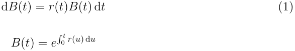

> 3A more general case where risk-free and collateral (or PAI) rates are different has been considered by Mercurio (2018). The results in this paper can easily be generalized to the case with different rates, but at the expense of more complex notation and formulas.

<!-- page: 4 -->

We assume the existence of a risk-neutral measure _Q_ , whose associated numeraire is _B_ ( _t_ ), and denote by E the expectation with respect to _Q_ , and by _Ft_ the “information” available in the market at time _t_ , that is the sigma-algebra generated by the model risk factors up to time _t_ . We then denote by _P_ ( _t, T_ ) the price at time _t_ of the risk-free zerocoupon bond with maturity _T_ , that is: 

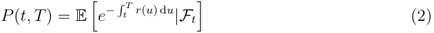

which is defined for _t ≤ T_ , being it the value of a contract that expires at time _T_ . However, the definition of _P_ ( _t, T_ ) can be extended to times _t > T_ as follows. Using (2) and the definition of _B_ ( _t_ ), when _t > T_ we can write: 

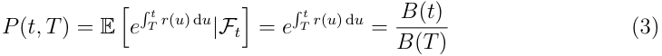

_t_ since � _T__r_(_u_) d_u_is_Ft_-measurable.In particular, we have that_P_(_t,_0) =_B_(_t_), meaning that the money-market account can be viewed as a zero-coupon bond expiring immediately (that is, with 0 maturity). 

Let us then consider the self-financing strategy _YT_ that consists of buying the zerocoupon bond with maturity _T_ , and reinvesting the proceeds of the bond’s unit notional received at _T_ at the risk-free rate _r_ ( _t_ ) from time _T_ onwards. Denoting by _Y_ ( _t_ ) the time- _t_ value of this strategy, we have: 

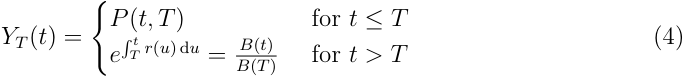

We notice that, for _t > T_ , _YT_ ( _t_ ) is exactly the extended bond price defined by (3). Because of this, we can conclude that, for each given _T_ , _YT_ ( _t_ ) = _P_ ( _t, T_ ) for all times _t_ . Therefore, hereafter, we will refer to strategy _YT_ as to the extended zero-coupon bond with maturity _T_ , and bond prices _P_ ( _t, T_ ) will be meant in the extended sense. 

## **2.1 Extended** _T_ **-forward measure** 

The extended zero-coupon bond price _P_ ( _t, T_ ) continues to be a viable numeraire since it is the value of a self-financing strategy (the corresponding _YT_ ) and is strictly positive. Therefore, we can define the (extended) _T_ -forward measure _Q__T_ the usual way as the equivalent martingale measure associated with the extended bond price _P_ ( _t, T_ ). As opposed to the classic definition of forward measure, _Q__T_ -dynamics can now be defined for any time _t_ , so also for times beyond maturity _T_ . Since, for _t > T_ , 

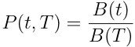

the extended _T_ -forward measure _Q__T_ is a hybrid measure that combines the classic _T_ - forward measure up to the maturity time _T_ with the risk-neutral money-market measure

<!-- page: 5 -->

_Q_ after _T_ . Such hybrid _T_ -forward measures have been discussed in the literature. See, for instance, Glasserman and Zhao (2000) or Section 4.2.4 in Andersen and Piterbarg (2010). 

We note that _P_ ( _t,_ 0) = _B_ ( _t_ ), so the risk-neutral money-market measure is a particular case of the extended _T_ -forward measure, where _T_ is equal to zero: _Q_ = _Q_0 . 

## **2.2 The market risk-free term rate** 

Current derivatives contracts, such as futures, swaps, and basis swaps, written on RFRs such as SOFR or reformed SONIA, all reference the daily compounded setting-in-arrears rate based on the corresponding overnight benchmark. Recently, this rate was also chosen as the best risk-free term rate in the new LIBOR fallback definition by ISDA. Therefore, modeling such term rate became of tantamount importance for several reasons. 

In what follows, we assume a time structure 0 = _T_ 0 _, T_ 1 _, . . . , TM_ , and denote by _τj_ the year fraction for the interval [ _Tj−_ 1 _, Tj_ ). For each time _t_ , we define _η_ ( _t_ ) = min _{j_ : _Tj ≥ t}_ , which is the index of the element of the time structure that is the closest to time _t_ being equal to or greater than _t_ . For brevity, we then use the short-hand notation _Pj_ ( _t_ ) to denote the bond price _P_ ( _t, Tj_ ). 

For each _j_ = 1 _, . . . , M_ , we approximate the daily-compounded setting-in-arrears rate for the interval [ _Tj−_ 1 _, Tj_ ), which we denote by _R_ ( _Tj−_ 1 _, Tj_ ), as follows:4 

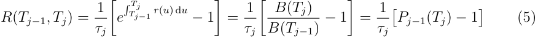

In-arrears rates are backward-looking in nature because one has to wait until the end of their accrual period to know their fixing value. Alternatively, one can define forwardlooking rates, which are set at the beginning of their application period. For instance, a forward-looking rate at time _Tj−_ 1 with maturity _Tj_ can be defined similarly to an OIS swap rate. This rate, denoted by _F_ ( _Tj−_ 1 _, Tj_ ), is the fixed rate to be exchanged at time _Tj_ for the forward bank account _B_ ( _Tj_ ) _/B_ ( _Tj−_ 1) (minus one and divided by the year fraction) such that this swap has zero value at time _Tj−_ 1. By no-arbitrage, we have: 

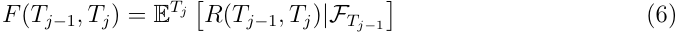

for each _j_ = 1 _, . . . , M_ . 

4 The actual daily-compounded setting-in-arrears rate for the interval [ _Tj−_ 1 _, Tj_ ) is given by 

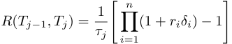

where the product is over the business days in [ _Tj−_ 1 _, Tj_ ), and where _ri_ is the RFR fixing on date _i_ with associated day-count fraction _δi_ . Taking the limit for the mesh of _{δ_ 1 _, . . . , δn}_ going to zero, we get the approximation (5). Replacing a discrete-time calculation (a product) with a continuous-time one (an integral) presents the advantage of more compact expressions and simpler calculations.

<!-- page: 6 -->

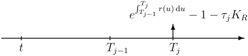

Figure 1: A swaplet based on the compounded setting-in-arrears term rate. 

## **2.3 Backward-looking in-arrears forward rates** 

We define the backward-looking forward rate _Rj_ ( _t_ ) at time _t_ as the value of the fixed rate _KR_ in the swaplet paying _τj_ [ _R_ ( _Tj−_ 1 _, Tj_ ) _− KR_ ] at time _Tj_ , see Fig. 1, such that the swaplet has zero value at time _t_ . 

By no-arbitrage, we have: 

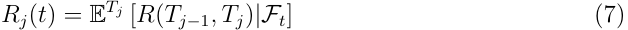

From (6) and (7), we see that, for each _j_ = 1 _, . . . , M_ , the forward-looking spot rate _F_ ( _Tj−_ 1 _, Tj_ ) is equal to the backward-looking forward rate _Rj_ ( _t_ ) at time _t_ = _Tj−_ 1: 

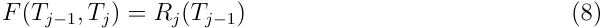

A formula for the forward rate _Rj_ ( _t_ ) can be derived by changing the measure to _Q_ .5 We get: 

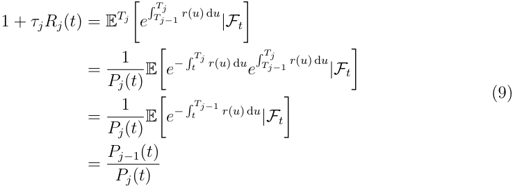

so we can write: 

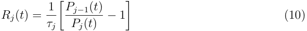

Notice that this is the classic, simply-compounded, forward-rate formula, which thanks to our definition of extended bond price, holds for each time _t_ , even those after _Tj_ . Note that the forward rate _Rj_ ( _t_ ): 

- Is a martingale under the _Tj_ -forward measure; 

- Is equal to the forward-looking spot rate at time _Tj−_ 1: _Rj_ ( _Tj−_ 1) = _F_ ( _Tj−_ 1 _, Tj_ ); 

- Is equal to the realized backward-looking rate at time _Tj_ : _Rj_ ( _Tj_ ) = _R_ ( _Tj−_ 1 _, Tj_ ); 

- Stops evolving (that is, it is fixed) after time _Tj_ : _Rj_ ( _t_ ) = _R_ ( _Tj−_ 1 _, Tj_ ), _t > Tj_ . 

> 5An equivalent derivation is in Mercurio (2018).

<!-- page: 7 -->

When time _t_ is within the accrual period, that is _Tj−_ 1 _< t < Tj_ , forward rate _Rj_ ( _t_ ) “aggregates” values of realized RFRs _r_ ( _s_ ), _s ∈_ ( _Tj−_ 1 _, t_ ), and instantaneous forward rates _f_ ( _t, s_ ), _s ∈_ ( _t, Tj_ ): 

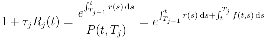

Using the convention _f_ ( _t, s_ ) = _r_ ( _s_ ) for _t > s_ (see Appendix A for more discussion), we can rewrite this equation in the following form that holds for all values of _t_ : 

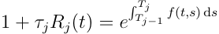

A history of realized rates _Rj_ ( _Tj_ ) compared with their predicted values _Fj_ ( _Tj−_ 1) = _Rj_ ( _Tj−_ 1) is shown in Fig 2. The chosen market is USD and the chosen tenor is 1M. 

## **2.4 Forward-looking forward rates** 

We define the forward rate _Fj_ ( _t_ ) at time _t_ as the value of the fixed rate _KF_ in the swaplet that pays _τj_ [ _F_ ( _Tj−_ 1 _, Tj_ ) _− KF_ ] at time _Tj_ , see Fig. 3, such that the swaplet has zero value at time _t_ . 

By no-arbitrage, we have, for _t ≤ Tj−_ 1: 

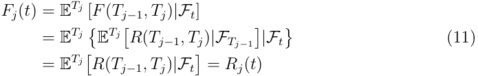

For _t > Tj−_ 1, the value is fixed and constant: _Fj_ ( _t_ ) = _F_ ( _Tj−_ 1 _, Tj_ ). 

## **2.5 Consolidating the two forward rates** 

For each _j_ = 1 _, . . . , M_ , the backward-looking forward rate _Rj_ ( _t_ ) and the forward-looking forward rate _Fj_ ( _t_ ) can be expressed by a single rate, which with some abuse of notation, we will denote by _Rj_ ( _t_ ). In fact, when _t ≤ Tj−_ 1, the two rates are equal and described by a single common value, _Rj_ ( _t_ ). At time _t_ = _Tj−_ 1, the forward-looking rate fixes, _Rj_ ( _Tj−_ 1) = _Fj_ ( _Tj−_ 1) = _F_ ( _Tj−_ 1 _, Tj_ ), and stops evolving. Instead, the backward-looking forward rate _Rj_ ( _t_ ) continues its journey until it fixes at time _Tj_ . Finally, as already pointed out, _Rj_ ( _t_ ) = _Rj_ ( _Tj_ ), _t ≥ Tj_ . 

In the following, we will model the joint evolution of rates _Rj_ ( _t_ ) for _j_ = 1 _, . . . , M_ , and introduce a natural extension of the classic single-curve LMM to the case where rates are set in arrears. The advantage of this approach is that we can obtain both forward-looking and backward-looking fixings using a single process.

<!-- page: 8 -->

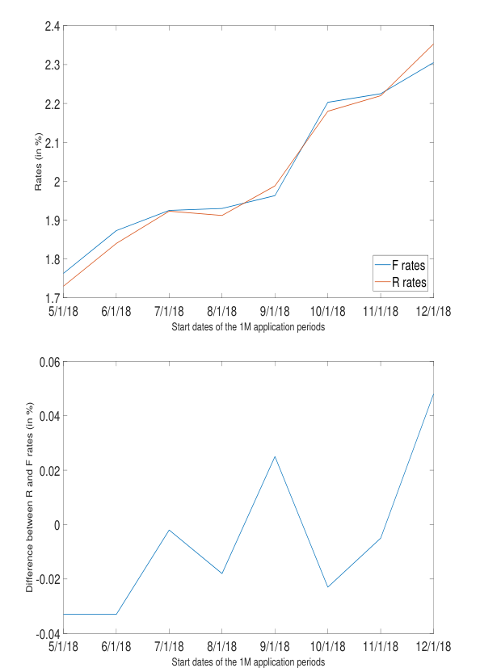

<!-- Start of picture text -->
2.4 2.3 2.2 2.1 2 1.9 1.8 F rates R rates 1.7 5/1/18 6/1/18 7/1/18 8/1/18 9/1/18 10/1/18 11/1/18 12/1/18 Start dates of the 1M application periods 0.06 0.04 0.02 0 -0.02 -0.04 5/1/18 6/1/18 7/1/18 8/1/18 9/1/18 10/1/18 11/1/18 12/1/18 Start dates of the 1M application periods Rates (in %) Difference between R and F rates (in %) <!-- End of picture text -->

Figure 2: Realized rates _Rj_ ( _Tj_ ) and their predicted values _Rj_ ( _Tj−_ 1). Fixing are monthly starting from 5/1/2018. The two time series (top); their difference (bottom). 

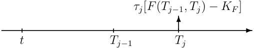

Figure 3: A swaplet based on the forward-looking rate.

<!-- page: 9 -->

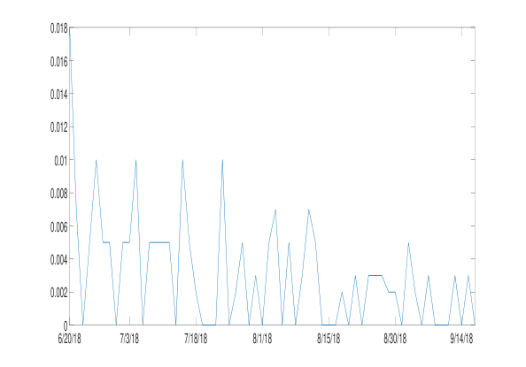

<!-- Start of picture text -->
0.018 0.016 0.014 0.012 0.01 0.008 0.006 0.004 0.002 0 6/20/18 7/3/18 7/18/18 8/1/18 8/15/18 8/30/18 9/14/18 <!-- End of picture text -->

Figure 4: Daily absolute changes of rate _Rj_ ( _t_ ), where _Tj−_ 1 = 6 _/_ 20 _/_ 18 and _Tj_ = 9 _/_ 18 _/_ 2018, for _t ∈_ [ _Tj−_ 1 _, Tj_ ). 

# **3 The forward rate dynamics** 

Because of its own definition (7), forward rate _Rj_ ( _t_ ) is a martingale under the corresponding _Tj_ -forward measure, _j_ = 1 _, . . . , M_ . The _Q__Tj_ -dynamics of _Rj_ ( _t_ ) can be defined for any time _t_ , including _t ≥ Tj_ . To this end, we assume the following _Q__Tj_ -dynamics: 

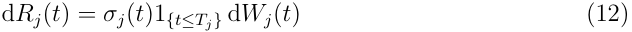

where, for each _j_ = 1 _, . . . , M_ , _σj_ ( _t_ ) is an adapted process and _Wj_ ( _t_ ) is a standard Brownian motion such that d _Wi_ ( _t_ ) d _Wj_ ( _t_ ) = _ρi,j_ d _t_ . The indication function 1 _{t≤Tj }_ is introduced to ensure that the process is defined, and is constant, for times larger than (or equal to) _Tj_ . 

A key issue in the definition of the forward rate dynamics is the modeling of the behavior of its volatility in the accrual period [ _Tj−_ 1 _, Tj_ ]. Inspired by SDE (29) in Appendix A, we then choose a (piece-wise) differentiable (deterministic) function _gj_ such that: _gj_ ( _t_ ) = 1 for _t ≤ Tj−_ 1, _gj_ ( _t_ ) is monotonically decreasing in [ _Tj−_ 1 _, Tj_ ] and _gj_ ( _t_ ) = 0 for _t ≥ Tj_ . For instance, assuming a linear decay, the function _gj_ is given by: 

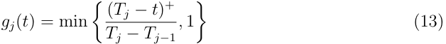

An empirical confirmation of the volatility decay of rates _Rj_ ( _t_ ) is provided in Fig. 4, where we plot the daily absolute changes of the backward-looking forward rate whose application period started on June 20, 2018 and ended on September 18, 2018. 

With some abuse of notation, the dynamics of _Rj_ ( _t_ ) then becomes: 

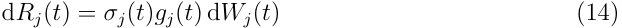

<!-- page: 10 -->

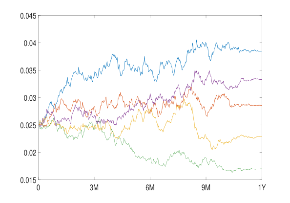

<!-- Start of picture text -->
0.045 0.04 0.035 0.03 0.025 0.02 0.015 0 3M 6M 9M 1Y <!-- End of picture text -->

Figure 5: Simulated paths of _Rj_ ( _t_ ), where _Tj−_ 1 =9M and _Tj_ =1Y, for _t ∈_ [0 _, Tj_ ), under lognormal dynamics with volatility equal to 30% and _Rj_ (0) = 2 _._ 5%. 

We stress again that, contrary to the classic LMM case, this dynamics is defined for any time _t_ . Rate _Rj_ does not stop at time _Tj−_ 1, but continues to evolve stochastically until _Tj_ , and remains constant thereafter. A plot of simulated paths of _Rj_ ( _t_ ) under lognormal dynamics is shown is Fig. 5, where the effect of decaying volatility in the rate accrual period (last quarter) is clearly visible. 

# **4 The generalized FMM** 

Equation (14) defines the dynamics of each forward rate _Rj_ ( _t_ ) under the corresponding _Tj_ - forward measure. A market model where all forward rates, for _j_ = 1 _, . . . , M_ , are modeled jointly can be defined by deriving the dynamics of each forward under a common probability measure (equivalently, numeraire). To this end, we apply the change-of-numeraire formula relating the drifts of a given process under two measures with known numeraires, see for instance Brigo and Mercurio (2006). In our case, we know the dynamics of _Rj_ ( _t_ ) under the _Tj_ -forward measure, and we want to derive its dynamics under a measure _Q__N_ , which is associated with numeraire _N_ ( _t_ ). Assuming continuous dynamics, the drift of _Rj_ under _Q__N_ , as a function of time _t_ , is given by: 

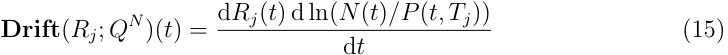

We will consider three cases: 

1. _N_ ( _t_ ) = _B_ ( _t_ ), so _Q__N_ is the risk-neutral measure _Q_ ; 

2. _N_ ( _t_ ) = _Bd_ ( _t_ ), where _Bd_ ( _t_ ) is the time- _t_ value of the discrete bank account, _Bd_ ( _t_ ) = _P_ ( _t, Tη_ ( _t_ )) _/_ [�_η_ _i_ =1(_t_)_P_(_Ti−_1_, Ti_)],so_QN_istheclassicspot-LIBORmeasure_Qd_;

<!-- page: 11 -->

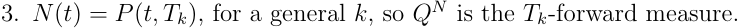

## **4.1 Forward rate dynamics under** _Q_ 

We first apply (15) to the case where _N_ ( _t_ ) = _B_ ( _t_ ) and _Q__N_ = _Q_ . The drift of _Rj_ under _Q_ is thus given by: 

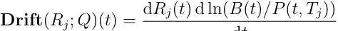

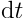

In a classic LMM, the risk-neutral dynamics of forward rates can be derived provided we also model the volatility of the prompt zero-coupon bonds _P_ ( _t, Tη_ ( _t_ )), see for instance Brigo and Mercurio (2006). Here, this extra assumption on the volatility of _P_ ( _t, Tη_ ( _t_ )) is no longer needed because it is implicit in the definition of the volatility of _Rj_ ( _t_ ) in its corresponding accrual period, see Appendix A. 

Thanks to the definition of extended bond prices, we can write: 

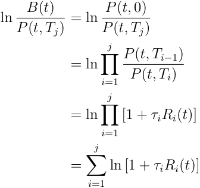

Therefore, 

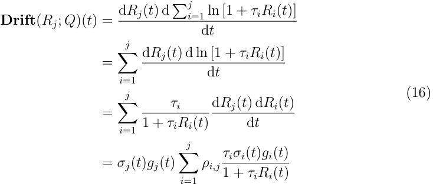

The _Q_ -dynamics of _Rj_ then becomes: 

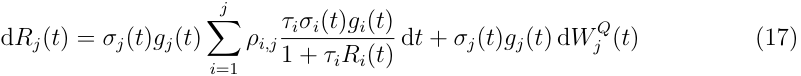

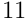

<!-- page: 12 -->

where _Wj__Q_isa_Q_-Brownianmotion. Because of the definition of _gi_ ( _t_ ), which is zero for _t > Ti_ , that is for _η_ ( _t_ ) _> i_ , the drift term in (17) can also be expressed in terms of the index function _η_ ( _t_ ). We have: 

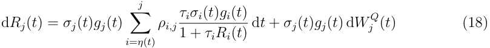

## **4.2 Forward rate dynamics under** _Q__d_ 

We now apply (15) to the case where _N_ ( _t_ ) = _Bd_ ( _t_ ) and _Q__N_ = _Q__d_ . The drift of _Rj_ under _Q__d_ is thus given by: 

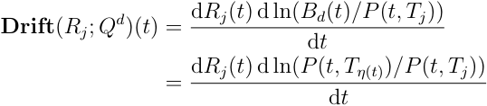

A derivation similar to that of the previous section then leads to: 

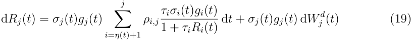

where _Wj__d_isastandardBrownianmotionunder_Qd_,andwherethedriftiszerowhen _j ≤ η_ ( _t_ ). 

Comparing (18) with (19), we see that the difference between rate dynamics under _Q_ and _Q__d_ is given by the following drift adjustment: 

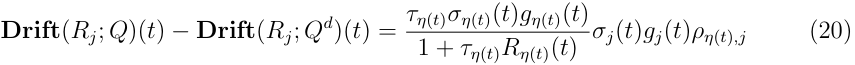

In the classic LMM, when approximating _Q_ with _Q__d_ , one can not quantify the magnitude of the approximation. This issue can be addressed by our generalized FMM. The impact of moving from _Q_ to _Q__d_ is represented by (20), and can be measured accordingly. 

Note also that since _gi_ ( _Ti_ ) = 0, the _Q_ -drift term in equation (18) does not experience a jump when time _t_ moves right past _Ti_ and index _η_ ( _t_ ) jumps from _i_ to _i_ + 1. On the other hand, the _Q__d_ -drift in equation (19) does jump, since it loses the ( _i_ + 1)-term. 

## **4.3 Forward rate dynamics under** _Q__Tk_ 

We finally apply (15) to the case where _N_ ( _t_ ) = _P_ ( _t, Tk_ ) and _Q__N_ = _Q__Tk_ . The drift of _Rj_ under _Q__Tk_ is thus given by: 

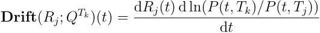

<!-- page: 13 -->

Repeating the same procedure as before, we then get: 

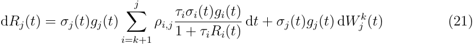

when _j > k_ and 

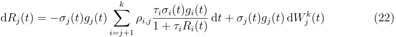

when _j < k_ , and where _Wj__k_isastandardBrownianmotionunder_QTk_. 

**Remark 1** _Since Q__Tk_ _is a hybrid measure that consists of the classic Tk-forward measure up to time Tk and of the risk-neutral measure Q after Tk, we should have:_ 

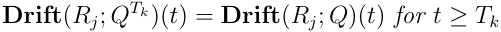

_In fact, using the drift formulas from the previous sections, we get for t ≥ Tk and j > k (the case j ≤ Tk is trivial since Rj_ ( _t_ ) _is fixed):_ 

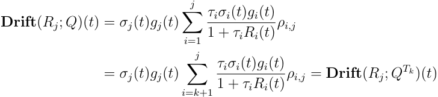

_where we used the property that gi_ ( _t_ ) = 0 _for t ≥ Ti. In particular, when k_ = 0 _, we confirm that:_ 

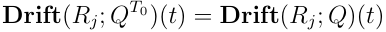

_for all t._ 

# **5 between FMM and LMM** 

As we have seen, the FMM is an extension of the classic single-curve LMM in that it models the joint dynamics not only of adjacent (simply-compounded) forward-looking forward rates _Fj_ ( _t_ ), as in the LMM, but also of backward-looking (setting-in-arrears) forward rates _Rj_ ( _t_ ), since _Fj_ ( _t_ ) = _Rj_ ( _t_ ) for all times _t_ before the expiry time _Tj−_ 1 of _Fj_ ( _t_ ). Besides this, the FMM has additional properties, which we summarize as follows.

<!-- page: 14 -->

## **5.1 Model completeness** 

The main property that distinguishes the generalized forward rates _Rj_ ( _t_ ) from IBORs is their completeness in terms of spanning the periods defined by the time grid _T_ 0 _, . . . , TM_ . Indeed, for any index _j_ = 1 _, . . . , M_ and for any time _t_ , we can express the price of zerocoupon bond with maturity _Tj_ in terms of the bank account _B_ ( _t_ ) and forward rates _Ri_ ( _t_ ) as follows 

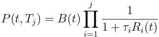

with the equality holding for all _t_ , including _t > Tj_ . This implies that 

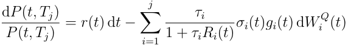

so the volatility of all bonds _P_ ( _t, Tj_ ) is known and is a function of rates _Ri_ ( _t_ ) as well as their instantaneous covariance structure. 

Analogous representations are not available in the LMM, that is when using forwardlooking forward rates _Fj_ ( _t_ ). This is exactly the reason why we have a closed-form drift term representation under the _Q_ -measure for FMM, but not for LMM. In this respect, FMM is a complete model while LMM is not. 

**Remark 2** _Although the evolution of the bank account B_ ( _t_ ) _is not directly accessible within the FMM, we can still imply it by extending the FMM with a series of one-factor Cheyette (1992) models, each one covering a single accrual period as described in Appendix B. In fact, the Cheyette models provide a finer resolution needed to access the short rate process and are made consistent with the FMM by perfectly replicating the dynamics of each forward rate within its own accrual interval. Thus, we have a global model, FMM, describing dynamics of rates over the entire time horizon, which can be extended locally with a series of one-factor Cheyette models that are consistent with the FMM within each accrual period._ 

The availability of _Q_ -dynamics of term forward rates presents a number of advantages when it comes to the valuation of general derivatives, which we describe hereafter. 

## **5.2 Better pricing of futures contracts** 

As shown by Hunt and Kennedy (2000), the time- _t_ futures price of a contract that pays out _HT_ at time _T > t_ is given by: 

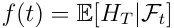

In a classic LMM, since no _Q_ -dynamics are directly available, one typically approximates _Q_ with _Q__d_ to explicitly calculate the futures price _f_ ( _t_ ): 

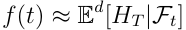

<!-- page: 15 -->

where E_d_ denotes expectation under _Q__d_ . This approximation is no longer needed for the FMM, since we know the forward-rate dynamics under _Q_ , so the former formula can be used. 

## **5.3 Easier extension to a cross-currency interest-rate model** 

Assume we have a two-currency economy where domestic and foreign rates are driven by corresponding FMMs, and denote by _X_ ( _t_ ) the spot exchange rate at time _t_ , meaning that one unit of foreign currency can be purchased with _X_ ( _t_ ) units of domestic currency. By modeling the dynamics of _X_ ( _t_ ), we can easily derive the dynamics of the foreign FMM under the domestic measure _Q_ , as well as the dynamics of the domestic FMM under the foreign money-market risk-neutral measure _Q__f_ . 

In fact, assuming continuous dynamics, the drift of foreign rate _Rj__f_underthedomestic measure _Q_ is given by: 

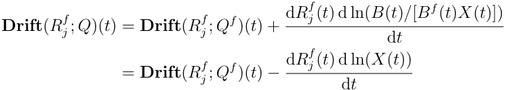

where _B__f_ ( _t_ ) is the price at time _t_ of the foreign (continuous) bank account. An analogous formula applies for the drift of _Rj_ ( _t_ ) under _Q__f_ . Again, similar formulas are not available in the classic LMM. 

## **5.4 More natural hybrid modeling** 

In the case, for instance, of a hybrid equity-IR model, the equity risk-neutral drift rate (assuming no dividends) is equal to _r_ ( _t_ ), which is not known in the classic LMM, and nor are its integrals. When using an FMM, instead, we can express the integral of the drift rate (at points _Tj_ ) in terms of rates _Rj_ ( _t_ ), which are by definition known in the model. To illustrate this, assume that the _Q_ -dynamics of a given stock _Z_ is: 

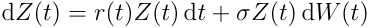

Then, for each pair of indexes _j < k_ , we can write: 

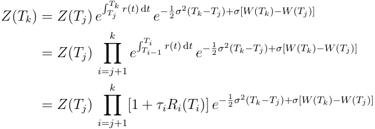

Therefore, _Z_ ( _t_ ) can be simulated by simulating the joint evolution of rates _Rj_ ( _t_ ) and Brownian motion _W_ ( _t_ ), assuming a correlation structure among them.

<!-- page: 16 -->

# **6 Valuation of RFR vanilla derivatives** 

SOFR and SONIA futures are currently traded on CME and ICE. LCH and CME started clearing SOFR and SONIA fixed-floating swaps, which are very similar to OIS contracts. At the time of writing, there is still no trading activity on RFR caps or swaptions. 

## **6.1 The valuation of RFR futures** 

3M SOFR and SONIA futures contracts settle in arrears to the price equal to 100 minus the corresponding compounded RFR over the contract period, whereas 1M SOFR and SONIA futures settle in arrears to the price of 100 minus the arithmetic average of the corresponding RFRs over the contract month. 

Consider 3M futures, where the underlying rates are the daily-compounded RFRs, which we approximate by (5), that is: 

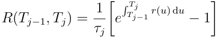

The corresponding futures convexity adjustment at time _t_ is given by: 

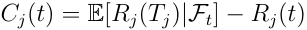

Using (17), we can then write: 

The _Q_ -drift of _Rj_ ( _t_ ) generally depends on _Rj_ ( _t_ ) itself as well as on other forward rates _Ri_ ( _t_ ), which makes it impossible to calculate the expectation in (23) in closed form unless we resort to some approximation, see for instance J¨ackel and Kawai (2005) or Piterbarg and Renedo (2006) for results in the single-curve LMM. 

A general and straightforward approximation, which allows for an explicit calculation of (23), is based on the widely-used trick of freezing rates at time _t_ to make the _Q_ -drift of _Rj_ ( _t_ ) deterministic. To illustrate this approach, we consider the Ho-Lee short rate model with constant volatility parameter _σ_ , which amounts to using the forward rate dynamics (30) in Appendix A. In this case, we have, for _s ≥ t_ : 

where _gj_ is the linear decay function (13). Integrating this from _t_ to _Tj_ , we get: 

<!-- page: 17 -->

which coincides at first order with the exact formula derived by Henrard (2018) and Mercurio (2018). 

As per 1M futures, which settle to the rate equal to the arithmetic average of RFRs over the contract month, the convexity adjustment is equal to the average of the convexity adjustments for one-day rates over the contract month. Formulas can thus be derived by averaging values of adjustments (24) applied to one-day intervals. 

## **6.2 The valuation of an RFR fixed-floating swap** 

Consider a swap where the floating leg pays at each time _Tj_ , _j_ = _a_ + 1 _, . . . , b_ , a rate that is obtained by compounding the daily fixings of the RFR from _Tj−_ 1 to _Tj_ , and where the fixed leg pays the fixed rate _K_ on dates _Tc__′_ +1_, . . . , T ′_ _d_,with_T_ _c__′_=_Ta_and_T_ _d__′_=_Tb_. 

We approximate the floating-leg payment at each time _Tj_ by _R_ ( _Tj−_ 1 _, Tj_ ) times the corresponding year fraction, that is 

The swap value to the fixed-rate payer at time _t < Ta_ +1 is thus given by 

where _τj__′_denotes the year fraction for the fixed-leg interval [_T_ _j__′_ _−_ 1_, T_ _j__′_).Note that for_t ≤Ta_, the price of the swap remains the same when we switch from forward-looking to backwardlooking rates, see also the section below on the valuation of a term-rate basis swap. 

The corresponding forward swap rate is defined as the fixed rate _K_ that makes the swap value equal to zero at time _t_ , that is: 

where the second equality follows from (10). This formula coincides with the classic one in the single-curve framework. 

**Remark 3** _Since the (extended) zero-coupon bond prices P_ ( _t, Tj_ ) _and forward rates Rj_ ( _t_ ) _are defined for all values of time t, the swap price formula above is also defined for all values of t. Similar to the case of zero-coupon bond, for t > Ta the swap value given by the formula above represents the time-t value of a self-financing investment strategy where all cash flows are reinvested (financed in the case of negative cash flows) at the risk-free rate to roll them forward to the present time. This can be considered as a total present value of the strategy, which is inclusive of past cash flows, and can be used to compare current performance of different investments. For market instruments like swaps, it can be also used for accounting as a total fair market value._

<!-- page: 18 -->

_The swap rate formula is also defined for all t and, for t > Ta, it represents the value of the fixed-leg rate that would make the total present value of the investment strategy zero, should it be set as the contractual rate K from the very beginning. Similarly to rates Rj_ ( _t_ ) _, swap rate S_ ( _t_ ) _fixes at the last cash-flow time and remains constant after that. The terminal (realized) value of the swap rate, for t ≥ Tb, is given by:_ 

## **6.3 The valuation of an RFR cap** 

For each given _j_ and associated application period [ _Tj−_ 1 _, Tj_ ), we can define two distinct caplets with strike _K_ and paying off at time _Tj_ : 

1. A forward-looking with payoff [ _Rj_ ( _Tj−_ 1) _− K_ ]+ 

2. A backward-looking with payoff [ _Rj_ ( _Tj_ ) _− K_ ]+ 

The main difference between these two payoffs is that the former is known at the beginning of the application period, _Tj−_ 1, whereas the latter is known at the end, _Tj_ .6 At the time of writing, it is still unclear which of the two payoffs will prevail in the market. However, there are valid reasons to presume that both will be made available to customers. 

The valuation of the two caplets relies on the modeling of the forward rate _Rj_ ( _t_ ) in the _Tj_ -forward measure. However, by the tower property of conditional expectations and the Jensen inequality, we have that, for _t ≤ Tj−_ 1, 

where we applied the martingale property of _Rj_ ( _t_ ), that is: _E__Tj_ [ _Rj_ ( _Tj_ ) _|FTj−_ 1] = _Rj_ ( _Tj−_ 1). This implies that the backward-looking caplet is always more expensive than the forwardlooking one.7 

As an example, let us choose the dynamics (14) to be lognormal with constant volatility, which with some abuse of notation we denote by _σj_ : 

where the decay function _gj_ is assumed to be the piece-wise linear function (13). This dynamics leads to Black-like prices for both caplets. In fact, let us denote the time- _t_ price 

> 6Therefore, it makes sense to define the former only for _j ≥_ 2, whereas the latter can be defined for any _j_ = 1 _, . . . , M_ . 

7 This is also intuitive: _Rj_ ( _Tj_ ) and _Rj_ ( _Tj−_ 1) have the same mean but the former has a larger variance.

<!-- page: 19 -->

of the forward-looking and backward-looking caplets by _Cj__F_(_t_)and_C_ _j__B_(_t_),respectively. Then, denoting the Black forward price of the caplet by 

and by Φ the standard normal distribution function, we have: 

_Cj__F_(_t_) =_Pj_(_t_) Black � _Rj_ ( _t_ ) _, K, vj__F_(_t_) � _, t ≤ Tj−_ 1 _Cj__B_(_t_) =_Pj_(_t_) Black � _Rj_ ( _t_ ) _, K, vj__B_(_t_) � _, t ≤ Tj_ 

where 

Since _vj__B_(_t_)_≥v_ _j__F_(_t_)for_t ≤Tj−_1,weconfirmthat_C_ _j__B_(_t_)_≥C_ _j__F_(_t_).Analternativeformula for _Cj__B_(_t_)basedonaone-factorHJMmodelisprovidedbyHenrard(2019). 

## **6.4 The valuation of an RFR swaption** 

An RFR swaption, either payer or receiver, can be defined as the option to enter a spot RFR swap on the swaption’s maturity date. Using the same notation of Section 6.2, we then denote by _Ta_ the swaption’s maturity, by _K_ the strike, by _Tj_ , _j_ = _a_ + 1 _, . . . , b_ the floating-leg dates, and by _Tc__′_ +1_, . . . , T ′_ _d_thefixed-legones.Weassume_T_ _c__′_=_Ta_and_T_ _d__′_=_Tb_. The (payer) swaption payoff at time _Ta_ is thus given by: 

where 

Similarly to a LIBOR-based swap rate, also an RFR swap rate is a martingale under the forward swap measure associated with its annuity numeraire,�_d_ _j_ = _c_ +1_τ ′_ _j__P_(_t, T_ _j__′_).Wecan then assume specific dynamics of _S_ ( _t_ ) under this measure and price swaptions accordingly. For instance, assuming a (driftless) geometric Brownian motion leads to the Black formula for swaptions. 

The valuation of swaptions in the FMM, where each forward rate evolves according to (14), is equivalent to the valuation of LIBOR-based swaptions in the single-curve LMM. We can then refer to the existing single-curve LMM literature for the closed-form approximations that can be used depending on the chosen dynamics.

<!-- page: 20 -->

## **6.5 The valuation of a term-rate basis swap and associated cap** 

We now consider a swap that could be used to convert backward-looking term-rate settlements into forward-looking ones, and vice versa. The swap starts at time _Ta_ and pays at time _Tj_ , _j_ = _a_ + 1 _, . . . , b_ , the difference: 

Since backward-looking and forward-looking forward rates with the same application period are equal at every time before the start of the period, we have that the swap price _V_ ( _t_ ) is zero at each time _t ≤ Ta_ . By the same token, the swap price is also zero on each payment time: _V_ ( _Tj_ ) = 0, _j_ = _a_ + 1 _, . . . , b_ . Inside an accrual period, however, the swap value is no longer zero: 

An associated term-basis cap can be defined as the contract paying on each time _Tj_ , _j_ = _a_ + 1 _, . . . , b_ : 

Each caplet is equivalent to the option to exchange one asset for another. Assuming lognormal dynamics as in Eq. (25), that is 

the caplets above can easily be priced using Margrabe’s formula. Assuming _t ≤ Tj−_ 1, the time- _t_ caplet price is: 

# **7 Conclusions** 

In this paper, we showed that setting-in-arrears backward-looking rates are a viable replacement for IBORs from the analytics perspective. These rates not only possess all the important analytical properties IBORs have, such as the martingale property under their corresponding forward measure, but they also have some others that IBORs are missing, such as a simple analytic formula for the drift under the measure _Q_ . 

In this sense, the paper addresses the concerns raised in Henrard (2019) that selection of setting-in-arrears backward-looking rates as a replacement for IBORs “can lead to significant valuation and risk management complexities.” We showed that the foundations of the classic interest-rate modeling framework are preserved and enriched by switching from forward-looking to backward-looking term rates. It is also important to point out that, since the general modeling framework remains the same, the implementation cost of switching from the LMM to the FMM, which is an extension of the former, should be a fraction of the cost of building the FMM from scratch.

<!-- page: 21 -->

The FMM we have proposed in this paper has several important advantages over the classic LMM, such as accessibility of forward rate evolution under the (continuous) moneymarket measure and higher resolution of the rate dynamics within each accrual period, including accessibility of the short rate process through a local Cheyette model extension. Our framework can be enhanced by adding risky LIBOR-like rates as in Mercurio (2010). A multi-curve market model can thus be built by modeling the joint covariance structure of RFR term rates and forward LIBORs (or LIBOR proxies). In fact, even though IBORs will likely be phased out in all major economies, LIBOR proxies may arise to address the need for a term interest rate that contains some systemic credit or liquidity risk premium. 

# **References** 

- [1] Andersen, L, and Piterbarg, V. (2010) _Interest Rate Modeling_ . Atlantic Financial Press. 

- [2] Brigo, D., and Mercurio, F. (2006) _Interest-Rate Models: Theory and Practice. With Smile, Inflation and Credit_ . Springer Finance. 

- [3] Cheyette, O. (1992) Term Structure Dynamics and Mortgage Valuation. _Journal of Fixed Income_ 1, 28–41. 

- [4] Duffie, D. (2018) Notes on LIBOR Conversion. Available online at: https://www.darrellduffie.com/uploads/policy/Duffie-Conversion-Auction-Notes-2017.pdf 

- [5] Glasserman, P., and Zhao, X. (2000) Arbitrage-Free Discretization of Lognormal Forward Libor and Swap Rate Models. _Finance and Stochastics_ 4, 35–68. 

- [6] Henrard, M. (2018) Overnight Futures: Convexity Adjustment. Available online at: https://papers.ssrn.com/sol3/papers.cfm?abstract ~~i~~ d=3134346. 

- [7] Henrard, M. (2019) A Quant Perspective on IBOR Fallback Consultation Results. Available online at: https://papers.ssrn.com/sol3/papers.cfm?abstract ~~i~~ d=3308766. 

- [8] Hunt, P., and Kennedy, J. (2000) _Financial Derivatives in Theory and Practice_ . Wiley. 

- [9] J¨ackel, P. and Kawai, A. (2005) The Future is Convex. _Wilmott_ February, 2–13. 

- [10] Mercurio, F. (2010) Modern LIBOR Market Models: Using Different Curves for Projecting Rates and for Discounting. _International Journal of Theoretical and Applied Finance_ 13, 1–25. 

- [11] Mercurio, F. (2018) A Simple Multi-Curve Model for Pricing SOFR Futures and Other Derivatives. Available online at: https://papers.ssrn.com/sol3/papers.cfm?abstract ~~i~~ d=3225872. 

- [12] Piterbarg, V. and Renedo, M. (2006) Eurodollar Futures Convexity Adjustments in Stochastic Volatility Models. _Journal of Computational Finance_ 9, 71–94.

<!-- page: 22 -->

- [13] Zhu, H. (2018) The Clock Is Ticking: A Multi-Maturity Clock Auction Design for IBOR Transition. Available online at: 

   - http://www.mit.edu/ _∼_ zhuh/HaoxiangZhu ~~I~~ BORAuction.pdf. 

# **8 Appendix A: The extended HJM** 

The classic relationship between zero-coupon bond prices and instantaneous forward rates reads: 

for any _t ≤ T_ . In the case of extended bond prices, in order for this relationship to be true also for _t > T_ , we must have, thanks to (3), 

This is true for any pair ( _t, T_ ) with _t > T_ if and only if _f_ ( _t, u_ ) = _r_ ( _u_ ) whenever _t ≥ u_ . Therefore, instantaneous forward rates _f_ ( _t, T_ ) can also be defined consistently with the extended bond prices for any pair of arguments. In particular, for _t ≥ T_ , _f_ ( _t, T_ ) is constant and equal to the value of the instantaneous spot rate _r_ at time _T_ . 

We assume one-factor dynamics for simplicity: 

where, for each _T_ , _σ_ ( _t, T_ ) is an adapted process and _W_ ( _t_ ) is a standard Brownian motion in the risk-neutral measure _Q_ . The indicator function 1 _{t≤T }_ is introduced because the process is constant (that is, its volatility is zero) after time _T_ . 

As in the classic HJM framework, the application of Ito’s lemma and Fubini’s theorem leads to the following risk-neutral dynamics of zero-coupon bond prices: 

In particular, when _t > T_ , this SDE reduces to: 

which is consistent with (3) and (1). 

From (27), we can derive the _Q__Tj_ -dynamics of forward rate _Rj_ ( _t_ ) using Ito’s lemma and (10), that is: 

<!-- page: 23 -->

We get: 

where _Wj_ is a standard _Q__Tj_ -Brownian motion. 

As expected, in the accrual period [ _Tj−_ 1 _, Tj_ ], the volatility of _Rj_ ( _t_ ) decreases to zero and remains zero after time _Tj_ . Moreover, for _t ∈_ [ _Tj−_ 1 _, Tj_ ], the integral term in the volatility, that is � _tTj σ_ ( _t, u_ ) d _u_ , coincides with (minus) the proportional volatility of _P_ ( _t, Tj_ ). Therefore, modeling _Rj_ ( _t_ ) up to _Tj_ is equivalent to modeling the classic forward-looking forward rates jointly with the prompt discount factor in the accrual period, that is that maturing at time _T_ . _j_ 

Choosing a separable volatility function _σ_ ( _t, u_ ) =�_M_ _j_ =1_ψj_(_t_)_φj_(_u_)1_{u∈_[_T_ _j−_ 1_,T_ _j_]_}_,and denoting by Φ _j_ ( _u_ ) a primitive of _φj_ ( _u_ ), that is _φj_ ( _u_ ) = Φ_′_ _j_(_u_),thedynamicsbecomes: 

This also gives a more explicit form for the decay function of the volatility of _Rj_ ( _t_ ) in its accrual period. 

In the simple case of a constant function _σ_ ( _t, u_ ) _≡ σ_ , which is equivalent to the Ho-Lee short-rate model, we have: 

where _gj_ ( _t_ ) is the linear decay function (13). 

# **9 Appendix B: A locally-equivalent Cheyette (1992) model** 

Consider the _Q_ -measure dynamics of rate _Rj_ ( _t_ ) within its accrual period [ _Tj−_ 1 _, Tj_ ). According to (18) we have: 

Thus, the dynamics of _Rj_ ( _t_ ) within its accrual period is effectively one-factor with its _Q_ -drift being independent of other rates. 

Consider a one-factor Cheyette (1992) model on the same interval [ _Tj−_ 1 _, Tj_ ): 

<!-- page: 24 -->

where 

and where _a_ is a positive deterministic function, _h_ is an adapted process, and _Z_ is a Brownian motion under the risk-neutral measure _Q_ . From (32), it follows that 

Under dynamics (33), the zero-coupon bond price _P_ ( _t, s_ ), _Tj−_ 1 _≤ t ≤ s < Tj_ , is given by: 

where _A_ ( _t, s_ ) := � _ts__a_(_u_) d_u_. 

Application of Ito’s lemma and formula (34) lead to the following _Q_ -dynamics for rate _Rj_ ( _t_ ), _Tj−_ 1 _≤ t < Tj_ , 

We can “fit” a local Cheyette model of the form (32)-(33) to the FMM dynamics (31) for _t ∈_ [ _Tj−_ 1 _, Tj_ ) by setting, for each _j_ = 1 _, . . . , M_ : 

The “fitted”functions _h_ ( _t_ ) and _a_ ( _t_ ) are interval dependent, meaning that different onefactor Cheyette dynamics are needed, for each interval [ _Tj−_ 1 _, Tj_ ), to match the FMM dynamics of each _Rj_ ( _t_ ) on that interval. 

With this selection of functions _h_ ( _t_ ), _a_ ( _t_ ) and Brownian motion _Z_ ( _t_ ), the Cheyette model and the FMM provide identical dynamics for rate _Rj_ ( _t_ ) within its accrual period. Having “aligned” the two models on [ _Tj−_ 1 _, Tj_ ), we can now jointly and consistently simulate both _Rj_ ( _t_ ) and forward rates _f_ ( _t, s_ ). 

Specifically, since the Cheyette volatility term _h_ ( _t_ ) depends on both _σj_ ( _t_ ) and _Rj_ ( _t_ ), we first simulate paths for _σj_ and _Rj_ , and then calculate the implied values, along these paths, of _h_ ( _t_ ), _x_ ( _t_ ) and _y_ ( _t_ ) for _t ∈_ [ _Tj−_ 1 _, Tj_ ). Assuming the full zero-bond price curve _P_ ( _Tj−_ 1 _, ·_ ) at maturity grid time _Tj−_ 1 has already been built, by employing, for instance, the usual techniques used for the LMM to convert simulated LIBOR rates into the full forward curve, we get the values of the bank account _B_ ( _t_ ) as follows: 

<!-- page: 25 -->

Thanks to this, we can build the process for the bank account _B_ ( _t_ ) within each accrual period, consistently with the FMM dynamics, and then recover the dynamics of zero-bond prices with maturities _T_ 1 _, . . . , TM_ by using 

