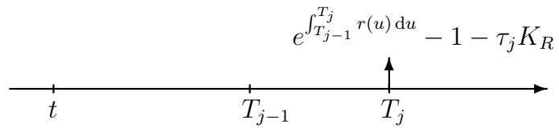
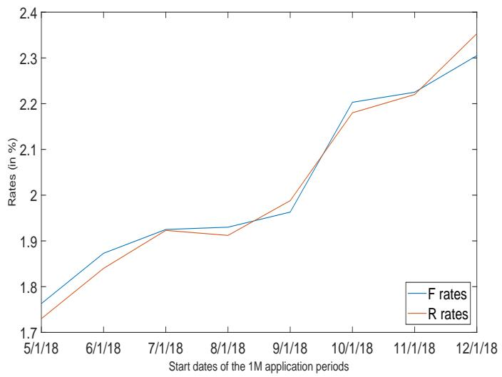
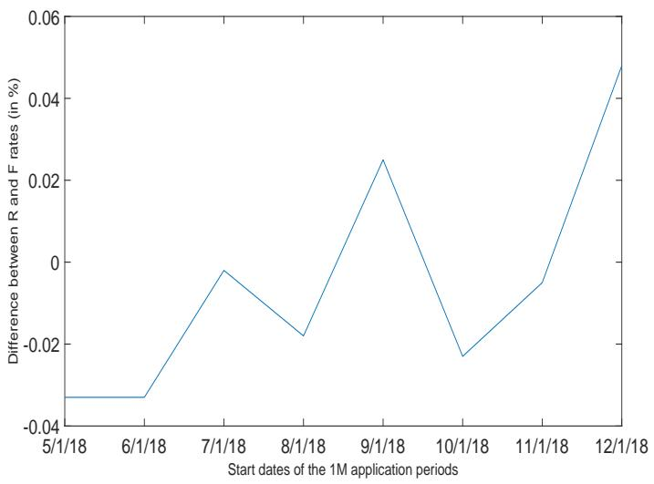
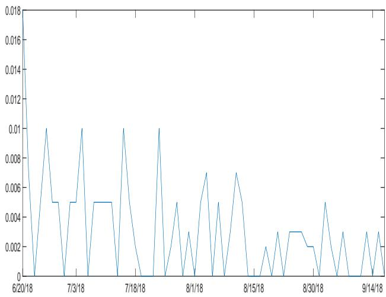
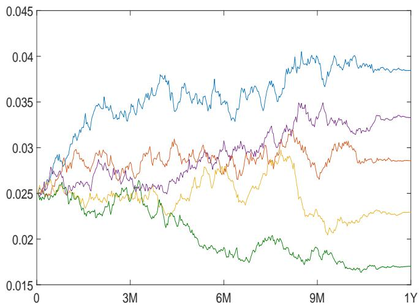

# 2019-lyashenko-mercurio-backward-looking-rates

<!-- page: 1 -->

## Looking Forward to Backward-Looking Rates: A Modeling Framework for Term Rates Replacing LIBOR

Andrei Lyashenko1 and Fabio Mercurio2

1Quantitative Risk Management, Inc. 2Bloomberg, L.P.∗

## Abstract

In this paper, we define and model forward risk-free term rates, which appear in the payof definition of derivatives, and possibly cash instruments, based on the new interest-rate benchmarks that will be replacing IBORs globally. We show that the classic interest rate modeling framework can be naturally extended to describe the evolution of both the forward-looking (IBOR-like) and backward-looking (setting-inarrears) term rates using the same stochastic process. In particular, we show that the extension of the popular LIBOR Market Model (LMM) to the backward-looking rates completes the model by providing additional information about the rate dynamics not accessible in the LMM.

In this paper, we show that the classic interest rate modeling framework can be naturally extended to describe the evolution of the backward-looking (setting-in-arrears) term rates selected to replace IBORs in derivative contracts. We demonstrate that the backwardlooking rates have all the analytic properties needed for pricing vanilla derivatives such as swaps, caps/floors and swaptions. Moreover, modeling these rates turns out to be highly beneficial as it provides additional information, such as the rate dynamics in the money-market risk-neutral measure, which is not available when dealing with forwardlooking rates only. Finally, the extension of the popular LIBOR Market Model (LMM) to backward-looking rates results in a more complete modeling framework that can be used to simultaneously model the evolution of forward-looking (IBOR-like) and backward-looking term rates using the same stochastic processes for both.

∗The views and opinions expressed in this article are our own and do not represent the opinions of any firm or institution. Bloomberg LP and Bloomberg Professional service are trademarks and service marks of Bloomberg Finance L.P., a Delaware limited partnership, or its subsidiaries. All rights reserved.

<!-- page: 2 -->

## 1 Introduction

IBOR rates, which include LIBOR, EURIBOR, TIBOR, CDOR, and other similar rates, represent the cost of funds among large global banks for short-term unsecured borrowing on the interbank market. They are key reference rates in many financial products with the total market exposure worldwide of over \$370 trillion. IBOR quotes are rate indications based on surveys rather than actual transactions, because the unsecured short-term lending market between banks has not been suficiently active lately. During the 2007-09 credit crisis, widespread attempts to manipulate LIBOR by banks were reported and later investigated by both the UK and US governments.

In 2013-2014, the Financial Stability Board (FSB) conducted fundamental reviews of major interest rate benchmarks and recommended developing alternative nearly risk-free rates (RFRs) that are better suited as the reference rates for certain financial transactions. By now, RFRs have been selected in all major economies: The US selected a new Treasuries repo financing rate called SOFR (Secured Overnight Funding Rate); the UK selected the reformed SONIA (Sterling Overnight Index Average); Switzerland selected SARON (Swiss Average Rate Overnight); Japan selected TONA (Tokyo Overnight Average Rate); and the Euro zone selected a new unsecured overnight rate called ESTER (Euro Short-Term Rate).

Since all the selected RFRs are overnight rates, in order for them to be used as a replacement for IBORs in both new and existing contracts (as fallback rates), they first need to be converted into term rates.1 There are two main approaches being considered by both ISDA and national regulators:

• Compounded setting-in-arrears rate, which is backward looking in nature and is known at the end of the corresponding application period;2

• A market implied prediction of this compounded setting-in-arrears rate, which is forward looking in nature and is known at the beginning of the application period.

The first choice drove (and is driving) the definition of the new RFR futures and vanilla swaps, whereas the second seems to be favored when it comes to defining fallbacks for cash products.

Instantaneous rate modeling seems to be the natural choice when it comes to the valuation and risk management of the new RFR-based derivatives, and possibly cash instruments, because a compounded setting-in-arrears term rate can be generated by simulating daily the underlying RFR in the corresponding application period. However, this is not a compulsory choice. In this paper, in fact, we show that by modeling the dynamics of term rates directly, we can simulate both forward-looking and backward-looking term rates using a single stochastic process for both. The joint modeling of these stochastic processes, for all the given application periods, leads to an extension of the classic single-curve LIBOR Market Model (LMM), which we call the generalized Forward Market Model (FMM).

1Mechanisms for converting legacy contracts into new ones referencing the RFRs are discussed in Dufie (2018) and Zhu (2018).

2In the US, where the RFR is SOFR, this compounded setting-in-arrears rate is also called SAFR. The term SAFR was used for the first time by Mr. Quarles, Vice Chairman for Supervision at the Federal Reserve, who said in a speech on July 19, 2018: “I think it is appropriate for the Federal Reserve to consider publishing a compound average of SOFR that market participants could then use. It has been suggested that we could call it SAFR, for secured average financing rate.”.

<!-- page: 3 -->

The FMM is a more complete model than the LMM as it preserves the dynamics of the forward-looking (LIBOR-like) rates, while providing additional information about the rate dynamics between the term-rate fixing/payment times. It also has some nice properties the traditional LMM does not have, such as model-implied dynamics of forward rates under the classic money-market (“continuous spot”) measure, and not only under the discrete spot measure as in the LMM case.

Our FMM formulation is based on the concept we introduce of extended zero-coupon bonds, which is simple and natural, and proves to be very convenient when dealing with backward-looking setting-in-arrears rates. This concept is not new as it was used, for instance, by Glasserman and Zhao (2000) or Andersen and Piterbarg (2010) to define hybrid numeraires and measures. However, we are not aware of it being used to extend the definition of term rates from forward-looking to backward-looking, or to provide a generalization of a single-curve LMM. Thanks to our extended definition of zero-coupon bonds, not only the bonds themselves, but also the forwards and swap rates, along with the associated forward measures, can be extended and defined at all times, even those beyond their natural expiries.

## 2 Main assumptions, definitions and notation

We consider a continuous-time financial market with an instantaneous risk-free rate, whose time-t value is denoted by r(t). We assume that rate $r ( t )$ is the collateral rate for collateralized OTC transactions, as well as the Price Alignment Interest (PAI) for cleared derivatives.3 This is consistent with the overall direction of the IBOR reform and transition to the new rate benchmarks. In the US, for instance, the Alternative Reference Rates Committee (ARRC) developed a six-step plan for transitioning from LIBOR to SOFR (see the ARRC’s second report published in March 2018) where the PAI, as well as the rate used for discounting, should be moved from Fed-fund to SOFR by the second quarter of 2021. If the same RFR is used for discounting and for deriving term rates, this implies a return to the classic single-curve modeling environment.

Rate $r ( t )$ has an associated money-market (or bank) account $B ( t )$ such that $B ( 0 ) = 1$ and

$$
\mathrm { d } B ( t ) = r ( t ) B ( t ) \mathrm { d } t\tag{1}
$$

$$
B ( t ) = e ^ { \int _ { 0 } ^ { t } r ( u ) \mathrm { d } u }
$$

so

3A more general case where risk-free and collateral (or PAI) rates are diferent has been considered by Mercurio (2018). The results in this paper can easily be generalized to the case with diferent rates, but at the expense of more complex notation and formulas.

<!-- page: 4 -->

We assume the existence of a risk-neutral measure $Q ,$ whose associated numeraire is $B ( t )$ , and denote by E the expectation with respect to $Q$ , and by $\mathcal { F } _ { t }$ the “information” available in the market at time t, that is the sigma-algebra generated by the model risk factors up to time t. We then denote by $\textstyle P ( t , T )$ the price at time t of the risk-free zerocoupon bond with maturity $T _ { \ast }$ that is:

$$
P ( t , T ) = \mathbb { E } \left[ e ^ { - \int _ { t } ^ { T } r ( u ) \mathrm { d } u } | \mathcal { F } _ { t } \right]\tag{2}
$$

which is defined for $t \leq T$ , being it the value of a contract that expires at time $T .$ However, the definition of $\textstyle P ( t , T )$ can be extended to times $t > T$ as follows. Using (2) and the definition of $B ( t )$ , when $t > T$ we can write:

$$
P ( t , T ) = \mathbb { E } \left[ e ^ { \int _ { T } ^ { t } r ( u ) \mathrm { d } u } | \mathcal { F } _ { t } \right] = e ^ { \int _ { T } ^ { t } r ( u ) \mathrm { d } u } = \frac { B ( t ) } { B ( T ) }\tag{3}
$$

since $\textstyle \int _ { T } ^ { t } r ( u )$ du is $\mathcal { F } _ { t } { \mathrm { - m e a s u r a b l e } }$ . In particular, we have that $P ( t , 0 ) = B ( t )$ , meaning that the money-market account can be viewed as a zero-coupon bond expiring immediately (that is, with 0 maturity).

Let us then consider the self-financing strategy $Y _ { T }$ that consists of buying the zerocoupon bond with maturity $T _ { \ast }$ , and reinvesting the proceeds of the bond’s unit notional received at $T$ at the risk-free rate $r ( t )$ from time $T$ onwards. Denoting by $Y ( t )$ the time-t value of this strategy, we have:

$$
Y _ { T } ( t ) = \left\{ \begin{array} { l l } { P ( t , T ) } & { \mathrm { ~ f o r ~ } t \leq T } \\ { e ^ { \int _ { T } ^ { t } r ( u ) \mathrm { d } u } = \frac { B ( t ) } { B ( T ) } } & { \mathrm { ~ f o r ~ } t > T } \end{array} \right.\tag{4}
$$

We notice that, for $t > T , Y _ { T } ( t )$ is exactly the extended bond price defined by (3). Because of this, we can conclude that, for each given $T , Y _ { T } ( t ) = P ( t , T )$ for all times t. Therefore, hereafter, we will refer to strategy $Y _ { T }$ as to the extended zero-coupon bond with maturity $T .$ , and bond prices $\textstyle P ( t , T )$ will be meant in the extended sense.

## 2.1 Extended T-forward measure

The extended zero-coupon bond price $\textstyle P ( t , T )$ continues to be a viable numeraire since it is the value of a self-financing strategy (the corresponding $Y _ { T } )$ and is strictly positive. Therefore, we can define the (extended) T-forward measure $Q ^ { T }$ the usual way as the equivalent martingale measure associated with the extended bond price $\textstyle P ( t , T )$ . As opposed to the classic definition of forward measure, $Q ^ { T }$ -dynamics can now be defined for any time $t ,$ so also for times beyond maturity T. Since, for $t > T$ 2

$$
P ( t , T ) = \frac { B ( t ) } { B ( T ) }
$$

the extended T-forward measure $Q ^ { T }$ is a hybrid measure that combines the classic $T \mathrm { - }$ forward measure up to the maturity time $T$ with the risk-neutral money-market measure

<!-- page: 5 -->

Q after T. Such hybrid T-forward measures have been discussed in the literature. See, for instance, Glasserman and Zhao (2000) or Section 4.2.4 in Andersen and Piterbarg (2010).

We note that $P ( t , 0 ) = B ( t )$ , so the risk-neutral money-market measure is a particular case of the extended T-forward measure, where T is equal to zero: $Q = Q ^ { 0 }$

## 2.2 The market risk-free term rate

Current derivatives contracts, such as futures, swaps, and basis swaps, written on RFRs such as SOFR or reformed SONIA, all reference the daily compounded setting-in-arrears rate based on the corresponding overnight benchmark. Recently, this rate was also chosen as the best risk-free term rate in the new LIBOR fallback definition by ISDA. Therefore, modeling such term rate became of tantamount importance for several reasons.

In what follows, we assume a time structure $0 = T _ { 0 } , T _ { 1 } , \dots , T _ { M }$ , and denote by $\tau _ { j }$ the year fraction for the interval $[ T _ { j - 1 } , T _ { j } )$ . For each time t, we define $\eta ( t ) = \operatorname* { m i n } \{ j : \ T _ { j } \geq t \}$ , which is the index of the element of the time structure that is the closest to time t being equal to or greater than t. For brevity, we then use the short-hand notation $P _ { j } ( t )$ to denote the bond price $P ( t , T _ { j } )$

For each $j = 1 , \dotsc , M$ , we approximate the daily-compounded setting-in-arrears rate for the interval $[ T _ { j - 1 } , T _ { j } )$ , which we denote by $R ( T _ { j - 1 } , T _ { j } )$ , as follows:4

$$
R ( T _ { j - 1 } , T _ { j } ) = \frac { 1 } { \tau _ { j } } \bigg [ e ^ { \int _ { T _ { j - 1 } } ^ { T _ { j } } r ( u ) \mathrm { d } u } - 1 \bigg ] = \frac { 1 } { \tau _ { j } } \bigg [ \frac { B ( T _ { j } ) } { B ( T _ { j - 1 } ) } - 1 \bigg ] = \frac { 1 } { \tau _ { j } } \big [ P _ { j - 1 } ( T _ { j } ) - 1 \big ]\tag{5}
$$

In-arrears rates are backward-looking in nature because one has to wait until the end of their accrual period to know their fixing value. Alternatively, one can define forwardlooking rates, which are set at the beginning of their application period. For instance, a forward-looking rate at time $T _ { j - 1 }$ with maturity $T _ { j }$ can be defined similarly to an OIS swap rate. This rate, denoted by $F ( T _ { j - 1 } , T _ { j } )$ , is the fixed rate to be exchanged at time $T _ { j }$ for the forward bank account $B ( T _ { j } ) / B ( T _ { j - 1 } )$ (minus one and divided by the year fraction) such that this swap has zero value at time $T _ { j - 1 }$ . By no-arbitrage, we have:

$$
F ( T _ { j - 1 } , T _ { j } ) = \mathbb { E } ^ { T _ { j } } \left[ R ( T _ { j - 1 } , T _ { j } ) | \mathcal { F } _ { T _ { j - 1 } } \right]\tag{6}
$$

for each $j = 1 , \dots , M .$

R(Tj−1, Tj ) = 1 Y(1 + riδi) − 1# τj i=1

4The actual daily-compounded setting-in-arrears rate for the interval [Tj−1, Tj) is given by

where the product is over the business days in [Tj−1, Tj), and where ri is the RFR fixing on date i with associated day-count fraction δi. Taking the limit for the mesh of {δ1, . . . , δn} going to zero, we get the approximation (5). Replacing a discrete-time calculation (a product) with a continuous-time one (an integral) presents the advantage of more compact expressions and simpler calculations.

<!-- page: 6 -->

## 2.3 Backward-looking in-arrears forward rates

We define the backward-looking forward rate $R _ { j } ( t )$ at time t as the value of the fixed rate $K _ { R }$ in the swaplet paying $\tau _ { j } [ R ( T _ { j - 1 } , T _ { j } ) - K _ { R } ]$ at time $T _ { j }$ , see Fig. 1, such that the swaplet has zero value at time t.

By no-arbitrage, we have:

$$
R _ { j } ( t ) = \mathbb { E } ^ { T _ { j } } \left[ R ( T _ { j - 1 } , T _ { j } ) | \mathcal { F } _ { t } \right]\tag{7}
$$

From (6) and $( 7 )$ , we see that, for each $j = 1 , \dots , M$ , the forward-looking spot rate $F ( T _ { j - 1 } , T _ { j } )$ is equal to the backward-looking forward rate $R _ { j } ( t )$ at time $t = T _ { j - 1 }$

$$
F ( T _ { j - 1 } , T _ { j } ) = R _ { j } ( T _ { j - 1 } )\tag{8}
$$

A formula for the forward rate $R _ { j } ( t )$ can be derived by changing the measure to $Q . ^ { 5 }$ We get:

$$
\begin{array} { r l } & { 1 + \tau _ { j } R _ { j } ( t ) = \mathbb { E } ^ { T _ { j } } \Big [ e ^ { \int _ { T _ { j - 1 } } ^ { T _ { j } } r ( u ) \mathrm { d } u } \big | \mathcal { F } _ { t } \Big ] } \\ & { \qquad = \frac { 1 } { P _ { j } ( t ) } \mathbb { E } \Big [ e ^ { - \int _ { t } ^ { T _ { j } } r ( u ) \mathrm { d } u } e ^ { \int _ { T _ { j - 1 } } ^ { T _ { j } } r ( u ) \mathrm { d } u } \big | \mathcal { F } _ { t } \Big ] } \\ & { \qquad = \frac { 1 } { P _ { j } ( t ) } \mathbb { E } \Big [ e ^ { - \int _ { t } ^ { T _ { j - 1 } } r ( u ) \mathrm { d } u } \big | \mathcal { F } _ { t } \Big ] } \\ & { \qquad = \frac { P _ { j - 1 } ( t ) } { P _ { j } ( t ) } } \end{array}\tag{9}
$$

so we can write:

$$
R _ { j } ( t ) = \frac { 1 } { \tau _ { j } } \left[ \frac { P _ { j - 1 } ( t ) } { P _ { j } ( t ) } - 1 \right]\tag{10}
$$

Notice that this is the classic, simply-compounded, forward-rate formula, which thanks to our definition of extended bond price, holds for each time t, even those after $T _ { j }$

Note that the forward rate $R _ { j } ( t )$

• Is a martingale under the $T _ { j }$ -forward measure;

• Is equal to the forward-looking spot rate at time $T _ { j - 1 } \colon R _ { j } ( T _ { j - 1 } ) = F ( T _ { j - 1 } , T _ { j } )$

• Is equal to the realized backward-looking rate at time $T _ { j } \colon R _ { j } ( T _ { j } ) = R ( T _ { j - 1 } , T _ { j } )$ ;

• Stops evolving (that is, it is fixed) after time Tj: $R _ { j } ( t ) = R ( T _ { j - 1 } , T _ { j } ) , t > T _ { j }$

5An equivalent derivation is in Mercurio (2018).

<!-- page: 7 -->

When time t is within the accrual period, that is $T _ { j - 1 } \ < \ t \ < \ T _ { j }$ , forward rate $R _ { j } ( t )$ “aggregates” values of realized RFRs $r ( s ) , s \in ( T _ { j - 1 } , t )$ , and instantaneous forward rates $f ( t , s ) , s \in ( t , T _ { j } )$

$$
1 + \tau _ { j } R _ { j } ( t ) = \frac { e ^ { \int _ { T _ { j - 1 } } ^ { t } r ( s ) \mathrm { d } s } } { P ( t , T _ { j } ) } = e ^ { \int _ { T _ { j - 1 } } ^ { t } r ( s ) \mathrm { d } s + \int _ { t } ^ { T _ { j } } f ( t , s ) \mathrm { d } s }
$$

Using the convention $f ( t , s ) = r ( s )$ for $t > s$ (see Appendix A for more discussion), we can rewrite this equation in the following form that holds for all values of t:

$$
1 + \tau _ { j } R _ { j } ( t ) = e ^ { \int _ { T _ { j - 1 } } ^ { T _ { j } } f ( t , s ) \mathrm { d } s }
$$

A history of realized rates $R _ { j } ( T _ { j } )$ compared with their predicted values $F _ { j } ( T _ { j - 1 } ) =$ $R _ { j } ( T _ { j - 1 } )$ is shown in Fig 2. The chosen market is USD and the chosen tenor is 1M.

## 2.4 Forward-looking forward rates

We define the forward rate $F _ { j } ( t )$ at time t as the value of the fixed rate $K _ { F }$ in the swaplet that pays $\tau _ { j } [ F ( T _ { j - 1 } , T _ { j } ) - K _ { F } ]$ at time $T _ { j }$ , see Fig. 3, such that the swaplet has zero value at time t.

By no-arbitrage, we have, for $t \leq T _ { j }$ −1:

$$
\begin{array} { r l } & { { \cal F } _ { j } ( t ) = \mathbb { E } ^ { T _ { j } } \left[ { \cal F } ( T _ { j - 1 } , T _ { j } ) | { \mathcal F } _ { t } \right] } \\ & { \quad \quad = \mathbb { E } ^ { T _ { j } } \left\{ \mathbb { E } ^ { T _ { j } } \left[ R ( T _ { j - 1 } , T _ { j } ) | { \mathcal F } _ { T _ { j - 1 } } \right] | { \mathcal F } _ { t } \right\} } \\ & { \quad \quad = \mathbb { E } ^ { T _ { j } } \left[ R ( T _ { j - 1 } , T _ { j } ) | { \mathcal F } _ { t } \right] = R _ { j } ( t ) } \end{array}\tag{11}
$$

For $t > T _ { j - 1 }$ , the value is fixed and constant: $F _ { j } ( t ) = F ( T _ { j - 1 } , T _ { j } )$

## 2.5 Consolidating the two forward rates

For each $j = 1 , \dots , M$ , the backward-looking forward rate $R _ { j } ( t )$ and the forward-looking forward rate $F _ { j } ( t )$ can be expressed by a single rate, which with some abuse of notation, we will denote by $R _ { j } ( t )$ . In fact, when $t \leq T _ { j - 1 }$ , the two rates are equal and described by a single common value, $R _ { j } ( t )$ . At time $t = T _ { j - 1 }$ , the forward-looking rate fixes, $R _ { j } ( T _ { j - 1 } ) =$ $F _ { j } ( T _ { j - 1 } ) = F ( T _ { j - 1 } , T _ { j } )$ , and stops evolving. Instead, the backward-looking forward rate $R _ { j } ( t )$ continues its journey until it fixes at time $T _ { j }$ . Finally, as already pointed out, $R _ { j } ( t ) =$ $\tilde { R _ { j } } ( T _ { j } ) , t \geq T _ { j }$

In the following, we will model the joint evolution of rates $R _ { j } ( t )$ for $j = 1 , \dots , M$ , and introduce a natural extension of the classic single-curve LMM to the case where rates are set in arrears. The advantage of this approach is that we can obtain both forward-looking and backward-looking fixings using a single process.

<!-- page: 8 -->

$$
\frac { \tau _ { j } [ F ( T _ { j - 1 } , T _ { j } ) - K _ { F } ] } { t } \underset { T _ { j - 1 } } { \longrightarrow }
$$

Figure 3: A swaplet based on the forward-looking rate.

<!-- page: 9 -->

## 3 The forward rate dynamics

Because of its own definition (7), forward rate $R _ { j } ( t )$ is a martingale under the corresponding Tj-forward measure, $j = 1 , \dots , M$ . The QTj-dynamics of $R _ { j } ( t )$ can be defined for any time t, including $t \geq T _ { j }$ . To this end, we assume the following $Q ^ { T _ { j } }$ -dynamics:

$$
\mathrm { d } R _ { j } ( t ) = \sigma _ { j } ( t ) 1 _ { \{ t \leq T _ { j } \} } \mathrm { d } W _ { j } ( t )\tag{12}
$$

where, for each $j = 1 , \ldots , M , \sigma _ { j } ( t )$ is an adapted process and $W _ { j } ( t )$ is a standard Brownian motion such that $\mathrm { d } W _ { i } ( t ) \mathrm { d } W _ { j } ( t ) = \rho _ { i , j } \mathrm { d } t$ . The indication function $1 _ { \{ t \leq T _ { j } \} }$ is introduced to ensure that the process is defined, and is constant, for times larger than (or equal to) $T _ { j }$

A key issue in the definition of the forward rate dynamics is the modeling of the behavior of its volatility in the accrual period $[ T _ { j - 1 } , T _ { j } ]$ . Inspired by SDE (29) in Appendix A, we then choose a (piece-wise) diferentiable (deterministic) function $g _ { j }$ such that: $g _ { j } ( t ) = 1$ for $t \leq T _ { j - 1 } , g _ { j } ( t )$ is monotonically decreasing in $[ T _ { j - 1 } , T _ { j } ]$ and $g _ { j } ( t ) = 0$ for $t \geq T _ { j }$ . For instance, assuming a linear decay, the function $g _ { j }$ is given by:

$$
g _ { j } ( t ) = \operatorname* { m i n } \left\{ \frac { ( T _ { j } - t ) ^ { + } } { T _ { j } - T _ { j - 1 } } , 1 \right\}\tag{13}
$$

An empirical confirmation of the volatility decay of rates $R _ { j } ( t )$ is provided in Fig. 4, where we plot the daily absolute changes of the backward-looking forward rate whose application period started on June 20, 2018 and ended on September 18, 2018.

With some abuse of notation, the dynamics of $R _ { j } ( t )$ then becomes:

$$
\mathrm { d } R _ { j } ( t ) = \sigma _ { j } ( t ) g _ { j } ( t ) \mathrm { d } W _ { j } ( t )\tag{14}
$$

<!-- page: 10 -->

We stress again that, contrary to the classic LMM case, this dynamics is defined for any time t. Rate $R _ { j }$ does not stop at time $T _ { j - 1 }$ , but continues to evolve stochastically until $T _ { j }$ , and remains constant thereafter. A plot of simulated paths of $R _ { j } ( t )$ under lognormal dynamics is shown is Fig. 5, where the efect of decaying volatility in the rate accrual period (last quarter) is clearly visible.

## 4 The generalized FMM

Equation (14) defines the dynamics of each forward rate $R _ { j } ( t )$ under the corresponding $T _ { j } .$ forward measure. A market model where all forward rates, for $j = 1 , \dots , M$ , are modeled jointly can be defined by deriving the dynamics of each forward under a common probability measure (equivalently, numeraire). To this end, we apply the change-of-numeraire formula relating the drifts of a given process under two measures with known numeraires, see for instance Brigo and Mercurio (2006). In our case, we know the dynamics of $R _ { j } ( t )$ under the $T _ { j }$ -forward measure, and we want to derive its dynamics under a measure $\dot { Q } ^ { N }$ , which is associated with numeraire $N ( t )$ . Assuming continuous dynamics, the drift of $R _ { j }$ under $Q ^ { N }$ , as a function of time t, is given by:

$$
\mathbf { D r i f t } ( R _ { j } ; Q ^ { N } ) ( t ) = { \frac { \mathrm { d } R _ { j } ( t ) \mathrm { d } \ln ( N ( t ) / P ( t , T _ { j } ) ) } { \mathrm { d } t } }\tag{15}
$$

We will consider three cases:

1. $N ( t ) = B ( t )$ , so $Q ^ { N }$ is the risk-neutral measure $Q ;$

2. $N ( t ) = B _ { d } ( t )$ , where $B _ { d } ( t )$ is the time-t value of the discrete bank account, $B _ { d } ( t ) =$ $\begin{array} { r } { P ( t , T _ { \eta ( t ) } ) / [ \prod _ { i = 1 } ^ { \eta ( t ) } P ( T _ { i - 1 } , T _ { i } ) ] } \end{array}$ , so $Q ^ { N }$ is the classic spot-LIBOR measure $Q ^ { d }$

<!-- page: 11 -->

3. $N ( t ) = P ( t , T _ { k } )$ , for a general $k ,$ so $Q ^ { N }$ is the $T _ { k } .$ -forward measure.

## 4.1 Forward rate dynamics under Q

We first apply (15) to the case where $N ( t ) = B ( t )$ and $Q ^ { N } = Q$ . The drift of $R _ { j }$ under $Q$ is thus given by:

$$
\mathbf { D r i f t } ( R _ { j } ; Q ) ( t ) = \frac { \mathrm { d } R _ { j } ( t ) \mathrm { d } \ln \left( B ( t ) / P ( t , T _ { j } ) \right) } { \mathrm { d } t }
$$

In a classic LMM, the risk-neutral dynamics of forward rates can be derived provided we also model the volatility of the prompt zero-coupon bonds $P ( t , T _ { \eta ( t ) } )$ , see for instance Brigo and Mercurio (2006). Here, this extra assumption on the volatility of $P ( t , T _ { \eta ( t ) } )$ is no longer needed because it is implicit in the definition of the volatility of $R _ { j } ( t )$ in its corresponding accrual period, see Appendix A.

Thanks to the definition of extended bond prices, we can write:

$$
\begin{array} { l } { \displaystyle \ln \frac { B ( t ) } { P ( t , T _ { j } ) } = \ln \frac { P ( t , 0 ) } { P ( t , T _ { j } ) } } \\ { \displaystyle = \ln \prod _ { i = 1 } ^ { j } \frac { P ( t , T _ { i - 1 } ) } { P ( t , T _ { i } ) } } \\ { \displaystyle = \ln \prod _ { i = 1 } ^ { j } [ 1 + \tau _ { i } R _ { i } ( t ) ] } \\ { \displaystyle = \sum _ { i = 1 } ^ { j } \ln \left[ 1 + \tau _ { i } R _ { i } ( t ) \right] } \end{array}
$$

Therefore,

$$
\begin{array} { l } { \displaystyle \mathrm { D r i f t } ( R _ { i j } ; Q ) ( t ) = \frac { \mathrm { d } R _ { j } ( t ) \mathrm { d } \sum _ { i = 1 } ^ { j } \ln \left[ 1 + \tau _ { i } R _ { i } ( t ) \right] } { \mathrm { d } t } } \\ { = \displaystyle \sum _ { i = 1 } ^ { j } \frac { \mathrm { d } R _ { j } ( t ) \mathrm { d } \ln \left[ 1 + \tau _ { i } R _ { i } ( t ) \right] } { \mathrm { d } t } } \\ { = \displaystyle \sum _ { i = 1 } ^ { j } \frac { \tau _ { i } } { 1 + \tau _ { i } R _ { i } ( t ) } \frac { \mathrm { d } R _ { j } ( t ) \mathrm { d } R _ { i } ( t ) } { \mathrm { d } t } } \\ { = \displaystyle \sigma _ { j } ( t ) g _ { j } ( t ) \sum _ { i = 1 } ^ { j } \rho _ { i , j } \frac { \tau _ { i } \sigma _ { i } ( t ) g _ { i } ( t ) } { 1 + \tau _ { i } R _ { i } ( t ) } } \end{array}\tag{16}
$$

The Q-dynamics of $R _ { j }$ then becomes:

$$
\mathrm { d } R _ { j } ( t ) = \sigma _ { j } ( t ) g _ { j } ( t ) \sum _ { i = 1 } ^ { j } \rho _ { i , j } \frac { \tau _ { i } \sigma _ { i } ( t ) g _ { i } ( t ) } { 1 + \tau _ { i } R _ { i } ( t ) } \mathrm { d } t + \sigma _ { j } ( t ) g _ { j } ( t ) \mathrm { d } W _ { j } ^ { Q } ( t )\tag{17}
$$

<!-- page: 12 -->

where $\it { W } _ { i } ^ { Q }$ is a Q-Brownian motion.

Because of the definition of $g _ { i } ( t )$ , which is zero for $t > T _ { i }$ , that is for $\eta ( t ) > i$ , the drift term in (17) can also be expressed in terms of the index function $\eta ( t )$ . We have:

$$
\mathrm d R _ { j } ( t ) = \sigma _ { j } ( t ) g _ { j } ( t ) \sum _ { i = \eta ( t ) } ^ { j } \rho _ { i , j } \frac { \tau _ { i } \sigma _ { i } ( t ) g _ { i } ( t ) } { 1 + \tau _ { i } R _ { i } ( t ) } \mathrm d t + \sigma _ { j } ( t ) g _ { j } ( t ) \mathrm d W _ { j } ^ { Q } ( t )\tag{18}
$$

## 4.2 Forward rate dynamics under $Q ^ { d }$

We now apply (15) to the case where ${ N } ( t ) = { B } _ { d } ( t )$ and $Q ^ { N } = Q ^ { d }$ . The drift of $R _ { j }$ under $Q ^ { d }$ is thus given by:

$$
\begin{array} { l } { \displaystyle \mathbf { D r i f t } ( R _ { j } ; Q ^ { d } ) ( t ) = \frac { \mathrm { d } R _ { j } ( t ) \mathrm { d } \ln \left( B _ { d } ( t ) / P ( t , T _ { j } ) \right) } { \mathrm { d } t } } \\ { \displaystyle = \frac { \mathrm { d } R _ { j } ( t ) \mathrm { d } \ln \left( P ( t , T _ { \eta ( t ) } ) / P ( t , T _ { j } ) \right) } { \mathrm { d } t } } \end{array}
$$

A derivation similar to that of the previous section then leads to:

$$
\mathrm { d } R _ { j } ( t ) = \sigma _ { j } ( t ) g _ { j } ( t ) \sum _ { i = \eta ( t ) + 1 } ^ { j } \rho _ { i , j } \frac { \tau _ { i } \sigma _ { i } ( t ) g _ { i } ( t ) } { 1 + \tau _ { i } R _ { i } ( t ) } \mathrm { d } t + \sigma _ { j } ( t ) g _ { j } ( t ) \mathrm { d } W _ { j } ^ { d } ( t )\tag{19}
$$

where $W _ { j } ^ { d }$ is a standard Brownian motion under $Q ^ { d }$ , and where the drift is zero when $j \leq \eta ( t )$

Comparing (18) with (19), we see that the diference between rate dynamics under $Q$ and $Q ^ { d }$ is given by the following drift adjustment:

$$
\mathbf { D r i f t } ( R _ { j } ; Q ) ( t ) - \mathbf { D r i f t } ( R _ { j } ; Q ^ { d } ) ( t ) = { \frac { \tau _ { \eta ( t ) } \sigma _ { \eta ( t ) } ( t ) g _ { \eta ( t ) } ( t ) } { 1 + \tau _ { \eta ( t ) } R _ { \eta ( t ) } ( t ) } } \sigma _ { j } ( t ) g _ { j } ( t ) \rho _ { \eta ( t ) , j }\tag{20}
$$

In the classic LMM, when approximating Q with $Q ^ { d }$ , one can not quantify the magnitude of the approximation. This issue can be addressed by our generalized FMM. The impact of moving from $Q$ to $Q ^ { d }$ is represented by (20), and can be measured accordingly.

Note also that since $g _ { i } ( T _ { i } ) = 0$ , the Q-drift term in equation (18) does not experience a jump when time t moves right past $T _ { i }$ and index $\eta ( t )$ jumps from i to $i + 1$ . On the other hand, the $Q ^ { d . }$ -drift in equation (19) does jump, since it loses the (i + 1)-term.

## 4.3 Forward rate dynamics under $Q ^ { T _ { k } }$

We finally apply (15) to the case where $N ( t ) = P ( t , T _ { k } )$ and $Q ^ { N } = Q ^ { T _ { k } }$ . The drift of $R _ { j }$ under $Q ^ { T _ { k } }$ is thus given by:

$$
\mathbf { D r i f t } ( R _ { j } ; Q ^ { T _ { k } } ) ( t ) = \frac { \mathrm { d } R _ { j } ( t ) \mathrm { d } \ln \left( P ( t , T _ { k } ) / P ( t , T _ { j } ) \right) } { \mathrm { d } t }
$$

<!-- page: 13 -->

Repeating the same procedure as before, we then get:

$$
\mathrm d R _ { j } ( t ) = \sigma _ { j } ( t ) g _ { j } ( t ) \sum _ { i = k + 1 } ^ { j } \rho _ { i , j } \frac { \tau _ { i } \sigma _ { i } ( t ) g _ { i } ( t ) } { 1 + \tau _ { i } R _ { i } ( t ) } \mathrm d t + \sigma _ { j } ( t ) g _ { j } ( t ) \mathrm d W _ { j } ^ { k } ( t )\tag{21}
$$

when $j > k$ and

$$
\mathrm { d } R _ { j } ( t ) = - \sigma _ { j } ( t ) g _ { j } ( t ) \sum _ { i = j + 1 } ^ { k } \rho _ { i , j } \frac { \tau _ { i } \sigma _ { i } ( t ) g _ { i } ( t ) } { 1 + \tau _ { i } R _ { i } ( t ) } \mathrm { d } t + \sigma _ { j } ( t ) g _ { j } ( t ) \mathrm { d } W _ { j } ^ { k } ( t )\tag{22}
$$

when $j < k$ , and where $W _ { j } ^ { k }$ is a standard Brownian motion under $Q ^ { T _ { k } }$

Remark 1 Since $Q ^ { T _ { k } }$ is a hybrid measure that consists of the classic Tk-forward measure up to time $T _ { k }$ and of the risk-neutral measure Q after $T _ { k }$ , we should have:

$$
\mathbf { D r i f t } ( R _ { j } ; Q ^ { T _ { k } } ) ( t ) = \mathbf { D r i f t } ( R _ { j } ; Q ) ( t ) ~ f o r ~ t \ge T _ { k }
$$

In fact, using the drift formulas from the previous sections, we get for $t \geq T _ { k }$ and $j > k$ (the case $j \leq T _ { k }$ is trivial since $R _ { j } ( t )$ is fixed):

$$
\begin{array} { l } { { \displaystyle { \bf D r i f t } ( R _ { j } ; Q ) ( t ) = \sigma _ { j } ( t ) g _ { j } ( t ) \sum _ { i = 1 } ^ { j } \frac { \tau _ { i } \sigma _ { i } ( t ) g _ { i } ( t ) } { 1 + \tau _ { i } R _ { i } ( t ) } \rho _ { i , j } } \ ~ } \\ { { \displaystyle = \sigma _ { j } ( t ) g _ { j } ( t ) \sum _ { i = k + 1 } ^ { j } \frac { \tau _ { i } \sigma _ { i } ( t ) g _ { i } ( t ) } { 1 + \tau _ { i } R _ { i } ( t ) } \rho _ { i , j } = { \bf D r i f t } ( R _ { j } ; Q ^ { T _ { k } } ) ( t ) } } \end{array}
$$

where we used the property that $g _ { i } ( t ) = 0 \ f o r \ t \geq T _ { i }$ . In particular, when $k = 0$ , we confirm that:

$$
\mathbf { D r i f t } ( R _ { j } ; Q ^ { T _ { 0 } } ) ( t ) = \mathbf { D r i f t } ( R _ { j } ; Q ) ( t )
$$

for all t.

## 5 Diferences between FMM and LMM

As we have seen, the FMM is an extension of the classic single-curve LMM in that it models the joint dynamics not only of adjacent (simply-compounded) forward-looking forward rates $F _ { j } ( t )$ , as in the LMM, but also of backward-looking (setting-in-arrears) forward rates $R _ { j } ( t )$ , since $F _ { j } ( t ) = R _ { j } ( t )$ for all times t before the expiry time $T _ { j - 1 }$ of $F _ { j } ( t )$ . Besides this, the FMM has additional properties, which we summarize as follows.

<!-- page: 14 -->

## 5.1 Model completeness

The main property that distinguishes the generalized forward rates $R _ { j } ( t )$ from IBORs is their completeness in terms of spanning the periods defined by the time grid $T _ { 0 } , \dots , T _ { M }$ Indeed, for any index $j = 1 , \dots , M$ and for any time $t ,$ we can express the price of zerocoupon bond with maturity $T _ { j }$ in terms of the bank account $B ( t )$ and forward rates $R _ { i } ( t )$ as follows

$$
P ( t , T _ { j } ) = B ( t ) \prod _ { i = 1 } ^ { j } \frac { 1 } { 1 + \tau _ { i } R _ { i } ( t ) }
$$

with the equality holding for all $t ,$ including $t > T _ { j }$ . This implies that

$$
\frac { \mathrm { d } P ( t , T _ { j } ) } { P ( t , T _ { j } ) } = r ( t ) \mathrm { d } t - \sum _ { i = 1 } ^ { j } \frac { \tau _ { i } } { 1 + \tau _ { i } R _ { i } ( t ) } \sigma _ { i } ( t ) g _ { i } ( t ) \mathrm { d } W _ { i } ^ { Q } ( t )
$$

so the volatility of all bonds $P ( t , T _ { j } )$ is known and is a function of rates $R _ { i } ( t )$ as well as their instantaneous covariance structure.

Analogous representations are not available in the LMM, that is when using forwardlooking forward rates $F _ { j } ( t )$ . This is exactly the reason why we have a closed-form drift term representation under the Q-measure for FMM, but not for LMM. In this respect, FMM is a complete model while LMM is not.

Remark 2 Although the evolution of the bank account $B ( t )$ is not directly accessible within the FMM, we can still imply it by extending the FMM with a series of one-factor Cheyette (1992) models, each one covering a single accrual period as described in Appendix B. In fact, the Cheyette models provide a finer resolution needed to access the short rate process and are made consistent with the FMM by perfectly replicating the dynamics of each forward rate within its own accrual interval. Thus, we have a global model, FMM, describing dynamics of rates over the entire time horizon, which can be extended locally with a series of one-factor Cheyette models that are consistent with the FMM within each accrual period.

The availability of Q-dynamics of term forward rates presents a number of advantages when it comes to the valuation of general derivatives, which we describe hereafter.

## 5.2 Better pricing of futures contracts

As shown by Hunt and Kennedy (2000), the time-t futures price of a contract that pays out $H _ { T }$ at time $T > t$ is given by:

$$
f ( t ) = \mathbb { E } [ H _ { T } | \mathcal { F } _ { t } ]
$$

In a classic LMM, since no $Q \mathrm { - d y }$ namics are directly available, one typically approximates $Q$ with $Q ^ { d }$ to explicitly calculate the futures price $f ( t )$

$$
f ( t ) \approx \mathbb { E } ^ { d } [ H _ { T } | \mathcal { F } _ { t } ]
$$

<!-- page: 15 -->

where $\mathbb { E } ^ { d }$ denotes expectation under $Q ^ { d } .$ This approximation is no longer needed for the FMM, since we know the forward-rate dynamics under $Q { \mathrm { . } }$ so the former formula can be used.

## 5.3 Easier extension to a cross-currency interest-rate model

Assume we have a two-currency economy where domestic and foreign rates are driven by corresponding FMMs, and denote by $X ( t )$ the spot exchange rate at time $t ,$ meaning that one unit of foreign currency can be purchased with $X ( t )$ units of domestic currency. By modeling the dynamics of $X ( t )$ , we can easily derive the dynamics of the foreign FMM under the domestic measure $Q _ { i }$ , as well as the dynamics of the domestic FMM under the foreign money-market risk-neutral measure $Q ^ { f }$

In fact, assuming continuous dynamics, the drift of foreign rate $R _ { j } ^ { f }$ under the domestic measure $Q$ is given by:

$$
\begin{array} { r l } & { \mathbf { D r i f t } ( R _ { j } ^ { f } ; Q ) ( t ) = \mathbf { D r i f t } ( R _ { j } ^ { f } ; Q ^ { f } ) ( t ) + \frac { \mathrm { d } R _ { j } ^ { f } ( t ) \mathrm { d } \ln ( B ( t ) / [ B ^ { f } ( t ) X ( t ) ] ) } { \mathrm { d } t } } \\ & { \qquad = \mathbf { D r i f t } ( R _ { j } ^ { f } ; Q ^ { f } ) ( t ) - \frac { \mathrm { d } R _ { j } ^ { f } ( t ) \mathrm { d } \ln ( X ( t ) ) } { \mathrm { d } t } } \end{array}
$$

where $B ^ { f } ( t )$ is the price at time t of the foreign (continuous) bank account. An analogous formula applies for the drift of $R _ { j } ( t )$ under $Q ^ { f }$ . Again, similar formulas are not available in the classic LMM.

## 5.4 More natural hybrid modeling

In the case, for instance, of a hybrid equity-IR model, the equity risk-neutral drift rate (assuming no dividends) is equal to $r ( t )$ , which is not known in the classic LMM, and nor are its integrals. When using an FMM, instead, we can express the integral of the drift rate (at points $T _ { j } )$ in terms of rates $R _ { j } ( t )$ , which are by definition known in the model. To illustrate this, assume that the Q-dynamics of a given stock Z is:

$$
\mathrm { d } Z ( t ) = r ( t ) Z ( t ) \mathrm { d } t + \sigma Z ( t ) \mathrm { d } W ( t )
$$

Then, for each pair of indexes $j < k$ , we can write:

$$
\begin{array} { l } { { \displaystyle Z ( T _ { k } ) = Z ( T _ { j } ) \prod _ { i = j + 1 } ^ { k } e ^ { \int _ { T _ { j } } ^ { T _ { k } } r ( t ) \mathrm { d } t } e ^ { - \frac { 1 } { 2 } \sigma ^ { 2 } \left( T _ { k } - T _ { j } \right) + \sigma \left[ W ( T _ { k } ) - W ( T _ { j } ) \right] } } } \\ { { \displaystyle \qquad = Z ( T _ { j } ) \prod _ { i = j + 1 } ^ { k } e ^ { \int _ { T _ { i - 1 } } ^ { T _ { i } } r ( t ) \mathrm { d } t } e ^ { - \frac { 1 } { 2 } \sigma ^ { 2 } \left( T _ { k } - T _ { j } \right) + \sigma \left[ W ( T _ { k } ) - W ( T _ { j } ) \right] } } } \\ { { \displaystyle \qquad = Z ( T _ { j } ) \prod _ { i = j + 1 } ^ { k } \left[ 1 + \tau _ { i } R _ { i } ( T _ { i } ) \right] e ^ { - \frac { 1 } { 2 } \sigma ^ { 2 } \left( T _ { k } - T _ { j } \right) + \sigma \left[ W ( T _ { k } ) - W ( T _ { j } ) \right] } } } \end{array}
$$

Therefore, $Z ( t )$ can be simulated by simulating the joint evolution of rates $R _ { j } ( t )$ and Brownian motion $W ( t )$ , assuming a correlation structure among them.

<!-- page: 16 -->

## 6 Valuation of RFR vanilla derivatives

SOFR and SONIA futures are currently traded on CME and ICE. LCH and CME started clearing SOFR and SONIA fixed-floating swaps, which are very similar to OIS contracts. At the time of writing, there is still no trading activity on RFR caps or swaptions.

## 6.1 The valuation of RFR futures

3M SOFR and SONIA futures contracts settle in arrears to the price equal to 100 minus the corresponding compounded RFR over the contract period, whereas 1M SOFR and SONIA futures settle in arrears to the price of 100 minus the arithmetic average of the corresponding RFRs over the contract month.

Consider 3M futures, where the underlying rates are the daily-compounded RFRs, which we approximate by (5), that is:

$$
R ( T _ { j - 1 } , T _ { j } ) = \frac { 1 } { \tau _ { j } } \left[ e ^ { \int _ { T _ { j - 1 } } ^ { T _ { j } } r ( u ) \mathrm { d } u } - 1 \right]
$$

The corresponding futures convexity adjustment at time t is given by:

$$
C _ { j } ( t ) = \mathbb { E } [ R _ { j } ( T _ { j } ) | \mathcal { F } _ { t } ] - R _ { j } ( t )
$$

Using (17), we can then write:

$$
C _ { j } ( t ) = \int _ { t } ^ { T _ { j } } \mathbb { E } \left[ \mathbf { D r i f t } ( R _ { j } ; Q ) ( s ) | \mathcal { F } _ { t } \right] \mathrm { d } s\tag{23}
$$

The Q-drift of $R _ { j } ( t )$ generally depends on $R _ { j } ( t )$ itself as well as on other forward rates $R _ { i } ( t )$ , which makes it impossible to calculate the expectation in (23) in closed form unless we resort to some approximation, see for instance J¨ackel and Kawai (2005) or Piterbarg and Renedo (2006) for results in the single-curve LMM.

A general and straightforward approximation, which allows for an explicit calculation of (23), is based on the widely-used trick of freezing rates at time t to make the Q-drift of $R _ { j } ( t )$ deterministic. To illustrate this approach, we consider the Ho-Lee short rate model with constant volatility parameter $\sigma ,$ which amounts to using the forward rate dynamics (30) in Appendix A. In this case, we have, for $s \geq t \colon$

$$
\begin{array} { c } { { { \bf D r i f t } ( R _ { j } ; Q ) ( s ) = \sigma ^ { 2 } g _ { j } ( s ) \bigg ( R _ { j } ( s ) + \frac { 1 } { \tau _ { j } } \bigg ) \left( T _ { j } - T _ { j - 1 } \right) \left( T _ { j } - s \right) } } \\ { { \approx \sigma ^ { 2 } g _ { j } ( s ) \left( R _ { j } ( t ) + \frac { 1 } { \tau _ { j } } \right) \left( T _ { j } - T _ { j - 1 } \right) \left( T _ { j } - s \right) } } \end{array}
$$

where $g _ { j }$ is the linear decay function (13). Integrating this from t to $T _ { j }$ , we get:

$$
C _ { j } ( t ) \approx \sigma ^ { 2 } \bigg ( R _ { j } ( t ) + \frac { 1 } { \tau _ { j } } \bigg ) \left( T _ { j } - T _ { j - 1 } \right) \left\{ \begin{array} { l l } { \frac { 1 } { 2 } \big ( T _ { j } - t \big ) ^ { 2 } - \frac { 1 } { 6 } \big ( T _ { j } - T _ { j - 1 } \big ) ^ { 2 } } & { \mathrm { ~ f o r ~ } t \leq T _ { j - 1 } } \\ { \frac { 1 } { 3 } \big ( T _ { j } - t \big ) ^ { 2 } } & { \mathrm { ~ f o r ~ } t > T _ { j - 1 } } \end{array} \right.\tag{24}
$$

<!-- page: 17 -->

which coincides at first order with the exact formula derived by Henrard (2018) and Mercurio (2018).

As per 1M futures, which settle to the rate equal to the arithmetic average of RFRs over the contract month, the convexity adjustment is equal to the average of the convexity adjustments for one-day rates over the contract month. Formulas can thus be derived by averaging values of adjustments (24) applied to one-day intervals.

## 6.2 The valuation of an RFR fixed-floating swap

Consider a swap where the floating leg pays at each time $T _ { j } , j = a + 1 , \ldots , b ,$ a rate that is obtained by compounding the daily fixings of the RFR from $T _ { j - 1 }$ to $T _ { j }$ , and where the fixed leg pays the fixed rate K on dates $T _ { c + 1 } ^ { \prime } , \ldots , T _ { d } ^ { \prime } .$ with $T _ { c } ^ { \prime } = \dot { T _ { a } }$ and $T _ { d } ^ { \prime } = T _ { b }$

We approximate the floating-leg payment at each time $T _ { j }$ by $R ( T _ { j - 1 } , T _ { j } )$ times the corresponding year fraction, that is

$$
\tau _ { j } R ( T _ { j - 1 } , T _ { j } ) = e ^ { \int _ { T _ { j - 1 } } ^ { T _ { j } } r ( u ) \mathrm { d } u } - 1
$$

The swap value to the fixed-rate payer at time $t < T _ { a + 1 }$ is thus given by

$$
\sum _ { j = a + 1 } ^ { b } \tau _ { j } P ( t , T _ { j } ) R _ { j } ( t ) - K \sum _ { j = c + 1 } ^ { d } \tau _ { j } ^ { \prime } P ( t , T _ { j } ^ { \prime } )
$$

where $\tau _ { j } ^ { \prime }$ denotes the year fraction for the fixed-leg interval $[ T _ { j - 1 } ^ { \prime } , T _ { j } ^ { \prime } )$ . Note that for $t \leq T _ { a }$ the price of the swap remains the same when we switch from forward-looking to backwardlooking rates, see also the section below on the valuation of a term-rate basis swap.

The corresponding forward swap rate is defined as the fixed rate K that makes the swap value equal to zero at time t, that is:

$$
S ( t ) = \frac { \sum _ { j = a + 1 } ^ { b } \tau _ { j } P ( t , T _ { j } ) R _ { j } ( t ) } { \sum _ { j = c + 1 } ^ { d } \tau _ { j } ^ { \prime } P ( t , T _ { j } ^ { \prime } ) } = \frac { P ( t , T _ { a } ) - P ( t , T _ { b } ) } { \sum _ { j = c + 1 } ^ { d } \tau _ { j } ^ { \prime } P ( t , T _ { j } ^ { \prime } ) }
$$

where the second equality follows from (10). This formula coincides with the classic one in the single-curve framework.

Remark 3 Since the (extended) zero-coupon bond prices $P ( t , T _ { j } )$ and forward rates $R _ { j } ( t )$ are defined for all values of time t, the swap price formula above is also defined for all values of t. Similar to the case of zero-coupon bond, for $t > T _ { a }$ the swap value given by the formula above represents the time-t value of a self-financing investment strategy where all cash flows are reinvested (financed in the case of negative cash flows) at the risk-free rate to roll them forward to the present time. This can be considered as a total present value of the strategy, which is inclusive of past cash flows, and can be used to compare current performance of diferent investments. For market instruments like swaps, it can be also used for accounting as a total fair market value.

<!-- page: 18 -->

The swap rate formula is also defined for all t and, for $t > T _ { a }$ , it represents the value of the fixed-leg rate that would make the total present value of the investment strategy zero, should it be set as the contractual rate K from the very beginning. Similarly to rates $R _ { j } ( t )$ swap rate $S ( t )$ fixes at the last cash-flow time and remains constant after that. The terminal (realized) value of the swap rate, for $t \geq T _ { b }$ , is given by:

$$
S ( t ) = \frac { 1 / B ( T _ { a } ) - 1 / B ( T _ { b } ) } { \sum _ { j = c + 1 } ^ { d } \tau _ { j } ^ { \prime } 1 / B ( T _ { j } ^ { \prime } ) }
$$

## 6.3 The valuation of an RFR cap

For each given $j$ and associated application period $[ T _ { j - 1 } , T _ { j } )$ , we can define two distinct caplets with strike K and paying of at time $T _ { j }$ :

1. A forward-looking with payof $[ R _ { j } ( T _ { j - 1 } ) - K ] ^ { + }$

2. A backward-looking with payof $[ R _ { j } ( T _ { j } ) - K ] ^ { + }$

The main diference between these two payofs is that the former is known at the beginning of the application period, $T _ { j - 1 }$ , whereas the latter is known at the end, $T _ { j } . ^ { 6 }$ At the time of writing, it is still unclear which of the two payofs will prevail in the market. However, there are valid reasons to presume that both will be made available to customers.

The valuation of the two caplets relies on the modeling of the forward rate $R _ { j } ( t )$ in the $T _ { j }$ -forward measure. However, by the tower property of conditional expectations and the Jensen inequality, we have that, for $t \leq T _ { j - 1 }$ 1，

$$
\begin{array} { r l } & { E ^ { T _ { j } } \big [ ( R _ { j } ( T _ { j } ) - K ) ^ { + } | \mathcal { F } _ { t } \big ] = E ^ { T _ { j } } \big \{ E ^ { T _ { j } } \big [ ( R _ { j } ( T _ { j } ) - K ) ^ { + } | \mathcal { F } _ { T _ { j - 1 } } \big ] | \mathcal { F } _ { t } \big \} } \\ & { \qquad \ge E ^ { T _ { j } } \big \{ \big [ E ^ { T _ { j } } ( R _ { j } ( T _ { j } ) | \mathcal { F } _ { T _ { j - 1 } } ) - K \big ] ^ { + } | \mathcal { F } _ { t } \big \} } \\ & { \qquad = E ^ { T _ { j } } \big \{ \big [ R _ { j } ( T _ { j - 1 } ) - K \big ] ^ { + } | \mathcal { F } _ { t } \big \} } \end{array}
$$

where we applied the martingale property of $R _ { j } ( t )$ , that is: $E ^ { T _ { j } } [ R _ { j } ( T _ { j } ) | \mathcal { F } _ { T _ { j - 1 } } ] = R _ { j } ( T _ { j - 1 } )$ This implies that the backward-looking caplet is always more expensive than the forwardlooking one.7

As an example, let us choose the dynamics (14) to be lognormal with constant volatility, which with some abuse of notation we denote by $\sigma _ { j } \colon$

$$
\mathrm { d } R _ { j } ( t ) = \sigma _ { j } R _ { j } ( t ) g _ { j } ( t ) \mathrm { d } W _ { j } ( t )\tag{25}
$$

where the decay function $g _ { j }$ is assumed to be the piece-wise linear function (13). This dynamics leads to Black-like prices for both caplets. In fact, let us denote the time-t price

6Therefore, it makes sense to define the former only for j ≥ 2, whereas the latter can be defined for any j = 1, . . . , M.

7This is also intuitive: Rj(Tj) and Rj(Tj−1) have the same mean but the former has a larger variance.

<!-- page: 19 -->

of the forward-looking and backward-looking caplets by $C _ { j } ^ { F } ( t )$ and $C _ { j } ^ { B } ( t )$ , respectively. Then, denoting the Black forward price of the caplet by

$$
\operatorname { B l a c k } ( R , K , v ) = R \Phi \left( { \frac { \ln ( R / K ) + { \frac { 1 } { 2 } } v } { \sqrt { v } } } \right) - K \Phi \left( { \frac { \ln ( R / K ) - { \frac { 1 } { 2 } } v } { \sqrt { v } } } \right)
$$

and by $\Phi$ the standard normal distribution function, we have:

$$
\begin{array} { r l } & { C _ { j } ^ { F } ( t ) = P _ { j } ( t ) \operatorname { B l a c k } \big ( R _ { j } ( t ) , K , v _ { j } ^ { F } ( t ) \big ) , \quad t \leq T _ { j - 1 } } \\ & { C _ { j } ^ { B } ( t ) = P _ { j } ( t ) \operatorname { B l a c k } \big ( R _ { j } ( t ) , K , v _ { j } ^ { B } ( t ) \big ) , \quad t \leq T _ { j } } \end{array}
$$

where

$$
\begin{array} { l } { \displaystyle v _ { j } ^ { F } ( t ) = \sigma _ { j } ^ { 2 } \big ( T _ { j - 1 } - t \big ) } \\ { \displaystyle v _ { j } ^ { B } ( t ) = \sigma _ { j } ^ { 2 } \int _ { t } ^ { T _ { j } } \bigg ( \operatorname* { m i n } \bigg \{ \frac { T _ { j } - s } { T _ { j } - T _ { j - 1 } } , 1 \bigg \} \bigg ) ^ { 2 } \mathrm { d } { s } } \\ { \displaystyle \qquad = \sigma _ { j } ^ { 2 } \bigg [ ( T _ { j - 1 } - t ) ^ { + } + \frac { 1 } { 3 } \frac { ( T _ { j } - ( T _ { j - 1 } \vee t ) ) ^ { 3 } } { ( T _ { j } - T _ { j - 1 } ) ^ { 2 } } \bigg ] } \end{array}
$$

Since $v _ { j } ^ { B } ( t ) \geq v _ { j } ^ { F } ( t )$ for $t \leq T _ { j - 1 }$ , we confirm that $C _ { j } ^ { B } ( t ) \geq C _ { j } ^ { F } ( t )$ . An alternative formula for $C _ { j } ^ { B } ( t )$ based on a one-factor HJM model is provided by Henrard (2019).

## 6.4 The valuation of an RFR swaption

An RFR swaption, either payer or receiver, can be defined as the option to enter a spot RFR swap on the swaption’s maturity date. Using the same notation of Section 6.2, we then denote by $T _ { a }$ the swaption’s maturity, by K the strike, by $T _ { j } , \ j = a + 1 , . . . , b$ the floating-leg dates, and by $T _ { c + 1 } ^ { \prime } , \ldots , T _ { d } ^ { \prime }$ the fixed-leg ones. We assume $T _ { c } ^ { \prime } = T _ { a }$ and $T _ { d } ^ { \prime } = T _ { b }$ The (payer) swaption payof at time $T _ { a }$ is thus given by:

$$
[ S ( T _ { a } ) - K ] ^ { + } \sum _ { j = c + 1 } ^ { d } \tau _ { j } ^ { \prime } P ( t , T _ { j } ^ { \prime } )
$$

where

$$
S ( t ) = \frac { \sum _ { j = a + 1 } ^ { b } \tau _ { j } P ( t , T _ { j } ) R _ { j } ( t ) } { \sum _ { j = c + 1 } ^ { d } \tau _ { j } ^ { \prime } P ( t , T _ { j } ^ { \prime } ) } = \frac { P ( t , T _ { a } ) - P ( t , T _ { b } ) } { \sum _ { j = c + 1 } ^ { d } \tau _ { j } ^ { \prime } P ( t , T _ { j } ^ { \prime } ) }
$$

Similarly to a LIBOR-based swap rate, also an RFR swap rate is a martingale under the forward swap measure associated with its annuity numeraire, $\textstyle \sum _ { j = c + 1 } ^ { d } \tau _ { j } ^ { \prime } P ( t , T _ { j } ^ { \prime } )$ . We can then assume specific dynamics of $S ( t )$ under this measure and price swaptions accordingly. For instance, assuming a (driftless) geometric Brownian motion leads to the Black formula for swaptions.

The valuation of swaptions in the FMM, where each forward rate evolves according to (14), is equivalent to the valuation of LIBOR-based swaptions in the single-curve LMM. We can then refer to the existing single-curve LMM literature for the closed-form approximations that can be used depending on the chosen dynamics.

<!-- page: 20 -->

## 6.5 The valuation of a term-rate basis swap and associated cap

We now consider a swap that could be used to convert backward-looking term-rate settlements into forward-looking ones, and vice versa. The swap starts at time $T _ { a }$ and pays at time $T _ { j } , j = a + 1 , \ldots , b .$ the diference:

$$
\tau _ { j } \big [ R ( T _ { j - 1 } , T _ { j } ) - F ( T _ { j - 1 } , T _ { j } ) \big ] = \tau _ { j } \big [ R _ { j } ( T _ { j } ) - R _ { j } ( T _ { j - 1 } ) \big ]
$$

Since backward-looking and forward-looking forward rates with the same application period are equal at every time before the start of the period, we have that the swap price $V ( t )$ is zero at each time $t \leq T _ { a }$ . By the same token, the swap price is also zero on each payment time: $V ( T _ { j } ) = 0 , j = a + 1 , \ldots , b$ . Inside an accrual period, however, the swap value is no longer zero:

$$
V ( t ) = \tau _ { \eta ( t ) } P ( t , T _ { \eta ( t ) } ) [ R _ { \eta ( t ) } ( t ) - R _ { \eta ( t ) } ( T _ { \eta ( t ) - 1 } ) ]
$$

An associated term-basis cap can be defined as the contract paying on each time $T _ { j }$ $j = a + 1 , \ldots , b \colon$

$$
\tau _ { j } \big [ R ( T _ { j - 1 } , T _ { j } ) - F ( T _ { j - 1 } , T _ { j } ) \big ] ^ { + } = \tau _ { j } \big [ R _ { j } ( T _ { j } ) - R _ { j } ( T _ { j - 1 } ) \big ] ^ { + }
$$

Each caplet is equivalent to the option to exchange one asset for another. Assuming lognormal dynamics as in Eq. (25), that is

$$
\mathrm { d } R _ { j } ( t ) = \sigma _ { j } R _ { j } ( t ) g _ { j } ( t ) \mathrm { d } W _ { j } ( t )\tag{26}
$$

the caplets above can easily be priced using Margrabe’s formula. Assuming $t \leq T _ { j - 1 }$ , the time-t caplet price is:

$$
C _ { j } ( t ) = \tau _ { j } P _ { j } ( t ) \operatorname { B l a c k } \left( R _ { j } ( t ) , R _ { j } ( t ) , \sigma _ { j } ^ { 2 } \frac { T _ { j } - T _ { j - 1 } } { 3 } \right)
$$

## 7 Conclusions

In this paper, we showed that setting-in-arrears backward-looking rates are a viable replacement for IBORs from the analytics perspective. These rates not only possess all the important analytical properties IBORs have, such as the martingale property under their corresponding forward measure, but they also have some others that IBORs are missing, such as a simple analytic formula for the drift under the measure Q.

In this sense, the paper addresses the concerns raised in Henrard (2019) that selection of setting-in-arrears backward-looking rates as a replacement for IBORs “can lead to significant valuation and risk management complexities.” We showed that the foundations of the classic interest-rate modeling framework are preserved and enriched by switching from forward-looking to backward-looking term rates. It is also important to point out that, since the general modeling framework remains the same, the implementation cost of switching from the LMM to the FMM, which is an extension of the former, should be a fraction of the cost of building the FMM from scratch.

<!-- page: 21 -->

The FMM we have proposed in this paper has several important advantages over the classic LMM, such as accessibility of forward rate evolution under the (continuous) moneymarket measure and higher resolution of the rate dynamics within each accrual period, including accessibility of the short rate process through a local Cheyette model extension.

Our framework can be enhanced by adding risky LIBOR-like rates as in Mercurio (2010). A multi-curve market model can thus be built by modeling the joint covariance structure of RFR term rates and forward LIBORs (or LIBOR proxies). In fact, even though IBORs will likely be phased out in all major economies, LIBOR proxies may arise to address the need for a term interest rate that contains some systemic credit or liquidity risk premium.

## References

[1] Andersen, L, and Piterbarg, V. (2010) Interest Rate Modeling. Atlantic Financial Press. [2] Brigo, D., and Mercurio, F. (2006) Interest-Rate Models: Theory and Practice. With Smile, Inflation and Credit. Springer Finance. [3] Cheyette, O. (1992) Term Structure Dynamics and Mortgage Valuation. Journal of Fixed Income 1, 28–41. [4] Dufie, D. (2018) Notes on LIBOR Conversion. Available online at: https://www.darrelldufie.com/uploads/policy/Dufie-Conversion-Auction-Notes-2017.pdf [5] Glasserman, P., and Zhao, X. (2000) Arbitrage-Free Discretization of Lognormal Forward Libor and Swap Rate Models. Finance and Stochastics 4, 35–68. [6] Henrard, M. (2018) Overnight Futures: Convexity Adjustment. Available online at: https://papers.ssrn.com/sol3/papers.cfm?abstract id=3134346. [7] Henrard, M. (2019) A Quant Perspective on IBOR Fallback Consultation Results. Available online at: https://papers.ssrn.com/sol3/papers.cfm?abstract id=3308766. [8] Hunt, P., and Kennedy, J. (2000) Financial Derivatives in Theory and Practice. Wiley. [9] J¨ackel, P. and Kawai, A. (2005) The Future is Convex. Wilmott February, 2–13. [10] Mercurio, F. (2010) Modern LIBOR Market Models: Using Diferent Curves for Projecting Rates and for Discounting. International Journal of Theoretical and Applied Finance 13, 1–25. [11] Mercurio, F. (2018) A Simple Multi-Curve Model for Pricing SOFR Futures and Other Derivatives. Available online at: https://papers.ssrn.com/sol3/papers.cfm?abstract id=3225872. [12] Piterbarg, V. and Renedo, M. (2006) Eurodollar Futures Convexity Adjustments in Stochastic Volatility Models. Journal of Computational Finance 9, 71–94.

<!-- page: 22 -->

[13] Zhu, H. (2018) The Clock Is Ticking: A Multi-Maturity Clock Auction Design for IBOR Transition. Available online at: http://www.mit.edu/∼zhuh/HaoxiangZhu IBORAuction.pdf.

## 8 Appendix A: The extended HJM

The classic relationship between zero-coupon bond prices and instantaneous forward rates reads:

$$
P ( t , T ) = e ^ { - \int _ { t } ^ { T } f ( t , u ) \mathrm { d } u }
$$

for any $t \leq T$ . In the case of extended bond prices, in order for this relationship to be true also for $t > T$ , we must have, thanks to (3),

$$
P ( t , T ) = e ^ { \int _ { T } ^ { t } f ( t , u ) \mathrm { d } u } = e ^ { \int _ { T } ^ { t } r ( u ) \mathrm { d } u }
$$

This is true for any pair $( t , T )$ with $t > T$ if and only if $f ( t , u ) = r ( u )$ whenever $t \geq u$ Therefore, instantaneous forward rates $f ( t , T )$ can also be defined consistently with the extended bond prices for any pair of arguments. In particular, for $t \ge T , f ( t , T )$ is constant and equal to the value of the instantaneous spot rate r at time $T$

We assume one-factor dynamics for simplicity:

$$
\mathrm { d } f ( t , T ) = \cdots \mathrm { d } t + \sigma ( t , T ) 1 _ { \{ t \leq T \} } \mathrm { d } W ( t )
$$

where, for each $T , \sigma ( t , T )$ is an adapted process and $W ( t )$ is a standard Brownian motion in the risk-neutral measure $Q .$ . The indicator function $1 _ { \{ t \leq T \} }$ is introduced because the process is constant (that is, its volatility is zero) after time $T .$

As in the classic HJM framework, the application of Ito’s lemma and Fubini’s theorem leads to the following risk-neutral dynamics of zero-coupon bond prices:

$$
\frac { \mathrm { d } P ( t , T ) } { P ( t , T ) } = r ( t ) \mathrm { d } t - \int _ { t } ^ { T } \sigma ( t , u ) 1 _ { \{ t \leq u \} } \mathrm { d } u \mathrm { d } W ( t )\tag{27}
$$

In particular, when $t > T$ , this SDE reduces to:

$$
\frac { \mathrm { d } P ( t , T ) } { P ( t , T ) } = r ( t ) \mathrm { d } t
$$

which is consistent with (3) and (1).

From (27), we can derive the $Q ^ { T _ { j } }$ -dynamics of forward rate $R _ { j } ( t )$ using Ito’s lemma and (10), that is:

$$
R _ { j } ( t ) = \frac { 1 } { \tau _ { j } } \bigg [ \frac { P ( t , T _ { j - 1 } ) } { P ( t , T _ { j } ) } - 1 \bigg ]
$$

<!-- page: 23 -->

We get:

$$
\begin{array} { l } { { \displaystyle \mathrm { d } R _ { j } ( t ) = \left[ R _ { j } ( t ) + \frac { 1 } { \tau _ { j } } \right] \int _ { T _ { j - 1 } } ^ { T _ { j } } \sigma ( t , u ) 1 _ { \{ t \leq u \} } \mathrm { d } u \mathrm { d } W _ { j } ( t ) \ d t } } \\ { { \displaystyle \qquad = \left[ R _ { j } ( t ) + \frac { 1 } { \tau _ { j } } \right] \int _ { T _ { j - 1 } \lor t } ^ { T _ { j } \lor t } \sigma ( t , u ) \mathrm { d } u \mathrm { d } W _ { j } ( t ) \ d t } } \end{array}\tag{28}
$$

where $W _ { j }$ is a standard $Q ^ { T _ { j } }$ -Brownian motion.

As expected, in the accrual period $[ T _ { j - 1 } , T _ { j } ]$ , the volatility of $R _ { j } ( t )$ decreases to zero and remains zero after time $T _ { j }$ . Moreover, for $t \in [ T _ { j - 1 } , T _ { j } ]$ , the integral term in the volatility, that is $\textstyle \int _ { t } ^ { T _ { j } } \sigma ( t , u )$ du, coincides with (minus) the proportional volatility of $P ( t , T _ { j } )$ . Therefore, modeling $R _ { j } ( t )$ up to $T _ { j }$ is equivalent to modeling the classic forward-looking forward rates jointly with the prompt discount factor in the accrual period, that is that maturing at time $T _ { j }$

Choosing a separable volatility function $\begin{array} { r } { \sigma ( t , u ) = \sum _ { j = 1 } ^ { M } \psi _ { j } ( t ) \phi _ { j } ( u ) 1 _ { \{ u \in [ T _ { j - 1 } , T _ { j } ] \} } } \end{array}$ , and denoting by $\Phi _ { j } ( u )$ a primitive of $\phi _ { j } ( u )$ , that is $\phi _ { j } ( u ) = \Phi _ { j } ^ { \prime } ( \bar { u } )$ , the dynamics becomes:

$$
\mathrm { d } R _ { j } ( t ) = \left[ R _ { j } ( t ) + { \frac { 1 } { \tau _ { j } } } \right] \psi _ { j } ( t ) \left[ \Phi _ { j } ( T _ { j } \vee t ) - \Phi _ { j } ( T _ { j - 1 } \vee t ) \right] \mathrm { d } W _ { j } ( t )\tag{29}
$$

This also gives a more explicit form for the decay function of the volatility of $R _ { j } ( t )$ in its accrual period.

In the simple case of a constant function $\sigma ( t , u ) \equiv \sigma$ , which is equivalent to the Ho-Lee short-rate model, we have:

$$
\mathrm { d } R _ { j } ( t ) = \left[ R _ { j } ( t ) + \frac { 1 } { \tau _ { j } } \right] \sigma ( T _ { j } - T _ { j - 1 } ) g _ { j } ( t ) \mathrm { d } W _ { j } ( t )\tag{30}
$$

where $g _ { j } ( t )$ is the linear decay function (13).

## 9 Appendix B: A locally-equivalent Cheyette (1992) model

Consider the Q-measure dynamics of rate $R _ { j } ( t )$ within its accrual period $[ T _ { j - 1 } , T _ { j } )$ . According to (18) we have:

$$
\mathrm { d } R _ { j } ( t ) = \sigma _ { j } ^ { 2 } ( t ) g _ { j } ^ { 2 } ( t ) \frac { \tau _ { j } } { 1 + \tau _ { j } R _ { j } ( t ) } \mathrm { d } t + \sigma _ { j } ( t ) g _ { j } ( t ) \mathrm { d } W _ { j } ^ { Q } ( t ) , \quad T _ { j - 1 } \leq t < T _ { j }\tag{31}
$$

Thus, the dynamics of $R _ { j } ( t )$ within its accrual period is efectively one-factor with its Q-drift being independent of other rates.

Consider a one-factor Cheyette (1992) model on the same interval $[ T _ { j - 1 } , T _ { j } )$

$$
f ( t , s ) = f ( T _ { j - 1 } , s ) + a ( s ) \left[ x ( t ) + y ( t ) \int _ { t } ^ { s } a ( u ) \mathrm { d } u \right] , \quad T _ { j - 1 } \leq t \leq s < T _ { j }\tag{32}
$$

<!-- page: 24 -->

where

$$
\begin{array} { r l } & { \mathrm { d } x ( t ) = a ( t ) y ( t ) \mathrm { d } t + h ( t ) \mathrm { d } Z ( t ) , \quad x ( T _ { j - 1 } ) = 0 } \\ & { \mathrm { d } y ( t ) = h ^ { 2 } ( t ) \mathrm { d } t , \quad y ( T _ { j - 1 } ) = 0 } \end{array}\tag{33}
$$

and where $a$ is a positive deterministic function, h is an adapted process, and $Z$ is a Brownian motion under the risk-neutral measure $Q .$ . From (32), it follows that

$$
r ( t ) = f ( t , t ) = f ( T _ { j - 1 } , t ) + a ( t ) x ( t ) , \quad T _ { j - 1 } \leq t < T _ { j }
$$

Under dynamics (33), the zero-coupon bond price $P ( t , s ) , T _ { j - 1 } \leq t \leq s < T _ { j }$ , is given by:

$$
P ( t , s ) = \frac { P ( T _ { j - 1 } , s ) } { P ( T _ { j - 1 } , t ) } e ^ { - A ( t , s ) x ( t ) - \frac { 1 } { 2 } A ^ { 2 } ( t , s ) y ( t ) }\tag{34}
$$

where $\begin{array} { r } { A ( t , s ) : = \int _ { t } ^ { s } a ( u ) } \end{array}$ du.

Application of $\mathrm { I t o ^ { \prime } s }$ lemma and formula (34) lead to the following $Q -$ -dynamics for rate $R _ { j } ( t ) , T _ { j - 1 } \leq t < T _ { j }$

$$
\mathrm { d } R _ { j } ( t ) = \left[ R _ { j } ( t ) + { \frac { 1 } { \tau _ { j } } } \right] A ^ { 2 } ( t , T _ { j } ) h ^ { 2 } ( t ) \mathrm { d } t + \left[ R _ { j } ( t ) + { \frac { 1 } { \tau _ { j } } } \right] A ( t , T _ { j } ) h ( t ) \mathrm { d } Z ( t )\tag{35}
$$

We can $^ { 6 } \mathrm { f i t } ^ { , \dag }$ a local Cheyette model of the form (32)-(33) to the FMM dynamics (31) for $t \in [ T _ { j - 1 } , T _ { j } )$ by setting, for each $j = 1 , \dots , M ;$

$$
h ( t ) = \frac { \sigma _ { j } ( t ) } { R _ { j } ( t ) + \frac { 1 } { \tau _ { j } } } , \quad a ( t ) = - g _ { j } ^ { \prime } ( t ) , \quad Z ( t ) = W _ { j } ^ { Q } ( t )\tag{36}
$$

The “fitted”functions $h ( t )$ and $a ( t )$ are interval dependent, meaning that diferent onefactor Cheyette dynamics are needed, for each interval $[ T _ { j - 1 } , T _ { j } )$ , to match the FMM dynamics of each $R _ { j } ( t )$ on that interval.

With this selection of functions $h ( t ) , \ a ( t )$ and Brownian motion $Z ( t )$ , the Cheyette model and the FMM provide identical dynamics for rate $R _ { j } ( t )$ within its accrual period. Having “aligned” the two models on $[ T _ { j - 1 } , T _ { j } )$ , we can now jointly and consistently simulate both $R _ { j } ( t )$ and forward rates $f ( t , s )$

Specifically, since the Cheyette volatility term $h ( t )$ depends on both $\sigma _ { j } ( t )$ and $R _ { j } ( t )$ we first simulate paths for $\sigma _ { j }$ and $R _ { j }$ , and then calculate the implied values, along these paths, of $h ( t ) , x ( t )$ and $y ( t )$ for $t \in [ T _ { j - 1 } , T _ { j } )$ . Assuming the full zero-bond price curve $P ( T _ { j - 1 } , \cdot )$ at maturity grid time $T _ { j - 1 }$ has already been built, by employing, for instance, the usual techniques used for the LMM to convert simulated LIBOR rates into the full forward curve, we get the values of the bank account $B ( t )$ as follows:

$$
B ( t ) = B ( T _ { j - 1 } ) \frac { \exp { \left( \int _ { T _ { j - 1 } } ^ { t } a ( s ) x ( s ) \mathrm { d } s \right) } } { P ( T _ { j - 1 } , t ) } , \quad T _ { j - 1 } \leq t < T _ { j }
$$

<!-- page: 25 -->

Thanks to this, we can build the process for the bank account $B ( t )$ within each accrual period, consistently with the FMM dynamics, and then recover the dynamics of zero-bond prices with maturities $T _ { 1 } , \dots , T _ { M }$ by using

$$
P ( t , T _ { k } ) = B ( t ) \prod _ { i = 1 } ^ { k } { \frac { 1 } { 1 + \tau _ { i } R _ { i } ( t ) } }
$$
