<!-- page: 1 -->

## Differential Machine Learning 

Brian Huge Antoine Savine brian.huge@danskebank.dk antoine.savine@danskebank.dk 

#### Written January 2020, updated October 2020 

###### **Abstract** 

Differential machine learning combines automatic adjoint differentiation (AAD) with modern machine learning (ML) in the context of risk management of financial Derivatives. We introduce novel algorithms for training fast, accurate pricing and risk approximations, online, in real time, with convergence guarantees. Our machinery is applicable to arbitrary Derivatives instruments or trading books, under arbitrary stochastic models of the underlying market variables. It effectively resolves computational bottlenecks of Derivatives risk reports and capital calculations. 

Differential ML is a general extension of supervised learning, where ML models are trained on examples of not only inputs and labels but also _differentials of labels wrt inputs_ . It is also applicable in many situations outside finance, where high quality first-order derivatives wrt training inputs are available. Applications in Physics, for example, may leverage differentials known from first principles to learn function approximations more effectively. 

In finance, AAD computes _pathwise differentials_ with remarkable efficacy so differential ML algorithms provide extremely effective pricing and risk approximations. We can produce fast analytics in models too complex for closed form solutions, extract the risk factors of complex transactions and trading books, and effectively compute risk management metrics like reports across a large number of scenarios, backtesting and simulation of hedge strategies, or regulations like XVA, CCR, FRTB or SIMM-MVA. 

TensorFlow implementation is available on 

https://github.com/differential-machine-learning 

## **Introduction** 

Standard ML trains neural networks (NN) and other supervised ML models on punctual examples, whereas differential ML teaches them _the shape_ of the target function from the differentials of training labels wrt training inputs. The result is a vastly improved performance, especially in high dimension with small datasets, as we illustrate with numerical examples from both idealized and real-world contexts in Section 2. 

We focus on deep learning in the main text, where the simple mathematical structure of neural networks simplifies the exposition. In the appendices, we generalize the ideas to other kind of ML models, like classic regression or principal component analysis (PCA), with equally remarkable results. 

We posted a TensorFlow implementation on GitHub1 . The notebooks run on Google Colab, reproduce some of our numerical examples and discuss many practical implementation details not covered in the text. 

We could not have achieved these results without the contribution and commitment of Danske Bank’s Ove Scavenius and our colleagues from Superfly Analytics, the Bank’s quantitative research department. The advanced numerical results of Section 2 were computed with Danske Bank’s production risk management system. The authors also thank Bruno Dupire, Jesper Andreasen and Leif Andersen for many insightful discussions, suggestions and comments, resulting in a considerable improvement of the contents. 

> 1https://github.com/differential-machine-learning

<!-- page: 2 -->

### **Pricing approximation and machine learning** 

Pricing function approximation is critical for Derivatives risk management, where the value and risk of transactions and portfolios must be computed rapidly. Exact closed-form formulas _a la_ Black and Scholes are only available for simple instruments and simple models. More realistic stochastic models and more complicated exotic transactions require numerical pricing by finite difference methods (FDM) or Monte-Carlo (MC), which is too slow for many practical applications. Researchers experimented with e.g. moment matching approximations for Asian and Basket options, or Taylor expansions for stochastic volatility models, as early as the 1980s. Iconic expansion results were derived in the 1990s, including Hagan’s SABR formula [10] or Musiela’s swaption pricing formula in the Libor Market Model [4], and allowed the deployment of sophisticated models on trading desks. New results are being published regularly, either in traditional form [1] [3] or by application of advances in machine learning. 

Although pricing approximations were traditionally derived by hand, automated techniques borrowed from the fields of artificial intelligence (AI) and ML got traction in the recent years. The general format is classic supervised learning: approximate asset pricing functions _f_ ( _x_ ) of a set of inputs _x_ (market variables, path-dependencies, model and instrument parameters), with a function _f_ˆ ( _x_ ; _w_ ) subject to a collection of adjustable weights _w_ , learned from a training set of _m_ examples of inputs _x_(_i_) (each a vector of dimension _n_ ) paired with labels _y_(_i_) (typically real numbers), by minimization of a cost function (often the mean squared error between predictions and labels). 

For example, the recent [16] and [12] trained neural networks to price European calls2 , respectively in the SABR model and the ’rough’ volatility family of models [7]. The training sets included a vast number of examples, labeled by ground truth prices, computed by numerical methods. This approach essentially interpolates prices in parameter space. The computation of the training set takes considerable time and computational expense. The approximation is trained _offline_ , also at a significant computation cost, but the trained model may be reused in many different situations. Like Hagan or Musiela’s expansions in their time, effective ML approximations make sophisticated models like rough Heston practically usable e.g. to simultaneously fit SP500 and VIX smiles [8]. 

ML models generally learn approximations from training data alone, without additional knowledge of the generative simulation model or financial instrument. Although performance may be considerably improved on a case by case basis with contextual information such as the nature of the transaction, the most powerful and most widely applicable ML implementations achieve accurate approximations from data alone. Neural networks, in particular, are capable of learning accurate approximations from data, as seen in [16] and [12] among many others. Trained NN computes prices and risks with near analytic speed. Inference is as fast as a few matrix by vector products in limited dimension, and differentiation is performed in similar time by backpropagation. 

### **Online approximation with sampled payoffs** 

While it is the risk management of large Derivatives books that initially motivated the development of pricing approximations, they also found a major application in the context of regulations like XVA, CCR, FRTB or SIMM-MVA, where the values and risk sensitivities of Derivatives trading books are repeatedly computed in many different market states. An effective pricing approximation could execute the repeated computations orders of magnitude faster and resolve the considerable bottlenecks of these computations. 

However, the offline approach of [16] or [12] is not viable in this context. Here, we learn the value of a given trading book as function of market state. The learned function is used in a set of risk reports or capital calculations and not reusable in other contexts. Such _disposable_ approximations are trained _online_ , i.e. as a part of the risk computation, and we need it performed quickly and automatically. In particular, we cannot afford the computational complexity of numerical ground truth prices. 

> 2Early exploration of neural networks for pricing approximation [13] or in the context of Longstaff-Schwartz for Bermudan and American options [11] were published over 25 years ago, although it took modern deep learning techniques to achieve the performance demonstrated in the recent works.

<!-- page: 3 -->

It is much more efficient to train approximations on _sampled payoffs_ in place of ground truth prices, as in the classic Least Square Method (LSM) of [15] and [5]. In this context, a training label is a payoff simulated on one Monte-Carlo path conditional to the corresponding input. The entire training set is simulated for a cost comparable to _one_ pricing by Monte-Carlo, and labels remain _unbiased_ (but noisy) estimates of ground truth prices (since prices are expected payoffs). 

More formally, a training set of sampled payoffs consists in _m_ independent realizations � _x_(_i_) _, y_(_i_)� of the random variables ( _X, Y_ ) where _X ∈_ R_n_ is the initial state and _Y ∈_ R is the final payoff. Informally: 

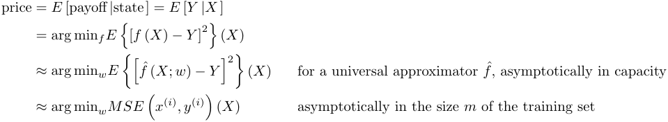

Hence, universal approximations like neural networks, trained on datasets of sampled payoffs by minimization of the mean squared error (MSE) converge to the correct pricing function. The initial state _X_ is sampled over the domain of application for the approximation _f_ˆ , whereas the final payoff _Y |X_ is sampled with a conditional MC path. See Appx 1 for a more detailed formal exposition. 

NN approximate prices more effectively than classic linear models. Neural networks are resilient in high dimension and effectively resolve the long standing _curse of dimensionality_ by learning regression features from data. The extension of LSM to deep learning was explored in many recent works like [14], with the evidence of a considerable improvement, in the context of Bermudan options, although the conclusions carry over to arbitrary schedules of cash-flows. We further investigate the relationship of NN to linear regression in Appx 4. 

### **Training with derivatives** 

We found, in agreement with recent literature, that the performance of modern deep learning remains insufficient for online application with complex transactions or trading books. A vast number of training examples (often in the hundreds of thousands or millions) is necessary to learn accurate approximations, and even a training set of sample payoffs cannot be simulated in reasonable time. Training on noisy payoffs is prone to overfitting, and unrealistic dataset sizes are necessary even in the presence of classic regularization. In addition, risk sensitivities converge considerably slower than values and often remain too approximate even with training sets in the hundreds of thousands of examples. 

This article proposes to resolve these problems by training ML models on datasets _augmented with differentials_ of labels wrt inputs: 

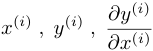

This is a somewhat natural idea, which, along with the adequate training algorithm, enables ML models to learn accurate approximations even from small datasets of noisy payoffs, making ML approximations tractable in the context of trading books and regulations. 

When learning from ground truth labels, the input _x_(_i_) is one example parameter set of the pricing function. If we were learning Black and Scholes’ pricing function, for instance, (without using the formula, which is what we would be trying to approximate), _x_(_i_) would be one possible set of values for the initial spot price, volatility, strike and expiry (ignoring rates or dividends). The label _y_(_i_) would be the (ground thruth) call price computed

<!-- page: 4 -->

with these inputs (by MC or FDM since we don’t know the formula), and the derivatives labels _∂y_(_i_) _/∂x_(_i_) would be the Greeks. 

When learning from simulated payoffs, the input _x_(_i_) is one example state. In the Black and Scholes example, _x_(_i_) would be the spot price sampled on some present or future date _T_ 1 _≥_ 0, called _exposure date_ in the context of regulations, or _horizon date_ in other contexts. The label _y_(_i_) would be the payoff of a call expiring on a later date _T_ 2, sampled on that same path number _i_ . The exercise is to learn a function of _ST_ 1 approximating the value of the _T_ 2 call measured at _T_ 1. In this case, the differential labels _∂y_(_i_) _/∂x_(_i_) are the _pathwise derivatives_ of the payoff at _T_ 2 wrt the state at _T_ 1 on path number _i_ . In Black and Scholes: 

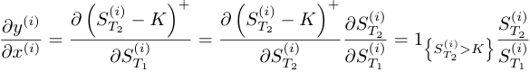

This simple exercise exhibits some general properties of pathwise differentials. First, we computed the Black and Scholes pathwise derivative analytically with an application of the chain rule. The resulting formula is computationally efficient: the derivative is computed together with the payoff along the path, there is no need to regenerate the path, contrarily to e.g. differentiation by finite difference. This efficacy is not limited to European calls in Black and Scholes: pathwise differentials are _always_ efficiently computable by a systematic application of the chain rule, also known as _adjoint differentiation_ or AD. Furthermore, _automated_ implementations of AD, or AAD, perform those computations by themselves, behind the scenes. 

Secondly, _∂Y /∂X_ is a _T_ 2 measurable random variable, and its _T_ 1 expectation is _N_ ( _d_ 1), the Black and Scholes delta. This property too is general: assuming appropriate smoothing of discontinuous cash-flows, expectation and differentiation commute so risk sensitivities are expectations of pathwise differentials. Turning it upside down, pathwise differentials are unbiased (noisy) estimates of ground truth Greeks. 

Therefore, we can compute pathwise differentials efficiently and use them for training as unbiased estimates of ground truth risks, irrespective of the transaction or trading book, and irrespective of the stochastic simulation model. Learning from ground truth labels is slow, but the learned function is reusable in many contexts. This is the correct manner to learn e.g. European option pricing functions in stochastic volatility models. Learning from simulated payoffs is fast, but the learned approximation is a function of the state, specific to a given financial instrument or trading book, under a given calibration of the stochastic model. This is how we can quickly approximate the value and risks of complex transactions and trading books, e.g. in the context of regulations. Differential labels vastly improve performance in both cases, as we see next. 

Classic numerical analysis applies differentials as constraints in the context of _interpolation_ , or penalties in the context of _regularization_ . Regularization generally penalises the _norm_ of differentials, e.g. the size of second order differentials, expressing a preference for linear functions. Our proposition is different. We do not express _preferences_ , we enforce differential _correctness_ , measured by proximity of predicted risk sensitivities to _differential labels_ . An application of differential labels was independently proposed in [6], in the context of high dimensional semi-linear partial differential equations. Our algorithm is general. It applies to either ground truth learning (closely related to interpolation) or sample learning (related to regression). It consumes derivative sensitivities for ground truth learning or pathwise differentials for sample learning. It relies on an effective computation of the differential labels, achieved with automatic adjoint differentiation (AAD). 

### **labels with AAD** 

Differential ML consumes the differential labels _∂y_(_i_) _/∂x_(_i_) from an augmented training set. The differentials must be _accurate_ or the optimizer might get lost chasing wrong targets, and they must be computed quickly, even in high dimension, for the method to be applicable in realistic contexts. Conventional differentiation algorithms like finite differences fail on both counts. This is where the superior AAD algorithm steps in, and automatically computes the differentials of arbitrary calculations, with analytic accuracy, for a computation cost proportional

<!-- page: 5 -->

to _one_ evaluation of the price, irrespective of dimension3 . 

AAD was introduced to finance in the ground breaking ’Smoking Adjoints’ [9]. It is closely related to backpropagation, which powers modern deep learning and has largely contributed to its recent success. In finance, AAD produces risk reports in real time, including for exotic books or XVA. In the context of Monte-Carlo or LSM, AAD produces exact pathwise differentials for a very small cost. AAD made differentials massively available in quantitative finance. Besides evident applications to instantaneous calibration or real-time risk reports, the vast amount of information contained in differentials may be leveraged in creative ways, see e.g. [17] for an original application. 

To a large extent, differential ML is another strong application of AAD. For reasons of memory and computation efficiency, AAD always computes differentials path by path when applied with Monte-Carlo, effectively estimating risk sensitivities in a vast number of different scenarios. Besides its formidable speed and accuracy, AAD therefore produces a massive amount of information. Risk reports correspond to _average_ sensitivities across paths, they only provide a much _flattened_ view of the pathwise differential information. Differential ML, on the other hand, leverages its full extent in order to learn value and risk, not as fixed numbers only relevant in the current state, but as _functions_ of state capable of computing prices and Greeks very quickly in different market scenarios. 

In the interest of brevity, we refer to [21] for a comprehensive description of AAD, including all details of how training differentials were obtained in this study, or the video tutorial [18], which explains its main ideas in 15 minutes. 

The main article is voluntarily kept rather concise. Practical implementation details are deferred to the online notebook, and mathematical formalism is treated in the appendices along with generalizations and extensions. We present differential ML in Section 1 in the context of feedforward neural networks, numerical results in Section 2 and important extensions in Section 3. Appx 1 deploys the mathematical formalism of the machinery. Appx 2 introduces differential PCA and Appx 3 applies differential ML as a superior regularization in the context of classic linear regression. Appx 4 discusses neural architectures and asymptotic control algorithms with convergence guarantees necessary for online operation. 

## **1 Differential Machine Learning** 

This section describes differential training in the context of feedforward neural networks, although everything carries over to NN of arbitrary complexity in a straightforward manner. At this stage, we assume the availability of a training set augmented with differential labels. The dataset consists of arbitrary schedules of cash-flows simulated in an arbitrary stochastic model. Because we learn from simulated data alone, there are no restrictions on the sophistication of the model or the complexity of the cash-flows. The cash-flows of the transaction or trading book could be described with a general scripting language, and the model could be a hybrid ’model of everything’ often used for e.g. XVA computations, with dynamic parameters calibrated to current market data. 

The text focuses on a mathematical and qualitative description of the algortihm, leaving the discussion of practical implementation to the online notebook1 , along with TensorFlow implementation code. 

### **1.1 Notations** 

#### **1.1.1 Feedforward equations** 

Let us first introduce notations for the description of feedforward networks. Define the input (row) vector _x ∈_ R_n_ and the predicted value _y ∈_ R. For every layer _l_ = 1 _, . . . , L_ in the network, define a scalar ’activation’ function 

> 3This is the critical _constant time_ property of adjoint differentiation. It takes the time of 2 to 5 evaluations in practice to compute thousands of differentials with an efficient implementation, see [21]. 

> 1https://github.com/differential-machine-learning/notebooks/blob/master/DifferentialML.ipynb

<!-- page: 6 -->

_gl−_ 1 : R _→_ R. Popular choices are relu, elu and softplus, with the convention _g_ 0( _x_ ) = _x_ is the identity. The notation _gl−_ 1( _x_ ) denotes elementwise application. We denote _wl ∈_ R_nl−_1_×nl_ _, bl ∈_ R_nl_ the weights and biases of layer _l_ . 

The network is defined by its feedforward equations: 

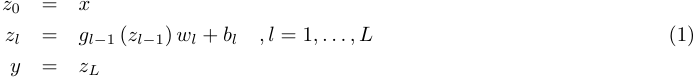

where _zl ∈_ R_nl_ is the row vector containing the _nl_ pre-activation values, also called _units_ or _neurons_ , in layer _l_ . Figure 1 illustrates a feedforward network with _L_ = 3 and _n_ = _n_ 0 = 3 _, n_ 1 = 5 _, n_ 2 = 3 _, n_ 3 = 1, together with backpropagation. 

#### **1.1.2 Backpropagation** 

Feedforward networks are efficiently differentiated by backpropagation, which is generally applied to compute the derivatives of some some cost function wrt the weights and biases for optimization. For now, we are not interested in those differentials, but in the differentials of the _predicted_ value _y_ = _zL_ wrt the _inputs x_ = _z_ 0. Recall that inputs are states and predictions are prices, hence, these differentials are predicted risk sensitivities ( _Greeks_ ), obtained by differentiation of the lines in (1), in the reverse order: 

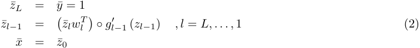

with the _adjoint_ notation _x_ ¯ = _∂y/∂x,_ ¯ _zl_ = _∂y/∂zl,_ ¯ _y_ = _∂y/∂y_ = 1 and _◦_ is the elementwise (Hadamard) product. 

Notice, the similarity between (1) and (2). In fact, backpropagation defines a second feedforward network with inputs _y, z_ ¯ 0 _, . . . , zL_ and output _x_ ¯ _∈_ R_n_ , where the weights are shared with the first network and the units in the second network are the adjoints of the corresponding units in the original network. 

Backpropagation is easily generalized to arbitrary network architectures, as explained in deep learning literature. Generalized to arbitrary computations unrelated to deep learning or AI, backpropagation becomes AD, or AAD when implemented automatically2 . Modern frameworks like TensorFlow include an implementation of backpropagation/AAD and implicitly invoke it in training loops. 

### **1.2 Twin networks** 

We can combine feedforward (1) and backpropagation (2) equations into a single network representation, or _twin network_ , corresponding to the computation of a prediction (approximate price) together with its differentials wrt inputs (approximate risk sensitivities). 

The first half of the twin network (Figure 2) is the original network, traversed with feedforward induction to predict a value. The second half is computed with the backpropagation equations to predict risk sensitivities. It is the mirror image of the first half, with shared connection weights. 

A mathematical description of the twin network is simply obtained by concatenation of equations (1) and (2). The evaluation of the twin network returns a predicted value _y_ , and its differentials _x_ ¯ wrt the _n_ 0 = _n_ inputs 

> 2See video tutorial [18].

<!-- page: 7 -->

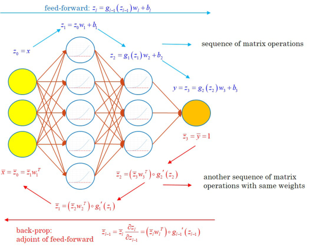

<!-- Start of picture text -->
feed-forward: 2, = 8.4(34), +5 2,=3w,+b, oo_oe Tl = oe2, =2,(2,), +b,———+» sequence of matrix operations : JOYS \ (=<\ (NG = 8) (2) +8, ¥= = NOP”\ ) =oNSS =(3m,')og, (=) wasn Sequence ofrrr‘ "Shy 4 =(w,")°a/ (4)a ——~_ operations with same weights ol —ae .(Gm? )Bi (4) <!-- End of picture text -->

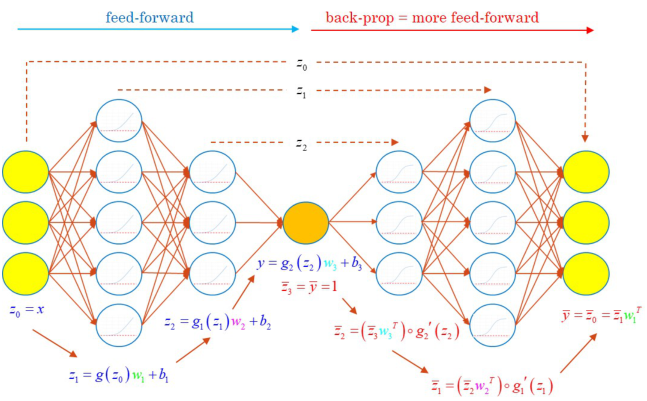

<!-- Start of picture text -->
feed-forward back-prop = more feed-forward OO KO <aPpOy“am ENS a . “i =(Zw,')og, (4) a <!-- End of picture text -->

<!-- page: 8 -->

#### **1.2.1 Training with differential labels** 

The purpose the twin network is to estimate the correct pricing function _f_ ( _x_ ) by an approximate function ˆ _f_ � _x_ ; _{wl, bl}l_ =1 _,...,L_ �. It learns optimal weights and biases from an augmented training set � _x_(_i_) _, y_(_i_) _,_ ¯ _x_(_i_)� , where _x_ ¯(_i_) = _∂y_(_i_) _/∂x_(_i_) are the differential labels. 

Here, we describe the mechanics of differential training and discuss its effectiveness. As is customary with ML, we stack training data in matrices, with examples in rows and units in columns: 

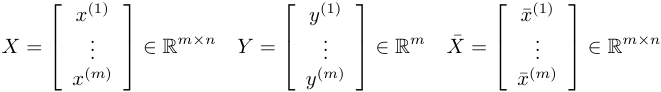

Notice, the equations (1) and (2) identically apply to matrices or row vectors. Hence, the evaluation of the twin network computes the matrices: 

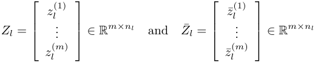

respectively in the first and second half of its structure. Training consists in finding weights and biases minimizing some cost function _C_ : _{wl, bl}l_ =1 _,...,L_ = arg min _C_ � _{wl, bl}l_ =1 _,...,L_ �. 

##### **Classic training with payoffs alone** 

Let us first recall classic deep learning. We have seen that the approximation obtained by global minimization of the MSE converges to the correct pricing function (modulo finite capacity bias), hence: 

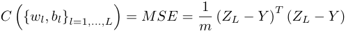

The second half of the twin network does not affect cost, hence, training is performed by backpropagation through the standard feedforward network alone. The many practical details of the optimization are covered in the online notebook. 

##### **Differential training with differentials alone** 

Let us change gears and train with pathwise differentials _x_ ¯(_i_) instead of payoffs _y_(_i_) , by minimization of the MSE (denoted _MSE_ ) between the differential labels (pathwise differentials) and predicted differentials (estimated risk sensitivities): 

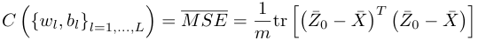

Here, we must evaluate the twin network in full to compute _Z_¯ 0, effectively doubling the cost of training. Gradientbased methods minimize _MSE_ by backpropagation through the twin network, effectively accumulating secondorder differentials in its second half. A deep learning framework, like TensorFlow, performs this computation seamlessly. As we have seen, the second half of the twin network may represent backpropagation, in the end, this is just another sequence of matrix operations, easily differentiated by another round of backpropagation, carried out silently, behind the scenes. The implementation in the demonstration notebook is identical to training with

<!-- page: 9 -->

payoffs, safe for the definition of the cost function. TensorFlow automatically invokes the necessary operations, evaluating the feedforward network when minimizing _MSE_ and the twin network when minimizing _MSE_ . 

In <u>practice,</u> we must also assign appropriate weights to the costs of wrong differentials in the definition of the _MSE_ . This is discussed in the implementation notebook, and in more detail in Appx 2. 

Let us now discuss what it _means_ to train approximations by minimization of the _MSE_ between pathwise differentials _x_ ¯(_i_) = _∂y_(_i_) _/∂x_(_i_) and predicted risks _∂f_ˆ � _x_(_i_)� _/∂x_(_i_) . Given appropriate smoothing3 , expectation and differentiation commute so the (true) risk sensitivities are expectations of pathwise differentials: 

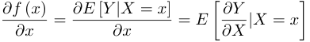

It follows that pathwise differentials are unbiased estimates of risk sensitivities, and approximations trained by minimization of the _MSE_ converge (modulo finite capacity bias) to a function with correct differentials, hence, the right pricing function, modulo an additive constant. 

Therefore, we can choose to train by minimization of value or derivative errors, and converge near the correct pricing function all the same. This consideration is, however, an asymptotic one. Training with differentials converges near the same approximation, but it converges much faster, allowing us to train accurate approximations with much smaller datasets, as we see in the numerical examples, because: 

- **The effective size of the dataset is much larger** evidently, with _m_ training examples we have _nm_ differentials ( _n_ being the dimension of the inputs _x_(_i_) ). With AAD, we effectively simulate a much larger dataset for a minimal additional cost, especially in high dimension (where classical training struggles most). 

- **The neural nets picks up the** **_shape_ of the pricing function** learning from slopes rather than points, resulting in much more stable and potent learning, even with few examples. 

- **The neural approximation learns to produce correct Greeks** by construction, not only correct values. By learning the correct shape, the ML approximation also correctly orders values in different scenarios, which is critical in applications like value at risk (VAR) or expected loss (EL), including for FRTB. 

- **Differentials act as an effective, bias-free regularization** as we see next. 

##### **Differential training with everything** 

The best numerical results are obtained in practice by combining values and derivatives errors in the cost function: 

##### _C_ = _MSE_ + _λMSE_ 

which is the one implemented in the demonstration notebook, with the two previous strategies as particular cases. Notice, the similarity with classic regularization of the form _C_ = _MSE_ + _λ penalty_ . Ridge (Tikhonov) and Lasso regularizations impose a penalty for large weights (respectively in _L_2 and _L_1 metrics), effectively preventing overfitting small datasets by stopping attempts to fit noisy labels. In return, classic regularization reduces the effective capacity of the model and introduces a bias, along with a strong dependency on the hyperparameter _λ_ . This hyperparameter controls regularization strength and tunes the vastly documented bias-variance tradeoff. If one sets _λ_ too high, their trained approximation ends up a horizontal line. 

Differential training also stops attempts to fit noisy labels, with a penalty for wrong differentials. It is, therefore, a form of regularization, but a very different kind. It doesn’t introduce bias, since we have seen that training 

> 3 Pathwise differentials of discontinuous payoffs like digitals or barriers are not well defined, and it follows that the risk sensitivities of these instruments cannot be reliably computed with Monte-Carlo, with AAD or otherwise. This is a well-known problem in the industry, generally resolved by _smoothing_ , i.e. the approximation of discontinuous cash-flows with close continuous ones, like tight call spreads in place of digitals or soft barriers in place of hard barriers. Smoothing is a common practice among option traders, and it is related to _fuzzy logic_ , as demonstrated in [19], which also presents the theoretical and practical details of smoothing methodologies, and proposes a systematic smoothing algorithm based on fuzzy logic.

<!-- page: 10 -->

on differentials _alone_ converges to the correct approximation too. This breed of regularization comes without bias-variance tradeoff. It reduces variance for free. Increasing _λ_ hardly affects results in practice. 

Differential regularization is more similar to _data augmentation_ in computer vision, which is, in turn, a more powerful regularization. Differentials are additional training data. Like data augmentation, differential regularization reduces variance by increasing the size of the dataset for little cost. Differentials are new data of a different kind, and it shares inputs with existing data, but it reduces variance all the same, without introducing bias. 

## **2 Numerical results** 

Let us now review some numerical results and compare the performance of differential and conventional ML. We picked three examples from relevant textbook and real-world situations, where neural networks learn pricing and risk approximations from small datasets. 

We kept neural architecture constant in all the examples, with four hidden layers of 20 softplus-activated units. We train neural networks on mini-batches of normalized data, with the ADAM optimizer and a one-cycle learning rate schedule. The demonstration notebook and appendices discuss all the details. A differential training set takes 2-5 times longer to simulate with AAD, and it takes twice longer to train twin nets than standard ones. In return, we are going to see that differential ML performs up to thousandfold better on small datasets. 

### **2.1 Basket options** 

The first (textbook) example is a basket option in a correlated Bachelier model for seven assets1 : 

##### _dSt_ = _σ dWt_ 

where _St ∈_ R7 and _dWt__jdW_ _t__k_=_ρjk_.Thetaskistolearnthepricingfunctionofa1ycalloptiononabasket, with strike 110 (we normalized asset prices at 100 without loss of generality and basket weights sum to 1). The basket price is also Gaussian in this model; hence, Bachelier’s formula gives the correct price. This example is also of particular interest because, although the input space is seven-dimensional, we know from maths that actual pricing is one-dimensional. Can the network learn this property from data? 

We have trained neural networks and predicted values and derivatives in 1024 independent test scenarios, with initial basket values on the horizontal axis and option prices/deltas on the vertical axis (we show one of the seven derivatives), compared with the correct results computed with Bachelier’s formula. We trained networks on 1024 (1k) and 65536 (64k) paths, with cross-validation and early stopping. The twin network with 1k examples performs better than the classical net with 64k examples for values, and a lot better for derivatives. In particular, it learned that the option price and deltas are a fixed function of the basket, as evidenced by the thinness of the approximation curve. The classical network doesn’t learn this property well, even with 64k examples. It overfits training data and predicts different values or deltas for various scenarios on the seven assets with virtually identical baskets. 

We also compared test errors with standard MC errors (also with 1k and 64k paths). The main point of pricing approximation is to avoid nested simulations with similar accuracy. We see that the error of the twin network is, indeed, close to MC. Classical deep learning error is an order of magnitude larger. Finally, we trained with eight _million_ samples, and verified that both networks converge to similarly low errors ( _not_ zero, due to finite capacity) while MC error converges to zero. The twin network gets there hundreds of times faster. 

All those results are reproduced in the online TensorFlow notebook. 

> 1This example is reproducible on the demonstration notebook, where the number of assets is configurable, and the covariance matrix and basket weights are re-generated randomly.

<!-- page: 11 -->

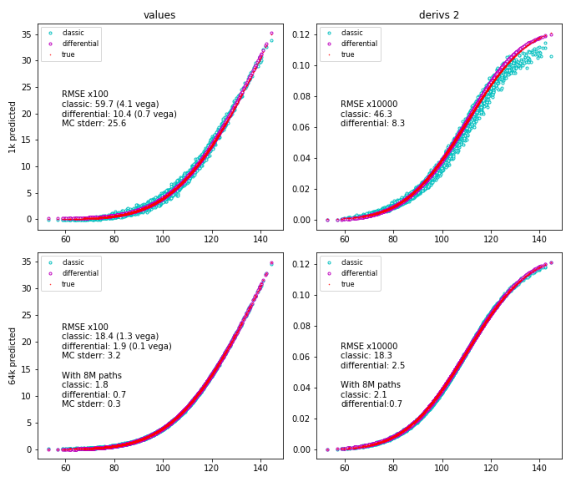

<!-- Start of picture text -->
values derivs 2 35 4° dassic © | 0124 © dassic ° © differential @ © differential , x0 + tue 0.10 + tue gesSeen, zB % classic:RMSE x10059.7 (4.1 vega) 0.08 RMSE x10000 Posge % 20 differential: 10.4 (0.7 vega) classic: 46.3 Fe 3 MC stderr: 25.6 0.06 differential: 8.3 w Es / Fjx“ &as 10 7 0.04 ‘Aia 5 0.02 if f O07 ee 0.007 ¢ 60 80 100 20 140 60 80 100 no 140 35 © dassicdifferential ° * | 012 © dassicdifferential ° 0 ue + tue 0.10 23 3 RMSE x100 0.08 2= 20 classic:differential:18.4 1.9(1.3(0.1 vega)vega) RMSE x10000 = MC stderr: 3.2 0.06 classic: 18.3 S45 differential: 2.5 = With 8M paths o classic: 1.8 0.04 With 8M paths 10 differential: 0.7 classic: 2.1 MC stderr: 0.3 differential:0.7 5 0.02 07 @@ 0.007 « 60 80 100 120 140 60 80 100 120 140 <!-- End of picture text -->

<!-- page: 12 -->

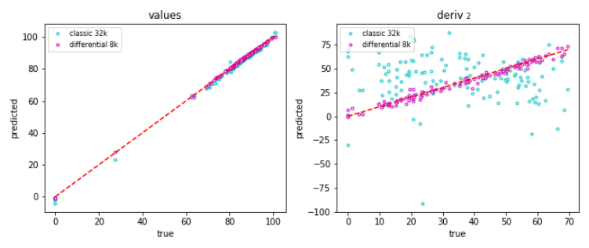

<!-- Start of picture text -->
values deriv 2 100 e classic 32k = e classic 32k ° ® differential Sk ? 754 © differentialdk ® ons ‘ a A oC 3 60 a z oe _ eget * ee MBF as} oe as} of = . a& ao *a“ -ef a]Bos] ® a) . .® a 20 oe 50 O71 ¢raea“ -15 ° —100 0 20 40 60 80 100 oO 10 20 30 40 50 60 70 true true <!-- End of picture text -->

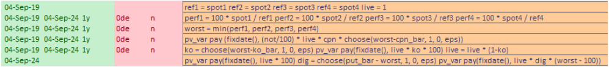

<!-- Start of picture text -->
04-Sep-19 refl =spotl ref2= spot2 ref3= spot3 ref4= spot4 live =1 04-Sep-19 04-Sep-24 ly Ode n perfl = 100 * spotl/ refl perf2 = 100 * spot?/ ref? perf3= 100 * spot3/ ref3 perf4 = 100 * spot4/ ref4 04-Sep-19 04-Sep-24 ly Ode n worst = min(perfl, perf2, perf3, perf4) 04-Sep-19 04-Sep-24 ly Ode n pv_var pay (fixdate(), (not/100) * live * cpn * choose(worst-con_bar, 1, 0, eps)) 04-Sep-19 04-Sep-24 ly Ode n ko = choose(worst-ko_bar, 1, 0, eps) pv_var pay(fixdate(), live * ko * 100) live= live * (1-ko} 04-Sep-24 pv_var pay(fixdate(), live * 100) dig = choose(put_bar - worst, 1, 0, eps) pv_var pay(fixdate(), live * dig * (worst - 100)) <!-- End of picture text -->

<!-- page: 13 -->

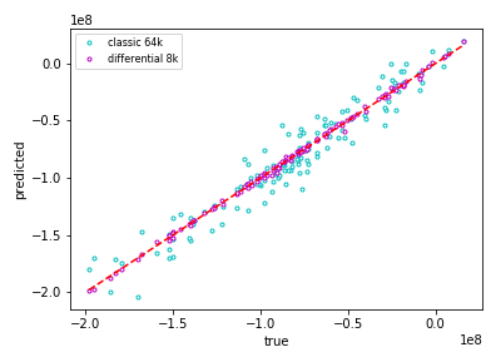

<!-- Start of picture text -->
led ® classic 64k sg oo | @. differentialak e8 oo x gee 3 “at -15 * . ao 2” ad 8 ° ae 2.0 -15 -1.0 -0.5 oo true 128 <!-- End of picture text -->

<!-- page: 14 -->

where _z_ ¯ _l ∈_ R_nL×nl_ . In particular, _x_ ¯ _∈_ R_nL×n_ is (indeed) the Jacobian matrix _∂y/∂x_ . To compute a full Jacobian, the theoretical order of calculations is _nL_ times the vanilla network. Notice however, that the implementation of the multiple backpropagation in the matrix form above on a system like TensorFlow automatically benefits from CPU or GPU parallelism. Therefore, the additional computation complexity will be experienced as sublinear. 

### **3.2 Higher order derivatives** 

The twin network can also predict higher-order derivatives. For simplicity, revert to the single prediction case where _nL_ = 1. The twin network predicts _x_ ¯ as a function of the input _x_ . The neural network, however, doesn’t know anything about derivatives. It just computes numbers by a sequence of equations. Hence, we might as well consider the prediction of differentials as multiple outputs. 

As previously, in what is now considered a multiple prediction network, we can compute the adjoints of the outputs _x_ ¯ in the twin network. These are now _the adjoints of the adjoints_ : 

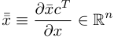

in other terms, the Hessian matrix of the value prediction _y_ . Note that the original activation functions must be _C_2 for this computation. The computation of the full Hessian is of order _n_ times the original network. These additional calculations generate a lot more data, one value, _n_ derivatives and<u>1</u> 2_n_(_n_+ 1) second-order derivatives for the cost of 2 _n_ times the value prediction alone. In a parallel system like TensorFlow, the experience also remains sublinear. We can extend this argument to arbitrary order _q_ , with the only restriction that the (original) activation functions are _C__q_ . 

## **Conclusion** 

Throughout our analysis we have seen that ’learning the correct shape’ from differentials is crucial to the performance of regression models, including neural networks, in such complex computational tasks as the pricing and risk approximation of arbitrary Derivatives trading books. The _unreasonable effectiveness_ of what we called ’differential machine learning’ permits to accurately train ML models on a small number of simulated payoffs, in realtime, suitable for online learning. Differential networks apply to real-world problems, including regulations and risk reports with multiple scenarios. Twin networks predict prices and Greeks with almost analytic speed, and their empirical test error remains of comparable magnitude to nested Monte-Carlo. 

Our machinery learns from data alone and applies in very general situations, with arbitrary schedules of cashflows, scripted or not, and arbitrary simulation models. Differential ML also applies to many families of approximations, including classic linear combinations of fixed basis functions, and neural networks of arbitrary complex architecture. Differential training consumes differentials of labels wrt inputs and requires clients to somehow provide high-quality first-order differentials. In finance, they are obtained with AAD, in the same way we compute Monte-Carlo risk reports, with analytic accuracy and very little computation cost. 

One of the main benefits of twin networks is their ability to learn effectively from small datasets. Differentials inject meaningful additional information, eventually resulting in _better_ results with small datasets of 1k to 8k examples than can be obtained otherwise with training sets orders of magnitude larger. Learning effectively from small datasets is critical in the context of e.g. regulations, where the pricing approximation must be learned quickly, and the expense of a large training set cannot be afforded. 

The penalty enforced for wrong differentials in the cost function also acts as a very effective regularizer, superior to classical forms of regularization like Ridge, Lasso or Dropout, which enforce arbitrary penalties to mitigate overfitting, whereas differentials meaningfully augment data. Standard regularizers are very sensitive to the regularization strength _λ_ , a manually tweaked hyperparameter. Differential training is virtually insensitive to

<!-- page: 15 -->

_λ_ , because, even with infinite regularization, we train on derivatives alone and still converge to the correct approximation, modulo an additive constant. 

Appx 2 and Appx 3 apply the same ideas to respectively PCA and classic regression. In the context of regression, differentials act as a very effective regularizer. Like Tikhonov regularization, differential regularization is analytic and works SVD. Appx 3 derives a variation of the normal equation adjusted for differential regularization. Unlike Tikhonov, differential regularization does not introduce bias. Differential PCA, unlike classic PCA, is able to extract from data the principal risk factors of a given transaction, and it can be applied as a preprocessing step to safely reduce dimension without loss of relevant information. 

Differential training also appears to stabilize the training of neural networks, and improved resilience to hyperparameters like network architecture, seeding of weights or learning rate schedule was consistently observed, although to explain exactly why is a topic for further research. 

Standard machine learning may often be considerably improved with contextual information not contained in data, such as the nature of the relevant features from knowledge of the transaction and the simulation model. For example, we know that the continuation value of a Bermudan option on some call date mainly depends on the swap rate to maturity and the discount rate to the next call. We can learn pricing functions much more effectively with hand engineered features. But it has to be done manually, on a case by case basis, depending on the transaction and the simulation model. If the Bermudan model is upgraded with stochastic volatility, volatility state becomes an additional feature that cannot be ignored, and hand-engineered features must be updated. Differential machine learning learns just as well, or better, from data alone, the vast amount of information contained in pathwise differentials playing a role similar, and sometimes more effectively, to manual adjustments from contextual information. 

Differential machine learning is similar to data augmentation in computer vision, a technique consistently applied in that field with documented success, where multiple labeled images are produced from a single one, by cropping, zooming, rotation or recoloring. In addition to extending the training set for a negligible cost, data augmentation encourages the ML model to learn important invariances. Similarly, derivatives labels, not only increase the amount of information in the training set, but also encourage the model to learn the _shape_ of the pricing function.

<!-- page: 16 -->

# **Appendices**

<!-- page: 17 -->

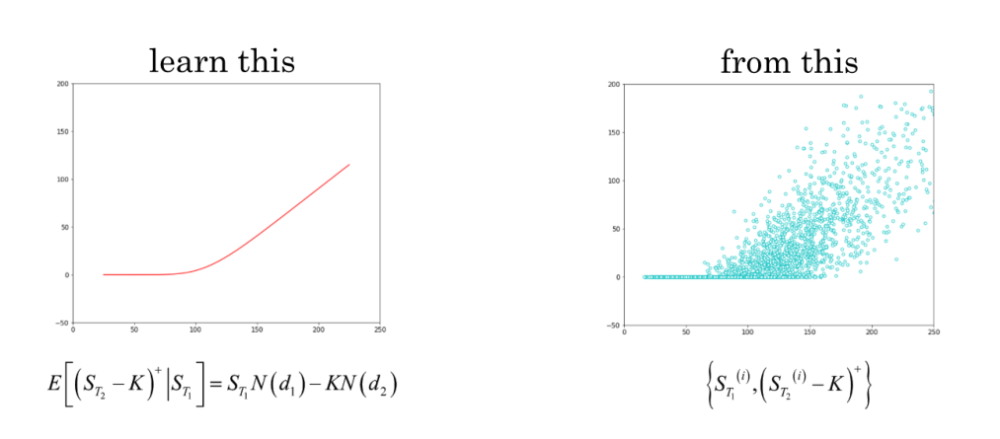

<!-- Start of picture text -->
learn this from this | | E\(S, -K) |S, | = S,,N(d,)—KN(d,) {S1?4(5, -K) | <!-- End of picture text -->

<!-- page: 18 -->

recommended, this is where we set important notations. In the second section, we discuss universal approximators, formalize their training process on LSM samples, and demonstrate convergence to true prices. In the third section, we define pathwise differentials, formalize differential training and show that it too converges to true risk sensitivities. 

The purpose of this document is to explain and formalize important mathematical intuitions, not to provide complete formal proofs. We often skip important mathematical technicalities so our demonstrations should really be qualified as ’sketches of proof’. 

### **1 LSM datasets** 

#### **1.1 Markov States** 

##### **Model state** 

First, we formalize the definition of a LSM dataset. LSM datasets are simulated with a Monte-Carlo implementation of a dynamic pricing model. Dynamic models are parametric assumptions of the diffusion of a _state vector St_ , of the form: 

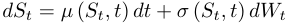

where _St_ is a vector of dimension _n_ 0, _µ_ ( _s, t_ ) is a vector valued function of dimension _n_ 0, _σ_ ( _s, t_ ) is a matrix valued function of dimension _n_ 0 _× p_ and _Wt_ is a _p_ dimensional standard Brownian motion under the _pricing measure_ . The number _n_ 0 is called the _Markov dimension_ of the model, the number _p_ is called the _number of factors_ . Some models are non-diffusive, for example, jump diffusion models _a la_ Merton or rough volatility models _a la_ Gatheral. All the arguments of this note carry over to more general models, but in the interest of concision and simplicity, we only consider diffusions in the exposition. Dynamic models are implemented in Monte-Carlo simulations, e.g. with Euler’s scheme: 

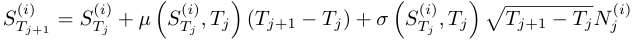

where _i_ is the index of the path, _j_ is the index of the time step and the _Nj_ ( _i_ ) are independent Gaussian vectors in dimension _p_ . 

The definition of the state vector _St_ depends on the model. In Black and Scholes or local volatility extensions _a la_ Dupire, the state is the underlying asset price. With stochastic volatility models like SABR or Heston, the bi-dimensional state _St_ = ( _st, σt_ ) is the pair (current asset price, current volatility). In Hull and White / Cheyette interest rate models, the state is a low dimensional latent representation of the yield curve. In general Heath-Jarrow-Morton / Libor Market models, the state is the collection of all forward rates in the yield curve. 

We call _model state_ on date _t_ the state vector _St_ of the model on this date. 

##### **Transaction state** 

Derivatives transactions also carry a state, in the sense that the transactions evolve and mutate during their lifetime. The state of a barrier option depends on whether the barrier was hit in the past. The state of a Bermudan swaption depends on whether it was exercised. Even the state of a swap depends on the coupons fixed in the past and not yet paid. European options don’t carry state until expiry, but then, they may exercise into an underlying schedule of cashflows. 

We denote _Ut_ the transaction state at time _t_ and _n_ 1 its dimension. For a barrier option, the transaction state is of dimension one and contains the indicator of having hit the barrier prior to _t_ . For a real-world trading book,

<!-- page: 19 -->

the dimension _n_ 1 may be in the thousands and it may be necessary to split the book to avoid dimension overload. The transaction state is simulated together with the model state in a Monte-Carlo implementation. In a system where event driven cashflows are scripted, the transaction state _Ut_ is also the script state, i.e. the collection of variables in the script evaluated over the Monte-Carlo path up to time _t_ . 

##### **Training inputs** 

The exercise is to learn the pricing function for a given transaction or a set of transactions, in a given model, on a given date _T_ 1 _≥_ 0, sometimes called the _exposure date_ or _horizon date_ . The price evidently depends on both the state of the model _ST_ 1 and the state of the transaction _UT_ 1. The concatenation of these two vectors _XT_ 1 = [ _ST_ 1 _, UT_ 1] constitute the _complete Markov state_ of the system, in the sense that the true price of transactions at _T_ 1 are deterministic (but unknown) functions of _XT_ 1. 

The dimension of the state vector is _n_ 0 + _n_ 1 = _n_ . 

The training inputs are a collection of examples _X_(_i_) of the Markov state _XT_ 1 in dimension _n_ . They may be sampled by Monte-Carlo simulation between today ( _T_ 0 = 0) and _T_ 1, or otherwise. The distribution of _X_ in the training set should reflect the intended use of the trained approximation. For example, in the context of value at risk (VAR) or expected loss (FRTB), we need an accurate approximation in extreme scenarios, hence, we need them well represented in the training set, e.g. with a Monte-Carlo simulation with increased volatility. In low dimension, the training states _X_(_i_) may be put on a regular grid over a relevant domain. In higher dimension, they may be sampled over a relevant domain with a low discrepancy sequence like Sobol. When the exposure date _T_ 1 is today or close, sampling _XT_ 1 with Monte-Carlo is nonsensical, an appropriate sampling distribution must be applied depending on context. 

#### **1.2 Pricing** 

##### **and transactions** 

A cashflow _CFk_ paid at time _Tk_ is formally defined as a _Tk_ measurable random variable. This means that the cashflow is revealed on or before its payment date. In the world described by the model, this is a _functional_ of the path of the state vector _St_ from _T_ 0 = 0 to the payment date _Tk_ and may be simulated by Monte-Carlo. 

A transaction is a collection of cashflows _CF_ 1 _, ..., CFK_ . A European call of strike _K_ expiring at _T_ is a unique cashflow, paid at _T_ , defined as ( _sT − K_ )+ . A barrier option also defines a unique cashflow: 

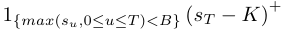

An interest rate swap defines a schedule of cashflows paid on its fixed leg and another one paid on its floating leg. Scripting conveniently and consistently describes all cashflows, as functional of market variables, in a language purposely designed for this purpose. 

A netting set or trading book is a collection of transactions, hence, ultimately, a collection of cashflows. In what follows, the word ’transaction’ refers to arbitrary collection of cashflows, maybe netting sets or trading books. The payment date of the last cashflow is called the _maturity_ of the transaction and denoted _T_ 2. 

##### **Payoffs** 

The payoff of a transaction is defined as the _discounted sum of all its cashflows_ : 

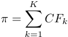

<!-- page: 20 -->

hence, the payoff is a _T_ 2 measurable random variable, which can be sampled by Monte-Carlo simulation. 

For the purpose of learning the pricing function of a transaction on an exposure date _T_ 1, we only consider cashflows _after T_ 1, and discount them to the exposure date. In the interest of simplicity, we incorporate discounting to _T_ 1 in the functional of the Hence: 

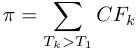

The payoff is still a _T_ 2 measurable random variable. It can be sampled by Monte-Carlo simulation _conditional to state XT_ 1 = [ _ST_ 1 _, UT_ 1] _at T_ 1 by seeding the simulation with state _XT_ 1 at _T_ 1 and simulating up to _T_ 2. 

##### **Pricing** 

Assuming a complete, arbitrage-free model, we immediately get the price of the transaction from the fundamental theorem of asset pricing: 

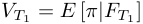

where expectations are taken in the pricing measure defined by the model and _FT_ 1 is the filtration at _T_ 1 (loosely speaking, the information available at _T_ 1). Since by assumption _XT_ 1 = [ _ST_ 1 _, UT_ 1] is the complete Markov state of the system at _T_ 1: 

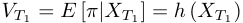

Hence, the true price is a deterministic (but unknown) function _h_ of the Markov state. 

##### **Training labels** 

We see that the price corresponding to the input example _X_(_i_) is: 

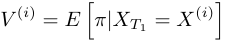

and that its computation, in the general case, involves averaging payoffs over a number of Monte-Carlo simulations from _T_ 1 to _T_ 2, all identically seeded with _XT_ 1 = _X_(_i_) . This is also called _nested simulations_ because a set of simulations is necessary to compute the value of each example, the initial states having themselves been sampled somehow. If the initial states were sampled with Monte-Carlo simulations, they are called _outer simulations_ . Hence, we have _simulations within simulations_ , an extremely costly and inefficient procedure2 . 

Instead, for each example _i_ , we draw one single payoff _π_(_i_) from its distribution conditional to _XT_ 1 = _X_(_i_) , by simulation of one Monte-Carlo path from _T_ 1 to _T_ 2, seeded with _X_(_i_) at _T_ 1. The labels in our dataset correspond to these random draws: 

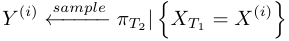

Notice (dropping the condition to _XT_ 1 = _X_(_i_) to simplify notations) that, while labels no longer correspond to true prices, they are _unbiased_ (if noisy) estimates of true prices. 

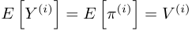

> 2Although, we can use nested simulations as a reference to measure performance, as we did in the working paper, sections 3.2 and 3.3. In production, nested simulations may be used to regularly double check numbers.

<!-- page: 21 -->

in other terms: 

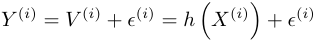

where the _ϵ_(_i_) are independent noise with _E_ [ _ϵ_ ( _i_ )] = 0. This is why universal approximators trained on LSM datasets converge to true prices despite having never seen one. 

### **2 Machine learning with LSM datasets** 

#### **2.1 Universal approximators** 

Havingˆ simulated a training set of examples _X_(_i_) _, Y_(_i_) we proceed to train approximators, defined as functions _h_ ( _x, w_ ) of the input vector _x_ of dimension _n_ , parameterized by a vector _w_ of _learnable weights_ of dimension _d_ . This is a general definition of approximators. In classic regression, _w_ are the regression weights, often denoted _β_ . In a neural network, _w_ is the collection of all connection matrices _W_[_l_] and bias vectors _b_[_l_] in the multiple layers _l_ = 1 _, ..., L_ of the network. 

The _capacity_ of the approximator is an informal measure of both its computational complexity and its ability to approximate functions by matching discrete sets of datapoints. A classic formal definition of capacity is the Vapnik-Chervonenkis dimension, defined as the largest number of arbitrary datapoints the approximator can match exactly. We settle for a weaker definition of capacity as the number _d_ of learnable parameters, sufficient for our purpose. 

A _universal_ approximator is one guaranteed to approximate any function to arbitrary accuracy when its capacity is grown to infinity. Examples of universal approximator include classic linear regression, as long as the regression functions form a complete basis of the function space. Polynomial, harmonic (Fourier) and radial basis regressors are all universal approximators. Famously, neural networks are universal approximators too, a result known as the Universal Approximation Theorem. 

#### **2.2 LSM approximation theorem** 

Training an approximator means setting the value of its learnable parameters _w_ in order to minimize a _cost function_ , generally the mean square error (MSE) between the approximations and labels over a training set of _m_ examples: 

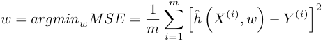

The following theorem justifies the practice of training approximators on LSM datasets: 

A universal approximator _f_ˆ trained by minimization of the MSE over a training set _X_(_i_) _, Y_(_i_) of independent examples of Markov states at _T_ 1 coupled with conditional sample payoffs at _T_ 2, converges to the true pricing function 

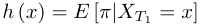

when the size _m_ of the training set and the capacity _d_ of the approximator both grow to infinity. 

We provide a sketch of proof, skipping important mathematical technicalities to highlight intuitions and important properties.

<!-- page: 22 -->

First, notice that the training set consists in _m_ independent, identically distributed realizations of the couple _X, Y_ where _X_ is the Markov state at _T_ 1, sampled from a distribution reflecting the intended application of the approximator, and _Y |X_ is the conditional payoff at _T_ 2, sampled from the pricing distribution defined by the model and sampled by conditional Monte-Carlo simulation. 

Hence, the true pricing function _h_ satisfies: 

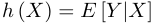

By definition, the conditional expectation _E_ [ _Y |X_ ] is the function of _X_ closest to _Y_ in _L_2 : 

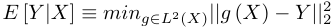

Hence, pricing can be framed as an optimization problem in the space of functions. By universal approximation property: 

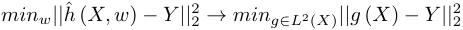

when the capacity _d_ grows to infinity, and: 

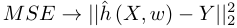

when _m_ grows to infinity, by assumption of an IID training set, sampled from the correct distributions. Hence: 

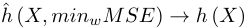

when both _m_ and _d_ grow to infinity. This is the theoretical basis for training machine learning models on LSM samples, and it applies to all universal approximators, including neural networks. This is why regression or neural networks trained on samples ’magically’ converge to the correct pricing function, as observed e.g. in our demonstration notebook with European calls in Black and Scholes and basket options in Bachelier. The theorem is general and equally guarantees convergence for arbitrary (complete and arbitrage-free) models and schedules of 

### **3 Differential Machine Learning with LSM datasets** 

#### **3.1 Pathwise** 

By definition, pathwise differentials _∂π/∂XT_ 1 are _T_ 2 measurable random variables equal to the gradient of the payoff at _T_ 2 wrt the state variables at _T_ 1. 

For example, for a European call in Black and Scholes, pathwise derivatives are equal to: 

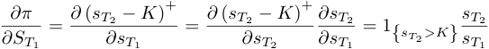

In a general context, pathwise differentials are conveniently and efficiently computed with automatic adjoint differentiation (AAD) over Monte-Carlo paths as explained in the founding paper _Smoking Adjoints_ (Giles and Glasserman, Risk 2006) and the vast amount of literature that followed. We posted a video tutorial explaining the main ideas in 15 minutes3 . 

> 3 https://www.youtube.com/watch?v=IcQkwgPwfm4

<!-- page: 23 -->

Pathwise differentials are not well defined for discontinuous cashflows, like digitals or barriers. This is classically resolved by _smoothing_ , i.e. the replacement of discontinuous cashflows with close continuous approximations. Digitals are typically represented as tight call spreads, and barriers are represented as _soft barriers_ . Smoothing has been a standard practice on Derivatives trading desks for several decades. For an overview of smoothing, including generalization in terms of _fuzzy logic_ and a systematic smoothing algorithm, see our presentation4 . 

Provided that all cashflows are differentiable by smoothing (and some additional, generally satisfied technical requirements), the expectation and differentiation operators commute so that true risks are (conditional) expectations of pathwise differentials: 

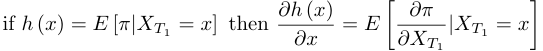

This theorem is demonstrated in stochastic literature, the most general demonstration being found in _Functional Ito Calculus_ , also called _Dupire Calculus_ , see Quantitative Finance Volume 19, 2019, Issue 5. It also applies to pathwise differentials _wrt model parameters_ , and justifies the practice of Monte-Carlo risk reports by averaging pathwise derivatives. 

#### **3.2 Training on pathwise differentials** 

LSM datasets consist of inputs _X_(_i_) = _XT_(_i_ 1)withlabels_Y_(_i_)=_π_(_i_).Pathwisedifferentialsarethereforethe gradients of labels _Y_(_i_) wrt inputs _X_(_i_) . The main proposition of the working paper is to augment training datasets with those differentials and implement an adequate training on the augmented dataset, with the result of vastly improved approximation performance. 

Suppose first that we are training an approximator on differentials alone: 

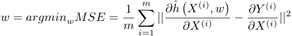

with predicted derivatives on the left hand side (LHS) and differential labels on the right hand side (RHS). Note that the LHS _is_ the predicted sensitivity _∂h_ˆ � _X_(_i_)� _/∂X_(_i_) but the RHS is _not_ the true sensitivity _∂h_ � _X_(_i_)� _/∂X_(_i_) . It is the pathwise differential, a random variable with expectation the true sensitivity and additional sampling noise. 

We have already seen this exact same situation while training approximators on LSM samples, and demonstrated that the trained approximator converges to the true conditional expectation, in this case, the expectation of pathwise differentials, a.k.a. the true risk sensitivities. 

The trained approximator will therefore converge to a function _h_ˆ with all the same differentials as the true pricing function _h_ . It follows that on convergence _h_ˆ = _h_ modulo an additive constant _c_ , trivially computed at the term of training by matching means: 

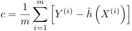

### **Conclusion** 

We reviewed the details of LSM simulation framed in machine learning terms, and demonstrated that training approximators on LSM datasets effectively converges to the true pricing functions. We then proceeded to 

> 4https://www.slideshare.net/AntoineSavine/stabilise-risks-of-discontinuous-payoffs-with-fuzzy-logic

<!-- page: 24 -->

demonstrate that the same is true of differential training, i.e. training approximators on pathwise differentials also converges to the true pricing functions. 

These are asymptotic results. They justify standard practices and guarantee consistence and meaningfulness of classical and differential training on LSM datasets, classical or augmented e.g. with AAD. They don’t say anything about speed of convergence. In practicular, they don’t provide a quantification of errors with finite capacity _d_ and finite datasets of size _m_ . They don’t explain the vastly improved performance of differential training, consistently observed across examples of practical relevance in the working paper. Both methods have the same asymptotic guarantees, where they differ is in the magnitude of errors with finite capacity and size. To quantify those is a more complex problem and a topic for further research.

<!-- page: 25 -->

## **Appx 2 Taking the First Step : Differential PCA** 

### **Introduction** 

We review traditional data preparation in deep learning (DL) including principal component analysis (PCA), which effectively performs orthonormal transformation of input data, filtering constant and redundant inputs, and enabling more effective training of neural networks (NN). Of course, PCA is also useful in its own right, providing a lower dimensional latent representation of data variation along orthogonal axes. 

In the context of _differential_ DL, training data also contains differential labels (differentials of training labels wrt training inputs, computed e.g. with automatic adjoint differentiation -AAD- as explained in the working paper), and thus requires additional preprocessing. 

We will see that differential labels also enable remarkably effective data preparation, which we call _differential PCA_ . Like classic PCA, differential PCA provides a hierarchical, orthogonal representation of data. Unlike classic PCA, differential PCA represents input data in terms how it affects the target measured by training labels, a notion we call _relevance_ . For this reason, differential PCA may be safely applied to aggressively remove irrelevant factors and considerably reduce dimension. 

In the context of data generated by financial Monte-Carlo paths, differential PCA exhibits the principal risk factors of the target transaction or trading book from data alone. It is therefore a very useful algorithm on its own right, besides its effectiveness preparing data for training NN. 

The first section describes and justifies elementary data preparation, as implemented in the demonstration notebook _DifferentialML.ipynb_ on https://github.com/differential-machine-learning. Section 2 discusses the mechanism, benefits and limits of classic PCA. Section 3 introduces and derives differential PCA and discusses the details of its implementation and benefits. Section 4 brings it all together in pseudocode. 

### **1 Elementary data preparation** 

Dataset normalization is known as a crucial, if somewhat mundane preparation step in deep learning (DL), highlighted in all DL textbooks and manuals. Recall from the working paper that we are working with augmented datasets: 

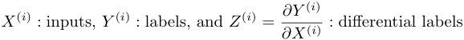

with _m_ labels in dimension 1 and _m_ inputs and _m_ differentials in dimension _n_ , stacked in _m_ rows in the matrices _X_ , _Y_ and _Z_ . In the context of financial Monte-Carlo simulations _a la_ Longstaff-Schwartz, inputs are Markov states on a _horizon date T_ 1 _≥_ 0, labels are payoffs sampled on a later date _T_ 2 and differentials are pathwise derivatives, produced with AAD. 

The normalization of augmented datasets must take additional steps compared to conventional preparation of classic datasets consisting of only inputs and labels. 

#### **1.1 Taking the first (and last) step** 

A first, trivial observation is that the scale of labels _Y_(_i_) carries over to the gradients of the cost functions and the size of gradient descent optimization steps. To avoid manual scaling of learning rate, gradient descent and

<!-- page: 26 -->

variants are best implemented with labels normalized by subtraction of mean and division by standard deviation. This is the case for all models trained with gradient descent, including classic regression in high dimension where the closed form solution is intractable. 

Contrarily to classic regression, training a neural network is a nonconvex problem, hence, its result is sensitive to the starting point. Correctly seeding connection weights is therefore a crucial step for successful training. The best practice _Xavier-Glorot_ initialization provides a powerful seeding heuristic, implemented in modern frameworks like TensorFlow. It is based on the implicit assumption that the units in the network, including inputs, are centred and orthonormal. It therefore performs best when the inputs are at the very least normalized by mean and standard deviation, and ideally orthogonal. This is specific to neural networks. Training classic regression models, analytically or numerically, is a convex problem, so there is no need to normalize inputs or seed weights in a particular manner. 

Training deep learning models therefore always starts with a normalization step and ends with a ’un-normalization step’ where predictions are scaled back to original units. Those first and last step may be seen, and implemented, as additional layers in the network with fixed (non learnable) weights. They may even be merged in the input and output layer of the network for maximum efficiency. In this document, we present normalization as a preprocessing step in the interest of simplicity. 

##### **First step** 

We implemented basic preprocessing in the demonstration notebook: 

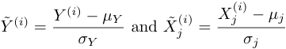

where 

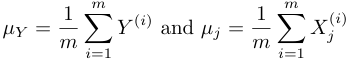

and similarly for standard deviations of labels _σY_ and inputs _σj_ . The differentials computed by the prediction model (e.g. the twin network of the working paper) are: 

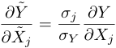

hence, we adjust differential labels accordingly: 

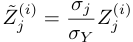

##### **Training step** 

The value labels _Y_˜ are centred and unit scaled but the differentials labels _Z_˜ are not, they are merely re-expressed in units of ’standard deviations of _Y_ per standard deviation of _Xj_ ’. To avoid summing apples and oranges in the combined cost function as commented in the working paper, we scale cost as follows: 

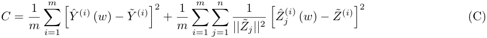

and proceed to find the optimal biases and connection weights by minimization of _C_ in _w_ .

<!-- page: 27 -->

##### **Last step** 

The trained model _f_˜ expects normalized inputs and predicts a normalized value, along with its gradient to the normalized inputs. Those results must be scaled back to original units: 

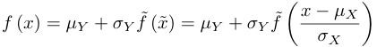

where we divided two row vectors to mean elementwise division, and: 

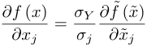

#### **1.2 Limitations** 

Basic data normalization is sufficient for textbook examples but more thorough processing is necessary in production, where datasets generated by arbitrary schedules of cashflows simulated in arbitrary models may contain a mass of constant, redundant of irrelevant inputs. Although neural networks are supposed to correctly sort data and identify relevant features during training1 , in practice, nonconvex optimization is much more reliable when at least _linear_ redundancies and irrelevances are filtered in a preprocessing step, lifting those concerns from the training algorithm and letting it focus on the extraction of _nonlinear_ features. 

In addition, it is best, although not strictly necessary, to train on orthogonal inputs. As it is well known, normalization and orthogonalization of input data, along with filtering of constant and linearly redundant inputs, is all jointly performed in a principled manner by eigenvalue decomposition of the input covariance matrix, in a classic procedure called principle component analysis or PCA. 

### **2 Principal Component Analysis** 

#### **2.1 Mechanism** 

We briefly recall the mechanism of data preparation with classic PCA. First, normalize labels and center inputs: 

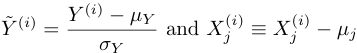

i.e. what we now call _X_ is the matrix of _centred_ inputs. Perform its eigenvalue decomposition: 

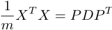

where _P_ is the orthonormal _n × n_ matrix of eigenvectors (in columns) and _D_ is the diagonal matrix of eigenvalues _Djj_ . 

Filter numerically constant or redundant inputs identified by eigenvalues _Djj_ lower than a threshold _ϵ_ . The filter matrix _F_ has _n_ rows and _n_ ˜ _≤ n_ columns and is obtained from the identity matrix _In_ by removal of columns corresponding to insignificant eigenvalues _Djj_ . Denote: 

> 1SVD regression performs a similar task in the context of classic regression, see note on differential regression.

<!-- page: 28 -->

(C ~~y (f~~ y) <u>O</u> ~~y~~ ( ~~>~~ ( ~~>~~ ( ~~y~~ O ~~)~~ 

~~“~~ ()C) © ) 

<u>co</u> ( ~~) ~~)~~

<!-- page: 29 -->

We therefore train the ML model _f_˜ more effectively on transformed data: 

by minimization of the the cost function (C) in the learnable weights. The trained model _f_˜ takes inputs _x_ ˜ in ˜ ˜ ˜ the tilde basis and predicts normalized values _y_ and differentials _∂y/∂x_ . Finally, we translate predictions back in the original units: 

PCA performs an orthonormal transformation of input data, removing constant and linearly redundant columns, effectively cleaning data to facilitate training of NN. PCA is also useful in its own right. It identifies the main axes of variation of a data matrix and may result in a lower dimensional latent representation, with many applications in finance and elsewhere, covered in vast amounts of classic literature. 

PCA is limited to _linear_ transformation and filtering of _linearly_ redundant inputs. A nonlinear extension is given by autoencoders (AE), a special breed of neural networks with bottleneck layers. AE are to PCA what neural networks are to regression, a powerful extension able to identify lower dimensional _nonlinear_ latent representations, at the cost of nonconvex numerical optimization. Therefore, AE themselves require careful data preparation and are not well suited to prepare data for training other DL models. 

#### **2.2 Limitations** 

##### **Further processing required** 

In the context of a differential dataset, we cannot stop preprocessing with PCA. Recall, we train by minimization of the cost function (C), where derivative errors are scaled by the size of differential labels. We will experience numerical instabilities when some differential columns are identically zero or numerically insignificant. This means the corresponding inputs are _irrelevant_ in the sense that they don’t affect labels in any of the training examples. They really should not be part the training set, all they do is unnecessarily increase dimension, confuse optimizers and cause numerical errors. But PCA cannot eliminate them because it operates on inputs alone and disregards labels and how inputs affect them. _PCA ignores relevance_ . 

Irrelevances may even appear in the orthogonal basis, even when inputs looked all relevant in the original basis. To see that clearly, consider a simple example in dimension 2, where _X_ 1 and _X_ 2 are sampled from 2 standard Gaussian distributions with correlation 1 _/_ 2 and _Y_ = _X_ 2 _− X_ 1 + noise. Differential labels are constant across examples with _Z_ 1 = _−_ 1 and _Z_ 2 = 1. Both differentials are clearly nonzero and both inputs appear to be relevant. PCA projects data on orthonormal axes _X_˜ 1 = ( _X_ 1 + _X_ 2) _/√_ 2 and _X_˜ 2 = ( _−X_ 1 + _X_ 2) _/√_ 2 with eigenvalues 3 _/_ 2 and 1 _/_ 2, and: 

so after PCA transformation, one of the columns clearly appears irrelevant. Note that this is a coincidence, we would not see that if correlation between _X_ 1 and _X_ 2 were different from 1 _/_ 2. PCA is not able to identify axes of relevance, it only identifies axes of variation. By doing so, it _may_ accidentally land on axes with zero or insignificant relevance. 

It appears from this example that, not only further processing is necessary, but also, desirable to eliminate irrelevant inputs and combinations of inputs in the same way that PCA eliminated constant and redundant inputs. Note that we don’t want to _replace_ PCA. We want to train on orthonormal inputs and filter constants and redundancies. What we want is _combine_ PCA with a similar treatment of relevance.

<!-- page: 30 -->

##### **Limited dimension reduction** 

The eventual amount of dimension reduction PCA can provide is limited, precisely because it ignores relevance. Consider the problem of a basket option in a correlated Bachelier model, as in the section 3.1 of the working paper. The states _X_ are realizations of the _n_ stock prices at _T_ 1 and the labels _Y_ are option payoffs, conditionally sampled at _T_ 2. Recall that the price at _T_ 1 of a basket option expiring at _T_ 2 is a nonlinear scalar function (given by Bachelier’s formula) _of a linear combination X · a_ of the stock prices _X_ at _T_ 1, where _a_ is the vector of weights in the basket. The basket option, which payoff is measured by _Y_ , is only affected (in a nonlinear manner) by _one_ linear risk factor _X · a_ of _X_ . Although the input space is in dimension _n_ , the subspace of relevant risk factors is in dimension 1. Yet, when the covariance matrix of _X_ is of full rank, PCA identifies _n_ axes of orthogonal variation. It only reduces dimension when the covariance matrix is singular, to eliminates trivially constant or redundant inputs, even in situations where dimension could be reduced by significantly larger amounts with relevance analysis. 

##### **Unsafe dimension reduction** 

In addition, it is not desirable to attempt aggressively reducing dimension with PCA because it could eliminate relevant information. To see why, consider another, somewhat contrived example with 500 stocks, one of them (call it XXX) uncorrelated with the rest with little volatility. An aggressive application of PCA would remove that stock from the orthogonal representation, even in the context of a trading book dominated by a large trade on XXX. PCA _should not_ be relied upon to reduce dimension, because it ignores relevance and hence, might accidentally remove important features. PCA must be applied _conservatively_ , with filtering threshold _ϵ_ set to numerically insignificant eigenvalues, to only eliminate definitely constant or linearly redundant inputs. 

##### **Principal components are not risk factors** 

The Bachelier basket example makes it clear that the orthogonal axes of variation identified by PCA are _not_ risk factors. In general, PCA provides a meaningful orthonormal representation of the state vector _X_ , but it doesn’t say anything about the factors affecting the transaction or its cashflows measured by the labels _Y_ . 

### **3 PCA** 

#### **3.1 Introduction** 

The question is then whether we can design an additional, similar procedure to effectively extract from simulated data the risk factors _of a given transaction_ , and _safely_ reduce dimension by removal of _irrelevant_ axes? We expect the algorithm to identify the basket weights as the only risk factor in the Bachelier example, and XXX alone as a major risk factor in the 500 stocks example. In the general case, we want to reliably extract a hierarchy of orthogonal risk factors and safely eliminate irrelevant directions. 

To achieve this, we turn to differential labels _Z_(_i_) = _∂Y_(_i_) _/∂X_(_i_) , which, in the context of simulated financial data, are either risk sensitivities or _pathwise differentials_2 . The main proposition of differential machine learning is to leverage differential labels computed e.g. with AAD, and we have seen their effectiveness for approximation by neural networks (main article) or classic regression (appendices). Here, we will see that they also apply in the context of PCA, not to improve it, but to combine it with an additional procedure, which we call ’differential PCA’, capable of exhibiting orthogonal risk factors and safely removing irrelevant combinations of inputs. 

As a data preparation step, differential PCA may significantly reduce dimension, enabling faster, more reliable training of neural networks, and a reduced sensitivity to seeding and hyperparameters. In particular, We will see that differential PCA reduces dimension while _preserving_ orthonormality of inputs from a prior PCA step. 

> 2Depending on whether labels are ground truth or sampled, see working paper.

<!-- page: 31 -->

In its own right, differential PCA reliably identifies risk factors from simulated data. Like traditional PCA, it only extracts _linear_ factors, but unlike PCA, it analyses and transforms on data through the lens of _relevance_ . 

#### **3.2 Derivation** 

Start with a dataset: 

possibly orthonormal by prior PCA, with differentials appropriately adjusted and constant and redundant inputs out. 

We want to apply a _rotation_ by right multiplication of the input matrix _X_ by an orthonormal matrix _Q_ so as to preserve orthonormality: 

so that the directional differentials _Z_˜ _j_(_i_) = _∂Y_(_i_) _/∂X_˜ _j_(_i_) are mutually orthogonal. Recall from the lemma page 28: 

and we want _Z_˜ to be orthogonal, i.e.: 

with _E_ a diagonal matrix whose entries _Ejj_ are the mean norms of the columns _Z_˜ _j_ of _Z_˜ , in other terms, the _size_ of differentials, also called _relevance_ , in the tilde basis. 

Since _Z_˜ = _ZQ_ , 

or inverting: 

and we have the remarkable solution that _Q_ and _E_ are the eigenvectors and eigenvalues of the empirical covariance matrix of derivatives labels (1 _/m_ ) _Z__T_ _Z_ . 

We can proceed to eliminate irrelevant directions by right multiplication by a filter matrix on a criterion _Ejj > ϵ__′_ . 

Hence, differential PCA is simply PCA on differential labels. 

Unlike with PCA, it is safe to filter irrelevance aggressively. Assuming that a prior PCA step was performed, differentials are expressed in ’standard deviation of labels per standard deviation of inputs’. Eigenvalues _Ejj_ less than 10_−_4 reflect a sensitivity less than 10_−_2 , where it takes more than 100 standard deviations in the input to produce _one_ standard deviation in the label. The corresponding input can safely be discarded as irrelevant. It is therefore reasonable to set the filtering threshold _ϵ__′_ on differentials to 10_−_4 or even higher without fear of losing relevant information, whereas the PCA threshold _ϵ_ should be near numerical zero to avoid information loss.

<!-- page: 32 -->

Note that we performed differential PCA on the _noncentral_ covariance matrix of derivatives. Constant derivatives correspond to linear factors, which we must consider relevant, at least for training. In order to extract nonlinear risk factors only, we could apply the same procedure with eigenvalue decomposition of the centred covariance matrix _m_ <u>1</u>(_Z −µZ_)_T_(_Z −µZ_) =_QEQT_instead. 

#### **3.3 Example** 

In the context of the simple example of a basket option with weights _a_ in a correlated Bachelier model, we can perform differential PCA explicitly. The input matrix _X_ of shape _m × n_ stacks _m_ rows of examples _X_(_i_) , each one a row vector of the _n_ stock prices on a horizon date _T_ 1. The label vector _Y_ collects corresponding payoffs for the basket option of strike _K_ , sampled on the same path on a later date _T_ 2: 

For simplicity, we skip the classic PCA step. The differential labels, in this simple example, are money indicators: 

with the usual notations. Differential labels are 0 _n_ on paths finishing out of the money and _a_ on paths finishing in the money. Denote _q_ the empirical proportion of paths finishing in the money. Then: 

and its eigenvalue decomposition 1 _/mZ__T_ _Z_ = _QEQ__T_ is: 

Hence, differential PCA gives us a single relevant risk factor, exactly corresponding to the (normalized) weights in the basket. 

### **4 A complete data preparation algorithm** 

We conclude with a complete data processing algorithm in pseudocode, switching to adjoint notations, i.e. we denote _X_¯ what we previously denoted _Z_ . We also use subscripts to denote processing stages. 

1. Basic processing 

   - (a) Center inputs (but do not normalize them quite yet) with means the row vector _µx_ of dimension _n_ 0, computed across training examples: 

- (b) Compute standard deviation _σy_ of labels across examplesand normalize labels: _Y_ 1 =_Y_0 _σ__−µy_ 

<!-- page: 33 -->

- (c) Update derivatives: _X_¯ 1 = 

   - _<u>X</u>_ ¯0 

   - _σy_ 

- (d) Reverse for translating predictions: inputs must be normalized first, consistently with training inputs. The model returns a normalized prediction _y_ ˆ1 and its derivatives _x_ ¯ˆ 1. Translate predictions back into original units with the reverse transformations: 

ˆ ˆ ¯ ¯ _y_ 0 = _µy_ + _σyy_ 1 and _x_ˆ 0 + _σyx_ˆ 1 

##### 2. PCA 

- (a) Perform eigenvalue decomposition of_X_ <u>1</u>_T_ _m__X_1 = _P_ 2 _D_ 2 _P_ 2_−_1 . 

- (b) Shrink the diagonal matrix _D_ 2 to dimension _n_ 2 _≤ n_ 1 by removing rows and columns corresponding to numerically zero eigenvalues. Denote _F_ 2 the filter matrix of shape ( _n_ 1, _n_ 2), obtained by removal of columns in the identity matrix _In_ 1 corresponding to numerically null diagonal entries of _D_ 2. The reduced diagonal matrix is _D_˜ 2 = _F_ 2_TD_2_F_2of size_n_2, and the reduced eigenvector matrix is_P_˜2=_P_2_F_2 of shape ( _n_ 1, _n_ 2). Note that the eigenvalue matrix remains diagonal and the columns of the eigenvector matrix remain orthogonal and normalized after filtering. 

- (c) Apply the orthonormal transformation: 

- (d) Update differentials 

3. Differential PCA 

   - (a) Perform eigenvalue decomposition of: 

- (b) Shrink the columns of the eigenvector matrix _P_ 3 to dimension _n_ 3 _≤ n_ 2 by removing columns corresponding to small eigenvalues. Denote _F_ 3 the corresponding filter matrix of shape ( _n_ 2, _n_ 3). The reduced inverse eigenvector matrix is _P_˜ 3 = _P_ 3 _F_ 3 of shape ( _n_ 2, _n_ 3). 

- (c) Apply the linear transformation: 

- (d) Update differentials: 

- (e) Note reverse formula for prediction: 

4. Train model on the dataset _X_ 3, _Y_ 3, _X_¯ 3, which is both orthonormal is terms of inputs _X_ 3 and orthogonal in terms of directional differentials _X_¯ 2, with constant, redundant and irrelevant inputs and combinations out. 

- ˆ 

- 5. Predict values and derivatives with the trained model _y_ = _f_ˆ ( _x_ ) from raw inputs _x_ = _x_ 0:

<!-- page: 34 -->

(a) Transform inputs: 

i. _x_ 1 = _x_ 0 _− µx_ 

_−_<u>1</u> ii. _x_ 2 = _x_ 1 _P_˜ 2 _D_˜ 2 2 iii. _x_ 3 = _x_ 2 _P_˜ 3 

(b) predict values: 

ˆ i. _y_ 3 = _f_ˆ ( _x_ 3) ˆ ii. _y_ 0 = _µY_ + _σY_ ˆ _y_ 3 

- (c) predict derivatives: 

i. _x_ ¯ˆ 3 =_∂_ _<u>f∂x</u>_ˆ <u>(</u> _x_ 33) ii. _x_ ¯ˆ 2 = _x_ ¯ˆ 3 _P_˜ 3_T_ iii. _x_ ¯ˆ 1 = _x_ ¯ˆ 2˜˜ _D_ 2 _−_<u>1</u> 2 _P_ ˜2_T_ iv. _x_ ¯ˆ 0 = _σyx_ ¯ˆ 1 

### **Conclusion** 

We derived a complete data preparation algorithm for differential deep learning, including a standard PCA step and a differential PCA step. Standard PCA performs an orthonormal transformation of inputs and eliminates constant and redundant ones, facilitating subsequent training of neural networks. Differential PCA further rotates data to an orthogonal relevance representation and may considerably reduce dimension, in a completely safe manner, by elimination of irrelevant directions. 

Like standard PCA, differential PCA is a useful algorithm on its own right, providing a low dimensional latent representation of data on orthogonal axes of relevance. In the context of financial simulations, it computes an orthogonal hierarchy of risk factors for a given transaction. For example, we proved that differential PCA identifies basket weights as the only relevant risk factor for a basket option, from simulated data alone. 

We achieved this by leveraging information contained in the differential labels, which, in the context of simulated financial data, are _pathwise differentials_ and contain a wealth of useful information. Recall that traditional risk reports are averages of pathwise differentials. Averaging, however, collapses information. For example, the risk report of a delta-hedged European call (obviously) returns zero delta, although the underlying stock price most definitely remains a relevant risk factor, affecting the trading book in a nonlinear manner, an information embedded in pathwise differentials but eliminated by averaging. Pathwise differentials are sensitivities of payoffs to state in a multitude of scenarios. They have a broader story to tell than aggregated risk reports. 

The main proposition of the article is to leverage differentials in all sort of machine learning tasks, and we have seen their effectiveness for approximation by neural networks (main article) or classic regression (appendices). Here, we have seen that they also apply in the context of PCA, not to improve it, but to combine it with an additional procedure, which we call ’differential PCA’, capable of exhibiting risk factors and safely removing irrelevant combinations of inputs. As a preprocessing step, differential PCA makes a major difference for training function approximations, reducing dimension, stabilizing nonconvex numerical optimization and reducing sensitivity to initial seed and hyperparameters like neural architecture or learning rate schedule.

<!-- page: 35 -->

## **Appx 3 Differential Regression** 

### **Introduction** 

Differential machine learning is presented in the paper in the context of deep learning, where its _unreasonable effectiveness_ is illustrated with examples picked in both real-world applications and textbooks, like the basket option in a correlated Bachelier model. 

In this appendix, we apply the same ideas in the context of classic regression on a fixed set of basis functions, and demonstrate equally remarkable results, illustrated with the same Bachelier basket example, with pricing and risk functions approximated by polynomial regression. Recall that the example from the paper is reproduced on a public notebook https://github.com/differential-machine-learning/notebooks/ blob/master/DifferentialML.ipynb. We posted another notebook _DifferentialRegression.ipynb_ with the regression example, where the formulas of this document for standard, ridge and differential regression are implemented and compared. 

Like standard and ridge regression, differential regression is performed in closed form and lends itself to SVD stabilization. Unlike ridge regression, differential regression provides strong regularization _without bias_ . It follows that there is no bias-variance tradeoff with differential regression, in particular, the sensitivity to regularization strength is virtually null. As illustrated in the notebook, differential regression vastly outperforms Tikhonov regularization, even when the Tikhonov parameter is optimized by cross validation at the cost of additional data consumption. Differential regression doesn’t consume additional data besides a training set augmented with differentials as explained in the paper. It doesn’t necessitate additional regularization or hyperparameter optimization by cross validation. 

The exercise is to perform a classic least square linear regression _Y_� = _µY_ + ( _φ − µφ_ ) _β_ , where the columns of _φ_ = _φ_ ( _X_ ) are basis functions (e.g. monomials, excluding constant) of known inputs _X_ (also excluding constant, with examples in rows and inputs in columns), given a column vector _Y_ of the corresponding targets, where _µY_ is the mean of _Y_ and the row vector _µφ_ contains the means of the columns of _φ_ . To simplify notations, we denote _φ ≡ φ − µφ_ and _Y ≡ Y − µY_ . Classic least squares finds _β_ by minimization of the least square errors: 

The analytic solution, also called normal equation: 

is known to bear unstable results, the matrix _φ__T_ _φ_ often being near singular (certainly so with monomials of high degree of correlated inputs). This is usually resolved with SVD regression. We prefer the (very similar) eigenvalue regression, which we recall first, and then, extend to ridge (Tikhonov) regularization and finally differential regression. Parts 1 and 2 are summaries of classic results. Part 3 is new. After _β_ is learned, the value � approximation for an input row vector _x_ is given by _y_ = _φ_ ( _x_ ) _β_ and the derivative approximations are given by: 

where subscripts denote partial derivatives to input number _j_ .

<!-- page: 36 -->

en 

| 

4- Cy) 

~~Cd~~ | | (Co ~~0~~ C ~~|~~ ee nh <u>ee</u> ee ee ee ~~p~~ oo ye ~~[~~ <u>-</u>

<!-- page: 37 -->

where Λ_−_1 has diagonal elements _Dii_ <u>1+</u> _λ_2where_Djj_issignificant,zerootherwise.Andweget: 

The Tikhonov parameter _λ_ can be found e.g. by cross validation: 

where _φV_ = _φ_ ( _XV_ ), ( _XV , YV_ ) form a validation set of independent examples and _β_ ( _λ_ ) is the result of a ridge regression over the training set with Tikhonov parameter _λ_ , obtained with the boxed formula above. The objective function can be expanded: 

Since _YV T YV_ doesnt depend on _λ_ , we minimize: 

where 

Optimization may be efficiently performed by a classic one-dimensional minimization procedure. 

### **3 Differential Regression** 

In addition to inputs _X_ and labels _Y_ , we have derivatives labels _Z_ whose columns _Zj_ are the differentials of _Y_ to _X_ � _j_ . Denote _φj_ the matrix of derivatives of the basis functions� _φ_ wrt _Xj_ . Linear regression makes value predictions _Y_ = _φβ_ and derivatives predictions _Zj_ = _φjβ_ . We now minimize a cost combining value and derivatives errors: 

where _λj_ = _λ_2 _∥__<u>∥</u>_ _Z__Y_ _j__<u>∥</u>_ _∥_22(norms are computed across examples) ensures that the components of the cost are of similar magnitudes. The hyperparameter _λ_ has little effect and generally left to 1. 

It is not hard to see that this minimization is analytically solved with the adjusted normal equation:

<!-- page: 38 -->

~ Lf TP Sey 

<u>h</u> ~~<u>o</u>~~ e ~~Ao~~ l) ~~(~~ Cs) 

~~-~~ 

( <u>-)</u> 

° 

3 

( <u>9) ©</u> 

3 ~~

<!-- page: 39 -->

### **Conclusion** 

We derived a normal equation (SVD style) for differential regression (in the sense of the working paper’s differential machine learning) and verified its effectiveness in a public demonstration notebook. Differential regularization vastly outperforms classic variants, including ridge, and without consuming additional data or needing any form of additional regularization or cross validation. Just like Tikhonov regularization, differential regularization is analytic and extremely effective, as seen in the demonstration notebook. Unlike Tikhonov, differential regularization is unbiased, as demonstrated in another appendix.

<!-- page: 40 -->

## **Appx 4 Supervised Learning without Supervision: Wide and Deep Architecture and Asymptotic Control** 

### **Introduction** 

Modern deep learning is very effective at function approximation, especially in the differential form presented in the working paper. But training of neural networks is a nonconvex problem, without guaranteed convergence to the global minimum of the cost function or close1 . Neural networks are usually trained under close human supervision and it is hard to execute it reliably behind the scenes. 

This is of particular concern in Derivatives risk management, where automated procedures cannot be implemented in production without strong guarantees. Vast empirical evidence, that modern training heuristics (data normalization, Xavier-Glorot initialization, ADAM optimization, one-cycle learning rate schedule...) often combine to converge to acceptable minima, is not enough. Risk management is not built on faith but on mathematical guarantees. 

In this appendix, we see how and to what extent guarantees can be established for training neural networks with a special architecture called ’wide and deep’, also promoted by Google in the context of recommender systems. We show that wide and deep learning is _guaranteed_ to do at least as well as classic regression, opening the possibility of training without supervision. 

We also discuss asymptotic control, another key requirement for reliable implementation in production. 

### **1 Wide and Deep Learning** 

#### **1.1 Wide vs Deep** 

##### **Wide regression** 

Classic regression (which we call _wide learning_ for reasons apparent soon) finds an approximation _f_ˆ of a target function _f_ : R_n_ _→_ R as a linear combination of a predefined set of _p_ basis functions _φj_ of inputs _x_ in dimension _n_ : 

by projection onto the space of functions spanned by the basis functions _φj_ . With a training set of _m_ examples given by the matrix _X_ of shape _m × n_ , with labels stacked in a vector _Y_ of dimension _m_ , the _p_ learnable weights _wj_ are estimated by minimization of the mean squared error (MSE), itself an unbiased estimation of the distance _||f_ˆ _− f ||_2 in _L_2 : 

> 1It is also prone to overfitting, so generalization is not guaranteed even with minimum MSE on the training set. Differential machine learning considerably helps, as abundantly coommented in the working paper and other appendices.

<!-- page: 41 -->

It is immediately visible that the objective _MSE_ is convex in the weights _w_ . The optimization is well defined with a unique minimum, easily found by canceling the gradient of the _MSE_ wrt _w_ , resulting in the well known _normal equation_ : 

where Φ is the _m × p_ matrix stacking basis functions of inputs in its row vectors: 

Let us call _input dimension_ the dimension _n_ of _x_ and _regression dimension_ the dimension _p_ of _φ_ . In low (regression) dimension, the normal equation is tractable but subject to numerical trouble when the matrix Φ_T_ Φ is near singular. This is resolved by SVD regression (see Appx 3), a safe implementation of the projection operator so the problem is still convex and analytically solvable. In high dimension, the inversion or SVD decomposition may become intractable, in which case the argmin of the MSE is found numerically, e.g. by a variant of gradient descent. Importantly, the problem remains convex so numerical optimizations like gradient descent are guaranteed to converge to the unique minimum (modulo appropriate learning rate schedule). This is all good, but it should be clear that the practical performance of classic regression is highly dependent on the relevance of the basis functions _φj_ for the approximation of the true function _f_ , mathematically measured by the _L_2 distance between the true function and the space spanned by the basis functions, of which the minimum MSE is an estimate. 

One strategy is pick a vast number of basis functions _φj_ so that their combinations approximate _all_ functions to acceptable accuracy. For example, the set of all _monomials_ of _x_ of the form: 

are dense in _L_2 (R_n_ ) so polynomial regression has the _universal approximation_ property: it approximates all functions to arbitrary accuracy by growing degree _K_ . Regardless, this strategy is almost never viable in practice due to the _course of dimensionality_ . Readers may convince themselves that the number of monomials of degree up to _K_ in dimension _n_ is: 

_a_ nd grows exponentially in the input dimension _n_ and polynomial degree _K_ . A cubic regression in dimension 20 has 1 _,_ 771 monomials. A degree 7 polynomial regression has 888 _,_ 030. Given exponentially growing number of learnable parameters _w_ (same as number of basis functions), the size _m_ of the dataset must grow _at least as fast_ for the problem to stay well defined. In most contexts of practical relevance, dimension of this magnitude is both computationally intractable and bound to overfit training noise, even when dimension _n_ was previously reduced with a meaningful method like differential PCA (see Appx 2). The same arguments apply to all other bases of functions besides polynomials: Fourier harmonics, radial kernels, cubic splines etc. They are all affected by the same curse and only viable in low dimension. 

Regression is only viable in practice when basis functions are carefully selected with handcrafted rules from contextual information. One example is the classic Longstaff-Schwartz algorithm (LSM) of 2001, originally designed for the regression of the continuation value of Bermudan options in the Libor Market Model (LMM) of Musiela and al. (1995). The Markov state of LMM is high dimensional and includes all forward Libor

<!-- page: 42 -->

<!-- Start of picture text -->
fixed, hardcoded learned linear regression transformation state to basis 4 SSS)ow ; C) x° (s) continuation“output” layervalue (») “hidden”useful features layer (a) by regression swp to mat + df to call “ sy . dimension 2 regression” layer “input” layer quadratic monomials model state dimension 5 all 3m fwd rates up to 30y dimension 120 <!-- End of picture text -->

<!-- page: 43 -->

<!-- Start of picture text -->
learned learned linear regression transformation state to basis = 4_—_—_ OHOFV @ZOSSO (-)LESS @LILY & output layer ERK =< JE eZNo NO\ still a linear regression ‘model state of stateleartransformationinto regression vars learntbasis functions <!-- End of picture text -->

<!-- page: 44 -->

<!-- Start of picture text -->
input layer deep layers (learned) eee =—o——or &till a linear regression (TX output layer wide layer(fixed) a ie 4d). learnt and fixed basis basis  tunctions functions = ¢ <!-- End of picture text -->

<!-- page: 45 -->

The idea is natural, and certainly not new. It was popularized by Google under the name ”wide and deep learning”, in the context of recommender systems (https://arxiv.org/abs/1606.07792), although from a different perspective. Specifying a number of fixed regression functions in the wide layer should help training by restricting search for additional basis functions in the deep layers to dissimilar functions. For example, when the wide layer is a copy of the input layer _x_ ( _φ_ = _id_ ), it handles all linear functions of _x_ and specializes the deep layers to a search for nonlinear functions (since another linear function in the deep regression layer would not help reduce MSE). In other terms, Google presented the wide and deep architecture as a training improvement, and it may well be that it does improve performance significantly with very deep, complex architectures. In our experience, the improvement is marginal with the simple architecture sufficient for pricing function approximation, but the wide and deep architecture still has a major role to play, because it provides guarantees and allows a safe implementation of automated training without supervision. 

##### **Worst case convergence guarantee** 

It is general wisdom that minimization of the MSE with NN doesn’t offer any sort of guarantee. This is not entirely correct, though. Consider the MSE as a function of the connection weights of the output layer alone. This is evidently a convex function. In fact, since the output layer is exactly a linear regression on the regression layer, the optimal weights are even given in closed form by the normal equation: 

or its SVD equivalent (see Appx 3). Recall, while numerical optimization may not find the global minimum, it is always guaranteed to converge to a point with uniform zero gradient. In particular, training converges to a point where the derivatives of the MSE to the _output_ connection weights are zero. And since the MSE is convex in _those_ weights, _the projection onto the basis space is always optimal._ Training may converge to ’bad’ basis functions, but the approximation _in terms of these basis functions_ is always as good as it can be. It immediately follows that, with a deep and wide architecture, we have a meaningful worst case guarantee: the approximation is least as good as a linear regression on the wide units. In practice, we get an orders of magnitude better performance from the deep layers, but it is the worst case guarantee that gives us permission to train without supervision. In practice, convergence may be checked by measuring the norm of the gradient, or, optimization may be followed by an analytic implementation of the normal equation wrt the combined regression layer (ideally in the SVD form of Appx 3). 

##### **Selection of wide basis** 

Of course, the worst case guarantee is only as good as the choice of the wide functions. An obvious choice is a straightforward copy of the input layer. The wide layer handles all linear functions of the inputs, hence the worst case result is a linear regression. Another strategy is also add the squares of the input layers, and perhaps the cubes, depending on dimension, but not the cross monomials, which would bring back the curse of dimensionality. 

A much more powerful wide layer may be constructed in combination with differential PCA (see Appx 2), which reduces the dimension of inputs and orders them by relevance, in a basis where differentials are orthogonal. This means that the input column _X_ 1 affects targets most, followed by _X_ 2 etc. Because inputs are presented in a relevant hierarchy, we may build a meaningful wide layer with a richer set of basis functions applied to the most relevant inputs. For example, we could use all monomials up to degree 3 on the first two inputs (10 basis functions), monomials of degree less than two on the next three inputs (another nine basis functions), and the other _n−_ 5 inputs raised to power 1, 2 and maybe 3 (up to 3 _n−_ 15 additional functions). Because of the differential PCA mechanism, a plain regression on these basis functions bears acceptable results by itself, especially with differential regression (see Appx 3), and this is only the _worst case_ guarantee, with orders of magnitude better average performance. 

All those methods learn from data alone, with worst case guarantees. In cases where meaningful basis functions are handcrafted from contextual information and reliable hardcoded rules, like for Bermudan options in LMM

<!-- page: 46 -->

##### **Outperformance:** _w_ + _d ≥ w_ **w and** _w_ + _d ≥ d_ 

If follows from what precedes that the wide and deep architecture is guaranteed to find a better fit than either the deep network or the wide regression alone. 

In particular, wide and deep networks outperform classic regression, even on relevant handcrafted basis functions. Not only are they guaranteed to fit training data at least as well, they will also often find meaningful features missing from the wide basis. For example, Bermudan options are _mainly_ sensitive to rates to expiry and next call, but the shape of the yield curve also matters to an extent. The deep layers should identify the additional relevant factors during training. Finally, wide and deep nets are resilient to change. Add stochastic volatility in the LMM, regression no longer works without modification of the code to account for additional basis functions including volatility state. Wide and deep nets would work without modification, building volatility dependent features in their deep layers. 

### **2 Asymptotic control** 

#### **2.1 Elementary asymptotic control** 

##### **Enforce linear asymptotics** 

Another important consideration for unsupervised training is the performance of the trained approximation on _asymptotics_ . This is particularly crucial for risk management applications like value at risk (VAR), expected loss (EL) or FRTB, which focuses on the behaviour of trading books in extreme scenarios. Asymptotics are hard because they are generally learned from little to no data in edge scenarios. In other terms, the asymptotic behaviour of the approximation is an _extrapolation_ problem and reliable extrapolation is always harder, for instance, polynomial regression absolutely cannot be trusted. 

As always, we want to control asymptotics from data alone and not explore methods based on prior knowledge of the correct asymptotics. For instance, a European call is known to have flat left asymptotic and linear right asymptotic with slope 1. If we know that the transaction is a European call, the correct asymptotics could be enforced by a variety of methods, see e.g. Antonov and Piterbarg for cutting edge. But that only works when we know for a fact that we are approximating the value of a European call. What we want is a general algorithm without applicable without other knowledge than a simulated dataset. 

In finance, linear asymptotics are generally considered fair game for pricing functions, with an unknown slope to be estimated from data. For instance, it is common practice to enforce a zero second derivative boundary condition when pricing with finite difference methods (FDM)2 . Linear asymptotics are guaranteed for neural networks as long as the activations are asymptotically linear. This is the case e.g. for common RELU, ELU, SELU or softplus activations, but not sigmoid or tanh, which asymptotics are flat, hence, to be avoided for pricing approximation3 . 

Figure 9 compares the asymptotics of polynomial and neural approximations for a call price in Bachelier’s normal model, obtained with our demonstration notebooks _DifferentialML.ipynb_ and _DifferentialRegression.ipynb_ on https://github.com/differential-machine-learning/notebooks (dimension 1, 8192 training examples). The trained approximation is voluntarily tested on an unreasonably wide range of inputs in order to highlight asymptotic behaviour. Unsurprisingly, polynomial regression terribly misbehaves whereas neural approximation fares a lot better due to linear extrapolation. The comparison is of course unfair. The outperfor- 

> 2Although overreliance on this common assumption may be dangerous: the Derivatives industry lost billions in 2008 on variance swaps and CMS caps, precisely due to nonlinear asymptotics. 

> 3Recall that _differential_ deep learning requires _C_ 1 activation, ruling out RELU and SELU and leaving only the very similar ELU or softplus among common activations.

<!-- page: 47 -->

<!-- Start of picture text -->
polynomial neural degree 5 ~ medicied 80 © targetspredicted 80 targets Pa 60 “ : 3 size 8192 3 size 8192 5 8 40 3 40 20 20 00 023 50 75 100 125 150 175 200 0 50 100 150 200 rmse 13.30 rmse 0.07 <!-- End of picture text -->

<!-- Start of picture text -->
standard double volatility degree 5 degree 5 ° predicted 80 ‘argets © targetspredicted 80 6 60 size 8192 53 size 8192 5a $4 S 40 20 20 00 023 50 75 100 125 150 175 200 ° ca 50 7 00-5 150 175200 rmse 13.30 rmse 1.34 <!-- End of picture text -->

<!-- page: 48 -->

<!-- Start of picture text -->
°°o edgeinteriorrs Oo ° o ° ° ° on -ane Abe5 BS re ARS . G0 ante A &,0 ° ° otobi Q OR  EFBsc eS Egat  Bs eis) D ° Peeee &,se eaeona)PoNop©fo!°o°? nae sesueeSe!oe lo ° aoraa2 si9) e d a cr, ° Qo o®03gGeroFoO peed thes Cy”  er Ryden Ms ea* gSo me «Cf ° or fe) ° <!-- End of picture text -->

<!-- page: 49 -->

<!-- Start of picture text -->
interior examples: true price nonlinear © interior ° © edge 20 ° ° © Bo° BRSPBo,© DAEROo2 GADRIESBogeHS ErCAP SS a -ONES EGe 2 ° Q2PS CTRBADENESATATCFOESRa DAMESSR ersi TS DLDN DIOD go° oo COOa Pie SaecoEee a.cee, Ch OFy 0 © Coes)ORE CRTigclene OBE setts O18 7gSomes 0 O o, °Pbo 0468° 8S%v re."CO PHSUoB @,% ° o® fo} edge example: true price linear by hypothesis = intrinsic value = payoff on forward path <!-- End of picture text -->

<!-- page: 50 -->

We also covered elementary and advanced asymptotic control algorithms, the most advanced ones, implemented with some effort, being capable of producing correct asymptotics without additional computation cost or stealing data from the interior domain. The algorithm requires differential labels and only works with differential machine learning. In financial Derivatives risk management, differential labels are easily and very efficiently produced with automatic adjoint differentiation (AAD).

<!-- page: 51 -->

## **Bibliography** 

- [1] M. S. Alexandre Antonov, Michael Konikov. Mixing sabr models for negative rates. _Risk_ , 2015. 

- [2] J. Andreasen. Back to the future. _Risk_ , 2005. 

- [3] D. Bang. Local stochastic volatility: shaken, not stirred. _Risk_ , 2018. 

- [4] A. Brace, D. Gatarek, and M. Musiela. The market model of interest rate dynamics. _Mathematical Finance_ , 7(2):127–154, 1997. 

- [5] J. F. Carriere. Valuation of the early-exercise price for options using simulations and nonparametric regression. _Insurance: Mathematics and Economics_ , 19(1):19–30, 1996. 

- [6] Q. Chan-Wai-Nam, J. Mikael, and X. Warin. Machine Learning for semi linear PDEs. _arXiv e-prints_ , page arXiv:1809.07609, Sept. 2018. 

- [7] J. Gatheral. Rough volatility: An overview. Global Derivatives, 2017. 

- [8] J. Gatheral, P. Jusselin, and M. Rosenbaum. The quadratic rough heston model and the joint s&p 500/vix smile calibration problem. _Risk_ , May 2020. 

- [9] M. Giles and P. Glasserman. Smoking adjoints: Fast evaluation of greeks in monte carlo calculations. _Risk_ , 2006. 

- [10] P. S. Hagan, D. Kumar, A. S. Lesniewski, and D. E. Woodward. Managing smile risk. _Wilmott Magazine_ , 1:84–108, 2002. 

- [11] M. B. Haugh and L. Kogan. Pricing american options: A duality approach. _Operations Research_ , 52(2):258– 270, 2004. 

- [12] B. Horvath, A. Muguruza, and M. Tomas. Deep learning volatility, 2019. 

- [13] J. M. Hutchinson, A. W. Lo, and T. Poggio. A nonparametric approach to pricing and hedging derivative securities via learning networks. _The Journal of Finance_ , 49(3):851–889, 1994. 

- [14] B. Lapeyre and J. Lelong. Neural network regression for bermudan option pricing, 2019. 

- [15] F. A. Longstaff and E. S. Schwartz. Valuing american options by simulation: A simple least-square approach. _The Review of Financial Studies_ , 14(1):113–147, 2001. 

- [16] W. A. McGhee. An artificial neural network representation of the sabr stochastic volatility model, 2018. 

- [17] A. Reghai, O. Kettani, and M. Messaoud. Cva with greeks and aad. _Risk_ , 2015. 

- [18] A. Savine. Aad and backpropagation in machine learning and finance, explained in 15min. https://www.youtube.com/watch?v=IcQkwgPwfm4. 

- [19] A. Savine. Stabilize risks of discontinuous payoffs with fuzzy logic. Global Derivatives, 2015. 

- [20] A. Savine. From model to market risks: The implicit function theorem (ift) demystified. _SSRN preprint_ , 2018. Available at SSRN: https://ssrn.com/abstract=3262571 or http://dx.doi.org/10.2139/ssrn.3262571. 

- [21] A. Savine. _Modern Computational Finance: AAD and Parallel Simulations_ . Wiley, 2018.
