# 2020-huge-savine-differential-machine-learning

<!-- page: 1 -->

## Diferential Machine Learning

Brian Huge brian.huge@danskebank.dk

Antoine Savine antoine.savine@danskebank.dk

Written January 2020, updated October 2020

## Abstract

Diferential machine learning combines automatic adjoint diferentiation (AAD) with modern machine learning (ML) in the context of risk management of financial Derivatives. We introduce novel algorithms for training fast, accurate pricing and risk approximations, online, in real time, with convergence guarantees. Our machinery is applicable to arbitrary Derivatives instruments or trading books, under arbitrary stochastic models of the underlying market variables. It efectively resolves computational bottlenecks of Derivatives risk reports and capital calculations.

Diferential ML is a general extension of supervised learning, where ML models are trained on examples of not only inputs and labels but also diferentials of labels wrt inputs. It is also applicable in many situations outside finance, where high quality first-order derivatives wrt training inputs are available. Applications in Physics, for example, may leverage diferentials known from first principles to learn function approximations more efectively.

In finance, AAD computes pathwise diferentials with remarkable eficacy so diferential ML algorithms provide extremely efective pricing and risk approximations. We can produce fast analytics in models too complex for closed form solutions, extract the risk factors of complex transactions and trading books, and efectively compute risk management metrics like reports across a large number of scenarios, backtesting and simulation of hedge strategies, or regulations like XVA, CCR, FRTB or SIMM-MVA.

TensorFlow implementation is available on

https://github.com/differential-machine-learning

## Introduction

Standard ML trains neural networks (NN) and other supervised ML models on punctual examples, whereas diferential ML teaches them the shape of the target function from the diferentials of training labels wrt training inputs. The result is a vastly improved performance, especially in high dimension with small datasets, as we illustrate with numerical examples from both idealized and real-world contexts in Section 2.

We focus on deep learning in the main text, where the simple mathematical structure of neural networks simplifies the exposition. In the appendices, we generalize the ideas to other kind of ML models, like classic regression or principal component analysis (PCA), with equally remarkable results.

We posted a TensorFlow implementation on GitHub1. The notebooks run on Google Colab, reproduce some of our numerical examples and discuss many practical implementation details not covered in the text.

We could not have achieved these results without the contribution and commitment of Danske Bank’s Ove Scavenius and our colleagues from Superfly Analytics, the Bank’s quantitative research department. The advanced numerical results of Section 2 were computed with Danske Bank’s production risk management system. The authors also thank Bruno Dupire, Jesper Andreasen and Leif Andersen for many insightful discussions, suggestions and comments, resulting in a considerable improvement of the contents.

arXiv:2005.02347v4 [q-fin.CP] 30 Sep 2020

1https://github.com/differential-machine-learning

<!-- page: 2 -->

## Pricing approximation and machine learning

Pricing function approximation is critical for Derivatives risk management, where the value and risk of transactions and portfolios must be computed rapidly. Exact closed-form formulas a la Black and Scholes are only available for simple instruments and simple models. More realistic stochastic models and more complicated exotic transactions require numerical pricing by finite diference methods (FDM) or Monte-Carlo (MC), which is too slow for many practical applications. Researchers experimented with e.g. moment matching approximations for Asian and Basket options, or Taylor expansions for stochastic volatility models, as early as the 1980s. Iconic expansion results were derived in the 1990s, including Hagan’s SABR formula [10] or Musiela’s swaption pricing formula in the Libor Market Model [4], and allowed the deployment of sophisticated models on trading desks. New results are being published regularly, either in traditional form [1] [3] or by application of advances in machine learning.

Although pricing approximations were traditionally derived by hand, automated techniques borrowed from the fields of artificial intelligence (AI) and ML got traction in the recent years. The general format is classic supervised learning: approximate asset pricing functions f (x) of a set of inputs x (market variables, path-dependencies, model and instrument parameters), with a function $\hat { f } \left( x ; w \right)$ subject to a collection of adjustable weights w, learned from a training set of m examples of inputs $x ^ { ( i ) }$ (each a vector of dimension n) paired with labels $\boldsymbol y ^ { ( i ) }$ (typically real numbers), by minimization of a cost function (often the mean squared error between predictions and labels).

For example, the recent [16] and [12] trained neural networks to price European calls2, respectively in the SABR model and the ’rough’ volatility family of models [7]. The training sets included a vast number of examples, labeled by ground truth prices, computed by numerical methods. This approach essentially interpolates prices in parameter space. The computation of the training set takes considerable time and computational expense. The approximation is trained ofline, also at a significant computation cost, but the trained model may be reused in many diferent situations. Like Hagan or Musiela’s expansions in their time, efective ML approximations make sophisticated models like rough Heston practically usable e.g. to simultaneously fit SP500 and VIX smiles [8].

ML models generally learn approximations from training data alone, without additional knowledge of the generative simulation model or financial instrument. Although performance may be considerably improved on a case by case basis with contextual information such as the nature of the transaction, the most powerful and most widely applicable ML implementations achieve accurate approximations from data alone. Neural networks, in particular, are capable of learning accurate approximations from data, as seen in [16] and [12] among many others. Trained NN computes prices and risks with near analytic speed. Inference is as fast as a few matrix by vector products in limited dimension, and diferentiation is performed in similar time by backpropagation.

## Online approximation with sampled payofs

While it is the risk management of large Derivatives books that initially motivated the development of pricing approximations, they also found a major application in the context of regulations like XVA, CCR, FRTB or SIMM-MVA, where the values and risk sensitivities of Derivatives trading books are repeatedly computed in many diferent market states. An efective pricing approximation could execute the repeated computations orders of magnitude faster and resolve the considerable bottlenecks of these computations.

However, the ofline approach of [16] or [12] is not viable in this context. Here, we learn the value of a given trading book as function of market state. The learned function is used in a set of risk reports or capital calculations and not reusable in other contexts. Such disposable approximations are trained online, i.e. as a part of the risk computation, and we need it performed quickly and automatically. In particular, we cannot aford the computational complexity of numerical ground truth prices.

2Early exploration of neural networks for pricing approximation [13] or in the context of Longstaf-Schwartz for Bermudan and American options [11] were published over 25 years ago, although it took modern deep learning techniques to achieve the performance demonstrated in the recent works.

<!-- page: 3 -->

It is much more eficient to train approximations on sampled payofs in place of ground truth prices, as in the classic Least Square Method (LSM) of [15] and [5]. In this context, a training label is a payof simulated on one Monte-Carlo path conditional to the corresponding input. The entire training set is simulated for a cost comparable to one pricing by Monte-Carlo, and labels remain unbiased (but noisy) estimates of ground truth prices (since prices are expected payofs).

More formally, a training set of sampled payofs consists in m independent realizations $( x ^ { ( i ) } , y ^ { ( i ) } )$ of the random variables $( X , Y )$ where $X \in \mathbb { R } ^ { n }$ is the initial state and $Y \in \mathbb { R }$ is the final payof. Informally:

$$
{ \begin{array} { r l } & { { \mathrm { p r i c e } } = E \left[ { \mathrm { p a y o f } } \left[ \left| { \mathrm { s t a t e } } \right| = E \left[ Y \left| X \right. \right] \right. \right. } \\ & { \qquad = \left. { \mathrm { a r g } } { \mathrm { m i n } } _ { r } E \left\{ \left[ f \left( X \right) - Y \right] ^ { 2 } \right\} ( X ) \right. } \\ & { \qquad \approx { \mathrm { a r g } } { \mathrm { m i n } } _ { w } E \left\{ \left[ { \hat { f } } \left( X ; w \right) - Y \right] ^ { 2 } \right\} ( X ) \qquad { \mathrm { f o r ~ a ~ u n i v e r s a l ~ a p p r o x i m a t o r ~ } } { \hat { f } } , { \mathrm { ~ a s y m p t o t i c a l l y ~ i n ~ c a p a c i t y } } } \\ & { \qquad \approx { \mathrm { a r g } } { \mathrm { m i n } } _ { w } M S E \left( x ^ { ( i ) } , y ^ { ( i ) } \right) ( X ) \qquad } & { { \mathrm { a s y m p t o t i c a l l y ~ i n ~ t h e ~ s i z e ~ } } m { \mathrm { ~ o f ~ t h e ~ t r a i n i n g ~ s e t } } } \end{array} }
$$

Hence, universal approximations like neural networks, trained on datasets of sampled payofs by minimization of the mean squared error (MSE) converge to the correct pricing function. The initial state X is sampled over the domain of application for the approximation ${ \hat { f } } ,$ whereas the final payof $Y | X$ is sampled with a conditional MC path. See Appx 1 for a more detailed formal exposition.

NN approximate prices more efectively than classic linear models. Neural networks are resilient in high dimension and efectively resolve the long standing curse of dimensionality by learning regression features from data. The extension of LSM to deep learning was explored in many recent works like [14], with the evidence of a considerable improvement, in the context of Bermudan options, although the conclusions carry over to arbitrary schedules of cash-flows. We further investigate the relationship of NN to linear regression in $\mathrm { A p p x ~ 4 }$

## Training with derivatives

We found, in agreement with recent literature, that the performance of modern deep learning remains insuficient for online application with complex transactions or trading books. A vast number of training examples (often in the hundreds of thousands or millions) is necessary to learn accurate approximations, and even a training set of sample payofs cannot be simulated in reasonable time. Training on noisy payofs is prone to overfitting, and unrealistic dataset sizes are necessary even in the presence of classic regularization. In addition, risk sensitivities converge considerably slower than values and often remain too approximate even with training sets in the hundred of thousands of examples.

This article proposes to resolve these problems by training ML models on datasets augmented with diferentials of labels wrt inputs:

$$
x ^ { ( i ) } , y ^ { ( i ) } , \frac { \partial y ^ { ( i ) } } { \partial x ^ { ( i ) } }
$$

This is a somewhat natural idea, which, along with the adequate training algorithm, enables ML models to learn accurate approximations even from small datasets of noisy payofs, making ML approximations tractable in the context of trading books and regulations.

When learning from ground truth labels, the input $\boldsymbol { x } ^ { ( i ) }$ is one example parameter set of the pricing function. If we were learning Black and Scholes’ pricing function, for instance, (without using the formula, which is what we would be trying to approximate), $\bar { \boldsymbol { x } } ^ { ( i ) }$ would be one possible set of values for the initial spot price, volatility, strike and expiry (ignoring rates or dividends). The label $\boldsymbol y ^ { ( i ) }$ would be the (ground thruth) call price computed with these inputs (by MC or FDM since we don’t know the formula), and the derivatives labels $\partial y ^ { ( i ) } / \partial x ^ { ( i ) }$ would be the Greeks.

<!-- page: 4 -->

When learning from simulated payofs, the input $\boldsymbol { x } ^ { ( i ) }$ is one example state. In the Black and Scholes example, $x ^ { ( i ) }$ would be the spot price sampled on some present or future date $T _ { 1 } \geq 0$ , called exposure date in the context of regulations, or horizon date in other contexts. The label $\boldsymbol y ^ { ( i ) }$ would be the payof of a call expiring on a later date $T _ { 2 }$ , sampled on that same path number i. The exercise is to learn a function of $S _ { T _ { 1 } }$ approximating the value of the $T _ { 2 }$ call measured at $T _ { 1 }$ . In this case, the diferential labels $\partial y ^ { ( i ) } / \partial x ^ { ( i ) }$ are the pathwise derivatives of the payof at $T _ { 2 }$ wrt the state at $T _ { 1 }$ on path number i. In Black and Scholes:

$$
\frac { \partial y ^ { ( i ) } } { \partial x ^ { ( i ) } } = \frac { \partial \left( S _ { T _ { 2 } } ^ { ( i ) } - K \right) ^ { + } } { \partial S _ { T _ { 1 } } ^ { ( i ) } } = \frac { \partial \left( S _ { T _ { 2 } } ^ { ( i ) } - K \right) ^ { + } } { \partial S _ { T _ { 2 } } ^ { ( i ) } } \frac { \partial S _ { T _ { 2 } } ^ { ( i ) } } { \partial S _ { T _ { 1 } } ^ { ( i ) } } = 1 _ { \left\{ S _ { T _ { 2 } } ^ { ( i ) } > K \right\} } \frac { S _ { T _ { 2 } } ^ { ( i ) } } { S _ { T _ { 1 } } ^ { ( i ) } }
$$

This simple exercise exhibits some general properties of pathwise diferentials. First, we computed the Black and Scholes pathwise derivative analytically with an application of the chain rule. The resulting formula is computationally eficient: the derivative is computed together with the payof along the path, there is no need to regenerate the path, contrarily to e.g. diferentiation by finite diference. This eficacy is not limited to European calls in Black and Scholes: pathwise diferentials are always eficiently computable by a systematic application of the chain rule, also known as adjoint diferentiation or AD. Furthermore, automated implementations of AD, or AAD, perform those computations by themselves, behind the scenes.

Secondly, $\partial Y / \partial X$ is a $T _ { 2 }$ measurable random variable, and its $T _ { 1 }$ expectation is $N \left( d _ { 1 } \right)$ , the Black and Scholes delta. This property too is general: assuming appropriate smoothing of discontinuous cash-flows, expectation and diferentiation commute so risk sensitivities are expectations of pathwise diferentials. Turning it upside down, pathwise diferentials are unbiased (noisy) estimates of ground truth Greeks.

Therefore, we can compute pathwise diferentials eficiently and use them for training as unbiased estimates of ground truth risks, irrespective of the transaction or trading book, and irrespective of the stochastic simulation model. Learning from ground truth labels is slow, but the learned function is reusable in many contexts. This is the correct manner to learn e.g. European option pricing functions in stochastic volatility models. Learning from simulated payofs is fast, but the learned approximation is a function of the state, specific to a given financial instrument or trading book, under a given calibration of the stochastic model. This is how we can quickly approximate the value and risks of complex transactions and trading books, e.g. in the context of regulations. Diferential labels vastly improve performance in both cases, as we see next.

Classic numerical analysis applies diferentials as constraints in the context of interpolation, or penalties in the context of regularization. Regularization generally penalises the norm of diferentials, e.g. the size of second order diferentials, expressing a preference for linear functions. Our proposition is diferent. We do not express preferences, we enforce diferential correctness, measured by proximity of predicted risk sensitivities to diferential labels. An application of diferential labels was independently proposed in [6], in the context of high dimensional semi-linear partial diferential equations. Our algorithm is general. It applies to either ground truth learning (closely related to interpolation) or sample learning (related to regression). It consumes derivative sensitivities for ground truth learning or pathwise diferentials for sample learning. It relies on an efective computation of the diferential labels, achieved with automatic adjoint diferentiation (AAD).

## Efective diferential labels with AAD

Diferential ML consumes the diferential labels $\partial y ^ { ( i ) } / \partial x ^ { ( i ) }$ from an augmented training set. The diferentials must be accurate or the optimizer might get lost chasing wrong targets, and they must be computed quickly, even in high dimension, for the method to be applicable in realistic contexts. Conventional diferentiation algorithms like finite diferences fail on both counts. This is where the superior AAD algorithm steps in, and automatically computes the diferentials of arbitrary calculations, with analytic accuracy, for a computation cost proportional to one evaluation of the price, irrespective of dimension3.

<!-- page: 5 -->

AAD was introduced to finance in the ground breaking ’Smoking Adjoints’ [9]. It is closely related to backprop agation, which powers modern deep learning and has largely contributed to its recent success. In finance, AAD produces risk reports in real time, including for exotic books or XVA. In the context of Monte-Carlo or LSM, AAD produces exact pathwise diferentials for a very small cost. AAD made diferentials massively available in quantitative finance. Besides evident applications to instantaneous calibration or real-time risk reports, the vast amount of information contained in diferentials may be leveraged in creative ways, see e.g. [17] for an original application.

To a large extent, diferential ML is another strong application of AAD. For reasons of memory and computation eficiency, AAD always computes diferentials path by path when applied with Monte-Carlo, efectively estimating risk sensitivities in a vast number of diferent scenarios. Besides its formidable speed and accuracy, AAD therefore produces a massive amount of information. Risk reports correspond to average sensitivities across paths, they only provide a much flattened view of the pathwise diferential information. Diferential ML, on the other hand, leverages its full extent in order to learn value and risk, not as fixed numbers only relevant in the current state, but as functions of state capable of computing prices and Greeks very quickly in diferent market scenarios.

In the interest of brevity, we refer to [21] for a comprehensive description of AAD, including all details of how training diferentials were obtained in this study, or the video tutorial [18], which explains its main ideas in 15 minutes.

The main article is voluntarily kept rather concise. Practical implementation details are deferred to the online notebook, and mathematical formalism is treated in the appendices along with generalizations and extensions. We present diferential ML in Section 1 in the context of feedforward neural networks, numerical results in Section 2 and important extensions in Section 3. Appx 1 deploys the mathematical formalism of the machinery. Appx 2 introduces diferential PCA and Appx 3 applies diferential ML as a superior regularization in th context of classic linear regression. Appx 4 discusses neural architectures and asymptotic control algorithms with convergence guarantees necessary for online operation.

## 1 Diferential Machine Learning

This section describes diferential training in the context of feedforward neural networks, although everything carries over to NN of arbitrary complexity in a straightforward manner. At this stage, we assume the availability of a training set augmented with diferential labels. The dataset consists of arbitrary schedules of cash-flows simulated in an arbitrary stochastic model. Because we learn from simulated data alone, there are no restrictions on the sophistication of the model or the complexity of the cash-flows. The cash-flows of the transaction or trading book could be described with a general scripting language, and the model could be a hybrid ’model of everything’ often used for e.g. XVA computations, with dynamic parameters calibrated to current market data.

The text focuses on a mathematical and qualitative description of the algortihm, leaving the discussion of practical implementation to the online notebook1, along with TensorFlow implementation code.

## 1.1 Notations

## 1.1.1 Feedforward equations

Let us first introduce notations for the description of feedforward networks. Define the input (row) vector $x \in \mathbb { R } ^ { n }$ and the predicted value $y \in \mathbb { R }$ . For every layer $l = 1 , \ldots , L$ in the network, define a scalar ’activation’ function

3This is the critical constant time property of adjoint diferentiation. It takes the time of 2 to 5 evaluations in practice to compute thousands of diferentials with an eficient implementation, see [21].

1https://github.com/differential-machine-learning/notebooks/blob/master/DifferentialML.ipynb

<!-- page: 6 -->

$g _ { l - 1 } : \mathbb { R } \mathbb { R }$ . Popular choices are relu, elu and softplus, with the convention $g _ { 0 } ( x ) = x$ is the identity. The notation $g _ { l - 1 } ( x )$ denotes elementwise application. We denote $w _ { l } \in \mathbb { R } ^ { n _ { l - 1 } \times n _ { l } } , b _ { l } \in \mathbb { R } ^ { n _ { l } }$ the weights and biases of layer l.

The network is defined by its feedforward equations:

$$
\begin{array} { r c l } { { z _ { 0 } } } & { { = } } & { { x } } \\ { { z _ { l } } } & { { = } } & { { g _ { l - 1 } \left( z _ { l - 1 } \right) w _ { l } + b _ { l } \quad , l = 1 , \ldots , L } } \\ { { y } } & { { = } } & { { z _ { L } } } \end{array}\tag{1}
$$

where $z _ { l } \in \mathbb { R } ^ { n _ { l } }$ is the row vector containing the $n _ { l }$ pre-activation values, also called units or neurons, in layer l. Figure 1 illustrates a feedforward network with $L = 3$ and $n = n _ { 0 } = 3 , n _ { 1 } = 5 , n _ { 2 } = 3 , n _ { 3 } = 1$ , together with backpropagation.

## 1.1.2 Backpropagation

Feedforward networks are eficiently diferentiated by backpropagation, which is generally applied to compute the derivatives of some some cost function wrt the weights and biases for optimization. For now, we are not interested in those diferentials, but in the diferentials of the predicted value $y = z _ { L }$ wrt the inputs $x = z _ { 0 } ,$ Recall that inputs are states and predictions are prices, hence, these diferentials are predicted risk sensitivities (Greeks), obtained by diferentiation of the lines in (1), in the reverse order:

$$
\begin{array} { r c l } { \bar { z } _ { L } } & { = } & { \bar { y } = 1 } \\ { \bar { z } _ { l - 1 } } & { = } & { \left( \bar { z } _ { l } w _ { l } ^ { T } \right) \circ g _ { l - 1 } ^ { \prime } \left( z _ { l - 1 } \right) \quad , l = L , \ldots , 1 } \\ { \bar { x } } & { = } & { \bar { z } _ { 0 } } \end{array}\tag{2}
$$

with the adjoint notation $\bar { x } = \partial y / \partial x , \bar { z } _ { l } = \partial y / \partial z _ { l } , \bar { y } = \partial y / \partial y = 1$ and ◦ is the elementwise (Hadamard) product. Notice, the similarity between (1) and (2). In fact, backpropagation defines a second feedforward network with inputs $\bar { y } , z _ { 0 } , \ldots , z _ { L }$ and output $\bar { x } \in \mathbb { R } ^ { n }$ , where the weights are shared with the first network and the units in the second network are the adjoints of the corresponding units in the original network.

Backpropagation is easily generalized to arbitrary network architectures, as explained in deep learning literature. Generalized to arbitrary computations unrelated to deep learning or AI, backpropagation becomes AD, or AAD when implemented automatically2. Modern frameworks like TensorFlow include an implementation of backpropagation/AAD and implicitly invoke it in training loops.

## 1.2 Twin networks

We can combine feedforward (1) and backpropagation (2) equations into a single network representation, or twin network, corresponding to the computation of a prediction (approximate price) together with its diferentials wrt inputs (approximate risk sensitivities).

The first half of the twin network (Figure 2) is the original network, traversed with feedforward induction to predict a value. The second half is computed with the backpropagation equations to predict risk sensitivities. It is the mirror image of the first half, with shared connection weights.

A mathematical description of the twin network is simply obtained by concatenation of equations (1) and (2). The evaluation of the twin network returns a predicted value y, and its diferentials ¯x wrt the $n _ { 0 } = n$ inputs x. The combined computation evaluates a feedforward network of twice the initial depth. Like feedforward induction, backpropagation computes a sequence of matrix by vector products. The twin network, therefore, predicts prices and risk sensitivities for twice the computation complexity of value prediction alone, irrespective of the number of risks. Hence, a trained twin net approximates prices and risk sensitivities, wrt potentially many states, in a particularly eficient manner. Note from (2) that the units of the second half are activated with the diferentials g0 of the original activations gl. If we are going to backpropagate through the twin network, we need continuous activation throughout. Hence, the initial activation must be C1, ruling out, e.g. ReLU.

2See video tutorial [18].

<!-- page: 7 -->

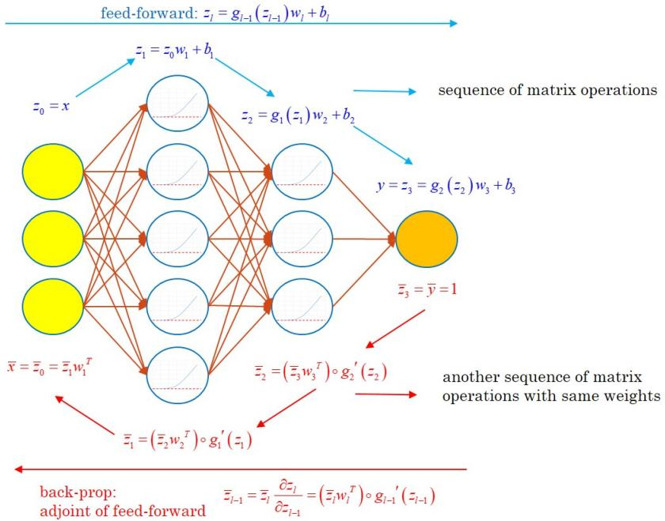

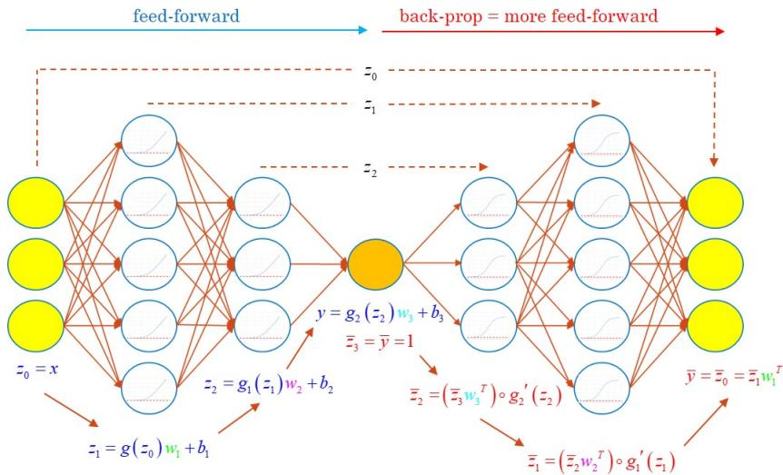

<!-- page: 8 -->

## 1.2.1 Training with diferential labels

The purpose the twin network is to estimate the correct pricing function $f \left( x \right)$ by an approximate function $\widehat { f } \left( x ; \{ w _ { l } , b _ { l } \} _ { l = 1 , \ldots , L } \right)$ . It learns optimal weights and biases from an augmented training set $\left( x ^ { ( i ) } , y ^ { ( i ) } , \bar { x } ^ { ( i ) } \right)$ ， where $\bar { x } ^ { ( i ) } = \partial y ^ { ( i ) } / \partial x ^ { ( i ) }$ are the diferential labels.

Here, we describe the mechanics of diferential training and discuss its efectiveness. As is customary with ML, we stack training data in matrices, with examples in rows and units in columns:

$$
\begin{array} { r } { \boldsymbol { X } = \left[ \begin{array} { c } { x ^ { ( 1 ) } } \\ { \vdots } \\ { x ^ { ( m ) } } \end{array} \right] \in \mathbb { R } ^ { m \times n } \quad \boldsymbol { Y } = \left[ \begin{array} { c } { y ^ { ( 1 ) } } \\ { \vdots } \\ { y ^ { ( m ) } } \end{array} \right] \in \mathbb { R } ^ { m } \quad \bar { \boldsymbol { X } } = \left[ \begin{array} { c } { \bar { x } ^ { ( 1 ) } } \\ { \vdots } \\ { \bar { x } ^ { ( m ) } } \end{array} \right] \in \mathbb { R } ^ { m \times n } } \end{array}
$$

Notice, the equations (1) and (2) identically apply to matrices or row vectors. Hence, the evaluation of the twin network computes the matrices:

$$
Z _ { l } = \left[ \begin{array} { c } { z _ { l } ^ { ( 1 ) } } \\ { \vdots } \\ { z _ { l } ^ { ( m ) } } \end{array} \right] \in \mathbb { R } ^ { m \times n _ { l } } \quad \mathrm { a n d } \quad \bar { Z } _ { l } = \left[ \begin{array} { c } { \bar { z } _ { l } ^ { ( 1 ) } } \\ { \vdots } \\ { \bar { z } _ { l } ^ { ( m ) } } \end{array} \right] \in \mathbb { R } ^ { m \times n _ { l } }
$$

respectively in the first and second half of its structure. Training consists in finding weights and biases minimizing some cost function $C \colon \{ w _ { l } , b _ { l } \} _ { l = 1 , \ldots , L } = \arg \operatorname* { m i n } C \left( \{ w _ { l } , b _ { l } \} _ { l = 1 , \ldots , L } \right)$

## Classic training with payofs alone

Let us first recall classic deep learning. We have seen that the approximation obtained by global minimization of the MSE converges to the correct pricing function (modulo finite capacity bias), hence:

$$
C \left( \left\{ w _ { l } , b _ { l } \right\} _ { l = 1 , \ldots , L } \right) = M S E = \frac { 1 } { m } \left( Z _ { L } - Y \right) ^ { T } \left( Z _ { L } - Y \right)
$$

The second half of the twin network does not afect cost, hence, training is performed by backpropagation through the standard feedforward network alone. The many practical details of the optimization are covered in the online notebook.

## Diferential training with diferentials alone

Let us change gears and train with pathwise diferentials $\bar { x } ^ { ( i ) }$ instead of payofs $\boldsymbol y ^ { ( i ) }$ , by minimization of the MSE (denoted $\overline { { M S E } } )$ between the diferential labels (pathwise diferentials) and predicted diferentials (estimated risk sensitivities):

$$
C \left( \left\{ w _ { l } , b _ { l } \right\} _ { l = 1 , \ldots , L } \right) = \overline { { { M S E } } } = \frac { 1 } { m } \mathrm { t r } \left[ \left( \bar { Z } _ { 0 } - \bar { X } \right) ^ { T } \left( \bar { Z } _ { 0 } - \bar { X } \right) \right]
$$

Here, we must evaluate the twin network in full to compute ${ \bar { Z } } _ { 0 } .$ , efectively doubling the cost of training. Gradientbased methods minimize MSE by backpropagation through the twin network, efectively accumulating secondorder diferentials in its second half. A deep learning framework, like TensorFlow, performs this computation seamlessly. As we have seen, the second half of the twin network may represent backpropagation, in the end, this is just another sequence of matrix operations, easily diferentiated by another round of backpropagation, carried out silently, behind the scenes. The implementation in the demonstration notebook is identical to training with payofs, safe for the definition of the cost function. TensorFlow automatically invokes the necessary operations, evaluating the feedforward network when minimizing MSE and the twin network when minimizing MSE.

<!-- page: 9 -->

In practice, we must also assign appropriate weights to the costs of wrong diferentials in the definition of the MSE. This is discussed in the implementation notebook, and in more detail in Appx 2.

Let us now discuss what it means to train approximations by minimization of the MSE between pathwise diferentials $\bar { x } ^ { ( i ) } = \partial y ^ { ( i ) } / \partial x ^ { ( i ) }$ and predicted risks $\partial \hat { f } \left( { x } ^ { ( i ) } \right) / \partial \hat { x ^ { ( i ) } }$ . Given appropriate smoothing3, expectation and diferentiation commute so the (true) risk sensitivities are expectations of pathwise diferentials:

$$
{ \frac { \partial f \left( x \right) } { \partial x } } = { \frac { \partial E \left[ Y | X = x \right] } { \partial x } } = E \left[ { \frac { \partial Y } { \partial X } } | X = x \right]
$$

It follows that pathwise diferentials are unbiased estimates of risk sensitivities, and approximations trained by minimization of the MSE converge (modulo finite capacity bias) to a function with correct diferentials, hence, the right pricing function, modulo an additive constant.

Therefore, we can choose to train by minimization of value or derivative errors, and converge near the correct pricing function all the same. This consideration is, however, an asymptotic one. Training with diferentials converges near the same approximation, but it converges much faster, allowing us to train accurate approximations with much smaller datasets, as we see in the numerical examples, because:

The efective size of the dataset is much larger evidently, with m training examples we have nm diferentials (n being the dimension of the inputs $x ^ { ( i ) } )$ . With AAD, we efectively simulate a much larger dataset for a minimal additional cost, especially in high dimension (where classical training struggles most).

The neural nets picks up the shape of the pricing function learning from slopes rather than points, resulting in much more stable and potent learning, even with few examples.

The neural approximation learns to produce correct Greeks by construction, not only correct values. By learning the correct shape, the ML approximation also correctly orders values in diferent scenarios, which is critical in applications like value at risk (VAR) or expected loss (EL), including for FRTB.

Diferentials act as an efective, bias-free regularization as we see next.

Diferential training with everything

The best numerical results are obtained in practice by combining values and derivatives errors in the cost function:

$$
C = M S E + \lambda \overline { { M S E } }
$$

which is the one implemented in the demonstration notebook, with the two previous strategies as particular cases. Notice, the similarity with classic regularization of the form $C = M S E + \lambda p e n a l t y$ . Ridge (Tikhonov) and Lasso regularizations impose a penalty for large weights (respectively in $L ^ { 2 }$ and $L ^ { 1 }$ metrics), efectively preventing overfitting small datasets by stopping attempts to fit noisy labels. In return, classic regularization reduces the efective capacity of the model and introduces a bias, along with a strong dependency on the hyperparameter λ. This hyperparameter controls regularization strength and tunes the vastly documented bias-variance tradeof. If one sets λ too high, their trained approximation ends up a horizontal line.

Diferential training also stops attempts to fit noisy labels, with a penalty for wrong diferentials. It is, therefore, a form of regularization, but a very diferent kind. It doesn’t introduce bias, since we have seen that training on diferentials alone converges to the correct approximation too. This breed of regularization comes without bias-variance tradeof. It reduces variance for free. Increasing λ hardly afects results in practice.

3 Pathwise diferentials of discontinuous payofs like digitals or barriers are not well defined, and it follows that the risk sensitivities of these instruments cannot be reliably computed with Monte-Carlo, with AAD or otherwise. This is a well-known problem in the industry, generally resolved by smoothing, i.e. the approximation of discontinuous cash-flows with close continuous ones, like tight call spreads in place of digitals or soft barriers in place of hard barriers. Smoothing is a common practice among option traders, and it is related to fuzzy logic, as demonstrated in [19], which also presents the theoretical and practical details of smoothing methodologies, and proposes a systematic smoothing algorithm based on fuzzy logic.

<!-- page: 10 -->

Diferential regularization is more similar to data augmentation in computer vision, which is, in turn, a more powerful regularization. Diferentials are additional training data. Like data augmentation, diferential regularization reduces variance by increasing the size of the dataset for little cost. Diferentials are new data of a diferent kind, and it shares inputs with existing data, but it reduces variance all the same, without introducing bias.

## 2 Numerical results

Let us now review some numerical results and compare the performance of diferential and conventional ML. We picked three examples from relevant textbook and real-world situations, where neural networks learn pricing and risk approximations from small datasets.

We kept neural architecture constant in all the examples, with four hidden layers of 20 softplus-activated units. We train neural networks on mini-batches of normalized data, with the ADAM optimizer and a one-cycle learning rate schedule. The demonstration notebook and appendices discuss all the details. A diferential training set takes 2-5 times longer to simulate with AAD, and it takes twice longer to train twin nets than standard ones. In return, we are going to see that diferential ML performs up to thousandfold better on small datasets.

## 2.1 Basket options

The first (textbook) example is a basket option in a correlated Bachelier model for seven assets1:

$$
d S _ { t } = \sigma d W _ { t }
$$

where $S _ { t } \in \mathbb { R } ^ { 7 }$ and $d W _ { t } ^ { j } d W _ { t } ^ { k } = \rho _ { j k }$ . The task is to learn the pricing function of a 1y call option on a basket, with strike 110 (we normalized asset prices at 100 without loss of generality and basket weights sum to 1). The basket price is also Gaussian in this model; hence, Bachelier’s formula gives the correct price. This example is also of particular interest because, although the input space is seven-dimensional, we know from maths that actual pricing is one-dimensional. Can the network learn this property from data?

We have trained neural networks and predicted values and derivatives in 1024 independent test scenarios, with initial basket values on the horizontal axis and option prices/deltas on the vertical axis (we show one of the seven derivatives), compared with the correct results computed with Bachelier’s formula. We trained networks on 1024 (1k) and 65536 (64k) paths, with cross-validation and early stopping. The twin network with 1k examples performs better than the classical net with 64k examples for values, and a lot better for derivatives. In particular, it learned that the option price and deltas are a fixed function of the basket, as evidenced by the thinness of the approximation curve. The classical network doesn’t learn this property well, even with 64k examples. It overfits training data and predicts diferent values or deltas for various scenarios on the seven assets with virtually identical baskets.

We also compared test errors with standard MC errors (also with 1k and 64k paths). The main point of pricing approximation is to avoid nested simulations with similar accuracy. We see that the error of the twin network is, indeed, close to MC. Classical deep learning error is an order of magnitude larger. Finally, we trained with eight million samples, and verified that both networks converge to similarly low errors (not zero, due to finite capacity) while MC error converges to zero. The twin network gets there hundreds of times faster.

All those results are reproduced in the online TensorFlow notebook.

1This example is reproducible on the demonstration notebook, where the number of assets is configurable, and the covariance matrix and basket weights are re-generated randomly.

<!-- page: 11 -->

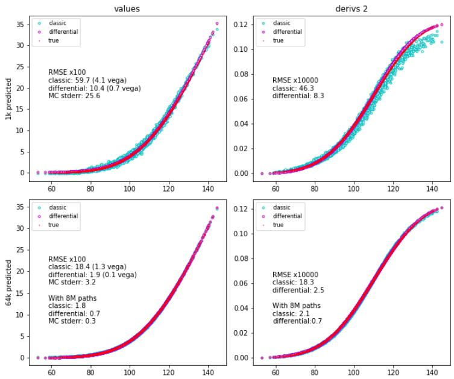

## 2.2 Worst-of autocallables

As a second (real-world) example, we approximate an exotic instrument, a four-underlying version of the popular worst-of autocallable trade, in a more complicated model, a collection of 4 correlated local volatility models a la Dupire:

$$
d S _ { t } ^ { j } = \sigma _ { j } \left( t , S _ { t } ^ { j } \right) d W _ { t } ^ { j } \quad j = 1 , \ldots , 4
$$

where $d W _ { t } ^ { j } d W _ { t } ^ { k } = \rho _ { j k }$ . The example is relevant, not only due to popularity, but also, because of the stress path-dependence, barriers and massive final digitals impose on numerical models. Appropriate smoothing was applied so pathwise diferentials are well defined.

We do not have a closed form solution for reference, so performance is measured against nested Monte-Carlo simulations (a very slow process). In Figure 4, we show prediction results for 128 independent examples, with correct numbers on the horizontal axis, as given by the nested simulations, and predicted results on the vertical axis. Performance is measured by distance to the 45deg line.

The classical network is trained on 32768 (32k) samples, without derivatives, with cross-validation and early stopping. The twin network is trained on 8192 (8k) samples with pathwise derivatives produced with AAD. Both sets were generated in around 0.4 sec in Superfly, Danske Bank’s proprietary derivatives pricing and risk management system.

Figure 4 shows the results for the value and the delta to the second underlying, together with the script for the instrument, written in Danske Bank’s Jive scripting language. Note that the barriers and the digitals are explicitly smoothed with the keyword ’choose’. It is evident that the twin network with only 8k training data produces a virtually perfect approximation in values, and a decent approximation on deltas. The classical network also approximates values correctly, although not on a straight line, which may cause problems when ordering is critical, e.g. for expected loss or FRTB. Its deltas are essentially random, which rules them out for approximation of risk sensitivities, e.g. for SIMM-MVA.

Absolute standard errors are 1.2 value and 32.5 delta with the classical network with 32k examples, respectively 0.4 and 2.5 with the diferential network trained on 8k examples. For comparison, the Monte-Carlo pricing error is 0.2 with 8k paths, similar to the twin net. The error on the classical net, with 4 times the training size, is larger for values and order of magnitude larger for diferentials.

<!-- page: 12 -->

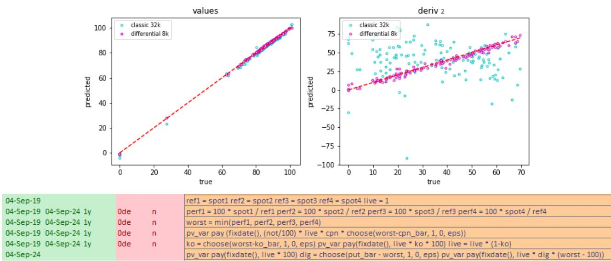

[Table source crop](assets/tables/2020-huge-savine-differential-machine-learning-p0012-block-0002-ff60d225a7b55ca0.jpg)
Figure 4: worst-of-four autocallable with correlated local volatility models

## 2.3 Derivatives trading books

For the last example, we picked a real netting set from Danske Bank’s portfolio, including single and cross currency swaps and swaptions in 10 diferent currencies, eligible for XVA, CCR or other regulated computations. Simulations are performed in Danske Bank’s model of everything (the ’Beast’), where interest rates are simulated each with a four-factor version of Andreasen’s take on multi-factor Cheyette [2], and correlated between one another and with forex rates.

This is an important example, because it is representative of how we want to apply twin nets in the real world. In addition, this is a stress test for neural networks. The Markov dimension of the four-factor non-Gaussian Cheyette model is 16 per currency, that is 160 inputs, 169 with forexes, and over 1000 with all the path-dependencies in this real-world book. Of course, the value efectively only depends on a small number of combinations of inputs, something the neural net is supposed to identify. In reality, the extraction of efective risk factors is considerably more efective in the presence of diferential labels (see Appx 2), which explains the results in Figure 5.

Figure 5 shows the values predicted by a twin network trained on 8192 (8k) samples with AAD pathwise derivatives, compared to a vanilla net, trained on 65536 (64k) samples, all simulated in Danske Bank’s XVA system. The diference in performance is evident in the chart. The twin approximation is virtually perfect with on only 8k examples. The classical deep approximation is much more rough with 64k examples. As with the previous example, the predicted values for an independent set of 128 examples are shown on the vertical axis, with correct values on the horizontal axis. The ’correct’ values for the chart were produced with nested Monte-Carlo overnight. The entire training process for the twin network (on entry level GPU), including the generation of the 8192 examples (on multithreaded CPU), took a few seconds on a standard workstation.

We have shown in this figure the predicted values, not derivatives, because we have too many of them, often wrt obscure model parameters like accumulated covariances in Cheyette. For these derivatives to make sense, they must be turned into market risks by application of inverse Jacobian matrices [20], something we skipped in this exercise.

Standard errors are 12.85M with classical 64k and 1.77M with diferential 8k, for a range of 200M for the 128 test examples, generated with the calibrated hybrid model. On this example too, twin 8k error is very similar to the Monte-Carlo pricing error (1.70M with 8k paths). Again in this very representative example, the twin network has the same degree of approximation as orders of magnitude slower nested Monte-Carlo.

<!-- page: 13 -->

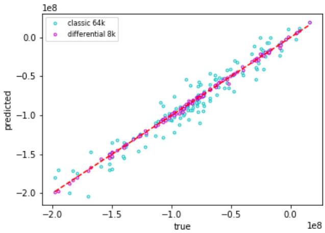

## 3 Extensions

We have presented algorithms in the context of single value prediction to avoid confusion and heavy notations. To conclude, we discuss two advanced extensions, allowing the network to predict multiple values and higher-order derivatives simultaneously.

## 3.1 Multiple outputs

One innovation in [12] is to predict call prices of multiple strikes and expiries in a single network, exploiting correlation and shared factors, and encouraging the network to learn global features like no-arbitrage conditions. We can combine our approach with this idea by an extension of the twin network to compute multiple predictions, meaning $n _ { L } > 1$ and $y = z _ { L } \in \mathbb { R } ^ { n _ { L } }$ . The adjoints are no longer well defined as vectors. Instead, we now define them as directional diferentials wrt some specified linear combination of the outputs $y c ^ { T }$ where $c \in \mathbb { R } ^ { n _ { L } }$ has the coordinates of the desired direction in a row vector:

$$
{ \bar { x } } = { \frac { \partial y c ^ { T } } { \partial x } } , { \bar { z } } _ { l } = { \frac { \partial y c ^ { T } } { \partial z _ { l } } } , { \bar { y } } = { \frac { \partial y c ^ { T } } { \partial y } } = c
$$

Given a direction $^ { c , }$ all the previous equations apply identically, except that the boundary condition for $\bar { y }$ in the backpropagation equations is no longer the number 1, but the row vector c. For example, $c = e _ { 1 }$ means that adjoints are defined as derivatives of the first output $y _ { 1 }$ . We can repeat this for $c = e _ { 1 } , \ldots , e _ { n }$ to compute the derivatives of all the outputs wrt all the inputs $\partial y / \partial x \in \mathbb { R } ^ { n _ { L } \times n }$ , i.e the Jacobian matrix. Written in matrix terms, the boundary is the identity matrix $I \in \mathbb { R } ^ { n _ { L } \times n _ { L } }$ and the backpropagation equations are written as follows:

$$
\begin{array} { r c l } { \bar { z } _ { L } } & { = } & { \bar { y } = I } \\ { \bar { z } _ { l - 1 } } & { = } & { \left( \bar { z } _ { l } w _ { l } ^ { T } \right) \circ g _ { l - 1 } ^ { \prime } \left( z _ { l - 1 } \right) , \quad l = L , \ldots , 1 } \\ { \bar { x } } & { = } & { \bar { z } _ { 0 } } \end{array}
$$

<!-- page: 14 -->

where $\bar { z } _ { l } \in \mathbb { R } ^ { n _ { L } \times n _ { l } }$ . In particular, $\bar { \boldsymbol { x } } \in \mathbb { R } ^ { n _ { L } \times n }$ is (indeed) the Jacobian matrix $\partial y / \partial x$ . To compute a full Jacobian, the theoretical order of calculations is $n _ { L }$ times the vanilla network. Notice however, that the implementation of the multiple backpropagation in the matrix form above on a system like TensorFlow automatically benefits from CPU or GPU parallelism. Therefore, the additional computation complexity will be experienced as sublinear.

## 3.2 Higher order derivatives

The twin network can also predict higher-order derivatives. For simplicity, revert to the single prediction case where $n _ { L } = 1$ . The twin network predicts ¯x as a function of the input x. The neural network, however, doesn’t know anything about derivatives. It just computes numbers by a sequence of equations. Hence, we might as well consider the prediction of diferentials as multiple outputs.

As previously, in what is now considered a multiple prediction network, we can compute the adjoints of the outputs ¯x in the twin network. These are now the adjoints of the adjoints:

$$
\bar { \bar { x } } \equiv \frac { \partial \bar { x } c ^ { T } } { \partial x } \in \mathbb { R } ^ { n }
$$

in other terms, the Hessian matrix of the value prediction y. Note that the original activation functions must be $C ^ { 2 }$ for this computation. The computation of the full Hessian is of order n times the original network. These additional calculations generate a lot more data, one value, n derivatives and $\textstyle { \frac { 1 } { 2 } } n \left( n + 1 \right)$ second-order derivatives for the cost of $2 n$ times the value prediction alone. In a parallel system like TensorFlow, the experience also remains sublinear. We can extend this argument to arbitrary order $q ,$ with the only restriction that the (original) activation functions are $C ^ { q }$

## Conclusion

Throughout our analysis we have seen that ’learning the correct shape’ from diferentials is crucial to the performance of regression models, including neural networks, in such complex computational tasks as the pricing and risk approximation of arbitrary Derivatives trading books. The unreasonable efectiveness of what we called ’diferential machine learning’ permits to accurately train ML models on a small number of simulated payofs, in realtime, suitable for online learning. Diferential networks apply to real-world problems, including regulations and risk reports with multiple scenarios. Twin networks predict prices and Greeks with almost analytic speed, and their empirical test error remains of comparable magnitude to nested Monte-Carlo.

Our machinery learns from data alone and applies in very general situations, with arbitrary schedules of cashflows, scripted or not, and arbitrary simulation models. Diferential ML also applies to many families of approximations, including classic linear combinations of fixed basis functions, and neural networks of arbitrary complex architecture. Diferential training consumes diferentials of labels wrt inputs and requires clients to somehow provide high-quality first-order diferentials. In finance, they are obtained with AAD, in the same way we compute Monte-Carlo risk reports, with analytic accuracy and very little computation cost.

One of the main benefits of twin networks is their ability to learn efectively from small datasets. Diferentials inject meaningful additional information, eventually resulting in better results with small datasets of 1k to 8k examples than can be obtained otherwise with training sets orders of magnitude larger. Learning efectively from small datasets is critical in the context of e.g. regulations, where the pricing approximation must be learned quickly, and the expense of a large training set cannot be aforded.

The penalty enforced for wrong diferentials in the cost function also acts as a very efective regularizer, superior to classical forms of regularization like Ridge, Lasso or Dropout, which enforce arbitrary penalties to mitigate overfitting, whereas diferentials meaningfully augment data. Standard regularizers are very sensitive to the regularization strength $\lambda ,$ a manually tweaked hyperparameter. Diferential training is virtually insensitive to λ, because, even with infinite regularization, we train on derivatives alone and still converge to the correct approximation, modulo an additive constant.

<!-- page: 15 -->

Appx 2 and Appx 3 apply the same ideas to respectively PCA and classic regression. In the context of regression, diferentials act as a very efective regularizer. Like Tikhonov regularization, diferential regularization is analytic and works SVD. Appx 3 derives a variation of the normal equation adjusted for diferential regularization. Unlike Tikhonov, diferential regularization does not introduce bias. Diferential PCA, unlike classic PCA, is able to extract from data the principal risk factors of a given transaction, and it can be applied as a preprocessing step to safely reduce dimension without loss of relevant information.

Diferential training also appears to stabilize the training of neural networks, and improved resilience to hyperparameters like network architecture, seeding of weights or learning rate schedule was consistently observed, although to explain exactly why is a topic for further research.

Standard machine learning may often be considerably improved with contextual information not contained in data, such as the nature of the relevant features from knowledge of the transaction and the simulation model. For example, we know that the continuation value of a Bermudan option on some call date mainly depends on the swap rate to maturity and the discount rate to the next call. We can learn pricing functions much more efectively with hand engineered features. But it has to be done manually, on a case by case basis, depending on the transaction and the simulation model. If the Bermudan model is upgraded with stochastic volatility, volatility state becomes an additional feature that cannot be ignored, and hand-engineered features must be updated. Diferential machine learning learns just as well, or better, from data alone, the vast amount of information contained in pathwise diferentials playing a role similar, and sometimes more efectively, to manual adjustments from contextual information.

Diferential machine learning is similar to data augmentation in computer vision, a technique consistently applied in that field with documented success, where multiple labeled images are produced from a single one, by cropping, zooming, rotation or recoloring. In addition to extending the training set for a negligible cost, data augmentation encourages the ML model to learn important invariances. Similarly, derivatives labels, not only increase the amount of information in the training set, but also encourage the model to learn the shape of the pricing function.

<!-- page: 16 -->

Appendices

<!-- page: 17 -->

## Appx 1 Learning Prices from Samples

## Introduction

When learning Derivatives pricing and risk approximations, the main computation load belongs to the simulation of the training set. For complex transactions and trading books, it is not viable to learn from examples of ground truth prices. True prices are computed numerically, generally by Monte-Carlo. Even a small dataset of say, 1000 examples, is therefore simulated for the computation cost of 1000 Monte-Carlo pricings, a highly unrealistic cost in a practical context. Alternatively, sample datasets a la Longstaf-Schwartz (2001) are produced for the computation cost of one Monte-Carlo pricing, where each example is not a ground truth price, but one sample of the payof, simulated for the cost of one Monte-Carlo path. This methodology, also called LSM (for Least Square Method as it is called in the founding paper) simulates training sets in realistic time and allows to learn pricing approximations in realistic time.

This being said, we now expect the machine learning model to learn correct pricing functions without having ever seen a price. Consider a simple example: to learn the pricing function for a European call in Black and Scholes, we simulate a training set of call payofs $Y ^ { ( i ) } = \left( S _ { T _ { 2 } } ^ { ( i ) } - K \right) ^ { \dagger }$ given initial states $X ^ { ( i ) } = S _ { T _ { 1 } } ^ { ( i ) }$ . The result is a random looking cloud of points $X ^ { ( i ) } , Y ^ { ( i ) }$ , and we expect the machine to learn from this data the correct pricing function given by Black and Scholes’ formula.

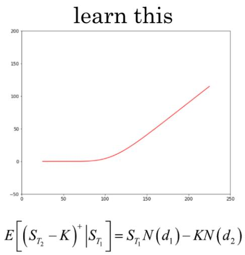

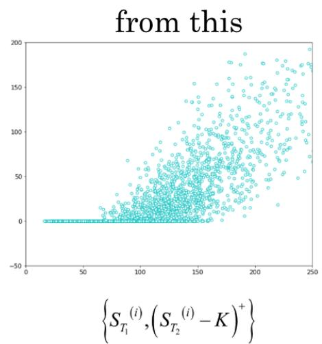

It is not given at all, and it may even seem somewhat magical, that training a machine learning model on this data should converge to the correct function. When we train on ground true prices, we essentially interpolate prices in input space, where it is clear and intuitive that arbitrary functions are approximated to arbitrary accuracy by growing the size of the training set and the capacity of the model. In fact, the same holds with LSM datasets, and this appendix discusses some important intuitions and presents sketches of mathematical proof of why this is the case.

In the first section, we recall LSM in detail1 and frame it in machine learning terms. Readers familiar with the Longstaf-Schwartz algorithm may browse through this section quickly, although skipping it altogether is not recommended, this is where we set important notations. In the second section, we discuss universal approximators, formalize their training process on LSM samples, and demonstrate convergence to true prices. In the third section, we define pathwise diferentials, formalize diferential training and show that it too converges to true risk sensitivities.

1Omitting the recursive part of the algorithm, specific to early exerciseable Derivatives.

<!-- page: 18 -->

The purpose of this document is to explain and formalize important mathematical intuitions, not to provide complete formal proofs. We often skip important mathematical technicalities so our demonstrations should really be qualified as ’sketches of proof’.

## 1 LSM datasets

## 1.1 Markov States

## Model state

First, we formalize the definition of a LSM dataset. LSM datasets are simulated with a Monte-Carlo implementation of a dynamic pricing model. Dynamic models are parametric assumptions of the difusion of a state vector $S _ { t } ,$ of the form:

$$
d S _ { t } = \mu \left( S _ { t } , t \right) d t + \sigma \left( S _ { t } , t \right) d W _ { t }
$$

where $S _ { t }$ is a vector of dimension $n _ { 0 } , \mu \left( s , t \right)$ is a vector valued function of dimension $n _ { 0 } , \sigma \left( s , t \right)$ is a matrix valued function of dimension $n _ { 0 } \times p$ and $W _ { t }$ is a $p$ dimensional standard Brownian motion under the pricing measure. The number $n _ { 0 }$ is called the Markov dimension of the model, the number $p$ is called the number of factors. Some models are non-difusive, for example, jump difusion models a la Merton or rough volatility models a la Gatheral. All the arguments of this note carry over to more general models, but in the interest of concision and simplicity, we only consider difusions in the exposition. Dynamic models are implemented in Monte-Carlo simulations, $\mathrm { e . g . }$ . with Euler’s scheme:

$$
S _ { T _ { j + 1 } } ^ { ( i ) } = S _ { T _ { j } } ^ { ( i ) } + \mu \left( S _ { T _ { j } } ^ { ( i ) } , T _ { j } \right) \left( T _ { j + 1 } - T _ { j } \right) + \sigma \left( S _ { T _ { j } } ^ { ( i ) } , T _ { j } \right) \sqrt { T _ { j + 1 } - T _ { j } } N _ { j } ^ { ( i ) }
$$

where i is the index of the path, j is the index of the time step and the $N _ { j } \left( i \right)$ are independent Gaussian vectors in dimension p.

The definition of the state vector $S _ { t }$ depends on the model. In Black and Scholes or local volatility extensions a la Dupire, the state is the underlying asset price. With stochastic volatility models like SABR or Heston, the bi-dimensional state $\boldsymbol { S } _ { t } = \left( \boldsymbol { s } _ { t } , \boldsymbol { \sigma } _ { t } \right)$ is the pair (current asset price, current volatility). In Hull and White / Cheyette interest rate models, the state is a low dimensional latent representation of the yield curve. In general Heath-Jarrow-Morton / Libor Market models, the state is the collection of all forward rates in the yield curve.

We call model state on date t the state vector $S _ { t }$ of the model on this date.

## Transaction state

Derivatives transactions also carry a state, in the sense that the transactions evolve and mutate during their lifetime. The state of a barrier option depends on whether the barrier was hit in the past. The state of a Bermudan swaption depends on whether it was exercised. Even the state of a swap depends on the coupons fixed in the past and not yet paid. European options don’t carry state until expiry, but then, they may exercise into an underlying schedule of cashflows.

We denote $U _ { t }$ the transaction state at time t and $n _ { 1 }$ its dimension. For a barrier option, the transaction state is of dimension one and contains the indicator of having hit the barrier prior to t. For a real-world trading book, the dimension $n _ { 1 }$ may be in the thousands and it may be necessary to split the book to avoid dimension overload. The transaction state is simulated together with the model state in a Monte-Carlo implementation. In a system where event driven cashflows are scripted, the transaction state $U _ { t }$ is also the script state, i.e. the collection of variables in the script evaluated over the Monte-Carlo path up to time t.

<!-- page: 19 -->

## Training inputs

The exercise is to learn the pricing function for a given transaction or a set of transactions, in a given model, on a given date $T _ { 1 } \ \geq \ 0 ,$ sometimes called the exposure date or horizon date. The price evidently depends on both the state of the model $S _ { T _ { 1 } }$ and the state of the transaction $U _ { T _ { 1 } }$ . The concatenation of these two vectors $X _ { T _ { 1 } } = [ S _ { T _ { 1 } } , U _ { T _ { 1 } } ]$ constitute the complete Markov state of the system, in the sense that the true price of transactions at $T _ { 1 }$ are deterministic (but unknown) functions of $X _ { T _ { 1 } }$

The dimension of the state vector is $n _ { 0 } + n _ { 1 } = n$

The training inputs are a collection of examples $X ^ { ( i ) }$ of the Markov state $X _ { T _ { 1 } }$ in dimension n. They may be sampled by Monte-Carlo simulation between today $( T _ { 0 } = 0 )$ and $T _ { 1 }$ , or otherwise. The distribution of X in the training set should reflect the intended use of the trained approximation. For example, in the context of value at risk (VAR) or expected loss (FRTB), we need an accurate approximation in extreme scenarios, hence, we need them well represented in the training set, e.g. with a Monte-Carlo simulation with increased volatility. In low dimension, the training states $X ^ { ( i ) }$ may be put on a regular grid over a relevant domain. In higher dimension, they may be sampled over a relevant domain with a low discrepancy sequence like Sobol. When the exposure date $T _ { 1 }$ is today or close, sampling $X _ { T _ { 1 } }$ with Monte-Carlo is nonsensical, an appropriate sampling distribution must be applied depending on context.

## 1.2 Pricing

## Cashflows and transactions

A cashflow $C F _ { k }$ paid at time $T _ { k }$ is formally defined as a $T _ { k }$ measurable random variable. This means that the cashflow is revealed on or before its payment date. In the world described by the model, this is a functional of the path of the state vector $S _ { t }$ from $T _ { 0 } = 0$ to the payment date $T _ { k }$ and may be simulated by Monte-Carlo.

A transaction is a collection of cashflows $C F _ { 1 } , . . . , C F _ { K }$ . A European call of strike K expiring at $T$ is a unique cashflow, paid at $T _ { \mathrm { : } }$ , defined as $( s _ { T } - K ) ^ { + }$ . A barrier option also defines a unique cashflow:

$$
1 _ { \{ m a x ( s _ { u } , 0 \le u \le T ) < B \} } \left( s _ { T } - K \right) ^ { + }
$$

An interest rate swap defines a schedule of cashflows paid on its fixed leg and another one paid on its floating leg. Scripting conveniently and consistently describes all cashflows, as functional of market variables, in a language purposely designed for this purpose.

A netting set or trading book is a collection of transactions, hence, ultimately, a collection of cashflows. In what follows, the word ’transaction’ refers to arbitrary collection of cashflows, maybe netting sets or trading books. The payment date of the last cashflow is called the maturity of the transaction and denoted $T _ { 2 }$

## Payofs

The payof of a transaction is defined as the discounted sum of all its cashflows:

$$
\pi = \sum _ { k = 1 } ^ { K } C F _ { k }
$$

<!-- page: 20 -->

hence, the payof is a $T _ { 2 }$ measurable random variable, which can be sampled by Monte-Carlo simulation.

For the purpose of learning the pricing function of a transaction on an exposure date $T _ { 1 } .$ , we only consider cashflows after $T _ { 1 }$ , and discount them to the exposure date. In the interest of simplicity, we incorporate discounting to $T _ { 1 }$ in the functional definition of the cashflows. Hence:

$$
\pi = \sum _ { T _ { k } > T _ { 1 } } C F _ { k }
$$

The payof is still a $T _ { 2 }$ measurable random variable. It can be sampled by Monte-Carlo simulation conditional to state $X _ { T _ { 1 } } = [ S _ { T _ { 1 } } , U _ { T _ { 1 } } ]$ at $T _ { 1 }$ by seeding the simulation with state $X _ { T _ { 1 } }$ at $T _ { 1 }$ and simulating up to $T _ { 2 }$

## Pricing

Assuming a complete, arbitrage-free model, we immediately get the price of the transaction from the fundamental theorem of asset pricing:

$$
V _ { T _ { 1 } } = E \left[ \pi | F _ { T _ { 1 } } \right]
$$

where expectations are taken in the pricing measure defined by the model and $F _ { T _ { 1 } }$ is the filtration at $T _ { 1 }$ (loosely speaking, the information available at $T _ { 1 , }$ . Since by assumption $X _ { T _ { 1 } } = [ S _ { T _ { 1 } } , U _ { T _ { 1 } } ]$ is the complete Markov state of the system at $T _ { 1 }$ :

$$
V _ { T _ { 1 } } = E \left[ \pi | X _ { T _ { 1 } } \right] = h \left( X _ { T _ { 1 } } \right)
$$

Hence, the true price is a deterministic (but unknown) function h of the Markov state.

## Training labels

We see that the price corresponding to the input example $X ^ { ( i ) }$ is:

$$
V ^ { ( i ) } = E \left[ \pi | X _ { T _ { 1 } } = X ^ { ( i ) } \right]
$$

and that its computation, in the general case, involves averaging payofs over a number of Monte-Carlo simulations from $T _ { 1 }$ to $T _ { 2 } .$ , all identically seeded with $X _ { T _ { 1 } } = X ^ { ( i ) }$ . This is also called nested simulations because a set of simulations is necessary to compute the value of each example, the initial states having themselves been sampled somehow. If the initial states were sampled with Monte-Carlo simulations, they are called outer simulations. Hence, we have simulations within simulations, an extremely costly and ineficient procedure2.

Instead, for each example $i ,$ we draw one single payof $\pi ^ { ( i ) }$ from its distribution conditional to $X _ { T _ { 1 } } = X ^ { ( i ) }$ , by simulation of one Monte-Carlo path from $T _ { 1 }$ to $T _ { 2 }$ , seeded with $X ^ { ( i ) }$ at $T _ { 1 }$ . The labels in our dataset correspond to these random draws:

$$
{ \cal { Y } } ^ { ( i ) } \underbrace { \mathrm {  ~ \ s a m p l e ~ } } _ { { \cal { T } } { \cal { T } } _ { 2 } } \vert \left\{ X _ { T _ { 1 } } = X ^ { ( i ) } \right\}
$$

Notice (dropping the condition to $X _ { T _ { 1 } } = X ^ { ( i ) }$ to simplify notations) that, while labels no longer correspond to true prices, they are unbiased (if noisy) estimates of true prices.

$$
E \left[ Y ^ { ( i ) } \right] = E \left[ \pi ^ { ( i ) } \right] = V ^ { ( i ) }
$$

2Although, we can use nested simulations as a reference to measure performance, as we did in the working paper, sections 3.2 and 3.3. In production, nested simulations may be used to regularly double check numbers.

<!-- page: 21 -->

in other terms:

$$
\begin{array} { r } { Y ^ { ( i ) } = V ^ { ( i ) } + \epsilon ^ { ( i ) } = h \left( X ^ { ( i ) } \right) + \epsilon ^ { ( i ) } } \end{array}
$$

where the $\epsilon ^ { ( i ) }$ are independent noise with $E \left[ \epsilon ( i ) \right] = 0$ . This is why universal approximators trained on LSM datasets converge to true prices despite having never seen one.

## 2 Machine learning with LSM datasets

## 2.1 Universal approximators

Having simulated a training set of examples $X ^ { ( i ) } , Y ^ { ( i ) }$ we proceed to train approximators, defined as functions $\hat { h } \left( x , w \right)$ of the input vector x of dimension n, parameterized by a vector w of learnable weights of dimension d. This is a general definition of approximators. In classic regression, w are the regression weights, often denoted $\beta .$ In a neural network, w is the collection of all connection matrices $W ^ { [ l ] }$ and bias vectors $\setminus [ l ]$ in the multiple layers $l = 1 , . . . , L$ of the network.

The capacity of the approximator is an informal measure of both its computational complexity and its ability to approximate functions by matching discrete sets of datapoints. A classic formal definition of capacity is the Vapnik-Chervonenkis dimension, defined as the largest number of arbitrary datapoints the approximator can match exactly. We settle for a weaker definition of capacity as the number d of learnable parameters, suficient for our purpose.

A universal approximator is one guaranteed to approximate any function to arbitrary accuracy when its capacity is grown to infinity. Examples of universal approximator include classic linear regression, as long as the regression functions form a complete basis of the function space. Polynomial, harmonic (Fourier) and radial basis regressors are all universal approximators. Famously, neural networks are universal approximators too, a result known as the Universal Approximation Theorem.

## 2.2 LSM approximation theorem

Training an approximator means setting the value of its learnable parameters w in order to minimize a cost function, generally the mean square error (MSE) between the approximations and labels over a training set of m examples:

$$
w = a r g m i n _ { w } M S E = \frac { 1 } { m } \sum _ { i = 1 } ^ { m } \left[ \hat { h } \left( X ^ { ( i ) } , w \right) - Y ^ { ( i ) } \right] ^ { 2 }
$$

The following theorem justifies the practice of training approximators on LSM datasets:

A universal approximator $\hat { f }$ trained by minimization of the MSE over a training set $X ^ { ( i ) } , Y ^ { ( i ) }$ of independent examples of Markov states at $T _ { 1 }$ coupled with conditional sample payofs at $T _ { 2 }$ , converges to the true pricing function

$$
h \left( x \right) = E \left[ \pi | X _ { T _ { 1 } } = x \right]
$$

when the size m of the training set and the capacity d of the approximator both grow to infinity.

We provide a sketch of proof, skipping important mathematical technicalities to highlight intuitions and important properties.

<!-- page: 22 -->

First, notice that the training set consists in m independent, identically distributed realizations of the couple X, Y where X is the Markov state at $T _ { 1 }$ , sampled from a distribution reflecting the intended application of the approximator, and $Y | X$ is the conditional payof at $T _ { 2 } .$ , sampled from the pricing distribution defined by the model and sampled by conditional Monte-Carlo simulation.

Hence, the true pricing function h satisfies:

$$
h \left( X \right) = E \left[ Y \vert X \right]
$$

$\mathrm { B y }$ definition, the conditional expectation $E \left[ Y | X \right]$ is the function of X closest to $Y$ in $L ^ { 2 } ;$

$$
E \left[ Y | X \right] \equiv m i n _ { g \in L ^ { 2 } ( X ) } | | g \left( X \right) - Y | | _ { 2 } ^ { 2 }
$$

Hence, pricing can be framed as an optimization problem in the space of functions. By universal approximation property:

$$
m i n _ { w } | | \hat { h } ( X , w ) - Y | | _ { 2 } ^ { 2 }  m i n _ { g \in L ^ { 2 } ( X ) } | | g ( X ) - Y | | _ { 2 } ^ { 2 }
$$

when the capacity d grows to infinity, and:

$$
M S E  \Vert \hat { h } ( X , w ) - Y \Vert _ { 2 } ^ { 2 }
$$

when m grows to infinity, by assumption of an IID training set, sampled from the correct distributions. Hence:

$$
\hat { h } \left( X , m i n _ { w } M S E \right) \to h \left( X \right)
$$

when both m and d grow to infinity. This is the theoretical basis for training machine learning models on LSM samples, and it applies to all universal approximators, including neural networks. This is why regression or neural networks trained on samples ’magically’ converge to the correct pricing function, as observed $\mathrm { e . g . }$ in our demonstration notebook with European calls in Black and Scholes and basket options in Bachelier. The theorem is general and equally guarantees convergence for arbitrary (complete and arbitrage-free) models and schedule of cashflows.

## 3 Diferential Machine Learning with LSM datasets

## 3.1 Pathwise diferentials

By definition, pathwise diferentials $\partial \pi / \partial X _ { T _ { 1 } }$ are $T _ { 2 }$ measurable random variables equal to the gradient of the payof at $T _ { 2 }$ wrt the state variables at $T _ { 1 }$

For example, for a European call in Black and Scholes, pathwise derivatives are equal to:

$$
\frac { \partial \pi } { \partial S _ { T _ { 1 } } } = \frac { \partial \left( s _ { T _ { 2 } } - K \right) ^ { + } } { \partial s _ { T _ { 1 } } } = \frac { \partial \left( s _ { T _ { 2 } } - K \right) ^ { + } } { \partial s _ { T _ { 2 } } } \frac { \partial s _ { T _ { 2 } } } { \partial s _ { T _ { 1 } } } = 1 _ { \left\{ s _ { T _ { 2 } } > K \right\} } \frac { s _ { T _ { 2 } } } { s _ { T _ { 1 } } }
$$

In a general context, pathwise diferentials are conveniently and eficiently computed with automatic adjoint diferentiation (AAD) over Monte-Carlo paths as explained in the founding paper Smoking Adjoints (Giles and Glasserman, Risk 2006) and the vast amount of literature that followed. We posted a video tutorial explaining the main ideas in 15 minutes3.

3 https://www.youtube.com/watch?v=IcQkwgPwfm4

<!-- page: 23 -->

Pathwise diferentials are not well defined for discontinuous cashflows, like digitals or barriers. This is classically resolved by smoothing, i.e. the replacement of discontinuous cashflows with close continuous approximations. Digitals are typically represented as tight call spreads, and barriers are represented as soft barriers. Smoothing has been a standard practice on Derivatives trading desks for several decades. For an overview of smoothing, including generalization in terms of fuzzy logic and a systematic smoothing algorithm, see our presentation4.

Provided that all cashflows are diferentiable by smoothing (and some additional, generally satisfied technical requirements), the expectation and diferentiation operators commute so that true risks are (conditional) expec tations of pathwise diferentials:

$$
{ \mathrm { i f ~ } } h \left( x \right) = E \left[ \pi | X _ { T _ { 1 } } = x \right] { \mathrm { ~ t h e n ~ } } { \frac { \partial h \left( x \right) } { \partial x } } = E \left[ { \frac { \partial \pi } { \partial X _ { T _ { 1 } } } } | X _ { T _ { 1 } } = x \right]
$$

This theorem is demonstrated in stochastic literature, the most general demonstration being found in Functional Ito Calculus, also called Dupire Calculus, see Quantitative Finance Volume 19, 2019, Issue 5. It also applies to pathwise diferentials wrt model parameters, and justifies the practice of Monte-Carlo risk reports by averaging pathwise derivatives.

## 3.2 Training on pathwise diferentials

LSM datasets consist of inputs $X ^ { ( i ) } = X _ { T _ { 1 } } ^ { ( i ) }$ with labels $Y ^ { ( i ) } = \pi ^ { ( i ) }$ . Pathwise diferentials are therefore the gradients of labels $Y ^ { ( i ) }$ wrt inputs $X ^ { ( i ) }$ . The main proposition of the working paper is to augment training datasets with those diferentials and implement an adequate training on the augmented dataset, with the result of vastly improved approximation performance.

Suppose first that we are training an approximator on diferentials alone:

$$
w = a r g m i n _ { w } M S E = \frac { 1 } { m } \sum _ { i = 1 } ^ { m } | | \frac { \partial \hat { h } \left( X ^ { ( i ) } , w \right) } { \partial X ^ { ( i ) } } - \frac { \partial Y ^ { ( i ) } } { \partial X ^ { ( i ) } } | | ^ { 2 }
$$

with predicted derivatives on the left hand side (LHS) and diferential labels on the right hand side (RHS). Note that the LHS is the predicted sensitivity ∂hˆ $\left( X ^ { ( i ) } \right) / \partial X ^ { ( i ) }$ but the RHS is not the true sensitivity $\partial h \left( X ^ { ( i ) } \right) / \partial X ^ { ( i ) }$ It is the pathwise diferential, a random variable with expectation the true sensitivity and additional sampling noise.

We have already seen this exact same situation while training approximators on LSM samples, and demonstrated that the trained approximator converges to the true conditional expectation, in this case, the expectation of pathwise diferentials, a.k.a. the true risk sensitivities.

The trained approximator will therefore converge to a function $\hat { h }$ with all the same diferentials as the true pricing function h. It follows that on convergence $\hat { h } = h$ modulo an additive constant $c ,$ trivially computed at the term of training by matching means:

$$
c = \frac { 1 } { m } \sum _ { i = 1 } ^ { m } \left[ Y ^ { ( i ) } - \hat { h } \left( X ^ { ( i ) } \right) \right]
$$

## Conclusion

We reviewed the details of LSM simulation framed in machine learning terms, and demonstrated that training approximators on LSM datasets efectively converges to the true pricing functions. We then proceeded to demonstrate that the same is true of diferential training, i.e. training approximators on pathwise diferentials also converges to the true pricing functions.

4https://www.slideshare.net/AntoineSavine/stabilise-risks-of-discontinuous-payoffs-with-fuzzy-logic

<!-- page: 24 -->

These are asymptotic results. They justify standard practices and guarantee consistence and meaningfulness of classical and diferential training on LSM datasets, classical or augmented e.g. with AAD. They don’t say anything about speed of convergence. In practicular, they don’t provide a quantification of errors with finite capacity d and finite datasets of size m. They don’t explain the vastly improved performance of diferential training, consistently observed across examples of practical relevance in the working paper. Both methods have the same asymptotic guarantees, where they difer is in the magnitude of errors with finite capacity and size. To quantify those is a more complex problem and a topic for further research.

<!-- page: 25 -->

## Appx 2 Taking the First Step : Diferential PCA

## Introduction

We review traditional data preparation in deep learning (DL) including principal component analysis (PCA), which efectively performs orthonormal transformation of input data, filtering constant and redundant inputs, and enabling more efective training of neural networks (NN). Of course, PCA is also useful in its own right, providing a lower dimensional latent representation of data variation along orthogonal axes.

In the context of diferential DL, training data also contains diferential labels (diferentials of training labels wrt training inputs, computed e.g. with automatic adjoint diferentiation -AAD- as explained in the working paper), and thus requires additional preprocessing.

We will see that diferential labels also enable remarkably efective data preparation, which we call diferential PCA. Like classic PCA, diferential PCA provides a hierarchical, orthogonal representation of data. Unlike classic PCA, diferential PCA represents input data in terms how it afects the target measured by training labels, a notion we call relevance. For this reason, diferential PCA may be safely applied to aggressively remove irrelevant factors and considerably reduce dimension.

In the context of data generated by financial Monte-Carlo paths, diferential PCA exhibits the principal risk factors of the target transaction or trading book from data alone. It is therefore a very useful algorithm on its own right, besides its efectiveness preparing data for training NN.

The first section describes and justifies elementary data preparation, as implemented in the demonstration notebook DiferentialML.ipynb on https://github.com/differential-machine-learning. Section 2 discusses the mechanism, benefits and limits of classic PCA. Section 3 introduces and derives diferential PCA and discusses the details of its implementation and benefits. Section 4 brings it all together in pseudocode.

## 1 Elementary data preparation

Dataset normalization is known as a crucial, if somewhat mundane preparation step in deep learning (DL), highlighted in all DL textbooks and manuals. Recall from the working paper that we are working with augmented datasets:

$$
X ^ { ( i ) } : { \mathrm { i n p u t s , ~ } } Y ^ { ( i ) } : { \mathrm { l a b e l s , ~ a n d ~ } } Z ^ { ( i ) } = { \frac { \partial Y ^ { ( i ) } } { \partial X ^ { ( i ) } } } : { \mathrm { d i f f e r e n t i a l ~ l a b e l s } }
$$

with m labels in dimension 1 and m inputs and m diferentials in dimension $n ,$ stacked in m rows in the matrices X, Y and Z. In the context of financial Monte-Carlo simulations a la Longstaf-Schwartz, inputs are Markov states on a horizon date $T _ { 1 } \geq 0$ , labels are payofs sampled on a later date $T _ { 2 }$ and diferentials are pathwise derivatives, produced with AAD.

The normalization of augmented datasets must take additional steps compared to conventional preparation of classic datasets consisting of only inputs and labels.

## 1.1 Taking the first (and last) step

A first, trivial observation is that the scale of labels $Y ^ { ( i ) }$ carries over to the gradients of the cost functions and the size of gradient descent optimization steps. To avoid manual scaling of learning rate, gradient descent and variants are best implemented with labels normalized by subtraction of mean and division by standard deviation. This is the case for all models trained with gradient descent, including classic regression in high dimension where the closed form solution is intractable.

<!-- page: 26 -->

Contrarily to classic regression, training a neural network is a nonconvex problem, hence, its result is sensitive to the starting point. Correctly seeding connection weights is therefore a crucial step for successful training. The best practice Xavier-Glorot initialization provides a powerful seeding heuristic, implemented in modern frameworks like TensorFlow. It is based on the implicit assumption that the units in the network, including inputs, are centred and orthonormal. It therefore performs best when the inputs are at the very least normalized by mean and standard deviation, and ideally orthogonal. This is specific to neural networks. Training classic regression models, analytically or numerically, is a convex problem, so there is no need to normalize inputs or seed weights in a particular manner.

Training deep learning models therefore always starts with a normalization step and ends with a ’un-normalization step’ where predictions are scaled back to original units. Those first and last step may be seen, and implemented, as additional layers in the network with fixed (non learnable) weights. They may even be merged in the input and output layer of the network for maximum eficiency. In this document, we present normalization as a preprocessing step in the interest of simplicity.

## First step

We implemented basic preprocessing in the demonstration notebook:

$$
\tilde { Y } ^ { ( i ) } = \frac { Y ^ { ( i ) } - \mu _ { Y } } { \sigma _ { Y } } \ \mathrm { a n d } \ \tilde { X } _ { j } ^ { ( i ) } = \frac { X _ { j } ^ { ( i ) } - \mu _ { j } } { \sigma _ { j } }
$$

where

$$
\mu _ { Y } = \frac { 1 } { m } \sum _ { i = 1 } ^ { m } Y ^ { ( i ) } \mathrm { ~ a n d ~ } \mu _ { j } = \frac { 1 } { m } \sum _ { i = 1 } ^ { m } X _ { j } ^ { ( i ) }
$$

and similarly for standard deviations of labels $\sigma _ { Y }$ and inputs $\sigma _ { j }$

The diferentials computed by the prediction model (e.g. the twin network of the working paper) are:

$$
\frac { \partial \tilde { Y } } { \partial \tilde { X _ { j } } } = \frac { \sigma _ { j } } { \sigma _ { Y } } \frac { \partial Y } { \partial X _ { j } }
$$

hence, we adjust diferential labels accordingly:

$$
\tilde { Z } _ { j } ^ { ( i ) } = \frac { \sigma _ { j } } { \sigma _ { Y } } Z _ { j } ^ { ( i ) }
$$

## Training step

The value labels $\tilde { Y }$ are centred and unit scaled but the diferentials labels $\tilde { Z }$ are not, they are merely re-expressed in units of ’standard deviations of $Y$ per standard deviation of $X _ { j } '$ . To avoid summing apples and oranges in the combined cost function as commented in the working paper, we scale cost as follows:

$$
C = \frac { 1 } { m } \sum _ { i = 1 } ^ { m } \left[ \hat { Y } ^ { ( i ) } \left( w \right) - \tilde { Y } ^ { ( i ) } \right] ^ { 2 } + \frac { 1 } { m } \sum _ { i = 1 } ^ { m } \sum _ { j = 1 } ^ { n } \frac { 1 } { | | \tilde { Z } _ { j } | | ^ { 2 } } \left[ \hat { Z } _ { j } ^ { ( i ) } \left( w \right) - \tilde { Z } ^ { ( i ) } \right] ^ { 2 }\tag{C}
$$

and proceed to find the optimal biases and connection weights by minimization of C in w.

<!-- page: 27 -->

Last step

The trained model $\tilde { f }$ expects normalized inputs and predicts a normalized value, along with its gradient to the normalized inputs. Those results must be scaled back to original units:

$$
f \left( x \right) = \mu _ { Y } + \sigma _ { Y } \tilde { f } \left( \tilde { x } \right) = \mu _ { Y } + \sigma _ { Y } \tilde { f } \left( \frac { x - \mu _ { X } } { \sigma _ { X } } \right)
$$

where we divided two row vectors to mean elementwise division, and:

$$
\frac { \partial f \left( \boldsymbol { x } \right) } { \partial x _ { j } } = \frac { \sigma _ { Y } } { \sigma _ { j } } \frac { \partial \tilde { f } \left( \tilde { \boldsymbol { x } } \right) } { \partial \tilde { x } _ { j } }
$$

## 1.2 Limitations

Basic data normalization is suficient for textbook examples but more thorough processing is necessary in production, where datasets generated by arbitrary schedules of cashflows simulated in arbitrary models may contain a mass of constant, redundant of irrelevant inputs. Although neural networks are supposed to correctly sort data and identify relevant features during training1, in practice, nonconvex optimization is much more reliable when at least linear redundancies and irrelevances are filtered in a preprocessing step, lifting those concerns from the training algorithm and letting it focus on the extraction of nonlinear features.

In addition, it is best, although not strictly necessary, to train on orthogonal inputs. As it is well known, normalization and orthogonalization of input data, along with filtering of constant and linearly redundant inputs, is all jointly performed in a principled manner by eigenvalue decomposition of the input covariance matrix, in a classic procedure called principle component analysis or PCA.

## 2 Principal Component Analysis

## 2.1 Mechanism

We briefly recall the mechanism of data preparation with classic PCA. First, normalize labels and center inputs:

$$
\tilde { Y } ^ { ( i ) } = \frac { Y ^ { ( i ) } - \mu _ { Y } } { \sigma _ { Y } } \mathrm { ~ a n d ~ } X _ { j } ^ { ( i ) } \equiv X _ { j } ^ { ( i ) } - \mu _ { j }
$$

i.e. what we now call X is the matrix of centred inputs. Perform its eigenvalue decomposition:

$$
{ \frac { 1 } { m } } X ^ { T } X = P D P ^ { T }
$$

where $P$ is the orthonormal $n \times n$ matrix of eigenvectors (in columns) and D is the diagonal matrix of eigenvalues $D _ { j j }$

Filter numerically constant or redundant inputs identified by eigenvalues $D _ { j j }$ lower than a threshold $\epsilon .$ The filter matrix F has n rows and $\tilde { n } \leq n$ columns and is obtained from the identity matrix $I _ { n }$ by removal of columns corresponding to insignificant eigenvalues $D _ { j j }$ . Denote:

$$
\tilde { D } = F ^ { T } D F \ \mathrm { a n d } \ \tilde { P } = P F
$$

1SVD regression performs a similar task in the context of classic regression, see note on diferential regression.

<!-- page: 28 -->

the reduced eigenvalue and eigenvector matrices of respective shapes $\tilde { n } \times \tilde { n }$ and $n \times \tilde { n }$ , and apply the following linear transformation to centred input data:

$$
\tilde { X } = X \tilde { P } \tilde { D } ^ { - \frac { 1 } { 2 } }
$$

The transformed data has shape $m \times { \tilde { n } } .$ , with constant and linearly redundant columns filtered out. It is evidently centred, and easily proved orthonormal:

$$
\begin{array} { l c l } { \displaystyle \frac { 1 } { m } { \tilde { X } } ^ { T } { \tilde { X } } } & { = } & { { \tilde { D } } ^ { - \frac { 1 } { 2 } } { \tilde { P } } ^ { T } \left( \frac { 1 } { m } X ^ { T } X \right) { \tilde { P } } { \tilde { D } } ^ { - \frac { 1 } { 2 } } } \\ & { = } & { \left( F ^ { T } D F \right) ^ { - \frac { 1 } { 2 } } \left( P F \right) ^ { T } \left( \frac { 1 } { m } X ^ { T } X \right) \left( P F \right) \left( F ^ { T } D F \right) ^ { - \frac { 1 } { 2 } } } \\ & { = } & { \left( F ^ { T } D F \right) ^ { - \frac { 1 } { 2 } } F ^ { T } P ^ { T } P D P ^ { T } P F \left( F ^ { T } D F \right) ^ { - \frac { 1 } { 2 } } } \\ & { = } & { \left( F ^ { T } D F \right) ^ { - \frac { 1 } { 2 } } \left( F ^ { T } D F \right) \left( F ^ { T } D F \right) ^ { - \frac { 1 } { 2 } } } \\ & { = } & { I _ { \tilde { n } } } \end{array}
$$

Note for what follows that orthonormal property is preserved by rotation, i.e. right product by any orthonormal matrix $Q { \mathrm { : } }$

$$
{ \frac { 1 } { m } } \left( { \tilde { X } } Q \right) ^ { T } \left( { \tilde { X } } Q \right) = Q ^ { T } \left( { \frac { 1 } { m } } { \tilde { X } } ^ { T } { \tilde { X } } \right) Q = Q ^ { T } I _ { { \tilde { n } } } Q = Q ^ { T } Q = I _ { { \tilde { n } } }
$$

To update diferential labels, we apply a result from elementary multivariate calculus:

Given two row vectors A and B in dimension p and a square non singular matrix M of shape $p \times p$ such that $B = A M$ , and $y = g \left( A \right) = h \left( B \right)$ a scalar, then:

$$
\frac { \partial y } { \partial B } = \frac { \partial y } { \partial A } M ^ { - T }
$$

The proof is left as an exercise.

It follows that:

$$
\begin{array} { l l l } { { \tilde { Z } ^ { ( i ) } } } & { { = } } & { { \displaystyle \frac { \partial \tilde { Y } ^ { ( i ) } } { \partial \tilde { X } ^ { ( i ) } } } } \\ { { } } & { { = } } & { { \displaystyle \frac { \partial \left( Y ^ { ( i ) } / \sigma _ { Y } \right) } { \partial \left( X ^ { ( i ) } \tilde { P } \tilde { D } ^ { - \frac { 1 } { 2 } } \right) } } } \\ { { } } & { { = } } & { { \displaystyle \frac { 1 } { \sigma _ { Y } } \frac { \partial Y ^ { ( i ) } } { \partial X ^ { ( i ) } } \left( \tilde { P } \tilde { D } ^ { - \frac { 1 } { 2 } } \right) ^ { - T } } } \\ { { } } & { { = } } & { { \displaystyle \frac { 1 } { \sigma _ { Y } } Z ^ { ( i ) } \tilde { P } \tilde { D } ^ { \frac { 1 } { 2 } } } } \end{array}
$$

Or the other way around:

$$
\frac { \partial y } { \partial x } = \sigma _ { Y } \frac { \partial \tilde { y } } { \partial \tilde { x } } \tilde { D } ^ { - \frac { 1 } { 2 } } \tilde { P } ^ { T }
$$

<!-- page: 29 -->

We therefore train the ML model $\tilde { f }$ more efectively on transformed data:

$$
\tilde { X } = \left( X - \mu _ { X } \right) \tilde { P } \tilde { D } ^ { - \frac { 1 } { 2 } } \mathrm { ~ , ~ } \tilde { Y } = \frac { Y - \mu _ { Y } } { \sigma _ { Y } } \mathrm { ~ a n d ~ } \tilde { Z } = \frac { 1 } { \sigma _ { Y } } Z \tilde { P } \tilde { D } ^ { \frac { 1 } { 2 } }
$$

by minimization of the the cost function (C) in the learnable weights. The trained model $\tilde { f }$ takes inputs $\tilde { x }$ in the tilde basis and predicts normalized values $\tilde { y }$ and diferentials $\partial \tilde { y } / \partial \tilde { x }$ . Finally, we translate predictions back in the original units:

$$
f \left( x \right) = \mu _ { Y } + \sigma _ { Y } \tilde { f } \left( \tilde { x } \right) \mathrm { ~ a n d ~ } \frac { \partial f \left( x \right) } { \partial x } = \sigma _ { Y } \frac { \partial \tilde { f } \left( \tilde { x } \right) } { \partial \left( \tilde { x } \right) } \tilde { D } ^ { - \frac { 1 } { 2 } } \tilde { P } ^ { T } \mathrm { ~ w h e r e ~ } \tilde { x } = ( x - \mu _ { x } ) \tilde { P } \tilde { D } ^ { - \frac { 1 } { 2 } }
$$

PCA performs an orthonormal transformation of input data, removing constant and linearly redundant columns, efectively cleaning data to facilitate training of NN. PCA is also useful in its own right. It identifies the main axes of variation of a data matrix and may result in a lower dimensional latent representation, with many applications in finance and elsewhere, covered in vast amounts of classic literature.

PCA is limited to linear transformation and filtering of linearly redundant inputs. A nonlinear extension is given by autoencoders (AE), a special breed of neural networks with bottleneck layers. AE are to PCA what neural networks are to regression, a powerful extension able to identify lower dimensional nonlinear latent representations, at the cost of nonconvex numerical optimization. Therefore, AE themselves require careful data preparation and are not well suited to prepare data for training other DL models.

## 2.2 Limitations

## Further processing required

In the context of a diferential dataset, we cannot stop preprocessing with PCA. Recall, we train by minimization of the cost function (C), where derivative errors are scaled by the size of diferential labels. We will experience numerical instabilities when some diferential columns are identically zero or numerically insignificant. This means the corresponding inputs are irrelevant in the sense that they don’t afect labels in any of the training examples. They really should not be part the training set, all they do is unnecessarily increase dimension, confuse optimizers and cause numerical errors. But PCA cannot eliminate them because it operates on inputs alone and disregards labels and how inputs afect them. PCA ignores relevance.

Irrelevances may even appear in the orthogonal basis, even when inputs looked all relevant in the original basis. To see that clearly, consider a simple example in dimension 2, where $X _ { 1 }$ and $X _ { 2 }$ are sampled from 2 standard Gaussian distributions with correlation $1 / 2$ and $Y = X _ { 2 } - X _ { 1 } +$ noise. Diferential labels are constant across examples with $Z _ { 1 } = - 1$ and $Z _ { 2 } = 1$ . Both diferentials are clearly nonzero and both inputs appear to be relevant. PCA projects data on orthonormal axes $\tilde { X } _ { 1 } = \left( X _ { 1 } + X _ { 2 } \right) / \sqrt { 2 }$ and $\tilde { X } _ { 2 } = \left( - X _ { 1 } + X _ { 2 } \right) / \sqrt { 2 }$ with eigenvalues $3 / 2$ and $1 / 2$ , and:

$$
\tilde { Z } _ { 1 } = \frac { \partial Y } { \partial \tilde { X } _ { 1 } } = \sqrt { 2 } \frac { \partial \left( X _ { 2 } - X _ { 1 } \right) } { \partial \left( X _ { 2 } + X _ { 1 } \right) } = 0
$$

so after PCA transformation, one of the columns clearly appears irrelevant. Note that this is a coincidence, we would not see that if correlation between $X _ { 1 }$ and $X _ { 2 }$ were diferent from $1 / 2$ . PCA is not able to identify axes of relevance, it only identifies axes of variation. By doing so, it may accidentally land on axes with zero or insignificant relevance.

It appears from this example that, not only further processing is necessary, but also, desirable to eliminate irrelevant inputs and combinations of inputs in the same way that PCA eliminated constant and redundant inputs. Note that we don’t want to replace PCA. We want to train on orthonormal inputs and filter constants and redundancies. What we want is combine PCA with a similar treatment of relevance

<!-- page: 30 -->

## Limited dimension reduction

The eventual amount of dimension reduction PCA can provide is limited, precisely because it ignores relevance. Consider the problem of a basket option in a correlated Bachelier model, as in the section 3.1 of the working paper. The states X are realizations of the n stock prices at $T _ { 1 }$ and the labels Y are option payofs, conditionally sampled at $T _ { 2 }$ . Recall that the price at $T _ { 1 }$ of a basket option expiring at $T _ { 2 }$ is a nonlinear scalar function (given by Bachelier’s formula) of a linear combination $X \cdot a$ of the stock prices X at $T _ { 1 }$ , where a is the vector of weights in the basket. The basket option, which payof is measured by $Y ,$ is only afected (in a nonlinear manner) by one linear risk factor X · a of X. Although the input space is in dimension $n ,$ the subspace of relevant risk factors is in dimension 1. Yet, when the covariance matrix of X is of full rank, PCA identifies n axes of orthogonal variation. It only reduces dimension when the covariance matrix is singular, to eliminates trivially constan or redundant inputs, even in situations where dimension could be reduced by significantly larger amounts with relevance analysis.

## Unsafe dimension reduction

In addition, it is not desirable to attempt aggressively reducing dimension with PCA because it could eliminate relevant information. To see why, consider another, somewhat contrived example with 500 stocks, one of them (call it XXX) uncorrelated with the rest with little volatility. An aggressive application of PCA would remove that stock from the orthogonal representation, even in the context of a trading book dominated by a large trade on XXX. PCA should not be relied upon to reduce dimension, because it ignores relevance and hence, might accidentally remove important features. PCA must be applied conservatively, with filtering threshold  set to numerically insignificant eigenvalues, to only eliminate definitely constant or linearly redundant inputs.

## Principal components are not risk factors

The Bachelier basket example makes it clear that the orthogonal axes of variation identified by PCA are not risk factors. In general, PCA provides a meaningful orthonormal representation of the state vector X, but it doesn’t say anything about the factors afecting the transaction or its cashflows measured by the labels Y.

## 3 Diferential PCA

## 3.1 Introduction

The question is then whether we can design an additional, similar procedure to efectively extract from simulated data the risk factors of a given transaction, and safely reduce dimension by removal of irrelevant axes? We expect the algorithm to identify the basket weights as the only risk factor in the Bachelier example, and XXX alone as a major risk factor in the 500 stocks example. In the general case, we want to reliably extract a hierarchy of orthogonal risk factors and safely eliminate irrelevant directions.

To achieve this, we turn to diferential labels $Z ^ { ( i ) } = \partial Y ^ { ( i ) } / \partial X ^ { ( i ) }$ , which, in the context of simulated financial data, are either risk sensitivities or pathwise diferentials2. The main proposition of diferential machine learning is to leverage diferential labels computed e.g. with AAD, and we have seen their efectiveness for approximation by neural networks (main article) or classic regression (appendices). Here, we will see that they also apply in the context of PCA, not to improve it, but to combine it with an additional procedure, which we call ’diferential PCA’, capable of exhibiting orthogonal risk factors and safely removing irrelevant combinations of inputs.

As a data preparation step, diferential PCA may significantly reduce dimension, enabling faster, more reliable training of neural networks, and a reduced sensitivity to seeding and hyperparameters. In particular, We will see that diferential PCA reduces dimension while preserving orthonormality of inputs from a prior PCA step.

2Depending on whether labels are ground truth or sampled, see working paper.

<!-- page: 31 -->

In its own right, diferential PCA reliably identifies risk factors from simulated data. Like traditional PCA, it only extracts linear factors, but unlike PCA, it analyses and transforms on data through the lens of relevance.

## 3.2 Derivation

Start with a dataset:

X : inputs $X ^ { ( i ) } ~ , Y$ : labels $\gamma ^ { ( i ) }$ , and $Z$ : diferentials $Z ^ { ( i ) } = \frac { \partial Y ^ { ( i ) } } { \partial X ^ { ( i ) } }$ stacked in rows in matrices $X , Y , Z$

possibly orthonormal by prior PCA, with diferentials appropriately adjusted and constant and redundant inputs filtered out.

We want to apply a rotation by right multiplication of the input matrix X by an orthonormal matrix $Q$ so as to preserve orthonormality:

$$
\tilde { X } = X Q
$$

so that the directional diferentials $\tilde { Z } _ { j } ^ { ( i ) } = { \partial Y ^ { ( i ) } } / { \partial \tilde { X } _ { j } ^ { ( i ) } }$ are mutually orthogonal. Recall from the lemma page 28:

$$
\tilde { Z } = Z Q ^ { - T } = Z Q
$$

and we want $\tilde { Z }$ to be orthogonal, i.e.:

$$
\frac { 1 } { m } \tilde { Z } ^ { T } \tilde { Z } = E
$$

with E a diagonal matrix whose entries $E _ { j j }$ are the mean norms of the columns $\tilde { Z } _ { j }$ of ${ \tilde { Z } } ,$ in other terms, the size of diferentials, also called relevance, in the tilde basis.

Since $\tilde { Z } = Z Q$

$$
\frac { 1 } { m } \tilde { Z } ^ { T } \tilde { Z } = \frac { 1 } { m } Q ^ { T } Z ^ { T } Z Q = E
$$

or inverting:

$$
\frac { 1 } { m } Z ^ { T } Z = Q E Q ^ { T }
$$

and we have the remarkable solution that $Q$ and E are the eigenvectors and eigenvalues of the empirical covariance matrix of derivatives labels $( 1 / m ) Z ^ { T } Z$

We can proceed to eliminate irrelevant directions by right multiplication by a filter matrix on a criterion $E _ { j j } > \epsilon ^ { \prime } .$

Hence, diferential PCA is simply PCA on diferential labels.

Unlike with PCA, it is safe to filter irrelevance aggressively. Assuming that a prior PCA step was performed, diferentials are expressed in ’standard deviation of labels per standard deviation of inputs’. Eigenvalues $E _ { j j }$ less than $1 0 ^ { - 4 }$ reflect a sensitivity less than $1 0 ^ { - 2 }$ , where it takes more than 100 standard deviations in the input to produce one standard deviation in the label. The corresponding input can safely be discarded as irrelevant. It is therefore reasonable to set the filtering threshold $\epsilon ^ { \prime }$ on diferentials to $1 0 ^ { - 4 }$ or even higher without fear of losing relevant information, whereas the PCA threshold  should be near numerical zero to avoid information loss.

<!-- page: 32 -->

Note that we performed diferential PCA on the noncentral covariance matrix of derivatives. Constant derivatives correspond to linear factors, which we must consider relevant, at least for training. In order to extract nonlinear risk factors only, we could apply the same procedure with eigenvalue decomposition of the centred covariance matrix $\begin{array} { r } { \frac { 1 } { m } \left( Z - \dot { \mu } _ { Z } \right) ^ { T } \left( Z - \mu _ { Z } \right) = Q E Q ^ { T } } \end{array}$ instead.

## 3.3 Example

In the context of the simple example of a basket option with weights a in a correlated Bachelier model, we can perform diferential PCA explicitly. The input matrix X of shape m × n stacks m rows of examples $X ^ { ( i ) }$ , each one a row vector of the n stock prices on a horizon date $T _ { 1 }$ . The label vector Y collects corresponding payofs for the basket option of strike K, sampled on the same path on a later date $T _ { 2 } { \mathrm { : } }$

$$
Y ^ { ( i ) } = \left( S _ { T _ { 2 } } ^ { ( i ) } \cdot a - K \right) ^ { + }
$$

For simplicity, we skip the classic PCA step. The diferential labels, in this simple example, are money indicators:

$$
Z ^ { ( i ) } = \frac { \partial Y ^ { ( i ) } } { \partial X ^ { ( i ) } } = 1 _ { \left\{ S _ { T _ { 2 } } ^ { ( i ) } \cdot a > K \right\} } a ^ { T }
$$

with the usual notations. Diferential labels are $0 _ { n }$ on paths finishing out of the money and a on paths finishing in the money. Denote $q$ the empirical proportion of paths finishing in the money. Then:

$$
\frac { 1 } { m } Z ^ { T } Z = q a a ^ { T }
$$

and its eigenvalue decomposition $1 / m Z ^ { T } Z = Q E Q ^ { T }$ is:

$$
Q = \left[ \left[ { \frac { a } { \left\| a \right\| } } \right] \left[ { \begin{array} { l } { 0 } \\ { \ldots } \\ { 0 } \end{array} } \right] \ldots \left[ { \begin{array} { l } { 0 } \\ { \ldots } \\ { 0 } \end{array} } \right] \right] , E = \left[ { \begin{array} { l l l l } { q \left\| a \right\| ^ { 2 } } & & & \\ & { 0 } & & \\ & & { \ldots } & \\ & & & { 0 } \end{array} } \right]
$$

Hence, diferential PCA gives us a single relevant risk factor, exactly corresponding to the (normalized) weights in the basket.

## 4 A complete data preparation algorithm

We conclude with a complete data processing algorithm in pseudocode, switching to adjoint notations, i.e. we denote $\bar { X }$ what we previously denoted Z. We also use subscripts to denote processing stages.

0. Start with raw data $\underbrace { X _ { 0 } } _ { m \times n _ { 0 } } , \underbrace { Y _ { 0 } } _ { m \times 1 } , \underbrace { { \bar { X } } _ { 0 } } _ { m \times n _ { 0 } } .$

1. Basic processing

(a) Center inputs (but do not normalize them quite yet) with means the row vector $\mu _ { x }$ of dimension $n _ { 0 }$ computed across training examples:

$$
{ ( X _ { 1 } ) } _ { i } = { ( X _ { 0 } ) } _ { i } - \mu _ { x }
$$

(b) Compute standard deviation $\sigma _ { y }$ of labels across examplesand normalize labels: $\begin{array} { r } { Y _ { 1 } = \frac { Y _ { 0 } - \mu _ { y } } { \sigma _ { y } } } \end{array}$

<!-- page: 33 -->

(c) Update derivatives: $\begin{array} { r } { \bar { X } _ { 1 } = \frac { \bar { X } _ { 0 } } { \sigma _ { y } } } \end{array}$

(d) Reverse for translating predictions: inputs must be normalized first, consistently with training inputs. The model returns a normalized prediction $\hat { y } _ { 1 }$ and its derivatives $\hat { \bar { x } } _ { 1 }$ . Translate predictions back into original units with the reverse transformations:

$$
\hat { y } _ { 0 } = \mu _ { y } + \sigma _ { y } \hat { y } _ { 1 } \mathrm { ~ a n d ~ } \hat { \bar { x } } _ { 0 } + \sigma _ { y } \hat { \bar { x } } _ { 1 }
$$

## 2. PCA

(a) Perform eigenvalue decomposition of $\frac { X _ { 1 } ^ { T } X _ { 1 } } { m } = P _ { 2 } D _ { 2 } P _ { 2 } ^ { - 1 }$

(b) Shrink the diagonal matrix $D _ { 2 }$ to dimension $n _ { 2 } \leq n _ { 1 }$ by removing rows and columns corresponding to numerically zero eigenvalues. Denote $F _ { 2 }$ the filter matrix of shape $( n _ { 1 } , n _ { 2 } )$ , obtained by removal of columns in the identity matrix $I _ { n _ { 1 } }$ corresponding to numerically null diagonal entries of $D _ { 2 }$ . The reduced diagonal matrix is $\tilde { D } _ { 2 } = F _ { 2 } ^ { T } \bar { D } _ { 2 } F _ { 2 }$ of size $n _ { 2 }$ , and the reduced eigenvector matrix is ${ \tilde { P } } _ { 2 } = P _ { 2 } F _ { 2 }$ of shape $( n _ { 1 } , n _ { 2 } )$ . Note that the eigenvalue matrix remains diagonal and the columns of the eigenvector matrix remain orthogonal and normalized after filtering.

(c) Apply the orthonormal transformation:

$$
X _ { 2 } = X _ { 1 } \tilde { P } _ { 2 } \tilde { D } _ { 2 } ^ { - \frac { 1 } { 2 } }
$$

(d) Update diferentials

$$
\begin{array} { r l r } { \bar { X } _ { 2 } } & { { } = } & { \bar { X } _ { 1 } \tilde { P } _ { 2 } \tilde { D } _ { 2 } ^ { \frac { 1 } { 2 } } } \end{array}
$$

(e) Note the reverse formula for prediction of derivatives: $\bar { X } _ { 1 } = \bar { X } _ { 2 } \tilde { D } _ { 2 } ^ { - \frac { 1 } { 2 } } \tilde { P } _ { 2 } ^ { T }$

## 3. Diferential PCA

(a) Perform eigenvalue decomposition of:

$$
\frac { \bar { X } _ { 2 } ^ { T } \bar { X } _ { 2 } } { m } = P _ { 3 } D _ { 3 } P _ { 3 } ^ { - 1 }
$$

(b) Shrink the columns of the eigenvector matrix $P _ { 3 }$ to dimension $n _ { 3 } ~ \le ~ n _ { 2 }$ by removing columns corresponding to small eigenvalues. Denote $F _ { 3 }$ the corresponding filter matrix of shape $( n _ { 2 } , n _ { 3 } )$ . The reduced inverse eigenvector matrix is ${ \tilde { P } } _ { 3 } = P _ { 3 } F _ { 3 }$ of shape $( n _ { 2 } , n _ { 3 } )$ .

(c) Apply the linear transformation:

$$
X _ { 3 } = X _ { 2 } \tilde { P } _ { 3 }
$$

(d) Update diferentials:

$$
\bar { X } _ { 3 } = \bar { X } _ { 2 } \tilde { P } _ { 3 }
$$

(e) Note reverse formula for prediction:

$$
\bar { X } _ { 2 } = \bar { X } _ { 3 } \tilde { P } _ { 3 } ^ { T }
$$

4. Train model on the dataset $X _ { 3 } , Y _ { 3 } , \bar { X } _ { 3 }$ , which is both orthonormal is terms of inputs $X _ { 3 }$ and orthogonal in terms of directional diferentials ${ \bar { X } } _ { 2 }$ , with constant, redundant and irrelevant inputs and combinations filtered out.

5. Predict values and derivatives with the trained model ${ \hat { y } } = { \hat { f } } \left( x \right)$ from raw inputs $x = x _ { 0 } \colon$

<!-- page: 34 -->

(a) Transform inputs:

i. $x _ { 1 } = x _ { 0 } - \mu _ { x }$

ii. $x _ { 2 } = x _ { 1 } \tilde { P } _ { 2 } \tilde { D } _ { 2 } ^ { - \frac { 1 } { 2 } }$

iii. $x _ { 3 } = x _ { 2 } \tilde { P } _ { 3 }$

(b) predict values:

i. $\hat { y } _ { 3 } = \hat { f } \left( x _ { 3 } \right)$

ii. $\hat { y } _ { 0 } = \mu _ { Y } + \sigma _ { Y } \hat { y } _ { 3 }$

(c) predict derivatives:

i. $\begin{array} { r } { \hat { \bar { x } } _ { 3 } = \frac { \partial \hat { f } ( x _ { 3 } ) } { \partial x _ { 3 } } } \end{array}$

ii. $\hat { \bar { x } } _ { 2 } = \hat { \bar { x } } _ { 3 } \tilde { P } _ { 3 } ^ { T }$

iii. $\hat { \bar { x } } _ { 1 } = \hat { \bar { x } } _ { 2 } \tilde { \bar { D } } _ { 2 } ^ { - \frac { 1 } { 2 } } \tilde { P } _ { 2 } ^ { T }$

iv. $\hat { \bar { x } } _ { 0 } = \sigma _ { y } \hat { \bar { x } } _ { 1 }$

## Conclusion

We derived a complete data preparation algorithm for diferential deep learning, including a standard PCA step and a diferential PCA step. Standard PCA performs an orthonormal transformation of inputs and eliminates constant and redundant ones, facilitating subsequent training of neural networks. Diferential PCA further rotates data to an orthogonal relevance representation and may considerably reduce dimension, in a completely safe manner, by elimination of irrelevant directions.

Like standard PCA, diferential PCA is a useful algorithm on its own right, providing a low dimensional latent representation of data on orthogonal axes of relevance. In the context of financial simulations, it computes an orthogonal hierarchy of risk factors for a given transaction. For example, we proved that diferential PCA identifies basket weights as the only relevant risk factor for a basket option, from simulated data alone.

We achieved this by leveraging information contained in the diferential labels, which, in the context of simulated financial data, are pathwise diferentials and contain a wealth of useful information. Recall that traditional risk reports are averages of pathwise diferentials. Averaging, however, collapses information. For example, the risk report of a delta-hedged European call (obviously) returns zero delta, although the underlying stock price most definitely remains a relevant risk factor, afecting the trading book in a nonlinear manner, an information embedded in pathwise diferentials but eliminated by averaging. Pathwise diferentials are sensitivities of payofs to state in a multitude of scenarios. They have a broader story to tell than aggregated risk reports.

The main proposition of the article is to leverage diferentials in all sort of machine learning tasks, and we have seen their efectiveness for approximation by neural networks (main article) or classic regression (appendices). Here, we have seen that they also apply in the context of PCA, not to improve it, but to combine it with an additional procedure, which we call ’diferential PCA’, capable of exhibiting risk factors and safely removing irrelevant combinations of inputs. As a preprocessing step, diferential PCA makes a major diference for training function approximations, reducing dimension, stabilizing nonconvex numerical optimization and reducing sensitivity to initial seed and hyperparameters like neural architecture or learning rate schedule.

<!-- page: 35 -->

## Appx 3 Diferential Regression

## Introduction

Diferential machine learning is presented in the paper in the context of deep learning, where its unreasonable efectiveness is illustrated with examples picked in both real-world applications and textbooks, like the basket option in a correlated Bachelier model.

In this appendix, we apply the same ideas in the context of classic regression on a fixed set of basis functions, and demonstrate equally remarkable results, illustrated with the same Bachelier basket example, with pricing and risk functions approximated by polynomial regression. Recall that the example from the paper is reproduced on a public notebook https://github.com/differential-machine-learning/notebooks/ blob/master/DifferentialML.ipynb. We posted another notebook DiferentialRegression.ipynb with the regression example, where the formulas of this document for standard, ridge and diferential regression are implemented and compared.

Like standard and ridge regression, diferential regression is performed in closed form and lends itself to SVD stabilization. Unlike ridge regression, diferential regression provides strong regularization without bias. It follows that there is no bias-variance tradeof with diferential regression, in particular, the sensitivity to regularization strength is virtually null. As illustrated in the notebook, diferential regression vastly outperforms Tikhonov regularization, even when the Tikhonov parameter is optimized by cross validation at the cost of additional data consumption. Diferential regression doesn’t consume additional data besides a training set augmented with diferentials as explained in the paper. It doesn’t necessitate additional regularization or hyperparameter optimization by cross validation.

The exercise is to perform a classic least square linear regression $\widehat { Y } = \mu _ { Y } + \left( \phi - \mu _ { \phi } \right) \beta .$ , where the columns of $\phi = \phi \left( X \right)$ are basis functions (e.g. monomials, excluding constant) of known inputs X (also excluding constant, with examples in rows and inputs in columns), given a column vector $Y$ of the corresponding targets, where $\mu _ { Y }$ is the mean of $Y$ and the row vector $\mu _ { \phi }$ contains the means of the columns of $\phi .$ To simplify notations, we denote $\phi \equiv \phi - \mu _ { \phi }$ and $Y \equiv Y - \mu _ { Y }$ . Classic least squares finds $\beta$ by minimization of the least square errors:

$$
\beta = \arg \operatorname* { m i n } _ { \beta } \big \| Y - \phi \beta \big \| ^ { 2 }
$$

The analytic solution, also called normal equation:

$$
\beta = \left( \phi ^ { T } \phi \right) ^ { - 1 } \phi ^ { T } Y
$$

is known to bear unstable results, the matrix $\phi ^ { T } \phi$ often being near singular (certainly so with monomials of high degree of correlated inputs). This is usually resolved with SVD regression. We prefer the (very similar) eigenvalue regression, which we recall first, and then, extend to ridge (Tikhonov) regularization and finally diferential regression. Parts 1 and 2 are summaries of classic results. Part 3 is new. After $\beta$ is learned, the value approximation for an input row vector x is given by ${ \widehat { y } } = \phi \left( x \right) \beta$ and the derivative approximations are given by:

$$
{ \widehat { y } } _ { j } = \phi _ { j } \left( x \right) \beta
$$

where subscripts denote partial derivatives to input number $j .$

<!-- page: 36 -->

## 1 SVD regression, eigenvalue variant

Perform the eigenvalue decomposition $\phi ^ { T } \phi = P D P ^ { T }$

Denote $D ^ { - { \frac { 1 } { 2 } } }$ the diagonal matrix whole diagonal elements are the elements of the diagonal matrix $D ,$ raised to power −0.5 , when they exceed a threshold $( \mathrm { s a y , 1 0 ^ { - 8 } }$ times the mean trace of $D )$ , and zero otherwise.

Denote $\widetilde { \phi } = \phi P D ^ { - \frac { 1 } { 2 } }$ and perform the least square minimization in the orthonormal basis:

$$
\widetilde { \beta } = \arg \operatorname* { m i n } _ { \widetilde { \beta } } \left\| Y - \widetilde { \phi } \widetilde { \beta } \right\| ^ { 2 }
$$

The normal equation is stable in the orthonormal basis:

$$
\widetilde { \beta } = \left( \widetilde { \phi } ^ { T } \widetilde { \phi } \right) ^ { - 1 } \widetilde { \phi } ^ { T } Y
$$

It is easy to see that $\widetilde { \phi } ^ { T } \widetilde { \phi }$ is a diagonal matrix with diagonal elements 1 corresponding to significant eigenvalues, and 0 corresponding to insignificant ones. With the convention $\left( \widetilde { \phi } ^ { T } \widetilde { \phi } \right) ^ { - 1 } = \widetilde { \phi } ^ { T } \widetilde { \phi }$ (invert the significant diagonal elements and zero the insignificant ones), we get:

$$
\widetilde { \beta } = D ^ { - \frac { 1 } { 2 } } P ^ { T } \phi ^ { T } Y
$$

(notice, $D ^ { - \frac { 1 } { 2 } }$ zeroes the lines corresponding to insignificant eigenvalues so there is no need to left multiply by $\widetilde { \phi } ^ { T } \widetilde { \phi } . )$ Hence: $\widehat { Y } = \widetilde { \phi } \widetilde { \beta } = \phi P D ^ { - 1 } P ^ { T } \phi ^ { T } Y = \beta Y$ where $D ^ { - 1 } = \left( D ^ { - \frac { 1 } { 2 } } \right) ^ { 2 }$ has diagonal elements inverse of the significant eigenvalues in $D _ { \mathbf { \lambda } }$ zero for the insignificant eigenvalues, and:

$$
\boxed { \beta = P D ^ { - 1 } P ^ { T } \phi ^ { T } Y }
$$

## 2 Tikhonov (ridge) regularization

Classic regression works best with regularization, the most common classic form of which is ridge regression, also called Tikhonov regularization, which adds a penalty on the norm of $\beta$ in the objective cost.

$$
\begin{array} { r l } { \beta } & { = \ \mathrm { a r g } \operatorname* { m i n } _ { \vec { \theta } } \Big [ \big \| Y - \partial \beta \big \| ^ { 2 } + \lambda ^ { 2 } \big \| \beta \big \| ^ { 2 } \Big ] } \\ & { = \ \mathrm { a r g } \operatorname* { m i n } _ { \vec { \theta } } \Big [ \Big \| Y - \Big ( \phi P D ^ { - \frac 1 2 } \Big ) \left( D ^ { \frac 1 2 } P ^ { \nu } \beta \right) \Big \| ^ { 2 } + \lambda ^ { 2 } \big \| \beta \big \| ^ { 2 } \Big ] } \\ & { = \ { P D ^ { - \frac 1 2 } \mathrm { a r g } \operatorname* { m i n } _ { \vec { \tau } } } \Big [ \Big \| Y - \tilde { \phi } _ { \vec { \tau } } \Big \| ^ { 2 } + \lambda ^ { 2 } \Big \| P D ^ { - \frac 1 2 } \gamma \Big \| ^ { 2 } \Big ] } \\ & { = \ { P D ^ { - \frac 1 2 } \mathrm { a r g } \operatorname* { m i n } _ { \vec { \tau } } } \Big [ \Big \| Y - \tilde { \phi } _ { \vec { \tau } } \Big \| ^ { 2 } + \lambda ^ { 2 } \Big \| D ^ { - \frac 1 2 } \gamma \Big \| ^ { 2 } \Big ] } \\ &  = \ { P D ^ { - \frac 1 2 } \Big [ \tilde { \beta } ^ { T } \tilde { \phi } + \lambda ^ { 2 } D ^ { - \frac 1 2 } \Big ] ^ { - \frac 1 2 } \tilde { \theta } ^ { T } Y } \\ &  = \ { P D ^ { - \frac 1 2 } \Big [ \tilde { \beta } ^ { T } \tilde { \phi } + \lambda ^ { 2 } D ^ { - \frac 1 2 } \Big ] ^ { - \frac 1 2 } D ^ { - \frac 1 2 } P ^ { T } \phi ^ { T } Y } \\ &  = \ { P D ^ { - \frac 1 2 } \Big [ \tilde { \beta } ^ { T } \tilde { \phi } ^ { T } + \lambda ^ { 2 } D ^ { - \frac 1 2 } \Big ] ^ { - 1 } D ^ { - \frac 1 2 } P ^ { T } \phi ^ { T } Y } \\ &  = \  P \Lambda ^ { - \frac 1 2 } P ^ { T } \end{array}
$$

<!-- page: 37 -->

where $\Lambda ^ { - 1 }$ has diagonal elements $\frac { 1 } { D _ { i i } + \lambda ^ { 2 } }$ where $D _ { j j }$ is significant, zero otherwise. And we get:

$$
\boxed { \beta \left( \lambda \right) = P \Lambda \ l ( \lambda ) ^ { - 1 } P ^ { T } \phi ^ { T } Y }
$$

The Tikhonov parameter λ can be found e.g. by cross validation:

$$
\lambda = \arg \operatorname* { m i n } _ { \lambda } \| Y _ { V } - \phi _ { V } \beta \left( \lambda \right) \| ^ { 2 }
$$

where $\phi _ { V } = \phi ( X _ { V } ) , ( X _ { V } , Y _ { V } )$ form a validation set of independent examples and $\beta \left( \lambda \right)$ is the result of a ridge regression over the training set with Tikhonov parameter λ, obtained with the boxed formula above. The objective function can be expanded:

$$
{ \begin{array} { l l l } { f \left( { \lambda } \right) } & { = } & { \left\| { Y _ { V } - \phi _ { V } \beta \left( \lambda \right) } \right\| ^ { 2 } } \\ & { = } & { \left( { Y _ { V } - \phi _ { V } \beta \left( \lambda \right) } \right) ^ { T } \left( { Y _ { V } - \phi _ { V } \beta \left( \lambda \right) } \right) } \\ & { = } & { \left( { Y _ { V } - \phi _ { V } P \Lambda ( \lambda ) ^ { - 1 } P ^ { T } \phi ^ { T } Y } \right) ^ { T } \left( { Y _ { V } - \phi _ { V } P \Lambda ( \lambda ) ^ { - 1 } P ^ { T } \phi ^ { T } Y } \right) } \\ & { = } & { \left( { Y _ { V } } ^ { T } - Y ^ { T } \phi P \Lambda ( \lambda ) ^ { - 1 } P ^ { T } { \phi _ { V } } ^ { T } \right) \left( { Y _ { V } - \phi _ { V } P \Lambda ( \lambda ) ^ { - 1 } P ^ { T } \phi ^ { T } Y } \right) } \\ & { = } & { { Y _ { V } } ^ { T } { Y _ { V } } - Y ^ { T } \phi P \Lambda ( \lambda ) ^ { - 1 } P ^ { T } \phi _ { V } { ^ { T } } { Y _ { V } } - { Y _ { V } } ^ { T } \phi _ { V } P \Lambda ( \lambda ) ^ { - 1 } P ^ { T } \phi ^ { T } Y } \\ & & { + { Y ^ { T } \phi P \Lambda ( \lambda ) ^ { - 1 } P ^ { T } \phi _ { V } } ^ { T } \phi _ { V } P \Lambda ( \lambda ) ^ { - 1 } P ^ { T } \phi ^ { T } Y } \end{array} }
$$

Since ${ Y _ { V } } ^ { T } Y _ { V }$ doesnt depend on λ, we minimize:

$$
\begin{array} { l c l } { { g \left( \lambda \right) } } & { { = } } & { { Y ^ { T } \phi P \Lambda ( \lambda ) ^ { - 1 } P ^ { T } \phi _ { V } { } ^ { T } \phi _ { V } P \Lambda ( \lambda ) ^ { - 1 } P ^ { T } \phi ^ { T } Y } } \\ { { } } & { { - } } & { { Y ^ { T } \phi P \Lambda ( \lambda ) ^ { - 1 } P ^ { T } \phi _ { V } { } ^ { T } Y _ { V } } } \\ { { } } & { { - } } & { { Y _ { V } { } ^ { T } \phi _ { V } P \Lambda ( \lambda ) ^ { - 1 } P ^ { T } \phi ^ { T } Y } } \\ { { } } & { { = } } & { { K ^ { T } \Lambda ( \lambda ) ^ { - 1 } M \Lambda ( \lambda ) ^ { - 1 } K - K ^ { T } ( \lambda ) ^ { - 1 } L - L ^ { T } \Lambda ( \lambda ) ^ { - 1 } K } } \\ { { } } & { { = } } & { { K ^ { T } \Lambda ( \lambda ) ^ { - 1 } M \Lambda ( \lambda ) ^ { - 1 } K - 2 K ^ { T } ( \lambda ) ^ { - 1 } L } } \\ { { } } & { { = } } & { { K ^ { T } \Lambda ( \lambda ) ^ { - 1 } \left[ M \Lambda ( \lambda ) ^ { - 1 } K - 2 L \right] } } \end{array}
$$

where

$$
K = P ^ { T } \phi ^ { T } Y \left\{ n \times 1 \right\} , L = P ^ { T } \phi _ { V } { } ^ { T } Y _ { V } \left\{ n \times 1 \right\} \mathrm { ~ a n d ~ } M = P ^ { T } \phi _ { V } { } ^ { T } \phi _ { V } P \left\{ n \times n \right\}
$$

Optimization may be eficiently performed by a classic one-dimensional minimization procedure.

## 3 Diferential Regression

In addition to inputs X and labels $Y .$ , we have derivatives labels $Z$ whose columns $Z _ { j }$ are the diferentials of $Y$ to $X _ { j }$ . Denote $\phi _ { j }$ the matrix of derivatives of the basis functions $\phi$ wrt $X _ { j }$ . Linear regression makes value predictions ${ \widehat { Y } } = \phi \beta$ and derivatives predictions ${ \widehat { Z } } _ { j } = \phi _ { j } \beta$ . We now minimize a cost combining value and derivatives errors:

$$
\beta = \arg \operatorname* { m i n } _ { \beta } \left[ \left\| Y - \phi \beta \right\| ^ { 2 } + \sum _ { j } \lambda _ { j } \left\| Z _ { j } - \phi _ { j } \beta \right\| ^ { 2 } \right]
$$

where $\begin{array} { r } { \lambda _ { j } = \lambda ^ { 2 } \frac { \left\| Y \right\| ^ { 2 } } { \left\| Z _ { j } \right\| ^ { 2 } } } \end{array}$ (norms are computed across examples) ensures that the components of the cost are of similar magnitudes. The hyperparameter λ has little efect and generally left to 1.

It is not hard to see that this minimization is analytically solved with the adjusted normal equation:

<!-- page: 38 -->

$$
\beta = \left( \phi ^ { T } \phi + \sum _ { j } \lambda _ { j } { \phi _ { j } } ^ { T } \phi _ { j } \right) ^ { - 1 } \left( \phi ^ { T } Y + \sum _ { j } \lambda _ { j } { \phi _ { j } } ^ { T } Z _ { j } \right)
$$

This is, again, a theoretical equation, unstable in practice. As before, we change basis by eigenvalue decomposition of:

$$
{ \phi } ^ { T } { \phi } + \sum _ { j } { \lambda _ { j } { \phi _ { j } } ^ { T } } { \phi _ { j } } = P D P ^ { T }
$$

– beware, notations have changed so $P$ and D denote diferent (respectively unitary and diagonal) matrices than before. Changing basis as before: $\widetilde { \phi } = \phi P D ^ { - \frac { 1 } { 2 } }$ (where, as previously, $D ^ { - { \frac { 1 } { 2 } } }$ has zero diagonal elements where the eigenvalues in $D$ are insignificant) we notice that:

$$
\widetilde { \phi } _ { j } \equiv \frac { \partial \widetilde { \phi } } { \partial X _ { j } } = \frac { \partial \left( \phi P D ^ { - \frac { 1 } { 2 } } \right) } { \partial X _ { j } } = \frac { \partial \phi } { \partial X _ { j } } P D ^ { - \frac { 1 } { 2 } } = \phi _ { j } P D ^ { - \frac { 1 } { 2 } }
$$

Performing the minimization in the tilde basis:

$$
\widetilde { \beta } = \arg \operatorname* { m i n } _ { \widetilde { \beta } } \left[ \left\| Y - \widetilde { \phi } \widetilde { \beta } \right\| ^ { 2 } + \sum _ { j } \lambda _ { j } \left\| Z _ { j } - \widetilde { \phi } _ { j } \widetilde { \beta } \right\| ^ { 2 } \right]
$$

We have the normal equation:

$$
\begin{array} { r c l } { { { \widetilde { \beta } } } } & { { = } } & { { \displaystyle \left( { \widetilde { \phi } } ^ { T } { \widetilde { \phi } } + \sum _ { \vec { j } } { \widetilde { \phi } } _ { \vec { j } } ^ { T } { \widetilde { \phi } } _ { \vec { j } } ^ { T } \right) ^ { - 1 } \left( { \widetilde { \phi } } ^ { T } Y + \sum _ { \vec { j } } { \lambda } _ { \beta } { \widetilde { \phi } } _ { \vec { j } } ^ { T } Z _ { j } \right) } } \\ { { } } & { { = } } & { { \displaystyle \left[ \left( D ^ { - { \frac { 1 } { 2 } } } P ^ { T } \right) \left( \phi ^ { T } \phi + \sum _ { \vec { j } } { \lambda } _ { j } { \phi _ { j } } ^ { T } \phi _ { j } \right) \left( P D ^ { - { \frac { 1 } { 2 } } } \right) \right] ^ { - 1 } \left[ \left( D ^ { - { \frac { 1 } { 2 } } } P ^ { T } \right) \left( \phi ^ { T } Y + \sum _ { \vec { j } } { \lambda } _ { j } { \phi _ { j } } ^ { T } Z _ { j } \right) \right] } } \\ { { } } & { { = } } & { { D ^ { - { \frac { 1 } { 2 } } } P ^ { T } \left( \phi ^ { T } Y + \sum _ { \vec { j } } { \lambda } _ { j } { \phi _ { j } } ^ { T } Z _ { j } \right) } } \end{array}
$$

Predicted values are given by:

$$
\widehat { Y } = \widetilde { \phi } \widetilde { \beta } = \phi P D ^ { - \frac { 1 } { 2 } } D ^ { - \frac { 1 } { 2 } } P ^ { T } \left( \phi ^ { T } Y + \sum _ { j } \lambda _ { j } \phi _ { j } ^ { \prime } { \cal Z } _ { j } \right) = \phi P D ^ { - 1 } P ^ { T } \left( \phi ^ { T } Y + \sum _ { j } \lambda _ { j } \phi _ { j } ^ { \prime } { \cal Z } _ { j } \right) = \phi \beta _ { j } \phi _ { j } ^ { T } X _ { j } ,
$$

where $D ^ { - 1 } = \left( D ^ { - \frac { 1 } { 2 } } \right) ^ { 2 }$ is defined as previously (with zeroes on insignificant eigenvalues) and:

$$
\boxed { \beta = P D ^ { - 1 } P ^ { T } \left( \phi ^ { T } Y + \sum _ { j } \lambda _ { j } { \phi _ { j } } ^ { T } Z _ { j } \right) }
$$

Note that this is all consistent, in particular, derivatives predictions are given by:

$$
\hat { Z } _ { j } = \phi _ { j } \beta = \phi _ { j } P D ^ { - 1 } P ^ { T } \left( \phi ^ { T } Y + \sum _ { j } \lambda _ { j } \phi _ { j } ^ { T } Z _ { j } \right) = \left( \phi _ { j } P D ^ { - \frac { 1 } { 2 } } \right) \left[ D ^ { - \frac { 1 } { 2 } } P ^ { T } \left( \phi ^ { T } Y + \sum _ { j } \lambda _ { j } \phi _ { j } ^ { T } Z _ { j } \right) \right] = \widetilde { \phi } _ { j } \widetilde { \beta }
$$

<!-- page: 39 -->

## Conclusion

We derived a normal equation (SVD style) for diferential regression (in the sense of the working paper’s diferential machine learning) and verified its efectiveness in a public demonstration notebook. Diferential regularization vastly outperforms classic variants, including ridge, and without consuming additional data or needing any form of additional regularization or cross validation. Just like Tikhonov regularization, diferential regularization is analytic and extremely efective, as seen in the demonstration notebook. Unlike Tikhonov, diferential regular ization is unbiased, as demonstrated in another appendix.

<!-- page: 40 -->

## Appx 4 Supervised Learning without Supervision: Wide and Deep Architecture and Asymptotic Control

## Introduction

Modern deep learning is very efective at function approximation, especially in the diferential form presented in the working paper. But training of neural networks is a nonconvex problem, without guaranteed convergence to the global minimum of the cost function or close1. Neural networks are usually trained under close human supervision and it is hard to execute it reliably behind the scenes.

This is of particular concern in Derivatives risk management, where automated procedures cannot be imple mented in production without strong guarantees. Vast empirical evidence, that modern training heuristics (data normalization, Xavier-Glorot initialization, ADAM optimization, one-cycle learning rate schedule...) often combine to converge to acceptable minima, is not enough. Risk management is not built on faith but on mathematical guarantees.

In this appendix, we see how and to what extent guarantees can be established for training neural networks with a special architecture called ’wide and deep’, also promoted by Google in the context of recommender systems. We show that wide and deep learning is guaranteed to do at least as well as classic regression, opening the possibility of training without supervision.

We also discuss asymptotic control, another key requirement for reliable implementation in production.

## 1 Wide and Deep Learning

## 1.1 Wide vs Deep

## Wide regression

Classic regression (which we call wide learning for reasons apparent soon) finds an approximation $\hat { f }$ of a target function $f : \mathbb { R } ^ { n } \mathbb { R }$ as a linear combination of a predefined set of $p$ basis functions $\phi _ { j }$ of inputs x in dimension n:

$$
\hat { f } \left( x ; w \right) = \sum _ { j = 1 } ^ { p } w _ { j } \phi _ { j } \left( x \right) = \phi \left( x \right) w
$$

by projection onto the space of functions spanned by the basis functions $\phi _ { j }$ . With a training set of m examples given by the matrix $X$ of shape $m \times n$ , with labels stacked in a vector $Y$ of dimension $m _ { ; }$ the $p$ learnable weights $w _ { j }$ are estimated by minimization of the mean squared error (MSE), itself an unbiased estimation of the distance $\vert \vert \hat { f } - f \vert \vert ^ { 2 }$ in $L ^ { 2 } ;$ :

1It is also prone to overfitting, so generalization is not guaranteed even with minimum MSE on the training set. Diferential machine learning considerably helps, as abundantly coommented in the working paper and other appendices.

<!-- page: 41 -->

$$
\hat { w } = a r g m i n _ { w } M S E = \sum _ { i = 1 } ^ { m } \left[ \phi \left( X ^ { ( i ) } \right) w - Y ^ { ( i ) } \right] ^ { 2 }
$$

It is immediately visible that the objective MSE is convex in the weights $w .$ The optimization is well defined with a unique minimum, easily found by canceling the gradient of the MSE wrt w, resulting in the well known normal equation:

$$
\hat { w } = \left( \Phi ^ { T } \Phi \right) ^ { - 1 } \Phi ^ { T } Y
$$

where $\Phi$ is the $m \times p$ matrix stacking basis functions of inputs in its row vectors:

$$
\Phi ^ { ( i ) } = \phi \left( \boldsymbol { X } ^ { ( i ) } \right)
$$

Let us call input dimension the dimension n of x and regression dimension the dimension p of $\phi .$ In low (regression) dimension, the normal equation is tractable but subject to numerical trouble when the matrix $\Phi ^ { T } \Phi$ is near singular. This is resolved by SVD regression (see Appx 3), a safe implementation of the projection operator so the problem is still convex and analytically solvable. In high dimension, the inversion or SVD decomposition may become intractable, in which case the argmin of the MSE is found numerically, e.g. by a variant of gradient descent. Importantly, the problem remains convex so numerical optimizations like gradien descent are guaranteed to converge to the unique minimum (modulo appropriate learning rate schedule).

This is all good, but it should be clear that the practical performance of classic regression is highly dependent on the relevance of the basis functions $\phi _ { j }$ for the approximation of the true function $f ,$ mathematically measured by the $L ^ { 2 }$ distance between the true function and the space spanned by the basis functions, of which the minimum MSE is an estimate.

One strategy is pick a vast number of basis functions $\phi _ { j }$ so that their combinations approximate all functions to acceptable accuracy. For example, the set of all monomials of x of the form:

$$
\phi _ { j } \left( x \right) = \prod _ { j = 1 } ^ { n } x _ { j } ^ { k _ { j } } \ { \mathrm { ~ s u c h ~ t h a t ~ } } \sum _ { j = 1 } ^ { n } k _ { j } \leq K
$$

are dense in $L ^ { 2 } \left( \mathbb { R } ^ { n } \right)$ so polynomial regression has the universal approximation property: it approximates all functions to arbitrary accuracy by growing degree K. Regardless, this strategy is almost never viable in practice due to the course of dimensionality. Readers may convince themselves that the number of monomials of degree up to K in dimension n is:

$$
\frac { ( n + K ) ! } { n ! K ! }
$$

and grows exponentially in the input dimension n and polynomial degree K. A cubic regression in dimension 20 has 1, 771 monomials. A degree 7 polynomial regression has 888, 030. Given exponentially growing number of learnable parameters w (same as number of basis functions), the size m of the dataset must grow at least as fast for the problem to stay well defined. In most contexts of practical relevance, dimension of this magnitude is both computationally intractable and bound to overfit training noise, even when dimension n was previously reduced with a meaningful method like diferential PCA (see Appx 2). The same arguments apply to all other bases of functions besides polynomials: Fourier harmonics, radial kernels, cubic splines etc. They are all afected by the same curse and only viable in low dimension.

Regression is only viable in practice when basis functions are carefully selected with handcrafted rules from contextual information. One example is the classic Longstaf-Schwartz algorithm (LSM) of 2001, originally designed for the regression of the continuation value of Bermudan options in the Libor Market Model (LMM) of Musiela and al. (1995). The Markov state of LMM is high dimensional and includes all forward Libor rates up to a final maturity, e.g. with 3m Libors up to maturity 30y, dimension is $n = 1 2 0$ . To regress the value of a Bermudan swaption in such high dimension is hopeless. Instead, classic implementations regress on low dimensional features (i.e. a small number of nonlinear functions) of the state, called regression variables. It is known that Bermudan options on call dates are mainly sensitive to the swap rates to maturity and to the next call (assuming deterministic volatility and basis). Instead of attempting regression in dimension 120, efective implementations of LSM simply regress on those two functions of the state, efectively reducing regression dimension from 120 to 2.

<!-- page: 42 -->

This is very efective, but it takes prior knowledge of the generative model. We can safely apply this methodology because we know that this is a Bermudan option in a model with deterministic volatility and basis. Careful prior study determined that the value mainly depends on two regression variables, the two swap rates, so we could hardcode the transformation of the 120 dimensional state into a 2 dimensional regression vector as part of LSM implementation. This all fails when the transaction is not a standard Bermudan swaption, or with a diferent simulation model (say, with stochastic volatility, when volatility state is another key regression variable). The methodology cannot be applied to arbitrary schedules of cash flows, simulated in arbitrary models. In practice, regression cannot learn from data alone. This is why it doesn’t qualify as artificial intelligence (AI). Regression is merely a fitting procedure. Intelligence lies in the selection of basis functions, which is performed by hand and hardcoded as a set of rules. In fact, the whole thing can be seen as a neural network (NN) with fixed, nonlearnable hidden layers, as shown in Figure 6.

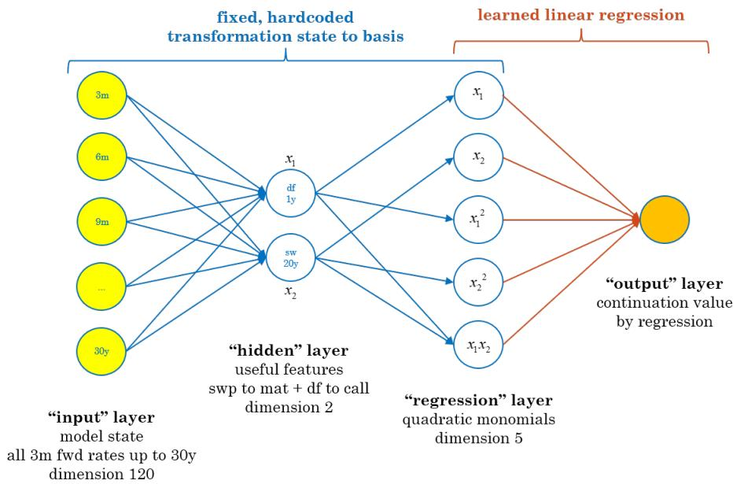

## Deep neural networks

By contrast, neural networks are ’intelligent’ constructs, capable of learning from data alone. NN are extensions of classic regression. In fact, they are identical to regression safe for one crucial diference: NN internalize the selection of basis functions and learn them from data. For example, consider a NN with 4 hidden layers of 20 softplus activated units. The output layer is a classic regression over the basis functions identified in the regression layer (the last hidden layer). When the NN is trained by minimization of the MSE, the hidden weights learn to encode the 20 ’best’ basis functions among the (very considerable) space of functions attainable with the deep architecture. Optimization finds the best basis functions in the sense of the MSE, which itself approximates the distance between the true function and the space spanned by the basis functions. Hence, training a neural network really boils down to finding the appropriate, low dimensional regression space, often called feature extraction in

<!-- page: 43 -->

machine learning (ML).

The strong similarity of NN to regression is illustrated on Figure 7 where we also see the one major diference: hidden layers are no longer fixed, they have learnable connection weights.

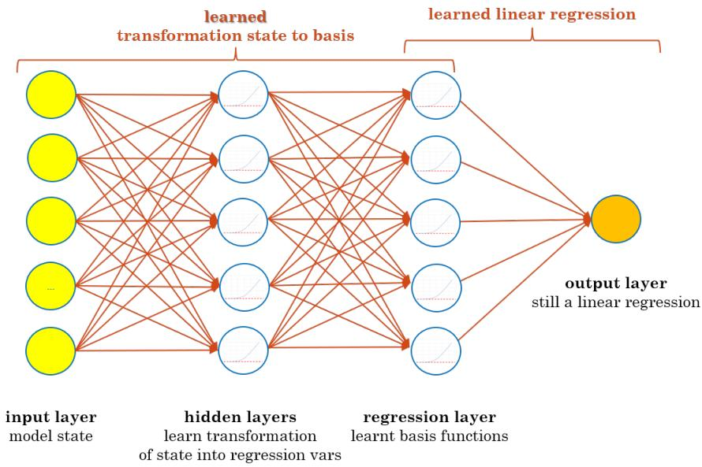

This is what makes NN so powerful, e.g. for solving high dimensional problems in computer vision or natural language processing. NN cruise through the curse of dimensionality be learning the limited dimension space that best approximates the target function. They learn from data alone without handcrafted rules based on prior knowledge or specific to a given context. In particular, NN efectively approximate high dimensional functions from data alone, in finance or elsewhere, and they may even outperform regression on handcrafted features, i.e. find better basis functions from data than those extracted by hand from prior knowledge.

In return, training a neural network is famously not a convex problem. NN generally include many learnable connection weights (1224 + 20n with 4 hidden layers of 20 units) and the MSE function of the weights has been shown to be of complicated topology, including multiple local minima and saddle points. There famously exists no algorithm guaranteed to find the global minimum in finite time. Despite extremely active research resulting in powerful heuristic improvements, training NN remains an art as much as a science. NN are often trained by hand over long periods where engineers slowly tweak architecture and hyperparameters until they obtain the desired behaviour in a given context. Modern training algorithms ’generally’ converge to ’acceptable’ minima, but such terms don’t cut ice in mathematics, and they shouldn’t in risk management either.

In order to automate training and implement its automatic execution, behind the scenes and without human supervision, we need suficient mathematical guarantees. While it may look at first sight as a hopeless endeavour, we will see that the analysis performed in this paragraph allows to combine NN with regression in a meaningful and efective manner to establish important worst case guarantees.

## 1.2 Wide and deep

## Mixed architecture

While regression is often opposed to deep learning in literature, a natural approach is to combine their benefits, by regression on both learnable deep units and fixed wide units, as illustrated in Figure 8. Mathematically, the ouput layer is a linear regression on the concatenation of the deep layer $z _ { L - 1 }$ (the last hidden layer of the deep network) and a set of fixed basis function φ (a.k.a. the wide layer):

<!-- page: 44 -->

$$
\hat { f } \left( x ; w \right) = z _ { L - 1 } \left( x ; w _ { h i d d e n } \right) w _ { d e e p } + \phi \left( x \right) w _ { w i d e }
$$

and it immediately follows that the diferentials of predictions wrt inputs are:

$$
\frac { \partial \hat { f } \left( x ; w \right) } { \partial x _ { j } } = \frac { \partial z _ { L - 1 } \left( x ; w _ { h i d d e n } \right) } { \partial x _ { j } } w _ { d e e p } + \frac { \partial \phi \left( x \right) } { \partial x _ { j } } w _ { w i d e }
$$

where $\partial z _ { L - 1 } / \partial x$ are diferentials of the deep network computed by backpropagation (actually a platform like TensorFlow can compute the whole gradient of the wide and deep net behind the scenes) and $\partial \phi / \partial x$ are the known derivatives of the fixed basis functions. Hence, the architecture is trivially implemented by:

1. Add a classic regression term $\phi \left( x \right) w _ { w i d e }$ to the output of the deep neural network.

2. Adjust the gradients of output wrt inputs (given by backpropagation through the deep network) by $\left( \partial \phi \left( x \right) / \partial x _ { j } \right) w _ { w i d e }$ (or leave it to TensorFlow).

An implementation in code is given in Geron’s textbook, second ed. chapter 10.

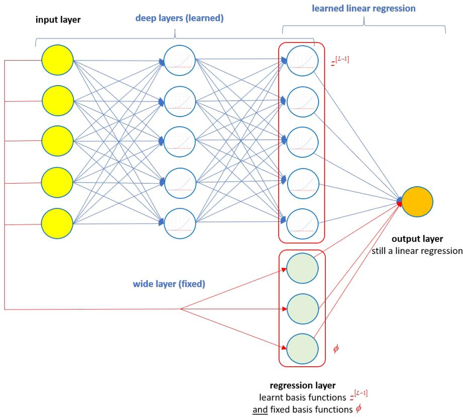

The concatenation of the wide and deep layer doesn’t have to be the final regression layer. The architecture is flexible and supports all kinds of generalization. For example, we could insert a couple of fully connected layers after the wide and deep layer to discover meaningful nonlinear combinations of wide and deep basis functions in the final regression layer. Backpropagation equations are easily updated (or left to automatic diferentiation in TensorFlow).

<!-- page: 45 -->

The idea is natural, and certainly not new. It was popularized by Google under the name ”wide and deep learning”, in the context of recommender systems (https://arxiv.org/abs/1606.07792), although from a diferent perspective. Specifying a number of fixed regression functions in the wide layer should help training by restricting search for additional basis functions in the deep layers to dissimilar functions. For example, when the wide layer is a copy of the input layer x $( \phi = i d )$ , it handles all linear functions of x and specializes the deep layers to a search for nonlinear functions (since another linear function in the deep regression layer would not help reduce MSE). In other terms, Google presented the wide and deep architecture as a training improvement, and it may well be that it does improve performance significantly with very deep, complex architectures. In our experience, the improvement is marginal with the simple architecture suficient for pricing function approximation, but the wide and deep architecture still has a major role to play, because it provides guarantees and allows a safe implementation of automated training without supervision.

## Worst case convergence guarantee

It is general wisdom that minimization of the MSE with NN doesn’t ofer any sort of guarantee. This is not entirely correct, though. Consider the MSE as a function of the connection weights of the output layer alone. This is evidently a convex function. In fact, since the output layer is exactly a linear regression on the regression layer, the optimal weights are even given in closed form by the normal equation:

$$
\hat { w } _ { \mathrm { o u t p u t } } = \left( { z _ { L - 1 } } ^ { T } z _ { L - 1 } \right) ^ { - 1 } { z _ { L - 1 } } ^ { T } Y
$$

or its SVD equivalent (see Appx 3). Recall, while numerical optimization may not find the global minimum, it is always guaranteed to converge to a point with uniform zero gradient. In particular, training converges to a point where the derivatives of the MSE to the output connection weights are zero. And since the MSE is convex in those weights, the projection onto the basis space is always optimal. Training may converge to ’bad’ basis functions, but the approximation in terms of these basis functions is always as good as it can be. It immediately follows that, with a deep and wide architecture, we have a meaningful worst case guarantee: the approximation is least as good as a linear regression on the wide units. In practice, we get an orders of magnitude better performance from the deep layers, but it is the worst case guarantee that gives us permission to train without supervision. In practice, convergence may be checked by measuring the norm of the gradient, or, optimization may be followed by an analytic implementation of the normal equation wrt the combined regression layer (ideally in the SVD form of Appx 3).

## Selection of wide basis

Of course, the worst case guarantee is only as good as the choice of the wide functions. An obvious choice is a straightforward copy of the input layer. The wide layer handles all linear functions of the inputs, hence the worst case result is a linear regression. Another strategy is also add the squares of the input layers, and perhaps the cubes, depending on dimension, but not the cross monomials, which would bring back the curse of dimensionality.

A much more powerful wide layer may be constructed in combination with diferential PCA (see Appx 2), which reduces the dimension of inputs and orders them by relevance, in a basis where diferentials are orthogonal. This means that the input column $X _ { 1 }$ afects targets most, followed by $X _ { 2 }$ etc. Because inputs are presented in a relevant hierarchy, we may build a meaningful wide layer with a richer set of basis functions applied to the most relevant inputs. For example, we could use all monomials up to degree 3 on the first two inputs (10 basis functions), monomials of degree less than two on the next three inputs (another nine basis functions), and the other n−5 inputs raised to power 1, 2 and maybe 3 (up to 3n−15 additional functions). Because of the diferential PCA mechanism, a plain regression on these basis functions bears acceptable results by itself, especially with diferential regression (see Appx 3), and this is only the worst case guarantee, with orders of magnitude better average performance.

All those methods learn from data alone, with worst case guarantees. In cases where meaningful basis functions are handcrafted from contextual information and reliable hardcoded rules, like for Bermudan options in LMM with LSM, wide and deep networks still outperform as we see next.

<!-- page: 46 -->

Outperformance: w $+ d \geq w$ w and $w + d \geq d$

If follows from what precedes that the wide and deep architecture is guaranteed to find a better fit than either the deep network or the wide regression alone.

In particular, wide and deep networks outperform classic regression, even on relevant handcrafted basis functions. Not only are they guaranteed to fit training data at least as well, they will also often find meaningful features missing from the wide basis. For example, Bermudan options are mainly sensitive to rates to expiry and next call, but the shape of the yield curve also matters to an extent. The deep layers should identify the additional relevant factors during training. Finally, wide and deep nets are resilient to change. Add stochastic volatility in the LMM, regression no longer works without modification of the code to account for additional basis functions including volatility state. Wide and deep nets would work without modification, building volatility dependent features in their deep layers.

## 2 Asymptotic control

## 2.1 Elementary asymptotic control

## Enforce linear asymptotics

Another important consideration for unsupervised training is the performance of the trained approximation on asymptotics. This is particularly crucial for risk management applications like value at risk (VAR), expected loss (EL) or FRTB, which focuses on the behaviour of trading books in extreme scenarios. Asymptotics are hard because they are generally learned from little to no data in edge scenarios. In other terms, the asymptotic behaviour of the approximation is an extrapolation problem and reliable extrapolation is always harder, for instance, polynomial regression absolutely cannot be trusted.

As always, we want to control asymptotics from data alone and not explore methods based on prior knowledge of the correct asymptotics. For instance, a European call is known to have flat left asymptotic and linear right asymptotic with slope 1. If we know that the transaction is a European call, the correct asymptotics could be enforced by a variety of methods, see e.g. Antonov and Piterbarg for cutting edge. But that only works when we know for a fact that we are approximating the value of a European call. What we want is a general algorithm without applicable without other knowledge than a simulated dataset.

In finance, linear asymptotics are generally considered fair game for pricing functions, with an unknown slope to be estimated from data. For instance, it is common practice to enforce a zero second derivative boundary condition when pricing with finite diference methods (FDM)2. Linear asymptotics are guaranteed for neural networks as long as the activations are asymptotically linear. This is the case e.g. for common RELU, ELU, SELU or softplus activations, but not sigmoid or tanh, which asymptotics are flat, hence, to be avoided for pricing approximation3.

Figure 9 compares the asymptotics of polynomial and neural approximations for a call price in Bachelier’s normal model, obtained with our demonstration notebooks DiferentialML.ipynb and DiferentialRegression.ipynb on https://github.com/differential-machine-learning/notebooks (dimension 1, 8192 training examples). The trained approximation is voluntarily tested on an unreasonably wide range of inputs in order to highlight asymptotic behaviour. Unsurprisingly, polynomial regression terribly misbehaves whereas neural approximation fares a lot better due to linear extrapolation. The comparison is of course unfair. The outperfor mance of the neural net in edge scenarios is only due to linear asymptotics, which can be equally enforced for linear regression4. The point here is that we want to enforce linear asymptotics5, something given with neural networks, and doable with some efort with regression.

2Although overreliance on this common assumption may be dangerous: the Derivatives industry lost billions in 2008 on variance swaps and CMS caps, precisely due to nonlinear asymptotics.

3Recall that diferential deep learning requires C1 activation, ruling out RELU and SELU and leaving only the very similar ELU or softplus among common activations.

<!-- page: 47 -->

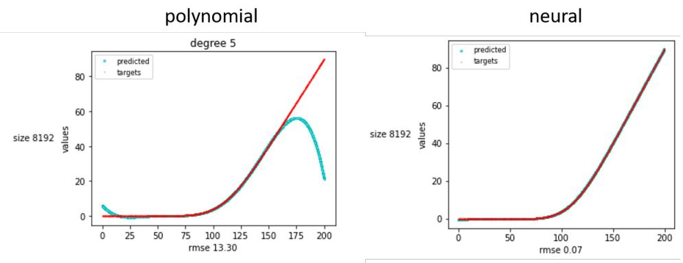

## Oversample extreme scenarios

Enforcing linear asymptotics is not enough, we must also learn the slope from data. What makes it dificult is the typical sparsity of data on the edges of the training domain, especially when training data is produced with Monte-Carlo, and noisy labels e.g. from LSM simulations certainly don’t help.

By far, the easiest walkaround is to simulate a larger number of edge examples. Recall, we may sample training inputs in any way we want. It is only the labels that must be computed in complete agreement with the pricing model, either by conditional sampling (sample labels) or conditional expectation (ground truth labels). Hence, we sample training examples over a domain and with a distribution reflecting the intended use of the trained approximation. In applications where asymptotics are important, we want many training examples in edge scenarios.

When training examples are sampled with Monte-Carlo simulations, it is particularly simple to oversample extreme scenarios by increasing volatility from today to the horizon date in the generative simulations. We implemented this simple method in our demonstration notebooks. As expected, increasing volatility to horizon date efectively resolves asymptotic behaviour, as illustrated on Figure 10 for degree 5 polynomial regression of the Bachelier call price.

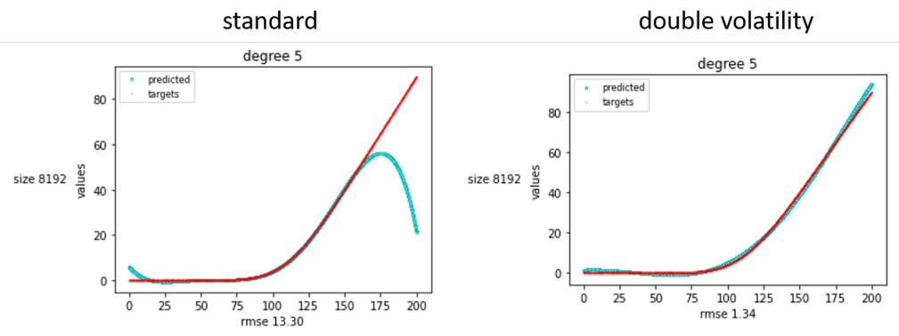

4By cropping basis functions with linear extrapolation outside of a given domain.

5While maintaining awareness that not all transactions are linear on edges.

<!-- page: 48 -->

Note that increased volatility fixes asymptotics but deteriorates accuracy in the interior domain. By enforcing more examples on edge scenarios, we learn from fewer examples elsewhere, resulting in a loss of quality.

Further, it is fair game to increase volatility or change model parameters in any way before horizon, but the (conditional) simulation after horizon date must exactly follow the pricing model or we get biased labels. With multiple horizon dates, the simple walkaround no longer works: between two horizon dates, we cannot simultaneously simulate an increased volatility for the state variables, and the original volatility for the cashflows6.

For these reasons, our simple walkaround is certainly not an optimal solution, but it is extremely simple to comprehend and implement, with reasonable performance for such a trivial method. The more advanced algorithm introduced next perform a lot better, but with significant implementation efort.

## 2.2 Advanced asymptotic control

## Ground truth labels in edge examples

In the main article and Appx 1, we have opposed ground truth learning, where labels are numerically computed conditional expectations, to sample learning where labels are samples drawn from the conditional distribution, e.g. by simulation of one Monte-Carlo path. We concluded that ground truth learning is not viable in many contexts of practical relevance because of the computational cost of conditional expectations, and that sample learning ofers a viable, consistent alternative.

The opposition between the two doesn’t have to be black and white. In fact, many intermediate solutions exist. Ground truth labels are computed by averaging a large number of samples, theoretically infinity. Sample labels are (averages of) one sample each. We could as well compute labels by averaging an intermediate number N of samples, reducing variance by N in return for a computation cost linearly increasing in N. Notice that in the demonstration notebooks, we computed labels by averaging two antithetic paths. As a result, the variance of the noise is reduced by a factor two, but we can simulate half as many examples for a fixed computation load. Hence, benefits balance out but we get the additional benefit of antithetic sampling, making it worthwhile.

This realization leads to a powerful asymptotic control algorithm in the context of diferential machine learning, where diferential labels (gradients of labels wrt inputs) are available too. Identify a small number of edgemost examples in the training set, e.g. by Gaussian likelihood of inputs. Recall that ’extreme’ scenarios mean extreme inputs here, irrespective of labels. Train on sample labels and pathwise diferentials for interior examples and ground truth labels, including diferentials, for edgemost examples. Assign a larger weight to the extreme examples in the cost function to treat them as a soft constraint. The resulting approximation (provided linear asymptotics) will have the correct asymptotic behaviour beyond edge points, where intercepts and slopes are given by construction by ground truth values and gradients. Figure 11 displays 1024 inputs sampled from a bidimensional Gaussian distribution, where 16 edge examples are identified by Gaussian likelihood.

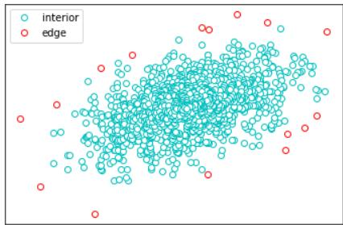

6One solution is to simulate Monte-Carlo paths with a form of importance sampling where samples are normalized by a likelihood ratio to compensate for increased volatility. However, importance sampling may raise numerical problems, since likelihood ratios between measures with diferent volatilities diverge in the continuous limit.

<!-- page: 49 -->

## Compute ground truth labels with one Monte-Carlo path

Hence, we can control asymptotics efectively with ground truth labels for a small number of edge examples. Contrarily to the simple idea of oversampling extreme scenarios, this method fixes asymptotics without damaging approximation, since it doesn’t modify interior examples in any way. The training set is still generated in reasonable time, since only a small number of extreme inputs gets costly ground truth labels.

However, computation cost may still be considerable compared to a standard LSM dataset. For example, say we simulate 8192 training examples, mostly with sample labels, but in the 64 least likely scenarios, we produce ground truth labels with 32768 nested Monte-Carlo paths. We simulate a total of $6 4 \times 3 2 7 6 8 + 8 1 2 8 = 2 1 0 5 2 8 0$ paths against 8192, a computation load increased by a factor 257.

It turns out that, at least in the context of financial pricing approximation from a Monte-Carlo dataset, we can actually compute ground the true edge values and risks for the cost of one Monte-Carlo path, and efectively fix asymptotics without additional cost.

The common assumption of linear asymptotics comes from that the value of many financial Derivatives converges to intrinsic value in extreme scenarios. In general terms, the intrinsic value corresponds to the payof evaluated on the forward scenario, where all underlying instruments fix on their forward values, conditional to initial (extreme) state. See e.g. chapter 4 of Modern Computation Finance (Wiley, 2018) for details.

Hence, under the assumption of linear asymptotics, the value and Greeks in edge states are computed for the cost of one Monte-Carlo path, generated from the forward underlying asset prices computed from the (extreme) state variables. By hypothesis of linear asymptotics (a.k.a. asymptotically intrinsic values), this procedure computes correct prices (and Greeks) in extreme scenarios (and only in those). The practical implementation is dependent on the specifics of simulation systems. The idea is illustrated on Figure 12.

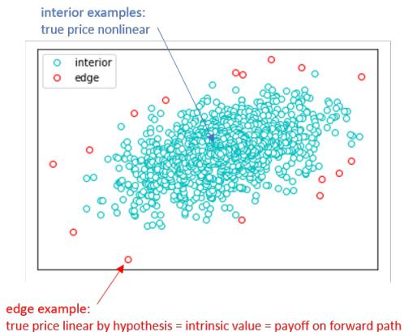

All labels are computed by sampling payofs on one path conditional to the scenario, but for edge scenarios, we use a special inner simulation, the ’forward path’, where payofs coincide with intrinsic values and pathwise diferentials coincide with true Greeks. With a soft constraint to match these amounts in the cost function, we efectively control asymptotics without additional computational cost or damage to approximation quality.

## Conclusion

Contrarily to common wisdom, training neural networks does provide some guarantees. In particular, the regression of the output layer on the basis functions identified in the regression layer is guaranteed optimal. We built on this observation to combine classic regression with deep learning in a wide and deep architecture a la Google and establish worst case training guarantees. We also discussed the particular efectiveness of the wide and deep architecture when combined with diferential PCA presented in Appx 2.

<!-- page: 50 -->

We also covered elementary and advanced asymptotic control algorithms, the most advanced ones, implemented with some efort, being capable of producing correct asymptotics without additional computation cost or stealing data from the interior domain. The algorithm requires diferential labels and only works with diferential machine learning. In financial Derivatives risk management, diferential labels are easily and very eficiently produced with automatic adjoint diferentiation (AAD).

<!-- page: 51 -->

## Bibliography

[1] M. S. Alexandre Antonov, Michael Konikov. Mixing sabr models for negative rates. Risk, 2015. [2] J. Andreasen. Back to the future. Risk, 2005. [3] D. Bang. Local stochastic volatility: shaken, not stirred. Risk, 2018. [4] A. Brace, D. Gatarek, and M. Musiela. The market model of interest rate dynamics. Mathematical Finance, 7(2):127–154, 1997. [5] J. F. Carriere. Valuation of the early-exercise price for options using simulations and nonparametric regression. Insurance: Mathematics and Economics, 19(1):19–30, 1996. [6] Q. Chan-Wai-Nam, J. Mikael, and X. Warin. Machine Learning for semi linear PDEs. arXiv e-prints, page arXiv:1809.07609, Sept. 2018. [7] J. Gatheral. Rough volatility: An overview. Global Derivatives, 2017. [8] J. Gatheral, P. Jusselin, and M. Rosenbaum. The quadratic rough heston model and the joint s&p 500/vix smile calibration problem. Risk, May 2020. [9] M. Giles and P. Glasserman. Smoking adjoints: Fast evaluation of greeks in monte carlo calculations. Risk, 2006. [10] P. S. Hagan, D. Kumar, A. S. Lesniewski, and D. E. Woodward. Managing smile risk. Wilmott Magazine, 1:84–108, 2002. [11] M. B. Haugh and L. Kogan. Pricing american options: A duality approach. Operations Research, 52(2):258– 270, 2004. [12] B. Horvath, A. Muguruza, and M. Tomas. Deep learning volatility, 2019. [13] J. M. Hutchinson, A. W. Lo, and T. Poggio. A nonparametric approach to pricing and hedging derivative securities via learning networks. The Journal of Finance, 49(3):851–889, 1994. [14] B. Lapeyre and J. Lelong. Neural network regression for bermudan option pricing, 2019. [15] F. A. Longstaf and E. S. Schwartz. Valuing american options by simulation: A simple least-square approach. The Review of Financial Studies, 14(1):113–147, 2001. [16] W. A. McGhee. An artificial neural network representation of the sabr stochastic volatility model, 2018. [17] A. Reghai, O. Kettani, and M. Messaoud. Cva with greeks and aad. Risk, 2015. [18] A. Savine. Aad and backpropagation in machine learning and finance, explained in 15min. https://www.youtube.com/watch?v=IcQkwgPwfm4. [19] A. Savine. Stabilize risks of discontinuous payofs with fuzzy logic. Global Derivatives, 2015. [20] A. Savine. From model to market risks: The implicit function theorem (ift) demystified. SSRN preprint, 2018. Available at SSRN: https://ssrn.com/abstract=3262571 or http://dx.doi.org/10.2139/ssrn.3262571. [21] A. Savine. Modern Computational Finance: AAD and Parallel Simulations. Wiley, 2018.
