<!-- page: 1 -->

# **Arbitrage-Free Implied Volatility Surface Generation with Variational Autoencoders**_∗_ 

## Brian (Xin) Ning_†_ , Sebastian Jaimungal_†_ , Xiaorong Zhang_†_ , and Maxime Bergeron_‡_ 

**Abstract.** We propose a hybrid method for generating arbitrage-free implied volatility (IV) surfaces consistent with historical data by combining model-free Variational Autoencoders (VAEs) with continuous time stochastic differential equation (SDE) driven models. We focus on two classes of SDE models: regime switching models and L´evy additive processes. By projecting historical surfaces onto the space of SDE model parameters, we obtain a distribution on the parameter subspace faithful to the data on which we then train a VAE. Arbitrage-free IV surfaces are then generated by sampling from the posterior distribution on the latent space, decoding to obtain SDE model parameters, and finally mapping those parameters to IV surfaces. We further refine the VAE model by including conditional features and demonstrate its superior generative out-of-sample performance. 

**1. Introduction.** Modelling implied volatility (IV) surfaces in a manner that reflects historical dynamics while remaining arbitrage-free is a challenging open problem in finance. There are numerous approaches driven by stochastic differential equations (SDEs) that aim to do just so, including local volatility models [13], stochastic volatility models [18, 17], stochastic local volatility models [29], jump-diffusion models [12], and regime switching models [7], among many others. Such approaches make specific assumptions on the dynamics of the underlying asset and a choice of an equivalent martingale measure in order to avoid arbitrage. While these assumptions are not necessarily dynamically consistent with historical data, they do allow, e.g., pricing exotic derivatives via Monte Carlo or PDE methods. 

An alternative to the SDE approach is to use non-parametric models to approximate IV surfaces directly without making assumptions on the underlying dynamics. For example, ML models such as support vector machines (SVMs) have been used to model such surfaces [33]. The issue of ensuring arbitrage-free surfaces is often tackled jointly during model fitting [3] either through penalisation of arbitrage constraints [1] or by directly encoding them into the network architecture [34]. These approaches, however, typically do not provide any guarantees and may not be arbitrage-free across the entire surface. A recent intriguing approach [11] is to reduce surfaces to arbitrage-free ‘factors’ – learned, e.g., through principal component analysis (PCA) – which can then be modeled using neural SDEs [26]. This approach, while very promising, relies on the quality of the ‘factors’ which are often complicated to compute. Another recent approach is that of [10] where the authors use Gaussian processes under shape constraints to generate surfaces and illustrate good fits to S&P data. Here, however, we are interested in the setting of sparse FX data and in generating the distribution over surfaces in a manner that is consistent with the historical data. The construction of arbitrage-free models based on ML approaches for stochastic interest rates has been tackled in [24]. In contrast, our 

> _∗_ The authors thank Ivan Sergienko for his comments on earlier versions of this work. S.J. acknowledges the support of the Natural Sciences & Engineering Research council of Canada [ALLRP 550308 - 20]. 

> _†_ Department of Statistical Sciences, University of Toronto (brian.ning@mail.utoronto.ca, sebastian.jaimungal@utoronto.ca; http://sebastian.statistics.utoronto.ca, xiaorong.zhang@mail.utoronto.ca) 

> _‡_ Riskfuel Analytics (mb@riskfuel.com; http://riskfuel.com)

<!-- page: 2 -->

focus is on European options and, more specifically, our application setting is to FX options. 

In this paper, we develop a hybrid approach to resolve these issues by using SDE models that are by construction arbitrage-free yet flexible enough to fit arbitrary IV surfaces. One immediate dividend of this approach lies in its ability to produce realistic synthetic training data that can be used to leverage deep learning pricing methods in downstream tasks [15, 20]. The class of SDE models we consider include time-varying regime switching models and L´evy additive processes detailed in Section 3. We avoid overfitting by incorporating a Wasserstein penalty to keep the SDE model’s risk-neutral density from deviating too far from the candidate one. The SDE model parameters, once fitted to data, represent a parameter subspace reflecting the features embedded in the data. The distribution on the subspace depends on the characteristics of the underlying asset and can be complex. We “learn” this distribution by using Variational Autoencoders (VAEs) which also allows for disentanglement of the subspace in an interpretable manner. SDE model parameters may be generated from the VAE model and used to create IV surfaces that are both faithful to the historical data but also strictly risk-neutral. This is similar in spirit, but distinct from, the tangent L´evy model approach introduced in [8] where a L´evy density is used to generate arbitrage-free prices while, here, the VAE generates parameters of the SDE model. 

The overall approach may be summarised as: (i) fit a rich arbitrage-free SDE model to historical market data to obtain a collection of parameters, (ii) train a generative model, in particular a VAE model, on the collection of SDE model parameters, (iii) sample from the latent space of the generative VAE model, (iv) decode the samples to obtain a collection of SDE model parameters, and (v) use said SDE model and parameters to obtain arbitrage-free surfaces faithful to the historical data. A flow-chart of the process is presented in Figure 1. We further refine the VAE model by including conditioning features into the encoding and decoding architectures. This results in a conditional VAE (CVAE) model, first introduced in [30] in a very different setting, for the arbitrage-free model parameter embeddings. We find that the CVAE model outperforms all others when comparing out-of-sample performance. 

The remainder of this article is organised as follows. Section 2 describes a generic method of fitting SDE models to a limited data set. Section 3 defines the financial models we use in calibration. Section 4.1 details the structure of the VAE and its generative process. Section 4.4 extends the VAE framework by conditioning prespecified features. Finally, Section 5 presents the results of our algorithm applied to 1,900 days of foreign exchange (FX) data for three currency pairs1 : AUD-USD, EUR-USD, and CAD-USD. 

**2. Model Setup and Estimation Procedure.** We work with a completed filtered probability space (Ω _,_ Q _, F,_ ( _Ft_ ) _t≥_ 0) where the filtration is the natural one generated by a stochastic driver _X_ := ( _Xt_ ) _t≥_ 0. We explore several choices of models for _X_ in Section 3. Here, Q represents the risk-neutral probability measure and we assume that the market prices options using this measure and model the FX rate process _S_ = ( _St_ ) _t≥_ 0 as follows: 

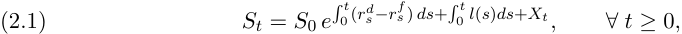

> 1AUD = Australian Dollar, USD = US Dollar, and CAD = Canadian Dollar.

<!-- page: 3 -->

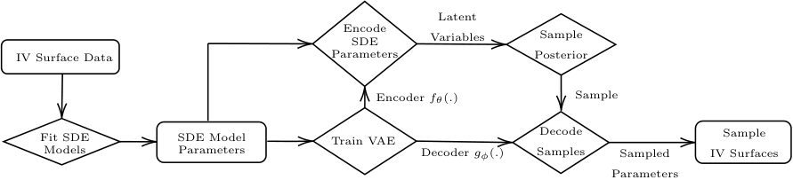

<!-- Start of picture text -->
Latent Encode SDE Variables Sample IV Surface Data Parameters Posterior Encoder fθ ( . ) Sample Fit SDE SDE Model Train VAE Decode Sample Models Parameters Decoder gφ ( . ) Samples Sampled IV Surfaces Parameters <!-- End of picture text -->

Figure 1: Flow chart of algorithm starting from raw IV surface data to generated surfaces. 

where _r__d_ := ( _rt__d_)_t≥_0and_rf_:= (_r_ _t__f_)_t≥_0arethedomesticandforeignshortrateprocesses,and _l_ is a deterministic function of time that ensures ( _e__−_ �0 _t_(_r_ _s__d−r_ _s__f_)_ds_ _St_ ) _t≥_ 0 is a Q-martingale. We assume interest rates are deterministic since there is no conceptual difficulty in generalising to the stochastic case. 

From, e.g., Theorem 3.2 in [25], we may write the undiscounted option price as 

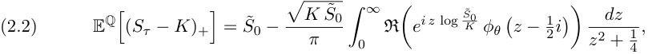

where _S_˜ 0 := _S_ 0 _e_ �0 _τ_(_r_ _s__d−r_ _s__f_)_ds_+ �0 _τ__l_(_s_)_ds_ , _φθ_ ( _z_ ) := EQ [ _e__izXτ_ ] is the characteristic function of _Xτ_ , _θ_ encodes the parameters of the stochastic driver _X_ , and R( _·_ ) denotes the real component of its argument. For the class of SDE models considered here, the characteristic function is known in closed form and the above formula allows for efficient calibration to market data. A naive approach to parameter estimation is to minimise the squared error between the model and data prices. Such parameter estimation is prone to overfitting when data is sparse as is often the case in FX markets. To address this issue, we add a regularisation term to our objective. Specifically, we use the 1-Wasserstein distance between the model price’s riskneutral probability distribution function (pdf), denoted _Fθ__m_(_dx_),andtheimpliedpdfderived from option data, denoted _F__d_ ( _dx_ ). Wasserstein distances provide a natural metric on the space of probability measures and have seen wide application across many fields [32]. Other choices include divergences, such as the Kullback-Liebler divergence, or metric variations such as Jensen-Shannon divergence. We chose the Wasserstein distance in particular because it is the most ubiquitous and robust. 

To this end, the 1-Wasserstein distance between _F__d_ and _Fθ__m_ is given by 

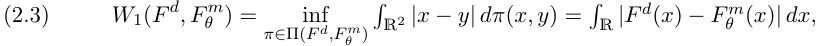

where Π( _F__d_ _, Fθ__m_)denotesthesetofallprobabilitydistributionsonR2withmarginals_F d_ and _Fθ__m_ and the second equality holds in dimension one [31]. As data is observed at discrete strikes, we approximate the candidate density by interpolating IVs at each fixed maturity using B-splines. It is well known [6] that _∂KKC_ ( _T, K_ ) corresponds to the risk-neutral density of the underlying asset price evaluated at _K_ . The derivation of the spline implied density for the case of call options can be found in Appendix A. Since we are using a B-spline, the corresponding density is not necessarily risk-neutral. This is not a problem, however, as we

<!-- page: 4 -->

merely use them as a regularisation term and ultimately use risk-neutral models to derive option prices. 

We use a combination of the pricing error and the Wasserstein distance (2.3) as the loss function in model estimation. That is we seek to obtain model parameters 

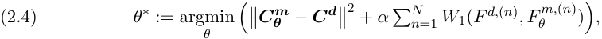

where **_C_****_d_** and **_Cθ_****_m_**denotes the flattened vector of data and model prices, respectively, at each strike-maturity pair, and _F__d,_(_n_) and _Fθ__m,_(_n_) represent the model and data implied distribution functions at each maturity, respectively. The regularisation parameter _α ≥_ 0 controls the importance placed on being close to the spline implied densities. The effect this hyperparameter has on model accuracy is explored in detail in Appendix B. **3. Class of Stochastic Drivers.** In this section, we describe the class of models over which we perform estimation. Throughout, we denote the sequence of dates on which we have option implied volatility data by _{τ_ 1 _, τ_ 2 _, . . . , τ }_ and define _τ_ 0 = 0. **3.1. CTMC.** The continuous time Markov-Chain model (CTMC) is a multi-regime model that assumes the underlying asset follows a Geometric Brownian motion (GBM) modulated by a continuous time Markov-Chain representing the current market regime. They were first introduced into financial modelling in [7]. Here, however, we generalise the model to allow for time-varying parameters and use transform methods in [21] to solve for the characteristic function. We use this model as a non-parametric approach to modelling the sequence of riskneutral densities. The potential of overfitting of such models is mitigated by the Wasserstein distance penalty in (2.3). 

Let ( _Zt_ ) _t≥_ 0 denote a continuous time Markov chain taking on values in K := _{_ 1 _. . . K}_ . Suppose, moreover, that the generator matrix _A_ driving the CTMC, the regime specific vector of drifts _µ_ , and the regime specific vector of volatilities _σ_ are all constant on the sequence of maturity intervals [ _τi−_ 1 _, τi_ ), but may vary across maturity periods. We can then consider a driving process _X_ satisfying the SDE 

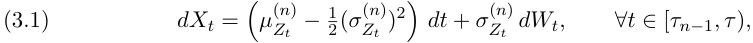

where _µ_( _k__n_) _∈_ R and _σk_(_n_) _∈_ R+ denote the expected return and instantaneous volatility in period _n_ when _Zt_ = _k_ , _k ∈_ K. Similarly, we let _A_(_n_) denote the transition rate matrix for period _n_ , satisfying _A_( _ij__n_) _∈_ R+, _i_ = _j_ , and�_K_ _j_ =1_Aij_= 0. 

Proposition 3.1. _If X satisfies_ (3.1) _, then the characteristic function φXτ_ ( _ω_ ) := EQ [ _e__iω Xτ_ ] _is given by φX_ ( _ω_ ) = **_π_**⊺ _e__τ_1Ψ(1)(_ω_) _e_(_τ_2_−τ_1)Ψ(2)(_ω_) _. . . e_(_τ−τN−_1)Ψ(_N_)(_ω_) **1** _, where πk_ = Q( _Z_ 0 = _k_ ) _is the prior probability of the latent state,_ 

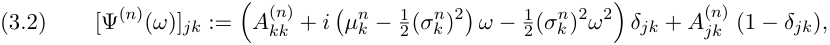

_and δjk is the Kroencker delta, which equals_ 1 _if j_ = _k and_ 0 _otherwise._ 

_Proof._ See Appendix

<!-- page: 5 -->

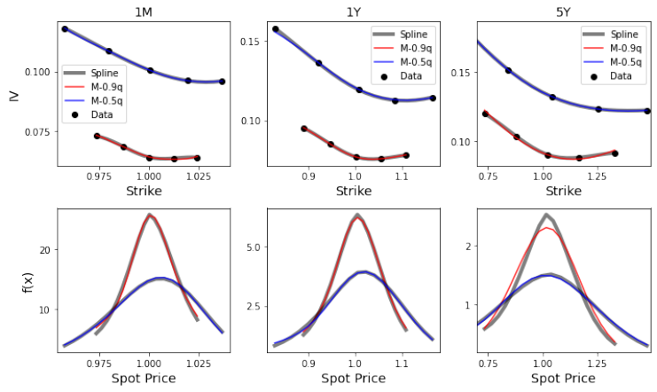

<!-- Start of picture text -->
1M 1yY 5Y mmm Spline ame Spline 015" — M0.9q — M099 — M-0.5q — M0.5q 0.100 | ==ss Spline @ Data 0.15 e Data 2 —— 0.99M059 ® Data 0.10 0.075 ~, 0.10 0975 © 1000, 1025 0.9 10 ll 075 100 125 Strike Strike Strike 20 5.0 2 /\ 0 25 1 hy‘4 x‘\ 0975 1000 1025 0.9 10 ll 0.75 100 125 Spot Price Spot Price Spot Price <!-- End of picture text -->

<!-- page: 6 -->

|Model|Characteristic Function|
|---|---|
|CTMC|**_π_**⊺_e__τ_1Ψ(1)(_ω_)_e_(_τ_2_−τ_1)Ψ(2)(_ω_) _. . . e_(_τ−τN−_1)Ψ(_N_)(_ω_)**1**|
|DoubleExonentialJD|_−__σ_2_ω_2 +_λ_ �  _a_+ + (1_−_) _a−_ _−_1 �|
|p|2    _p_ _a_+_−iω_   _p_ _a−_+_iω_  |
|Gaussian Mixture JD|_−__σ_2_ω_2 2 +_λ_ ��_K_ _i_=1 ˜_πi_(_ei_ ˜ _µiω−_˜ _σi_2_ω_2_/_2)_−_1 �|
|CGMY/KoBoL|_C_Γ(_−Y_ )[(_M −iω_)_Y __−M __Y_ +(_G_+_iω_)_Y __−G__Y_ ]|

Table 1: Summary of characteristic functions within a given maturity period. 

where _φ_ is the standard normal pdf – to mimick a non-parametric estimation of the jump distribution implied by the data, and a double exponential model (see [23]), in which case _F_(_n_) ( _dy_ ) = (1 _− p_(_n_) ) _e__−a_ _−_(_n_)_|x|_ 1 _x<_ 0 + _p_(_n_) _e__−a_ +(_n_)_x_ 1 _x>_ 0 _dy_ . � � 

Proposition 3.2. _If X satisfies_ (3.3) _, then the characteristic function φX_ ( _ω_ ) := EQ [ _e__iω Xτ_ ] _is given by φX_ ( _ω_ ) = _e_ � _Nn_ =1Ψ(_n_)(_ω_)(_τ−τn−_1) _, where_ 

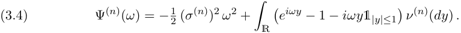

_Proof._ Apply the L´evy-Khintchine formula [2, Chap 1.2.4] within each period. 

The specific form of the L´evy characteristic function appearing in (3.4) for the models we employ in the numerical analysis appear in Table 1. The parameters for the appropriate period should be inserted into these expression when computing the full characteristic function. We also record the characteristic function for the CTMC model in the same table. 

**4. Model Parameter Generation.** In the previous section, we described two classes of stochastic models that can be calibrated to option prices. The SDE model parameters **_θ_** are estimated by minimising a weighted average of the mean-squared error in option prices and the Wasserstein distance between the model implied risk-neutral densities and the densities implied by a _B_ -spline fit of the IV smiles. Once the SDE model parameters are estimated on market data, our goal is to generate new synthetic parameters **_θ_** that are consistent with the historical data. This allows us to produce synthetic IV surfaces that are guaranteed to be both arbitrage-free and representative of real surfaces. 

**4.1. Variational Autoencoder (VAE).** Variational Autoencoders [22] are generative models that aim to train a multivariate latent representation, known as an encoding, from a collection of data. A key advantage of VAEs over conventional dimensionality reduction techniques such as vanilla autoencoders (AEs), PCA, or KPCA is their ability to generalize the latent feature space. A well-known issue of AEs is that the latent space may not be continuous and may not exhibit any well defined structure. This makes it difficult to interpolate between training data points and poses difficulties in generating new data, as demonstrated by [27]. In [27], attempts to rectify such issues are made by regularizing the training procedure to ensure the latent manifold is smooth and locally convex. VAEs, however, place a prior on the latent feature and are thus able to easily generate out-of-sample data by sampling from either the prior or the posterior, depending on the specific application.

<!-- page: 7 -->

Given a set of samples _{_ **xi** _|_ **xi** _∈_ R_D_ _}i≥_ 1 from a distribution parameterized by ground truth latent factors _{_ **zi** _|_ **zi** _∈_ R_D′_ _}i≥_ 1 where _D ≫ D__′_ and a generative model _pψ_ ( **x** ), we seek to maximise the log-likelihood log _pψ_ ( **x** ). The log-likelihood is, however, intractable as it involves integration over the posterior _pψ_ ( **z** _|_ **x** ), which, even in setups where _p_ ( **x** _|_ **z** ) is specified, is itself intractable. The VAE circumvents this issue by introducing an approximation of the true posterior with a neural network _qφ_ ( **z** _|_ **x** ) parameterized by _φ_ . Indeed, for any distribution _qφ_ ( **z** _|_ **x** ), we have that the log-likelihood satisfies the inequality 

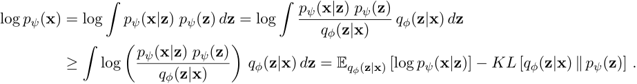

The right most expression of this inequality is known as the evidence lower bound (ELBO) of the log-likelihood. It can be shown that the precise gap between the left and right hand sides of this inequality equals the KLD (KL-Divergence) between _qφ_ ( **z** _|_ **x** ) and _p_ ( **z** _|_ **x** ), i.e., 

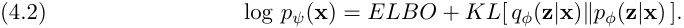

VAEs then view the negative ELBO as a loss and, rather than maximising the intractable log-likelihood, aim to minimize 

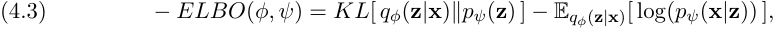

where the first term is known as the KLD loss and the second term the reconstruction loss. In principle, the prior, posterior, and generator can be arbitrary distributions. In practice, however, this typically leads to an intractable ELBO. Thus, we assume they are from the family of Gaussian distributions with diagonal covariance matrices, and that the prior is the isotropic unit Gaussian. There is no real loss of generality in light of the universal approximation theorem. Specifically, we assume _qφ_ ( **z** _|_ **x** ) _∼N_ ( **_µφ_ (x)** _,_ **_σφ_** ( **x** )), _pψ_ ( **x** _|_ **z** ) _∼N_ ( **_µψ_ (x)** _,_ **_σψ_** ( **x** )), and _p_ ( **z** ) _∼N_ ( **0** _,_ **_I_** ), where **_σφ_** ( **x** ) and **_σψ_** ( **x** ) are diagonal matrices. 

The neural network that parametrises _qφ_ ( **z** _|_ **x** ) is called the encoder as it “encodes” the data into its latent representation, while the neural net that parameterises _pψ_ ( **x** _|_ **z** ) is called the decoder as it “decodes” latent representation to recover the original data. Figure 3 shows the typical structure of a VAE. We train the encoding _φ_ and decoding _ψ_ networks simultaneously but only use the decoder at inference time once a sample of latent features have been chosen. As detailed in Section 4.3, however, the latent sampling procedure makes use of the encoder. 

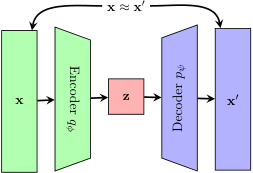

<!-- Start of picture text -->
x  ≈ x ′ x z x ′ ψ Encoder p φq Decoder <!-- End of picture text -->

Figure 3: VAE architecture. 

**4.2.** _β_ **-VAE.** The _β_ -VAE [19] is a modification of the traditional VAE objective that introduces an adjustable hyperparameter _β >_ 0, precisely the ELBO is modified to 

(4.4) argmax E _qφ_ ( **z** _|_ **x** )[log( _p_ ( **x** _|_ **z** ))] _− β KL_ ( _qφ_ ( **z** _|_ **x** ) _∥p_ ( **z** )) _. φ,ψ_

<!-- page: 8 -->

Larger values of _β_ result in more disentangled latent representations **z** , while smaller values result in more faithful reconstructions. _β_ is often chosen to be greater than one to encourage disentanglement; however, this constrains latent information **z** and can lead to poorer reconstructions [19]. Instead, we may choose smaller values of _β_ to improve reconstructions and rely on directly sampling from the posterior to accurately sample from the less structured latent space. 

**4.3. Latent Sampling.** Typically, samples from a VAE are generated by sampling from the latent prior _p_ ( **z** ) and decoding the result. From a Bayesian perspective, however, conditional on a set of observed data **_X_** , it is more appropriate to sample from the posterior _pψ_ ( **z** _|_ **_X_** ) _≈ qφ_ ( **z** _|_ **_X_** ) = � _qφ_ ( **z** _|_ **x** ) _p_ ( **x** ) _d_ **x** . While this integral is typically intractable, it is possible to sample from. This can be done by first uniformly sampling from the data **x** 0 _∼_ **_X_** , encoding using the approximate posterior _qφ_ ( **x** 0) to obtain the Gaussian parameters _µφ_ ( **x** 0) and _σφ_ ( **x** 0), and finally sampling latent states from said Gaussian **z** 0 _∼N_ ( _µφ_ ( **x** 0) _, σφ_ ( **x** 0)). This latent sample **z** 0 can then be decoded to obtain model parameters which may then be used to construct the IV surface. 

**4.4. Conditional Variational Autoencoder (CVAE).** A natural extension of the variational modeling framework is the inclusion of observable market features, such as indices or spot rates. We may then generate surfaces conditional on the state of these features through Conditional Variational Autoencoders (CVAEs) [30]. Such an approach may be used in risk calculations in which scenarios for the conditional features are generated through other means, and our approach used to generate IV surfaces conditioned on those simulated features. 

In brief, a CVAE is constructed as follows. Given ground truth latent factors **z** , observations **x** , and conditional features **y** , we define the generative model _pψ_ ( **x** _|_ **y** ) _p_ ( **y** ) where _p_ ( **y** ) is the prior on the conditional features. Following the same argument as in section 4.1 we approximate the posterior _pψ_ ( **z** _|_ **x** _,_ **y** ) by a neural network _qφ_ ( **z** _|_ **x** _,_ **y** ) and minimize the conditional negative ELBO: 

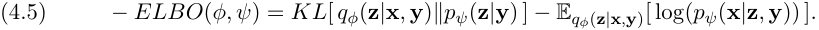

This allows the conditioning feature **y** to modulate how data **x** gets encoded and how a latent factor **z** gets decoded. In the results section, we include the VIX as a conditioning feature and find that it improves the out of sample performance of the VAE model. In implementation, the CVAE model is identical to the VAE model, except that the conditional features are added into the encoding and decoding networks. 

## **5. Results.** 

**5.1. Market Data.** We apply our hybrid method to IV data for three currency pairs provided by Exchange Data International: AUD-USD, EUR-USD, and CAD-USD for the 1,900 days between September 18th, 2012 to December 30, 2019. The data is divided equally into the training set (September 18th, 2012 to May 09, 2016) and the testing set (May 10, 2016 to December 30, 2019.) The data includes option prices with five strikes at each of eight different maturities (1M, 2M, 3M, 6M, 9M, 1Y, 3Y, 5Y). Foreign exchange option prices are quoted in terms of deltas rather than strikes and in terms of at-the-money call, risk reversal,

<!-- page: 9 -->

||AUD-USD|EUR-USD|CAD-USD|
|---|---|---|---|
|CTMC|8.1|5.0|6.0|
|DE JD|62.0|42.9|64.2|
|GM JD|10.2|17.0|24.3|
|CGMY/KoBoL|140.2|151.3|136.2|

Table 2: Median rmse ( _×_ 10_−_5 ) for the collection of models and FX pairs. 

and butterfly spread options, rather than simple calls. We use standard formulas [28] to convert raw quotes into IVs at deltas of 0.1, 0.25, 0.5, 0.75, and 0.9 for each maturity. 

**5.2. SDE Model Specifics.** The CTMC model assumes three regimes with a Wasserstein’s distance penalty2 of 0 _._ 3. To reduce the number of parameters to fit, initial regime probabilities **_π_** are set to<u>1</u>Totakeadvantageofthelabelinvarianceofthetransitionmatrix,themean 3. _µ_ of each regime is assumed to be in ascending order, i.e., _µ__n_ 1_≤µn_ 2_≤µn_ 3.Thestructureof the transition matrix is detailed in Appendix D. We fit the CTMC model iteratively by first optimizing for the parameters of the first maturity, then iteratively optimizing the parameters of the _i_ ’th maturity by holding the parameters of the first ( _i−_ 1) maturities fixed. For the L´evy additive processes, we fit the parameters subject to a Wasserstein’s distance penalty of 0 _._ 1 for time to maturity (TTM) less than 1 year and 0 _._ 3 otherwise to increase the regularising power at larger TTM. Moreover, we apply a penalty of 10_−_8 on day-to-day parameter percentage changes to stabilise model parameters without sacrificing fit quality. For the Gaussian Mixture JD model, we assume a mixture of two Gaussians, as adding more factors did not increase the fit quality. The penalty varies with maturity as long maturities tend to have stable pdfs but less stable IVs, while shorter maturities tend to have less stable pdfs. Table 2 show the median rmse across days, where the rmse on a given day is computed across all Delta/maturity pairs, for the collection of models and FX pairs we study. 

**5.3. VAE Model Specifics.** The encoder and decoder of the VAE have four fully connected hidden layers, with 64, 128, 256, and 512 nodes each, and a single output layer mapping to the appropriate dimensions. The network structure was selected using a validation set, however, we found that any network exceeding four layers with a minimum of 64 node in each layer is sufficient to produce satisfactory results. We used ADAM with weight decay (AdamW) with a fixed learning rate of 0.001. Appropriate transformations (normalizations, log-transforms) are performed to ensure standardized inputs. Details of the transformations used can be found in Table 6 in Appendix E. We perform a grid search over _β_ values and number of latent dimensions summarized in Table 3. The table reports an evaluation metric described in the next subsection. Training is carried out with batches of 200 randomly sampled days from the training set. We set a fixed training duration of 2 _,_ 000 epochs as we find that is usually sufficient to train the _β_ -VAE. 

**5.4. Benchmarks.** We introduce three benchmarks to assess the performance of our approach. These benchmark models all generate distributions of IV surfaces (using only the 

> 2The Wasserstein penalty for the various models are chosen from a grid search and balancing goodness of fit to IV smiles with goodness of fit to the implied risk-neutral densities.

<!-- page: 10 -->

training data) that we use to assess how close they are to the testing data. Details on the benchmarks themselves will be given below while the metric we use is described in the next subsection. 

The first is a _β_ -VAE that is fit directly to the set of IVs on the fixed grid of delta and time to maturity (as defined in Section 5.5) without the addition of any arbitrage constraints. This technique is inspired by [3] (see also [34]), although they favor a flexible point-based method where the inputs to the VAE are arbitrary strikes and times to maturity. Typically, these point-based approaches are complemented by either penalizing deviations from (static) arbitrage constraints during training or smoothing the resulting surfaces after generation. However, [3] shows that arbitrage constraints do not enhance the fit and excluding them introduces only negligible amounts of static arbitrage. In our context, the grid-based method is more natural as our data is already structured in this fashion. For comparison purposes, we present the result from a grid of latent dimensions and _β_ ’s consistent with those used for our other approaches. We label this approach as VAE-IV. 

As a second benchmark model, we perform a PCA on the trained CTMC model parameters and sample from the dimensionally reduced latent submanifold using a kernel density estimator (KDE). Several choices for the number of latent dimensions are explored in Table 3. We choose a Gaussian kernel with a bandwidth selected through 20-fold cross-validation. Gaussian kernels are generally quite flexible, but other choices (such as Epanechnikov, Triweight, and Triangular) are possible. For discussions on kernel and bandwidth selection more generally see, e.g., [16]. This PCA approach serves as a simplification of our CTMC-VAE model where the VAE sampler is replaced with a dimensionality reduction technique combined with a KDE sampler. 

As a final benchmark, we use the empirical distribution of the training data. 

**5.5. Evaluation Metric.** Our goal is to generate arbitrage-free IV surfaces that are faithful to the historical dataset. Here, we describe a natural metric that allows us to assess how well we meet this goal. Let G and F denote the probability distribution over IV surfaces for the trained model using the our algorithm and the true distribution, respectively. As Wasserstein distances provide a natural metric on the space of probability measures, we use the 1-Wasserstein distance between the trained and true distribution as our performance metric. While the true distribution _F_ is unknown, the data provides a finite sample from it at a set of discrete 2- dimensional grid points Z := _{zi}i∈_ G (the collection of Delta/TTM pairs which are observed). Specifically, we look at the collection: Z = D _×_ M where D := _{_ 0 _._ 1 _,_ 0 _._ 25 _,_ 0 _._ 50 _._ 75 _,_ 0 _._ 9 _}_ and M := _{_ 1 _M,_ 2 _M,_ 3 _M,_ 6 _M,_ 9 _M,_ 1 _Y,_ 3 _Y,_ 5 _Y }_ . Further, the trained model’s distribution may be estimated by sampling from the posterior distribution in latent space (using the method described in Section 4.3) and decoding to produce SDE model parameters, which can be mapped to a sample of IVs at the set of grid points Z. The 1-Wasserstein distance between the true and the model’s distribution may be estimated by the 1-Wasserstein distance between the multi-variate distribution of IVs at grid points Z for the test data and the model generated ones. We refer to this quantity as the Wasserstein metric. 

**5.6. Results Summary.** Table 3 shows a complete summary of the Wasserstein metric computed for each currency pair on a range of _β_ values and latent dimensions. Increasing the number of latent dimensions does not generally increase performance. This suggests that

<!-- page: 11 -->

||||||||Latent D|imensio|n|||||
|---|---|---|---|---|---|---|---|---|---|---|---|---|---|
|Mode|l||AUD|-USD|||EUR-|USD|||CAD|-USD||
||_β_|3|5|10|15|3|5|10|15|3|5|10|15|
|C|0.01|4.56|5.35|4.82|4.40|3.88|3.63|3.61|3.97|1.54|2.12|1.78|1.63|
|M|0.1|4.32|5.83|4.54|4.62|3.18|3.29|3.62|**2.77**|1.81|1.53|1.40|**1.34**|
|T|1|4.67|4.43|4.13|**3.69**|3.64|3.94|3.12|3.62|1.72|1.55|1.48|1.70|
|C|10|6.10|5.92|6.40|5.63|4.00|3.59|3.86|3.90|2.98|2.96|3.17|3.06|
||0.01|5.13|5.37|5.30|4.66|3.52|3.79|3.88|3.69|1.61|1.76|1.96|2.09|
|E|0.1|4.61|5.29|5.04|**4.41**|4.58|3.96|3.69|3.87|1.51|1.95|1.50|**1.47**|
|D|1|5.84|4.92|4.61|4.81|3.70|3.46|4.12|4.01|1.65|1.76|1.94|1.51|
||10|6.01|5.25|5.40|5.08|**3.38**|3.73|3.89|3.69|1.84|2.28|1.82|2.20|
|AE|0.01|5.49|5.14|5.61|5.48|3.65|3.67|3.56|4.55|1.86|1.73|1.88|1.63|
|V M|0.1|5.94|5.04|5.02|5.13|3.49|3.36|3.59|3.54|**1.54**|1.70|**1.54**|1.91|
|G|1|5.15|5.27|5.00|5.83|4.01|3.49|3.96|3.30|2.11|2.28|1.93|1.62|
||10|5.72|5.56|**4.83**|5.26|3.22|**3.15**|3.73|3.27|1.81|1.70|2.03|2.11|
|_/_ L|0.01|5.86|6.11|5.80|**5.53**|3.58|**3.36**|3.94|4.02|2.33|2.08|**1.85**|1.94|
|Y o|0.1|6.12|6.37|5.99|5.65|3.68|4.17|3.92|3.56|2.19|**1.85**|2.06|2.08|
|GM oB|1|6.54|6.43|6.17|6.22|3.58|3.79|3.94|3.88|2.09|2.34|1.97|2.28|
|C K|10|5.96|5.97|5.90|6.20|4.01|3.84|4.31|4.21|2.16|2.24|2.21|2.61|
||0.01|6.07|6.16|6.06|6.26|3.55|4.17|4.05|3.65|1.65|1.61|1.62|1.64|
|V|0.1|6.22|6.34|5.87|5.86|3.94|3.61|**3.44**|4.04|1.68|**1.44**|1.59|1.86|
|I|1|6.43|6.55|6.05|**5.60**|3.88|4.14|4.11|4.08|2.05|1.97|1.83|1.79|
||10|6.23|6.21|6.16|6.11|4.37|4.14|3.88|4.28|1.82|1.76|2.32|1.75|
|PCA||**5.25**|5.34|7.15|8.38|**2.51**|3.00|3.5|6.15|2.22|**1.73**|2.40|2.76|
|Empiri|cal|5.82|5.82|5.82|5.82|3.83|3.83|3.83|3.83|1.67|1.67|1.67|1.67|

Table 3: Wasserstein metrics ( _×_ 10_−_2 ) for varying levels of _β_ , latent dimensionality, and currency pair. Three benchmarks are shown here for reference: the Wasserstein metric ( _×_ 10_−_2 ) between the test set and the VAE-IV, PCA, and training empirical models as described in Section 5.4. Bold numbers are the smallest metric within each subgrid. 

for these currency pairs, most surfaces can be captured with as few as three factors when viewed holistically. However, it does appear that the optimal hyperparameter pair are often at somewhat higher latent dimensions ( _≥_ 10) which is natural when there are no penalizations on dimensionality. Interestingly, for both classes of SDE models, decreasing _β_ does not lead to significantly worse performance. This is an indication that the posterior sampling from Section 4.3 performed admirably in highly unstructured latent spaces, which is a by-product of low _β_ values. For the three L´evy additive processes explored here, the double exponential model performs the best but it is generally worse performing than the CTMC model. Moreover, the CTMC is able to significantly outperform most of the benchmark methods. 

Overall, the results show that our generated surfaces are as close to the testing data’s distribution as the training set itself! This suggests that to improve our model’s performance we need to include additional explanatory features (Section 5.7) or perhaps a temporal structure. 

Figure 4 shows a comparison between (a) the CTMC parameters obtained by fitting to test data, and (b) random samples from the corresponding VAE model. We focus on the two most important parameters _µ_ and _σ_ (which are state and maturity specific) of the CTMC model. We select three maturities 1M, 1Y, and 5Y to succinctly illustrate the results. Ideally, this comparison would be made using the IV surfaces directly implied by the the parameters; however, no good visualization is available for such comparisons. Instead, we illustrate the similarity of the generated and test data distributions using the model parameters. The figure showcases the VAE’s ability to capture the complex structures of the CTMC model parameters

<!-- page: 12 -->

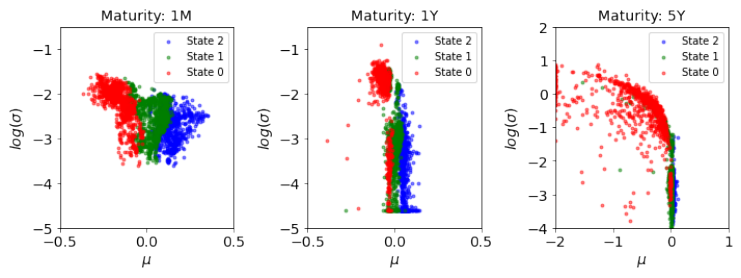

<!-- Start of picture text -->
Maturity: 1M Maturity: 1Y 5 Maturity: 5Y 1 » State 2 . » State 2 = State 2 « State 1 1 « State 1 1 » State 1 «Whee » State 0 0 e +s 24 » State 0 _ 2 on _ _ . | » State oe “a 8 a 2 SE O Tian ee as 3S — bs RSS. ys - 8-3 f =8-3) - . + =8 1 * meee,& 4 ¥ ' . + if -? . . . oS™ —4 —4 * * 5 5 -4 - -0.5 0.0 0.5 -0.5 0.0 0.5 —2 -1 i] 1 Hu u u <!-- End of picture text -->

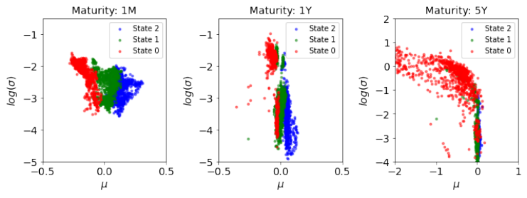

<!-- Start of picture text -->
Maturity: 1M Maturity: 1Y 5 Maturity: 5Y 1 « State 2 . = State 2 « State 2 « State 1 —1 , « State 1 1 » State 1 » State 0 el = State 0 a wat » State O 5 a > 0 is Cis ied — ~ = ~ ~ ea a we S8a —3 a 82a —3 7eo. 4 Sf)2an ae‘oe<a-_ -4 = -4 —2 " * : . -3 - . —5 —5 -4 -0.5 0.0 0.5 -0.5 0.0 0.5 —2 -1 i] 1 Hu u u <!-- End of picture text -->

<!-- page: 13 -->

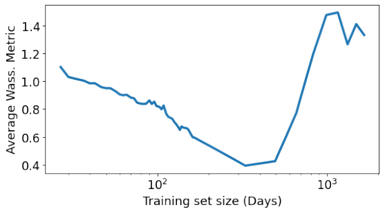

<!-- Start of picture text -->
vu 14 3 s 1.2 4 4 1.0 Ss v 0.8 c $ 0.6 0.4 10? 107 Training set size (Days) <!-- End of picture text -->

<!-- page: 14 -->

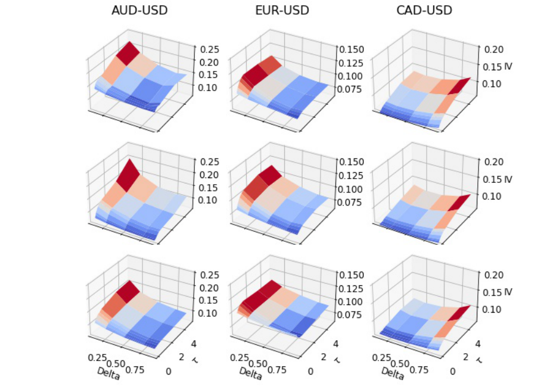

<!-- Start of picture text -->
AUD-USD EUR-USD CAD-USD & 0.25 0.150 | 0.20 0.15 — 0100 | = o10 /« , df 0.075 eee 0.25 0.150 | 0.20 0.15 0.100 0.20 #? 0.125 ew 0.10 “= 0.075 , A 0.10 0.25 "70.150 L— 0.20 0.20 0.125 ois 0.15 0.100 | a | 0.10 iL 0.075 7. 010 4 4 a i 4 0.25,0.50 Pig 0.25 0.50 Pog: 0.25,0.50 Big Dey, 275 O Deg, 275 0 Dey, 275 0 <!-- End of picture text -->

<!-- page: 15 -->

### **REFERENCES** 

- [1] D. Ackerer, N. Tagasovska, and T. Vatter, _Deep smoothing of the implied volatility surface_ , in Proceedings of the 34th Conference on Neural Information Processing Systems (NeurIPS 2020), 2020. 

- [2] D. Applebaum, _L´evy processes and stochastic calculus_ , Cambridge university press, 2009. 

- [3] M. Bergeron, N. Fung, Z. Poulos, J. C. Hull, and A. Veneris, _Variational autoencoders: A hands-off approach to volatility_ , Available at SSRN 3827447, (2021). 

- [4] S. Boyarchenko and S. Z. Levendorskii, _Non-Gaussian Merton-Black-Scholes Theory_ , vol. 9, World Scientific, 2002. 

- [5] S. I. Boyarchenko and S. Z. Levendorskiˇı, _Option pricing for truncated l´evy processes_ , International journal of theoretical and applied finance, 3 (2000), pp. 549–552. 

- [6] D. T. Breeden and R. H. Litzenberger, _Prices of state-contingent claims implicit in option prices_ , Journal of business, (1978), pp. 621–651. 

- [7] J. Buffington and R. J. Elliott, _Regime switching and european options_ , in Stochastic Theory and Control, Springer, 2002, pp. 73–82. 

- [8] R. Carmona and S. Nadtochiy, _Tangent l´evy market models_ , Finance and Stochastics, 16 (2012), pp. 63–104. 

- [9] P. Carr, H. Geman, D. B. Madan, and M. Yor, _The fine structure of asset returns: An empirical investigation_ , The Journal of Business, 75 (2002), pp. 305–332. 

- [10] M. Chataigner, A. Cousin, S. Cr´epey, M. Dixon, and D. Gueye, _Short communication: Beyond surrogate modeling: Learning the local volatility via shape constraints_ , SIAM Journal on Financial Mathematics, 12 (2021), pp. SC58–SC69, https://doi.org/10.1137/20M1381538, https://doi.org/10. 1137/20M1381538, https://arxiv.org/abs/https://doi.org/10.1137/20M1381538. 

- [11] S. N. Cohen, C. Reisinger, and S. Wang, _Arbitrage-free neural-sde market models_ , arXiv e-prints, (2021), pp. arXiv–2105. 

- [12] R. Cont and P. Tankov, _Calibration of jump-diffusion option pricing models: a robust non-parametric approach_ , https://ssrn.com/abstract=332400, (2002). 

- [13] B. Dupire et al., _Pricing with a smile_ , Risk, 7 (1994), pp. 18–20. 

- [14] C. B. O. Exchange, _Measure market expectations of near-term volatility conveyed by s&p 500 stock index option prices._ , tech. report, Wharton Research Data Services, 2020. 

- [15] R. Ferguson and A. Green, _Deeply learning derivatives_ , arXiv preprint arXiv:1809.02233, (2018). 

- [16] A. Gramacki, _Nonparametric kernel density estimation and its computational aspects_ , Springer, 2018. 

- [17] P. S. Hagan, D. Kumar, A. S. Lesniewski, and D. E. Woodward, _Managing smile risk_ , Wilmott Magazine, 1 (2002), pp. 249–296. 

- [18] S. L. Heston, _A closed-form solution for options with stochastic volatility with applications to bond and currency options_ , The review of financial studies, 6 (1993), pp. 327–343. 

- [19] I. Higgins, L. Matthey, A. Pal, C. Burgess, X. Glorot, M. Botvinick, S. Mohamed, and A. Lerchner, _Beta-VAE: Learning basic visual concepts with a constrained variational framework_ , 5th International Conference on Learning Representations, ICLR, (2016). 

- [20] B. Horvath, A. Muguruza, and M. Tomas, _Deep learning volatility_ , arXiv preprint arXiv:1901.09647, (2019). 

- [21] K. R. Jackson, S. Jaimungal, and V. Surkov, _Fourier space time-stepping for option pricing with l´evy models_ , Journal of Computational Finance, 12 (2008), p. 1. 

- [22] D. P. Kingma and M. Welling, _Auto-encoding variational Bayes_ , arXiv preprint arXiv:1312.6114, (2013). 

- [23] S. G. Kou and H. Wang, _Option pricing under a double exponential jump diffusion model_ , Management science, 50 (2004), pp. 1178–1192. 

- [24] A. Kratsios and C. Hyndman, _Deep arbitrage-free learning in a generalized hjm framework via arbitrage-regularization_ , Risks, 8 (2020), p. 40. 

- [25] A. L. Lewis, _A simple option formula for general jump-diffusion and other exponential l´evy processes_ , Available at SSRN 282110, (2001). 

- [26] X. Li, T.-K. L. Wong, R. T. Chen, and D. Duvenaud, _Scalable gradients for stochastic differential equations_ , in International Conference on Artificial Intelligence and Statistics, PMLR, 2020, pp. 3870– 3882.

<!-- page: 16 -->

- [27] A. Oring, Z. Yakhini, and Y. Hel-Or, _Autoencoder image interpolation by shaping the latent space_ , arXiv preprint arXiv:2008.01487, (2020). 

- [28] D. Reiswich and W. Uwe, _Fx volatility smile construction_ , Wilmott, 2012 (2012), pp. 58–69. 

- [29] K. Said, _Pricing exotics under the smile_ , RISK, 12 (1999), pp. 72–75. 

- [30] K. Sohn, H. Lee, and X. Yan, _Learning structured output representation using deep conditional generative models_ , Advances in neural information processing systems, 28 (2015), pp. 3483–3491. 

- [31] S. Vallender, _Calculation of the wasserstein distance between probability distributions on the line_ , Theory of Probability & Its Applications, 18 (1974), pp. 784–786. 

- [32] C. Villani, _Optimal transport: old and new_ , vol. 338, Springer, 2009. 

- [33] Y. Zeng and D. Klabjan, _Online adaptive machine learning based algorithm for implied volatility surface modeling_ , Knowledge-Based Systems, 163 (2019), pp. 376– 391. 

- [34] Y. Zheng, Y. Yang, and B. Chen, _Gated deep neural networks for implied volatility surfaces_ , arXiv preprint arXiv:1904.12834, (2019). 

## **Appendix A. Candidate Risk Neutral Density.** 

Foreign exchange data is often quoted only at specific strikes/deltas. In order to reduce the possibility of overfitting, we introduce a candidate risk neutral density which we attempt to minimize the 1-Wasserstein distance to. We can approximate this candidate density by interpolating implied volatilities at each fixed maturity using B-splines. It is important to note that as this is simply a candidate density derived from a spline interpolation of the IV surface, it provides no guarantee on risk-neutrality. 

Let us define such an interpolated surface by _σ_ ( _K, τ_ ). The price using this implied volatility may be written in terms of the Black-Scholes price of a call option with spot price _S_ 0, strike _K_ , maturity _τ_ , and risk-neutral interest rate _r_ as 

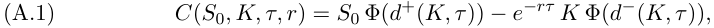

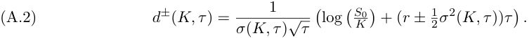

It is well known [6] that, in an arbitrage-free model, _∂KKC_ ( _S_ 0 _, K, τ_ ) corresponds to the risk-neutral density of the underlying asset price evaluated at _K_ . Thus, we can simply take the second derivative of A.1 to find the implied density. 

To compute this density, for a fixed _τ_ , we may consider all but _K_ fixed and constant. As we use a spline representation of the implied volatility we may evaluate the candidate risk-neutral density at any point within the range of available values of _K_ . For simplicity, we set _r_ = 0, and drop the dependence of _d__±_ ( _K, τ_ ) on _τ_ . Thus, 

(A.3) 

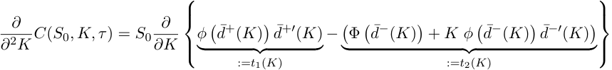

Focusing on the remaining derivatives, we have 

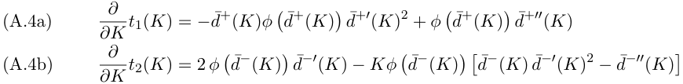

<!-- page: 17 -->

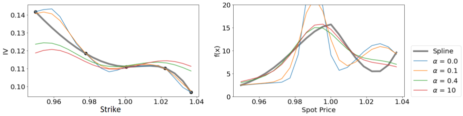

<!-- Start of picture text -->
0.14 20 / 7 0.13 * YF \ > 0.12 Z10 4, \\>—W—OSZY — a=0. spine 0.11 5 2 ay, gea=01 5 — a=04 0.10 — a=10 0.96 0.98 1.00 1.02 1.04 ° 0.96 0.98 1.00 1.02 1.04 Strike Spot Price <!-- End of picture text -->

<!-- page: 18 -->

theorem, we have that the function _v__k_ ( _t, x_ ) satisfies the coupled system of PDEs 

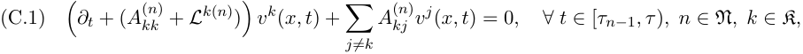

subject to the terminal condition (t.c.) _v__k_ ( _τ, x_ ) = _e__iz x_ , and _L__k_ denotes the infinitesimal generator, given _Zt_ = _k_ , which acts upon twice differentiable functions as follows 

(C.2) 

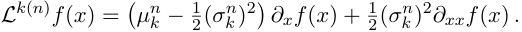

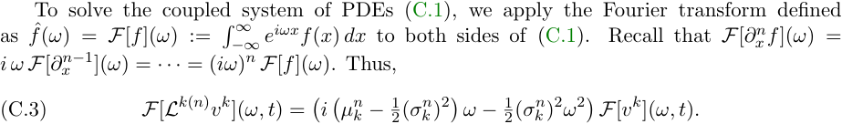

ˆ Using the above, and denoting _v__k_ = _F_ [ _v__k_ ], (C.1) may be written in Fourier space as 

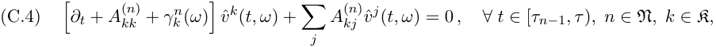

s.t. the t.c. _v__k_ ( _τ, x_ ) = _D_ ( _z − ω_ ), where _γk__n_(_ω_):=_i_ � _µ__n_ _k__−_ 2<u>1</u>(_σ_ _k__n_)2� _ω −_<u>1</u> 2(_σ_ _k__n_)2_ω_2and_D_isthe Dirac delta function. We may further rewrite this system of equations in matrix notation by (i) defining the matrix Ψ_n_ ( _ω_ ) whose entries are [Ψ( _ω_ )] _jk_ = � _A_( _kk__n_)+_γ_ _k__n_(_ω_) � _δjk_ + _A_( _jk__n_)(1_−δjk_) **ˆ** where _δjk_ is the Kroencker delta, and (ii) defining the vector of transformed prices **_v_** ( _t, ω_ ) = (ˆ _v_1 ( _t, ω_ ) _, . . . ,_ ˆ _v__K_ ( _t, ω_ ))⊺ . Thus, (C.4) may be written as a vector-valued ODE 

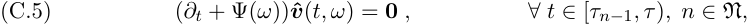

**ˆ** s.t. the t.c. **_v_** ( _τ, ω_ ) = _D_ ( _ω − z_ ) **1** . This system may be solved explicitly by backward **ˆ** induction. For _t ∈_ [ _τN −_ 1 _, τ_ ) (the last period), the matrix ODE admits the solution **_v_** ( _t, ω_ ) = ˆ **ˆ ˆ** _e_(_τ−t_)Ψ(_ω_) **1** _ϕ_ ( _ω_ ) _._ Next, due to continuity, we have that **_v_** ( _τN −_ 1 _, ω_ ) = lim _t↓τN −_ 1 **_v_** ( _t, ω_ ) = ˆ _e_(_τ−τN−_1)Ψ(_ω_) **1** _ϕ_ ( _ω_ ). Using this limit as the t.c. at _t_ = _τN −_ 1, for _t ∈_ ( _τN −_ 2 _, τN −_ 1], we solve **ˆ** ( _∂t_ + Ψ _N −_ 1( _ω_ )) **_v_** ( _t, ω_ ) = **0** , which admits the solution 

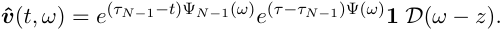

Continuing iteratively, we obtain Continuing iteratively we arrive at 

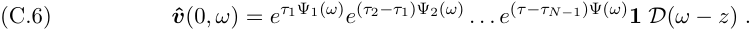

Averaging over the prior _π_ on _Z_ 0, and taking the Fourier inverse (which is trivial due to the Dirac delta function), we obtain the stated result. 

**Appendix D. Structure of the A matrix.** We assume each state _k_ has its corresponding rate parameter _λk_ which determines the rate at which the chain will move out of the state. For any state 1 _≤ k ≤ K_ , the chain has an equal chance of moving into the state below ( _k −_ 1)

<!-- page: 19 -->

||||AUD |-USD ||L |atent D EUR- |imensio USD |n ||CAD |-USD ||
|---|---|---|---|---|---|---|---|---|---|---|---|---|---|
|Model|_β_|3|5|10|15|3|5|10|15|3|5|10|15|
||0.01|3.47|4.11|3.41|3.94|3.19|3.17|3.34|3.16|1.63|1.34|1.12|1.38|
|CTMCCVAE|0.1|3.54|3.47|3.46|4.18|2.90|3.58|3.11|3.12|1.08|1.13|1.08|1.22|
|-|1|3.99|3.90|3.27|3.49|2.48|2.23|2.55|2.81|1.18|1.06|1.13|0.91|
||10|2.97|3.14|3.26|3.18|1.96|1.89|2.00|1.96|2.00|2.00|1.72|1.96|
||0.01|4.56|5.35|4.82|4.40|3.88|3.63|3.61|3.97|1.54|2.12|1.78|1.63|
|CTMCVAE|0.1|4.32|5.83|4.54|4.62|3.18|3.29|3.62|2.77|1.81|1.53|1.40|1.34|
|-|1|4.67|4.43|4.13|3.69|3.64|3.94|3.12|3.62|1.72|1.55|1.48|1.70|
||10|6.10|5.92|6.40|5.63|4.00|3.59|3.86|3.90|2.98|2.96|3.17|3.06|
||0.01|6.07|6.16|6.06|6.26|3.55|4.17|4.05|3.65|1.65|1.61|1.62|1.64|
|IVVAE(B)|0.1|6.22|6.34|5.87|5.86|3.94|3.61|3.44|4.04|1.68|1.44|1.59|1.86|
|-|1|6.43|6.55|6.05|5.60|3.88|4.14|4.11|4.08|2.05|1.97|1.83|1.79|
||10|6.23|6.21|6.16|6.11|4.37|4.14|3.88|4.28|1.82|1.76|2.32|1.75|
|CTMC-PCA(B)||5.25|5.34|7.15|8.38|2.51|3.00|3.50|6.15|2.22|1.73|2.40|2.76|
|Empirical (B)||5.82|5.82|5.82|5.82|3.83|3.83|3.83|3.83|1.67|1.67|1.67|1.67|

Table 5: Wasserstein metrics ( _×_ 10_−_2 ) for varying levels of _β_ , latent dimensionality, and currency pair using the CVAE with the CTMC model with VIX as predictor compared with the vanilla CTMC-VAE and benchmark approaches (B) IV-VAE and CTMC-PCA trained on the period from September 18th, 2012 to May 09, 2016. The Wasserstein metric ( _×_ 10_−_2 ) between the training and tests sets (Empirical) are presented here for reference. 

or above ( _k_ + 1). We further assume that states form a cyclical graph so that state 1 may transition to state _K_ , and vice versa. Any other transitions will have probability 0. This restricts the process to only being able to move through one state at a time without jumping. All together, this creates a generator matrix of the form: 

(D.1) 

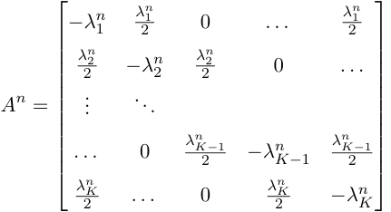

which reduces the number of parameters needed to be estimated at each given maturity to 3 _K_ (K from _σ_ , K from _µ_ , and K from _λ_ ) excluding the vector of initial probabilities, where _K_ is the number of possible states of the system. 

## **Appendix E. Additional Tables and Figures.**

<!-- page: 20 -->

|Model|Parameter|Transforms|
|---|---|---|
||_π_1_. . . π_3|None 1|
|CTMC|_µ_1_. . . µ_3|_µi−_¯_µ_(_µi_) _s_(_µi_)|
||_σ_1_. . . σ_3|_log_(_σi_)_−_¯_µ_(_log_(_σi_)) _s_(_log_(_σi_))|
||_λ_1_, . . . λ_3|_log_(_λi_)_−_¯_µ_(_log_(_λi_)) _s_(_log_(_λi_))|
||_σ_|_log_(_σ_)_−_¯_µ_(_log_(_σ_)) _s_(_log_(_σ_)|
|DEJD|_λ_|_λi−_¯_µ_(_λi_) _s_(_λi_)|
|-|_p_|˜_p−_¯_µ_(˜_p_) _s_(˜_p_) _,_ ˜_p_=_log_ � _p_ 1_−p_ �|
||_a_1|_a_1_−_¯_µ_(_a_1) _s_(_a_1)|
||_a_2|_a_2_−_¯_µ_(_a_2) _s_(_a_2)|
||_σ_|_log_(_σ_)_−_¯_µ_(_log_(_σ_)) _s_(_log_(_σ_)|
|GM-JD|_λ_|_λi−_¯_µ_(_λi_) _s_(_λi_)|
||˜_π_1_,_˜_π_2|_log_(_ηi_)_−_¯_µ_(_log_(_ηi_)) _s_(_log_(_ηi_) _,_ _η_1 = 1_, η_2 = ˜_π_2 ˜_π_1 _. . ._|
||˜_µ_1_,_˜_µ_2|˜_µi−_¯_µ_(˜_µi_) _s_(˜_µi_)|
||˜_σ_1_,_˜_σ_2|_log_(˜_σi_)_−_¯_µ_(_log_(˜_σi_)) _s_(_log_(˜_σi_))|
||_C_|_log_(_C_)_−_¯_µ_(_log_(_C_))) _s_(_log_(_C_))|
|CGMYKBL|_G_|_log_(_G_)_−_¯_µ_(_log_(_G_))) _s_(_log_(_G_))|
|/oo|_M_|_log_(_M_)_−_¯_µ_(_log_(_M_))) _s_(_log_(_M_))|
||_Y_|_log_(_Y_ )_−_¯_µ_(_log_(_Y_ ))) _s_(_log_(_Y_ ))|

Table 6: Normalizations performed on model parameters before ¯ input into VAE. _µ_ ( _·_ ) and _s_ ( _·_ ) are the empirical mean and standard deviation respectively.
