# 2022-abi-jaber-et-al-quintic-ou

<!-- page: 1 -->

## The quintic Ornstein-Uhlenbeck volatility model that jointly calibrates SPX & VIX smiles

Eduardo Abi Jaber∗1, Camille Illand2, and Shaun (Xiaoyuan) Li†3

1Ecole Polytechnique, CMAP 2,3AXA Investment Managers 3Universit´e Paris 1 Panth´eon-Sorbonne, CES

May 10, 2023

## Abstract

The quintic Ornstein-Uhlenbeck volatility model is a stochastic volatility model where the volatility process is a polynomial function of degree five of a single Ornstein-Uhlenbeck process with fast mean reversion and large vol-of-vol. The model is able to achieve remarkable joint fits of the SPX-VIX smiles with only 6 efective parameters and an input curve that allows to match certain term structures. We provide several practical specifications of the input curve, study their impact on the joint calibration problem and consider additionally time-dependent parameters to help achieve better fits for longer maturities going beyond 1 year. Even better, the model remains very simple and tractable for pricing and calibration: the VIX squared is again polynomial in the Ornstein-Uhlenbeck process, leading to eficient VIX derivative pricing by a simple integration against a Gaussian density; simulation of the volatility process is exact; and pricing SPX products derivatives can be done eficiently and accurately by standard Monte Carlo techniques with suitable antithetic and control variates.

JEL Classification: G13, C63, G10.

Keywords: SPX and VIX modeling, Stochastic volatility, Pricing, Calibration.

## 1 Introduction

Since the financial crisis of 2008, derivatives on volatility became increasingly popular for hedging purposes and for directional trading especially when combined with the underlying stock index. On the US market, the VIX index introduced by the CBOE became one of the most widely followed volatility index. By construction, the VIX expresses an interpolation between several points of the SPX implied volatility term structure. This motivates the need for a consistent modeling of the SPX and VIX.

By joint SPX–VIX calibration problem, we mean the calibration of a model across several maturities to European call/put options on SPX and VIX together with VIX futures. Such joint calibration turns out to be quite challenging for several reasons: multitude of instruments to be calibrated (SPX/VIX options and VIX futures, so three types of derivatives) across several maturities (to stay consistent with the construction of the VIX), characterized by an upward sloping VIX implied volatility in contrast with the important at-the-money (ATM) SPX skew that becomes more pronounced for smaller maturities.

arXiv:2212.10917v2 [q-fin.MF] 9 May 2023

∗eduardo.abi-jaber@polytechnique.edu. The first author is grateful for the financial support from the Chaires FiME-FDD, Financial Risks, Deep Finance & Statistics and Machine Learning and systematic methods in finance at Ecole Polytechnique.

†shaunlinz02@gmail.com. The third author is grateful for the finanical support provided by AXA Investment Managers and we would like to together thank Salmane Lahdachi at AXA Investment Managers for very fruitful discussions and insightful comments.

<!-- page: 2 -->

Several attempts of joint calibration have been made with varying degree of success. However, in general the models and/or the techniques considered are sophisticated and make use of jump processes [3, 6, 18, 22, 23]; non-Markovian rough volatility [4, 10, 25] and path-dependent volatility [16]; multiple-factors [7, 11, 16, 24]; optimal transport [13, 14, 15], randomization of the parameters [12] and neural SDEs [17] to just name a few. The proposed solutions for the joint calibration problem are hence rather challenging to put into practice and need specific advanced numerical methods. This is the main motivation of our work.

Recently, the work of [2] identified for the first time a conventional one-factor Markovian continuous stochastic volatility model that is capable of achieving remarkable fits for a wide range of maturity slices of SPX and VIX implied volatilities together with the term structure of VIX futures. It is also shown on an extensive empirical study between 2012 and 2022, that contrary to common beliefs, the one factor Markovian model can jointly calibrate SPX and VIX without appealing to multiplefactors, jumps, rough volatility or path-dependency and can achieve even better performances. In [2], pricing of VIX and SPX derivatives has been done using quantization techniques and neural networks in order to ensure a fair comparison between Markovian and non-Markovian models.

In the present work, we focus on the Markovian model identified in [2] and we show that the model is tractable in addition to being remarkably flexible. The dynamics of the stochastic volatility process in this model are given by a polynomial function of degree five of a single Ornstein-Uhlenbeck process with fast mean reversion and large vol-of-vol. Hence the name: quintic Ornstein-Uhlenbeck volatility model. The model has only 6 efective parameters and an input curve that allows to match certain term structures. In particular, we will highlight the role of the input curve on the joint calibration problem: a parametric forward variance curve can be used when calibrating few slices; if the number of slices is increased then the input curve is first extracted from the forward variance curve of the market and then tweaked in the calibration process. We also consider additionally time-dependent parameters to help achieve better fits for longer maturities going beyond 1 year.

We show that the model is tractable as it ofers an explicit expression for the VIX squared which is again polynomial in the driving Ornstein-Uhlenbeck factor, leading to eficient VIX derivative pricing by integrating directly against a Gaussian density. Simulation of the volatility process is exact so that pricing SPX products can be done eficiently and accurately by standard Monte Carlo techniques with suitable antithetic and control variates. We also provide a notebook with our implementation here: https://colab.research.google.com/drive/14nh9civ\_ wgQv283eshBWnr146w7Xsbi5?usp=sharing.

For the first time in the literature, remarkable joint fits of SPX and VIX volatility surfaces and VIX futures are achieved between 1 week and beyond 1 year. Although it is challenging, but possible, for another model to achieve similar fits, it would be very dificult to do so with a simpler continuous model than our quintic Ornstein-Uhlenbeck volatility model.

Outline. Section 2 introduces the model. Sections 3 and 4 detail the pricing of VIX and SPX derivatives in the model. Calibration results on market data are shown in Sections 5 and 6. Appendix A proves the martingality of the underlying process of the model.

<!-- page: 3 -->

## 2 The quintic Ornstein-Uhlenbeck volatility model

The dynamics of the stock price S, with no interest nor dividends, is given by

$$
\begin{array} { r l r } {  { \frac { d S _ { t } } { S _ { t } } = \sigma _ { t } d B _ { t } , } } \\ & { } & { \sigma _ { t } = \sqrt { \xi _ { 0 } ( t ) } \frac { p ( X _ { t } ) } { \sqrt { \mathbb { E } [ p ( X _ { t } ) ^ { 2 } ] } } , \quad p ( x ) = \alpha _ { 0 } + \alpha _ { 1 } x + \alpha _ { 3 } x ^ { 3 } + \alpha _ { 5 } x ^ { 5 } , } \\ & { } & { X _ { t } = \varepsilon ^ { H - 1 / 2 } \int _ { 0 } ^ { t } e ^ { - ( 1 / 2 - H ) \varepsilon ^ { - 1 } ( t - s ) } d W _ { s } , } \end{array}\tag{2.1}
$$

with $B = \rho W + \sqrt { 1 - \rho ^ { 2 } } W ^ { \perp } , ( W , W ^ { \perp } )$ a two-dimensional Brownian motion on a risk-neutral filtered probability space $( \Omega , \mathcal { F } , ( \mathcal { F } _ { t } ) _ { t \geq 0 } , \mathbb { Q } ) , \rho \in [ - 1 , 1 ]$ , non-negative coeficients $\alpha _ { 0 } , \alpha _ { 1 } , \alpha _ { 3 } , \alpha _ { 5 } \geq 0$ $( \alpha _ { 2 } = \alpha _ { 4 } = 0 ) , \varepsilon > 0 , H \in ( - \infty , 1 / 2 ]$ and an input curve $\xi _ { 0 } \in L ^ { 2 } ( [ 0 , T ] , \mathbb { R } _ { + } )$ for any $T > 0 ,$ allowing the model to match certain term-structures observed on the market. For instance, the normalization $\sqrt { \mathbb { E } \left[ p ( X _ { t } ) ^ { 2 } \right] }$ allows $\xi _ { 0 }$ to match the market forward variance curve since

$$
\mathbb { E } \left[ \int _ { 0 } ^ { t } \sigma _ { s } ^ { 2 } d s \right] = \int _ { 0 } ^ { t } \xi _ { 0 } ( s ) d s , \quad t \geq 0 .
$$

The process X driving the volatility is an Ornstein-Uhlenbeck process with a fast mean reversion of order $( 1 / 2 - H ) \varepsilon ^ { - 1 }$ and a large vol-of-vol of order $\varepsilon ^ { H - 1 / 2 }$ for small values of ε, that is

$$
d X _ { t } = - ( 1 / 2 - H ) \varepsilon ^ { - 1 } X _ { t } d t + \varepsilon ^ { H - 1 / 2 } d W _ { t } .\tag{2.2}
$$

Such parametrizations are reminiscent of the fast regimes extensively studied by Fouque et al. [9], see also $[ 8 ,$ Section 3.6], which corresponds to the case $H = 0$ . They can also be linked to more complex models such as jump models $[ 2 0 , 1 ]$ for $H \leq - 1 / 2 ;$ and rough volatility models $[ 2 , 1 ]$ for which $H \in ( 0 , 1 / 2 )$ would play the role of the Hurst index. Letting the parameter $H \in ( - \infty , 1 / 2 ]$ free in our model introduces more flexibility and leads to better fits than in the aforementioned models. Another advantage of such parametrization is to stabilize the calibrated value of H through time as opposed to calibrating directly on mean reversion and vol-of-vol parameters which are less stable through time, see [2, Figure 3].

Taking $p$ a polynomial of degree five allows us to reproduce the upward slope of the VIX smile. Restricting the coeficients α to be non-negative (with $\alpha _ { 2 } = \alpha _ { 4 } = 0 )$ ensures the sign of the atthe-money skew to be the same as $\rho ,$ see [2] for more details, as well as ensuring the martingale property of S, whenever $\rho \le 0$ and $\alpha _ { 5 } > 0$ , see Appendix A below.

We fix $\varepsilon = 1 / 5 2$ to further reduce the parameters, which gives 6 calibratable parameters:

$$
\Theta : = \{ \alpha _ { 0 } , \alpha _ { 1 } , \alpha _ { 3 } , \alpha _ { 5 } , \rho , H \} ,\tag{2.3}
$$

plus the input curve $\xi _ { 0 } ( \cdot )$ . Numerical experiments show no significant adverse impact on the joint calibration quality by narrowing the number of parameters.

## 3 Pricing VIX derivatives

An explicit expression for the VIX. One major advantage of our model is an explicit expression of the VIX. In continuous time, the VIX can be expressed as

$$
\mathrm { V I X } _ { T } ^ { 2 } = - \frac { 2 } { \Delta } \mathbb { E } \left[ \log ( S _ { T + \Delta } / S _ { T } ) \mid \mathcal { F } _ { T } \right] \times 1 0 0 ^ { 2 } = \frac { 1 0 0 ^ { 2 } } { \Delta } \int _ { T } ^ { T + \Delta } \xi _ { T } ( u ) d u ,\tag{3.1}
$$

<!-- page: 4 -->

with $\Delta = 3 0$ days and $\xi _ { T } ( u ) : = \mathbb { E } \left[ \sigma _ { u } ^ { 2 } \mid \mathcal { F } _ { T } \right]$ the forward variance process which can be computed explicitly in our model as follows. First, we fix $T \leq u$ and rewrite $X$ as

$$
X _ { u } = X _ { T } e ^ { - ( 1 / 2 - H ) \varepsilon ^ { - 1 } ( u - T ) } + \varepsilon ^ { H - 1 / 2 } \int _ { T } ^ { u } e ^ { - ( 1 / 2 - H ) \varepsilon ^ { - 1 } ( u - s ) } d W _ { s } = : Z _ { T } ^ { u } + G _ { T } ^ { u } ,
$$

then, setting

$$
g ( u ) = \mathbb { E } [ p ( X _ { u } ) ^ { 2 } ] ,
$$

we have that

$$
\xi _ { T } ( u ) = \mathbb { E } \left[ \sigma _ { u } ^ { 2 } \mid \mathcal { F } _ { T } \right] = \frac { \xi _ { 0 } ( u ) } { g ( u ) } \mathbb { E } \left[ \left( \sum _ { k = 0 } ^ { 5 } \alpha _ { k } X _ { u } ^ { k } \right) ^ { 2 } ~ \Big \lvert ~ \mathcal { F } _ { T } \right] = \frac { \xi _ { 0 } ( u ) } { g ( u ) } \mathbb { E } \left[ \sum _ { k = 0 } ^ { 1 0 } ( \alpha * \alpha ) _ { k } X _ { u } ^ { k } ~ \Big \lvert ~ \mathcal { F } _ { T } \right] ,
$$

where $\textstyle ( \alpha * \alpha ) _ { k } = \sum _ { j = 0 } ^ { k } \alpha _ { j } \alpha _ { k - j }$ is the discrete convolution. Using the Binomial expansion, we can further develop the expression for $\xi _ { T } ( u )$ in terms of $Z ^ { u }$ and $G ^ { u }$ to get

$$
\xi _ { T } ( u ) = \frac { \xi _ { 0 } ( u ) } { g ( u ) } \sum _ { k = 0 } ^ { 1 0 } \sum _ { i = 0 } ^ { k } ( \alpha * \alpha ) _ { k } \binom { k } { i } \left( X _ { T } e ^ { - ( 1 / 2 - H ) \varepsilon ^ { - 1 } ( u - T ) } \right) ^ { i } \mathbb { E } \left[ ( G _ { T } ^ { u } ) ^ { k - i } \right] ,\tag{3.2}
$$

where we used the fact that $Z _ { T } ^ { u }$ is $\mathcal { F } _ { T }$ -measurable and that $G _ { T } ^ { u }$ is independent of $\mathcal { F } _ { T }$ , with $\textstyle { \binom { k } { i } } =$ $k ! / ( ( k - i ) ! i ! )$ the binomial coeficient. Furthermore, $G _ { T } ^ { u }$ is a Gaussian random variable with mean 0 and variance $\begin{array} { r } { \frac { \varepsilon ^ { 2 H } } { 1 - 2 H } \big ( 1 - e ^ { - ( 1 - 2 H ) \varepsilon ^ { - 1 } ( u - T ) } \big ) } \end{array}$ . Recall that for a Gaussian variable $Y \sim \mathcal { N } \left( 0 , \sigma _ { Y } ^ { 2 } \right)$ its moments $\mathbb { E } \left[ \bar { Y } ^ { p } \right]$ for $p \in \mathbb N$ can be computed explicitly:

$$
\mathbb { E } \left[ Y ^ { p } \right] = { \left\{ \begin{array} { l l } { 0 } & { { \mathrm { i f ~ } } p { \mathrm { ~ i s ~ o d d } } } \\ { \sigma _ { Y } ^ { p } ( p - 1 ) ! ! } & { { \mathrm { i f ~ } } p { \mathrm { ~ i s ~ e v e n } } } \end{array} \right. }
$$

with $p ! !$ the double factorial. Therefore all moments of E $\left[ ( G _ { T } ^ { u } ) ^ { i } \right]$ are given explicitly.

Going back to (3.1) and plugging the expression (3.2), the explicit expression of the $\mathrm { V I X } _ { T } ^ { 2 }$ turns out to be polynomial in $X _ { T }$

$$
\begin{array} { l } { { \displaystyle \mathrm { V I X } _ { T } ^ { 2 } = \frac { 1 0 0 ^ { 2 } } { \Delta } \sum _ { k = 0 } ^ { 1 0 } \sum _ { i = 0 } ^ { k } ( \alpha * \alpha ) _ { k } \binom { k } { i } \int _ { T } ^ { T + \Delta } \frac { \xi _ { 0 } ( u ) } { g ( u ) } \mathbb { E } \left[ ( G _ { T } ^ { u } ) ^ { k - i } \right] e ^ { - ( 1 / 2 - H ) \varepsilon ^ { - 1 } ( u - T ) i } d u X _ { T } ^ { i } } } \\ { { \displaystyle \quad = \frac { 1 0 0 ^ { 2 } } { \Delta } \sum _ { i = 0 } ^ { 1 0 } \sum _ { k = i } ^ { 1 0 } \left( ( \alpha * \alpha ) _ { k } \binom { k } { i } \int _ { T } ^ { T + \Delta } \frac { \xi _ { 0 } ( u ) } { g ( u ) } \mathbb { E } \left[ ( G _ { T } ^ { u } ) ^ { k - i } \right] e ^ { - ( 1 / 2 - H ) \varepsilon ^ { - 1 } ( u - T ) i } d u \right) X _ { T } ^ { i } } } \\ { { \displaystyle \quad = \frac { 1 0 0 ^ { 2 } } { \Delta } \sum _ { i = 0 } ^ { 1 0 } \beta _ { i } X _ { T } ^ { i } , } } \end{array}\tag{3.3}
$$

where

$$
\beta _ { i } = \sum _ { k = i } ^ { 1 0 } ( \alpha * \alpha ) _ { k } { \binom { k } { i } } \int _ { T } ^ { T + \Delta } \frac { \xi _ { 0 } ( u ) } { g ( u ) } \mathbb { E } \left[ ( G _ { T } ^ { u } ) ^ { k - i } \right] \left( e ^ { - ( 1 / 2 - H ) \varepsilon ^ { - 1 } ( u - T ) i } \right) d u .
$$

The integral inside $\beta _ { i }$ can be easily computed, at least numerically for a variety of choices for $\xi _ { 0 } ( \cdot )$

Pricing VIX derivatives. Thanks to the closed expression of (3.3), $\mathrm { V I X } _ { T } ^ { 2 }$ is a polynomial in $X _ { T }$ that we denote by $h ( X _ { T } )$ . Since $X _ { T }$ is Gaussian with mean 0 and variance $\begin{array} { r } { \sigma _ { X _ { T } } ^ { 2 } = \frac { \varepsilon ^ { 2 H } } { 1 - 2 H } ( 1 - } \end{array}$ $e ^ { - ( 1 - 2 H ) \varepsilon ^ { - 1 } T } )$ , pricing VIX derivatives with payof function $\Phi$ is immediate by integrating directly against the standard Gaussian density:

$$
\mathbb { E } \left[ \Phi ( \mathrm { V I X } _ { T } ) \right] = \mathbb { E } \left[ \Phi \left( \sqrt { h ( X _ { T } ) } \right) \right] = \frac { 1 } { \sqrt { 2 \pi } } \int _ { \mathbb { R } } \Phi \left( \sqrt { h \left( \sigma _ { X _ { T } } x \right) } \right) e ^ { - x ^ { 2 } / 2 } d x .\tag{3.4}
$$

<!-- page: 5 -->

Example 3.1. To price VIX future prices, set $\Phi ( v ) = v$ and to price VIX vanilla call price, set $\Phi ( v ) = ( v - K ) ^ { + }$ . This integral (3.4) can be computed eficiently using a variety of quadrature techniques. The Gaussian quadrature with 400 nodes seems to be more than enough to price accurately VIX call and future prices.

## 4 Pricing SPX derivatives

To price SPX derivatives, we resort to using Monte Carlo simulations. Since X is a Ornstein-Uhlenbeck process, it can be simulated exactly as opposed to using the Euler scheme which is often inaccurate in a fast mean reversion regime. To simulate X, first define

$$
\tilde { X } _ { t } = X _ { t } e ^ { \frac { 1 / 2 - H } { \varepsilon } t } = \varepsilon ^ { H - 1 / 2 } \int _ { 0 } ^ { t } e ^ { \frac { 1 / 2 - H } { \varepsilon } s } d W _ { s } .
$$

Then, $\tilde { X }$ can be simulated recursively by

$$
\tilde { X } _ { t _ { i + 1 } } = \tilde { X } _ { t _ { i } } + \sqrt { \varepsilon ^ { 2 H } / ( 1 - 2 H ) } \left( e ^ { \frac { 1 - 2 H } { \varepsilon } t _ { i + 1 } } - e ^ { \frac { 1 - 2 H } { \varepsilon } t _ { i } } \right) Y _ { i } ,
$$

with $Y _ { i } \ \mathrm { i . i . d . }$ . standard Gaussian. To get back to $X _ { t _ { i + 1 } }$ we just divide $\tilde { X } _ { t _ { i + 1 } }$ by $e ^ { \frac { 1 / 2 - H } { \varepsilon } t _ { i + 1 } }$ . This setting allows us to easily vectorize computations.

To simulate the process log(S), we use the Euler scheme together with antithetic and control variates, the so called turbocharging method as outlined in [19]. This means we only need to simulate the part of $\log ( S )$ that is $\mathcal { F } ^ { W }$ measurable, we call this $\dot { S } ^ { W }$ and can be simulated as

$$
\log ( S ^ { W } ) _ { t _ { i + 1 } } = \log ( S ^ { W } ) _ { t _ { i } } - 1 / 2 \left( \rho \sigma _ { t _ { i } } \right) ^ { 2 } \left( t _ { i + 1 } - t _ { i } \right) + \rho \sigma _ { t _ { i } } \sqrt { t _ { i + 1 } - t _ { i } } Y _ { i } .
$$

The main idea of the turbocharging method is to 1) take advantage of the conditional log-normality of S with respect to $\mathcal { F } ^ { W }$ , hence removing the MC error from simulating $W ^ { \perp }$ , and 2) apply the control variate in the form of a time option where one can again take advantage of the lognormality and closed form solution. We refer readers to [19] for more details on the method and to the notebook mentioned in the introduction for our implementation.

## 5 SPX/VIX Joint calibration

We now address the SPX-VIX joint calibration problem, that is the calibration of our model to SPX European options, VIX European options and VIX futures across several maturities. Ideally, one should calibrate for SPX options maturity up to one month ahead of that of the VIX options, given that VIX encodes expected level of volatility for the next 30 days by definition.

The calibration of VIX futures is necessary as it is used to calculate VIX implied volatility. Recall the implied volatility is calculated by inverting the Black and Scholes formula, that is, for a given call price $C _ { 0 } ( K , T )$ with strike K and maturity T, we find the unique $\sigma _ { ( } K , T )$ such that

$$
C _ { 0 } ( K , T ) = F ( T ) \mathcal { N } ( d _ { 1 } ) - K \mathcal { N } ( d _ { 2 } )
$$

with

$$
d _ { 1 } = \frac { \log { ( F ( T ) / K ) } + \frac { 1 } { 2 } \sigma ( K , T ) ^ { 2 } T } { \sigma ( K , T ) \sqrt { T } } , \quad d _ { 2 } = d _ { 1 } - \sigma ( K , T ) \sqrt { T } ,
$$

where ${ \mathcal { N } } ( x )$ is the cumulative density function of the standard Gaussian distribution and $F ( T )$ denotes the futures price of the index: $F ( T ) = \mathbb { E } \left[ S _ { T } \right] = S _ { 0 }$ for the SPX in our model (2.1) and $F ( T ) = \mathbb { E } \left[ \mathrm { V I X } _ { T } \right]$ for the VIX.

<!-- page: 6 -->

To calibrate our model, we solve the following optimisation problem involving sum of root mean squared error (RMSE):

$$
\begin{array} { l } { \displaystyle \operatorname* { m i n } _ { \Theta } \Bigg \{ c _ { 1 } \sqrt { \sum _ { i , j } \left( \sigma _ { s p x } ^ { \Theta } ( T _ { i } , K _ { j } ) - \sigma _ { s p x } ^ { m k t } ( T _ { i } , K _ { j } ) \right) ^ { 2 } } + c _ { 2 } \sqrt { \sum _ { i , j } \left( \sigma _ { v i x } ^ { \Theta } ( T _ { i } , K _ { j } ) - \sigma _ { v i x } ^ { m k t } ( T _ { i } , K _ { j } ) \right) ^ { 2 } } } \\ { \displaystyle \qquad + c _ { 3 } \sqrt { \sum _ { i } \left( F _ { v i x } ^ { \Theta } ( T _ { i } ) - F _ { v i x } ^ { m k t } ( T _ { i } ) \right) ^ { 2 } } \Bigg \} . } \end{array}
$$

Here, $\sigma _ { s p x } ^ { m k t } ( T _ { i } , K _ { j } ) , \sigma _ { v i x } ^ { m k t } ( T _ { i } , K _ { j } )$ represent market SPX-VIX implied volatility with maturity $T _ { i }$ and strike $K _ { j } . \ F _ { v i x } ^ { m k t } ( T _ { i } )$ is the market VIX futures price maturing at $T _ { i } . ~ \sigma _ { s p x } ^ { \Theta } ( T _ { i } , K _ { j } ) , \sigma _ { v i x } ^ { \Theta } ( T _ { i } , K _ { j } )$ and $F _ { v i x } ^ { \Theta } ( T _ { i } )$ represent the same instruments, but coming from our model. The coeficients c1, c2 and $c _ { 3 }$ are some positive numbers used to assign diferent weights to the errors in SPX-VIX implied volatility and VIX futures price. We chose arbitrarily $c _ { 1 } = 1 , c _ { 2 } = 0 . 1 , c _ { 3 } = 0 . 5$ for our numerical experiments.

We will now show how our model is well adapted to produce joint fits between SPX/VIX, with daily SPX/VIX joint implied volatility surface data purchased from the CBOE website https: //datashop.cboe.com/.

Extracting the forward variance curve $\xi _ { 0 } ( \cdot )$ . Using the well-known replication formula for the log-contract in [5], we construct $\xi _ { 0 } ( \cdot )$ such that

$$
\begin{array} { c } { { \displaystyle { \int _ { T _ { i } } ^ { T _ { i + 1 } } \xi _ { 0 } ( s ) d s = 2 \left( \int _ { 0 } ^ { S _ { 0 } } \frac { P _ { 0 } ( K , T _ { i + 1 } ) } { K ^ { 2 } } d K + \int _ { S _ { 0 } } ^ { + \infty } \frac { C _ { 0 } ( K , T _ { i + 1 } ) } { K ^ { 2 } } d K \right) } } } \\ { { - 2 \left( \int _ { 0 } ^ { S _ { 0 } } \frac { P _ { 0 } ( K , T _ { i } ) } { K ^ { 2 } } d K + \int _ { S _ { 0 } } ^ { + \infty } \frac { C _ { 0 } ( K , T _ { i } ) } { K ^ { 2 } } d K \right) , } } \end{array}\tag{5.1}
$$

where $T _ { i }$ are SPX option maturities from market data and $C _ { 0 } ( K , T )$ and $P _ { 0 } ( K , T )$ the price of a call/put option with strike K and maturity $T .$ Since market prices for out of the money call/put options are not always available, we first interpolate the SPX market implied volatility surface, each slice separately, using methods like SVI or SABR (after checking for arbitrage), and use the fitted surface to compute the integral above.

We then approximate $\xi _ { 0 } ( t )$ by passing a cubic spline interpolation with nodes $( t _ { i } , x _ { i } )$ with $t _ { i } =$ $( T _ { i } + T _ { i + 1 } ) / 2$ and $\begin{array} { r } { x _ { i } = \sqrt { \int _ { T _ { i } } ^ { T _ { i + 1 } } \xi _ { 0 } ( s ) d s } } \end{array}$ and then square the interpolation to ensure positivity of the forward variance curve. Of course, piece-wise constant between $[ T _ { i } , T _ { i + 1 } )$ can also be used.

During the calibration procedure, we will let the optimisation algorithm move the model parameters Θ defined in (2.3) and make adjustments to the value of the spline nodes $x _ { i }$ as necessary to jointly fit SPX and VIX derivatives.

Figure 1 shows the joint fit on the 23 October 2017, with calibrated parameters $\rho = - 0 . 6 8 4 3 , H =$ $- 0 . 0 3 5 8 , ( \alpha _ { 0 } , \alpha _ { 1 } , \alpha _ { 3 } , \alpha _ { 5 } ) = ( 0 . 5 9 0 7 , 1 , 0 . 2 8 9 3 , 0 . 0 5 4 9 )$ :

<!-- page: 7 -->

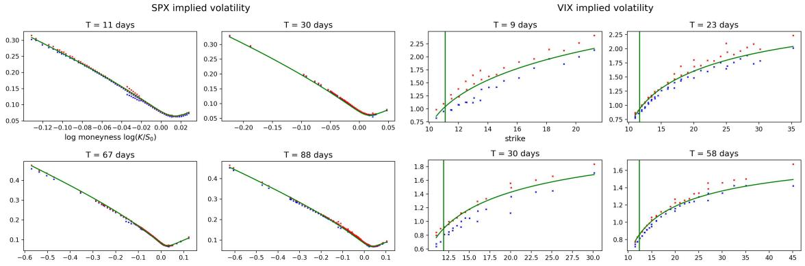

The forward variance curve has been adjusted to jointly fit the SPX and VIX smiles as shown in Figure 2.

For more joint surface fits and an empirical study on joint SPX/VIX volatility surface between 2011 and 2022 for our quintic Ornstein-Uhlenbeck model together with its calibrated parameters across time, we refer the reader to [2].

Using parametric forward variance curves when calibrating fewer slices. Instead of extracting forward variance curves from market data, it is also possible to use a parametric form of the forward variance curve for example in the form of:

$$
\xi _ { 0 } ( t ) = a e ^ { - b t } + c ( 1 - e ^ { - b t } ) ,\tag{5.2}
$$

with $a , b , c > 0$ to be calibrated.

The parametric forward variance curves ofers less flexibility than that of extracted market forward variance curve discussed before given its rigid form. However, it is still capable to fit two maturity slices of SPX and one slice of VIX. We provide two examples here, with

1. joint fits of SPX options maturing in 9 days and 30 days, and VIX options maturing in 9 days) using parameters $\rho = - 0 . 7 3 1 6 , H = - 0 . 1 3 8 2 , ( \alpha _ { 0 } , \alpha _ { 1 } , \alpha _ { 3 } , \alpha _ { 5 } ) = ( 0 . 8 1 6 9 , 0 . 2 7 4 , 0 . 1 7 1 7 , 0 . 0 0 3 6 )$ a = 0.0084, b = 2.0436, c = 0.0441 shown in Figure 3,

<!-- page: 8 -->

2. joint fits of SPX options maturing in 53 days and 88 days, and VIX options maturing in 58 days) with parameters $\rho = - 0 . 7 0 0 1 , H = 0 . 1 4 1 , ( \alpha _ { 0 } , \alpha _ { 1 } , \alpha _ { 3 } , \alpha _ { 5 } ) = ( 0 . 7 5 5 8 , 1 , 0 . 0 8 8 5 , 0 . 4 4 2 1 )$ $a = 0 . 0 1 2 , b = 2 . 0 2 7 , c = 0 . 0 3 3$ shown in Figure 4.

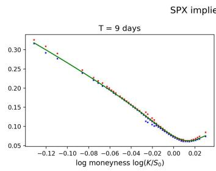

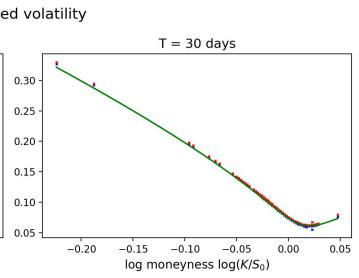

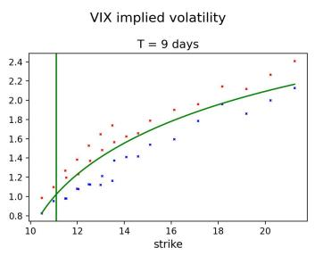

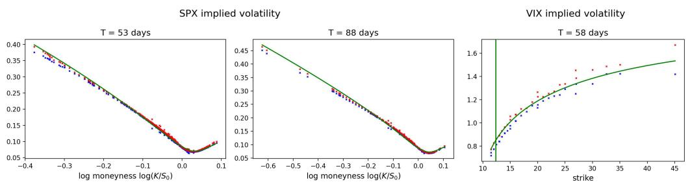

Using a time dependent H parameter for fitting longer maturities. To fit even longer maturities beyond 3 and 4 months, we propose to use a time-dependent parametrization of H in (2.2) in the form of

$$
H ( t ) = H _ { 0 } e ^ { - \kappa t } + H _ { \infty } ( 1 - e ^ { - \kappa t } ) ,\tag{5.3}
$$

with $H _ { 0 } , H _ { \infty } , \kappa > 0$ to be calibrated. With this formulation, X remains a Gaussian Ornstein-Uhlenbeck process with time dependent parameters and can also be simulated exactly. The formula for $\mathrm { V I X } _ { T } ^ { 2 }$ remains polynomial in $X _ { T }$ similar to (3.3).

Using time dependent parametrization of H, together with minor tweaks to the stripped forward variance curve using (5.1) and letting the mean reversion speed ε free, we can jointly fit the SPX and VIX surface beyond 1 year, with up to 8 slices for SPX and 6 slices for VIX as illustrated on Figure 5. The calibrated parameters are $\rho = - 0 . 7 4 6 6 , ( \alpha _ { 0 } , \alpha _ { 1 } , \alpha _ { 3 } , \alpha _ { 5 } ) = ( 0 , 0 . 0 2 6 6 , 0 . 2 5 1 3 , 0 . 0 0 0 0 6 ) , H _ { 0 } =$ $0 . 3 1 7 6 , H _ { \infty } = - 1 . 3 6 6 5 , \kappa = 1 . 2 , \varepsilon = 0 . 1 3 5 9$ . Figure 6 shows the forward variance curve $\xi _ { 0 } ( t )$ on 23 October 2017 stripped from the market vs. slightly adjusted forward variance as part of the joint calibration, and Figure 7 shows the value of the calibrated H in (5.3) as function of time.

<!-- page: 9 -->

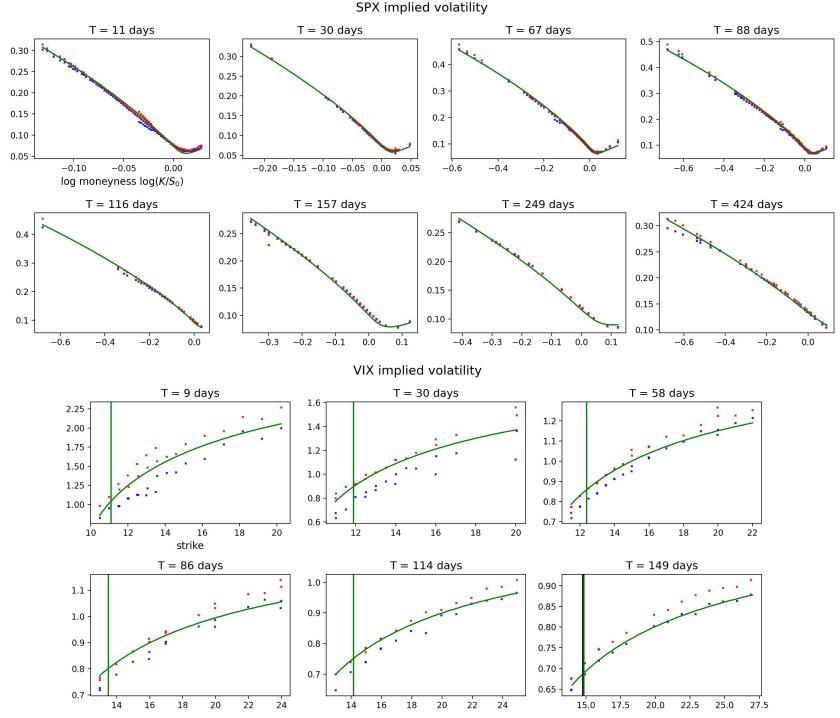

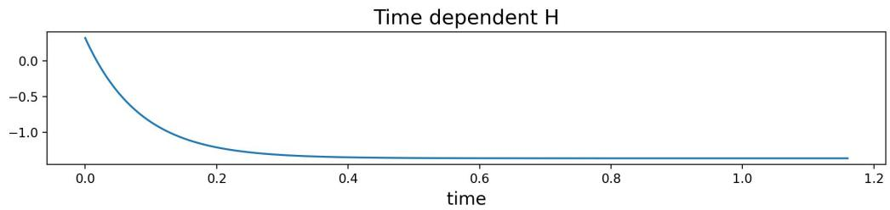

<!-- page: 10 -->

• parametric $\xi _ { 0 }$ as in (5.2), fixed $\varepsilon = 1 / 5 2$ and constant coeficient H in (2.2) for fits of single slice of VIX and two slices of SPX,

• tweaked stripped forward curve $\xi _ { 0 } ,$ , fixed $\varepsilon = 1 / 5 2$ and constant H in (2.2) for joint fits on several maturities up to 3 to 4 months,

• tweaked stripped forward curve $\xi _ { 0 } ,$ letting ε free and time-dependent H in (2.2) as in (5.3) for joint fits on several maturities up to 18 months.

## 6 Additional graphs

## 6.1 Evolution of calibrated model parameters

In this section, we plot the evolution of all calibrated model parameters as part of the joint calibration exercise in [2], where a total of 1,422 days of SPX and VIX joint implied volatility between 2012 and 2022 were calibrated. All model parameters appears to be stable across time, which is desirable from a practical point of view.

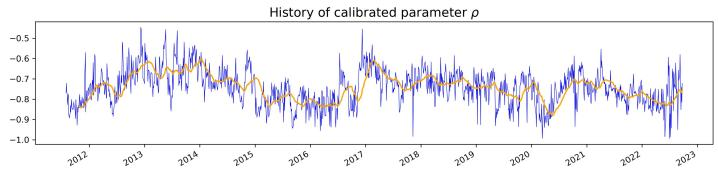

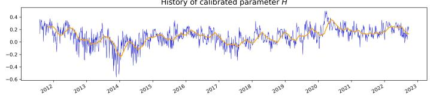

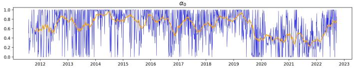

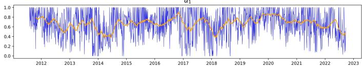

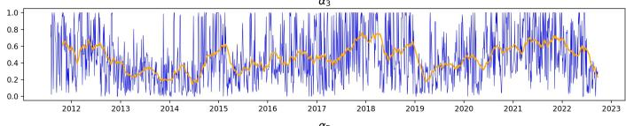

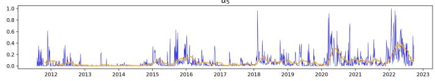

<!-- page: 11 -->

## 6.2 Model calibration error

In this section, we take some of the examples provided in the previous sections and re-calibrate the quintic Ornstein Uhlenbeck volatility model to a narrower range of moneyness (near the money). We then plot the absolute calibration error (model implied volatility vs. mid implied volatility from market data). To facilitate comparison, we plot the absolute calibration error as a multiplier of half of the bid-ask spread, i.e. (absolute calibration error)/(0.5 × bid-ask spread). A multiplier of less than 1 means the model implied volatility is within the bid-ask spread of market data.

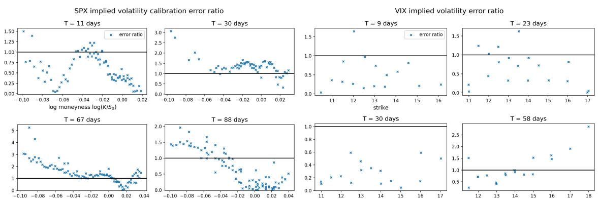

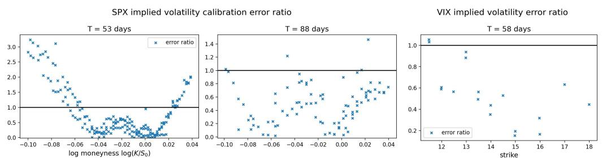

These graphs show that the absolute calibration error multiplier is largely below 1 (i.e. within the bid-ask spread), especially around the at the money level for both SPX and VIX smiles.

<!-- page: 12 -->

## A On the martingale property of S

We prove the true martingale property of the stock price S in the quintic Ornstein-Uhlenbeck volatility model for constant forward variance curves.

Proposition A.1. Fix $\alpha _ { 5 } > 0$ and let $\xi _ { 0 }$ be such that $\xi _ { 0 } ( t ) = \xi ^ { 2 } \mathbb { E } [ p ^ { 2 } ( X _ { t } ) ]$ , for all $t \geq 0$ for some constant $\xi > 0 . \ I f \rho \leq 0$ , the process S in (2.1) is a true martingale.

A crucial ingredient for proving Proposition A.1 is the process

$$
\tilde { S } _ { t } ^ { \rho } : = \exp \left( - \frac { 1 } { 2 } \int _ { 0 } ^ { t } b _ { \rho } ^ { 2 } ( X _ { s } ) d s + \int _ { 0 } ^ { t } b _ { \rho } ( X _ { s } ) d W _ { s } \right) ,\tag{A.1}
$$

with

$$
b _ { \rho } ( x ) : = \rho \xi p ( x ) = \rho \xi ( \alpha _ { 0 } + \alpha _ { 1 } x + \alpha _ { 3 } x ^ { 3 } + \alpha _ { 5 } x ^ { 5 } ) .
$$

The martingality of the process $\tilde { S } ^ { \rho }$ plays a crucial role in determining the martingale property of S in (2.1). We first prove the martingality of $\tilde { S } ^ { \rho }$

Lemma A.2. Under the assumptions of Proposition A.1, the process $\tilde { S } ^ { \rho }$ in (A.1) is a true martingale.

Proof. If $\rho = 0 ;$ the process $\tilde { S } ^ { \rho }$ is (trivially) a martingale equal to 1. For $\rho < 0 ,$ , we make use of the general characterization in [21, Theorem 2.1].1 Following the paper’s notation, we set $l = - \infty , r = + \infty$ with $x \in ( l , r )$ and write the process:

$$
d X _ { t } = \mu ( X _ { t } ) d t + \sigma ( X _ { t } ) d W _ { t } , \quad X _ { 0 } = 0 ,
$$

where $\mu ( x ) = a x , a \leq 0$ and $\sigma ( x ) = \eta ,$ with $a = - ( 1 / 2 - H ) \varepsilon ^ { - 1 }$ and $\eta = \varepsilon ^ { H - 1 / 2 }$ . One can easily check that $\sigma ( x ) \neq 0$ for all $x \in \operatorname { \mathbb { R } } , 1 / \mu , \mu / \sigma ^ { 2 }$ and $b _ { \rho } ^ { 2 } / \sigma ^ { 2 }$ are all locally integrable functions, so that the assumptions of [21, Theorem 2.1] are met. Next, we introduce the auxiliary process $\tilde { X }$

$$
d \tilde { X } _ { t } = ( \mu + \eta b _ { \rho } ) ( \tilde { X } _ { t } ) d t + \eta d \tilde { W } _ { t } ,
$$

with its corresponding scale function

$$
\tilde { s } ( x ) = \int _ { c } ^ { x } \tilde { p } ( y ) d y ,
$$

for $c \in \mathbb { R }$ . We also define the function $\tilde { p } ( y )$ as:

$$
{ \tilde { p } } ( y ) : = \exp \left( \int _ { c } ^ { y } - \frac { 2 a u + 2 \eta b _ { \rho } ( u ) } { \eta ^ { 2 } } d u \right) = \exp \{ f ( y , c ) \} ,
$$

with

$$
f ( y , c ) = - \frac { 1 } { \eta ^ { 2 } } \left[ a ( y ^ { 2 } - c ^ { 2 } ) + 2 \eta ( B _ { \rho } ( y ) - B _ { \rho } ( c ) ) \right] ,
$$

and $B _ { \rho }$ the anti-derivative of $b _ { \rho } \colon$

$$
B _ { \rho } ( y ) = \rho \xi ( \alpha _ { 0 } y + \frac { \alpha _ { 1 } } { 2 } y ^ { 2 } + \frac { \alpha _ { 3 } } { 4 } y ^ { 4 } + \frac { \alpha _ { 5 } } { 6 } y ^ { 6 } ) .
$$

The function $y \mapsto f ( y , c )$ is a polynomial in y of which the leading term $y ^ { 6 }$ has even power with positive coeficient since $\alpha _ { 5 } > 0 , \xi > 0$ and $\rho < 0$ . Therefore,

$$
\tilde { s } ( + \infty ) = \int _ { c } ^ { + \infty } \tilde { p } ( y ) d y = \int _ { c } ^ { + \infty } \exp \{ f ( y , c ) \} d y = + \infty ,
$$

$$
\tilde { s } ( - \infty ) = - \int _ { - \infty } ^ { c } \tilde { p } ( y ) d y = - \int _ { - \infty } ^ { c } \exp \{ f ( y , c ) \} d y = - \infty ,
$$

so that $\tilde { X } _ { t }$ does not exit the state space $( - \infty , + \infty )$ at the boundary +∞ and −∞. Applying [21, Theorem 2.1], which give us that $\tilde { S } _ { t } ^ { \rho }$ is a martingale. □

1We are indebted to an anonymous referee for pointing out this reference.

<!-- page: 13 -->

Proof of Proposition A.1. It follows from (2.1), that $S$ is a local martingale and non-negative, since

$$
S _ { t } = S _ { 0 } \exp \left( - \frac { 1 } { 2 } \int _ { 0 } ^ { t } \frac { \xi _ { 0 } ( u ) } { \mathbb { E } [ p ^ { 2 } ( X _ { u } ) ] } p ^ { 2 } ( X _ { s } ) d u + \int _ { 0 } ^ { t } \sqrt { \frac { \xi _ { 0 } ( u ) } { \mathbb { E } [ p ^ { 2 } ( X _ { u } ) ] } } p ( X _ { u } ) \left( \rho d W _ { u } + \sqrt { 1 - \rho ^ { 2 } } d W _ { u } ^ { \perp } \right) \right) .
$$

It is therefore a supermartingale by Fatou’s lemma. To show that is a true martingale, it sufices to argue that $\mathbb { E } [ S _ { t } ] = S _ { 0 }$ for any $t \in \mathbb { R } _ { + }$ . For this, we fix $t > 0$ and we start by getting rid of $W ^ { \perp }$ by conditionning on $\mathcal { F } _ { t } ^ { W }$ , to get

$$
\mathbb { E } \left[ S _ { t } \right] = S _ { 0 } \mathbb { E } \left[ \exp \{ - \frac { 1 } { 2 } \int _ { 0 } ^ { t } \xi ^ { 2 } p ^ { 2 } ( X _ { s } ) d s + \rho \int _ { 0 } ^ { t } \xi p ( X _ { s } ) d W _ { s } \} \mathbb { E } \left[ \exp \{ { \sqrt { 1 - \rho ^ { 2 } } \int _ { 0 } ^ { t } \xi ^ { 2 } p ( X _ { s } ) d W _ { s } ^ { \perp } } \} \Big | \mathcal { F } _ { t } ^ { W } \right] \right] .
$$

Conditional on $\mathbf { \mathcal { F } } _ { t } ^ { W }$ , the random variable $\begin{array} { r } { \int _ { 0 } ^ { t } \xi p ( X _ { s } ) d W _ { s } ^ { \perp } } \end{array}$ is a centered Gaussian random variable with variance $\begin{array} { r } { \int _ { 0 } ^ { t } \xi ^ { 2 } p ^ { 2 } ( X _ { s } ) d s } \end{array}$ , which leads to

$$
\mathbb { E } \left[ S _ { t } \right] = S _ { 0 } \mathbb { E } \left[ \tilde { S } _ { t } ^ { \rho } \right] ,
$$

with $\tilde { S } ^ { \rho }$ defined in $( \mathrm { A . 1 } )$ . From Lemma $\mathrm { A . 2 } , \tilde { S } ^ { \rho }$ is a martingale, which shows that E $[ S _ { t } ] = S _ { 0 }$ and completes the proof. □

## References

[1] Eduardo Abi Jaber and Nathan De Carvalho. Reconciling rough volatility with jumps. Available at SSRN 4387574, 2023. [2] Eduardo Abi Jaber, Camille Illand, and Shaun Xiaoyuan Li. Joint SPX–VIX calibration with gaussian polynomial volatility models: deep pricing with quantization hints. Available at SSRN 4292544, 2022. [3] Jan Baldeaux and Alexander Badran. Consistent modelling of vix and equity derivatives using a 3/2 plus jumps model. Applied Mathematical Finance, 21(4):299–312, 2014. [4] Alessandro Bondi, Sergio Pulido, and Simone Scotti. The rough hawkes heston stochastic volatility model. arXiv preprint arXiv:2210.12393, 2022. [5] Peter Carr and Dilip Madan. Towards a theory of volatility trading. Option Pricing, Interest Rates and Risk Management, Handbooks in Mathematical Finance, 22(7):458–476, 2001. [6] Rama Cont and Thomas Kokholm. A consistent pricing model for index options and volatility derivatives. Mathematical Finance: An International Journal of Mathematics, Statistics and Financial Economics, 23(2):248–274, 2013. [7] J-P Fouque and Yuri F Saporito. Heston stochastic vol-of-vol model for joint calibration of vix and s&p 500 options. Quantitative Finance, 18(6):1003–1016, 2018. [8] Jean-Pierre Fouque, George Papanicolaou, and K Ronnie Sircar. Derivatives in financial markets with stochastic volatility. Cambridge University Press, 2000. [9] Jean-Pierre Fouque, George Papanicolaou, Ronnie Sircar, and Knut Solna. Multiscale stochastic volatility asymptotics. Multiscale Modeling & Simulation, 2(1):22–42, 2003. [10] Jim Gatheral, Paul Jusselin, and Mathieu Rosenbaum. The quadratic rough heston model and the joint s&p 500/vix smile calibration problem. arXiv preprint arXiv:2001.01789, 2020. [11] St´ephane Goutte, Amine Ismail, and Huyˆen Pham. Regime-switching stochastic volatility model: estimation and calibration to vix options. Applied Mathematical Finance, 24(1):38– 75, 2017.

<!-- page: 14 -->

[12] Lech A Grzelak. On randomization of afine difusion processes with application to pricing of options on vix and s&p 500. arXiv preprint arXiv:2208.12518, 2022. [13] Ivan Guo, Gregoire Loeper, Jan Obloj, and Shiyi Wang. Joint modeling and calibration of spx and vix by optimal transport. SIAM Journal on Financial Mathematics, 13(1):1–31, 2022. [14] Julien Guyon. The joint s&p 500/vix smile calibration puzzle solved. Risk, April, 2020. [15] Julien Guyon. Dispersion-constrained martingale schr¨odinger bridges: Joint entropic calibration of stochastic volatility models to s&p 500 and vix smiles. Available at SSRN 4165057, 2022. [16] Julien Guyon and Jordan Lekeufack. Volatility is (mostly) path-dependent. Volatility Is (Mostly) Path-Dependent (July 27, 2022), 2022. [17] Julien Guyon and Scander Mustapha. Neural joint s&p 500/vix smile calibration. ssrn, 2022. [18] Thomas Kokholm and Martin Stisen. Joint pricing of vix and spx options with stochastic volatility and jump models. The Journal of Risk Finance, 2015. [19] Ryan McCrickerd and Mikko S Pakkanen. Turbocharging monte carlo pricing for the rough bergomi model. Quantitative Finance, 18(11):1877–1886, 2018. [20] Serguei Mechkov. Fast-reversion limit of the heston model. Available at SSRN 2418631, 2015. [21] Aleksandar Mijatovi´c and Mikhail Urusov. On the martingale property of certain local martingales. Probability Theory and Related Fields, 152(1-2):1–30, 2012. [22] Claudio Pacati, Gabriele Pompa, and Roberto Ren\`o. Smiling twice: the heston++ model. Journal of Banking & Finance, 96:185–206, 2018. [23] Andrew Papanicolaou and Ronnie Sircar. A regime-switching heston model for vix and s&p 500 implied volatilities. Quantitative Finance, 14(10):1811–1827, 2014. [24] Sigurd Emil Rømer. Empirical analysis of rough and classical stochastic volatility models to the spx and vix markets. Quantitative Finance, 22(10):1805–1838, 2022. [25] Mathieu Rosenbaum and Jianfei Zhang. Deep calibration of the quadratic rough heston model. arXiv preprint arXiv:2107.01611, 2021.
