<!-- page: 1 -->

# Joint calibration to SPX and VIX options with signature-based models 

Christa Cuchiero∗ 

Guido Gazzani† Janka M¨oller‡ Sara Svaluto-Ferro§ 

July 24, 2024 

##### **Abstract** 

We consider a stochastic volatility model where the dynamics of the volatility are described by a linear function of the (time extended) signature of a primary process which is supposed to be a polynomial diffusion. We obtain closed form expressions for the VIX squared, exploiting the fact that the truncated signature of a polynomial diffusion is again a polynomial diffusion. Adding to such a primary process the Brownian motion driving the stock price, allows then to express both the log-price and the VIX squared as linear functions of the signature of the corresponding augmented process. This feature can then be efficiently used for pricing and calibration purposes. Indeed, as the signature samples can be easily precomputed, the calibration task can be split into an offline sampling and a standard optimization. We also propose a Fourier pricing approach for both VIX and SPX options exploiting that the signature of the augmented primary process is an infinite dimensional affine process. For both the SPX and VIX options we obtain highly accurate calibration results, showing that this model class allows to solve the joint calibration problem without adding jumps or rough volatility. 

**Keywords:** signature methods, calibration of financial models, affine and polynomial processes, S&P 500/VIX joint calibration 

**MSC (2020) Classification:** 91B70, 62P05, 65C20. 

## **Contents** 

**1 Introduction 2** 1.1 State of the art . . . . . . . . . . . . . . . . . . . . . . . . . . . . . . . . . . 5 **2 Signature: definition and properties 6** 

> ∗Vienna University, Department of Statistics and Operations Research, Data Science Uni Vienna, Kolingasse 14-16 1, A-1090 Wien, Austria, christa.cuchiero@univie.ac.at 

> †University of Verona, Department of Economics, Via Cantarane 24, 37129 Verona, Italy, guido.gazzani@univr.it 

‡Vienna University, Department of Statistics and Operations Research, Kolingasse 14-16 1, A-1090 Wien, Austria, janka.moeller@univie.ac.at 

> §University of Verona, Department of Economics, Via Cantarane 24, 37129 Verona, Italy, sara.svalutoferro@univr.it. 

The first three authors gratefully acknowledge financial support through grant Y 1235 and grant I 3852 of the Austrian Science Fund. All authors acknowledge financial support through the OEAD WTZ project FR 02/2022. The present work was initiated when the second author was affiliated to the University of Vienna (ISOR)). 

We also thank the anonymous referees and associated editor for their valuable comments and suggestions.

<!-- page: 2 -->

|**3**|**The model**|**9**|
|---|---|---|
|**4**|**Expected signature of polynomial difusion**|**12**|
|**5**|**VIX options with signatures**|**16**|
||5.1 Explicit formulas for the VIX . . . . . . . . . . . . . . . . . . . . . . . . . .|16|
||5.2 Variance reduction for pricing VIX options . . . . . . . . . . . . . . . . . .|20|
||5.3 Calibration to VIX options . . . . . . . . . . . . . . . . . . . . . . . . . . .|22|
||5.3.1 Numerical results . . . . . . . . . . . . . . . . . . . . . . . . . . . . .|23|
||5.4 The case of time-varying parameters . . . . . . . . . . . . . . . . . . . . . .|26|
|**6**|**SPX as a signature-based model**|**27**|
||6.1 Exploiting the afne nature of the signature: Fourier pricing of SPX and VIX options. . . . . . . . . . . . . . . . . . . . . . . . . . . . . . . . . . . . . . .|31|
||6.2 The case of time-varying parameters . . . . . . . . . . . . . . . . . . . . . .|33|
|**7**|**Joint calibration of SPX and VIX options**|**34**|
||7.1 Numerical results . . . . . . . . . . . . . . . . . . . . . . . . . . . . . . . . .|35|
||7.1.1 First approach . . . . . . . . . . . . . . . . . . . . . . . . . . . . . .|36|
||7.1.2 Second approach . . . . . . . . . . . . . . . . . . . . . . . . . . . . .|40|
|**A **|**Numerical results for the Brownian motion case**|**41**|
|**B **|**On the stability of the calibrated parameters**|**43**|

## **1 Introduction** 

The joint calibration of option pricing models to SPX and VIX1 options is a problem that has gained a lot of attention in quantitative finance since several years. One main reason for the increased interest is that the VIX index has become an important underlying for many derivatives. In fact, futures and options written on it are extensively used to hedge the volatility exposure of option portfolios, see e.g., Rhoads (2011). We address the reader to the official website of CBOE2 for details on the history of the VIX, how it is computed, traded and used as underlying for derivatives, which emphasizes in particular the need to jointly calibrate to both, the prices of options on the S&P 500 index and to prices of VIX derivatives. In this respect the main challenge is to reconcile the large negative skew of SPX options’ implied volatilities with relatively lower implied volatilities arising from the VIX options, especially for short maturities (see e.g., Guyon (2020a). 

Inspired by Perez Arribas et al. (2020) and Cuchiero et al. (2023a), we consider here a new type of stochastic volatility model for the discounted, dividend-adjusted price process _S_ = ( _St_ ) _t≥_ 0. It is given by 

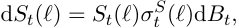

for an initial condition _S_ 0 _∈_ R+, a standard Brownian motion _B_ , and a volatility process _σ__S_ satisfying 

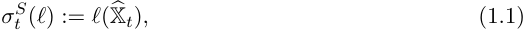

> 1With SPX and VIX we refer to the index tickers of the S&P 500 and its volatility index, respectively. In the sequel we will use SPX and S&P 500 interchangeably. 

> 2 www.cboe.com/tradable ~~p~~ roducts/vix/

<!-- page: 3 -->

where _ℓ_ is a linear map of the signature X� _t_ of a process _X_� . Specifically, the main ingredient in this framework is a _d_ -dimensional polynomial diffusion process _X_ = ( _Xt_1_, . . . , X_ _t__d_)_t≥_0(see Cuchiero et al. (2012); Filipovi´c and Larsson (2016)), which we call here _primary process_ and whose augmentation with time _t_ is denoted by ( _X_� _t_ ) _t≥_ 0 = ( _t, Xt_1_, . . . , X_ _t__d_)_t≥_0.Bymodeling _σ__S_ via (1.1) we assume that the signature of _X_� , denoted by X� (and rigorously introduced in Section 2), serves as a linear regression basis for the volatility process, while the parameters of the linear map _ℓ_ have to be learned from (option price) data. Note that the parameters of _X_ are prespecified beforehand and can thus be seen – in analogy to machine learning terminology – as _hyperparameters_ (that of course can be optimized over some validation set). As outlined below this is one of the crucial features that allows for the split of the calibration task into precomputable samples and parameters _ℓ_ to be optimized. 

Let us now highlight the implications of this modeling approach and the novelty of the present work. 

- The current framework can be seen as _universal_ in a large class of continuous (nonrough) stochastic volatility models in the following sense: for a stochastic volatility model, whose volatility is given by a continuous path-functional depending on a polynomial diffusion ( _Xt_ ) _t≥_ 0, it follows from Proposition 2.3 that this path-functional can be approximated by a linear function of the signature of ( _X_� _t_ ) _t≥_ 0. A concrete example for a volatility process of such a form is an Itˆo-diffusion with sufficiently regular coefficients, as in this case, the volatility is indeed given by a continuous path-functional of the time-augmented Brownian motion driving the diffusion. 

- Additionally, our model truly nests several classical models (see Remark 3.4) and for instance also the ‘quintic Ornstein-Uhlenbeck volatility model’, recently proposed by Abi Jaber et al. (2022b), which – with an additional input curve – is shown to fit SPX and VIX smiles well. 

- By choosing the parameters of _ℓ_ appropriately, the modeling framework incorporates both, Markovian (in ( _S, X_ )) and path-dependent models. 

- Up to our knowledge, it is the first signature-based model that is employed for pricing and calibration of VIX options as well as joint calibration, together with SPX options. 

- We illustrate that the joint calibration problem can be solved in this framework without jumps and rough volatility (compare also Rømer (2022); Abi Jaber et al. (2022b); Guyon and Lekeufack (2023)). 

- By using time-varying parameters we can go beyond short maturities both for SPX and VIX options (as classically tackled in the literature) and achieve a joint calibration also for longer maturities. 

In order to achieve the highly accurate calibration results, illustrated in Section 5.3 and Section 7, we exploit the following mathematical and numerical properties. 

- Defining _Z_ := ( _X, B_ ), then not only _σ__S_ ( _ℓ_ ) but also the log-price log( _S_ ( _ℓ_ )) can be expressed as a linear function of the signature of _Z_� . The computational benefit is immediate, since no (Euler) simulation scheme is needed to sample from the marginals of the price process. In terms of the parameters _ℓ_ , log( _S_ ( _ℓ_ )) is the sum of a quadratic function and a linear one, see Proposition 6.4.

<!-- page: 4 -->

- Since _X_� is additionally assumed to be a _polynomial diffusion_ (see Cuchiero et al. (2012); Filipovi´c and Larsson (2016)), the VIX under our model can be computed analytically via matrix exponentials. Indeed, in this case the forward variance can be represented by a quadratic form in the parameters _ℓ_ and the corresponding matrix can be computed by polynomial technology, i.e. via matrix exponentials, see Theorem 5.1. This tractability property is a consequence of the fact that _the truncated signature of a polynomial diffusion is again a polynomial diffusion_ (see Section 4). 

- We can efficiently apply a Monte Carlo approach (potentially with variance reduction) for option pricing and calibration, since the signature samples of _Z_� can be computed offline and therefore the simulation and optimization step can be completely separated. Indeed, due to the representations of VIX and log( _S_ ( _ℓ_ )) described above, the same samples can be used for _every_ linear map _ℓ_ . Therefore, the calibration task can be split into an offline sampling and a standard optimization, as no simulation is needed during the latter. Moreover, due to the fact that we can obtain a closed-form expression for the VIX (thanks to the polynomial technology) we can avoid a nested Monte Carlo procedure to evaluate the conditional expectation. 

- Alternatively, a Fourier pricing approach for both VIX and SPX options can be used. Indeed, by building on the fact that the signature of _Z_� is an affine process (with values in the extended tensor algebra) as proved in Cuchiero et al. (2023b), its FourierLaplace transform can be computed by solving an (extended tensor algebra valued) Riccati equation, which in turn can be used for Fourier pricing as outlined in Section 6.1. 

The remainder of the paper is organized as follows. Section 1.1 gives a review over the different contributions in the literature concerning the joint calibration problem. In Section 2 we introduce the signature in the context of continuous semimartingales, its main properties as well as notation used throughout the paper. Section 3 is dedicated to the introduction of our signature-based model and the connections to classical and also recent stochastic volatility models in the literature. Section 4 is then devoted to the discussion and proof of the matrix exponential formula for the (conditional) truncated expected signature of a polynomial diffusion. This result is at the core of Section 5, where we derive a tractable formula for the VIX, needed for pricing VIX options and VIX futures. Building on these formulas, our calibration results to VIX options are presented in Section 5.3.1. In Section 6, we then prove, similarly as for the VIX, a tractable expression for _S_ . Additionally, we exploit in Section 6.1 the affine nature of the signature process (as proved in Cuchiero et al. (2023b)), to obtain a Fourier pricing approach within our modeling choice for both VIX and SPX options. We finally present the numerical results of the joint calibration problem in Section 7, both in the case of constant parameters and with time-varying parameters, where the latter are introduced in Section 5.4 and Section 6.2. 

The data used in Section 5.3.1 and Section 7.1 were purchased from OptionMetrics3 . An implementation of the model for the joint calibration can be found in GuidoGazzaniai/jointcalib ~~s~~ igsde or janka-moeller/joint ~~c~~ alib ~~S~~ PX ~~V~~ IX. 

> 3https://optionmetrics.com/

<!-- page: 5 -->

### **1.1 State of the art** 

This section is primarily dedicated to a literature review on the joint calibration problem and secondly, to a brief overview on signature methods in finance. 

First attempts to solve the joint calibration problem appear in Gatheral (2008), with a double constant elasticity of variance model (CEV), which despite being rather flexible cannot fit accurately the implied volatilities of SPX and VIX options jointly. Later on, the introduction of models with jumps in the SPX (or additionally also in the volatility) led to different contributions, for instance the forward variance model of Cont and Kokholm (2013) described as an exponential of an affine process with L´evy jumps, the regime-switching enhancement of the classical Heston model by Papanicolaou and Sircar (2014), the 3/2 model with jumps in the asset price of Baldeaux and Badran (2014), in the volatility (Kokholm and Stisen (2015)), or with co-jumps and idiosyncratic jumps in the volatility (Pacati et al. (2018)). 

Continuous stochastic volatility models based on Markovian semimartingales have also been employed to solve the joint calibration problem. For instance, in Fouque and Saporito (2018) a Heston model with stochastic vol-of-vol has been calibrated, however only for maturities above 4 months where VIX options are less liquid. More recently, Rømer (2022) considered a model where the volatility is driven by two Ornstein-Uhlenbeck (OU) processes using a non-standard transformation function. This choice of two OU-processes has been an inspiration for our concrete numerical implementations. We also point out that the (nonrough) model introduced in Abi Jaber et al. (2022a,b), where the volatility is described by a polynomial of order five in one single OU-process, falls (apart from the additional input curve) into this class of continuous Markovian models and is a particular instance of our framework. Let us also refer to the paper by Guyon and Mustapha (2023), where a neural SDE model has been successfully jointly calibrated. Within the class of continuous, however not necessarily Markovian models, Guyon and Lekeufack (2023) conduct an empirical and statistical analysis as well as a joint calibration for a family of models where the volatility depends on the paths of the asset. These models can be turned into Markovian ones by using exponential kernels instead of general ones, see also Gazzani and Guyon (2024) for their joint calibration. 

Two further distinct lines of research are worth being mentioned as well: first, martingale optimal transport and second rough volatility. 

The martingale optimal transport approach is used to calibrate discrete-time models as proposed in Guyon (2020b, 2023). These models are closely related to Schr¨odinger bridge problems, where the idea is to calibrate only the drift of the volatility while keeping the volatility of volatility unchanged, see e.g. Guo et al. (2022a) as well as the references therein regarding an optimal transport approach. Although the calibration within that setting is accurate, it is also computationally rather expensive and not amenable to calibrate to several maturities jointly. These computational challenges have been tackled recently in Bourgey and Guyon (2022). 

In the area of rough volatility modeling, initiated by the seminal paper of Gatheral et al. (2018), the main idea is to replace the standard Brownian motion in the volatility process by a fractional Brownian motion. Even though the roughness of the trajectories found in Gatheral et al. (2018), can also be related to the estimation procedure as discussed e.g. in Cont and Das (2023), the non-Markovianity given by the fractional Brownian motion with Hurst parameter _H <_ 0 _._ 5, is well-suited to reproduce certain stylized facts arising in financial data, e.g. volatility persistence or multiple scales of mean reversion; see Bayer

<!-- page: 6 -->

et al. (2016). Several classical models have been enhanced with rougher noise, but for simplicity we here only mention those employed in the SPX/VIX calibration. One example is the quadratic rough Heston model introduced in Gatheral et al. (2020), which was in turn calibrated in Rosenbaum and Zhang (2021) by relying on neural networks approaches, also exploited in e.g. Bayer et al. (2019). In Rømer (2022) an exhaustive study of the flexibility of different rough and non-rough volatility models for the joint SPX/VIX calibration is carried out, including the rough Bergomi and the rough Heston model. Some of these, for instance the rough Heston model, have an affine structure i.e., can be embedded in the class of affine Volterra processes. In particular they allow for Fourier pricing after solving the related fractional Riccati equations. This underlying structure is the building block of an extension with jumps investigated in Bondi et al. (2024a,b). We refer additionally to Di Nunno et al. (2023); Gazzani and Guyon (2024) for a very recent literature review on volatility modeling. 

Concerning our framework, signature-based methods provide a generic non-parametric way to extract characteristic features (linearly) and path-dependency from data, which is essential in (machine) learning and calibration tasks in finance. This explains why these techniques become more and more popular in mathematical finance, see e.g., Buehler et al. (2020); Kalsi et al. (2020); Perez Arribas et al. (2020); Lyons et al. (2020); Liao et al. (2023); Bayer et al. (2023); Min and Hu (2021); Cuchiero et al. (2024b); Cuchiero and M¨oller (2023); Akyildirim et al. (2023); Ning et al. (2023); Wiese et al. (2023); Cohen et al. (2023); Lemahieu et al. (2023) and the references therein. 

## **2 Signature: definition and properties** 

We start by introducing basic notions related to the definition of the signature of an R_d_ - valued continuous semimartingale. This is similar as in Cuchiero et al. (2023a) or Bayer et al. (2023), but to keep the paper self-contained we recall the essential definitions and properties. 

For each _n ∈_ N0 we define recursively the _n_ -fold tensor product of R_d_ , 

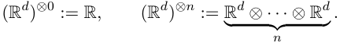

For _d ∈_ N, we define the extended tensor algebra on R_d_ as 

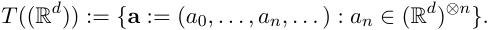

Similarly we introduce the truncated tensor algebra of order _n ∈_ N 

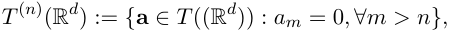

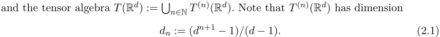

For each **a** _,_ **b** _∈ T_ ((R_d_ )) and _λ ∈_ R we set 

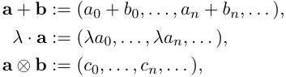

<!-- page: 7 -->

where _cn_ :=�_n_ _k_ =0_ak⊗bn−k_.Observethat(_T_((R_d_))_,_+_, ·, ⊗_)isarealnon-commutative algebra. 

For a multi-index _I_ := ( _i_ 1 _, . . . , in_ ) we set _|I|_ := _n_ . We also consider the empty index _I_ := _∅_ and set _|I|_ := 0. If _n ≥_ 1 or _n ≥_ 2 we set _I__′_ := ( _i_ 1 _, . . . , in−_ 1), and _I__′′_ := ( _i_ 1 _, . . . , in−_ 2), respectively. We also use the notation 

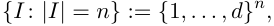

omitting the parameter _d_ whenever this does not introduce ambiguity. Observe that multiindices can be identified with words, as it is done for instance in Lyons et al. (2020). Next, for each _|I| ≥_ 1 we set 

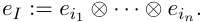

Observe that the set _{eI_ : _|I|_ = _n}_ is an orthonormal basis of (R_d_ )_⊗n_ . Denoting by _e∅_ the basis element corresponding to (R_d_ )_⊗_0 , each element of **a** _∈ T_ ((R_d_ )) can thus be written as 

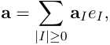

for some **a** _I ∈_ R. Note that if _an ∈_ (R_d_ )_⊗n_ we use non-bold notation whereas for the components **a** _I ∈_ R we write them bold. Finally, for each **a** _∈ T_ (R_d_ ) and each **b** _∈ T_ ((R_d_ )) we set 

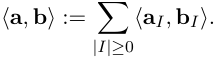

Observe in particular that **b** _I_ = _⟨eI ,_ **b** _⟩_ . 

In the present work it will be useful to enumerate the elements of the truncated tensor algebra. To this extent we introduce the isomorphism **vec** : _T_(_n_) (R_d_ ) _→_ R_dn_ and an injective labeling function _L_ : _{I_ : _|I| ≤ n} −→{_ 1 _, . . . , dn}_ , such that 

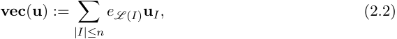

where _dn_ is as in (2.1). 

Throughout the paper we fix a filtered probability space (Ω _, F,_ ( _Ft_ ) _t≥_ 0 _,_ Q) on which we consider the stochastic processes to be defined. We are now ready to introduce the signature of an R_d_ -valued continuous semimartingale. 

**Definition 2.1.** Let _X_ be a continuous R_d_ -valued semimartingale with _d ≥_ 1. The _signature of X_ is the _T_ ((R_d_ ))-valued process ( _s, t_ ) _�→_ X _s,t_ whose components are recursively defined as 

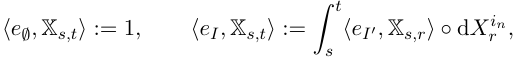

for each _I_ = ( _i_ 1 _, . . . , in_ ) , _I__′_ = ( _i_ 1 _, . . . , in−_ 1) and 0 _≤ s ≤ t_ , where _◦_ denotes the Stratonovich integral. Its projection X_n_ on _T_(_n_) (R_d_ ) is given by 

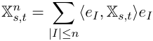

and is called _signature of X truncated at level n_ . If _s_ = 0, we use the notation X _t_ and X_n_ _t_, respectively.

<!-- page: 8 -->

<!-- Start of picture text -->
(| J oI) IY) I) Be y <!-- End of picture text -->

<!-- page: 9 -->

**Universal approximation theorem** For each _n ∈_ N consider the sets 

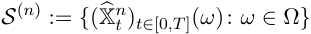

and let _S_(_n_) : _S_(2) _→S_(_n_) denote the corresponding Lyons lift. Then it holds that _S_(_n_) ((X�2 _t_) _t∈_ [0 _,T_ ])=(X�_n_ _t_) _t∈_ [0 _,T_ ]almostsurely. Consider then a generic distance _dS_ (2) on the set of trajectories given by _S_(2) , with respect to which the map from _S_(2) to R given by 

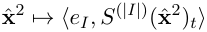

is continuous for each multi-index _I_ and every _t ∈_ [0 _, T_ ]. Let _K_ be a compact subset of _S_(2) and consider a continuous map _f_ : _K →_ R. Then for every _ε >_ 0 there exists some _ℓ ∈ T_ (R_d_ ) such that 

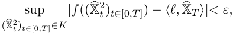

almost surely. 

## **3 The model** 

We start by introducing the concept of polynomial diffusions (see Cuchiero et al. (2012); Filipovi´c and Larsson (2016)) which will play a key role for the computation of the conditional expected signature. Here we denote by_√_ _<u>·</u>_ the matrix square root. 

**Definition 3.1.** Suppose that an R_d_ -valued process _X_ = ( _Xt_ ) _t≥_ 0 is a weak solution of 

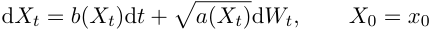

for some _d_ -dimensional Brownian motion _W_ and some maps _a_ : R_d_ _→_ S_d_ +and_b_: R_d→_R_d_ such that _aij_ is a polynomial of degree at most 2 and _bj_ is a polynomial of degree at most 1 for each _i, j ∈{_ 1 _, . . . , d}_ . Then we call _X polynomial diffusion_ . 

We are now ready to introduce the model ( _St_ ) _t≥_ 0 for the discounted, dividend-adjusted dynamics of the S&P 500 index already outlined in the introduction. Its dynamics under a risk-neutral probability measure Q are given by 

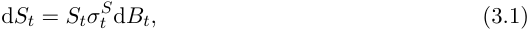

where _S_ 0 _∈_ R+ , _σ__S_ = ( _σt__S_)_t≥_0isthevolatilityprocesstobespecifiedand_B_= (_Bt_)_t≥_0isa one-dimensional Brownian motion, correlated with _σ__S_ . We define additionally the instantaneous variance via _Vt_ := ( _σt__S_)2forevery_t≥_0.Ourmodelingchoiceistoparametrize the volatility process _σ__S_ as a linear function of the time-extended signature of a primary process _X_ , namely 

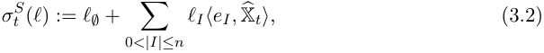

where 

> • ( _Xt_ ) _t≥_ 0 and thus also _X_� = ( _t, Xt_ ) _t≥_ 0 is a polynomial diffusion (with values in R_d_ and R_d_+1 respectively) in the sense of Definition 3.1. 

- _ℓ_ := _{ℓI ∈_ R : _|I| ≤ n}_ denotes the collection of parameters of the model, i.e., _ℓ ∈_ R(_d_+1)_n_ .

<!-- page: 10 -->

We then denote by _ρ_ the correlation matrix process between the components of _X_ , i.e. 

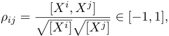

for all _i, j_ = 1 _, . . . , d_ , where [ _· , ·_ ] denotes the quadratic covariation. 

In order to simplify the notation we will drop the dependence on _ℓ_ for the processes _S_ = ( _St_ ) _t≥_ 0 and ( _σt__S_)_t≥_0asin(3.1),wheneverthisdoesnotcauseanyconfusion. 

**Remark 3.2.** As an alternative definition for the volatility process ( _σt__S_)_t≥_0onecanset 

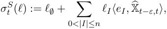

for some fixed _ε >_ 0. In this case the value of the volatility process _σ__S_ at time _t_ does not depend on the whole trajectory of the primary process _X_ , but just on its evolution from _t − ε_ to _t_ . For an economically reasonable choice for _ε_ the lags used in Section 3.4 of Guyon and Lekeufack (2023) can be adapted to the current setting. 

**Remark 3.3** (Interest rates and dividends) **.** In the model given by (3.1) we describe the discounted, dividend-adjusted prices and construct the VIX from them, in line with the definition of the CBOE for the computation of the VIX. However, contingent claims are often expressed in terms of undiscounted, unadjusted prices. If the dynamics of the discounted, dividend-adjusted price process are given by (3.1), the undiscounted, unadjusted one is denoted by _S_˜ and fulfills 

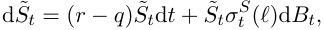

where˜ here _r, q ∈_ R denote the interest rate and the dividend, respectively. Therefore _St_ ( _ℓ_ ) = _e_(_r−q_)_t_ _St_ ( _ℓ_ ) and the price of a call option on the S&P 500 index under our model, reads 

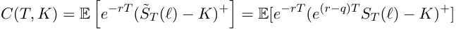

where _T >_ 0 denotes the maturity time and _K ∈_ R the undiscounted strike price. 

It is worth mentioning that the pool of eligible primary processes is rather wide, including for example correlated Brownian motions, geometric Brownian motions, OU processes, CoxIngersoll-Ross (CIR) processes, Jacobi processes, and all continuous affine processes. 

The reason why we require the primary process to be a polynomial diffusion is due to the tractability properties of the truncated signature X�_n_ under this assumption. We will indeed� see in Section 4 that in this case the (conditional) truncated expected signature of _X_ can be computed by solving a finite-dimensional ODE, i.e., can be written in terms of a matrix exponential. 

**Remark 3.4.** We illustrate here that several classical and also recently considered stochastic volatility models are nested within our modeling choice (3.2). 

- Suppose that ( _Xt_ ) _t≥_ 0 is a 1-dimensional OU process and let the order of the signature be _n_ = 1, with _ℓ∅_ = _ℓ_ (0) = 0 and _ℓ_ (1) = 0. Then the process _S_ = ( _St_ ) _t≥_ 0 coincides with the Stein-Stein model, as introduced in Stein and Stein (1991).

<!-- page: 11 -->

- Suppose that ( _Xt_ ) _t≥_ 0 is a 1-dimensional geometric Brownian motion without drift and let the order of the signature be _n_ = 1, with _ℓ∅_ = _ℓ_ (0) = 0 and _ℓ_ (1) = 0. Then the process _S_ = ( _St_ ) _t≥_ 0 coincides with the SABR model, as introduced in initially in Hagan et al. (2002) with _β_ = 1. 

- Suppose that ( _Xt_ ) _t≥_ 0 is a 1-dimensional OU process and let the order of the signature be _n_ = 5, with _ℓ∅, ℓ_ (1) _, ℓ_ (1 _,_ 1 _,_ 1) _, ℓ_ (1 _,_ 1 _,_ 1 _,_ 1 _,_ 1) non-zero and _ℓI_ = 0 otherwise. Then the process _S_ = ( _St_ ) _t≥_ 0 coincides with the model considered in Abi Jaber et al. (2022a,b) with an exponential kernel (a part from the deterministic input curve considered there additionally). Going beyond the assumption of _X_ˆ being a polynomial diffusion we may allow for ( _Xt_ ) _t≥_ 0 to be a one-dimensional fractional Brownian motion, thus leaving the semimartingale setting. And if we do not consider the time augmentation, we can also include fractional kernels and therefore the whole class of Gaussian polynomial volatility models introduced in Abi Jaber et al. (2022a) within our framework. 

**Remark 3.5.** As indicated in the last point of the previous remark, our framework can be extended beyond the semimartingale case as long as the trajectories of the corresponding process can be enhanced to be almost surely a weakly geometric _p_ -rough path. This holds for instance true for the case of time-augmented multidimensional fractional Brownian motion when _H ∈_ (1 _/_ 4 _,_ 1), since for any _p ∈_ (1 _/H,_ 4) there exists an almost surely weakly geometric _p_ -rough path, such that the projection on the first component coincides with the process’ increments. For this result we refer to Coutin and Qian (2002), Theorem 2. Observe that the case considered in Abi Jaber et al. (2022a) is simpler since it is a one dimensional setting, meaning that the corresponding signature boils down to Taylor polynomials of fractional Brownian motion. 

Note however, while our framework can be extended beyond the semimartingale case as long as signatures can be defined, our methodology to compute conditional truncated expected signatures via finite dimensional matrix exponentials only works in the polynomial diffusion setting. The same applies to the linear representation of the log-price provided in Section 6. 

**Remark 3.6.** Let _X_ be a 1-dimensional OU-process, such that without loss of generality _X_ 0 = 0, i.e., 

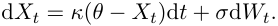

Then, for _n_ = 2 the instantaneous dynamics of the volatility process are given by 

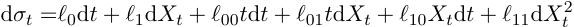

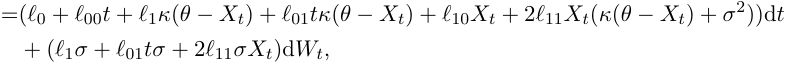

which can be rewritten as 

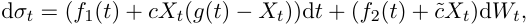

where _f_ 1 _, f_ 2 _, g_ are affine functions of time and _c,_ ˜ _c ∈_ R, all depending on the model parameters _{ℓI , |I| ≤ n}_ . The previous simple derivation implies: 

- If _n_ = 1 the instantaneous vol of vol is constant and given by _|ℓ_ 1 _σ|_ . 

- If _n ≥_ 2 the instantaneous vol of vol is stochastic, depending explicitly on _Xt_ .

<!-- page: 12 -->

- For _n_ = 2, the instantaneous volatility exhibits a stochastic mean reversion rate given by the term _cXt_ , with a time-dependent long-run mean by the affine function _g_ ( _t_ ). We will see in the subsequent sections that this type of model with a 3-dimensional OU-process is flexible enough to solve the joint calibration problem. 

- Notice that even for _n_ = 2, the choice _X_ = _W_ , i.e. choosing just a Brownian motion (as for instance in Perez Arribas et al. (2020); Cuchiero et al. (2023a) for the price process), would lead to restrictive dynamics of the instantaneous volatility. 

## **4 Expected signature of polynomial diffusion** 

Let ( _Yt_ ) _t≥_ 0 be a polynomial diffusion in sense of Definition 3.1 whose dynamics are given by 

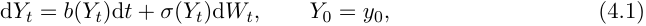

where _σ_ ( _Yt_ ) denotes the matrix square root of _a_ ( _Yt_ ). Recall that in this case the components of _a_ : R_d_ _→_ S_d_ +arepolynomialsofdegreeatmost2,thecomponentsof_b_:R_d→_R_d_are polynomials of degree at most 1, and _W_ = ( _Wt_ ) _t≥_ 0 is a _d_ -dimensional Brownian motion. Denote then by Y the corresponding signature. 

We now explain how to employ the polynomial technology to compute the conditional truncated expected signature of ( _Yt_ ) _t≥_ 0. The corresponding code is available at sarasvaluto/AffPolySig. Several representations of related quantities in particular for the Brownian case can be found in the literature, see for instance Fawcett (2003), Lyons and Victoir (2004), Lyons and Ni (2015), Boedihardjo et al. (2021), Cass and Ferrucci (2024). Our approach follows Cuchiero et al. (2023b) and is based on the classical theory of polynomial processes (see Cuchiero et al. (2012) and Filipovi´c and Larsson (2016)). Even though results for the corresponding infinite dimensional stochastic processes (see for instance Cuchiero and Svaluto-Ferro (2021); Cuchiero et al. (2024a)) are needed in the case of general signature SDEs considered in Cuchiero et al. (2023b), the polynomial property of ( _Yt_ ) _t≥_ 0 here permits to stay in the finite dimensional setting. 

**Lemma 4.1.** Let ( _Yt_ ) _t≥_ 0 be the polynomial diffusion given by (4.1) and _b_ and _a_ be the corresponding drift and diffusion coefficients. Then 

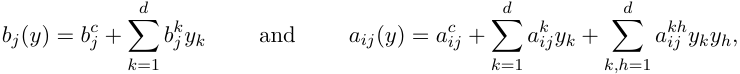

for some _b__c_ _j_,_bk_ _j_,_ac_ _ij_,_ak_ _ij_,_akh_ _ij_=_ahk_ _ij__∈_R.Moreover,_bj_(_Yt_)=_⟨_**b**_j,_Y1 _t__⟩_and_aij_(_Yt_)=_⟨_**a**_ij,_Y2 _t__⟩_ for 

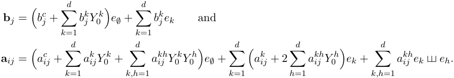

Observe that the upper index on _Y_ 0_k_and_Y_ 0_h_refersto_Y_’scomponentsandnottopowers.

<!-- page: 13 -->

/ | 

| | ~~-~~ | | ~~||~~ ~~<u>|</u>~~ / ~~|~~ joo / ~~f~~ ou || 

() S 

uw w

<!-- page: 14 -->

**Definition 4.3.** We call the operator _L_ defined in (4.2) _dual operator corresponding to_ Y. For each _|I| ≤ n_ set then _ηIJ ∈_ R such that 

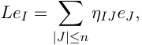

and fix a labelling injective function _L_ : _{I_ : _|I| ≤ n} →{_ 1 _, . . . , dn}_ as introduced before (2.2). We then call the matrix _G ∈_ R_dn×dn_ given by 

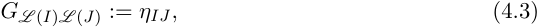

the _dn-dimensional matrix representative of L_ . 

Observe that using the notation of (2.2), for each **u** _∈ T_(_n_) (R_d_ ) the matrix representative _G_ of _L_ satisfies 

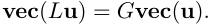

**Theorem 4.4.** _Let_ ( _Yt_ ) _t≥_ 0 _be the polynomial diffusion given by_ (4.1) _,_ ( _Ft_ ) _t≥_ 0 _be the filtration generated by_ ( _Yt_ ) _t≥_ 0 _and let G be the dn-dimensional matrix representative of the dual operator corresponding to_ Y _. Then for each T, t ≥_ 0 _and each |I| ≤ n it holds_ 

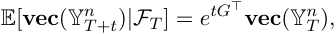

_or equivalently,_ 

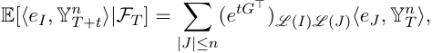

_where e_(_·_) _denotes the matrix exponential._ 

_Proof._ By Lemma 4.2 we know that **vec** (Y_n_ ) is a polynomial diffusion and Theorem 3.1 in Filipovi´c and Larsson (2016) for polynomials of degree 1 yields the claim. 

**Example 4.5.** For the present paper a crucial role is played by the polynomial diffusion given by time, a _d_ -dimensional OU process, and a Brownian motion. Specifically, we consider the process _Z_� _t_ := ( _X_� _t, Bt_ ) where _B_ is a Brownian motion and _X_� _t_ = ( _t, Xt_ ) with 

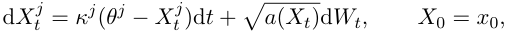

for _aij_ ( _Xt_ ) = _σ__i_ _σ__j_ _ρij_ , and _W_ being a _d_ -dimensional Brownian motion. We denote by _ρj_ ( _d_ +1) the correlation between _X__j_ and _B_ . Setting _κ__d_+1 := 0 and _σ__d_+1 := 1 we can see that _Z_� satisfies (4.1) in _d_ + 2 dimensions for 

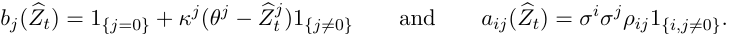

The corresponding **b** and **a** are given by **b** _j_ = _e∅_ (1 _{j_ =0 _}_ + _κ__j_ ( _θ__j_ _− Z_� 0_j_)1_{j_=0_}_)_−ejκj_1_{j_=0_}_ and **a** _ij_ = _e∅σ__i_ _σ__j_ _ρij_ 1 _{i,j_ =0 _}_ and we thus get 

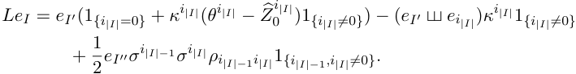

An application of _L_ to the first basis elements yields the following results:

<!-- page: 15 -->

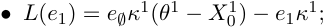

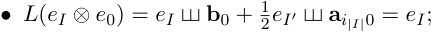

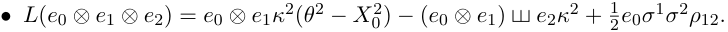

Letting ( _Ft_ ) _t≥_ 0 be the filtration generated by ( _Z_� _t_ ) _t≥_ 0 by Theorem 4.4 we can conclude that 

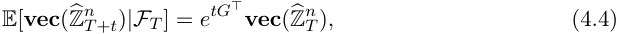

or equivalently, 

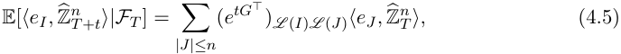

where _G_ denotes the ( _d_ + 2) _n_ -dimensional matrix representative of _L_ . In order to work with the VIX it will be convenient to restrict our attention to the signature components of (Z� _t_ ) _t≥_ 0 not involving _B_ . The following remark will be useful. 

**Remark 4.6.** Observe that given a subset _E ⊆{_ 0 _, . . . , d_ + 1 _}_ , setting _IE_ := _{I_ : _ij ∈ E}_ it holds _L_ ( _IE_ ) _⊆IE_ . This in particular implies that 

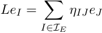

for each _I ∈IE_ . Choosing _E_ = _{_ 0 _, . . . , d}_ , letting _LE_ : _IE →{_ 1 _, . . . ,_ ( _d_ +1) _n}_ be a labelling injective function, and setting _G__E_ _LE_ ( _I_ ) _LE_ ( _J_ ):=_ηIJ_wecanseethat(4.5)reducesto 

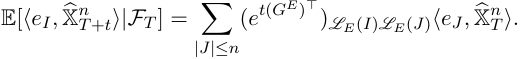

To simplify the notation we often drop the _E_ from _G__E_ whenever this does not introduce any confusion. 

**Remark 4.7.** Let ( _Yt_ ) _t≥_ 0 be a polynomial diffusion and let Y_−_1 be defined via _e∅_ = Y_−_ _s_1 _⊗_ Y _s_ , i.e. _⟨e∅,_ Y_−_ _s_1_⟩_= 1and 

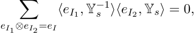

for each _|I| >_ 0. Observe that it can be defined recursively on _|I|_ and each component of Y_−_ _s_1 corresponds to a linear combination of components of Y _s_ of the same length or shorter. Since by Chen’s identity (see (2.4) or (2.5)) we have Y _s ⊗_ Y _s,t_ = Y _t_ , for each _s ≤ u ≤ t_ and _|I| ≤ n_ we then get 

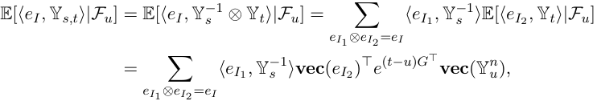

where _G_ denotes the _dn_ -dimensional matrix representative of the dual operator of Y.

<!-- page: 16 -->

## **5 VIX options with signatures** 

In this section we discuss the implication on pricing VIX options under the model (3.1)-(3.2). The VIX index is a popular measure of the market’s expected volatility of the S&P 500, calculated and published by the Chicago Board Options Exchange (CBOE). The current VIX value quotes the expected annualized change in the S&P 500 over the following 30 days, based on options-based theory and current options-market data. As stylized definition we consider 

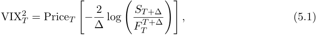

where ∆= 30 days, _FT__T_+∆ denotes the price at time _T_ of the SPX future with maturity _T_ + ∆and with Price _T_ we refer to the market price at time _T_ of the log-contract, i.e. the payoff in (5.1). Hence, under a given model we define the VIX, 

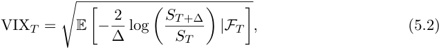

where ∆= 30 days and _ST_ denotes the price process at time _T >_ 0. Recall that under a diffusion model, the previous expression is equivalent to 

_t_ as long as E[�0_Vsds_]_<∞_forall_t≥_0,seee.g.Neuberger(1994);Gatheral(2011).With VIX options we here usually refer to either put or calls written on VIX. In the present work we will consider without loss of generality only call options. 

### **5.1 Explicit formulas for the VIX** 

This section is dedicated to one of the main implication of our modeling framework, namely an explicit formula for the VIX expression (5.2) for _S_ following (3.1)-(3.2). In particular we show in the next theorem that the computation of the VIX squared reduces to a quadratic form in the parameters _ℓ_ . The entries of the corresponding positive semidefinite matrix can be computed by polynomial technology, i.e. by matrix exponential as proved in Section 4. 

**Theorem 5.1.** _Let S_ = ( _St_ ) _t≥_ 0 _be a price process described by_ 

_where σ__S_ = ( _σt__S_)_t≥_0_denotes the volatility process,B_= (_Bt_)_t≥_0_a one-dimensional Brownian_ _motion. Assume that σ__S_ _satisfies_ (3.2) _. Following_ (2.2) _, fix an injective labeling function L_ : _{I_ : _|I| ≤ n} →{_ 1 _, . . . ,_ ( _d_ + 1)2 _n_ +1 _} and let G be the_ ( _d_ + 1)(2 _n_ +1) _- dimensional matrix representative of the dual operator corresponding to_ X� _. Then,_ 

_holds for every t ≥_ 0 _and_ 

<!-- page: 17 -->

Dd : (Xo)Yow e ~~-~~ S [fo wr| Pow fous fer] [ ow 7 [ ow | Lu Lu | 

> / ° uw dL ~ 

° 

~

<!-- page: 18 -->

Note that since the integration’s variable _t_ appears twice in this expression the time integral cannot be incorporated in the signature. 

**Remark 5.3.** Observe that accounting for the scaling factor of 100, conventionally introduced by CBOE, the VIX index squared can equivalently be redefined (see e.g., Rosenbaum and Zhang (2021); Rømer (2022)) as 

where _T, t >_ 0 and ∆= 121,i.e.,approximately30days.Noticethatsincetheexpressions (5.3) and (5.7) differ only by a scaling factor, all the theoretical results of the present work hold true disregarding this scaling. For sake of simplicity we will always use (5.3). We address the reader to Chapter 11 in Gatheral (2011) for further details about the conventions of CBOE and its link with (5.2). 

We observe that the expression (5.6) is computationally appealing as we can unpack the computation in three parts: compute the coordinate vector **vec** (( _eI_ � _eJ_ ) _⊗ e_ 0), which depends just on _d >_ 0 and _n >_ 0, calculate the matrix exponential of _G__⊤_ which depends on the choice of the primary process _X_ , and finally sample X�2 _T__n_+1 which is the only part that depends on the chosen maturity time _T_ . In order to compute the matrix exponential we rely on Bader et al. (2019) who developed a Pad´e-insipired approximation to reduce the matrix multiplications, see also Moler and Van Loan (2003) for further possible methods. For the implementation of the signature samples and its computational complexity we refer to Reizenstein and Graham (2018); Kidger and Lyons (2020). 

**Remark 5.4.** In general the computation of _G ∈_ R(_d_+1)2_n_+1_×_(_d_+1)2_n_+1 , even if done only once, can be costly. For this reason it can sometimes be interesting to avoid the last time integral and to consider the following equivalent expression of the matrix _Q_ , for _|I|, |J| ≤ n_ : 

where now _G ∈_ R(_d_+1)2_n×_(_d_+1)2_n_ and where we use the fact that we can interchange the conditional expectation with the time-integral by dominated convergence. As _G_ is singular, this time integral has to be computed numerically, in general. We propose here two possible methods that can be used in order to compute it efficiently. 

- (i) **Approximation of the time integral** : e.g., via the trapezoidal rule also applied for VIX2 in Bourgey and De Marco (2022). Hence if we consider the shuffled coordinates **vec** ( _eI_ � _eJ_ ) of the exponential matrix we can use the symmetry of the shuffle to reduce the number of integrals to be solved from (( _d_ + 1)2 _n_ )2 to<u>(</u>_d_<u>+1)</u>_n_<u>((</u>_d_ 2<u>+1)</u>_n_<u>+1)</u> _·_ ( _d_ + 1)2 _n_ , instead of ( _d_ 2 _n_ )2 . Observe that for our integral the error of such an approximation is given by 

as _N →_ + _∞_ . As a further dimension reduction one can exploit the polynomial nature of X�_n_ to obtain a matrix representation of its second order moments. Without entering into details, the matrix _G_ would then be the matrix corresponding to the linear operator acting on coefficients of polynomials of degree 2 in X�_n_ . Its dimension would thus be<u>(</u>_d_<u>+1)</u>_n_<u>((</u>_d_<u>+1)</u>_n_<u>+1)</u> . 2

<!-- page: 19 -->

- (ii) **Approximation of the matrix exponential** : we can avoid to approximate the integral by approximating the matrix exponential. Assuming that 

this can for instance be done via its Taylor expansion: 

Observe that (5.9) holds true whenever the spectral radius, i.e., the maximal eigenvalue in absolute value, of the matrix _G__⊤_ ∆is less than 1 (see for instance Theorem 1.5 in Quarteroni et al. (2010)). This requirement suggests that for numerical purposes the parameters of the primary process have to be chosen accordingly. 

An interesting example is given by the case where _X_ is a _d_ -dimensional correlated Brownian motion, as considered for instance in Cuchiero et al. (2023a). In this case the process has no linear drift and the corresponding matrix _G_ is nilpotent, meaning that _G__n_ = 0 _,_ for each _n_ big enough. 

In general, this Taylor approach permits to avoid a numerical integration and produces an accurate approximation, allocating as few memory as possible. 

**Remark 5.5.** A further step in the direction of a fast evaluation of VIX _T_ ( _ℓ_ ) can be taken by noticing that the matrix _Q_ in (5.6) admits a Cholesky decomposition. Indeed since _Q_ is positive semidefinite and symmetric by the shuffle property, we know that there exists an upper triangular matrix _UT ∈_ R(_d_+1)_n×_(_d_+1)_n_ , with possible zero elements on the diagonal, such that 

_Q_ ( _T,_ ∆) = _UT UT__⊤,_ 

where for sake of simplicity we drop the dependence on ∆of _UT_ . Hence the evaluation of the VIX _T_ ( _ℓ_ ) reduces to 

where here _∥· ∥_ denotes the Euclidean norm. We stress the fact that the Cholesky decomposition can be carried out offline, and the computational benefit is immediate if several samples of the signature are considered. 

In the following remark we discuss a possible dimension reduction technique from which one can benefit computationally. Inspired by the approach of Cuchiero et al. (2022); Compagnoni et al. (2023), we employ the Johnson-Lindenstrauss Lemma and consider a random projection of the signature. A first way to use this tool is the following. **Remark 5.6.** Let _d< ∈_ N be the dimension of the space to which we would like to project the signature of order _n >_ 0, such that _d< ≪_ ( _d_ + 1) _n_ . Consider _A_ = ( _αij_ ) _∈_ R_d<×_(_d_+1)_n_ , such that _αij ∼N_ (0 _,_ 1 _/d<_ ). Then a possible way to employ the randomised signature is to parametrize the volatility process as follows, 

<!-- page: 20 -->

where with _ℓ_˜ = _ℓ · A__⊤_ _∈_ R_d<_ we denote the randomised parameters. Due to the linearity of integral and conditional expectation in (5.3) this modeling choice is equivalent to consider the randomised matrix _Q_� _∈_ R_d<×d<_ given by 

which leads to the following representation of VIX _T_ ( _ℓ_ ): 

Observe that even if this procedure does not reduce the number iterated integrals to be computed offline, it reduces the number of parameters to calibrate, yielding in general to a faster evaluation of VIX _T_ ( _ℓ_ ). 

**Remark 5.7** (Options on VIX) **.** Note that VIX options are written on VIX futures. The price process of a VIX future contract with maturity _T >_ 0, is given by 

and we write in particular _F_ ( _T_ ) := _F_ 0( _T_ ) to simplify notation. We point out that the VIX index does not pay dividends. The correct implied volatility for VIX options can then be obtained by inverting the Black-Scholes formula with interest rate _r >_ 0 and _e__−r_(_T−t_) _Ft_ ( _T_ ) as underlying. When calibrating to VIX options, we stress that we additionally calibrate to VIX futures’ prices, see Section 5.3. This is important since futures prices under the calibrated model are employed to compute its implied volatility surface. Including VIX futures in the calibration leads to a consistent model, both for VIX options and VIX futures, see e.g. Pacati et al. (2018); Guo et al. (2022a); Guyon (2020a, 2023). Using market prices of the VIX futures to invert the implied volatility surface could lead to inconsistencies if one would like to price further derivatives with the calibrated model. 

### **5.2 Variance reduction for pricing VIX options** 

We here discuss variance reduction techniques (see e.g. Glasserman (2004)) that can speed up the calibration in the subsequently applied Monte Carlo approach further. The key idea is to introduce a control variate, namely an easy to evaluate random variable Φ_cv_ such that given _T >_ 0 and _K >_ 0, 

A well-working example of control variates used for pricing and calibrating neural SDE models can be found in Gierjatowicz et al. (2022), where Φ_cv_ is constructed from hedging strategies. 

In the following we describe two possible choices of control variates, which consist of polynomials on VIX futures. We stress the fact that these can be seen as linear functions of the signature of the primary process _X_� , hence they belong to the class of sig-payoffs, see Lyons et al. (2020); Perez Arribas et al. (2020) and Section 4.2.2 in Cuchiero et al. (2023a). 

- The first example is to employ the VIX squared as main ingredient, see for instance Bourgey and De Marco (2022); Guerreiro and Guerra (2023) for a similar choice within

<!-- page: 21 -->

a rough Bergomi model for pricing VIX options. This is particularly easy to treat in our set up, as for any given maturity _T >_ 0 we have 

with _Q__cv_ ( _T,_ ∆) := E[ _QL_ ( _I_ ) _L_ ( _J_ )( _T,_ ∆)]. By Theorem 5.1 and Theorem 4.4 we indeed have 

where _G_ denotes the ( _d_ +1)2 _n_ +1-dimensional matrix representative of the dual operator corresponding to X� and **vec** (X� 02_n_+1 ) = _e∅ ∈_ R(_d_+1)2_n_+1 . 

Observe that _Q__cv_ can again be computed offline similarly to the matrix _Q_ . Thus to compute the expectation of VIX2 _T_(_ℓ_)weonlyhavetoevaluatethepreviousquadratic form. To apply this now for pricing a call option with maturity _T >_ 0 and strike _K >_ 0, we set 

where the constant _cT,K_ maximizing the variance reduction is given by: 

Notice that also in this case both _Q_ and _Q__cv_ satisfy the condition for applying the Cholesky decomposition, leading to a faster evaluation of the control variate as discussed in Remark 5.5. Note that the Cholesky decomposition cannot be applied to _Q − Q__cv_ , as this is in general an indefinite matrix. 

- As a second example we consider a generic polynomial in VIX2 as control variate by defining 

where _αi_ ( _T, K_ ) are chosen to approximate the payoff (VIX _T −K_ )+ with strike price _K_ for some _m ≥_ 1. The corresponding control-variate is then defined as Φ_cv_ ( _ℓ, T, K_ ) := _cT,K_ ( _Ym__cv_(_ℓ, T, K_)_−_E[_Y_ _m__cv_(_ℓ, T, K_)]).Regardingthecomputationaleffort,letusre- mark the following. 

- (i) VIX2 _T_iscomputedanywayforeveryrealisationandishencealreadyavailable, therefore the computation of _Ym__cv_(_ℓ, T, K_)isnotexpensive. 

- (ii) It is possible to calculate E[ _Ym__cv_(_ℓ, T, K_)]analyticallyrelyingonthemoment formula, see Theorem 4.4.

<!-- page: 22 -->

- (iii) The choice of _cT,K ∈_ R is important and the optimal one, i.e., the one leading the highest variance reduction, is given by the following expression 

see for instance Section 4.1.1 in Glasserman (2004). 

We stress the fact that for _m_ = 1 the two control variates introduced coincide. 

### **5.3 Calibration to VIX options** 

In this section we focus on the calibration to VIX options only. Let _T_ be a set of maturities and _K_ a collection of strikes. Consider the model given by (3.1) and (3.2). 

Using Monte Carlo compute an approximation of option and futures’ prices with _NMC >_ 0 samples, i.e. 

where 

It is crucial to note that in this framework a Monte Carlo approach is tractable since for _every ℓ_ the same samples can be used. This means that we do not need to carry out any simulation during the optimization task. Indeed, the matrix _Q_ can be simulated offline while only the products with _ℓ ∈_ R(_d_+1)_n_ enter in the calibration step. 

Observe that an auxiliary randomization can be employed in every optimisation step as discussed in Remark 5.6. Moreover, if we want to use control variates to reduce the variance of the Monte Carlo estimator as described in the previous section, we would consider 

Due to the variance reduction the number of samples needed is _NV R ≪ NMC_ and Φ_cv_ is as in Section 5.2 

The calibration to VIX call options and the corresponding futures on _T_ and _K_ consists in minimizing the functional 

where _L_ denotes a real-valued loss function, _F_ VIX_mkt_(_T_)themarket’sfutures’pricesand _π_ VIX_b,a_(_T, K_) :=_{π_ VIX_mkt,b_(_T, K_)_, π_ VIX_mkt,a_(_T, K_)_},_ _σ_ VIX_b,a_(_T, K_) :=_{σ_ VIX_mkt,b_(_T, K_)_, σ_ VIX_mkt,a_(_T, K_)_},_ 

the market’s option bid/ask prices _π_ VIX_mkt,b_(_T, K_)_, π_ VIX_mkt,a_(_T, K_),andbid/askimpliedvolatili- ties _σ_ VIX_mkt,b_(_T, K_)_, σ_ VIX_mkt,a_(_T, K_),respectively.Wewillspecifythechoiceofthefunction_L_in Section 5.3.1 and Section 7.1. In both sections we employ the same optimizer, i.e. BFGS with default parameters in `scipy` _._ `optimize` .

<!-- page: 23 -->

**Remark 5.8** (Initial guess search) **.** Since within our model choice we are given a quadratic function in _ℓ_ to be minimized, a stochastic optimization with an initial guess is employed. In order to achieve faster convergence we consider an hyperparameter search to choose the starting parameters. The steps are outlined as follows. 

- Find the magnitude of the coefficients returning Monte Carlo prices of the VIX options _close_ to the one observable on the market. To this extent we sample _Nℓ >_ 0 times parameters _ℓ ∈ Ji_ = [ _−_ 10_−i_ _,_ 10_−i_ ](_d_+1)_n_ , for _i_ = 1 _, . . . , m_ with _m >_ 0. 

- Select _J__∗_ _∈_ ( _Ji_ )_m_ _i_ =1suchthat 

- Choose the initial guess to be 

#### **5.3.1 Numerical results** 

In the present section we report the results of the calibration to VIX options only. Here we consider call options written on the VIX on the trading day 02/06/2021, the same as in Guyon and Lekeufack (2023). We stress that for such recent dates the bid-ask spreads for VIX options are rather tight with respect to older dated options as considered for instance in Gatheral et al. (2020); Bondi et al. (2024b). The maturities are reported in the following table with the corresponding range of strikes (in percentage) with respect to the market’s futures prices. 

We underline that the shortest maturity considered is 14 days. Regarding our modeling choice we fix _d_ = 2, _n_ = 3, which means to calibrate 40 parameters. For _X_ we choose a 2-dimensional Ornstein-Uhlenbeck processes, see Example 4.5, with the following (hyperparameter) configuration: 

where we slightly abuse notation and denote by _ρ_ the correlation matrix of ( _X, B_ ). This implies that its last column describes the correlations of _X_ with the Brownian motion _B_ driving the price process _S_ . 

These hyperparameters are chosen randomly. Indeed, in spirit of reservoir computing, the idea is to view the OU-process’ signature as (randomly chosen) reservoir, while a simple readout mechanism is trained, i.e. the linear function defined by _{ℓI_ : _|I| ≤ n}_ , to map the state of the reservoir to the desired output (in our case instantaneous volatilities). However, it is of course possible to perform a hyperparameter optimization or to add expert knowledge, e.g. that a high mean reversion rate is important. We tried the latter by mimicking a rough or strong mean-reverting model as suggested in Rogers (2023); Rømer (2022).

<!-- page: 24 -->

We also refer to Appendix A for numerical results where we use only a correlated 2- dimensional Brownian motion as primary process, which yields significantly worse results. Note that the second simplest choice after Brownian motion within the family of polynomial diffusions (also with exact simulation) is the Ornstein-Uhlenbeck process which we thus applied. 

Before stating the loss function _L_ that we employed in the calibration task, let us make the following remark. 

**Remark 5.9.** Let _f_ : R+ _×_ R+ _→_ R+ be the call pricing functional in the Black-Scholes model, depending on the volatility _σ_BS and the spot price _ξ_ , i.e., _f_ : ( _σ_BS _, ξ_ ) _�→ f_ ( _σ_BS _, ξ_ ). By Taylor expansion in an appropriate neighbourhood of ( _σ__mkt_ _, ξ__mkt_ ) we obtain 

which equivalently gives 

where we recognize for the derivatives with respect to _σ_ and _ξ_ , the Greeks Vega and Delta, respectively. 

Motivated by Remark 5.9 we propose, for a fixed maturity and strike price, the following loss-function for _β ∈{_ 0 _,_ 1 _}_ 

where 

- _υ__mkt_ and _δ__mkt_ denote the Vega and Delta of the option under the Black-Scholes model which depend on the maturity and on the strike price; 

- _F_ and _F__mkt_ denote futures with maturity _T_ such that the variables _ξ, ξ__mkt_ appearing in Remark 5.9 are _ξ_ = _e__−rT_ _F_ and _ξ__mkt_ = _e__−rT_ _F__mkt_ , respectively; 

- ˜ 1 _{x/∈_ [ _yb,ya_ ] _}_ := _s_ ( _y__b_ _− x_ ) + _s_ ( _x − y__a_ ) for _s_ ( _x_ ) := 2<u>1</u>tanh(100_x_) +<u>1</u> 2asmoothversionof the indicator function. 

- **Remark 5.10.** (i) We observe that by Remark 5.9 minimizing _L_0 is equivalent to minimizing an upper bound of the square of the right-hand side of (5.14) normalized by the bid-ask spread of the implied volatilities. Note that we slightly abused notation, since _υ__mkt_ and _δ__mkt_ of course depend on the strike and the maturity. 

- <u>1</u> 

- (ii) Note that as _ℓ �→_ VIX _T_ ( _ℓ, ω_ ) = _~~√~~_ ∆_∥U_ _T__⊤ℓ∥_isconvexandthecallpayoffisconvexand increasing, the model option and futures prices are convex in _ℓ_ . If _β_ = 0 and the initialization of _ℓ_ is such that both the model and futures prices are higher than the market ones, then we actually deal with a convex optimization problem.

<!-- page: 25 -->

<!-- Start of picture text -->
++ tty 2.50 +94+ 2.25 4 os. ooe, + t,% 1.752.00 tt, tie 7 IV tz +h * 1.50 Fs *, ay"ey eh, 7+ +e, és % % 1.25 r #9) 4% Sy tly ? J _, *e, *h, * 2 1.00 Pe ry lp + hy5 # fey tt, oe, ; t %|+ * 0.75 +He ™ +ci 0.05 tex 0.10 Ta 0.15 9° 80 “ty*, 0.250.20os66 70 Stri60kes Gy 40 30 * 0.350.30 yr 20 0.40 <!-- End of picture text -->

<!-- page: 26 -->

<!-- Start of picture text -->
Futures' Term Structure Calibrated * Market 23 m 22 * og 21 x % 20 19} 0.05 0.10 0.15 0.20 0.25 0.30 0.35 0.40 T <!-- End of picture text -->

»— »— 

- 

A

<!-- page: 27 -->

[| xs wo | xy / wo| xy ( {/ wo| an) 

= 

(f ) 

f 

(f ) 

{ ~~/~~ 

3

<!-- page: 28 -->

t ~~h~~ Wh ~~e~~ feo} ~~co~~ ) 

~~tf Per~~ E ~~F~~ d ~~el~~ 

—

<!-- page: 29 -->

~~_~~ So 

Ss) ~~—~~ ou 

ff ~ furyf - ~~=~~ » Se ~~_~~ So Jo : 

~~O~~ 

_ 

fou . 

~~_~~ So

<!-- page: 30 -->

- Notice that the log-price model in (6.4), it is not exactly a signature-based model in the sense of Cuchiero et al. (2023a), as here it is given by a linear part in the parameters _ℓ_ and an additional quadratic part. It can also be rewritten as 

where _Q_˜ is given by 

Hence, the relevant factors entering in the dynamics of log _S_ and _σ__S_ are the components of X�2_n_ . Note also that (log _S,_ X�2_n_ ) is a 1+( _d_ +1)2 _n_ dimensional polynomial diffusion (see (2.1)), whence in particular Markovian. This is in spirit of path-dependent factor model, for instance also considered in Guyon and Lekeufack (2023), with the additional tractability feature that (log _S,_ X�2_n_ ) is a polynomial diffusion. Therefore all techniques for polynomial processes in view of pricing and hedging can be applied. 

- In order to sample the log-price at maturity, consistently with the VIX, we follow ˜ 

- the following road map. We simulate Z� and compute _⟨e__B_ _I__,_�Z_⟩_foreach_I_asspecified above. Next, we drop from the samples of Z� the terms where _B_ appears, i.e. the components corresponding to indices containing the letter _d_ + 1. The result coincides with a sampling of X� and is then used to work with both _Q_ and _Q_0 . 

This is equivalent to sampling X� for the variance process and to compute an additional Itˆo integral as in (3.1). 

In the following corollary we state the form of _e_ ˜_B_ _I_when_X_is_d_-dimensionalOU-process. We omit the proof for sake of brevity. 

**Corollary 6.7.** _Let X be a d-dimensional OU-process as in Example 4.5 driven by a d-_ ˜ _dimensional Brownian motion with correlation matrix ρ. Then e__B_ _I__isgivenby_ 

_for any multi-index I_ = _∅._ 

**Remark 6.8** (Variance reduction for pricing SPX options) **.** Observe that a possible control variate for reducing the variance of the Monte Carlo estimator for pricing SPX options is the value at maturity of the log-price process. This means, 

where, using that the linear part (in _ℓ_ ) of log( _ST_ ( _ℓ_ )) vanishes under the risk-neutral expectation, we have 

for _G ∈_ R(_d_+1)2_n_+1_×_(_d_+1)2_n_+1 denoting the ( _d_ + 1)2 _n_ +1-dimensional matrix representative of the dual operator corresponding to X� . We choose the optimal _c__∗_ _T,K__∈_Ras 

<!-- page: 31 -->

### **6.1 Exploiting the affine nature of the signature: Fourier pricing of SPX and VIX options** 

This section is dedicated to outline how the linear parametrizations of the log-price and the volatility process in Z� can be used for Fourier pricing. Assume that 

for each _j_ = 1 _, . . . , d_ + 1, where _W_ denotes a ( _d_ + 1)-dimensional Brownian motion with _W__d_+1 = _B_ . All parameters _κ__j_ _, θ__j_ _, σ__j_ are in R with _κ__d_+1 = _θ__d_+1 = 0 and _σ__d_+1 = 1 so that _Z__d_+1 = _W__d_+1 = _B_ . Note that we do not account for correlations. 

We illustrate now how to apply the results of Cuchiero et al. (2023b) in the present setting. Since ( _Z_� _t_ ) _t≥_ 0 is a polynomial diffusion, by Lemma 4.1 there are **b** _∈_ ( _T_ ((R_d_+2 )))_d_+2 and **a** _∈_ ( _T_ ((R_d_+2 )))(_d_+2)_×_(_d_+2) such that 

where **b** _j_ = _κ__j_ _θ__j_ _e∅ − κjej_ and **a** _jj_ = ( _σ__j_ )2 _e∅_ , using that (with a small abuse of notation) _κ_0 _θ_0 := 1, _κ__j_ := 0 and _σ_0 := 0. Consider then the Riccati operator _R_ given by 

By Theorem 4.23 in Cuchiero et al. (2023b), we expect that 

where **_ψ_** is a solution of the extended tensor algebra valued Riccati equation4 

Choosing **u** as 

where _ℓ_˜ :=�byProposition6.4weget _|I|≤n__ℓIe_˜_B_ _I_, 

The representation of the Fourier-Laplace transform described above can then be used for Fourier pricing. We dedicate the remaining part of this section to illustrate how this can be done. 

From Fourier analysis we know that for _K >_ 0 and _C <_ 0 it holds 

> 4We refer to Cuchiero et al. (2023b) for the appropriate solution concept and to a numerical treatment in the one dimensional case where (6.5) reduces to a sequence-valued Riccati equation.

<!-- page: 32 -->

<!-- Start of picture text -->
— | a — | ee — | a <!-- End of picture text -->

i 

<!-- Start of picture text -->
yy » > Ss » : _ S° LU ~ —_ f Jo yo - | Vv - | Vv <!-- End of picture text -->

<!-- page: 33 -->

where **_ψ_** _λ_ is a solution of the Riccati equation with initial condition **_ψ_** _λ_ (0) = _−iλ_ **v** ( _ℓ_ ) for **v** ( _ℓ_ ) := ∆<u>1</u>_I_(∆)((_ℓ_�_ℓ_)_⊗e_0). 

Analogous formulations in terms of the error function are also possible, see for instance Bondi et al. (2024b). In the same spirit one can also obtain a representation of futures prices. We here do not provide an implementation of this Fourier pricing approach but numerical experiments can be found in Cuchiero et al. (2023b). 

### **6.2 The case of time-varying parameters** 

Analogously to Section 5.4, we now further enhance Proposition 6.4 by allowing the parameters _ℓ_ to depend on the maturity. 

**Proposition 6.9.** Let _S_ = ( _St_ ) _t≥_ 0 satisfy (3.1) with _S_ 0 = 1, and ( _σt__S_)_t≥_0satisfy(5.17)for a set of maturities _T_VIX = _{T_ 1 _, . . . , TN }_ . Recall that in this case _V_ = ( _Vt_ ) _t≥_ 0 satisfy 

Then, with the notation of Proposition 6.4 we write the following recursion for the log-price process 

for each _t ≥_ 0, where _T_ 0 := 0, _ℓ__<m_+1 := _{ℓ_ (0) _, . . . , ℓ_ ( _Tm_ ) _}_ , _m_ = max _{j_ : _Tj < t}_ , and 

_Q_0 _L_ ( _I_ ) _L_ ( _J_ )(_t_) =_⟨_(_eI_�_eJ_)_⊗e_0_,_�X_t⟩,_ 

for a labeling function _L_ : _{I_ : _|I| ≤ n} →{_ 1 _, . . . ,_ ( _d_ + 1)2 _n_ +1 _}_ . _Proof._ We know that 

<!-- page: 34 -->

/ /x> 

/x> wo >> fou ps ow fw) > yd (4 © wo) 

~{ 6 

) | 

/ [xz : sy fo re FG 7 f 7) yy ~

<!-- page: 35 -->

- _L_ VIX( _ℓ_ ) is as in (5.13), i.e. 

with _π_ VIX_model_ and _F_ VIX_model_ as in (5.12) for VIX _T_ ( _ℓ, ωi_ ) defined as in (5.5); 

- _L_ SPX( _ℓ_ ) is the SPX loss function given by 

for a real-valued function _L_ . Observe that with a slight abuse of notation we denote this function as the one for _L_ VIX, but for SPX options we do not have to calibrate to futures, hence the last term of (5.15) vanishes. 

By Proposition 6.4 the SPX call option payoff with maturity _T >_ 0 and a strike price _K >_ 0 reads in our model as follows 

where _S_˜ denotes the undiscounted, unadjusted process as discussed in Remark 3.3 and _r, q >_ 0 the interest rate and the dividends, respectively. Recall also that the call option payoff written on the VIX is given by 

where _UT_ denotes the upper-triangular matrix of the Cholesky decomposition of the symmetric positive semidefinite matrix _Q_ ( _T,_ ∆). 

**Remark 7.1.** We report in the table below the (average over 103 trials) timings of evaluating VIX _T_ ( _ℓ_ ) and _ST_ ( _ℓ_ ) for _ℓ ∈_ R85 , a fixed _T >_ 0 and _NMC_ = 8 _·_ 105 samples on both CPU (on the left) and GPU (on the right) with PyTorch, respectively: 

This evaluations are the relevant operations in the Monte Carlo pricing and in turn in the calibration procedure. Note again that both the sampling of the signature components and the matrix exponential, are achieved offline, as they do not depend on _ℓ_ . 

### **7.1 Numerical results** 

Before presenting our numerical results, let us discuss two different ways of approaching the joint calibration problem that can be found in the recent literature. 

> (i) The first approach consists in choosing for instance the first maturity of SPX and VIX to coincide (or differ up to two days), i.e., _T_ 1SPX = _T_ 1VIX and then for _j ≥_ 2, _Tj_SPX = _Tj_VIX _−_ 1+ ∆,seeforinstanceGuyon(2023);Guoetal.(2022b);Guyonand Lekeufack (2023).

<!-- page: 36 -->

- (ii) The second approach is to consider _T_SPX = _T_VIX , i.e., to choose the same (or close together) maturities both for SPX and VIX options. This perspective has been adopted for instance by Gatheral et al. (2018); Rosenbaum and Zhang (2021); Grzelak (2022); Bondi et al. (2024b). 

<!-- Start of picture text -->
0 T 1 T 2 T 1 + ∆ T 2 + ∆ 0 T 1 T 2 T 3 T 1 + ∆ T 2 + ∆ T 3 + ∆ <!-- End of picture text -->

Figure 3: The blue lines denote the time interval where the dynamics of the variance process influence the SPX option up to the maturity time. For instance the shortest blue line denotes the time interval where the dynamics of the variance process enter up to maturity _T_ 1. Similarly the red lines denote the corresponding ones for the VIX, as for instance the variance process enters here in the time integral on [ _T_ 1 _, T_ 1 + ∆], see (5.3). On the upper graph a representation of the joint calibration approach (i) is given where we notice that the maturities of the VIX are chosen so that there is a maximal overlap with the ones of the SPX. On the lower graph a representation of approach (ii) is given where the maturities _T_ = _{T_ 1 _, T_ 2 _, T_ 3 _}_ are considered. We observe that there is less overlap between the maturities of the SPX and VIX than in approach (i). 

Both approaches deal with the joint modeling of SPX and VIX options and in order to be consistent with both viewpoints taken in the literature, we show how our signature-based model solves the joint calibration within both settings. For this reason we split the rest of the section in two subsection and discuss them separately. 

#### **7.1.1 First approach** 

Here we consider call options for both indices on the trading day 02/06/2021, as in Guyon and Lekeufack (2023). Maturities are reported in the following tables with the corresponding range of strikes (in percentage) with respect to the spot and the market’s futures prices. 

|_T_ VIX 1 =|0_._0383|_T_ VIX 2 =|0_._0767||
|---|---|---|---|---|
|(90%,|220%)|(90%,|220%)||
|_T_ SPX 1 = 0_._0383|_T_ SPX 2 =|0_._1205|_T_ SPX 3 =|0_._1588|
|(92%,105%)|(70%,|105%)|(80%,|120%)|

<!-- page: 37 -->

<!-- Start of picture text -->
SPX T=0.0383 VIX T=0.0383 SPX T=0.1205 + 24 - 0.2504 ° © Calibrated | +t os? + © Calibrated : + Bid/Ask 224 | + é aan + Bid/Ask 0.225 cs+ 2.0 || . $ as t 04 a + +et,et6 . + 0.200 : 184 | set t +ooy > . t+ +. | gor? + Ss = + 216 ra 203 +? $ 0.1750.150 ,* 14: || 4? by , +% t * & | 7 7 ° + | # © Calibrated 0.2 ry ; 0.125 *, 121 16 + Bid/Ask *, +, Fa —-- Market future e 0.100 . ry e + 1.05 +4e --- Model future 01 %s + 0.92 0.94 0.96 0.98 1.00 1.02 1.04 20 25 30 35 40 45 0.70 0.75 0.80 0.85 0.90 0.95 1.00 1.05 Moneyness Strike Moneyness <!-- End of picture text -->

<!-- Start of picture text -->
SPX T=0.1588 VIX T=0.0767 0.35 + e Calibrated + + o +° + Bid/Ask 18 _t .° 0.30 *$ | + + g ‘ 0.25 +t+i, 16 || +t?+7 . @ > + La | tet ry 2 | seh" 0.20 *. | 34 * 12 |, e+ e at @ Calibrated on *, « + e| + Bid/Ask *eege . 107 4 7 | —:-- - M odelarketfuture future 0.8 0.9 1.0 11 1.2 20 25 30 35 40 45 Moneyness Strike <!-- End of picture text -->

<!-- page: 38 -->

<!-- Start of picture text -->
28 1.005 26 1.000 24 0.995 ~ 22 0.990 — = Ss S 20 0.985 4 18 0.980 16 0.975 14 0.970 0 10 20 30 40 50 60 Days 0.06 0.05 0.04 0.03 =S 0.02 0.01 0.00 0 10 20 30 40 50 60 Days <!-- End of picture text -->

<!-- page: 39 -->

**The case of time-varying parameters** Next, we consider again the case of time-varying parameters as introduced in Section 5.4 and Section 6.2 for VIX and SPX, respectively. Although the joint calibration is mainly considered for short-dated options in the literature as VIX options are then more liquid, it is even more challenging to provide an accurate fit for both, short and long maturities. Allowing the parameters _ℓ_ of our model to depend on time, in particular on the maturities, we are able to calibrate additionally to longer maturities than the ones considered in Figure 4. We consider for the choice of the primary process the same configuration as we used for Figure 4. The procedure of our time-varying calibration routine is as follows: 

2. Use the parameters from the calibration of _Tj_SPX and _Tj_VIX _−_ 1to fit jointly the maturities _Tj_SPX +1and_T_VIX _j_ for _j_ = 2 _, . . . , J_ . 

We consider _J_ = 4, where the last maturity for the SPX is 170 days, and the last maturity for the VIX is 77 days. For the first two maturities of the SPX and the first of the VIX we consider the same moneyness ranges as in Figure 4, hence we specify here only the ranges for the longer maturities: 

|_T_ VIX 2 = 0_._1342|_T_ VIX 3 = 0_._2875|_T_ VIX 4 = 0_._3833|
|---|---|---|
|(90%,330%)|(78%,395%)|(80%,405%)|
|_T_ SPX 3 = 0_._2163|_T_ SPX 4 = 0_._3696|_T_ SPX 5 = 0_._4654|
|(75%,125%)|(60%,135%)|(50%,145%)|

We observe that for this choice of maturities Assumption 5.11 is satisfied. Hence the second expression for the time-varying VIX is used from Proposition (5.12). On the other hand in order to compute the price of the SPX options in the time-varying case we use the representation of the log-price provided in Proposition 6.9. In (7.1), we employ _λ_ = 0 _._ 25 for each calibration within the rolling procedure and we consider always as loss function _L__β_ as introduced in (5.15) for _β_ = 0. It is worth mentioning that the initial parameter search discussed in Remark 5.8, has been employed for calibrating jointly _T_ 1SPX _, T_ 1VIX and _T_ 2SPX , whereas for the next slices we have considered the previously calibrated parameters as starting point of the optimization.

<!-- page: 40 -->

<!-- Start of picture text -->
2.25 0.5 + + + 2.00 + ftEY oe ee +, 0.4 “Hy, ye A 1.75 ; fo | He v ty ety Let?) a4 ‘ et Calibrated 0.3 Mag Se $ W150 er | 48 4 tiles My, 2 %, a a 4h af ra ty ie 1.25 we e - ¢ 0.2 J+t,% tt,%. 44 +#+t ;# ¥¥ > % 1.00 Fi Fee thnn“tpt F *i 0.1 ; + 12713 0.40 £ i 90 04 1 5“0,30 2 70 80 0.3 09 1.0 oe? 0.25 50 6 Maturting 0.2 og |ee) wore “aturitie,0.20 0.15 40 xx 0.1 0.7 0.10 30 0.6 0.05 20 <!-- End of picture text -->

<!-- page: 41 -->

<!-- Start of picture text -->
0.35 + 2.75 0.30, “oeot,++ et 2.50 sstw ° + lo¢ = thetthet + 2.25: +_*+, \¢ +e°+2 s+ ° 0.25 teuv, +fof + o 2.00 ,i?ta ® reot+ >a ‘ . +e $ \v * ad " oy 4% ¢ > et e Calibrated 0.20 +, eh e IV 175 < a © + Bid/Ask ls ey st #, +44 %, +t 1.50 rg ee 0.15 ee * at rs ci > FY ‘ 1.25 # £ Fy = v° 1 ‘3 ¢ Fj be? 0.10 ‘ 00 bi 2. * A ¢ ES 0.75 + é # 0.07 1.05 1.10 0.07 Fo+ £= 50 60 0.06 0.05 0.95 _1.00ye 0.06 0.05 ++ 40yee Maturigities 0.04 0.90 “pores Maturig‘ties 0.04 30 ox 0.03 : 0.03 20 0.02 0.85 0.02 <!-- End of picture text -->

<!-- page: 42 -->

<!-- Start of picture text -->
++ yet, 2.50 + Fat+ 2.25 + ty, 2.00 + i+| bt,+tat.+ “4a &‘ 1.501.75 y | . ¢ The|*2%— a5y #re pED! 1.001.25 a ra th 3 f Fog" he, 3 0.75 Pte “ty, + 0.05 se, be 0.10 90 yeee“* t 0.200.1566 80 40 ihig 0.25 wsRee 60 we Stri 50 0.30 kes 40 30 0.35 20 0.40 Futures' Term Structure Calibrated R x Market 23 * 22 * oyY = 21 Pi x 20 194 0.05 0.10 0.15 0.20 0.25 0.30 0.35 0.40 T <!-- End of picture text -->

<!-- page: 43 -->

<!-- Start of picture text -->
Calibrated parameters | a —@ 2021-06-02 15 | —+——*— 2021-06-162021-06-09 > 2021-06-23 &- 2021-06-30 10 --- y=0 5 2 VAN ' la YZb — - NH " | 5 ‘ ; QAMNW QLMD LOOPSP _ DPDOSDWOWOIHKYSKYVUVUYADM AWIN VD DWODONDBVOYD eoDYDDoO oyWO SES eee <!-- End of picture text -->

<!-- page: 44 -->

<!-- Start of picture text -->
Calibrated parameters II 25 | —@- 2021-06-02 ] —*— 2021-06-09 q —+— 2021-06-16 20 | ~® 2021-06-23 @- 2021-06-30 --- y=0 15 10 5 . , 4 i B ' 0 +-- See/  ane mag PNe S ~~4 -- AP Sf ° -5 - RORDRIWWDDADIWIDVDAOWDSIDNS HON OV ONODAAEODSODAE SESEDMWBODSDAWAVWAS AY A He BE BEDAWABOD OVOYD SSSI SSS S KK YY SKY YYSKKYYYTYTSKYUIUY <!-- End of picture text -->

<!-- Start of picture text -->
Calibrated parameters III a —@ 2021-06-02 6 —*— 2021-06-09 —+— 2021-06-16 © 2021-06-23 4 &- 2021-06-30 --- y=0 2 / \ Or--- = <== - IS = a wy, ---§ -- /S NY YJ A NW, , . YJ “ WV A \/be f My} -4 -6 SSNSDYDD VDAOWDIDAMDODSDWV VV BBMDADODMDOV OOOOWAMSSDBAWOWINDMW®OWDSW VV VO MBDD RUIN AIAN CAI C IAI CAIRO CAO COE COE COI CHIE CONE COIR COICO COCO COI CONCOCOECO <!-- End of picture text -->

<!-- page: 45 -->

<!-- Start of picture text -->
T= 14 days * —e- Calibrated 0.30 * « Bid/Ask eX 0.25 * 0.20 0.15 0.10 092 094 096 098 100 102 1.04 <!-- End of picture text -->

<!-- Start of picture text -->
T= 14 days | —7 2.2 I|| + + f + 2.0 I <i | es 18 | wim 16 ||| Pe 4 ”xx ail | al 141212 | Aisivisiviv Pe —e- Calibrated 0.8104 ++ r | —--====== MarketModelBid/Ask futurefutureModelBid/Ask futurefutureBid/Ask futurefuture futurefuture 20 25 30 35 40 <!-- End of picture text -->

<!-- Start of picture text -->
T= 14 days T= 14 days * —e- Calibrated | —7 0.30 « Bid/Ask 2.2 + + + * I|| f eX 2.0 I <i 0.25 | es * 18 | wim 16 ||| Pe 4 ”xx ail 0.20 | al 141212 | Aisivisiviv 0.15 Pe —e- Calibrated 104 r future 0.8104 ++ | —--====== MarketModelBid/Ask futurefutureModelBid/Ask futurefutureBid/Ask futurefuture futurefuture 0.10 092 094 096 098 100 102 1.04 20 25 30 35 40 T= 44 days + —e- Calibrated Bid/Ask 0s * 0.4 m 03 0.2 o.1 0.70 075 080 085 090 095 100 105 T= 14 days T= 14 days 0.30 * * « —e- Bid/AskCalibrated 2 422 | * + 4 2.0 | = + + 0254-4,0.200.20 * * 18tsts |||||| aeeeGeawe«ee*eeGeawe«ee*Geawe«ee*awe«ee*«ee** ayeaa oe 14 affefe 0.15 12 * 0.10 ost10 .44 , ||| —e-—-----—-------- MarketModelBid/AskCalibratedfuture futureModelBid/AskCalibratedfuture futureBid/AskCalibratedfuture futureCalibratedfuture futurefuture future 092 094 096 098 100 102 1.04 20 25 30 35 40 T= 44 days 06 + —e- CalibratedBid/AskBid/Ask 05 * * " 04 x * * ¥ * a** 0.3 oNORS*ORS** * 0.2 Ol 0.70 075 080 085 0.90 0.95 100 1.05 <!-- End of picture text -->

<!-- Start of picture text -->
T= 14 days 0.30 * * « —e- CalibratedBid/AskCalibrated 4 * * 0254-4,0.200.20 0.15 0.10 092 094 096 098 100 102 1.04 <!-- End of picture text -->

<!-- Start of picture text -->
T= 14 days 2 422 | * + 2.0 | = + + ayeaa oe 18tsts |||||| aeeeGeawe«ee*eeGeawe«ee*Geawe«ee*awe«ee*«ee** 14 affefe 12 * 10 ,  future ost10 .44 ||| —e-—-----—-------- MarketModelBid/AskCalibratedfuture futureModelBid/AskCalibratedfuture futureBid/AskCalibratedfuture futureCalibratedfuture futurefuture future 20 25 30 35 40 <!-- End of picture text -->

<!-- Start of picture text -->
T= 44 days 06 + —e- CalibratedBid/AskBid/Ask 05 * * " 04 x * * ¥ * a** 0.3 oNORS*ORS** * 0.2 Ol 0.70 075 080 085 0.90 0.95 100 1.05 <!-- End of picture text -->

<!-- page: 46 -->

<!-- Start of picture text -->
T= 14 days 0275 + * —e- Calibrated Bid/Ask 0.2507 0.225 * ok** 0.2000.1750.175 ads** * 0.150 0.125 0.100 0.075 092 094 096 098 100 102 104 <!-- End of picture text -->

<!-- Start of picture text -->
T= 14 days | _ + 2.0 | Es | * + 18 || ** _ * as 161414 |||||| MeOfcoy+ ana | ge 1210.10.. t Z ¥ii foeLalLal —e Calibrated 08 ¥| —-- Market future # | --- ModelBid/Ask futureBid/Ask future future 0.6 20 25 30 35 40 <!-- End of picture text -->

<!-- Start of picture text -->
T= 14 days T= 14 days 0275 + * —e- Calibrated | _ + Bid/Ask 2.0 | Es 0.2507 | * + 0.225 * ok** 18 ||| ** _ * as ads** * Ofcoy+oy++ ana 0.2000.1750.175 161414 |||||| MeOfcoy+ | ge 0.150 Z foeLalLal 0.125 1210.10.. t ¥ii —e Calibrated 0.100 08 ¥| —-- Market future # | --- ModelBid/Ask futureBid/Ask future future 0.075 0.6 092 094 096 098 100 102 104 20 25 30 35 40 T= 44 days 06 7 —e— Calibrated Bid/Ask 05 oe 04 s ™ _ 0.3 * * *¥ 0.2 1 0.70 075 080 085 0.90 095 100 105 T= 14 days T= 14 days 0.304% —e Calibrated 22 ; + s * Bid/Ask 2.0 || — + * 0.25 ™. " * 18 |I aa 1 . + — 0.20} * « 16 |I 7 aia ‘i x . | ree yy. .*"*14 || we a 0.15 +#—\* 12 be» * “NX al NS 10 hy” —e- Calibrated 10.. ® “S os ¥wr«| —----- MarketModelBid/Ask futurefuture 092 094 096 098 100 102 104 15 20 25 30 35 40 0.6 T= 44 days * —e- Calibrated Bid/Ask 05 x " 0.4 * ” + * " 0.3 * Ta +N +e 0.2 £ 1 0.70 075 0.80 085 0.90 0.95 100 1.05 <!-- End of picture text -->

<!-- Start of picture text -->
T= 14 days 0.304% —e Calibrated s * Bid/Ask 0.25 ™. " * « 0.20} * x . yy. 0.15 +#—\* “NX NS 10.. ® “S 092 094 096 098 100 102 104 <!-- End of picture text -->

<!-- Start of picture text -->
0.6 T= 44 days * —e- Calibrated Bid/Ask 05 x " 0.4 * ” + * " 0.3 * Ta +N +e 0.2 £ 1 0.70 075 0.80 085 0.90 0.95 100 1.05 <!-- End of picture text -->

<!-- page: 47 -->

- E. Akyildirim, M. Gambara, J. Teichmann, and S. Zhou. Randomized signature methods in optimal portfolio selection. _Preprint arXiv:2312.16448_ , 2023. 

- P. Bader, S. Blanes, and F. Casas. Computing the matrix exponential with an optimized taylor polynomial approximation. _Mathematics_ , 7(12):1174, 2019. 

- J. Baldeaux and A. Badran. Consistent modelling of VIX and equity derivatives using a 3/2 plus jumps model. _Applied Mathematical Finance_ , 21(4):299–312, 2014. 

- C. Bayer, P. Friz, and J. Gatheral. Pricing under rough volatility. _Quantitative Finance_ , 16(6):887–904, 2016. 

- C. Bayer, B. Horvath, A. Muguruza, B. Stemper, and M. Tomas. On deep calibration of (rough) stochastic volatility models. _Preprint arXiv:1908.08806_ , 2019. 

- C. Bayer, P. P. Hager, S. Riedel, and J. Schoenmakers. Optimal stopping with signatures. _The Annals of Applied Probability_ , 33(1):238–273, 2023. 

- H. Boedihardjo, X. Geng, T. Lyons, and D. Yang. The signature of a rough path: uniqueness. _Advances in Mathematics_ , 293:720–737, 2016. 

- H. Boedihardjo, J. Diehl, M. Mezzarobba, and H. Ni. The expected signature of Brownian motion stopped on the boundary of a circle has finite radius of convergence. _Bulletin of the London Mathematical Society_ , 53(1):285–299, 2021. 

- A. Bondi, G. Livieri, and S. Pulido. Affine volterra processes with jumps. _Stochastic Processes and their Applications_ , 168:104264, 2024a. 

- A. Bondi, S. Pulido, and S. Scotti. The rough Hawkes Heston stochastic volatility model. _Mathematical Finance_ , 1–45, 2024b. 

- F. Bourgey and S. De Marco. Multilevel Monte Carlo simulation for VIX options in the rough Bergomi model. _Journal of Computational Finance_ , 26(2):53–82, 2022. 

- H. Buehler, B. Horvath, T. Lyons, I. Perez Arribas, and B. Wood. A data-driven market simulator for small data environments. _Preprint arXiv:2006.14498_ , 2020. 

- T. Cass and E. Ferrucci. On the Wiener chaos expansion of the signature of a Gaussian process. _Probability Theory and Related Fields_ , 189:909-947, 2024. 

- K. T. Chen. Integration of paths, geometric invariants and a generalized Baker-Hausdorff formula. _Annals of Mathematics_ , 65(1):163–178, 1957. 

- K. T. Chen. Iterated path integrals. _Bulletin of the American Mathematical Society_ , 83: 831-879, 1977. 

- S. N. Cohen, S. Lui, W. Malpass, G. Mantoan, L. Nesheim, A. de Paula, A. Reeves, C. Scott, E. Small, and L. Yang. Nowcasting with signature methods. _Preprint arXiv:2305.10256_ , 2023. 

- E. M. Compagnoni, A. Scampicchio, L. Biggio, A. Orvieto, T. Hofmann, and J. Teichmann. On the effectiveness of Randomized Signatures as Reservoir for Learning Rough Dynamics. In _2023 International Joint Conference on Neural Networks (IJCNN)_ , 1–8, 2023. doi: 10.1109/IJCNN54540.2023.10191624.

<!-- page: 48 -->

- R. Cont and P. Das. Quadratic variation and quadratic roughness. _Bernoulli_ , 29(1):496–522, 2023. 

- R. Cont and T. Kokholm. A consistent pricing model for index options and volatility derivatives. _Mathematical Finance_ , 23(2):248–274, 2013. 

- L. Coutin and Z. Qian. Stochastic analysis, rough path analysis and fractional brownian motions. _Probability theory and related fields_ , 122(1):108–140, 2002. 

- C. Cuchiero and J. M¨oller. Signature Methods in Stochastic Portfolio Theory. _Preprint arXiv:2310.02322_ , 2023. 

- C. Cuchiero and S. Svaluto-Ferro. Infinite-dimensional polynomial processes. _Finance and Stochastics_ , 25(2):383–426, 2021. 

- C. Cuchiero, M. Keller-Ressel, and J. Teichmann. Polynomial processes and their applications to mathematical finance. _Finance and Stochastics_ , 16:711–740, 2012. 

- C. Cuchiero, L. Gonon, L. Grigoryeva, J.-P. Ortega, and J. Teichmann. Discrete-time signatures and randomness in reservoir computing. _IEEE Transactions on Neural Networks and Learning Systems_ , 33(11):6321–6330, 2022. 

- C. Cuchiero, G. Gazzani, and S. Svaluto-Ferro. Signature-based models: Theory and calibration. _SIAM Journal on Financial Mathematics_ , 14(3):910–957, 2023a. 

- C. Cuchiero, S. Svaluto-Ferro, and J. Teichmann. Signature SDEs from an affine and polynomial perspective. _Preprint arXiv:2302.01362_ , 2023b. 

- C. Cuchiero, L. Di Persio, F. Guida, and S. Svaluto-Ferro. Measure-valued affine and polynomial diffusions. _Stochastic Processes and their Applications_ , page 104392, 2024a. 

- C. Cuchiero, F. Primavera, and S. Svaluto-Ferro. Universal approximation theorems for continuous functions of c`adl`ag paths and L´evy-type signature models. _Forthcoming in Finance and Stochastics_ , 2024b. 

- F. Delbaen and W. Schachermayer. A general version of the fundamental theorem of asset pricing. _Mathematische annalen_ , 300(1):463–520, 1994. 

- G. Di Nunno, K. Kubilius, Y. Mishura, and A. Yurchenko-Tytarenko. From constant to rough: A survey of continuous volatility modeling. _Mathematics_ , 11(19):4201, 2023. 

- T. Fawcett. Problems in stochastic analysis. Connections between rough paths and noncommutative harmonic analysis. _PhD Thesis, Univ. Oxford_ , 2003. 

- D. Filipovi´c and M. Larsson. Polynomial diffusions and applications in finance. _Finance and Stochastics_ , 20(4):931–972, 2016. 

- J.-P. Fouque and Y. Saporito. Heston stochastic vol-of-vol model for joint calibration of VIX and S&P 500 options. _Quantitative Finance_ , 18(6):1003–1016, 2018. 

- J. Gatheral. Consistent modeling of SPX and VIX options. _Bachelier Congress_ , 2008. 

- J. Gatheral. _The volatility surface: a practitioner’s guide_ . John Wiley & Sons, 2011.

<!-- page: 49 -->

- J. Gatheral, T. Jaisson, and M. Rosenbaum. Volatility is rough. _Quantitative Finance_ , 18 (6):933–949, 2018. 

- J. Gatheral, P. Jusselin, and M. Rosenbaum. The quadratic rough Heston model and the joint S&P 500/VIX smile calibration problem. _Risk, May_ 2020. 

- G. Gazzani and J. Guyon. Pricing and calibration in the 4-factor path-dependent volatility model. _Preprint arXiv:2406.02319_ , 2024. 

- P. Gierjatowicz, M. Sabate-Vidales, D. Siska, L. Szpruch, and Z. Zuric. Robust pricing and hedging via neural SDEs. _Journal of Computational Finance_ , 26(3):1–32, 2023. 

- P. Glasserman. _Monte Carlo methods in financial engineering_ , volume 53. Springer, 2004. 

- L. A. Grzelak. On Randomization of Affine Diffusion Processes with Application to Pricing of Options on VIX and S&P 500. _Preprint arXiv:2208.12518_ , 2022. 

- H. Guerreiro and J. Guerra. VIX pricing in the rBergomi model under a regime switching change of measure. _Quantitative Finance_ , 23(5):721–738, 2023. 

- I. Guo, G. Loeper, J. Ob�l´oj, and S. Wang. Joint modeling and calibration of SPX and VIX by optimal transport. _SIAM Journal on Financial Mathematics_ , 13(1):1–31, 2022a. 

- I. Guo, G. Loeper, and S. Wang. Calibration of local-stochastic volatility models by optimal transport. _Mathematical Finance_ , 32(1):46–77, 2022b. 

- J. Guyon. Inversion of convex ordering in the VIX market. _Quantitative Finance_ , 20(10): 1597–1623, 2020a. 

- J. Guyon. The joint S&P 500/VIX smile calibration puzzle solved. _Risk, April_ , 2020b. 

- J. Guyon. Dispersion-constrained martingale Schr¨odinger problems and the exact joint S&P 500/VIX smile calibration puzzle. _Finance and Stochastics_ , 28:27-79, 2023. 

- F. Bourgey and J. Guyon. Fast exact joint S&P 500/VIX smile calibration in discrete and continuous time. _Risk, February_ , 2024. 

- J. Guyon and J. Lekeufack. Volatility is (mostly) path-dependent. _Quantitative Finance_ , pages 1–38, 2023. 

- J. Guyon and S. Mustapha. Neural joint S&P 500/VIX smile calibration. _Risk, December_ , 2023. 

- P. S. Hagan, D. Kumar, A. S. Lesniewski, and D. Woodward. Managing smile risk. _The Best of Wilmott_ , 1:249–296, 2002. 

- J. Kalsi, T. Lyons, and P.-A. I. Optimal execution with rough path signatures. _SIAM Journal on Financial Mathematics_ , 11(2):470–493, 2020. 

- C. Kardaras, D. Kreher, and A. Nikeghbali. Strict local martingales and bubbles. _The Annals of Applied Probability_ , 25(4):1827–1867, 2015. 

- P. Kidger and T. Lyons. Signatory: differentiable computations of the signature and logsignature transforms, on both CPU and GPU. In _International Conference on Learning Representations_ , 2020.

<!-- page: 50 -->

- T. Kokholm and M. Stisen. Joint pricing of VIX and SPX options with stochastic volatility and jump models. _The Journal of Risk Finance_ , 16(1):27-48, 2015. 

- E. Lemahieu, K. Boudt, and M. Wyns. Generating drawdown-realistic financial price paths using path signatures. _Preprint arXiv:2309.04507_ , 2023. 

- T. Lyons and H. Ni. Expected signature of Brownian motion up to the first exit time from a bounded domain. _The Annals of Probability_ , 43(5):2729–2762, 2015. 

- T. Lyons and N. Victoir. Cubature on Wiener space. _Proceedings of the Royal Society of London. Series A: Mathematical, Physical and Engineering Sciences_ , 460(2041):169–198, 2004. 

- T. Lyons, M. Caruana, and T. L´evy. _Differential equations driven by rough paths_ . Springer, 2007. 

- T. Lyons, S. Nejad, and I. Perez Arribas. Non-parametric pricing and hedging of exotic derivatives. _Applied Mathematical Finance_ , 27(6):457–494, 2020. 

- M. Min and R. Hu. Signatured deep fictitious play for mean field games with common noise. In _International Conference on Machine Learning_ , pages 7736–7747. PMLR, 2021. 

- C. Moler and C. Van Loan. Nineteen dubious ways to compute the exponential of a matrix, twenty-five years later. _SIAM review_ , 45(1):3–49, 2003. 

- A. Neuberger. The log contract. _Journal of portfolio management_ , 20:74–74, 1994. 

- S. Liao, H. Ni, M. Sabate-Vidales, L. Szpruch, M. Wiese, and B. Xiao. Sig-Wasserstein GANs for conditional time series generation. _Mathematical Finance, Special Issue on Machine Learning in Finance_ , 34(2):622–670, 2023. 

- B. Ning, P. Chakraborty, and K. Lee. Optimal Entry and Exit with Signature in Statistical Arbitrage. _Preprint arXiv:2309.16008_ , 2023. 

- C. Pacati, G. Pompa, and R. Ren`o. Smiling twice: the Heston++ model. _Journal of Banking & Finance_ , 96:185–206, 2018. 

- A. Papanicolaou and R. Sircar. A regime-switching Heston model for VIX and S&P 500 implied volatilities. _Quantitative Finance_ , 14(10):1811–1827, 2014. 

- I. Perez Arribas, C. Salvi, and L. Szpruch. Sig-SDEs model for quantitative finance. In _Proceedings of the First ACM International Conference on AI in Finance_ , pages 1–8, 2020. 

- A. Quarteroni, R. Sacco, and F. Saleri. _Numerical mathematics_ , volume 37. Springer Science & Business Media, 2010. 

- R. Ree. Lie elements and an algebra associated with shuffles. _Annals of Mathematics_ , 68 (2):210-220, 1958. 

- J. Reizenstein and B. Graham. The iisignature library: efficient calculation of iteratedintegral signatures and log signatures. _Preprint arXiv:2006.00218_ , 2018.

<!-- page: 51 -->

- R. Rhoads. _Trading VIX derivatives: trading and hedging strategies using VIX futures, options, and exchange-traded notes_ , volume 503. John Wiley & Sons, 2011. 

- L. Rogers. Things we think we know. In _Options — 45 Years since the Publication of the Black–Scholes–Merton Model_ , chapter 9, pages 173–184. 2023. 

- S. Rømer. Empirical analysis of rough and classical stochastic volatility models to the SPX and VIX markets. _Quantitative Finance_ , 22(10):1805-1838, 2022. 

- M. Rosenbaum and J. Zhang. Deep calibration of the quadratic rough Heston model. _Risk, September_ , 2022. 

- A. Sepp. VIX option pricing in a jump-diffusion model. _Risk, April_ , 2008. 

- E. M. Stein and J. C. Stein. Stock price distributions with stochastic volatility: an analytic approach. _The review of financial studies_ , 4(4):727–752, 1991. 

- M. Wiese, P. Murray, and R. Korn. Sig-Splines: universal approximation and convex calibration of time series generative models. _Preprint arXiv:2307.09767_ , 2023.
