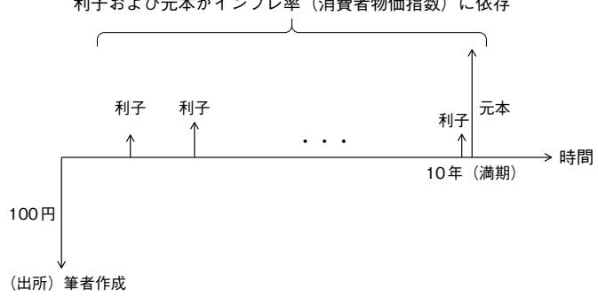
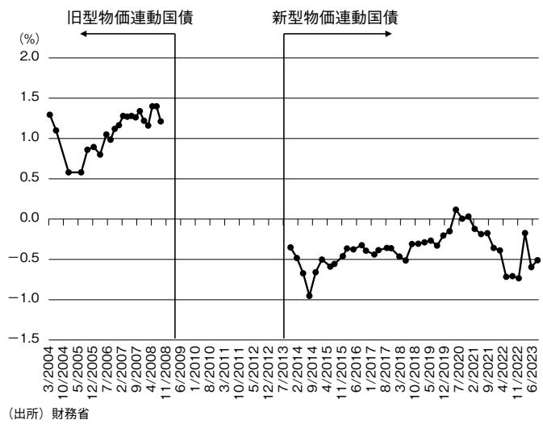
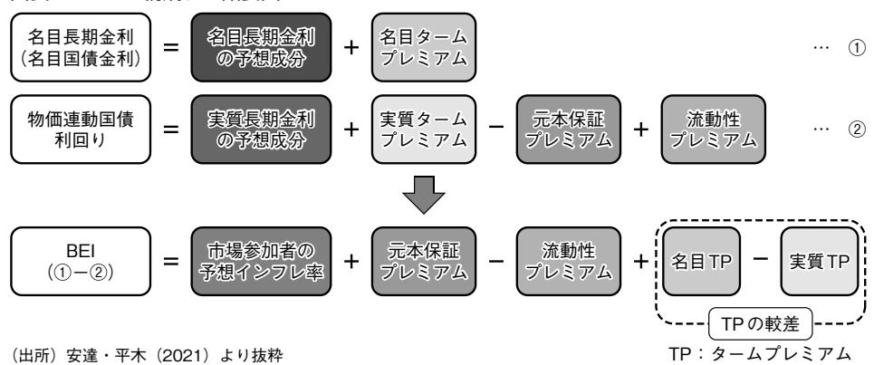
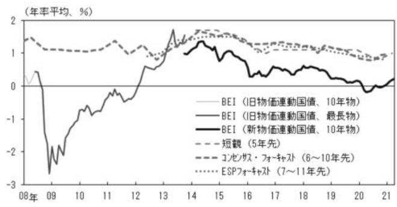
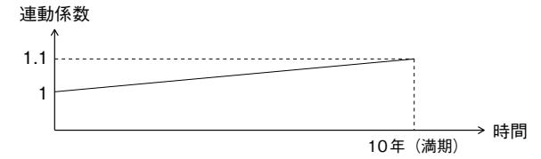
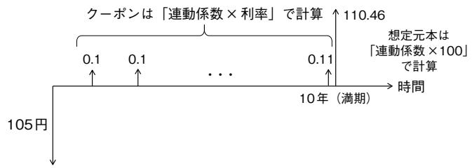
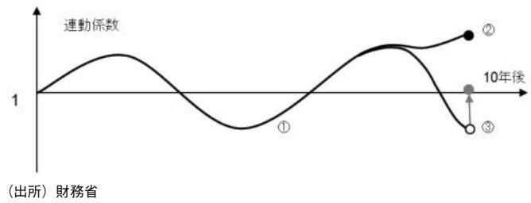
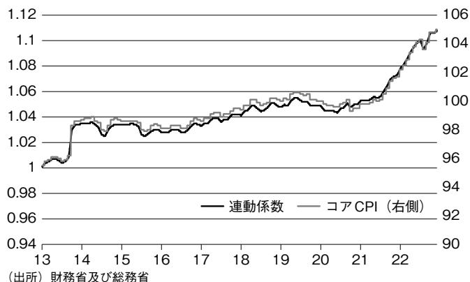

# 2024-mof-jgbi-bei-guide

<!-- page: 1 -->

## ブレーク・イーブン・インフレ率 (BEI) 入門一物価連動国債から算出する期待インフレ率一

東京大学 公共政策大学院 服部 孝洋\*1

## 1.はじめに

本稿は「物価連動国債入門一基礎編一」（服部，2024)を前提に、物価連動国債から算出される期待インフレ率（ブレーク・イーブン・インフレ率、BEI)について解説することを目的としています。物価連動国債を発行する目的は投資家にインフレヘッジの手段を提供することですが、家計や企業が予想する期待インフレ率の測定を行うことも重要な目的の一つです。経済学のモデルには家計や企業の期待が含まれることから、経済学の研究において期待インフレ率の推定は非常に重要です。また、例えば金融政策において期待への働きかけが重要であるなど、期待インフレの推定は実際の政策評価においても有益です。

本稿では、物価連動国債について期待インフレ率の観点からその理解を深めます。具体的には、BEIの定義に加えて、その特徴について議論します。また、物価連動国債の実務においては連動係数というテクニ力ルな概念を理解しなければなりませんが、本稿では他の文献に比べて丁寧な記述を試みます。

本稿は服部（2024）を前提としているため、同論文で説明した概念は説明なく用いられる点に注意してください。また、本稿は日本国債に関する基礎的な知識も前提にしています。国債の商品性の概要は、筆者が記載した「日本国債入門」（服部，2023）をご参照ください。筆者が記載してきた債券入門シリーズは、筆者のウェブサイトにまとめて掲載してあります\*2。

## 2.BEIと期待インフレ率

## 2.1 期待インフレ率とは

物価連動国債の特徴は、図表1のようにクーポンおよび元本が物価に連動する点です。物価連動国債は、生鮮食品を除く消費者物価指数（コアCPI）に元本が連動するよう設計されていますが、物価連動国債の商品性については服部（2024）で説明したため、ここでは物価連動国債から算出される期待インフレ率について議論を進めていきます。

まずフィッシャー方程式を考えると、下記が成立します（フィッシャー方程式についてはマクロ経済学のテキストなどを参照してください)。

名目金利＝実質金利+期待インフレ率

したがって、期待インフレ率は

期待インフレ率＝名目金利－実質金利という関係から計算することができます。通常の国債の市場価格より「名目金利」が得られますが、物価連動国債の価格が得られれば、インフレの影響を受けない金利である「実質金利」を算出することができます。したがって、期待インフレ率は、その差分をとることで計算することができます。ここで算出される期待インフレ率が、名目債と物価連動国債の収益率が等しくなるインフレ率であり、どちらに投資をしてもリターンが同じ（ブレーク・イーブン）インフレ率であることから、ブレーク・イーブン・インフレ率（BEI)と呼ばれます（後ほど具体例を用いて説明します)。もっとも、物価連動国債にはフロア（元本保証）のオプションが含まれることや名目債と流動性が異なることなどから、期待インフレ率の指標として一定のバイアスがあることが知られています（この点は次節で議論します)。

SPOT

\*2)下記をご参照ください。https://sites.google.com/site/hattori0819/

\*1)本稿の作成にあたって、様々な方に有益な助言や示唆をいただきました。本稿の意見に係る部分は筆者の個人的見解であり、筆者の所属する組織の見解を表すものではありません。本稿の記述における誤りは全て筆者によるものです。また本稿は、本稿で紹介する論文の正確性について何ら保証するものではありません。

<!-- page: 2 -->

## 2.2 実質金利の計算方法

物価連動国債は、満期にインフレ率で調整された元本が返済される商品ですが、実質金利を名目金利から物価の影響を排除した金利と考えれば、物価の影響を排除した状況を想定することで、実質金利を算出することが可能です。つまり、物価連動国債の表面利率が期中に得られるとし、最後に100円が償還されると想定することで実質金利を計算することができます\*3。

物価連動国債における入札結果では、「募入最高利回り」が公表されますが、服部（2024)に記載したとおり、これは「実質金利」を指しています（同年限の名目債の金利からこの実質金利を引けば、BEIが計算できます)。図表2が入札結果の一例であり、この図表において募入最高利回りはー0.480％と記載されています。これは表面利率が0.005％であるところ、発行価格が104円75銭になっているため、104円75銭で購入したものが10年後に100円で償還されると想定すれば、実質金利が0.480％というマイナス金利であることが理解できます\*4。

図表2 物価連動国債の入札結果

10年物価連動国债(第28回)の入札結果

令和5年11月7日財務省

本日、10年物価連動国債(第28回)の入札について、下記のように募入の決定を行いました。

## 記

1.名称及び記号 利付国庫債券(物価連動·10年)(第28回）

2. 発行根拠法律 特別会計に関する法律(平成19年法律第23号)及びその条項 第46条第1項

3. 表面利率 年0.005パーセント

4. 発行日 令和5年11月8日

5. 償還期限 令和15年3月10日

6. 応募額 6,821億円

7. 募入決定額 2,499億円

発行価格8. 104円75銭(募入最低価格)

9.募入最高利回り -0.480%

10. 募入最低価格に 36.7741%おける案分比率

(注1)発行価格は連動係数積算前の価格

(注2)募入最高利回りは発行価格を基に算出した単利利回り

(参考)発行日(11月8日)の連動係数 1.01519(出所) 財務省

図表3が入札結果から得られる実質金利の推移になりますが、フロア・オプションが付された物価連動国債（新型物価連動国債）が発行された2013年以降、実質金利はおおむねマイナスで推移していることがわかります（フロア・オプションが付された2013年以降の物価連動国債を「新型物価連動国債」、それ以前のフロアなしの物価連動国債を「旧型物価連動国債」と表現します)。実質金利が低位で推移していることは緩和的環境であると解釈することもできます\*5。また、物価連動国債から算出される実質金利は流動性などによりバイアスを有しているという見方もある点に注意してください\*6。

SPOT

\*3)太田(2016)では、物価連動国債の利回り(年1回利払いの場合)を下記の通り定義しており、「一見してわかるように、式としては通常の名目債の(複利)最終利回りとまったく同じ式になる。実務上は通常、物価連動国債においてはこのように物価変動による元金額の変動を明示的に考えなくても、実質利回りを計算できることになる」(p.190)とコメントしています(下記におけるPは債券価格、Cはクーポン、Tは満期までの年数、rは実質利回り)。

T p=∑ C + 100 (1 +r)t (1 +r)† t=1

\*4)例えば、2004年6月の入札において10年物価連動国債の発行価格は100円となっているため、表面利率が1.1％であり、最高利率も1.1％となっています。

\*5) 日銀の黒田前総裁は、第186回国会の財務金融委員会において「金融緩和の局面で、どうしても、金利が実質的にはマイナスにならなくても、実質金利がどんどん下がっていきますと、当然ですけれども、借り入れている人には有利になり、貯蓄している人には不利になるという面があることは否めませんが、金融緩和は、あくまでも、そういったことを通じて経済を回復させ、そして物価の安定を目指すということでございまして、御指摘の点は十分理解しておりますけれども、こういったことを通じて、より投資、消費を刺激、促進して、経済の回復、物価安定目標の達成に向けて全力を挙げて努力しているというところでございます。」と指摘しています。

https://www.shugiin.go.jp/internet/itdb\_kaigirokua.nsf/html/kaigirokua/009518620140423009.htm

<!-- page: 3 -->

## 2.3 期待インフレ率の期間構造

期待インフレ率には、年限と期待インフレ率の関係、すなわち、期間構造があるということを理解するのが大切です。期待インフレ率については、例えば、同じ2％のインフレ予想だとしても、1年間で平均2％となるのか、10年間で平均2％となるのか、という違いがあります。物価連動国債と名目債は実質金利と名目金利の期間構造を有するため、これを利用すれば、期待インフレ率の期間構造を推定することができます。

例えば、1年の名目債の価格から名目金利を計算する一方、1年の物価連動国債の価格から実質金利を計算し、両者を用いてBEIを計算したとします。このBEIには向こう1年分のインフレ期待が反映されていると解釈されます。一方、10年の名目債から名目金利を取得し、10年の物価連動国債から実質金利を取得することでBEIを算出した場合、このBEIは向こう10年分の期待インフレ率の平均を示していることになります（繰り返すようですが、流動性やフロア・オプションなどの観点で厳密には期待インフレ率から乖離する点に注意してください)。

BEIを見るときに気を付ける必要があるのは、どの年限の物価連動国債がBEIの計算に使用されたかが明示されない場合が少なくない点です。実際は、カレン卜銘柄（=物価連動国債の場合、10年債）で算出したBEIが用いられることが多い印象です。財務省のウェブサイトでBEIの時系列の推移が公表されていますが、これは物価連動国債のカレント銘柄の実質金利を計算したうえで、その銘柄と最も年限が近い10年の名目債の名目金利からそれを除くことで計算しています。なお、BloombergではBEIに関して各年限のティッカーを用意しています\*7。

## 3.BEIに関する発展的な話題

## 3.1 投資指標としてみたBEI

BEIは期待インフレ率を測る指標として重要ですが、投資家がBEIを見て投資の判断をしている側面も重要です。BEIとは、将来のコアCPIがBEIと同じ水準を実現した場合、名目債と同じリターンを生むという解釈ができます。したがって、読者が将来のコアCPIがBEIを上回ると考えるなら物価連動国債をロング、下回ると考えるならショートという形で投資の判断ができます。

例えば、1年の名目債の金利が0％であり、1年の物価連動国債の実質金利が－1％（単価が101円\*8)としましょう（ここでは簡単化のため、この1年債は新発債と想定し、当初の物価連動国債の想定元本は100円とします\*9。また、BEIが1％である点にも注意してください)。向こう1年間におけるコアCPIが1％上昇した場合、物価連動国債で運用すると、101円で購入したものが101円で償還されるため、物価連動国債のリターンは0％であり、名目債で運用した場合のリターンと同じ0％ということになります。

しかし、向こう1年間でコアCPIが2％上昇した場合、102円で償還されるため、コアCPIが1％上昇した場合に比べて1％分より多く元本が増えるのですから、名目債で運用するより1％程度高いリターンが実現することになります（単価101円で買ったところ、102円で償還されるので1％のリターンであり、名目債のリターン（0％）を1％だけ上回ります)。一方、向こう1年間でコアCPIの上昇率が0％であれば、名目債で運用すれば0％であったところ、101円で購入した物価連動国債が100円で償還されるのでリターンは－1％となり、名目債で運用したほうがよかったということになります。

\*6) 例えば、日本経済新聞（2023年1月28日）「日本の実質金利なお低迷」では、「日本の実質金利は物価連動債で算出する以上にマイナス幅が大きいとの見方も出ている。日本は長引くデフレで物価連動債の需要が低迷し、欧米に比べて投資家層が限られ流動性が乏しいという課題があるためだ」と指摘しています。

SPOT

\*7)JYGGBE05(5年の物価連動国債)やJYGGBE10（10年の物価連動国債)がテイッカーです。また、IBLE<GO>でBEIの期間構造をみることができます。

\*8)昨今の物価連動国債の利率は低いため、分かりやすさを重視してクーポンを捨象して議論をしています。

\*9)我が国では1年の物価連動債は発行されていませんが、ここでは説明の分かりやすさの観点から1年の物価連動国債の新発債を例として説明しています。

<!-- page: 4 -->

## 3.2 物価連動国債の価格の変動：BEIと名目金利

これまでの議論では、物価連動国債を購入後、最後まで持ち切ることを想定していました。一方、物価連動国債を途中で売却すれば、キャピタル・ゲインを得られる可能性もあります。10年の物価連動国債の価格は、通常の資産価格と同様、将来キャッシュ・フローの割引現在価値で決まります。現在の物価連動国債の利率が0.005％など小さいことから、簡単化のためにクーポンを捨象すると、将来のキャッシュ・フローは満期に返済される部分のみになります（つまり、割引債を想定しています)。

この場合、物価連動国債の満期（10年後）におけるキャッシュ・フローは、現在における市場の予想インフレ率に基づき決まると考えられます。物価連動国債の場合、市場予想としてBEIを用いるのが合理的ですから、期待インフレ率であるBEIが10年間実現した場合、10年後に100×(1+BEI)1⁰というキャツシュ・フローが生まれます。ここでは割引債を想定しているので、100×(1+BEI)10は将来発生する唯一のキャッシュ・フローであり、これを名目金利iで割り引いたものが将来キャッシュ・フローの割引現在価値であるため\*10、物価連動国債の価格Pは下記の通りになります。

$$
P = \frac { 1 0 0 \times ( 1 + B E I ) ^ { 1 0 } } { ( 1 + i ) ^ { 1 0 } }
$$

このことから、物価連動国債の価格の変動は（1）BEIと（2）名目金利iに依存することがわかります。

例えば、上記の式によれば、10年のBEIが1％であり、10年債の名目金利が1％である場合、物価連動国債の価格は100円になります。ここで、投資家の見通しが変わり、例えば期待インフレ率が変わることでBEIが50bps上昇したとしましょう。これは、BEIが1.5％になったということですので、上記の式を用いれば、

$$
\frac { 1 0 0 \times ( 1 + 0 . 0 1 5 ) ^ { 1 0 } } { ( 1 + 0 . 0 1 ) ^ { 1 0 } } \doteq 1 0 5 . 0 6
$$

という形で、物価連動国債の価格は105.06円となりますから、投資家はBEIの50bpsの上昇により、約5円のキャピタル・ゲインが得られることになります。もっとも、それと同時に、仮に名目金利も1％上昇したとしましょう。この場合、iが2％となるため、上記の式を計算すると、95.20円となり、キャピタル・ロスを被ることになります。このように仮にBEIが上昇したとしても、名目金利が上昇することにより、キャピタル・ロスを被る可能性があります。

投資家のリターンは、対象としている物価連動国債の年限にも依存します。先ほどは10年の物価連動国債を考えましたが、例えば、5年の物価連動国債の場合、

$$
P = \frac { 1 0 0 \times \left( 1 + B E I \right) ^ { 5 } } { \left( 1 + i \right) ^ { 5 } }
$$

という形で物価連動国債の価格を計算できます。

先ほどと同様、5年のBEIが1％、5年の名目金利が1％である場合、価格は100円になります。投資家はBEIが50bps上がると考えた場合（BEIが1.5％になる場合)、上記の式より価格は102.50円となり、キャピタル・ゲインがおおよそ2.5円得られます。また、それと同時に、名目金利が1％上昇した場合、価格は97.57円となり、キャピタル・ロスを被ることになります。5年の場合、先ほど計算した10年物価連動国債のキャピタル・ゲインやキャピタル・ロスに比べて、その額が約半分になっていることから、年限に応じて価格の変化の度合いが変わる点が確認できます(年限が感応度になる点は通常の国債と同じ性質ですが、デュレーションについては服部（2023）の4章を

SPOT

\*10)ここでは物価連動国債について割引債を想定した説明をしているため、BEIを計算するために用いられる名目金利についても、名目の割引債により計算していると想定しています。

<!-- page: 5 -->

参照してください)。

この意味で、物価連動国債のトレーディングは、BEIの動きだけではなく、名目金利の動きの影響も受けるということが分かります。もし読者がBEIの動きにだけリスクを取りたいのであれば、例えば、名目債をショートすることで金利リスクをヘッジをしながら物価連動国債を保有することが考えられます。実際、ヘッジファンドなどは「物価連動国債ロング＋名目債ショート」のようなポジションを取っています。

## 3.3BEIのバイアス：フロア・オプションとリスク・プレミアム

これまでBEIについては、「BEI＝名目金利一実質金利」というシンプルな定義を用いてきました。しかし、2013年に再開された物価連動国債には元本保証（フロア）が加わりました。前述の通り、物価連動国債はコアCPIの度合いに応じて満期で償還される額が変化します。仮にデフレが起これば、満期で償還される額が100円以下になるところ、新型物価連動国債では、その下限が100円に設定されており、これを元本保証（フロア）といいます。これは、元本が100円以下にならないオプションを有していると解釈できます。

この事実を別の角度から見ると、物価連動国債の価格には、このオプション分の価値が上乗せされることを意味します。そのため、「BEI＝名目金利一実質金利」と計算すると、実質金利にオプションの価値が反映されることになり、オプションのプライス分、バイアスが生まれます（BEIは利回りの差で定義されているため、ここでのフロア・オプションは価格ではなく、年率のプレミアムの概念で議論されている点に注意してください)。また、名目債と物価連動国債では流動性やターム・プレミアム（リスク・プレミアム)に違いがあり、そのことが物価連動国債の価格に影響を与えます（ターム・プレミアムについては服部(2023)の10章を参照してください)。したがって、これらを考慮して、BEIを下記のように分解することも少なくありません。

$$
\begin{array} { r l } & { \mathrm { B E I } = \underset { y \uparrow \uparrow \downarrow } { \mathbb { H } \uparrow \uparrow \uparrow } \times \uparrow \downarrow \downarrow \downarrow \downarrow \downarrow \downarrow \downarrow + 7 \downarrow \downarrow \uparrow \uparrow \cdot 7 \downarrow \downarrow \uparrow \downarrow \uparrow \downarrow } \\ &  \quad \quad \quad - \underset { y \uparrow \uparrow \downarrow \downarrow \uparrow \uparrow \downarrow \downarrow \uparrow \downarrow \downarrow \uparrow \downarrow \uparrow \downarrow \uparrow \downarrow \uparrow \downarrow \uparrow \downarrow \uparrow \downarrow \uparrow \downarrow \uparrow \downarrow + 7 \downarrow \downarrow + 3 \uparrow \downarrow \downarrow \uparrow \cdots \downarrow \downarrow \cdot 7 \downarrow \downarrow \uparrow \uparrow \downarrow \uparrow \uparrow \downarrow \uparrow } \end{array}
$$

図表4はこれらの関係を示した図です。ここではBEIは、期待インフレ率に加え、（1）元本保証に伴うプレミアム、（2）名目債と物価連動国債の流動性の違いから生まれるプレミアム、さらに、（3）名目債と物価連動国債のリスク・プレミアム（ターム・プレミアム）の違いにより構成されます。図表5は、BEIと予測インフレ率の乖離を生む要因を整理しています（（1）元本保証のプレミアムと（2）流動性プレミアムについては紙面の関係で次回の論文で説明する予定です)。

SPOT

\*11)安達・平木(2021)に則れば、ターム・プレミアム較差と書くベきところですが、アング(2016)では「ブレーク・イーブン・インフレ率(BEI)＝期待インフレ率+リスク・プレミアム」とするなど、「プレミアム」と記載することも多いことから、ここではシンプルに「流動性プレミアム」、「ターム・プレミアム」としています。

<!-- page: 6 -->

[Table source crop](assets/tables/2024-mof-jgbi-bei-guide-p0006-block-0001-b695043b522f0e82.jpg)
図表5 BEIと予測インフレ率を乖離させうる3つの要因

## 3.4 BEI以外の期待インフレ率の指標

前述のとおり、BEIは、物価連動国債と関係が深いことから、いわば国債の投資家の意見を強く反映した期待インフレ率を表しているともいえます。もっとも、期待インフレ率については、物価連動国債という資産価格から抽出するのではなく、アンケートにより消費者や投資家から直接意見を募ることも可能です。例えば、日本経済研究センターが毎月公表するESPフォーキャストでは、日本経済の将来予測を行っている民間エコノミスト約40名に対して、日本経済の株価・円相場などについて質問票を送ることで、予測データを作成し公表しています。その中では、コアCPIの予測値についてもヒアリングしています。ESPフォーキャストでは、図表6のような形で、CPIの予測値の主観的な分布について各エコノミストの解答が集計され、公表されています。

ESPフォーキャスト以外にも、いくつかの期待インフレ率の指標が存在します。図表7は期待インフレ率の指標の一覧を示したものですが、「家計」、「エコノミスト」、「金融市場参加者」という調査主体ごとに分類されており、それぞれの特徴が整理されています。前述のとおり、BEIにはフロア・オプションなどが含まれていることから、一定のバイアスを有しますが、投資家はこれらのデータを交互に参照しながら物価連動国債の投資を行っています。物価連動国債への投資という観点でいえば、物価連動国債は物価指数の中でもコアCPIを参照していますが、図表7の中にはコアCPI以外の物価指数を参照しているものがある点に注意してください（期待インフレ率をどのように測定するかに関心がある読者は、渡辺（2023）の3章なども参照してください)。

図表8が、BEIとサーベイベースの期待インフレ率を比較しています。増島・安井・福田（2016）では、「流動性プレミアムなどの金融資産特有の要因により、BEIが市場参加者のインフレ予想から乖離しうる点に注意を要することが指摘されてきた」、「日本においても、BEIはサーベイベースの指標と比ベて低水準で推移しているなど、その動向の評価には留意を要する」と指摘しています。

[Table source crop](assets/tables/2024-mof-jgbi-bei-guide-p0006-block-0007-dab0acb877abc4ff.jpg)
図表6ESPフォーキャストの質問票：予測値の主観的な分布

[Table source crop](assets/tables/2024-mof-jgbi-bei-guide-p0006-block-0008-2edb40c271d164c6.jpg)
図表7期待インフレ率の指標

SPOT

<!-- page: 7 -->

## 4. 連動係数

## 4.1 連動係数のアイデア

ここから物価連動国債の元本を計算するうえで重要な概念である連動係数について説明します。物価連動国債は前述のとおり、満期に100円で償還されるわけではなく、物価で調整された想定元本で償還されますが、この想定元本は100円に「連動係数」をかけることで計算します。図表9の上図は、仮に毎年1％インフレが実現した場合の連動係数の推移のイメージを示しています。毎年のインフレ率が1％の場合、下記の形で、10年後の連動係数が計算できます。

$$
1 5 5 \times 5 0 = 1 . 0 \times ( 1 + 0 . 0 1 ) ^ { 1 0 } = 1 . 1 0 4 6
$$

図表9の下図は期中のクーポンに加え償還時のキャツシュ・フローを示していますが、クーポンは「連動係数×利率」という形で決まるため、連動係数が上昇（下落）すればクーポンも上昇（下落）します。物価連動国債の元本は「連動係数×100」で計算されるため、$1 0 0 \times 1 . 1 0 4 6 = 1 1 0 . 4 6 \times \times 2 . 5$ 形で計算されます。

上記では、インフレ率が毎年1％で10年間推移すると想定しましたが、実際にはインフレ率は時間を通じて変動するため、連動係数の動きも時間を通じて変化します。図表10が、コアCPIが変化した場合の連動係数の動きを示した一例です。連動係数は、この図表のようにインフレ率が上がれば1を上回りますし、デフレになれば1を下回ります。もっとも、償還時には100円を下回らないという商品性になっているので、図表10における（3）のパスのように償還時に1を下回る場合には、最終的に当該連動係数は1に切り上げになると解釈できます（フロアがあるため償還時は1が下限となります。ただし、期中・償還時を問わず、クーポンには100円のフロアがない点（図表10のとおり、1を下回ることはある点）に留意してください)。

## 4.2 連動係数はなぜ複雑になるのか

連動係数そのものは財務省のウェブサイトに掲載されていますが、ここではもう少し丁寧に連動係数を説明します。前述のとおり、連動係数そのものは1を基準としており、インフレが進めばその度合いに応じて1を上回るものと計算されますが（デフレが進めば連動係数は低下するもののフロアがあるため満期時点では1が下限)、実際の計算は非常にテクニカルです。銘柄ごとの連動係数は、図表11のような形で財務省のウェブサイトに日次ベースで公表されます。日次で公表される理由は、実際の取引において経過利子などの観点で日次べースのデータが必要であるからです。連動係数がテクニカルになる理由は、筆者の理解では、主に、（1）コアCPIが月次べースである一方、連動係数は日次べースで必要になるため、その調整が必要であることに加え、（2）コアCPIの発表が一定のラグを有するという2点に集約されます。

SPOT

<!-- page: 8 -->

[Table source crop](assets/tables/2024-mof-jgbi-bei-guide-p0008-block-0001-1ceeedbae1f8baf4.jpg)
図表11 連動係数の推移の例

まず、（1）については、日々売買が行われうる中、経過利子の計算などが必要になるため、日次べースの連動係数の計算が必要なところ、コアCPIは月次べースの統計であることから、コアCPIを日次べースに直す必要があります。後述しますが、これについては、物価連動国債が毎年3月10日に償還される商品性になっているため、10日を軸に補間することで日次データにするという形がとられています（コアCPIは基準年との比較で算出され、基準年も変わることから、その調整も必要な点が話を複雑にします。補間方法はBOXで説明します)。

(2)については、コアCPIの公表には一定のラグがあるための調整です。例えば、現在が2023年12月だとしましょう。問題なのは2023年12月時点で、その時点での消費者物価指数が得られないことです。消費者物価指数を作るには、家計の消費行動についてアンケートをとったり、典型的な財の価格をトラックするなどの作業が必要ですから、データの公表には3か月程度のラグがあります。したがって、実際に物価連動国債がトラックするコアCPIは、例えば、現在が2023年

12月であれば2023年9月のコアCPIを活用するという形で、3か月前のコアCPIが参照されています。

上記のような違いがあるものの、連動係数はコアCPIと本質的には同じ概念である、ということを頭に入れておくことが大切です。図表12は第17回債（最初の新型物価連動国債）の連動係数とコアCPIの推移(3か月のラグを調整後）を示していますが、類似した動きをしていることが分かります（相関係数は0.99です\*12)。

## 4.3 連動係数の定義：適用指数

ここから具体的に連動係数の定義を考えていきます。ある時点における想定元本は、財務省のウェブサイトの表現を借りると、「m月n日の想定元金」と表現され、「m月n日の想定元金」は、「額面金額×m月n日における連動係数」と定義されています。「m月n日における連動係数」の定義は下記の通りになります。

m月n日における連動係数=m月n日における適用指数÷発行日の属する月の10日における適用指数（小数点以下第6位（平成28年3月31日以前に発行された物価連動国債については、小数点以下第4位）を四捨五入)

SPOT

\*12)連動係数は日次で動くー方、コアCPIは月次データであるため、後者については特定の月の間、同じ値をとります。したがって、連動係数とコアCPIが完全に同じ動きをすることは原理的にあり得ません。

<!-- page: 9 -->

このように連動係数は「適用指数の比率」であることがわかります。分子及び分母の適用指数には、コアCPIの数値が使われます。連動係数の分子（m月n日における適用指数）は、その時点における3か月前のコアCPIになります（3か月前となっている理由は、前述のとおり、発行した時点でその月のCPIはまだ発表されておらず、3か月前のコアCPIであればすでに発表済みであるからです)。連動係数の分母（発行日の属する月の10日における適用指数）は、当該物価連動国債の発行月の前年12月のコアCPIに相当します\*13。連動係数の定義の中に、「発行日の属する月の10日」とありますが、これは物価連動国債の利払・償還日が3月10日または9月10日であることが理由と考えられます。実際、適用指数は、毎月の10日に実際のコアCPIと一致するように作られています。

最後に具体例を取り上げます。例えば、第28回債の2024年1月10日の連動係数の場合、第28回債の発行は2023年5月24日ですが、この時の「発行日の属する月の10日における適用指数」（分母）は104.1です(2022年12月のコアCPIが104.1)。一方、2024月1月10日の適用指数（分子）は106.4なので（2023年10月のコアCPIが106.4)、連動係数は106.4/104.1=1.02209となります（この値が財務省のウェブサイトで公表されています)。ここでは償還日となる10日であるシンプルな事例にしていますが、10日以外のケースについてはBOXを参照してください。

## BOX 連動係数および適用指数の詳細

本文では10日の事例を用いましたが、日次べースの連動係数は毎月公表されています。連動係数を計算する上で必要となる適用指数（連動係数の分子）はn=10日当日、10日以降、10日以前という3つのケースに分けて定義されています。

(1)n=10の場合

## (m－3)月の消費者物価指数

前述のとおり、10日は実際のコアCPIになりますが、コアCPIの公表にはラグがあるため、3か月前のコアCPIが参照されます。

(2) n>10の場合

$$
\begin{array} { r l }  \small \begin{array} { l l } { \mathrm { m ~ \mathbb { H } ~ 1 0 ~ \mathbb { E } ~ \it { \ [ - \lambda ] \mathbb { B } } \mathbb { H } \hat { \leq } \mathrm { \Lambda \mathbb { H } } ~ \hat { \leq } \mathrm { \Lambda \mathbb { H } } ~ \hat { \leq } ~ \mathrm { \Lambda \mathbb { E } ~ + } ~ } } \\ { \mathrm { ~ \mathbb { H } ~ \frac { \mu } { \mathbb { H } } ~ \frac { \mu } { \mathbb { H } } ~ \frac { \mu } { \mathbb { H } } ~ \frac { \mu } { \mathbb { H } } ~ \frac { \mu } { \mathbb { H } } ~ \frac { \mu } { \mathbb { H } } ~ \frac { \mu } { \mathbb { H } } ~ \frac { \mu } { \mathbb { H } } ~ \mathrm { ~ \Lambda \mathbb { H } } ~ } } \\  \mathrm { ~ \mathbb { H } ~ \frac { \mu } { \mathbb { H } } ~ \frac { \mu } { \mathbb { H } } ~ \frac { \mu } { \mathbb { H } } ~ \frac { \mu } { \mathbb { H } } ~ \frac { \mu } { \mathbb { H } } ~ \frac { \mu } { \mathbb { H } } ~ \frac { \mu } { \mathbb { H } } ~ \frac { \mu } { \mathbb { H } } ~ \frac { \mu } { \mathbb { H } } ~ \mathrm { ~ \Lambda \mathbb { H } } ~ \frac { \mu } { \mathbb { H } } ~ \mathrm { ~ \Lambda \mathbb { H } } ~ \hat { \leq } ~ \mathrm { \Lambda \mathbb { H } } ~ \hat { \leq } ~ \mathrm { \Lambda \mathbb { H } } ~ \mathrm { ~ \Lambda \mathbb { H } } ~ } \\  \mathrm  ~ \mathbb { H } ~ \mathbb { H } ~ \mathbb { H } ~ \mathbb { H } ~ \frac { \mu } { \mathbb { H } } ~ \frac { \mu } { \mathbb { H } } ~ \frac { \mu } { \mathbb { H } } ~ \frac { \mu } { \mathbb { H } } ~ \frac { \mu } { \mathbb { H } } ~ \mathrm { H } ~ \frac { \mu } { \mathbb { H } } ~ \mathrm { S } \mathrm { S } \mathrm { S } \mathrm { S } \mathrm { S } \mathrm { S } \mathrm { S } \mathrm { S } \mathrm { S } \mathrm { S } \mathrm { S } \mathrm { S } \mathrm { S } \mathrm { S } \mathrm  \end{array} \end{array}
$$

「n>10」はある月における11日以降を意味しますが、仮に適用指数を計算する日が15日であれば、10日に使用したコアCPIを軸に、その翌月のCPIの情報を加味する必要があるといえます。上記の式は、10日のコアCPIを軸に、それ以降に公表されるコアCPIを用いて線形補間をしているイメージです。

具体例として、例えば2023年12月15日の連動係数（第28回債）を考えます(これは15日なので「n>10」の事例になっています)。この日の連動係数は、1.01646と公表されているのですが、この値を算出するため、下記のような順番((1)～(3))で考えていきます。

$$
\underbrace  \begin{array} { l } { \underbrace { \overbrace { \Psi } \mathbb { H } \underbrace { 1 0 \mathbb { E } [ - \chi _ { 3 } ^ { \otimes } \mathbb { H } ] \mathbb { E } } _ { ( 1 ) } + \hbar \mathcal { E } } _ { ( 1 ) } } \\ { ( 1 ) } \end{array} + \underbrace  \left( \begin{array} { l l } { ( \mathrm { m } + 1 ) \mathbb { H } \underbrace { 1 0 \mathbb { H } [ - \chi _ { 3 } ^ { \otimes } \mathbb { H } ] } _ { ( 1 ) \mathbb { H } \mathbb { H } \mathbb { H } \mathbb { H } \mathbb { H } \mathbb { H } \mathbb { H } } } &  - \underbrace { \begin{array} { l } { \ m \mathbb { H } ~ 1 0 \mathbb { H } [ - \chi _ { 3 } ^ { \otimes } \mathbb { H } ] \mathbb { H } \mathbb { H } \mathbb { H } \mathbb { H } \mathbb { H } \mathbb { H } \mathbb { H } \mathbb { H } \mathbb { H } \mathbb { H } \mathbb { H } \mathbb { H } \mathbb { H } \mathbb { H } \mathbb { H } \mathbb { H } \mathbb { H } } \\ { \mathbb { H } \mathbb { H } \mathbb { H } \mathbb { H } \mathbb { H } \mathbb { H } \mathbb { H } \mathbb { H } \mathbb { H } \mathbb { H } \mathbb { H } \mathbb { H } \mathbb { H } \mathbb { H } \mathbb { H } \mathbb { H } \mathbb { H } \mathbb { H } \mathbb { H } \mathbb { H } \mathbb { H } \mathbb { H } \mathbb { H } \mathbb { H } \mathbb { H } \mathbb { H } \mathbb { H } \mathbb { H } \mathbb { H } \mathbb { H } \mathbb { H } \mathbb { H } \mathbb { H } \mathbb { H } \mathbb { H } \mathbb { H } \mathbb { H } \mathbb { H } \mathbb { H } \mathbb { H } \mathbb { H } \mathbb { H } \mathbb { H } \mathbb { H } \mathbb { H } \mathbb { H } \mathbb { H } \mathbb { H } \mathbb { H } \mathbb { H } \mathbb { H } \mathbb { H } \mathbb { H } \mathbb { H } \mathbb { H } \mathbb { H } \mathbb { H } \mathbb { H } \mathbb { H } \mathbb { H } \mathbb { H } \mathbb { H } \mathbb { H } } \\ { ( 2 ) } \end{array} \right) } _ { ( 2 ) } \times \underbrace  \overbrace  \operatorname { m } \mathbb { H } \mathbb { 1 } + \mathbb { I } \ \end{array}
$$

SPOT

\*13)財務省のウェブサイトでは、「発行日の属する月」について「初期利子の支払期までの期間が6か月に満たない場合は、初期利子の利払期の6か月前の日の属する月をいいます」と記載されています。現在発行されている物価連動国債の利払月は3,9月ですから、年度前半に新たな銘柄が発行された場合、その初期利子の利払期は9月になり、「発行日の属する月」はその6ヶ月前である3月になります。従って、その適用指数はさらにその3ヶ月前である、前年12月のコアCPIになります。

<!-- page: 10 -->

まず、(1）における「m月10日に適用される消費者物価指数」は、12月10日に適用されるコアCPIに相当し、これは2023年9月のCPL（105.7)です。次に、(2)における「(m+1）月10日に適用される消費者物価指数一m月10日に適用される消費者物価指数」は、この例では「2024年1月10日に適用される消費者物価指数一2023年12月10日に適用される消費者物価指数」に相当します。2024年1月10日に適用されるコアCPIは、2023年10月のコアCPIが106.4であるため、(2)における「(m+1）月10日に適用される消費者物価指数一m月10日に適用される消費者物価指数」は「106.4－105.7」になります。最後に、(3)「(n－10)/(m月11日から(m+1)月10日までの日数)」に注目すると、nが15であることに注意すれば、(3)は「(15一10）/(2023年12月11日から2024年1月10日までの日数）=5/31」となります。したがって、上記を計算すると、

$$
1 0 5 . 7 + ( 1 0 6 . 4 - 1 0 5 . 7 ) \frac { 5 } { 3 1 } \div 1 0 5 . 8 1 3
$$

となります。連動係数の分母は「発行日の属する月 $\mathcal { D } \supset \mathcal { D } \mathsf { C P } | \mathcal { C } \oplus \mathsf { D } , \mathcal { \tau } \mathcal { O }$ 場合、104.1ですから、105.813/104.1÷1.01646という形で、連動係数が再現できました。この計算プロセスからわかるとおり、連動係数は基準となるコアCPIを軸にして、10日を超える場合、翌月のコアCPIの水準を経過した日数を加味して線形補間しています。

(3)n<10の場合

$$
\begin{array} { r l r } { ( \mathfrak { m } - 1 ) \boxplus 1 0 \boxplus \{ i : \sqrt { \mathtt { m } } \sharp \sharp \sharp \sharp \sharp \sharp \sharp \sharp \sharp \sharp \sharp \sharp \sharp \ : } \le \hbar \mathfrak { s }  & { + \left( \begin{array} { l l } { \mathfrak { m } \sharp 1 0 \boxplus \{ i : \sqrt { \mathtt { m } } \sharp \sharp \sharp \sharp \sharp \sharp \sharp \sharp \sharp \sharp \ : } \mathfrak { s } \cdots \right)} & { ( \mathfrak { m } - 1 ) \boxplus 1 0 \boxplus i : \cdots \sharp \sharp \sharp \sharp \sharp \sharp \sharp \sharp \sharp \sharp \sharp \ : \cdots } \\ { \vdots \sharp \sharp \sharp \sharp \sharp \sharp \sharp \sharp \sharp \sharp \sharp \sharp \sharp \sharp \ : \cdots } & { \cdots \quad \vdots \sharp \sharp \underline { { \mathtt { m } \sharp \sharp \sharp \sharp \sharp \sharp \ 9 \widehat { ( \mathtt { m } \sharp \sharp \sharp \sharp \sharp \sharp \sharp \sharp \sharp \sharp \sharp \sharp \sharp \sharp \sharp \sharp \sharp \sharp \sharp \sharp \sharp \sharp \sharp \sharp \sharp \sharp \ : } } } ) \times \cdots } & { ( \mathfrak { m } \sharp \mathfrak { m } \sharp \sharp \sharp \sharp \sharp \sharp ) \sharp \cdots \ : \boxed { \mathfrak { m } \sharp \qquad \mathfrak { m } \sharp \sharp \qquad \mathfrak { m } \sharp \sharp \qquad \mathfrak { s } \cdots \ : \langle \mathtt { m } \mathtt { m } \rangle \sharp \sharp \sharp \ : \cdots \ : \sharp \xi \wedge \mathfrak { s } \varphi } } & { \cdots } \end{array}   & { \times \xrightarrow { ( \mathfrak { m } - 1 ) \boxplus 1 1 \boxplus 1 \lbrack \mathfrak { m } \sharp \sharp \sharp \sharp \varphi \varphi \varphi \varphi \varphi \varphi \varphi \varphi \varphi \varphi \varphi \varphi \varphi \varphi \varphi \varphi \varphi \varphi \varphi \varphi \varphi \varphi \varphi \varphi \varphi \varphi \varphi \varphi \varphi \varphi \varphi \varphi \varphi \varphi \ : } } \\ & { } & { \operatorname* { m i n } \boxplus 1 0 \boxplus \{ i : \overline { { \mathfrak { m } } } \mathfrak { m } \mathfrak { s } : \overline { { \mathfrak { m } } } \mathfrak { s } \varphi \mathfrak { m } \mathfrak { s } \varphi \varphi \varphi \varphi \varphi \varphi \varphi \varphi \varphi \varphi \varphi \varphi \varphi \varphi \varphi \varphi \varphi \varphi \varphi \varphi \varphi \varphi \varphi \varphi \varphi \varphi \varphi \varphi \varphi \varphi \ : \cdots }  \end{array}
$$

これは10日以前の適用指数を計算するにあたり、前 $\Xi \mathcal { D } \ = 1 0 \Xi \mathcal { D } \ = \supset \mathcal { P } ($ CPIを軸にして、その月に公表されるCPIを用い、経過した日数を加味して線形補間していると解釈されます(こちらについては「n>10」の事例と考え方は同じであるため、具体例は省略します)。

なお、消費者物価指数はある年を基準としており、その基準が定期的に入れ替わります。例えば、CPIの基準は平成22（2010)年から平成27（2015）年へと変わっています。この変更に伴いCPIの動きが非連続になるのですが、連動係数を計算するうえでその変更に伴う調整も必要である点に注意してください。例えば、平成28年9月11日以降の連動係数の算出方法には、「平成28年9月10日における適用指数（平成22年基準）/平成28年9月10日における適用指数(平成27年基準」が掛けられることで調整がなされています。

## 5. 終わりに

今回は物価連動国債における、期待インフレ率やBEIについて説明しました。今回はフロア・オプションなどについては触れられなかったため、次回はこれらの個別論点について説明することを予定しています。

## 参考文献

[1].安達孔・平木一浩(2021)「インフレ予想の計測手法の展開：市場ベースのインフレ予想とインフレ予想の期間構造を中心[に]Research LAB No.21-J-1. [2]．太田智之(2016)「債券運用と投資戦略【第4版】」きんざい [3].服部孝洋(2023)「日本国債入門」金融財政事情研究会.服部孝洋(2024)「物価連動国債入門一基礎編一」『ファイナンス』,31-39. [4]．増島稔・安井洋輔・福田洋介(2017)「予想インフレ率の予 測力」New ESRI Working Paper No.43. [5]．アンドリュー・アング（2016)「資産運用の本質－ファクター投資への体系的アプローチ」きんざい [6]．渡辺努(2022)「物価とは何か」講談社

SPOT
