<!-- page: 1 -->

Volatility Modeling in Markovian and Rough Regimes: Signature Methods and Analytical Expansions 

Elisa Alòs* , Òscar Burés† § , Rafael de Santiago§ and Josep Vives† ‡ 

## May 11, 2026 

#### **Abstract** 

We study two complementary methodologies for calibrating implied volatility surfaces: analytical approximations and data-driven models based on rough path theory. On the analytical side, we revisit a second-order asymptotic expansion for the Heston model, and we propose a new, VIX-based calibration scheme for the rough Bergomi model. Both methods yield highly accurate and computationally efficient calibration formulas when the underlying dynamics are well specified. In parallel, we develop a signature-based approach in which volatility is represented as a linear functional of the truncated signature of a primary stochastic process, providing a flexible and model-agnostic alternative. 

Our numerical experiments compare the two approaches across both Markovian and nonMarkovian settings. In the Heston case, signature-based models achieve a level of accuracy comparable to analytical expansions. In the rough Bergomi setting, using a fractional Brownian motion as the primary process, the signature approach continues to perform strongly and in some cases improves upon the Markovian specification, reflecting its ability to capture more complex temporal dependencies. Overall, the results illustrate that analytical methods are highly effective when the model is correctly specified, while signature-based methods offer a robust and flexible framework for calibration across a wider range of volatility dynamics. 

**Keywords:** Rough volatility, rough path theory, signatures, implied volatility calibration, VIX. 

**JEL Classification:** G13, C63, C58. 

**MSC 2020:** 60L70, 60H10, 91G20, 91G60, 60G22. 

# **1 Introduction** 

The realization that constant-volatility models could not account for effects like clustering, heavy tails, and _smiles_ prompted the extension of the Black–Scholes framework to include stochastic volatility. Early models addressed these limitations by introducing a second (correlated) Brownian motion to govern the volatility, yielding more realistic asset price dynamics. This line of research, initiated by Hull and White (1987), Wiggins (1987), Stein and Stein (1991), and Heston (1993), has given rise to a broad and influential literature in mathematical finance. 

A particularly influential part of the literature has focused on developing closed-form approximation formulas for implied volatility through asymptotic expansions and perturbation methods 

> *Department of Economics and Business, Universitat Pompeu Fabra and Barcelona School of Economics. Ramón Trias Fargas 25-27, 08005, Barcelona, Spain. 

> †Departament de Matemàtica Econòmica, Financera i Actuarial, Universitat de Barcelona. Diagonal 690–696, 08034 Barcelona, Spain. 

> §Department of Managerial Decision Sciences, IESE Business School. Av. Pearson 21, 08034 Barcelona, Spain. 

> ‡Institut de Matemàtiques, Universitat de Barcelona. Gran Via de les Corts, 585, 08007 Barcelona, Spain. Òscar Burés supported by program AGAUR-FI ajuts (2025 FI-1 00580) from the Department of Research and Universities of the Government of Catalonia and the co-funding of the European Social Fund Plus (ESF+).

<!-- page: 2 -->

applied to parametric models, such as Heston and SABR. These approximations aim to facilitate the calibration of model parameters to market-observed implied volatility surfaces. Efficient calibration is a central task in financial practice, as option prices are typically quoted via implied volatilities, and model parameters must be inferred by inversion. Contributions to this area include, among others, Hagan et al. (2002), Fouque et al. (2003), Medvedev and Scaillet (2007), De Santiago et al. (2008), Antonelli and Scarlatti (2009), Benhamou et al. (2009, 2010a,b), Forde et al. (2010), Forde and Jacquier (2011), Forde et al. (2011), Alòs (2012), Lorig et al. (2013) and Alòs et al. (2015). 

While these parametric models and their expansions have proven theoretically elegant and computationally tractable, they also come with important limitations. Relying on a fixed model structure may restrict flexibility and hinder the model’s ability to capture certain stylized features observed in market data. In addition, the presence of multiple stochastic drivers often increases computational complexity, requiring the use of numerical tools such as Fourier transforms, Monte Carlo methods, or finite-difference PDE solvers. Moreover, a growing body of empirical evidence suggests that volatility exhibits rough, fractional-like behavior that traditional Markovian models struggle to reproduce. This has led to increased interest in fractional (rough) volatility models, such as those introduced in Comte and Renault (1998), Alòs et al. (2007), and Fukasawa (2017), which more accurately reflect the observed structure of the implied volatility surface and align with empirical evidence on the roughness of volatility paths (e.g., Bayer et al. (2016), Gatheral et al. (2018)). 

In response to these challenges, a more recent line of research has embraced non-parametric, data-driven approaches that aim to learn volatility dynamics directly from observed paths, rather than specifying a rigid structural model. A prominent example of this paradigm is the use of rough path theory and signature methods, originally introduced in Chen (1957) and rigorously developed in Lyons (1998). The signature of a path (to be defined precisely below) consists of its iterated integrals and encodes its temporal features into a rich algebraic structure. Over the years, these ideas have found applications in machine learning, time series analysis, and mathematical finance (e.g., Bühler et al. (2020), Arribas et al. (2020), Cuchiero et al. (2023)). Because it relies on functional features rather than a parametric form, signature-based modeling is well suited for capturing behaviors observed in rough volatility models. 

In this paper, we consider two complementary approaches to the calibration of implied volatility surfaces. On the one hand, we present analytical approximations for both the Heston and rough Bergomi models. For Heston, we revisit a second-order asymptotic expansion, while for rough Bergomi we introduce a new calibration scheme based on VIX-implied information. These methods yield highly accurate formulas when the underlying model is well specified. On the other hand, we study signature-based approximations in which the volatility is represented as a linear functional of the truncated signature of a primary stochastic process (taken to be, respectively, a Heston variance process and a fractional Brownian motion). This approach does not rely on a fixed parametric specification and provides a flexible framework capable of adapting to different volatility dynamics. Rather than contrasting the two methodologies, our aim is to highlight their respective strengths and to assess their performance across both Markovian (Heston) and non-Markovian (rough Bergomi) regimes. 

To make the paper self-contained, Section 2 presents the analytical approximations for both models: we first review the second-order expansion technique for the Heston model introduced in Alòs et al. (2015), highlighting its mathematical structure and practical strengths, and then develop a new calibration scheme for the rough Bergomi model, based on VIX-implied volatility information. Section 3 introduces the core elements of rough path theory needed to define and compute path signatures. In Section 4, we develop the signature-based stochastic volatility model, describe its numerical implementation, and outline the training procedure. Section 5 reports numerical results for the Heston setting, including both uncorrelated and correlated dynamics as in Alòs et al. (2015), and compares them with the corresponding analytical approximation. Section 6 presents the results for the rough Bergomi model, using a fractional Brownian motion as the primary process, and provides the analogous comparison.

<!-- page: 3 -->

# **2 Analytic Calibration Methods** 

In this section we explore two alternative ways of calibrating analytically the implied volatility surface generated by the Heston model and the rough Bergomi model. For the Heston model, we follow the approach in Alòs et al. (2015), which calibrates the model parameters by solving a system of non-linear equations. For the rough Bergomi model, we introduce a new way to calibrate the implied volatility surface using short-maturity information. 

## **2.1 A Second-Order Approximation to the Heston Implied Volatility** 

We provide here a concise overview of the second-order approximation derived in Alòs et al. (2015). For full proofs and theoretical justifications, we refer the reader to the original paper. Our purpose is to use the estimates obtained with this methodology as a benchmark for comparison with the signature-based models that are introduced later. 

Assume that, for _t ∈_ [0 _, T_ ], the stock price follows the dynamics 

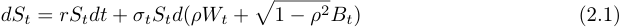

under a risk neutral probability P, where _r ≥_ 0 is the constant instantaneous interest rate, _W_ and _B_ are independent standard Brownian motions defined in the complete probability space (Ω _, F,_ P), and _ρ ∈_ ( _−_ 1 _,_ 1). We also assume that the volatility process _σt_ satisfies 

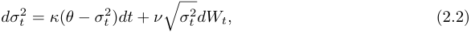

with 2 _κθ ≥ ν_2 . We denote by _F__W_ = _{Ft__W_;_t∈_[0_, T_]_}_and_FB_=_{F_ _t__B_;_t∈_[0_, T_]_}_thefiltrations generated, respectively, by _W_ and _B_ , and we define _F_ as the collection of sigma algebras _Ft__W∨F_ _t__B_ for each _t ∈_ [0 _, T_ ], that is, _F_ := _F__W_ _∨F__B_ . Equations (2.1) and (2.2) constitute what is known as the Heston model. 

If we let _Xt_ := ln _St_ , the price of a European call option at time _t_ with strike _K_ and maturity _T_ is given by 

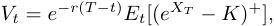

where _Et_ [ _·_ ] := _E_ [ _·|Ft_ ]. For a constant volatility _σ_ , and letting _k_ = ln _K_ , the above general expression has the well-known analytical solution 

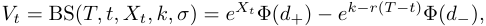

where Φ is the cumulative distribution function of a standard Gaussian random variable, and 

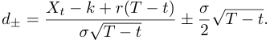

When volatility is stochastic, the Black-Scholes formula no longer provides an exact solution. However, we can define an implied volatility approximation by evaluating the Black-Scholes formula at 

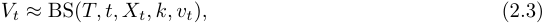

where 

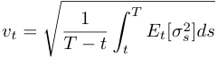

represents the square root of the expected average variance over the remaining life of the option. 

Let _Vt__mkt_ be the market price at time _t_ of a European call option with maturity _T_ and strike _K_ . As the BS function is invertible in the argument _vt_ , we can define the implied volatility as the unique _I_ ( _T, K_ ) satisfying the equality 

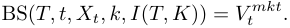

<!-- page: 4 -->

<!-- Start of picture text -->
(f/ f | (——/ | ( ~~) (~ —~ ——)- (=) (-~ — ——) <!-- End of picture text -->

<!-- page: 5 -->

In particular, with _market_ parameters _S_ 0 = 100, _σ_ 0 = 0 _._ 2, _ν_ = 0 _._ 3, _κ_ = 3, _θ_ = 0 _._ 09 and _ρ_ = 0, the parameters calibrated with the above algorithm are: 

|Parameter|True Value|Calibrated Value|
|---|---|---|
|_σ_0|0.2|0.200013|
|_ν_|0.3|0.307340|
|_κ_|3|2.998598|
|_θ_|0.09|0.089960|
|_ρ_|0|0.000000|

Table 2.1: Calibrated parameters from Alòs et al. (2015) with _ρ_ = 0. 

In the correlated case, with _ρ_ = _−_ 0 _._ 5, the calibrated parameters are: 

|Parameter|True Value|Calibrated Value|
|---|---|---|
|_σ_0|0.2|0.200016|
|_ν_|0.3|0.290138|
|_κ_|3|2.973728|
|_θ_|0.09|0.090022|
|_ρ_|_−_0_._5|_−_0_._504084|

Table 2.2: Calibrated parameters from Alòs et al. (2015) with _ρ_ = _−_ 0 _._ 5. 

These accurate calibrations will serve as a benchmark in Section 5 for comparison with the signature-based model. A limitation of this method lies in the assumption of taking the Heston model as the underlying dynamics for the volatility process. As a result, its flexibility is constrained by the limitations of that specific model, which may not adequately capture roughness or other complex behaviors observed in real markets. 

## **2.2 Closed-form calibration of the Rough Bergomi Model** 

Consider the rough Bergomi model 

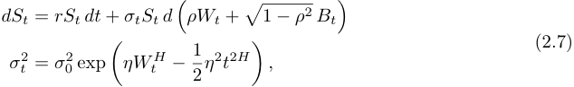

where _η >_ 0, _H ∈_ (0 _,_ 1) and _Wt__H_ is a Volterra-type fractional Brownian motion: 

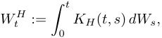

with _KH_ ( _t, s_ ) = _√_ 2 _H_ ( _t − s_ )_H−_ 2<u>1</u> for 0 _< s < t_ . Assume that the risk-free rate _r_ is known (it is observable from the market) and that _ρ_ = 0. 

In this section we propose a new closed-form calibration procedure for the rough Bergomi model that combines short-time asymptotic results for the implied volatility surface with information extracted from VIX-implied volatility, leading to an efficient and easily implementable estimation of the model parameters. In the same way as with the method for the Heston calibration, we assume that the whole implied volatility is available. By this, we mean that _I_ ( _T, K_ ) can be determined for every maturity _T_ and strike _K_ . 

Let _H ∈_ (0 _,_ 1 _/_ 2). To estimate the set ( _σ_ 0 _, H, η, ρ_ ), we proceed as follows. 

- **Step 1 - Estimation of** _H_ **.** We take two reference strikes on either side of ATM, _KT_+ and _KT__−_,respectivelydefinedby_d_+=0and_d−_=0.Thedifference_I_(_T, K_ _T_+)_−I_(_T, K_ _T__−_)

<!-- page: 6 -->

captures the skew of the implied volatility smile. For maturities _T_ 1 and _T_ 2, Alòs et al. (2025) show that the Hurst index can be estimated as: 

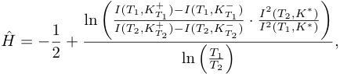

where _K__∗_ denotes the ATM log-strike. As this approximation does not depend on specific model parameters, it can be used without first calibrating a specific volatility model. With rough fractional volatility, _H_ˆ provides a quick way to estimate the Hurst parameter from the implied volatility surface. 

- **Step 2 - Estimation of** _η_ **.** To estimate _η_ , we use the short-time behavior of the implied volatility of VIX options. Let ∆ be 30 trading days. The VIX index at time _T_ is defined as 

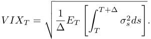

Consider a European option with payoff ( _V IXT − K_ )+. Let the strike be _K_ = _V IX_ 0 and denote by _IT__V IX_ (0) the implied volatility of such an option. That is, _IT__V IX_ (0) is the ATM implied volatility (ATMI) of a European option on the VIX index with maturity _T_ . Theorem 8 in Alòs et al. (2022) proves a property of the short-time behavior of the ATMI in a general setting. Applying this result to the particular case of _IT__V IX_ (0) under rough Bergomi dynamics, the following result is derived in Example 10 _._ 2 _._ 3 of Alòs and Garcia Lorite (2025): 

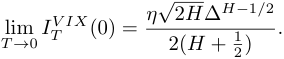

Once we know _H_ˆ , the estimator _η_ ˆ is thus computed as 

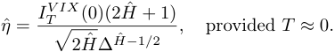

- **Step 3 - Estimation of** _ρ_ **.** The main result in Alòs et al. (2024) deals with the short-time _skew_ of the ATMI (Theorem 1). When applied to the rough Bergomi model (Section 5 _._ 2), the authors show that 

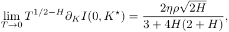

where _K__⋆_ is the ATM strike at time 0. Given the estimates _H_ˆ and _η_ ˆ, and using a finite difference scheme to compute _∂kI_ ( _T, K__⋆_ ), we obtain the estimator _ρ_ ˆ as: 

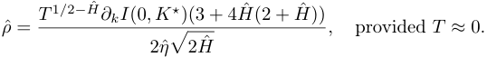

- **Step 4 - Estimation of** _σ_ 0 **.** For this step, only _H_ˆ is required. Theorem 6 _._ 5 _._ 5 in Alòs and Garcia Lorite (2025) shows that the ATM implied volatility of European options corresponding to a rough Bergomi model satisfies the following asymptotic relationship: 

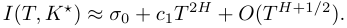

Thus, considering several ATM options with different maturities, we can compute _I_ ( _T, K__⋆_ ) and do a regression to obtain _σ_ 0. This regression also provides _c_ 1, but since all other parameters have been calibrated, its value is not relevant.

<!-- page: 7 -->

This algorithm provides an easy-to-implement calibration of the rough Bergomi model using only information on the short-term regime. 

To test its accuracy, we let the _market_ parameters be _σ_ 0 = 0 _._ 2, _H_ = 0 _._ 1, _η_ = 0 _._ 5 and _ρ_ = _−_ 0 _._ 7, which we consider as ground truth. The algorithm described above yields the following calibration, which will be used in Section 6 as the benchmark for comparison with the signature-based model. 

|Parameter|True Value|Calibrated Value|
|---|---|---|
|_σ_0|0.2|0.199884|
|_H_|0.1|0.100968|
|_η_|0.5|0.490527|
|_ρ_|-0.7|-0.672485|

Table 2.3: Calibrated parameters using the rough Bergomi calibration algorithm. 

In Section 4 we will introduce a data-driven model based on path signatures, which does not assume any specific parametric form for the volatility process. This approach can learn directly from a _primary_ noise, enabling it to adapt to a broader class of behaviors. 

# **3 Path Signatures** 

A natural way to incorporate signatures into stochastic volatility modeling is through the framework proposed by Cuchiero et al. (2023), where the _asset price_ is modeled as a linear functional of the signature of a driving noise process. Although this approach performs well under the assumption that the volatility process is a semimartingale, it is less suitable in settings characterized by rough volatility, where such regularity assumptions no longer hold. 

To address this limitation, Cuchiero et al. (2025) propose an alternative formulation in which the _volatility_ process itself is expressed as a linear functional of the signature of the primary noise. Although this approach is computationally more intensive, it does not require the volatility to satisfy any martingale or semimartingale condition, making it particularly well-suited to the modeling of rough or highly irregular volatility dynamics. 

In this paper, we adopt a similar approach, that is, we assume that the volatility is a continuous function of a general underlying stochastic process, called the _primary noise_ , which does not need to be of the Heston type. This continuous function is then approximated by a linear combination of the elements of the signature of the primary noise. 

We now introduce the essential ideas from rough path theory that underpin the signaturebased approach. An insightful and clear exposition of rough paths is given in the Saint-Flour lecture notes by Lyons et al. (2007). Other good references are Chevyrev and Kormilitzin (2016), Cuchiero et al. (2023), and Lyons and Qian (2002). We follow Geng (2021) and Díaz (2023) in several places. We include some proofs to support intuition. 

The need for signatures arises from the problem of defining integrals of the form 

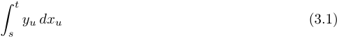

when the integrand _y_ and integrator _x_ lack sufficient regularity. If both _x_ and _y_ have bounded variation, the integral is defined in the Riemann–Stieltjes or Lebesgue–Stieltjes sense. If _x_ and _y_ are _α_ -Hölder continuous with _α >_<u>1</u> 2,Young’stheoryapplies.However,when_α≤_<u>1</u> 2,classical constructions break down, and the Riemann sums 

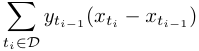

may fail to converge as the mesh _|D| →_ 0. At best, these sums provide a first-order approximation to the integral, and additional structure is needed to make sense of the limit.

<!-- page: 8 -->

Note that these approximations depend only on the increments _xt − xs_ . In fact, the _first level_ of the signature of a path _x_ corresponds precisely to its increments. The signature can then be understood as an enhanced path that augments its first-order increments with higher-order information in the form of _iterated integrals_ . 

To illustrate why higher-order terms are essential, we borrow the following example from Geng (2021). Consider a smooth function _F_ and let _yt_ = _F_ ( _xt_ ). Then, formally, one can write: 

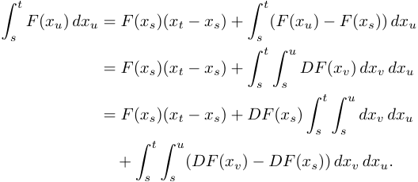

Continuing recursively leads to the formal expansion 

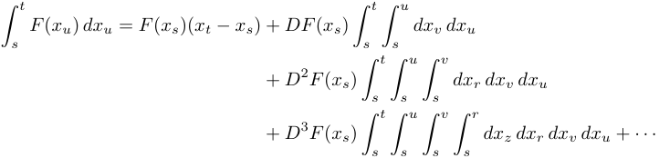

_t_ That is, computing the integral � _s__F_(_xu_)_dxu_requiresaccesstothefullcollectionofiterated integrals of _x_ , not just its increments. 

Note that if _x_ takes values in R_d_ , then the second-level iterated integral 

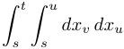

is a tensor consisting of _d_2 terms of the form � _st_ � _su__dx_ _v__idxj_ _u_.Higher-orderlevelsliveinhigher tensor powers. Thus, the natural way to organize this structure is through the _tensor algebra_ , introduced formally below. 

In low regularity settings (like Brownian motion or rough volatility models), these higher-order iterated integrals are not well-defined. Rough path theory allows us to _define_ them abstractly, thereby extending integration to paths of low regularity. 

Informally, if _x_ is _α_ -Hölder continuous, we expect that 

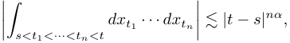

so higher-order terms decay rapidly. This motivates approximating the integral of a function _F_ ( _xt_ ) against _dxt_ as 

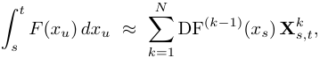

where **X**_k_ _s,t_= � _s<t_ 1 _<···<tk<t__dxt_1_· · · dxtk_willrepresentthe_k_-thlevelofthesignatureof_x_.The truncation level _N_ will depend on the regularity of _x_ . 

As a result, to define pathwise integration in irregular settings, and to model functionals of paths (such as volatility), we must specify a family of tensors ( **X**_k_ _s,t_) _k__N_ =1satisfyingsomealgebraic and analytic constraints. These will form the signature of a rough path, which we now formalize by introducing the tensor algebra.

<!-- page: 9 -->

## **3.1 Tensor Algebras** 

Let _V_ be a real-valued finite dimensional vector space. In practice, _V_ will typically be R_d_ , for some _d ≥_ 1. For any non-negative integer _n_ , we denote the _n_ -th tensor power of _V_ as 

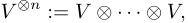

with _V__⊗_0 = R. The tensor power of a vector space is a vector space as well. Moreover, if _V_ is isomorphic to R_d_ for some _d ≥_ 1 then _V__⊗n_ is isomorphic to R_dn_ . In particular, all tensor powers of R are isomorphic to R itself. 

If _e_ 1 _, . . . , ed_ is a basis of _V_ , then the elements _{ei_ 1 _⊗· · · ⊗ ein_ ; ( _i_ 1 _, . . . , in_ ) _∈{_ 1 _, . . . , d}__n_ _}_ are a basis of _V__⊗n_ , that is, every tensor _v ∈ V__⊗n_ can be written uniquely as 

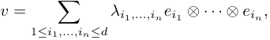

for some coefficients _{λi_ 1 _,...,in ∈_ R; ( _i_ 1 _, . . . , in_ ) _∈{_ 1 _, . . . , d}__n_ _}_ . 

**Definition 3.1** (Extended Tensor Algebra) **.** _We define the_ extended tensor algebra _T_ (( _V_ )) over _V as the set_ 

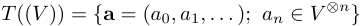

_equipped with the following element-wise addition and scalar product_ 

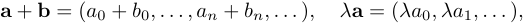

_and endowed with the product ⊗ defined by_ 

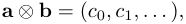

_where_ 

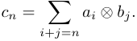

In the same way that we can define a product in _T_ (( _V_ )), we can characterize its invertible elements. Specifically, if **a** _∈ T_ (( _V_ )) and the zeroth level _a_ 0 _∈_ R is nonzero, then **a** admits a multiplicative inverse in _T_ (( _V_ )), given by the formal series: 

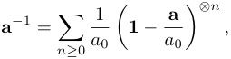

where **1** := (1 _,_ 0 _,_ 0 _, . . ._ ) is the multiplicative identity in _T_ (( _V_ )), and the powers are taken with respect to the tensor product. Finally, we define the tensor algebra over _V_ as the set 

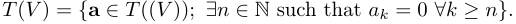

In other words, _T_ ( _V_ ) consists of all formal tensor series with only finitely many nonzero terms. 

To make the notation more concise, define the multi-index _I_ = ( _i_ 1 _, . . . , in_ ) _∈{_ 1 _, . . . , d}__n_ . We then write _eI_ = _ei_ 1 _⊗· · · ⊗ ein_ , and we denote the length of _I_ by _|I|_ = _n_ . In order to write scalars, we set _α_ = _αe∅_ , with _|∅|_ = 0. This notation allows us to write any tensor _v ∈ V__⊗n_ as 

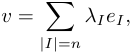

for some coefficients _{λI ∈_ R; _|I|_ = _n}_ . 

Given an element of _T_ ( _V_ ), we can naturally associate a linear map on _T_ (( _V_ )), in a manner analogous to the Riesz representation Theorem.

<!-- page: 10 -->

**Definition 3.2.** _For any ℓ_ =� _|I|≥_ 0_ℓIeI∈T_(_V_)_and_**a**=� _|I|≥_ 0_aIeI∈T_((_V_))_,wedefinethe_ _map ⟨·, ·⟩_ : _T_ ( _V_ ) _× T_ (( _V_ )) _→_ R _by_ 

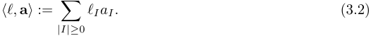

This map is well defined because there are only finitely many nonzero elements _ℓI_ . Note that we can recover the coordinate _aI_ of **a** with _⟨eI ,_ **a** _⟩_ = _aI_ . 

We now introduce another important product on _T_ ( _V_ ). The shuffle product is a way to combine two tensors in _T_ ( _V_ ) by interweaving their entries in all possible ways, while _preserving the relative order_ within each tensor. Its effect is usually compared to that of shuffling cards from two decks while keeping each deck’s internal order intact. The shuffle product is important in rough path theory because it encodes how products of iterated integrals combine. 

**Definition 3.3.** _For any multi-indices I_ = ( _i_ 1 _, . . . , in_ ) _and J_ = ( _j_ 1 _, . . . , jm_ ) _, let I__′_ = ( _i_ 1 _, . . . , in−_ 1) _and J__′_ = ( _j_ 1 _, . . . , jm−_ 1) _. The shuffle product eI_ � _eJ is defined recursively as_ 

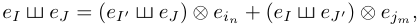

_with the convention eI_ � _e∅_ = _e∅_ � _eI_ = _eI ._ 

**Example 3.4.** If we consider _e_ 1 _⊗ e_ 2 and _e_ 3 we get 

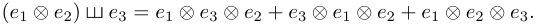

The shuffle product of two tensors of lengths _m_ and _n_ has � _mm_ + _n_ � elements. 

**Example 3.5.** Consider _I_ = _{_ 1 _,_ 2 _,_ 3 _}_ and _J_ = _{_ 2 _,_ 1 _}_ . With a slight abuse of notation, we may write _eI_ = _e_ 1 _⊗ e_ 2 _⊗ e_ 3 = _e_ 123 and _eJ_ = _e_ 2 _⊗ e_ 1 = _e_ 21. To better observe the shuffling, in the expression below we underline the indexes corresponding to _e_ 21: 

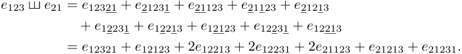

While _e_ 1 _⊗ e_ 2 _⊗ e_ 3 _∈ V__⊗_3 and _e_ 2 _⊗ e_ 1 _∈ V__⊗_2 , note that _e_ 1 _⊗ e_ 2 _⊗ e_ 3 � _e_ 2 _⊗ e_ 1 _∈ V__⊗_5 . As we shall see in Section 4.1, the shuffle product sharply increases the order of computations required to construct the signature-based approximation to the volatility. 

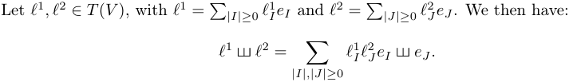

The collection ( _T_ ( _V_ ) _,_ + _, ·,_ � ) is a commutative algebra. 

## **3.2 Signature of Paths of Bounded Variation** 

We say that _D_ [0 _,T_ ] = _{t_ 0 _, t_ 1 _, . . . , tn}_ is a partition of the interval [0 _, T_ ] if 0 = _t_ 0 _< t_ 1 _< · · · < tn_ = _T_ . If the interval is clear from the context, we will simply write _D_ . Let _V_ be a _d_ -dimensional vector space. 

**Definition 3.6.** _Let p ≥_ 1 _. A continuous path X_ : [0 _, T_ ] _→ V has finite p-variation in_ [0 _, T_ ] _if_ 

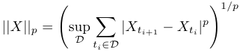

_is finite. We denote by V__p_ ([0 _, T_ ]) _the set of continuous paths with finite p-variation in_ [0 _, T_ ] _._

<!-- page: 11 -->

y 

| 

| 

| JJ JI] 

~~-~~ 

J Jo Ji JP ~~]~~ Ji FP 

~~7~~

<!-- page: 12 -->

// I // I inn Iity 

~~—~~ 

> 

/ / / / J> 

> / Y 

>

<!-- page: 13 -->

**Definition 3.11.** _An element_ **a** _∈ T_ (( _V_ )) _is said to be group-like if for every pair ℓ_1 _, ℓ_2 _∈ T_ ( _V_ ) _we have_ 

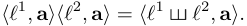

_We denote by G_ ( _V_ ) _the set of group-like elements of T_ (( _V_ )) _._ 

The group-like property is _analogous_ to the behavior of exponentials: just as _e__x_+_y_ = _e__x_ _e__y_ transforms addition into multiplication, signatures can be thought of as “exponentials” of paths rather than numbers. The shuffle product represents all the ways in which two tensors (say, _ℓ_ 1 and _ℓ_ 2) can be combined while preserving their internal order. The group-like condition says that evaluating the shuffle is equivalent to evaluating each tensor separately and multiplying the results. We now make this idea precise. 

**Proposition 3.12.** _Let X_ : [0 _, T_ ] _→ V be a continuous path of bounded variation. Then, the signature of X satisfies the group-like property. That is, for every pair ℓ_1 _, ℓ_2 _∈ T_ ( _V_ ) _,_ 

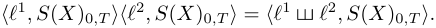

_Proof._ By linearity, it is enough to prove it for _ℓ_1 = _eI_ and _ℓ_2 = _eJ_ . Let _n_ = _|I|_ + _|J|_ . We will prove the result by induction on _n_ . For _n_ = 0, we have _I_ = _J_ = _∅_ and the result holds trivially. Assume that it holds for _n_ , and let _I_ = ( _i_ 1 _, . . . , in_ +1 _−m_ ) and _J_ = ( _j_ 1 _, . . . , jm_ ). Note first that _⟨eI , S_ ( _X_ )0 _,T ⟩_ = _S_ ( _X_ )_I_ 0 _,T_and_⟨_e_J, S_(_X_)0_,T ⟩_=_S_(_X_)_J_ 0 _,T_.Usingintegrationbypartsandthe notation for _I__′_ and _J__′_ introduced in Definition 3.3, we have 

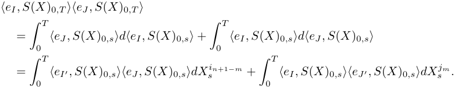

Using the induction step, it follows that 

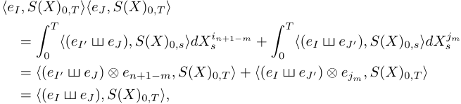

which concludes the proof. 

The function _⟨·, ·⟩_ defined in (3.2) allows us to interpret the elements _ℓ_ of the tensor algebra _T_ ( _V_ ) as linear functionals when paired with a signature _S_ ( _X_ )0 _,T_ . If we evaluate two linear functionals _ℓ_ 1 and _ℓ_ 2 separately on the signature _S_ ( _X_ )0 _,T_ and then multiply those two scalar values, the product equals what we get by evaluating the single functional _ℓ_1 � _ℓ_2 on _S_ ( _X_ )0 _,T_ . 

If we consider the path _X_ : [0 _,_ 5] _→_ R2 from Example 3.9, we have 

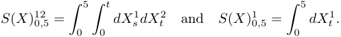

The multiplication of these two iterated integrals would be a polynomial in the components of the signature _S_ ( _X_ )0 _,_ 5. The above proposition says that such a nonlinear expression can still be treated in a linear way provided we use the shuffle product. With the slight abuse of notation we used in Example 3.5, we see that _e_ 12 � _e_ 1 = _e_ 121 + 2 _e_ 112. Therefore, the product of the iterated integrals _S_ ( _X_ )12 0 _,_ 5and_S_(_X_)1 0 _,_ 5canbeexpressedasalinearcombinationof 

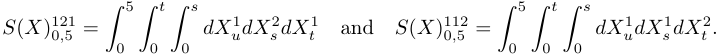

<!-- page: 14 -->

In other words, products of iterated integrals (polynomials in the elements of the signature) can be written as linear combinations of _higher-order_ integrals. The fact that the space of polynomials on signatures can be linearly organized via the shuffle product will be used in Section 4. The price to pay for linearity is the higher dimension of the tensor space in which the linear expression lives, which happens to be the space in which numerical computations will be carried out. 

## **3.3 Rough Paths** 

So far we have developed the signature for continuous paths of bounded variation. By Young’s integration theory, this construction extends to continuous paths of finite _p_ -variation for _p <_ 2. However, the stochastic processes most commonly used in finance—such as Brownian motion or fractional Brownian motion with small Hurst indexes—do not satisfy this condition. We therefore need to find a way to extend the signature to a broader class of paths with more irregular behavior. 

This extension is achieved by _lifting_ the paths. Intuitively, _lifting_ refers to the process of enriching a path with additional information (namely, its iterated integrals). For smooth paths this yields the signature, while for more irregular paths this is done abstractly. 

Let _X_ : [0 _, T_ ] _→ V_ be a path of finite _p_ -variation for some _p ≥_ 2, so that _X_ may be too irregular for classical iterated integrals to exist. To overcome this difficulty, we define a new object called a rough path 

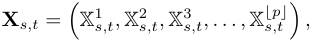

where X1 _s,t_=_Xt−Xs_istheincrementoftheoriginalpathandeachX_k_ _s,t_isanapproximationto the _k_ -th order iterated integral 

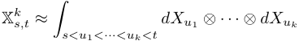

At this level of intuition, _approximation_ means that the X_k_ serve as proxies for the true iterated integrals, satisfying certain algebraic properties and appropriate _p_ -variation bounds. This lifted structure enables us to define integration against _X_ even when classical approaches such as Riemann–Stieltjes or Young integration break down. In the remainder of this section we formalize these ideas. 

**Definition 3.13** (Truncated Tensor Algebra) **.** _Let N ∈_ N _. We define the_ truncated tensor algebra of order _N_ over _V as_ 

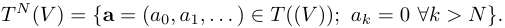

_The projection map π≤N_ : _T_ (( _V_ )) _→ T__N_ ( _V_ ) _is defined as_ 

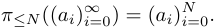

For any **a** _,_ **b** _∈ T__N_ ( _V_ ), we define the truncated tensor product in _T__N_ ( _V_ ) as 

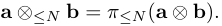

When dealing with elements of _T__N_ ( _V_ ), if there is no risk of confusion we will generally use _⊗_ to denote _⊗≤N_ . 

Let _X_ : [0 _, T_ ] _→ V_ be a continuous path of bounded variation and ∆ _T_ = _{_ ( _s, t_ ) _∈_ [0 _, T_ ]2 ; _s ≤ t}_ . The truncated signature of order _N_ of a path _X_ can therefore be defined as 

We write _S_ ( _X_ )_≤N_ ( _s, t_ ) = _S_ ( _X_ )_≤_ _s,t__N_.

<!-- page: 15 -->

A slight modification in the proof of Chen’s identity shows that, for all 0 _≤ s < u < t ≤ T_ , 

We say that _S_ ( _X_ )_≤N_ is _multiplicative_ . The following definition extends the multiplicative property to a more general setting. 

**Definition 3.14** (Multiplicative functional) **.** _For N ∈_ N _, let_ **X** : ∆ _T → T__N_ ( _V_ ) _be a continuous map and denote_ **X** ( _s, t_ ) = **X** _s,t. Since_ **X** _s,t ∈ T__N_ ( _V_ ) _, we can write_ **X** _s,t_ = ( **X**0 _s,t__,_**X**1 _s,t__, . . . ,_**X**_N_ _s,t_)_,_ _where_ **X**_k_ _s,t__∈V⊗kforeachk.Wesaythat_**X**_isa_multiplicativefunctional_ofdegreeNinVif,_ _for every_ ( _s, t_ ) _∈_ ∆ _T , we have_ **X**0 _s,t_:= 1_and_ 

_for all s ≤ u ≤ t._ 

By extension, we also refer to (3.5) as Chen’s identity. Consider the case when _N_ = 1. Chen’s identity says that 

(1 _,_ **X**1 _s,t_) = (1_,_**X**1 _s,u_)_⊗_(1_,_**X**1 _u,t_) = (1_,_**X**1 _s,u_+**X**1 _u,t_)_,_ 

which implies **X**1 _s,t_=**X**1 _s,u_+**X**1 _u,t_.Thetypeoffunctionalsthatsatisfythispropertyarecalled _additive_ functionals. Additivity provides an important step toward the definition of a rough path. 

Select an arbitrary constant _v ∈ V_ and define a path _ψ_ : [0 _, T_ ] _→ V_ by 

_ψt_ := _v_ + **X**1 0 _,t__._ 

Then, _ψt − ψs_ = **X**1 0 _,t__−_**X**1 0 _,s_.Byadditivity(Chen’sidentityatlevel1),thisequals**X**1 _s,t_.Thatis, 

In other words, a multiplicative functional of order 1 in _V_ is equivalent to the increment map of a path _ψ_ : [0 _, T_ ] _→ V_ , unique up to an additive constant. 

Up to now, we started from a continuous path of finite variation _X_ : [0 _, T_ ] _→ V_ and showed that its truncated signature—an element of the tensor algebra _T__N_ ( _V_ )—satisfies the multiplicative identity (3.4). We now reverse this perspective: instead of constructing the signature from a classical path, we assume the algebraic structure of a signature and study its properties as a path taking values in the tensor algebra _T__N_ ( _V_ ). 

We have already seen that the first level of a multiplicative functional is given by the increments of a path in _V_ , just as the first level of the signature of a path corresponds to its own increments. We can now generalize this. 

**Lemma 3.15.** _Let_ **X** _,_ **Y** : ∆ _T → T__N_ ( _V_ ) _be two multiplicative functionals of order N that agree on the first N −_ 1 _levels. Then, the function_ Ψ : ∆ _T → V__⊗N_ _defined by_ Ψ _s,t_ = **X**_N_ _s,t__−_**Y** _s,t__Nis_ _additive, that is,_ Ψ _s,t_ = Ψ _s,u_ + Ψ _u,t, for all s ≤ u ≤ t._ 

_Proof._ Due to the multiplicative property, **X** _s,t_ = **X** _s,u ⊗_ **X** _u,t_ for all _s ≤ u ≤ t_ . Consider the _N_ -th level component of the functionals in each side of the last equality. In the case of the _N_ -th level component of **X** _s,u ⊗_ **X** _u,t_ , we separate the summands that only include elements of _V__⊗N_ from the rest: 

where the elements of the summation are tensor products of elements from lower levels ( _i, j ≥_ 0). An analogous expression holds for **Y** _s,t__N_.Then, 

As **X** and **Y** agree on the first _N −_ 1 levels, the last term on the right-hand side is zero, yielding Ψ _s,t_ = Ψ _s,u_ + Ψ _u,t_ , which is what we needed to prove.

<!-- page: 16 -->

**Lemma 3.16.** _Let_ **X** : ∆ _T → T__N_ ( _V_ ) _be a multiplicative functional of order N in V and let_ Ψ : ∆ _T → V__⊗N_ _be an additive function. Then_ **X** + Ψ _is also a multiplicative functional._ 

_Proof._ We need to show that, for all _s ≤ u ≤ t_ , 

The right hand side of the above expression can be expanded as 

As **X** is multiplicative, **X** _s,u ⊗_ **X** _u,t_ = **X** _s,t_ . We now prove that 

Note that Ψ takes values in _V__⊗N_ , which is the highest order component in the truncated tensor algebra _T__N_ ( _V_ ). Therefore, when tensoring **X** _s,u_ with Ψ _u,t_ , the only element in _V__⊗N_ will be precisely Ψ _u,t_ . That is, **X** _s,u ⊗≤N_ Ψ _u,t_ = Ψ _u,t_ . More formally, assume that **X** _s,u_ =� _|J|≤N__bJeJ_ for some coefficients _bJ_ , and let _I_ = (0 _, . . . ,_ 0 _,_ 1) with _|I|_ = _N_ . Then, as _b∅_ = 1, 

for some coefficients _cJ_ , with _|J| > N_ . We therefore have **X** _s,u ⊗≤N_ Ψ _u,t_ = Ψ _u,t_ . The same reasoning applies to show that Ψ _s,u ⊗≤N_ **X** _u,t_ = Ψ _s,u_ . For the last term in left-hand side of (3.6), let _I_ be as above and _J_ = (0 _, . . . ,_ 0 _,_ 1) with _|J|_ = _N_ . Then, 

As _eI ⊗ eJ ∈ V__⊗_2_N_ , we have Ψ _s,u ⊗≤N_ Ψ _u,t_ = 0. Writing _⊗_ for _⊗≤N_ , it follows that 

where the last equation follows from the additivity assumption. This completes the proof. 

We now combine these results with the _p_ -variation bounds on the functionals. Recall that a path _X_ : [0 _, T_ ] _→ V_ is _α_ -Hölder continuous if, for _s ≤ t ∈_ [0 _, T_ ] and 0 _< α ≤_ 1, 

for some constant _C >_ 0. If _X_ is _α_ -Hölder continuous, then it has finite 1 _/α_ -variation. The converse does not generally hold. However, if _X_ is a continuous path with finite _p_ -variation, there exists a continuous, increasing reparametrization _τ_ such that _X ◦ τ_ is 1 _/p_ -Hölder continuous. 

For a continuous functional **X** : ∆ _T → T__N_ ( _V_ ), we define 

where the sup is taken over all the partitions _D_ [0 _,T_ ]. If _||_ **X** _||p·_ var _< ∞_ , the functional **X** is said to have finite _p_ -variation. The _p_ -variation distance between two functionals **X** and **Y** of finite _p_ -variation is defined as 

Assume that the multiplicative functionals **X** _,_ **Y** : ∆ _T → T__N_ ( _V_ ) have finite _p_ -variation and agree on the first _N −_ 1 levels. Then, by Lemma 3.15, the _N_ -level difference, 

<!-- page: 17 -->

defines an additive function on ∆ _T_ . For a fixed _v ∈ V__⊗N_ , Ψ induces a path _ψ_ : [0 _, T_ ] _→ V__⊗N_ by 

_ψt_ = _v_ + Ψ0 _,t._ 

Then, by additivity of Ψ, 

for any _s ≤ t_ . Additivity implies that we can think of Ψ as a function that comes from the increments of a path. 

As **X** and **Y** have finite _p_ -variation, the difference Ψ at level _N_ inherits finite _p/N_ -variation. This follows directly from the structure of the _p_ -variation norm (3.7), where the _N_ -th level contributes with exponent _p/N_ . 

It follows that there exists a continuous and increasing reparametrization _τ_ of [0 _, T_ ] such that the reparametrized path Ψ _◦τ_ (defined by Ψ _τ_ ( _s_ ) _,τ_ ( _t_ ) = _ψτ_ ( _t_ ) _−ψτ_ ( _s_ )) is _N/p_ -Hölder continuous. This means that _ψ_ is regular enough to be treated as a genuine path in _V__⊗N_ , and that its increments Ψ _s,t_ = _ψt − ψs_ , are well-behaved. Regularity allows us to reinterpret Ψ as a “missing” top-level component that can be added to **Y** to produce a new functional 

which, by Lemma 3.16, is multiplicative (and of order _N_ ). 

Now, suppose that _N/p >_ 1. Then, as _ψ ◦ τ_ is Hölder continuous with exponent greater than 1, it must be constant. This implies that Ψ _s,t_ = _ψt − ψs_ = 0 for all _s, t_ , so the top level of **X** and **Y** must coincide: 

**X**_N_ = **Y**_N_ _._ 

Therefore, any two multiplicative functionals of finite _p_ -variation that agree up to level _⌊p⌋_ must in fact agree entirely. This suggests that the levels up to _⌊p⌋_ determine the rest. 

This observation raises the converse question: If a multiplicative functional **X** is defined only up to level _N_ , with finite _p_ -variation and _N ≥⌊p⌋_ , can we extend it to higher levels in a consistent way? That is, can we construct a full multiplicative functional **Y** : ∆ _T → T__n_ ( _V_ ) with _n > N_ , such that **Y** agrees with **X** up to level _N_ , and has finite _p_ -variation? 

Unlike the previous argument (no two extensions can differ when _N > ⌊p⌋_ ), this one is about existence and uniqueness of such an extension. The following result, proved in Lyons et al. (2007), answers the question affirmatively. 

**Theorem 3.17** (Extension Theorem) **.** _Let p ≥_ 1 _be a real number, N ≥_ 1 _an integer, and let_ **X** : ∆ _T → T__N_ ( _V_ ) _be a multiplicative functional of degree N with finite p-variation. Suppose that N ≥⌊p⌋. Then, for every integer n > N , there exists a unique continuous multiplicative functional_ 

_such that_ 

_1._ **Y** _agrees with_ **X** _up to level N ; that is, π≤N_ ( **Y** ) = **X** _;_ 

_2._ **Y** _has finite p-variation._ 

_Moreover, the map that sends_ **X** _to its extension_ **Y** _is continuous with respect to the p-variation metric._ 

This result highlights that, for a multiplicative functional with finite _p_ -variation, the first _⌊p⌋_ levels completely capture all of its information, leading naturally to the next definition. 

**Definition 3.18** (Rough Path) **.** _Let p ≥_ 1 _. A p_ -rough path _is a continuous multiplicative functional_ 

_of degree ⌊p⌋ with finite p-variation. The space of p-rough paths is denoted by_ Ω_p_ _T_(_V_)_._

<!-- page: 18 -->

What distinguishes rough paths from general multiplicative functionals is that they retain only the minimal number of components necessary to capture all relevant information. In this sense, a rough path can be viewed as a “compressed” version of a multiplicative functional: it contains exactly the levels up to _⌊p⌋_ , which fully determine the rest under finite _p_ -variation. 

So far, we have not explicitly relied on the theory of signatures of bounded variation paths, except to define objects that reflect some of their structural properties. Rough paths form a highly abstract class, while paths of bounded variation are concrete and familiar. It is therefore natural to examine the rough paths that are _close_ to signatures of bounded variation paths, namely, those that arise as limits of such signatures. This leads us to the following definition. 

**Definition 3.19** (Geometric Rough Paths) **.** _A_ geometric _p_ -rough path _is a p-rough path_ **X** _for which there exists a sequence of paths of bounded variation_ ( _Xn_ ) _n≥_ 1 _such that_ 

### _The space of geometric p-rough paths is denoted by G_ Ω_p_ _T_(_V_)_._ 

Recall from Proposition 3.12 that the signature of a bounded variation path satisfies the grouplike property. It follows that each truncated signature _S_ ( _Xn_ )_≤⌊p⌋_ takes values in _G__⌊p⌋_ ( _V_ ), the set of group-like elements in the truncated tensor algebra _T__⌊p⌋_ ( _V_ ). 

Now, since the group-like property is algebraic and preserved under limits, and the geometric _p_ -rough path **X** is defined as the limit of such signatures in the _p_ -variation topology, it also takes values in _G__⌊p⌋_ ( _V_ ). Hence, every geometric _p_ -rough path takes values in _G__⌊p⌋_ ( _V_ ). 

Note, however, that the converse does not hold in general: not every _p_ -rough path taking values in _G__⌊p⌋_ ( _V_ ) arises as the limit of signatures of bounded variation paths. This distinction motivates the following definition. 

**Definition 3.20** (Weakly Geometric Rough Paths) **.** _A_ weakly geometric _p_ -rough path _is a p- rough path taking values in G__⌊p⌋_ ( _V_ ) _. The space of weakly geometric p-rough paths is denoted by WG_ Ω_p_ _T_(_V_)_._ 

The difference between _G_ Ω_p_ _T_(_V_) and_WG_Ω_p_ _T_(_V_) is subtle and becomes relevant especially when _V_ is infinite-dimensional. It is always the case that 

**Example 3.21** (Brownian Motion) **.** As we often work with Brownian motion in the context of signature-based models, it is worth pausing to examine its signature and its interpretation as a rough path. 

Let _B_ : [0 _, T_ ] _→_ R be a standard Brownian motion, and assume that stochastic integrals with respect to _B_ are defined in the Itô sense. Since Brownian motion has finite _p_ -variation for any _p >_ 2, we can attempt to lift it to a _p_ -rough path of degree _N_ = 2. The natural candidate for such a lift is the stochastic Itô signature: 

_t_ where the last identity follows from Itô’s formula, using _Bt_2_−B_ _s_2= 2 � _s__Bu dBu_+ (_t −s_). Now consider the shuffle identity. Since _e_ 1 � _e_ 1 = 2 _e_ 1 _⊗ e_ 1, we have: 

<!-- page: 19 -->

but 

It follows that _S_Itô ( _B_ )_≤_ _s,t_2isnotgroup-like,whichmeansthatItôintegralsdonotleadtoweakly geometric rough paths. However, if we use Stratonovich integration, we obtain: 

As _⟨e_ 1 _, S__◦_ ( _B_ )_≤_ _s,t_2_⟩_2matches 

the Stratonovich signature is group-like and defines a weakly geometric _p_ -rough path for any _p >_ 2. 

Even though the Itô signature is not group-like, we are not at a dead end. There are at least two standard approaches. One is to construct a weakly geometric rough path lift of Brownian motion by defining the second level as the Stratonovich iterated integral, i.e., work with 

which is group-like. This is known as the _Stratonovich lift_ of Brownian motion and is the standard choice in rough path theory. 

Alternatively, one could define a non-geometric rough path using the Itô integral, but the path would lie outside the standard tensor algebra and would need to incorporate Itô correction terms. This gives rise to _branched_ or _generalized_ rough paths (see Bruned et al. (2019)). 

In general, the Stratonovich lift is preferred because it aligns with the algebraic structure of signatures (the group-like property) and allows for a direct interpretation of rough integrals as limits of classical Riemann–Stieltjes approximations. For one-dimensional paths, the following result shows that the situation is simpler. 

**Lemma 3.22.** _Let p ≥_ 1 _and let X_ : [0 _, T_ ] _→_ R _be a continuous path of finite p-variation. Then there exists a canonical lift to a weakly geometric p-rough path, given by_ 

To show that this expression defines a valid lift, note first that the right-hand side is the truncated exponential in the tensor algebra 

which is known to satisfy the Chen identity. We use the notation exp _⊗_ to indicate that the exponential is taken in the tensor algebra. 

Since _X_ has finite _p_ -variation and each level _k_ is a smooth function of the increment _Xt − Xs_ , the _k_ -th level has finite _p/k_ -variation. Hence, the full lift **X** has finite _p_ -variation in the sense of (3.7), and defines a weakly geometric _p_ -rough path. 

In particular, for a one-dimensional Brownian motion _B_ : [0 _, T_ ] _→_ R, the path 

defines a weakly geometric _p_ -rough path for any _p >_ 2. This _Stratonovich lift_ of Brownian motion corresponds to the first two levels of the Stratonovich signature.

<!-- page: 20 -->

**Remark 3.23.** More generally, any continuous semimartingale _S_ = _A_ + _M_ , where _M_ is a continuous local martingale and _A_ is a continuous path of bounded variation on compact intervals, admits a canonical weakly geometric rough path lift (in the Stratonovich sense); see Chapter 14 of Friz and Victoir (2010). The intuition is that the roughness of _S_ is driven by the martingale component _M_ , while the bounded variation part _A_ can be handled using classical integration. The construction of the lift relies on probabilistic estimates, in particular the Burkholder-Davis-Gundy inequality and properties of the quadratic variation. 

## **3.4 Time-Augmented Rough Paths** 

Recall that a _lifted_ path refers to extending a base path _X_ : [0 _, T_ ] _→ V_ to a rough path **X** _X_ ˆ : ∆: [0 _, TT →_ ] _→T__N_ R( _⊕V_ ) _V_ . Weby now proceed to _augment X_ with a time coordinate. Specifically, we define 

At first glance, this change may appear superficial, but it has important consequences that we discuss at the end of this section. The following proposition says that time augmentation preserves important analytic and algebraic properties, such as admitting a lift to a weakly geometric _p_ -rough path. 

**Proposition 3.24.** _Let X_ : [0 _, T_ ] _→ V be a continuous path that admits a weakly geometric p-rough path lift_ **X** _∈ WG_ Ω_p_ _T_(_V_)_.Definethetime-augmentedpathX_ˆ: [0_, T_]_→_R_⊕Vby_ 

_Then X_ˆ _also admits a weakly geometric p-rough path lift_ **X**ˆ _∈ WG_ Ω_p_ _T_(R_⊕V_)_._ 

_Proof._ We treat _X_ˆ as a path in R_d_+1 , where the first coordinate is time and the remaining ones are given by _X_ . We define the lifted path **X**ˆ inductively over multi-indices _I_ = ( _i_ 1 _, . . . , in_ ) _∈ {_ 0 _,_ 1 _, . . . , d}__n_ , where _ik_ = 0 refers to the time component. 

For _|I|_ = 1, we set: 

Assume that all levels up to length _|I|_ = _n −_ 1 have been well defined. We now denote by _I_ the _n_ -th level multi-index, _I_ = ( _i_ 1 _, . . . , in_ ) _∈{_ 0 _,_ 1 _, . . . , d}__n_ . The _n_ -level components of the signature are 

If all elements of _I_ are nonzero ( _ik_ = 0 _,_ for _i_ = 1 _, . . . , n_ ), we set 

which is already defined in the original lift. Assume now that not all _ik_ = 0. Using the shuffle product introduced in Definition 3.3, we have 

where _I__′_ has the same meaning as in Definition 3.3, and _I__′′_ is defined in an analogous way. We then have 

<!-- page: 21 -->

As _|I__′_ _|_ = _n −_ 1 and _|_ ( _in_ ) _|_ = 1, it follows from the induction step that the terms _⟨eI ′,_ **X**ˆ _s,t⟩_ and _⟨ein,_ **X**ˆ _s,t⟩_ are well defined. If _in−_ 1 = 0, define 

where the integral is well-defined as a Young integral because **X** is a _p_ -rough path and _q_ = 1 for time, so that 1 _/p_ + 1 _/q >_ 1 is always satisfied. If _in−_ 1 = 0, using the shuffle product again we get: 

Therefore, 

where the first term on the right hand side is well defined because of the induction step. If _in−_ 2 = 0, we define the second term on the right hand side as 

where, as above, the integral is well-defined as a Young integral. If _in−_ 2 = 0, we apply shuffle product identity again to the second term on the right hand side of (3.10) to obtain a term involving _in−_ 3. We then repeat the process iteratively. 

**Remark 3.25.** As a way of illustrating the construction above, let _I_ = _{i_ 1 _, i_ 2 _}_ = _{_ 0 _,_ 1 _}_ . Since _I__′_ = _{_ 0 _}_ and _I__′′_ = _∅_ , we have 

It follows from (3.9) that 

The left hand side of the above expression is: 

which, integrating by parts, yields 

The elements of the signature with indexes of length 1 were defined as _⟨e_ 0 _,_ **X**ˆ _s,t⟩_ := _t − s_ and _⟨e_ 1 _,_ **X**ˆ _s,t⟩_ := _Xt − Xs_ . Therefore, the right hand side of (3.11) is: 

which is the same as (3.12). 

Now that we know that there exists a lift for the time-augmented path _X_ˆ , we define the corresponding space. 

**Definition 3.26** (Time-Augmented Weakly Geometric Rough Path) **.** _A_ time-augmented weakly geometric _p_ -rough path _is a weakly geometric p-rough path_ **X** _∈ WG_ Ω_p_ _T_(R_⊕V_)_suchthat_

<!-- page: 22 -->

- _(i) the first level satisfies π_ 1( **X** _s,t_ ) = _X_ˆ _t − X_ˆ _s, where X_ˆ _t_ = ( _t, Xt_ ) _for some continuous path X_ : [0 _, T_ ] _→ V that admits a weakly geometric p-rough path lift;_ 

- _(ii) for any I with |I| ≤⌊p⌋,_ 

_where the integral is a Young integral, and where the notation eI_ 0 _means appending a_ 0 _(the time component) to the multi-index I._ 

_We denote the space of such paths by WG_ Ωˆ_p_ _T_(_V_)_._ 

**Remark 3.27.** A rough path in _WG_ Ωˆ_p_ _T_(_V_)presupposestheexistenceofapath_X_: [0_, T_]_→V_, which is augmented to _X_ˆ : [0 _, T_ ] _→_ R _⊕ V_ . This contrasts with the rough paths in _WG_ Ω_p_ _T_(_V_), which are defined independent of any base path. 

**Remark 3.28.** Being a weakly geometric rough path in R _⊕ V_ with the correct first level does not automatically guarantee that the component _⟨eI_ 0 _,_ **X** _s,t⟩_ should equal the integral of _⟨eI ,_ **X** _s,u⟩_ against the time increment _du_ . This why we need to include condition ( _ii_ ). The Young integral is well defined since time has bounded variation. 

We now briefly discuss the relevance of lifting the augmented path ( _t, Xt_ ) instead of lifting _Xt_ alone. Let _S_ ( _X_ ) denote the signature of a path _X_ : [0 _, T_ ] _→ V_ . It is well known that the map _X �→ S_ ( _X_ ) is not injective: different paths can share the same signature—for example, if they trace out the same image at different speeds. Thus, the signature loses information about the timing or parametrization of the path. 

Augmenting the path by adding time, that is, lifting _X_ˆ _t_ := ( _t, Xt_ ) _∈_ R _⊕V_ , recovers injectivity. Theorem 3.30 below shows that the time-augmented signature uniquely determines the path, making it more expressive. 

Time augmentation allows the signature to distinguish between paths that follow the same geometric shape but evolve at different speeds. This distinction is crucial in the context of the universal approximation theorems discussed below: time augmentation ensures that the signature map separates paths in a sufficiently rich way to apply approximation results such as the Stone– Weierstrass theorem. 

As we will also see below, time augmentation is essential for learning path-dependent functionals in an _adapted_ way. In models where _Yt_ depends on the past trajectory ( _Xs_ ) _s≤t_ , incorporating time allows the signature to detect _when_ events occur. Without time, the signature treats two paths with the same shape but different timing as indistinguishable—an undesirable feature in many stochastic or temporally sensitive learning tasks. 

## **3.5 Signatures of Rough Paths** 

Let **X** _∈_ Ω_p_ _T_(_V_)bea_p_-roughpath.Bytheextensiontheorem,foreveryinteger_N≥⌊p⌋_, there exists a unique multiplicative extension of **X** to degree _N_ with finite _p_ -variation. Since this extension process can be carried out to arbitrarily high degrees, it is natural to define the _signature_ of a _p_ -rough path as its formal infinite extension. This motivates the following definition. **Definition 3.29** (Signature of a Rough Path) **.** _Let_ **X** _∈_ Ω_p_ _T_(_V_)_beap-roughpath.The_truncated signature of order _N ≥⌊p⌋ is defined as the unique extension of_ **X** _to level N with finite p-variation, denoted by:_ 

_The_ (full) signature _of_ **X** _is the formal series_ 

_S_ ( **X** ) : ∆ _T → T_ (( _V_ )) ( _s, t_ ) _�→ S_ ( **X** ) _s,t_ := (1 _, S_ ( **X** )1 _s,t__, . . . , S_(**X**)_n_ _s,t__, . . ._)_,_ 

_where S_ ( **X** )_n_ _s,t__∈V⊗ndenotesthen-thleveloftheextension._

<!-- page: 23 -->

Therefore, there exists a sequence of bounded variation paths _X_(_n_) such that their truncated signatures of order _⌊q⌋_ converge to **X** in the _q_ -variation topology. By Theorem 3.17, the extension map **X** _�→ S_ ( **X** )_≤⌊q⌋_ is continuous in the _q_ -variation topology. Since each _S_ ( _X_(_n_) )_≤⌊q⌋_ is grouplike, it follows that _S_ ( **X** )_≤⌊q⌋_ is group-like as well. Letting _q →∞_ , we obtain that the full signature _S_ ( **X** ) _∈ T_ (( _V_ )) is group-like. That is, for any _ℓ_1 _, ℓ_2 _∈ T_ ( _V_ ), we have: 

Note the slight shift in notation that has taken place here. In Section 3.2, we began with a path _X_ : [0 _, T_ ] _→ V_ and constructed its signature, denoted by _S_ ( _X_ ) : ∆ _T → T_ (( _V_ )). In contrast, we now start with a multiplicative functional **X** : ∆ _T → T__⌊p⌋_ ( _V_ ), which satisfies specific algebraic and analytic properties (multiplicativity and finite _p_ -variation) that allow it to be uniquely extended to higher levels _N ≥⌊p⌋_ . We can describe this extension using the diagram: 

where we slightly abuse notation in referring to **X**_∞_ as the infinite extension of the rough path. 

In Definition 3.29, however, we formalized this extension using the signature notation: 

Note carefully that we have not _constructed a signature_ from **X** . Rather, we started with a multiplicative functional satisfying the group-like property and finite _p_ -variation (a _p_ -rough path), and we uniquely extended it from level _⌊p⌋_ to higher levels in the (truncated) tensor algebra. This extension is granted by Theorem 3.17. In Definition 3.29, we have simply relabeled this extended functional using the signature notation previously introduced for bounded variation paths. 

Although this notation may initially appear inconsistent, it aligns naturally with the classical case where the signature is defined via iterated integrals. This unification of notation allows both settings—bounded variation and rough paths—to be treated within a common framework. 

## **3.6 Universal Approximation Theorems** 

Since the primary role of a rough path **X** is to serve as a driver for integrals (or differential equations), the key object of interest is the increment **X** _s,t_ rather than the individual value **X** _t_ at a fixed time. But the two viewpoints are equivalent. Given the increments **X** _s,t_ , one can reconstruct a path by defining **X** _t_ := **X** 0 _,t_ . If the path **X** _t ∈ T__N_ ( _V_ ) is given, the increments can be recovered by making use of the multiplicative property, namely, **X** _s,t_ := **X**_−_ _s_1 _⊗_ **X** _t_ . 

In this section, we present three fundamental theorems that enable the application of signatures to the calibration problem. The first one states that the signature (as defined in Definition 3.29) of a time-augmented weakly geometric _p_ -rough path **X** , evaluated at time _T_ , uniquely determines **X** . We use the simplified notation **X** _t_ := **X** 0 _,t_ . 

**Theorem 3.30** (Uniqueness of the Signature) **.** _Let_ **X** _,_ **Y** _∈ WG_ Ωˆ_p_ _T_(_V_)_.Then,_ 

_Proof._ Note first that **X** : ∆ _T → T__⌊p⌋_ (R _⊕ V_ ), while _S_ ( **X** ) : ∆ _T → T_ ((R _⊕ V_ )). If **X** _t_ = **Y** _t_ for all _t ∈_ [0 _, T_ ], it must be that **X** _T_ = **Y** _T_ . By the extension theorem, _S_ ( **X** ) _T_ = _S_ ( **Y** ) _T_ .

<!-- page: 24 -->

Reciprocally, assume _S_ ( **X** ) _T_ = _S_ ( **Y** ) _T_ . Since **X** _,_ **Y** _∈ WG_ Ωˆ_p_ _T_(_V_)andbothcoincidewiththeir signatures up to level _⌊p⌋_ , it suffices to show that for any multi-index _I_ with _|I| ≤⌊p⌋_ , 

To extract these values from the full signature _S_ ( **X** ) _T_ , we face the difficulty that _⟨eI ,_ **X** _t⟩_ is a function of time, not a coefficient in the signature at time _T_ . However, we can recover such functions by integrating them against powers of time. To do this, we first prove that: 

We proceed by induction. For _k_ = 0, the claim is trivial. For _k_ = 1, we have _⟨e_ 0 _,_ **X** _t⟩_ = _t_ by the definition of time augmentation. Assuming the identity holds for _k −_ 1, we get: 

Note that while condition ( _ii_ ) in Definition 3.26 applies to _k ≤⌊p⌋_ , the relation extends to all _k ≥_ 0 due to the bounded variation of the time component, the way **X** _∈ WG_ Ωˆ_p_ _T_(_V_) is constructed (Proposition 3.24) and the uniqueness of the signature extension. 

Now fix any multi-index _I_ with _|I| ≤⌊p⌋_ . Since **X** _t_ and _S_ ( **X** ) _t_ agree up to level _⌊p⌋_ , we have 

Using the group-like property and the shuffle product identity, we have 

Applying the same reasoning to **Y** , and using the assumption _S_ ( **X** ) _T_ = _S_ ( **Y** ) _T_ , we conclude that: 

_<u>u</u>__k_ Since the functions _u �→__k≥_0)formabasisforthespaceofpolynomials,and _k_ !(for polynomials are dense in _C_ ([0 _, T_ ]) by the Stone–Weierstrass theorem, it follows that any continuous function whose integral against every such monomial vanishes must be identically zero. As **X** _u_ and **Y** _u_ are continuous, it follows that 

which completes the proof. 

Before proceeding, note that _WG_ Ωˆ_p_ _T_(_V_),equippedwiththe_p_-variationdistance,becomesa topological space whose topology is induced by the _p_ -variation metric. 

**Theorem 3.31** (First Universal Approximation Theorem) **.** _Let K ⊂ WG_ Ωˆ_p_ _T_(_V_)_becompact,and_ _let f_ : _WG_ Ωˆ_p_ _T_(_V_)_→_R_becontinuouswithrespecttothep-variationtopology.Then,forevery_ _ε >_ 0 _, there exists ℓ ∈ T_ (R _⊕ V_ ) _such that_ 

<!-- page: 25 -->

_Proof._ We apply the Stone–Weierstrass theorem to a suitable subalgebra of continuous functions on the compact set _K ⊂ WG_ Ωˆ_p_ _T_(_V_).Define 

That is, _A_ is the collection of all finite linear combinations of coordinate functionals on the signature evaluated at time _T_ . 

To show that _A_ is a subalgebra of _C_ ( _K_ ) that satisfies the conditions of the Stone–Weierstrass theorem, consider first that _A_ is closed under multiplication. As the group-like property 

corresponds to multiplication of linear functionals on the signature, the span of such functionals is closed under multiplication. 

Second, _A_ separates points in _K_ due to the uniqueness of the signature of time-augmented weakly geometric rough paths: in particular, Theorem 3.30 guarantees that if **X** = **Y** in _K_ , then _S_ ( **X** ) _T_ = _S_ ( **Y** ) _T_ , so there exists _ℓ ∈ T_ (R _⊕ V_ ) such that _⟨ℓ, S_ ( **X** ) _T ⟩̸_ = _⟨ℓ, S_ ( **Y** ) _T ⟩_ . 

And third, _A_ contains the constant functions, as can be seen by choosing _I_ = _∅_ , for which _⟨eI , S_ ( **X** ) _T ⟩_ = 1. Therefore, by the Stone–Weierstrass theorem, _A_ is dense in _C_ ( _K_ ). In particular, for any _ε >_ 0, there exists _ℓ ∈ T_ (R _⊕ V_ ) such that 

This result is important. The signature _S_ ( **X** ), evaluated at time _T_ , serves as a feature map that transforms a path into an infinite sequence of coordinates capturing all relevant information. Theorem 3.30 ensures that this representation is injective for time-augmented paths. It is then natural to ask whether signatures are rich enough to approximate functionals defined on paths. The First Universal Approximation Theorem answers this question affirmatively. 

It specifically states that continuous functionals on compact subsets of the rough path space can be approximated arbitrarily well by linear functionals on the signature—that is, by finite linear combinations of iterated integrals. This makes signatures a powerful tool for representing and learning functionals on paths, especially in contexts such as calibration or supervised learning. 

Our goal is to model one-dimensional stochastic processes of the form 

where ( **X** _s_ ) _s∈_ [0 _,t_ ] is a stochastic process, with each **X** _s ∈ WG_ Ωˆ_p_ _t_(_V_).Denote this stochastic process by _X_ : 

Think of _Yt_ as a volatility process driven by a rough signal _X_ . The function _f_ , which encodes this dependence, is typically unknown. 

Note that, as time increases, the domain of _f_ changes: for each _t_ , ( **X** _s_ ) _s∈_ [0 _,t_ ] represents a collection of rough paths defined on a different time interval. To deal with this, we need a consistent way to interpret a rough path in _WG_ Ωˆ_p_ _u_(_V_)asanelementof_WG_ˆΩ_p_ _t_(_V_)forall_t≥u_, so that _f_ can act on a common space. 

Given the potential complexity of the notation, we begin with a simple case and build up from there. Let the weakly geometric _p_ -rough path **X** _∈ WG_ Ωˆ_p_ _T_(_V_)berepresentedbythediagram: 

<!-- page: 26 -->

for 0 _≤ s ≤ t ≤ T_ . Fixing _s_ = 0, we write **X** _t_ := **X** 0 _,t_ . 

By Proposition 3.24, a rough path in _WG_ Ωˆ_p_ _s_(_V_)originatesfromabasepath_X_:[0_, s_]_→V_ that admits a lift **X** _∈ WG_ Ω_p_ _s_(_V_).Toemphasizethatthisroughpathliveson[0_, s_],wedenoteit by [s] **X** , and it is represented by 

For _u ∈_ [0 _, s_ ], we write [s] **X** _u_ := [s] **X** 0 _,u_ . 

The time-augmented path is _X_ˆ _u_ := ( _u, Xu_ ), _u ∈_ [0 _, s_ ]. By Proposition 3.24, _X_ˆ admits a weakly geometric _p_ -rough path lift [s] **X**ˆ _∈ WG_ Ωˆ_p_ _s_(_V_).Wereferto [s]**X**ˆasthestoppedpathattime_s_. 

To extend this construction from [0 _, s_ ] to [0 _, t_ ], with _s < t_ , we define [t] **X** _∈ WG_ Ω_p_ _t_(_V_)by: 

We then apply the construction from the proof of Proposition 3.24 to obtain a time-augmented rough path [t] **X**ˆ _∈ WG_ Ωˆ_p_ _t_(_V_).Byconstruction, [t]**X**ˆagreeswith [s]**X**ˆon[0_, s_]. 

This provides a consistent way to extend truncated rough paths defined on [0 _, s_ ] to the full interval [0 _, t_ ], thus allowing _f_ to act on a unified space. The ability to extend time-augmented paths motivates the following definition. 

**Definition 3.32** (Stopped Rough Path) **.** _Let p ≥_ 1 _. We define the space of_ weakly geometric stopped _p_ -rough paths _as_ 

_Given_ [s] **X** _∈ WG_ Ωˆ_p_ _s_(_V_)_and_ [t]**Y**_∈WG_ˆΩ_p_ _t_(_V_)_,withs ≤t,wedefineametricon_Λ_p_ _T_(_V_)_by_ 

_where_ [t] **X** _denotes the extension of_ [s] **X** _from_ [0 _, s_ ] _to_ [0 _, t_ ] _as in (3.13), and dp·_ var _denotes the p-variation distance on WG_ Ωˆ_p_ _t_(_V_)_._ 

For further details on the topology of this space, see Kalsi et al. (2020) and Bayer et al. (2023). The concept of stopped rough paths provides a useful framework for handling adaptedness in stochastic settings. The Second Universal Approximation Theorem below is formulated in this space. 

**Theorem 3.33** (Second Universal Approximation Theorem) **.** _Let K ⊂ WG_ Ωˆ_p_ _T_(_V_)_beacompact_ _subset, and let f_ : Λ_p_ _T_(_V_)_→_R_beacontinuousfunction.Then,foreveryε>_0_,thereexists_ _ℓ ∈ T_ (R _⊕ V_ ) _such that_ 

_where_ [t] **X** _denotes the restriction of_ **X** _to_ [0 _, t_ ] _, and S_ ([t] **X** ) _t_ := _S_ ([t] **X** )0 _,t is the signature of the stopped rough path up to time t._ 

_Proof._ The proof is also based on the Stone-Weierstrass theorem, but is somewhat more technical. See Kalsi et al. (2020), Lemma B.3. 

This result shows that any continuous functional of a stopped rough path can be uniformly approximated, over all truncating times _t ∈_ [0 _, T_ ] and all paths in a compact set, by a linear functional on the signature. The approximation is uniform both in path space and in time.

<!-- page: 27 -->

# **4 Signature-Based Volatility Models** 

Assume, for simplicity, that _r_ = 0, and let ( _St_ ) _t∈_ [0 _,T_ ] denote the price process of a risky asset. We work under a risk-neutral measure, and model the discounted stock price _S_˜ _t_ := _St_ as 

where _σt_ is the volatility and _B_ is a standard Brownian motion. 

Let _f_ : Λ_p_ _T_(_V_)_→_Rbeacontinuousfunctionandsupposethatvolatilitycanbeexpressedas 

where the stochastic process **X** _∈_ Λ_p_ _T_(_V_)isreferredtoasthe_primaryprocess_. This process represents the underlying source of noise driving the volatility and is assumed to take values in the space of stopped, time-augmented weakly geometric _p_ -rough paths. 

Fix an integer _N ≥_ 1 and define the space 

_AN_ := span _{_ **X** _�→⟨eI , S_ ( **X** ) _T ⟩_ ; _I_ multi-index in R _⊕ V,_ 0 _≤|I| ≤ N } ,_ 

where _S_ ( **X** ) _t_ := _S_ ([t] **X** )0 _,t_ denotes the signature of the stopped path [t] **X** . 

For a given _N ≥_ 1, our goal is to find the coefficients _ℓ_ = _{ℓI_ ; 0 _≤|I| ≤ N }_ that yield the best linear approximation _⟨ℓ, S_ ( **X** )_≤_ _t__N_ _⟩_ of the volatility _σt_ , where 

with _S_ ( **X** )_≤_ _t__N_ _∈ T__N_ (R _⊕ V_ ). This leads to the following signature-based stochastic volatility model: 

Since **X** is a stochastic process, the signature _S_ ( **X** )_≤N_ is itself a stochastic process taking values in the truncated tensor algebra _T__N_ (R _⊕ V_ ). 

**Example 4.1.** Assume that the dynamics of ( _St_ ) _t≥_ 0 are given by 

where _W_ and _B_ are independent standard Brownian motions. As the primary process ( _Xt_ ) _t≥_ 0 with dynamics 

is a continuous semimartingale, it admits a canonical weakly geometric rough path lift (see Remark 3.23). By Proposition 3.24, the time-augmented process also admits a weakly geometric _p_ -rough path lift **X** _∈ WG_ Ω_p_ _T_(R_⊕_R),wheretimecorrespondstocoordinate0and_Xt_tocoordi- nate 1. Note that the Feller condition 2 _κθ ≥ ν_2 ensures positivity of _Xt_ , but is not required for the existence of the rough path lift. 

We model the volatility as a linear function of the truncated time-augmented signature up to level 2 of the primary process _X_ : 

The truncated signature has the form

<!-- page: 28 -->

~~~~~ 

ff | 

~~J~~ 

Ji] ~~:~~ Ji] Ji] Ji] JS J Js os JS J Js os JS J Js os JS J Js os 

re ( 

)

<!-- page: 29 -->

( ) 

~~—~~ 

» 

~~_~~ 

(ff) ~~“~~ (Cu ) ~~()~~ 

<!-- Start of picture text -->
J oop) <!-- End of picture text -->

( ) C CC CY) C ) C ) ( ) C )

<!-- page: 30 -->

Note that the elements of _Q_˜ ( _t_ ) are 

It follows that 

If we define the matrix _Q_ ( _t_ ) by 

then the first term in the exponential of (4.4) can be written as 

The second term in the exponential is 

which concludes the proof. 

Since _Q_˜ ( _t_ ) is positive semi-definite by construction, it follows that _Q_ ( _t_ ) is negative semi-definite. That is, for every _ℓ ∈_ R_dN_ , 

As the Cholesky decomposition applies to positive semi-definite matrices, _−Q_ ( _t_ ) admits a Cholesky decomposition _U_ ( _t_ )_T_ _U_ ( _t_ ). We can therefore write 

Note that it is cheaper to compute _||U_ ( _t_ ) _ℓ||_ 22than_ℓT Q_(_t_)_ℓ_. 

**Remark 4.3.** In the case of a one-dimensional primary process, we see from (4.6) that _Q_ ( _t_ ) depends on the signature _S_ ( **X** ) _t_ up to level 2 _N_ + 1. 

If the signature is truncated at level _N_ = 3, then _Q_˜ ( _t_ ) is a 15 _×_ 15-matrix, whose elements are of the type _⟨eI , S_ ( **X** )_≤_ _t_3_⟩_,wherethe15basiselementsare 

With the above ordering, _L_ ( _e_ 01) = 5 and _L_ ( _e_ 111) = 15. The (15 _,_ 5)-entry of matrix _Q_˜ ( _t_ ) is therefore 

By (4.5), 

where 

which includes basis elements of tensor spaces of higher dimensions. In particular, to compute the matrix _Q_ ( _t_ ), we see from (4.6) that its entries _⟨_ ( _eI_ � _eJ_ ) _⊗ e_ 0 _, S_ ( **X** )_≤_ _t_2_N_+1 _⟩_ live in a space of dimension 2(2_N_+1)+1 _−_ 1. 

In our particular case, 2 _N_ + 1 = 7, so _Q_ ( _t_ ) depends on signature entries in _T__≤_7 (R _⊕ V_ ), a space of dimension 28 _−_ 1 = 255. To populate a 15 _×_ 15 matrix we need to fetch its elements from the entries of a 255 _×_ 255 matrix.

<!-- page: 31 -->

## **4.2 Calibration** 

Consider the following model of a discounted asset price, parameterized by _θ_ : 

where _σt__θ_isthevolatilityprocessassociatedwiththeparameter_θ_,and_Zt_isasin(4.3).Fora given _θ_ , we can compute the price of a European call option with strike _K_ and maturity _T_ as 

Let _{C_mkt ( _Ki, Ti_ ) _}__N_ _i_ =1denotetheobservedmarketpricesforvaryingstrikesandmaturities.If there exists a parameter _θ__∗_ such that the model perfectly describes the real dynamics of the asset, then 

While this exact match is unlikely in practice, our goal is to find a parameter configuration _θ_ that minimizes the discrepancy between the model and market prices. We thus consider the least squares loss function 

where _γi >_ 0 are user-specified weights. 

In the case of signature-based models, the role of the parameter _θ_ is played by a vector _ℓ ∈_ R_dN_ , where _dN_ is the dimension of the truncated signature space. The corresponding loss function becomes 

Recall that the value of the signature-driven price process _S_˜ _t_ ( _ℓ_ ) at maturity _t_ = _T_ is given by 

where _U_ ( _T_ )( _ω_ ) is the Cholesky factor associated with _−Q_ ( _T_ ) on sample path _ω_ , and _S_ ( **X** )_≤_ _t__N_ is the truncated signature of the primary process **X** up to level _N_ . 

## **4.3 The Algorithm** 

We start by simulating the discounted stock prices _S_˜ _T_ at maturities _T ∈{_ 0 _._ 1 _,_ 0 _._ 6 _,_ 1 _._ 1 _,_ 1 _._ 6 _}_ . _T_ For each _T_ , we need to compute the matrix _U_ ( _T_ ) and the stochastic integrals �0**vec**(_S_(**X**) _t__≤N_ ) _dZt_ that appear in (4.8). Let _n_ MC be the number of Monte Carlo samples; for each maturity, we compute the call prices corresponding to strikes _K ∈{_ 90 _,_ 95 _,_ 100 _,_ 105 _,_ 110 _}_ , which yields the following 20 values: 

_i_ = 1 _, . . . ,_ 20, where each _ωj_ denotes a sample path. 

For calibration, we use as ground truth the synthetic market prices _{C_mkt ( _Ki, Ti_ ) _}_20 _i_ =1generated under the assumption that the market follows either Heston (Section 5) or rough Bergomi dynamics (Section 6).

<!-- page: 32 -->

The signature approach seeks to minimize the discrepancy between market option prices and signature-generated prices, which is achieved by minimizing 

where the weights _γi_ are proportional to the inverse Vega of each option. 

Once the optimal coefficient vector _ℓ__∗_ is obtained, we can generate three sets of option prices. We describe here the Heston case:1 : 

- _{C_mkt ( _Ki, Ti_ ) _}_ , the synthetic "market" prices, 

- _{C_ ( _Ki, Ti, ℓ__∗_ ) _}_ , the signature model prices, 

- _{C__ASV_ ( _Ki, Ti_ ) _}_ , the prices using the second-order approximation in Alòs et al. (2015). 

Using these prices, we compute the three implied volatility surfaces from the Black-Scholes formula: 

- _{_ IVmkt ( _Ki, Ti_ ) _}_ , from the "market" prices, 

- _{_ IV_SIG_ ( _Ki, Ti, ℓ__∗_ ) _}_ , from the signature model prices, 

- _{_ IV_ASV_ ( _Ki, Ti_ ) _}_ , from the second-order approximation prices. 

These surfaces are compared in Section 5. We now describe the algorithm in detail. 

1. **Simulate sample paths.** Generate _n_ MC Monte Carlo paths for the Brownian motions _W_ and _B_ using Gaussian increments. Construct _Z_ = _ρW_ + �1 _− ρ_2 _B_ , and simulate the process _X_ using an Euler scheme. Construct the augmented process **X** , and for each path: 

• compute the truncated signature _S_ ( **X** )_≤_ _T_2_N_+1 , 

   - _T_ 

   - • evaluate the stochastic integral �0**vec**(_S_(**X**) _t__≤N_ ) _dZt_ . 

2. **Assemble the matrix** _Q_ ( _T_ ) **.** For each sample path, compute the symmetric matrix 

and perform a Cholesky decomposition of _−Q_ ( _T_ ) to obtain _U_ ( _T_ ). 

3. **Optimize the loss.** Initialize _ℓ ∈_ R_dN_ and iterate the following steps until convergence: 

   - (a) For each path _ωj_ , evaluate 

- (b) Compute _C_ ( _Ki, Ti, ℓ_ ) as the Monte Carlo average over _ωj_ . 

- (c) Evaluate _L_ ( _ℓ_ ) and update _ℓ_ using a numerical optimizer. 

Note that the signatures are computed once ( _offline_ ) and reused when updating _ℓ_ , making calibration significantly faster. 

Before presenting the results, we highlight an important structural property of signatures that will serve as a diagnostic for numerical approximation quality. 

> 1The superscript SIG refers to results from the signature-based approach. In the case of the Heston approximation of Alòs et al. (2015), we use the superscript ASV (from the authors’ surnames). In Section 6, the prices obtained with the analytical approximation described in Section 2.2 will be denoted by superscript VIX.

<!-- page: 33 -->

**Proposition 4.4** (Factorial Decay) **.** _Let X_ : [0 _, T_ ] _→_ R_d_ _be a path of finite p-variation for some p ≥_ 1 _, and let_ **X** _∈ WG_ Ωˆ_p_ _T_(R_d_)_denoteitstime-augmentedweaklygeometricroughpathlift.Then_ _for all k ≥_ 1 _, the k-th level satisfies_ 

_for some constant C_ ( _X_ ) _>_ 0 _depending on X, uniformly over all_ ( _s, t_ ) _∈_ ∆ _T , and for any tensor norm on_ (R_d_ )_⊗k_ _._ 

This factorial decay follows from the multiplicative (group-like) structure and the control provided by the _p_ -variation norm. In practice, it serves as a valuable check: the magnitudes of the iterated integrals should decay rapidly with _k_ , and deviations from this pattern can signal numerical instability or truncation issues. See Lyons (1998) and (Friz and Victoir, 2010, Thm. 10.35) for proofs and generalizations. 

For paths of bounded variation, a stronger estimate holds: 

as noted in Fermanian (2021). This bound is exact for signatures of bounded variation paths. Although it does not hold for arbitrary _p_ -rough paths, it remains relevant numerically, since signature approximations are typically based on interpolated (and hence _BV_ ) paths. 

**Implementation details.** Results in the following sections correspond to _n_ MC = 800 _,_ 000 Monte Carlo paths and signature truncation level _N_ = 3. Brownian increments are generated via standard Gaussian sampling, and _X_ is simulated using an Euler discretization. 

Signatures are computed using a vectorized version of Peter Foster’s code2 , adapted for GPU acceleration. Optimization of _L_ ( _ℓ_ ) is done using SciPy’s `minimize` function with the `L-BFGS-B` method (tolerance 10_−_8 ), and with box constraints on _ℓ_ to accelerate convergence. 

Issa et al. (2023) note that the choice of interpolation method typically has little impact and that simple linear interpolation is often sufficient to compute signature approximations. We did experiment with higher-order interpolation schemes (such as cubic splines), but the marginal gains in accuracy were negligible, so we kept it linear. 

All computations were carried out on a consumer desktop with 128 GB RAM and an NVIDIA RTX 3080 Ti GPU, without access to specialized computing clusters. 

# **5 Calibration with a Heston Primary Process** 

In this section, we compare the performance of the signature-based method introduced in Section 4 with the parametric approach presented in Section 2.1. 

As the signature-based approach learns volatility directly from a _primary_ noise, we first tested this learning mechanism using an Ornstein–Uhlenbeck process. However, to compare fairly with the parametric calibration in Alòs et al. (2015), which is derived under Heston dynamics, we use a Heston variance primary process. 

## **5.1 Calibration Setup. The Uncorrelated Case.** 

Recall that the _market_ model in Alòs et al. (2015) is given by: 

> 2 `https://github.com/pafoster/path_signatures_introduction`

<!-- page: 34 -->

<!-- Start of picture text -->
Comparison of SIG and ASV Implied Volatility Data Points — siGiv — asviv 0.28 0.27 0.26 §=a 0.25 = g I 0.24 £ 2 0.23 0.22 110 105 1.60 > 1.35 100a 1.10 we r Maturity0.85 0-60 95 0.35 0.10 90 <!-- End of picture text -->

<!-- page: 35 -->

To evaluate the quality of the calibration methods, we computed, for each of the 20 option contracts ( _Ki, Ti_ ), the errors 

A detailed breakdown is reported in Table 5.1, where entries marked with ( _∗_ ) correspond to the cases in which _e_SIG _< e_ASV . 

|_T_|_K_|_e_ASV|_e_SIG|
|---|---|---|---|
|0.1|90|0.00004|0.00127|
|0.1|95|0.00002|0.00007|
|0.1|100|0.00005|0.00009|
|0.1|105|0.00003|0.00069|
|0.1|110|0.00003|0.00078|
|0.6|90|0.00010|0.00024|
|0.6|95|0.00012|0.00021|
|0.6|100|0.00012|0.00005 (*)|
|0.6|105|0.00012|0.00026|
|0.6|110|0.00010|0.00019|
|1.1|90|0.00011|0.00029|
|1.1|95|0.00012|0.00008 (*)|
|1.1|100|0.00012|0.00055|
|1.1|105|0.00012|0.00031|
|1.1|110|0.00012|0.00069|
|1.6|90|0.00011|0.00089|
|1.6|95|0.00012|0.00014|
|1.6|100|0.00012|0.00029|
|1.6|105|0.00012|0.00008 (*)|
|1.6|110|0.00011|0.00031|

Table 5.1: Calibration errors for the uncorrelated Heston model ( _ρ_ = 0). 

Both methods exhibit a high level of calibration accuracy, with most errors lying in the range of 10_−_4 to 10_−_5 , indicating that their performance is broadly comparable. While the analytical approach generally yields slightly smaller errors, there are several instances in which the signaturebased method performs better, as highlighted in the table. This confirms that the signaturebased approach is able to capture the structure of the implied volatility surface with a degree of accuracy comparable to model-based expansions, while maintaining its flexibility and modelagnostic nature. 

## **5.2 The Correlated Case** 

We now consider the case when the asset price and the volatility process are correlated. Using the calibrated parameters from Table 2.2, we obtain the option prices and compute the implied volatility surface. 

We let the _primary_ Heston variance process _X_ be initialized with parameters _X_ 0 = 0 _._ 25, _ν_ = 0 _._ 35, _κ_ = 3 _._ 3, _θ_ = 0 _._ 15 and _ρ_ = _−_ 0 _._ 5, and we approximate the volatility by the truncated signature 

_σt_ ( _ℓ_ ) _≈⟨ℓ, S_ ( **X** )_≤_ _t_3_⟩._ 

The loss function remains as in (5.1). The optimal coefficient vector is 

_ℓ__∗_ = ( _−_ 0 _._ 195158212 _, −_ 0 _._ 250867130 _, −_ 0 _._ 125195785 _,_ 0 _._ 606113847 _, −_ 0 _._ 303740047 _,_ 

- 0 _._ 347580926 _,_ 0 _._ 136816382 _, −_ 0 _._ 664746087 _,_ 0 _._ 563172308 _,_ 0 _._ 033241841 _,_ 0 _._ 029376982 _,_ 0 _._ 019240593 _, −_ 0 _._ 065104522 _,_ 3 _._ 67 _×_ 10_−_5 _, −_ 8 _._ 94 _×_ 10_−_3 ) _._ 

Whereas in the uncorrelated setting, the optimizer happened to find a parameterization close to the true process, in the correlated case it settled on a different (but still effective) minimizer.

<!-- page: 36 -->

<!-- Start of picture text -->
Comparison of SIG and ASV Implied Volatility Data Points — siGiv — asviv 0.28 0.27 0.26 § 4 0.25 £ 0.24 == 0.23 5E 2 0.22 0.21 0.20 110 105 1.60 > 1.35 100a 1.10 we r Maturity0.85 0-60 95 0.35 0.10 90 <!-- End of picture text -->

<!-- page: 37 -->

# **6 Calibration with a Rough Bergomi Primary Process** 

The signature-based method makes no structural assumptions about the market volatility, offering greater flexibility and robustness. To demonstrate this flexibility, in this section we assume that _the market is rough Bergomi_ and we use a fractional Brownian motion as primary process. 

The asymptotic method in Section 2.1 is not suitable anymore because the information in the long-term maturities is not relevant for the rough Bergomi case. Instead, we rely on the algorithm described in Section 2.2, which exploits the short-maturity behavior of European options. 

We first compute the _market_ option prices and the option prices obtained with the calibrated parameters from Table 2.3. For the numerical techniques, see Bennedsen et al. (2017) and McCrickerd and Pakkanen (2018).3 We then invert both set of prices to obtain the implied volatility surfaces, which we denote respectively by IVmkt and IVVIX . 

We now compare the parametric calibration IVVIX with the one obtained via the signature method. Let _Zt_ = _ρWt_ + �1 _− ρ_2 _Bt_ , where _B_ is a Brownian motion independent of _W_ . The model is: 

with primary process: 

Unlike the case of continuous semimartingales, where the Stratonovich integral naturally provides the rough path structure, the rough path lift of fractional Brownian motion must be constructed using techniques from Gaussian process theory. (See Friz and Hairer (2024), Chapter 10). In particular, Coutin and Qian (2002) show that fractional Brownian motion admits a canonical geometric rough path lift for any Hurst parameter _H >_ 1 _/_ 4. 

**Remark 6.1.** In Section 2.2, the _market_ values are generated from a rough Bergomi model with _H_ = 0 _._ 1, while in the calibration below we use a primary process (6.1) with _H_ = 0 _._ 2. Both values lie below the theoretical threshold _H >_ 1 _/_ 4. This does not pose a problem in practice: on the one hand, we work with the _time-augmented_ path _X_ˆ _t_ = ( _t, Xt_ ), where the bounded variation time component provides additional structure; on the other hand, signatures are computed from discrete samples of the path, which are interpolated linearly (see Section 4.3), and such piecewise linear approximations always admit a rough path lift. 

With these considerations in mind, we first calibrate the model using (6.1) as the primary process, with parameters _H_ = 0 _._ 2 and _ρ_ = _−_ 0 _._ 6. Using a fractional Brownian motion directly as the primary process yields accurate results, but the calibration is computationally demanding, as the model must implicitly learn to enforce positivity of the variance. 

Next, we consider the geometric transformation 

with the same values of _H_ and _ρ_ . Although this smooth transformation does not remove the theoretical roughness constraint discussed in Remark 6.1, it improves the numerical performance and leads to more regular signature behavior. The total computation time (signature evaluation and parameter optimization) decreases from approximately 3 hours to 39 minutes, while achieving a comparable minimum value of the loss function (around 9 _×_ 10_−_4 ). 

As a third alternative, we consider a shifted exponential transformation 

> 3The code is available at `https://github.com/ryanmccrickerd/rough_bergomi`

<!-- page: 38 -->

<!-- Start of picture text -->
Comparison of SIG and VIX Implied Volatility Data Points e SIGIV a VIXIV .220 .215 2 .210 5 .205 2&>3S .200 a E ete 195 > SN .190 185 .180 110 105 100 a©= 0.6 5 * 0.4 0.2 0.1 90 T (Maturity) <!-- End of picture text -->

<!-- page: 39 -->

|_T_|_K_|_e_VIX|_e_SIG|
|---|---|---|---|
|0.1|90|0.00104|0.00126|
|0.1|95|0.00054|0.00183|
|0.1|100|0.00001|0.00231 |
|0.1|105|0.00058|0.00004 (*)|
|0.1 |110 |0.00117 |0.00442 |
|0.2|90|0.00079|0.00026 (*)|
|0.2|95|0.00041|0.00049|
|0.2|100|0.00001|0.00033|
|0.2|105|0.00044|0.00027 (*)|
|0.2|110|0.00087|0.00262|
|0.4|90|0.00060|0.00019 (*)|
|0.4|95|0.00029|0.00107|
|0.4|100|0.00003|0.00001 (*)|
|0.4|105|0.00035|0.00075|
|0.4|110|0.00067|0.00015 (*)|
|0.6|90|0.00049|0.00094|
|0.6|95|0.00022|0.00109|
|0.6|100|0.00006|0.00039|
|0.6|105|0.00032|0.00050 |
|0.6|110|0.00061|0.00037 (*)|

Table 6.1: Calibration errors for the rough Bergomi case. 

# **7 Conclusions** 

This paper provides a detailed comparison between two complementary approaches to the calibration of implied volatility surfaces: analytical approximations and data-driven models based on signatures of rough paths. Rather than viewing these methodologies in opposition, our analysis highlights how they address the calibration problem from different but compatible perspectives, each with its own strengths in terms of structure, flexibility, and computational cost. 

The analytical approach builds on model-specific frameworks (namely, the Heston and rough Bergomi models) and derives explicit calibration formulas: asymptotic expansions for Heston, and a new VIX-based calibration scheme for rough Bergomi introduced in this paper. When the underlying dynamics are known, these methods provide highly accurate calibration in a lowdimensional setting at minimal computational cost. 

The signature-based methodology does not rely on a fixed parametric specification. Volatility is modeled as a linear functional of the signature of a primary process, which can be chosen to reflect different features of the data. This flexibility allows the method to adapt to a wide range of dynamics, including non-Markovian settings. In the Heston case, the signature-based model achieves a calibration accuracy comparable to the analytical approach, with the global optimization error over the whole implied volatility surface typically below 10_−_3 . 

When using a fractional Brownian motion as the primary process in a rough Bergomi setting, the calibration remains highly accurate, with global implied volatility errors consistently of order 10_−_4 . The performance is slightly improved compared to the Heston-based specification, which may be attributed to the non-Markovian nature of fractional Brownian motion and the ability of signatures to capture such temporal dependencies effectively. These results further illustrate the robustness and adaptability of the signature-based approach in complex volatility regimes. 

From a computational perspective, the analytical approximations are essentially instantaneous once derived, making them particularly attractive when the underlying model is specified. The signature-based approach, while more computationally demanding, remains practical. With 100 _,_ 000 simulated paths, the full calibration (including signature computation and optimization) takes approximately 15 minutes. Increasing the number of paths to 800 _,_ 000 improves accuracy at the cost of longer runtimes, between 45 and 90 minutes, depending on the model. This reflects a natural trade-off between precision and computational effort, and the method can be tuned according to the desired level of accuracy. 

In summary, analytical methods provide an optimal solution when the model is correctly specified, combining precision and efficiency. Signature-based models, on the other hand, offer a robust and flexible alternative that performs well across different dynamics, particularly in non-

<!-- page: 40 -->

Markovian settings. Together, these approaches balance model-driven insights with data-driven adaptability, opening promising directions for future research. 

# **References** 

- Alòs, E., De Santiago, R., and Vives, J. (2015). Calibration of stochastic volatility models via second-order approximation: The Heston case. _International Journal of Theoretical and Applied Finance_ , 18(06):1550036. 

- Alòs, E. and Garcia Lorite, D. (2025). _Malliavin calculus in finance—theory and practice_ . Chapman & Hall/CRC Financial Mathematics Series. CRC Press, Boca Raton, FL. Second edition [of 4701113], With a foreword by Dariusz Gatarek. 

- Alòs, E., García-Lorite, D., and Muguruza, A. (2022). On smile properties of volatility derivatives: Understanding the vix skew. _SIAM Journal on Financial Mathematics_ , 13(1):32–69. 

- Alòs, E., León, J., and Vives, J. (2007). On the short-time behavior of the implied volatility for jump-diffusion models with stochastic volatility. _Finance and Stochastics_ , 11:571–589. 

- Alòs, E., Nualart, E., and Pravosud, M. (2024). On the implied volatility of european and asian call options under the stochastic volatility bachelier model. _International Journal of Theoretical and Applied Finance_ , 27(7-8):1–28. 

- Alòs, E. (2012). A decomposition formula for option prices in the Heston model and applications to option pricing approximation. _Finance and Stochastics_ , 16(3):403–422. 

- Antonelli, F. and Scarlatti, S. (2009). Pricing options under stochastic volatility: A power series approach. _Finance and Stochastics_ , 13(2):269–303. 

- Arribas, I. P., Salvi, C., and Szpruch, L. (2020). Sig-SDEs model for quantitative finance. `https: //arxiv.org/abs/2006.00218` . 

- Bayer, C., Friz, P., and Gatheral, J. (2016). Pricing under rough volatility. _Quantitative Finance_ , 16(6):887–904. 

- Bayer, C., Hager, P. P., Riedel, S., and Schoenmakers, J. (2023). Optimal stopping with signatures. _The Annals of Applied Probability_ , 33(1):238–273. 

- Benhamou, E., Gobet, E., and Miri, M. (2009). Smart expansion and fast calibration for jump diffusion. _Finance and Stochastics_ , 13(4):563–589. 

- Benhamou, E., Gobet, E., and Miri, M. (2010a). Expansion formulas for European options in a local volatility model. _International Journal of Theoretical and Applied Finance_ , 13(4):603–634. 

- Benhamou, E., Gobet, E., and Miri, M. (2010b). Time dependent Heston model. _SIAM Journal on Financial Mathematics_ , 1:289–325. 

- Bennedsen, M., Lunde, A., and Pakkanen, M. S. (2017). Hybrid scheme for brownian semistationary processes. _Finance and Stochastics_ , 21(4):931–965. 

- Bruned, Y., Hairer, M., and Zambotti, L. (2019). Algebraic renormalisation of regularity structures. _Inventiones mathematicae_ , 215(3):1039–1156. 

- Bühler, H., Horvath, B., Lyons, T., Arribas, I. P., and Wood, B. (2020). Generating financial markets with signatures. SSRN Electronic Journal. Available at SSRN: `https://ssrn.com/ abstract=3657366` . 

- Chen, K.-T. (1957). Integration of paths, geometric invariants and a generalized Baker–Hausdorff formula. _Annals of Mathematics_ , 65(1):163–178.

<!-- page: 41 -->

- Chevyrev, I. and Kormilitzin, A. (2016). A primer on the signature method in machine learning. `https://arxiv.org/abs/1603.03788` . 

- Comte, F. and Renault, E. (1998). Long memory in continuous-time stochastic volatility models. _Mathematical Finance_ , 8(04):291–323. 

- Coutin, L. and Qian, Z. (2002). Stochastic analysis, rough path analysis and fractional brownian motions. _Probability Theory and Related Fields_ , 122(1):108–140. 

- Cuchiero, C., Gazzani, G., Möller, J., and Svaluto-Ferro, S. (2025). Joint calibration to SPX and VIX options with signature-based models. _Mathematical Finance_ , 35(1):161–213. 

- Cuchiero, C., Gazzani, G., and Svaluto-Ferro, S. (2023). Signature-based models: Theory and calibration. _SIAM Journal on Financial Mathematics_ , 14(3):910–957. 

- De Santiago, R., Fouque, J. P., and Sølna, K. (2008). Bond markets with stochastic volatility. _Advances in Econometrics_ , 22:215–242. 

- Díaz, P. (2023). Rough volatility models using the signature transform: Theory and calibration. Master’s dissertation, Universitat de Barcelona. Supervisor: J. Vives. 

- Fermanian, A. (2021). _Learning Time-Dependent Data with the Signature Transform_ . Thèse de doctorat, Sorbonne Université. Discipline: Mathématiques appliquées, Spécialité: Statistique. 

- Forde, M. and Jacquier, A. (2011). The large-maturity smile for the Heston model. _Finance and Stochastics_ , 15(4):775–780. 

- Forde, M., Jacquier, A., and Lee, R. (2011). The small-time smile and term structure of implied volatility under the Heston model. _SIAM Journal on Financial Mathematics_ , 3(1):690–708. 

- Forde, M., Jacquier, A., and Mijatović, A. (2010). Asymptotic formulae for implied volatility in the Heston model. _Proceedings of the Royal Society A_ , 466(2124):3593–3620. 

- Fouque, J. P., Papanicolaou, G., Sircar, K. R., and Sølna, K. (2003). Singular perturbations in option pricing. _SIAM Journal of Applied Mathematics_ , 63(5):1648–1665. 

- Friz, P. K. and Hairer, M. (2024). _A Course on Rough Paths: With an Introduction to Regularity Structures_ . Universitext. Springer, 2nd, updated march 2024 edition. Last update: March 3, 2024. 

- Friz, P. K. and Victoir, N. B. (2010). _Multidimensional Stochastic Processes as Rough Paths: Theory and Applications_ , volume 120 of _Cambridge Studies in Advanced Mathematics_ . Cambridge University Press, Cambridge. 

- Fukasawa, M. (2017). Short-time at-the-money skew and rough fractional volatility. _Quantitative Finance_ , 17(02):189–198. 

- Gatheral, J., Jaisson, T., and Rosenbaum, M. (2018). Volatility is rough. _Quantitative Finance_ , 18(6):933–949. 

- Geng, X. (2021). An introduction to the theory of rough paths. Lecture notes, University of Melbourne, August 2021. Available at Xi Geng’s website. 

- Hagan, P. S., Kumar, D., Lesniewski, A., and Woodward, D. E. (2002). Managing smile risk. _Willmot Magazine_ , 15:84–108. 

- Heston, S. L. (1993). A closed-form solution for options with stochastic volatility with applications to bond and currency options. _Review of Financial Studies_ , 6(2):327–343. 

- Hull, J. and White, A. (1987). The pricing of options on assets with stochastic volatilities. _Journal of Finance_ , 42:281–300.

<!-- page: 42 -->

- Issa, Z., Horvath, B., Lemercier, M., and Salvi, C. (2023). Non-adversarial training of Neural SDEs with signature kernel scores. In _Advances in Neural Information Processing Systems (NeurIPS)_ , volume 37, pages 11102–11126. Curran Associates, Inc. 

- Kalsi, J., Lyons, T., and Perez Arribas, I. (2020). Optimal execution with rough path signatures. _SIAM Journal on Financial Mathematics_ , 11(2):470–493. 

- Lorig, M., Pagliarani, S., and Pascucci, A. (2013). Explicit implied volatilities for multifactor local-stochastic volatility models. _SSRN Electronic Journal_ . Available at SSRN: `https:// ssrn.com/abstract=2283874` . 

- Lyons, T. and Qian, Z. (2002). _System control and rough paths_ . Oxford University Press. 

- Lyons, T. J. (1998). Differential equations driven by rough signals. _Revista Matemática Iberoamericana_ , 14(2):215–310. 

- Lyons, T. J., Caruana, M., and Lévy, T. (2007). _Differential Equations Driven by Rough Paths_ , volume 1908 of _Lecture Notes in Mathematics_ . Springer. Ecole d’Eté de Probabilités de SaintFlour XXXIV-2004. 

- McCrickerd, R. and Pakkanen, M. S. (2018). Turbocharging monte carlo pricing for the rough bergomi model. _Quantitative Finance_ , 18(11):1877–1886. 

- Medvedev, A. and Scaillet, O. (2007). Approximation and calibration of short-term implied volatilities under jump-diffusion stochastic volatility. _Review of Financial Studies_ , 20(02):427–459. 

- Stein, E. M. and Stein, J. C. (1991). Stock price distributions with stochastic volatility: An analytic approach. _The Review of Financial Studies_ , 4:727–752. 

- Wiggins, J. (1987). Option values under stochastic volatilities. _Journal of Financial Economics_ , 19:351–372. 

- Young, L. C. (1936). An inequality of the Hölder type, connected with Stieltjes integration. _Acta Mathematica_ , 67:251 – 282.
