<!-- page: 1 -->

# **Deep Hedging with Options Using the Implied Volatility Surface**∗ 

Pascal Françoisa , Geneviève Gauthierb , Frédéric Godin†,c Carlos Octavio Pérez-Mendozac 

> aDepartment of Finance, HEC Montréal, Montreal, Canada 

b GERAD and Department of Decision Sciences, HEC Montréal, Montreal, Canada 

> cConcordia University, Department of Mathematics and Statistics, Montreal, Canada 

August 14, 2025 

#### **Abstract** 

We propose a deep hedging framework for index option portfolios, grounded in a realistic market simulator that captures the joint dynamics of S&P 500 returns and the full implied volatility surface. Our approach integrates surface-informed decisions with multiple hedging instruments and explicitly accounts for transaction costs. The hedging strategy also considers the variance risk premium embedded in the hedging instruments, enabling more informed and adaptive risk management. Tested on a historical outof-sample set of straddles from 2020 to 2023, our method consistently outperforms traditional delta-gamma hedging strategies across a range of market conditions. 

**JEL classification:** C45, C61, G32. 

**Keywords:** Deep reinforcement learning, optimal hedging, implied volatility surfaces. 

> ∗François is supported by a fellowship from the Canadian Institute of Derivatives. Gauthier is supported by the Natural Sciences and Engineering Research Council of Canada (NSERC, RGPIN-2024-03791), a professorship funded by HEC Montréal, and the HEC Montréal Foundation. Godin is funded by NSERC (RGPIN-2024-04593). 

> †Corresponding author. Email: frederic.godin@concordia.ca.

<!-- page: 2 -->

## **1 Introduction** 

Hedging decisions are inherently tied to the information available at the time they are made. Traditional approaches typically rely on dynamics of the underlying asset, which are estimated on historical data. Some studies extend this framework by incorporating localized information from the implied volatility (IV) surface, such as at-the-money or short-term implied volatilities (Bates, 2005; Alexander and Nogueira, 2007; François and Stentoft, 2021). In this paper, we address the hedging problem for an index option portfolio using a richer set of information—namely, characteristics of the full implied volatility surface. By exploiting the structure of the entire surface, we aim to better capture market expectations and variance dynamics. 

Capturing such information at each decision point increases the dimensionality of the state vector. This makes reinforcement learning (RL) a natural choice for identifying optimal hedging strategies. Deep hedging, introduced by Buehler et al. (2019), leverages deep reinforcement learning to dynamically adapt to evolving market conditions, capturing both shifting expectations and historical patterns. While this approach has shown remarkable flexibility and adaptability (e.g., Du et al. (2020), Cao et al. (2020), Carbonneau (2021), Wu and Jaimungal (2023), Cao et al. (2023)), the training of the neural network requires a market simulator. François et al. (2024) demonstrate that deep hedging strategies can effectively mitigate transaction costs while incorporating information from the implied volatility (IV) surface. Their study, however, focuses on the hedging of European options using only the underlying asset. The potential benefits of expanding the hedging set to include additional instruments, alongside IV-informed policies, remain unexplored.

<!-- page: 3 -->

We build on the framework introduced by François et al. (2024), extending it to address the risk management of index option portfolios through the inclusion of an additional hedging instrument. This extension introduces significant challenges, both computational and conceptual. First, the state vector requires further information about the additional hedging instrument and the portfolio to be hedged. Second, to ensure that the RL agent learns a true hedging strategy rather than engaging in speculative behavior, we introduce penalty terms in the reward function that discourages excessive risk-taking. This design helps steer the agent toward strategies that align with the core objective of minimizing portfolio risk in a realistic trading environment. 

Our study is distinctive in that it simultaneously leverages rich information derived from the implied volatility surface and its dynamics, explicitly accounts for transaction costs—which are particularly significant when trading options—and departs from traditional portfolio tracking by adopting a global hedging objective focused on minimizing terminal hedging error. 

Numerical results for hedging a short position on a straddle show that all our RL algorithms consistently and substantially outperform the practitioner’s delta and delta-gamma approaches. In some cases, the RL agent relying only on the underlying as the hedging instrument even outperforms delta-gamma hedging: this happens in particular in the presence of transaction costs when a tail risk performance metric is considered. 

The outperformance of RL approaches can be attributed to several factors. First, RL strategies typically rely on smaller trades. This more gradual rebalancing reduces the likelihood of having to unwind large positions shortly after they are established. Second, the early-stage

<!-- page: 4 -->

divergence between RL and delta-gamma positions reflects the RL agent’s deliberate efforts to limit short exposure to the variance risk premium embedded in the option used for hedging. Thanks to our enriched informational state vector, the RL agent learns and adapts to the time-varying variance risk premium, which is a key driver of hedging costs. The impact of risk premia materializes over the long term and is therefore not captured by myopic Greeks-based approaches. 

As the model is trained on market data from 1996 to 2020, we use recent option data from 2021 to 2023 to evaluate whether our trained RL algorithm maintains its performance out-of-sample. For this backtesting study, we introduce a new benchmark: the RL algorithm without IV information. We demonstrate the superiority of the RL algorithms with the full information over both the practitioners’ delta-gamma strategy and the RL algorithms with limited information. The RL algorithms without IV information do not outperform the practitioners’ delta-gamma approach in terms of mean squared hedging errors. These results highlight the importance of feeding relevant market information to the RL hedging agent. 

The paper is organized as follows. Section 2 frames the hedging problem in terms of a deep reinforcement learning framework. Section 3 provides the components of the market simulator. Section 4 presents the numerical results.1 Section 5 presents the out-of-sample backtesting results. Section 6 concludes. 

> 1The Python code to replicate the numerical experiments from this paper can be found at the following link: https://github.com/cpmendoza/deep-hedging_with_options.git.

<!-- page: 5 -->

## **2 Deep hedging framework** 

In this section, we present the mathematical formulation of the hedging problem, along with the computational scheme to obtain the numerical solution. 

### **2.1 The hedging problem** 

We propose dynamic hedging strategies for managing portfolios of options. Our approach focuses on minimizing a risk measure applied to terminal hedging error while considering variable market conditions and accounting for transaction costs. 

The goal is to hedge a short position in a portfolio of contingent claims written on the same underlying asset, _S_ , over the hedging period 0 _, . . . , T_ . The time- _t_ market value of the portfolio is denoted _Pt_ . For illustrative purposes, our numerical examples use a European straddle portfolio with maturity _T_ . In this case, the value _PT_ represents the portfolio’s terminal payoff, which is given by the mapping Ψ _T_ ( _ST_ ) = max( _ST − K,_ 0) + max( _K − ST ,_ 0) with _K_ being the strike price. 

The hedging strategy involves managing a self-financing portfolio composed of the risk-free asset, the underlying asset, and a hedging option. Specifically, the hedging option is a European option on the same underlying asset with a longer maturity _T__∗_ _> T_ . The strategy is represented by the predictable process _{ϕt}__T_ _t_ =1,with_ϕt_=(_ϕ_( _t__r_)_, ϕ_( _t__S_) _, ϕ_( _t_O) ), where _ϕ_( _t__r_) is the cash held at time _t −_ 1 and carried forward to the next period. Moreover, _ϕ_( _t__S_) and _ϕ_( _t_O) are respectively the number of shares of the underlying asset _S_ and the number of hedging options in the hedging portfolio, both held during the interval ( _t −_ 1 _, t_ ]. The time- _t_ hedging

<!-- page: 6 -->

portfolio value is 

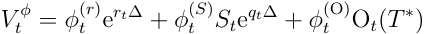

where O _t_ ( _T__∗_ ) is the time- _t_ hedging option value, ∆= 2521representsthetimeincrement in years, _rt_ is the time- _t_ annualized continuously compounded risk-free rate and _qt_ is the annualized underlying asset dividend yield, both on the interval ( _t −_ 1 _, t_ ]. To account for transaction costs the self-financing condition entails that for _t_ = 0 _, . . . , T −_ 1, 

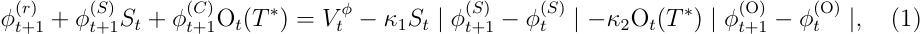

where _κ_ 1 and _κ_ 2 represent the proportional transaction cost rates for the underlying asset and the hedging option, respectively. Transaction costs for options are typically higher than those for the underlying asset. Consequently, we assume _κ_ 1 _<< κ_ 2. 

The optimal sequence of actions _ϕ_ = _{ϕt}__T_ _t_ =1correspondstothatwhichminimizesthe application of a risk measure _ρ_ to _ξT__ϕ_,thehedgingerroratmaturityforashortpositionin the option portfolio: 

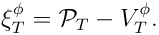

A positive value in _ξT__ϕ_impliesthatthehedgingstrategydoesnothaveenoughfundstocover 

the portfolio value _PT_ . Our goal is to find the hedging strategy _ϕ__∗_ such that 

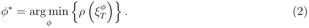

Each time- _t_ action _ϕt_ +1 is a function of currently available information on the market:

<!-- page: 7 -->

<!-- Start of picture text -->
C) |C). () f) | () || ( | ( ) () i C J) 3 iC) <!-- End of picture text -->

<!-- page: 8 -->

but it improves the results of our benchmark strategies. Further details are provided in Appendix A. 

As shown in François et al. (2024), the policy _ϕ_˜ _θ_ may inadvertently incorporate speculative elements, such as doubling strategies, where agents continuously increase their exposure in an attempt to recover successive losses. Such strategies are undesirable as they deviate from sound risk management principles. To prevent this problem, we introduce a soft tracking error constraint 

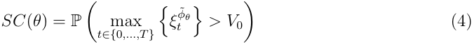

that penalizes the network during training if the time- _t_ tracking error, 

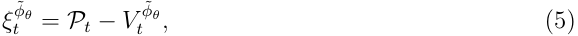

exceeds the initial hedging portfolio value at any time _t_ . This design does not penalize gains, consistent with the asymmetric nature of rational agents. As a result, instead of solving Problem (3), the objective function employed in our approach is 

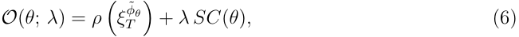

where _λ_ is a hyperparameter that controls the soft constraint weight in the optimization process. It is determined independently using a validation set during the model selection procedure. 

We employ a Recurrent Neural Network with a Feedforward Connection (RNN-FNN), in-

<!-- page: 9 -->

tegrating Long Short-Term Memory (LSTM) networks with Feedforward Neural Network (FFNN) architectures. This hybrid design has demonstrated superior training performance compared to conventional ANN architectures, as shown in Fecamp et al. (2020) and François et al. (2024). The RNN-FNN network is defined as a composition of LSTM cells _{Cl}__L_ _l_ =11and FFNN layers _{Lj}__L_ _j_ =12underthefollowingfunctionalrepresentation: 

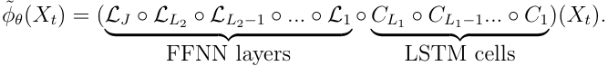

The explicit formulas for this ANN are detailed in François et al. (2024). 

### **2.3 Neural network optimization** 

The RNN-FNN network _ϕ_˜ _θ_ ( _·_ ) is optimized with the Mini-batch Stochastic Gradient Descent method (MSGD). This training procedure relies on updating iteratively all the trainable parameters of the optimization problem based on the recursive equations 

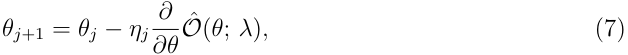

where _ηj_ are the learning rates that determine the magnitude of change of parameters per time step. These rates are dynamically adjusted using the Adam optimization algorithm.2 

Additionally, _O_ˆ ( _θ_ ; _λ_ ) is the Monte-Carlo estimate of the objective function defined by 

Equation (6). Further details can be found in Appendix B. 

> 2Adam is an adaptive learning rate method designed to accelerate training in deep neural networks and promote rapid convergence, as detailed in Kingma and Ba (2015).

<!-- page: 10 -->

## **3 Market simulator** 

Our approach incorporates a market simulator to emulate the joint dynamics of the S&P 500 price and of its associated IV surface. Indeed, optimal actions are characterized by the behavior of the underlying asset and the hedging instrument prices. Using a simulator provides the advantage of generating a large diversity of scenarios, enabling RL agents to explore the state space while identifying optimal policies. This alleviates the issue of scarcity in real market data. 

We leverage the JIVR model from François et al. (2023), which captures the temporal dynamics of S&P 500 returns alongside the key drivers of the IV surface, while accounting for their interdependencies. The JIVR framework works with interpretable factors and enables the replication of a wide range of realistic IV surface shapes observed in practice.3 The market simulator has been estimated using a daily dataset of observed implied volatilities—covering a broad range of moneyness and time-to-maturity—alongside S&P 500 returns from 1996 to 2020; it can therefore reflect a broad array of market conditions. It captures the self-contained properties of the option market, consistently with the "instrumental approach" of option pricing detailed in Rebonato (2005). 

> 3Other approaches could be pursued to generate IV surface scenarios, such as generative AI models detailed in Chen et al. (2023), Choudhary et al. (2024) and Vuletić and Cont (2024).

<!-- page: 11 -->

### **3.1 Daily implied volatility surfaces** 

The time- _t_ IV associated to an option with time-to-maturity _τt_ =_<u>T</u>_ 252_−t_yearsand(scaled) <u>1</u> moneyness _Mt_ = _~~√~~_ _<u>τt</u>_log_<u>Ste</u>_(_rt_ _K__−qt_)_τt_ is modeled as 

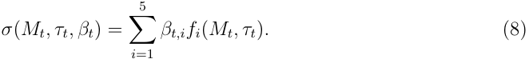

The vector _βt_ = ( _βt,_ 1 _, βt,_ 2 _, βt,_ 3 _, βt,_ 4 _, βt,_ 5) represents the IV factor coefficients at time _t_ , while the functions _{fi}_5 _i_ =1allowrepresentingthelong-termat-the-money(ATM)level,thetime- to-maturity slope, the moneyness slope, the smile attenuation, and the smirk, respectively. A detailed description of the functional components _{fi}_5 _i_ =1oftheIVsurfacecanbefoundin Appendix C.1. 

### **3.2 Joint implied volatility and return** 

The JIVR model introduced by François et al. (2023) builds upon the IV representation (8), offering an explicit formulation for the joint dynamics of the IV surface and the S&P 500 price. This joint representation is based on an econometric model for (i) the underlying asset returns, and (ii) fluctuations of the IV surface coefficients _βt_ along with a mean-reversion component for their volatilities _ht_ . The multivariate time series of the JIVR model is provided in Appendix C.2. 

The JIVR model is used to generate paths of the state variables ( _St, {βt,i}_5 _i_ =1_, ht,R, {ht,i}_5 _i_ =1), which drive the market dynamics, where _ht,R_ and _{ht,i}_5 _i_ =1arevolatilitiesfortheS&P500 and each of the IV factors. Estimates of the model parameters and volatility series _{h_ˆ _t,i}__N_ _t_ =1

<!-- page: 12 -->

with _i ∈{_ 1 _, . . . ,_ 5 _, R}_ are taken from François et al. (2023).4 

## **4 Numerical study** 

### **4.1 Market settings for numerical experiments** 

We consider daily trading periods. For each simulated path, initial conditions of the JIVR model, ( _{β_ 0 _,i}_5 _i_ =1_, h_0_,R, {h_0_,i}_5 _i_ =1),arerandomlysampledfromthedailyestimatedvaluesin our data set, covering the period from January 4, 1996, to December 31, 2020. Across all experiments, the annualized continuously compounded risk-free rate and dividend yield are assumed to remain constant, with values fixed at _r_ = 2 _._ 66% and _q_ = 1 _._ 77%, respectively.5 Without loss of generality, the initial value of the underlying asset is set to _S_ 0 = 100.6 The hedged portfolio is an ATM straddle with a maturity of _T_ = 63 days. At any time _t < T_ , the portfolio value _Pt_ is determined using the IV surface prevailing at that moment. 

The hedging instruments are the risk-free asset, the underlying asset, and an option with a maturity longer than that of the straddle—specifically, an ATM European call option with an initial maturity of _T__∗_ = 84 days. Positions in all hedging instruments are rebalanced daily. 

The hedge follows the self-financing dynamics from Equation (1), incorporating proportional transaction costs on both the underlying asset and the hedging option. As reported in Chaudhury (2019), the average cost for S&P 500 index call options is 0.95%. To evaluate its impact, we consider _κ_ 2 _∈{_ 0 _._ 5% _,_ 1% _,_ 1 _._ 5% _,_ 2% _}_ . In contrast, transaction costs for the 

> 4François et al. (2023) use a maximum likelihood approach on a multivariate time series made of S&P 500 returns and surface coefficients estimates _{β_ˆ _t}__N_ _t_ =1,withsampledatesextendingbetweenJanuary4,1996and December 31, 2020. 

> 5The annualized rates of the S&P 500 dividend yield (1.77%) and the zero-coupon yield (2.66%) are calculated as the average over the sample period from January 4, 1996, to December 31, 2020, using OptionMetrics data. 

> 6In our setting, the value of the portfolio to be hedged is proportional to the underlying asset initial value.

<!-- page: 13 -->

underlying asset are negligible, around 0.047% according to Bazzana and Collini (2020). We set _κ_ 1 = 0 _._ 05%. The initial hedging portfolio value matches the straddle price, _i.e._ , _V_ 0 = _P_ 0. 

### **4.2 Benchmarks** 

We benchmark the performance of our framework against several established approaches: (i) the RL method proposed by François et al. (2024), which incorporates IV-informed decisions using only the underlying asset as a hedging instrument, (ii) delta hedging (D), where only the underlying asset is used for hedging, and (iii) delta-gamma (DG) hedging, which includes the additional hedging option in the portfolio. 

For the second and third benchmarks, the delta and gamma of financial instruments are computed using the _practitioner’s_ approach, i.e., using the current IV value. In the case of delta hedging, the delta is adjusted based on the correction introduced by Leland (1985), which accounts for the impact of proportional transaction costs on the underlying asset position. In both benchmarks, the volatility parameter is updated daily according to the prevailing IV surface, which aligns the hedging strategies with dynamic market conditions. The explicit formulas for these two benchmarks are provided in Appendix D. 

For all three benchmarks, we further enhance the performance by incorporating the no-trade region, as defined in Equation (10).7 Additionally, the no-trade boundary _ℓ_ is optimized separately for each risk measure used for benchmarking, with each benchmark exhibiting its own distinct optimal value of _ℓ_ . Further details are provided in Appendix D.3. 

> 7The optimization process is carried out as detailed in Section 2.3, following Equation (7), using Mini-batch Stochastic Gradient Descent.

<!-- page: 14 -->

### **4.3 Neural network settings** 

### _4.3.1 Neural network architecture_ 

We consider a RNN-FNN architecture with two LSTM cells of width 56, two FFNN-hidden layers of width 56 with ReLU activation function (i.e., _gLi_ ( _X_ ) = max(0 _, X_ ) for _i_ = 1 _,_ 2), and one two-dimensional output FFNN layer with a linear activation function. Numerical experiments detailed in Appendix J from the Supplementary Material suggest the value _λ_ = 1 for the soft constraint hyperparameter, which is learned from the validation set. 

Agents are trained as described in Section 2.3 on a training set of 400,000 independent simulated paths with mini-batch size of 1000 and an initial learning rate of 0.0005. In addition, we include dropout regularization method with parameter _p_ = 0 _._ 5 as in François et al. (2024). The training procedure is implemented in Python, using Tensorflow and considering the Glorot and Bengio (2010) random initialization of the initial parameters of the neural network. The performance assessment is obtained from a test set of 100,000 independent paths. 

### _4.3.2 State space_ 

The state space presented in Table 1 includes the state variables generated by the JIVR model, along with a new set of state variables associated with the straddle and hedging portfolio. 

In our illustrative example, the RL agent seeks to hedge a straddle contract with the same specifications across different market dynamics. According to the terminology of Peng et al. (2024), this problem is a contract-specific reinforcement learning task, where the optimization problem is solved for a given contract with predefined parameters. Variables related to the

<!-- page: 15 -->

**Table 1:** State variables. 

|Notation|Description|
|---|---|
|_St_|Underlying asset price|
|_{βt,i}_5 _i_=1|IV factors described in Section 3.1|
|_{ht,i}_5 _i_=1|IV coefcients’ variances|
|_ht,R_|Conditional underlying asset return variance|
|_τt_|Time-to-maturity of the straddle|
|_Pt_|Straddle value|
|∆_P_ _t_|Delta of the straddle|
|Γ_P_ _t_|Gamma of the straddle|
|O_t_ |Hedging option price|
|_V_ (˜_ϕθ, l_) _t_|Hedging portfolio value|
|_ϕ_(_S_) _t_ |Underlying asset position|
|_ϕ_(O) _t_|Hedging option position|

For all Greeks, as well as the portfolio value and hedging option value, we use the implied volatility _σ_ ( _Mt, τt, βt_ ) from the static surface as the volatility input parameter. 

target portfolio (such as _Pt_ , ∆_P_ _t_,andΓ_P_ _t_)arenotstrictlynecessary,astheycantheoretically be recovered by the ANN if needed. However, our numerical experiments demonstrate that in practice their inclusion enhances training performance across all risk measures (details in Appendix E). Furthermore, incorporating these state variables extends our framework to enable its application in a contract-unified setting, allowing for the optimization of portfolios with any combination of options and contract parameters. 

### **4.4 Benchmarking of hedging strategies** 

### _4.4.1 Benchmarking in the absence of transaction costs_ 

We begin by evaluating the hedging performance of both benchmark methods and RL agents trained using three different risk measures: MSE, SMSE, and CVaR95%. This evaluation considers the estimated values of each risk measure alongside the sample average of the

<!-- page: 16 -->

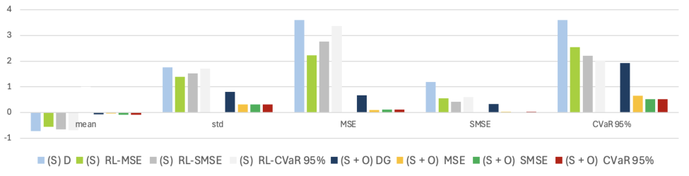

<!-- Start of picture text -->
4 3 2 5 a mean_ std| MSE| a SMSE-_— _ CVaR 95%un -1 (S)D m™(S) RL-MSE ™(S) RL-SMSE = _(S) RL-CVaR95% m(S+0O)DG ™(S+0) MSE m™(S +0) SMSE m(S +0) CVaR95% <!-- End of picture text -->

<!-- page: 17 -->

strategies that include an option as an additional hedging instrument exhibit lower risk in terms of standard deviation, MSE, SMSE, and CVaR95%, compared to those relying solely on a single hedging instrument. Notably, for tail risk captured by CVaR95%, the RL agent—trained on the money account and the underlying asset only—achieves a performance comparable to that of delta-gamma hedging. 

**Figure 2:** Hedging error distribution in the absence of transaction costs. 

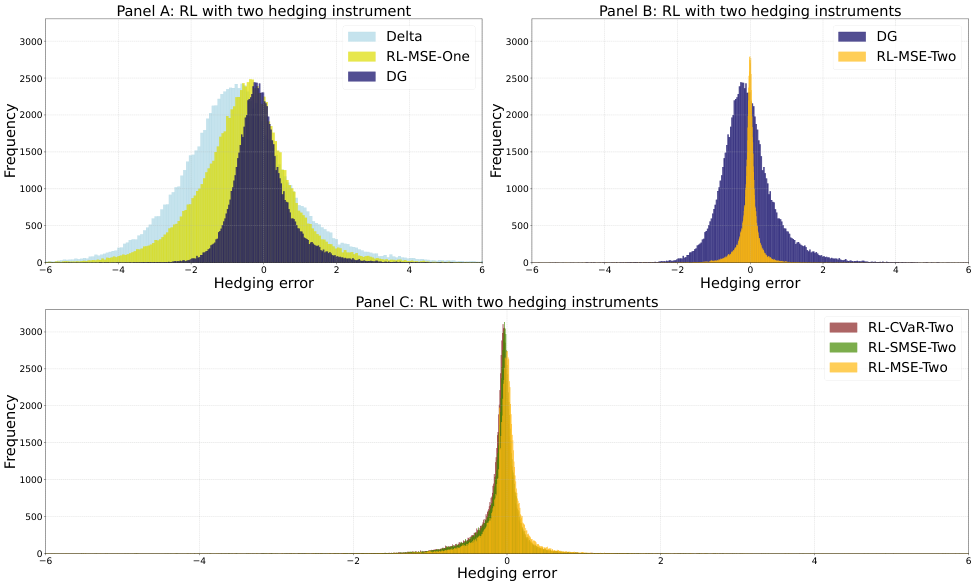

<!-- Start of picture text -->
Panel A: RL with two hedging instrument Panel B: RL with two hedging instruments 3000 Delta 3000 DG RL-MSE-One RL-MSE-Two 2500 DG 2500 2000 2000 1500 1500 1000 1000 500 500 0 0 6 4 2 0 2 4 6 6 4 2 0 2 4 6 Hedging error Hedging error Panel C: RL with two hedging instruments 3000 RL-CVaR-Two RL-SMSE-Two 2500 RL-MSE-Two 2000 1500 1000 500 0 6 4 2 0 2 4 6 Hedging error Frequency Frequency Frequency <!-- End of picture text -->

Results are computed using 100,000 out-of-sample paths. The hedged position is an ATM straddle with a maturity of _T_ = 63 days and an average value of $7.55. RL strategies labeled as "One" represent hedging with the risk-free and underlying assets; those labeled as "Two" incorporate an ATM call option with an initial maturity of _T__∗_ = 84 days. 

Figure 2 depicts the distribution of hedging errors across various strategies. Panel A contrasts 

the hedging error distributions of the benchmark and RL agents—both using only the underlying asset—with the traditional DG strategy, showing that incorporating an option significantly reduces risk. Panel B compares the DG strategy to the RL-MSE strategy, both

<!-- page: 18 -->

utilizing three hedging instruments, highlighting the RL approach’s superior performance in variance reduction. Finally, Panel C compares the three RL agents, revealing that strategies based on asymmetric risk measures produce distributions with greater skewness. 

### _4.4.2 Benchmarking in the presence of transaction costs_ 

We now measure the impact of transaction costs on the hedging performance. 

Figure 3 displays the optimal values of risk measures for two distinct hedging configurations: one relying solely on the risk-free asset and the underlying asset (first four columns in each group), and another that includes an ATM call option as an additional hedging instrument (last four columns). The comparison contrasts strategies without a no-trade region (solid bars) against those incorporating a no-trade region (striped bars). The no-trade region primarily benefits delta-gamma hedging. In the case of delta hedging, transaction costs associated with trading the underlying asset are minimal and have negligible impact on performance. For reinforcement learning (RL) approaches, trading costs are already internalized within the optimization of the neural network policy, rendering the additional constraint of a no-trade region unnecessary. This is consistent with the persistently low threshold values reported in Figure 13 of Appendix A.

<!-- page: 19 -->

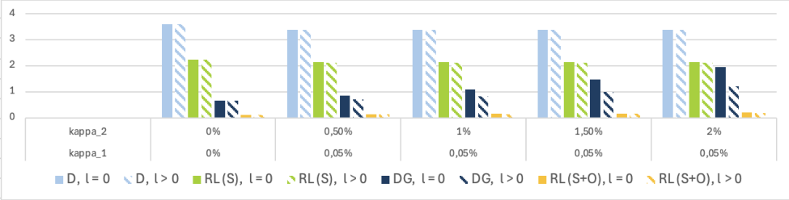

<!-- Start of picture text -->
4 3 2 N~ *~N: NA N5 N ; SES. " Nee S Nee SBS. SB... kappa_2 0% 0,50% 1% 1,50% 2% kappa_1 0% 0,05% 0,05% 0,05% 0,05% D, l=0 <D,l>0 mRL(S), l=0 .RL(S), (>0 mDG, l=0 DG, l>0 mRL(S+0),L=0 ~RL(S+0),1>0 <!-- End of picture text -->

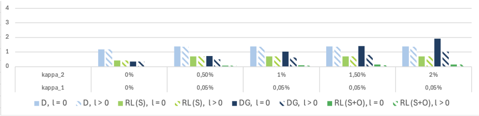

<!-- Start of picture text -->
4 3 2 ; acm Ne ahs ass. | Sa. kappa_2 0% 0,50% 1% 1,50% 2% kappa_1 0% 0,05% 0,05% 0,05% 0,05% D,l=0 »D,l>0 mRL(S),[=O RLS), (>0 mDG, l=0 DG, l>0 mRL(StO),1=0 ¢RL(S+O),1>0 <!-- End of picture text -->

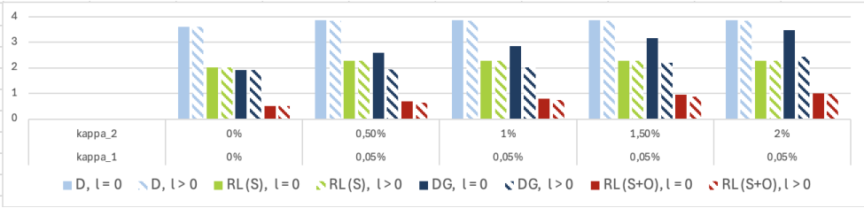

<!-- Start of picture text -->
4 3 2 . ‘ Mi, vis alls ; SNS NN NN NN A NN A kappa_2 0% 0,50% 1% 1,50% 2% kappa_1 0% 0,05% 0,05% 0,05% 0,05% D,l=0 \D,l>0 mRL(S),[=O RL(S), 1>0 mDG,l=0 CDG, l>0 mRL(S+0),L=0 oRL(StO),1>0 <!-- End of picture text -->

<!-- page: 20 -->

risk management—assessed via SMSE and CVaR metrics—it is noteworthy that, in the presence of transaction costs, the RL algorithm that relies solely on the risk-free asset and the underlying asset either outperforms or provides a performance similar to that of delta-gamma hedging. RL algorithms that incorporate an option as part of the hedging instruments achieve even stronger performance. 

**Figure 4:** Hedging error distribution in the presence of transaction costs. 

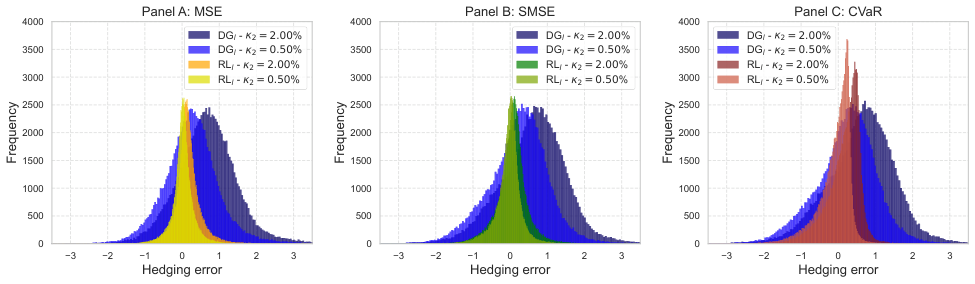

<!-- Start of picture text -->
Panel A: MSE Panel B: SMSE Panel C: CVaR 4000 4000 4000 DGl -  2 = 2.00% DGl -  2 = 2.00% DGl -  2 = 2.00% 3500 DG l  -  2 = 0.50% 3500 DG l  -  2 = 0.50% 3500 DG l  -  2 = 0.50% RLl -  2 = 2.00% RLl -  2 = 2.00% RLl -  2 = 2.00% 3000 RL l  -  2 = 0.50% 3000 RL l  -  2 = 0.50% 3000 RL l  -  2 = 0.50% 2500 2500 2500 2000 2000 2000 1500 1500 1500 1000 1000 1000 500 500 500 0 0 0 3 2 1 0 1 2 3 3 2 1 0 1 2 3 3 2 1 0 1 2 3 Hedging error Hedging error Hedging error Frequency Frequency Frequency <!-- End of picture text -->

Results are computed using 100,000 out-of-sample paths according to the conditions outlined in Section 4.3. The hedged position is an ATM straddle with a maturity of _T_ = 63 days and an average value of $7.55. The hedging instrument is an ATM call option with a maturity of _T__∗_ = 84 days. The transaction cost parameter for the underlying asset is set to _κ_ 1 = 0 _._ 05%. 

To further highlight the advantage of RL over DG, Figure 4 presents histograms of hedging 

error distributions at maturity for both strategies under two different transaction cost scenarios. 

RL agents constantly produce narrower distributions across all risk measures, indicating greater resilience to rising transaction costs. This stability is particularly beneficial from a risk management perspective, as it ensures more reliable performance despite increasing costs. 

### **4.5 Assessing the presence of speculative components in hedging positions** 

This section examines whether the RL risk management includes speculative elements, such as strategies that reap the time-varying risk premia embedded in hedging instruments. The

<!-- page: 21 -->

risk premium (RP) is defined as the difference between the discounted expected payoff and the option price at time _t_ , i.e., 

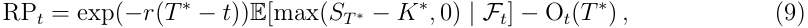

where _K__∗_ is the hedging option strike price, the expectation is under the physical measure and _Ft_ denotes the information available at time _t_ .8 The risk premium is estimated using a stochastic-on-stochastic simulation approach, where the present value of the expected payoff is computed through a nested simulation at each time step within the simulated paths. 

**Figure 5:** Ranked data of risk premium and hedging option positions. 

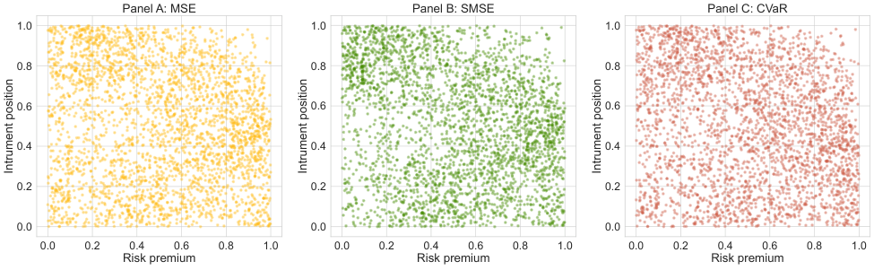

<!-- Start of picture text -->
Panel A: MSE Panel B: SMSE Panel C: CVaR 1.0 1.0 1.0 0.8 0.8 0.8 0.6 0.6 0.6 0.4 0.4 0.4 0.2 0.2 0.2 0.0 0.0 0.0 0.0 0.2 0.4 0.6 0.8 1.0 0.0 0.2 0.4 0.6 0.8 1.0 0.0 0.2 0.4 0.6 0.8 1.0 Risk premium Risk premium Risk premium Intrument position Intrument position Intrument position <!-- End of picture text -->

Results are computed using a sample of 20,000 data points from the 100,000 out-of-sample paths. The hedged position is an ATM straddle with a maturity of _T_ = 63 days. The hedging instrument is an ATM call option with an initial maturity of _T__∗_ = 84 days. Transaction cost levels are set to 0%. 

We investigate whether a statistical relationship exists between the risk premium RP _t_ and the hedging position _ϕ_( _t_ +1O).Figure 5 presents a scatter plot of ranked data for these variables, using 20,000 samples from the 100,000 out-of-sample paths, which is repeated for the three risk 

measures. The plot reveals no strong dependence patterns, suggesting a weak or insignificant 

> 8The usual definition of the risk premium is a return difference. However, when options are DOTM and their value is very low, this definition leads to numerical instability.

<!-- page: 22 -->

relationship. This finding is further supported by sample correlations ranging from -0.001 to -0.006, indicating that RL agents do not systematically seek to capture risk premium benefits. 

As a complementary analysis, we examine whether our approach embeds speculative elements, such as statistical arbitrage overlays, that may deviate from sound risk management practices. Our results indicate that RL agents do not engage in such strategies, regardless of the risk measure used in optimization. Further details are provided in Appendix F. 

### **4.6 Analysis of hedging positions** 

### _4.6.1 Comparison with benchmarks_ 

We analyze the relationship between the hedging option positions produced by the DG strategy and those generated by RL agents. This analysis aims to understand how the RL outperformance documented in Section 4.4.1 and Section 4.4.2 emerges by studying the positions taken by the hedger. Figure 6 presents for various days _t_ , the sample correlation between DG and RL hedging option positions, _ϕ_( _t_O_,_DG) and _ϕt_(O_,_RL) , under the MSE, SMSE, and CVaR95% risk measures. The correlation is computed for two scenarios: one without transaction costs and another with _κ_ 1 = 0 _._ 05% and _κ_ 2 = 1% for illustration. 

Our numerical results reveal a consistent pattern across all risk measures, highlighting a significant divergence between RL and DG hedging strategies in terms of correlation, particularly at the start of the hedging horizon. Indeed, the RL agent benefits from learning experience to anticipate the future movements of state variables over multiple future periods. By contrast, the DG hedging agent is myopic in that he readjusts his hedging positions based on local risk. As time-to-maturity shrinks, both strategies become more similar. The inclusion of transaction costs leads the RL agent to maintain a distinct approach, with correlation

<!-- page: 23 -->

**Figure 6:** Pearson correlation between DG and RL agents’ hedging option positions. 

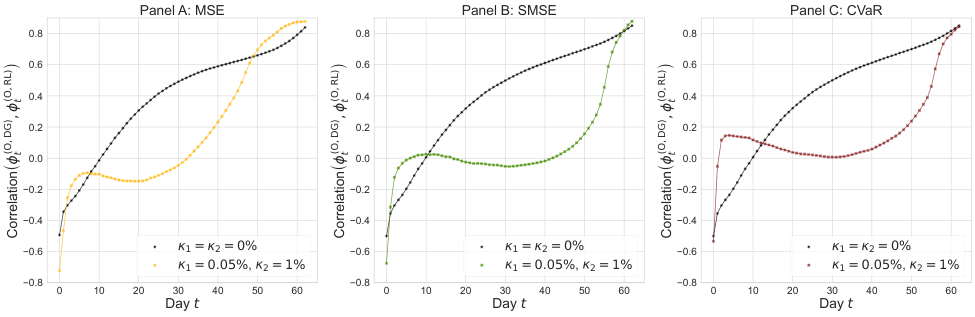

<!-- Start of picture text -->
Panel A: MSE Panel B: SMSE Panel C: CVaR 0.8 0.8 0.8 0.6 0.6 0.6 0.4 0.4 0.4 0.2 0.2 0.2 0.0 0.0 0.0 0.2 0.2 0.2 0.4 0.4 0.4 0.6 1 = 2 = 0% 0.6 1 = 2 = 0% 0.6 1 = 2 = 0% 1 = 0.05%,  2 = 1% 1 = 0.05%,  2 = 1% 1 = 0.05%,  2 = 1% 0.8 0.8 0.8 0 10 20 30 40 50 60 0 10 20 30 40 50 60 0 10 20 30 40 50 60 Day t Day t Day t ) ) ) (O, RL) t (O, RL) t (O, RL) t (O, DG) t, (O, DG) t, (O, DG) t, ( ( ( Correlation Correlation Correlation <!-- End of picture text -->

Results are based on a sample of 100,000 out-of-sample paths. Agents are trained under the conditions described in Section 4.3. The hedged position is an ATM straddle with a maturity of _T_ = 63 day. The hedging instrument is an ATM call option with a maturity of _T__∗_ = 84 days. 

remaining near zero for a significant portion of the hedging horizon. 

A potential secondary source of divergence between these strategies stems from differences in rebalancing size. While the rebalancing frequency influences the timing of adjustments, the magnitude of these adjustments plays a key role in differentiating the hedging behaviors. Figure 7 illustrates the average hedging option position, along with the interquartile range, over time for all risk measures. The analysis is presented for two scenarios: one without transaction costs (first row), and another with transaction costs set to _κ_ 1 = 0 _._ 05% and _κ_ 2 = 1% (second row). 

Our findings indicate that RL agents tend to hold smaller option positions during the early stages of the hedging period, a trend that is more pronounced with the introduction of transaction costs. This behavior arises from the substantial transaction cost associated with the hedging option, suggesting that RL agents favor more frequent rebalancing with smaller initial positions, gradually increasing their hedging positions over time. By deferring full engagement with the hedge, the RL agent seeks to balance cost efficiency with effective

<!-- page: 24 -->

**Figure 7:** Distribution of hedging option positions. 

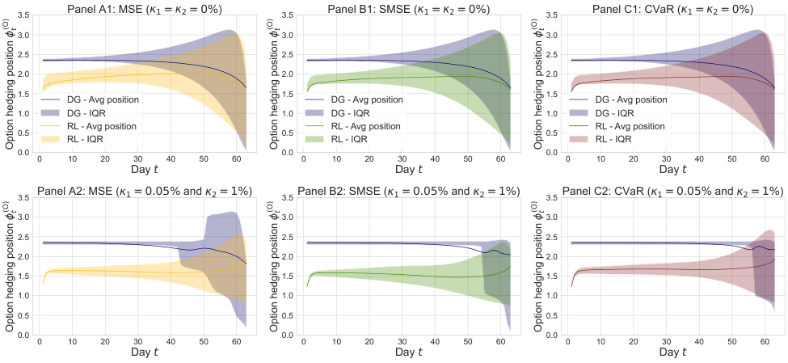

<!-- Start of picture text -->
3.5 Panel A1: MSE ( 1 = 2 = 0%) 3.5 Panel B1: SMSE ( 1 = 2 = 0%) 3.5 Panel C1: CVaR ( 1 = 2 = 0%) 3.0 3.0 3.0 2.5 2.5 2.5 2.0 2.0 2.0 1.5 1.5 1.5 DG - Avg position DG - Avg position DG - Avg position 1.0 DG - IQR 1.0 DG - IQR 1.0 DG - IQR 0.5 RL - Avg position 0.5 RL - Avg position 0.5 RL - Avg position RL - IQR RL - IQR RL - IQR 0.0 0.0 0.0 0 10 20 30 40 50 60 0 10 20 30 40 50 60 0 10 20 30 40 50 60 Day t Day t Day t 3.5 Panel A2: MSE ( 1 = 0.05% and  2 = 1%) 3.5 Panel B2: SMSE ( 1 = 0.05% and  2 = 1%) 3.5 Panel C2: CVaR ( 1 = 0.05% and  2 = 1%) 3.0 3.0 3.0 2.5 2.5 2.5 2.0 2.0 2.0 1.5 1.5 1.5 1.0 1.0 1.0 0.5 0.5 0.5 0.0 0.0 0.0 0 10 20 30 40 50 60 0 10 20 30 40 50 60 0 10 20 30 40 50 60 Day t Day t Day t (O) t (O) t (O) t Option hedging position  Option hedging position  Option hedging position (O) t (O) t (O) t Option hedging position  Option hedging position  Option hedging position <!-- End of picture text -->

Results are computed over 100,000 out-of-sample paths according to the conditions outlined in Section 4.3.1. The hedged position is an ATM straddle with a maturity of _T_ = 63 days. The hedging instrument is an ATM call option with a maturity of _T__∗_ = 84 days. IQR stands for the interquartile range, representing the range between the 25th and 75th percentiles. 

risk management, avoiding taking positions that might need to be unwound shortly after. 

Additionally, lower option positions in early stages allow the agent to initially limit the (short) exposure to the variance risk premium while progressively scaling up the hedging positions. Thus, RL agents achieve twofold cost reductions, where both explicit transaction costs and implicit costs related to short exposure to the variance risk premium are managed. 

In contrast, DG strategies adopt larger option positions early in the period to fully neutralize gamma risk. However, this approach leads to prolonged exposure to the volatility premium, making it suboptimal. 

### _4.6.2 Sensitivity analysis_ 

We analyze the sensitivity of RL agents’ positions to variations in the risk factors defining the IV surface, examining how they leverage information from its shape. Our analysis begins

<!-- page: 25 -->

by evaluating RL policy behavior across different initial scenarios for the state variables ( _{βt,i}_5 _i_ =1_, ht,R_). 

To assess the impact of each state variable, we sort the initial state vectors in the test set according to each variable and observe the corresponding hedging positions in the same order. 

This method accounts for the interdependence between these state variables and the broader state vector components, as detailed in Table 1, and reveals how changes in a selected variable influence hedging decisions. 

Figure 8 presents the hedging positions of the RL agent trained with the MSE risk measure under a no-transaction-cost scenario. Each panel displays the hedging positions when the initial state vectors are sorted according to each state variable, ( _{βt,i}_5 _i_ =1_, ht,R_). 

These empirical results suggest that the position in the hedging option exhibits a decreasing trend with respect to the conditional variance of the underlying asset returns, the long-term ATM level _β_ 1 and the time-to-maturity slope _β_ 2 of the IV surface.9 As noted in François et al. (2024), RL agents utilize both the historical variance process and market expectations of future volatility to adjust their positions. For instance, smaller positions on the hedging option when _β_ 1, _β_ 2 or_√_ _hR_ are higher can be explained by the higher cost of hedging in such circumstances. Indeed, both option prices and associated proportional transaction costs are higher. 

> 9By contrast, there is no clear pattern related with the other factors as shown in panels C, D and E.

<!-- page: 26 -->

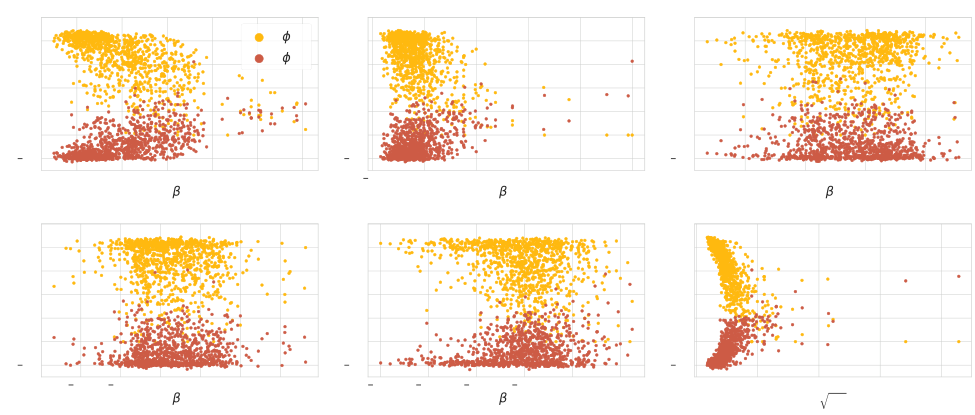

<!-- Start of picture text -->
Bh eee Laie * bo Cs oe FB. tt,  awe oteBEage AEE Mae> : S oF. ay . oo eb eet, oT“ati delgttetsee Urey ” ee PSsSe Re : : oo «geBie Betisaryes ee oohee : “Tne seamahes ° THELS Re ae . ea mete es , - Py ofe' 3 fy oan‘ - 2, °ey,” wagesos : o—+ tte ay)  eeea, oe SeA's $8 RR Tes. bd eee ate . B B B . “3 fe ek 4: ‘ y te ea: - : ‘ ry ; 7 . wd <0 oo, nal . : . . eas ary 2 ae | : ae ‘et . . . tye i Cas 2 pee, an - wok ms te REE eno 29s - os B B Vv <!-- End of picture text -->

<!-- page: 27 -->

˜ where _ξt,iϕθ_representsthetime-_t_trackingerrorofthe_i_-thpathinthetestset. 

**Figure 9:** Evolution of tracking error metrics across rebalancing days. 

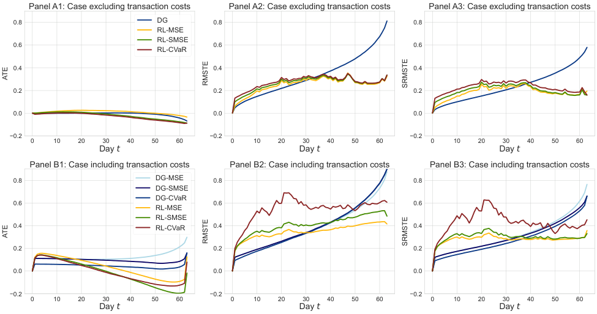

<!-- Start of picture text -->
Panel A1: Case excluding transaction costs Panel A2: Case excluding transaction costs Panel A3: Case excluding transaction costs 0.8 DG 0.8 0.8 RL-MSE RL-SMSE 0.6 0.6 0.6 RL-CVaR 0.4 0.4 0.4 0.2 0.2 0.2 0.0 0.0 0.0 0.2 0.2 0.2 0 10 20 30 40 50 60 0 10 20 30 40 50 60 0 10 20 30 40 50 60 Day t Day t Day t Panel B1: Case including transaction costs Panel B2: Case including transaction costs Panel B3: Case including transaction costs 0.8 DG-MSE 0.8 0.8 DG-SMSE DG-CVaR 0.6 0.6 0.6 RL-MSE RL-SMSE 0.4 RL-CVaR 0.4 0.4 0.2 0.2 0.2 0.0 0.0 0.0 0.2 0.2 0.2 0 10 20 30 40 50 60 0 10 20 30 40 50 60 0 10 20 30 40 50 60 Day t Day t Day t ATE RMSTE SRMSTE ATE RMSTE SRMSTE <!-- End of picture text -->

Results are computed over 100,000 out-of-sample paths under the conditions outlined in Section 4.3.1. The hedged position is an ATM straddle with a maturity of _T_ = 63 days and an average value of $7.55. The hedging instrument is an ATM call option with a maturity of _T__∗_ = 84 days. 

Figure 9 presents the evolution of these metrics over the hedging period under two scenarios: without transaction costs (Panel A) and with transaction costs (Panel B). Panel B accounts for multiple DG strategies, each corresponding to a different optimal no-trade threshold _ℓ_ . The results indicate that, regardless of transaction costs, both the standard and asymmetric tracking error metrics (columns 2 and 3 of Figure 9) exhibit a monotonic upward trend for DG strategies. In contrast, RL strategies lead to curves that flatten out or even decrease through time, demonstrating their ability to correct for past errors. Conversely, DG strategies are purely forward-looking, leading to the accumulation of unaddressed errors over time. Furthermore, columns 2 and 3 show that RL agents maintain strong option-tracking per-

<!-- page: 28 -->

formance in the absence of transaction costs, despite adopting strategies that differ from those derived using the DG approach. However, once transaction costs are introduced (panels B2 and B3 of Figure 9), the RL agent trained under the CVaR risk measure exhibits larger tracking error. This is primarily driven by the nature of the objective function, which focuses on minimizing the tail of losses only at the end of the hedging period. As a result, early deviations between the hedging and target portfolios do not necessarily lead to a loss in the tail of the distribution, and therefore do not require immediate correction, as positions can be rebalanced closer to maturity while keeping the CVaR at low levels. Larger tracking errors in early stages are expected because the RL optimization leads to smaller hedging positions, see Figure 7. 

In terms of the sample average tracking error (column 1), DG strategies exhibit values close to zero across all rebalancing days in absence of transaction costs. The RL agent trained under the MSE risk metric follows closely, which aligns with the symmetric nature of this risk measure, as it penalizes both losses and gains equally. In contrast, RL strategies optimized using SMSE and CVaR deviate further from zero, particularly displaying a negative average hedging error. This behavior reflects the asymmetric nature of these risk metrics, which do not penalize gains. These differences become even more pronounced when transaction costs are introduced, further emphasizing the distinct risk preferences embedded in each optimization approach. 

## **5 Out-of-sample backtesting** 

We assess the performance of our framework under actual market conditions, using historical option prices sourced from OptionMetrics observed between December 31, 2020, and October

<!-- page: 29 -->

31, 2023. We evaluate the hedging performance across 4,134 near-the-money 63-day European straddles, where the option strike lies within _±_ 10% of the underlying asset’s initial price. Each straddle is hedged using a combination of a call option with a longer maturity (between 78 and 84 days of maturity depending on availability), the underlying asset and the cash account.10 

We compare the performance of the practitioners’ delta-gamma hedging with that of the RL algorithms with and without IV surface information.11 Figure 10 shows that, in terms of MSE, the RL algorithm without IV surface information performs worse than the two other approaches. Interestingly, in the absence of transaction costs, the practitioners’ deltagamma hedging and the RL algorithm with IV information exhibit very similar MSE. The RL-algorithm with the complete information slightly outperforms the other approaches in presence of transaction costs, again in terms of MSE. The main conclusion is that RL approaches do not necessarily dominate traditional methods; their performance critically depends on the information provided to the algorithm. However, in terms of tail risk, the RL algorithms clearly outperform the practitioners’ delta-gamma approach. Moreover, receiving 

information about the IV surface clearly improves the performance the RL algorithm. 

> 10On each day of the out-of-sample dataset, the IV parameters _βt_ are estimated. We then re-estimate their joint dynamics with the S&P 500 returns to recreate the state space. To ensure consistency with the simulation environment used during training, all underlying price paths are rescaled to start at a normalized value of 100. 

> 11The RL benchmark without IV surface information is analogous to the proposed RL method, except that predictors _βt,_ 1 _, . . . , βt,_ 5 _, ht,_ 1 _, . . . , ht,_ 5 are dropped from the state space.

<!-- page: 30 -->

**Figure 10:** Out-of-sample backtest performance metrics on hedging errors, with and without transaction costs. 

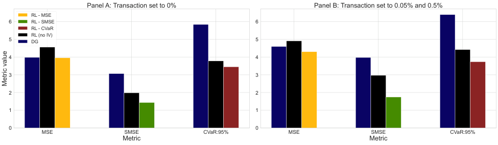

<!-- Start of picture text -->
Panel A: Transaction set to 0% Panel B: Transaction set to 0.05% and 0.5% RL - MSE 6 RL - SMSE 6 RL - CVaR RL (no IV) 5 DG 5 4 4 3 3 2 2 1 1 0 0 MSE SMSE CVaR:95% MSE SMSE CVaR:95% Metric Metric Metric value <!-- End of picture text -->

The backtest is conducted on 4,134 around-the-money straddle intruments, using actual market prices observed between December 31, 2020 and October 31, 2023. 

Further evidence of the RL approach’s superior performance is provided by the distribution of hedging errors (without transaction costs) shown in Figure 11. The first row compares the RL algorithm with the full information to the practitioners’ delta-gamma strategy. It is clear that the distribution of the practitioners’ delta-gamma strategy is shifted to the right and exhibits a heavier right tail. In the second row, we observe the benefits of incorporating IV information into the RL strategies. The distribution of hedging errors is more concentrated around zero when such information is included. 

Although risk management is primarily associated with measures of dispersion and downside risk, it is interesting to note that only the practitioners’ delta-gamma strategy exhibits a negative cumulative P&L (see Figure 12). Moreover, having the full information about the IV surface helps the RL algorithm achieve the best cumulative P&L. We observe that the cumulative P&L of the RL algorithm with the full information increases significantly in the second half of the sample. Examining market conditions (Panel B to Panel E), we see that this period is associated with IV slopes that are strongly positive (see Panel D). In the

<!-- page: 31 -->

**Figure 11:** Distribution of hedging errors for near-at-the-money straddles. 

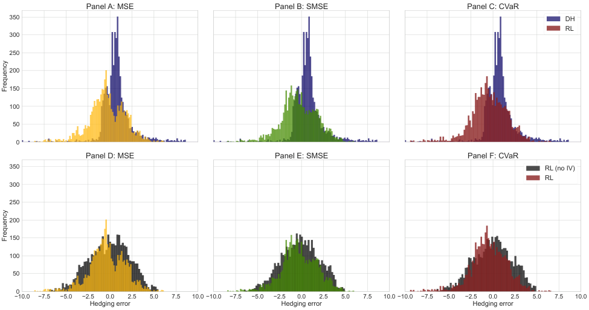

<!-- Start of picture text -->
Panel A: MSE Panel B: SMSE Panel C: CVaR 350 DH RL 300 250 200 150 100 50 0 Panel D: MSE Panel E: SMSE Panel F: CVaR 350 RL (no IV) RL 300 250 200 150 100 50 0 10.0 7.5 5.0 2.5 0.0 2.5 5.0 7.5 10.0 10.0 7.5 5.0 2.5 0.0 2.5 5.0 7.5 10.0 10.0 7.5 5.0 2.5 0.0 2.5 5.0 7.5 10.0 Hedging error Hedging error Hedging error Frequency Frequency <!-- End of picture text -->

The backtest is conducted on 4,134 around-the-money straddle intruments, using actual market prices observed between December 31, 2020 and October 31, 2023. No transaction costs are applied. 

middle of the sample, there is a period of high volatility (see Panel E), but this information is captured by both the practitioners’ delta-gamma hedging and the RL algorithms. 

These findings demonstrate that RL agents achieve consistent and competitive performance when applied to unseen historical market conditions, despite being trained on simulated data. Their ability to adapt to diverse environments and maintain superior risk control highlights the practical value of this approach in hedging tasks.

<!-- page: 32 -->

**Figure 12:** Time series of hedging strategies P&L and market conditions. 

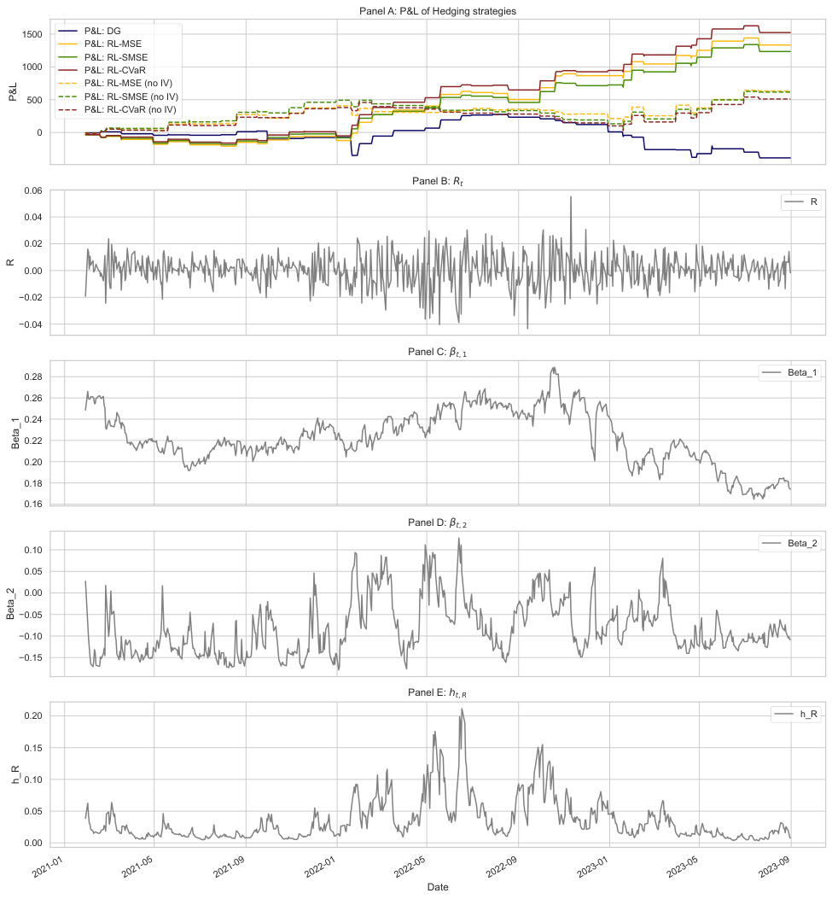

<!-- Start of picture text -->
Panel A: P&L of Hedging strategies 1500 P&L: DG P&L: RL-MSE P&L: RL-SMSE 1000 P&L: RL-CVaR P&L: RL-MSE (no IV) 500 P&L: RL-SMSE (no IV) P&L: RL-CVaR (no IV) 0 Panel B: Rt 0.06 R 0.04 0.02 0.00 0.02 0.04 Panel C:  t, 1 0.28 Beta_1 0.26 0.24 0.22 0.20 0.18 0.16 Panel D:  t, 2 0.10 Beta_2 0.05 0.00 0.05 0.10 0.15 Panel E: ht, R 0.20 h_R 0.15 0.10 0.05 0.00 Date 2021-01 2021-05 2021-09 2022-01 2022-05 2022-09 2023-01 2023-05 2023-09 P&L R Beta_1 Beta_2 h_R <!-- End of picture text -->

The backtest is conducted on 4,134 around-the-money straddle intruments, using actual market prices observed between December 31, 2020 and October 31, 2023. No transaction costs are applied.

<!-- page: 33 -->

## **6 Conclusion** 

This study develops a deep hedging framework to manage the risk associated with S&P 500 options with a hedging portfolio including both options and underlying asset shares. In our work the information related to implied volatility surfaces is included within the set of state variables. The key differentiating aspect of our work is that with this information in hand, the adjustments in hedging positions not only integrate forward-looking expectations of market dynamics, but also capture the current price levels for options (and the associated variance risk premium) within rebalancing decisions. The IV surface, conveniently represented by a parametric form, proves to be instrumental in refining the hedging policy. A soft constraint is included in the optimization scheme to mitigate speculative behavior, ensuring that hedging strategies focus on effective risk management. 

Our approach consistently outperforms traditional benchmarks both with and without transaction costs. It also highlights the substantial hedging benefits of incorporating additional instruments, such as options. Our study further documents the reasons driving the hedging outperformance of the reinforcement learning agent. In contrast to the myopic delta-gamma hedging, deep hedging begins with smaller option positions. This leads to less transaction costs and, more importantly, provides more flexibility for appropriately rebalancing the hedging portfolio when uncertainty about the final moneyness of the position to hedge is gradually resolved. Smaller early-stage positions in the hedging option also reduce exposure to the variance risk premium, leading to lower losses. We show that reinforcement learning agents effectively incorporate both historical variance and market expectations of future volatility into their hedging decisions. The observed decline in hedging option positions in response

<!-- page: 34 -->

to higher conditional variance, long-term ATM implied volatility level and time-to-maturity slope underscores the agents’ ability to dynamically mitigate risk, acting as a protective mechanism against volatility fluctuations. 

Out-of-sample backtests using historical data and various levels of transaction costs show that the reinforcement learning hedging performance is robust to diverse market conditions and superior to that of benchmarks in terms of downside risk management, on top of providing superior profitability. Such tests highlight the importance of information embedded in implied volatility surfaces. This confirms that deep hedging with options using the implied volatility surface is a sound and practically applicable hedging approach. 

## **References** 

- Alexander, C. and Nogueira, L. M. (2007). Model-free hedge ratios and scale-invariant models. _Journal of Banking & Finance_ , 31(6):1839–1861. 

- Assa, H. and Karai, K. M. (2013). Hedging, Pareto optimality, and good deals. _Journal of Optimization Theory and Applications_ , 157:900–917. 

- Balduzzi, P. and Lynch, A. W. (1999). Transaction costs and predictability: Some utility cost calculations. _Journal of Financial Economics_ , 52(1):47–78. 

- Bates, D. S. (2005). Hedging the smirk. _Finance Research Letters_ , 2(4):195–200. 

- Bazzana, F. and Collini, A. (2020). How does HFT activity impact market volatility and the bid-ask spread after an exogenous shock? An empirical analysis on S&P 500 ETF. _The North American Journal of Economics and Finance_ , 54:101240. 

- Black, F. and Scholes, M. (1973). The pricing of options and corporate liabilities. _Journal of_

<!-- page: 35 -->

_Political Economy_ , 81(3):637–654. 

- Buehler, H., Gonon, L., Teichmann, J., and Wood, B. (2019). Deep hedging. _Quantitative Finance_ , 19(8):1271–1291. 

- Buehler, H., Murray, P., Pakkanen, M. S., and Wood, B. (2021). Deep hedging: learning to remove the drift under trading frictions with minimal equivalent near-martingale measures. _arXiv preprint arXiv:2111.07844_ . 

- Cao, J., Chen, J., Farghadani, S., Hull, J., Poulos, Z., Wang, Z., and Yuan, J. (2023). Gamma and vega hedging using deep distributional reinforcement learning. _Frontiers in Artificial Intelligence_ , 6:1129370. 

- Cao, J., Chen, J., Hull, J., and Poulos, Z. (2020). Deep hedging of derivatives using reinforcement learning. _The Journal of Financial Data Science_ . 

- Carbonneau, A. (2021). Deep hedging of long-term financial derivatives. _Insurance: Mathematics and Economics_ , 99:327–340. 

- Carr, P. and Wu, L. (2014). Static hedging of standard options. _Journal of Financial Econometrics_ , 12(1):3–46. 

- Chaudhury, M. (2019). _Option bid-ask spread and liquidity_ . SSRN. 

- Chen, J., Hull, J., Poulos, Z., Rasul, H., Veneris, A., and Wu, Y. (2023). A variational autoencoder approach to conditional generation of possible future volatility surfaces. 

- Choudhary, V., Jaimungal, S., and Bergeron, M. (2024). FuNVol: Multi-asset implied volatility market simulator using functional principal components and neural SDEs. _Quantitative_ 

_Finance_ , 24(8):1077–1103.

<!-- page: 36 -->

- Clewlow, L. and Hodges, S. (1997). Optimal delta-hedging under transactions costs. _Journal of Economic Dynamics and Control_ , 21(8-9):1353–1376. 

- Constantinides, G. M. (1986). Capital market equilibrium with transaction costs. _Journal of Political Economy_ , 94(4):842–862. 

- Davis, M. H. A. and Norman, A. R. (1990). Portfolio selection with transaction costs. _Mathematics of Operations Research_ , 15(4):676–713. 

- Du, J., Jin, M., Kolm, P. N., Ritter, G., Wang, Y., and Zhang, B. (2020). Deep reinforcement learning for option replication and hedging. _The Journal of Financial Data Science_ , 2(4):44–57. 

- Fecamp, S., Mikael, J., and Warin, X. (2020). Deep learning for discrete-time hedging in incomplete markets. _Journal of Computational Finance_ , 25(2). 

- François, P. and Stentoft, L. (2021). Smile-implied hedging with volatility risk. _Journal of Futures Markets_ , 41(8):1220–1240. 

- François, P., Galarneau-Vincent, R., Gauthier, G., and Godin, F. (2022). Venturing into uncharted territory: An extensible implied volatility surface model. _Journal of Futures Markets_ , 42(10):1912–1940. 

- François, P., Galarneau-Vincent, R., Gauthier, G., and Godin, F. (2023). Joint dynamics for the underlying asset and its implied volatility surface: A new methodology for option risk management. _SSRN_ . 

- François, P., Gauthier, G., Godin, F., and Mendoza, C. O. P. (2024). Enhancing deep hedging of options with implied volatility surface feedback information. _SSRN_ .

<!-- page: 37 -->

- François, P., Gauthier, G., Godin, F., and Mendoza, C. O. P. (2025). Is the difference between deep hedging and delta hedging a statistical arbitrage? _Finance Research Letters_ , 73:106590. 

- Glorot, X. and Bengio, Y. (2010). Understanding the difficulty of training deep feedforward neural networks. In _Proceedings of the thirteenth international conference on artificial intelligence and statistics_ , pages 249–256. JMLR Workshop and Conference Proceedings. 

- Goodfellow, I., Bengio, Y., and Courville, A. (2016). _Deep learning_ . MIT press. 

- Henrotte, P. (1993). Transaction costs and duplication strategies. _Graduate School of Business, Stanford University_ . 

- Hodges, S. D. and Neuberger, A. (1989). Optimal replication of contingent claims under transaction costs. _Review Futures Market_ , 8:222–239. 

- Horikawa, H. and Nakagawa, K. (2024). Relationship between deep hedging and delta hedging: Leveraging a statistical arbitrage strategy. _Finance Research Letters_ , page 105101. 

- Kingma, D. P. and Ba, J. (2015). Adam: A method for stochastic optimization. In _3rd International Conference on Learning Representations, ICLR 2015, San Diego, CA, USA, May 7-9, 2015, Conference Track Proceedings_ . 

- Leland, H. E. (1985). Option pricing and replication with transactions costs. _The Journal of Finance_ , 40(5):1283–1301. 

- Martellini, L. and Priaulet, P. (2002). Competing methods for option hedging in the presence of transaction costs. _Journal of Derivatives_ , 9(3):26. 

- Peng, X., Zhou, X., Xiao, B., and Wu, Y. (2024). A risk sensitive contract-unified reinforcement

<!-- page: 38 -->

learning approach for option hedging. _arXiv preprint arXiv:2411.09659_ . 

Rebonato, R. (2005). _Volatility and correlation: The perfect hedger and the fox_ . John Wiley & Sons. 

- Toft, K. B. (1996). On the mean-variance tradeoff in option replication with transactions costs. _Journal of Financial and Quantitative Analysis_ , 31(2):233–263. 

Vuletić, M. and Cont, R. (2024). VolGAN: A generative model for arbitrage-free implied volatility surfaces. _Applied Mathematical Finance_ , 31(4):203–238. 

- Wu, D. and Jaimungal, S. (2023). Robust risk-aware option hedging. _Applied Mathematical Finance_ , 30(3):153–174. 

## **Appendices** 

## **A No trade region** 

At time _t_ , the no-trade region12 is determined by the distance between the current portfolio position, _ϕt_ , and the next position proposed by the ANN, _ϕ_˜ _θ_ ( _Xt_ ). Specifically, rebalancing occurs only if the cumulative deviation in positions across hedging instruments exceeds a 

> 12No-trade regions, which mitigate the impact of transaction costs, have been extensively studied in the portfolio optimization literature. Constantinides (1986) first introduced the idea that proportional transaction costs give rise to such regions—a concept further developed by Davis and Norman (1990) and Balduzzi and Lynch (1999), who emphasized portfolio allocation over rebalancing costs. In the hedging context, optimal rebalancing based on delta variations has been explored by Henrotte (1993), Toft (1996), and Martellini and Priaulet (2002). Hodges and Neuberger (1989) and Clewlow and Hodges (1997) examine hedging within a utility-maximization framework. The optimal hedging strategy consists of no-trade bands around delta, whose width depends on the hedger’s risk aversion.

<!-- page: 39 -->

threshold _l_ : 

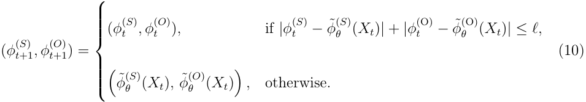

The bank account position is determined by the self-financing constraint (1). This formulation expresses the no-trade region in terms of the number of shares of option contracts, providing a measure of the distance at which rebalancing becomes cost-effective, capturing the trade-off between transaction costs and maintaining proximity to the desired portfolio adjustments. Indeed, when rebalancing actions proposed by the neural network are minor, they are not implemented because (i) this only leads to a small misalignment with the ideal hedging positions and (ii) this allows avoiding transaction costs.13 The rebalancing threshold _ℓ_ is treated as a learnable parameter included in the ANN parameters _θ_ , allowing the model to jointly optimize the size of rebalancing actions and decisions of whether or not to rebalance. 

This analysis incorporates the no-trade region, defined by Equation (10), to optimize rebalancing frequency while accounting for transaction costs. For benchmarks, the rebalancing threshold _ℓ_ is estimated using the approach described in Appendix D.3. In contrast, RL strategies estimate this parameter jointly with other ANN parameters during training. 

> 13We tried other specifications for the no-trade region (for instance explicitly capturing transaction cost amounts), with results being qualitatively similar.

<!-- page: 40 -->

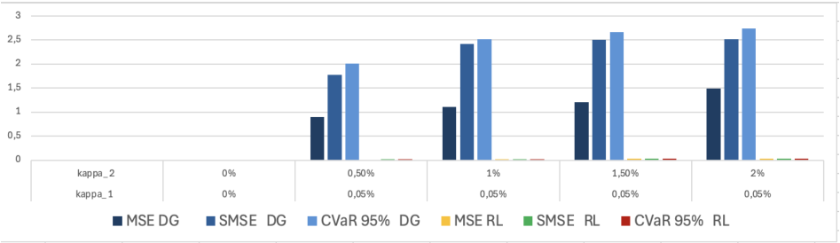

<!-- Start of picture text -->
3 2,5 2 1,5 1 — a kappa_2 0% 0,50% 1% 1,50% 2% kappa_1 0% 0,05% 0,05% 0,05% 0,05% m MSE DG MSMSE DG mCVaR95% DG mMSERL m@SMSE RL mg CVaR95% RL <!-- End of picture text -->

<!-- page: 41 -->

~~—=~~ r()> ~~EC~~ ), yO ~ ~~ys~~ (sy) ~~ee~~ eee {i

<!-- page: 42 -->

= ~~—~~ ( ( ~~Vo VO~~ ( ~~(~~ -))

<!-- page: 43 -->

~~vo Ve~~ 

» ~~vo~~ 

( ~~(~~ -)) 

» 

~~vo~~

<!-- page: 44 -->

matrix Σ of dimension 6 _×_ 6. Parameter estimates for the entire JIVR model are sourced from Table 5 and Table 6 of François et al. (2023). 

## **D Benchmarks** 

The benchmarks presented in this appendix assume that implied volatilities adhere to the IV model specified in Equation (8). 

### **D.1 Leland model** 

The Leland delta hedging strategy, introduced by Leland (1985), modifies the classical option replication framework of Black and Scholes (1973) by incorporating transaction costs, represented by the proportion _κ_ , and the rebalancing frequency _λ_ . The hedging position in the underlying asset is given by 

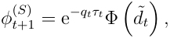

where 

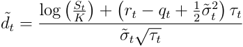

with the adjusted volatility 

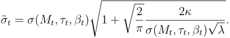

Here, Φ denotes the cumulative distribution function of the standard normal distribution.

<!-- page: 45 -->

( 

( 

ey fF) ~~OL —~~

<!-- page: 46 -->

| 

| 

| 

| 

~~-~~ XC) ~~“~~ EC) 4 ~~EC~~ ) tf

<!-- page: 47 -->

**Table 2:** Optimal risk measure values for different state space configurations. 

|State space|MSE|SMSE|CVaR95%|
|---|---|---|---|
|_S\{Pt,_∆_P_ _t __, γP_ _t __}_|0.195|0.089|0.696|
|_S\{Pt}_|0.128|0.069|0.680|
|_S_|**0.094**|**0.022**|**0.502**|

Optimal values are computed using 400,000 during training. Transaction cost levels are set to _κ_ 1 = _κ_ 2 = 0%. The hedge consists of an ATM straddle with a maturity of _T_ = 63 days and an average value of $7.55. The hedging instrument is an ATM call option with a maturity of _T__∗_ = 84 days. The full state space, as described in Table 1, is denoted by _S_ . 

## **F Statistical arbitrage** 

This analysis examines whether our framework can embed a speculative layer, such as statistical arbitrage, by leveraging the structural properties of the risk measure that guides the hedging optimization process. 

Following the definition in Assa and Karai (2013) and studies such as Buehler et al. (2021), Horikawa and Nakagawa (2024), and François et al. (2025), we define statistical arbitrage strategies as profit-seeking trading strategies that exploit the blind spots of the risk measure. 

Specifically, we assess whether the difference between RL strategies, _ϕ__RL_ , and DG strategies, _ϕ__DG_ , denoted as 

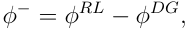

exhibits statistical arbitrage characteristics with respect to a risk measure _ρ_ . More precisely, we examine whether 

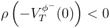

<!-- page: 48 -->

occurs. This condition implies that the strategy that requires no initial investment is strictly less risky than a null investment according to _ρ_ . We investigate whether _ϕ__−_ behaves as statistical arbitrage within our framework, analyzing whether RL merely introduces a speculative component to the DG strategy or if another mechanism is at play. This analysis is conducted using CVaR95% and SMSE as risk measures. 

Table 3 presents the hedging error risk associated with the trading strategy _ϕ__−_ , which represents the differential position between the RL and DG strategies. This analysis is conducted across the strategies obtained under different risk measures while hedging an ATM straddle intrument with a maturity of _T_ = 63 days. 

**Table 3:** Statistical arbitrage statistic. 

||||_ρ_ � _−V __ϕ−_ _T_ (0) �|||
|---|---|---|---|---|---|
|Risk|_κ_1 =_κ_2 = 0%|_κ_2=0.5%|_κ_2=1%|_κ_2=1.5%|_κ_2=2%|
|measure||||||
|SMSE|1.719|1.597|1.691|1.805|1.882|
|CVaR95%|1.721|1.583|1.644|1.782|1.767|

Results are computed over 100,000 out-of-sample paths according to the conditions outlined in Section 4.3.1. The hedge consists of an ATM straddle with a maturity of _T_ = 63 days. The hedging instrument is an ATM call option with a maturity of _T__∗_ = 84 days. The transaction cost for the underlying asset is set to _κ_ 1 = 0 _._ 05%, except for the first column where _κ_ 1 = 0%. 

Our numerical results show no evidence of statistical arbitrage, as all hedging error risks produce positive values. To further illustrate the absence of arbitrage-like behavior, Figure 14 presents the profit and losses (P&L) of the strategy _ϕ__−_ at time _T_ with no initial investment, considering two scenarios: one without transaction costs and another with transaction cost levels set at 0.05% for _κ_ 1 and 0.5% for _κ_ 2. The three panels display distributions that are either symmetric around zero or shifted to the left, indicating the absence of profit-seeking

<!-- page: 49 -->

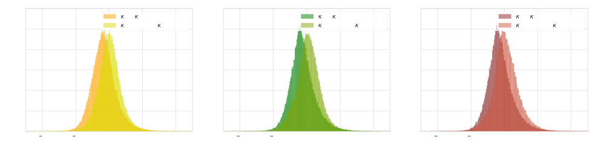

<!-- Start of picture text -->
“k K OK M@m. « k @m. « k K K mk K om k kK A yy y (i “ <!-- End of picture text -->

<!-- page: 50 -->

# **Supplementary material (not part of the paper)** 

## **G Systematic outperformance of RL agents** 

We validate the outperformance of RL agents by hedging a straddle instrument with a maturity of _T_ = 63 days, incorporating an ATM call option with a maturity of _T__∗_ = 84 days as a hedging instrument. In this validation, we analyze the empirical distribution of each risk measure under transaction cost levels set to _κ_ 1 = 0 _._ 05% and _κ_ 2 = 0 _._ 5% for simplicity. The empirical distributions are derived by bootstrapping the hedging error over 100,000 paths, with batches of size 1,000. As shown in Figure 15, the RL approach consistently outperforms the delta gamma strategy, as evidenced by the non-overlapping empirical distributions. 

**Figure 15:** Empirical distribution of risk measures. 

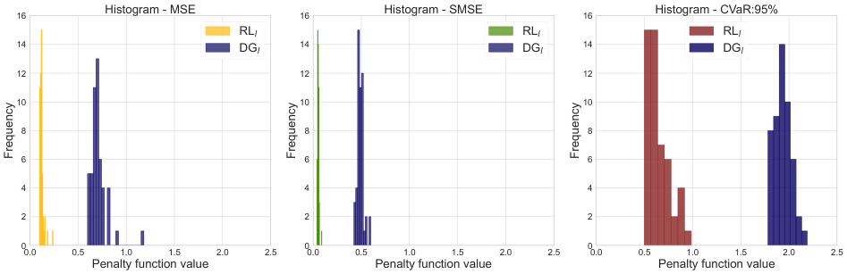

<!-- Start of picture text -->
16 Histogram - MSE 16 Histogram - SMSE 16 Histogram - CVaR:95% RLl RLl RLl 14 DG l 14 DG l 14 DG l 12 12 12 10 10 10 8 8 8 6 6 6 4 4 4 2 2 2 0 0 0 0.0 0.5 1.0 1.5 2.0 2.5 0.0 0.5 1.0 1.5 2.0 2.5 0.0 0.5 1.0 1.5 2.0 2.5 Penalty function value Penalty function value Penalty function value Frequency Frequency Frequency <!-- End of picture text -->

Results are computed using bootstrapping with a sample size of 1,000 over 100,000 out-of-sample paths according to the conditions outlined in Section 4.3.1. The hedge consists of an ATM straddle with a maturity of _T_ = 63 days and an average value of $7.55. The hedging instrument is an ATM call option with a maturity of _T__∗_ = 84 days. Transaction cost levels are set to 0.05% for _κ_ 1 and 0.5% for _κ_ 2.

<!-- page: 51 -->

<!-- Start of picture text -->
VC) ——_ —_ <!-- End of picture text -->

<!-- page: 52 -->

**Table 4:** Estimated Gaussian copula parameters. 

||_ϵt,R_|_ϵt,_1|_ϵt,_2|_ϵt,_3|_ϵt,_4|_ϵt,_5|
|---|---|---|---|---|---|---|
|_ϵt,R_|1.000||||||
|_ϵt,_1|-0.550|1.000|||||
|_ϵt,_2|-0.690|0.140|1.000||||
|_ϵt,_3|0.030|-0.030|-0.010|1.000|||
|_ϵt,_4|-0.220|0.250|0.120|0.280|1.000||
|_ϵt,_5|-0.340|0.170|0.370|0.130|-0.050|1.000|

**Table 5:** JIVR model parameter estimates. 

|Parameter|_β_1|_β_2|_β_3|_β_4|_β_5|S&P500|
|---|---|---|---|---|---|---|
|_α_|0.000899|0.008400|0.000770|-0.001393|0.000657|_λ_ 2.711279|
|_θ_1|0.996290|-0.013869||0.002841|||
|_θ_2|0.003669|0.877813|0.001300||||
|_θ_3||-0.032640|0.997071|0.003722|-0.004198||
|_θ_4||||0.980269|||
|_θ_5||-0.047789|||0.986019||
|_ν_||0.089445|||||
|_σ_ _√_ 252||0.380279|0.052198|0.048641|0.051536||
|_ω_|0.267589|||||0.977291|
|_κ_|0.838220|0.965751|0.974251|0.945377|0.980844|0.888977|
|_a_|0.134152|0.098272|0.092646|0.102201|0.100502|0.056087|
|_γ_|-0.111813|-1.482862|0.096766|0.060558|-0.102996|2.507796|
|_ζ_|0.143760|0.852943|0.029109|-0.159051|0.092664|-0.641306|
|_φ_|1.351070|1.538928|2.284780|1.449977|1.428477|2.039669|

<!-- page: 53 -->

## **I Impact of no-trade regions** 

Since the no-trade region is determined by the rebalancing threshold, we assess its impact by examining how it influences both the rebalancing frequency and hedging cost. The rebalancing frequency, defined as the proportion of days on which portfolio positions are adjusted along a given path, is given by 

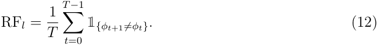

The hedging cost 

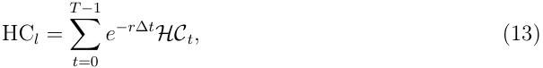

is the sum of discounted transaction costs over a given path where the transaction cost at time _t_ , _HCt_ , is 

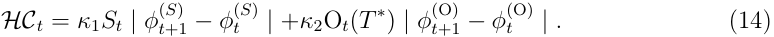

This analysis evaluates the trade-off between portfolio adjustment frequency and transaction costs. Figure 16 illustrates the effect of the transaction costs on both rebalancing frequency and hedging cost across all risk measures and transaction cost levels.

<!-- page: 54 -->

**Figure 16:** Rebalancing frequency and average hedging transaction costs. 

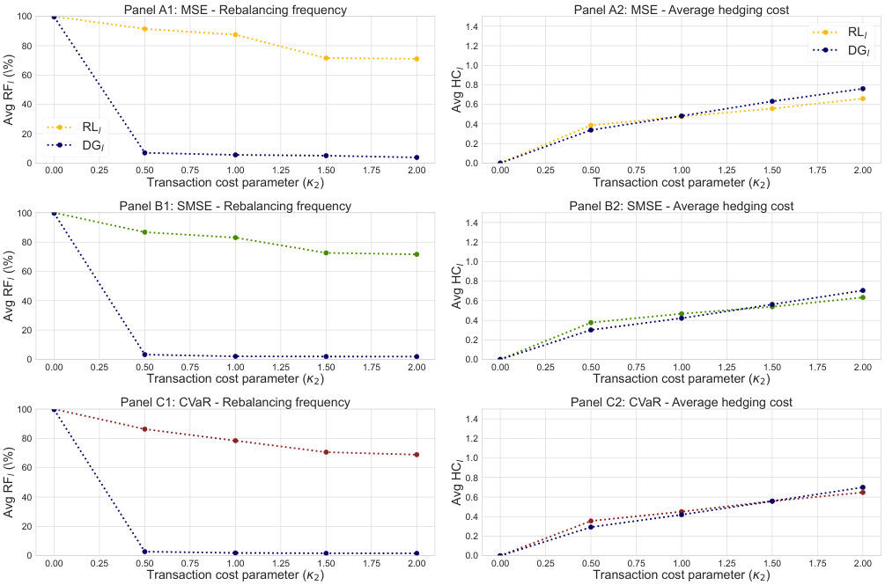

<!-- Start of picture text -->
100 Panel A1: MSE - Rebalancing frequency Panel A2: MSE - Average hedging cost 1.4 RLl 80 1.2 DG l 1.0 60 0.8 40 0.6 20 RLl 0.4 DGl 0.2 0 0.0 0.00 0.25 0.50 0.75 1.00 1.25 1.50 1.75 2.00 0.00 0.25 0.50 0.75 1.00 1.25 1.50 1.75 2.00 Transaction cost parameter ( 2 ) Transaction cost parameter ( 2 ) 100 Panel B1: SMSE - Rebalancing frequency Panel B2: SMSE - Average hedging cost 1.4 80 1.2 1.0 60 0.8 40 0.6 0.4 20 0.2 0 0.0 0.00 0.25 0.50 0.75 1.00 1.25 1.50 1.75 2.00 0.00 0.25 0.50 0.75 1.00 1.25 1.50 1.75 2.00 Transaction cost parameter ( 2 ) Transaction cost parameter ( 2 ) 100 Panel C1: CVaR - Rebalancing frequency Panel C2: CVaR - Average hedging cost 1.4 80 1.2 1.0 60 0.8 40 0.6 0.4 20 0.2 0 0.0 0.00 0.25 0.50 0.75 1.00 1.25 1.50 1.75 2.00 0.00 0.25 0.50 0.75 1.00 1.25 1.50 1.75 2.00 Transaction cost parameter ( 2 ) Transaction cost parameter ( 2 ) l  (\%)l Avg HC Avg RF l  (\%)l Avg HC Avg RF l  (\%)l Avg HC Avg RF <!-- End of picture text -->

Results are computed over 100,000 out-of-sample paths according to the conditions outlined in Section 4.3. 

Results depicted in Figure 16 show that RL agents resort to a higher average rebalancing frequency compared to DG strategies, which tend to behave more like semi-static approaches with fewer rebalancing days. This finding aligns with the observations of Carr and Wu (2014), who show that increasing the rebalancing frequency does not necessarily improve the performance of option tracking frameworks such as delta hedging in the presence of transaction cost. 

Conversely, as _κ_ 2 increases, RL agents retain high rebalancing frequency, but keep average transaction costs to a level similar to DG. Thus, more gradual and frequent adjustments from

<!-- page: 55 -->

RL mitigate risk more effectively than DG as documented in Section 4.4.2, while leading to similar transaction costs. 

## **J Soft constraint regularization** 

The estimation of the penalization parameter _λ_ introduced in Equation (6), which governs the weight of the soft constraint in the optimization process, is approached as a model selection problem. In this framework, the model is trained multiple times using fixed values of _λ_ , iterating across four different values for _λ_ . 

The optimal _λ_ is then selected based on an evaluation conducted on the validation set,15 considering two key factors: the soft constraint value and the risk measure. To determine the optimal _λ_ , we hedge an ATM straddle with a maturity of _T_ = 63 days, assuming no transaction costs ( _κ_ 1 = _κ_ 2 = 0%). The hedging strategy optimization considers three risk measures: MSE, SMSE, and CVaR95%. This process is repeated for different values of _λ_ : 0, 0.5, 1, and 1.5. Figure 17 presents the optimal soft constraint values and risk measure outcomes for each _λ_ , evaluated on a validation set. 

> 15The validation set consists of 100,000 independent simulated paths, generated as outlined in Section 4.1. This set is distinct from the training and test sets described in Section 4.3.1.

<!-- page: 56 -->

**Figure 17:** Risk measure and soft constraint values. 

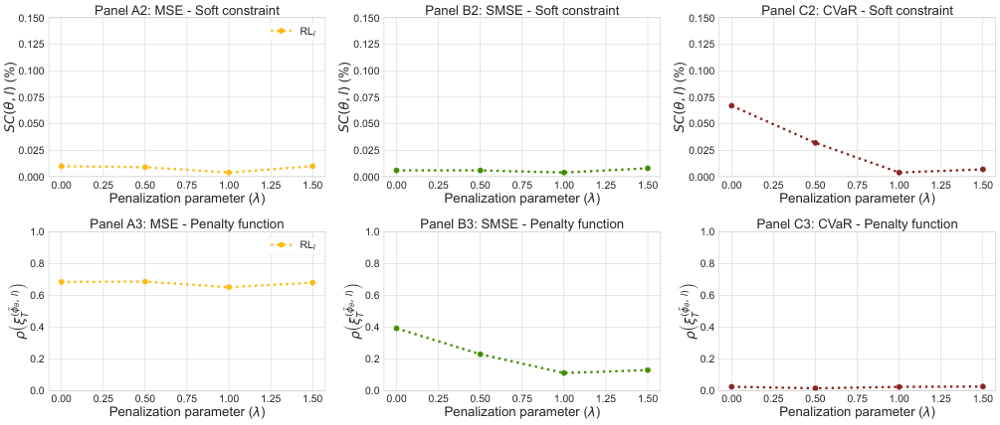

<!-- Start of picture text -->
Panel A2: MSE - Soft constraint Panel B2: SMSE - Soft constraint Panel C2: CVaR - Soft constraint 0.150 0.150 0.150 RLl 0.125 0.125 0.125 0.100 0.100 0.100 0.075 0.075 0.075 0.050 0.050 0.050 0.025 0.025 0.025 0.000 0.000 0.000 0.00 0.25 0.50 0.75 1.00 1.25 1.50 0.00 0.25 0.50 0.75 1.00 1.25 1.50 0.00 0.25 0.50 0.75 1.00 1.25 1.50 Penalization parameter ( ) Penalization parameter ( ) Penalization parameter ( ) 1.0 Panel A3: MSE - Penalty function 1.0 Panel B3: SMSE - Penalty function 1.0 Panel C3: CVaR - Penalty function RLl 0.8 0.8 0.8 0.6 0.6 0.6 0.4 0.4 0.4 0.2 0.2 0.2 0.0 0.0 0.0 0.00 0.25 0.50 0.75 1.00 1.25 1.50 0.00 0.25 0.50 0.75 1.00 1.25 1.50 0.00 0.25 0.50 0.75 1.00 1.25 1.50 Penalization parameter ( ) Penalization parameter ( ) Penalization parameter ( )  l) (%),  l) (%),  l) (%), (SC (SC (SC )l), )l), )l), ( T ( T ( T ( ( ( <!-- End of picture text -->

Results are computed over 100,000 out-of-sample paths according to the conditions outlined in Section 4.3.1. The hedge consists of an ATM straddle with a maturity of _T_ = 63 days and an average value of $7.55. The hedging instrument is an ATM call option with a maturity of _T__∗_ = 84 days. 

The results illustrated in Figure 17 highlight the heightened sensitivity to variations in the penalization parameter _λ_ when using asymmetric risk measures. The SMSE risk measure exhibits significant sensitivity of _ρ_ , achieving its minimum value at _λ_ = 1, which aligns with the corresponding minimum value of the soft constraint penalty. For the CVaR, the soft constraint penalty demonstrates greater sensitivity compared to the risk measure itself, indicating that CVaR is more susceptible to higher tracking error in the absence of the soft constraint. 

The minimum value of the soft constraint penalty for CVaR also occurs at _λ_ = 1, corresponding to the stabilization point of the risk measure. In contrast, the MSE risk measure is mildly affected by the soft constraint. Yet its minimum value is also observed at _λ_ = 1, mirroring the behavior of the other risk measures.

<!-- page: 57 -->

Based on these findings, we select _λ_ = 1 for our subsequent experiments. This value leads to soft constraint penalty levels that remain below 0 _._ 025% across all risk measures, minimizing 

the likelihood of observing paths with large tracking error. 

## **K In-sample backtest** 

In this section, we benchmark our approach using historical paths generated by the JIVR model, covering the period from January 5, 1996, to December 31, 2020, to assess the effectiveness of RL agents. This experiment evaluates the performance of risk management strategies based on the historical series ( _Rt, βt_ ). Hedging performance is assessed by introducing a new ATM straddle instrument with a 63-day maturity every 21 business days along the historical paths. The initial hedging portfolio values are set equal to the straddle prices, which are computed using the prevailing implied volatility surface on the day the hedge is initiated. 

To evaluate the robustness of our approach under diverse market conditions, we compare cumulative P&Ls. The cumulative P&L at a given date is defined as the sum of the total P&L generated by all straddle trades whose hedging period has expired. Figure 18 illustrates the evolution of cumulative P&Ls, where each of the two panels correspond to different transaction cost levels.

<!-- page: 58 -->

**Figure 18:** Cumulative P&L for the hedge of ATM straddles under real asset price dynamics. 

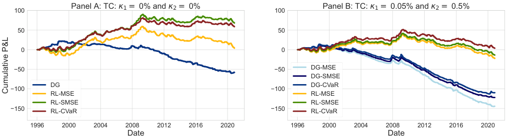

<!-- Start of picture text -->
100 Panel A: TC:  1 =  0% and  2 =  0% 100 Panel B: TC:  1 =  0.05% and  2 =  0.5% 50 50 0 0 50 50 DG-MSE DG-SMSE DG DG-CVaR 100 100 RL-MSE RL-MSE RL-SMSE RL-SMSE 150 RL-CVaR 150 RL-CVaR 1996 2000 2004 2008 2012 2016 2020 1996 2000 2004 2008 2012 2016 2020 Date Date Cumulative P&L <!-- End of picture text -->

Results are computed based on the observed P&L from hedging 296 straddle positions with maturity 63-days under real market conditions observed from May 1, 1996, to December 31, 2020. A new ATM straddle is considered every 21 business days. Agents are trained according to the conditions outlined in Section 4.3 using an ATM call option with a maturity of _T__∗_ = 84 days as the hedging instrument. 

As illustrated in Figure 18, RL strategies consistently outperform the benchmarks in both scenarios, namely with and without transaction costs. Notably, the gap between the cumulative P&L of RL agents and the benchmarks widens significantly as transaction costs increase, highlighting the adaptability of the RL approach to transaction costs across diverse market conditions. Additionally, RL strategies optimized using the MSE function yield lower cumulative P&L compared to those optimized with asymmetric risk measures, reflecting the inherent differences in the objectives of these risk measures. 

To evaluate hedging errors under real asset price dynamics, we analyze the distribution of terminal errors generated by 296 ATM straddles from May 1, 1996, to December 31, 2020. Figure 19 presents the histogram of hedging errors for benchmark strategies and RL agents across all risk measures, without transaction costs.

<!-- page: 59 -->

**Figure 19:** Hedging error distribution for a ATM straddle instrument with a maturity of 63 days under real asset price dynamics. 

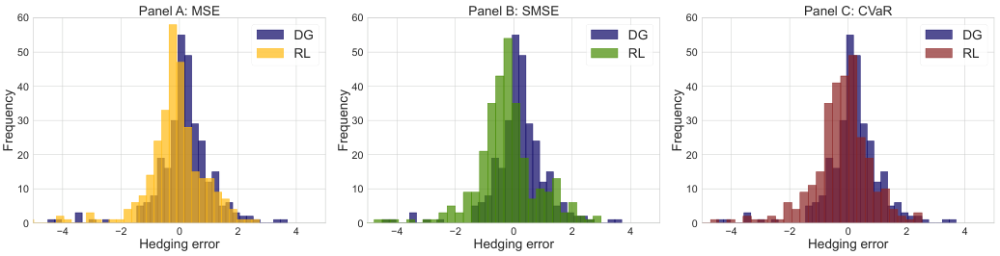

<!-- Start of picture text -->
Panel A: MSE Panel B: SMSE Panel C: CVaR 60 60 60 DG DG DG 50 RL 50 RL 50 RL 40 40 40 30 30 30 20 20 20 10 10 10 0 0 0 4 2 0 2 4 4 2 0 2 4 4 2 0 2 4 Hedging error Hedging error Hedging error Frequency Frequency Frequency <!-- End of picture text -->

Results are computed based on the observed P&L from hedging 296 ATM straddle instruments with maturity of _T_ = 63 under real market conditions observed from May 1, 1996, to December 31, 2020. The hedging instrument is an ATM call option with a maturity of _T__∗_ = 84 days. Transaction cost levels are set to 0%. 

As shown in Figure 19, RL strategies exhibit a hedging error distribution that is shifted towards the left, highlighting greater profitability and lower downside risk. These findings highlight the robustness of the RL approach to different market conditions and transaction cost levels.
