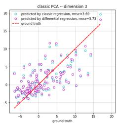

# 2025-huge-savine-axes-that-matter

<!-- page: 1 -->

## Axes that matter: PCA with a diference

Brian Huge

Antoine Savine

First version March 2, 2021 This version March 19, 2025

## Abstract

We extend the scope of diferential machine learning and introduce a new breed of supervised principal component analysis to reduce dimensionality of Derivatives problems. Applications include the specification and calibration of pricing models, the identification of regression features in least-square Monte-Carlo, and the pre-processing of simulated datasets for (diferential) machine learning.

## Diferential Machine Learning

Giles and Glasserman’s Smoking Adjoints [3] introduced algorithmic adjoint differentiation (AAD) to the financial industry and applied it to the computation of pathwise diferentials (gradients of final payof wrt initial state and model parameters) in the context of Monte-Carlo (MC) simulations. Although the customary application is the real-time computation of risk reports1 the availability of pathwise diferentials also has enabled new research into more efective pricing and risk management practices.

Fast risk reports are computed by averaging pathwise diferentials across scenarios. We argued in [4] that pathwise diferentials have a bigger story to tell. We demonstrated that supervised machine learning (ML) models such as artificial neural networks (ANN) learn pricing and risk much more efectively from pathwise diferentials. Diferential ML more generally encompasses applications of AAD pathwise diferentials in all kinds of ML. In this article, we address the problem of dimension reduction and develop a new breed of diferential principal component analysis (PCA) to efectively encode the market state into low-dimensional representations. In contrast to the customary average of risk reports, diferential PCA leverages the covariance of pathwise diferentials.

arXiv:2503.06707v2 [q-fin.CP] 18 Mar 2025

1We use the term risk reports to refer to the collection of the risk sensitivities of a Derivatives transaction or trading book wrt current market state variables, or, in more formal terms, the gradient of its value wrt the state vector.

<!-- page: 2 -->

The article starts with a brief discussion of dimensionality in Derivatives finance, where we motivate dimension reduction in the general context of Derivatives modeling and for least-square Monte-Carlo in particular. We follow with a discussion of classic, unsupervised algorithms such as PCA, where we highlight why they are not appropriate for Derivatives risk management. We introduce risk PCA, which, in principle, provides a safe and efective dimension reduction mechanism, but sufers from prohibitive computation cost; and diferential PCA, which leverages AAD pathwise diferentials to ofer identical guarantees without the computation cost. The article concludes with a brief discussion of diferential autoencoders and diferential regression, and how they relate to diferential PCA and the diferential ANN of [4].

## Dimension reduction

Consider the market state $X \in \mathbb { R } ^ { n }$ on some exposure date $T .$ This means that the n entries of X are $T \cdot$ -measurable random variables, which fully describe the state of the market on date $T .$ . Dimension reduction consists of an encoder function g from $\mathbb { R } ^ { n }$ to $\mathbb { R } ^ { p }$ with $p \leq n$ such that the encoding $L = g \left( X \right)$ provides a lower-dimensional representation of the state X, while correctly capturing the information relevant for a given application. In ML lingo, the p components of the latent representation L are called meaningful features of the state X.

Dimension reduction underlies the design and calibration of Derivatives models, albeit often in an implicit manner. Derivatives models are essentially a probabilistic description of the evolution of the market state X between the exposure date T and some maturity date $T ^ { * }$ , generally written under a risk-neutral measure with parameters calibrated to implied volatility surfaces. We call universal models probabilistic descriptions of the entire state X. They generally require a heavy development efort. Their implementation is often slow, and their parameters are typically roughly calibrated to market data by best fit. Universal models are useful for complex exotics and hybrids, aggregated netting sets, or trading books for regulatory computations such as XVA or CCR, or the simulation of training datasets for learning pricing and risk functions as discussed in [4].

In many standard situations, more efective lightweight models are implemented by focusing on a small number of features relevant for a given application. For example, a basket option depends only on the underlying basket under a Gaussian assumption, irrespective of its constituents. This remains approximately true under Black and Scholes, or other reasonably behaved local volatility models. In the absence of stochastic volatility, a basket option is essentially a onefactor product, so related models focus on a correct representation of the underlying basket rather than single stocks.

Similarly, a European swaption depends only on its underlying swap (and its volatility 2), irrespective of the rest of the yield curve. Industry standard swaption models such as Black, Heston, or SABR, efectively model the underlying swap rate with increasingly complex dynamics, in contrast to term-structure models of the entire yield curve, suitable for more exotic instruments.

<!-- page: 3 -->

To identify the correct features is rather trivial with simple products and restrictive assumptions, but it is much harder in more complicated situations. And the stakes are considerable: to model irrelevant features is merely wasteful of computation resources, but to ignore relevant features may lead to incorrect prices, inefective risk management, and wrong conclusions. For example, it was customary in the late 1990s to calibrate Bermudan option models to only co-terminal European swaptions. A more careful analysis in [1] demonstrated the strong dependency of Bermudan options on short rates and showed that ignoring the behavior of short rates implied by caplet volatility led to incorrect prices. Claims were made in the literature of a positive dependency of Bermudan option prices on interest-rate correlation [6], whereas the contrary is generally true with correctly calibrated models. Bermudan options are fundamentally (at least) two-factor products (ignoring stochastic volatility), so models must correctly represent the joint dynamics of co-terminal and short rates, and, in particular, simultaneously calibrate to co-terminal swaptions and caplets.

Feature selection, or, equivalently, dimension reduction, is generally performed manually, often implicitly, and prone to error, with considerable consequences for pricing and risk. The objective of this article is to show how to perform dimension reduction in an explicit, principled, automatic, and reliable manner.

## Least-square Monte-Carlo

Another corner where dimension reduction is necessary is the ubiquitous leastsquare Monte-Carlo (LSM) designed by Longstaf-Schwartz [7] and Carriere [2], initially for Bermudan options in the context of high-dimensional Libor market models (LMM) implemented with MC. LSM estimates the continuation value on exercise dates by linear regression of future cash-flows on basis functions of the current state, iterating over call dates in reverse chronological order. Linear regression on basis functions of the high-dimensional state X is intractable. Many recent articles suggest replacing regression with ML models robust in high dimensions such as ANN. But practitioners are often reluctant to forfeit the lightweight development, analytic eficiency (at least in a low dimension), and reliability of linear regression. The alternative is dimension reduction.

Practical LSM implementations generally walk around the curse of dimensionality by performing regressions on a low number of relevant features $L _ { i } \ =$ $g _ { i } \left( X \right) , i \in \left[ 1 , p \right]$ of the state $X \in \mathbb { R } ^ { n }$ . The resulting performance directly depends on the correct selection of the regression variables $L _ { i } ,$ , usually performed manually and hardcoded in the implementation. For Bermudan options, many implementations pick the long-term swap to maturity and the short-term swap to the next call date. This is a reasonable choice for standard Bermudan options in the standard LMM model, but it doesn’t scale to more complicated models or products. With stochastic volatility, for example, the volatility state constitutes another necessary feature. And guessing regression variables for callable exotics such as CMS spread steepeners may be perilous. What we need is a general algorithm to reliably identify the relevant features given an arbitrary transaction and an arbitrary pricing model.

2For the purpose of this illustrative discussion, we only consider features of the underlying market, assuming deterministic volatility. In the context of stochastic volatility, features of the volatility surface also afect transactions and are identified in the same manner.

<!-- page: 4 -->

In addition to the continuation values of callable instruments, LSM has been widely applied to the estimation of future values of trading books or netting sets in the context of regulations such as XVA, CCR, FRTB, or SIMM-MVA, where the repeated computation of prices and risks in multiple scenarios would otherwise consume unreasonable computing resources. Future values are usually computed in high-dimensional universal models, and their estimation is greatly facilitated by prior dimension reduction. We have empirically observed that dimension is often suficiently reducible to enable lightweight linear regression. More robust approximators such as ANN also perform better in a lower dimension. Of course, handcrafted feature selection rules don’t scale to trading books, so the need for a reliable algorithm is even more urgent in this context.

Dimension reduction algorithms are encapsulated in the encoding function $L =$ $g \left( X \right)$ . We will mainly explore linear encodings of the form $L = G X$ , where $G \in \mathbb { R } ^ { p \times n }$ is a deterministic matrix.

Implementation details are covered in our GitHub repo3, along with Python code.

The notebooks DiferentialRegression and DiferentialPCA (best read in this order) discuss the implementation of the main algorithms, along with code and basic application examples. The more advanced Bermudan5F notebook presents a practical application to Bermudan options, and reproduces the numerical examples that follow. All the notebooks are self-contained and run on Google Colab.

## Dimension reduction done wrong: classic PCA

PCA is perhaps the simplest and certainly the most celebrated dimension reduction algorithm. It has been extensively applied in many scientific fields, including finance, in the literature and on trading desks, although this is, in our opinion, an incorrect tool to use for Derivatives. To better understand why, let us briefly recall the mechanics of PCA.

Consider an axis in $\mathbb { R } ^ { n }$ specified by the unit vector u. Define the variation of

3https://github.com/differential-machine-learning/notebooks

<!-- page: 5 -->

X along u by the $\mathbf { L } ^ { 2 }$ magnitude of the coordinates of $X$ on u:

$$
v a r _ { X } \left( u \right) = E \left[ \left( X \cdot u \right) ^ { 2 } \right]
$$

A collection of n mutually orthogonal unit vectors $u _ { 1 } , . . . , u _ { n }$ constitutes an orthonormal basis of $\mathbb { R } ^ { n }$ so that the coordinates of X can be rewritten in terms of this basis:

$$
X = \sum _ { i = 1 } ^ { n } \left( X \cdot u _ { i } \right) u _ { i }
$$

PCA identifies a particular basis $\left( u _ { i } \right)$ where the coordinates of $X$ are mutually orthogonal, measures the variation of X along the axes $u _ { i } .$ , and performs dimension reduction by truncation of the coordinates with immaterial variation. It is easily shown that an appropriate basis is given by the normalized eigenvectors of the covariance matrix of $X$ $C _ { X } = E \bar { \left| { \cal X } { \cal X } ^ { T } \right| }$ , and that the corresponding eigenvalues measure the variation of the coordinates of X in the eigenvector basis. PCA therefore reduces to eigenvalue decomposition:

$$
C _ { X } = P _ { X } D _ { X } P _ { X } ^ { T }
$$

where $D _ { X }$ is the diagonal matrix of eigenvalues and $P _ { X }$ is the matrix of normalized eigenvectors in columns. The only data input is the covariance matrix $C _ { X }$ , usually estimated from a dataset of m independent realizations of X. We do not discuss in this article the subtleties of covariance, eigenvalue, and eigenvector estimation from finite datasets. This is covered in the statistics and ML literature. See [8] for an in-depth presentation along with robust estimation techniques. In what follows, we assume suficiently large datasets for a correct estimation.4

With $P _ { X }$ and $D _ { X }$ conveniently sorted by decreasing eigenvalues, the first $p$ columns of $P _ { X }$ span the subspace of $\mathbb { R } ^ { n }$ with maximum variation, and the remaining $q = n - p$ columns span the error space where the variation of $X$ is minimized to $\begin{array} { r } { \epsilon = \sum _ { i = p + 1 } ^ { n } \left( D _ { X } \right) _ { i i } } \end{array}$ . Depending on the application, PCA is applied with fixed dimension $p$ or fixed tolerance $\epsilon ,$ the latter being the safer option. By truncating the $q$ least significant axes of variation, PCA projects $X$ onto the subspace spanned by the first $p$ eigenvectors, resulting in the low-dimensional encoding:

$$
L = G X \ \mathrm { w i t h } \ G = { \widetilde { D } } _ { X } ^ { - { \frac { 1 } { 2 } } } { \widetilde { P } } _ { X } ^ { T }
$$

where ${ \widetilde { P } } _ { X }$ is the $n \times p$ matrix of the first $p$ columns of $P _ { X }$ , and $\widetilde { D } _ { X }$ is the upper-left $p \times p$ corner of $D _ { X }$ , and normalization by ${ \widetilde { D } } _ { X } ^ { - { \frac { 1 } { 2 } } }$ is optional but often

4The notations in this article are probabilistic. Here, X denotes a random vector in dimension n, not a m-by-n matrix with m independent examples in rows and n coordinates in columns, as customary in the statistics and ML literature. It follows that CX = E -XXT denotes the true covariance of X, and not its estimate CˆX = 1 XT X from an m-by-n dataset in a matrix X. In practice, of course, the estimate is used in place of the ground truth covariance.

<!-- page: 6 -->

convenient. Finally, X is best reconstructed from L in the sense of $\mathbf { L } ^ { 2 }$ by application of the pseudo-inverse operator:

$$
\widetilde { X } = H L \mathrm { ~ w i t h ~ } H = G ^ { T } \left( G G ^ { T } \right) ^ { - 1 } = \widetilde { P } _ { X } \widetilde { D } _ { X } ^ { \frac { 1 } { 2 } }
$$

which re-expresses L in terms of the standard basis. PCA guarantees that the magnitude $e _ { X } = E \left\lceil \left( X - { \widetilde { X } } \right) ^ { 2 } \right\rceil$ of the reconstruction error is bounded by ϵ. In fact, PCA is equivalently expressed as the error minimization problem: mi $\operatorname { 1 } _ { G \in \mathbb { R } ^ { p \times n } } e _ { X }$

Our objection is that PCA solves the wrong objective: we don’t care about reconstruction fidelity. A large reconstruction error is acceptable when aligned with a direction of insignificant risk. Equivalently, variation is not the correct metric: a small variation of X in a direction of major risk may significantly afect the transaction. We don’t want to rank axes by variation; we want to rank them by relevance for a given transaction or trading book.

Consider, for instance, an option on the spread of two strongly correlated assets with similar volatilities. Here, the state $\boldsymbol { X } = ( X _ { 1 } , X _ { 2 } )$ is the pair of asset prices. Variation is concentrated along the diagonal $X _ { 1 } = X _ { 2 }$ , which accounts for a major fraction of the variance and constitutes the principal PCA axis. The orthogonal anti-diagonal $X _ { 2 } = - X _ { 1 }$ has negligible variation and is typically truncated by PCA. But the value of the spread option precisely depends on $X _ { 2 } \mathrm { ~ - ~ } X _ { 1 }$ , as revealed by gradients proportional to (−1, 1), exactly under Gaussian assumptions and approximately otherwise. Despite little variation, the anti-diagonal state coordinate is all that matters for the spread option. By truncating it, PCA completely misses value and risk. What is safe to truncate is the diagonal. Despite the strong variation, diagonal coordinates are irrelevant for the spread option, which value is essentially constant across all states on the diagonal axis. This very simple example illustrates that PCA is unsafe—it misses the principal axis of value and risk along the anti-diagonal—and inefective—it fails to truncate the irrelevant diagonal.

PCA fails precisely because it is completely unsupervised. It works only with state variation, irrespective of cash-flows. Like other unsupervised algorithms, PCA is one-size-fits-all. Truncation is the same for all Derivatives; hence, it cannot be safe or efective. We have seen with the spread option example that PCA may truncate principal axes of value and risk. Consider now two Derivatives books: one is an option on a basket of stocks, the other is a basket of single-stock options. Under the Gaussian assumption, the first one is a onefactor product, depending only on the initial basket price. The second one, however, is a multifactor book whose risk cannot be summarized in one linear feature of the state. One-size-fits-all solutions cannot reduce dimensions correctly. We want to identify the axes that matter most for a given schedule of cash-flows and truncate the orthogonal space with negligible relevance. We need supervision.

<!-- page: 7 -->

## Dimension reduction done right: risk PCA

Let us then supervise PCA and introduce price and risk labels:

$$
V = v \left( X \right) \in \mathbb { R } { \mathrm { ~ a n d ~ } } \Delta = { \frac { \partial v \left( X \right) } { \partial X } } \in \mathbb { R } ^ { n }
$$

for a given transaction or trading book. To start building intuition, consider again an option on a basket of stocks with fixed weights u. Under the Gaussian assumption (and approximately otherwise), its value is a (nonlinear) function of the initial price of the underlying basket, that is $v \left( X \right) = f \left( u \cdot X \right)$ . It follows that the weight vector u is proportional to risk sensitivities:

$$
\Delta \left( X \right) = { \frac { \partial v \left( X \right) } { \partial X } } = f ^ { \prime } \left( u \cdot X \right) u { \mathrm { ~ h e n c e ~ } } u = { \frac { \Delta \left( X \right) } { \left| \Delta \left( X \right) \right| } }
$$

so the only meaningful feature $u \cdot X$ of the state X is immediately identified by a single risk report in some arbitrary state. Notice in this case that the stochastic vector $\Delta \left( X \right)$ has deterministic direction u and random magnitude $f ^ { \prime } \left( u \cdot X \right)$

Of course, to identify risk factors with a single risk report computed in one given state $X$ , will not work in general. Consider, for example, a delta-hedged option. The risk report in the current state cannot even see the underlying stock as a risk factor. It is clear that multiple risk reports in diferent states are generally necessary to reliably identify all the relevant risk factors. To simulate a large number of risk reports is often intractable. The cost of pricing a complex transaction or trading book in many diferent scenarios is prohibitive, even with risk sensitivities eficiently computed with AAD. We will resolve this matter next. For now, we continue building intuition to formalize a dimension reduction algorithm.

To generalize the previous example, consider a book that depends on $p$ linearly independent combinations $w _ { i } \cdot X$ of the state $X$ (it may help to think of a collection of options on diferent baskets with weights $w _ { i } )$ . The dependency on $w _ { i }$ is easily re-expressed in terms of orthogonal unit vectors $u _ { i } .$ , e.g. by Gram-Schmidt decomposition, such that:

$$
v \left( X \right) = f \left( u _ { 1 } \cdot X , . . . , u _ { p } \cdot X \right) \ \mathrm { h e n c e } \ \Delta \left( X \right) = \sum _ { i = 1 } ^ { p } \left( \partial _ { i } f \right) u _ { i }
$$

where $\partial _ { i } f$ denotes the derivative of $f$ wrt the i-th argument. We see that the axes $u _ { i }$ form a basis of the space of risk reports $\Delta$ , thereby spanning the same $p \textmd { - }$ dimensional subspace as the p normalized eigenvectors with non-zero eigenvalues of the covariance matrix $\begin{array} { r } { C _ { \Delta } = E \left[ \Delta \Delta ^ { T } \right] } \end{array}$ of risk reports, of dimension $n ,$ and rank $p .$ . It follows that the number $p$ and directions $u _ { i }$ of the relevant features are identified by the eigenvalue decomposition of $C _ { \Delta }$

Conversely, consider a dataset of risk reports where the risk wrt state variable $X _ { i }$ is consistently zero, that is, $\partial v \left( X \right) / \partial X _ { i } = 0$ . It is clear, then, that, irrespective of the variation of $X _ { i } .$ , the ith coordinate of X is irrelevant for this particular transaction and safely truncated, so states are represented by remaining $n - 1$ coordinates, and dimension is reduced by 1. More generally, when the magnitude of directional risk $E \left\lceil \left( u \cdot \Delta \right) ^ { 2 } \right\rceil$ along some axis u is immaterial wrt some threshold $\epsilon ,$ direction u is irrelevant and safely truncated, so that states are represented by their coordinates in the $( n - 1 )$ )-dimensional subspace orthogonal to $u ,$ without materially afecting the transaction. Those irrelevant axes live in the error space of the covariance matrix $C _ { \Delta }$ of risk reports, spanned by its q least significant eigenvectors with cumulative eigenvalues bounded by ϵ.

<!-- page: 8 -->

Those considerations suggest performing dimension reduction by PCA on risk reports $\Delta$ in place of states $X$ . More formally, we define the weak relevance of some axis u by the $\mathbf { L } ^ { 2 }$ magnitude of risk along this axis (strong relevance is defined in the next section):

$$
r e l \left( u \right) = E \left[ \left( u \cdot \Delta \right) ^ { 2 } \right]
$$

In other terms, relevance is the variation of risk. Orthogonal axes of decreasing relevance are given by the eigenvectors $P _ { \Delta }$ of $C _ { \Delta }$ , where relevance is measured by the corresponding eigenvalues $D _ { \Delta }$ . Dimension reduction is performed by truncating $P _ { \Delta }$ into $\bar { P } _ { \Delta }$ by removal of the last $q$ columns: risk PCA is PCA on risks.

The lower-dimensional encoding of state X is given by $L = G X$ with encoder $G = \widetilde { P } _ { \Delta } ^ { T }$ (normalization is unnecessary here), decoder $H = \widetilde { P } _ { \Delta }$ , and reconstruction $ { \widetilde { X } } = H L$ . The state reconstruction error $e _ { X } = E \left\lceil \left. X - \widetilde { X } \right. ^ { 2 } \right\rceil$ is unbounded, because reconstruction fidelity is not the objective here. What is bounded by ϵ is the risk approximation error:

$$
e _ { \Delta } = E \left[ \left| \Delta - \Pi \Delta \right| ^ { 2 } \right] = E \left[ \left| \Sigma \Delta \right| ^ { 2 } \right]
$$

where we defined the projection operator $\Pi = H G$ and the error operator $\Sigma =$ $I _ { n } - \Pi$

Risk sensitivities are re-expressed in terms of derivatives wrt $L ,$ denoted $S { \mathrm { : } }$

$$
S = \frac { \partial \widetilde { V } } { \partial L } = H ^ { T } \Delta \in \mathbb { R } ^ { p }
$$

where it is easily seen that risks wrt features L are indeed orthogonal:

$$
E \left[ S S ^ { T } \right] = H ^ { T } C _ { \Delta } H = \widetilde { D } _ { \Delta }
$$

Risk PCA therefore provides a safe dimension reduction where the magnitude of truncated risk does not exceed a specified threshold ϵ. Because it implicitly minimizes the risk approximation error $e _ { \Delta }$ , risk PCA is optimal in the sense that further (linear) dimension reduction cannot be performed without increasing the magnitude of risk errors above ϵ. Similar to classic PCA, the implementation is remarkably lightweight and limited to the eigenvalue decomposition of $C _ { \Delta }$ However, because the estimation of $C _ { \Delta }$ requires a simulated dataset of risk reports with prohibitive computation cost, risk PCA doesn’t provide a practical algorithm, but merely a framework to reason about dimension reduction.

<!-- page: 9 -->

Before we turn to the practical matter of performing risk PCA without the expense of simulated risk reports, let us briefly discuss a very simple and useful way to discriminate among factors afecting the transaction in linear or nonlinear manner. We introduced risk PCA by eigenvalue decomposition of the non-central covariance matrix $C _ { \Delta } = E \left[ \Delta \Delta ^ { \check { T } } \right]$ , decomposing $\mathbb { R } ^ { n }$ into directions of orthogonal risk, with magnitude measured by eigenvalues. An alternative representation is given by the eigenvalue decomposition of the usual, central covariance matrix cov $\begin{array} { r } { ( \Delta ) = C _ { \Delta - E \Delta } } \end{array}$ . The subtraction of the average risk efectively sets the magnitude of constant risks to zero. Directions of constant risk, which are axes of linear risk, are therefore truncated and only axes of nonlinear risk are picked up. Central risk PCA sorts and truncates axes by nonlinear relevance.

To see this more clearly, consider a second-order approximation whereby the Hessian matrix of v is a constant Ω, and input data X is normalized so $E X = 0$ and $E \left\lceil X X ^ { T } \right\rceil = I _ { n }$ . Then, it is easily seen that cov $( \Delta ) = \Omega ^ { 2 }$ so the eigenvectors of covariance coincide with those of the Hessian. This correspondence forms the basis of modern variants of gradient descent widely applied in ML, such as RMSProp or ADAM, where a second-order modification is applied in reference to a Hessian matrix estimated from the covariance of gradients on previous iterations.

In general, we want to correctly identify all directions of risk with a non-central risk PCA. In specific applications, we may want to consider only nonlinear risk axes with central risk PCA. Notice that one efect of central risk PCA is to remove first-order hedges from the picture. A delta-hedged option, for example, is analyzed and encoded in an identical manner as the naked option. It is often useful in practice to perform both flavors of risk PCA.

## Practical dimension reduction: diferential PCA

In order to turn risk PCA into a practical algorithm, we must circumvent the prohibitive simulation of a dataset $( X , V , \Delta )$ of m independent value and risk reports. We solved the problem in our article [4], in the spirit of the original LSM paper, by learning the pricing function v from a dataset of cash-flow samples $Y$ in place of prices $V$ and pathwise diferentials $Z = \partial Y / \partial X$ in place of risk reports $\Delta = \partial V / \partial X$ . Each training example X is labeled by one payof $Y$ (sum of cash-flows paid after horizon $T )$ independently sampled by simulation of one MC path under the risk-neutral measure of the pricing model conditional to market state X at T. Payofs are sampled for the computation cost of one

<!-- page: 10 -->

MC path, a fraction of the cost of pricing, and pathwise diferentials $Z$ are eficiently computed with AAD for a small additional cost. The entire dataset of m examples (X, Y, Z) is therefore generated for a computation cost similar to one pricing by MC, orders of magnitude cheaper than a collection of risk reports.

Given that $V = E \left[ { \cal Y } | { \cal X } \right]$ (ignoring discounting) and $\Delta = E \left[ Z | X \right]$ (assuming appropriate smoothing of discontinuous cash-flows), Y and $Z$ are unbiased (if noisy) estimates of, respectively, V and $\Delta$ . This observation authorizes training on the tractable dataset $( X , Y , Z )$ in place of the prohibitively expensive $( X , V , \Delta )$ , a result we formally demonstrated by showing that pricing functions learned by universal approximators from the two datasets by minimization of the mean-squared-error (MSE) both converge to the correct pricing function in the limit of infinitely large datasets and infinite capacity.

Can we similarly approximate risk PCA, aka eigenvalue decomposition of cov $( \Delta )$ by diferential $P C A$ , defined as the eigenvalue decomposition of cov $( Z ) ? { \mathrm { ~ A t } }$ first sight, the answer would be $n o ,$ because the covariance matrices do not coincide in general. By the law of total covariance:

$$
c o v ( Z ) = c o v ( \Delta ) + E [ c o v ( Z | X ) ]
$$

the additional covariance picked up in the simulation of the payof does not vanish in the limit of infinitely large datasets and generally afects the eigenvalues and eigenvectors. It turns out, however, that diferential PCA is a close approximation of risk PCA, and, perhaps more importantly, a conservative one, due to the following key property. Denote $\Pi = \widetilde { P } _ { Z } \widetilde { P } _ { Z } ^ { T }$ the projection operator defined by diferential PCA and $\Sigma = I _ { n } - \Pi$ the corresponding error operator, then, using Jensen’s inequality:

$$
E \left[ | \Sigma \Delta | ^ { 2 } \right] = E \left[ | E \left( \Sigma Z | X \right) | ^ { 2 } \right] \leq E \left[ E \left( | \Sigma Z | ^ { 2 } | X \right) \right] = E \left[ | \Sigma Z | ^ { 2 } \right]
$$

The true risk magnitude truncated by diferential PCA is lower than the magnitude of truncated diferentials. By construction of diferential PCA, $e _ { Z } =$ $E \left\lceil \left\lfloor \Sigma Z \right\rceil ^ { 2 } \right\rceil \leq \epsilon ;$ hence, the approximation error of true risk is also bounded by $\epsilon . \mathrm { \ B y }$ triangular inequality, the risk approximation from diferential PCA and a hypothetical risk PCA are both distant from the true risk by less than $\epsilon ,$ so they must be at a distance less than $2 \epsilon$ from each other. It follows that diferential PCA is a conservative, close approximation of risk PCA.

Diferential PCA minimizes the diferential reconstruction error denotd $e _ { Z }$ and defined by $e _ { Z } = E \left[ \left| Z - \widetilde { Z } \right| ^ { 2 } \right]$ and decomposes the state space according to a stronger measure of relevance:

$$
R e l \left( u \right) = E \left[ \left( u \cdot Z \right) ^ { 2 } \right]
$$

Strong irrelevance implies weak irrelevance (and weak relevance implies strong relevance), so strongly irrelevant axes truncated by diferential PCA are also weakly irrelevant; hence, they would be truncated by a hypothetical risk PCA, too. Diferential PCA is safer than risk PCA. Intuitively, it correctly reconstructs diferentials path by path, whereas risk PCA reconstructs them only on average. Conversely, diferential PCA may consider relevant some features that risk PCA would otherwise truncate. We can always relax the threshold ϵ accordingly. The implementation of diferential PCA is otherwise a carbon copy of risk PCA, and all the comments made previously for risk PCA apply in an identical manner.

<!-- page: 11 -->

The computational complexity of diferential PCA is dominated by the simulation of the dataset, the computation of the covariance matrix $C _ { Z }$ , and its eigenvalue decomposition. We have seen that the dataset is eficiently simulated with AAD at a cost similar to one pricing by MC. This also holds for multiple exposure dates, because we can reuse the same simulated cash-flows, aggregated in diferent ways. The estimation of $C _ { Z } = E \left\lceil Z Z ^ { T } \right\rceil$ has complexity $O \left( n ^ { 2 } m \right)$ for m examples on each exposure date. An HPC library such as Intel’s MKL computes the covariance of 32,768 examples in dimension 1,024 in about 0.25 seconds on a midrange trader workstation, or 1 second in dimension 2,048. Eigenvalue decomposition of the n-by-n covariance matrix has cubic complexity. MKL computes the eigenvalues and eigenvectors of a real symmetric 1024×1024 matrix in about 0.05 seconds or 0.4 seconds in dimension 2,048. The cumulative complexity of other computations is insignificant. Diferential PCA takes only a fraction of a second to process one horizon date, a time negligible by risk computation standards, irrespective of the size of the trading book and in dimensions up to several thousands. When in doubt, processing is easily executed on a GPU with a library such as TensorFlow with another order of magnitude speedup.

## Nonlinear features and diferential autoencoders

Similar to its classic counterpart, diferential PCA identifies only linear features of the state of the form $L = G X$ (with reconstruction $ { \widetilde { X } } = { \dot { H } } { L } )$ . Dimension may be further reduced by considering a wider class of nonlinear encodings of the form $L = g \left( X \right)$ , with reconstruction $\widetilde { X } = h \left( L \right)$ . A now classic ML construct known as autoencoder (AE) efectively extends PCA to nonlinear encoding. The encoder $g : \mathbb { R } ^ { n } \mathbb { R } ^ { p }$ and decoder $h : \mathbb { R } ^ { n } \mathbb { R } ^ { p }$ are represented by two ANN, with, respectively, n and $p$ units in their input layer and $p$ and n units in their output layer, combining in one ANN with a characteristic bottleneck of size $p$ on the junction. The connection weights of the AE are trained by explicit minimization of the reconstruction error $e _ { X }$ , whose gradient wrt connection weights is eficiently computed by backpropagation on every iteration. AEs were also explored in finance, notably in [5], in the context of interest-rate curves.

It is therefore tempting to extend diferential PCA to diferential AE, in an attempt to identify the most relevant nonlinear features of the state X for a

<!-- page: 12 -->

Numerical example: five-factor Gaussian interest-rate model

![Although the variation of the Gaussian factors is almost fully explained by the first two components, the three remaining components, despite negligible variation, translate into significant deformations of the forward curve. In particular, the 5th component is a major driver of the short end. It follows that dimension cannot be safely reduced by truncation of the (apparently) insignificant components. Differential PCA correctly identifies the European swaption as a one-factor instrument, depending only on the underlying forward swap (given deterministic volatility). Dimension is safely reduced to one by truncation of the four irrelevant factors By contrast, the Bermudan swaption depends on two independent factors: besides a shift accounting for 99% of the relevance, a second factor, in the shape of a steepening focused on the short end, accounts for a nonnegligible 1%. Dimension is safely reduced to two by truncation of the three irrelevant factors. but further reduction to dimension one deletes critical information from data Eigenvectors are expressed in terms of forward rates and normalized by root eigenvalue. See Bermudan5F.ipynb on GitHub for detailed discussion and code.](assets/figures/2025-huge-savine-axes-that-matter-p0012-block-0002-caae4b72dac8823a.jpg)

given transaction or trading book. But we already know the answer: the one nonlinear feature of the state that correctly encapsulates all relevant information is the price v (X). Learning relevant nonlinear features is identical to learning the pricing function v. We have discussed the pricing problem in depth in [4], where we introduced diferential ANN and demonstrated their efectiveness for learning pricing functions from diferential datasets (X, Y, Z).

More specifically, the output layer of regression ANN is a linear combination of the nonlinear features encoded in the penultimate layer. The raison d’etre of ANN is to learn relevant nonlinear features in their hidden layers. This is what distinguishes them from linear regressions, where regression features are fixed, and qualifies them as artificial intelligence (AI) constructs. This also explains why ANN are resilient in high dimensions, whereas linear regression is not.

Diferential autoeconders are implicitly embedded in diferential ANN. Although diferential PCA identifies linear features of the state, of which the price is a nonlinear function, diferential ANN identify nonlinear features of the state and combine them linearly into a price. The inspection of the features encoded in the penultimate layer provides insight into price formation and helps explain and interpret pricing by ML. By way of comparison, the price of European calls in all models with a positive forward is decomposed (ignoring discounting) into:

$$
c \left( F , t ; K , T \right) = F Q ^ { F } \left( F _ { T } > K \right) - K Q \left( F _ { T } > K \right)
$$

the diference between two nonlinear features of the state with clear interpretation, where Q is the risk-neutral probability measure and $Q ^ { F }$ is the spot-neutral probability measure.

<!-- page: 13 -->

## Diferential linear regression

One benefit of diferential PCA is to potentially reduce dimension suficiently to enable linear regression. There is no guarantee that dimension is suficiently reducible in a given context, but we have empirically observed that this is often the case. When linear regression is applicable by prior diferential PCA or otherwise, its diferential variant ofers considerable benefits. Note that a training set for diferential PCA already includes diferential labels, and those same diferential labels may be further leveraged to improve regression.

Recall that linear regression approximates Y by a linear combination $\beta \cdot \phi \left( X \right)$ of $k$ basis functions $\phi \left( X \right) \in \mathbb { R } ^ { k }$ of X, most commonly monomials or basis spline functions. Because the number k of basis functions coincides with the dimension of the weight vector $\beta$ and grows exponentially with dimension $n ,$ linear regression quickly becomes intractable and vulnerable to overfitting when dimension grows. The weight vector is found by minimization of the $M S E =$ $E \left[ \left( Y - \beta \cdot \phi \left( X \right) \right) ^ { 2 } \right]$ with a unique and analytic solution:

$$
\beta ^ { * } = C _ { \phi } ^ { - 1 } C _ { \phi , Y }
$$

where $\begin{array} { r } { C _ { \phi } = E \left\lceil \phi \left( X \right) \phi \left( X \right) ^ { T } \right\rceil } \end{array}$ and $C _ { \phi , Y } = E \left[ \phi \left( X \right) Y \right]$ are estimated over a training set. Inversion is customarily stabilized with singular value decomposition (SVD) and further Tikhonov-regularized, that is, $\beta ^ { * } = \left( C _ { \phi } + \lambda I _ { k } \right) ^ { - 1 } C _ { \phi Y }$ for some regularization strength λ.

Linear regression does not use diferential labels Z. We argued in [4] that when those labels are available, as they are in finance with AAD, a much stronger form of regularization can be applied by minimizing a combination of value and derivative errors. In the case of linear regression, we have a mixed optimization objective:

$$
\beta ^ { * } = a r g m i n \left\{ E \left[ \left( Y - \beta \cdot \phi \left( X \right) \right) ^ { 2 } \right] + \sum _ { i = 1 } ^ { n } \lambda _ { i } E \left[ \left( Z _ { i } - \beta \cdot \partial _ { i } \phi \left( X \right) \right) ^ { 2 } \right] \right\}
$$

where $\begin{array} { r } { \partial _ { i } \phi \left( X \right) = \frac { \partial \phi \left( X \right) } { \partial X _ { i } } \in { \mathbb R } ^ { k } } \end{array}$ , and the relative weights $\lambda _ { i }$ are commonly set to $E \left[ { Y ^ { 2 } } \right] / E \left[ { Z _ { i } ^ { 2 } } \right] \in \hat { \mathbb { R } }$

Contrary to other forms of regularization, diferential regularization does not introduce a bias and more generally massively improves the performance of ML models, as discussed in [4] in the context of ANN. The conclusions carry over to linear regression as a particular and simple case. In addition, the solution remains analytic and given by a modified normal equation, easily found by setting the gradient of the diferential objective to zero:

$$
\beta ^ { * } = \left( C _ { \phi } + \sum _ { i = 1 } ^ { n } \lambda _ { i } C _ { \partial _ { i } \phi } \right) ^ { - 1 } \left( C _ { \phi Y } + \sum _ { i = 1 } ^ { n } \lambda _ { i } C _ { \partial _ { i } \phi , Z _ { i } } \right)
$$

<!-- page: 14 -->

where

$$
\begin{array} { r c l } { { C _ { \partial _ { i } \phi } } } & { { = } } & { { E \left[ \partial _ { i } \phi \left( X \right) \partial _ { i } \phi \left( X \right) ^ { T } \right] \in \mathbb { R } ^ { k \times k } } } \\ { { } } & { { } } & { { } } \\ { { C _ { \partial _ { i } \phi , Z _ { i } } } } & { { = } } & { { E \left[ \partial _ { i } \phi \left( X \right) Z _ { i } \right] \in \mathbb { R } ^ { k } } } \end{array}
$$

are estimated over a training set.

Continuation value of the Bermudan option in the five-factor model, learned from 8,192 examples

![However. attempting to further reduce dimensior to one by truncation of the differential PCA's second factor, which explains 1% of the total relevance, removes relevant information from data so the continuation value can no longer be learned accurately. This is consistent with Andersen and Andreasen's classic result, verified here from simulated data by a straightforward application of differential PCA. Performance measured on 128 out-of-sample scenarios against ground truth. See Bermudan5F.ipynb on GitHub for detailed discussion and code.](assets/figures/2025-huge-savine-axes-that-matter-p0014-block-0008-ad23e5b254c1ab5b.jpg)

## Conclusion

We extended the ideas of diferential machine learning introduced in [4] to resolve the matter of dimension reduction, introducing the safe, efective, and eficient diferential PCA. Similar to diferential ANN or regression, diferential PCA is based on AAD pathwise diferentials. Unlike diferential ANN or regression, diferential PCA is not just a much more efective variant of PCA but also a very diferent algorithm. PCA cannot safely reduce dimension for a given collection of event-driven cash-flows, even in the limit of an infinite dataset. Diferential PCA does.

The factors revealed by diferential PCA help explain and manage the specific risks of a given trading book and calibrate pricing models in a reliable manner. In the context of least-square Monte-Carlo, diferential PCA safely identifies a minimum number of regression variables, tying a longstanding loose end with application to Bermudan options and other callable exotics, as well as the valuation of Derivatives on ulterior dates. Diferential PCA provides a very efective pre-processing of datasets for learning pricing and risk functions, often reducing dimension suficiently to enable lightweight linear regression. Although more sophisticated ML models such as ANN are robust in a high dimension, they remain faster and more stable in a lower dimension. Diferential PCA is lightweight, fast, and safe, hence, essentially zero-cost and best implemented as a systematic pre-processing step.

<!-- page: 15 -->

## References

[1] L. Andersen and J. Andreasen. Factor dependence of bermudan swaptions: fact or fiction? Journal of Financial Economics, 62(1):3–37, 2001. [2] J. F. Carriere. Valuation of the early-exercise price for options using simulations and nonparametric regression. Insurance: Mathematics and Economics, 19(1):19–30, 1996. [3] M. Giles and P. Glasserman. Smoking adjoints: Fast evaluation of greeks in monte carlo calculations. Risk, 2006. [4] B. Huge and A. Savine. Diferential machine learning: the shape of things to come. Risk, 2020. Also available on SSRN and arXiv. [5] A. Kondratyev. Curve dynamics with artificial neural networks. Risk, June 2018. [6] F. A. Longstaf, P. Santa-Clara, and E. S. Schwartz. Throwing away a billion dollars: the cost of suboptimal exercise strategies in the swaptions market. Journal of Financial Economics, 62(1):39–66, 2001. [7] F. A. Longstaf and E. S. Schwartz. Valuing american options by simulation: A simple least-square approach. The Review of Financial Studies, 14(1):113– 147, 2001. [8] M. L´opez de Prado. A robust estimator of the eficient frontier, 2019. Available at SSRN.
