<!-- page: 1 -->

# Pricing Carbon Allowance Options on Futures: Insights from High-Frequency Data 

Simone Serafini∗ Giacomo Bormetti† 

##### **Abstract** 

Leveraging a unique dataset of carbon futures option prices traded on the ICE market from December 2015 until December 2020, we present the results from an unprecedented calibration exercise. Within a multifactor stochastic volatility framework with jumps, we employ a three-dimensional pricing kernel compensating for equity and variance components’ risk to derive an analytically tractable and numerically practical approach to pricing. To the best of our knowledge, we are the first to provide an estimate of the equity and variance risk premia for the carbon futures option market. We gain insights into daily option and futures dynamics by exploiting the information from tickby-tick futures trade data. Decomposing the realized measure of futures volatility into continuous and jump components, we employ them as auxiliary variables for estimating futures dynamics via indirect inference. Our approach provides a realistic description of carbon futures price, volatility, and jump dynamics and an insightful understanding of the carbon option market. 

**Keywords:** Carbon Markets; Carbon Futures Realized Volatility; Carbon Option Pricing. **JEL classification: C15, C58; G13** . 

> ∗Department of Mathematics, University of Bologna, Piazza di Porta San Donato 5, 40126 Bologna, Italy. Email address: simone.serafini@unibo.it 

> †Department of Economics and Management, University of Pavia, Via San Felice al Monastero 5, 27100, Pavia, Italy. Email address: giacomo.bormetti@unipv.it

<!-- page: 2 -->

## **1 Introduction** 

Over the past few decades, the global reliance on fossil fuels and petrochemical products has drastically increased, accelerating the concentration of greenhouse gases (GHGs) in the atmosphere. This has led to a significant shift in weather patterns, melting ice caps, rising sea levels, and a higher frequency of extreme weather events such as hurricanes, droughts, and floods. The impact of climate change on both the environment and human society has become undeniable, prompting international action to mitigate these effects. One of the key responses has been the establishment of carbon markets, designed to reduce emissions by allowing countries and companies to trade emission permits, primarily for carbon dioxide (CO2). The Kyoto Protocol, adopted in 1997 and enforced in 2005, was a groundbreaking initiative aimed at reducing GHG emissions on a global scale. It introduced legally binding targets for industrialized nations to cut their emissions, laying the foundation for carbon trading schemes such as the European Union Emissions Trading Scheme (EU ETS). Since its inception, the EU ETS has played a pivotal role in the global carbon market, evolving into a crucial mechanism for controlling emissions. The EU ETS is the European Commission’s primary mechanism for reducing GHG emissions, encompassing large facilities within GHGintensive industries across the EU. Under the EU ETS, firms must hold enough emission permits by year-end to cover their CO2 emissions from the previous year. The scheme allows the trading of these permits, influencing CO2 allowance prices. As countries continue to develop and refine these carbon markets, the economic implications of carbon pricing on energy and commodity markets become increasingly significant, further highlighting the need for collaborative international efforts to tackle climate change. Each European Union Allowance (EUA) permits the emission of one tonne of CO2 or an equivalent amount of another GHG. Operating as a cap-and-trade system, the EU ETS ensures that marginal abatement costs are equalized among firms by allowing the trading of allowances under a predetermined emissions cap. Firms exceeding their allocated allowances can either purchase additional allowances from the market or implement emission reduction measures. Conversely, surplus

<!-- page: 3 -->

allowances can be sold, making the right to emit CO2 a tradable asset. The cap-and-trade approach, therefore, provides both flexibility and economic efficiency in achieving emission reduction targets. The EU ETS was established in 2005 under EU Directive 2003/87/EC and has undergone several phases. In addition to the spot market for these certificates, a substantial market exists for EUA derivatives, such as futures and options, primarily traded on the European Energy Exchange (EEX) and the Intercontinental Exchange (ICE). Futures contracts, particularly those close to expiration, exhibit high liquidity and trading volumes, making them a focal point for both market participants and researchers. Numerous studies have investigated the EU ETS, focusing on its market characteristics and the behaviour of EUA prices. Early research examined price determinants, revealing correlations with energy prices, climatic factors, and economic events (e.g., Mansanet-Bataller et al. (2006), Alberola et al. (2007), Alberola et al. (2008), Chevallier (2009), Hintermann (2010), Hammoudeh et al. (2014)). For instance, Hintermann (2010) detailed the mechanism by which the cap-and-trade system equalizes marginal abatement costs, while Alberola et al. (2007) and Chevallier (2009) analyzed the influence of energy prices and weather conditions on EUA prices. EUA price volatility has attracted considerable interest, with studies like Benth et al. (2017) and Kim et al. (2017) using stochastic volatility models to analyze the dynamics of EUA futures. Additionally, research on the valuation of carbon futures options have been conducted, starting by Carmona and Hinz (2011), who proposed reduced-form models for risk-neutral allowance price dynamics. More recently, Yang et al. (2016) highlighted the importance of accounting for price jumps in option valuation, while Fang et al. (2024) introduced a mixture lognormal price approach for valuation. Despite these advances, few studies have leveraged intraday data for analyzing the EU ETS. One of the earliest investigations, by Chevallier and S´evi (2011), employed realized volatility measures to capture long-memory effects in EUA futures, demonstrating that HAR models outperform traditional GARCH models. Subsequent research by Rotfuß (2009) and Hitzemann et al. (2015) focused on price formation and intraday volatility, finding partial evidence of classical U-shaped intraday pat-

<!-- page: 4 -->

terns and significant volatility responses to announcements. Benschop and L´opez-Cabrera (2017) further demonstrated the superior performance of HAR models in forecasting realized volatility using high-frequency data. 

Our study contributes to this literature in key aspects, such as modeling EUA futures realized volatility (RV) and pricing carbon futures options with a pricing kernel compensating equity and variance components’ risks. Using high-frequency data from ICE, we construct and analyze the RV of carbon futures, decomposing it into continuous and discontinuous components and identifying the number and amplitude of price jumps occurring on a given day. We develop discrete-time models for the dynamics of the continuous and jump RV components that we will later use as auxiliary processes for statistical inference. For option pricing, due to the limited liquidity of the market, we propose the following framework. We specify a multifactor stochastic volatility model under the historical probability P, estimated via the indirect inference method (Gourieroux et al. (1993)) using the HAR class models on RV as auxiliary models. A unique aspect of our work is the introduction of a new pricing kernel with three risk premia, one associated with the equity risk and the remaining two compensating for the risk of the variance components. We derive the mapping of the model parameters under the historical measure to a risk-neutral counterpart following no arbitrage considerations. The model’s analytical tractability allows the implementation of numerically practical fast Fourier pricing techniques, such as the SINC method of Baschetti et al. (2022), for option valuation and calibration. We present the results from a pricing exercise based on historical data for the options on futures market during the Phase 3 from the ICE market. To our knowledge, we are the first to provide a numerical estimate of the equity and variance risk premia for the carbon allowance market. 

The rest of the paper proceeds as follows: Section 2 details the modeling framework, including the stochastic volatility dynamics and the transition to the risk-neutral measure through the three-dimensional pricing kernel. Section 3 presents the empirical analysis, covering realized volatility construction, option pricing, and risk-premia calibration. We compare our approach

<!-- page: 5 -->

to the state-of-the-art discrete-time pricing model, LHARG-ARJ, by Alitab et al. (2020). Finally, Section 4 discusses the key findings. 

## **2 Modeling Framework** 

This section outlines the model used for pricing carbon futures options. We begin by specifying the dynamics of the affine multi-component stochastic volatility model with jumps (2-SVJ) under the historical measure P. Then, we map the parameters of this class of models into the risk-neutral counterpart through a three-dimensional pricing kernel compensating equity and variance components’ risks. We derive the analytical expression of the model characteristic function (CF) under the pricing measure Q. 

### **2.1 Futures dynamics under** P 

We assume that the log-price of the carbon futures under the historical probability P follows the dynamics 

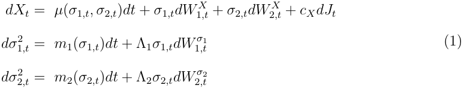

where the Brownian motions are correlated in the following way 

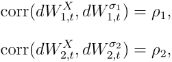

all other cross-correlations are zero. The drift _µ_ ( _σ_ 1 _,t, σ_ 2 _,t_ ) takes the usual form of a constant term minus the convexity correction from the logarithmic price transform. _J_ is an independent Poisson process with intensity _λ_ and jump size _cX ∼N_ ( _µJ , σJ_2).Wedenotefor

<!-- page: 6 -->

simplicity 

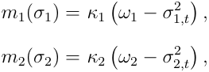

where _kj_ is the speed of mean reversion and _ωj_ is the long-run level of the variance components for _j_ = 1 _,_ 2. This model yields several well-known specifications used in option pricing. 

- With _σ_ 2 _,t_ = 0 and _J_ = 0, we retrieve the classic stochastic volatility (SV) Heston (1993) model. 

- With _σ_ 2 _,t_ = 0 and jumps, we have the stochastic volatility with price jump (SVJ) model used in Bates (2015) and Bakshi et al. (1997). 

- With _σ_ 2 _,t >_ 0 and _J__X_ = 0, we obtain the double Heston (2-SV) model used by Christoffersen et al. (2009). 

- With _σ_ 2 _,t >_ 0 and allowing jumps, we derive the 2-SVJ model developed in Bates (2000). 

The model in Equation (1) belongs to the class of affine processes, along with the different specifications. Affine processes are popular in option pricing because their CF is available in closed form. This allows for the use of numerically practical Fourier pricing techniques, such as the SINC method of Baschetti et al. (2022), enabling fast and accurate option pricing. Estimating this class of continuous time models can be challenging. One typically needs to resort to filtering techniques combined with numerically cumbersome estimation procedures. As we will later detail, we leverage the information from high-frequency data to design an estimation approach based on indirect inference rendering the procedure viable and practical. 

### **2.2 Dynamics under risk-neutral probability** Q 

We now analyze the risk-neutral dynamics associated with the model in Equation (1). To maintain analytical tractability, we risk-neutralize the model using a pricing kernel from

<!-- page: 7 -->

the exponential affine family, which offers the flexibility to incorporate multiple risk premia compensating price and variance factors’ risks. We focus on the 2-SVJ model, the most general case. The risk-neutral versions of other models can be derived by setting the relevant parameters to zero. 

**Assumption 2.1.** _We assume that the dynamics under_ P _of the ECF log-price Xt follows the 2-SVJ dynamic specified in Equation (1). The pricing kernel Mt takes the form_ 

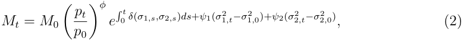

_where ϕ is the parameter controlling the aversion of price risk while ψ_ 1 _and ψ_ 2 _are the variance risk premia for the components σ_ 1 _,t and σ_ 2 _,t, respectively. The function δ_ ( _·_ ) _controls time preferences. Here, the pricing kernel is written as a function of the observed price, pt_ = _e__Xt_ _._ 

The main motivation for incorporating two factors for the variance is based on empirical evidence. Later, we will show that the best models estimated using the indirect inference approach have two volatility factors. A single factor model for the variance fails to replicate the statistical features captured by the HAR models (for the empirical evidence, please refer to the Supplemental Information (SI)). A similar pricing kernel, but with a single volatility factor, is introduced by Christoffersen et al. (2013) and used in Bandi and Ren`o (2016). This pricing kernel is monotonically decreasing in prices when _ϕ <_ 0 (assuming the variance constant) and monotonically increasing in both variance factors when _ψ_ 1 _>_ 0 and _ψ_ 2 _>_ 0 (keeping prices constant). Since typically high prices are associated with periods of high variance, when projected on prices the pricing kernel may reproduce the empirically observed U-shaped behavior. The non-monotonicity of the pricing kernel is able to reconcile a variety of empirical facts and puzzles. The following proposition provides a closed-form representation of the risk-neutral dynamics and a characterization of the mapping from the historical to the risk-neutral parameters in terms of the equity and variance components’ risk premia. 

**Proposition 2.1.** _Assume that we have price dynamics under_ P _specified in Equation (1) and_

<!-- page: 8 -->

_a pricing kernel as specified in Equation (2). Denoting by r the risk-free rate, the risk-neutral dynamics under_ Q _is given by_ 

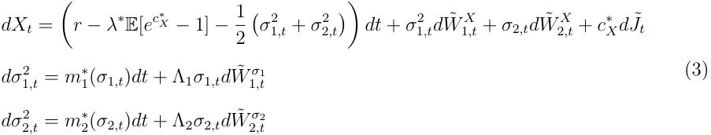

_where we have correlated Brownian motions_ 

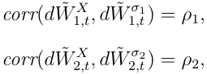

_while J_˜ _t is an independent Poisson process with risk-neutral intensity λ__∗_ _and risk-neutral jump size c__∗_ _X__.Thefollowingresultshold_ 

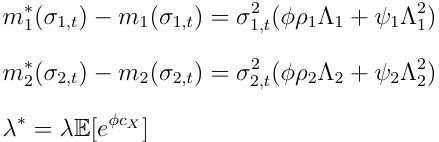

_and, for all u ∈_ R 

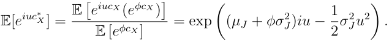

_Then, we have c__∗_ _X__∼N_(_µJ_+_ϕσ_ _J_2_, σ_ _J_2)_._ 

_Proof._ See Appendix A.1. 

We conclude this section by reporting the closed-form expression of the CF for the riskneutral 2-SVJ model. 

**Lemma 2.1.** _Under the model specified by the dynamics in Equation (3), the time t condi-_

<!-- page: 9 -->

_tional log-return CF f_ˆ _x_ ( _z, xt, σ_ 12 _,t__, σ_ 22 _,t__, t, T_) = EQ[_eizXT |Ft_]_,forT> t,isgivenby_ 

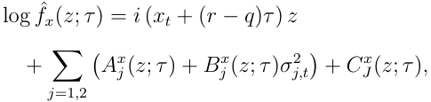

_where τ_ = _T − t, z ∈_ C _and the coefficients A__x_ _j__,B_ _j__xandC_ _J__xarespecifiedinthefollowingway_ 

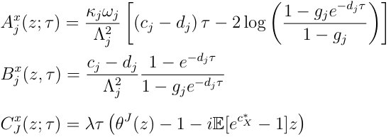

_where θ__J_ ( _z_ ) _is the CF of the jump size. We have defined the parameters_ 

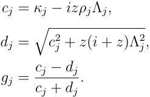

_Proof._ See Appendix A.1. 

## **3 Empirical Analyses** 

### **3.1 Data** 

For empirical analysis, we used tick-by-tick data on futures and options on futures trade prices from ICE covering the period of Phase 3 of the EU ETS: from December 15, 2015, to December 15, 2020. The reference ticker for the futures instrument is ECF, followed by a month and year abbreviation. We focus exclusively on December-expiry futures, designated as ECFZ, since they are the most liquid in this market. Moreover, the options on futures

<!-- page: 10 -->

traded on the exchange have only the December futures as underlying. In order to construct the time series of trade prices, we roll-over to the next December futures the day before the expiry date. From the tick-by-tick data, we construct the time series of futures prices and log-returns at five-minute frequency. Given the low market liquidity on certain days (particularly in the early years of our sample and when futures are far from maturity), we opted to use a five-minute frequency in order to get rid of the possible effects of microstructure noise when constructing realized volatility measures. We present descriptive statistics of ECF prices and intraday returns in Table (1). The market appears volatile, exhibiting a high standard deviation in log returns, with prices varying from under 5 euros to over 30 euros over the past six years. The high kurtosis in log returns also emphasizes the extreme events that occurred during this period. Trading occurs from 7:00 AM to 5:00 PM GMT, resulting in 120 five-minute intervals per day. The dataset comprises 155,238 observations spanning 1,283 trading days, including futures contracts on six underlying futures, from ECFZ15 to ECFZ21. Figure (1) shows the ECF prices during Phase 3, with vertical red lines marking the rollovers to the next December futures contracts. We observe a number of extreme negative returns that align with significant geopolitical events concerning the EU, particularly Brexit in 2016, which raised concerns about the UK’s potential exit from the EU ETS, see Borghesi and Flori (2019) for details. The volatile conditions of 2020, driven by the COVID-19 pandemic and widespread lockdown announcements across Europe, created significant fluctuations in energy markets and a sharp decline in prices, impacting the emissions market due to its correlation with other commodities, as outlined by Gerlagh et al. (2020). A similar scenario unfolded in 2022 with the Russia-Ukraine war, which also resulted in pronounced volatility and instability in this market since its connection to the gas market, as highlighted in Cornago (2022). Figure (2) illustrates the log-returns, highlighting volatility clustering and heteroskedasticity. Figure (3) illustrates the RV aggregated components – – at daily, weekly, and monthly level following Corsi (2009) in daily percentage unit, after the data pre-treatment outlined in the SI). Weekly and monthly RVs are smoothed

<!-- page: 11 -->

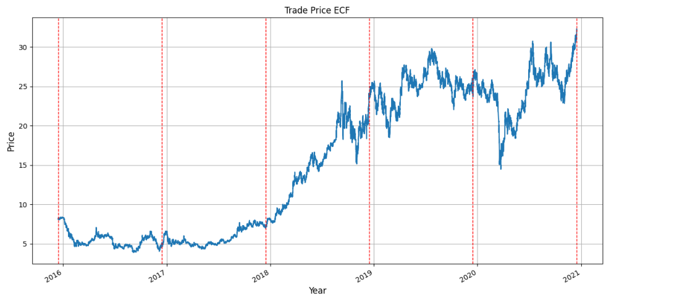

<!-- Start of picture text -->
Trade Price ECF 30 H H H ' H | H H H HHHH H H H H &\ H H H H t H 10 | | | 4 H HHHH 4 H H H HHHHHH i\ \ ® ae ~~ ~ tae asta Year <!-- End of picture text -->

<!-- page: 12 -->

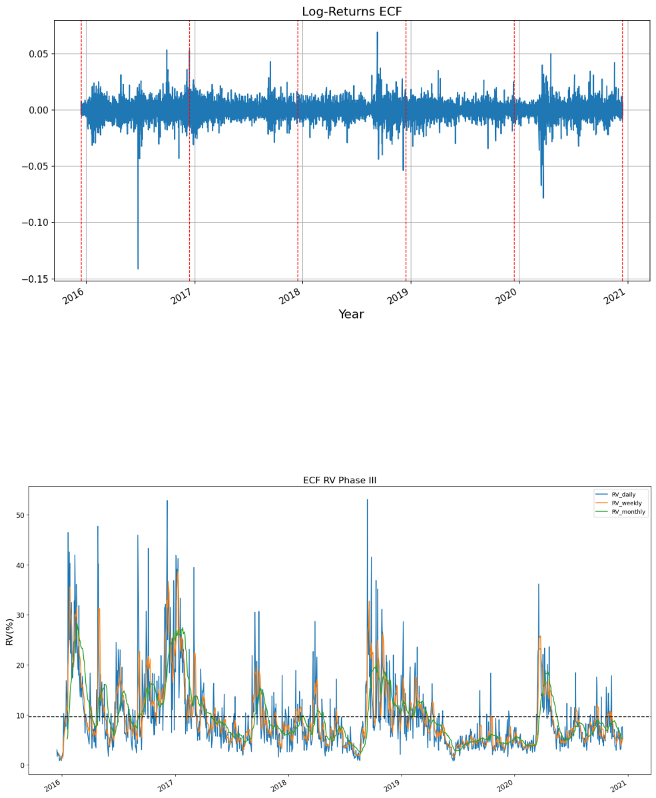

<!-- Start of picture text -->
Log-Returns ECF 0.00 -0.10 1 t t i op | op” aad ta ~ Year ECF RV Phase Ill —— RV_daily —— RV_weekly 50 —— RV_monthly 40 30x | 20 | | \| | 10+------ | } vi| HN | | Wi - ih iMiMSL Hd h AIL i MhAY) A 1 Wh A | hh| i Hi in| \ an T|  __4 ‘ih, of}I Lh - 4 ht LUE NiiAPY) MM | | a He ea A Lk a | hoi WAM! | ( 0 op Be yp se st a> <!-- End of picture text -->

<!-- page: 13 -->

with quarterly maturities in March, June, September, and December. December options expire one trading day before the underlying futures. Our dataset includes 520 options traded from December 2016 to December 2020, comprising 263 puts and 257 calls. We define moneyness as _m_ = _K/pt_ . The mean moneyness for calls is 1.24, while for puts it is 0.76, indicating that, on average, the options are out-of-the-money (OTM). Evidence shows that many deep-OTM options were traded during turbulent market conditions, such as the 2020 price drop due to COVID lockdowns, for both hedging and speculative purposes. 

### **3.2 Model estimation** 

For estimation, we follow the route traced in Corsi and Ren`o (2012) and rooted on the indirect inference method. Indirect inference is a simulation-based method for estimating the parameters of a structural model, consisting of two stages. First, an auxiliary model is fitted to the observed data. Next, a binding function maps the structural model parameters to the auxiliary ones. The method iteratively simulates the structural model by varying its parameter values in order to minimize the distance between the auxiliary models parameter estimated on the synthetic data and those obtained from the historical time series (more details in the SI). In our setting, leveraging high-frequency data, we construct realized volatility measures, separating them into continuous and jump components. Additionally, using the method described by Andersen et al. (2010), we estimate the number of intraday jumps and the associated sizes. Following Corsi and Ren`o (2012), we employ the LHAR-CJ class of models as auxiliary models to estimate the structural multifactor stochastic volatility model under the real-world probability. 

The following subsections are structured as follows. We begin with the results of the discrete-time analysis of realized volatility using the LHAR-CJ models, detailed in the SI, assessing both in-sample and out-of-sample performance. This step leads us to the selection of the optimal model for describing the volatility dynamics in the futures market. Estimates from the LHAR-CJ models are then used within the indirect inference framework to estimate

<!-- page: 14 -->

#### **3.2.1 Auxiliary model performance on market data** 

The estimation process of the LHAR-CJ model and nested specifications is straightforward and performed through ordinary least square (OLS) with Newey-West covariance corrections. We pre-process the data following the methodology reviewed in the SI. Table (2) shows that the HAR model yields daily and weekly coefficients of similar magnitude, while the monthly component is much smaller and not significant. The models are estimated in the daily percentage convention for all the variables involved. The LHAR model shows that the coefficients for daily and weekly negative returns are the most significant, despite having lower _t_ -statistics than the volatility coefficients, with the weekly coefficient being less significant. This may be due to a small correlation between lagged _RVt_ values and negative returns, as illustrated in the SI. This suggests a weak leverage effect. We fitted all models with both positive and negative leverage, since the commodity market may exhibit an ’inverse leverage’ effect, where volatility correlates more with positive returns (see, for example, Carnero and P´erez (2019)). Our analysis indicates that the negative leverage effect is slightly more significant than the positive one; therefore, we opted to use negative returns as covariates in the LHAR-CJ class models, for details, see the SI. In the complete LHAR-CJ model, we find that the volatility and leverage coefficients exhibit similar characteristics, while the jump component has statistical significant monthly and daily coefficients. This could be because the market experiences many phases during which the jump component remains high and persistent. We evaluate the in-sample performance of the model using the following metrics: AIC, BIC and adjusted R-squared. Table (3) shows that while the LHAR and LHAR-CJ have the same AIC, the BIC metrics select the HAR and LHAR specifications. Conversely, the LHAR-CJ has a slightly higher R-squared value. We compared the HAR class models to benchmark models, including AR and ARFIMA, which are commonly used to analyze long-memory properties of volatility in this market, as done in previous studies such as by

<!-- page: 15 -->

||HAR|LHAR|LHAR-CJ|
|---|---|---|---|
|_c_|0.229 |0.237 |0.284 |
||(4.889)|(4.676)|(5.449)|
|_β_(_d_)|0.422|0.391|0.379|
||(12.977)|(11.931)|(14.182)|
|_β_(_w_)|0.422|0.384|0.258|
||(7.685)|(7.686)|(6.064)|
|_β_(_m_)|0.043|0.076|-0.008|
||(0.782)|(1.315)|(-0.131)|
|_γ_(_d_)||-0.024|-0.025|
|||(-2.895)|(-2.960)|
|_γ_(_w_)||-0.034|-0.044|
|||(-2.502)|(-3.343)|
|_γ_(_m_)||-0.002|-0.018|
|_α_(_d_)||(-0.074)|(-0.514) 0.035|
||||(1.679)|
|_α_(_w_)|||0.021|
||||(0.869)|
|_α_(_m_)|||0.144 (5.381)|

Table 2: In-sample estimates of the LHAR-CJ model and nested models. Parentheses contain the _t_ -statistics. 

Benschop and L´opez-Cabrera (2017). Notably, the heterogeneous aggregation significantly improves the performance, with the HAR model class outperforming the others. As a final 

|Model|AIC|BIC|_R_2 adj|
|---|---|---|---|
|HAR|1423|1443|0.605|
|LHAR|**1407**|**1443**|0.618|
|LHAR-CJ|**1407**|1459|**0.622**|
|AR(22)|1478|1602|0.460|
|ARFIMA|1476|1601|0.448|

Table 3: Full in-sample model comparison. 

check to support our selection of the auxiliary model in indirect inference, we evaluate the model’s out-of-sample forecasting ability, by focusing on forecasting the tomorrow realized

<!-- page: 16 -->

variance, _V_ˆ _t_ +1. We perform one-day ahead forecasts, re-estimating the model daily at time _t_ using an expanding window of observations up to _t −_ 1. To assess the out-of-sample performance, we forecast realized volatility from December 1, 2019, to December 15, 2020, using a test set of 264 days. We measure forecasting accuracy with root mean squared error (RMSE), mean absolute error (MAE), the QLIKE metric introduced by Patton (2011), and the R2 from Mincer-Zarnowicz regressions. Table (4) shows that the LHAR and LHAR-CJ models outperform the classic HAR, while the HAR class models exceed the performance of simpler AR and ARFIMA models, as before. 

|Model|MSE|MAE|_R_2|QLIKE|
|---|---|---|---|---|
|HAR|0.127|0.285|0.540|1.606|
|LHAR|**0.122**|**0.280**|0.553|1.604|
|LHAR-CJ|**0.122**|**0.280**|**0.559**|**1.603**|
|AR(22)|0.150|0.308|0.478|1.607|
|ARFIMA|0.135|0.296|0.519|1.606|

Table 4: Out-of-sample results. 

#### **3.2.2 Estimation via indirect inference** 

This section presents the results of the estimation via indirect inference of the multifactor stochastic volatility model with jumps. We confirm, as noted in Corsi and Ren`o (2012) for the S&P500, that the simplest HAR model is not suitable for calibrating one-factor stochastic volatility models (SV and SVJ) in the EU-ETS market as well. Detailed results are provided in the SI. We therefore focus on the stochastic volatility model with two factors (2-SV and 2-SVJ). We begin our analysis by calibrating a 2-SV model specifying the dynamics in Equation (1) with J = 0 and without leverage. We employ the HAR model as the auxiliary model. For identification reasons, we set _ω_ 1 = _ω_ 2 = _ω_ and _µ_ ( _σ_ 1 _,t, σ_ 2 _,t_ ) = 0. The former restriction is dictated by the fact that the auxiliary model is sensitive solely to the long-run level of the realized volatility and cannot disentangle the long-run level of the single variance components. The latter assumption is consistent with the fact that, asymptotically, the contribution of

<!-- page: 17 -->

the drift component to the quadratic variation is negligible. For the estimation of the structural model with no jump components via the auxiliary HAR/LHAR models, we employ as obervables the time series of _C_ˆ _t_ , the empirical estimator of the continuous component of the quadratic variation. The structural model parameters are scaled and presented in daily non-percentage terms. For ease of comparison, we follow the same convention adopted for the LHARG-ARJ model Alitab et al. (2020), that we will use as benchmark model in the calibration exercise. The implied parameters follows the convention of Section 3.2.1. Errors in the estimates are computed using the asymptotic result from Gouri´eroux and Monfort (1997). We use variance targeting techniques to reduce the parameter space dimension. We define each _ω_ as half the mean of the continuous component of the quadratic variation, while for one vol-of-vol parameter, we target it based on the unconditional variance of the volatility dynamics 

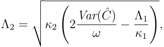

Therefore, we need to estimate three parameters. Table (5) shows the estimates and the corresponding implied HAR coefficients. The two-factor model effectively reproduces the HAR coefficients, all estimates are inside the standard deviation of the implied parameters. Notably, we observe a fast mean-reverting factor associated with high vol-of-vol, alongside a slower mean-reverting factor with a half-life of approximately 20 days. This combination produces the desired volatility persistence. These findings qualitatively align with those in Corsi and Ren`o (2012) and Rossi and de Magistris (2018) for the S&P 500, where the HAR model has a very strong convergence and the implied parameters are well reproduced by a 2-SV model without leverage. However, our analysis quantitatively shows a higher meanreverting factor and larger vol-of-vol, consistently with the high volatility of ECF market with respect to the S&P 500. 

We then estimate the full 2-SVJ model. We incorporate a nonzero correlation coefficient to

<!-- page: 18 -->

||**Structural model:**|
|---|---|
|_dXt_  _dσ_2 1_,t_  _dσ_2 2_,t_|= _σ_1_,tdW __X_ 1_,t_ +_σ_2_,tdW X_ 2_,t_  = _m_1(_σ_1_,t_)_dt_ + Λ1_σ_1_,tdW σ_1 1_,t_  = _m_2(_σ_2_,t_)_dt_ + Λ2_σ_2_,tdW σ_2 2_,t_|
|Parameter|Estimates Std. Errors|
|_κ_1|5.14e-02 5e-04|
|_κ_2|2.63 3e-02|
|[_ω_]|4.32e-04|
|Λ1|9.72e-03 5e-05|
|[Λ2] _χ_2|3.29e-02 1.21e-03|
||**Auxiliary model:**|
|log �C(_h_) _t_+_h_ =_c_ +_β_(_d_) |log �C_t_ +_β_(_w_) log �C(5) _t_ +_β_(_m_) log �C(22) _t_ +_ε_(_h_) _t_|
|Parameter|Estimated Implied|
|_c_|0.245 0.258|
|_β_(_d_)|0.465 0.456|
|_β_(_w_)|0.377 0.368|
|_β_(_m_)|0.029 0.043|
|_σ_2 _ε_|0.204 0.178|

Table 5: Structural (2-SV) and auxiliary (HAR) model estimation results. Parameters between squared parentheses are fixed by targeting. 

introduce a leverage effect by utilizing negative returns in the auxiliary model. For the jump component, we can target the intensity, the mean and standard deviation of jumps due to the fact that the number of intraday jumps and their size are made observable quantities by the procedure outlined by Andersen et al. (2007). This enables us to use the LHAR model as an auxiliary model instead of the LHAR-CJ model, which requires much larger computational time and many simulations in the indirect inference method to have enough statistics for fitting the jump parameters, as noted by Rossi and de Magistris (2018). Furthermore, since targeting allows us to reduce the dimensionality of the optimisation problem, we decrease the number of auxiliary parameters retaining only the most significant components of the LHAR – model the daily and the weekly– while maintaning the identificability of the structural

<!-- page: 19 -->

parameters. This leads to a reduction in the variability of the estimation. The implied parameters are well reproduced. We report our estimate in Table (6), where we note the magnitudes of the mean-reversion and vol-of-vol coefficients remain unchanged with respect to the 2-SV case, and we observe two negative leverage components. The largest leverage component corresponds to the slow mean-reversion factor, while the smallest is linked to the fast factor. This likely reflects an overshooting effect, as noted by Corsi and Ren`o (2012), where negative correlations at low frequencies are often low or positive, and vice versa. 

### **3.3 Option Pricing** 

In this section, we present the option pricing exercise based on the 2-SVJ model. We compare the pricing performance with the LHARG-ARJ model introduced in Alitab et al. (2020). The latter is a discrete-time model of the futures log-prices with observable volatility and jumps. It belongs to the class of RV heterogeneous auto-regressive gamma processes Corsi et al. (2013); Majewski et al. (2015) extended to include a jump component with time-varying intensity. A flexible specification of the pricing kernel compensates for equity, volatility, and jump risks. Then, it provides a state-of-the-art benchmark model that, as well as our approach, leverages tick-by-tick data in the construction of the realized volatility measures. We also analyze the performance of the 2-SV model, hence not considering the jump component. We apply a standard filter to our sample that excludes options with maturities shorter than 1 day or longer than 365 days. We define the implied volatility of the option on futures data in agreement with the market practice. 

**Definition 3.1.** _The implied volatility, IV , of an allowance futures option is the volatility that equates the option’s market price under the Black (1976) model. This model assumes that the dynamic of the underlying futures price F_ ( _t, TF_ ) _, where TF is the futures settlement date, follows a geometric Brownian motion. The risk-neutral price of the European allowances_

<!-- page: 20 -->

|**Structural model:**|
|---|
|_dXt_ = _σ_1_,tdW_ 1 _t_ +_σ_2_,tdW_ 2 _t_ +_dNt_ _dσ_2 1_,t_ = _m_1(_σ_1_,t_)_dt_ + Λ1_σ_1_,tdW σ_1 1_,t_ _dσ_2 2_,t_ = _m_2(_σ_2_,t_)_dt_ + Λ2_σ_2_,tdW σ_2 2_,t_|
|Parameter Estimates Std.Errors|
|_κ_1 3.93e-02 1e-03|
|_κ_2 2.03 2e-02|
|[_ω_] 4.31e-04|
|Λ1 8.28e-03 1e-04 |
|[Λ2] 3.20e-02|
|_ρ_1 -0.82 7e-03|
|_ρ_2 -0.11 5e-03|
|[_λJ_] 0.72|
|[_µJ_] -7.9e-03 |
|[_σJ_] 8.5e-03 |
|_χ_2 1.43e-04|
|**Auxiliary model:**|
|log �C(_h_) _t_+_h_ =_c_ +_β_(_d_) log �C_t_ +_β_(_w_) log �C(5) _t_ +_γ_(_d_)_r__−_ _t_ +_γ_(_w_)_r_(5)_−_ _t_ +_ε_(_h_) _t_|
|Parameter Estimated Implied|
|_c_ 0.279 0.278|
|_β_(_d_) 0.429 0.424|
|_β_(_w_) 0.386 0.381|
|_γ_(_d_) -0.026 -0.018|
|_γ_(_w_) -0.040 -0.036|
|_σ_2 _ε_ 0.199 0.199|

Table 6: Structural (2-SVJ) and auxiliary (LHAR) model estimation results. Parameters between squared parentheses are fixed by targeting. 

_futures call and put option with strike K and maturity TO ∈_ ( _t, T_ ) _is given by_ 

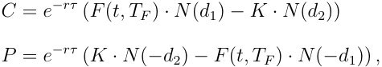

_where τ_ = _TO −t is the option time-to-expiration, N_ ( _·_ ) _is the cumulative distribution function_

<!-- page: 21 -->

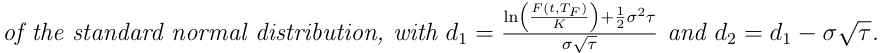

The IV in our sample has an average value of 60%, primarily due to the prevalence of out-of-the-money options. The mapping to a risk-neutral setting of the 2-SVJ (or 2-SV) model involves three risk premium parameters ( _ϕ, ψ_ 1 _, ψ_ 2), specified in the pricing kernel in Equation (2). The arbitrage condition outlined in the Proposition (2.1) defines the condition of these parameters. For the calibration procedure, we adopt a method based on the unconditional minimization of the distance between the market-implied and the modelimplied volatility. We calculate option prices and implied volatility associated using the SINC method, leveraging the knowledge of the CF in closed form. Following Fang et al. (2024), we set the risk-free rate and the cost-of-carry to zero. We obtain the optimal risk premia through the following minimization 

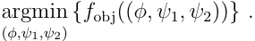

The objective function _f_ obj corresponds to the L2 norm of the difference between the model implied volatility and the implied volatility of the market for each option _j_ , with _j_ = 1 _, . . . , N_ opt. It can be expressed as 

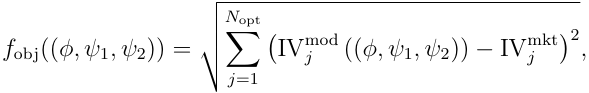

In summary, the numerical procedure for calibration is as follows: We estimate the 2-SVJ model through the indirect inference method, with parameters reported in Section 3.2.2. The mapping to the risk-neutral setting is performed using Proposition 2.1, and the model is calibrated by computing prices with the SINC method. We set the model variance to the state of the RV of each specific day during calibration. Conditioning improves the flexibility of the model and its ability to adapt to the changing market conditions. 

Table (7) reports the calibrated risk premia for the 2-SVJ and 2-SV model. From Propo-

<!-- page: 22 -->

sition 2.1, the risk-neutral variance components follow the equation 

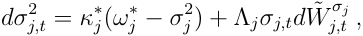

for _j_ = 1 _,_ 2 and 

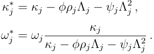

The latter equations clarify how the risk premia modify the speed of mean reversion and the long run level of each volatility factor under the pricing measure. Notably, the two premia _ψ_ 1 and _ψ_ 2 exhibit distinct magnitudes: _ψ_ 1 compensates for the risk associated with the variation of _σ_ 12 _,t_,whichfeaturesslowmeanreversionandlowvol-of-vol.Ontheother hand, _ψ_ 2 compensates the variation of the factor _σ_ 22 _,t_,characterizedbyhighmeanreversion and high vol-of-vol. Since, as expected, the equity premium coefficient, _ϕ_ , is negative and the correlations _ρ_ 1 and _ρ_ 2 are negative too, risk-neutralization leads to a decrease in the mean reversion speed and an increase in the long-term level of each variance factor. The different amplitude of the variance risk premia then allows to distinguish the long-term riskneutral level of each factor, differently from what happens under the historical measure where both components contribute equally to the variance long-term mean. The objective function _f_ obj is of the same order of magnitude in both models, with the 2-SVJ model performing better. Incorporating jumps in the stochastic volatility calibration slightly improves pricing performance. 

||**2-SV**|**2-SVJ**|
|---|---|---|
|_ϕ_|-7.46e-03|-7.35e-03|
|_ψ_1|2.74e-03|2.81e-03|
|_ψ_2|1.28e-02|1.50e-02|
|_f_obj|4.06|4.05|

Table 7: Calibrated risk premia for the 2-SV and 2-SVJ models.

<!-- page: 23 -->

### **3.4 Pricing performances** 

In this section we compare the pricing performance of our approach with the discrete-time LHARG-ARJ model of Alitab et al. (2020). It is worth stressing that the LHARG-ARJ model is a benchmark in this paper. Nevertheless, it is the first time it has been calibrated and tested on options on carbon futures. From this perspective, our exercise provides a comparative assessment of the pricing performance of two entirely different approaches that both leverage the flexibility of a multi-dimensional specification of the pricing kernel. At variance with the 2-SVJ model, the pricing kernel for the LHARG-ARJ depends parametrically on four risk coefficients. They compensates directional (equity) and non-directional (variance) risks associated to the continuous and discontinuous components of the efficient price process. While compliance with the absence of arbitrage principle constraints the premia corresponding to the directional risks, the variance risk premia, _νc_ and _νj_ , will be optimized during the calibration exercise. 

The pricing performance is evaluated with the percentage Implied Volatility Root Mean Square Error ( _RMSEIV_ ) introduced by Renault (1996), computed as 

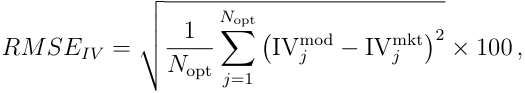

where _N_ opt is the number of options and the other terms represent the market and model implied volatility. The IVmod is calculated as outlined in the previous section. We evaluate the models across different moneyness _m_ intervals to ensure a comparable number of contracts in each of them. Due to the predominance of OTM and deep-OTM options in our sample, we differentiate between three intervals: the first includes primarily OTM and deep-OTM put options with _m <_ 0 _._ 85; the second comprises mainly OTM and deep-OTM call options with _m >_ 1 _._ 1; and the third interval, 0 _._ 85 _≤ m ≤_ 1, features a mix of call and put options with less extreme moneyness. In the Appendix A.2, we provide an overview of the estimated parameters and the calibrated risk premia of the LHARG-ARJ model, adding a significant

<!-- page: 24 -->

and unprecedented contribution to our analysis. 

Table (8) presents the _RMSEIV_ values for various moneyness levels across the LHARGARJ, 2-SV, and 2-SVJ models. All models exhibit similar performance with comparable values across moneyness intervals. Still, the LHARG-ARJ performs slightly better in all cases, especially in the moneyness interval of OTM and deep OTM calls for _m >_ 1 _._ 1. The interval with the highest errors is the one with moneyness _m <_ 0 _._ 85, consisting of OTM and deep-OTM puts. 

|||_RMSEIV_ ||
|---|---|---|---|
|Model _\_ Moneyness|_m <_0_._85|0_._85 _≤m ≤_1_._|_m >_1_._1|
|LHARG-ARJ|19.25|11.17|10.12|
|2-SVJ|19.80|11.96|11.33|
|2-SV|19.98|11.95|11.47|

Table 8: Pricing performances of the LHARG-ARJ, 2-SVJ, and 2-SV models for different moneyness intervals. 

We will now assess the performance of the LHARG-ARJ and 2-SVJ models by considering the maturity of options across four intervals: short-term options with _τ <_ 50, medium-term options with 50 _< τ ≤_ 90, longer-term options with 90 _< τ ≤_ 160, and finally, options with long maturity where _τ >_ 160. We report the results in Table (9). 

The models exhibit similar performance with some differences across maturities. For very short maturities, the LHARG-ARJ model consistently outperforms the 2-SVJ model in all defined moneyness intervals. Both models, as before, consistently exhibit higher _RMSEIV_ for the interval _m <_ 0 _._ 85 across all maturity intervals, likely due to the elevated implied volatility of these put options, which exceeds the sample average. For medium-term options, the 2-SVJ model performs better for options with less extreme moneyness (0 _._ 85 _≤ m ≤_ 1 _._ 1), while the LHARG-ARJ has lower _RMSEIV_ value in the other two intervals. Notably, in the third interval, the 2-SVJ model only outperforms the LHARG-ARJ model for _m <_ 0 _._ 85 and for the last interval composed of long-term maturities, the LHARG-ARJ model achieves the best

<!-- page: 25 -->

results. The LHARG-ARJ model’s enhanced performance can be attributed to its flexibility. The autoregressive structure of the centrality coefficient in the gamma specification, makes it highly sensitive and reactive to the state of the market on each day and previous month RV and returns time series. Moreover, allowing the jumps’ intensity to have an autoregressive structure improves the fit in extreme moneyness regions. 

|||Maturity||
|---|---|---|---|
|Moneyness|_τ ≤_50|50_< τ ≤_90 90_< τ ≤_160|160_< τ_|
|Panel A|LH|ARG - ARJ Implied Volatility RM|SE|
|0_._85_≤m ≤_1_._1|10.50|13.64 12.09|6.40|
|_m <_0_._85|29.35|18.47 11.67|19.41|
|_m >_1_._1|11.19|8.57 10.05|9.50|
|Panel B||2-SVJ Implied Volatility RMSE||
|0_._85_≤m ≤_1_._1|11.97|11.19 13.21|8.67|
|_m <_0_._85|30.39|19.81 10.57|19.98|
|_m >_1_._1|12.34|9.39 12.40|10.21|

Table 9: Pricing performances of the LHARG-ARJ and 2-SVJ model for different maturities and moneyness intervals. 

## **4 Conclusions** 

Carbon markets are becoming increasingly vital for reducing emissions and boosting the transition to a low-emission economy. A quantitative detailed analysis of these markets is essential for market players and policymakers. In this paper, we analyzed Phase 3 of the EU ETS market using high-frequency data. First, we construct the realized volatility series disentangling continuous and discontinuous components. We then apply the HAR class model to estimate and forecast realized volatility, finding that incorporating jump and negative leverage improves the model’s fit and forecasts. We then used these models to estimate

<!-- page: 26 -->

multifactor stochastic volatility with jumps under historical measure P using the indirect inference method. Subsequently, we risk-neutralized the estimated models with a threedimensional pricing kernel compensating for the equity and variance components’ risks. We compared our results with the LHARG-ARJ model, obtaining comparable performances on the options sample. 

This paper contributes to the quantitative understanding of the EU ETS during Phase 3. Our findings indicate that at least two factors are essential for capturing the carbon futures volatility dynamics. We also support the need to include a jump component in the return dynamics. Indeed, the calibration results suggest that including jumps slightly improves the pricing performance relative to a no-jump specification. Overall, our study provides valuable insights into the volatility and jump dynamics in carbon markets and the compensation for risk required by agents trading on the carbon options. Last, but not least, our approach offers a tractable framework for pricing carbon derivatives leveraging the information content of high-frequency trades.

<!-- page: 27 -->

## **A Appendices** 

### **A.1 Proof of results** 

_Proof of_ **_Proposition 2.1_** _._ Given the price dynamics specified in Equation (1) and the pricing kernel specified in Equation (2), we have 

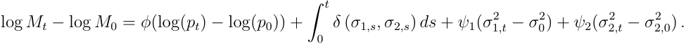

Hence we have 

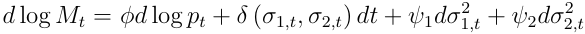

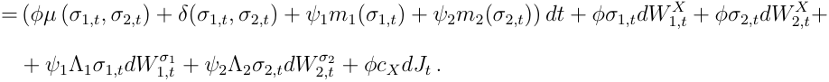

Using Ito’s Lemma we can derive the dynamics for the process _Mt_ 

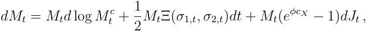

where 

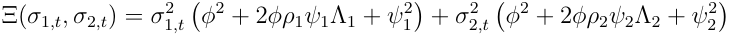

and _Mt__c_denotesthecontinuouspartof_Mt_.Now,define_Y_1_,t_=_BtMt_,where_Bt_=_B_0_ert_is the money market account process with _r_ the risk-free rate. The stochastic differential of _Y_ 1 _,t_ reads 

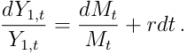

To ensure the absence of arbitrage, _Y_ 1 _,t_ must be a martingale, meaning the drift is zero. We <u>1</u> express this using the following notation _dt_E_t_[_Y_1_,t_]=0.Wedefinethereturnriskpremium 

as 

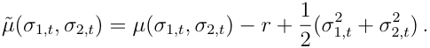

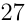

<!-- page: 28 -->

Absence of arbitrage for _Y_ 1 _,t_ hence imply 

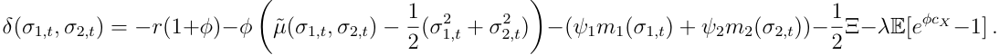

In the same way, consider _Y_ 2 _,t_ = _ptMt_ . By Ito’s Lemma and using the result that E[ _dMt/Mt_ ] = _−rdt_ we have 

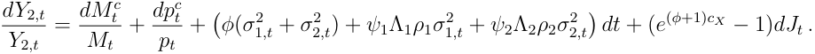

The absence of arbitrage implies that _dt_ <u>1</u>E_t_[_Y_2_,t_] = 0andweobtainthefollowingequation 

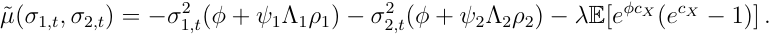

Now consider _Y_ 3 _,t_ = _Mt_ Π( _t, pt, σ_ 12 _,t__, σ_ 22 _,t_)whereΠ(_t, pt, σ_ 12 _,t__, σ_ 22 _,t_)isthevalueattime_t_ofa traded asset with payoff Π( _pT_ ) at time _T_ . Applying Ito’s Lemma we get 

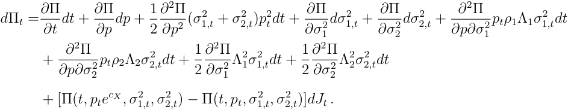

The dynamics of _Y_ 3 _,t_ can be specified in the following way 

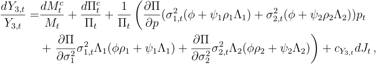

where 

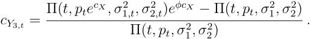

<!-- page: 29 -->

By setting _dt_ <u>1</u>E[_dY_3_,t/Y_3_,t_] = 0andsimplifyingweget 

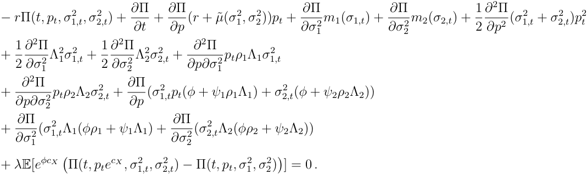

Now, for every traded asset with price Π( _t, pt, σ_ 12 _,t__, σ_ 22 _,t_)wehave 

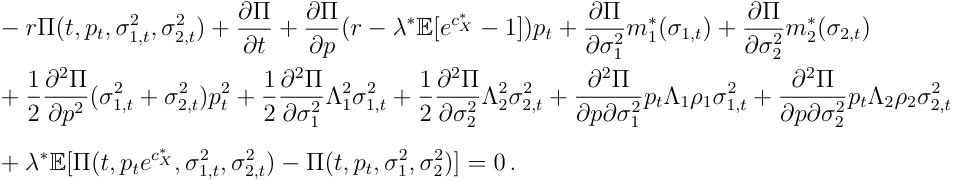

If we now compare the last two equations, we get 

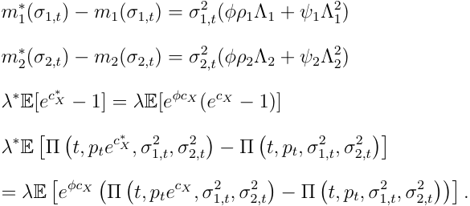

From the last two relations, it follows that 

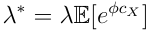

<!-- page: 30 -->

~~ta~~ 

( 

~~+~~ ) 

d | 

~~—— -~~ () ~~——~~ ( 

( 

) 

) 

~~-~~ ) 

~~_~~

<!-- page: 31 -->

where _θ__J_ ( _z_ ) is the characteristic function of the jump sizes _c__∗_ _X_.Givennullinitialcondition at _τ_ = 0, the solution of this system of ODEs is 

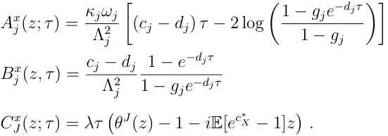

For simplicity, we have defined the following parameters: 

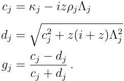

The CF of nested models can be readily obtained from this result. 

### **A.2 LHARG-ARJ estimated parameters and risk premia** 

This section reports the estimation results of the LHARG-ARJ model, obtained through likelihood maximization. For details, please refer to Alitab et al. (2020). Table (10) presents the estimated parameter values and risk premia. Parameters are in daily not percentage units. The results are qualitatively similar to those found fitting the LHAR-CJ model. The coefficients _β{d,w,m}_ associated with the continuous component are the most significant, particularly the daily and weekly coefficients. The leverage component, described by the parameters _α{d,w,m}_ , shows similar results for daily and weekly but the monthly coefficient exhibits the largest error. Overall, the leverage effect does not appear to have a large magnitude. The drift parameters Φ _c_ and Φ _j_ , corresponding to the continuous and discontinuous components, are significant. Notably, the latter is large and negative. Regarding the jump size distribution, the mean _µJ_ is negative, and the standard deviation _σJ_ is of the same order

<!-- page: 32 -->

|Parameter|Estimates|
|---|---|
|Φ_c_|3.0 (9e-01)|
|Φ_j_|-61 (5)|
|_θ_|9.3e-05 (3e-06)|
|_κ_|2.24|
|_βd_|4.2e+03 (3e+02)|
|_βw_|2.9e+03 (4e+02)|
|_βm_|6e+02 (3e+02)|
|_αd_|0.62 (0.01)|
|_αw_|0.42 (0.15)|
|_αm_|0.17 (0.37)|
|_γ_|5 (3)|
|¯_λ_|2.2e-02|
|_ξ_|0.84 (0.02)|
|_ζ_|0.12 (0.02)|
|_µJ_|-7.9e-03 (7e-04)|
|_σJ_|8.5e-03 (6e-04)|
||Risk premia|
|_νc_|-6.72e+02|
|_νj_|-1.99e+03|
||Log-likelihood|
|_L__y_|2890|
|_L_CRV|-10258|
|_L_JRV|1951|
|Persistence CRV_t_|0.759|
|Persistence _ωt_|0.968|

Table 10: Maximum likelihood estimates (standard errors in parenthesis) for the LHARGARJ model on ECF Phase 3. Risk premia are calibrated from a sample of futures put and call options. 

of magnitude. This suggests that jumps are primarily associated with negative shocks. In comparison to the original study on S&P 500 data of Alitab et al. (2020), we observe a lower persistence of volatility, while the jump persistence shows a slightly lower value. The jump intensity is higher, while the leverage component is weaker. These parameters are estimated

<!-- page: 33 -->

under the historical measure. 

The pricing kernel for the LHARG-ARJ depends parametrically on four risk premia, two of which are determined by the arbitrage conditions, as outlined in Alitab et al. (2020). In the table, we present the calibrated variance risk premia associated with the continuous, _νc_ , and discontinuous, _νj_ , components of the quadratic variation. As expected, both risk premia are large and negative. 

## **References** 

- Alberola, E., Chevallier, J., and Ch`eze, B. (2007). European carbon prices fundamentals in 2005-2007: The effects of energy markets, temperatures and sectorial production. EconomiX Working Papers 2007-33, University of Paris Nanterre, EconomiX. 

- Alberola, E., Chevallier, J., and Ch`eze, B. (2008). Price drivers and structural breaks in european carbon prices 2005–2007. _Energy Policy_ , 36:787–797. 

- Alitab, D., Bormetti, G., Corsi, F., and Majewski, A. A. (2020). A jump and smile ride: Jump and variance risk premia in option pricing. _Journal of Financial Econometrics_ , 18(1):121–157. 

- Andersen, T., Bollerslev, T., and Diebold, F. (2007). Roughing it up: Including jump components in the measurement, modeling, and forecasting of return volatility. _The Review of Economics and Statistics_ , 89(4):701–720. 

- Andersen, T., Bollerslev, T., Frederiksen, P., and Nielsen, M. (2010). Continuous-time models, realized volatilities, and testable distributional implications for daily stock returns. _Journal of Applied Econometrics_ , 25(2):233–261. 

- Bakshi, G., Cao, C., and Chen, Z. (1997). Empirical performance of alternative option pricing models. _The Journal of Finance_ , 52(5):2003–2049.

<!-- page: 34 -->

- Bandi, F. and Ren`o, R. (2016). Price and volatility co-jumps. _Journal of Financial Economics_ , 119(1):107–146. 

- Barndorff-Nielsen, O. E., Graversen, S. E., Jacod, J., and Shephard, N. (2006a). Limit theorems for bipower variation in financial econometrics. _Econometric Theory_ , 22(4):677– 719. 

- Barndorff-Nielsen, O. E. and Shephard, N. (2002). Econometric analysis of realized volatility and its use in estimating stochastic volatility models. _Journal of the Royal Statistical Society. Series B (Statistical Methodology)_ , 64(2):253–280. 

- Barndorff-Nielsen, O. E. and Shephard, N. (2004). Power and Bipower Variation with Stochastic Volatility and Jumps. _Journal of Financial Econometrics_ , 2(1):1–37. 

- Barndorff-Nielsen, O. E. and Shephard, N. (2005). Econometrics of Testing for Jumps in Financial Economics Using Bipower Variation. _Journal of Financial Econometrics_ , 4(1):1– 30. 

- Barndorff-Nielsen, O. E., Shephard, N., and Winkel, M. (2006b). Limit theorems for multipower variation in the presence of jumps. _Stochastic Processes and their Applications_ , 116(5):796–806. 

- Baschetti, F., Bormetti, G., Romagnoli, S., and Rossi, P. (2022). The SINC way: A fast and accurate approach to Fourier pricing. _Quantitative Finance_ , 22:427–446. 

- Bates, D. S. (2000). Post-’87 crash fears in the S&P 500 futures option market. _Journal of Econometrics_ , 94(1-2):181–238. 

- Bates, D. S. (2015). Jumps and Stochastic Volatility: Exchange Rate Processes Implicit in Deutsche Mark Options. _The Review of Financial Studies_ , 9(1):69–107. 

- Benschop, T. and L´opez-Cabrera, B. (2017). Realized volatility of CO2 futures.

<!-- page: 35 -->

- Benth, F. E., Eriksson, M., and Westgaard, S. (2017). Stochastic Volatility Modeling of Emission Allowances Futures Prices in the European Union Emission Trading System Market. In Secomandi, N., editor, _Real Options in Energy and Commodity Markets_ , World Scientific Book Chapters, chapter 3, pages 63–115. World Scientific Publishing Co. Pte. Ltd. 

- Black, F. (1976). The pricing of commodity contracts. _Journal of Financial Economics_ , 3(1-2):167–179. 

- Borghesi, S. and Flori, A. (2019). With or without U(K): A pre-Brexit network analysis of the EU ETS. _PLOS ONE_ , 14(9):1–17. 

- Carmona, R. A. and Hinz, J. (2011). Risk-neutral models for emission allowance prices and option valuation. _Manag. Sci._ , 57:1453–1468. 

- Carnero, M. A. and P´erez, A. (2019). Leverage effect in energy futures revisited. _Energy Economics_ , 82:237–252. Replication in Energy Economics. 

- Chevallier, J. (2009). Carbon futures and macroeconomic risk factors: A view from the EU ETS. _Energy Economics_ , 31(4):614–625. 

- Chevallier, J. and S´evi, B. (2011). On the realized volatility of the ECX CO2 emissions 2008 futures contract: Distribution, dynamics and forecasting. _Annals of Finance_ , 7(1):1–29. 

- Christoffersen, P., Heston, S., and Jacobs, K. (2009). The shape and term structure of the index option smirk: Why multifactor stochastic volatility models work so well. _Management Science_ , 55:1914–1932. 

- Christoffersen, P., Heston, S., and Jacobs, K. (2013). Capturing Option Anomalies with a Variance-Dependent Pricing Kernel. _The Review of Financial Studies_ , 26(8):1963–2006. 

- Cornago, E. (2022). The EU emissions trading system after the energy price spike. _Centre for European Reform, Open Socienty European Policy Institute_ .

<!-- page: 36 -->

- Corsi, F. (2009). A Simple Approximate Long-Memory Model of Realized Volatility. _Journal of Financial Econometrics_ , 7(2):174–196. 

- Corsi, F., Fusari, N., and La Vecchia, D. (2013). Realizing smiles: Options pricing with realized volatility. _Journal of Financial Economics_ , 107(2):284–304. 

- Corsi, F., Pirino, D., and Ren`o, R. (2010). Threshold bipower variation and the impact of jumps on volatility forecasting. _Journal of Econometrics_ , 159(2):276–288. 

- Corsi, F. and Ren`o, R. (2012). Discrete-time volatility forecasting with persistent leverage effect and the link with continuous-time volatility modeling. _Journal of Business and Economic Statistics_ , 30(3):368–380. 

- Duffie, D., Pan, J., and Singleton, K. (2000). Transform analysis and asset pricing for affine jump-diffusions. _Econometrica_ , 68(6):1343–1376. 

- Fang, M., Tan, K., and Wirjanto, T. (2024). Valuation of carbon emission allowance options under an open trading phase. _Energy Economics_ , 131:107351. 

- Gerlagh, R., Heijmans, R. J. R. K., and Rosendahl, K. E. (2020). COVID-19 Tests the Market Stability Reserve. _Environmental & Resource Economics_ , 76(4):855–865. 

- Gourieroux, C., Monfort, A., and Renault, E. (1993). Indirect inference. _Journal of Applied Econometrics_ , 8:S85–S118. 

- Gouri´eroux, C. and Monfort, A. (1997). _Simulation-based Econometric Methods_ . Oxford University Press. 

- Hammoudeh, S., Nguyen, D. K., and Sousa, R. M. (2014). Energy prices and CO2 emission allowance prices: A quantile regression approach. _Energy Policy_ , 70(C):201–206. 

- Heston, S. L. (1993). A closed-form solution for options with stochastic volatility with applications to bond and currency options. _The Review of Financial Studies_ , 6(2):327– 343.

<!-- page: 37 -->

- Hintermann, B. (2010). Allowance price drivers in the first phase of the EU ETS. _Journal of Environmental Economics and Management_ , 59(1):43–56. 

- Hitzemann, S., Uhrig-Homburg, M., and Ehrhart, K.-M. (2015). Emission permits and the announcement of realized emissions: Price impact, trading volume, and volatilities. _Energy Economics_ , 51:560–569. 

- Kim, J., Park, Y. J., and Ryu, D. (2017). Stochastic volatility of the futures prices of emission allowances: A Bayesian approach. _Physica A: Statistical Mechanics and its Applications_ , 465:714–724. 

- Majewski, A. A., Bormetti, G., and Corsi, F. (2015). Smile from the past: A general option pricing framework with multiple volatility and leverage components. _Journal of Econometrics_ , 187(2):521–531. 

- Mancini, C. (2009). Non-parametric threshold estimation for models with stochastic diffusion coefficient and jumps. _Scandinavian Journal of Statistics_ , 36(2):270–296. 

- Mansanet-Bataller, M., Pardo, A., and Valor, E. (2006). CO2 prices, energy and weather. _The Energy Journal_ , 28:73–92. 

- Pacati, C., Pompa, G., and Ren`o, R. (2018). Smiling twice: The Heston++ model. _Journal of Banking & Finance_ , 96:185–206. 

- Patton, A. J. (2011). Volatility forecast comparison using imperfect volatility proxies. _Journal of Econometrics_ , 160(1):246–256. Realized Volatility. 

- Renault, E. (1996). Econometric Models of Option Pricing Errors. Technical report. 

- Rossi, E. and de Magistris, P. S. (2018). Indirect inference with time series observed with error. _Journal of Applied Econometrics_ , 33(6):874–897.

<!-- page: 38 -->

- Rotfuß, W. (2009). Intraday price formation and volatility in the European Union emissions trading scheme: An introductory analysis. ZEW Discussion Papers 09-018, ZEW - Leibniz Centre for European Economic Research. 

- Yang, S. S., Huang, J.-W., and Chang, C.-C. (2016). Detecting and modelling the jump risk of CO2 emission allowances and their impact on the valuation of option on futures contracts. _Quantitative Finance_ , 16(5):749–762. 

- Zhang, L., Mykland, P., and A¨ıt-Sahalia, Y. (2005). A tale of two time scales. _Journal of the American Statistical Association_ , 100:1394–1411.

<!-- page: 39 -->

#### ONLINE SUPPLEMENTAL INFORMATION 

### **The LHAR-CJ model** 

For the ease of the reader, this section of the online SI mainly recalls results from Corsi and Ren`o (2012). We work in a filtered probability space (Ω _,_ ( _Ft_ ) _t∈_ [0 _,T_ ] _, F,_ P). We assume that the logarithmic price of the European Carbon Futures (ECF) is noted as _Xt_ and satisfy the following assumption 

**Assumption A.1.** ( _Xt_ ) _t∈_ [0 _,T_ ] _is a real-values process and can be put in the form of an Ito semimartingale:_ 

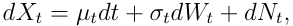

_where µt is predictable, σt is c`adlag and Wt is the standard Brownian motion. The jump part is dNt_ = _cXtdJt, where Jt is a non-explosive Poisson process whose intensity is an adapted stochastic process λt and cXt is an adapted random variable that measures the size of the jump at time t. Size and time of a jump are i.i.d random variables and we have_ P( _{cXt_ = 0 _}_ ) = 0 _, ∀t ∈_ [0 _, T_ ] _._ 

We set our time window _T_ = 1 day and we denote the daily close-to-close return as _rt_ . We study the quadratic variation of the process within this period. The quadratic variation of the process _Xt_ is defined in the following way 

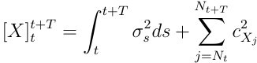

_t_ + _T_ We define the continuous component as [ _X__c_ ]_t_ _t_+_T_ = � _t σs_2_ds_andthediscontinuouscompo- nent as [ _X__d_ ] _t__t_+_T_ =�_N_ _j_ =_t_+ _N__T_ _t__c_2 _j_.Thesequantitiesarenotdirectlyobservableandweneedto use consistent estimators. We divide the daily time interval [ _t, t_ + _T_ ] into _n_ evenly spaced sub-intervals of length _δ_ = _T/n_ . On this grid, we have evenly sampled returns defined in this

<!-- page: 40 -->

way 

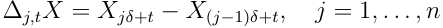

From now on, for simplicity of notation, we only write ∆ _jX_ to refer to this quantity. The quantity _δ_ basically defines the frequency for calculating the intra-day returns. The most important estimator of [ _X_ ] _t__t_+_T_ is the realized variance (see Barndorff-Nielsen and Shephard (2002)), defined as: 

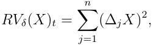

which converges in probability to [ _X_ ]_t_ _t_+_T_ as _δ −→_ 0. We define the notations for the realized ˆ estimators of the quadratic variation components as follows: _Vt_ represents the estimator for [ _X_ ] _t__t_+_T_ , _C_ˆ _t_ for [ _X__c_ ] _t__t_+_T_ , and _J_ˆ _t_ for [ _X__d_ ]_t_ _t_+_T_ . To estimate the total quadratic variation, we use 5-minute intraday returns. While other methods, such as Zhang et al. (2005) twoscale estimator, can estimate quadratic variation using tick-by-tick data, we find that 5- minute intervals are appropriate given the market’s limited liquidity at times. To differentiate between continuous and discontinuous components, we employ the _C-Tz_ test developed by Corsi et al. (2010), preceded by data pre-treatment: we first calculate Jump-Adjusted returns as described by Andersen et al. (2010), followed by a threshold-based trimming technique outlined in Corsi et al. (2013). This procedure is essential for constructing the time series of both continuous and discontinuous components of quadratic variation, as well as estimating the number of intraday jumps _nt_ and their sizes _cXt_ . These quantities enable us to define the LHARC-CJ model class and construct the likelihood for estimating the LHARG-ARJ pricing model used as a benchmark model. The estimators of [ _X__c_ ]_t_ _t_+_T_ and [ _X__d_ ]_t_ _t_+_T_ , along with further details on this procedure, are available in the next section. The LHAR-CJ model is constructed by combining heterogeneity in realized volatility, leverage, and jumps, utilizing daily, weekly, and monthly frequencies. Figure (4) illustrates components of the LHAR-CJ model by showing the lagged correlation function between Realized Volatility _RVt_ and _RVt−h_ for the ECF futures series of Phase 3, alongside its correlation to negative returns,

<!-- page: 41 -->

positive returns, and the jump component. The autocorrelation of realized volatility decays slowly, a well-known characteristic. The lagged correlation between _RVt_ and negative returns shows the presence of a leverage effect, though it is relatively weak. The correlation with positive returns is even weaker, leading us to focus on negative returns for our analysis. In contrast, the jump component positively influences _RVt_ and decays more slowly than the returns component. We use the variables specified in logarithmic scale as common practice, defining the averaged aggregated variables over _h_ days as follows (with jumps aggregated only): 

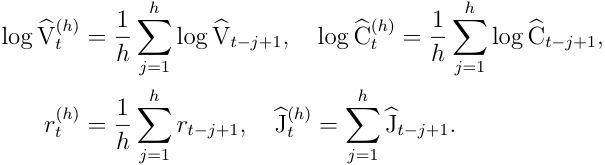

To model the negative leverage effect, we define _rt_(_h_)_−_ = min( _rt_(_h_)_,_0).We define the LHAR-CJ with the standard negative leverage effect as follows: 

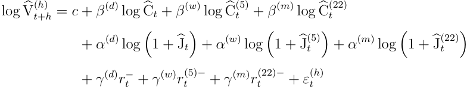

The parameters _{c, β_(_d,w,m_) _, α_(_d,w,m_) _, γ_(_d,w,m_) _}_ along with i.i.d noise _ε_( _t__h_) characterize the model. This formulation incorporates well-known models for modeling and forecasting realized volatility. When _α_(_d,w,m_) = _γ_(_d,w,m_) = 0, the leverage and jump components are omitted, leading to _C_ˆ _t_ = _V_ˆ _t_ , thus simplifying to the well-known HAR model of Corsi (2009). If there is no separation of quadratic variation (i.e., _α_(_d,w,m_) = 0), the model is identified as the LHAR model. When _γ_(_d,w,m_) = 0, it corresponds to the HAR-CJ model proposed by Andersen et al. (2007), which treats continuous and discontinuous components as separate explanatory variables. We estimate the LHAR-CJ and its variants using ordinary least squares (OLS) with Newey-West covariance correction.

<!-- page: 42 -->

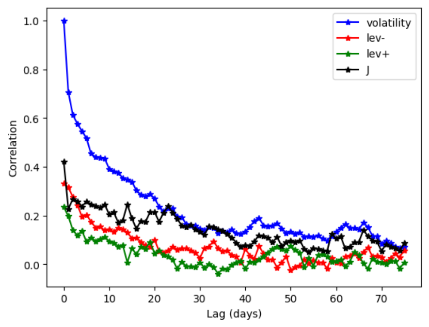

<!-- Start of picture text -->
¥0 —— volatility —— lev- —— lev+ 0.8 | - 0.6 2 ic w 0.4 S 0.24 3 “Mt " 0.0 ie Sie Spa A Whalen < te os ) 10 20 30 40 50 60 70 Lag (days) <!-- End of picture text -->

<!-- page: 43 -->

_t_ + _T_ As _δ →_ 0, this quantity converges in probability to _µγ_ � _t σs__γ_1+_..._+_γM_ _ds_ for a suitable constant _µγ_ . Asymptotic properties of this estimator were analyzed in Barndorff-Nielsen et al. (2006a) and Barndorff-Nielsen et al. (2006b). In practical applications, multipower variation is typically employed to estimate the continuous component of quadratic variation, resulting in the well-known bipower variation, defined as: 

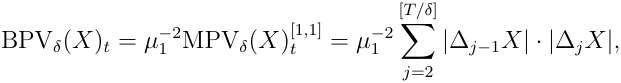

where the constant _µ_ 1 _≃_ 0 _._ 7979 and we have convergence in probability to [ _X__c_ ] _t__t_+_T_ as _δ −→_ 0. To detect a jump on a specific day, we need to check for the presence of a discontinuity. We use the method from Corsi et al. (2010) for the _C-Tz_ test, a modified version of the _z-test_ by Barndorff-Nielsen and Shephard (2005). The original test assesses the difference between the RV and BPV but suffers from finite-sample bias. To mitigate this, a strictly positive threshold function, _τs_ : [ _t, t_ + _T_ ] _−→_ R+ , is introduced, satisfying the conditions outlined by Mancini (2009). 

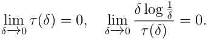

In practice, the threshold function must decrease slower than the modulus of continuity of Brownian motion to ensure convergence in probability. This can be accomplished using a multiple of an estimator for the local spot variance: 

where _cτ_ is a scaling constant and _V_ˆ _t_ can be estimated recursively as in Corsi and Ren`o (2012). To define the _C-Tz_ test we need to use the set of estimators called threshold multipower variation introduced by Corsi et al. (2010), defined as: 

<!-- page: 44 -->

The indicator function _I_ ( _·_ ) corrects the bias in multipower variation caused by consecutive jumps. Additionally, to develop a test for detecting jumps with these estimators, we must adjust for the finite-sample negative bias introduced by _δ_ . This is achieved by defining a class of corrected threshold estimators used to construct the _C-Tz_ statistic. We define the following quantity 

where the function _Zγ_ ( _x, y_ ) is defined as: 

The C-Tz is then defined in the following way 

where C-TBPV _δ_ = C-TMPV[1 _δ__,_1] , and C-TTriPV _δ_ = C-TMPV[4 _δ__/_3_,_4_/_3_,_4_/_3] , for more details, see Corsi et al. (2010). Under these assumptions, if _dJt_ = 0, then _C-Tz_ converges to _N_ (0 _,_ 1) in law as _δ →_ 0. For a significance level _α_ , we assess the daily jump component’s statistical significance by comparing the _C-Tz_ statistic to the standard normal quantile Φ1 _−α_ . If _C-Tz >_ Φ1 _−α_ , we reject the null hypothesis. Using the Threshold Bipower Variation (TBPV _t_ ) for estimating the continuous component of quadratic variation1 , when a jump is detected, we ˆ attribute the difference RV _t −_ TBPV _t_ to the jump component: _Jt_ = IC _−_ Tz _t>_ Φ1 _−α_ (RV _t −_ TBPV _t_ ). Specifically, we set _V_ˆ _t_ = _C_ˆ _t_ = RV _t_ and _J_ˆ _t_ = 0 on days when we do not reject the null hypothesis. If the test rejects the null, we set _C_ˆ _t_ = TBPV _t_ and _J_ˆ _t_ = max(RV _t −_ TBPV _t,_ 0). 

> 1Defined as TBPV _t_ = TMPV _δ_ ( _X_ )[1 _t__,_1]

<!-- page: 45 -->

The _C_ˆ _t_ series is then cleaned by removing extreme observations likely caused by volatility jumps, using a threshold-based jump detection method as outlined by Corsi et al. (2013). Finally, since our volatility estimator is based on returns during the trading period (from market open to close), we rescale it to align with the unconditional mean of squared daily returns (close-to-close), accounting for overnight returns as well. The _C-Tz_ identifies days with at least one jump but does not indicate the number of intraday jumps. To determine the actual number of jumps, we follow the iterative procedure of Andersen et al. (2010), using as outlined before _δ_ = 5 minutes. Upon identifying a day with a jump, we remove the largest 5-minute return and replace it with the day’s average return. We then repeat the _C-Tz_ test on the adjusted series. If the test fails to reject the null hypothesis, we conclude that only one jump occurred. If the null is rejected, we identify another jump and repeat the process until the null hypothesis is no longer rejected, resulting in a series of intraday 5-minute jump returns. This method allows us to non-parametrically recover the time series of daily jump counts, identified by _nt_ , and jump sizes, _cXt,i_ . If the quantity�_n_ _i_ =1_t|cX_ _t,i__|_2 does not match IC _−_ Tz _t>_ Φ1 _−α_ (RV _t −_ TBPV _t_ ), we scale _cXt,i_ to ensure consistency. With the number and size of intraday jumps established, their contribution to the total daily return is easily calculated. The daily jump-adjusted return series is obtained by subtracting�_n_ _i_ =1_tcX_ _t,i_ from the daily returns. A key advantage of the iterative non-parametric method by Andersen et al. (2010) is that both the number of intraday jumps, _nt_ and the size of the jumps, _cXi,t_ , become observable quantities and can be directly used in the estimation of the LHARG-ARJ model parameters via maximum likelihood, for more details refer to Alitab et al. (2020). 

### **The indirect inference estimation technique** 

While volatility analysis is typically conducted in discrete time, the option pricing exercise we discuss is framed in continuous time. This section provides an overview of the indirect inference method developed by Gourieroux et al. (1993) to link continuous-time models with HAR models (see Corsi and Ren`o (2012) for an application to the S&P of this methodology).

<!-- page: 46 -->

Indirect inference is a simulation-based method for estimating the parameters of a structural model, consisting of two stages. First, an auxiliary model is fitted to the observed data. Next, a binding function – either analytical or simulated – maps the structural model parameters to the auxiliary statistic. Indirect inference then calibrates the structural model parameters to minimize the distance between the estimated parameters of the auxiliary models. The structural model we use is from the class of affine multifactor models with jumps that will be presented in the next section. The auxiliary model is the LHAR-CJ and the nested models HAR and LHAR. Denote by _β_ˆ _T_ the parameter vector of the auxiliary model estimated on the data and _θ_ the parameter vector of the structural model. Then, for a given _θ_ , we simulate _S_ simulated replicas of the structural model with a fixed intraday frequency _δ_ . We estimate the series of the realized quantities on this simulated series and then we estimate the auxiliary model on each replica. We denote these estimates by _β_ˆ _T__s_(_θ_), with_s_= 1_, . . . , S_.The structural parameter vector is then estimated by minimizing the following quantity 

where 

where Ω _T_ denote a suitable positive-definite weighting matrix, that can be set as the variancecovariance matrix of the auxiliary model parameters estimated from the data. The implied parameters of the auxiliary models are the average of _β_ˆ _T__s_(ˆ_θST_).Inthisway,thecontinuous- time model estimated captures the stylized facts described by the discrete-time model. Further details on the indirect inference estimator and its asymptotic properties can be found in the Gouri´eroux and Monfort (1997).

<!-- page: 47 -->

<!-- Start of picture text -->
(a) Continuos Realized Volatility <!-- End of picture text -->

<!-- Start of picture text -->
40 = 30 = a] ® 20 10+ UL A nnn uf | __ | A Mg ay — yt J ' ‘ ! !! 1 0 “Y© .YA “y% “y9 <V° <Vy *” *” *” ” *” *” Year (b) Jump Realized Volatility 20 g 15 £ 3‘ 10 s 5 if | 1 PO | i i WAL PS a \ (ah rl | | : nm | ee “Y© “YA “y% .y9 Vv° <Vy *” ” *” *” *” ” Year <!-- End of picture text -->

<!-- page: 48 -->

<!-- Start of picture text -->
Daily Number of Trades 8000 6000 ov no] oO r= + 4000 2000 0 “Y© “YA “Y% sy9) VvSs <v“y *” *” *” *” *” *” Date <!-- End of picture text -->

<!-- page: 49 -->

|Model|AIC|BIC|_R_2 _adj_|
|---|---|---|---|
|**LHAR-CJ-**|1407|1459|0.622|
|LHAR-CJ+|1431|1482|0.610|
|**LHAR-**|1407|1443|0.618|
|LHAR+|1419|1455|0.607|

Table 11: Leverage analysis for LHAR-CJ models. 

as following 

Our estimates, shown in Table (12), indicate that the persistence parameter _β_ is the most significant, while the leverage parameter _γ_ is positive, suggesting a negative leverage effect but with a low _t_ -statistics. Thus, we conclude that the negative leverage component exists in this market, but with a small magnitude. 

|Parameter|Coefcient|Std. Error|_t_-statistics|_p_-Value|
|---|---|---|---|---|
|_ω_|0.877|0.300|2.92|0.003|
|_α_|0.105|0.035|2.94|0.003|
|_γ_|0.090|0.065|1.53|0.097|
|_β_|0.767|0.054|14.01|0.000|

Table 12: GJR-GARCH model estimation results.
