<!-- page: 1 -->

# SPX–VIX Risk Computations Via Perturbed Optimal Transport 

Charlie Che_∗_∗1 , Hanxuan Lin_∗_†2 , Yudong Yang_∗_‡1 , Guofan Hu_∗_§1 , and Lei Fang_∗_¶1 

> 1Quantitative Trading & Research, JPMorganChase, New York, NY 10017, USA 

> 2Quantitative Research China, JPMorganChase, Beijing, 100033, China 

March 20, 2026 

##### **Abstract** 

We propose a model-independent framework for joint SPX–VIX derivatives risk generation using Perturbed Optimal Transport(POT). The calibrated Gibbs coupling induces an exponential family whose Fisher information governs the response to admissible market shocks. Exploiting this structure, we derive linear-response formulas that compute sensitivities for VIX payoffs via a single Fisher-based linear solve, replacing bump-and-recalibrate procedures. To capture VIX smile dynamics, we introduce a linearized Skew Stickiness Ratio (SSR) rule as additional linear constraints within the entropic projection, propagating SPX shocks to VIX implied volatilities in a convex, tractable manner with second-order error control. We also identify a conditional coupling invariance that reduces the perturbed transport on ( _S_ 1 _, V, S_ 2) to an exact two-dimensional projection on ( _S_ 1 _, V_ ), preserving martingality and variance consistency while lowering computational cost. Numerically, both the Fisher-based linear-response and the dimension-reduced method closely match full recalibration for VIX futures and VIX option cross-Greeks, yet are orders of magnitude faster. Hedging backtests show reduced hedged P&L variance versus a stochastic local-volatility benchmark, especially in volatile regimes. These results establish POT, coupled with linear response and SSR constraints, as a practical, efficient framework for SPX–VIX risk propagation and hedging. 

## **1 Introduction** 

Joint modeling of SPX and VIX derivatives has become a central problem in equity volatility markets. While SPX options encode the distribution of future equity prices, VIX options are derivative contracts written on VIX, the square root of forward variance. Consistency between these two markets is therefore essential for both pricing and risk management of the SPX/VIX derivative family. 

Traditional approaches to the joint SPX–VIX modeling problem rely on parametric stochastic volatility models such as the Heston model, stochastic volatility with jumps, Bergomi model, or rough volatility frameworks Heston (1993); Gatheral (2006); Bergomi (2016); Bayer and Friz (2022). Although these models provide tractable simulation dynamics, they impose structural assumptions on volatility dynamics that are not directly implied by the observed option surfaces. 

An alternative model-free approach was proposed by Guyon in Guyon (2020, 2021), who formulated the joint SPX–VIX calibration problem as a martingale optimal transport (MOT) problem. In this framework the calibrated coupling between equity levels and forward variance is obtained by solving a discrete entropic optimal transport problem using Sinkhorn iterations Cuturi (2013); Benamou et al. (2015). The resulting 

> ∗charlie.che@jpmchase.com 

> †hanxuan.lin@jpmchase.com 

> ‡yudong.yang@jpmchase.com 

> §guofan.hu@jpmchase.com 

> ¶lei.x.fang@jpmchase.com

<!-- page: 2 -->

Gibbs distribution exactly reproduces the observed SPX and VIX option prices while remaining free of parametric volatility assumptions. 

While entropic martingale optimal transport provides an exact joint calibration of SPX and VIX smiles, calibration alone does not yield a practical risk framework. In existing implementations, sensitivities are typically obtained by re-running the full calibration after each market perturbation. This bump-and-recalibrate approach is both computationally expensive and obscures the structural relationship between market shocks and model-implied risk. 

The central observation of this paper is that entropic martingale optimal transport naturally defines a statistical manifold whose local geometry determines how the calibrated coupling reacts to marginal perturbations. Because the optimal coupling belongs to an exponential family, its response to marginal shocks can be characterized by the Fisher information matrix of the calibrated Gibbs distribution. 

This perspective leads to a new framework, which we term _Perturbed Optimal Transport(POT)_ , for risk generation without recalibration. Within this POT framework, we propose two distinct yet complementary methodologies: one leveraging the local geometry of the calibrated coupling via a Linear Response (LR) system derived from the Fisher information matrix, and another utilizing Dimensional Reduction (DR) to efficiently re-solve a simpler transport problem under specific conditional invariance assumptions. 

Beyond providing analytic risk formulas, the POT framework also enables incorporating empirical volatility dynamics into the optimal transport formulation. In particular, we embed Skew Stickiness Ratio (SSR) dynamics for the VIX volatility surface as linear constraints in the entropic projection problem. This allows the transport framework to incorporate empirically observed volatility smile dynamics without introducing parametric stochastic volatility models. 

Taken together, these results establish Perturbed Optimal Transport (POT) not only as a powerful calibration tool but as a unified framework for joint calibration and risk propagation in SPX–VIX markets, offering efficient risk generation through both Linear Response and Dimensional Reduction techniques. 

### **1.1 Related Literature** 

This work relates to three strands of literature. 

#### **SPX–VIX joint modeling.** 

Joint modeling of SPX and VIX derivatives has traditionally relied on stochastic volatility frameworks such as the Heston model and its extensions Heston (1993); Gatheral (2006); Bergomi (2016). These models impose specific assumptions on volatility dynamics and require calibration of multiple parameters to match the observed option surfaces. 

#### **Optimal transport in finance.** 

Martingale optimal transport has emerged as a powerful model-free approach to derivative pricing and calibration Beiglb¨ock et al. (2013); Henry-Labord`ere (2017). Guyon (2020, 2021) introduced an entropic optimal transport formulation for the joint calibration of SPX and VIX smiles, which can be solved efficiently using Sinkhorn iterations. 

#### **Computational optimal transport and entropy regularization.** 

Entropy-regularized transport problems have become widely used in machine learning and computational optimal transport due to their favorable numerical properties Cuturi (2013); Benamou et al. (2015); Peyr´e and Cuturi (2019). These formulations lead to Gibbs distributions whose structure enables efficient iterative algorithms. 

Our contribution extends this literature by showing that entropic MOT calibration naturally induces a perturbation theory that can be used to generate risk sensitivities without recomputing the transport solution. 

### **1.2 Main Contributions** 

The contributions of this paper are fivefold.

<!-- page: 3 -->

1. **The Linear Response (LR) System For Perturbed Optimal Transport In SPX–VIX Markets.** 

We develop a perturbation framework for discrete entropic optimal transport under both marginal and financial constraints. Using the implicit function theorem applied to the dual formulation, we show that the calibrated Gibbs coupling depends smoothly on admissible market perturbations. This yields explicit linear-response formulas for sensitivities of arbitrary payoffs, governed by the Fisher information matrix of the calibrated exponential family. 

2. **Linearized Skew Stickiness Ratio dynamics for VIX options.** 

We introduce a linearization of Skew Stickiness Ratio (SSR) dynamics for VIX implied volatility surfaces and incorporate it as linear constraints within the optimal transport perturbation framework. This formulation provides a model-independent mechanism for propagating SPX perturbations to the VIX volatility smile while preserving convexity and tractability of the entropic projection problem. The SSR linearization is compatible with both the perturbation-based linear-response risk engine and the dimension-reduced transport framework developed later in the paper. 

3. **Dimensional reduction (DR) Within The Perturbed Optimal Transport Framework.** 

We identify a conditional coupling invariance structure under which the perturbed three-dimensional transport problem on ( _S_ 1 _, V, S_ 2) reduces to a two-dimensional entropic projection on ( _S_ 1 _, V_ ). Under this structure the conditional kernel of _S_ 2 given ( _S_ 1 _, V_ ) remains fixed, so martingality and varianceconsistency constraints are automatically preserved. This reduction dramatically lowers the computational complexity of risk generation while maintaining financial consistency of the model. 

4. **Numerical validation of perturbation risk against full recalibration.** 

We perform numerical experiments comparing risk sensitivities computed using the perturbation-based linear response system(LR) with those obtained from full recalibration of the SPX–VIX martingale optimal transport model. Across VIX futures and VIX option cross-greeks, the perturbation-based sensitivities closely match those obtained from recalibration while requiring substantially less computation. These results validate the perturbation framework as an accurate and efficient risk-generation method. 

5. **Hedging backtests demonstrating practical effectiveness.** 

We further evaluate the framework in a hedging backtest on randomized VIX option portfolios. Using SPX sensitivities generated by the dimension-reduced optimal transport method(DR), we construct dynamic hedges and compare their performance with hedges produced by a benchmark stochastic volatility model. The transport-based hedges consistently achieve lower hedged P&L variance, particularly during volatile market regimes, demonstrating the practical value of the proposed risk-generation framework. 

These contributions show that Perturbed Optimal Transport(POT) serves as a powerful, unified framework for SPX–VIX joint calibration, risk generation (via LR and DR), and hedging. 

### **1.3 Market Consistency And Risk Propagation** 

In equity volatility markets the SPX and VIX option surfaces are linked through the forward variance identity 

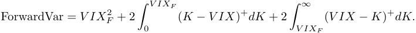

This relation implies that changes in SPX option prices propagate to the VIX future level through the forward variance term structure. Differentiating the forward variance identity with respect to SPX implied volatility parameters (for example, a parallel shift of a volatility slice) yields

<!-- page: 4 -->

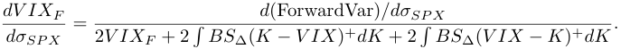

In traditional stochastic volatility models the sensitivities of exotic derivatives are obtained by applying the chain rule 

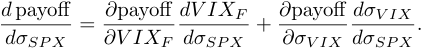

Capturing these cross-asset sensitivities consistently is one of the central motivations for building a joint SPX–VIX model. In parametric models these sensitivities depend heavily on the assumed volatility dynamics. More fundamentally, parametric stochastic volatility and stochastic local volatility models cannot simultaneously recover both the SPX and VIX marginals observed in the market. As a result, practitioners often decouple the modeling of SPX vanillas, forward variance, and VIX futures from the modeling of VIX options. In practice the latter is frequently handled using Black’s formula applied directly to VIX futures, reflecting the high liquidity of the VIX option market. But such decoupling results in the _dσ__<u>dσ</u>_ _S__<u>V IX</u>_ _P X_notbeing captured at all. 

In contrast, the optimal transport approach provides a model-free calibration of the joint distribution. The perturbation framework developed in this paper shows that the same transport structure can be used to generate the corresponding risk sensitivities directly from the calibrated coupling. Guyon’s celebrated work in Guyon (2020, 2021) has demonstrated that the OT approach gives perfect statics in that the joint calibration between SPX and VIX is perfect by construction. Our work can be seen as a decisive step forward to demonstrate even the SPX–VIX volatility dynamics can be captured accurately at no additional computational cost. 

### **1.4 Martingality And Consistency Conditions** 

In the joint SPX–VIX calibration framework, two structural conditions must hold for the calibrated coupling to be financially meaningful. These conditions were emphasized in the joint calibration framework of Guyon (2020, 2021). 

**Martingality condition** Let _S_ 1 denote the SPX level at time _T_ 1 and _S_ 2 the SPX level at a later maturity _T_ 2. 

Under the risk-neutral measure, the discounted asset price must be a martingale. Ignoring discounting for notational simplicity, the martingale condition reads 

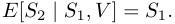

Equivalently, for the calibrated coupling _µ_ on ( _S_ 1 _, V, S_ 2), 

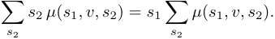

This condition ensures that the SPX dynamics implied by the calibrated distribution are arbitrage-free. 

**SPX–VIX consistency condition** The VIX index represents the square root of the risk-neutral expectation of future variance. In the discrete MOT framework this implies the conditional identity 

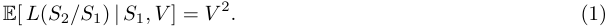

where _L_ := _− τ_<u>2</u>ln(_x_)_,τ_=_T_2_−T_1=30.ThisistheformusedinGuyon(2020,2021).Itenforcesthe forward-variance relation pointwise on the ( _S_ 1 _, V_ ) grid and ensures structural consistency between the SPX smile and the VIX future level. The scalar identity 

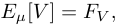

<!-- page: 5 -->

follows from this conditional relation but is strictly weaker and is not sufficient to define a consistent SPX–VIX joint distribution. 

**Practical considerations** In real market data the SPX and VIX option surfaces are not perfectly consistent with this theoretical identity. As observed in Guyon (2020, 2021), calibration frameworks typically relax the consistency condition by allowing a basis between the SPX implied forward variance and the traded VIX future. 

In the experiments reported in Section 9.2, we therefore compute diagnostic plots for both the martingality condition and the SPX–VIX consistency condition in order to assess the quality of the calibrated coupling. 

## **2 Mathematical Framework For Entropic Projections** 

### **2.1 Finite Discrete Setup** 

Let 

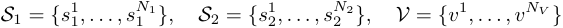

be finite state spaces. Denote 

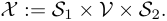

Let _µ_ ¯ be a strictly positive prior probability on _X_ : 

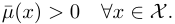

Let prescribed marginals: 

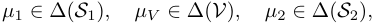

where ∆( _·_ ) denotes the probability simplex. Define admissible set: 

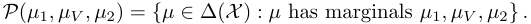

### **2.2 Entropic Optimal Transport** 

We consider the entropic projection problem: 

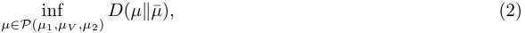

where relative entropy is 

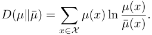

_Theorem_ 2.1 (Existence and Uniqueness) _._ Assume _µ_ ¯( _x_ ) _>_ 0 for all _x_ . If _P_ ( _µ_ 1 _, µV , µ_ 2) is nonempty, then problem (2) admits a unique minimizer _µ__⋆_ . 

_Proof._ Since _X_ is finite, ∆( _X_ ) is compact and convex. 

Relative entropy is strictly convex in _µ_ on the interior of the simplex because the function _x �→ x_ log _x_ is strictly convex. 

The feasible set _P_ ( _µ_ 1 _, µV , µ_ 2) is an affine slice of the simplex, hence convex and compact. 

Strict convexity of _D_ ( _·∥µ_ ¯) on a convex compact set implies existence and uniqueness of the minimizer.

<!-- page: 6 -->

cy 

1

<!-- page: 7 -->

**Log-partition function.** For dual potentials ( _u_ 1 _, uV , u_ 2) define the log-partition function 

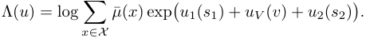

This function is the cumulant generating function of the exponential family defined by the Gibbs coupling. Under the gauge fixing above, the potentials can be parameterized by the reduced vector _ω_ , and we write Λ( _ω_ ) for the same log-partition function expressed in these reduced coordinates. Let 

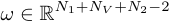

denote the vector of gauge–fixed dual parameters obtained by removing the two redundant degrees of freedom. On this reduced parameter space the Hessian of the dual objective 

_H_ = _∇_2 _ω_Λ(_ω_) 

coincides with the Fisher information matrix of the calibrated exponential family. The gauge fixing ensures that _H_ is strictly positive definite on the reduced parameter space. 

This property guarantees the invertibility of the Fisher system used later for risk computation. 

## **3 Perturbation Theory: General Marginal Shocks** 

### **3.1 Admissible Perturbations** 

Let the base marginals be ( _µ_ 1 _, µV , µ_ 2) and denote the unique entropic MOT optimizer by _µ__⋆_ . A _directional perturbation_ of the marginals is a triple 

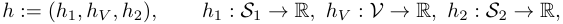

satisfying the mass-preserving constraints 

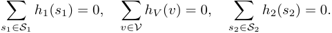

For _ε_ sufficiently small, define perturbed marginals 

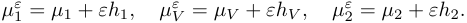

We assume _ε_ is chosen so that _µ__ε_ 1_, µε_ _V__, µ_ 2_ε_remainstrictlypositiveontheirsupports(tostayintheinteriorof the simplices). 

Define the perturbed feasible set 

and the perturbed entropic MOT problem 

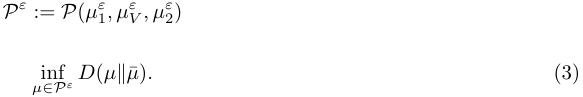

Denote its unique optimizer by _µ__ε_ . 

_Theorem_ 3.1 (Well-posedness of Entropic Projections) _._ Let _A_ be a linear operator representing a set of _K_ independent linear constraints. Let _P_ = _{µ ∈_ R_n_ +:_Aµ_=_b}_.Suppose the base problem (2.2) is feasible with a strictly positive solution _µ__⋆_ . Then for any perturbation _δb_ in the image of _A_ , there exists _ϵ_ 0 _>_ 0 such that for all _|ϵ| < ϵ_ 0, the perturbed problem with constraints _b_ + _ϵδb_ has a unique minimizer _µ__ϵ_ . 

_Proof._ Since _µ__⋆_ _>_ 0, it lies in the relative interior of the simplex. The map _F_ : _µ �→Aµ_ is a linear surjection onto its image. By the Open Mapping Theorem, for a sufficiently small neighborhood _U_ of _µ__⋆_ , _F_ ( _U_ ) contains a neighborhood of _b_ . Thus, for small _ϵ_ , the feasible set is non-empty. The strict convexity of the relative entropy ensures uniqueness.

<!-- page: 8 -->

### **3.2 Dual variables And Sinkhorn Scaling Form** 

The dual representation (Theorem 2.2) implies there exist optimal potentials 

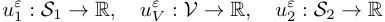

such that 

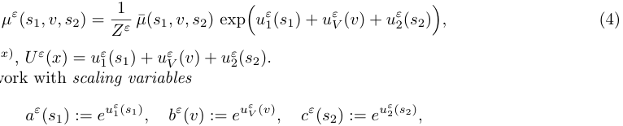

with _Z__ε_ =� _x__µ_¯(_x_)_eU ε_(_x_),_U ε_(_x_) =_uε_ 1(_s_1) +_uε_ _V_(_v_) +_u_ 2_ε_(_s_2). It is convenient to work with _scaling variables_ 

so that (absorbing _Z__ε_ into one of the scalings if desired) 

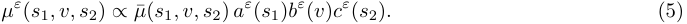

**Gauge invariance.** Potentials are not unique: adding constants _κ_ 1 _, κV , κ_ 2 with _κ_ 1 + _κV_ + _κ_ 2 = 0 leaves _µ__ε_ unchanged. We fix a gauge, e.g. 

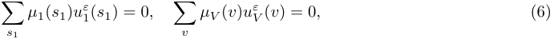

which pins down uniqueness of ( _u__ε_ 1_, uε_ _V__, u_ 2_ε_)locally. 

### **3.3 Differentiability Of The Entropic Projection** 

We now prove that the optimizer ( _µ__ε_ _, u__ε_ ) depends smoothly on _ε_ , and derive explicit first-order formulas. Define the constraint maps (marginals) for any _µ ∈_ ∆( _X_ ): 

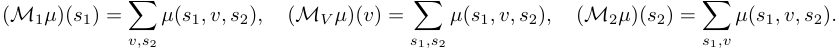

Stack them as _Mµ_ = ( _M_ 1 _µ, MV µ, M_ 2 _µ_ ). 

Let _u_ = ( _u_ 1 _, uV , u_ 2) and define the log-partition function 

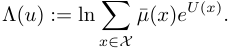

Then the dual objective for marginals ( _ν_ 1 _, νV , ν_ 2) is 

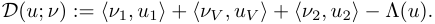

_Lemma_ 3.2 (Strict concavity and smoothness of the dual) _._ Λ( _u_ ) is _C__∞_ and strictly convex on R_N_1+_NV_+_N_2 (modulo gauge). Hence _D_ ( _u_ ; _ν_ ) is strictly concave (modulo gauge), and admits a unique maximizer under gauge fixing. 

_Proof._ Since _µ_ ¯( _x_ ) _>_ 0 and _X_ is finite, Λ is the log-sum-exp of affine functions, hence _C__∞_ . Its Hessian is the covariance matrix of the sufficient statistics under the Gibbs measure proportional to _µe_ ¯_U_ , which is positive semidefinite and positive definite on the quotient space after fixing gauge (standard exponential family theory). 

_Theorem_ 3.3 (Differentiability of optimal potentials and coupling) _._ Fix a gauge as in (6) and assume base marginals are strictly positive. Then there exists _ε_ 0 _>_ 0 such that on ( _−ε_ 0 _, ε_ 0):

<!-- page: 9 -->

1. _ε �→ u__ε_ is _C_1 , 

2. _ε �→ µ__ε_ is _C_1 entrywise, 

3. derivatives solve a linear system explicitly characterized by the Fisher information matrix (dual Hessian). 

_Proof._ The first-order optimality condition for the dual reads 

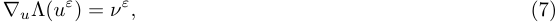

where _ν__ε_ denotes the stacked perturbed marginals ( _µ__ε_ 1_, µε_ _V__, µ_ 2_ε_)embeddedinR_N_1+_NV_+_N_2. Under gauge fixing, Lemma 3.2 implies _∇u_ Λ is _C__∞_ with Jacobian _H__ε_ := _∇_2 _u_Λ(_uε_)invertibleonthe gauge-fixed subspace. Thus, by the implicit function theorem applied to 

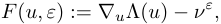

there exists a unique _C_1 map _ε �→ u__ε_ locally satisfying (7). Differentiating (7) gives 

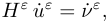

- where dots denote _d/dε_ and _ν_ ˙_ε_ = ( _h_ 1 _, hV , h_ 2) is constant. Hence _u_ ˙_ε_ = ( _H__ε_ )_−_1 _ν_ ˙_ε_ on the gauge-fixed subspace. Finally, _µ__ε_ is given by the smooth Gibbs map (4), so entrywise differentiability follows by chain rule. 

### **3.4 Risk Representation: Gateaux Derivative Of Expectations** 

Let _G_ : _X →_ R be any payoff (bounded is automatic since _X_ finite). Define the model price under calibration _µ__ε_ by 

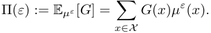

_Theorem_ 3.4 (General risk representation) _._ Let _G_ : _X →_ R be any payoff and let 

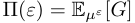

denote its price under the perturbed entropic projection. Under the assumptions of Theorem 3.3, the map _ε �→_ Π( _ε_ ) is _C_1 and its first–order variation is 

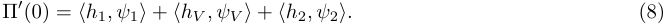

The vector _ψ_ = ( _ψ_ 1 _, ψV , ψ_ 2) is the _influence function_ of the payoff _G_ and is given by 

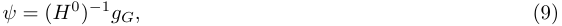

where _H_0 = _∇_2 _u_Λ(_u_0)istheFisherinformationmatrixofthecalibratedexponentialfamily,and_gG_isthe covariance vector 

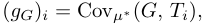

with _{Ti}_ denoting the sufficient statistics associated with the dual potentials _u_ = ( _u_ 1 _, uV , u_ 2). Thus, to first order, perturbations of the marginals propagate through the inverse Fisher information and the covariance of _G_ with the sufficient statistics. 

_Proof._ Since _µ__ε_ is _C_1 in _ε_ by Theorem 3.3 and _X_ is finite, the price 

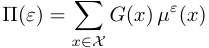

<!-- page: 10 -->

is _C_1 and 

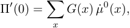

where _µ_ ˙0 denotes _dεd__µε_�� _ε_ =0. From the Gibbs representation, 

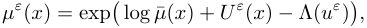

with 

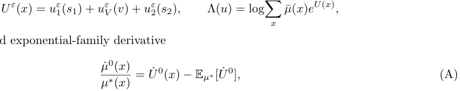

we obtain the standard exponential-family derivative 

where _µ__∗_ = _µ_0 . 

Since _U__ε_ is linear in the potentials, 

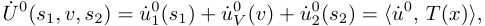

where _T_ ( _x_ ) is the vector of sufficient statistics (indicator functions of _s_ 1, _v_ , _s_ 2). Substituting (A) into Π_′_ (0) gives 

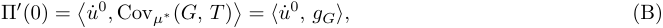

where _gG_ is the covariance vector 

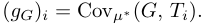

To identify _u_ ˙0 , differentiate the dual KKT condition 

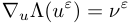

at _ε_ = 0. Since _∇_2 _u_Λ(_u_0) =_H_0istheFisherinformationmatrix,weobtainthelinearsystem 

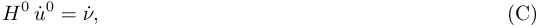

where _ν_ ˙ is the perturbation of the marginal constraints, i.e. _ν_ ˙ = ( _h_ 1 _, hV , h_ 2) in the gauge-fixed coordinates. Solving (C) yields 

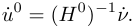

Finally, substituting this expression for _u_ ˙0 into (B) gives 

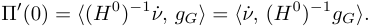

Define the influence function 

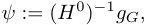

so that 

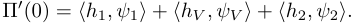

This completes the proof. 

_Remark_ (Practitioner interpretation) _._ Equation (8) states: to first order, the price sensitivity of any payoff _G_ under marginal shocks is obtained by pairing the marginal shock directions with a set of influence functions computed from the calibrated Gibbs coupling. This converts “bump-and-revalue” into a mathematically controlled linear response.

<!-- page: 11 -->

### **3.5 Second-Order Sensitivity Expansion** 

The linear response formula derived in Theorem 3.4 characterizes the first-order sensitivity of model prices under marginal perturbations. We now establish a second-order expansion that quantifies the approximation error of the linear risk formula. 

_Theorem_ 3.5 (Second-Order Risk Expansion) _._ Assume the conditions of Theorem 3.3. Let _G_ : _X →_ R be any payoff and consider perturbed marginals _νϵ_ = _ν_ + _ϵh_ . 

Then the price function 

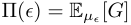

admits the expansion 

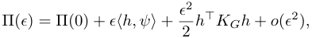

where _KG_ is a symmetric matrix depending on the third-order derivatives of the log-partition function Λ( _u_ ). 

Moreover, there exists a constant _C_ such that 

_Proof._ Since the dual potentials _uϵ_ are _C_2 functions of _ϵ_ by the implicit function theorem and smoothness of Λ( _u_ ), the coupling _µϵ_ is twice differentiable in _ϵ_ . 

Applying a second-order Taylor expansion to 

yields the stated expansion. The quadratic term arises from the second derivative of the dual potentials and the third-order cumulants of the exponential family distribution defined by the Gibbs coupling. Boundedness follows from smoothness of Λ and compactness of the simplex. 

### **3.6 Stability Bounds** 

_Proposition_ 3.6 (Lipschitz stability of potentials and couplings) _._ Under the assumptions of Theorem 3.3, there exists _C >_ 0 such that for all sufficiently small _ε_ : 

˙ ˙ _Proof._ From the implicit function theorem, _u__ε_ = ( _H__ε_ )_−_1 _ν_ and _H__ε_ varies continuously in _ε_ . On a compact neighborhood, the operator norm of ( _H__ε_ )_−_1 is bounded by some _C_ . Integrate _u_ ˙_ε_ over _ε_ to get the first bound. The second bound follows from smoothness of the Gibbs map _µ__ε_ = _G_ ( _u__ε_ ) and bounded Jacobian on the same neighborhood. 

### **3.7 Information-Geometric Interpretation** 

The perturbation theory derived above admits a natural interpretation in terms of information geometry. The calibrated coupling 

defines an exponential family distribution with sufficient statistics given by the marginal indicator functions. 

The Hessian of the log-partition function 

<!-- page: 12 -->

coincides with the Fisher information matrix of this exponential family. Consequently, the linear response system 

can be interpreted geometrically as projecting marginal perturbations onto the tangent space of the exponential family manifold. 

The risk representation 

therefore corresponds to a natural Riemannian metric induced by the Fisher information. In this view, sensitivities arise from the dual affine connections of the exponential family manifold Amari (2016); Peyr´e and Cuturi (2019). 

This geometric interpretation highlights that the entropic MOT calibration defines not only a transport plan but also an intrinsic statistical manifold whose local curvature governs the propagation of market shocks. 

**Economic interpretation.** The perturbation framework can be interpreted as solving a nearby optimal transport problem whose prior is the calibrated coupling _µ__⋆_ . A marginal perturbation corresponds to a change in market forwards or option prices. The entropic projection identifies the closest joint distribution consistent with the new market information. 

This perspective shows that the risk sensitivities derived in this paper are not tied to any specific stochastic volatility model. Instead they arise from the geometry of the calibrated transport plan. In this sense the risk generation mechanism is largely model independent. 

## **4 Martingality And Variance Consistency As Linear Constraints** 

Sections 2 and 3 developed the perturbation theory for the general entropic projection problem with marginal constraints only. In the SPX–VIX joint calibration problem, however, the admissible set must also satisfy the fundamental no–arbitrage relations linking the SPX dynamics and the VIX definition. 

Accordingly, the feasible set of couplings is obtained by intersecting the marginal constraint set with additional linear constraints enforcing martingality of the SPX process and consistency between the VIX level and the forward variance implied by the SPX distribution. 

Let _A_ marg denote the operator imposing the marginal constraints and let _A_ fin denote the operator encoding the financial constraints described below. The admissible set therefore takes the form 

This formulation preserves the convex structure of the entropic projection problem because both sets of constraints remain linear in _µ_ . The perturbation analysis of Section 3 therefore continues to apply once the perturbations are restricted to the tangent subspace compatible with these financial constraints. 

### **4.1 Definition Of Financial Constraints** 

The financial constraints appearing in the admissible set above are now specified explicitly. They enforce the martingale property of the SPX process and the consistency relation linking the VIX level to the forward variance implied by the SPX distribution. Both constraints are linear in the coupling _µ_ and therefore define components of the operator _A_ fin. 

We define the Martingale and Variance Consistency constraints as follows:

<!-- page: 13 -->

- **Martingale Constraint:** For every grid point ( _s_ 1 _,i, vj_ ), the conditional expectation of the terminal spot must equal the forward: 

- **Variance Consistency:** The VIX index must represent the fair strike of a log-contract on _S_ 2: 

### **4.2 The Tangent Subspace Of Risk** 

Under this framework, the total constraint operator _A_ is the concatenation of the marginal constraints _Amarg_ and the financial constraints _A_ fin, i.e. 

When we compute risk (Greeks), we are interested in perturbations _δb_ of the marginals. However, to maintain market consistency, the resulting shift in the measure _δµ_ must satisfy the linearized system: 

This implies that the risk sensitivities are gradients of the Dual Objective restricted to the _tangent subspace_ defined by the kernel of _A_ fin. 

_Remark._ The well-posedness argued in Section 3 ensures that as long as the market data _ν_ allows for the existence of _any_ martingale measure (a standard assumption in no-arbitrage theory), our entropic projection will smoothly track the market changes. 

## **5 Financial Perturbations: Spot And Volatility Bumps** 

### **5.1 SPX Spot Perturbation** 

Let the SPX grid at time _T_ 1 be _S_ 1 = _{s__i_ 1_}_.Aspotbumpcorrespondstoshiftingtheforwardlevel: 

In a discrete marginal representation, this induces a redistribution of mass via interpolation on the grid. Formally, define the perturbed marginal 

interpreted via linear interpolation. 

_Proposition_ 5.1 (Admissibility of small spot perturbations) _._ For sufficiently small _δ_ , the perturbed marginal _µ__δ_ 1isstrictlypositiveandsatisfies 

Moreover, the directional derivative 

satisfies� _i__h_1(_s_ 1_i_) = 0. 

_Proof._ Mass preservation follows from change-of-variable invariance. Differentiating under interpolation preserves zero total mass. 

Hence spot bump induces admissible perturbation in the sense of Section 4.

<!-- page: 14 -->

### **5.2 SPX Implied Volatility Surface Perturbation** 

Consider a parallel implied volatility bump: 

Through option pricing, this modifies call prices _C_ ( _K_ ). Using Breeden-Litzenberger inversion, the marginal density changes: 

_Proposition_ 5.2 (Admissibility of small volatility perturbations) _._ For sufficiently small _δ_ , the perturbed marginal _µ__δ_ 1remainsstrictlypositiveanddefinesavalidprobabilitydistribution. 

_Proof._ Black-Scholes prices are smooth in _σ_ . For sufficiently small perturbations, convexity in strike is preserved, ensuring nonnegative density. Mass preservation follows from boundary behavior. 

Thus volatility bumps define admissible _h_ 1 directions. 

## **6 SSR Dynamics For VIX And Its Linearization** 

### **6.1 Skew Stickiness Ratio: Bergomi’s Definition And Extension To VIX** 

We now give a formal definition of the Skew Stickiness Ratio (SSR) following Bergomi (2016, 2009). Let _σ_ ( _K, F_ ) denote the implied volatility of an option with strike _K_ and forward level _F_ of the underlying asset. Bergomi models smile dynamics by expressing first–order reactions of the volatility surface to changes in the forward. 

#### **6.1.1 Bergomi’s Definition of Skew Stickiness Ratio** 

Consider the ATM implied volatility 

and the ATM skew 

Bergomi introduces a dimensionless parameter SSR through the decomposition 

Thus a perturbation _δF_ in the forward produces the leading–order smile shift 

The limiting cases correspond to standard practitioner regimes: 

- SSR = 1: Sticky strike (vol surface fixed in strike space), 

- SSR = 0: Sticky delta, 

- SSR _>_ 1: Super skew.

<!-- page: 15 -->

**6.1.2 Extension to VIX Futures And VIX Options** Let _FV_ denote the VIX future level and let _σV_ ( _K, FV_ ) denote the VIX option implied volatility. Define the VIX skew 

By analogy with Bergomi’s equity SSR, we define the VIX Skew Stickiness Ratio SSR _V_ via 

Thus the volatility shift induced by a perturbation _δFV_ in the VIX future is 

**6.2 Linear SSR Approximation And Second–Order Accuracy** We now derive the linear Skew Stickiness Ratio (SSR) approximation used in the perturbed optimal transport framework, and quantify its accuracy in a single, self–contained result. 

Let _FV_ denote the VIX future and _σV_ ( _K, FV_ ) the VIX implied volatility. Following Bergomi Bergomi (2009), the VIX Skew Stickiness Ratio is defined by 

where 

We now formalize the linearization implicit in (18), and simultaneously provide a quantitative error bound. 

_Theorem_ 6.1 (Unified linear SSR expansion with second–order error) _._ Assume _σV_ ( _K, FV_ ) is _C_2 in the forward variable _FV_ in a neighborhood of the base level _FV_ . Let _FV__′_=_FV_+_δ_.Thentheimpliedvolatilitysatisfies the expansion 

_σV_ ( _K, FV__′_) =_σV_(_K, FV_)_−_SSR_V·_Skew_V_(_FV_)_δ_+_RK_(_δ_)_,_ (19) 

where the remainder satisfies the deterministic bound 

In particular, the linear SSR approximation 

is accurate to first order, with an _O_ ( _δ_2 ) error uniformly controlled by (20). 

_Proof._ Apply Taylor’s theorem to _σV_ ( _K, FV__′_)inthevariable_FV_: 

for some _ξ_ between _FV_ and _FV_ + _δ_ . Using the SSR identity 

yields the expression (19), and the bound (20) follows by taking the supremum of the second derivative over the interval.

<!-- page: 16 -->

**Interpretation.** The first–order term in (19) gives the SSR–based linear smile reaction used in the perturbed optimal transport constraints. The explicit _O_ ( _δ_2 ) bound in (20) quantifies the approximation error and shows that the SSR mapping is highly accurate for the small forward perturbations relevant for risk generation. 

### **6.3 Why VIX Dynamics Must Be Introduced** 

The entropic martingale optimal transport calibration determines a joint distribution of ( _S_ 1 _, V, S_ 2) that is fully consistent with observed SPX and VIX option prices. However, the resulting calibrated coupling is inherently a _static object_ . In particular, the transport formulation itself does not impose any dynamic rule governing how the VIX smile evolves under perturbations of the SPX surface. 

In contrast, risk management in volatility markets requires a specification of how both the VIX future level and the VIX implied volatility smile react to changes in the SPX surface. In traditional stochastic volatility models this dynamic behavior is encoded through the joint dynamics of the spot and variance processes. For example, perturbations of the SPX volatility surface affect both the forward variance level and the volatility-of-volatility parameters, which in turn determine the evolution of VIX option prices. 

Within the optimal transport framework, however, the calibration produces only a joint distribution consistent with option prices and martingale constraints. As a consequence, the response of the VIX smile to SPX perturbations is not determined by the model itself. To generate realistic risk sensitivities it is therefore necessary to introduce an empirical rule describing how VIX implied volatility moves when the underlying market changes. 

In equity volatility markets an analogous phenomenon occurs for SPX options, where practitioners often model the movement of the implied volatility smile using the Skew Stickiness Ratio (SSR). The SSR describes how the skew of the volatility smile shifts relative to movements of the underlying spot. Empirical studies suggest that similar behavior is present in VIX options: changes in the VIX future level are typically accompanied by systematic changes in the slope and level of the VIX volatility smile. 

Motivated by this empirical observation, we incorporate VIX Skew Stickiness Ratio dynamics into the perturbed optimal transport problem. The idea is to treat the SSR relation as an exogenous constraint that governs how the VIX smile adjusts when the SPX surface is perturbed. In practice, a perturbation of the SPX surface modifies the SPX marginal distributions, which induces a change in the VIX forward level through the forward variance relationship. The SSR rule then determines how the VIX implied volatility levels adjust in response to this shift. 

By embedding these SSR constraints into the entropic projection, the perturbed optimal transport problem simultaneously enforces consistency with the SPX surface, the VIX future level, and the empirically observed VIX smile dynamics. This provides a natural mechanism for generating realistic SPX–VIX risk sensitivities within the optimal transport framework. 

### **6.4 Empirical Evidence For VIX Skew Stickiness Ratio** 

Skew Stickiness Ratio (SSR) is widely used by practitioners to describe how the VIX volatility smile responds to changes in the underlying SPX level. 

To estimate SSR empirically we regress daily changes in VIX implied volatility against changes in the VIX future level across different maturities. Figures 1 illustrate the estimated SSR term structure using historical windows of six months and one year.

<!-- page: 17 -->

<!-- Start of picture text -->
6m 18 1.6 . 1s4 12 « 0.6 o <!-- End of picture text -->

<!-- Start of picture text -->
2y 13 1.25 1.2 . ° — ° S 1.15 11 1.05 . <!-- End of picture text -->

<!-- Start of picture text -->
ly 1.35 ° 13 °1.25 ° 12 1.15 . 1.05 <!-- End of picture text -->

<!-- Start of picture text -->
3y 1.25 - 1.151.2 - o e ° 2 11 1.05 - <!-- End of picture text -->

<!-- page: 18 -->

where the perturbation term _b_˙ _K_ is determined by the SSR relation above. 

Consequently the SSR dynamics enter the linear response system derived in Section 3 through an augmented perturbation vector 

The resulting sensitivity formula 

remains valid with the augmented constraint vector. 

## **7 Algorithm For SPX–VIX Risk Without Recalibration** 

### **7.1 Base Calibration** 

We first compute a base joint coupling between the SPX state _S_ 1, the VIX variable _V_ , and the future SPX state _S_ 2. The goal of this calibration step is to construct a probability measure 

that matches the prescribed SPX and VIX marginals while simultaneously enforcing the key financial consistency conditions linking SPX and VIX dynamics. 

Specifically, the calibrated coupling must satisfy: 

- the marginal constraints 

corresponding to the SPX spot, VIX, and future SPX marginals implied by market prices; 

- the martingale condition 

- the SPX–VIX variance consistency condition 

which links the VIX level to the expected forward variance of the SPX. 

Numerically, we solve this constrained calibration problem using a nested scheme. An outer Sinkhorn iteration enforces the marginal constraints via multiplicative scaling factors, while an inner Newton (or damped Newton) correction enforces the conditional martingale and variance-consistency conditions at each ( _S_ 1 _, V_ ) node. 

This structure closely follows the constrained calibration framework introduced in the SPX–VIX joint calibration methodology of Guyon (2020), where optimal transport techniques are combined with financial consistency constraints to produce arbitrage-consistent joint distributions. 

The resulting calibrated coupling _µ__⋆_ serves as the base distribution for the subsequent perturbation and risk-generation procedures described in the following sections. 

**Algorithm 1: Base Calibration Via Sinkhorn With Newton/LM Enforcement** 

1. **Inputs.** Discrete grids _S_ 1 _, V, S_ 2; target marginals _µ_ 1 _, µV , µ_ 2; prior _µ_ ¯( _s_ 1 _, v, s_ 2); log-return functional _L_ ( _·_ ); marginal tolerance _ε_ marg; financial tolerance _ε_ fin; Newton damping _λ ≥_ 0.

<!-- page: 19 -->

~~oe oeCS~~ 

~~— »~~ ) ( ) ( lone YS )( ) 

~~ae~~

<!-- page: 20 -->

### **7.2 POT Risk Computation: The Linear Response(LR) Approach** 

We compute first–order (Gateaux) price sensitivities under small marginal or constraint perturbations using the Fisher information matrix from the calibrated exponential family. Let _µ__⋆_ denote the calibrated coupling and _H_ the Fisher matrix; let _h_ be the stacked perturbation vector of marginal and constraint shocks. The perturbation vector _h_ introduced above represents the first-order change in the calibration constraints. As discussed in Section 6.5, the constraint system is augmented to incorporate the SSR dynamics as additional linear relations linking SPX and VIX perturbations. Consequently, the perturbation vector _h_ is not arbitrary but belongs to the augmented constraint space defined in Section 6.5. 

In addition, the calibrated coupling _µ__⋆_ satisfies the financial consistency constraints 

To preserve these constraints to first order under a perturbation 

the admissible perturbation directions must satisfy 

Equivalently, the perturbation vector _h_ must lie in the tangent space 

In practice, the perturbation vector constructed from the augmented SSR constraint system of Section 6.5 is projected onto this admissible subspace before the Fisher-information risk formula is applied. Thus the Fisher-based sensitivities are computed along perturbation directions that preserve the martingale and SPX– VIX consistency conditions to first order. 

Let the payoff be _G_ : _X →_ R with price Π( _ε_ ) = E _µε_ [ _G_ ] and baseline Π(0) = E _µ⋆_ [ _G_ ]. The first–order risk 

is 

where _θ_˙ solves the linear response system _H θ_˙ = _h_ , and _g_ is the covariance vector of _G_ with the sufficient statistics. 

**Inputs.** Calibrated coupling _µ__⋆_ ; Fisher matrix _H_ ; perturbation vector _h_ (stacked in the same coordinate system as _H_ ); payoff _G_ ( _x_ ); optional damping _λ ≥_ 0 and solver tolerances. 

**Outputs.** First–order risk Π_′_ (0); optionally the dual variation _θ_˙ (for greeks mapping). 

#### **Algorithm 2: Linear Response(LR) Risk Computation.** 

1. **Solve the linear response system.** Compute the dual variation by solving 

( _H_ + _λI_ ) _θ_˙ = _h,_ 

with _λ_ = 0 for pure Newton or small _λ >_ 0 for Levenberg–Marquardt damping if _H_ is ill–conditioned. Use the same gauge as in calibration (e.g., fix one potential or project to the gauge–fixed subspace). 

2. **Compute the covariance vector** _g_ **.** Let _{Ti}_ be the sufficient statistics (coordinates of the dual potentials). Compute 

3. **Evaluate first–order risk.** 

Return Π_′_ (0) (and _θ_˙ if needed for greeks attribution).

<!-- page: 21 -->

#### **Notes.** 

- For augmented constraint sets (e.g., SSR–adjusted VIX constraints), _H_ and _h_ are augmented accordingly; the same steps apply with the enlarged system. 

- The covariance step can be reused across multiple payoffs once _µ__⋆_ and _{Ti}_ are fixed; only _g_ changes with _G_ . 

## **8 Dimensional Reduction(DR) For POT** 

An alternative to computing first-order sensitivities via the Fisher information is to exploit the conditional coupling invariance directly and re-solve a reduced entropic projection on ( _S_ 1 _, V_ ). Under a conditional kernel invariance assumption, the perturbed three-dimensional problem is equivalent to a two-dimensional entropic projection for _γ_ on ( _S_ 1 _, V_ ), so one may obtain the exact perturbed coupling in the reduced class by solving a Sinkhorn-type projection that matches the perturbed VIX marginal implied by the SSR propagation of the SPX shock, while remaining close in entropy to the base reduced coupling. This reduced-OT approach retains convexity and numerical stability and unlike the Fisher linearization— captures nonlinear effects for finite (non-infinitesimal) shocks insofar as the dimension reduction assumption remains numerically accurate. Surprisingly, even though the reduced OT recipe involves a mini-recalibration, the algorithm takes only 5-6 steps to converge, hence is computationally efficient. 

### **8.1 Base Conditional Structure** 

Let _µ__⋆_ _∈_ ∆( _X_ ) denote the calibrated optimal coupling, where 

Define the marginal of _µ__⋆_ over ( _S_ 1 _, V_ ): 

Define the conditional kernel of _S_ 2 given ( _S_ 1 _, V_ ): 

Then the coupling admits the disintegration: 

### **8.2 Conditional Coupling Invariance Assumption** 

_Assumption_ 8.1 (Conditional Coupling Invariance) _._ Under sufficiently small perturbations of the SPX marginals, the conditional distribution of _S_ 2 given ( _S_ 1 _, V_ ) remains unchanged, i.e., 

_κ__ε_ ( _s_ 2 _| s_ 1 _, v_ ) = _κ__∗_ ( _s_ 2 _| s_ 1 _, v_ ) for all ( _s_ 1 _, v, s_ 2) _._ 

This assumption reflects that the structural dependence between _S_ 2 and ( _S_ 1 _, V_ ) is stable under small marginal shocks.

<!-- page: 22 -->

### **8.3 Exact Dimensional Reduction** 

_Theorem_ 8.2 (Exact Reduction to Two-Dimensional Entropic Projection) _._ Assume _µ__⋆_ is strictly positive on _X_ and Assumption 8.1 holds. 

Then the perturbed entropic projection problem 

reduces exactly to the two-dimensional problem 

where _ν_ is a probability measure on _S_ 1 _× V_ satisfying the perturbed marginal constraints, and the full three-dimensional coupling is reconstructed by 

_Proof._ Under Assumption 8.1, any admissible perturbed coupling _µ__ε_ must satisfy 

for some probability measure _ν_ on _S_ 1 _× V_ . Substitute this representation into the relative entropy: 

Using the disintegration formulas for _µ__ε_ and _µ__⋆_ : 

Canceling _κ__∗_ ( _s_ 2 _| s_ 1 _, v_ ) inside the logarithm yields 

Since for each ( _s_ 1 _, v_ ), 

we obtain 

Thus the three-dimensional projection problem is equivalent to the two-dimensional entropic projection. The perturbed marginal constraints reduce correspondingly to constraints on _ν_ , and the reconstructed coupling satisfies the reduced constraints and preserves the conditional martingale and variance-consistency relations inherited from the base calibration. 

The reduction follows from the disintegration of the base coupling 

Fixing the conditional kernel and perturbing only the marginal distribution on ( _S_ 1 _, V_ ) preserves both the martingale and variance consistency constraints, which depend only on conditional expectations of _S_ 2 given ( _S_ 1 _, V_ ).

<!-- page: 23 -->

**Computational implication.** The dimensional reduction has an important algorithmic consequence for risk generation. 

In the base calibration, the entropic martingale optimal transport problem must enforce the martingale constraint 

which couples the ( _S_ 1 _, V, S_ 2) variables and requires solving the full three–dimensional Sinkhorn calibration. In contrast, under the conditional coupling invariance assumption the perturbed distribution takes the form 

so that the martingale and variance constraints remain automatically satisfied by the fixed conditional kernel _κ__∗_ . 

As a result the perturbed optimal transport problem reduces to a two–dimensional entropic projection for _νε_ ( _s_ 1 _, v_ ). Operationally this amounts to running a Sinkhorn-type projection _without re-imposing the martingale constraint_ . 

This is the key reason why the proposed risk generation method is computationally efficient: the perturbed problem no longer requires recalibration of the full martingale optimal transport model. In practice the perturbed projection typically converges in only a few Sinkhorn iterations because the solution is close to the base coupling. 

### **8.4 SPX–VIX Family Risk Generation: The Dimensional Reduction(DR) Approach** 

We now describe the practical algorithm used to compute SPX–VIX risk sensitivities under SSR while preserving the structure of the calibrated joint coupling. 

Let 

denote the base calibrated joint coupling obtained from the SPX–VIX martingale optimal transport problem in Section 7.1. By construction, _µ__⋆_ satisfies the SPX market constraints, the VIX market constraints, the martingale condition, and the SPX–VIX consistency condition. 

The key point is that, in the risk calculation considered here, the perturbation is not generated by directly changing the SPX marginal inside the transport problem. Rather, one starts from an exogenous SPX market perturbation (for example, a spot bump or an SPX volatility bump), propagates this perturbation through the SSR dynamics, and obtains the corresponding change in VIX option prices. These perturbed VIX option prices determine a new admissible VIX marginal constraint, and hence a new perturbed optimal transport problem. 

A full recalibration of the joint coupling would be computationally expensive. Instead, we exploit the dimension reduction result of Section 8, according to which the perturbation can be carried out at the level of the lower-dimensional coupling in ( _S_ 1 _, V_ ) while leaving the conditional kernel of _S_ 2 given ( _S_ 1 _, V_ ) unchanged. More precisely, write the base calibrated coupling in disintegrated form as 

where 

is the marginal coupling of ( _S_ 1 _, V_ ) and 

is the conditional kernel of _S_ 2 given ( _S_ 1 _, V_ ). The dimension reduction theorem implies that the perturbed coupling may be constructed as 

<!-- page: 24 -->

that is, only _γε_ is updated from the base reduced coupling _γ__⋆_ , while the conditional kernel _κ__⋆_ is kept fixed. The VIX marginal is therefore free to adjust through the perturbation of _γ__⋆_ ( _s_ 1 _, v_ ), whereas the conditional dependence structure of _S_ 2 given ( _S_ 1 _, V_ ) remains inherited from the base calibration. 

#### **Algorithm 3: SSR-Enhanced Dimensional Reduction(DR) For POT Risk Generation** 

#### 1. **Inputs.** 

- Base joint coupling _µ__⋆_ ( _s_ 1 _, v, s_ 2) and relevant marginals from Algorithm 1 

- Exogenous SPX perturbation (e.g., spot bump or volatility surface shift) 

- SSR (Skew Stickiness Ratio) parameters for VIX volatility dynamics 

- Observed SPX and VIX market data 

#### 2. **Outputs.** 

- Updated perturbed coupling _µε_ ( _s_ 1 _, v, s_ 2) 

- Risk sensitivities under _µε_ 

#### 3. **Base Calibration.** 

- (a) Disintegrate _µ__⋆_ as 

_µ__⋆_ ( _s_ 1 _, v, s_ 2) = _γ__⋆_ ( _s_ 1 _, v_ ) _κ__⋆_ ( _s_ 2 _| s_ 1 _, v_ ) _,_ 

where _γ__⋆_ is the ( _S_ 1 _, V_ ) marginal and _κ__⋆_ is the conditional kernel. 

#### 4. **Generate exogenous SPX perturbation.** 

- (a) Apply the prescribed SPX perturbation (e.g., spot or implied volatility shift) to obtain the new SPX marginal and updated SPX implied forward variance _FV__′_. 

#### 5. **Propagate VIX smile using SSR.** 

- (a) Use the SSR rule as in Theorem 6.1 to compute a synthetic perturbed VIX implied volatility surface: 

   - (b) Compute the corresponding perturbed VIX option prices from the shifted surface. 

6. **Construct perturbed VIX marginal.** 

   - (a) Infer the new VIX marginal distribution so that, under the VIX variable, the model reproduces the SSR-propagated VIX option prices. 

7. **Dimension-reduced entropic transport update.** 

   - (a) Holding _κ__⋆_ ( _s_ 2 _| s_ 1 _, v_ ) fixed, solve for the updated ( _S_ 1 _, V_ ) coupling _γε_ ( _s_ 1 _, v_ ) that matches the perturbed VIX marginals implied by the SSR propagation of the SPX shock and remains closest in relative entropy to the base reduced coupling _γ__⋆_ ( _s_ 1 _, v_ ). 

   - (b) Reconstruct the full perturbed joint coupling as 

_µε_ ( _s_ 1 _, v, s_ 2) = _γε_ ( _s_ 1 _, v_ ) _κ__⋆_ ( _s_ 2 _| s_ 1 _, v_ ) _._ 

8. **Risk extraction.**

<!-- page: 25 -->

<!-- Start of picture text -->
: : : Jal A | rer Wis liPa = AP Na er resect gh et Tp Tal doth : <!-- End of picture text -->

<!-- page: 26 -->

<!-- Start of picture text -->
SPX T1 (mkt fwd: 1.0013, model fwd: 1.0013) —— model o8 @ market 06 04 02 ee os 06 07 08 09 10 1l <!-- End of picture text -->

<!-- Start of picture text -->
SPX T2 (mkt fwd: 1.0044, model fwd: 1.0044) —— model @) market 08 06 04 02 04 06 08 10 12 <!-- End of picture text -->

<!-- Start of picture text -->
VIX TL (mkt fwd: 17.9108, model fwd: 17.9119) 300 250 200 150 100 — model ® market 50) 10 20 30 40 50 60 70 80 90 <!-- End of picture text -->

<!-- Start of picture text -->
Martingale condition 0.001 0.001 0.00002 0.0000.000 o.00001 0.0000.000 0.00000 bp 0.001 0.001 -0.00001 30 -0.00002 04 12 06 10 Vv 08 49 05 sl 12 00 <!-- End of picture text -->

<!-- Start of picture text -->
Consistency condition 0.010 0.008 0.00002 0.001 0.00001 «< 00030.001 0.00000 0.010 0.00 86 -0.00001 30 -0.00002 4 12° 04 6 10° Vv 08 19 05 sl 12 on <!-- End of picture text -->

<!-- page: 27 -->

system (Fisher-information perturbation method) with those obtained from a full recalibration of the SPX– VIX optimal transport model. 

The experiment therefore compares two approaches for computing risk sensitivities under SPX market perturbations. 

1. **Full recalibration (benchmark).** After applying a perturbation to the SPX market, the entire SPX–VIX martingale optimal transport calibration problem is recomputed using Algorithm 1. The resulting joint distribution _µ__ε_ recalserves as the benchmark distribution for computing option prices and sensitivities. 

2. **Perturbation (LR).** Starting from the calibrated base coupling _µ__⋆_ , we compute the perturbed distribution using the linear response system derived in Sections 3.4–3.5. This method uses the Fisher information matrix of the calibrated exponential family to approximate the perturbed coupling _µ__ε_ pert without solving the full calibration problem again. 

The goal of the experiment is twofold. First, we verify that the perturbation-based sensitivities closely match those obtained from full recalibration. Second, we demonstrate that the perturbation method achieves a substantial computational speedup compared to repeatedly solving the full optimal transport calibration. 

**SPX perturbations.** In all experiments the perturbation is applied on the SPX side, either as a spot shift or as a parallel shift of the SPX implied volatility surface. These perturbations are mapped to corresponding changes in the forward variance, which acts as the key control variable in the SPX–VIX coupling. 

The perturbations are chosen to remain within a regime where the linear-response approximation is expected to be accurate while still representing realistic market shocks. 

**Implementation details.** Several groups of parameters control the perturbation experiments: 

- **Base OT object.** The initial martingale optimal transport calibration provides the reference coupling _µ__⋆_ and the Fisher information matrix used in the perturbation calculations. 

- **Bumped SPX information.** The perturbed SPX marginal distributions include the shifted spot and the modified implied volatility surface at the relevant maturities. Throughout the experiments we assume a sticky-strike behavior for the SPX volatility surface under spot perturbations. 

- **Perturbation controls.** Parameters defining the magnitude and structure of the volatility perturbations, including lower and upper cutoffs for invariant volatility regions. 

- **VIX volatility shape controls.** Parameters governing the Skew Stickiness Ratio (SSR), skewness, convexity, and the treatment of at-the-money and out-of-the-money VIX option strikes. 

- **Basis and numerical controls.** Optional parameters allowing forward basis adjustments, regularization parameters, and marking conventions for volatility, skew, SSR, convexity, and VIX marginal constraints. 

In the following section we use these perturbation scenarios to compare SPX risk sensitivities of VIX derivatives computed using the two methods described above. 

### **9.4 VIX Option Risk And Cross-Greeks** 

Using the experimental setup described in Section 9.3, we now compare SPX risk sensitivities of VIX derivatives computed using the two methods: 

- **Full recalibration** , where the SPX–VIX martingale optimal transport model is recalibrated after each SPX perturbation.

<!-- page: 28 -->

- **Perturbation (linear response)** , where the sensitivities are obtained using the Fisher-information linear response system derived in Sections 3.4–3.5 without recomputing the full calibration. 

For each SPX perturbation we compute the corresponding change in the joint SPX–VIX distribution under both approaches and evaluate the resulting price sensitivities of VIX derivatives. 

**VIX future cross-greeks.** We begin by comparing the SPX cross-greeks of the VIX future contract. The sensitivities are computed with respect to SPX spot and SPX implied volatility perturbations. Table 1 reports the SPX delta and SPX vega of the VIX future obtained from the recalibration benchmark and from the perturbation method. 

Table 1: VIX Future ’s SPX Greeks LR-POT vs Recalibration 

|**LR-POT. SPX Delta**|**Recalib. SPX Delta**|**LR-POT. SPX Vega**|**Recalib. SPX Vega**|
|---|---|---|---|
|VIX Future -8.88339|-8.99380|1043.42832|1071.35419|

The results show that the perturbation-based sensitivities closely match those obtained from the full recalibration procedure. The differences remain small relative to the magnitude of the sensitivities, confirming that the linear response(LR) system provides an accurate local approximation of the recalibrated optimal transport model. 

**VIX option SPX delta.** We next compare SPX delta sensitivities for a strip of VIX call options spanning a wide range of strikes. The options correspond to the same expiry used in the calibration experiment and cover both out-of-the-money and near-the-money regions of the VIX smile. 

Table 2: VIX Options SPX Delta Comparison (LR-POT vs Recalibration). March 18, 2026, 2w to expiry. 

|Strike|Pert. Delta|Recalib. Delta|
|---|---|---|
|16_._9|0_._102|0_._089|
|17_._6 |0_._137 |0_._135 |
|18_._2|0_._173|0_._179|
|18_._7|0_._207|0_._224|
|19_._2|0_._245|0_._268|
|19_._7|0_._286|0_._313|
|20_._3|0_._328|0_._358|
|20_._9|0_._371|0_._403|
|21_._6|0_._469|0_._450|
|22_._5|0_._420|0_._405|
|23_._5|0_._369|0_._360|
|24_._7|0_._316|0_._315|
|26_._3|0_._266|0_._270|
|28_._5|0_._222|0_._225|
|31_._4|0_._178|0_._179|
|35_._8|0_._133|0_._135|
|44_._0|0_._089|0_._090|

<!-- page: 29 -->

March 2026 VIX calls 

<!-- Start of picture text -->
0.500 0.450 0.400 0.350 0.300 0.250 0.200 0.150 0.100 0.050 0.000 16.0 21.0 26.0 31.0 36.0 41.0 46.0 —e— Pert. SPX Delta = —e—Fecalib. SPX Delta <!-- End of picture text -->

<!-- page: 30 -->

March 2026 VIX calls 

<!-- Start of picture text -->
60.000 50.000 40.000 20.000 20.000 10.000 0.000 16.0 21.0 26.0 41.0 36.0 41.0 46.0 —e—Pert. SPX Vega = ——Recalib. SPX Vega <!-- End of picture text -->

<!-- page: 31 -->

and SPX vanillas. The sizing of the VIX futures is determined by matching SPX Vega computed under either the optimal transport method or the stochastic local vol benchmark. The sizing of the SPX futures and SPX vanillas is similarly determined by matching SPX delta and SPX vega between the hedging instruments and the VIX option portfolio for each of the methods. Given that the comparison is between two risk hedging methodologies, and they trade comparable sizes, we have therefore omitted transaction cost. 

**Backtest period** The backtest runs daily from January 2024 to February 2026. VIX smile dynamics follow the Skew Stickiness Ratio (SSR) rule 

with _SSR_ = 1 _._ 2. 

**Synthetic portfolio generation** To test the robustness of the hedging performance we generate 50 randomized VIX option portfolios. 

For each trading day _t_ the portfolios are constructed as follows: 

1. All listed VIX expiries available on day _t_ are included. 

2. For each expiry we construct a strike grid using call option deltas 

resulting in 17 strikes per maturity. 

3. Options with ∆ _<_ 50 are taken as puts while options with ∆ _≥_ 50 are taken as calls. 

4. Each option _i_ is assigned a random portfolio weight 

The resulting portfolio value is 

This procedure produces diversified portfolios spanning a wide range of smile exposures. 

**Hedging methodology** The portfolios are hedged using VIX futures whose expiries match those of the VIX options. The hedge sizes are determined by matching SPX Vega per expiry. 

For a given model _M ∈{_ SV _,_ POT _}_ we compute 

the SPX sensitivity of the option portfolio, and 

the SPX sensitivity of each VIX future _Fj,t_ . The hedge sizes _αj,t__M_arechosensothat 

<!-- page: 32 -->

Ss 

<!-- Start of picture text -->
VIX fut hedged mtm pnl std (ot - sv) 000 —0.01 —0.02 —0.03 0.04 —0.05 0.06 —0.07 —0.08 <!-- End of picture text -->

SIN MST OT OO OOM TSS SDR AAA AMAR RAR RMS SSS SHS SSS sample _id 

~~le~~ e

<!-- page: 33 -->

<!-- Start of picture text -->
Rolling std of VIX fut hedged pnl (sample _id=5) 175150 ; 125 100 O75 050 [a ta ry a by A ) CT 0.25 ov a I LF. _na —__ “| a a l —— ’ : 7 . 0.00 ash asit a38 Pa oPah oPBu oPse sise date <!-- End of picture text -->

<!-- Start of picture text -->
SPX hedged mtm pni std (ot - sv) 002 —0.04- | | | | | | | | | Ii | —0.06 —0.08 —0.10 SAN SOF OT OANA OSES SAR AAR AR SARA RRA RMR RASS SIGS eS Sees sample_id <!-- End of picture text -->

<!-- page: 34 -->

<!-- Start of picture text -->
Rolling std of SPX hedged pnl (sample_id=5) 3.0 [ 25 20 15 ‘ 10 05 7 A aL “heMA UrN ofAcs ba, p ay Cy 7 = ~ ra Xo ta = = oo we °1 ~% °°+3 en °°‘i rais) ge"ye date <!-- End of picture text -->

<!-- page: 35 -->

## **10 Conclusion** 

This paper develops a model-independent framework for SPX–VIX risk generation based on entropic martingale optimal transport. Starting from the joint calibration methodology of Guyon, we show that the calibrated Gibbs coupling admits a natural perturbation theory: admissible market shocks propagate through the Fisher information matrix of the calibrated exponential family, yielding explicit linear-response formulas for risk sensitivities. 

To incorporate realistic VIX smile dynamics, we introduce a linearized Skew Stickiness Ratio formulation and embed it as linear constraints in the transport perturbation system. This approach allows SPX perturbations to propagate consistently to VIX implied volatility while maintaining the convex structure of the entropic projection problem. 

We further show that the perturbed transport problem admits a structural dimensional reduction under a conditional coupling invariance assumption. In this regime the three-dimensional transport problem collapses to a two-dimensional projection on ( _S_ 1 _, V_ ) while preserving the conditional dependence structure inherited from the base calibration. This explains why risk sensitivities can be generated efficiently without re-solving the full martingale optimal transport calibration. 

Two sets of numerical experiments support the theoretical framework. First, we compare perturbationbased risk sensitivities with those obtained from full recalibration of the SPX–VIX transport model. Across VIX futures and VIX option cross-greeks, the perturbation method produces sensitivities that are very close to the recalibration benchmark while achieving significant computational speedups. Second, we conduct hedging backtests on randomized VIX option portfolios. Using SPX sensitivities generated by the dimensionreduced transport method, the resulting hedges consistently outperform those based on a stochastic volatility benchmark in terms of hedged P&L variance. 

Overall, the results show that entropic martingale optimal transport provides more than a calibration tool. Combined with perturbation theory and dimensional reduction, it yields a practical framework for SPX–VIX risk generation that is financially consistent, computationally efficient, and effective in hedging applications. 

## **Disclaimer** 

This paper was prepared for informational purposes in part by the Quantitative Trading & Research Group of JPMorganChase & Co. This paper is not a product of the Research Department of JPMorganChase & Co. or its affiliates. Neither JPMorganChase & Co. nor any of its affiliates makes any explicit or implied representation or warranty and none of them accept any liability in connection with this paper, including, without limitation, with respect to the completeness, accuracy, or reliability of the information contained herein and the potential legal, compliance, tax, or accounting effects thereof. This document is not intended as investment research or investment advice, or as a recommendation, offer, or solicitation for the purchase or sale of any security, financial instrument, financial product or service, or to be used in any way for evaluating the merits of participating in any transaction.

<!-- page: 36 -->

## **References** 

- Amari, S. (2016). _Information Geometry and Its Applications_ . Springer. 

- Bayer, C. and P. K. Friz (2022). _Regularity of Stochastic Volatility Models: Rough and beyond_ . MOS-SIAM Series on Optimization. Society for Industrial and Applied Mathematics. 

- Beiglb¨ock, M., P. Henry-Labord`ere, and F. Penkner (2013). Model-independent bounds for option prices: A mass transport approach. _Finance and Stochastics 17_ (3), 477–501. 

- Benamou, J.-D., G. Carlier, M. Cuturi, L. Nenna, and G. Peyr´e (2015). Iterative bregman projections for regularized transportation problems. _SIAM Journal on Scientific Computing 37_ (2). 

- Bergomi, L. (2009). Smile dynamics II. Fields Institute Seminar, Toronto. 

- Bergomi, L. (2016). _Stochastic Volatility Modeling_ . Boca Raton: CRC Press. 

- Cuturi, M. (2013). Sinkhorn distances: Lightspeed computation of optimal transport. _Advances in Neural Information Processing Systems_ . 

- Gatheral, J. (2006). _The Volatility Surface: A Practitioner’s Guide_ . Hoboken, NJ: John Wiley & Sons. 

- Guyon, J. (2020). The joint S&P 500/VIX smile calibration puzzle solved. _Risk_ . 

- Guyon, J. (2021). Dispersion-constrained martingale schr¨odinger problems and the exact joint S&P 500/VIX smile calibration puzzle. SSRN preprint. 

- Henry-Labord`ere, P. (2017). _Model-Free Hedging: A Martingale Optimal Transport Viewpoint_ . Chapman and Hall/CRC Financial Mathematics Series. Boca Raton: CRC Press. 

- Heston, S. L. (1993). A closed-form solution for options with stochastic volatility with applications to bond and currency options. _The Review of Financial Studies 6_ (2), 327–343. 

- Peyr´e, G. and M. Cuturi (2019). Computational optimal transport. _Foundations and Trends in Machine Learning 11_ (5–6), 355–607.
