# 2026-che-et-al-spx-vix-transport

<!-- page: 1 -->

## SPX–VIX Risk Computations Via Perturbed Optimal Transport

Charlie Che∗∗1, Hanxuan Lin∗†2, Yudong Yang∗‡1, Guofan Hu∗§1, and Lei Fang∗¶1

1Quantitative Trading & Research, JPMorganChase, New York, NY 10017, USA 2Quantitative Research China, JPMorganChase, Beijing, 100033, China

March 20, 2026

## Abstract

We propose a model-independent framework for joint SPX–VIX derivatives risk generation using Perturbed Optimal Transport(POT). The calibrated Gibbs coupling induces an exponential family whose Fisher information governs the response to admissible market shocks. Exploiting this structure, we derive linear-response formulas that compute sensitivities for VIX payofs via a single Fisher-based linear solve, replacing bump-and-recalibrate procedures. To capture VIX smile dynamics, we introduce a linearized Skew Stickiness Ratio (SSR) rule as additional linear constraints within the entropic projection, propagating SPX shocks to VIX implied volatilities in a convex, tractable manner with second-order error control. We also identify a conditional coupling invariance that reduces the perturbed transport on $( S _ { 1 } , V , S _ { 2 } )$ to an exact two-dimensional projection on (S , V), preserving martingality and variance consistency while lowering computational cost. Numerically, both the Fisher-based linear-response and the dimension-reduced method closely match full recalibration for VIX futures and VIX option cross-Greeks, yet are orders of magnitude faster. Hedging backtests show reduced hedged P&L variance versus a stochastic local-volatility benchmark, especially in volatile regimes. These results establish POT, cou pled with linear response and SSR constraints, as a practical, eficient framework for SPX–VIX risk propagation and hedging.

## 1 Introduction

Joint modeling of SPX and VIX derivatives has become a central problem in equity volatility markets. While SPX options encode the distribution of future equity prices, VIX options are derivative contracts written on VIX, the square root of forward variance. Consistency between these two markets is therefore essential for both pricing and risk management of the SPX/VIX derivative family.

Traditional approaches to the joint SPX–VIX modeling problem rely on parametric stochastic volatility models such as the Heston model, stochastic volatility with jumps, Bergomi model, or rough volatility frameworks Heston (1993); Gatheral (2006); Bergomi (2016); Bayer and Friz (2022). Although these models provide tractable simulation dynamics, they impose structural assumptions on volatility dynamics that are not directly implied by the observed option surfaces.

An alternative model-free approach was proposed by Guyon in Guyon (2020, 2021), who formulated the joint SPX–VIX calibration problem as a martingale optimal transport (MOT) problem. In this framework the calibrated coupling between equity levels and forward variance is obtained by solving a discrete entropic optimal transport problem using Sinkhorn iterations Cuturi (2013); Benamou et al. (2015). The resulting

arXiv:2603.10857v2 [q-fin.CP] 19 Mar 2026

∗charlie.che@jpmchase.com

†hanxuan.lin@jpmchase.com

‡yudong.yang@jpmchase.com

§guofan.hu@jpmchase.com

¶lei.x.fang@jpmchase.com

<!-- page: 2 -->

Gibbs distribution exactly reproduces the observed SPX and VIX option prices while remaining free of parametric volatility assumptions.

While entropic martingale optimal transport provides an exact joint calibration of SPX and VIX smiles, calibration alone does not yield a practical risk framework. In existing implementations, sensitivities are typically obtained by re-running the full calibration after each market perturbation. This bump-and-recalibrate approach is both computationally expensive and obscures the structural relationship between market shocks and model-implied risk.

The central observation of this paper is that entropic martingale optimal transport naturally defines a statistical manifold whose local geometry determines how the calibrated coupling reacts to marginal perturbations. Because the optimal coupling belongs to an exponential family, its response to marginal shocks can be characterized by the Fisher information matrix of the calibrated Gibbs distribution.

This perspective leads to a new framework, which we term Perturbed Optimal Transport(POT), for risk generation without recalibration. Within this POT framework, we propose two distinct yet complementary methodologies: one leveraging the local geometry of the calibrated coupling via a Linear Response (LR) system derived from the Fisher information matrix, and another utilizing Dimensional Reduction (DR) to eficiently re-solve a simpler transport problem under specific conditional invariance assumptions.

Beyond providing analytic risk formulas, the POT framework also enables incorporating empirical volatility dynamics into the optimal transport formulation. In particular, we embed Skew Stickiness Ratio (SSR) dynamics for the VIX volatility surface as linear constraints in the entropic projection problem. This allows the transport framework to incorporate empirically observed volatility smile dynamics without introducing parametric stochastic volatility models.

Taken together, these results establish Perturbed Optimal Transport (POT) not only as a powerful calibration tool but as a unified framework for joint calibration and risk propagation in SPX–VIX markets, ofering eficient risk generation through both Linear Response and Dimensional Reduction techniques.

## 1.1 Related Literature

This work relates to three strands of literature.

SPX–VIX joint modeling.

Joint modeling of SPX and VIX derivatives has traditionally relied on stochastic volatility frameworks such as the Heston model and its extensions Heston (1993); Gatheral (2006); Bergomi (2016). These models impose specific assumptions on volatility dynamics and require calibration of multiple parameters to match the observed option surfaces.

## Optimal transport in finance.

Martingale optimal transport has emerged as a powerful model-free approach to derivative pricing and calibration Beiglb¨ock et al. (2013); Henry-Labord\`ere (2017). Guyon (2020, 2021) introduced an entropic optimal transport formulation for the joint calibration of SPX and VIX smiles, which can be solved eficiently using Sinkhorn iterations.

## Computational optimal transport and entropy regularization.

Entropy-regularized transport problems have become widely used in machine learning and computational optimal transport due to their favorable numerical properties Cuturi (2013); Benamou et al. (2015); Peyr´e and Cuturi (2019). These formulations lead to Gibbs distributions whose structure enables eficient iterative algorithms.

Our contribution extends this literature by showing that entropic MOT calibration naturally induces a perturbation theory that can be used to generate risk sensitivities without recomputing the transport solution.

## 1.2 Main Contributions

The contributions of this paper are fivefold.

<!-- page: 3 -->

## 1. The Linear Response (LR) System For Perturbed Optimal Transport In SPX–VIX Markets.

We develop a perturbation framework for discrete entropic optimal transport under both marginal and financial constraints. Using the implicit function theorem applied to the dual formulation, we show that the calibrated Gibbs coupling depends smoothly on admissible market perturbations. This yields explicit linear-response formulas for sensitivities of arbitrary payofs, governed by the Fisher information matrix of the calibrated exponential family.

## 2. Linearized Skew Stickiness Ratio dynamics for VIX options.

We introduce a linearization of Skew Stickiness Ratio (SSR) dynamics for VIX implied volatility surfaces and incorporate it as linear constraints within the optimal transport perturbation framework. This formulation provides a model-independent mechanism for propagating SPX perturbations to the VIX volatility smile while preserving convexity and tractability of the entropic projection problem. The SSR linearization is compatible with both the perturbation-based linear-response risk engine and the dimension-reduced transport framework developed later in the paper.

## 3. Dimensional reduction (DR) Within The Perturbed Optimal Transport Framework.

We identify a conditional coupling invariance structure under which the perturbed three-dimensional transport problem on $( S _ { 1 } , V , S _ { 2 } )$ reduces to a two-dimensional entropic projection on $( S _ { 1 } , V )$ . Under this structure the conditional kernel of $S _ { 2 }$ given $( S _ { 1 } , V )$ remains fixed, so martingality and varianceconsistency constraints are automatically preserved. This reduction dramatically lowers the computational complexity of risk generation while maintaining financial consistency of the model.

## 4. Numerical validation of perturbation risk against full recalibration.

We perform numerical experiments comparing risk sensitivities computed using the perturbation-based linear response system(LR) with those obtained from full recalibration of the SPX–VIX martingale optimal transport model. Across VIX futures and VIX option cross-greeks, the perturbation-based sensitivities closely match those obtained from recalibration while requiring substantially less computation. These results validate the perturbation framework as an accurate and eficient risk-generation method.

## 5. Hedging backtests demonstrating practical efectiveness.

We further evaluate the framework in a hedging backtest on randomized VIX option portfolios. Using SPX sensitivities generated by the dimension-reduced optimal transport method(DR), we construct dynamic hedges and compare their performance with hedges produced by a benchmark stochastic volatility model. The transport-based hedges consistently achieve lower hedged P&L variance, particularly during volatile market regimes, demonstrating the practical value of the proposed risk-generation framework.

These contributions show that Perturbed Optimal Transport(POT) serves as a powerful, unified framework for SPX–VIX joint calibration, risk generation (via LR and DR), and hedging.

## 1.3 Market Consistency And Risk Propagation

In equity volatility markets the SPX and VIX option surfaces are linked through the forward variance identity

$$
\mathrm { F o r w a r d V a r } = V I X _ { F } ^ { 2 } + 2 \int _ { 0 } ^ { V I X _ { F } } ( K - V I X ) ^ { + } d K + 2 \int _ { V I X _ { F } } ^ { \infty } ( V I X - K ) ^ { + } d K .
$$

This relation implies that changes in SPX option prices propagate to the VIX future level through the forward variance term structure. Diferentiating the forward variance identity with respect to SPX implied volatility parameters (for example, a parallel shift of a volatility slice) yields

<!-- page: 4 -->

$$
\frac { d V I X _ { F } } { d \sigma _ { S P X } } = \frac { d ( \mathrm { F o r w a r d V a r } ) / d \sigma _ { S P X } } { 2 V I X _ { F } + 2 \int B S _ { \Delta } ( K - V I X ) ^ { + } d K + 2 \int B S _ { \Delta } ( V I X - K ) ^ { + } d K } .
$$

In traditional stochastic volatility models the sensitivities of exotic derivatives are obtained by applying the chain rule

$$
\frac { d \mathrm { p a y o f } \mathrm { f } } { d \sigma _ { S P X } } = \frac { \partial \mathrm { p a y o f } \mathrm { f } } { \partial V I X _ { F } } \frac { d V I X _ { F } } { d \sigma _ { S P X } } + \frac { \partial \mathrm { p a y o f } \mathrm { f } } { \partial \sigma _ { V I X } } \frac { d \sigma _ { V I X } } { d \sigma _ { S P X } } .
$$

Capturing these cross-asset sensitivities consistently is one of the central motivations for building a joint SPX–VIX model. In parametric models these sensitivities depend heavily on the assumed volatility dynamics. More fundamentally, parametric stochastic volatility and stochastic local volatility models cannot simultaneously recover both the SPX and VIX marginals observed in the market. As a result, practitioners often decouple the modeling of SPX vanillas, forward variance, and VIX futures from the modeling of VIX options. In practice the latter is frequently handled using Black’s formula applied directly to VIX futures, reflecting the high liquidity of the VIX option market. But such decoupling results in the $\frac { d \sigma _ { V } I X } { d \sigma _ { S } P X }$ not being captured at all.

In contrast, the optimal transport approach provides a model-free calibration of the joint distribution. The perturbation framework developed in this paper shows that the same transport structure can be used to generate the corresponding risk sensitivities directly from the calibrated coupling. Guyon’s celebrated work in Guyon (2020, 2021) has demonstrated that the OT approach gives perfect statics in that the joint calibration between SPX and VIX is perfect by construction. Our work can be seen as a decisive step forward to demonstrate even the SPX–VIX volatility dynamics can be captured accurately at no additional computational cost.

## 1.4 Martingality And Consistency Conditions

In the joint SPX–VIX calibration framework, two structural conditions must hold for the calibrated coupling to be financially meaningful. These conditions were emphasized in the joint calibration framework of Guyon (2020, 2021).

Martingality condition Let $S _ { 1 }$ denote the SPX level at time $T _ { 1 }$ and $S _ { 2 }$ the SPX level at a later maturity $T _ { 2 }$

Under the risk-neutral measure, the discounted asset price must be a martingale. Ignoring discounting for notational simplicity, the martingale condition reads

$$
E [ S _ { 2 } \mid S _ { 1 } , V ] = S _ { 1 } .
$$

Equivalently, for the calibrated coupling µ on $( S _ { 1 } , V , S _ { 2 } )$ 2

$$
\sum _ { s _ { 2 } } s _ { 2 } \mu ( s _ { 1 } , v , s _ { 2 } ) = s _ { 1 } \sum _ { s _ { 2 } } \mu ( s _ { 1 } , v , s _ { 2 } ) .
$$

This condition ensures that the SPX dynamics implied by the calibrated distribution are arbitrage-free.

SPX–VIX consistency condition The VIX index represents the square root of the risk-neutral expectation of future variance. In the discrete MOT framework this implies the conditional identity

$$
\mathbb { E } [ L ( S _ { 2 } / S _ { 1 } ) | S _ { 1 } , V ] = V ^ { 2 } .\tag{1}
$$

where $\begin{array} { r } { L : = - \frac { 2 } { \tau } \ln ( x ) , \tau = T _ { 2 } - T _ { 1 } = 3 0 } \end{array}$ . This is the form used in Guyon (2020, 2021). It enforces the forward-variance relation pointwise on the $( S _ { 1 } , V )$ grid and ensures structural consistency between the SPX smile and the VIX future level. The scalar identity

$$
\begin{array} { r } { E _ { \mu } [ V ] = F _ { V } , } \end{array}
$$

<!-- page: 5 -->

follows from this conditional relation but is strictly weaker and is not suficient to define a consistent SPX–VIX joint distribution.

Practical considerations In real market data the SPX and VIX option surfaces are not perfectly consistent with this theoretical identity. As observed in Guyon (2020, 2021), calibration frameworks typically relax the consistency condition by allowing a basis between the SPX implied forward variance and the traded VIX future.

In the experiments reported in Section 9.2, we therefore compute diagnostic plots for both the martingality condition and the SPX–VIX consistency condition in order to assess the quality of the calibrated coupling.

## 2 Mathematical Framework For Entropic Projections

## 2.1 Finite Discrete Setup

Let

$$
\mathcal S _ { 1 } = \{ s _ { 1 } ^ { 1 } , \ldots , s _ { 1 } ^ { N _ { 1 } } \} , \quad \mathcal S _ { 2 } = \{ s _ { 2 } ^ { 1 } , \ldots , s _ { 2 } ^ { N _ { 2 } } \} , \quad \mathcal V = \{ v ^ { 1 } , \ldots , v ^ { N _ { V } } \}
$$

be finite state spaces.

Denote

$$
\mathcal { X } : = S _ { 1 } \times \mathcal { V } \times S _ { 2 } .
$$

Let $\bar { \mu }$ be a strictly positive prior probability on $\mathcal { X } \mathrm { : }$

$$
{ \bar { \mu } } ( x ) > 0 \quad \forall x \in \mathcal { X } .
$$

Let prescribed marginals:

$$
\mu _ { 1 } \in \Delta ( S _ { 1 } ) , \quad \mu _ { V } \in \Delta ( \mathcal { V } ) , \quad \mu _ { 2 } \in \Delta ( S _ { 2 } ) ,
$$

where $\Delta ( \cdot )$ denotes the probability simplex.

Define admissible set:

$$
\mathcal { P } ( \mu _ { 1 } , \mu _ { V } , \mu _ { 2 } ) = \left\{ \mu \in \Delta ( \mathcal { X } ) : \mu \mathrm { ~ h a s ~ m a r g i n a l s ~ } \mu _ { 1 } , \mu _ { V } , \mu _ { 2 } \right\} .
$$

## 2.2 Entropic Optimal Transport

We consider the entropic projection problem:

$$
\operatorname* { i n f } _ { \mu \in \mathcal { P } ( \mu _ { 1 } , \mu _ { V } , \mu _ { 2 } ) } D ( \mu \| \bar { \mu } ) ,\tag{2}
$$

where relative entropy is

$$
D ( \mu \| \bar { \mu } ) = \sum _ { x \in \mathcal { X } } \mu ( x ) \ln \frac { \mu ( x ) } { \bar { \mu } ( x ) } .
$$

Theorem 2.1 (Existence and Uniqueness). Assume $\bar { \mu } ( x ) > 0$ for all x. If $\mathcal { P } ( \mu _ { 1 } , \mu _ { V } , \mu _ { 2 } )$ is nonempty, then problem (2) admits a unique minimizer $\mu ^ { \star }$

Proof. Since X is finite, $\Delta ( \mathcal { X } )$ is compact and convex.

Relative entropy is strictly convex in $\mu$ on the interior of the simplex because the function x 7→ x log x is strictly convex.

The feasible set $\mathcal { P } ( \mu _ { 1 } , \mu _ { V } , \mu _ { 2 } )$ is an afine slice of the simplex, hence convex and compact.

Strict convexity of $D ( \cdot \| \bar { \mu } )$ on a convex compact set implies existence and uniqueness of the minimizer.

<!-- page: 6 -->

Theorem 2.2 (Primal–Dual Equivalence). The optimal value of (2) equals

$$
\operatorname* { s u p } _ { u _ { 1 } , u _ { V } , u _ { 2 } } \left\{ E _ { \mu _ { 1 } } [ u _ { 1 } ] + E _ { \mu _ { V } } [ u _ { V } ] + E _ { \mu _ { 2 } } [ u _ { 2 } ] - \ln \sum _ { x \in \mathcal { X } } \bar { \mu } ( x ) e ^ { U ( x ) } \right\} .
$$

Moreover, the supremum is attained.

Proof. For fixed $u ,$ consider

$$
\operatorname* { i n f } _ { \mu \in \Delta ( \mathcal { X } ) } \left\{ D ( \mu \| \bar { \mu } ) - \sum _ { x } \mu ( x ) U ( x ) \right\} .
$$

The first-order condition gives

$$
\mu ( x ) = \bar { \mu } ( x ) e ^ { U ( x ) } / Z ,
$$

where

$$
Z = \sum _ { x } \bar { \mu } ( x ) e ^ { U ( x ) } .
$$

Substitution yields value − ln Z.

Strong duality holds because the feasible set has nonempty interior.

## 2.3 Gauge Fixing And Numerical Stability

The dual potentials $( u _ { 1 } , u _ { V } , u _ { 2 } )$ are not uniquely determined. Indeed, the Gibbs representation

$$
\mu ( s _ { 1 } , v , s _ { 2 } ) \propto \bar { \mu } ( s _ { 1 } , v , s _ { 2 } ) \exp \bigl ( u _ { 1 } ( s _ { 1 } ) + u _ { V } ( v ) + u _ { 2 } ( s _ { 2 } ) \bigr )
$$

is invariant under the transformation

$$
( u _ { 1 } , u _ { V } , u _ { 2 } ) \ \mapsto \ ( u _ { 1 } + c _ { 1 } , \ u _ { V } + c _ { V } , \ u _ { 2 } + c _ { 2 } )
$$

provided

$$
c _ { 1 } + c _ { V } + c _ { 2 } = 0 .
$$

This transformation leaves the Gibbs weights unchanged because the additive constant cancels with the normalization factor. Consequently, the dual parameterization possesses a two–dimensional gauge freedom. The Hessian of the dual objective therefore has a corresponding two–dimensional null space.

To obtain a unique representation of the dual variables we fix the gauge by imposing two independent normalization conditions. A convenient choice is

$$
\sum _ { s _ { 1 } \in S _ { 1 } } \mu _ { 1 } ( s _ { 1 } ) u _ { 1 } ( s _ { 1 } ) = 0 , \qquad \sum _ { v \in V } \mu _ { V } ( v ) u _ { V } ( v ) = 0 .
$$

Under these constraints the potentials are uniquely determined up to the remaining normalization constant absorbed by the partition function.

<!-- page: 7 -->

Log-partition function. For dual potentials $( u _ { 1 } , u _ { V } , u _ { 2 } )$ define the log-partition function

$$
\Lambda ( u ) = \log \sum _ { x \in \mathcal { X } } \bar { \mu } ( x ) \exp \bigl ( u _ { 1 } ( s _ { 1 } ) + u _ { V } ( v ) + u _ { 2 } ( s _ { 2 } ) \bigr ) .
$$

This function is the cumulant generating function of the exponential family defined by the Gibbs coupling. Under the gauge fixing above, the potentials can be parameterized by the reduced vector $\omega ,$ and we write $\Lambda ( \omega )$ for the same log-partition function expressed in these reduced coordinates. Let

$$
\omega \in \mathbb { R } ^ { N _ { 1 } + N _ { V } + N _ { 2 } - 2 }
$$

denote the vector of gauge–fixed dual parameters obtained by removing the two redundant degrees of freedom. On this reduced parameter space the Hessian of the dual objective

$$
H = \nabla _ { \omega } ^ { 2 } \Lambda ( \omega )
$$

coincides with the Fisher information matrix of the calibrated exponential family. The gauge fixing ensures that H is strictly positive definite on the reduced parameter space.

This property guarantees the invertibility of the Fisher system used later for risk computation.

## 3 Perturbation Theory: General Marginal Shocks

## 3.1 Admissible Perturbations

Let the base marginals be $( \mu _ { 1 } , \mu _ { V } , \mu _ { 2 } )$ and denote the unique entropic MOT optimizer by $\mu ^ { \star }$

A directional perturbation of the marginals is a triple

$$
h : = ( h _ { 1 } , h _ { V } , h _ { 2 } ) , \qquad h _ { 1 } : S _ { 1 } \to \mathbb { R } , \ h _ { V } : \mathcal { V } \to \mathbb { R } , \ h _ { 2 } : S _ { 2 } \to \mathbb { R } ,
$$

satisfying the mass-preserving constraints

$$
\sum _ { s _ { 1 } \in S _ { 1 } } h _ { 1 } ( s _ { 1 } ) = 0 , \quad \sum _ { v \in \mathcal { V } } h _ { V } ( v ) = 0 , \quad \sum _ { s _ { 2 } \in S _ { 2 } } h _ { 2 } ( s _ { 2 } ) = 0 .
$$

For ε suficiently small, define perturbed marginals

$$
\mu _ { 1 } ^ { \varepsilon } = \mu _ { 1 } + \varepsilon h _ { 1 } , \quad \mu _ { V } ^ { \varepsilon } = \mu _ { V } + \varepsilon h _ { V } , \quad \mu _ { 2 } ^ { \varepsilon } = \mu _ { 2 } + \varepsilon h _ { 2 } .
$$

We assume ε is chosen so that $\mu _ { 1 } ^ { \varepsilon } , \mu _ { V } ^ { \varepsilon } , \mu _ { 2 } ^ { \varepsilon }$ remain strictly positive on their supports (to stay in the interior of the simplices).

Define the perturbed feasible set

$$
\mathcal { P } ^ { \varepsilon } : = \mathcal { P } ( \mu _ { 1 } ^ { \varepsilon } , \mu _ { V } ^ { \varepsilon } , \mu _ { 2 } ^ { \varepsilon } )
$$

and the perturbed entropic MOT problem

$$
\operatorname* { i n f } _ { \mu \in \mathcal { P } ^ { \varepsilon } } D ( \mu \| \bar { \mu } ) .\tag{3}
$$

Denote its unique optimizer by $\mu ^ { \varepsilon }$

Theorem 3.1 (Well-posedness of Entropic Projections). Let A be a linear operator representing a set of K independent linear constraints. Let $\mathcal { P } = \{ \mu \in \mathbb { R } _ { + } ^ { n } : \mathcal { A } \mu = b \}$ . Suppose the base problem (2.2) is feasible with a strictly positive solution $\mu ^ { \star }$ . Then for any perturbation δb in the image of ${ \mathcal { A } } .$ , there exists $\epsilon _ { 0 } > 0$ such that for all $| \epsilon | < \epsilon _ { 0 }$ , the perturbed problem with constraints $b + \epsilon \delta b$ has a unique minimizer $\mu ^ { \epsilon }$

Proof. Since $\mu ^ { \star } > 0$ , it lies in the relative interior of the simplex. The map $F : \mu \mapsto { \mathcal { A } } \mu$ is a linear surjection onto its image. By the Open Mapping Theorem, for a suficiently small neighborhood U of $\mu ^ { \star } , F ( U )$ contains a neighborhood of b. Thus, for small $\epsilon ,$ the feasible set is non-empty. The strict convexity of the relative entropy ensures uniqueness. □

<!-- page: 8 -->

## 3.2 Dual variables And Sinkhorn Scaling Form

The dual representation (Theorem 2.2) implies there exist optimal potentials

$$
u _ { 1 } ^ { \varepsilon } : S _ { 1 } \to \mathbb { R } , \quad u _ { V } ^ { \varepsilon } : \mathcal { V } \to \mathbb { R } , \quad u _ { 2 } ^ { \varepsilon } : S _ { 2 } \to \mathbb { R }
$$

such that

$$
\mu ^ { \varepsilon } ( s _ { 1 } , v , s _ { 2 } ) = \frac { 1 } { Z ^ { \varepsilon } } \bar { \mu } ( s _ { 1 } , v , s _ { 2 } ) \mathrm { e x p } \Big ( u _ { 1 } ^ { \varepsilon } ( s _ { 1 } ) + u _ { V } ^ { \varepsilon } ( v ) + u _ { 2 } ^ { \varepsilon } ( s _ { 2 } ) \Big ) ,\tag{4}
$$

with $\begin{array} { r } { Z ^ { \varepsilon } = \sum _ { x } \bar { \mu } ( x ) e ^ { U ^ { \varepsilon } ( x ) } , U ^ { \varepsilon } ( x ) = u _ { 1 } ^ { \varepsilon } ( s _ { 1 } ) + u _ { V } ^ { \varepsilon } ( v ) + u _ { 2 } ^ { \varepsilon } ( s _ { 2 } ) . } \end{array}$

It is convenient to work with scaling variables

$$
a ^ { \varepsilon } ( s _ { 1 } ) : = e ^ { u _ { 1 } ^ { \varepsilon } ( s _ { 1 } ) } , \quad b ^ { \varepsilon } ( v ) : = e ^ { u _ { V } ^ { \varepsilon } ( v ) } , \quad c ^ { \varepsilon } ( s _ { 2 } ) : = e ^ { u _ { 2 } ^ { \varepsilon } ( s _ { 2 } ) } ,
$$

so that (absorbing $Z ^ { \varepsilon }$ into one of the scalings if desired)

$$
\mu ^ { \varepsilon } ( s _ { 1 } , v , s _ { 2 } ) \propto \bar { \mu } ( s _ { 1 } , v , s _ { 2 } ) a ^ { \varepsilon } ( s _ { 1 } ) b ^ { \varepsilon } ( v ) c ^ { \varepsilon } ( s _ { 2 } ) .\tag{5}
$$

Gauge invariance. Potentials are not unique: adding constants $\kappa _ { 1 } , \kappa _ { V } , \kappa _ { 2 }$ with $\kappa _ { 1 } + \kappa _ { V } + \kappa _ { 2 } = 0$ leaves $\mu ^ { \varepsilon }$ unchanged. We fix a gauge, e.g.

$$
\sum _ { s _ { 1 } } \mu _ { 1 } ( s _ { 1 } ) u _ { 1 } ^ { \varepsilon } ( s _ { 1 } ) = 0 , \quad \sum _ { v } \mu _ { V } ( v ) u _ { V } ^ { \varepsilon } ( v ) = 0 ,\tag{6}
$$

which pins down uniqueness of $( u _ { 1 } ^ { \varepsilon } , u _ { V } ^ { \varepsilon } , u _ { 2 } ^ { \varepsilon } )$ locally.

## 3.3 Diferentiability Of The Entropic Projection

We now prove that the optimizer $( \mu ^ { \varepsilon } , u ^ { \varepsilon } )$ depends smoothly on $\varepsilon ,$ and derive explicit first-order formulas. Define the constraint maps (marginals) for any $\mu \in \Delta ( \mathcal { X } )$

$$
( \mathcal M _ { 1 } \mu ) ( s _ { 1 } ) = \sum _ { v , s _ { 2 } } \mu ( s _ { 1 } , v , s _ { 2 } ) , \quad ( \mathcal M _ { V } \mu ) ( v ) = \sum _ { s _ { 1 } , s _ { 2 } } \mu ( s _ { 1 } , v , s _ { 2 } ) , \quad ( \mathcal M _ { 2 } \mu ) ( s _ { 2 } ) = \sum _ { s _ { 1 } , v } \mu ( s _ { 1 } , v , s _ { 2 } ) .
$$

Stack them as $\mathcal { M } \mu = ( \mathcal { M } _ { 1 } \mu , \mathcal { M } _ { V } \mu , \mathcal { M } _ { 2 } \mu )$

Let $u = ( u _ { 1 } , u _ { V } , u _ { 2 } )$ and define the log-partition function

$$
\Lambda ( u ) : = \ln \sum _ { x \in \mathcal { X } } \bar { \mu } ( x ) e ^ { U ( x ) } .
$$

Then the dual objective for marginals $\left( \nu _ { 1 } , \nu _ { V } , \nu _ { 2 } \right)$ is

$$
\begin{array} { r } { \mathcal { D } ( u ; \nu ) : = \left. \nu _ { 1 } , u _ { 1 } \right. + \left. \nu _ { V } , u _ { V } \right. + \left. \nu _ { 2 } , u _ { 2 } \right. - \Lambda ( u ) . } \end{array}
$$

Lemma 3.2 (Strict concavity and smoothness of the dual). $\Lambda ( u )$ is $C ^ { \infty }$ and strictly convex on $\mathbb { R } ^ { N _ { 1 } + N _ { V } + N _ { 2 } }$ (modulo gauge). Hence $\mathcal { D } ( u ; \nu )$ is strictly concave (modulo gauge), and admits a unique maximizer under gauge fixing.

Proof. Since $\bar { \mu } ( x ) > 0$ and X is finite, Λ is the log-sum-exp of afine functions, hence $C ^ { \infty }$ . Its Hessian is the covariance matrix of the suficient statistics under the Gibbs measure proportional to $\bar { \mu } e ^ { U }$ , which is positive semidefinite and positive definite on the quotient space after fixing gauge (standard exponential family theory). □

Theorem 3.3 (Diferentiability of optimal potentials and coupling). Fix a gauge as in (6) and assume base marginals are strictly positive. Then there exists $\varepsilon _ { 0 } > 0$ such that on $\left( - \varepsilon _ { 0 } , \varepsilon _ { 0 } \right)$

<!-- page: 9 -->

1. $\varepsilon \mapsto u ^ { \varepsilon }$ is $C ^ { 1 }$

2. $\varepsilon \mapsto \mu ^ { \varepsilon }$ is $C ^ { 1 }$ entrywise,

3. derivatives solve a linear system explicitly characterized by the Fisher information matrix (dual Hessian).

Proof. The first-order optimality condition for the dual reads

$$
\nabla _ { u } \Lambda ( u ^ { \varepsilon } ) = \nu ^ { \varepsilon } ,\tag{7}
$$

where $\nu ^ { \varepsilon }$ denotes the stacked perturbed marginals $( \mu _ { 1 } ^ { \varepsilon } , \mu _ { V } ^ { \varepsilon } , \mu _ { 2 } ^ { \varepsilon } )$ embedded in $\mathbb { R } ^ { N _ { 1 } + N _ { V } + N _ { 2 } }$

Under gauge fixing, Lemma 3.2 implies $\nabla _ { u } \Lambda$ is $C ^ { \infty }$ with Jacobian $H ^ { \varepsilon } : = \nabla _ { u } ^ { 2 } \Lambda ( u ^ { \varepsilon } )$ invertible on the gauge-fixed subspace. Thus, by the implicit function theorem applied to

$$
F ( u , \varepsilon ) : = \nabla _ { u } \Lambda ( u ) - \nu ^ { \varepsilon } ,
$$

there exists a unique $C ^ { 1 }$ map $\varepsilon \mapsto u ^ { \varepsilon }$ locally satisfying (7).

Diferentiating (7) gives

$$
H ^ { \varepsilon } \dot { u } ^ { \varepsilon } = \dot { \nu } ^ { \varepsilon } ,
$$

where dots denote d/dε and $\dot { \nu } ^ { \varepsilon } = ( h _ { 1 } , h _ { V } , h _ { 2 } )$ is constant. Hence $\dot { u } ^ { \varepsilon } = ( H ^ { \varepsilon } ) ^ { - 1 } \dot { \nu } ^ { \varepsilon }$ on the gauge-fixed subspace. Finally, $\mu ^ { \varepsilon }$ is given by the smooth Gibbs map (4), so entrywise diferentiability follows by chain rule.

## 3.4 Risk Representation: Gateaux Derivative Of Expectations

Let $G : { \mathcal { X } } $ R be any payof (bounded is automatic since X finite). Define the model price under calibration $\mu ^ { \varepsilon }$ by

$$
\Pi ( \varepsilon ) : = \mathbb { E } _ { \mu ^ { \varepsilon } } [ G ] = \sum _ { x \in \mathcal { X } } G ( x ) \mu ^ { \varepsilon } ( x ) .
$$

Theorem 3.4 (General risk representation). Let $G : \mathcal { X } \mathbb { R }$ be any payof and let

$$
\Pi ( \varepsilon ) = \mathbb { E } _ { \mu ^ { \varepsilon } } [ G ]
$$

denote its price under the perturbed entropic projection. Under the assumptions of Theorem 3.3, the map $\varepsilon \mapsto \Pi ( \varepsilon )$ is $C ^ { 1 }$ and its first–order variation is

$$
\Pi ^ { \prime } ( 0 ) = \langle h _ { 1 } , \psi _ { 1 } \rangle + \langle h _ { V } , \psi _ { V } \rangle + \langle h _ { 2 } , \psi _ { 2 } \rangle .\tag{8}
$$

The vector $\psi = \left( \psi _ { 1 } , \psi _ { V } , \psi _ { 2 } \right)$ is the influence function of the payof G and is given by

$$
\psi = ( H ^ { 0 } ) ^ { - 1 } g _ { G } ,\tag{9}
$$

where $H ^ { 0 } = \nabla _ { u } ^ { 2 } \Lambda ( u ^ { 0 } )$ is the Fisher information matrix of the calibrated exponential family, and $g _ { G }$ is the covariance vector

$$
( g _ { G } ) _ { i } = \mathrm { C o v } _ { \mu ^ { * } } ( G , T _ { i } ) ,
$$

with $\{ T _ { i } \}$ denoting the suficient statistics associated with the dual potentials $u = ( u _ { 1 } , u _ { V } , u _ { 2 } )$ . Thus, to first order, perturbations of the marginals propagate through the inverse Fisher information and the covariance of G with the suficient statistics.

Proof. Since $\mu ^ { \varepsilon }$ is $C ^ { 1 }$ in ε by Theorem 3.3 and X is finite, the price

$$
\Pi ( \varepsilon ) = \sum _ { x \in \mathcal { X } } G ( x ) \mu ^ { \varepsilon } ( x )
$$

<!-- page: 10 -->

is $C ^ { 1 }$ and

$$
\Pi ^ { \prime } ( 0 ) = \sum _ { x } G ( x ) \dot { \mu } ^ { 0 } ( x ) ,
$$

where $\dot { \mu } ^ { 0 }$ denotes $\textstyle \left. { \frac { d } { d \varepsilon } } \mu ^ { \varepsilon } \right| _ { \varepsilon = 0 } .$

From the Gibbs representation,

$$
\mu ^ { \varepsilon } ( x ) = \exp \bigl ( \log \bar { \mu } ( x ) + U ^ { \varepsilon } ( x ) - \Lambda ( u ^ { \varepsilon } ) \bigr ) ,
$$

with

$$
U ^ { \varepsilon } ( x ) = u _ { 1 } ^ { \varepsilon } ( s _ { 1 } ) + u _ { V } ^ { \varepsilon } ( v ) + u _ { 2 } ^ { \varepsilon } ( s _ { 2 } ) , \qquad \Lambda ( u ) = \log \sum _ { x } \bar { \mu } ( x ) e ^ { U ( x ) } ,
$$

we obtain the standard exponential-family derivative

$$
\frac { \dot { \mu } ^ { 0 } ( x ) } { \mu ^ { * } ( x ) } = \dot { U } ^ { 0 } ( x ) - \mathbb { E } _ { \mu ^ { * } } [ \dot { U } ^ { 0 } ] ,\tag{A}
$$

where $\mu ^ { * } = \mu ^ { 0 }$

Since $U ^ { \varepsilon }$ is linear in the potentials,

$$
\dot { U } ^ { 0 } ( s _ { 1 } , v , s _ { 2 } ) = \dot { u } _ { 1 } ^ { 0 } ( s _ { 1 } ) + \dot { u } _ { V } ^ { 0 } ( v ) + \dot { u } _ { 2 } ^ { 0 } ( s _ { 2 } ) = \langle \dot { u } ^ { 0 } , T ( x ) \rangle ,
$$

where $T ( x )$ is the vector of suficient statistics (indicator functions of $s _ { 1 } , v , s _ { 2 } )$ . Substituting (A) into $\Pi ^ { \prime } ( 0 )$ gives

$$
\Pi ^ { \prime } ( 0 ) = \langle \dot { u } ^ { 0 } , \mathrm { C o v } _ { \mu ^ { * } } ( G , T ) \rangle = \langle \dot { u } ^ { 0 } , g _ { G } \rangle ,\tag{B}
$$

where $g _ { G }$ is the covariance vector

$$
( g _ { G } ) _ { i } = \mathrm { C o v } _ { \mu ^ { * } } ( G , T _ { i } ) .
$$

To identify $\dot { u } ^ { 0 }$ , diferentiate the dual KKT condition

$$
\nabla _ { u } \Lambda ( u ^ { \varepsilon } ) = \nu ^ { \varepsilon }
$$

at $\varepsilon = 0$ . Since $\nabla _ { u } ^ { 2 } \Lambda ( u ^ { 0 } ) = H ^ { 0 }$ is the Fisher information matrix, we obtain the linear system

$$
H ^ { 0 } { \dot { u } } ^ { 0 } = { \dot { \nu } } ,\tag{C}
$$

where $\dot { \nu }$ is the perturbation of the marginal constraints, i.e. $\dot { \nu } = ( h _ { 1 } , h _ { V } , h _ { 2 } )$ in the gauge-fixed coordinates. Solving (C) yields

$$
\dot { u } ^ { 0 } = ( H ^ { 0 } ) ^ { - 1 } \dot { \nu } .
$$

Finally, substituting this expression for $\dot { u } ^ { 0 }$ into (B) gives

$$
\Pi ^ { \prime } ( 0 ) = \langle ( H ^ { 0 } ) ^ { - 1 } \dot { \nu } , g _ { G } \rangle = \langle \dot { \nu } , ( H ^ { 0 } ) ^ { - 1 } g _ { G } \rangle .
$$

Define the influence function

$$
\psi : = ( H ^ { 0 } ) ^ { - 1 } g _ { G } ,
$$

so that

$$
\Pi ^ { \prime } ( 0 ) = \langle h _ { 1 } , \psi _ { 1 } \rangle + \langle h _ { V } , \psi _ { V } \rangle + \langle h _ { 2 } , \psi _ { 2 } \rangle .
$$

This completes the proof.

Remark (Practitioner interpretation). Equation (8) states: to first order, the price sensitivity of any payof G under marginal shocks is obtained by pairing the marginal shock directions with a set of influence functions computed from the calibrated Gibbs coupling. This converts “bump-and-revalue” into a mathematically controlled linear response.

<!-- page: 11 -->

## 3.5 Second-Order Sensitivity Expansion

The linear response formula derived in Theorem 3.4 characterizes the first-order sensitivity of model prices under marginal perturbations. We now establish a second-order expansion that quantifies the approximation error of the linear risk formula.

Theorem 3.5 (Second-Order Risk Expansion). Assume the conditions of Theorem 3.3. Let $G : X \mathbb { R }$ be any payof and consider perturbed marginals $\nu _ { \epsilon } = \nu + \epsilon h$

Then the price function

$$
\Pi ( \epsilon ) = \mathbb { E } _ { \mu _ { \epsilon } } [ G ]
$$

admits the expansion

$$
\Pi ( \epsilon ) = \Pi ( 0 ) + \epsilon \langle h , \psi \rangle + \frac { \epsilon ^ { 2 } } { 2 } h ^ { \top } K _ { G } h + o ( \epsilon ^ { 2 } ) ,
$$

where $K _ { G }$ is a symmetric matrix depending on the third-order derivatives of the log-partition function $\Lambda ( u )$

Moreover, there exists a constant C such that

$$
\begin{array} { r } { | \Pi ( \epsilon ) - \Pi ( 0 ) - \epsilon \langle h , \psi \rangle | \leq C \epsilon ^ { 2 } \| h \| ^ { 2 } . } \end{array}
$$

Proof. Since the dual potentials $u _ { \epsilon }$ are $C ^ { 2 }$ functions of ϵ by the implicit function theorem and smoothness of $\Lambda ( u )$ , the coupling $\mu _ { \epsilon }$ is twice diferentiable in ϵ.

Applying a second-order Taylor expansion to

$$
\Pi ( \epsilon ) = \sum _ { x } G ( x ) \mu _ { \epsilon } ( x )
$$

yields the stated expansion. The quadratic term arises from the second derivative of the dual potentials and the third-order cumulants of the exponential family distribution defined by the Gibbs coupling.

Boundedness follows from smoothness of Λ and compactness of the simplex.

## 3.6 Stability Bounds

Proposition 3.6 (Lipschitz stability of potentials and couplings). Under the assumptions of Theorem 3.3, there exists $C > 0$ such that for all suficiently small ε:

$$
\| u ^ { \varepsilon } - u ^ { 0 } \| \leq C | \varepsilon | \| ( h _ { 1 } , h _ { V } , h _ { 2 } ) \| , \qquad \| \mu ^ { \varepsilon } - \mu ^ { \star } \| _ { 1 } \leq C | \varepsilon | \| ( h _ { 1 } , h _ { V } , h _ { 2 } ) \| .
$$

Proof. From the implicit function theorem, $\dot { u } ^ { \varepsilon } = ( H ^ { \varepsilon } ) ^ { - 1 } \dot { \nu }$ and $H ^ { \varepsilon }$ varies continuously in ε. On a compact neighborhood, the operator norm of $( H ^ { \varepsilon } ) ^ { - 1 }$ is bounded by some $C .$ Integrate $\dot { u } ^ { \varepsilon }$ over ε to get the first bound. The second bound follows from smoothness of the Gibbs map $\mu ^ { \varepsilon } = \mathcal G ( u ^ { \varepsilon } )$ and bounded Jacobian on the same neighborhood. □

## 3.7 Information-Geometric Interpretation

The perturbation theory derived above admits a natural interpretation in terms of information geometry. The calibrated coupling

$$
\mu ^ { \star } ( x ) = \bar { \mu } ( x ) \exp ( U ^ { * } ( x ) ) / Z ^ { * }
$$

defines an exponential family distribution with suficient statistics given by the marginal indicator functions.

The Hessian of the log-partition function

$$
H = \nabla ^ { 2 } \Lambda ( u )
$$

<!-- page: 12 -->

coincides with the Fisher information matrix of this exponential family.

Consequently, the linear response system

$$
H \dot { u } = h
$$

can be interpreted geometrically as projecting marginal perturbations onto the tangent space of the exponential family manifold.

The risk representation

$$
\Pi ^ { \prime } ( 0 ) = g ^ { \top } H ^ { - 1 } h
$$

therefore corresponds to a natural Riemannian metric induced by the Fisher information. In this view, sensitivities arise from the dual afine connections of the exponential family manifold Amari (2016); Peyr´e and Cuturi (2019).

This geometric interpretation highlights that the entropic MOT calibration defines not only a transport plan but also an intrinsic statistical manifold whose local curvature governs the propagation of market shocks.

Economic interpretation. The perturbation framework can be interpreted as solving a nearby optimal transport problem whose prior is the calibrated coupling $\mu ^ { \star }$ . A marginal perturbation corresponds to a change in market forwards or option prices. The entropic projection identifies the closest joint distribution consistent with the new market information.

This perspective shows that the risk sensitivities derived in this paper are not tied to any specific stochastic volatility model. Instead they arise from the geometry of the calibrated transport plan. In this sense the risk generation mechanism is largely model independent.

## 4 Martingality And Variance Consistency As Linear Constraints

Sections 2 and 3 developed the perturbation theory for the general entropic projection problem with marginal constraints only. In the SPX–VIX joint calibration problem, however, the admissible set must also satisfy the fundamental no–arbitrage relations linking the SPX dynamics and the VIX definition.

Accordingly, the feasible set of couplings is obtained by intersecting the marginal constraint set with additional linear constraints enforcing martingality of the SPX process and consistency between the VIX level and the forward variance implied by the SPX distribution.

Let $A _ { \mathrm { m a r g } }$ denote the operator imposing the marginal constraints and let $A _ { \mathrm { f i n } }$ denote the operator encoding the financial constraints described below. The admissible set therefore takes the form

$$
{ \mathcal { P } } = \{ \mu \in \Delta ( X ) : A _ { \mathrm { m a r g } } \mu = \nu , ~ A _ { \mathrm { f i n } } \mu = 0 \} .
$$

This formulation preserves the convex structure of the entropic projection problem because both sets of constraints remain linear in $\mu .$ The perturbation analysis of Section 3 therefore continues to apply once the perturbations are restricted to the tangent subspace compatible with these financial constraints.

## 4.1 Definition Of Financial Constraints

The financial constraints appearing in the admissible set above are now specified explicitly. They enforce the martingale property of the SPX process and the consistency relation linking the VIX level to the forward variance implied by the SPX distribution. Both constraints are linear in the coupling $\mu$ and therefore define components of the operator $A _ { \mathrm { f i n } }$

We define the Martingale and Variance Consistency constraints as follows:

<!-- page: 13 -->

• Martingale Constraint: For every grid point $( s _ { 1 , i } , v _ { j } )$ , the conditional expectation of the terminal spot must equal the forward:

$$
\sum _ { k } \mu ( s _ { 1 , i } , v _ { j } , s _ { 2 , k } ) s _ { 2 , k } = s _ { 1 , i } \cdot \mu ( s _ { 1 , i } , v _ { j } , \cdot )\tag{10}
$$

• Variance Consistency: The VIX index must represent the fair strike of a log-contract on $S _ { 2 }$

$$
\sum _ { k } \mu ( s _ { 1 , i } , v _ { j } , s _ { 2 , k } ) \mathcal { L } ( s _ { 2 , k } / s _ { 1 , i } ) = v _ { j } ^ { 2 } \cdot \mu ( s _ { 1 , i } , v _ { j } , \cdot )\tag{11}
$$

## 4.2 The Tangent Subspace Of Risk

Under this framework, the total constraint operator $\mathcal { A }$ is the concatenation of the marginal constraints $\mathcal { A } _ { m a r g }$ and the financial constraints ${ \mathcal { A } } _ { \mathrm { f i n } } .$ i.e.

$$
\mathcal { A } = ( \mathcal { A } _ { \mathrm { m a r g } } , \mathcal { A } _ { \mathrm { f i n } } )\tag{12}
$$

When we compute risk (Greeks), we are interested in perturbations $\delta b$ of the marginals. However, to maintain market consistency, the resulting shift in the measure $\delta \mu$ must satisfy the linearized system:

$$
\left( \begin{array} { c } { { A _ { m a r g } } } \\ { { A _ { \mathrm { f i n } } } } \end{array} \right) \delta \mu = \left( \begin{array} { c } { { \delta \nu } } \\ { { 0 } } \end{array} \right)\tag{13}
$$

This implies that the risk sensitivities are gradients of the Dual Objective restricted to the tangent subspace defined by the kernel of $\boldsymbol { A } _ { \mathrm { f i n } }$

Remark. The well-posedness argued in Section 3 ensures that as long as the market data ν allows for the existence of any martingale measure (a standard assumption in no-arbitrage theory), our entropic projection will smoothly track the market changes.

## 5 Financial Perturbations: Spot And Volatility Bumps

## 5.1 SPX Spot Perturbation

Let the SPX grid at time $T _ { 1 }$ be $S _ { 1 } = \{ s _ { 1 } ^ { i } \}$ . A spot bump corresponds to shifting the forward level:

$$
S _ { 0 } \mapsto S _ { 0 } + \delta .
$$

In a discrete marginal representation, this induces a redistribution of mass via interpolation on the $\mathrm { g r i d }$ Formally, define the perturbed margina

$$
\mu _ { 1 } ^ { \delta } ( s _ { 1 } ^ { i } ) = \mu _ { 1 } ( s _ { 1 } ^ { i } - \delta )
$$

interpreted via linear interpolation.

Proposition 5.1 (Admissibility of small spot perturbations). For suficiently small $\delta ,$ the perturbed margina $\mu _ { 1 } ^ { \delta }$ is strictly positive and satisfies

$$
\sum _ { i } \mu _ { 1 } ^ { \delta } ( s _ { 1 } ^ { i } ) = 1 .
$$

Moreover, the directional derivative

$$
h _ { 1 } ( s _ { 1 } ^ { i } ) = \left. { \frac { d } { d \delta } } \mu _ { 1 } ^ { \delta } ( s _ { 1 } ^ { i } ) \right| _ { \delta = 0 }
$$

satisfies $\begin{array} { r } { \sum _ { i } h _ { 1 } ( s _ { 1 } ^ { i } ) = 0 } \end{array}$

Proof. Mass preservation follows from change-of-variable invariance. Diferentiating under interpolation preserves zero total mass. □

Hence spot bump induces admissible perturbation in the sense of Section 4.

<!-- page: 14 -->

## 5.2 SPX Implied Volatility Surface Perturbation

Consider a parallel implied volatility bump:

$$
\sigma ( K , T ) \mapsto \sigma ( K , T ) + \delta .
$$

Through option pricing, this modifies call prices $C ( K )$ . Using Breeden-Litzenberger inversion, the marginal density changes:

$$
\mu _ { 1 } ^ { \delta } ( s ) = \frac { \partial ^ { 2 } C ^ { \delta } ( K ) } { \partial K ^ { 2 } } \Big | _ { K = s } .
$$

Proposition 5.2 (Admissibility of small volatility perturbations). For suficiently small $\delta ,$ the perturbed marginal $\mu _ { 1 } ^ { \delta }$ remains strictly positive and defines a valid probability distribution.

Proof. Black-Scholes prices are smooth in $\sigma .$ . For suficiently small perturbations, convexity in strike is preserved, ensuring nonnegative density. Mass preservation follows from boundary behavior. □

Thus volatility bumps define admissible $h _ { 1 }$ directions.

## 6 SSR Dynamics For VIX And Its Linearization

## 6.1 Skew Stickiness Ratio: Bergomi’s Definition And Extension To VIX

We now give a formal definition of the Skew Stickiness Ratio (SSR) following Bergomi (2016, 2009). Let $\sigma ( K , F )$ denote the implied volatility of an option with strike K and forward level F of the underlying asset. Bergomi models smile dynamics by expressing first–order reactions of the volatility surface to changes in the forward.

## 6.1.1 Bergomi’s Definition of Skew Stickiness Ratio

Consider the ATM implied volatility

$$
\sigma _ { \mathrm { A T M } } ( F ) : = \sigma ( F , F ) ,
$$

and the ATM skew

$$
\operatorname { S k e w } ( F ) : = \left. { \frac { \partial \sigma ( K , F ) } { \partial K } } \right| _ { K = F } .
$$

Bergomi introduces a dimensionless parameter SSR through the decomposition

$$
{ \frac { \partial \sigma ( K , F ) } { \partial F } } = - \mathrm { S S R } \cdot \mathrm { S k e w } ( F ) \qquad { \mathrm { ( B e r g o m i ) } } .\tag{14}
$$

Thus a perturbation $\delta F$ in the forward produces the leading–order smile shift

$$
\delta \sigma ( K ) = - \mathrm { S S R } \cdot \mathrm { S k e w } ( F ) \delta F \qquad ( K \mathrm { f i x e d } ) .\tag{15}
$$

The limiting cases correspond to standard practitioner regimes:

• SSR = 1: Sticky strike (vol surface fixed in strike space),

• SSR = 0: Sticky delta,

• SSR > 1: Super skew.

<!-- page: 15 -->

## 6.1.2 Extension to VIX Futures And VIX Options

Let $F _ { V }$ denote the VIX future level and let $\sigma _ { V } ( K , F _ { V } )$ denote the VIX option implied volatility. Define the VIX skew

$$
\operatorname { S k e w } _ { V } ( F _ { V } ) : = \left. \frac { \partial \sigma _ { V } ( K , F _ { V } ) } { \partial K } \right| _ { K = F _ { V } } .
$$

By analogy with Bergomi’s equity SSR, we define the VIX Skew Stickiness Ratio SSRV via

$$
{ \frac { \partial \sigma _ { V } ( K , F _ { V } ) } { \partial F _ { V } } } = - \mathrm { S S R } _ { V } \cdot \mathrm { S k e w } _ { V } ( F _ { V } ) .\tag{16}
$$

Thus the volatility shift induced by a perturbation $\delta F _ { V }$ in the VIX future is

$$
\delta \sigma _ { V } ( K ) = - \operatorname { S S R } _ { V } \cdot \operatorname { S k e w } _ { V } ( F _ { V } ) \delta F _ { V } .\tag{17}
$$

## 6.2 Linear SSR Approximation And Second–Order Accuracy

We now derive the linear Skew Stickiness Ratio (SSR) approximation used in the perturbed optimal transport framework, and quantify its accuracy in a single, self–contained result.

Let $F _ { V }$ denote the VIX future and $\sigma _ { V } ( K , F _ { V } )$ the VIX implied volatility. Following Bergomi Bergomi (2009), the VIX Skew Stickiness Ratio is defined by

$$
{ \frac { \partial \sigma _ { V } ( K , F _ { V } ) } { \partial F _ { V } } } = - \mathrm { S S R } _ { V } \cdot \mathrm { S k e w } _ { V } ( F _ { V } ) ,\tag{18}
$$

where

$$
\mathrm { S k e w } _ { V } ( F _ { V } ) = \left. { \frac { \partial \sigma _ { V } ( K , F _ { V } ) } { \partial K } } \right| _ { K = F _ { V } } , \qquad \mathrm { S S R } _ { V } > 0 .
$$

We now formalize the linearization implicit in (18), and simultaneously provide a quantitative error bound.

Theorem 6.1 (Unified linear SSR expansion with second–order error). Assume $\sigma _ { V } ( K , F _ { V } )$ is $C ^ { 2 }$ in the forward variable $F _ { V }$ in a neighborhood of the base level $F _ { V }$ . Let $F _ { V } ^ { \prime } = F _ { V } + \delta$ . Then the implied volatility satisfies the expansion

$$
\sigma _ { V } ( K , F _ { V } ^ { \prime } ) = \sigma _ { V } ( K , F _ { V } ) - \mathrm { S S R } _ { V } \cdot \mathrm { S k e w } _ { V } ( F _ { V } ) \delta + R _ { K } ( \delta ) ,\tag{19}
$$

where the remainder satisfies the deterministic bound

$$
\left| R _ { K } ( \delta ) \right| \leq \frac { 1 } { 2 } \operatorname* { s u p } _ { | u - F _ { V } | \leq | \delta | } \left| \frac { \partial ^ { 2 } \sigma _ { V } ( K , u ) } { \partial F _ { V } ^ { 2 } } \right| \delta ^ { 2 } .\tag{20}
$$

In particular, the linear SSR approximation

$$
\sigma _ { V } ( K , F _ { V } ^ { \prime } ) \approx \sigma _ { V } ( K , F _ { V } ) - { \mathrm { S S R } } _ { V } \cdot { \mathrm { S k e w } } _ { V } ( F _ { V } ) ( F _ { V } ^ { \prime } - F _ { V } )\tag{21}
$$

is accurate to first order, with an $O ( \delta ^ { 2 } )$ error uniformly controlled by (20).

Proof. Apply Taylor’s theorem to $\sigma _ { V } ( K , F _ { V } ^ { \prime } )$ in the variable $F _ { V }$ :

$$
\sigma _ { V } ( K , F _ { V } + \delta ) = \sigma _ { V } ( K , F _ { V } ) + \frac { \partial \sigma _ { V } } { \partial F _ { V } } ( K , F _ { V } ) \delta + \frac { 1 } { 2 } \frac { \partial ^ { 2 } \sigma _ { V } } { \partial F _ { V } ^ { 2 } } ( K , \xi ) \delta ^ { 2 } ,
$$

for some ξ between $F _ { V }$ and $F _ { V } + \delta $ . Using the SSR identity

$$
{ \frac { \partial \sigma _ { V } } { \partial F _ { V } } } ( K , F _ { V } ) = - \mathrm { S S R } _ { V } \mathrm { S k e w } _ { V } ( F _ { V } )
$$

yields the expression (19), and the bound (20) follows by taking the supremum of the second derivative over the interval. □

<!-- page: 16 -->

Interpretation. The first–order term in (19) gives the SSR–based linear smile reaction used in the perturbed optimal transport constraints. The explicit $O ( \delta ^ { 2 } )$ bound in (20) quantifies the approximation error and shows that the SSR mapping is highly accurate for the small forward perturbations relevant for risk generation.

## 6.3 Why VIX Dynamics Must Be Introduced

The entropic martingale optimal transport calibration determines a joint distribution of $( S _ { 1 } , V , S _ { 2 } )$ that is fully consistent with observed SPX and VIX option prices. However, the resulting calibrated coupling is inherently a static object. In particular, the transport formulation itself does not impose any dynamic rule governing how the VIX smile evolves under perturbations of the SPX surface.

In contrast, risk management in volatility markets requires a specification of how both the VIX future level and the VIX implied volatility smile react to changes in the SPX surface. In traditional stochastic volatility models this dynamic behavior is encoded through the joint dynamics of the spot and variance processes. For example, perturbations of the SPX volatility surface afect both the forward variance level and the volatility-of-volatility parameters, which in turn determine the evolution of VIX option prices.

Within the optimal transport framework, however, the calibration produces only a joint distribution consistent with option prices and martingale constraints. As a consequence, the response of the VIX smile to SPX perturbations is not determined by the model itself. To generate realistic risk sensitivities it is therefore necessary to introduce an empirical rule describing how VIX implied volatility moves when the underlying market changes.

In equity volatility markets an analogous phenomenon occurs for SPX options, where practitioners often model the movement of the implied volatility smile using the Skew Stickiness Ratio (SSR). The SSR describes how the skew of the volatility smile shifts relative to movements of the underlying spot. Empirical studies suggest that similar behavior is present in VIX options: changes in the VIX future level are typically accompanied by systematic changes in the slope and level of the VIX volatility smile.

Motivated by this empirical observation, we incorporate VIX Skew Stickiness Ratio dynamics into the perturbed optimal transport problem. The idea is to treat the SSR relation as an exogenous constraint that governs how the VIX smile adjusts when the SPX surface is perturbed. In practice, a perturbation of the SPX surface modifies the SPX marginal distributions, which induces a change in the VIX forward level through the forward variance relationship. The SSR rule then determines how the VIX implied volatility levels adjust in response to this shift.

By embedding these SSR constraints into the entropic projection, the perturbed optimal transport problem simultaneously enforces consistency with the SPX surface, the VIX future level, and the empirically observed VIX smile dynamics. This provides a natural mechanism for generating realistic SPX–VIX risk sensitivities within the optimal transport framework.

## 6.4 Empirical Evidence For VIX Skew Stickiness Ratio

Skew Stickiness Ratio (SSR) is widely used by practitioners to describe how the VIX volatility smile responds to changes in the underlying SPX level.

To estimate SSR empirically we regress daily changes in VIX implied volatility against changes in the VIX future level across diferent maturities. Figures 1 illustrate the estimated SSR term structure using historical windows of six months and one year.

<!-- page: 17 -->

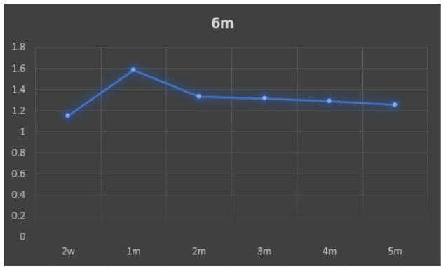

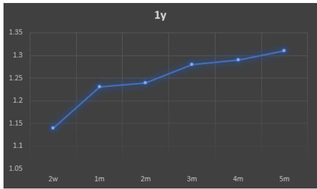

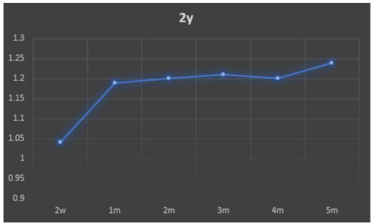

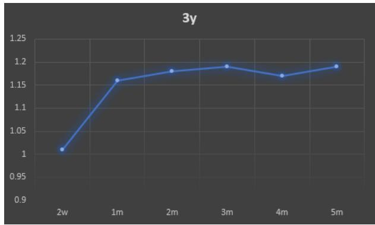

These empirical observations motivate incorporating SSR dynamics into the optimal transport framework as exogenous constraints.

## 6.5 Compatibility With The Optimal Transport Linear Response System

We now show that the SSR perturbation rule integrates naturally into the linear-response framework derived for entropic martingale optimal transport.

Let $F _ { V }$ denote the VIX future level implied by the calibrated coupling $\mu ^ { \star }$ and let $\delta F _ { V }$ denote the change induced by a perturbation of the SPX marginal distribution.

Under the SSR dynamics derived above, the corresponding change in VIX implied volatility is

$$
\delta \sigma _ { V } ( K ) = - \mathrm { S S R } _ { V } \cdot \mathrm { S k e w } _ { V } ( F _ { V } ) \delta F _ { V } .
$$

Using the first-order Taylor expansion of VIX option prices,

$$
\delta C _ { V } ^ { K } = \Delta _ { V } ^ { K } \delta F _ { V } + \mathrm { V e g a } _ { V } ^ { K } \delta \sigma _ { V } ( K ) ,
$$

we obtain

$$
\delta C _ { V } ^ { K } = \left( \Delta _ { V } ^ { K } - \mathrm { V e g a } _ { V } ^ { K } \mathrm { S S R } _ { V } \mathrm { S k e w } _ { V } ( F _ { V } ) \right) \delta F _ { V } .
$$

Therefore the SSR dynamics define a linear mapping between the SPX perturbation and the VIX option constraints.

In the optimal transport perturbation framework this mapping corresponds to an additional linear constraint of the form

<!-- page: 18 -->

$$
\Phi _ { K } ( \mu ) = b _ { K } + \dot { b } _ { K }
$$

where the perturbation term $\dot { b } _ { K }$ is determined by the SSR relation above.

Consequently the SSR dynamics enter the linear response system derived in Section 3 through an augmented perturbation vector

$$
h = ( h _ { 1 } , h _ { 2 } , \dot { b } _ { K } ) .
$$

The resulting sensitivity formula

$$
\Pi ^ { \prime } ( 0 ) = g ^ { \top } H ^ { - 1 } h
$$

remains valid with the augmented constraint vector.

## 7 Algorithm For SPX–VIX Risk Without Recalibration

## 7.1 Base Calibration

We first compute a base joint coupling between the SPX state $S _ { 1 }$ , the VIX variable $V ,$ and the future SPX state $S _ { 2 }$ . The goal of this calibration step is to construct a probability measure

$$
\mu ( s _ { 1 } , v , s _ { 2 } )
$$

that matches the prescribed SPX and VIX marginals while simultaneously enforcing the key financial consistency conditions linking SPX and VIX dynamics.

Specifically, the calibrated coupling must satisfy:

• the marginal constraints

$$
M _ { 1 } \mu = \mu _ { 1 } , ~ M _ { V } \mu = \mu _ { V } , ~ M _ { 2 } \mu = \mu _ { 2 } ,
$$

corresponding to the SPX spot, VIX, and future SPX marginals implied by market prices;

• the martingale condition

$$
\mathbb { E } [ S _ { 2 } \mid S _ { 1 } , V ] = S _ { 1 } ,
$$

• the SPX–VIX variance consistency condition

$$
\mathbb { E } [ L ( S _ { 2 } / S _ { 1 } ) \mid S _ { 1 } , V ] = V ^ { 2 } ,
$$

which links the VIX level to the expected forward variance of the SPX.

Numerically, we solve this constrained calibration problem using a nested scheme. An outer Sinkhorn iteration enforces the marginal constraints via multiplicative scaling factors, while an inner Newton (or damped Newton) correction enforces the conditional martingale and variance-consistency conditions at each $( S _ { 1 } , V )$ node.

This structure closely follows the constrained calibration framework introduced in the SPX–VIX joint calibration methodology of Guyon (2020), where optimal transport techniques are combined with financial consistency constraints to produce arbitrage-consistent joint distributions.

The resulting calibrated coupling $\mu ^ { \star }$ serves as the base distribution for the subsequent perturbation and risk-generation procedures described in the following sections.

Algorithm 1: Base Calibration Via Sinkhorn With Newton/LM Enforcement

1. Inputs. Discrete grids $\begin{array} { r } { S _ { 1 } , \mathcal { V } , S _ { 2 } ; } \end{array}$ target marginals $\mu _ { 1 } , \mu _ { V } , \mu _ { 2 } ;$ prior $\bar { \mu } ( s _ { 1 } , v , s _ { 2 } )$ ; log-return functional $L ( \cdot )$ ; marginal tolerance $\varepsilon _ { \mathrm { m a r g } } ;$ financial tolerance $\varepsilon _ { \mathrm { f i n } } ;$ Newton damping $\lambda \geq 0$

<!-- page: 19 -->

2. Outputs. Calibrated coupling $\mu ^ { \star } ( s _ { 1 } , v , s _ { 2 } )$ and Fisher information matrix H.

3. Initialize.

$$
a ( s _ { 1 } )  1 , \quad b ( v )  1 , \quad c ( s _ { 2 } )  1 , \qquad \Delta _ { M } ( s _ { 1 } , v )  0 , \quad \Delta _ { C } ( s _ { 1 } , v )  0 .
$$

Form initial Gibbs coupling

$$
\mu ( s _ { 1 } , v , s _ { 2 } ) \propto \bar { \mu } ( s _ { 1 } , v , s _ { 2 } ) a ( s _ { 1 } ) b ( v ) c ( s _ { 2 } ) \exp \{ \Delta _ { M } ( s _ { 1 } , v ) ( s _ { 2 } - s _ { 1 } ) + \Delta _ { C } ( s _ { 1 } , v ) ( L ( s _ { 2 } / s _ { 1 } ) - v ^ { 2 } ) \} .
$$

4. Outer loop: repeat until marginal errors $\leq \varepsilon _ { \mathrm { m a r g } }$ and financial residuals $\leq \varepsilon _ { \mathrm { f i n } }$

(a) Sinkhorn marginal updates: for all grid points update

$$
a ( s _ { 1 } ) \gets \frac { \mu _ { 1 } ( s _ { 1 } ) } { \sum _ { v , s _ { 2 } } \bar { \mu } ( s _ { 1 } , v , s _ { 2 } ) b ( v ) c ( s _ { 2 } ) e ^ { \Delta _ { M } ( s _ { 1 } , v ) ( s _ { 2 } - s _ { 1 } ) + \Delta _ { C } ( s _ { 1 } , v ) ( L ( s _ { 2 } / s _ { 1 } ) - v ^ { 2 } ) } } ,
$$

$$
b ( v )  \frac { \mu _ { V } ( v ) } { \sum _ { s _ { 1 } , s _ { 2 } } \bar { \mu } ( s _ { 1 } , v , s _ { 2 } ) a ( s _ { 1 } ) c ( s _ { 2 } ) e ^ { \Delta _ { M } ( s _ { 1 } , v ) ( s _ { 2 } - s _ { 1 } ) + \Delta _ { C } ( s _ { 1 } , v ) ( L ( s _ { 2 } / s _ { 1 } ) - v ^ { 2 } ) } } ,
$$

$$
c ( s _ { 2 } ) \gets \frac { \mu _ { 2 } ( s _ { 2 } ) } { \sum _ { s _ { 1 } , v } \bar { \mu } ( s _ { 1 } , v , s _ { 2 } ) a ( s _ { 1 } ) b ( v ) e ^ { \Delta _ { M } ( s _ { 1 } , v ) ( s _ { 2 } - s _ { 1 } ) + \Delta _ { C } ( s _ { 1 } , v ) ( L ( s _ { 2 } / s _ { 1 } ) - v ^ { 2 } ) } } .
$$

Refresh $\mu ( s _ { 1 } , v , s _ { 2 } )$ using the Gibbs map above.

(b) Conditional Newton/LM enforcement: for each $( s _ { 1 } , v ) \in S _ { 1 } \times \mathcal { V }$ do

i. repeat up to inner iterations:

$$
w _ { s _ { 1 } , v } ( s _ { 2 } ) \ = \ \frac { \mu ( s _ { 1 } , v , s _ { 2 } ) } { \sum _ { u \in { \cal S } _ { 2 } } \mu ( s _ { 1 } , v , u ) }
$$

(conditional law over s2), residuals

$$
r _ { M } ( s _ { 1 } , v ) = \sum _ { s _ { 2 } } w _ { s _ { 1 } , v } ( s _ { 2 } ) ( s _ { 2 } - s _ { 1 } ) , \qquad r ( s _ { 1 } , v ) = \sum _ { s _ { 2 } } w _ { s _ { 1 } , v } ( s _ { 2 } ) \big ( L ( s _ { 2 } / s _ { 1 } ) - v ^ { 2 } \big ) ,
$$

Jacobian entries

$$
J _ { 1 1 } = \mathrm { V a r } _ { w } ( s _ { 2 } - s _ { 1 } ) , \quad J _ { 2 2 } = \mathrm { V a r } _ { w } \big ( L ( s _ { 2 } / s _ { 1 } ) - v ^ { 2 } \big ) ,
$$

$$
J _ { 1 2 } = J _ { 2 1 } = \mathrm { C o v } _ { w } \big ( s _ { 2 } - s _ { 1 } , L ( s _ { 2 } / s _ { 1 } ) - v ^ { 2 } \big ) ,
$$

solve damped Newton system

$$
\binom { J _ { 1 1 } + \lambda } { J _ { 2 1 } } \quad J _ { 2 2 } + \lambda \Biggr ) \binom { \delta _ { M } } { \delta _ { C } } = - \binom { r _ { M } } { r _ { C } } ,
$$

update multipliers

$$
\Delta _ { M } ( s _ { 1 } , v )  \Delta _ { M } ( s _ { 1 } , v ) + \delta _ { M } , \qquad \Delta _ { C } ( s _ { 1 } , v )  \Delta _ { C } ( s _ { 1 } , v ) + \delta _ { C } ,
$$

refresh $\mu ( s _ { 1 } , v , s _ { 2 } )$

ii. until $\sqrt { r _ { M } ( s _ { 1 } , v ) ^ { 2 } + r _ { C } ( s _ { 1 } , v ) ^ { 2 } } \le \varepsilon _ { \mathrm { f n } }$ or inner cap reached.

5. On convergence set $\mu ^ { \star } \mu$

6. Fisher information. With suficient statistics $T _ { i } ( x )$ compute

$$
H _ { i j } = \sum _ { x } \mu ^ { \star } ( x ) \big ( T _ { i } ( x ) - \mathbb { E } _ { \mu ^ { \star } } [ T _ { i } ] \big ) \big ( T _ { j } ( x ) - \mathbb { E } _ { \mu ^ { \star } } [ T _ { j } ] \big ) , \quad x = ( s _ { 1 } , v , s _ { 2 } ) .
$$

7. Return: $\mu ^ { \star } , H$

<!-- page: 20 -->

## 7.2 POT Risk Computation: The Linear Response(LR) Approach

We compute first–order (Gateaux) price sensitivities under small marginal or constraint perturbations using the Fisher information matrix from the calibrated exponential family. Let $\mu ^ { \star }$ denote the calibrated coupling and H the Fisher matrix; let h be the stacked perturbation vector of marginal and constraint shocks. The perturbation vector $h$ introduced above represents the first-order change in the calibration constraints. As discussed in Section 6.5, the constraint system is augmented to incorporate the SSR dynamics as additiona linear relations linking SPX and VIX perturbations. Consequently, the perturbation vector h is not arbitrary but belongs to the augmented constraint space defined in Section 6.5.

In addition, the calibrated coupling $\mu ^ { \star }$ satisfies the financial consistency constraints

$$
A _ { \mathrm { f i n } } \mu ^ { \star } = 0 .
$$

To preserve these constraints to first order under a perturbation

$$
\mu ^ { \varepsilon } = \mu ^ { \star } + \varepsilon \delta \mu + o ( \varepsilon ) ,
$$

the admissible perturbation directions must satisfy

$$
A _ { \mathrm { f i n } } \delta \mu = 0 .
$$

Equivalently, the perturbation vector h must lie in the tangent space

$$
h \in \ker ( A _ { \mathrm { f i n } } ) .
$$

In practice, the perturbation vector constructed from the augmented SSR constraint system of Section 6.5 is projected onto this admissible subspace before the Fisher-information risk formula is applied. Thus the Fisher-based sensitivities are computed along perturbation directions that preserve the martingale and SPX– VIX consistency conditions to first order.

Let the payof be $G : X \mathbb { R }$ with price $\Pi ( \varepsilon ) = \mathbb { E } _ { \mu _ { \varepsilon } } [ G ]$ and baseline $\Pi ( 0 ) = \mathbb { E } _ { \mu ^ { \star } } [ G ]$ . The first–order risk is

$$
\Pi ^ { \prime } ( 0 ) \ = \ g ^ { \top } \dot { \theta } ,
$$

where $\dot { \theta }$ solves the linear response system $H { \dot { \theta } } = h ,$ , and $g$ is the covariance vector of $G$ with the suficient statistics.

Inputs. Calibrated coupling $\mu ^ { \star } ;$ ; Fisher matrix $H ;$ perturbation vector $h$ (stacked in the same coordinate system as $H )$ ; payof $G ( x )$ ; optional damping $\lambda \geq 0$ and solver tolerances.

Outputs. First–order risk $\Pi ^ { \prime } ( 0 ) $ ; optionally the dual variation $\dot { \theta }$ (for greeks mapping).

Algorithm 2: Linear Response(LR) Risk Computation.

1. Solve the linear response system. Compute the dual variation by solving

$$
\left( { \cal H } + \lambda I \right) \dot { \theta } = h ,
$$

with $\lambda = 0$ for pure Newton or small $\lambda > 0$ for Levenberg–Marquardt damping if H is ill–conditioned. Use the same gauge as in calibration $( \mathrm { e . g . }$ , fix one potential or project to the gauge–fixed subspace).

2. Compute the covariance vector $g .$ Let $\{ T _ { i } \}$ be the suficient statistics (coordinates of the dual potentials). Compute

$$
g _ { i } \ = \ \sum _ { x \in X } \mu ^ { \star } ( x ) \Big ( G ( x ) - \mathbb { E } _ { \mu ^ { \star } } [ G ] \Big ) \Big ( T _ { i } ( x ) - \mathbb { E } _ { \mu ^ { \star } } [ T _ { i } ] \Big ) , \qquad i = 1 , \dots , \dim ( \theta ) .
$$

3. Evaluate first–order risk.

$$
\Pi ^ { \prime } ( 0 ) \ : = \ : g ^ { \top } \dot { \theta } .
$$

Return $\Pi ^ { \prime } ( 0 )$ (and $\dot { \theta }$ if needed for greeks attribution).

<!-- page: 21 -->

Notes.

• For augmented constraint sets $( \mathrm { e . g . }$ , SSR–adjusted VIX constraints), H and h are augmented accordingly; the same steps apply with the enlarged system.

• The covariance step can be reused across multiple payofs once $\mu ^ { \star }$ and $\{ T _ { i } \}$ are fixed; only g changes with G.

## 8 Dimensional Reduction(DR) For POT

An alternative to computing first-order sensitivities via the Fisher information is to exploit the conditional coupling invariance directly and re-solve a reduced entropic projection on $( S _ { 1 } , V )$ . Under a conditional kerne invariance assumption, the perturbed three-dimensional problem is equivalent to a two-dimensional entropic projection for $\gamma$ on $( S _ { 1 } , V )$ , so one may obtain the exact perturbed coupling in the reduced class by solving a Sinkhorn-type projection that matches the perturbed VIX marginal implied by the SSR propagation of the SPX shock, while remaining close in entropy to the base reduced coupling. This reduced-OT approach retains convexity and numerical stability and unlike the Fisher linearization— captures nonlinear efects for finite (non-infinitesimal) shocks insofar as the dimension reduction assumption remains numerically accurate. Surprisingly, even though the reduced OT recipe involves a mini-recalibration, the algorithm takes only 5-6 steps to converge, hence is computationally eficient.

## 8.1 Base Conditional Structure

Let $\mu ^ { \star } \in \Delta ( \mathcal { X } )$ denote the calibrated optimal coupling, where

$$
\mathcal { X } = S _ { 1 } \times \mathcal { V } \times S _ { 2 } .
$$

Define the marginal of $\mu ^ { \star }$ over $( S _ { 1 } , V )$

$$
\mu _ { 1 , V } ^ { \star } ( s _ { 1 } , v ) = \sum _ { s _ { 2 } \in S _ { 2 } } \mu ^ { \star } ( s _ { 1 } , v , s _ { 2 } ) .
$$

Define the conditional kernel of $S _ { 2 }$ given $( S _ { 1 } , V )$ :

$$
\kappa ^ { * } ( s _ { 2 } \mid s _ { 1 } , v ) = { \frac { \mu ^ { \star } ( s _ { 1 } , v , s _ { 2 } ) } { \mu _ { 1 , V } ^ { \star } ( s _ { 1 } , v ) } } .
$$

Then the coupling admits the disintegration:

$$
\mu ^ { \star } ( s _ { 1 } , v , s _ { 2 } ) = \kappa ^ { * } ( s _ { 2 } \mid s _ { 1 } , v ) \mu _ { 1 , V } ^ { \star } ( s _ { 1 } , v ) .
$$

## 8.2 Conditional Coupling Invariance Assumption

Assumption 8.1 (Conditional Coupling Invariance). Under suficiently small perturbations of the SPX marginals, the conditional distribution of $S _ { 2 }$ given $( S _ { 1 } , V )$ remains unchanged, i.e.,

$$
\kappa ^ { \varepsilon } ( s _ { 2 } \mid s _ { 1 } , v ) = \kappa ^ { * } ( s _ { 2 } \mid s _ { 1 } , v ) \quad { \mathrm { f o r ~ a l l ~ } } ( s _ { 1 } , v , s _ { 2 } ) .
$$

This assumption reflects that the structural dependence between $S _ { 2 }$ and $( S _ { 1 } , V )$ is stable under small marginal shocks.

<!-- page: 22 -->

## 8.3 Exact Dimensional Reduction

Theorem 8.2 (Exact Reduction to Two-Dimensional Entropic Projection). Assume $\mu ^ { \star }$ is strictly positive on X and Assumption 8.1 holds.

Then the perturbed entropic projection problem

$$
\operatorname* { i n f } _ { \mu \in \mathcal P ^ { \varepsilon } } D ( \mu \| \mu ^ { \star } )
$$

reduces exactly to the two-dimensional problem

$$
\operatorname* { i n f } _ { \nu \in \mathcal { Q } ^ { \varepsilon } } D ( \nu \parallel \mu _ { 1 , V } ^ { \star } ) ,
$$

where $\nu$ is a probability measure on $ { \boldsymbol { S } } _ { 1 } \times { \boldsymbol { \nu } }$ satisfying the perturbed marginal constraints, and the full three-dimensional coupling is reconstructed by

$$
\mu ^ { \varepsilon } ( s _ { 1 } , v , s _ { 2 } ) = \kappa ^ { * } ( s _ { 2 } \mid s _ { 1 } , v ) \nu ^ { \varepsilon } ( s _ { 1 } , v ) .
$$

Proof. Under Assumption 8.1, any admissible perturbed coupling $\mu ^ { \varepsilon }$ must satisfy

$$
\mu ^ { \varepsilon } ( s _ { 1 } , v , s _ { 2 } ) = \kappa ^ { * } ( s _ { 2 } \mid s _ { 1 } , v ) \nu ( s _ { 1 } , v )
$$

for some probability measure ν on $\begin{array} { r } { S _ { 1 } \times \mathcal { V } . } \end{array}$

Substitute this representation into the relative entropy:

$$
{ \cal D } ( \mu ^ { \varepsilon } \parallel \mu ^ { \star } ) = \sum _ { s _ { 1 } , v , s _ { 2 } } \mu ^ { \varepsilon } ( s _ { 1 } , v , s _ { 2 } ) \ln \frac { \mu ^ { \varepsilon } ( s _ { 1 } , v , s _ { 2 } ) } { \mu ^ { \star } ( s _ { 1 } , v , s _ { 2 } ) } .
$$

Using the disintegration formulas for $\mu ^ { \varepsilon }$ and $\mu ^ { \star }$ :

$$
= \sum _ { s _ { 1 } , v , s _ { 2 } } \kappa ^ { * } ( s _ { 2 } \mid s _ { 1 } , v ) \nu ( s _ { 1 } , v ) \ln \frac { \kappa ^ { * } ( s _ { 2 } \mid s _ { 1 } , v ) \nu ( s _ { 1 } , v ) } { \kappa ^ { * } ( s _ { 2 } \mid s _ { 1 } , v ) \mu _ { 1 , V } ^ { \star } ( s _ { 1 } , v ) } .
$$

Canceling $\kappa ^ { * } ( s _ { 2 } \mid s _ { 1 } , v )$ inside the logarithm yields

$$
= \sum _ { s _ { 1 } , v , s _ { 2 } } \kappa ^ { * } ( s _ { 2 } \mid s _ { 1 } , v ) \nu ( s _ { 1 } , v ) \ln \frac { \nu ( s _ { 1 } , v ) } { \mu _ { 1 , V } ^ { \star } ( s _ { 1 } , v ) } .
$$

Since for each $( s _ { 1 } , v )$ ，

$$
\sum _ { s _ { 2 } } \kappa ^ { * } ( s _ { 2 } \mid s _ { 1 } , v ) = 1 ,
$$

we obtain

$$
D ( { \boldsymbol { \mu } } ^ { \varepsilon } \parallel { \boldsymbol { \mu } } ^ { \star } ) = \sum _ { s _ { 1 } , v } \nu ( s _ { 1 } , v ) \ln { \frac { \nu ( s _ { 1 } , v ) } { \mu _ { 1 , V } ^ { \star } ( s _ { 1 } , v ) } } = D ( \nu \parallel \mu _ { 1 , V } ^ { \star } ) .
$$

Thus the three-dimensional projection problem is equivalent to the two-dimensional entropic projection. The perturbed marginal constraints reduce correspondingly to constraints on $\nu ,$ and the reconstructed coupling satisfies the reduced constraints and preserves the conditional martingale and variance-consistency relations inherited from the base calibration. □

The reduction follows from the disintegration of the base coupling

$$
\mu ^ { \star } ( s _ { 1 } , v , s _ { 2 } ) = \mu ^ { \star } ( s _ { 2 } | s _ { 1 } , v ) \mu ^ { \star } ( s _ { 1 } , v ) .
$$

Fixing the conditional kernel and perturbing only the marginal distribution on $( S _ { 1 } , V )$ preserves both the martingale and variance consistency constraints, which depend only on conditional expectations of $S _ { 2 }$ given $( S _ { 1 } , V )$

<!-- page: 23 -->

Computational implication. The dimensional reduction has an important algorithmic consequence for risk generation.

In the base calibration, the entropic martingale optimal transport problem must enforce the martingale constraint

$$
E [ S _ { 2 } | S _ { 1 } , V ] = S _ { 1 } ,
$$

which couples the $( S _ { 1 } , V , S _ { 2 } )$ variables and requires solving the full three–dimensional Sinkhorn calibration.

In contrast, under the conditional coupling invariance assumption the perturbed distribution takes the form

$$
\mu _ { \varepsilon } ( s _ { 1 } , v , s _ { 2 } ) = \kappa ^ { * } ( s _ { 2 } | s _ { 1 } , v ) \nu _ { \varepsilon } ( s _ { 1 } , v ) ,
$$

so that the martingale and variance constraints remain automatically satisfied by the fixed conditiona kernel $\kappa ^ { * }$

As a result the perturbed optimal transport problem reduces to a two–dimensional entropic projection for $\nu _ { \varepsilon } ( s _ { 1 } , v )$ . Operationally this amounts to running a Sinkhorn-type projection without re-imposing the martingale constraint.

This is the key reason why the proposed risk generation method is computationally eficient: the perturbed problem no longer requires recalibration of the full martingale optimal transport model. In practice the perturbed projection typically converges in only a few Sinkhorn iterations because the solution is close to the base coupling.

## 8.4 SPX–VIX Family Risk Generation: The Dimensional Reduction(DR) $\mathbf { A p - }$ proach

We now describe the practical algorithm used to compute SPX–VIX risk sensitivities under SSR while preserving the structure of the calibrated joint coupling.

Let

$$
\mu ^ { \star } ( s _ { 1 } , v , s _ { 2 } )
$$

denote the base calibrated joint coupling obtained from the SPX–VIX martingale optimal transport problem in Section 7.1. By construction, $\mu ^ { \star }$ satisfies the SPX market constraints, the VIX market constraints, the martingale condition, and the SPX–VIX consistency condition.

The key point is that, in the risk calculation considered here, the perturbation is not generated by directly changing the SPX marginal inside the transport problem. Rather, one starts from an exogenous SPX market perturbation (for example, a spot bump or an SPX volatility bump), propagates this perturbation through the SSR dynamics, and obtains the corresponding change in VIX option prices. These perturbed VIX option prices determine a new admissible VIX marginal constraint, and hence a new perturbed optimal transport problem.

A full recalibration of the joint coupling would be computationally expensive. Instead, we exploit the dimension reduction result of Section 8, according to which the perturbation can be carried out at the level of the lower-dimensional coupling in $( S _ { 1 } , V )$ while leaving the conditional kernel of $S _ { 2 }$ given $( S _ { 1 } , V )$ unchanged.

More precisely, write the base calibrated coupling in disintegrated form as

$$
\mu ^ { \star } ( s _ { 1 } , v , s _ { 2 } ) = \gamma ^ { \star } ( s _ { 1 } , v ) \kappa ^ { \star } ( d s _ { 2 } \mid s _ { 1 } , v ) ,
$$

where

$$
\gamma ^ { \star } ( s _ { 1 } , v )
$$

is the marginal coupling of $( S _ { 1 } , V )$ and

$$
\kappa ^ { \star } ( d s _ { 2 } \mid s _ { 1 } , v )
$$

is the conditional kernel of $S _ { 2 }$ given $( S _ { 1 } , V )$ . The dimension reduction theorem implies that the perturbed coupling may be constructed as

$$
\mu _ { \varepsilon } ( s _ { 1 } , v , s _ { 2 } ) = \gamma _ { \varepsilon } ( s _ { 1 } , v ) \kappa ^ { \star } ( d s _ { 2 } \mid s _ { 1 } , v ) ,
$$

<!-- page: 24 -->

that is, only $\gamma _ { \varepsilon }$ is updated from the base reduced coupling $\gamma ^ { \star }$ , while the conditional kernel $\kappa ^ { \star }$ is kept fixed. The VIX marginal is therefore free to adjust through the perturbation o $\boldsymbol { \dot { \mathbf { \rho } } } \gamma ^ { \star } ( s _ { 1 } , v )$ , whereas the conditional dependence structure of $S _ { 2 }$ given $( S _ { 1 } , V )$ remains inherited from the base calibration.

## Algorithm 3: SSR-Enhanced Dimensional Reduction(DR) For POT Risk Generation

1. Inputs.

• Base joint coupling $\mu ^ { \star } ( s _ { 1 } , v , s _ { 2 } )$ and relevant marginals from Algorithm 1

• Exogenous SPX perturbation (e.g., spot bump or volatility surface shift)

• SSR (Skew Stickiness Ratio) parameters for VIX volatility dynamics

• Observed SPX and VIX market data

## 2. Outputs.

• Updated perturbed coupling $\mu _ { \varepsilon } ( s _ { 1 } , v , s _ { 2 } )$

• Risk sensitivities under $\mu _ { \varepsilon }$

## 3. Base Calibration.

(a) Disintegrate $\mu ^ { \star }$ as

$$
\mu ^ { \star } ( s _ { 1 } , v , s _ { 2 } ) = \gamma ^ { \star } ( s _ { 1 } , v ) \kappa ^ { \star } ( s _ { 2 } \mid s _ { 1 } , v ) ,
$$

where $\gamma ^ { \star }$ is the $( S _ { 1 } , V )$ marginal and $\kappa ^ { \star }$ is the conditional kernel.

## 4. Generate exogenous SPX perturbation.

(a) Apply the prescribed SPX perturbation (e.g., spot or implied volatility shift) to obtain the new SPX marginal and updated SPX implied forward variance $F _ { V } ^ { \prime }$

## 5. Propagate VIX smile using SSR.

(a) Use the SSR rule as in Theorem 6.1 to compute a synthetic perturbed VIX implied volatility surface:

$$
\sigma _ { \mathrm { V I X } } ^ { \prime } ( K ) = \sigma _ { \mathrm { V I X } } ( K ) - S S R \cdot \left. \frac { \partial \sigma _ { \mathrm { V I X } } } { \partial K } \right| _ { K = F _ { V } } \cdot \Delta F _ { V } .
$$

(b) Compute the corresponding perturbed VIX option prices from the shifted surface.

## 6. Construct perturbed VIX marginal.

(a) Infer the new VIX marginal distribution so that, under the VIX variable, the model reproduces the SSR-propagated VIX option prices.

## 7. Dimension-reduced entropic transport update.

(a) Holding $\kappa ^ { \star } ( s _ { 2 } \mid s _ { 1 } , v )$ fixed, solve for the updated $( S _ { 1 } , V )$ coupling $\gamma _ { \varepsilon } ( s _ { 1 } , v )$ that matches the perturbed VIX marginals implied by the SSR propagation of the SPX shock and remains closest in relative entropy to the base reduced coupling $\gamma ^ { \star } ( s _ { 1 } , v )$

(b) Reconstruct the full perturbed joint coupling as

$$
\mu _ { \varepsilon } ( s _ { 1 } , v , s _ { 2 } ) = \gamma _ { \varepsilon } ( s _ { 1 } , v ) \kappa ^ { \star } ( s _ { 2 } \mid s _ { 1 } , v ) .
$$

## 8. Risk extraction.

<!-- page: 25 -->

(a) For any payof function G, compute model prices under $\mu ^ { \star }$ and $\mu _ { \varepsilon }$ , and report the sensitivity as

$$
{ \mathrm { G r e e k } } \approx { \frac { P ( \mu _ { \varepsilon } ) - P ( \mu ^ { \star } ) } { \varepsilon } } ,
$$

where $P ( \mu )$ denotes the portfolio valuation under $\mu .$

This procedure avoids a full recalibration of the original SPX–VIX martingale optimal transport problem. The perturbation is carried only by the reduced coupling in $( S _ { 1 } , V )$ , while the conditional kernel of $S _ { 2 }$ given $( S _ { 1 } , V )$ remains unchanged. In this way, the endogenous adjustment of the VIX marginal is captured through the perturbed reduced coupling, yielding a fast and structurally consistent risk-generation algorithm.

## 9 Experiments: SPX-VIX Risk Generation And Hedging Backtest

## 9.1 SPX–VIX Basis In Market Data

In theory the VIX future level should be consistent with the forward variance implied by the SPX option surface through the well-known replication formula. This is precisely the consistency condition in (1). However, empirical market data shows that this relation does not hold exactly. In practice a persistent basis exists between the SPX implied forward variance and the traded VIX futures.

Figure 2 shows the time series of the SPX–VIX basis for the 1-month tenor over a two-year window. The presence of this basis is well documented in practice and is typically attributed to market segmentation, liquidity efects, and supply–demand imbalances in the VIX futures market.

In our calibration framework we therefore allow a basis adjustment when linking SPX forward variance and the VIX future level.

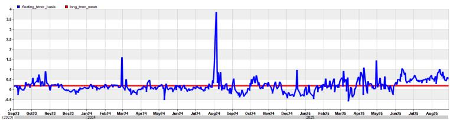

Despite the presence of this basis, the calibrated optimal transport model still satisfies the martingality condition and approximate consistency constraints, which we verify in Section 9.2.

## 9.2 Base Calibration And Fit Quality

We first assess the quality of the base calibration used throughout the experiments. The joint SPX–VIX coupling $\mu ^ { \star }$ is obtained via entropic projection with Sinkhorn scaling on the discrete grids. After calibration, we compute the suficient statistics and the Fisher information matrix H for subsequent risk analysis. Existence, uniqueness, and the Gibbs form of the optimizer ensure a consistent fit to the prescribed marginals and targets on the grids.

To visualize fit quality, we plot observed market smiles against model-implied values from the calibrated coupling for a representative maturity (e.g., March 18, 2026, two weeks to expiry), consistent with our option risk comparisons. Additionally, we generate the martingality plot and consistency plot. It is worth pointing out, that the consistency condition which should hold in theory, does not in reality. To this end, in order to make use of the SPX–VIX joint calibration, we must relax the consistency condition and incorporate the basis in both the base calibration and the perturbed calibration.

<!-- page: 26 -->

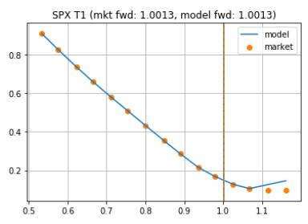

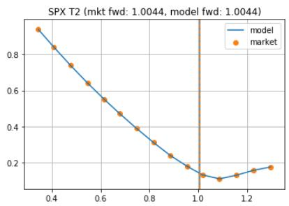

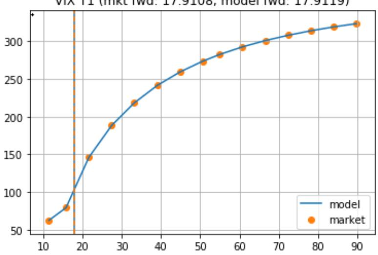

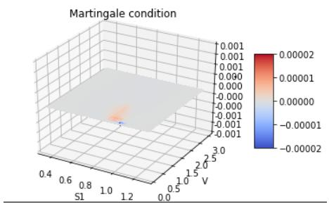

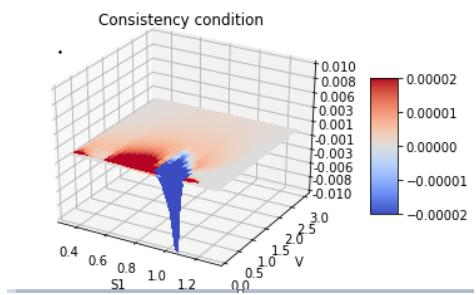

## 9.3 Risk Computation Benchmark: Recalibration vs Perturbation

This section evaluates the accuracy and computational eficiency of the perturbation framework developed in Sections 3–7. The objective of this experiment is to evaluate the Linear Response (LR) approach within our Perturbed Optimal Transport (POT) framework. We compare risk sensitivities obtained from the LR system (Fisher-information perturbation method) with those obtained from a full recalibration of the SPX– VIX optimal transport model.

<!-- page: 27 -->

The experiment therefore compares two approaches for computing risk sensitivities under SPX market perturbations.

1. Full recalibration (benchmark). After applying a perturbation to the SPX market, the entire SPX–VIX martingale optimal transport calibration problem is recomputed using Algorithm 1. The resulting joint distribution $\mu _ { \mathrm { r e c a l } } ^ { \varepsilon }$ serves as the benchmark distribution for computing option prices and sensitivities.

2. Perturbation (LR). Starting from the calibrated base coupling $\mu ^ { \star }$ , we compute the perturbed distribution using the linear response system derived in Sections 3.4–3.5. This method uses the Fisher information matrix of the calibrated exponential family to approximate the perturbed coupling $\mu _ { \mathrm { p e r t } } ^ { \varepsilon }$ without solving the full calibration problem again.

The goal of the experiment is twofold. First, we verify that the perturbation-based sensitivities closely match those obtained from full recalibration. Second, we demonstrate that the perturbation method achieves a substantial computational speedup compared to repeatedly solving the full optimal transport calibration.

SPX perturbations. In all experiments the perturbation is applied on the SPX side, either as a spot shift or as a parallel shift of the SPX implied volatility surface. These perturbations are mapped to corresponding changes in the forward variance, which acts as the key control variable in the SPX–VIX coupling.

The perturbations are chosen to remain within a regime where the linear-response approximation is expected to be accurate while still representing realistic market shocks.

Implementation details. Several groups of parameters control the perturbation experiments:

• Base OT object. The initial martingale optimal transport calibration provides the reference coupling $\mu ^ { \star }$ and the Fisher information matrix used in the perturbation calculations.

• Bumped SPX information. The perturbed SPX marginal distributions include the shifted spot and the modified implied volatility surface at the relevant maturities. Throughout the experiments we assume a sticky-strike behavior for the SPX volatility surface under spot perturbations.

• Perturbation controls. Parameters defining the magnitude and structure of the volatility perturbations, including lower and upper cutofs for invariant volatility regions.

• VIX volatility shape controls. Parameters governing the Skew Stickiness Ratio (SSR), skewness, convexity, and the treatment of at-the-money and out-of-the-money VIX option strikes.

• Basis and numerical controls. Optional parameters allowing forward basis adjustments, regularization parameters, and marking conventions for volatility, skew, SSR, convexity, and VIX marginal constraints.

In the following section we use these perturbation scenarios to compare SPX risk sensitivities of VIX derivatives computed using the two methods described above.

## 9.4 VIX Option Risk And Cross-Greeks

Using the experimental setup described in Section 9.3, we now compare SPX risk sensitivities of VIX derivatives computed using the two methods:

• Full recalibration, where the SPX–VIX martingale optimal transport model is recalibrated after each SPX perturbation.

<!-- page: 28 -->

• Perturbation (linear response), where the sensitivities are obtained using the Fisher-information linear response system derived in Sections 3.4–3.5 without recomputing the full calibration.

For each SPX perturbation we compute the corresponding change in the joint SPX–VIX distribution under both approaches and evaluate the resulting price sensitivities of VIX derivatives.

VIX future cross-greeks. We begin by comparing the SPX cross-greeks of the VIX future contract. The sensitivities are computed with respect to SPX spot and SPX implied volatility perturbations. Table 1 reports the SPX delta and SPX vega of the VIX future obtained from the recalibration benchmark and from the perturbation method.

[Table source crop](assets/tables/2026-che-et-al-spx-vix-transport-p0028-block-0004-09e3fb6bdc8bab53.jpg)
Table 1: VIX Future ’s SPX Greeks LR-POT vs Recalibration

The results show that the perturbation-based sensitivities closely match those obtained from the full recalibration procedure. The diferences remain small relative to the magnitude of the sensitivities, confirming that the linear response(LR) system provides an accurate local approximation of the recalibrated optimal transport model.

VIX option SPX delta. We next compare SPX delta sensitivities for a strip of VIX call options spanning a wide range of strikes. The options correspond to the same expiry used in the calibration experiment and cover both out-of-the-money and near-the-money regions of the VIX smile.

[Table source crop](assets/tables/2026-che-et-al-spx-vix-transport-p0028-block-0007-7b3390922a0943dd.jpg)
Table 2: VIX Options SPX Delta Comparison (LR-POT vs Recalibration). March 18, 2026, 2w to expiry.

<!-- page: 29 -->

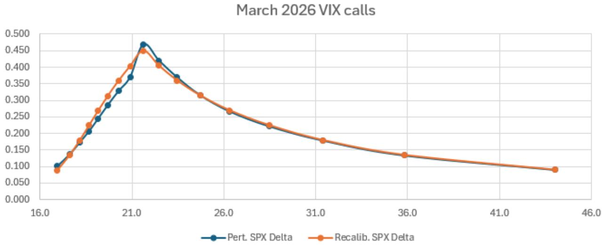

Figure 6 visualizes the same comparison across strikes.

The perturbation-based deltas closely track the sensitivities obtained from the full recalibration. Small discrepancies appear primarily in the wings of the VIX smile, where nonlinear efects become more pronounced. However, even in these regions the overall shape and magnitude of the sensitivities remain consistent with the recalibration benchmark.

VIX option SPX vega. We perform the same comparison for SPX vega sensitivities of the VIX options. Table 3 reports the SPX vega obtained from both approaches.

[Table source crop](assets/tables/2026-che-et-al-spx-vix-transport-p0029-block-0005-6698885a1866b469.jpg)
Table 3: VIX Options SPX Vega Comparison (LR-POT vs Recalibration). March 18, 2026, 2w to expiry.

<!-- page: 30 -->

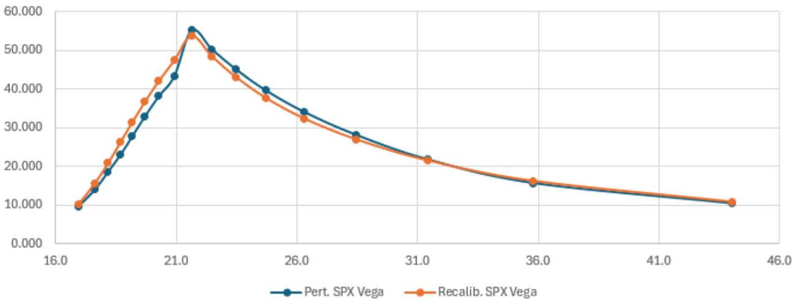

As with the delta comparison, the perturbation method reproduces the recalibrated sensitivities with high accuracy. The agreement confirms that the Fisher-information linear response captures the dominant first-order efects of SPX volatility perturbations on VIX option prices.

Performance comparison. While the recalibration method provides the benchmark sensitivities, it requires solving the full SPX–VIX optimal transport calibration problem after each perturbation. This involves repeated Sinkhorn iterations together with enforcement of the martingale and variance-consistency constraints, making the computation relatively expensive.

[Table source crop](assets/tables/2026-che-et-al-spx-vix-transport-p0030-block-0004-f6a103f8a9d162f6.jpg)
Table 4: Risk Performance Comparison

Table 4 compares the runtime required to compute sensitivities under the three approaches. The results show that the LR method and the DR method both achieve a substantial computational speedup while maintaining accuracy comparable to the recalibration benchmark.

This eficiency gain is the key practical advantage of the perturbation framework: risk sensitivities can be generated quickly without re-running the full martingale optimal transport calibration.

Lastly, we note here that the risk numbers generated by the DR method in 8 are extremely close to those produced by the LR method.

## 9.5 Backtest: Hedging Eficiency Of Optimal Transport Method

We now evaluate whether the SPX sensitivities produced by our model independent risk generation methods lead to more efective hedging than those generated by a benchmark industry standard model, in this case a stochastic local volatility model. In the backtest we perform below, we choose the dimensional reduction(DR) method in 8.4.

The experiment consists of two parts: first hedging backtest in which portfolios of VIX options are hedged using VIX futures; second hedging backtest in which the same option portfolio is hedged using SPX futures and SPX vanillas. The sizing of the VIX futures is determined by matching SPX Vega computed under either the optimal transport method or the stochastic local vol benchmark. The sizing of the SPX futures and SPX vanillas is similarly determined by matching SPX delta and SPX vega between the hedging instruments and the VIX option portfolio for each of the methods. Given that the comparison is between two risk hedging methodologies, and they trade comparable sizes, we have therefore omitted transaction cost.

<!-- page: 31 -->

Backtest period The backtest runs daily from January 2024 to February 2026. VIX smile dynamics follow the Skew Stickiness Ratio (SSR) rule

$$
\Delta \sigma _ { V } ( K ) = - S S R \cdot S k e w _ { V } ( F _ { V } ) \Delta F _ { V } ,
$$

with $S S R = 1 . 2 .$

Synthetic portfolio generation To test the robustness of the hedging performance we generate 50 randomized VIX option portfolios.

For each trading day t the portfolios are constructed as follows:

1. All listed VIX expiries available on day t are included.

2. For each expiry we construct a strike grid using call option deltas

$$
\Delta \in \{ 1 0 , 1 5 , \ldots , 9 0 \} ,
$$

resulting in 17 strikes per maturity.

3. Options with $\Delta < 5 0$ are taken as puts while options with $\Delta \geq 5 0$ are taken as calls.

4. Each option i is assigned a random portfolio weight

$$
w _ { i , t } \sim \mathrm { U n i f o r m } ( - 1 , 1 ) .
$$

The resulting portfolio value is

$$
P _ { t } = \sum _ { i } w _ { i , t } V _ { i , t } .
$$

This procedure produces diversified portfolios spanning a wide range of smile exposures.

Hedging methodology The portfolios are hedged using VIX futures whose expiries match those of the VIX options. The hedge sizes are determined by matching SPX Vega per expiry.

For a given model $M \in \{ \mathrm { S V } , \mathrm { P O T } \}$ we compute

$$
G _ { t } ^ { M } = \frac { \partial P _ { t } } { \partial \sigma _ { S P X } } ,
$$

the SPX sensitivity of the option portfolio, and

$$
g _ { j , t } ^ { M } = \frac { \partial F _ { j , t } } { \partial \sigma _ { S P X } } ,
$$

the SPX sensitivity of each VIX future $F _ { j , t }$

The hedge sizes $\alpha _ { j , t } ^ { M }$ are chosen so that

$$
G _ { t } ^ { M } + \sum _ { j } \alpha _ { j , t } ^ { M } g _ { j , t } ^ { M } = 0 .
$$

<!-- page: 32 -->

Hedged P&L The daily hedged P&L for model M is

$$
P \& L _ { t } ^ { M } = \Delta P _ { t } + \sum _ { j } \alpha _ { j , t } ^ { M } \Delta F _ { j , t } .
$$

The efectiveness of the hedge is evaluated using the standard deviation of the hedged P&L.

Cross-sectional comparison across portfolios For each of the 50 randomly generated portfolios we compute the standard deviation of the hedged P&L under both hedging strategies.

Figure 8 plots the diference

$$
\sigma _ { P O T } - \sigma _ { S V }
$$

for each portfolio, where σPOT and $\sigma _ { S V }$ denote the standard deviation of hedged P&L under the POT and SV hedges, respectively.

Time-series hedge stability To illustrate the time-series behavior of the hedging error, we select one representative portfolio from the set of 50 portfolios and compute the rolling 20-day standard deviation of hedged P&L.

$$
\mathrm { R o l l S t d e v } _ { t } ^ { M } ( 2 0 ) = \sqrt { \frac { 1 } { 1 9 } \sum _ { u = t - 1 9 } ^ { t } \left( P \& L _ { u } ^ { M } - \overline { { P \& L } } _ { t , 2 0 } ^ { M } \right) ^ { 2 } } .
$$

Summary The cross-sectional experiment in Figure 8 shows that the POT VIX future hedge reduces PnL variance for all tested portfolios. In Figure 10, all but 1 of the 50 VIX option portfolios have smaller PnL variance for the POT method when hedged to SPX futures and SPX vanillas. The time-series analysis in both Figure 9 and Figure 11 further demonstrates that the improvement is most pronounced during periods of elevated market volatility.

<!-- page: 33 -->

<!-- page: 34 -->

Together these results provide empirical evidence that the perturbed optimal transport framework produces more accurate SPX–VIX risk sensitivities than a benchmark stochastic local volatility model.

<!-- page: 35 -->

## 10 Conclusion

This paper develops a model-independent framework for SPX–VIX risk generation based on entropic martingale optimal transport. Starting from the joint calibration methodology of Guyon, we show that the calibrated Gibbs coupling admits a natural perturbation theory: admissible market shocks propagate through the Fisher information matrix of the calibrated exponential family, yielding explicit linear-response formulas for risk sensitivities.

To incorporate realistic VIX smile dynamics, we introduce a linearized Skew Stickiness Ratio formulation and embed it as linear constraints in the transport perturbation system. This approach allows SPX perturbations to propagate consistently to VIX implied volatility while maintaining the convex structure of the entropic projection problem.

We further show that the perturbed transport problem admits a structural dimensional reduction under a conditional coupling invariance assumption. In this regime the three-dimensional transport problem collapses to a two-dimensional projection on (S , V) while preserving the conditional dependence structure inherited from the base calibration. This explains why risk sensitivities can be generated eficiently without re-solving the full martingale optimal transport calibration.

Two sets of numerical experiments support the theoretical framework. First, we compare perturbationbased risk sensitivities with those obtained from full recalibration of the SPX–VIX transport model. Across VIX futures and VIX option cross-greeks, the perturbation method produces sensitivities that are very close to the recalibration benchmark while achieving significant computational speedups. Second, we conduct hedging backtests on randomized VIX option portfolios. Using SPX sensitivities generated by the dimensionreduced transport method, the resulting hedges consistently outperform those based on a stochastic volatility benchmark in terms of hedged P&L variance.

Overall, the results show that entropic martingale optimal transport provides more than a calibration tool. Combined with perturbation theory and dimensional reduction, it yields a practical framework for SPX–VIX risk generation that is financially consistent, computationally eficient, and efective in hedging applications.

## Disclaimer

This paper was prepared for informational purposes in part by the Quantitative Trading & Research Group of JPMorganChase & Co. This paper is not a product of the Research Department of JPMorganChase & Co. or its afiliates. Neither JPMorganChase & Co. nor any of its afiliates makes any explicit or implied representation or warranty and none of them accept any liability in connection with this paper, including, without limitation, with respect to the completeness, accuracy, or reliability of the information contained herein and the potential legal, compliance, tax, or accounting efects thereof. This document is not intended as investment research or investment advice, or as a recommendation, ofer, or solicitation for the purchase or sale of any security, financial instrument, financial product or service, or to be used in any way for evaluating the merits of participating in any transaction.

<!-- page: 36 -->

## References

Amari, S. (2016). Information Geometry and Its Applications. Springer. Bayer, C. and P. K. Friz (2022). Regularity of Stochastic Volatility Models: Rough and beyond. MOS-SIAM Series on Optimization. Society for Industrial and Applied Mathematics. Beiglb¨ock, M., P. Henry-Labord\`ere, and F. Penkner (2013). Model-independent bounds for option prices: A mass transport approach. Finance and Stochastics 17(3), 477–501. Benamou, J.-D., G. Carlier, M. Cuturi, L. Nenna, and G. Peyr´e (2015). Iterative bregman projections for regularized transportation problems. SIAM Journal on Scientific Computing 37(2). Bergomi, L. (2009). Smile dynamics II. Fields Institute Seminar, Toronto. Bergomi, L. (2016). Stochastic Volatility Modeling. Boca Raton: CRC Press. Cuturi, M. (2013). Sinkhorn distances: Lightspeed computation of optimal transport. Advances in Neural Information Processing Systems. Gatheral, J. (2006). The Volatility Surface: A Practitioner’s Guide. Hoboken, NJ: John Wiley & Sons. Guyon, J. (2020). The joint S&P 500/VIX smile calibration puzzle solved. Risk. Guyon, J. (2021). Dispersion-constrained martingale schr¨odinger problems and the exact joint S&P 500/VIX smile calibration puzzle. SSRN preprint. Henry-Labord\`ere, P. (2017). Model-Free Hedging: A Martingale Optimal Transport Viewpoint. Chapman and Hall/CRC Financial Mathematics Series. Boca Raton: CRC Press. Heston, S. L. (1993). A closed-form solution for options with stochastic volatility with applications to bond and currency options. The Review of Financial Studies 6 (2), 327–343. Peyr´e, G. and M. Cuturi (2019). Computational optimal transport. Foundations and Trends in Machine Learning 11 (5–6), 355–607.
