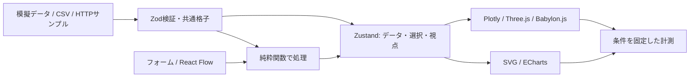

# ORBIT LAB — 総合ライブラリ比較の設計案

作成日: 2026-09-05。起点: `0268295f`。状態: 提案。今回は計画の作成のみ。
実装手順: [library-comparison-plan.md](library-comparison-plan.md)。

## 目的

同じ課題を異なるWebライブラリで作ったときの、表現・操作・分析機能・実装負担・
動作性能の違いを、自分で操作して確かめられる「ORBIT LAB」へ発展させる。
最初の題材は既存のボラティリティーサーフェス。地図は別の題材で扱う。

## 比較の考え方

採用案は「共通データと操作を持つ比較ラボ」。独立したサンプル集より条件をそろえやすく、
全機能を各ライブラリで複製する方式より変更箇所を小さく保てる。
各ツールの得意な表現を試すモードと、性能測定のために条件を固定するモードを分ける。

| 比較対象 | 比較する実装 | 共通の課題 |
|---|---|---|
| 3D | 既存Plotly / Three.js＋R3F / Babylon.js | 同じ格子の描画、回転、ズーム、点選択 |
| 2D分析 | SVG / ECharts | 同じsmile・term structure・ヒートマップ |
| 処理の組み立て | 通常フォーム / React Flow | 同じ入力とIVシフトから同じ出力を作る |
| 動き | CSS / Motion | 同じパネル開閉・カード配置変更 |
| データ取得 | 明示的なfetch実装 / TanStack Query | 同じスナップショット取得と切替・再取得 |
| 地図 | SVG / MapLibre GL JS | 同じ地点と架空の地域指標を選択・拡大 |

ZustandとZodは共通の基盤として採用する。Zustandは選択・視点・シナリオの共有、
Zodは入力の検証を担う。これらを描画エンジンと同じFPS順位表に入れない。
各実験の説明には「担当する役割」「追加した機能」「必要な独自実装」「計測条件」を掲載する。

## ライブラリの役割

| パッケージ候補 | 役割 | 導入する段階 |
|---|---|---|
| `zod` | CSVを数値化した後の行、JSONスナップショット、フローの構造検証 | 1 |
| `zustand` | Viewer間で共有する状態と最後の操作を優先する更新 | 1 |
| `echarts` | 断面・ヒートマップ・A/B差分の分析 | 2 |
| `@xyflow/react` | 入力→IVシフト→出力の編集 | 3 |
| `motion` | CSSとのアニメーション比較 | 4 |
| `@tanstack/react-query` | HTTPデータのキャッシュ・再取得・キャンセル | 5 |
| `maplibre-gl` | 地理座標を持つ別実験 | 7 |

使用中のPlotlyは3D部分ビルド。2D比較のためにPlotly全体版やECharts GLを追加しない。
バージョンは実装開始時にReact 19 / Vinext / Viteとの互換性を確認し、段階ごとにlockfileへ固定する。

## 画面と主要な体験

- 既存の `/`、`/babylon`、`/compare`、`/volatility` は引き続き使える。
- 新しい `/lab` に「Surface / Workflow / Motion / Data / Geo / Results」の実験切替を設ける。
  完了した実験だけを表示する。`?experiment=surface` のように実験を直接開ける。
- 初期表示はSurface。最初の画面でデータ、描画ツール、3Dまたは2Dの結果に触れられる。
  既存の暗い背景・ライム色を継承し、説明は操作結果の下へ置く。
- 画面内の選択点を変えると、3D、断面、ヒートマップ、数値表示が更新される。
- 「比較基準Aを固定」で現在の格子を保持し、変更後Bとの差を確認できる。
  満期とK/Fが完全一致する格子だけを差分比較し、一致しなければ理由を表示する。
- Workflowではフォームとノード編集を切り替えても同じ処理を表す。
  初期フローは「模擬データ → IVを+5ポイント → プレビュー」。結果はSurfaceへ送れる。
- Dataでは架空のスナップショットA/BをHTTPで読み込み、キャッシュの有無や
  読み込み中・失敗・再試行を操作できる。現段階では実市場APIを接続しない。
- Geoでは地理データだけを使う。IVを所在地に割り当てるような根拠のない表示はしない。
- Resultsは計測履歴と条件、用途別の判断材料を示す。未計測項目は未計測と表示する。

スマホは単独表示を基本にし、比較は上下切替または縦並び。390px以下でも全実験に移動できる
メニューを用意する。キーボードでノード編集を完結できない操作にはフォームを併設する。

## データと状態

1. 既存の `SurfaceGrid`、数値の単位、CSVの関数契約を基準にする。
   `parseSurfaceCsv` と `toSurfaceCsv` の呼出し方・受理する既存の正しいデータを維持する。
   ZodはCSVのパーサーではない。文字列の分割・列処理と数値検証を分離する。
2. Zustandのstoreは画面のProviderごとに生成する。SSRでモジュール全体の共有storeを作らず、
   サーバーとブラウザで同じ初期データにする。巨大な格子を各ノードや各rendererへ複製しない。
3. Zustandは採用済みの格子・比較基準A・選択・視点を保持する。フォーム入力中の文字列、
   各rendererのインスタンス、ホバーの高頻度イベントは必要な最小範囲へ閉じ込める。
4. Queryが所有するHTTPキャッシュと、ユーザーが選択して固定した格子を区別する。
   キーはデータID＋revision。背景再取得だけで、CSVや別シナリオを勝手に置き換えない。
5. 非同期処理は操作番号とAbortSignalを使う。古い成功・失敗・完了が、新しい選択や
   「読み込み中」を上書きする問題を再発させない。
6. 初版のデータサイズは600 / 2,500 / 5,000点。大規模化の必要性は測定結果で判断する。
   HTTPサンプルは固定ファイルを使い、データの出所を「模擬」と明示する。
7. 2Dの軸も数値座標を維持する。不等間隔の満期を等間隔のカテゴリ軸へ置き換えない。
   ヒートマップのセル境界は隣接格子の中点から共通に計算し、補間値を生成しない。
8. IV差分の単位はパーセントポイント。`0.25 - 0.20 = +5.00 pp`。
   固定A/Bに共通の尺度を使い、差分は0中心の発散色と符号付き数値で示す。

## フローの実行規則

- ノードは `source`、`shift`、`preview` の3種類。最大20ノード・30エッジ。
- sourceは選択済み格子を参照。shiftの入力は1本、単位はpp、範囲は−10〜+10。
  previewは1つ、入力は1本。プレビューへつながる経路をトポロジカル順に評価する。
- 循環、孤立ノード、重複ID、存在しない接続先、入力不足、上限超過は実行前に拒否する。
- シフト後にIVが0以下または5超になればエラー。黙って値を丸めたり切り詰めたりしない。
- 無効な編集では最後の正常なプレビューを保持し、「現在の編集は未反映」と表示する。
- 任意コードの評価や市場モデルの較正は行わず、同じ純粋関数をフォームとノードが呼ぶ。

## 比較と検証の基準

| 項目 | 方法 | 表示上の扱い |
|---|---|---|
| 数値の一致 | 既知の値、不等間隔CSV、A/B差分、export往復 | 元データと表示に渡す数値を検証 |
| 操作 | 同じ点選択・回転・ズーム・パネル操作 | 操作回数・対応機能と使用感を分ける |
| 初期表示 | 初回navigation→最初のデータ描画完了 | cold / warm別、中央値と範囲 |
| 描画 | 固定サイズ・固定DPR・同じ軌道を順次描画 | FPSとフレーム間隔p95。GPU時間とは呼ばない |
| 更新応答 | 同じ操作から描画処理完了通知まで | ブラウザ上の近似指標。画面提示時刻ではない |
| 通信 | 同じデータIDを往復してHTTP要求・失敗を記録 | cache有効/無効・staleTime・retryを併記 |
| サイズ | 各実験の初期取得JSと実験開始後の追加JS | 展開後bytesとgzip推定。実転送量と区別 |
| 実装負担 | 共通部分を除くadapter、独自処理、保守上の注意 | 行数だけで優劣を決めない |
| 可用性 | WebGL不可、通信失敗、タッチ、キーボード | 通常の数値・フォーム操作を継続できる |

性能は本番ビルドの3101番で計測し、開発サーバー3100番の最適化やHMRを混ぜない。
3画面同時表示は見比べるためだけに使う。計測時は1つずつmountし、画像・シェーダーの準備を
確認後に1秒warmup＋4秒以上の固定操作を測る。5回実行し順番を循環させる。
非表示タブ・resize・描画エラーが起きた測定は破棄する。
端末・ブラウザ・描画方式・viewport・DPR・データrevision・ライブラリversion・commitを結果に残す。
機能評価用の600点から始め、同じ描画条件で2,500点・5,000点へ増やす。
描画精度を下げた設定を比べるときは、別の条件として表示する。
JSヒープやGPUメモリの汎用測定は初版の必須項目にしない。

## Global Constraints

- 作業範囲は `komorebi-3d/`。React 19 / TypeScript / Vinext / Vite / npmを継続する。
- 初版は模擬データとローカルCSV。CSVは1 MB・5,000点以下、完全格子、Tは年、K/FとIVは小数。
- 既存4ルートとCSVの互換性を維持する。Blender・Unrealの生成物を変更しない。
- 新規依存は使用する段階で導入する。計画作成ではインストール・アプリ変更・デプロイを行わない。
- 各実験は遅延読み込み。390px以下のナビゲーション、キーボード操作、reduced-motionに対応する。
- HTTPサンプルは同一originの固定ファイル。CSVやフローの内容を外部送信しない。
- 実測と推測を区別する。SwiftShaderの数値を実機GPUの性能として扱わない。

## MapLibreの初期範囲

同梱の小さなGeoJSONを、SVGとMapLibreで並べて表示する。地域指標は架空の値と明示する。
初版はローカルの輪郭・点・ラベルで完結し、外部の地図タイル・検索API・APIキーを必要としない。
実在の地理情報を同梱するときは入手元・ライセンス・帰属表示を記録する。
SVG側も同じWeb Mercator投影、緯度範囲±85.051129度、同じ範囲・色・点選択を使用する。
3D傾斜や外部タイルは共通条件の比較後の拡張候補。MapLibreの本来の機能範囲全体を
この小さな比較で評価したとは表現しない。

## 段階的な完成形

1. **分析ラボ**: 段階0〜2。安定したナビゲーション、共通状態、3D＋2D＋差分。
2. **操作・データの実験**: 段階3〜5。フロー、アニメーション、通信とキャッシュ。
3. **総合比較**: 段階6〜7。測定結果、用途別比較、地図実験。

各段階で動く状態を残し、次段階の未実装タブや見かけだけのデータは表示しない。
実市場データ・認証・クラウド保存・有料サービスの契約は別のスコープとする。

## 参照した公式資料

- [React Flow: computing flows](https://reactflow.dev/learn/advanced-use/computing-flows) — ノードと接続のUI。実行規則はアプリで定義。
- [ECharts: dataset / encode](https://echarts.apache.org/handbook/en/concepts/dataset/) — 表示次元の明示的な割当。
- [Motion: accessibility](https://motion.dev/docs/react-accessibility) — 動きを減らす設定への対応。
- [TanStack Query: cancellation](https://tanstack.com/query/latest/docs/framework/react/guides/query-cancellation) — AbortSignalを実際のfetchへ渡す。
- [Zustand: SSRでのstore生成](https://zustand.docs.pmnd.rs/learn/guides/nextjs) — 画面・リクエストをまたぐ共有状態を避ける。Vinextでも実機能を検証する。
- [Zod: basic usage](https://zod.dev/basics) — unknownからの検証とエラー処理。
- [MapLibre: Map API](https://maplibre.org/maplibre-gl-js/docs/API/classes/Map/) — 地図の作成・データ表示・破棄。
