# Price dynamics in a Markovian limit order market

## Rama CONT &amp; Adrien de LARRARD

IEOR Dept, Columbia University, New York

&amp;

Laboratoire de Probabilit´ es et Mod` eles Al´ eatoires CNRS-Universit´ e Pierre et Marie Curie, Paris.

We propose and study a simple stochastic model for the dynamics of a limit order book, in which arrivals of market order, limit orders and order cancellations are described in terms of a Markovian queueing system. Through its analytical tractability, the model allows to obtain analytical expressions for various quantities of interest such as the distribution of the duration between price changes, the distribution and autocorrelation of price changes, and the probability of an upward move in the price, conditional on the state of the order book. We study the diffusion limit of the price process and express the volatility of price changes in terms of parameters describing the arrival rates of buy and sell orders and cancelations. These analytical results provide some insight into the relation between order flow and price dynamics in order-driven markets.

Key words : limit order book, market microstructure, queueing, diffusion limit, high-frequency data, liquidity, duration analysis, point process.

## Contents

|   1 Introduction | 1 Introduction                              | 1 Introduction                                                                   |   2 |
|------------------|---------------------------------------------|----------------------------------------------------------------------------------|-----|
|                  | 1.1                                         | Summary . . . . . . . . . . . . . . . . . . . . . . . . . . . . . . . . . . .    |   2 |
|                  | 1.2                                         | Outline . . . . . . . . . . . . . . . . . . . . . . . . . . . . . . . . . . . .  |   3 |
|                2 | A Markov model of limit order book dynamics | A Markov model of limit order book dynamics                                      |   3 |
|                  | 2.1                                         | Level-1 representation of a limit order book . . . . . . . . . . . . . . . .     |   3 |
|                  | 2.2                                         | Order book dynamics . . . . . . . . . . . . . . . . . . . . . . . . . . . .      |   4 |
|                  | 2.3                                         | Price dynamics . . . . . . . . . . . . . . . . . . . . . . . . . . . . . . . .   |   6 |
|                  | 2.4                                         | Summary . . . . . . . . . . . . . . . . . . . . . . . . . . . . . . . . . . .    |   7 |
|                  | 2.5                                         | Quantities of interest . . . . . . . . . . . . . . . . . . . . . . . . . . . . . |   7 |
|                3 | Analytical results                          | Analytical results                                                               |   7 |
|                  | 3.1                                         | Duration until the next price change . . . . . . . . . . . . . . . . . . . .     |   7 |
|                  | 3.2                                         | Probability of upward move in the price for a balanced limit order book          |  10 |
|                  | 3.3                                         | Dynamics of the price . . . . . . . . . . . . . . . . . . . . . . . . . . . .    |  11 |
|                4 | Diffusion limit of the price process        | Diffusion limit of the price process                                             |  14 |
|                  | 4.1                                         | Balanced order book . . . . . . . . . . . . . . . . . . . . . . . . . . . . .    |  14 |
|                  | 4.2                                         | Empirical test using high-frequency data . . . . . . . . . . . . . . . . . .     |  15 |
|                  | 4.3                                         | Case when market orders and cancelations dominate . . . . . . . . . . .          |  16 |
|                  | 4.4                                         | Conclusion . . . . . . . . . . . . . . . . . . . . . . . . . . . . . . . . . .   |  17 |

## 1. Introduction

An increasing number of stocks are traded in electronic, order-driven markets, in which orders to buy and sell are centralized in a limit order book available to to market participants and market orders are executed against the best available offers in the limit order book. The dynamics of prices in such markets are not only interesting from the viewpoint of market participants -for trading and order execution (Alfonsi et al. (2010), Predoiu et al. (2011))- but also from a fundamental perspective, since they provide a rare glimpse into the dynamics of supply and demand and their role in price formation.

Equilibrium models of price formation in limit order markets (Parlour (1998), Rosu (2009)) have shown that the evolution of the price in such markets is rather complex and depends on the state of the order book. On the other hand, empirical studies on limit order books (Bouchaud et al. (2008), Farmer et al. (2004), Gourieroux et al. (1999), Hollifield et al. (2004), Smith et al. (2003)) provide an extensive list of statistical features of order book dynamics that are challenging to incorporate in a single model. While most of these studies have focused on unconditional/steadystate distributions of various features of the order book, empirical studies (see e.g. Harris and Panchapagesan (2005)) show that the state of the order book contains information on short-term price movements so it is of interest to provide forecasts of various quantities conditional on the state of the order book. Providing analytically tractable models which enable to compute and/or reproduce conditional quantities which are relevant for trading and intraday risk management has proven to be challenging, given the complex relation between order book dynamics and price behavior.

The search for tractable models of limit order markets has led to the development of stochastic models which aim to retain the main statistical features of limit order books while remaining computationally manageable. Stochastic models also serve to illustrate how far one can go in reproducing the dynamic properties of a limit order book without resorting to detailed behavioral assumptions about market participants or introducing unobservable parameters describing agent preferences, as in more detailed market microstructure models.

Starting from a description of order arrivals and cancelations as point processes, the dynamics of a limit order book is naturally described in the language of queueing theory. Engle and Lunde (2003) formulates a bivariate point process to jointly analyze trade and quote arrivals. Cont et al. (2010b) model the dynamics of a limit order book as a tractable multiclass queueing system and compute various transition probabilities of the price conditional on the state of the order book, using Laplace transform methods.

## 1.1. Summary

We propose in this work a Markovian model of a limit order market, which captures some salient features of the dynamics of market orders and limit orders, yet is even simpler than the model of Cont et al. (2010b) and enables a wide range of properties of the price process to be computed analytically.

Our approach is motivated by the observation that, if one is primarily interested in the dynamics of the price, it is sufficient to focus on the dynamics of the (best) bid and ask queues. Indeed, empirical evidence shows that most of the order flow is directed at the best bid and ask prices (Biais et al. (1995)) and the imbalance between the order flow at the bid and at the ask appears to be the main driver of price changes (Cont et al. (2010a)).

Motivated by this remark, we propose a parsimonious model in which the limit order book is represented by the number of limit orders ( q b t , q a t ) sitting at the bid and the ask, represented as a system of two interacting queues. The remaining levels of the order book are treated as a 'reservoir' of limit orders represented by the distribution of the size of the queues at the 'next-to-best' price levels. Through its analytical tractability, the Markovian version of our model allows to obtain analytical expressions for various quantities of interest such as the distribution of the duration until the next price change, the distribution and autocorrelation of price changes, and the probability of an upward move in the price, conditional on the state of the order book.

Compared with econometric models of high frequency data Engle and Russell (1998), Engle and Lunde (2003) where the link between durations and price changes is specified exogenously, our model links these quantities in an endogenous manner, and provides a first step towards joint 'structural' modeling of high frequency dynamics of prices and order flow.

A second important observation is that order arrivals and cancelations are very frequent and occur at millisecond time scale, whereas, in many applications such as order execution, the metric of success is the volume-weighted average price (VWAP) so one is interested in the dynamics of order flow over a large time scale, typically tens of seconds or minutes. As shown in Table 1.1, thousands of order book events may occur over such time scales. This aggregation of events actually simplifies much of the analysis and enables us to use asymptotic methods. We study the link between price volatility and order flow in this model by studying the diffusion limit of the price process. In particular, we express the volatility of price changes in terms of parameters describing the arrival rates of buy and sell orders and cancelations. These analytical results provide some insight into the relation between order flow and price dynamics in order-driven markets. Comparison of these asymptotic results with empirical data shows that main insights of the model to be correct: in particular, we show that in limit order markets where orders arrive frequently, the volatility of price changes is increase with the ratio of the order arrival intensity to market depth, as predicted by our model.

Table 1 Average number of orders in 10 seconds and number of price changes (June 26th, 2008).

|                  |   Average no. of orders in 10s |   Price changes in 1 day |
|------------------|--------------------------------|--------------------------|
| Citigroup        |                           4469 |                    12499 |
| General Electric |                           2356 |                     7862 |
| General Motors   |                           1275 |                     9016 |

## 1.2. Outline

The paper is organized as follows. Section 2 introduces a reduced-form representation of a limit order book and presents a Markovian model in which limit orders, market orders and cancellations occur according to Poisson processes. Section 3 presents various analytical results for this model: we compute the distribution of the duration until the next price change (section 3.1), the probability of upward move in the price (section 3.2) and the dynamics of the price (section 3.3). In Section 4, we show that the price behaves, at longer time scales, as a Brownian motion whose variance is expressed in terms of the parameters describing the order flow, thus establishing a link between volatility and order flow statistics.

## 2. A Markov model of limit order book dynamics

## 2.1. Level-1 representation of a limit order book

Empirical studies of limit order markets suggest that the major component of the order flow occurs at the (best) bid and ask price levels (see e.g. Biais et al. (1995)). Furthermore, studies on the price impact of order book events show that the net effect of orders on the bid and ask queue sizes is the main factor driving price variations (Cont et al. (2010a)). These observations, together with the fact that queue sizes at the best bid and ask ('Level I' order book) are more easily obtainable (from trades and best quotes) than Level II data, motivate a reduced-form modeling approach in which we represent the state of the limit order book by

- the bid price s b t and the ask price s a t
- the size of the ask queue q a t representing the outstanding limit sell orders at the ask
- the size of the bid queue q b t representing the outstanding limit buy orders at the bid, and

Figure 1 summarizes this representation.

Figure 1 Simplified representation of a limit order book.

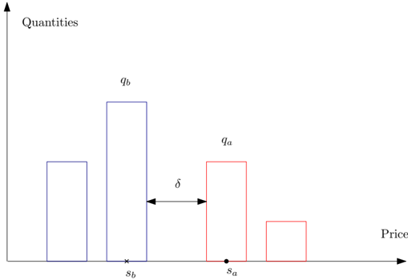

The bid and ask prices are multiples of the tick size δ . As shown in Table 2.1, for liquid stocks the bid-ask spread s a t -s b t is equal to one tick for more than 98% of observations. We will therefore make the simplifying assumption that the spread is equal to one tick, i.e. s a t = s b t + δ , resulting in a further reduction of dimension in the model.

Table 2 Percentage of observations with a given bid-ask spread (June 26th, 2008).

| Bid-ask spread   |   1 tick |   2 tick |   ≥ 3 tick |
|------------------|----------|----------|------------|
| Citigroup        |    98.82 |     1.18 |          0 |
| General Electric |    98.80 |     1.18 |       0.02 |
| General Motors   |    98.71 |     1.15 |       0.14 |

The state of the limit order book is thus described by the triplet X t =( s b t , q b t , q a t ) which takes values in the discrete state space δ. Z × N 2 .

## 2.2. Order book dynamics

The state X t of the order book is modified by order book events : limit orders (at the bid or ask), market orders and cancelations (see Cont et al. (2010b,a), Smith et al. (2003)). A limit buy (resp. sell) order of size x increases the size of the bid (resp. ask) queue by x , while a market buy (resp. sell) order decreases the corresponding queue size by x . Cancellation of x orders in a given queue reduces the queue size by x . Given that we are interested in the queue sizes at the best bid/ask levels, market orders and cancellations have the same effect on the state variable X t .

We will assume that these events occur according to independent Poisson processes:

- Market buy (resp. sell) orders arrive at independent, exponential times with rate µ ,

- Limit buy (resp. sell) orders at the (best) bid (resp. ask) arrive at independent, exponential times with rate λ ,
- Cancellations occur at independent, exponential times with rate θ .
- These events are mutually independent.
- All orders sizes are equal (assumed to be 1 without loss of generality).

Denoting by ( T a i , i ≥ 1) (resp. T b i ) the times at which the size of ask (resp. the bid) queue changes and V a i (resp. V a i ) the size of the associated change in queue size, the above assumptions translate into the following properties for the sequences T a i , T b i , V a i , V b i :

- (i) ( T a i +1 -T a i ) i ≥ 0 is a sequence of independent random variables with exponential distribution with parameter λ + θ + µ ,
- (ii) ( T b i +1 -T b i ) i ≥ 0 is a sequence of independent random variables with exponential distribution with parameter λ + θ + µ ,
- (iii) ( V a i ) i ≥ 0 is a sequence of independent random variables with

<!-- formula-start id="ref_cont_de_larrard_markovian_lob_1104.4596:formula:0001" status="decoded_unverified" source-page="5" -->
$$
\mathbb { P } [ V _ { i } ^ { a } = 1 ] = \frac { \lambda } { \lambda + \mu + \theta } a n d \mathbb { P } [ V _ { i } ^ { a } = - 1 ] = \frac { \mu + \theta } { \lambda + \mu + \theta } ,
$$
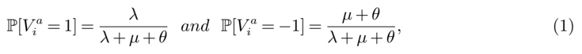
```text
PDF text layer: P [ V a i =1] = λ λ + µ + θ and P [ V a i = -1] = µ + θ λ + µ + θ , (1)
```
*Formula quality: `decoded_unverified`; source PDF page 5. Machine-decoded LaTeX; verify against the linked source crop before use.*
<!-- formula-end -->

- (iv) ( V b i ) i ≥ 0 is a sequence of independent random variables with

<!-- formula-start id="ref_cont_de_larrard_markovian_lob_1104.4596:formula:0002" status="decoded_unverified" source-page="5" -->
$$
\mathbb { P } [ V _ { i } ^ { b } = 1 ] = \frac { \lambda } { \lambda + \mu + \theta } a n d \ \mathbb { P } [ V _ { i } ^ { b } = - 1 ] = \frac { \mu + \theta } { \lambda + \mu + \theta } \quad ( 2 )
$$
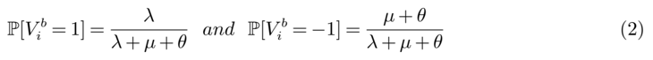
```text
PDF text layer: P [ V b i =1] = λ λ + µ + θ and P [ V b i = -1] = µ + θ λ + µ + θ (2)
```
*Formula quality: `decoded_unverified`; source PDF page 5. Machine-decoded LaTeX; verify against the linked source crop before use.*
<!-- formula-end -->

- All the previous sequences are independent.
- ·
- Once the bid (resp. the ask) queue is depleted, the price will move to the queue at the next level, which we assume to be one tick below (resp. above). The new queue size then corresponds to what was previously the number of orders sitting at the price immediately below (resp. above) the best bid (resp. ask). Instead of keeping track of these queues (and the corresponding order flow) at all price levels (as in Cont et al. (2010b), Smith et al. (2003)), we treat these sizes as stationary variables drawn from a certain distribution f on N 2 . Here f ( x,y ) represents the probability of observing ( q b t , q a t ) = ( x,y ) right after a price increase. Similarly, we denote ˜ f ( x,y ) the probability of observing ( q b t , q a t ) = ( x,y ) right after a price decrease. More precisely, denoting by F t the history of prices and order book events on [0 , t ],
- if q a t -=0 then ( q b t , q a t ) is a random variable with distribution f , independent from F t -.
- if q b t -=0 then ( q b t , q a t ) is a random variable with distribution ˜ f , independent from F t -. Given the independence assumptions on event types, the probability that these two situations occur

simultaneously is zero.

Remark 1. The asumption that ( q b t , q a t )is independent from F t -is not necessary. If one only assume that the random variables used to replace the quantity of orders once the price moves are stationnary, all the results from this paper remain valid. However, without this assumption, the process ( q b t , q a t ) t ≥ 0 becomes non-Markovian.

The distributions f and ˜ f summarize the interaction of the queues at the best bid/ask levels with the rest of the order book, viewed here as a 'reservoir' of limit orders. For simplicity we shall assume ˜ f ( x,y ) = f ( y, x ) i.e. events occurring on the bid and on the ask side have similar statistical properties but our analysis may be readily extended to the asymmetric case. Figure 2 shows the (joint) empirical distribution of bid and ask queue sizes after a price move for Citigroup stock on June 26th 2008.

Under these assumptions q t = ( q b t , q a t ) is thus a Markov process, taking values in N 2 , whose transitions correspond to the order book events { T a i , i ≥ 1 } ∪ { T b i , i ≥ 1 } :

- At the arrival of a new limit buy (resp. sell) order the bid (resp. ask) queue increases by one unit. This occurs at rate λ .

Figure 2 Joint density of bid and ask queue sizes after a price move (Citigroup, June 26th 2008).

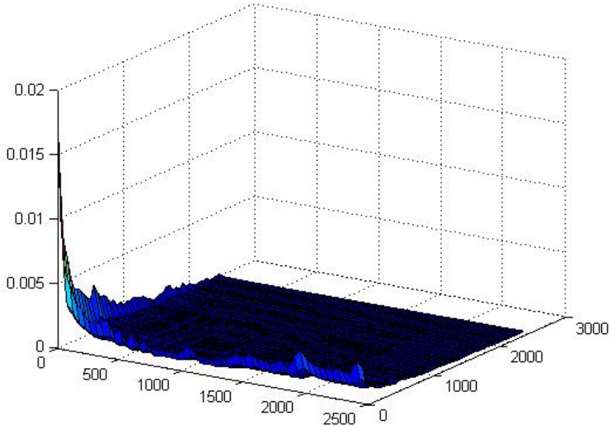

- At each cancellation or market order, which occurs at rate θ + µ , either:
- (a) the corresponding queue decreases by one unit if it is &gt; 1, or
- (b) if the ask queue is depleted then q t is a random variable with distribution f .
- (c) if the bid queue is depleted then q t is a random variable with distribution ˜ f .

The values of λ and µ + θ are readily estimated from high-frequency records of order books (see Cont et al. (2010b) for a description of the estimation procedure). Table 2.2 gives examples of such parameter estimates for the stocks mentioned above. We note that in all cases λ &lt; µ + θ but that the difference is small: | ( µ + θ ) -λ | ≪ λ .

Table 3 Estimates for the intensity of limit orders and market orders+cancellations, in number of batches per second (each batch representing 100 shares) on June 26th, 2008).

|                  |   ˆ λ |   ˆ µ + ˆ θ |
|------------------|-------|-------------|
| Citigroup        |  2204 |        2331 |
| General Electric |   317 |         325 |
| General Motors   |   102 |         104 |

## 2.3. Price dynamics

When the bid or ask queue is depleted, the price moves up or down to the next level of the order book. We will assume that the order book contains no 'gaps' (empty levels) so that these price increments are equal to one tick:

- When the bid queue is depleted, the price decreases by one tick.
- When the ask queue is depleted, the price increases by one tick. If there are gaps in the order book, this results in 'jumps' (i.e. variations of more than one tick) in the price. The price process s b t is thus a piecewise constant process whose transitions correspond to hitting times of the { (0 , y ) , y ∈ N } ∪ { ( x, 0) , x ∈ N } by the Markov process q t =( q a t , q b t ).

## 2.4. Summary

In summary, the process X t =( s b t , q b t , q a t ) is a continuous-time process with right-continuous, piecewise constant sample paths whose transitions correspond to the order book events { T a i , i ≥ 1 } ∪ { T b i , i ≥ 1 } . At each event:

- If an order or cancelation arrives on the ask side i.e. T ∈{ T a i , i ≥ 1 } :

<!-- formula-start id="ref_cont_de_larrard_markovian_lob_1104.4596:formula:0003" status="decoded_unverified" source-page="7" -->
$$
( s _ { T } ^ { b } , q _ { T } ^ { b } , q _ { T } ^ { a } ) = ( s _ { T - } ^ { b } , q _ { T - } ^ { b } , q _ { T - } ^ { a } + V _ { i } ^ { a } ) 1 _ { q _ { T - } ^ { a } > - V _ { i } ^ { a } } + ( S _ { T - } ^ { b } + \delta , R _ { i } ^ { b } , R _ { i } ^ { a } ) 1 _ { q _ { T - } ^ { a } \leq - V _ { i } ^ { a } } ,
$$
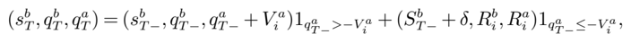
```text
PDF text layer: ( s b T , q b T , q a T ) = ( s b T -, q b T -, q a T -+ V a i )1 q a T -> -V a i +( S b T -+ δ, R b i , R a i )1 q a T -≤-V a i ,
```
*Formula quality: `decoded_unverified`; source PDF page 7. Machine-decoded LaTeX; verify against the linked source crop before use.*
<!-- formula-end -->

- If an order or cancelation arrives on the bid side i.e. T ∈{ T b i , i ≥ 1 } :

<!-- formula-start id="ref_cont_de_larrard_markovian_lob_1104.4596:formula:0004" status="decoded_unverified" source-page="7" -->
$$
( s _ { T } ^ { b } , q _ { T } ^ { b } , q _ { T } ^ { a } ) = ( s _ { T - } ^ { b } , q _ { T - } ^ { b } + V _ { i } ^ { b } , q _ { T - } ^ { a } ) 1 _ { q _ { T - } ^ { b } > - V _ { i } ^ { b } } + ( s _ { T - } ^ { b } - \delta , \tilde { R } _ { i } ^ { b } , \tilde { R } _ { i } ^ { a } ) 1 _ { q _ { T - } ^ { b } \leq - V _ { i } ^ { b } } ,
$$
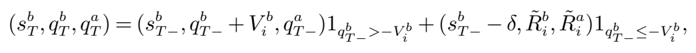
```text
PDF text layer: ( s b T , q b T , q a T ) = ( s b T -, q b T -+ V b i , q a T -)1 q b T -> -V b i +( s b T --δ, ˜ R b i , ˜ R a i )1 q b T -≤-V b i ,
```
*Formula quality: `decoded_unverified`; source PDF page 7. Machine-decoded LaTeX; verify against the linked source crop before use.*
<!-- formula-end -->

where ( V a i ) i ≥ 1 and ( V b i ) i ≥ 1 are sequences of IID variables with distribution given by (1)-(2), ( R i ) i ≥ 1 = ( R b i , R a i ) i ≥ 1 is a sequence of IID variables with (joint) distribution f , and ( ˜ R i ) i ≥ 1 = ( ˜ R b i , ˜ R a i ) i ≥ 1 is a sequence of IID variables with (joint) distribution ˜ f .

Remark 2 (Independence assumptions). The IID assumption for the sequences ( R n ) , ( ˜ R n ) is only used in Section 4. The results of Section 3 do not depend on this assumption.

## 2.5. Quantities of interest

In applications, one is interested in computing various quantities that intervene in high frequency trading such as:

- the conditional distribution of the duration between price moves, given the state of the order book (Section 3.1),
- the probability of a price increase, given the state of the order book (Section 3.2),
- the dynamics of the price :autocorrelations and distribution and autocorrelations of price changes (section 3.3), and
- the volatility of the price (section 4).

We will show that all these quantities may be characterized analytically in this model, in terms of order flow statistics.

## 3. Analytical results

The high-frequency dynamics of the price may be described in terms of durations between successive price changes and the magnitude of these price changes. Given that the state of the (Level I) order book is observable, it is of interest to examine what information the current state of the order book gives about the dynamics of the price. We now proceed to show how the model presented above may be used to compute the conditional distributions of durations and price changes, given the current state of the order book, in terms of the arrival rates of market orders, limit orders and cancellations. The result of this section do not depend on the assumptions on the sequences ( R n ) , ( ˜ R n ).

## 3.1. Duration until the next price change

We consider first the distribution of the duration until the next price change, starting from a given configuration ( b, a ) of the order book. We define

- σ a the first time when the ask queue ( q a t , t ≥ 0) is depleted,
- σ b the first time when the bid queue ( q b t , t ≥ 0) is depleted

Since the queue sizes are constant between events, one can express these stopping times as:

<!-- formula-start id="ref_cont_de_larrard_markovian_lob_1104.4596:formula:0005" status="decoded_unverified" source-page="8" -->
$$
\sigma ^ { a } = \inf \{ T _ { i } ^ { a } , \ q _ { T _ { i } ^ { a } - } ^ { a } + V _ { i } ^ { a } = 0 \} \quad \sigma ^ { b } = \inf \{ T _ { i } ^ { b } , \ q _ { T _ { i } ^ { b } - } ^ { b } + V _ { i } ^ { b } = 0 \}
$$
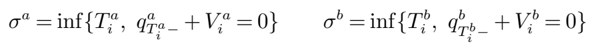
```text
PDF text layer: σ a =inf { T a i , q a T a i -+ V a i =0 } σ b =inf { T b i , q b T b i -+ V b i =0 }
```
*Formula quality: `decoded_unverified`; source PDF page 8. Machine-decoded LaTeX; verify against the linked source crop before use.*
<!-- formula-end -->

The price ( s t , t ≥ 0) moves when the queue q t =( q b t , q a t ) hits one of the axes: the duration until the next price move is thus

<!-- formula-start id="ref_cont_de_larrard_markovian_lob_1104.4596:formula:0006" status="decoded_unverified" source-page="8" -->
$$
\tau = \sigma _ { a } \wedge \sigma _ { b } .
$$
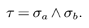
```text
PDF text layer: τ = σ a ∧ σ b .
```
*Formula quality: `decoded_unverified`; source PDF page 8. Machine-decoded LaTeX; verify against the linked source crop before use.*
<!-- formula-end -->

The following theorem gives the distribution of the duration τ , conditional on the initial queue sizes:

Proposition 1 (Distribution of duration until next price move) . The distribution of τ conditioned on the state of the order book is given by:

<!-- formula-start id="ref_cont_de_larrard_markovian_lob_1104.4596:formula:0007" status="decoded_unverified" source-page="8" -->
$$
\mathbb { P } [ \tau > t | q _ { 0 } ^ { a } = a , \ q _ { 0 } ^ { b } = b ] = \sqrt { ( \frac { \mu + \theta } { \lambda } ) ^ { a + b } \psi _ { a , \lambda , \theta + \mu } ( t ) \psi _ { b , \lambda , \theta + \mu } ( t ) } & & ( 3 )
$$
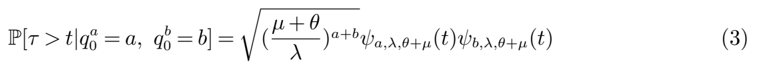
```text
PDF text layer: P [ τ > t | q a 0 = a, q b 0 = b ] = √ ( µ + θ λ ) a + b ψ a,λ,θ + µ ( t ) ψ b,λ,θ + µ ( t ) (3)
```
*Formula quality: `decoded_unverified`; source PDF page 8. Machine-decoded LaTeX; verify against the linked source crop before use.*
<!-- formula-end -->

<!-- formula-start id="ref_cont_de_larrard_markovian_lob_1104.4596:formula:0008" status="decoded_unverified" source-page="8" -->
$$
\text {where} \quad \psi _ { n , \lambda , \theta + \mu } ( t ) = \int _ { t } ^ { \infty } \frac { n } { u } I _ { n } ( 2 \sqrt { \lambda ( \theta + \mu ) } u ) e ^ { - u ( \lambda + \theta + \mu ) } d u \quad \\
$$
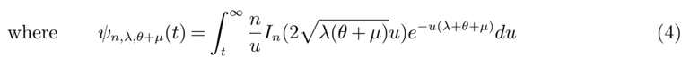
```text
PDF text layer: where ψ n,λ,θ + µ ( t ) = ∫ ∞ t n u I n (2 √ λ ( θ + µ ) u ) e -u ( λ + θ + µ ) du (4)
```
*Formula quality: `decoded_unverified`; source PDF page 8. Machine-decoded LaTeX; verify against the linked source crop before use.*
<!-- formula-end -->

and I n is the modified Bessel function of the first kind. The conditional law of τ has a regularly varying tail

- with tail exponent 2 if λ &lt; µ + θ
- with tail exponent 1 if λ = µ + θ . In particular, if λ = µ + θ , E [ τ | q a 0 = a, q b 0 = b ] = ∞ whenever a &gt; 0 , b &gt; 0 .

Proof. Since ( q a t , t ≥ 0) follows a birth and death process with birth rate λ and death rate µ + θ , L ( s, x ) := E [ e -sσ a | q a 0 = x ] satisfies:

<!-- formula-start id="ref_cont_de_larrard_markovian_lob_1104.4596:formula:0009" status="decoded_unverified" source-page="8" -->
$$
\mathcal { L } ( s , x ) = \frac { \lambda \mathcal { L } ( s , x + 1 ) + ( \mu + \theta ) \mathcal { L } ( s , x - 1 ) } { \lambda + \mu + \theta + s } .
$$
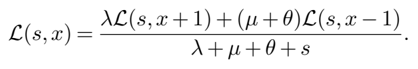
```text
PDF text layer: L ( s, x ) = λ L ( s, x +1)+( µ + θ ) L ( s, x -1) λ + µ + θ + s .
```
*Formula quality: `decoded_unverified`; source PDF page 8. Machine-decoded LaTeX; verify against the linked source crop before use.*
<!-- formula-end -->

We can find the roots of the polynomial: λX 2 -( λ + µ + θ + s ) X + µ + θ ; one root is &gt; 1, the other is &lt; 1; since L ( s, 0) = 1 and lim x →∞ L ( s, x ) = 0,

<!-- formula-start id="ref_cont_de_larrard_markovian_lob_1104.4596:formula:0010" status="decoded_unverified" source-page="8" -->
$$
\mathcal { L } ( s , x ) = ( \frac { ( \lambda + \mu + \theta + s ) - \sqrt { ( ( \lambda + \mu + \theta + s ) ) ^ { 2 } - 4 \lambda ( \mu + \theta ) } } { 2 \lambda } ) ^ { x } .
$$
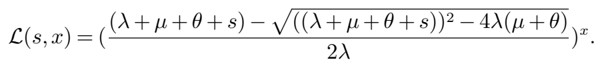
```text
PDF text layer: L ( s, x ) = ( ( λ + µ + θ + s ) -√ (( λ + µ + θ + s )) 2 -4 λ ( µ + θ ) 2 λ ) x .
```
*Formula quality: `decoded_unverified`; source PDF page 8. Machine-decoded LaTeX; verify against the linked source crop before use.*
<!-- formula-end -->

Moreover if we use the relation P [ τ &gt; t | q a 0 = x,q b 0 = y ] = P [ σ a &gt;t | q a 0 = x ] P [ σ b &gt;t | q b 0 = y ],

<!-- formula-start id="ref_cont_de_larrard_markovian_lob_1104.4596:formula:0011" status="decoded_unverified" source-page="8" -->
$$
\mathbb { P } [ \tau > t | q _ { 0 } ^ { a } = x , q _ { 0 } ^ { b } = y ] = \int _ { t } ^ { \infty } \hat { \mathcal { L } } ( u , x ) d u \int _ { t } ^ { \infty } \hat { \mathcal { L } } ( u , y ) d u .
$$
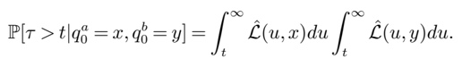
```text
PDF text layer: P [ τ > t | q a 0 = x,q b 0 = y ] = ∫ ∞ t ˆ L ( u,x ) du ∫ ∞ t ˆ L ( u,y ) du.
```
*Formula quality: `decoded_unverified`; source PDF page 8. Machine-decoded LaTeX; verify against the linked source crop before use.*
<!-- formula-end -->

This Laplace transform may be inverted (see (Feller 1971, XIV.7)) and the inversion yields

<!-- formula-start id="ref_cont_de_larrard_markovian_lob_1104.4596:formula:0012" status="decoded_unverified" source-page="8" -->
$$
\hat { \mathcal { L } } ( t , x ) = \frac { x } { t } \sqrt { ( \frac { \mu + \theta } { \lambda } ) ^ { x } } \quad I _ { x } ( 2 \sqrt { \lambda ( \theta + \mu ) } t ) e ^ { - t ( \lambda + \theta + \mu ) } ,
$$
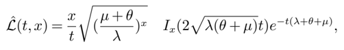
```text
PDF text layer: ˆ L ( t, x ) = x t √ ( µ + θ λ ) x I x (2 √ λ ( θ + µ ) t ) e -t ( λ + θ + µ ) ,
```
*Formula quality: `decoded_unverified`; source PDF page 8. Machine-decoded LaTeX; verify against the linked source crop before use.*
<!-- formula-end -->

which gives us the expected result.

## Tail behavior of τ :

- If λ &lt; µ + θ :

<!-- formula-start id="ref_cont_de_larrard_markovian_lob_1104.4596:formula:0013" status="decoded_unverified" source-page="8" -->
$$
\mathcal { L } ( s , x ) = \alpha ( s ) ^ { x } \underset { s \to 0 } { \sim } 1 - \frac { x ( \lambda + \mu + \theta ) } { 2 \lambda ( \mu + \theta - \lambda ) } s ,
$$
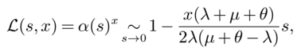
```text
PDF text layer: L ( s, x ) = α ( s ) x ∼ s → 0 1 -x ( λ + µ + θ ) 2 λ ( µ + θ -λ ) s,
```
*Formula quality: `decoded_unverified`; source PDF page 8. Machine-decoded LaTeX; verify against the linked source crop before use.*
<!-- formula-end -->

Figure 3 Above: P ( τ &gt; t | q a 0 =4 , q b 0 =5) as a function of t for λ =12 , µ + θ =13. Below: same figure in log-log coordinates. Note the Pareto tail which decays as t -2 .

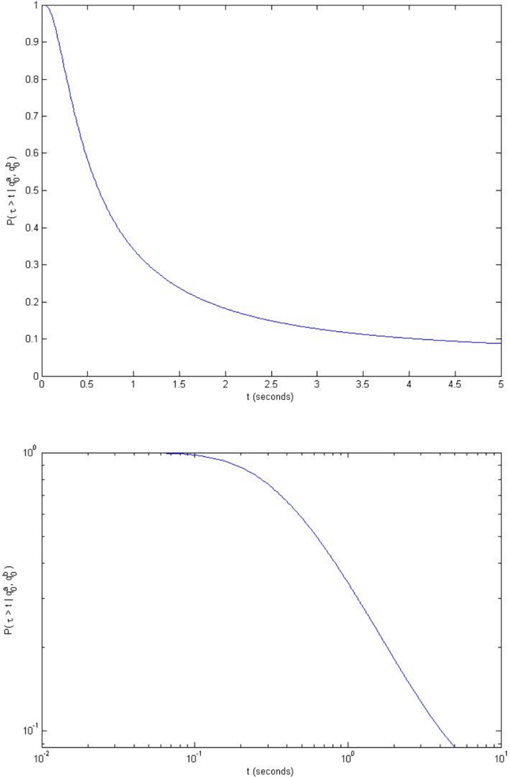

so Karamata's Tauberian theorem (Feller 1971, XIII.5) yields

<!-- formula-start id="ref_cont_de_larrard_markovian_lob_1104.4596:formula:0014" status="decoded_unverified" source-page="9" -->
$$
\mathbb { P } [ \sigma ^ { a } > t | q _ { 0 } ^ { a } = x ] _ { t \to \infty } \, \frac { x ( \lambda + \mu + \theta ) } { 2 \lambda ( \mu + \theta - \lambda ) } \frac { 1 } { t } ;
$$
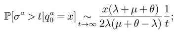
```text
PDF text layer: P [ σ a >t | q a 0 = x ] ∼ t →∞ x ( λ + µ + θ ) 2 λ ( µ + θ -λ ) 1 t ;
```
*Formula quality: `decoded_unverified`; source PDF page 9. Machine-decoded LaTeX; verify against the linked source crop before use.*
<!-- formula-end -->

therefore the conditional law of the duration τ is a regularly varying with tail index 2

<!-- formula-start id="ref_cont_de_larrard_markovian_lob_1104.4596:formula:0015" status="decoded_unverified" source-page="10" -->
$$
\mathbb { P } [ \tau > t | q _ { 0 } ^ { a } = x , q _ { 0 } ^ { b } = y ] _ { t \to \infty } \underset { \lambda ^ { 2 } ( \mu + \theta - \lambda ) ^ { 2 } } { \sim } \frac { x y ( \lambda + \mu + \theta ) ^ { 2 } } { \lambda ^ { 2 } ( \mu + \theta - \lambda ) ^ { 2 } } \frac { 1 } { 4 t ^ { 2 } } .
$$
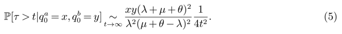
```text
PDF text layer: P [ τ > t | q a 0 = x,q b 0 = y ] ∼ t →∞ xy ( λ + µ + θ ) 2 λ 2 ( µ + θ -λ ) 2 1 4 t 2 . (5)
```
*Formula quality: `decoded_unverified`; source PDF page 10. Machine-decoded LaTeX; verify against the linked source crop before use.*
<!-- formula-end -->

- If the order flow is balanced i.e. λ = µ + θ then

<!-- formula-start id="ref_cont_de_larrard_markovian_lob_1104.4596:formula:0016" status="decoded_unverified" source-page="10" -->
$$
\mathcal { L } ( s , x ) = ( \alpha ( s ) ) ^ { x } \sim _ { s \to 0 } 1 - \frac { x } { \sqrt { \lambda } } \sqrt { s } ,
$$
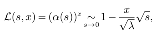
```text
PDF text layer: L ( s, x ) = ( α ( s )) x ∼ s → 0 1 -x √ λ √ s,
```
*Formula quality: `decoded_unverified`; source PDF page 10. Machine-decoded LaTeX; verify against the linked source crop before use.*
<!-- formula-end -->

the law of σ a is regularly-varying with tail index 1 / 2 and

<!-- formula-start id="ref_cont_de_larrard_markovian_lob_1104.4596:formula:0017" status="decoded_unverified" source-page="10" -->
$$
\mathbb { P } [ \sigma ^ { a } > t | q _ { 0 } ^ { a } = x ] \underset { t \to \infty } { \sim } \frac { x } { \sqrt { \pi \lambda } } \frac { 1 } { \sqrt { t } } .
$$
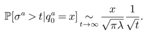
```text
PDF text layer: P [ σ a >t | q a 0 = x ] ∼ t →∞ x √ πλ 1 √ t .
```
*Formula quality: `decoded_unverified`; source PDF page 10. Machine-decoded LaTeX; verify against the linked source crop before use.*
<!-- formula-end -->

The duration then follows a heavy-tailed distribution with infinite first moment:

<!-- formula-start id="ref_cont_de_larrard_markovian_lob_1104.4596:formula:0018" status="decoded_unverified" source-page="10" -->
$$
\mathbb { P } [ \tau > t | q _ { 0 } ^ { a } = x , q _ { 0 } ^ { b } = y ] _ { t \to \infty } \, \frac { x y } { \pi \lambda } \frac { 1 } { t } ;
$$
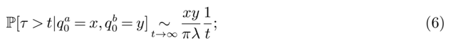
```text
PDF text layer: P [ τ > t | q a 0 = x,q b 0 = y ] ∼ t →∞ xy πλ 1 t ; (6)
```
*Formula quality: `decoded_unverified`; source PDF page 10. Machine-decoded LaTeX; verify against the linked source crop before use.*
<!-- formula-end -->

The expression given in (3) is easily computed by discretizing the integral in (4). Plotting (3) for a fine grid of values of t typically takes less than a second on a laptop. Figure 3 gives a numerical example, with λ =12 sec -1 , µ + θ =13 sec -1 , q a 0 =4 , q b 0 =5 (queue sizes are given in multiples of average batch size).

## 3.2. Probability of upward move in the price for a balanced limit order book

Assume now that λ = µ + θ , i.e. that the flow of limit orders is balanced by the flow of market orders and cancellations. Therefore for all t ≤ τ , q t = M N 2 λt , where ( M n , n ≥ 0) is a symmetric random walk on Z 2 killed when it hits either the x-axis or the y-axis and ( N 2 λt , t ≥ 0) is a Poisson process with parameter 2 λ . Hence the probability of an upward move in the price starting from a configuration q b t = n,q a t = p for the order book is equal to the probability that the random walk M starting from ( n,p ) hits the x-axis before the y-axis. This probability is given by the following proposition:

Proposition 2. For ( n,p ) ∈ N 2 , the probability φ ( n,p ) that the next price move is an increase, conditioned on having the n orders on the bid side and p orders on the ask side is:

<!-- formula-start id="ref_cont_de_larrard_markovian_lob_1104.4596:formula:0019" status="decoded_unverified" source-page="10" -->
$$
\phi ( n , p ) = \frac { 1 } { \pi } \int _ { 0 } ^ { \pi } ( 2 - \cos ( t ) - \sqrt { ( 2 - \cos ( t ) ) ^ { 2 } - 1 } ) ^ { p } \frac { \sin ( n t ) \cos ( \frac { t } { 2 } ) } { \sin ( \frac { t } { 2 } ) } d t .
$$
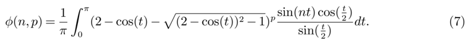
```text
PDF text layer: φ ( n,p ) = 1 π ∫ π 0 (2 -cos( t ) -√ (2 -cos( t )) 2 -1) p sin( nt ) cos( t 2 ) sin( t 2 ) dt. (7)
```
*Formula quality: `decoded_unverified`; source PDF page 10. Machine-decoded LaTeX; verify against the linked source crop before use.*
<!-- formula-end -->

Proof. The generator of the bivariate random walk ( M n , n ≥ 1) is the discrete Laplacian so φ ( n,p ) = P [ σ a &lt;σ b | q b 0 -= n,q a 0 -= p ] satisfies, for all n ≥ 1 and p ≥ 1,

<!-- formula-start id="ref_cont_de_larrard_markovian_lob_1104.4596:formula:0020" status="decoded_unverified" source-page="10" -->
$$
4 \phi ( n , p ) = \phi ( n + 1 , p ) + \phi ( n - 1 , p ) + \phi ( n , p + 1 ) + \phi ( n , p - 1 ) ,
$$
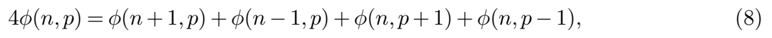
```text
PDF text layer: 4 φ ( n,p ) = φ ( n +1 , p ) + φ ( n -1 , p ) + φ ( n,p +1)+ φ ( n,p -1) , (8)
```
*Formula quality: `decoded_unverified`; source PDF page 10. Machine-decoded LaTeX; verify against the linked source crop before use.*
<!-- formula-end -->

with the boundary conditions: φ (0 , p ) = 0 for all p ≥ 1 and φ ( n, 0) = 1 for all n ≥ 1. This problem is known as the discrete Dirichlet problem; solutions of (8) are called discrete harmonic functions. (Lawler and Limic 2010, Ch. 8) show that for all t ≥ 0, the functions

<!-- formula-start id="ref_cont_de_larrard_markovian_lob_1104.4596:formula:0021" status="decoded_unverified" source-page="10" -->
$$
f _ { t } ( x , y ) = e ^ { x r ( t ) } \sin ( y t ) , \quad \text {and} \quad \tilde { f } _ { t } ( x , y ) = e ^ { - x r ( t ) } \sin ( y t ) \quad \text {with} r ( t ) = \cosh ^ { - 1 } ( 2 - \cos t )
$$
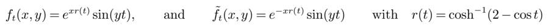
```text
PDF text layer: f t ( x,y ) = e xr ( t ) sin( yt ) , and ˜ f t ( x,y ) = e -xr ( t ) sin( yt ) with r ( t ) = cosh -1 (2 -cos t )
```
*Formula quality: `decoded_unverified`; source PDF page 10. Machine-decoded LaTeX; verify against the linked source crop before use.*
<!-- formula-end -->

are solutions of (8). In (Lawler and Limic 2010, Corollary 8.1.8) it is shown that the probability that a simple random walk ( M k , k ≥ 1) starting at ( n,p ) ∈ Z + × Z + reaches the axes at ( x, 0) is

<!-- formula-start id="ref_cont_de_larrard_markovian_lob_1104.4596:formula:0022" status="decoded_unverified" source-page="10" -->
$$
\frac { 2 } { \pi } \int _ { 0 } ^ { \pi } e ^ { - r ( t ) p } \sin ( n t ) \sin ( t x ) d t ,
$$
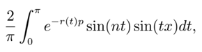
```text
PDF text layer: 2 π ∫ π 0 e -r ( t ) p sin( nt ) sin( tx ) dt,
```
*Formula quality: `decoded_unverified`; source PDF page 10. Machine-decoded LaTeX; verify against the linked source crop before use.*
<!-- formula-end -->

therefore

Since

<!-- formula-start id="ref_cont_de_larrard_markovian_lob_1104.4596:formula:0023" status="decoded_unverified" source-page="11" -->
$$
\phi ( n , p ) = \sum _ { k = 1 } ^ { \infty } \frac { 2 } { \pi } \int _ { 0 } ^ { \pi } e ^ { - r ( t ) p } \sin ( t n ) \sin ( t k ) d t .
$$
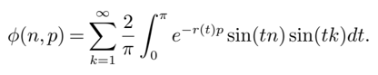
```text
PDF text layer: φ ( n,p ) = ∞ ∑ k =1 2 π ∫ π 0 e -r ( t ) p sin( tn ) sin( tk ) dt.
```
*Formula quality: `decoded_unverified`; source PDF page 11. Machine-decoded LaTeX; verify against the linked source crop before use.*
<!-- formula-end -->

<!-- formula-start id="ref_cont_de_larrard_markovian_lob_1104.4596:formula:0024" status="decoded_unverified" source-page="11" -->
$$
\sum _ { k = 1 } ^ { m } \sin ( k t ) = \frac { \sin ( \frac { m t } { 2 } ) \sin ( \frac { ( m + 1 ) t } { 2 } ) } { \sin ( t / 2 ) } = \frac { \cos ( \frac { t } { 2 } ) - \cos ( ( m + \frac { 1 } { 2 } ) t ) } { 2 \sin ( t / 2 ) } ,
$$
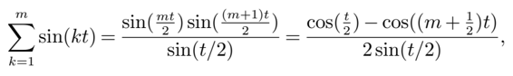
```text
PDF text layer: m ∑ k =1 sin( kt ) = sin( mt 2 ) sin( ( m +1) t 2 ) sin( t/ 2) = cos( t 2 ) -cos(( m + 1 2 ) t ) 2sin( t/ 2) ,
```
*Formula quality: `decoded_unverified`; source PDF page 11. Machine-decoded LaTeX; verify against the linked source crop before use.*
<!-- formula-end -->

using integration by parts we see that the second term leads to the integral:

<!-- formula-start id="ref_cont_de_larrard_markovian_lob_1104.4596:formula:0025" status="decoded_unverified" source-page="11" -->
$$
\int _ { 0 } ^ { \pi } \underbrace { \frac { e ^ { - r ( t ) p } \sin ( n t ) } { \sin ( t / 2 ) } \cos ( ( m + 1 / 2 ) t ) d t } _ { g ( t ) } = - \frac { 1 } { m + \frac { 1 } { 2 } } \int _ { 0 } ^ { \pi } g ^ { \prime } ( t ) \sin ( ( m + \frac { 1 } { 2 } ) t ) d t \stackrel { \rightarrow } { \rightarrow } 0 .
$$
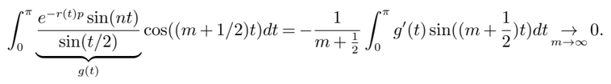
```text
PDF text layer: ∫ π 0 e -r ( t ) p sin( nt ) sin( t/ 2) ︸ ︷︷ ︸ g ( t ) cos(( m +1 / 2) t ) dt = -1 m + 1 2 ∫ π 0 g ′ ( t ) sin(( m + 1 2 ) t ) dt → m →∞ 0 .
```
*Formula quality: `decoded_unverified`; source PDF page 11. Machine-decoded LaTeX; verify against the linked source crop before use.*
<!-- formula-end -->

since g ′ is bounded. So finally:

<!-- formula-start id="ref_cont_de_larrard_markovian_lob_1104.4596:formula:0026" status="decoded_unverified" source-page="11" -->
$$
\phi ( n , p ) = \frac { 1 } { \pi } \int _ { 0 } ^ { \pi } e ^ { - r ( t ) p } \sin ( t n ) \frac { \cos ( \frac { t } { 2 } ) } { \sin ( \frac { t } { 2 } ) } d t .
$$
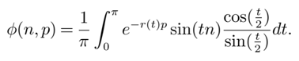
```text
PDF text layer: φ ( n,p ) = 1 π ∫ π 0 e -r ( t ) p sin( tn ) cos( t 2 ) sin( t 2 ) dt.
```
*Formula quality: `decoded_unverified`; source PDF page 11. Machine-decoded LaTeX; verify against the linked source crop before use.*
<!-- formula-end -->

Noting that e -r ( t ) =(2 -cos( t ) -√ (2 -cos( t )) 2 -1) we obtain the result.

Note that the conditional probabilities (7) are, in the case of a balanced order book, independent of the parameters describing the order flow.

The expression (7) is easily computed numerically: Figure 4 displays the shape of the function Φ. The comparison with the corresponding empirical transition frequencies for CitiGroup tick-by-tick data on June 26, 2008 shows good agreement between the theoretical conditional probabilities and their empirical counterparts.

## 3.3. Dynamics of the price

The high-frequency dynamics of the price in this model is described by a piecewise constant, right continuous process ( s t , t ≥ 0) whose jumps times correspond to times when the order book process ( q t , t ≥ 0) hits one of the axes. Denote by ( τ 1 , τ 2 , ... ) the successive durations between price changes. The number of price changes that occur during [0 , t ] is given by

<!-- formula-start id="ref_cont_de_larrard_markovian_lob_1104.4596:formula:0027" status="decoded_unverified" source-page="11" -->
$$
N _ { t } \colon = \max \{ \ n \geq 0 , \ \tau _ { 1 } + \dots + \tau _ { n } \leq t \ \}
$$
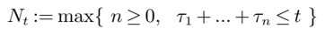
```text
PDF text layer: N t := max { n ≥ 0 , τ 1 + ... + τ n ≤ t }
```
*Formula quality: `decoded_unverified`; source PDF page 11. Machine-decoded LaTeX; verify against the linked source crop before use.*
<!-- formula-end -->

At t = τ i , s τ i = s τ i -+1 if q τ a i -= 0 and s τ i = s τ i --1 if q τ b i -= 0. ( X 1 , X 2 , X 3 , ..., X n , ... ) are the successive moves in the price. Note that in general this is not a sequence of independent random variables. We define for n ≥ 1,

<!-- formula-start id="ref_cont_de_larrard_markovian_lob_1104.4596:formula:0028" status="decoded_unverified" source-page="11" -->
$$
Z _ { n } = \sum _ { i = 1 } ^ { n } X _ { i }
$$
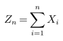
```text
PDF text layer: Z n = n ∑ i =1 X i
```
*Formula quality: `decoded_unverified`; source PDF page 11. Machine-decoded LaTeX; verify against the linked source crop before use.*
<!-- formula-end -->

the value of the price, after n changes. Hence, for all t ≥ 0, s t = Z N t .

Proposition 3. Let p cont = P [ X 2 = δ | X 1 = δ ] = P [ X 2 = -δ | X 1 = -δ ] be the probability of two successive price moves in the same direction.

- ∀ k ≥ 1 , Cov ( X 1 , X k ) = (2 p cont -1) k -1 .
- Conditional on the current state of the limit order book, the distribution of the n-th subsequent price change X n is:

<!-- formula-start id="ref_cont_de_larrard_markovian_lob_1104.4596:formula:0029" status="decoded_unverified" source-page="11" -->
$$
p _ { n } ( x , y ) \coloneqq \mathbb { P } [ X _ { n } = \delta | q _ { 0 } ^ { a } = x , \ q _ { 0 } ^ { b } = y ] = \frac { 1 + ( 2 p _ { c o n t } - 1 ) ^ { n - 1 } ( 2 p _ { 1 } ( x , y ) - 1 ) } { 2 } ,
$$
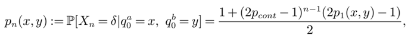
```text
PDF text layer: p n ( x,y ) := P [ X n = δ | q a 0 = x, q b 0 = y ] = 1 + (2 p cont -1) n -1 (2 p 1 ( x,y ) -1) 2 ,
```
*Formula quality: `decoded_unverified`; source PDF page 11. Machine-decoded LaTeX; verify against the linked source crop before use.*
<!-- formula-end -->

Figure 4 Above: Conditional probability of a price increase, as a function of the bid and ask queue size. Below: comparison with transition frequencies for CitiGroup tick-by-tick data on June 26, 2008.

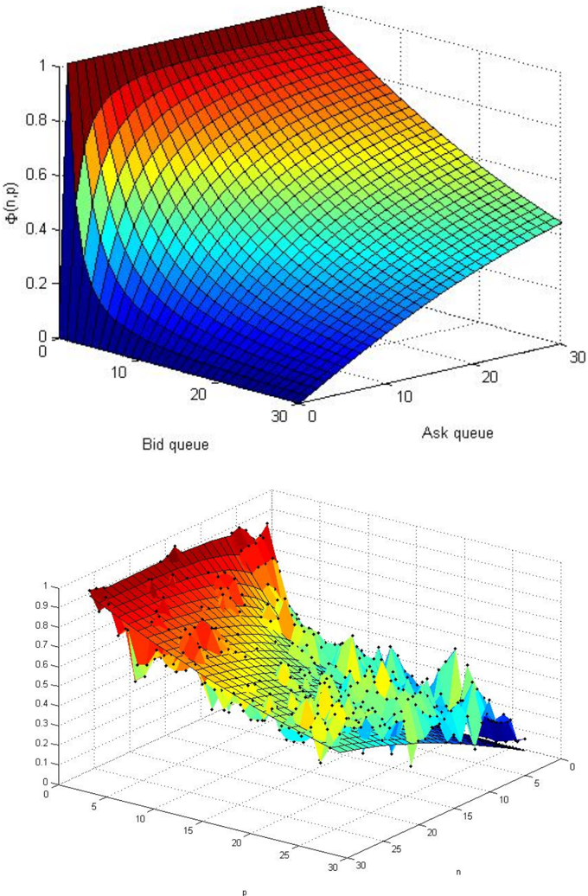

Proof. Let, for ( x,y ) ∈ N 2 , and for all n ≥ 2, p n ( x,y ) the probability that X n = δ , conditioned on q a 0 = x and q b 0 = y . To simplify, we note p n for p n ( x,y ). p n is characterized by the following recurrence relation:

hence

<!-- formula-start id="ref_cont_de_larrard_markovian_lob_1104.4596:formula:0030" status="decoded_unverified" source-page="13" -->
$$
\begin{pmatrix} p _ { n } \\ 1 - p _ { n } \end{pmatrix} = \begin{pmatrix} p _ { n } \\ 1 - p _ { c o n t } \end{pmatrix} \begin{pmatrix} 1 - p _ { c o n t } \\ p _ { c o n t } \end{pmatrix} \begin{pmatrix} p _ { n - 1 } \\ 1 - p _ { n - 1 } \end{pmatrix} ,
$$
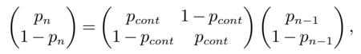
```text
PDF text layer: ( p n 1 -p n ) = ( p cont 1 -p cont 1 -p cont p cont )( p n -1 1 -p n -1 ) ,
```
*Formula quality: `decoded_unverified`; source PDF page 13. Machine-decoded LaTeX; verify against the linked source crop before use.*
<!-- formula-end -->

<!-- formula-start id="ref_cont_de_larrard_markovian_lob_1104.4596:formula:0031" status="decoded_unverified" source-page="13" -->
$$
\begin{pmatrix} p _ { n } \\ 1 - p _ { n } \end{pmatrix} = \begin{pmatrix} p _ { c o n t } & 1 - p _ { c o n t } \\ 1 - p _ { c o n t } & p _ { c o n t } \end{pmatrix} ^ { n - 1 } \begin{pmatrix} p _ { 1 } \\ 1 - p _ { 1 } \end{pmatrix} .
$$
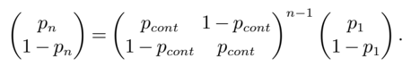
```text
PDF text layer: ( p n 1 -p n ) = ( p cont 1 -p cont 1 -p cont p cont ) n -1 ( p 1 1 -p 1 ) .
```
*Formula quality: `decoded_unverified`; source PDF page 13. Machine-decoded LaTeX; verify against the linked source crop before use.*
<!-- formula-end -->

The eigenvalues of this matrix are 1 and 2 p cont -1:

<!-- formula-start id="ref_cont_de_larrard_markovian_lob_1104.4596:formula:0032" status="decoded_unverified" source-page="13" -->
$$
\begin{pmatrix} p _ { c o n t } & 1 - p _ { c o n t } \\ 1 - p _ { c o n t } & p _ { c o n t } \end{pmatrix} = \begin{pmatrix} 1 & 1 \\ 1 & - 1 \end{pmatrix} \begin{pmatrix} 1 & 0 \\ 0 & 2 p _ { c o n t } - 1 \end{pmatrix} \begin{pmatrix} 1 / 2 & 1 / 2 \\ 1 / 2 & - 1 / 2 \end{pmatrix} .
$$
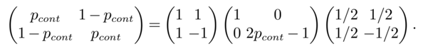
```text
PDF text layer: ( p cont 1 -p cont 1 -p cont p cont ) = ( 1 1 1 -1 )( 1 0 0 2 p cont -1 )( 1 / 2 1 / 2 1 / 2 -1 / 2 ) .
```
*Formula quality: `decoded_unverified`; source PDF page 13. Machine-decoded LaTeX; verify against the linked source crop before use.*
<!-- formula-end -->

Therefore

<!-- formula-start id="ref_cont_de_larrard_markovian_lob_1104.4596:formula:0033" status="decoded_unverified" source-page="13" -->
$$
p _ { n } = \frac { 1 + ( 2 p _ { c o n t } - 1 ) ^ { n - 1 } ( 2 p _ { 1 } - 1 ) } { 2 } .
$$
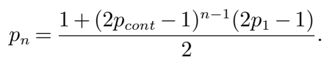
```text
PDF text layer: p n = 1+(2 p cont -1) n -1 (2 p 1 -1) 2 .
```
*Formula quality: `decoded_unverified`; source PDF page 13. Machine-decoded LaTeX; verify against the linked source crop before use.*
<!-- formula-end -->

Moreover for all n ≥ 2,

<!-- formula-start id="ref_cont_de_larrard_markovian_lob_1104.4596:formula:0034" status="decoded_unverified" source-page="13" -->
$$
C o v ( X _ { 1 } , X _ { n } ) = p _ { 1 } p _ { n } + ( 1 - p _ { n } ) ( 1 - p _ { 1 } ) - p _ { 1 } ( 1 - p _ { n } ) - p _ { n } ( 1 - p _ { 1 } )
$$
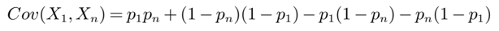
```text
PDF text layer: Cov ( X 1 , X ) = p 1 p +(1 -p )(1 -p 1 ) -p 1 (1 -p ) -p (1 -p 1 )
```
*Formula quality: `decoded_unverified`; source PDF page 13. Machine-decoded LaTeX; verify against the linked source crop before use.*
<!-- formula-end -->

<!-- formula-start id="ref_cont_de_larrard_markovian_lob_1104.4596:formula:0035" status="decoded_unverified" source-page="13" -->
$$
v ( X _ { 1 } , X _ { n } ) = p _ { 1 } p _ { n } + ( 1 - p _ { n } ) ( 1 - p _ { 1 } ) - p _ { 1 } ( 1 - p _ { n } ) - p _ { n } ( 1 - p _ { 1 } ) \\ C o v ( X _ { 1 } , X _ { n } ) = ( 1 + 2 p _ { n } p _ { 1 } - p _ { n } - p _ { 1 } ) \\ C o v ( X _ { 1 } , X _ { n } ) = ( 2 p _ { c o n t } - 1 ) ^ { n - 1 } .
$$
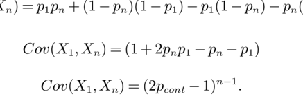
```text
PDF text layer: n n n n n Cov ( X 1 , X n ) = (1 + 2 p n p 1 -p n -p 1 ) Cov ( X 1 , X n ) = (2 p cont -1) n -1 .
```
*Formula quality: `decoded_unverified`; source PDF page 13. Machine-decoded LaTeX; verify against the linked source crop before use.*
<!-- formula-end -->

Remark 3 (Negative autocorrelation of price changes at first lag). It is empirically observed that high frequency price movements have a negative autocorrelation at the first lag Cont (2001). In our model Cov ( X k , X k +1 ) &lt; 0 if and only if p cont &lt; 1 / 2, which happens when

<!-- formula-start id="ref_cont_de_larrard_markovian_lob_1104.4596:formula:0036" status="decoded_unverified" source-page="13" -->
$$
\sum _ { i = 1 } ^ { \infty } \sum _ { j \geq i } f ( i , j ) > 1 / 2
$$
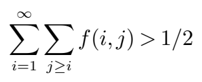
```text
PDF text layer: ∞ ∑ i =1 ∑ j ≥ i f ( i, j ) > 1 / 2
```
*Formula quality: `decoded_unverified`; source PDF page 13. Machine-decoded LaTeX; verify against the linked source crop before use.*
<!-- formula-end -->

where f is the joint distribution of queue sizes after a price increase. This condition is verified on all high-frequency data sets we have examined. For example, for CitiGroup stock we find

<!-- formula-start id="ref_cont_de_larrard_markovian_lob_1104.4596:formula:0037" status="decoded_unverified" source-page="13" -->
$$
\sum _ { i = 1 } ^ { \infty } \sum _ { j \geq i } f ( i , j ) > 0 . 7
$$
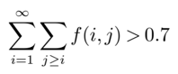
```text
PDF text layer: ∞ ∑ i =1 ∑ j ≥ i f ( i, j ) > 0 . 7
```
*Formula quality: `decoded_unverified`; source PDF page 13. Machine-decoded LaTeX; verify against the linked source crop before use.*
<!-- formula-end -->

This asymmetry condition on f corresponds to the fact that, after an upward price move, the new bid queue is generally smaller than the ask queue since the ask queue corresponds to the limit order previously sitting at second best ask level, while the bid queue results from the accumulation of orders over the very short period since the last price move. Under this condition, high frequency increments of the price are negatively correlated: an increase in the price is more likely to be followed by a decrease in the price.

Remark 4. The sequence of price increments ( X 1 , X 2 , ... ) is uncorrelated if and only if p cont =1 / 2 which happens when

<!-- formula-start id="ref_cont_de_larrard_markovian_lob_1104.4596:formula:0038" status="decoded_unverified" source-page="13" -->
$$
\sum _ { i = 1 } ^ { \infty } \sum _ { j \geq i } f ( i , j ) = 1 / 2 .
$$
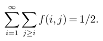
```text
PDF text layer: ∞ ∑ i =1 ∑ j ≥ i f ( i, j ) = 1 / 2 .
```
*Formula quality: `decoded_unverified`; source PDF page 13. Machine-decoded LaTeX; verify against the linked source crop before use.*
<!-- formula-end -->

## 4. Diffusion limit of the price process

As discussed in Section 3.3, the high frequency dynamics of the price is described by a piecewise constant stochastic process s t = Z N t where

<!-- formula-start id="ref_cont_de_larrard_markovian_lob_1104.4596:formula:0039" status="decoded_unverified" source-page="14" -->
$$
Z _ { n } = X _ { 1 } + \dots + X _ { n } a n d N _ { t } = \sup \{ k ; \ \tau _ { 1 } + \dots + \tau _ { k } \leq t \}
$$
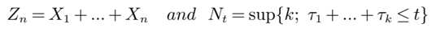
```text
PDF text layer: Z n = X 1 + ... + X n and N t =sup { k ; τ 1 + ... + τ k ≤ t }
```
*Formula quality: `decoded_unverified`; source PDF page 14. Machine-decoded LaTeX; verify against the linked source crop before use.*
<!-- formula-end -->

is the number of price moves during [0 , t ].

However, over time scales much larger than the interval between individual order book events, prices are observed to have diffusive dynamics and modeled as such. To establish the link between the high frequency dynamics and the diffusive behavior at longer time scales, we shall consider a time scale t n = tζ ( n ) over which the average number of order book events is of order n and exhibit conditions under which the rescaled price process

<!-- formula-start id="ref_cont_de_larrard_markovian_lob_1104.4596:formula:0040" status="decoded_unverified" source-page="14" -->
$$
( s _ { t } ^ { n } \colon = \frac { s _ { t _ { n } } } { \sqrt { n } } , t \geq 0 ) _ { n \geq 1 }
$$
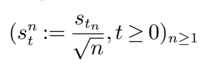
```text
PDF text layer: ( s n t := s t n √ n , t ≥ 0) n ≥ 1
```
*Formula quality: `decoded_unverified`; source PDF page 14. Machine-decoded LaTeX; verify against the linked source crop before use.*
<!-- formula-end -->

verifies a functional central limit theorem i.e. converges in distribution to a non-degenerate process ( p t , t ≥ 0) as n →∞ . The choice of the time scale t n = tζ ( n ) cannot be arbitrary: it is imposed by the distributional properties of the durations which, as observed in Section 3.1, are heavy tailed. More precisely, ζ ( n ) is chosen such that

<!-- formula-start id="ref_cont_de_larrard_markovian_lob_1104.4596:formula:0041" status="decoded_unverified" source-page="14" -->
$$
\frac { \tau _ { 1 } + \dots + \tau _ { n } } { \zeta ( n ) }
$$
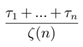
```text
PDF text layer: τ 1 + ... + τ n ζ ( n )
```
*Formula quality: `decoded_unverified`; source PDF page 14. Machine-decoded LaTeX; verify against the linked source crop before use.*
<!-- formula-end -->

has a well-defined limit. In this section, we show that, under a symmetry condition, this limit can be identified as a diffusion process whose diffusion coefficient may be computed from the statistics of the order flow driving the limit order book.

Assume λ + θ ≤ µ and that the joint distribution f of the queue sizes after a price move satisfies:

<!-- formula-start id="ref_cont_de_larrard_markovian_lob_1104.4596:formula:0042" status="decoded_unverified" source-page="14" -->
$$
D ( f ) = \sum _ { i = 1 } ^ { \infty } \sum _ { j = 1 } ^ { \infty } i j f ( i , j ) < \infty
$$
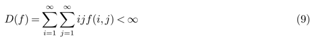
```text
PDF text layer: D ( f ) = ∞ ∑ i =1 ∞ ∑ j =1 ijf ( i, j ) < ∞ (9)
```
*Formula quality: `decoded_unverified`; source PDF page 14. Machine-decoded LaTeX; verify against the linked source crop before use.*
<!-- formula-end -->

The quantity D ( f ) represents a measure of market depth: more precisely, √ D ( F ) is the geometric average of the size of the bid queue and the size of the ask queue after a price change.

In this section we assume that the distribution f is symmetric with respect to its arguments: ∀ i, j ≥ 0 , f ( i, j ) = f ( j, i ). Under this assumption, the sequence of increments ( X i , i ≥ 0) of the price is a sequence of independent random variables. We will show that the limit p is then a diffusion process which describes the dynamics of the price at lower frequencies. In particular, we will compute the volatility of this diffusion limit p and relate it to the properties of the order flow.

In the following D denotes the space of right continuous paths ω : [0 , ∞ ) → R 2 with left limits, equipped with the Skorokhod topology J 1 , and ⇒ will designate weak convergence on ( D , J 1 ) (see Billingsley (1968), Whitt (2002) for a discussion).

## 4.1. Balanced order book

We first consider the case of a balanced order flow for which the intensity of market orders and cancelations is equal to the intensity of limit orders. The study of high-frequency quote data indicates that this is an empirically relevant case for many liquid stocks.

Theorem 1 If λ = µ + θ ,

<!-- formula-start id="ref_cont_de_larrard_markovian_lob_1104.4596:formula:0043" status="decoded_unverified" source-page="14" -->
$$
\left ( \frac { s _ { n \log n t } } { \sqrt { n } } , t \geq 0 \right ) \stackrel { n \to \infty } { \Rightarrow } \left ( \delta \sqrt { \frac { \pi \lambda } { D ( f ) } } W _ { t } , t \geq 0 \right )
$$
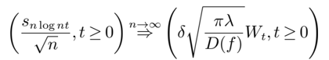
```text
PDF text layer: ( s n log nt √ n , t ≥ 0 ) n →∞ ⇒ ( δ √ πλ D ( f ) W t , t ≥ 0 )
```
*Formula quality: `decoded_unverified`; source PDF page 14. Machine-decoded LaTeX; verify against the linked source crop before use.*
<!-- formula-end -->

where δ is the tick size, D ( f ) is given by (9) and W is a standard Brownian motion.

Proof. For all t ≥ 0 and n ≥ 1, let t n = n log nt and

<!-- formula-start id="ref_cont_de_larrard_markovian_lob_1104.4596:formula:0044" status="decoded_unverified" source-page="15" -->
$$
\frac { s _ { n \log n t } } { \sqrt { n } } = \frac { Z ( t \pi \lambda / D ( f ) ) \delta } { \sqrt { n } } + \left ( \frac { Z ( N _ { t _ { n } } ) \delta } { \sqrt { n } } - \frac { Z ( t \pi \lambda / D ( f ) ) \delta } { \sqrt { n } } \right )
$$
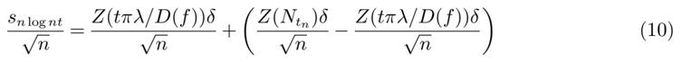
```text
PDF text layer: s n log nt √ n = Z ( tπλ/D ( f )) δ √ n + ( Z ( N t n ) δ √ n -Z ( tπλ/D ( f )) δ √ n ) (10)
```
*Formula quality: `decoded_unverified`; source PDF page 15. Machine-decoded LaTeX; verify against the linked source crop before use.*
<!-- formula-end -->

Using Donsker's invariance principle, the sequence of processes ( Z ( tπλn/D ( f )) √ n , t ≥ 0) converges

in ( D , J 1 ) to a Brownian motion with volatility δ √ πλ D ( f ) . Let ρ : (1 , ∞ ) ↦→ (1 , ∞ ) be a function satisfying:

<!-- formula-start id="ref_cont_de_larrard_markovian_lob_1104.4596:formula:0045" status="decoded_unverified" source-page="15" -->
$$
\ s a t i s f y i n g \colon & & \rho ( t ) \log ( \rho ( t ) ) = t \\ & & \text {Since } \rho ( t ) \sim _ { t \to \infty } \frac { t } { \log ( t ) } , \\ & & N _ { t _ { n } } \sim _ { n \to \infty } \rho ( \frac { \pi \lambda t \zeta ( n ) } { D ( f ) } ) \sim \frac { \pi \lambda \zeta ( n ) } { D ( f ) \log ( \zeta ( n ) ) } , \\ & & N _ { t _ { n } } \sim _ { n \to \infty } \frac { t \pi \lambda } { D ( f ) } . \\ \text {Therefor for all } t \geq 0 ,
$$
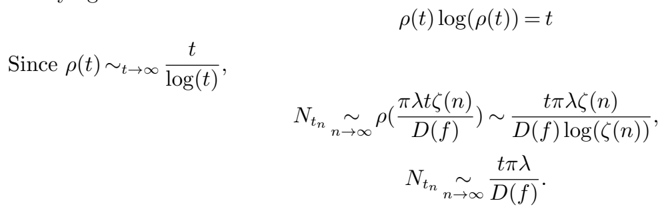
```text
PDF text layer: ρ ( t ) log( ρ ( t )) = t Since ρ ( t ) ∼ t →∞ t log( t ) , N t n ∼ n →∞ ρ ( πλtζ ( n ) D ( f ) ) ∼ tπλζ ( n ) D ( f ) log( ζ ( n )) , N t n ∼ n →∞ tπλ D ( f ) .
```
*Formula quality: `decoded_unverified`; source PDF page 15. Machine-decoded LaTeX; verify against the linked source crop before use.*
<!-- formula-end -->

Therefore for all t ≥ 0,

<!-- formula-start id="ref_cont_de_larrard_markovian_lob_1104.4596:formula:0046" status="decoded_unverified" source-page="15" -->
$$
( 1 1 )
$$
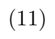
```text
PDF text layer: (11)
```
*Formula quality: `decoded_unverified`; source PDF page 15. Machine-decoded LaTeX; verify against the linked source crop before use.*
<!-- formula-end -->

<!-- formula-start id="ref_cont_de_larrard_markovian_lob_1104.4596:formula:0047" status="decoded_unverified" source-page="15" -->
$$
& \ 0 , & & \left ( \frac { Z ( N _ { t _ { n } } ) \delta } { \sqrt { n } } - \frac { Z ( t \pi \lambda / D ( f ) ) \delta } { \sqrt { n } } \right ) ^ { n \to \infty } 0
$$

```text
PDF text layer: ( Z ( N t n ) δ √ n -Z ( tπλ/D ( f )) δ √ n ) n →∞ ⇒ 0 (12)
```
*Formula quality: `decoded_unverified`; source PDF page 15. Machine-decoded LaTeX; verify against the linked source crop before use.*
<!-- formula-end -->

Therefore the finite dimensional distributions of the sequence of processes ( Z ( N t n ) δ √ n -Z ( tπλ/D ( f )) δ √ n ) t ≥ 0 converge to a point mass at zero . Since this sequence of processes is tight on ( D , J 1 ), it converges weakly to zero on ( D , J 1 ) (see Whitt (2002)). Finally,

<!-- formula-start id="ref_cont_de_larrard_markovian_lob_1104.4596:formula:0048" status="decoded_unverified" source-page="15" -->
$$
\left ( \frac { s _ { n \log n t } } { \sqrt { n } } , t \geq 0 \right ) ^ { n } \stackrel { \rightarrow \infty } { \Rightarrow } \delta \sqrt { \frac { \pi \lambda } { D ( f ) } } W .
$$

```text
PDF text layer: ( s n log nt √ n , t ≥ 0 ) n →∞ ⇒ δ √ πλ D ( f ) W.
```
*Formula quality: `decoded_unverified`; source PDF page 15. Machine-decoded LaTeX; verify against the linked source crop before use.*
<!-- formula-end -->

## 4.2. Empirical test using high-frequency data

Theorem 1 relates the 'coarse-grained' volatility of intraday returns at lower frequencies to the high-frequency arrival rates of orders. Denote by τ 0 =1 /λ the typical time scale separating order book events. Typically τ 0 is of the order of milliseconds. In plain terms, Theorem 1 states that, observed over a time scale τ 2 &gt;&gt;τ 0 (say, 10 minutes), the price has a diffusive behavior with a diffusion coefficient given by

<!-- formula-start id="ref_cont_de_larrard_markovian_lob_1104.4596:formula:0049" status="decoded_unverified" source-page="15" -->
$$
\sigma = \delta \sqrt { \frac { n \pi \lambda } { D ( f ) } }
$$

```text
PDF text layer: σ = δ √ nπλ D ( f ) (13)
```
*Formula quality: `decoded_unverified`; source PDF page 15. Machine-decoded LaTeX; verify against the linked source crop before use.*
<!-- formula-end -->

where δ is the tick size, n is an integer verifying n ln n τ 0 = τ 2 which represents the average number of orders during an interval τ 2 and √ D ( F ), the geometric average of the size of the bid queue and the size of the ask queue after a price change, is a measure of market depth.

Formula (13) links properties of the price to the properties of the order flow. the left hand side represents the variance of price changes, whereas the right hand side only involves the tick size and quantities: it yields an estimator for price volatility which may be computed without observing the price!

The relation (13) has an intuitive interpretation. It shows that, in two 'balanced' limit order markets with the same tick size and same rate of arrival of orders at the bext bid/ask, the market with higher depth of the next-to-best queues will lead to lower price volatility.

More precisely, this formula shows that the microstructure of order flow affects price volatility through the ratio λ/D ( f ) where λ is the rate of arrival of limit orders and D ( f ), given by (9), is a measure of market depth: in fact, our model predicts a proportionality between the variance of price increments and this ratio. This is an empirically testable prediction: Figure 5 compares, for stocks in the Dow Jones index, the standard deviation of 10-minute price increments with √ λ/D ( f ).

We observe that, indeed, stocks with a higher value of the ratio λ/D ( f ) have a higher variance, and standard deviation of price increments increases roughly proportionally to √ λ/D ( f ).

Figure 5 √ λ/D ( f ), estimated from tick-by-tick order flow (vertical axis) vs standard deviation of 10-minute price increments (horizontal axis) for stocks in the Dow Jones Index, estimated from high frequency data on June 26, 2008. Each point represents one stock. Red line indicates the best linear approximation.


## 4.3. Case when market orders and cancelations dominate

We now consider the case in which the flow of market orders and cancellations dominates that of limit orders: λ &lt; θ + µ . In this case, price changes are more frequent since the order queues are depleted at a faster rate than they are replenished by market orders. We also obtain a diffusion limit though with a different scaling:

Theorem 2 Let λ &lt; θ + µ and f a probability distribution on N 2 which satisfies

<!-- formula-start id="ref_cont_de_larrard_markovian_lob_1104.4596:formula:0050" status="decoded_unverified" source-page="16" -->
$$
m ( \lambda , \theta + \mu , f ) = \sum _ { i = 1 } ^ { \infty } \sum _ { j = 1 } ^ { \infty } m ( \lambda , \theta + \mu , i , j ) f ( i , j ) < \infty ,
$$

```text
PDF text layer: m ( λ,θ + µ,f ) = ∞ ∑ i =1 ∞ ∑ j =1 m ( λ,θ + µ,i, j ) f ( i, j ) < ∞ ,
```
*Formula quality: `decoded_unverified`; source PDF page 16. Machine-decoded LaTeX; verify against the linked source crop before use.*
<!-- formula-end -->

where for all ( x,y ) ∈ ( N ∗ ) 2 ,

<!-- formula-start id="ref_cont_de_larrard_markovian_lob_1104.4596:formula:0051" status="decoded_unverified" source-page="16" -->
$$
m ( \lambda , \theta + \mu , x , y ) = \int _ { 0 } ^ { \infty } d t \int _ { t } ^ { \infty } \psi _ { x , \lambda , \mu + \theta } ( u ) d u \int _ { t } ^ { \infty } \psi _ { y , \lambda , \mu + \theta } ( u ) d u
$$

```text
PDF text layer: m ( λ,θ + µ,x,y ) = ∫ ∞ 0 dt ∫ ∞ t ψ x,λ,µ + θ ( u ) du ∫ ∞ t ψ y,λ,µ + θ ( u ) du
```
*Formula quality: `decoded_unverified`; source PDF page 16. Machine-decoded LaTeX; verify against the linked source crop before use.*
<!-- formula-end -->

where ψ x,λ,µ + θ is given by (4) . Then

<!-- formula-start id="ref_cont_de_larrard_markovian_lob_1104.4596:formula:0052" status="decoded_unverified" source-page="16" -->
$$
\left ( \frac { s _ { n t } } { \sqrt { n } } , t \geq 0 \right ) \stackrel { n \to \infty } { \Rightarrow } \left ( \sqrt { \frac { 1 } { m ( \lambda , \theta + \mu , f ) } } \delta W _ { t } , t \geq 0 \right )
$$

```text
PDF text layer: ( s nt √ n , t ≥ 0 ) n →∞ ⇒ (√ 1 m ( λ,θ + µ,f ) δW t , t ≥ 0 )
```
*Formula quality: `decoded_unverified`; source PDF page 16. Machine-decoded LaTeX; verify against the linked source crop before use.*
<!-- formula-end -->

where W is a standard Brownian motion.

Proof. The sequence ( τ 2 , τ 3 , ... ) is a sequence of i.i.d random variables with finite mean equal to m ( λ,θ + µ,f ). We apply the law of large numbers:

<!-- formula-start id="ref_cont_de_larrard_markovian_lob_1104.4596:formula:0053" status="decoded_unverified" source-page="17" -->
$$
\frac { \tau _ { 1 } + \tau _ { 2 } + \dots + \tau _ { n } } { n } \stackrel { n \to \infty } { \rightarrow } m ( \lambda , \theta + \mu , f ) .
$$

```text
PDF text layer: τ 1 + τ 2 + ... + τ n n n →∞ → m ( λ,θ + µ,f ) .
```
*Formula quality: `decoded_unverified`; source PDF page 17. Machine-decoded LaTeX; verify against the linked source crop before use.*
<!-- formula-end -->

<!-- formula-start id="ref_cont_de_larrard_markovian_lob_1104.4596:formula:0054" status="decoded_unverified" source-page="17" -->
$$
\forall t \geq 0 , \quad N _ { t } ^ { n } \stackrel { n \to \infty } { \sim } [ \frac { t n } { m ( \lambda , \theta + \mu , f ) } ] .
$$

```text
PDF text layer: ∀ t ≥ 0 , N n t n →∞ ∼ [ tn m ( λ,θ + µ,f ) ] .
```
*Formula quality: `decoded_unverified`; source PDF page 17. Machine-decoded LaTeX; verify against the linked source crop before use.*
<!-- formula-end -->

Therefore,

The rest of the proof follows the lines of the proof of theorem 1.

Variance of price change at intermediate frequency Similarly to Theorem 1, Theorem 2 leads to an expression of the variance of the price at a time scale τ &gt;&gt; τ 0 , where τ 0 ( ∼ ms) is the average interval between order book events:

<!-- formula-start id="ref_cont_de_larrard_markovian_lob_1104.4596:formula:0055" status="decoded_unverified" source-page="17" -->
$$
\sigma ^ { 2 } = \frac { \tau } { \tau _ { 0 } } \frac { \pi \lambda } { m ( \lambda , \theta + \mu , f ) } \delta ^ { 2 }
$$

```text
PDF text layer: σ 2 = τ τ 0 πλ m ( λ,θ + µ,f ) δ 2 (14)
```
*Formula quality: `decoded_unverified`; source PDF page 17. Machine-decoded LaTeX; verify against the linked source crop before use.*
<!-- formula-end -->

Here, m ( λ,θ + µ,f ) represents the expected hitting time of the axes by the queueing system with parameters ( λ,θ + µ ) and random initial condition with distribution f in the positive orthant.

As before, while the left hand side of this equation is the variance of price changes (over a time scale τ 2 ), the right hand side only involves the tick size and quantities which relate to the statistical properties of the order flow.

## 4.4. Conclusion

We have exhibited a simple model of a limit order market in which order book events are described in terms of a Markovian queueing system. The analytical tractability of our model allows to compute various quantities of interest such as

- the distribution of the duration until the next price change,
- the distribution of price changes, and
- the diffusion limit of the price process and its volatility.

in terms of parameters describing the order flow. These results provide some insight into the relation between price dynamics and order flow in a limit order market.

We view this stylized model as a first step in the elaboration of the analytical study of realistic stochastic models of order book dynamics. Yet, comparison with empirical data shows that even our simple modeling set-up is capable of yielding useful analytical insights into the relation between volatility and order flow, worthy of being further pursued. Moreover, the connection with twodimensional queueing systems allows to use the rich analytical theory developed for these systems (see Cohen and Boxma (1983)) to compute many other quantities. We hope to pursue further some of these ramifications in future work.

A relevant question is to examine which of the above results are robust to departures from the model assumptions and whether the intuitions conveyed by our model remain valid in a more general context where one or more of these assumptions are dropped. This issue is further studied in a companion paper Cont and de Larrard (2010) where we explore a more general dynamic model relaxing some of the assumptions above.

## Acknowledgments

The authors thank Jean-Philippe Bouchaud, Peter Carr, Xin Guo, Charles Lehalle, Pete Kyle, Arseniy Kukanov, Costis Maglaras and seminar participants at the European Meeting of Statisticians (Athens, August 2010), Morgan Stanley, INFORMS 2010, the SIAM Conference on Financial Engineering and the Conference on Market microstructure (Paris, 2010) for helpful comments and discussions.

## References

- Alfonsi, A., A. Schied, A. Schulz. 2010. Optimal execution strategies in limit order books with general shape function. Quantitative Finance 10 143-157.
- Biais, Bruno, Pierre Hillion, Chester Spatt. 1995. An empirical analysis of the order flow and order book in the paris bourse. Journal of Finance 50 (5) 1655-1689.
- Billingsley, P. 1968. Convergence of Probability Measures . Wiley Series in Probability and Statistics.
- Bouchaud, Jean-Philippe, Doyne Farmer, Fabrizio Lillo. 2008. How markets slowly digest changes in supply and demand. T. Hens, K. Schenk-Hoppe, eds., Handbook of Financial Markets: Dynamics and Evolution . Elsevier: Academic Press.
- Cohen, Jacob Willem, O. J. Boxma. 1983. Boundary value problems in queueing system analysis , NorthHolland Mathematics Studies , vol. 79. North-Holland Publishing Co., Amsterdam.
- Cont, Rama. 2001. Empirical properties of asset returns: stylized facts and statistical issues. Quantitative Finance 1 (2) 223-236.
- Cont, Rama, Adrien de Larrard. 2010. Linking volatility with order flow: heavy traffic approximations and diffusion limits of order book dynamics. Working paper.
- Cont, Rama, Arseniy Kukanov, Sasha Stoikov. 2010a. The price impact of order book events. Working Paper http://ssrn.com/abstract=1712822, SSRN.
- Cont, Rama, Sasha Stoikov, Rishi Talreja. 2010b. A stochastic model for order book dynamics. Operations Research 58 549-563.
- Engle, R., J. Russell. 1998. Autoregressive conditional duration: a new model for irregularly-spaced transaction data. Econometrica 66 1127-1162.
- Engle, Robert F., Asger Lunde. 2003. Trades and Quotes: A Bivariate Point Process. Journal of Financial Econometrics 1 (2) 159-188.
- Farmer, J. Doyne, L´ aszl´ o Gillemot, Fabrizio Lillo, Szabolcs Mike, Anindya Sen. 2004. What really causes large price changes? Quantitative Finance 4 383-397.
- Feller, William. 1971. An Introduction to Probability Theory and Its Applications, Vol. 2 . John Wiley and Sons.
- Gourieroux, Christian, Joanna Jasiak, Gaelle Le Fol. 1999. Intra-day market activity. Journal of Financial Markets 2 (3) 193-226.
- Harris, Lawrence E., Venkatesh Panchapagesan. 2005. The information content of the limit order book: evidence from NYSE specialist trading decisions. Journal of Financial Markets 8 (1) 25-67.
- Hollifield, B., R. A. Miller, P. Sandas. 2004. Empirical analysis of limit order markets. Review of Economic Studies 71 (4) 1027-1063.
- Lawler, Gregory F., Vlada Limic. 2010. Random Walk: A Modern Introduction , vol. 123. Cambridge Studies in Advanced Mathematics.
- Parlour, Christine A. 1998. Price dynamics in limit order markets. Review of Financial Studies 11 (4) 789-816.
- Predoiu, S., G. Shaikhet, S. Shreve. 2011. Optimal execution of a general one-sided limit-order book. SIAM Journal on Financial Mathematics, Vol 2, 183-212.
- Rosu, Ioanid. 2009. A dynamic model of the limit order book. Review of Financial Studies 22 4601-4641.
- Smith, E., J. D. Farmer, L. Gillemot, S. Krishnamurthy. 2003. Statistical theory of the continuous double auction. Quantitative Finance 3 (6) 481-514.
- Whitt, Ward. 2002. Stochastic Process Limits . Springer Verlag.
