# A stochastic model for order book dynamics

Rama Cont, Sasha Stoikov, Rishi Talreja IEOR Dept, Columbia University, New York rama.cont@columbia.edu, sashastoikov@gmail.com, rt2146@columbia.edu

We propose a stochastic model for the continuous-time dynamics of a limit order book. The model strikes a balance between two desirable features: it captures key empirical properties of order book dynamics and its analytical tractability allows for fast computation of various quantities of interest without resorting to simulation. We describe a simple parameter estimation procedure based on high-frequency observations of the order book and illustrate the results on data from the Tokyo stock exchange. Using Laplace transform methods, we are able to efficiently compute probabilities of various events, conditional on the state of the order book: an increase in the mid-price, execution of an order at the bid before the ask quote moves, and execution of both a buy and a sell order at the best quotes before the price moves. Comparison with highfrequency data shows that our model can capture accurately the short term dynamics of the limit order book.

Key words : Limit order book, financial engineering, Laplace transform inversion, queueing systems, simulation.

## Contents

|   1 Introduction | 1 Introduction                                                    | 1 Introduction                                                                 |   3 |
|------------------|-------------------------------------------------------------------|--------------------------------------------------------------------------------|-----|
|                2 | A continuous-time model for a stylized limit order book           | A continuous-time model for a stylized limit order book                        |   4 |
|                  | 2.1                                                               | Limit order books . . . . . . . . . . . . . . . . . . . . . . . . . . . . . .  |   4 |
|                  | 2.2                                                               | Dynamics of the order book . . . . . . . . . . . . . . . . . . . . . . . . .   |   5 |
|                3 | Parameter estimation                                              | Parameter estimation                                                           |   5 |
|                  | . . . . . . . . . . . . . . . . . . . . .                         | . . . . . . . . . . . . . . . . . . . . .                                      |   6 |
|                  | 3.1                                                               | Description of the data set . . . . .                                          |   6 |
|                  | 3.2                                                               | Estimation procedure . . . . . . . . . . . . . . . . . . . . . . . . . . . .   |   7 |
|                4 |                                                                   |                                                                                |   7 |
|                  | Laplace transform methods for computing conditional probabilities | Laplace transform methods for computing conditional probabilities              |   8 |
|                  | 4.1                                                               | Laplace transforms and first-passage times of birth-death processes . . .      |   9 |
|                  | 4.2                                                               | Direction of price moves . . . . . . . . . . . . . . . . . . . . . . . . . . . |  10 |
|                  | 4.3                                                               | Executing an order before the mid-price moves . . . . . . . . . . . . . .      |  12 |
|                  | 4.4                                                               | Making the spread . . . . . . . . . . . . . . . . . . . . . . . . . . . . . .  |  13 |
|                5 | Numerical Results                                                 | Numerical Results                                                              |  15 |
|                  | 5.1 Long term behavior . . . . . . . . . . . . . . .              | . . . . . . . . . . . . . .                                                    |  15 |
|                  | 5.1.1                                                             | Steady state shape of the book . . . . . . . . . . . . . . . . . . .           |  15 |
|                  | 5.1.2                                                             | Volatility . . . . . . . . . . . . . . . . . . . . . . . . . . . . . . .       |  15 |
|                  | 5.2                                                               | Conditional distributions . . . . . . . . . . . . . . . . . . . . . . . . . .  |  16 |
|                  | 5.2.1 One-step transition probabilities . . . . . . . . . .       | . . . . . . . .                                                                |  16 |
|                  | 5.2.2                                                             | Direction of price moves . . . . . . . . . . . . . . . . . . . . . . .         |  17 |
|                  | 5.2.3                                                             | Executing an order before the mid-price moves . . . . . . . . . .              |  18 |
|                  | 5.2.4                                                             | Making the spread . . . . . . . . . . . . . . . . . . . . . . . . . .          |  18 |
|                6 | Conclusion                                                        | Conclusion                                                                     |  18 |

## 1. Introduction

The evolution of prices in financial markets results from the interaction of buy and sell orders through a rather complex dynamic process. Studies of the mechanisms involved in trading financial assets have traditionally focused on quote-driven markets, where a market maker or dealer centralizes buy and sell orders and provides liquidity by setting bid and ask quotes. The NYSE specialist system is an example of this mechanism. In recent years, Electronic Communications Networks (ECN's) such as Archipelago, Instinet, Brut and Tradebook have captured a large share of the order flow by providing an alternative order-driven trading system. These electronic platforms aggregate all outstanding limit orders in a limit order book that is available to market participants and market orders are executed against the best available prices. As a result of the ECN's popularity, established exchanges such as the NYSE, Nasdaq, the Tokyo Stock Exchange and the London Stock Exchange have adopted electronic order-driven platforms, either fully or partially through 'hybrid' systems.

The absence of a centralized market maker, the mechanical nature of execution of orders and -last but not least- the availability of data have made order-driven markets interesting candidates for stochastic modelling . At a fundamental level, models of order book dynamics may provide some insight into the interplay between order flow, liquidity and price dynamics Bouchaud et al. (2002), Smith et al. (2003), Farmer et al. (2004), Foucault et al. (2005). At the level of applications, such models provide a quantitative framework for investors and trading desks to optimize trade execution strategies Alfonsi et al. (2007), Obizhaeva and Wang (2006). An important motivation for modelling high-frequency dynamics of order books is to use the information on the current state of the order book to predict its short-term behavior. The focus is therefore on conditional probabilities of events, given the state of the order book.

The dynamics of a limit order book resembles in many aspects that of a queuing system. Limit orders wait in a queue to be executed against market orders (or canceled). Drawing inspiration from this analogy, we model a limit order book as a continuous-time Markov process that tracks the number of limit orders at each price level in the book. The model strikes a balance between three desirable features: it can be easily calibrated to high-frequency data, reproduces various empirical features of order books and is analytically tractable. In particular, we show that our model is simple enough to allow the use of Laplace transform techniques from the queueing literature to compute various conditional probabilities . These include the probability of the mid-price increasing in the next move, the probability of executing an order at the bid before the ask quote moves and the probability of executing both a buy and a sell order at the best quotes before the price moves, given the state of the order book. We illustrate these computations in a model estimated from order book data for a stock on the Tokyo stock exchange.

Related literature. Various recent studies have focused on limit order books. Given the complexity of the structure and dynamics of order books, it has been difficult to construct models that are both statistically realistic and amenable to rigorous quantitative analysis. Parlour (1998) and Foucault et al. (2005), Rosu (forthcoming) propose equilibrium models of limit order books. These models provide interesting insights into the price formation process but contain unobservable parameters that govern agent preferences. Thus, they are difficult to estimate and use in applications. Some empirical studies on properties of limit order books are Bouchaud et al. (2002), Farmer et al. (2004), and Hollifield et al. (2004). These studies provide an extensive list of statistical features of order book dynamics which are challenging to incorporate in a single model. Bouchaud et al. (2008), Smith et al. (2003), Bovier et al. (2006), Luckock (2003), and Maslov and Mills (2001) propose stochastic models of order book dynamics in the spirit of the one proposed here but focus on unconditional / steady-state distributions of various quantities rather than the conditional quantities we focus on here.

The model proposed here is admittedly simpler in structure than some others existing in the literature: it does not incorporate strategic interaction of traders as in game theoretic approaches Parlour (1998), Foucault et al. (2005) and Rosu (forthcoming), nor does it account for 'long memory' features of the order flow as pointed out by Bouchaud et al. (2002) and Bouchaud et al. (2008). However, contrarily to these models, it leads to an analytically tractable framework where parameters can be easily estimated from empirical data and various quantities of interest may be computed efficiently.

Outline. The paper is organized as follows. § 2 describes a stylized model for the dynamics of a limit order book, where the order flow is described by independent Poisson processes. Estimation of model parameters from high-frequency order book time series data is described in § 3 and illustrated using data from the Tokyo Stock Exchange. In § 4 we show how this model can be used to compute conditional probabilities of various types of events relevant for trade execution using Laplace transform methods. § 5 explores steady state properties of the model using Monte Carlo simulation and compares conditional probabilities computed by simulation to those computed with the Laplace transform methods presented in § 4.

## 2. A continuous-time model for a stylized limit order book

## 2.1. Limit order books

Consider a financial asset traded in an order-driven market. Market participants can post two types of buy/sell orders. A limit order is an order to trade a certain amount of a security at a given price. Limit orders are posted to a electronic trading system and the state of outstanding limit orders can be summarized by stating the quantities posted at each price level: this is known as the limit order book . The lowest price for which there is an outstanding limit sell order is called the ask price and the highest buy price is called the bid price .

A market order is an order to buy/sell (a certain quantity of) the asset at the best available price in the limit order book. When a market order arrives it is matched with the best available price in the limit order book and a trade occurs. The quantities available in the limit order book are updated accordingly.

A limit order sits in the order book until it is either executed against a market order or it is canceled. A limit order may be executed very quickly if it corresponds to a price near the bid and the ask, but may take a long time if the market price moves away from the requested price or if the requested price is too far from the bid/ask. Alternatively, a limit order can be canceled at any time.

We consider a market where limit orders can be placed on a price grid { 1 , . . . , n } representing multiples of a price tick. We track the state of the order book with a continuous-time process X ( t ) ≡ ( X 1 ( t ) , . . . , X n ( t )) t ≥ 0 , where | X p ( t ) | is the number of outstanding limit orders at price p , 1 ≤ p ≤ n . If X p ( t ) &lt; 0, then there are -X p ( t ) bid orders at price p ; if X p ( t ) &gt; 0, then there are X p ( t ) ask orders at price p .

The ask price p A ( t ) at time t is then defined by

<!-- formula-start id="ref_cont_stochastic_order_book_dynamics_2010:formula:0001" status="semantic_high_confidence" source-page="4" -->
$$
p_A(t)=\inf\{p\in\{1,\ldots,n\}:X_p(t)>0\}\wedge(n+1)
$$
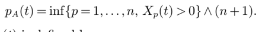
*Formula quality: `semantic_high_confidence`; source PDF page 4. Confirmed as the best-ask definition, with n+1 as the empty-ask sentinel.*
<!-- formula-end -->

Similarly, the bid price p B ( t ) is defined by

<!-- formula-start id="ref_cont_stochastic_order_book_dynamics_2010:formula:0002" status="semantic_high_confidence" source-page="4" -->
$$
p_B(t)=\sup\{p\in\{1,\ldots,n\}:X_p(t)<0\}\vee 0
$$
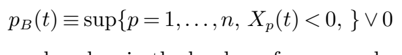
*Formula quality: `semantic_high_confidence`; source PDF page 4. Confirmed as the best-bid definition, with zero as the empty-bid sentinel.*
<!-- formula-end -->

Notice that when there are no ask orders in the book we force an ask price of n +1 and when there are no bid orders in the book we force a bid price of 0. The mid-price p M ( t ) and the bid-ask spread s ( t ) are defined by

<!-- formula-start id="ref_cont_stochastic_order_book_dynamics_2010:formula:0003" status="semantic_high_confidence" source-page="4" -->
$$
p_M(t)=\frac{p_B(t)+p_A(t)}{2},\qquad s(t)=p_A(t)-p_B(t)
$$
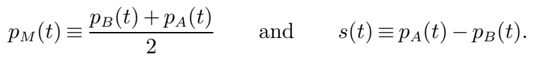
*Formula quality: `semantic_high_confidence`; source PDF page 4. Confirmed from the preceding best-quote definitions: the midpoint is their average and the spread their difference.*
<!-- formula-end -->

Since most of the trading activity takes place in the vicinity of the bid and ask prices, it is useful to keep track of the number of outstanding orders at a given distance from the bid/ask. To this end, we define

<!-- formula-start id="ref_cont_stochastic_order_book_dynamics_2010:formula:0004" status="semantic_high_confidence" source-page="5" -->
$$
Q_i^B(t)=\begin{cases}-X_{p_A(t)-i}(t),&0<i<p_A(t),\\0,&p_A(t)\le i<n.\end{cases}
$$
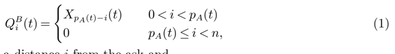
*Formula quality: `semantic_high_confidence`; source PDF page 5. Corrected a high-confidence sign typo: bid depth must be -X at the corresponding price because bid states are negative by definition.*
<!-- formula-end -->

the number of buy orders at a distance i from the ask and

<!-- formula-start id="ref_cont_stochastic_order_book_dynamics_2010:formula:0005" status="semantic_high_confidence" source-page="5" -->
$$
Q_i^A(t)=\begin{cases}X_{p_B(t)+i}(t),&0<i<n-p_B(t),\\0,&n-p_B(t)\le i<n.\end{cases}
$$
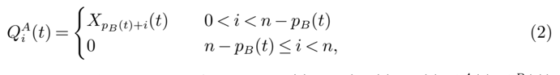
*Formula quality: `semantic_high_confidence`; source PDF page 5. Confirmed as the nonnegative ask-depth definition at distance i from the bid.*
<!-- formula-end -->

the number of sell orders at a distance i from the bid. Although X ( t ) and ( p A ( t ) , p B ( t ) , Q A ( t ) , Q B ( t )) contain the same information, the second representation highlights the shape or depth of the book relative to the best quotes.

## 2.2. Dynamics of the order book

Let us now describe how the limit order book is updated by the inflow of new orders. For a state x ∈ Z n and 1 ≤ p ≤ n , define

<!-- formula-start id="ref_cont_stochastic_order_book_dynamics_2010:formula:0006" status="semantic_high_confidence" source-page="5" -->
$$
x_{p\pm1}=x\pm(0,\ldots,0,1,0,\ldots,0)
$$
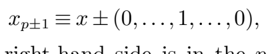
*Formula quality: `semantic_high_confidence`; source PDF page 5. Removed OCR spillover and reconstructed the state update with the unit entry in component p.*
<!-- formula-end -->

where the 1 in the vector on the right-hand side is in the p -th component. Assuming that all orders are of unit size (in empirical examples we will take this unit to be the average size of limit orders observed for the asset),

- a limit buy order at price level p &lt; p A ( t ) increases the quantity at level p : x → x p -1
- a market buy order decreases the quantity at the ask price: x → x p A ( t ) -1
- a limit sell order at price level p &gt; p B ( t ) increases the quantity at level p : x → x p +1
- a market sell order decreases the quantity at the bid price: x → x p B ( t )+1
- a cancellation of an oustanding limit sell order at price level p &gt; p B ( t ) decreases the quantity at level p : x → x p -1
- a cancellation of an oustanding limit buy order at price level p &lt; p A ( t ) decreases the quantity at level p : x → x p +1

The evolution of the order book is thus driven by the incoming flow of market orders, limit orders and cancellations at each price level, each of which can be represented as a counting process. It is empirically observed Bouchaud et al. (2002) that incoming orders arrive more frequently in the vicinity of the current bid/ask price and the rate of arrival of these orders depends on the distance to the bid/ask.

To capture these empirical features in a model that is analytically tractable and allows to compute quantities of interest in applications -most notably conditional probabilities of various eventswe propose a stochastic model where the events outlined above are modelled using independent Poisson processes. More precisely, we assume that, for i ≥ 1,

- Limit buy (resp. sell) orders arrive at a distance of i ticks from the opposite best quote at independent, exponential times with rate λ ( i ),
- Market buy (resp. sell) orders arrive at independent, exponential times with rate μ ,
- Cancellations of limit orders at a distance of i ticks from the opposite best quote occur at a rate proportional to the number of outstanding orders: if the number of outstanding orders at that level is x then the cancellation rate is θ ( i ) x . This assumption can be understood as follows: if we have a batch of x outstanding orders, each of which can be canceled at an exponential time with parameter θ ( i ), then the overall cancellation rate for the batch is θ ( i ) x .

- The above events are mutually independent.

Typically, the arrival rates λ : { 1 , . . . , n } → [0 , ∞ ) are decreasing functions of the distance to the bid/ask: most orders are placed close to the current price. Empirical studies suggest a power law

<!-- formula-start id="ref_cont_stochastic_order_book_dynamics_2010:formula:0007" status="semantic_high_confidence" source-page="6" -->
$$
\lambda(i)=\frac{k}{i^{\alpha}}
$$
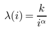
*Formula quality: `semantic_high_confidence`; source PDF page 6. Confirmed as the power-law specification for limit-order arrival intensity versus quote distance.*
<!-- formula-end -->

as a plausible specification (see Zovko and Farmer (2002) or Bouchaud et al. (2002)).

Given the above assumptions, X is a continuous-time Markov chain with state space Z n and transition rates given by

<!-- formula-start id="ref_cont_stochastic_order_book_dynamics_2010:formula:0008" status="semantic_high_confidence" source-page="6" -->
$$
\begin{aligned}x&\to x_{p-1}&&\text{at rate }\lambda(p_A(t)-p),&&p<p_A(t),\\x&\to x_{p+1}&&\text{at rate }\lambda(p-p_B(t)),&&p>p_B(t),\\x&\to x_{p_B(t)+1}&&\text{at rate }\mu,\\x&\to x_{p_A(t)-1}&&\text{at rate }\mu,\\x&\to x_{p+1}&&\text{at rate }\theta(p_A(t)-p)|x_p|,&&p<p_A(t),\\x&\to x_{p-1}&&\text{at rate }\theta(p-p_B(t))|x_p|,&&p>p_B(t).\end{aligned}
$$
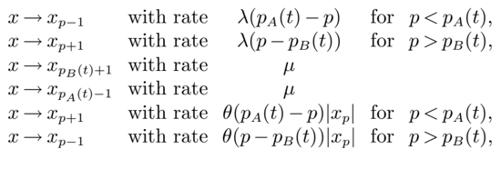
*Formula quality: `semantic_high_confidence`; source PDF page 6. Confirmed all six Markov-chain transitions against the sign convention for bid and ask inventory and the stated event intensities.*
<!-- formula-end -->

Proposition 1 X is an ergodic Markov process. In particular, X has a proper stationary distribution.

Proof. Define N ≡ ( N ( t ) , t ≥ 0), where N ( t ) ≡ ∑ n i =1 | X i ( t ) | . Then X ( t ) = (0 , . . . , 0) if and only if N ( t ) = 0. But N is simply a birth-death process with birth rate bounded from above by λ ≡ 2 ∑ n i =0 λ ( i ) and death rate in state i , μ i ≡ 2 μ + iθ . Then, we have the inequalities

and

<!-- formula-start id="ref_cont_stochastic_order_book_dynamics_2010:formula:0009" status="semantic_high_confidence" source-page="6" -->
$$
\sum_{i=1}^{\infty}\frac{\lambda^i}{\mu_1\cdots\mu_i}<\sum_{i=1}^{\infty}\frac{1}{i!}\left(\frac{\lambda}{\theta}\right)^i=e^{\lambda/\theta}-1<\infty
$$
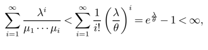
*Formula quality: `semantic_high_confidence`; source PDF page 6. Confirmed as the convergent birth-death recurrence-series bound using mu_i at least i theta.*
<!-- formula-end -->

<!-- formula-start id="ref_cont_stochastic_order_book_dynamics_2010:formula:0010" status="semantic_high_confidence" source-page="6" -->
$$
\sum_{i=1}^{\infty}\frac{\mu_1\cdots\mu_i}{\lambda^i}>\sum_{i=1}^{M}\frac{\mu_1\cdots\mu_i}{\lambda^i}+\sum_{i=M+1}^{\infty}\left(\frac{2\mu+M\theta}{\lambda}\right)^i=\infty
$$
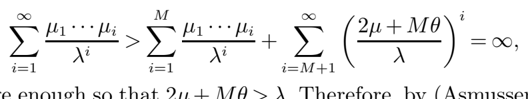
*Formula quality: `semantic_high_confidence`; source PDF page 6. Removed OCR prose contamination and restored the divergent lower bound used in the ergodicity criterion.*
<!-- formula-end -->

for M&gt; 0 chosen large enough so that 2 μ + Mθ&gt;λ . Therefore, by (Asmussen 2003, Corollary 2.5) the birth-death process is ergodic. Since X is clearly irreducible, it follows that X is also ergodic. □

The ergodicity of X is a desirable feature: it allows to compare time averages of various quantities (average shape of the order book, average price impact, etc.) to expectations of these quantities computed in the model. The steady-state behavior of X will be further discussed in § 5.1.

## 3. Parameter estimation

## 3.1. Description of the data set

Our data consists of time-stamped sequences of trades (market orders) and quotes (prices, quantities of outstanding limit orders) for the 5 best price levels on each side of the order book, for stocks traded on the Tokyo stock exchange. This data set, referred to as Level II order book data, provides a more detailed view of price dynamics than the Trade and Quotes (TAQ) data often used for high frequency data analysis, which consist of prices and sizes of trades (market orders) and time-stamped updates in the price and size of the bid and ask quotes.

In Table 1, we display a sample of three consecutive trades for Sky Perfect Communications. Each row provides the time, size and price of a market order. We also display a sample of Level II bid side quotes. Each row displays the 5 bid prices (pb1, pb2, pb3, pb4 and pb5), as well as the quantity of shares bid at these respective prices (qb1, qb2, qb3, qb4, qb5).

Table 1 A sample of 3 trades and 5 quotes for Sky Perfect Communications

| time    |   price |   size |
|---------|---------|--------|
| 9:11:01 |   74300 |      1 |
| 9:11:04 |   74600 |      2 |
| 9:11:19 |   74400 |      1 |

| time    |   pb1 |   pb2 |   pb3 |   pb4 |   pb5 |   qb1 |   qb2 |   qb3 |   qb4 |   qb5 |
|---------|-------|-------|-------|-------|-------|-------|-------|-------|-------|-------|
| 9:11:01 | 74300 | 74200 | 74000 | 73900 | 73800 |    12 |    13 |     1 |    52 |    11 |
| 9:11:03 | 74400 | 74300 | 74200 | 74000 | 73900 |    20 |    12 |    13 |     1 |    52 |
| 9:11:04 | 74400 | 74300 | 74200 | 74000 | 73900 |    21 |    11 |    13 |     1 |    52 |
| 9:11:05 | 74400 | 74300 | 74200 | 74000 | 73900 |    34 |     4 |    13 |     1 |    52 |
| 9:11:19 | 74400 | 74300 | 74200 | 74000 | 73900 |    33 |     4 |    13 |     1 |    52 |

## 3.2. Estimation procedure

Recall that in our stylized model we assume orders to be of unit size. In the data set, we first compute the average size of market orders S m , of limit orders S l and of canceled orders S c and choose the size unit to be the average size of a limit order S l : a block of orders of size S l is counted as one event. The limit order arrival rate function for 1 ≤ i ≤ 5 can be estimated by

<!-- formula-start id="ref_cont_stochastic_order_book_dynamics_2010:formula:0011" status="semantic_high_confidence" source-page="7" -->
$$
\widehat{\lambda}(i)=\frac{N_l(i)}{T}
$$
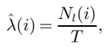
*Formula quality: `semantic_high_confidence`; source PDF page 7. Confirmed as the observed limit-order count per sample duration.*
<!-- formula-end -->

where N l ( i ) is the total number of limit orders that arrived at a distance i from the opposite best quote. N l ( i ) is obtained by enumerating the number of times that a quote increases in size at a distance of 1 ≤ i ≤ 5 ticks from the opposite best quote. We then extrapolate by fitting a power law function of the form

<!-- formula-start id="ref_cont_stochastic_order_book_dynamics_2010:formula:0012" status="semantic_high_confidence" source-page="7" -->
$$
\widehat{\lambda}(i)=\frac{k}{i^{\alpha}}
$$
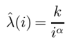
*Formula quality: `semantic_high_confidence`; source PDF page 7. Confirmed as the fitted extrapolation of the empirical arrival-rate curve.*
<!-- formula-end -->

(suggested by Zovko and Farmer (2002) or Bouchaud et al. (2002)). The power law parameters k and α are obtained by a least squares fit

<!-- formula-start id="ref_cont_stochastic_order_book_dynamics_2010:formula:0013" status="semantic_high_confidence" source-page="7" -->
$$
\min_{k,\alpha}\sum_{i=1}^{5}\left(\widehat{\lambda}(i)-\frac{k}{i^{\alpha}}\right)^2
$$
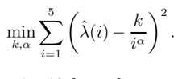
*Formula quality: `semantic_high_confidence`; source PDF page 7. Confirmed as the least-squares objective used to estimate the power-law parameters.*
<!-- formula-end -->

Estimated arrival rates at distances 0 ≤ i ≤ 10 from the opposite best quote are displayed in Figure 1(a).

The arrival rate of market orders is then estimated by

<!-- formula-start id="ref_cont_stochastic_order_book_dynamics_2010:formula:0014" status="semantic_high_confidence" source-page="7" -->
$$
\widehat{\mu}=\frac{N_m}{T}\frac{S_m}{S_l}
$$
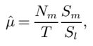
*Formula quality: `semantic_high_confidence`; source PDF page 7. Confirmed dimensionally as market-order arrivals per time rescaled from average market-order size to the model's limit-order unit.*
<!-- formula-end -->

l

where T is the length of our sample (in minutes) and N m is the number of market orders. Note that we ignore market orders that do not affect the best quotes, as is the case when a market order is matched by a hidden or 'iceberg' order.

Since the cancellation rate in our model is proportional to the number of orders at a particular price level, in order to estimate cancellation rate we first need to estimate the steady state shape of the order book Q i , which is the average number of orders at a distance of i ticks from the opposite best quote, for 1 ≤ i ≤ 5. If M is the number of quote rows and S B i ( j ) the number of shares bid at a distance of i ticks from the ask on the j th row, for 1 ≤ j ≤ M , we have

Figure 1 The arrival rates as a function of the distance from the opposite quote

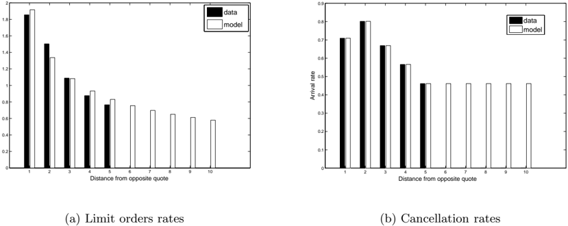

Estimated parameters: Sky Perfect Communications.

|           |    1 |    2 |    3 |    4 |    5 |
|-----------|------|------|------|------|------|
| ˆ λ ( i ) | 1.85 | 1.51 | 1.09 | 0.88 | 0.77 |
| ˆ θ ( i ) | 0.71 | 0.81 | 0.68 | 0.56 | 0.47 |
| ˆ μ       | 0.94 |      |      |      |      |
| k         | 1.92 |      |      |      |      |
| α         | 0.52 |      |      |      |      |

Table 2

<!-- formula-start id="ref_cont_stochastic_order_book_dynamics_2010:formula:0015" status="semantic_high_confidence" source-page="8" -->
$$
Q_i^B=\frac{1}{S_l}\frac{1}{M}\sum_{j=1}^{M}S_i^B(j)
$$
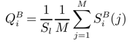
*Formula quality: `semantic_high_confidence`; source PDF page 8. Confirmed as average empirical bid depth measured in average-limit-order units.*
<!-- formula-end -->

The vector Q A i is obtained analogously and Q i is the average of Q A i and Q B i .

An estimator for the cancellation rate function is then given by

<!-- formula-start id="ref_cont_stochastic_order_book_dynamics_2010:formula:0016" status="semantic_high_confidence" source-page="8" -->
$$
\widehat{\theta}(i)=\frac{N_c(i)}{TQ_i}\frac{S_c}{S_l}\quad(i\le5),\qquad\widehat{\theta}(i)=\widehat{\theta}(5)\quad(i>5)
$$
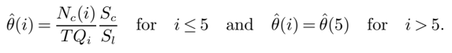
*Formula quality: `semantic_high_confidence`; source PDF page 8. Confirmed as cancellations per unit time and standing depth, with size rescaling and a flat tail beyond five ticks.*
<!-- formula-end -->

The fitted values are displayed in Figure 1(b). N c ( i ) is obtained by counting the number of times that a quote decreases in size at a distance of 1 ≤ i ≤ 5 ticks from the opposite best quote, excluding decreases due to market orders.

Estimated parameter values for Sky Perfect Communications are given in Table 2.

## 4. Laplace transform methods for computing conditional probabilities

As noted above, an important motivation for modelling high-frequency dynamics of order books is to use the information provided by the limit order book for predicting short-term behavior of various quantities which are useful in trade execution and algorithmic trading. For instance, the probability of the mid-price moving up versus down, the probability of executing a limit order at the bid before the ask quote moves and the probability of executing both a buy and a sell order at the best quotes before the price moves. These quantities can be expressed in terms of conditional probabilities of events, given the state of the order book. In this section we show that the model proposed in § 2 allows such conditional probabilities to be analytically computed using Laplace methods. After presenting some background on Laplace transforms in § 4.1, we give various examples of these computations. The probability of an increase in the mid-price is discussed in § 4.2, the probability that a limit order executes before the price moves is discussed in § 4.3 and the probability of executing both a buy and a sell limit order before the price moves is discussed in § 4.4. Laplace transform methods allow efficient computation of these quantities, bypassing the need for Monte Carlo simulation.

## 4.1. Laplace transforms and first-passage times of birth-death processes

We first recall some basic facts about two-sided Laplace transforms and discuss the computation of Laplace transforms for first-passage times of birth-death processes (Abate and Whitt (1999)). Given a function f : R → R , its two-sided Laplace transform is given by

<!-- formula-start id="ref_cont_stochastic_order_book_dynamics_2010:formula:0017" status="semantic_high_confidence" source-page="9" -->
$$
\widehat f(s)=\int_{-\infty}^{\infty}e^{-st}f(t)\,dt
$$
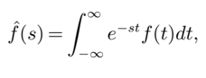
*Formula quality: `semantic_high_confidence`; source PDF page 9. Confirmed as the paper's two-sided Laplace-transform convention.*
<!-- formula-end -->

where s is a complex numbers. When f is the probability density function (pdf) of some random variable X , its two-sided Laplace transform can also be written as

<!-- formula-start id="ref_cont_stochastic_order_book_dynamics_2010:formula:0018" status="semantic_high_confidence" source-page="9" -->
$$
\widehat f(s)=\mathbb E[e^{-sX}]
$$
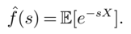
*Formula quality: `semantic_high_confidence`; source PDF page 9. Confirmed as the expectation form of the transform for a random variable X.*
<!-- formula-end -->

In this case, we also say that ˆ f is the two-sided Laplace transform of the random variable itself. We work with two-sided Laplace transforms here because for our purposes the function f will usually correspond to the pdf of a random variable with both positive and negative support. From now on, we drop the prefix 'two-sided' when referring to two-sided Laplace transforms. When we say conditional Laplace-transform of the random variable X conditional on the event A , we mean the Laplace transform of the conditional pdf of X given A .

Recall that if X and Y are independent random variables with well-defined Laplace transforms, then

<!-- formula-start id="ref_cont_stochastic_order_book_dynamics_2010:formula:0019" status="semantic_high_confidence" source-page="9" -->
$$
\widehat f_{X+Y}(s)=\mathbb E[e^{-s(X+Y)}]=\mathbb E[e^{-sX}]\mathbb E[e^{-sY}]=\widehat f_X(s)\widehat f_Y(s)
$$
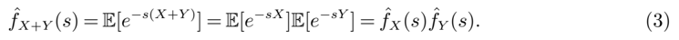
*Formula quality: `semantic_high_confidence`; source PDF page 9. Confirmed from independence as the product rule for the transform of X+Y.*
<!-- formula-end -->

If for some γ ∈ R we have ∫ ∞ -∞ | ˆ f ( σ + iω ) | dω &lt; ∞ and f ( t ) is continuous at t , then the inverse transform is given by the Bromwich contour integral

<!-- formula-start id="ref_cont_stochastic_order_book_dynamics_2010:formula:0020" status="semantic_high_confidence" source-page="9" -->
$$
f(t)=\frac{1}{2\pi i}\int_{\sigma-i\infty}^{\sigma+i\infty}e^{ts}\widehat f(s)\,ds
$$
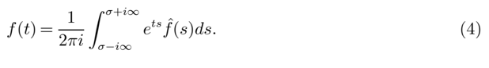
*Formula quality: `semantic_high_confidence`; source PDF page 9. Confirmed as the Bromwich inversion integral under the stated integrability condition.*
<!-- formula-end -->

̸

The continued fraction associated with a sequence { a n , n ≥ 1 } of partial numerators and { b n , n ≥ 1 } of partial denominators, which are complex numbers with a n =0 for all n ≥ 1, is the sequence { w n , n ≥ 1 } , where

<!-- formula-start id="ref_cont_stochastic_order_book_dynamics_2010:formula:0021" status="semantic_high_confidence" source-page="9" -->
$$
w_n=t_1\circ t_2\circ\cdots\circ t_n(0),\quad n\ge1,\qquad t_k(u)=\frac{a_k}{b_k+u},\quad k\ge1
$$
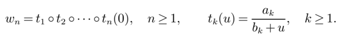
*Formula quality: `semantic_high_confidence`; source PDF page 9. Confirmed as the composition definition of the continued-fraction convergents.*
<!-- formula-end -->

k

If w ≡ lim n →∞ w n , then the continued fraction is said to be convergent and the limit w is said to be the value of the continued fraction (Abate and Whitt (1999)). In this case, we write

<!-- formula-start id="ref_cont_stochastic_order_book_dynamics_2010:formula:0022" status="semantic_high_confidence" source-page="9" -->
$$
w=\mathop{\Phi}_{n=1}^{\infty}\frac{a_n}{b_n}
$$
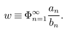
*Formula quality: `semantic_high_confidence`; source PDF page 9. Confirmed as the paper's notation for the limiting continued fraction.*
<!-- formula-end -->

Consider now a birth-death process with constant birth rate λ and death rates μ i in state i ≥ 1, and let σ b denote the first-passage time of this process to 0 given it begins in state b . Next, notice that we can write σ as the sum

<!-- formula-start id="ref_cont_stochastic_order_book_dynamics_2010:formula:0023" status="semantic_high_confidence" source-page="10" -->
$$
\sigma_b=\sigma_{b,b-1}+\sigma_{b-1,b-2}+\cdots+\sigma_{1,0}
$$
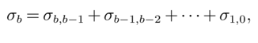
*Formula quality: `semantic_high_confidence`; source PDF page 10. Confirmed by the strong Markov decomposition of the passage from b to zero into successive one-level passage times.*
<!-- formula-end -->

where σ i,i -1 denotes the first-passage time of the birth-death process from the state i to the state i -1, for i =1 , . . . , b , and all terms on the right-hand side are independent. If ˆ f b denotes the Laplace transform of σ b and ˆ f i,i -1 denotes the Laplace transform of σ i,i -1 , for i =1 , . . . , b , then we have by (3),

<!-- formula-start id="ref_cont_stochastic_order_book_dynamics_2010:formula:0024" status="semantic_high_confidence" source-page="10" -->
$$
\widehat f_b(s)=\prod_{i=1}^{b}\widehat f_{i,i-1}(s)
$$
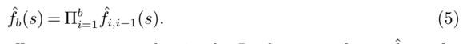
*Formula quality: `semantic_high_confidence`; source PDF page 10. Removed duplicated OCR fragments and retained the transform product implied by independence of the passage-time increments.*
<!-- formula-end -->

Therefore, in order to compute ˆ f b , it suffices to compute the simpler Laplace transforms ˆ f i,i -1 , for i =1 , . . . , b . By Equation (4.9) of Abate and Whitt (1999), we see that the Laplace transform of ˆ f i,i -1 is given by

<!-- formula-start id="ref_cont_stochastic_order_book_dynamics_2010:formula:0025" status="semantic_high_confidence" source-page="10" -->
$$
\widehat f_{i,i-1}(s)=-\frac{1}{\lambda}\mathop{\Phi}_{k=i}^{\infty}\frac{-\lambda\mu_k}{\lambda+\mu_k+s}
$$
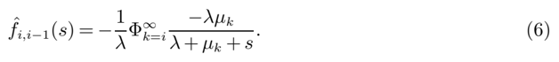
*Formula quality: `semantic_high_confidence`; source PDF page 10. Confirmed as the continued-fraction representation for a one-level birth-death first-passage transform.*
<!-- formula-end -->

The computation there is based on a recursive relationship between the ˆ f i,i -1 , i =1 , . . . , b , which is derived by considering the first transition of the birth-death process. Combining (5) and (6), we obtain

<!-- formula-start id="ref_cont_stochastic_order_book_dynamics_2010:formula:0026" status="semantic_high_confidence" source-page="10" -->
$$
\widehat f_b(s)=\left(-\frac{1}{\lambda}\right)^b\prod_{i=1}^{b}\left(\mathop{\Phi}_{k=i}^{\infty}\frac{-\lambda\mu_k}{\lambda+\mu_k+s}\right)
$$
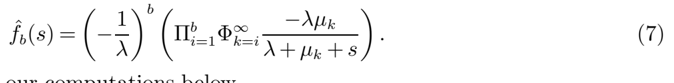
*Formula quality: `semantic_high_confidence`; source PDF page 10. Removed OCR prose spillover and combined the preceding product and continued-fraction formulas.*
<!-- formula-end -->

We will use this result in all our computations below.

## 4.2. Direction of price moves

We now compute the probability that the mid-price increases at its next move. The first move in the mid-price occurs at the first-passage time of the bid or ask queue to zero or, if the bid/ask spread is greater than one, the first time a limit order arrives inside the spread. Throughout this section, let X A ≡ X p A ( · ) ( · ) and X B ≡| X p B ( · ) ( · ) | , and let σ A and σ B be the first-passage times of X A and X B to 0, respectively. Let W B ≡{ W B ( t ) , t ≥ 0 } ( W A ≡{ W A ( t ) , t ≥ 0 } ) denote the number of orders remaining at the bid (ask) at time t of the initial X B (0) ( X A (0)) orders and let ϵ B ( ϵ A ) be the first-passage time of W B ( W A ) to 0. Furthermore, let T be the time of the first change in mid-price:

<!-- formula-start id="ref_cont_stochastic_order_book_dynamics_2010:formula:0027" status="semantic_high_confidence" source-page="10" -->
$$
T=\inf\{t\ge0:p_M(t)\ne p_M(0)\}
$$
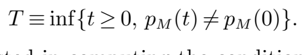
*Formula quality: `semantic_high_confidence`; source PDF page 10. Confirmed as the first time at which the mid-price differs from its initial value.*
<!-- formula-end -->

̸

In this subsection, we are interested in computing the conditional probability that the mid-price increases before decreasing:

<!-- formula-start id="ref_cont_stochastic_order_book_dynamics_2010:formula:0028" status="semantic_high_confidence" source-page="10" -->
$$
\mathbb P[p_M(T)>p_M(0)\mid X_A(0)=a,X_B(0)=b,s(0)=S]
$$
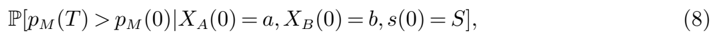
*Formula quality: `semantic_high_confidence`; source PDF page 10. Confirmed as the conditional probability of an upward first mid-price move.*
<!-- formula-end -->

where S &gt; 0. For ease of notation, we will omit the conditioning variables in all proofs below.

The idea for computing (8) is to observe that X A and X B behave as independent birth-death processes and W A and W B behave as independent pure-death processes for t ≤ T . More precisely:

## Lemma 2 Let s (0) = S . Then

1. There exist independent birth-death processes ˜ X A and ˜ X B with birth rate λ ( S ) and death rate μ + iθ ( S ) in state i ≥ 1 , such that for all 0 ≤ t ≤ T , ˜ X A ( t ) = X A ( t ) and ˜ X B ( t ) = X B ( t ) .
2. There exist independent pure death processes ˜ W A and ˜ W B with death rate μ + iθ ( S ) in state i ≥ 1 , such that for all 0 ≤ t ≤ T , ˜ W A ( t ) = W A ( t ) and ˜ W B ( t ) = W B ( t ) . Furthermore, ˜ W A is independent of ˜ X B , ˜ W B is independent of ˜ X A , ˜ W A ≤ ˜ X A and ˜ W B ≤ ˜ X B .

B

The conditional probability (8) can then be computed as follows:

Proposition 3 (Probability of increase in mid-price) Let ˆ f j,S be given by

<!-- formula-start id="ref_cont_stochastic_order_book_dynamics_2010:formula:0029" status="semantic_high_confidence" source-page="11" -->
$$
\widehat f_{j,S}(s)=\left(-\frac{1}{\lambda(S)}\right)^j\prod_{i=1}^{j}\left(\mathop{\Phi}_{k=i}^{\infty}\frac{-\lambda(S)(\mu+k\theta(S))}{\lambda(S)+\mu+k\theta(S)+s}\right),\qquad j\ge1
$$
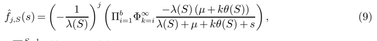
*Formula quality: `semantic_high_confidence`; source PDF page 11. Corrected the printed upper product limit b to j so the transform depends consistently on its declared initial queue size.*
<!-- formula-end -->

<!-- formula-start id="ref_cont_stochastic_order_book_dynamics_2010:formula:0030" status="semantic_high_confidence" source-page="11" -->
$$
\begin{aligned}\Lambda_S&=\sum_{i=1}^{S-1}\lambda(i),\\\widehat F_{a,b,S}(s)&=\frac{1}{s}\left(\widehat f_{a,S}(s+\Lambda_S)+\frac{\Lambda_S}{\Lambda_S+s}(1-\widehat f_{a,S}(s+\Lambda_S))\right)\left(\widehat f_{b,S}(\Lambda_S-s)+\frac{\Lambda_S}{\Lambda_S-s}(1-\widehat f_{b,S}(\Lambda_S-s))\right).\end{aligned}
$$
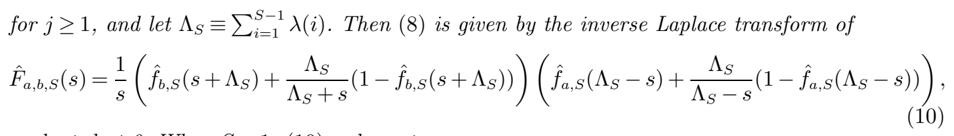
*Formula quality: `semantic_high_confidence`; source PDF page 11. Corrected a high-confidence a/b swap in equation (10); the ordering now agrees with the event definition, transform sign, and equation (11).*
<!-- formula-end -->

evaluated at 0. When S =1 , (10) reduces to

<!-- formula-start id="ref_cont_stochastic_order_book_dynamics_2010:formula:0031" status="semantic_high_confidence" source-page="11" -->
$$
\widehat F_{a,b,1}(s)=\frac{1}{s}\widehat f_{a,1}(s)\widehat f_{b,1}(-s)
$$
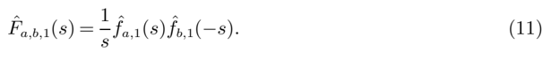
*Formula quality: `semantic_high_confidence`; source PDF page 11. Restored the a-then-b ordering visible in equation (11), consistent with the transform of the ask-minus-bid passage-time difference.*
<!-- formula-end -->

Proof. We will first focus on the special case when S =1 and then extend the analysis to the case S &gt; 1 using Lemma 4 below. Construct ˜ X A and ˜ X B as in Lemma 2. When S =1, the price changes for the first time exactly when one of the two independent birth-death processes ˜ X A and ˜ X B reaches the state 0 for the first time. Both of these birth-death processes have constant birth rates λ (1) and death rates μ + iθ (1), i ≥ 1. Thus, given our initial conditions, the distribution of T is given by the minimum of the independent first passage times σ A and σ B . Furthermore, the quantity (8) is given by P [ σ A &lt;σ B ]. By (7), the conditional Laplace transform of σ A -σ B given the initial conditions is given by ˆ f a, 1 ( s ) ˆ f b, 1 ( -s ) so that the conditional Laplace transform of the cumulative distribution function (cdf) of σ A -σ B is given by (11). Thus, our desired probability is given by the inverse Laplace transform of (11) evaluated at 0.

We now move on to the case where S &gt; 1. Let σ i A denote the first time an ask order arrives i ticks away from the bid and σ i B denote the first time a bid order arrives i ticks away from the ask, for i =1 , . . . , S -1. The time of the first change in mid-price is now given by

<!-- formula-start id="ref_cont_stochastic_order_book_dynamics_2010:formula:0032" status="semantic_high_confidence" source-page="11" -->
$$
T=\sigma_A\wedge\sigma_B\wedge\min\{\sigma_A^i,\sigma_B^i:i=1,\ldots,S-1\}
$$
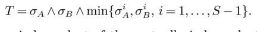
*Formula quality: `semantic_high_confidence`; source PDF page 11. Removed OCR debris and reconstructed the minimum over queue-depletion and inside-spread arrival times.*
<!-- formula-end -->

Notice that ˜ X A and ˜ X B are independent of the mutually independent arrival times σ i A , σ i B , for i = 1 , . . . , S -1. Also, notice that σ i A and σ i B are exponentially distributed with rates λ ( i ) for i =1 , . . . , S -1. The first change in mid-price is an increase if there is an arrival of a limit bid order within S -1 ticks of the best ask or ˜ X A hits zero, before there is an arrival of a limit ask order within S -1 ticks of the best bid or ˜ X B hits zero. Thus, the quantity (8) can be written as

<!-- formula-start id="ref_cont_stochastic_order_book_dynamics_2010:formula:0033" status="semantic_high_confidence" source-page="11" -->
$$
\mathbb P[\sigma_A\wedge\sigma_B^1\wedge\cdots\wedge\sigma_B^{S-1}<\sigma_B\wedge\sigma_A^1\wedge\cdots\wedge\sigma_A^{S-1}]=\mathbb P[\sigma_A\wedge\sigma_B^{\Sigma}<\sigma_B\wedge\sigma_A^{\Sigma}]
$$
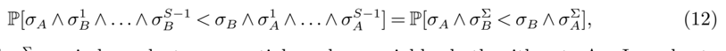
*Formula quality: `semantic_high_confidence`; source PDF page 11. Removed a duplicated OCR line and retained the equivalent minimum-event representation for an upward move.*
<!-- formula-end -->

where σ Σ A and σ Σ B are independent exponential random variables both with rate Λ S . In order to compute (12), we first need to compute the conditional Laplace transform of the minimum σ B ∧ σ Σ A . This is given in Lemma 4, substituting σ Σ A for Z . The conditional Laplace transform of the random variable σ B ∧ σ Σ A -σ A ∧ σ Σ B can then be computed using (3) and the probability (8) can be computed by inverting the conditional Laplace transform of the cdf of this random variable and evaluating at 0 as in the case S =1. □

Lemma 4 Let Z be an exponentially distributed random variable with parameter Λ . Then the Laplace transform of the random variable σ B ∧ Z is given by

where ˆ f b is given in (9) .

<!-- formula-start id="ref_cont_stochastic_order_book_dynamics_2010:formula:0034" status="semantic_high_confidence" source-page="11" -->
$$
\widehat f_b(s+\Lambda)+\frac{\Lambda}{\Lambda+s}\left(1-\widehat f_b(s+\Lambda)\right)
$$
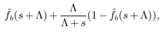
*Formula quality: `semantic_high_confidence`; source PDF page 11. Confirmed as the Laplace transform of the minimum between the passage time sigma_B and an independent exponential clock.*
<!-- formula-end -->

Proof. We first compute the density f σ B ∧ Z of the random variable σ B ∧ Z in terms of the density f b of the random variable σ B . Since Z is exponential with rate Λ, we have for all t ≥ 0,

<!-- formula-start id="ref_cont_stochastic_order_book_dynamics_2010:formula:0035" status="semantic_high_confidence" source-page="12" -->
$$
\mathbb P[\sigma_B\wedge Z<t]=1-\mathbb P[\sigma_B>t]\mathbb P[Z>t]=1-(1-F_{\sigma_B}(t))e^{-\Lambda t}
$$
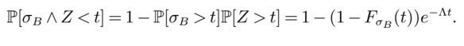
*Formula quality: `semantic_high_confidence`; source PDF page 12. Confirmed from independence and the exponential survival function.*
<!-- formula-end -->

Taking derivatives with respect to t gives

<!-- formula-start id="ref_cont_stochastic_order_book_dynamics_2010:formula:0036" status="semantic_high_confidence" source-page="12" -->
$$
f_{\sigma_B\wedge Z}(t)=f_b(t)e^{-\Lambda t}+\Lambda(1-F_b(t))e^{-\Lambda t}
$$
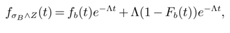
*Formula quality: `semantic_high_confidence`; source PDF page 12. Confirmed by differentiating the preceding cdf of the minimum.*
<!-- formula-end -->

for t ≥ 0, where F b ( t ) is the cdf of σ B . Also, f σ B ∧ Z ( t ) = 0 for t &lt; 0. The Laplace transform of σ B ∧ Z is thus given by

<!-- formula-start id="ref_cont_stochastic_order_book_dynamics_2010:formula:0037" status="semantic_high_confidence" source-page="12" -->
$$
\begin{aligned}\widehat f_{\sigma_B\wedge Z}(s)&=\int_{-\infty}^{\infty}e^{-st}f_{\sigma_B\wedge Z}(t)\,dt\\&=\int_0^{\infty}e^{-st}\left(f_b(t)e^{-\Lambda t}+\Lambda(1-F_b(t))e^{-\Lambda t}\right)\,dt\\&=\int_0^{\infty}e^{-t(s+\Lambda)}f_b(t)\,dt+\Lambda\int_0^{\infty}(1-F_b(t))e^{-t(s+\Lambda)}\,dt\\&=\widehat f_b(s+\Lambda)+\frac{\Lambda}{\Lambda+s}\left(1-\widehat f_b(s+\Lambda)\right).\end{aligned}
$$
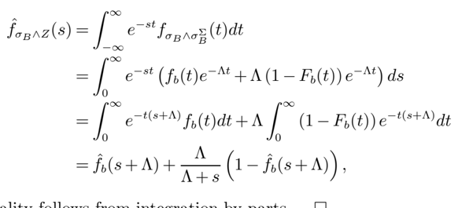
*Formula quality: `semantic_high_confidence`; source PDF page 12. Corrected two high-confidence notation typos in the derivation: the density is for sigma_B wedge Z and the integration variable is dt.*
<!-- formula-end -->

where the last equality follows from integration by parts. □

Proposition 3 yields a numerical procedure for computing the probability that the next change in the mid-price will be an increase. We discuss implementation of the procedure in § 5.2.3.

## 4.3. Executing an order before the mid-price moves

Traders who submit limit orders obtain a better price than if they had submitted a market order but face the risk of non-execution and the 'winner's curse'. Whereas a market order executes with certainty, limit orders stay in the order book until either a matching order is entered or the order is canceled. The probability that a limit order is executed before the price moves is therefore useful in quantifying the choice between a limit order and a market order. We now compute the probability that an order placed at the bid price is executed before any movement in the mid-price, given that the order is not canceled. Our result holds for initial spread S ≡ s (0) ≥ 1, but we remark that in the case where S =1 the probability we are interested is equal to the probability that the order is executed before the mid-price moves away from the desired price, given the order is not canceled. Although we focus here on an order placed at the bid price, since our model is symmetric in bids and asks, our result also holds for orders placed at the ask price.

We introduce some new notation, which we will used in this subsection as well as the next. Let NC b ( NC a ) denote the event that an order that never gets canceled is placed at the bid (ask) at time 0.

Then, the probability that an order placed at the bid is executed before the mid-price moves is given by

<!-- formula-start id="ref_cont_stochastic_order_book_dynamics_2010:formula:0038" status="semantic_high_confidence" source-page="12" -->
$$
\mathbb P[\epsilon_B<T\mid X_B(0)=b,X_A(0)=a,s(0)=S,NC_b]
$$
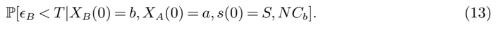
*Formula quality: `semantic_high_confidence`; source PDF page 12. Confirmed as the probability that a noncanceling bid order executes before the first mid-price move.*
<!-- formula-end -->

Proposition 5 (Probability of order execution before mid-price moves) Define ˆ f a,S ( s ) as in (9) and let ˆ g j,S be given by

<!-- formula-start id="ref_cont_stochastic_order_book_dynamics_2010:formula:0039" status="semantic_high_confidence" source-page="12" -->
$$
\widehat g_{j,S}(s)=\prod_{i=1}^{j}\frac{\mu+\theta(S)(i-1)}{\mu+\theta(S)(i-1)+s}
$$
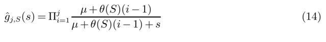
*Formula quality: `semantic_high_confidence`; source PDF page 12. Confirmed as the transform of a sum of j independent exponential service times with the stated state-dependent rates.*
<!-- formula-end -->

for j ≥ 1 , and let Λ S ≡ ∑ S -1 i =1 λ ( i ) . Then the quantity (13) is given by the inverse Laplace transform of

<!-- formula-start id="ref_cont_stochastic_order_book_dynamics_2010:formula:0040" status="semantic_high_confidence" source-page="13" -->
$$
\widehat F_{a,b,S}(s)=\frac{1}{s}\widehat g_{b,S}(s)\left(\widehat f_{a,S}(2\Lambda_S-s)+\frac{2\Lambda_S}{2\Lambda_S-s}\left(1-\widehat f_{a,S}(2\Lambda_S-s)\right)\right)
$$
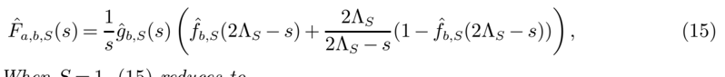
*Formula quality: `semantic_high_confidence`; source PDF page 13. Corrected the competing passage-time transform from f_b to f_a so equation (15) agrees with its event definition and equation (16).*
<!-- formula-end -->

evaluated at 0 . When S =1 , (15) reduces to

<!-- formula-start id="ref_cont_stochastic_order_book_dynamics_2010:formula:0041" status="semantic_high_confidence" source-page="13" -->
$$
\widehat F_{a,b,1}(s)=\frac{1}{s}\widehat g_{b,1}(s)\widehat f_{a,1}(-s)
$$
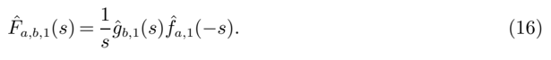
*Formula quality: `semantic_high_confidence`; source PDF page 13. Confirmed as the unit-spread reduction combining bid execution time with the competing ask-queue passage time.*
<!-- formula-end -->

Proof. Construct ˜ X A and ˜ W B using Lemma 2. Let us first consider the case S =1. Let T ′ ≡ ϵ B ∧ T denote the first time when either the process ˜ W B hits 0 or the mid-price changes. Conditional on an infinitely patient order being placed at the bid price at time 0, T ′ is the first time when either that order gets executed or the mid-price changes. Notice that conditional on our initial conditions, ϵ B is given by a sum of b independent exponentially distributed random variables with parameters μ +( i -1) θ (1), for i =1 , . . . , b , and independent of ˜ X A . Thus, the conditional Laplace transform of ϵ B given our initial conditions is given by (14). Since, in the case S =1 the mid-price can change before time ϵ B if and only if σ A &lt;ϵ B , the quantity (13) can be written simply as P [ ϵ B &lt;σ A ]. Using (3) with the conditional Laplace transforms of ϵ B and σ A , given in (14) and (9) respectively, we obtain (16).

This analysis can be extended to the case where S &gt; 1 just as in the proof of Proposition 3. When S &gt; 1, our desired quantity can be written as P [ ϵ B &lt;σ A ∧ σ Σ B ∧ σ Σ A ]. Since the conditional distribution of σ Σ B ∧ σ Σ A is exponential with parameter 2Λ S . As in the proof of Proposition 3, Lemma 4 then yields the result. □

## 4.4. Making the spread

We now compute the probability that two orders, one placed at the bid price and one placed at the ask price, are both executed before the mid-price moves, given that the orders are not canceled. If the probability of executing both a buy and a sell limit order before the price moves is high, a statistical arbitrage strategy can be designed by submitting limit orders at the bid and the ask and wait for both orders to execute. If both orders execute before the price moves, the strategy has paid off the bid-ask spread: we refer to this situation as 'making the spread'. Otherwise, losses may be minimized by submitting a market order and losing the bid-ask spread. We restrict attention to the case where the initial spread is one tick: S =1. The probability of making the spread can be expressed as

<!-- formula-start id="ref_cont_stochastic_order_book_dynamics_2010:formula:0042" status="semantic_high_confidence" source-page="13" -->
$$
\mathbb P[\max\{\epsilon_A,\epsilon_B\}<T\mid X_B(0)=b,X_A(0)=a,s(0)=1,NC_a,NC_b]
$$
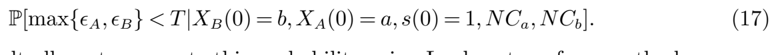
*Formula quality: `semantic_high_confidence`; source PDF page 13. Confirmed as the conditional probability that both noncanceling orders execute before the mid-price changes.*
<!-- formula-end -->

The following result allows to compute this probability using Laplace transform methods:

Proposition 6 The probability (17) of making the spread is given by h a,b + h b,a , where

<!-- formula-start id="ref_cont_stochastic_order_book_dynamics_2010:formula:0043" status="semantic_high_confidence" source-page="13" -->
$$
h_{a,b}=\sum_{i=0}^{\infty}\sum_{j=1}^{a}\mathbb P[\epsilon_j<\sigma_i]\int_0^{\infty}P_{0,i}^{X}(t)P_{a,j}^{W}(t)g_b(t)\,dt
$$
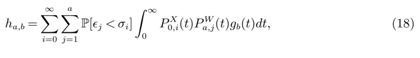
*Formula quality: `semantic_high_confidence`; source PDF page 13. Confirmed as the decomposition over residual queue states and the bid-order execution time.*
<!-- formula-end -->

<!-- formula-start id="ref_cont_stochastic_order_book_dynamics_2010:formula:0044" status="semantic_high_confidence" source-page="13" -->
$$
P_{0,i}^{X}(t)=\frac{e^{-\lambda^X(t)}(\lambda^X(t))^i}{i!},\qquad\lambda^X(t)=\frac{\lambda}{\theta}(1-e^{-\theta t})
$$
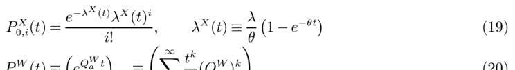
*Formula quality: `semantic_high_confidence`; source PDF page 13. Separated equation (19) from OCR spillover belonging to equation (20) and retained the Poisson transition probability and its mean.*
<!-- formula-end -->

<!-- formula-start id="ref_cont_stochastic_order_book_dynamics_2010:formula:0045" status="semantic_high_confidence" source-page="13" -->
$$
P_{a,j}^{W}(t)=\left(e^{Q_a^Wt}\right)_{a,j}=\left(\sum_{k=0}^{\infty}\frac{t^k}{k!}(Q_a^W)^k\right)_{a,j}
$$
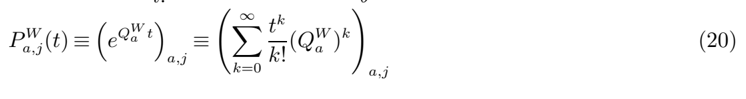
*Formula quality: `semantic_high_confidence`; source PDF page 13. Confirmed as the pure-death chain transition probability obtained from the matrix exponential.*
<!-- formula-end -->

where

<!-- formula-start id="ref_cont_stochastic_order_book_dynamics_2010:formula:0046" status="semantic_high_confidence" source-page="14" -->
$$
Q_a^W=\begin{bmatrix}0&0&0&\cdots&0\\\mu&-\mu&0&\cdots&0\\0&\mu+\theta&-\mu-\theta&\cdots&0\\\vdots&\vdots&\ddots&\ddots&\vdots\\0&0&\cdots&\mu+(a-1)\theta&-\mu-(a-1)\theta\end{bmatrix}
$$
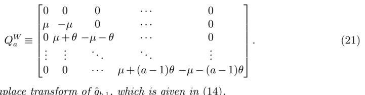
*Formula quality: `semantic_high_confidence`; source PDF page 14. Restored the separate subdiagonal and diagonal entries of the pure-death generator; OCR had merged adjacent matrix columns.*
<!-- formula-end -->

and g b is the inverse Laplace transform of ˆ g b, 1 , which is given in (14) .

Proof. Since S =1, T =min { σ A , σ B } , and the quantity (17) can be written as

<!-- formula-start id="ref_cont_stochastic_order_book_dynamics_2010:formula:0047" status="semantic_high_confidence" source-page="14" -->
$$
\mathbb P[\max\{\epsilon_B,\epsilon_A\}<\min\{\sigma_B,\sigma_A\}]
$$
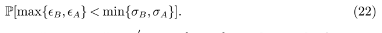
*Formula quality: `semantic_high_confidence`; source PDF page 14. Removed OCR debris and retained the equivalent unit-spread event that both orders execute before either quote depletes.*
<!-- formula-end -->

Construct ˜ X A , ˜ X B , ˜ W A and ˜ W B using Lemma 2. Let T ′ =max { ϵ A , ϵ B } ∧ T denote the first time when either both the processes ˜ W A and ˜ W B have hit 0 or the mid-price has changed. Conditional on infinitely patient orders being placed at the best bid and ask prices at time 0, T ′ is the first time when either both the orders get executed or the mid-price changes. Furthermore, by Lemma 2, ˜ W A and ˜ W B are independent pure death processes with death rate μ + iθ (1) in state i ≥ 1, and ˜ W A ( t ) ≤ ˜ X A ( t ) and ˜ W B ( t ) ≤ ˜ X B ( t ). This implies that ϵ A and ϵ B are independent and σ A and σ B are independent with ϵ A ≤ σ A and ϵ B ≤ σ B . Using these properties we obtain

<!-- formula-start id="ref_cont_stochastic_order_book_dynamics_2010:formula:0048" status="semantic_high_confidence" source-page="14" -->
$$
\begin{aligned}\mathbb P[\max\{\epsilon_B,\epsilon_A\}<\min\{\sigma_B,\sigma_A\}]&=\mathbb P[\epsilon_B<\sigma_A,\epsilon_A<\sigma_B]\\&=\mathbb P[\epsilon_B<\sigma_A,\epsilon_A<\sigma_B,\epsilon_B<\epsilon_A]+\mathbb P[\epsilon_B<\sigma_A,\epsilon_A<\sigma_B,\epsilon_A<\epsilon_B]\\&=\mathbb P[\epsilon_A<\sigma_B,\epsilon_B<\epsilon_A]+\mathbb P[\epsilon_B<\sigma_A,\epsilon_A<\epsilon_B]\\&=h_{a,b}+h_{b,a}.\end{aligned}
$$
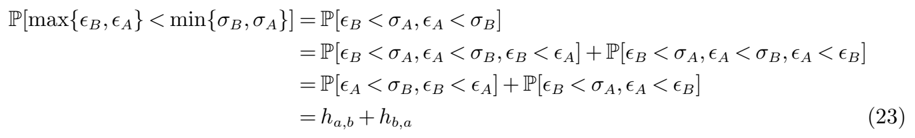
*Formula quality: `semantic_high_confidence`; source PDF page 14. Confirmed by partitioning the joint execution event according to which order executes first and using the queue-dominance relations from Lemma 2.*
<!-- formula-end -->

where we define h a,b = P [ ϵ B &lt;ϵ A &lt;σ B ], the probability that the order placed at the bid is executed before the order placed at the ask and the order at the ask is executed before the bid quote disappears. We now focus on computing h a,b . Conditioning on the value of ϵ B gives

<!-- formula-start id="ref_cont_stochastic_order_book_dynamics_2010:formula:0049" status="semantic_high_confidence" source-page="14" -->
$$
h_{a,b}=\int_0^{\infty}\mathbb P[\epsilon_B<\epsilon_A<\sigma_B\mid\epsilon_B=t]g_b(t)\,dt
$$
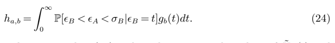
*Formula quality: `semantic_high_confidence`; source PDF page 14. Removed a duplicated OCR fragment and retained the conditioning integral over the bid-order execution time.*
<!-- formula-end -->

Focusing on the first factor in the integrand in (24) and conditioning on the values of ˜ X B ( t ) and ˜ W A ( t ) gives us

<!-- formula-start id="ref_cont_stochastic_order_book_dynamics_2010:formula:0050" status="semantic_high_confidence" source-page="14" -->
$$
\begin{aligned}\mathbb P[\epsilon_B<\epsilon_A<\sigma_B\mid\epsilon_B=t]&=\sum_{i=0}^{\infty}\sum_{j=0}^{a}\mathbb P[\epsilon_B<\epsilon_A<\sigma_B\mid\epsilon_B=t,\widetilde X_B(t)=i,\widetilde W_A(t)=j]\,\mathbb P[\widetilde X_B(t)=i,\widetilde W_A(t)=j\mid\epsilon_B=t]\\&=\sum_{i=0}^{\infty}\sum_{j=1}^{a}\mathbb P[\epsilon_j<\sigma_i]\,\mathbb P[\widetilde X_B(t)=i\mid\epsilon_B=t]\,\mathbb P[\widetilde W_A(t)=j\mid\epsilon_B=t]\\&=\sum_{i=0}^{\infty}\sum_{j=1}^{a}\mathbb P[\epsilon_j<\sigma_i]\,\mathbb P[\widetilde X_B(t)=i\mid\epsilon_B=t]\,\mathbb P[\widetilde W_A(t)=j].\end{aligned}
$$

*Formula quality: `semantic_high_confidence`; source PDF page 14. Reconstructed equation (25) from the conditioning argument; the final equality uses independence of the ask pure-death process from epsilon_B.*
<!-- formula-end -->

Combining the equations (23)-(25) and using Tonelli's theorem to interchange the integral and the summation gives us

<!-- formula-start id="ref_cont_stochastic_order_book_dynamics_2010:formula:0051" status="semantic_high_confidence" source-page="14" -->
$$
h_{a,b}=\sum_{i=0}^{\infty}\sum_{j=1}^{a}\mathbb P[\epsilon_j<\sigma_i]\int_0^{\infty}\mathbb P[\widetilde X_B(t)=i\mid\epsilon_B=t]\mathbb P[\widetilde W_A(t)=j]g_b(t)\,dt
$$

*Formula quality: `semantic_high_confidence`; source PDF page 14. Removed severe OCR repetition and restored the Tonelli-interchanged sum and integral derived from equations (23)-(25).*
<!-- formula-end -->

The quantity P [ ˜ X B ( t ) = i | ϵ B = t ] can be computed using an analogy with the M/M/ ∞ queue. The number of orders in the bid queue at the time when the bid order placed at time 0 has executed is simply the number of customers in an initially empty M/M/ ∞ queue with arrival rate λ and service rate θ , which has a Poisson distribution with mean given by (19). This remark leads to ( ?? ).

The quantity P [ ˜ W A ( t ) = j ] is the probability that a pure death process with death rate μ +( k -1) θ (1) in state k ≥ 1 is in state j at time t , given it begins in state a . The infinitesimal generator of this pure death process is given by (21). Thus, by Corollary II.3.5 of Asmussen (2003), P [ ˜ W A ( t ) = j ] is given by (20). □

## 5. Numerical Results

Our stochastic model allows one to compute various quantities of interest by simulating the evolution of the order book and and by using the Laplace transform methods presented in § 4, based on parameters μ , λ and θ estimated from the order flow. In this section we compute these quantities for the example of Sky Perfect Communications and compare them to empirically observed values, in order to assess the precision of the description provided by our model.

In § 5.1, we compare empirically observed long-term behavior (e.g. unconditional properties) of the order book to simulations of the fitted model. Although these quantities may not be particularly important for traders who are interested in trading in a short time scale, they indicate how well the model reproduces the average properties of the order book. In § 5.2, we compare conditional probabilities of various events in our model to frequencies of the events in the data. We also compare results using the Laplace transform methods developed in § 4 to our simulation results.

## 5.1. Long term behavior

Recent empirical studies on order books Bouchaud et al. (2002, 2008) have mainly focused on average properties of the order book, which, in our context correspond to unconditional expectations of quantities under the stationary measure of X : the steady state shape of the book and the volatility of the mid-price. The ergodicity of the Markov chain X , shown in Proposition 1, implies that such expectations E [ f ( X ∞ )] can be computed in the model by simulating the order book over a large horizon T and averaging f ( X ( t )) over the simulated path:

<!-- formula-start id="ref_cont_stochastic_order_book_dynamics_2010:formula:0052" status="semantic_high_confidence" source-page="15" -->
$$
\frac{1}{T}\int_0^T f(X(t))\,dt\longrightarrow\mathbb E[f(X_{\infty})]\qquad\text{as }T\to\infty
$$

*Formula quality: `semantic_high_confidence`; source PDF page 15. Removed section-heading spillover and retained the ergodic time-average limit used for stationary expectations.*
<!-- formula-end -->

5.1.1. Steady state shape of the book We simulate the order book over a long horizon ( n =10 6 events) and observe the mean number of orders Q i at distances 1 ≤ i ≤ 30 ticks from the opposite best quote. The results are displayed in Figure 2. The steady state profile of the order book describes the average market impact of trades Farmer et al. (2004), Bouchaud et al. (2008). Figure 2 shows that the average profile of the order book displays a hump (in this case, at two ticks from the bid/ask), as observed in empirical studies Bouchaud et al. (2008). Note that this hump feature does not result from any fine-tuning of model parameters or additional ingredients (such as correlation between order flow and past price moves).

5.1.2. Volatility Define the realized volatility of the asset over a day to be given by

<!-- formula-start id="ref_cont_stochastic_order_book_dynamics_2010:formula:0053" status="semantic_high_confidence" source-page="15" -->
$$
RV_n=\sqrt{\sum_{i=1}^{n}\left(\log\frac{P_{i+1}}{P_i}\right)^2}
$$

*Formula quality: `semantic_high_confidence`; source PDF page 15. Removed OCR prose spillover and restored the realized-volatility definition from successive mid-price log returns.*
<!-- formula-end -->

where n is the number of quotes in a day and the prices P i represent the mid-price of the stock. In the first day of the sample, we compute a realized volatility of 0 . 0219 after a total of 370 trades. After repeatedly simulating our model for 370 trades (using parameters λ , μ and θ estimated from the order book time series) we obtained a 95% confidence interval for realized volatility of 0 . 0228 ± 0 . 0003. Interestingly, this estimator yields the correct order of magnitude for realized volatility solely based on intensity parameters for the order flow ( λ,μ,θ ).

Figure 2 Simulation of the steady state profile of the order book: Sky Perfect Communications.

## 5.2. Conditional distributions

As discussed in the introduction, conditional distributions are the main quantities of interest for applications in high-frequency trading. A good description of conditional distributions of variables describing the order book give one the ability to predict their behavior in the short term, which is of obvious interest in optimal trade execution and the design of trading strategies.

5.2.1. One-step transition probabilities In order to assess the model's usefulness for shortterm prediction of order book behavior, we compare one-step transition probabilities implied by our model to corresponding empirical frequencies. In particular, we consider the probability that the number of orders at a given price level increases given that it changes.

Define T m as the time of the m th event in the order book:

<!-- formula-start id="ref_cont_stochastic_order_book_dynamics_2010:formula:0054" status="semantic_high_confidence" source-page="16" -->
$$
T_0=0,\qquad T_{m+1}=\inf\{t\ge T_m:X(t)\ne X(T_m)\}
$$

*Formula quality: `semantic_high_confidence`; source PDF page 16. Confirmed as the recursive event-time definition; the inequality is required for the next state change.*
<!-- formula-end -->

̸

The probability that the number of orders at a distance i from the opposite best quote moves from n to n +1 at the next change is given by

̸

<!-- formula-start id="ref_cont_stochastic_order_book_dynamics_2010:formula:0055" status="semantic_high_confidence" source-page="16" -->
$$
\begin{aligned}P_i(n)&=\mathbb P[Q_i^A(T_{m+1})=n+1\mid Q_i^A(T_m)=n,Q_i^A(T_{m+1})\ne n,s(T_m)=1]\\&=\begin{cases}\dfrac{\lambda(1)}{\lambda(1)+\mu+n\theta(1)},&i=1,\\\dfrac{\lambda(i)}{\lambda(i)+n\theta(i)},&i>1.\end{cases}\end{aligned}
$$

*Formula quality: `semantic_high_confidence`; source PDF page 16. Reconstructed equation (27): each branch is the arrival intensity divided by the total intensity of the next change at that queue.*
<!-- formula-end -->

To see how the above expression arises, consider the case i =1. The next change in Q A 1 is an increase if an arrival of a limit order at price Q A 1 occurs before any of the limit orders at Q A 1 cancel or a market buy order occurs. But since an arrival of a limit order at price Q A 1 occurs with rate λ (1) and a cancellation or market buy order occurs at rate μ + nθ (1), the probability that an arrival of a limit order occurs first is given by λ (1) / ( λ (1) + μ + nθ (1)).

Denoting empirical quantities with a hat, e.g. ˆ Q B i ( t ) is the empirically observed number of bid orders at a distance of i units from the ask price at time t , an estimator for the above probability is given by

<!-- formula-start id="ref_cont_stochastic_order_book_dynamics_2010:formula:0056" status="semantic_high_confidence" source-page="16" -->
$$
\widehat P_i(n)=\frac{\widehat B_{up}+\widehat A_{up}}{\widehat B_{change}+\widehat A_{change}}
$$

*Formula quality: `semantic_high_confidence`; source PDF page 16. Confirmed as the pooled empirical frequency of upward queue-size changes conditional on a change.*
<!-- formula-end -->

Figure 3 Probability of an increase in the number of orders at distance i from the opposite best quote in the next change, for i =1 , . . . , 5.

where

̸

<!-- formula-start id="ref_cont_stochastic_order_book_dynamics_2010:formula:0057" status="semantic_high_confidence" source-page="17" -->
$$
\begin{aligned}\widehat B_{up}&=\left|\{m:\widehat Q_i^B(\widehat T_m)=n,\ \widehat Q_i^B(\widehat T_{m+1})>n\}\right|,\\\widehat A_{up}&=\left|\{m:\widehat Q_i^A(\widehat T_m)=n,\ \widehat Q_i^A(\widehat T_{m+1})>n\}\right|,\\\widehat B_{change}&=\left|\{m:\widehat Q_i^B(\widehat T_m)=n,\ \widehat Q_i^B(\widehat T_{m+1})\ne n\}\right|,\\\widehat A_{change}&=\left|\{m:\widehat Q_i^A(\widehat T_m)=n,\ \widehat Q_i^A(\widehat T_{m+1})\ne n\}\right|.\end{aligned}
$$

*Formula quality: `semantic_high_confidence`; source PDF page 17. Removed OCR prose and restored the four empirical event-count definitions; change counts use non-equality, not equality.*
<!-- formula-end -->

̸

∣ ∣ In Figure 3, P i ( n ) and ˆ P i ( n ) for 1 ≤ i ≤ 5 are shown for Sky Perfect Communications. We see that these probabilities are reasonably close in most cases, indicating that the short-term dynamics of the order book are well-described by the model.

̸

5.2.2. Direction of price moves This section and the next two are devoted to the computation of conditional probabilities using the Laplace transform methods described in § 4. These computations require the numerical inversion of Laplace transforms. The inversions are performed by shifting the random variable X under study by a constant c such that P [ X + c ≥ 0] ≈ 1, then inverting the corresponding one-sided Laplace transform using the methods proposed in Abate and Whitt (1992) and Abate and Whitt (1995). When computing the probability of an increase in mid-price, one can find a good shift c by using the fact that when a = b the probability of an increase in mid-price is .5. This shift c should also serve well for cases where a = b . Table 3 compares the empirical frequencies of an increase in mid-price to model-implied probabilities, given an initial configuration of b orders at the bid price, a orders at the ask price and a spread of 1, for various values of a and b . We computed these quantities using Monte Carlo simulation (using 30,000 replications) and the Laplace transform methods described in § 4. The simulation results, reported as 95% confidence intervals, agree with the Laplace transform computations and show that the probability of an increase in the mid-price is well captured by the model.

|    |    a |    a |    a |    a |    a |
|----|------|------|------|------|------|
| b  |    1 |    2 |    3 |    4 |    5 |
| 1  | .512 | .304 | .263 | .242 | .226 |
| 2  | .691 | .502 | .444 | .376 | .359 |
| 3  | .757 | .601 | .533 | .472 | .409 |
| 4  | .806 | .672 | .580 | .529 | .484 |
| 5  | .822 | .731 | .640 | .714 | .606 |

|    | a           | a           | a           | a           | a           |
|----|-------------|-------------|-------------|-------------|-------------|
| b  | 1           | 2           | 3           | 4           | 5           |
| 1  | .499 ± .006 | .333 ± .005 | .258 ± .005 | .213 ± .005 | .187 ± .005 |
| 2  | .663 ± .005 | .495 ± .006 | .411 ± .006 | .346 ± .005 | .307 ± .005 |
| 3  | .743 ± .006 | .589 ± 006  | .506 ± .006 | .434 ± .006 | .389 ± .006 |
| 4  | .788 ± .005 | .652 ± .006 | .564 ± .006 | .503 ± .006 | .452 ± .006 |
| 5  | .811 .004   | .693 .005   | .615 .006   | .547 .006   | .504 .006   |

±

±

±

±

±

Table 3 Probability of an increase in mid-price: empirical frequencies (top), simulation results (95% confidence intervals) (middle), and Laplace transform method results (bottom).

|    |    a |    a |    a |    a |    a |
|----|------|------|------|------|------|
| b  |    1 |    2 |    3 |    4 |    5 |
| 1  | .500 | .336 | .259 | .216 | .188 |
| 2  | .664 | .500 | .407 | .348 | .307 |
| 3  | .741 | .593 | .500 | .437 | .391 |
| 4  | .784 | .652 | .563 | .500 | .452 |
| 5  | .812 | .693 | .609 | .548 | .500 |

5.2.3. Executing an order before the mid-price moves Table 4 gives probabilities computed using both simulation and our Laplace transform method for executing a bid order before a change in mid-price for various values of a and b and for S =1. Since our data set does not allow us to track specific orders, empirical values for these quantities, as well as the quantities in § 5.2.4, are not obtainable.

5.2.4. Making the spread Table 5 gives probabilities computed using both simulation and our Laplace transform method for executing both a bid and an ask order at the best quotes before the mid-price changes. One interesting observation here is that for a fixed value of a , as b is increased, the probability of making the spread is not monotonic. Thus, for a fixed number of orders at the ask price the probability of making the spread is maximized for a nontrivial optimal number of orders at the bid price.

## 6. Conclusion

We have proposed a stylized stochastic model describing the dynamics of a limit order book, where the occurrence of different types of events -market orders, limit orders and cancellations- are described in terms of independent Poisson processes.

The formulation of the model, which can be viewed as a queuing system, is entirely based on observable quantities and its parameters can be easily estimated from observations of the events in the order book. The model is simple enough to allow analytical computation of various conditional

|    | a           | a           | a           | a           | a           |
|----|-------------|-------------|-------------|-------------|-------------|
| b  | 1           | 2           | 3           | 4           | 5           |
| 1  | .498 ± .004 | .642 ± .004 | .709 ± .004 | .748 ± .004 | .779 ± .004 |
| 2  | .299 ± .004 | .451 ± .004 | .536 ± .004 | .592 ± .004 | .632 ± .004 |
| 3  | .204 ± .004 | .335 ± .004 | .422 ± .004 | .484 ± .004 | .532 ± .004 |
| 4  | .152 ± .003 | .264 ± .004 | .344 ± .004 | .403 ± .004 | .450 ± .004 |
| 5  | .117 .003   | .213 .004   | .291 .004   | .342 .004   | .394 .004   |

±

±

±

±

±

|    |    a |    a |    a |    a |    a |
|----|------|------|------|------|------|
| b  |    1 |    2 |    3 |    4 |    5 |
| 1  | .497 | .641 | .709 | .749 | .776 |
| 2  | .302 | .449 | .535 | .591 | .631 |
| 3  | .206 | .336 | .422 | .483 | .528 |
| 4  | .152 | .263 | .344 | .404 | .452 |
| 5  | .118 | .213 | .287 | .346 | .393 |

Table 4 Probability of executing a bid order before a change in mid-price: simulation results (95% confidence intervals) (top) and Laplace transform method results (bottom).

|    | a           | a           | a           | a           | a           |
|----|-------------|-------------|-------------|-------------|-------------|
| b  | 1           | 2           | 3           | 4           | 5           |
| 1  | .268 ± .004 | .306 ± .004 | .312 ± .004 | .301 ± .004 | .286 ± .004 |
| 2  | .306 ± .004 | .384 ± .004 | .406 ± .004 | .411 ± .004 | .401 ± .004 |
| 3  | .312 ± .004 | .406 ± .004 | .441 ± .004 | .455 ± .004 | .456 ± .004 |
| 4  | .301 ± .004 | .411 ± .004 | .455 ± .004 | .473 ± .004 | .485 ± .004 |
| 5  | .286 .004   | .401 .004   | .456 .004   | .485 .004   | .491 .004   |

±

±

±

±

±

Table 5 Probability of making the spread: simulation results (95% confidence intervals) (top) and Laplace transform method results (bottom).

|    |    a |    a |    a |    a |    a |
|----|------|------|------|------|------|
| b  |    1 |    2 |    3 |    4 |    5 |
| 1  | .266 | .308 | .309 | .300 | .288 |
| 2  | .308 | .386 | .406 | .406 | .400 |
| 3  | .309 | .406 | .441 | .452 | .452 |
| 4  | .300 | .406 | .452 | .471 | .479 |
| 5  | .288 | .400 | .452 | .479 | .491 |

probabilities of order book events via Laplace transform methods, yet rich enough to capture adequately the short-term behavior of the order book: conditional distributions of various quantities of interest show good agreement with the corresponding empirical distributions for parameters estimated from data sets from the Tokyo Stock Exchange. The ability of our model to compute conditional distributions is useful for short-term prediction and design of automated trading strategies. Finally, simulation results illustrate that our model also yields realistic features for long-term (steady state) average behavior of the order book profile and of price volatility.

One by-product of this study is to show how far a stochastic model can go in reproducing the dynamic properties of a limit order book without resorting to detailed behavioral assumptions about market participants or introducing unobservable parameters describing agent preferences, as in the market microstructure literature.

This model can be extended in various ways to take into account a richer set of empirically observed properties Bouchaud et al. (2008). Correlation of the order flow with recent price behavior can be modeled by introducing state-dependent intensities of order arrivals. The heterogeneity of order sizes, which appears to be an important ingredient, can be incorporated via a distribution of order sizes. Both of these features conserve the Markovian nature of the process. A more realistic distribution of inter-event times may also be introduced by modelling the event arrivals via renewal processes. It remains to be seen whether the analytical tractability of the model can be preserved when such ingredients are introduced. We look forward to exploring such extensions in a future work.

## Acknowledgments

The authors thank Ning Cai, Alexander Cherny, Jim Gatheral, Zongjian Liu, Peter Randolph and Ward Whitt for useful discussions.

## References

- Abate, J., W. Whitt. 1992. The Fourier-series method for inverting transforms of probability distributions. Queueing Systems 10 5-88.
- Abate, J., W. Whitt. 1995. Numerical inversion of Laplace transforms of probability distributions. ORSA Journal on Computing 7 (1) 36-43.
- Abate, J., W. Whitt. 1999. Computing Laplace transforms for numerical inversion via continued fractions. INFORMS Journal on Computing 11 (4) 394-405.
- Alfonsi, A., A. Schied, A. Schulz. 2007. Optimal execution strategies in limit order books with general shape functions. Working paper.
- Asmussen, S. 2003. Applied Probability and Queues . Springer-Verlag.
- Bouchaud, J. P., D. Farmer, F. Lillo. 2008. How markets slowly digest changes in supply and demand. Th. Hens, K. Schenk-Hoppe, eds., Handbook of Financial Markets: Dynamics and Evolution . Academic Press.
- Bouchaud, Jean-Philippe, Marc M´ ezard, Marc Potters. 2002. Statistical properties of stock order books: empirical results and models. Quantitative Finance 2 251-256.
- Bovier, A., J. ˘ Cern´ y, O. Hryniv. 2006. The opinion game: Stock price evolution from microscopic market modelling. Int. J. Theor. Appl. Finance 9 91-111.
- Farmer, J. Doyne, L´ aszl´ o Gillemot, Fabrizio Lillo, Szabolcs Mike, Anindya Sen. 2004. What really causes large price changes? Quantitative Finance 4 383-397.
- Foucault, T., O. Kadan, E. Kandel. 2005. Limit order book as a market for liquidity. Review of Financial Studies 18 (4) 1171-1217.
- Hollifield, B., R. A. Miller, P. Sandas. 2004. Empirical analysis of limit order markets. Review of Economic Studies 71 (4) 1027-1063.
- Luckock, H. 2003. A steady-state model of the continuous double auction. Quantitative Finance 3 385-404.
- Maslov, S., M. Mills. 2001. Price fluctuations from the order book perspective - empirical facts and a simple model. PHYSICA A 299 234.
- Obizhaeva, A., J. Wang. 2006. Optimal trading strategy and supply/demand dynamics. Working paper, MIT.
- Parlour, Ch. A. 1998. Price dynamics in limit order markets. Review of Financial Studies 11 (4) 789-816.
- Rosu, I. forthcoming. A dynamic model of the limit order book. Review of Financial Studies .

- Smith, E., J. D. Farmer, L. Gillemot, S. Krishnamurthy. 2003. Statistical theory of the continuous double auction. Quantitative Finance 3 (6) 481-514.
- Zovko, I., J. Doyne Farmer. 2002. The power of patience; A behavioral regularity in limit order placement. Quantitative Finance 2 387-392.
