# Modeling high-frequency limit order book dynamics with support vector machines

Alec N.Kercheval ∗

Yuan Zhang †

Department of Mathematics Florida State University Tallahassee, FL 32306

Department of Mathematics Florida State University Tallahassee, FL 32306

October 24, 2013

## Abstract

We propose a machine learning framework to capture the dynamics of highfrequency limit order books in financial equity markets and automate real-time prediction of metrics such as mid-price movement and price spread crossing. By characterizing each entry in a limit order book with a vector of attributes such as price and volume at different levels, the proposed framework builds a learning model for each metric with the help of multi-class support vector machines (SVMs). Experiments with real data establish that features selected by the proposed framework are effective for short term price movement forecasts.

Key words: high-frequency limit order book; multi-class classifiers; support vector ma- chines(SVMs); machine learning

Mathematics Subject Classification:

93E10, 93E14, 60G35, 60H07.

## 1 Introduction

Electronic trading systems have been widely adopted by many established exchanges including NYSE, NASDAQ, and the London Stock Exchange [9, 10, 30]. As a result, the traditional quote-driven markets have been increasingly replaced by order-driven trading platforms. The rapid decrease in order processing time has lead to high volume, high frequency trading as a growing fraction of total stock trading.

∗ kercheva@math.fsu.edu

† yzhang@math.fsu.edu

For instance, among the trading transactions of US in 2012, high-frequency trading accounted for 84% in stock trades and 51% in equity value [32]. Clearly, the characteristics of order-driven trading systems change the dynamics of the markets and demand new trading strategies that can capture short-term behavior of underlying assets [5, 7, 16, 29].

Research on modeling limit order book dynamics can generally be grouped into two main categories: statistical modeling and machine learning based methods. In the former approach, statistical properties of the limit order book for the target financial asset are developed and conditional quantities are then derived and modeled [8, 10, 20, 33, 35]. On the other hand, machine learning methods represent data from the limit order book in a systematic manner, then generalize the data so that unseen data can be recognized and classified based on the generalization [22, 24]. Statistical methods usually impose strict and typically unvalidated mathematical assumptions on models, parameters may be unobservable, and the intensive computation required by statistical methods makes them difficult to be deployed in real world environments [1, 4, 17, 29]. On the other hand, machine learning methods, owing to their data driven characteristics and light-weight computation, have been applied to a variety of financial markets such as liquidity and volatility in bonds and index trading [18, 13, 25, 36]. In particular, support vector machines (SVMs - described below) have been used in tracking the dynamics of foreign exchange markets [14]. However, the application of machine learning techniques in financial markets, especially SVMs, is still in its infancy.

In this paper, we employ 'multi-class SVM' methods in a new way to capture the dynamics in high-frequency limit order book data and forecast movements of the mid-price and the direction of bid-ask spread crossings over short time intervals. Experiments with real data from NASDAQ show that the multi-class SVM models built in this paper not only predict various metrics with high accuracy, but also deliver predictions efficiently. In addition, experiments with simple trading strategies using these signals are observed to produce positive payoffs with controlled risk.

The paper is organized as follows: Section 2 describes the general approach of machine learning via Support Vector Machines. Section 3 describes the limit order book data we wish to model and the specific construction and validation of the SVM model we employ. Section 4 presents our experiment results and analyzes their performance, with Section 5 concluding.

## 2 Support Vector Machines

Machine learning techniques fall into two main categories unsupervised learning and supervised learning . In the former, unlabeled training data are categorized by the model into different groups that are not known a priori, and new data is assigned to the closest group according to certain similarity measures. Popular examples of unsupervised learning includes artificial neural networks [34], k-nearest neighbor methods [3], and self-organizing maps [2]. In supervised learning, training data is labeled by class in advance, and a model is used to assign new data to those classes. This includes the methods of logistic regression [37] and SVMs [11, 21].

The SVM method is the core of the model in [14] to predict the EUR/USD price evolution, which has been the inspiration for our work here. Before we describe our approach to SVM price forecasting, we need to describe the general SVM approach and introduce the needed concepts and vocabulary.

## 2.1 The SVM framework

The SVM is a well-established technique in machine learning, which we briefly outline in this section. For further details on the material of this section, see [6], [11], [14], and [28].

The basic support vector machine is a kind of binary classifier. Imagine each trial of some experiment produces a vector x ∈ R n of output data, the components of which are the 'attributes' of the data, and we wish to classify each trial output into one of two classes (yes vs. no, good vs. bad, etc). The SVM is an algorithm which, after some training, will automatically carry out the classification of new trial output without user intervention.

The training data is a sequence of prior trials, x (1) , . . . , x ( m ) that have already been classified. Without loss of generality, we suppose that classification means that each x ( i ) has been assigned a class value (or label) y ( i ) ∈ {-1 , 1 } , i = 1 , . . . , m . After training, the SVM will then assign a label y ∈ {-1 , 1 } to each new trial output x . Conceptually, the method is as follows:

1. Choose a 'feature mapping' φ : R n → H , where H is some higher dimensional Euclidean space (or an infinite dimensional Hilbert space - for simplicity we suppose H is finite dimensional in this paper) called the 'feature space'. For a data instance x ∈ R n , the components of φ ( x ) are the 'features' of the data to be used to determine the correct label to be assigned.
2. Given the training data x (1) , . . . , x ( m ) , we consider the collection

<!-- formula-start id="ref_kercheval_zhang_svm_2013:formula:0001" status="semantic_high_confidence" source-page="4" -->
$$
F=\{z^{(i)}=\phi(x^{(i)}):i=1,\ldots,m\}\subset\mathbb H
$$
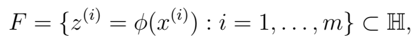
*Formula quality: `semantic_high_confidence`; source PDF page 4. Reconstructed the mapped training set in feature space.*
<!-- formula-end -->

and we expect that the feature mapping has been chosen so that the set of points F (+1) of F with label +1 are spatially separated in H from the set of points F ( -1) with label -1. 'Spatially separated' means that there is a separating hyperplane in H such that F (+1) lies entirely on one side and F ( -1) on the other.

3. The SVM algorithm selects the optimal separating hyperplane L ⊂ H , in the sense that distance from the hyperplane to F is maximized among all possible separating hyperplanes.
4. New data x is then labeled according to which side of L the feature vector φ ( x ) lies.

We now briefly describe, without full derivations, the SVM algorithm in terms of the optimization problem mentioned above.

A hyperplane in H is described by an equation of the form w T z + b = 0, where w ∈ H , b ∈ R are parameters, z ∈ H is our independent variable and w T denotes the transpose of w . If this is a separating hyperplane for our training data set, we may reverse the sign of ( w, b ) if needed so that w T z ( i ) + b &gt; 0 if y ( i ) = +1 and otherwise w T z ( i ) + b &lt; 0.

It is not difficult to show that the distance in H between the feature vector z ( i ) and the plane is

<!-- formula-start id="ref_kercheval_zhang_svm_2013:formula:0002" status="semantic_high_confidence" source-page="5" -->
$$
\gamma_i=y^{(i)}\left(\left(\frac{w}{\lVert w\rVert}\right)^{\mathrm T}z^{(i)}+\frac{b}{\lVert w\rVert}\right)
$$
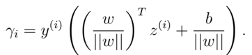
*Formula quality: `semantic_high_confidence`; source PDF page 5. Reconstructed the signed geometric distance from training point i to the separating hyperplane.*
<!-- formula-end -->

We can then define the 'geometric margin' of the plane ( w, b ) with respect to the training set S = { ( z ( i ) , y ( i ) ) , i = 1 , . . . , m } to be the smallest of these individual distances (or 'margins'):

<!-- formula-start id="ref_kercheval_zhang_svm_2013:formula:0003" status="semantic_high_confidence" source-page="5" -->
$$
\gamma=\min_{i=1,\ldots,m}\gamma_i
$$
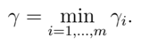
*Formula quality: `semantic_high_confidence`; source PDF page 5. Reconstructed the geometric margin as the smallest signed distance.*
<!-- formula-end -->

The optimal separating hyperplane is then obtained as the solution to the following optimization problem that identifies the hyperplane maximizing the geometric margin:

<!-- formula-start id="ref_kercheval_zhang_svm_2013:formula:0004" status="semantic_high_confidence" source-page="5" -->
$$
\max_{\gamma,w,b}\gamma
$$
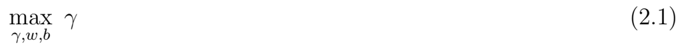
*Formula quality: `semantic_high_confidence`; source PDF page 5. Reconstructed the maximum-margin objective in equation (2.1).*
<!-- formula-end -->

<!-- formula-start id="ref_kercheval_zhang_svm_2013:formula:0005" status="semantic_high_confidence" source-page="5" -->
$$
\text{s.t. }y^{(i)}(w^{\mathrm T}z^{(i)}+b)\geq\gamma\lVert w\rVert,\qquad i=1,\ldots,m
$$
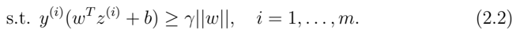
*Formula quality: `semantic_high_confidence`; source PDF page 5. Reconstructed the geometric-margin constraints in equation (2.2).*
<!-- formula-end -->

or equivalently, letting ˆ γ = γ || w || ,

<!-- formula-start id="ref_kercheval_zhang_svm_2013:formula:0006" status="semantic_high_confidence" source-page="5" -->
$$
\max_{\widehat\gamma,w,b}\frac{\widehat\gamma}{\lVert w\rVert}
$$
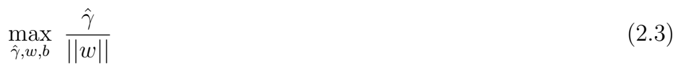
*Formula quality: `semantic_high_confidence`; source PDF page 5. Reconstructed the scale-separated margin objective in equation (2.3).*
<!-- formula-end -->

<!-- formula-start id="ref_kercheval_zhang_svm_2013:formula:0007" status="semantic_high_confidence" source-page="5" -->
$$
\text{s.t. }y^{(i)}(w^{\mathrm T}z^{(i)}+b)\geq\widehat\gamma,\qquad i=1,\ldots,m
$$
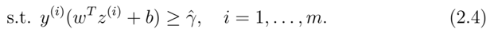
*Formula quality: `semantic_high_confidence`; source PDF page 5. Reconstructed the rescaled separating constraints in equation (2.4).*
<!-- formula-end -->

Abetter equivalent formulation of the problem is obtained when we take account of the fact that the parameters ( w, b ) can be scaled by an arbitrary positive constant without changing the hyperplane they determine, and hence without changing the problem. We therefore select a scaling constraint so that ˆ γ = 1 in the above problem, which is then equivalent to

<!-- formula-start id="ref_kercheval_zhang_svm_2013:formula:0008" status="semantic_high_confidence" source-page="5" -->
$$
\max_{w,b}\frac{1}{\lVert w\rVert}
$$
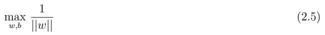
*Formula quality: `semantic_high_confidence`; source PDF page 5. Reconstructed the unit-functional-margin objective in equation (2.5).*
<!-- formula-end -->

<!-- formula-start id="ref_kercheval_zhang_svm_2013:formula:0009" status="semantic_high_confidence" source-page="5" -->
$$
\text{s.t. }y^{(i)}(w^{\mathrm T}z^{(i)}+b)\geq1,\qquad i=1,\ldots,m
$$
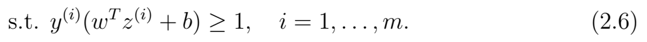
*Formula quality: `semantic_high_confidence`; source PDF page 5. Reconstructed the hard-margin constraints in equation (2.6).*
<!-- formula-end -->

or, equivalently,

and

<!-- formula-start id="ref_kercheval_zhang_svm_2013:formula:0010" status="semantic_high_confidence" source-page="6" -->
$$
\min_{w,b}\frac{1}{2}\lVert w\rVert^2
$$
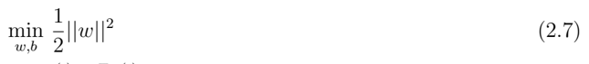
*Formula quality: `semantic_high_confidence`; source PDF page 6. Reconstructed the convex hard-margin primal objective in equation (2.7).*
<!-- formula-end -->

<!-- formula-start id="ref_kercheval_zhang_svm_2013:formula:0011" status="semantic_high_confidence" source-page="6" -->
$$
\text{s.t. }y^{(i)}(w^{\mathrm T}z^{(i)}+b)\geq1,\qquad i=1,\ldots,m
$$
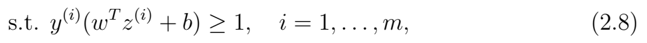
*Formula quality: `semantic_high_confidence`; source PDF page 6. Reconstructed the hard-margin primal constraints in equation (2.8).*
<!-- formula-end -->

which is now in the form of a convex quadratic objective with linear constraints.

While this is a tractable form of the problem, we still have a high dimensional problem (the dimension of H ) and a large number ( m ) of constraints. The SVM approach improves this situation dramatically by considering the corresponding dual optimization problem (see, e.g., [28]):

<!-- formula-start id="ref_kercheval_zhang_svm_2013:formula:0012" status="semantic_high_confidence" source-page="6" -->
$$
\max_{\alpha}\left[\sum_{i=1}^{m}\alpha_i-\frac{1}{2}\sum_{i,j=1}^{m}\alpha_i\alpha_jy^{(i)}y^{(j)}\langle z^{(i)},z^{(j)}\rangle\right]
$$

*Formula quality: `semantic_high_confidence`; source PDF page 6. Reconstructed the hard-margin SVM dual objective in equation (2.9).*
<!-- formula-end -->

<!-- formula-start id="ref_kercheval_zhang_svm_2013:formula:0013" status="semantic_high_confidence" source-page="6" -->
$$
\text{s.t. }\alpha_i\geq0,\qquad i=1,\ldots,m
$$
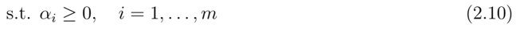
*Formula quality: `semantic_high_confidence`; source PDF page 6. Reconstructed the nonnegativity constraints in equation (2.10).*
<!-- formula-end -->

<!-- formula-start id="ref_kercheval_zhang_svm_2013:formula:0014" status="semantic_high_confidence" source-page="6" -->
$$
\sum_{i=1}^{m}\alpha_i y^{(i)}=0
$$
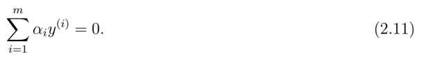
*Formula quality: `semantic_high_confidence`; source PDF page 6. Reconstructed the dual equality constraint in equation (2.11).*
<!-- formula-end -->

Since the original (primal) problem 2.7 has a convex objective and convex constraints, the so-called Slater condition says that this dual problem gives the same solution as the primal problem if the constraints are strictly feasible, which will generically be the case if the training data can be separated by any hyperplane. It can be shown that the optimal hyperplane parameters are then given by

<!-- formula-start id="ref_kercheval_zhang_svm_2013:formula:0015" status="semantic_high_confidence" source-page="6" -->
$$
w=\sum_{i=1}^{m}\alpha_i y^{(i)}z^{(i)}
$$
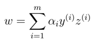
*Formula quality: `semantic_high_confidence`; source PDF page 6. Reconstructed the primal normal vector from the dual coefficients.*
<!-- formula-end -->

<!-- formula-start id="ref_kercheval_zhang_svm_2013:formula:0016" status="semantic_high_confidence" source-page="6" -->
$$
b=-\frac{1}{2}\left(\max_{\{i:y^{(i)}=-1\}}w^{\mathrm T}z^{(i)}+\min_{\{i:y^{(i)}=1\}}w^{\mathrm T}z^{(i)}\right)
$$
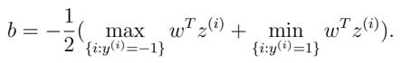
*Formula quality: `semantic_high_confidence`; source PDF page 6. Reconstructed the intercept as the midpoint between the two support boundaries.*
<!-- formula-end -->

This dual formulation has the convenient property that the optimal α i 's are all equal to zero except for the feature vectors z ( i ) whose distance to the optimal hyperplane ( w, b ) is exactly equal to the geometric margin - these are called the 'support vectors', giving the SVM approach its name. Once the optimal parameters are found and z is a new feature vector that needs to be classified, we need only compute the sign of

<!-- formula-start id="ref_kercheval_zhang_svm_2013:formula:0017" status="semantic_high_confidence" source-page="7" -->
$$
w^{\mathrm T}z+b=\sum_{i=1}^{m}\alpha_i y^{(i)}\langle z^{(i)},z\rangle+b
$$
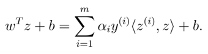
*Formula quality: `semantic_high_confidence`; source PDF page 7. Reconstructed the support-vector decision score in feature space.*
<!-- formula-end -->

Since α i = 0 unless it corresponds to a support vector, many of the terms in this sum are zero and we need only calculate inner products between z and the (typically small number of) support vectors z ( i ) of the optimal hyperplane.

In the remainder of this section, we describe how the SVM positively answers the following two remaining questions: (a) the dimension of H might still be inconveniently large; can the dimension of the computation be reduced?, and (b) can the algorithm be modified to be less sensitive to spurious data in the training set?

## 2.2 Kernels

The feature mapping φ : R n → H from the space of data attributes to the feature space may need to have a high-dimensional range in order to allow the data to be linearly separable.

As an example, suppose we take n = 3, choose c &gt; 0, and define φ : R 3 → R 13 by

<!-- formula-start id="ref_kercheval_zhang_svm_2013:formula:0018" status="semantic_high_confidence" source-page="7" -->
$$
\phi(x_1,x_2,x_3)=[x_1x_1,x_1x_2,x_1x_3,x_2x_1,\ldots,x_3x_3,\sqrt{2c}x_1,\sqrt{2c}x_2,\sqrt{2c}x_3,c]^{\mathrm T}
$$
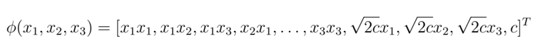
*Formula quality: `semantic_high_confidence`; source PDF page 7. Reconstructed the explicit quadratic feature map from R cubed to R to the thirteenth power.*
<!-- formula-end -->

That is, the features are all monomials in the attributes of degree 2 or less. This feature mapping will be effective if the data can be separated by quadratic functions of the attributes. Here, c is a parameter controlling the relative weighting between the first and second order terms. It is straightforward to verify for general n and for x, ˆ x ∈ R n , that

<!-- formula-start id="ref_kercheval_zhang_svm_2013:formula:0019" status="semantic_high_confidence" source-page="7" -->
$$
\begin{aligned}\langle\phi(x),\phi(\widehat x)\rangle&=\sum_{i,j=1}^{n}(x_ix_j)(\widehat x_i\widehat x_j)+\sum_{i=1}^{n}(\sqrt{2c}x_i)(\sqrt{2c}\widehat x_i)+c^2\\&=(x^{\mathrm T}\widehat x+c)^2.\end{aligned}
$$
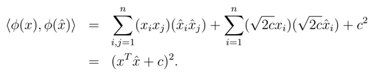
*Formula quality: `semantic_high_confidence`; source PDF page 7. Reconstructed the inner-product derivation of the quadratic kernel.*
<!-- formula-end -->

In other words, the inner product of feature vectors z = φ ( x ) can be computed in terms of the much lower dimensional inner product x T ˆ x on R n via the 'kernel function'

<!-- formula-start id="ref_kercheval_zhang_svm_2013:formula:0020" status="semantic_high_confidence" source-page="7" -->
$$
K(x,\widehat x)=(x^{\mathrm T}\widehat x+c)^2
$$
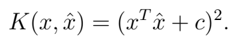
*Formula quality: `semantic_high_confidence`; source PDF page 7. Reconstructed the degree-two polynomial kernel.*
<!-- formula-end -->

Similarly, it can be verified that the kernel

<!-- formula-start id="ref_kercheval_zhang_svm_2013:formula:0021" status="semantic_high_confidence" source-page="8" -->
$$
K(x,\widehat x)=(x^{\mathrm T}\widehat x+c)^d
$$
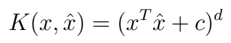
*Formula quality: `semantic_high_confidence`; source PDF page 8. Reconstructed the general degree-d polynomial kernel.*
<!-- formula-end -->

corresponds to a feature mapping that includes all monomials up to degree d . In this case, the SVM classifier will be effective if the data can be separated by polynomial hypersurfaces of degree d or less, which is a very general situation.

There is a general fact known as Mercer's Theorem ([26]) stating that whenever K : R n × R n → R is symmetric positive semi-definite, there is a feature mapping φ such that

<!-- formula-start id="ref_kercheval_zhang_svm_2013:formula:0022" status="semantic_high_confidence" source-page="8" -->
$$
\langle z,\widehat z\rangle\equiv\langle\phi(x),\phi(\widehat x)\rangle=K(x,\widehat x)
$$
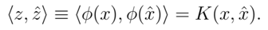
*Formula quality: `semantic_high_confidence`; source PDF page 8. Reconstructed the kernel representation of the feature-space inner product.*
<!-- formula-end -->

The great advantage of this is that our classification problem now becomes computing the sign of

<!-- formula-start id="ref_kercheval_zhang_svm_2013:formula:0023" status="semantic_high_confidence" source-page="8" -->
$$
w^{\mathrm T}z+b=\sum_{i=1}^{m}\alpha_i y^{(i)}\langle z^{(i)},z\rangle+b
$$
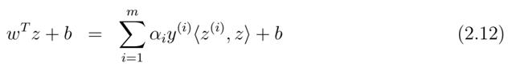
*Formula quality: `semantic_high_confidence`; source PDF page 8. Reconstructed equation (2.12), the feature-space decision score.*
<!-- formula-end -->

<!-- formula-start id="ref_kercheval_zhang_svm_2013:formula:0024" status="semantic_high_confidence" source-page="8" -->
$$
w^{\mathrm T}z+b=\sum_{i=1}^{m}\alpha_i y^{(i)}K(x^{(i)},x)+b
$$
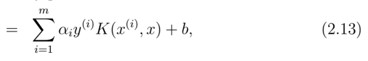
*Formula quality: `semantic_high_confidence`; source PDF page 8. Reconstructed equation (2.13) as the self-contained kernelized form of the preceding score.*
<!-- formula-end -->

which, for the kernels above, only requires computation of an n -dimensional inner product.

## 2.3 Regularization

We may need to take account of a small number of spurious training data instances that are labeled incorrectly, which could have a large unwanted effect on the optimal separating hyperplane. To handle this, the standard method is to relax the constraint and introduce a compensating term in the objective function to penalize data on the wrong side of the hyperplane, leading to this reformulated problem:

<!-- formula-start id="ref_kercheval_zhang_svm_2013:formula:0025" status="semantic_high_confidence" source-page="8" -->
$$
\min_{w,b,\xi}\left[\frac{1}{2}\lVert w\rVert^2+C\sum_{i=1}^{m}\xi_i\right]
$$
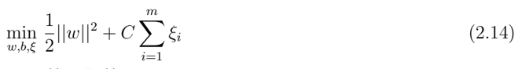
*Formula quality: `semantic_high_confidence`; source PDF page 8. Reconstructed the soft-margin primal objective in equation (2.14).*
<!-- formula-end -->

<!-- formula-start id="ref_kercheval_zhang_svm_2013:formula:0026" status="semantic_high_confidence" source-page="8" -->
$$
\text{s.t. }y^{(i)}(w^{\mathrm T}z^{(i)}+b)\geq1-\xi_i,\qquad i=1,\ldots,m
$$
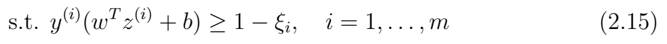
*Formula quality: `semantic_high_confidence`; source PDF page 8. Reconstructed the soft-margin classification constraints in equation (2.15).*
<!-- formula-end -->

<!-- formula-start id="ref_kercheval_zhang_svm_2013:formula:0027" status="semantic_high_confidence" source-page="8" -->
$$
\xi_i\geq0,\qquad i=1,\ldots,m
$$
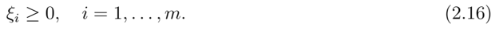
*Formula quality: `semantic_high_confidence`; source PDF page 8. Reconstructed the slack-variable constraints in equation (2.16).*
<!-- formula-end -->

The constant C &gt; 0 controls the relative weight between the competing goals of making the total margin large, and ensuring as many examples as possible are on the correct side of the hyperplane.

From this, the dual version can be formulated as

<!-- formula-start id="ref_kercheval_zhang_svm_2013:formula:0028" status="semantic_high_confidence" source-page="9" -->
$$
\max_{\alpha}\left[\sum_{i=1}^{m}\alpha_i-\frac{1}{2}\sum_{i,j=1}^{m}\alpha_i\alpha_jy^{(i)}y^{(j)}\langle z^{(i)},z^{(j)}\rangle\right]
$$
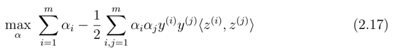
*Formula quality: `semantic_high_confidence`; source PDF page 9. Reconstructed the soft-margin dual objective in equation (2.17).*
<!-- formula-end -->

<!-- formula-start id="ref_kercheval_zhang_svm_2013:formula:0029" status="semantic_high_confidence" source-page="9" -->
$$
\text{s.t. }0\leq\alpha_i\leq C,\qquad i=1,\ldots,m
$$
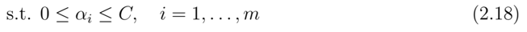
*Formula quality: `semantic_high_confidence`; source PDF page 9. Reconstructed the box constraints in equation (2.18).*
<!-- formula-end -->

<!-- formula-start id="ref_kercheval_zhang_svm_2013:formula:0030" status="semantic_high_confidence" source-page="9" -->
$$
\sum_{i=1}^{m}\alpha_i y^{(i)}=0
$$
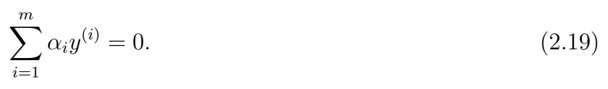
*Formula quality: `semantic_high_confidence`; source PDF page 9. Reconstructed the soft-margin dual equality constraint in equation (2.19).*
<!-- formula-end -->

In terms of the quadratic kernel K ( x, ˆ x ) = ( x T ˆ x + c ) 2 described above, we get our final version of the optimization problem 1 :

<!-- formula-start id="ref_kercheval_zhang_svm_2013:formula:0031" status="semantic_high_confidence" source-page="9" -->
$$
\max_{\alpha}\left[\sum_{i=1}^{m}\alpha_i-\frac{1}{2}\sum_{i,j=1}^{m}\alpha_i\alpha_jy^{(i)}y^{(j)}K(x^{(i)},x^{(j)})\right]
$$
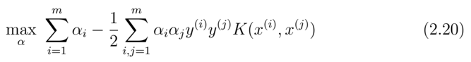
*Formula quality: `semantic_high_confidence`; source PDF page 9. Reconstructed the kernelized soft-margin dual objective in equation (2.20).*
<!-- formula-end -->

<!-- formula-start id="ref_kercheval_zhang_svm_2013:formula:0032" status="semantic_high_confidence" source-page="9" -->
$$
\text{s.t. }0\leq\alpha_i\leq C,\qquad i=1,\ldots,m
$$
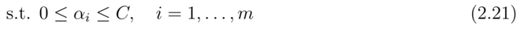
*Formula quality: `semantic_high_confidence`; source PDF page 9. Reconstructed the kernel-dual box constraints in equation (2.21).*
<!-- formula-end -->

<!-- formula-start id="ref_kercheval_zhang_svm_2013:formula:0033" status="semantic_high_confidence" source-page="9" -->
$$
\sum_{i=1}^{m}\alpha_i y^{(i)}=0
$$
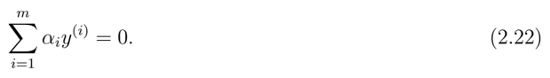
*Formula quality: `semantic_high_confidence`; source PDF page 9. Reconstructed the kernel-dual equality constraint in equation (2.22).*
<!-- formula-end -->

Using the solutions α i , and letting S = { s 1 , s 2 , . . . } be the set of support vectors (corresponding to α &gt; 0), the label for a new example x is assigned as +1 if

<!-- formula-start id="ref_kercheval_zhang_svm_2013:formula:0034" status="semantic_high_confidence" source-page="9" -->
$$
\sum_{i=1}^{|S|}\alpha_i y_i K(s_i,x)+b
$$
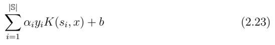
*Formula quality: `semantic_high_confidence`; source PDF page 9. Reconstructed the final support-vector classifier score in equation (2.23).*
<!-- formula-end -->

is positive, and -1 otherwise. The kernel functions used in this paper are the polynomial kernels K ( x i , x j ) = ( x i · x j +1) d with d = 2. (We use the constraint parameter C = 0 . 25, though in experiments this choice does not affect results much.)

## 3 Model Architecture

In this section, we first describe the limit order book and key metrics to characterize price evolution, then present the rationale behind our SVM design framework for price movement forecasting. We also introduce various aspects of multi-class SVM - the workhorse of the proposed framework, and delineate our tactics to validate models built with SVMs and methods to evaluate their performance.

1 This optimization problem is solved experimentally using a JAVA implementation of the Sequential Minimal Optimization algorithm [31].

## 3.1 Limit Order Book Dynamics and Metrics

Records of high-frequency trading activity are organized into a database with two major components: the message book and the order book. The former stores basic information on each trading event, such as time of occurrence and transaction type, while the latter keeps unexecuted limit orders for both bid and ask. A sample message book and order book extracted from the NASDAQ stock AAPL are depicted in Table 1. In the table, each row of the message book represents a trading event that could be either a limit order submission, limit order cancellation, or market order execution as shown in column 'Event Type'. The arrival time of an event given in column 'Time', measured from midnight, is in seconds and nanoseconds; the order price is in US dollars, and the Volume is in number of shares. The 'Direction' column indicates the type of limit order that is executed via an incoming market order of the opposite type - e.g. an incoming market sell order executes against an existing limit bid order, etc. On the other hand, each entry of the order book, also shown in Table 1, groups ask and bid events on n different price levels (we take n = 10) along with their volume sizes. The best ask and best bid are listed first, and the next best second, etc.

Message book

|       | Time(sec)       | Price($)   | Volume   | Event Type   | Direction   |
|-------|-----------------|------------|----------|--------------|-------------|
| k - 1 | 34203.011926972 | 585.68     | 18       | execution    | ask         |
| k     | 34203.011926973 | 585.69     | 16       | execution    | ask         |
| ...   | ...             | ...        | ...      | ...          | ...         |
| k +4  | 34203.011988208 | 585.74     | 18       | cancellation | ask         |
| k +5  | 34203.011990228 | 585.75     | 4        | cancellation | ask         |
| ...   | ...             | ...        | ...      | ...          | ...         |
| k +8  | 34203.012050158 | 585.70     | 66       | execution    | bid         |
| k +9  | 34203.012287906 | 585.45     | 18       | submission   | bid         |
| k +10 | 34203.089491920 | 586.68     | 18       | submission   | ask         |

Table 1: sample: AAPL order book &amp; message book

|       | Order book   | Order book   | 1      | 1    |        |       |        |       |        |       |        |       |     |
|-------|--------------|--------------|--------|------|--------|-------|--------|-------|--------|-------|--------|-------|-----|
|       | Ask 1        | Ask 1        | Bid    | Bid  | Ask 2  | Ask 2 | Bid 2  | Bid 2 | Ask 3  | Ask 3 | Bid 3  | Bid 3 | ... |
|       | Price        | Vol.         | Price  | Vol. | Price  | Vol.  | Price  | Vol.  | Price  | Vol.  | Price  | Vol.  | ... |
| k - 1 | 585.69       | 16           | 585.44 | 167  | 585.71 | 118   | 585.40 | 50    | 585.72 | 2     | 585.38 | 22    | ... |
| k     | 585.71       | 118          | 585.44 | 167  | 585.72 | 2     | 585.40 | 50    | 585.74 | 18    | 585.38 | 22    | ... |
| ...   | ...          | ...          | ...    | ...  | ...    | ...   | ...    | ...   | ...    | ...   | ...    | ...   | ... |
| k +4  | 585.71       | 118          | 585.70 | 66   | 585.72 | 2     | 585.44 | 167   | 585.75 | 4     | 585.40 | 50    | ... |
| k +5  | 585.71       | 118          | 585.70 | 66   | 585.72 | 2     | 585.44 | 167   | 585.80 | 100   | 585.40 | 50    | ... |
| ...   | ...          | ...          | ...    | ...  | ...    | ...   | ...    | ...   | ...    | ...   | ...    | ...   | ... |
| k +8  | 585.71       | 100          | 585.44 | 167  | 585.80 | 100   | 585.40 | 50    | 585.81 | 100   | 585.38 | 22    | ... |
| k +9  | 585.71       | 100          | 585.45 | 18   | 585.80 | 100   | 585.44 | 167   | 585.81 | 100   | 585.40 | 50    | ... |
| k +10 | 585.68       | 18           | 585.45 | 18   | 585.71 | 100   | 585.44 | 167   | 585.80 | 100   | 585.40 | 50    | ... |

It is evident from Table 1 that a new entry in the message book typically causes one fresh record to be added into the order book. For instance, the transaction event at the k -th row of the message book of Table 1, execution of an ask order at the price $585.69 with 16 shares, exactly cancels out the best ask price and its volume in Row k -1 of the order book, making the next best ask price, $585.71, become the new best ask price as shown in Row k of the order book. It can also be observed from the message book that multiple trading events could arrive within milliseconds as demonstrated from Row k -1 to k + 10, leading to drastic fluctuation of prices and volumes in the order book. Although a variety of 'metrics' have been designed to capture the price fluctuation, in this paper we select as metrics (a) the occurrence and direction of mid-price movement, and (b) the occurrence and direction of bid-ask spread crossing, described below.

The mid-price is defined as the mean of the best ask price P ask t and best bid price P bid t at time t , P mid t = 1 2 ( P ask t + P bid t ). The three possible scenarios of mid-price movements - upward, downward and stationary - are illustrated in Table 1. For example, compared to Row k -1, the mid-price at Row k +4 increases to ($585.71+$585.70)/2 = $585.705 from ($585.69+$585.44)/2 = $585.565 due to upward movement of both the best ask price and the best bid price. While the mid-price is stationary as time advances from Row k +4 to k +5 owing to the motionless best ask/bid prices, it moves downward to ($585 . 68 + $585 . 45) / 2 = $585 . 565 when transactions further proceed to Row k +10.

Mid-price movement is a statistical indicator (though not a guarantee) of potential trading profits. In contrast, bid-ask spread crossing is a less-frequent occurrence that however does assure a profit if correctly identified in advance. There are three scenarios: 1) an upward price spread crossing occurs when the best bid price at t +∆ t exceeds the best ask price at time t ( P bid t +∆ t &gt; P ask t ); 2) a downward price spread crossing happens when the best ask price at t +∆ t is less than the best bid price at time t , ( P ask t +∆ t &lt; P bid t ); and 3) no price spread crossing takes place if P ask t +∆ t ≥ P bid t and P bid t +∆ t ≤ P ask t . For example, an upward price spread crossing appears as indicated by Row k -1 and k + 4 of the order book in Table 1, P ask t k -1 &lt; P bid t k +4 - the trader makes a profit with a long position on the asset with best ask price $585 . 69 at time k -1 and then selling with a higher best bid price $585 . 70 at time k +4.

These two metrics can work independently or together to provide guidance for trading strategies depending on particular scenarios. Of course, the premise for the arbitrage opportunities described above is that the directions of mid-price movement and price spread crossing can be predicted accurately, which is the main task addressed in this paper.

## 3.2 Proposed Design Framework

As the trading day progresses, the limit order book contains a massive amount of rapidly evolving data, with the possibility of important patterns forming and dissolving at a frequency too high for a human observer - hence the motivation for machine learning.

To build a learning model for a given metric, such as mid-price movement, a set of labeled samples, termed training data, should be prepared, in which each data point is characterized with a vector of attributes, an SVM model is constructed, and then subject to a validation procedure to verify soundness and robustness. To keep up with the rapidly changed dynamics of the limit order book, the training data are frequently updated so that models can be refreshed to learn and subsume any new characteristics appearing in the data.

Generally speaking, separate learning models should be built for different metrics depicting limit order book dynamics. To build a machine learning model for a specific metric, the following four-phase process is employed.

- Features representation : the data in the order book and message book is converted into a format suitable for machine learning methods to manipulate.
- Learning model construction : an SVM model is constructed.
- Learning model validation : the model is evaluated and validated using particular performance measurements.
- Unseen-data classification : the constructed learning model automates the forecasting of the chosen metric in real time.

Figure 3.1: Architecture of framework for forecasting order book dynamics.

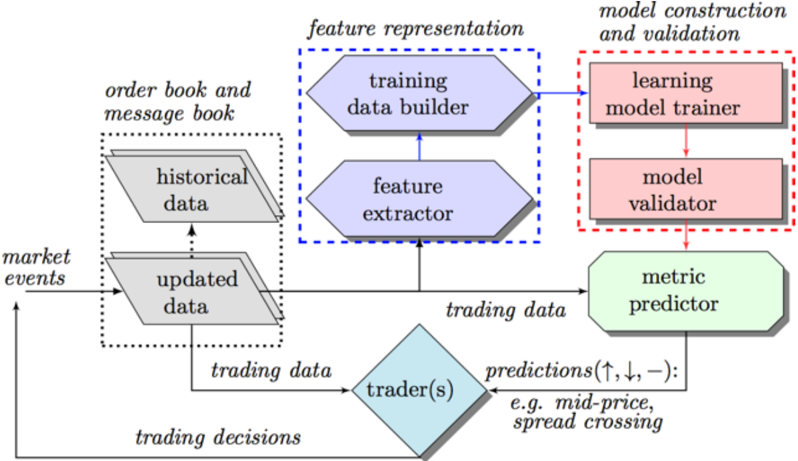

In this four-phase process, the first three phases are conducted offline while the last phase works online to provide predictions for real time trading events. Details of the main modules in Figure 3.1 will be provided in subsequent sections.

## 3.3 Feature Extraction and Training Data Preparation

The 'feature representation' module is designed to convert the order book and message book data into suitable inputs to the SVM. Each data point, which we take to be the data recorded in a single row of the order book along with the corresponding row in the message book, must be represented as a 'feature vector' of specific attributes, lying in a Euclidean space R n , where n is the total number of attributes selected. (These feature vectors will then be mapped to the feature space by the feature mapping, according to the previous discussion of the SVM.) With well-formatted feature vectors for data points in place, the module 'feature representation' further randomly samples some data points to construct the training data set for each metric used to characterize the dynamics of the limit order book.

We denote the set of training data as T = { x ⃗ i , y i } , ( i = 1 , ..., m ), where x ⃗ i ∈ R n is the feature vector for the i th data point and y i ∈ Y = { l 1 , ..., l k } is its true label identifying the category this data point belongs to. For example, in the case of predicting the direction of mid-price movement, the label set is Y = { upward, downward, stationary } .

To better profile the original data and fully represent all label categories of the metric in question, the population in the training data set, although randomly sampled, should follow the distribution of metric labels in the entire collection of data. For example, assuming that the ratio of labels for metric mid-price (i.e., up, down, and stationary) of stock AAPL shown in Tables 1 is 1:1:2 and a set of training data with size 4000 is constructed, then ideally the numbers of samples in the training data set with label upward, downward and stationary should be 1000, 1000, and 2000, respectively. It is typical that each metric has its own unique label set and label distribution, making it necessary to build different training data sets for distinct metrics. Meanwhile, the size of the training data set for different metrics may vary as well depending on the characteristics of the data and the metrics. In this regard, the size of a training data set for a metric is determined in the proposed framework by a cross-validation process that monitors the relationship between size of training data and the performance of the model built on the corresponding training data to avoid overfitting. Moreover, the module frequently reconstructs the training data by replace the oldest data points with the most up-to-date ones to ensure freshness of the training data.

In Table 2 we identify a collection of proposed attributes that are divided into three categories: basic , time-insensitive , and time-sensitive , all of which can be directly computed from the data. Attributes in the basic set are the prices and volumes at both ask and bid sides up to n = 10 different levels (that is, price levels in the order book at a given moment), which can be directly fetched from the order book shown in Table 1. Attributes in the time-insensitive set are easily computed from the basic set at a single point in time. Of this, bid-ask spread and mid-price, price ranges, as well as average price and volume at different price levels are calculated in feature sets v 2 , v 3 , and v 5 , respectively; while v 5 is designed to track the accumulated differences of price and volume between ask and bid sides. By further taking the recent history of current data into consideration, we devise the features in the time-sensitive set presented in Table 2.

Table 2: Feature vector sets

| Basic Set                                                | Description( i = level index , n = 10)   |
|----------------------------------------------------------|------------------------------------------|
| v 1 = { P ask i , V ask i , P bid i , V bid i } n i =1 , | price and volume ( n levels)             |

| Time-insensitive Set                                                                                                                                                                                                                                                                                                                                                                  | Description( i = level index )                                                                   |
|---------------------------------------------------------------------------------------------------------------------------------------------------------------------------------------------------------------------------------------------------------------------------------------------------------------------------------------------------------------------------------------|--------------------------------------------------------------------------------------------------|
| v 2 = { ( P ask i - P bid i ) , ( P ask i + P bid i ) / 2 } n i =1 , v 3 = { P ask n - P ask 1 ,P bid 1 - P bid n , &#124; P ask i +1 - P ask i &#124; , &#124; P bid i +1 - P bid i &#124;} n i =1 v 4 = { 1 n ∑ n i =1 P ask i , 1 n ∑ n i =1 P bid i , 1 n ∑ n i =1 V ask i , 1 n ∑ n i =1 V bid i } , v 5 = { ∑ n i =1 ( P ask i - P bid i ) , ∑ n i =1 ( V ask i - V bid i ) } , | bid-ask spreads and mid-prices price differences mean prices and volumes accumulated differences |

| Time-sensitive Set                                                                                                                                                                                                                                                                                                               | Description( i = level index )                                                                                        |
|----------------------------------------------------------------------------------------------------------------------------------------------------------------------------------------------------------------------------------------------------------------------------------------------------------------------------------|-----------------------------------------------------------------------------------------------------------------------|
| v 6 = { dP ask i /dt, dP bid i /dt, dV ask i /dt, dV bid i /dt } n i =1 , v 7 = { λ la ∆ t , λ lb ∆ t , λ ma ∆ t , λ mb ∆ t , λ ca ∆ t , λ cb ∆ t } v 8 = { 1 { λ la ∆ t >λ la ∆ T } , 1 { λ lb ∆ t >λ lb ∆ T } , 1 { λ ma ∆ t >λ ma ∆ T } , 1 { λ mb ∆ t >λ mb ∆ T } } , v 9 = { dλ ma /dt, dλ lb /dt, dλ mb /dt, dλ la /dt } , | price and volume derivatives average intensity of each type relative intensity indicators accelerations(market/limit) |

In feature set v 6 , average time derivatives of price and volume are computed over the most recent 1 second. The average intensity - defined as the recent shortterm average arrival rate of a certain trading type - is calculated in feature set v 7 for limit ask/bid orders (denoted as λ la ∆ t and λ lb ∆ t ), market ask/bid orders (denoted as λ ma ∆ t and λ mb ∆ t ), as well as cancellation ask/bid orders (denoted as λ ca ∆ t and λ cb ∆ t ). We choose ∆ t = 1 second. Features in v 8 focus on the discrepancy between short term and long term intensities for different trading type denoted as λ type ∆ t and λ type ∆ T , respectively, where type can be limit ask/bid orders as well as market ask/bid orders (denoted as la, lb, ma , and mb ). The indicator function 1 { λ type ∆ t &gt;λ type ∆ T } determines whether the trading type in question has intensified in the most recent past. In our experiments, we select ∆ t = 10 seconds, and ∆ T = 900 seconds. The acceleration of a trading type presented as the derivative of its intensity is captured in feature set v 9 , computed as an average rate of change over the previous 1 second. For instance, if both dλ ma /dt and dλ lb /dt have positive sign, then market ask orders and limit bid orders are arriving faster, which could drive up the bid-ask spread and may lead to an upward spread crossing.

Armed with the attributes described in Table 2, the feature vector x ⃗ i for the i -th data point in the training data set can be formed by simply selecting one or more feature sets and then concatenating them together. However, we need to resist the temptation to simply include as many attributes as possible: some features may depict similar characteristics of the underlying data, making them redundant; some features may not capture the intrinsic hidden patterns in the data and therefore only introduce noise into model training; and the computation time required to carry out the SVM model is sensitive to the size of the feature vectors. Therefore, we select a smaller set of attributes in the feature space, which we can call an 'economized feature set', selected according to their contributions to the performance of the resulting model as measured in terms of information gain [12],[15].

Entropy is a measure of uncertainty or unpredictability of a system, which is defined as H ( Y ) = -∑ y ∈ Y p ( y ) log 2 ( p ( y )) for a given variable Y with various values ( y ∈ Y ), where p ( y ) represents the probability that a data point in the sample (e.g. a training data set T ) has value y ∈ Y . If all data points are equally likely, p ( y ) is the total proportion | T ( y ) | / | T | of the data in the training set having label y , where T ( y ) is the subset of data in T having label y .

If X is an attribute with values x ∈ X , then the conditional probability p ( y | x ) is defined to be the proportion | T ( x, y ) | / | T ( x ) | of data with label y among all data with attribute x . In this case the conditional entropy of Y , after observing feature X , is defined as

<!-- formula-start id="ref_kercheval_zhang_svm_2013:formula:0035" status="semantic_high_confidence" source-page="17" -->
$$
H(Y\mid X)=-\sum_{x\in X}p(x)\sum_{y\in Y}p(y\mid x)\log_2 p(y\mid x)
$$
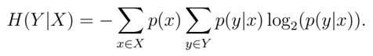
*Formula quality: `semantic_high_confidence`; source PDF page 17. Reconstructed conditional entropy for feature selection.*
<!-- formula-end -->

The information gain of Y contributed by X is then defined as

<!-- formula-start id="ref_kercheval_zhang_svm_2013:formula:0036" status="semantic_high_confidence" source-page="17" -->
$$
IG(X)=H(Y)-H(Y\mid X)
$$
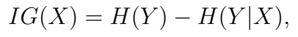
*Formula quality: `semantic_high_confidence`; source PDF page 17. Reconstructed information gain as the entropy reduction contributed by X.*
<!-- formula-end -->

and is a measure of the reduction of uncertainty about Y resulting from knowledge of attribute X . We can then order all the attributes according to their information gain, and select the attributes with the largest IG such that the performance of the model built with these attributes is comparable to that obtained from the full original feature set. (See Appendix.)

## 3.4 Learning Model Construction and Validation

In the proposed framework, we use Support Vector Machine techniques as described in Section 2.

When the label set Y = { l 1 , ..., l k } has more than two members ( k &gt; 2), the classification problem is no longer binary. Instead, a multi-class categorization problem should be solved. In this paper, we reduce the multi-class learning problem into a set of binary classification tasks and build a binary classifier independently for each label l k with a one-against-all method [19, 23]. In the one-against-all training method, k binary SVM models are constructed, one for each class in Y ; to this end, when training the i th SVM ( i = 1 , ..., k ), examples in the i th class are treated as positive while samples in other classes as negative. After k binary SVMs are built, an unseen data point is assigned to the class with the largest value (equation (2.23)) generated by these k binary models.

Before a newly built learning model for a metric is actually applied to predict out-of-sample data, it is subject to evaluation and validation. We use the concepts of precision (P), recall (R), and F β as measures of quality of the prediction process, defined as follows. Consider a set T training data samples and we are trying to assign the label y of a particular class. Say Y is the subset of T of examples that have the true label y , and Z is the subset of examples that our SVM assigns to label y . Then

1. precision P is #( Y ∩ Z ) / #( Z )
2. recall R is #( Y ∩ Z ) / #( Y )
3. F β = (1 + β 2 ) PR/ ( β 2 P + R ), the weighted harmonic mean of P and R. When β = 1, meaning that both precision and recall are equally important, we obtain the F 1 -measure F 1 = 2 PR/ ( P + R ).

We use an n -fold cross validation process that works as follows: the training data set T is first divided into n equally-sized subsets { T i , i = 1 , ..., n } , each of which has the same distribution as T with respect to the metric in question, and then the following steps are repeated n times guided by iteration index i = 1 , ..., n :

̸

- Training: Set T i is set aside as validation (test) set while the remaining n -1 sets are combined to form a new training set T ′ i = ∪ j = i T j , which is used to build learning model L i .
- Predicting: Model L i is employed to label samples in validation set T i and a sample is predicted correctly if its assigned label by L i agrees with its true label.
- Measuring: Performance measures such as accuracy, precision, recall and F β -measure are computed for model L i .

In this n -fold cross validation process, the average of the P, R, F 1 measures from n iterations are used as the overall measurements for the learning model.

## 4 Experiments and Results

This section summarizes our experimental results. Model efficiency as measured by training and prediction time are demonstrated in 4.1. The model performance for different feature sets and the analysis of feature selection are shown in 4.2. Illustrated by the tables of corresponding p -values, the model's performance is further justified by the results of paired t -tests in 4.3. Finally, results of a test of a simple trading strategy built on the spread crossing model is given in 4.4. With a full trading day length, real data of 5 stocks from NASDAQ are used in the experiments. The prediction time horizon, which specifies how long ahead of current time for the model to project forecasting, is denoted by the notation ∆ t and measured as the number of events. All experiments are performed using Linux, with a 2.9GHz Intel Core i7 CPU and 8GB 1600MHz memory.

## 4.1 Model Performance on Processing Time

Using training data equipped with all the features (basic, time-insensitive, timesensitive) from Table 2, the training and prediction times for the two metrics are outlined in Table 3. Several random sets of 1500 training data points are constructed by replicating the distribution of each metric in the original data. The numbers illustrated are the average time that models use for identifying each unseen example. Data in 'Training time' and 'Testing time' columns are given in seconds and milliseconds respectively. Table 3 indicates that, for the same ticker, the time used to train a model as well as the time for predicting new data vary by metric. This difference may be due to the number of support vectors of the models trained, which directly relates to computation workload. For instance, the mid-price movement model of INTC has 171 support vectors and spread crossing has 291, which results in the training and prediction times for mid-price (3.884s and 0.0250ms respectively), less than that of spread crossing (5.020s and 0.0366ms).

Training time(s)

Prediction time(ms)

Table 3: Models' average processing time with different tickers: all features are used for training, training set size = 1500, ∆ t = 5 (events)

| Ticker   |   mid-price |   spread crossing | mid-price   | spread crossing   |
|----------|-------------|-------------------|-------------|-------------------|
| MSFT     |       1.116 |             2.960 | 0 . 0250    | 0 . 0180          |
| INTC     |       3.884 |             5.020 | 0 . 0250    | 0 . 0366          |
| AMZN     |       5.199 |             5.920 | 0 . 0683    | 0 . 0210          |
| AAPL     |       4.246 |             5.390 | 0 . 0567    | 0 . 0311          |
| GOOG     |       3.255 |             3.640 | 0 . 0783    | 0 . 0237          |
| Mean     |       3.540 |             4.586 | 0 . 0507    | 0 . 0260          |

Similarly, the time used for training and prediction varies for different tickers. For example, there were 211 support vectors in the spread crossing model of MSFT, so the 291 support vectors make the training and prediction time for INTC (5.020s and 0.0366ms) slightly longer than for MSFT (2.960s and 0.0180ms). In the last row 'Mean', the data indicate the efficiency of the models in an overall view.

The computation time for prediction is sufficiently fast for certain simple ap- plications. For example, since the prediction time of AAPL, 0.0311ms, is less than 0.0612ms, which is the time difference between the upward spread crossing events from the Row k -1 to Row k +4 in Table 1, the model could in principle perform fast enough to influence corresponding trading decisions. A commercial implementation would likely need to be faster to fully capture such spread crossing events - however, our experiments with unoptimized code and equipment are only intended to illustrate the concept.

## 4.2 Feature Selection

For each metric and ticker, we rank our original set of attributes by information gain. Asubset of attributes called the 'economical set' is determined by sequentially including one attribute at a time, beginning with the attribute with the highest information gain, until the F 1 measure of performance reaches 95% or more of the F 1 measure of the original set of attributes.

Original Set Economical Set

Table 4: Performance measurement before and after feature selection: the original set is the training set before feature selection (82 features), and the economical set is the training set after feature selection (53 attributes for GOOG, 60 attributes for AAPL). Metric = spread crossing; Training set size = 2000. ∆ t = 5 (events).

| Ticker   | Label   |   P(%) |   R(%) |   F 1 (%) |   P(%) |   R(%) |   F 1 (%) |
|----------|---------|--------|--------|-----------|--------|--------|-----------|
| AAPL     | U ( ↑ ) |   77.8 |   74.7 |      76.2 |   75.1 |   74.2 |      74.6 |
| AAPL     | D ( ↓ ) |   80.4 |   83.3 |      81.8 |   80.5 |   82.3 |      81.4 |
| AAPL     | S (-)   |   99.1 |   98.8 |      99.0 |   99.3 |   98.6 |      99.0 |
| GOOG     | U ( ↑ ) |   85.4 |   86.8 |      86.1 |   85.5 |   82.6 |      84.0 |
| GOOG     | D ( ↓ ) |   83.0 |   79.3 |      81.2 |   79.5 |   80.5 |      80.0 |
| GOOG     | S (-)   |   98.6 |   99.5 |      99.0 |   98.6 |   99.5 |      99.0 |

Table 4 shows the spread crossing model training performance of the original and economical feature sets for AAPL and GOOG. Among 82 original attributes, 53 and 60 attributes are selected for GOOG and AAPL, respectively. To illustrate the distribution of attributes chosen as having highest information gain, a graphical description is shown in Figure 4.1 for AAPL, with the top row for the mid-price metric and the bottom row for spread-crossing.

More detailed information about the attributes selected via information gain is given in the Appendix. In the remainder of this paper, we always limit ourselves to the 'economical' subset of attributes, a proper subset of the full original set of 82 attributes that varies by ticker and metric.

Figure 4.1: Economical training data set feature distribution selected by information gain. The upper pie charts (grey and red) are the distribution of mid-price prediction features, and the lower pie charts (blue and green) is the distribution of spread-crossing prediction features. Basic = basic feature set; T-insen = time-insensitive feature set; T-sen = timesensitive feature set; Ask side = features only related to ask side; Bid side = features only related to bid side; Price = features only related to price; Volume = features only related to volume.Ticker = AAPL.

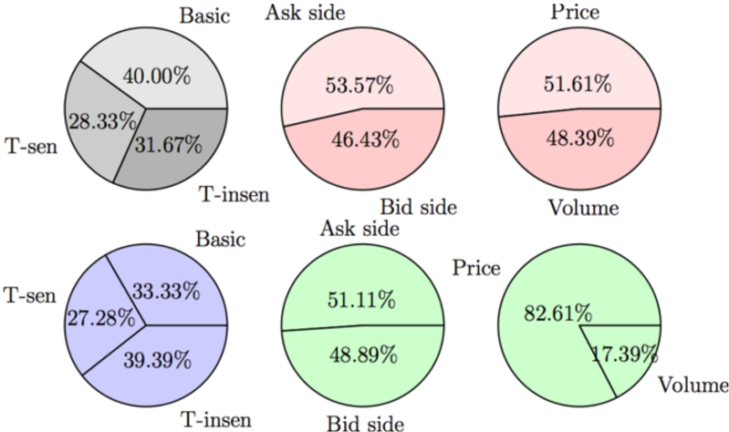

To compare the performance with different feature set configurations, we examine the SVM performance for the mid-price metric for AAPL in Table 5. The first column outlines the precision (P), recall (R) and F 1 -measure (F 1 ). The columns ∆ ( i,j ) denotes the difference F i -F j of entries in the prior columns, while the column 'Avg.' is the average of the last three columns.

AAPL: Mid-price

|      | Label   |   F 0 |   F 1 |   F 2 |   F 3 |   ∆ (1 , 2) |   ∆ (0 , 1) |   ∆ (0 , 2) |   ∆ (0 , 3) |   Avg. |
|------|---------|-------|-------|-------|-------|-------------|-------------|-------------|-------------|--------|
| P(%) | U ( ↑ ) |  83.6 |  89.5 |  85.3 |  84.7 |        -4.2 |         5.9 |         1.7 |         1.1 |    2.9 |
| P(%) | D ( ↓ ) |  75.2 |  88.0 |  84.9 |  84.3 |        -3.1 |        12.8 |         9.7 |         9.1 |   10.5 |
| P(%) | S (-)   |  79.8 |  90.0 |  80.1 |  81.9 |        -9.9 |        10.2 |         0.3 |         2.1 |    4.2 |
| R(%) | U ( ↑ ) |  76.5 |  89.5 |  77.4 |  76.5 |       -12.1 |        13.0 |         0.9 |         0.0 |    4.6 |
|      | D ( ↓ ) |  80.5 |  88.0 |  82.9 |  83.2 |        -5.1 |         7.5 |         2.4 |         2.7 |    4.2 |
|      | S (-)   |  81.0 |  90.0 |  83.8 |  82.4 |        -6.2 |         9.0 |         2.8 |         1.4 |    4.4 |
| F 1  | U ( ↑ ) |  79.9 |  89.5 |  81.4 |  80.6 |        -8.1 |         9.6 |         1.5 |         0.7 |    3.9 |
| (%)  | D ( ↓ ) |  77.8 |  88.0 |  83.9 |  83.4 |        -4.1 |        10.2 |         6.1 |         5.6 |    7.3 |
| (%)  | S (-)   |  80.4 |  90.0 |  82.0 |  82.2 |        -8.0 |         9.6 |         1.6 |         1.8 |    4.3 |

Table 5: AAPL model mid-price prediction measurements with different feature sets, F 0 = { Basic features } , F 1 = { Basic and time-insensitive features } , F 2 = { Basic and time-sensitive features } , and F 3 = { All features } . ∆ ( i,j ) = value of column F j -value of column F i . U = upward; D = downward; S = stationary. Training set size = 1500; ∆ t = 5 (events)

From Table 5 we see that training data with the extended feature sets generally outperform the basic feature set. However, more is not necessarily better: the performance of feature set F 3 is generally lower than those of either F 1 or F 2 . For AAPL, F 1 tends to perform better than F 2 or F 3 , but this depends on the stock.

## 4.3 Model Performance with Tests of Significance

The model's task is to forecast which of three possible classes the state of the order book will be in at a time ∆ t in the future. The possibilities are: the mid-price will be higher, lower, or the same (mid-price metric), or there will be an upward spread crossing, a downward spread crossing, or no spread crossing (spread crossing metric). We measure the look-ahead interval ∆ t in number of events, with possible values 5, 10, 15, or 20 events ahead of the current time. At each new event, the model will make a new forecast.

Figures 4.2 and 4.3 report the prediction accuracy (percentage of correct predictions) for feature set F 3 for a sample of 1200 data points. Generally, accuracy declines with ∆ t . However, we can see that the spread crossing accuracy for INTC

is higher for ∆ t = 10 or 15 than for ∆ t = 5, suggesting that the modeler will need to investigate the natural time scales of each ticker's price movements to choose the optimal prediction horizon.

Figure 4.2: Correct prediction percentage for different prediction horizons. Training data set size = 1200, metric = mid-price movement; ∆ t = 5, 10, 15, 20 (events)

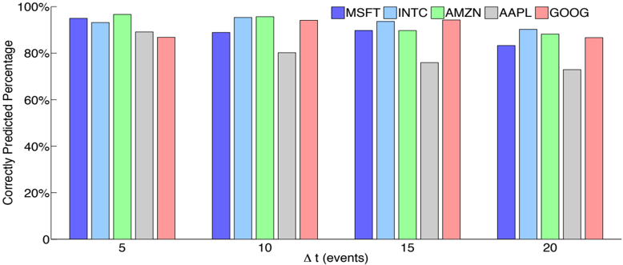

Figure 4.3: Correct prediction percentage for different prediction horizons. Training data set size = 1200, metric = spread crossing; ∆ t = 5, 10, 15, 20 (events)

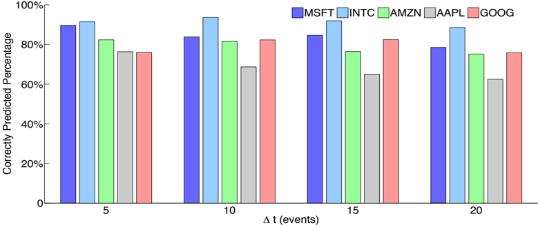

To investigate the question of whether our positive results are merely due to luck we use the paired t -test to examine the statistical significance of our performance measurements. The benchmark for our t -test is the ZeroR classifier . As the simplest classification method, the ZeroR classifier predicts all the data points to be the majority class of the training data set. Maintaining the correctness of the majority class, the performance of ZeroR therefore outperforms a random classifier, which predicts data points in each class with equal probability. Hence, although there is no prediction power in ZeroR, it is useful for determining a baseline performance for other classification methods.

The paired t -test is performed between the multi-class SVM model and the ZeroR using repeated 10-fold cross-validation, as explained below. The null hypothesis is that the P, C and F 1 measures of our SVM model have the same mean as those of the ZeroR classifier. The paired t -test tells us the probability of obtaining the observed average measurements conditional on the null hypothesis.

For our 10-fold cross-validation, we select 2000 data points from our total sample and divide this into 10 segments of n 2 = 200 data points. For each of 10 trials, we take one of the 200 point segments as the test data, and the remaining n 1 = 1800 points as training data. We compute the performance ( P, C, F 1 ) on the test data. Doing this for each 200 point segment in turn completes a 10-fold cross-validation experiment. We then repeat this experiment J = 10 times, each with a new independent sample of 2000 points drawn from the original total sample (about 400,000 rows of the order book, in our case). For each performance measure X ∈ ( P, C, F 1 ), we compute, for the i th test, i = 1 , . . . , 100, d i = X ( SV M ( i )) -X ( ZeroR ( i )). The mean and standard deviation of { d 1 , . . . , d 100 } are µ d and s d , and our null hypothesis is H 0 : µ d = 0.

The t -test we use is the 'corrected resampled t -test' from [27] to account for the fact that the cross-validation trials are not completely independent. We use

<!-- formula-start id="ref_kercheval_zhang_svm_2013:formula:0037" status="semantic_high_confidence" source-page="25" -->
$$
t=\frac{\mu_d}{s_d\sqrt{\frac{1}{J}+\frac{n_2}{n_1}}}
$$
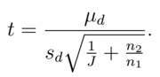
*Formula quality: `semantic_high_confidence`; source PDF page 25. Reconstructed the corrected resampled t-statistic from the displayed source equation and the immediately preceding definitions.*
<!-- formula-end -->

To reject the null hypothesis at confidence level α , we compute this t -statistic and use p -values for the t ( k ) distribution, with k = 99 degrees of freedom.

Results are reported in Tables 6 and 7, which shows the p -values well below typical significance levels α = 0 . 05 or 0.01. We deduce that the P, C, and F 1 measures are all statistically significantly better than the performance of our baseline classifier.

Table 6: Results of paired t -test of spread crossing prediction, ∆ t = 5 (events), training data size = 2000. The measurements are weighted precision (P%), percentage of correct prediction (C%) and weighted F 1 -measure (F 1 %). Cross-validation n = 10, Trials = 10; The values in parentheses are the p -values obtained from the paired t -test in scientific notation. Values less than 0.01 represent significance to the 99% confidence level.

| ZeroR   | ZeroR   | ZeroR   | ZeroR   | Multi-class SVMs   | Multi-class SVMs   | Multi-class SVMs   | Multi-class SVMs   | Multi-class SVMs   | Multi-class SVMs   |
|---------|---------|---------|---------|--------------------|--------------------|--------------------|--------------------|--------------------|--------------------|
| Ticker  | P(%)    | C(%)    | F 1 (%) | P(%)               | P(%)               | C(%)               | C(%)               | F 1 (%)            | F 1 (%)            |
| AAPL    | 36.22   | 59.14   | 44.21   | 91 . 03            | (1E-08)            | 90 . 25            | (8E-07)            | 90 . 01            | (7E-08)            |
| GOOG    | 34.11   | 56.43   | 43.01   | 92 . 00            | (5E-09)            | 91 . 33            | (1E-07)            | 91 . 51            | (4E-08)            |

Table 7: Results of paired t -test of mid-price prediction, ∆ t = 5 (events), training data size = 4000. Notation as in Table 6.

| ZeroR   | ZeroR   | ZeroR   | ZeroR   | Multi-class SVMs   | Multi-class SVMs   | Multi-class SVMs   | Multi-class SVMs   |
|---------|---------|---------|---------|--------------------|--------------------|--------------------|--------------------|
| Ticker  | P(%)    | C(%)    | F 1 (%) | P(%)               | C(%)               | C(%)               | F 1 (%)            |
| MSFT    | 36.00   | 52.73   | 41.50   | 74 . 34 (1E-07)    | 74 . 65            | (1E-04)            | 72 . 00 (1E-06)    |
| INTC    | 41.00   | 51.63   | 43.00   | 75 . 00 (7E-07)    | 73 . 54            | (1E-04)            | 71 . 20 (2E-06)    |

## 4.4 Testing a Simple Trading Strategy

As a final test of the effectiveness of the SVM model, we test it with a simple-minded trading strategy against our data. The strategy below is not meant to represent a realistic trading implementation, but rather a simple sanity test to illustrate whether the model produces useful information in the context of sample market data.

For a window of time ∆ T = 300 , 600 , 900 , 1800 or 3600 seconds, we run the spread-crossing model for a prediction horizon of ∆ t = 5 events, using four hours of AAPL order book data on June 21, 2012. At each event, if the model predicts no spread crossing, we do nothing. If it predicts an upward spread crossing at horizon ∆ t , we submit a market buy order for a nominal $100 at best ask and after ∆ t = 5 events, no matter what happens, sell it back for the current best bid. Similarly for a prediction of downward spread crossing. We assume no transaction costs and collect all our profit and loss at the end of the trading window. The model is retrained using the most recent 2000 events once per hour. Table 8 shows the results averaged over 30 overlapping windows of each size across the four hour testing period.

AAPL

Table 8: Trading test by using various length of sliding windows based on the prediction of spread crossing, ∆ t = 5 (events). In each trading window, the simulated trader goes long $100 . 00 on upward spread crossing and short back 5 events later; goes short with $100 . 00 if downward spread crossing occurs; no moves if stationary prediction occurs. After the window duration ends, the accumulated profits/loss is computed. In total, 30 windows are included in the test. The mean and standard deviation of the profit of different window lengths are shown in the table. 1 tick = $0.01; Ticker = AAPL.

|   Duration (s) |   Mean (Tick) |   Std. Dev. (Tick) |   Avg. # of Trades |
|----------------|---------------|--------------------|--------------------|
|            300 |        1.5390 |             1.4352 |               13.0 |
|            600 |        1.7781 |             1.1113 |               22.0 |
|            900 |        1.9781 |             1.5113 |               31.0 |
|           1800 |        2.8658 |             1.8491 |               68.0 |
|           3600 |        3.5862 |             1.1083 |              126.0 |

Figure 4.4 illustrates this further for the case of a window of 1800 seconds for AAPL. Most events are correctly labelled as stationary, and indicated by the purple curve on the graph. Every so often there is an up or down spread crossing event; these are labeled according to whether the model correctly predicted them. In the picture is also the size of the bid-ask spread for reference, with scale on the right axis. Profit and loss for our simple trading strategy is reported in Figure 4.5. In this trial, we can see a realized profit of about 3 basis points over this 30 minute window. In the places where the profit-loss curve drops down, there are events that are mis-predicted by the model. For example, the profit-loss curve drops around the time 600s in Figure 4.5, which is due to an incorrect upward prediction when there actually follows a down event. For similar reasons, upward movements in the profit curve indicate where correct predictions are made.

Figure 4.4: Example: prediction with labelled signals and bid-ask spread evolution. Left y -axis is the stock price in US dollar; the right y -axis is the bid-ask spread in US dollar. Time duration = 1800 seconds. The purple box contains a time period and the prediction, which will be zoomed in the Figure 4.6. ∆ t = 5 (events); Ticker = AAPL.

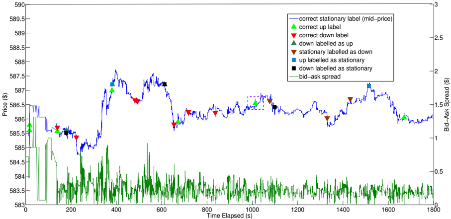

Figure 4.5: Example: prediction with labelled signals and profit-loss curve. Left y -axis is the stock price in US dollar; the right y -axis is the bid-ask spread in US dollar. Time duration = 1800 seconds. ∆ t = 5 (events); Ticker = AAPL.

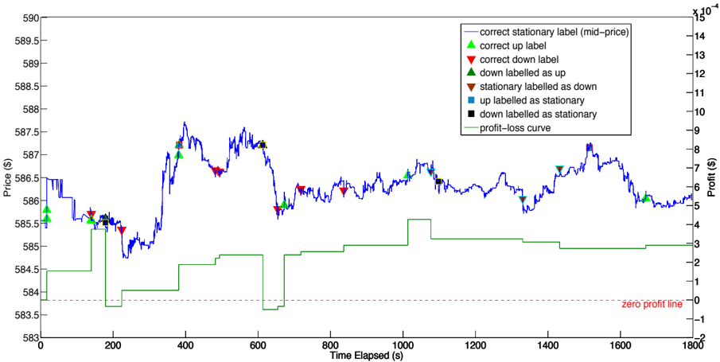

Figure 4.6: Zoom in: upward crossing prediction with the best ask and best bid prices in the purple box of Figure 4.4. The y -axis is the stock price in US dollars; the x -axis is the event time stamps (to the nanosecond); the green arrow indicates an upward prediction occurs at that moment. ∆ t = 5 (events); Ticker = AAPL.

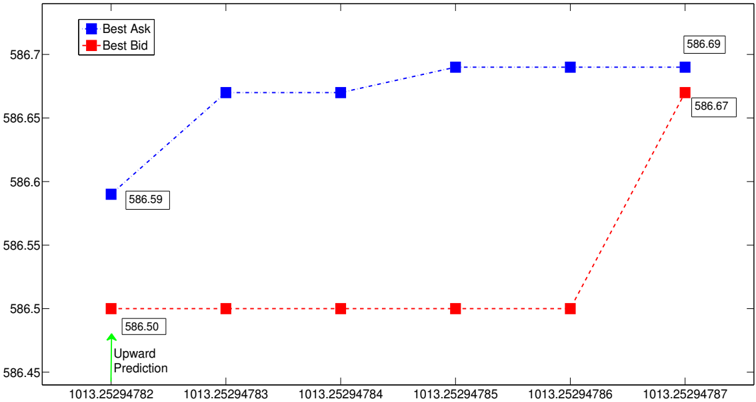

Figure 4.6 shows a close-up view of the region of the purple box in Figure 4.4. We see that at time t = 1013 . 2594782s, the model gives an upward prediction denoted by a green arrow, so a long position is taken at the best ask price $586.59. At 5 events later, t = 1013 . 2594787s, the prediction turns out to be correct, and the asset is sold at the best bid price $586.67 to earn a profit.

## 5 Conclusions

The machine learning modeling method described in this paper provides a framework to automate the prediction process for limit order book dynamics in real time. Treating prediction of various metrics as a supervised learning problem, our method first reduces the problem at hand into a set of binary classification tasks and then builds multi-class models by using SVMs for each binary task.

To improve the efficiency in training models and labeling unseen samples, features are selected according to information gain so that only those attributes sig- nificantly contributing to the performance of the resulting model are retained. The validity and robustness of models are verified with a n -fold cross-validation process that evaluates model performance in terms of precision, recall and F 1 -measure.

Our experiments with real-world data show that the feature sets designed in the proposed framework are effective. For instance, the models built for mid-price movement by using only the basic features can attain on average 79.6%, 82.6%, and 80.3% for precision, recall and F 1 -measure, respectively; the performance can be further improved by about 6.3% and 3.2% when time-insensitive and time-sensitive features are included.

Experiments presented in this paper also demonstrate the efficiency of the framework, as the time spent on classifying an unseen data point is less than a tenth of a millisecond using unoptimized code on and a single CPU implementation. Our comparison study with a baseline ZeroR predictor indicates that our framework significantly outperforms the latter, and the improvement in performance is statistically significant. Moreover, simple trading strategies based on the model's forecasts can achieve profitable returns tested against historical data, with low risk.

A related multi-class SVM approach has been used successfully in [14] to forecast high frequency foreign exchange prices, but ours is the first work we know to demonstrate that this approach is effective also for equity limit order book forecasting.

We conclude with a few comments comparing our approach with [14]. A multikernel SVM modeling method in [14] forecasts the EUR/USD price evolution and tags a given transactional event with respect to spread crossing direction based on three SVM models. Each of these three models is trained with a weighted sum of multiple kernels and recognizes one of the three labels: up, down or stationary. There, a prediction for a given data sample is not made unless the three independent SVMs unanimously agree on the classification. As a result, the prediction coverage - proportion of labeled data - of the model could be low, which may represent a loss of trading information.

In contrast, the models in the present paper label every input data sample by assigning the label corresponding to the hyperplane with the largest positive distance, which means there is complete prediction coverage. In addition, extensive comparative experiments show that the multi-class SVM modeling techniques proposed in this paper reduce the training cost compared to the three multi-kernel SVMs in [14], but still attain robust performance in terms of precision and recall.

Acknowledgments: The authors would like to thank the Chair of Econometrics at Humboldt-Universit¨ at zu Berlin, Germany, for providing data used in this paper.

## 6 Appendix

As described in section 4.2, the attributes used in this study are those in the 'economical set' selected according to those having the largest information gain, a subset of the original set of attributes described in Table 2. For reference, we report more detail here on the specific features selected by this method.

In Tables 9 and 10 we show the top ten features selected for GOOG for each of the two metrics, along with the Information Gain (IG) values.

In Table 11 we define an enumeration of the original set of attributes, so that we may specify in Table 12 the complete set of economical features used our experiments for AAPL and GOOG.

Spread crossing

| Rank   | IG     | Type    | Description                             |
|--------|--------|---------|-----------------------------------------|
| 1      | 0.3711 | Basic   | volume at best ask                      |
| 2      | 0.3186 | Basic   | volume at best bid                      |
| 3      | 0.2512 | T-insen | mid-price at best ask and bid           |
| 4      | 0.2490 | T-insen | mid-price at level 4                    |
| 5      | 0.2098 | T-insen | bid-ask spread at best ask and bid      |
| 6      | 0.2008 | T-insen | mid-price at level 2                    |
| 7      | 0.1957 | T-insen | bid-ask spread at level 4               |
| 8      | 0.1916 | T-insen | mid-price at level 7                    |
| 9      | 0.1675 | T-sen   | acceleration of limit bid order arrival |
| 10     | 0.1639 | T-insen | bid-ask spread at level 8               |
| ...    | ...    | ...     | ...                                     |

Table 9: Examples: features selected with top 10 information gain for spread crossing, along with the feature type and descriptions. Basic = basic feature; T-insen = time-insensitive feature; T-sen = time-sensitive feature; ∆ t = 5 (events), Ticker = GOOG.

Mid-price

| Rank   | IG     | Type    | Description                           |
|--------|--------|---------|---------------------------------------|
| 1      | 0.3356 | T-insen | mid-price at level 10                 |
| 2      | 0.2944 | T-insen | mid-price at level 4                  |
| 3      | 0.2032 | T-insen | average price on ask side             |
| 4      | 0.1907 | Basic   | ask price at level 3                  |
| 5      | 0.1871 | T-insen | bid-ask spread at best ask and bid    |
| 6      | 0.1593 | Basic   | ask price at level 2                  |
| 7      | 0.1568 | T-sen   | average intensity of bid cancellation |
| 8      | 0.1566 | T-sen   | average intensity of market bid order |
| 9      | 0.1565 | T-sen   | average intensity of limit bid order  |
| 10     | 0.1559 | T-insen | average volume at bid side            |
| ...    | ...    | ...     | ...                                   |

Table 10: Examples: features selected with top 10 information gain for mid-price movement, along with the feature type and descriptions. ∆ t = 5 (events), Ticker = GOOG.

| Basic Set                                                                                                                                                                                                                                                                                                                                                                                                                       | Description( i = level index )                                                                                        |
|---------------------------------------------------------------------------------------------------------------------------------------------------------------------------------------------------------------------------------------------------------------------------------------------------------------------------------------------------------------------------------------------------------------------------------|-----------------------------------------------------------------------------------------------------------------------|
| v 1 = { a k 1 } 4 n k =1 = { P ask i , V ask i , P bid i , V bid i } n i =1 ,                                                                                                                                                                                                                                                                                                                                                   | price and volume(n levels)                                                                                            |
| Time-insensitive Set                                                                                                                                                                                                                                                                                                                                                                                                            | Description( i = level index )                                                                                        |
| v 2 = { a k 2 } 2 n k =1 = { ( P ask i - P bid i ) , ( P ask i + P bid i ) / 2 } n i =1 , v 3 = { a k 3 } 2 n k =1 = {&#124; P ask i +1 - P ask i &#124; , &#124; P bid i +1 - P bid i &#124;} n i =1 , v 4 = { a k 4 } 4 k =1 = { 1 n ∑ n i =1 P ask i , 1 n ∑ n i =1 P bid i , 1 n ∑ n i =1 V ask i , 1 n ∑ n i =1 V bid i } , v 5 = { a k 5 } 2 k =1 = { ∑ n i =1 ( P ask i - P bid i ) , ∑ n i =1 ( V ask i - V bid i ) } , | bid-ask spreads and mid-prices price differences mean prices and volumes accumulated differences                      |
| Time-sensitive Set                                                                                                                                                                                                                                                                                                                                                                                                              | Description( i = level index )                                                                                        |
| v 6 = { a k 6 } 4 n k =1 = { dP ask i /dt, dP bid i /dt, dV ask i /dt, dV bid i /dt } n i =1 , v 7 = { a k 7 } 6 k =1 = { λ la ∆ t , λ lb ∆ t , λ ma ∆ t , λ mb ∆ t , λ ca ∆ t , λ cb ∆ t } v 8 = { a k 8 } 4 k =1 = { 1 { λ la ∆ t >λ la ∆ T } , 1 { λ lb ∆ t >λ lb ∆ T } , 1 { λ ma ∆ t >λ ma ∆ T } , 1 { λ mb ∆ t >λ mb ∆ T } } , v 9 = { a k 9 } 4 k =1 = { dλ ma /dt, dλ lb /dt, dλ mb /dt, dλ la /dt } ,                  | price and volume derivatives average intensity of each type relative intensity indicators accelerations(market/limit) |

## Remarks:

- ∗ a k 1 ( k = 4 i -j ) denotes the ask price, volume; bid price, volume at level i for j = 3 , 2 , 1 , 0, respectively.
- ∗ a k 2 ( k = 2 i -j ) denotes the bid-ask spread and mid-price at level i for j = 1 , 0, respectively.
- ∗ a k 3 ( k = 2 i -j ) denotes the price differences for ask and bid at level i for j = 1 , 0, respectively. ( P n +1 = P 1 )
- ∗ a k 6 ( k = 4 i -j ) denotes derivative of ask price, volume; bid price, volume at level i for j = 3 , 2 , 1 , 0, respectively.

Table 11: Feature vector sets enumerated.

| Ticker   | List of Attributes a k l in Economical Set (Mid-price)                                                                                                                                                                                                                                                                                                                                                                                                                                                             |
|----------|--------------------------------------------------------------------------------------------------------------------------------------------------------------------------------------------------------------------------------------------------------------------------------------------------------------------------------------------------------------------------------------------------------------------------------------------------------------------------------------------------------------------|
| AAPL     | a 4 1 , a 2 1 , a 3 2 , a 15 2 , a 4 2 , a 2 2 , a 8 2 , a 32 1 , a 13 2 , a 1 7 , a 3 9 , a 14 1 , a 12 1 , a 34 1 , a 28 1 , a 4 9 , a 10 1 , a 40 1 , a 8 1 , a 24 1 a 18 1 , a 5 1 , a 13 1 , a 9 1 , a 25 1 , a 33 1 , a 2 4 , a 17 1 , a 21 1 , a 1 1 , a 20 2 , a 2 3 , a 2 8 , a 2 6 , a 4 6 , a 2 9 , a 2 5 , a 7 2 , a 14 2 , a 39 1                                                                                                                                                                     |
| GOOG     | a 20 2 , a 8 2 , a 1 4 , a 10 1 , a 1 2 , a 5 1 , a 6 7 , a 4 7 , a 2 7 , a 4 4 , a 2 1 , a 13 2 , a 15 2 , a 4 9 , a 28 1 , a 27 1 , a 30 1 , a 25 1 , a 1 5 , a 29 1 a 31 1 , a 7 2 , a 3 7 , a 3 6 , a 1 6 , a 1 8 , a 24 1 , a 4 8 , a 1 7 , a 5 7 , a 1 3 , a 19 2 , a 20 1 , a 40 1 , a 8 1 , a 6 1 , a 2 4 , a 16 1                                                                                                                                                                                         |
| Ticker   | List of Attributes a k l in Economical Set (Spread Crossing)                                                                                                                                                                                                                                                                                                                                                                                                                                                       |
| AAPL     | a 20 2 , a 2 1 , a 3 4 , a 1 4 , a 1 6 , a 1 2 , a 3 6 , a 2 2 , a 1 9 , a 4 9 , a 1 7 , a 29 1 , a 9 1 , a 13 1 , a 25 1 , a 37 1 , a 5 1 , a 1 1 , a 2 6 , a 2 9 , a 14 2 a 17 1 , a 33 1 , a 7 2 , a 20 2 , a 6 7 , a 21 1 , a 2 5 , a 2 3 , a 31 1 , a 35 1 , a 39 1 , a 4 7 , a 2 7 , a 1 8 , a 2 8 , a 4 6 , a 3 9 , a 27 1 , a 11 1 , a 19 1 a 23 1 , a 15 1 , a 3 1 , a 7 1 , a 4 8 , a 11 2 , a 8 2 , a 20 1 , a 10 2 , a 15 2 , a 9 2 , a 6 1 , a 3 2 , a 13 2 , a 4 1 , a 34 1 , a 4 2 , a 5 2 , a 30 1 |
| GOOG     | a 2 1 , a 4 1 , a 2 2 , a 8 2 , a 1 2 , a 4 2 , a 7 2 , a 14 2 , a 2 9 , a 15 2 , a 19 2 , a 9 2 , a 1 3 , a 9 1 , a 17 2 , a 5 1 , a 6 7 , a 4 7 , a 2 7 , a 2 3 , a 2 6 a 1 1 , a 13 1 , a 1 2 , a 19 1 , a 2 5 , a 27 1 , a 15 1 , a 1 5 , a 2 8 , a 3 1 , a 1 9 , a 39 1 , a 3 9 , a 7 1 , a 4 6 , a 3 2 , a 15 2 , a 13 2 , a 6 1 , a 8 2 a 16 2 , a 22 1 , a 1 4 , a 35 1 , a 23 1 , a 11 2 , a 10 2 , a 11 1 , a 17 1 , a 3 4 , a 29 1 , a 21 1 , a 20 2 , a 4 9 , a 1 6                                    |

Table 12: Complete list of the selected attributes for the economical sets. a k l denotes the k -th attribute from the vector v l in Table 11, l = 1 , 2 , ..., 9.

## References

- [1] B. Biais, D. Martimort, and J.-C. Rochet. Competing mechanisms in a common value environment. Ecnonmetrica , 68(4):799-837, July 2000.
- [2] A. Blazejewski and R. Coggins. Application of self-organizing maps to clustering of high-frequency financial data. In M. Purvis, editor, Australasian Workshop on Data Mining and Web Intelligence (DMWI2004) , volume 32, pages 85-90, Dunedin, New Zealand, 2004. ACS.
- [3] A. Blazejewski and R. Coggins. A local non-parametric model for trade sign inference. Physica A , 348:481-495, March 2005.
- [4] J.-P. Bouchaud, M. Mezard, and M. Potters. Statistical properties of stock order books: Empirical results and models statistical properties of stock order books: Empirical results and models. Quantitative Finance , 2(4):251-256, 2002.
- [5] A. Bovier, J. Cerny, and O. Hryniv. The opinion game: Stock price evolution from microscopic market modeling. International Journal of Theoretical and Applied Finance , 9(1):91-111, February 2006.
- [6] C. J. Burges. A tutorial on support vector machines for pattern recognition. Data Mining and Knowledge Discovery , 2(2):121-167, June 1998.
- [7] A. Cartea, S. Jaimungal, and J. Ricci. Buy low sell high: A high frequency trading perspective, November 2011.
- [8] R. Cont. Statistical modeling of high-frequency financial data. Signal Processing Magazine, IEEE , 28(5):16-25, August 2011.
- [9] R. Cont and A. de Larrard. Order book dynamics in liquid markets: Limit theorems and diffusion approximations, Feburary 2012.
- [10] R. Cont, S. Stoikov, and R. Talreja. A stochastic model for order book dynamics. Operations Research , 58(3):549-563, May 2010.
- [11] C. Cortes and V. Vapnik. Support-vector networks. Machine Learning , 20(3):273-297, September 1995.
- [12] T. M. Cover and J. A. Thomas. Elements of Information Theory . John Wiley &amp; Sons, Inc., 1991.
- [13] K. Crammer and Y. Singer. On the algorithmic implementation of multiclass kernelbased vector machines. Journal of Machine Learning Research , 2:265-292, March 2001.
- [14] T. Fletcher and J. Shaww-Taylor. Multiple kernel learning with fisher kernels for high frequency currency prediction. Computational Economics , 42(2):217-240, August 2013.
- [15] H. F¨ ollmer. On entropy and information gain in random fields. Zeitschrift f¨ ur Wahrscheinlichkeitstheorie und Verwandte Gebiete , 26(3):207-217, September 1973.

- [16] T. Foucault. Order flow composition and trading costs in a dynamic limit order market. Journal of Financial Markets , 2(2):99-134, May 1999.
- [17] T. Foucault, O. Kadan, and E. Kandel. Limit order book as a market for liquidity. Review of Financial Studies , 18(4):1171-1217, August 2005.
- [18] J. Hasbrouck. Empirical Market Microstructure: The Institutions, Economics, and Econometrics of Securities Trading . Oxford University Press, USA, January 2007.
- [19] T. Hastie and R. Tibshirani. Classification by pairwise coupling. Annals of Statistics , 26(2):451-471, 1998.
- [20] H. He and A. N. Kercheval. A generalized birth-death stochastic model for highfrequency order book dynamics. Quantitative Finance , 12(4):547-557, April 2012.
- [21] T. Joachims. Making Large-scale Support Vector Machine Learning Practical . MIT Press, Cambridge, MA, USA, 1999.
- [22] E. Jondeau, A. Perilla, and G. Rockinger. Optimal Liquidation Strategies in Illiquid Markets , volume 553. Springer Berlin Heidelberg, 2005.
- [23] S. Knerr, L. Personnaz, and G. Dreyfus. Single-layer learning revisited: A stepwise procedure for building and training a neural network. Neurocomputing , 68:41-50, January 1990.
- [24] J. T. Linnainmaa and I. Rosu. Weather and time series determinants of liquidity in a limit order market, 2008.
- [25] A. W. Lo, A. C. MacKinlay, and J. Zhang. Econometric models of limit-order executions. Working Paper 6257, National Bureau of Economic Research, November 1997.
- [26] J. Mercer. Functions of positive and negative type and their connection with the theory of integral equations. Philosophical Transactions of the Royal Society of London , 209:415-446, 1909.
- [27] C. Nadeau and Y. Bengio. Inference of the generalization error. Machine Learning , 52(3):239-291, September 2003.
- [28] A. Ng. Cs229 lecture notes, part v: Support vector machines. Technical report, Stanford University, 2012.
- [29] C. Parlour. Price dynamics in limit order markets. Review of Financial Studies , 11(4):789-816, 1998.
- [30] C. Parlour and D. J. Seppi. Limit Order Market: A Survey . Elsevier North-Holland, 2008.
- [31] J. C. Platt. Fast training of support vector machines using sequential minimal optimization. In B. Sch¨ olkopf, C. J. C. Burges, and A. J. Smola, editors, Advances in kernel methods , volume 3, pages 185-208. MIT Press, Cambridge, MA, USA, September 1999.

- [32] N. Popper. Times topic: High-frequency trading. Technical report, The New York Times, 2012.
- [33] I. Rosu. A dynamic model of the limit order book. Review of Financial Studies , 22:4601-4641, June 2009.
- [34] J. Shabolt and J. Taylor. Neural Networks and the Financial Markets: Predicting, Combining and Portfolio Optimisation . Springer UK London, 2002.
- [35] H. H. S. Shek. Modeling high frequency market order dynamics using self-excited point process, 2010.
- [36] P. Tino, N. Nikolaev, and X. Yao. Volatility forecasting with sparse bayesian kernel models. In 4th International Conference on Computational Intelligence in Economics and Finance , pages 1052-1058, 2005.
- [37] B. Zheng, E. Moulines, and F. Abergel. Price jump prediction in a limit order book. Journal of Mathematical Finance , 3:242-255, April 2013.
