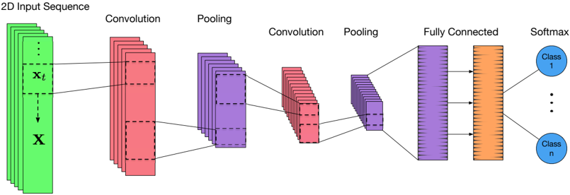
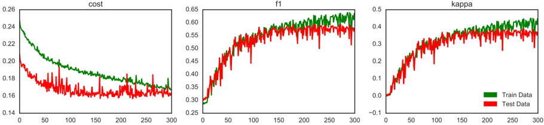
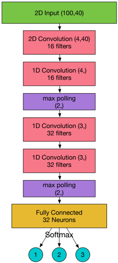

# Forecasting Stock Prices from the Limit Order Book using Convolutional Neural Networks

Avraam Tsantekidis ‡∗ , Nikolaos Passalis ∗ , Anastasios Tefas ∗ , Juho Kanniainen † , Moncef Gabbouj ‡ and Alexandros Iosifidis ‡ ∗ Department of Informatics, Aristotle University of Thessaloniki, Thessaloniki, Greece { avraamt, passalis } @csd.auth.gr, tefas@aiia.csd.auth.gr † Laboratory of Industrial and Information Management, Tampere University of Technology, Tampere, Finland juho.kanniainen@tut.fi ‡

Laboratory of Signal Processing, Tampere University of Technology, Tampere, Finland { moncef.gabbouj, alexandros.iosifidis } @tut.fi

Abstract -In today's financial markets, where most trades are performed in their entirety by electronic means and the largest fraction of them is completely automated, an opportunity has risen from analyzing this vast amount of transactions. Since all the transactions are recorded in great detail, investors can analyze all the generated data and detect repeated patterns of the price movements. Being able to detect them in advance, allows them to take profitable positions or avoid anomalous events in the financial markets. In this work we proposed a deep learning methodology, based on Convolutional Neural Networks (CNNs), that predicts the price movements of stocks, using as input large-scale, high-frequency time-series derived from the order book of financial exchanges. The dataset that we use contains more than 4 million limit order events and our comparison with other methods, like Multilayer Neural Networks and Support Vector Machines, shows that CNNs are better suited for this kind of task.

## I. INTRODUCTION

Financial markets present an opportunity for perceptive investors to buy undervalued assets and short overvalued ones. One way to take advantage of such circumstances is to observe the market and determine which moves one has to make to produce the largest profit with the least amount of risk. The idea of using mathematical models to predict aspects of financial markets has manifested as the field of quantitative analysis. The basic premise of this field is the analysis of the time-series produced by the markets using mathematical and statistical modelling. This allows us to extract valuable predictions about various aspects of the markets, such as the volatility, the trend or the real value of an asset. However, these mathematical models rely on handcrafted features and have their parameters tuned manually by observation, which can reduce the accuracy of their predictions. Furthermore, asset price movements in the financial markets very frequently exhibit irrational behaviour since they are largely influenced by human activity that mathematical models fail to capture.

Machine Learning, and especially Deep Learning, has been perceived as the solution to the aforementioned limitations of handcrafted systems. Given some input features machine learning models can be used to predict the behaviour of various aspects of financial markets [1], [2], [3], [4]. This has led several organizations, such as hedge funds and investment firms, to use machine learning models alongside the conventional mathematical models to conduct their trading operation.

Furthermore, the modernization of exchanges and the automation of trading have dramatically increased the volume of trading that happens daily and, as a result, the amount of data that are produced inside the exchanges. This has created an opportunity for the exchanges to gather all the trading data and create comprehensive logs of every transaction. This data contains valuable signals that can be used to forecast changes in the market, which can in turn be used by algorithms to make the correct decisions on live trading. However, applying machine learning techniques on such largescale data is not a straightforward task. Being able to utilize the information at this scale can provide strategies for many different market conditions but also safeguard from volatile market movements.

The main contribution of this work is the proposal of a deep learning methodology, based on Convolutional Neural Networks (CNNs), that can be used for predicting future mid-price movements from large-scale highfrequency limit order data. This includes an intelligent normalization scheme that takes into account the differences in price scales between different stocks and different time periods of an individual stock. Note that even though this data seems very suitable to be analyzed by deep learning techniques, there have been only a few published works using it, mainly due to the cost of obtaining said data and the possible unwillingness to publish positive results that could be used for profit.

In Section 2 related work on machine learning models that were applied on financial data is briefly presented. Then, the used large-scale dataset is described in detail in Section 3. In Section 4 the proposed deep learning methodology is introduced, while in Section 5 the experimental evaluation is provided. Finally, conclusions are drawn and future work is discussed in Section 6.

## II. RELATED WORK

Deep Learning has been shown to significantly improve upon previous machine learning methods in tasks such as speech recognition [5], image captioning [6], [7], and question answering [8]. Deep Learning models, such as Convolutional Neural Networks (CNNs) [9], and Recurrent Neural Networks (RNNs) [10], have greatly contributed in the increase of performance on these fields, with ever deeper architectures producing even better results [11].

In the more advanced work of Deep Portfolio Theory [12], the authors use autoencoders to optimize the performance of a portfolio and beat several profit benchmarks, such as the biotechnology IBB Index. Similarly in [2], a Restricted Boltzmann Machine (RBM) is trained to encode monthly closing prices of stocks and then it is fine-tuned to predict whether each stock's price will move above the median change or below it. This strategy is compared to a simple momentum strategy and it is established that the proposed method achieves significant improvements in annualized returns.

The daily data of the S&amp;P 500 market fund prices and Google domestic trends of 25 terms like 'bankruptcy' and 'insurance' are used as the input to a recurrent neural network that it is trained to predict the volatility of the market fund's price [3]. This method greatly improves upon existing benchmarks, such as autoregressive GARCH and Lasso techniques.

An application using high frequency limit order book (LOB) data is [4], where the authors create a set of handcrafted features, such as price differences, bidask spreads, and price and volume derivatives. Then, a Support Vector Machine (SVM) is trained to predict whether the mid-price will move upwards or downward in the near future using these features. However, only 2000 data points are used for training the SVM in each training round, limiting the prediction accuracy of the model.

To the best of our knowledge this is the first work that uses a large-scale dataset with more than 4 million limit orders to train CNNs for predicting the price movement of stocks. The method proposed in this paper is also combined with an intelligent normalization scheme that takes into account the differences in the price scales between different stocks and time periods, which is essential for effectively scaling to such large-scale data.

## III. HIGH FREQUENCY LIMIT ORDER DATA

In financial equity markets a limit order is a type of order to buy or sell a specific number of shares within a set price. For example, a sell limit order (ask) of $10 with volume of 100 indicates that the seller wishes to sell the 100 shares for no less that $10 a piece. Respectively, a buy limit order (bid) of $10 it means that the buyer wishes to buy a specified amount of shares for no more than $10 each.

Consequently the order book has two sides, the bid side, containing buy orders with prices p b ( t ) and volumes v b ( t ) , and the ask side, containing sell orders with prices p a ( t ) and volumes v a ( t ) . The orders are sorted on both sides based on the price. On the bid side p (1) b ( t ) is the is the highest available buy price and on the ask side p (1) a ( t ) is the lowest available sell price.

Whenever a bid order price exceeds an ask order price p ( i ) b ( t ) &gt; p ( j ) a ( t ) , they 'annihilate', executing the orders and exchanging the traded assets between the investors. If there are more than two orders that fulfill the price range requirement the effect chains to them as well. Since the orders do not usually have the same requested volume, the order with the greater size remains in the order book with the remaining unfulfilled volume.

Several tasks arise from this data ranging from the prediction of the price trend and the regression of the future value of a metric, e.g., volatility, to the detection of anomalous events that cause price jumps, either upwards or downwards. These tasks can lead to interesting applications, such as protecting the investments when market condition are unreliable, or taking advantage of such conditions to create automated trading techniques for profit.

Methods that utilize this data often subsample them using re-sampling techniques, such as the OHLC (OpenHigh-Low-Close) resampling [13], to ensure that a specific number of values exist for each timeframe, e.g., every minute or every day. Even though the OHLC method preserves the trend features of the market movements, it removes all the microstructure information of the markets. This is one of the problems CNNs can solve and take full advantage of the information contained in the data, since they can more accurately pick up recurring patterns between time steps.

## IV. CONVOLUTIONAL NEURAL NETWORKS FOR FINANCIAL DATA

The input data consists of 10 orders for each side of the LOB (bid and ask). Each order is described by 2 values, the price and the volume. In total we have 40 values for each timestep. The stock data, provided by Nasdaq Nordic, come from the Finnish companies Kesko Oyj, Outokumpu Oyj, Sampo, Rautaruukki and Wartsila Oyj. The time period used for collecting that data ranges from the 1st to the 14th June 2010 (only business days are included), while the data are provided by the Nasdaq Nordic data feeds [14] [15].

The dataset is made up of 10 days for 5 different stocks and the total number of messages is 4 . 5 million with equally many separate depths. Since the price and volume range is much greater than the range of the values of the activation function of our neural network, we need to normalize the data before feeding them to the network. To this end, standardization (z-score) is employed to normalize the data:

<!-- formula-not-decoded -->

where x is the vector of values we want to normalize, ¯ x is the mean value of the data and σ ¯ x is the standard deviation of the data. Instead of simply normalizing all the values together, we take into account the scale differences between order prices and order volumes and we use a separate normalizer, with different mean and standard deviation, for each of them. Also, since different stocks have different price ranges and drastic distributions shifts might occur in individual stocks for different days, the normalization of the current day's values uses the mean and standard deviation calculated using previous day's data.

We want to predict the direction towards which the price will change. In this work the term price is used to refer to the mid-price of a stock, which is defined as the mean between the best bid price and best ask price at time t :

<!-- formula-not-decoded -->

This is a virtual value for the price since no order can happen at that exact price, but predicting its upwards or downwards movement provides a good estimate of the price of the future orders. A set of discrete choices must be constructed from our data to use as targets for our classification model. Simply using p t &gt; p t + k to determine the direction of the mid price would introduce unmanageable amount of noise, since the smallest change would be registered as an upward or downward movement.

Note that each consecutive depth sample is only slightly different from the previous one. Thus the shortterm changes between prices are very small and noisy. In order to filter such noise from the extracted labels we use the following smoothed approach. First, the mean of the previous k mid-prices, denoted by m b , and the mean of the next k mid-prices, denoted by m a , are defined as:

<!-- formula-not-decoded -->

<!-- formula-not-decoded -->

where p t is the mid price as described in Equation (2). Then, a label l t that express the direction of price movement at time t is extracted by comparing the previously defined quantities ( m b and m a ):

<!-- formula-not-decoded -->

where the threshold α is set as the least amount of change in price that must occur for it to be considered upward or downward. If the price does not exceed this limit, the sample will be considered to belong to the stationary class. Therefore, the resulting label expresses the current trend we wish to predict. Note that this process is applied for every time step in our data.

To forecast the mid-price movement of a stock a Convolutional Neural Network is used. The 100 most recent limit orders are fed as input to the network. Therefore, the input matrix for each time-step is defined as X = [ x 0 , x 1 , . . . , x 100 ] T ∈ R 100 × 40 , where x i is the 40-dimensional vector that describes the i -th most recent LOB depth. This vector contains the 10 highest bid orders and 10 lowest ask orders, each order containts 2 values a price and a size totalling 40 values.

CNNs are composed of a series of convolutional and pooling layers followed by a set of fully connected layers, as shown in Figure 1. Each convolutional layer i is equipped with a set of filters W i ∈ R S × D × N that is convolved with the input tensor, where S is the number of used filters, D is the filter size, and N is the number of the input channels. The output of a convolutional layer can be optionally pooled using a pooling layer. For example, a max pooling layer with size 2 will subsample its input by a factor of 2 by applying the maximum function on each consecutive pair of vectors of the input matrix. Using a series of convolutional and pooling layers allows for capturing the fine temporal dynamics of the time-series as well as correlating temporally distant features. After the last convolutional/pooling layer a set of fully connected layers are used to classify the input time-series. The network's output expresses the categorical distribution for the three direction labels (upward, downward and stationary), as described in Equation (5), for each time-step.

Fig. 1: Typical Convolutional Neural Network architecture using 1D convolutions.

The parameters of the model are learned by minimizing the categorical cross entropy loss defined as:

<!-- formula-not-decoded -->

where L is the number of different labels and the notation W is used to refer to the parameters of the CNN. The ground truth vector is denoted by y , while ˆ y is the predicted label distribution. The loss is summed over all samples in each batch. The most commonly used method to minimize the loss function defined in Equation (6) and learn the parameters W of the model is gradient descent [16]:

<!-- formula-not-decoded -->

where W ′ are the parameters of the model after each gradient descent step and η is the learning rate. In this work we utilize the Adaptive Moment Estimation algorithm, known as ADAM [17], which ensures that the learning steps are scale invariant with respect to the parameter gradients.

The CNN and MLP models along with all the training algorithms were developed using the Blocks framework [18], and the theano library [19], [20], while for SVM method the implementation provided by the scikit-learn library [21] was used.

## V. EXPERIMENTAL EVALUATION

The architecture of the proposed CNN model consists of the following layers:

- 1) 2D Convolution with 16 filters of size (4 , 40)
- 2) 1D Convolution with 16 filters of size (4 , ) and max pooling with size (2 , )
- 3) 1D Convolution with 32 filters of size (3 , )
- 4) 1D Convolution with 32 filters of size e (3 , ) and max pooling with size (2 , )
- 5) Fully connected layer with 32 neurons
- 6) Fully connected layer with 3 neurons

A visual representation of our model is shown in Figure 2. Leaky Rectifying Linear Units [22], are used as activation function for both the convolutional layers and the first fully connected layer, while the softmax function is used for the output layer of the network.

For training our model, we use batches of 16 samples, where each sample consists of a sequence of 100 consecutive depths. Each depth consist of 40 values which are described in Section IV. The dataset of 10 days is split in a configuration of 7 days for training and 3 days for testing. We train the same model for 3 different prediction horizons k , as defined in Equations (3) and (4).

To measure the performance of our model we use Kohen's kappa [23], which is used to measure the concordance between sets of given answers, taking into consideration the possibility of random agreements happening. We also report the mean recall, precision and F1

Fig. 2: Training statistics of the CNN on the task of predicting the price movement of horizon k = 20 . Each point in the x-axis denotes 2 , 500 training iterations.

Fig. 3: A visual representation of the evaluated CNN model

score between all 3 classes. Recall is the number true positive samples divided by the sum of true positives and false negatives, while precision is the number of true positive divided by the sum of true positives and false positives. F1 score is the harmonic mean of the precision and recall metrics.

The results of our experiments are shown in Table I. We compare our results with those of a Linear SVM model and an MLP model with Leaky Rectifiers as activation function. The SVM model is trained using stochastic gradient descent since the dataset is too large to use a closed-form solution. The MLP model uses a single hidden layer with 128 neurons with Leaky ReLU activations. The regularization parameter of the SVM was chosen using cross validation on a split from the training set. Since both models are sequential, we feed the concatenation of the previous 100 depth samples as input and we use as prediction target the price movement associated with the last depth sample.

TABLE I: Experimental results for different prediction horizons k

| Model                     | Recall                    | Precision                 | F1                        | Cohen's κ                 |
|---------------------------|---------------------------|---------------------------|---------------------------|---------------------------|
| Prediction Horizon k = 10 | Prediction Horizon k = 10 | Prediction Horizon k = 10 | Prediction Horizon k = 10 | Prediction Horizon k = 10 |
| SVM                       | 39 . 62%                  | 44 . 92%                  | 35 . 88%                  | 0 . 068                   |
| MLP                       | 47 . 81%                  | 60 . 78%                  | 48 . 27%                  | 0 . 226                   |
| CNN                       | 50 . 98 %                 | 65 . 54 %                 | 55 . 21 %                 | 0 . 35                    |
| Prediction Horizon k = 20 | Prediction Horizon k = 20 | Prediction Horizon k = 20 | Prediction Horizon k = 20 | Prediction Horizon k = 20 |
| SVM                       | 45 . 08%                  | 47 . 77%                  | 43 . 20%                  | 0 . 139                   |
| MLP                       | 51 . 33%                  | 65 . 20%                  | 51 . 12%                  | 0 . 255                   |
| CNN                       | 54 . 79 %                 | 67 . 38 %                 | 59 . 17 %                 | 0 . 39                    |
| Prediction Horizon k = 50 | Prediction Horizon k = 50 | Prediction Horizon k = 50 | Prediction Horizon k = 50 | Prediction Horizon k = 50 |
| SVM                       | 46 . 05 %                 | 60 . 30%                  | 49 . 42%                  | 0 . 243                   |
| MLP                       | 55 . 21%                  | 67 . 14 %                 | 55 . 95%                  | 0 . 324                   |
| CNN                       | 55 . 58 %                 | 67 . 12%                  | 59 . 44 %                 | 0 . 38                    |

The proposed method significantly outperforms all the other evaluated models on the presented metrics, showing that the convolutional neural network can better handle the sequencial nature of the LOB data and better determine the microstructure of the market in order to detect mid-price changes that occur.

## VI. CONCLUSION

In this work we trained a CNN on high frequency LOB data, applying a temporally aware normalization scheme on the volumes and prices of the LOB depth. The proposed approach was evaluated using different prediction horizons and it was demonstrated that it performs significantly better than other techniques, such as Linear SVMs and MLPs, when trying to predict short term price movements.

There are several interesting future research directions. First, more data can be used to train the proposed model, scaling up to a billion training samples, to determine if using more data leads to better classification performance. With more data also increase the 'burn-in' phase along with the prediction horizon to gauge the models ability to predict the trend further into the future. Also, an attention mechanism [6], [24], can be introduced to allow the network to capture only the relevant information and avoid noise. Finally, more advanced trainable normalization techniques can be used, as it was established that normalization is essential to ensure that the learned model will generalize well on unseen data.

## REFERENCES

- [1] M. F. Dixon, D. Klabjan, and J. H. Bang, 'Classification-based financial markets prediction using deep neural networks,' 2016.
- [2] L. Takeuchi and Y.-Y. A. Lee, 'Applying deep learning to enhance momentum trading strategies in stocks,' 2013.
- [3] R. Xiong, E. P. Nichols, and Y. Shen, 'Deep learning stock volatility with google domestic trends,' arXiv preprint arXiv:1512.04916 , 2015.
- [4] A. N. Kercheval and Y. Zhang, 'Modelling high-frequency limit order book dynamics with support vector machines,' Quantitative Finance , vol. 15, no. 8, pp. 1315-1329, 2015.
- [5] A. Graves, A.-r. Mohamed, and G. Hinton, 'Speech recognition with deep recurrent neural networks,' in Proceedings of the IEEE international conference on Acoustics, Speech and Signal Processing (icassp) , 2013, pp. 6645-6649.
- [6] K. Xu, J. Ba, R. Kiros, K. Cho, A. C. Courville, R. Salakhutdinov, R. S. Zemel, and Y. Bengio, 'Show, attend and tell: Neural image caption generation with visual attention.' in Proceedings of the International Conference on Machine Learning , vol. 14, 2015, pp. 77-81.
- [7] J. Mao, W. Xu, Y. Yang, J. Wang, Z. Huang, and A. Yuille, 'Deep captioning with multimodal recurrent neural networks (m-rnn),' arXiv preprint arXiv:1412.6632 , 2014.
- [8] Y. Zhu, O. Groth, M. Bernstein, and L. Fei-Fei, 'Visual7w: Grounded question answering in images,' in Proceedings of the IEEE Conference on Computer Vision and Pattern Recognition , 2016, pp. 4995-5004.
- [9] Y. LeCun, Y. Bengio et al. , 'Convolutional networks for images, speech, and time series,' The handbook of brain theory and neural networks , vol. 3361, no. 10, p. 1995, 1995.
- [10] S. Hochreiter and J. Schmidhuber, 'Long short-term memory,' Neural Computation , vol. 9, no. 8, pp. 1735-1780, 1997.
- [11] K. He, X. Zhang, S. Ren, and J. Sun, 'Deep residual learning for image recognition,' in Proceedings of the IEEE Conference on Computer Vision and Pattern Recognition , 2016, pp. 770-778.
- [12] J. Heaton, N. Polson, and J. Witte, 'Deep portfolio theory,' arXiv preprint arXiv:1605.07230 , 2016.
- [13] D. Yang and Q. Zhang, 'Drift-independent volatility estimation based on high, low, open, and close prices,' The Journal of Business , vol. 73, no. 3, pp. 477-492, 2000.
- [14] A. Ntakaris, M. Magris, J. Kanniainen, M. Gabbouj, and A. Iosifidis, 'Benchmark dataset for mid-price prediction of limit order book data,' 2017.
- [15] M. Siikanen, J. Kanniainen, and J. Valli, 'Limit order books and liquidity around scheduled and non-scheduled announcements: Empirical evidence from nasdaq nordic,' Finance Research Letters , vol. to appear, 2016.
- [16] P. J. Werbos, 'Backpropagation through time: what it does and how to do it,' Proceedings of the IEEE , vol. 78, no. 10, pp. 1550-1560, 1990.
- [17] D. Kingma and J. Ba, 'Adam: A method for stochastic optimization,' arXiv preprint arXiv:1412.6980 , 2014.
- [18] B. Van Merri¨ enboer, D. Bahdanau, V. Dumoulin, D. Serdyuk, D. Warde-Farley, J. Chorowski, and Y. Bengio, 'Blocks and fuel: Frameworks for deep learning,' arXiv preprint arXiv:1506.00619 , 2015.
- [19] J. Bergstra, O. Breuleux, F. Bastien, P. Lamblin, R. Pascanu, G. Desjardins, J. Turian, D. Warde-Farley, and Y. Bengio, 'Theano: A cpu and gpu math compiler in python,' in Proc. 9th Python in Science Conf , 2010, pp. 1-7.
- [20] F. Bastien, P. Lamblin, R. Pascanu, J. Bergstra, I. Goodfellow, A. Bergeron, N. Bouchard, D. Warde-Farley, and Y. Bengio, 'Theano: new features and speed improvements,' arXiv preprint arXiv:1211.5590 , 2012.
- [21] F. Pedregosa, G. Varoquaux, A. Gramfort, V. Michel, B. Thirion, O. Grisel, M. Blondel, P. Prettenhofer, R. Weiss, V. Dubourg et al. , 'Scikit-learn: Machine learning in python,' Journal of Machine Learning Research , vol. 12, no. Oct, pp. 2825-2830, 2011.
- [22] A. L. Maas, A. Y. Hannun, and A. Y. Ng, 'Rectifier nonlinearities improve neural network acoustic models,' in Proceedings of the International Conference on Machine Learning , vol. 30, no. 1, 2013.
- [23] J. Cohen, 'A coefficient of agreement for nominal scales,' Educational and Psychological Measurement , vol. 20, no. 1, pp. 37-46, 1960.
- [24] K. Cho, A. Courville, and Y. Bengio, 'Describing multimedia content using attention-based encoder-decoder networks,' IEEE Transactions on Multimedia , vol. 17, no. 11, pp. 1875-1886, 2015.
