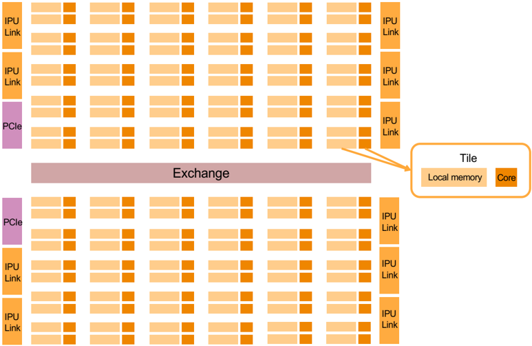
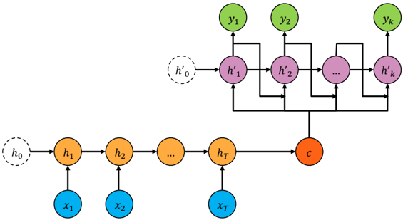
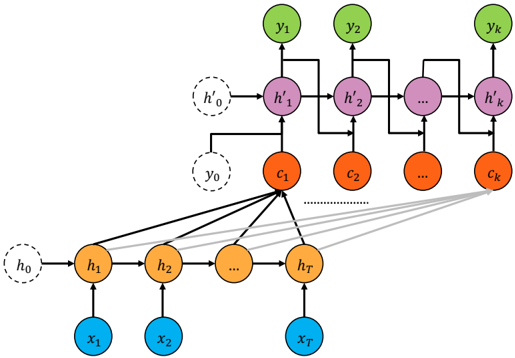
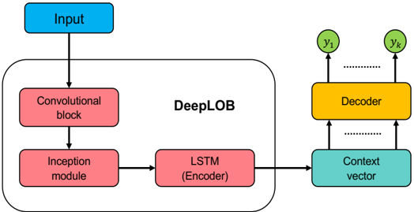
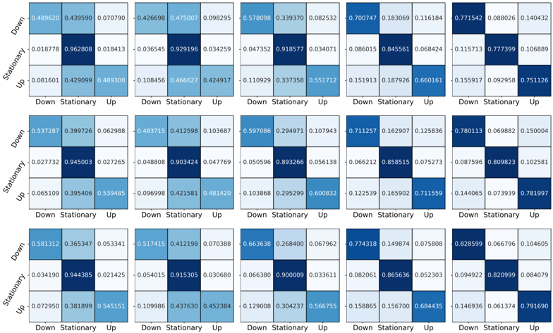
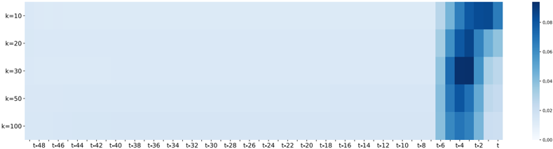
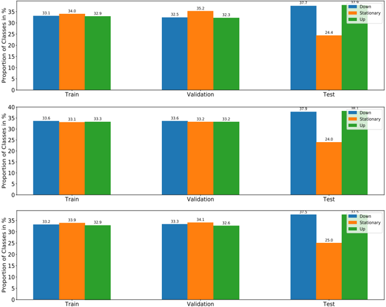

# Multi-Horizon Forecasting for Limit Order Books: Novel Deep Learning Approaches and Hardware Acceleration using Intelligent Processing Units

Zihao Zhang, Stefan Zohren Oxford-Man Institute of Quantitative Finance, University of Oxford

August 30, 2021

## Abstract

We design multi-horizon forecasting models for limit order book (LOB) data by using deep learning techniques. Unlike standard structures where a single prediction is made, we adopt encoder-decoder models with sequence-to-sequence and Attention mechanisms to generate a forecasting path. Our methods achieve comparable performance to state-of-art algorithms at short prediction horizons. Importantly, they outperform when generating predictions over long horizons by leveraging the multi-horizon setup. Given that encoder-decoder models rely on recurrent neural layers, they generally suffer from slow training processes. To remedy this, we experiment with utilising novel hardware, so-called Intelligent Processing Units (IPUs) produced by Graphcore. IPUs are specifically designed for machine intelligence workload with the aim to speed up the computation process. We show that in our setup this leads to significantly faster training times when compared to training models with GPUs.

## 1 Introduction

Limit order books (LOBs), as the canonical example of high-frequency financial microstructure data, have received tremendous popularity in recent academic studies. At any time stamp, a LOB is a record of all outstanding limit orders (passive orders) for a financial instrument at an exchange. It is sorted into different levels based on the prices of the submitted orders. The LOB has two sides, representing buy and sell orders - also referred to as bid and ask. Each level of a LOB indicates the total available volume (number of shares) at the price of that level. Those detailed records of price and volume information provide us with a picture of the short-term supply and demand relationship. From this, we can compute quantities such as order imbalances (Chordia et al., 2002), which help to understand the dynamics of high-frequency microstructure data.

Recent works by Tsantekidis et al. (2017a); Tran et al. (2018); Zhang et al. (2019a); Briola et al. (2020) demonstrate that LOBs have strong predictive to forecast price moves at short time intervals. Their findings have inspired a range of extensions including high-frequency trading models (Briola et al., 2021). However, the aforementioned works are formulated as standard supervised learning tasks where a price at a single future point in time is predicted. Given that financial time-series are notoriously stochastic with a low signal-to-noise ratio (Gould et al., 2013), a single prediction imposes limitations to describe the future evolution of market movements. Naturally, multi-horizon forecasting (predicting multiple steps into future) is desirable, since we can obtain a forecasting path which can be used for trading decision making or risk management.

In this work, we design multi-horizon forecasting models for LOB data with deep learning techniques (Goodfellow et al., 2016). Inspired by the machine translation problems (Bahdanau et al., 2014) from Natural language processing (NLP), we apply sequence-to-sequence (Seq2Seq) (Sutskever et al., 2014; Cho et al., 2014) and Attention (Luong et al., 2015) models to generate multi-horizon forecasts. We adopt the deep network architecture from Zhang et al. (2019a) and engineer the output layer to produce a forecasting path. We test our method on the popular publicly available LOB dataset (FI-2010 Ntakaris et al. (2018)) and one year order book data from the London Stock Exchange (LSE). The experiments show that our model delivers competitive results when compared to state-of-the-art models for single step, short horizon forecasts. Furthermore, in our setting a single network is capable of predicting multi-steps into future, avoiding the limitations of a single point estimation. Interstingly, our method delivers superior results for predicting over long horizons as short-term predictions contribute to future estimation through an autoregressive structure.

The dominant Seq2Seq and Attention models are based on complex recurrent neural layers that include an encoder and a decoder. Such recurrent structures lead to substantially slow training processes even when employing GPUs for acceleration. This often poses challenges which need to be overcome. The work of Vaswani et al. (2017), for example, proposes Transformers to allow parallel training of attention mechanisms by using fully connected layers. In this work, we utilise a different form of hardware acceleration, so-called Intelligence Processing Units (IPUs). IPUs developed by Graphcore (Graphcore, 4 28) are a novel massively parallel processor. They can be used to accelerate the training process, offering an alternative solution to deal with this bottleneck. We compare the computation efficiency between GPUs and IPUs in our setting by benchmarking with a wide variety of state-of-the-art network architectures. The results indicate that IPUs are multiple times faster than GPUs. This significant improvement in computation is not necessarily restricted to the training process but could also lead to speedups in a wide range of applications within existing algorithms, for example, to reduce latency in market-making strategies.

The remainder of this paper is structured as follows: In Section 2, we include a literature review to discuss the development of deep learning algorithms on LOBs and review multi-horizon forecasting models. Section 3 gives a short introduction to IPUs and Section 4 discusses our proposed network architectures. We then describe our experiments and present the results in Section 5. We conclude in Section 6 by summarising our findings and proposing potential research problems.

## 2 Literature Review

Deep learning models have been heavily used for prediction tasks on LOB data, where Tsantekidis et al. (2017a,b); Sirignano and Cont (2019); Zhang et al. (2019a) helped to build the foundation in this area. Subsequently, a wide range of extensions have been proposed to improve predictive performance, including Bayesian deep networks (Zhang et al., 2018), Quantile regression (Zhang et al., 2019b), Transformers (Wallbridge, 2020) and usages of more granular market by order data (Zhang et al., 2021). In addition, LOB data has been studied in the context of reinforcement learning (Wei et al., 2019), market-making (Sadighian, 2019), cryptocurries (Jha et al., 2020), forecasting quoted depth (Libman et al., 2021) and portfolio optimisation (Sangadiev et al., 2020). However, to the best of our knowledge, we have not found any existing work that studys multi-horizon forecasts for LOB data and we aim to fill this gap in the literature.

In terms of the multi-horizon forecasting models, Taieb et al. (2010); Marcellino et al. (2006) introduced traditional econometric approaches. In this work, we focus on recent deep learning techniques, mainly Seq2Seq (Sutskever et al., 2014; Cho et al., 2014) and attention-based (Luong et al., 2015; Fan et al., 2019) approaches. A typical Seq2Seq model contains an encoder to summarise past time-series information and a decoder to combine hidden states with future known inputs to generate predictions. However, the Seq2Seq model only utilises the last hidden state from an encoder to make estimations, thus making it incapable of processing inputs with long sequences. Attention was proposed to assign a proper weight to each hidden state from the encoder to solve this limitation. We study both methods on LOB data and adapt the network architecture in Zhang et al. (2019a) to propose an end-to-end framework for generating multi-step predictions.

Despite the popularity of Seq2Seq and Attention models, the recurrent nature of their structure imposes bottlenecks for training. This potentially limits their use cases on high-frequency microstructure data as modern electronic exchanges can generate billions of observations in a single day, making the training of such models on large and complex LOB datasets infeasible even with multiple GPUs. Here we experiment with IPUs for hardware acceleration. Graphcore introduced their IPUs as a novel massively parallel processor for training deep learning models (IPU, 4 28). The work in Jia et al. (2019) conducted a thorough investigation between GPUs and IPUs, observing massive speed-ups in training. We test the computational power of GPUs and IPUs on the state-of-art network architectures for LOB data and our findings are in line with Jia et al. (2019). We utilise Graphcore's Poplar graph framework software (Poplar, 4 28) which allows for seamless integration of IPUs with TensorFlow, Keras (Abadi et al., 2016) and PyTorch (Paszke et al., 2019), requiring minimum emendation from existing repositories written for GPUs.

Figure 1: Simplified illustration of an IPU processor. Each processor has four main components: The tile, exchange, link and PCIe.

## 3 Intelligence Processing Unit (IPU)

Graphcore has designed IPUs specifically for machine intelligence problems and some of the computing architectures differ radically from common hardware such as CPUs and GPUs. In this section, we present a brief introduction to IPUs and discuss some differences among these architectures. For a complete and in-depth comparison, interested readers are referred to Jia et al. (2019).

The cornerstone of an IPU-based system is the IPU processor with the aim of achieving efficient execution of fine-grained operations across a relatively large number of parallel threads. In general, each IPU processor contains four components: IPU-tile, IPU-exchange, IPU-link and PCIe. For each processor, there are 1216 tiles and each tile consists of one computing core and 256 kB of local memory. These tiles are interconnected by the IPU-exchange which allows for low-latency and high-bandwidth communication. In addition, each IPU contains ten IPU-link interfaces, which is a Graphcore proprietary interconnect that enables low latency, high-throughput communication between IPU processors. IPU-links enable transfers between remote tiles as efficient as between local tiles and they are key to the IPU's computational scalability. Besides that, each IPU contains two PCIe links for communication with CPU-based hosts. We illustrate the IPU architecture with a simplified diagram in Figure 1.

The architecture of IPUs differs significantly from CPUs and GPUs that are commonly used for training machine learning algorithms. In general, CPUs excel at single-thread performance as they offer complex cores in relatively small counts. However, even with the vectorisation of data, CPUs are incomparable with GPUs in aggregate floating-point arithmetic on large and complex workloads. GPUs, on the other hand, have architecturally simpler cores than CPUs but do not offer branch speculation or hardware prefetching. The typical arrangment of GPUs are grouped into clusters, so all cores in a cluster execute the same instruction at any point in time. Because of this architecture, GPUs are proficient at regular, dense, numerical, data-flow-dominated workloads and tend to be more energy efficient than CPUs.

Figure 2: A schematic depiction of the Seq2Seq network architecture.

The IPU's approach of accelerating computation is through shared memory, which is distinct from the other hardware. An IPU offers small and distributed memories that are locally coupled to each other, therefore, IPU cores pay no penalty when their control flows diverge or when the addresses of their memory accesses diverge. Such a structure allows cores to access data from local memory at a fixed cost that is independent of access patterns, making IPUs more efficient than GPUs when executing workloads with irregular or random data access patterns as long as the workloads can be fitted in IPU memory.

In this work, we compare the training efficiency between GPUs and IPUs for state-of-art deep networks on LOB data and the results indeed suggest that IPUs deliver superior computation performance.

## 4 Multi-Horizon Forecasting Models

This section introduces deep learning architectures for multi-horizon forecasting models, in particular Seq2Seq and Attention models. In essence, both of these architectures consist of three components: an encoder, a context vector and a decoder. We write a given input of any time-series as x 1: T = ( x 1 , x 2 , · · · , x T ) ∈ R T × m , where T represents the length of the input sequence and x t indicates m features at each time stamp t . Similarly, a typical output is y 1: k = ( y 1 , y 2 , · · · , y k ) ∈ R k × n where k is the furthest prediction point, and it is essentially a multi-input and multi-output setup.

An encoder steps through the input time steps to extract meaningful features. The resulting context vector encapsulates the resulting sequence into a vector for integrating information. Finally, a decoder reads from the context vector and steps through the output time step to generate multi-step predictions. The fundamental difference between the Seq2Seq and Attention model is the construction of the context vector. The Seq2Seq model only takes the last hidden state from the encoder to form the context vector, whereas the Attention model utilises the information from all hidden states in the encoder.

## 4.1 Sequence to Sequence Learning (Seq2Seq)

In this work, we employ the Seq2Seq architecture in Cho et al. (2014) in the context of multi-horizon forecasting models for LOBs. Overall, the encoder contains a recurrent neural network (RNN) that operates on a given input x 1: T = ( x 1 , x 2 , · · · , x T ) . At each time step t of the encoder, the hidden state h t is

<!-- formula-not-decoded -->

where f is a nonlinear function. The choice of f can vary, ranging from a simple logistic sigmoid function to a more complex LSTM (Hochreiter and Schmidhuber, 1997). The encoder reads through a given input and the last hidden state summarises the whole sequence. The last hidden state c is the 'bridge' between the encoder and decoder, also known as the context vector. At time step t of the decoder, the hidden state h ′ t is

<!-- formula-not-decoded -->

and the distribution for output y t is

<!-- formula-not-decoded -->

Here f and g are nonlinear functions and g needs to produce valid probabilities, which in our case is done through a softmax activation function. Figure 2 illustrates the structure of a standard Seq2Seq network. Seq2Seq models work well for inputs with small sequences, but suffers when the length of the sequence increases as it is difficult to summarise the entire input into a single hidden state represented by the context vector. Models tend to forget the earlier parts of the input and results often deteriorate as the size of the sequence increases.

## 4.2 Attention

The Attention model (Luong et al., 2015) is an evolution of the Seq2Seq model, developed in order to deal with inputs of long sequences. The core idea is to allow the decoder to selectively access hidden states of the encoder during decoding. We can build a different context vector for every time step of the decoder as a function of the previous hidden state and of all the hidden states in the encoder. Similar to the Seq2Seq model, the hidden state h t of the encoder is

<!-- formula-not-decoded -->

where f is a nonlinear function. For the context vector c t at time stamp t of the decoder, one defines

<!-- formula-not-decoded -->

where e ( h ′ t -1 , h i ) is called the score derived from the previous hidden state h ′ t -1 of the decoder and the hidden state h i of the encoder. In Luong et al. (2015), there are three alternatives to calculate the score

<!-- formula-not-decoded -->

We can then pass the context vector c t to the decoder to calculate the probability distribution of the next possible output

<!-- formula-not-decoded -->

where h ′ t is the hidden state of the decoder at time t and g is a softmax activation function. We illustrate the Attention mechanism in Figure 3.

## 4.3 Network Architecture

LOBs are complex dynamic objects of high dimensionality. Furthermore, LOB data, just like any other financial time-series, is notoriously non-stationary and of low signal-to-noise ratio (Gould et al., 2013). Since the encoder reads through an input to extract meaningful information, we adapt the modern deep network (DeepLOB) designed specifically for limit order books in Zhang et al. (2019a) as the encoder, extracting representative features from raw LOB data. Here we give a brief introduction to DeepLOB - the exact network architecture can be found in Zhang et al. (2019a). Overall, DeepLOB comprises three building blocks: a convolutional block with multiple convolutional layers (CNNs), an Inception Module and a LSTM layer.

Figure 3: An schematic depiction of the Attention mechanism.

Figure 4: Model architecture schematic: A combination of DeepLOB and an encoder-decoder structure.

The convolutional block: The usage of CNNs is to automate the process of feature extraction as the convolutional layer can directly deal with grid-like data structures. It possesses nice properties like smoothing and parameter sharing, where the latter is important to deal with the low signal-to-noise ratio. Note that in the time dimension the CNN acts similar to an auto-regressive model. The convolutional block processes the raw LOB data and extracts representative features from different order book levels.

Inception Module: The resulting feature maps from the convolutional block are passed into the Inception Module which consists of multiple convolutional layers in parallel - each with a different kernel size - to infer local interactions over different time horizons. Instead of adding layers vertically to a network, the Inception Module expands the model horizontally so we can capture different dynamic behaviours of the time-series by wrapping several convolutions together.

LSTM: Lastly, a LSTM is used to capture the longer temporal behaviour in the resulting features and it also servers as the encoder of our multi-horizon forecasting model. We illustrate the resulting model architecture in Figure 4.

For the decoder, we experiment with both Seq2Seq and Attention models to generate multi-horizon forecasts. An interesting byproduct of using Attention models is that the attention weights can be used to understand the importance of input features.

## 5 Experiments

## 5.1 Descriptions of Datasets

The FI-2010 dataset (Ntakaris et al., 2018) is the first publicly available benchmark dataset of highfrequency limit order book data. Many previous algorithms are tested on this dataset and we use it to build a fair comparison between our method and state-of-art algorithms. The FI-2010 dataset consists of LOB updates for five stocks from the Nasdaq Nordic stock exchange for a time period of 10 consecutive days. It contains 10 levels for both ask and bid of a LOB and each level has information for price and available volume at that price level. A classification setup is formulated in which we have three classes of labels: pricing going up, staying stationary or going down. Also, it studied five prediction horizons at k = (10 , 20 , 30 , 50 , 100) in 'tick time', i.e. consecutive LOB updates. As argued in multiple place, tick time, similar to volume time, is a natural time to consider for financial instruments.

The exact procedure of data normalisation and label formation can be found in Ntakaris et al. (2018) and we follow the setting originated from the works (Tsantekidis et al., 2017a, 2020) to evaluate our network architecture, in which the first 7 days are used as the train data and the last 3 days as the test data. We split the last 20% observations from the train set as the validation set to optimise hyperparameters. Each input contains the most recent 50 updates and each update includes information for both ask and bid of a LOB, therefore, a single input x 1: T ∈ R T × m has the dimension of (50 , 40) . We feed inputs to the designed network where the encoder extracts representative features and the decoder generates multi-horizon forecasts. In this work, our model can directly forecast all 5 prediction horizons in contrast to standard methods where a separate model is needed for each prediction horizon.

A major drawback of the FI-2010 dataset is that it is limited in scope and size. To address those shortcomings we further test our methods by using LOB data for five highly liquid stocks - Lloyds (LLOY), Barclays (BARC), Tesco (TSCO), BT and Vodafone (VOD) - for the entire year of 2018 from the London Stock Exchange (LSE). The LSE dataset contains bid and ask information for an order book up to ten levels and, for each trading day, we take the data between 08:30:00 and 16:00:00, restricting ourselves to liquid continuous trading hours, excluding any auctions. Overall, we have more than 169 million samples in our dataset and we take the first 6 months as training data, the next 3 months as validation data and the last 3 months as testing data.

The works of Sirignano and Cont (2019); Zhang et al. (2019a) show that deep networks trained on LOB data can be applied to predict stocks that are not even part of the training set - this is sometimes referred to as transfer learning. We investigate this observation on our multi-horizon forecasting models to further verify the generalisation and robustness of our methods. To test this universality, we directly apply our models to 20 more stocks from the London Stock Exchange. These 20 stocks have the same testing period as the original 5 stocks that are used to calibrate model weights, and the label classes are roughly balanced for each instrument.

The categorical cross-entropy loss is our objective function, and we use four evaluation metrics: Accuracy (Acc.), Precision (Pre.), Recall (Re.) and F1-score. Since the labels in FI-2010 dataset are not well balanced, Ntakaris et al. (2018) suggested to focus on F1 score as the main evaluation metric and Kolmogorov-Smirnov (Massey Jr, 1951) tests are used to check how results are statistically different. The code is available at GitHub 1 .

## 5.2 Experimental Results on the FI-2010 Dataset

As described above, we adapt DeepLOB (Zhang et al., 2019a) as our encoder and further details of the architecture and hyperparameters can be found in our GitHub repository. In terms of the decoder, we use a single LSTM with 64 units for both Seq2Seq and Attention, denoted as DeepLOB-Seq2Seq and DeepLOB-Attention respectively. We include a wide variety of benchmark algorithms in the experiment, including a support vector machine (SVM (Tsantekidis et al., 2017b)), a multi-layer perceptron (MLP (Tsantekidis et al., 2017b)), a convolutional network (CNN-I (Tsantekidis et al., 2017a)), a LSTM ((Tsantekidis et al., 2017b)), a variant convolutional network (CNN-II (Tsantekidis et al., 2020)), as well as an Attention-augmented-Bilinear-Network with one hidden layer (B(TABL)

[1 https://github.com/zcakhaa/Multi-Horizon-Forecasting-for-Limit-Order-Books](https://github.com/zcakhaa/Multi-Horizon-Forecasting-for-Limit-Order-Books)

Figure 6: Normalised confusion matrices for DeepLOB ( TOP ), DeepLOB-Seq2Seq ( Middle ) and DeepLOB-Attention ( Bottom ). From the left to right, the prediction horizon ( k ) equals to 10, 20, 30, 50 and 100.

(Tran et al., 2018)) and two hidden layers (C(TABL) (Tran et al., 2018)). Note that these benchmark algorithms produce a single-point estimation and the authors did not test on all prediction horizons available for the FI-2010 dataset.

Table 5 summarises the results for all models studied at each prediction horizon and all results are statistically different in terms of the Kolmogorov-Smirnov test. We observe that both DeepLOBSeq2Seq and DeepLOB-Attention deliver comparable results to the state-of-art benchmark algorithms. Specifically, with shorter prediction horizons ( k = 10 , 20 , 30 , 50 ), the performance gap between DeepLOB and our methods is very small. However, both our new multi-horizon forecasting models achieve superior results for predicting a long horizon ( k = 100 ), with DeepLOB-Attention being the best. The architecture of a decoder allows short-term predictions to be fed into the next estimation and our results indicate that this autoregressive structure helps with longer prediction horizons through the iterative estimation procedure.

The normalised confusion matrices for DeepLOB and our methods are presented in Figure 6. We use these plots to understand how models perform at predicting each class label. In general, all three methods achieve better accuracy for predicting stationary labels at short prediction horizons but the performance deteriorates as the horizon increases. Interestingly, all three models are getting better at predicting up and down labels with an increase in prediction horizon. Price movements are more significant helping to distinguish up or down labels from stationary labels. As a result, the models can do better at detecting larger price moves.

When comparing our two networks with each other, we observe that DeepLOB-Attention delivers better results than DeepLOB-Seq2Seq. However, it seems that the Seq2Seq model does not suffer from long input sequences of LOB data. One possible explanation is that the markets are sufficiently efficient so that the current LOB observation contains most available information and features distant from current time stamp contain minimal predictive information. To verify this statement, we use the attention weights from DeepLOB-Attention to understand feature importance at different time steps from the encoder. Figure 7 shows the plot of attention weights. We observe that the weights are largest for most recent observations with any features further in the past being inactive. This helps to explain why the Seq2Seq model does not suffer from long input sequences as past information is less relevant in this case.

Table 5: Experiment results for the FI-2010 dataset.

| Model                             | Accuracy                   | Precision %                | Recall %                   | F1 %                       |
|-----------------------------------|----------------------------|----------------------------|----------------------------|----------------------------|
| Prediction Horizon k = 10         | Prediction Horizon k = 10  | Prediction Horizon k = 10  | Prediction Horizon k = 10  | Prediction Horizon k = 10  |
| SVM (Tsantekidis et al., 2017b)   | -                          | 39.62                      | 44.92                      | 35.88                      |
| MLP (Tsantekidis et al., 2017b)   | -                          | 47.81                      | 60.78                      | 48.27                      |
| CNN-I (Tsantekidis et al., 2017a) | -                          | 50.98                      | 65.54                      | 55.21                      |
| LSTM (Tsantekidis et al., 2017b)  | -                          | 60.77                      | 75.92                      | 66.33                      |
| CNN-II (Tsantekidis et al., 2020) | -                          | 56.00                      | 45.00                      | 44.00                      |
| B(TABL) (Tran et al., 2018)       | 78.91                      | 68.04                      | 71.21                      | 69.20                      |
| C(TABL) (Tran et al., 2018)       | 84.70                      | 76.95                      | 78.44                      | 77.63                      |
| DeepLOB (Zhang et al., 2019a)     | 84.47                      | 84.00                      | 84.47                      | 83.40                      |
| DeepLOB-Seq2Seq                   | 82.58                      | 81.65                      | 82.58                      | 81.51                      |
| DeepLOB-Attention                 | 83.28                      | 82.50                      | 83.28                      | 82.37                      |
| Prediction Horizon k = 20         | Prediction Horizon k = 20  | Prediction Horizon k = 20  | Prediction Horizon k = 20  | Prediction Horizon k = 20  |
| SVM (Tsantekidis et al., 2017b)   | -                          | 45.08                      | 47.77                      | 43.20                      |
| MLP (Tsantekidis et al., 2017b)   | -                          | 51.33                      | 65.20                      | 51.12                      |
| CNN-I (Tsantekidis et al., 2017a) | -                          | 54.79                      | 67.38                      | 59.17                      |
| LSTM (Tsantekidis et al., 2017b)  | -                          | 59.60                      | 70.52                      | 62.37                      |
| CNN-II (Tsantekidis et al., 2020) | -                          | -                          | -                          | -                          |
| B(TABL) (Tran et al., 2018)       | 70.80                      | 63.14                      | 62.25                      | 62.22                      |
| C(TABL) (Tran et al., 2018)       | 73.74                      | 67.18                      | 66.94                      | 66.93                      |
| DeepLOB (Zhang et al., 2019a)     | 74.85                      | 74.06                      | 74.85                      | 72.82                      |
| DeepLOB-Seq2Seq                   | 74.38                      | 73.12                      | 74.38                      | 72.99                      |
| DeepLOB-Attention                 | 75.25                      | 74.31                      | 75.25                      | 73.73                      |
| Prediction Horizon k = 30         | Prediction Horizon k = 30  | Prediction Horizon k = 30  | Prediction Horizon k = 30  | Prediction Horizon k = 30  |
| CNN-I (Tsantekidis et al., 2017a) | 67.98                      | 66.52                      | 67.98                      | 65.72                      |
| DeepLOB (Zhang et al., 2019a)     | 76.36                      | 76.00                      | 76.36                      | 75.33                      |
| DeepLOB-Seq2Seq                   | 76.41                      | 75.86                      | 76.41                      | 75.75                      |
| DeepLOB-Attention                 | 77.59                      | 77.32                      | 77.59                      | 76.94                      |
| Prediction Horizon k = 50         | Prediction Horizon k = 50  | Prediction Horizon k = 50  | Prediction Horizon k = 50  | Prediction Horizon k = 50  |
| SVM (Tsantekidis et al., 2017b)   | -                          | 46.05                      | 60.30                      | 49.42                      |
| MLP (Tsantekidis et al., 2017b)   | -                          | 55.21                      | 67.14                      | 55.95                      |
| CNN-I (Tsantekidis et al., 2017a) | -                          | 55.58                      | 67.12                      | 59.44                      |
| LSTM (Tsantekidis et al., 2017b)  | -                          | 60.03                      | 68.58                      | 61.43                      |
| CNN-II (Tsantekidis et al., 2020) | -                          | 56.00                      | 47.00                      | 47.00                      |
| B(TABL) (Tran et al., 2018)       | 75.58                      | 74.58                      | 73.09                      | 73.64                      |
| C(TABL) (Tran et al., 2018)       | 79.87                      | 79.05                      | 77.04                      | 78.44                      |
| BL-GAM-RHN-7 (Luo and Yu, 2019)   | 82.02                      | 81.45                      | 80.43                      | 80.88                      |
| DeepLOB (Zhang et al., 2019a)     | 80.51                      | 80.38                      | 80.51                      | 80.35                      |
| DeepLOB-Seq2Seq                   | 78.10                      | 77.96                      | 78.10                      | 77.99                      |
| DeepLOB-Attention                 | 79.49                      | 79.51                      | 79.49                      | 79.38                      |
| Prediction Horizon k = 100        | Prediction Horizon k = 100 | Prediction Horizon k = 100 | Prediction Horizon k = 100 | Prediction Horizon k = 100 |
| CNN-I (Tsantekidis et al., 2017a) | 64.87                      | 65.51                      | 64.87                      | 65.05                      |
| DeepLOB (Zhang et al., 2019a)     | 76.72                      | 76.85                      | 76.72                      | 76.76                      |
| DeepLOB-Seq2Seq                   | 79.09                      | 79.31                      | 79.09                      | 79.16                      |
| DeepLOB-Attention                 | 81.45                      | 81.62                      | 81.45                      | 81.49                      |

Figure 7: Attention weights for features from the encoder of DeepLOB-Attention.

## 5.3 Experimental Results on the LSE Dataset

In terms of the LSE dataset, we follow the same setup as in Zhang et al. (2019a, 2021). We test on three prediction horizons ( k = 20 , 50 , 100) and list the choices of label parameters ( α ) for the class threshold in Table 11 in Appendix A. The label parameter ( α ) is chosen for each instrument to have a balanced training set and the distribution of different class labels. More detail is provided in in Appendix A. As before, we compare our methods with the following algorithms: a linear model (LM), the multilayer perception (MLP) in Zhang et al. (2021), LSTM (Sirignano and Cont, 2019), CNN-I (Tsantekidis et al., 2017a), and DeepLOB (Zhang et al., 2019a).

Table 8 presents the out-of-sample results obtained on the LSE dataset for the original 5 stocks in the training set. All results are statistically significant even though the absolute differences in evaluation metrics seem small. Since the testing data is slightly unbalanced, we focus on the F1-score as the main evaluation metric. We observe that DeepLOB-Seq2Seq and DeepLOB-Attention deliver similar results to DeepLOB at short prediction horizons but both models perform better when considering longer prediction horizons as the decoder allows short-term predictions to be fed into the next estimation through an autoregressive structure. For the LSE dataset, we have more than 46 million samples in the testing set, which should ensure the generalisation and robustness of our methods.

In terms of transfer learning, Table 9 shows the results where we directly apply DeepLOB, DeepLOBSeq2Seq and DeepLOB-Attention (trained on the previous 5 instruments) to 20 stocks that are not part of the training set. We study the out-of-sample performance for our methods in both timing and data stream sense to verify the robustness and generalisation ability. Overall, all three models achieve strong predictive results with DeepLOB-Attention demonstrating an additional edge in predictive performance. The detailed results on each instrument can be found at Table 13 and 14 in Appendix A.This observation aligns with the findings in Sirignano and Cont (2019); Zhang et al. (2019a) and suggests the existence of universal features that characterise the demand and supply relationship in high-frequency LOB data.

## 5.4 Comparison between IPU and GPU

Anther important focus of this work is to utilise novel IPU hardward for the training process of our models. In particular, we want to benchmark training times using IPUs against equivalent times when using GPUs. In our experiment, we compare a single GPU (NVIDIA GeForce RTX 2080) to an IPU unit. We test, DeepLOB, DeepLOB-Seq2Seq, DeepLOB-Attention and other three networks separately on the GPU and IPU. The model training lasts for 200 epochs and we report the average training time per epoch in Table 10.

The IPU achieves superior performance in training speed and, in particular, it only takes about 15% of the corresponding GPU wall-clock time to train an encoder-decoder model. The improvement in training speed is outstanding and it offers an alternative solution to deal with the slow training of an encoder-decoder network instead of using Transformers.

## 6 Conclusion

In this work we design multi-horizon forecasting models for limit order book (LOB) data by using deep learning techniques. We adapt encoder-decoder models, Seq2Seq and Attention models, to generate forecast paths over multiple time steps. An encoder reads through the raw LOB data to extract representative features and a decoder steps through the output time step to generate multi-step forecasts. Our experiments suggest that our method delivers superior results compared to state-of-art algorithms. This is due to the iterative nature the decoder delivers which yields better predictive performance over long horizons as short-term estimates are fed into next prediction through an autoregressive structure.

Table 8: Experiment results for the LSE dataset.

| Model                             | Accuracy %                 | Precision %                | Recall %                   | F1 %                       |
|-----------------------------------|----------------------------|----------------------------|----------------------------|----------------------------|
| Prediction Horizon k = 20         | Prediction Horizon k = 20  | Prediction Horizon k = 20  | Prediction Horizon k = 20  | Prediction Horizon k = 20  |
| LM                                | 45.71                      | 43.44                      | 45.71                      | 42.38                      |
| MLP (Zhang et al., 2021)          | 50.06                      | 50.04                      | 50.06                      | 46.89                      |
| LSTM (Sirignano and Cont, 2019)   | 66.09                      | 67.53                      | 66.09                      | 66.68                      |
| CNN-I (Tsantekidis et al., 2017a) | 63.39                      | 67.31                      | 63.39                      | 64.64                      |
| DeepLOB (Zhang et al., 2019a)     | 68.73                      | 68.16                      | 68.73                      | 68.40                      |
| DeepLOB-Seq2Seq                   | 67.59                      | 67.94                      | 67.59                      | 67.76                      |
| DeepLOB-Attention                 | 67.94                      | 68.26                      | 67.94                      | 68.09                      |
| Prediction Horizon k = 50         | Prediction Horizon k = 50  | Prediction Horizon k = 50  | Prediction Horizon k = 50  | Prediction Horizon k = 50  |
| LM                                | 46.97                      | 44.34                      | 46.97                      | 41.13                      |
| MLP (Zhang et al., 2021)          | 50.56                      | 48.46                      | 50.56                      | 47.25                      |
| LSTM (Sirignano and Cont, 2019)   | 64.49                      | 64.88                      | 64.49                      | 64.65                      |
| CNN-I (Tsantekidis et al., 2017a) | 64.77                      | 62.55                      | 64.77                      | 63.26                      |
| DeepLOB (Zhang et al., 2019a)     | 65.38                      | 64.37                      | 65.38                      | 64.79                      |
| DeepLOB-Seq2Seq                   | 64.61                      | 65.85                      | 64.61                      | 65.16                      |
| DeepLOB-Attention                 | 65.53                      | 65.75                      | 65.53                      | 65.63                      |
| Prediction Horizon k = 100        | Prediction Horizon k = 100 | Prediction Horizon k = 100 | Prediction Horizon k = 100 | Prediction Horizon k = 100 |
| LM                                | 46.19                      | 43.29                      | 46.19                      | 41.80                      |
| MLP (Zhang et al., 2021)          | 48.36                      | 47.39                      | 48.36                      | 43.66                      |
| LSTM (Sirignano and Cont, 2019)   | 61.27                      | 58.47                      | 61.27                      | 57.96                      |
| CNN-I (Tsantekidis et al., 2017a) | 61.78                      | 56.91                      | 61.78                      | 55.40                      |
| DeepLOB (Zhang et al., 2019a)     | 62.82                      | 60.94                      | 62.82                      | 61.10                      |
| DeepLOB-Seq2Seq                   | 61.54                      | 62.45                      | 61.54                      | 61.95                      |
| DeepLOB-Attention                 | 62.42                      | 62.50                      | 62.42                      | 62.46                      |

Table 9: Experiment results for transfer learning.

| Model                         | Accuracy %                 | Precision %                | Recall %                   | F1 %                       |
|-------------------------------|----------------------------|----------------------------|----------------------------|----------------------------|
| Prediction Horizon k = 20     | Prediction Horizon k = 20  | Prediction Horizon k = 20  | Prediction Horizon k = 20  | Prediction Horizon k = 20  |
| DeepLOB (Zhang et al., 2019a) | 65.05                      | 64.96                      | 65.05                      | 64.83                      |
| DeepLOB-Seq2Seq               | 65.39                      | 65.22                      | 65.39                      | 65.29                      |
| DeepLOB-Attention             | 65.51                      | 65.23                      | 65.51                      | 65.35                      |
| Prediction Horizon k = 50     | Prediction Horizon k = 50  | Prediction Horizon k = 50  | Prediction Horizon k = 50  | Prediction Horizon k = 50  |
| DeepLOB (Zhang et al., 2019a) | 62.26                      | 61.16                      | 62.26                      | 61.02                      |
| DeepLOB-Seq2Seq               | 62.92                      | 61.63                      | 62.92                      | 61.91                      |
| DeepLOB-Attention             | 62.91                      | 62.55                      | 62.91                      | 62.70                      |
| Prediction Horizon k = 100    | Prediction Horizon k = 100 | Prediction Horizon k = 100 | Prediction Horizon k = 100 | Prediction Horizon k = 100 |
| DeepLOB (Zhang et al., 2019a) | 59.30                      | 58.12                      | 59.30                      | 57.88                      |
| DeepLOB-Seq2Seq               | 59.74                      | 58.04                      | 59.74                      | 58.45                      |
| DeepLOB-Attention             | 60.00                      | 59.56                      | 60.00                      | 59.75                      |

Table 10: Average training time (per epoch) comparison between IPU and GPU.

| Model                             | Training Time (in sec.)   | Training Time (in sec.)   |   # of parameters |
|-----------------------------------|---------------------------|---------------------------|-------------------|
|                                   | GPU                       | IPU                       |                   |
| MLP (Tsantekidis et al., 2017b)   | 19                        | 4                         |            256515 |
| CNN-I (Tsantekidis et al., 2017a) | 41                        | 4                         |             17635 |
| LSTM (Tsantekidis et al., 2017b)  | 83                        | 17                        |             60099 |
| DeepLOB (Zhang et al., 2019a)     | 96                        | 15                        |            105347 |
| DeepLOB-Seq                       | 215                       | 30                        |            176419 |
| DeepLOB-Attention                 | 270                       | 33                        |            177699 |

Encoder-decoder models rely on complex recurrent neural layers that often suffer from slow training processes. We address this problem by using a novel hardware IPU developed by Graphcore which is specifically designed for machine intelligence workload. We conduct a comparison between GPUs and IPUs to benchmark their training speed on modern deep neural networks for LOB data. We observe that IPUs leads to an acceleration that is significantly faster than common GPUs. Such speed-ups in training time could open up a wide variety of applications, for example, application of online learning or reinforcement learning in the context of market-making, as such a high-frequency trading strategy has strict requirements on communication latency. It would be interesting to deploy IPUs to such setups and test their computational efficiency. Also, we can apply the encoder-decoder structure to a Reinforcement Learning framework as studied in Zhang et al. (2020b,a).

## Acknowledgements

The authors would like to thank Graphcore for making their hardware available for this study. They would also like to thank Alex Titterton and Alex Tsyplikhin from Graphcore for their valuable advise and help on hardware specific implementation details. Furthermore, the authors would like to thank the members of Machine Learning Research Group at the University of Oxford for their useful comments, as well as the anonymous referees for suggestions to improve the manuscript. Financial support from the Oxford-Man Institute of Quantitative Finance and Man Group is kindly acknowledged.

## References

- Abadi, M., A. Agarwal, P. Barham, E. Brevdo, Z. Chen, C. Citro, G. S. Corrado, A. Davis, J. Dean, M. Devin, et al. (2016). TensorFlow: Large-scale machine learning on heterogeneous distributed systems. arXiv:1603.04467 .
- Bahdanau, D., K. Cho, and Y. Bengio (2014). Neural machine translation by jointly learning to align and translate. arXiv:1409.0473 .
- Briola, A., J. Turiel, and T. Aste (2020). Deep learning modeling of the limit order book: A comparative perspective. Available at SSRN 3714230 .
- Briola, A., J. Turiel, R. Marcaccioli, and T. Aste (2021). Deep reinforcement learning for active high frequency trading. arXiv:2101.07107 .
- Cho, K., B. Van Merriënboer, C. Gulcehre, D. Bahdanau, F. Bougares, H. Schwenk, and Y. Bengio (2014). Learning phrase representations using RNN encoder-decoder for statistical machine translation. arXiv:1406.1078 .
- Chordia, T., R. Roll, and A. Subrahmanyam (2002). Order imbalance, liquidity, and market returns. Journal of Financial economics 65 (1), 111-130.
- Fan, C., Y. Zhang, Y. Pan, X. Li, C. Zhang, R. Yuan, D. Wu, W. Wang, J. Pei, and H. Huang (2019). Multi-horizon time series forecasting with temporal attention learning. In Proceedings of the 25th ACM SIGKDD International Conference on Knowledge Discovery &amp; Data Mining , pp. 2527-2535.
- Goodfellow, I., Y. Bengio, and A. Courville (2016). Deep Learning . MIT Press. http://www. deeplearningbook.org .

- Gould, M. D., M. A. Porter, S. Williams, M. McDonald, D. J. Fenn, and S. D. Howison (2013). Limit order books. Quantitative Finance 13 (11), 1709-1742.
- Graphcore (Accessed: 2021-04-28). Graphcore. https://www.graphcore.ai .
- Hochreiter, S. and J. Schmidhuber (1997). Long short-term memory. Neural computation 9 (8), 1735-1780.
- [IPU (Accessed: 2021-04-28). Graphcore ipu. https://www.graphcore.ai/products/ipu .](https://www.graphcore.ai/products/ipu)
- Jha, R., M. De Paepe, S. Holt, J. West, and S. Ng (2020). Deep learning for digital asset limit order books. arXiv:2010.01241 .
- Jia, Z., B. Tillman, M. Maggioni, and D. P. Scarpazza (2019). Dissecting the graphcore IPU architecture via microbenchmarking. arXiv:1912.03413 .
- Libman, D., S. Haber, and M. Schaps (2021). Forecasting quoted depth with the limit order book. Frontiers in Artificial Intelligence 4 .
- Luo, W. and F. Yu (2019). Recurrent highway networks with grouped auxiliary memory. IEEE Access 7 , 182037-182049.
- Luong, M.-T., H. Pham, and C. D. Manning (2015). Effective approaches to attention-based neural machine translation. arXiv:1508.04025 .
- Marcellino, M., J. H. Stock, and M. W. Watson (2006). A comparison of direct and iterated multistep AR methods for forecasting macroeconomic time series. Journal of econometrics 135 (1-2), 499-526.
- Massey Jr, F. J. (1951). The Kolmogorov-Smirnov test for goodness of fit. Journal of the American statistical Association 46 (253), 68-78.
- Ntakaris, A., M. Magris, J. Kanniainen, M. Gabbouj, and A. Iosifidis (2018). Benchmark dataset for mid-price forecasting of limit order book data with machine learning methods. Journal of Forecasting 37 (8), 852-866.
- Paszke, A., S. Gross, F. Massa, A. Lerer, J. Bradbury, G. Chanan, T. Killeen, Z. Lin, N. Gimelshein, L. Antiga, et al. (2019). PyTorch: An imperative style, high-performance deep learning library. arXiv:1912.01703 .
- Poplar (Accessed: 2021-04-28). Graphcore poplar. https://www.graphcore.ai/products/ poplar .
- Sadighian, J. (2019). Deep reinforcement learning in cryptocurrency market making. arXiv:1911.08647 .
- Sangadiev, A., R. Rivera-Castro, K. Stepanov, A. Poddubny, K. Bubenchikov, N. Bekezin, P. Pilyugina, and E. Burnaev (2020). DeepFolio: Convolutional neural networks for portfolios with limit order book data. arXiv:2008.12152 .
- Sirignano, J. and R. Cont (2019). Universal features of price formation in financial markets: Perspectives from deep learning. Quantitative Finance 19 (9), 1449-1459.
- Sutskever, I., O. Vinyals, and Q. V. Le (2014). Sequence to sequence learning with neural networks. arXiv:1409.3215 .
- Taieb, S. B., A. Sorjamaa, and G. Bontempi (2010). Multiple-output modeling for multi-step-ahead time series forecasting. Neurocomputing 73 (10-12), 1950-1957.
- Tran, D. T., A. Iosifidis, J. Kanniainen, and M. Gabbouj (2018). Temporal attention-augmented bilinear network for financial time-series data analysis. IEEE transactions on neural networks and learning systems .
- Tsantekidis, A., N. Passalis, A. Tefas, J. Kanniainen, M. Gabbouj, and A. Iosifidis (2017a). Forecasting stock prices from the limit order book using convolutional neural networks. In Business Informatics (CBI), 2017 IEEE 19th Conference on , Volume 1, pp. 7-12. IEEE.
- Tsantekidis, A., N. Passalis, A. Tefas, J. Kanniainen, M. Gabbouj, and A. Iosifidis (2017b). Using deep learning to detect price change indications in financial markets. In Signal Processing Conference (EUSIPCO), 2017 25th European , pp. 2511-2515. IEEE.
- Tsantekidis, A., N. Passalis, A. Tefas, J. Kanniainen, M. Gabbouj, and A. Iosifidis (2020). Using deep learning for price prediction by exploiting stationary limit order book features. Applied Soft Computing 93 , 106401.

- Vaswani, A., N. Shazeer, N. Parmar, J. Uszkoreit, L. Jones, A. N. Gomez, L. Kaiser, and I. Polosukhin (2017). Attention is all you need. arXiv:1706.03762 .
- Wallbridge, J. (2020). Transformers for limit order books. arXiv:2003.00130 .
- Wei, H., Y. Wang, L. Mangu, and K. Decker (2019). Model-based reinforcement learning for predictions and control for limit order books. arXiv:1910.03743 .
- Zhang, Z., B. Lim, and S. Zohren (2021). Deep learning for market by order data. arXiv:2102.08811 .
- Zhang, Z., S. Zohren, and S. Roberts (2018). BDLOB: Bayesian deep convolutional neural networks for limit order books. Third workshop on Bayesian Deep Learning (NeurIPS 2018) .
- Zhang, Z., S. Zohren, and S. Roberts (2019a). DeepLOB: Deep convolutional neural networks for limit order books. IEEE Transactions on Signal Processing 67 (11), 3001-3012.
- Zhang, Z., S. Zohren, and S. Roberts (2019b). Extending deep learning models for limit order books to quantile regression. Proceedings of Time Series Workshop of the 36 th International Conference on Machine Learning, Long Beach, California, PMLR 97, 2019 .
- Zhang, Z., S. Zohren, and S. Roberts (2020a). Deep learning for portfolio optimization. The Journal of Financial Data Science 2 (4), 8-20.
- Zhang, Z., S. Zohren, and S. Roberts (2020b). Deep reinforcement learning for trading. The Journal of Financial Data Science 2 (2), 25-40.

## A Additional results on the LSE Dataset

## A.1 Training Configuration for the LSE Dataset

Following the setup in Zhang et al. (2019a, 2021), we predict the future price movements into three classes: the market going up, staying stationary or going down. Mid-prices are used to create labels and we define

<!-- formula-not-decoded -->

where k is the prediction horizon and p t is the mid-price at time t . We compare l t with a threshold ( α ) to decide on the label, and if l t &gt; α , we label it as up or l t &lt; -α is a down. We label everything else as the stationary class and the choices of k and α are listed in Table 11 for all instruments in consideration. This choice results in roughly balanced classes as shown in Figure 12.

Table 11: Label parameters ( α ) for different prediction horizons and instruments for the LSE dataset (units in 10 -4 ).

|         | LLOY   | BARC   | TSCO   | BT   | VOD   |
|---------|--------|--------|--------|------|-------|
| k = 20  | 0.25   | 0.35   | 0.10   | 0.40 | 0.22  |
| k = 50  | 0.50   | 0.65   | 0.70   | 0.70 | 0.45  |
| k = 100 | 0.75   | 0.95   | 1.20   | 1.00 | 0.70  |
|         | AAL    | ANTO   | AZN    | BATS | BDEV  |
| k = 20  | 0.52   | 1.00   | 0.30   | 0.40 | 0.85  |
| k = 50  | 0.97   | 1.85   | 0.62   | 0.80 | 1.70  |
| k = 100 | 1.40   | 2.55   | 0.92   | 1.10 | 2.30  |
|         | BKGH   | BNZL   | CCH    | CNA  | DCC   |
| k = 20  | 0.85   | 0.25   | 0.55   | 0.50 | 0.50  |
| k = 50  | 1.60   | 1.00   | 1.40   | 1.10 | 1.70  |
| k = 100 | 2.30   | 1.60   | 1.95   | 1.70 | 2.70  |
|         | EVRE   | EXPN   | FRES   | IHG  | LAND  |
| k = 20  | 1.20   | 0.50   | 1.10   | 0.55 | 0.65  |
| k = 50  | 2.30   | 1.00   | 2.10   | 1.10 | 1.20  |
| k = 100 | 3.00   | 1.55   | 3.05   | 1.60 | 1.65  |
|         | NXT    | LGEN   | ULVR   | RBS  | WPP   |
| k = 20  | 0.70   | 0.20   | 0.15   | 0.50 | 0.60  |
| k = 50  | 1.40   | 0.85   | 0.40   | 1.20 | 1.20  |
| k = 100 | 2.10   | 1.30   | 0.60   | 1.70 | 1.70  |

Figure 12: Label class balancing for train, validation and test sets for different prediction horizons ( k ) for the LSE dataset. Top: k = 20 ; Middle: k = 50 ; Bottom: k = 100 .

## A.2 Detailed per instrument performance for transfer learning

Tables 13 and 14 show additional performance metrics for the experimental results for transfer learning on a per instrument basis.

Table 13: Experiment results of DeepLOB-Seq2Seq for the transfer learning on the LSE dataset.

|                            | Prediction Horizon k = 20   | Prediction Horizon k = 20   | Prediction Horizon k = 20   | Prediction Horizon k = 20   | Prediction Horizon k = 20   | Prediction Horizon k = 20   | Prediction Horizon k = 20   | Prediction Horizon k = 20   | Prediction Horizon k = 20   | Prediction Horizon k = 20   |
|----------------------------|-----------------------------|-----------------------------|-----------------------------|-----------------------------|-----------------------------|-----------------------------|-----------------------------|-----------------------------|-----------------------------|-----------------------------|
|                            | AAL                         | ANTO                        | AZN                         | BATS                        | BDEV                        | BKGH                        | BNZL                        | CCH                         | CNA                         | DCC                         |
| Acc.                       | 60.13                       | 61.70                       | 68.20                       | 65.11                       | 64.05                       | 64.00                       | 67.59                       | 67.91                       | 67.57                       | 68.54                       |
| Pre.                       | 58.61                       | 60.32                       | 68.60                       | 64.61                       | 63.01                       | 62.99                       | 72.81                       | 69.81                       | 69.26                       | 72.97                       |
| Re.                        | 60.13                       | 61.70                       | 68.20                       | 65.11                       | 64.05                       | 64.00                       | 67.59                       | 67.91                       | 67.57                       | 68.54                       |
| F1.                        | 56.91                       | 58.88                       | 68.36                       | 64.77                       | 63.00                       | 62.93                       | 68.02                       | 68.39                       | 68.00                       | 68.68                       |
|                            | EVRE                        | EXPN                        | FRES                        | IHG                         | LAND                        | NXT                         | LGEN                        | ULVR                        | RBS                         | WPP                         |
| Acc.                       | 60.78                       | 66.45                       | 59.09                       | 64.02                       | 63.60                       | 66.29                       | 67.88                       | 68.75                       | 68.67                       | 66.19                       |
| Pre.                       | 58.84                       | 66.88                       | 57.32                       | 63.45                       | 62.60                       | 66.07                       | 73.21                       | 70.99                       | 71.48                       | 66.03                       |
| Re.                        | 60.78                       | 66.45                       | 59.09                       | 64.02                       | 63.60                       | 66.29                       | 67.88                       | 68.75                       | 68.67                       | 66.19                       |
| F1.                        | 57.83                       | 66.63                       | 55.48                       | 63.66                       | 62.81                       | 66.16                       | 68.02                       | 69.23                       | 69.06                       | 66.09                       |
| Prediction Horizon k = 50  | Prediction Horizon k = 50   | Prediction Horizon k = 50   | Prediction Horizon k = 50   | Prediction Horizon k = 50   | Prediction Horizon k = 50   | Prediction Horizon k = 50   | Prediction Horizon k = 50   | Prediction Horizon k = 50   | Prediction Horizon k = 50   | Prediction Horizon k = 50   |
|                            | AAL                         | ANTO                        | AZN                         | BATS                        | BDEV                        | BKGH                        | BNZL                        | CCH                         | CNA                         | DCC                         |
| Acc.                       | 60.19                       | 61.37                       | 64.49                       | 62.88                       | 62.93                       | 62.96                       | 64.42                       | 64.65                       | 64.67                       | 62.66                       |
| Pre.                       | 57.85                       | 59.31                       | 63.61                       | 61.38                       | 61.08                       | 61.15                       | 65.81                       | 64.40                       | 64.70                       | 64.28                       |
| Re.                        | 60.19                       | 61.37                       | 64.49                       | 62.88                       | 62.93                       | 62.96                       | 64.42                       | 64.65                       | 64.67                       | 62.66                       |
| F1.                        | 56.58                       | 58.35                       | 63.88                       | 61.53                       | 60.80                       | 61.25                       | 64.89                       | 64.52                       | 64.68                       | 63.22                       |
|                            | EVRE                        | EXPN                        | FRES                        | IHG                         | LAND                        | NXT                         | LGEN                        | ULVR                        | RBS                         | WPP                         |
| Acc.                       | 59.75                       | 64.37                       | 59.68                       | 62.28                       | 62.30                       | 64.25                       | 62.70                       | 64.46                       | 63.97                       | 62.95                       |
| Pre.                       | 57.03                       | 63.67                       | 56.66                       | 60.74                       | 60.43                       | 63.12                       | 64.60                       | 63.90                       | 64.51                       | 61.71                       |
| Re.                        | 59.75                       | 64.37                       | 59.68                       | 62.28                       | 62.30                       | 64.25                       | 62.70                       | 64.46                       | 63.97                       | 62.95                       |
| F1.                        | 55.92                       | 63.96                       | 55.74                       | 61.07                       | 60.76                       | 63.46                       | 63.30                       | 64.09                       | 64.20                       | 61.97                       |
| Prediction Horizon k = 100 | Prediction Horizon k = 100  | Prediction Horizon k = 100  | Prediction Horizon k = 100  | Prediction Horizon k = 100  | Prediction Horizon k = 100  | Prediction Horizon k = 100  | Prediction Horizon k = 100  | Prediction Horizon k = 100  | Prediction Horizon k = 100  | Prediction Horizon k = 100  |
|                            | AAL                         | ANTO                        | AZN                         | BATS                        | BDEV                        | BKGH                        | BNZL                        | CCH                         | CNA                         | DCC                         |
| Acc.                       | 58.64                       | 59.47                       | 60.17                       | 60.27                       | 60.53                       | 59.90                       | 60.04                       | 60.78                       | 60.91                       | 58.30                       |
| Pre.                       | 56.53                       | 57.54                       | 58.67                       | 58.68                       | 58.38                       | 58.15                       | 59.08                       | 59.80                       | 59.68                       | 57.15                       |
| Re.                        | 58.64                       | 59.47                       | 60.17                       | 60.27                       | 60.53                       | 59.90                       | 60.04                       | 60.78                       | 60.91                       | 58.30                       |
| F1.                        | 56.46                       | 57.77                       | 59.01                       | 59.11                       | 58.83                       | 58.53                       | 59.40                       | 60.18                       | 60.06                       | 57.51                       |
|                            | EVRE                        | EXPN                        | FRES                        | IHG                         | LAND                        | NXT                         | LGEN                        | ULVR                        | RBS                         | WPP                         |
| Acc.                       | 58.46                       | 60.65                       | 58.06                       | 59.18                       | 59.72                       | 60.64                       | 58.88                       | 59.77                       | 60.47                       | 59.84                       |
| Pre.                       | 56.04                       | 59.29                       | 55.70                       | 57.61                       | 58.17                       | 59.04                       | 58.14                       | 58.07                       | 59.30                       | 58.12                       |
| Re.                        | 58.46                       | 60.65                       | 58.06                       | 59.18                       | 59.72                       | 60.64                       | 58.88                       | 59.77                       | 60.47                       | 59.84                       |
| F1.                        | 56.33                       | 59.72                       | 55.91                       | 58.04                       | 58.64                       | 59.47                       | 58.44                       | 58.42                       | 59.72                       | 58.57                       |

Table 14: Experiment results of DeepLOB-Attention for the transfer learning on the LSE dataset.

|                            | Prediction Horizon k = 20   | Prediction Horizon k = 20   | Prediction Horizon k = 20   | Prediction Horizon k = 20   | Prediction Horizon k = 20   | Prediction Horizon k = 20   | Prediction Horizon k = 20   | Prediction Horizon k = 20   | Prediction Horizon k = 20   | Prediction Horizon k = 20   |
|----------------------------|-----------------------------|-----------------------------|-----------------------------|-----------------------------|-----------------------------|-----------------------------|-----------------------------|-----------------------------|-----------------------------|-----------------------------|
|                            | AAL                         | ANTO                        | AZN                         | BATS                        | BDEV                        | BKGH                        | BNZL                        | CCH                         | CNA                         | DCC                         |
| Acc.                       | 61.14                       | 62.57                       | 68.09                       | 65.39                       | 64.80                       | 64.62                       | 66.65                       | 67.58                       | 67.26                       | 67.48                       |
| Pre.                       | 59.37                       | 61.14                       | 68.31                       | 64.78                       | 63.67                       | 63.57                       | 71.96                       | 69.52                       | 68.85                       | 71.84                       |
| Re.                        | 61.14                       | 62.57                       | 68.09                       | 65.39                       | 64.80                       | 64.62                       | 66.65                       | 67.58                       | 67.26                       | 67.48                       |
| F1.                        | 57.74                       | 59.84                       | 68.18                       | 64.96                       | 63.72                       | 63.50                       | 67.19                       | 68.10                       | 67.71                       | 67.76                       |
|                            | EVRE                        | EXPN                        | FRES                        | IHG                         | LAND                        | NXT                         | LGEN                        | ULVR                        | RBS                         | WPP                         |
| Acc.                       | 61.81                       | 66.96                       | 60.26                       | 64.63                       | 64.21                       | 66.99                       | 66.54                       | 67.96                       | 67.93                       | 66.31                       |
| Pre.                       | 59.75                       | 67.36                       | 58.04                       | 63.96                       | 63.16                       | 66.75                       | 72.25                       | 69.61                       | 70.75                       | 66.00                       |
| Re.                        | 61.81                       | 66.96                       | 60.26                       | 64.63                       | 64.21                       | 66.99                       | 66.54                       | 67.96                       | 67.93                       | 66.31                       |
| F1.                        | 58.77                       | 67.13                       | 56.59                       | 64.19                       | 63.35                       | 66.85                       | 66.81                       | 68.42                       | 68.38                       | 66.11                       |
| Prediction Horizon k = 50  | Prediction Horizon k = 50   | Prediction Horizon k = 50   | Prediction Horizon k = 50   | Prediction Horizon k = 50   | Prediction Horizon k = 50   | Prediction Horizon k = 50   | Prediction Horizon k = 50   | Prediction Horizon k = 50   | Prediction Horizon k = 50   | Prediction Horizon k = 50   |
|                            | AAL                         | ANTO                        | AZN                         | BATS                        | BDEV                        | BKGH                        | BNZL                        | CCH                         | CNA                         | DCC                         |
| Acc.                       | 61.03                       | 61.94                       | 64.40                       | 62.93                       | 63.51                       | 63.40                       | 63.13                       | 64.42                       | 64.10                       | 60.85                       |
| Pre.                       | 58.70                       | 60.09                       | 64.64                       | 62.02                       | 62.09                       | 62.24                       | 68.04                       | 66.14                       | 66.16                       | 66.80                       |
| Re.                        | 61.03                       | 61.94                       | 64.40                       | 62.93                       | 63.51                       | 63.40                       | 63.13                       | 64.42                       | 64.10                       | 60.85                       |
| F1.                        | 58.13                       | 59.81                       | 64.50                       | 62.30                       | 62.32                       | 62.55                       | 63.95                       | 64.99                       | 64.76                       | 61.83                       |
|                            | EVRE                        | EXPN                        | FRES                        | IHG                         | LAND                        | NXT                         | LGEN                        | ULVR                        | RBS                         | WPP                         |
| Acc.                       | 60.63                       | 64.19                       | 60.88                       | 62.43                       | 62.59                       | 64.40                       | 60.54                       | 64.22                       | 63.09                       | 63.00                       |
| Pre.                       | 58.16                       | 65.21                       | 58.02                       | 61.64                       | 61.50                       | 64.48                       | 67.41                       | 64.52                       | 66.80                       | 62.65                       |
| Re.                        | 60.63                       | 64.19                       | 60.88                       | 62.43                       | 62.59                       | 64.40                       | 60.54                       | 64.22                       | 63.09                       | 63.00                       |
| F1.                        | 57.88                       | 64.60                       | 58.17                       | 61.92                       | 61.86                       | 64.43                       | 61.41                       | 64.35                       | 63.95                       | 62.79                       |
| Prediction Horizon k = 100 | Prediction Horizon k = 100  | Prediction Horizon k = 100  | Prediction Horizon k = 100  | Prediction Horizon k = 100  | Prediction Horizon k = 100  | Prediction Horizon k = 100  | Prediction Horizon k = 100  | Prediction Horizon k = 100  | Prediction Horizon k = 100  | Prediction Horizon k = 100  |
|                            | AAL                         | ANTO                        | AZN                         | BATS                        | BDEV                        | BKGH                        | BNZL                        | CCH                         | CNA                         | DCC                         |
| Acc.                       | 58.80                       | 59.72                       | 60.80                       | 60.43                       | 61.32                       | 60.70                       | 59.89                       | 60.90                       | 61.32                       | 57.22                       |
| Pre.                       | 56.39                       | 57.73                       | 61.04                       | 59.54                       | 59.76                       | 59.49                       | 64.07                       | 63.47                       | 62.92                       | 62.24                       |
| Re.                        | 58.80                       | 59.72                       | 60.80                       | 60.43                       | 61.32                       | 60.70                       | 59.89                       | 60.90                       | 61.32                       | 57.22                       |
| F1.                        | 55.91                       | 57.80                       | 60.91                       | 59.88                       | 60.21                       | 59.84                       | 60.71                       | 61.74                       | 61.88                       | 58.10                       |
|                            | EVRE                        | EXPN                        | FRES                        | IHG                         | LAND                        | NXT                         | LGEN                        | ULVR                        | RBS                         | WPP                         |
| Acc.                       | 58.79                       | 60.87                       | 58.82                       | 59.67                       | 60.00                       | 61.40                       | 56.81                       | 60.58                       | 59.32                       | 60.38                       |
| Pre.                       | 56.13                       | 61.61                       | 55.95                       | 58.66                       | 58.96                       | 61.22                       | 63.37                       | 60.47                       | 63.37                       | 60.01                       |
| Re.                        | 58.79                       | 60.87                       | 58.82                       | 59.67                       | 60.00                       | 61.40                       | 56.81                       | 60.58                       | 59.32                       | 60.38                       |
| F1.                        | 56.40                       | 61.18                       | 56.35                       | 59.03                       | 59.35                       | 61.30                       | 57.74                       | 60.52                       | 60.36                       | 60.18                       |
