# 第3章: 高頻度データの実証的性質（Empirical Properties of High-Frequency Data）

- 元PDFページ: 42-83
- 書籍上のページ: 27-68
- 原文抽出テキスト: [`raw_text/ch03_empirical_properties_of_high_frequency_data.txt`](../raw_text/ch03_empirical_properties_of_high_frequency_data.txt)

> 注意: これは日本語学習版です。章・節の日本語要約、重要概念、読み方を追加しています。本文の完全逐語訳ではありません。数式・図表・表はページ画像レンダーで視覚的に確認できるようにしています。原文抽出は Poppler `pdftotext -layout` に基づくため、数式記号は一部崩れる可能性があります。

## この章の位置づけ

高頻度データに見られる典型的な事実を整理する章です。データクリーニング、trade/quote matching、duration、日中季節性、自己相関、クロス相関、集計データの性質が中心です。

## 重要概念

TAQ, trade quote matching, data cleaning, financial duration, intraday seasonality, overdispersion, autocorrelation, bid-ask bounce, order flow

## サブセクション別の日本語要約

### 3.1 Handling High-Frequency Data

**日本語見出し:** 高頻度データの取り扱い

TAQ や order book データの形式、取引変数、trade と quote の対応付け、誤記録処理、split transaction、買い主導・売り主導分類を扱います。

### 3.1.1 Databases and Trading Variables

**日本語見出し:** データベースと取引変数

約定価格、取引量、bid/ask、depth、order book など、後続モデルに入る基本変数を整理します。

### 3.1.2 Matching Trades and Quotes

**日本語見出し:** 取引と気配の対応付け

約定時点と直近気配を対応させるときのタイムスタンプ問題、遅延、同期ずれを説明します。

### 3.1.3 Data Cleaning

**日本語見出し:** データクリーニング

異常価格、誤タイムスタンプ、重複、外れ値などを除く必要性を示します。

### 3.1.4 Split-Transactions

**日本語見出し:** 分割約定

大口注文が複数の約定として記録される問題を整理します。

### 3.1.5 Identification of Buyer- and Seller-Initiated Trades

**日本語見出し:** 買い主導・売り主導取引の識別

Lee-Ready 型の分類など、order flow の符号付けに関わる考え方を扱います。

### 3.2 Aggregation by Trading Events: Financial Durations

**日本語見出し:** 取引イベントによる集約と金融 duration

trade duration、order arrival duration、price duration、volume duration などを定義します。

### 3.3 Properties of Financial Durations

**日本語見出し:** 金融 duration の性質

duration は強い日中季節性、過分散、自己相関、クラスタリングを持つことを示します。ACD/MEM の動機になります。

### 3.4 Properties of Trading Characteristics

**日本語見出し:** 取引特性の性質

trade size、spread、depth、price change などの分布・自己相関・相互関係を観察します。

### 3.5 Properties of Time Aggregated Data

**日本語見出し:** 時間集計データの性質

10秒、30秒、2分などの等間隔集計にすると、count、volume、return、volatility の性質がどう変わるかを示します。

### 3.6 Summary of Major Empirical Findings

**日本語見出し:** 主要な実証的発見のまとめ

高頻度金融データの代表的な stylized facts を整理し、後続モデルの必要性をまとめます。


## 学習上の読み方

- まずこの日本語要約で章の地図を把握する。
- 次にページ画像で数式・図表・表の形を確認する。
- 最後に原文抽出テキストで細部を読む。
- 数式記号が文字化けしている場合は、必ず直後のページ画像を参照する。

## 原文ページ別抽出とページ画像

### PDF page 42 / printed page 27

```text
Chapter 3
Empirical Properties of High-Frequency Data


In this chapter, we present financial high-frequency data and their empirical
properties. We discuss data preparation issues and show the statistical properties
of various high-frequency variables based on blue chip assets traded at the NYSE,
NASDAQ and XETRA. Section 3.1 focuses on peculiar problems which have to be
taken into account when transaction data sets are prepared. Section 3.2 discusses the
concept of so-called financial durations arising from aggregations based on trading
events. Section 3.3 illustrates the statistical features of different types of financial
durations including trade durations, price (change) durations and volume durations.
In Sect. 3.4, we discuss the properties of further trading characteristics such as high-
frequency returns, trading volumes, bid-ask spreads and market depth. Section 3.5
presents the empirical features of time aggregated data. Finally, Sect. 3.6 gives a
compact summary of the major empirical features of high-frequency data.


3.1 Handling High-Frequency Data

3.1.1 Databases and Trading Variables

As illustrated in Chap. 2, the most dominant trading forms for equities are floor
trading, limit order book trading or combinations thereof yielding hybrid forms of
trading. Typical datasets arising from floor trading contain information on trades
and quotes whereas data from electronic trading often contains information on the
process of order arrivals as well as (at least partly) of the order book. Typically, the
data is recorded whenever a trade, quote or – in the informational limiting cases – a
limit order occurs. This data is called transaction data, (ultra-)high frequency data
or sometimes tick data.1

1
 Strictly speaking, the terminology ”tick data” refers to settings where the data is only recorded
whenever the price changes (by at least one tick). The literature is not always stringent with these
terminologies.

N. Hautsch, Econometrics of Financial High-Frequency Data,                                       27
DOI 10.1007/978-3-642-21925-2 3, © Springer-Verlag Berlin Heidelberg 2012
```

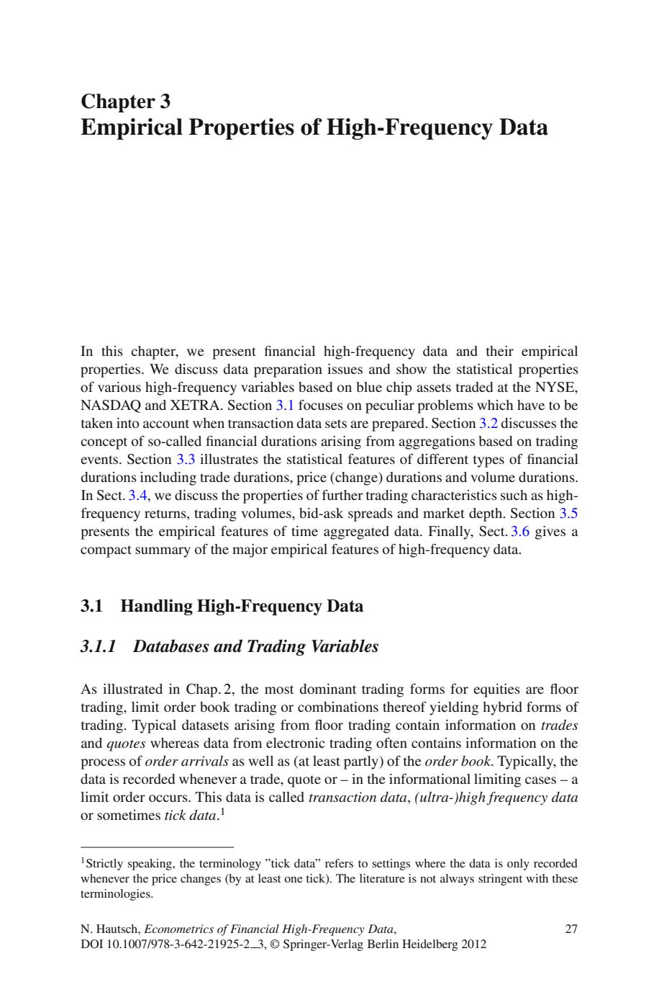

### PDF page 43 / printed page 28

```text
28                                           3 Empirical Properties of High-Frequency Data


   Regarding the detailedness of high-frequency information, we can distinguish
between five major levels:
1. Trade data. The transaction level is associated with information on individual
   trades consisting of
     (a) the time stamp of trades,
     (b) the price at which a trade was executed,
     (c) the traded volume (in number of shares).
2. Trade and quote data. Information on trades and quotes provides the most
   common form of transaction data containing
     (a) the time stamp of trades and best ask/bid quote updates,
     (b) the underlying best ask/bid quotes,
     (c) the price at which a trade was executed,
     (d) the traded volume (in number of shares),
     (e) the trade direction (up to identification rules as described below),
     (f) the indicative depth associated with best ask and bid quotes.
   The most common database of this type is the Trade & Quote (TAQ) database
   released by the NYSE which is illustrated in more detail below.
3. Fixed level order book data. If the underlying trading system is a fully comput-
   erized system, often also (at least partial) information on the depth behind the
   market is available. This type of data contains the same information as above but
   provides also information on limit order activities behind the market. Based on
   such data it is possible to reconstruct the limit order book up to a fixed level.
4. Messages on all limit order activities. Such data provide full information on any
   limit order activities, including time stamps, (limit) prices, sizes and specific
   attributes of limit order submissions, executions, cancellations and amendments.
   It allows to fully re-produce the trading flow and to re-construct the limit order
   book at any point in time during continuous trading and allows for an exact
   identification of buyer-initiated or seller-initiated trades. Sometimes such data
   contains also information on hidden orders or iceberg orders. For instance,
   TotalView-ITCH data from NASDAQ trading (see for an illustration below)
   provides information on execution against hidden orders. See, e.g., Hautsch and
   Huang (2011) for more details.
5. Data on order book snap-shots. Some data sets provide snap-shots of the
   limit order book at equi-distant time intervals avoiding the need for order
   book re-constructions. However, as they are recorded on an equi-distant grid,
   the matching with the corresponding underlying trading process is difficult.
   Therefore, this data is only useful to study limit order book dynamics but is of
   limited use to analyze interactions between the book and the trading process.
    Even based on full-information limit order book data, a complete reconstruction
of the limit order book is a difficult task. Two major problems have to be addressed
in this context: Firstly, a complete and correct re-construction of the limit order book
requires accounting also for order book activities outside the continuous trading
hours including opening auctions, pre-trading and late-trading periods. Secondly,
```

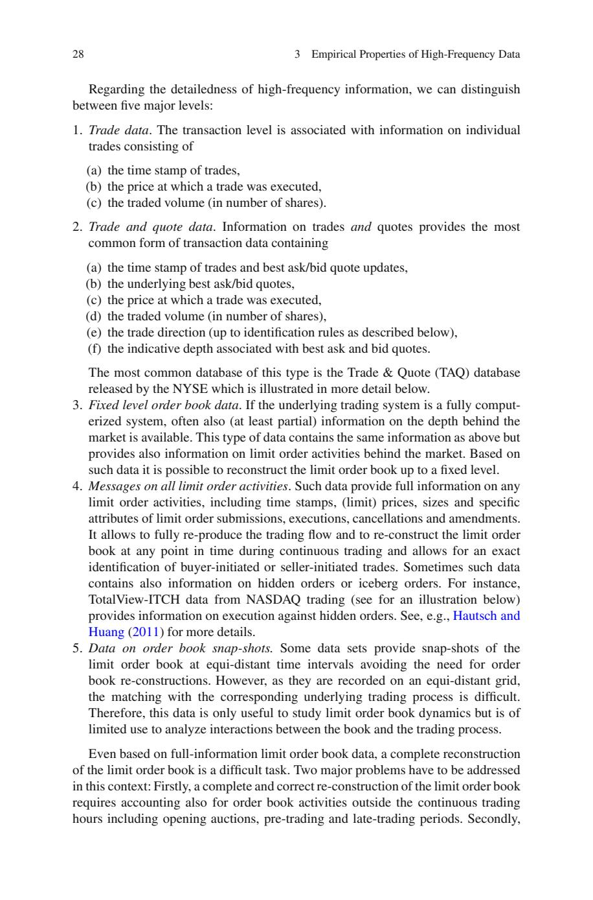

### PDF page 44 / printed page 29

**Detected figure/table caption(s) on this page:**
- Table 3.1 TAQ data record on trades for Microsoft on June 1, 2009

```text
3.1 Handling High-Frequency Data                                                           29


Table 3.1 TAQ data record on trades for Microsoft on June 1, 2009
SYMBOL         DATE            TIME      EX     PRICE       SIZE      COND     CORR     G127
MSFT           2009-06-01      36601     Z      21.1900       200              0        0
MSFT           2009-06-01      36601     Z      21.1900     1000               0        0
MSFT           2009-06-01      36601     Z      21.1900       100              0        0
MSFT           2009-06-01      36601     B      21.1900       400     @F       0        0
MSFT           2009-06-01      36601     B      21.1900       400     @F       0        0
MSFT           2009-06-01      36602     D      21.1912       470              0        0
MSFT           2009-06-01      36602     Z      21.1900       200              0        0
MSFT           2009-06-01      36602     Q      21.1900       900              0        0
MSFT           2009-06-01      36602     Q      21.1900       100     @F       0        0
MSFT           2009-06-01      36602     Q      21.1900       100     @F       0        0
MSFT           2009-06-01      36602     Q      21.1900       300              0        0
MSFT           2009-06-01      36602     Q      21.1900       100              0        0
MSFT           2009-06-01      36602     D      21.1900       100     @F       0        0
MSFT           2009-06-01      36602     D      21.1900       100     @F       0        0
SYMBOL stock symbol, DATE trade date, TIME trade time, EX exchange on which the trade
occurred, PRICE transaction price, SIZE trade size, COND sale condition, CORR correction
indicator of correctness of a trade, G127 indicating G trades (trades of NYSE members on their
own behalf) and rule 127 transactions (block trades)


as briefly discussed in Chap. 2, most modern electronic exchanges allow traders to
submit iceberg orders or hidden orders. The trading rules associated with partial (or
complete) display differ across exchanges. For instance, some exchanges, such as
the NASDAQ, even allow to post completely hidden orders in the bid-ask spread
(and thus providing execution priority) while this is not possible on other trading
platforms. As long as information on hidden orders is not available, limit order
books can be only incompletely constructed. For more details on iceberg orders
and hidden orders, see, e.g., Bessembinder et al. (2009), Frey and Sandas (2009) or
Hautsch and Huang (2011).
   The quality as well as the format of the data strongly depends on the underlying
institutional settings and the recording system. See, Chap. 2 or, e.g., Harris (2003)
for more details on institutional frameworks. Though to the growing importance
of electronic trading, the quality and detailedness of transaction data has increased
during recent years, rigorous data handling and processing is still an important task
and essential prerequisite for empirical studies.
   To illustrate possible forms of raw high-frequency data, Tables 3.1 and 3.2 show
extracts of raw files from the ”Trade and Quote” (TAQ) database released by the
NYSE. The TAQ database is one of the most popular and widely used transaction
datasets and contains detailed information on the intraday trade and quote process at
the NYSE, NASDAQ and numerous local exchanges in the U.S. The TAQ database
consists of two parts: the trade database and the quote database. The trade database
contains transaction prices, trading volumes, the exact time stamp (to the second)
and attribute information on the validity of the transaction. The quote database
consists of time stamped (best) bid and ask quotes, the volume for which the
particular quote is valid (market depth), as well as additional information on the
validity of the quotes. As the NYSE features a hybrid trading mechanism (see
```

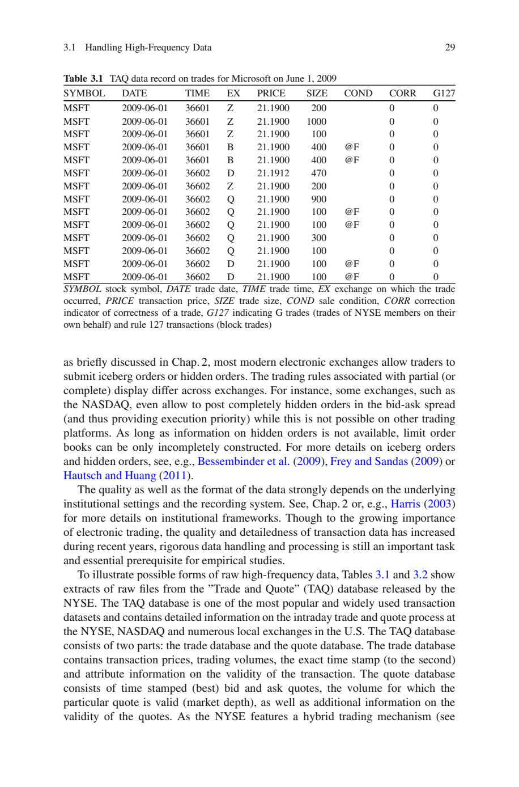

### PDF page 45 / printed page 30

**Detected figure/table caption(s) on this page:**
- Table 3.2 TAQ data record on quotes for Microsoft on June 1, 2009
- Table 3.3 shows raw data from the TotalView-ITCH data feed offered by NAS-

```text
30                                             3 Empirical Properties of High-Frequency Data


Table 3.2 TAQ data record on quotes for Microsoft on June 1, 2009
SYMBOL DATE                  EX TIME BID                BID SZ OFFER OFF SZ MODE
MSFT         2009-06-01 Z         36001 21.1100 43                 21.1300 38           12
MSFT         2009-06-01 T         36001 21.1100 97                 21.1200      6       12
MSFT         2009-06-01 T         36001 21.1100 92                 21.1200      6       12
MSFT         2009-06-01 T         36001 21.1100 82                 21.1200      6       12
MSFT         2009-06-01 I         36001 21.1100          9         21.1200      5       12
MSFT         2009-06-01 T         36001 21.1100 72                 21.1200      6       12
MSFT         2009-06-01 B         36001 21.1100 30                 21.1300 22           12
MSFT         2009-06-01 D         36001 21.1000          8         21.2100      2       12
MSFT         2009-06-01 B         36001 21.1100 31                 21.1300 22           12
MSFT         2009-06-01 B         36002 21.1100 30                 21.1300 22           12
MSFT         2009-06-01 B         36002 21.1100 21                 21.1300 22           12
MSFT         2009-06-01 T         36002 21.1100 72                 21.1200      5       12
MSFT         2009-06-01 T         36002 21.1100 78                 21.1200      5       12
MSFT         2009-06-01 I         36002 21.1100          9         21.1300 33           12
SYMBOL stock symbol, DATE quote date, TIME quote time, EX exchange on which the trade
occurred, BID bid price, BID SZ bid size in number of round lots (100 shares), OFFER offer (ask)
price, OFF SZ offer size in number of round lots (100 shares), MODE quote condition


Chap. 2), the quotes reported in the quote database can be quotes that are posted by
the specialist, limit orders from market participants posted in the limit order book,
or limit orders submitted by traders in the trading crowd.
   Table 3.3 shows raw data from the TotalView-ITCH data feed offered by NAS-
DAQ which is more detailed than the TAQ database and also provides information
on incoming limit orders. The ”event classification” allows for a quite precise
reconstruction of all limit order book activities and thus the resulting order book.
Here, only messages on the events “A” and “P” yield information on prices and types
of limit orders. Corresponding information on other event types can be retrieved
by tracing the limit order according to its order ID. This data can be used to
fully re-construct the limit order book and to partly identify the location of hidden
volume.2 For more details on the properties and the use of ITCH data, see Hautsch
and Huang (2011).


3.1.2 Matching Trades and Quotes

Many exchanges, such as, e.g., the NYSE, NASDAQ, EURONEXT or XETRA,
record trades and quotes separately which raises the problem of appropriately
matching the two data files. This step is necessary whenever trade characteristics,
like trade prices and trade sizes, have to be linked to the underlying quotes prevailing


2
 Automatic and efficient limit order book reconstruction can be performed by a limit order book
system reconstructor (“LOBSTER”) which is developed at Humboldt-Universität zu Berlin and
can be accessed on http://lobster.wiwi.hu-berlin.de.
```

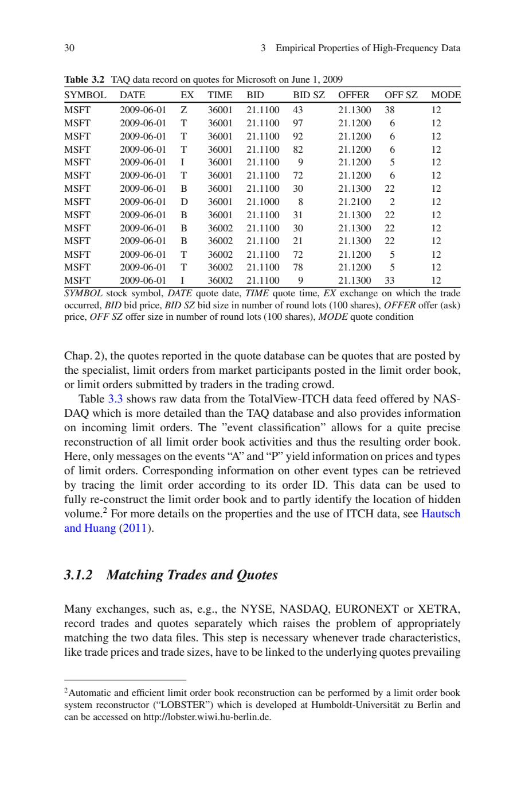

### PDF page 46 / printed page 31

**Detected figure/table caption(s) on this page:**
- Table 3.3 TotalView-ITCH data record on market and limit orders for Microsoft trading at

```text
3.1 Handling High-Frequency Data                                                               31


Table 3.3 TotalView-ITCH data record on market and limit orders for Microsoft trading at
NASDAQ on September 1, 2009
TIME               ORDER ID             EVENT             PRICE             SIZE            SIDE
40900995           135132726            E                                     500
40900995           135133117            E                                     100
40900996           135126512            D                                     100
40900996           135135501            A                 2428                100           1
40900996           135125636            D                                     200
40900996           132601833            P                 2427                500           1
40900996           132601833            P                 2427                250           1
40900996           132601833            P                 2427                144           1
40900997           135135542            A                 2427                100             1
40900997           135135544            A                 2428                200           1
40900997           135135580            A                 2426                200             1
40900998           135135501            D                                     100
40900998           135135591            A                 2432                100           1
40900999           135135631            A                 2428              4000            1
TIME milliseconds from midnight, ORDER ID unique ID for each limit order, EVENT: E
execution of an order, A posting a new limit order, D (partial or total) deletion of limit orders,
P execution against a hidden order, PRICE limit price, SIZE order size, SIDE: 1 – sell side, 1 –
buy side


in the market. This matching process induces an identification problem as long
as the corresponding time stamps are not exact. Particularly in systems where
the trading process is recorded manually, the time stamps are not necessarily
reliable and thus comparable. Even if the recording system is exact, latency and
technological limitations circumvent a perfect matching of trades and corresponding
quotes. For NYSE data of the early nineties, Lee and Ready (1991) show that the
problem of potential mismatching can be reduced by the so-called “five-seconds
rule”. Accordingly, a trade is linked to the quote posted at least 5 s before the
corresponding transaction. This is due to the fact that quotes are posted more quickly
than trades can be recorded. Lee and Ready (1991) illustrate that this rule leads to the
lowest rates of mismatching. However, while this rule was sensible for transaction
data during the nineties and early 2000s, it is not applicable anymore to more
recent data. In fact, the speed and precision of order processing has been increased
substantially reducing the average 5-s delay of trade records. For instance, using
NYSE data and estimating the adverse selection cost component in bid-ask spreads,
Henker and Wang (2006) show that the time delay is rather 1 s than 5 s. This result
is in line with most recent studies which use the most recent quote as the relevant
one at each trade arrival.
    However, given the variety of trading forms and systems as well as specific
trading rules on the individual markets, the application of universal matching rules is
rather inappropriate. If, for instance, reliable data on market depth at (and eventually
behind) the best quotes are available, data-driven matching methods could be more
sensible. Using data on market orders, limit orders and market depth associated with
the three best levels from EURONEXT Amsterdam, Hautsch and Huang (2009)
```

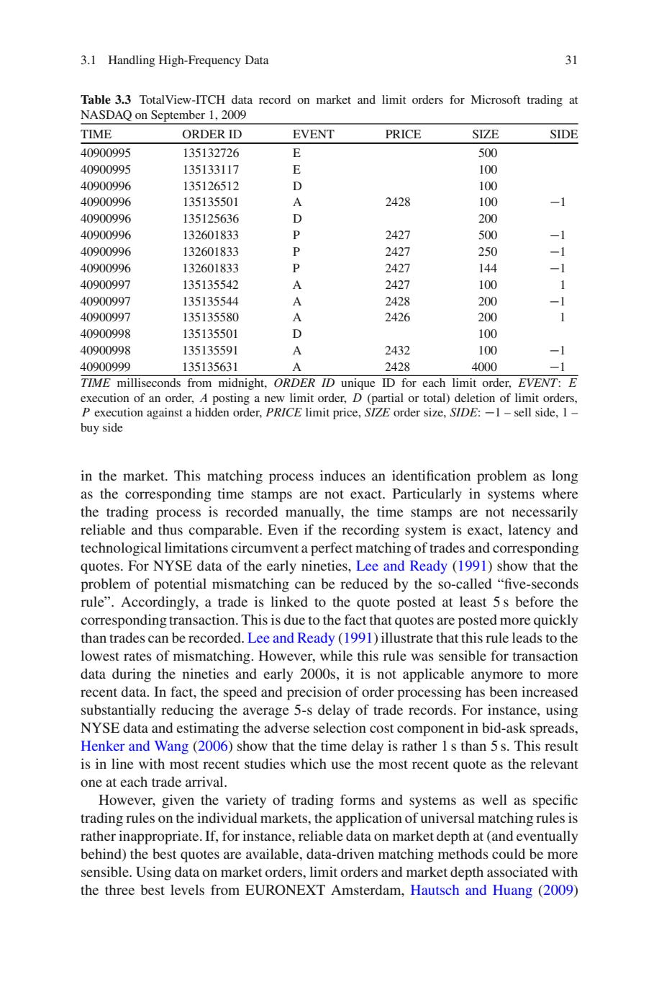

### PDF page 47 / printed page 32

```text
32                                          3 Empirical Properties of High-Frequency Data


propose an automatized algorithm yielding a specific matching for each trade. It
consists of three steps, where the first step searches for a perfect match between the
trade and the corresponding order book update while the following steps search for
an approximate match whenever a perfect match is not possible:
Step 1: Perfect matching. Consider a specified time window, e.g., Œ10; 10 seconds
around the time stamp of the corresponding trade. Then, pick every order book
record in this time window and perform the following analysis:
1. if the trade price equals the current best bid (ask) and the difference in best bid
   (ask) order book volumes between the current record and the previous one equals
   the trade size, or,
2. if the trade price equals the previous best bid (ask), the difference in best bid (ask)
   order book volumes between the current record and the previous one equals the
   trade size, and the best bid (ask) decreased (increased) since the last order book
   update,
then, match the most previous order book record with the current trade and record
the corresponding delay time. Case (1) is associated with a trade which absorbs
parts of the pending depth on the first level. Accordingly, case (2) is associated
with a trade which completely removes the first depth level and thus moves the best
ask/bid quote. If for none of the order book records a match can be achieved in the
given time window, the trade remains unmatched and we move to Step 2.
Step 2: Imperfect matching. Pick any unmatched trade record’s time stamp and
consider a time window of size which is twice the average delay time computed
in Step 1. Moreover, if
1. the trade price equals to the best bid (ask) and the best bid (ask) size is less than
   the previous one, or,
2. the best bid (ask) decreases (increases) between two consecutive records,
then, match the trade with the corresponding order book entry. This step accounts
for the possibility that trades might be executed against hidden liquidity. If for none
of the order book records a match can be achieved in the given time window, the
trade remains unmatched and we move to Step 3.
Step 3: Round time matching. Pick any unmatched trade and match it with the order
book record that is closest to the trade’s time stamp plus the average delay time.
   Obviously, this procedure has to be adapted to specific trading rules at individual
exchanges.


3.1.3 Data Cleaning

After matching trades and quotes, obvious data errors should be filtered out. Typical
data errors are due to (a) a wrong recording or (b) a delayed recording of trade
or quote information. Delayed records arise from trades which are recorded too
late or from subsequent corrections of mis-recorded trades which are lined into the
```

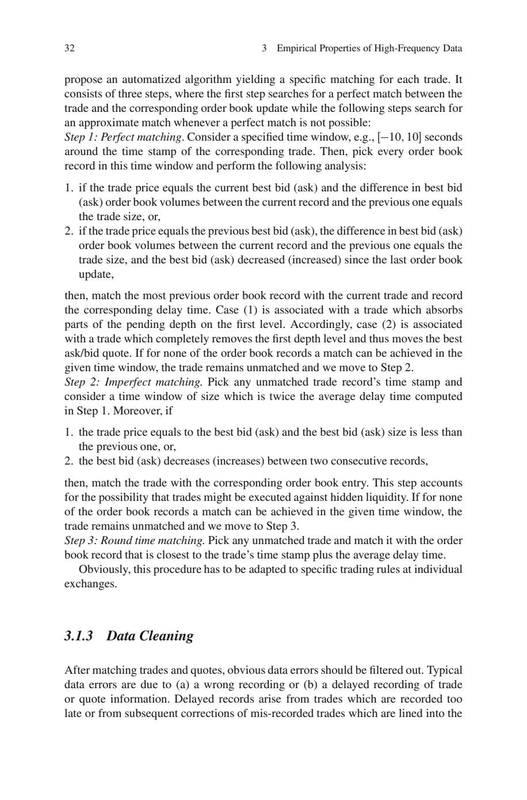

### PDF page 48 / printed page 33

**Detected figure/table caption(s) on this page:**
- Fig. 3.1 Plot of Apple trade prices, NASDAQ, 11/10/2007, 13:11 to 13:15
- trading system with a time delay. As an illustration of mis-recorded trades, Fig. 3.1

```text
3.1 Handling High-Frequency Data                                                   33


Fig. 3.1 Plot of Apple trade prices, NASDAQ, 11/10/2007, 13:11 to 13:15


trading system with a time delay. As an illustration of mis-recorded trades, Fig. 3.1
shows the price evolution of the Apple stock on October 11, 2007, over the course
of 4 min.3 While the underlying price level is around 165, we observe a massive
number of price jumps due to the imputation of mis-recorded prices.
   Such recording errors are most easily identified if transaction prices or quotes
show severe jumps between consecutive observations which are reverted immedi-
ately thereafter. To remove such types of errors, a set of filters, similar to those
shown below, is commonly applied:
1. Delete observations which are directly indicated to be incorrect, delayed or
   subsequently corrected.
2. Delete entries outside the regular trading hours.
3. Delete entries with a quote or transaction price equal to zero or being negative.
4. Delete all entries with negative spreads.
5. Delete entries whenever the price is outside the interval Œbid  2  spread I ask C
   2  spread.
6. Delete all entries with the spread being greater or equal than 50 times the median
   spread of that day.
7. Delete all entries with the price being greater or equal than 5 times the median
   mid-quote of that day.
8. Delete all entries with the mid-quote being greater or equal than 10 times the
   mean absolute deviation from the local median mid-quote.
9. Delete all entries with the price being greater or equal than 10 times the mean
   absolute deviation from the local median mid-quote.
   Obviously, the choice of window sizes in rules (v) to (ix) is somewhat arbitrary
and dependent on the overall quality of the data. However, the parameters here are
rather typical and in accordance with, e.g., Brownlees and Gallo (2006), Barndorff-
Nielsen et al. (2008b) or Hautsch et al. (2011), among others.


3
    This example was kindly provided by Roel Oomen.
```

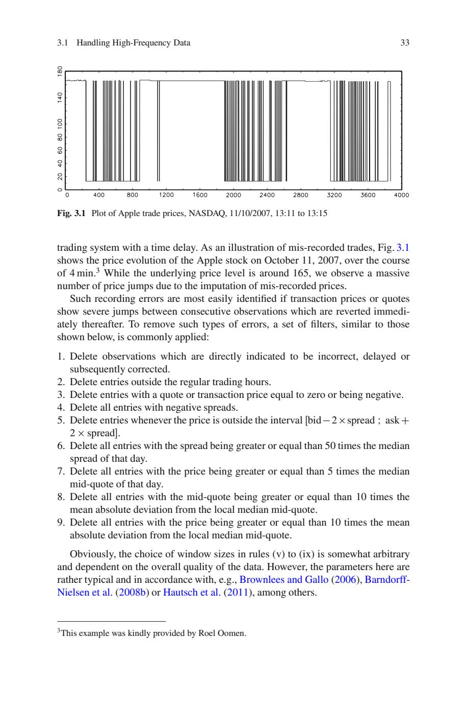

### PDF page 49 / printed page 34

```text
34                                           3 Empirical Properties of High-Frequency Data


3.1.4 Split-Transactions

After having the data synchronized and cleaned, so-called “split-transactions” have
to be taken into account. Split-transactions arise when a marketable order on one
side of the market is matched against several standing limit orders on the opposite
side. Such observations occur in electronic trading systems when the volume of an
order exceeds the capacities of the first level of the opposing queue of the limit order
book. In these cases, the orders are automatically matched against several opposing
order book entries. Often, these sub-trades are recorded individually. Consequently,
the recorded time between the particular “sub-transactions” is extremely small4
and the corresponding transaction prices are equal or show an increasing (or
decreasing, respectively) sequence. Depending on the research objective, it is
sometimes justified to aggregate these sub-trades to one single transaction. However,
as argued by Veredas et al. (2008), the occurrence of such observations might also
be due to the fact that the limit orders of many traders are set for being executed at
round prices, and thus, trades executed at the same time do not necessarily belong
to the same trader. Moreover, in very actively traded stocks, the occurrence of
different transactions within a couple of milliseconds is not unlikely. In these cases,
a simple aggregation of observations with zero trade-to-trade durations would lead
to mismatching. Grammig and Wellner (2002) propose identifying a trade as a split-
transaction when the durations between the sub-transactions are smaller than 1 s,
and the sequence of the prices (associated with a split-transaction on the bid (ask)
side of the order book) are non-increasing (non-decreasing). Then, the volume of
the particular sub-trades is aggregated and the price is computed as the (volume
weighted) average of the prices of the sub-transactions.


3.1.5 Identification of Buyer- and Seller-Initiated Trades

Often, it is not possible to directly identify whether a trade is seller- or buyer-
initiated. In such a case, the initiation of trades has to be indirectly inferred from
the price and quote process. The most commonly used methods of inferring the
trade direction are the quote method, the tick test as well as hybrid methods
combining both methods (see, e.g., Finucane 2000). The quote method is based
on the comparison of the transaction price and the mid-quote. Whenever the price is
above (below) the mid-quote, the trade is classified as a buy (sell). Trades which are
executed directly at or above (below) the prevailing best ask (bid) are most easily
identified. However, the closer transaction prices are located to current mid-quotes,
the higher the risk of misclassification is.


4
 Often it is a matter of measurement accuracy that determines whether sub-transactions have
exactly the same time stamp or differ only by hundredths of a second.
```

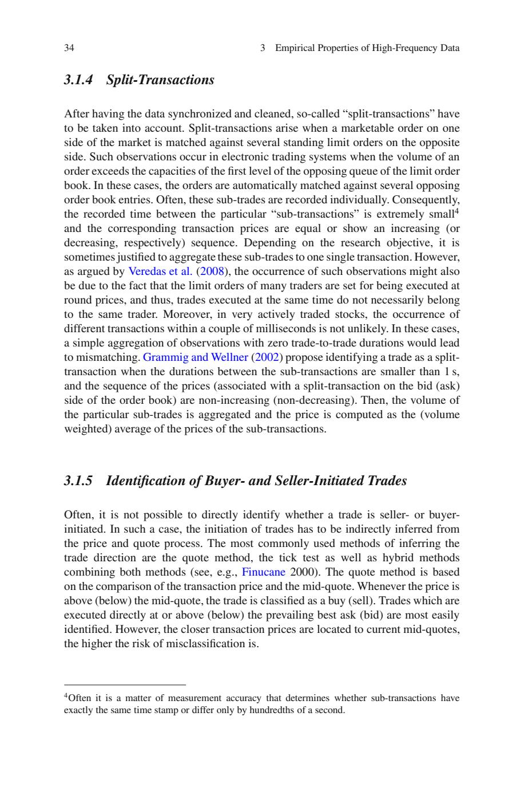

### PDF page 50 / printed page 35

```text
3.2 Aggregation by Trading Events: Financial Durations                               35


    If trades are executed at the mid-quote (and no other information is available),
only the sequence of previous prices can be used to identify the current trade
direction. According to the so-called tick test, a trade is classified as a buy (sell)
if the current trade occurs at a higher (lower) price than the previous trade. If the
price change between consecutive transactions is zero, the trade classification is
based on the last price that differs from the current price. However, if information
on the underlying market depth is available, the comparison of transaction volume
and corresponding changes of market depth on one side of the market provides
additional information which increases the precision of the identification algorithm.


3.2 Aggregation by Trading Events: Financial Durations

Transaction data is often also used in an aggregated way. Though aggregation
schemes naturally induce a loss of information, there are three major reasons for
the use of specific sampling schemes. Firstly, as discussed below, data aggregation
allows to construct economically as well as practically interesting and relevant
variables. Secondly, aggregation schemes allow to reduce the impact of market
microstructure effects whenever the latter are of less interest and might cause noise
in a given context. A typical example is the use of aggregated (squared) returns in
realized volatility measures to estimate daily quadratic price variations. In such a
context, a well-known phenomenon is the trade-off between on the one hand using
a maximum amount of information increasing estimators’ efficiency and on the
other hand the impact of market microstructure effects causing biases in volatility
estimates.5 Thirdly, aggregation schemes allow to reduce the amount of data which
is helpful whenever long sample periods or large cross-sections of assets are studied.
    In general, we can distinguish between two major types of sampling and aggre-
gation schemes: (i) Event aggregation, i.e., aggregations of the process according
to specific trading events. This type of sampling scheme will be discussed in
more detail in this section. (ii) Time aggregation, i.e., aggregations of the process
according to calendar time which will be discussed in Sect. 3.5.
    Consider in the following a (multivariate) point process associated with the
complete order arrival process of a financial asset over a given time span. By
selecting points of this process according to certain trading events, different types of
so-called financial point processes are generated. The selection of individual points
is commonly referred to as a “thinning” of the point process.


3.2.1 Trade and Order Arrival Durations

Sampling the process whenever a trade occurs is commonly referred to as trans-
action time sampling or business time sampling and is often used as a sampling


5
    For more details, see Chap. 8.
```

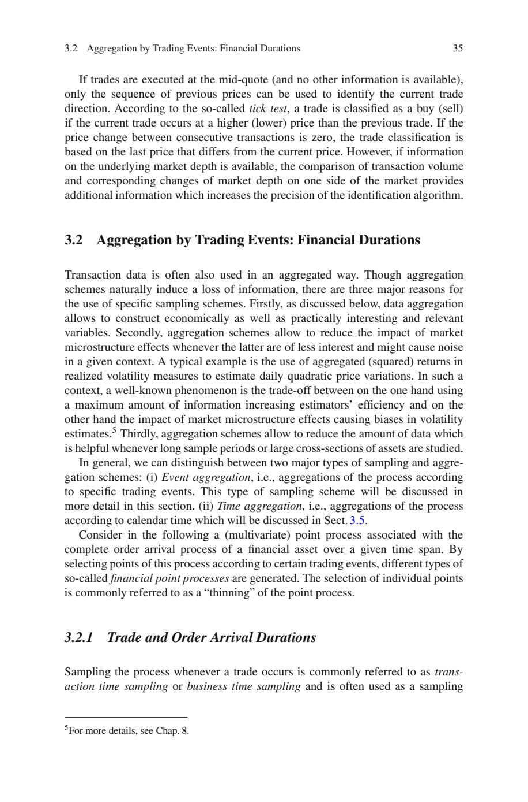

### PDF page 51 / printed page 36

```text
36                                            3 Empirical Properties of High-Frequency Data


scheme underlying realized volatility measures. For a discussion, see e.g., Hansen
and Lunde (2006), Andersen et al. (2010) or Hautsch and Podolskij (2010). The
time between subsequent transactions is called trade duration, is the most common
type of financial duration and is a natural measure of the trading intensity. Since
a trade reflects demand for liquidity, a trade duration is naturally associated with
the intensity of liquidity demand. Correspondingly, buy or sell trade durations are
defined as the time between consecutive buys or sells, respectively, and measure the
demand for liquidity on the individual sides of the market.
    In an order driven market, limit order (arrival) durations, defined as the time
between consecutive arrivals of limit orders, reflect the activity in the limit order
book and thus on the supply side of liquidity. In studying limit order book dynamics,
it is of particular interest to distinguish between different types of limit order
activities reflecting, for instance, traders’ order aggressiveness.


3.2.2 Price and Volume Durations

Price (change) durations are generated by selecting points according to their price
information. Let pi , ai and bi be the process of transaction prices, best ask quotes
and best bid quotes, respectively. Define in the following i 0 with i 0 < i as the
index of the most recently selected point of the point process. Then, a series of price
durations is generated by thinning the process according to the following rule:
     Retain point i; i > 1, if jpi  pi 0 j  dp.
The variable dp gives the size of the underlying cumulative absolute price change
and is chosen exogenously. The first point typically corresponds to the first point
(i D 1) of the original point process. In order to avoid biases caused by a bouncing
of transaction prices between ask and bid quotes (“bid-ask bounce”), an alternative
is to generate price durations not on the basis of transaction prices pi , but based
on midquotes mqi WD .ai C bi /=2. As discussed in more detail in Chap. 8, price
durations are closely related to volatility measures. Sampling whenever prices
(or mid-quotes) change by a tick (corresponding to the smallest possible price
movement), i.e., dp D 1, is commonly referred to as tick time sampling.
    In technical analysis, turning points of local price movements are of particular
interest since they are associated with optimal times to buy or to sell. The time
between such local extrema, i.e., the so-called directional change duration, provides
information on the speed of mean reversion in price processes. A directional change
duration is generated according to the following procedure:
    Retain point i; i > 1, if
1. pi  pi0  ./ dp
   and if there exists a point, indexed by i 00 with i 00 > i 0 , for which
2. pi  ./ pj with j D i C 1; : : : ; i 00  1 and pi  pi 00  ./ dp.
```

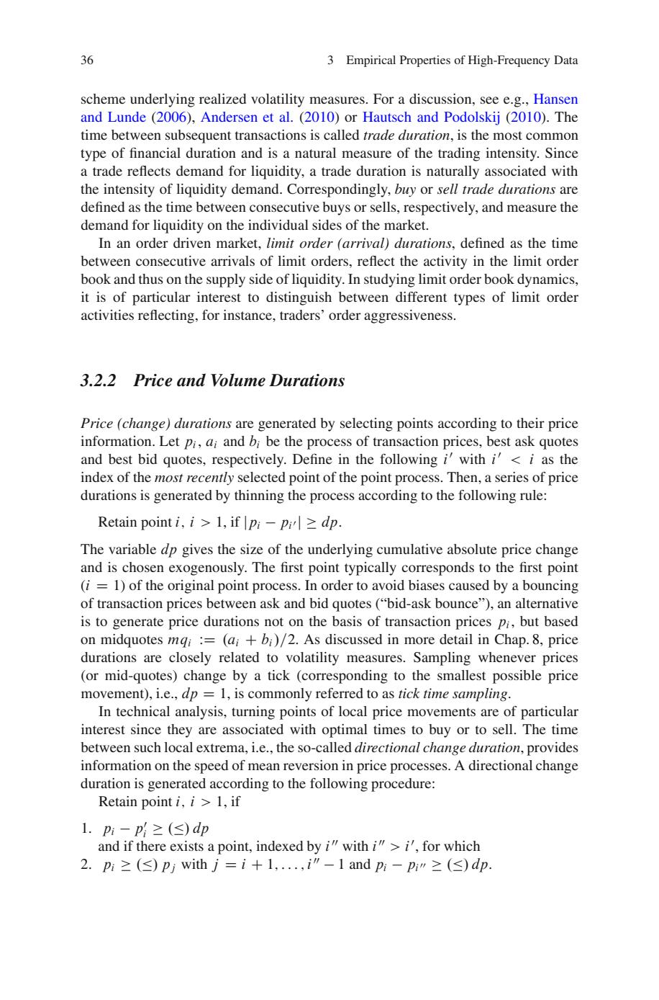

### PDF page 52 / printed page 37

**Detected figure/table caption(s) on this page:**
- Figure 3.2 shows the evolution of monthly averages of the number of trades per
- Figure 3.3 shows the distribution of the time between trades over the universe of

```text
3.3 Properties of Financial Durations                                                    37


Here, dp gives the minimum price difference between consecutive local extreme
values.
    Volume durations are defined as the time until a certain aggregated volume
is
Pi traded  on the market. It is generated formally by retaining point i , i > 1 if
   j Di C1 j  d v, where d v represents the chosen amount of the cumulated volume
       0   v
and vi the transaction volume associated with trade i . Volume durations capture not
only the speed of trading but also the size of trades. Consequently, they naturally
reflect the intensity of liquidity demand.
    An indicator for the presence of information on the market is the time it takes to
trade a given amount of excess (or net) buy or sell volume. Consequently, so-called
excess volume duration measure the intensity of (one-sided)P         demand for liquidity
and are formally created by retaining point i , i > 1, if j ij Di 0 C1 yjb vj j  d v, where
yjb is an indicator variable that takes the value 1 if a trade is buyer-initiated and 1
if a transaction is seller-initiated. The threshold value d v is fixed exogenously and
determines the level of one-sided volume under risk.
    While excess volume durations reflect market-side specific imbalances in liquid-
ity demand, the same idea can be applied to liquidity supply in limit order book
markets. Correspondingly, we can quantify the time it takes until a given imbalance
between ask and bid depth is realized. We refer this to an excess depth duration.


3.3 Properties of Financial Durations

During the remainder of this chapter we analyze the empirical properties of high-
frequency data using the stocks JP Morgan (JPM), traded at NYSE, Microsoft
(MSFT), traded at NASDAQ, and Deutsche Telekom (DTEK), traded in the German
XETRA system. JP Morgan and Microsoft data are extracted from the TAQ database
for June 2009. For Deutsche Telekom we employ trade data as well as 1-s snapshots
of the (displayed) limit order book during September 2010. Throughout this chapter,
overnight effects are omitted. Hence, aggregated data cover only observations within
a trading day.
    The present section discusses major empirical properties of financial durations.
Figure 3.2 shows the evolution of monthly averages of the number of trades per
day for JP Morgan traded at the NYSE from 2001 to 2009. We observe a clear
increase in trading intensities since 2001, particularly during the financial crisis in
2008. Though trading activity declined after the crisis, we still observe a trading
frequency in 2009 which is more than two times as high as in 2001.
    Figure 3.3 shows the distribution of the time between trades over the universe of
S&P 1500 stocks between 2006 and 2009. We observe that nearly 600 out of 1,500
assets trade more frequently than every 10 s. These assets are mostly constituents of
the S&P 500 index. However, even beyond the S&P 500 assets, we observe around
1,000 assets trading more frequently than every 20 seconds on average.
```

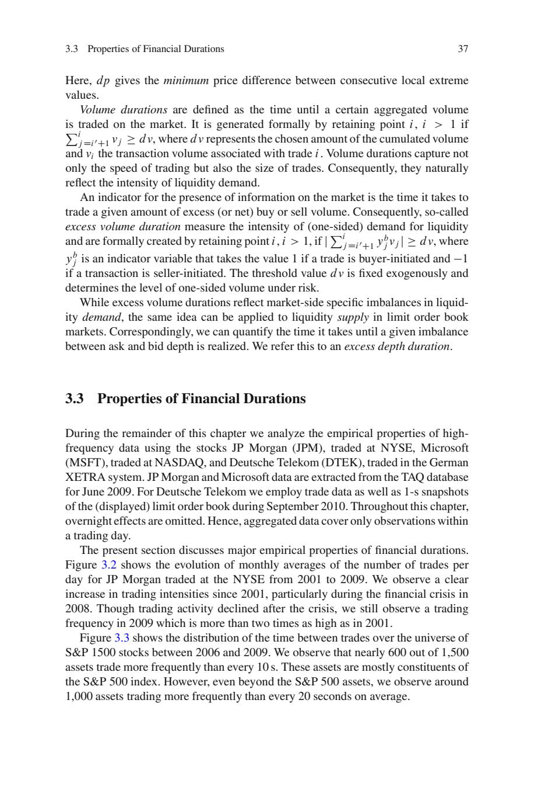

### PDF page 53 / printed page 38

**Detected figure/table caption(s) on this page:**
- Fig. 3.2 Monthly averages of the number of trades per day for JP Morgan, NYSE, 2001–2009
- Fig. 3.3 Histogram of the time between trades (horizontal axis; in seconds) over the S&P 1500
- Figure 3.4 shows histograms of trade durations, midquote (change) durations,

```text
38                                            3 Empirical Properties of High-Frequency Data


Fig. 3.2 Monthly averages of the number of trades per day for JP Morgan, NYSE, 2001–2009


Fig. 3.3 Histogram of the time between trades (horizontal axis; in seconds) over the S&P 1500
universe, 2006–2009


   Figure 3.4 shows histograms of trade durations, midquote (change) durations,
volume durations, excess volume durations and excess depth durations for JPM,
MSFT and DTEK. We observe that more than 50% of all JPM trade durations are
less or equal than 1 s whereas trade durations longer than 10 s happen only very
```

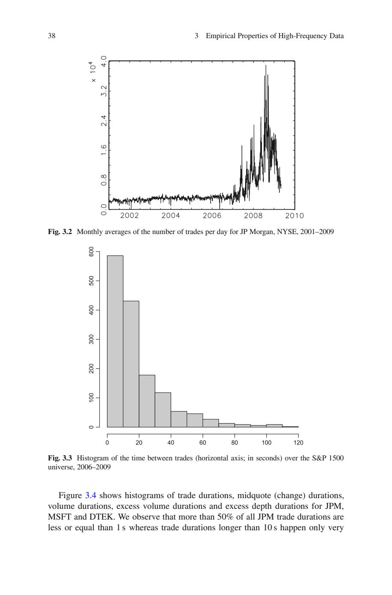

### PDF page 54 / printed page 39

**Detected figure/table caption(s) on this page:**
- The fourth panel of Fig. 3.4 shows the distribution of the time it takes to trade
- overdispersed distributions. Figure 3.5 shows time series plots of trade durations
- serial dependence in duration series and is confirmed by Fig. 3.6 depicting the

```text
3.3 Properties of Financial Durations                                                  39


infrequently. This amounts to an average trade duration of 2.9 s. A similar picture
arises for MSFT with an average trade duration of 4.5 s. DTEK trades occur slightly
less frequent (with an average trade duration of 9.5 s) but reveal a more fat-tailed
distribution with higher probabilities for longer durations (10 s) and very short
durations (1 s). For all stocks, a striking feature is the non-trivial proportion of zero
durations caused by split-trades (see Sect. 3.1.4) or truly simultaneous (or close-to-
simultaneous) trade occurrences.
   The second panel shows price durations associated with midquote changes of 10
basis points of the average price level for JPM (corresponding to 3:5 cents) and 3
ticks for MSFT and DTEK (corresponding to 1.5 cents and 0.15 cents, respectively).
These price movements last on average 47.6, 64.1 and 66.7 s for JPM, MSFT and
DTEK, respectively, and reveal a clearly more dispersed unconditional distribution
as for trade durations. This dispersion becomes higher if the magnitude of the
underlying price changes increases (third panel). The distributions of both trade
and price durations reveal overdispersion, i.e., the standard deviation exceeds the
mean. We observe dispersion ratios between 1.6 and 1.9 for trade durations and
price durations yielding clear evidence against an exponential distribution.
   The fourth panel of Fig. 3.4 shows the distribution of the time it takes to trade
10 times the average (single) trade size. These waiting times last on average 40.5,
67.4 and 118.3 s for JPM, MSFT and DTEK, respectively, with dispersion ratios
around approximately 1.1. Hence, we observe a lower proportion of extremely
long or extremely small durations inducing a more symmetric distribution. Finally,
excess volume durations (for JPM and MSFT) and excess depth durations (for
DTEK), shown in the bottom panel, give the time it takes until a certain imbalance
in market side specific trading volume and depth arises on the market. Also
here, we observe substantial variations in waiting times associated with clearly
overdispersed distributions. Figure 3.5 shows time series plots of trade durations
and price durations. We observe that financial durations are clustered in time with
long (short) durations following on long (short) durations. This suggests positive
serial dependence in duration series and is confirmed by Fig. 3.6 depicting the
corresponding autocorrelation functions (ACF) of the individual financial duration
series.
   Note that these are autocorrelations of (irregularly spaced) time intervals.
Accordingly, the (calendar) time distance to a lagged observation is time-varying.
We observe highly significant positive autocorrelations revealing a strong persis-
tence of the process. This is particularly true for trade durations having ACFs which
decay very slowly. Actually, though not explicitly documented here, corresponding
tests show evidence for long range dependence. For more details, see Chap. 6.
   Price durations have higher autocorrelations but reveal slightly less persistence.
Nevertheless, price durations based on relatively small price changes still reveal
significant long range dependence. Recalling the close link between price durations
and price volatility,6 these results show that high-frequency volatility is obviously


6
    See Chap. 8 for more details on this relationship.
```

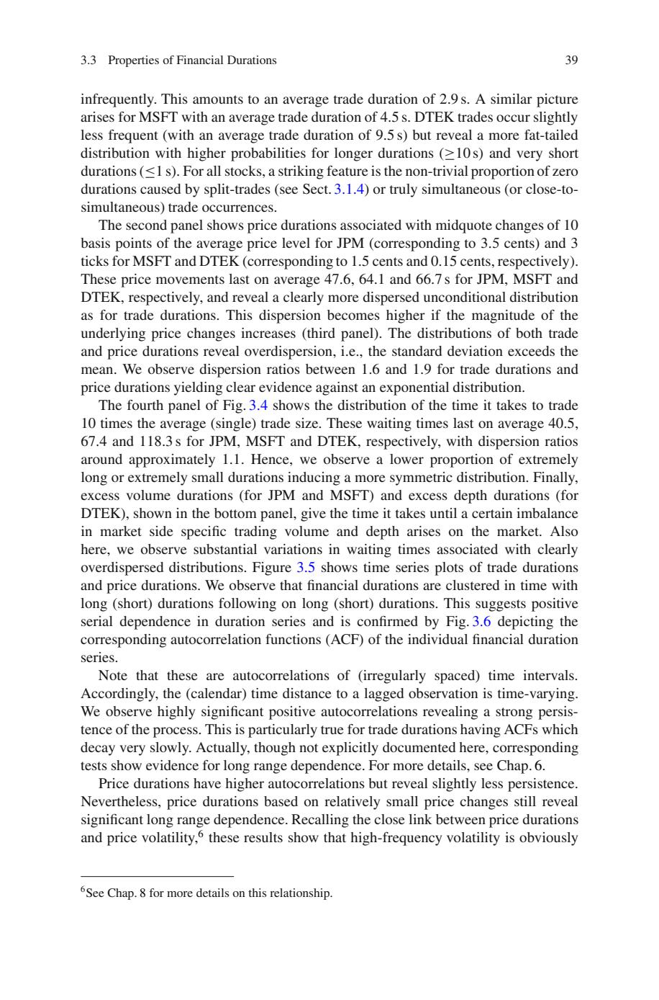

### PDF page 55 / printed page 40

**Detected figure/table caption(s) on this page:**
- Fig. 3.4 Histograms of trade durations, midquote durations, volume durations, excess volume

```text
40                                              3 Empirical Properties of High-Frequency Data


Fig. 3.4 Histograms of trade durations, midquote durations, volume durations, excess volume
durations and excess depth durations for JP Morgan (NYSE), Microsoft (NASDAQ) and Deutsche
Telekom (XETRA). Aggregation levels for price durations in basis points of the average price level
for JP Morgan and in minimum tick size for Microsoft and Deutsche Telekom. The aggregation
level for (excess) volume durations is 10 times of the average trade size. Aggregation level for
excess depth durations: 10% of average order book depth up to the tenth level. Sample period:
June 2009 for JP Morgan and Microsoft and September 2010 for Deutsche Telekom
```

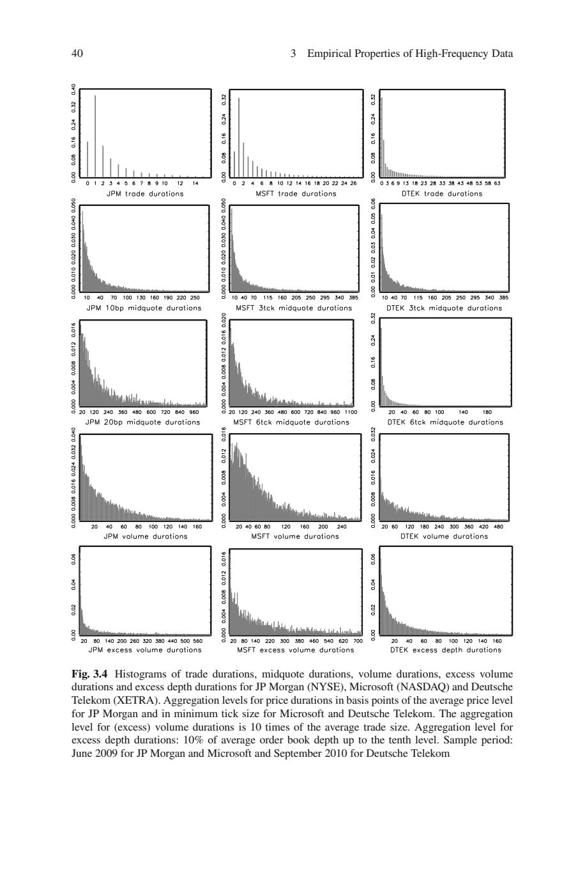

### PDF page 56 / printed page 41

**Detected figure/table caption(s) on this page:**
- Fig. 3.5 Time series of trade durations and price durations for JP Morgan (NYSE), Microsoft
- Figure 3.7 shows the intraday seasonality patterns based on cubic spline regres-

```text
3.3 Properties of Financial Durations                                                              41


Fig. 3.5 Time series of trade durations and price durations for JP Morgan (NYSE), Microsoft
(NASDAQ) and Deutsche Telekom (XETRA). Aggregation levels for price durations in basis
points of the average price level for JP Morgan and in minimum tick size for Microsoft
and Deutsche Telekom. Sample period: First 2,000 observations for trade durations and 1,000
observations for price durations in June 2009 for JP Morgan and Microsoft and in September 2010
for Deutsche Telekom


very persistent. This persistent declines when the underlying aggregation level (i.e.,
the size of underlying price movements) raises and first passage times become
longer. Then, as shown in the third panel, the ACFs decay quickly and become even
negative for JPM and MSFT after approximately 25 lags. This negative dependence
is driven by intraday periodicities since higher lags of comparably long price
durations might easily go beyond the current trading day and are driven by price
activity of the day before.
   The ACFs of volume durations start on a comparably high level. For example,
for JPM volume durations, the first order autocorrelation is around 0:65. This
high autocorrelation is caused by the fact that trade sizes are strongly clustered
themselves (see Sect. 3.4 for more details).7 Finally, also excess volume duration
series are strongly autocorrelated but are less persistent than volume durations. In
contrast, excess depth durations are very persistent. The time it takes to build up
a certain excess liquidity supply reveals long memory. Hence, (excess) liquidity
shocks are quite long-lived.
   Figure 3.7 shows the intraday seasonality patterns based on cubic spline regres-
sions.8 For JPM and MSFT we find a distinct inverse U-shaped pattern with
lowest durations in the morning and before closure and significantly longer spells


7
  Note that these effects are not caused by split-transactions since such effects have been taken into
account already.
8
  For more details on the estimation of seasonality effects, see Sect. 5.4.
```

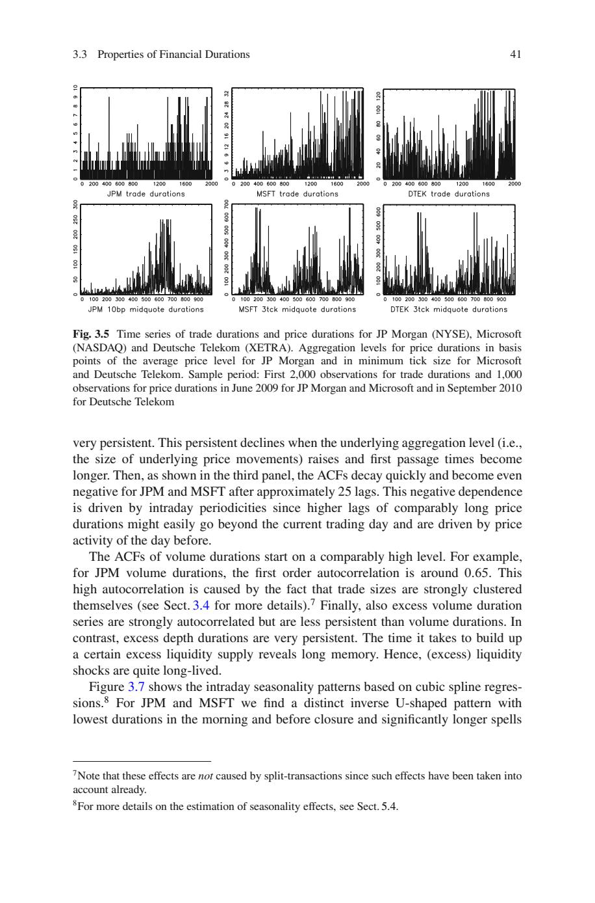

### PDF page 57 / printed page 42

**Detected figure/table caption(s) on this page:**
- Fig. 3.6 Autocorrelation functions of trade durations, midquote change durations, volume dura-
- (NASDAQ) and Deutsche Telekom (XETRA). Data description see Fig. 3.4. Dotted lines: approx-

```text
42                                            3 Empirical Properties of High-Frequency Data


Fig. 3.6 Autocorrelation functions of trade durations, midquote change durations, volume dura-
tions, excess volume durations and excess depth durations for JP Morgan (NYSE), Microsoft
(NASDAQ) and Deutsche Telekom (XETRA). Data description see Fig. 3.4. Dotted lines: approx-
imately 99% confidence interval. The x-axis denotes the lags in terms of durations


around lunch time. High trading activities after market opening are driven by the
dissemination of information occurring over night. As soon as information from
other markets is processed, market activity declines and reaches its minimum around
```

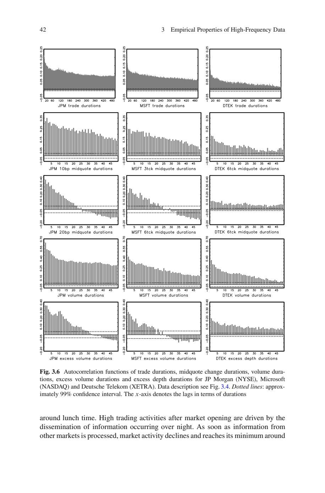

### PDF page 58 / printed page 43

**Detected figure/table caption(s) on this page:**
- Fig. 3.7 Cubic spline functions (30 min nodes) of trade durations, midquote change durations,
- Microsoft (NASDAQ) and Deutsche Telekom (XETRA). Data description see Fig. 3.4. The x-axis

```text
3.3 Properties of Financial Durations                                                     43


Fig. 3.7 Cubic spline functions (30 min nodes) of trade durations, midquote change durations,
volume durations, excess volume durations and excess depth durations for JP Morgan (NYSE),
Microsoft (NASDAQ) and Deutsche Telekom (XETRA). Data description see Fig. 3.4. The x-axis
denotes local calendar time


lunch time. Then, approaching market closure, trading activity steadily increases
again as many traders tend to close or to re-balance their positions before continuous
trading stops. XETRA trading reveals a slightly different pattern with the mid-day
```

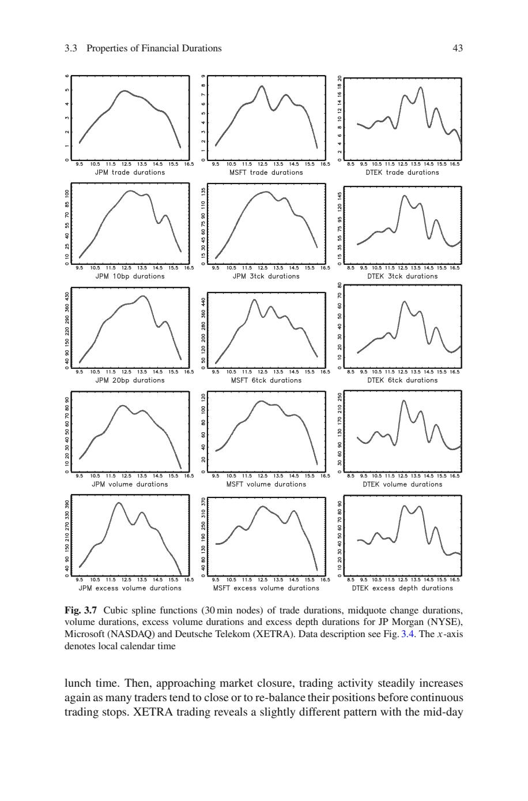

### PDF page 59 / printed page 44

**Detected figure/table caption(s) on this page:**
- Fig. 3.8 Relationship between the size of cumulative absolute price changes dp (y-axis) and the
- Microsoft (NASDAQ) and Deutsche Telekom (XETRA). Data description see Fig. 3.4
- Finally, Fig. 3.8 plots the relationship between the size of the underlying cumula-
- level and thus are irregularly spaced in time. Figure 3.9 shows the unconditional

```text
44                                             3 Empirical Properties of High-Frequency Data


Fig. 3.8 Relationship between the size of cumulative absolute price changes dp (y-axis) and the
average length of the resulting price duration (in minutes) (x-axis). Based on JP Morgan (NYSE),
Microsoft (NASDAQ) and Deutsche Telekom (XETRA). Data description see Fig. 3.4


spike being more pronounced and a sharp decline of durations (and thus an increase
of market activities) around 14:30. The latter “dip” is likely to be induced by the
opening of the major U.S. exchanges (CBOT, NYSE and NASDAQ) and the need
to process new information. We observe that this significantly increases temporary
trading activity, volatility and market imbalances.
   Finally, Fig. 3.8 plots the relationship between the size of the underlying cumula-
tive absolute price change dp and the average length of the resulting price duration,
where overnight periods are discarded. We observe slightly concave functions with
relatively similar shapes. Note that the scaling on the y-axis is quite different
reflecting that overall volatility differs from stock to stock.9 While for DTEK it
takes on average approximately 40 min to move the price by 0:03, this movement
just takes around 2 min in JPM trading.


3.4 Properties of Trading Characteristics

In this section, we discuss the statistical properties of the most important trading
characteristics, such as the bid-ask spread, the trade size, the order book depth as
well as the trade-to-trade return. These characteristics are observed on transaction
level and thus are irregularly spaced in time. Figure 3.9 shows the unconditional
distributions of trade sizes, bid-ask spreads, trade-to-trade price changes as well as
trade-to-trade midquote changes. We observe that JPM trade sizes are quite discrete
and clustered in round lots. To model such outcomes, a count data distribution (see
Chap. 13) seems to be most appropriate. Conversely, for MSFT and DTEK, the dis-
tribution of trade sizes is significantly more dispersed. Nevertheless, we still observe
a concentration of probability mass at round numbers. This is particularly striking
for DETK trading where trade sizes of multiples of 5 lots are particularly preferred.
This reflects the well-known phenomenon of traders’ preference for round numbers.


9
 The discontinuities are caused by finite-sample properties as for high aggregation levels the
number of underlying observations naturally shrinks.
```

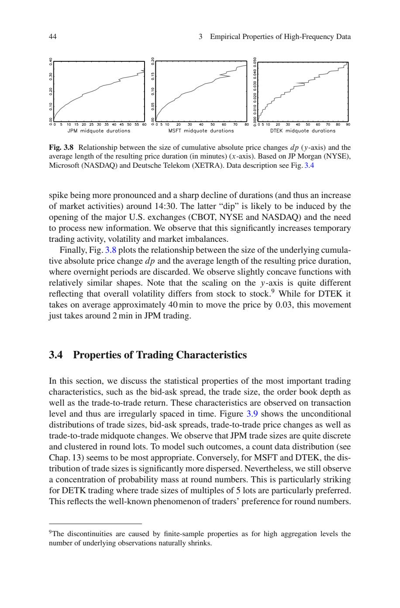

### PDF page 60 / printed page 45

**Detected figure/table caption(s) on this page:**
- Fig. 3.9 Histograms for trade sizes (in 100 share lots), bid-ask spreads, trade-to-trade spread

```text
3.4 Properties of Trading Characteristics                                                   45


Fig. 3.9 Histograms for trade sizes (in 100 share lots), bid-ask spreads, trade-to-trade spread
changes, trade-to-trade price changes and trade-to-trade midquote changes for JP Morgan (NYSE),
Microsoft (NASDAQ) and Deutsche Telekom (XETRA). Sample period: June 2009 for JP Morgan
and Microsoft and September 2010 for Deutsche Telekom


   The distribution of bid-ask spread realizations is very discrete. In 90% of all
cases, JPM spreads take the values 0:01, 0:02 and 0:03. In case of JPM and
DTEK, the distribution is even more extreme with a clear concentration of spread
```

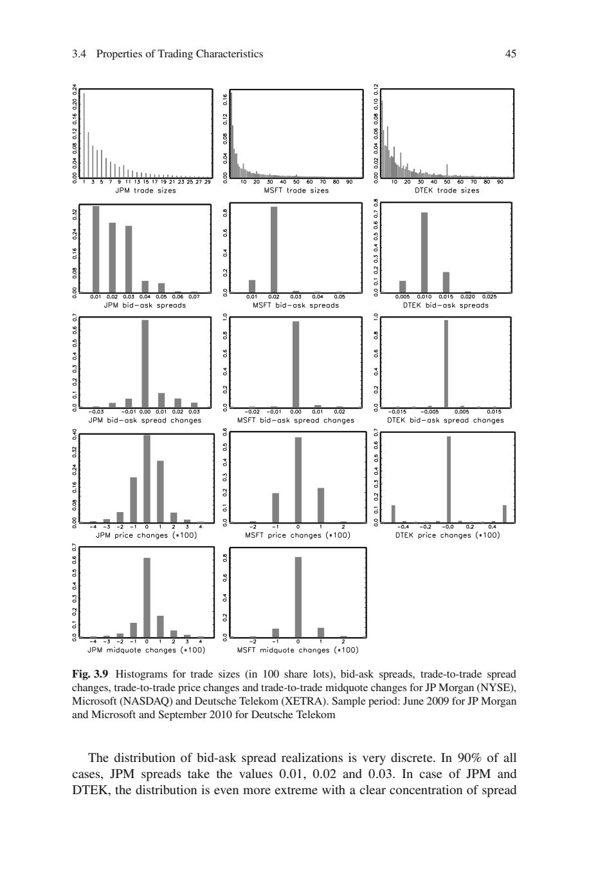

### PDF page 61 / printed page 46

**Detected figure/table caption(s) on this page:**
- Fig. 3.10 Top panel: Histograms of first, second and third level depth (ask and bid average) for
- The last two panels in Fig. 3.9 show the distributions of trade-to-trade price
- Figure 3.10 plots distributions of order book depth for DTEK. The upper panel

```text
46                                              3 Empirical Properties of High-Frequency Data


Fig. 3.10 Top panel: Histograms of first, second and third level depth (ask and bid average) for
Deutsche Telekom (XETRA) as multiples of the average trade size. Bottom panel: Percentage
difference between cumulated ask and bid depth, weighted by the price difference to the opposite
side of the market. Sample period: September 2010


realizations at one or two ticks. This discreteness is naturally also reflected in
the distribution of trade-to-trade spread changes which are essentially one-point
distributions in case of MSFT and DTEK. This reflects that for these very active
stocks, bid-ask spreads are close to be minimal and are mostly constant over time.
   The last two panels in Fig. 3.9 show the distributions of trade-to-trade price
and mid-quote changes. Probability mass clearly concentrates at zero indicating
that transaction prices are mostly constant from trade to trade.10 This distri-
bution is even more concentrated in case of mid-quote price changes which
reflects that trade-to-trade quote changes are less likely than transaction price
changes.11
   Figure 3.10 plots distributions of order book depth for DTEK. The upper panel
depicts the histograms of depth (averaged over the ask and bid side) at the first best,
second best and third best observed quote as multiples of the average trade size.
First level depth is right-skewed indicating only small probabilities for observing a
comparably thin market. On average, first level depth is approximately seven times
the average trade size with a standard deviation of 5. Note that the second and
third best observed quote is not necessarily the second and third best theoretically
possible quote as there might be empty price grids in the book. However, since
DTEK belongs to the most actively traded XETRA stocks during the observation


10
   The asymmetries in the distributions are induced by the underlying sample period where, e.g.,
for JPM, upward price movements are slightly less likely than downward movements.
11
   We do not record trade-to-trade midquote changes for Deutsche Telekom since for this stock, we
only employ 1-s limit order book snapshots.
```

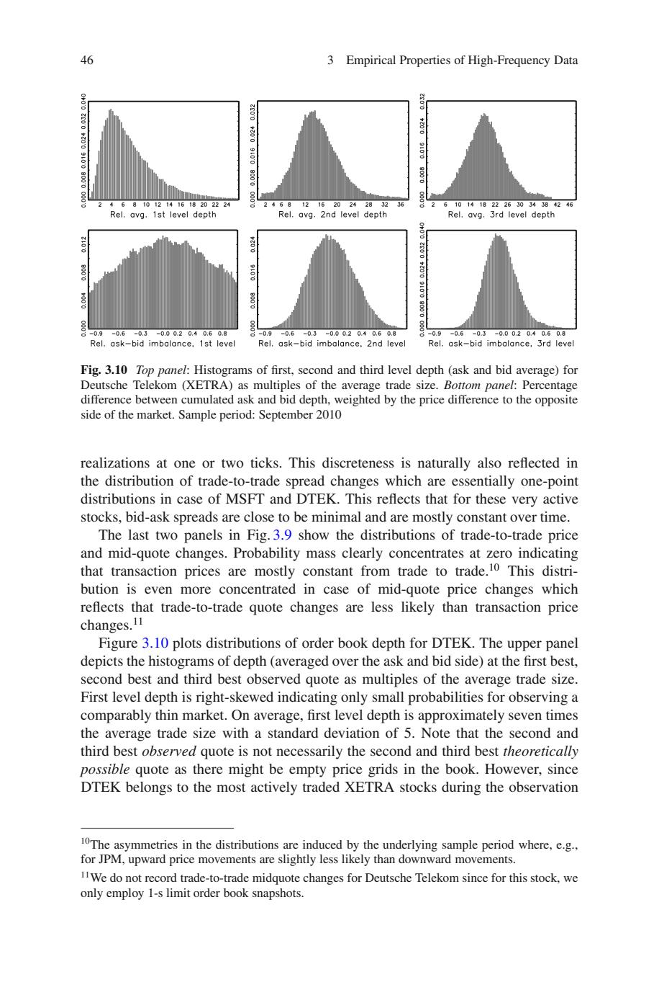

### PDF page 62 / printed page 47

**Detected figure/table caption(s) on this page:**
- relatively small. Therefore, the distributions shown in Fig. 3.10 are very similar to
- In the bottom panel of Fig. 3.10, we show the difference between the cumulated
- imbalances is clearly smaller. Figure 3.11 shows time series plots of trade sizes
- the discreteness of quotes shown in Fig. 3.9. Moreover, even spread realizations tend
- The notion of clustering in trade sizes and spreads is confirmed by Fig. 3.12

```text
3.4 Properties of Trading Characteristics                                            47


period, the probability to observe gaps in the order book close to the market is
relatively small. Therefore, the distributions shown in Fig. 3.10 are very similar to
depth distributions shown for fixed price grids around the best ask and bid quote.
We observe that these distributions are rather symmetric with averages of 15 and 19
for the second and third level, respectively. Hence, on average, the depth behind the
market is on average significantly higher than the depth at the market.
    In the bottom panel of Fig. 3.10, we show the difference between the cumulated
ask and bid depth, weighted by the spread to the opposite side of the market, relative
to the sum of cumulated ask and bid weighted depth. In particular, for k 2 f1; 2; 3g
we compute
                               Pk       a;j j           b;j      j
                                  j D1 vi .ai  bi /  vi .ai  bi /
                                                  1         1
                    i .k/ D Pk         a;j j           b;j       j
                                                                     ;
                                  j D1 vi .ai  bi / C vi .ai  bi /
                                                 1          1


         a;j       b;j
where vi and vi denote the ask and bid depth at the j th level, respectively and
  j       j
ai and bi are the corresponding ask and bid quotes, respectively. Hence, i .k/ D 0
indicates a completely balanced market whereas values of 1 (1) reflect that all
depth is cumulated on the ask (bid) side of the market. Accordingly, i .1/ just
equals the relative ask-bid depth difference. For this quantity, we observe a fat-tailed
distribution assigning significant probability mass to extreme values of completely
imbalanced order books. Conversely for k > 1, the distributions of i .k/ are clearly
less fat-tailed with shapes very similar to that of a normal distribution. Hence, if
we cumulate depth over several price levels, the probability for extreme market
imbalances is clearly smaller. Figure 3.11 shows time series plots of trade sizes
and bid-ask spreads. We observe that trade sizes themselves are clearly clustered
over time. Hence, large trade sizes tend to follow large trade sizes suggesting
positive autocorrelations. The time series plots of bid-ask spreads naturally reflect
the discreteness of quotes shown in Fig. 3.9. Moreover, even spread realizations tend
to be clustered over time as well. This is most evident for JPM spreads but is also
visible for the very discrete series of MSFT and DTEK.
    The notion of clustering in trade sizes and spreads is confirmed by Fig. 3.12
depicting trade-to-trade autocorrelations of the corresponding trading characteris-
tics. JPM trade sizes reveal a slowly decaying autocorrelation function similar to
that observed for trade durations. The fact that serial correlations in trade sizes are
clearly lower and less persistent for MSFT and DTEK, indicates that trade-to-trade
dynamics vary over the cross-section of stocks and are obviously driven by specific
underlying institutional structures. Nonetheless, it is remarkable that trade sizes are
significantly autocorrelated up to at least 100 lags. The second panel shows that
also bid-ask spreads are strongly clustered over time. Again, there is substantial
variation in the ACF shapes across the different stocks. While for JPM and DTEK,
bid-ask spread dynamics are very persistent and reveal long range dependence,
MSFT autocorrelations are lower and decay quite fast. Overall these results indicate
that bid-ask spreads – and as such important components of transaction costs – are
clearly predictable.
```

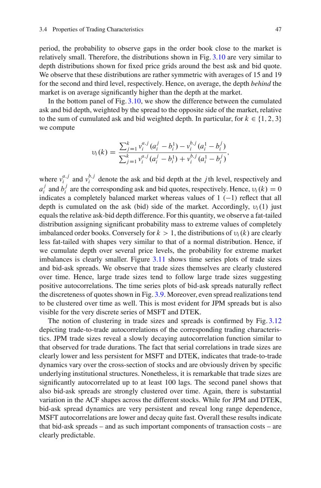

### PDF page 63 / printed page 48

**Detected figure/table caption(s) on this page:**
- Fig. 3.11 Time series of trade sizes (in 100 share lots) and bid-ask spreads for JP Morgan (NYSE),
- Figure 3.13 shows the evolution of trade prices and corresponding quotes over
- (as well as within the spread). As confirmed by Fig. 3.14, this bid-ask bouncing
- also Hasbrouck (2007). The second panel of Fig. 3.14 shows the ACFs of trade-to-

```text
48                                              3 Empirical Properties of High-Frequency Data


Fig. 3.11 Time series of trade sizes (in 100 share lots) and bid-ask spreads for JP Morgan (NYSE),
Microsoft (NASDAQ) and Deutsche Telekom (XETRA). Sample period: First 2,000 observations
in June 2009 for JP Morgan and Microsoft and in September 2010 for Deutsche Telekom


    The third panel depicts the ACFs of absolute trade-to-trade price changes. The
latter can be seen as proxies for high-frequency (or trade based) volatility (for
more details, see Chap. 8). It is shown that trade volatility is strongly serially
dependent and persistent. The shape of the ACFs are quite similar to those of
trade durations and trade sizes. Note that the clustering of absolute trade-to-
trade transaction price changes is partly driven by a bouncing of trade prices
between ask and bid quotes (see also the discussion below). Indeed, trade-to-trade
movements of absolute midquote changes (bottom panel) reveal slightly weaker (but
still persistent) dependencies. Using the mid-quote as a proxy for the underlying
(unobservable) ”efficient” price of the asset, these plots reveal substantial volatility
clustering even on the transaction level.
    Figure 3.13 shows the evolution of trade prices and corresponding quotes over
an arbitrary 1-min interval for JPM and MSFT trading. The pictures illustrate the
irregular spacing of trades, the discrete movements of prices and quotes as well as
the up-ward and down-ward bouncing of trade prices between ask and bid quotes
(as well as within the spread). As confirmed by Fig. 3.14, this bid-ask bouncing
of trade prices causes a highly significant and negative first order autocorrelation
in trade-to-trade (signed) price changes. This feature is well-known in the market
microstructure literature and is formally discussed by Roll (1984). Roll illustrates
that in the most simple case where (unobservable) ”efficient prices” follow a random
walk and transactions can occur only on ask and bid quotes (with the spread being
constant and symmetric around the efficient price), resulting trade price changes
follow an MA(1) process with negative coefficient. For a deeper discussion, see
also Hasbrouck (2007). The second panel of Fig. 3.14 shows the ACFs of trade-to-
trade midquote changes. Though there is still some evidence for an MA(1) process,
```

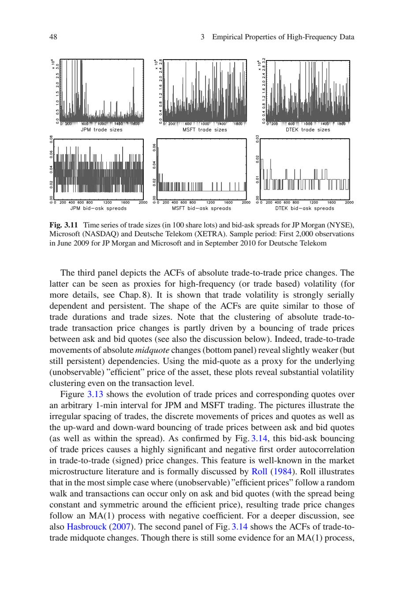

### PDF page 64 / printed page 49

**Detected figure/table caption(s) on this page:**
- Fig. 3.12 Autocorrelation functions of trade sizes, bid-ask spreads, absolute trade-to-trade price
- Figure 3.15 depicts the intraday seasonality patterns of trading characteristics.

```text
3.4 Properties of Trading Characteristics                                                      49


Fig. 3.12 Autocorrelation functions of trade sizes, bid-ask spreads, absolute trade-to-trade price
changes and absolute trade-to-trade midquote changes for JP Morgan (NYSE), Microsoft (NAS-
DAQ) and Deutsche Telekom (XETRA). Sample period: June 2009 for JP Morgan and Microsoft
and September 2010 for Deutsche Telekom


the dependence is clearly weaker as for trade price changes. The remaining negative
autocorrelation provides evidence for reversal effects in quote changes, i.e., changes
in quotes tend to be reversed thereafter. This effect is confirmed by the ACFs of ask
quote changes shown in the bottom panel.12
   Figure 3.15 depicts the intraday seasonality patterns of trading characteristics.
We observe distinct seasonality shapes for trading volumes of JPM and MSFT
with high trade sizes after opening and before market closure. This pattern is well


12
     The ACFs for bid quote changes look very similar and are not shown here.
```

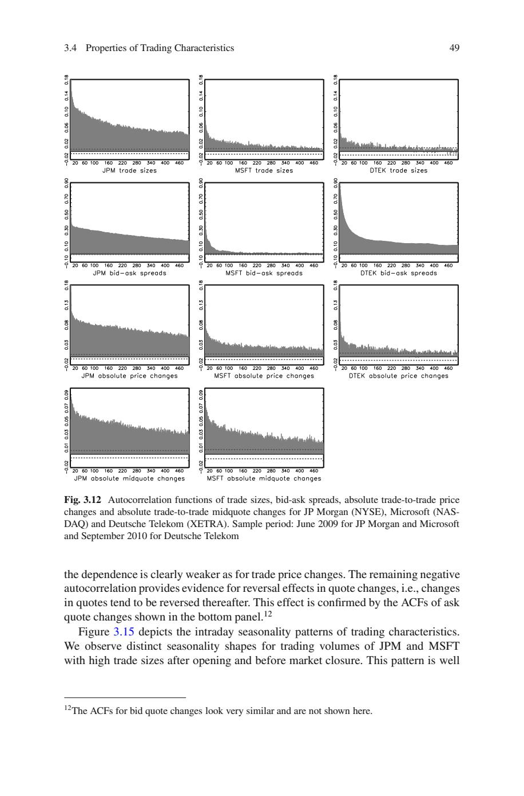

### PDF page 65 / printed page 50

**Detected figure/table caption(s) on this page:**
- Fig. 3.13 Time series of transaction prices and ask and bid quotes over a one-minute interval at
- Fig. 3.14 Autocorrelation functions of trade-to-trade price changes, trade-to-trade midquote
- in accordance with the seasonalities found for financial durations in Fig. 3.7 and

```text
50                                              3 Empirical Properties of High-Frequency Data


Fig. 3.13 Time series of transaction prices and ask and bid quotes over a one-minute interval at
June 1, 2009 for JP Morgan (NYSE) and Microsoft (NASDAQ). The symbols reflect the occurrence
of a trade with corresponding transaction price. The solid and dotted lines denote the prevailing
ask and bid quotes, respectively


Fig. 3.14 Autocorrelation functions of trade-to-trade price changes, trade-to-trade midquote
changes and trade-to-trade ask changes for JP Morgan (NYSE), Microsoft (NASDAQ) and
Deutsche Telekom (XETRA). Sample period: June 2009 for JP Morgan and Microsoft and
September 2010 for Deutsche Telekom


in accordance with the seasonalities found for financial durations in Fig. 3.7 and
indicates that high trading activities at the beginning and before the end of a trading
session are not only reflected in the speed of trading but also in trade sizes. However,
```

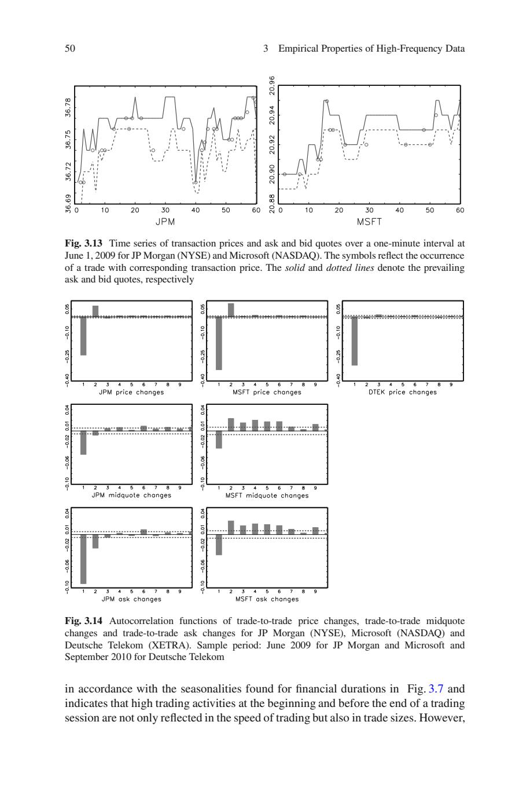

### PDF page 66 / printed page 51

**Detected figure/table caption(s) on this page:**
- Fig. 3.15 Cubic spline functions (30 min nodes) for trade sizes (in 100 share lots), bid-ask spreads,

```text
3.4 Properties of Trading Characteristics                                                         51


Fig. 3.15 Cubic spline functions (30 min nodes) for trade sizes (in 100 share lots), bid-ask spreads,
absolute trade-to-trade price changes, absolute trade-to-trade midquote changes and first level
depth (in 100 share lots) for JP Morgan (NYSE), Microsoft (NASDAQ) and Deutsche Telekom
(XETRA). Sample period: June 2009 for JP Morgan and Microsoft and September 2010 for
Deutsche Telekom


while this pattern is quite pronounced for JPM and MSFT, for DTEK trading no
clear patterns are observable. Hence, intraday periodicities differ across markets
and depend on institutional settings and time zones.
   For bid-ask spreads and absolute midquote changes, the intraday seasonality
pattern is quite pronounced with high spreads and high volatility after opening
which then remain quite constant during the trading day. Finally, also market depth
reveals clear intraday periodicities. Accordingly, depth is lowest after opening,
successively increases during the morning and remains on a widely constant level
during the day. Hence, it takes some time after market opening until sufficient order
book depth is built up.
```

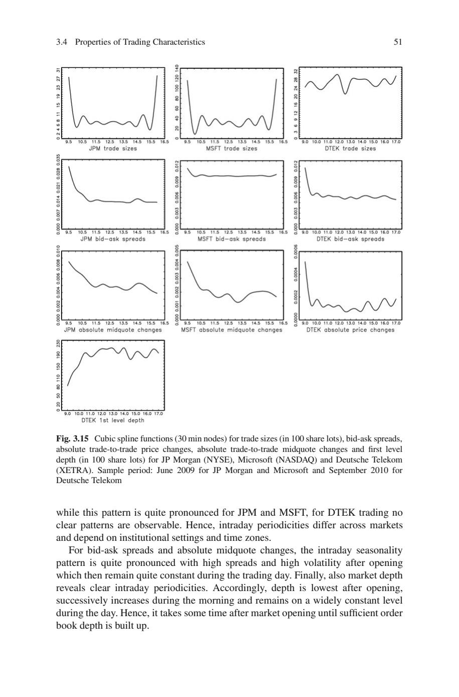

### PDF page 67 / printed page 52

**Detected figure/table caption(s) on this page:**
- Figure 3.16 depicts the distributions of trading characteristics aggregated over
- of Fig. 3.16 show the distributions of 2-min quote changes (here representatively
- Figure 3.17 gives the histograms of 2-min percentage changes of the first, second

```text
52                                         3 Empirical Properties of High-Frequency Data


3.5 Properties of Time Aggregated Data

As discussed in Sect. 3.3, an alternative way to aggregate high-frequency data
is to sample in calendar time. Evaluating market activity over equi-distant time
intervals has the advantage that the data are by construction synchronized which
eases multi-variate modelling. Moreover, it is advantageous whenever forecasts of
market activity over fixed time intervals are required.
    Figure 3.16 depicts the distributions of trading characteristics aggregated over
2 min. The first panel shows the number of trades. Though the underlying variable
is a count variable, its variation is sufficiently large to justify its treatment as a
continuous (positive-valued) random variable. The distributions indicate the high
liquidity of the underlying assets with on average approximately 41, 26 and 13
trades per 2 min for JPM, MSFT and DTEK, respectively. The distributions are
right-skewed and fat-tailed. For instance, for JPM, the occurrence of more than 100
transactions in 2 min is not very unlikely. The distributions of cumulative trading
volumes are even more right-skewed which is particularly evident for MSFT and
DTEK. Also here, significant probability mass in the right tail reflects the occurrence
of periods of very high trading intensity.
    The third panel shows the distributions of the difference between cumulative
buy and sell volume relative to the total cumulative volume. This variable reflects
imbalances in liquidity demand. The spikes at 1 and 1 are caused by trading
periods where the entire cumulative trading volume is on one side of the market. Due
to the concentration of probability mass at single points, the resulting distribution is
obviously not purely continuous but is rather a mixture of continuous and discrete
components. The right picture in the third panel shows the distribution of changes
in the DTEK relative ask-bid (first level) depth imbalance (relative to the total
prevailing depth) evaluated at 2 min intervals. As the relative ask-bid imbalance is
by construction bounded between 1 and 1, changes thereof are bounded between
2 and 2. Accordingly, values of 2 or 2 indicate that over a 2-min interval one-
sided depth in the book has been entirely shifted to the other side of the market. In
our dataset, such a situation, however, never occurred. Nevertheless, values of higher
than j1:5j indicate that quite substantial shifts of order book depth from one side of
the market to the other side within 2 min are possible. Finally, the two bottom panels
of Fig. 3.16 show the distributions of 2-min quote changes (here representatively
only for the ask side) and transaction price changes. The discreteness of quote and
price changes is still clearly visible even over 2-min periods.
    Figure 3.17 gives the histograms of 2-min percentage changes of the first, second
and third level depth (averaged over ask and bid sides). It turns out that the overall
order book depth does not change very dramatically over 2 min with zero values
occurring with probability around 50%. Conversely, as illustrated above, the relative
allocation over the two sides of the market can vary quite significantly.
    Figures 3.18 and 3.19 display the corresponding distributions over 30 s and 10 s
aggregates, respectively. The ranges of realizations for trade counts naturally shrink.
Likewise the distributions become even more right skewed and traders’ preferences
```

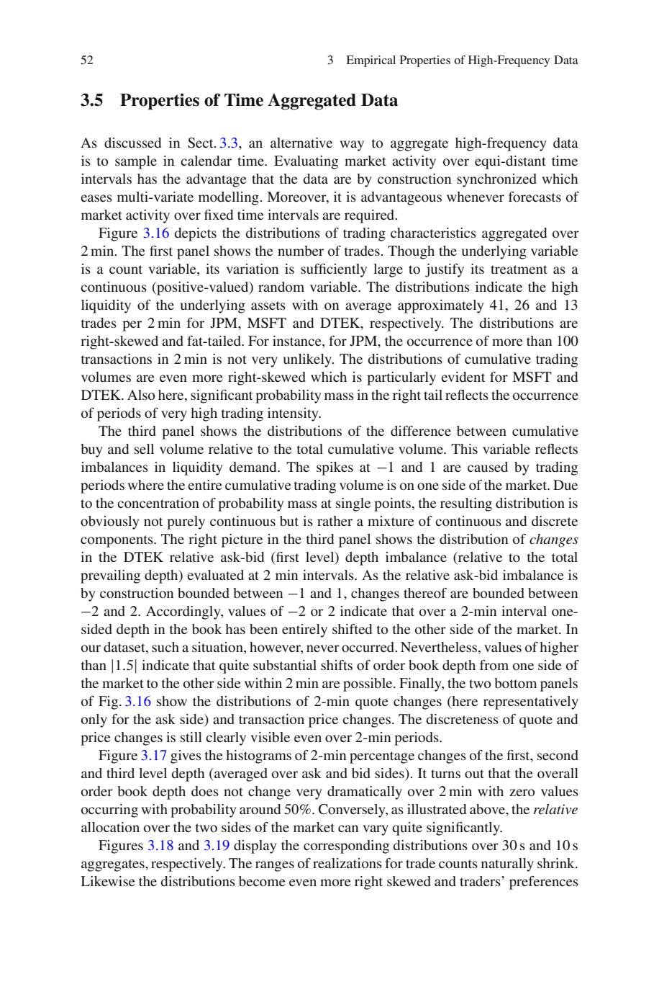

### PDF page 68 / printed page 53

**Detected figure/table caption(s) on this page:**
- Fig. 3.16 Histograms for 2-min number of trades, cumulated trading volume (in 100 share lots),

```text
3.5 Properties of Time Aggregated Data                                                        53


Fig. 3.16 Histograms for 2-min number of trades, cumulated trading volume (in 100 share lots),
cumulated net buy volume (in %), relative net ask depth changes, best ask changes and transaction
price changes for JP Morgan (NYSE), Microsoft (NASDAQ) and Deutsche Telekom (XETRA).
Sample period: June 2009 for JP Morgan and Microsoft and September 2010 for Deutsche Telekom


for round lot sizes (see Sect. 3.4) become visible again if the aggregation level
declines. This is most evident for 10-s DTEK volume revealing a concentration
of probability mass at round lot sizes. Moreover, also the distribution of cumulative
```

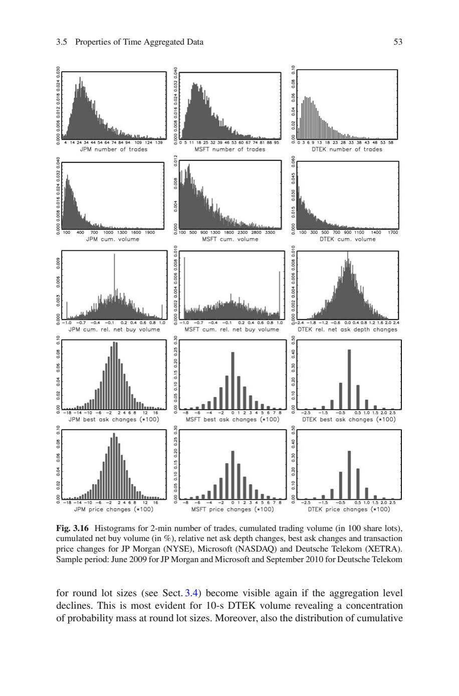

### PDF page 69 / printed page 54

**Detected figure/table caption(s) on this page:**
- Fig. 3.17 Top panel: Histograms of 2-min relative changes of first, second and third level depth
- the distributions observed on transaction level (see Fig. 3.9).
- Figure 3.20 plots the ACFs of the corresponding 2-min aggregates. Trade counts
- for financial durations (see Fig. 3.6), the persistence is lower with ACFs decaying
- The top three panels of Fig. 3.21 give the ACFs of quote log returns, trade
- returns. The bid-ask bounce effect as shown in Fig. 3.14 on the transaction level
- The bottom panel in Fig. 3.21 reports the ACFs of squared midquote log returns

```text
54                                             3 Empirical Properties of High-Frequency Data


Fig. 3.17 Top panel: Histograms of 2-min relative changes of first, second and third level depth
(ask and bid average) for Deutsche Telekom (XETRA). Sample period: September 2010


relative net buy volume becomes much more discrete since the probability for the
occurrence of one-sided volume rises with shrinking time intervals. Correspond-
ingly, the distributions reveal a clustering at the values 1, 0, and 1. Likewise also
the distribution of quote and price changes become less dispersed and converge to
the distributions observed on transaction level (see Fig. 3.9).
   Figure 3.20 plots the ACFs of the corresponding 2-min aggregates. Trade counts
and cumulated volumes reveal a strong serial dependence indicating that liquidity
demand over short intervals is highly predictable. In contrast to the ACFs reported
for financial durations (see Fig. 3.6), the persistence is lower with ACFs decaying
relatively fast. The third panel reveals that also signed (relative) cumulative trading
volume is predictable with first order autocorrelations between 0:1 and 0:15. Like-
wise, also bid-ask spreads are still autocorrelated over 2-min intervals though we see
clear differences across the different assets. The bottom panel plots the ACFs of first
level depth (averaged over the ask and bid side) and the relative net ask depth change
for DTEK over 2-min intervals. A first order autocorrelation of approximately 0.4
shows that depth is clearly predictable. Relative changes in the excess ask depth
show a strong reversal pattern with a highly significant first order autocorrelation of
approximately 0:46. This result indicates that imbalances in the order book are not
persistent and are very likely to be re-moved within the next 2 min.
   The top three panels of Fig. 3.21 give the ACFs of quote log returns, trade
price log returns and midquote log returns computed over 2 min. With very few
exceptions, there is no significant evidence for predictability in high-frequency
returns. The bid-ask bounce effect as shown in Fig. 3.14 on the transaction level
is not visible anymore on a 2-min frequency which is obviously induced by the
high trading frequency of the underlying assets. In fact, bid-ask bounces can still be
significant over longer time intervals if the underlying trading frequency is lower.
The bottom panel in Fig. 3.21 reports the ACFs of squared midquote log returns
showing that 2-min price volatility is clearly clustered.
   Figures 3.22–3.25 present the corresponding autocorrelation functions for 30
and 10 s. The plots illustrate how the dynamics of the individual variables change
when the sampling frequency increases and ultimately converge to transaction
level. It turns out that the persistence in trade counts and cumulative volumes
clearly increases and the processes tend to reflect long range dependence. Similar
```

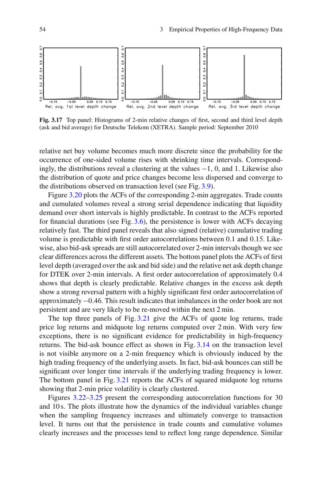

### PDF page 70 / printed page 55

**Detected figure/table caption(s) on this page:**
- Fig. 3.18 Histograms for 30-s number of trades, cumulated trading volume, cumulated net buy

```text
3.5 Properties of Time Aggregated Data                                                    55


Fig. 3.18 Histograms for 30-s number of trades, cumulated trading volume, cumulated net buy
volume, relative net ask depth changes, best ask changes and transaction price changes for JP
Morgan (NYSE), Microsoft (NASDAQ) and Deutsche Telekom (XETRA). Sample period: June
2009 for JP Morgan and Microsoft and September 2010 for Deutsche Telekom


effects are observed for spread and depth dynamics. It is also illustrated how
return dynamics of quotes and prices become more pronounced if we approach
transaction level. Besides slightly significant (though very small) autocorrelations,
the bid-ask bounce effect becomes most dominant. The intraday seasonality of
```

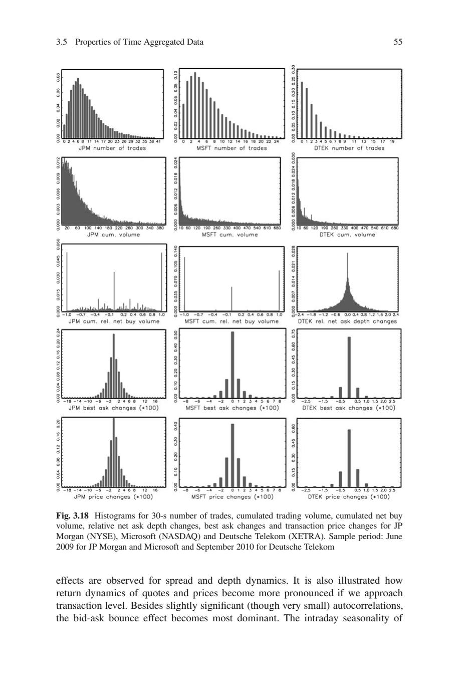

### PDF page 71 / printed page 56

**Detected figure/table caption(s) on this page:**
- Fig. 3.19 Histograms for 10-s number of trades, cumulated trading volume, cumulated net buy
- 2-min aggregated data shown in Fig. 3.26 confirm the findings above: All trading

```text
56                                            3 Empirical Properties of High-Frequency Data


Fig. 3.19 Histograms for 10-s number of trades, cumulated trading volume, cumulated net buy
volume, relative net ask depth changes, best ask changes and transaction price changes for JP
Morgan (NYSE), Microsoft (NASDAQ) and Deutsche Telekom (XETRA). Sample period: June
2009 for JP Morgan and Microsoft and September 2010 for Deutsche Telekom


2-min aggregated data shown in Fig. 3.26 confirm the findings above: All trading
activity variables reveal a distinct U-shaped pattern with activities being highest
after opening and before closure.
```

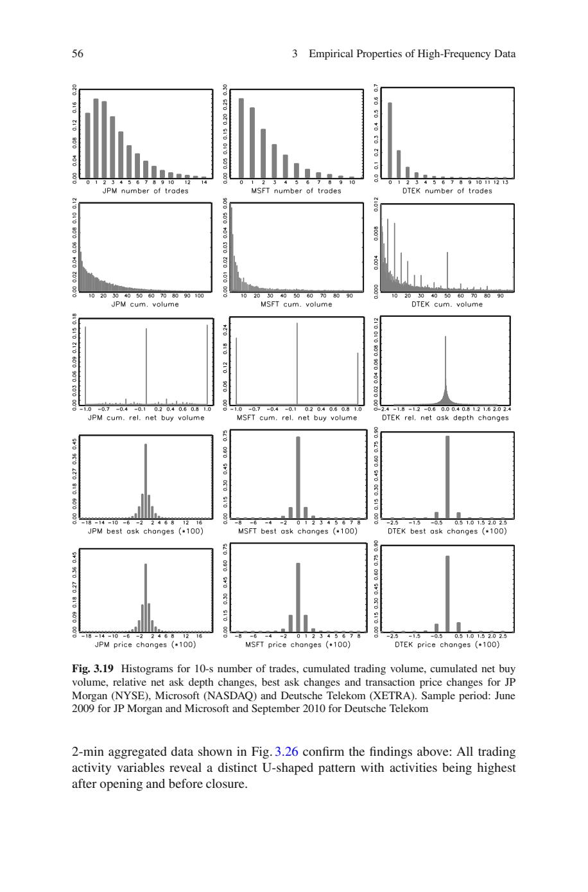

### PDF page 72 / printed page 57

**Detected figure/table caption(s) on this page:**
- Fig. 3.20 Autocorrelation functions for 2-min number of trades, cumulated trading volume,

```text
3.5 Properties of Time Aggregated Data                                                      57


Fig. 3.20 Autocorrelation functions for 2-min number of trades, cumulated trading volume,
cumulated net buy volume, bid-ask spreads, first level depth and relative net ask depth changes
for JP Morgan (NYSE), Microsoft (NASDAQ) and Deutsche Telekom (XETRA). Sample period:
June 2009 for JP Morgan and Microsoft and September 2010 for Deutsche Telekom


   Figures 3.27–3.29 plot the cross-autocorrelations between the different trading
variables for 2 min, 30 and 10 s aggregates. For JPM and MSFT, we observe strong
temporal cross-dependencies between trade counts, cumulative trading volumes
```

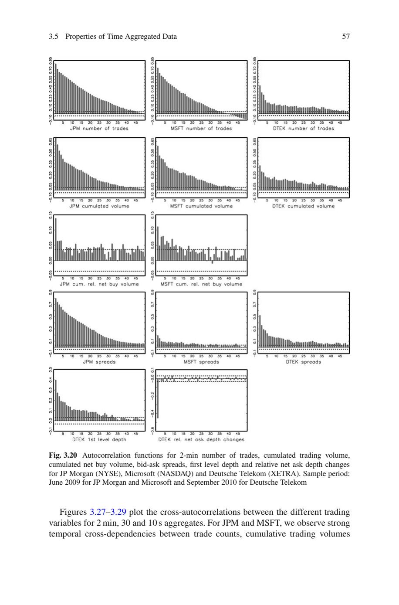

### PDF page 73 / printed page 58

**Detected figure/table caption(s) on this page:**
- Fig. 3.21 Autocorrelation functions for 2-min ask quote log returns, price log returns, midquote

```text
58                                             3 Empirical Properties of High-Frequency Data


Fig. 3.21 Autocorrelation functions for 2-min ask quote log returns, price log returns, midquote
log returns and squared midquote log returns for JP Morgan (NYSE), Microsoft (NASDAQ)
and Deutsche Telekom (XETRA). Sample period: June 2009 for JP Morgan and Microsoft and
September 2010 for Deutsche Telekom


and absolute returns, where causalities work in all directions. In contrast, DTEK
characteristics reveal only very little cross-dependencies. These findings suggest
that causalities between different trading variables are obviously quite dependent
on the underlying stock and the exchange. Overall, the results show that many
trading variables are predictable not only based on their own history but also
based on other variables. Besides variables reflecting the liquidity demand (such
as trading intensities and volumes) and volatility this is also evident for liquidity
supply variables such as bid-ask spreads and market depth.
```

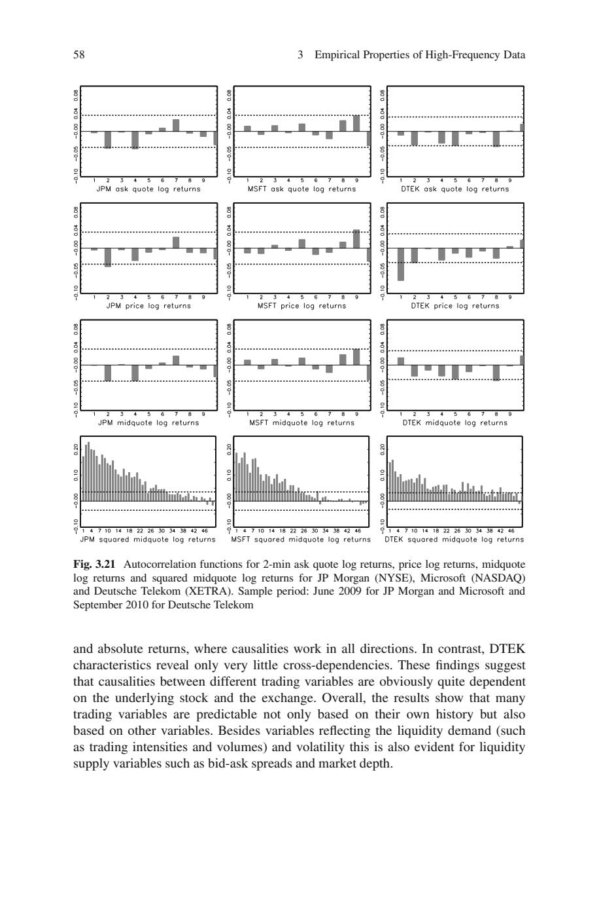

### PDF page 74 / printed page 59

**Detected figure/table caption(s) on this page:**
- Fig. 3.22 Autocorrelation functions for 30-s number of trades, cumulated trading volume,

```text
3.5 Properties of Time Aggregated Data                                                      59


Fig. 3.22 Autocorrelation functions for 30-s number of trades, cumulated trading volume,
cumulated net buy volume, bid-ask spreads, first level depth and relative net ask depth changes
for JP Morgan (NYSE), Microsoft (NASDAQ) and Deutsche Telekom (XETRA). Sample period:
June 2009 for JP Morgan and Microsoft and September 2010 for Deutsche Telekom
```

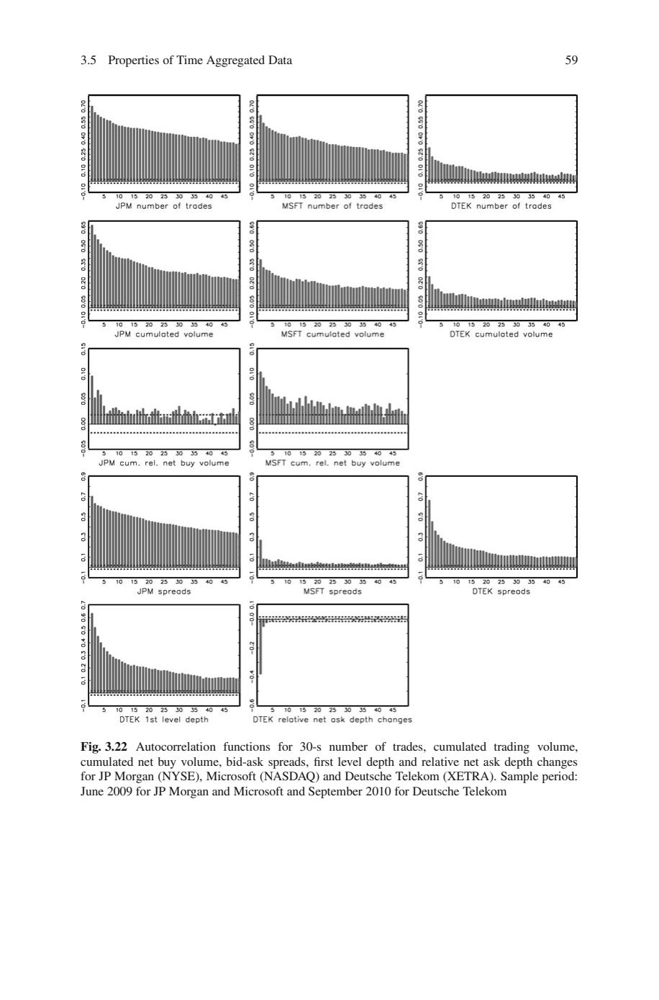

### PDF page 75 / printed page 60

**Detected figure/table caption(s) on this page:**
- Fig. 3.23 Autocorrelation functions for 30-s ask quote log returns, price log returns, midquote

```text
60                                             3 Empirical Properties of High-Frequency Data


Fig. 3.23 Autocorrelation functions for 30-s ask quote log returns, price log returns, midquote
log returns and squared midquote log returns for JP Morgan (NYSE), Microsoft (NASDAQ)
and Deutsche Telekom (XETRA). Sample period: June 2009 for JP Morgan and Microsoft and
September 2010 for Deutsche Telekom


3.6 Summary of Major Empirical Findings

Summarizing the major empirical features of financial high-frequency data results
in the following main findings:
1. Virtually all high-frequency trading characteristics (apart from returns them-
   selves) are strongly serially correlated. This holds for characteristics observed on
   transaction level, data which are aggregated over time (resulting in equi-distant
   observations) and aggregated based on trading events (resulting in irregularly
   spaced financial durations). To capture this feature, appropriate dynamic models
   are needed which are defined either in calendar time or in business time.
```

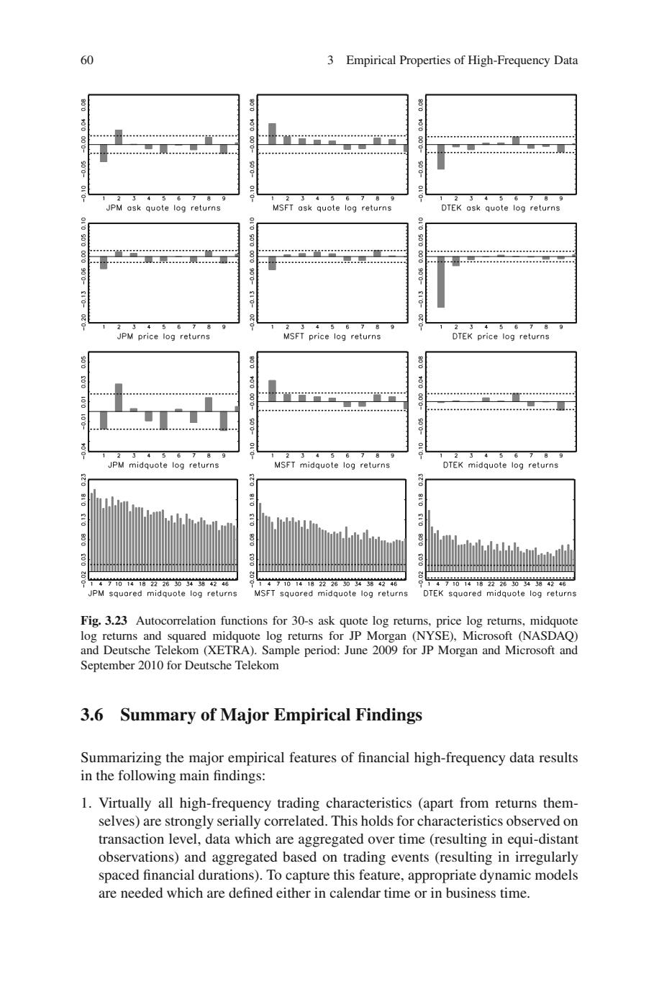

### PDF page 76 / printed page 61

**Detected figure/table caption(s) on this page:**
- Fig. 3.24 Autocorrelation functions for 10-s number of trades, cumulated trading volume,

```text
3.6 Summary of Major Empirical Findings                                                     61


Fig. 3.24 Autocorrelation functions for 10-s number of trades, cumulated trading volume,
cumulated net buy volume, bid-ask spreads, first level depth and relative net ask depth changes
for JP Morgan (NYSE), Microsoft (NASDAQ) and Deutsche Telekom (XETRA). Sample period:
June 2009 for JP Morgan and Microsoft and September 2010 for Deutsche Telekom


2. Many high-frequency characteristics are very persistent over time and reveal
   long range dependence. This calls for models allowing not only for ARMA-
   type dynamics but also long memory behavior. This is particularly evident for
   the dynamics of trading intensities, volumes, spreads and market depth.
```

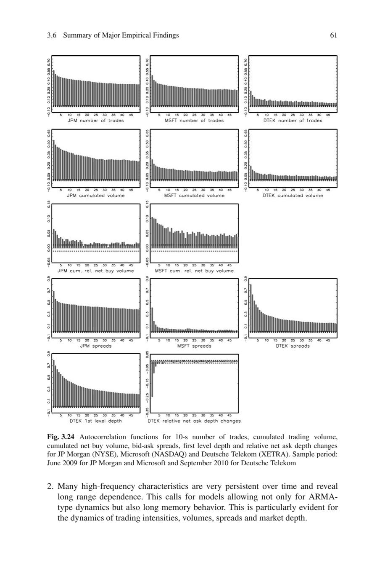

### PDF page 77 / printed page 62

**Detected figure/table caption(s) on this page:**
- Fig. 3.25 Autocorrelation functions for 10-s ask quote log returns, price log returns, midquote

```text
62                                             3 Empirical Properties of High-Frequency Data


Fig. 3.25 Autocorrelation functions for 10-s ask quote log returns, price log returns, midquote
log returns and squared midquote log returns for JP Morgan (NYSE), Microsoft (NASDAQ)
and Deutsche Telekom (XETRA). Sample period: June 2009 for JP Morgan and Microsoft and
September 2010 for Deutsche Telekom


3. Most high-frequency variables take only positive values calling for specific
   models for positive-valued variables. This is particularly true for all volatility-
   related variables as well as characteristics capturing different dimensions of
   liquidity.
4. Nearly all high-frequency variables are subject to strong intraday periodicities.
   A common feature is the typical U-shaped intraday seasonality pattern associated
   with high market activities after opening and before closure and less activity over
   lunch time. Additional periodicities might occur due to the opening of markets
   in other time zones.
5. Some high-frequency variables are quite discrete. This is mostly true for trade-
   to-trade price, quote or spread changes but might also occur if trading is only
```

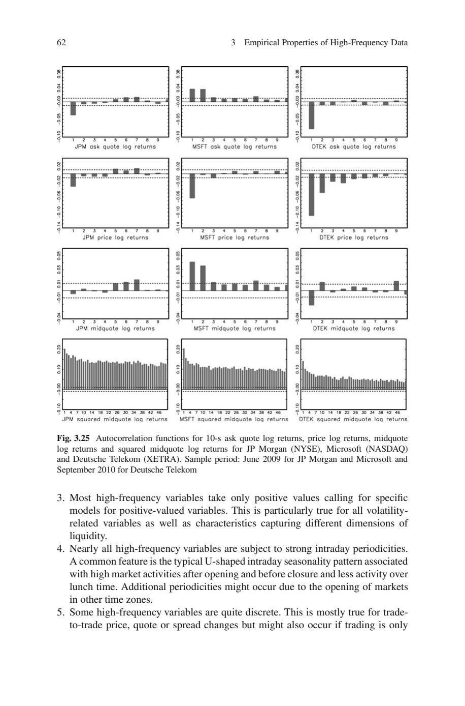

### PDF page 78 / printed page 63

**Detected figure/table caption(s) on this page:**
- Fig. 3.26 Cubic spline functions (30 min nodes) for 2-min number of trades, cumulated trading

```text
3.6 Summary of Major Empirical Findings                                                     63


Fig. 3.26 Cubic spline functions (30 min nodes) for 2-min number of trades, cumulated trading
volume (in 100 share lots), bid-ask spreads, squared log returns and absolute cumulated net buy
volume (in 100 share lots) for JP Morgan (NYSE), Microsoft (NASDAQ) and Deutsche Telekom
(XETRA). Sample period: June 2009 for JP Morgan and Microsoft and September 2010 for
Deutsche Telekom
```

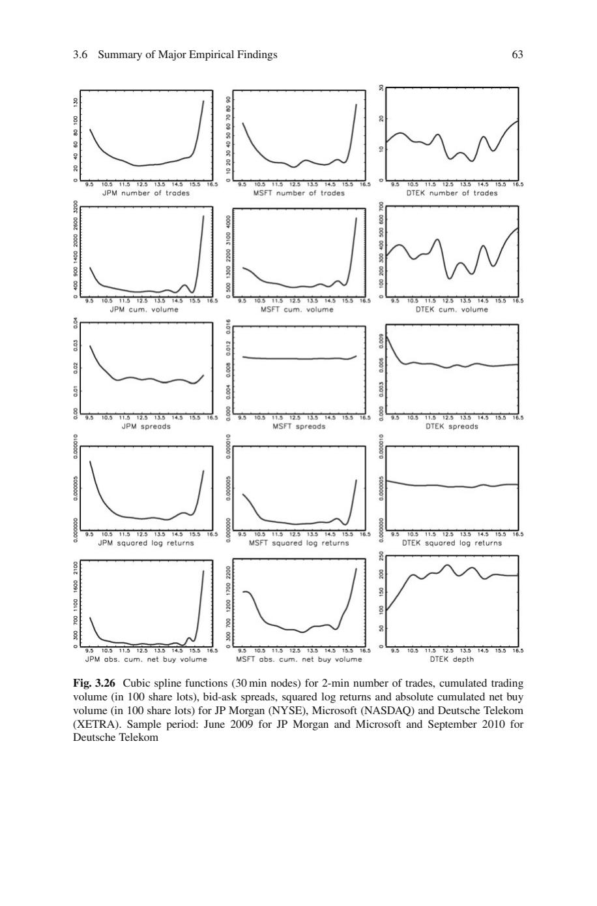

### PDF page 79 / printed page 64

**Detected figure/table caption(s) on this page:**
- Fig. 3.27 Cross-autocorrelation functions for 2-min number of trades vs. cumulated trading

```text
64                                              3 Empirical Properties of High-Frequency Data


Fig. 3.27 Cross-autocorrelation functions for 2-min number of trades vs. cumulated trading
volume, squared log returns vs. number of trades, squared log returns vs. cumulated trading
volume, squared log returns vs. bid-ask spreads, number of trades vs. bid-ask spreads, returns vs.
ask-bid depth imbalance, number of trades vs. depth, and cumulated trading volume vs. depth for
JP Morgan (NYSE), Microsoft (NASDAQ) and Deutsche Telekom (XETRA). Sample period: June
2009 for JP Morgan and Microsoft and September 2010 for Deutsche Telekom
```

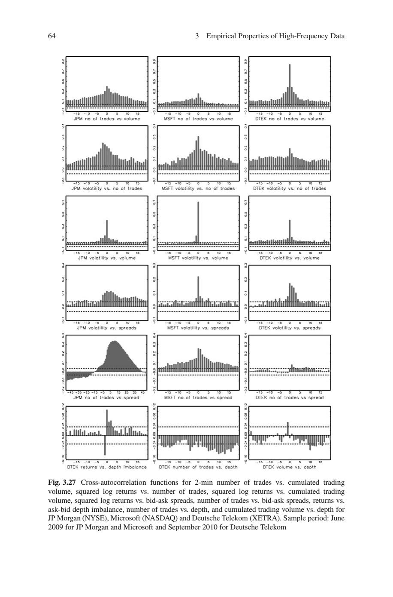

### PDF page 80 / printed page 65

**Detected figure/table caption(s) on this page:**
- Fig. 3.28 Cross-autocorrelation functions for 30-s number of trades vs. cumulated trading volume,

```text
3.6 Summary of Major Empirical Findings                                                         65


Fig. 3.28 Cross-autocorrelation functions for 30-s number of trades vs. cumulated trading volume,
squared log returns vs. number of trades, squared log returns vs. cumulated trading volume, squared
log returns vs. bid-ask spreads, number of trades vs. bid-ask spreads, returns vs. ask-bid depth
imbalance, number of trades vs. depth, and cumulated trading volume vs. depth for JP Morgan
(NYSE), Microsoft (NASDAQ) and Deutsche Telekom (XETRA). Sample period: June 2009 for
JP Morgan and Microsoft and September 2010 for Deutsche Telekom
```

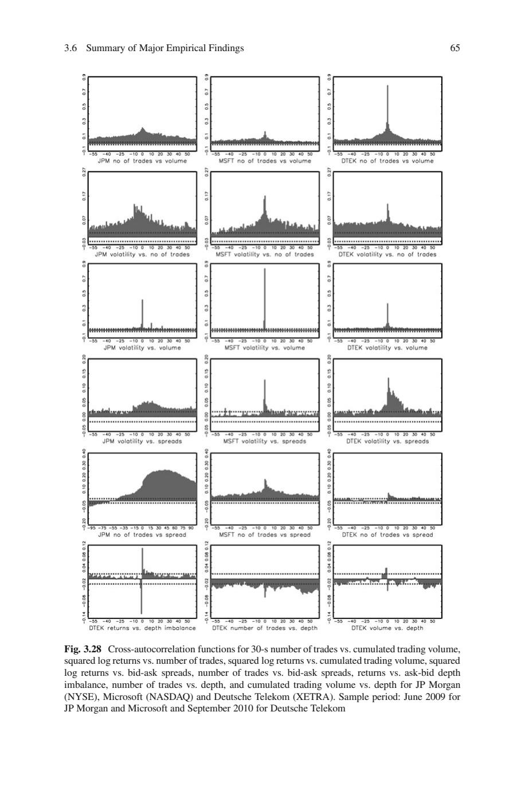

### PDF page 81 / printed page 66

**Detected figure/table caption(s) on this page:**
- Fig. 3.29 Cross-autocorrelation functions for 10-s number of trades vs. cumulated trading volume,

```text
66                                               3 Empirical Properties of High-Frequency Data


Fig. 3.29 Cross-autocorrelation functions for 10-s number of trades vs. cumulated trading volume,
squared log returns vs. number of trades, squared log returns vs. cumulated trading volume, squared
log returns vs. bid-ask spreads, number of trades vs. bid-ask spreads, returns vs. ask-bid depth
imbalance, number of trades vs. depth, and cumulated trading volume vs. depth for JP Morgan
(NYSE), Microsoft (NASDAQ) and Deutsche Telekom (XETRA). Sample period: June 2009 for
JP Morgan and Microsoft and September 2010 for Deutsche Telekom
```

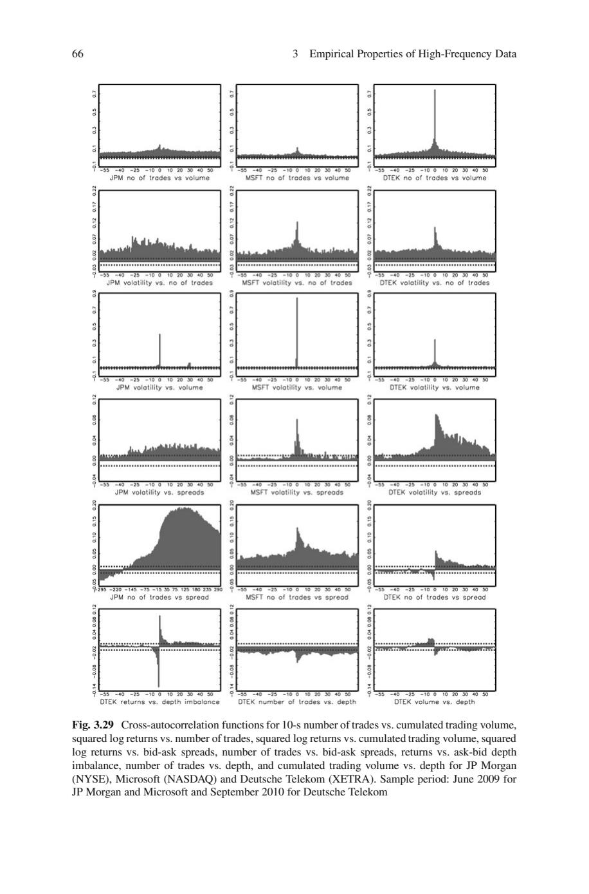

### PDF page 82 / printed page 67

```text
References                                                                                    67


   possible in round lot sizes. This calls for dynamic approaches for discrete-valued
   random variables.
6. Some distributions of high-frequency variables contain mixtures of discrete
   and continuous components. A typical example is the high proportion of zero
   outcomes in cumulative trading volumes measured in calendar time. Moreover,
   mixtures of discrete and continuous components are also observed in distribu-
   tions of trade sizes reflecting traders’ preference for round numbers.
7. Trading processes are inherently high-dimensional calling for multivariate
   dynamic models either defined in discrete calendar time or transaction time
   in case of time-synchronized data or defined in continuous time if variables
   occur asynchronously over time.
   Econometric frameworks and models to capture these specific properties are
discussed in the following chapters.


References

Andersen T, Dobrev D, Schaumburg E (2010) Jump-robust volatility estimation using nearest
   neighbor truncation Federal Reserve Bank of New York Staff Report, No. 465
Bessembinder H, Panayides M, Venkataraman K (2009) Hidden liquidity: an analysis of order
   exposure strategies in electronic stock markets. J Finan Econ 94:361–383
Barndorff-Nielsen O, Hansen P, Lunde A, Shephard N (2008b) Realised kernels in practice: trades
   and quotes. Econom J 4:1–32
Brownlees C, Gallo G (2006) Financial econometric analysis of ultra-high frequency: data handling
   concerns. Comput Stat Data Anal 51:2232–2245
Finucane TJ (2000) A direct test of methods for inferring trade direction from intra-day data.
   J Financ QuantAnal 35:553–676
Frey S, Sandas P (2009) The impact of iceberg orders in limit order books. Working Paper 09-06,
   Centre for Financial Research, Cologne
Grammig J, Wellner M (2002) Modeling the interdependence of volatility and inter-transaction
   duration process. J Econom 106:369–400
Harris L (2003) Trading & exchanges – market microstructure for practitioners. Oxford University
   Press, Oxford
Hasbrouck J (2007) Empirical market microstructure. Oxford University Press, Oxford
Hautsch N, Huang R (2009) The market impact of a limit order. Discussion Paper 2009/23,
   Collaborative Research Center 649 ”Economic Risk”, Humboldt-Universität zu Berlin
Hautsch N, Huang R (2011) On the dark side of the market: identifying and analyzing hidden order
   placements. Working Paper, Humboldt-Universität zu Berlin
Hautsch N, Kyj L, Oomen R (2011) A blocking and regularization approach to high-dimensional
   realized covariance estimation. J Appl Econom, in press
Hautsch N, Podolskij M (2010) Pre-averaging based estimation of quadratic variation in the
   presence of noise and jumps: theory, implementation, and empirical evidence. Discussion Paper
   2010/38, Collaborative Research Center 649 ”Economic Risk”, Humboldt-Universität zu Berlin
Henker T, Wang J-X (2006) On the importance of timing specifications in market microstructure
   research. J Finan Markets 9:162–179
Hansen PR, Lunde A (2006) Realized variance and market microstructure noise. J Bus Econ Stat
   24(2):127–161
Lee CMC, Ready MJ (1991) Inferring trade direction from intraday data. J Finance 46:733–746
```

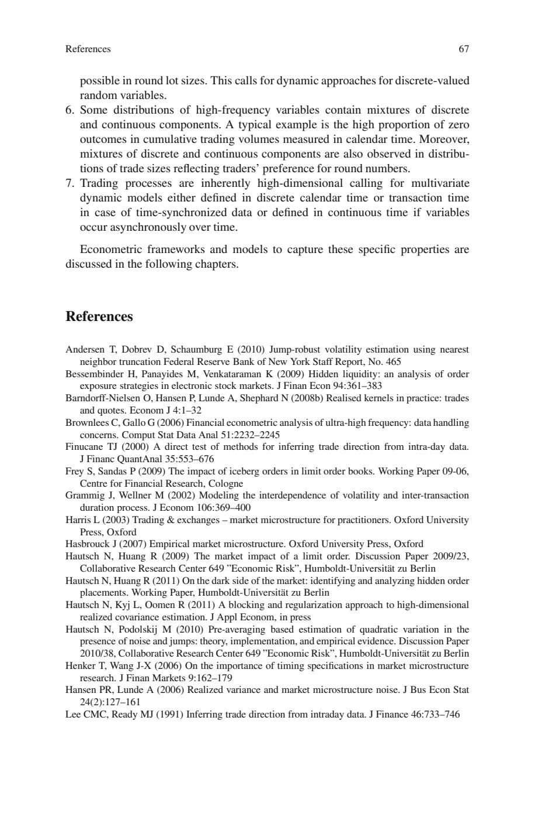

### PDF page 83 / printed page 68

```text
68                                             3 Empirical Properties of High-Frequency Data


Roll R (1984) A simple implicit measure of the effective bid-ask spread in an efficient market.
   J Finance 39:1127–1139
Veredas D, Rodriguez-Poo J, Espasa A (2008) Semiparametric estimation for financial durations.
   In: Bauwens WPL, Veredas D (eds) High frequency financial econometrics. Physica-Verlag,
   Heidelberg, pp 225–251
```


