# 第7章: ベクトル乗法誤差モデル（Vector Multiplicative Error Models）

- 元PDFページ: 192-209
- 書籍上のページ: 177-194
- 原文抽出テキスト: [`raw_text/ch07_vector_multiplicative_error_models.txt`](../raw_text/ch07_vector_multiplicative_error_models.txt)

> 注意: これは日本語学習版です。章・節の日本語要約、重要概念、読み方を追加しています。本文の完全逐語訳ではありません。数式・図表・表はページ画像レンダーで視覚的に確認できるようにしています。原文抽出は Poppler `pdftotext -layout` に基づくため、数式記号は一部崩れる可能性があります。

## この章の位置づけ

複数の正値系列を同時に扱う VMEM の章です。duration、volume、spread、volatility proxy などが相互依存する状況を多変量 MEM として扱います。

## 重要概念

VMEM, multivariate MEM, spillover, positive-valued vector, stochastic VMEM, simulation-based inference, EIS, trading process

## サブセクション別の日本語要約

### 7.1 VMEM Processes

**日本語見出し:** VMEM 過程

単変量 MEM をベクトルに拡張します。各要素は正値系列で、条件付き平均ベクトルと正の誤差ベクトルの積として表されます。

### 7.1.1 The Basic VMEM Specification

**日本語見出し:** 基本 VMEM 仕様

条件付き平均ベクトルを自己回帰成分とクロス効果で記述します。系列間の spillover を直接測れます。

### 7.1.2 Statistical Inference

**日本語見出し:** 統計推論

多変量密度、相関構造、制約条件のもとでの推定方法を扱います。

### 7.1.3 Applications

**日本語見出し:** 応用

取引プロセスにおける duration、volume、spread、volatility などの同時モデリングに使われます。

### 7.2 Stochastic Vector Multiplicative Error Models

**日本語見出し:** 確率的 VMEM

条件付き平均に潜在確率成分を入れ、多変量の未観測状態や persistent component を扱います。

### 7.2.1 Stochastic VMEM Processes

**日本語見出し:** 確率的 VMEM 過程

潜在状態を含むベクトル MEM の構造を定義します。

### 7.2.2 Simulation-Based Inference

**日本語見出し:** シミュレーションベース推論

効率的重要度サンプリングなどにより、潜在変数を含む尤度推定を実行します。

### 7.2.3 Modelling Trading Processes

**日本語見出し:** 取引プロセスのモデリング

複数の高頻度取引変数を同時に扱い、市場活動・流動性・ボラティリティの相互作用を分析します。


## 学習上の読み方

- まずこの日本語要約で章の地図を把握する。
- 次にページ画像で数式・図表・表の形を確認する。
- 最後に原文抽出テキストで細部を読む。
- 数式記号が文字化けしている場合は、必ず直後のページ画像を参照する。

## 原文ページ別抽出とページ画像

### PDF page 192 / printed page 177

```text
Chapter 7
Vector Multiplicative Error Models


This chapter focusses on multivariate extensions of multiplicative error models. The
basic multivariate (or vector) multiplicative error model is introduced in Sect. 7.1.1.
We discuss specification, statistical inference and provide empirical illustrations.
Section 7.2 is devoted to stochastic vector MEMs corresponding to multivariate
versions of univariate stochastic MEMs as presented in Chap. 5. Here, the idea
is to augment a VMEM process by a common latent component which jointly
affects all individual processes. We illustrate how to estimate this class of models
using simulated maximum likelihood and illustrate applications to the modelling of
trading processes.


7.1 VMEM Processes

7.1.1 The Basic VMEM Specification

Consider a K-dimensional positive-valued time series, denoted by fxi g, i D
1 : : : ; n, with xi W D .xi1 ; : : : ; xiK /. The so-called vector MEM (VMEM) for xi is
defined by

                                    x i D ‰ i ˇ "i ;

where ‰ i WD EŒxi jFi 1  is a K  1 vector, ˇ denotes the Hadamard product
(element-wise multiplication) and "i is a K-dimensional vector of mutually and
serially i.i.d. innovation processes, where the j th element is given by
                      j
                    "i jFi 1  i.i.d. D.1; j2 /;     j D 1; : : : ; K:

The VMEM is a straightforward extension of the univariate linear MEM/ACD
model and is specified by Manganelli (2005) as


N. Hautsch, Econometrics of Financial High-Frequency Data,                          177
DOI 10.1007/978-3-642-21925-2 7, © Springer-Verlag Berlin Heidelberg 2012
```

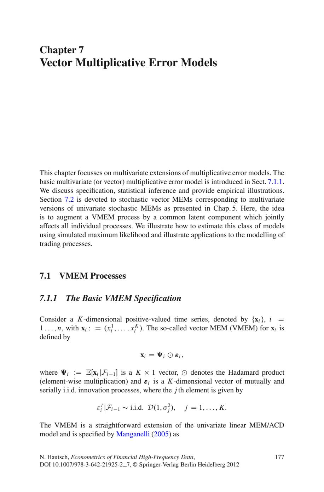

### PDF page 193 / printed page 178

```text
178                                                   7 Vector Multiplicative Error Models


                                       X
                                       P                   X
                                                           Q
                  ‰ i D ! C A0 xi C           Aj xi j C          Bj ‰ i j ;       (7.1)
                                       j D1                j D1


where ! is a K  1 vector, and A0 , Aj as well as Bj are K  K parameter matrices.
The matrix A0 captures contemporaneous relationships between the elements of xi
and is specified as a matrix where only the upper triangular elements are non-zero.
This triangular structure excludes simultaneity between the individual variables and
               j                                                       j
implies that xi is causal for xim , m > j , but xim is not causal for xi . Consequently,
                                    j
xim is conditionally i.i.d. given fxi ; Fi 1 g for j < m.
   A VMEM approach is obviously only meaningful if the multivariate time series
are synchronized in time. In case of financial trading variables, the model is
applicable, e.g., to simultaneously model trading characteristics (trade durations,
trade sizes, bid-ask spreads, trade-to-trade returns etc.). This approach is pursued
by Manganelli (2005). In case of processes which do not occur synchronously in
time (such as trading activities across different assets), a time synchronization of
the data is necessary. Then, most naturally, aggregated variables over equi-distant
time intervals as discussed in Chap. 3 are used.
   Analogously to the univariate case, the linear VMEM can be alternatively
presented in terms of a vector ARMA (VARMA) process for xi . By introducing
the vector of martingale differences i WD xi  ‰ i , and for simplicity of illustration
restricting our attention to the case P D Q D 1, the VMEM(1,1) model can be
written as

               xi D .I  A0 /1 .! C .A1 C B1 /xi 1  B1 i 1 C i :              (7.2)

Invertibility of .I  A0 / is ensured by the triangular structure of A0 ruling out
simultaneous relationships between the variables. Then, the unconditional mean is
straightforwardly given by

                          EŒxi  D .I  A0  A1  B1 /1 !;                         (7.3)

with the conditions for weak stationarity given by all eigenvalues of j.I  A0 /1
.A1 C B1 /j having modulus smaller than one.
    The advantage of this specification is that contemporaneous relationships
between the variables are taken into account without requiring multivariate
distributions for "i . Furthermore, the theoretical properties of univariate MEMs
as discussed in the previous chapter can be straightforwardly extended to the
multivariate case. However, an obvious drawback is the requirement to impose an
explicit ordering of the variables in xi induced by the triangular structure. The order
is typically chosen in accordance with a specific research objective or following
economic reasoning.
    An alternative way to capture contemporaneous relationships is to allow for
                                                        j
mutual correlations between the innovation terms "i . Then, the innovation term
vector follows a density function which is defined over non-negative K-dimensional
```

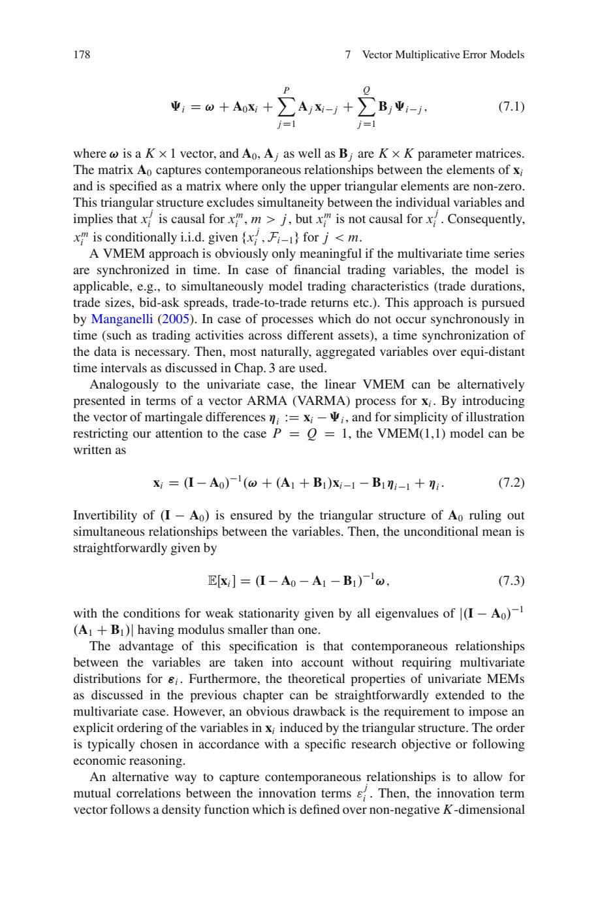

### PDF page 194 / printed page 179

```text
7.1 VMEM Processes                                                                      179


support Œ0; C1/K with unit mean  and covariance matrix ˙ , i.e.,

                                  "i jFi 1  i.i.d. D.; ˙ /

implying

                                 E Œxi jFi 1  D ‰ i ;
                                                          0
                                 V Œxi jFi 1  D ‰ i ‰ i ˇ †:

Fining an appropriate multivariate distribution defined on positive support is a
difficult task. As discussed by Cipollini et al. (2007), a possible candidate is a
multivariate gamma distribution which however imposes severe restrictions on the
                                                   j
contemporaneous correlations between the errors "i .
   Alternatively, the dependence structure can be captured by copula approaches.
Bodnar and Hautsch (2011) propose modelling the dependence in "i by a Gaussian
copula with dynamic correlation matrix. Define

                     "i D .˚ 1 .F1 ."1;i //; :::; ˚ 1 .FK ."K;i ///0 ;

where ˚.:/ denotes the c.d.f. of the univariate standard normal distribution and Fj .:/
                                                   j
denotes the marginal distribution function of "i . The assumption of the Gaussian
copula implies that the transformed residuals "i are conditionally normally dis-
tributed with conditional correlation matrix Ri . The transformation from "i to "i
is monotone though non-linear. Therefore, the series f"i g as well as f"2 i g might
be autocorrelated while the f"i g themselves are uncorrelated. To capture these
effects, Bodnar and Hautsch propose an VARMA-(M)GARCH parameterization
given by
                           
                         X
                         Q
                 "i D          Cj "i j C  i ;                                      (7.4)
                         j D1
                         p
                  i D       hi ˇ  i ;                                                (7.5)
                                    h                                h
                                  X
                                  P                                X
                                                                   Q
                  hi D !h C              Aj . i j ˇ  i j / C          Bj hi j ;   (7.6)
                                  j D1                             j D1


where Cj , Aj and Bj are K  K parameter matrices with "i  N .0; Ri /.
Correspondingly, hi is a K 1 vector of conditional variances of  i with  i denoting
a vector of i.i.d. N .0; 1/ innovations. Then, the conditional correlation matrix Ri
is modelled according to Engle’s (2002) Dynamic Conditional Correlation (DCC)
model and is given by

                                    Ri D Qi 1 Qi Qi 1 ;                            (7.7)
```

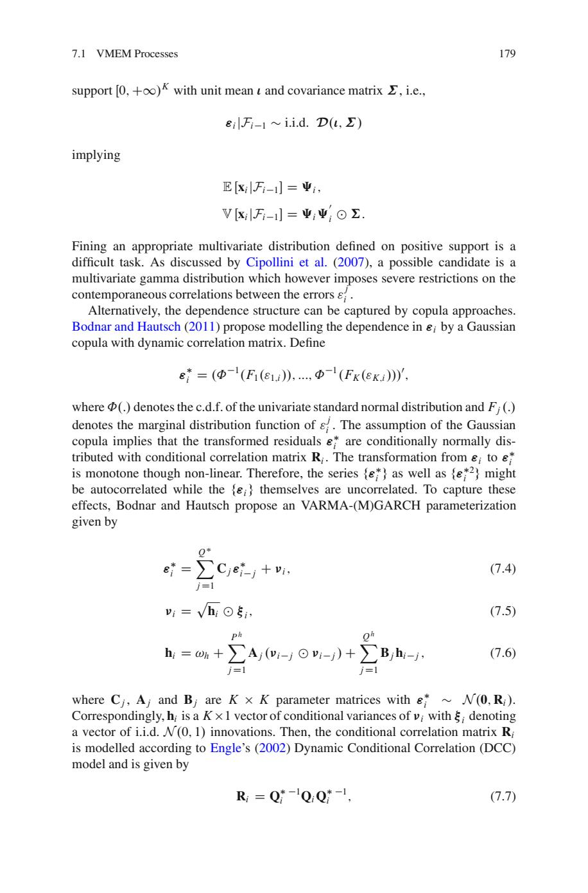

### PDF page 195 / printed page 180

```text
180                                                                   7 Vector Multiplicative Error Models

                0                       R
                                              1                                              R
                        X             X                    X                               X
                        P  R          Q                    P   R                           Q
         Qi D @1              j                N C
                                             ıj A Q                j  i j  0i j C            ıj Qi j ;    (7.8)
                        j D1          j D1                 j D1                            j D1


where QN is the unconditional covariance matrix of  i . Hence, the Gaussian copula
implies a transformation of "i into a multivariate normal distribution with dynamic
conditional mean and conditional covariance matrix. Bodnar and Hautsch (2011)
suggest a two-stage maximum likelihood approach, where the MEM parameters are
estimated in a first step, while the VARMA-GARCH-DCC parameters are estimated
in a second step. Modelling the trading process of various NYSE stocks, Bodnar
and Hautsch (2011) show that the assumption of normality of the components "i is
well supported by the data. Moreover, significant evidence for serial dependencies
in conditional variances and correlations is shown.
   Obviously, the conditional mean function ‰ i can be specified in various alterna-
tive ways. For instance, a logarithmic VMEM specification is obtained by

                                               X
                                               P                               X
                                                                               Q
             ln ‰ i D ! C A0 ln xi C                  Aj g."i j / C                  Bj ln ‰ i j ;            (7.9)
                                               j D1                            j D1

where g."/i j / D "i j or g."i j / D ln "i j , respectively (see also Sect. 5.5).
Generalized VMEMs can be specified in accordance to the approaches discussed in
the previous chapter.


7.1.2 Statistical Inference

Define f .xi1 ; xi2 ; : : : ; xiK jFi 1 I / as the joint conditional density given Fi 1 and
the parameter vector  D . 1 ; : : : ;  K /0 . Due to the triangular structure of A0 , the
joint density can be decomposed into

             f .xi1 ; xi2 ; : : : ; xiK jFi 1 I / D f .xi1 jxi2 ; : : : ; xiK I Fi 1 ; /
                                                        f .xi2 jxi3 ; : : : ; xiK I Fi 1 ; /
                                                      ::
                                                       :
                                                        f .xiK jFi 1 I /:

Then, the log likelihood function is given as

                                      X
                                      n X
                                        K
                                                           j       j C1
                 ln L.YI / D                     ln f .xi jxi            ; : : : ; xiK I Fi 1 /:             (7.10)
                                      i D1 j D1
```

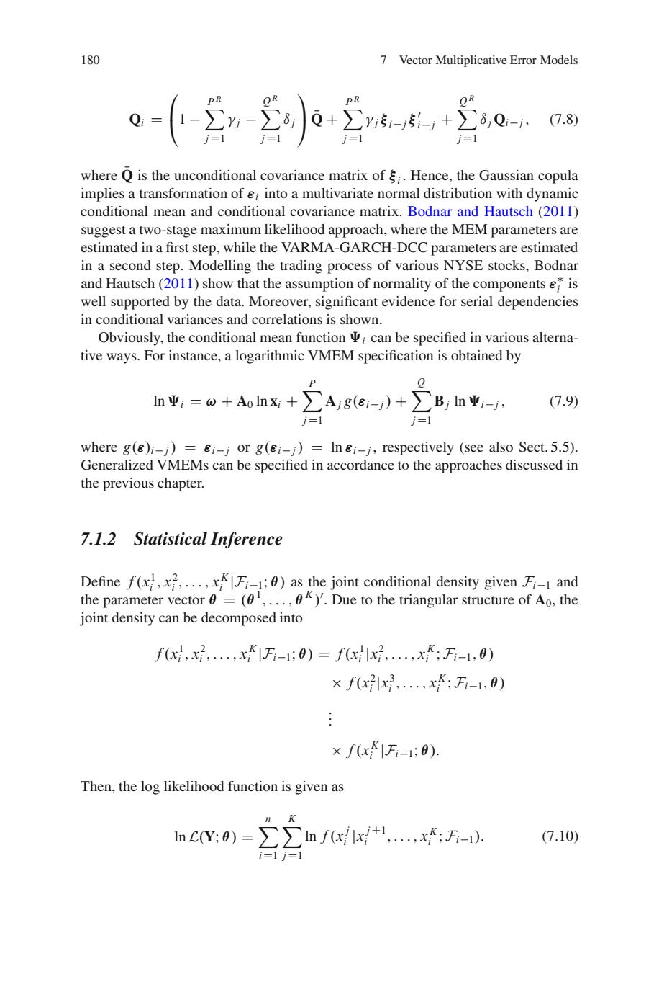

### PDF page 196 / printed page 181

```text
7.1 VMEM Processes                                                                                           181


Constructing the likelihood based on an exponential distribution leads to the quasi
likelihood function with components
                                                                     n 
                                                                     X                  
                           j    j C1                                         j   j    j
                 ln f .xi jxi          ; : : : ; xiK I Fi 1 / D       ln i C xi =i ;
                                                                     i D1


where the elements of the score and Hessian are given by
                                                                                    !
                    j
          @ ln f .xi jxi
                         j C1
                           ; : : : ; xiK I Fi 1 /      X  n
                                                              @i 1
                                                                   j
                                                                          xij
                                                   D                            1 ;
                        @ j                             i D1
                                                               @ j ij ij
                                                            (                    !           !
                  j j C1
        @2 ln f .xi jxi ; : : : ; xiK I Fi 1 /      X n
                                                                @      1 @i
                                                                               j       j
                                                                                      xi
                                 0                 D               0    j     j         j
                                                                                          1
                     @ j @ j                       i D1     @ j    i @           i
                                                                  j    j     j
                                                                                  )
                                                           1 @i @i xi
                                                      j          j     0    j
                                                                                    :
                                                         i @ @ j .i /2

   The model can be estimated equation by equation as long as the likelihood can
be decomposed into

                                                    Y
                                                    K
         f .xi1 ; xi2 ; : : : ; xiK jFi 1 I / D          f .x j jx j C1 ; : : : ; x K I Fi 1 ;  j /:   (7.11)
                                                    j D1


This requires the parameters of the system to be variation free according to Engle
et al. (1983). In case of the linear specification (7.1), this is naturally ensured. In
case of the logarithmic specification (7.9), it is ensured only if g."i j / D ln "i j
as this specification can be re-written in terms of a logarithmic version of (7.1).1 In
more general cases, the decomposition of the likelihood according to (7.11) is not
necessarily possible which requires estimating all parameters simultaneously.


7.1.3 Applications

Hautsch and Jeleskovic (2008) apply the VMEM to jointly model 1-min squared
returns, average trade sizes, number of trades as well as average trading costs based
on data of the electronic trading of the Australian Stock Exchange (ASX). The
data stem from completely reconstructed order books for the stocks BHP Billiton
Limited (BHP) and National Australian Bank (NAB) during the trading period
July and August 2002 covering 45 trading days. The log returns are pre-adjusted
to account for the bid-ask bounce and correspond to the residuals of an MA(1)


1
    Recall the discussion of Log-ACD models in Chap. 5.
```

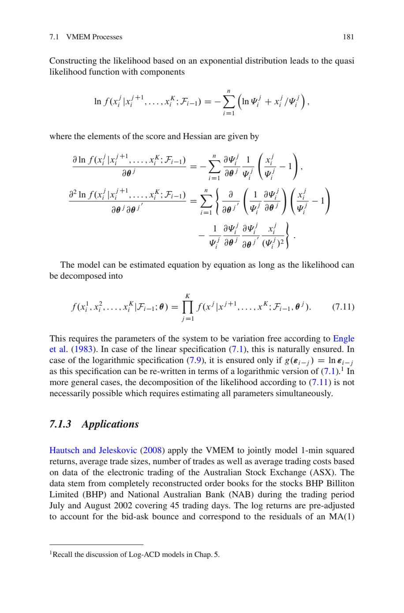

### PDF page 197 / printed page 182

**Detected figure/table caption(s) on this page:**
- Table 7.1 re-produces the estimation results of Hautsch and Jeleskovic (2008)

```text
182                                                         7 Vector Multiplicative Error Models


filter. The trading costs are computed as the hypothetical trading costs of an order
of the size of 10;000 shares in excess to the trading costs which would prevail
if investors could trade at the mid-quote. As reported by Hautsch and Jeleskovic
(2008), resulting average excess trading costs are 60 ASD for BHP and 188 ASD
for NAB during the analyzed trading period.
    Hautsch and Jeleskovic (2008) propose modelling this process by a four-
dimensional augmented Log-VMEM process which accounts for the occurrence of
zeros and is given by

            ln  i D ! C A0 Œ.ln xi / ˇ Ifxi >0g  C A00 ˇ Ifxi D0g
                          X
                          P                                        X
                                                                   P
                      C          Aj Œg."i j / ˇ Ifxi 1 >0g  C          A0j ˇ Ifxi 1 D0g
                          j D1                                     j D1

                          X
                          Q
                      C          Bj ln  i j ;                                               (7.12)
                          j D1


where Ifxi >0g and Ifxi D0g denote 4  1 vectors of indicator variables indicating non-
zero and zero realizations, respectively, and A0j , j D 0; : : : ; p, are corresponding
4  4 parameter matrices.2
   Table 7.1 re-produces the estimation results of Hautsch and Jeleskovic (2008)
for a Log-VMEM(1,1) specification for BHP and NAB based on a specification
with fully parameterized matrix A1 and diagonal matrix B1 for seasonally adjusted
(pre-filtered) squared log returns, trade sizes, number of trades and transaction costs
standardized by their corresponding seasonality components.
   The innovation terms are chosen as g."i / D "i . For the process of squared
returns, xi1 D ri2 , it is assumed that xi1 j.xi2 ; : : : ; xi4 ; Fi 1 /  N .0; i1 /. Accord-
             j                                  j j C1                                    j
ingly, for xi , j 2 f2; 3; 4g, it is assumed xi jxi ; : : : ; xi4 ; Fi 1  Exp.i /. As
zeros only (simultaneously) occur in trade sizes and the number of trades, only the
.2; 3/-element in A00 and one of the two middle columns in A01 can be identified.
Consequently, all other parameters in A00 and A01 are set to zero.
   The following results can be summarized: First, there exist significant mutual
correlations between nearly all variables. Volatility is positively correlated with liq-
uidity demand and liquidity supply. Hence, active trading as driven by high volumes
and high trading intensities is accompanied by high volatility. The significantly
negative estimates of A024 and A034 indicate that these are trading periods which are
characterized by low transaction costs.
   Second, the diagonal elements in A1 and the elements in B1 reveal that all trading
components are strongly positively autocorrelated but are not very persistent. The
persistence is highest for trade sizes and trading intensities.


2
 For a more sophisticated approach to model positive-valued (continuous) random variables which
reveal a non-trivial part of zero outcomes, see Hautsch et al. (2010).
```

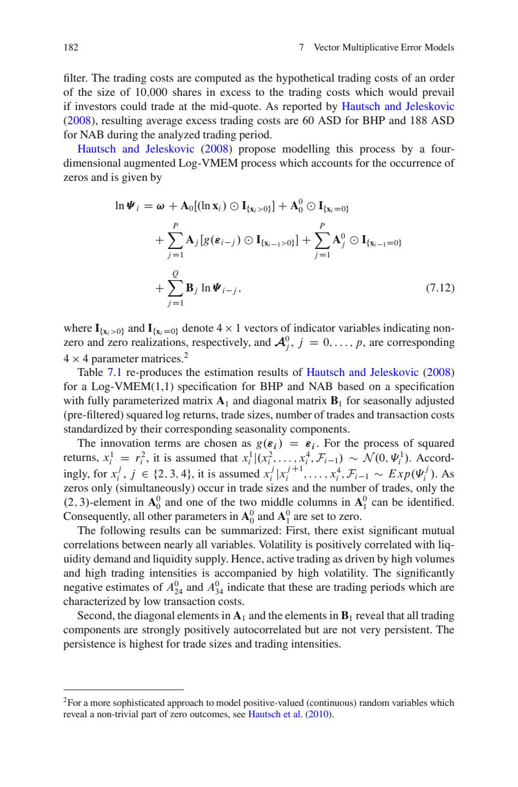

### PDF page 198 / printed page 183

**Detected figure/table caption(s) on this page:**
- Table 7.1 Maximum likelihood estimation results of a Log VMEM for seasonally adjusted (i)

```text
7.1 VMEM Processes                                                                                  183


Table 7.1 Maximum likelihood estimation results of a Log VMEM for seasonally adjusted (i)
squared (MA(1) filtered) log returns, (ii) average trade sizes, (iii) number of trades, and (iv) average
trading costs per 1-min interval. Standard errors are computed based on the OPG covariance matrix.
ASX trading, July–August 2002. Diagnostics: Log likelihood function (LL) and Bayes Information
Criterion (BIC). Reproduced from Hautsch and Jeleskovic (2008)
                                   BHP                                             NAB
Par.                 Coeff.                   Std. err.               Coeff.                   Std. err.
!1                   0.0673                  0.0663                   0.0023                  0.0302
!2                    0.1921                  0.0449                   0.1371                  0.0254
!3                   0.4722                  0.1009                  0.1226                  0.0432
!4                   0.4914                  0.1066                  0.5773                  0.0485
A0;12                 0.0549                  0.0092                   0.1249                  0.0056
A0;13                 0.3142                  0.0173                   0.6070                  0.0122
A0;14                 0.4685                  0.0489                   0.7876                  0.0094
A0;23                 0.0673                  0.0074                   0.0531                  0.0070
A0;24                0.1002                  0.0289                   0.0176                  0.0093
A0;34                0.2181                  0.0618                  0.0235                  0.0123
A00;12               3.8196                  0.0402                  1.5086                  0.0176
A1;11                 0.1446                  0.0080                   0.0804                  0.0038
A1;12                 0.0043                  0.0090                   0.0804                  0.0041
A1;13                0.0939                  0.0173                   0.2036                  0.0125
A1;14                 0.1487                  0.0602                  0.0833                  0.0214
A1;21                 0.0004                  0.0034                  0.0002                  0.0015
A1;22                 0.0488                  0.0049                   0.0259                  0.0025
A1;23                0.0377                  0.0115                  0.0116                  0.0093
A1;24                0.1911                  0.0398                  0.1329                  0.0226
A1;31                 0.0100                  0.0053                  0.0022                  0.0020
A1;32                 0.0095                  0.0071                   0.0045                  0.0031
A1;33                 0.1088                  0.0152                   0.0894                  0.0109
A1;34                 0.3420                  0.0932                   0.0341                  0.0377
A1;41                 0.0064                  0.0113                   0.0044                  0.0067
A1;42                 0.0091                  0.0163                   0.0081                  0.0081
A1;43                 0.0524                  0.0321                   0.0537                  0.0249
A1;44                 0.4256                  0.0898                   0.5105                  0.0431
A01;21                1.1467                  0.0911                  0.5181                  0.0204
A01;22                0.1497                  0.0212                   0.0341                  0.0134
A01;23                0.0946                  0.0318                   0.0985                  0.0132
A01;24               0.0006                  0.0755                   0.0115                  0.0579
B1;11                  0.4027                 0.0252                    0.2616                 0.0078
B1;22                  0.7736                 0.0179                    0.9109                 0.0081
B1;33                  0.9731                 0.0074                    0.9673                 0.0070
B1;44                  0.5369                 0.1024                    0.7832                 0.0374
LL                               60,211                                         58,622
BIC                              60,378                                         58,790
```

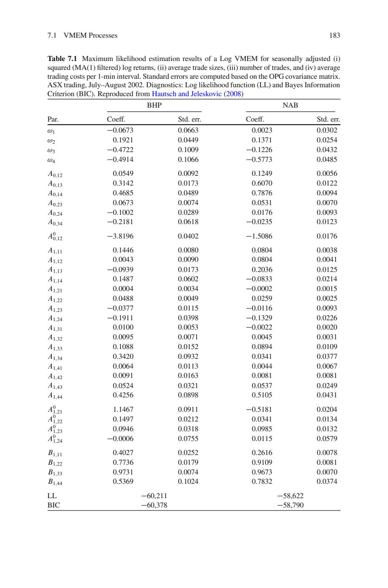

### PDF page 199 / printed page 184

```text
184                                                             7 Vector Multiplicative Error Models


   Third, liquidity variables Granger cause future volatility. In particular, high
trade sizes predict high future return volatilities. Conversely, the impact of trading
intensities and trading costs on future volatility is less clear revealing contradictive
results for both stocks. Obviously, there is no prediction power of return volatility
for future liquidity demand and supply.
   Fourth, trading intensities and trading costs negatively influence future trade
sizes. Thus, a high speed of trading tends to reduce trade sizes over time. Likewise,
increasing trading costs seem to lower the incentive for high order sizes but on the
other hand increase the speed of trading. These results might be induced by the
fact that investors tend to break up large orders into sequences of small orders if
liquidity supply is low.


7.2 Stochastic Vector Multiplicative Error Models

7.2.1 Stochastic VMEM Processes

A further generalization of VMEM processes and multivariate extension of the
stochastic MEM has been introduced by Hautsch (2008). The major idea is to
capture mutual (time-varying) dependencies by a subordinated common (latent)
factor jointly driving the individual processes. Economically, this process might
be associated with the underlying (latent) information process jointly influencing
the multivariate trading process. The so-called stochastic VMEM (SVMEM) can be
compactly represented as

                                             x i D ‰ i ˇ i ˇ "i ;                           (7.13)

where i is a .K  1/ vector with elements fıi i g, i D 1; : : : ; K,

                       ln i D a ln i 1 C i ; i  i.i.d. N .0; 1/;                       (7.14)

and i is assumed to be independent of "i . In this multivariate setting, the component
i is interpreted as a common dynamic factor with process-specific impacts ıi
(requiring the identification condition VŒi  D 1). The elements of ‰ i represent
“genuine” (e.g., trade-driven) effects given the latent factor.
   Hautsch (2008) applies the SVMEM to the three-dimensional process of intraday
returns yi , trade sizes vi and trading intensities i (thus K D 3) as given by

             yi D EŒyi jFi 1  C i ;                                                        (7.15)
                  q
              i D   hi e ı1 i sh;i wi ;                      wi  i.i.d. N .0; 1/;          (7.16)

             vi D ˚i e ı2 i sv;i ui ;                        ui  i.i.d. GG.p2 ; m2 /;      (7.17)
             i D i e   ı3 i
                                 s;i "i ;                     "i  i.i.d. GG.p3 ; m3 /;     (7.18)
```

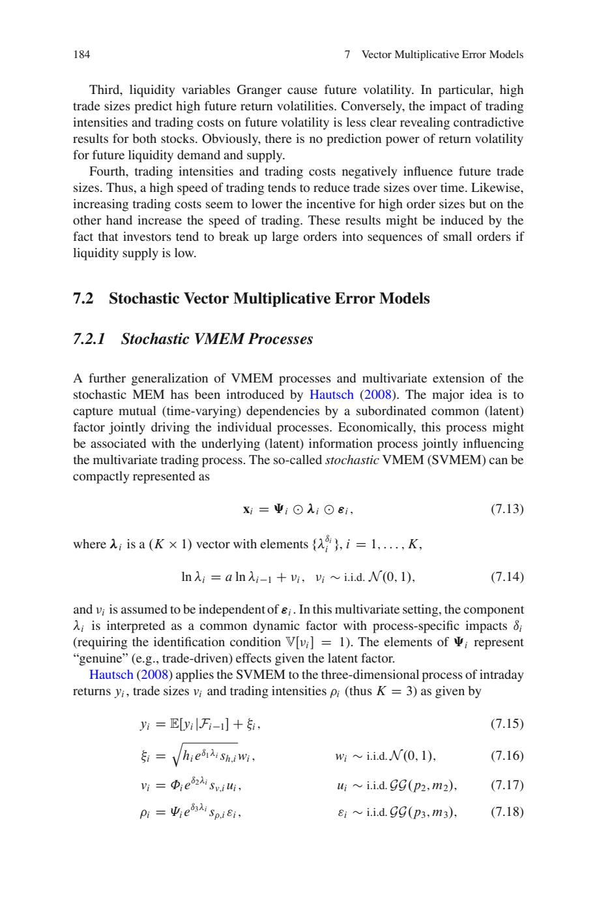

### PDF page 200 / printed page 185

```text
7.2 Stochastic Vector Multiplicative Error Models                                                185


where hi , ˚i and i denote the so-called observation-driven dynamic components,
wi , ui and "i are process-specific innovation terms, which are assumed to be
independent, and sh;i ; sv;i ; s;i > 0 capture deterministic time-of-day effects in
volatilities, trade sizes, and trading intensities, respectively. The volatility innova-
tions wi are assumed to follow a standard normal distribution whereas the volume
and trading intensity innovations ui and "i follow standard generalized gamma
distributions with parameters p2 ; m2 and p3 ; m3 , respectively.
    The process-specific impact of the latent factor is given by ij WD ıj i with
                                    d
ij D ai 1;j C ıj i , and thus diji > .</ 0 for ıj > .</ 0 with j D 1; 2; 3. Since
the distribution of i is symmetric, the sign of the parameters ıj are not individually
identified and require to restrict the sign of one of the parameters ıj . Then, the signs
of ık with k ¤ j are identified.
    The process-specific components hi , ˚i and i are parameterized in terms of a
three-dimensional version of (7.9),

                                            X
                                            P                   X
                                                                Q
                   ‰ i D ! C A0 z0;i C             Aj zi j C          Bj ‰ i j ;           (7.19)
                                            j D1                j D1


where

  ‰ i WD .ln hi ; ln ˚i ; ln i /0 ;                                                         (7.20)
 z0;i WD .0; ln vi ; ln i /0 ;                                                              (7.21)
                                            !0
             j ij      vi      i                                                          0
   zi WD    p        ;       ;                   D jwi je ı1 i =2 ; ui e ı2 i ; "i e ı3 i : (7.22)
              hi sh;i ˚i sv;i i s;i

   As stressed by Hautsch (2008), the fact that the innovations zi do not depend
on the latent component ensures that hi , ˚i and i are completely observation-
driven and eases the estimation of the model. On the other hand, since the latent
variable is not integrated out of the innovations, a shock in i influences fhi , ˚i ,
i g not only directly (in period i ), but also indirectly (through zi ) in the subsequent
periods. Therefore, i can generate cross-dependencies between the observation-
driven processes hi , ˚i and i even when A0 D Aj D 0. As illustrated by
Hautsch (2008), due to this feature the model allows to parsimoniously capture
cross-dependencies.
   If we set for simplicity A0 D 0, P D Q D 1, sh;i D sv;i D s;i D 1, and
diagonal parameterizations of A1 and B1 , the model is rewritten as
                            q
                      i D       hQ i wi ;                    hQ i D hi e ı1 i ;

                     vi D ˚Q i ui ;                          ˚Q i D ˚i e ı2 i ;
                    i D Q i "i ;                           Q i D i e ı3 i ;
```

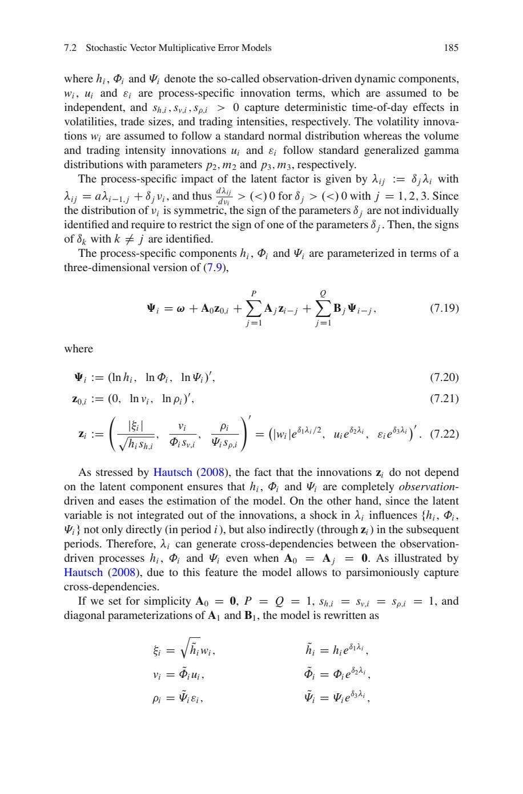

### PDF page 201 / printed page 186

```text
186                                                                     7 Vector Multiplicative Error Models


where

                                         j i 1 j
             ln hQ i  ı1 i D !1 C ˛111 p        C ˇ111 .ln hQ i 1  ı1 i 1 /;
                                            hi 1
                                         vi 1
            ln ˚Q i  ı2 i D !2 C ˛122         C ˇ122 .ln ˚Q i 1  ı2 i 1 /;
                                         ˚i 1
                                         i 1
            ln Q i  ı3 i D !3 C ˛133         C ˇ133 .ln Q i 1  ı3 i 1 /:
                                         i 1

Hence, i serves as an additional (static) regressor which is driven by its own
dynamics according to (7.14). More details on the statistical properties of the
multivariate SMEM are given in Hautsch (2008).


7.2.2 Simulation-Based Inference

Let Y denote the entire data matrix with Yi WD fyj gij D1 and define  to be the
vector of SVMEM parameters. The conditional likelihood, given the realizations of
the latent variable i , is given by

                         Y
                         n                              2               p m 1                  p2 
                                     1                                p2 vi 2 2             vi
      L.YI j    n/ D             q        exp                                p2 m2 exp 
                                                         i

                         i D1      2hQ i               2hQ i          .m2 /˚iQ              ˚Q i

                                p m 1                                 p3 
                           p3  i 3 3             i
                                    p3 m3 exp                                 ;                              (7.23)
                           .m3 /i Q              Q i

where

                                           hQi WD hi e ı1 i sh;i ;
                                           ˚Q i WD ˚i e ı2 i sv;i ;
                                           Q i WD  e ı3  s;i :

  Accordingly, the integrated likelihood function is given by
                Z Y
                  n                             2            p m 1                      p2 
                              1                            p2 vi 2 2             vi
  L.YI / D              q            exp       i
                                                                         exp  
                                               2hQ i       .m2 /˚Q i 2 2         ˚Q i
                                                                    p m
                  i D1       2hQ i
                      p m 1                                 p3                                        
                  p3 i 3 3             i                             1     1
                          p3 m3 exp                                 p exp  .i             0;i /
                                                                                                       2
                                                                                                               d
                  .m3 /iQ              Q i                           2     2
```

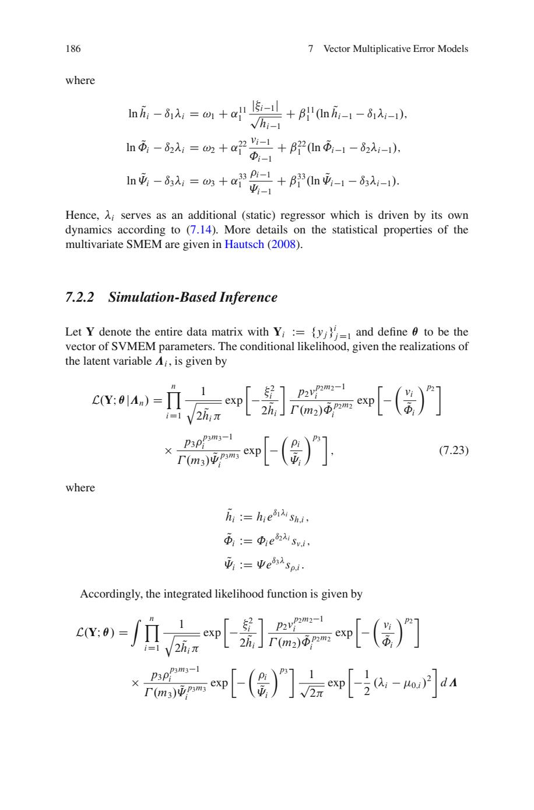

### PDF page 202 / printed page 187

```text
7.2 Stochastic Vector Multiplicative Error Models                                                187

                         Z Y
                           n
                     D              g.yi ji ; Yi 1 I /p.i j    i 1 I /d
                             i D1
                         Z Y
                           n
                     D              f .yi ; i jYi 1 ;   i 1 I /d   ;
                             i D1


where 0;i WD EŒi j i 1 , g./ denotes the conditional density of yi given
.i ; Yi 1 / and p./ denotes the conditional density of i given i 1 . The
computation of the n-dimensional integral in (7.24) is done numerically using the
efficient importance sampling (EIS) method proposed by Richard and Zhang (2007)
and requires rewriting the integral (7.24) as
                  Z Y
                            f .yi ; i jYi 1 ; i 1 I / Y
                    n                                        n
      L.YI / D                                             m.i j         i 1 ;   i /d   ;   (7.24)
                                m.i j i 1 ; i /
                     i D1                                   i D1


where fm.i j i 1 ; i /gniD1 denotes a sequence of auxiliary importance samplers
indexed by auxiliary parameters i . The importance sampling estimate of the
likelihood is obtained by

                              1 X Y f .yi ; i jYi 1 ; i 1 I /
                                 R    n      .r/         .r/
                  O
        L.YI /  LR .YI / D                                     ;                            (7.25)
                                               .r/ .r/
                              R rD1 i D1 m.i j        ; i/            i 1

          .r/
where fi gniD1 denotes a trajectory of random draws from the sequence of auxiliary
importance samplers m and R such trajectories are generated.
    The idea of the EIS approach is to choose a sequence of samplers for
m.i j i 1 ; i / exploiting the sample information on i revealed by the observable
data. As shown by Richard and Zhang (2007), the EIS principle is to choose
the auxiliary parameters f i gniD1 in a way that provides a good match between
˘inD1 m.i j i 1 ; i / and ˘inD1 f .yi ; i jYi 1 ; i 1 I / in order to minimize the
Monte Carlo sampling variance of LO R .YI /. Richard and Zhang (2007) illustrate
that the resulting high-dimensional minimization problem can be split up into
solvable low-dimensional subproblems. This makes the approach tractable even for
very high dimensions. The detailed EIS procedure is given by Hautsch (2008). See
also Chap. 12 for a quite similar EIS procedure to estimate stochastic conditional
intensity models.
    An important advantage facilitating the computation of the function f ./ is that
the time series recursion of the observation-driven components hi , ˚i and i can
be computed without the latent factor being known. As discussed in Sect. 7.2.1, this
is because fhi ; ˚i ; i g are driven based on innovations zi that are observable given
the history of f i ; vi ; i g and fhi ; ˚i ; i g. Then, hi , ˚i and i can be computed in
a first step according to the VARMA structure given by (7.19) to (7.22) and can be
used in a second step to evaluate the sampler fm.i j i 1 ; i gniD1 .
```

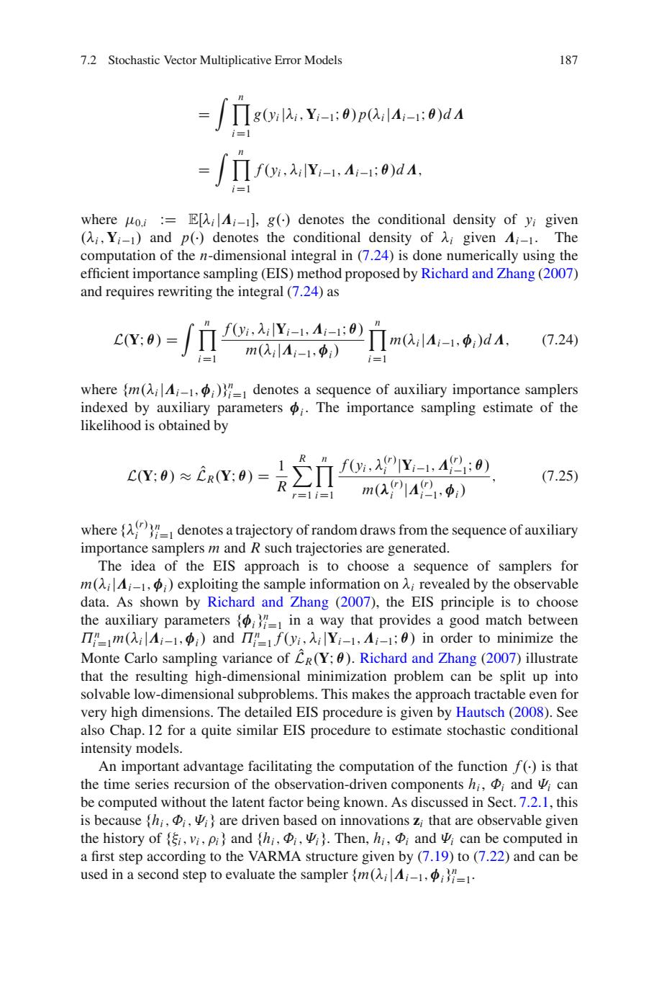

### PDF page 203 / printed page 188

```text
188                                                                            7 Vector Multiplicative Error Models


   Filtered estimates of an arbitrary function of i , #.i /, given the observable
information set up to ti 1 are given by
                             R
                                 #.i /p.i jYi 1 ; i 1 ; /f .Yi 1 ; i 1 j/d                     i
      E Œ#.i / jYi 1  D                R                                                                :   (7.26)
                                             f .Yi 1 ; i 1 j/d i 1

   The integral in the denominator corresponds to the marginal likelihood function
of the first i  1 observations, L.Yi 1 I /, and can be evaluated on the basis of
                                                     i 1
the sequence of auxiliary samplers fm.j j j 1 ; O j /gij1         O i 1
                                                          D1 where f j g denotes
the value of the EIS auxiliary parameters associated with the computation of
L.Yi 1 I / and  is set equal to its corresponding maximum likelihood estimate.
Correspondingly, the numerator is computed by
       8                2        .r/ O i 1                       i 1
                                                                              39
   XR <          i 1
                   Y      f y  ;     .      /jY j 1 ;
                                                          .r/
                                                               . O j 1 /;     =
 1                           j    j     j                 j 1
           .r/
        # i ./        4                                                    5 ; (7.27)
 R rD1 :                    m  . O /j
                                  .r/   i 1    .r/
                                                      .O
                                                         i 1
                                                              /; O
                                                                    i 1        ;
                   j D1                              j        j               j 1          j 1   j


                  i 1
where fj . O j /gij1
            .r/
                    D1 denotes a trajectory drawn from the sequence of importance
                                                                       .r/
samplers associated with L.Yi 1 I /, and i ./ is a random draw from the
                                           i 1
conditional density p.i jYi 1 ; i 1 . O i 1 /; /. The computation of the sequence
                                    .r/

of filtered estimates E Œ#.i / jYi 1 , i D 1; : : : ; n; requires a re-run of the EIS
algorithm for every i (from 1 to n). For more details, see Hautsch (2008). Then, the
filtered residuals are given by

                                                                  Oi
                                  wO i WD q                                                  ;
                                               hO i E e ı1 i jYi 1 sOh;i
                                                              vi
                                  uO i WD                                               ;
                                            ˚O i E       e ı2 i jY    i 1     sOv;i
                                                         i
                                  "Oi WD                               :
                                            O
                                            i E e ı 3 i jYi 1 sO;i


7.2.3 Modelling Trading Processes

Tables 7.2 and 7.3 reproduces the estimates of Hautsch (2008) based on seasonally
adjusted 5 min (ARMA(1,1)-pre-filtered) squared returns, average trade sizes and
number of trades data from the NYSE stocks JP Morgan and IBM covering
five months between 02/01/2001 and 31/05/2001. The underlying lag length is
restricted to two, where A2 and B2 are diagonal matrices. The major findings are
as follows:
```

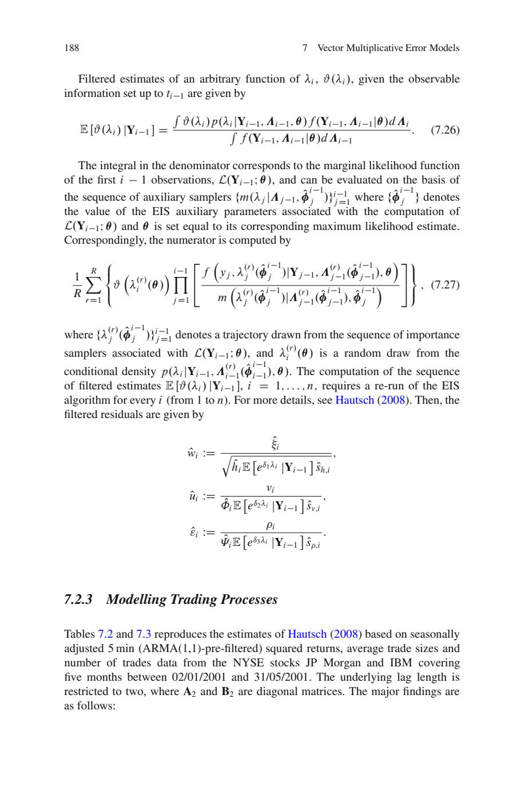

### PDF page 204 / printed page 189

**Detected figure/table caption(s) on this page:**
- Table 7.2 Maximum likelihood efficient importance sampling (ML-EIS) estimates of different

```text
7.2 Stochastic Vector Multiplicative Error Models                                              189


Table 7.2 Maximum likelihood efficient importance sampling (ML-EIS) estimates of different
parameterizations of SMEM specifications up to a lag order of P D Q D 2 models for the
log return volatility, the average volume per trade and the number of trades per 5 min interval for
the JP Morgan stock traded on the NYSE. Sample period from 02/01/01 to 31/05/01. Overnight
observations are excluded. The models are re-initialized on each trading day. Standard errors are
computed based on the inverse of the estimated Hessian. The ML-EIS estimates are computed
using R D 50 Monte Carlo replications based on 5 EIS iterations.
Diagnostics: Log likelihood function (LL), Bayes Information Criterion (BIC), mean, standard
deviation and Ljung–Box statistics of the filtered residuals (LB) and squared filtered residuals
(LB2, only for the return process) as well as multivariate Ljung–Box statistic (MLB). The Ljung–
Box statistics are computed based on 20 lags. Significance at the 1%, 5% and 10% levels are
denoted by ***, ** and *, respectively. Results reproduced from Hautsch (2008)
          (1)                (2)                 (3)                (4)                (5)
!1          1.996           0.529          0.097            0.167           0.209
!2        1.410          2.240           1.471          2.035          2.122
!3        0.016          0.225           0.337          0.008          0.005
˛012       0.859           0.492           0.078           0.023             0.050
˛013       0.910           0.365           0.091           0.022             0.033
˛023      0.882          1.158           0.953          0.941          0.958
˛111       0.138                                0.097          0.085           0.072
˛112       0.009                                                    0.004             0.010
˛113       0.001                                                  0.000              0.001
˛121      0.003                                                    0.022          0.029
˛122       0.005                                0.005          0.005           0.010
˛123       0.000                                                   0.000           0.000
˛131       0.550                                                 0.037              0.096
˛132       0.388                                                 0.054             0.101
˛133       0.216                                0.188          0.212           0.214
˛211       0.117                                                  0.053            0.049
˛222      0.002                                                 0.001             0.004
˛233      0.207                                                 0.206          0.210
ˇ111        0.051                                  0.972           0.861          0.789
ˇ112        0.170                                                                   0.246
ˇ113        0.000                                                                      0.001
ˇ121        0.646                                                                    0.066
ˇ122        0.708                               0.178           0.115           0.083
ˇ123        0.000                                                                      0.001
ˇ131        1.166                                                                    0.180
ˇ132        0.527                                                                   0.427
ˇ133        1.623                               0.836           1.625          1.655
ˇ211      0.068                                                   0.086              0.177
ˇ222      0.017                                                     0.025             0.077
ˇ233      0.625                                                 0.626          0.657
p2          0.720           0.863            1.027           0.854           0.890
m2          6.947           5.800            4.917           6.537           5.869
p3          2.438           2.414            2.287           2.454           2.579
m3          2.373           1.986            2.620           2.364           2.173
                                                                                       (continued)
```

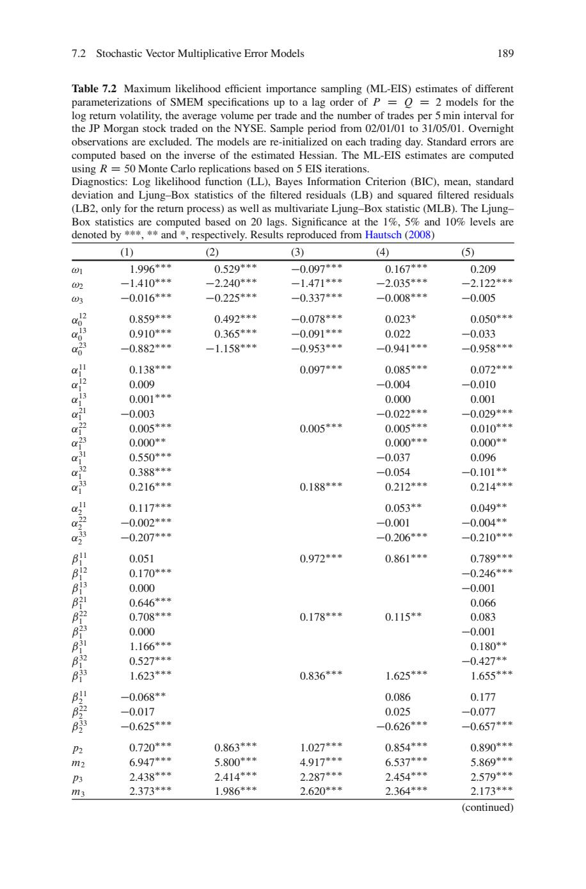

### PDF page 205 / printed page 190

**Detected figure/table caption(s) on this page:**
- Table 7.2 (continued)

```text
190                                                    7 Vector Multiplicative Error Models


Table 7.2 (continued)
          (1)                (2)                (3)            (4)             (5)
Latent component
a           0.951          0.907          0.941       0.930
ı1          0.165          0.339          0.339       0.350
ı2          0.122          0.176          0.136       0.132
ı3          0.024          0.009          0.011       0.015

General diagnostics
LL         18,306           19,398            18,201        18,040         18,009
BIC        18,458           19,461            18,291        18,184         18,180
MLB        665.637        12,670.643      288.422     171.290      197.625
Diagnostics for the return process

Mean       0.019            0.011             0.004         0.005          0.006
S.D.       0.999             1.026              1.048          1.067           1.056
LB         35.911          31.627           26.265         25.315          24.722
LB2        355.220        35.564           40.740      6.513           11.903
Diagnostics for the volume process
Mean       1.001             1.003              1.009          1.009           1.006
S.D.       0.600             0.609              0.598          0.597           0.592
LB         22.132            90.389          46.434      11.269          17.671

Diagnostics for the trading intensity process
Mean       1.000             0.999              1.000          0.999           1.000
S.D.       0.273             0.306              0.276          0.273           0.273
LB         43.659         6,337.353       140.305     50.553       53.280


    First, it turns out that the latent common component is strongly autocorrelated
with an autoregressive parameter being on average around aO  0:94. Consequently,
the latent factor seems to accommodate common long-run dependence, which
is not captured by the observation-driven dynamics. Second, common shocks
simultaneously increase all three trading components. As revealed by the parameters
ı1 , ı2 and ı3 , the joint factor influences primarily the volatility and trade size.
Conversely, its impact on the trading intensity is relatively weak. These findings
confirm the results by Xu and Wu (1999), Chan and Fong (2000), Huang and
Masulis (2003) and Blume et al. (1994) documenting that trade size is obviously an
important indicator for the quality of news. Consequently, a subordinated common
(information) process is more strongly reflected in the average trade size rather than
in the trading intensity.
    Third, including the common latent factor induces a decline of the magnitude
of the parameters ˛012 and ˛013 . This indicates that the conditional contempora-
neous correlations between volatilities, volumes and trading intensities given the
latent component are lower than the corresponding unconditional ones. Hence, a
```

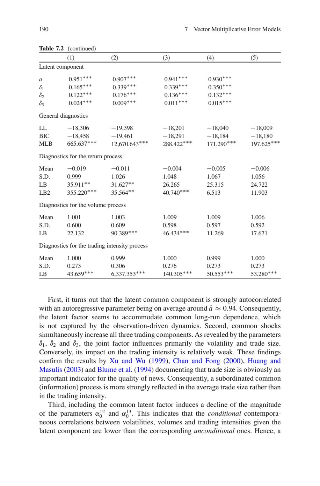

### PDF page 206 / printed page 191

**Detected figure/table caption(s) on this page:**
- Table 7.3 Maximum likelihood efficient importance sampling (ML-EIS) estimates of different

```text
7.2 Stochastic Vector Multiplicative Error Models                                              191


Table 7.3 Maximum likelihood efficient importance sampling (ML-EIS) estimates of different
parameterizations of SMEM specifications up to a lag order of P D Q D 2 models for the log
return volatility, the average volume per trade and the number of trades per 5 min interval for the
IBM stock traded on the NYSE. Sample period from 02/01/01 to 31/05/01. Overnight observations
are excluded. The models are re-initialized on each trading day. Standard errors are computed
based on the inverse of the estimated Hessian. The ML-EIS estimates are computed using R D 50
Monte Carlo replications based on 5 EIS iterations.
Diagnostics: Log likelihood function (LL), Bayes Information Criterion (BIC), mean, standard
deviation and Ljung–Box statistics of the filtered residuals (LB) and squared filtered residuals
(LB2, only for the return process) as well as multivariate Ljung–Box statistic (MLB). The Ljung–
Box statistics are computed based on 20 lags. Significance at the 1%, 5% and 10% levels are
denoted by ***, ** and *, respectively. Results reproduced from Hautsch (2008)
          (1)               (2)                (3)               (4)               (5)
!1          0.372          0.504           0.494          0.316          1.079
!2        0.784         1.420          1.831         1.307         1.403
!3        0.200         0.517          0.373         0.160         0.305
˛012       0.792          0.704           0.596          0.128          0.140
˛013       0.746          0.182            0.585          0.099          0.429
˛023      0.783         1.355          0.768         0.866         0.789
˛111       0.183                              0.070         0.068          0.067
˛112       0.025                                               0.018           0.015
˛113       0.000                                                 0.001             0.002
˛121      0.052                                              0.061         0.064
˛122       0.021                              0.016         0.012          0.013
˛123       0.001                                              0.001           0.001
˛131      0.136                                              0.086           0.015
˛132       0.344                                               0.110           0.136
˛133       0.191                              0.153         0.182          0.151
˛211       0.131                                               0.086          0.048
˛222      0.004                                               0.001             0.001
˛233      0.101                                              0.105         0.087
ˇ111       0.580                            0.228           0.471         0.596
ˇ112       0.048                                                                0.050
ˇ113       0.001                                                                   0.007
ˇ121      0.108                                                                 0.477
ˇ122       0.866                              0.176          0.400         0.436
ˇ123       0.000                                                                   0.059
ˇ131      0.347                                                                 0.114
ˇ132       0.701                                                                 0.105
ˇ133       1.211                              0.900          1.272         1.122
ˇ211       0.044                                                  0.496          0.414
ˇ222      0.009                                                 0.091          0.115
ˇ233      0.252                                              0.313         0.229
p2          0.847          1.168           0.965          1.190          1.115
m2          6.936          4.466           6.492          4.953          5.470
p3          2.303          2.294           2.156          2.278          2.172
m3          4.131          3.499           4.642          4.255          4.620
                                                                                      (continued)
```

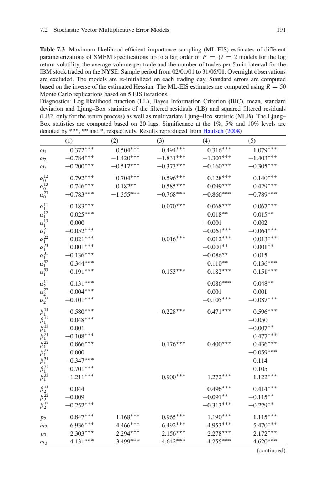

### PDF page 207 / printed page 192

**Detected figure/table caption(s) on this page:**
- Table 7.3 (continued)

```text
192                                                   7 Vector Multiplicative Error Models


Table 7.3 (continued)
          (1)                 (2)               (3)             (4)            (5)
Latent component
a          0.942           0.967          0.940        0.944
ı1         0.154           0.141          0.263        0.256
ı2         0.146           0.087          0.133        0.123
ı3         0.044           0.004          0.012        0.003
General diagnostics
LL          15,338           16,959           15,349         15,106        15,086
BIC         15,490           17,021           15,439         15,250        15,257
MLB         240.460        19,077.193     833.269      95.978      76.669
Diagnostics for the return process
Mean        0.009            0.009            0.006          0.000          0.000
S.D.        1.000             1.014             1.009           1.026          1.028
LB          17.720            17.105            19.767          23.732         24.735
LB2         154.973        622.605        313.360      18.042         16.570
Diagnostics for the volume process
Mean        0.999             1.003             1.001           1.005          1.004
S.D.        0.484             0.512             0.487           0.481          0.483
LB          47.007         257.354        54.532       56.413      54.164
Diagnostics for the trading intensity process
Mean        0.999             0.999             0.999           1.000          1.000
S.D.        0.216             0.246             0.217           0.216          0.216
LB          12.195            6,935.761      84.642       11.464         11.405


significant part of the contemporaneous relationships between conditional return
variances and average trade sizes as well as trading intensities obviously stem
from an underlying common component. Nonetheless, while the common factor
comprises the positive dependence between return volatility and trade size to a
large extent, it can only partly explain the positive correlation between trading
intensities and volatilities. The parameter ˛023 is significantly negative and mainly
unaffected by the inclusion of the latent component. This indicates that the
(negative) contemporaneous relationship between trade size and trading intensity
is not driven by a latent common component. Instead, according to Hautsch (2008),
it might be rather explained by the common finding that high volumes are typically
split over time leading to higher trading frequencies but also to smaller trade sizes.
    Fourth, Panels (1)–(3) show the estimates of specifications omitting a common
latent component and revealing significant cross-dependencies between volatilities,
volumes and trading intensities. These dependencies, however, are clearly reduced
as soon as a common latent component is taken into account (Panels (5)–(7)).
Indeed, the size of cross-effects becomes close to zero and/or is insignificant.
Likewise the non-diagonal elements in B1 shrink. As argued by Hautsch (2008),
```

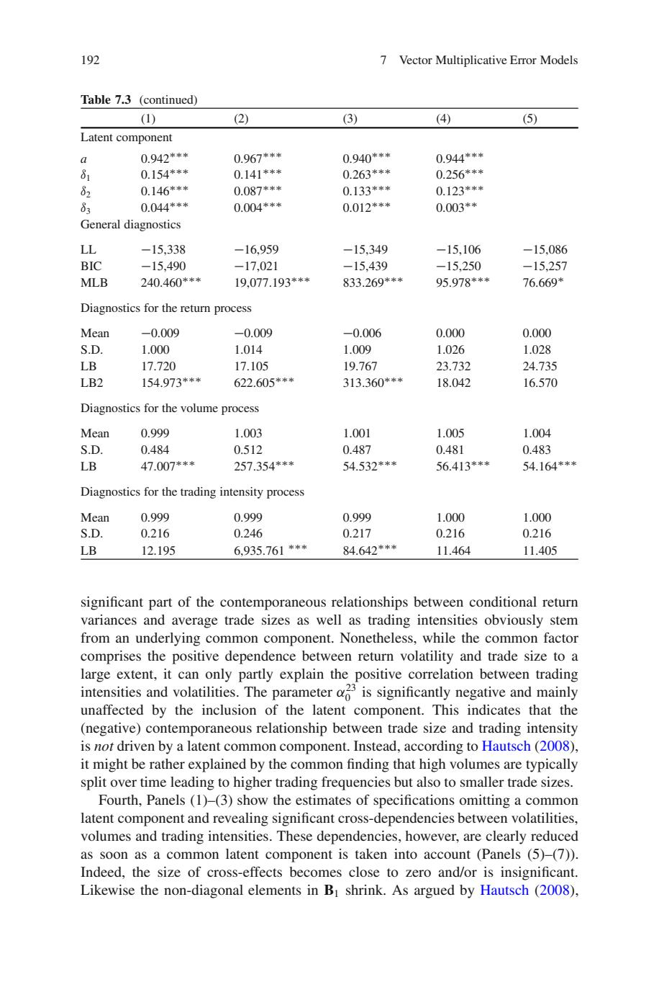

### PDF page 208 / printed page 193

```text
References                                                                                   193


this finding indicates that most of the observed causalities between the individual
variables are mainly due to the existence of a subordinated common (information)
process jointly directing the individual components.
   Moreover, the inclusion of the latent factor reduces the impact of the process-
specific innovations (˛O 1i i and ˛O 2i i for i D 1; 2; 3) and increases the persistence in the
observation-driven dynamics. This finding is in accordance with the results shown
for univariate SMEM processes in Sect. 6.4.2 and indicates that news seem to enter
the model primarily through the latent factor reducing the impact of process-specific
innovations.
   Finally, the inclusion of a latent component leads to a reduction of the mul-
tivariate Ljung–Box statistic indicating that the common component successfully
captures the multivariate dynamics and interdependencies between the individual
processes. This is supported by a reduction of the Bayes information criterion
indicating a better fit of the SVMEM compared to MEMs without a latent factor.
Interestingly, the worst performance is observed for specification (4), where any
observation-driven dynamics are omitted and only a parameter-driven dynamic
is included. This indicates that a single common autoregressive component is
obviously not sufficient to completely capture the dynamics of the multivariate
system which confirms the findings by Andersen (1996) or Liesenfeld (1998).
Ultimately, we can neither reject the parameter-driven dynamic nor the observation-
driven dynamic confirming the basic idea of the proposed mixture model.


References

Andersen TG (1996) Return volatility and trading volume: An information flow interpretation of
   stochastic volatility. J Finance 51:169–204
Blume L, Easley D, O‘Hara M (1994) Market statistics and technical analysis. J Finance
   49(1):153–181
Bodnar T, Hautsch N (2011) Modeling time-varying covariances of trading processes: copula-
   based dynamic conditional correlation multiplicative error processes. Working Paper,
   Humboldt-Universität zu Berlin
Chan K, Fong W (2000) Trade size, order imbalance, and the volatility-volume relation. J Finan
   Econ 57:247–273
Cipollini F, Engle RF, Gallo GM (2007) Vector multiplicative error models: representation and
   inference. Working Paper, University of Florence
Engle RF (2002) Dynamic conditional correlation. J Bus Econ Stat 20:339–350
Engle RF, Hendry DF, Richard JF (1983) Exogeneity. Econometrica 51:277–304
Hautsch N (2008) Capturing common components in high-frequency financial time series: a
   multivariate stochastic multiplicative error model. J Econ Dyn Control 32:3978–4009
Hautsch N, Jeleskovic V (2008) High-frequency volatility and liquidity. In: Härdle W, Hautsch N,
   Overbeck L (ed) Applied quantitative finance. Springer, Berlin, Heidelberg
Hautsch N, Malec P, Schienle M (2010) Capturing the zero: a new class of zero-augmented distri-
   butions and multiplicative error processes. Discussion Paper 2010-055, Humboldt-Universität
   zu Berlin
Huang RD, Masulis RW (2003) Trading activity and stock price volatility: evidence from the
   London stock exchange. J Empir Financ 10:249–269
```

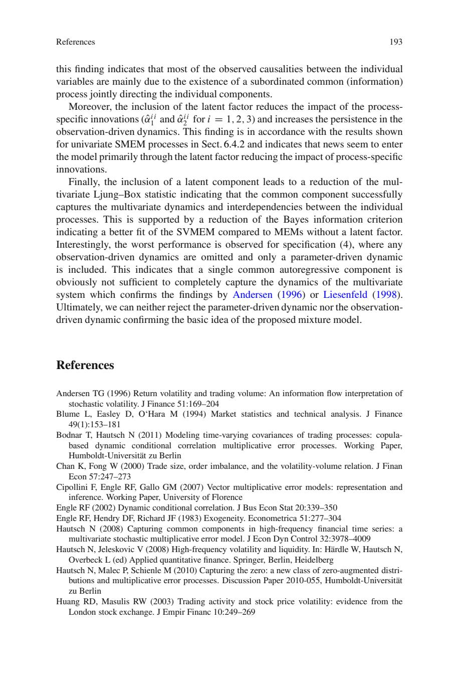

### PDF page 209 / printed page 194

```text
194                                                       7 Vector Multiplicative Error Models


Liesenfeld R (1998) Dynamic bivariate mixture models: modeling the behavior of prices and
   trading volume. J Bus Econ Stat 16:101–109
Manganelli S (2005) Duration, volume and volatility impact of trades. J Finan Markets 8:377–399
Richard J-F, Zhang W (2007) Efficient high-dimensional importance sampling. J Econom
   141:1385–1411
Xu XE, Wu C (1999) The intraday relation between return volatility, transactions, and volume. Int
   Rev Econ Fin 8:375–397
```


