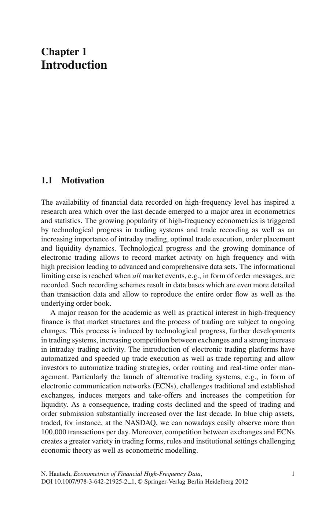
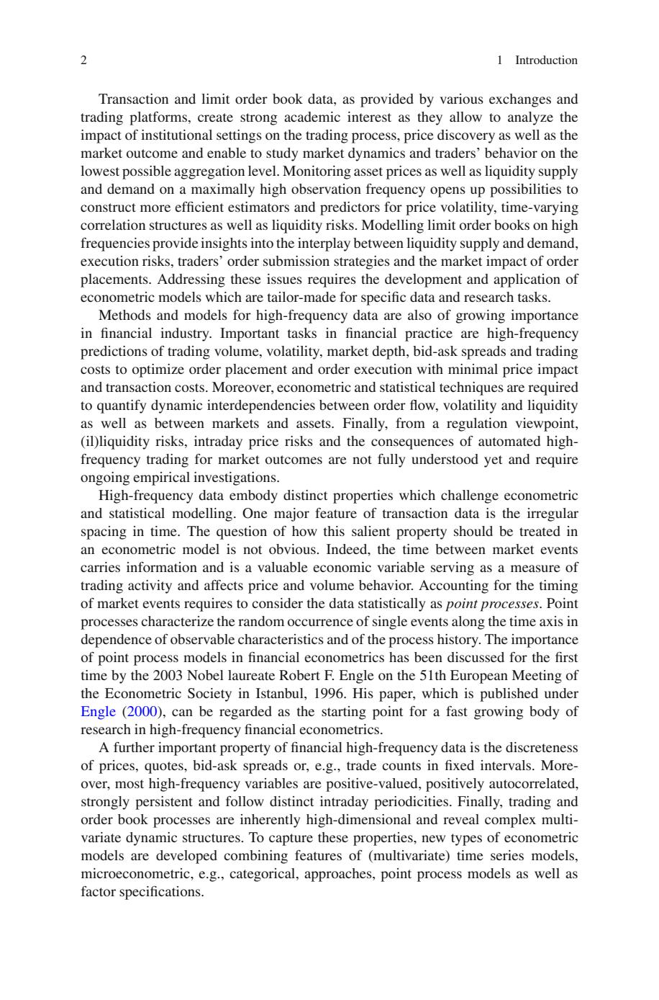
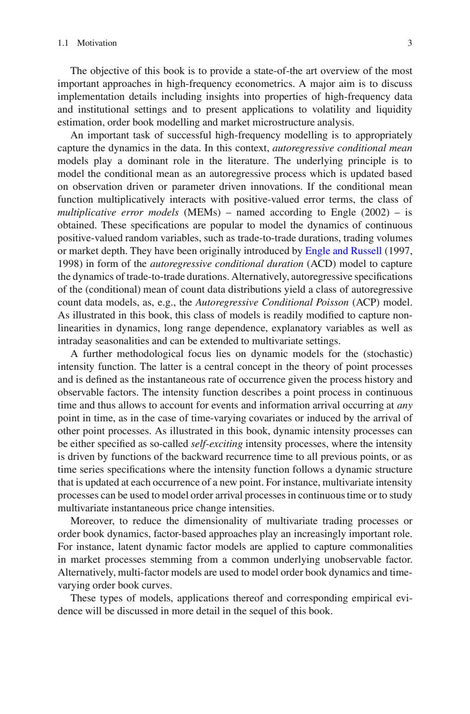
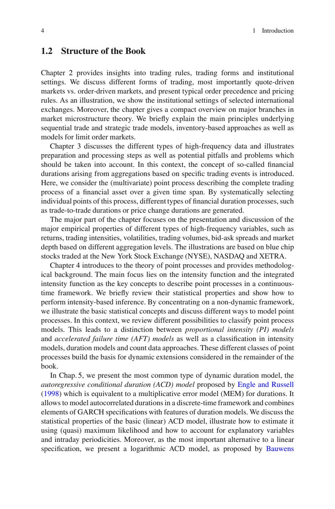
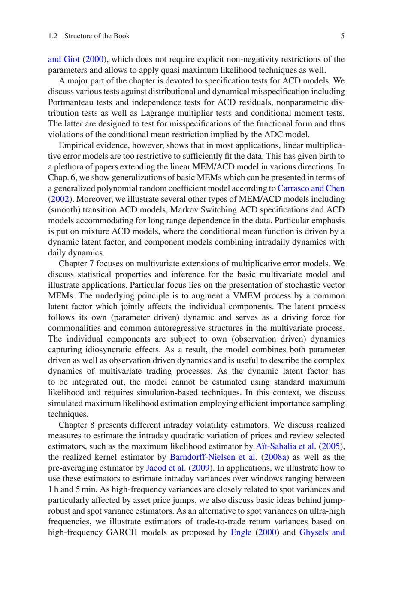
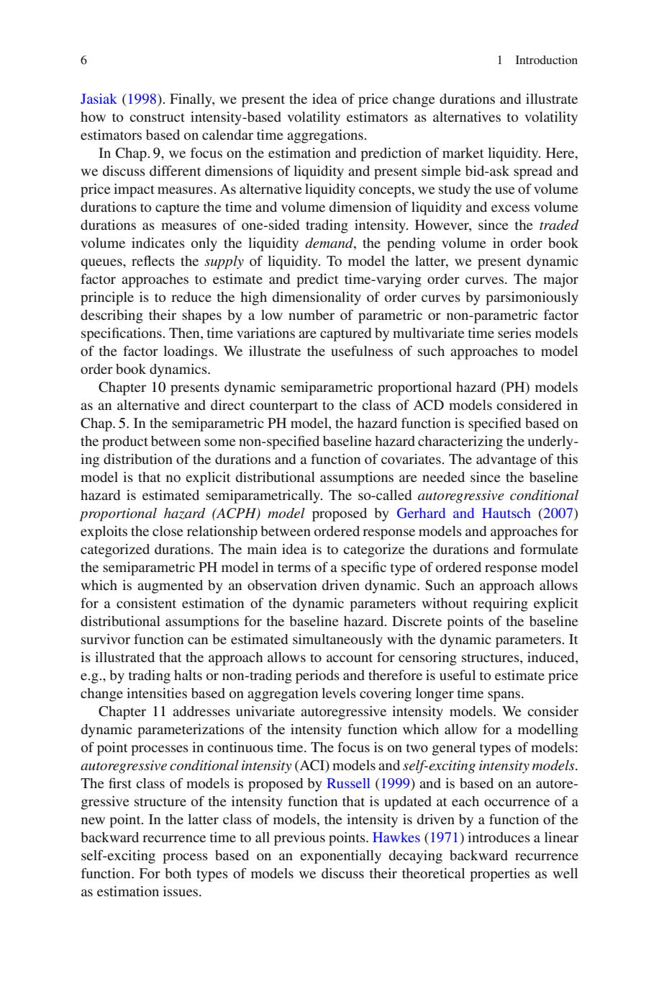
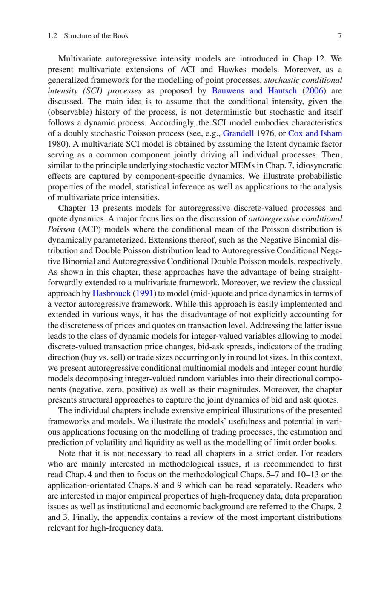
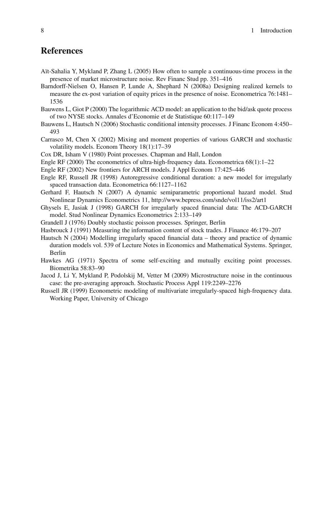

# 第1章: 導入（Introduction）

- 翻訳モデル: `gemma3:12b`
- 原文抽出テキスト: `../econometrics_hf_ch1_ch7_markdown_ja/raw_text/ch01_introduction.txt`
- 注: 数式・表・図はPDF抽出テキストでは崩れている場合があるため、ページ画像を併読してください。

## PDF page 16 / printed page 1

第1章
導入

1.1 動機

高頻度データで記録された金融データの利用可能性は、過去10年間で計量経済学および統計学における主要な研究分野へと発展した研究領域を刺激してきた。高頻度計量経済学の人気が高まっている背景には、取引システムおよび取引記録における技術進歩、そして日中取引、最適な取引執行、注文配置、流動性ダイナミクスの重要性の高まりがある。技術進歩と電子取引の台頭により、市場活動を高頻度かつ高精度で記録することが可能になり、高度で包括的なデータセットが作成されるようになった。情報理論上の限界は、例えば注文メッセージのようなすべての市場イベントが記録される場合に到達する。このような記録方式は、取引データよりも詳細なデータベースをもたらし、注文フロー全体と注文板を再現することを可能にする。

高頻度金融に対する学術的および実用的な関心の主な理由は、市場構造と取引プロセスが継続的な変化の対象となっていることである。このプロセスは、技術進歩、取引システムのさらなる発展、取引所間の競争の激化、そして日中取引活動の著しい増加によって引き起こされる。電子取引プラットフォームの導入は、取引執行と取引報告を自動化・加速させ、投資家が取引戦略、注文ルーティング、リアルタイムの注文管理を自動化することを可能にする。特に、電子通信ネットワーク（ECN）のような代替取引システムの導入は、伝統的で確立された取引所に挑戦し、合併や買収を誘発し、流動性に対する競争を激化させる。その結果、取引コストは低下し、取引速度と注文発注速度は過去10年間で大幅に向上した。例えばNASDAQで取引されるブルーチップ資産では、現在、1日に100,000件以上の取引を容易に観察することができる。さらに、取引所とECN間の競争は、取引形態、ルール、および制度設定の多様性を高め、経済理論および計量経済モデルに挑戦している。

N. Hautsch, Econometrics of Financial High-Frequency Data,                            1
DOI 10.1007/978-3-642-21925-2 1, © Springer-Verlag Berlin Heidelberg 2012

## PDF page 17 / printed page 2

2                                                                       1 導入

    様々な取引所および取引プラットフォームから提供される取引および指値注文板データは、機関設定が取引プロセス、価格発見、市場結果に与える影響を分析し、市場の動態とトレーダーの行動を可能な限り低い集計レベルで研究することを可能にするため、強い学術的関心を集めています。 資産価格の監視だけでなく、最大限の高い観測頻度で流動性の供給と需要を監視することで、価格ボラティリティ、時間とともに変化する相関構造、流動性リスクに対するより効率的な推定器と予測子を構築する可能性が開かれます。 高頻度で指値注文板をモデリングすることで、流動性の供給と需要の相互作用、実行リスク、トレーダーの注文発注戦略、注文配置による市場への影響に関する洞察が得られます。 これらの問題に対処するには、特定のデータと研究タスクに合わせて調整された計量経済モデルを開発および適用する必要があります。

    高頻度データのための方法とモデルは、金融業界でもますます重要になっています。 金融の実務における重要なタスクは、取引量、ボラティリティ、市場深度、ビッド・アスク・スプレッド、取引コストを高頻度で予測し、最小限の価格への影響と取引コストで注文配置と取引執行を最適化することです。 さらに、注文フロー、ボラティリティ、流動性、および市場と資産間の動的な相互依存性を定量化するために、計量経済学および統計的手法が必要です。 最後に、規制の観点から、（不適切な）流動性リスク、日中の価格リスク、および自動化された高頻度取引が市場結果に与える影響は、まだ十分に理解されておらず、継続的な実証的な調査が必要です。

    高頻度データは、計量経済学および統計モデリングに課題を突きつける、独特の特性を体現しています。 取引データにおける主要な特徴の1つは、時間の不規則な間隔です。 この顕著な特性を計量経済モデルでどのように扱うべきかという問題は明らかではありません。 実際、市場イベント間の時間は情報を含んでおり、取引活動の尺度として機能し、価格と出来高の行動に影響を与える貴重な経済変数です。 市場イベントのタイミングを考慮するには、データを統計的に点過程として扱う必要があります。 点過程は、時間軸に沿って単一のイベントがランダムに発生し、観測可能な特性とプロセスの履歴に依存して特徴付けられます。 金融計量経済学における点過程モデルの重要性は、1996年のイスタンブールで開催された第51回欧州計量経済学会会議で、2003年のノーベル賞受賞者であるロバート・F・エンゲルによって初めて議論されました。 エンゲル（2000）として出版された彼の論文は、高頻度金融計量経済学の研究の急速な成長の出発点と見なすことができます。

    金融の高頻度データにおけるもう1つの重要な特性は、固定間隔での価格、気配、ビッド・アスク・スプレッド、または、例えば、取引数の離散性です。 さらに、ほとんどの高頻度変数は正の値であり、正の自己相関を持ち、強い持続性を示し、独特の日中周期性に従います。 最後に、取引および注文板プロセスは本質的に高次元であり、複雑な多変量動的構造を明らかにします。 これらの特性を捉えるために、(多変量)時系列モデル、微視的計量経済学（例えば、カテゴリカル）、点過程モデル、および因子仕様の特徴を組み合わせた、新しいタイプの計量経済モデルが開発されています。

## PDF page 18 / printed page 3

1.1 動機                                                                       3

   本書の目的は、高頻度計量経済学における最も重要なアプローチの最先端の概要を提供するものである。主要な目的は、高頻度データおよび機関設定の特性に関する洞察を含む実装の詳細を議論し、ボラティリティと流動性の推定、注文板モデリング、市場マイクロストラクチャー分析への応用を提示することである。
   成功する高頻度モデリングの重要なタスクは、データ内のダイナミクスを適切に捉えることである。この文脈において、自己回帰条件付き平均モデルは文献において支配的な役割を果たしている。その背後にある原理は、観測主導型またはパラメータ主導型のイノベーションに基づいて更新される自己回帰過程として条件付き平均をモデル化することである。条件付き平均関数が正の値の誤差項と乗法的に相互作用する場合、一般化乗法誤差モデル（MEM）と呼ばれるクラスが得られる（Engle, 2002）。これらの仕様は、取引間デュレーション、取引量、または市場深度などの連続した正の値の確率変数のダイナミクスをモデル化するために人気がある。これらは、当初、EngleとRussell (1997, 1998)によって取引間デュレーションのダイナミクスを捉えるための自己回帰条件付きデュレーション（ACD）モデルの形で導入された。あるいは、(条件付き)カウントデータ分布の平均の自己回帰仕様は、自己回帰条件付きポアソン（ACP）モデルのような、自己回帰カウントデータモデルのクラスを生成する。本書で説明されているように、このクラスのモデルは、非線形性、長期依存性、説明変数、日中周期性などを捉えるために容易に修正でき、多変量設定に拡張できる。
    さらに重要な方法論的焦点は、(確率的)強度関数に対する動的モデルにある。後者は点過程の理論における中心的な概念であり、プロセスの履歴と観測可能な因子が与えられた場合の瞬時発生率として定義される。強度関数は連続時間における点過程を記述するため、時間変化する共変量や他の点過程の到着によって引き起こされるような、任意の時点でのイベントと情報到着を考慮することができる。本書で説明されているように、動的強度過程は、自己励起強度過程として指定することもでき、この場合、強度は以前のすべての点までの後方再帰時間関数によって駆動される。あるいは、強度関数が動的構造に従う時系列仕様として指定することもでき、新しい点の各発生時に更新される。例えば、多変量強度過程は、連続時間における注文到着過程をモデル化したり、多変量の瞬時価格変動強度を研究したりするために使用できる。
    さらに、多変量取引プロセスまたは注文板ダイナミクスの次元を削減するために、因子ベースのアプローチがますます重要な役割を果たしている。例えば、潜在的な動的因子モデルは、共通の観測不可能な因子に由来する市場プロセスの共通性を捉えるために適用される。あるいは、多因子モデルは、注文板ダイナミクスと時間変化する注文板曲線をモデル化するために使用される。
    これらのモデルの種類、それらの応用、および対応する経験的証拠は、本書の後半でより詳細に議論される。

## PDF page 19 / printed page 4

4                                                                        1 導入

1.2 書籍の構成

第2章では、取引ルール、取引形態、および機関設定に関する洞察を提供します。気配相場と指値注文相場の異なる取引形態、および典型的な注文優先順位と価格ルールについて議論し、選択された国際取引所の機関設定を例として示します。さらに、本章では市場マイクロストラクチャー理論における主要な分野の簡潔な概要を説明します。逐次取引と戦略的取引モデル、在庫ベースのアプローチ、および指値注文相場モデルの背後にある主な原則を簡単に説明します。

第3章では、さまざまな種類の高頻度データについて説明し、準備と処理の手順、および考慮すべき潜在的な落とし穴と問題について説明します。この文脈において、特定の取引イベントに基づく集計から生じるいわゆる金融デュレーションの概念が導入されます。ここでは、与えられた時間範囲における金融資産の完全な取引プロセスを記述する（多変量）点過程を考慮します。このプロセスの個々の点を体系的に選択することにより、取引間デュレーションや価格変動デュレーションなど、さまざまな種類の金融デュレーションプロセスが生成されます。

本章の主要な部分は、リターン、取引強度、ボラティリティ、取引量、ビッド・アスク・スプレッド、およびさまざまな集計レベルに基づく市場深度など、さまざまな種類の高頻度変数の主要な経験的特性の提示と議論に焦点を当てています。イラストレーションは、ニューヨーク証券取引所（NYSE）、NASDAQ、およびXETRAで取引されるブルーチップ株に基づいています。

第4章では、点過程の理論を紹介し、方法論的な背景を提供します。主な焦点は、連続時間フレームワークで点過程を記述するための主要な概念である強度関数と積分強度に置かれています。これらの統計的特性を簡単にレビューし、強度ベースの推論を実行する方法を示します。非動的フレームワークに焦点を当てることで、基本的な統計的概念を説明し、点過程をモデル化するさまざまな方法について議論します。この文脈において、点過程モデルを分類するさまざまな可能性をレビューします。これにより、比例強度（PI）モデルと加速故障時間（AFT）モデルの区別、および強度モデル、デュレーションモデル、およびカウントデータアプローチへの分類が生じます。これらの点過程クラスは、本書の残りの部分で検討される動的拡張の基礎を築きます。

第5章では、最も一般的な動的デュレーションモデルである、エンゲルとラッセル（1998）が提案した自己回帰条件付きデュレーション（ACD）モデルを紹介します。これは、デュレーションの乗法誤差モデル（MEM）と同等であり、離散時間フレームワークで自己相関デュレーションをモデル化することを可能にし、GARCH仕様の要素とデュレーションモデルの機能を組み合わせます。基本的な（線形）ACDモデルの統計的特性について議論し、(準)最尤法を使用して推定方法と、説明変数および日中周期性を考慮する方法について説明します。さらに、線形仕様の最も重要な代替手段として、バウエンスが提案した対数ACDモデルを紹介します。

## PDF page 20 / printed page 5

1.2 書籍の構成                                                                5

およびGiots（2000）では、パラメータの明示的な非負制約を必要とせず、疑似最尤法を適用可能である。
    本章の主要な部分は、ACDモデルの仕様検定に費やされている。ACD残差の分布および動的ミスペシフィケーションに対する様々なテスト、ポートマンテオ検定や独立性検定、非パラメータ分布検定、ラグランジュ乗数検定、条件付きモーメント検定について議論する。後者は、関数形ミスペシフィケーションやADCモデルが暗示する条件付き平均制約の違反を検定するように設計されている。
    しかしながら、実証的な証拠は、ほとんどの応用において、線形乗法誤差モデルではデータに十分適合できないほど制約が強すぎることを示している。このことは、線形MEM/ACDモデルを様々な方向に拡張する多数の論文を生み出している。第6章では、CarrascoとChen（2002）の一般化された多項式ランダム係数モデルの観点から提示できる基本的なMEMの一般化について説明する。さらに、(滑らかな)遷移ACDモデル、マルコフスイッチングACD仕様、長期依存性をデータに組み込んだACDモデルなど、他のタイプのMEM/ACDモデルも説明する。特に、条件付き平均関数が動的な潜在因子によって駆動される混合ACDモデル、および日中動態と日次動態を組み合わせたコンポーネントモデルに重点を置く。
    第7章では、乗法誤差モデルの多変量拡張に焦点を当てる。基本的な多変量モデルの統計的性質と推論について議論し、応用例を示す。特に、確率ベクトルMEMの提示に重点を置く。その背後にある原理は、VMEMプロセスに共通の潜在因子を付加し、それが個々の構成要素に共同に影響を与えることである。潜在過程は、独自の（パラメータ駆動）動態に従い、多変量過程における共通性および共通自己回帰構造の推進力として機能する。個々の構成要素は、固有の（観測駆動）動態に服従し、特異的な効果を捉える。その結果、モデルはパラメータ駆動および観測駆動の動態を組み合わせ、多変量取引プロセスの複雑な動態を記述するのに役立つ。動的な潜在因子を積分する必要があるため、標準的な最尤法では推定できず、シミュレーションベースの技術を必要とする。この文脈において、効率的な重要サンプリング技術を用いたシミュレーション最尤推定について議論する。
    第8章では、様々な日中ボラティリティ推定量を提示する。価格の日中二次変動を推定するための実現尺度について議論し、Aı̈t-Sahalia et al.（2005）の最尤推定量、Barndorff-Nielsen et al.（2008a）の実現カーネル推定量、Jacod et al.（2009）の前平均推定量など、選択された推定量をレビューする。応用において、1時間から5分までの範囲のウィンドウで日中の分散を推定するためにこれらの推定量をどのように使用するかを説明する。高頻度ボラティリティはスポットボラティリティと密接に関連しており、特に資産価格のジャンプの影響を受けるため、ジャンプ耐性およびスポットボラティリティ推定量の基本的なアイデアについても議論する。超高頻度におけるスポットボラティリティの代替として、Engle（2000）およびGhyselsと

## PDF page 21 / printed page 6

6                                                                       1 導入

Jasiak (1998). 最後に、価格変動のデュレーションという考え方を提示し、カレンダー時刻の集計に基づくボラティリティ推定量の代替として、強度に基づくボラティリティ推定量を構築する方法を説明する。
    第9章では、市場の流動性の推定と予測に焦点を当てる。ここでは、流動性のさまざまな側面について議論し、単純なビッド・アスク・スプレッドと価格インパクトの尺度を紹介する。代替の流動性概念として、流動性の時間とボリュームの次元を捉えるためにボリューム・デュレーションを使用し、一方的な取引の強度を測定するための過剰ボリューム・デュレーションを研究する。しかし、取引されたボリュームは流動性の需要を示すに過ぎないため、注文板のキューに待機しているボリュームは、流動性の供給を反映する。後者をモデル化するために、時間変化する注文曲線を推定および予測するための動的因子アプローチを提示する。主要な原則は、パラメータまたは非パラメータの少数の因子仕様によってそれらの形状を節約的に記述することにより、注文曲線の高次元性を削減することである。次に、因子負荷の多変量時系列モデルによって時間的な変動を捉える。このようなアプローチが注文板のダイナミクスをモデル化するのに役立つことを示す。
    第10章では、動的半パラメータ比例ハザード（PH）モデルを、第5章で検討されたACDモデルの代替および直接的な対応物として提示する。半パラメータPHモデルでは、ハザード関数は、デュレーションの背後にある分布を特徴付ける非指定されたベースラインハザードと、共変量の関数との積に基づいて指定される。このモデルの利点は、ベースラインハザードが半パラメータ的に推定されるため、明示的な分布仮定を必要としないことである。GerhardとHautsch (2007) が提案する、自己回帰条件付き比例ハザード（ACPH）モデルは、順序応答モデルと分類されたデュレーションのアプローチとの間の密接な関係を利用する。主なアイデアは、デュレーションを分類し、観測駆動型ダイナミクスによって拡張された特定のタイプの順序応答モデルの用語で半パラメータPHモデルを定式化することである。このようなアプローチにより、明示的なベースラインハザードの分布仮定なしで、動的パラメータを一貫して推定できる。ベースライン生存関数の離散点は、動的パラメータと同時に推定できる。このアプローチは、取引停止や非取引期間などによって引き起こされる検閲構造を考慮できるため、より長い時間幅をカバーする集計レベルに基づく価格変動強度を推定するのに役立つことを示す。
    第11章では、単変数の自己回帰強度モデルについて説明する。連続時間における点過程のモデリングを可能にする強度関数の動的パラメータ化を検討する。焦点を当てるモデルは、自己回帰条件付き強度（ACI）モデルと自己興奮強度モデルの2つの一般的なタイプである。ACIモデルの第一群は、Russell (1999) によって提案され、新しい点の各発生時に更新される強度関数の自己回帰構造に基づいている。後者のモデル群では、強度は、以前のすべての点への後方再帰時間の関数によって駆動される。Hawkes (1971) は、指数関数的に減衰する後方再帰関数に基づく線形の自己興奮プロセスを紹介する。これらのモデルのタイプの両方について、その理論的特性と推定問題について議論する。

## PDF page 22 / printed page 7

1.2 書籍の構成                                                                7

第12章では、多変量自己回帰強度モデルが導入される。ACIモデルとホークスモデルの多変量拡張を提示する。さらに、点過程のモデリングのための一般化されたフレームワークとして、BauwensとHautsch (2006)によって提案された確率的条件付き強度（SCI）過程について議論する。主要なアイデアは、過程の（観測可能な）履歴が与えられた場合の条件付き強度がある程度決定論的ではなく、確率的であり、それ自体が動的な過程に従うと仮定することである。したがって、SCIモデルは、二重に確率的なポアソン過程の特性を内包する（例えば、Grandell 1976、またはCoxとIsham 1980を参照）。多変量SCIモデルは、すべての個々の過程を共通の構成要素として共同に駆動する潜在的な動的因子を仮定することによって得られる。その後、第7章の確率的ベクトルMEMの背後にある原則と同様に、特異的な効果は、構成要素固有のダイナミクスによって捉えられる。本モデルの確率的性質、統計的推論、および多変量価格強度解析への応用を説明する。
第13章では、自己回帰離散値過程と気配のダイナミクスに関するモデルが提示される。主要な焦点は、ポアソン分布の条件付き平均が動的にパラメータ化される自己回帰条件付きポアソン（ACP）モデルの議論にある。負の二項分布や二重ポアソン分布などのそれらの拡張は、それぞれ自己回帰条件付き負の二項モデルと自己回帰条件付き二重ポアソンモデルにつながる。本章で示されているように、これらのアプローチは、多変量フレームワークに直接的に拡張できるという利点がある。さらに、Hasbrouck (1991)による古典的なアプローチを、（中）気配と価格のダイナミクスをベクトル自己回帰フレームワークでモデル化するために見直す。このアプローチは、簡単に実装および拡張できるが、取引レベルでの価格と気配の離散性を明示的に考慮していないという欠点がある。後者の問題に対処すると、離散値の取引価格の変化、ビッド・アスク・スプレッド、取引方向（買い vs. 売り）を示す指標、または丸取引単位でのみ発生する取引サイズをモデル化できる整数値変数向けの動的モデルのクラスにつながる。この文脈において、自己回帰条件付き多項モデルと整数カウントハドルモデルを提示し、整数値の確率変数を方向成分（負、ゼロ、正）およびその大きさへと分解する。さらに、本章では、気配と売り気配の共同ダイナミクスを捉えるための構造化されたアプローチを提示する。
個々の章には、提示されたフレームワークとモデルの広範な実証的説明が含まれている。取引プロセスのモデリング、ボラティリティと流動性の推定と予測、および指値注文板のモデリングに焦点を当て、さまざまなアプリケーションにおけるモデルの有用性と潜在能力を説明する。
読者が厳密な順序で全ての章を読む必要はないことに注意する。主に方法論的な問題に関心のある読者には、まず第4章を読み、その後、方法論的な第5～7章および第10～13章、または個別の章である第8章と第9章に焦点を当てることをお勧めする。高頻度データの主要な実証的特性、データ準備の問題、および制度的および経済的背景に関心のある読者は、第2章と第3章を参照されたい。最後に、付録には、高頻度データに関連する最も重要な分布のレビューが含まれている。

## PDF page 23 / printed page 8

8                                                                                1 導入

参考文献

Aı̈t-Sahalia Y, Mykland P, Zhang L (2005) How often to sample a continuous-time process in the
    presence of market microstructure noise. Rev Financ Stud pp. 351–416
Aı̈t-Sahalia Y, Mykland P, Zhang L (2005) 連続時間過程を市場マイクロストラクチャーノイズの存在下でどれくらいの頻度でサンプリングすべきか。Rev Financ Stud pp. 351–416

Barndorff-Nielsen O, Hansen P, Lunde A, Shephard N (2008a) Designing realized kernels to
    measure the ex-post variation of equity prices in the presence of noise. Econometrica 76:1481–
    1536
Barndorff-Nielsen O, Hansen P, Lunde A, Shephard N (2008a) ノイズの存在下で株価の事後変動を測定するための実現化されたカーネルの設計。Econometrica 76:1481–1536

Bauwens L, Giot P (2000) The logarithmic ACD model: an application to the bid/ask quote process
    of two NYSE stocks. Annales d’Economie et de Statistique 60:117–149
Bauwens L, Giot P (2000) 対数ACDモデル：2つのNYSE株式のビッド・アスク・クォートプロセスへの応用。Annales d’Economie et de Statistique 60:117–149

Bauwens L, Hautsch N (2006) Stochastic conditional intensity processes. J Financ Econom 4:450–
    493
Bauwens L, Hautsch N (2006) 確率的条件付き強度過程。J Financ Econom 4:450–493

Carrasco M, Chen X (2002) Mixing and moment properties of various GARCH and stochastic
    volatility models. Econom Theory 18(1):17–39
Carrasco M, Chen X (2002) さまざまなGARCHおよび確率ボラティリティモデルの混合およびモーメント特性。Econom Theory 18(1):17–39

Cox DR, Isham V (1980) Point processes. Chapman and Hall, London
Cox DR, Isham V (1980) 点過程。Chapman and Hall, London

Engle RF (2000) The econometrics of ultra-high-frequency data. Econometrica 68(1):1–22
Engle RF (2000) 超高頻度データの計量経済学。Econometrica 68(1):1–22

Engle RF (2002) New frontiers for ARCH models. J Appl Econom 17:425–446
Engle RF (2002) ARCHモデルの新たなフロンティア。J Appl Econom 17:425–446

Engle RF, Russell JR (1998) Autoregressive conditional duration: a new model for irregularly
    spaced transaction data. Econometrica 66:1127–1162
Engle RF, Russell JR (1998) 自己回帰条件付きデュレーション：不規則間隔で発生する取引データのための新しいモデル。Econometrica 66:1127–1162

Gerhard F, Hautsch N (2007) A dynamic semiparametric proportional hazard model. Stud
    Nonlinear Dynamics Econometrics 11, http://www.bepress.com/snde/vol11/iss2/art1
Gerhard F, Hautsch N (2007) 動的な半パラメータ比例ハザードモデル。Stud Nonlinear Dynamics Econometrics 11, http://www.bepress.com/snde/vol11/iss2/art1

Ghysels E, Jasiak J (1998) GARCH for irregularly spaced financial data: The ACD-GARCH
    model. Stud Nonlinear Dynamics Econometrics 2:133–149
Ghysels E, Jasiak J (1998) 不規則間隔で発生する金融データのためのGARCH：ACD-GARCHモデル。Stud Nonlinear Dynamics Econometrics 2:133–149

Grandell J (1976) Doubly stochastic poisson processes. Springer, Berlin
Grandell J (1976) 二重に確率的なポアソン過程。Springer, Berlin

Hasbrouck J (1991) Measuring the information content of stock trades. J Finance 46:179–207
Hasbrouck J (1991) 株取引の情報コンテンツの測定。J Finance 46:179–207

Hautsch N (2004) Modelling irregularly spaced financial data – theory and practice of dynamic
    duration models vol. 539 of Lecture Notes in Economics and Mathematical Systems. Springer,
    Berlin
Hautsch N (2004) 不規則間隔で発生する金融データのモデリング：動的デュレーションモデルの理論と実践、経済学と数学システムの講義ノート第539巻。Springer, Berlin

Hawkes AG (1971) Spectra of some self-exciting and mutually exciting point processes.
    Biometrika 58:83–90
Hawkes AG (1971) 自己興奮型および相互興奮型点過程のスペクトル。Biometrika 58:83–90

Jacod J, Li Y, Mykland P, Podolskij M, Vetter M (2009) Microstructure noise in the continuous
    case: the pre-averaging approach. Stochastic Process Appl 119:2249–2276
Jacod J, Li Y, Mykland P, Podolskij M, Vetter M (2009) 連続ケースにおけるマイクロストラクチャーノイズ：事前平均化アプローチ。Stochastic Process Appl 119:2249–2276

Russell JR (1999) Econometric modeling of multivariate irregularly-spaced high-frequency data.
    Working Paper, University of Chicago
Russell JR (1999) 多変量不規則間隔高頻度データの計量経済モデル。Working Paper, University of Chicago

