# 第2章: 市場マイクロストラクチャーの基礎（Microstructure Foundations）

- 翻訳モデル: `gemma3:12b`
- 原文抽出テキスト: `../econometrics_hf_ch1_ch7_markdown_ja/raw_text/ch02_microstructure_foundations.txt`
- 注: 数式・表・図はPDF抽出テキストでは崩れている場合があるため、ページ画像を併読してください。

## PDF page 24 / printed page 9

第2章
市場マイクロストラクチャーの基礎

本章では、市場マイクロストラクチャーの制度的および理論的基礎について概説する。第2.1節では、現代の金融市場における取引の制度的枠組みを紹介する。取引のさまざまな形態、トレーダーの種類、および注文の種類について議論する。さらに、主要な市場構造の基本的な種類、特に気配相場と注文相場を提示し、一般的な注文優先順位と価格決定ルールに関する洞察を提供する。最後に、いくつかの主要な国際取引所における市場構造と取引ルールについて議論する。本節は、金融市場マイクロストラクチャーの最も重要な制度的側面に関する概観として理解され、主にHarris (2003) を参照している。

第2.2節では、理論的市場マイクロストラクチャー文献の基本的な内容について簡潔に概説する。非対称情報に基づく古典的な市場マイクロストラクチャー理論のアプローチ、例えば逐次取引モデルや戦略的取引モデル、在庫ベースのアプローチ、および指値注文市場のモデルをレビューする。本節の目的は、個々のモデルの詳細な導出と議論を提供するものではない。むしろ、さまざまなアプローチの背後にある基本的な原則を簡潔に説明し、市場マイクロストラクチャーの関係と取引ダイナミクスに関する主要な予測をレビューする。より詳細な情報に関心のある読者は、例えばHasbrouck (2007) を参照されたい。

2.1 取引の制度的枠組み

2.1.1 トレーダーの種類と取引の形態

トレーダーは、自己の資金で取引を行うか、他者のために取引を手配するか、または他者に取引を手配させるかのいずれかである。したがって、自己の資金で取引を行うプロプライエリートレーダーと、顧客のために取引を代理するブローカーを区別する。これにより、プロプライエリートレードまたはエージェンシーまたはブローカー取引が行われることになる。ディーラー

N. Hautsch, 金融高頻度データの計量経済学,
DOI 10.1007/978-3-642-21925-2 2, © Springer-Verlag Berlin Heidelberg 2012

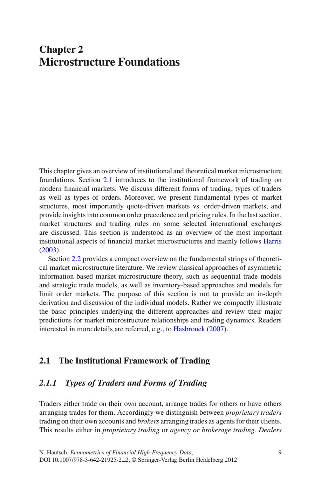

## PDF page 25 / printed page 10

10                                                        2 市場マイクロストラクチャーの基礎

トレーダーは、他のトレーダー（または顧客）が取引を希望する際に取引する準備ができている者を指すものである。それに応じて、必要に応じて市場の反対側で流動性供給者として機能する。彼らは、マーケットメーカー、スペシャリスト、またはフロアトレーダーとして運営される。トレーダーはしばしばブローカーとディーラーの両方を兼ねており、ブローカーディーラーとして知られている。

市場の買い手側は、通常、投資家（例：個人、ファンド、マネーマネージャー、寄付金）、借入人（例：個人または企業）、ヘッジャー（例：銀行）、または投機家によって牽引される。市場の売り手側は、ディーラー（例：マーケットメーカーまたはフロアトレーダーとして）、ブローカー（例：個人向けブローカーまたは機関向けブローカー）、またはゴールドマンサックスやメリルリンチのような有名な企業を代表するブローカーディーラーで構成される。

取引所は、トレーダーが取引を手配するプラットフォームである。ほとんどの取引所では、会員ブローカーのみが取引を許可されている。会員でない者は、会員に彼らの代わりに取引するように指示することでしか取引できない。フロア取引（トレーダーが取引所フロアで会って取引を手配する）と、電子システムを介して取引する電子取引を区別する。注文主導型システムは、一般的に、買いと売り注文のマッチングが特定の取引ルールに従って手配されるプラットフォームである。この場合、取引はコンピュータ、事務員、または会員ブローカーを介して処理できる。例えば、古典的なフロアベースの口頭オークションも、個人的な情報交換によって取引を手配する注文主導型システムである。逆に、コンピュータ化された注文主導型システムでは、注文のマッチングはコンピュータによって実行される。多くの場合、証券会社は顧客のために取引を手配するために、独自の（通常は注文主導型の）取引プラットフォームを持っている。重要な例としては、アイランドECNやアーキペラゴのような電子通信ネットワーク（ECN）があり、取引所として規制されておらず、証券会社やディーラーが所有する電子注文主導型システムである。これらの取引プラットフォームは、代替取引システムとして最もよく知られており、規制された取引所と競合している。最後に、取引は取引所を介さずに相対取引でも手配できる。例えば、ほとんどの取引が相対取引で行われるコポレート債市場がある。

2.1.2 注文の種類

注文は、トレーダーが個人的に取引を交渉できないという指示を表し、したがって何を取引するか、いつ取引するか、どれだけ取引するかを決定するものである。 ビッド（オファー）は、トレーダーが購入（売却）する意思を反映し、トレーダーが受け入れる価格と数量を含む。それに応じて、ビッドとアスク（オファー）価格は、トレーダーが取引する意思のある価格である。利用可能な最高（最低）ビッド（アスク）価格は、ベストアスク（ビッド）価格またはアスク（ビッド）気配と呼ばれる。市場気配は、市場におけるベストビッドとオファーを示し、ベストビッドアンドオファー（BBO）と呼ばれる。全国市場システム（NMS）株式の統合された市場におけるベストビッドとオファーは、全国ベストビッドアンドオファー（NBBO）と呼ばれる。ベストアスクとベストビッドの差は、ビッド・アスク・スプレッドと呼ばれる。

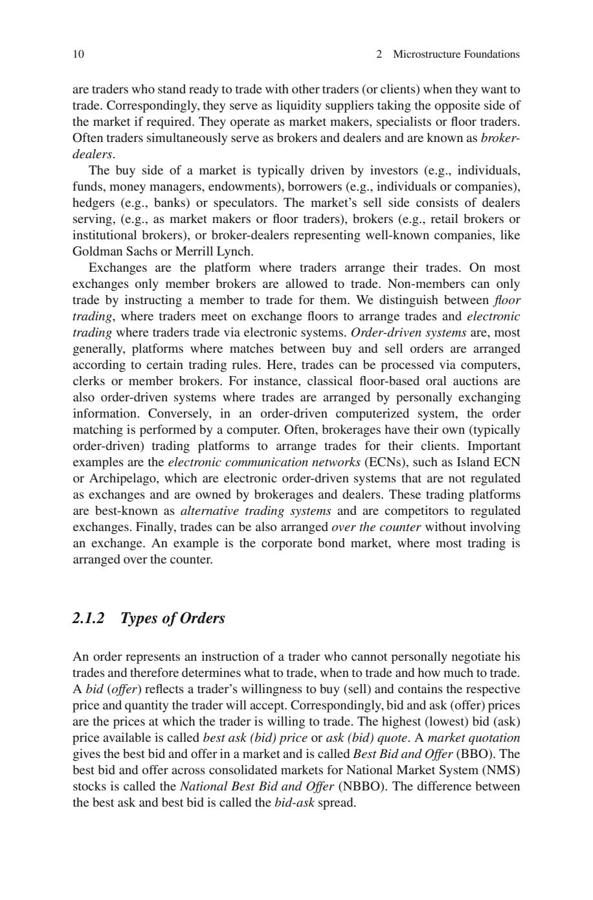

## PDF page 26 / printed page 11

2.1 取引の制度的枠組み                                              11

    成行注文は、現在市場で利用可能な最良価格で即座に取引される注文である。取引が実行される価格は取引価格と呼ばれる。成行注文のトレーダーは、提供された数量で注文が約定される限り、ビッド・アスク・スプレッドを「支払う」。成行注文のサイズが、最良の成行価格で提供されている数量よりも大きい場合、トレーダーは価格を動かす必要があり、したがって追加のプレミアム（「価格譲歩」）を支払う必要がある。購入者（または売り手）は、反対側の取引相手を見つけるために価格を高く（または低く）入札する必要がある。その結果生じる価格変動は、（即時的な）市場インパクトまたは価格インパクトと呼ばれ、注文サイズとともに自然に増加し、取引コストの主要な部分（ビッド・アスク・スプレッドの上）となる。潜在的な市場インパクトと実行価格の不確実性によって引き起こされるこれらの取引コストは、市場での優先権を得るためにトレーダーが支払う価格、すなわち「即時性に対する価格」と呼ばれることが多い。一部の市場では、トレーダーは価格を交渉し、現在利用可能な最良の成行価格および指値注文価格よりも優れた価格を受け取ることができる。この場合、トレーダーは、現在最高の気配よりも前に参入する意思のある取引相手によって価格改善を受ける。

    指値注文は、トレーダーが指定するいわゆる指値価格を上回らない価格で取引するための取引指示である。対応する指値価格が市場の反対側で必ずしも提供されるわけではないため、指値注文は実行リスクに直面する。必要な指値価格で反対側の取引相手がいない場合、注文は実行されず、価格と時間優先順位に従ってキューに入れられたすべての未実行の指値注文が格納されている指値注文板に配置される。それに応じて、指値注文と最良の気配との距離が遠いほど、キューでの注文の位置が悪化し、特定の時間枠内での実行確率は低下する。したがって、実行確率を高め、実行までの時間を短縮するために、指値注文トレーダーは市場に近い指値価格でより積極的に入札する必要がある。最良の気配で取引される指値注文は、市場で取引されると呼ばれる。それに対応して、現在の最良の気配よりも価格が劣る（または優る）指値注文は、市場の後ろ（または市場の内）と呼ばれる。買い注文の場合、最良の成行価格または指値注文価格と同等またはそれ以上の指値価格を持つ指値注文は、直ちに実行され、必要に応じて指値価格レベルに達するまで約定される。このような注文は、潜在的な価格インパクトを制限するために対応する指値価格を設定する成行注文に対応する、マーケット・トゥ・リミット注文と呼ばれる。指値価格が現在の最良価格よりも劣る場合、注文は買い注文の場合「上を歩く（または下を歩く）」必要がある。最後に、マーケット・トゥ・リミット注文は、注文板で最良の成行価格/指値注文価格で実行される成行注文である。マーケット・トゥ・リミット注文の未約定部分は、自動的に注文板に入力される。

    実行不確実性のリスクに加えて、指値注文トレーダーは、注文が実行され（「ピックアップ」）その後、新しいポジションに対して市場が動くことによって損失が発生する逆選択リスクに直面する。これは、たとえば、市場が下落し、保留中の買い（または指値）注文をピックアップし、その後も下落する場合に発生する。逆選択リスクは、市場から遠くに入札することでしか軽減できず、しかし、これにより実行不確実性が高まる。

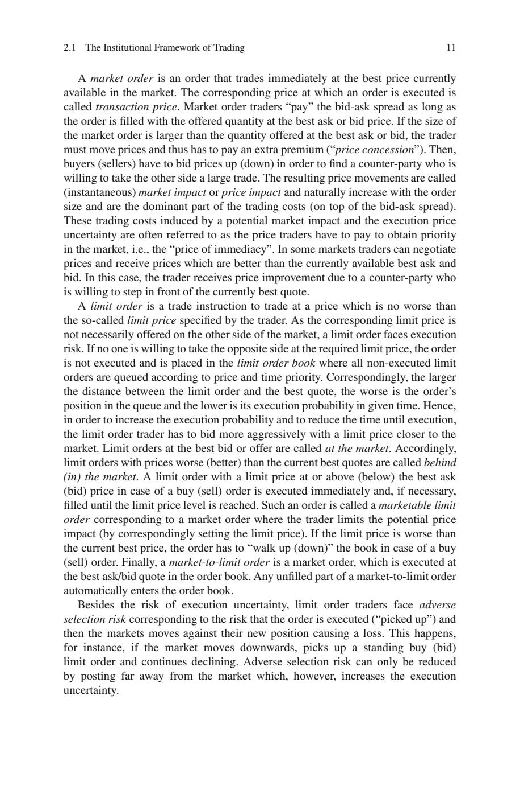

## PDF page 27 / printed page 12

12                                                          2 市場マイクロストラクチャーの基礎

ストップオーダーとは、価格がある「ストップ価格」に達すると、あらかじめ決められた数量を自動的に購入（または売却）する注文である。売却の場合、ストップオーダーは、価格がさらに下落した場合のさらなる損失を防ぐため、ストップロスオーダーと呼ばれる。したがって、リミットオーダーとは対照的に、ストップオーダーは、価格が指定されたストップ価格を超えるとすぐに有効化される。対照的に、リミットオーダーは、価格が対応するリミット価格よりも有利な場合にのみ執行される。両方の取引指示の組み合わせにより、ストップリミットオーダーが実現され、ストップ価格はリミットオーダーが有効になるタイミングを決定し、リミット価格は注文が執行される制限を示す。

いわゆるマーケット・イフ・タッチオーダーとは、価格がある特定のタッチ価格に達した場合にのみ有効になるマーケットオーダーである。ストップオーダーが価格が上昇（または下落）すると購入（または売却）するのに対し、対応するマーケット・イフ・タッチオーダーは、価格が下落（または上昇）すると売却（または購入）する。ロスオーダーは、市場のトレンドに沿って取引することで価格変動を強制し、モメンタムを生成するのに対し、マーケット・イフ・タッチオーダーはまさにその逆を行う。価格が下落したときに買い、価格が上昇したときに売り、それによって逆張り取引パターンを生成する。

リミットオーダーは通常、注文の有効期間やキャンセルされる可能性のある条件など、特定の属性と組み合わせて指定される。例えば、すぐに執行されない場合はキャンセルされるフィル・オール・キルオーダーや、一度に執行される場合にのみ執行されるオール・オア・ナーンオーダーなどがある。他の種類の注文については、例えば、Harris (2003) を参照されたい。

最後に、ますます多くの市場において、注文は部分的に、あるいは完全に隠蔽されることができる。一般的な注文のタイプとしては、いわゆるアイスバーグオーダー（またはリザーブオーダー）があり、これは一定の割合を非表示にし、他の市場参加者から非表示にするものである。このような注文は、取引戦略を隠蔽し、逆選択のリスクを軽減するために使用される。最小表示サイズは取引ルールによって固定されており、取引所によって異なる。一部の市場、例えばNASDAQでは、完全に隠蔽された注文を投稿することが可能である。Hautsch and Huang (2011) がNASDAQデータに基づいて示したように、完全に隠蔽された注文をスプレッドに投稿できる可能性は、トレーダーが潜在的な執行をテストするために「一過性のリミットオーダー」を送信することで、隠されたボリュームを「検索」し、かなりの市場活動を生み出す可能性がある。

2.1.3 市場構造

市場構造は、誰が取引できるか、何が取引できるか、いつ取引できるか、そしてどのように取引できるかを決定する。一般的に、市場が開いている間はいつでもトレーダーが取引できる継続取引と、市場が開かれたときにすべてのトレーダーが同時にコールオークションで取引するコール市場を区別する。コール市場は、取引セッションの開始時や価格を決定するために使用されることが多く、その後、市場が継続取引に移行する。同様に、取引セッションの終了時、昼休みコールオークションで継続取引を中断させるため、または取引停止後に再開させるためにも使用される。一部の市場では、コール市場は流動性の低い資産の取引にも使用される。

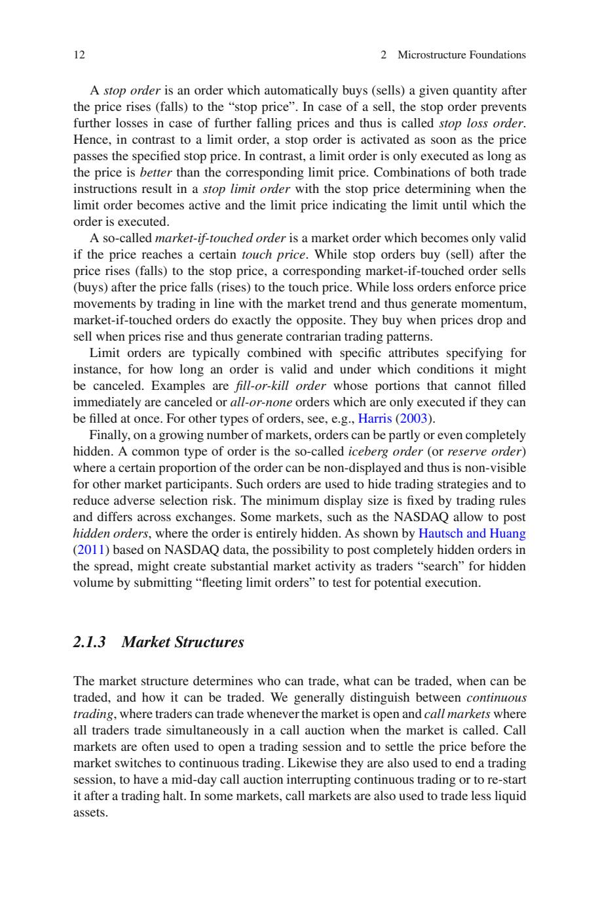

## PDF page 28 / printed page 13

2.1 取引の制度的枠組み                                          13

市場の最も重要な特徴は、その執行システムの形態である。
我々は、気配駆動ディーラー市場、指値注文市場、およびブローカー市場という、主要な3種類の執行システムを区別する。

2.1.3.1 気配駆動ディーラー市場

気配駆動市場（ディーラー市場）では、取引はディーラーのみによって執行される。
ディーラーは、気配価格（ビッド・アスク・スプレッド）を提示し、反対側の市場で待ち受けることで流動性を提供する。彼らはしばしば互いに取引を行う。純粋な気配駆動市場では、トレーダー（またはトレーダーの代理を務めるブローカー）は、自身で（一致するポジションを持っていても）取引することができず、気配価格を徴収するディーラーを通じて取引を実行しなければならない。しかし、一部（ただし純粋な）ディーラー市場では、トレーダーはディーラーとやり取りすることなく直接取引することができる。その顕著な例は、2.1.5.2節で説明されているNASDAQ Stock Marketである。
ディーラーは、多くの場合、信頼でき、信用力のある特定のクライアントにサービスを提供することに特化しており、クライアント外のカウンターパーティーとの取引を拒否したり、より多くの情報を持っている可能性があるカウンターパーティーとの取引を拒否したりする傾向がある。ディーラーとの信用関係を持っていないトレーダーは、信用力を保証するためにブローカーを介して取引しなければならない。ディーラー間ブローカーは、ディーラーが匿名性を維持し、競合他社に気配を知らせないことを好む場合に、ディーラー間の取引を手配するブローカーである。
気配駆動ディーラー市場は、債券、通貨、株式の取引において人気のある形態である。その例としては、NASDAQ Stock Marketやロンドン証券取引所がある。

2.1.3.2 指値注文市場

指値注文市場では、トレーダーは直接互いに取引を行う。ディーラーが仲介者として存在しないため、特定の取引ルールに従って取引が行われる。指値注文優先ルールは、どの買い手とどの売り手が取引するかを決定し、取引価格決定ルールは、結果として生じる取引価格を決定する。指値注文市場における流動性の提供は、トレーダーが反対側の市場で待ち受けるか、またはディーラーがトレーダーとして機能することで保証される。一部の指値注文市場では、流動性のほとんどが依然としてディーラーによって提供されている。しかし、指値注文市場の主な特徴は、ディーラーがクライアントを選択できず、オファーを受け入れる人に取引しなければならないことである。
指値注文市場は、主にオークション市場である。オークションは、買い手が利用可能な最低価格を求め、売り手が利用可能な最高価格を求める、いわゆる価格発見プロセスである形式化されたプロセスである。単一価格オークションでは、コール後に同じ価格で取引が行われ、同時に取引が手配される。対照的に、連続的な二方向オークションでは、トレーダーは時間の経過とともに変動する価格に基づいて、市場の両側で継続的に取引を手配する。口頭オークションのある市場では、トレーダーは取引フロアで直接対面して取引し、入札と気配を叫んで取引を交渉するため、こう呼ばれる。

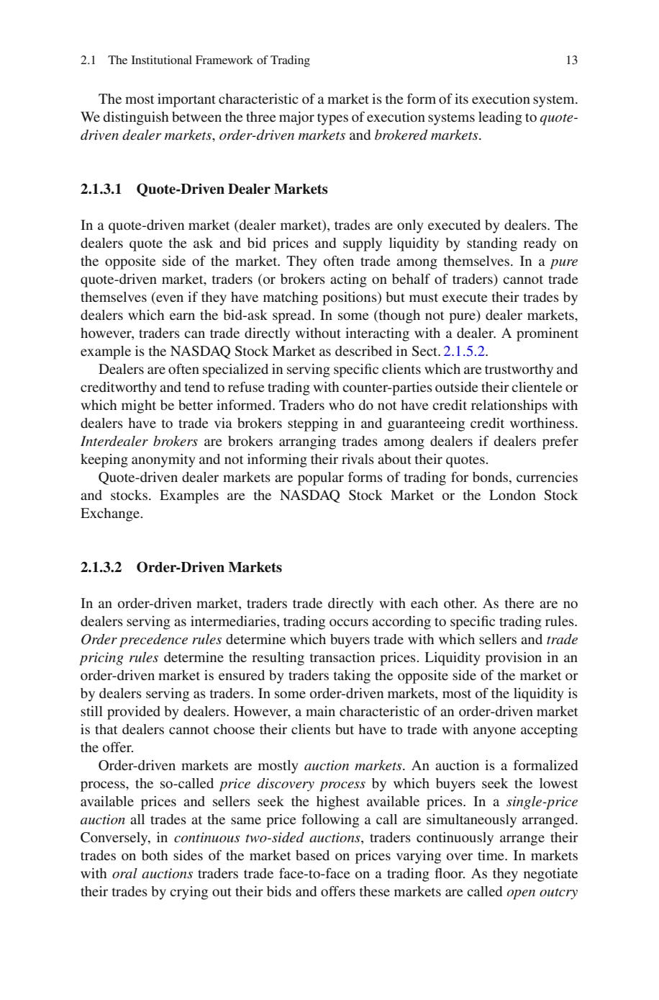

## PDF page 29 / printed page 14

14                                                        2 市場マイクロストラクチャーの基礎

市場。電子執行システムを用いる注文駆動市場では、ルールベースの注文マッチングが用いられる。
　オークションとして組織されていない注文駆動市場のみが、他の市場で決定される価格で取引が行われるクロスネットワークである。
これらの価格はクロスプライスと呼ばれる。クロスネットワークは、注文発注の優先度ルールに従って注文がマッチされるコール市場である。このような市場構造は、連続取引の終値に基づくアフターアワーズ取引を組織するために使用されることがある（例えば、ニューヨーク証券取引所）。あるいは、コール時刻後に特定の時間間隔内で連続市場の価格に対応する価格でランダムな時刻にクロスする日中のコールを組織するために使用される。
　ディーラー主導の市場とは対照的に、注文駆動市場では、取引が優先度ルールに従って行われ、トレーダーは取引相手を選択できない。トレーダーは通常、信用関係を持たない取引相手と取引する。適切な注文決済を確実にするために、これらの市場は複雑な清算メカニズムを必要とする。

2.1.3.3 ブローカー市場

ブローカー市場では、ブローカーが買い手と売り手のマッチを開始する。ブローカーの役割は、取引相手から提供される流動性を見つけることである。隠れトレーダーと潜在的トレーダーを区別する。隠れトレーダーは、戦略を隠すために公にオファーを発行しないが、取引を意図するトレーダーである。しかし、ブローカーが適切なマッチを提供する場合には取引する。潜在的トレーダーは、具体的な取引意図を持たず、魅力的な取引機会に直面した場合にのみ取引する。ブローカー市場で成功するブローカーは、隠れトレーダーと潜在的トレーダーの両方を見つける必要がある。

2.1.4 注文優先度と価格ルール

口頭オークションにおける注文優先度ルールは、価格優先度と時間優先度である。価格優先度ルールによれば、最も競争力のある価格を提供するトレーダーが優先される。トレーダーは、劣った価格での入札やオファーを受け入れることは許可されない。時間優先度ルールは、最初に最高の売り価格と買い価格を改善するトレーダーに優先権を与える。時間優先度は、相手方によって引用が維持または受け入れられる限り維持される。口頭オークションでは、トレーダーは「引用は息が温かい間だけ有効である」ため、優先度を維持するためにオファーを繰り返す必要がある。しかし、時間優先度は、いわゆる最小価格変動幅が小さすぎない限り、役に立たない。そうでない場合、時間優先度はわずかな特権しか与えず、競合他社が簡単に最高の引用を改善できる。口頭オークションでは、価格優先度は自己実現的であり、トレーダーは可能な限り最高の価格で取引しようとするため、最高のオファーを求めることが奨励される。これは、

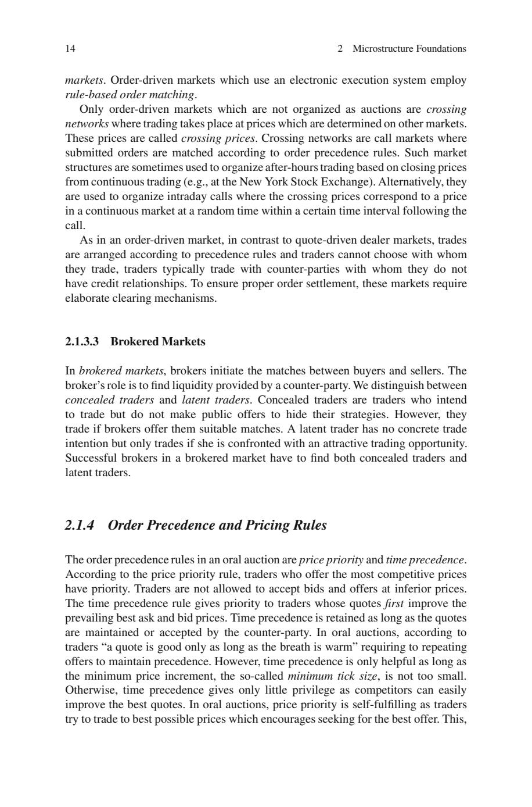

## PDF page 30 / printed page 15

2.1 取引の制度的枠組み                                           15

しかし、時間優先性は保証されているわけではない。なぜなら、トレーダーにとって、気配が等しい限り、誰と取引するかは関係ないからである。
    ほとんどの取引所や電子取引プラットフォームは、ルールベースの注文照合システムを使用している。ここでは、取引は通常匿名化され、分散化されており、トレーダーは電子的に注文を発注、キャンセル、または修正（既存の注文）する。注文照合は、通常自動化されたシステムによって、一連の手順を用いて行われる。すべてのシステムは、価格優先を主要な注文優先ルールとして使用し、第二の注文優先ルールとして、主に時間優先を使用する。一部の市場では、表示優先（表示された注文を非表示の注文よりも優先する）またはサイズ優先（大きいサイズまたは小さいサイズの注文を優先する）を使用する。Pro rata照合は、各注文のサイズに応じて満たされる割り当てをもたらす。
    単一価格オークションでは、市場は注文をランク付けし、最高ランクの買い注文と売り注文から照合を開始する。この照合は、買い手が売り手が求める金額以上の金額を支払う限り、取引となる。2つの注文のサイズが同じ場合、両方とも完全に執行される。そうでない場合、注文の未執行部分は、次の最高ランクの注文と照合される。このプロセスは、すべての可能な取引が照合されるまで続く。最後の可能な照合の価格が、市場清算価格である。単一価格オークションでは、すべての取引は市場清算価格で行われる。
    単一価格オークションの市場清算価格は、供給スケジュールが需要スケジュールに等しくなる価格に対応する。供給スケジュールは、価格優先度に従って総オファー量をリストしたものであり、非減少曲線である。同様に、需要スケジュールは、総売り量をリストし、非増加曲線である。それに応じて、清算価格以下の価格では市場に過剰な需要があり、清算価格を超える価格では過剰な供給がある。市場清算価格を選択してすべての注文を照合することにより、可能な最大量の取引量が行われる。さらに、このオークションに参加するトレーダーの全体的な利益が最大化されることが容易に示される。
    最後の実現可能な取引における買い注文が、売り注文よりも高い価格で入札した場合、結果として得られる市場清算価格は、これらの2つの価格のいずれかであるか、またはその間にある可能性がある。この場合、市場清算価格は正確な照合を提供せず、過剰な需要または供給が残る可能性がある。過剰な供給（需要）の場合、市場清算価格のすべての買い手（売り手）が注文を埋め、二次的な優先ルールは、どの売り（買い）注文を執行するかを決定する。
    口頭オークションおよび継続的なルールベースの注文照合システムにおける価格ルールは、差別の価格ルールと呼ばれる。このルールに従って、すべての取引は、受け入れられた売りまたは買いの価格を提案したトレーダーの価格で行われる。その結果、市場のすべてのオファーまたは買い側の注文が、段階的に劣った価格で差別的に照合される。これは、大きな注文が反対側の保留中のすべての取引と同時に照合され、最初のピースに最適な価格が与えられ、注文が売りまたは買いのスケジュールを上または下に進み、流動性を使い果たすにつれて、他のピースに段階的に劣った価格が与えられる方法と似ている。
    継続的なオークション市場では、このプロセスは、新しい注文が到着するたびに自動的に更新される注文板によって維持される。新しい注文は、注文板に…

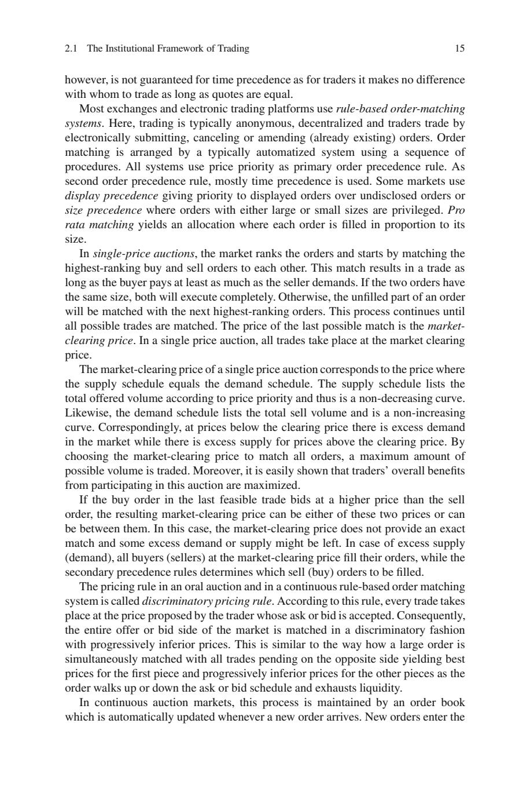

## PDF page 31 / printed page 16

16                                                        2 市場マイクロストラクチャーの基礎

注文優先ルールに従って注文板に登録される。登録された注文は、取引可能であれば、既存の注文とマッチングされる。その後、差別的価格設定の下では、既存の注文の指値価格が、各マッチングの価格を決定する。したがって、大規模な注文は、注文板を上または下方向に移動するにつれて、個別にマッチングされた部分で異なる価格で取引される。対照的に、一律価格設定の下では、個々の注文は、差別的価格設定の下で最悪の価格に対応する同じ価格で取引される。したがって、大規模で我慢できないトレーダーは差別的価格設定を好み、流動性供給者は一律価格設定を好む。
   最後に、特殊な種類の注文に対しては、洗練された修正ルールが適用される。例えば、隠し注文を許可する注文駆動市場では、表示された注文と非表示の注文部分の注文優先順位を規制する特別なルールが存在する。一般的なルールは、特定の指値価格に対して、表示された注文量は非表示の注文量よりも優先されるというものである（非表示の注文量が以前に投稿された場合でも）。より具体的な詳細は、例えばNASDAQの取引ルールを参照されたい。

2.1.5 選択された国際取引所における取引形態

このセクションでは、いくつかの選択された国際取引所における現在の取引形態を説明する。本書の残りの部分で使用されるデータの大部分は、これらの取引所から得られるため、これらの取引所に焦点を当てる。これらは、米国で最も重要な取引所であるニューヨーク証券取引所（NYSE）とNASDAQ、そしてフランクフルト証券取引所（XETRA）とオーストラリア証券取引所（ASX）の電子取引システムであり、株式で一般的に使用される典型的な電子指値注文板市場の代表である。

2.1.5.1 ニューヨーク証券取引所（NYSE）

NYSEでの取引は、ハイブリッドシステムに基づいている。つまり、取引メカニズムは、気配駆動型、注文駆動型、ブローカー型市場の要素を組み合わせている。本質的には注文駆動型市場であるが、依然として流動性を提供する専門家が存在する。実際、NYSEの取引は、声出しシステム、ディーラー市場、電子指値注文板を組み合わせている。
    NYSEは1792年に注文駆動型の声出しフロア市場として始まり、米国株式の主要な取引プラットフォームであった。その後、ディーラー市場の要素が声出しシステムに統合された。その結果、各株式について、1人のマーケットメーカー（専門家）が取引と気配プロセスを管理し、必要に応じて市場の反対側を引き受けて流動性の提供を保証する必要がある。専門家はまた、基礎となる指値注文板を維持する必要がある。専門家が投稿した注文に加えて、指値注文板は、取引所のルーティングシステムから直接注文も受け取る。これらの注文は、ブローカーを経由する必要がなく、専門家のワークステーションに直接送信される注文である。専門家は、自身の利益を表す気配を設定する。

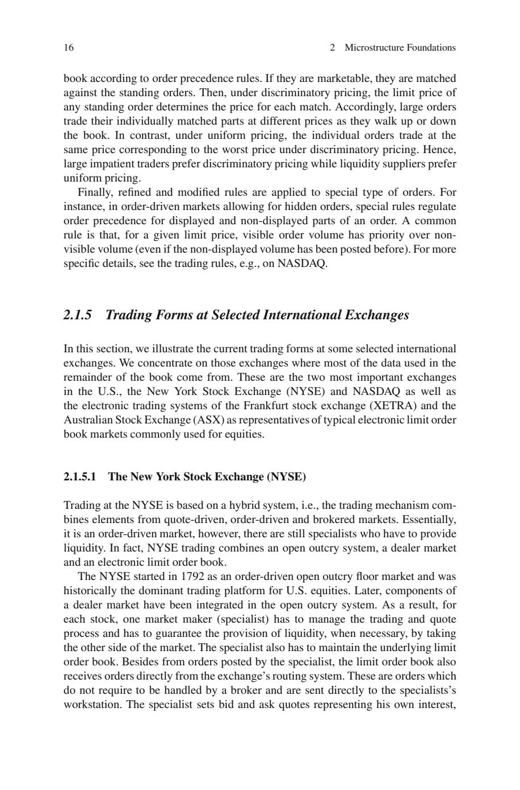

## PDF page 32 / printed page 17

2.1 取引の制度的枠組み                                         17

フロアブローカーのもの、または指値注文板で示唆される最適な気配と一致する。彼女は注文板のエージェントとして機能するにあたり、単一のフロアトレーダーとして扱われる。現在の規則によれば、専門家は、現在よりも有利な指値注文（注文板からのもの）を30秒以内に表示しなければならない。したがって、短い時間範囲では、注文板からの注文は、フロアブローカーが提示する価格よりも価格優先順位が低い場合がある。さらに、注文板はフロアトレーダーよりも時間優先順位が低い場合もある。ディーラー市場は、単一価格の指値オークションで開始される。
   NYSEの通常取引は9:30に開始し16:00に終了する。清算手続きにはオークションとの類似点があり、専門家は需給のバランスを取り、清算価格への（好ましい滑らかな）移行経路を確立する必要がある。したがって、「清算時」の取引は、比較的複雑な規則によって管理される。
   （現金取引）ディーラー市場では取引が専門家によってのみ執行されるが、NYSEはまた自動（電子）執行も提供する。2000年に導入されたNYSE Direct+システムは、ディーラー市場と並行して稼働する電子取引システムである。電子通信ネットワーク（ECN）との競争の高まりを受けて、NYSEはいくつかの合併を行った。重要な合併の1つは、NYSEとECN「Archipelago」との合併であり、「NYSE Arca」が誕生した。

2.1.5.2 NASDAQ

NASDAQという名称は、「National Association of Securities Dealers Automated Quotations」の略語であり、1971年にNational Association of Securities Dealers (NASD)によって設立された。歴史的に、それは地理的に分散したディーラーを結びつける電子システムとして主に組織化されたディーラー市場であった。1990年代初頭のNASDAQは、顧客の指値注文に対してほとんど保護を提供しなかった。例えば、競争的な顧客気配は必ずしも直ちに表示されず、ディーラーが自己勘定で取引するために使用された。そのような手続きは、1994/1995年に採用された「Manning Rules」によって禁止された。1994年、SECはNASDAQディーラーの協調した気配設定行動に関する調査を開始し、不必要に離散的な価格グリッドと大きなビッド・アスク・スプレッドをもたらした。これらの調査は、NASDAQディーラーに対する民事訴訟と、SECによるより明確な注文執行規則（NASDAQに限らない）につながった。これらの規則で最も重要な要素は2つあり、「表示ルール」は、現在優勢な気配よりも有利な価格の顧客注文を表示することを義務付け、そして「気配ルール」は、ディーラー間市場で引用する可能性のある（潜在的に有利な）価格を公開することを市場制作者に義務付けている。これらの改革の結果、NASDAQのスプレッドは大幅に縮小した。
   その後、NASDAQは（「SuperMontage」）と呼ばれる電子システムを確立し、取引執行、報告、確認、ディーラー間コミュニケーションを組織化している。その基盤となる原則は、主に電子指値注文板のそれらに類似しているが、これはディーラーによってのみ維持され、顧客によって維持されるものではない。NASDAQの地位は、多数の提携と買収によってさらに高まった。例えば、NASDAQは2003年にアメリカン・ストック・エクスチェンジ（AMEX）を買収した。

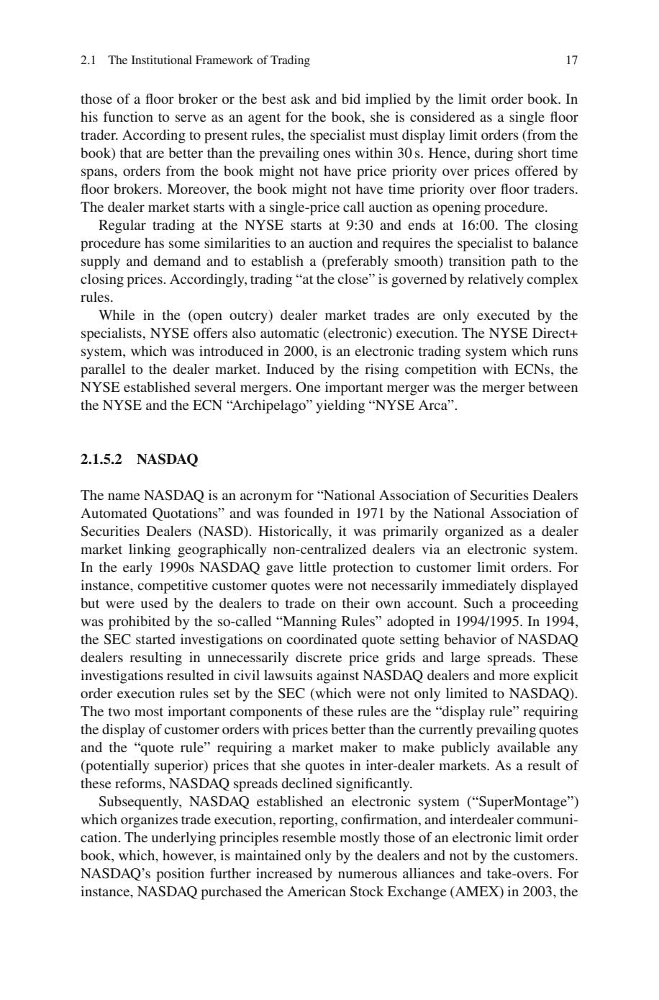

## PDF page 33 / printed page 18

18                                                         2 マイクロストラクチャーの基礎

ECNのINET（旧Island/Instinet）およびBrut、そして2007年のフィラデルフィア証券取引所。その結果、NASDQAは現在、米国最大の電子株式市場となっている。

2.1.5.3 XETRA

ドイツ証券取引所の電子取引システムであるXETRAは、株式および上場投資信託、投資信託、債券、ワラント、証明書など、様々な金融商品の現物市場取引のためのシステムである。1997年11月に、フランクフルト証券取引所における従来の床取引の電子的な補完として導入された。XETRAは、取引日の開始時と終了時にそれぞれ入札オークションがあり、また中日のオークションがある、ダブル連続オークションシステムである。通常取引期間中は、自動的な注文照合手順に基づいて取引が行われる。指値注文は、厳格な価格時間優先順位に従って注文板のキューに入力される。オークションでは、価格決定のためにすべての注文サイズが考慮されるが、連続取引は通常ロットのみに基づいて行われる。XETRA取引は完全に匿名であり、取引者の身元を明らかにはしない。取引者は、代理業者として、または自己資本取引者として行動できる。一部の取引者は、XETRAを代理してマーケットメーカーとして活動し、市場の両側での流動性を保証し、需給の不均衡を調整する義務を負う。通常の取引は現在、09:00から17:00まで行われる。

2.1.5.4 オーストラリア証券取引所

オーストラリア証券取引所（ASX）は、連続ダブルオークション電子市場であり、パリ、香港、サンパウロなどで運営されている電子指値注文板取引システムと同様の例である。連続オークション取引期間は、開始前と終了後にオークションが行われる。通常の取引は、月曜日から金曜日まで、シドニー時間で10:09から16:00まで継続的に行われる。指値注文は、厳格な時間価格優先順位に従って、買いと売りのキューに配置される。既存のキューに入れられた売り（買い）注文よりも高い（低い）価格で入札された買い（売り）注文は、直ちに執行される。注文は、指定された指値価格で利用可能な数量の範囲内で自動的に照合される。すべての注文と取引は常に一般に公開されている。注文価格は常に公開されているが、注文の総額が200,000豪ドルを超える場合、注文は非公開（隠れ）数量で入金されることがある。注文を入力した仲介業者の身元は公開情報ではないが、他のすべての仲介業者に利用可能である。オーストラリア証券取引所の取引システム（SEATS）の取引規則の詳細な説明は、www.asxonline.comで利用可能なSEATS参照マニュアルに記載されている。

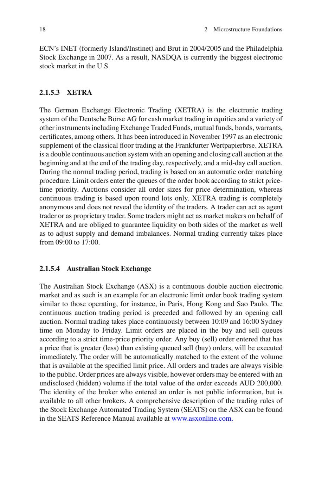

## PDF page 34 / printed page 19

2.2 市場マイクロストラクチャー理論のレビュー                                       19

2.2 市場マイクロストラクチャー理論のレビュー

本節では、理論的市場マイクロストラクチャー文献における基本的なアプローチと
方向性を簡潔に概観する。より詳細な議論は、例えばO’Hara (1995)、Madhavan
(2000) のサーベイ、Biais et al. (2005) のサーベイ、またはHasbrouck (2007) の
モノグラフで与えられる。
   Madhavan (2000) が述べているように、市場マイクロストラクチャー理論は、「投資家の
潜在的な需要が最終的に価格と取引量に翻訳されるプロセス」に関わっている。したがって、市場マイクロストラクチャー理論における中心的なトピックは、価格形成、価格発見、在庫、流動性、取引コスト、そして市場における情報伝播と普及を扱うものである。伝統的なマイクロストラクチャー理論は、価格設定行動を説明するための2つの主要な方向性を提供する。それは、非対称情報に基づくモデルと在庫モデルである。前者の分野は、非対称情報と逆選択の理論からの洞察を用いて、市場のダイナミクスと価格調整プロセスをモデル化する。2.2.1節で議論されるように、主なアプローチは、逐次取引モデルと戦略的取引モデルの2つである。在庫モデルの分野は、2.2.2節で議論されるように、注文フローの不確実性、流動性供給者の在庫リスクと最適化問題を、潜在的なリスク回避の下で調査する。個々のアプローチの主要な理論的含意を2.2.3節でまとめる。最後に、より最近の研究では、指値注文板市場における取引行動と均衡が扱われている。これを2.2.4節で簡単にレビューする。

2.2.1 非対称情報に基づくモデル

2.2.1.1 逐次取引モデル

逐次取引モデルでは、ランダムに選択されたトレーダーが順番に市場に到着する。このフレームワークは、異なる情報を持つトレーダーの存在を前提としている。したがって、「インサイダートレーダー」と呼ばれる、資産の基礎価値に関する非公開情報に基づいて取引するトレーダーと、「流動性トレーダー」と呼ばれる、ポートフォリオ調整や流動性といった外生的な理由で取引するトレーダーがいる。異質なトレーダーグループの仮定は、非対称情報に基づくモデルの基盤となる。この方向性における重要な論文は、Copeland and Galai (1983) と Glosten and Milgrom (1985) である。
   Glosten and Milgrom (1985) のモデルでは、証券は与えられた確率で高いか低いペイオフを持ち、市場閉鎖後に明らかになる。トレーダーの集団は、真の資産ペイオフを知っているインサイダートレーダーと、等しい確率でランダムに購入または売却する情報のないトレーダーで構成されている。インサイダートレーダーは、真の資産価値が高い場合に購入（売却）する。市場におけるインサイダートレーダーの割合は与えられている。ディーラーは情報を持たず、取引履歴に基づいて資産の真の価値を推測する。特に、購入（売却）要求の観察は、

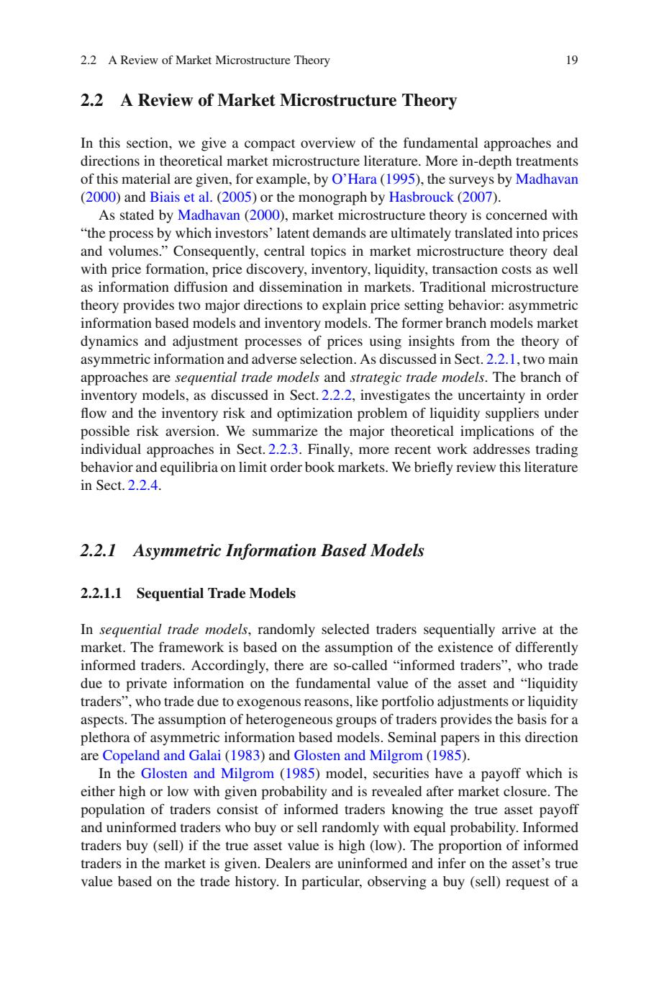

## PDF page 35 / printed page 20

20                                                         2 市場マイクロストラクチャーの基礎

トレーダーにとって、ディーラーは取引が買いまたは売りであるという条件で、資産の期待値を計算する。次に、彼女は、無知な買い手（売り手）からの期待収益が、情報を持つ買い手（売り手）からの損失によって相殺されるように、気配（bid）価格（売り気配）を設定する。次の取引後、ディーラーは、初期の信念を事前分布として使用して、資産の真の価値に関する信念を更新する。これにより、資産の真の価値の確率に関する更新再帰が発生する。結果として得られるビッド・アスク・スプレッドは、資産の潜在的な価値（高い vs 低い）、それらの対応する確率、および情報を持つトレーダーの相対的な割合の関数となる。この逐次取引モデルの基本的な意味合いは、取引価格がマルチンゲールに従うこと、注文フローが相関していること（買いは買いに続き、売りは売りに続く）、ディーラーの不確実性が減少するにつれてビッド・アスク・スプレッドが時間とともに低下すること、および個々の取引が価格に影響を与えることである。
   Glosten and Milgrom (1985) のモデルは、さまざまな方向に拡張および修正されている。Easley and O‘Hara (1992) は、各日の開始時に取引イベントのランダムな発生を仮定することで、イベントの不確実性を許容する。情報イベントがない場合、情報を持つトレーダーは取引を控えて、無作為に市場で取引する無知なトレーダーのみが取引する。Easley and O‘Hara (1992) は、無知なトレーダーが必ずしも常に買いまたは売りを行うのではなく、取引を控えることもできると仮定する。したがって、取引がない発生（すなわち、取引プロセスの減速）も情報を含む。したがって、ビッド・アスク・スプレッドに加えて、取引間の時間も情報となる。このフレームワークのバリエーションとして、Easley and O‘Hara (1987) では異なる注文サイズが許可され、Easley and O‘Hara (1991) では異なる種類の注文が許可される。
   Easley et al. (1997) および Easley et al. (2002) は、Easley and O‘Hara (1992) のフレームワークを拡張し、資産の真の価値を決定するイベントのポアソン到着を許容する。次に、トレーダーは離散時間で逐次的に到着するのではなく、連続時間でランダムに到着する。この到着プロセスは、情報を持つトレーダーと無知なトレーダーに対して異なる強度を持つ、さらなるポアソンプロセスによって管理される。その結果、毎日の買いと売りの数は、ポアソン分布の混合に基づいて共同分布する。次に、情報到着強度と、情報を持つトレーダーと無知なトレーダーの到着強度に基づいて、PIN（informed trading probability、情報取引確率）、すなわち、ランダムに選択されたトレーダーが情報を持っている確率を計算することができる。Easley et al. (2008) は、このアプローチを動的フレームワークに拡張し、時間変化する PIN を推定する。

2.2.1.2 戦略的取引モデル

逐次取引モデルでは、トレーダーは市場に一度だけ参加する。したがって、彼女は自身の取引決定が他の人のその後の行動に与える影響を考慮しない。その結果、情報を持つトレーダーは、将来の取引における可能性のある不利な価格効果を考慮する必要がないため、可能な限り大きな量を取引する。この状況は、トレーダーが繰り返し市場に参加し、したがって戦略的に行動しなければならない戦略的取引モデルでは、完全に異なる。この分野の画期的な論文は Kyle (1985) である。Kyle のモデルでは、証券の価値は確率的であるが、情報を持つトレーダーによって知られている。無知なトレーダー（「ノイズトレーダー」）は、

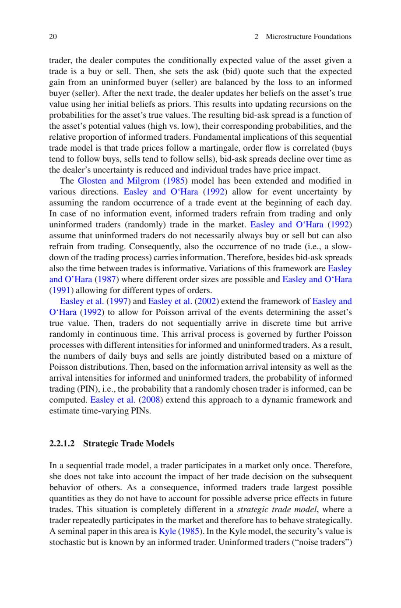

## PDF page 36 / printed page 21

2.2 市場マイクロストラクチャー理論のレビュー                                         21

取引は資産の真の値とは独立して行われ、確率的な注文フローが送信される。マーケットメーカーは、無知なトレーダーと情報を持つトレーダーの両方の需要を受け取り、すべての取引が決済されるような価格を設定する必要がある。しかし、情報を持つトレーダーが積極的に取引する可能性があるため、マーケットメーカーは、無知なトレーダーと情報を持つトレーダーから要求された純総量（net volume）の線形増加関数として価格を設定することで、市場の反対側にいることによる損失から身を守らなければならない。しかし、これはマーケットメーカーの価格設定ルールに対する情報を持つトレーダーによって予測され、そのトレーダーは自身の推測したマーケットメーカーの価格設定ルールと需要に基づいて利益を計算する。シーケンシャルな取引モデルとは対照的に、流動性トレーダーからの高い需要がマーケットメーカーが設定する価格を押し上げることにより、情報を持つトレーダーの利益が必ずしも正であるとは限らないことに注意する。情報を持つトレーダーの最適化問題は、期待利益を最大化するように需要を選択することである。これにより、資産の真の値に対する線形の需要関数が導出される。
   マーケットメーカーが情報を持つトレーダーの基礎となる最適化問題を推測すると、自身の価格設定ルールのパラメータに依存して、トレーダーの資産の真の値に対する線形の需要関数を計算できる。これにより、トレーダーの需要の傾きとマーケットメーカーの価格設定ルールの傾きの間に逆相関関係が生じる。マーケットメーカーの価格設定ルールの傾きは、純注文フローの影響価格を決定し、一般に「Kyleのラムダ」と呼ばれる。
   Kyle (1985) は、二変量正規確率変数の性質を利用して、この量を操作可能にする。このような枠組みでは、資産の総需要と資産の真の値の共分散、およびノイズ取引の分散の関数として計算できる。Kyleモデルの帰結として、情報を持つトレーダーの期待利益は、資産の真の値とマーケットメーカーの無条件価格（注文フローに関係なく）との乖離、およびノイズ取引の分散に比例して増加する。後者の効果は興味深いものであり、ノイズ取引の分散が大きいほど、情報を持つトレーダーの利益が高いことを意味する。これは、市場に多くの流動性がある場合に情報を持つトレーダーの利益が高いことを意味する。
   Kyleのモデルは、さまざまな方向に拡張されている。例えば、Admati and Pfleiderer (1988) と Foster and Viswanathan (1990) は、戦略的に行動する無知なトレーダーを許可している。Foster and Viswanathan (1996) らは、マルチピリオドモデルを許可している。

2.2.2 在庫モデル

在庫モデルは、バイヤーとセラーが非同期に到着するディーラーの在庫問題を考慮する。この文献の流れは、Garman (1976) から派生しており、バイヤーとセラーの到着過程をポアソン過程としてモデル化している。到着強度（intensity）は、それぞれ支払うまたは受け取る価格に依存する。したがって、強度（intensity）が等しい限り、ディーラーは平均的に同じレートで売買している。ディーラーは、スプレッドを設定することで利益を上げ、スプレッドが大きいほど、取引あたりの利益は高くなるが、取引到着率は低下する。Garman (1976) は、市場の在庫問題を特徴づける。

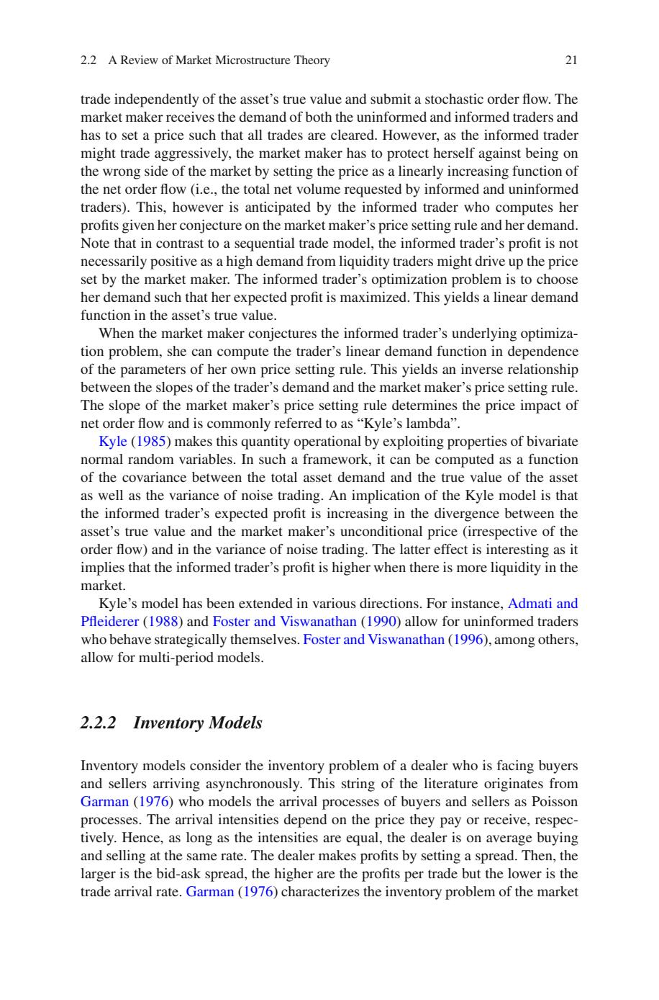

## PDF page 37 / printed page 22

22                                                         2 市場マイクロストラクチャーの基礎

セキュリティと現金における保有額が、ある一定レベルを下回らないようにしなければならないマーケットメイカーの状況を記述している。買い手と売り手の到着強度に影響を与える気配が設定されている場合、株式の保有額はゼロドリフトの確率過程に従い、現金の保有額は正のドリフトの確率過程に従う（スプレッドが厳密に正である限り）。これは、ゼロドリフトの確率過程が有限レベルに到達する確率が1であるため、マーケットメイカーが破産する確率が1になる原因となる。したがって、マーケットメイカーが気配を一定に保つ限り、短時間で破産する可能性がある。Amihud and Mendelson (1980) は、マーケットメイカーの在庫が上限と下限の間に制約されている類似の枠組みを提示している。彼らは、在庫がこれらの境界に近づくと、買い手と売り手の到着強度をそれぞれ引き上げたり下げたりするために、マーケットメイカーが気配を更新することを示している。その結果、気配は資産の真の値の周りで必ずしも対称的に設定されるわけではないが、在庫レベルに対して単調に減少する。
    ディーラーの価格設定は、ディーラーが危険回避的であり、ポートフォリオを適切にバランスをとるために気配を設定する枠組みでも分析できる。これは、例えば、Stoll (1978), Ho and Stoll (1981), Stoll (1989) および Huang and Stoll (1997) などによって研究されている。

2.2.3 取引変数に対する主な影響

主要なマイクロストラクチャー変数およびそれらの関係の特性と決定要因に関する主な理論的知見を以下にまとめる。
    1. 取引量：Easley and O’Hara (1987) のモデルでは、トレーダーは少量または大量を取引することを許可されているが、取引を控えることは許可されていない。したがって、大量の取引は情報の存在を示唆する。Blume et al. (1994) は、トレーダーが各期間に異なる品質の情報シグナルを受け取る場合に、取引量の情報的役割を調査している。著者らは、取引量の統計的特性が市場価格の行動とどのように関連しているかを分析し、トレーダーが取引量から市場の情報量と品質を推測できることを示している。重要な結果として、取引量は価格統計からは推測できない追加情報を提供する。その結果、取引量とボラティリティは相関関係にある。
    2. ビッド・アスク・スプレッド：Glosten and Milgrom (1985) のモデルでは、マーケットメイカーは、逆選択によるリスクを相殺する方法でスプレッドを決定する。マーケットメイカーが、より優れた情報を持つ市場参加者との取引によって損失を被る確率が高いほど、ビッド・アスク・スプレッドは高くなる。さらに、ビッド・アスク・スプレッドは、マーケットメイカーの在庫リスクと危険回避性とも正の相関関係にある。Easley and O‘Hara (1992) のアプローチでは、マーケットメイカーは無取引間隔を利用して、新しい情報の存在を推測する。その結果、遅延したデュレーションとスプレッドの大きさは負の相関関係にある。
    3. 取引間デュレーション：Diamond and Verrecchia (1987) は、空売り制約のある合理的期待モデルを提案している。彼らは、取引がないことは、

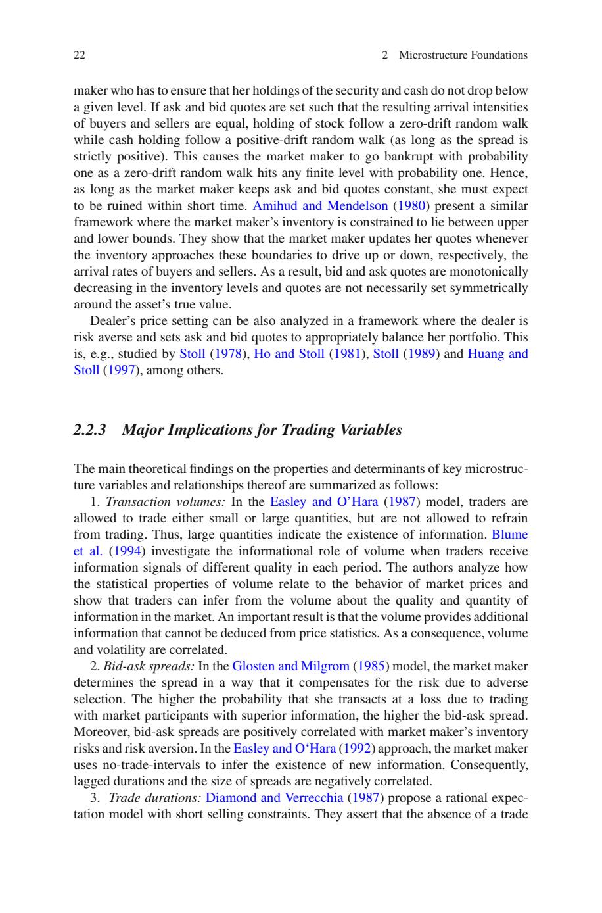

## PDF page 38 / printed page 23

2.2 市場マイクロストラクチャー理論のレビュー                                          23

取引の「悪い」ニュースの発生と関連付けられる。次に、取引がないことは
情報であり、価格のボラティリティと相関関係にある。この枠組みでは、時間
は課せられた空売り制限のみによって重要となる。しかし、Easley and O‘Hara
(1992) では、情報シグナルが存在するたびに情報トレーダーが市場に参入する
一方、情報を持たないトレーダーも取引を控えることがある。その結果、短い
取引間デュレーションは情報の存在を示唆する。Admati and Pfleiderer (1988)
は、デュレーションの時間的クラスタリングの説明を提供する。彼らの設定では、
流動性トレーダーは取引コストを最小限に抑え、他のトレーダーが市場にいる場合に
取引することを好む。均衡において、情報トレーダーが同様に振る舞うことが最適
となる。その結果、取引はクラスタリングされ、取引デュレーションは正の自己相関
を示す。

2.2.4 指値注文板市場のモデル

指値注文市場をモデル化するための画期的な論文はGlosten (1994) である。このモデル
では、すべての市場参加者は電子スクリーンにアクセスできる。指値注文の投稿は
無コストで行われ、注文板に対する取引の実行は「差別的」な方法で行われる。
すなわち、各指値注文は、その指値価格で取引される。投資家は合理的でリスク回避的
であり、現金および株式ポジション、および個人的な嗜好の準凹性効用関数を最大化する。
成行注文トレーダーの取引行動は、彼らの限界評価関数と、現在行われている取引条件、
すなわち、利用可能なビッド・アスク・スプレッドによって、投資家の現金および株式
ポジションの変化に影響を与える。投資家は、彼女の限界評価が、取引で最後に株式を
購入した価格に対応する限界価格に等しくなるように取引量を決定すると仮定される。
投資家の限界評価が将来のペイオフに関連付けられている場合、情報取引が存在する。
電子市場の匿名性により、到着した成行注文によって暗示される潜在的な限界評価は、
流動性供給者によって、注文板が提供する取引条件に基づいて観測された指値価格と
取引量を通じて評価される。
   Glostenは、指値価格と数量を「上限期待値」に基づいて設定する、多数の無情報、
リスク中立的で利益最大化を目指す指値注文発注者がいると仮定する。後者は、次の
到着の限界評価が取引量以上であるという条件で、資産の完全情報清算価値の条件付き
期待値に対応する。民間情報が存在する場合、流動性供給者は、対応する価格で取引される
成行注文に対して、指値価格を上限期待値以上の価格に設定することで、逆選択から自
身を守る。このような戦略がゼロ利益条件を特徴とするナッシュ均衡をもたらすことが示
されている。
   Glostenのモデルは、Chakravarty and Holden (1995), Handa and Schwartz (1996),
Seppi (1997), Kavajecz (1999), Viswanathan

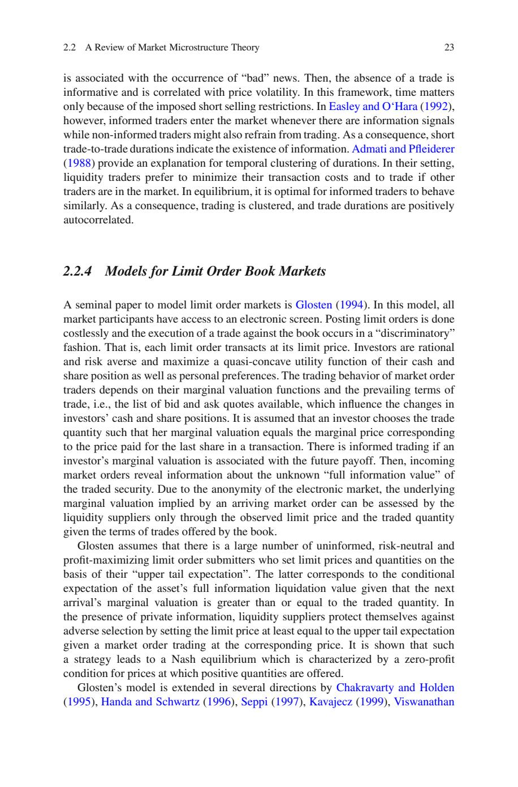

## PDF page 39 / printed page 24

24                                                             2 市場マイクロストラクチャーの基礎

そして Wang (2002) や Parlour and Seppi (2003) を参照されたい。しかしながら、静的な均衡モデルは指値注文板の構造に関する洞察を提供するものの、注文フローと指値注文板の状態との間の（動的な）相互作用を分析することを可能にしない。この理由から、Parlour (1998) は、トレーダーが資産に対する異なる評価を持ち、成行注文の発注、指値注文の発注、または取引を控えるという動的なゲーム理論的均衡モデルを提案している。将来の予想される注文フローは、彼ら自身の注文発注戦略によって影響を受けるため、指値注文の実行確率は内生的である。これにより、非対称情報が市場に存在しない場合でも、トレーダーの注文発注戦略に系統的なパターンが生じる。基本的なメカニズムは、「混雑排除」効果であり、個々の市場側の成行注文と指値注文がお互いを排除する効果である。特に、購入（売却）取引を観察した後、売却（購入）取引を観察した場合よりも、購入（売却）取引が発生する確率は高い。これは、購入取引が、その結果、指値売却注文の実行確率を増加させる、気配板の売り側の深さを減少させるためである。したがって、潜在的な売り手にとって、市場注文に対する指値注文の魅力が増し、市場売却注文が指値売却注文に混雑排除される。Handa et al. 2003 は、このアプローチを、非公開情報を持つトレーダーの存在による逆選択要素を導入することで拡張している。
    Foucault (1999) は、市場注文と指値注文の混合の横断的な行動と、それによって暗示される取引コストを研究するために、別の動的なゲーム理論的均衡モデルを提案している。彼は、ピックオフのリスクと非実行のリスクがトレーダーの注文発注戦略に与える影響を分析し、注文フローにおける指値注文と市場注文の割合、約定率（つまり、実行された指値注文の割合）、資産価格のボラティリティとの関係に関する検証可能な含意を導出している。Handa et al. (2003) は、Foucault (1999) のアプローチを、彼のモデルに非公開情報を導入することで拡張している。Foucault のモデルでは、トレーダーのセキュリティに対する評価の違いによって取引が発生するのに対し、Handa et al. は、非公開情報を持つトレーダーの存在による逆選択要素を導入している。その結果、スプレッドの大きさは、投資家間の評価の差と逆選択の関数となる。これらのフレームワークのさらなる拡張としては、Foucault et al. (2005) や Goettler et al. (2005, 2009) などがある。最近の文献では、電子取引プラットフォームにおける自動取引とスマートオーダールーティングに関する理論的分析に焦点が当てられている。例えば、Foucault and Menkveld (2008)、Hendershott et al. (2011) または Biais et al. (2010) を参照されたい。

参考文献

Admati A, Pfleiderer P (1988) A theory of intraday patterns: volume and price variability. Rev
  Financ Stud 1:3–40
Amihud Y, Mendelson H (1980) Dealership markets: market making with inventory. J Finan Econ
  8:31–53

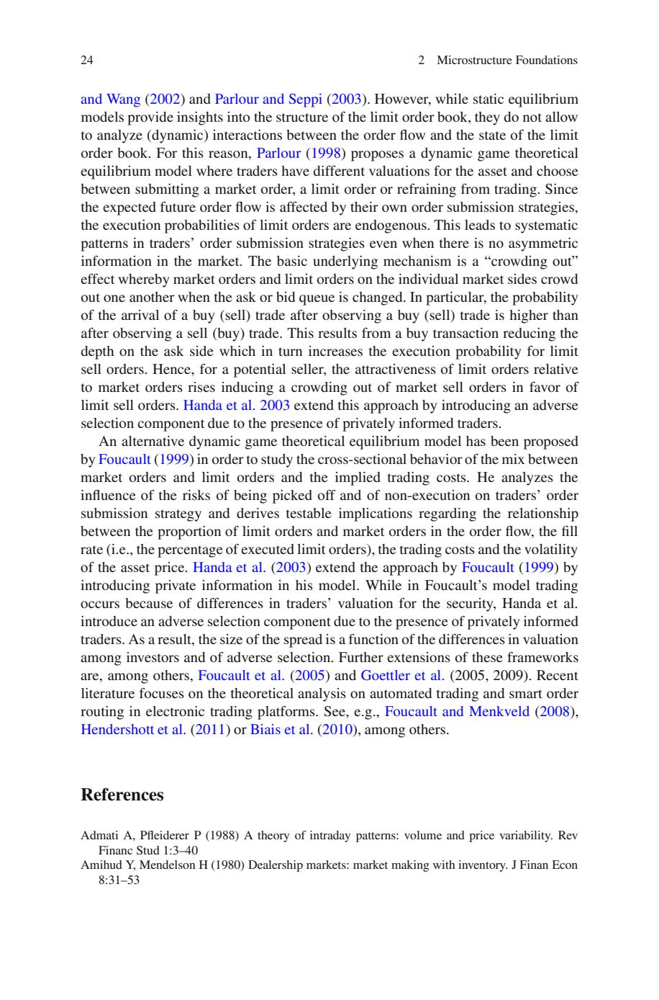

## PDF page 40 / printed page 25

参考文献                                                                                    25

Biais BR, Glosten L, Spatt C (2005) 市場マイクロストラクチャー：マイクロファウンデーション、実証結果、および政策への影響に関するサーベイ. *J Finan Markets* 8:217–264
Biais BR, Hombert J, Weill P-O (2010) 認知能力の制約を受けた取引と流動性. NBERワーキングペーパー第16628号
Blume L, Easley D, O‘Hara M (1994) 市場統計とテクニカル分析. *J Finance* 49(1):153–181
Chakravarty S, Holden C (1995) 市場注文と指値注文を統合したモデル. *J Financial Intermediation* 4:213–241
Copeland TE, Galai D (1983) 情報効果とビッド・アスク・スプレッド. *J Finance* 38:1457–1469
Diamond DW, Verrecchia RE (1987) 短売り制約と、民間情報への資産価格調整. *J Finan Econ* 18:277–311
Easley D, Engle RF, O‘Hara M, Wu L (2008) 時間変化する有価証券取引者の到着率. *J Financ Econom* 6:171–207
Easley D, Hvidkjaer S, O‘Hara M (2002) 情報リスクは資産収益の決定要因となるか？ *J Finance* 57:2185–2221
Easley D, Kiefer NM, O‘Hara M (1997) 取引プロセスの情報コンテンツ. *J Empir Financ* 4:159–186
Easley D, O’Hara M (1987) 価格、取引サイズ、および有価証券市場の情報. *J Finan Econ* 19:69–90
Easley D, O‘Hara M (1991) 注文板と有価証券市場の情報. *J Finance* 46:905–927
Easley D, O‘Hara M (1992) 時間と有価証券価格調整のプロセス. *J Finance* 47:577–605
Foster DF, Viswanathan S (1990) 有価証券市場における日中の取引量、ボラティリティ、および取引コストの変動に関する理論. *Rev Financ Stud* 3:593–624
Foster DF, Viswanathan S (1996) 他者の予測を予測するエージェントによる戦略的取引. *J Finance* 51:1437–1478
Foucault T (1999) 動的な指値注文市場における注文フロー構成と取引コスト. *J Finan Markets* 2:99–134
Foucault T, Kadan O, Kandel E (2005) 指値注文板を流動性の市場として. *Rev Financ Stud* 18:1171–1217
Foucault T, Menkveld AJ (2008) 注文フローの競争とスマート・オーダールーティング・システム. *J Finance* 63:119–158
Garman M (1976) 市場マイクロストラクチャー. *J Finan Econ* 3:257–275
Glosten LR (1994) 電子的なオープン・リミット注文板は不可避か？ *J Finance* 49:1127–1161
Glosten LR, Milgrom PR (1985) 不均一な情報を持つ専門家市場におけるビッド、アスク、および取引価格. *J Finan Econ* 14:71–100
Goettler RL, Parlour CA, Rajan U (2005) 動的な指値注文市場における均衡. *J Finance* 60:2149–2192
Goettler RL, Parlour CA, Rajan U (2009) 情報保有者と指値注文市場. *J Finan Econ* 93:67–87
Handa P, Schwartz R (1996) 指値注文取引. *J Finance* 51:1835–1861
Handa P, Schwartz R, Tiwari A (2003) 注文駆動型市場における気配設定と価格形成. *J Finan Markets* 6:461–489
Harris L (2003) 取引と取引所 – 実務者向けの市場マイクロストラクチャー. オックスフォード大学出版局、オックスフォード
Hasbrouck J (2007) 実証市場マイクロストラクチャー. オックスフォード大学出版局、オックスフォード
Hautsch N, Huang R (2011) 市場の裏側：隠れた注文配置を特定し分析する. フンボルト大学ベルリンワーキングペーパー
Hendershott T, Jones CM, Menkveld AJ (2011) アルゴリズム取引は流動性を改善するか？ *J Finance* 66:1–33
Ho T, Stoll H (1981) 取引とリターンの不確実性下での最適なディーラー価格設定. *J Finan* Econ 9:47–73
Huang RD, Stoll HR (1997) ビッド・アスク・スプレッドの構成要素：一般的なアプローチ. *Rev Financ* Stud 10:995–1034

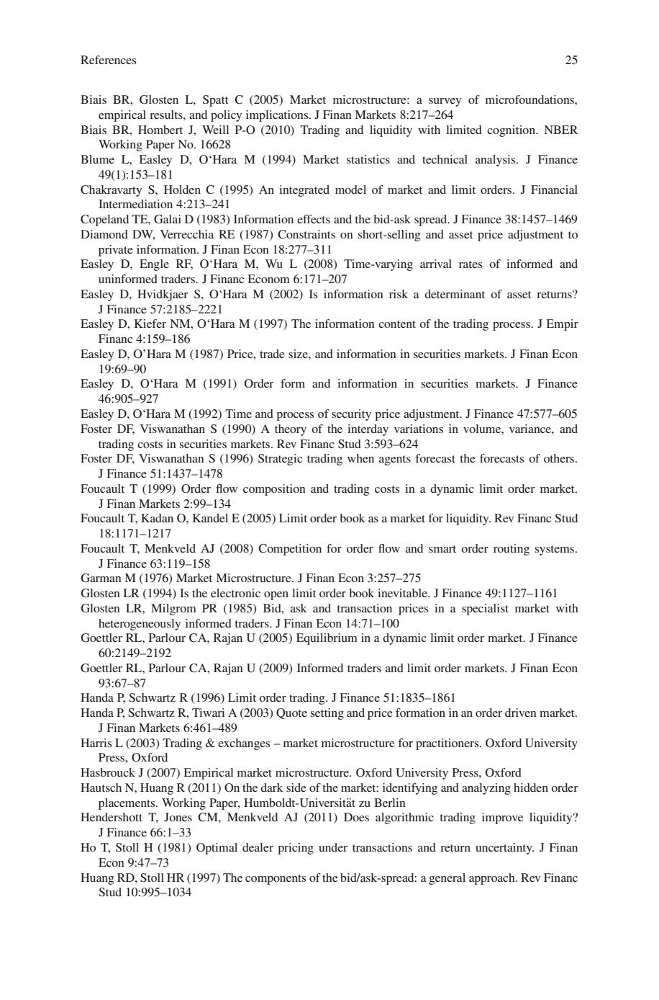

## PDF page 41 / printed page 26

26                                                              2 市場マイクロストラクチャーの基礎

Kavajecz K (1999) The specialist’s quoted depth and the limit order book. J Finance 52:747–771
Kyle AS (1985) Continuous auctions and insider trading. Econometrica 53(6):1315–1335
Madhavan A (2000) Market microstructure: a survey. J Finan Markets 3(3):205–258
O’Hara M (1995) Market microstructure. Basil Blackwell, Oxford
Parlour CA (1998) Price dynamics in limit order markets. Rev Financ Stud 11(4):789–816
Parlour CA, Seppi DJ (2003) Liquidity-based competition for order flow. Rev Financ Stud
   16:301–343
Seppi DJ (1997) Liquidity provision with limit orders and strategic specialist. Rev Financ Stud
   1(1):103–150
Stoll HR (1978) The supply of dealer services in securities markets. J Finance 33:1133–1151
Stoll HR (1989) Inferring the components of the bid-ask spread: theory and empirical tests.
   J Finance 44(1):115–134
Viswanathan S, Wang JJD (2002) Market architecture: limit-order books versus dealership
   markets. J Financ Markets 5:127–167

