# 第5章: 単変量乗法誤差モデル（Univariate Multiplicative Error Models）

- 翻訳モデル: `gemma3:12b`
- 原文抽出テキスト: `../econometrics_hf_ch1_ch7_markdown_ja/raw_text/ch05_univariate_multiplicative_error_models.txt`
- 注: 数式・表・図はPDF抽出テキストでは崩れている場合があるため、ページ画像を併読してください。

## PDF page 114 / printed page 99

第5章
単変量乗法誤差モデル

乗法誤差モデル（MEM）という用語は、エンゲル (2002b) によって、正の値をとる確率変数のための一般的な時系列モデル群を指して導入されたものである。これらのモデルは、条件付き平均と正の値をとる誤差項の積として分解される。このようなモデルは、分布の条件付き平均が確率過程に従うと仮定する自己回帰条件付き平均モデルとして分類することもできる。MEMのアイデアは、金融計量経済学においてよく知られており、エンゲル (1982) が導入した自己回帰条件付き不均一分散（ARCH）モデル、またはテイラー (1982) が提案した確率的ボラティリティ（SV）モデルの構造に由来する。これらのモデルでは、条件付き分散が動的にパラメータ化され、革新項と乗法的相互作用をする。高頻度計量経済学において、MEMは、エンゲルとラッセル (1997, 1998) によって、取引間の時間間隔の動的な振る舞いをモデル化するために初めて導入され、自己回帰条件付きデュレーション（ACD）モデルと呼ばれるようになった。したがって、ACDモデルは、金融デュレーションに適用されるMEMの一種である。

本章では、単変量MEMについて議論する。読者を同じモデルに対する異なる用語法で混乱させることのないように、我々は金融デュレーションの文脈でモデルを議論し、以下のセクションではACDモデルという用語を使用する。言うまでもなく、このモデルは、取引量、市場深度、ビッド・アスク・スプレッド、または取引数（後者がある程度連続している場合）など、他の正の値をとる（連続）過程にも直接適用できる。例えば、取引量のモデリングの場合、マンガネッリ (2005) は対応するモデルを自己回帰条件付きボリューム（ACV）過程と呼んでいる。しかしながら、用語のインフレを避けるために、我々はこれらの異なるラベルを使用しない。

MEMは、異なる種類の変数に適用できるだけでなく、異なるサンプリングスキームにも適用できることに注意する。金融デュレーションの場合、過程はイベント時刻で観測され、したがって観測は時間に不規則に間隔を空けている。逆に、MEMが（等間隔の）時間間隔に基づく集計取引活動をモデル化するために使用される場合、過程はカレンダー時刻で定義される。

我々が金融デュレーションモデリングの文脈でMEMについて議論するため、我々はまた、第4章で議論されている点過程理論の概念とのリンクとともに、金融点過程のモデルとしての役割を強調する。この文脈において、

N. Hautsch, 金融高頻度データの計量経済学、                          99
DOI 10.1007/978-3-642-21925-2 5, © Springer-Verlag Berlin Heidelberg 2012

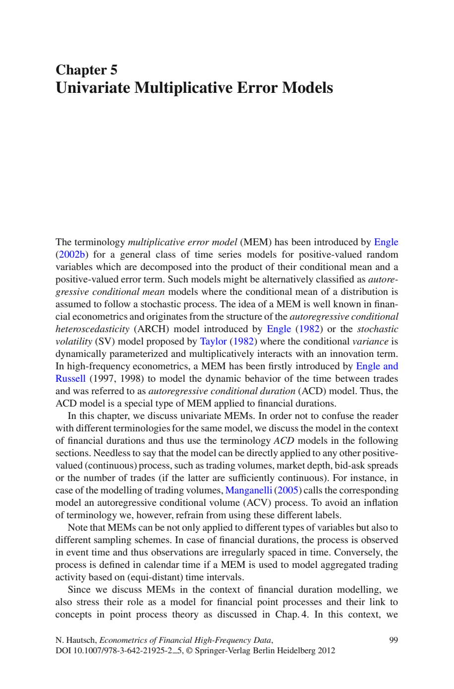

## PDF page 115 / printed page 100

100                                                       5 単変量乗法誤差モデル（Univariate Multiplicative Error Models）

動機を説明するために、強度過程の観点からACDモデルの表現を説明する。しかし、デュレーション以外の変数をモデル化する場合、これらの解釈は意味を持たない。

5.1節では、自然な出発点として、対数デュレーションに対する自己回帰モデルについて議論する。5.2節では、エンゲルとラッセル（Engle and Russell, 1997, 1998）が提案した自己回帰条件付きデュレーション（ACD）モデルの基本的な形式を提示する。これは最も一般的な自己回帰デュレーションモデルであり、近年の計量経済学文献で広く検討されているため、理論的性質と推定に関する問題をより詳細に議論する。5.3節では、ACDモデルの（準）最尤推定について議論する。5.4節では、共変量の包含と日中周期性の考慮について説明する。対数仕様のACDモデル、いわゆるLog ACDモデルについては、5.5節で議論する。5.6節は、ACDモデルの仕様検定に費やされる。ここでは、ポートマンテスト、独立性テスト、分布検定、ラグランジュ乗数および（積分）条件付きモーメント検定に焦点を当てる。

5.1 ARMAモデルと対数変数

正の値をとる変数xi > 0に対する自己回帰モデルの自然な出発点として、対数変数の（自己回帰）モデルを指定する。対数変数は非負制約を受けないため、従来の時系列モデルを容易に適用できる。したがって、対数変数に対する単純なARMAモデルは次の式で与えられる。

                        XP                X
                                          Q
           ln xi D ! C      ˛j ln xi j C   ˇj "Qi j C "Q i ; i D 1; : : : ; n; (5.1)
                        j D1                       j D1

ここで、"Q i はホワイトノイズ変数である。xi が金融デュレーションである場合、このモデルは AFTモデルのクラス（第4章を参照）に属する。すると、共変量、この文脈では過去のデュレーションも、故障までの時間を加速または減速させる。 "Q i が正規分布に従うという仮定の下で、準最尤（QML）推定器は、パラメータ  D .!; ˛; ˇ/0 を得るために得られる。QML推定値に基づくと、残差 "OQ i の経験分布は、基礎となる分布の非パラメータ推定値、したがって、ベースラインハザードをもたらす。

より洗練された仕様は、ARMA-GARCH型モデルによって得られる。例えば、ln xi の条件付き平均関数は（5.1）に従って指定でき、その条件付き分散、hi は、標準的なGARCH過程に従う。したがって、

                               p
                      "Qi D        hi ui ;      ui  N .0; 1/;

                                        X
                                        Ph                     X
                                                               Qh
                      hi D !h C                ˛h;j "Q2ij C          ˇh;j hi j :          (5.2)
                                        j D1                   j D1

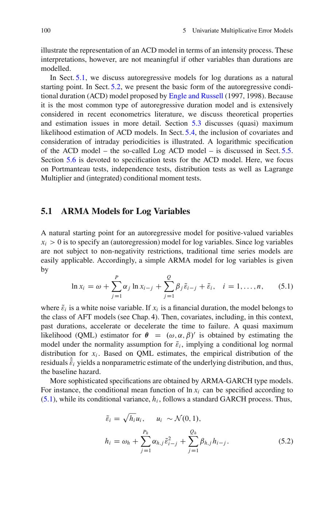

## PDF page 116 / printed page 101

5.1 対数変数のARMAモデル                                                                           101

取引間デュレーションや出来高デュレーションの場合、hiは、経済学的に流動性リスクと関連するデュレーションボラティリティとして解釈される（例えば、Ghysels et al. 1998を参照）。ガウスGARCHモデルのQML推定量の漸近特性を利用することで（Bollerslev and Wooldridge 1992を参照）、(5.1)および(5.2)の自己回帰パラメータが一貫して推定される。1
    ln xiの条件付き平均と条件付き分散の分離可能性は、正規性の仮定から当然に導かれる。しかし、単純な変数に対して、この2つの第1モーメントの分離は容易ではない。一般に、正のサポートで定義された分布は、通常、第1モーメントと高次のモーメントの間の厳密な依存関係を意味し、条件付き平均と分散関数を分離することを許可しない。したがって、条件付き平均のパラメータ化は、（分布上の）仮定として、高次の条件付きモーメントのパラメータ化も意味する。Ghysels et al. (1998)は、このような分布上の仮定はあまりに制限的であり、デュレーションダイナミクスをモデル化するのに十分な柔軟性がないと主張している。この問題に関するより詳細な議論については、第6章を参照されたい。
    しかし、研究者はしばしばln xiのモデル（および予測）ではなく、xiのモデルに興味を持つ。Dufour and Engle (2000)は、対数デュレーションの自己回帰モデルの予測性能は、以下の節で提示されるより洗練されたACD仕様と比較してかなり低いことを示している。したがって、代替的な仕様は、正のサポートで定義された分布に従うイノベーションを持つxiの単純なARMAモデルによって与えられる：

                                    X
                                    P                   X
                                                        Q
                       xi D ! C            ˛j xi j C          ˇj "Qi j C "Qi ;                       (5.3)
                                    j D1                j D1

ここで、! > 0, ˛j  0, ˇj  0である。パラメータ  D .!; ˛; ˇ/0に対するQML推定値は、"Qiに対して標準的な指数分布を仮定することで得られ、データXとパラメータ に基づく疑似最尤関数を導く：
                                                   2                                                 3
                           X
                           n                X
                                            n                    X
                                                                 P                   X
                                                                                     Q
   ln LQML .XI / D              "Qi D           4xi  !             ˛j xi j           ˇj "Qi j 5 ;
                           i D1             i D1                 j D1                j D1
                                                                                                       (5.4)

これは、"Q iの確率密度関数が指数密度である場合に真の対数尤度である。QML理論によれば（Gouriéroux et al. 1984を参照）、条件付き平均関数の正しい仕様は、パラメータ の一貫した推定を保証する。
   このアプローチの欠点は、この場合、結果として得られるデュレーションプロセスの周辺分布が指数分布ではないことである。したがって、ガウスARMAモデルとは異なり、条件付き分布と周辺分布の関係は、

1
  詳細については、GARCH QML推定量の漸近特性をACDモデルに持ち越す5.3.1節を参照されたい。

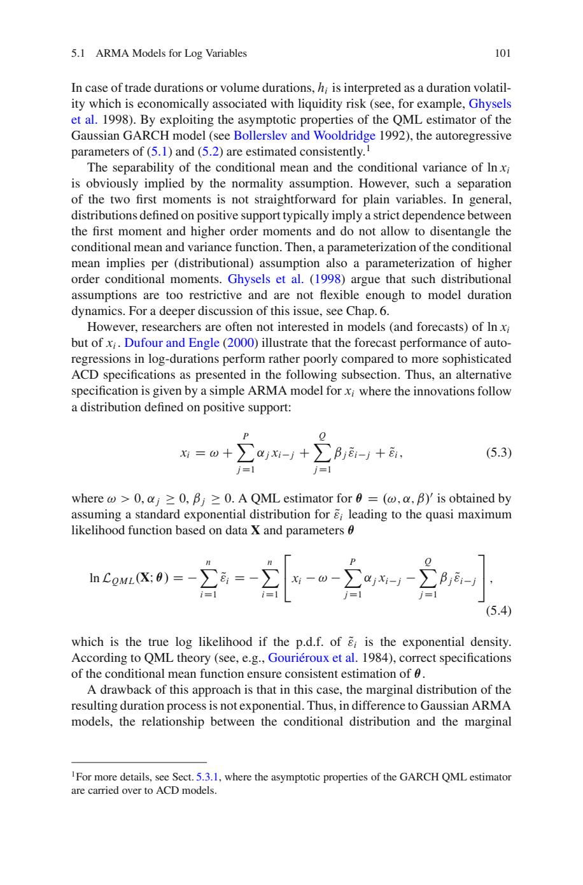

## PDF page 117 / printed page 102

102                                                    5 単変量乗法誤差モデル（MEM）

$x_i$ の分布は明らかではない。ローレンスとルイス (Lawrence and Lewis, 1980) は、独立な i.i.d. 指数分布のノイズに基づいた指数 ARMA (EARMA) モデルを提案しており、指数分布の周辺分布をもたらす。この結果は、確率的な選択に基づいた、独立した指数分布に従う確率変数の異なる線形結合の間の選択を行う線形自己回帰モデルを指定することによって達成される。

5.2 デュレーションのための MEM：ACD モデル

最も一般的な自己回帰デュレーションアプローチであり、最も一般的なタイプの MEM は、エンゲル (Engle, 1996, 2000) およびエンゲルとラッセル (Engle and Russell, 1997, 1998) によって提案されている。自己回帰条件付きデュレーション（ACD）モデルの基本的なアイデアは、条件付き平均関数を動的にパラメータ化することである。

                            i WD i ./ D EŒxi jFti 1 I ;                            (5.5)

ここで、 は p 1 のパラメータベクトルを表す。$F_{ti \-1}$ は、最も最近の（不規則間隔で配置された）観測値 $t_i \-1$ までに利用可能な情報セットを表す。観測値 $t_i$ の正確なタイミングが重要でない限り、$i$ ですべての観測値をインデックス化し、情報セットを $F_i$ で表すだけで十分である。
    標準化されたデュレーション

                                                  $x_i$
                                        "i WD                                            (5.6)
                                                  i

は、EŒ"i  D 1 となる正のサポートで定義された i.i.d. プロセスに従うと仮定される。明らかに、ACD モデルはデュレーションデータの GARCH モデルと見なすことができる。ACD モデルの種類は、条件付き平均関数 i に使用される関数形、または "i の分布の選択によって分類できる。
   基本的な ACD 仕様は、条件付き平均関数の線形パラメータ化に基づいている。

                                    X
                                    P                      X
                                                           Q
                        i D ! C            ˛j xi j C            ˇj i j :             (5.7)
                                    j D1                   j D1

プロセスの非負性に対する十分な（しかし必須ではない）条件は、! > 0 および ˛  0、ˇ  0 である。
  ACD プロセスは、強度表現で書き換えることができる。

                                                           !
                                                $x_t$               1
                         .tI Ft / D Q "                                 ;              (5.8)
                                              NQ .t /C1       NQ .t /C1

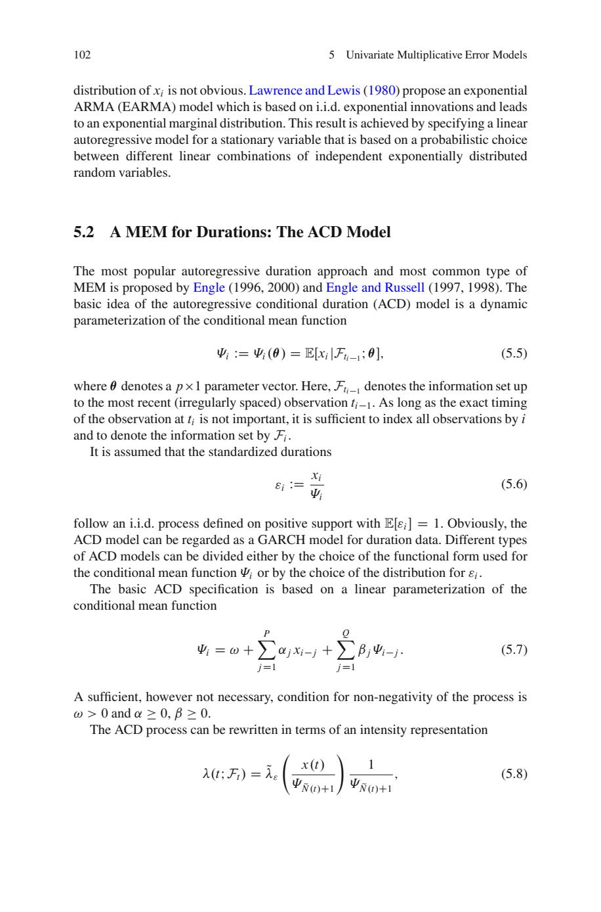

## PDF page 118 / printed page 103

5.2 デュレーションに対する乗法誤差モデル（MEM）：ACDモデル                                               103

ここで、Q " .s/ はACDイノベーション "i のハザード関数を表す。この表現は、ACDモデルが過去のダイナミクスが失敗時間率に影響を与えるため、AFTモデルのクラスに属することを示している。スパン中の強度関数は、"i のハザード形状によってのみ誘導され、新しい情報は点 ti でのみモデルに入ってくる。ハミルトンとジョーダ（2002）が提案するように、(5.8) は強度関数を直接パラメータ化し、スパン内でニュースの到着を許可することで、一般化された仕様の開始点として使用できる。時間依存変数を取り扱うとすぐに、そのような仕様はデュレーション設定から強度設定に切り替える必要がある。これは第11章でより詳しく説明される。
    ACDモデルの基本的な考え方は、強度関数自体ではなく、条件付きデュレーション平均を（動的に）パラメータ化することである。したがって、完全な動的構造と変数の影響は、構築上点 ti でのみ更新できる関数 i によって捉えられる。
    ACDモデルの条件付き平均は、定義により EŒxi jFi 1  D i と与えられ、無条件平均と条件付き分散は
                                                               !
                    EŒxi  D EŒi   EŒ"i  D        PP           PQ          ;    (5.9)
                                                 1    j D1 ˛j      j D1 ˇj

                               VŒxi jFi 1  D i2  VŒ"i :                       (5.10)

P D Q D 1の場合、xi の無条件分散は2として与えられる
                                                                     
                                                 1  ˇ 2  2˛ˇ
                     VŒxi  D EŒxi  VŒ"i 
                                     2
                                                                        :          (5.11)
                                            1  .˛ C ˇ/2  ˛ 2 VŒ"i 

それに対応して、自己相関関数は導出される

                                                   ˛1 .1  ˇ12  ˛1 ˇ1 /
                        1 WD Cov.xi ; xi 1 / D                         ;         (5.12)
                                                    1  ˇ12  2˛1 ˇ1
                        n D .˛ C ˇ/n1         for n  2.                        (5.13)

したがって、ACDモデルの共分散定常性条件は、GARCHモデル（Bollerslev 1986を参照）の共分散定常性条件と同様であり、次の式で満たされる。

                                  .˛ C ˇ/2  ˛ 2 VŒ"i  < 1:

 より高次のACDモデルに対応する結果は同様であるが、計算がより複雑である。VŒxi  > EŒxi 2 であることが簡単にわかるため、ACDモデルは過剰分散を意味する。つまり、無条件標準偏差は

2
    P D Q D 1の場合、˛ は ˛1 に、ˇ は ˇ1 に設定する。

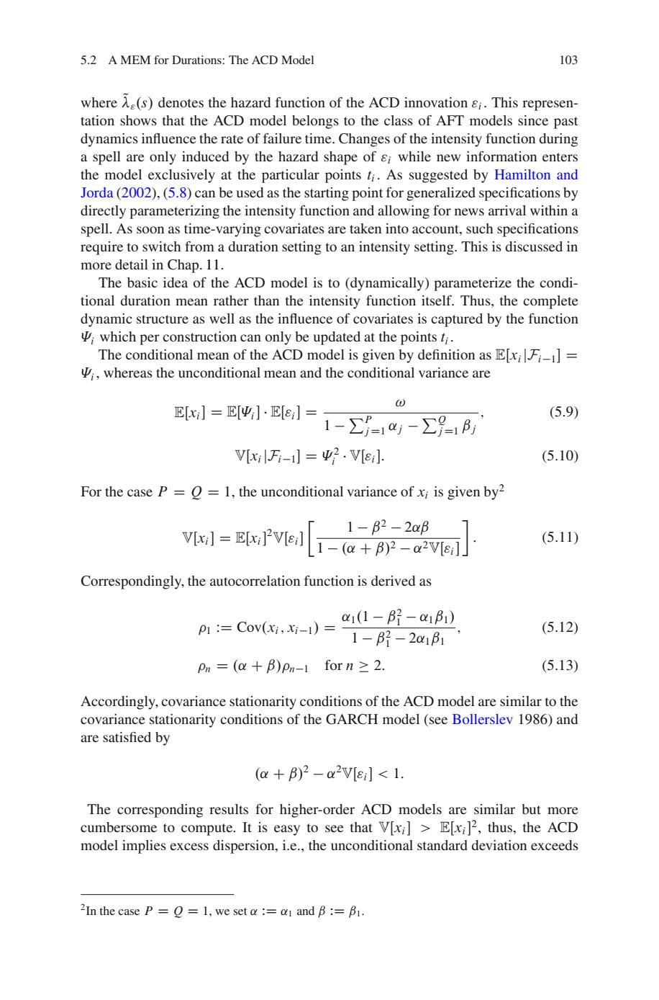

## PDF page 119 / printed page 104

104                                                             5 単変量乗法誤差モデル

不変平均に対する特性である。これは、ガウスGARCHモデルの「過剰尖度特性」に対応すると考えられる。ACD(P, Q)モデルが内包するデュレーション過程の確率密度関数（p.d.f.）の下限と上限に関する一般的な定式化は、Fernandes (2004)に与えられている。
「i」がmartingale difference i WD xi  i と導入されることで、ACD(P; Q)モデルは、単純なデュレーションに対するARMA(max(P ,Q),Q)モデルの項で表現できる。

                                     X
                                  max.P;Q/
                                                                       X
                                                                       Q
                     xi D ! C                   .˛j C ˇj /xi j              ˇj i j C i :    (5.14)
                                     j D1                              j D1

5.3 ACDモデルの推定

5.3.1 QML推定

「i」の分布として自然な選択肢は、指数分布である。第4章で議論したように、指数分布は、正のサポート上で定義された確率過程の中心的な分布であり、R上で定義された確率変数に対する正規分布に対応すると見なすことができる。したがって、指数-ACD（EACD）モデルの仕様は、自然な出発点となる。指数分布の仮定は、多くの応用においてかなり制限的である3が、ACDパラメータに対するQML推定値を導き出すという大きな利点がある。指数化された準対数尤度関数は、次の式で与えられる。

                                            X
                                            n
                                                                n 
                                                                X             
                                                                           xi
                         ln L.XI / D              li ./ D       ln i C      ;                (5.15)
                                                                           i
                                            i D1                i D1

ここで、li ./は、i番目の観測値に対する対数尤度寄与を表す。スコアとヘッセ行列は、次の式で与えられる。

                                X n           X n            
                 @ ln L.XI /                      @i 1 xi
         s./ WD              D      si ./ D              1 ;                                 (5.16)
                      @        i D1          i D1
                                                   @ i i

                   @2 ln L.XI /   X        n
       H./ WD                   D   hi ./
                       @@ 0
                                           i D1
                                    n 
                                    X                                             
                                              @    1 @i    xi         1 @i @i xi
                                D                               1                     ;
                                    i D1
                                             @ 0 i @     i         i @ @ 0 i2

                                                                                                 (5.17)

3
    第3章の記述統計も参照されたい。

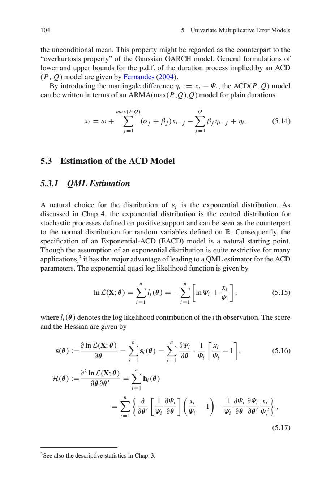

## PDF page 120 / printed page 105

5.3 ACDモデルの推定                                                         105

ここで、si ./ はスコアベクトルへの i 番目の寄与を表す p  1 ベクトルであり、hi ./ はヘッセ行列への i 番目の寄与を表す p  p 行列である。モデルが正しく特定されている場合、すなわち i D i;0 、ここで i;0 WD i . 0 / D E Œ xi j Fi 1 I  0  は「真の」条件付き平均関数を表し、"i D xi =i は確率的に i と独立であり、期待値は1を持つ。したがって、スコア si ./ は情報集合 Fi 1 に関してマルチンゲール差分となり、

                                      X
                                      n                        X n
                                                                    1 @i;0 @i;0
                EŒH. 0 /jFi 1  D          hQ i . 0 / D                       ;   (5.18)
                                      i D1
                                                                    2
                                                               i D1 i;0
                                                                        @ @ 0

ここで hQ i ./ WD E Œ hi ./j Fi 1 である。
条件付き平均関数の正しい特定は、EACD推定量のQML特性を確立するための不可欠な前提条件である。Engle (2000) は、Bollerslev と Wooldridge (1992) の結果を EACD モデルに直接適用できることを示している。これらの結果は以下の定理に要約されている。
定理 5.1。以下の正則性条件を仮定する。
   (i)  はコンパクトなパラメータ空間であり、空でない内点を持ち、Rp の部分集合である。
  (ii) ある  0 2 int./ に対して、E Œ xi j Fi 1 I  0  D i . 0 / WD i;0 。
 (iii) (a) i ./ WD i はすべての  2  に対して可測であり、すべての xi に対して int  上で2回連続的に微分可能である。
       (b) i はすべての  2  に対して確率1で正である。        P
 (iv) (a)  0 は n1 niD1 EŒli ./  li . 0 / の識別可能な一意の最大化点である。
       (b) fli ./  li . 0 /g は UWLLN を満たす 8 i D 1; 2; : : : ; n。4
  (v) (a) fhi . 0 /g と fhQ i . 0 /g は UWLLN を満たす。
       (b) fhi ./  hiP   . 0 /g は UWLLN を満たす。
       (c) Aı WD n1 niD1 EŒhQ i . 0 / は一様に正定値である。
                             0
 (vi) (a) fsi . 0 /si .P0 / g は UWLLN を満たす。
             ı       1      n                        0
       (b) B WD n            i D1 EŒsi . 0 /si . 0 /  は一様に正定値である。
                             P                           d
       (c) Bı1=2 n1=2 niD1 si . 0 /si . 0 /0 !N .0; Ip / で Ip は p 次元単位行列を表す。
(vii) (a) fhQ i ./  hQ i . 0 /g は UWLLN を満たす。
       (b) fsi ./si ./  si . 0 /si . 0 /0 g は UWLLN を満たす。
したがって、
                      ı1 ı ı1 1=2 p
                                        n.O   0 / ! N .0; Ip /:
                                                     d
                      A B A

4
    UWLLN: Uniform Weak Law of Large Numbers （一様弱大数の法則）。

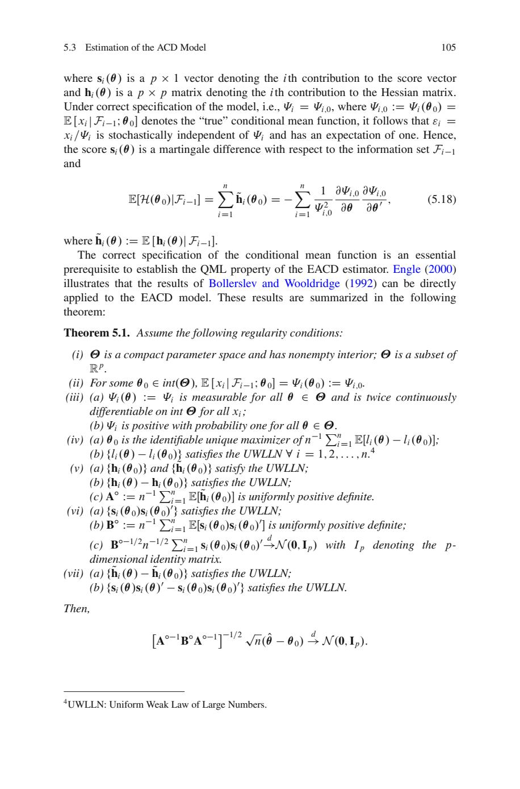

## PDF page 121 / printed page 106

106                                                       5 単変量乗法誤差モデル

さらに、

                               p                                        p
                    O ı  Aı ! 0
                    A                          および            BO ı  Bı ! 0;

ここで、

                  X n
                                                                  1X O
                                                                      n
           Oı D 1
           A                 O
                       hQ i ./              および           BO ı D                  O 0:
                                                                         si ./si ./
                n i D1                                            n i D1

証明：Bollerslev and Wooldridge (1992), p. 167 を参照のこと。                                
   この定理は、疑似対数尤度関数
(5.15) の最大化が、摂動項の密度関数を特定せずに  の一貫した推定値をもたらすことを示している。Bollerslev and Wooldridge (1992) が指摘したように、行列 Aı1 Bı Aı1 は、White (1982) のロバストな非同期
分散共分散の n.O   0 / の推定値である。分布の誤った特定だけでなく、ACD 誤差の動的な
誤った特定に対してもロバストな分散共分散推定値は、Newey and West (1987) に従って、Bı を推定することによって得られる。

                                      J 
                                      X                 
                                                     j
                       BO ı D O0 C      1               .Oj C Oj0 /;
                                      j D1
                                                   J C1

ここで、

                                               X
                                               n
                              Oj WD n1                    O i ./
                                                        si ./s  O 0
                                              i Dj C1

であり、J は外生的に与えられた切断ラグ次数を表す。Bollerslev and Wooldridge (1992) の仮定は、スコアベクトルの漸近正規性および尤度関数およびその二階導関数の一様弱収束を必要とするため、かなり強い。さらに、第3章で示されているように、典型的な高頻度デュレーション過程（例えば、取引デュレーション過程など）は、高度に持続的で、ほぼ積分的である。積分的な場合、i の無条件平均は有限ではなく、推定値の非正規な極限分布をもたらす。これらの問題に対処するために、Lee and Hansen (1994) は、Bollerslev and Wooldridge (1992) よりも弱い仮定の下で、IGARCH 疑似最尤推定量の漸近特性を確立している。Engle and Russell (1998) は、これらの結果は EACD(1,1) の場合に容易に適用できることを示している。Lee and Hansen (1994) の主な結果は以下の通りに要約される。
定理 5.2. 以下の正則性条件を仮定する。
  (i)  0 D .!0 ; ˛0 ; ˇ0 /0 2 int./.
 (ii) E Œ xi j Fi 1 I  0  WD i . 0 / D i;0 D !0 C ˛0 xi 1 C ˇ0 i 1 .

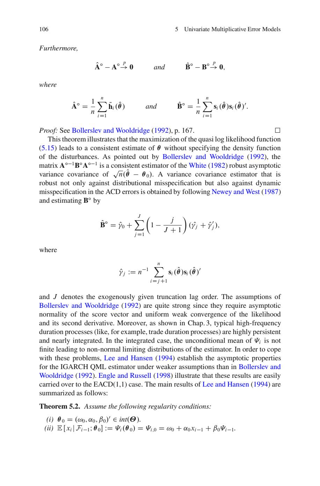

## PDF page 122 / printed page 107

5.3 ACDモデルの推定                                                     107

(iii) 「i D xi =i;0 は厳密に定常かつエルゴードである。
(iv) 「i は非退化である。
              ˇ
(v) E "2i ˇ Fi 1 < 1 a.s.
(vi) supi E Œ ln ˇ0 C ˛0 "i j Fi 1  < 0 a:s: h        i
                       P                   P
(vii) ln L.XI / D niD1 li ./ D  niD1 ln i C xii ; where i D ! C˛xi 1 C
       ˇi 1 .                                         P
(viii)  0 は、n1 niD1 EŒli ./  li . 0 / を最大化する一意に識別可能な値である。
Then,
                                      1=2 p                d
                        Aı1 Bı Aı1          n.O   0 / ! N .0; Ip /

and
                                     p                            p
                            O ı  Aı !
                            A          0     and BO ı  Bı ! 0:

Proof: Lee and Hansen (1994), p. 47ff. を参照のこと。                                            
これらの結果は、˛ C ˇ D 1 の場合にも有効である。さらに、標準化された
デュレーションは、独立同一分布に従う必要はない。むしろ、それらは厳密に定常かつエルゴードである必要がある。この性質は、Drost
and Werker (2004) が導入した、いわゆる半パラメータACDモデルを含む、より広範なモデルクラスにBollerslev and Wooldridge (1992) の結果を一般化するものである。注意すべきは、これらの結果は線形EACD(1,1)モデルに基づいているため、(非線形) EACD(P ,Q)モデルのようなより一般的なケースには必ずしも適用できないということである。いずれにしても、ACDモデルのQML推定における重要な要件は、条件付き平均制約の有効性、すなわち条件付き平均関数 i の正しい仕様である。この仮定については、5.6節でより詳細に検討する。
Exponential QML推定量の漸近一致性は、そのスコア関数が、以下の性質を持つ無条件モーメント関数に対応することと本質的に関連しているという事実から生じる。

                        EŒsi . 0 / D 0;    0 2 ;     i D 1; : : : ; n:       (5.19)

これにより、対応するモーメント推定量を構築することができる。Drost
and Werker (2004) および Engle and Gallo (2006) が議論するように、この関係は、ガンマ分布を選択することによっても代替的に達成できる。 (5.16) からわかるように、単一の観測値 i の Exponential QML スコアへの寄与は、次のように書くことができる。

                                                      @
                                 si ./ D ."i  1/      ln i :                  (5.20)
                                                     @
次に、ACDイノベーション "i が正規化されたガンマ分布に従うと仮定する。すなわち、"i  G.m; m/ であり、EŒ"i  D 1 (補足Aを参照) であり、確率密度関数が

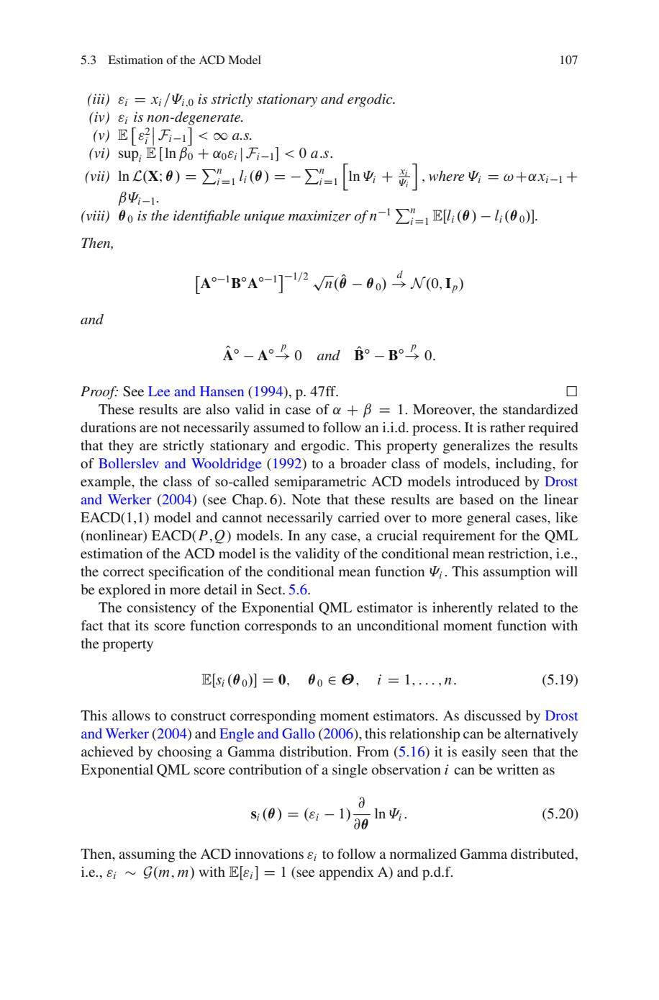

## PDF page 123 / printed page 108

108                                                    5 単変量乗法誤差モデル

                                 "m1 exp."i =m/
                      fm ."i / D      i
                                                      ;          m > 0;
                                        mm  .m/

その結果得られるスコア関数は、次のように書けることが容易に示される。

                                 @fm ."i / 1
                        1 C "i                 D m.1  "i /;                            (5.21)
                                   @m fm ."i /

これは（5.20）に比例しており、同じ基礎となるモーメント関数（5.19）を与える。したがって、ガンマ分布に基づく推定値は、指数型の疑似最尤法によるものと同一である。その主な利点は、追加のパラメータmにより、より柔軟に対応できることである。しかし、m ¤ 1の場合、ガンマ分布は正の乱数変数に対してのみ定義されるのに対し、指数分布（すなわち、m D 1の場合）はゼロ実現に対しても定義されることに注意する必要がある。したがって、データにゼロまたはゼロに近い観測値が存在する場合、ガンマ対数尤度関数の最大化は数値的な困難を引き起こす可能性がある。さらに別の代替案として、Brownlees et al. (2011)は、最適な計器を用いてモーメント法でモデルを推定することを推奨している。特に、彼らは、効率的なモーメント推定値  が、次のモーメント条件を解くことを示す。

                                                         
                           1 X @i 1
                                 n
                                                     xi
                                                       1 D0                           (5.22)
                           n i D1 @ i               i

その漸近共分散は次のとおりである。

                                     (                            ) 1
                                              1X
                                                 n
                  O D VŒ"i 
               AV./                      lim       E
                                                        @i @i 2
                                                                        ;              (5.23)
                       n                 n!1 n
                                               i D1
                                                        @ @ 0 i

これは次のように一貫して推定される。

                                             " n                      #1
                                              X @O i @O i
                      c /O D VŒ"
                              O i                             O 2
                      AV.                                    0 i           ;
                                                     @ @
                                              i D1

                                 X n
                        O i D 1
                        VŒ"           .xi =O i  1/2 :
                               n i D1

   Engle and Russell (1998)が示したように、ガウスGARCHモデルと指数ACDモデルの間の強い類似性の重要な帰結は、ACDモデルをGARCHソフトウェアで推定できることである。特に、ACD
                                                  p
パラメータベクトル  は、条件付き平均をゼロに設定したGARCH回帰において、xiを従属変数としてとることで推定できる。したがって、与えられた

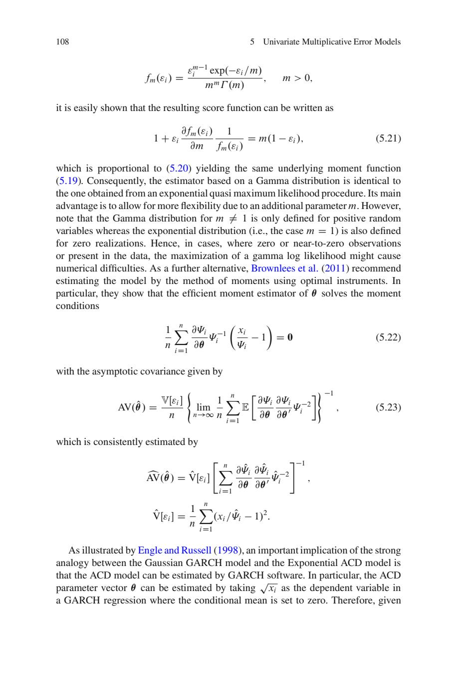

## PDF page 124 / printed page 109

5.3 ACDモデルの推定                                                   109

QML特性（QML properties）を持つEACDモデルにおいて、パラメータ推定値 O は一貫性があるものの、必ずしも効率的であるとは限りません。
実際、金融デュレーションの統計量（第3章を参照）は、標準化されたデュレーションに対する指数分布の仮定が通常は成り立たないことを示しています。したがって、QMLパラメータ推定値は有限標本においてバイアスを持つ可能性があります。
Grammig and Maurer (2000) は、モンテカルロスタディに基づいた異なるACD仕様の性能を分析し、これらのモデルのQML推定が、15,000の観測のようなかなり大きな標本であっても、有限標本において性能が低下する可能性があることを示しています。この理由から、彼らはより一般的な分布に基づくACDモデルを指定することを提案しています。Bauwens et al. (2004) は、密度予測を使用してACDモデルの予測性能を調査し、より柔軟な分布を許容することで予測を大幅に改善できることを示しています。これらの場合、ACDモデルはQMLではなく、標準MLによって推定されます。

5.3.2 ML推定

デュレーション文献において、より柔軟な分布を得るための標準的な方法は、混合モデルを使用することです。このフレームワークでは、特定のパラメータファミリーの分布が不均質性変数に関して混合され、混合分布になります。5
最も一般的な混合モデルは、積分ハザード率にランダムな不均質性項を乗じることによって得られます。ほとんどのアプリケーションでは、ガンマ分布に従うランダム変数が使用され、解析的に取り扱うことができ、単純な結果の導出を可能にする混合モデルになります。
以下に、最も一般的な混合モデルの分類をいくつか示し、柔軟な分布ファミリーを導きます。
                                          x  u
                                            D ;        a > 0;
                                            a

というワイブル分布を考慮します。ここで、 と a は分布のスケールと形状パラメータであり、u は単位指数分布に従うランダム変数です。この場合、.x=/a は積分ハザード関数であることに注意してください。
ガンマ混合ワイブル分布は、積分ハザードにランダムな不均質性項 v  G.; / を乗じることによって得られます。EŒv D 1 と VŒv D 1 の平均と分散を持つガンマ分布に従うランダム変数。すると、結果として得られる混合モデルは、パラメータ , a および  を持つバー分布に従います。
より柔軟なモデルは、基底のワイブルモデルの一般化と、u  G.m; m/ を仮定することによって得られます。これにより、デュレーションモデルが構築されます。

5
    混合分布の概要については、Lancaster (1997) を参照してください。

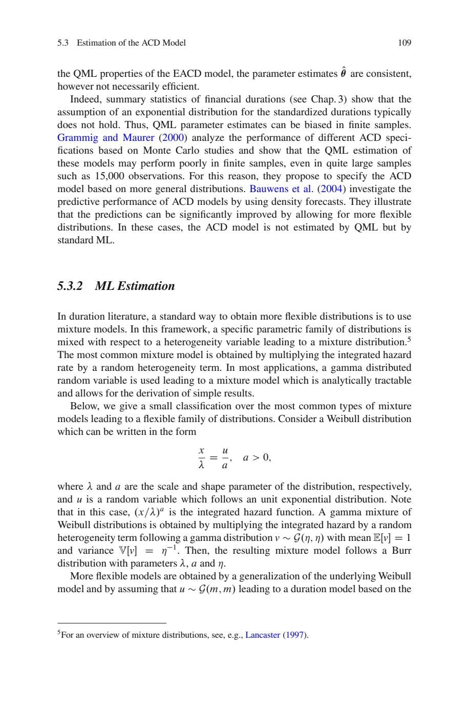

## PDF page 125 / printed page 110

110                                                   5 単変量乗法誤差モデル（Univariate Multiplicative Error Models）

一般化ガンマ分布（generalized gamma distribution）。一般化ガンマ族の密度関数は、m D 1の場合、ワイブル族（Weibull family）を内包し、a D 1の場合、（二パラメータ）ガンマ分布を内包する。

これらの分布はいずれも、ACDフレームワークにおいて既に成功裏に適用されており、Burr ACDモデル（Grammig and Maurer 2000）や一般化ガンマACDモデル（Lunde 2000）につながっている。しかし、両モデルは異なる分布族に属しており、互いに内包しない。一般化ガンマACDモデルの拡張であり、Burr族の一員も内包するものは、一般化ガンマ分布のガンマ混合に基づき、一般化F分布（generalized F distribution）（Kalbfleisch and Prentice 1980またはLancaster 1997を参照のこと）を導くものである。一般化F分布は、基本となるデュレーションモデルとして一般化ガンマモデルを仮定し、積分ハザードにガンマ変数 v  G./ を乗じることで得られる。すると、周辺密度関数は次のように与えられる。

                                  ax am1 ΠC .x=/a .m/ 
                      f .x/ D                                    ;                     (5.24)
                                           am B.m; /

ここで、B./ は完全ベータ関数を表し、B.m; / D .m/ ./
                                                                  .mC/
                                                                          : 一般化F分布のモーメントは次のように与えられる。

                                   .m C s=a/ .  s=a/
                EŒx s  D 1=a                          ;         s < a:             (5.25)
                                         .m/ ./

したがって、Hautsch (2003)によって導入された一般化F ACDモデルは、3つのパラメータ a, m および  に基づいており、 ! 1の場合、一般化ガンマACDモデル、m D 1;  ! 1の場合、ワイブルACDモデル、m D  D 1の場合、log-logistic ACDモデルを内包する。一般化F分布のより特殊なケースに関する議論については、Karanasos (2008)を参照のこと。図5.1–5.3は、異なるパラメータの組み合わせに基づいた一般化F分布が暗示するハザード関数を示す。ACD過程を、平均が1と等しくない分布（例えば、指数分布ではない）に基づいて指定する場合、一般性を失うことなく次のように書くことができる。

                                xi D i 1 "Qi DW ˚i "Qi ;                             (5.26)

ここで、"Qi は誤差項を表し、     WD EŒQ"i  ¤ 1であり、
                                          !       ˛
                       ˚i WD i = D           C       xi 1 C ˇ˚i 1

                                       D !Q C ˛x
                                              Q i 1 C ˇ˚i 1                          (5.27)

であり、!Q WD !=、˛Q WD ˛= である。

したがって、例えば一般化F分布に基づいてACDモデルを指定する場合、 と EŒi  D !=.1  ˛  ˇ/ は同時に同定可能ではない。

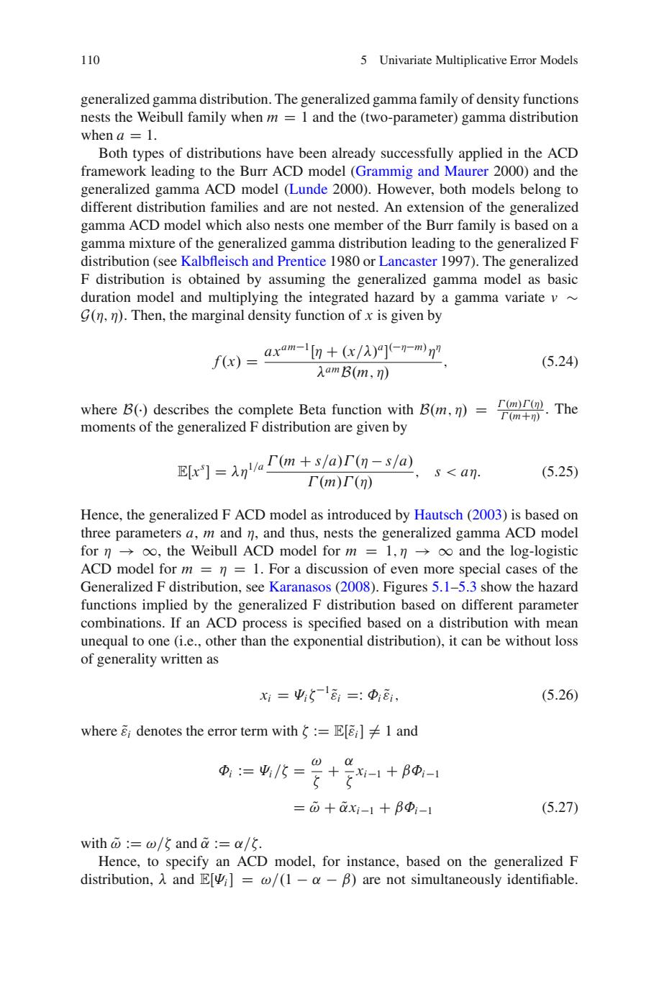

## PDF page 126 / printed page 111

5.3 ACDモデルの推定                                                            111

図5.1 般化されたF分布が内包するハザード関数。左：m D 0:8, a D 0:8,
 D 1:0、上： D 100、中央： D 10、下： D 0:5。右：m D 0:8, a D 1:1,  D 1:0、
上： D 100、中央： D 10、下： D 0:5

図5.2 般化されたF分布が内包するハザード関数。左：m D 1:4, a D 0:9,
 D 1:0、上： D 100、中央： D 10、下： D 0:5。右：m D 1:4, a D 1:2,  D 1:0、
上： D 100、中央： D 10、下： D 0:5

図5.3 般化されたF分布が内包するハザード関数。左：m D 1:21 , a D 1:2,
 D 1:0、上： D 100、中央： D 10、下： D 0:5。右：m D 1:2, a D 1:21 ,  D 1:0、
上： D 100、中央： D 10、下： D 0:5

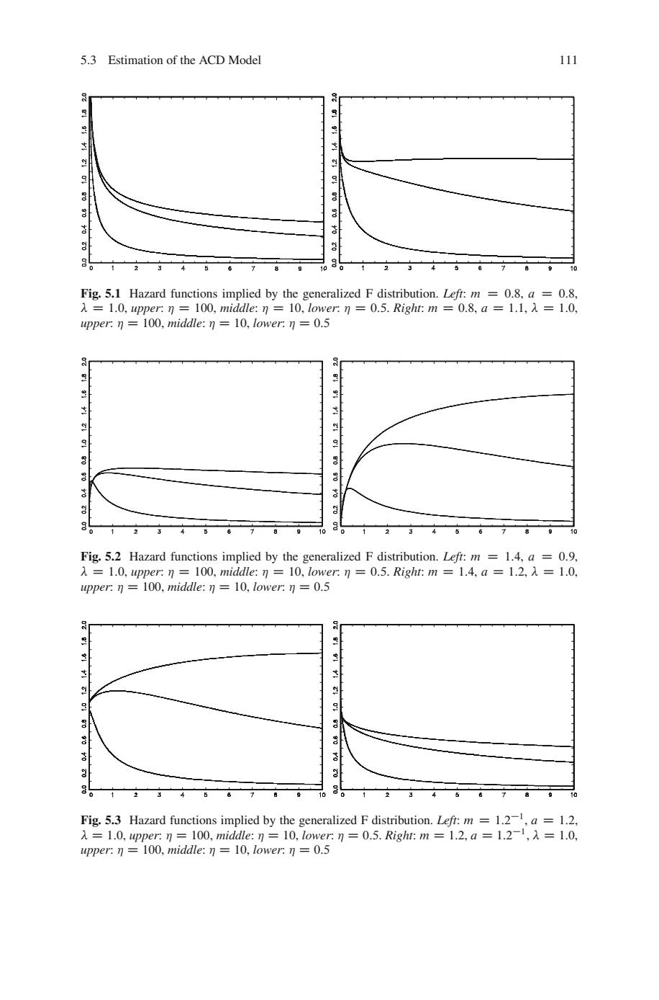

## PDF page 127 / printed page 112

112                                                   5 単変量乗法誤差モデル

したがって、 または ! のどちらか一方を固定しなければならない。  を 1 に固定し、
次のように 1 を選択するのがより自然である。

                                  1=a  .m C 1=a/ .  1=a/
                              D                               :
                                            .m/ ./

一般化された F-ACD 規格は、"Qi" が一般化された F 分布に従い、 が 1 の場合に (5.26) で与えられる。次に、変数変換定理を適用すると、密度
の xi およびそれに対応する対数尤度関数は次の式で与えられる。

                     X
                     n
                            .m C /
      ln L.XI / D       ln           C log a  am log ˚i C .am  1/ ln xi
                     i D1
                            .m/ ./
                                 
                      . C m/ ln  C .˚i1 xi /a C  ln./:               (5.28)

この規格は、 を ˚ に設定し、(5.27) に従って動的にパラメータ化することに相当する。 i を ˚i に設定する。ACD モデルに使用される別の分布として、パレート分布（Luca and Zuccolotto 2006 参照）または一般化された F 分布の一般化（Karanasos 2004 参照）がある。 指数分布の一般化は、xi の厳密な正性を必要とする点に注意する必要がある。したがって、ゼロ観測値の場合、モデルは指数分布に基づく QML、(G)MM、またはゼロ観測値を明示的に考慮する十分な柔軟性を持つ分布を用いた ML によって推定しなければならない。この文脈において、Hautsch et al. (2010) はゼロ拡張一般化 F 分布を提案し、MEM フレームワークで実装している。
   あるいは、ACD モデルのためのさらに柔軟な分布は、時間変化する重みを持つ混合分布によって得られる。De Luca and Gallo (2009) は、指数混合分布を時間変化する重みで提案し、その結果得られる分布は、テールにおけるデュレーション観測の発生も適切に捉えることを示している。
   最後に、ガンマ混合分布のファミリーに加えて、正の値をとる乱数変数のための別の自然な分布として、確率密度関数 p.d.f. を持つ対数正規分布がある。
                                                                  2 !
                                      1           1       ln x 
                     f .x/ D          p     exp                          ;            (5.29)
                                  x       2       2

ここで、およびは、それぞれ対応する位置およびスケールパラメータを表し、EŒx D exp C 2 =2 および VŒx D exp 2 C 2 exp. 2 /  1 を意味する。
5.5 で示されているように、対数正規分布に基づく ACD モデルを指定することは、条件付き平均関数も対数仕様に従う場合に特に有用であり、ガウス QML の特性を引き継ぐことを可能にする。

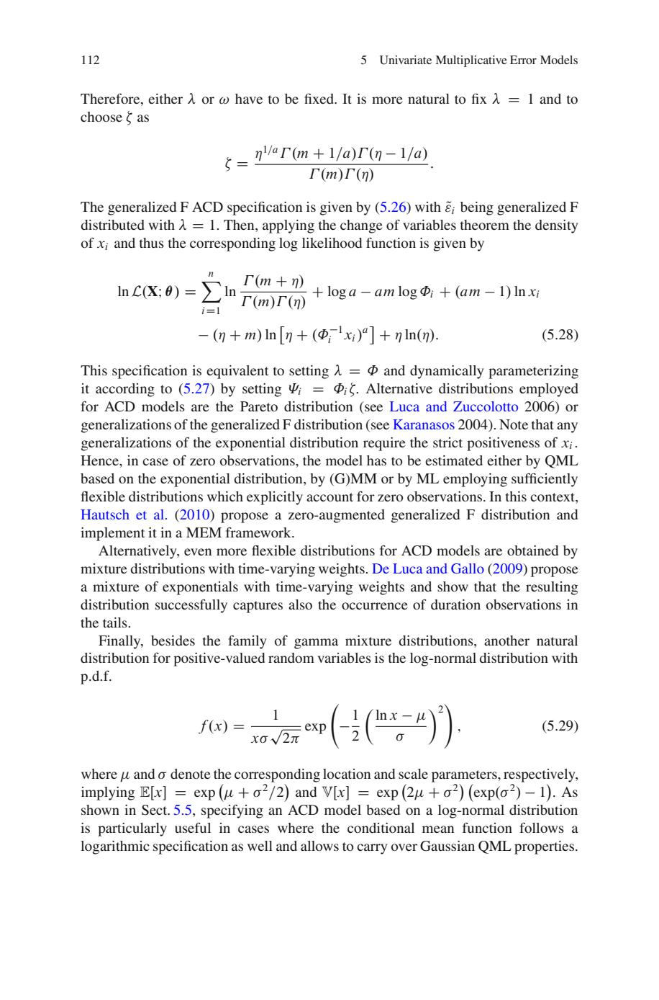

## PDF page 128 / printed page 113

5.4 季節性および説明変数                                        113

5.4 季節性および説明変数

第3章で示されているように、金融デュレーション過程は通常、強い日中周期性を示します。ACDフレームワークにおける一般的な解決策の一つは、時間帯の効果を取り除いた季節調整済みの系列を生成することです。この文脈において、デュレーションは決定論的成分と確率的成分に分解されます。エンゲルとラッセル (Engle and Russell, 1998) は、決定論的な季節性効果が乗法的に作用すると仮定しており、

                                         xi D xM i si ;                         (5.30)

ここで、xM i は季節調整されたデュレーション、si は i における季節性成分を表します。次に、条件付き平均は次のように与えられます。

                             i D E ΠxM i j Fi 1  si DW M i si :            (5.31)

決定論的な季節性関数 si は、さまざまな方法で指定できます。明らかに、季節性を考慮する最も簡単な方法は、適切なダミー変数を含めることです。すなわち、

                                        X
                                        Q
                                 si D          ıj 1l j 1 ti < j ;             (5.32)
                                        j D1

ここで、ıj は推定されるパラメータであり、j , j D 0; 1; : : : ; Q , は取引日を Q C 1 個の区間に分割する外生的に選択された（カレンダー）時刻点を示します（Q は取引日の終わりに識別可能性を確保するために事前に選択されます）。
   季節性ダミーは、区分定数の関数で決定論的なパターンを捉えますが、線形スプライン関数は、ノット j における区分線形関数を許容します。これは次のように与えられます。

                                        X
                                        Q
                            si D 1 C           ıj .ti  j /1l fti > j g         (5.33)
                                        j D1

そして、取引日の開始時に1に正規化され、定数 ! の識別を確保します。線形スプライン関数は、(区分)線形関数を2次または3次の多項式に置き換える2次または3次スプライン関数に拡張できます。de Boor (1978) を参照してください。
   代替案として、よく用いられる指定方法は、ガラン (Gallant, 1981) の研究に基づいた、アンダーセンとボレルズレブ (Andersen and Bollerslev, 1998b) が提案した柔軟なフーリエ級数近似を使用することです。Q 次の多項式を仮定すると、非確率的な季節トレンド項は次の形式になります。

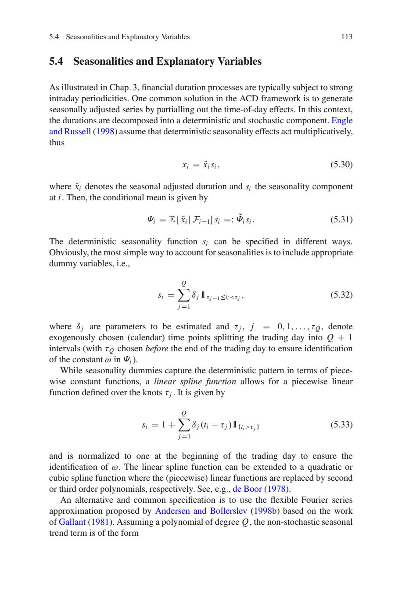

## PDF page 129 / printed page 114

114                                                            5 単変量乗法誤差モデル（Univariate Multiplicative Error Models）

                                       X
                                       Q
      si D s.ı; tNi ; Q/ D ı  tNi C          ıc;j cos.tNi  2 j / C ıs;j sin.tNi  2 j / ;     (5.34)
                                       j D1

ここで、ı, ıc;j , および ıs;j は推定される季節性係数であり、tNi 2 Œ0; 1
は、ti の日中カレンダー時刻に関連する正規化されたカレンダー時刻であり、取引開始から ti の日中カレンダー時刻までの秒数に取引日の長さを割ったものとして計算される。
    高頻度計量経済学の文献では、2段階推定アプローチを適用することが一般的である。第1段階では、デュレーションを季節的にフィルタリングし、第2段階では、季節的に標準化されたデュレーションに基づいてモデルを推定する。この手順の主な利点は、第2段階（Q）ML または GMM 推定におけるパラメータ数と計算負荷を大幅に削減できることである。これは、観測値の数が大きい場合に特に重要である。
    しかしながら、2段階推定は非効率であり、場合によっては不整合になる。後者の場合、すべてのパラメータを共同で推定することが不可欠である。Veredas et al. (2008) は、半パラメータ推定量を提案しており、季節性成分を ACD モデルのパラメータとともに非パラメータ的に共同で推定し、共同推定が効率性の向上と予測性能の改善をもたらすことを示している。Brownlees and Gallo (2011) は、柔軟に指定された決定論的成分とともに ACD 成分を共同で推定するための縮小推定量を開発している。縮小推定量の基本的な原理は、柔軟な成分のパラメータ数に関する二乗ペナルティによって対数尤度関数にペナルティを課すことであり、これによりこれらのパラメータは、スムージングパラメータによって制御されるペナルティ（および縮小）の量に応じてゼロに縮小される。Brownlees and Gallo (2011) は、縮小推定値が基本的な最尤推定の場合と比較して、改善された予測をもたらすことを示している。
    説明変数を含める方法は2つある。最初の可能性は、関数 g./ の形で含めることであり、これは条件付き平均関数に加算的に入る、すなわち、

                            X
                            P                   X
                                                Q
               i D ! C            ˛j xi j C          ˇj i j C g.z0i 1  /;         or      (5.35)
                            j D1                j D1

                                    X
                                    P                   X
                                                        Q
        i  g.z0i 1  / D ! C            ˛j xi j C          ˇj .i j  g.z0i 1j  //:     (5.36)

最も単純な形式では、g./ は単に g.y/ D y と選択され、被説明変数の加算的なものだが、必ずしも非負ではない包含を意味する。あるいは、g./ は非負の関数として選択される可能性があり、例えば g.y/ D exp.y/ は、被説明変数が非負の形で条件付きデュレーションに影響を与えることを保証するが、明らかに非線形的な影響を与える。
    仕様 (5.35) は、説明変数の動的な包含を意味する、すなわち、この仕様では、被説明変数の効果は無限のラグ構造の形で ACD 仕様に入力される（例えば Hendry 1995 を参照）。対照的に、(5.36) は静的なものを意味する。

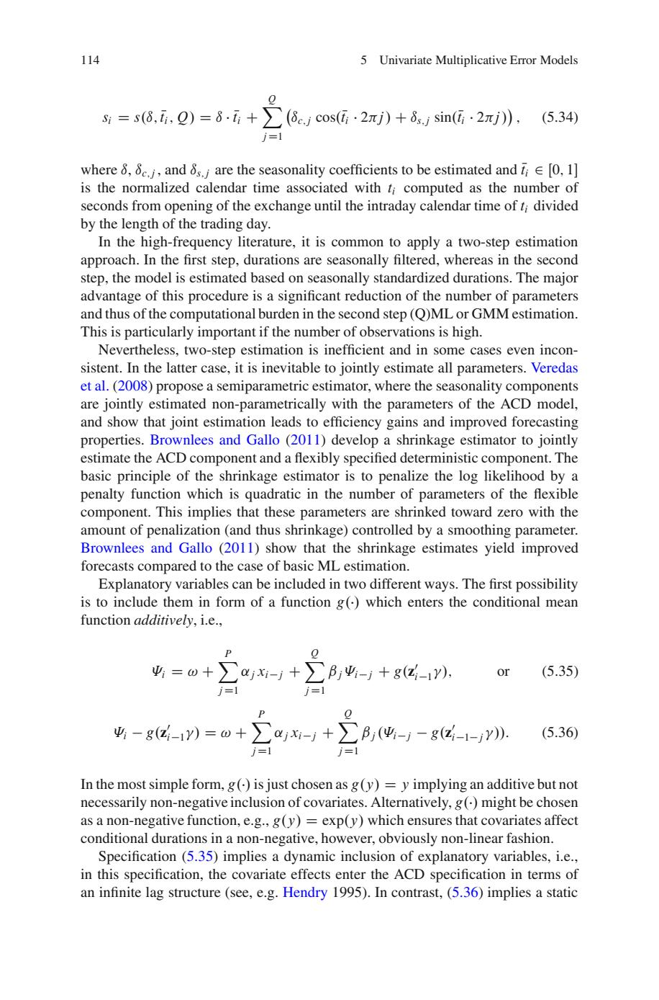

## PDF page 130 / printed page 115

5.5 自己回帰条件付きデュレーションモデル（Log-ACDモデル）                                                                 115

回帰変数の効果の包含による影響。事前には、どの仕様が実際に好ましいかは不明である。しかし、いくつかのケースでは、(5.35)による動的な包含が、の推定値を解釈することを困難にする。回帰変数zが特定の時間期間と関連している場合（例えば、固定時間に発生するニュースイベントの効果を捉える場合）に、そのような状況が生じる。そのような場合、(5.36)が好ましい。
　あるいは、説明変数を追加のスケーリング関数として乗法的に含めることができる。次に、季節性と同時変数効果の両方で標準化されたデュレーションとしてxM iを定義する。したがって
                                                  xi
                                   xM i ＝                                         (5.37)
                                             si g.z0i 1  /

そして、 i は以下のように与えられる。

                                  i ＝ M i si g.z0i 1  /:                       (5.38)

5.5 自己回帰条件付きデュレーションモデル（Log-ACDモデル）

Bauwens and Giot (2000) および Lunde (2000) は、パラメータの制限なしにデュレーションの非負性を保証し、得られる対数ACDモデル6を提案する。これは、xi ＝ i "i という形で与えられ、

                      ln i ＝ ! C ˛ ln "i 1 C ˇ ln i 1 ;
                            ＝ ! C ˛ ln xi 1 C .ˇ  ˛/ ln i 1 ;                  (5.39)

ここで、"i は平均が1のi.i.d.に従う。このモデルを、後述する別の対数仕様と区別するために、Bauwens and Giot (2000)に沿ったモデルをLogarithmic ACD model of type I (LACD1)と呼ぶ。
　線形ACDモデルとは対照的に、LACDモデルは、"i 1 と xi (いわゆるニュースインパクト曲線) の間の凹の関係を示唆する。すなわち、"i < 1 (“負の”サプライズ) のイノベーションと xi の影響の違いは、"i > 1 (“正の”サプライズ) のイノベーションの場合よりも大きい。
　前のセクションで提示された線形ACDモデルと同様に、平均が1に等しくないイノベーション分布の場合、このプロセスは以下のように表すことができる。

                            xi ＝ i "Qi ＝ DW ˚i "Qi
                         ln ˚i ＝ !Q C ˛ ln "i 1 C ˇ ln ˚i 1 ;

6
 一部の研究では、このモデルは、Nelson (1991) が提案したEGARCH仕様に類似しているため、「Nelson型」ACDモデルと呼ばれることもある。

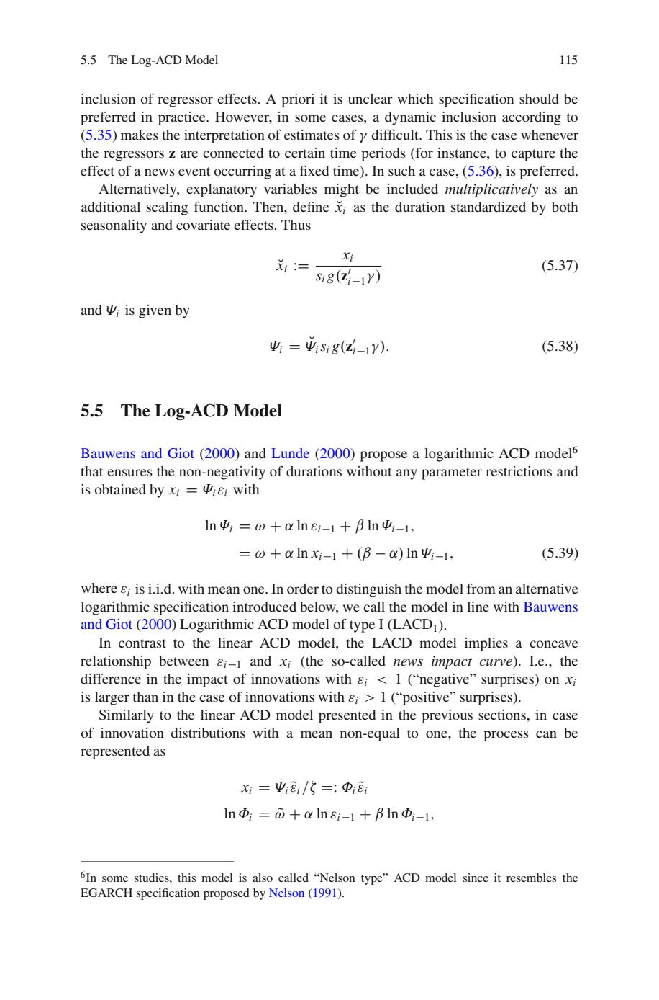

## PDF page 131 / printed page 116

116                                                          5 単変量乗法誤差モデル（Univariate Multiplicative Error Models）

ここで !Q WD ! C .ˇ  1/ ln および "i WD "Qi = となる。EŒQ"i  WD ¤ 1。
基本的なACDモデルと同様に、Log-ACDモデルもARMA仕様で表現できる。Allen et al. (2008) は、(5.39)で与えられるLog-ACDモデルは、ln xi の ARMA(R,R) 仕様として表現できることを示す。

                                        X
                                        R                      X
                                                               R
                        ln xi D !M C           ıj ln xi j C          j i j C i ;          (5.40)
                                        j D1                   j D1

ここで i WD .ln "i  EŒln "i /  i id.0; 2 /, !M WD ! C Rj D1 j EŒln "i  C EŒln "i 、および R WD max.P; Q/.
Bauwens and Giot (2000) は、以下のLog-ACD仕様の代替案も提案している。

                            ln i D ! C ˛"i 1 C ˇ ln i 1
                                  D ! C ˛.xi 1 =i 1 / C ˇ ln i 1 ;                        (5.41)

これは凸のニュースインパクトカーブを意味し、Log ACD type II (LACD2 ) モデルと呼ばれる。両方のLog-ACD仕様は、以下のように簡潔に記述できる。

                                        X
                                        P                       X
                                                                Q
                        ln i D ! C            ˛j g."i j / C          ˇj ln i j ;           (5.42)
                                        j D1                    j D1

ここで g."i / D ln "i (type I) または g."i / D "i (type II)。Bauwens et al. (2008) と Karanasos (2008) は、両方のLog ACD仕様の無条件モーメントを導出している。P D Q D 1 の場合、xi の m番目のモーメントは、

                                                 Y
                                                   1
                                             m!                ˚
                 EŒxim  D     m exp                       E exp m˛ˇ j 1 g."i /         ;     (5.43)
                                            1ˇ     j D1

ここで m は任意の正の整数 m であり、条件 m D Ejxim j < 1、jˇj < 1 および EŒexp.m˛ˇ j 1 g."i // < 1 が満たされる必要がある。
対応して、条件 jˇj < 1、EŒexp.2˛g."i // < 1 の下で、自己相関関数は、

                  h               iQ           h j 1        iQ        h                        i
                          n1        n1                         1        ˛.1Cˇn /ˇ j 1 g."i /
                 E "i e ˛ˇ g."i /    j D1 E e                    j D1 E e
                                                   ˛ˇ g."i /

      n D                                                            j 1        2
                         Q1         2˛ˇ j 1 g."i /  2
                                                           Q1
                           j D1 E e                           j D1 E e
                                                                       ˛ˇ    g."i /
                       2

                                        Q1         h j 1        i2
                                    2
                                            j D1 E  e ˛ˇ  g."i /

                                                                   j 1        2 :         (5.44)
                       Q1        2˛ˇj 1 g."i / 
                                                           Q1
                        j D1 E e                                  E
                                                      2              e ˛ˇ  g."i /
                   2                                         j D1

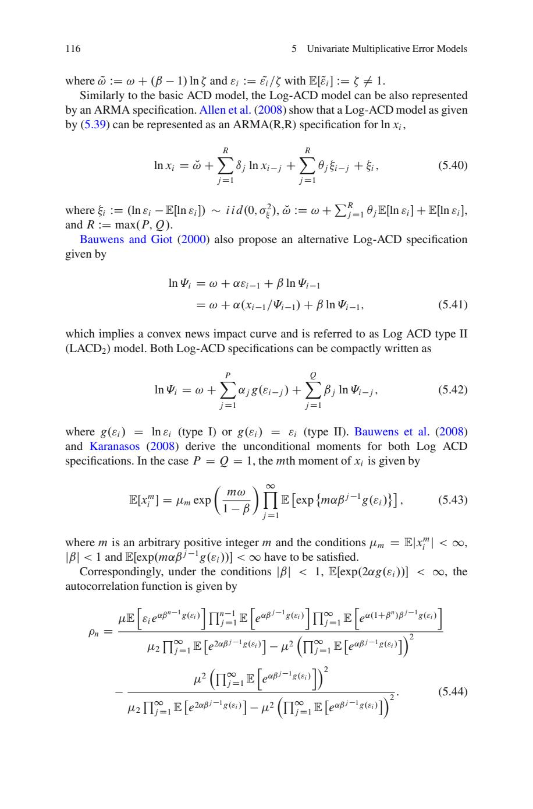

## PDF page 132 / printed page 117

5.6 ACDモデルの検定                                                           117

これらの結果から、LACDモデルは、

            ˇ < 1;    EŒ"i expf˛g."i /g < 1;       EŒexpf2˛g."i /g < 1:

という条件を満たすとき、共分散定常であると導き出される。これらの結果の一般化は、Bauwens et al. (2008) および Karanasos (2008) に与えられている。実用上は、無限和を十分に大きい数で打ち切ることが推奨される。
    Allen et al. (2008) が指摘するように、線形ACDモデルの指数QML特性は、Log-ACDの場合に直接的に持ち越すことはできない。緩く言えば、その根本的な理由は、Log-ACDの場合、イノベーション "i 1 が i と xi を非線形的に影響するため、分布の誤った設定がある場合にQMLスコア関数が有効であることを損なうという点にある。これは、Nelson’s (1991) 指数GARCHモデルのQML特性が、ガウスGARCHモデルから持ち越せない結果と類似している。
    代替案として、Allen et al. (2008) は、対数正規分布を用いてLACDモデルを推定することを提案している。xi の対数 ln xi が平均 i と分散 2 を持つ正規分布に従うと仮定すると、対応する対数尤度関数は次のようになる。

                      1      1                            1 .ln xi  ln i /2
        ln L.XI / D  ln 2  ln          2
                                               ln xi              2
                                                                              :   (5.45)
                      2      2                            2

                                                                           O
次に、Allen et al. (2008) は、  の一貫性と漸近正規性を示す。

                  p             d
                   n.O   0 / ! N .0; A. 0 /1 B. 0 /A. 0 /1 /;             (5.46)

ここで、
                         ˇ                                       ˇ
                     1  ˇ                        1 @2 ln L.XI / ˇˇ
  A. 0 / D lim n EŒH./ˇ            D lim n E                     ˇ       ;     (5.47)
             n!1               D 0   n!1               @@ 0       D 0
                                   ˇ
   B. 0 / D lim n1 E s./s./0 ˇD 0
            n!1
                                                 ˇ
                  1     @ ln L.XI / @ ln L.XI / ˇˇ
           D lim n E                                ˇ      :                      (5.48)
            n!1               @           @ 0      D 0

LACDモデルの重要な利点は、 i が非負制約を破ることなく、共変量によって直接的に拡張できる点である。この文脈において、第5.4節の議論が適用される。

5.6 ACDモデルの検定

本節では、ACDモデルを検定するためのいくつかの手順を示す。第5.6.1節では、ACD残差に対するポートマンテオ検定について説明する。ここでは、古典的なBox–Pierce検定とLjung–Box検定、およびそれらに対する考慮事項について議論する。

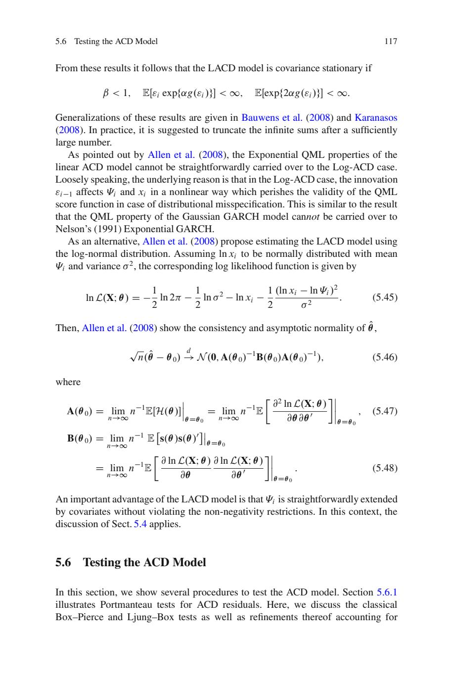

## PDF page 133 / printed page 118

118                                                   5 単変量乗法誤差モデル

ACD残差の特異な特徴について議論する。セクション5.6.2では、独立性検定について、例えば、Brockら（1996）が提案したBDS検定や、HongとLee（2003）の一般化スペクトル密度に基づく全般検定について議論する。セクション5.6.3では、ACD残差の分布に対する明示的な検定に焦点を当てる。Rosenblatt（1952）の確率積分変換を用いた密度評価に加えて、FernandesとGrammig（2005）がAı̈t-Sahalia（1996）に基づいて提案した分布の誤った仕様に対するノンパラメトリック検定に焦点を当てる。セクション5.6.4では、条件付き平均仕様の正しい関数形に対するLagrange Multiplier（LM）検定に集中する。これらの検定は、局所的な代替仮説に対して最適な検出力を持つが、より一般的な代替仮説に対しては検出力が低い。したがって、セクション5.6.5では、Newey（1985）によって最初に導入された条件付きモーメント（CM）検定について議論する。これらの検定は、有限の数の条件付きモーメントの制約に依存するため、有限の数の可能な代替仮説に対して一貫性がある。セクション5.6.5.2では、Bierens（1982, 1990）が提案した積分条件付きモーメント（ICM）検定の使用を説明する。無限の数の条件付きモーメントを雇用することで、この検定はすべての可能な代替仮説に対して一貫性を持つという性質を持ち、したがって、CM検定の一般化である。最後に、セクション5.6.6では、データ生成プロセスとして様々な種類の拡張ACDモデルに基づいて、LM、CM、およびICM検定のサイズと検出力を分析するモンテカルロ研究を提示する。

5.6.1 ポルテマンテウ検定

ACDモデルの適合度を評価する明白な方法は、ACD残差の動的および分布特性を調査することである。

                         ei WD "O i D xi =O i ;     i D 1; : : : ; n:                 (5.49)

モデル仕様が正しい場合、系列はi.i.d.でなければならない。したがって、BoxとPierce（1970）およびLjungとBox（1978）が提案したポルテマンテウ検定をACD残差に基づいて使用して、仕様がデュレーション過程の時間的依存性を説明できるかどうかを分析することができる。特に、残差eiがi.i.d.の場合、Box–Pierce検定は次のように与えられる。

                                             X
                                             k
                                                        a
                            QBP .k/ D n             Oj2  2ks ;                     (5.50)
                                             j D1

ここで、sはeiの背後にある推定される自己回帰パラメータの数を示す。すなわち、ACDモデルの場合、s WD maxfP; Qgであり、Ojはj番目のラグサンプル自己相関を示す。

                                  Pnj
                                   i D1 .ei  e/.e
                                               N i Cj  e/
                                                         N
                          Oj D       Pn                   ;                           (5.51)
                                         i D1 .ei  e/
                                                    N  2

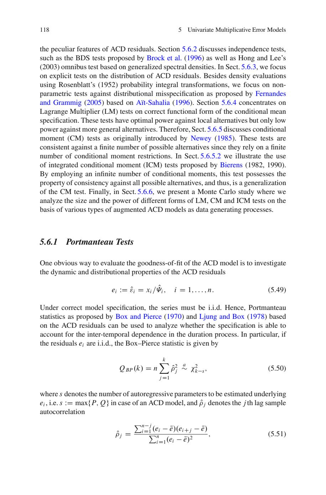

## PDF page 134 / printed page 119

5.6 ACDモデルの検定                                                                           119

ここで、eNはeiの平均であり、正しい仕様下では1に等しい。サンプルサイズが小さいから中程度まで変化する場合、Box–Pierce検定の貧弱な有限サンプル特性を改善するために、LjungとBox（1978）は以下の統計量を使用することを提案している。

                                                         X
                                                         k
                                                           Oj2           a
                        QLB .k/ D n.n C 2/                                 2ks :               (5.52)
                                                         j D1
                                                              nj

Box–Pierce検定統計量とLjung–Box検定統計量ともに、基礎系列が平均ゼロの（真の）正規分布に従う場合、jの漸近分布は平均ゼロで分散 .n  j /=.n.n C 2// を持つ正規分布であるという結果に基づいている。ここで、後者はnが大きければn1で近似される。
   様々な研究が、未知の、場合によってはゼロでない平均と正規性からの逸脱の影響を分析している。DufourとRoy（1985）は、平均が未知の場合、QLBの有限サンプル性能はjを .n  j /=.n.n C 2// でではなく、その正確な第1モーメントと第2モーメントで標準化することで改善できることを示している。Kwanら（2005）は、基礎データ生成過程が歪んでいる場合、標準的なBox–Pierce検定とLjung–Box検定は明らかに過小評価される可能性があることを示している。そのような状況下では、DufourとRoy（1986）が提案するランク自己相関に依存する非パラメータのPortmanteau検定の方が、有限サンプルにおいてより優れた性能を発揮する。さらに、分散安定化変換に基づくPortmanteau統計量の修正が、KwanとSim（1996a,b）によって提案されている。
   Pacurar（2008）が強調するように、ARMAモデルの残差から生じる残差に対するBox–PierceまたはLjung–Box検定のために導出された漸近2分布は、ACD残差に直接適用できない。実際、p
   指数ACDモデルの場合、LiとYu（2003）は、nOの漸近分布について、O WD .O1 ; : : : ; Ok /0 と
                                       Pnj
                                            .ei  1/.ei Cj  1/
                                  Oj D i D1Pn                  ;
                                             i D1 .ei  1/
                                                           2

                        Pn              p
                         i D1 .ei  1/ ! 1)
                                      2
または、代替として（

                                              X
                                              nj
                                      Oj D       .ei  1/.ei Cj  1/;                            (5.53)
                                              i D1

                                                                  1 0
                                                       1 Ik  ZH Z with Ik
は、平均ゼロで共分散行列
denoting
   P      k次元の単位行列、H WD E n H./ , ln L.XI / D
 niD1 .ln i C xii / and
            2 1 Pn                                       Pn                             3
                    i D2  2 .ei 1  1/                                  .ei 1  1/
                         xi                          1           xi xi 1
                n                                    n    i D2      i2
           6                 i
                                 ::                                  ::                 7
      Z WD 6
           4                      :                                   :
                                                                                        7
                                                                                        5     :   (5.54)
               1 Pn                      1 Pn
                  i DkC1  2 .ei k  1/ n  i DkC1  2 .ei k  1/
                         xi                       xi xi 1
               n          i                           i                                 k2

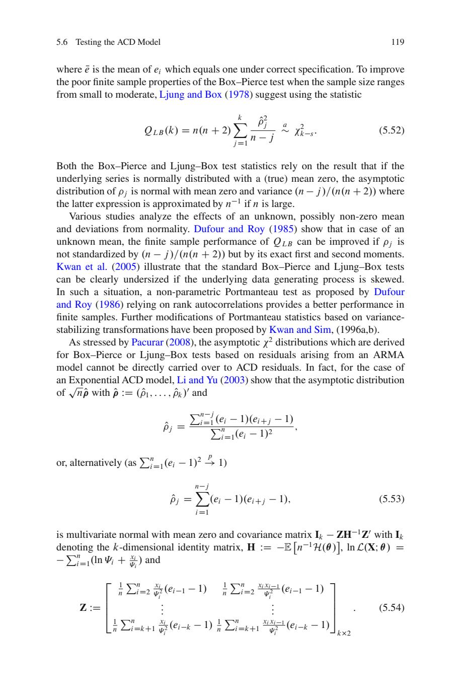

## PDF page 135 / printed page 120

120                                                            5 単変量乗法誤差モデル

次に、統計量は

                         QLY .k/ D nO 0 .Ik  ZH1 Z0 /1 O  2k :
                                                                            a
                                                                                                (5.55)

この結果は、基礎となる指数分布の場合に明示的に成立するが、一般化することも容易である。例えば、ワイブル分布の場合も考えられる。類似した
知見は、Li and Mak (1994) によって、GARCHモデルにおける二乗標準化残差に対するポートマンテストについて示されている。
    したがって、Box–Pierce および Ljung–Box テストは、モデルの動的適合性を近似的に評価するための（相対的な）モデル比較を行うために、依然として使用できる。
しかし、ACD 残差の動的特性に関する正確な推論に関心がある場合には、上記で議論されたような修正されたポートマンテストを使用すべきである。
    注意すべき点は、ei の独立性は、最初の k 個の自己相関に基づいてのみテストされるということであり、これは特定の仮説 H1 W j ¤ 0
for 1  j  k に対してテストすることを意味する。しかし、Box–Pierce および Ljung–Box テストは、相関だけでなく、二乗された ACD 残差のような高次のモーメントにおける依存関係をテストするためにも、直接的に適用できる。McLeod and Li (1983) によって提案され、一般的に McLeod–Li テストと呼ばれる Ljung–Box テストに基づく二乗残差の応用がある。

5.6.2 独立性テスト

上記で議論されたポートマンテストは、使用された系列における自己相関を検出するだけであり、高次のモーメントにおける依存関係を自動的に検出するものではない。また、ACD
残差の独立性を明示的にテストするためには適用できない。Brock et al. (1996) は、i.i.d. 過程に対する多くの仮説に対して検出力を持ち、カオス効果を含む様々な代替仮説に対しても有効なノンパラメトリックテストを提案している。主要なアイデアは、残差の m-期間履歴の「近さ」を評価することである。特に、
                                                   (
                                                       1    ifjei  ej j < d;
                           1l .ei ; ej ; d / WD                                                 (5.56)
                                                       0    otherwise,

を定義する。

                                                   Y
                                                   m1
                          1l m .ei ; ej ; d / WD           1l .ei Ck ; ej Ck ; d /;             (5.57)
                                                   kD0

ここで、d はある距離である。したがって、1l m ./ は、2つの m-期間履歴
fei ; ei C1 ; : : : ; ei Cm1 g と fej ; ej C1 ; : : : ; ej Cm1 g が、各項に対して jei Ck  ej Ck j < d であるという点で互いに近い場合に 1 になる。m-期間履歴の割合が

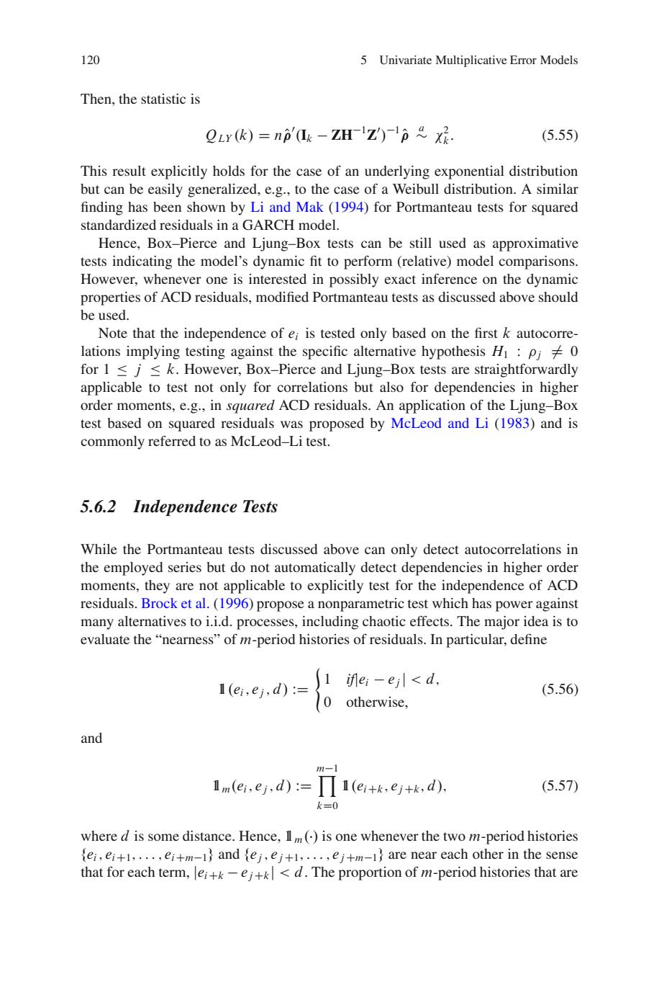

## PDF page 136 / printed page 121

5.6 ACDモデルの検定                                                                121

互いに近い点同士の距離は相関積分によって推定される。

                                 2          X nmC1
                                            nm X
         Cm .n; d / WD                              1l m .xi ; xj ; d /                (5.58)
                         .n  m/.n  m C 1/
                                                i D1 j Di C1

極限を取ると、

                                Cm .d / WD plim Cm .n; d /:
                                           n!1

観測値が独立同一分布に従う場合、Cm .d / D C1 .d /m となる。逆に、観測値がカオス過程からのものである場合、Cm .d / > C1 .d /m となる。相関積分の漸近分布を利用して、Brock et al. (1996) は、検定統計量を以下のように構成する。

                                   p Cm .d /  C1 .d /m d
                 BDS.m; d / WD      n                   ! N .0; 1/;                    (5.59)
                                            VOm
                                              1=2

ここで、VOm は、

              O nfCm .n; d /C1 .n; d /m g で表される漸近分散であり、
                 p
次のように推定することができる。
             0                                                                  1
                                                               X
                                                               m1
     VOm D 4 @K m C .m  1/2 C 2m  m2 KC 2m2 C 2                    K mj C 2j A ;   (5.60)
                                                               j D1

ここで、C は C1 .n; d / であり、

                                      6
              K WD
                     .n  m  1/.n  m/.n  m C 1/
                          02                     3"                      #1
                      X
                      nm    i 1
                             X                       X
                                                    nmC1
                         @4      1l m .ej ; ei /5        1l m .ei ; ek / A :
                         i D1   j D1                kDi C1

BDS検定は、条件付き平均モデルのクラスにおいて、任意のn一貫性パラメータ推定値がその零分布の極限に影響を与えないという、ノイズパラメータフリーの性質を持つ。しかし、Hong and Lee (2003) が強調するように、BDS検定はパラメータ m と d を選択する必要がある。有限標本では、この選択が検定の力とサイズの特性に影響を与える可能性がある。さらに、BDS検定は、任意の仮説に対する検出力を持つ万能検定ではないことが示されている。
    代替案として、Hong and Lee (2003) は、Hong (1999) が導入した一般化スペクトル検定に基づいたACDモデルのミスペシフィケーション検定を提案している。これは、ei と ei j の経験的特性関数の共分散によって与えられるものに基づいている。

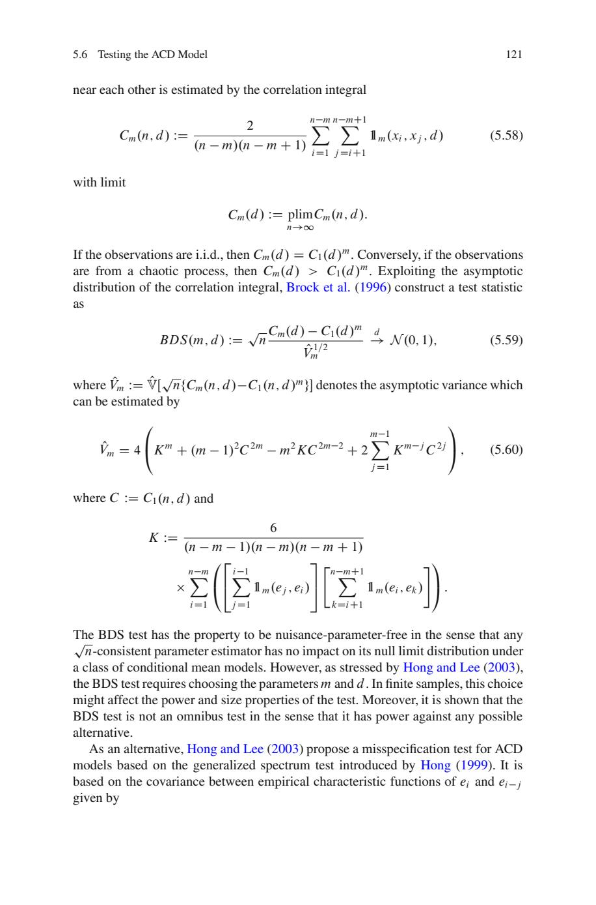

## PDF page 137 / printed page 122

122                                                   5 単変量乗法誤差モデル

                               j .u; v/ WD CovŒe
                                                   uei
                                                          ; e vei j ;               (5.61)
               p
ここで  WD       1 and j D 0; ˙1; : : : である。次に、j .u; v/ D 'j .u; v/  '.u/'.v/ である。
ここで 'j .u; v/ WD EŒe .uei Cvei j /  and '.u/ WD EŒe uei  は、.ei ; ei j / の同時特性関数と周辺特性関数である。したがって、j .u; v/ はすべての .u; v/ 2 R2 に対して 0 である。
もし ei と ej が独立である場合である。j .u; v/ のフーリエ変換は以下のように与えられる。

                                    1
                                1 X              j w
               f .w; u; v/ D           j .u; v/e       ;              w 2 Π; :      (5.62)
                               2 j D1

f .w; u; v/ の .u; v/ に関する負の部分微分が .0; 0/ で与えられるものは「従来の」スペクトル密度と呼ばれ、Hong (1999) はこれを fei g の「一般化スペクトル密度」と呼んでいる。これは fei g の様々なラグにおける任意の種類の対偶依存性を捉えることができる。もし fei g が i.i.d. である場合、f .w; u; v/ は平坦なスペクトルになる。

                                                 1
                               f0 .w; u; v/ D             0 .u; v/:                    (5.63)

Hong and Lee (2003) は、カーネル推定値を使用して f .w; u; v/ を推定することを提案している。

                       1 X
                          n1
      fOn .w; u; v/ D         .1  jj j=n/1=2 K.j=pn / O j .u; v/e j w ;
                      2 j D1n

          O j .u; v/ D 'O j .u; v/  'Oj .u; 0/'O j .0; v/; j D 0; ˙1; : : : ; ˙.n  1/;
                       (               P
                          .n  j /1 niD1Cj e .uei Cvei j / if j  0;
         'Oj .u; v/ D                  P                                                (5.64)
                          .n C j /1 niD1j e .uei Cj Cvei / if j < 0;

ここで K W R ! Œ1; 1 はバンド幅 bn を持つ対称カーネルであり、bn ! 1, bn =n ! 0 as n ! 1 であり、.1  jj j=n/1=2 は有限標本調整因子である。それに対応して、f0 .w; u; v/ は以下のように推定される。

                                                1
                               fO0 .w; u; v/ D    O 0 .u; v/:                          (5.65)

Hong and Lee (2003) は、L2 -ノルムを介して fOn .w; u; v/ と fO0 .w; u; v/ を比較する検定統計量を提案している。詳細は Hong and Lee (2003) を参照のこと。カーネルの選択に関して、Hong and Lee は Daniell カーネルを、検定の漸近的な力を最大化するために最適であると提案している。しかし、Meitz and Teräsvirta (2006) が強調するように、その計算は無限サポートを持つため、要求されるものである。これは、特に基底のサンプルサイズが非常に大きい場合に当てはまる。したがって、代替案として、Meitz and Teräsvirta (2006) は Parzen カーネルの使用を提案している。
     注意すべき点として、BDS 検定も Hong and Lee (2003) 検定も、ACD モデルの条件付き平均関数を排他的に検定するものではない。

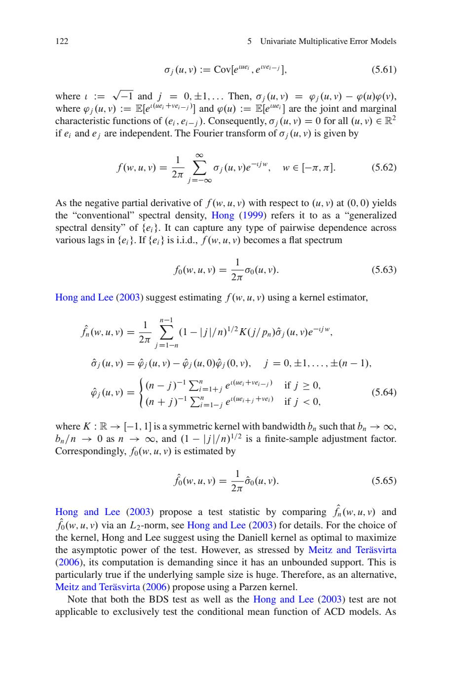

## PDF page 138 / printed page 123

5.6 ACDモデルの検定                                                                 123

平均関数の適切な仕様であっても、高次の依存関係を排除できるとは限らない。両方の検定は、ACD平均仕様が正しいかもしれないにもかかわらず、その拒否を示唆するであろう。そのような状況下では、Hong and Lee (2011) は、一般化されたスペクトルの偏微分に基づく、条件付き平均関数における動態に関する検定を構築している。彼らは、この検定が、無視された様々な線形および非線形動態構造を条件付き期待デュレーションにおいて検出できることを示している。Duchesne and Pacurar (2008) は、ACD残差のカーネルスペクトル密度推定器に基づく検定を提案しており、これはHong (1996) の検定の一般化されたバージョンを与える。

5.6.3 分布検定

残差系列 fei g は、平均が1を持ち、かつACD誤差の指定された分布に対応する分布を持つべきである。したがって、残差系列のグラフによるチェックは、分位-分位プロット（QQプロット）に基づいて実行することができる。あるいは、特定の分布が暗示するモーメント条件を調査することで、適合度を評価することができる。指数分布の場合、単純なモーメント条件は、平均と標準p偏差の等式を意味する。Chap. 4で議論されたように、Engle and Russell (1998) は、過剰な分散を検定するための統計量 n.. O e2  1/= " / を提案している。ここで、O e2 は、ei のサンプル分散であり、" は、."i  1/2 の標準偏差であり、指数分布の帰無仮説の下では8に等しい。帰無の下では、この検定統計量は漸近的に標準正規分布に従う。
   適合度を評価するもう一つの方法は、モデルが暗示するサンプル内密度予測を評価することである。Diebold et al. (1998) は、Rosenblatt (1952) の確率積分変換に基づく評価方法を提案している。

                                           Z xi
                                   qi WD          f .s/ds:                             (5.66)
                                            1

彼らは、帰無仮説、すなわち正しいモデル仕様の下では、qi系列の分布はi.i.d.一様分布であると示している。したがって、qi系列を一様分布に対して検定することで、密度予測の性能を評価することができる。7
この文脈において、Pearsonの適合度検定を実行するために、確率積分変換qiをカテゴリ化し、個々のカテゴリの頻度に基づいて2 -統計量を計算することができる。

                                X
                                M
                                  .nm  npO  /2      a
                                             
                                                  m
                                                       2M ;
                                mD1
                                          npOm

7
  詳細については、Bauwens et al. (2004) または Dufour and Engle (2000) を参照されたい。彼らは、この概念を代替的な金融デュレーションモデルの比較に適用している。

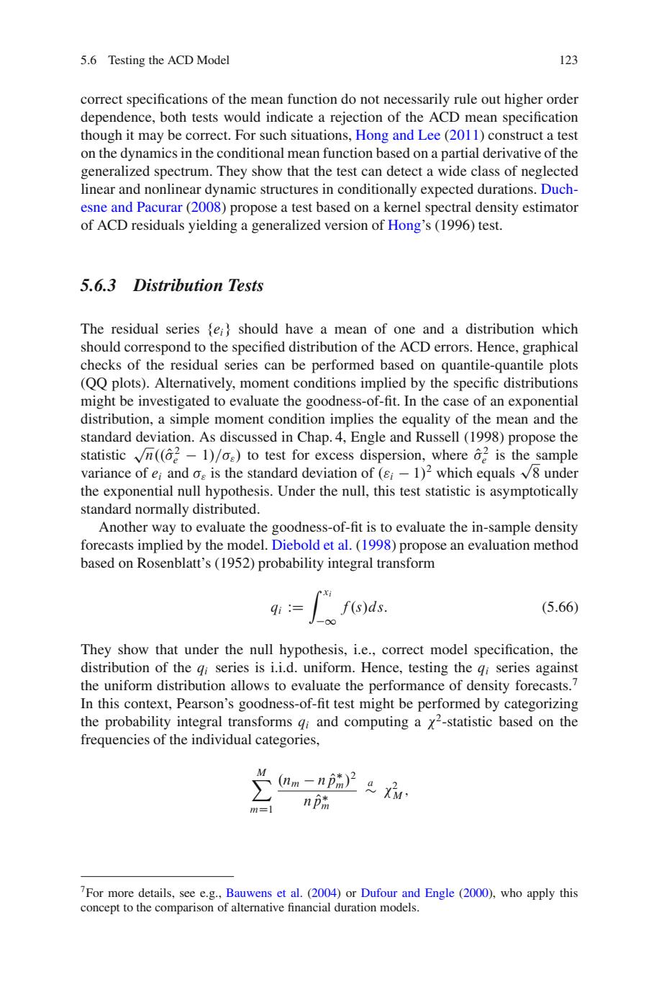

## PDF page 139 / printed page 124

124                                                5 単変量乗法誤差モデル（Univariate Multiplicative Error Models）

ここで、M はカテゴリー数、nm はカテゴリー m における観測数、pOm は qi の実現をカテゴリー m で観測する確率の推定値である。

分布の誤った設定に対するより洗練された検定は、Fernandes and Grammig (2005) によって提案されており、Aı̈t-Sahalia (1996) の研究に基づいている。彼らは、推定されたパラメトリック密度関数とその非パラメトリック推定値の間の距離に基づいて、非パラメトリック検定手順を提案する。この検定は非常に一般的であり、完全な（条件付き）密度自体の正しさを検定するものである。

以下では、条件付き平均関数 i が正しく設定されている限り、「i の一貫した推定値である ACD 残差の分布を検定する概念を説明する。Fernandes and Grammig (2005) は、真の誤差「i をその n 一貫した推定値 ei で置き換えることによる非漸近的なコストはないことを示している。ACD 残差 ei の c.d.f. と p.d.f. をそれぞれ F .e; / と f .e; / と定義し、ここで  は基底パラメータベクトルを表す。Fernandes and Grammig (2005) が提案する検定の原理は、パラメータベクトル  のある値  0 が存在するかどうかを検定することである。その値において、真の密度関数とパラメトリック密度関数がほぼ至るところで一致する。帰無仮説

                    H0 W 9  0 2  such that f .e;  0 / D f .e/

を考える。ここで、 は基底パラメータ空間を表す。いわゆる D-検定は、距離

                          Z
                  f WD 1l fe2Sg ff .e; /  f .e/g2 dF .e/              (5.67)
                              e

に基づいており、積分は f のサポート領域全体で行われ、S は非パラメトリック（カーネル）密度推定が安定する領域のサブセットを定義する。次に、(5.67) の標本対応は次の式で与えられる。

                             1X
                                  n
                     fO D                              O  fO.ei /g2 ;
                                    1l fei 2Sg ff .ei ; /                          (5.68)
                             n i D1

ここで、O と fO はそれぞれ  0 と f の点ごとの一貫した推定値である。したがって、fO は密度関数 f のパラメトリックと非パラメトリック推定値の差を評価する。パラメトリック推定値は正しい設定でのみ一貫しているため、fO は帰無下でゼロに収束する。

形式的な検定を構築するために、カーネル密度推定 fO.e/ of f .e/ を次のように与えられたものとする。

                                      1 X
                                           n
                             fO.e/ D          Ke;bn .ei /;                          (5.69)
                                     nbn i D1

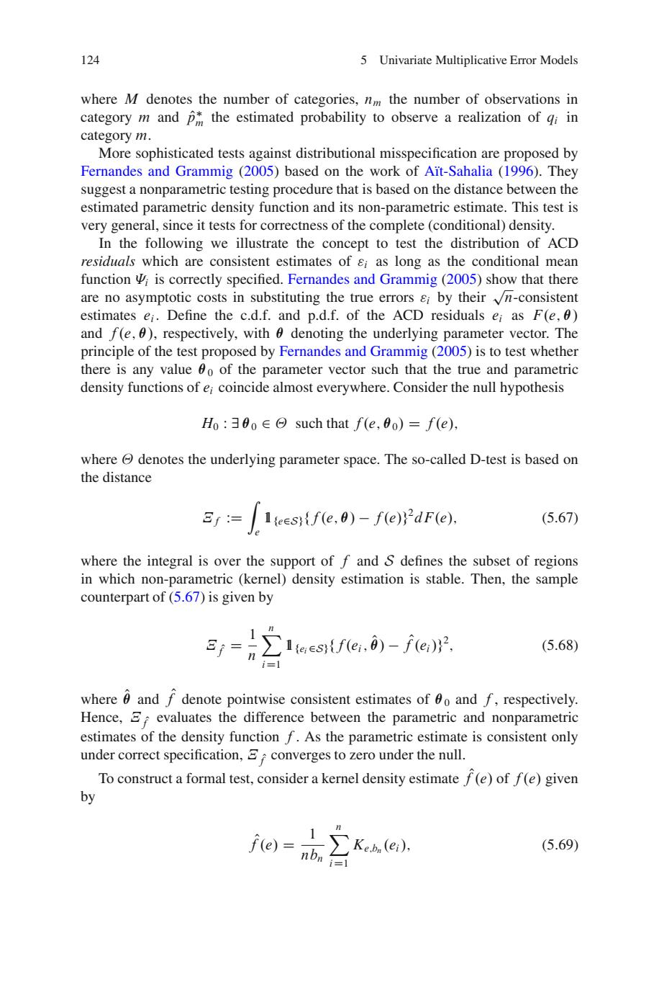

## PDF page 140 / printed page 125

5.6 ACDモデルの検定                                                              125

ここでR K.ei / WD Ke;bn .ei / は、連続的に微分可能なカーネル関数K./  0
で、K.u/d u D 1 かつバンド幅 bn .ei / を持つ。固定カーネルを使用する場合、Fernandes
と Grammig (2005) は、fO の検定統計量を次の形で提案する。

                                                    1=2           1=2 O
                                               nbn fO  bn           ıD
                                 OnD D                                     ;         (5.70)
                                                             OD

ここで bn D o.n1=.2sC1/ / は、固定カーネルのバンド幅を表し、s は
カーネルの次数である。さらに、ıOD と O D2 は、以下の期待値を計算するために経験分布を使用し、対応する（固定）カーネル密度推定値を代入することで、一貫して推定される。IK EŒ1l fe2Sg f .e/ と D2 WD JK EŒ1l fe2Sg f 3 .e/、ここで IK と JK は、(固定)カーネルの形に依存し、次のように定義される。
                                   Z
                       IK WD               K 2 .u/d u;
                                       u
                                   Z Z                                 2
                       JK WD                       K.u/K.u C /d u             d:
                                       u       u

パラメータ ıD と D2 は、期待値を計算するために経験分布を使用し、次に対応する（固定）カーネル密度推定値を代入することで、一貫して推定することができる。

                                         1X
                                             n
                                ıOD D IK        1l fei 2Sg fO.ei /;
                                         n i D1

                                                   1X
                                                         n
                                O D2 D JK             1l fei 2Sg fO.ei /3 :
                                                   n
                                                     i D1

Gosh と Huang (1991) によって与えられる最適な一様カーネルの場合、
                                  p        (      p
                               .2 3/1 ; for juj  3;
                       K .u/ D
                            u
                                                  p                                  (5.71)
                               0;        for juj > 3;
                                                         
f は (5.69) に Ke;bn .ei / D K u eebn
                                                       i
                                                           を代入することで推定され、IK と JK は
                    p 1                p 1
与えられる。IK D .2 3/ および JK D .3 3/ 。
   一連の正則性条件の下（Fernandes と Grammig 2005 を参照）、検定統計量 OnD は漸近的に正規分布に従う。

                                                     d
                                            OnD ! N .0; 1/:

   しかしながら、ACD 残差は下から有界なサポートを持つため、検定統計量 OnD は、周知の境界バイアスにより性能が低下する可能性がある。

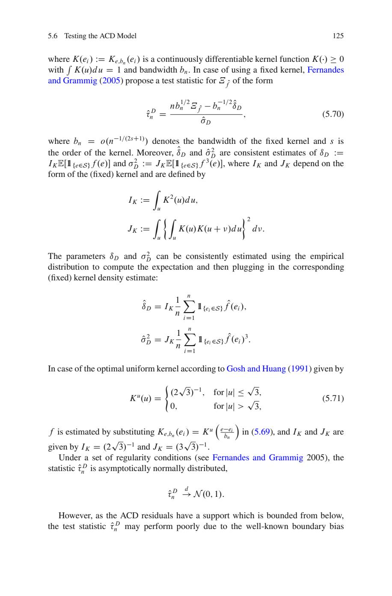

## PDF page 141 / printed page 126

126                                                       5 単変量乗法誤差モデル（Univariate Multiplicative Error Models）

固定カーネルによって引き起こされる問題である。この問題は、平滑化が境界付近で発生する場合、固定カーネルが密度をサポート外に重みを割り当てるという事実によって引き起こされる。代替案として、Chen (2000) が提案する、柔軟なガンマカーネルのような非対称カーネルを検討することがある。このカーネルは、形状パラメータ x=bn C 1 とスケールパラメータとして bn を用いるガンマ分布の密度に基づいている。それは次のように与えられる。

                                           ux=bn exp.u=bn /
                   Kx=bn C1;bn .u/ WD       x=bn C1
                                                                          1l fu0g ;            (5.72)
                                           bn          .x=bn C 1/

ここで bn D o.n4=9 /. すると、対応するガンマカーネル密度推定値は次のように与えられる。

                                     1 X 
                                          n
                            fQ.e/ D         K           .ei /:                                  (5.73)
                                    nbn i D1 e=bn C1;bn

これらのカーネルのサポートは正の実数直線であるため、元の密度のサポート外に重みを割り当てることはない。境界バイアスがないことに加えて、カーネルの形状が観測位置に応じて変化し、平滑化の量を修正する。
   ガンマカーネルを基底カーネル推定値として使用する Fernandes と Grammig (2005) は、次のような修正された検定統計量を提案する。

                                     1=4           1=4 Q
                                  nbn fO  bn         ıG        d
                         QnD WD                                  ! N .0; 1/;                    (5.74)
                                            QG

ここで ıQG と Q G2 は、ıG WD 2p1 EŒ1l fe2Sg e 1=2 f .e/ および
 G WD
 2    p1
       2
           EŒ1l fe2Sg e 1=2 f 3 .e/ の整合的な推定値である。同様に、ıG と                 2
                                                                                  G は、次のように整合的に推定できる。

                                     X n
                          QıG D p1        1l fei 2Sg ei fQ.ei /;
                                                      1=2
                               2   n i D1

                                     1     X
                                           n
                                                                     fQ.ei /3 :
                                                             1=2
                          Q G2 D p               1l fei 2Sg ei
                                     2 n i D1

バンド幅 bn を選択するために、Fernandes と Grammig (2005) は Silverman’s (1986) の経験則を適用し、次を選択する。

                                   1 O                O 4=5 n4=9 ;
                         bn D          .=4/1=5 .2  /
                                  ln n

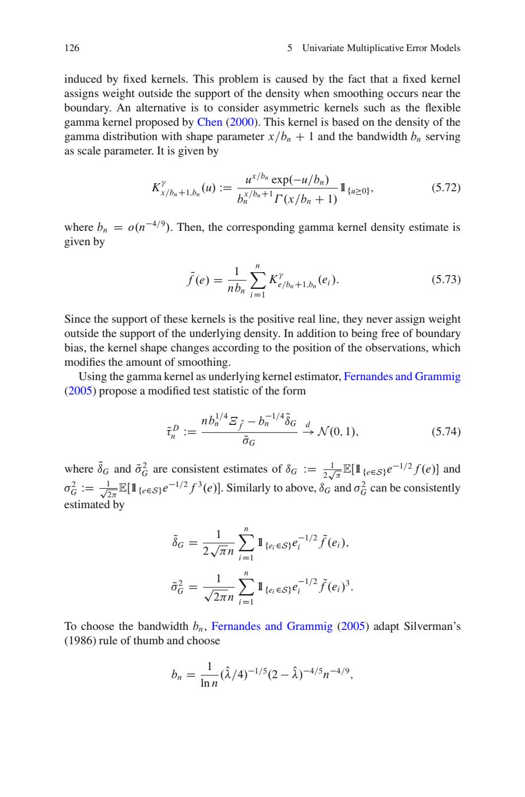

## PDF page 142 / printed page 127

5.6 ACDモデルの検定                                                         127

ここで、Oは指数分布のパラメータの整合性のある推定値であり、ACD残差の標本平均によって容易に推定されるか、あるいは1に設定される。
　同様に、Fernandes and Grammig (2005)は、パラメータ分布と非パラメータ分布のハザード関数の推定値の間の距離に基づく、いわゆるH検定を提案している。詳細はFernandes and Grammig (2005)を参照されたい。
　ガンマカーネルの魅力的な特徴、例えば支持領域の内側部分での分散の減少は、代償を伴う。対称カーネルと比較して、ガンマカーネル推定値は境界から離れるほどある程度のバイアスを特徴とする（Hagmann and Scaillet 2007を参照されたい）。この性質は、効果的なバイアス補正技術を実装する必要性を生み出す。固定カーネルに対する乗法的バイアス補正の簡単な技術はHjort and Glad (1995)によって提案され、Hagmann and Scaillet (2007)によって局所バイアス補正法の一例として非対称カーネルに拡張されている。このアプローチは、密度がパラメータ的に開始されながら非パラメータ的に推定されるという、半パラメータ的なものである。Hautsch et al. (2010)は、これらの技術を用いて、Fernandes and Grammig (2005)の検定の一般化を構築しており、ゼロ観測も考慮して、離散-連続混合分布に対する検定を可能にしている。

5.6.4 ラグランジュ乗数検定

前節で議論された検定は、ACDモデルの条件付き平均制約を明示的に検定するのに適していないことに注意する。これらの検定は明らかに条件付き平均関数の誤った設定に対する検出力を持つが、より高次の条件付きモーメントの誤った設定によって引き起こされる分布の仮定の違反、あるいは条件付き平均制約の違反のどちらが、可能な棄却の原因であるかを特定することを可能にしない。特に、QML推定によるACDモデルの場合、完全な密度の正しい設定よりも、条件付き平均制約の妥当性に主に興味がある。また、5.6.3節で説明された分布検定は、ACD誤差の整合性のある推定値に基づいているが、これには条件付き平均関数の正しい設定が必要である。この特定の条件付きモーメント制約を明示的に検定する手順は、以下の小節で議論される。
　計量経済学の文献では、ラグランジュ乗数検定は、モデルの誤った設定を検出するための有用な診断ツールであることが証明されている。例えば、Breusch (1978)、Breusch and Pagan (1979, 1980)、Godfrey (1978a,b)、またはEngle (1984)を参照されたい。QML推定によるACDモデルの場合（5.3.1節を参照）、LM検定統計量は次のように計算される。

                              LM D f00 z0 .z00 z0 /1 z00 f0 ;                 (5.75)

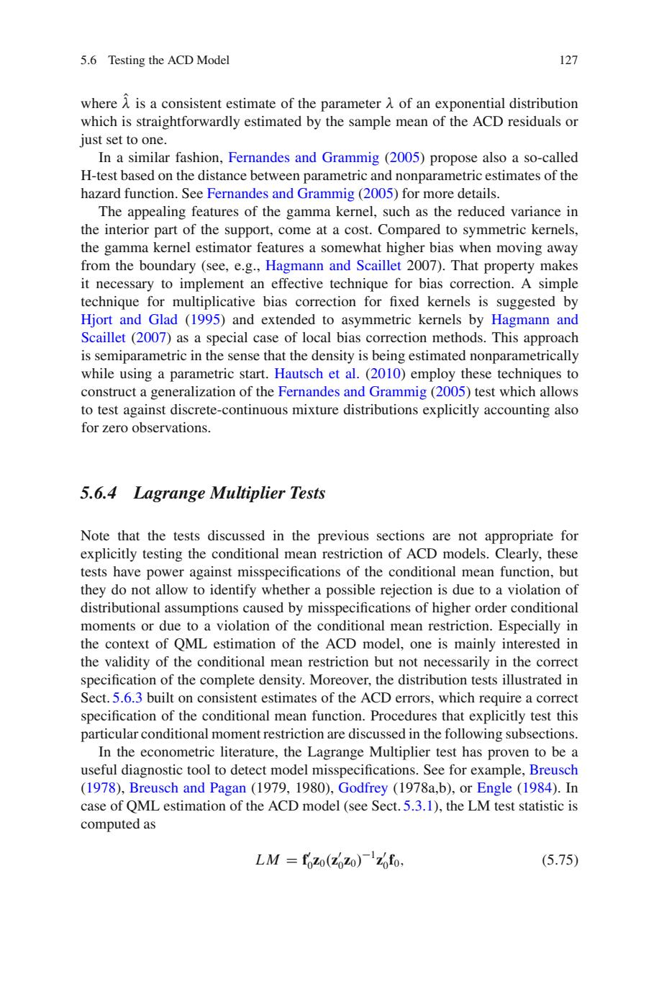

## PDF page 143 / printed page 128

128                                                      5 単変量乗法誤差モデル

ここで
                                        0                                             0
                    x1              xn                           1 @1         1 @n
        f0 WD           1; : : : ;    1 ;          z0 WD               ;:::;                ;
                    1              n                           1 @ 0       n @ 0

両方の評価は帰無仮説の下で行われる。この検定統計量が、f0 を z0 に対して回帰させた未中心 R2 に対応することを示すのは容易である。通常、モデルのスコアに対する 1 のベクトルを回帰させた未中心 R2 である R2 を用いて nR2 として計算される。
   LM 検定を実施するには、帰無仮説の下にあるモデルを包含する一般的なモデルを指定する必要がある。未知の形式の条件付き平均関数に対する誤った仕様を検定できるようにする、より一般的な LM 検定の形式を考える。帰無仮説の下にある ACD 仕様は、次のようなより一般的な（加法）モデルの特殊な場合であると仮定する。

                                      i D i0 C  0a zai ;                                       (5.76)

ここで、i0 はパラメータベクトル  0 に依存する帰無仮説の下での条件付き平均関数を表し、 a と zai はそれぞれ追加のパラメータと欠落変数のベクトルを表す。次に、パラメータ制限  a D 0 を検定することで、帰無モデルの正しい仕様を検定することができる。Engle and Ng (1993) のアイデアに従い、zai はいわゆる符号バイアス変数 1l f"i 1 <1g , 1l f"i 1 <1g "i 1 および 1l f"i 1 1g "i 1 、およびそれらの拡張の項で指定される可能性がある。このような仕様により、ニュースインパクト関数における可能性のある非線形性を捉えるために仕様が適切であるかどうかを調査することができる。結果として得られる LM 検定は、補助回帰に基づいて定式化される。

                                  ei D z00i Q̌ 0 C z0ai Q̌ a C ui ;                               (5.77)

ここで、ui はゼロ平均の i.i.d. 誤差項であり、Q̌ 0 と Q̌ a は回帰係数のベクトルであり、z0i D 1=i0  @i0 =@ 0 および zai D 1=i0  @i0 =@ a は  a D 0 および帰無仮説の下での QML 推定値で評価される。次に、統計量は (5.77) の回帰における R2 の n 倍で与えられ、m 個の制約の数を示す 2 .m/ 分布に従う。
   しかし、Meitz and Teräsvirta (2006) で議論されているように、ACD 誤差 "i が指数関数的に分布していない場合、この検定はロバストではない。彼らは Wooldridge (1990) のアプローチに従い、次の手順を適用することを提案する。
1. zai を z0i に対して回帰させて得られた残差 ri を計算する。
2. 1 のベクトルを ri .xi =i  1/ に対して回帰させ、二乗和 SSR を計算する。
3. 2 .m/ 分布に従う検定統計量を SSR の n 倍として計算する。
   Wooldridge (1990) が示したように、この手順は、基礎となる分布の仮定の違反の影響を受けない（漸近的に）一貫した検定につながる。

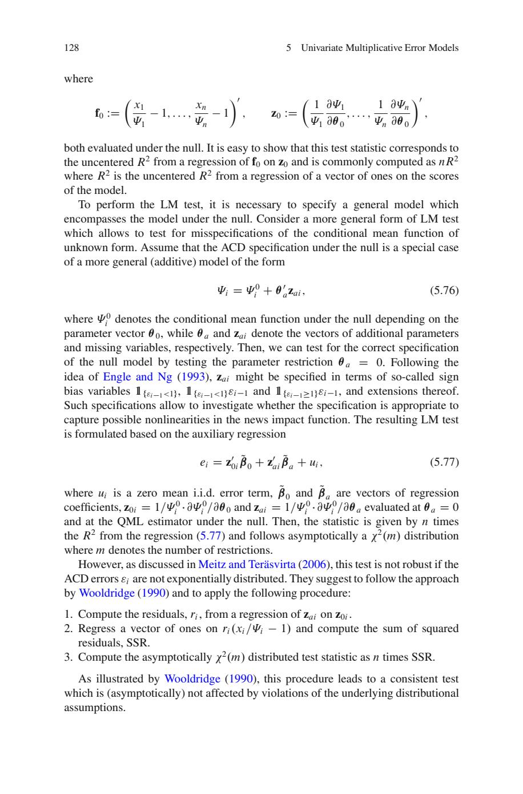

## PDF page 144 / printed page 129

5.6 ACDモデルの検定                                                                                         129

より具体的なラグランジュ乗数検定は、特定のパラメトリックな代替仮説に対して、Meitz and Teräsvirta (2006)によって導出されている。特に、彼らは2種類の誤った設定を考慮している。それは、条件付きデュレーションが加法的に、あるいは乗法的に誤って設定されている場合である。これらの場合、それは次のように与えられる。

                                            xi D D .i C 'i /"i                                                   (5.78)

または
                                              xi D i 'i "i ;                                                   (5.79)

ここで、i D  . 1 / はパラメータ  1 に依存する条件付き平均を、'i D 'i . 1 ;  2 / は  1 に加えて追加のパラメータ  2 にも依存する誤った設定を表す。次のように定義する。

                                                        1 @i . 1 /
                                      ai . 1 / WD                   ;
                                                     i . 1 / @ 1
                                                      1 @'i . 1 ;  2 /
                                bi . 1 ;  2 / WD                       ;
                                                   i . 1 /    @ 2
                                                      xi
                                      ci . 1 / WD            1:
                                                   i . 1 /

帰無仮説 H0 W  2 D  02 の下で、関数 'i は 'i . 1 ;  02 / D 0 を満たすものとする。ここで、‘0’ は真のパラメータを表す。Meitz and Teräsvirta (2006)が示すように、帰無仮説 H0 W  2 D  02 の下で、一般的に加法的な代替仮説に対するLM検定統計量は次のように与えられる。

             ( n                   )8 n                         ! n           !1 n           !91
              X                  0
                                    <X          0
                                                    X
                                                    n
                                                              0
                                                                  X         0
                                                                                  X         0
                                                                                               =
     LM D                cO i bO i      bO i bO i    bO i aO i     aO i aO i       aO i bO i
                                    :                                                          ;
                  i D1            i D1               i D1                i D1                        i D1
                                                                ( n                    )
                                                                 X
                                                                           cO i bO i
                                                                                               a
                                                                                            2d i m. 2 / :   (5.80)
                                                                    i D1

同様に、帰無仮説 H0 W  2 D  02 の下で、関数 'i は 'i . 1 ;  02 / D 1 を満たすものとする。すると、帰無仮説 H0 W  2 D  02 の下で、一般的に乗法的な代替仮説に対する検定は次のように得られる。

       ( n                     )8 n                                  ! n             !1 n               !91
        X                    0
                                < X              0
                                                     X
                                                     n
                                                                   0
                                                                       X         0
                                                                                         X             0
                                                                                                          =
LM D             'Oi cO i bO i      'Oi2 bO i bO i    'Oi bO i aO i     aO i aO i s       'Oi aO i bO i
                                :                                                                         ;
          i D1                 i D1                  i D1                   i D1                        i D1
                                                            ( n                     )
                                                             X
                                                                    'Oi cO i bO i
                                                                                           a
                                                                                           2d i m. 2 / :    (5.81)
                                                             i D1

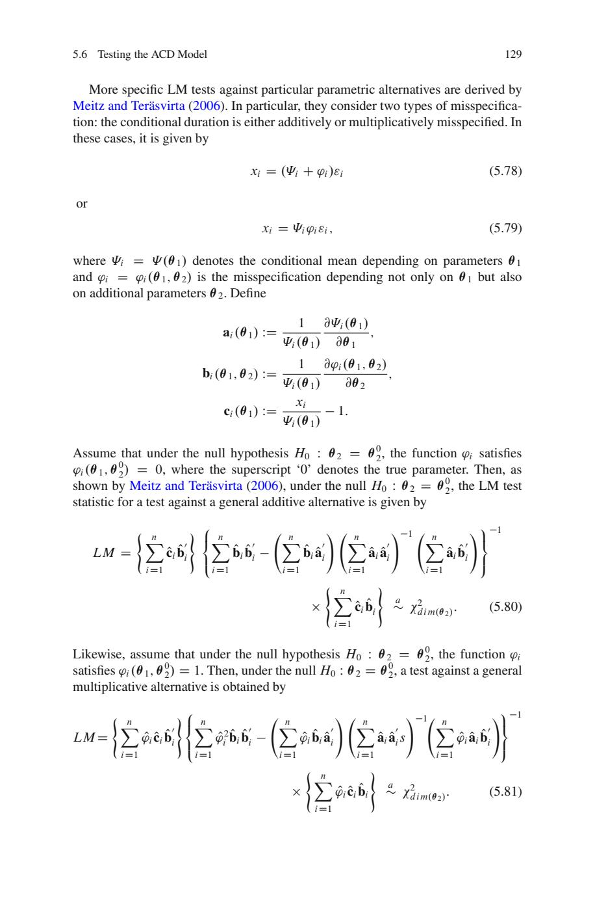

## PDF page 145 / printed page 130

130                                                     5 単変量乗法誤差モデル

Meitz and Teräsvirta (2006) が強調するように、デュレーションの条件付き分布の誤った設定は、分布の仮定に暗黙的に依存する LM 検定統計量の性質に影響を与える可能性がある。例えば、帰無仮説の下でデュレーションの条件付き分散が正しく設定されている必要がある。分布の誤った設定による検定統計量の歪みを避けるために、Meitz and Teräsvirta (2006) は Wooldridge (1991) に基づく手順を提案しており、これにより、分布の誤った設定によって影響を受けない漸近的挙動を持つ「ロバスト」な検定統計量が得られる。加法的な誤った設定の場合、検定統計量を次のように計算することが推奨される。
1. 帰無仮説の下での QML 推定値  1 を用いて、

        0          1 @i .O 1 /        0        1 @'i .O 1 ;  02 /                 xi
       aO i D                    ;   bO i D                           ;   cO i D               1;
                i .O 1 / @ 1               i .O 1 /                           i .O 1 /
                              0                             0
                                                         @ 2

   を i D 1 : : : ; n に対して計算する。
2. bO i を aO i に対して回帰させ、対応する d i m. 2 /  1
              0         0

   残差ベクトル rOi を計算する。
3. 1 を cO i rOi に対して回帰させ、二乗和残差和 (SSR) を計算する。
4. 検定統計量を nR2 D n  S SR として計算する。これは、帰無仮説の下で d i m. 2 / 自由度を持つ 2 分布に従う。
   乗法的な誤った設定に対する LM 検定の場合、bO i を 'Oi bO i で置き換えることで、同じ手順が適用される。このフレームワークを特定の種類の誤った設定に対する検定に適用した例は、Meitz and Teräsvirta (2006) に示されている。

5.6.5 条件付きモーメント検定

5.6.5.1 Newey の条件付きモーメント検定の適応

前の節で議論された LM 検定は、局所的な（パラメータ的な）対立仮説に対して最適な検定力を持つ。これは、条件付きモーメント検定（CM 検定）の一種である。条件付きモーメント検定の背後にある主なアイデアは、モデルが正しく設定されている場合に満たされるデータが暗示する条件付きモーメント制限の妥当性を検定することである。ACD フレームワークでは、条件付き平均制限によって自然なモーメント条件が得られる。
    i WD i ./, i D 1 : : : ; n を、EŒi jwi  D 0 を満たす条件付きモーメント関数ベクトルとして定義する。ここで、wi は s  q の行列である。それに対応して、q  1 の無条件モーメント関数ベクトルとして
                       0
 i WD  i ./
            PnWD wi i を得る。さらに、q  1 の標本モーメントベクトル 'n WD n        i D1  i を定義する。ACD フレームワークでは、i の自然な選択肢は .xi  i / または .xi =i  1/ であり、s D 1 の場合の帰無仮説を検定することができる。

            H0 W     EŒxi  i jwi  D 0      または H0 W        EŒxi =i  1jwi  D 0:

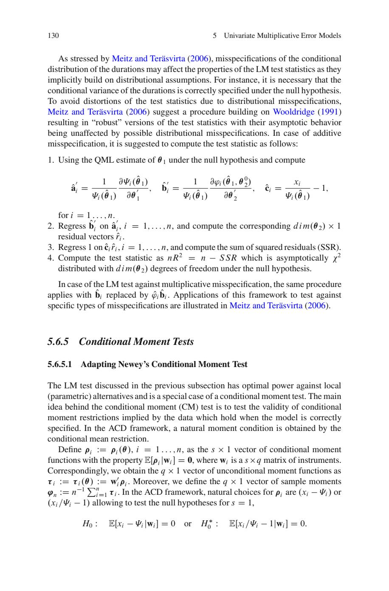

## PDF page 146 / printed page 131

5.6 ACDモデルの検定                                                                         131

我々は、 が指数関数QMLによって推定されると仮定する。それに対応して、p  1のベクトル si WD si ./ を、i番目の対数尤度寄与に関連するスコアとして表記する。したがって、n  pの行列 s WD s./ WD .s01 ; : : : ; s0n /
               ln L./
を定義し、H./ WD @ @@  0  を疑似対数尤度のヘッセ行列として定義する。さらに、以下の仮定を置く。
(A1)  i . 0 / は、真のパラメータ  0 を定義する定常かつエルゴードな過程に従う。
(A2)  i は、 に対して連続的に微分可能であり、EŒ i ./ < 1 を満たす。
           p                    P            p   
(A3) 'n ! EŒ i  および n1 niD1 @ i =@ 0 ! E @ i . 0 /=@ 0 を満たす。
            1 Pn            
         =    n                d
(A4) n1 2 1 PinD1 i ! N .0; ˙ / を満たす。ここで、˙ は次元p C qの正定値
              n      i D1 s i
     共分散行列を表す。
(A5) ある  0 の近傍 N に対して、EŒ sup jjH./jj < 1 を満たす。
                                                      2N

以下では、Newey (1985) の条件付きモーメント検定の修正された形式を説明する。これは、非i.i.d.データに対して許容し、条件付き平均制約の違反以外の誤った仕様に対してロバストである。n1=2 'O n の漸近分布は、平均値の定理を用いて、'O n を  0 周りに展開することによって導出される。
                    "                                                 !          #
                            Xn                        Xn
    n 'O n D n
      1=2       1=2
                      n 1
                                 i . 0 / C plim n1                    O
                                                          @ i . /=@ .   0 / ;
                                                   n!1
                              i D1                             i D1
                                                                                                (5.82)

ここで、  WD  0 C .O   0 / であり、0    1 である。QML推定量である O を用いると、

                                                    1 1=2 X
                                                            n
                                       
                   n1=2 .O   0 / D  n1 H.  /   n       si . 0 /:
                                                                         i D1

(5.82) に代入すると、
                                                                                            !
                                     X
                                     n                                X
                                                                      n
                          1=2                                  1                  
            n1=2
                   'O n D n                  i . 0 /  plim n              @ i . /=@
                                                        n!1
                                     i D1                             i D1

                                                                        X
                                                                        n
                                                                 1
                                                   n  1=2
                                                             H. /             si . 0 /:
                                                                        i D1

この式は次のように書き直すことができる。
                                                 1=2 Pn              
                              n1=2 'O n D B
                                                 n
                                                       Pi D1  i . 0 / ;                       (5.83)
                                                 n1=2 niD1 si . 0 /

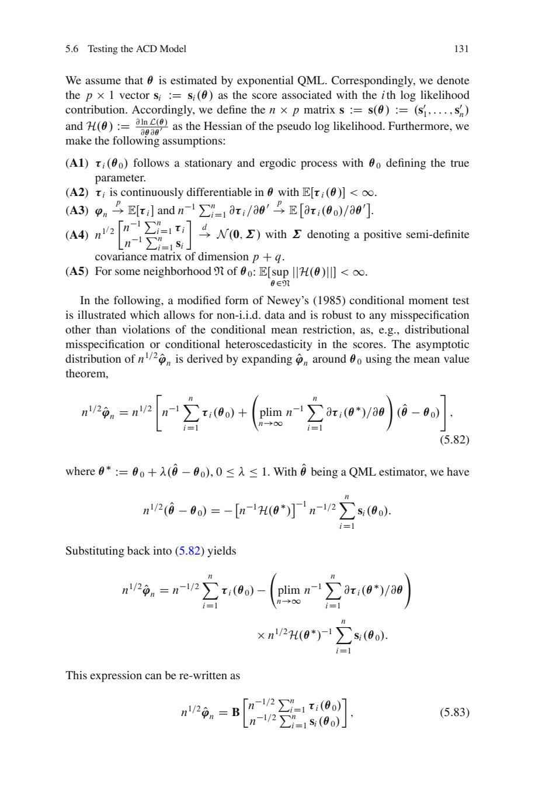

## PDF page 147 / printed page 132

132                                                                  5 単変量乗法誤差モデル（Univariate Multiplicative Error Models）

ここで、q  .p C q/ の行列 B は、
              "                                                            !                      #
                          ::                     X
                                                 n
                                                                                             1
                                            1                                1      
        B D Iq             :      plim n                @ i . /=@           n H. /                ;   (5.84)
                                  n!1
                                                 i D1

                                                                                                  d
と与えられ、Iq は .q  q/ の単位行列を表す。次に、n1=2 'O n ! N .0; B˙ B0 / となり、
したがって、

                                       nŒ'O 0n .B˙ B0 /1 'O n   2q :
                                                                       a
                                                                                                          (5.85)
                                                 P                      P
与えられた仮定の下では、˙ WD nj Dn j D 0 C nj D1 .j C j0 / となる。
ここで、j WD EŒi . 0 /i j . 0 /0  であり、i WD .xi ;  0 / D . i . 0 /; si . 0 //0 は、
.qCp/1 ベクトルで、モーメント制約とスコアを表す。したがって、˙ はカーネルベースの推定器によって一貫的に推定できる。

                                                       X
                                                       n1
                                        Ȯ D                   K.j=qn /Oj ;
                                                 j DnC1

ここで、K./ はカーネル関数であり、qn は n に依存するバンド幅である。自然な選択肢としては、ニューウィーとウェスト (Newey and West, 1987) やアンドゥーズ (Andrews, 1991) が提案するように、バートレットカーネル、二次スペクトルカーネル、パーゼンカーネルなどがある。
行列 B を推定するには、H./ を経験的なヘッセ行列によって一貫的に推定する必要があり、これは条件 (A5) によって保証される。さらに、plim n1 i @ i .  /=@ は一貫的に推定できる。

                          X
                          n                             X
                                                        n
                  n1            @O i =@ D n1               .wi @O i =@ C O i @wi =@/ ;
                          i D1                          i D1

ここで、
                                        (
                                            xi sOi =.xi  O i /          H0 の場合；
                      @O i =@ D
                                            Osi O 2 =.xi  O i /
                                                   i                       H0 の場合；

                                                                          1 O   O0
                独立同一分布の観測値の集合に対して、˙ は n  i ; i によって一貫的に推定され、
一方、plim      i @./=@ はスコアとモーメントベクトルの外積によって一貫的に推定できる（Tauchen 1985、または Newey 1985 を参照）。これにより、よく知られた式が得られる（Pagan and Vella 1989 を参照）。
                      0
                  nŒO n .B˙ B0 /1 O n  D 0 R.R0 R  R0 s.s0 s/1 s0 R/1 R0 ;                       (5.86)

ここで、 は .n  1/ ベクトルで 1 の要素からなり、R は O 0i を i 番目の要素とする n  q 行列である。

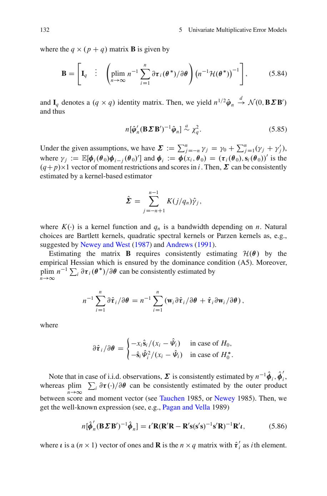

## PDF page 148 / printed page 133

5.6 ACDモデルの検定                                                               133

重み付け関数 wj ./ の選択肢として、遅延符号バイアス変数（5.6.4節で議論されているように）や、過去のデュレーションの関数（例えばモーメント）が考えられる。
よく知られた結果として、CM検定の検出力は、重み付け関数の選択に大きく依存する。Newey (1985) は、局所最大の検出力を持つ条件付きモーメント検定を得る方法を説明している。LM検定は、特定の局所的な対立仮説の場合に最適なCM検定に対応することが示されている。しかし、CM検定は有限の数の条件付きモーメント制約に基づいているため、すべての可能な対立仮説に対して一貫性を持つことはできない。
Chen and Hsieh (2010) は、一般化されたモーメント検定を提案している。彼らは、条件付き平均関数だけでなく、独立性と分布の誤った設定についても検定できるモーメント関数を構築している。条件付き平均と独立性の検定は、指数QML法によって暗示されるモーメント制約に基づいて構築される。それに対応して、分布検定はML法と独立した誤差項の仮定に依存する。

5.6.5.2 積分条件付きモーメント検定

Bierens (1990) は、任意の関数形CM検定を、すべての可能な対立仮説に対して一貫性を持つカイ二乗検定に変換できることを示している。一貫した条件付きモーメント検定の背後にある主なアイデアは、次の補題に基づいている。
補題5.1 (Bierens 1990)。% が条件 Ej%j < 1 を満たす確率変数であり、z が R 上の有界な確率変数 PrŒE.%jz/ D 0 < 1 を満たすとき、集合 S D ft 2 R W EŒ% exp.tz/ D 0g は可算であり、したがって Lebesgue 測度はゼロを持つ。                                                               
   Bierens は、EŒ% exp.tz/ ¤ 0 が t D t0 の近傍において成り立つことを示している。ここで、t0 は EŒ% exp.t0 z/ D 0 かつ Pr ŒEŒ% exp.tz/jz D 0 < 1 を満たすように選択される。de Jong (1996) は、Bierens の検定を時間的に依存するデータの場合に拡張している。以下では、デュレーション過程が定常であり、-安定性の概念に従うことを仮定する。さらに、Ej"i  1j < 1 を仮定する。モデルが誤った設定であることを仮定する、すなわち PrŒEŒi . 0 /jFi 1  D 0 < 1 であり、条件付け情報を .xi 1 /; .xi 2 /; : : :, で置き換える。ここで、./ は R から R への有界な一対一対応であるとき、集合
                   8              2              0                  13     9
                   <                               X d                     =
             S D t 2 Rd W E 4i . 0 / exp @            tj .xi j /A5 D 0
                   :                                                       ;
                                                     j D1

は Lebesgue 測度がゼロを持つ。したがって、de Jong (1996) は、無条件モーメント制約に基づく一貫したCM検定を提案している。
                                                       0                       1
                                    X
                                    n                        X
                                                             d
                 MO n .t/ D n1=2          i . 0 / exp @          tj .xi j /A ;   (5.87)
                                    i D1                     j D1

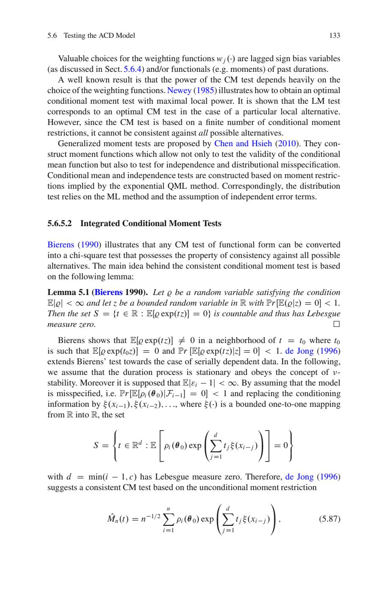

## PDF page 149 / printed page 134

134                                               5 単変量乗法誤差モデル（Univariate Multiplicative Error Models）

ここで、 0 は QML によって一貫的に推定される。de Jong は、d D c < n に基づく条件付きモーメント制限検定は、無限個のラグに対する仮説 H0 と H1 を一貫的に検定することを許可せず、したがって d D i  1 を優先すべきであると指摘している。式 (5.87) は、対立仮説 H1 の下で、plim MO n .t/ ¤ 0 が、Lebesgue 測度がゼロの集合を除いて、すべての t に対して成立する性質を持つ。したがって、一貫した条件付きモーメント検定の原理は、連続したノイズパラメータ（ベクトル）t でインデックス付けされた重み付け関数のクラスを採用することである。このノイズパラメータは積分されてしまうため、この検定は積分条件付きモーメント（ICM）検定と呼ばれる。上記の補題は、ベクトル t0 62 S を選択することにより、一貫した CM 検定が得られることを示唆している。しかし、S はデータの分布に依存するため、検定を一貫させるための固定されたベクトル t を選択することは不可能である。de Jong (1996) が提案するように、この問題に対する解決策は、Rc のコンパクトな部分集合  上の MO n .t/ の関数を最大化することにより、検定の一貫性を達成することである。主なアイデアは、MO n .t/ に基づく検定統計量を最大化するベクトル t0 は、集合 S に属することはできないという点である。無限数列 ft1 ; t2 ; : : :g の空間を

                        D ft W aj  tj  bj 8 j I tj 2 Rg;                        (5.88)

と定義する（ここで aj < bj であり、jaj j, jbj j  Bj 2 であり、ある定数 B を持つ）、de Jong は、検定統計量として supt2 jMO n .t/j の関数を使用することを提案している。その結果、検定統計量 supt2 jMO n .t/j の極限分布はケース依存的であり、一般的に適用可能な臨界値を妨げるという困難が生じる。この理由から、de Jong は条件付きモンテカルロアプローチに基づくシミュレーション手順を導入している。特に、彼は帰無仮説の下で、モーメント制限 (5.87) が、

                                                       0             1
                                     X
                                     n                   X
                                                         d
                   MOQ n .t/ D n1=2   i i . 0 / exp @   t.xi j /A          (5.89)
                                   i D1                j D1

点過程において、t に関して逐次的に同じ漸近有限次元分布を持つことを示している。ここで、i は有界 i.i.d. 乱数であり、xi と i . 0 / とは独立であり、EŒ i2  D 1 を持つ。したがって、MO n .t/ の分布は、n-タプルの i のシミュレーションに基づいて近似することができる。de Jong は、MOQ n .t/ のシミュレーションによって得られた臨界領域は漸近的に有効である（de Jong 1996, Theorem 5 を参照）と証明している。しかしながら、さらなる困難は、一貫した ICM 検定は統計量 supt2 jMO n .t/j に依存しているという点である。この検定統計量の計算は、n1 の次元のパラメータ空間での最大化を必要とするため、かなり面倒である。この理由から、de Jong は同じ一貫性プロパティを持ちながら、より簡単に計算できる MO n .t/ の別の連続関数を見つけることを提案している。次に、de Jong は関数
                               Z
                      D n1      MO n .t/2 '1 .t1 /d'1 : : : 'j .tj /dtj : : : ; (5.90)
                              
を使用することを提案している。

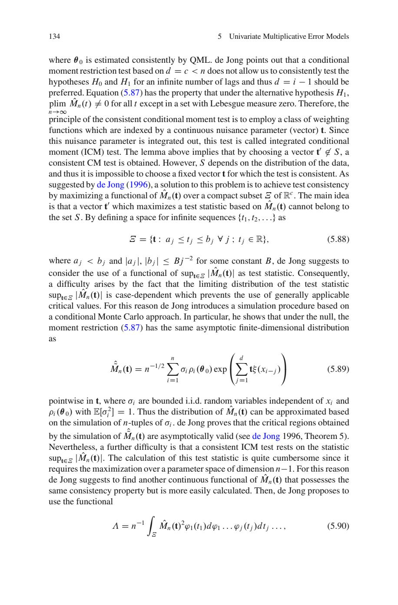

## PDF page 150 / printed page 135

5.6 ACDモデルの検定                                                                       135

ここで、積分は無限個のtjについて行われる。 (5.88)によると、各tjはRの部分集合上で積分される。aj  jtj j  bj を満たす部分集合である。'j .t/'は、それぞれの部分集合上で積分すると1になる密度関数列を表す。de Jongは、この関数を用いると一貫した検定が得られることを示している。MO n .t/は二重和として書き、積分を一つずつ計算できるため、sup jMO n .t/jよりも計算しやすい関数が得られる。一様分布、すなわち'j .t/ D t-1 を選択すると、ICM検定統計量  は以下のようになる。

               X
               n X
                 n                              d 
                                                Y        1                          1
   D n-1                  i . 0 /j . 0 /                  .xi s / C .xj s /
                                                      bj  aj
               i D1 j D1                        sD1
           
         exp.bj ..xi s / C .xj s ///  exp.aj ..xi s / C .xj s ///               :   (5.91)

   まとめると、ACDモデルに対するICM検定の実施には、以下のステップが必要となる。
1. (Q)ML推定：(Q)MLを用いて特定のACDモデルを推定し、条件付きモーメント制限 i . 0 /を計算する。
2. ajとbjの選択：ajとbjの値を選択し、パラメータ空間 を定義する。de Jong (1996)は、aj D Aj 2 と bj D Bj 2 を使用することを提案している。ここで、AとB (0 < A < B)は任意に選択できる。漸近的には、AとBの選択は検定の検出力に影響を与えないはずだが、有限標本ではおそらく影響を与える。de Jong (1996)のモンテカルロシミュレーションでは、小さな範囲を選択することを提案している。例えば、A D 0、B D 0:5などである。
3. ./の選択：上記の補題によると、関数 ./はRからRへの有界な一対一対応でなければならない。漸近的には、関数の選択 ./は無関係だが、Bierens (1990)は .x/ D arctan.x/ を使用することを提案している。我々は .x/ D arctan.0:01  x/  100 を使用することを提案する。これは有界な関数であり、関連する領域ではほぼ線形であるという利点があり、検定の小標本特性を改善する。
4. dの選択：依存データの場合、検定の一貫性は、すべての実現可能なラグを考慮することでしか保証されない。d D i  1、すなわち、検討中のパラメータ空間の次元が標本サイズとともに増加する。より多くのコンピュータ時間を必要としない代替案は、固定値 d < n を選択することである。しかし、この場合、検定は無限個の条件付き変数に対するモーメント条件を一貫して検定することを許可しない。
5. n-tupleのiのシミュレーション：R n-tupleの(有界) i.i.d. 乱数変数 i;r ; i D 1; : : : ; nをシミュレーションする。EŒ i;r
                                              2
                                                  D 1 for r D 1; : : : ; R。
   de Jong (1996)に従って、EŒ i D 1 D EŒ i D
   1 D 0:5となるようにi変数を生成する。
6. 検定統計量と臨界値のシミュレーションの計算：
   – (5.91)に従って検定統計量  を計算する。
   – 各n-tupleのiについて、シミュレートされた検定統計量を計算する。

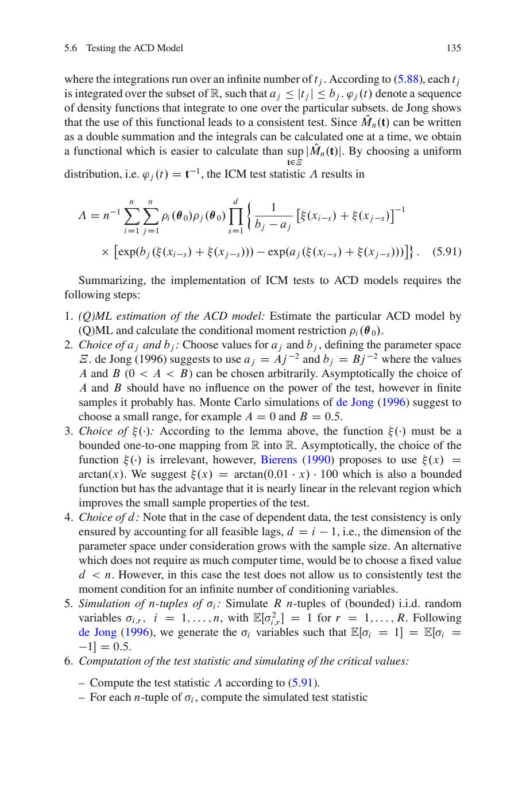

## PDF page 151 / printed page 136

136                                                           5 単変量乗法誤差モデル

                      X
                      n X
                        n
        Q m D n1                . i;r i . 0 //. j;r j . 0 //
                      i D1 j D1

                    d n
                    Y                                    1
                      .bj  aj /1 .xi s / C .xj s /
                    sD1
                 
                 exp.bj ..xi s / C .xj s ///  exp.aj ..xi s / C .xj s ///               ;

      for r D 1; : : : ; R.
7. 模擬p値の計算：検定の臨界領域が .C; 1 の形をしているため、ICM検定の模擬p値を次のように計算する。

                                                     1 X
                                                          R
                                      pvICM D             1l Q     :                           (5.92)
                                                     R rD1 fr g

5.6.6 モンテカルロ証拠

以下のモンテカルロ研究は、様々な条件付きモーメント検定のサイズと力に関する洞察を提供するものである。サンプルサイズ3,000のサンプルを生成する。これは、高頻度金融データにとっては依然として比較的小さく、有限サンプル特性を研究することを可能にする。各モンテカルロ実験は500回繰り返される。EŒi  D 1 を満たす以下の5つのデータ生成プロセス（DGP）が検討される。

         i D 0:1 C 0:1xi 1 C 0:8i 1                                                        (5.93)
         i D exp.0:137 C 0:3"i 1 C 0:8 ln i 1 /                                            (5.94)
         i D .0:05i 1 C 0:5/"i 1 C 0:8i 1                                                (5.95)
         i D exp.0:18 C 0:5"i 1  0:48j"i 1  1j C 0:8 ln i 1 /                           (5.96)
              8
              ˆ
              <0:05 C 0:20xi 1 C 0:85i 1 if xi 1  0:25;
              ˆ
         i D 0:10 C 0:05xi 1 C 0:90i 1 if xi 1 2 .0:25; 1:5;                             (5.97)
              ˆ
              :̂0:20 C 0:03x C 0:80            if x  > 1:5;
                                      i 1            i 1           i 1

ここで xi D i "i 、"i  Exp.1/. 式 (5.94) は 5.5 項で議論された対数ACD（LACD）仕様である。
仕様 (5.95) から (5.97) は、より詳細に第6章で議論される非線形および拡張ACDモデルである。特に、仕様 (5.95) は、乗法的におよび付加的に革新を含む。仕様 (5.96) は、"i 1 D 1 でギザギザになったニュースインパクト関数を意味する。そのようなモデルは、次の著者によって提案されている。

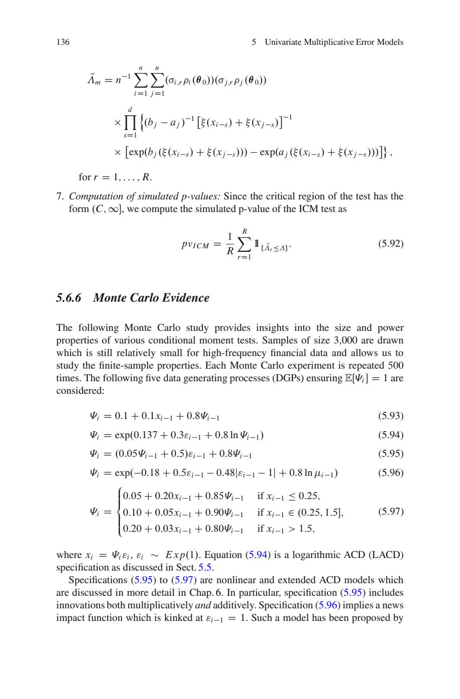

## PDF page 152 / printed page 137

5.6 ACDモデルの検定                                                                                 137

表5.1 CM検定における重み付け関数wiの選択
                                     条件付け情報
                                                                          0
           zi;1 D 1l f"i 1 <1g ; 1l f"i 1 <1g "i1 ; 1l f"i 1 1g "i1
                    0                                                             0
           zi;2 D zi;1 ; 1l f"i 2 <1g ; 1l f"i 2 <1g "i2 ; 1l f"i 2 1g "i2
                                                                            0
           zi;3 D 1l fxi 1 <1g ; 1l fxi 1 <1g xi1 ; 1l fxi 1 1g xi1
                                                                                    0
           zi;4 D z0i;3 ; 1l fxi 2 <1g ; 1l fxi 2 <1g xi2 ; 1l fxi 2 1g xi2
                                                  CM検定
                                                                            0
CM1        wi;1 D xi1 ; xi1    2         3
                                      ; xi1   ; "i1 ; "2i1 ; "3i1
                                                                                     0
CM2        wi;2 D w0i;1 ; xi2 ; xi2    2         3
                                              ; xi2   ; "i2 ; "2i2 ; "3i2
                                     0
CM3        wi;3 D xi1 ; z0i;1
                                               0
CM4        wi;4 D xi1 ; xi2 ; z0i;2
                                0 0
CM5        wi;5 D "i1 ; zi;3
                                              0
CM6        wi;6 D "i1 ; "i2 ; z0i;4
                       0      0 0
CM7        wi;7 D zi;1 ; zi;3
                                   0
CM8        wi;8 D z0i;2 ; z0i;4
CM9        wi;9 D .xi1 ; xi2 ; : : : ; xi10 /0
CM10       wi;10 D ."i1 ; "i2 ; : : : ; "i10 /0
CM11       "i1 と "i2 のビン：
           Œ0; 0:1/; Œ0:1; 0:2/; Œ0:2; 0:5/; Œ0:5; 0:8/; Œ0:8; 1/; Œ1:2; 1:5/; Œ1:5; 2/; Œ2; 3/; Œ3; 1/
CM12       xi1 と xi2 のビン：
           Œ0; 0:1/; Œ0:1; 0:2/; Œ0:2; 0:5/; Œ0:5; 0:8/; Œ0:8; 1/; Œ1:2; 1:5/; Œ1:5; 2/; Œ2; 3/; Œ3; 1/
                                                 ICM検定
ICM1       i D xi  i ,         w./ D 1,        A D 0,           B D 0:5,            K D 100      d D1
ICM2       i D xi  i ,         w./ D 1,        A D 0,           B D 0:5,            K D 100      d D2
ICM3       i D xi  i ,         w./ D 1,        A D 0,           B D 0:5,            K D 100      d D5
ICM4       i D xi  i ,         w./ D 1,        A D 0,           B D 0:5,            K D 100      d D 10

Dufour and Engle (2000) が認めるように、持続期間の大きな革新 (“正”の驚き) が、小さい革新 (“負”の驚き) よりも、将来の持続期間に異なる影響を与えることを可能にする。NelsonのEGARCHモデルと整合性があるため、EXACD仕様として参照される。最後に、(5.97)はZhang et al. (2001) が提案する閾値ACD (TACD) モデルに対応する。これらの仕様の詳細については、第6章を参照のこと。
    各データ生成過程（DGP）について、(線形)ACD(1,1)仕様 i D ! C ˛xi 1 C ˇi 1 または LACD(1,1)仕様 ln i D
! C ˛"i 1 C ˇ ln i 1 をそれぞれ推定する。条件付きモーメント関数 i D
xi =i  1 と 12個の重み付け関数 wi;j ; j D 1; : : : ; 12 を用いる。これらの関数は、過去の実現値、革新、および非線形ニュース影響効果の可能性を示す指標変数に基づいている。ベンチマークとして、条件付きモーメント関数 i D xi  i (表5.1を参照) に基づくICM検定の異なる仕様を計算する。
    表5.2 は、線形ACD(1,1)仕様を推定した場合の個々の検定の棄却率を示している。対応して、表5.3 はLACD(1,1)モデルの推定に基づく結果を表示する。最初の列は、推定モデルとDGPが一致するため、サイズを示す。CM検定は、わずかに過大評価される傾向がある。

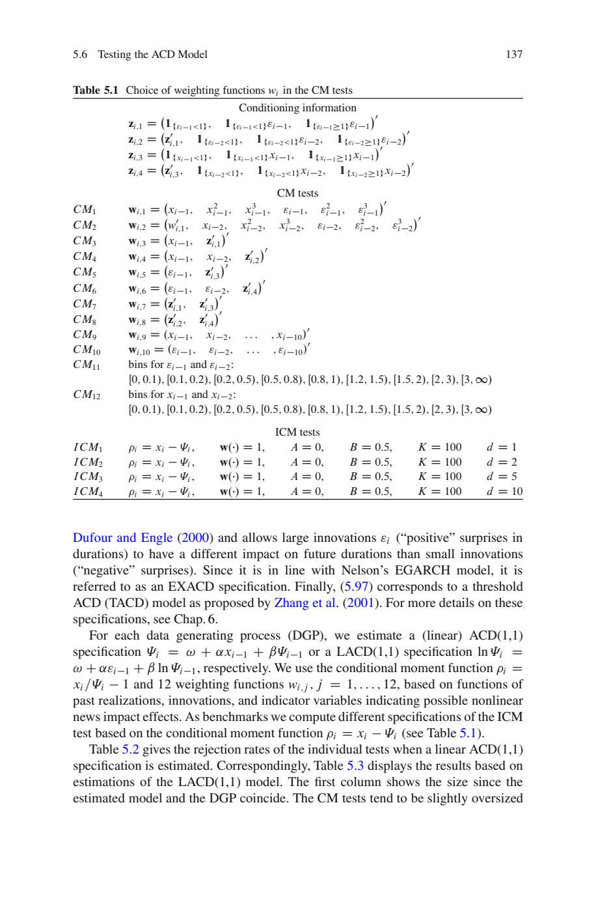

## PDF page 153 / printed page 138

138                                                   5 単変量乗法誤差モデル

表5.2 個別(I)CM検定の棄却頻度（表5.1参照）。シミュレートされたサンプルサイズ：3,000。反復回数：500。推定モデル：ACD(1,1)
         DGP (5.93)        DGP (5.94)        DGP (5.95)        DGP (5.96)        DGP (5.97)

         5%       10%      5%       10%      5%       10%      5%       10%      5%       10%
CM1      0.066    0.126    1.000    1.000    0.498    0.605    1.000    1.000    0.140    0.212
CM2      0.076    0.142    0.994    1.000    0.526    0.670    1.000    1.000    0.132    0.210
CM3      0.074    0.146    1.000    1.000    0.454    0.591    1.000    1.000    0.156    0.250
CM4      0.070    0.148    1.000    1.000    0.443    0.584    1.000    1.000    0.162    0.246
CM5      0.068    0.138    1.000    1.000    0.464    0.581    1.000    1.000    0.168    0.254
CM6      0.064    0.136    1.000    1.000    0.436    0.584    1.000    1.000    0.162    0.266
CM7      0.074    0.116    1.000    1.000    0.485    0.591    1.000    1.000    0.182    0.282
CM8      0.076    0.130    1.000    1.000    0.447    0.567    1.000    1.000    0.186    0.284
CM9      0.072    0.120    0.998    1.000    0.488    0.601    1.000    1.000    0.168    0.274
CM10     0.068    0.122    0.996    1.000    0.440    0.564    1.000    1.000    0.188    0.286
CM11     0.064    0.104    1.000    1.000    0.519    0.615    1.000    1.000    0.210    0.314
CM12     0.066    0.126    1.000    1.000    0.450    0.574    1.000    1.000    0.222    0.338
ICM1     0.010    0.022    0.840    0.872    0.175    0.251    0.930    0.952    0.014    0.034
ICM2     0.008    0.020    0.822    0.860    0.203    0.275    0.918    0.940    0.014    0.034
ICM3     0.010    0.022    0.824    0.860    0.199    0.306    0.908    0.930    0.012    0.030
ICM4     0.006    0.022    0.818    0.852    0.199    0.316    0.912    0.934    0.016    0.030

表5.3 個別(I)CM検定の棄却頻度（表5.1参照）。シミュレートされたサンプルサイズ：3,000。反復回数：500。推定モデル：LACD(1,1)
         DGP (5.94)        DGP (5.93)        DGP (5.95)        DGP (5.96)        DGP (5.97)

         5%       10%      5%       10%      5%       10%      5%       10%      5%       10%
CM1      0.096    0.140    0.224    0.346    0.743    0.843    0.860    0.918    0.062    0.113
CM2      0.082    0.148    0.250    0.374    0.701    0.808    0.838    0.896    0.063    0.113
CM3      0.100    0.156    0.306    0.458    0.910    0.948    0.942    0.964    0.058    0.122
CM4      0.090    0.150    0.324    0.470    0.887    0.941    0.872    0.916    0.058    0.132
CM5      0.060    0.130    0.342    0.496    0.893    0.946    0.960    0.976    0.072    0.135
CM6      0.062    0.128    0.326    0.492    0.843    0.908    0.936    0.964    0.070    0.147
CM7      0.078    0.132    0.438    0.590    0.960    0.979    0.994    0.994    0.077    0.130
CM8      0.074    0.134    0.422    0.558    0.935    0.964    0.968    0.982    0.080    0.142
CM9      0.072    0.126    0.320    0.464    0.935    0.962    0.874    0.918    0.067    0.127
CM10     0.068    0.124    0.312    0.446    0.881    0.946    0.866    0.914    0.067    0.132
CM11     0.080    0.146    0.410    0.564    0.969    0.981    0.912    0.948    0.070    0.137
CM12     0.084    0.134    0.412    0.528    0.950    0.977    0.856    0.910    0.077    0.140
ICM1     0.026    0.074    0.066    0.134    0.065    0.128    0.042    0.098    0.008    0.028
ICM2     0.030    0.064    0.074    0.166    0.044    0.088    0.046    0.096    0.003    0.023
ICM3     0.034    0.066    0.074    0.166    0.048    0.094    0.042    0.102    0.005    0.015
ICM4     0.038    0.084    0.078    0.172    0.046    0.109    0.044    0.110    0.003    0.022

与与指定されたサンプルサイズに対して、ICM検定は著しく過大評価されていることがわかる。CM検定の検出力は一般的に高く、 i における非線形からの偏差の強さと共に増加する。したがって、これらの検定は、非線形性が強い場合に非常に高い検出力を有する。

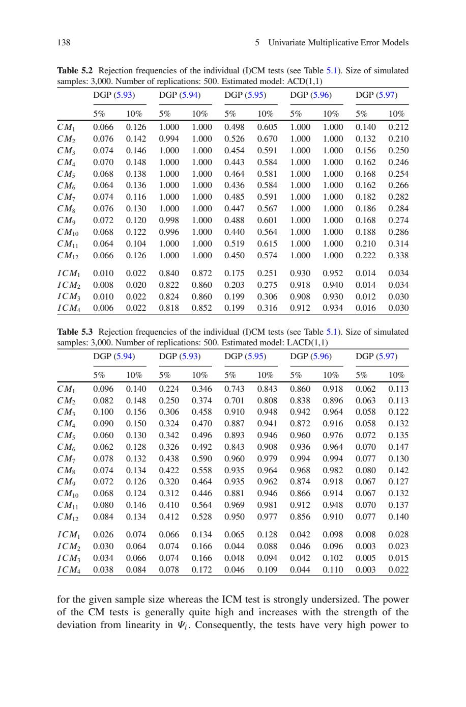

## PDF page 154 / printed page 139

参考文献                                                                                  139

評価する線形ACDモデルに対して、DGP（5.94）または（5.96）を用いる。加法的な確率的成分（DGP（5.95））や、体制切り替え行動（DGP（5.97））に対する検定では、より低い棄却率を示す。これらの誤った仕様は、線形ACDからの逸脱がそれほど大きくないため、検出が困難である。同様の傾向が表5.3にも示されている。しかしながら、LACDを推定する際に、基底となる線形ACD仕様に対する検定の力は、逆の場合よりも明らかに小さい。予想されることとして、LACDと、凹型のニュースインパクト関数を意味する代替仕様との区別は、検定の力は低い。ニュース応答関数における非線形性に対して特に敏感な重み付け関数に基づく条件付きモーメント検定は、最も高い力を示す。これらの仕様は、広範囲な可能な誤った仕様に対して有効である。テストが過大評価される傾向があることを考慮しても、これは依然として当てはまる。対照的に、ICM検定の力特性は、迷惑パラメータの選択に関わらず非常に低い。これは、包括的な検定に関する一般的な知見であり、Meitz and Teräsvirta (2006)によって、Hong and Lee (2003)のスペクトル密度検定を用いて確認されている。
    結論として、結果は、適切な重み付け関数の選択が、広範囲な誤った仕様に対して有効でありながら、有限標本における合理的な（サイズ調整された）力特性を維持することを示唆している。したがって、現実の応用において、CM検定はLM型検定の貴重な補完となる。これらの検定は、Godfrey (1996)の意味での構成検定として機能し、モデルの誤った仕様の可能な原因を検出することを可能にする。さらに、提案されたフレームワークは、多変量MEMプロセスや高次モーメントに対する制約をテストするためにも、容易に適用できる。

参考文献

Aı̈t-Sahalia Y (1996) Testing continuous-time models of the spot interest rate. Rev Financ Stud
    9:385–426
Allen D, Chan F, McAleer M, Peiris S (2008) Finite sample properties of the QMLE for the Log-
    ACD model: application to Australian stocks. J Econom 147:163–185
Andersen TG, Bollerslev T (1998b) Deutsche mark-dollar volatility: intraday activity patterns,
    macroeconomic announcements, and longer run dependencies. J Finance 53:219–265
Andrews D (1991) Heteroscedasticity and autocorrelation consistent covariance matrix estimation.
    Econometrica 59:817–858
Bauwens L, Giot P, Grammig J, Veredas D (2004) A comparison of financial duration models via
    density forecasts. Int J Forecast 20:589–609
Bauwens L, Galli F, Giot P (2008) The moments of Log-ACD models. Quant Qual Anal Soc Sci
    2:1–28
Bauwens L, Giot P (2000) The logarithmic ACD model: an application to the bid/ask quote process
    of two NYSE stocks. Annales d’Economie et de Statistique 60:117–149
Bierens HJ (1982) Consistent model specification tests. J Econom 20:105–134
Bierens HJ (1990) A consistent conditional moment test of functional form. Econometrica
    58:1443–1458
Bollerslev T (1986) Generalized autoregressive conditional heteroskedasticity. J Econom 31:307–
    327

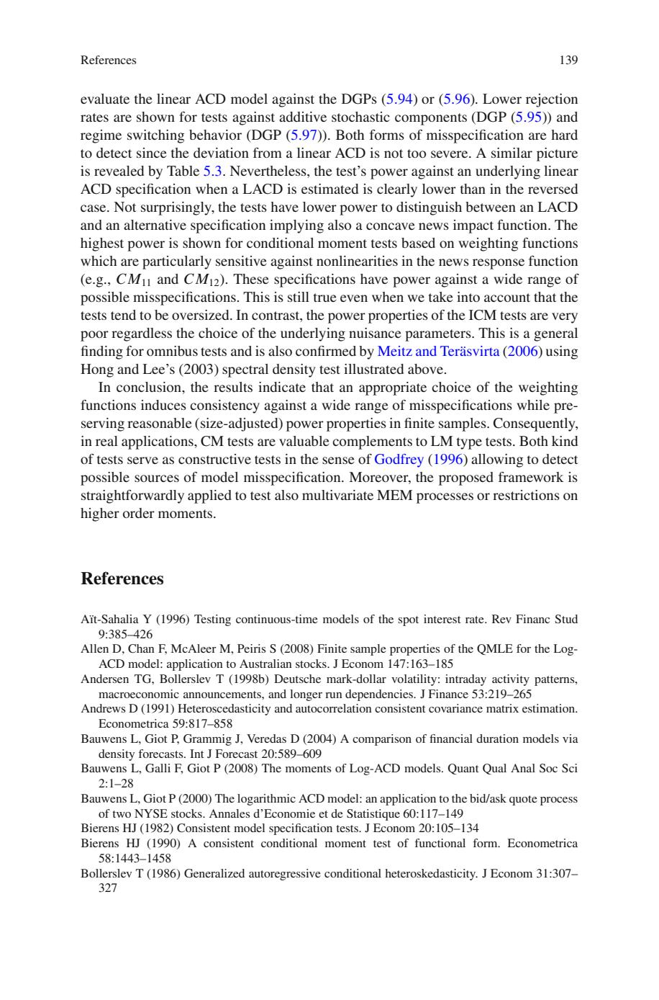

## PDF page 155 / printed page 140

140                                                    5 Univariate Multiplicative Error Models

Bollerslev T, Wooldridge J (1992) 動機が時間とともに変動する共分散を持つ動的モデルにおける準最尤推定と推論. *Econom Rev* 11:143–172.
Box GEP, Pierce DA (1970) 自己回帰・積分移動平均時系列モデルにおける残差自己相関の分布. *J Am Stat Assoc* 65:1509–1526.
Breusch TS (1978) 動的線形モデルにおける自己相関の検定. *Aust Econ Pap* 17:334–355.
Breusch TS, Pagan RA (1979) 不均一分散とランダム係数変動の簡単な検定. *Econometrica* 47:203–207.
Brock W, Dechert WD, Scheinkman J, LeBaron B (1996) 相関次元に基づく独立性の検定. *Econom Rev* 15:197–235.
Brownlees C, Cipollini F, Gallo GM (2011) *Journal of Financial Econometrics* 9:489–518.
Brownlees C, Gallo GM (2011) *International Journal of Forecasting* 27:365–378.
Chen X (2000) 密度関数のベータカーネル推定. *Comput Stat Data Anal* 31:131–145.
Chen Y-T, Hsieh C-S (2010) 自己回帰条件付きデュレーションモデルに対する一般化モーメント検定. *J Financ Econom* 8:345–391.
de Boor C (1978) スプラインの実際的なガイド. Springer Verlag, Berlin, Heidelberg.
de Jong RM (1996) データ依存下におけるBierens検定. *J Econom* 72:1–32.
De Luca G, Gallo G (2009) 混合自己回帰条件付きデュレーションモデルにおける時間変動混合重み. *Econom Rev* 28:101–120.
Diebold FX, Gunther TA, Tay AS (1998) 密度予測の評価と金融リスク管理への応用. *Int Econ Rev* 39:863–883.
Drost FC, Werker BJM (2004) 半パラメータ的デュレーションモデル. *J Bus Econ Stat* 22:40–50.
Duchesne P, Pacurar M (2008) 不規則間隔データに対する金融時系列モデルの評価：スペクトル密度アプローチ. *Comput Oper Res* 35:130–155.
Dufour A, Engle RF (2000) ACDモデル：連続取引間の時間間隔の予測可能性. Working Paper, ISMA Centre, University of Reading.
Dufour JM, Roy R (1985) サンプル自己相関とランダム性の検定に関するロバストな厳密な結果. *J Econom* 29:257–273.
Dufour JM, Roy R (1986) 一般化ポートマンテオ統計とランダム性の検定. *Commun Stat Theory Methods* 15:2953–2972.
Engle RF (2000) 超高頻度データの計量経済学. *Econometrica* 68(1):1–22.
Engle RF (2002b) ARCHモデルの新境地. *J Appl Econom* 17:425–446.
Engle RF (1982) イギリスのインフレの分散の推定における自己回帰条件付き不均一分散. *Econometrica* 50:987–1006.
Engle RF (1984) 計量経済学におけるワルド、尤度比、ラグランジュ乗数検定. Griliches Z, Intriligator MD (編) *Handbook of econometrics*, vol. II, chap. 13. Elsevier Science, pp. 775–826.
Engle RF (1996) 超高頻度データの計量経済学. Discussion Paper 96-15, University of California San Diego.
Engle RF, Gallo GM (2006) イントラ日次データを用いたボラティリティのマルチインディケーターモデル. *J Econom* 131:3–27.
Engle RF, Ng VK (1993) ニュースの影響を測定し、検定する. *J Finance* 48:1749–1778.
Engle RF, Russell JR (1997) 自己回帰条件付きデュレーションモデルによる外国為替価格の変動頻度の予測. *J Empir Financ* 4:187–212.
Engle RF, Russell JR (1998) 自己回帰条件付きデュレーション：不規則間隔の取引データに関する新しいモデル. *Econometrica* 66:1127–1162.
Fernandes M (2004) 線形ACDプロセスの確率分布関数の境界. *Stat Probab Lett* 68:169–176.
Fernandes M, Grammig J (2005) 条件付きデュレーションモデルに対する非パラメータ的仕様検定. *J Econom* 127:35–68.
Gallant RA (1981) 柔軟な関数形におけるバイアスと本質的に不偏形：フーリエ柔軟な形. *J Econom* 15:211–245.

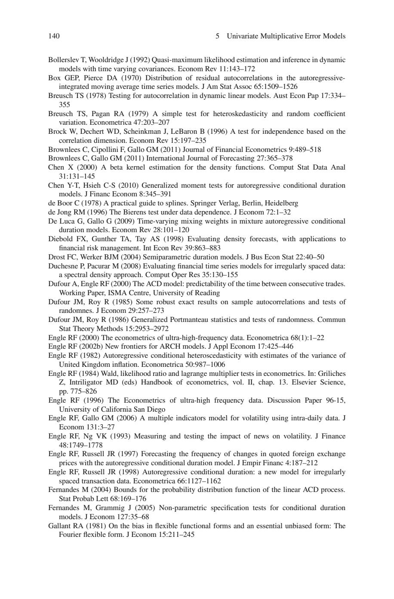

## PDF page 156 / printed page 141

References                                                                                    141

Gosh BK, Huang W-M (1991) The power and optimal kernel of the Bickel–Rosenblatt test for
   goodness-of-fit. Ann Stat 19:999–1009
Ghysels E, Gouriéroux C, Jasiak J (1998) Stochastic volatility duration models. Discussion paper,
   CIRANO
Godfrey LG (1978) Testing against general autoregressive and moving average error models when
   the regressors include lagged dependent variables. Econometrica 46:1293–1302
Godfrey LG (1996) Misspecification tests and their use in econometrics. J Stat Plan Inference
   49:241–260
Gouriéroux C, Monfort A, Trognon A (1984) Pseudo maximum likehood methods: theory.
   Econometrica 52:681–700
Grammig J, Maurer K-O (2000) Non-monotonic hazard functions and the autoregressive condi-
   tional duration model. Econom J 3:16–38
Hagmann M, Scaillet O (2007) Local multiplicative bias correction for asymmetric kernel density
   estimators. J Econom 141:213–249
Hamilton JD, Jorda O (2002) A model of the federal funds rate target. J Polit Econ 110:1135
Hautsch N (2003) Assessing the risk of liquidity suppliers on the basis of excess demand
   intensities. J Financ Econom 1:189–215
Hautsch N, Malec P, Schienle M (2010) Capturing the zero: a new class of zero-augmented distri-
   butions and multiplicative error processes. Discussion Paper 2010-055, Humboldt-Universität
   zu Berlin
Hendry DF (1995) Dynamic econometrics. Oxford University Press, Oxford
Hjort NL, Glad IK (1995) Nonparametric density estimation with a parametric start. Ann Stat
   23:882–904
Hong Y (1996) Consistent testing for serial correlation of unknown form. Econometrica
   64:837–864
Hong Y (1999) Hypothesis testing in time series via the empirical characteristic function: a
   generalized spectral density approach. J Am Stat Assoc 84:1201–1220
Hong Y, Lee T-H (2003) Diagnostic checking for the adequacy of nonlinear time series models.
   Econom Theory 19:1065–1121
Hong Y, Lee Y-J (2011) Journal of Time Series Analysis 32:1–32
Kalbfleisch JD, Prentice RL (1980) The statistical analysis of failure time data. Wiley, New York
Karanasos M (2004) The statistical properties of long-memory ACD models. WSEAS Trans Bus
   Econ 2:169–175
Karanasos M (2008) The statistical properties of exponential ACD models. Quant Qual Anal Soc
   Sci 2:29–49
Kwan ACC, Sim A-B (1996a) On the finite-sample distribution of modified Portmanteau tests for
   randomness of a Gaussian time series. Biometrika 83:938–943
Kwan ACC, Sim A-B (1996b) Portmanteau tests of randomness and Jenkins’ variance-stabilizing
   transformation. Econ Lett 50:41–49
Kwan ACC, Sim A-B, Wu Y (2005) A comparative study of the finite-sample performance of some
   Portmanteau tests for randomness of a time series. Comput Stat Data Anal 48:391–413
Lancaster T (1997) The econometric analysis of transition data. Cambridge University Press
Lawrence AL, Lewis PA (1980) The exponential autoregressive-moving average EARMA(P,Q)
   model. J R Stat Soc Series B 42:150–161
Lee S, Hansen B (1994) Asymptotic theory for the GARCH(1 1) quasi-maximum likelihood
   estimator. Econom Theory 10:29–52
Li WK, Mak TK (1994) On the squared residual autorrelations in non-linear time series with
   conditional heteroscedasticity. J Time Series Anal 15:627–636
Li WK, Yu LH (2003) On the residual autocorrelation of the autoregressive conditional duration
   model. Econ Lett 79:169–175
Ljung GM, Box GEP (1978) On a measure of lack of fit in time series models. Biometrika 65:297–
   303
Luca GD, Zuccolotto P (2006) Regime-switching Pareto distributions for ACD models. Comput
   Stat Data Anal 51:2179–2191

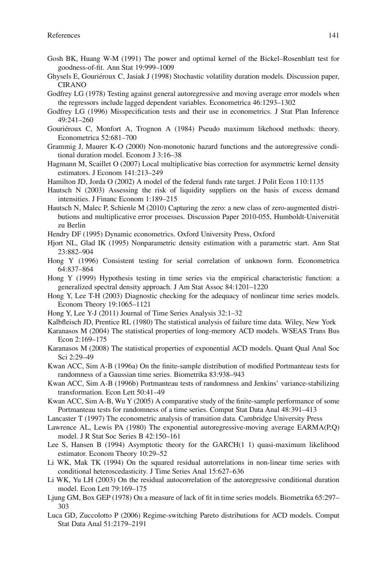

## PDF page 157 / printed page 142

142                                                    5 単変量乗法誤差モデル（Univariate Multiplicative Error Models）

Lunde A (2000) は、一般化されたガンマ自己回帰条件付きデュレーションモデルに関する論文（Discussion paper, University of Aarhus）を発表した。
Manganelli S (2005) は、取引のデュレーション、出来高、ボラティリティへの影響を「Journal of Financial Markets」8巻377–399ページに報告した。
McLeod AI, Li WK (1983) は、二乗残差自己相関を用いたARMA時系列モデルの診断チェックについて「Journal of Time Series Analysis」4巻269–273ページに論じている。
Meitz M, Teräsvirta T (2006) は、自己回帰条件付きデュレーションモデルの評価を「Journal of Business & Economic Statistics」24巻104–124ページに提示した。
Nelson D (1991) は、資産収益における条件付き不均一分散について新たなアプローチを「Journal of Econometrics」43巻227–255ページに提案した。
Newey WK (1985) は、最尤推定によるモデル仕様テストと条件付きモーメントテストを「Econometrica」5巻1047–1070ページに示した。
Newey WK, West KD (1987) は、単純で正半正定値の不均一分散と自己相関に一貫性のある共分散行列を「Econometrica」55巻703–708ページに導出した。
Pacurar M (2008) は、金融における自己回帰条件付きデュレーションモデルに関するサーベイ論文を「Journal of Economic Surveys」22巻711–751ページに発表し、理論的および実証的文献を概観した。
Pagan A, Vella F (1989) は、個別データに基づくモデルの診断テストに関するサーベイを「Journal of Applied Econometrics」4巻29–59ページにまとめた。
Rosenblatt M (1952) は、多変量変換に関する考察を「Annals of Mathematics and Statistics」23巻470–472ページに記した。
Silverman BW (1986) は、統計およびデータ分析のための密度推定をChapman and Hall, Londonから出版した。
Tauchen G (1985) は、最尤モデルの診断テストと評価を「Journal of Econometrics」30巻415–443ページに示した。
Taylor SJ (1982) は、2つの確率過程の積によってモデル化された金融収益 – 日次砂糖価格の研究を、Anderson OD (ed) の編集による「Time series analysis: theory and practice, North-Holland, Amsterdam」に掲載した。
Veredas D, Rodriguez-Poo J, Espasa A (2008) は、金融デュレーションのための半パラメータ推定をBauwens WPL, Veredas D (eds) の編集による「High frequency financial econometrics. Physica-Verlag, Heidelberg」の225–251ページに提示した。
White H (1982) は、モデルのミスペック化に対する最尤推定を「Econometrica」50(1)巻1–25ページに示した。
Wooldridge JM (1990) は、ロバストな回帰ベースの仕様テストへの統一的なアプローチを「Econometrica Theory」6巻17–43ページに提示した。
Wooldridge JM (1991) は、仕様テストと準最尤推定を「Journal of Econometrics」48巻29–55ページに論じた。
Zhang MY, Russell JR, Tsay RS (2001) は、金融取引データへの応用を含む非線形自己回帰条件付きデュレーションモデルを「Journal of Econometrics」104巻179–207ページに提案した。

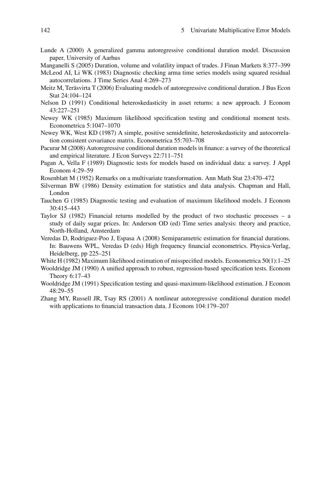
