# 第6章: 一般化乗法誤差モデル（Generalized Multiplicative Error Models）

- 翻訳モデル: `gemma3:12b`
- 原文抽出テキスト: `../econometrics_hf_ch1_ch7_markdown_ja/raw_text/ch06_generalized_multiplicative_error_models.txt`
- 注: 数式・表・図はPDF抽出テキストでは崩れている場合があるため、ページ画像を併読してください。

## PDF page 158 / printed page 143

第6章
一般化乗法誤差モデル

本章では、第5章で導入された基本的な乗法誤差モデルの一般化について説明する。6.1節では、Carrasco and Chen (2002)に従って、一般化された多項式ランダム係数モデルの項で表現できるACDモデルのクラスについて議論する。様々な特殊なケースを説明し、理論的性質を議論し、実証的な例を示す。6.2節では、観測可能なまたは観測不可能な特性に依存して変化する可能性のあるパラメータを許容する、レジームスイッチングACDモデルを検討する。閾値ACDモデル、滑らかな遷移ACDモデル、およびマルコフスイッチングACD仕様に焦点を当てる。6.3節では、データ内の長期依存性を考慮したACDモデルに焦点を当てる。この文脈において、長記憶を捉えるための様々な可能性について議論する。6.4節では、混合モデルとコンポーネントモデルに焦点を当てる。条件付き平均関数が動的な潜在コンポーネントによって駆動される、2種類の混合モデルについて議論する。Bauwens and Veredas (2004)によって提案された確率的条件付きデュレーションモデル（6.4.1節で議論される）は、条件付き平均関数が潜在的なAR(1)過程に従うと仮定する。Hautsch (2008)によって導入された確率的乗法誤差モデル（6.4.2節で示される）は、このアイデアを一般化し、潜在的な動的および観測主導型の動的を許容する。同様に、Brownlees et al. (2011)によって提案されたコンポーネントMEM仕様は、日中の動的と日次の動的を組み合わせることができる。6.5節では、半パラメータACDモデルや確率的ボラティリティ・デュレーションモデルなどのさらなる一般化について議論する。

6.1 一般化されたACDモデルのクラス

本節では、Carrasco and Chen (2002)によって分析された、一般化された多項式ランダム係数ACDモデルの項で表現できる、ACDモデルの一般的なクラスについて議論する。第5章で導入された表記に基づいて、このモデルクラスは次のように与えられる。

                           #.i / D A."i /#.i 1 / C C."i /;                   (6.1)

N. Hautsch, 金融高頻度データ計量経済学,                        143
DOI 10.1007/978-3-642-21925-2 6, © Springer-Verlag Berlin Heidelberg 2012

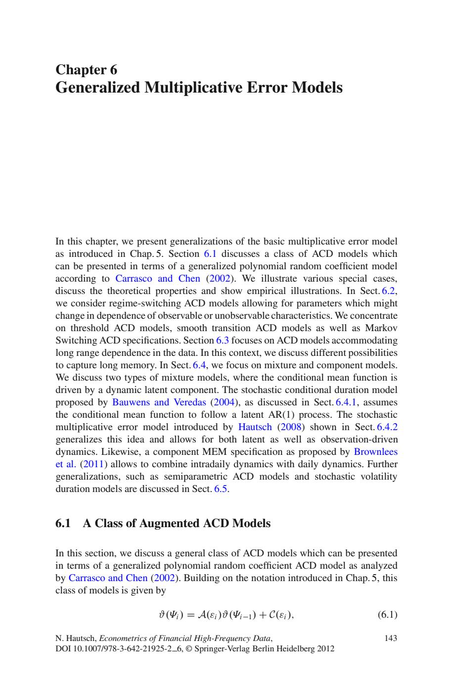

## PDF page 159 / printed page 144

144                                             6 一般化乗法誤差モデル（MEM）

ここで、#./ はドメイン Œ0; 1/ を持つ連続関数であり、A と B は多項式関数であり、「i D xi =i は EŒ"i  D 1 の i.i.d. 乱革項を表す。

6.1.1 特殊なケース

一般化多項式ランダム係数ACDモデルのクラスは、基本的な線形ACDモデルの様々な拡張を含んでおり、加法成分だけでなく乗法成分も許容する。すなわち、過去の乱革項が条件付き平均関数に加法的に、および/または乗法的に影響を与えるような仕様である。さらに、線形だけでなく、より柔軟なニュースインパクトカーブを捉えるパラメータ化も含む。説明の簡潔化のため、以下の議論はラグオーダーが P D Q D 1 のモデルに限定される。

6.1.1.1 加法と乗数ACD（AMACD）モデル

加法成分と乗数成分の両方を組み込んだ基本的なACD仕様の簡単な拡張は、次のように与えられる。

                         i D ! C .˛i 1 C /"i 1 C ˇi 1 ;                     (6.2)

ここで、 はパラメータである。この仕様は、傾きが ˛i 1 C  で与えられるニュースインパクトカーブを意味する。したがって、過去の乱革項は条件付き平均関数に加法的に、および乗数的に影響を与える。この意味で、（いわゆる）加法と乗数ACD（AMACD）モデルは、より柔軟であり、 D 0 の場合に線形ACDモデルを内包する。

6.1.1.2 ボックス・コックスACD（BACD）モデル

Hautsch (2003) は、i と "i のべき乗変換に基づく加法ACDモデルを提案している。

                             iı1 D ! C ˛"ıi 1
                                             2
                                                C ˇiı1
                                                      1
                                                         ;                         (6.3)

ここで、ı1 ; ı2 > 0 である。このモデルはボックス・コックス変換の項で書き直せることは明らかである。したがって、

                   iı1  1                            ı1  1
                                   Q ıi 1
                            D !Q C ˛."  2
                                            1/=ı2 C ˇ i 1    ;                   (6.4)
                      ı1                                  ı1

ここで、

                         !C˛Cˇ1                                     ˛ı2
                 !Q WD                          and          ˛Q WD       :
                            ı1                                       ı1

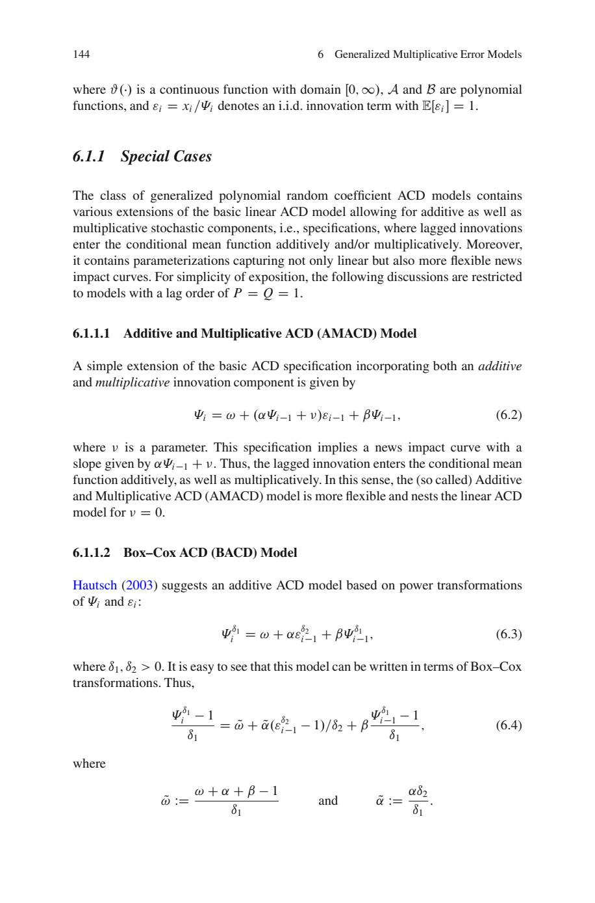

## PDF page 160 / printed page 145

6.1 増強ACDモデルのクラス                                                    145

この仕様は、凹型、凸型、および線形ニュースインパクト関数を許容するものである。パラメータが ı1 D ı2 D 1 の場合、AMACDモデル、ı1 ! 0, ı2 ! 0 の場合、LACD1モデル、および ı1 ! 0, ı2 D 1 の場合、LACD2モデル（第5章を参照）を含む。ı1 ! 0 の場合、Dufour and Engle (2000)によって提案されたBox–Cox ACD仕様と一致する。

6.1.1.3 EXponential ACD (EXACD)モデル

区分線形ニュースインパクト関数の仮定によって、代替パラメータ化が実現される。Dufour and Engle (2000)は、Nelson (1991)によって提案されたEGARCH仕様の特徴を捉える、いわゆるEXponential1 ACDモデルを導入する。このモデルは、"i 1 D 1 でくびれのある線形ニュースインパクト関数を許容する。

                    ln i D ! C ˛"i 1 C cj"i 1  1j C ˇ ln i 1 :                 (6.5)

条件付き平均よりも短い持続時間（"i 1 < 1）の場合、ニュースインパクト曲線は傾き ˛  c と切片 ! C c を持つ。一方、条件付き平均よりも長い持続時間（"i 1 > 1）の場合、傾きと切片は ˛ C c と !  c である。

6.1.1.4 増強Box–Cox ACD (ABACD)モデル

EXACDモデルは、"i 1 D 1 のみでニュースインパクト曲線にくびれを許容するが、より価値のある一般化は、くびれの場所もパラメータ化することである。Hentschel (1995)によって導入された非対称GARCHプロセスをモデリングするためのパラメータ化を使用すると、増強Box–Cox ACDモデルと呼ばれる仕様が得られる。

                iı1 D ! C ˛.j"i 1  bj C c."i 1  b//ı2 C ˇiı1
                                                                 1
                                                                    :                (6.6)

この仕様では、パラメータ b はくびれの場所を示し、ı2 はくびれ周辺の区分関数の形状を決定する。ı2 > 1 の場合、形状は凸であり、ı2 < 1 の場合、形状は凹である。b D 0 および c D 0 の場合、BACDモデルを含む。このモデルは、ABACD仕様が加法的な確率的成分に基づいているため、基本的なACDモデルを含まない。
   このニュースインパクト関数の仕様は、より多くの柔軟性を許容するものの、大きな欠点がある。それは、パラメータ制限 jcj <D 1 を課す必要があることである。これは、ı2 ¤ 1 の場合、複雑な値が回避されるようにするためである。この制限は、モデルをデータに適合させる必要がある場合に拘束的である。

1
 彼らは、指数分布に基づく指数ACDモデル（EACD）との混同を防ぐために、この表記を使用している。

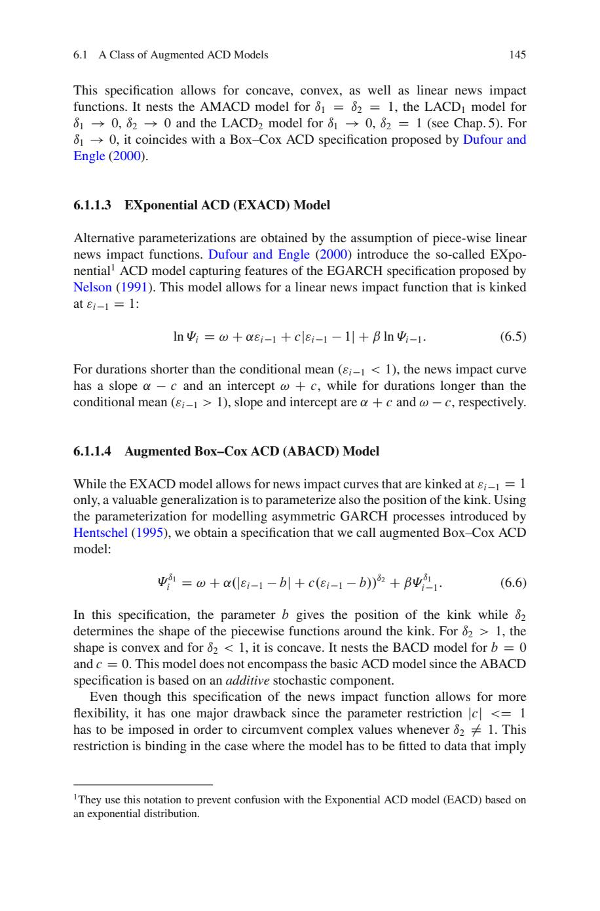

## PDF page 161 / printed page 146

146                                             6 一般化乗法誤差モデル（MEM）

上向きに湾曲した凹型のニュースインパクト関数というパターンが見られる。このようなパターンは金融におけるデュレーションにおいて典型的なものである（6.1.3節の経験的結果も参照）が、これはc < 1（および˛ < 0）の場合にのみ可能である。したがって、そのような場合、制限されたバージョンのBACDモデルを推定する必要がある。特に、cが境界に収束する場合、どちらか一方のı2、あるいは代替的に、|cj|を1に固定する必要がある。ı2を1に設定すると、bで kink がある線形ニュースインパクト関数になる。その場合、モデルは次のように書き換えられる。

                iı1  1                                 ı1  1
                         D !Q C ˛"       Q i 1  bj C ˇ i 1
                                Q i 1 C cj"                     ;                 (6.7)
                   ı1                                       ı1

ここで、

                    !  ˛cb C ˇ  1                 ˛c                    ˛
            !Q WD                   ;       ˛Q WD      ;   and    cQ WD      :
                          ı1                        ı1                    ı1

このような仕様は、ı1 → 0 および b D 1 の場合、EXACDモデルを内包する。あるいは、cを1に設定すると、仕様は次のようになる。

                    iı1 D ! C ˛."
                               Q i 1  b/ı2 1l f"i 1 bg C ˇiı1
                                                                 1
                                                                    ;

ここで ˛Q D 2ı2 ˛である。したがって、ニュースインパクト関数は "i 1  b の場合にゼロであり、ı2 < 1 (ı2 > 1) の場合に凹（凸）関数に従う。それに対応して、cを1に設定すると、

                    iı1 D ! C ˛.b
                               Q  "i 1 /ı2 1l f"i 1 bg C ˇiı1
                                                                 1
                                                                    :

後者の2つの制限されたABACD仕様は、cが1（1）に設定されている場合、bが0（! 1）になるBACDモデルを内包しないことに注意する。

6.1.1.5 Hentschel ACD (HACD) モデル

代替的な非線形ACDモデルは、Fernandes and Grammig (2006)によって提案されている。彼らは、Hentschel (1995)によって提案された拡張GARCHプロセスに対応する仕様を導入している。Fernandes and Grammigはこれを拡張ACDモデルと呼んでいるが、ここでは他の本節で検討される拡張ACDプロセスとの混同を避けるために、H(entschel)-ACDモデルと呼ぶ。HACDモデルは次のように与えられる。

             iı1 D ! C ˛iı1
                            1
                               .j"i 1  bj C c."i 1  b//ı2 C ˇiı1
                                                                    1
                                                                       :           (6.8)

この仕様はABACDモデルとかなり類似している。主な違いは、HACDモデルが乗数的な確率的成分に基づいている点である（since iı1    1

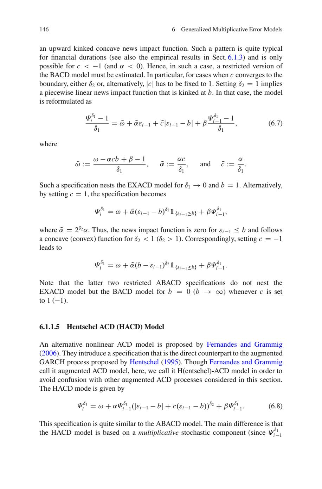

## PDF page 162 / printed page 147

6.1 増強ACDモデルのクラス                                                            147

乗法誤差モデル（MEM）は、"i 1 ) の関数と乗数的に作用し、ABACDモデルは加法的な確率的成分に基づいている。したがって、HACDモデルは、ABACDの場合と同様に、c に関する同じパラメータ制限を課すことになる。HACDモデルは乗数的な確率的成分を含むため、ı1 D ı2 D 1, b D c D 0 の場合、基本的な線形ACDモデルを内包する。また、ı1 ! 0 の場合、ABACDモデルの特殊なケースと一致する。したがって、ı1 ! 0, ı2 ! 0, b D c D 0 の場合、LACD1モデル、およびı1 ! 0, ı2 D 1, b D c D 0 の場合、LACD2モデルも内包する。さらに、Dufour and Engle (2000)によって導入されたBox–Cox仕様を、ı1 ! 0, b D c D 0 の場合、およびEXACDモデルを、ı1 ! 0, ı2 D b D 1 の場合にそれぞれ対応する。しかし一般的に、乗数的な確率的成分に基づいているため、AMACD、BACD、ABACDモデルを内包することはない。

6.1.1.6 増強Hentschel ACD (AHACD) モデル

上記すべての仕様を内包するモデルは、次の式で与えられる。

         iı1 D ! C ˛iı1
                        1
                           .j"i 1  bj                                                      (6.9)

                 C c."i 1  b//ı2 C .j"i 1  bj C c."i 1  b//ı2 C ˇiı1
                                                                           1
                                                                              :

この仕様を、HACDモデルとABACD仕様を組み合わせた増強Hentschel ACDモデルと呼ぶ。このACDモデルは、加法的および乗数的な確率的係数を許容し、したがって、過去のショックが条件付き平均関数に与える影響として、加法的および乗数的な影響を意味する。HACDモデルによって内包されるすべての仕様、および加法的な確率的成分に基づくすべてのモデルを内包する。特に、ı1 D ı2 D 1, b D c D 0 の場合、AMACDモデル、˛ D b D c D 0 の場合、BACDモデル、および˛ D 0 の場合、ABACDモデルを内包する。AGACD、HACD、およびABACDモデルは、ı1 ! 0 の場合に一致する。したがって、パラメータ ˛ と  は、ı1 > 0 の場合にのみ個別に識別可能である。さらなる一般化として、加法的および確率的成分に対して異なるニュースインパクトパラメータ b, c および ı2 を指定することが考えられる。しかし、この場合、数値的な複雑さのためにモデルの推定が困難になる。

6.1.1.7 スプラインニュースインパクトACD (SNIACD) モデル

ACD仕様の別のタイプは、ニュース応答を区分線形関数でモデル化することによって得られる。Engle and Ng (1993) の精神に則り、ニュースインパクトカーブは、"i 1 の与えられたブレークポイントにおけるノードを持つ線形スプライン関数としてパラメータ化される可能性がある。特に、"i 1 の範囲は、M  (M C ) を範囲内の区間の数とすると、"i 1 < 1 ("i 1 > 1) の M 個の区間に分割される。M D M  CM C である。ブレークポイントを f"NM  ; : : : ; "N1 ; "N0 ; "N1 ; : : : ; "N M C g と表記すると、SNIACDモデルは次の式で与えられる。

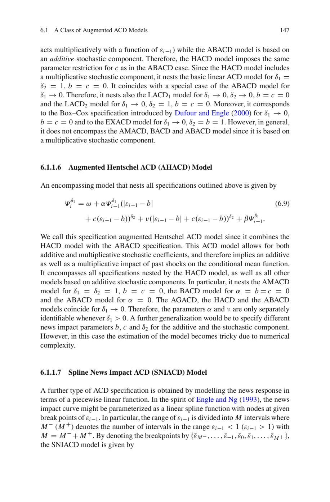

## PDF page 163 / printed page 148

148                                                    6 一般化乗法誤差モデル（MEM）

                                  C
                              X
                              M
                                       C
                  i D ! C            ˛m 1l f"i 1 N"m g ."i 1  "N m /
                              mD0
                            M
                            X
                                   
                        C         ˛m 1l f"i 1 <N"m g ."i 1  "Nm / C ˇi 1 ;          (6.10)
                            mD0

         C         
ここで、˛m    と ˛m   は、区分線形スプラインに関連する係数を表すものである。あるいは、モデルは i の対数変換の項で指定することもできる。この形式では、非負制約を必要としないため、推定がより容易になる。区間は同じサイズである必要はなく、"N0 の各側にも同じ数の区間を必要としない。エンゲルとン（Engle and Ng）(1993)が指摘するように、サンプルサイズ関数としての M の緩やかな増加は、ニュースインパクトカーブの一貫した推定値をもたらす。この仕様は、非常に柔軟な（非線形）ニュース応答を可能にするが、他の（パラメトリック）ACD仕様を必ずしも包含するものではない。

6.1.2 理論的性質

一般化多項式係数モデルの項での ACD モデルの定式化を思い出すことで（6.1）、上記のすべての ACD 仕様を、#./, A./ および C./ に対応するパラメータ化を使用して分類することができる。これは表 6.1 に示されている。このクラスのモデルの理論的性質は、カルラスコ（Carrasco）とチェン（Chen）(2002) によって、モカデム（Mokkadem）(1990) の結果に基づいて導出されている。彼らは、ˇ-混合性、厳密な定常性、および高次のモーメントの存在を保証する十分条件を提供する。以下の命題で、主な結果を再現する。
命題 6.1。デュレーション xi ; i D 1; : : : ; n が、プロセス xi D i "i を従うと仮定する。ここで、i は表 6.1 のプロセスの一つによって与えられる。また、"i は i と独立した i.i.d. 乱数であり、"i の周辺確率分布が Lebesgue 測度に関して .0; 1/ に対して絶対連続であると仮定する。さらに、"i は .#.i 1 ; : : : ; #.1 // に独立であるとする。多項式関数 A./ の絶対値最大の固有値が %.A.// であるとする。さらに、
  (i) A./ と C./ は、"i によって生成されるシグマ体に関して測定可能な多項式関数である。
 (ii) %.A.0// < 1.
(iii) jA.0/j < 1, EŒA."i /s < 1 および EŒC."i /s < 1 を満たす整数 s  1 が存在する。
このとき、プロセス fi g はマルコフ幾何学的エルゴード性を示し、EŒi s < 1 を満たす。プロセス fi gniD1 と fxi gniD1 がエルゴード分布から初期化される場合、それらは厳密に定常であり、指数関数的な減衰を持つ ˇ-混合性を示す。

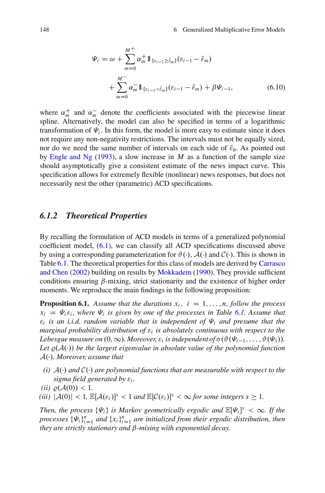

## PDF page 164 / printed page 149

6.1 拡張ACDモデルのクラス                                                           149

表6.1 ACDモデルの分類
Typ           #.i /           A."i /                    C ."i /
線形および対数ACDモデル
ACD            i             ˛"i1 C ˇ                  !
LACD1          ln i          ˇ                          ! C ˛ ln "i1
LACD2          ln i          ˇ                          ! C ˛"i1

非線形ACDモデル
               ı                                                   ı
BACD         i 1               ˇ                        ! C ˛"i1
                                                                2

EXACD        ln i              ˇ                        ! C ˛"i1 C cj"i1  1j
               ı
ABACD        i 1               ˇ                        ! C ˛.j"i1  bj C c."i1  b//ı2
HACD         iı1               ˛.j"i1  bj C ˇ         !
                                  Cc."i1  b//ı2

拡張ACDモデル
AMACD       i                  ˛"i1 C ˇ                ! C "i1
AHACD       iı1                ˛.j"i1  bj C ˇ         ! C .j"i1  bj C c."i1  b//ı2
                                 Cc."i1  b//ı2

スプラインニュースインパクトACDモデル
                                                            PM C C
SNIACD         i or ln i      ˇ                        ! C mD0 ˛m  1l              ."     "Nm /
                                                            PM   f"i 1 N"m g i1
                                                          C mD0 ˛m 1l f"i 1 <N"m g ."i1  "Nm /

証明： Carrasco and Chen (2002) の命題2と5を参照。                     
したがって、個々のACD仕様に対する定常性およびエルゴード性の条件を確立するには、関数A./とC./に対して制限を課す必要がある。個々のGARCH仕様の文脈における対応する例は、Carrasco and Chen (2002)に与えられている。これらの結果の一般化は、Markovモデルの枠組みにおいてMeitz and Saikkonen (2008)によって与えられている。2

6.1.3 経験的実証

表6.4は、（季節調整された）取引時間と$0:05の中央気配の変化時間に基づいた、さまざまなACD仕様の推定値を示している。これは、ニューヨーク証券取引所（NYSE）で取引されたコカ・コーラとGEの株式を対象とし、2001年1月2日から2001年5月31日までの期間をカバーしている。各タイプの金融デュレーションについて、基本ACDモデル、LACD2モデル、BACDモデル、EXACDモデル、ABACDモデル、およびSNIACDモデルの対数バージョンを含む、7種類のACD仕様が推定される。個々の時系列は、毎日の取引開始時に再初期化され、最尤推定によって推定される。

2
  Carrasco and Chen (2005) および Meitz and Saikkonen (2008) も参照。これらの文献は、Carrasco and Chen (2002)で提供された結果のいくつかの修正を示している。しかし、これらの修正は、上記の命題に影響を与えない。

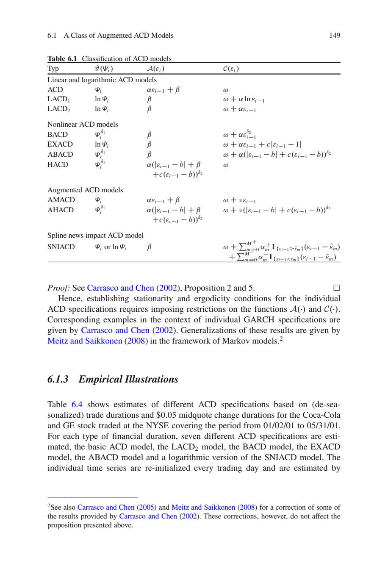

## PDF page 165 / printed page 150

150                                                       6 一般化乗法誤差モデル（MEM）

QML. ラグ次数は、ベイズ情報量規準（BIC）に従って選択され、好ましい仕様としてACD(2,1)またはACD(2,2)モデルが示唆されている。個々の非線形ACD仕様において、第2ラグを含めることは、第2ラグのニュースインパクト関数のパラメータ化も必要となるため、単純ではない。これにより、対応するニュース応答パラメータが2倍になり、高パラメータ化されたABACDおよびSNIACDモデルでは実行不可能となる。この理由から、高次のダイナミクスを考慮できる一方で、モデルの簡潔性を確保するパラメータ化が選択される。特に、第2ラグのニュースインパクトは、第1ラグと同様にモデリングされる、すなわち、同じパラメータ ı1 , ı2 , cを用いてモデル化され、自己回帰パラメータ ˛, ˇ, c および  のみが2倍になる。すると、ABACD(2,2)モデルは次のようになる。

                          X
                          2                                                       X
                                                                                  2
          iı1 D ! C             ˛j .j"i j  bj C cj ."i j  b// C       ı2
                                                                                         ˇj iıj
                                                                                               1
                                                                                                  :
                          j D1                                                    j D1

同様に、SNIACD(2,2)モデルは次のようになる。

                     C                                            
                 X
                 M                                               X
                                                                 M
                          C                                             
      i D ! C           ˛m 1l f"i 1 >N"m g ."i 1  "N m / C         ˛m 1l f"i 1 <N"m g ."i 1  "Nm /
                 mD0                                             mD0

               MC
               X
                      C
           C        .˛m C aC /1l f"i 2 N"m g ."i 2  "Nm /
               mD0
                
               X
               M                                                       X
                                                                       2
                      
           C        .˛m C a /1l f"i 2 <N"m g ."i 2  "Nm / C               ˇj i j :               (6.11)
               mD0                                                     j D1

   表6.2–6.5は、推定結果と診断結果を示す。この文脈では、2つの困難性を考慮する必要がある。第一に、絶対値関数を含む非線形モデルでは、ニュースインパクト関数におけるヘッセ行列の推定が、数値的な問題によりしばしば面倒である。この理由から、共分散行列の分散のOPG推定器を用いて、漸近標準誤差が推定される。第二に、いくつかの仕様において、係数 ı1 および c はその境界に収束する。すると、これらの係数はその境界に設定され、それに応じて制限されたモデルが再推定される。この文脈については、第6.1.1.4節の議論を参照されたい。
   推定結果を分析すると、以下の知見をまとめることができる。第一に、イノベーションパラメータはかなり低いが、持続性パラメータは1に近い。自己回帰パラメータに対する明示的な非負制約は課されていない。この理由から、いくつかの回帰では、˛1 の負の値も得られる。しかし、これらの場合、それらは正の値によって過剰に補償される。

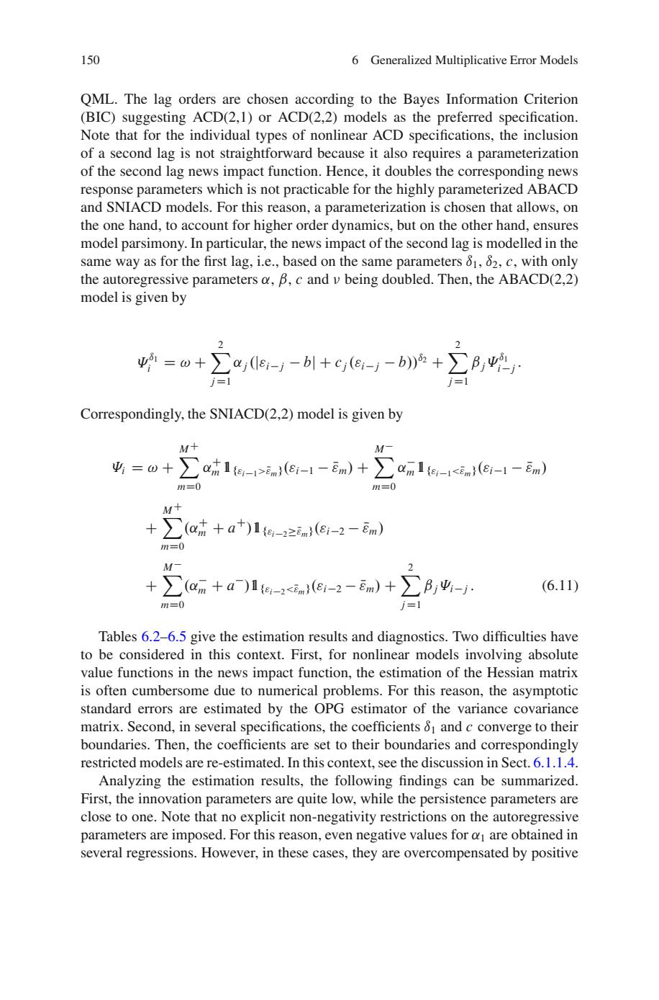

## PDF page 166 / printed page 151

6.1 拡張ACDモデルのクラス                                                             151

表6.2 コカ・コーラの取引間デュレーションに対する、様々な拡張ACDモデルのQML推定値。サンプル期間は2001年3月19日から2001年3月30日まで。観測値数は15,174。標準誤差はOPG推定値（括弧内）に基づく。SNIACDモデルは、カテゴリ境界.0:1; 0:2; 0:5; 1:0; 1:5; 2:0; 3:0/に基づいて推定された。診断：対数尤度（LL）、ベイズ情報尺度（BIC）、平均（"NOi"）、標準偏差（S.D.）および、ACD残差に対する20のラグのリュング・ボックス統計量（LB）。

         ACD            LACD           BACD          EXACD         ABACD                  SNIACD
!        0.122          0.038         0.100         0.041        0.010         !        0.036
         (0.016)        (0.003)        (0.043)       (0.004)       (0.010)                (0.011)
˛1       0.024         0.025         0.026        0.075        0.066
         (0.004)        (0.004)        (0.038)       (0.009)       (0.011)
˛2       0.065          0.063          0.058         0.104         0.062
         (0.005)        (0.005)        (0.087)       (0.009)       (0.011)
ˇ1       0.837          0.869          0.872         0.868         0.871         ˇ1       0.899
         (0.019)        (0.017)        (0.018)       (0.018)       (0.018)                (0.014)
ı1                                     0.483                          a         ˛1C      0.062
                                       (0.736)                        a                  (0.021)
ı2                                     0.672                        1.000b       ˛2C      0.071
                                       (0.089)                        b                  (0.039)
b                                                                  1.420         ˛3C      0.031
                                                                   (0.203)                (0.031)
c1                                                   0.080         0.773        ˛4C      0.033
                                                     (0.012)       (0.119)                (0.013)
c2                                                   0.068        1.393        ˛1      0.124
                                                     (0.013)       (0.187)                (0.020)
1                                                                               ˛2      0.153
                                                                                          (0.038)
2                                                                               ˛3      0.245
                                                                                          (0.112)
                                                                                 ˛4      0.863
                                                                                          (0.335)
                                                                                 aC       0.230
                                                                                          (0.026)
                                                                                 a       0.009
                                                                                          (0.004)

LL         15,059       15,060       15,056       15,047       15,045                15,038
BIC        15,079       15,079       15,085       15,075       15,079                15,095
"NOi       1.000         1.000         1.000         1.000         1.000                  1.000
S.D.       1.245         1.246         1.249         1.245         1.246                  1.242
LB         17.146        15.823        16.083        15.254        15.761                 17.527
a
   推定は対数仕様に基づいている
b
   ˛2 の境界値にパラメータを設定

Nonetheless, based on the estimates we do not find any violations of
the non-negativity restriction of i である。

3
 Note that in a nonlinear ACD specification, an upward kinked concave news impact function
actually implies a negative value for ˛; see also Sect. 6.1.1.4. 非線形ACD仕様において、上向きのギザギザの凹型ニュースインパクト関数は、実際には ˛ に負の値を示唆する。また、第6.1.1.4節も参照されたい。

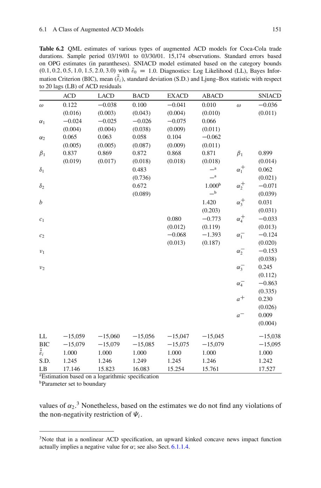

## PDF page 167 / printed page 152

152                                                   6 一般化乗法誤差モデル（Generalized Multiplicative Error Models）

表6.3 QML 推定による、コカ・コーラ $0.05 価格デュレーションに対する様々な拡張ACDモデルの推定値。サンプル期間は2001年2月1日から2001年5月31日まで。12,971の観測値。標準誤差はOPG推定値（括弧内）に基づく。SNIACDモデルは、カテゴリ境界 .0:1; 0:2; 0:5; 1:0; 1:5; 2:0; 3:0/ に基づいて推定。 "N0 D 1:0. 診断：対数尤度（LL）、ベイズ情報量規準（BIC）、平均 ("NOi )、標準偏差 (S.D.)、およびACD残差に対する20のラグのリュング・ボックス検定統計量（LB）。
         ACD            LACD           BACD          EXACD       ABACD                  SNIACD
!        0.012          0.050         0.004        0.036      0.035         !        0.020
         (0.002)        (0.003)        (0.027)       (0.003)     (0.007)                (0.009)
˛1       0.079          0.075          0.037         0.183       0.170
         (0.005)        (0.005)        (0.061)       (0.011)     (0.032)
˛2       0.020         0.025         0.019        0.113      0.132
         (0.003)        (0.004)        (0.031)       (0.010)     (0.025)
ˇ1       0.930          0.988          0.987         0.990       0.991         ˇ1       0.989
         (0.004)        (0.002)        (0.002)       (0.002)     (0.002)                (0.002)
ı1                                     0.081                        a         ˛1C      0.021
                                       (0.135)                      a                  (0.018)
ı2                                     0.275                     1.096         ˛2C      0.010
                                       (0.044)                   (0.137)                (0.034)
b                                                                1.016         ˛3C      0.034
                                                                 (0.103)                (0.029)
c1                                                   0.179      1:000b       ˛4C      0.006
                                                     (0.013)        b                  (0.014)
c2                                                   0.136       0.801        ˛1      0.226
                                                     (0.013)     (0.035)                (0.020)
1                                                                             ˛2      0.246
                                                                                        (0.038)
2                                                                             ˛3      0.324
                                                                                        (0.101)
                                                                               ˛4      0.157
                                                                                        (0.199)
                                                                               aC       0.394
                                                                                        (0.028)
                                                                               a       0.005
                                                                                        (0.003)

LL         12,072       12,081       12,016       11,996     11,996                11,991
BIC        12,091       12,100       12,044       12,024     12,029                12,048
"NOi       1.008         1.008         1.033         1.005       1.005                  1.004
S.D.       1.208         1.210         1.234         1.196       1.196                  1.194
LB         30.816        31.776        26.809        23.016      24.431                 23.217
a
   推定は対数仕様に基づいている
b
   パラメータは境界に設定

第二に、BIC値に基づく仕様の適合度を比較した結果、EXACDモデルとBACDモデルが最も良い性能を示すことがわかった。特に価格デュレーションに関しては、より単純な（線形および対数）モデルが、（A）BACDモデルとEXACDモデルに取って代わられる。取引デュレーションに関しては、明確な傾向は見られない。コカ・コーラ株式については、EXACDモデルが最適な仕様である。

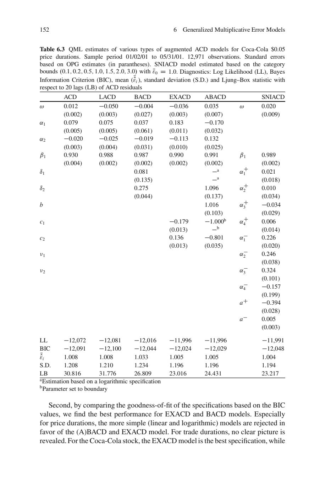

## PDF page 168 / printed page 153

6.1 拡張ACDモデルのクラス                                                             153

表6.4 は、GEの取引間デュレーションに対する様々な拡張ACDモデルのQML推定値を示す。サンプル期間は2001年3月19日から2001年3月30日までである。観測値数は25,101である。標準誤差はOPG推定値に基づいている（括弧内）。SNIACDモデルは、カテゴリ境界.0:1; 0:2; 0:5; 1:0; 1:5; 2:0; 3:0/に基づいて推定された。"N0 D 1:0. 診断：対数尤度（LL）、ベイズ情報尺度（BIC）、平均 ("NOi )、標準偏差（S.D.）および、ACD残差に対する20のラグのLjung–Box統計量（LB）

         ACD            LACD          BACD           EXACD         ABACD                  SNIACD
!        0.036          0.038        0.003         0.037        0.017         !        0.007
         (0.005)        (0.003)       (0.030)        (0.003)       (0.024)                (0.007)
˛1       0.001         0.001        0.000         0.014        0.016
         (0.006)        (0.006)       (0.006)        (0.010)       (0.018)
˛2       0.043          0.038         0.042          0.056         0.023
         (0.006)        (0.006)       (0.033)        (0.010)       (0.024)
ˇ1       0.922          0.965         0.964          0.966         0.960         ˇ1       0.962
         (0.007)        (0.005)       (0.005)        (0.005)       (0.005)                (0.005)
ı1                                    0.705                        0.497         ˛1C      0.039
                                      (0.558)                      (0.528)                (0.014)
ı2                                    0.758                        0.595         ˛2C      0.021
                                      (0.107)                      (0.078)                (0.027)
b                                                                  0.444         ˛3C      0.014
                                                                   (0.030)                (0.023)
c1                                                   0.023         0.956        ˛4C      0.008
                                                     (0.014)       (0.143)                (0.012)
c2                                                   0.031         1.000a       ˛1      0.030
                                                     (0.014)          a                  (0.019)
1                                                                               ˛2      0.048
                                                                                          (0.030)
2                                                                               ˛3      0.227
                                                                                          (0.096)
                                                                                 ˛4      0.636
                                                                                          (1.290)
                                                                                 aC       0.097
                                                                                          (0.031)
                                                                                 a       0.006
                                                                                          (0.005)

LL         24,813       24,815      24,811        24,813       24,803                24,801
BIC        24,834       24,836      24,841        24,843       24,844                24,862
"NOi       1.001         1.000        0.999          1.000         1.000                  1.001
S.D.       1.007         1.007        1.006          1.007         1.006                  1.005
LB         38.695        37.281       36.779         37.039        35.826                 36.380
a
    パラメータは境界に設定

GE株式の場合、基本的なACDモデルが最も高いBICをもたらす。しかしながら、全ての仕様において、(L)ACDモデルをBACDまたはEXACDモデルに拡張すると、対数尤度関数が最も強く増加する。この結果は、取引間デュレーションの両タイプにおいて、非線形なニュースインパクト効果を考慮することが重要であることを示している。最も柔軟なSNIACDモデルは、全ての系列に対して全体的に最も高い対数尤度値をもたらし、データへの最適な適合を示す。

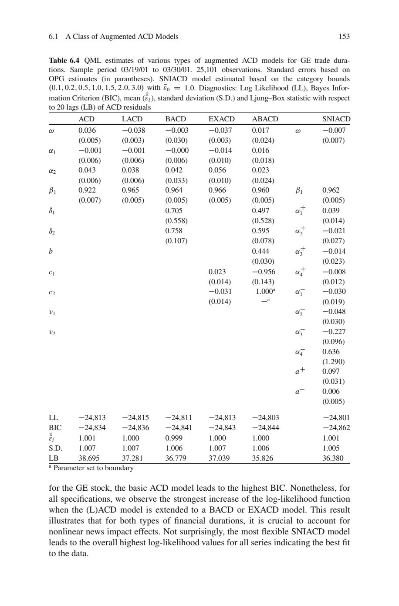

## PDF page 169 / printed page 154

154                                                   6 一般化乗法誤差モデル（Generalized Multiplicative Error Models）

表6.5 QML 推定による、GE $0.05 価格デュレーションに対する様々な拡張ACDモデルの推定値。サンプル期間は2001年1月2日から2001年5月31日まで。観測値数は16,008。標準誤差はOPG推定値（括弧内）に基づく。SNIACDモデルは、カテゴリ境界.0:1; 0:2; 0:5; 1:0; 1:5; 2:0; 3:0/ に基づいて推定。診断：ベイズ情報尺度（BIC）、平均 ("NOi ）、標準偏差 (S.D.)、および20ラグに対するラグランジュ・ボックス統計量（LB）のACD残差。

           ACD           LACD          BACD         EXACD        ABACD         SNIACD
!          0.009         0.030        0.093       0.034       0.016        !            0.012
           (0.002)        (0.004)      (0.017)      (0.005)      (0.003)                    (0.006)
˛1         0.143         0.122         0.372        0.174        0.389
           (0.009)        (0.007)      (0.049)      (0.011)      (0.062)
˛2         0.094         0.092       0.269       0.128       0.325
           (0.007)       (0.006)       (0.036)      (0.010)      (0.054)
ˇ1         1.227         1.532         1.434        1.433        1.408         ˇ1           1.391
           (0.073)        (0.057)      (0.063)      (0.067)      (0.066)                    (0.068)
ˇ2         0.284         0.538       0.442       0.442       0.417        ˇ2           0.400
           (0.066)        (0.056)      (0.062)      (0.066)      (0.065)                    (0.067)
ı1                                         a                       a         ˛1C          0.020
                                           a                       a                      (0.012)
ı2                                     0.407                      1.000b       ˛2C          0.051
                                       (0.051)                      b                      (0.024)
b                                                                0.355         ˛3C          0.002
                                                                 (0.032)                    (0.020)
c1                                                  0.100       1.235        ˛4C          0.018
                                                    (0.014)      (0.043)                    (0.009)
c2                                                  0.082        1.179        ˛1          0.211
                                                    (0.014)      (0.041)                    (0.017)
1                                                                             ˛2          0.223
                                                                                            (0.029)
2                                                                             ˛3          0.120
                                                                                            (0.072)
  C
˛1                                                                             ˛4          0.512
                                                                                            (0.181)
˛2C                                                                            aC           0.377
                                                                                            (0.028)
˛3C                                                                            a           0.039
                                                                                            (0.006)

BIC       14,729       14,730      14,699       14,708    14,699                     14,725
"NOi      1.002         1.001        1.000         1.001      1.000                       1.000
S.D.      1.060         1.057        1.059         1.059      1.056                       1.057
LB        33.643        23.238       35.240        29.765     32.469                      33.801
a
   推定は対数仕様に基づいている
b
   パラメータは境界に設定

第三に、推定されたボックス・コックスパラメータ ıO1 および ıO2 は、価格デュレーションの場合、ほとんど常に1より小さい値である。一方、取引デュレーションの場合、1より大きく、1より小さい値が得られる。これらの結果は線形ACDと矛盾しており、多くの場合はACDの他の形式とも矛盾する。

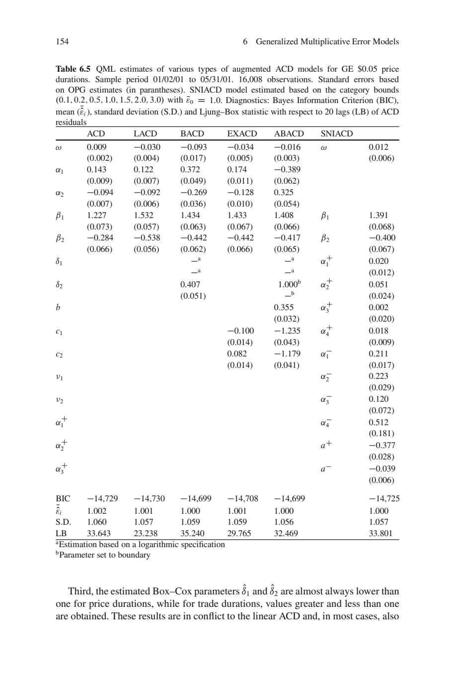

## PDF page 170 / printed page 155

6.1 増強ACDモデルのクラス                                                   155

LACDモデルへの導入である。したがって、価格デュレーション過程は、凹型のニュースインパクトカーブを意味することに気づく。すなわち、条件付き期待平均の調整は、予想される価格デュレーションよりも小さい期間（ボラティリティショック）において、予想される価格強度よりも低い期間よりも強く作用する。一般化EXACDモデルに基づいた対応する結果も得られており、cのパラメータが主に非常に有意な負の値を示すことから、上向きのくびれのある凹型のニュース応答カーブが示唆される。取引デュレーションに関しては、凹型のニュースインパクトカーブと凸型のニュースインパクトカーブの両方の証拠が得られるため、状況は明確ではない。

第4に、ほとんどの場合、増強ACDモデルの制限付きバージョンのみが推定される。なぜなら、ı1がゼロに近づく傾向があるか、または jcj が1に近づく傾向があるためである。ほとんどのデュレーション系列は凹型のニュースインパクト関数を意味するように見えるため、第2の制限がほぼすべての系列に対して拘束的であることは驚くべきことではない。最初のケースでは、モデルはı ! 0という制限の下で推定され、対数変換に基づいてモデルを推定することによって実行される。これは、！、˛、およびの推定値に影響を与えることに注意する必要がある。対数モデルは、Box–Coxモデルのクラスに属し、！、˛、およびcを！、  Q ˛Q、およびcQに変換するパワープラク ACDモデルのクラスには属さないためである。これは、第6.1.1.4節で説明されているように、パラメータ変換を意味する。第2のケースでは、モデルの2つの制限付きバージョンが再推定される。1つは制限jcj D 1の下で推定された仕様であり、もう1つはı2 D 1の下で推定されたモデルである。次に、対数尤度値が最大になる仕様が選択される。一般的に、制限付きモデルのどちらも他方を上回ることはないことがわかった。

第5に、SNIACDモデルは、f0:1; 0:2; 0:5; 1:0; 1:5; 2:0; 3:0gの分類を使用して推定され、"N0 D 1:0であり、非常に小さい革新と非常に大きい革新の場合により多くの柔軟性を提供する。ほとんどの閾値に対して、有意な推定値が得られる。ただし、これらの係数はスプライン関数の要素であるため、個別に解釈することは有益ではない。主に有意なパラメータaCとaは、2番目のラグに対しても柔軟なニュースインパクト効果を考慮することが有益であることを示している。

図6.1は、SNIACDモデルの推定値によって暗示される対応するニュースインパクト関数を示している。推定されたニュースインパクトカーブの形状は、パラメータACDモデルの推定結果を確認している。取引デュレーションのニュース応答カーブは、特に非常に小さい革新に対して高い非線形性を示す。コカ・コーラの場合、"i 1 の低い値に対して下方形状を暗示するニュース応答関数を観察する。ここで、極めて小さい革新の場合、1次の自己相関は正ではなく負である。この発見は、小さいデュレーションが、計量経済モデリングで考慮する必要がある、長いデュレーションとは異なる期待平均の調整を著しく引き起こすことを示している。この結果は、TACDモデルの推定に基づく同様の効果に関する証拠を提供するZhang et al. (2001)の知見と一致している。

価格デュレーションのニュース応答関数は、著しく異なる形状を示す。曲線のより大きい（正の）傾きは、価格デュレーションのより大きい（正の）自己相関を示している。しかしながら、"i 1 < 1の場合に強く増加するパターンと、"i 1  1の場合にほぼ平坦な関数を示す、非線形なニュースインパクトカーブに気づく。したがって、予想される価格デュレーションが非常に小さい期間、すなわち予想されるボラティリティが高い期間において、異なる調整プロセスが観察される。

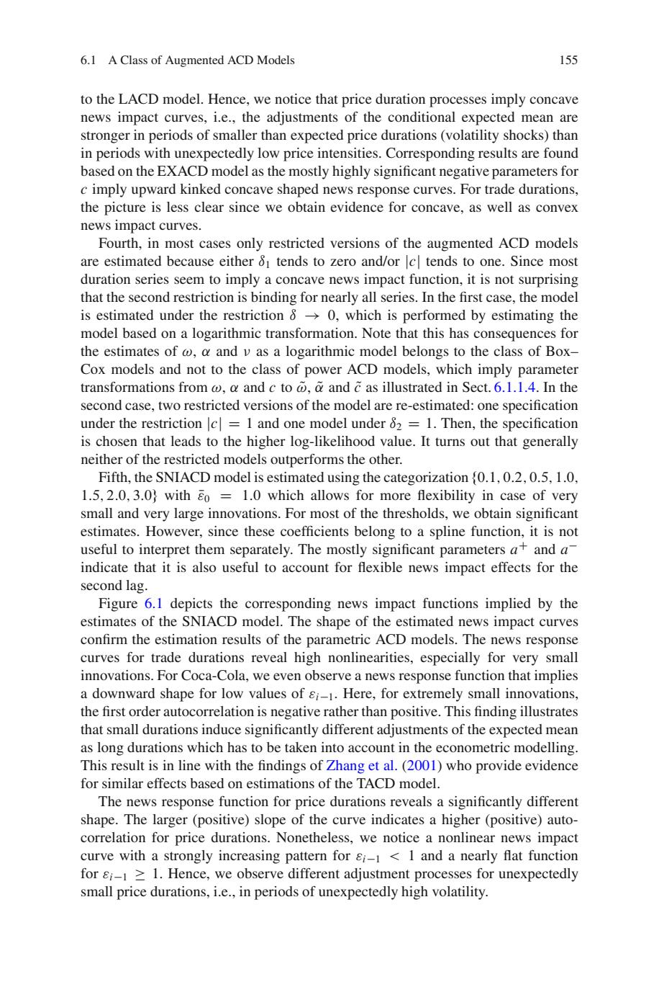

## PDF page 171 / printed page 156

156                                                   6 一般化乗法誤差モデル（Generalized Multiplicative Error Models）

図6.1 コカ・コーラとGEの株式の取引間デュレーション（左）と価格デュレーション（右）に対する推定されたニュースインパクト曲線

表6.6 は、季節調整された取引間デュレーション、10 bp 価格デュレーション、および30秒および2分に集計された出来高について、NYSEで取引されたJPモルガン（2009年6月）の（Q）MLによるACD、EXACD、およびSNIACDモデルの推定値を示している。以下の効果が観察される。第一に、パラメータ推定値は、取引間デュレーションと価格デュレーションが、時間集計された取引量よりも低い持続性を示すことを示唆している。第二に、EXACDの推定値が示すように、非対称なニュースインパクトに関する明確な証拠が観察される。cの推定値は非常に有意であり、凹型のニュースインパクト関数を明らかにする。これらの効果は、主に集計データに基づいて顕著である。第三に、BICの観点からは、EXACDモデルが最も優れた適合度を与える。したがって、ギザギザしたニュースインパクト関数を許容することは、MEM/ACDダイナミクスの非線形性を捉えるための簡潔な方法である。これらの効果は、SNIACDモデルに基づく推定されたニュースインパクト曲線を描いた図6.2によって確認される。

6.2 レジーム切り替えACDモデル

以下の小節では、ACDモデルのいくつかのさらなる関数拡張についてまとめる。これらのモデルはすべて、条件付き平均関数におけるレジーム依存性を許容するという共通点がある。レジームは、閾値ACDモデルや滑らかな遷移ACDモデルにおける観測可能な変数、またはマルコフ切り替えACDモデルにおける観測不可能な因子に基づいているいずれかによって決定される。

6.2.1 閾値ACDモデル

Zhang et al. (2001) は、期待されるデュレーションが過去の情報変数に非線形に依存することを許容する閾値ACD（TACD）モデルを紹介している。TACDモデルは、Rabemananjara and Zakoian (1993) および Zakoian (1994) によって導入された閾値GARCHモデルの一般化と見なすことができる。ある

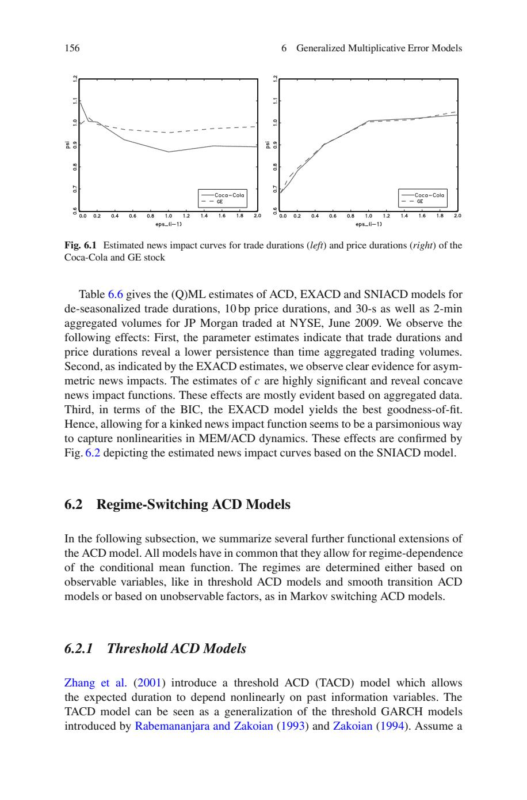

## PDF page 172 / printed page 157

6.2 レジーム切り替えACDモデル                                                                           157

表6.6 は、季節調整された取引間デュレーション、10bp価格デュレーション、および30秒および2分で集計された出来高について、QML推定値のACDモデルを示している。JPモルガンがNYSEで取引された6月2009日のデータである。SNIACDモデルのカテゴリ境界は、.0:1; 0:2; 0:5; 1:0; 1:5; 2:0; 3:0/である。 "N0 D 1:0

Par.      Est.           p-val.      Est.           p-val.    Est.          p-val.      Est.        p-val.
                 取引間デュレーション                 10bpデュレーション                30秒出来高             2分出来高
ACD
!         0.019       0.000          0.009            0.000   0.031      0.000          0.007      0.000
˛         0.055       0.000          0.078            0.000   0.245      0.000          0.245      0.000
ˇ         0.925       0.000          0.913            0.000   0.738      0.000          0.760      0.000
BIC            38,238                       9,939               16,204                   3,325
LB              2.40                          48.6                  22.5                      31.1
EXACD
!     0.0494     0.000              0.0624     0.000        0.163     0.000          0.196     0.000
˛     0.0631      0.000              0.1060      0.000        0.238      0.000          0.257      0.000
c     0.9789      0.000              0.9801      0.000        0.961      0.000          0.985      0.000
ˇ     0.0204     0.000              0.0596     0.000        0.112     0.000          0.133     0.000
BIC        38,226                        9,915                  16,233                   3,324
LB           2.53                           43.1                    27.3                      36.6
SNIACD
!     0.014       0.021              0.035        0.007       0.027       0.074         0.051      0.180
ˇ     0.979       0.000              0.981        0.000       0.961       0.000         0.986      0.000
˛1   0.460       0.034              0.238        0.134       -0.183      0.446         1.317     0.692
˛2   0.020      0.530              0.196        0.173       0.162      0.364         0.250      0.701
˛3   0.042      0.268              0.237       0.138       0.200       0.284         0.094     0.849
˛4   0.113       0.000              0.215        0.003       0.221       0.009         0.375      0.082
˛1C   0.061       0.008              0.039        0.413       0.268       0.000         0.190      0.227
˛2C   0.011      0.807              0.041        0.653       0.116      0.255         0.183     0.585
˛3C   0.005       0.888              0.004        0.953       0.073       0.413         0.207      0.506
˛4C   0.041      0.021              0.068       0.043       0.182      0.000         0.154     0.407
BIC        38,229                         9,934                  16,210                  3,325
LB          2.49                            42.3                     25.3                     38.3

デュレーションをM個のカテゴリに分類し、xN m m D 1; : : : ; M を対応するカテゴリ境界とする。次に、MレジームTACD(P ,Q)モデルは次のとおりである。

       8
       ˆ         .m/
       <xi D i "i
       ˆ
                                                                            if xi 1 2 .xN m1 ; xN m 
       ˆ
       :̂ D ! .m/ C PP ˛ .m/ x       PQ     .m/
          i           j D1 j   i j C  j D1 ˇj i j ;
                                                                                                    (6.12)

                            .m/                .m/
   ここで、! .m/ > 0、˛j  0、およびˇj                     0は、レジーム切り替えACDパラメータである。
                               .m/                                                                        .m/
i.i.d.誤差項    は、分布 f" .sI " /
                              "i
         .m/
に従うと仮定されており、EŒ"i  D 1は、レジーム切り替え分布パラメータ  .m/
                                                                         " .
に依存する。

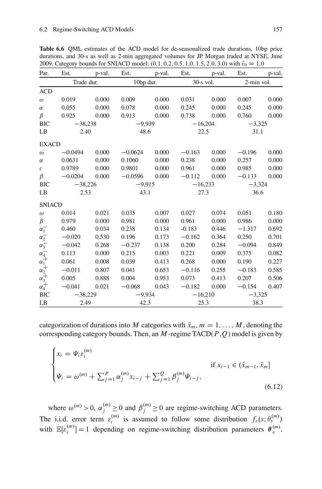

## PDF page 173 / printed page 158

158                                                 6 一般化乗法誤差モデル（Generalized Multiplicative Error Models）

図6.2 JP Morgan（NYSE）における取引間デュレーション、10bp価格デュレーション、および30秒および2分集計された出来高の推定されたニュースインパクト曲線

基本的なACDモデルと同様に、このモデルは次のように書き直すことができる。

                             X
                           max.P;Q/
                                        .m/  .m/
                                                          X
                                                          Q
                                                                  .m/
        xi D !   .m/
                       C              .˛j C ˇj /xi j           ˇj i j C i ;         (6.13)
                             j D1                         j D1

ここで、i W D xi  i である。したがって、TACDモデルは閾値ARMA(M I max.P; Q/; Q)過程に対応する。4 明らかに、TACDモデルはSNIACDモデルと強く関連している。主な違いは、SNIACDモデルでは、ラグイノベーションの影響のみがレジーム依存的であるのに対し、TACDモデルでは、すべての自己回帰および分布パラメータがレジームスイッチングを許容する点である。したがって、この意味において、TACDモデルはより一般的であり、さまざまな非線形ダイナミクスを許容する。しかし、この枠組みにおける理論的性質の導出は容易ではない。Zhang et al. (2001)は、TACD(1,1)の場合における幾何学的エルゴード性およびモーメントの存在条件を導出している。さらに、SNIACDモデルでは、特定のレジームに関連する閾値が外生的に与えられるのに対し、TACDモデルでは、それらは内生的にあり、他のパラメータとともに推定される。推定は、閾値xN mに対するグリッドサーチアルゴリズムによって実行され、各グリッド閾値の組み合わせに対して条件付き尤度を最大化する必要がある。明らかに、M の数が大きい場合、この手順は計算上非常に煩雑になる。

6.2.2 スムーズな遷移ACDモデル

TACDモデルおよびSNIACDモデルでは、ある状態から別の状態への遷移が滑らかではなく、ジャンプ過程に従うことに注意する。代替案は

4
 閾値自己回帰（TAR）モデルの詳細については、Tong (1990)を参照されたい。

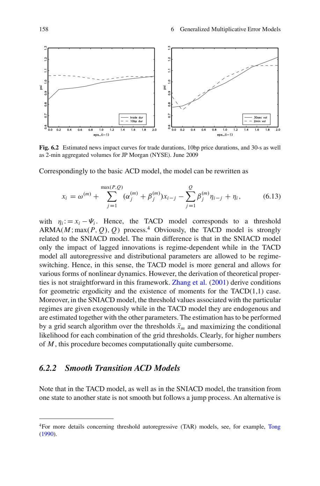

## PDF page 174 / printed page 159

6.2 レジーム切り替えACDモデル                                                       159

ある遷移関数によって駆動される滑らかな遷移を可能にするために、考慮されるものとして、Granger (1993)、Teräsvirta (1994, 1998) は金融リターンの条件付き平均について、Hagerud (1997) と Gonzalez-Rivera (1998) は条件付き分散について、滑らかな遷移自己回帰 (STAR) モデルを例に挙げている。Meitz と Teräsvirta (2006) は、以下の形式の滑らかな遷移ACD (STACD) モデルを提案している。

                  X
                  P                   X
                                      P                          X
                                                                 Q
      i D ! C           ˛j xi j C     .!j C ˛j xi j /G./ C   ˇj i j ;       (6.14)
                  j D1                j D1                       j D1

                  X
                  P                   X
                                      P                        X
                                                               Q
         D!C             !j G./ C     .˛j C ˛j G.//xi j C   ˇj i j ;
                  j D1                j D1                       j D1

ここで、G./ D G.ln xi I ; c/ は、以下の遷移関数で表される。
                                             (                          ) !1
                                                 Y
                                                 M
        G.ln xi j I ; c/ D 1 C exp               .ln xi j  cm /           ;   (6.15)
                                                 mD1

c1  : : :  cM ;  > 0 の場合である。G./ をロジスティック関数として選択することで、それが有界かつ非負であることを保証する。ln xi j は、実数軸全体で定義されているため、遷移変数として使用される。Meitz と Teräsvirta (2006) が議論するように、代替案として、正のサポートを持つ確率変数の累積分布関数を遷移関数として選択することもできる。しかし、非減少性のため、そのような遷移関数は、可能な非線形性を妨げる強い事前構造を課すことになる。パラメータ M は、遷移関数の形状を決定する。M D 1 の場合、遷移関数は xi j に対して増加する。あるいは、M D 2 を選択すると、より短く、より長いデュレーションが、より中程度のデュレーションとは異なるニュースの影響を受けることになる。図 6.3 は、M D 2、c1 D 1、c2 D 1 であり、 の異なる値に対する遷移関数を示している。 が増加すると、遷移の滑らかさが低下することが示されている。したがって、極限において、 ! 1 となると、遷移は滑らかではなくなり、モデルは Zhang et al. (2001) が提案する TACD モデルの特殊なケースに対応する。この場合、! と ˛ は、非常に短く、非常に長いデュレーションと、中程度のデュレーション（Fig. 6.3 の約 0:5  xi  2:5 で近似される）のレジームの間でジャンプする。
                                                                    .m/
特に、ˇ .1/ D ˇ .2/ および "i  Exp.1/, m D 1; 2 の二レジーム TACD(1,1) モデルは、M D 1 および  ! 1 の STACD(1,1) プロセスの極限ケースである。それに対応して、ˇ .1/ D ˇ .2/ D ˇ .3/ 、 ! .1/ D ! .3/ 、 ˛ .1/ D ˛ .3/ および "i  Exp.1/, m D 1; 2; 3 の三レジーム TACD モデルは、M D 2 および  ! 1 の STACD(1,1) プロセスの極限ケースである。
    それに対応して、Meitz と Teräsvirta (2006) は、滑らかな遷移Log ACD (STLACD) モデルも提案している。

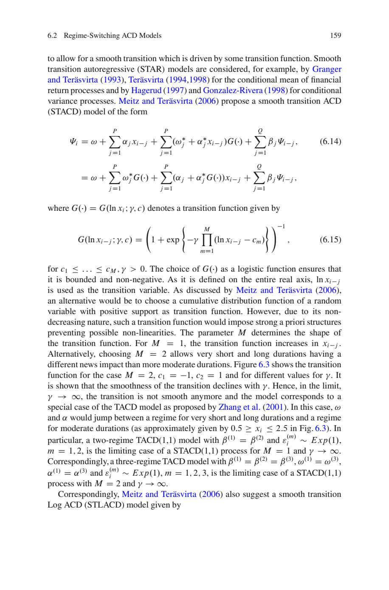

## PDF page 175 / printed page 160

160                                                         6 一般化乗法誤差モデル（MEM）

Fig. 6.3 は、遷移関数 G.ln xi I ; c/ を xi の関数として、M D 2、c1 D 1、c2 D 1 および  2 f1; 3; 5; 10; 50g の場合を示している。最も滑らか（急峻）な曲線は、 D 1 ( D 50) に関連付けられている。

                    X
                    P                      X
                                           P                               X
                                                                           Q
  ln i D ! C              ˛j ln xi j C       .!j C˛j ln xi j /G./C          ˇj ln i j ; (6.16)
                    j D1                   j D1                            j D1

                    X
                    P                   X
                                        P                                  X
                                                                           Q
          D!C              !j G./ C       .˛j C ˛j G.// ln xi j C           ˇj ln i j ;
                    j D1                j D1                              j D1

遷移変数を特定するための代替可能な可能性は多数存在する。G./ を xi の関数で指定する代わりに、ACD イノベーション "i D xi =i の関数で指定することもできる。この場合、政権切り替えは、それらの条件付き期待値でスケーリングされたデュレーションによって駆動され、したがってデュレーションにおける「驚き」によって駆動されることになる。あるいは、ACD パラメータの政権切り替えも、決定論的な時間パターンによって駆動される可能性がある。例えば、Meitz and Teräsvirta (2006) は、標準化されたカレンダー時刻変数 tNi 2 Œ0; 1 を用いて G./ を指定することを提案している。これは、例えば、1 日の時刻を反映する。次に、遷移関数を G  .tNi 1 I ; c/ D G.tNi 1 I ; c/  0:5 と選択すると、時間依存性ACD (TVACD) 仕様が得られる。
                                                            0                                    1
             X
             P                   X
                                 Q
                                                     X
                                                     P                           X
                                                                                 Q
i D ! C            ˛j xi j C          ˇj i j C          @!j C ˛j xi j C          ˇj i j A G  ./
             j D1                j D1                j D1                        j D1

                                X
                                P                                  X
                                                                   P
      D .! C !  G  .// C         .˛j C ˛j G  .//xi j C          .ˇj C ˇj G  .//i j ;
                                j D1                               j D1
                                                                                                     (6.17)

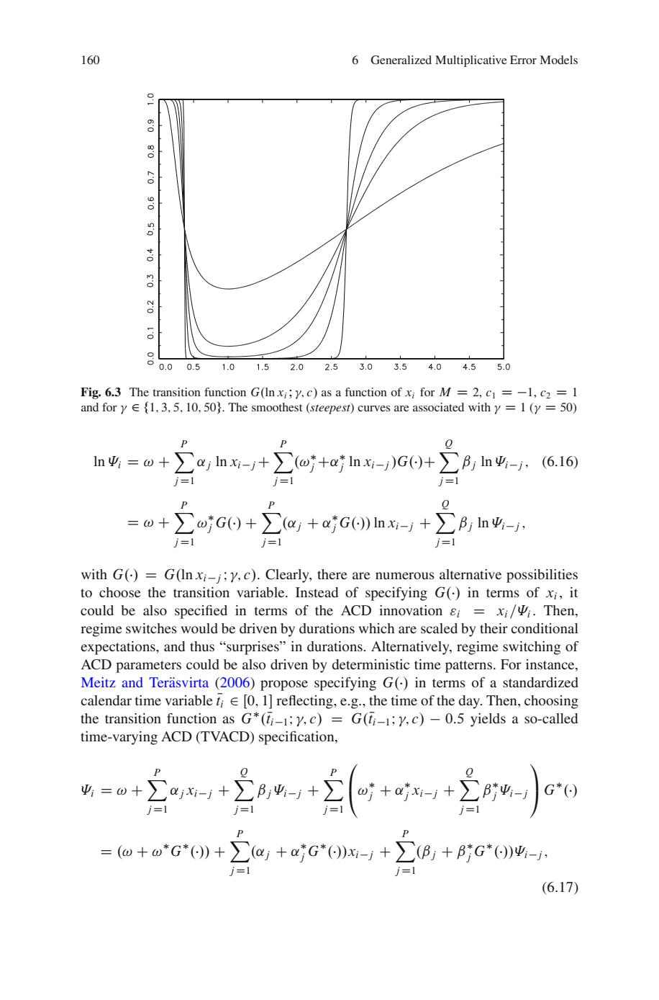

## PDF page 176 / printed page 161

6.2 レジームスイッチングACDモデル                                                      161

G  ./ D G  .tNi 1 I ; c//. ここで、! と ˛ に加え、持続性
パラメータ ˇ も変化する。

6.2.3 マルコフスイッチングACDモデル

Hujer et al. (2002) は、観測不可能な確率過程に依存する条件付き
平均関数を持つマルコフスイッチングACDモデルを提案している。以下に Mi を離散値をとる確率過程として定義し、観測不可能なマルコフ連鎖の状態を示し、値
1; 2; : : : ; M をとるものとする。 すると、MSACDモデルは次のようになる。

                         xi D  i " i ;     "i  f" .s/                            (6.18)
                                 X
                                 M
                                                         .m/
                         i D          Pr Mi D m jFti 1  i ;                   (6.19)
                                 mD1

                                 X
                                 M
                                                        
                    f" .s/ D           Pr Mi D m jFti 1  f" .sI ".m/ /;        (6.20)
                                 mD1

        .m/
ここで、 i      は、レジーム固有の条件付き平均関数を表す

                         .m/
                                           X
                                           P
                                                   .m/
                                                               X
                                                               Q
                                                                       .m/   .m/
                    i         D ! .m/ C          ˛j xi j C          ˇj i j     (6.21)
                                           j D1                j D1

              .m/
そして、f" .sI " / は、レジーム依存の条件付き密度関数である。"i を表す。マルコフ
連鎖は、遷移行列 P  で特徴付けられ、その要素は pkl
                                                                 
                                                                    WD PrŒMi D kj
  
Mi 1 D lである。したがって、xi の周辺密度は次のようになる。

                         X
                         M
                                                
      f .xi jFi 1 / D          Pr Mi D m jFi 1  f .xi jMi D mI Fi 1 /:       (6.22)
                         mD1

Hujer et al. (2002) は、Dempster et al. (1977) が提案した期待値最大化 (EM)
アルゴリズムに基づいて MSACD モデルを推定している。彼らは、MSACD が基本的な（線形）ACD モデルを上回る性能を示し、基礎となるデュレーション過程のより良い記述につながることを示している。この意味で、彼らは Zhang et al. (2001) の結果を裏付けており、非線形 ACD 仕様は金融デュレーション過程をモデル化するのに適している。Hujer et al. (2002) は、観測不可能なレジーム変数は市場マイクロストラクチャー理論の観点から解釈でき、それに対応する理論的仮説のより洗練されたテストを可能にすることを説明している。

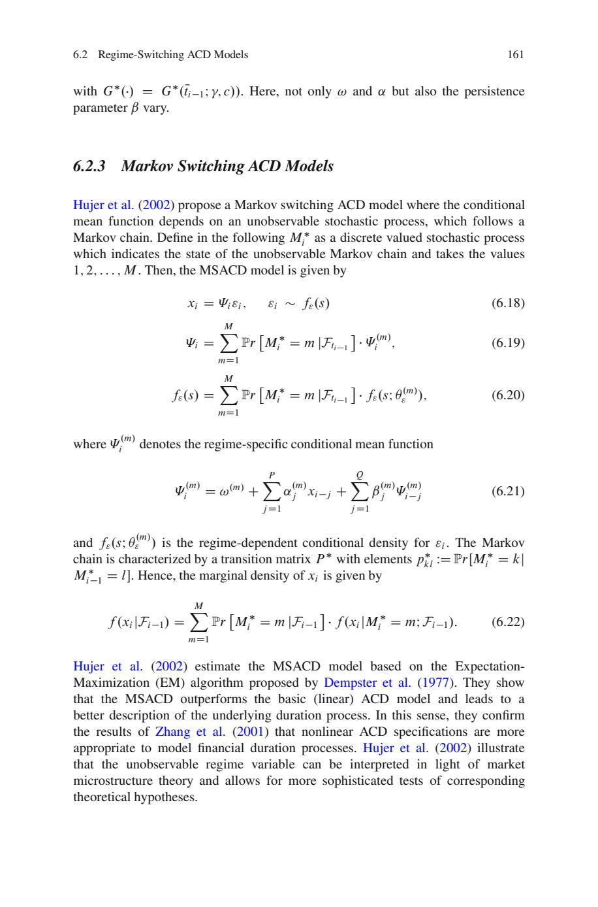

## PDF page 177 / printed page 162

162                                                        6 一般化乗法誤差モデル（MEM）

6.3 長期依存性ACDモデル

第3章で示されたように、取引変数には強い持続性があり、ACDパラメータ ˛ と ˇ がほぼ1に等しくなる傾向があります。長期依存性の存在を示す典型的な兆候は、指数関数的な減衰ではなく、遅い双曲線的な減衰率を示す自己相関関数です。形式的に、
                                                        ˛
                                        lim    k =Œck         D 1;
                                       k!1

˛ 2 .0; 1/ および c > 0 （例えば、Beran, 1994を参照）の場合です。この結果の帰結として、長さnのサブサンプルで計算された標本平均の分散は、n˛ の割合で減少します。すなわち、

                                    VŒxNn   cv n˛ ;        cv > 0:

図6.4は、JPM、Microsoft、およびドイツテレコムの取引間デュレーション、価格デュレーション、取引数、および30秒間隔での累積出来高について、ln nとln VŒxNn  のプロットを示しています。NYSE、NASDAQ、およびXETRAで取引されました。対応する二変量回帰の推定された傾きは、長期依存性の明確な証拠をもたらします。
   リターンとボラティリティ系列における長記憶パターンが存在することはすでに詳細に検討されていますが、5高頻度系列におけるこのような効果に注意を払っているアプローチはほんのわずかです。Engle (2000) は、Ding and Granger (1996) が提案した2成分モデルを適用し、次のように与えられます。

                                  i D w1;i C .1  w/2;i ;                                 (6.23)
                                1;i D ˛1 xi 1 C .1  ˛1 /1;i 1 ;                         (6.24)
                                2;i D ! C ˛2 xi 1 C ˇ2 2;i 1 :                           (6.25)

    したがって、i は、重み w と 1  w をそれぞれ持つ2つの成分、1;i と 2;i の重み付き和で構成されます。式(6.24)は、長期的な動きを捉えるACD(1,1)の積分仕様であり、(6.25)は、短期的な金融デュレーションの変動を捉える標準的なACD(1,1)仕様です。Ding and Granger (1996) が示したように、結果として得られる2成分過程は共分散定常ですが、対応する標準モデルと比較してACFの減衰が遅くなることを許容します。Engle (2000) は、2成分ACDモデルは適合度を改善し、基本的なACDモデルよりも優れた方法でデュレーションの動態を捉えることを示しています。Ding and Granger (1996) は、成分の数を無限大に近づけることによって、多成分モデルの限界ケースを分析します。彼らは、そのようなモデルは、ACFを反映する自己相関関数を意味することを示しています。

5
    概要については、Beran (1994) または Baillie (1996) を参照してください。

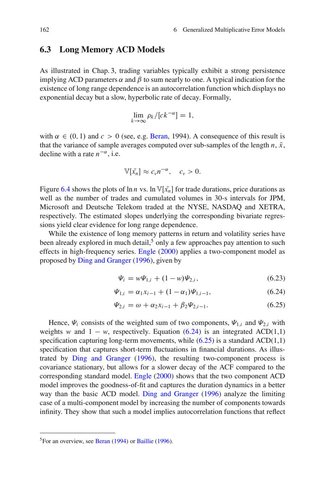

## PDF page 178 / printed page 163

6.3 長期依存性を持つACDモデル                                                                  163

図6.4 は、取引間デュレーション、ミッドプライス変動デュレーション、30秒間隔における取引数、および累積取引量について、ln n と ln VŒxNn  のプロットを示している。JP Morgan (NYSE) の価格デュレーションの集計レベルは、平均価格レベルのベーシスポイントで、Microsoft (NASDAQ) と Deutsche Telekom (XETRA) の価格デュレーションの集計レベルは、最小ティックサイズである。サンプル期間：JP Morgan と Microsoft は2009年6月、Deutsche Telekom は2010年9月。

長期依存性プロセスが持つ典型的な特徴を示すとともに、得られたモデルがBaillie et al. (1996)によって提案された分数積分GARCH (FIGARCH) モデルと密接に関連していることを示す。この研究の流れを受けて、Jasiak (1998) は分数積分ACD (FIACD) モデルを提案しており、これはFIGARCHモデルの対抗馬となる。FIACDモデルは、i に対して分数積分プロセスに基づき、次のように与えられる。

                 Œ1  ˇ.L/i D ! C Œ1  ˇ.L/  .L/.1  L/d xi ;                        (6.26)

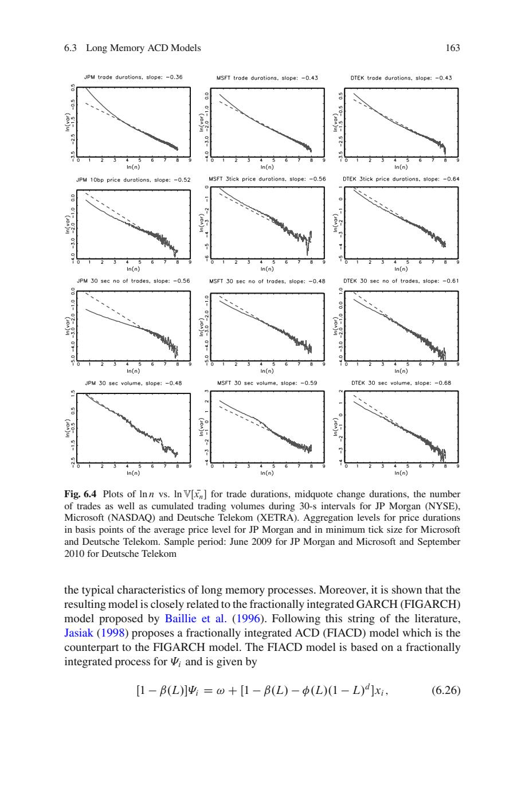

## PDF page 179 / printed page 164

164                                                        6 一般化乗法誤差モデル（MEM）

                                           P                    PQ
ここで .L/ WD 1  ˛.L/  ˇ.L/, ˛.L/ WD PjD1 ˛j Lj and ˇ.L/ WD j D1 ˇj Lj
は、ラグ演算子 L に関する多項式を表すものである。分数積分演算子 .1  L/d (0 < d < 1) は、次のように与えられる。
                       1  
                       X                              1
                       d                                             .j  d /
        .1  L/ Dd
                                    .1/ L D
                                          j    j
                                                                                   Lj ;      (6.27)
                       j D0
                              j
                                                      j D0
                                                                     .d / .j C 1/

ここで ./ はガンマ関数を表す。FIACDモデルは共分散定常性を示さず、xi の無限の第1および第2の無条件モーメントを意味する。Bougerol と Picard (1992) の結果に従うと、0  d  1 のとき、厳密に定常かつエルゴードであることが示される。d D 0 のとき、モデルは基本的なACDモデルに対応し、d D 1 のとき、統合GARCHモデルに対応する統合ACD過程に対応する。
    Karanasos (2004) によって提供される別の長期記憶の仕様は、次のように与えられる。

                                                         X1
                                    1  ˇ.L/
                     xi D ! C                   i D ! C      !j i j ;                     (6.28)
                                   .L/.1  L/d           j D0

ここで i WD xi  i である。FIACDモデルと同様に、d > 0 の場合、長期依存性があり、したがって自己共分散関数は和可能ではないが、d < 0:5 の場合、モデルは弱定常性を示す。Karanasos (2004) が示すように、モデルは i の遅延値の無限和として書き表すことができる。
                                                    1
                                                    X
                                   xi D ! C                !j i j ;                        (6.29)
                                                    j D0

ここで
                                              j     
                                  X
                                  n           X   d
                                          C                                     j 1
                        !j WD                                         rl .1/          ;
                                          r
                                                     j l
                                  rD1         lD0

                                   X
                                  minfl;mg

                         rl WD                                       .ˇ0 WD 1/
                                              lj
                                              r .ˇj /
                                   j D0

                                     n1
                         C
                           WD Qn
                                     r
                                                                 :
                               lD1;l¤r . r 
                         r
                                                            l/

さらに、i は次のように表すことができる。
                                              X1
                            .1  L/d .L/
                i WD 1                   xi D                                  j xi j ;   (6.30)
                               1  ˇ.L/         j D1

ここで    1 > 0,   j  0 for j  2 である。

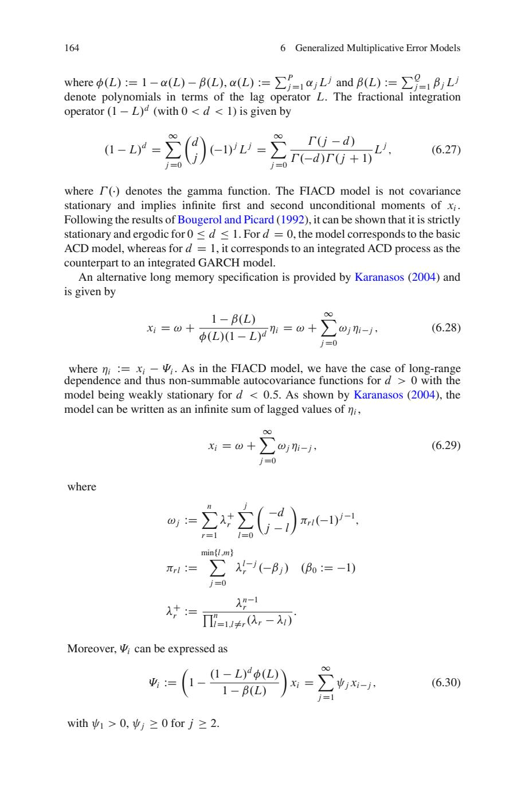

## PDF page 180 / printed page 165

6.3 長期依存性を持つACDモデル                                                       165

JasiakのFIACDモデルとは対照的に、(6.28)は、EŒxi  D ! < 1およびEŒxi2  < 1という条件の下で、xiの有限な1次モーメントと2次モーメントを意味する。
                                         X1
                                     1
                              1               ! 2 < 1:
                                   EŒ"2i  j D0 j

Karanasos (2004)によって、自己相関関数の解析的な表現が与えられている。
    Koulikov (2003)によって提案された、類似したタイプの長期依存性を持つACDモデルは、次のように与えられる。
                                          1
                                          X
                            i D ! C ˛           j 1 i j ;                (6.31)
                                          j D1

ここで、fj W j  0g  R0Cは、0 D 1という条件の無限数列であり、!と˛はモデルパラメータである。過程(6.31)は、"iが(平均ゼロ)マルチンガルの差分であり、係数jが二乗和可能である限り、共分散定常性とエルゴド性を持つ（Koulikov 2003参照）。GrangerとJoyeux (1980)またはHosking (1981)に従って、係数jの可能なパラメータ化は、.1  ˇz/1 .1  z/dのべき級数展開によって与えられる。

                                         X
                                         j
                                 j WD         ˇk jk ;                     (6.32)
                                         kD0

ここで、

                                     .d C j /
                        j WD                         8 j  0;               (6.33)
                                  .d / .1 C j /

は、.1  z/d の展開の係数であり、ˇはモデルパラメータでjˇj < 1であり、./はガンマ関数を表す。d 2 .0; 1/の場合、(6.33)は非和可能な自己相関関数を生成し、したがって長期依存性をもたらす。0<d < 12 の場合、べき級数展開は二乗和可能な双曲線減衰係数の数列を意味し、したがって共分散定常性を保証する。zをラグ演算子Lで置き換えることで、iを次のように書き換えることができる。

                      i D ! C ˛.1  ˇL/1 .1  L/d i 1                    (6.34)
                        P
ここで、.1  L/d i 1 D 1  j D1 j 1 i j である。
   表6.7は、NYSEで取引されたJP Morganの季節調整された取引間デュレーション、10bp価格デュレーション、および30秒あたりの取引数について、Karanasos (2004)が提案したFIACDとLMACDのQuasi Maximum Likelihood推定値を示している。長期記憶パラメータdの推定値から明らかなように、強い証拠がある。

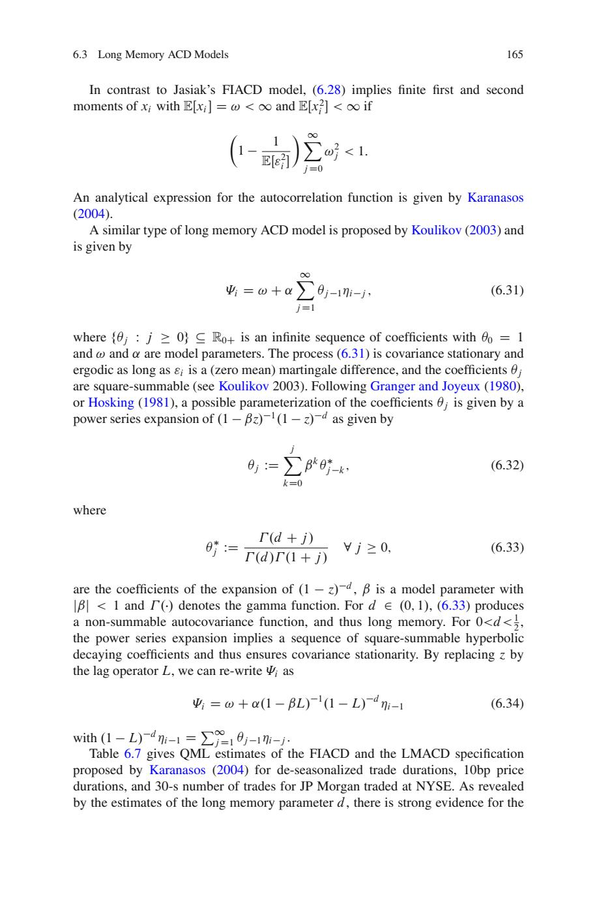

## PDF page 181 / printed page 166

166                                                     6 一般化乗法誤差モデル（Generalized Multiplicative Error Models）

表6.7 QML推定値：カラナソス（Karanasos, 2004）が提案したFIACDとLMACD仕様。季節調整された取引間デュレーション、10bp価格デュレーション、および30秒あたりの取引数について、JPモルガンがNYSEで取引されたデータを使用。サンプリング期間：取引間デュレーションについては2009年6月1日～2009年6月5日、価格デュレーションと取引数については2009年6月。診断：ベイズ情報量規準（BIC）およびACD残差のリュング・ボックス（Ljung-Box, LB）統計量（20ラグ）。
par.            est.                 p-val.    est.             p-val.      est.            p-val.
                        取引間デュレーション（trade dur.）                10bp価格デュレーション（10bp price dur.）           30秒あたりの取引数（30-s no. of trades）
FIACD
!               0.006                0.000     0.003            0.000       0.004           0.274
˛               0.021                0.000     0.029            0.000       0.021           0.181
ˇ               0.967                0.000     0.962            0.000       0.955           0.000
d               0.092                0.000     0.124            0.000       0.247           0.000
BIC                     36,657                        9,927                   16,041
LB                       4.71                          15.39                      34.94
LMACD
!               1.053                0.000     1.086            0.000       0.994           0.000
˛               0.023                0.000     0.031            0.000       0.021           0.174
ˇ               0.965                0.000     0.960            0.000       0.955           0.000
d               0.082                0.000     0.120            0.000       0.245           0.000
BIC                     36,645                        9,929                   16,040
LB                       4.41                          14.57                      34.87

長期依存性の存在を示唆している。いずれの場合も、dは0.0から0.5の間であり、プロセスが定常性を持つことを示している。˛とˇの有意性は、短期記憶ダイナミクスの存在も明らかにする。ベイズ情報量規準（BIC）およびリュング・ボックス（Ljung–Box）統計量によって示される適合度に関して、すべての仕様は比較的類似した性能を発揮する。
    デオ（Deo）ら（2010）は、長期記憶ストカスティックボラティリティモデルの対応物として、別の仕様を提案している。この仕様については、6.4.1節でより詳しく説明する。デオ（Deo）ら（2009）は、デュレーションからカウントへの長期記憶パラメータの伝播のための条件を分析している。特に、彼らは、記憶パラメータdを持つ弱定常な長期依存性デュレーションプロセスに対して、結果の計数過程N.t/がVŒN.t/  C t 2d C1 、C > 0 if t ! 1 を満たすことを保証する条件を確立している。

6.4 混合モデルと成分乗法誤差モデル（Mixture and Component Multiplicative Error Models）

6.4.1 ストカスティック条件付きデュレーションモデル（Stochastic Conditional Duration Model）

マルコフスイッチングACDモデルでは、潜在変数はマルコフ過程に従う。すなわち、プロセスの状態は前の観測の状態のみに依存する。代替仕様として、バウエンス（Bauwens）とベレダス（Veredas）（2004）が提案したものが存在する。

6
    メッダーヒ（Meddahi）ら（1998）も同様の仕様を導入している。参照のこと。

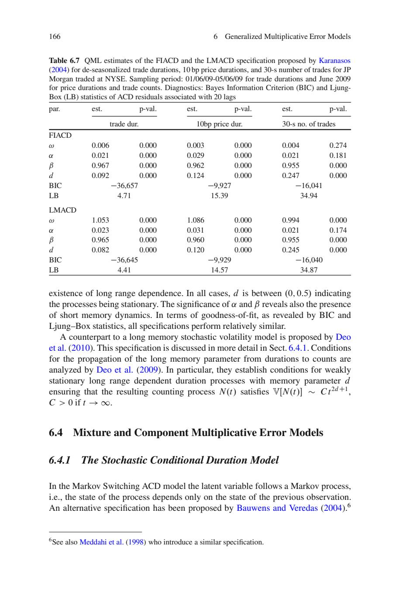

## PDF page 182 / printed page 167

6.4 混合モデルと構成乗法誤差モデル                                     167

彼らは、履歴 Fi 1 が与えられたときの条件付き平均関数 i が
決定論的ではなく、潜在的なAR(1)過程によって駆動されると仮定している。したがって、確率
条件付きデュレーション（SCD）モデルは次のように与えられる。

                              ln i D ! C ˇ ln i 1 C vi ;                            (6.35)

ここで xi D i "i 、"i は通常のi.i.d. ACDイノベーション項であり、vi は
条件付き正規分布に従う、すなわち、vi jFi 1  i.i.d. N .0;  2 / が独立に
"i から従う。したがって、xi の周辺分布は、i の対数正規分布と "i の分布の混合によって決定される。経済学的に、潜在因子は、直接観察できないがデュレーション過程を駆動する情報フロー（または市場の一般的な状態）として解釈できる。この意味で、SCDモデルは、テイラー（1982）が導入した確率ボラティリティモデルの対応関係である。バウエンスとベレダス（2004）は、SCDモデルの理論的性質を分析し、"i に対する制限的な分布仮定であっても、SCDモデルは非常に柔軟であり、さまざまな（周辺）デュレーションのハザード関数を許容することを示している。対数ACDモデルとの比較研究において、SCDモデルの方が適合性が高いことがわかった。このモデルは、シミュレーテッド最尤法（第7.2節を参照）または、バウエンスとベレダス（2004）が提案するように、QMLを用いてカルマンフィルタを適用することで推定される。7
    デオら（2010）は、SCDモデルの長記憶バージョンを提案している。彼らが言う長記憶確率デュレーション（LMSD）モデルにおいて、 i は次のように与えられる。

                                ln i D ! C .1  L/d vi                               (6.36)

ここで d 2 Œ0; 0:5/ である。デオらは、ホイットル（1962）の近似を用いてQMLでモデルを推定することを提案している。さらに、非ガウス状態空間モデルに基づき、期待されるデュレーションの非対称性を許容するSCDモデルの拡張は、フェンら（2004）によって提案されている。

6.4.2 確率乗法誤差モデル

ACDモデルとSCDモデルの主な違いは、ACDフレームワークでは、ダイナミクスが観測データ駆動型であるのに対し、SCD設定では、ダイナミクスがパラメータ駆動型であることである。これは、EŒxi jFi 1  がACDモデルでは決定論的であるのに対し、SCDモデルでは確率的であることを意味する。ハウトシュ（2008）は、両方のタイプのダイナミクスを組み合わせたACDモデル（またはMEM、それぞれ）を提案しており、これは動的な潜在因子によって拡張されている。それは次のように与えられる。

                                      xi D i e ı i "i ;                               (6.37)

7
 代替として、ストリックランドら（2006）は、モンテカルロマルコフ連鎖（MCMC）技術に基づいてSCDモデルを推定することを提案している。バウエンスとガッリ（2009）は、第7.2節で議論されている効率的な重要サンプリング技術を採用している。

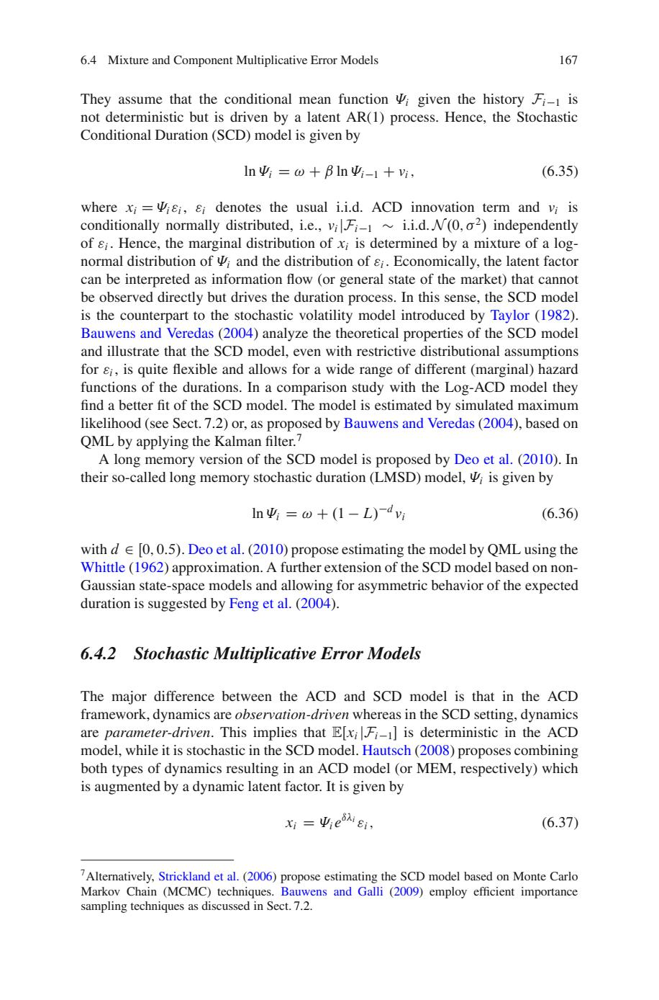

## PDF page 183 / printed page 168

168                                              6 一般化乗法誤差モデル（Generalized Multiplicative Error Models）

パラメータ ı > 0 を持ち、潜在因子 i を示し、"i が独立同一分布に従い、正の値をとる分布に従うとき、EŒ"i  D 1 である。条件付き平均 i は、前節で議論された様々なACD仕様に従って指定することができる。その後、i e ı i は、Fi 1 と  i が与えられた場合の条件付き平均に対応する。したがって、i D EŒxi jFi 1  D xi =.e
                                               ı i
                                                   "i / は確率的である。潜在因子 i は、以下のゼロ平均AR(1)過程に従うと仮定される。

                          i D a i 1 C i ;   i  i.i.d. N .0; 1/;                (6.38)

ここで、i は "i と独立であると仮定される。i の分布の対称性により、パラメータ ı の符号は特定できない。
    Hautsch (2008) は、このモデルを、ı D 0 の場合のACDモデルと、 が一定（線形ACDモデルの場合、˛ D ˇ D 0）のSCDモデルの両方を内包するため、確率的MEM（SMEM）または – ACDの場合 – 確率的ACD（SACD）モデルと呼ぶ。それに対応して、˛ ¤ 0 で ˇ D 0 の場合、さらにランダム変数と混合されたSCDモデルが得られる。したがって、両方のタイプのダイナミクスを明示的にテストすることができる。SACDモデルは、xi D i "Qi および "Q i D e i "i が動的な過程に従う場合、半パラメータACDモデルの特殊なケースとみなすこともできる。さらに、このモデルの二因子構造により、第1条件付きモーメントだけでなく、より高次の条件付きモーメントのダイナミクスも捉えることができる。この意味で、SMEMはSVDモデル（Sect. 6.5.3参照）の代替手段として機能する。潜在的な動的成分を持つため、このモデルは（Q）MLで推定できず、シミュレーションベースの技術を必要とする。推定の詳細や統計的性質に関する情報は、多変量設定でSMEMが議論されるSect. 7.2に記載されている。
    例として、表6.8は、HautschP (2008)によるSMEMの推定結果の一部を、i のLog-ACD仕様、すなわち ln i D
! C PjD1 ˛j "i j C j D1 ˇj ln i j を用いて再現したものである。これは、5分平均の取引サイズと、2001年にNYSEで取引されたボーイングの取引数に対するものである。ラグ次数PとQは、P  2 および Q  2に制限されている。推定されたaの値から明らかなように、持続的な潜在成分の存在を示す有意な証拠がある。さらに、パラメータ駆動型ダイナミクスと観測駆動型ダイナミクスが相互作用することが示されている。潜在因子が考慮されると、持続性パラメータは1に引き寄せられる。Hautsch (2008)で議論されているように、この発見は、ニュースが主に潜在成分を通じてモデルに入ってくることを示唆しており、後者が観察されない取引プロセスを推進する情報の代わりとして機能するという考えと一致している。潜在的な因子を含めることで、モデルの適合度指標が向上することが示されている。しかしながら、パラメータ駆動型成分も観測駆動型成分も棄却されず、取引ダイナミクスは1因子モデルではなく、2因子モデルによってより適切に捉えられることが示されている。

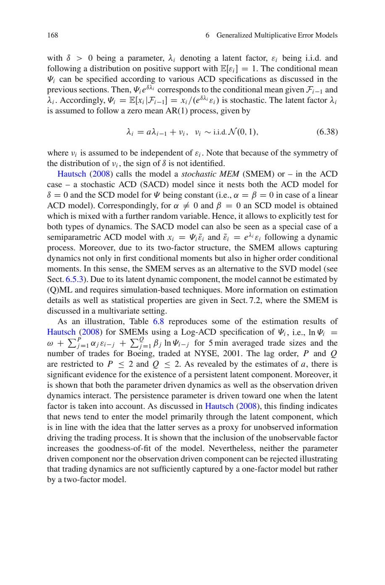

## PDF page 184 / printed page 169

6.4 混合および構成乗法誤差モデル                                             169

表6.8 は、NYSEで取引されるボーイングの5分平均取引サイズと取引件数に対するSMEMSの異なるパラメータ化の、最大尤度効率的インポートサンプリング推定値である。標準誤差は、推定されたヘッセ行列の逆数に基づいて計算される。ML-EIS推定値は、R D 50モンテカルロ反復に基づいて5つのEIS反復（EISアプローチの詳細については、第7.2節を参照）を用いて計算される。診断：対数尤度関数（LL）、ベイズ情報尺度（BIC）、平均、標準偏差、および20のラグのフィルタリングされた残差に基づくリュング・ボックス統計量（LB）。1%、5%、および10%の有意水準は、それぞれ***、**、および*で示される。
                 (1)                (2)                (3)                (4)               (5)
5分平均取引サイズ
!          0.403           0.416          5.841         0.070          0.057
˛1          0.001           0.002                             0.011           0.006
˛2                             0.000                                                  0.014
ˇ1          0.928           0.761                              0.981          1.074
ˇ2                             0.165                                                   0.091
p           0.517           0.519            0.450          1.202          1.188
m           8.032           7.991           12.753          4.276          4.321

潜在構成要素
a                                                  0.954         0.260            0.391
ı                                                  0.113         0.506            0.494
LL         6,211              6,200             6,019            5,954             5,943
BIC        6,234              6,232             6,041            5,985             5,983
Mean       1.011               1.010              1.017             1.024              1.027
S.D.       0.871               0.870              0.890             0.901              0.909
LB         39.166           23.256             38.896         19.486             15.183

5分取引件数
!         0.202            0.025          0.426         0.035          0.042
˛1         0.077            0.105                             0.026           0.046
˛2                             0.092                                               0.018
ˇ1         0.953            1.704                              0.991          0.562
ˇ2                             0.708                                               0.427
p          1.632            1.752           2.170           2.563          2.366
m          3.674            3.237           2.639           2.100          2.317
潜在構成要素
a                                                  0.957         0.766           0.821
ı                                                  0.067         0.110           0.092
LL         1,982              1,957             1,975            1,925             1,921
BIC        2,005              1,988             1,998            1,956             1,961
Mean       0.999               0.999              1.002             1.001              1.002
S.D.       0.323               0.322              0.324             0.322              0.322
LB         55.018           33.285           54.158         36.095           24.503

6.4.3 構成乗法誤差モデル

混合MEMの別のタイプは、Brownleesら（2011）によって提案されており、日中の取引量をモデル化するために用いられる。日中のダイナミクスだけでなく、日次ダイナミクスも捉えるために、彼らはいわゆる構成乗法誤差モデルを提案している。これは、

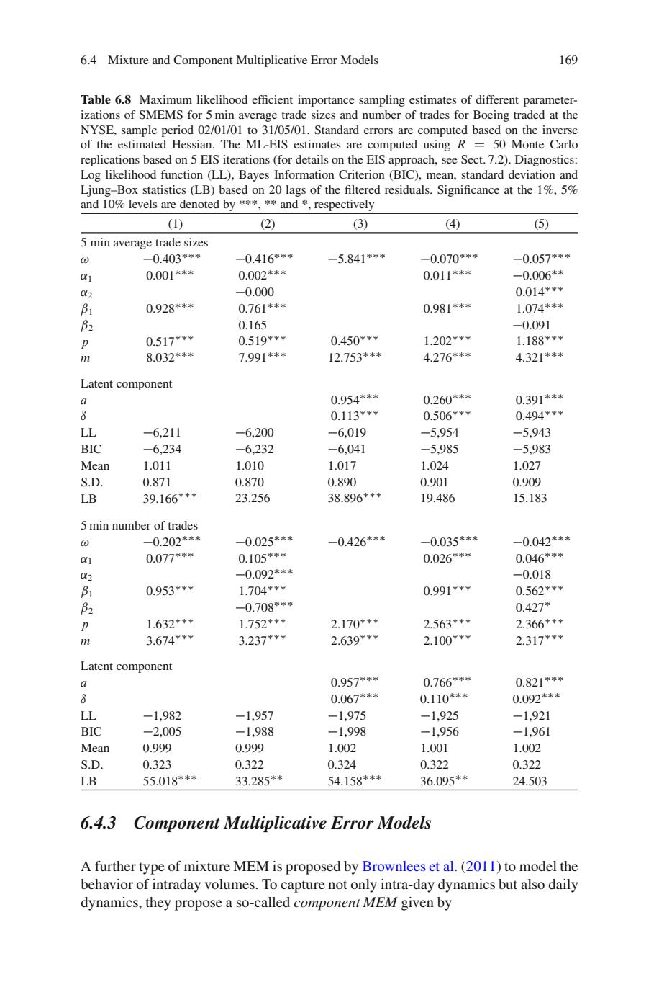

## PDF page 185 / printed page 170

170                                                 6 一般化乗法誤差モデル（Generalized Multiplicative Error Models）

                                                        i id
                        xd;i D d;i d "d;i d "d;i  .1;  2 /;                 (6.39)

ここで、d は対応する取引日を、i は日中の観測をそれぞれ示す。
さらに、d は、日中の一定期間は一定であるが、日ごとに異なる日次成分を表す。簡略化のためにラグの次数を1に制限すると、次のようになる。

                          d D ! d C ˛ d xd 1 C ˇ d d 1 ;                          (6.40)

ここで、! d , ˛d および ˇ d はパラメータであり、xd は標準化された日次取引量である。

                                          1 X  dn
                                                 xd;i
                                  xd D                ;                               (6.41)
                                         nd i D1 d;i

ここで、nd は日 d における観測数であり、d;i は標準化された日次取引量に基づく標準的な MEM 動的モデルに基づいた日中成分を表す。
                                          xd;i 1
                           d;i D ! C ˛           C ˇd;i 1 :                        (6.42)
                                           d

モデルを特定可能にするために、EŒd;i  D 1 を保証する ! D 1  ˛  ˇ という制約が課される。したがって、成分 d は、日ごとに系列の平均レベルを調整し、d;i はこのレベルを中心とした日中変動を捉える。両方のタイプのダイナミクスが観測主導型であるため、QML または GMM によって簡単に推定できる。
   あるいは、日次成分は潜在過程の項で指定することもできる。

                 ln d D ! C ˛ d ln d 1 C ud ;          ud  N .0;  2 /:           (6.43)

このような指定は、Brownlees と Vannucci (2010) によって提案されており、Hautsch’s (2008) SMEM に類似している。これは、観測主導型ダイナミクスとパラメータ主導型ダイナミクスを乗法的に組み合わせたものであり、後者は日ごとに更新される。したがって、SMEM と同様に、(Q)ML を使用して推定できず、シミュレーションベースの技術が必要となる。Brownlees と Vannucci (2010) は、ベイズ推論を使用してモデルを推定し、対応する MCMC アルゴリズムを開発することを提案している。

6.5 その他の乗法誤差モデルの一般化

6.5.1 競合リスク ACD モデル

Bauwens と Giot (2003) は、同時期の方向への依存関係におけるデュレーション過程をモデル化するために、2 状態の競合リスク ACD 仕様を提案している。

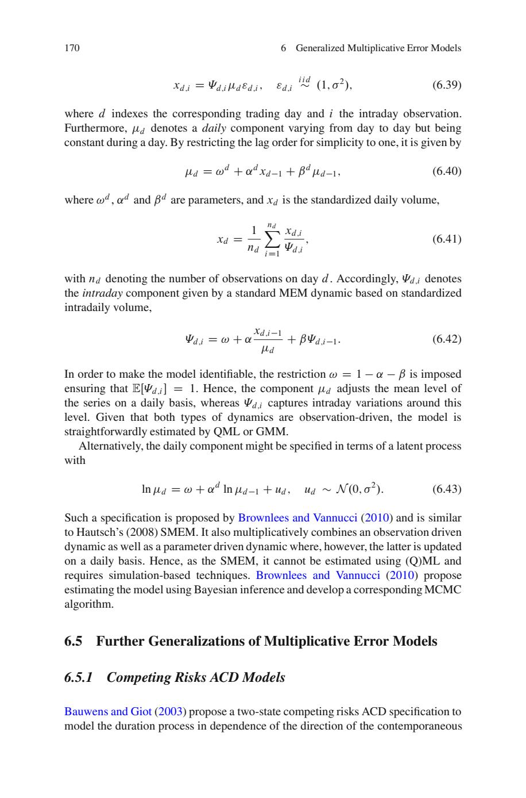

## PDF page 186 / printed page 171

6.5 乗法誤差モデル（MEM）のさらなる一般化　171

midquoteの変化についてである。彼らは、ラグした価格の動きの方向によって決定される、レジームスイッチングパラメータを持つ、2つの競合するACDモデル（上向きmidquoteの動きと下向きmidquoteの動きに対して）を指定する。その後、各観測において、2つの期間のどちらか1つしか観測できない（midquoteが増加または減少するかどうかに応じて）が、もう一方の期間は検閲される。エンゲルとルンデ（2003）は、取引と気配の到着プロセス間の相互依存性を研究するために、同様の競合リスクモデルを提案する。しかし、彼らは取引プロセスが完全に観測される「駆動プロセス」であり、気配プロセスが検閲メカニズムの影響を受けるという仮定により、両方のプロセスに対して非対称な扱いを課している。

6.5.2 半パラメータACDモデル

独立同一分布のイノベーション "i の仮定は、MEMクラスにおける標準的な仮定である。しかし、ドロストとウェーカー（2004）は、標準化されたデュレーションに対するi.i.d.の仮定が、金融デュレーションプロセスを正確に記述するには制限が強すぎる可能性があると主張する。半パラメータACDモデルでは、ACDイノベーション "i の条件付き確率密度関数 p.d.f. "i D xi =i は次のように特徴付けられる。

                               f ."i jFi 1 / D f ."i jHi 1 /;                  (6.44)

ここで Hi         Fi である。半パラメータACDモデルという用語は、条件付き密度 f ."i jHi 1 / が指定されていないという事実から派生する。Hiの集合は、"iの条件付き分布を駆動する関連する過去の変数として定義され、イノベーション "i の間の依存関係を形式化する。明らかに、Hiが自明なシグマ体の場合、イノベーションは独立していると仮定され、モデルは基本的なACDモデルと一致する。逆に、Hi D Fi の場合、イノベーション "i の依存構造は完全に制約されない。Hi D ."i / の場合、イノベーションはマルコフ構造に従う。
    ドロストとウェーカー（2004）は、（6.44）および f ."i jHi 1 / が非指定の場合に半パラメータ効率的な推定量を構築する方法を示す。この文脈における主要な概念は、半パラメータスコア関数、すなわちスコア関数 EŒsi . 0 / D 0;  0 2 ; i D 1; : : : ; n の半パラメータ対応物である。半パラメータスコア関数は、接空間に基づく技術（Bickel et al. 1993を参照）を使用して計算され、次のように与えられる。

                                          ˇ 
                "i  1           @         ˇ
  si ./ D                 E       ln i ˇˇ Hi
              VŒ"i jHi 1      @
                                                                    ˇ      
                        @f ."i jHi 1 /=@        @             @       ˇ
               1C"i                                ln i E            ˇ
                                                                  ln i ˇ Hi 1 ; (6.45)
                            f ."i jHi 1 /       @            @

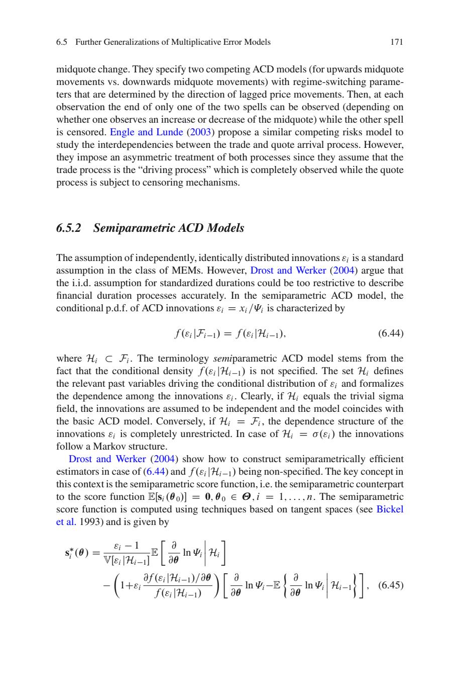

## PDF page 187 / printed page 172

172                                               6 一般化乗法誤差モデル（Generalized Multiplicative Error Models）

ここで、f ."i jHi 1 /（およびその導関数）はカーネル法によって推定する必要がある。
次に、準パラメータ推定器は、任意の整合的なパラメータ推定器からのワンステップ・ニュートン・ラフソン法による改善として構築される。
特に、この任意の整合的な推定器を Q n とすると、これは自然に指数QML推定器として選択される。
準パラメータ的に効率的な推定器は、次のように得られる。
                                                          !1
                                1X  Q  Q 0                    1X  Q
                                   n                               n
               O n D Q n C          s . n /si . n /               s . n /:     (6.46)
                                n i D1 i                        n i D1 i

この概念を、異なる種類のイノベーションプロセスに基づくACDモデルに適用すると、Drost and Werker (2004)は、イノベーションにおけるわずかな依存関係でさえ、効率的な準パラメータ的手法がQML手法よりも大きな効率改善をもたらすことを示す。

6.5.3 確率ボラティリティ・デュレーションモデル（Stochastic Volatility Duration Models）

自己回帰デュレーションモデル（EARMAまたはACDモデルのような）の欠点の一つは、高次のモーメントの別個の動的パラメータ化を許可しないことである。
これは、典型的なデュレーション分布（指数分布のような）が、第1モーメントと高次のモーメントの間の直接的な関係を意味することによる。
この問題を解決するために、Ghysels et al. (1998)は、条件付きデュレーションの分散の別個のダイナミクスを推定することを可能にする2因子モデルを提案する（いわゆるデュレーション・ボラティリティ）。
i.i.d.の指数モデルとガンマの異質性、xi D ui = i ; を考える。ここで、ui はi.i.d.の標準指数変数であり、ハザード i はある異質性成分 vi に依存すると仮定する。
したがって、

                                i D avi ;     vi  G.; /                          (6.47)

vi は ui と独立であると仮定する。Ghysels et al. (1998)は、xi D ui =.avi / を2因子形式として扱い、この式をガウス因子の項で書き換える。
したがって、xi は次のように表される。

                                G 1 .1; ˚.m1 //     G.1; m1 /
                       xi D                      WD            ;                    (6.48)
                               aG 1 .; ˚.m2 //    aG.; m2 /

ここで、m1 と m2 はi.i.d.の標準正規確率変数であり、˚./ は標準正規分布の累積分布関数であり、G 1 .m; ˛/ はG.m; m/ 分布の˛-分位関数である。
関数 G.1; m1 / は、G.1; m1 / D  log .1  ˚.m1 // として解くことができ、G.; m2 / は簡単な解析的な解を持たず、数値的に近似する必要がある（詳細については、Ghysels et al. 1998を参照）。

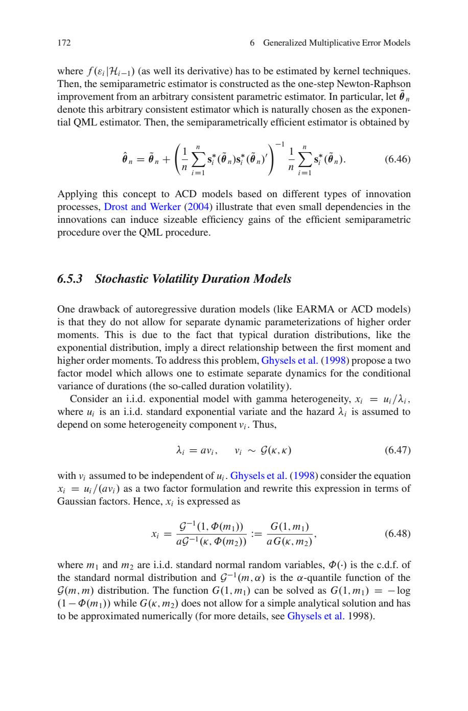

## PDF page 188 / printed page 173

参考文献                                                                                   173

この（静的な）ガンマの不均一性を二つの独立したガウスランダム変数の関数とする指数デュレーションモデルの表現は、確率的ボラティリティ・デュレーション（SVD）モデルの動的な仕様の出発点として用いられる。Ghysels et al. (1998) は、周辺分布が N .0; I/ 分布に制約されるように、VAR表現で mi WD .m1;i m2;i /0 を指定することを提案している。ここで、I は単位行列を表す。この制約は、デュレーションの周辺分布がガンマの不均一性を持つ指数分布のクラスに属することを保証する。したがって、

                                         X
                                         P
                                 mi D           j mi j C "i ;                          (6.49)
                                         j D1

ここで、j は自己回帰VARパラメータの行列であり、"i は分散共分散行列 ˙ ./ を持つガウス白ノイズランダム変数のベクトルであり、V.mi / D I を保証する。
   SVDモデルは、尤度関数を評価するのが典型的には困難な非線形動的因子モデルのクラスに属する。したがって、Ghysels et al. (1998) は、二段階の手法を提案している。第一段階では、xi の周辺分布がパラメータ a と  に依存するパレート分布であることを利用する（付録を参照）。したがって、a と  は (Q)ML によって推定することができる。第二段階では、シミュレートされたモーメントの手法を用いて自己回帰パラメータ j を推定する（詳細については、Ghysels et al. 1998 を参照）。
   Ghysels et al. (1998) は、SVDモデルをパリ証券取引所で取引されるアルカテル社の株式の取引デュレーションを分析するために適用し、両方の因子に強いダイナミクスが存在するという実証的な証拠を見出す。しかし、SVDモデルのより高い動的な柔軟性は、強い分布上の仮定を誘発する。Bauwens et al. (2004) は、xi の周辺分布に対するパレート分布の仮定が、特定の種類の金融デュレーション（特に出来高デュレーション）に対して適切ではないことを示しており、これによりパレートパラメータ a と  の推定が極めて困難になる。さらに、彼らは、代替ACD仕様と比較して、SVDモデルの予測性能が比較的低いことを発見した。

参考文献

Baillie RT (1996) Long memory processes and fractional integration in econometrics. J Econom
   73:5–59
Baillie RT, Bollerslev T, Mikkelsen H-O (1996) Fractionally integrated generalized autoregressive
   conditional heteroskedasticity. J Econom 52:91–113
Bauwens L, Galli F (2009) Efficient importance sampling for ML estimation of SCD models.
   Comput Stat Data Anal 53:1974–1992
Bauwens L, Giot P (2003) Asymmetric ACD models: introducing price information in ACD
   models with a two state transition model. Empir Econ 28:1–23
Bauwens L, Veredas D (2004) The stochastic conditional duration model: a latent factor model for
   the analysis of financial durations. J Econom 119:381–412

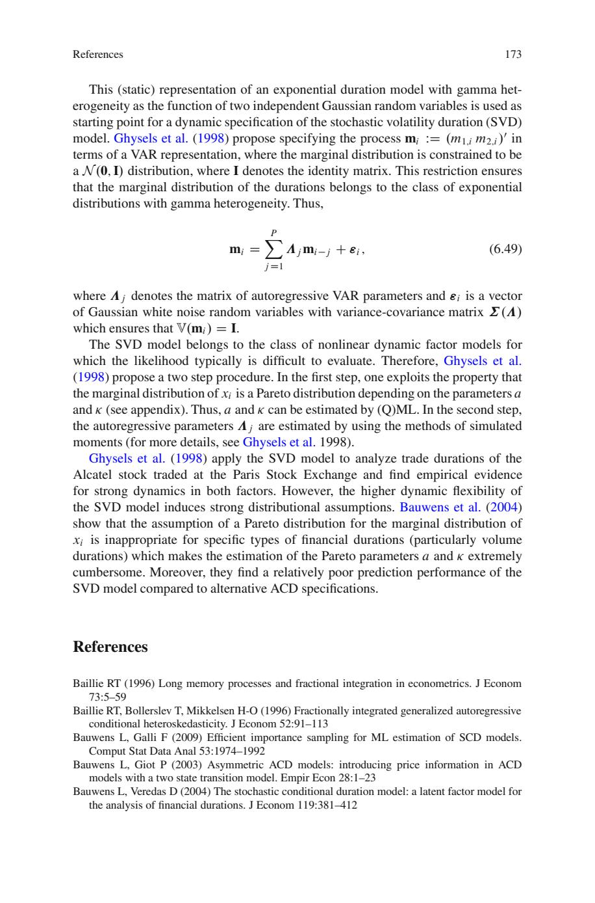

## PDF page 189 / printed page 174

174                                                  6 一般化乗法誤差モデル（Generalized Multiplicative Error Models）

Bauwens L, Giot P, Grammig J, Veredas D (2004) 金融デュレーションモデルの密度予測による比較. Int J Forecast 20:589–609
Beran J (1994) 長期記憶過程のための統計. Chapman and Hall, New York
Bickel PJ, Klaasen CAJ, Ritov Y, Wellner AJ (1993) 半パラメータモデルにおける効率的かつ適応的な統計的推論. John Hopkins University Press, Baltimore
Brownlees C, Cipollini F, Gallo GM (2011) アルゴリズム取引のための日中取引量モデリングと予測. J Financ Econom 9:489–518
Brownlees C, Vannucci M (2010) 日次異質性を捉えるためのベイズアプローチ：混合自己回帰条件付きデュレーションモデル. Stern School of Business, New York University のワーキングペーパー
Bougerol P, Picard N (1992) GARCH過程の定常性. J Econom 52:115–127
Carrasco M, Chen X (2002) さまざまなGARCHモデルと確率ボラティリティモデルの混合とモーメント特性. Econom Theory 18(1):17–39
Carrasco M, Chen X (2005) 誤り訂正：さまざまなGARCHモデルと確率ボラティリティモデルの混合とモーメント特性. 未発表原稿
Dempster AP, Laird NM, Rubin DB (1977) EMアルゴリズムによる不完全データからの最尤推定量. J R Stat Soc Series B 39:1–38
Deo R, Hsieh M, Hurvich CM (2010) NYSE株式の取引間デュレーション、計数、実現ボラティリティにおける長期記憶. J Stat Plan Inference 140:3715–3733
Deo R, Hurvich CM, Soulier P, Wang Y (2009) デュレーションから計数と実現ボラティリティへのメモリパラメータの伝播条件. Econom Theory 25:764–792
Ding Z, Granger CWJ (1996) スペキュレイティブリターンのボラティリティ持続性をモデリングする新しいアプローチ. J Econom 73:185–215
Drost FC, Werker BJM (2004) 半パラメータデュレーションモデル. J Bus Econ Stat 22:40–50
Dufour A, Engle RF (2000) ACDモデル：連続取引間の時間間隔の予測可能性. ISMA Centre, University of Reading のワーキングペーパー
Engle RF (2000) 超高頻度データの計量経済学. Econometrica 68(1):1–22
Engle RF, Lunde A (2003) 取引と気配：二変量点過程. J Financ Econom 11:159–188
Engle RF, Ng VK (1993) ニュースの影響を測定しテストする. J Finance 48:1749–1778
Feng D, Jiang GJ, Song PX-K (2004) 金融取引データのための「レバレッジ効果」を持つ確率条件付きデュレーションモデル. J Financ Econom 2:390–421
Fernandes M, Grammig J (2006) 自己回帰条件付きデュレーションモデルの一族. J Econom 130:1–23
Ghysels E, Gouriéroux C, Jasiak J (1998) 確率ボラティリティデュレーションモデル. CIRANO のディスカッションペーパー
Gonzalez-Rivera G (1998) スムーズトランジションGARCHモデル. Stud Nonlinear Dynamics Econo-metrics 3:61–78
Granger CWJ, Joyeux R (1980) 長期記憶時系列モデルと分数差分の入門. J Time Series Anal 1:15–39
Granger CWJ, Teräsvirta T (1993) 非線形経済関係のモデリング. Oxford University Press, Oxford, UK
Hagerud GE (1997) 新しい非線形GARCHモデル. EFI, Stockholm School of Economics のディスカッションペーパー
Hautsch N (2003) 過剰需要強度に基づく流動性供給者のリスク評価. J Financ Econom 1:189–215
Hautsch N (2008) 高頻度金融時系列における共通成分の捕捉：多変量確率乗法誤差モデル. J Econ Dyn Control 32:3978–4009
Hentschel L (1995) 一族のすべて：対称的および非対称GARCHモデルのネスト化. J Finan Econ 39:71–104
Hosking JRM (1981) 分数差分. Biometrika 68:165–176

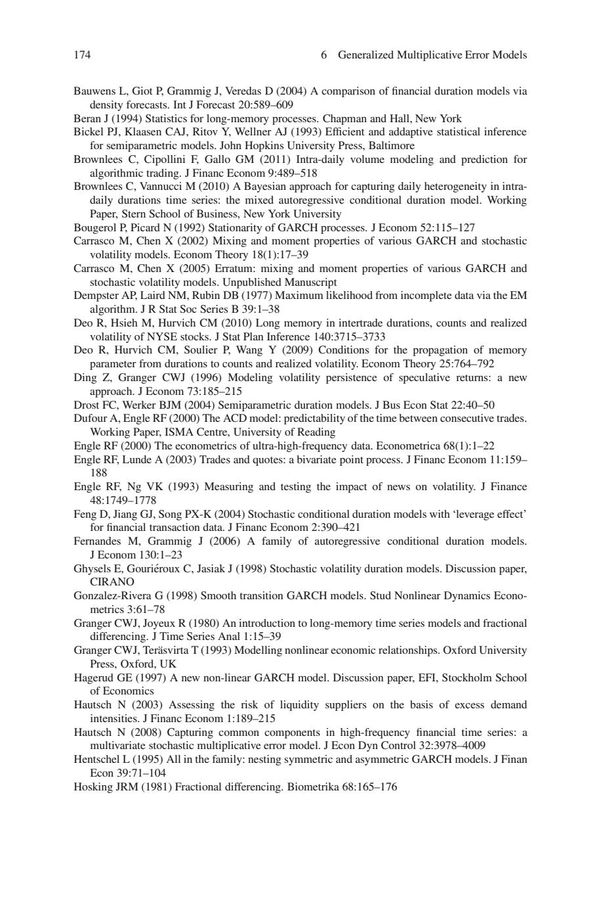

## PDF page 190 / printed page 175

参考文献                                                                                       175

Hujer R, Vuletic S, Kokot S (2002) The Markov switching ACD model. Finance and Account-
    ing Working Paper 90, Johann Wolfgang Goethe-University, Frankfurt. SSRNで入手可能:
    http://ssrn.com/abstract=332381
Jasiak J (1998) Persistence in intratrade durations. Finance 19:166–195
Karanasos M (2004) The statistical properties of long-memory ACD models. WSEAS Trans Bus
    Econ 2:169–175
Koulikov D (2003) Modeling sequences of long memory non-negative covariance stationary
    random variables. Discussion Paper 156, CAF
Meddahi N, Renault E, Werker BJ (1998) Modelling high-frequency data in continuous time.
    Discussion paper, University de Montréal
Meitz M, Saikkonen P (2008) Ergodicity, mixing, and existence of moments of a class of Markov
    models with applications to GARCH and ACD models. Econom Theory 24:1291–1320
Meitz M, Teräsvirta T (2006) Evaluatinsg models of autoregressive conditional duration. J Bus
    Econ Stat 24:104–124
Mokkadem A (1990) Propriétés de mélange des modèles autoregressifs polynomiaux. Annales de
    l’Institut Henri Poincaré 26:219–260
Nelson D (1991) Conditional heteroskedasticity in asset returns: a new approach. J Econom
    43:227–251
Rabemananjara J, Zakoian JM (1993) Threshold ARCH models and asymmetries in volatility.
    J Appl Econom 8:31–49
Strickland CM, Forbes CS, Martin MG (2006) Bayesian analysis of the stochastic conditional
    duration model. Comput Stat Data Anal 50:2247–2267
Taylor SJ (1982) Financial returns modelled by the product of two stochastic processes – a study
    of daily sugar prices. In: Anderson OD (ed) Time series analysis: theory and practice, North-
    Holland, Amsterdam
Teräsvirta T (1994) Specification, estimation, and evaluation of smooth transition autoregressive
    models. J Am Stat Assoc 89:208–218
Terärsvirta T (1998) Modelling economic relationships with smooth transition regressions. In Ullah
    A, Giles DEA, (eds) Handbook of applied economic statistics Marcel Dekker, New York, pp
    507–552
Tong H (1990) Non-linear time series: a dynamical system approach. Oxford University Press,
    Oxford
Whittle P (1962) Gaussian estimation in stationary time series. Bulletin de l’Institute International
    de Statistique 39:105–129
Zakoian JM (1994) Threshold heteroskedastic models. J Econ Dyn Control 18:931–955
Zhang MY, Russell JR, Tsay RS (2001) A nonlinear autoregressive conditional duration model
    with applications to financial transaction data. J Econom 104:179–207

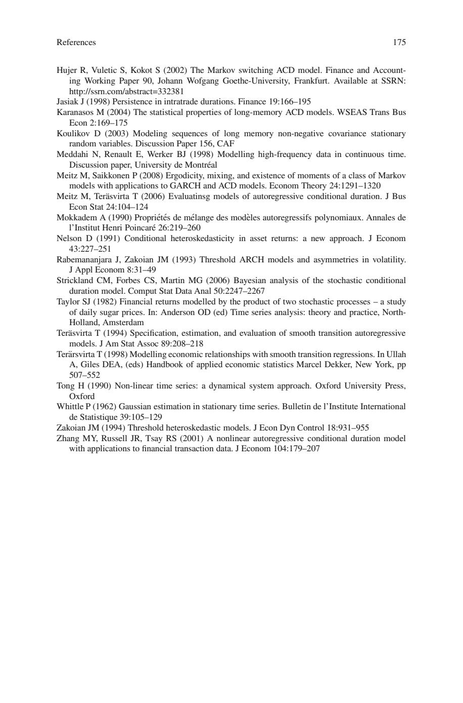

## PDF page 191 / printed page 176

•

