# Econometrics of Financial High-Frequency Data 第1〜7章 全文日本語訳フルレポート

- 生成日時: 2026-06-20 21:49:42
- 翻訳モデル: `gemma3:12b`
- 対象: 第1-7章、PDF pages 16-209、書籍 pages 1-194
- 原文抽出テキストをページ単位で日本語に翻訳したレポートです。
- 数式・表・図はPDF抽出テキストでは崩れている可能性があるため、各ページ末尾のレンダー画像を正本として確認してください。

## 章一覧

- [第1章: 導入（Introduction）](#第1章-導入Introduction)
- [第2章: 市場マイクロストラクチャーの基礎（Microstructure Foundations）](#第2章-市場マイクロストラクチャーの基礎Microstructure Foundations)
- [第3章: 高頻度データの実証的性質（Empirical Properties of High-Frequency Data）](#第3章-高頻度データの実証的性質Empirical Properties of High-Frequency Data)
- [第4章: 金融点過程（Financial Point Processes）](#第4章-金融点過程Financial Point Processes)
- [第5章: 単変量乗法誤差モデル（Univariate Multiplicative Error Models）](#第5章-単変量乗法誤差モデルUnivariate Multiplicative Error Models)
- [第6章: 一般化乗法誤差モデル（Generalized Multiplicative Error Models）](#第6章-一般化乗法誤差モデルGeneralized Multiplicative Error Models)
- [第7章: ベクトル乗法誤差モデル（Vector Multiplicative Error Models）](#第7章-ベクトル乗法誤差モデルVector Multiplicative Error Models)

# 第1章: 導入（Introduction）

- 翻訳モデル: `gemma3:12b`
- 原文抽出テキスト: `../econometrics_hf_ch1_ch7_markdown_ja/raw_text/ch01_introduction.txt`
- 注: 数式・表・図はPDF抽出テキストでは崩れている場合があるため、ページ画像を併読してください。

## PDF page 16 / printed page 1

第1章
導入

1.1 動機

高頻度データで記録された金融データの利用可能性は、過去10年間で計量経済学および統計学における主要な研究分野へと発展した研究領域を刺激してきた。高頻度計量経済学の人気が高まっている背景には、取引システムおよび取引記録における技術進歩、そして日中取引、最適な取引執行、注文配置、流動性ダイナミクスの重要性の高まりがある。技術進歩と電子取引の台頭により、市場活動を高頻度かつ高精度で記録することが可能になり、高度で包括的なデータセットが作成されるようになった。情報理論上の限界は、例えば注文メッセージのようなすべての市場イベントが記録される場合に到達する。このような記録方式は、取引データよりも詳細なデータベースをもたらし、注文フロー全体と注文板を再現することを可能にする。

高頻度金融に対する学術的および実用的な関心の主な理由は、市場構造と取引プロセスが継続的な変化の対象となっていることである。このプロセスは、技術進歩、取引システムのさらなる発展、取引所間の競争の激化、そして日中取引活動の著しい増加によって引き起こされる。電子取引プラットフォームの導入は、取引執行と取引報告を自動化・加速させ、投資家が取引戦略、注文ルーティング、リアルタイムの注文管理を自動化することを可能にする。特に、電子通信ネットワーク（ECN）のような代替取引システムの導入は、伝統的で確立された取引所に挑戦し、合併や買収を誘発し、流動性に対する競争を激化させる。その結果、取引コストは低下し、取引速度と注文発注速度は過去10年間で大幅に向上した。例えばNASDAQで取引されるブルーチップ資産では、現在、1日に100,000件以上の取引を容易に観察することができる。さらに、取引所とECN間の競争は、取引形態、ルール、および制度設定の多様性を高め、経済理論および計量経済モデルに挑戦している。

N. Hautsch, Econometrics of Financial High-Frequency Data,                            1
DOI 10.1007/978-3-642-21925-2 1, © Springer-Verlag Berlin Heidelberg 2012

## PDF page 17 / printed page 2

2                                                                       1 導入

    様々な取引所および取引プラットフォームから提供される取引および指値注文板データは、機関設定が取引プロセス、価格発見、市場結果に与える影響を分析し、市場の動態とトレーダーの行動を可能な限り低い集計レベルで研究することを可能にするため、強い学術的関心を集めています。 資産価格の監視だけでなく、最大限の高い観測頻度で流動性の供給と需要を監視することで、価格ボラティリティ、時間とともに変化する相関構造、流動性リスクに対するより効率的な推定器と予測子を構築する可能性が開かれます。 高頻度で指値注文板をモデリングすることで、流動性の供給と需要の相互作用、実行リスク、トレーダーの注文発注戦略、注文配置による市場への影響に関する洞察が得られます。 これらの問題に対処するには、特定のデータと研究タスクに合わせて調整された計量経済モデルを開発および適用する必要があります。

    高頻度データのための方法とモデルは、金融業界でもますます重要になっています。 金融の実務における重要なタスクは、取引量、ボラティリティ、市場深度、ビッド・アスク・スプレッド、取引コストを高頻度で予測し、最小限の価格への影響と取引コストで注文配置と取引執行を最適化することです。 さらに、注文フロー、ボラティリティ、流動性、および市場と資産間の動的な相互依存性を定量化するために、計量経済学および統計的手法が必要です。 最後に、規制の観点から、（不適切な）流動性リスク、日中の価格リスク、および自動化された高頻度取引が市場結果に与える影響は、まだ十分に理解されておらず、継続的な実証的な調査が必要です。

    高頻度データは、計量経済学および統計モデリングに課題を突きつける、独特の特性を体現しています。 取引データにおける主要な特徴の1つは、時間の不規則な間隔です。 この顕著な特性を計量経済モデルでどのように扱うべきかという問題は明らかではありません。 実際、市場イベント間の時間は情報を含んでおり、取引活動の尺度として機能し、価格と出来高の行動に影響を与える貴重な経済変数です。 市場イベントのタイミングを考慮するには、データを統計的に点過程として扱う必要があります。 点過程は、時間軸に沿って単一のイベントがランダムに発生し、観測可能な特性とプロセスの履歴に依存して特徴付けられます。 金融計量経済学における点過程モデルの重要性は、1996年のイスタンブールで開催された第51回欧州計量経済学会会議で、2003年のノーベル賞受賞者であるロバート・F・エンゲルによって初めて議論されました。 エンゲル（2000）として出版された彼の論文は、高頻度金融計量経済学の研究の急速な成長の出発点と見なすことができます。

    金融の高頻度データにおけるもう1つの重要な特性は、固定間隔での価格、気配、ビッド・アスク・スプレッド、または、例えば、取引数の離散性です。 さらに、ほとんどの高頻度変数は正の値であり、正の自己相関を持ち、強い持続性を示し、独特の日中周期性に従います。 最後に、取引および注文板プロセスは本質的に高次元であり、複雑な多変量動的構造を明らかにします。 これらの特性を捉えるために、(多変量)時系列モデル、微視的計量経済学（例えば、カテゴリカル）、点過程モデル、および因子仕様の特徴を組み合わせた、新しいタイプの計量経済モデルが開発されています。

## PDF page 18 / printed page 3

1.1 動機                                                                       3

   本書の目的は、高頻度計量経済学における最も重要なアプローチの最先端の概要を提供するものである。主要な目的は、高頻度データおよび機関設定の特性に関する洞察を含む実装の詳細を議論し、ボラティリティと流動性の推定、注文板モデリング、市場マイクロストラクチャー分析への応用を提示することである。
   成功する高頻度モデリングの重要なタスクは、データ内のダイナミクスを適切に捉えることである。この文脈において、自己回帰条件付き平均モデルは文献において支配的な役割を果たしている。その背後にある原理は、観測主導型またはパラメータ主導型のイノベーションに基づいて更新される自己回帰過程として条件付き平均をモデル化することである。条件付き平均関数が正の値の誤差項と乗法的に相互作用する場合、一般化乗法誤差モデル（MEM）と呼ばれるクラスが得られる（Engle, 2002）。これらの仕様は、取引間デュレーション、取引量、または市場深度などの連続した正の値の確率変数のダイナミクスをモデル化するために人気がある。これらは、当初、EngleとRussell (1997, 1998)によって取引間デュレーションのダイナミクスを捉えるための自己回帰条件付きデュレーション（ACD）モデルの形で導入された。あるいは、(条件付き)カウントデータ分布の平均の自己回帰仕様は、自己回帰条件付きポアソン（ACP）モデルのような、自己回帰カウントデータモデルのクラスを生成する。本書で説明されているように、このクラスのモデルは、非線形性、長期依存性、説明変数、日中周期性などを捉えるために容易に修正でき、多変量設定に拡張できる。
    さらに重要な方法論的焦点は、(確率的)強度関数に対する動的モデルにある。後者は点過程の理論における中心的な概念であり、プロセスの履歴と観測可能な因子が与えられた場合の瞬時発生率として定義される。強度関数は連続時間における点過程を記述するため、時間変化する共変量や他の点過程の到着によって引き起こされるような、任意の時点でのイベントと情報到着を考慮することができる。本書で説明されているように、動的強度過程は、自己励起強度過程として指定することもでき、この場合、強度は以前のすべての点までの後方再帰時間関数によって駆動される。あるいは、強度関数が動的構造に従う時系列仕様として指定することもでき、新しい点の各発生時に更新される。例えば、多変量強度過程は、連続時間における注文到着過程をモデル化したり、多変量の瞬時価格変動強度を研究したりするために使用できる。
    さらに、多変量取引プロセスまたは注文板ダイナミクスの次元を削減するために、因子ベースのアプローチがますます重要な役割を果たしている。例えば、潜在的な動的因子モデルは、共通の観測不可能な因子に由来する市場プロセスの共通性を捉えるために適用される。あるいは、多因子モデルは、注文板ダイナミクスと時間変化する注文板曲線をモデル化するために使用される。
    これらのモデルの種類、それらの応用、および対応する経験的証拠は、本書の後半でより詳細に議論される。

## PDF page 19 / printed page 4

4                                                                        1 導入

1.2 書籍の構成

第2章では、取引ルール、取引形態、および機関設定に関する洞察を提供します。気配相場と指値注文相場の異なる取引形態、および典型的な注文優先順位と価格ルールについて議論し、選択された国際取引所の機関設定を例として示します。さらに、本章では市場マイクロストラクチャー理論における主要な分野の簡潔な概要を説明します。逐次取引と戦略的取引モデル、在庫ベースのアプローチ、および指値注文相場モデルの背後にある主な原則を簡単に説明します。

第3章では、さまざまな種類の高頻度データについて説明し、準備と処理の手順、および考慮すべき潜在的な落とし穴と問題について説明します。この文脈において、特定の取引イベントに基づく集計から生じるいわゆる金融デュレーションの概念が導入されます。ここでは、与えられた時間範囲における金融資産の完全な取引プロセスを記述する（多変量）点過程を考慮します。このプロセスの個々の点を体系的に選択することにより、取引間デュレーションや価格変動デュレーションなど、さまざまな種類の金融デュレーションプロセスが生成されます。

本章の主要な部分は、リターン、取引強度、ボラティリティ、取引量、ビッド・アスク・スプレッド、およびさまざまな集計レベルに基づく市場深度など、さまざまな種類の高頻度変数の主要な経験的特性の提示と議論に焦点を当てています。イラストレーションは、ニューヨーク証券取引所（NYSE）、NASDAQ、およびXETRAで取引されるブルーチップ株に基づいています。

第4章では、点過程の理論を紹介し、方法論的な背景を提供します。主な焦点は、連続時間フレームワークで点過程を記述するための主要な概念である強度関数と積分強度に置かれています。これらの統計的特性を簡単にレビューし、強度ベースの推論を実行する方法を示します。非動的フレームワークに焦点を当てることで、基本的な統計的概念を説明し、点過程をモデル化するさまざまな方法について議論します。この文脈において、点過程モデルを分類するさまざまな可能性をレビューします。これにより、比例強度（PI）モデルと加速故障時間（AFT）モデルの区別、および強度モデル、デュレーションモデル、およびカウントデータアプローチへの分類が生じます。これらの点過程クラスは、本書の残りの部分で検討される動的拡張の基礎を築きます。

第5章では、最も一般的な動的デュレーションモデルである、エンゲルとラッセル（1998）が提案した自己回帰条件付きデュレーション（ACD）モデルを紹介します。これは、デュレーションの乗法誤差モデル（MEM）と同等であり、離散時間フレームワークで自己相関デュレーションをモデル化することを可能にし、GARCH仕様の要素とデュレーションモデルの機能を組み合わせます。基本的な（線形）ACDモデルの統計的特性について議論し、(準)最尤法を使用して推定方法と、説明変数および日中周期性を考慮する方法について説明します。さらに、線形仕様の最も重要な代替手段として、バウエンスが提案した対数ACDモデルを紹介します。

## PDF page 20 / printed page 5

1.2 書籍の構成                                                                5

およびGiots（2000）では、パラメータの明示的な非負制約を必要とせず、疑似最尤法を適用可能である。
    本章の主要な部分は、ACDモデルの仕様検定に費やされている。ACD残差の分布および動的ミスペシフィケーションに対する様々なテスト、ポートマンテオ検定や独立性検定、非パラメータ分布検定、ラグランジュ乗数検定、条件付きモーメント検定について議論する。後者は、関数形ミスペシフィケーションやADCモデルが暗示する条件付き平均制約の違反を検定するように設計されている。
    しかしながら、実証的な証拠は、ほとんどの応用において、線形乗法誤差モデルではデータに十分適合できないほど制約が強すぎることを示している。このことは、線形MEM/ACDモデルを様々な方向に拡張する多数の論文を生み出している。第6章では、CarrascoとChen（2002）の一般化された多項式ランダム係数モデルの観点から提示できる基本的なMEMの一般化について説明する。さらに、(滑らかな)遷移ACDモデル、マルコフスイッチングACD仕様、長期依存性をデータに組み込んだACDモデルなど、他のタイプのMEM/ACDモデルも説明する。特に、条件付き平均関数が動的な潜在因子によって駆動される混合ACDモデル、および日中動態と日次動態を組み合わせたコンポーネントモデルに重点を置く。
    第7章では、乗法誤差モデルの多変量拡張に焦点を当てる。基本的な多変量モデルの統計的性質と推論について議論し、応用例を示す。特に、確率ベクトルMEMの提示に重点を置く。その背後にある原理は、VMEMプロセスに共通の潜在因子を付加し、それが個々の構成要素に共同に影響を与えることである。潜在過程は、独自の（パラメータ駆動）動態に従い、多変量過程における共通性および共通自己回帰構造の推進力として機能する。個々の構成要素は、固有の（観測駆動）動態に服従し、特異的な効果を捉える。その結果、モデルはパラメータ駆動および観測駆動の動態を組み合わせ、多変量取引プロセスの複雑な動態を記述するのに役立つ。動的な潜在因子を積分する必要があるため、標準的な最尤法では推定できず、シミュレーションベースの技術を必要とする。この文脈において、効率的な重要サンプリング技術を用いたシミュレーション最尤推定について議論する。
    第8章では、様々な日中ボラティリティ推定量を提示する。価格の日中二次変動を推定するための実現尺度について議論し、Aı̈t-Sahalia et al.（2005）の最尤推定量、Barndorff-Nielsen et al.（2008a）の実現カーネル推定量、Jacod et al.（2009）の前平均推定量など、選択された推定量をレビューする。応用において、1時間から5分までの範囲のウィンドウで日中の分散を推定するためにこれらの推定量をどのように使用するかを説明する。高頻度ボラティリティはスポットボラティリティと密接に関連しており、特に資産価格のジャンプの影響を受けるため、ジャンプ耐性およびスポットボラティリティ推定量の基本的なアイデアについても議論する。超高頻度におけるスポットボラティリティの代替として、Engle（2000）およびGhyselsと

## PDF page 21 / printed page 6

6                                                                       1 導入

Jasiak (1998). 最後に、価格変動のデュレーションという考え方を提示し、カレンダー時刻の集計に基づくボラティリティ推定量の代替として、強度に基づくボラティリティ推定量を構築する方法を説明する。
    第9章では、市場の流動性の推定と予測に焦点を当てる。ここでは、流動性のさまざまな側面について議論し、単純なビッド・アスク・スプレッドと価格インパクトの尺度を紹介する。代替の流動性概念として、流動性の時間とボリュームの次元を捉えるためにボリューム・デュレーションを使用し、一方的な取引の強度を測定するための過剰ボリューム・デュレーションを研究する。しかし、取引されたボリュームは流動性の需要を示すに過ぎないため、注文板のキューに待機しているボリュームは、流動性の供給を反映する。後者をモデル化するために、時間変化する注文曲線を推定および予測するための動的因子アプローチを提示する。主要な原則は、パラメータまたは非パラメータの少数の因子仕様によってそれらの形状を節約的に記述することにより、注文曲線の高次元性を削減することである。次に、因子負荷の多変量時系列モデルによって時間的な変動を捉える。このようなアプローチが注文板のダイナミクスをモデル化するのに役立つことを示す。
    第10章では、動的半パラメータ比例ハザード（PH）モデルを、第5章で検討されたACDモデルの代替および直接的な対応物として提示する。半パラメータPHモデルでは、ハザード関数は、デュレーションの背後にある分布を特徴付ける非指定されたベースラインハザードと、共変量の関数との積に基づいて指定される。このモデルの利点は、ベースラインハザードが半パラメータ的に推定されるため、明示的な分布仮定を必要としないことである。GerhardとHautsch (2007) が提案する、自己回帰条件付き比例ハザード（ACPH）モデルは、順序応答モデルと分類されたデュレーションのアプローチとの間の密接な関係を利用する。主なアイデアは、デュレーションを分類し、観測駆動型ダイナミクスによって拡張された特定のタイプの順序応答モデルの用語で半パラメータPHモデルを定式化することである。このようなアプローチにより、明示的なベースラインハザードの分布仮定なしで、動的パラメータを一貫して推定できる。ベースライン生存関数の離散点は、動的パラメータと同時に推定できる。このアプローチは、取引停止や非取引期間などによって引き起こされる検閲構造を考慮できるため、より長い時間幅をカバーする集計レベルに基づく価格変動強度を推定するのに役立つことを示す。
    第11章では、単変数の自己回帰強度モデルについて説明する。連続時間における点過程のモデリングを可能にする強度関数の動的パラメータ化を検討する。焦点を当てるモデルは、自己回帰条件付き強度（ACI）モデルと自己興奮強度モデルの2つの一般的なタイプである。ACIモデルの第一群は、Russell (1999) によって提案され、新しい点の各発生時に更新される強度関数の自己回帰構造に基づいている。後者のモデル群では、強度は、以前のすべての点への後方再帰時間の関数によって駆動される。Hawkes (1971) は、指数関数的に減衰する後方再帰関数に基づく線形の自己興奮プロセスを紹介する。これらのモデルのタイプの両方について、その理論的特性と推定問題について議論する。

## PDF page 22 / printed page 7

1.2 書籍の構成                                                                7

第12章では、多変量自己回帰強度モデルが導入される。ACIモデルとホークスモデルの多変量拡張を提示する。さらに、点過程のモデリングのための一般化されたフレームワークとして、BauwensとHautsch (2006)によって提案された確率的条件付き強度（SCI）過程について議論する。主要なアイデアは、過程の（観測可能な）履歴が与えられた場合の条件付き強度がある程度決定論的ではなく、確率的であり、それ自体が動的な過程に従うと仮定することである。したがって、SCIモデルは、二重に確率的なポアソン過程の特性を内包する（例えば、Grandell 1976、またはCoxとIsham 1980を参照）。多変量SCIモデルは、すべての個々の過程を共通の構成要素として共同に駆動する潜在的な動的因子を仮定することによって得られる。その後、第7章の確率的ベクトルMEMの背後にある原則と同様に、特異的な効果は、構成要素固有のダイナミクスによって捉えられる。本モデルの確率的性質、統計的推論、および多変量価格強度解析への応用を説明する。
第13章では、自己回帰離散値過程と気配のダイナミクスに関するモデルが提示される。主要な焦点は、ポアソン分布の条件付き平均が動的にパラメータ化される自己回帰条件付きポアソン（ACP）モデルの議論にある。負の二項分布や二重ポアソン分布などのそれらの拡張は、それぞれ自己回帰条件付き負の二項モデルと自己回帰条件付き二重ポアソンモデルにつながる。本章で示されているように、これらのアプローチは、多変量フレームワークに直接的に拡張できるという利点がある。さらに、Hasbrouck (1991)による古典的なアプローチを、（中）気配と価格のダイナミクスをベクトル自己回帰フレームワークでモデル化するために見直す。このアプローチは、簡単に実装および拡張できるが、取引レベルでの価格と気配の離散性を明示的に考慮していないという欠点がある。後者の問題に対処すると、離散値の取引価格の変化、ビッド・アスク・スプレッド、取引方向（買い vs. 売り）を示す指標、または丸取引単位でのみ発生する取引サイズをモデル化できる整数値変数向けの動的モデルのクラスにつながる。この文脈において、自己回帰条件付き多項モデルと整数カウントハドルモデルを提示し、整数値の確率変数を方向成分（負、ゼロ、正）およびその大きさへと分解する。さらに、本章では、気配と売り気配の共同ダイナミクスを捉えるための構造化されたアプローチを提示する。
個々の章には、提示されたフレームワークとモデルの広範な実証的説明が含まれている。取引プロセスのモデリング、ボラティリティと流動性の推定と予測、および指値注文板のモデリングに焦点を当て、さまざまなアプリケーションにおけるモデルの有用性と潜在能力を説明する。
読者が厳密な順序で全ての章を読む必要はないことに注意する。主に方法論的な問題に関心のある読者には、まず第4章を読み、その後、方法論的な第5～7章および第10～13章、または個別の章である第8章と第9章に焦点を当てることをお勧めする。高頻度データの主要な実証的特性、データ準備の問題、および制度的および経済的背景に関心のある読者は、第2章と第3章を参照されたい。最後に、付録には、高頻度データに関連する最も重要な分布のレビューが含まれている。

## PDF page 23 / printed page 8

8                                                                                1 導入

参考文献

Aı̈t-Sahalia Y, Mykland P, Zhang L (2005) How often to sample a continuous-time process in the
    presence of market microstructure noise. Rev Financ Stud pp. 351–416
Aı̈t-Sahalia Y, Mykland P, Zhang L (2005) 連続時間過程を市場マイクロストラクチャーノイズの存在下でどれくらいの頻度でサンプリングすべきか。Rev Financ Stud pp. 351–416

Barndorff-Nielsen O, Hansen P, Lunde A, Shephard N (2008a) Designing realized kernels to
    measure the ex-post variation of equity prices in the presence of noise. Econometrica 76:1481–
    1536
Barndorff-Nielsen O, Hansen P, Lunde A, Shephard N (2008a) ノイズの存在下で株価の事後変動を測定するための実現化されたカーネルの設計。Econometrica 76:1481–1536

Bauwens L, Giot P (2000) The logarithmic ACD model: an application to the bid/ask quote process
    of two NYSE stocks. Annales d’Economie et de Statistique 60:117–149
Bauwens L, Giot P (2000) 対数ACDモデル：2つのNYSE株式のビッド・アスク・クォートプロセスへの応用。Annales d’Economie et de Statistique 60:117–149

Bauwens L, Hautsch N (2006) Stochastic conditional intensity processes. J Financ Econom 4:450–
    493
Bauwens L, Hautsch N (2006) 確率的条件付き強度過程。J Financ Econom 4:450–493

Carrasco M, Chen X (2002) Mixing and moment properties of various GARCH and stochastic
    volatility models. Econom Theory 18(1):17–39
Carrasco M, Chen X (2002) さまざまなGARCHおよび確率ボラティリティモデルの混合およびモーメント特性。Econom Theory 18(1):17–39

Cox DR, Isham V (1980) Point processes. Chapman and Hall, London
Cox DR, Isham V (1980) 点過程。Chapman and Hall, London

Engle RF (2000) The econometrics of ultra-high-frequency data. Econometrica 68(1):1–22
Engle RF (2000) 超高頻度データの計量経済学。Econometrica 68(1):1–22

Engle RF (2002) New frontiers for ARCH models. J Appl Econom 17:425–446
Engle RF (2002) ARCHモデルの新たなフロンティア。J Appl Econom 17:425–446

Engle RF, Russell JR (1998) Autoregressive conditional duration: a new model for irregularly
    spaced transaction data. Econometrica 66:1127–1162
Engle RF, Russell JR (1998) 自己回帰条件付きデュレーション：不規則間隔で発生する取引データのための新しいモデル。Econometrica 66:1127–1162

Gerhard F, Hautsch N (2007) A dynamic semiparametric proportional hazard model. Stud
    Nonlinear Dynamics Econometrics 11, http://www.bepress.com/snde/vol11/iss2/art1
Gerhard F, Hautsch N (2007) 動的な半パラメータ比例ハザードモデル。Stud Nonlinear Dynamics Econometrics 11, http://www.bepress.com/snde/vol11/iss2/art1

Ghysels E, Jasiak J (1998) GARCH for irregularly spaced financial data: The ACD-GARCH
    model. Stud Nonlinear Dynamics Econometrics 2:133–149
Ghysels E, Jasiak J (1998) 不規則間隔で発生する金融データのためのGARCH：ACD-GARCHモデル。Stud Nonlinear Dynamics Econometrics 2:133–149

Grandell J (1976) Doubly stochastic poisson processes. Springer, Berlin
Grandell J (1976) 二重に確率的なポアソン過程。Springer, Berlin

Hasbrouck J (1991) Measuring the information content of stock trades. J Finance 46:179–207
Hasbrouck J (1991) 株取引の情報コンテンツの測定。J Finance 46:179–207

Hautsch N (2004) Modelling irregularly spaced financial data – theory and practice of dynamic
    duration models vol. 539 of Lecture Notes in Economics and Mathematical Systems. Springer,
    Berlin
Hautsch N (2004) 不規則間隔で発生する金融データのモデリング：動的デュレーションモデルの理論と実践、経済学と数学システムの講義ノート第539巻。Springer, Berlin

Hawkes AG (1971) Spectra of some self-exciting and mutually exciting point processes.
    Biometrika 58:83–90
Hawkes AG (1971) 自己興奮型および相互興奮型点過程のスペクトル。Biometrika 58:83–90

Jacod J, Li Y, Mykland P, Podolskij M, Vetter M (2009) Microstructure noise in the continuous
    case: the pre-averaging approach. Stochastic Process Appl 119:2249–2276
Jacod J, Li Y, Mykland P, Podolskij M, Vetter M (2009) 連続ケースにおけるマイクロストラクチャーノイズ：事前平均化アプローチ。Stochastic Process Appl 119:2249–2276

Russell JR (1999) Econometric modeling of multivariate irregularly-spaced high-frequency data.
    Working Paper, University of Chicago
Russell JR (1999) 多変量不規則間隔高頻度データの計量経済モデル。Working Paper, University of Chicago

# 第2章: 市場マイクロストラクチャーの基礎（Microstructure Foundations）

- 翻訳モデル: `gemma3:12b`
- 原文抽出テキスト: `../econometrics_hf_ch1_ch7_markdown_ja/raw_text/ch02_microstructure_foundations.txt`
- 注: 数式・表・図はPDF抽出テキストでは崩れている場合があるため、ページ画像を併読してください。

## PDF page 24 / printed page 9

第2章
市場マイクロストラクチャーの基礎

本章では、市場マイクロストラクチャーの制度的および理論的基礎について概説する。第2.1節では、現代の金融市場における取引の制度的枠組みを紹介する。取引のさまざまな形態、トレーダーの種類、および注文の種類について議論する。さらに、主要な市場構造の基本的な種類、特に気配相場と注文相場を提示し、一般的な注文優先順位と価格決定ルールに関する洞察を提供する。最後に、いくつかの主要な国際取引所における市場構造と取引ルールについて議論する。本節は、金融市場マイクロストラクチャーの最も重要な制度的側面に関する概観として理解され、主にHarris (2003) を参照している。

第2.2節では、理論的市場マイクロストラクチャー文献の基本的な内容について簡潔に概説する。非対称情報に基づく古典的な市場マイクロストラクチャー理論のアプローチ、例えば逐次取引モデルや戦略的取引モデル、在庫ベースのアプローチ、および指値注文市場のモデルをレビューする。本節の目的は、個々のモデルの詳細な導出と議論を提供するものではない。むしろ、さまざまなアプローチの背後にある基本的な原則を簡潔に説明し、市場マイクロストラクチャーの関係と取引ダイナミクスに関する主要な予測をレビューする。より詳細な情報に関心のある読者は、例えばHasbrouck (2007) を参照されたい。

2.1 取引の制度的枠組み

2.1.1 トレーダーの種類と取引の形態

トレーダーは、自己の資金で取引を行うか、他者のために取引を手配するか、または他者に取引を手配させるかのいずれかである。したがって、自己の資金で取引を行うプロプライエリートレーダーと、顧客のために取引を代理するブローカーを区別する。これにより、プロプライエリートレードまたはエージェンシーまたはブローカー取引が行われることになる。ディーラー

N. Hautsch, 金融高頻度データの計量経済学,
DOI 10.1007/978-3-642-21925-2 2, © Springer-Verlag Berlin Heidelberg 2012

## PDF page 25 / printed page 10

10                                                        2 市場マイクロストラクチャーの基礎

トレーダーは、他のトレーダー（または顧客）が取引を希望する際に取引する準備ができている者を指すものである。それに応じて、必要に応じて市場の反対側で流動性供給者として機能する。彼らは、マーケットメーカー、スペシャリスト、またはフロアトレーダーとして運営される。トレーダーはしばしばブローカーとディーラーの両方を兼ねており、ブローカーディーラーとして知られている。

市場の買い手側は、通常、投資家（例：個人、ファンド、マネーマネージャー、寄付金）、借入人（例：個人または企業）、ヘッジャー（例：銀行）、または投機家によって牽引される。市場の売り手側は、ディーラー（例：マーケットメーカーまたはフロアトレーダーとして）、ブローカー（例：個人向けブローカーまたは機関向けブローカー）、またはゴールドマンサックスやメリルリンチのような有名な企業を代表するブローカーディーラーで構成される。

取引所は、トレーダーが取引を手配するプラットフォームである。ほとんどの取引所では、会員ブローカーのみが取引を許可されている。会員でない者は、会員に彼らの代わりに取引するように指示することでしか取引できない。フロア取引（トレーダーが取引所フロアで会って取引を手配する）と、電子システムを介して取引する電子取引を区別する。注文主導型システムは、一般的に、買いと売り注文のマッチングが特定の取引ルールに従って手配されるプラットフォームである。この場合、取引はコンピュータ、事務員、または会員ブローカーを介して処理できる。例えば、古典的なフロアベースの口頭オークションも、個人的な情報交換によって取引を手配する注文主導型システムである。逆に、コンピュータ化された注文主導型システムでは、注文のマッチングはコンピュータによって実行される。多くの場合、証券会社は顧客のために取引を手配するために、独自の（通常は注文主導型の）取引プラットフォームを持っている。重要な例としては、アイランドECNやアーキペラゴのような電子通信ネットワーク（ECN）があり、取引所として規制されておらず、証券会社やディーラーが所有する電子注文主導型システムである。これらの取引プラットフォームは、代替取引システムとして最もよく知られており、規制された取引所と競合している。最後に、取引は取引所を介さずに相対取引でも手配できる。例えば、ほとんどの取引が相対取引で行われるコポレート債市場がある。

2.1.2 注文の種類

注文は、トレーダーが個人的に取引を交渉できないという指示を表し、したがって何を取引するか、いつ取引するか、どれだけ取引するかを決定するものである。 ビッド（オファー）は、トレーダーが購入（売却）する意思を反映し、トレーダーが受け入れる価格と数量を含む。それに応じて、ビッドとアスク（オファー）価格は、トレーダーが取引する意思のある価格である。利用可能な最高（最低）ビッド（アスク）価格は、ベストアスク（ビッド）価格またはアスク（ビッド）気配と呼ばれる。市場気配は、市場におけるベストビッドとオファーを示し、ベストビッドアンドオファー（BBO）と呼ばれる。全国市場システム（NMS）株式の統合された市場におけるベストビッドとオファーは、全国ベストビッドアンドオファー（NBBO）と呼ばれる。ベストアスクとベストビッドの差は、ビッド・アスク・スプレッドと呼ばれる。

## PDF page 26 / printed page 11

2.1 取引の制度的枠組み                                              11

    成行注文は、現在市場で利用可能な最良価格で即座に取引される注文である。取引が実行される価格は取引価格と呼ばれる。成行注文のトレーダーは、提供された数量で注文が約定される限り、ビッド・アスク・スプレッドを「支払う」。成行注文のサイズが、最良の成行価格で提供されている数量よりも大きい場合、トレーダーは価格を動かす必要があり、したがって追加のプレミアム（「価格譲歩」）を支払う必要がある。購入者（または売り手）は、反対側の取引相手を見つけるために価格を高く（または低く）入札する必要がある。その結果生じる価格変動は、（即時的な）市場インパクトまたは価格インパクトと呼ばれ、注文サイズとともに自然に増加し、取引コストの主要な部分（ビッド・アスク・スプレッドの上）となる。潜在的な市場インパクトと実行価格の不確実性によって引き起こされるこれらの取引コストは、市場での優先権を得るためにトレーダーが支払う価格、すなわち「即時性に対する価格」と呼ばれることが多い。一部の市場では、トレーダーは価格を交渉し、現在利用可能な最良の成行価格および指値注文価格よりも優れた価格を受け取ることができる。この場合、トレーダーは、現在最高の気配よりも前に参入する意思のある取引相手によって価格改善を受ける。

    指値注文は、トレーダーが指定するいわゆる指値価格を上回らない価格で取引するための取引指示である。対応する指値価格が市場の反対側で必ずしも提供されるわけではないため、指値注文は実行リスクに直面する。必要な指値価格で反対側の取引相手がいない場合、注文は実行されず、価格と時間優先順位に従ってキューに入れられたすべての未実行の指値注文が格納されている指値注文板に配置される。それに応じて、指値注文と最良の気配との距離が遠いほど、キューでの注文の位置が悪化し、特定の時間枠内での実行確率は低下する。したがって、実行確率を高め、実行までの時間を短縮するために、指値注文トレーダーは市場に近い指値価格でより積極的に入札する必要がある。最良の気配で取引される指値注文は、市場で取引されると呼ばれる。それに対応して、現在の最良の気配よりも価格が劣る（または優る）指値注文は、市場の後ろ（または市場の内）と呼ばれる。買い注文の場合、最良の成行価格または指値注文価格と同等またはそれ以上の指値価格を持つ指値注文は、直ちに実行され、必要に応じて指値価格レベルに達するまで約定される。このような注文は、潜在的な価格インパクトを制限するために対応する指値価格を設定する成行注文に対応する、マーケット・トゥ・リミット注文と呼ばれる。指値価格が現在の最良価格よりも劣る場合、注文は買い注文の場合「上を歩く（または下を歩く）」必要がある。最後に、マーケット・トゥ・リミット注文は、注文板で最良の成行価格/指値注文価格で実行される成行注文である。マーケット・トゥ・リミット注文の未約定部分は、自動的に注文板に入力される。

    実行不確実性のリスクに加えて、指値注文トレーダーは、注文が実行され（「ピックアップ」）その後、新しいポジションに対して市場が動くことによって損失が発生する逆選択リスクに直面する。これは、たとえば、市場が下落し、保留中の買い（または指値）注文をピックアップし、その後も下落する場合に発生する。逆選択リスクは、市場から遠くに入札することでしか軽減できず、しかし、これにより実行不確実性が高まる。

## PDF page 27 / printed page 12

12                                                          2 市場マイクロストラクチャーの基礎

ストップオーダーとは、価格がある「ストップ価格」に達すると、あらかじめ決められた数量を自動的に購入（または売却）する注文である。売却の場合、ストップオーダーは、価格がさらに下落した場合のさらなる損失を防ぐため、ストップロスオーダーと呼ばれる。したがって、リミットオーダーとは対照的に、ストップオーダーは、価格が指定されたストップ価格を超えるとすぐに有効化される。対照的に、リミットオーダーは、価格が対応するリミット価格よりも有利な場合にのみ執行される。両方の取引指示の組み合わせにより、ストップリミットオーダーが実現され、ストップ価格はリミットオーダーが有効になるタイミングを決定し、リミット価格は注文が執行される制限を示す。

いわゆるマーケット・イフ・タッチオーダーとは、価格がある特定のタッチ価格に達した場合にのみ有効になるマーケットオーダーである。ストップオーダーが価格が上昇（または下落）すると購入（または売却）するのに対し、対応するマーケット・イフ・タッチオーダーは、価格が下落（または上昇）すると売却（または購入）する。ロスオーダーは、市場のトレンドに沿って取引することで価格変動を強制し、モメンタムを生成するのに対し、マーケット・イフ・タッチオーダーはまさにその逆を行う。価格が下落したときに買い、価格が上昇したときに売り、それによって逆張り取引パターンを生成する。

リミットオーダーは通常、注文の有効期間やキャンセルされる可能性のある条件など、特定の属性と組み合わせて指定される。例えば、すぐに執行されない場合はキャンセルされるフィル・オール・キルオーダーや、一度に執行される場合にのみ執行されるオール・オア・ナーンオーダーなどがある。他の種類の注文については、例えば、Harris (2003) を参照されたい。

最後に、ますます多くの市場において、注文は部分的に、あるいは完全に隠蔽されることができる。一般的な注文のタイプとしては、いわゆるアイスバーグオーダー（またはリザーブオーダー）があり、これは一定の割合を非表示にし、他の市場参加者から非表示にするものである。このような注文は、取引戦略を隠蔽し、逆選択のリスクを軽減するために使用される。最小表示サイズは取引ルールによって固定されており、取引所によって異なる。一部の市場、例えばNASDAQでは、完全に隠蔽された注文を投稿することが可能である。Hautsch and Huang (2011) がNASDAQデータに基づいて示したように、完全に隠蔽された注文をスプレッドに投稿できる可能性は、トレーダーが潜在的な執行をテストするために「一過性のリミットオーダー」を送信することで、隠されたボリュームを「検索」し、かなりの市場活動を生み出す可能性がある。

2.1.3 市場構造

市場構造は、誰が取引できるか、何が取引できるか、いつ取引できるか、そしてどのように取引できるかを決定する。一般的に、市場が開いている間はいつでもトレーダーが取引できる継続取引と、市場が開かれたときにすべてのトレーダーが同時にコールオークションで取引するコール市場を区別する。コール市場は、取引セッションの開始時や価格を決定するために使用されることが多く、その後、市場が継続取引に移行する。同様に、取引セッションの終了時、昼休みコールオークションで継続取引を中断させるため、または取引停止後に再開させるためにも使用される。一部の市場では、コール市場は流動性の低い資産の取引にも使用される。

## PDF page 28 / printed page 13

2.1 取引の制度的枠組み                                          13

市場の最も重要な特徴は、その執行システムの形態である。
我々は、気配駆動ディーラー市場、指値注文市場、およびブローカー市場という、主要な3種類の執行システムを区別する。

2.1.3.1 気配駆動ディーラー市場

気配駆動市場（ディーラー市場）では、取引はディーラーのみによって執行される。
ディーラーは、気配価格（ビッド・アスク・スプレッド）を提示し、反対側の市場で待ち受けることで流動性を提供する。彼らはしばしば互いに取引を行う。純粋な気配駆動市場では、トレーダー（またはトレーダーの代理を務めるブローカー）は、自身で（一致するポジションを持っていても）取引することができず、気配価格を徴収するディーラーを通じて取引を実行しなければならない。しかし、一部（ただし純粋な）ディーラー市場では、トレーダーはディーラーとやり取りすることなく直接取引することができる。その顕著な例は、2.1.5.2節で説明されているNASDAQ Stock Marketである。
ディーラーは、多くの場合、信頼でき、信用力のある特定のクライアントにサービスを提供することに特化しており、クライアント外のカウンターパーティーとの取引を拒否したり、より多くの情報を持っている可能性があるカウンターパーティーとの取引を拒否したりする傾向がある。ディーラーとの信用関係を持っていないトレーダーは、信用力を保証するためにブローカーを介して取引しなければならない。ディーラー間ブローカーは、ディーラーが匿名性を維持し、競合他社に気配を知らせないことを好む場合に、ディーラー間の取引を手配するブローカーである。
気配駆動ディーラー市場は、債券、通貨、株式の取引において人気のある形態である。その例としては、NASDAQ Stock Marketやロンドン証券取引所がある。

2.1.3.2 指値注文市場

指値注文市場では、トレーダーは直接互いに取引を行う。ディーラーが仲介者として存在しないため、特定の取引ルールに従って取引が行われる。指値注文優先ルールは、どの買い手とどの売り手が取引するかを決定し、取引価格決定ルールは、結果として生じる取引価格を決定する。指値注文市場における流動性の提供は、トレーダーが反対側の市場で待ち受けるか、またはディーラーがトレーダーとして機能することで保証される。一部の指値注文市場では、流動性のほとんどが依然としてディーラーによって提供されている。しかし、指値注文市場の主な特徴は、ディーラーがクライアントを選択できず、オファーを受け入れる人に取引しなければならないことである。
指値注文市場は、主にオークション市場である。オークションは、買い手が利用可能な最低価格を求め、売り手が利用可能な最高価格を求める、いわゆる価格発見プロセスである形式化されたプロセスである。単一価格オークションでは、コール後に同じ価格で取引が行われ、同時に取引が手配される。対照的に、連続的な二方向オークションでは、トレーダーは時間の経過とともに変動する価格に基づいて、市場の両側で継続的に取引を手配する。口頭オークションのある市場では、トレーダーは取引フロアで直接対面して取引し、入札と気配を叫んで取引を交渉するため、こう呼ばれる。

## PDF page 29 / printed page 14

14                                                        2 市場マイクロストラクチャーの基礎

市場。電子執行システムを用いる注文駆動市場では、ルールベースの注文マッチングが用いられる。
　オークションとして組織されていない注文駆動市場のみが、他の市場で決定される価格で取引が行われるクロスネットワークである。
これらの価格はクロスプライスと呼ばれる。クロスネットワークは、注文発注の優先度ルールに従って注文がマッチされるコール市場である。このような市場構造は、連続取引の終値に基づくアフターアワーズ取引を組織するために使用されることがある（例えば、ニューヨーク証券取引所）。あるいは、コール時刻後に特定の時間間隔内で連続市場の価格に対応する価格でランダムな時刻にクロスする日中のコールを組織するために使用される。
　ディーラー主導の市場とは対照的に、注文駆動市場では、取引が優先度ルールに従って行われ、トレーダーは取引相手を選択できない。トレーダーは通常、信用関係を持たない取引相手と取引する。適切な注文決済を確実にするために、これらの市場は複雑な清算メカニズムを必要とする。

2.1.3.3 ブローカー市場

ブローカー市場では、ブローカーが買い手と売り手のマッチを開始する。ブローカーの役割は、取引相手から提供される流動性を見つけることである。隠れトレーダーと潜在的トレーダーを区別する。隠れトレーダーは、戦略を隠すために公にオファーを発行しないが、取引を意図するトレーダーである。しかし、ブローカーが適切なマッチを提供する場合には取引する。潜在的トレーダーは、具体的な取引意図を持たず、魅力的な取引機会に直面した場合にのみ取引する。ブローカー市場で成功するブローカーは、隠れトレーダーと潜在的トレーダーの両方を見つける必要がある。

2.1.4 注文優先度と価格ルール

口頭オークションにおける注文優先度ルールは、価格優先度と時間優先度である。価格優先度ルールによれば、最も競争力のある価格を提供するトレーダーが優先される。トレーダーは、劣った価格での入札やオファーを受け入れることは許可されない。時間優先度ルールは、最初に最高の売り価格と買い価格を改善するトレーダーに優先権を与える。時間優先度は、相手方によって引用が維持または受け入れられる限り維持される。口頭オークションでは、トレーダーは「引用は息が温かい間だけ有効である」ため、優先度を維持するためにオファーを繰り返す必要がある。しかし、時間優先度は、いわゆる最小価格変動幅が小さすぎない限り、役に立たない。そうでない場合、時間優先度はわずかな特権しか与えず、競合他社が簡単に最高の引用を改善できる。口頭オークションでは、価格優先度は自己実現的であり、トレーダーは可能な限り最高の価格で取引しようとするため、最高のオファーを求めることが奨励される。これは、

## PDF page 30 / printed page 15

2.1 取引の制度的枠組み                                           15

しかし、時間優先性は保証されているわけではない。なぜなら、トレーダーにとって、気配が等しい限り、誰と取引するかは関係ないからである。
    ほとんどの取引所や電子取引プラットフォームは、ルールベースの注文照合システムを使用している。ここでは、取引は通常匿名化され、分散化されており、トレーダーは電子的に注文を発注、キャンセル、または修正（既存の注文）する。注文照合は、通常自動化されたシステムによって、一連の手順を用いて行われる。すべてのシステムは、価格優先を主要な注文優先ルールとして使用し、第二の注文優先ルールとして、主に時間優先を使用する。一部の市場では、表示優先（表示された注文を非表示の注文よりも優先する）またはサイズ優先（大きいサイズまたは小さいサイズの注文を優先する）を使用する。Pro rata照合は、各注文のサイズに応じて満たされる割り当てをもたらす。
    単一価格オークションでは、市場は注文をランク付けし、最高ランクの買い注文と売り注文から照合を開始する。この照合は、買い手が売り手が求める金額以上の金額を支払う限り、取引となる。2つの注文のサイズが同じ場合、両方とも完全に執行される。そうでない場合、注文の未執行部分は、次の最高ランクの注文と照合される。このプロセスは、すべての可能な取引が照合されるまで続く。最後の可能な照合の価格が、市場清算価格である。単一価格オークションでは、すべての取引は市場清算価格で行われる。
    単一価格オークションの市場清算価格は、供給スケジュールが需要スケジュールに等しくなる価格に対応する。供給スケジュールは、価格優先度に従って総オファー量をリストしたものであり、非減少曲線である。同様に、需要スケジュールは、総売り量をリストし、非増加曲線である。それに応じて、清算価格以下の価格では市場に過剰な需要があり、清算価格を超える価格では過剰な供給がある。市場清算価格を選択してすべての注文を照合することにより、可能な最大量の取引量が行われる。さらに、このオークションに参加するトレーダーの全体的な利益が最大化されることが容易に示される。
    最後の実現可能な取引における買い注文が、売り注文よりも高い価格で入札した場合、結果として得られる市場清算価格は、これらの2つの価格のいずれかであるか、またはその間にある可能性がある。この場合、市場清算価格は正確な照合を提供せず、過剰な需要または供給が残る可能性がある。過剰な供給（需要）の場合、市場清算価格のすべての買い手（売り手）が注文を埋め、二次的な優先ルールは、どの売り（買い）注文を執行するかを決定する。
    口頭オークションおよび継続的なルールベースの注文照合システムにおける価格ルールは、差別の価格ルールと呼ばれる。このルールに従って、すべての取引は、受け入れられた売りまたは買いの価格を提案したトレーダーの価格で行われる。その結果、市場のすべてのオファーまたは買い側の注文が、段階的に劣った価格で差別的に照合される。これは、大きな注文が反対側の保留中のすべての取引と同時に照合され、最初のピースに最適な価格が与えられ、注文が売りまたは買いのスケジュールを上または下に進み、流動性を使い果たすにつれて、他のピースに段階的に劣った価格が与えられる方法と似ている。
    継続的なオークション市場では、このプロセスは、新しい注文が到着するたびに自動的に更新される注文板によって維持される。新しい注文は、注文板に…

## PDF page 31 / printed page 16

16                                                        2 市場マイクロストラクチャーの基礎

注文優先ルールに従って注文板に登録される。登録された注文は、取引可能であれば、既存の注文とマッチングされる。その後、差別的価格設定の下では、既存の注文の指値価格が、各マッチングの価格を決定する。したがって、大規模な注文は、注文板を上または下方向に移動するにつれて、個別にマッチングされた部分で異なる価格で取引される。対照的に、一律価格設定の下では、個々の注文は、差別的価格設定の下で最悪の価格に対応する同じ価格で取引される。したがって、大規模で我慢できないトレーダーは差別的価格設定を好み、流動性供給者は一律価格設定を好む。
   最後に、特殊な種類の注文に対しては、洗練された修正ルールが適用される。例えば、隠し注文を許可する注文駆動市場では、表示された注文と非表示の注文部分の注文優先順位を規制する特別なルールが存在する。一般的なルールは、特定の指値価格に対して、表示された注文量は非表示の注文量よりも優先されるというものである（非表示の注文量が以前に投稿された場合でも）。より具体的な詳細は、例えばNASDAQの取引ルールを参照されたい。

2.1.5 選択された国際取引所における取引形態

このセクションでは、いくつかの選択された国際取引所における現在の取引形態を説明する。本書の残りの部分で使用されるデータの大部分は、これらの取引所から得られるため、これらの取引所に焦点を当てる。これらは、米国で最も重要な取引所であるニューヨーク証券取引所（NYSE）とNASDAQ、そしてフランクフルト証券取引所（XETRA）とオーストラリア証券取引所（ASX）の電子取引システムであり、株式で一般的に使用される典型的な電子指値注文板市場の代表である。

2.1.5.1 ニューヨーク証券取引所（NYSE）

NYSEでの取引は、ハイブリッドシステムに基づいている。つまり、取引メカニズムは、気配駆動型、注文駆動型、ブローカー型市場の要素を組み合わせている。本質的には注文駆動型市場であるが、依然として流動性を提供する専門家が存在する。実際、NYSEの取引は、声出しシステム、ディーラー市場、電子指値注文板を組み合わせている。
    NYSEは1792年に注文駆動型の声出しフロア市場として始まり、米国株式の主要な取引プラットフォームであった。その後、ディーラー市場の要素が声出しシステムに統合された。その結果、各株式について、1人のマーケットメーカー（専門家）が取引と気配プロセスを管理し、必要に応じて市場の反対側を引き受けて流動性の提供を保証する必要がある。専門家はまた、基礎となる指値注文板を維持する必要がある。専門家が投稿した注文に加えて、指値注文板は、取引所のルーティングシステムから直接注文も受け取る。これらの注文は、ブローカーを経由する必要がなく、専門家のワークステーションに直接送信される注文である。専門家は、自身の利益を表す気配を設定する。

## PDF page 32 / printed page 17

2.1 取引の制度的枠組み                                         17

フロアブローカーのもの、または指値注文板で示唆される最適な気配と一致する。彼女は注文板のエージェントとして機能するにあたり、単一のフロアトレーダーとして扱われる。現在の規則によれば、専門家は、現在よりも有利な指値注文（注文板からのもの）を30秒以内に表示しなければならない。したがって、短い時間範囲では、注文板からの注文は、フロアブローカーが提示する価格よりも価格優先順位が低い場合がある。さらに、注文板はフロアトレーダーよりも時間優先順位が低い場合もある。ディーラー市場は、単一価格の指値オークションで開始される。
   NYSEの通常取引は9:30に開始し16:00に終了する。清算手続きにはオークションとの類似点があり、専門家は需給のバランスを取り、清算価格への（好ましい滑らかな）移行経路を確立する必要がある。したがって、「清算時」の取引は、比較的複雑な規則によって管理される。
   （現金取引）ディーラー市場では取引が専門家によってのみ執行されるが、NYSEはまた自動（電子）執行も提供する。2000年に導入されたNYSE Direct+システムは、ディーラー市場と並行して稼働する電子取引システムである。電子通信ネットワーク（ECN）との競争の高まりを受けて、NYSEはいくつかの合併を行った。重要な合併の1つは、NYSEとECN「Archipelago」との合併であり、「NYSE Arca」が誕生した。

2.1.5.2 NASDAQ

NASDAQという名称は、「National Association of Securities Dealers Automated Quotations」の略語であり、1971年にNational Association of Securities Dealers (NASD)によって設立された。歴史的に、それは地理的に分散したディーラーを結びつける電子システムとして主に組織化されたディーラー市場であった。1990年代初頭のNASDAQは、顧客の指値注文に対してほとんど保護を提供しなかった。例えば、競争的な顧客気配は必ずしも直ちに表示されず、ディーラーが自己勘定で取引するために使用された。そのような手続きは、1994/1995年に採用された「Manning Rules」によって禁止された。1994年、SECはNASDAQディーラーの協調した気配設定行動に関する調査を開始し、不必要に離散的な価格グリッドと大きなビッド・アスク・スプレッドをもたらした。これらの調査は、NASDAQディーラーに対する民事訴訟と、SECによるより明確な注文執行規則（NASDAQに限らない）につながった。これらの規則で最も重要な要素は2つあり、「表示ルール」は、現在優勢な気配よりも有利な価格の顧客注文を表示することを義務付け、そして「気配ルール」は、ディーラー間市場で引用する可能性のある（潜在的に有利な）価格を公開することを市場制作者に義務付けている。これらの改革の結果、NASDAQのスプレッドは大幅に縮小した。
   その後、NASDAQは（「SuperMontage」）と呼ばれる電子システムを確立し、取引執行、報告、確認、ディーラー間コミュニケーションを組織化している。その基盤となる原則は、主に電子指値注文板のそれらに類似しているが、これはディーラーによってのみ維持され、顧客によって維持されるものではない。NASDAQの地位は、多数の提携と買収によってさらに高まった。例えば、NASDAQは2003年にアメリカン・ストック・エクスチェンジ（AMEX）を買収した。

## PDF page 33 / printed page 18

18                                                         2 マイクロストラクチャーの基礎

ECNのINET（旧Island/Instinet）およびBrut、そして2007年のフィラデルフィア証券取引所。その結果、NASDQAは現在、米国最大の電子株式市場となっている。

2.1.5.3 XETRA

ドイツ証券取引所の電子取引システムであるXETRAは、株式および上場投資信託、投資信託、債券、ワラント、証明書など、様々な金融商品の現物市場取引のためのシステムである。1997年11月に、フランクフルト証券取引所における従来の床取引の電子的な補完として導入された。XETRAは、取引日の開始時と終了時にそれぞれ入札オークションがあり、また中日のオークションがある、ダブル連続オークションシステムである。通常取引期間中は、自動的な注文照合手順に基づいて取引が行われる。指値注文は、厳格な価格時間優先順位に従って注文板のキューに入力される。オークションでは、価格決定のためにすべての注文サイズが考慮されるが、連続取引は通常ロットのみに基づいて行われる。XETRA取引は完全に匿名であり、取引者の身元を明らかにはしない。取引者は、代理業者として、または自己資本取引者として行動できる。一部の取引者は、XETRAを代理してマーケットメーカーとして活動し、市場の両側での流動性を保証し、需給の不均衡を調整する義務を負う。通常の取引は現在、09:00から17:00まで行われる。

2.1.5.4 オーストラリア証券取引所

オーストラリア証券取引所（ASX）は、連続ダブルオークション電子市場であり、パリ、香港、サンパウロなどで運営されている電子指値注文板取引システムと同様の例である。連続オークション取引期間は、開始前と終了後にオークションが行われる。通常の取引は、月曜日から金曜日まで、シドニー時間で10:09から16:00まで継続的に行われる。指値注文は、厳格な時間価格優先順位に従って、買いと売りのキューに配置される。既存のキューに入れられた売り（買い）注文よりも高い（低い）価格で入札された買い（売り）注文は、直ちに執行される。注文は、指定された指値価格で利用可能な数量の範囲内で自動的に照合される。すべての注文と取引は常に一般に公開されている。注文価格は常に公開されているが、注文の総額が200,000豪ドルを超える場合、注文は非公開（隠れ）数量で入金されることがある。注文を入力した仲介業者の身元は公開情報ではないが、他のすべての仲介業者に利用可能である。オーストラリア証券取引所の取引システム（SEATS）の取引規則の詳細な説明は、www.asxonline.comで利用可能なSEATS参照マニュアルに記載されている。

## PDF page 34 / printed page 19

2.2 市場マイクロストラクチャー理論のレビュー                                       19

2.2 市場マイクロストラクチャー理論のレビュー

本節では、理論的市場マイクロストラクチャー文献における基本的なアプローチと
方向性を簡潔に概観する。より詳細な議論は、例えばO’Hara (1995)、Madhavan
(2000) のサーベイ、Biais et al. (2005) のサーベイ、またはHasbrouck (2007) の
モノグラフで与えられる。
   Madhavan (2000) が述べているように、市場マイクロストラクチャー理論は、「投資家の
潜在的な需要が最終的に価格と取引量に翻訳されるプロセス」に関わっている。したがって、市場マイクロストラクチャー理論における中心的なトピックは、価格形成、価格発見、在庫、流動性、取引コスト、そして市場における情報伝播と普及を扱うものである。伝統的なマイクロストラクチャー理論は、価格設定行動を説明するための2つの主要な方向性を提供する。それは、非対称情報に基づくモデルと在庫モデルである。前者の分野は、非対称情報と逆選択の理論からの洞察を用いて、市場のダイナミクスと価格調整プロセスをモデル化する。2.2.1節で議論されるように、主なアプローチは、逐次取引モデルと戦略的取引モデルの2つである。在庫モデルの分野は、2.2.2節で議論されるように、注文フローの不確実性、流動性供給者の在庫リスクと最適化問題を、潜在的なリスク回避の下で調査する。個々のアプローチの主要な理論的含意を2.2.3節でまとめる。最後に、より最近の研究では、指値注文板市場における取引行動と均衡が扱われている。これを2.2.4節で簡単にレビューする。

2.2.1 非対称情報に基づくモデル

2.2.1.1 逐次取引モデル

逐次取引モデルでは、ランダムに選択されたトレーダーが順番に市場に到着する。このフレームワークは、異なる情報を持つトレーダーの存在を前提としている。したがって、「インサイダートレーダー」と呼ばれる、資産の基礎価値に関する非公開情報に基づいて取引するトレーダーと、「流動性トレーダー」と呼ばれる、ポートフォリオ調整や流動性といった外生的な理由で取引するトレーダーがいる。異質なトレーダーグループの仮定は、非対称情報に基づくモデルの基盤となる。この方向性における重要な論文は、Copeland and Galai (1983) と Glosten and Milgrom (1985) である。
   Glosten and Milgrom (1985) のモデルでは、証券は与えられた確率で高いか低いペイオフを持ち、市場閉鎖後に明らかになる。トレーダーの集団は、真の資産ペイオフを知っているインサイダートレーダーと、等しい確率でランダムに購入または売却する情報のないトレーダーで構成されている。インサイダートレーダーは、真の資産価値が高い場合に購入（売却）する。市場におけるインサイダートレーダーの割合は与えられている。ディーラーは情報を持たず、取引履歴に基づいて資産の真の価値を推測する。特に、購入（売却）要求の観察は、

## PDF page 35 / printed page 20

20                                                         2 市場マイクロストラクチャーの基礎

トレーダーにとって、ディーラーは取引が買いまたは売りであるという条件で、資産の期待値を計算する。次に、彼女は、無知な買い手（売り手）からの期待収益が、情報を持つ買い手（売り手）からの損失によって相殺されるように、気配（bid）価格（売り気配）を設定する。次の取引後、ディーラーは、初期の信念を事前分布として使用して、資産の真の価値に関する信念を更新する。これにより、資産の真の価値の確率に関する更新再帰が発生する。結果として得られるビッド・アスク・スプレッドは、資産の潜在的な価値（高い vs 低い）、それらの対応する確率、および情報を持つトレーダーの相対的な割合の関数となる。この逐次取引モデルの基本的な意味合いは、取引価格がマルチンゲールに従うこと、注文フローが相関していること（買いは買いに続き、売りは売りに続く）、ディーラーの不確実性が減少するにつれてビッド・アスク・スプレッドが時間とともに低下すること、および個々の取引が価格に影響を与えることである。
   Glosten and Milgrom (1985) のモデルは、さまざまな方向に拡張および修正されている。Easley and O‘Hara (1992) は、各日の開始時に取引イベントのランダムな発生を仮定することで、イベントの不確実性を許容する。情報イベントがない場合、情報を持つトレーダーは取引を控えて、無作為に市場で取引する無知なトレーダーのみが取引する。Easley and O‘Hara (1992) は、無知なトレーダーが必ずしも常に買いまたは売りを行うのではなく、取引を控えることもできると仮定する。したがって、取引がない発生（すなわち、取引プロセスの減速）も情報を含む。したがって、ビッド・アスク・スプレッドに加えて、取引間の時間も情報となる。このフレームワークのバリエーションとして、Easley and O‘Hara (1987) では異なる注文サイズが許可され、Easley and O‘Hara (1991) では異なる種類の注文が許可される。
   Easley et al. (1997) および Easley et al. (2002) は、Easley and O‘Hara (1992) のフレームワークを拡張し、資産の真の価値を決定するイベントのポアソン到着を許容する。次に、トレーダーは離散時間で逐次的に到着するのではなく、連続時間でランダムに到着する。この到着プロセスは、情報を持つトレーダーと無知なトレーダーに対して異なる強度を持つ、さらなるポアソンプロセスによって管理される。その結果、毎日の買いと売りの数は、ポアソン分布の混合に基づいて共同分布する。次に、情報到着強度と、情報を持つトレーダーと無知なトレーダーの到着強度に基づいて、PIN（informed trading probability、情報取引確率）、すなわち、ランダムに選択されたトレーダーが情報を持っている確率を計算することができる。Easley et al. (2008) は、このアプローチを動的フレームワークに拡張し、時間変化する PIN を推定する。

2.2.1.2 戦略的取引モデル

逐次取引モデルでは、トレーダーは市場に一度だけ参加する。したがって、彼女は自身の取引決定が他の人のその後の行動に与える影響を考慮しない。その結果、情報を持つトレーダーは、将来の取引における可能性のある不利な価格効果を考慮する必要がないため、可能な限り大きな量を取引する。この状況は、トレーダーが繰り返し市場に参加し、したがって戦略的に行動しなければならない戦略的取引モデルでは、完全に異なる。この分野の画期的な論文は Kyle (1985) である。Kyle のモデルでは、証券の価値は確率的であるが、情報を持つトレーダーによって知られている。無知なトレーダー（「ノイズトレーダー」）は、

## PDF page 36 / printed page 21

2.2 市場マイクロストラクチャー理論のレビュー                                         21

取引は資産の真の値とは独立して行われ、確率的な注文フローが送信される。マーケットメーカーは、無知なトレーダーと情報を持つトレーダーの両方の需要を受け取り、すべての取引が決済されるような価格を設定する必要がある。しかし、情報を持つトレーダーが積極的に取引する可能性があるため、マーケットメーカーは、無知なトレーダーと情報を持つトレーダーから要求された純総量（net volume）の線形増加関数として価格を設定することで、市場の反対側にいることによる損失から身を守らなければならない。しかし、これはマーケットメーカーの価格設定ルールに対する情報を持つトレーダーによって予測され、そのトレーダーは自身の推測したマーケットメーカーの価格設定ルールと需要に基づいて利益を計算する。シーケンシャルな取引モデルとは対照的に、流動性トレーダーからの高い需要がマーケットメーカーが設定する価格を押し上げることにより、情報を持つトレーダーの利益が必ずしも正であるとは限らないことに注意する。情報を持つトレーダーの最適化問題は、期待利益を最大化するように需要を選択することである。これにより、資産の真の値に対する線形の需要関数が導出される。
   マーケットメーカーが情報を持つトレーダーの基礎となる最適化問題を推測すると、自身の価格設定ルールのパラメータに依存して、トレーダーの資産の真の値に対する線形の需要関数を計算できる。これにより、トレーダーの需要の傾きとマーケットメーカーの価格設定ルールの傾きの間に逆相関関係が生じる。マーケットメーカーの価格設定ルールの傾きは、純注文フローの影響価格を決定し、一般に「Kyleのラムダ」と呼ばれる。
   Kyle (1985) は、二変量正規確率変数の性質を利用して、この量を操作可能にする。このような枠組みでは、資産の総需要と資産の真の値の共分散、およびノイズ取引の分散の関数として計算できる。Kyleモデルの帰結として、情報を持つトレーダーの期待利益は、資産の真の値とマーケットメーカーの無条件価格（注文フローに関係なく）との乖離、およびノイズ取引の分散に比例して増加する。後者の効果は興味深いものであり、ノイズ取引の分散が大きいほど、情報を持つトレーダーの利益が高いことを意味する。これは、市場に多くの流動性がある場合に情報を持つトレーダーの利益が高いことを意味する。
   Kyleのモデルは、さまざまな方向に拡張されている。例えば、Admati and Pfleiderer (1988) と Foster and Viswanathan (1990) は、戦略的に行動する無知なトレーダーを許可している。Foster and Viswanathan (1996) らは、マルチピリオドモデルを許可している。

2.2.2 在庫モデル

在庫モデルは、バイヤーとセラーが非同期に到着するディーラーの在庫問題を考慮する。この文献の流れは、Garman (1976) から派生しており、バイヤーとセラーの到着過程をポアソン過程としてモデル化している。到着強度（intensity）は、それぞれ支払うまたは受け取る価格に依存する。したがって、強度（intensity）が等しい限り、ディーラーは平均的に同じレートで売買している。ディーラーは、スプレッドを設定することで利益を上げ、スプレッドが大きいほど、取引あたりの利益は高くなるが、取引到着率は低下する。Garman (1976) は、市場の在庫問題を特徴づける。

## PDF page 37 / printed page 22

22                                                         2 市場マイクロストラクチャーの基礎

セキュリティと現金における保有額が、ある一定レベルを下回らないようにしなければならないマーケットメイカーの状況を記述している。買い手と売り手の到着強度に影響を与える気配が設定されている場合、株式の保有額はゼロドリフトの確率過程に従い、現金の保有額は正のドリフトの確率過程に従う（スプレッドが厳密に正である限り）。これは、ゼロドリフトの確率過程が有限レベルに到達する確率が1であるため、マーケットメイカーが破産する確率が1になる原因となる。したがって、マーケットメイカーが気配を一定に保つ限り、短時間で破産する可能性がある。Amihud and Mendelson (1980) は、マーケットメイカーの在庫が上限と下限の間に制約されている類似の枠組みを提示している。彼らは、在庫がこれらの境界に近づくと、買い手と売り手の到着強度をそれぞれ引き上げたり下げたりするために、マーケットメイカーが気配を更新することを示している。その結果、気配は資産の真の値の周りで必ずしも対称的に設定されるわけではないが、在庫レベルに対して単調に減少する。
    ディーラーの価格設定は、ディーラーが危険回避的であり、ポートフォリオを適切にバランスをとるために気配を設定する枠組みでも分析できる。これは、例えば、Stoll (1978), Ho and Stoll (1981), Stoll (1989) および Huang and Stoll (1997) などによって研究されている。

2.2.3 取引変数に対する主な影響

主要なマイクロストラクチャー変数およびそれらの関係の特性と決定要因に関する主な理論的知見を以下にまとめる。
    1. 取引量：Easley and O’Hara (1987) のモデルでは、トレーダーは少量または大量を取引することを許可されているが、取引を控えることは許可されていない。したがって、大量の取引は情報の存在を示唆する。Blume et al. (1994) は、トレーダーが各期間に異なる品質の情報シグナルを受け取る場合に、取引量の情報的役割を調査している。著者らは、取引量の統計的特性が市場価格の行動とどのように関連しているかを分析し、トレーダーが取引量から市場の情報量と品質を推測できることを示している。重要な結果として、取引量は価格統計からは推測できない追加情報を提供する。その結果、取引量とボラティリティは相関関係にある。
    2. ビッド・アスク・スプレッド：Glosten and Milgrom (1985) のモデルでは、マーケットメイカーは、逆選択によるリスクを相殺する方法でスプレッドを決定する。マーケットメイカーが、より優れた情報を持つ市場参加者との取引によって損失を被る確率が高いほど、ビッド・アスク・スプレッドは高くなる。さらに、ビッド・アスク・スプレッドは、マーケットメイカーの在庫リスクと危険回避性とも正の相関関係にある。Easley and O‘Hara (1992) のアプローチでは、マーケットメイカーは無取引間隔を利用して、新しい情報の存在を推測する。その結果、遅延したデュレーションとスプレッドの大きさは負の相関関係にある。
    3. 取引間デュレーション：Diamond and Verrecchia (1987) は、空売り制約のある合理的期待モデルを提案している。彼らは、取引がないことは、

## PDF page 38 / printed page 23

2.2 市場マイクロストラクチャー理論のレビュー                                          23

取引の「悪い」ニュースの発生と関連付けられる。次に、取引がないことは
情報であり、価格のボラティリティと相関関係にある。この枠組みでは、時間
は課せられた空売り制限のみによって重要となる。しかし、Easley and O‘Hara
(1992) では、情報シグナルが存在するたびに情報トレーダーが市場に参入する
一方、情報を持たないトレーダーも取引を控えることがある。その結果、短い
取引間デュレーションは情報の存在を示唆する。Admati and Pfleiderer (1988)
は、デュレーションの時間的クラスタリングの説明を提供する。彼らの設定では、
流動性トレーダーは取引コストを最小限に抑え、他のトレーダーが市場にいる場合に
取引することを好む。均衡において、情報トレーダーが同様に振る舞うことが最適
となる。その結果、取引はクラスタリングされ、取引デュレーションは正の自己相関
を示す。

2.2.4 指値注文板市場のモデル

指値注文市場をモデル化するための画期的な論文はGlosten (1994) である。このモデル
では、すべての市場参加者は電子スクリーンにアクセスできる。指値注文の投稿は
無コストで行われ、注文板に対する取引の実行は「差別的」な方法で行われる。
すなわち、各指値注文は、その指値価格で取引される。投資家は合理的でリスク回避的
であり、現金および株式ポジション、および個人的な嗜好の準凹性効用関数を最大化する。
成行注文トレーダーの取引行動は、彼らの限界評価関数と、現在行われている取引条件、
すなわち、利用可能なビッド・アスク・スプレッドによって、投資家の現金および株式
ポジションの変化に影響を与える。投資家は、彼女の限界評価が、取引で最後に株式を
購入した価格に対応する限界価格に等しくなるように取引量を決定すると仮定される。
投資家の限界評価が将来のペイオフに関連付けられている場合、情報取引が存在する。
電子市場の匿名性により、到着した成行注文によって暗示される潜在的な限界評価は、
流動性供給者によって、注文板が提供する取引条件に基づいて観測された指値価格と
取引量を通じて評価される。
   Glostenは、指値価格と数量を「上限期待値」に基づいて設定する、多数の無情報、
リスク中立的で利益最大化を目指す指値注文発注者がいると仮定する。後者は、次の
到着の限界評価が取引量以上であるという条件で、資産の完全情報清算価値の条件付き
期待値に対応する。民間情報が存在する場合、流動性供給者は、対応する価格で取引される
成行注文に対して、指値価格を上限期待値以上の価格に設定することで、逆選択から自
身を守る。このような戦略がゼロ利益条件を特徴とするナッシュ均衡をもたらすことが示
されている。
   Glostenのモデルは、Chakravarty and Holden (1995), Handa and Schwartz (1996),
Seppi (1997), Kavajecz (1999), Viswanathan

## PDF page 39 / printed page 24

24                                                             2 市場マイクロストラクチャーの基礎

そして Wang (2002) や Parlour and Seppi (2003) を参照されたい。しかしながら、静的な均衡モデルは指値注文板の構造に関する洞察を提供するものの、注文フローと指値注文板の状態との間の（動的な）相互作用を分析することを可能にしない。この理由から、Parlour (1998) は、トレーダーが資産に対する異なる評価を持ち、成行注文の発注、指値注文の発注、または取引を控えるという動的なゲーム理論的均衡モデルを提案している。将来の予想される注文フローは、彼ら自身の注文発注戦略によって影響を受けるため、指値注文の実行確率は内生的である。これにより、非対称情報が市場に存在しない場合でも、トレーダーの注文発注戦略に系統的なパターンが生じる。基本的なメカニズムは、「混雑排除」効果であり、個々の市場側の成行注文と指値注文がお互いを排除する効果である。特に、購入（売却）取引を観察した後、売却（購入）取引を観察した場合よりも、購入（売却）取引が発生する確率は高い。これは、購入取引が、その結果、指値売却注文の実行確率を増加させる、気配板の売り側の深さを減少させるためである。したがって、潜在的な売り手にとって、市場注文に対する指値注文の魅力が増し、市場売却注文が指値売却注文に混雑排除される。Handa et al. 2003 は、このアプローチを、非公開情報を持つトレーダーの存在による逆選択要素を導入することで拡張している。
    Foucault (1999) は、市場注文と指値注文の混合の横断的な行動と、それによって暗示される取引コストを研究するために、別の動的なゲーム理論的均衡モデルを提案している。彼は、ピックオフのリスクと非実行のリスクがトレーダーの注文発注戦略に与える影響を分析し、注文フローにおける指値注文と市場注文の割合、約定率（つまり、実行された指値注文の割合）、資産価格のボラティリティとの関係に関する検証可能な含意を導出している。Handa et al. (2003) は、Foucault (1999) のアプローチを、彼のモデルに非公開情報を導入することで拡張している。Foucault のモデルでは、トレーダーのセキュリティに対する評価の違いによって取引が発生するのに対し、Handa et al. は、非公開情報を持つトレーダーの存在による逆選択要素を導入している。その結果、スプレッドの大きさは、投資家間の評価の差と逆選択の関数となる。これらのフレームワークのさらなる拡張としては、Foucault et al. (2005) や Goettler et al. (2005, 2009) などがある。最近の文献では、電子取引プラットフォームにおける自動取引とスマートオーダールーティングに関する理論的分析に焦点が当てられている。例えば、Foucault and Menkveld (2008)、Hendershott et al. (2011) または Biais et al. (2010) を参照されたい。

参考文献

Admati A, Pfleiderer P (1988) A theory of intraday patterns: volume and price variability. Rev
  Financ Stud 1:3–40
Amihud Y, Mendelson H (1980) Dealership markets: market making with inventory. J Finan Econ
  8:31–53

## PDF page 40 / printed page 25

参考文献                                                                                    25

Biais BR, Glosten L, Spatt C (2005) 市場マイクロストラクチャー：マイクロファウンデーション、実証結果、および政策への影響に関するサーベイ. *J Finan Markets* 8:217–264
Biais BR, Hombert J, Weill P-O (2010) 認知能力の制約を受けた取引と流動性. NBERワーキングペーパー第16628号
Blume L, Easley D, O‘Hara M (1994) 市場統計とテクニカル分析. *J Finance* 49(1):153–181
Chakravarty S, Holden C (1995) 市場注文と指値注文を統合したモデル. *J Financial Intermediation* 4:213–241
Copeland TE, Galai D (1983) 情報効果とビッド・アスク・スプレッド. *J Finance* 38:1457–1469
Diamond DW, Verrecchia RE (1987) 短売り制約と、民間情報への資産価格調整. *J Finan Econ* 18:277–311
Easley D, Engle RF, O‘Hara M, Wu L (2008) 時間変化する有価証券取引者の到着率. *J Financ Econom* 6:171–207
Easley D, Hvidkjaer S, O‘Hara M (2002) 情報リスクは資産収益の決定要因となるか？ *J Finance* 57:2185–2221
Easley D, Kiefer NM, O‘Hara M (1997) 取引プロセスの情報コンテンツ. *J Empir Financ* 4:159–186
Easley D, O’Hara M (1987) 価格、取引サイズ、および有価証券市場の情報. *J Finan Econ* 19:69–90
Easley D, O‘Hara M (1991) 注文板と有価証券市場の情報. *J Finance* 46:905–927
Easley D, O‘Hara M (1992) 時間と有価証券価格調整のプロセス. *J Finance* 47:577–605
Foster DF, Viswanathan S (1990) 有価証券市場における日中の取引量、ボラティリティ、および取引コストの変動に関する理論. *Rev Financ Stud* 3:593–624
Foster DF, Viswanathan S (1996) 他者の予測を予測するエージェントによる戦略的取引. *J Finance* 51:1437–1478
Foucault T (1999) 動的な指値注文市場における注文フロー構成と取引コスト. *J Finan Markets* 2:99–134
Foucault T, Kadan O, Kandel E (2005) 指値注文板を流動性の市場として. *Rev Financ Stud* 18:1171–1217
Foucault T, Menkveld AJ (2008) 注文フローの競争とスマート・オーダールーティング・システム. *J Finance* 63:119–158
Garman M (1976) 市場マイクロストラクチャー. *J Finan Econ* 3:257–275
Glosten LR (1994) 電子的なオープン・リミット注文板は不可避か？ *J Finance* 49:1127–1161
Glosten LR, Milgrom PR (1985) 不均一な情報を持つ専門家市場におけるビッド、アスク、および取引価格. *J Finan Econ* 14:71–100
Goettler RL, Parlour CA, Rajan U (2005) 動的な指値注文市場における均衡. *J Finance* 60:2149–2192
Goettler RL, Parlour CA, Rajan U (2009) 情報保有者と指値注文市場. *J Finan Econ* 93:67–87
Handa P, Schwartz R (1996) 指値注文取引. *J Finance* 51:1835–1861
Handa P, Schwartz R, Tiwari A (2003) 注文駆動型市場における気配設定と価格形成. *J Finan Markets* 6:461–489
Harris L (2003) 取引と取引所 – 実務者向けの市場マイクロストラクチャー. オックスフォード大学出版局、オックスフォード
Hasbrouck J (2007) 実証市場マイクロストラクチャー. オックスフォード大学出版局、オックスフォード
Hautsch N, Huang R (2011) 市場の裏側：隠れた注文配置を特定し分析する. フンボルト大学ベルリンワーキングペーパー
Hendershott T, Jones CM, Menkveld AJ (2011) アルゴリズム取引は流動性を改善するか？ *J Finance* 66:1–33
Ho T, Stoll H (1981) 取引とリターンの不確実性下での最適なディーラー価格設定. *J Finan* Econ 9:47–73
Huang RD, Stoll HR (1997) ビッド・アスク・スプレッドの構成要素：一般的なアプローチ. *Rev Financ* Stud 10:995–1034

## PDF page 41 / printed page 26

26                                                              2 市場マイクロストラクチャーの基礎

Kavajecz K (1999) The specialist’s quoted depth and the limit order book. J Finance 52:747–771
Kyle AS (1985) Continuous auctions and insider trading. Econometrica 53(6):1315–1335
Madhavan A (2000) Market microstructure: a survey. J Finan Markets 3(3):205–258
O’Hara M (1995) Market microstructure. Basil Blackwell, Oxford
Parlour CA (1998) Price dynamics in limit order markets. Rev Financ Stud 11(4):789–816
Parlour CA, Seppi DJ (2003) Liquidity-based competition for order flow. Rev Financ Stud
   16:301–343
Seppi DJ (1997) Liquidity provision with limit orders and strategic specialist. Rev Financ Stud
   1(1):103–150
Stoll HR (1978) The supply of dealer services in securities markets. J Finance 33:1133–1151
Stoll HR (1989) Inferring the components of the bid-ask spread: theory and empirical tests.
   J Finance 44(1):115–134
Viswanathan S, Wang JJD (2002) Market architecture: limit-order books versus dealership
   markets. J Financ Markets 5:127–167

# 第3章: 高頻度データの実証的性質（Empirical Properties of High-Frequency Data）

- 翻訳モデル: `gemma3:12b`
- 原文抽出テキスト: `../econometrics_hf_ch1_ch7_markdown_ja/raw_text/ch03_empirical_properties_of_high_frequency_data.txt`
- 注: 数式・表・図はPDF抽出テキストでは崩れている場合があるため、ページ画像を併読してください。

## PDF page 42 / printed page 27

第3章
高頻度データの経験的特性

本章では、金融の高頻度データとそれらの経験的特性を提示する。我々はデータ準備に関する問題について議論し、NYSE、NASDAQ、およびXETRAで取引されるブルーチップ資産に基づいた、様々な高頻度変数の統計的特性を示す。第3.1節では、取引データセットを準備する際に考慮しなければならない特異な問題に焦点を当てる。第3.2節では、取引イベントに基づく集計から生じるいわゆる金融デュレーションの概念について議論する。第3.3節では、取引間デュレーション、価格（変化）デュレーション、出来高デュレーションを含む、様々な種類の金融デュレーションの統計的特徴を説明する。第3.4節では、高頻度リターン、取引量、ビッド・アスク・スプレッド、市場深度などの、その他の取引特性の性質について議論する。第3.5節では、時間集計データの経験的特徴を提示する。最後に、第3.6節では、高頻度データの主要な経験的特徴を簡潔にまとめる。

3.1 高頻度データの取り扱い

3.1.1 データベースと取引変数

第2章で説明したように、株式の最も支配的な取引形態は、床取引、指値注文板取引、またはそれらの組み合わせによるハイブリッド形態である。床取引から生じる典型的なデータセットには、取引と気配の情報が含まれており、電子取引からのデータには、注文到着のプロセスと注文板の情報が含まれていることが多い。通常、取引、気配、または情報的に制限されたケースでは指値注文が発生するたびにデータが記録される。このデータは、取引データ、(超)高頻度データ、または時としてティックデータと呼ばれる。1

1
厳密に言えば、「ティックデータ」という用語は、価格が変化するたびに（少なくとも1ティック分）データが記録される設定を指す。文献において、これらの用語が厳密に使用されない場合もある。

N. Hautsch, 金融高頻度データの計量経済学,
DOI 10.1007/978-3-642-21925-2 3, © Springer-Verlag Berlin Heidelberg 2012

## PDF page 43 / printed page 28

28                                           3 高頻度データの経験的特性

   高頻度情報の詳細度に関して、5つの主要なレベルに区別できる。
1. 取引データ。取引レベルは、個々の取引に関する情報と関連付けられており、以下の情報を含む。
     (a) 取引のタイムスタンプ
     (b) 取引執行価格
     (c) 取引量（株数）
2. 取引および気配データ。取引と気配の情報は、最も一般的な取引データであり、以下の情報を含む。
     (a) 取引のタイムスタンプと、最良の売り気配/買い気配の更新
     (b) 最良の売り気配/買い気配
     (c) 取引執行価格
     (d) 取引量（株数）
     (e) 取引方向（以下に説明する識別ルールによる）
     (f) 最良の売り気配と買い気配に関連する市場深度
   このタイプのデータベースで最も一般的なものは、NYSEが発表するTrade & Quote (TAQ)データベースであり、詳細は後述する。
3. 固定レベルの注文板データ。基盤となる取引システムが完全にコンピュータ化されている場合、市場背後の深度に関する情報（少なくとも部分的に）が利用可能な場合がある。このタイプのデータは、上記と同じ情報を提供するが、取引執行時の指値注文板の活動に関する情報も提供する。このデータに基づいて、固定レベルまでの指値注文板を再構築することができる。
4. すべての指値注文活動に関するメッセージ。このようなデータは、タイムスタンプ、(指値)価格、サイズ、および指値注文発注、取引執行、キャンセル、修正の特定の属性を含む、あらゆる指値注文活動に関する完全な情報を提供する。これにより、継続的な取引中、あらゆる時点での取引フローを完全に再現し、指値注文板を再構築することができ、買い手主導または売り手主導の取引を正確に特定することができる。場合によっては、隠し注文やアイスバーグ注文に関する情報も含まれることがある。例えば、NASDAQ取引のTotalView-ITCHデータ（詳細は後述）は、隠し注文に対する取引執行に関する情報を提供する。詳細については、Hautsch and Huang (2011) を参照されたい。
5. 注文板スナップショットのデータ。一部のデータセットは、 equi-distant 時間間隔で注文板のスナップショットを提供し、注文板の再構築の必要性を回避する。しかし、 equi-distant グリッドで記録されているため、対応する基盤となる取引プロセスとの整合が困難である。したがって、このデータは注文板のダイナミクスを研究するのに役立つが、注文板と取引プロセスとの相互作用を分析する上では限定的な有用性しかない。
    完全な指値注文板データに基づいたとしても、指値注文板の完全な再構築は困難な作業である。この文脈で対処しなければならない主要な問題は2つある。第一に、完全かつ正確な指値注文板の再構築には、継続的な取引時間外の注文板活動も考慮する必要がある。これには、開始オークション、先場取引、および後場取引の期間が含まれる。第二に、

## PDF page 44 / printed page 29

3.1 高頻度データの取り扱い                                                           29

表3.1 TAQデータにおける2009年6月1日のMicrosoftの取引記録
SYMBOL         DATE            TIME      EX     PRICE       SIZE      COND     CORR     G127
MSFT           2009-06-01      36601     Z      21.1900       200              0        0
MSFT           2009-06-01      36601     Z      21.1900     1000               0        0
MSFT           2009-06-01      36601     Z      21.1900       100              0        0
MSFT           2009-06-01      36601     B      21.1900       400     @F       0        0
MSFT           2009-06-01      36601     B      21.1900       400     @F       0        0
MSFT           2009-06-01      36602     D      21.1912       470              0        0
MSFT           2009-06-01      36602     Z      21.1900       200              0        0
MSFT           2009-06-01      36602     Q      21.1900       900              0        0
MSFT           2009-06-01      36602     Q      21.1900       100     @F       0        0
MSFT           2009-06-01      36602     Q      21.1900       100     @F       0        0
MSFT           2009-06-01      36602     Q      21.1900       300              0        0
MSFT           2009-06-01      36602     Q      21.1900       100              0        0
MSFT           2009-06-01      36602     D      21.1900       100     @F       0        0
MSFT           2009-06-01      36602     D      21.1900       100     @F       0        0
SYMBOLは銘柄記号、DATEは取引日、TIMEは取引時刻、EXは取引が行われた取引所、PRICEは取引価格、SIZEは取引数量、CONDは売却条件、CORRは取引の正当性を示す修正指標、G127はG取引（自らの名義でNYSE会員が行った取引）およびルール127取引（ブロック取引）を示す

第2章で簡単に述べたように、現代の電子取引所では、トレーダーはアイスバーグ注文、または隠し注文を送信することが可能になっている。部分的な（または完全な）表示に関連する取引ルールは、取引所によって異なる。例えば、NASDAQのような一部の取引所では、ビッド・アスク・スプレッド内に完全に隠された注文を投稿することができ（それによって執行優先権を与えることができる）、他の取引プラットフォームではそれが不可能な。隠し注文の情報が入手できない限り、指値注文板は不完全にしか構築できない。アイスバーグ注文および隠し注文の詳細については、例えば、Bessembinder et al. (2009)、Frey and Sandas (2009)またはHautsch and Huang (2011)を参照されたい。

データの品質および形式は、基盤となる制度設定および記録システムに大きく依存する。より詳細については、第2章または、例えば、Harris (2003)を参照されたい。電子取引の重要性が高まっているにもかかわらず、取引データの詳細度および品質は近年向上しているが、厳格なデータハンドリングと処理は依然として重要な課題であり、実証研究にとって不可欠な前提条件である。

高頻度データの生の形式の一例を示すために、表3.1および3.2には、NYSEがリリースした「取引と気配」 (TAQ) データベースからの生のファイルからの抜粋を示している。TAQデータベースは、最も人気があり、広く使用されている取引データセットの1つであり、NYSE、NASDAQ、および米国国内の多数の地方取引所における日中の取引と気配のプロセスに関する詳細情報を含んでいる。TAQデータベースは、取引データベースと気配データベースの2つの部分で構成されている。取引データベースには、取引価格、取引数量、正確なタイムスタンプ（秒単位）、および取引の妥当性に関する属性情報が含まれている。気配データベースには、タイムスタンプされた（最良の）ビッドとアスクの気配、その気配が有効な数量（市場深度）、および気配の妥当性に関する追加情報が含まれている。NYSEはハイブリッド取引メカニズムを採用している（後述）。

## PDF page 45 / printed page 30

30                                             3 高頻度データの経験的性質

表3.2 TAQデータにおける2009年6月1日のMicrosoftの気配記録
SYMBOL DATE                  EX TIME BID                BID SZ OFFER OFF SZ MODE
MSFT         2009-06-01 Z         36001 21.1100 43                 21.1300 38           12
MSFT         2009-06-01 T         36001 21.1100 97                 21.1200      6       12
MSFT         2009-06-01 T         36001 21.1100 92                 21.1200      6       12
MSFT         2009-06-01 T         36001 21.1100 82                 21.1200      6       12
MSFT         2009-06-01 I         36001 21.1100          9         21.1200      5       12
MSFT         2009-06-01 T         36001 21.1100 72                 21.1200      6       12
MSFT         2009-06-01 B         36001 21.1100 30                 21.1300 22           12
MSFT         2009-06-01 D         36001 21.1000          8         21.2100      2       12
MSFT         2009-06-01 B         36001 21.1100 31                 21.1300 22           12
MSFT         2009-06-01 B         36002 21.1100 30                 21.1300 22           12
MSFT         2009-06-01 B         36002 21.1100 21                 21.1300 22           12
MSFT         2009-06-01 T         36002 21.1100 72                 21.1200      5       12
MSFT         2009-06-01 T         36002 21.1100 78                 21.1200      5       12
MSFT         2009-06-01 I         36002 21.1100          9         21.1300 33           12
SYMBOLは銘柄記号、DATEは気配日、TIMEは気配時刻、EXは取引が行われた取引所、BIDは買い気配、BID SZは買い気配数量（100株単位の丸め処理）、OFFERは売り気配、OFF SZは売り気配数量（100株単位の丸め処理）、MODEは気配条件である。

Chap. 2) に記載されているように、気配データベースに報告される気配は、専門家が投稿した気配、市場参加者からの指値注文板に投稿された指値注文、または取引群のトレーダーが送信した指値注文である可能性がある。
表3.3は、NASDAQが提供するTotalView-ITCHデータフィードからの生のデータを示しており、TAQデータベースよりも詳細であり、また、新規の指値注文に関する情報も提供している。 「イベント分類」により、指値注文板のすべての活動をかなり正確に再構成することができ、それによって注文板が決定される。 ここでは、イベント「A」と「P」のメッセージのみが、指値注文の価格と種類に関する情報を提供する。 他のイベントタイプに関する情報は、注文IDに従って指値注文を追跡することで取得できる。 このデータを使用して、指値注文板を完全に再構築し、隠れた出来高の一部を特定することができる。2 より詳細なITCHデータの特性と使用法については、Hautsch and Huang (2011) を参照されたい。

3.1.2 取引と気配のマッチング

多くの取引所（例えば、NYSE、NASDAQ、EURONEXT、XETRAなど）は、取引と気配を別々に記録しており、取引価格や取引数量などの取引特性を、関連する気配と関連付けるために、適切にマッチングする必要があるという問題が生じる。 このステップは、取引特性、例えば取引価格と取引数量が、関連する気配と結び付けられる必要がある場合に不可欠である。

2
 自動的かつ効率的な指値注文板の再構築は、フンボルト大学ベルリンで開発された指値注文板再構築システム（「LOBSTER」）によって実行できる。これは、http://lobster.wiwi.hu-berlin.deでアクセス可能である。

## PDF page 46 / printed page 31

3.1 高頻度データ の取り扱い                                                               31

表3.3 NASDAQで2009年9月1日にMicrosoftの取引が行われた市場注文と指値注文のTotalView-ITCHデータレコード
TIME               ORDER ID             EVENT             PRICE             SIZE            SIDE
40900995           135132726            E                                     500
40900995           135133117            E                                     100
40900996           135126512            D                                     100
40900996           135135501            A                 2428                100           1
40900996           135125636            D                                     200
40900996           132601833            P                 2427                500           1
40900996           132601833            P                 2427                250           1
40900996           132601833            P                 2427                144           1
40900997           135135542            A                 2427                100             1
40900997           135135544            A                 2428                200           1
40900997           135135580            A                 2426                200             1
40900998           135135501            D                                     100
40900998           135135591            A                 2432                100           1
40900999           135135631            A                 2428              4000            1
TIME は深夜からのミリ秒、ORDER ID は各指値注文の固有ID、EVENT: E は取引執行、A は新規指値注文の投稿、D は指値注文の一部または全部の削除、P は隠れた注文に対する執行、PRICE は指値価格、SIZE は注文サイズ、SIDE: 1 – 売り、1 – 買い を表す。

市場におけるマッチングプロセスは、対応するタイムスタンプが正確でない限り、識別問題を引き起こす。特に、取引プロセスが手動で記録されるシステムでは、タイムスタンプは必ずしも信頼性が高く、比較可能ではない。記録システムが正確であっても、レイテンシと技術的な制限により、取引と対応する気配の完全なマッチングは実現できない。LeeとReady (1991) は、1990年代初頭のNYSEデータにおいて、「5秒ルール」と呼ばれる手法によって、潜在的なミスマッチの問題を軽減できることを示している。このルールでは、取引は、対応する取引の少なくとも5秒前に投稿された気配と関連付けられる。これは、気配が取引の記録よりも迅速に投稿されるという事実によるものである。LeeとReady (1991) は、このルールがミスマッチの最も低い割合をもたらすことを示している。しかし、このルールは、1990年代および2000年代初頭の取引データに対しては妥当であったが、より最近のデータには適用できない。実際、注文処理の速度と精度が大幅に向上し、取引レコードの平均5秒の遅延が減少している。例えば、NYSEデータを使用してビッド・アスク・スプレッドにおける逆選択コスト成分を推定したHenkerとWang (2006) は、タイム遅延はむしろ1秒程度であることを示している。この結果は、各取引の到着時に最も最近の気配を関連するものとして使用する最新の研究の多くと一致している。

しかしながら、取引形態やシステム、および個々の市場における特定の取引ルールが多岐にわたるため、普遍的なマッチングルールの適用はむしろ不適切である。例えば、最良の気配（およびその背後）の市場深度に関する信頼できるデータが利用可能な場合、データ駆動型のマッチング手法の方がより適切である可能性がある。EURONEXT Amsterdamの最良の3レベルに関連付けられた市場注文、指値注文、および市場深度に関するデータを使用し、HautschとHuang (2009) は

## PDF page 47 / printed page 32

32                                          3 高頻度データの経験的性質

自動化されたアルゴリズムを提案し、各取引に対して特定の照合を行う。これは3つのステップで構成され、最初のステップでは、取引と対応する注文板の更新との間の完全な照合を検索し、その後のステップでは、完全な照合が不可能である場合に近似照合を検索する：
ステップ1：完全照合。指定された時間窓（例えば、対応する取引のタイムスタンプの周りの Œ10; 10 秒）を考慮する。次に、この時間窓内のすべての注文板レコードを選択し、以下の分析を実行する：
1. 取引価格が現在の最良の気配（ビッド）(アスク)に等しく、現在のレコードと前のレコードの間の最良の気配（ビッド）(アスク)注文板のボリュームの差が取引サイズに等しい場合、または、
2. 取引価格が前の最良の気配（ビッド）(アスク)に等しく、現在のレコードと前のレコードの間の最良の気配（ビッド）(アスク)注文板のボリュームの差が取引サイズに等しく、かつ、最良の気配（ビッド）(アスク)が直前の注文板の更新以降に減少（増加）した場合、
その場合、最も前の注文板レコードを現在の取引と照合し、対応する遅延時間を記録する。ケース(1)は、保留中の深度の一部を最初のレベルで吸収する取引に関連付けられている。それに応じて、ケース(2)は、最初の深度レベルを完全に削除し、したがって最良のアスク/ビッドの気配を移動させる取引に関連付けられている。与えられた時間窓内のどの注文板レコードでも照合が達成できない場合、取引は照合されず、ステップ2に進む。
ステップ2：不完全照合。照合されていない取引レコードのタイムスタンプを選択し、ステップ1で計算された平均遅延時間の2倍のサイズの時間窓を考慮する。さらに、
1. 取引価格が最良の気配（ビッド）(アスク)に等しく、最良の気配（ビッド）(アスク)のサイズが前のものより小さい場合、または、
2. 2つの連続するレコード間で最良の気配（ビッド）(アスク)が減少（増加）する場合、
その場合、取引を対応する注文板エントリと照合する。このステップは、取引が隠れた流動性に対して執行される可能性を考慮する。与えられた時間窓内のどの注文板レコードでも照合が達成できない場合、取引は照合されず、ステップ3に進む。
ステップ3：ラウンドタイム照合。照合されていない取引を選択し、取引のタイムスタンプに平均遅延時間を加えたものに最も近い注文板レコードと照合する。明らかに、この手順は個々の取引所の特定の取引ルールに合わせて調整する必要がある。

3.1.3 データクリーニング

取引と気配を照合した後、明白なデータエラーをフィルタリングする必要がある。典型的なデータエラーは、（a）誤った記録、または（b）取引または気配情報の遅延記録によるものである。遅延記録は、記録が遅すぎる取引、または誤って記録された取引のその後の修正によって生じる。

## PDF page 48 / printed page 33

3.1 高頻度データの取り扱い                                                   33

図3.1 アップル株の取引価格プロット、NASDAQ、2007年11月10日、13:11～13:15

時間遅延のある取引システム。誤記録された取引の例として、図3.1は、2007年10月11日のアップル株の価格変動を4分間の期間にわたって示している。価格水準はおおよそ165ドル前後であるにもかかわらず、誤って記録された価格の補完により、多数の価格ジャンプが観測される。

このような記録エラーは、連続する観測値間で深刻なジャンプが発生し、その後すぐに覆されるような取引価格や気配が示されている場合に最も容易に特定できる。このようなエラーを取り除くために、以下に示すようなフィルタセットが一般的に適用される。

1. 誤っている、遅延している、またはその後の修正によって修正されたと明示的に示されている観測値を削除する。
2. 通常の取引時間外の観測値を削除する。
3. 気配または取引価格がゼロに等しい、または負の値である観測値を削除する。
4. スプレッドが負の値である観測値を削除する。
5. 価格が範囲 Œビッド  2  スプレッド I アスク C 2  スプレッド の外にある観測値を削除する。
6. スプレッドがその日のメジアン・スプレッドの50倍以上である観測値を削除する。
7. 価格がその日のメジアン・ミッド・クオートの5倍以上である観測値を削除する。
8. ミッド・クオートがローカル・メジアン・ミッド・クオートからの平均絶対偏差の10倍以上である観測値を削除する。
9. 価格がローカル・メジアン・ミッド・クオートからの平均絶対偏差の10倍以上である観測値を削除する。

明らかに、ルール(v)から(ix)における窓幅の選択は、ある程度任意であり、データの全体的な品質に依存するものである。しかし、これらのパラメータは、例えば、Brownlees and Gallo (2006)、Barndorff-Nielsen et al. (2008b) または Hautsch et al. (2011) などと一致する、むしろ典型的なものである。

3
    この例は、Roel Oomen氏からご厚意により提供されたものである。

## PDF page 49 / printed page 34

34                                           3 高頻度データの経験的特性

3.1.4 分割取引

データを同期させ、クリーニングした後、「分割取引」を考慮する必要がある。分割取引は、市場の一方の側で取引可能な注文が、反対側の側の複数の保留中の指値注文とマッチする場合に発生する。このような観察は、注文のボリュームが、指値注文板の反対側のキューの最初のレベルの容量を超える場合に、電子取引システムで発生する。これらの場合、注文は自動的に複数の反対側の注文板エントリとマッチする。多くの場合、これらのサブ取引は個別に記録される。したがって、特定の「サブ取引」間の記録された時間は極めて小さい4であり、対応する取引価格は等しく、または増加（または減少、それぞれ）するシーケンスを示す。研究目的によっては、これらのサブ取引を単一の取引に集約することが正当化される場合がある。しかし、Veredas et al. (2008) が主張するように、そのような観察の発生は、多くのトレーダーが丸い価格で実行されるように指値注文を設定しているという事実による場合もあり、同じ時間に実行された取引が必ずしも同じトレーダーのものではない可能性がある。さらに、非常に活発に取引されている株式では、数ミリ秒以内に異なる取引が発生することは珍しくない。これらの場合、ゼロの取引間デュレーションを持つ観測を単純に集約すると、ミスマッチが発生する。Grammig and Wellner (2002) は、サブ取引間のデュレーションが1秒未満で、(注文板のビッド（アスク）側の分割取引に関連する価格のシーケンスが非増加（非減少）である場合に、取引を分割取引として識別することを提案している。次に、特定のサブ取引のボリュームを集約し、価格をサブ取引の価格の（ボリューム加重）平均として計算する。

3.1.5 買い手および売り手主導の取引の識別

多くの場合、取引が売り手または買い手主導であるかを直接特定することはできない。そのような場合、取引の開始は、価格と気配プロセスから間接的に推測する必要がある。取引の方向を推測するために一般的に使用される方法は、気配法、ティックテスト、および両方の方法を組み合わせたハイブリッド法（例えば、Finucane 2000 を参照）である。気配法は、取引価格とミッド気配の比較に基づいている。価格がミッド気配より高い（低い）場合、取引は買い（売り）として分類される。現在のベストアスク（ビッド）で直接実行される取引は、最も簡単に識別できる。ただし、取引価格が現在のミッド気配に近いほど、誤分類のリスクは高くなる。

4
 多くの場合、サブ取引が正確に同じタイムスタンプを持つか、わずかに異なるかどうかが、測定精度によって決定される。

## PDF page 50 / printed page 35

3.2 取引イベントによる集計：金融デュレーション　35

もし取引が気配の中央値で執行される場合（そして他の情報が利用できない場合）、
過去の価格のシーケンスのみが現在の取引の方向を特定するために使用できる。いわゆるティックテストによれば、
現在の取引が前の取引よりも高い（低い）価格で発生した場合、取引は買い（売り）と分類される。
連続する取引間の価格変化がゼロの場合、取引の分類は、現在の価格と異なる最後の価格に基づいて行われる。しかし、
市場深度に関する情報が利用可能な場合、市場の一方の側における取引量とそれに対応する市場深度の変化を比較することで、
識別アルゴリズムの精度を高める追加情報が得られる。

3.2 取引イベントによる集計：金融デュレーション

取引データは、しばしば集計された形で使用される。集計スキームは自然と情報損失を引き起こすが、
特定のサンプリングスキームが使用される主な理由は3つある。第一に、以下で議論するように、データ集計は、
経済的にも実用的にも興味深く関連性の高い変数を作成することを可能にする。第二に、集計スキームは、
市場マイクロストラクチャーの影響を低減することを可能にする。後者はあまり重要でなく、特定の文脈でノイズを引き起こす可能性がある場合がある。
例えば、日次二乗価格変動を推定するために、実現ボラティリティの測定において集計された（二乗）リターンが使用される。このような文脈では、
一方では推定器の効率を高めるために最大限の情報を使用することと、他方では市場マイクロストラクチャーの影響がボラティリティ推定にバイアスを引き起こすことの間のトレードオフという、
よく知られた現象が存在する。5 第三に、集計スキームは、長期サンプル期間や資産の大きなクロスセクションを研究する際に役立つ、
データ量を削減することを可能にする。
一般的に、2つの主要なサンプリングおよび集計スキームを区別することができる。（i）イベント集計、すなわち、特定の取引イベントに応じてプロセスを集計する。
このタイプのサンプリングスキームについては、本節でより詳しく説明する。（ii）時間集計、すなわち、カレンダー時間に応じてプロセスを集計する。これは3.5節で議論される。
以下では、与えられた時間範囲における金融資産の完全な注文到達プロセスに関連する（多変量）点過程を考える。
特定の取引イベントに応じてこのプロセスの点を選択することで、さまざまな種類の金融点過程が生成される。
個々の点の選択は、一般に点過程の「希化」と呼ばれる。

3.2.1 取引および注文到達デュレーション

取引が発生するたびにプロセスをサンプリングすることは、取引時間サンプリングまたはビジネス時間サンプリングと呼ばれることが多く、
サンプリングとして頻繁に使用される。

5
詳細については、第8章を参照。

## PDF page 51 / printed page 36

36                                            3 高頻度データの経験的性質

実現ボラティリティ測定の背後にあるスキームに関する議論については、例えば、Hansen and Lunde (2006)、Andersen et al. (2010) または Hautsch and Podolskij (2010) を参照されたい。連続する取引間の時間は取引間デュレーションと呼ばれ、最も一般的な金融デュレーションであり、取引強度を測る自然な尺度である。取引は流動性への需要を反映するため、取引間デュレーションは自然に流動性需要の強度と関連付けられる。それに対応して、買いまたは売り取引間デュレーションは、それぞれ連続する買いまたはセルの間の時間を表し、市場の個々の側面での流動性需要を測定する。
　注文主導型市場では、連続する指値注文の到着間の時間を指値注文（到着）デュレーションとして定義し、指値注文板の活動、したがって流動性の供給側を反映する。指値注文板のダイナミクスを研究する際には、トレーダーの注文の積極性を反映する、例えば、さまざまな種類の指値注文活動を区別することが特に重要である。

3.2.2 価格と出来高デュレーション

価格（変化）デュレーションは、価格情報に基づいて点を抽出することによって生成される。pi、ai、bi をそれぞれ取引価格のプロセス、最良のアスク気配、最良のビッド気配のプロセスとする。点過程の最も最近に選択された点のインデックスを i 0 とし、i 0 < i となる i を定義する。次に、価格デュレーションの系列は、以下のルールに従って点過程をスリム化することによって生成される。
　点 i を保持する（i > 1）、もし jpi - pi 0 j  dp が成り立つ場合。
変数 dp は、累積絶対価格変化の大きさを表し、外生的に選択される。最初の点は通常、元の点過程の最初の点（i D 1）に対応する。ビッドとアスクの気配の間で取引価格が跳ね返る（“bid-ask bounce”）ことによるバイアスを避けるために、価格デュレーションを取引価格 pi に基づいてではなく、ミッド気配 mqi WD .ai C bi /=2 に基づいて生成するという代替案がある。第8章でより詳しく説明するように、価格デュレーションはボラティリティ測定と密接に関連している。価格（またはミッド気配）がティック（最小の可能な価格変動に対応する）だけ変化するたびにサンプリングする（つまり、dp D 1）ことは、一般的にティック時間サンプリングと呼ばれる。
　テクニカル分析では、局所的な価格変動の転換点が特に重要であり、これらは購入または売却の最適なタイミングに関連付けられている。このような局所的な極大値間の時間、すなわち方向転換デュレーションと呼ばれるものは、価格プロセスの平均回帰速度に関する情報を提供する。方向転換デュレーションは、以下の手順に従って生成される。
　点 i を保持する（i > 1）、もし
1. pi - pi0  ./ dp が成り立つ場合
　そして、i 00 > i 0 となるインデックス i 00 を持つ点が存在し、
2. pi  ./ pj が j D i C 1; : : : ; i 00  1 と pi - pi 00  ./ dp を満たす場合。

## PDF page 52 / printed page 37

3.3 金融デュレーションの性質                                                    37

ここで、dp は、連続するローカル極値間の最小価格差を表す。
出来高デュレーションは、ある累積出来高が市場で取引されるまでの時間を指して定義される。これは、形式的には点 i を保持することによって生成される。i > 1 であり、j Di C1 j  d v となる。ここで、d v は選択された累積出来高の量、vi は取引 i に関連する取引量を示す。出来高デュレーションは、取引の速度だけでなく、取引の規模も捉える。したがって、これらは自然に流動性需要の強度を反映する。
市場に情報が存在することを示す指標は、与えられた超過（または正味）買いまたは売り出来高を取引するのにかかる時間である。したがって、いわゆる超過出来高デュレーションは、流動性需要（一方通行の）P の強度を測定し、形式的には点 i を保持することによって作成される。i > 1 であり、j ij Di 0 C1 yjb vj j  d v となる。ここで、yjb は、取引が買い手主導の場合に 1 を、売り手主導の取引の場合に -1 を取る指標変数である。閾値 d v は外生的に固定され、リスク下での一方通行の出来高のレベルを決定する。
超過出来高デュレーションは、市場側の流動性需要の特定の不均衡を反映する一方、同じ考え方は、指値注文板市場における流動性供給に適用できる。それに対応して、見積もりと買いの深さの間の与えられた不均衡が実現するまでの時間を定量化することができる。これを超過深さデュレーションと呼ぶ。

3.3 金融デュレーションの性質

この章の残りの部分では、JP Morgan (JPM)（NYSE で取引）、Microsoft (MSFT)（NASDAQ で取引）、およびドイツの XETRA システムで取引される Deutsche Telekom (DTEK) の株式を使用して、高頻度データの経験的性質を分析する。JP Morgan と Microsoft のデータは、2009 年 6 月の TAQ データベースから抽出される。Deutsche Telekom については、取引データに加えて、2010 年 9 月の（表示された）指値注文板の 1 秒ごとのスナップショットを使用する。この章全体を通して、夜間効果は除外される。したがって、集計データは取引日中の観測のみをカバーする。
本節では、金融デュレーションの主要な経験的性質について議論する。図 3.2 は、2001 年から 2009 年までの NYSE で取引される JP Morgan の 1 日あたりの取引数の月平均の推移を示す。2001 年以降、特に 2008 年の金融危機において、取引強度に明確な増加が見られる。危機後、取引活動は減少したが、2001 年と比較して 2 倍以上の取引頻度を 2009 年に依然として観測される。
図 3.3 は、2006 年から 2009 年までの S&P 1500 銘柄の取引間隔の時間分布を示す。1,500 銘柄のうち約 600 銘柄が 10 秒ごとに取引されるよりも頻繁に取引されていることがわかる。これらの銘柄は主に S&P 500 インデックスの構成銘柄である。しかし、S&P 500 銘柄を超えても、平均して 20 秒ごとに取引される銘柄が約 1,000 銘柄観測される。

## PDF page 53 / printed page 38

38                                            3 高頻度データの経験的特性

図3.2 JPモルガン、NYSEの1日あたりの取引数月平均（2001–2009年）

図3.3 S&P 1500 銘柄群における取引間隔（横軸；秒）のヒストグラム（2006–2009年）

   図3.4 は、JPM、MSFT、DTEK の取引デュレーション、ミッドクオート（変化）デュレーション、出来高デュレーション、超過出来高デュレーション、超過市場深度デュレーションのヒストグラムを示している。JPM の取引デュレーションの50%以上が1秒以下であるのに対し、10秒を超える取引デュレーションはごくわずかである。

## PDF page 54 / printed page 39

3.3 金融デュレーションの性質                                                  39

まれである。これは、平均取引間デュレーションが2.9秒に相当するということである。MSFTについても同様の傾向が見られ、平均取引間デュレーションは4.5秒である。DTEKの取引は若干頻度が低い（平均取引間デュレーションは9.5秒）が、より裾の重い分布を示し、長いデュレーション（10秒以上）と非常に短いデュレーション（1秒未満）の確率が高いことがわかる。すべての銘柄において、注目すべき点は、スプリット取引（第3.1.4節を参照）や、事実上同時（またはほぼ同時）の取引発生によって引き起こされるゼロデュレーションの割合が無視できないほど大きいことである。
   第2のパネルは、平均価格水準の10ベーシスポイントの変化（JPMの場合、3:5セント相当）に対応する、ミッド気配に関連する価格デュレーションを示している。MSFTとDTEKの場合は、それぞれ3ティック（1.5セントと0.15セント相当）に対応する。これらの価格変動は、JPM、MSFT、DTEKについて、それぞれ平均47.6秒、64.1秒、66.7秒続くことがわかri、取引間デュレーションと同様に、明らかに分散の大きい条件付き分布を示す。この分散は、基礎となる価格変動の大きさが大きくなるにつれてさらに高くなる（第3のパネル）。取引デュレーションと価格デュレーションの分布はいずれも過剰分散を示しており、つまり標準偏差が平均を超える。取引デュレーションと価格デュレーションについて、分散比は1.6から1.9の範囲であり、指数分布ではないという明確な証拠となる。
   第4のパネルのFig. 3.4は、平均（単一）取引サイズの10倍の取引を行うまでの時間を表している。これらの待ち時間は、JPM、MSFT、DTEKについて、それぞれ平均40.5秒、67.4秒、118.3秒続く。分散比は約1.1である。したがって、極端に長い、または極端に短いデュレーションの割合が低く、より対称的な分布を示す。最後に、過剰な出来高デュレーション（JPMとMSFTの場合）と過剰な市場深度デュレーション（DTEKの場合）は、下パネルに示されており、市場側の特定の取引量と市場深度における特定の不均衡が発生するまでの時間を表している。ここでも、待ち時間に大きな変動があり、明らかに過剰分散した分布が見られる。Fig. 3.5は、取引間デュレーションと価格デュレーションの時系列プロットを示している。金融デュレーションは時間内にクラスター化されており、長い（短い）デュレーションの後に長い（短い）デュレーションが続くことがわかる。これは、デュレーション系列における正の自己相関を示唆しており、個々の金融デュレーション系列の対応する自己相関関数（ACF）を描いたFig. 3.6によって確認される。
   これらの自己相関は、（不規則間隔で発生する）時間間隔のものであることに注意する。したがって、（カレンダー）時間のラグ観測までの距離は時間とともに変化する。非常に有意な正の自己相関が観測され、プロセスの強い持続性を示している。これは、特に取引間デュレーションにおいて、ACFが非常にゆっくりと減衰する傾向がある場合に当てはまる。実際、ここでは明示的に文書化されていないが、対応する検定では長期依存性を示す証拠が見つかっている。詳細については、第6章を参照されたい。
   価格デュレーションはより高い自己相関を示すが、持続性はわずかに低い。それでも、比較的わずかな価格変動に基づく価格デュレーションは、依然として有意な長期依存性を示す。価格デュレーションと価格ボラティリティの密接な関係を考慮すると6、これらの結果は、高頻度ボラティリティが明らかに

6
    この関係の詳細については、第8章を参照されたい。

## PDF page 55 / printed page 40

40                                              3 高頻度データの経験的性質

図3.4 は、JP Morgan（NYSE）、Microsoft（NASDAQ）、Deutsche Telekom（XETRA）における取引間デュレーション、価格デュレーション、出来高デュレーション、超過出来高デュレーション、超過市場深度デュレーションのヒストグラムを示している。価格デュレーションの集計レベルは、JP Morganでは平均価格水準に対するベーシスポイント、MicrosoftとDeutsche Telekomでは最小ティックサイズで設定されている。超過出来高デュレーションの集計レベルは、平均取引サイズの10倍である。超過市場深度デュレーションの集計レベルは、注文板の平均深度の10%まで10レベル目までである。サンプル期間は、JP MorganとMicrosoftでは2009年6月、Deutsche Telekomでは2010年9月である。

## PDF page 56 / printed page 41

3.3 金融デュレーションの性質                                                              41

図3.5 JPモルガン（NYSE）、マイクロソフト（NASDAQ）、ドイツテレコム（XETRA）の取引間デュレーションと価格デュレーションの時系列。JPモルガンの価格デュレーションは平均価格水準のベーシスポイント、マイクロソフトとドイツテレコムは最小ティックサイズで集計。サンプル期間は、JPモルガンとマイクロソフトでは2009年6月の最初の2,000件の取引間デュレーションと1,000件の価格デュレーション、ドイツテレコムでは2010年9月のもの。

非常に持続的である。この持続性は、基礎となる集計レベル（すなわち、基礎となる価格変動の大きさ）が上昇し、最初の到達時間が長くなるにつれて低下する。次に、第3のパネルに示すように、ACFは急速に減衰し、約25のラグの後にはJPMとMSFTで負の値になる。この負の依存性は、日中の周期性によって引き起こされるものであり、比較的に長い価格デュレーションのより高いラグは、現在の取引日を超えてしまう可能性があり、前日の価格活動によって引き起こされる。
   出来高デュレーションのACFは、比較的に高いレベルから始まる。例えば、JPMの出来高デュレーションでは、1次の自己相関は0.65程度である。この高い自己相関は、取引サイズ自体が強くクラスター化されているという事実によって引き起こされる（詳細はセクション3.4を参照）。7 最後に、超過出来高デュレーション系列も強く自己相関があるが、出来高デュレーションよりも持続性が低い。対照的に、超過深度デュレーションは非常に持続的である。ある程度の超過流動性供給を構築するのにかかる時間は、長記憶を示唆している。したがって、（超過）流動性ショックはかなり長寿命である。
   図3.7は、三次スプライン回帰に基づく日中の季節性パターンを示している。8 JPMとMSFTでは、明確な逆U字型のパターンが見られ、午前中や終盤のデュレーションは短く、有意に長い期間が続く。

7 このような効果は、分割取引によって引き起こされるものではない。なぜなら、そのような効果はすでに考慮されている。
8 季節性効果の推定に関する詳細は、セクション5.4を参照。

## PDF page 57 / printed page 42

42                                            3 高頻度データの経験的特性

図3.6 取引間デュレーション、ミッドクオート変動デュレーション、出来高デュレーション、超過出来高デュレーション、および超過市場深度デュレーションの自己相関関数（JP Morgan（NYSE）、Microsoft（NASDAQ）、およびDeutsche Telekom（XETRA））。データの説明については図3.4を参照。点線：おおよそ99%信頼区間。x軸は、昼食時を中心としたデュレーションによるラグを表している。

市場開始後の活発な取引は、夜間に発生した情報の伝達によって引き起こされる。他の市場からの情報が処理されるとすぐに、市場活動は減少し、おおよそ

## PDF page 58 / printed page 43

3.3 取引デュレーションの性質                                                     43

図3.7 JP Morgan（NYSE）、Microsoft（NASDAQ）、Deutsche Telekom（XETRA）の取引間デュレーション、ミッドクオート変動デュレーション、出来高デュレーション、超過出来高デュレーション、超過市場深度デュレーションの三次スプライン関数（30分間ノード）。データの説明については図3.4を参照。x軸はローカルカレンダー時刻を示している。

昼食時間帯には取引活動が低下する。その後、市場終盤に近づくにつれて、多くのトレーダーが継続取引が停止する前にポジションを決済またはリバランスしようとするため、取引活動は再び徐々に増加する。XETRAの取引は、日中におけるわずかに異なるパターンを示す。

## PDF page 59 / printed page 44

44                                             3 高頻度データの経験的性質

図3.8 累積絶対価格変動 dp の大きさ（縦軸）と、その結果として生じる価格デュレーションの平均長さ（分）（横軸）の関係。JP Morgan (NYSE)、Microsoft (NASDAQ)、Deutsche Telekom (XETRA) に基づく。データの説明については図3.4 を参照。

スパイクがより顕著であり、14:30 付近でデュレーション（したがって市場活動）が急激に低下する。後者の「ディップ」は、主要な米国取引所（CBOT、NYSE、NASDAQ）の開始と、新しい情報を処理する必要性によって引き起こされたものである可能性が高い。これにより、一時的な取引活動、ボラティリティ、市場の不均衡が著しく増加することが観察される。
   最後に、図3.8 は、オーバーナイト期間を除外した上で、累積絶対価格変動 dp の大きさとその結果として生じる価格デュレーションの平均長さとの関係をプロットしている。比較的形状が類似したわずかに凹型の関数が観察される。注意すべきは、y軸のスケールが大きく異なり、これは全体的なボラティリティが銘柄ごとに異なることを反映している点である。9 DTEK では、価格を 0:03 だけ変動させるのに平均して約40分かかるのに対し、JPM ではわずか2分で同じ変動が起こる。

3.4 取引特性の性質

本節では、ビッド・アスク・スプレッド、取引サイズ、注文板の市場深度、取引間リターンなど、最も重要な取引特性の統計的性質について議論する。これらの特性は取引レベルで観測されるため、時間的に不規則な間隔で発生する。図3.9 は、取引サイズ、ビッド・アスク・スプレッド、取引間価格変動、取引間ミッド気配変動の無条件分布を示している。JPM の取引サイズはかなり離散的であり、丸取引単位でクラスター化していることが観察される。このような結果をモデル化するには、カウントデータ分布（第13章参照）が最も適切であると思われる。対照的に、MSFT および DTEK では、取引サイズの分布が著しく分散している。それでも、確率質量が丸数字に集中していることが観察される。これは、特に 5 ロットの倍数の取引サイズが好まれる DETK 取引において顕著である。これは、トレーダーが丸数字を好むという周知の現象を反映している。

9
 これらの不連続性は、サンプルサイズの有限性によって引き起こされる。集計レベルが高いほど、基礎となる観測数は自然に減少する。

## PDF page 60 / printed page 45

3.4 取引特性の性質                                                   45

Fig. 3.9 取引サイズ（100株単位）、ビッド・アスク・スプレッド、取引間スプレッド変動、取引間価格変動、取引間ミッド気配変動のヒストグラム。JP Morgan (NYSE)、Microsoft (NASDAQ)、Deutsche Telekom (XETRA) のデータ。サンプル期間：JP Morgan および Microsoft は 2009年6月、Deutsche Telekom は 2010年9月。

ビッド・アスク・スプレッドの実現値の分布は非常に離散的である。全事例の90%において、JPMのスプレッドは0:01、0:02、0:03の値を取る。JPMおよびDTEKの場合、分布はさらに極端であり、スプレッドの明確な集中が見られる。

## PDF page 61 / printed page 46

46                                              3 高頻度データの経験的性質

図3.10 上段：ドイツテレコム（XETRA）のビッドおよびアスク平均のレベル1、レベル2、レベル3の深さのヒストグラムを、平均取引サイズの倍数で表示。下段：価格差によって反対側の市場に重み付けされた、累積アスクおよびビッド深さのパーセンテージ差。サンプル期間：2010年9月

1～2ティックでの実現値に反映されている。この離散性は、MSFTおよびDTEKの場合、本質的に一点分布である取引間スプレッドの変化の分布にも反映されている。これは、これらの非常に活発な銘柄では、ビッド・アスク・スプレッドが最小限に近く、時間とともにほぼ一定であることによるものである。
   図3.9の最後の2つのパネルは、取引間価格とミッド・クオートの変化の分布を示している。確率質量は明らかにゼロに集中しており、これは取引間の取引価格がほとんど一定であることを示している。10 この分布は、ミッド・クオート価格の変化の場合にはさらに集中しており、これは取引間クオートの変化が取引価格の変化よりも起こりにくいことを反映している。11
   図3.10は、DTEKの注文板深さの分布をプロットしている。上段は、最良、次善、および第3次観測されたクオートの深さ（ビッドおよびアスク側で平均化）のヒストグラムを、平均取引サイズの倍数で描いている。レベル1の深さは右に歪んでおり、比較的薄い市場を観測する確率は小さいことを示している。平均して、レベル1の深さは平均取引サイズの約7倍であり、標準偏差は5である。注意すべき点として、第2次および第3次観測されたクオートは、理論的に可能な第2次および第3次最高のクオートであるとは限らず、注文板に空の価格グリッドが存在する可能性がある。しかし、DTEKは観測期間中、最も活発に取引されているXETRA銘柄の1つであるため、

10
   分布の非対称性は、サンプル期間の背後にあるものによって引き起こされる。例えば、JPMの場合、上向きの価格変動は下向きの価格変動よりもわずかに起こりにくい。
11
   この銘柄では1秒ごとの指値注文板のスナップショットのみを使用しているため、ドイツテレコムの取引間ミッドクオートの変化は記録していない。

## PDF page 62 / printed page 47

3.4 取引特性の性質                                            47

ある期間において、市場に近い注文板のギャップが生じる確率は比較的低い。したがって、Fig. 3.10に示された分布は、最良の気配（bidとask quote）の周りの固定価格グリッドで示される市場深度分布と非常に類似している。これらの分布は、第2レベルと第3レベルでそれぞれ平均が15と19という、むしろ対称性を示していることが観察される。したがって、平均的に市場背後の深度は、市場における深度よりも有意に高い。
Fig. 3.10の下部のパネルでは、スプレッドによって反対側の市場に重み付けされた累積気配（bidとask）の差を、累積気配（bidとask）の重み付けされた合計に対する相対値として示している。特に、k 2 f1; 2; 3gの場合、以下を計算する。
                               Pk       a;j j           b;j      j
                                  j D1 vi .ai  bi /  vi .ai  bi /
                                                  1         1
                    i .k/ D Pk         a;j j           b;j       j
                                                                     ;
                                  j D1 vi .ai  bi / C vi .ai  bi /
                                                 1          1

         a;j       b;j
ここで、viおよびviはそれぞれj番目のレベルにおける気配（bidとask）の深度を表し、
  j       j
aiおよびbiは、それぞれ対応する気配（bidとask）を表す。したがって、i .k/ D 0
は、完全に均衡した市場を示すのに対し、1（-1）の値は、すべての深度が市場の気配（bid）側に累積されていることを反映する。したがって、i .1/は、相対的な気配（bidとask）の深度の差に等しくなる。この量に関して、極端な不均衡な注文板の完全な確率質量を割り当てる、裾の重い分布が観察される。逆に、k > 1の場合、i .k/の分布は、明らかに裾が軽く、正規分布の形状と非常に類似している。したがって、複数の価格レベルにわたって深度を累積すると、極端な市場不均衡の確率は明らかに小さくなる。Fig. 3.11は、取引サイズと気配（bid-ask）スプレッドの時間系列プロットを示している。取引サイズ自体が時間的に明確にクラスター化されていることが観察される。したがって、大きな取引サイズは、大きな取引サイズに追随する傾向があり、正の自己相関を示唆する。気配（bid-ask）スプレッドの時間系列プロットは、Fig. 3.9に示されている気配の離散性を自然に反映する。さらに、スプレッドの実現値も時間的にクラスター化する傾向がある。これは、JPMスプレッドで最も顕著であるが、MSFTおよびDTEKの非常に離散的な系列でも観察される。
Fig. 3.12は、取引サイズとスプレッドのクラスター化という概念を裏付けており、対応する取引特性の取引間自己相関を示している。JPMの取引サイズは、取引間デュレーションで観察されたものと同様の、ゆっくりと減衰する自己相関関数を明らかにする。MSFTおよびDTEKのシリアル相関が明らかに低く、持続性が低いことは、取引間ダイナミクスが銘柄の横断的な範囲で異なり、明らかに特定の基盤となる制度構造によって駆動されていることを示している。それでも、取引サイズが少なくとも100のラグまで有意に自己相関していることは注目に値する。第2のパネルは、気配（bid-ask）スプレッドも時間的に強くクラスター化されていることを示している。再び、異なる銘柄間でACFの形状に大きなばらつきがある。JPMおよびDTEKでは、気配（bid-ask）スプレッドのダイナミクスが非常に持続的であり、長期依存性を示している一方、MSFTの自己相関は低く、急速に減衰する。全体として、これらの結果は、気配（bid-ask）スプレッド - そして、取引コストの重要な構成要素である - が明らかに予測可能であることを示している。

## PDF page 63 / printed page 48

48                                              3 高頻度データの経験的性質

図3.11は、JPモルガン（NYSE）、マイクロソフト（NASDAQ）、ドイツテレコム（XETRA）の取引サイズ（100株単位）とビッド・アスク・スプレッドの時系列データを示す。サンプル期間は、JPモルガンとマイクロソフトでは2009年6月の最初の2,000観測値、ドイツテレコムでは2010年9月である。

第3のパネルは、絶対的な取引間価格変動のACF（自己相関関数）を示す。後者は、高頻度（または取引ベース）のボラティリティのプロキシとして見なすことができる（詳細は第8章を参照）。取引ボラティリティは強い時系列依存性と持続性を示すことが示されている。ACFの形状は、取引間デュレーションや取引サイズとかなり類似している。絶対的な取引間取引価格変動のクラスタリングは、部分的に取引価格がビッドとアスクの気配の間で跳ね返ることで駆動されていることに注意する（以下に示す議論も参照）。実際、下パネルに示される絶対的なミッド・クオート変動の取引間変動は、わずかに弱い（しかし依然として持続性のある）依存性を示す。資産の基礎となる（観測不能な）「効率的な」価格のプロキシとしてミッド・クオートを使用すると、取引レベルでも大幅なボラティリティのクラスタリングが明らかになる。
    図3.13は、JPMとMSFTの取引における任意の1分間の取引価格と対応する気配の推移を示す。これらの図は、取引の不規則な間隔、価格と気配の離散的な変動、および取引価格がアスクとビッドの気配の間で上下に跳ね返る様子を説明している（スプレッド内でも同様である）。図3.14で確認されているように、この取引価格のアスク・ビッド間での跳ね返りは、取引間（符号付き）価格変動に非常に有意で負の一次自己相関をもたらす。この特徴は市場マイクロストラクチャーの文献ではよく知られており、Roll (1984)によって形式的に議論されている。Rollは、最も単純なケースでは、（観測不能な）「効率的な価格」がランダムウォークに従い、取引がアスクとビッドの気配でのみ発生し、スプレッドが効率的な価格の周りで一定かつ対称的である場合、結果として生じる取引価格変動は負の係数を持つMA(1)過程に従うと説明している。より詳細な議論については、Hasbrouck (2007)も参照されたい。図3.14の第2のパネルは、取引間ミッド・クオート変動のACFを示す。依然としてMA(1)過程の証拠があるものの、

## PDF page 64 / printed page 49

3.4 取引特性の性質                                                      49

図3.12 JP Morgan（NYSE）、Microsoft（NAS-DAQ）、およびDeutsche Telekom（XETRA）の取引サイズ、ビッド・アスク・スプレッド、絶対的な取引間価格変動、および絶対的な取引間ミッドプライス変動の自己相関関数。サンプル期間：JP MorganおよびMicrosoftは2009年6月、Deutsche Telekomは2010年9月。

この依存性は、取引価格変動に関しては明らかに弱くなっている。残存する負の自己相関は、気配変動におけるリバーサル効果の証拠を提供するものであり、すなわち気配はその後反転する傾向がある。この効果は、下パネルに示されたアスク気配変動のACFによって確認される。12

図3.15は、取引特性の日中周期性パターンを示している。JPMおよびMSFTの取引量の明確な周期性形状を観測しており、始値後および市場終値前に大きな取引サイズが見られる。このパターンはよく

12
     ビッド気配変動のACFは非常に類似しているため、ここでは省略する。

## PDF page 65 / printed page 50

50                                              3 高頻度データの経験的性質

図3.13 2009年6月1日のJPモルガン（NYSE）とマイクロソフト（NASDAQ）における1分間の取引価格と気配の時系列。取引価格に対応する取引の発生をシンボルで表している。実線と点線は、それぞれ現在の気配を示す。

図3.14 JPモルガン（NYSE）、マイクロソフト（NASDAQ）、およびドイツテレコム（XETRA）における取引間価格変動、取引間ミッド気配変動、および取引間アスク気配変動の自己相関関数。サンプル期間は、JPモルガンとマイクロソフトでは2009年6月、ドイツテレコムでは2010年9月である。

図3.7に示された季節性に従い、取引セッションの開始時と終了前の高い取引活動は、取引速度だけでなく取引サイズにも反映されていることが示唆されている。しかしながら、

## PDF page 66 / printed page 51

3.4 取引特性の性質                                                         51

図3.15 立方スプライン関数（30分間ノード）を、取引サイズ（100株単位）、ビッド・アスク・スプレッド、絶対取引間価格変動、絶対取引間ミッド気配変動、および第1レベルの市場深度（100株単位）について、JP Morgan（NYSE）、Microsoft（NASDAQ）、およびDeutsche Telekom（XETRA）で示す。サンプル期間：JP MorganとMicrosoftは2009年6月、Deutsche Telekomは2010年9月。

このパターンはJPMとMSFTでは非常に顕著であるが、DTEKの取引では明確なパターンは観察されない。したがって、日中周期性は市場によって異なり、制度設定やタイムゾーンに依存する。
   ビッド・アスク・スプレッドと絶対ミッド気配変動については、日中の季節性パターンが非常に顕著であり、始値後にはスプレッドが大きくボラティリティが高く、その後は取引時間中ほぼ一定に保たれる。最後に、市場深度も明確な日中周期性を示す。したがって、市場深度は始値後が最も低く、午前中に徐々に増加し、日中は広く一定のレベルで維持される。したがって、市場開始から十分な注文板深度が構築されるまでには時間がかかる。

## PDF page 67 / printed page 52

52                                         3 高頻度データの経験的性質

3.5 時間集計データの性質

3.3節で議論したように、高頻度データを集計する別の方法は、カレンダー時刻でサンプリングすることである。 等間隔の時間間隔で市場活動を評価することには、データが構築上同期されているという利点があり、これにより多変量モデリングが容易になる。 さらに、固定時間間隔での市場活動の予測が必要な場合には、有利である。
    図3.16は、2分間隔で集計された取引特性の分布を示している。 最初のパネルは取引数を示している。 基底変数はカウント変数であるが、その変動は十分に大きく、連続（正の値を持つ）確率変数として扱うことが正当化される。 これらの分布は、JPM、MSFT、DTEKそれぞれについて、平均して約41、26、13の取引が2分間に発生する、という、基底資産の高い流動性を示している。 これらの分布は右に歪んでおり、裾が厚い。 例えば、JPMの場合、2分間に100件を超える取引が発生する可能性は低い。 累積取引量の分布はさらに右に歪んでおり、これは特にMSFTとDTEKで顕著である。 ここでも、右側の裾に有意な確率質量が存在することは、非常に高い取引強度を持つ期間の発生を反映している。
    3番目のパネルは、総累積取引量に対する累積買いと売りの差の分布を示している。 この変数は、流動性需要の不均衡を反映している。 1と1のピークは、市場の一方の側にすべての累積取引量がある取引期間によって引き起こされる。 確率質量が単一の点に集中しているため、結果として得られる分布は純粋に連続したものではなく、むしろ連続成分と離散成分の混合である。 3番目のパネルの右側の図は、相対的なビッド・アスク（1階層目）の不均衡（総優勢深度に対して相対的に）の変化を2分間隔で評価したDTEKの分布を示している。 相対的なビッド・アスク不均衡は構築上、1と1の間に制限されているため、それらの変化は2と2の間に制限されている。 したがって、2または2の値は、2分間の間隔で注文板の一方向の深度が市場の反対側に完全にシフトしたことを示している。 しかし、私たちのデータセットでは、そのような状況は発生しなかった。 それでも、j1:5jより大きい値は、2分以内に市場の一方の側から他方の側への注文板深度のかなり大きなシフトが可能なことを示している。 最後に、図3.16の下の2つのパネルは、2分間の気配の変化（ここでは代表的にアスク側のみ）と取引価格の変化の分布を示している。 気配と価格の変化の離散性は、2分間の期間でも依然として明確に観察できる。
    図3.17は、1次、2次、3次のレベルの深度の2分間のパーセンテージ変化のヒストグラムを示している（ビッド側とアスク側で平均化）。 全体的な注文板の深度は2分間ではあまり劇的に変化しないことがわかった。 確率約50％でゼロ値が発生する。 一方、上記のように説明されているように、2つの市場側の相対的な配分はかなり大きく変動する可能性がある。
    図3.18と3.19は、それぞれ30秒と10秒の集計における対応する分布を示している。 取引数の実現範囲は当然ながら縮小する。 同様に、分布はさらに右に歪み、トレーダーの好み…

## PDF page 68 / printed page 53

3.5 時間集計データの性質                                                        53

図3.16 2分間の取引数、累積取引量（100株単位）、累積純買い量（％）、相対ネット・アスク深度の変化、最良のアスクの変化、および取引価格の変化のヒストグラム。JPモルガン（NYSE）、マイクロソフト（NASDAQ）、ドイツテレコム（XETRA）のデータ。サンプル期間：JPモルガンとマイクロソフトは2009年6月、ドイツテレコムは2010年9月

丸取引サイズの場合（第3.4節を参照）も、集計レベルが低下すると再び明らかになる。これは、10秒ごとのDTEKの取引量において、丸取引サイズでの確率密度の集中として最も顕著である。さらに、累積分布も

## PDF page 69 / printed page 54

54                                             3 高頻度データの経験的特性

図3.17 上段：ドイツテレコム（XETRA）の1次、2次、3次の深さ（気配板の平均）の2分相対変化のヒストグラム。サンプル期間：2010年9月

相対純買いボリュームは、時間間隔が短縮されるにつれて、一方のボリュームの発生確率が上昇するため、より離散的になる。それに対応して、分布は値 1、0、1でクラスターを形成する。同様に、気配と価格の変化の分布も、取引レベルで観察される分布に近づき、分散が小さくなる（図3.9参照）。
   図3.20は、対応する2分集計のACF（自己相関関数）をプロットしている。取引数と累積ボリュームは、短い間隔での流動性需要が高い予測可能性を示唆する強い時系列依存性を示す。金融期間のACF（自己相関関数）で報告されたものとは対照的に（図3.6参照）、ACFは比較的速やかに減衰し、持続性は低い。3つ目のパネルは、符号付き（相対）累積取引ボリュームも、1次の自己相関が0.1から0.15の間で予測可能であることを示している。同様に、気配は2分間隔でも自己相関を示しているが、異なる資産間で明確な違いが見られる。下段のパネルは、1次の深さ（気配板の平均）と、DTEKの2分間隔における相対純気配深さの変化をプロットしている。約0.4の1次の自己相関は、深さが明確に予測可能であることを示している。超過気配深さの相対変化は、非常に有意な約 0.46の1次の自己相関を示す強い反転パターンを示す。この結果は、注文板の不均衡が持続的ではなく、次の2分以内に解消される可能性が高いことを示唆している。
   図3.21の上段3つのパネルは、2分間隔で計算された気配の対数リターン、取引価格の対数リターン、ミッド気配の対数リターンのACF（自己相関関数）を示している。ごくわずかな例外を除き、高頻度リターンに予測可能性があるという有意な証拠は見当たらない。図3.14で取引レベルで示されている気配反発効果は、2分間の頻度ではもはや見られず、これは基礎資産の取引頻度が高いことが原因である。実際、気配反発は、基礎の取引頻度が低い場合、より長い時間間隔で依然として有意になる可能性がある。図3.21の下段は、二乗されたミッド気配の対数リターンを示すACF（自己相関関数）を報告しており、2分間の価格ボラティリティが明確にクラスターを形成していることを示している。
   図3.22–3.25は、それぞれ30秒と10秒の対応する自己相関関数を示している。これらのプロットは、サンプリング周波数が上昇し、最終的には取引レベルに収束するにつれて、個々の変数のダイナミクスがどのように変化するかを示している。取引数と累積ボリュームの持続性は明らかに増加し、これらのプロセスは長期依存性を示す傾向があることがわかった。同様に、

## PDF page 70 / printed page 55

3.5 時間集計データの性質                                                    55

Fig. 3.18 30秒あたりの取引数、累積取引量、累積純買い量、相対ネット・アスク深度の変化、最良のアスク価格の変化、および取引価格の変化のヒストグラム（JPモルガン（NYSE）、マイクロソフト（NASDAQ）、ドイツテレコム（XETRA））。サンプル期間：JPモルガンとマイクロソフトは2009年6月、ドイツテレコムは2010年9月

スプレッドと市場深度のダイナミクスに対して効果が観察されることが示されている。また、取引レベルに近づくことで、気配と価格の戻り率のダイナミクスがより顕著になることが示されている。わずかに有意（しかし非常に小さい）自己相関の他に、ビッド・アスク・バウンス効果が最も支配的になる。日中の季節性（intradaily periodicity）の

## PDF page 71 / printed page 56

56                                            3 高頻度データの経験的特性

図3.19は、JPモルガン（NYSE）、マイクロソフト（NASDAQ）、ドイツテレコム（XETRA）における10秒ごとの取引回数、累積取引高、累積純買い高、相対的な純約定板深度の変化、最良の約定板価格の変化、および取引価格の変化のヒストグラムを示している。サンプル期間は、JPモルガンとマイクロソフトについては2009年6月、ドイツテレコムについては2010年9月である。

図3.26に示された2分間集計データは、上記の知見を裏付けている。すべての取引活動変数において、明確なU字型のパターンが観察され、取引活動は始値時と終値時に最も高い水準を示すことがわかる。

## PDF page 72 / printed page 57

3.5 時間集計データの性質                                                      57

図3.20　JPモルガン（NYSE）、マイクロソフト（NASDAQ）、ドイツテレコム（XETRA）の2分間の取引数、累積取引高、累積純買いボリューム、ビッド・アスク・スプレッド、レベル1の市場深度、相対純気配深度の変化の自己相関関数。サンプル期間：JPモルガンとマイクロソフトは2009年6月、ドイツテレコムは2010年9月。

図3.27–3.29は、2分間、30分、10秒の集計における異なる取引変数の間のクロス自己相関をプロットしている。JPMとMSFTでは、取引数、累積取引高の間で強い時間的なクロス依存性が見られる。

## PDF page 73 / printed page 58

58                                             3 高頻度データの経験的特性

Fig. 3.21 自己相関関数：JP Morgan（NYSE）、Microsoft（NASDAQ）、Deutsche Telekom（XETRA）の2分間ビッド気配の対数リターン、価格の対数リターン、ミッド気配の対数リターン、およびミッド気配の対数リターンの二乗について。サンプル期間：JP MorganおよびMicrosoftは2009年6月、Deutsche Telekomは2010年9月。

そして絶対リターンについてであり、因果関係はあらゆる方向に作用する。対照的に、DTEKの特性は、クロス依存性がほとんど見られない。これらの知見は、異なる取引変数の間の因果関係は、基礎となる株式および取引所によって明らかに大きく依存していることを示唆している。全体として、結果は、多くの取引変数が、それ自身の履歴だけでなく、他の変数に基づいて予測可能であることを示している。流動性需要を反映する変数（取引強度や出来高など）に加えて、ビッド・アスク・スプレッドや市場深度などの流動性供給変数についても明らかである。

## PDF page 74 / printed page 59

3.5 時間集計データの性質                                                      59

図3.22 30秒ごとの取引数、累積取引高、累積純買い量、ビッド・アスク・スプレッド、レベル1の市場深度、および相対純気配深度の変化の自己相関関数（JP Morgan（NYSE）、Microsoft（NASDAQ）、Deutsche Telekom（XETRA））。サンプル期間は、JP MorganとMicrosoftについては2009年6月、Deutsche Telekomについては2010年9月である。

## PDF page 75 / printed page 60

60                                             3 高頻度データの経験的特性

Fig. 3.23 自相関関数：30秒ごとの気配（アスク）ログリターン、価格ログリターン、中間気配ログリターン、および二乗中間気配ログリターン（JP Morgan（NYSE）、Microsoft（NASDAQ）、Deutsche Telekom（XETRA））。サンプル期間：JP MorganおよびMicrosoftは2009年6月、Deutsche Telekomは2010年9月。

3.6 主要な経験的知見のまとめ

金融の高頻度データの主要な経験的特徴をまとめる結果、以下の主な知見が得られる。
1. ほぼ全ての高頻度取引特性（リターン自体を除く）は、強い時系列相関を示す。これは、取引レベルで観測される特性、時間方向に集計されたデータ（等間隔の観測をもたらす）、および取引イベントに基づいて集計されたデータ（不規則な金融デュレーションをもたらす）の両方で当てはまる。この特徴を捉えるためには、カレンダー時刻またはビジネス時間で定義された適切な動的モデルが必要である。

## PDF page 76 / printed page 61

3.6 主要な実証的知見のまとめ                                                     61

図3.24 自己相関関数（10秒あたりの取引数、累積取引量、累積純買い量、ビッド・アスク・スプレッド、レベル1の市場深度、および相対純売り深度の変化）を、JPモルガン（NYSE）、マイクロソフト（NASDAQ）、およびドイツテレコム（XETRA）について示す。サンプル期間：JPモルガンとマイクロソフトは2009年6月、ドイツテレコムは2010年9月

2. 多くの高頻度データの特徴は、時間とともに非常に持続的であり、長期依存性を示している。これは、ARMA型のダイナミクスだけでなく、長記憶性も許容するモデルを必要とするものである。特に、取引強度、取引量、スプレッド、および市場深度のダイナミクスにおいて、その傾向が顕著に現れている。

## PDF page 77 / printed page 62

62                                             3 高頻度データの経験的特性

Fig. 3.25 自己相関関数：JP Morgan（NYSE）、Microsoft（NASDAQ）、Deutsche Telekom（XETRA）の10秒ごとの気配ログリターン、価格ログリターン、ミッドプライスログリターン、およびミッドプライスログリターンの二乗。サンプル期間：JP MorganおよびMicrosoftは2009年6月、Deutsche Telekomは2010年9月

3. ほとんどの高頻度データ変数は正の値しか取らず、正の値しか取らない変数に対する特別なモデルが必要となる。これは特にボラティリティに関連する変数や、流動性のさまざまな側面を捉える特性において当てはまる。

4. ほぼすべての高頻度データ変数には強い日中周期性が見られる。一般的な特徴として、市場の開始後と終盤に活動が活発になり、昼食時間に活動が少ないという典型的なU字型の昼間季節性パターンが挙げられる。さらに、他のタイムゾーンの市場の開始によって追加の周期性が生じる可能性がある。

5. 一部の高頻度データ変数はかなり離散的である。これは主に取引間価格、気配、またはスプレッドの変化において見られることが多いが、取引が限定されている場合に起こりうる。

## PDF page 78 / printed page 63

3.6 主要な実証的知見のまとめ                                                     63

図3.26 JP Morgan（NYSE）、Microsoft（NASDAQ）、Deutsche Telekom（XETRA）の2分間の取引回数、累積取引量（100株単位）、ビッド・アスク・スプレッド、二乗対数リターン、絶対累積純買い量（100株単位）の30分間ノードにおける三次スプライン関数。サンプル期間：JP MorganとMicrosoftは2009年6月、Deutsche Telekomは2010年9月。

## PDF page 79 / printed page 64

64                                              3 高頻度データの経験的特性

図3.27 クロス自己相関関数：2分間の取引数と累積取引量、二乗対数リターンと取引数、二乗対数リターンと累積取引量、二乗対数リターンとビッド・アスク・スプレッド、取引数とビッド・アスク・スプレッド、リターンとアスク・ビッド・デプス不均衡、取引数とデプス、および累積取引量とデプスの関係（JP Morgan (NYSE)、Microsoft (NASDAQ)、Deutsche Telekom (XETRA)）。サンプル期間は、JP MorganとMicrosoftについては2009年6月、Deutsche Telekomについては2010年9月である。

## PDF page 80 / printed page 65

3.6 主要な実証的知見のまとめ                                                         65

図3.28 30秒あたりの取引数と累積取引量、二乗対数リターンと取引数、二乗対数リターンと累積取引量、二乗対数リターンとビッド・アスク・スプレッド、取引数とビッド・アスク・スプレッド、リターンとアスク・ビッド・デスの不均衡、取引数とデプス、および累積取引量とデプスのクロス・自己相関関数。JP Morgan（NYSE）、Microsoft（NASDAQ）、およびDeutsche Telekom（XETRA）について。サンプリング期間は、JP MorganとMicrosoftについては2009年6月、Deutsche Telekomについては2010年9月である。

## PDF page 81 / printed page 66

66                                               3 高頻度データの経験的特性

図3.29　10秒間の取引数と累積取引量、二乗対数リターンと取引数、二乗対数リターンと累積取引量、二乗対数リターンとビッド・アスク・スプレッド、取引数とビッド・アスク・スプレッド、リターンとアスク・ビッド・デスの不均衡、取引数とデプス、および累積取引量とデプスのクロス・自己相関関数。JP Morgan（NYSE）、Microsoft（NASDAQ）、およびDeutsche Telekom（XETRA）について。サンプル期間は、JP MorganとMicrosoftについては2009年6月、Deutsche Telekomについては2010年9月である。

## PDF page 82 / printed page 67

参考文献                                                                                    67

   丸取引可能なロットサイズで可能である。これは、離散値をとる
   確率変数に対する動的なアプローチを必要とする。
6. 高頻度変数の分布の中には、離散成分と連続成分の混合を含むものがある。
   典型的な例としては、カレンダー時刻で測定された累積取引量におけるゼロ
   アウトカムの高さの割合がある。さらに、丸数字を好むトレーダーの傾向を反映
   する取引サイズの分布においても、離散成分と連続成分の混合が観察される。
7. 取引プロセスは本質的に高次元であり、時間同期化されたデータの場合、カレンダー
   時刻または取引時刻で定義される多変数の動的モデル、あるいは変数が時間的に
   非同期に発生する場合に連続時間で定義されるモデルを必要とする。
   これらの特定の特性を捉えるための計量経済学的枠組みとモデルについては、
   以下の章で議論する。

参考文献

Andersen T, Dobrev D, Schaumburg E (2010) Jump-robust volatility estimation using nearest
   neighbor truncation Federal Reserve Bank of New York Staff Report, No. 465
Bessembinder H, Panayides M, Venkataraman K (2009) Hidden liquidity: an analysis of order
   exposure strategies in electronic stock markets. J Finan Econ 94:361–383
Barndorff-Nielsen O, Hansen P, Lunde A, Shephard N (2008b) Realised kernels in practice: trades
   and quotes. Econom J 4:1–32
Brownlees C, Gallo G (2006) Financial econometric analysis of ultra-high frequency: data handling
   concerns. Comput Stat Data Anal 51:2232–2245
Finucane TJ (2000) A direct test of methods for inferring trade direction from intra-day data.
   J Financ QuantAnal 35:553–676
Frey S, Sandas P (2009) The impact of iceberg orders in limit order books. Working Paper 09-06,
   Centre for Financial Research, Cologne
Grammig J, Wellner M (2002) Modeling the interdependence of volatility and inter-transaction
   duration process. J Econom 106:369–400
Harris L (2003) Trading & exchanges – market microstructure for practitioners. Oxford University
   Press, Oxford
Hasbrouck J (2007) Empirical market microstructure. Oxford University Press, Oxford
Hautsch N, Huang R (2009) The market impact of a limit order. Discussion Paper 2009/23,
   Collaborative Research Center 649 ”Economic Risk”, Humboldt-Universität zu Berlin
Hautsch N, Huang R (2011) On the dark side of the market: identifying and analyzing hidden order
   placements. Working Paper, Humboldt-Universität zu Berlin
Hautsch N, Kyj L, Oomen R (2011) A blocking and regularization approach to high-dimensional
   realized covariance estimation. J Appl Econom, in press
Hautsch N, Podolskij M (2010) Pre-averaging based estimation of quadratic variation in the
   presence of noise and jumps: theory, implementation, and empirical evidence. Discussion Paper
   2010/38, Collaborative Research Center 649 ”Economic Risk”, Humboldt-Universität zu Berlin
Henker T, Wang J-X (2006) On the importance of timing specifications in market microstructure
   research. J Finan Markets 9:162–179
Hansen PR, Lunde A (2006) Realized variance and market microstructure noise. J Bus Econ Stat
   24(2):127–161
Lee CMC, Ready MJ (1991) Inferring trade direction from intraday data. J Finance 46:733–746

## PDF page 83 / printed page 68

68                                             3 高頻度データの経験的特性

Roll R (1984) A simple implicit measure of the effective bid-ask spread in an efficient market.
   J Finance 39:1127–1139
Veredas D, Rodriguez-Poo J, Espasa A (2008) Semiparametric estimation for financial durations.
   In: Bauwens WPL, Veredas D (eds) High frequency financial econometrics. Physica-Verlag,
   Heidelberg, pp 225–251

# 第4章: 金融点過程（Financial Point Processes）

- 翻訳モデル: `gemma3:12b`
- 原文抽出テキスト: `../econometrics_hf_ch1_ch7_markdown_ja/raw_text/ch04_financial_point_processes.txt`
- 注: 数式・表・図はPDF抽出テキストでは崩れている場合があるため、ページ画像を併読してください。

## PDF page 84 / printed page 69

第4章
金融点過程

本章では、金融点過程の仕様と推定のための方法論的背景を提供します。統計学の基本的な概念と点過程のモデリングの基本的な方法について簡単に紹介します。導入を容易にするために、ここでは非動的な点過程に焦点を当てます。第4.1節では、点過程理論における最も重要な理論的概念について議論します。ここでは、点過程理論における主要な概念として、強度関数という考え方に重点を置きます。第4.2節では、点過程のモデリング方法について説明します。第4.3節は、検閲メカニズムと時間変動する共変量の取り扱いについて扱います。第4.4節では、基本的な点過程モデルを動的に拡張するさまざまな方法について概説します。

4.1 点過程の基本概念

本節では、点過程理論における中心的な概念について議論します。本章の数学レベルは、確率論の深い基礎を必要とせずに、概念と関係が理解できるように選択されています。この意味で、数学的な厳密性とアクセス可能性の妥協点を提供します。点過程理論のより厳密な教科書による取り扱いは、Karr (1991)、Snyder and Miller (1991) または Daley and Vere-Jones (2005) が提供しています。デュレーションと故障時間分析に関する古典的な教科書は、Kalbfleisch and Prentice (1980) と Lancaster (1997) です。金融点過程に関する文献の最近のレビューは、Bauwens and Hautsch (2009) も提供しています。

4.1.1 基礎定義
4.1.1.1 点過程

t を物理的な（カレンダー）時間として表し、fti gi 2f1;2;:::g を、0  ti  ti C1 を満たす増加するイベント到着時刻の確率的数列とします。この数列 fti g は、

N. Hautsch, 金融高頻度データ計量経済学,
DOI 10.1007/978-3-642-21925-2 4, © Springer-Verlag Berlin Heidelberg 2012

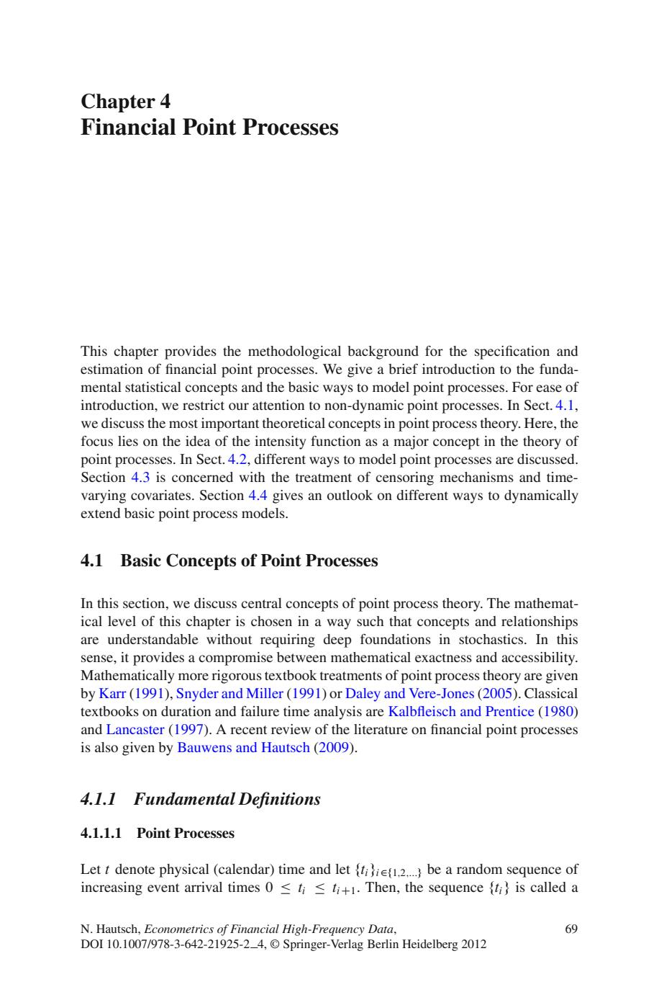

## PDF page 85 / printed page 70

70                                                                         4 金融点過程

点過程を Œ0; 1/ (直線上で) に定義する。1 ここでは、時間で定義された点過程に限る。もし ti < ti+1 (i に関して) ならば、それは同時発生の可能性を排除する単純点過程と呼ばれる。本書の残りの部分では、単純点過程のみに焦点を当てる。さらに、観測されたイベントの数を n、そして過程の最後に観測された点を tn とすると定義する。すると、f(ti)gn(i=1) は完全な観測可能な過程である。f(Wi)g(i=2) を、Wi ∈ {1; 2; : : : ; K} となるタイプの i 番目のイベントを示す数列とすると、f(ti; Wi)g(i=1) は (単純) 標的点過程、あるいは代替的に (単純) K次元点過程と呼ばれる。標的は、例えば金融取引過程における買い、売り、あるいは特定の指値注文の到着など、異なるタイプのイベントを示す。イベント固有の到着時刻は、k = 1; : : : ; K に対して f(tik)g(i=1) と表され、nk は k タイプイベントの観測数で定義される。標的点過程 f(ti; Wi)g の f(ti)g の数列（あるいは同等に、k = 1; : : : ; K に対して個々の k タイプ到着時刻を重ね合わせる）のみを考慮すると、いわゆるプールされた過程が得られる。

4.1.1.2 計数過程
                                          P
N.t/ という過程で、N.t/ = i 1 1l f(ti) t g と定義されるものを、f(ti)g に関連する右連続（càdlàg）計数過程と呼ぶ。2 N.t/ は、右連続ステップ関数であり、大きさ1の上方へのジャンプ（各 ti において）を持つ。さらに、N.t/ = i 1 1l f(ti) <t g と定義されるものを、f(ti)g に関連する左連続計数過程と呼ぶ。NM .t/ は左連続ステップ関数であり、t より前に発生するイベントの数を数える。多くの場合、点過程は、その計数過程 N.t/ によって特徴付けられる。もし N.t/ が K変数の標的点過程であれば、Kつのイベント時刻の系列は、対応する k タイプ計数関数 N k .t/ = i 1 1l f(ti) t g 1l f(Wi) = k と N .t/ = i 1 1l f(ti) <t g 1l f(Wi) = k によって表される。

4.1.1.3 デュレーションと後向き再帰時間

2つの連続する点間の待ち時間を xi と定義する。
                                      (
                                          ti  ti+1 ; i = 2; : : : ; n;
                              xi =
                                          ti ;         i = 1;

ここで t0 = 0 とする。すると、f(xi)g(i=1) は f(ti)g に関連するデュレーション過程と呼ばれる。さらに、x.t/ = t  tNM .t/ と定義される過程は、後向き再帰時間と呼ばれる。

1
  点過程は空間上でも進化し、空間点過程またはクラスター過程を与えることができる。例えば、Daley and Vere-Jones (2005) を参照。
2
  càdlàg (フランス語: continue à droite, limitée à gauche) 関数は、右連続であり、左側極限を持つ関数である。

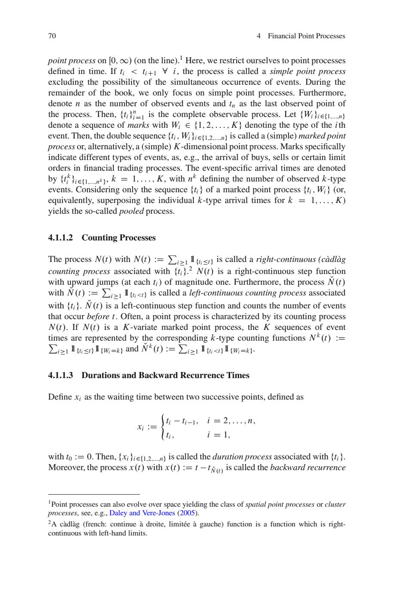

## PDF page 86 / printed page 71

4.1 点過程の基本概念                                                              71

時刻 t における時間である。後向き再帰時間は、前の点からの経過時間であり、離散的な到着時刻 ti においてゼロに戻る線形に増加する左連続関数である。x.ti / D ti  ti 1 WD xi に注意する。

4.1.1.4 濾過と（時間変動する）共変量

本書全体を通して、時間的に進化する特性を持つ点過程のみを扱うことに制限する。すなわち、任意の時刻 t において、点過程 N.t/ のイベント確率は、t 以前に（少なくとも瞬時に）既知の情報に依存する。3 この情報は、N.t/ の履歴と/または外生変数である可能性がある。このような概念を形式化するために、Ft を t までの情報集合と定義する。Ft は、いわゆる内部履歴または自然な   P       濾過 Ft WD FtN
で、Ft D .N .s/ W 0  s  t; k 2 /, N .s/ WD i 1 1l fti sg 1l fWi 2g 、ここで
        N           k                                 k

 は f1; : : : ; Kg のすべての部分集合の -体を表す。
   イベントの発生（ただし、必ずしもその種類ではない）が、イベント i の前に既知で一定の（弱外生）変数 fzi gi 2f1;2;:::g によって駆動される場合、それらは時間不変共変量と呼ばれる。逆に、時間変動共変量は、イベントの発生を駆動し、2 つの連続するイベントの間に連続的に変化する特性である。それらはベクトル z.t/ によって表される。共変量が xi に対して弱外生であるためには、プロセス z.t/ が càdlàg であり、zNM .t /C1 D z.ti 1 / がすべての t に対して ti 1 < t  ti を満たす必要がある。
   Ft がプロセスの内部履歴だけでなく、プロセス fzi g と fz.t/g も含む場合、FtN  Ft となる。

4.1.2 補償過程と強度

点過程の理論の中心的な概念は、直感的に次のように定義される強度関数である。
定義 4.1. N.t/ を Œ0; 1/ 上の単純な点過程とし、ある履歴 Ft に適応しており、.tI Ft / が正の値を持つプロセスであり、サンプルパスが左連続で右極限を持つと仮定する。すると、プロセス

                                   1
    .tI Ft /  .tC/ WD lim         E ΠN.t C /  N.t/j Ft  ;             .tC/ > 0; 8 t;
                               #0 

と、.tC; Ft / WD lim#0 .t C ; Ft /, は、計数過程 N.t/ の Ft -強度過程と呼ばれる。
この定義は、古典的なデュレーション文献（例えば、Lancaster 1997 を参照）でよく知られており、強度関数をイベントの瞬時到着率として表している。

3
 この特性を満たさないより一般的な点過程としては、空間点過程や Neymann-Scott クラスタ点過程などがある。詳細については、例えば、Daley and Vere-Jones (2005) を参照。

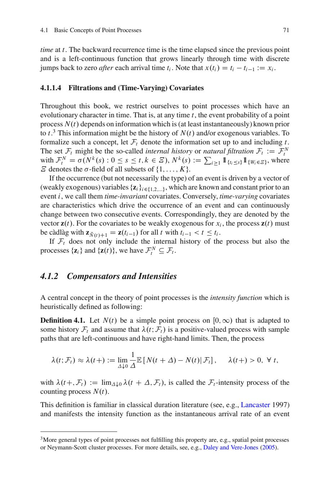

## PDF page 87 / printed page 72

72                                                                      4 点過程

t における条件付き情報 Ft までの情報に基づいて条件付けされる。点過程に関する論文や教科書において、用語法が一貫していない場合がある。例えば、Brémaud (1981) や Karr (1991) などの著者らは、.tI Ft / を「確率強度関数」と表記しており、これは .tI Ft / が必ずしも決定論的ではなく、確率過程に従う可能性があることを考慮している。Daley and Vere-Jones (2005) は、.tI Ft / を「条件付き強度関数」と呼んでおり、.tI Ft / が条件付け情報に依存することを指している。ここでは、.tI Ft / を単に強度、あるいは強調する必要がある場合には Ft -強度と呼ぶ。Ft -強度によって生成される点過程は、Ft -適応点過程と呼ばれる。
   上記の定義は、ハザード関数という概念との関連性も提供する。ハザード関数は次のように与えられる。
                h.xi I Fi 1 / WD f .xi I Fi 1 /1 /=S.xi I Fi 1 /                             (4.1)
                                        1
                              D lim         PrŒxi  Xi < xi C jXi  xi I Fi 1 ;           (4.2)
                                  !0 

ここで、xi は、ランダム変数 Xi の実現によって表される（イベント間）デュレーションを表し、条件付き確率密度関数 (p.d.f.) f .xi I Fi 1 /、条件付き生存関数 S.xi I Fi 1 / WD 1  F .xi I Fi 1 /、および条件付き累積分布関数 (c.d.f.) F .xi I Fi 1 / WD PrŒXi  xi jFi 1 である。強度関数は連続時間で定義され、Ft の可能性のある連続的に変化する情報集合に条件付けされる一方、ハザード率は各デュレーション xi の終わりに評価され、呪文の開始から経過した時間と潜在的な共変量（例えば、プロセスの履歴を捉えるもの）にのみ条件付けられる。これは、横断的なデュレーションデータが分析される伝統的なデュレーションまたは生存分析の中心的な概念である。4 ハザード関数を後向き再帰時間で表現すると、対応する連続時間表現が得られる。
                                              
                               h x.t/I FNQ .t / D .tI x.t/; FNM .t / /                      (4.3)

これは、最後のイベントからの経過時間のみに依存する強度として表現できる。ハザードと強度に関する定義と用語が矛盾しているため、以下のように区別する。本書の残りの部分では、強度関数を、基礎となるデュレーション過程の項で表現でき、呪文の開始時に支配する情報に基づいてデュレーションの条件付き確率密度関数と条件付き生存関数の比の項で記述できる場合に、（条件付き）ハザード関数と呼ぶ。 (4.1) を参照のこと。この定義により、呪文の過程で情報集合が変化するような場合、例えば時間変化する共変量がある場合を除外する。
   点過程理論において、強度関数は尤度関数と密接に関連しているため、重要な役割を果たし、尤度に基づく推論の可能性を開く。この関係は、伝統的に点過程の進化的な性質によって数学的に捉えられる。

4
    例えば、Kalbfleisch and Prentice (1980)、Kiefer (1988) または Lancaster (1997) を参照のこと。

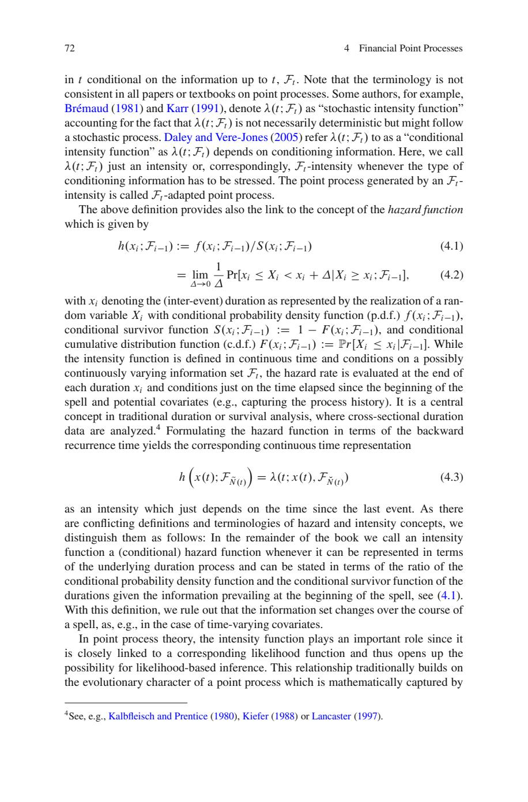

## PDF page 88 / printed page 73

4.1 点過程の基本概念                                                       73

マルチンゲールに基づく点過程理論について述べる。Ft -適応過程 N.t/ を定義し、各tに対して EŒN.t/ < 1 とすると、0  s < t < 1 のとき、

                          EŒN.t/jFs  D N.s/ a.s. (almost surely);

を満たすときFt -マルチンゲールであり、

                                    EŒN.t/jFs   N.s/ a.s.

を満たすときFt -サブマルチンゲールであると定義する。そして、ドゥーブ・メイヤー分解によれば5、(有界)Ft -
サブマルチンゲール N.t/ は、一意のゼロ平均Ft -マルチンゲール
                                                      Q
M.t/ と一意のFt -予測可能な累積過程 .t/ に分解できる。すなわち、

                                                   Q
                                     N.t/ D M.t/ C .t/;                                  (4.4)

ここで、過程 .t/
                                                Z t
                                    Q D
                                    .t/              .sI Fs /ds:                        (4.5)
                                                 0

と定義される補償過程 .t/ は、性質

                                          Z t
                                N.t/           .t; Fs /ds D M.t/                        (4.6)
                                           0

を満たす。このマルチンゲール過程である N.t/ は、本書の残りの部分で強度モデルに対する診断テストを構築するために利用される。したがって、次の式が得られる。
                                           Z t                   ˇ 
                                                                  ˇ
                        EŒN.t/jFs  D E               .uI Fu /d uˇFs ;   a.s.;
                                                0

あるいは、
                                  Z t               ˇ      h       ˇ i
                                                     ˇ               ˇ
     EŒN.t/  N.s/jFs  D E              .uI Fu /d uˇFs WD E .s; t/ˇFt ;        a.s.;   (4.7)
                                     s

これは、強度 .tI Ft / の別の暗黙の定義を与える。したがって、Fs が与えられた区間 .s; t におけるイベントの期待数は、次のように定義される積分強度関数として知られるものの条件付き期待値として計算される。
                                                     Z t
                                   .s; t/ WD              .uI Fu /d u                   (4.8)
                                                      s

                 Q  .s/.
と定義される .s; t/ は、.t/ Q となる。

5
    例えば、Daley and Vere-Jones (2005), Theorem A3.4.III を参照。

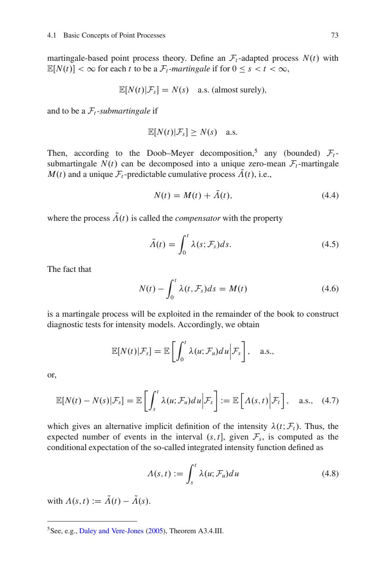

## PDF page 89 / printed page 74

74                                                          4 金融点過程

4.1.3 同次ポアソン過程

最も単純な点過程のタイプは、同次ポアソン過程によって与えられる。レート  のポアソン過程は、すべての t に対して、時間区間  # 0 のとき、以下の条件を満たすことで定義される。

                 Pr Œ.N.t C /  N.t// D 1 jFt  D  C o./;                    (4.9)
                 Pr Œ.N.t C /  N.t// > 1 jFt  D o./;                        (4.10)

これにより、

               Pr Œ.N.t C /  N.t// D 0 jFt  D 1   C o./;                 (4.11)

が得られる。ここで、o./ は、 ! 0 となるにつれて o./= ! 0 となる性質を持つ剰余項を表す。ポアソン過程の主要な性質の一つは、イベントが .t; t C  の間隔で発生する確率が Ft から独立である、すなわち、t 以前（および t でちょうど）に観測された点の数に依存しないことである。式 (4.9) と (4.10) は、ポアソン過程の強度表現に関連付けられている。
   ポアソン過程のその他の重要な性質は、固定された時間区間におけるイベントの分布に関連する。Lancaster (1997) に従って、t C  までの j 個のイベントが発生する確率は、次のように得られる。
       h              i    h          i
     Pr NM .t C / D j D Pr NM .t/ D j  Pr Œ.N.t C /  N.t// D 0
                             h              i
                        C Pr NM .t/ D j  1  Pr Œ.N.t C /  N.t// D 1
                             h              i
                        C Pr NM .t/ D j  2  Pr Œ.N.t C /  N.t// D 2

                           ::
                            :
                             h          i
                         D Pr NM .t/ D j  .1  /
                               h              i
                          C Pr NM .t/ D j  1   C o./:                      (4.12)

項を並べ替え、 で割ると、
            h               i    h           i
        1 Pr NM .t C / D j  Pr NM .t/ D j
                 h         i      h              i
          D Pr NM .t/ D j C Pr NM .t/ D j  1 C o./1;                     (4.13)

したがって、 # 0 のとき、

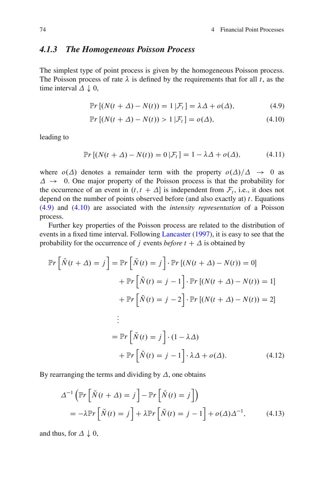

## PDF page 90 / printed page 75

4.1 点過程の基本概念                                                  75

     d    h          i      h          i     h              i
        Pr NM .t/ D j D Pr NM .t/ D j C Pr NM .t/ D j  1 :                     (4.14)
     dt
j D 0 の場合、(4.14) は以下のようになります。

                    d    h         i         h         i
                      Pr NM .t/ D 0 D Pr NM .t/ D 0 ;                   (4.15)
                   dt
           h             i
Pr NM .t/ D j  1 が j D 0 のとき 0 になるためです。初期条件 Pr NM .0/ D 0 D 1 を考慮すると、

                               h          i
                             Pr NM .t/ D 0 D exp.t/;                             (4.16)

となり、これは指数分布の生存関数に対応します。したがって、最初のイベントまでの待ち時間は指数分布に従います。同様に、(4.16) は、時間軸上の任意の任意点、例えば、直前のイベントの発生時点から開始する長さ t の区間において、イベントが発生しない確率でもあることが示されています。したがって、連続する点間のデュレーションは、他のすべての区間の長さに関係なく独立しています。したがって、デュレーションは確率密度関数と累積分布関数によって与えられる指数分布に従って独立していると結論付けられます。

                                f .x/ D  exp .x/;
                                F .x/ D 1  exp .x/:

したがって、ハザード関数は h.x/ D f .x/=.1  F .x// D  と与えられ、ポアソン強度と同一です。これらの性質は、ポアソン過程のデュレーション表現に関連付けられています。
   ポアソン過程の第3の重要な性質は、(4.14) の微分方程式を j D 1; 2; : : : について、(4.14) の j D 0 の解が与えられた状態で逐次的に解くことで得られます。この微分方程式が以下の解を持つことが簡単に示されます。
                  h          i  exp.t/.t/j
                Pr NM .t/ D j D               ;            j D 1; 2; : : : :       (4.17)
                                     jŠ

したがって、長さ t の区間におけるイベントの数は、パラメータ t を持つポアソン分布に従います。注記として、(4.17) は開始点に依存せず、したがって、任意の時間区間にわたってこの性質が成立します。したがって、区間 .s; t 内のイベント数、N.t/  N.s/ は、パラメータ .t  s/ を持つポアソン分布に従います。この関係はポアソン過程の計数表現と呼ばれます。区間 .s; t 内に落下する点の平均と分散は .t  s/ で与えられます。この等式は、ポアソン過程の検定にしばしば利用されます。

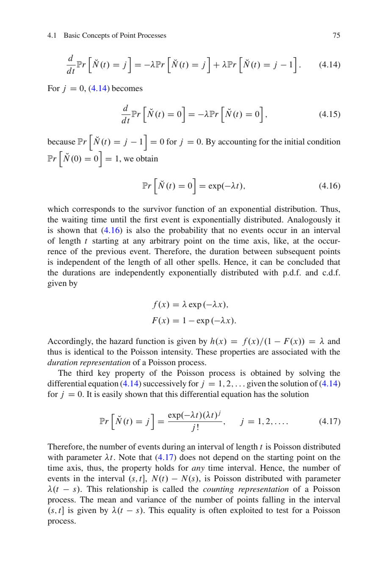

## PDF page 91 / printed page 76

76                                                           4 金融点過程

     あるいは、(4.17) を以下のように表現することもできる。

                                                 i 1
                                                 X                 .x/j
                Pr Œti > x D Pr ŒN.x/ < i  D          exp.x/         :       (4.18)
                                                                     jŠ
                                                 j D0

この結果得られる分布は、元の区間の長さ x にのみ依存し、時間スケール t 上の位置には依存しないことに注意する。この性質を満たす点過程は、定常点過程と呼ばれる。

4.1.4 ポアソン過程の一般化

前の小節で議論したように、同次ポアソン過程の重要な性質は、強度関数が一定であることである。したがって、データ生成過程 (DGP) は、強度関数 .tI Ft / D . で完全に記述される。
    強度関数  を時間とともに変化させることにより、非同次ポアソン過程または不均一ポアソン過程という一般的なクラスが得られる。例えば、ポアソン過程が、期間の開始時に観測可能な càdlàg 共変量に依存する場合、DGP は、zNM C1 .t/- 強度関数 .tI zNM .t /C1 / で完全に記述される。特殊なケースとして、時間関数  に置き換えた (4.9)–(4.10) で記述される非定常ポアソン過程がある。非定常ポアソン過程は、通常、連続するデュレーションの独立性を意味しない。
    さらに、二重確率ポアソン過程（コックス過程と呼ばれることもある）という不均一ポアソン過程のクラスが得られる。この枠組みでは、強度が、ある観測されない確率過程  .t/ によって駆動されると仮定される。これにより、強度関数 .tI Ft / で特徴づけられる DGP が得られ、ここで Ft は時刻 t までに観測されない過程の履歴を表す。このような過程については、第11章でより詳しく説明する。不均一ポアソン過程の具体的な種類に関する詳細は、Cox and Isham (1980) または Daley and Vere-Jones (2005) を参照されたい。
    一般的な点過程のクラスは、再更新過程であり、これは独立同一分布に従うイベント間デュレーションによって特徴づけられる。特に、再更新過程のイベント到達時刻は、独立同一分布に従う非負の確率変数の和によって得られる。独立性は、再更新過程の重要な特徴であり、故障の場合に新しいコンポーネントで置き換えるコンポーネントの連続する間隔のシーケンスを研究するという考え方から生じる。イベント到達時刻が i.i.d. 標準指数分布に従う確率変数の (部分) 和によって駆動される場合、同次ポアソン過程が得られる。イベント間デュレーションの独立性により、ti 1 における過程の履歴は、ti 1 < ti における現在の強度に影響を与えない。したがって、再更新過程は通常、横断的なデュレーションデータモデリングに使用される。

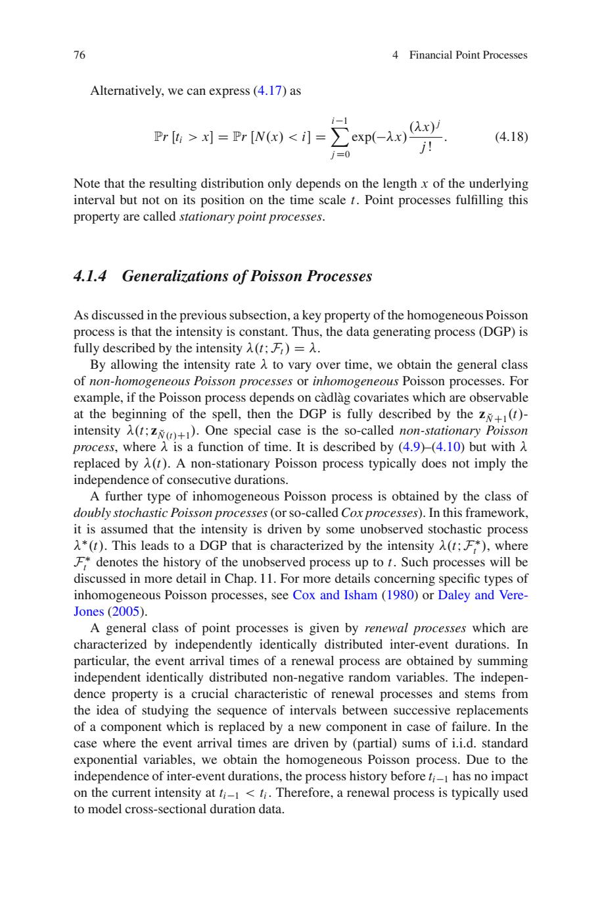

## PDF page 92 / printed page 77

4.1 点過程の基本概念                                                 77

 指数分布からの逸脱を許容し、密度 f .xi / を持つより柔軟な分布を認めることで、デュレーション期間中に一定でないハザード関数 h.xi / が得られる。この場合、ポアソン過程とは対照的に、前のイベント時刻からの経過時間は、そのプロセスの今後の発展に影響を与える。この性質のため、初期条件に注意を払う必要がある。一般に、最初の次の点までの順方向再帰時間 x1 は、t D 0 の場合に限り、密度 f ./ を持つものではない。そのような場合、そのプロセスは通常の再生プロセスと呼ばれ、そうでない場合は修正再生プロセスと呼ばれる。詳細は、Cox and Isham (1980) または Daley and Vere-Jones (2005) を参照されたい。ハザード関数の形状は、dh.s/=ds の符号に関連するいわゆるデュレーション依存性を決定する。dh.s/=ds > .</ 0 の場合、そのプロセスは正の（負の）デュレーション依存性を示すといい、すなわち、ハザード率は期間の長さとともに増加（減少）する。

 より一般的な種類の点過程は、デュレーション fxi g、i D 1; : : : ; n にシリアル依存性を許容することで得られる。これにより、より体系的に Sect. 4.4 および本書の残りの部分で議論される動的点過程のクラスが得られる。

 (直線上の) 点過程の代替クラスは、点の総数が確率1で有限である有限点過程のクラスであり、依存構造は通常、組み合わせ論的引数を用いて記述される。さらに一般的なクラスは、点過程の定常性および順序性を緩和することで生じる。詳細は、Daley and Vere-Jones (2005) を参照されたい。しかし、これらの種類のプロセスは本書の範囲を超えている。

4.1.5 確率時間変化引数

 マルチンゲールベースの点過程理論における基本的な結果は、Meyer (1971) による確率時間変化定理であり、これにより、広範な点過程を単位レートポアソン過程に変換することができる。

定理 4.2. N.t/ を、強度 .tI Ft / および Ft -補償過程 .t/         Q D 1 をほぼ確実に持つ履歴 Ft に適応した単純点過程とする。すべての t に対して、停止時間 .t/ を
                                 Z  .t /
                                            .tI Fs /ds D t:                      (4.19)
                                   0

の解として定義する。

すると、点過程

                            NQ .t/ D N..t// D N.Q 1 .t//                       (4.20)

は、強度  D 1 の同次ポアソン過程である。

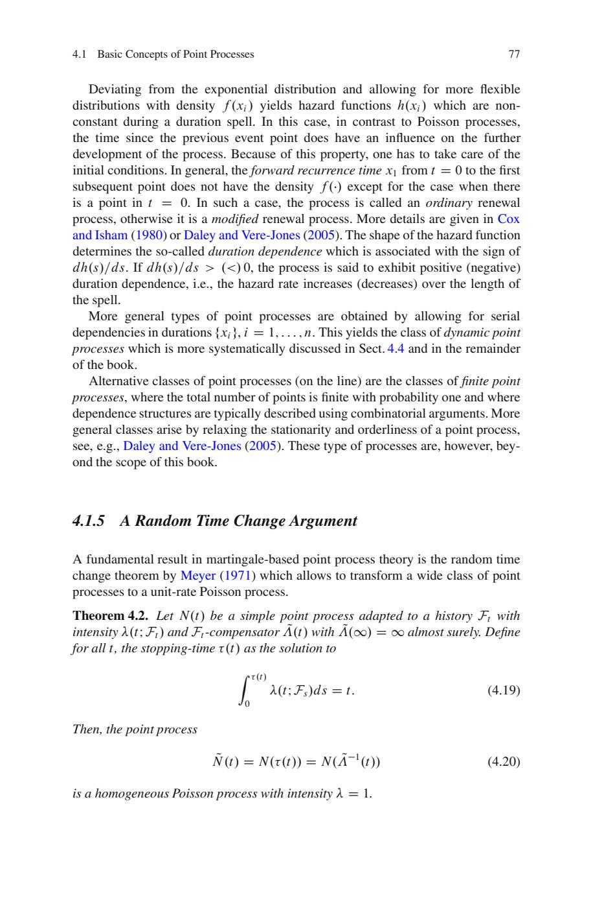

## PDF page 93 / printed page 78

78                                                                      4 金融点過程

証明。Brémaud (1981) の定理 T16 の証明、または Daley and Vere-Jones (2005) の定理 7.4.I を参照のこと。 
したがって、(4.19) は、時刻スケールを t から .t/ に変換し、N.t/ を単位レートのポアソン過程 NQ .t/ D N..t// に変換することに対応する。
   この結果を診断テストの構築に利用するためには、まだ .t/Q                            Q i / D ti .sI Fs /ds
                                          を ti で評価したときの実現値が、i.e., .t       0
NQ .t/ に関連する到着時刻 tQi をすべて対応させることを示す必要がある。これは、Bowsher (2007) の以下の補題で示されている。

補題 4.3. (変換された) 点過程 NQ .t/ によって与えられた到着時刻 tQi を (4.20) で表す。すると、tQi D 0 i .sI Fs /ds 8 i が成り立つ。

証明。tQi 1 < tQi < tQi を満たす s が存在し、NQ .s/ D N..s// D i  1 とすると、s " tQi ならば、.s/ " .tQi / が成り立つ。NQ .tQi / D i であることから (4.20) より、N..tQi // は i  1 から i へと跳躍し、.tQi / で跳躍しなければならない。すなわち、s D tQi となる。定義により N.t/ は ti でのみ i へと跳躍するから、ti D .tQi / となる。したがって、(4.19) より、tQi D 0 i .sI Fs /ds が成り立つ。
       t
                                                                                      
  補題 4.3 と定理 4.2 を用いると、診断テストの構築の基礎となる定理が得られる。
定理 4.4. (4.20) に従って (変換された) 点過程 NQ .t/ に関連するデュレーション tQi  tQi 1 は、

                                                        Z ti
                      tQi  tQi 1 D .ti 1 ; ti / D            .sI Fs /ds
                                                         ti 1

であり、独立同分布の単位指数型確率変数に対応する。したがって、

                              .ti 1 ; ti /  i.i.d. Exp.1/:                                 (4.21)

                                                                                   R ti
証明。証明は、tQi D                 0     .sI Fs /ds
が単位レートのポアソン過程のイベント時刻であるという事実から直接導かれる。 
したがって、比較的弱い正則性条件の下では、積分強度関数 .ti 1 ; ti / は独立同分布の単位指数型確率変数であり、強度関数と次の点が発生するまでのデュレーションとの間に強力な関係を確立する。例えば、強度関数が2つの点の間で一定である単純な場合、デュレーション xi は xi D .ti 1 ; ti /=.ti I Fti / で与えられる。さらに、.ti 1 ; ti / は一般化された誤差（例えば、Cox と Snell 1968 の精神に則って）として解釈でき、条件付き強度関数の経路が、ti と ti 1 の間のイベント数を過小予測する（.ti 1 ; ti / > 1）か、過大予測する（.ti 1 ; ti / < 1）かを示すものである。

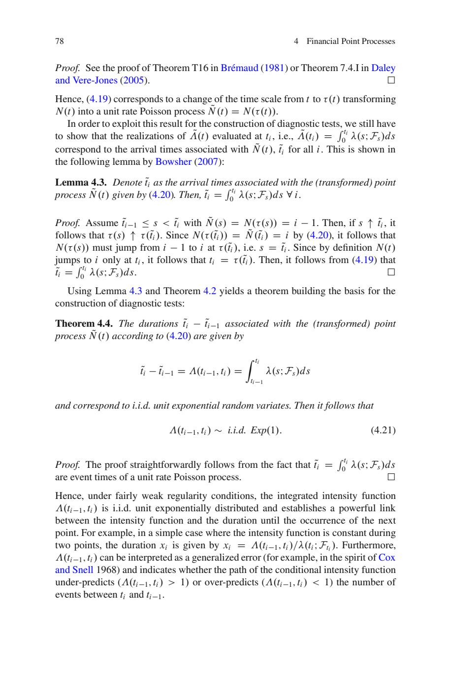

## PDF page 94 / printed page 79

4.1 点過程の基礎概念                                                        79

多変量点過程の場合にも、確率的時間変化の議論は成立する。

定理4.5. N.t/ を K 変量の点過程とし、履歴 Rt と Ft に適応させ、対応する強度 k .tI Ft / と Ft -補償過程 Q k .t/ D 0 k .sI Fs /ds を持つとする。ただし、Q k .1/ D 1 almost surely 8 k とする。すべての t に対して、停止時間  k .t/ を
                                  Z  k .t /
                                               k .sI Fs /ds D t:                         (4.22)
                                    0
の解として定義する。

すると、多変量点過程 .NQ 1 .t/; : : : ; NQ K .t// で、

                NQ k .t/ D N k . k .t// D N k .Qk .t/1 /;           k D 1 : : : ; K;   (4.23)

は、各成分が単位レートを持ち、互いに独立な多変量ポアソン過程である。
    さらに、ポアソン過程 NQ k .t/, k D 1 : : : ; K に関連する持続時間 tQik  tQik1 は、
                                                           Z tik
                     tQik  tQik1 D k .tik1 ; tik / D            k .sI Fs /ds
                                                            tik1
で与えられ、独立同一分布の単位指数型確率変数に対応する。
証明。よりアクセスしやすい証明については、Daley and Vere-Jones (2005), Meyer (1971) または Brown and Nair (1988) を参照のこと。 k .tik1 ; tik / の指数性の証明は、補題4.3 を多変量の場合に適用することで、容易に導かれる。                      

4.1.6 強度に基づく推論

Karr (1991) は、N.t/ が Ft -強度 .tI Ft / を持つような一意の確率測度の存在を証明している。この定理は、統計モデルを Ft -強度に関して完全に特定できることを意味するため、強度に基づく統計的推論にとって基本となる。Karr の定理5.2 から得られる重要な結論は、強度に関して尤度関数を確立することである。強度の過程が条件
                                   Z tn
                                            .sI Fs /ds < 1:
                                        0
を満たすと仮定する。

すると、基礎データ Y の行列とパラメータベクトル  に関連する対数尤度関数は、

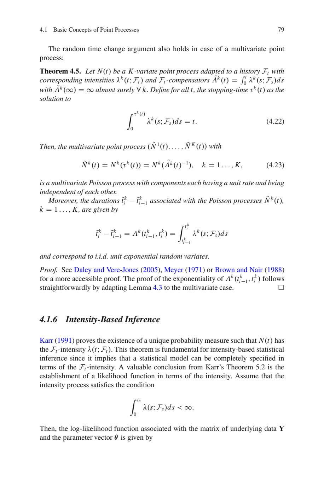

## PDF page 95 / printed page 80

80                                                                                  4 金融点過程

                                     Z tn                          Z
                ln L .Y; / D               .1  .sI Fs //ds C                  ln .sI Fs /dN.s/
                                      0                                .0;tn 
                                     Z tn                          X
                              D             .1  .sI Fs //ds C            1l fti tn g ln .ti /;      (4.24)
                                      0                            i 1

ここで
                                Z                         X
                                           U.s/dN.s/ D           1l fti t g U.ti /                     (4.25)
                                  .0;t                   i 1

は、ある可測点過程 U.t/ をカレンダー時刻 N.t/ に対して積分した確率スティルチェス積分6 を定義する。

注意すべきは、上記の関係は比較的緩い条件の下で成立することである。しかしながら、より多くの仮定を課すことで、強度関数 .tI Ft / と条件付き生存関数 S.xi I Fti / WD Pr ŒXi  xi jFti  を結びつけることができ、ヤシンとアルヤス (1988) が言うところの「指数関数公式」を導き出すことができる。

                                     S.xi I Fti / D exp ..ti 1 ; ti // :                             (4.26)

条件付けがない場合、この関係は単に微分方程式を解くことで導き出される。

                                      d
                                         S.xi / D .ti 1 C xi /S.xi /                                 (4.27)
                                     dxi

初期条件 S.0/ D 1 の下で。ヤシンとアルヤス (1988) が示したように、この関係は固定 -代数に基づく条件付けの場合にも成立する。しかし、条件付けが「動的」な場合、すなわち、時間依存性のある確率因子（例えば、時間変化する共変量）に依存する場合、必ずしも成立するとは限らない。より具体的には、ヤシンとアルヤス (1988) は、「指数関数公式」 (4.26) が S.xi I Fti 1 Cxi / が xi に関して絶対連続である場合にのみ有効であることを証明している。この仮定は、情報セットの変化によって引き起こされる条件付き生存関数のジャンプを除外するものである。
    「指数関数公式」 (4.26) を利用することで、.ti 1 ; ti / が独立同一分布の標準指数変量であることを示す別の簡単な方法が得られる（例えば、ランカスター 1997 参照）。しかし、この証明には、情報セットが連続的に変化する可能性がある場合（例えば、時間変化する共変量や多変量過程の場合）に問題となる、望ましくないほど制限的な仮定が必要となる。このような状況では、セク. 4.1.5 で議論されている確率時間変化の議論の方がより普遍的である。なぜなら、より制限的な条件を必要としないからである。

6
    例えば、Karr (1991), p. 57 参照。

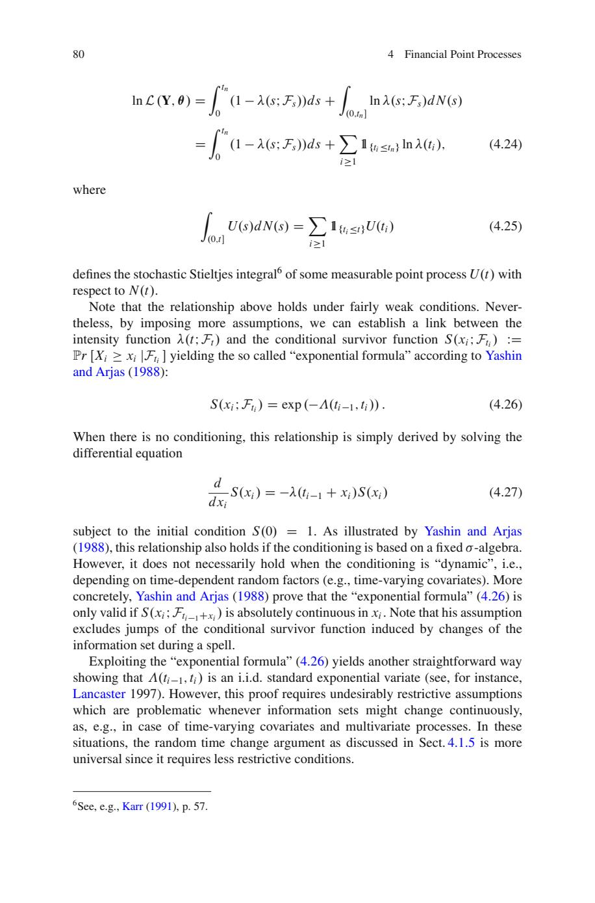

## PDF page 96 / printed page 81

4.1 基本概念の点過程                                                               81

4.1.7 シミュレーションと診断

ランダム時間変化引数は、点過程に対するシミュレーションアルゴリズムと
診断テストを構築することを可能にする。単変量
Ft 適応点過程 N.t/ の Ft -強度 t と Ft -補償過程 .t/ Q    に対する自然なシミュレーションアルゴリズムは、
.ti 1 ; ti /  i.i.d. Exp.1/ であるという事実を利用することで得られる。次に、逆法を用いることで、以下の手順で過程をシミュレーションすることができる。
  (i) i.i.d. 一様 U.0; 1/ 乱数 U1 ; U2 ; : : : ; Un の数列をシミュレーションする。
 (ii) 逆法を用いて、標準指数分布に従う変数を生成する。
      Vi D  ln.1  Ui /, i D 1; 2; : : : ; n:
(iii) t0 D 0 と設定する。.0; t1 / D V1 が t1 D x1 D .0; V1 /1 と表現できる場合、
      1 を  に依存する V1 (および t0 ) だけの逆関数とすると、
      t1 D x1 と設定する。あるいは、.0; t1 / D V1 を t1 について陰関数的に解く。
 (iv) i D 2; : : : ; n の場合：.ti 1 ; ti / D Vi が xi D 1 .ti 1 ; Vi / と表現できる場合、
      t1 D ti 1 C xi と設定する。あるいは、.ti 1 ; ti / D Vi を t1 について陰関数的に解く。
   同様に、K次元点過程のシミュレーションは同様に行われるが、
プールされた過程 N.t/ の新しい点が発生するたびに（積分）強度を継続的に更新する必要がある。
   (i) i.i.d. 一様 U.0; 1/ 乱数 U1k ; U2k ; : : : ; Unk , k D 1; : : : ; K, の K (独立) な数列をシミュレーションする。
  (ii) 逆法を用いて、標準指数分布に従う変数を生成する。
       Vik D  ln.1  Uik /, i D 1; : : : ; n, k D 1; : : : ; K.
 (iii) t0k D 0 と設定する。k .0; t1k / D V1k が t1k D k .0; V1k /1 と表現できる場合、
       k ./1 を k に依存する V1k (および t0k ) だけの逆関数とすると、
       t1k D x1k と設定する。あるいは、k .0; t1k / D V1k を t1k について陰関数的に解く。
 (iv) t1 D minft11 ; : : : ; t1K g と W1 D arg mink ft11 ; : : : ; t1k ; : : : ; t1K g を
       k D 1; : : : ; K の場合設定する。
                                                            j                                    j
  (v) すべての j ¤ W1 の場合：j .0; t1 / を計算する。j .0; t1 / D j .0; t1 / C j .t1 ; t1 / が
       Y1k と表現できる場合、t1 D j .0; V1 /1 と設定し、t1 D x1 とする。
                                     j           j             j          j

           j D W1 の場合：j .t1 ; t2 / D Y2 が x2 D j .t1 ; V2 /1 と表現できる場合、
                                       j      j                                  j              j
             j           j                                 j            j                   j
       t2 D t1 C x2 と設定する。あるいは、j .t1 ; t2 / D Y2 を t2 について陰関数的に解く。
 (vi) t2 Dminft2 ; : : : ; t2 g と W2 Darg mink ft2 ; : : : ; t2 ; : : : ; t2 g を kD1; : : : ; K の場合設定する。
                       1        K                        1          k            K

(vii) nk , k D 1; : : : ; K, が各次元でスペルされるまで、この手順を繰り返す。
代替的なシミュレーション技術は、例えば、Daley and Vere-Jones (2005) で議論されている。
   4.1.5 で議論されたランダム時間変化引数は、異なる種類の診断テストを構築する可能性を提供する。特に、Cox と Snell (1968) の精神に則り、積分強度に基づいて 4 種類の（一般化された）誤差に基づく診断を行う。K次元点過程を仮定し、以下を定義する。

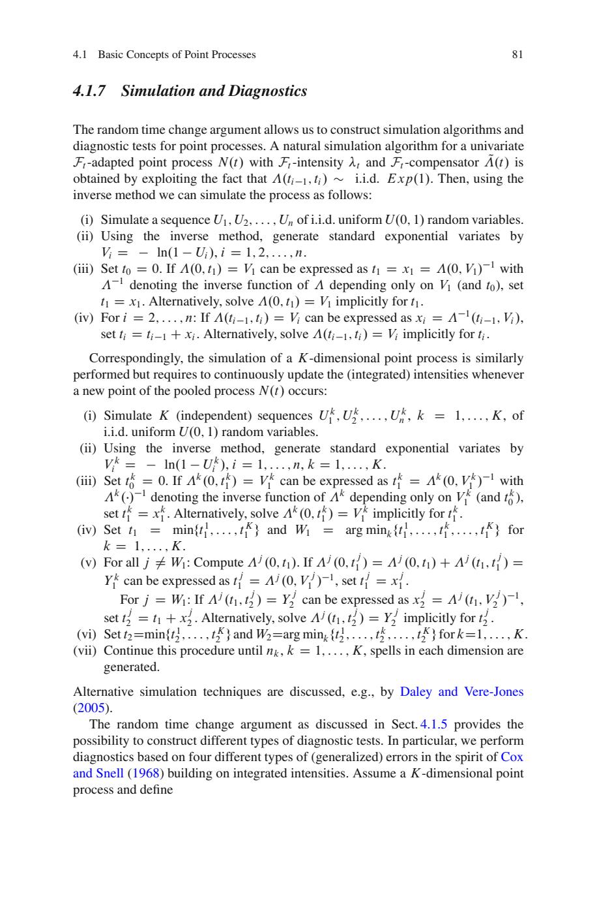

## PDF page 97 / printed page 82

82                                                                       4 金融点過程

                                             (
                                                 1   if Wi D k;
                                    yik WD                                                   (4.28)
                                                 0   otherwise:

     次に、以下を定義する。

                          "ki;1 WD k .tik1 ; tik /;
                                    X
                                    K
                          "i;2 WD         k .tik1 ; tik /yik ;
                                    kD1

                                    X
                                    K
                          "i;3 WD         k .ti 1 ; ti / D .ti 1 ; ti /;
                                    kD1

                          "i;4 WD K.tQi  tQi 1 /;
                                                                                   P
ここで、tQi は重ね合わせに関連するイベント時刻 NQ 0 .t/WD K               Qk
                                                                                     kD1 N .t/
であり、N k .t/, k D 1; : : : ; K, は (4.20) に従って時間変更された点過程である。定理 4.4 および 4.5 によれば、すべての残差 "i;j , j D 1 : : : ; 4, は
i.i.d. 標準指数分布に従う。 "ki;1 , k D 1; : : : ; K, の指数性は、定理 4.5 から直接導かれる。残差 "i;2 は、i.i.d. 標準指数分布に従う変数の混合に対応するため、それ自体も i.i.d. 標準指数分布に従う必要がある。残差 "i;3 は、（プールされた）市場点過程の積分強度に対応し、定理 4.4 によれば標準指数分布に従う。最後に、残差 "i;4 は、
                                                                          R tk
変換された k 固有のイベント時刻 tQik D 0 i k .sI Fs /ds をすべての
k D 1; : : : ; K に対して昇順にソートすることで得られる重ね合わせられた過程 NQ 0 .t/ によって計算される。
N k .t/ 過程は独立したポアソン過程であり、その強度を 1 とすると、NQ 0 .t/ の強度は K となり、デュレーション .tQi  tQi 1 / は平均 K 1 の指数分布に従う。したがって、"i;4 のように K でスケーリングすると、単位指数変数が得られる。これらの種類の残差は、Bowsher (2007) によって、プロセスの多変量性を考慮した「包括的」テストとして提案されている。したがって、残差 "i;j , j D 2; 3; 4, は、個々の過程 N k .t/ に加えて、（潜在的な）クロスプロセス間の相互依存性にも依存する。対照的に、"ki;1 は、個々の k 固有の系列にのみ依存する。明らかに、すべての 4 種類のモデル残差は、単変量の場合 (K D 1) には一致する。
    残差系列を用いて、モデル評価は f"Oki;1 ; "Oi;2 ; "Oi;3 ; "Oi;4 g の動的および分布特性をテストすることによって行うことができる。動的特性は、通常、Portmanteau 統計量または独立性テスト（Brock et al. (1996) で提案され、第 5 章で議論されている）に基づいて評価される。分布特性は、過剰分散に対するテストに基づいて評価することができる。ei を、対応するモデル誘導残差、すなわち ei 2 f"Oki;1 ; "Oi;2 ; "Oi;3 ; "Oi;4 g と定義する。Engle および Russell (1998) は、pthe 系列の指数性に関する、漸近的に標準正規分布に従う検定統計量 ne =8 .O e2  1/ に基づく特定の検定を提案する。

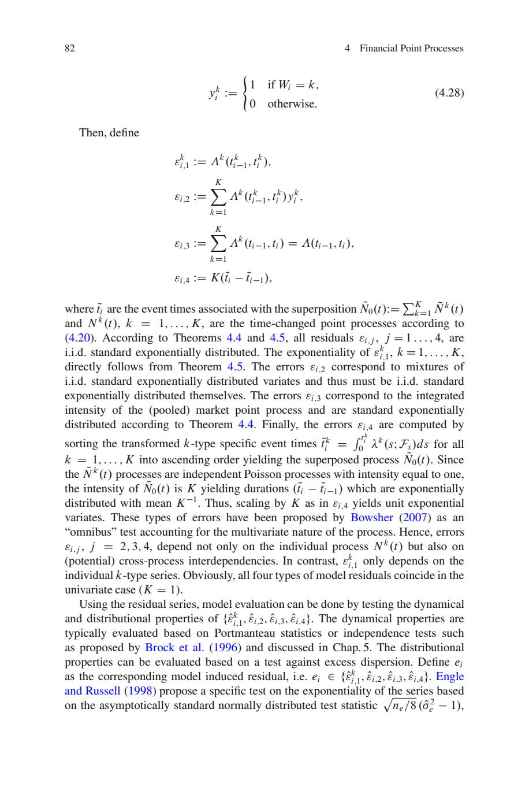

## PDF page 98 / printed page 83

4.2 点過程モデリングの四つのアプローチ                                                83

ここで、ne は残差の数、そして O e2 は帰無仮説の下で1となる残差の経験分散を表す。あるいは、残差の分布特性はピアソンの古典的な2-goodness-of-fit検定に基づき、または、分位-分位プロットのようなグラフ的手法を用いてテストすることができる。

4.2 四つのアプローチで点過程をモデリングする

このセクションでは、点過程をモデリングするための基本的なアプローチを4つ簡潔に議論する。
(i) 強度過程モデル、
(ii) ハザード過程モデル、
(iii) デュレーション過程モデル、
(iv) 計数過程モデル。
ここでは、非動的な場合に焦点を当てることにする。本書の以下の章では、デュレーションと強度の概念をより詳細に再検討し、動的なフレームワークに拡張する。

4.2.1 強度モデル

点過程をモデリングする一つの明白な方法は、強度 .tI Ft / を直接モデリングすることである。
一般的に、強度モデルは以下のように与えられる。

                         .tI Ft / D 0 .tI g2 .Ft //g1 .tI Ft /;                 (4.29)

ここで、0 は時間 t と Ft に依存する関数 g2 によって駆動されるベースライン強度関数を表す。関数 g2 は、(時間とともに変化する) 相関変数、過去のデュレーション、または他の点過程の特性への依存関係を捉える可能性がある。同様に、g1 は一般的に同じ情報セットに依存するが、別の形を持つ可能性がある。それは 0 に比例して相互作用する。そのような過程の例として、第12章で議論されているように、他の点過程の逆再帰時間によって駆動され、g1 が FNM .t/ の履歴の関数である多変量自己回帰条件付き強度モデルがある。ここで FNM .t/    Ft である。しかし、表現 (4.29) の特殊な場合を考慮することで、本書の残りの部分でより詳細に議論される異なるクラスのモデルを特徴付けることができる。
 (i) g1 D g2 の場合、g1 は 0 との乗数的な相互作用に加えて、0 の引数としても入る強度モデルが得られる。さらに、0 .tI g1 .Ft // が 0 .tI g1 .Ft // D 0 .t=g1 .Ft // のように表すことができると仮定すると、g1 が (そして加速または減速する) 時間引数を 0 でスケーリングする「加速強度モデル」と呼ばれるクラスが得られる。このモデルは

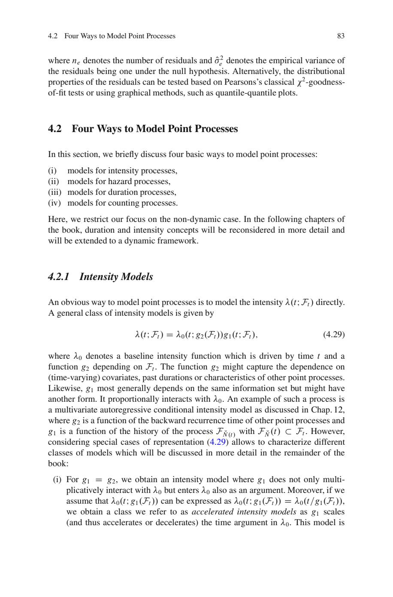

## PDF page 99 / printed page 84

84                                                                       4 金融点過程

     加速された故障時間モデルに対応する強度（intensity）であり、以下で議論されるものである。
(ii) g1 .Ft / が g1 .FNM .t / と等しく、また g2 .Ft / が g2 .FNM .t / と等しいと仮定すると、
     0 .tI g2 .FNM .t / // が 0 .x.t/I g2 .FNM .t / // と等しいとき、.tI Ft / は、スパンの開始時点での情報のみに依存する、すなわち、.tI Ft / D 0 .x.t/I g2
     .FNM .t / //g1 .FNM .t / // となり、その結果得られる強度は条件付きハザード関数に対応する。

                       .tI Ft / D h.x.t/; g1 .FNM .t / /; g2 .FNM .t / //
                                        fx .x.t/I g2 .FNM .t / /; g1 .FNM .t / //
                                  D                                                   :       (4.30)
                                      1  Fx .x.t/I g2 .FNM .t / /; g1 .FNM .t / //

     情報セットは各イベントでのみ変化し、スパン中には変化しないため、ハザード関数は、イベント間持続時間
     xNM C1 D xi , i.e., に基づいて表現することができる。

                                                    f .xi I g2 .Fti 1 /; g1 .Fti 1 //
           h.xi I g2 .Fti 1 /; g1 .Fti 1 // D                                           :   (4.31)
                                                  1  F .xi I g2 .Fti 1 /; g1 .Fti 1 //

      4.1.2 で述べられている定義に従い、時間依存の共変量を取り扱う必要があり、スパン中にプロセスを更新する必要がある限り、強度プロセスを指す。しかし、点過程が各イベント時刻でのみ更新される情報によって駆動され、スパン中には更新されない場合、ハザードプロセスを指す。
(iii) g2 が 0 であり、0 が、直前のイベントからの経過時間のみの関数であると仮定する、すなわち、0 .tI Ft / D 0 .x.t// D h0 .x.t// の場合、比例強度モデルのクラスが得られる。さらに、g1 .Ft / が g1 .FNM .t / と等しい場合、.tI Ft / D h0 .x.t//g1 .FNM .t / // は比例ハザード（PH）モデルに対応する。
(iv) g1 .Ft / と g2 .Ft / が g1 .FNM .t / と等しく、さらに 0 .tI g1 .FNM .t / // が 0 .t=g1 .FNM .t / // と等しいと仮定すると、.tI Ft / D 0 .t=g1 .FNM .t / //g1 .FNM .t / // は、観測可能な特性によって時間スケールが加速（または減速）される加速故障時間（AFT）モデルのクラスに属する。以下に示すように、AFTモデルは持続時間モデルと自然に結びついている。
 (v) 0 の関数形は、パラメータ的に選択することも、指定しない（非パラメータ的に推定することも）こともできる。例えば、0 .tI g2 .Ft // D 0 .x.t// D !x.t/a1 for ! > 0, a > 0 と仮定すると、強度をスパン中に単調に増加させる（a > 1 の場合）または減少させる（a < 1 の場合）ことができる。さらに、g1 .Ft / が g1 .FNM .t / と等しいという仮定の下では、結果として得られる強度プロセス .tI F / D !x.t/a1 g1 .FNM .t / // は、形状パラメータ a とスケールパラメータ g1 を持つ Weibull 分布に従う持続時間 xi を生成する。以下に示すように、Weibull（比例）ハザードモデルのこの特殊なケースは、明らかに 0 の特定のパラメータ形によって駆動される特定の AFT モデルとして表現することができる。最後に、完全に

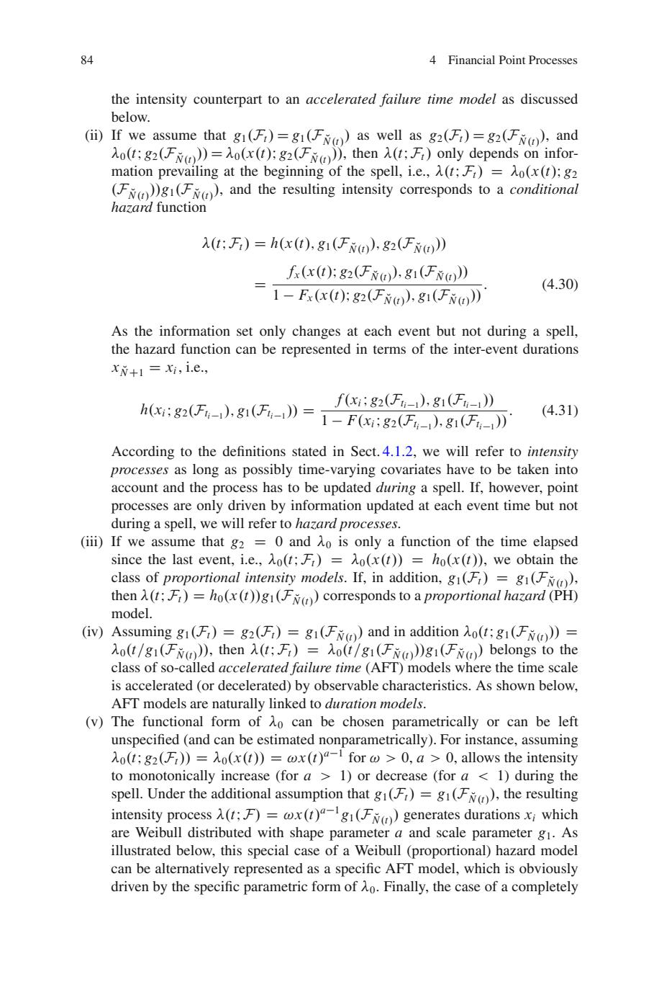

## PDF page 100 / printed page 85

4.2 点過程モデリングの四つのアプローチ                                                       85

   特定されていないベースライン関数 0 は、主に比例ハザードモデルのクラスにおいて、半パラメータ的な比例ハザードモデルのクラスを生み出す上で重要である。
   強度関数モデルは、第11章において動的な設定で議論される。
PH および AFT モデルの特殊なケース（非動的）は、次のサブセクションでより詳細に議論され、その後の章で議論される動的な拡張の基礎を築くことになる。

4.2.2 ハザードモデル

4.2.2.1 比例ハザード（PH）モデル

比例ハザードモデルは、生物統計学7 や労働経済学8 における横断的な生存分析にその起源を持つ。
   前節で述べたように、PH モデルは、ベースラインハザード関数 h0 .xi / > 0 と、変量ベクトル zi 1 の関数で、厳密に正の値を取り、係数 . を持つ積として指定される。それは次のように与えられる。

                           h.xi I zi 1 / D h0 .xi / exp.z0i 1 /:                     (4.32)

ベースラインハザード h0 .x/ は、回帰変数が中心化されている場合に h.xI z D 0/ と解釈される。つまり、回帰変数が中心化されている場合、h0 は z の平均値に対する強度関数として解釈される。
PH モデルの重要な特性は、@ ln h.xI z/=@z D 、したがって、条件付き到着率に対する z の定数比例効果として解釈されることである。
      （パラメータ的な）PH モデルの最も一般的な例は、指数関数およびワイブル回帰モデルである。これらのモデルでは、ベースラインハザード h0 は、指数関数またはワイブルハザード関数に従って指定される。ワイブルモデルは、単調増加または単調減少するハザード形状のみを許可するが、ガンマ、一般化ガンマ、バールまたは一般化F分布（付録を参照）などにより柔軟なパラメータ化によって得られる。あるいは、古典的なガンマまたはバール形状からの逸脱によって非標準的な PH モデルが得られ、ベースラインハザード関数を、例えば、線形スプライン関数としてパラメータ化する。観測されたデュレーションが K 個のカテゴリに分割されていると仮定し、xN k ; k D 1; : : : ; K  1 は選択されたカテゴリ境界を表す。次に、スプラインベースライン

7
  例えば、Kalbfleisch and Prentice (1980), Cox and Oakes (1984) を参照するか、Oakes (2001) による最近のサーベイを参照されたい。
8
  よく知られた例は、理論的および実証的な論文の広範な研究によって研究されている失業期間の長さの分析であり、例えば、Lancaster (1979), Nickell (1979), Heckmann and Singer (1984), Moffitt (1985), Honoré (1990), Meyer (1990), Han and Hausman (1990), Gritz (1993), McCall (1996) または van den Berg and van der Klaauw (2001) などである。

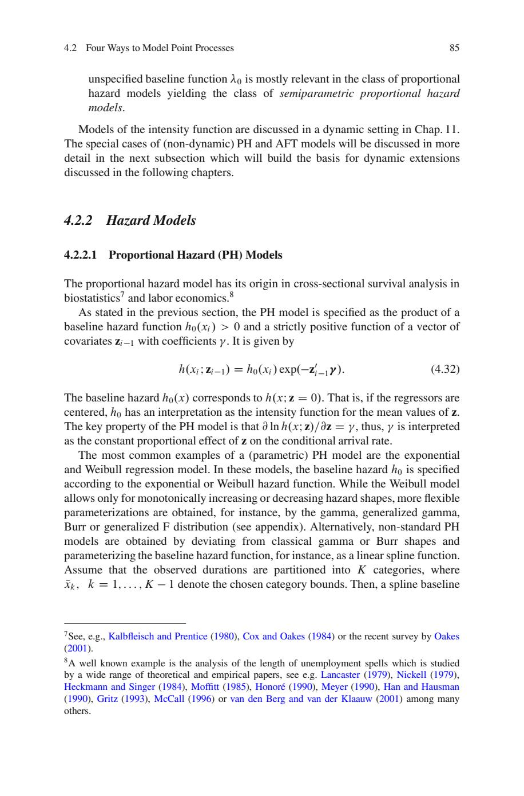

## PDF page 101 / printed page 86

86                                                                           4 金融点過程

ハザードは以下のように得られる。
                                       "                                                #
                                                 X
                                                 K1
                       h0 .x/ D exp        0 C                             N k  xi /
                                                       0;m 1l fxi xN k g .x                ;    (4.33)
                                                 kD1

ここで、0は定数であり、0;kはスプライン関数のノードに関連する係数である。パラメータPHモデルは、対数尤度関数（4.24）を適応させることで、最尤（Maximum Likelihood, ML）によって容易に推定できる。完全情報最尤アプローチにおいて、は一貫した推定を得るためには、h0の正しい仕様が必要であることに注意する。しかし、多くの場合、パラメータ分布では実際に観測されるハザードの形状を捉えるのに十分ではない。そのような場合、PHモデルの完全情報最尤推定は、の不整合な推定につながる。
    より柔軟なPHモデルは、Cox (1972)によって提案されている。このフレームワークでは、ベースラインハザードh0は完全に未規定であり、非パラメータ的に推定することができる。Cox (1975)は、の推定にベースラインハザードの仕様は必要ではないことを示しており、したがって、とh0の推定を分離することができる。とh0を推定するために、彼は、の部分尤度アプローチを用いて一貫してを推定し、Kaplan and Meier (1958)によって提案された推定量の修正によってベースラインハザードの推定が得られるという2段階のアプローチを提案している。9
    Cox (1975)によって提案された部分尤度アプローチは、デュレーションの順位統計に基づいているため、この方法は、タイ、すなわち、複数の観測値が同じ結果を持つ場合に限定的な有用性しか持たない。この場合、近似的な手順のみを使用できる（例えば、Breslow 1974を参照）。この場合、PHモデルを推定するための貴重な代替手段は、Han and Hausman (1990)やMeyer (1990)によって提案されたカテゴリー化アプローチを適用することである。この手順の背後にある主なアイデアは、順序応答仕様とグループ化されたデュレーションのモデルとの関係を利用することである（Sueyoshi 1995を参照）。カテゴリー化アプローチは、（検閲された）自己回帰比例ハザードモデルの文脈において重要な役割を果たすため（Chap. 10を参照）、ここではより詳細に議論する。
    主なアイデアは、PHモデルを（対数）積分ベースラインハザードの項で書き換えることである。定理4.2の示唆に従って、積分ハザード関数
                                           Z xi
                                 H.xi / WD      .s/ds                          (4.34)
                                                       0

は、独立同一分布に従う標準指数分布である。したがって、PHモデルは以下のように書き換えられる。

                                   H0 .xi / D exp.z0i 1 /H.xi /;                                (4.35)

ここで、

9
    詳細については、Kalbfleisch and Prentice (1980)を参照するか、Kiefer (1988)のサーベイを参照されたい。

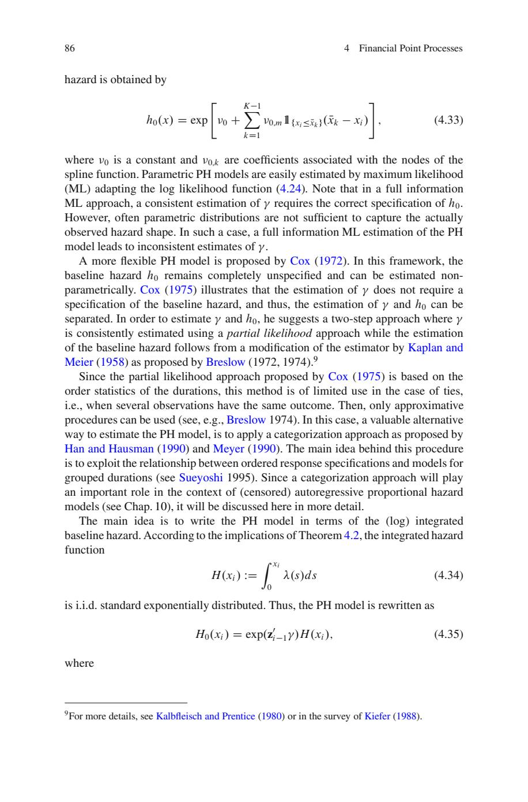

## PDF page 102 / printed page 87

4.2 点過程モデリングの四つのアプローチ                                                              87

                                                      Z xi
                                      H0 .xi / WD            0 .s/ds
                                                       0

は、ベースラインハザードの積分を表す。 「指数公式」の妥当性を仮定すると（4.26）、ベースラインハザードの積分は H0 .xi / D  ln S0 .xi / と書ける。ここで、S0 ./ は、ベースラインハザード h0 に関連するベースライン生存関数を表す。したがって、（4.35）は、ベースライン生存関数を用いて以下のように表現できる。

                                 ln S0 .xi / D  exp.z0i 1 /H.xi /:                             (4.36)

H.xi / が標準的な指数分布に従うことから、以下のことが検証可能である。

                                    EŒH0 .xi / D exp.z0i 1 /
                                    VŒH0 .xi / D exp.2z0i 1 /:

   同等に、PHモデルは、対数積分ハザードの項で表現することもでき、以下の式になる。

             ln H0 .xi / D ln. ln S0 .xi // D z0i 1 C "i ;           i D 1; : : : ; n;        (4.37)

ここで、"i WD ln H.xi / は、独立同一分布に従う標準的な極値型I分布（標準ガンベル（最小）分布）で、平均 EŒ"i  D 0:5772（オイラー・マチェロニ定数に対応）、分散 VŒ"i  D 2 =6、密度関数

                                    f" .s/ D exp.s  exp.s//:                                   (4.38)

を持つ。このアプローチでは、ベースラインハザード h0 を特定する必要はないが、対数ベースラインハザードの積分の完全なパラメータ化が必要となる。したがって、PHモデルは、ln H0 の回帰モデルに帰着する。関数 H0 は、期間 xi の変換と解釈でき、h0 が完全に特定されていれば変換は既知であるが、そうでない場合は不明である。例えば、標準的な Weibull 分布を仮定すると、すなわち h0 .x/ D ax a1 、PHモデルは以下の式を与える。

                                                      1 
                             ln xi D z0i 1       C    " ;    i D 1; : : : ; n:                  (4.39)
                                              a       a i
 この場合、PHモデルは、標準的な極値分布に従う誤差を持つ対数線形モデルである。係数ベクトル =a は、OLSによって一貫性（ただし、効率的ではない）に推定できる。10 代替として、（完全パラメータモデル）PHモデルは、MLによって一貫性があり、効率的に推定される。

10
     この場合、(4.39) には、"
                                                                         i のゼロでない平均に対応するインターセプト項を含める必要がある。

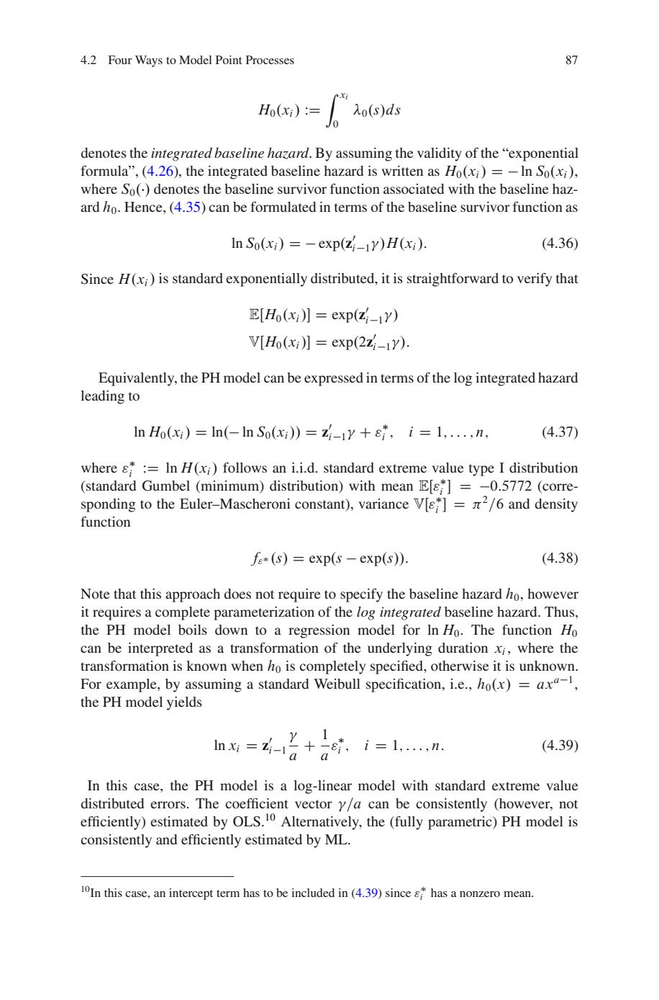

## PDF page 103 / printed page 88

88                                                                           4 金融点過程

   h0 が非特定の場合、H0 は未知であり、潜在変数として解釈できる。Han and Hausman (1990) は、このモデルを特殊な順序応答モデルとして扱い、h0 の半パラメータ推定を提案する。中心的なアイデアは、デュレーション xi のカテゴリー分けを導入し、(4.37) を、選択されたカテゴリー境界に関連する離散的な点でのみ観測可能な潜在過程として扱うことである。次に、上記で導入されたカテゴリー分けを適応させ、
                               
                               k WD ln H0 .x
                                           N k /;         k D 1; : : : ; K  1;                  (4.40)

を、(観測可能な)カテゴリー境界 xN k における潜在変数 ln H0 ./ の値として定義する。この定式化において、PH モデルは、標準的な極値分布に基づく順序応答モデルとして解釈される。したがって、潜在モデルの閾値は、対応するカテゴリー化されたデュレーションの点での対数積分ベースラインハザードとして計算される。潜在閾値と対数積分ベースラインハザード関数との直接的な関係は、このアプローチの主な利点の一つである。したがって、未知のベースライン生存関数 S0 は、推定された閾値 k の K  1 個の離散的な点において、非線形関数によって推定される。

                       S0 .xN k / D exp. exp. k //;            k D 1; : : : ; K  1:           (4.41)

ベースライン生存関数の離散的な点に基づいて、条件付き失敗確率に対応する離散的なベースラインハザード hN 0 を推定することができる。

                     hN 0 .xN k / WD Pr ŒxN k  xi < xN kC1 jxi  xN k 
                                  S0 .xN k /  S0 .xN kC1 /
                              D                             ;       k D 0; : : : ; K  2;        (4.42)
                                           S0 .xN k /

ここで xN 0 WD 0 である。この定式化は、離散化区間の長さで割られた場合に、ベースラインハザードの近似値として機能する。区間の長さがゼロに近づくと、近似値は元の定義 (4.1) に収束する。

                                                           hN 0 .xN k /
                                         h0 .xN k /                    :                        (4.43)
                                                        xN kC1  xN k

Cox (1975) の結果も、この離散化フレームワークで成立する。したがって、h0 の明示的な特定なしに、一貫して推定することができる。これは、O の一貫性が選択されたカテゴリー分けとカテゴリー数に依存しないことを意味する。11 この結果は、第 10 章の動的フレームワークで活用される。

11
     しかしながら、推定器の効率は、選択されたカテゴリー分けによって影響を受ける。

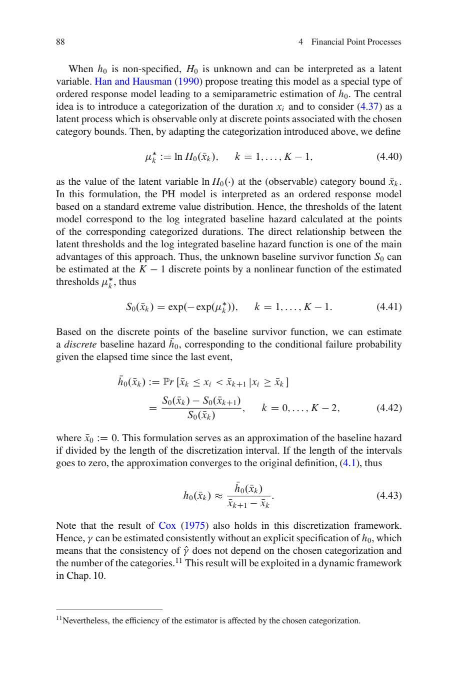

## PDF page 104 / printed page 89

4.2 点過程モデリングの四つのアプローチ                                                                89

PHモデルによって表現される（4.37）、
（4.38）および（4.40）に関連する対数尤度関数は、標準的な極値分布に基づく順序応答仕様のよく知られた形式を持つものである。
                                                                            z0
                                 X X
                                 n K1                                     k Z i 1

                 ln L.YI / D               1l fxi 2.xN k1 ;xNk g ln                f" .s/ds:   (4.44)
                                 i D1 kD1                                     0
                                                                         k1 zi 1

4.2.2.2 加速された故障時間モデル

上記で示されているように、PHモデルでは、説明変数はベースライン強度と乗数的に作用する。対照的に、AFTモデルでは、zi が故障までの時間を加速（または減速）すると仮定される。したがって、共変量は時間軸に沿って進む速度を変化させ、ハザード関数が与えられることになる。
                                                          
                       h.xi I zi 1 / D h0 xi exp.z0i 1 / exp.z0i 1 /;                         (4.45)

これは、以下のように書き換えることもできる12

                              ln xi D z0i 1 C "i ;           i D 1; : : : ; n;                    (4.46)

ここで、"i はある連続分布に従う誤差項である。したがって、PHモデルは未知の左辺変数と標準極値分布に従う誤差項を持つ線形モデルを意味する一方、AFTモデルは、xi を左辺変数とし、誤差項の未知の分布を持つ対数線形表現をもたらす。PHモデルでは、共変数はハザード関数と乗数的に作用するが、AFTモデルでは、共変数は対数デュレーションと乗数的に作用する。xi がパラメータ a（Sect. 4.2.2.1を参照）を持つ Weibull 分布に従う特殊な場合、両方のモデルファミリーに属するモデルが得られ、共変量と強度関数との間、および共変量と対数デュレーションとの間に乗数的な関係があることを意味する。この場合、（4.46）は（4.39）に対応し、したがって"i D "i は標準極値分布に従う。
    PHモデルとAFTモデルの両方を内包する、より一般的なモデルクラスは、Ridder (1990)によって導入され、Generalized Accelerated Failure Time (GAFT)モデルと呼ばれる。これは以下で与えられる。

                                      ln g.xi / D z0i 1 C "i ;                                    (4.47)

ここで、g./ は Œ0; 1/ 上で定義された任意の非減少関数であり、"i は未知の連続確率密度関数 f ./ を持つ未知の分布に従う。GAFTモデルはPH

12
     Kalbfleisch and Prentice (1980) を参照。

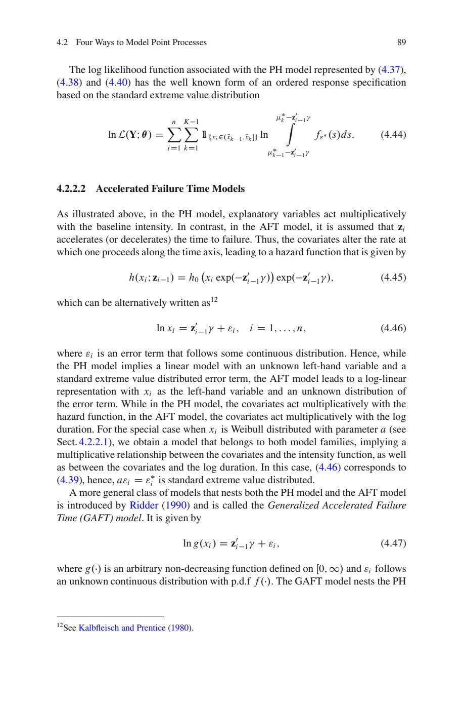

## PDF page 105 / printed page 90

90                                                           4 金融点過程

モデルは f ./ D f" であり、g.x/ D x の場合、AFTモデルを内包する。Ridder (1990) は、GAFTモデルは非パラメータ的に同定可能であることを示している。

4.2.3 デュレーションモデル

強度関数を指定する代わりに、点過程は代替的に、連続する点間のデュレーションの過程によって直接記述することができる。非負性を確保するために、最も単純なアプローチは、対数線形回帰モデルでデュレーションを指定することである。

                                ln xi D z0i 1 C "i ;                            (4.48)

ここで、"i はある独立同一分布の誤差項である。このようなモデルは、OLSによって容易に推定することができる。4.2.2.2節で議論したように、このタイプのモデルはAFTモデルのクラス、あるいは、"i が標準極値分布に従う特殊な場合には、PHモデルのクラスにも属する。しかし、一般的に、対数デュレーションに対する回帰モデルは、AFT表現と関連付けられる。 (動的な) デュレーションモデルに関するより詳細な議論は、第5章で行われる。

4.2.4 標数データモデル

点過程モデルの代替表現は、等間隔の長さ  の区間における点の数（イベント数）の同時分布を指定することによって得られる。Nj を Œj; .j C 1// 区間におけるイベント数とすると、

                 Nj WD N..j C 1//  N.j/;            j D 1; 2; : : :          (4.49)

標数データモデルの仕様には、データを集計する必要があり、これは必然的にある程度の情報損失を引き起こす。Nj に関連する共変ベクトルを z j とすると、最も単純な標数データモデルは、

                                Nj jz
                                      j  P o./:                                (4.50)

より一般的なモデルは、NegBin 分布（例えば、Cameron and Trivedi 1998 参照）または Efron (1986) によって導入された二重Poisson分布を使用することで得られる。 (動的な) 標数データモデルおよびそれらに対応する分布に関するより詳細な議論は、第12章で行われる。

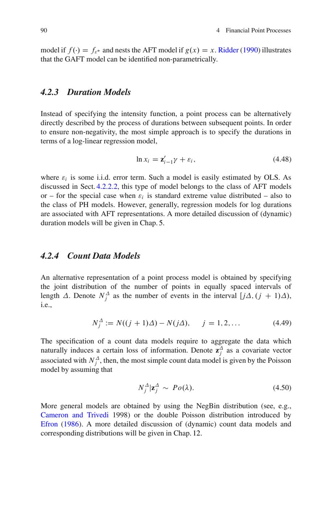

## PDF page 106 / printed page 91

4.3 検閲と時間変動共変量                                                 91

4.3 検閲と時間変動共変量

本節では、伝統的なデュレーションデータ（失業データのようなもの）で通常発生し、また金融点過程においても役割を果たす2つの現象について議論する。検閲の効果と時間変動共変量の影響である。以下に示すように、両方の現象は強度フレームワークに容易に取り込むことができる。

4.3.1 検閲

経済的デュレーションデータの典型的な性質として、不完全な期間につながる検閲の発生がある。したがって、検閲メカニズムの検討に焦点を当てた計量経済学デュレーション文献が広く存在する。13 金融点過程の文脈では、点過程が直接観察できない区間が存在する場合に検閲が発生する。これは、夜間、週末、祝日などの非取引期間によるものである可能性がある。以下では、点 ti がそのような検閲区間内に存在するかどうかを特定できると仮定する。例えば、累積価格変動の特定の大きさで発生する点に関連付けられた点過程を考える。14 価格は非取引期間中も変動する（他の市場での取引によるため）、しかし、次の取引日の開始時に初めて観察される。この場合、価格イベントが発生したことはわかるが、正確にいつ発生したかはわからない。15 したがって、対応するデュレーションの最小長（つまり、前の点 ti 1 から検閲区間の開始までの時間）と、期間の最大長（つまり、検閲区間の終了から次の点 ti C1 までの時間）のみを特定できる。
    以下では、til と tiu で til  ti  tiu となるものが、ti の周囲の潜在的な検閲区間の境界として定義され、ci は、ti が検閲区間内に発生することを示すインジケーター変数として定義される。すなわち、
                                       (
                                           1   if ti 2 .til I tiu /;
                               ci WD
                                           0   if ti D til D tiu :

左検閲、右検閲、または左右検閲の場合、非観測デュレーション xi は、下限と上限 xil と xiu  が対応して計算される境界 xi 2 Œxil ; xiu  によって分離できる。

13
   Horowitz and Neumann (1987, 1989) を参照されたい。Neumann (1997) のサーベイ、Gorgens and Horowitz (1999) または Orbe et al. (2002) も参照されたい。
14
   これらの過程は、第10章でより詳細に議論される。
15
   ただし、非取引期間中に複数の価格変動が発生したかどうかを特定することはできないことに注意が必要である。

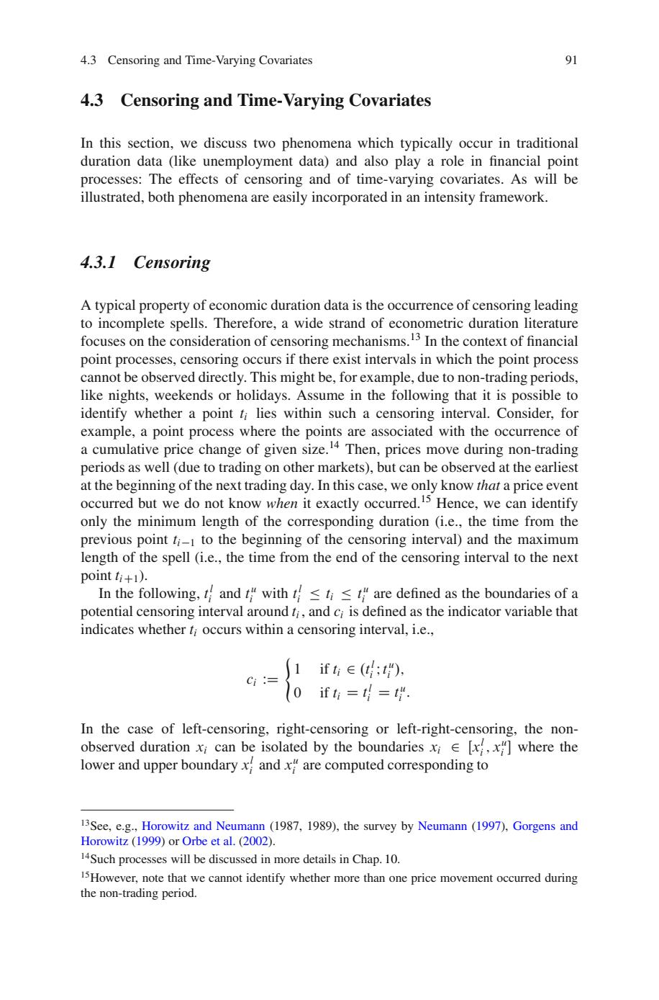

## PDF page 107 / printed page 92

92                                                                            4 金融点過程

      8
      ˆ
      <Œti  ti 1 I ti  ti 1  if ci 1 D 1; ci D 0 (左検閲)
      ˆ         u           l

  xi 2 Œtil  ti 1 I tiu  ti 1  if ci 1 D 0; ci D 1 (右検閲)       (4.51)
      ˆ
      :̂Œt l  t u I t u  t l  if c
          i     i 1 i       i 1       i 1 D 1; ci D 1 (左右検閲):

金融データにおいては、容易に満たされる一般的な仮定として、検閲の独立性の仮定がある。この仮定は、検閲メカニズムが外生的に決定され、デュレーション過程自体によって駆動されないことを意味する。検閲メカニズムの種類に関する詳細な解説と議論については、例えばNeumann (1997)を参照されたい。
    検閲の独立性の仮定の下では、尤度関数は次のように分解される。

           L.YI jc1 ; : : : ; cn / D L.YI ; c1 ; : : : ; cn /  L.YI c1 ; : : : ; cn /:           (4.52)

したがって、第2の因子はモデルのパラメータに依存せず、パラメータベクトル  は(4.52)の第1の因子を最大化することによって推定される。したがって、対応する対数尤度関数は次のようになる。

                                      X
                                      n
     ln L.YI c1 ; : : : ; cn I / D          .1  ci /.1  ci 1 / ..ti 1 ; ti / C ln .ti I Fti //
                                      i D1

                                          X
                                          n
                                                                                                   
                                      C          ci 1 .1  ci / ln S.ti  tiu1 /  S.ti  til1 /
                                          i D1

                                          X
                                          n
                                                                                                    
                                      C          .1  ci 1 /ci ln S.til  ti 1 /  S.tiu  ti 1 /
                                          i D1

                                          X
                                          n
                                                                                             
                                      C          ci 1 ci ln S.til  tiu1 /  S.tiu  til1 / :    (4.53)
                                          i D1

(4.53)の第1項は、検閲されていないデュレーションの対数尤度寄与であり、続く項は、左検閲、右検閲、および左右検閲された観測値の寄与である。

4.3.2 時間変動する共変量

以下では、時間変動する共変量 z.t/ の取り扱いについて議論する。ここで、共変量の強度への影響は、ti 1 から ti までの時間を通じて一定ではなく、時間変動する。しかし、共変量のパスに対する連続時間モデルの定式化は、連続パス上のイベントの正確なタイミングを特定する必要があるため、むしろ困難である。これらの困難を回避するために、通常は離散時間フレームワークに基づくモデルを構築する。したがって、離散時間フレームワークに基づくモデルを構築することが一般的である。

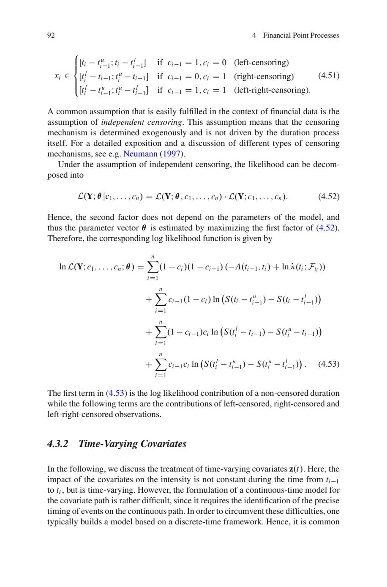

## PDF page 108 / printed page 93

4.3 検閲と時間変動共変量                                                                 93

イベントの発生は、離散的な時点でのみ発生しうるという仮定に基づいて進むことである。これにより、強度という概念が離散化されることになる。
    Lancaster (1997) の表記に従い、Zi .x/ を z.ti 1 / から z.ti 1 C x/ までの z.t/ の経路、Zi .x1 ; x2 / を z.ti 1 C x1 / から z.ti 1 C x2 / までの z.t/ の経路と表記する。さらに、セク. 4.2.2.1 で概説された枠組みに従って、観測されたデュレーションは M 個の区間に分割され、デュレーション xi は離散的な値 xN m （m D 1; : : : ; M  1）のみを取りうるものと仮定する。さらに、この離散化は、各特定の点を捉えるのに十分な感度を持つもの、すなわち、minfxi g  xN 1 8 i であると仮定する。
    次に、Lancaster (1997) に従って、ti 1 C xN m の点における強度関数の離散的な定式化は、

                 N i 1 C xN m I Zi .xN m // D Pr Œxi D xN m jxi  xN m I Zi .xN m / 
                 .t                                                                                   (4.54)

として得られ、以下の式に基づいて計算することができる。

                                      Y
                                      m1
                                             
      Pr Œxi  xN m ; Zi .xN m / D                  N i 1 C xN j I Zi .xN j //
                                                 1  .t
                                      j D1

                                        Y
                                        m1
                                                                         ˇ
                                                  Pr Zi .xN j 1 ; xN j / ˇxi  xN j ; Zi .xN j 1 /   (4.55)
                                         j D1

そして、

                                                  N i 1 C xN m I Zi .xN m //
         PrŒxi D xN m ; xi  xN m ; Zi .xN m / D .t
                                  Y
                                  m1
                                         
                                                 N i 1 C xN j I Zi .xN j //
                                             1  .t
                                  j D1

                                  Y
                                  m
                                                                ˇ
                                         Pr Zi .xN j 1 ; xN j / ˇxi  xN j ; Zi .xN j 1 / :          (4.56)

である。

   式 (4.55) と (4.56) は、いわゆる外生共変過程の場合に簡略化される。すなわち、Lancaster (1997) の定義に従うならば、

                   Pr ŒZi .x; x C / j xi  x C ; Zi .x/ 
                       D Pr ŒZi .x; x C / jZi .x/  ;                 8 x  0;  > 0:                 (4.57)

であるときである。したがって、共変過程の外生性とは、x C  までさらなるイベントが観測されていないという情報が、x から x C  までの共変量のさらなる経路の予測可能性を持たないことを意味する。この場合、(4.55) と (4.56) は簡略化される。

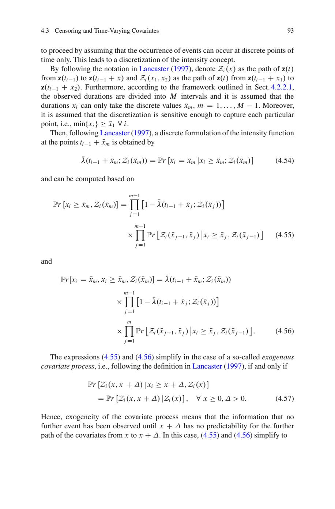

## PDF page 109 / printed page 94

94                                                                      4 金融点過程

                                              Y
                                              m1
                                                     
              Pr Œxi  xN m ; Zi .xN m / D               N i 1 C xN j I Zi .xN j //
                                                      1  .t                               (4.58)
                                              j D1

そして

                                                       N i 1 C xN m I Zi .xN m //
              PrŒxi D xN m ; xi  xN m ; Zi .xN m / D .t
                                          Y
                                          m1
                                                 
                                                         N i 1 C xN j I Zi .xN j // :
                                                     1  .t                                (4.59)
                                          j D1

    共変量が存在しない場合、(4.55)と(4.56)は、共変量のパスが与えられた条件付き確率として解釈できる。しかし、それらが有効な確率であっても、決して条件付き生存関数またはxiの条件付き確率密度関数の値として解釈することはできない。これは、Zi .xN j /自体がtの関数であり、条件付き生存関数または条件付き確率密度関数の条件付けイベントが、引数が変化すると変化するためである。
    しかしながら、(離散的な)確率密度関数の値として解釈できないにもかかわらず、統計的推論を行うために使用できる。したがって、共変量のパスが与えられた場合、強度関数は、条件付き密度または条件付き生存関数として解釈できるものが存在しなくても常に定義される。これらの関係性は、デュレーションデータモデリングにおける強度概念の重要性を示している。

4.4 動的拡張の見通し

点過程における自己回帰構造の実装は、代替的な方法で行うことができる。点過程の3つの可能な仕様に従って、動態は強度過程、デュレーション過程、または計数過程のいずれかに導入することができる。原理的には、どの方法が優先されるべきか、またある仕様が別の仕様よりも優れているかどうかは明確ではない。最終的には、特定の概念は、データに満足のいく適合性をもたらし、その係数が容易に経済的に解釈できる、うまく規定された実証モデルをもたらす能力によって判断される。しかしながら、動的な枠組みの中で、特定の接近法と、金融点過程の特定の特性に関するその長所と短所との間の根本的な違いをより詳細に検討する必要がある。
    自己回帰点過程をモデリングする最も単純で、おそらく最も直感的な方法は、デュレーションに関して自己回帰過程を指定することである。再生過程は、独立同一分布の区間によって指定されるが、より一般的な点過程は、逐次イベント区間 fxi g, i D 1; : : : ; nにおいて動態を許容することによって生じる。例えば、いわゆるWold過程のクラスは、

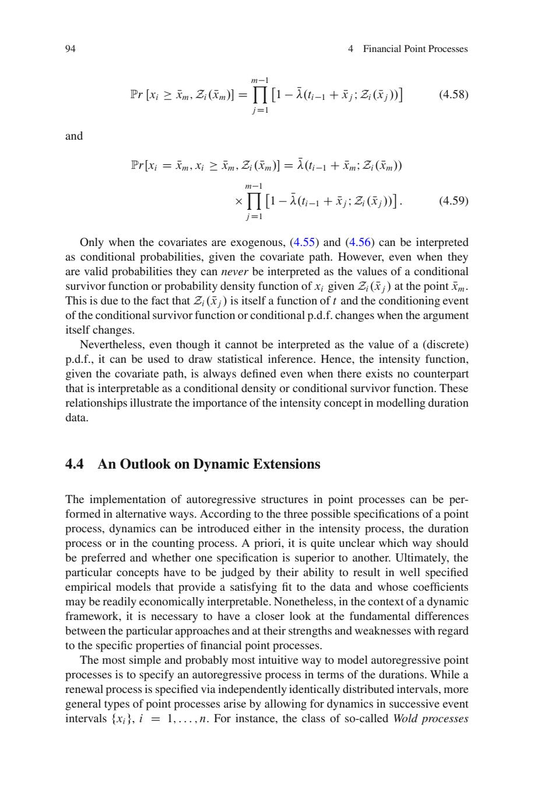

## PDF page 110 / printed page 95

4.4 動的拡張の見通し                                                     95

(例えば、Daley and Vere-Jones 2005 を参照) は、過程 fxi g がマルコフ連鎖を形成するとき、すなわち、xi C1 の分布が xi ; xi 1 ; : : :, にのみ依存するときに得られる。実際、間隔時間に対する (定常的な) AR(1) 過程

                                 xi D c C xi 1 C "i ;

ここで "i は i.i.d. 非負の確率変数であり、c > 0 であり、0 <  < 1 であり、非負性制約を満たすものが、Wold 過程の自然な候補となる。Cox and Isham (1980) によると、そう呼ばれる Semi-Markov 過程は、デュレーション系列に対する確率分布の確率的な系列を指定することによって得られる。M 個の特定の状態に関連付けられた M 個の分布関数 F .1/ ./; : : : ; F .M / ./ を仮定すると、過程は t での状態 j にあると言われる。遷移は遷移行列 P  によって決定され、その ij 番目の要素は状態 i から状態 j への遷移確率である。詳細については、Cox and Isham (1980) を参照されたい。
    マルコフ構造を緩和することで、より一般的な動的点過程が得られる。デュレーション過程に高次の (ARMA 型) 動的特性を許容すると、自己回帰デュレーション過程のクラスが得られる。第 5 章でより詳しく説明するように、これらの過程は、過去のデュレーションに関して自己回帰成分を含む強度関数によって特徴付けられる。
    Engle and Russell (1997, 1998) および Engle (1996, 2000) が提案した自己回帰デュレーションモデルの特定クラスは、本書の第 5 章および第 6 章でより詳しく検討される。このようなアプローチの主な利点は、ARMA または GARCH モデルの標準的な時系列パッケージをある程度直接的にデュレーションデータに適用できるという実用性である。おそらくこの理由から、自己回帰デュレーションモデルは、最も一般的な金融点過程の仕様であり、最近の金融計量経済学文献で一般的に使用されている。
    しかしながら、自己回帰デュレーションモデルもまた、主な欠点を明らかにする。第一に、個々の過程が時間的に非同期に発生するため、多変量フレームワークに容易に拡張できない。その結果、過程を結合するために使用できる同時点が存在せず、個々の過程間の同時相関を推定することが困難になる。第二に、検閲効果の取り扱いがむしろ困難である。検閲の場合、過程の特定の点の正確なタイミングを観察できず、対応する区間によって近似されるにすぎない。このような効果は、時系列フレームワークにおいて、spell の正確な長さに関する情報が必要となるため、問題を引き起こす。可能な解決策の 1 つは、例えば、検閲されたデュレーションを、それらの対応する条件付き期待値の関数に置き換える修正モデルを構築することである。しかし、このような修正は時系列コンテキストでは簡単ではない。第三に、離散時間デュレーションフレームワークでは、時間とともに変化する共変量を考慮することが困難である。第 4.3.2 項で説明したように、このようなコンテキストでは強度表現の方がより有用で便利である。
    自己回帰デュレーションアプローチと比較して、動的強度モデルの主な利点は、連続時間フレームワークで点過程をモデル化できることである。したがって、2 つの点間のデュレーションは、定義上、

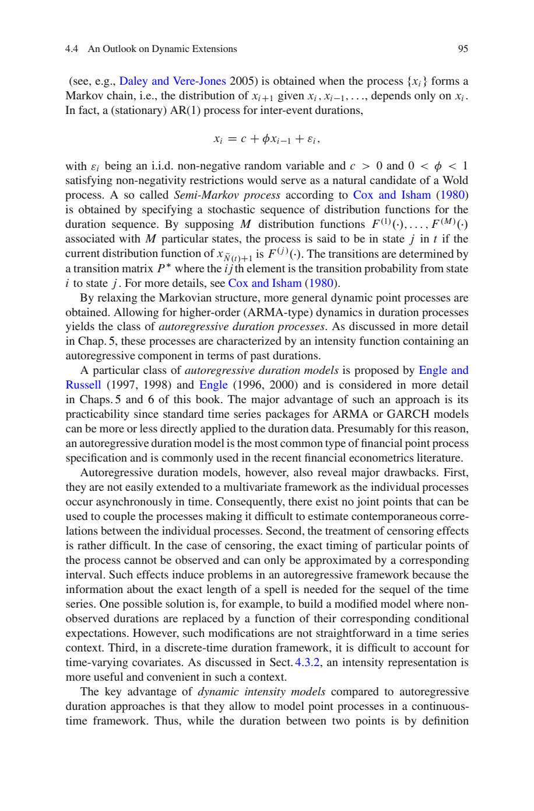

## PDF page 111 / printed page 96

96                                                          4 金融点過程

観測点 ti 自体で観測される場合、強度関数は任意の時点において定義される。この性質は、時間変化する共変量モデリングや自己回帰多変量点過程モデルの文脈において重要な役割を果たす。強度フレームワークでは、プーリングされた過程の各点において個々の過程を結合することが可能であり、非同期性の問題を解決することができる。多変量自己回帰強度モデルについては、第12章でより詳細に議論する。

動機付けとして、自己興奮過程と呼ばれる動的な点過程のクラスがある。Hawkes (1971) は、線形の自己興奮過程の特別なクラスを紹介しており、その強度関数は、過去のすべての点までの逆後行時間によって重み付けされた関数である。このアプローチの利点は、強い事前時系列構造を課すことなく、強度の依存性の性質を推定できる点にある。Hawkes過程の詳細と金融データへの応用については、第11章および第12章を参照されたい。

自己興奮過程の代替案として、自己回帰点過程のクラスがある。この文脈では、再生過程に時系列構造が追加され、強度関数、積分ハザード関数、後続の点間のデュレーション、または計数関数に関して指定することができる。このような点過程の種類の詳細な説明は、本書の後半で与えられる。

しかし、デュレーションフレームワークと同様に、検閲効果の処理はむしろ困難である。検閲された観測の場合、発生時刻、したがってその特定の時点における強度関数は、正確には測定できない。したがって、動的モデルの時間系列再帰においてこれらの（観測されない）実現が必要な限り、近似を使用しなければならない。したがって、強い検閲メカニズムの影響を受ける点過程のモデリングには、代替のアプローチが必要である。1つの代替案は、生存関数に基づいた動的モデルを構築することである。生存関数は、検閲（第4.3.1節を参照）の文脈において重要な役割を果たす。なぜなら、検閲境界に対する生存確率の観点から、観測されない発生時刻を分離することができるからである。したがって、生存関数と積分ハザード関数との関係を利用する（(4.26)を参照）、積分ハザード関数に基づいた代替的な動的点過程モデルを構築することができる。さらに、第10章で説明されているように、自己回帰積分ハザードモデルは、半パラメータ比例ハザードモデルの動的拡張のための貴重なアプローチである。この文脈では、第4.2.2.1節で提示された離散化アプローチは、動的フレームワークにおける非指定ベースラインハザードの半パラメータ推定を得るために適用される。

自己回帰点過程をモデリングするもう一つの可能性は、自己回帰計数データモデルを指定することである。このアプローチの強みは、これらのモデルが（仮定として）等間隔の時系列間に基づいている点にある。その理由から、これらは容易に多変量フレームワークに拡張される（Davis et al. 2001 または Heinen and Rengifo 2007 を参照）。ただし、この文脈における検閲メカニズムの処理と時間変化する共変量の組み込みはむしろ困難である。これらのモデルについては、第13章でより詳細に議論する。

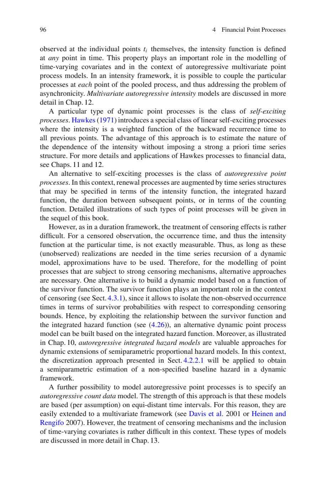

## PDF page 112 / printed page 97

参考文献                                                                                    97

参考文献

Bauwens L, Hautsch N (2009) 高頻度データの点過程を用いた金融モデル化.
    In: Andersen TG, Davis RA, Kreiss J-P, Mikosch T (eds) 金融時系列ハンドブック.
    Springer, Berlin, Heidelberg

Bowsher CG (2007) 連続時間におけるセキュリティ市場のモデル化：強度に基づく、多変量点過程モデル. J Econom 141:876–912

Brémaud P (1981) 点過程とキュー、マルチンゲールダイナミクス. Springer, New York

Breslow N (1972) D. R. Cox氏の論文に関する議論への貢献. J R Stat Soc Series B
    34:216–17

Breslow NE (1974) 打ち切られた生存データの共分散分析. Biometrics 30:89–100

Brock W, Dechert WD, Scheinkman J, LeBaron B (1996) 相関次元に基づく独立性検定. Econom Rev 15:197–235

Brown TC, Nair MG (1988) 点過程における多変量ランダム時間変化定理の簡単な証明. J Appl Probab 25:210–214

Cameron AC, Trivedi PK (1998) 階数データの回帰分析. Cambridge University Press,
    Cambridge

Cox DR (1972) 回帰モデルと生存テーブル. J R Stat Soc Series B 34:187–220

Cox DR (1975) 部分尤度. Biometrika 62:269

Cox DR, Isham V (1980) 点過程. Chapman and Hall, London

Cox DR, Oakes D (1984) 生存データ解析. Chapman and Hall, London

Cox DR, Snell EJ (1968) 残差の一般的な定義. J R Stat Soc Series B 30:248–265

Daley D, Vere-Jones D (2005) 点過程理論入門. Volume I:
    初等理論と方法. Springer, New York

Davis RA, Rydberg TH, Shephard N, Streett SB (2001) CBinモデルによるカウント：取引速度、気配の変化、指値注文と成行注文の到着における共通の特徴の検定.
    Discussion paper, Nuffield College, Oxford

Efron B (1986) 二重指数型分布と一般化線形回帰におけるその応用. J Am
    Stat Assoc 81:709–721

Engle RF (2000) 超高頻度データの計量経済学. Econometrica 68(1):1–22

Engle RF, Russell JR (1998) 自己回帰条件付きデュレーション：不規則間隔で発生する取引データのための新しいモデル. Econometrica 66:1127–1162

Gorgens T, Horowitz JL (1999) 従属変数の未知の変換を持つ打ち切られた回帰モデルの半パラメータ推定. J Econom 90:155–191

Gritz RM (1993) 訓練が雇用頻度とデュレーションに与える影響. J Econom
    57:21–51

Han A, Hausman JA (1990) 柔軟なパラメータ推定によるデュレーションと競合リスクモデル.
    J Appl Econom 5:1–28

Hawkes AG (1971) 自己刺激的および相互刺激的な点過程のスペクトル.
    Biometrika 58:83–90

Heckmann JJ, Singer B (1984) 計量経済学におけるデュレーション分析. J Econom 24:63–132

Heinen A, Rengifo E (2007) コプーラを用いた時系列カウントデータの多変量自己回帰モデリング. Empir Financ 14:564–583

Honoré BE (1990) 未観測の異質性を持つデュレーションモデルの簡単な推定. Econo-
    metrica 58:453–473

Horowitz JL, Neumann GR (1987) 雇用デュレーションモデルの半パラメータ推定.
    Econometric Review 6(1):5–40

Kalbfleisch JD, Prentice RL (1980) 故障時間データの統計的分析. Wiley, New York

Kaplan EL, Meier P (1958) 不完全な観測からの非パラメータ推定. J Am Stat
    Assoc 53:457–481

Karr AF (1991) 点過程とその統計的推論. Dekker, New York

Kiefer NM (1988) 経済的デュレーションデータとハザード関数. J Econ Lit 26:646–679

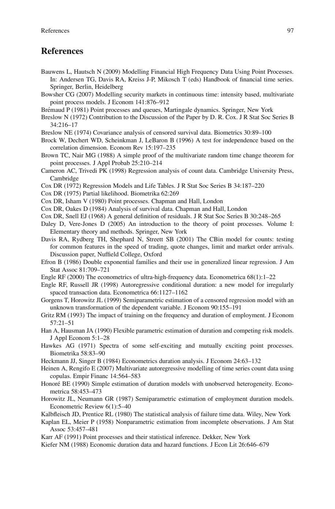

## PDF page 113 / printed page 98

98                                                                  4 金融点過程

Lancaster T (1979) Econometric methods for the duration of unemployment. Econometrica
   47(4):939–956
Lancaster T (1997) The econometric analysis of transition data. Cambridge University Press
McCall BP (1996) Unemployment insurance rules, joblessness and part-time work. Econometrica
   64(3):647–682
Meyer PA (1971) Démonstration simplifiée d’un théorème Knight. Lecture Notes in Mathemat-
   ics vol. 191. Springer, pp. 191–195
Meyer BD (1990) Unemployment insurance and unemployment spells. Econometrica 58(4):757–
   782
Moffitt R (1985) Unemployment insurance and the distribution of unemployment spells. J Econom
   28:85–101
Neumann G (1997) Search models and duration data. Pesaran MH (編) Handbook of Applied
   Econometrics, chap. 7. Basil Blackwell, Oxford, pp 300–351
Nickell S (1979) Estimating the probability of leaving unemployment. Econometrica 47(5):s 1249–
   1266
Oakes D (2001) Biometrika centenary: survival analysis. Biometrika 88:99–142
Orbe J, Ferreira E, Nunez-Anton V (2002) Length of time spent in chapter 11 bankruptcy: a
   censored partial regression model. Appl Econ 34:1949–1957
Ridder G (1990) The non-parametric identification of generalized accelerated failure-time models.
   Rev Econ Stud 57:167–182
Snyder DL, Miller MI (1991) Random point processes and time and space, 2nd edn. Springer, New
   York,
Sueyoshi GT (1995) A class of binary response models for grouped duration data. J Appl Econom
   10:411–431
van den Berg GJ, B. van der Klaauw (2001) Combining micro and macro unemployment duration
   data. J Econom 102:271–309
Yashin A, Arjas E (1988) A note on random intensities and conditional survival functions. J Appl
   Probab 25:630–635

# 第5章: 単変量乗法誤差モデル（Univariate Multiplicative Error Models）

- 翻訳モデル: `gemma3:12b`
- 原文抽出テキスト: `../econometrics_hf_ch1_ch7_markdown_ja/raw_text/ch05_univariate_multiplicative_error_models.txt`
- 注: 数式・表・図はPDF抽出テキストでは崩れている場合があるため、ページ画像を併読してください。

## PDF page 114 / printed page 99

第5章
単変量乗法誤差モデル

乗法誤差モデル（MEM）という用語は、エンゲル (2002b) によって、正の値をとる確率変数のための一般的な時系列モデル群を指して導入されたものである。これらのモデルは、条件付き平均と正の値をとる誤差項の積として分解される。このようなモデルは、分布の条件付き平均が確率過程に従うと仮定する自己回帰条件付き平均モデルとして分類することもできる。MEMのアイデアは、金融計量経済学においてよく知られており、エンゲル (1982) が導入した自己回帰条件付き不均一分散（ARCH）モデル、またはテイラー (1982) が提案した確率的ボラティリティ（SV）モデルの構造に由来する。これらのモデルでは、条件付き分散が動的にパラメータ化され、革新項と乗法的相互作用をする。高頻度計量経済学において、MEMは、エンゲルとラッセル (1997, 1998) によって、取引間の時間間隔の動的な振る舞いをモデル化するために初めて導入され、自己回帰条件付きデュレーション（ACD）モデルと呼ばれるようになった。したがって、ACDモデルは、金融デュレーションに適用されるMEMの一種である。

本章では、単変量MEMについて議論する。読者を同じモデルに対する異なる用語法で混乱させることのないように、我々は金融デュレーションの文脈でモデルを議論し、以下のセクションではACDモデルという用語を使用する。言うまでもなく、このモデルは、取引量、市場深度、ビッド・アスク・スプレッド、または取引数（後者がある程度連続している場合）など、他の正の値をとる（連続）過程にも直接適用できる。例えば、取引量のモデリングの場合、マンガネッリ (2005) は対応するモデルを自己回帰条件付きボリューム（ACV）過程と呼んでいる。しかしながら、用語のインフレを避けるために、我々はこれらの異なるラベルを使用しない。

MEMは、異なる種類の変数に適用できるだけでなく、異なるサンプリングスキームにも適用できることに注意する。金融デュレーションの場合、過程はイベント時刻で観測され、したがって観測は時間に不規則に間隔を空けている。逆に、MEMが（等間隔の）時間間隔に基づく集計取引活動をモデル化するために使用される場合、過程はカレンダー時刻で定義される。

我々が金融デュレーションモデリングの文脈でMEMについて議論するため、我々はまた、第4章で議論されている点過程理論の概念とのリンクとともに、金融点過程のモデルとしての役割を強調する。この文脈において、

N. Hautsch, 金融高頻度データの計量経済学、                          99
DOI 10.1007/978-3-642-21925-2 5, © Springer-Verlag Berlin Heidelberg 2012

## PDF page 115 / printed page 100

100                                                       5 単変量乗法誤差モデル（Univariate Multiplicative Error Models）

動機を説明するために、強度過程の観点からACDモデルの表現を説明する。しかし、デュレーション以外の変数をモデル化する場合、これらの解釈は意味を持たない。

5.1節では、自然な出発点として、対数デュレーションに対する自己回帰モデルについて議論する。5.2節では、エンゲルとラッセル（Engle and Russell, 1997, 1998）が提案した自己回帰条件付きデュレーション（ACD）モデルの基本的な形式を提示する。これは最も一般的な自己回帰デュレーションモデルであり、近年の計量経済学文献で広く検討されているため、理論的性質と推定に関する問題をより詳細に議論する。5.3節では、ACDモデルの（準）最尤推定について議論する。5.4節では、共変量の包含と日中周期性の考慮について説明する。対数仕様のACDモデル、いわゆるLog ACDモデルについては、5.5節で議論する。5.6節は、ACDモデルの仕様検定に費やされる。ここでは、ポートマンテスト、独立性テスト、分布検定、ラグランジュ乗数および（積分）条件付きモーメント検定に焦点を当てる。

5.1 ARMAモデルと対数変数

正の値をとる変数xi > 0に対する自己回帰モデルの自然な出発点として、対数変数の（自己回帰）モデルを指定する。対数変数は非負制約を受けないため、従来の時系列モデルを容易に適用できる。したがって、対数変数に対する単純なARMAモデルは次の式で与えられる。

                        XP                X
                                          Q
           ln xi D ! C      ˛j ln xi j C   ˇj "Qi j C "Q i ; i D 1; : : : ; n; (5.1)
                        j D1                       j D1

ここで、"Q i はホワイトノイズ変数である。xi が金融デュレーションである場合、このモデルは AFTモデルのクラス（第4章を参照）に属する。すると、共変量、この文脈では過去のデュレーションも、故障までの時間を加速または減速させる。 "Q i が正規分布に従うという仮定の下で、準最尤（QML）推定器は、パラメータ  D .!; ˛; ˇ/0 を得るために得られる。QML推定値に基づくと、残差 "OQ i の経験分布は、基礎となる分布の非パラメータ推定値、したがって、ベースラインハザードをもたらす。

より洗練された仕様は、ARMA-GARCH型モデルによって得られる。例えば、ln xi の条件付き平均関数は（5.1）に従って指定でき、その条件付き分散、hi は、標準的なGARCH過程に従う。したがって、

                               p
                      "Qi D        hi ui ;      ui  N .0; 1/;

                                        X
                                        Ph                     X
                                                               Qh
                      hi D !h C                ˛h;j "Q2ij C          ˇh;j hi j :          (5.2)
                                        j D1                   j D1

## PDF page 116 / printed page 101

5.1 対数変数のARMAモデル                                                                           101

取引間デュレーションや出来高デュレーションの場合、hiは、経済学的に流動性リスクと関連するデュレーションボラティリティとして解釈される（例えば、Ghysels et al. 1998を参照）。ガウスGARCHモデルのQML推定量の漸近特性を利用することで（Bollerslev and Wooldridge 1992を参照）、(5.1)および(5.2)の自己回帰パラメータが一貫して推定される。1
    ln xiの条件付き平均と条件付き分散の分離可能性は、正規性の仮定から当然に導かれる。しかし、単純な変数に対して、この2つの第1モーメントの分離は容易ではない。一般に、正のサポートで定義された分布は、通常、第1モーメントと高次のモーメントの間の厳密な依存関係を意味し、条件付き平均と分散関数を分離することを許可しない。したがって、条件付き平均のパラメータ化は、（分布上の）仮定として、高次の条件付きモーメントのパラメータ化も意味する。Ghysels et al. (1998)は、このような分布上の仮定はあまりに制限的であり、デュレーションダイナミクスをモデル化するのに十分な柔軟性がないと主張している。この問題に関するより詳細な議論については、第6章を参照されたい。
    しかし、研究者はしばしばln xiのモデル（および予測）ではなく、xiのモデルに興味を持つ。Dufour and Engle (2000)は、対数デュレーションの自己回帰モデルの予測性能は、以下の節で提示されるより洗練されたACD仕様と比較してかなり低いことを示している。したがって、代替的な仕様は、正のサポートで定義された分布に従うイノベーションを持つxiの単純なARMAモデルによって与えられる：

                                    X
                                    P                   X
                                                        Q
                       xi D ! C            ˛j xi j C          ˇj "Qi j C "Qi ;                       (5.3)
                                    j D1                j D1

ここで、! > 0, ˛j  0, ˇj  0である。パラメータ  D .!; ˛; ˇ/0に対するQML推定値は、"Qiに対して標準的な指数分布を仮定することで得られ、データXとパラメータ に基づく疑似最尤関数を導く：
                                                   2                                                 3
                           X
                           n                X
                                            n                    X
                                                                 P                   X
                                                                                     Q
   ln LQML .XI / D              "Qi D           4xi  !             ˛j xi j           ˇj "Qi j 5 ;
                           i D1             i D1                 j D1                j D1
                                                                                                       (5.4)

これは、"Q iの確率密度関数が指数密度である場合に真の対数尤度である。QML理論によれば（Gouriéroux et al. 1984を参照）、条件付き平均関数の正しい仕様は、パラメータ の一貫した推定を保証する。
   このアプローチの欠点は、この場合、結果として得られるデュレーションプロセスの周辺分布が指数分布ではないことである。したがって、ガウスARMAモデルとは異なり、条件付き分布と周辺分布の関係は、

1
  詳細については、GARCH QML推定量の漸近特性をACDモデルに持ち越す5.3.1節を参照されたい。

## PDF page 117 / printed page 102

102                                                    5 単変量乗法誤差モデル（MEM）

$x_i$ の分布は明らかではない。ローレンスとルイス (Lawrence and Lewis, 1980) は、独立な i.i.d. 指数分布のノイズに基づいた指数 ARMA (EARMA) モデルを提案しており、指数分布の周辺分布をもたらす。この結果は、確率的な選択に基づいた、独立した指数分布に従う確率変数の異なる線形結合の間の選択を行う線形自己回帰モデルを指定することによって達成される。

5.2 デュレーションのための MEM：ACD モデル

最も一般的な自己回帰デュレーションアプローチであり、最も一般的なタイプの MEM は、エンゲル (Engle, 1996, 2000) およびエンゲルとラッセル (Engle and Russell, 1997, 1998) によって提案されている。自己回帰条件付きデュレーション（ACD）モデルの基本的なアイデアは、条件付き平均関数を動的にパラメータ化することである。

                            i WD i ./ D EŒxi jFti 1 I ;                            (5.5)

ここで、 は p 1 のパラメータベクトルを表す。$F_{ti \-1}$ は、最も最近の（不規則間隔で配置された）観測値 $t_i \-1$ までに利用可能な情報セットを表す。観測値 $t_i$ の正確なタイミングが重要でない限り、$i$ ですべての観測値をインデックス化し、情報セットを $F_i$ で表すだけで十分である。
    標準化されたデュレーション

                                                  $x_i$
                                        "i WD                                            (5.6)
                                                  i

は、EŒ"i  D 1 となる正のサポートで定義された i.i.d. プロセスに従うと仮定される。明らかに、ACD モデルはデュレーションデータの GARCH モデルと見なすことができる。ACD モデルの種類は、条件付き平均関数 i に使用される関数形、または "i の分布の選択によって分類できる。
   基本的な ACD 仕様は、条件付き平均関数の線形パラメータ化に基づいている。

                                    X
                                    P                      X
                                                           Q
                        i D ! C            ˛j xi j C            ˇj i j :             (5.7)
                                    j D1                   j D1

プロセスの非負性に対する十分な（しかし必須ではない）条件は、! > 0 および ˛  0、ˇ  0 である。
  ACD プロセスは、強度表現で書き換えることができる。

                                                           !
                                                $x_t$               1
                         .tI Ft / D Q "                                 ;              (5.8)
                                              NQ .t /C1       NQ .t /C1

## PDF page 118 / printed page 103

5.2 デュレーションに対する乗法誤差モデル（MEM）：ACDモデル                                               103

ここで、Q " .s/ はACDイノベーション "i のハザード関数を表す。この表現は、ACDモデルが過去のダイナミクスが失敗時間率に影響を与えるため、AFTモデルのクラスに属することを示している。スパン中の強度関数は、"i のハザード形状によってのみ誘導され、新しい情報は点 ti でのみモデルに入ってくる。ハミルトンとジョーダ（2002）が提案するように、(5.8) は強度関数を直接パラメータ化し、スパン内でニュースの到着を許可することで、一般化された仕様の開始点として使用できる。時間依存変数を取り扱うとすぐに、そのような仕様はデュレーション設定から強度設定に切り替える必要がある。これは第11章でより詳しく説明される。
    ACDモデルの基本的な考え方は、強度関数自体ではなく、条件付きデュレーション平均を（動的に）パラメータ化することである。したがって、完全な動的構造と変数の影響は、構築上点 ti でのみ更新できる関数 i によって捉えられる。
    ACDモデルの条件付き平均は、定義により EŒxi jFi 1  D i と与えられ、無条件平均と条件付き分散は
                                                               !
                    EŒxi  D EŒi   EŒ"i  D        PP           PQ          ;    (5.9)
                                                 1    j D1 ˛j      j D1 ˇj

                               VŒxi jFi 1  D i2  VŒ"i :                       (5.10)

P D Q D 1の場合、xi の無条件分散は2として与えられる
                                                                     
                                                 1  ˇ 2  2˛ˇ
                     VŒxi  D EŒxi  VŒ"i 
                                     2
                                                                        :          (5.11)
                                            1  .˛ C ˇ/2  ˛ 2 VŒ"i 

それに対応して、自己相関関数は導出される

                                                   ˛1 .1  ˇ12  ˛1 ˇ1 /
                        1 WD Cov.xi ; xi 1 / D                         ;         (5.12)
                                                    1  ˇ12  2˛1 ˇ1
                        n D .˛ C ˇ/n1         for n  2.                        (5.13)

したがって、ACDモデルの共分散定常性条件は、GARCHモデル（Bollerslev 1986を参照）の共分散定常性条件と同様であり、次の式で満たされる。

                                  .˛ C ˇ/2  ˛ 2 VŒ"i  < 1:

 より高次のACDモデルに対応する結果は同様であるが、計算がより複雑である。VŒxi  > EŒxi 2 であることが簡単にわかるため、ACDモデルは過剰分散を意味する。つまり、無条件標準偏差は

2
    P D Q D 1の場合、˛ は ˛1 に、ˇ は ˇ1 に設定する。

## PDF page 119 / printed page 104

104                                                             5 単変量乗法誤差モデル

不変平均に対する特性である。これは、ガウスGARCHモデルの「過剰尖度特性」に対応すると考えられる。ACD(P, Q)モデルが内包するデュレーション過程の確率密度関数（p.d.f.）の下限と上限に関する一般的な定式化は、Fernandes (2004)に与えられている。
「i」がmartingale difference i WD xi  i と導入されることで、ACD(P; Q)モデルは、単純なデュレーションに対するARMA(max(P ,Q),Q)モデルの項で表現できる。

                                     X
                                  max.P;Q/
                                                                       X
                                                                       Q
                     xi D ! C                   .˛j C ˇj /xi j              ˇj i j C i :    (5.14)
                                     j D1                              j D1

5.3 ACDモデルの推定

5.3.1 QML推定

「i」の分布として自然な選択肢は、指数分布である。第4章で議論したように、指数分布は、正のサポート上で定義された確率過程の中心的な分布であり、R上で定義された確率変数に対する正規分布に対応すると見なすことができる。したがって、指数-ACD（EACD）モデルの仕様は、自然な出発点となる。指数分布の仮定は、多くの応用においてかなり制限的である3が、ACDパラメータに対するQML推定値を導き出すという大きな利点がある。指数化された準対数尤度関数は、次の式で与えられる。

                                            X
                                            n
                                                                n 
                                                                X             
                                                                           xi
                         ln L.XI / D              li ./ D       ln i C      ;                (5.15)
                                                                           i
                                            i D1                i D1

ここで、li ./は、i番目の観測値に対する対数尤度寄与を表す。スコアとヘッセ行列は、次の式で与えられる。

                                X n           X n            
                 @ ln L.XI /                      @i 1 xi
         s./ WD              D      si ./ D              1 ;                                 (5.16)
                      @        i D1          i D1
                                                   @ i i

                   @2 ln L.XI /   X        n
       H./ WD                   D   hi ./
                       @@ 0
                                           i D1
                                    n 
                                    X                                             
                                              @    1 @i    xi         1 @i @i xi
                                D                               1                     ;
                                    i D1
                                             @ 0 i @     i         i @ @ 0 i2

                                                                                                 (5.17)

3
    第3章の記述統計も参照されたい。

## PDF page 120 / printed page 105

5.3 ACDモデルの推定                                                         105

ここで、si ./ はスコアベクトルへの i 番目の寄与を表す p  1 ベクトルであり、hi ./ はヘッセ行列への i 番目の寄与を表す p  p 行列である。モデルが正しく特定されている場合、すなわち i D i;0 、ここで i;0 WD i . 0 / D E Œ xi j Fi 1 I  0  は「真の」条件付き平均関数を表し、"i D xi =i は確率的に i と独立であり、期待値は1を持つ。したがって、スコア si ./ は情報集合 Fi 1 に関してマルチンゲール差分となり、

                                      X
                                      n                        X n
                                                                    1 @i;0 @i;0
                EŒH. 0 /jFi 1  D          hQ i . 0 / D                       ;   (5.18)
                                      i D1
                                                                    2
                                                               i D1 i;0
                                                                        @ @ 0

ここで hQ i ./ WD E Œ hi ./j Fi 1 である。
条件付き平均関数の正しい特定は、EACD推定量のQML特性を確立するための不可欠な前提条件である。Engle (2000) は、Bollerslev と Wooldridge (1992) の結果を EACD モデルに直接適用できることを示している。これらの結果は以下の定理に要約されている。
定理 5.1。以下の正則性条件を仮定する。
   (i)  はコンパクトなパラメータ空間であり、空でない内点を持ち、Rp の部分集合である。
  (ii) ある  0 2 int./ に対して、E Œ xi j Fi 1 I  0  D i . 0 / WD i;0 。
 (iii) (a) i ./ WD i はすべての  2  に対して可測であり、すべての xi に対して int  上で2回連続的に微分可能である。
       (b) i はすべての  2  に対して確率1で正である。        P
 (iv) (a)  0 は n1 niD1 EŒli ./  li . 0 / の識別可能な一意の最大化点である。
       (b) fli ./  li . 0 /g は UWLLN を満たす 8 i D 1; 2; : : : ; n。4
  (v) (a) fhi . 0 /g と fhQ i . 0 /g は UWLLN を満たす。
       (b) fhi ./  hiP   . 0 /g は UWLLN を満たす。
       (c) Aı WD n1 niD1 EŒhQ i . 0 / は一様に正定値である。
                             0
 (vi) (a) fsi . 0 /si .P0 / g は UWLLN を満たす。
             ı       1      n                        0
       (b) B WD n            i D1 EŒsi . 0 /si . 0 /  は一様に正定値である。
                             P                           d
       (c) Bı1=2 n1=2 niD1 si . 0 /si . 0 /0 !N .0; Ip / で Ip は p 次元単位行列を表す。
(vii) (a) fhQ i ./  hQ i . 0 /g は UWLLN を満たす。
       (b) fsi ./si ./  si . 0 /si . 0 /0 g は UWLLN を満たす。
したがって、
                      ı1 ı ı1 1=2 p
                                        n.O   0 / ! N .0; Ip /:
                                                     d
                      A B A

4
    UWLLN: Uniform Weak Law of Large Numbers （一様弱大数の法則）。

## PDF page 121 / printed page 106

106                                                       5 単変量乗法誤差モデル

さらに、

                               p                                        p
                    O ı  Aı ! 0
                    A                          および            BO ı  Bı ! 0;

ここで、

                  X n
                                                                  1X O
                                                                      n
           Oı D 1
           A                 O
                       hQ i ./              および           BO ı D                  O 0:
                                                                         si ./si ./
                n i D1                                            n i D1

証明：Bollerslev and Wooldridge (1992), p. 167 を参照のこと。                                
   この定理は、疑似対数尤度関数
(5.15) の最大化が、摂動項の密度関数を特定せずに  の一貫した推定値をもたらすことを示している。Bollerslev and Wooldridge (1992) が指摘したように、行列 Aı1 Bı Aı1 は、White (1982) のロバストな非同期
分散共分散の n.O   0 / の推定値である。分布の誤った特定だけでなく、ACD 誤差の動的な
誤った特定に対してもロバストな分散共分散推定値は、Newey and West (1987) に従って、Bı を推定することによって得られる。

                                      J 
                                      X                 
                                                     j
                       BO ı D O0 C      1               .Oj C Oj0 /;
                                      j D1
                                                   J C1

ここで、

                                               X
                                               n
                              Oj WD n1                    O i ./
                                                        si ./s  O 0
                                              i Dj C1

であり、J は外生的に与えられた切断ラグ次数を表す。Bollerslev and Wooldridge (1992) の仮定は、スコアベクトルの漸近正規性および尤度関数およびその二階導関数の一様弱収束を必要とするため、かなり強い。さらに、第3章で示されているように、典型的な高頻度デュレーション過程（例えば、取引デュレーション過程など）は、高度に持続的で、ほぼ積分的である。積分的な場合、i の無条件平均は有限ではなく、推定値の非正規な極限分布をもたらす。これらの問題に対処するために、Lee and Hansen (1994) は、Bollerslev and Wooldridge (1992) よりも弱い仮定の下で、IGARCH 疑似最尤推定量の漸近特性を確立している。Engle and Russell (1998) は、これらの結果は EACD(1,1) の場合に容易に適用できることを示している。Lee and Hansen (1994) の主な結果は以下の通りに要約される。
定理 5.2. 以下の正則性条件を仮定する。
  (i)  0 D .!0 ; ˛0 ; ˇ0 /0 2 int./.
 (ii) E Œ xi j Fi 1 I  0  WD i . 0 / D i;0 D !0 C ˛0 xi 1 C ˇ0 i 1 .

## PDF page 122 / printed page 107

5.3 ACDモデルの推定                                                     107

(iii) 「i D xi =i;0 は厳密に定常かつエルゴードである。
(iv) 「i は非退化である。
              ˇ
(v) E "2i ˇ Fi 1 < 1 a.s.
(vi) supi E Œ ln ˇ0 C ˛0 "i j Fi 1  < 0 a:s: h        i
                       P                   P
(vii) ln L.XI / D niD1 li ./ D  niD1 ln i C xii ; where i D ! C˛xi 1 C
       ˇi 1 .                                         P
(viii)  0 は、n1 niD1 EŒli ./  li . 0 / を最大化する一意に識別可能な値である。
Then,
                                      1=2 p                d
                        Aı1 Bı Aı1          n.O   0 / ! N .0; Ip /

and
                                     p                            p
                            O ı  Aı !
                            A          0     and BO ı  Bı ! 0:

Proof: Lee and Hansen (1994), p. 47ff. を参照のこと。                                            
これらの結果は、˛ C ˇ D 1 の場合にも有効である。さらに、標準化された
デュレーションは、独立同一分布に従う必要はない。むしろ、それらは厳密に定常かつエルゴードである必要がある。この性質は、Drost
and Werker (2004) が導入した、いわゆる半パラメータACDモデルを含む、より広範なモデルクラスにBollerslev and Wooldridge (1992) の結果を一般化するものである。注意すべきは、これらの結果は線形EACD(1,1)モデルに基づいているため、(非線形) EACD(P ,Q)モデルのようなより一般的なケースには必ずしも適用できないということである。いずれにしても、ACDモデルのQML推定における重要な要件は、条件付き平均制約の有効性、すなわち条件付き平均関数 i の正しい仕様である。この仮定については、5.6節でより詳細に検討する。
Exponential QML推定量の漸近一致性は、そのスコア関数が、以下の性質を持つ無条件モーメント関数に対応することと本質的に関連しているという事実から生じる。

                        EŒsi . 0 / D 0;    0 2 ;     i D 1; : : : ; n:       (5.19)

これにより、対応するモーメント推定量を構築することができる。Drost
and Werker (2004) および Engle and Gallo (2006) が議論するように、この関係は、ガンマ分布を選択することによっても代替的に達成できる。 (5.16) からわかるように、単一の観測値 i の Exponential QML スコアへの寄与は、次のように書くことができる。

                                                      @
                                 si ./ D ."i  1/      ln i :                  (5.20)
                                                     @
次に、ACDイノベーション "i が正規化されたガンマ分布に従うと仮定する。すなわち、"i  G.m; m/ であり、EŒ"i  D 1 (補足Aを参照) であり、確率密度関数が

## PDF page 123 / printed page 108

108                                                    5 単変量乗法誤差モデル

                                 "m1 exp."i =m/
                      fm ."i / D      i
                                                      ;          m > 0;
                                        mm  .m/

その結果得られるスコア関数は、次のように書けることが容易に示される。

                                 @fm ."i / 1
                        1 C "i                 D m.1  "i /;                            (5.21)
                                   @m fm ."i /

これは（5.20）に比例しており、同じ基礎となるモーメント関数（5.19）を与える。したがって、ガンマ分布に基づく推定値は、指数型の疑似最尤法によるものと同一である。その主な利点は、追加のパラメータmにより、より柔軟に対応できることである。しかし、m ¤ 1の場合、ガンマ分布は正の乱数変数に対してのみ定義されるのに対し、指数分布（すなわち、m D 1の場合）はゼロ実現に対しても定義されることに注意する必要がある。したがって、データにゼロまたはゼロに近い観測値が存在する場合、ガンマ対数尤度関数の最大化は数値的な困難を引き起こす可能性がある。さらに別の代替案として、Brownlees et al. (2011)は、最適な計器を用いてモーメント法でモデルを推定することを推奨している。特に、彼らは、効率的なモーメント推定値  が、次のモーメント条件を解くことを示す。

                                                         
                           1 X @i 1
                                 n
                                                     xi
                                                       1 D0                           (5.22)
                           n i D1 @ i               i

その漸近共分散は次のとおりである。

                                     (                            ) 1
                                              1X
                                                 n
                  O D VŒ"i 
               AV./                      lim       E
                                                        @i @i 2
                                                                        ;              (5.23)
                       n                 n!1 n
                                               i D1
                                                        @ @ 0 i

これは次のように一貫して推定される。

                                             " n                      #1
                                              X @O i @O i
                      c /O D VŒ"
                              O i                             O 2
                      AV.                                    0 i           ;
                                                     @ @
                                              i D1

                                 X n
                        O i D 1
                        VŒ"           .xi =O i  1/2 :
                               n i D1

   Engle and Russell (1998)が示したように、ガウスGARCHモデルと指数ACDモデルの間の強い類似性の重要な帰結は、ACDモデルをGARCHソフトウェアで推定できることである。特に、ACD
                                                  p
パラメータベクトル  は、条件付き平均をゼロに設定したGARCH回帰において、xiを従属変数としてとることで推定できる。したがって、与えられた

## PDF page 124 / printed page 109

5.3 ACDモデルの推定                                                   109

QML特性（QML properties）を持つEACDモデルにおいて、パラメータ推定値 O は一貫性があるものの、必ずしも効率的であるとは限りません。
実際、金融デュレーションの統計量（第3章を参照）は、標準化されたデュレーションに対する指数分布の仮定が通常は成り立たないことを示しています。したがって、QMLパラメータ推定値は有限標本においてバイアスを持つ可能性があります。
Grammig and Maurer (2000) は、モンテカルロスタディに基づいた異なるACD仕様の性能を分析し、これらのモデルのQML推定が、15,000の観測のようなかなり大きな標本であっても、有限標本において性能が低下する可能性があることを示しています。この理由から、彼らはより一般的な分布に基づくACDモデルを指定することを提案しています。Bauwens et al. (2004) は、密度予測を使用してACDモデルの予測性能を調査し、より柔軟な分布を許容することで予測を大幅に改善できることを示しています。これらの場合、ACDモデルはQMLではなく、標準MLによって推定されます。

5.3.2 ML推定

デュレーション文献において、より柔軟な分布を得るための標準的な方法は、混合モデルを使用することです。このフレームワークでは、特定のパラメータファミリーの分布が不均質性変数に関して混合され、混合分布になります。5
最も一般的な混合モデルは、積分ハザード率にランダムな不均質性項を乗じることによって得られます。ほとんどのアプリケーションでは、ガンマ分布に従うランダム変数が使用され、解析的に取り扱うことができ、単純な結果の導出を可能にする混合モデルになります。
以下に、最も一般的な混合モデルの分類をいくつか示し、柔軟な分布ファミリーを導きます。
                                          x  u
                                            D ;        a > 0;
                                            a

というワイブル分布を考慮します。ここで、 と a は分布のスケールと形状パラメータであり、u は単位指数分布に従うランダム変数です。この場合、.x=/a は積分ハザード関数であることに注意してください。
ガンマ混合ワイブル分布は、積分ハザードにランダムな不均質性項 v  G.; / を乗じることによって得られます。EŒv D 1 と VŒv D 1 の平均と分散を持つガンマ分布に従うランダム変数。すると、結果として得られる混合モデルは、パラメータ , a および  を持つバー分布に従います。
より柔軟なモデルは、基底のワイブルモデルの一般化と、u  G.m; m/ を仮定することによって得られます。これにより、デュレーションモデルが構築されます。

5
    混合分布の概要については、Lancaster (1997) を参照してください。

## PDF page 125 / printed page 110

110                                                   5 単変量乗法誤差モデル（Univariate Multiplicative Error Models）

一般化ガンマ分布（generalized gamma distribution）。一般化ガンマ族の密度関数は、m D 1の場合、ワイブル族（Weibull family）を内包し、a D 1の場合、（二パラメータ）ガンマ分布を内包する。

これらの分布はいずれも、ACDフレームワークにおいて既に成功裏に適用されており、Burr ACDモデル（Grammig and Maurer 2000）や一般化ガンマACDモデル（Lunde 2000）につながっている。しかし、両モデルは異なる分布族に属しており、互いに内包しない。一般化ガンマACDモデルの拡張であり、Burr族の一員も内包するものは、一般化ガンマ分布のガンマ混合に基づき、一般化F分布（generalized F distribution）（Kalbfleisch and Prentice 1980またはLancaster 1997を参照のこと）を導くものである。一般化F分布は、基本となるデュレーションモデルとして一般化ガンマモデルを仮定し、積分ハザードにガンマ変数 v  G./ を乗じることで得られる。すると、周辺密度関数は次のように与えられる。

                                  ax am1 ΠC .x=/a .m/ 
                      f .x/ D                                    ;                     (5.24)
                                           am B.m; /

ここで、B./ は完全ベータ関数を表し、B.m; / D .m/ ./
                                                                  .mC/
                                                                          : 一般化F分布のモーメントは次のように与えられる。

                                   .m C s=a/ .  s=a/
                EŒx s  D 1=a                          ;         s < a:             (5.25)
                                         .m/ ./

したがって、Hautsch (2003)によって導入された一般化F ACDモデルは、3つのパラメータ a, m および  に基づいており、 ! 1の場合、一般化ガンマACDモデル、m D 1;  ! 1の場合、ワイブルACDモデル、m D  D 1の場合、log-logistic ACDモデルを内包する。一般化F分布のより特殊なケースに関する議論については、Karanasos (2008)を参照のこと。図5.1–5.3は、異なるパラメータの組み合わせに基づいた一般化F分布が暗示するハザード関数を示す。ACD過程を、平均が1と等しくない分布（例えば、指数分布ではない）に基づいて指定する場合、一般性を失うことなく次のように書くことができる。

                                xi D i 1 "Qi DW ˚i "Qi ;                             (5.26)

ここで、"Qi は誤差項を表し、     WD EŒQ"i  ¤ 1であり、
                                          !       ˛
                       ˚i WD i = D           C       xi 1 C ˇ˚i 1

                                       D !Q C ˛x
                                              Q i 1 C ˇ˚i 1                          (5.27)

であり、!Q WD !=、˛Q WD ˛= である。

したがって、例えば一般化F分布に基づいてACDモデルを指定する場合、 と EŒi  D !=.1  ˛  ˇ/ は同時に同定可能ではない。

## PDF page 126 / printed page 111

5.3 ACDモデルの推定                                                            111

図5.1 般化されたF分布が内包するハザード関数。左：m D 0:8, a D 0:8,
 D 1:0、上： D 100、中央： D 10、下： D 0:5。右：m D 0:8, a D 1:1,  D 1:0、
上： D 100、中央： D 10、下： D 0:5

図5.2 般化されたF分布が内包するハザード関数。左：m D 1:4, a D 0:9,
 D 1:0、上： D 100、中央： D 10、下： D 0:5。右：m D 1:4, a D 1:2,  D 1:0、
上： D 100、中央： D 10、下： D 0:5

図5.3 般化されたF分布が内包するハザード関数。左：m D 1:21 , a D 1:2,
 D 1:0、上： D 100、中央： D 10、下： D 0:5。右：m D 1:2, a D 1:21 ,  D 1:0、
上： D 100、中央： D 10、下： D 0:5

## PDF page 127 / printed page 112

112                                                   5 単変量乗法誤差モデル

したがって、 または ! のどちらか一方を固定しなければならない。  を 1 に固定し、
次のように 1 を選択するのがより自然である。

                                  1=a  .m C 1=a/ .  1=a/
                              D                               :
                                            .m/ ./

一般化された F-ACD 規格は、"Qi" が一般化された F 分布に従い、 が 1 の場合に (5.26) で与えられる。次に、変数変換定理を適用すると、密度
の xi およびそれに対応する対数尤度関数は次の式で与えられる。

                     X
                     n
                            .m C /
      ln L.XI / D       ln           C log a  am log ˚i C .am  1/ ln xi
                     i D1
                            .m/ ./
                                 
                      . C m/ ln  C .˚i1 xi /a C  ln./:               (5.28)

この規格は、 を ˚ に設定し、(5.27) に従って動的にパラメータ化することに相当する。 i を ˚i に設定する。ACD モデルに使用される別の分布として、パレート分布（Luca and Zuccolotto 2006 参照）または一般化された F 分布の一般化（Karanasos 2004 参照）がある。 指数分布の一般化は、xi の厳密な正性を必要とする点に注意する必要がある。したがって、ゼロ観測値の場合、モデルは指数分布に基づく QML、(G)MM、またはゼロ観測値を明示的に考慮する十分な柔軟性を持つ分布を用いた ML によって推定しなければならない。この文脈において、Hautsch et al. (2010) はゼロ拡張一般化 F 分布を提案し、MEM フレームワークで実装している。
   あるいは、ACD モデルのためのさらに柔軟な分布は、時間変化する重みを持つ混合分布によって得られる。De Luca and Gallo (2009) は、指数混合分布を時間変化する重みで提案し、その結果得られる分布は、テールにおけるデュレーション観測の発生も適切に捉えることを示している。
   最後に、ガンマ混合分布のファミリーに加えて、正の値をとる乱数変数のための別の自然な分布として、確率密度関数 p.d.f. を持つ対数正規分布がある。
                                                                  2 !
                                      1           1       ln x 
                     f .x/ D          p     exp                          ;            (5.29)
                                  x       2       2

ここで、およびは、それぞれ対応する位置およびスケールパラメータを表し、EŒx D exp C 2 =2 および VŒx D exp 2 C 2 exp. 2 /  1 を意味する。
5.5 で示されているように、対数正規分布に基づく ACD モデルを指定することは、条件付き平均関数も対数仕様に従う場合に特に有用であり、ガウス QML の特性を引き継ぐことを可能にする。

## PDF page 128 / printed page 113

5.4 季節性および説明変数                                        113

5.4 季節性および説明変数

第3章で示されているように、金融デュレーション過程は通常、強い日中周期性を示します。ACDフレームワークにおける一般的な解決策の一つは、時間帯の効果を取り除いた季節調整済みの系列を生成することです。この文脈において、デュレーションは決定論的成分と確率的成分に分解されます。エンゲルとラッセル (Engle and Russell, 1998) は、決定論的な季節性効果が乗法的に作用すると仮定しており、

                                         xi D xM i si ;                         (5.30)

ここで、xM i は季節調整されたデュレーション、si は i における季節性成分を表します。次に、条件付き平均は次のように与えられます。

                             i D E ΠxM i j Fi 1  si DW M i si :            (5.31)

決定論的な季節性関数 si は、さまざまな方法で指定できます。明らかに、季節性を考慮する最も簡単な方法は、適切なダミー変数を含めることです。すなわち、

                                        X
                                        Q
                                 si D          ıj 1l j 1 ti < j ;             (5.32)
                                        j D1

ここで、ıj は推定されるパラメータであり、j , j D 0; 1; : : : ; Q , は取引日を Q C 1 個の区間に分割する外生的に選択された（カレンダー）時刻点を示します（Q は取引日の終わりに識別可能性を確保するために事前に選択されます）。
   季節性ダミーは、区分定数の関数で決定論的なパターンを捉えますが、線形スプライン関数は、ノット j における区分線形関数を許容します。これは次のように与えられます。

                                        X
                                        Q
                            si D 1 C           ıj .ti  j /1l fti > j g         (5.33)
                                        j D1

そして、取引日の開始時に1に正規化され、定数 ! の識別を確保します。線形スプライン関数は、(区分)線形関数を2次または3次の多項式に置き換える2次または3次スプライン関数に拡張できます。de Boor (1978) を参照してください。
   代替案として、よく用いられる指定方法は、ガラン (Gallant, 1981) の研究に基づいた、アンダーセンとボレルズレブ (Andersen and Bollerslev, 1998b) が提案した柔軟なフーリエ級数近似を使用することです。Q 次の多項式を仮定すると、非確率的な季節トレンド項は次の形式になります。

## PDF page 129 / printed page 114

114                                                            5 単変量乗法誤差モデル（Univariate Multiplicative Error Models）

                                       X
                                       Q
      si D s.ı; tNi ; Q/ D ı  tNi C          ıc;j cos.tNi  2 j / C ıs;j sin.tNi  2 j / ;     (5.34)
                                       j D1

ここで、ı, ıc;j , および ıs;j は推定される季節性係数であり、tNi 2 Œ0; 1
は、ti の日中カレンダー時刻に関連する正規化されたカレンダー時刻であり、取引開始から ti の日中カレンダー時刻までの秒数に取引日の長さを割ったものとして計算される。
    高頻度計量経済学の文献では、2段階推定アプローチを適用することが一般的である。第1段階では、デュレーションを季節的にフィルタリングし、第2段階では、季節的に標準化されたデュレーションに基づいてモデルを推定する。この手順の主な利点は、第2段階（Q）ML または GMM 推定におけるパラメータ数と計算負荷を大幅に削減できることである。これは、観測値の数が大きい場合に特に重要である。
    しかしながら、2段階推定は非効率であり、場合によっては不整合になる。後者の場合、すべてのパラメータを共同で推定することが不可欠である。Veredas et al. (2008) は、半パラメータ推定量を提案しており、季節性成分を ACD モデルのパラメータとともに非パラメータ的に共同で推定し、共同推定が効率性の向上と予測性能の改善をもたらすことを示している。Brownlees and Gallo (2011) は、柔軟に指定された決定論的成分とともに ACD 成分を共同で推定するための縮小推定量を開発している。縮小推定量の基本的な原理は、柔軟な成分のパラメータ数に関する二乗ペナルティによって対数尤度関数にペナルティを課すことであり、これによりこれらのパラメータは、スムージングパラメータによって制御されるペナルティ（および縮小）の量に応じてゼロに縮小される。Brownlees and Gallo (2011) は、縮小推定値が基本的な最尤推定の場合と比較して、改善された予測をもたらすことを示している。
    説明変数を含める方法は2つある。最初の可能性は、関数 g./ の形で含めることであり、これは条件付き平均関数に加算的に入る、すなわち、

                            X
                            P                   X
                                                Q
               i D ! C            ˛j xi j C          ˇj i j C g.z0i 1  /;         or      (5.35)
                            j D1                j D1

                                    X
                                    P                   X
                                                        Q
        i  g.z0i 1  / D ! C            ˛j xi j C          ˇj .i j  g.z0i 1j  //:     (5.36)

最も単純な形式では、g./ は単に g.y/ D y と選択され、被説明変数の加算的なものだが、必ずしも非負ではない包含を意味する。あるいは、g./ は非負の関数として選択される可能性があり、例えば g.y/ D exp.y/ は、被説明変数が非負の形で条件付きデュレーションに影響を与えることを保証するが、明らかに非線形的な影響を与える。
    仕様 (5.35) は、説明変数の動的な包含を意味する、すなわち、この仕様では、被説明変数の効果は無限のラグ構造の形で ACD 仕様に入力される（例えば Hendry 1995 を参照）。対照的に、(5.36) は静的なものを意味する。

## PDF page 130 / printed page 115

5.5 自己回帰条件付きデュレーションモデル（Log-ACDモデル）                                                                 115

回帰変数の効果の包含による影響。事前には、どの仕様が実際に好ましいかは不明である。しかし、いくつかのケースでは、(5.35)による動的な包含が、の推定値を解釈することを困難にする。回帰変数zが特定の時間期間と関連している場合（例えば、固定時間に発生するニュースイベントの効果を捉える場合）に、そのような状況が生じる。そのような場合、(5.36)が好ましい。
　あるいは、説明変数を追加のスケーリング関数として乗法的に含めることができる。次に、季節性と同時変数効果の両方で標準化されたデュレーションとしてxM iを定義する。したがって
                                                  xi
                                   xM i ＝                                         (5.37)
                                             si g.z0i 1  /

そして、 i は以下のように与えられる。

                                  i ＝ M i si g.z0i 1  /:                       (5.38)

5.5 自己回帰条件付きデュレーションモデル（Log-ACDモデル）

Bauwens and Giot (2000) および Lunde (2000) は、パラメータの制限なしにデュレーションの非負性を保証し、得られる対数ACDモデル6を提案する。これは、xi ＝ i "i という形で与えられ、

                      ln i ＝ ! C ˛ ln "i 1 C ˇ ln i 1 ;
                            ＝ ! C ˛ ln xi 1 C .ˇ  ˛/ ln i 1 ;                  (5.39)

ここで、"i は平均が1のi.i.d.に従う。このモデルを、後述する別の対数仕様と区別するために、Bauwens and Giot (2000)に沿ったモデルをLogarithmic ACD model of type I (LACD1)と呼ぶ。
　線形ACDモデルとは対照的に、LACDモデルは、"i 1 と xi (いわゆるニュースインパクト曲線) の間の凹の関係を示唆する。すなわち、"i < 1 (“負の”サプライズ) のイノベーションと xi の影響の違いは、"i > 1 (“正の”サプライズ) のイノベーションの場合よりも大きい。
　前のセクションで提示された線形ACDモデルと同様に、平均が1に等しくないイノベーション分布の場合、このプロセスは以下のように表すことができる。

                            xi ＝ i "Qi ＝ DW ˚i "Qi
                         ln ˚i ＝ !Q C ˛ ln "i 1 C ˇ ln ˚i 1 ;

6
 一部の研究では、このモデルは、Nelson (1991) が提案したEGARCH仕様に類似しているため、「Nelson型」ACDモデルと呼ばれることもある。

## PDF page 131 / printed page 116

116                                                          5 単変量乗法誤差モデル（Univariate Multiplicative Error Models）

ここで !Q WD ! C .ˇ  1/ ln および "i WD "Qi = となる。EŒQ"i  WD ¤ 1。
基本的なACDモデルと同様に、Log-ACDモデルもARMA仕様で表現できる。Allen et al. (2008) は、(5.39)で与えられるLog-ACDモデルは、ln xi の ARMA(R,R) 仕様として表現できることを示す。

                                        X
                                        R                      X
                                                               R
                        ln xi D !M C           ıj ln xi j C          j i j C i ;          (5.40)
                                        j D1                   j D1

ここで i WD .ln "i  EŒln "i /  i id.0; 2 /, !M WD ! C Rj D1 j EŒln "i  C EŒln "i 、および R WD max.P; Q/.
Bauwens and Giot (2000) は、以下のLog-ACD仕様の代替案も提案している。

                            ln i D ! C ˛"i 1 C ˇ ln i 1
                                  D ! C ˛.xi 1 =i 1 / C ˇ ln i 1 ;                        (5.41)

これは凸のニュースインパクトカーブを意味し、Log ACD type II (LACD2 ) モデルと呼ばれる。両方のLog-ACD仕様は、以下のように簡潔に記述できる。

                                        X
                                        P                       X
                                                                Q
                        ln i D ! C            ˛j g."i j / C          ˇj ln i j ;           (5.42)
                                        j D1                    j D1

ここで g."i / D ln "i (type I) または g."i / D "i (type II)。Bauwens et al. (2008) と Karanasos (2008) は、両方のLog ACD仕様の無条件モーメントを導出している。P D Q D 1 の場合、xi の m番目のモーメントは、

                                                 Y
                                                   1
                                             m!                ˚
                 EŒxim  D     m exp                       E exp m˛ˇ j 1 g."i /         ;     (5.43)
                                            1ˇ     j D1

ここで m は任意の正の整数 m であり、条件 m D Ejxim j < 1、jˇj < 1 および EŒexp.m˛ˇ j 1 g."i // < 1 が満たされる必要がある。
対応して、条件 jˇj < 1、EŒexp.2˛g."i // < 1 の下で、自己相関関数は、

                  h               iQ           h j 1        iQ        h                        i
                          n1        n1                         1        ˛.1Cˇn /ˇ j 1 g."i /
                 E "i e ˛ˇ g."i /    j D1 E e                    j D1 E e
                                                   ˛ˇ g."i /

      n D                                                            j 1        2
                         Q1         2˛ˇ j 1 g."i /  2
                                                           Q1
                           j D1 E e                           j D1 E e
                                                                       ˛ˇ    g."i /
                       2

                                        Q1         h j 1        i2
                                    2
                                            j D1 E  e ˛ˇ  g."i /

                                                                   j 1        2 :         (5.44)
                       Q1        2˛ˇj 1 g."i / 
                                                           Q1
                        j D1 E e                                  E
                                                      2              e ˛ˇ  g."i /
                   2                                         j D1

## PDF page 132 / printed page 117

5.6 ACDモデルの検定                                                           117

これらの結果から、LACDモデルは、

            ˇ < 1;    EŒ"i expf˛g."i /g < 1;       EŒexpf2˛g."i /g < 1:

という条件を満たすとき、共分散定常であると導き出される。これらの結果の一般化は、Bauwens et al. (2008) および Karanasos (2008) に与えられている。実用上は、無限和を十分に大きい数で打ち切ることが推奨される。
    Allen et al. (2008) が指摘するように、線形ACDモデルの指数QML特性は、Log-ACDの場合に直接的に持ち越すことはできない。緩く言えば、その根本的な理由は、Log-ACDの場合、イノベーション "i 1 が i と xi を非線形的に影響するため、分布の誤った設定がある場合にQMLスコア関数が有効であることを損なうという点にある。これは、Nelson’s (1991) 指数GARCHモデルのQML特性が、ガウスGARCHモデルから持ち越せない結果と類似している。
    代替案として、Allen et al. (2008) は、対数正規分布を用いてLACDモデルを推定することを提案している。xi の対数 ln xi が平均 i と分散 2 を持つ正規分布に従うと仮定すると、対応する対数尤度関数は次のようになる。

                      1      1                            1 .ln xi  ln i /2
        ln L.XI / D  ln 2  ln          2
                                               ln xi              2
                                                                              :   (5.45)
                      2      2                            2

                                                                           O
次に、Allen et al. (2008) は、  の一貫性と漸近正規性を示す。

                  p             d
                   n.O   0 / ! N .0; A. 0 /1 B. 0 /A. 0 /1 /;             (5.46)

ここで、
                         ˇ                                       ˇ
                     1  ˇ                        1 @2 ln L.XI / ˇˇ
  A. 0 / D lim n EŒH./ˇ            D lim n E                     ˇ       ;     (5.47)
             n!1               D 0   n!1               @@ 0       D 0
                                   ˇ
   B. 0 / D lim n1 E s./s./0 ˇD 0
            n!1
                                                 ˇ
                  1     @ ln L.XI / @ ln L.XI / ˇˇ
           D lim n E                                ˇ      :                      (5.48)
            n!1               @           @ 0      D 0

LACDモデルの重要な利点は、 i が非負制約を破ることなく、共変量によって直接的に拡張できる点である。この文脈において、第5.4節の議論が適用される。

5.6 ACDモデルの検定

本節では、ACDモデルを検定するためのいくつかの手順を示す。第5.6.1節では、ACD残差に対するポートマンテオ検定について説明する。ここでは、古典的なBox–Pierce検定とLjung–Box検定、およびそれらに対する考慮事項について議論する。

## PDF page 133 / printed page 118

118                                                   5 単変量乗法誤差モデル

ACD残差の特異な特徴について議論する。セクション5.6.2では、独立性検定について、例えば、Brockら（1996）が提案したBDS検定や、HongとLee（2003）の一般化スペクトル密度に基づく全般検定について議論する。セクション5.6.3では、ACD残差の分布に対する明示的な検定に焦点を当てる。Rosenblatt（1952）の確率積分変換を用いた密度評価に加えて、FernandesとGrammig（2005）がAı̈t-Sahalia（1996）に基づいて提案した分布の誤った仕様に対するノンパラメトリック検定に焦点を当てる。セクション5.6.4では、条件付き平均仕様の正しい関数形に対するLagrange Multiplier（LM）検定に集中する。これらの検定は、局所的な代替仮説に対して最適な検出力を持つが、より一般的な代替仮説に対しては検出力が低い。したがって、セクション5.6.5では、Newey（1985）によって最初に導入された条件付きモーメント（CM）検定について議論する。これらの検定は、有限の数の条件付きモーメントの制約に依存するため、有限の数の可能な代替仮説に対して一貫性がある。セクション5.6.5.2では、Bierens（1982, 1990）が提案した積分条件付きモーメント（ICM）検定の使用を説明する。無限の数の条件付きモーメントを雇用することで、この検定はすべての可能な代替仮説に対して一貫性を持つという性質を持ち、したがって、CM検定の一般化である。最後に、セクション5.6.6では、データ生成プロセスとして様々な種類の拡張ACDモデルに基づいて、LM、CM、およびICM検定のサイズと検出力を分析するモンテカルロ研究を提示する。

5.6.1 ポルテマンテウ検定

ACDモデルの適合度を評価する明白な方法は、ACD残差の動的および分布特性を調査することである。

                         ei WD "O i D xi =O i ;     i D 1; : : : ; n:                 (5.49)

モデル仕様が正しい場合、系列はi.i.d.でなければならない。したがって、BoxとPierce（1970）およびLjungとBox（1978）が提案したポルテマンテウ検定をACD残差に基づいて使用して、仕様がデュレーション過程の時間的依存性を説明できるかどうかを分析することができる。特に、残差eiがi.i.d.の場合、Box–Pierce検定は次のように与えられる。

                                             X
                                             k
                                                        a
                            QBP .k/ D n             Oj2  2ks ;                     (5.50)
                                             j D1

ここで、sはeiの背後にある推定される自己回帰パラメータの数を示す。すなわち、ACDモデルの場合、s WD maxfP; Qgであり、Ojはj番目のラグサンプル自己相関を示す。

                                  Pnj
                                   i D1 .ei  e/.e
                                               N i Cj  e/
                                                         N
                          Oj D       Pn                   ;                           (5.51)
                                         i D1 .ei  e/
                                                    N  2

## PDF page 134 / printed page 119

5.6 ACDモデルの検定                                                                           119

ここで、eNはeiの平均であり、正しい仕様下では1に等しい。サンプルサイズが小さいから中程度まで変化する場合、Box–Pierce検定の貧弱な有限サンプル特性を改善するために、LjungとBox（1978）は以下の統計量を使用することを提案している。

                                                         X
                                                         k
                                                           Oj2           a
                        QLB .k/ D n.n C 2/                                 2ks :               (5.52)
                                                         j D1
                                                              nj

Box–Pierce検定統計量とLjung–Box検定統計量ともに、基礎系列が平均ゼロの（真の）正規分布に従う場合、jの漸近分布は平均ゼロで分散 .n  j /=.n.n C 2// を持つ正規分布であるという結果に基づいている。ここで、後者はnが大きければn1で近似される。
   様々な研究が、未知の、場合によってはゼロでない平均と正規性からの逸脱の影響を分析している。DufourとRoy（1985）は、平均が未知の場合、QLBの有限サンプル性能はjを .n  j /=.n.n C 2// でではなく、その正確な第1モーメントと第2モーメントで標準化することで改善できることを示している。Kwanら（2005）は、基礎データ生成過程が歪んでいる場合、標準的なBox–Pierce検定とLjung–Box検定は明らかに過小評価される可能性があることを示している。そのような状況下では、DufourとRoy（1986）が提案するランク自己相関に依存する非パラメータのPortmanteau検定の方が、有限サンプルにおいてより優れた性能を発揮する。さらに、分散安定化変換に基づくPortmanteau統計量の修正が、KwanとSim（1996a,b）によって提案されている。
   Pacurar（2008）が強調するように、ARMAモデルの残差から生じる残差に対するBox–PierceまたはLjung–Box検定のために導出された漸近2分布は、ACD残差に直接適用できない。実際、p
   指数ACDモデルの場合、LiとYu（2003）は、nOの漸近分布について、O WD .O1 ; : : : ; Ok /0 と
                                       Pnj
                                            .ei  1/.ei Cj  1/
                                  Oj D i D1Pn                  ;
                                             i D1 .ei  1/
                                                           2

                        Pn              p
                         i D1 .ei  1/ ! 1)
                                      2
または、代替として（

                                              X
                                              nj
                                      Oj D       .ei  1/.ei Cj  1/;                            (5.53)
                                              i D1

                                                                  1 0
                                                       1 Ik  ZH Z with Ik
は、平均ゼロで共分散行列
denoting
   P      k次元の単位行列、H WD E n H./ , ln L.XI / D
 niD1 .ln i C xii / and
            2 1 Pn                                       Pn                             3
                    i D2  2 .ei 1  1/                                  .ei 1  1/
                         xi                          1           xi xi 1
                n                                    n    i D2      i2
           6                 i
                                 ::                                  ::                 7
      Z WD 6
           4                      :                                   :
                                                                                        7
                                                                                        5     :   (5.54)
               1 Pn                      1 Pn
                  i DkC1  2 .ei k  1/ n  i DkC1  2 .ei k  1/
                         xi                       xi xi 1
               n          i                           i                                 k2

## PDF page 135 / printed page 120

120                                                            5 単変量乗法誤差モデル

次に、統計量は

                         QLY .k/ D nO 0 .Ik  ZH1 Z0 /1 O  2k :
                                                                            a
                                                                                                (5.55)

この結果は、基礎となる指数分布の場合に明示的に成立するが、一般化することも容易である。例えば、ワイブル分布の場合も考えられる。類似した
知見は、Li and Mak (1994) によって、GARCHモデルにおける二乗標準化残差に対するポートマンテストについて示されている。
    したがって、Box–Pierce および Ljung–Box テストは、モデルの動的適合性を近似的に評価するための（相対的な）モデル比較を行うために、依然として使用できる。
しかし、ACD 残差の動的特性に関する正確な推論に関心がある場合には、上記で議論されたような修正されたポートマンテストを使用すべきである。
    注意すべき点は、ei の独立性は、最初の k 個の自己相関に基づいてのみテストされるということであり、これは特定の仮説 H1 W j ¤ 0
for 1  j  k に対してテストすることを意味する。しかし、Box–Pierce および Ljung–Box テストは、相関だけでなく、二乗された ACD 残差のような高次のモーメントにおける依存関係をテストするためにも、直接的に適用できる。McLeod and Li (1983) によって提案され、一般的に McLeod–Li テストと呼ばれる Ljung–Box テストに基づく二乗残差の応用がある。

5.6.2 独立性テスト

上記で議論されたポートマンテストは、使用された系列における自己相関を検出するだけであり、高次のモーメントにおける依存関係を自動的に検出するものではない。また、ACD
残差の独立性を明示的にテストするためには適用できない。Brock et al. (1996) は、i.i.d. 過程に対する多くの仮説に対して検出力を持ち、カオス効果を含む様々な代替仮説に対しても有効なノンパラメトリックテストを提案している。主要なアイデアは、残差の m-期間履歴の「近さ」を評価することである。特に、
                                                   (
                                                       1    ifjei  ej j < d;
                           1l .ei ; ej ; d / WD                                                 (5.56)
                                                       0    otherwise,

を定義する。

                                                   Y
                                                   m1
                          1l m .ei ; ej ; d / WD           1l .ei Ck ; ej Ck ; d /;             (5.57)
                                                   kD0

ここで、d はある距離である。したがって、1l m ./ は、2つの m-期間履歴
fei ; ei C1 ; : : : ; ei Cm1 g と fej ; ej C1 ; : : : ; ej Cm1 g が、各項に対して jei Ck  ej Ck j < d であるという点で互いに近い場合に 1 になる。m-期間履歴の割合が

## PDF page 136 / printed page 121

5.6 ACDモデルの検定                                                                121

互いに近い点同士の距離は相関積分によって推定される。

                                 2          X nmC1
                                            nm X
         Cm .n; d / WD                              1l m .xi ; xj ; d /                (5.58)
                         .n  m/.n  m C 1/
                                                i D1 j Di C1

極限を取ると、

                                Cm .d / WD plim Cm .n; d /:
                                           n!1

観測値が独立同一分布に従う場合、Cm .d / D C1 .d /m となる。逆に、観測値がカオス過程からのものである場合、Cm .d / > C1 .d /m となる。相関積分の漸近分布を利用して、Brock et al. (1996) は、検定統計量を以下のように構成する。

                                   p Cm .d /  C1 .d /m d
                 BDS.m; d / WD      n                   ! N .0; 1/;                    (5.59)
                                            VOm
                                              1=2

ここで、VOm は、

              O nfCm .n; d /C1 .n; d /m g で表される漸近分散であり、
                 p
次のように推定することができる。
             0                                                                  1
                                                               X
                                                               m1
     VOm D 4 @K m C .m  1/2 C 2m  m2 KC 2m2 C 2                    K mj C 2j A ;   (5.60)
                                                               j D1

ここで、C は C1 .n; d / であり、

                                      6
              K WD
                     .n  m  1/.n  m/.n  m C 1/
                          02                     3"                      #1
                      X
                      nm    i 1
                             X                       X
                                                    nmC1
                         @4      1l m .ej ; ei /5        1l m .ei ; ek / A :
                         i D1   j D1                kDi C1

BDS検定は、条件付き平均モデルのクラスにおいて、任意のn一貫性パラメータ推定値がその零分布の極限に影響を与えないという、ノイズパラメータフリーの性質を持つ。しかし、Hong and Lee (2003) が強調するように、BDS検定はパラメータ m と d を選択する必要がある。有限標本では、この選択が検定の力とサイズの特性に影響を与える可能性がある。さらに、BDS検定は、任意の仮説に対する検出力を持つ万能検定ではないことが示されている。
    代替案として、Hong and Lee (2003) は、Hong (1999) が導入した一般化スペクトル検定に基づいたACDモデルのミスペシフィケーション検定を提案している。これは、ei と ei j の経験的特性関数の共分散によって与えられるものに基づいている。

## PDF page 137 / printed page 122

122                                                   5 単変量乗法誤差モデル

                               j .u; v/ WD CovŒe
                                                   uei
                                                          ; e vei j ;               (5.61)
               p
ここで  WD       1 and j D 0; ˙1; : : : である。次に、j .u; v/ D 'j .u; v/  '.u/'.v/ である。
ここで 'j .u; v/ WD EŒe .uei Cvei j /  and '.u/ WD EŒe uei  は、.ei ; ei j / の同時特性関数と周辺特性関数である。したがって、j .u; v/ はすべての .u; v/ 2 R2 に対して 0 である。
もし ei と ej が独立である場合である。j .u; v/ のフーリエ変換は以下のように与えられる。

                                    1
                                1 X              j w
               f .w; u; v/ D           j .u; v/e       ;              w 2 Π; :      (5.62)
                               2 j D1

f .w; u; v/ の .u; v/ に関する負の部分微分が .0; 0/ で与えられるものは「従来の」スペクトル密度と呼ばれ、Hong (1999) はこれを fei g の「一般化スペクトル密度」と呼んでいる。これは fei g の様々なラグにおける任意の種類の対偶依存性を捉えることができる。もし fei g が i.i.d. である場合、f .w; u; v/ は平坦なスペクトルになる。

                                                 1
                               f0 .w; u; v/ D             0 .u; v/:                    (5.63)

Hong and Lee (2003) は、カーネル推定値を使用して f .w; u; v/ を推定することを提案している。

                       1 X
                          n1
      fOn .w; u; v/ D         .1  jj j=n/1=2 K.j=pn / O j .u; v/e j w ;
                      2 j D1n

          O j .u; v/ D 'O j .u; v/  'Oj .u; 0/'O j .0; v/; j D 0; ˙1; : : : ; ˙.n  1/;
                       (               P
                          .n  j /1 niD1Cj e .uei Cvei j / if j  0;
         'Oj .u; v/ D                  P                                                (5.64)
                          .n C j /1 niD1j e .uei Cj Cvei / if j < 0;

ここで K W R ! Œ1; 1 はバンド幅 bn を持つ対称カーネルであり、bn ! 1, bn =n ! 0 as n ! 1 であり、.1  jj j=n/1=2 は有限標本調整因子である。それに対応して、f0 .w; u; v/ は以下のように推定される。

                                                1
                               fO0 .w; u; v/ D    O 0 .u; v/:                          (5.65)

Hong and Lee (2003) は、L2 -ノルムを介して fOn .w; u; v/ と fO0 .w; u; v/ を比較する検定統計量を提案している。詳細は Hong and Lee (2003) を参照のこと。カーネルの選択に関して、Hong and Lee は Daniell カーネルを、検定の漸近的な力を最大化するために最適であると提案している。しかし、Meitz and Teräsvirta (2006) が強調するように、その計算は無限サポートを持つため、要求されるものである。これは、特に基底のサンプルサイズが非常に大きい場合に当てはまる。したがって、代替案として、Meitz and Teräsvirta (2006) は Parzen カーネルの使用を提案している。
     注意すべき点として、BDS 検定も Hong and Lee (2003) 検定も、ACD モデルの条件付き平均関数を排他的に検定するものではない。

## PDF page 138 / printed page 123

5.6 ACDモデルの検定                                                                 123

平均関数の適切な仕様であっても、高次の依存関係を排除できるとは限らない。両方の検定は、ACD平均仕様が正しいかもしれないにもかかわらず、その拒否を示唆するであろう。そのような状況下では、Hong and Lee (2011) は、一般化されたスペクトルの偏微分に基づく、条件付き平均関数における動態に関する検定を構築している。彼らは、この検定が、無視された様々な線形および非線形動態構造を条件付き期待デュレーションにおいて検出できることを示している。Duchesne and Pacurar (2008) は、ACD残差のカーネルスペクトル密度推定器に基づく検定を提案しており、これはHong (1996) の検定の一般化されたバージョンを与える。

5.6.3 分布検定

残差系列 fei g は、平均が1を持ち、かつACD誤差の指定された分布に対応する分布を持つべきである。したがって、残差系列のグラフによるチェックは、分位-分位プロット（QQプロット）に基づいて実行することができる。あるいは、特定の分布が暗示するモーメント条件を調査することで、適合度を評価することができる。指数分布の場合、単純なモーメント条件は、平均と標準p偏差の等式を意味する。Chap. 4で議論されたように、Engle and Russell (1998) は、過剰な分散を検定するための統計量 n.. O e2  1/= " / を提案している。ここで、O e2 は、ei のサンプル分散であり、" は、."i  1/2 の標準偏差であり、指数分布の帰無仮説の下では8に等しい。帰無の下では、この検定統計量は漸近的に標準正規分布に従う。
   適合度を評価するもう一つの方法は、モデルが暗示するサンプル内密度予測を評価することである。Diebold et al. (1998) は、Rosenblatt (1952) の確率積分変換に基づく評価方法を提案している。

                                           Z xi
                                   qi WD          f .s/ds:                             (5.66)
                                            1

彼らは、帰無仮説、すなわち正しいモデル仕様の下では、qi系列の分布はi.i.d.一様分布であると示している。したがって、qi系列を一様分布に対して検定することで、密度予測の性能を評価することができる。7
この文脈において、Pearsonの適合度検定を実行するために、確率積分変換qiをカテゴリ化し、個々のカテゴリの頻度に基づいて2 -統計量を計算することができる。

                                X
                                M
                                  .nm  npO  /2      a
                                             
                                                  m
                                                       2M ;
                                mD1
                                          npOm

7
  詳細については、Bauwens et al. (2004) または Dufour and Engle (2000) を参照されたい。彼らは、この概念を代替的な金融デュレーションモデルの比較に適用している。

## PDF page 139 / printed page 124

124                                                5 単変量乗法誤差モデル（Univariate Multiplicative Error Models）

ここで、M はカテゴリー数、nm はカテゴリー m における観測数、pOm は qi の実現をカテゴリー m で観測する確率の推定値である。

分布の誤った設定に対するより洗練された検定は、Fernandes and Grammig (2005) によって提案されており、Aı̈t-Sahalia (1996) の研究に基づいている。彼らは、推定されたパラメトリック密度関数とその非パラメトリック推定値の間の距離に基づいて、非パラメトリック検定手順を提案する。この検定は非常に一般的であり、完全な（条件付き）密度自体の正しさを検定するものである。

以下では、条件付き平均関数 i が正しく設定されている限り、「i の一貫した推定値である ACD 残差の分布を検定する概念を説明する。Fernandes and Grammig (2005) は、真の誤差「i をその n 一貫した推定値 ei で置き換えることによる非漸近的なコストはないことを示している。ACD 残差 ei の c.d.f. と p.d.f. をそれぞれ F .e; / と f .e; / と定義し、ここで  は基底パラメータベクトルを表す。Fernandes and Grammig (2005) が提案する検定の原理は、パラメータベクトル  のある値  0 が存在するかどうかを検定することである。その値において、真の密度関数とパラメトリック密度関数がほぼ至るところで一致する。帰無仮説

                    H0 W 9  0 2  such that f .e;  0 / D f .e/

を考える。ここで、 は基底パラメータ空間を表す。いわゆる D-検定は、距離

                          Z
                  f WD 1l fe2Sg ff .e; /  f .e/g2 dF .e/              (5.67)
                              e

に基づいており、積分は f のサポート領域全体で行われ、S は非パラメトリック（カーネル）密度推定が安定する領域のサブセットを定義する。次に、(5.67) の標本対応は次の式で与えられる。

                             1X
                                  n
                     fO D                              O  fO.ei /g2 ;
                                    1l fei 2Sg ff .ei ; /                          (5.68)
                             n i D1

ここで、O と fO はそれぞれ  0 と f の点ごとの一貫した推定値である。したがって、fO は密度関数 f のパラメトリックと非パラメトリック推定値の差を評価する。パラメトリック推定値は正しい設定でのみ一貫しているため、fO は帰無下でゼロに収束する。

形式的な検定を構築するために、カーネル密度推定 fO.e/ of f .e/ を次のように与えられたものとする。

                                      1 X
                                           n
                             fO.e/ D          Ke;bn .ei /;                          (5.69)
                                     nbn i D1

## PDF page 140 / printed page 125

5.6 ACDモデルの検定                                                              125

ここでR K.ei / WD Ke;bn .ei / は、連続的に微分可能なカーネル関数K./  0
で、K.u/d u D 1 かつバンド幅 bn .ei / を持つ。固定カーネルを使用する場合、Fernandes
と Grammig (2005) は、fO の検定統計量を次の形で提案する。

                                                    1=2           1=2 O
                                               nbn fO  bn           ıD
                                 OnD D                                     ;         (5.70)
                                                             OD

ここで bn D o.n1=.2sC1/ / は、固定カーネルのバンド幅を表し、s は
カーネルの次数である。さらに、ıOD と O D2 は、以下の期待値を計算するために経験分布を使用し、対応する（固定）カーネル密度推定値を代入することで、一貫して推定される。IK EŒ1l fe2Sg f .e/ と D2 WD JK EŒ1l fe2Sg f 3 .e/、ここで IK と JK は、(固定)カーネルの形に依存し、次のように定義される。
                                   Z
                       IK WD               K 2 .u/d u;
                                       u
                                   Z Z                                 2
                       JK WD                       K.u/K.u C /d u             d:
                                       u       u

パラメータ ıD と D2 は、期待値を計算するために経験分布を使用し、次に対応する（固定）カーネル密度推定値を代入することで、一貫して推定することができる。

                                         1X
                                             n
                                ıOD D IK        1l fei 2Sg fO.ei /;
                                         n i D1

                                                   1X
                                                         n
                                O D2 D JK             1l fei 2Sg fO.ei /3 :
                                                   n
                                                     i D1

Gosh と Huang (1991) によって与えられる最適な一様カーネルの場合、
                                  p        (      p
                               .2 3/1 ; for juj  3;
                       K .u/ D
                            u
                                                  p                                  (5.71)
                               0;        for juj > 3;
                                                         
f は (5.69) に Ke;bn .ei / D K u eebn
                                                       i
                                                           を代入することで推定され、IK と JK は
                    p 1                p 1
与えられる。IK D .2 3/ および JK D .3 3/ 。
   一連の正則性条件の下（Fernandes と Grammig 2005 を参照）、検定統計量 OnD は漸近的に正規分布に従う。

                                                     d
                                            OnD ! N .0; 1/:

   しかしながら、ACD 残差は下から有界なサポートを持つため、検定統計量 OnD は、周知の境界バイアスにより性能が低下する可能性がある。

## PDF page 141 / printed page 126

126                                                       5 単変量乗法誤差モデル（Univariate Multiplicative Error Models）

固定カーネルによって引き起こされる問題である。この問題は、平滑化が境界付近で発生する場合、固定カーネルが密度をサポート外に重みを割り当てるという事実によって引き起こされる。代替案として、Chen (2000) が提案する、柔軟なガンマカーネルのような非対称カーネルを検討することがある。このカーネルは、形状パラメータ x=bn C 1 とスケールパラメータとして bn を用いるガンマ分布の密度に基づいている。それは次のように与えられる。

                                           ux=bn exp.u=bn /
                   Kx=bn C1;bn .u/ WD       x=bn C1
                                                                          1l fu0g ;            (5.72)
                                           bn          .x=bn C 1/

ここで bn D o.n4=9 /. すると、対応するガンマカーネル密度推定値は次のように与えられる。

                                     1 X 
                                          n
                            fQ.e/ D         K           .ei /:                                  (5.73)
                                    nbn i D1 e=bn C1;bn

これらのカーネルのサポートは正の実数直線であるため、元の密度のサポート外に重みを割り当てることはない。境界バイアスがないことに加えて、カーネルの形状が観測位置に応じて変化し、平滑化の量を修正する。
   ガンマカーネルを基底カーネル推定値として使用する Fernandes と Grammig (2005) は、次のような修正された検定統計量を提案する。

                                     1=4           1=4 Q
                                  nbn fO  bn         ıG        d
                         QnD WD                                  ! N .0; 1/;                    (5.74)
                                            QG

ここで ıQG と Q G2 は、ıG WD 2p1 EŒ1l fe2Sg e 1=2 f .e/ および
 G WD
 2    p1
       2
           EŒ1l fe2Sg e 1=2 f 3 .e/ の整合的な推定値である。同様に、ıG と                 2
                                                                                  G は、次のように整合的に推定できる。

                                     X n
                          QıG D p1        1l fei 2Sg ei fQ.ei /;
                                                      1=2
                               2   n i D1

                                     1     X
                                           n
                                                                     fQ.ei /3 :
                                                             1=2
                          Q G2 D p               1l fei 2Sg ei
                                     2 n i D1

バンド幅 bn を選択するために、Fernandes と Grammig (2005) は Silverman’s (1986) の経験則を適用し、次を選択する。

                                   1 O                O 4=5 n4=9 ;
                         bn D          .=4/1=5 .2  /
                                  ln n

## PDF page 142 / printed page 127

5.6 ACDモデルの検定                                                         127

ここで、Oは指数分布のパラメータの整合性のある推定値であり、ACD残差の標本平均によって容易に推定されるか、あるいは1に設定される。
　同様に、Fernandes and Grammig (2005)は、パラメータ分布と非パラメータ分布のハザード関数の推定値の間の距離に基づく、いわゆるH検定を提案している。詳細はFernandes and Grammig (2005)を参照されたい。
　ガンマカーネルの魅力的な特徴、例えば支持領域の内側部分での分散の減少は、代償を伴う。対称カーネルと比較して、ガンマカーネル推定値は境界から離れるほどある程度のバイアスを特徴とする（Hagmann and Scaillet 2007を参照されたい）。この性質は、効果的なバイアス補正技術を実装する必要性を生み出す。固定カーネルに対する乗法的バイアス補正の簡単な技術はHjort and Glad (1995)によって提案され、Hagmann and Scaillet (2007)によって局所バイアス補正法の一例として非対称カーネルに拡張されている。このアプローチは、密度がパラメータ的に開始されながら非パラメータ的に推定されるという、半パラメータ的なものである。Hautsch et al. (2010)は、これらの技術を用いて、Fernandes and Grammig (2005)の検定の一般化を構築しており、ゼロ観測も考慮して、離散-連続混合分布に対する検定を可能にしている。

5.6.4 ラグランジュ乗数検定

前節で議論された検定は、ACDモデルの条件付き平均制約を明示的に検定するのに適していないことに注意する。これらの検定は明らかに条件付き平均関数の誤った設定に対する検出力を持つが、より高次の条件付きモーメントの誤った設定によって引き起こされる分布の仮定の違反、あるいは条件付き平均制約の違反のどちらが、可能な棄却の原因であるかを特定することを可能にしない。特に、QML推定によるACDモデルの場合、完全な密度の正しい設定よりも、条件付き平均制約の妥当性に主に興味がある。また、5.6.3節で説明された分布検定は、ACD誤差の整合性のある推定値に基づいているが、これには条件付き平均関数の正しい設定が必要である。この特定の条件付きモーメント制約を明示的に検定する手順は、以下の小節で議論される。
　計量経済学の文献では、ラグランジュ乗数検定は、モデルの誤った設定を検出するための有用な診断ツールであることが証明されている。例えば、Breusch (1978)、Breusch and Pagan (1979, 1980)、Godfrey (1978a,b)、またはEngle (1984)を参照されたい。QML推定によるACDモデルの場合（5.3.1節を参照）、LM検定統計量は次のように計算される。

                              LM D f00 z0 .z00 z0 /1 z00 f0 ;                 (5.75)

## PDF page 143 / printed page 128

128                                                      5 単変量乗法誤差モデル

ここで
                                        0                                             0
                    x1              xn                           1 @1         1 @n
        f0 WD           1; : : : ;    1 ;          z0 WD               ;:::;                ;
                    1              n                           1 @ 0       n @ 0

両方の評価は帰無仮説の下で行われる。この検定統計量が、f0 を z0 に対して回帰させた未中心 R2 に対応することを示すのは容易である。通常、モデルのスコアに対する 1 のベクトルを回帰させた未中心 R2 である R2 を用いて nR2 として計算される。
   LM 検定を実施するには、帰無仮説の下にあるモデルを包含する一般的なモデルを指定する必要がある。未知の形式の条件付き平均関数に対する誤った仕様を検定できるようにする、より一般的な LM 検定の形式を考える。帰無仮説の下にある ACD 仕様は、次のようなより一般的な（加法）モデルの特殊な場合であると仮定する。

                                      i D i0 C  0a zai ;                                       (5.76)

ここで、i0 はパラメータベクトル  0 に依存する帰無仮説の下での条件付き平均関数を表し、 a と zai はそれぞれ追加のパラメータと欠落変数のベクトルを表す。次に、パラメータ制限  a D 0 を検定することで、帰無モデルの正しい仕様を検定することができる。Engle and Ng (1993) のアイデアに従い、zai はいわゆる符号バイアス変数 1l f"i 1 <1g , 1l f"i 1 <1g "i 1 および 1l f"i 1 1g "i 1 、およびそれらの拡張の項で指定される可能性がある。このような仕様により、ニュースインパクト関数における可能性のある非線形性を捉えるために仕様が適切であるかどうかを調査することができる。結果として得られる LM 検定は、補助回帰に基づいて定式化される。

                                  ei D z00i Q̌ 0 C z0ai Q̌ a C ui ;                               (5.77)

ここで、ui はゼロ平均の i.i.d. 誤差項であり、Q̌ 0 と Q̌ a は回帰係数のベクトルであり、z0i D 1=i0  @i0 =@ 0 および zai D 1=i0  @i0 =@ a は  a D 0 および帰無仮説の下での QML 推定値で評価される。次に、統計量は (5.77) の回帰における R2 の n 倍で与えられ、m 個の制約の数を示す 2 .m/ 分布に従う。
   しかし、Meitz and Teräsvirta (2006) で議論されているように、ACD 誤差 "i が指数関数的に分布していない場合、この検定はロバストではない。彼らは Wooldridge (1990) のアプローチに従い、次の手順を適用することを提案する。
1. zai を z0i に対して回帰させて得られた残差 ri を計算する。
2. 1 のベクトルを ri .xi =i  1/ に対して回帰させ、二乗和 SSR を計算する。
3. 2 .m/ 分布に従う検定統計量を SSR の n 倍として計算する。
   Wooldridge (1990) が示したように、この手順は、基礎となる分布の仮定の違反の影響を受けない（漸近的に）一貫した検定につながる。

## PDF page 144 / printed page 129

5.6 ACDモデルの検定                                                                                         129

より具体的なラグランジュ乗数検定は、特定のパラメトリックな代替仮説に対して、Meitz and Teräsvirta (2006)によって導出されている。特に、彼らは2種類の誤った設定を考慮している。それは、条件付きデュレーションが加法的に、あるいは乗法的に誤って設定されている場合である。これらの場合、それは次のように与えられる。

                                            xi D D .i C 'i /"i                                                   (5.78)

または
                                              xi D i 'i "i ;                                                   (5.79)

ここで、i D  . 1 / はパラメータ  1 に依存する条件付き平均を、'i D 'i . 1 ;  2 / は  1 に加えて追加のパラメータ  2 にも依存する誤った設定を表す。次のように定義する。

                                                        1 @i . 1 /
                                      ai . 1 / WD                   ;
                                                     i . 1 / @ 1
                                                      1 @'i . 1 ;  2 /
                                bi . 1 ;  2 / WD                       ;
                                                   i . 1 /    @ 2
                                                      xi
                                      ci . 1 / WD            1:
                                                   i . 1 /

帰無仮説 H0 W  2 D  02 の下で、関数 'i は 'i . 1 ;  02 / D 0 を満たすものとする。ここで、‘0’ は真のパラメータを表す。Meitz and Teräsvirta (2006)が示すように、帰無仮説 H0 W  2 D  02 の下で、一般的に加法的な代替仮説に対するLM検定統計量は次のように与えられる。

             ( n                   )8 n                         ! n           !1 n           !91
              X                  0
                                    <X          0
                                                    X
                                                    n
                                                              0
                                                                  X         0
                                                                                  X         0
                                                                                               =
     LM D                cO i bO i      bO i bO i    bO i aO i     aO i aO i       aO i bO i
                                    :                                                          ;
                  i D1            i D1               i D1                i D1                        i D1
                                                                ( n                    )
                                                                 X
                                                                           cO i bO i
                                                                                               a
                                                                                            2d i m. 2 / :   (5.80)
                                                                    i D1

同様に、帰無仮説 H0 W  2 D  02 の下で、関数 'i は 'i . 1 ;  02 / D 1 を満たすものとする。すると、帰無仮説 H0 W  2 D  02 の下で、一般的に乗法的な代替仮説に対する検定は次のように得られる。

       ( n                     )8 n                                  ! n             !1 n               !91
        X                    0
                                < X              0
                                                     X
                                                     n
                                                                   0
                                                                       X         0
                                                                                         X             0
                                                                                                          =
LM D             'Oi cO i bO i      'Oi2 bO i bO i    'Oi bO i aO i     aO i aO i s       'Oi aO i bO i
                                :                                                                         ;
          i D1                 i D1                  i D1                   i D1                        i D1
                                                            ( n                     )
                                                             X
                                                                    'Oi cO i bO i
                                                                                           a
                                                                                           2d i m. 2 / :    (5.81)
                                                             i D1

## PDF page 145 / printed page 130

130                                                     5 単変量乗法誤差モデル

Meitz and Teräsvirta (2006) が強調するように、デュレーションの条件付き分布の誤った設定は、分布の仮定に暗黙的に依存する LM 検定統計量の性質に影響を与える可能性がある。例えば、帰無仮説の下でデュレーションの条件付き分散が正しく設定されている必要がある。分布の誤った設定による検定統計量の歪みを避けるために、Meitz and Teräsvirta (2006) は Wooldridge (1991) に基づく手順を提案しており、これにより、分布の誤った設定によって影響を受けない漸近的挙動を持つ「ロバスト」な検定統計量が得られる。加法的な誤った設定の場合、検定統計量を次のように計算することが推奨される。
1. 帰無仮説の下での QML 推定値  1 を用いて、

        0          1 @i .O 1 /        0        1 @'i .O 1 ;  02 /                 xi
       aO i D                    ;   bO i D                           ;   cO i D               1;
                i .O 1 / @ 1               i .O 1 /                           i .O 1 /
                              0                             0
                                                         @ 2

   を i D 1 : : : ; n に対して計算する。
2. bO i を aO i に対して回帰させ、対応する d i m. 2 /  1
              0         0

   残差ベクトル rOi を計算する。
3. 1 を cO i rOi に対して回帰させ、二乗和残差和 (SSR) を計算する。
4. 検定統計量を nR2 D n  S SR として計算する。これは、帰無仮説の下で d i m. 2 / 自由度を持つ 2 分布に従う。
   乗法的な誤った設定に対する LM 検定の場合、bO i を 'Oi bO i で置き換えることで、同じ手順が適用される。このフレームワークを特定の種類の誤った設定に対する検定に適用した例は、Meitz and Teräsvirta (2006) に示されている。

5.6.5 条件付きモーメント検定

5.6.5.1 Newey の条件付きモーメント検定の適応

前の節で議論された LM 検定は、局所的な（パラメータ的な）対立仮説に対して最適な検定力を持つ。これは、条件付きモーメント検定（CM 検定）の一種である。条件付きモーメント検定の背後にある主なアイデアは、モデルが正しく設定されている場合に満たされるデータが暗示する条件付きモーメント制限の妥当性を検定することである。ACD フレームワークでは、条件付き平均制限によって自然なモーメント条件が得られる。
    i WD i ./, i D 1 : : : ; n を、EŒi jwi  D 0 を満たす条件付きモーメント関数ベクトルとして定義する。ここで、wi は s  q の行列である。それに対応して、q  1 の無条件モーメント関数ベクトルとして
                       0
 i WD  i ./
            PnWD wi i を得る。さらに、q  1 の標本モーメントベクトル 'n WD n        i D1  i を定義する。ACD フレームワークでは、i の自然な選択肢は .xi  i / または .xi =i  1/ であり、s D 1 の場合の帰無仮説を検定することができる。

            H0 W     EŒxi  i jwi  D 0      または H0 W        EŒxi =i  1jwi  D 0:

## PDF page 146 / printed page 131

5.6 ACDモデルの検定                                                                         131

我々は、 が指数関数QMLによって推定されると仮定する。それに対応して、p  1のベクトル si WD si ./ を、i番目の対数尤度寄与に関連するスコアとして表記する。したがって、n  pの行列 s WD s./ WD .s01 ; : : : ; s0n /
               ln L./
を定義し、H./ WD @ @@  0  を疑似対数尤度のヘッセ行列として定義する。さらに、以下の仮定を置く。
(A1)  i . 0 / は、真のパラメータ  0 を定義する定常かつエルゴードな過程に従う。
(A2)  i は、 に対して連続的に微分可能であり、EŒ i ./ < 1 を満たす。
           p                    P            p   
(A3) 'n ! EŒ i  および n1 niD1 @ i =@ 0 ! E @ i . 0 /=@ 0 を満たす。
            1 Pn            
         =    n                d
(A4) n1 2 1 PinD1 i ! N .0; ˙ / を満たす。ここで、˙ は次元p C qの正定値
              n      i D1 s i
     共分散行列を表す。
(A5) ある  0 の近傍 N に対して、EŒ sup jjH./jj < 1 を満たす。
                                                      2N

以下では、Newey (1985) の条件付きモーメント検定の修正された形式を説明する。これは、非i.i.d.データに対して許容し、条件付き平均制約の違反以外の誤った仕様に対してロバストである。n1=2 'O n の漸近分布は、平均値の定理を用いて、'O n を  0 周りに展開することによって導出される。
                    "                                                 !          #
                            Xn                        Xn
    n 'O n D n
      1=2       1=2
                      n 1
                                 i . 0 / C plim n1                    O
                                                          @ i . /=@ .   0 / ;
                                                   n!1
                              i D1                             i D1
                                                                                                (5.82)

ここで、  WD  0 C .O   0 / であり、0    1 である。QML推定量である O を用いると、

                                                    1 1=2 X
                                                            n
                                       
                   n1=2 .O   0 / D  n1 H.  /   n       si . 0 /:
                                                                         i D1

(5.82) に代入すると、
                                                                                            !
                                     X
                                     n                                X
                                                                      n
                          1=2                                  1                  
            n1=2
                   'O n D n                  i . 0 /  plim n              @ i . /=@
                                                        n!1
                                     i D1                             i D1

                                                                        X
                                                                        n
                                                                 1
                                                   n  1=2
                                                             H. /             si . 0 /:
                                                                        i D1

この式は次のように書き直すことができる。
                                                 1=2 Pn              
                              n1=2 'O n D B
                                                 n
                                                       Pi D1  i . 0 / ;                       (5.83)
                                                 n1=2 niD1 si . 0 /

## PDF page 147 / printed page 132

132                                                                  5 単変量乗法誤差モデル（Univariate Multiplicative Error Models）

ここで、q  .p C q/ の行列 B は、
              "                                                            !                      #
                          ::                     X
                                                 n
                                                                                             1
                                            1                                1      
        B D Iq             :      plim n                @ i . /=@           n H. /                ;   (5.84)
                                  n!1
                                                 i D1

                                                                                                  d
と与えられ、Iq は .q  q/ の単位行列を表す。次に、n1=2 'O n ! N .0; B˙ B0 / となり、
したがって、

                                       nŒ'O 0n .B˙ B0 /1 'O n   2q :
                                                                       a
                                                                                                          (5.85)
                                                 P                      P
与えられた仮定の下では、˙ WD nj Dn j D 0 C nj D1 .j C j0 / となる。
ここで、j WD EŒi . 0 /i j . 0 /0  であり、i WD .xi ;  0 / D . i . 0 /; si . 0 //0 は、
.qCp/1 ベクトルで、モーメント制約とスコアを表す。したがって、˙ はカーネルベースの推定器によって一貫的に推定できる。

                                                       X
                                                       n1
                                        Ȯ D                   K.j=qn /Oj ;
                                                 j DnC1

ここで、K./ はカーネル関数であり、qn は n に依存するバンド幅である。自然な選択肢としては、ニューウィーとウェスト (Newey and West, 1987) やアンドゥーズ (Andrews, 1991) が提案するように、バートレットカーネル、二次スペクトルカーネル、パーゼンカーネルなどがある。
行列 B を推定するには、H./ を経験的なヘッセ行列によって一貫的に推定する必要があり、これは条件 (A5) によって保証される。さらに、plim n1 i @ i .  /=@ は一貫的に推定できる。

                          X
                          n                             X
                                                        n
                  n1            @O i =@ D n1               .wi @O i =@ C O i @wi =@/ ;
                          i D1                          i D1

ここで、
                                        (
                                            xi sOi =.xi  O i /          H0 の場合；
                      @O i =@ D
                                            Osi O 2 =.xi  O i /
                                                   i                       H0 の場合；

                                                                          1 O   O0
                独立同一分布の観測値の集合に対して、˙ は n  i ; i によって一貫的に推定され、
一方、plim      i @./=@ はスコアとモーメントベクトルの外積によって一貫的に推定できる（Tauchen 1985、または Newey 1985 を参照）。これにより、よく知られた式が得られる（Pagan and Vella 1989 を参照）。
                      0
                  nŒO n .B˙ B0 /1 O n  D 0 R.R0 R  R0 s.s0 s/1 s0 R/1 R0 ;                       (5.86)

ここで、 は .n  1/ ベクトルで 1 の要素からなり、R は O 0i を i 番目の要素とする n  q 行列である。

## PDF page 148 / printed page 133

5.6 ACDモデルの検定                                                               133

重み付け関数 wj ./ の選択肢として、遅延符号バイアス変数（5.6.4節で議論されているように）や、過去のデュレーションの関数（例えばモーメント）が考えられる。
よく知られた結果として、CM検定の検出力は、重み付け関数の選択に大きく依存する。Newey (1985) は、局所最大の検出力を持つ条件付きモーメント検定を得る方法を説明している。LM検定は、特定の局所的な対立仮説の場合に最適なCM検定に対応することが示されている。しかし、CM検定は有限の数の条件付きモーメント制約に基づいているため、すべての可能な対立仮説に対して一貫性を持つことはできない。
Chen and Hsieh (2010) は、一般化されたモーメント検定を提案している。彼らは、条件付き平均関数だけでなく、独立性と分布の誤った設定についても検定できるモーメント関数を構築している。条件付き平均と独立性の検定は、指数QML法によって暗示されるモーメント制約に基づいて構築される。それに対応して、分布検定はML法と独立した誤差項の仮定に依存する。

5.6.5.2 積分条件付きモーメント検定

Bierens (1990) は、任意の関数形CM検定を、すべての可能な対立仮説に対して一貫性を持つカイ二乗検定に変換できることを示している。一貫した条件付きモーメント検定の背後にある主なアイデアは、次の補題に基づいている。
補題5.1 (Bierens 1990)。% が条件 Ej%j < 1 を満たす確率変数であり、z が R 上の有界な確率変数 PrŒE.%jz/ D 0 < 1 を満たすとき、集合 S D ft 2 R W EŒ% exp.tz/ D 0g は可算であり、したがって Lebesgue 測度はゼロを持つ。                                                               
   Bierens は、EŒ% exp.tz/ ¤ 0 が t D t0 の近傍において成り立つことを示している。ここで、t0 は EŒ% exp.t0 z/ D 0 かつ Pr ŒEŒ% exp.tz/jz D 0 < 1 を満たすように選択される。de Jong (1996) は、Bierens の検定を時間的に依存するデータの場合に拡張している。以下では、デュレーション過程が定常であり、-安定性の概念に従うことを仮定する。さらに、Ej"i  1j < 1 を仮定する。モデルが誤った設定であることを仮定する、すなわち PrŒEŒi . 0 /jFi 1  D 0 < 1 であり、条件付け情報を .xi 1 /; .xi 2 /; : : :, で置き換える。ここで、./ は R から R への有界な一対一対応であるとき、集合
                   8              2              0                  13     9
                   <                               X d                     =
             S D t 2 Rd W E 4i . 0 / exp @            tj .xi j /A5 D 0
                   :                                                       ;
                                                     j D1

は Lebesgue 測度がゼロを持つ。したがって、de Jong (1996) は、無条件モーメント制約に基づく一貫したCM検定を提案している。
                                                       0                       1
                                    X
                                    n                        X
                                                             d
                 MO n .t/ D n1=2          i . 0 / exp @          tj .xi j /A ;   (5.87)
                                    i D1                     j D1

## PDF page 149 / printed page 134

134                                               5 単変量乗法誤差モデル（Univariate Multiplicative Error Models）

ここで、 0 は QML によって一貫的に推定される。de Jong は、d D c < n に基づく条件付きモーメント制限検定は、無限個のラグに対する仮説 H0 と H1 を一貫的に検定することを許可せず、したがって d D i  1 を優先すべきであると指摘している。式 (5.87) は、対立仮説 H1 の下で、plim MO n .t/ ¤ 0 が、Lebesgue 測度がゼロの集合を除いて、すべての t に対して成立する性質を持つ。したがって、一貫した条件付きモーメント検定の原理は、連続したノイズパラメータ（ベクトル）t でインデックス付けされた重み付け関数のクラスを採用することである。このノイズパラメータは積分されてしまうため、この検定は積分条件付きモーメント（ICM）検定と呼ばれる。上記の補題は、ベクトル t0 62 S を選択することにより、一貫した CM 検定が得られることを示唆している。しかし、S はデータの分布に依存するため、検定を一貫させるための固定されたベクトル t を選択することは不可能である。de Jong (1996) が提案するように、この問題に対する解決策は、Rc のコンパクトな部分集合  上の MO n .t/ の関数を最大化することにより、検定の一貫性を達成することである。主なアイデアは、MO n .t/ に基づく検定統計量を最大化するベクトル t0 は、集合 S に属することはできないという点である。無限数列 ft1 ; t2 ; : : :g の空間を

                        D ft W aj  tj  bj 8 j I tj 2 Rg;                        (5.88)

と定義する（ここで aj < bj であり、jaj j, jbj j  Bj 2 であり、ある定数 B を持つ）、de Jong は、検定統計量として supt2 jMO n .t/j の関数を使用することを提案している。その結果、検定統計量 supt2 jMO n .t/j の極限分布はケース依存的であり、一般的に適用可能な臨界値を妨げるという困難が生じる。この理由から、de Jong は条件付きモンテカルロアプローチに基づくシミュレーション手順を導入している。特に、彼は帰無仮説の下で、モーメント制限 (5.87) が、

                                                       0             1
                                     X
                                     n                   X
                                                         d
                   MOQ n .t/ D n1=2   i i . 0 / exp @   t.xi j /A          (5.89)
                                   i D1                j D1

点過程において、t に関して逐次的に同じ漸近有限次元分布を持つことを示している。ここで、i は有界 i.i.d. 乱数であり、xi と i . 0 / とは独立であり、EŒ i2  D 1 を持つ。したがって、MO n .t/ の分布は、n-タプルの i のシミュレーションに基づいて近似することができる。de Jong は、MOQ n .t/ のシミュレーションによって得られた臨界領域は漸近的に有効である（de Jong 1996, Theorem 5 を参照）と証明している。しかしながら、さらなる困難は、一貫した ICM 検定は統計量 supt2 jMO n .t/j に依存しているという点である。この検定統計量の計算は、n1 の次元のパラメータ空間での最大化を必要とするため、かなり面倒である。この理由から、de Jong は同じ一貫性プロパティを持ちながら、より簡単に計算できる MO n .t/ の別の連続関数を見つけることを提案している。次に、de Jong は関数
                               Z
                      D n1      MO n .t/2 '1 .t1 /d'1 : : : 'j .tj /dtj : : : ; (5.90)
                              
を使用することを提案している。

## PDF page 150 / printed page 135

5.6 ACDモデルの検定                                                                       135

ここで、積分は無限個のtjについて行われる。 (5.88)によると、各tjはRの部分集合上で積分される。aj  jtj j  bj を満たす部分集合である。'j .t/'は、それぞれの部分集合上で積分すると1になる密度関数列を表す。de Jongは、この関数を用いると一貫した検定が得られることを示している。MO n .t/は二重和として書き、積分を一つずつ計算できるため、sup jMO n .t/jよりも計算しやすい関数が得られる。一様分布、すなわち'j .t/ D t-1 を選択すると、ICM検定統計量  は以下のようになる。

               X
               n X
                 n                              d 
                                                Y        1                          1
   D n-1                  i . 0 /j . 0 /                  .xi s / C .xj s /
                                                      bj  aj
               i D1 j D1                        sD1
           
         exp.bj ..xi s / C .xj s ///  exp.aj ..xi s / C .xj s ///               :   (5.91)

   まとめると、ACDモデルに対するICM検定の実施には、以下のステップが必要となる。
1. (Q)ML推定：(Q)MLを用いて特定のACDモデルを推定し、条件付きモーメント制限 i . 0 /を計算する。
2. ajとbjの選択：ajとbjの値を選択し、パラメータ空間 を定義する。de Jong (1996)は、aj D Aj 2 と bj D Bj 2 を使用することを提案している。ここで、AとB (0 < A < B)は任意に選択できる。漸近的には、AとBの選択は検定の検出力に影響を与えないはずだが、有限標本ではおそらく影響を与える。de Jong (1996)のモンテカルロシミュレーションでは、小さな範囲を選択することを提案している。例えば、A D 0、B D 0:5などである。
3. ./の選択：上記の補題によると、関数 ./はRからRへの有界な一対一対応でなければならない。漸近的には、関数の選択 ./は無関係だが、Bierens (1990)は .x/ D arctan.x/ を使用することを提案している。我々は .x/ D arctan.0:01  x/  100 を使用することを提案する。これは有界な関数であり、関連する領域ではほぼ線形であるという利点があり、検定の小標本特性を改善する。
4. dの選択：依存データの場合、検定の一貫性は、すべての実現可能なラグを考慮することでしか保証されない。d D i  1、すなわち、検討中のパラメータ空間の次元が標本サイズとともに増加する。より多くのコンピュータ時間を必要としない代替案は、固定値 d < n を選択することである。しかし、この場合、検定は無限個の条件付き変数に対するモーメント条件を一貫して検定することを許可しない。
5. n-tupleのiのシミュレーション：R n-tupleの(有界) i.i.d. 乱数変数 i;r ; i D 1; : : : ; nをシミュレーションする。EŒ i;r
                                              2
                                                  D 1 for r D 1; : : : ; R。
   de Jong (1996)に従って、EŒ i D 1 D EŒ i D
   1 D 0:5となるようにi変数を生成する。
6. 検定統計量と臨界値のシミュレーションの計算：
   – (5.91)に従って検定統計量  を計算する。
   – 各n-tupleのiについて、シミュレートされた検定統計量を計算する。

## PDF page 151 / printed page 136

136                                                           5 単変量乗法誤差モデル

                      X
                      n X
                        n
        Q m D n1                . i;r i . 0 //. j;r j . 0 //
                      i D1 j D1

                    d n
                    Y                                    1
                      .bj  aj /1 .xi s / C .xj s /
                    sD1
                 
                 exp.bj ..xi s / C .xj s ///  exp.aj ..xi s / C .xj s ///               ;

      for r D 1; : : : ; R.
7. 模擬p値の計算：検定の臨界領域が .C; 1 の形をしているため、ICM検定の模擬p値を次のように計算する。

                                                     1 X
                                                          R
                                      pvICM D             1l Q     :                           (5.92)
                                                     R rD1 fr g

5.6.6 モンテカルロ証拠

以下のモンテカルロ研究は、様々な条件付きモーメント検定のサイズと力に関する洞察を提供するものである。サンプルサイズ3,000のサンプルを生成する。これは、高頻度金融データにとっては依然として比較的小さく、有限サンプル特性を研究することを可能にする。各モンテカルロ実験は500回繰り返される。EŒi  D 1 を満たす以下の5つのデータ生成プロセス（DGP）が検討される。

         i D 0:1 C 0:1xi 1 C 0:8i 1                                                        (5.93)
         i D exp.0:137 C 0:3"i 1 C 0:8 ln i 1 /                                            (5.94)
         i D .0:05i 1 C 0:5/"i 1 C 0:8i 1                                                (5.95)
         i D exp.0:18 C 0:5"i 1  0:48j"i 1  1j C 0:8 ln i 1 /                           (5.96)
              8
              ˆ
              <0:05 C 0:20xi 1 C 0:85i 1 if xi 1  0:25;
              ˆ
         i D 0:10 C 0:05xi 1 C 0:90i 1 if xi 1 2 .0:25; 1:5;                             (5.97)
              ˆ
              :̂0:20 C 0:03x C 0:80            if x  > 1:5;
                                      i 1            i 1           i 1

ここで xi D i "i 、"i  Exp.1/. 式 (5.94) は 5.5 項で議論された対数ACD（LACD）仕様である。
仕様 (5.95) から (5.97) は、より詳細に第6章で議論される非線形および拡張ACDモデルである。特に、仕様 (5.95) は、乗法的におよび付加的に革新を含む。仕様 (5.96) は、"i 1 D 1 でギザギザになったニュースインパクト関数を意味する。そのようなモデルは、次の著者によって提案されている。

## PDF page 152 / printed page 137

5.6 ACDモデルの検定                                                                                 137

表5.1 CM検定における重み付け関数wiの選択
                                     条件付け情報
                                                                          0
           zi;1 D 1l f"i 1 <1g ; 1l f"i 1 <1g "i1 ; 1l f"i 1 1g "i1
                    0                                                             0
           zi;2 D zi;1 ; 1l f"i 2 <1g ; 1l f"i 2 <1g "i2 ; 1l f"i 2 1g "i2
                                                                            0
           zi;3 D 1l fxi 1 <1g ; 1l fxi 1 <1g xi1 ; 1l fxi 1 1g xi1
                                                                                    0
           zi;4 D z0i;3 ; 1l fxi 2 <1g ; 1l fxi 2 <1g xi2 ; 1l fxi 2 1g xi2
                                                  CM検定
                                                                            0
CM1        wi;1 D xi1 ; xi1    2         3
                                      ; xi1   ; "i1 ; "2i1 ; "3i1
                                                                                     0
CM2        wi;2 D w0i;1 ; xi2 ; xi2    2         3
                                              ; xi2   ; "i2 ; "2i2 ; "3i2
                                     0
CM3        wi;3 D xi1 ; z0i;1
                                               0
CM4        wi;4 D xi1 ; xi2 ; z0i;2
                                0 0
CM5        wi;5 D "i1 ; zi;3
                                              0
CM6        wi;6 D "i1 ; "i2 ; z0i;4
                       0      0 0
CM7        wi;7 D zi;1 ; zi;3
                                   0
CM8        wi;8 D z0i;2 ; z0i;4
CM9        wi;9 D .xi1 ; xi2 ; : : : ; xi10 /0
CM10       wi;10 D ."i1 ; "i2 ; : : : ; "i10 /0
CM11       "i1 と "i2 のビン：
           Œ0; 0:1/; Œ0:1; 0:2/; Œ0:2; 0:5/; Œ0:5; 0:8/; Œ0:8; 1/; Œ1:2; 1:5/; Œ1:5; 2/; Œ2; 3/; Œ3; 1/
CM12       xi1 と xi2 のビン：
           Œ0; 0:1/; Œ0:1; 0:2/; Œ0:2; 0:5/; Œ0:5; 0:8/; Œ0:8; 1/; Œ1:2; 1:5/; Œ1:5; 2/; Œ2; 3/; Œ3; 1/
                                                 ICM検定
ICM1       i D xi  i ,         w./ D 1,        A D 0,           B D 0:5,            K D 100      d D1
ICM2       i D xi  i ,         w./ D 1,        A D 0,           B D 0:5,            K D 100      d D2
ICM3       i D xi  i ,         w./ D 1,        A D 0,           B D 0:5,            K D 100      d D5
ICM4       i D xi  i ,         w./ D 1,        A D 0,           B D 0:5,            K D 100      d D 10

Dufour and Engle (2000) が認めるように、持続期間の大きな革新 (“正”の驚き) が、小さい革新 (“負”の驚き) よりも、将来の持続期間に異なる影響を与えることを可能にする。NelsonのEGARCHモデルと整合性があるため、EXACD仕様として参照される。最後に、(5.97)はZhang et al. (2001) が提案する閾値ACD (TACD) モデルに対応する。これらの仕様の詳細については、第6章を参照のこと。
    各データ生成過程（DGP）について、(線形)ACD(1,1)仕様 i D ! C ˛xi 1 C ˇi 1 または LACD(1,1)仕様 ln i D
! C ˛"i 1 C ˇ ln i 1 をそれぞれ推定する。条件付きモーメント関数 i D
xi =i  1 と 12個の重み付け関数 wi;j ; j D 1; : : : ; 12 を用いる。これらの関数は、過去の実現値、革新、および非線形ニュース影響効果の可能性を示す指標変数に基づいている。ベンチマークとして、条件付きモーメント関数 i D xi  i (表5.1を参照) に基づくICM検定の異なる仕様を計算する。
    表5.2 は、線形ACD(1,1)仕様を推定した場合の個々の検定の棄却率を示している。対応して、表5.3 はLACD(1,1)モデルの推定に基づく結果を表示する。最初の列は、推定モデルとDGPが一致するため、サイズを示す。CM検定は、わずかに過大評価される傾向がある。

## PDF page 153 / printed page 138

138                                                   5 単変量乗法誤差モデル

表5.2 個別(I)CM検定の棄却頻度（表5.1参照）。シミュレートされたサンプルサイズ：3,000。反復回数：500。推定モデル：ACD(1,1)
         DGP (5.93)        DGP (5.94)        DGP (5.95)        DGP (5.96)        DGP (5.97)

         5%       10%      5%       10%      5%       10%      5%       10%      5%       10%
CM1      0.066    0.126    1.000    1.000    0.498    0.605    1.000    1.000    0.140    0.212
CM2      0.076    0.142    0.994    1.000    0.526    0.670    1.000    1.000    0.132    0.210
CM3      0.074    0.146    1.000    1.000    0.454    0.591    1.000    1.000    0.156    0.250
CM4      0.070    0.148    1.000    1.000    0.443    0.584    1.000    1.000    0.162    0.246
CM5      0.068    0.138    1.000    1.000    0.464    0.581    1.000    1.000    0.168    0.254
CM6      0.064    0.136    1.000    1.000    0.436    0.584    1.000    1.000    0.162    0.266
CM7      0.074    0.116    1.000    1.000    0.485    0.591    1.000    1.000    0.182    0.282
CM8      0.076    0.130    1.000    1.000    0.447    0.567    1.000    1.000    0.186    0.284
CM9      0.072    0.120    0.998    1.000    0.488    0.601    1.000    1.000    0.168    0.274
CM10     0.068    0.122    0.996    1.000    0.440    0.564    1.000    1.000    0.188    0.286
CM11     0.064    0.104    1.000    1.000    0.519    0.615    1.000    1.000    0.210    0.314
CM12     0.066    0.126    1.000    1.000    0.450    0.574    1.000    1.000    0.222    0.338
ICM1     0.010    0.022    0.840    0.872    0.175    0.251    0.930    0.952    0.014    0.034
ICM2     0.008    0.020    0.822    0.860    0.203    0.275    0.918    0.940    0.014    0.034
ICM3     0.010    0.022    0.824    0.860    0.199    0.306    0.908    0.930    0.012    0.030
ICM4     0.006    0.022    0.818    0.852    0.199    0.316    0.912    0.934    0.016    0.030

表5.3 個別(I)CM検定の棄却頻度（表5.1参照）。シミュレートされたサンプルサイズ：3,000。反復回数：500。推定モデル：LACD(1,1)
         DGP (5.94)        DGP (5.93)        DGP (5.95)        DGP (5.96)        DGP (5.97)

         5%       10%      5%       10%      5%       10%      5%       10%      5%       10%
CM1      0.096    0.140    0.224    0.346    0.743    0.843    0.860    0.918    0.062    0.113
CM2      0.082    0.148    0.250    0.374    0.701    0.808    0.838    0.896    0.063    0.113
CM3      0.100    0.156    0.306    0.458    0.910    0.948    0.942    0.964    0.058    0.122
CM4      0.090    0.150    0.324    0.470    0.887    0.941    0.872    0.916    0.058    0.132
CM5      0.060    0.130    0.342    0.496    0.893    0.946    0.960    0.976    0.072    0.135
CM6      0.062    0.128    0.326    0.492    0.843    0.908    0.936    0.964    0.070    0.147
CM7      0.078    0.132    0.438    0.590    0.960    0.979    0.994    0.994    0.077    0.130
CM8      0.074    0.134    0.422    0.558    0.935    0.964    0.968    0.982    0.080    0.142
CM9      0.072    0.126    0.320    0.464    0.935    0.962    0.874    0.918    0.067    0.127
CM10     0.068    0.124    0.312    0.446    0.881    0.946    0.866    0.914    0.067    0.132
CM11     0.080    0.146    0.410    0.564    0.969    0.981    0.912    0.948    0.070    0.137
CM12     0.084    0.134    0.412    0.528    0.950    0.977    0.856    0.910    0.077    0.140
ICM1     0.026    0.074    0.066    0.134    0.065    0.128    0.042    0.098    0.008    0.028
ICM2     0.030    0.064    0.074    0.166    0.044    0.088    0.046    0.096    0.003    0.023
ICM3     0.034    0.066    0.074    0.166    0.048    0.094    0.042    0.102    0.005    0.015
ICM4     0.038    0.084    0.078    0.172    0.046    0.109    0.044    0.110    0.003    0.022

与与指定されたサンプルサイズに対して、ICM検定は著しく過大評価されていることがわかる。CM検定の検出力は一般的に高く、 i における非線形からの偏差の強さと共に増加する。したがって、これらの検定は、非線形性が強い場合に非常に高い検出力を有する。

## PDF page 154 / printed page 139

参考文献                                                                                  139

評価する線形ACDモデルに対して、DGP（5.94）または（5.96）を用いる。加法的な確率的成分（DGP（5.95））や、体制切り替え行動（DGP（5.97））に対する検定では、より低い棄却率を示す。これらの誤った仕様は、線形ACDからの逸脱がそれほど大きくないため、検出が困難である。同様の傾向が表5.3にも示されている。しかしながら、LACDを推定する際に、基底となる線形ACD仕様に対する検定の力は、逆の場合よりも明らかに小さい。予想されることとして、LACDと、凹型のニュースインパクト関数を意味する代替仕様との区別は、検定の力は低い。ニュース応答関数における非線形性に対して特に敏感な重み付け関数に基づく条件付きモーメント検定は、最も高い力を示す。これらの仕様は、広範囲な可能な誤った仕様に対して有効である。テストが過大評価される傾向があることを考慮しても、これは依然として当てはまる。対照的に、ICM検定の力特性は、迷惑パラメータの選択に関わらず非常に低い。これは、包括的な検定に関する一般的な知見であり、Meitz and Teräsvirta (2006)によって、Hong and Lee (2003)のスペクトル密度検定を用いて確認されている。
    結論として、結果は、適切な重み付け関数の選択が、広範囲な誤った仕様に対して有効でありながら、有限標本における合理的な（サイズ調整された）力特性を維持することを示唆している。したがって、現実の応用において、CM検定はLM型検定の貴重な補完となる。これらの検定は、Godfrey (1996)の意味での構成検定として機能し、モデルの誤った仕様の可能な原因を検出することを可能にする。さらに、提案されたフレームワークは、多変量MEMプロセスや高次モーメントに対する制約をテストするためにも、容易に適用できる。

参考文献

Aı̈t-Sahalia Y (1996) Testing continuous-time models of the spot interest rate. Rev Financ Stud
    9:385–426
Allen D, Chan F, McAleer M, Peiris S (2008) Finite sample properties of the QMLE for the Log-
    ACD model: application to Australian stocks. J Econom 147:163–185
Andersen TG, Bollerslev T (1998b) Deutsche mark-dollar volatility: intraday activity patterns,
    macroeconomic announcements, and longer run dependencies. J Finance 53:219–265
Andrews D (1991) Heteroscedasticity and autocorrelation consistent covariance matrix estimation.
    Econometrica 59:817–858
Bauwens L, Giot P, Grammig J, Veredas D (2004) A comparison of financial duration models via
    density forecasts. Int J Forecast 20:589–609
Bauwens L, Galli F, Giot P (2008) The moments of Log-ACD models. Quant Qual Anal Soc Sci
    2:1–28
Bauwens L, Giot P (2000) The logarithmic ACD model: an application to the bid/ask quote process
    of two NYSE stocks. Annales d’Economie et de Statistique 60:117–149
Bierens HJ (1982) Consistent model specification tests. J Econom 20:105–134
Bierens HJ (1990) A consistent conditional moment test of functional form. Econometrica
    58:1443–1458
Bollerslev T (1986) Generalized autoregressive conditional heteroskedasticity. J Econom 31:307–
    327

## PDF page 155 / printed page 140

140                                                    5 Univariate Multiplicative Error Models

Bollerslev T, Wooldridge J (1992) 動機が時間とともに変動する共分散を持つ動的モデルにおける準最尤推定と推論. *Econom Rev* 11:143–172.
Box GEP, Pierce DA (1970) 自己回帰・積分移動平均時系列モデルにおける残差自己相関の分布. *J Am Stat Assoc* 65:1509–1526.
Breusch TS (1978) 動的線形モデルにおける自己相関の検定. *Aust Econ Pap* 17:334–355.
Breusch TS, Pagan RA (1979) 不均一分散とランダム係数変動の簡単な検定. *Econometrica* 47:203–207.
Brock W, Dechert WD, Scheinkman J, LeBaron B (1996) 相関次元に基づく独立性の検定. *Econom Rev* 15:197–235.
Brownlees C, Cipollini F, Gallo GM (2011) *Journal of Financial Econometrics* 9:489–518.
Brownlees C, Gallo GM (2011) *International Journal of Forecasting* 27:365–378.
Chen X (2000) 密度関数のベータカーネル推定. *Comput Stat Data Anal* 31:131–145.
Chen Y-T, Hsieh C-S (2010) 自己回帰条件付きデュレーションモデルに対する一般化モーメント検定. *J Financ Econom* 8:345–391.
de Boor C (1978) スプラインの実際的なガイド. Springer Verlag, Berlin, Heidelberg.
de Jong RM (1996) データ依存下におけるBierens検定. *J Econom* 72:1–32.
De Luca G, Gallo G (2009) 混合自己回帰条件付きデュレーションモデルにおける時間変動混合重み. *Econom Rev* 28:101–120.
Diebold FX, Gunther TA, Tay AS (1998) 密度予測の評価と金融リスク管理への応用. *Int Econ Rev* 39:863–883.
Drost FC, Werker BJM (2004) 半パラメータ的デュレーションモデル. *J Bus Econ Stat* 22:40–50.
Duchesne P, Pacurar M (2008) 不規則間隔データに対する金融時系列モデルの評価：スペクトル密度アプローチ. *Comput Oper Res* 35:130–155.
Dufour A, Engle RF (2000) ACDモデル：連続取引間の時間間隔の予測可能性. Working Paper, ISMA Centre, University of Reading.
Dufour JM, Roy R (1985) サンプル自己相関とランダム性の検定に関するロバストな厳密な結果. *J Econom* 29:257–273.
Dufour JM, Roy R (1986) 一般化ポートマンテオ統計とランダム性の検定. *Commun Stat Theory Methods* 15:2953–2972.
Engle RF (2000) 超高頻度データの計量経済学. *Econometrica* 68(1):1–22.
Engle RF (2002b) ARCHモデルの新境地. *J Appl Econom* 17:425–446.
Engle RF (1982) イギリスのインフレの分散の推定における自己回帰条件付き不均一分散. *Econometrica* 50:987–1006.
Engle RF (1984) 計量経済学におけるワルド、尤度比、ラグランジュ乗数検定. Griliches Z, Intriligator MD (編) *Handbook of econometrics*, vol. II, chap. 13. Elsevier Science, pp. 775–826.
Engle RF (1996) 超高頻度データの計量経済学. Discussion Paper 96-15, University of California San Diego.
Engle RF, Gallo GM (2006) イントラ日次データを用いたボラティリティのマルチインディケーターモデル. *J Econom* 131:3–27.
Engle RF, Ng VK (1993) ニュースの影響を測定し、検定する. *J Finance* 48:1749–1778.
Engle RF, Russell JR (1997) 自己回帰条件付きデュレーションモデルによる外国為替価格の変動頻度の予測. *J Empir Financ* 4:187–212.
Engle RF, Russell JR (1998) 自己回帰条件付きデュレーション：不規則間隔の取引データに関する新しいモデル. *Econometrica* 66:1127–1162.
Fernandes M (2004) 線形ACDプロセスの確率分布関数の境界. *Stat Probab Lett* 68:169–176.
Fernandes M, Grammig J (2005) 条件付きデュレーションモデルに対する非パラメータ的仕様検定. *J Econom* 127:35–68.
Gallant RA (1981) 柔軟な関数形におけるバイアスと本質的に不偏形：フーリエ柔軟な形. *J Econom* 15:211–245.

## PDF page 156 / printed page 141

References                                                                                    141

Gosh BK, Huang W-M (1991) The power and optimal kernel of the Bickel–Rosenblatt test for
   goodness-of-fit. Ann Stat 19:999–1009
Ghysels E, Gouriéroux C, Jasiak J (1998) Stochastic volatility duration models. Discussion paper,
   CIRANO
Godfrey LG (1978) Testing against general autoregressive and moving average error models when
   the regressors include lagged dependent variables. Econometrica 46:1293–1302
Godfrey LG (1996) Misspecification tests and their use in econometrics. J Stat Plan Inference
   49:241–260
Gouriéroux C, Monfort A, Trognon A (1984) Pseudo maximum likehood methods: theory.
   Econometrica 52:681–700
Grammig J, Maurer K-O (2000) Non-monotonic hazard functions and the autoregressive condi-
   tional duration model. Econom J 3:16–38
Hagmann M, Scaillet O (2007) Local multiplicative bias correction for asymmetric kernel density
   estimators. J Econom 141:213–249
Hamilton JD, Jorda O (2002) A model of the federal funds rate target. J Polit Econ 110:1135
Hautsch N (2003) Assessing the risk of liquidity suppliers on the basis of excess demand
   intensities. J Financ Econom 1:189–215
Hautsch N, Malec P, Schienle M (2010) Capturing the zero: a new class of zero-augmented distri-
   butions and multiplicative error processes. Discussion Paper 2010-055, Humboldt-Universität
   zu Berlin
Hendry DF (1995) Dynamic econometrics. Oxford University Press, Oxford
Hjort NL, Glad IK (1995) Nonparametric density estimation with a parametric start. Ann Stat
   23:882–904
Hong Y (1996) Consistent testing for serial correlation of unknown form. Econometrica
   64:837–864
Hong Y (1999) Hypothesis testing in time series via the empirical characteristic function: a
   generalized spectral density approach. J Am Stat Assoc 84:1201–1220
Hong Y, Lee T-H (2003) Diagnostic checking for the adequacy of nonlinear time series models.
   Econom Theory 19:1065–1121
Hong Y, Lee Y-J (2011) Journal of Time Series Analysis 32:1–32
Kalbfleisch JD, Prentice RL (1980) The statistical analysis of failure time data. Wiley, New York
Karanasos M (2004) The statistical properties of long-memory ACD models. WSEAS Trans Bus
   Econ 2:169–175
Karanasos M (2008) The statistical properties of exponential ACD models. Quant Qual Anal Soc
   Sci 2:29–49
Kwan ACC, Sim A-B (1996a) On the finite-sample distribution of modified Portmanteau tests for
   randomness of a Gaussian time series. Biometrika 83:938–943
Kwan ACC, Sim A-B (1996b) Portmanteau tests of randomness and Jenkins’ variance-stabilizing
   transformation. Econ Lett 50:41–49
Kwan ACC, Sim A-B, Wu Y (2005) A comparative study of the finite-sample performance of some
   Portmanteau tests for randomness of a time series. Comput Stat Data Anal 48:391–413
Lancaster T (1997) The econometric analysis of transition data. Cambridge University Press
Lawrence AL, Lewis PA (1980) The exponential autoregressive-moving average EARMA(P,Q)
   model. J R Stat Soc Series B 42:150–161
Lee S, Hansen B (1994) Asymptotic theory for the GARCH(1 1) quasi-maximum likelihood
   estimator. Econom Theory 10:29–52
Li WK, Mak TK (1994) On the squared residual autorrelations in non-linear time series with
   conditional heteroscedasticity. J Time Series Anal 15:627–636
Li WK, Yu LH (2003) On the residual autocorrelation of the autoregressive conditional duration
   model. Econ Lett 79:169–175
Ljung GM, Box GEP (1978) On a measure of lack of fit in time series models. Biometrika 65:297–
   303
Luca GD, Zuccolotto P (2006) Regime-switching Pareto distributions for ACD models. Comput
   Stat Data Anal 51:2179–2191

## PDF page 157 / printed page 142

142                                                    5 単変量乗法誤差モデル（Univariate Multiplicative Error Models）

Lunde A (2000) は、一般化されたガンマ自己回帰条件付きデュレーションモデルに関する論文（Discussion paper, University of Aarhus）を発表した。
Manganelli S (2005) は、取引のデュレーション、出来高、ボラティリティへの影響を「Journal of Financial Markets」8巻377–399ページに報告した。
McLeod AI, Li WK (1983) は、二乗残差自己相関を用いたARMA時系列モデルの診断チェックについて「Journal of Time Series Analysis」4巻269–273ページに論じている。
Meitz M, Teräsvirta T (2006) は、自己回帰条件付きデュレーションモデルの評価を「Journal of Business & Economic Statistics」24巻104–124ページに提示した。
Nelson D (1991) は、資産収益における条件付き不均一分散について新たなアプローチを「Journal of Econometrics」43巻227–255ページに提案した。
Newey WK (1985) は、最尤推定によるモデル仕様テストと条件付きモーメントテストを「Econometrica」5巻1047–1070ページに示した。
Newey WK, West KD (1987) は、単純で正半正定値の不均一分散と自己相関に一貫性のある共分散行列を「Econometrica」55巻703–708ページに導出した。
Pacurar M (2008) は、金融における自己回帰条件付きデュレーションモデルに関するサーベイ論文を「Journal of Economic Surveys」22巻711–751ページに発表し、理論的および実証的文献を概観した。
Pagan A, Vella F (1989) は、個別データに基づくモデルの診断テストに関するサーベイを「Journal of Applied Econometrics」4巻29–59ページにまとめた。
Rosenblatt M (1952) は、多変量変換に関する考察を「Annals of Mathematics and Statistics」23巻470–472ページに記した。
Silverman BW (1986) は、統計およびデータ分析のための密度推定をChapman and Hall, Londonから出版した。
Tauchen G (1985) は、最尤モデルの診断テストと評価を「Journal of Econometrics」30巻415–443ページに示した。
Taylor SJ (1982) は、2つの確率過程の積によってモデル化された金融収益 – 日次砂糖価格の研究を、Anderson OD (ed) の編集による「Time series analysis: theory and practice, North-Holland, Amsterdam」に掲載した。
Veredas D, Rodriguez-Poo J, Espasa A (2008) は、金融デュレーションのための半パラメータ推定をBauwens WPL, Veredas D (eds) の編集による「High frequency financial econometrics. Physica-Verlag, Heidelberg」の225–251ページに提示した。
White H (1982) は、モデルのミスペック化に対する最尤推定を「Econometrica」50(1)巻1–25ページに示した。
Wooldridge JM (1990) は、ロバストな回帰ベースの仕様テストへの統一的なアプローチを「Econometrica Theory」6巻17–43ページに提示した。
Wooldridge JM (1991) は、仕様テストと準最尤推定を「Journal of Econometrics」48巻29–55ページに論じた。
Zhang MY, Russell JR, Tsay RS (2001) は、金融取引データへの応用を含む非線形自己回帰条件付きデュレーションモデルを「Journal of Econometrics」104巻179–207ページに提案した。

# 第6章: 一般化乗法誤差モデル（Generalized Multiplicative Error Models）

- 翻訳モデル: `gemma3:12b`
- 原文抽出テキスト: `../econometrics_hf_ch1_ch7_markdown_ja/raw_text/ch06_generalized_multiplicative_error_models.txt`
- 注: 数式・表・図はPDF抽出テキストでは崩れている場合があるため、ページ画像を併読してください。

## PDF page 158 / printed page 143

第6章
一般化乗法誤差モデル

本章では、第5章で導入された基本的な乗法誤差モデルの一般化について説明する。6.1節では、Carrasco and Chen (2002)に従って、一般化された多項式ランダム係数モデルの項で表現できるACDモデルのクラスについて議論する。様々な特殊なケースを説明し、理論的性質を議論し、実証的な例を示す。6.2節では、観測可能なまたは観測不可能な特性に依存して変化する可能性のあるパラメータを許容する、レジームスイッチングACDモデルを検討する。閾値ACDモデル、滑らかな遷移ACDモデル、およびマルコフスイッチングACD仕様に焦点を当てる。6.3節では、データ内の長期依存性を考慮したACDモデルに焦点を当てる。この文脈において、長記憶を捉えるための様々な可能性について議論する。6.4節では、混合モデルとコンポーネントモデルに焦点を当てる。条件付き平均関数が動的な潜在コンポーネントによって駆動される、2種類の混合モデルについて議論する。Bauwens and Veredas (2004)によって提案された確率的条件付きデュレーションモデル（6.4.1節で議論される）は、条件付き平均関数が潜在的なAR(1)過程に従うと仮定する。Hautsch (2008)によって導入された確率的乗法誤差モデル（6.4.2節で示される）は、このアイデアを一般化し、潜在的な動的および観測主導型の動的を許容する。同様に、Brownlees et al. (2011)によって提案されたコンポーネントMEM仕様は、日中の動的と日次の動的を組み合わせることができる。6.5節では、半パラメータACDモデルや確率的ボラティリティ・デュレーションモデルなどのさらなる一般化について議論する。

6.1 一般化されたACDモデルのクラス

本節では、Carrasco and Chen (2002)によって分析された、一般化された多項式ランダム係数ACDモデルの項で表現できる、ACDモデルの一般的なクラスについて議論する。第5章で導入された表記に基づいて、このモデルクラスは次のように与えられる。

                           #.i / D A."i /#.i 1 / C C."i /;                   (6.1)

N. Hautsch, 金融高頻度データ計量経済学,                        143
DOI 10.1007/978-3-642-21925-2 6, © Springer-Verlag Berlin Heidelberg 2012

## PDF page 159 / printed page 144

144                                             6 一般化乗法誤差モデル（MEM）

ここで、#./ はドメイン Œ0; 1/ を持つ連続関数であり、A と B は多項式関数であり、「i D xi =i は EŒ"i  D 1 の i.i.d. 乱革項を表す。

6.1.1 特殊なケース

一般化多項式ランダム係数ACDモデルのクラスは、基本的な線形ACDモデルの様々な拡張を含んでおり、加法成分だけでなく乗法成分も許容する。すなわち、過去の乱革項が条件付き平均関数に加法的に、および/または乗法的に影響を与えるような仕様である。さらに、線形だけでなく、より柔軟なニュースインパクトカーブを捉えるパラメータ化も含む。説明の簡潔化のため、以下の議論はラグオーダーが P D Q D 1 のモデルに限定される。

6.1.1.1 加法と乗数ACD（AMACD）モデル

加法成分と乗数成分の両方を組み込んだ基本的なACD仕様の簡単な拡張は、次のように与えられる。

                         i D ! C .˛i 1 C /"i 1 C ˇi 1 ;                     (6.2)

ここで、 はパラメータである。この仕様は、傾きが ˛i 1 C  で与えられるニュースインパクトカーブを意味する。したがって、過去の乱革項は条件付き平均関数に加法的に、および乗数的に影響を与える。この意味で、（いわゆる）加法と乗数ACD（AMACD）モデルは、より柔軟であり、 D 0 の場合に線形ACDモデルを内包する。

6.1.1.2 ボックス・コックスACD（BACD）モデル

Hautsch (2003) は、i と "i のべき乗変換に基づく加法ACDモデルを提案している。

                             iı1 D ! C ˛"ıi 1
                                             2
                                                C ˇiı1
                                                      1
                                                         ;                         (6.3)

ここで、ı1 ; ı2 > 0 である。このモデルはボックス・コックス変換の項で書き直せることは明らかである。したがって、

                   iı1  1                            ı1  1
                                   Q ıi 1
                            D !Q C ˛."  2
                                            1/=ı2 C ˇ i 1    ;                   (6.4)
                      ı1                                  ı1

ここで、

                         !C˛Cˇ1                                     ˛ı2
                 !Q WD                          and          ˛Q WD       :
                            ı1                                       ı1

## PDF page 160 / printed page 145

6.1 増強ACDモデルのクラス                                                    145

この仕様は、凹型、凸型、および線形ニュースインパクト関数を許容するものである。パラメータが ı1 D ı2 D 1 の場合、AMACDモデル、ı1 ! 0, ı2 ! 0 の場合、LACD1モデル、および ı1 ! 0, ı2 D 1 の場合、LACD2モデル（第5章を参照）を含む。ı1 ! 0 の場合、Dufour and Engle (2000)によって提案されたBox–Cox ACD仕様と一致する。

6.1.1.3 EXponential ACD (EXACD)モデル

区分線形ニュースインパクト関数の仮定によって、代替パラメータ化が実現される。Dufour and Engle (2000)は、Nelson (1991)によって提案されたEGARCH仕様の特徴を捉える、いわゆるEXponential1 ACDモデルを導入する。このモデルは、"i 1 D 1 でくびれのある線形ニュースインパクト関数を許容する。

                    ln i D ! C ˛"i 1 C cj"i 1  1j C ˇ ln i 1 :                 (6.5)

条件付き平均よりも短い持続時間（"i 1 < 1）の場合、ニュースインパクト曲線は傾き ˛  c と切片 ! C c を持つ。一方、条件付き平均よりも長い持続時間（"i 1 > 1）の場合、傾きと切片は ˛ C c と !  c である。

6.1.1.4 増強Box–Cox ACD (ABACD)モデル

EXACDモデルは、"i 1 D 1 のみでニュースインパクト曲線にくびれを許容するが、より価値のある一般化は、くびれの場所もパラメータ化することである。Hentschel (1995)によって導入された非対称GARCHプロセスをモデリングするためのパラメータ化を使用すると、増強Box–Cox ACDモデルと呼ばれる仕様が得られる。

                iı1 D ! C ˛.j"i 1  bj C c."i 1  b//ı2 C ˇiı1
                                                                 1
                                                                    :                (6.6)

この仕様では、パラメータ b はくびれの場所を示し、ı2 はくびれ周辺の区分関数の形状を決定する。ı2 > 1 の場合、形状は凸であり、ı2 < 1 の場合、形状は凹である。b D 0 および c D 0 の場合、BACDモデルを含む。このモデルは、ABACD仕様が加法的な確率的成分に基づいているため、基本的なACDモデルを含まない。
   このニュースインパクト関数の仕様は、より多くの柔軟性を許容するものの、大きな欠点がある。それは、パラメータ制限 jcj <D 1 を課す必要があることである。これは、ı2 ¤ 1 の場合、複雑な値が回避されるようにするためである。この制限は、モデルをデータに適合させる必要がある場合に拘束的である。

1
 彼らは、指数分布に基づく指数ACDモデル（EACD）との混同を防ぐために、この表記を使用している。

## PDF page 161 / printed page 146

146                                             6 一般化乗法誤差モデル（MEM）

上向きに湾曲した凹型のニュースインパクト関数というパターンが見られる。このようなパターンは金融におけるデュレーションにおいて典型的なものである（6.1.3節の経験的結果も参照）が、これはc < 1（および˛ < 0）の場合にのみ可能である。したがって、そのような場合、制限されたバージョンのBACDモデルを推定する必要がある。特に、cが境界に収束する場合、どちらか一方のı2、あるいは代替的に、|cj|を1に固定する必要がある。ı2を1に設定すると、bで kink がある線形ニュースインパクト関数になる。その場合、モデルは次のように書き換えられる。

                iı1  1                                 ı1  1
                         D !Q C ˛"       Q i 1  bj C ˇ i 1
                                Q i 1 C cj"                     ;                 (6.7)
                   ı1                                       ı1

ここで、

                    !  ˛cb C ˇ  1                 ˛c                    ˛
            !Q WD                   ;       ˛Q WD      ;   and    cQ WD      :
                          ı1                        ı1                    ı1

このような仕様は、ı1 → 0 および b D 1 の場合、EXACDモデルを内包する。あるいは、cを1に設定すると、仕様は次のようになる。

                    iı1 D ! C ˛."
                               Q i 1  b/ı2 1l f"i 1 bg C ˇiı1
                                                                 1
                                                                    ;

ここで ˛Q D 2ı2 ˛である。したがって、ニュースインパクト関数は "i 1  b の場合にゼロであり、ı2 < 1 (ı2 > 1) の場合に凹（凸）関数に従う。それに対応して、cを1に設定すると、

                    iı1 D ! C ˛.b
                               Q  "i 1 /ı2 1l f"i 1 bg C ˇiı1
                                                                 1
                                                                    :

後者の2つの制限されたABACD仕様は、cが1（1）に設定されている場合、bが0（! 1）になるBACDモデルを内包しないことに注意する。

6.1.1.5 Hentschel ACD (HACD) モデル

代替的な非線形ACDモデルは、Fernandes and Grammig (2006)によって提案されている。彼らは、Hentschel (1995)によって提案された拡張GARCHプロセスに対応する仕様を導入している。Fernandes and Grammigはこれを拡張ACDモデルと呼んでいるが、ここでは他の本節で検討される拡張ACDプロセスとの混同を避けるために、H(entschel)-ACDモデルと呼ぶ。HACDモデルは次のように与えられる。

             iı1 D ! C ˛iı1
                            1
                               .j"i 1  bj C c."i 1  b//ı2 C ˇiı1
                                                                    1
                                                                       :           (6.8)

この仕様はABACDモデルとかなり類似している。主な違いは、HACDモデルが乗数的な確率的成分に基づいている点である（since iı1    1

## PDF page 162 / printed page 147

6.1 増強ACDモデルのクラス                                                            147

乗法誤差モデル（MEM）は、"i 1 ) の関数と乗数的に作用し、ABACDモデルは加法的な確率的成分に基づいている。したがって、HACDモデルは、ABACDの場合と同様に、c に関する同じパラメータ制限を課すことになる。HACDモデルは乗数的な確率的成分を含むため、ı1 D ı2 D 1, b D c D 0 の場合、基本的な線形ACDモデルを内包する。また、ı1 ! 0 の場合、ABACDモデルの特殊なケースと一致する。したがって、ı1 ! 0, ı2 ! 0, b D c D 0 の場合、LACD1モデル、およびı1 ! 0, ı2 D 1, b D c D 0 の場合、LACD2モデルも内包する。さらに、Dufour and Engle (2000)によって導入されたBox–Cox仕様を、ı1 ! 0, b D c D 0 の場合、およびEXACDモデルを、ı1 ! 0, ı2 D b D 1 の場合にそれぞれ対応する。しかし一般的に、乗数的な確率的成分に基づいているため、AMACD、BACD、ABACDモデルを内包することはない。

6.1.1.6 増強Hentschel ACD (AHACD) モデル

上記すべての仕様を内包するモデルは、次の式で与えられる。

         iı1 D ! C ˛iı1
                        1
                           .j"i 1  bj                                                      (6.9)

                 C c."i 1  b//ı2 C .j"i 1  bj C c."i 1  b//ı2 C ˇiı1
                                                                           1
                                                                              :

この仕様を、HACDモデルとABACD仕様を組み合わせた増強Hentschel ACDモデルと呼ぶ。このACDモデルは、加法的および乗数的な確率的係数を許容し、したがって、過去のショックが条件付き平均関数に与える影響として、加法的および乗数的な影響を意味する。HACDモデルによって内包されるすべての仕様、および加法的な確率的成分に基づくすべてのモデルを内包する。特に、ı1 D ı2 D 1, b D c D 0 の場合、AMACDモデル、˛ D b D c D 0 の場合、BACDモデル、および˛ D 0 の場合、ABACDモデルを内包する。AGACD、HACD、およびABACDモデルは、ı1 ! 0 の場合に一致する。したがって、パラメータ ˛ と  は、ı1 > 0 の場合にのみ個別に識別可能である。さらなる一般化として、加法的および確率的成分に対して異なるニュースインパクトパラメータ b, c および ı2 を指定することが考えられる。しかし、この場合、数値的な複雑さのためにモデルの推定が困難になる。

6.1.1.7 スプラインニュースインパクトACD (SNIACD) モデル

ACD仕様の別のタイプは、ニュース応答を区分線形関数でモデル化することによって得られる。Engle and Ng (1993) の精神に則り、ニュースインパクトカーブは、"i 1 の与えられたブレークポイントにおけるノードを持つ線形スプライン関数としてパラメータ化される可能性がある。特に、"i 1 の範囲は、M  (M C ) を範囲内の区間の数とすると、"i 1 < 1 ("i 1 > 1) の M 個の区間に分割される。M D M  CM C である。ブレークポイントを f"NM  ; : : : ; "N1 ; "N0 ; "N1 ; : : : ; "N M C g と表記すると、SNIACDモデルは次の式で与えられる。

## PDF page 163 / printed page 148

148                                                    6 一般化乗法誤差モデル（MEM）

                                  C
                              X
                              M
                                       C
                  i D ! C            ˛m 1l f"i 1 N"m g ."i 1  "N m /
                              mD0
                            M
                            X
                                   
                        C         ˛m 1l f"i 1 <N"m g ."i 1  "Nm / C ˇi 1 ;          (6.10)
                            mD0

         C         
ここで、˛m    と ˛m   は、区分線形スプラインに関連する係数を表すものである。あるいは、モデルは i の対数変換の項で指定することもできる。この形式では、非負制約を必要としないため、推定がより容易になる。区間は同じサイズである必要はなく、"N0 の各側にも同じ数の区間を必要としない。エンゲルとン（Engle and Ng）(1993)が指摘するように、サンプルサイズ関数としての M の緩やかな増加は、ニュースインパクトカーブの一貫した推定値をもたらす。この仕様は、非常に柔軟な（非線形）ニュース応答を可能にするが、他の（パラメトリック）ACD仕様を必ずしも包含するものではない。

6.1.2 理論的性質

一般化多項式係数モデルの項での ACD モデルの定式化を思い出すことで（6.1）、上記のすべての ACD 仕様を、#./, A./ および C./ に対応するパラメータ化を使用して分類することができる。これは表 6.1 に示されている。このクラスのモデルの理論的性質は、カルラスコ（Carrasco）とチェン（Chen）(2002) によって、モカデム（Mokkadem）(1990) の結果に基づいて導出されている。彼らは、ˇ-混合性、厳密な定常性、および高次のモーメントの存在を保証する十分条件を提供する。以下の命題で、主な結果を再現する。
命題 6.1。デュレーション xi ; i D 1; : : : ; n が、プロセス xi D i "i を従うと仮定する。ここで、i は表 6.1 のプロセスの一つによって与えられる。また、"i は i と独立した i.i.d. 乱数であり、"i の周辺確率分布が Lebesgue 測度に関して .0; 1/ に対して絶対連続であると仮定する。さらに、"i は .#.i 1 ; : : : ; #.1 // に独立であるとする。多項式関数 A./ の絶対値最大の固有値が %.A.// であるとする。さらに、
  (i) A./ と C./ は、"i によって生成されるシグマ体に関して測定可能な多項式関数である。
 (ii) %.A.0// < 1.
(iii) jA.0/j < 1, EŒA."i /s < 1 および EŒC."i /s < 1 を満たす整数 s  1 が存在する。
このとき、プロセス fi g はマルコフ幾何学的エルゴード性を示し、EŒi s < 1 を満たす。プロセス fi gniD1 と fxi gniD1 がエルゴード分布から初期化される場合、それらは厳密に定常であり、指数関数的な減衰を持つ ˇ-混合性を示す。

## PDF page 164 / printed page 149

6.1 拡張ACDモデルのクラス                                                           149

表6.1 ACDモデルの分類
Typ           #.i /           A."i /                    C ."i /
線形および対数ACDモデル
ACD            i             ˛"i1 C ˇ                  !
LACD1          ln i          ˇ                          ! C ˛ ln "i1
LACD2          ln i          ˇ                          ! C ˛"i1

非線形ACDモデル
               ı                                                   ı
BACD         i 1               ˇ                        ! C ˛"i1
                                                                2

EXACD        ln i              ˇ                        ! C ˛"i1 C cj"i1  1j
               ı
ABACD        i 1               ˇ                        ! C ˛.j"i1  bj C c."i1  b//ı2
HACD         iı1               ˛.j"i1  bj C ˇ         !
                                  Cc."i1  b//ı2

拡張ACDモデル
AMACD       i                  ˛"i1 C ˇ                ! C "i1
AHACD       iı1                ˛.j"i1  bj C ˇ         ! C .j"i1  bj C c."i1  b//ı2
                                 Cc."i1  b//ı2

スプラインニュースインパクトACDモデル
                                                            PM C C
SNIACD         i or ln i      ˇ                        ! C mD0 ˛m  1l              ."     "Nm /
                                                            PM   f"i 1 N"m g i1
                                                          C mD0 ˛m 1l f"i 1 <N"m g ."i1  "Nm /

証明： Carrasco and Chen (2002) の命題2と5を参照。                     
したがって、個々のACD仕様に対する定常性およびエルゴード性の条件を確立するには、関数A./とC./に対して制限を課す必要がある。個々のGARCH仕様の文脈における対応する例は、Carrasco and Chen (2002)に与えられている。これらの結果の一般化は、Markovモデルの枠組みにおいてMeitz and Saikkonen (2008)によって与えられている。2

6.1.3 経験的実証

表6.4は、（季節調整された）取引時間と$0:05の中央気配の変化時間に基づいた、さまざまなACD仕様の推定値を示している。これは、ニューヨーク証券取引所（NYSE）で取引されたコカ・コーラとGEの株式を対象とし、2001年1月2日から2001年5月31日までの期間をカバーしている。各タイプの金融デュレーションについて、基本ACDモデル、LACD2モデル、BACDモデル、EXACDモデル、ABACDモデル、およびSNIACDモデルの対数バージョンを含む、7種類のACD仕様が推定される。個々の時系列は、毎日の取引開始時に再初期化され、最尤推定によって推定される。

2
  Carrasco and Chen (2005) および Meitz and Saikkonen (2008) も参照。これらの文献は、Carrasco and Chen (2002)で提供された結果のいくつかの修正を示している。しかし、これらの修正は、上記の命題に影響を与えない。

## PDF page 165 / printed page 150

150                                                       6 一般化乗法誤差モデル（MEM）

QML. ラグ次数は、ベイズ情報量規準（BIC）に従って選択され、好ましい仕様としてACD(2,1)またはACD(2,2)モデルが示唆されている。個々の非線形ACD仕様において、第2ラグを含めることは、第2ラグのニュースインパクト関数のパラメータ化も必要となるため、単純ではない。これにより、対応するニュース応答パラメータが2倍になり、高パラメータ化されたABACDおよびSNIACDモデルでは実行不可能となる。この理由から、高次のダイナミクスを考慮できる一方で、モデルの簡潔性を確保するパラメータ化が選択される。特に、第2ラグのニュースインパクトは、第1ラグと同様にモデリングされる、すなわち、同じパラメータ ı1 , ı2 , cを用いてモデル化され、自己回帰パラメータ ˛, ˇ, c および  のみが2倍になる。すると、ABACD(2,2)モデルは次のようになる。

                          X
                          2                                                       X
                                                                                  2
          iı1 D ! C             ˛j .j"i j  bj C cj ."i j  b// C       ı2
                                                                                         ˇj iıj
                                                                                               1
                                                                                                  :
                          j D1                                                    j D1

同様に、SNIACD(2,2)モデルは次のようになる。

                     C                                            
                 X
                 M                                               X
                                                                 M
                          C                                             
      i D ! C           ˛m 1l f"i 1 >N"m g ."i 1  "N m / C         ˛m 1l f"i 1 <N"m g ."i 1  "Nm /
                 mD0                                             mD0

               MC
               X
                      C
           C        .˛m C aC /1l f"i 2 N"m g ."i 2  "Nm /
               mD0
                
               X
               M                                                       X
                                                                       2
                      
           C        .˛m C a /1l f"i 2 <N"m g ."i 2  "Nm / C               ˇj i j :               (6.11)
               mD0                                                     j D1

   表6.2–6.5は、推定結果と診断結果を示す。この文脈では、2つの困難性を考慮する必要がある。第一に、絶対値関数を含む非線形モデルでは、ニュースインパクト関数におけるヘッセ行列の推定が、数値的な問題によりしばしば面倒である。この理由から、共分散行列の分散のOPG推定器を用いて、漸近標準誤差が推定される。第二に、いくつかの仕様において、係数 ı1 および c はその境界に収束する。すると、これらの係数はその境界に設定され、それに応じて制限されたモデルが再推定される。この文脈については、第6.1.1.4節の議論を参照されたい。
   推定結果を分析すると、以下の知見をまとめることができる。第一に、イノベーションパラメータはかなり低いが、持続性パラメータは1に近い。自己回帰パラメータに対する明示的な非負制約は課されていない。この理由から、いくつかの回帰では、˛1 の負の値も得られる。しかし、これらの場合、それらは正の値によって過剰に補償される。

## PDF page 166 / printed page 151

6.1 拡張ACDモデルのクラス                                                             151

表6.2 コカ・コーラの取引間デュレーションに対する、様々な拡張ACDモデルのQML推定値。サンプル期間は2001年3月19日から2001年3月30日まで。観測値数は15,174。標準誤差はOPG推定値（括弧内）に基づく。SNIACDモデルは、カテゴリ境界.0:1; 0:2; 0:5; 1:0; 1:5; 2:0; 3:0/に基づいて推定された。診断：対数尤度（LL）、ベイズ情報尺度（BIC）、平均（"NOi"）、標準偏差（S.D.）および、ACD残差に対する20のラグのリュング・ボックス統計量（LB）。

         ACD            LACD           BACD          EXACD         ABACD                  SNIACD
!        0.122          0.038         0.100         0.041        0.010         !        0.036
         (0.016)        (0.003)        (0.043)       (0.004)       (0.010)                (0.011)
˛1       0.024         0.025         0.026        0.075        0.066
         (0.004)        (0.004)        (0.038)       (0.009)       (0.011)
˛2       0.065          0.063          0.058         0.104         0.062
         (0.005)        (0.005)        (0.087)       (0.009)       (0.011)
ˇ1       0.837          0.869          0.872         0.868         0.871         ˇ1       0.899
         (0.019)        (0.017)        (0.018)       (0.018)       (0.018)                (0.014)
ı1                                     0.483                          a         ˛1C      0.062
                                       (0.736)                        a                  (0.021)
ı2                                     0.672                        1.000b       ˛2C      0.071
                                       (0.089)                        b                  (0.039)
b                                                                  1.420         ˛3C      0.031
                                                                   (0.203)                (0.031)
c1                                                   0.080         0.773        ˛4C      0.033
                                                     (0.012)       (0.119)                (0.013)
c2                                                   0.068        1.393        ˛1      0.124
                                                     (0.013)       (0.187)                (0.020)
1                                                                               ˛2      0.153
                                                                                          (0.038)
2                                                                               ˛3      0.245
                                                                                          (0.112)
                                                                                 ˛4      0.863
                                                                                          (0.335)
                                                                                 aC       0.230
                                                                                          (0.026)
                                                                                 a       0.009
                                                                                          (0.004)

LL         15,059       15,060       15,056       15,047       15,045                15,038
BIC        15,079       15,079       15,085       15,075       15,079                15,095
"NOi       1.000         1.000         1.000         1.000         1.000                  1.000
S.D.       1.245         1.246         1.249         1.245         1.246                  1.242
LB         17.146        15.823        16.083        15.254        15.761                 17.527
a
   推定は対数仕様に基づいている
b
   ˛2 の境界値にパラメータを設定

Nonetheless, based on the estimates we do not find any violations of
the non-negativity restriction of i である。

3
 Note that in a nonlinear ACD specification, an upward kinked concave news impact function
actually implies a negative value for ˛; see also Sect. 6.1.1.4. 非線形ACD仕様において、上向きのギザギザの凹型ニュースインパクト関数は、実際には ˛ に負の値を示唆する。また、第6.1.1.4節も参照されたい。

## PDF page 167 / printed page 152

152                                                   6 一般化乗法誤差モデル（Generalized Multiplicative Error Models）

表6.3 QML 推定による、コカ・コーラ $0.05 価格デュレーションに対する様々な拡張ACDモデルの推定値。サンプル期間は2001年2月1日から2001年5月31日まで。12,971の観測値。標準誤差はOPG推定値（括弧内）に基づく。SNIACDモデルは、カテゴリ境界 .0:1; 0:2; 0:5; 1:0; 1:5; 2:0; 3:0/ に基づいて推定。 "N0 D 1:0. 診断：対数尤度（LL）、ベイズ情報量規準（BIC）、平均 ("NOi )、標準偏差 (S.D.)、およびACD残差に対する20のラグのリュング・ボックス検定統計量（LB）。
         ACD            LACD           BACD          EXACD       ABACD                  SNIACD
!        0.012          0.050         0.004        0.036      0.035         !        0.020
         (0.002)        (0.003)        (0.027)       (0.003)     (0.007)                (0.009)
˛1       0.079          0.075          0.037         0.183       0.170
         (0.005)        (0.005)        (0.061)       (0.011)     (0.032)
˛2       0.020         0.025         0.019        0.113      0.132
         (0.003)        (0.004)        (0.031)       (0.010)     (0.025)
ˇ1       0.930          0.988          0.987         0.990       0.991         ˇ1       0.989
         (0.004)        (0.002)        (0.002)       (0.002)     (0.002)                (0.002)
ı1                                     0.081                        a         ˛1C      0.021
                                       (0.135)                      a                  (0.018)
ı2                                     0.275                     1.096         ˛2C      0.010
                                       (0.044)                   (0.137)                (0.034)
b                                                                1.016         ˛3C      0.034
                                                                 (0.103)                (0.029)
c1                                                   0.179      1:000b       ˛4C      0.006
                                                     (0.013)        b                  (0.014)
c2                                                   0.136       0.801        ˛1      0.226
                                                     (0.013)     (0.035)                (0.020)
1                                                                             ˛2      0.246
                                                                                        (0.038)
2                                                                             ˛3      0.324
                                                                                        (0.101)
                                                                               ˛4      0.157
                                                                                        (0.199)
                                                                               aC       0.394
                                                                                        (0.028)
                                                                               a       0.005
                                                                                        (0.003)

LL         12,072       12,081       12,016       11,996     11,996                11,991
BIC        12,091       12,100       12,044       12,024     12,029                12,048
"NOi       1.008         1.008         1.033         1.005       1.005                  1.004
S.D.       1.208         1.210         1.234         1.196       1.196                  1.194
LB         30.816        31.776        26.809        23.016      24.431                 23.217
a
   推定は対数仕様に基づいている
b
   パラメータは境界に設定

第二に、BIC値に基づく仕様の適合度を比較した結果、EXACDモデルとBACDモデルが最も良い性能を示すことがわかった。特に価格デュレーションに関しては、より単純な（線形および対数）モデルが、（A）BACDモデルとEXACDモデルに取って代わられる。取引デュレーションに関しては、明確な傾向は見られない。コカ・コーラ株式については、EXACDモデルが最適な仕様である。

## PDF page 168 / printed page 153

6.1 拡張ACDモデルのクラス                                                             153

表6.4 は、GEの取引間デュレーションに対する様々な拡張ACDモデルのQML推定値を示す。サンプル期間は2001年3月19日から2001年3月30日までである。観測値数は25,101である。標準誤差はOPG推定値に基づいている（括弧内）。SNIACDモデルは、カテゴリ境界.0:1; 0:2; 0:5; 1:0; 1:5; 2:0; 3:0/に基づいて推定された。"N0 D 1:0. 診断：対数尤度（LL）、ベイズ情報尺度（BIC）、平均 ("NOi )、標準偏差（S.D.）および、ACD残差に対する20のラグのLjung–Box統計量（LB）

         ACD            LACD          BACD           EXACD         ABACD                  SNIACD
!        0.036          0.038        0.003         0.037        0.017         !        0.007
         (0.005)        (0.003)       (0.030)        (0.003)       (0.024)                (0.007)
˛1       0.001         0.001        0.000         0.014        0.016
         (0.006)        (0.006)       (0.006)        (0.010)       (0.018)
˛2       0.043          0.038         0.042          0.056         0.023
         (0.006)        (0.006)       (0.033)        (0.010)       (0.024)
ˇ1       0.922          0.965         0.964          0.966         0.960         ˇ1       0.962
         (0.007)        (0.005)       (0.005)        (0.005)       (0.005)                (0.005)
ı1                                    0.705                        0.497         ˛1C      0.039
                                      (0.558)                      (0.528)                (0.014)
ı2                                    0.758                        0.595         ˛2C      0.021
                                      (0.107)                      (0.078)                (0.027)
b                                                                  0.444         ˛3C      0.014
                                                                   (0.030)                (0.023)
c1                                                   0.023         0.956        ˛4C      0.008
                                                     (0.014)       (0.143)                (0.012)
c2                                                   0.031         1.000a       ˛1      0.030
                                                     (0.014)          a                  (0.019)
1                                                                               ˛2      0.048
                                                                                          (0.030)
2                                                                               ˛3      0.227
                                                                                          (0.096)
                                                                                 ˛4      0.636
                                                                                          (1.290)
                                                                                 aC       0.097
                                                                                          (0.031)
                                                                                 a       0.006
                                                                                          (0.005)

LL         24,813       24,815      24,811        24,813       24,803                24,801
BIC        24,834       24,836      24,841        24,843       24,844                24,862
"NOi       1.001         1.000        0.999          1.000         1.000                  1.001
S.D.       1.007         1.007        1.006          1.007         1.006                  1.005
LB         38.695        37.281       36.779         37.039        35.826                 36.380
a
    パラメータは境界に設定

GE株式の場合、基本的なACDモデルが最も高いBICをもたらす。しかしながら、全ての仕様において、(L)ACDモデルをBACDまたはEXACDモデルに拡張すると、対数尤度関数が最も強く増加する。この結果は、取引間デュレーションの両タイプにおいて、非線形なニュースインパクト効果を考慮することが重要であることを示している。最も柔軟なSNIACDモデルは、全ての系列に対して全体的に最も高い対数尤度値をもたらし、データへの最適な適合を示す。

## PDF page 169 / printed page 154

154                                                   6 一般化乗法誤差モデル（Generalized Multiplicative Error Models）

表6.5 QML 推定による、GE $0.05 価格デュレーションに対する様々な拡張ACDモデルの推定値。サンプル期間は2001年1月2日から2001年5月31日まで。観測値数は16,008。標準誤差はOPG推定値（括弧内）に基づく。SNIACDモデルは、カテゴリ境界.0:1; 0:2; 0:5; 1:0; 1:5; 2:0; 3:0/ に基づいて推定。診断：ベイズ情報尺度（BIC）、平均 ("NOi ）、標準偏差 (S.D.)、および20ラグに対するラグランジュ・ボックス統計量（LB）のACD残差。

           ACD           LACD          BACD         EXACD        ABACD         SNIACD
!          0.009         0.030        0.093       0.034       0.016        !            0.012
           (0.002)        (0.004)      (0.017)      (0.005)      (0.003)                    (0.006)
˛1         0.143         0.122         0.372        0.174        0.389
           (0.009)        (0.007)      (0.049)      (0.011)      (0.062)
˛2         0.094         0.092       0.269       0.128       0.325
           (0.007)       (0.006)       (0.036)      (0.010)      (0.054)
ˇ1         1.227         1.532         1.434        1.433        1.408         ˇ1           1.391
           (0.073)        (0.057)      (0.063)      (0.067)      (0.066)                    (0.068)
ˇ2         0.284         0.538       0.442       0.442       0.417        ˇ2           0.400
           (0.066)        (0.056)      (0.062)      (0.066)      (0.065)                    (0.067)
ı1                                         a                       a         ˛1C          0.020
                                           a                       a                      (0.012)
ı2                                     0.407                      1.000b       ˛2C          0.051
                                       (0.051)                      b                      (0.024)
b                                                                0.355         ˛3C          0.002
                                                                 (0.032)                    (0.020)
c1                                                  0.100       1.235        ˛4C          0.018
                                                    (0.014)      (0.043)                    (0.009)
c2                                                  0.082        1.179        ˛1          0.211
                                                    (0.014)      (0.041)                    (0.017)
1                                                                             ˛2          0.223
                                                                                            (0.029)
2                                                                             ˛3          0.120
                                                                                            (0.072)
  C
˛1                                                                             ˛4          0.512
                                                                                            (0.181)
˛2C                                                                            aC           0.377
                                                                                            (0.028)
˛3C                                                                            a           0.039
                                                                                            (0.006)

BIC       14,729       14,730      14,699       14,708    14,699                     14,725
"NOi      1.002         1.001        1.000         1.001      1.000                       1.000
S.D.      1.060         1.057        1.059         1.059      1.056                       1.057
LB        33.643        23.238       35.240        29.765     32.469                      33.801
a
   推定は対数仕様に基づいている
b
   パラメータは境界に設定

第三に、推定されたボックス・コックスパラメータ ıO1 および ıO2 は、価格デュレーションの場合、ほとんど常に1より小さい値である。一方、取引デュレーションの場合、1より大きく、1より小さい値が得られる。これらの結果は線形ACDと矛盾しており、多くの場合はACDの他の形式とも矛盾する。

## PDF page 170 / printed page 155

6.1 増強ACDモデルのクラス                                                   155

LACDモデルへの導入である。したがって、価格デュレーション過程は、凹型のニュースインパクトカーブを意味することに気づく。すなわち、条件付き期待平均の調整は、予想される価格デュレーションよりも小さい期間（ボラティリティショック）において、予想される価格強度よりも低い期間よりも強く作用する。一般化EXACDモデルに基づいた対応する結果も得られており、cのパラメータが主に非常に有意な負の値を示すことから、上向きのくびれのある凹型のニュース応答カーブが示唆される。取引デュレーションに関しては、凹型のニュースインパクトカーブと凸型のニュースインパクトカーブの両方の証拠が得られるため、状況は明確ではない。

第4に、ほとんどの場合、増強ACDモデルの制限付きバージョンのみが推定される。なぜなら、ı1がゼロに近づく傾向があるか、または jcj が1に近づく傾向があるためである。ほとんどのデュレーション系列は凹型のニュースインパクト関数を意味するように見えるため、第2の制限がほぼすべての系列に対して拘束的であることは驚くべきことではない。最初のケースでは、モデルはı ! 0という制限の下で推定され、対数変換に基づいてモデルを推定することによって実行される。これは、！、˛、およびの推定値に影響を与えることに注意する必要がある。対数モデルは、Box–Coxモデルのクラスに属し、！、˛、およびcを！、  Q ˛Q、およびcQに変換するパワープラク ACDモデルのクラスには属さないためである。これは、第6.1.1.4節で説明されているように、パラメータ変換を意味する。第2のケースでは、モデルの2つの制限付きバージョンが再推定される。1つは制限jcj D 1の下で推定された仕様であり、もう1つはı2 D 1の下で推定されたモデルである。次に、対数尤度値が最大になる仕様が選択される。一般的に、制限付きモデルのどちらも他方を上回ることはないことがわかった。

第5に、SNIACDモデルは、f0:1; 0:2; 0:5; 1:0; 1:5; 2:0; 3:0gの分類を使用して推定され、"N0 D 1:0であり、非常に小さい革新と非常に大きい革新の場合により多くの柔軟性を提供する。ほとんどの閾値に対して、有意な推定値が得られる。ただし、これらの係数はスプライン関数の要素であるため、個別に解釈することは有益ではない。主に有意なパラメータaCとaは、2番目のラグに対しても柔軟なニュースインパクト効果を考慮することが有益であることを示している。

図6.1は、SNIACDモデルの推定値によって暗示される対応するニュースインパクト関数を示している。推定されたニュースインパクトカーブの形状は、パラメータACDモデルの推定結果を確認している。取引デュレーションのニュース応答カーブは、特に非常に小さい革新に対して高い非線形性を示す。コカ・コーラの場合、"i 1 の低い値に対して下方形状を暗示するニュース応答関数を観察する。ここで、極めて小さい革新の場合、1次の自己相関は正ではなく負である。この発見は、小さいデュレーションが、計量経済モデリングで考慮する必要がある、長いデュレーションとは異なる期待平均の調整を著しく引き起こすことを示している。この結果は、TACDモデルの推定に基づく同様の効果に関する証拠を提供するZhang et al. (2001)の知見と一致している。

価格デュレーションのニュース応答関数は、著しく異なる形状を示す。曲線のより大きい（正の）傾きは、価格デュレーションのより大きい（正の）自己相関を示している。しかしながら、"i 1 < 1の場合に強く増加するパターンと、"i 1  1の場合にほぼ平坦な関数を示す、非線形なニュースインパクトカーブに気づく。したがって、予想される価格デュレーションが非常に小さい期間、すなわち予想されるボラティリティが高い期間において、異なる調整プロセスが観察される。

## PDF page 171 / printed page 156

156                                                   6 一般化乗法誤差モデル（Generalized Multiplicative Error Models）

図6.1 コカ・コーラとGEの株式の取引間デュレーション（左）と価格デュレーション（右）に対する推定されたニュースインパクト曲線

表6.6 は、季節調整された取引間デュレーション、10 bp 価格デュレーション、および30秒および2分に集計された出来高について、NYSEで取引されたJPモルガン（2009年6月）の（Q）MLによるACD、EXACD、およびSNIACDモデルの推定値を示している。以下の効果が観察される。第一に、パラメータ推定値は、取引間デュレーションと価格デュレーションが、時間集計された取引量よりも低い持続性を示すことを示唆している。第二に、EXACDの推定値が示すように、非対称なニュースインパクトに関する明確な証拠が観察される。cの推定値は非常に有意であり、凹型のニュースインパクト関数を明らかにする。これらの効果は、主に集計データに基づいて顕著である。第三に、BICの観点からは、EXACDモデルが最も優れた適合度を与える。したがって、ギザギザしたニュースインパクト関数を許容することは、MEM/ACDダイナミクスの非線形性を捉えるための簡潔な方法である。これらの効果は、SNIACDモデルに基づく推定されたニュースインパクト曲線を描いた図6.2によって確認される。

6.2 レジーム切り替えACDモデル

以下の小節では、ACDモデルのいくつかのさらなる関数拡張についてまとめる。これらのモデルはすべて、条件付き平均関数におけるレジーム依存性を許容するという共通点がある。レジームは、閾値ACDモデルや滑らかな遷移ACDモデルにおける観測可能な変数、またはマルコフ切り替えACDモデルにおける観測不可能な因子に基づいているいずれかによって決定される。

6.2.1 閾値ACDモデル

Zhang et al. (2001) は、期待されるデュレーションが過去の情報変数に非線形に依存することを許容する閾値ACD（TACD）モデルを紹介している。TACDモデルは、Rabemananjara and Zakoian (1993) および Zakoian (1994) によって導入された閾値GARCHモデルの一般化と見なすことができる。ある

## PDF page 172 / printed page 157

6.2 レジーム切り替えACDモデル                                                                           157

表6.6 は、季節調整された取引間デュレーション、10bp価格デュレーション、および30秒および2分で集計された出来高について、QML推定値のACDモデルを示している。JPモルガンがNYSEで取引された6月2009日のデータである。SNIACDモデルのカテゴリ境界は、.0:1; 0:2; 0:5; 1:0; 1:5; 2:0; 3:0/である。 "N0 D 1:0

Par.      Est.           p-val.      Est.           p-val.    Est.          p-val.      Est.        p-val.
                 取引間デュレーション                 10bpデュレーション                30秒出来高             2分出来高
ACD
!         0.019       0.000          0.009            0.000   0.031      0.000          0.007      0.000
˛         0.055       0.000          0.078            0.000   0.245      0.000          0.245      0.000
ˇ         0.925       0.000          0.913            0.000   0.738      0.000          0.760      0.000
BIC            38,238                       9,939               16,204                   3,325
LB              2.40                          48.6                  22.5                      31.1
EXACD
!     0.0494     0.000              0.0624     0.000        0.163     0.000          0.196     0.000
˛     0.0631      0.000              0.1060      0.000        0.238      0.000          0.257      0.000
c     0.9789      0.000              0.9801      0.000        0.961      0.000          0.985      0.000
ˇ     0.0204     0.000              0.0596     0.000        0.112     0.000          0.133     0.000
BIC        38,226                        9,915                  16,233                   3,324
LB           2.53                           43.1                    27.3                      36.6
SNIACD
!     0.014       0.021              0.035        0.007       0.027       0.074         0.051      0.180
ˇ     0.979       0.000              0.981        0.000       0.961       0.000         0.986      0.000
˛1   0.460       0.034              0.238        0.134       -0.183      0.446         1.317     0.692
˛2   0.020      0.530              0.196        0.173       0.162      0.364         0.250      0.701
˛3   0.042      0.268              0.237       0.138       0.200       0.284         0.094     0.849
˛4   0.113       0.000              0.215        0.003       0.221       0.009         0.375      0.082
˛1C   0.061       0.008              0.039        0.413       0.268       0.000         0.190      0.227
˛2C   0.011      0.807              0.041        0.653       0.116      0.255         0.183     0.585
˛3C   0.005       0.888              0.004        0.953       0.073       0.413         0.207      0.506
˛4C   0.041      0.021              0.068       0.043       0.182      0.000         0.154     0.407
BIC        38,229                         9,934                  16,210                  3,325
LB          2.49                            42.3                     25.3                     38.3

デュレーションをM個のカテゴリに分類し、xN m m D 1; : : : ; M を対応するカテゴリ境界とする。次に、MレジームTACD(P ,Q)モデルは次のとおりである。

       8
       ˆ         .m/
       <xi D i "i
       ˆ
                                                                            if xi 1 2 .xN m1 ; xN m 
       ˆ
       :̂ D ! .m/ C PP ˛ .m/ x       PQ     .m/
          i           j D1 j   i j C  j D1 ˇj i j ;
                                                                                                    (6.12)

                            .m/                .m/
   ここで、! .m/ > 0、˛j  0、およびˇj                     0は、レジーム切り替えACDパラメータである。
                               .m/                                                                        .m/
i.i.d.誤差項    は、分布 f" .sI " /
                              "i
         .m/
に従うと仮定されており、EŒ"i  D 1は、レジーム切り替え分布パラメータ  .m/
                                                                         " .
に依存する。

## PDF page 173 / printed page 158

158                                                 6 一般化乗法誤差モデル（Generalized Multiplicative Error Models）

図6.2 JP Morgan（NYSE）における取引間デュレーション、10bp価格デュレーション、および30秒および2分集計された出来高の推定されたニュースインパクト曲線

基本的なACDモデルと同様に、このモデルは次のように書き直すことができる。

                             X
                           max.P;Q/
                                        .m/  .m/
                                                          X
                                                          Q
                                                                  .m/
        xi D !   .m/
                       C              .˛j C ˇj /xi j           ˇj i j C i ;         (6.13)
                             j D1                         j D1

ここで、i W D xi  i である。したがって、TACDモデルは閾値ARMA(M I max.P; Q/; Q)過程に対応する。4 明らかに、TACDモデルはSNIACDモデルと強く関連している。主な違いは、SNIACDモデルでは、ラグイノベーションの影響のみがレジーム依存的であるのに対し、TACDモデルでは、すべての自己回帰および分布パラメータがレジームスイッチングを許容する点である。したがって、この意味において、TACDモデルはより一般的であり、さまざまな非線形ダイナミクスを許容する。しかし、この枠組みにおける理論的性質の導出は容易ではない。Zhang et al. (2001)は、TACD(1,1)の場合における幾何学的エルゴード性およびモーメントの存在条件を導出している。さらに、SNIACDモデルでは、特定のレジームに関連する閾値が外生的に与えられるのに対し、TACDモデルでは、それらは内生的にあり、他のパラメータとともに推定される。推定は、閾値xN mに対するグリッドサーチアルゴリズムによって実行され、各グリッド閾値の組み合わせに対して条件付き尤度を最大化する必要がある。明らかに、M の数が大きい場合、この手順は計算上非常に煩雑になる。

6.2.2 スムーズな遷移ACDモデル

TACDモデルおよびSNIACDモデルでは、ある状態から別の状態への遷移が滑らかではなく、ジャンプ過程に従うことに注意する。代替案は

4
 閾値自己回帰（TAR）モデルの詳細については、Tong (1990)を参照されたい。

## PDF page 174 / printed page 159

6.2 レジーム切り替えACDモデル                                                       159

ある遷移関数によって駆動される滑らかな遷移を可能にするために、考慮されるものとして、Granger (1993)、Teräsvirta (1994, 1998) は金融リターンの条件付き平均について、Hagerud (1997) と Gonzalez-Rivera (1998) は条件付き分散について、滑らかな遷移自己回帰 (STAR) モデルを例に挙げている。Meitz と Teräsvirta (2006) は、以下の形式の滑らかな遷移ACD (STACD) モデルを提案している。

                  X
                  P                   X
                                      P                          X
                                                                 Q
      i D ! C           ˛j xi j C     .!j C ˛j xi j /G./ C   ˇj i j ;       (6.14)
                  j D1                j D1                       j D1

                  X
                  P                   X
                                      P                        X
                                                               Q
         D!C             !j G./ C     .˛j C ˛j G.//xi j C   ˇj i j ;
                  j D1                j D1                       j D1

ここで、G./ D G.ln xi I ; c/ は、以下の遷移関数で表される。
                                             (                          ) !1
                                                 Y
                                                 M
        G.ln xi j I ; c/ D 1 C exp               .ln xi j  cm /           ;   (6.15)
                                                 mD1

c1  : : :  cM ;  > 0 の場合である。G./ をロジスティック関数として選択することで、それが有界かつ非負であることを保証する。ln xi j は、実数軸全体で定義されているため、遷移変数として使用される。Meitz と Teräsvirta (2006) が議論するように、代替案として、正のサポートを持つ確率変数の累積分布関数を遷移関数として選択することもできる。しかし、非減少性のため、そのような遷移関数は、可能な非線形性を妨げる強い事前構造を課すことになる。パラメータ M は、遷移関数の形状を決定する。M D 1 の場合、遷移関数は xi j に対して増加する。あるいは、M D 2 を選択すると、より短く、より長いデュレーションが、より中程度のデュレーションとは異なるニュースの影響を受けることになる。図 6.3 は、M D 2、c1 D 1、c2 D 1 であり、 の異なる値に対する遷移関数を示している。 が増加すると、遷移の滑らかさが低下することが示されている。したがって、極限において、 ! 1 となると、遷移は滑らかではなくなり、モデルは Zhang et al. (2001) が提案する TACD モデルの特殊なケースに対応する。この場合、! と ˛ は、非常に短く、非常に長いデュレーションと、中程度のデュレーション（Fig. 6.3 の約 0:5  xi  2:5 で近似される）のレジームの間でジャンプする。
                                                                    .m/
特に、ˇ .1/ D ˇ .2/ および "i  Exp.1/, m D 1; 2 の二レジーム TACD(1,1) モデルは、M D 1 および  ! 1 の STACD(1,1) プロセスの極限ケースである。それに対応して、ˇ .1/ D ˇ .2/ D ˇ .3/ 、 ! .1/ D ! .3/ 、 ˛ .1/ D ˛ .3/ および "i  Exp.1/, m D 1; 2; 3 の三レジーム TACD モデルは、M D 2 および  ! 1 の STACD(1,1) プロセスの極限ケースである。
    それに対応して、Meitz と Teräsvirta (2006) は、滑らかな遷移Log ACD (STLACD) モデルも提案している。

## PDF page 175 / printed page 160

160                                                         6 一般化乗法誤差モデル（MEM）

Fig. 6.3 は、遷移関数 G.ln xi I ; c/ を xi の関数として、M D 2、c1 D 1、c2 D 1 および  2 f1; 3; 5; 10; 50g の場合を示している。最も滑らか（急峻）な曲線は、 D 1 ( D 50) に関連付けられている。

                    X
                    P                      X
                                           P                               X
                                                                           Q
  ln i D ! C              ˛j ln xi j C       .!j C˛j ln xi j /G./C          ˇj ln i j ; (6.16)
                    j D1                   j D1                            j D1

                    X
                    P                   X
                                        P                                  X
                                                                           Q
          D!C              !j G./ C       .˛j C ˛j G.// ln xi j C           ˇj ln i j ;
                    j D1                j D1                              j D1

遷移変数を特定するための代替可能な可能性は多数存在する。G./ を xi の関数で指定する代わりに、ACD イノベーション "i D xi =i の関数で指定することもできる。この場合、政権切り替えは、それらの条件付き期待値でスケーリングされたデュレーションによって駆動され、したがってデュレーションにおける「驚き」によって駆動されることになる。あるいは、ACD パラメータの政権切り替えも、決定論的な時間パターンによって駆動される可能性がある。例えば、Meitz and Teräsvirta (2006) は、標準化されたカレンダー時刻変数 tNi 2 Œ0; 1 を用いて G./ を指定することを提案している。これは、例えば、1 日の時刻を反映する。次に、遷移関数を G  .tNi 1 I ; c/ D G.tNi 1 I ; c/  0:5 と選択すると、時間依存性ACD (TVACD) 仕様が得られる。
                                                            0                                    1
             X
             P                   X
                                 Q
                                                     X
                                                     P                           X
                                                                                 Q
i D ! C            ˛j xi j C          ˇj i j C          @!j C ˛j xi j C          ˇj i j A G  ./
             j D1                j D1                j D1                        j D1

                                X
                                P                                  X
                                                                   P
      D .! C !  G  .// C         .˛j C ˛j G  .//xi j C          .ˇj C ˇj G  .//i j ;
                                j D1                               j D1
                                                                                                     (6.17)

## PDF page 176 / printed page 161

6.2 レジームスイッチングACDモデル                                                      161

G  ./ D G  .tNi 1 I ; c//. ここで、! と ˛ に加え、持続性
パラメータ ˇ も変化する。

6.2.3 マルコフスイッチングACDモデル

Hujer et al. (2002) は、観測不可能な確率過程に依存する条件付き
平均関数を持つマルコフスイッチングACDモデルを提案している。以下に Mi を離散値をとる確率過程として定義し、観測不可能なマルコフ連鎖の状態を示し、値
1; 2; : : : ; M をとるものとする。 すると、MSACDモデルは次のようになる。

                         xi D  i " i ;     "i  f" .s/                            (6.18)
                                 X
                                 M
                                                         .m/
                         i D          Pr Mi D m jFti 1  i ;                   (6.19)
                                 mD1

                                 X
                                 M
                                                        
                    f" .s/ D           Pr Mi D m jFti 1  f" .sI ".m/ /;        (6.20)
                                 mD1

        .m/
ここで、 i      は、レジーム固有の条件付き平均関数を表す

                         .m/
                                           X
                                           P
                                                   .m/
                                                               X
                                                               Q
                                                                       .m/   .m/
                    i         D ! .m/ C          ˛j xi j C          ˇj i j     (6.21)
                                           j D1                j D1

              .m/
そして、f" .sI " / は、レジーム依存の条件付き密度関数である。"i を表す。マルコフ
連鎖は、遷移行列 P  で特徴付けられ、その要素は pkl
                                                                 
                                                                    WD PrŒMi D kj
  
Mi 1 D lである。したがって、xi の周辺密度は次のようになる。

                         X
                         M
                                                
      f .xi jFi 1 / D          Pr Mi D m jFi 1  f .xi jMi D mI Fi 1 /:       (6.22)
                         mD1

Hujer et al. (2002) は、Dempster et al. (1977) が提案した期待値最大化 (EM)
アルゴリズムに基づいて MSACD モデルを推定している。彼らは、MSACD が基本的な（線形）ACD モデルを上回る性能を示し、基礎となるデュレーション過程のより良い記述につながることを示している。この意味で、彼らは Zhang et al. (2001) の結果を裏付けており、非線形 ACD 仕様は金融デュレーション過程をモデル化するのに適している。Hujer et al. (2002) は、観測不可能なレジーム変数は市場マイクロストラクチャー理論の観点から解釈でき、それに対応する理論的仮説のより洗練されたテストを可能にすることを説明している。

## PDF page 177 / printed page 162

162                                                        6 一般化乗法誤差モデル（MEM）

6.3 長期依存性ACDモデル

第3章で示されたように、取引変数には強い持続性があり、ACDパラメータ ˛ と ˇ がほぼ1に等しくなる傾向があります。長期依存性の存在を示す典型的な兆候は、指数関数的な減衰ではなく、遅い双曲線的な減衰率を示す自己相関関数です。形式的に、
                                                        ˛
                                        lim    k =Œck         D 1;
                                       k!1

˛ 2 .0; 1/ および c > 0 （例えば、Beran, 1994を参照）の場合です。この結果の帰結として、長さnのサブサンプルで計算された標本平均の分散は、n˛ の割合で減少します。すなわち、

                                    VŒxNn   cv n˛ ;        cv > 0:

図6.4は、JPM、Microsoft、およびドイツテレコムの取引間デュレーション、価格デュレーション、取引数、および30秒間隔での累積出来高について、ln nとln VŒxNn  のプロットを示しています。NYSE、NASDAQ、およびXETRAで取引されました。対応する二変量回帰の推定された傾きは、長期依存性の明確な証拠をもたらします。
   リターンとボラティリティ系列における長記憶パターンが存在することはすでに詳細に検討されていますが、5高頻度系列におけるこのような効果に注意を払っているアプローチはほんのわずかです。Engle (2000) は、Ding and Granger (1996) が提案した2成分モデルを適用し、次のように与えられます。

                                  i D w1;i C .1  w/2;i ;                                 (6.23)
                                1;i D ˛1 xi 1 C .1  ˛1 /1;i 1 ;                         (6.24)
                                2;i D ! C ˛2 xi 1 C ˇ2 2;i 1 :                           (6.25)

    したがって、i は、重み w と 1  w をそれぞれ持つ2つの成分、1;i と 2;i の重み付き和で構成されます。式(6.24)は、長期的な動きを捉えるACD(1,1)の積分仕様であり、(6.25)は、短期的な金融デュレーションの変動を捉える標準的なACD(1,1)仕様です。Ding and Granger (1996) が示したように、結果として得られる2成分過程は共分散定常ですが、対応する標準モデルと比較してACFの減衰が遅くなることを許容します。Engle (2000) は、2成分ACDモデルは適合度を改善し、基本的なACDモデルよりも優れた方法でデュレーションの動態を捉えることを示しています。Ding and Granger (1996) は、成分の数を無限大に近づけることによって、多成分モデルの限界ケースを分析します。彼らは、そのようなモデルは、ACFを反映する自己相関関数を意味することを示しています。

5
    概要については、Beran (1994) または Baillie (1996) を参照してください。

## PDF page 178 / printed page 163

6.3 長期依存性を持つACDモデル                                                                  163

図6.4 は、取引間デュレーション、ミッドプライス変動デュレーション、30秒間隔における取引数、および累積取引量について、ln n と ln VŒxNn  のプロットを示している。JP Morgan (NYSE) の価格デュレーションの集計レベルは、平均価格レベルのベーシスポイントで、Microsoft (NASDAQ) と Deutsche Telekom (XETRA) の価格デュレーションの集計レベルは、最小ティックサイズである。サンプル期間：JP Morgan と Microsoft は2009年6月、Deutsche Telekom は2010年9月。

長期依存性プロセスが持つ典型的な特徴を示すとともに、得られたモデルがBaillie et al. (1996)によって提案された分数積分GARCH (FIGARCH) モデルと密接に関連していることを示す。この研究の流れを受けて、Jasiak (1998) は分数積分ACD (FIACD) モデルを提案しており、これはFIGARCHモデルの対抗馬となる。FIACDモデルは、i に対して分数積分プロセスに基づき、次のように与えられる。

                 Œ1  ˇ.L/i D ! C Œ1  ˇ.L/  .L/.1  L/d xi ;                        (6.26)

## PDF page 179 / printed page 164

164                                                        6 一般化乗法誤差モデル（MEM）

                                           P                    PQ
ここで .L/ WD 1  ˛.L/  ˇ.L/, ˛.L/ WD PjD1 ˛j Lj and ˇ.L/ WD j D1 ˇj Lj
は、ラグ演算子 L に関する多項式を表すものである。分数積分演算子 .1  L/d (0 < d < 1) は、次のように与えられる。
                       1  
                       X                              1
                       d                                             .j  d /
        .1  L/ Dd
                                    .1/ L D
                                          j    j
                                                                                   Lj ;      (6.27)
                       j D0
                              j
                                                      j D0
                                                                     .d / .j C 1/

ここで ./ はガンマ関数を表す。FIACDモデルは共分散定常性を示さず、xi の無限の第1および第2の無条件モーメントを意味する。Bougerol と Picard (1992) の結果に従うと、0  d  1 のとき、厳密に定常かつエルゴードであることが示される。d D 0 のとき、モデルは基本的なACDモデルに対応し、d D 1 のとき、統合GARCHモデルに対応する統合ACD過程に対応する。
    Karanasos (2004) によって提供される別の長期記憶の仕様は、次のように与えられる。

                                                         X1
                                    1  ˇ.L/
                     xi D ! C                   i D ! C      !j i j ;                     (6.28)
                                   .L/.1  L/d           j D0

ここで i WD xi  i である。FIACDモデルと同様に、d > 0 の場合、長期依存性があり、したがって自己共分散関数は和可能ではないが、d < 0:5 の場合、モデルは弱定常性を示す。Karanasos (2004) が示すように、モデルは i の遅延値の無限和として書き表すことができる。
                                                    1
                                                    X
                                   xi D ! C                !j i j ;                        (6.29)
                                                    j D0

ここで
                                              j     
                                  X
                                  n           X   d
                                          C                                     j 1
                        !j WD                                         rl .1/          ;
                                          r
                                                     j l
                                  rD1         lD0

                                   X
                                  minfl;mg

                         rl WD                                       .ˇ0 WD 1/
                                              lj
                                              r .ˇj /
                                   j D0

                                     n1
                         C
                           WD Qn
                                     r
                                                                 :
                               lD1;l¤r . r 
                         r
                                                            l/

さらに、i は次のように表すことができる。
                                              X1
                            .1  L/d .L/
                i WD 1                   xi D                                  j xi j ;   (6.30)
                               1  ˇ.L/         j D1

ここで    1 > 0,   j  0 for j  2 である。

## PDF page 180 / printed page 165

6.3 長期依存性を持つACDモデル                                                       165

JasiakのFIACDモデルとは対照的に、(6.28)は、EŒxi  D ! < 1およびEŒxi2  < 1という条件の下で、xiの有限な1次モーメントと2次モーメントを意味する。
                                         X1
                                     1
                              1               ! 2 < 1:
                                   EŒ"2i  j D0 j

Karanasos (2004)によって、自己相関関数の解析的な表現が与えられている。
    Koulikov (2003)によって提案された、類似したタイプの長期依存性を持つACDモデルは、次のように与えられる。
                                          1
                                          X
                            i D ! C ˛           j 1 i j ;                (6.31)
                                          j D1

ここで、fj W j  0g  R0Cは、0 D 1という条件の無限数列であり、!と˛はモデルパラメータである。過程(6.31)は、"iが(平均ゼロ)マルチンガルの差分であり、係数jが二乗和可能である限り、共分散定常性とエルゴド性を持つ（Koulikov 2003参照）。GrangerとJoyeux (1980)またはHosking (1981)に従って、係数jの可能なパラメータ化は、.1  ˇz/1 .1  z/dのべき級数展開によって与えられる。

                                         X
                                         j
                                 j WD         ˇk jk ;                     (6.32)
                                         kD0

ここで、

                                     .d C j /
                        j WD                         8 j  0;               (6.33)
                                  .d / .1 C j /

は、.1  z/d の展開の係数であり、ˇはモデルパラメータでjˇj < 1であり、./はガンマ関数を表す。d 2 .0; 1/の場合、(6.33)は非和可能な自己相関関数を生成し、したがって長期依存性をもたらす。0<d < 12 の場合、べき級数展開は二乗和可能な双曲線減衰係数の数列を意味し、したがって共分散定常性を保証する。zをラグ演算子Lで置き換えることで、iを次のように書き換えることができる。

                      i D ! C ˛.1  ˇL/1 .1  L/d i 1                    (6.34)
                        P
ここで、.1  L/d i 1 D 1  j D1 j 1 i j である。
   表6.7は、NYSEで取引されたJP Morganの季節調整された取引間デュレーション、10bp価格デュレーション、および30秒あたりの取引数について、Karanasos (2004)が提案したFIACDとLMACDのQuasi Maximum Likelihood推定値を示している。長期記憶パラメータdの推定値から明らかなように、強い証拠がある。

## PDF page 181 / printed page 166

166                                                     6 一般化乗法誤差モデル（Generalized Multiplicative Error Models）

表6.7 QML推定値：カラナソス（Karanasos, 2004）が提案したFIACDとLMACD仕様。季節調整された取引間デュレーション、10bp価格デュレーション、および30秒あたりの取引数について、JPモルガンがNYSEで取引されたデータを使用。サンプリング期間：取引間デュレーションについては2009年6月1日～2009年6月5日、価格デュレーションと取引数については2009年6月。診断：ベイズ情報量規準（BIC）およびACD残差のリュング・ボックス（Ljung-Box, LB）統計量（20ラグ）。
par.            est.                 p-val.    est.             p-val.      est.            p-val.
                        取引間デュレーション（trade dur.）                10bp価格デュレーション（10bp price dur.）           30秒あたりの取引数（30-s no. of trades）
FIACD
!               0.006                0.000     0.003            0.000       0.004           0.274
˛               0.021                0.000     0.029            0.000       0.021           0.181
ˇ               0.967                0.000     0.962            0.000       0.955           0.000
d               0.092                0.000     0.124            0.000       0.247           0.000
BIC                     36,657                        9,927                   16,041
LB                       4.71                          15.39                      34.94
LMACD
!               1.053                0.000     1.086            0.000       0.994           0.000
˛               0.023                0.000     0.031            0.000       0.021           0.174
ˇ               0.965                0.000     0.960            0.000       0.955           0.000
d               0.082                0.000     0.120            0.000       0.245           0.000
BIC                     36,645                        9,929                   16,040
LB                       4.41                          14.57                      34.87

長期依存性の存在を示唆している。いずれの場合も、dは0.0から0.5の間であり、プロセスが定常性を持つことを示している。˛とˇの有意性は、短期記憶ダイナミクスの存在も明らかにする。ベイズ情報量規準（BIC）およびリュング・ボックス（Ljung–Box）統計量によって示される適合度に関して、すべての仕様は比較的類似した性能を発揮する。
    デオ（Deo）ら（2010）は、長期記憶ストカスティックボラティリティモデルの対応物として、別の仕様を提案している。この仕様については、6.4.1節でより詳しく説明する。デオ（Deo）ら（2009）は、デュレーションからカウントへの長期記憶パラメータの伝播のための条件を分析している。特に、彼らは、記憶パラメータdを持つ弱定常な長期依存性デュレーションプロセスに対して、結果の計数過程N.t/がVŒN.t/  C t 2d C1 、C > 0 if t ! 1 を満たすことを保証する条件を確立している。

6.4 混合モデルと成分乗法誤差モデル（Mixture and Component Multiplicative Error Models）

6.4.1 ストカスティック条件付きデュレーションモデル（Stochastic Conditional Duration Model）

マルコフスイッチングACDモデルでは、潜在変数はマルコフ過程に従う。すなわち、プロセスの状態は前の観測の状態のみに依存する。代替仕様として、バウエンス（Bauwens）とベレダス（Veredas）（2004）が提案したものが存在する。

6
    メッダーヒ（Meddahi）ら（1998）も同様の仕様を導入している。参照のこと。

## PDF page 182 / printed page 167

6.4 混合モデルと構成乗法誤差モデル                                     167

彼らは、履歴 Fi 1 が与えられたときの条件付き平均関数 i が
決定論的ではなく、潜在的なAR(1)過程によって駆動されると仮定している。したがって、確率
条件付きデュレーション（SCD）モデルは次のように与えられる。

                              ln i D ! C ˇ ln i 1 C vi ;                            (6.35)

ここで xi D i "i 、"i は通常のi.i.d. ACDイノベーション項であり、vi は
条件付き正規分布に従う、すなわち、vi jFi 1  i.i.d. N .0;  2 / が独立に
"i から従う。したがって、xi の周辺分布は、i の対数正規分布と "i の分布の混合によって決定される。経済学的に、潜在因子は、直接観察できないがデュレーション過程を駆動する情報フロー（または市場の一般的な状態）として解釈できる。この意味で、SCDモデルは、テイラー（1982）が導入した確率ボラティリティモデルの対応関係である。バウエンスとベレダス（2004）は、SCDモデルの理論的性質を分析し、"i に対する制限的な分布仮定であっても、SCDモデルは非常に柔軟であり、さまざまな（周辺）デュレーションのハザード関数を許容することを示している。対数ACDモデルとの比較研究において、SCDモデルの方が適合性が高いことがわかった。このモデルは、シミュレーテッド最尤法（第7.2節を参照）または、バウエンスとベレダス（2004）が提案するように、QMLを用いてカルマンフィルタを適用することで推定される。7
    デオら（2010）は、SCDモデルの長記憶バージョンを提案している。彼らが言う長記憶確率デュレーション（LMSD）モデルにおいて、 i は次のように与えられる。

                                ln i D ! C .1  L/d vi                               (6.36)

ここで d 2 Œ0; 0:5/ である。デオらは、ホイットル（1962）の近似を用いてQMLでモデルを推定することを提案している。さらに、非ガウス状態空間モデルに基づき、期待されるデュレーションの非対称性を許容するSCDモデルの拡張は、フェンら（2004）によって提案されている。

6.4.2 確率乗法誤差モデル

ACDモデルとSCDモデルの主な違いは、ACDフレームワークでは、ダイナミクスが観測データ駆動型であるのに対し、SCD設定では、ダイナミクスがパラメータ駆動型であることである。これは、EŒxi jFi 1  がACDモデルでは決定論的であるのに対し、SCDモデルでは確率的であることを意味する。ハウトシュ（2008）は、両方のタイプのダイナミクスを組み合わせたACDモデル（またはMEM、それぞれ）を提案しており、これは動的な潜在因子によって拡張されている。それは次のように与えられる。

                                      xi D i e ı i "i ;                               (6.37)

7
 代替として、ストリックランドら（2006）は、モンテカルロマルコフ連鎖（MCMC）技術に基づいてSCDモデルを推定することを提案している。バウエンスとガッリ（2009）は、第7.2節で議論されている効率的な重要サンプリング技術を採用している。

## PDF page 183 / printed page 168

168                                              6 一般化乗法誤差モデル（Generalized Multiplicative Error Models）

パラメータ ı > 0 を持ち、潜在因子 i を示し、"i が独立同一分布に従い、正の値をとる分布に従うとき、EŒ"i  D 1 である。条件付き平均 i は、前節で議論された様々なACD仕様に従って指定することができる。その後、i e ı i は、Fi 1 と  i が与えられた場合の条件付き平均に対応する。したがって、i D EŒxi jFi 1  D xi =.e
                                               ı i
                                                   "i / は確率的である。潜在因子 i は、以下のゼロ平均AR(1)過程に従うと仮定される。

                          i D a i 1 C i ;   i  i.i.d. N .0; 1/;                (6.38)

ここで、i は "i と独立であると仮定される。i の分布の対称性により、パラメータ ı の符号は特定できない。
    Hautsch (2008) は、このモデルを、ı D 0 の場合のACDモデルと、 が一定（線形ACDモデルの場合、˛ D ˇ D 0）のSCDモデルの両方を内包するため、確率的MEM（SMEM）または – ACDの場合 – 確率的ACD（SACD）モデルと呼ぶ。それに対応して、˛ ¤ 0 で ˇ D 0 の場合、さらにランダム変数と混合されたSCDモデルが得られる。したがって、両方のタイプのダイナミクスを明示的にテストすることができる。SACDモデルは、xi D i "Qi および "Q i D e i "i が動的な過程に従う場合、半パラメータACDモデルの特殊なケースとみなすこともできる。さらに、このモデルの二因子構造により、第1条件付きモーメントだけでなく、より高次の条件付きモーメントのダイナミクスも捉えることができる。この意味で、SMEMはSVDモデル（Sect. 6.5.3参照）の代替手段として機能する。潜在的な動的成分を持つため、このモデルは（Q）MLで推定できず、シミュレーションベースの技術を必要とする。推定の詳細や統計的性質に関する情報は、多変量設定でSMEMが議論されるSect. 7.2に記載されている。
    例として、表6.8は、HautschP (2008)によるSMEMの推定結果の一部を、i のLog-ACD仕様、すなわち ln i D
! C PjD1 ˛j "i j C j D1 ˇj ln i j を用いて再現したものである。これは、5分平均の取引サイズと、2001年にNYSEで取引されたボーイングの取引数に対するものである。ラグ次数PとQは、P  2 および Q  2に制限されている。推定されたaの値から明らかなように、持続的な潜在成分の存在を示す有意な証拠がある。さらに、パラメータ駆動型ダイナミクスと観測駆動型ダイナミクスが相互作用することが示されている。潜在因子が考慮されると、持続性パラメータは1に引き寄せられる。Hautsch (2008)で議論されているように、この発見は、ニュースが主に潜在成分を通じてモデルに入ってくることを示唆しており、後者が観察されない取引プロセスを推進する情報の代わりとして機能するという考えと一致している。潜在的な因子を含めることで、モデルの適合度指標が向上することが示されている。しかしながら、パラメータ駆動型成分も観測駆動型成分も棄却されず、取引ダイナミクスは1因子モデルではなく、2因子モデルによってより適切に捉えられることが示されている。

## PDF page 184 / printed page 169

6.4 混合および構成乗法誤差モデル                                             169

表6.8 は、NYSEで取引されるボーイングの5分平均取引サイズと取引件数に対するSMEMSの異なるパラメータ化の、最大尤度効率的インポートサンプリング推定値である。標準誤差は、推定されたヘッセ行列の逆数に基づいて計算される。ML-EIS推定値は、R D 50モンテカルロ反復に基づいて5つのEIS反復（EISアプローチの詳細については、第7.2節を参照）を用いて計算される。診断：対数尤度関数（LL）、ベイズ情報尺度（BIC）、平均、標準偏差、および20のラグのフィルタリングされた残差に基づくリュング・ボックス統計量（LB）。1%、5%、および10%の有意水準は、それぞれ***、**、および*で示される。
                 (1)                (2)                (3)                (4)               (5)
5分平均取引サイズ
!          0.403           0.416          5.841         0.070          0.057
˛1          0.001           0.002                             0.011           0.006
˛2                             0.000                                                  0.014
ˇ1          0.928           0.761                              0.981          1.074
ˇ2                             0.165                                                   0.091
p           0.517           0.519            0.450          1.202          1.188
m           8.032           7.991           12.753          4.276          4.321

潜在構成要素
a                                                  0.954         0.260            0.391
ı                                                  0.113         0.506            0.494
LL         6,211              6,200             6,019            5,954             5,943
BIC        6,234              6,232             6,041            5,985             5,983
Mean       1.011               1.010              1.017             1.024              1.027
S.D.       0.871               0.870              0.890             0.901              0.909
LB         39.166           23.256             38.896         19.486             15.183

5分取引件数
!         0.202            0.025          0.426         0.035          0.042
˛1         0.077            0.105                             0.026           0.046
˛2                             0.092                                               0.018
ˇ1         0.953            1.704                              0.991          0.562
ˇ2                             0.708                                               0.427
p          1.632            1.752           2.170           2.563          2.366
m          3.674            3.237           2.639           2.100          2.317
潜在構成要素
a                                                  0.957         0.766           0.821
ı                                                  0.067         0.110           0.092
LL         1,982              1,957             1,975            1,925             1,921
BIC        2,005              1,988             1,998            1,956             1,961
Mean       0.999               0.999              1.002             1.001              1.002
S.D.       0.323               0.322              0.324             0.322              0.322
LB         55.018           33.285           54.158         36.095           24.503

6.4.3 構成乗法誤差モデル

混合MEMの別のタイプは、Brownleesら（2011）によって提案されており、日中の取引量をモデル化するために用いられる。日中のダイナミクスだけでなく、日次ダイナミクスも捉えるために、彼らはいわゆる構成乗法誤差モデルを提案している。これは、

## PDF page 185 / printed page 170

170                                                 6 一般化乗法誤差モデル（Generalized Multiplicative Error Models）

                                                        i id
                        xd;i D d;i d "d;i d "d;i  .1;  2 /;                 (6.39)

ここで、d は対応する取引日を、i は日中の観測をそれぞれ示す。
さらに、d は、日中の一定期間は一定であるが、日ごとに異なる日次成分を表す。簡略化のためにラグの次数を1に制限すると、次のようになる。

                          d D ! d C ˛ d xd 1 C ˇ d d 1 ;                          (6.40)

ここで、! d , ˛d および ˇ d はパラメータであり、xd は標準化された日次取引量である。

                                          1 X  dn
                                                 xd;i
                                  xd D                ;                               (6.41)
                                         nd i D1 d;i

ここで、nd は日 d における観測数であり、d;i は標準化された日次取引量に基づく標準的な MEM 動的モデルに基づいた日中成分を表す。
                                          xd;i 1
                           d;i D ! C ˛           C ˇd;i 1 :                        (6.42)
                                           d

モデルを特定可能にするために、EŒd;i  D 1 を保証する ! D 1  ˛  ˇ という制約が課される。したがって、成分 d は、日ごとに系列の平均レベルを調整し、d;i はこのレベルを中心とした日中変動を捉える。両方のタイプのダイナミクスが観測主導型であるため、QML または GMM によって簡単に推定できる。
   あるいは、日次成分は潜在過程の項で指定することもできる。

                 ln d D ! C ˛ d ln d 1 C ud ;          ud  N .0;  2 /:           (6.43)

このような指定は、Brownlees と Vannucci (2010) によって提案されており、Hautsch’s (2008) SMEM に類似している。これは、観測主導型ダイナミクスとパラメータ主導型ダイナミクスを乗法的に組み合わせたものであり、後者は日ごとに更新される。したがって、SMEM と同様に、(Q)ML を使用して推定できず、シミュレーションベースの技術が必要となる。Brownlees と Vannucci (2010) は、ベイズ推論を使用してモデルを推定し、対応する MCMC アルゴリズムを開発することを提案している。

6.5 その他の乗法誤差モデルの一般化

6.5.1 競合リスク ACD モデル

Bauwens と Giot (2003) は、同時期の方向への依存関係におけるデュレーション過程をモデル化するために、2 状態の競合リスク ACD 仕様を提案している。

## PDF page 186 / printed page 171

6.5 乗法誤差モデル（MEM）のさらなる一般化　171

midquoteの変化についてである。彼らは、ラグした価格の動きの方向によって決定される、レジームスイッチングパラメータを持つ、2つの競合するACDモデル（上向きmidquoteの動きと下向きmidquoteの動きに対して）を指定する。その後、各観測において、2つの期間のどちらか1つしか観測できない（midquoteが増加または減少するかどうかに応じて）が、もう一方の期間は検閲される。エンゲルとルンデ（2003）は、取引と気配の到着プロセス間の相互依存性を研究するために、同様の競合リスクモデルを提案する。しかし、彼らは取引プロセスが完全に観測される「駆動プロセス」であり、気配プロセスが検閲メカニズムの影響を受けるという仮定により、両方のプロセスに対して非対称な扱いを課している。

6.5.2 半パラメータACDモデル

独立同一分布のイノベーション "i の仮定は、MEMクラスにおける標準的な仮定である。しかし、ドロストとウェーカー（2004）は、標準化されたデュレーションに対するi.i.d.の仮定が、金融デュレーションプロセスを正確に記述するには制限が強すぎる可能性があると主張する。半パラメータACDモデルでは、ACDイノベーション "i の条件付き確率密度関数 p.d.f. "i D xi =i は次のように特徴付けられる。

                               f ."i jFi 1 / D f ."i jHi 1 /;                  (6.44)

ここで Hi         Fi である。半パラメータACDモデルという用語は、条件付き密度 f ."i jHi 1 / が指定されていないという事実から派生する。Hiの集合は、"iの条件付き分布を駆動する関連する過去の変数として定義され、イノベーション "i の間の依存関係を形式化する。明らかに、Hiが自明なシグマ体の場合、イノベーションは独立していると仮定され、モデルは基本的なACDモデルと一致する。逆に、Hi D Fi の場合、イノベーション "i の依存構造は完全に制約されない。Hi D ."i / の場合、イノベーションはマルコフ構造に従う。
    ドロストとウェーカー（2004）は、（6.44）および f ."i jHi 1 / が非指定の場合に半パラメータ効率的な推定量を構築する方法を示す。この文脈における主要な概念は、半パラメータスコア関数、すなわちスコア関数 EŒsi . 0 / D 0;  0 2 ; i D 1; : : : ; n の半パラメータ対応物である。半パラメータスコア関数は、接空間に基づく技術（Bickel et al. 1993を参照）を使用して計算され、次のように与えられる。

                                          ˇ 
                "i  1           @         ˇ
  si ./ D                 E       ln i ˇˇ Hi
              VŒ"i jHi 1      @
                                                                    ˇ      
                        @f ."i jHi 1 /=@        @             @       ˇ
               1C"i                                ln i E            ˇ
                                                                  ln i ˇ Hi 1 ; (6.45)
                            f ."i jHi 1 /       @            @

## PDF page 187 / printed page 172

172                                               6 一般化乗法誤差モデル（Generalized Multiplicative Error Models）

ここで、f ."i jHi 1 /（およびその導関数）はカーネル法によって推定する必要がある。
次に、準パラメータ推定器は、任意の整合的なパラメータ推定器からのワンステップ・ニュートン・ラフソン法による改善として構築される。
特に、この任意の整合的な推定器を Q n とすると、これは自然に指数QML推定器として選択される。
準パラメータ的に効率的な推定器は、次のように得られる。
                                                          !1
                                1X  Q  Q 0                    1X  Q
                                   n                               n
               O n D Q n C          s . n /si . n /               s . n /:     (6.46)
                                n i D1 i                        n i D1 i

この概念を、異なる種類のイノベーションプロセスに基づくACDモデルに適用すると、Drost and Werker (2004)は、イノベーションにおけるわずかな依存関係でさえ、効率的な準パラメータ的手法がQML手法よりも大きな効率改善をもたらすことを示す。

6.5.3 確率ボラティリティ・デュレーションモデル（Stochastic Volatility Duration Models）

自己回帰デュレーションモデル（EARMAまたはACDモデルのような）の欠点の一つは、高次のモーメントの別個の動的パラメータ化を許可しないことである。
これは、典型的なデュレーション分布（指数分布のような）が、第1モーメントと高次のモーメントの間の直接的な関係を意味することによる。
この問題を解決するために、Ghysels et al. (1998)は、条件付きデュレーションの分散の別個のダイナミクスを推定することを可能にする2因子モデルを提案する（いわゆるデュレーション・ボラティリティ）。
i.i.d.の指数モデルとガンマの異質性、xi D ui = i ; を考える。ここで、ui はi.i.d.の標準指数変数であり、ハザード i はある異質性成分 vi に依存すると仮定する。
したがって、

                                i D avi ;     vi  G.; /                          (6.47)

vi は ui と独立であると仮定する。Ghysels et al. (1998)は、xi D ui =.avi / を2因子形式として扱い、この式をガウス因子の項で書き換える。
したがって、xi は次のように表される。

                                G 1 .1; ˚.m1 //     G.1; m1 /
                       xi D                      WD            ;                    (6.48)
                               aG 1 .; ˚.m2 //    aG.; m2 /

ここで、m1 と m2 はi.i.d.の標準正規確率変数であり、˚./ は標準正規分布の累積分布関数であり、G 1 .m; ˛/ はG.m; m/ 分布の˛-分位関数である。
関数 G.1; m1 / は、G.1; m1 / D  log .1  ˚.m1 // として解くことができ、G.; m2 / は簡単な解析的な解を持たず、数値的に近似する必要がある（詳細については、Ghysels et al. 1998を参照）。

## PDF page 188 / printed page 173

参考文献                                                                                   173

この（静的な）ガンマの不均一性を二つの独立したガウスランダム変数の関数とする指数デュレーションモデルの表現は、確率的ボラティリティ・デュレーション（SVD）モデルの動的な仕様の出発点として用いられる。Ghysels et al. (1998) は、周辺分布が N .0; I/ 分布に制約されるように、VAR表現で mi WD .m1;i m2;i /0 を指定することを提案している。ここで、I は単位行列を表す。この制約は、デュレーションの周辺分布がガンマの不均一性を持つ指数分布のクラスに属することを保証する。したがって、

                                         X
                                         P
                                 mi D           j mi j C "i ;                          (6.49)
                                         j D1

ここで、j は自己回帰VARパラメータの行列であり、"i は分散共分散行列 ˙ ./ を持つガウス白ノイズランダム変数のベクトルであり、V.mi / D I を保証する。
   SVDモデルは、尤度関数を評価するのが典型的には困難な非線形動的因子モデルのクラスに属する。したがって、Ghysels et al. (1998) は、二段階の手法を提案している。第一段階では、xi の周辺分布がパラメータ a と  に依存するパレート分布であることを利用する（付録を参照）。したがって、a と  は (Q)ML によって推定することができる。第二段階では、シミュレートされたモーメントの手法を用いて自己回帰パラメータ j を推定する（詳細については、Ghysels et al. 1998 を参照）。
   Ghysels et al. (1998) は、SVDモデルをパリ証券取引所で取引されるアルカテル社の株式の取引デュレーションを分析するために適用し、両方の因子に強いダイナミクスが存在するという実証的な証拠を見出す。しかし、SVDモデルのより高い動的な柔軟性は、強い分布上の仮定を誘発する。Bauwens et al. (2004) は、xi の周辺分布に対するパレート分布の仮定が、特定の種類の金融デュレーション（特に出来高デュレーション）に対して適切ではないことを示しており、これによりパレートパラメータ a と  の推定が極めて困難になる。さらに、彼らは、代替ACD仕様と比較して、SVDモデルの予測性能が比較的低いことを発見した。

参考文献

Baillie RT (1996) Long memory processes and fractional integration in econometrics. J Econom
   73:5–59
Baillie RT, Bollerslev T, Mikkelsen H-O (1996) Fractionally integrated generalized autoregressive
   conditional heteroskedasticity. J Econom 52:91–113
Bauwens L, Galli F (2009) Efficient importance sampling for ML estimation of SCD models.
   Comput Stat Data Anal 53:1974–1992
Bauwens L, Giot P (2003) Asymmetric ACD models: introducing price information in ACD
   models with a two state transition model. Empir Econ 28:1–23
Bauwens L, Veredas D (2004) The stochastic conditional duration model: a latent factor model for
   the analysis of financial durations. J Econom 119:381–412

## PDF page 189 / printed page 174

174                                                  6 一般化乗法誤差モデル（Generalized Multiplicative Error Models）

Bauwens L, Giot P, Grammig J, Veredas D (2004) 金融デュレーションモデルの密度予測による比較. Int J Forecast 20:589–609
Beran J (1994) 長期記憶過程のための統計. Chapman and Hall, New York
Bickel PJ, Klaasen CAJ, Ritov Y, Wellner AJ (1993) 半パラメータモデルにおける効率的かつ適応的な統計的推論. John Hopkins University Press, Baltimore
Brownlees C, Cipollini F, Gallo GM (2011) アルゴリズム取引のための日中取引量モデリングと予測. J Financ Econom 9:489–518
Brownlees C, Vannucci M (2010) 日次異質性を捉えるためのベイズアプローチ：混合自己回帰条件付きデュレーションモデル. Stern School of Business, New York University のワーキングペーパー
Bougerol P, Picard N (1992) GARCH過程の定常性. J Econom 52:115–127
Carrasco M, Chen X (2002) さまざまなGARCHモデルと確率ボラティリティモデルの混合とモーメント特性. Econom Theory 18(1):17–39
Carrasco M, Chen X (2005) 誤り訂正：さまざまなGARCHモデルと確率ボラティリティモデルの混合とモーメント特性. 未発表原稿
Dempster AP, Laird NM, Rubin DB (1977) EMアルゴリズムによる不完全データからの最尤推定量. J R Stat Soc Series B 39:1–38
Deo R, Hsieh M, Hurvich CM (2010) NYSE株式の取引間デュレーション、計数、実現ボラティリティにおける長期記憶. J Stat Plan Inference 140:3715–3733
Deo R, Hurvich CM, Soulier P, Wang Y (2009) デュレーションから計数と実現ボラティリティへのメモリパラメータの伝播条件. Econom Theory 25:764–792
Ding Z, Granger CWJ (1996) スペキュレイティブリターンのボラティリティ持続性をモデリングする新しいアプローチ. J Econom 73:185–215
Drost FC, Werker BJM (2004) 半パラメータデュレーションモデル. J Bus Econ Stat 22:40–50
Dufour A, Engle RF (2000) ACDモデル：連続取引間の時間間隔の予測可能性. ISMA Centre, University of Reading のワーキングペーパー
Engle RF (2000) 超高頻度データの計量経済学. Econometrica 68(1):1–22
Engle RF, Lunde A (2003) 取引と気配：二変量点過程. J Financ Econom 11:159–188
Engle RF, Ng VK (1993) ニュースの影響を測定しテストする. J Finance 48:1749–1778
Feng D, Jiang GJ, Song PX-K (2004) 金融取引データのための「レバレッジ効果」を持つ確率条件付きデュレーションモデル. J Financ Econom 2:390–421
Fernandes M, Grammig J (2006) 自己回帰条件付きデュレーションモデルの一族. J Econom 130:1–23
Ghysels E, Gouriéroux C, Jasiak J (1998) 確率ボラティリティデュレーションモデル. CIRANO のディスカッションペーパー
Gonzalez-Rivera G (1998) スムーズトランジションGARCHモデル. Stud Nonlinear Dynamics Econo-metrics 3:61–78
Granger CWJ, Joyeux R (1980) 長期記憶時系列モデルと分数差分の入門. J Time Series Anal 1:15–39
Granger CWJ, Teräsvirta T (1993) 非線形経済関係のモデリング. Oxford University Press, Oxford, UK
Hagerud GE (1997) 新しい非線形GARCHモデル. EFI, Stockholm School of Economics のディスカッションペーパー
Hautsch N (2003) 過剰需要強度に基づく流動性供給者のリスク評価. J Financ Econom 1:189–215
Hautsch N (2008) 高頻度金融時系列における共通成分の捕捉：多変量確率乗法誤差モデル. J Econ Dyn Control 32:3978–4009
Hentschel L (1995) 一族のすべて：対称的および非対称GARCHモデルのネスト化. J Finan Econ 39:71–104
Hosking JRM (1981) 分数差分. Biometrika 68:165–176

## PDF page 190 / printed page 175

参考文献                                                                                       175

Hujer R, Vuletic S, Kokot S (2002) The Markov switching ACD model. Finance and Account-
    ing Working Paper 90, Johann Wolfgang Goethe-University, Frankfurt. SSRNで入手可能:
    http://ssrn.com/abstract=332381
Jasiak J (1998) Persistence in intratrade durations. Finance 19:166–195
Karanasos M (2004) The statistical properties of long-memory ACD models. WSEAS Trans Bus
    Econ 2:169–175
Koulikov D (2003) Modeling sequences of long memory non-negative covariance stationary
    random variables. Discussion Paper 156, CAF
Meddahi N, Renault E, Werker BJ (1998) Modelling high-frequency data in continuous time.
    Discussion paper, University de Montréal
Meitz M, Saikkonen P (2008) Ergodicity, mixing, and existence of moments of a class of Markov
    models with applications to GARCH and ACD models. Econom Theory 24:1291–1320
Meitz M, Teräsvirta T (2006) Evaluatinsg models of autoregressive conditional duration. J Bus
    Econ Stat 24:104–124
Mokkadem A (1990) Propriétés de mélange des modèles autoregressifs polynomiaux. Annales de
    l’Institut Henri Poincaré 26:219–260
Nelson D (1991) Conditional heteroskedasticity in asset returns: a new approach. J Econom
    43:227–251
Rabemananjara J, Zakoian JM (1993) Threshold ARCH models and asymmetries in volatility.
    J Appl Econom 8:31–49
Strickland CM, Forbes CS, Martin MG (2006) Bayesian analysis of the stochastic conditional
    duration model. Comput Stat Data Anal 50:2247–2267
Taylor SJ (1982) Financial returns modelled by the product of two stochastic processes – a study
    of daily sugar prices. In: Anderson OD (ed) Time series analysis: theory and practice, North-
    Holland, Amsterdam
Teräsvirta T (1994) Specification, estimation, and evaluation of smooth transition autoregressive
    models. J Am Stat Assoc 89:208–218
Terärsvirta T (1998) Modelling economic relationships with smooth transition regressions. In Ullah
    A, Giles DEA, (eds) Handbook of applied economic statistics Marcel Dekker, New York, pp
    507–552
Tong H (1990) Non-linear time series: a dynamical system approach. Oxford University Press,
    Oxford
Whittle P (1962) Gaussian estimation in stationary time series. Bulletin de l’Institute International
    de Statistique 39:105–129
Zakoian JM (1994) Threshold heteroskedastic models. J Econ Dyn Control 18:931–955
Zhang MY, Russell JR, Tsay RS (2001) A nonlinear autoregressive conditional duration model
    with applications to financial transaction data. J Econom 104:179–207

## PDF page 191 / printed page 176

•

# 第7章: ベクトル乗法誤差モデル（Vector Multiplicative Error Models）

- 翻訳モデル: `gemma3:12b`
- 原文抽出テキスト: `../econometrics_hf_ch1_ch7_markdown_ja/raw_text/ch07_vector_multiplicative_error_models.txt`
- 注: 数式・表・図はPDF抽出テキストでは崩れている場合があるため、ページ画像を併読してください。

## PDF page 192 / printed page 177

第7章
ベクトル乗法誤差モデル

本章では、乗法誤差モデルの多変量拡張に焦点を当てるものである。基本的な多変量（またはベクトル）乗法誤差モデルは、第7.1.1節で導入される。仕様、統計的推論について議論し、実証的な例を示すものである。第7.2節では、第5章で提示された単変量確率乗法誤差モデルに対応する確率ベクトルMEMについて述べる。ここでは、VMEMプロセスに共通の潜在因子を付加し、すべての個々のプロセスに共同に影響を与えるというアイデアを検討する。シミュレーション最大尤度を用いてこのクラスのモデルの推定方法を説明し、取引プロセスのモデリングへの応用を示すものである。

7.1 VMEMプロセス

7.1.1 基本的なVMEM仕様

K次元の正値時系列を、fxi g、i D 1 : : : ; n、xi W D (.xi1 ; : : : ; xiK /)と表記する。xiに対するいわゆるベクトルMEM（VMEM）は、次のように定義される。

                                    x i D ‰ i ˇ "i ;

ここで、‰ i WD EŒxi jFi 1  はK  1のベクトルであり、ˇはアダマール積（要素ごとの乗算）を表し、"iは、j番目の要素が
                      j
                    "i jFi 1  i.i.d. D(1; j2 /)、j D 1; : : : ; Kとなる、K次元の相互に、また逐次的に独立同一分布のイノベーションプロセスのベクトルである。

VMEMは、単変量線形MEM/ACDモデルの単純な拡張であり、Manganelli (2005)によって次のように指定される。

N. Hautsch, Econometrics of Financial High-Frequency Data,                          177
DOI 10.1007/978-3-642-21925-2 7, © Springer-Verlag Berlin Heidelberg 2012

## PDF page 193 / printed page 178

178                                                   7 ベクトル乗法誤差モデル（Vector Multiplicative Error Models）

                                       X
                                       P                   X
                                                           Q
                  ‰ i D ! C A0 xi C           Aj xi j C          Bj ‰ i j ;       (7.1)
                                       j D1                j D1

ここで、! は K  1 のベクトルであり、A0 、Aj および Bj は K  K のパラメータ行列である。
行列 A0 は、xi の要素間の同時関係を捉え、上三角要素のみがゼロでない行列として指定される。
この三角構造は、個々の変数間の同時性を排除し、
               j                                                       j
xi は m > j に対して xim に対して因果関係があることを意味するが、xim は xi に対して因果関係がないことを意味する。したがって、
                                    j
xim は j < m に対して fxi ; Fi 1 g を条件として i.i.d. である。
   VMEM アプローチは、多変数の時系列が時間的に同期している場合にのみ意味のあるものとなるのは明らかである。金融取引変数の場合、このモデルは、例えば、取引特性（取引間デュレーション、取引サイズ、ビッド・アスク・スプレッド、取引間リターンなど）を同時にモデル化するために適用できる。このアプローチは、Manganelli (2005) によって追求されている。時間的に同期して発生しないプロセス（異なる資産間の取引活動など）の場合、データの時間同期が必要となる。その後、最も自然なのは、第3章で議論されたように、 equi-distant な時間間隔で集計された変数を使用することである。
   単変数の場合と同様に、線形の VMEM は、xi に対してのベクトル ARMA (VARMA) プロセスで代替的に表現できる。ベクトルマージナルの差分 i  xi  ‰ i を導入し、説明の簡略化のために P D Q D 1 の場合を制限すると、VMEM(1,1) モデルは次のように書ける。

               xi D .I  A0 /1 .! C .A1 C B1 /xi 1  B1 i 1 C i :              (7.2)

.I  A0 / の可逆性は、A0 の三角構造によって、変数間の同時関係が排除されることによって保証される。その後、無条件平均は次のように簡単に与えられる。

                          EŒxi  D .I  A0  A1  B1 /1 !;                         (7.3)

弱定常性の条件は、j.I  A0 /1 .A1 C B1 /j のすべての固有値の絶対値が1より小さいことによって与えられる。
    この仕様の利点は、同時関係を多変数の分布を必要とせずに変数間で考慮できることである。さらに、前章で議論された単変数の MEM の理論的性質は、多変数の場合に直接的に拡張できる。しかし、明らかに欠点として、xi の変数の明示的な順序を三角構造によって誘導する必要があることが挙げられる。順序は、特定の研究目的や経済的な理由に従って選択されることが一般的である。
    同時関係を捉える別の方法は、イノベーション項 "i の間の相互相関を許可することである。その後、イノベーション項ベクトルは、非負の K 次元空間で定義された密度関数に従う。

## PDF page 194 / printed page 179

7.1 VMEM プロセス                                                                      179

サポート Œ0; C1/K を単位平均  と共分散行列 ˙ を持つものとすると、すなわち、

                                  "i jFi 1  i.i.d. D.; ˙ /

が示唆される。

                                 E Œxi jFi 1  D ‰ i ;
                                                          0
                                 V Œxi jFi 1  D ‰ i ‰ i ˇ †:

正のサポート上で定義された適切な多変量分布を見つけることは困難な課題である。Cipollini et al. (2007) が議論するように、考えられる候補の一つは多変量ガンマ分布であるが、これは誤差 "i の同時相関に厳しい制約を課す。
   あるいは、依存構造はコプラアプローチによって捉えることができる。Bodnar and Hautsch (2011) は、"i の依存性を動的な相関行列を持つガウスコプラでモデル化することを提案している。以下のように定義する。

                     "i D .˚ 1 .F1 ."1;i //; :::; ˚ 1 .FK ."K;i ///0 ;

ここで、˚.:/ は単変量標準正規分布の累積分布関数を表し、Fj .:/ は "i の周辺分布関数を表す。ガウスコプラの仮定は、変換された残差 "i が条件付き相関行列 Ri を持つ条件付き正規分布に従うことを意味する。 "i から "i への変換は単調であるが非線形である。したがって、f"i g ならびに f"2 i g の系列は自己相関を示す可能性がある一方で、f"i g の系列自体は無相関である。これらの効果を捉えるために、Bodnar and Hautsch は VARMA-(M)GARCH パラメータ化を提案しており、それは以下で与えられる。

                           
                         X
                         Q
                 "i D          Cj "i j C  i ;                                      (7.4)
                         j D1
                         p
                  i D       hi ˇ  i ;                                                (7.5)
                                    h                                h
                                  X
                                  P                                X
                                                                   Q
                  hi D !h C              Aj . i j ˇ  i j / C          Bj hi j ;   (7.6)
                                  j D1                             j D1

ここで、Cj , Aj および Bj は "i  N .0; Ri / を持つ K  K パラメータ行列である。それに対応して、hi は  i の条件付き分散の K 1 ベクトルであり、 i は i.i.d. N .0; 1/ のイノベーションのベクトルを表す。次に、条件付き相関行列 Ri は Engle’s (2002) Dynamic Conditional Correlation (DCC) モデルに従ってモデル化され、以下で与えられる。

                                    Ri D Qi 1 Qi Qi 1 ;                            (7.7)

## PDF page 195 / printed page 180

180                                                                   7 ベクトル乗法誤差モデル（Vector Multiplicative Error Models）

                0                       R
                                              1                                              R
                        X             X                    X                               X
                        P  R          Q                    P   R                           Q
         Qi D @1              j                N C
                                             ıj A Q                j  i j  0i j C            ıj Qi j ;    (7.8)
                        j D1          j D1                 j D1                            j D1

ここで、QN は  i の無条件共分散行列である。したがって、ガウス共役分布（Gaussian copula）は、"i を動的条件付き平均と条件付き共分散行列を持つ多変量正規分布に変換することを意味する。Bodnar と Hautsch (2011) は、MEM パラメータを第1段階で推定し、VARMA-GARCH-DCC パラメータを第2段階で推定する、という二段階の最尤法（Maximum Likelihood）アプローチを提案している。様々な NYSE 株式の取引プロセスをモデル化する中で、Bodnar と Hautsch (2011) は、成分 "i の正規性の仮定はデータによって十分に支持されることを示している。さらに、条件付き分散と相関における時系列依存性の有意な証拠も示されている。
   明らかに、条件付き平均関数 ‰ i は、様々な代替的な方法で指定することができる。例えば、対数 VMEM 仕様は次のように得られる。

                                               X
                                               P                               X
                                                                               Q
             ln ‰ i D ! C A0 ln xi C                  Aj g."i j  C                  Bj ln ‰ i j ;            (7.9)
                                               j D1                            j D1

ここで、g."/i j / D "i j または g."i j / D ln "i j 、それぞれである（5.5節も参照）。一般化 VMEM は、前の章で議論されたアプローチに従って指定することができる。

7.1.2 統計的推論

f .xi1 ; xi2 ; : : : ; xiK jFi 1 I / を、Fi 1 とパラメータベクトル  D . 1 ; : : : ;  K /0 が与えられた条件付き結合密度として定義する。A0 の三角構造のため、結合密度は次のように分解できる。

             f .xi1 ; xi2 ; : : : ; xiK jFi 1 I / D f .xi1 jxi2 ; : : : ; xiK I Fi 1 ; /
                                                        f .xi2 jxi3 ; : : : ; xiK I Fi 1 ; /
                                                      ::
                                                       :
                                                        f .xiK jFi 1 I /:

したがって、対数尤度関数は次のように与えられる。

                                      X
                                      n X
                                        K
                                                           j       j C1
                 ln L.YI / D                     ln f .xi jxi            ; : : : ; xiK I Fi 1 /:             (7.10)
                                      i D1 j D1

## PDF page 196 / printed page 181

7.1 VMEMプロセス                                                                                           181

指数分布に基づく尤度関数を構築すると、疑似最尤関数が得られ、その構成要素は以下のようになる。
                                                                     n 
                                                                     X                  
                           j    j C1                                         j   j    j
                 ln f .xi jxi          ; : : : ; xiK I Fi 1 / D       ln i C xi =i ;
                                                                     i D1

ここで、スコアとヘッセ行列の要素は以下の通りである。
                                                                                    !
                    j
          @ ln f .xi jxi
                         j C1
                           ; : : : ; xiK I Fi 1 /      X  n
                                                              @i 1
                                                                   j
                                                                          xij
                                                   D                            1 ;
                        @ j                             i D1
                                                               @ j ij ij
                                                            (                    !           !
                  j j C1
        @2 ln f .xi jxi ; : : : ; xiK I Fi 1 /      X n
                                                                @      1 @i
                                                                               j       j
                                                                                      xi
                                 0                 D               0    j     j         j
                                                                                          1
                     @ j @ j                       i D1     @ j    i @           i
                                                                  j    j     j
                                                                                  )
                                                           1 @i @i xi
                                                      j          j     0    j
                                                                                    :
                                                         i @ @ j .i /2

このモデルは、尤度関数が分解できる限り、方程式ごとに推定することができる。

                                                    Y
                                                    K
         f .xi1 ; xi2 ; : : : ; xiK jFi 1 I / D          f .x j jx j C1 ; : : : ; x K I Fi 1 ;  j /:   (7.11)
                                                    j D1

これは、Engle et al. (1983) によると、系のパラメータが変動しないことを必要とする。線形仕様 (7.1) の場合、これは自然に保証される。対数仕様 (7.9) の場合、g."i j / D ln "i j の場合にのみ保証される。なぜなら、この仕様は (7.1) の対数バージョンで書き換えることができるからである。1 より一般的な場合、(7.11) に従って尤度関数を分解することは必ずしも可能ではなく、すべてのパラメータを同時に推定する必要がある。

7.1.3 応用

Hautsch and Jeleskovic (2008) は、VMEM を適用して、1 分間の二乗リターン、平均取引サイズ、取引数、および平均取引コストを共同にモデル化している。データは、オーストラリア証券取引所 (ASX) の電子取引のデータに基づいている。このデータは、2002 年 7 月と 8 月の取引期間中に 45 日間カバーする、BHP Billiton Limited (BHP) および National Australian Bank (NAB) の株式の完全に再構築された注文板から得られたものである。対数リターンはビッド・アスク・バウンスを考慮して事前に調整されており、MA(1) の残差に対応する。

1
    Chap. 5 での Log-ACD モデルに関する議論を参照されたい。

## PDF page 197 / printed page 182

182                                                         7 ベクトル乗法誤差モデル（Vector Multiplicative Error Models）

フィルターが適用される。取引コストは、10,000株の注文の規模の仮定取引コストとして計算され、投資家が気配価格で取引できる場合に発生する取引コストを超過したものである。Hautsch and Jeleskovic (2008) が報告したところによると、分析された取引期間中、BHP の平均超過取引コストは 60 ASD、NAB は 188 ASD である。

Hautsch and Jeleskovic (2008) は、この過程を、ゼロの発生を考慮した 4 次元の拡張 Log-VMEM プロセスでモデル化することを提案しており、次のように与えられる。

            ln  i D ! C A0 Œ.ln xi / ˇ Ifxi >0g  C A00 ˇ Ifxi D0g
                          X
                          P                                        X
                                                                   P
                      C          Aj Œg."i j / ˇ Ifxi 1 >0g  C          A0j ˇ Ifxi 1 D0g
                          j D1                                     j D1

                          X
                          Q
                      C          Bj ln  i j ;                                               (7.12)
                          j D1

ここで Ifxi >0g と Ifxi D0g は、それぞれ非ゼロとゼロの実現を示す 4  1 ベクトルの指示変数であり、A0j , j D 0; : : : ; p は対応する 4  4 パラメータ行列である。2
   表 7.1 は、季節調整された（事前フィルタリングされた）二乗対数リターン、取引サイズ、取引数、およびそれらの対応する季節成分で標準化された取引コストに基づいて、BHP と NAB の Log-VMEM(1,1) 仕様の Hautsch and Jeleskovic (2008) の推定結果を再現する。

   イノベーション項は g."i / D "i と選択される。二乗リターンの過程、xi1 D ri2 については、xi1 j.xi2 ; : : : ; xi4 ; Fi 1 /  N .0; i1 /. と仮定される。
             j                                  j j C1                                    j
したがって、xi , j 2 f2; 3; 4g については、xi jxi ; : : : ; xi4 ; Fi 1  Exp.i /. と仮定される。
ゼロは、取引サイズと取引数においてのみ（同時に）発生するため、A00 の .2; 3/-要素と A01 の 2 つの中間列のうちの 1 つのみが識別可能である。
したがって、A00 および A01 の他のすべてのパラメータはゼロに設定される。
   次の結果を要約できる。第一に、ほぼすべての変数間に有意な相互相関が存在する。ボラティリティは、流動性需要と流動性供給と正の相関がある。したがって、高ボリュームと高取引強度によって駆動される活発な取引は、高ボラティリティを伴う。A024 と A034 の有意な負の推定値は、取引コストが低い取引期間であることを示している。
   第二に、A1 の対角成分と B1 の要素は、すべての取引構成要素が強く正の自己相関があるが、あまり持続的ではないことを明らかにする。持続性は、取引サイズと取引強度で最も高い。

2
 正の値（連続）のランダム変数をモデル化するためのより洗練されたアプローチについては、ゼロの結果の重要な部分を示すものについては、Hautsch et al. (2010) を参照されたい。

## PDF page 198 / printed page 183

7.1 VMEM プロセス                                                                                  183

表 7.1 は、季節調整済みの (i) 二乗化された（MA(1) フィルタリングされた）対数リターン、(ii) 平均取引サイズ、(iii) 取引回数、および (iv) 1 分間隔あたりの平均取引コストに対して、対数 VMEM の最尤推定結果を示している。標準誤差は OPG 共分散行列に基づいて計算される。ASX 取引、2002年7月～8月。診断：対数尤度関数 (LL) とベイズ情報尺度 (BIC)。Hautsch and Jeleskovic (2008) より転載。
                                   BHP                                             NAB
Par.                 Coeff.                   Std. err.               Coeff.                   Std. err.
!1                   0.0673                  0.0663                   0.0023                  0.0302
!2                    0.1921                  0.0449                   0.1371                  0.0254
!3                   0.4722                  0.1009                  0.1226                  0.0432
!4                   0.4914                  0.1066                  0.5773                  0.0485
A0;12                 0.0549                  0.0092                   0.1249                  0.0056
A0;13                 0.3142                  0.0173                   0.6070                  0.0122
A0;14                 0.4685                  0.0489                   0.7876                  0.0094
A0;23                 0.0673                  0.0074                   0.0531                  0.0070
A0;24                0.1002                  0.0289                   0.0176                  0.0093
A0;34                0.2181                  0.0618                  0.0235                  0.0123
A00;12               3.8196                  0.0402                  1.5086                  0.0176
A1;11                 0.1446                  0.0080                   0.0804                  0.0038
A1;12                 0.0043                  0.0090                   0.0804                  0.0041
A1;13                0.0939                  0.0173                   0.2036                  0.0125
A1;14                 0.1487                  0.0602                  0.0833                  0.0214
A1;21                 0.0004                  0.0034                  0.0002                  0.0015
A1;22                 0.0488                  0.0049                   0.0259                  0.0025
A1;23                0.0377                  0.0115                  0.0116                  0.0093
A1;24                0.1911                  0.0398                  0.1329                  0.0226
A1;31                 0.0100                  0.0053                  0.0022                  0.0020
A1;32                 0.0095                  0.0071                   0.0045                  0.0031
A1;33                 0.1088                  0.0152                   0.0894                  0.0109
A1;34                 0.3420                  0.0932                   0.0341                  0.0377
A1;41                 0.0064                  0.0113                   0.0044                  0.0067
A1;42                 0.0091                  0.0163                   0.0081                  0.0081
A1;43                 0.0524                  0.0321                   0.0537                  0.0249
A1;44                 0.4256                  0.0898                   0.5105                  0.0431
A01;21                1.1467                  0.0911                  0.5181                  0.0204
A01;22                0.1497                  0.0212                   0.0341                  0.0134
A01;23                0.0946                  0.0318                   0.0985                  0.0132
A01;24               0.0006                  0.0755                   0.0115                  0.0579
B1;11                  0.4027                 0.0252                    0.2616                 0.0078
B1;22                  0.7736                 0.0179                    0.9109                 0.0081
B1;33                  0.9731                 0.0074                    0.9673                 0.0070
B1;44                  0.5369                 0.1024                    0.7832                 0.0374
LL                               60,211                                         58,622
BIC                              60,378                                         58,790

## PDF page 199 / printed page 184

184                                                             7 ベクトル乗法誤差モデル（Vector Multiplicative Error Models）

第三に、流動性変数（liquidity variables）は将来のボラティリティ（volatility）に対してグランジャー因果関係がある。特に、大きい取引サイズ（high trade sizes）は将来の収益ボラティリティ（future return volatilities）の上昇を予測する。逆に、取引強度（trading intensities）と取引コスト（trading costs）が将来のボラティリティに与える影響は不明確であり、両方の株式（stocks）に対して矛盾する結果を示している。明らかに、将来の流動性需要と供給に対する収益ボラティリティの予測力はない。

第四に、取引強度（trading intensities）と取引コスト（trading costs）は将来の取引サイズ（future trade sizes）に負の影響を与える。したがって、取引速度の上昇は時間の経過とともに取引サイズを減少させる傾向がある。同様に、取引コストの増加は大きな注文サイズ（order sizes）のインセンティブを低下させる一方で、取引速度を上昇させるように見える。これらの結果は、流動性供給が低い場合、投資家が大きな注文を小さな注文のシーケンスに分割する傾向があるという事実によって引き起こされる可能性がある。

7.2 確率ベクトル乗法誤差モデル（Stochastic Vector Multiplicative Error Models）

7.2.1 確率 VMEM プロセス（Stochastic VMEM Processes）

Hautsch (2008) は、確率 MEM の多変量拡張である VMEM プロセスのさらなる一般化を導入している。主要なアイデアは、共通の（時間変化する）相互依存性を捉えるために、個々のプロセスを同時に駆動する潜在因子（latent factor）を階層化することである。経済学的に、このプロセスは、多変量取引プロセスに同時に影響を与える基盤となる（潜在的な）情報プロセスに関連付けられる可能性がある。いわゆる確率 VMEM (SVMEM) は、次のようにコンパクトに表現できる。

                                             x i D ‰ i ˇ i ˇ "i ;                           (7.13)

ここで、i は要素 fıi i g を持つ .K  1/ ベクトルであり、i D 1; : : : ; K であり、

                       ln i D a ln i 1 C i ; i  i.i.d. N .0; 1/;                       (7.14)

であり、i は "i と独立であると仮定される。この多変量設定において、成分i はプロセス固有の影響 ıi を持つ共通の動的因子として解釈される（識別条件 VŒi  D 1 を必要とする）。‰ i の要素は、潜在因子が与えられた「真の」（例えば、取引主導の）効果を表す。
   Hautsch (2008) は、日中（intraday）収益 yi 、取引サイズ vi 、取引強度 i の三次元プロセス（したがって K D 3）に SVMEM を適用する。それは次のように与えられる。

             yi D EŒyi jFi 1  C i ;                                                        (7.15)
                  q
              i D   hi e ı1 i sh;i wi ;                      wi  i.i.d. N .0; 1/;          (7.16)

             vi D ˚i e ı2 i sv;i ui ;                        ui  i.i.d. GG.p2 ; m2 /;      (7.17)
             i D i e   ı3 i
                                 s;i "i ;                     "i  i.i.d. GG.p3 ; m3 /;     (7.18)

## PDF page 200 / printed page 185

7.2 確率的ベクトル乗法誤差モデル（MEM）                                                185

ここで、hi , ˚i 、および i は、いわゆる観測主導の動的成分を表し、
wi , ui 、および "i は、プロセス固有のイノベーション項であり、独立であると仮定され、sh;i ; sv;i ; s;i > 0 は、それぞれボラティリティ、取引サイズ、取引強度における決定論的な時間帯効果を捉えている。ボラティリティ・イノベーション wi は標準正規分布に従うと仮定され、ボリュームおよび取引強度イノベーション ui と "i は、それぞれパラメータ p2 ; m2 および p3 ; m3 を持つ標準化された一般化ガンマ分布に従う。
    潜在因子によるプロセス固有の影響は、ij WD ıj i で与えられ、
                                    d
ij D ai 1;j C ıj i 、したがって diji > . 0 となるように、ıj > .</ 0 を持つ j D 1; 2; 3 である。 i の分布が対称であるため、パラメータ ıj の符号は個別に特定できず、パラメータ ıj のうち一つの符号を制限する必要がある。そうすると、ık (k ¤ j) の符号は特定される。
    プロセス固有の成分 hi , ˚i 、および i は、(7.9) の三次元バージョンを用いてパラメータ化される。

                                            X
                                            P                   X
                                                                Q
                   ‰ i D ! C A0 z0;i C             Aj zi j C          Bj ‰ i j ;           (7.19)
                                            j D1                j D1

ここで、

  ‰ i WD .ln hi ; ln ˚i ; ln i /0 ;                                                         (7.20)
 z0;i WD .0; ln vi ; ln i /0 ;                                                              (7.21)
                                            !0
             j ij      vi      i                                                          0
   zi WD    p        ;       ;                   D jwi je ı1 i =2 ; ui e ı2 i ; "i e ı3 i : (7.22)
              hi sh;i ˚i sv;i i s;i

   Hautsch (2008) が強調するように、イノベーション zi が潜在成分に依存しないという事実は、hi , ˚i 、および i が完全に観測主導であることを保証し、モデルの推定を容易にする。一方で、潜在変数がイノベーションから統合されないため、i におけるショックは、fhi , ˚i , i g に直接（i 期において）だけでなく、間接的に（zi を通じて）その後の期間に影響を与える。したがって、i は A0 D Aj D 0 であっても、観測主導プロセス hi , ˚i 、および i の間でクロス依存性を生み出すことができる。Hautsch (2008) が示すように、この特徴により、モデルはクロス依存性を経済的な方法で捉えることができる。
   簡略化のために A0 D 0、P D Q D 1、sh;i D sv;i D s;i D 1、および A1 および B1 の対角パラメータ化を設定すると、モデルは次のように書き換えられる。
                            q
                      i D       hQ i wi ;                    hQ i D hi e ı1 i ;

                     vi D ˚Q i ui ;                          ˚Q i D ˚i e ı2 i ;
                    i D Q i "i ;                           Q i D i e ı3 i ;

## PDF page 201 / printed page 186

186                                                                     7 ベクトル乗法誤差モデル（MEM）

ここで

                                         j i 1 j
             ln hQ i  ı1 i D !1 C ˛111 p        C ˇ111 .ln hQ i 1  ı1 i 1 /;
                                            hi 1
                                         vi 1
            ln ˚Q i  ı2 i D !2 C ˛122         C ˇ122 .ln ˚Q i 1  ı2 i 1 /;
                                         ˚i 1
                                         i 1
            ln Q i  ı3 i D !3 C ˛133         C ˇ133 .ln Q i 1  ı3 i 1 /:
                                         i 1

したがって、i は、(7.14)に従って自身のダイナミクスによって駆動される追加の（静的な）回帰変数として機能する。多変量SMEMの統計的性質に関する詳細は、Hautsch (2008) に記載されている。

7.2.2 シミュレーションベースの推論

Y を、Yi ≡ fyj gij D1 g を持つデータマトリックス全体と表記し、 を SVMEM パラメータのベクトルと定義する。潜在変数 i の実現値が与えられた場合の条件付き尤度は、次の式で与えられる。

                         Y
                         n                              2               p m 1                  p2 
                                     1                                p2 vi 2 2             vi
      L.YI j    n/ D             q        exp                                p2 m2 exp 
                                                         i

                         i D1      2hQ i               2hQ i          .m2 /˚iQ              ˚Q i

                                p m 1                                 p3 
                           p3  i 3 3             i
                                    p3 m3 exp                                 ;                              (7.23)
                           .m3 /i Q              Q i

ここで

                                           hQi WD hi e ı1 i sh;i ;
                                           ˚Q i WD ˚i e ı2 i sv;i ;
                                           Q i WD  e ı3  s;i :

 したがって、積分尤度関数は次の式で与えられる。
                Z Y
                  n                             2            p m 1                      p2 
                              1                            p2 vi 2 2             vi
  L.YI / D              q            exp       i
                                                                         exp  
                                               2hQ i       .m2 /˚Q i 2 2         ˚Q i
                                                                    p m
                  i D1       2hQ i
                      p m 1                                 p3                                        
                  p3 i 3 3             i                             1     1
                          p3 m3 exp                                 p exp  .i             0;i /
                                                                                                       2
                                                                                                               d
                  .m3 /iQ              Q i                           2     2

## PDF page 202 / printed page 187

7.2 確率ベクトル乗法誤差モデル                                                187

                         Z Y
                           n
                     D              g.yi ji ; Yi 1 I /p.i j    i 1 I /d
                             i D1
                         Z Y
                           n
                     D              f .yi ; i jYi 1 ;   i 1 I /d   ;
                             i D1

ここで、0;i WD EŒi j i 1 , g./ は、.i ; Yi 1 / が与えられたときの yi の条件付き密度を表し、p./ は i 1 が与えられたときの i の条件付き密度を表す。
(7.24) に示された n 次元積分は、Richard と Zhang (2007) が提案した効率的な重要度サンプリング (EIS) 法を用いて数値的に計算され、積分 (7.24) を次のように書き換える必要がある。
                  Z Y
                            f .yi ; i jYi 1 ; i 1 I /
                    n                                        n
      L.YI / D                                             m.i j         i 1 ;   i /d   ;   (7.24)
                                m.i j i 1 ; i /
                     i D1                                   i D1

ここで、fm.i j i 1 ; i /gniD1 は、補助パラメータ i でインデックス付けされた補助的な重要度サンプラーのシーケンスを表す。
尤度関数の重要度サンプリング推定値は、次のように得られる。

                              1 X Y f .yi ; i jYi 1 ; i 1 I /
                                 R    n      .r/         .r/
                  O
        L.YI /  LR .YI / D                                     ;                            (7.25)
                                               .r/ .r/
                              R rD1 i D1 m.i j        ; i/            i 1

          .r/
ここで、fi gniD1 は、補助的な重要度サンプラー m からのランダムドローの軌跡を表し、R 個のそのような軌跡が生成される。
    EISアプローチのアイデアは、観測可能なデータによって明らかにされた i に関するサンプル情報を利用して、補助サンプラーのシーケンス m.i j i 1 ; i / を選択することである。
Richard と Zhang (2007) が示したように、EISの原理は、補助パラメータ f i gniD1 を選択し、˘inD1 m.i j i 1 ; i / と ˘inD1 f .yi ; i jYi 1 ; i 1 I / の間の良好な一致を提供し、LO R .YI / のモンテカルロサンプリング分散を最小化することである。Richard と Zhang (2007) は、結果として得られる高次元の最小化問題を、解ける低次元の部分問題に分割できることを示している。これにより、非常に高次元の場合でもこのアプローチが実行可能になる。
詳細な EIS 手順は、Hautsch (2008) に記載されている。また、Chap. 12 も、確率条件付き強度モデルを推定するための同様の EIS 手順について述べている。
    関数 f ./ の計算を容易にする上で重要な利点として、観測主導成分 hi 、 ˚i 、および i の時系列再帰は、潜在因子がわからなくても計算できるという点が挙げられる。
Sect. 7.2.1 で議論したように、fhi ; ˚i ; i g は、f i ; vi ; i g および fhi ; ˚i ; i g の履歴が与えられたときに観測可能なイノベーション zi に基づいて駆動されるためである。
次に、hi 、 ˚i 、および i は、(7.19) から (7.22) で与えられた VARMA 構造に従ってステップ 1 で計算され、ステップ 2 でサンプラー fm.i j i 1 ; i gniD1 を評価するために使用できる。

## PDF page 203 / printed page 188

188                                                                            7 ベクトル乗法誤差モデル（Vector Multiplicative Error Models）

観測可能な情報セット up to ti 1 に与えられた、i , #.i / の任意の関数 f のフィルタされた推定値は、次のように与えられる。
                             R
                                 #.i /p.i jYi 1 ; i 1 ; /f .Yi 1 ; i 1 j/d                     i
      E Œ#.i / jYi 1  D                R                                                                :   (7.26)
                                             f .Yi 1 ; i 1 j/d i 1

分母の積分は、最初の i  1 個の観測値の周辺尤度関数 L.Yi 1 I / に対応し、
                                                     i 1
補助サンプラーの系列 fm.j j j 1 ; O j /gij1         O i 1
                                                          D1 を用いて評価することができる。ここで f j g は、
L.Yi 1 I / の計算に関連する EIS 補助パラメータの値であり、 は、その対応する最尤推定値に設定されている。
それに対応して、分子は次のように計算される。
       8                2        .r/ O i 1                       i 1
                                                                              39
   XR <          i 1
                   Y      f y  ;     .      /jY j 1 ;
                                                          .r/
                                                               . O j 1 /;     =
 1                           j    j     j                 j 1
           .r/
        # i ./        4                                                    5 ; (7.27)
 R rD1 :                    m  . O /j
                                  .r/   i 1    .r/
                                                      .O
                                                         i 1
                                                              /; O
                                                                    i 1        ;
                   j D1                              j        j               j 1          j 1   j

                  i 1
ここで fj . O j /gij1
            .r/
                    D1 は、L.Yi 1 I / に関連する重要度サンプラーの系列から描かれた軌跡を表し、i ./ は、
                                           i 1
条件付き密度 p.i jYi 1 ; i 1 . O i 1 /; / からのランダムな抽出である。
                                    .r/

フィルタされた推定値 E Œ#.i / jYi 1  の計算、i D 1; : : : ; n; は、EIS アルゴリズムを i ごとに再実行することを必要とする。詳細については、Hautsch (2008) を参照されたい。次に、フィルタされた残差は次のように与えられる。

                                                                  Oi
                                  wO i WD q                                                  ;
                                               hO i E e ı1 i jYi 1 sOh;i
                                                              vi
                                  uO i WD                                               ;
                                            ˚O i E       e ı2 i jY    i 1     sOv;i
                                                         i
                                  "Oi WD                               :
                                            O
                                            i E e ı 3 i jYi 1 sO;i

7.2.3 取引プロセスのモデリング

表 7.2 と 7.3 は、Hautsch (2008) の推定値を再現したものであり、季節調整された 5 分間（ARMA(1,1) で前処理された）二乗リターン、平均取引サイズ、および NYSE 上場企業である JP Morgan と IBM の取引数データ（2001 年 2 月 1 日から 2001 年 5 月 31 日までの 5 か月間）に基づいている。遅延長は 2 に制限されており、A2 と B2 は対角行列である。主な知見は以下の通りである。

## PDF page 204 / printed page 189

7.2 確率ベクトル乗法誤差モデル                                              189

表7.2 は、SMEM仕様の様々なパラメータ化に対するML-EIS（最尤効率的インポートサンプリング）推定値を、ラグ次数P D Q D 2モデルまで示しており、JPモルガン株がNYSEで取引された場合の、日中リターンのボラティリティ、取引あたりの平均出来高、5分間隔あたりの取引回数について推定を行っている。サンプル期間は2001年2月1日から2001年5月31日までである。夜間観察値は除外されている。モデルは各取引日に再初期化される。標準誤差は、推定されたヘッセ行列の逆数に基づいて計算される。ML-EIS推定値は、R D 50モンテカルロ反復に基づいて5 EIS反復を用いて計算される。
診断：対数尤度関数（LL）、ベイズ情報尺度（BIC）、フィルタリングされた残差の平均、標準偏差、およびリュング・ボックス統計量（LB）および二乗フィルタリングされた残差（LB2、リターン過程のみ）ならびに多変量リュング・ボックス統計量（MLB）。リュング・ボックス統計量は、20のラグに基づいて計算される。1%、5%、および10%の有意水準は、それぞれ***、**、および*で示される。結果はHautsch (2008)から引用されている。
          (1)                (2)                 (3)                (4)                (5)
!1          1.996           0.529          0.097            0.167           0.209
!2        1.410          2.240           1.471          2.035          2.122
!3        0.016          0.225           0.337          0.008          0.005
˛012       0.859           0.492           0.078           0.023             0.050
˛013       0.910           0.365           0.091           0.022             0.033
˛023      0.882          1.158           0.953          0.941          0.958
˛111       0.138                                0.097          0.085           0.072
˛112       0.009                                                    0.004             0.010
˛113       0.001                                                  0.000              0.001
˛121      0.003                                                    0.022          0.029
˛122       0.005                                0.005          0.005           0.010
˛123       0.000                                                   0.000           0.000
˛131       0.550                                                 0.037              0.096
˛132       0.388                                                 0.054             0.101
˛133       0.216                                0.188          0.212           0.214
˛211       0.117                                                  0.053            0.049
˛222      0.002                                                 0.001             0.004
˛233      0.207                                                 0.206          0.210
ˇ111        0.051                                  0.972           0.861          0.789
ˇ112        0.170                                                                   0.246
ˇ113        0.000                                                                      0.001
ˇ121        0.646                                                                    0.066
ˇ122        0.708                               0.178           0.115           0.083
ˇ123        0.000                                                                      0.001
ˇ131        1.166                                                                    0.180
ˇ132        0.527                                                                   0.427
ˇ133        1.623                               0.836           1.625          1.655
ˇ211      0.068                                                   0.086              0.177
ˇ222      0.017                                                     0.025             0.077
ˇ233      0.625                                                 0.626          0.657
p2          0.720           0.863            1.027           0.854           0.890
m2          6.947           5.800            4.917           6.537           5.869
p3          2.438           2.414            2.287           2.454           2.579
m3          2.373           1.986            2.620           2.364           2.173
                                                                                       (つづく)

## PDF page 205 / printed page 190

190                                                    7 ベクトル乗法誤差モデル（Vector Multiplicative Error Models）

表7.2 (続き)
          (1)                (2)                (3)            (4)             (5)
潜在成分
a           0.951          0.907          0.941       0.930
ı1          0.165          0.339          0.339       0.350
ı2          0.122          0.176          0.136       0.132
ı3          0.024          0.009          0.011       0.015

一般診断
LL         18,306           19,398            18,201        18,040         18,009
BIC        18,458           19,461            18,291        18,184         18,180
MLB        665.637        12,670.643      288.422     171.290      197.625
リターンの過程に関する診断

平均       0.019            0.011             0.004         0.005          0.006
標準偏差       0.999             1.026              1.048          1.067           1.056
LB         35.911          31.627           26.265         25.315          24.722
LB2        355.220        35.564           40.740      6.513           11.903
取引量に関する診断
平均       1.001             1.003              1.009          1.009           1.006
標準偏差       0.600             0.609              0.598          0.597           0.592
LB         22.132            90.389          46.434      11.269          17.671

取引強度に関する診断
平均       1.000             0.999              1.000          0.999           1.000
標準偏差       0.273             0.306              0.276          0.273           0.273
LB         43.659         6,337.353       140.305     50.553       53.280

まず、潜在的な共通成分が自己相関しており、自己回帰パラメータは平均してaO  0:94程度であるということがわかった。したがって、潜在因子は観測データ駆動のダイナミクスでは捉えられない長期依存性をある程度反映していると考えられる。第二に、共通のショックが3つの取引成分すべてを同時に増加させる。パラメータı1 , ı2 および ı3 が示すように、共同因子は主にボラティリティと取引サイズに影響を与える。対照的に、取引強度への影響は比較的弱い。これらの知見は、Xu and Wu (1999)、Chan and Fong (2000)、Huang and Masulis (2003) および Blume et al. (1994) による、取引サイズが明らかにニュースの質を示す重要な指標であることを文書化した結果を裏付けている。したがって、共通の劣位（情報）過程は、取引強度よりも平均取引サイズに強く反映される。
第三に、共通の潜在因子を含めると、パラメータ ˛012 および ˛013 の大きさが低下する。これは、潜在成分が与えられたボラティリティ、取引量および取引強度の同時相関が、無条件のものよりも低いことを示している。したがって、

## PDF page 206 / printed page 191

7.2 確率ベクトル乗法誤差モデル                                              191

表7.3 は、SMEM仕様の様々なパラメータ化に対するML-EIS（Maximum likelihood efficient importance sampling）による最尤推定量であり、ラグ次数P D Q D 2のモデルについて、IBM株式の対数リターンボラティリティ、取引あたりの平均出来高、5分間隔あたりの取引数について、NYSEで取引されたIBM株式について推定した結果である。サンプル期間は2001年2月1日から2001年5月31日までである。夜間観測は除外されている。モデルは各取引日に再初期化される。標準誤差は、推定されたヘッセ行列の逆数に基づいて計算される。ML-EIS推定値は、R D 50のモンテカルロ反復に基づいて、5つのEIS反復を用いて計算される。

診断：対数尤度関数（LL）、ベイズ情報尺度（BIC）、フィルタリングされた残差の平均、標準偏差、およびリュング・ボックス統計量（LB）および二乗フィルタリングされた残差（LB2、リターン過程のみ）ならびに多変量リュング・ボックス統計量（MLB）。リュング・ボックス統計量は、20のラグに基づいて計算される。1%、5%、および10%の有意水準は、それぞれ***、**、および*で示される。結果はHautsch (2008)から再現された。

          (1)               (2)                (3)               (4)               (5)
!1          0.372          0.504           0.494          0.316          1.079
!2        0.784         1.420          1.831         1.307         1.403
!3        0.200         0.517          0.373         0.160         0.305
˛012       0.792          0.704           0.596          0.128          0.140
˛013       0.746          0.182            0.585          0.099          0.429
˛023      0.783         1.355          0.768         0.866         0.789
˛111       0.183                              0.070         0.068          0.067
˛112       0.025                                               0.018           0.015
˛113       0.000                                                 0.001             0.002
˛121      0.052                                              0.061         0.064
˛122       0.021                              0.016         0.012          0.013
˛123       0.001                                              0.001           0.001
˛131      0.136                                              0.086           0.015
˛132       0.344                                               0.110           0.136
˛133       0.191                              0.153         0.182          0.151
˛211       0.131                                               0.086          0.048
˛222      0.004                                               0.001             0.001
˛233      0.101                                              0.105         0.087
ˇ111       0.580                            0.228           0.471         0.596
ˇ112       0.048                                                                0.050
ˇ113       0.001                                                                   0.007
ˇ121      0.108                                                                 0.477
ˇ122       0.866                              0.176          0.400         0.436
ˇ123       0.000                                                                   0.059
ˇ131      0.347                                                                 0.114
ˇ132       0.701                                                                 0.105
ˇ133       1.211                              0.900          1.272         1.122
ˇ211       0.044                                                  0.496          0.414
ˇ222      0.009                                                 0.091          0.115
ˇ233      0.252                                              0.313         0.229
p2          0.847          1.168           0.965          1.190          1.115
m2          6.936          4.466           6.492          4.953          5.470
p3          2.303          2.294           2.156          2.278          2.172
m3          4.131          3.499           4.642          4.255          4.620
                                                                                      (つづく)

## PDF page 207 / printed page 192

192                                                   7 ベクトル乗法誤差モデル（Vector Multiplicative Error Models）

表7.3 (続き)
          (1)                 (2)               (3)             (4)            (5)
潜在成分
a          0.942           0.967          0.940        0.944
ı1         0.154           0.141          0.263        0.256
ı2         0.146           0.087          0.133        0.123
ı3         0.044           0.004          0.012        0.003
一般診断
LL          15,338           16,959           15,349         15,106        15,086
BIC         15,490           17,021           15,439         15,250        15,257
MLB         240.460        19,077.193     833.269      95.978      76.669
リターン過程の診断
平均        0.009            0.009            0.006          0.000          0.000
標準偏差        1.000             1.014             1.009           1.026          1.028
LB          17.720            17.105            19.767          23.732         24.735
LB2         154.973        622.605        313.360      18.042         16.570
取引量過程の診断
平均        0.999             1.003             1.001           1.005          1.004
標準偏差        0.484             0.512             0.487           0.481          0.483
LB          47.007         257.354        54.532       56.413      54.164
取引強度過程の診断
平均        0.999             0.999             0.999           1.000          1.000
標準偏差        0.216             0.246             0.217           0.216          0.216
LB          12.195            6,935.761      84.642       11.464         11.405

同時期の条件付きリターン分散と平均取引サイズ、取引強度との間の関連性が、共通の潜在成分に由来する部分が大きいことが明らかである。しかしながら、共通因子はリターンボラティリティと取引サイズの正の依存関係を大部分説明するものの、取引強度とボラティリティの間の正の相関を完全に説明することはできない。パラメータ ˛023 は有意に負であり、潜在成分を含めた場合でもほとんど影響を受けない。これは、取引サイズと取引強度の間の（負の）同時期の関連性が、潜在的な共通成分によって引き起こされるものではないことを示唆している。むしろ、Hautsch (2008) が指摘するように、高ボリュームは通常、時間とともに分散されるため、取引頻度は高くなるが、取引サイズは小さくなるという一般的な知見によって説明される可能性がある。
    第4に、(1)～(3)のパネルは、共通の潜在成分を省略した仕様の推定値を示しており、ボラティリティ、取引量、取引強度との間の有意なクロス依存性があることが明らかになっている。しかしながら、共通の潜在成分を考慮すると（(5)～(7)のパネル）、これらの依存性は明らかに減少する。実際、クロス効果の大きさはゼロに近づき、または有意でなくなる。同様に、B1の対角成分以外の要素も縮小する。Hautsch (2008) が主張するように、

## PDF page 208 / printed page 193

参考文献                                                                                   193

この発見は、観測された個々の変数間の因果関係の多くは、個々の構成要素を共同に指示する共通（情報）過程の存在が主に原因となっていることを示唆している。
   さらに、潜在因子を含めることで、過程固有のイノベーション（˛O 1i i および ˛O 2i i for i D 1; 2; 3）の影響が軽減され、観測主導のダイナミクスにおける持続性が高まる。この発見は、第6.4.2節で示された単変量SMEM過程の結果と一致しており、ニュースは主に潜在因子を通じてモデルに入り、過程固有のイノベーションの影響を軽減するようである。
   最後に、潜在成分を含めることで、多変量Ljung–Box統計量が減少することが示され、共通成分が個々の過程間の多変量ダイナミクスと相互依存性をうまく捉えていることが示されている。これは、潜在因子を持たないMEMと比較してSVMEMの適合度が向上することを示すベイズ情報量規準の減少によって裏付けられている。興味深いことに、最悪の性能は、観測主導のダイナミクスをすべて省略し、パラメータ主導のダイナミクスのみを含む仕様（4）で観察される。これは、単一の共通自己回帰成分では、多変量システムのダイナミクスを完全に捉えるには明らかに不十分であることを示しており、Andersen (1996) または Liesenfeld (1998) の知見を確認するものである。
結局のところ、パラメータ主導のダイナミクスも観測主導のダイナミクスも棄却できず、提案された混合モデルの基本的なアイデアを確認するものである。

参考文献

Andersen TG (1996) Return volatility and trading volume: An information flow interpretation of
   stochastic volatility. J Finance 51:169–204
Blume L, Easley D, O‘Hara M (1994) Market statistics and technical analysis. J Finance
   49(1):153–181
Bodnar T, Hautsch N (2011) Modeling time-varying covariances of trading processes: copula-
   based dynamic conditional correlation multiplicative error processes. Working Paper,
   Humboldt-Universität zu Berlin
Chan K, Fong W (2000) Trade size, order imbalance, and the volatility-volume relation. J Finan
   Econ 57:247–273
Cipollini F, Engle RF, Gallo GM (2007) Vector multiplicative error models: representation and
   inference. Working Paper, University of Florence
Engle RF (2002) Dynamic conditional correlation. J Bus Econ Stat 20:339–350
Engle RF, Hendry DF, Richard JF (1983) Exogeneity. Econometrica 51:277–304
Hautsch N (2008) Capturing common components in high-frequency financial time series: a
   multivariate stochastic multiplicative error model. J Econ Dyn Control 32:3978–4009
Hautsch N, Jeleskovic V (2008) High-frequency volatility and liquidity. In: Härdle W, Hautsch N,
   Overbeck L (ed) Applied quantitative finance. Springer, Berlin, Heidelberg
Hautsch N, Malec P, Schienle M (2010) Capturing the zero: a new class of zero-augmented distri-
   butions and multiplicative error processes. Discussion Paper 2010-055, Humboldt-Universität
   zu Berlin
Huang RD, Masulis RW (2003) Trading activity and stock price volatility: evidence from the
   London stock exchange. J Empir Financ 10:249–269

## PDF page 209 / printed page 194

194                                                       7 ベクトル乗法誤差モデル（ベクトル乗法誤差モデル）

Liesenfeld R (1998) 動的な二変量混合モデル：価格と取引量の行動モデリング. J Bus Econ Stat 16:101–109
Manganelli S (2005) 取引のデュレーション、出来高、ボラティリティへの影響. J Finan Markets 8:377–399
Richard J-F, Zhang W (2007) 効率的な高次元重要度サンプリング. J Econom 141:1385–1411
Xu XE, Wu C (1999) 日中のリターンボラティリティ、取引、出来高の関係. Int Rev Econ Fin 8:375–397

