# Opt-Var 日本語版 Markdown Archive
- ソース: `optvar_ocr.pdf`
- ページ数: 136
- 図表・数式・表はページ画像で完全保持。
- OCR本文は原文英語のまま保持。数式・表は画像を正本として確認してください。

---

# ページ 001

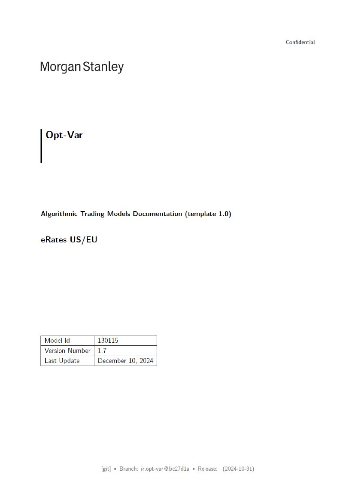

## 原文OCRテキスト

```text
                                                                                    Confidential


Morgan Stanley


 Opt-Var


Algorithmic Trading Models Documentation (template 1.0)


eRates US/EU


 Model Id         130115
 Version Number | 1.7
 Last Update      December 10, 2024


                    [git] » Branch: ir.opt-var @be27d1a » Release:   (2024-10-31)
```

# ページ 002

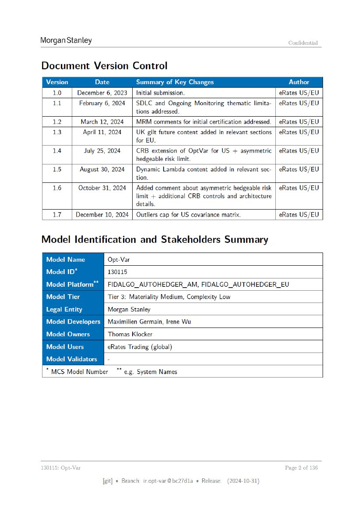

## 原文OCRテキスト

```text
Morgan Stanley                                                                                             Confidential


Document               Version Control
 Version                   Date                Summary of Key Changes                                      Author
    1.0           December        6, 2023 |     Initial submission.                                     eRates US/EU
    11            February 6, 2024          | SDLC and Ongoing          Monitoring thematic   limita- | eRates US/EU
                                              tions addressed.
    1.2            March    12, 2024            MRM    comments for initial certification addressed.   | eRates US/EU
    13             April 11, 2024              UK gilt future content added in relevant sections | eRates US/EU
                                               for EU.
    14              July 25, 2024              CRB extension of OptVar for US + asymmetric | eRates US/EU
                                               hedgeable risk limit.
    15            August 30, 2024              Dynamic Lambda         content added in relevant sec- | eRates US/EU
                                               tion.
    1.6           October 31, 2024            | Added comment about asymmetric hedgeable risk | eRates US/EU
                                                limit + additional CRB controls and architecture
                                                details.
    17        December        10, 2024 | Outliers cap for US covariance matrix.                         eRates US/EU


Model         Identification and Stakeholders Summary
 Model Name                       Opt-Var
 Model ID*                         130115
 item setistuben|                  FIDALGO_AUTOHEDGER_AM, FIDALGO_AUTOHEDGER_EU
 Model     Tier                   Tier 3: Materiality Medium, Complexity Low

 Legal Entity                      Morgan Stanley

 IW Cr     BTS      feytem         Maximilien Germain,      Irene Wu

 Model     Owners                 Thomas Klocker

 Model Users                      eRates Trading (global)
 Model     Validators             [i

 “MCS      Model Number                ** e.g. System Names


130115: Opt-Var                                                                                           Page 2 of 136

                             [git] = Branch: ir.opt-var@bc27d1a = Release:          (2024-10-31)
```

# ページ 003

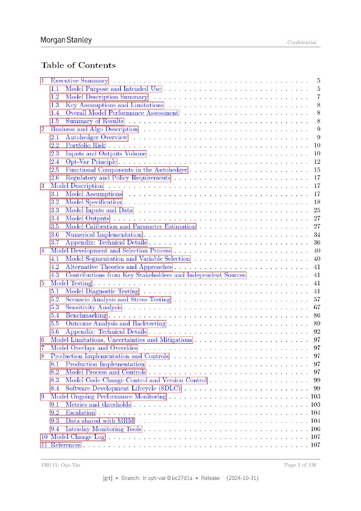

## 原文OCRテキスト

```text
Morgan Stanley                                                                                               Confidential


 Table      of Contents

                                 bee                                                                                          5
     [I-1__Model Purpose and Intended Use]. . .                                                                               5
     [.2__ Model Description Summary]                                                                                         7
     [L.3_Key Assumptions and Limitations]                                                                                    8
     [4     Overall Model Performance Assessment]                  .                                                          8
     1.5     Summary of       Results|                                                                                        8
2 Business and Algo Description]               ......                                                                         9
                               cee                                                                                          10
                                                                                                                              9
     [2.3__Inputs and Outputs Volume|                                                                                       10
     [2.5   Functional Components in the Autohedger|
                                                                                                                            215
     [2.6   Regulatory and Policy Requirements] .                                                                           17
                               —_                                                                                           17
                                                                                                                            "7
     [3.2 Model Specification].                                                                                             18
                                            Does                                                                           25
     [3.5   Model Calibration and Parameter Estimation]
                                                                                                                           a727
     [3.7 Appendix: Technical Details]... .
                                               cee                                                                         336
[4    Model Development and Selection Process                                                                               40
     4.1    Model Segmentation and Variable Selection]                                                                      40
     4.2    Alternative Theories         and Approache                                                                      41
     [4.3   Contributions from Key Stakeholders                and Independent Source                                      41
                                                                                                                           4
     [5.2   Scenario Analysis and Stress Testing] .
                                                                                                                           457
     (5.3_Sensitivity
     [4
                      Analysis.
     Benchmarking)... .
                                                                                                                            67
                                                                                                                           86
     [5.5__ Outcome Analysis and Backtesting] .                                                                            89
    [5.6_Appendix: Technical Details]... .                                                                                 92
[6_ Model Limitations, Uncertainties and Mitigations|                                                                      97
[7_Model Overlays and Overrides]                                                                                           97
[S_ Production Implementation and Controls]                                                                                97
     [8.1   Production Implementation]                                                                                     97
     [8.2   Model Process and Controls]                                                                                    97
     (8.3_Model       Code      Change   Control and     Version       Control]... .                                       99
     [84_Software Development Lifecycle (SDLO].....-
                                              2... 0... eee                                                        ..      99
{9   Model Ongoing Performance Monitoring]...                      2.2... 2... 2.2             ee     eee          . . 103
     [9.1   Metrics and thresholds)...           2.2...                ee                       eee                . . 103
                             cee                                                                                   .. 104
                                                                                                                   .. 104
                                                                                                                    . 106
                               _                                                                                   . 107
                                                                                                                        - 107

 130115: Opt-Var                                                                                            Page 3 of 136

                             [git] = Branch: ir.opt-var@bc27d1a = Release:             (2024-10-31)
```

# ページ 004


## 原文OCRテキスト

```text
Morgan Stanley                                                                        Confidential


                                                                                             . . 108
[13 Appendix]                                                                                .. 110
    13.1 Convergence Testing Plot]........                                                   .. 110
   {13.2
    Benchmarking
            Tests Plots}...                 ....                                             .. 116
    [13.3 Outcome Analysis and Backtesting Plot                                                . 121


 130115: Opt-Var                                                                     Page   4 of 136

                      [git] = Branch: ir.opt-var@bc27d1a = Release:   (2024-10-31)
```

# ページ 005


## 原文OCRテキスト

```text
Morgan Stanley                                                                              Confidential


1      Executive Summary
1.1.   Model      Purpose      and Intended   Use

The Electronic Government Bond desk is a market maker in both liquid and illiquid instruments.
In the United States bond market, there are about 350 illiquid bonds and 12 liquid bonds and
futures. Figure [I]shows the US yield curve of bonds with less than 10 years left to maturity. The
red dots represent individual illiquid bonds. The larger blue dots show the liquid instruments.
Notice there are many more red dots than blue. The black line is a model of the yield curve added
to aid the eye.


                        1.50
                        1.25
                        1.00
                      Zor
                        0.50
                        0.25

                        0.00
                                0      2         4             6      8        10
                                               years to maturity

Figure 1: This figure shows the part of the US yield curve less than 10 years left to maturity. On
the x-axis is the years left to maturity. The y-axis is the yield of the bond.
    When the desk purchases an illiquid instrument, it cannot be quickly re-sold. So, to protect
against random price moves, we sell a combination of liquid instruments that have a high correlation
to the illiquid instrument.
    ‘As an example of this process, let’s zoom in on yield curve and imagine that we were dealing
with just one illiquid bond with 4 years left to maturity, see figure[2| On either side of this illiquid
bond (red) we have two liquid instruments (represented by the blue dots).


130115: Opt-Var                                                                            Page 5 of 136
                       [git] « Branch: iropt-var@be27d1a = Release:       (2024-10-31)
```

# ページ 006

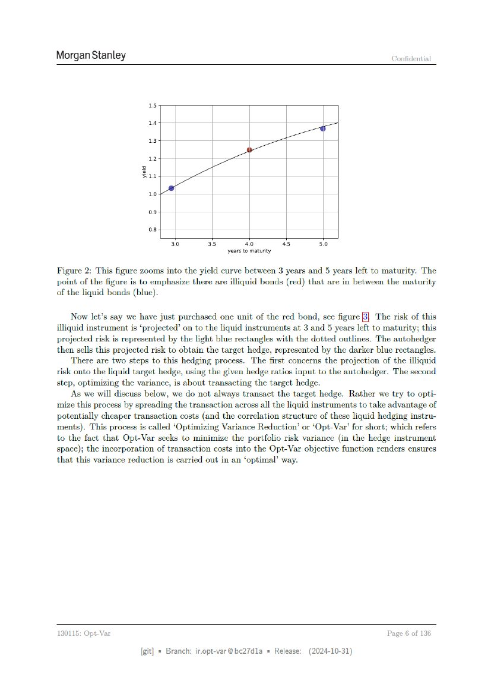

## 原文OCRテキスト

```text
Morgan Stanley                                                                             Confidential


                         1s

                         14

                         13

                         12

                       S11

                         10

                         09

                         08
                               3.0        35           40          45     50
                                               years to maturity

Figure 2: This figure zooms into the yield curve between 3 years and 5 years left to maturity. The
point of the figure is to emphasize there are illiquid bonds (red) that are in between the maturity
of the liquid bonds (blue).
   Now let’s say we have just purchased one unit of the red bond, see figure [3] The risk of this
illiquid instrument is ‘projected’ on to the liquid instruments at 3 and 5 years left to maturity; this
projected risk is represented by the light blue rectangles with the dotted outlines. The autohedger
then sells this projected risk to obtain the target hedge, represented by the darker blue rectangles.
     There are two steps to this hedging process. The first concerns the projection of the illiquid
risk onto the liquid target hedge, using the given hedge ratios input to the autohedger. The second
step, optimizing the variance, is about transacting the target hedge.
    ‘As we will discuss below, we do not always transact the target hedge. Rather we try to opti-
mize this process by spreading the transaction across all the liquid instruments to take advantage of
potentially cheaper transaction costs (and the correlation structure of these liquid hedging instru-
ments). This process is called ‘Optimizing Variance Reduction’ or ‘Opt-Var’ for short; which refers
to the fact that Opt-Var seeks to minimize the portfolio risk variance (in the hedge instrument
space); the incorporation of transaction costs into the Opt-Var objective function renders ensures
that this variance reduction is carried out in an ‘optimal’ way.


130115: Opt-Var                                                                           Page 6 of 136

                       [git] « Branch: iropt-var@be27d1a = Release:     (2024-10-31)
```

# ページ 007

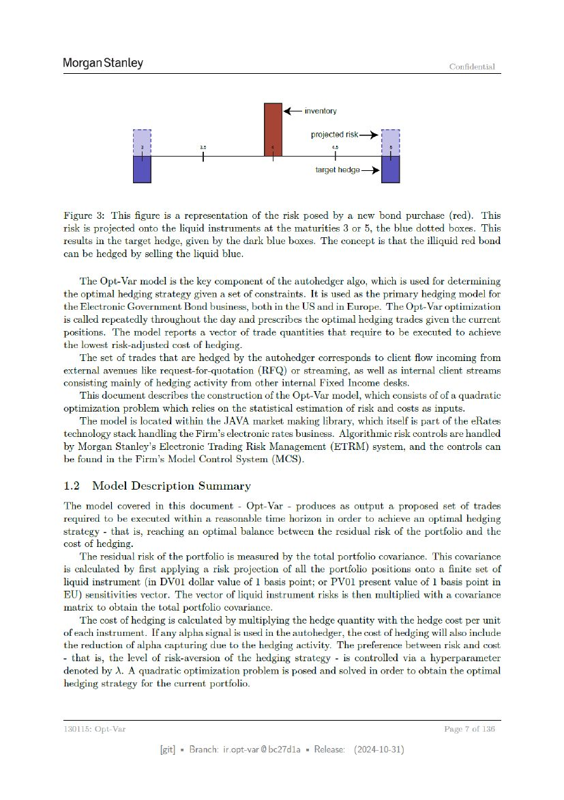

## 原文OCRテキスト

```text
Morgan Stanley                                                                             Confidential


                                                     <—   inventory

                  on                                        projected risk—p> 77


Figure 3: This figure is a representation of the risk posed by a new bond purchase (red). This
risk is projected onto the liquid instruments at the maturities 3 or 5, the blue dotted boxes. This
results in the target hedge, given by the dark blue boxes. The concept is that the illiquid red bond
can be hedged by selling the liquid blue.
     ‘The Opt-Var model is the key component of the autohedger algo, which is used for determining
the optimal hedging strategy given a set of constraints. It is used as the primary hedging model for
the Electronic Government Bond business, both in the US and in Europe. The Opt-Var optimization
is called repeatedly throughout the day and prescribes the optimal hedging trades given the current
positions. The model reports a vector of trade quantities that require to be executed to achieve
the lowest risk-adjusted cost of hedging.
    ‘The set of trades that are hedged by the autohedger corresponds to client flow incoming from
external avenues like request-for-quotation (RFQ) or streaming, as well as internal client streams
consisting mainly of hedging activity from other internal Fixed Income desks.
    This document describes the construction of the Opt-Var model, which consists of of a quadratic
optimization problem which relies on the statistical estimation of risk and costs as inputs.
    The model is located within the JAVA market making library, which itself is part of the eRates
technology stack handling the Firm’s electronic rates business. Algorithmic risk controls are handled
by Morgan Stanley’s Electronic Trading Risk Management (ETRM) system, and the controls can
be found in the Firm’s Model Control System (MCS).
1.2.   Model Description Summary
The model covered in this document - Opt-Var - produces as output a proposed set of trades
required to be executed within a reasonable time horizon in order to achieve an optimal hedging
strategy - that is, reaching an optimal balance between the residual risk of the portfolio and the
cost of hedging.
    ‘The residual risk of the portfolio is measured by the total portfolio covariance. This covariance
is calculated by first applying a risk projection of all the portfolio positions onto a finite set of
liquid instrument (in DVO1 dollar value of 1 basis point; or PVO1 present value of 1 basis point in
EU) sensitivities vector. The vector of liquid instrument risks is then multiplied with a covariance
matrix to obtain the total portfolio covariance.
    ‘The cost of hedging is calculated by multiplying the hedge quantity with the hedge cost per unit
ofeach instrument. If any alpha signal is used in the autohedger, the cost of hedging will also include
the reduction of alpha capturing due to the hedging activity. The preference between risk and cost
- that is, the level of risk-aversion of the hedging strategy - is controlled via a hyperparameter
denoted by A. A quadratic optimization problem is posed and solved in order to obtain the optimal
hedging strategy for the current portfolio.


130115: Opt-Var                                                                           Page 7 of 136

                       [git] « Branch: iropt-var@be27d1a = Release:    (2024-10-31)
```

# ページ 008

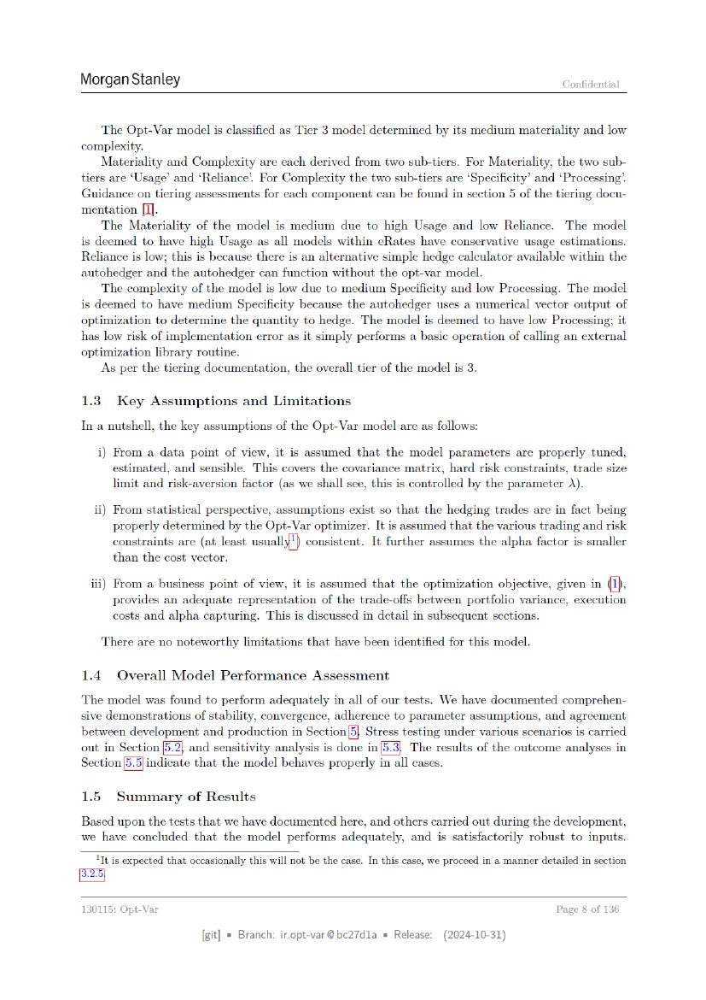

## 原文OCRテキスト

```text
Morgan Stanley                                                                                                Confidential


     The Opt-Var model is classified as Tier 3 model determined by its medium materiality and low
complexity.
     Materiality and Complexity are each derived from two sub-tiers. For Materiality, the two sub-
tiers are ‘Usage’ and ‘Reliance’. For Complexity the two sub-tiers are ‘Specificity’ and ‘Processing’.
Guidance on tiering assessments for each component can be found in section 5 of the tiering docu-
mentation [i].
    The Materiality of the model is medium due to high Usage and low Reliance. The model
is deemed to have high Usage as all models within eRates have conservative usage estimations.
Reliance is low; this is because there is an alternative simple hedge calculator available within the
autohedger and the autohedger can function without the opt-var model.
    The complexity of the model is low due to medium Specificity and low Processing. The model
is deemed to have medium Specificity because the autohedger uses a numerical vector output of
optimization to determine the quantity to hedge. The model is deemed to have low Processing; it
has low risk of implementation error as it simply performs a basic operation of calling an external
optimization library routine.
    ‘As per the tiering documentation, the overall tier of the model is 3.
1.3.       Key Assumptions             and Limitations
Ina nutshell, the key assumptions of the Opt-Var model are as follows:
   i) From a data point of view, it is assumed that the model parameters are properly tuned,
      estimated, and sensible. This covers the covariance matrix, hard risk constraints, trade size
      limit and risk-aversion factor (as we shall see, this is controlled by the parameter A).
  ii) From statistical perspective, assumptions exist so that the hedging trades are in fact being
          properly determined by the Opt-Var opti     nizer. It is assumed that the various trading and risk
          constraints are (at least usually!) consistent. It further assumes the alpha factor is smaller
          than the cost vector.

  iii) From a business point of view, it is assumed that the optimization objective, given in (I
       provides an adequate representation of the trade-offs between portfolio variance, execution
       costs and alpha capturing. This is discussed in detail in subsequent sections.
       There are no noteworthy limitations that have been identified for this model.

1.4        Overall Model          Performance         Assessment
The model was found to perform adequately in all of our tests. We have documented comprehen-
sive demonstrations of stability, convergence, adherence to parameter assumptions, and agreement
between development and production in Section[5| Stress testing under various scenarios is carried
                          and sensitivity analysis is done i      The results of the outcome analyses in
Section           indicate that the model behaves properly in all cases.

1.5        Summary         of Results
Based upon the tests that we have documented here, and others carried out during the development,
we have concluded that the model performs adequately, and is satisfactorily robust to inputs.
       'It is expected that occasionally this will not be the case. In this case, we proceed in a manner detailed in section
B23
130115: Opt-Var                                                                                              Page 8 of 136

                              [git] « Branch: iropt-var@be27d1a = Release:          (2024-10-31)
```

# ページ 009

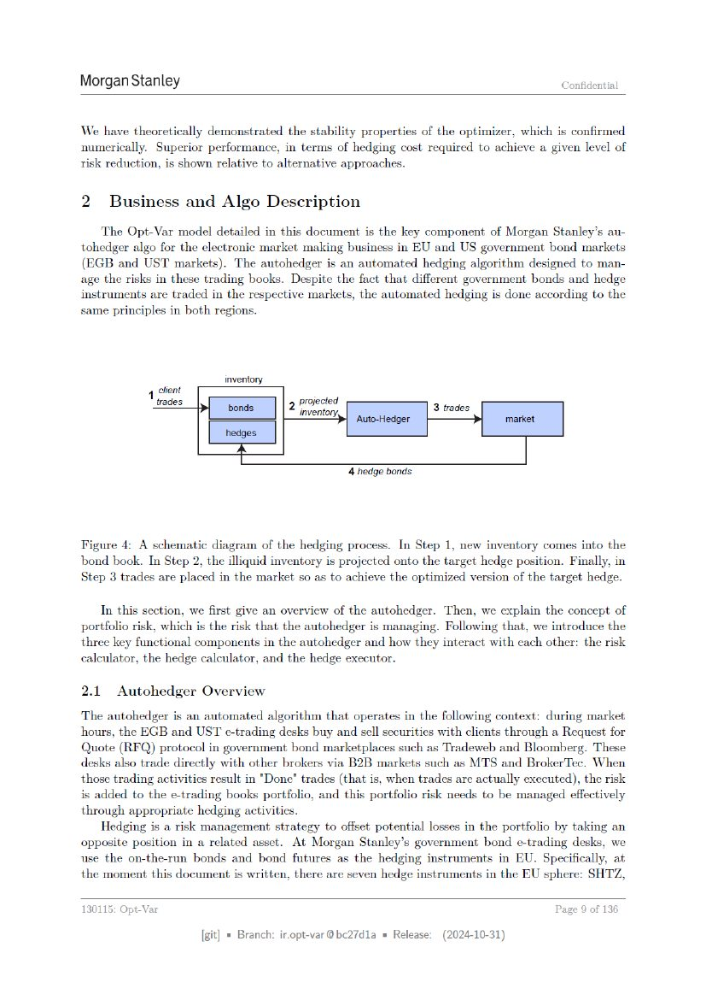

## 原文OCRテキスト

```text
Morgan Stanley                                                                                        Confidential


We have theoretically demonstrated the stability properties of the optimizer, which is confirmed
numerically. Superior performance, in terms of hedging cost required to achieve a given level of
risk reduction, is shown relative to alternative approaches.

2     Business and Algo Description
    The Opt-Var model detailed in this document is the key component of Morgan Stanley’s au-
tohedger algo for the electronic market making business in EU and US government bond markets
(EGB and UST markets). The autohedger is an automated hedging algorithm designed to man-
age the risks in these trading books. Despite the fact that different government bonds and hedge
instruments are traded in the respective markets, the automated hedging is done according to the
same principles in both regions.


                                 inventory
              4 client
                  trades   by)   bonds
                                                    cted
                                             2P ventory,                   3 trades
                                                            Auto-Hedger                     market
                                 hedges
                                   y.
                                                           4 hedge bonds


Figure 4: A schematic diagram of the hedging process. In Step 1, new inventory comes into the
bond book. In Step 2, the illiquid inventory is projected onto the target hedge position. Finally, in
Step 3 trades are placed in the market so as to achieve the optimized version of the target hedge.
    In this section, we first give an overview of the autohedger. Then, we explain the concept of
portfolio risk, which is the risk that the autohedger is managing. Following that, we introduce the
three key functional components in the autohedger and how they interact with each other: the risk
calculator, the hedge calculator, and the hedge executor.
2.1    Autohedger           Overview
The autohedger is an automated algorithm that operates in the following context: during market
hours, the EGB and UST e-trading desks buy and sell securities with clients through a Request for
Quote (RFQ) protocol in government bond marketplaces such as Tradeweb and Bloomberg. These
desks also trade directly with other brokers via B2B markets such as MTS and BrokerTec. When
those trading activities result in "Done" trades (that is, when trades are actually executed), the risk
is added to the e-trading books portfolio, and this portfolio risk needs to be managed effectively
through appropriate hedging activities.
    Hedging is a risk management strategy to offset potential losses in the portfolio by taking an
opposite position in a related asset. At Morgan Stanley’s government bond e-trading desks, we
use the on-the-run bonds and bond futures as the hedging instruments in EU. Specifically, at
the moment this document is written, there are seven hedge instruments in the EU sphere: SHTZ,

130115: Opt-Var                                                                                      Page 9 of 136

                            [git] « Branch: iropt-var@be27d1a = Release:     (2024-10-31)
```

# ページ 010

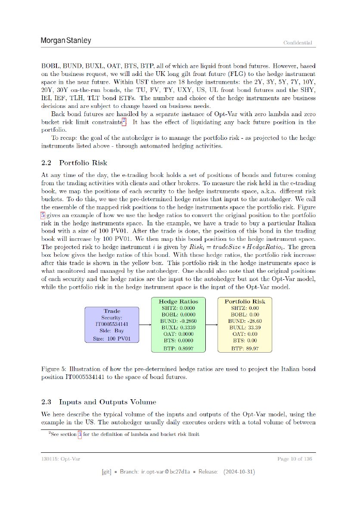

## 原文OCRテキスト

```text
Morgan Stanley                                                                                   Confidential


BOBL, BUND, BUXL, OAT, BTS, BTP, all of which are liquid front bond futures. However, based
on the business request, we will add the UK long gilt front future (FLG) to the hedge instrument
space in the near future. Within UST there are 18 hedge instruments: the 2Y, 3Y, 5Y, 7Y, 10Y,
20Y, 30Y on-the-run bonds, the TU, FV, TY, UXY, US, UL front bond futures and the SHY,
IEI, IEF, TLH, TLT bond ETFs. The number and choice of the hedge instruments are business
decisions and are subject to change based on business needs.
    Back bond futures are handled by a separate instance of Opt-Var with zero lambda and zero
bucket risk limit constraint{?] It has the effect of liquidating any back future position in the
portfolio.
    To recap: the goal of the autohedger is to manage the portfolio risk - as projected to the hedge
instruments listed above - through automated hedging activities.
2.2       Portfolio Risk
At any time of the day, the e-trading book holds a set of positions of bonds and futures coming
from the trading activities with clients and other brokers. To measure the risk held in the e-trading
book, we map the positions of each security to the hedge instruments space, a.k.a. different risk
buckets. To do this, we use the pre-determined hedge ratios that input to the autohedger. We call
the ensemble of the mapped risk positions to the hedge instruments space the portfolio risk. Figure
       ‘ives an example of how we use the hedge ratios to convert the original position to the portfolio
risk in the hedge instruments space. In the example, we have a trade to buy a particular Italian
bond with a size of 100 PVO1.              After the trade is done, the position of this bond in the trading
book will increase by 100 PVO1. We then map this bond position to the hedge instrument space.
The projected risk to hedge instrument i is given by Risk; = tradeSize * HedgeRatio;. The green
box below gives the hedge ratios of this bond. With these hedge ratios, the portfolio risk increase
after this trade      is shown in the yellow box. This portfolio risk in the hedge instruments space is
what monitored and managed by the autohedger. One should also note that the original positions
of each security and the hedge ratios are the input to the autohedger but not the Opt-Var model,
while the portfolio risk in the hedge instrument space is the input of the Opt-Var model.

                                                      Hedge Ratios          Portfolio Risk
                              Trade                     SHTZ: 0.0000          SHTZ: 0.00
                             Security:                  BOBL: 0.0000          BOBL: 0.00
                          170005534141                 BAUNIDE D2SED         BUND: -28.60
                             Side: Buy                  BUXL: 0.3339          BUXL: 33.30
                                                         OAT: 0.0000           OAT: 0.00
                         Size: 100 PVO1                  BTS: 0.0000
                                                        BTP: 0.8997,


Figure 5: Illustration of how the pre-determined hedge ratios are used to project the Italian bond
position IT0005534141 to the space of bond futures.


2.3.      Inputs and        Outputs       Volume

We here describe the typical volume of the inputs and outputs of the Opt-Var model, using the
example in the US. The autohedger usually daily executes orders with a total volume of between
      See section [3] for the definition of lambda and bucket risk limit


130115: Opt-Var                                                                                Page   10 of 136

                             [git] « Branch: iropt-var@be27d1a = Release:   (2024-10-31)
```

# ページ 011

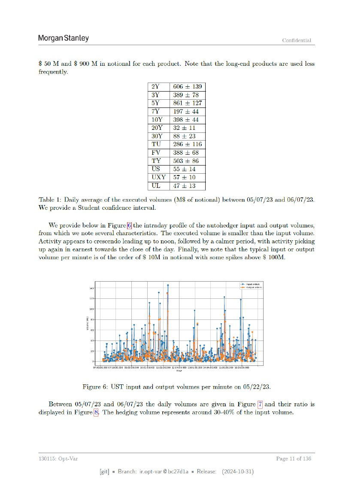

## 原文OCRテキスト

```text
Morgan Stanley                                                                            Confidential


$ 50 M and $ 900 M in notional for each product. Note that the long-end products are used less
frequently.
                                             2Y     606 + 139
                                             3Y     389 + 78
                                             5Y     861 + 127
                                             TY     197 + 44
                                             10Y | 398 + 44
                                             20Y | 32411
                                             B30Y | 88 + 23
                                             TU | 286 + 116
                                             FV     388 + 68
                                             TY = | 503 + 86
                                             US     55 + 14
                                             UXY | 57+ 10
                                             UL     47413

Table 1: Daily average of the executed volumes (M$ of notional) between 05/07/23 and 06/07/23.
We provide a Student confidence interval.

    We provide below in Figure [6] the intraday profile of the autohedger input and output volumes,
from which we note several characteristics. The executed volume is smaller than the input volume.
Activity appears to crescendo leading up to noon, followed by a calmer period, with activity picking
up again in earnest towards the close of the day. Finally, we note that the typical input or output
volume per minute is of the order of $ 10M in notional with some spikes above $ 100M.


                     pa


                    Figure 6: UST input and output volumes per minute on 05/22/23.

    Between 05/07/23 and 06/07/23 the daily volumes are given in Figure [7| and their ratio is
displayed in Figure|[8| The hedging volume represents around 30-40% of the input volume.


130115:   Opt-Var                                                                       Page   11 of 136

                          [git] « Branch: iropt-var@be27d1a = Release:   (2024-10-31)
```

# ページ 012

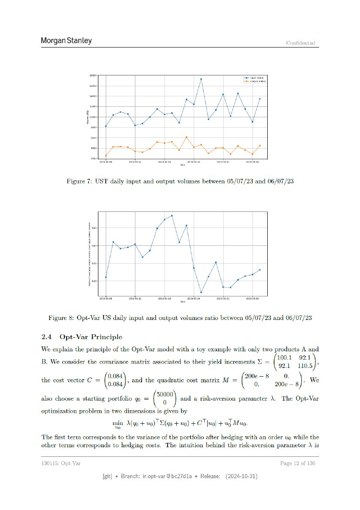

## 原文OCRテキスト

```text
Morgan Stanley                                                                                   Confidential


                  100


          Figure 7: UST daily input and output volumes between 05/07/23 and 06/07/23


  Figure 8: Opt-Var US daily input and output volumes ratio between 05/07/23 and 06/07/23

2.4    Opt-Var     Principle

We explain the principle of the Opt-Var model with a toy example with only two products A and
                                                                                100.1 92.1 )
B. We consider the covariance matrix associated to their yield increments             U =   (2   1    110.5

                     0.084‘): and the quadratic. cost matrix. M = ( 200e-8
the cost vector C = (v0                                                0                       0. .): We
                                                                                            2000
                    . portfolio. qo =
also choose a starting                      50000
                                              ("5")          .         . parameter \. The Opt-Var
                                                      and a risk-aversion
optimization problem in two dimensions is given by
                          min A(go + uo)" (qo + wo) + CT luo] + ug Muo.
The first term corresponds to the variance of the portfolio after hedging with an order uo while the
other terms corresponds to hedging costs. The intuition behind the risk-aversion parameter ) is
130115: Opt-Var                                                                              Page 12 of 136

                        [git] « Branch: iropt-var@be27d1a = Release:   (2024-10-31)
```

# ページ 013

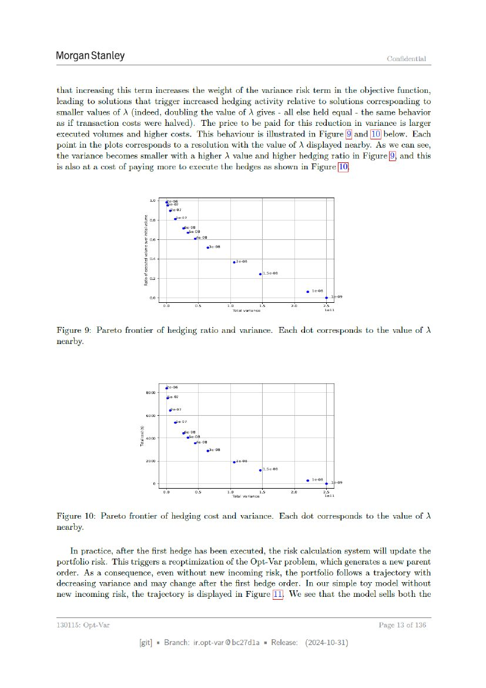

## 原文OCRテキスト

```text
Morgan Stanley                                                                           Confidential


that increasing this term increases the weight of the variance risk term in the objective function,
leading to solutions that trigger increased hedging activity relative to solutions corresponding to
smaller values of A (indeed, doubling the value of X gives - all else held equal - the same behavior
as if transaction costs were halved). The price to be paid for this reduction in variance is larger
executed volumes and higher costs. This behaviour is illustrated in Figure [9] and [10] below. Each
point in the plots corresponds to a resolution with the value of \ displayed nearby. As we can see,
the variance becomes smaller with a higher \ value and higher hedging ratio in Figure|| and this
is also at a cost of paying more to execute the hedges as shown in Figure


                          Seeoer
                        i      sor
                        A            se00
                                       ‘Soot
                        Boe               ooo
                                                eeo8


Figure 9: Pareto frontier of hedging ratio and variance.     Each dot corresponds to the value of \
nearby.


                              pend
                              ooo
                               e007
                                 e007
                                    seo
                                      eet
                                        ero
                                                esoe


Figure 10: Pareto frontier of hedging cost and variance. Each dot corresponds to the value of
nearby.
    In practice, after the first hedge has been executed, the risk calculation system will update the
portfolio risk. This triggers a reoptimization of the Opt-Var problem, which generates a new parent
order. As a consequence, even without new incoming risk, the portfolio follows a trajectory with
decreasing variance and may change after the first hedge order. In our simple toy model without
new incoming risk, the trajectory is displayed in Figure [IT] We see that the model sells both the

130115: Opt-Var                                                                        Page 13 of 136

                      [git] « Branch: iropt-var@be27d1a = Release:   (2024-10-31)
```

# ページ 014

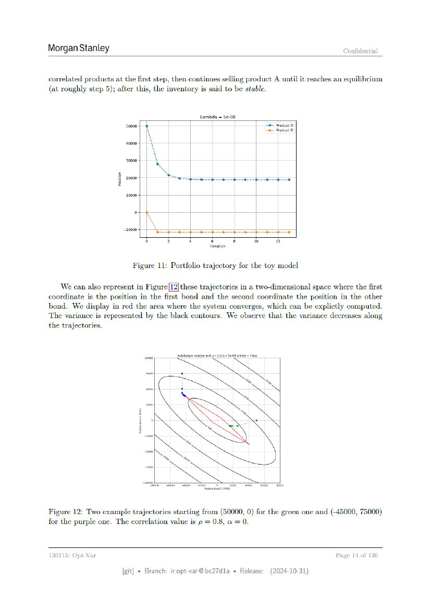

## 原文OCRテキスト

```text
Morgan Stanley                                                                                                 Confidential


correlated products at the first step, then continues selling product A until it reaches an equilibrium
(at roughly step 5); after this, the inventory is said to be stable.

                                                      Lambda = 5e-08
                        50000                                                               e Product A
                                                                                            Me Product 8
                        40000

                        30000

                     2 20000         i ae          eae         eo

                        10000


                       ~20000       Se              ce ee Ser ee ear                         er eee
                                a    2         a            é             a            10       2
                                                            Ireration

                           Figure 11: Portfolio trajectory for the toy model
    We can also represent in Figure[12] these trajectories in a two-dimensional space where the first
coordinate is the position in the first bond and the second coordinate the position in the other
bond. We display in red the area where the system converges, which can be explictly computed.
The variance is represented by the black contours. We observe that the variance decreases along
the trajectories.


                                _        _ntohedgeseluton wh 2=08.A~ S608 infnts = False


Figure 12: Two example trajectories starting from (50000, 0) for the green one and (-45000, 75000)
for the purple one. The correlation value is p = 0.8, a = 0.


130115: Opt-Var                                                                                              Page   14   of 136

                       [git] « Branch: iropt-var@be27d1a = Release:                           (2024-10-31)
```

# ページ 015

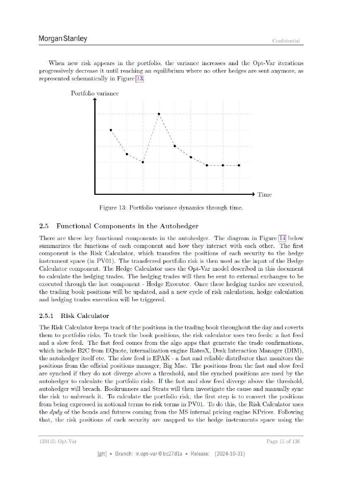

## 原文OCRテキスト

```text
Morgan Stanley                                                                               Confidential


    When new risk appears in the portfolio, the variance increases and the Opt-Var iterations
progressively decrease it until reaching an equilibrium where no other hedges are sent anymore, as
represented schematically in Figure [13]

             Portfolio variance


                                                                                      Time

                        Figure 13: Portfolio variance dynamics through time.

2.5     Functional    Components        in the Autohedger
There are three key functional components in the autohedger.           The diagram in Figure [14] below
summarizes the functions of each component and how they interact with each other. The first
component is the Risk Calculator, which transfers the positions of each security to the hedge
instrument space (in PVO1). The transferred portfolio risk is then used as the input of the Hedge
Calculator component.     The Hedge Calculator uses the Opt-Var model described in this document
to calculate the hedging trades. The hedging trades will then be sent to external exchanges to be
executed through the last component - Hedge Executor. Once these hedging tardes are executed,
the trading book positions will be updated, and a new cycle of risk calculation, hedge calculation
and hedging trades execution will be triggered.

2.5.1    Risk Calculator

The Risk Calculator keeps track of the positions in the trading book throughout the day and coverts
them to portfolio risks. To track the book positions, the risk calculator uses two feeds: a fast feed
and a slow feed. The fast feed comes from the algo apps that generate the trade confirmations,
which include B2C from EQuote, internalization engine RatesX, Desk Interaction Manager (DIM),
the autohedger itself etc. The slow feed is EPAK - a fast and reliable distributor that monitors the
positions from the official positions manager, Big Mac. The positions from the fast and slow feed
are synched if they do not diverge above a threshold, and the synched positions are used by the
autohedger to calculate the portfolio risks. If the fast and slow feed diverge above the threshold,
autohedger will breach. Bookrunners and Strats will then investigate the cause and manually syne
the risk to unbreach it. To calculate the portfolio risk, the first step is to convert the positions
from being expressed in notional terms to risk terms in PVO1. To do this, the Risk Calculator uses
the dpdy of the bonds and futures coming from the MS internal pricing engine KPricer. Following
that, the risk positions of each security are mapped to the hedge instruments space using the

130115: Opt-Var                                                                           Page 15 of 136

                        [git] « Branch: iropt-var@be27d1a = Release:   (2024-10-31)
```

# ページ 016

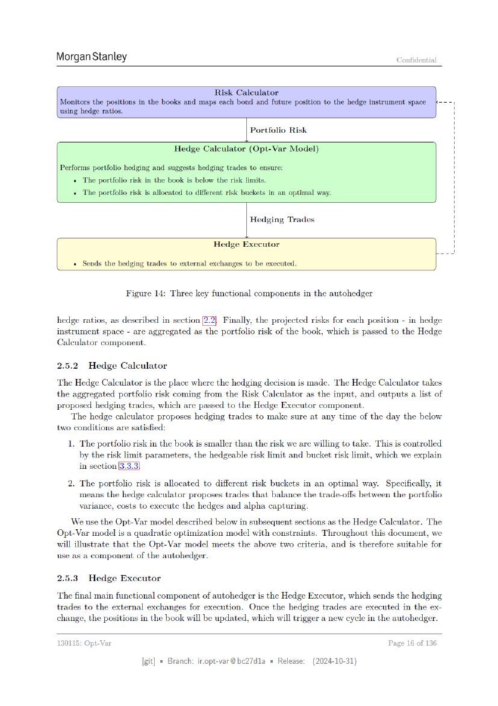

## 原文OCRテキスト

```text
Morgan Stanley                                                                                  Confidential


                                               Risk Calculator
Monitors the positions in the books and maps each bond and future position to the hedge instrument space       ‘---|
using hedge ratios.                                                                                                    t
                                                          Portfolio Risk                                               !
                                  Hedge Calculator (Opt-Var Model)                                                     !
Performs portfolio hedging and suggests hedging trades to ensure:                                                      \
    + The portfolio risk in the book is below the risk limits.                                                         H
    + The portfolio risk is allocated to different risk buckets in an optimal way.                                     '

                                                          Hedging Trades                                               '

                                              Hedge Executor                                                           '
    + Sends the hedging trades to external exchanges to be executed.


                    Figure 14: Three key functional components in the autohedger

hedge ratios, as described in section   Finally, the projected risks for each position - in hedge
instrument space - are aggregated as he portfolio risk of the book, which is passed to the Hedge
Calculator component.
2.5.2    Hedge    Calculator

The Hedge Calculator is the place where the hedging decision is made. The Hedge Calculator takes
the aggregated portfolio risk coming from the Risk Calculator as the input, and outputs a list of
proposed hedging trades, which are passed to the Hedge Executor component.
    ‘The hedge calculator proposes hedging trades to make sure at any time of the day the below
two conditions are satisfied:
    1. The portfolio risk in the book is smaller than the risk we are willing to take. This is controlled
       by the risk limit parameters, the hedgeable risk limit and bucket risk limit, which we explain
       in section
    2. The portfolio risk is allocated to different risk buckets in an optimal way. Specifically, it
       means the hedge calculator proposes trades that balance the trade-offs between the portfolio
       variance, costs to execute the hedges and alpha capturing.
     We use the Opt-Var model described below in subsequent sections as the Hedge Calculator. The
Opt-Var model is a quadratic optimization model with constraints. Throughout this document, we
will illustrate that the Opt-Var model meets the above two criteria, and is therefore suitable for
use as a component of the autohedger.
2.5.3    Hedge    Executor

The final main functional component of autohedger is the Hedge Executor, which sends the hedging
trades to the external exchanges for execution. Once the hedging trades are executed in the ex-
change, the positions in the book will be updated, which will trigger a new cycle in the autohedger.
130115: Opt-Var                                                                               Page 16 of 136

                         [git] « Branch: iropt-var@be27d1a = Release:        (2024-10-31)
```

# ページ 017

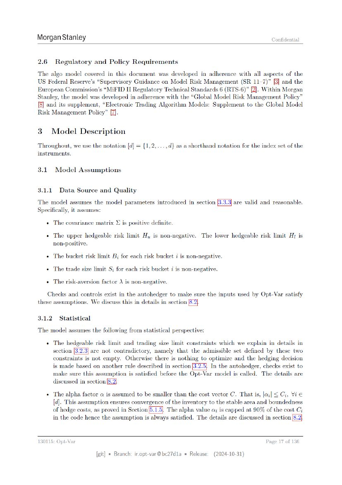

## 原文OCRテキスト

```text
Morgan Stanley                                                                                    Confidential


2.6      Regulatory and Policy Requirements
The algo model covered in this document was developed in adherence with all aspects of the
US Federal Reserve’s “Supervisory Guidance on Model Risk Management (SR 11-7)” [J] and the
European Commission’s “MiFID IT Regulatory Technical Standards 6 (RTS-6)” [J]. Within Morgan
Stanley, the model was developed in adherence with the “Global Model Risk Management Policy”
[5] and its supplement, “Electronic Trading Algorithm Models: Supplement to the Global Model
Risk Management Policy” [7].

3       Model      Description
Throughout, we use the notation [d] = {1,2,...,d} as a shorthand notation for the index set of the
instruments.


3.1      Model     Assumptions


3.1.1      Data Source and Quality

The model assumes the model parameters introduced in section                      are valid and reasonable.
Specifically, it assumes:
      « The covariance matrix ©     is positive definite.

      + The upper hedgeable risk limit Hy, is non-negative. The lower hedgeable risk limit Hy is
        non-positive.
      « The bucket risk limit B; for each risk bucket i is non-negative.

      + The trade size limit S$; for each risk bucket i is non-negative.
      + The risk-aversion factor A is non-negative.
    Checks and controls exist in the autohedger to make sure the inputs used by Opt-Var satisfy
these assumptions. We discuss this in details in section 5
3.1.2      Statistical

The model assumes the following from statistical perspective:
      + The hedgeable risk limit and trading size limit constraints which we explain in details in
            i        are not contradictory, namely that the admissible set defined by these two
        constraints is not empty. Otherwise there is nothing to optimize and the hedging decision
        is made based on another rule described in section          [3.2.5} In the autohedger, checks exist to
        make sure this assumption is satisfied before the Opt-Var model is called. The details are
        discussed in section
      + The alpha factor a is assumed to be smaller than the cost vector C. That is, Jai] < Ci, Vi €
        [d.. This assumption ensures convergence of the inventory to the stable area and boundedness
        of hedge costs, as proved in Section   [5.1.5] The alpha value aj is capped at 90% of the cost Cy
        in the code hence the assumption is always satisfied. The details are discussed in sectio1

130115: Opt-Var                                                                                Page 17 of 136

                          [git] « Branch: iropt-var@be27d1a = Release:    (2024-10-31)
```

# ページ 018

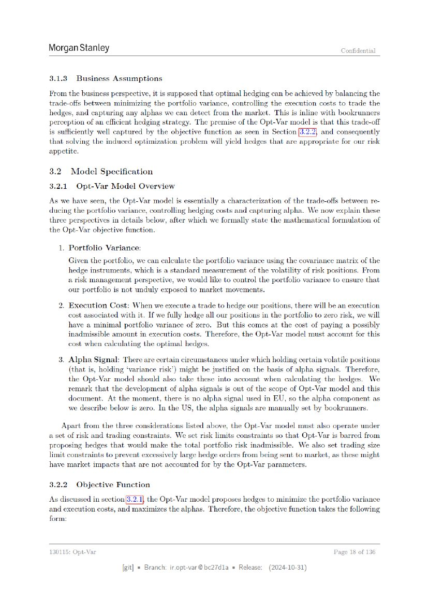

## 原文OCRテキスト

```text
Morgan Stanley                                                                                  Confidential


3.1.3.      Business Assumptions

From the business perspective, it is supposed that optimal hedging can be achieved by balancing the
trade-offs between minimizing the portfolio variance, controlling the execution costs to trade the
hedges, and capturing any alphas we can detect from the market. This is inline with bookrunners
perception of an efficient hedging strategy. The premise of the Opt-Var model is that this trade-off
is sufficiently well captured by the objective function as seen in Section [32.2  and consequently
that solving the induced optimization problem will yield hedges that are appropriate for our risk
appetite.

3.2      Model     Specification

3.2.1       Opt-Var   Model    Overview

‘As we have seen, the Opt-Var model is essentially a characterization of the trade-offs between re-
ducing the portfolio variance, controlling hedging costs and capturing alpha. We now explain these
three perspectives in details below, after which we formally state the mathematical formulation of
the Opt-Var objective function.
      1. Portfolio Variance:
         Given the portfolio, we can calculate the portfolio variance using the covariance matrix of the
         hedge instruments, which is a standard measurement of the volatility of risk positions. From
         a risk management perspective, we would like to control the portfolio variance to ensure that
         our portfolio is not unduly exposed to market movements.
      2. Execution Cost: When we execute a trade to hedge our positions, there will be an execution
         cost associated with it. If we fully hedge all our positions in the portfolio to zero risk, we will
         have a minimal portfolio variance of zero.     But this comes at the cost of paying a possibly
         inadmissible amount in execution costs. Therefore, the Opt-Var model must account for this
         cost when calculating the optimal hedges.
      3. Alpha Signal: There are certain circumstances under which holding certain volatile positions
         (that is, holding ‘variance risk’) might be justified on the basis of alpha signals. Therefore,
         the Opt-Var model should also take these into account when calculating the hedges. We
         remark that the development of alpha signals is out of the scope of Opt-Var model and this
         document. At the moment, there is no alpha signal used in EU, so the alpha component as
         we describe below is zero. In the US, the alpha signals are manually set by bookrunners.

     Apart from the three considerations listed above, the Opt-Var model must also operate under
a set of risk and trading constraints. We set risk limits constraints so that Opt-Var is barred from
proposing hedges that would make the total portfolio risk inadmissible. We also set trading size
limit constraints to prevent excessively large hedge orders from being sent to market, as these might
have market impacts that are not accounted for by the Opt-Var parameters.
3.2.2       Objective Function

‘As discussed in section     the Opt-Var model proposes hedges to minimize the portfolio variance
and execution costs, and maximizes the alphas. Therefore, the objective function takes the following
form:


130115: Opt-Var                                                                               Page   18 of 136

                          [git] « Branch: iropt-var@be27d1a = Release:   (2024-10-31)
```

# ページ 019

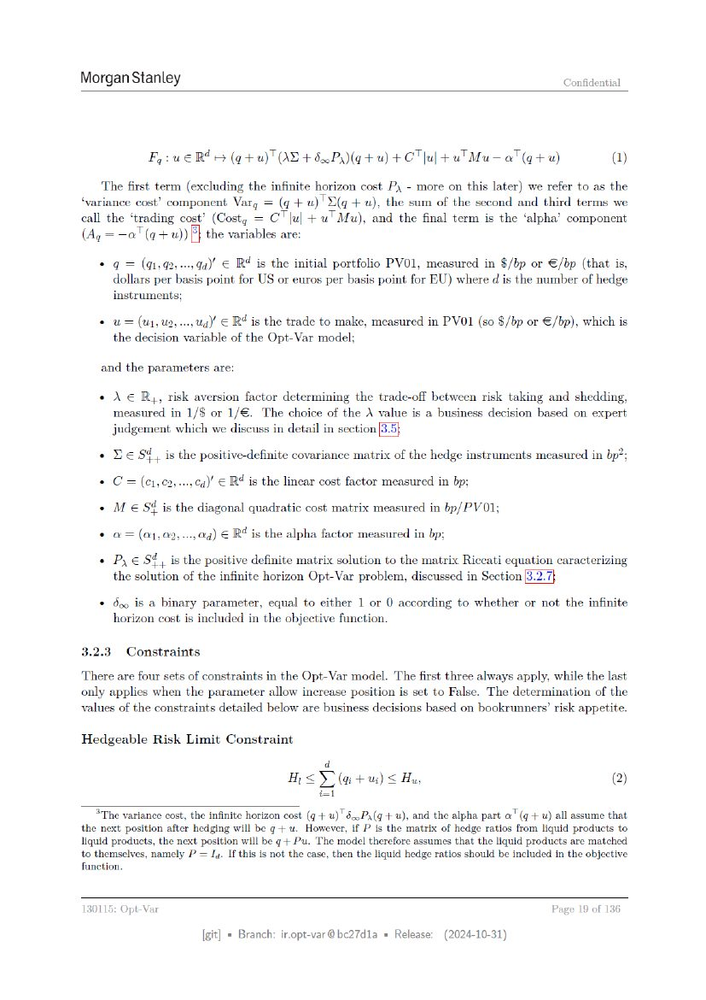

## 原文OCRテキスト

```text
Morgan Stanley                                                                                           Confidential


               Fy:      we Ros (q+u) (AD 4+ bcPy)(qt+u) +C"                |u|    t+ulMu—al(q+u)                     (1)
    The first term (excluding the infinite horizon cost P, - more on this later) we refer to as the
‘variance cost’ component Varg = (q + u)'5(q + u), the sum of the second and third terms we
call the ‘trading cost’ (Costy = C'|u| + u'Mu),                and the final term is the ‘alpha’ component
(Aq = —a!
        (q            +u)) P| the variables are:
    ° q = (u.@,-.-,4a)' € R? is the initial portfolio PVO1, measured in $/bp or €/bp (that is,
        dollars per basis point for US or euros per basis point for EU) where d is the number of hedge
        instruments;

    © w= (ui, u,...,ug)! € R¢ is the trade to make, measured in PVO1 (so $/bp or €/bp), which is
        the decision variable of the Opt-Var model;
    and the parameters are:
    + \ € R,, risk aversion factor determining the trade-off between risk taking and shedding,
      measured in 1/$ or 1/€. The choice of the \ value is a business decision based on expert
      judgement which we discuss in detail in section B.
    + Se S4,         is the positive-definite covariance matrix of the hedge instruments measured in bp;

    « C=      (ct,c9,...,¢4)' € R¢ is the linear cost factor measured in bp;

    « M €S¢          is the diagonal quadratic cost matrix measured in bp/PV01;

    * a=(a1,a9,...,04) € R¢ is the alpha factor measured in bp;

    + P\ € S14,       is the positive definite matrix solution to the matrix Riccati equation caracterizing
        the solution of the infinite horizon Opt-Var problem, discussed in Section
    + doo is a binary parameter, equal to either 1 or 0 according to whether or not the infinite
      horizon cost is included in the objective function.
3.2.3       Constraints

There are four sets of constraints in the Opt-Var model. The first three always apply, while the last
only applies when the parameter allow increase position is set to False. The determination of the
values of the constraints detailed below are business decisions based on bookrunners’ risk appetite.
Hedgeable         Risk Limit Constraint

                                                     ad
                                              As     YO (ait us) < Hu,                                               (2)
                                                    i=l


   *The variance cost, the infinite horizon cost (q+ u)"da.P(q+ u), and the alpha part a” (q + u) all assume that
the next position after hedging will be q + u. However, if P is the matrix of hedge ratios from liquid products to
liquid products, the next position will be q+ Pu. The model therefore assumes that the liquid products are matched
to themselves, namely P = Ig. If this is not the case, then the liquid hedge ratios should be included in the objective
function.


130115: Opt-Var                                                                                        Page   19 of 136

                            [git] « Branch: iropt-var@be27d1a = Release:         (2024-10-31)
```

# ページ 020

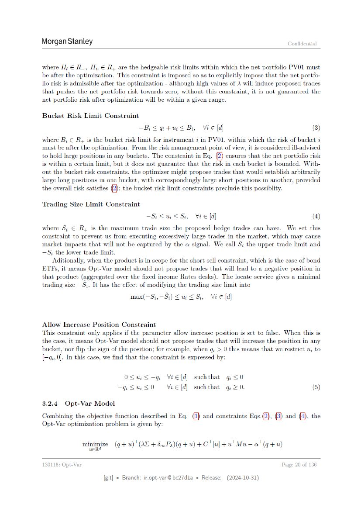

## 原文OCRテキスト

```text
Morgan Stanley                                                                              Confidential


where H, € R_, Hy, € R,, are the hedgeable risk limits within which the net portfolio PVO1 must
be after the optimization. This constraint is imposed so as to explicitly impose that the net portfo-
lio risk is admissible after the optimization - although high values of \ will induce proposed trades
that pushes the net portfolio risk towards zero, without this constraint, it is not guaranteed the
net portfolio risk after optimization will be within a given range.
Bucket    Risk Limit Constraint

                                      -BiS<qtus Bi,              Vie (d|                               (3)
where B; € Ry is the bucket risk limit for instrument i in PVO1, within which the risk of bucket i
must be after the optimization. From the risk management point of view, it is considered ill-advised
to hold large positions in any buckets. The constraint in Eq. @) ensures that the net portfolio risk
is within a certain limit, but it does not guarantee that the risk in each bucket is bounded. With-
out the bucket risk constraints, the optimizer might propose trades that would establish arbitrarily
large long positions in one bucket, with correspondingly large short positions in another, provided
the overall risk satisfies (2); the bucket risk limit constraints preclude this possiblity.
Trading Size Limit Constraint

                                         —Si<u<S;,          Vie [d]                                    (4)
where S; € R, is the maximum trade size the proposed hedge trades can have.                We set this
constraint to prevent us from executing excessively large trades in the market, which may cause
market impacts that will not be captured by the a signal. We call S; the upper trade limit and
—S; the lower trade limit.
    Aditionally, when the product is in scope for the short sell constraint, which is the case of bond
ETFs, it means Opt-Var model should not propose trades that will lead to a negative position in
that product (aggregated over the fixed income Rates desks). The locate service gives a minimal
trading size —S;. It has the effect of modifying the trading size limit into
                                   max(—S;,—Si)       <u < Si,      Vi € [d]

Allow Increase Position Constraint
This constraint only applies if the parameter allow increase position is set to false. When this is
the case, it means Opt-Var model should not propose trades that will increase the position in any
bucket, nor flip the sign of the position; for example, when q; > 0 this means that we restrict u; to
[-qi. 0]. In this case, we find that the constraint is expressed by:

                                O<u<—q           Yield)     suchthat       gi <0
                              —q<u<0             Vield)    suchthat        g >0.                       (5)

3.2.4    Opt-Var      Model

Combining the objective function described in Eq.                and constraints Eqs.
Opt-Var optimization problem is given by:

                  minimize    (q+ u) (N+ bx0Py(q+u)+C"\ul+ulMu—al(q+u)

130115: Opt-Var                                                                           Page 20 of 136

                         [git] « Branch: iropt-var@be27d1a = Release:      (2024-10-31)
```

# ページ 021

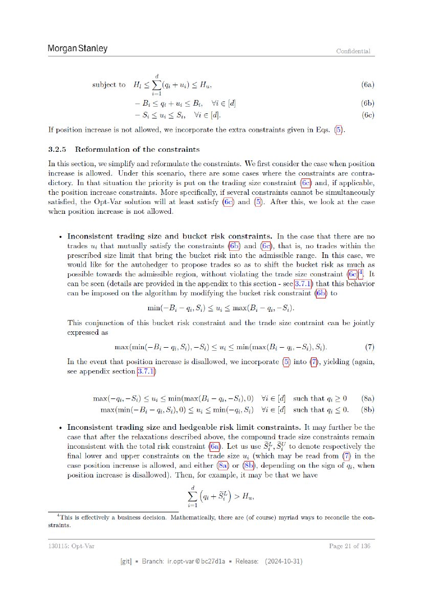

## 原文OCRテキスト

```text
Morgan Stanley                                                                                         Confidential

                                      d
                  subject to Hy < S°(qi t+ ui) < Hu,                                                            (6a)
                                     i=l

                               -Bisatu<sB,                Vie ld                                                (6b)
                               —Sisu< Si,           Vie [d.                                                     (6c)
If position increase is not allowed, we incorporate the extra constraints given in Eqs.
3.2.5       Reformulation of the constraints

In this section, we simplify and reformulate the constraints. We first consider the case when position
increase is allowed. Under this scenario, there are some cases where the constraints are contra-
dictory. In that situation the priority is put on the trading size constraint (6c) and, if applicable,
the position increase constraints. More specifically, if several constraints cannot be simultaneously
satisfied, the Opt-Var solution will at least satisfy (6c) and (5). After this, we look at the case
when position increase is not allowed.

    « Inconsistent       trading   size and     bucket    risk constraints.      In the case that there are no

        prescribed size limit that bring the bucket risk into the admissible range. In this case, we
        would like for the autohedger to propose trades so as to shift the bucket risk as much as

        can be seen (details are provided in the appendix to this section - see
        can be imposed on the algorithm by modifying the bucket risk const
                                   min(—B; — q;,5;) < uj < max(B; — gq, —S;).
        This conjunction of this bucket risk constraint and the trade size contraint can be jointly
        expressed as
                        max(min(—B;— qi, $;),—Si) < ui < min(max(B; — qi, —5;),Si).                               (7)
        In the event that position increase is disallowed, we incorporate (5) into (7), yielding (again,
        see appendix section


                  max(—qi,—S:) < ui < min(max(B; — qi,—S;),0)               Vi [d]     such that gq >0          (8a)
                    max(min(—B; — q;,5;),0) <u; < min(—g;,S,;)              Vie [d)    such that g, <0.         (8b)
    + Inconsistent trading size and hedgeable risk limit constraints. It may further be the
      case that after the relaxations described above, the compound trade size constraints remain
        inconsistent with the total risk constraint            Let us use SE, SY to denote respectively the
        final lower and upper constraints on the trai size ; (which may be read from (7) in the
        case position increase is allowed, and either             , depending on the sign of gi, when
        position increase is disallowed). Then, for example, it may be that we have

                                                 ys (a + a)        > Au,
                                                 i=1
   “This is effectively a business decision. Mathematically, there are (of course) myriad ways to reconcile the con-
straints.


130115: Opt-Var                                                                                     Page 21 of 136

                          [git] « Branch: iropt-var@be27d1a = Release:       (2024-10-31)
```

# ページ 022

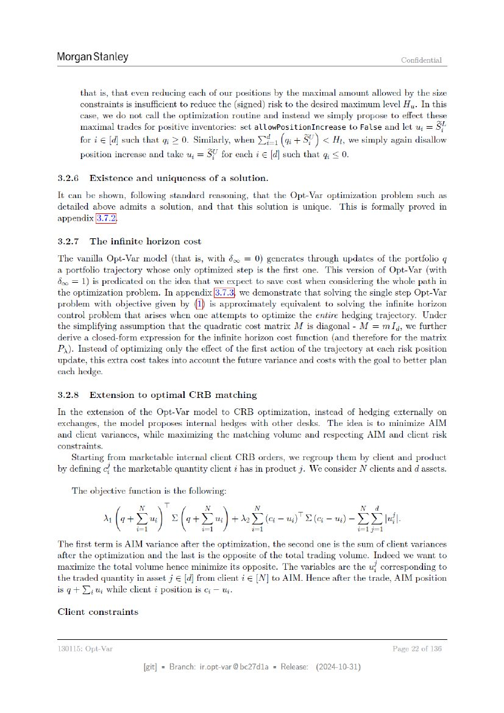

## 原文OCRテキスト

```text
Morgan Stanley                                                                                  Confidential


        that is, that even reducing each of our positions by the maximal amount allowed by the size
        constraints is insufficient to reduce the (signed) risk to the desired maximum level Hy. In this
        case, we do not call the optimization routine and instead we simply propose to effect these
        maximal trades for positive inventories: set allowPositionIncrease to False and let uj = SP
        for i [d] such that q > 0. Similarly, when D4 (qi + SY) < Hh, we simply again disallow
        position increase and take u; = SY for each i € [d] such that q; < 0.

3.2.6     Existence and uniqueness of a solution.

It can be shown, following standard reasoning, that the Opt-Var optimization problem such as
detailed above admits a solution, and that this solution is unique. This is formally proved in
appendix      3.7.
3.2.7     The infinite horizon cost

The vanilla Opt-Var model (that is, with 6.0 = 0) generates through updates of the portfolio q
a portfolio trajectory whose only optimized step is the first one. This version of Opt-Var (with
00 = 1) is predicated on the idea that we expect to save cost when considering the whole path in
the optimization problem. In appendi:        we demonstrate that solving the single step Opt-Var
problem with objective given by                is approximately equivalent to solving the infinite horizon
control problem that arises when one attempts to optimize the entire hedging trajectory. Under
the simplifying assumption that the quadratic cost matrix M is diagonal - M = mq, we further
derive a closed-form expression for the infinite horizon cost function (and therefore for the matrix
P)). Instead of optimizing only the effect of the first action of the trajectory at each risk position
update, this extra cost takes into account the future variance and costs with the goal to better plan
each hedge.

3.2.8     Extension to optimal CRB              matching

In the extension of the Opt-Var model to CRB optimization, instead of hedging externally on
exchanges, the model proposes internal hedges with other desks. The idea is to minimize AIM
and client variances, while maximizing the matching volume and respecting AIM and client risk
constraints.
    Starting from marketable internal client CRB orders, we regroup them by client and product
by defining c) the marketable quantity client i has in product j. We consider N clients and d assets.
     The objective function is the following:
                       n        \t         N               N                             Nd
               M (s+)                z (1+)         +20 (ei — ui) E (ce - wi) — OD ed
                      =1                   =             =1                          i=1j=1
The first term is AIM variance after the optimization, the second one is the sum of client variances
after the optimization and the last is the opposite of the total trading volume. Indeed we want to
maximize the total volume hence minimize its opposite. The variables are the u} corresponding to
the traded quantity in asset j € [d] from client i € [N] to AIM. Hence after the trade, ATM position
is   q+ Dj ui while client i position is cj — uj.

Client constraints


130115: Opt-Var                                                                               Page 22 of 136

                           [git] « Branch: iropt-var@be27d1a = Release:   (2024-10-31)
```

# ページ 023

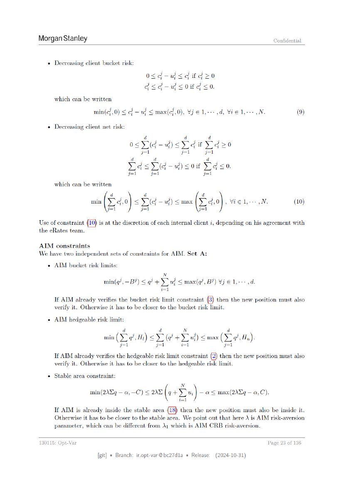

## 原文OCRテキスト

```text
Morgan Stanley                                                                                                             Confidential


   + Decreasing client bucket risk:
                                                         0<d-u<ditd>o
                                                      d<d-ul              <0ife <0.
      which can be written
                        min(c},0)
                               < c} — u} < max(c},0),                             Vj €1,---,d,          Wie 1,--- ,N.                 (9)

   + Decreasing client net risk:
                                                     d                        d                 d

                                             0<Nd-w)<Yedit Vdso
                                                    j=l                    j=l              j=l
                                              d            d                                d

                                             Ls            Vie -u) soit Ve <o.
                                             j=l          j=l                              jal

      which can be written
                                 d                   d                                 d
                        min |S       c},0]         < S°(c} —u}) <max | $>cj,0]},                       Viel,,N.                     (10)
                             J=1                    j=l                               j=l

Use of constraint (1!     is at the discretion of each internal client i, depending on his agreement with
the eRates team.

AIM    constraints
We have two independent sets of constraints for AIM. Set A:
   « AIM bucket risk limits:
                                                                     N
                            min(q,—B?)
                                < g/ + Du} < max(q/, BY) Vj                                                 e1,-++ ,d.
                                                                    i=l
      Tf AIM already verifies the bucket risk limit constraint       then the new position must also
      verify it. Otherwise it has to be closer to the bucket risk limit.

   + AIM hedgeable risk limit:
                                        d                       d             N                         d
                            min (0jel q/,Hi) <Dj=l (a + i=1Dom) < max (0j=l a, Hu).
      Tf AIM already verifies the hedgeable risk limit constraint (2) then the new position must also
       verify it. Otherwise it has to be closer to the hedgeable risk limit.

   « Stable area constraint:
                                                                          N
                     min(2\Dq—a,—-C) < 24D (: +e «) —a<                                             max(2\Nq—a,C).
                                                                          i=l

      If AIM is already inside the stable area (18) then the new position must also be inside it.
      Otherwise it has to be closer to the stable area. We point out that here \ is AIM risk-aversion
      parameter, which can be different from 1 which is AIM CRB risk-aversion.

130115: Opt-Var                                                                                                          Page 23 of 136

                          [git] « Branch: iropt-var@be27d1a = Release:                              (2024-10-31)
```

# ページ 024

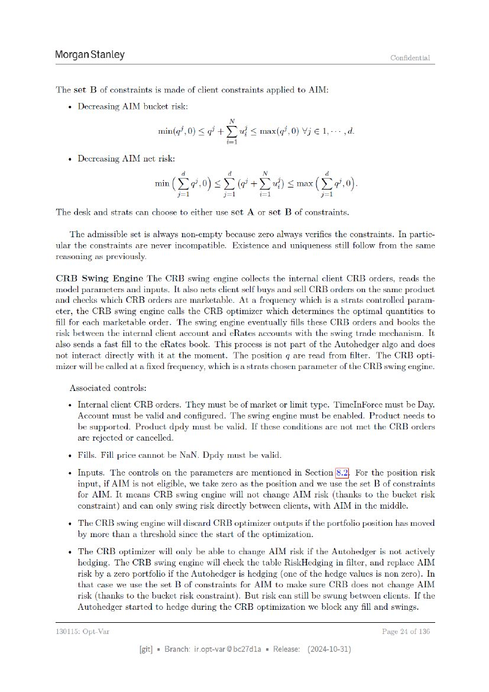

## 原文OCRテキスト

```text
Morgan Stanley                                                                              Confidential


The set B of constraints is made of client constraints applied to AIM:
   + Decreasing AIM bucket risk:
                                                    N
                            min(q’,0)
                               <q? + Sou} < max(q’,0) Vj E1,--- ,d.
                                                i=l

   + Decreasing AIM net risk:
                                   d                d     N               d
                           min (0,0) <y@+h™) <max (P90).
                                                =

The desk and strats can choose to either use set A or set B of constraints.

   The admissible set is always non-empty because zero always verifies the constraints. In partic-
ular the constraints are never incompatible. Existence and uniqueness still follow from the same
reasoning as previously.

CRB    Swing      Engine The CRB       swing engine collects the internal client CRB   orders, reads the
model parameters and inputs. It also nets client self buys and sell CRB orders on the same product
and checks which CRB orders are marketable. At a frequency which is a strats controlled param-
eter, the CRB swing engine calls the CRB optimizer which determines the optimal quantities to
fill for each marketable order. The swing engine eventually fills these CRB orders and books the
risk between the internal client account and eRates accounts with the swing trade mechanism. It
also sends a fast fill to the eRates book. This process is not part of the Autohedger algo and does
not interact directly with it at the moment. The position q are read from filter. The CRB opti-
mizer will be called at a fixed frequency, which is a strats chosen parameter of the CRB swing engine.

   Associated controls:
   + Internal client CRB orders. They must be of market or limit type. TimeInForce must be Day.
     Account must be valid and configured. The swing engine must be enabled. Product needs to
     be supported. Product dpdy must be valid. If these conditions are not met the CRB orders
     are rejected or cancelled.
   + Fills. Fill price cannot be NaN. Dpdy must be valid.
   + Inputs. The controls on the parameters are mentioned in Sectioi            For the position risk
     input, if AIM is not eligible, we take zero as the position and we use the set B of constraints
     for AIM. It means CRB swing engine will not change AIM risk (thanks to the bucket risk
     constraint) and can only swing risk directly between clients, with ATM in the middle.
   + The CRB swing engine will discard CRB optimizer outputs if the portfolio position has moved
     by more than a threshold since the start of the optimization.
   + The CRB optimizer will only be able to change AIM risk if the Autohedger is not actively
     hedging. The CRB swing engine will check the table RiskHedging in filter, and replace AIM
     risk by a zero portfolio if the Autohedger is hedging (one of the hedge values is non zero). In
     that case we use the set B of constraints for ATM to make sure CRB does not change AIM
     risk (thanks to the bucket risk constraint). But risk can still be swung between clients. If the
     Autohedger started to hedge during the CRB optimization we block any fill and swings.
130115: Opt-Var                                                                           Page 24 of 136

                       [git] « Branch: iropt-var@be27d1a = Release:   (2024-10-31)
```

# ページ 025

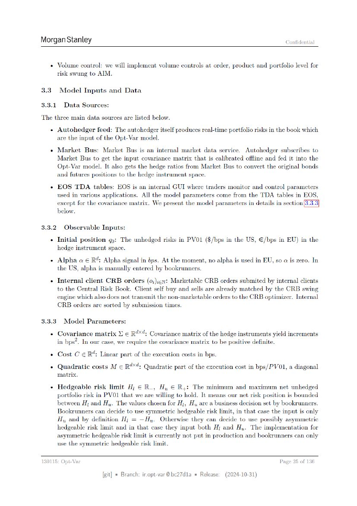

## 原文OCRテキスト

```text
Morgan Stanley                                                                             Confidential


       + Volume control: we will implement volume controls at order, product and portfolio level for
         risk swung to AIM.
3.3.      Model    Inputs   and    Data

3.3.1      Data Sources:

The three main data sources are listed below.
       + Autohedger feed: The autohedger itself produces real-time portfolio risks in the book which
         are the input of the Opt-Var model.
       + Market Bus: Market Bus is an internal market data service. Autohedger subscribes to
         Market Bus to get the input covariance matrix that is calibrated offline and fed it into the
         Opt-Var model. It also gets the hedge ratios from Market Bus to convert the original bonds
         and futures positions to the hedge instrument space.
       + EOS TDA tables: EOS is an internal GUI where traders monitor and control parameters
         used in various applications. All the model parameters come from the TDA tables in EOS,
         except for the covariance matrix. We present the model parameters in details in section
         below.
3.3.2.     Observable    Inputs:

       « Initial position qo: The unhedged risks in PVO1        ($/bps in the US, €/bps in EU) in the
         hedge instrument space.
       + Alpha a € 4: Alpha signal in bps. At the moment, no alpha is used in EU, so a is zero. In
         the US, alpha is manually entered by bookrunners.
       + Internal client CRB orders (0;)icn: Marketable CRB orders submited by internal clients
         to the Central Risk Book. Client self buy and sells are already matched by the CRB swing
         engine which also does not transmit the non-marketable orders to the CRB optimizer. Internal
         CRB orders are sorted by submission times.
3.3.3      Model    Parameters:

       * Covariance matrix © ¢ R%*¢: Covariance matrix of the hedge instruments yield increments
         in bps’. In our case, we require the covariance matrix to be positive definite.
       * Cost C € R*: Linear part of the execution costs in bps.
       * Quadratic costs M € R®**4: Quadratic part of the execution cost in bps/PV01, a diagonal
         matrix.
       + Hedgeable risk limit H; € R_, H, € Ry: The minimum and maximum net unhedged
         portfolio risk in PVO1 that we are willing to hold. It means our net risk position is bounded
         between H; and Hy. The values chosen for Hj, H, are a business decision set by bookrunners.
         Bookrunners can decide to use symmetric hedgeable risk limit, in that case the input is only
         H, and by definition Hy = —Hy,. Otherwise they can decide to use possibly asymmetric
         hedgeable risk limit and in that case they input both Hj; and Hy. The implementation for
         asymmetric hedgeable risk limit is currently not put in production and bookrunners can only
         use the symmetric hedgeable risk limit.
130115: Opt-Var                                                                          Page 25 of 136

                         [git] « Branch: iropt-var@be27d1a = Release:   (2024-10-31)
```

# ページ 026

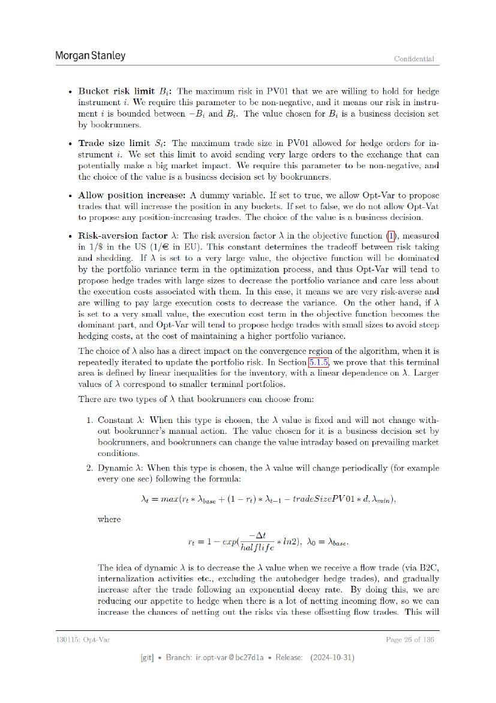

## 原文OCRテキスト

```text
Morgan Stanley                                                                             Confidential


   + Bucket risk limit B;: The maximum risk in PVO1 that we are willing to hold for hedge
     instrument 7. We require this parameter to be non-negative, and it means our risk in instru-
     ment i is bounded between —B; and B;. The value chosen for B; is a business decision set
     by bookrunners.
   + Trade size limit $j: The maximum trade size in PVO1 allowed for hedge orders for in-
     strument i. We set this limit to avoid sending very large orders to the exchange that can
     potentially make a big market impact. We require this parameter to be non-negative, and
     the choice of the value is a business decision set by bookrunners.
   + Allow position increase: A dummy variable. If set to true, we allow Opt-Var to propose
     trades that will increase the position in any buckets. If set to false, we do not allow Opt-Vat
     to propose any position-increasing trades. The choice of the value is a business decision.
   + Risk-aversion factor A: The risk aversion factor \ in the objective function (I), measured
     in 1/8 in the US (1/€ in EU). This constant determines the tradeoff between risk taking
     and shedding. If ) is set to a very large value, the objective function will be dominated
     by the portfolio variance term in the optimization process, and thus Opt-Var will tend to
     propose hedge trades with large sizes to decrease the portfolio variance and care less about
     the execution costs associated with them. In this case, it means we are very risk-averse and
     are willing to pay large execution costs to decrease the variance. On the other hand, if
      is set to a very small value, the execution cost term in the objective function becomes the
      dominant part, and Opt-Var will tend to propose hedge trades with small sizes to avoid steep
      hedging costs, at the cost of maintaining a higher portfolio variance.
      The choice of A also has a direct impact on the convergence region of the algorithm, when it is
      repeatedly iterated to update the portfolio risk. In Section          we prove that this terminal
      area is defined by linear inequalities for the inventory, with a linear dependence on A. Larger
      values of \ correspond to smaller terminal portfolios.
      There are two types of X that bookrumners can choose from:

         1. Constant A: When this type is chosen, the \ value is fixed and will not change with-
            out bookrunner’s manual action. The value chosen for it is a business decision set by
            bookrunners, and bookrunners can change the value intraday based on prevailing market
            conditions.
         2. Dynamic A: When this type is chosen, the A value will change periodically (for example
            every one sec) following the formula:
                       Nr = masr(re * Mase + (1 = re) * M1 — tradeSizePVO1 * d, Amin),
            where
                                           —At
                                    n=l erage                *In2), Ao = Abase-

            The idea of dynamic A is to decrease the \ value when we receive a flow trade (via B2C,
            internalization activities etc., excluding the autohedger hedge trades), and gradually
            increase after the trade following an exponential decay rate. By doing this, we are
            reducing our appetite to hedge when there is a lot of netting incoming flow, so we can
            increase the chances of netting out the risks via these offsetting flow trades.   This will

130115: Opt-Var                                                                          Page 26 of 136

                       [git] « Branch: iropt-var@be27d1a = Release:   (2024-10-31)
```

# ページ 027


## 原文OCRテキスト

```text
Morgan Stanley                                                                                 Confidential


                 help reduce the execution volume while keep risk under control during the time when
                 we have many netting trades, thus reduce hedging costs.
                 The parameter Ayase is the value that dynamic \ will converge to when there is no
                 flow trade. Amin is the lower bound of dynamic \. Hal flife controls the speed of
                 increase after a trade. The parameter d is the drop ratio, which can be configured to
                 different values for different types of trade. All these parameters are configurable, and
                 are business decisions made by bookrunners.
           In both cases, we require \ > 0. If this condition is not satisfied, a default positive \ value
           will be used and a warning message will be logged.
           The moment this document is written, constant A type is used in both EU and US regions,
           and there is a plan to use dynamic \ in EU in the near future.
       «   CRB    AIM    Risk-aversion factor \;: This parameter is used for CRB AIM risk-aversion.

       «   Client Risk-aversion factor \2: This parameter is used for CRB clients risk-aversion.

3.4.       Model     Outputs

The model generates a list of optimal hedge quantities u (in PVO01), which will be passed to the
downstream Hedge Executor component, and from there to the exchange to be executed. Once the
trades have been executed, there will be an update in the portfolio risk.
    CRB optimizer generates quantities to fill for each CRB order, which are passed to the CRB
swing engine which handles order fills and risk swings. The quantities u solutions of the optimization
are attributed to the initial orders. Due to the self netting done by the swing engine, for each client
and product, all order inputs to the optimizer are on the same direction. Namely, for instance, erb
optimizer input orders 01, 02, 03 for client 1 and product 1 are only buy orders. In that case we
allocate the quantity w} to 01, 02, 03 ina first in first out way. If size(o1) < |u}| < size(o1)+size(o2),
we fill entirely the order 0; and partially fill a quantity |u{|— size(o,) for order 09.

3.5        Model     Calibration and Parameter Estimation
There is a list of parameters need to be specified in the Opt-Var model as described in section
The final parameters chosen are business decisions made by bookrunners. However, Strats provide
guidance for some of the parameters based on quantitative methods. These methods might be
considered by bookrunners as a reference, and we give a brief introduction of them in this section.
    There is no data cleaning or removal of outliers used in the calibration process, with the excep-
tion of the US covariance matrix, see below. Checks and controls exist in the autohedger to make
sure the eventual parameters used in the Opt-Var model satisfy the assumptions detailed in section
BI

3.5.1        Covariance Matrix

The covariance matrix © in the objective function (I) is a dx d dimensional positive definite matrix,
where d is the number of hedge instruments. The covariance matrix encodes the covariance between
each pair of instruments; it conveys information regarding their volatility and correlation.
    To estimate the covariance matrix, we consider several different approaches; the final choice of
which covariance matrix to use is made by bookrunners, and is subject to change at their discretion

130115: Opt-Var                                                                             Page 27 of 136

                            [git] « Branch: iropt-var@be27d1a = Release:   (2024-10-31)
```

# ページ 028

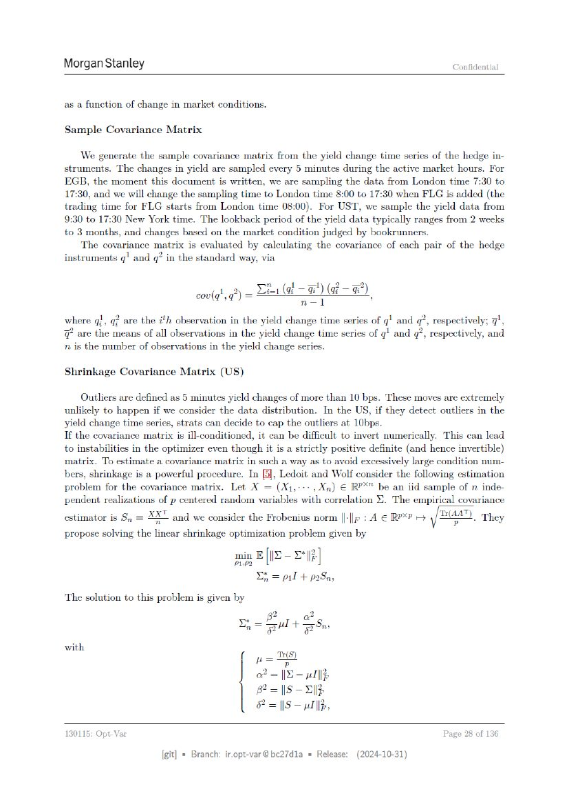

## 原文OCRテキスト

```text
Morgan Stanley                                                                              Confidential


as a function of change in market conditions.

Sample    Covariance Matrix

    We generate the sample covariance matrix from the yield change time series of the hedge in-
struments. The changes in yield are sampled every 5 minutes during the active market hours. For
EGB, the moment this document is written, we are sampling the data from London time 7:30 to
17:30, and we will change the sampling time to London time 8:00 to 17:30 when FLG is added (the
trading time for FLG starts from London time 08:00). For UST, we sample the yield data from
9:30 to 17:30 New York time. The lookback period of the yield data typically ranges from 2 weeks
to 3 months, and changes based on the market condition judged by bookrunners.
    The covariance matrix is evaluated by calculating the covariance of each pair of the hedge
instruments q! and q? in the standard way, via

                                                          G)@G-@)
                                                           —1            >
where q}, q? are the i‘h observation in the yield change time series of g! and q?, respectively; 7',
@ are the means of all observations in the yield change time series of g! and q”, respectively, and
nis the number of observations in the yield change series.

Shrinkage Covariance Matrix (US)

     Outliers are defined as 5 minutes yield changes of more than 10 bps. These moves are extremely
unlikely to happen if we consider the data distribution. In the US, if they detect outliers in the
yield change time series, strat     an decide to cap the outliers at 10bps.
If the covariance matrix is ill-conditioned, it can be difficult to invert numerically.   This can lead
to instabilities in the optimizer even though it is a strictly positive definite (and hence invertible)
matrix. To estimate a covariance matrix in such a way as to avoid excessively large condition num-
bers, shrinkage is a powerful procedure. In [5], Ledoit and Wolf consider the following estimation
problem for the covariance matrix. Let X = (X1,---,Xn) € RP*” be an iid sample of n inde-
pendent realizations of p centered random variables with correlation ©. The empirical covariance
estimator is S, = *<* and we consider the Frobenius norm |l-||- : A € RPXP +                   ). ‘They
propose solving the Yinear shrinkage optimization problem given by
                                        min E [liz =i [2|
                                              =p = pil+ p2Sn,
The solution to this problem is given by
                                                eB       oo
                                         d= Galt
with                                             ms
                                             p= 2D
                                             a==|b- ul\|p
                                             B= |S — Xp
                                             & = || —pl|lp,
130115: Opt-Var                                                                           Page 28 of 136

                       [git] « Branch: iropt-var@be27d1a = Release:   (2024-10-31)
```

# ページ 029

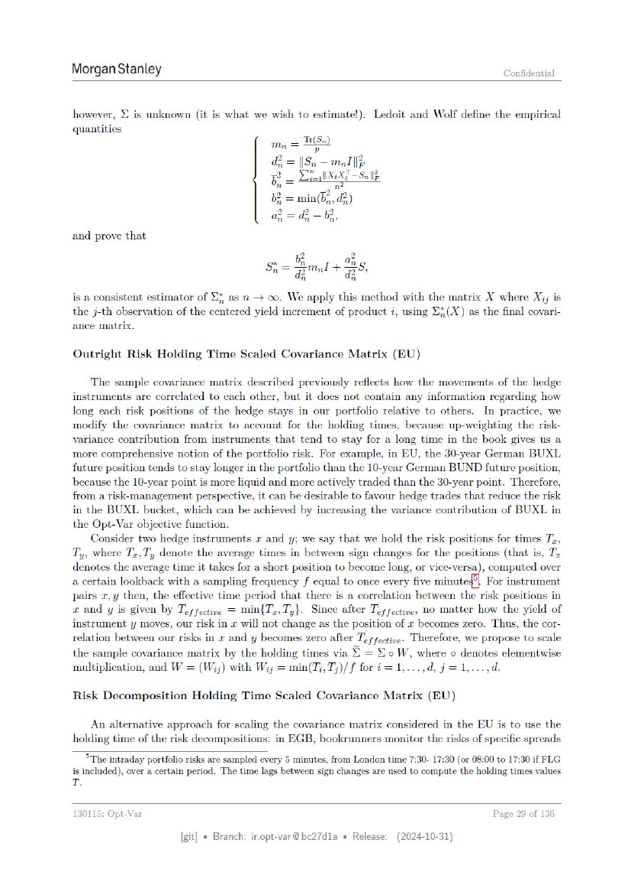

## 原文OCRテキスト

```text
Morgan Stanley                                                                                          Confidential


however, ¥ is unknown (it is what we wish to estimate!). Ledoit and Wolf define the empirical
quantities
                                                my _= Tr(Sp
                                                         BE
                                                d= ||Sn — mn ll
                                               p22 _       VR AIX T—Snll®
                                                nT         as
                                                bj = min(b,, dy)
                                                 nad BR
and prove that
                                                       2            2
                                              Sia Fa mayd + SS,
                                                       B a
is a consistent estimator of D%, as n + oo. We apply this method with the matrix X where Xij is
the j-th observation of the centered yield increment of product i, using D*(X) as the final covari-
ance matrix.
Outright Risk Holding Time Scaled Covariance Matrix (EU)

    The sample covariance matrix described previously reflects how the movements of the hedge
instruments are correlated to each other, but it does not contain any information regarding how
long each risk positions of the hedge stays in our portfolio relative to others. In practice, we
modify the covariance matrix to account for the holding times, because up-weighting the risk-
variance contribution from instruments that tend to stay for a long time in the book gives us a
more comprehensive notion of the portfolio risk. For example, in EU, the 30-year German BUXL
future position tends to stay longer in the portfolio           than the 10-year German BUND future position,
because the 10-year point is more liquid and more actively traded than the 30-year point. Therefore,
from a risk-management perspective, it can be desirable to favour hedge trades that reduce the risk
in the BUXL bucket, which can be achieved by increasing the variance contribution of BUXL in
the Opt-Var objective function.
    Consider two hedge instruments « and y; we say that we hold the risk positions for times T.,
T,, where T;,Ty denote the average times in between sign changes for the positions (that is, T;
denotes the average time it takes for a short position to become long, or vice-versa), computed over
a certain lookback with a sampling frequency f equal to once every five minuteq®} For instrument
pairs x,y then, the effective time period that there is a correlation between the risk positions in
x and y is given by Teffective = min{T;,Ty}. Since after Tey;ective, no matter how the yield of
instrument y moves, our risk in x will not change as the position of x becomes zero. Thus, the cor-
relation between our risks in « and y becomes zero after Tes ective. Therefore, we propose to scale
the sample covariance matrix by the holding times via 5 = Yo W, where o denotes clementwise
multiplication, and W = (Wj) with Wi = min(Tj,T,)/f for i=1,...,d, 7 =1,...,d.
Risk Decomposition          Holding Time         Scaled Covariance Matrix            (EU)

    ‘An alternative approach for scaling the covariance matrix considered in the EU is to use the
holding time of the risk decompositions: in EGB, bookrunners monitor the risks of specific spreads
    5The intraday portfolio risks are sampled every 5 minutes, from London time 7:30- 17:30 (or 08:00 to 17:30 if FLG
is included), over a certain period. ‘The time lags between sign changes are used to compute the holding times values
T.

130115: Opt-Var                                                                                      Page 29 of 136

                          [git] « Branch: iropt-var@be27d1a = Release:        (2024-10-31)
```

# ページ 030

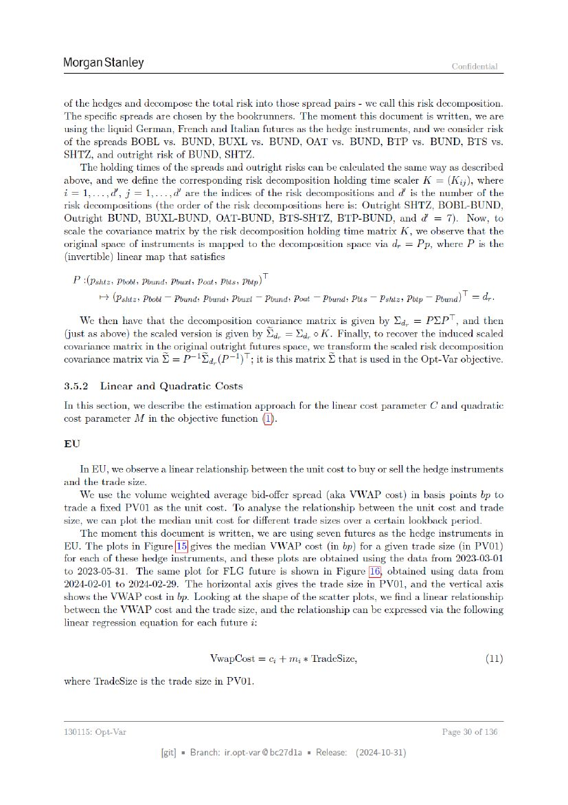

## 原文OCRテキスト

```text
Morgan Stanley                                                                                Confidential


of the hedges and decompose the total risk into those spread pairs - we call this risk decomposition.
The specific spreads are chosen by the bookrunners. The moment this document is written, we are
using the liquid German, French and Italian futures as the hedge instruments, and we consider risk
of the spreads BOBL vs. BUND, BUXL vs. BUND, OAT vs. BUND, BTP vs. BUND, BTS vs.
SHTZ, and outright risk of BUND, SHTZ.
     ‘The holding times of the spreads and outright risks can be calculated the same way as described
above, and we define the corresponding risk decomposition holding time scaler K = (Ki), where
i=1,...,d, j =1,...,d' are the indices of the risk decompositions and d’ is the number of the
risk decompositions (the order of the risk decompositions here is: Outright SHTZ, BOBL-BUND,
Outright BUND, BUXL-BUND, OAT-BUND, BTS-SHTZ, BTP-BUND, and d’ = 7). Now, to
scale the covariance matrix by the risk decomposition holding time matrix K, we observe that the
original space of instruments is mapped to the decomposition space via d, = Pp, where P is the
(invertible) linear map that satisfies
  P :(Dshtz+ Phobl, Pounds Pouzl; Poat; Pits, Potp)
         + (Pshtzs Poobl — Pound Pounds Pouzt ~ Pound; Poat ~ Pound» Pies ~ Pshtz> Potp ~ Pound) | = dr-
     We then have that the decomposition covariance matrix is given by Ng, = PEP, and then
(just as above) the scaled version is given by 54, = Na, 0K. Finally, to recover the induced scaled
covariance matrix in the original outright futures space, we transform the scaled risk decomposition
covariance matrix via © = P~!¥q,(P~')'; it is this matrix ¥ that is used in the Opt-Var objective.

3.5.2    Linear and Quadratic Costs

In this section, we describe the estimation approach for the linear cost parameter C’ and quadratic
cost parameter M in the objective function (I).

EU

     In EU, we observe a linear relationship between the unit cost to buy or sell the hedge instruments
and the trade size.
     We use the volume weighted average bid-offer spread (aka VWAP cost) in basis points bp to
trade a fixed PVO1 as the unit cost. To analyse the relationship between the unit cost and trade
size, we can plot the median unit cost for different trade sizes over a certain lookback period.
     The moment this document is written, we are using seven futures as the hedge instruments in
EU. The plots in Figure [I5] gives the median VWAP cost (in bp) for a given trade size (in PVO1)
for each of these hedge instruments, and these plots are obtained using the data from 2023-03-01
to 2023-05-31. The same plot for FLG future is shown in Figure [16] obtained using data from
2024-02-01 to 2024-02-29. The horizontal axis gives the trade size in PVO1, and the vertical axis
shows the VWAP cost in bp. Looking at the shape of the scatter plots, we find a linear relationship
between the VWAP cost and the trade size, and the relationship can be expressed via the following
linear regression equation for each future i:

                                     VwapCost = cj + mj * TradeSize,                                     (11)
where TradeSize is the trade size in PVO1.


130115: Opt-Var                                                                             Page   30 of 136

                        [git] « Branch: iropt-var@be27d1a = Release:   (2024-10-31)
```

# ページ 031

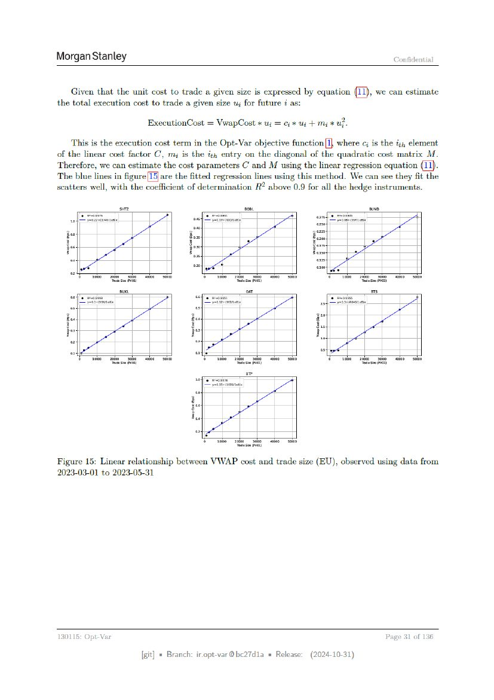

## 原文OCRテキスト

```text
Morgan Stanley                                                                             Confidential


      Given that the unit cost to trade a given size is expressed by equation (11), we can estimate
the total execution cost to trade a given size u; for future 7 as:

                          ExecutionCost = VwapCost + uj = ci * ui + mi * uP.

      This is the execution cost term in the Opt-Var objective function
                                                                      [I| where c; is the i:, element
of the linear cost factor C, m; is the iz, entry on the diagonal of the quadratic cost matrix M.
Therefore, we can estimate the cost parameters C’ and M using the linear regression equation (
The blue lines in figure |I5|are the fitted regression lines using this method. We can see they fit the
scatters well, with the coefficient of determination R? above 0.9 for all the hedge instruments.


                                                                       =
                                                                       i
                                                                       Yam.


  Ia.
  8
                                                                        re
                                                                        bus.
  is                                                                    i


Figure 15: Linear relationship between VWAP cost and trade size (EU), observed using data from
2023-03-01 to 2023-05-31


130115: Opt-Var                                                                          Page 31 of 136

                        [git] « Branch: iropt-var@be27d1a = Release:   (2024-10-31)
```

# ページ 032

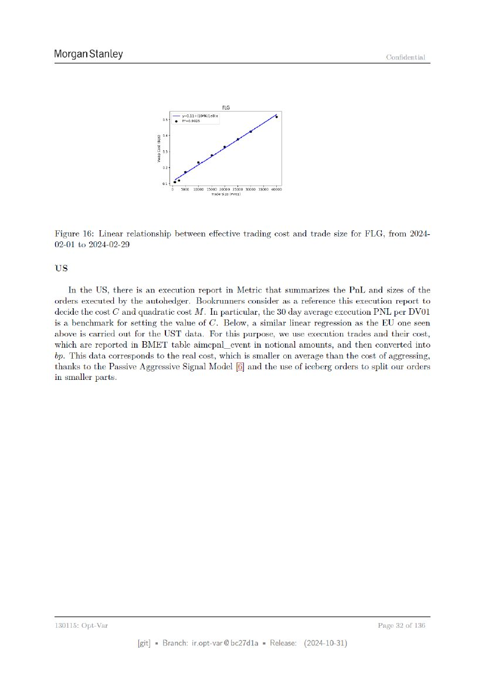

## 原文OCRテキスト

```text
Morgan Stanley                                                                           Confidential


                                                    AG
                               — yroansiosemeaix


                                              "rode ize (P¥O1,


Figure 16: Linear relationship between effective trading cost and trade size for FLG, from 2024-
02-01 to 2024-02-29
US

     In the US, there is an execution report in Metric that summarizes the PnL      and sizes of the
orders executed by the autohedger. Bookrunners consider as a reference this execution report to
decide the cost C’ and quadratic cost M. In particular, the 30 day average execution PNL per DVO1
is a benchmark for setting the value of C. Below, a similar linear regression as the EU one seen
above is carried out for the UST data. For this purpose, we use execution trades and their cost,
which are reported in BMET table aimcpnl_event in notional amounts, and then converted into
bp. This data corresponds to the real cost, which is smaller on average than the cost of aggressing,
thanks to the Passive Aggressive Signal Model [6] and the use of iceberg orders to split our orders
in smaller parts.


130115: Opt-Var                                                                       Page 32 of 136

                      [git] « Branch: iropt-var@be27d1a = Release:   (2024-10-31)
```

# ページ 033

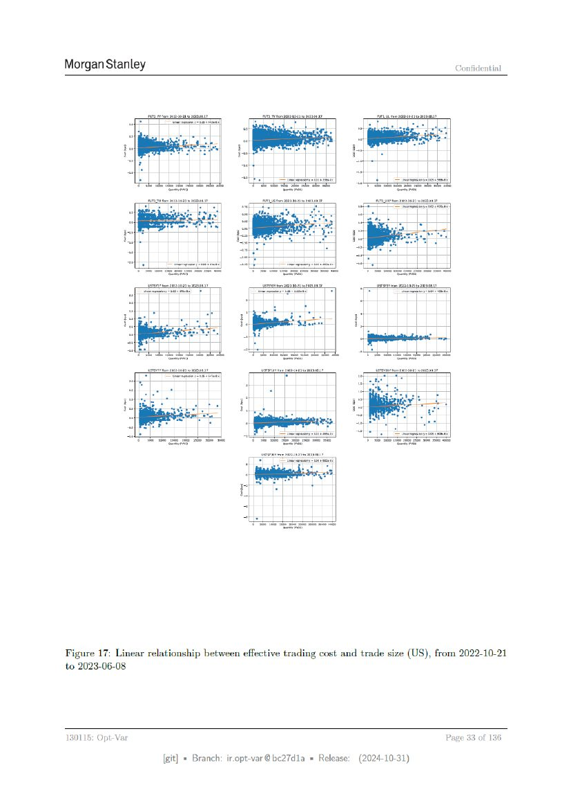

## 原文OCRテキスト

```text
Morgan Stanley                                                                                 Confidential


                                                                     i


                  aaa ie aia a ae               oe                   +a                 Sane


                                inl
              a          i
              i


                                        de                           a
                                         afte                              P

                                                wings
                                                   sis wie aie al


Figure 17: Linear relationship between effective trading cost and trade size (US), from 2022-10-21
to 2023-06-08


130115: Opt-Var                                                                            Page 33 of 136

                      [git] « Branch: iropt-var@be27d1a = Release:       (2024-10-31)
```

# ページ 034

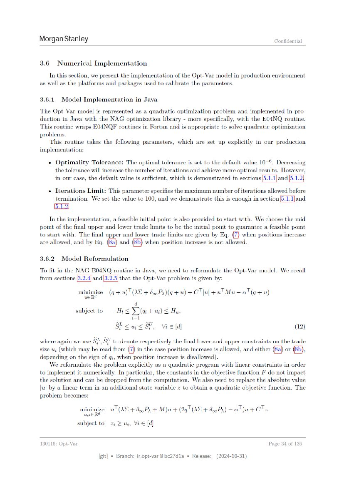

## 原文OCRテキスト

```text
Morgan Stanley                                                                                        Confidential


3.6      Numerical        Implementation

    In this section, we present the implementation of the Opt-Var model in production environment
as well as the platforms and packages used to calibrate the parameters.
3.6.1     Model Implementation             in Java

The Opt-Var model is represented as a quadratic optimization problem and implemented in pro-
duction in Java with the NAG optimization library - more specifically, with the E04NQ routine.
This routine wraps E04NQF routines in Fortan and is appropriate to solve quadratic optimization
problems.
    This routine takes the following parameters, which are set up explicitly in our production
implementation:
      + Optimality Tolerance: The optimal tolerance is set to the default value 10~°. Decreasing
        the tolerance will increase the number of iterations and achieve more optimal results. However,


    In the implementation, a feasible initial point is also provided to start with. We choose the mid
point of the final upper and lower trade limits to be the initial point to guarantee a feasible point
to start with. The final     up er and lower trade limits are given by Eq. ) when positions increase
are allowed, and by Eq. (8a) and          ) when position increase is not allowed.

3.6.2     Model Reformulation
To fit in the NAG         E04NQ routine in Java, we need to reformulate the Opt-Var model.              We recall
from sections                                                is gi

                  minimize      (q+ u)'(AD + b0Pa)(qt+ u) +C"        ful   +u'Mu-al(q+u)
                     ue 4
                                          d
                  subject to    — Hy < S0(qi+ui) < Hu,
                                         i=1

                                  Sh<w<S?,           vie [d|                                                   (12)
where again we use $/, SY to denote respectively the final lower and upper constraints on the trade
size u; (which may be read from (7) in the case position increase is allowed, and either
depending on the sign of g:, when position increase is disallowed).
     We reformulate the problem explicitly as a quadratic program with linear constraints in order
to implement it numerically. In particular, the constants in the objective function F do not impact
the solution and can be dropped from the computation. We also need to replace the absolute value
|u| by a linear term in an additional state variable z to obtain a quadratic objective function. The
problem becomes:
                   minimize     ul (AD + bx0P\ + M)ut (2q' (AD + 60P,) — a                )ut+Clz
                     we
                  subject to.   2; > ui, Vi € [d]

130115: Opt-Var                                                                                     Page 34 of 136

                            [git] « Branch: iropt-var@be27d1a = Release:   (2024-10-31)
```

# ページ 035

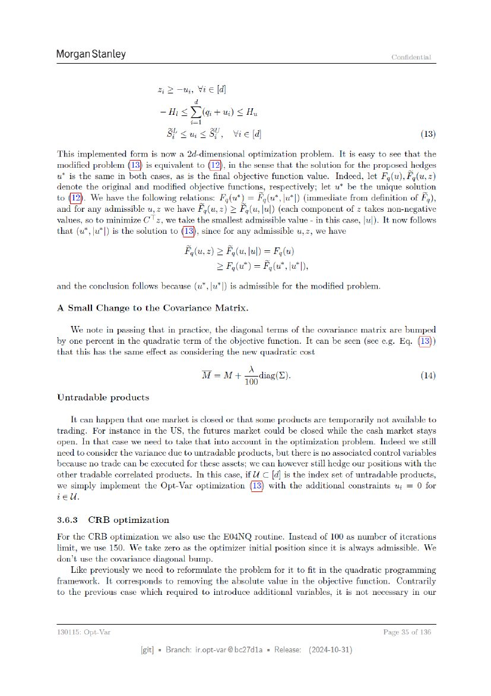

## 原文OCRテキスト

```text
Morgan Stanley                                                                                    Confidential


                             a2 —u, Vie [d]
                                        d

                              —Wh< a+              u) < Hy
                                       i=l

                                 Sh<u<S?,             wield                                                 (13)
This implemented form is now a 2d-dimensional optimization problem. It is easy to see that the
modified problem (13) is equivalent to (12), in the sense that the solution for the proposed hedges
u* is the same in both cases, as is the final objective function value. Indeed, let Fy(u), F(u, 2)
denote the original and modified objective functions, respectively; let u* be the unique solution
to (12). We have the following relations: Fy(u*)            = F,(u*, |u*|) (immediate from definition of F;),
and te any admissible u,z we have F,(u,z) > F,(u, |u|) (each component of z takes non-negative
values, so to minimize C7, we take the smallest admissible value - in this case, |u). It now follows
that (u*,|u*|) is the solution to           (13), since for any admissible u, 2, we have
                                     Fi(u, 2) > Fy(u, jul) = Fy(u)
                                              > F,(u) = Fyu", Ju"),
and the conclusion follows because (u*,|u*|) is admissible for the modified problem.

A Small Change to the Covariance Matrix.

    We note in passing that in practice, the diagonal terms of the covariance matrix are bumped
by one percent in the quadratic term of the objective function. It can be seen (see e.g. Eq.
that this has the same effect as considering the new quadratic cost
                                                           A...
                                             M=M+        Foo tias(®)-                                       (14)

Untradable        products

    It can happen that one market is closed or that some products are temporarily not available to
trading.   For instance in the US, the futures market could be closed while the cash market stays
open. In that case we need to take that into account in the optimization problem. Indeed we still
need to consider the variance due to untradable products, but there is no associated control variables
because no trade can be executed for these assets; we can however still hedge our positions with the
other tradable correlated products. In this case, if U C [d] is the index set of untradable products,
we simply implement the Opt-Var optimization (13) with the additional constraints u; = 0 for
ieUu.

3.6.3      CRB    optimization

For the CRB optimization we also use the E04NQ routine. Instead of 100 as number of iterations
limit, we use 150. We take zero as the optimizer initial position since it is always admissible. We
don’t use the covariance diagonal bump.
     Like previously we need to reformulate the problem for it to fit in the quadratic programming
framework. It corresponds to removing the absolute value in the objective function. Contrarily
to the previous case which required to introduce additional variables, it is not necessary in our


130115: Opt-Var                                                                                Page   35 of 136

                         [git] « Branch: iropt-var@be27d1a = Release:        (2024-10-31)
```

# ページ 036


## 原文OCRテキスト

```text
Morgan Stanley                                                                                               Confidential


CRB setting.       Indeed, thanks to constraint (9), we know that sign(w}) = sign(c}).                      Hence |u}| =
sign(c!) x ul, which becomes linear in the variable u. The objective function becomes
                     N       T          N                   N                           N      d
          ML (1+)                = (+s)               +23        (eG — ui)’ DG —ui) — OY sign(d ud.
                    i=1                i=l                i=1                          i=1 j=

3.6.4     Parameter       Calibration in Python

The calibration of the covariance matrix               © and cost parameters C and M are done in Q/kdb and
Python using the open-source packages: Numpy, Pandas, Scipy, Sklearn.

3.7     Appendix:         Technical Details

3.7.1     Reformulation of the Constraints

The original Opt-Var objective is posed with box constraints on the decision variable u that might
be inconsistent. The reformulation of the constraints given in Section|3.2.5]is based on the following
principle: suppose we have two constraints on a variable u - u € [L1,Ui] and w € (Lo, Us] that are
inconsistent, and that we wish to express the constraints with the added proviso that when the
intersection is empty, we opt for the value in the former interval closest to the latter. For example,
if U; < Lo, we wish the constraint to reduce to {U9} if Uy < L1, we want {Ly}. The reformulation
that achieves this can be obtained by first relaxing the second constraint until the intersection
is non-empty - namely, take L, = min(L9,U;) and Ul = max(U9,L1). The twin constraints
Ly <u < U; and Lh < wu < US are now consistent by construction, so they can be concisely
combined as L < u <U, where L = max(L1,L4) and U = min(U;, U3).
              Ly                             U1             Ly
               -                              o-             .                                     .-


Figure 18: Schematic of a particular case of inconsistent box-constraints. The first constraint
(red) is enforced; the second constraint (blue) is minimally relaxed such that the intersection is
non-empty (dashed blue). As the diagram indicates, in this case we have Ly = U; and Uj = Up.
      Consider, for example, the Opt-Var constraints as given in Section (3.2.3)                        in the case when
position increase is disallowed. Examining instrument i, suppose that q; < 0, so that the constraints
on uj (excluding the total risk constraint (2)) are given by
                                                   -Sisui sc Si,
                                                   -B-g         sus   Bi-4G
                                               O<us—a.                                                                (15)
    Following the procedure for ensuring that the first and second constraints are consistent (while
ensuring the first is respected) yields
                      max(—Sj, min(—B; — qi, S;)) < uj < min(S;, max(B; — qi, —S;))
                    ~max(—S;,min(—B; — qi, S;)) < ui < min(S;,Bi — gi)
We observe that the first and third constraints in                    are consistent, since both include 0, and it
follows that the following expresses the three constraints (according to our convention):

130115: Opt-Var                                                                                            Page 36 of 136

                           [git] « Branch: iropt-var@be27d1a = Release:         (2024-10-31)
```

# ページ 037

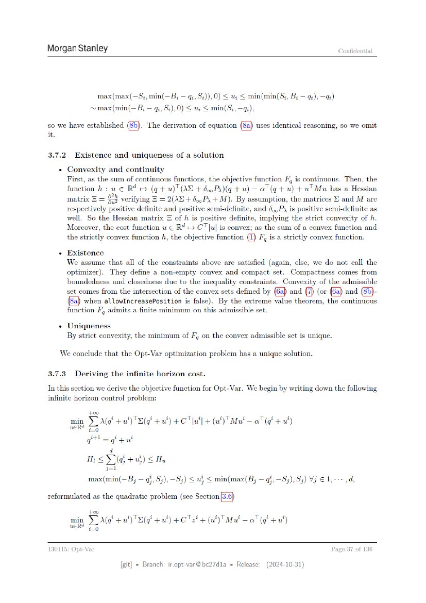

## 原文OCRテキスト

```text
Morgan Stanley                                                                                             Confidential


                       max(max(—S;,min(—B; — qi, Si)),0) < ui < min(min(5;, Bi — qi), —43)
                 ~max(min(—B; — qi, 5;),0) < ui < min(S;, —gi),
so we have established                 (8)    The derivation of equation          uses identical reasoning, so we omit
it.

3.7.2       Existence and uniqueness of a solution
    «    Convexity and continuity
         First, as the sum of continuous functions, the objective function Fy is continuous. Then, the
         function h : u € R4 +s (qt+u)' (AL + doc Pa)(q+u) — a!                          (q+) +u! Mu has a Hessian
         matrix     = &h verifying = = 2(AU+6..P, + M). By assumption, the matrices 5 and M are
         respectively positive definite and positive semi-definite, and 6.,P) is positive semi-definite as
         well. So the Hessian matrix = of h is positive definite, implying the strict convexity of h.
         Moreover, the cost function u € R4++ CT |u| is conve:                 ;.as the sum of a convex function and
         the strictly convex function h, the objective function                    F; is a strictly convex function.
    + Existence
      We assume that all of the constraints above are satisfied (again, else, we do not call the
         optimizer). They define a non-empty convex and compact set. Compactness comes from
         boundedness and closedness due to the inequality constraints.
             comes from the intersection of the convex sets defined by (
                when allowIncreasePosition is false). By the extreme value theorem, the conti                         ous
         function F, admits a finite minimum on this admissible set.
    «    Uniqueness
         By strict convexity, the minimum of F, on the convex admissible set is unique.
    We conclude that the Opt-Var optimization problem has a unique solution.
3.7.3.      Deriving the infinite horizon cost.

In this section we derive the objective function for Opt-Var. We begin by writing down the following
infinite horizon control problem:
                 +00
         min, SAG                 +)         Dg   4°) +O   u'| $ (uw)   Mul — a (gi +u')
         ueR®   5=0
                gtadgtu
                          d
                Ais SOG, +45) < Au
                         =
                 max(min(—B, — g5,.5;),—Sj) <u; < min(max(B; — g;,—Sj),55) ¥j €1,--+ 4d,
reformulated as the quadratic problem (see Section [B.
                 +00          7        7            7                      7         7    7
          min Sq                  +u') Ng tu’) +C le! + (u')' Mui -a'(g +u')
         ueR4    i=


130115: Opt-Var                                                                                          Page   37 of 136

                                   [git] « Branch: iropt-var@be27d1a = Release:      (2024-10-31)
```

# ページ 038

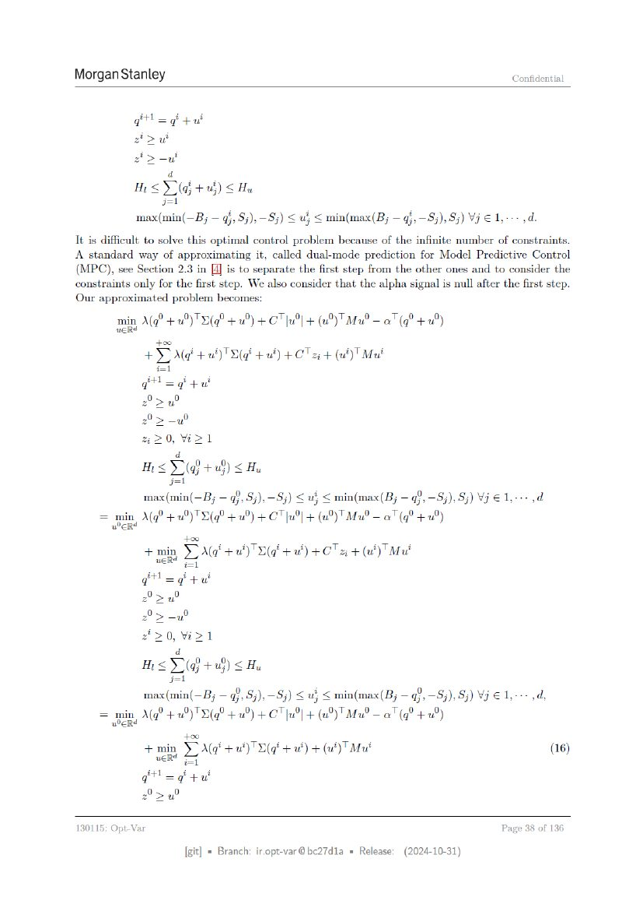

## 原文OCRテキスト

```text
Morgan Stanley                                                                                     Confidential

                 gttaqgtui

                 g>ui
                 g>-u
                          d

                 M< SG +uj) < Hu
                        jel
                 max(min(—B, — qj,.5;),—Sj) < uj < min(max(B; — q},—S;),S;) Vj €1,---.d.
It is difficult to solve this optimal control problem because of the infinite number of constraints.
‘A standard way of approximating it, called dual-mode prediction for Model Predictive Control
(MPC), see Section 2.3 in [I] is to separate the first step from the other ones and to consider the
constraints only for the first step. We also consider that the alpha signal is null after the first step.
Our approximated problem becomes:
         min Aq? +.u®) TE(q? + u?) + CT fu] + (u®) Mu? — al (go +09)
         u
                    00
                  +O AG +u)TEG +u') + Cla + (u')' Mul
                    i=1
                  gttadtui

                  >
                  29> -u?
                  4 >0,V¥i>1
                              d
                  Ms oq} + uf) < Hu
                          j=l
                  max(min(—B; — q), $;),—S;) < ui, < min(max(B; — q),—S;), $;) ¥j €1,--+ .d
     = pin, Ma? + uP) D(a? + u) CT ad] + (wl) Ma? — a! (g? + 0°)
                                  too                                         7
                  + min, > Agi tui)               (qi tu) + CT + (ui) Mut
                  gitiadtu
                  22>

                  29> —u?
                  2>0,Vi>1
                              d

                  M< Yq} +uj) < Hu
                          j=l
           max(min(—B, — 4}, $;),—S;) < uj < min(max(B; — q?, —5;), $5) ¥j                       €1,--+.d,
     = min A(q? +a") Eq? + a9) + CT |u?| + (u®) Mu? — al (go +u°)
        wWeERE
                                  +00                                     7
                  t+min                 AG tu)   SG    tu!) + (u')' Mut                                       (16)
                    ucR?          il

                  gtiagtul
                  0 > yo


130115: Opt-Var                                                                                  Page   38 of 136

                                  [git] « Branch: iropt-var@be27d1a = Release:    (2024-10-31)
```

# ページ 039

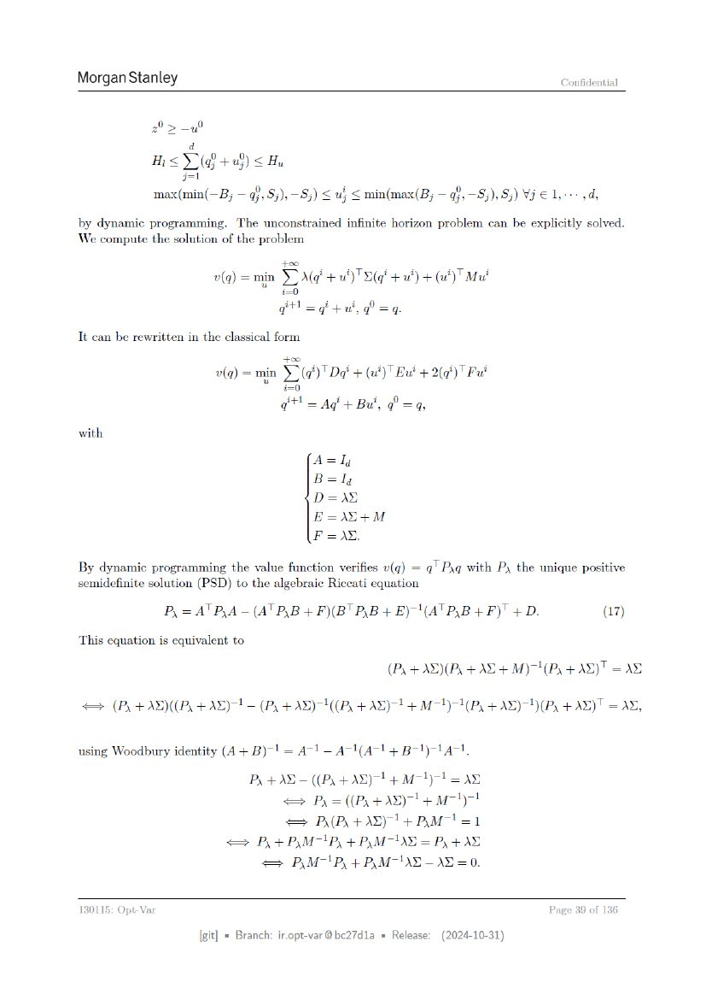

## 原文OCRテキスト

```text
Morgan Stanley                                                                                Confidential


                  22> -u?
                       d

                  M< Yq} +uj) < Hu
                      j=l
                  max(min(—B; ~ qj, $3), —S;) < wy < min(max(B;— q},—S;), $3) Vj €1,---.d,
by dynamic programming. The unconstrained infinite horizon problem can be explicitly solved.
We compute the solution of the problem
                                             +00    7    7           7        7

                              ol) = min So Ng + ug + ut) + (wt) Met
                                             i=0

                                             gtadtu, f=
Tt can be rewritten in the classical form
                                             too                         7

                               v(q) = mint     0 (q') "Dai + (u') Eu’ + 2(¢') "Ful
                                             i=0

                                             gt! = Ag + Bu, @ =4,
with
                                                   A=I
                                                   B=Iq
                                                   D= 5
                                                   E=\S+M
                                                   F=)S.
By dynamic programming the value function verifies v(q) = q' Paq with P) the unique positive
semidefinite solution (PSD) to the algebraic Riccati equation
                   P,=A'PRA-(A'RB+F)(B'RB+E)'(A'PB+F)'+D.                                              (17)

This equation is equivalent to
                                                                 (Py + AB)(Py + AD + M)1(Py +. AD)l = AD

<=> (Py +AE)((Py + AE)! = (Py + AS)“ "((Dy + AD)! + M1)“ (Py + AD)“1)(Py + AE) = AE,

using Woodbury identity (A+ B)-!= A-!—A-!(A-1 4 Bo!) tat.

                                      Py +dE-— (Py +AE)-'4+Mo1)-1 = aE
                                           <=> Py=((Py+ dD) 1+ My!
                                            <= P(Py+dA¥) 14+ RM t=1
                                 <>    P+ PMP +P\MOAD = Py HAD
                                       <= PM 'P\+P\M1AD-AD=0.


130115: Opt-Var                                                                             Page 39 of 136

                            [git] « Branch: iropt-var@be27d1a = Release:     (2024-10-31)
```

# ページ 040

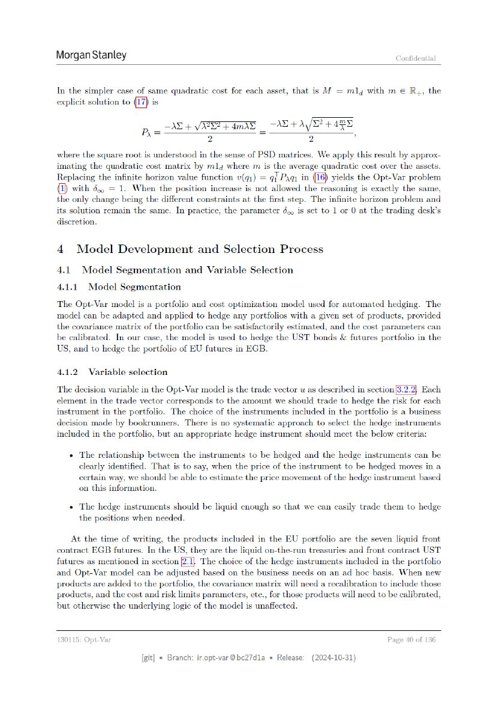

## 原文OCRテキスト

```text
Morgan Stanley                                                                             Confidential


In the simpler case of same quadratic cost for each asset, that is M = mlq with m € R,, the
explicit solution to

                               AE + VEZ
                                      + IMAS _ AE + Ay/D2 44RD
                        P=
                                       2             _             2           °
where the square root is understood in the sense of PSD matrices. We apply this result by approx-
imating the quadratic cost matrix by m1q where m is the average quadratic cost over the assets.
Replacing the infinite horizon value function v(q1) = q} Pq in (16) yields the Opt-Var problem
     with 5, = 1. When the position increase is not allowed the reasoning is exactly the same,
the only change being the different constraints at the first step. The infinite horizon problem and
its solution remain the same. In practice, the parameter 55, is set to 1 or 0 at the trading desk’s
discretion.

4       Model     Development          and    Selection       Process

4.1      Model    Segmentation and Variable Selection
4.1.1     Model   Segmentation

The Opt-Var model is a portfolio and cost optimization model used for automated hedging. The
model can be adapted and applied to hedge any portfolios with a given set of products, provided
the covariance matrix of the portfolio can be satisfactorily estimated, and the cost parameters can
be calibrated. In our case, the model is used to hedge the UST bonds & futures portfolio in the
US, and to hedge the portfolio of EU futures in EGB.
4.1.2     Variable selection
The decision variable in the Opt-Var model is the trade vector w as described in section
clement in the trade vector corresponds to the amount we should trade to hedge the ris!
instrument in the portfolio. The choice of the instruments included in the portfolio is a business
decision made by bookrunners. There is no systematic approach to select the hedge instruments
included in the portfolio, but an appropriate hedge instrument should meet the below criteria:
      + The relationship between the instruments to be hedged and the hedge instruments can be
        clearly identified. That is to say, when the price of the instrument to be hedged moves in a
        certain way, we should be able to estimate the price movement of the hedge instrument based
        on this information.
      + The hedge instruments should be liquid enough so that we can easily trade them to hedge
        the positions when needed.
    ‘At the time of writing, the products included in the EU portfolio are the seven liquid front
contract EGB futures. In the US, they are the liquid on-the-run treasuries and front contract UST
futures as mentioned in section        The choice of the hedge instruments included in the portfolio
and Opt-Var model can be adjusted based on the business needs on an ad hoc basis. When new
products are added to the portfolio, the covariance matrix will need a recalibration to include those
products, and the cost and risk limits parameters, etc., for those products will need to be calibrated,
but otherwise the underlying logic of the model is unaffected.

130115: Opt-Var                                                                          Page 40 of 136

                        [git] « Branch: iropt-var@be27d1a = Release:   (2024-10-31)
```

# ページ 041

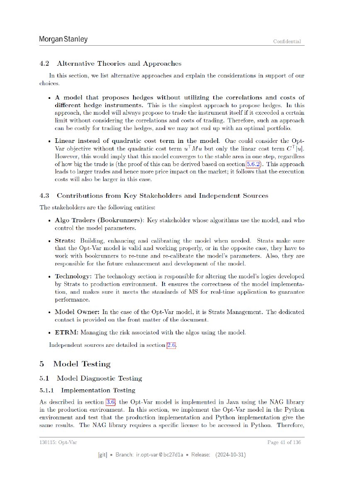

## 原文OCRテキスト

```text
Morgan Stanley                                                                                   Confidential


4,2       Alternative      Theories    and   Approaches

    In this section, we list alternative approaches and explain the considerations in support of our
choices.
       « A model that proposes hedges without utilizing the correlations and costs of
         different hedge instruments. This is the simplest approach to propose hedges. In this
         approach, the model will always propose to trade the instrument itself if it exceeded a certain
         limit without considering the correlations and costs of trading. Therefore, such an approach
         can be costly for trading the hedges, and we may not end up with an optimal portfolio.
       + Linear instead of quadratic cost term in the model.                 One could consider the Opt-
         Var objective without the quadratic cost term u! Mu but only the linear cost term C™ |u|.
         However, this would imply that this model converges to the stable area in one step, regardless
         of how big the trade is (the proof of this can be derived based on sectio       . This approach
         leads to larger trades and hence more price impact on the market; it follows that the execution
         costs will also be larger in this case.

4.3       Contributions from Key Stakeholders and Independent                        Sources
The stakeholders are the following entities:

       + Algo Traders (Bookrunners): Key stakeholder whose algorithms use the model, and who
         control the model parameters.
       « Strats: Building, enhancing and calibrating the model when needed. Strats make sure
         that the Opt-Var model is valid and working properly, or in the opposite case, they have to
         work with bookrunners to re-tune and re-calibrate the model’s parameters. Also, they are
         responsible for the future enhancement and development of the model.

       + Technology: The technology section is responsible for altering the model’s logics developed
         by Strats to production environment. It ensures the correctness of the model implementa-
         tion, and makes sure it meets the standards of MS for real-time application to guarantee
         performance.
       « Model    Owner:    In the case of the Opt-Var model, it is Strats Management.         The dedicated
         contact is provided on the front matter of the document.

       + ETRM: Managing the risk associated with the algos using the model.
        Independent sources are detailed in section

5       Model      Testing
5.1.      Model Diagnostic Testing
5.1.1      Implementation       Testing

As described in section      the Opt-Var model is implemented in Java using the NAG library
in the production environment. In this section, we implement the Opt-Var model in the Python
environment and test that the production implementation and Python implementation give the
same results. The NAG library requires a specific license to be accessed in Python. Therefore,
130115: Opt-Var                                                                                Page 41 of 136

                           [git] « Branch: iropt-var@be27d1a = Release:   (2024-10-31)
```

# ページ 042

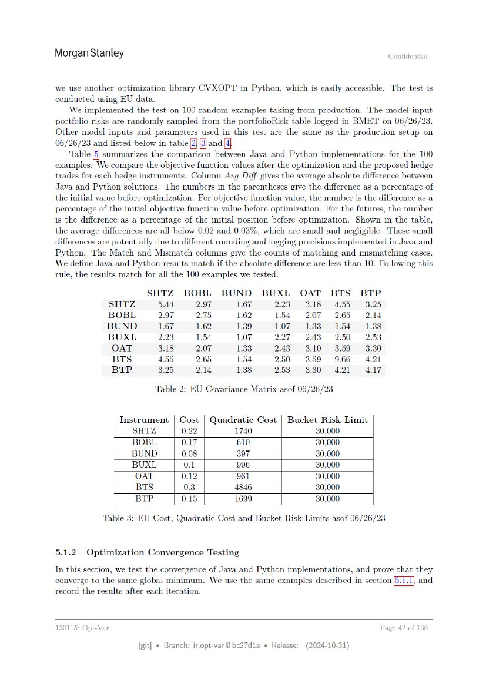

## 原文OCRテキスト

```text
Morgan Stanley                                                                                       Confidential


we use another optimization library CVXOPT in Python, which is easily accessible. The test is
conducted using EU data.
   We implemented the test on 100 random examples taking from production. The model input
portfolio risks are randomly sampled from the portfolioRisk table logged in BMET on 06/26/23.
Other model inputs and parameters used in this test are the same as the production setup on
06/26/23 and listed below in table
   Table [5] summarizes the comparison between Java and Python implementations for the 100
examples. We compare the objective function values after the optimization and the proposed hedge
trades for each hedge instruments. Column Avg Diff gives the average absolute difference between
Java and Python solutions. The numbers in the parentheses give the difference as a percentage of
the initial value before optimization.   For objective function value, the number is the difference as a
percentage of the initial objective function value before optimization. For the futures, the number
is the difference as a percentage of the initial position before optimization. Shown in the table,
the average differences are all below 0.02 and 0.03%, which are small and negligible. These small
differences are potentially due to different rounding and logging precisions implemented in Java and
Python. The Match and Mismatch columns give the counts of matching and mismatching cases.
We define Java and Python results match if the absolute difference are less than 10. Following this
rule, the results match for all the 100 examples we tested.
                           SHTZ       BOBL      BUND        BUXL         OAT      BTS     BTP
                  SHTZ        5.44       2.97       1.67          2.23    3.18     4.55       3.25
                  BOBL        2.97       2.75       1.62          154     2.07     265        2.14
                  BUND         1.67      1.62       1.39          1.07    1.33     1.54
                  BUXL        2.23       1.54       1.07          2.27    243      2.50
                   OAT        3          2.07       1.33          2.43    3.10     3.59
                   BTS                   2.65       1.54          2.50    3.59     9.66
                   BTP                   2.14       1.38          2.53    3.30     4.21

                             Table 2: EU Covariance Matrix asof 06/26/23

                    Instrument | Cost | Quadratic          Cost     | Bucket     Risk Limit
                       SHTZ       0.22        1740                             30,000
                       BOBL       0.17         610                             30,000
                       BUND       0.08         397                             30,000
                       BUXL        0.1         996                             30,000
                        OAT       0.12         961                             30,000
                        BTS        0.3        4846                             30,000
                        BTP       0.15        1699                             30,000

              Table 3: EU Cost, Quadratic Cost and Bucket Risk Limits asof 06/26/23


5.1.2    Optimization      Convergence Testing

In this section, we test the convergence of Java and Python implementations, and prove that they
converge to the same global minimum. We use the same examples described in section
record the results after each iteration.

130115: Opt-Var

                         [git] « Branch: iropt-var@be27d1a = Release:     (2024-10-31)
```

# ページ 043

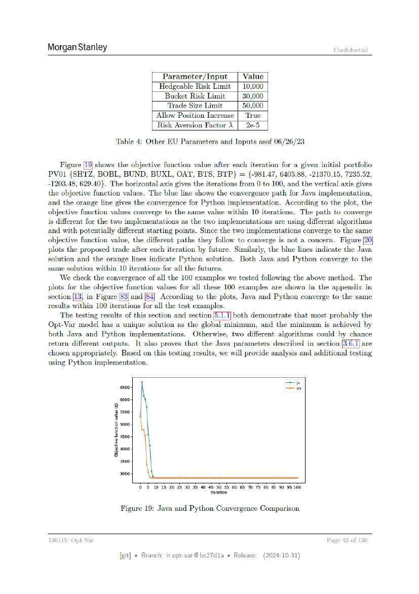

## 原文OCRテキスト

```text
Morgan Stanley                                                                                       Confidential


                                            Parameter/Input            | Value
                                           Hedgeable Risk Limit         | 10,000
                                             Bucket Risk Limit         | 30,000
                                              Trade Size Limit      50,000
                                          Allow Position Increase | True
                                          Risk Aversion Factor A | 2e-5

                        Table 4: Other EU Parameters and Inputs asof 06/26/23

                  shows the objective function value after each iteration for a given initial portfolio
PV01 {SHTZ, BOBL, BUND, BUXL, OAT, BTS, BTP} = {-981.47, 6405.88, -21370.15, 7235.52,
-1203.48, 629.40}. The horizontal axis gives the iterations from 0 to 100, and the vertical axis gives
the objective function values. The blue line shows the convergence path for Java implementation,
and the orange line gives the convergence for Python implementation. According to the plot, the
objective function values converge to the same value within 10 iterations. The path to converge
is different for the two implementations as the two implementations are using different algorithms
and with potentially different starting points. Since the two implementations converge to the same
objective function value, the different paths they follow to converge is not a concern. Figure
plots the proposed trade after each iteration by future. Similarly, the blue lines indicate the Java
solution and the orange lines indicate Python solution. Both Java and Python converge to the
same solution within 10 iterations for all the futures.
    We check the convergence of all the 100 examples we tested following the above method. The
plots for the objective function values for all these 100 examples are shown in the appendix in
section      i                    and       According to the plots, Java and Python converge to the same
results   within 100 iterations for all the test examples.
    The testing results of this section and section                    both demonstrate that most probably the
Opt-Var model has a unique solution as the global minimum, and the minimum is achieved by
both Java and Python implementations.                   Otherwise, two different algorithms could by chance
return different outputs. It also proves that the Java parameters described in section [3.
chosen appropriately. Based on this testing results, we will provide analysis and additional testing
using Python implementation.
                                                                                           —
                           6500                                                            — by
                           6000
                         § 5500
                         5 5000
                        2 4500
                       & aoo0
                           3500
                          3000
                                    © 5 10 15 20 25 30 35 40 45 50 55 60 65 70 75 60 85 90 95100
                                                              Iteration

                          Figure 19: Java and Python Convergence Comparison

130115: Opt-Var                                                                                    Page 43 of 136

                          [git] « Branch: iropt-var@be27d1a = Release:             (2024-10-31)
```

# ページ 044

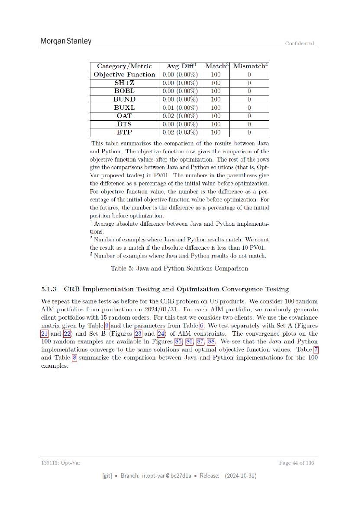

## 原文OCRテキスト

```text
Morgan Stanley                                                                                      Confidential


                       Category /Metric      Avg Diff! | Match*]                 Mismatch")
                      Objective Function | 0.00 (0.00%)    100                        0
                                 SHTZ               0.00 (0.00%)   [| _100            0
                                 BOBL               0.00 (0.00%)    | 100             0
                                 BUND               0.00 (0.00%)    | 100             0
                                 BUXL               0.01 (0.00%)    | _100            0
                                  OAT               0.02 (0.00%)      [100            0
                                  BTS               0.00 (0.00%)   [| _100            0
                                  BTP               0.02 (0.03%)      [100            0
                     This table summarizes the comparison of the results between Java
                    and Python. The objective function row gives the comparison of the
                    objective function values after the optimization. The rest of the rows
                    give the comparisons between Java and Python solutions (that is, Opt-
                    Var proposed trades) in PVO1. The numbers in the parentheses give
                    the difference as a percentage of the initial value before optimization.
                    For objective function value, the number is the difference as a per-
                    centage of the initial objective function value before optimization. For
                    the futures, the number is the difference as a percentage of the initial
                    position before optimization.
                    | Average absolute difference between Java and Python implementa-
                    tions.
                    2 Numberof        examples where Java and Python results match. We count
                    the result as a match if the absolute difference is less than 10 PV01.
                    ° Number of examples where Java and Python results do not match.
                                Table 5: Java and Python Solutions Comparison

5.1.3.   CRB      Implementation Testing and Optimization                    Convergence      Testing

We repeat the same tests as before for the CRB problem on US products. We consider 100 random
AIM portfolios from production on 2024/01/31. For each AIM portfolio, we randomly generate
client portfolios with 15 random orders. For this test we consider two clients. We use the covariance
matrix given by Table[9]and the parameters from Table [6] We test separately with Set A (Figures
    and [22) and Set B (Figures                           traints. The convergence plots on the
100 random examples are available in Figures                                 We see that the Java and Python
implementations converge to the same solutions and optimal                   objective function values. Table
and Table [8] summarize the comparison between Java and Python implementations for the 100
examples.


130115: Opt-Var                                                                                   Page 44 of 136

                             [git] « Branch: iropt-var@be27d1a = Release:     (2024-10-31)
```

# ページ 045


## 原文OCRテキスト

```text
Morgan Stanley                                                                                                        Confidential


                                                   Parameter /Input                            Value
                                                               Cost                             0.08
                                                  Hedgeable Risk Limit                         50,000
                                               Bucket Risk Limit                               125,000
                                           AIM Risk Aversion Factor \                            8e-8
                                       CRB AIM Risk Aversion Factor \1_|                       400e-8
                                      Client CRB Risk Aversion Factor Ag                         le-8

                                               Table 6: US Parameters for testing

                                                                                                         =
                               150000                                                                         Pe
                          &    100000

                          2     50000

                          2             °

                          3 80000

                              100000
                                                       ¥
                                            © 5 1015202530354045 5055606570758085 9095100
                                                                         Iteration

                    Figure 21: CRB Java and Python Convergence Comparison with Set A


                                                                                                         =
                                                                                                         hy
                              100
                          4 sooeo
                          3 s0000
                          6


                              50000
                                            © 5 10152025 30.35 4045 5055 6065707580859095100
                                                                             Iteration

                    Figure 23: CRB Java and Python Convergence Comparison with Set B

5.1.4      Assumptions Verification

We check that the covariance matrix is positive definite.


130115:   Opt-Var                                                                                                  Page   5 of 136

                              [git] = Branch: ir.opt-var@bc27d1a = Release:                    (2024-10-31)
```

# ページ 046


## 原文OCRテキスト

```text
Morgan Stanley                                                                                Confidential


EU
The eigenvalues of the covariance matrix ©, computed by the Python function numpy. Linalg.eigvals,
are 0.11, 0.42, 0.54, 1.18, 2.50, 4.61, 22.15. All the eigenvalues are positive so the covariance is a pos-
itive definite matrix. The condition number of this matrix is equal to 248 = 201.
Us
The US covariance matrix without ETFs, used during the US overnight trading session is given in
Table [9] and the new one with ETFs, used during the New York trading session, is given in Table
{to}


 130115: Opt-Var                                                                            Page 46 of 136

                       [git] « Branch: iropt-var@be27d1a = Release:    (2024-10-31)
```

# ページ 047

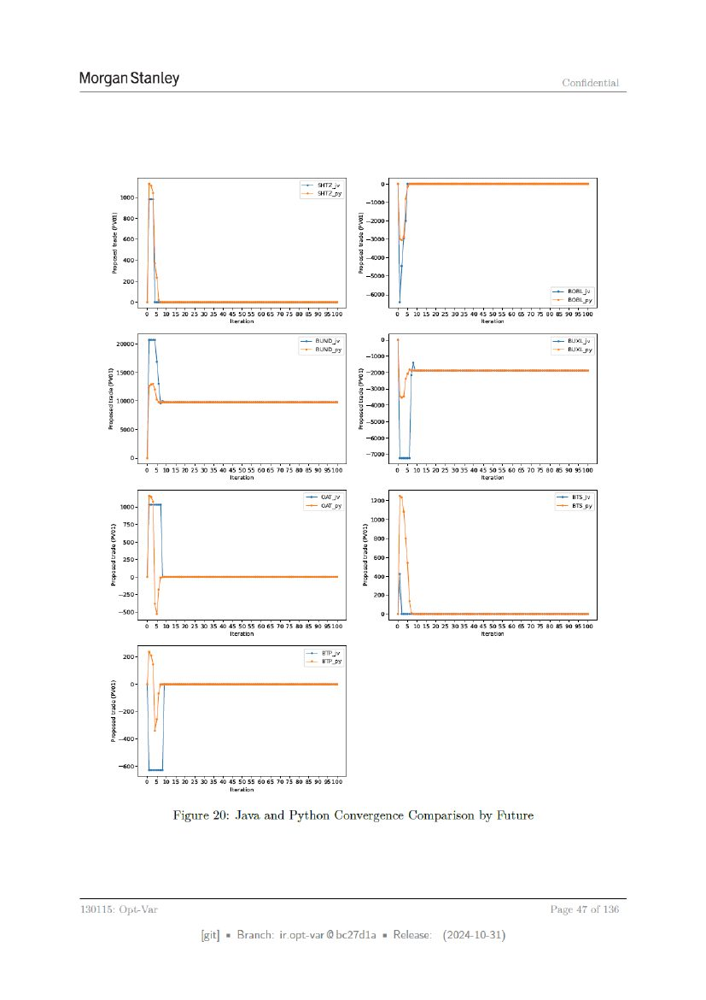

## 原文OCRテキスト

```text
Morgan Stanley                                                                                                                                 Confidential


                                                                  = snziv                  °
           000                                                    = sHzpy
                      1                                                             2000
      3 200                                                                     8 2000
      $i 600                                                                    $i 000
       33 400                                                                    3§ 000
      &                                                                             000
            200
                                                                                    e000.                                              + sost jv
               °                                                                                                                       = so8t py
                     3 5 tha    doz So a5 ab 085 6065 7075 80H M0 S100                         3 5 thi    tz Josh do as 09h 60 G70 75 6G 50 S100
                                            Weration                                                                  eration
          20000                                                                           °                                            eux
                                                                                     2000                                              = suxtey
     J 15000                                                                   3 2000
     z5                                                                         z§ —s000
       3
      3 inn
                                                                                  3
                                                                                 3 #000:
      iH                                                                          H -s000
         000
                                                                                   £000
                 °                                                                 7000
                     © 5 ao a5 225 30 35 ao a5 5055 6065 7075 60 65 90 95100                   © 5 to a5 025 3035 40.45 5055 60 Gs 70 75 60 65 90 95100
                                             iteration                                                                eration
                                                                 = ony               200                                                    — a5
          1000                                                   = ofr by                                                                   — 1s py
      q 730                                                                           1000
                                                                                  2
      © 500                                                                       & a0
      I2 250                                                                      &I 600
        H                                                                           H
       Boe                                                                         5 400
          250                                                                          200
          00                                                                              °
                     TS to 1h 2025 3035 ao 45 5085 6065 7075 60      80 S100                   TS io 1h 2025 3035 40.45 5085 60 G 70 7560 OS 80 5100
                                            Weration                                                                  eration
                                                                  = ery
            200                                                   = ery
      g
      E200
      Ha
      & —400

          600
                     TS whi toa Boab W a S0Ss COE TOTS How Mb SIO
                                        Iteration
                               Figure 20: Java and Python Convergence Comparison by Future


 30115: Opt-Var                                                                                                                             Page 47 of 136
                                     [git] = Branch: ir.opt-var@bc27d1a = Release:                          (2024-10-31)
```

# ページ 048

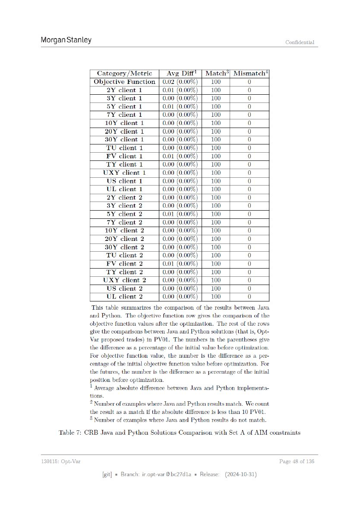

## 原文OCRテキスト

```text
Morgan Stanley                                                                                   Confidential


                     Category /Metric      Avg Diff! | Match*]                    Mismatch")
                    Objective Function | 0.02 (0.00%)    100                           0
                            2Y client 1           0.01 (0.00%)          100            0
                            3Y client 1           0.00 (0.00%)          100            0
                            5Y client 1           0.01 (0.00%)          100            0
                            7Y client 1           0.00 (0.00%) | 100                   0
                           10Y    client     1    0.00   (0.00%)        100            0
                           20Y    client     1    0.00   (0.00%)        100            0
                           30Y    client     1    0.00   (0.00%)        100            0
                           TU    client    1      0.00   (0.00%)        100            0
                           FV    client    1      0.01   (0.00%)        100            0
                            TY client 1           0.00 (0.00%)      |   100            0
                           UXY client 1           [0.00 (0.00%)    |    _100           0
                            US client 1           0.00 (0.00%)     [|   _100           0
                            UL client 1           0.00 (0.00%)      |   100            0
                            2Y client 2           0.00 (0.00%)          100            0
                            3Y client 2           0.00 (0.00%)          100            0
                            5Y client 2           0.01 (0.00%)          100            0
                            TY client 2           0.00 (0.00%) [| _100                 0
                           10Y client 2           0.00 (0.00%)          100            0
                           20Y client 2           0.00 (0.00%)          100            0
                           30Y client 2           0.00 (0.00%)          100            0
                           TU client 2            0.00 (0.00%)          100            0
                            FV client 2           0.01 (0.00%) |        100            0
                            TY   client    2      0.00 (0.00%)          100            0
                           UXY client 2_         | 0.00 (0.00%) | _100                 0
                            US client 2            0.00 (0.00%) [| _100                0
                            UL client 2            0.00 (0.00%)    [100                0
                   This table summarizes the comparison of the results between Java
                  and Python. The objective function row gives the comparison of the
                  objective function values after the optimization. The rest of the rows
                  give the comparisons between Java and Python solutions (that is, Opt-
                  Var proposed trades) in PVO1. The numbers in the parentheses give
                  the difference as a percentage of the initial value before optimization.
                  For objective function value, the number is the difference as a per-
                  centage of the initial objective function value before optimization. For
                  the futures, the number is the difference as a percentage of the initial
                  position before optimization.
                  | Average absolute difference between Java and Python implementa-
                  tions.
                  2 Number of examples where Java and Python results match. We count
                  the result as a match if the absolute difference is less than 10 PVO1.
                  ° Number of examples where Java and Python results do not match.
       Table 7: CRB Java and Python Solutions Comparison with Set A of AIM constraints


130115: Opt-Var                                                                                Page 48 of 136

                           [git] « Branch: iropt-var@be27d1a = Release:        (2024-10-31)
```

# ページ 049


## 原文OCRテキスト

```text
Morgan Stanley                                                                                   Confidential


                     Category /Metric      Avg Diff! | Match*]                    Mismatch")
                    Objective Function | 0.00 (0.00%)    100                           0
                            2Y client 1           0.00 (0.00%)          100            0
                            3Y client 1           0.00 (0.00%)          100            0
                            5Y client 1           0.00 (0.00%)          100            0
                            7Y client 1           0.00 (0.00%) | 100                   0
                           10Y    client     1    0.00   (0.00%)        100            0
                           20Y    client     1    0.00   (0.00%)        100            0
                           30Y    client     1    0.00   (0.00%)        100            0
                           TU    client    1      0.00   (0.00%)        100            0
                           FV    client    1      0.00   (0.00%)        100            0
                            TY client 1           0.00 (0.00%)      |   100            0
                           UXY client 1           [0.00 (0.00%)    |    _100           0
                            US client 1           0.00 (0.00%)     [|   _100           0
                            UL client 1           0.00 (0.00%)      |   100            0
                            2Y client 2           0.00 (0.00%)          100            0
                            3Y client 2           0.00 (0.00%)          100            0
                            5Y client 2           0.00 (0.00%)          100            0
                            TY client 2           0.00 (0.00%) [| _100                 0
                           10Y client 2           0.00 (0.00%)          100            0
                           20Y client 2           0.00 (0.00%)          100            0
                           30Y   client     2     0.00 (0.00%)          100            0
                            TU client 2           0.00 (0.00%) |        100            0
                            FV client 2           0.00 (0.00%) |        100            0
                            TY   client    2      0.00 (0.00%)          100            0
                           UXY client 2 __ | 0.00 (0.00%) | _100                       0
                            US client 2      0.00 (0.00%) [| _100                      0
                            UL client 2      0.00 (0.00%)    [100                      0
                   This table summarizes the comparison of the results between Java
                  and Python. The objective function row gives the comparison of the
                  objective function values after the optimization. The rest of the rows
                  give the comparisons between Java and Python solutions (that is, Opt-
                  Var proposed trades) in PVO1. The numbers in the parentheses give
                  the difference as a percentage of the initial value before optimization.
                  For objective function value, the number is the difference as a per-
                  centage of the initial objective function value before optimization. For
                  the futures, the number is the difference as a percentage of the initial
                  position before optimization.
                  | Average absolute difference between Java and Python implementa-
                  tions.
                  2 Number of examples where Java and Python results match. We count
                  the result as a match if the absolute difference is less than 10 PVO1.
                  ° Number of examples where Java and Python results do not match.
       Table 8: CRB Java and Python Solutions Comparison with Set B of AIM constraints


130115: Opt-Var                                                                                Page 49 of 136

                           [git] « Branch: iropt-var@be27d1a = Release:        (2024-10-31)
```

# ページ 050

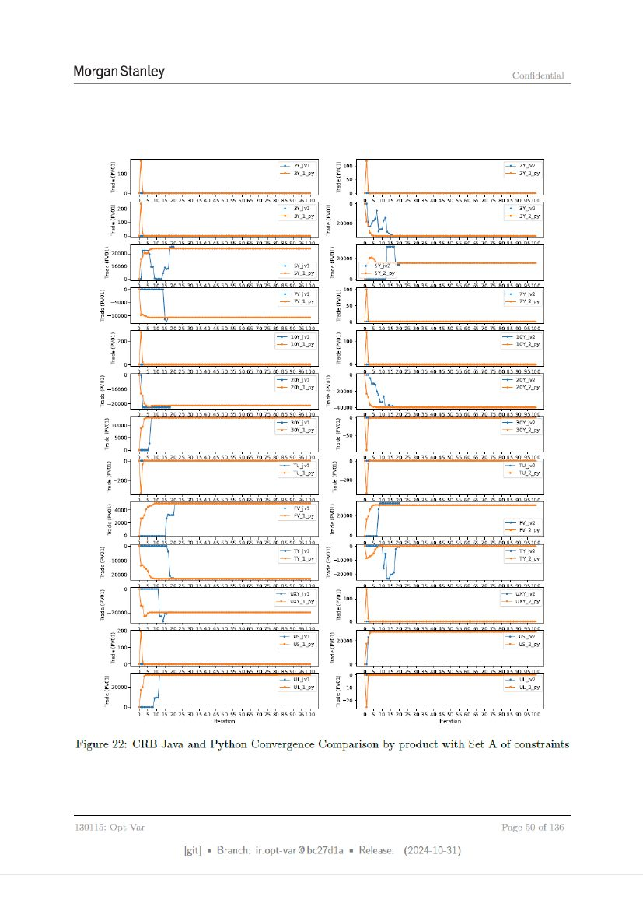

## 原文OCRテキスト

```text
Morgan Stanley                                                                                                                          onfidential


               A                                                we             3 200                                              wari)
              E 5 200                                           Siw)            =5 50                                             earrry
               By
               2
                                                                                By
                                                                                2

              2 200                                             Barre                                                             parr)
               2                                                —   iy                                                            —     ly
                $300
               car
            F aoo00
            2 20000                                             = svi                   ar             nnn
            2                                                   — SY    ipy
            Fg
                     (on           bie ah ada                                     oppl         Dn                                    a
          2                           i                                        2                                                  —— THN
          &2 -s000                    Sin)                                     2
                                                                               £0                                                 Nay
          $i 20000                                                             iBy
                       mbt         task      dea      ee ToT    a                     ji       bene      ouonoume             Dhemo oe
               2                                               — i0vjvi         2                                                = 10v 2
                £700                                           +    10Y
                                                                      1 py     270°                                              +    10¥
                                                                                                                                        2 py
                3By                                                            3By
                          qininn          ono       cae     mee cite               (       i   oone      oboe           ene        me
                                                               == 201] 2                                                         = 20" y2
                                                               peer 5y] 2 somo                                                   = toreoy
                                                                           ©H 0000
                                                                           3

                         rf        ne sas tn fash shapes Ja fog Bh on Sago         °                        woe       ostme     ene ssa
              B sco0o:                                          507i           Fy                                                aor Ne
              H                                                 svasy|         2                                                 Sov ewy
              a0)
               z
              By
                          | |                                                  rig
                                                                               ez
                                                                TMi                                                               TUN
                                                                = whey                                                            = hidy

                                             ah                  ah                            every
                                                                wm | 2
                                                                = iy | 2 20000
                                                                       5                                                          wise
                                                                        H
                                                                       fog                                                        aide
                                                                                                            ra
                                                                Ti                                                                eer)
                                                                Wier                                                              ae

          z2
          ¢         °                                          URjv            ¢g                                                a UnYue
                                                               — ua py         z 700                                             = UNV? py
           4i -2000                                                            3By
                                                                        .                            ra
               a200                                             um    | 2 20000                                                   aera)
               2 sco                                         sae]       E                                                         US2 oy
               icar                                                     iog
                                       ra                      ry              3                     rn
            2                                                —— Ulivi     g                                                       = ULM
              2oo00                                          Susy]        2-0                                                     ey
          afBy                                                            3-20
                                                                          i
                     3 5 105 2075 50 35 0 550.55 Goes TOTS 6 6590 SiO            % 5 to i520 05 5055 dod 50 550           To Ts G0ES bo Sbiv0

Figure 22: CRB Java and Python Convergence Comparison by product with Set A of constraints


 30115:         Opt-Var                                                                                                          Page    50 of 136

                                          [git] = Branch: ir.opt-var@bc27d1a = Release:                (2024-10-31)
```

# ページ 051


## 原文OCRテキスト

```text
Morgan Stanley                                                                                                                                             Confidential


                                                                       aa                      B soo                                                   Ne
             2 200.                                                    Sain}       2                                                                   =       ay
              ra                                                                    & 250
               ?
               Foo                                                                 Fog
               3 s00                                            a ar                2g                                                                 VN
               2                                                = Biey                 220                                                             ey
                5 250                                                                   ra
                                                                                       ?
               Foo                                                                     Fo
                                                                               3 2000                                                                  ares
                                                                                2                                                                      sv wy
                                                                si        |                500
                                                                + SYA py        ?
                                                                                Fo
                          Cb          woo pakah shh ches ove sh ahah Gad                           DET                    A aba dak oh     cheb 2)   abe wh Ohad
             z°                                                                    2                                                                  re
             2                                                                  2 soo                                                                 vay
               ~500                                             ears                ra
            ?g                                                  + Wapy            ?EB
                     pq         aa         aa ea a Tw wh oh go                                ppb                            ea       De      eT A ayes ogo
           2g                                                  im              |Z                                                                   — 10" N2
            = -s00                                             —roviey|        2-20                                                                 102 wy
            i£ ~2000                                                           3-00
                                                                               &
                     pd         Sab   aa bab teh eb Ta hh              de                     o pip                 aba          a    ha        Th   aha   Shad
          a                                                    av         | 2                                                                         = 207 N2
          2                                                    = rovisy| 2                                                                            = avy
          0009                                                              ‘g 20000
          & 20000                                                                      &
                        E       a     age       khSa oh se cachJo Fo sh ohob ago                       Dib                  abs dae        hab Dh aha Sh Shade
              2 sooo                                                   me 307 vt               geo                                                 — 3012
              2                                                        Swi)                    2                                                   302
              § $000                                                                           70
               ®
              fo                                                                               ®
                                                                                               fo
                                                                      we           |       §= 0                                                        —— Tuy
                                                                      =                     +                                                          Wy
                                                                                            $200
                                                                                            e
                                                                      aa |                 37%                                                         FN
                                                                      = we7                z                                                           eave 7
                                                                                           2
                                                                                fo
                                                                              =A 0                                              if                     Tyne
                                                                              2-200                                                                    vay
                                                                       rm | §
                                                                       —visy|  F200
             z              L                                                         z                                                               UN V2
             ze                                                                      00                                                               U2 ay
            raz                                                    Samrat
                                                                   = ws.ay]           @ 250
                                                                                     zEy
             £ 200
                      °                        aa                     ra                                                        2a
            8=                                                      uw        | 3                                                                      US v2
                                                                    —usasy | 2 1000
            § -s00                                                              Fy
            g                                                                   By
            28 sooo                                                               z°
                                                                                  3                                             “                      cans 2
             2                                                                    2                                                                    = ay
              % 2500                                                um | $-200
             g
             By                                                     urs]          g8
                          @ 5105      2095 3) 3640.45.50
                                                     55 GOES 1075 6 8.90 HiG0                          © 5 015205           3035 40.5 50 55.60 G 70 Ts 80S
                                                                                                                                                         50 95300

Figure 24: CRB Java and Python Convergence Comparison by product with Set B of constraints


130115:          Opt-Var                                                                                                                              Page    51    of 136

                                            [git] = Branch: ir.opt-var@bc27d1a = Release:                                 (2024-10-31)
```

# ページ 052


## 原文OCRテキスト

```text
Morgan Stanley                                                                    Confidential


 DaANDANOR Oh nM
WASSRAAYBYAARS
 MBSRKRKSSHRRKRKE


    aso       Oo   wm.
>   Pls Pl ca Pal SV?    el = aooh
                              ea          Pa
 ss    BIOS    Bas
BoASSHEOCKBDYOSSHE                        LE
                                          ga


SRYSRSRERSSRR                             gs

    BATASSARSSSAR
    eards axad Svan                       Se


130115: Opt-Var

                    [git] « Branch: iropt-var@be27d1a = Release:   (2024-10-31)
```

# ページ 053

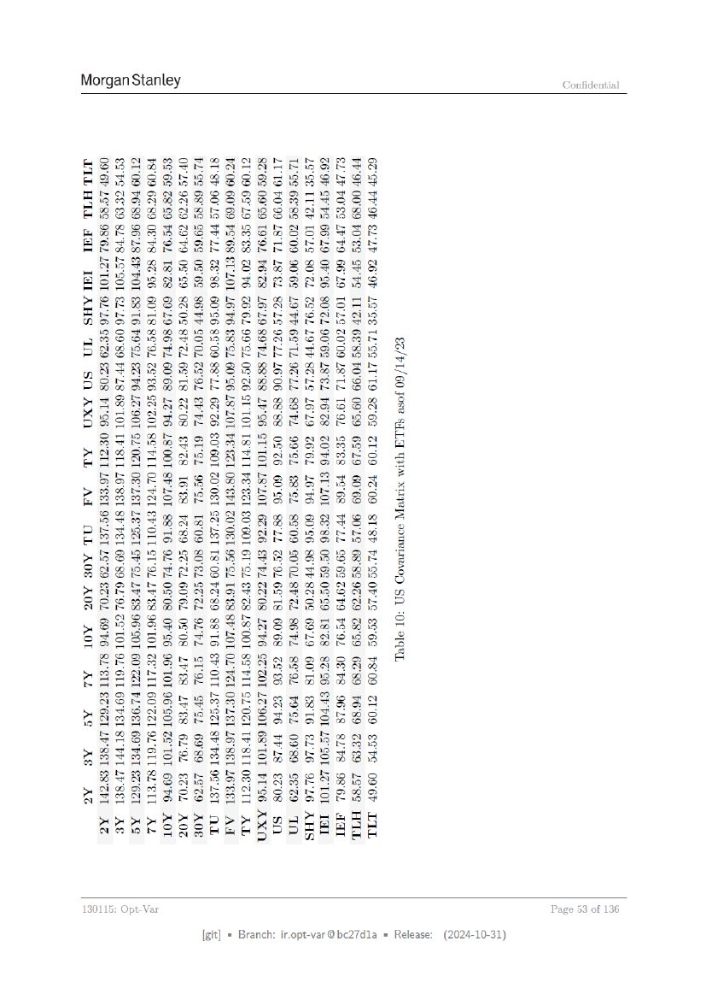

## 原文OCRテキスト

```text
Morgan Stanley                                                                     Confidential


130115: Opt-Var                                                                 Page   53 of 136

                  [git] « Branch: iropt-var@be27d1a = Release:   (2024-10-31)
```

# ページ 054

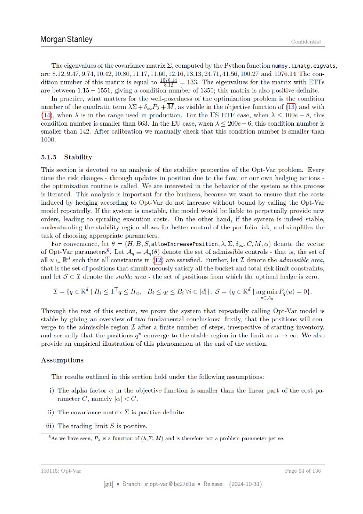

## 原文OCRテキスト

```text
Morgan Stanley                                                                                        Confidential


    The eigenvalues of the covariance matrix , computed by the Python function numpy. Linalg. eigvals,
are 8.12, 9.47, 9.74, 10.42, 10.80, 11.17, 11.60, 12.16, 13.13, 24.71, 41.56, 100.27 and 1076.14 The con-
dition number of this matrix is equal to 44!4 = 133. The eigenvalues for the matrix with ETFs
are between 1.15 — 1551, giving a condition number of 1350; this matrix is also positive definite.
    In practice, what matters for the well-posedness of the optimization problem is the condition
number of the quadratic term AX + d..P,+M, as visible in the objective function of (3) and with
(4), when ) is in the range used in production.          For the US ETF case, when \ < 100e — 8, this
condition number is smaller than 663. In the EU case, when \ < 200e— 6, this condition number is
smaller than 142. After calibration we manually check that this condition number is smaller than
1000.

5.1.5    Stability

This section is devoted to an analysis of the stability properties of the Opt-Var problem. Every
time the risk changes - through updates in position due to the flow, or our own hedging actions -
the optimization routine is called. We are interested in the behavior of the system as this process
is iterated. This analysis is important for the business, because we want to ensure that the costs
induced by hedging according to Opt-Var do not increase without bound by calling the Opt-Var
model repeatedly. If the system is unstable, the model would be liable to perpetually provide new
orders, leading to spiraling execution costs. On the other hand, if the system is indeed stable,
understanding the stability region allows for better control of the portfolio risk, and simplifies the
task of choosing appropriate parameters.
    For convenience, let @ = (H,B, S,allowIncreasePosition, \, 5, d.0,C, M,a) denote the vector
of Opt-Var parameterg" Let A, = Ag(@) denote the set of admissible controls - that is, the set of
all uC R@ such that all constraints in     (12) are satisfied. Further, let Z denote the admissible area,
that is the set of positions that simultaneously satisfy all the bucket and total risk limit constraint
and let S CI denote the stable area - the set of positions from which the optimal hedge is zero:
    T={qeR!| Hi<1'¢< Au,-Bi<
                          a < Bivie [d},                              S={q¢ RB? | argmin F,(u) = 0}.
                                                                                       ue Ag
Through the rest. of this section, we prove the system that repeatedly calling Opt-Var model is
stable by giving an overview of two fundamental conclusions: firstly, that the positions will con-
verge to the admissible region Z after a finite number of steps, irrespective of starting inventory,
and secondly that the positions g” converge to the stable region in the limit as n + 00. We also
provide an empirical illustration of this phenomenon at the end of the section.
Assumptions

   The results outlined in this section hold under the following assumptions:

   i) The alpha factor a in the objective function is smaller than the linear part of the cost pa-
      rameter C, namely |a| < C.
  ii) The covariance matrix © is positive definite.

 iii) The trading limit S is positive.
  ®As we have seen, Py is a function of (A, ¥,M) and is therefore not a problem parameter per se.


130115: Opt-Var                                                                                     Page 54 of 136

                        [git] « Branch: iropt-var@be27d1a = Release:       (2024-10-31)
```

# ページ 055

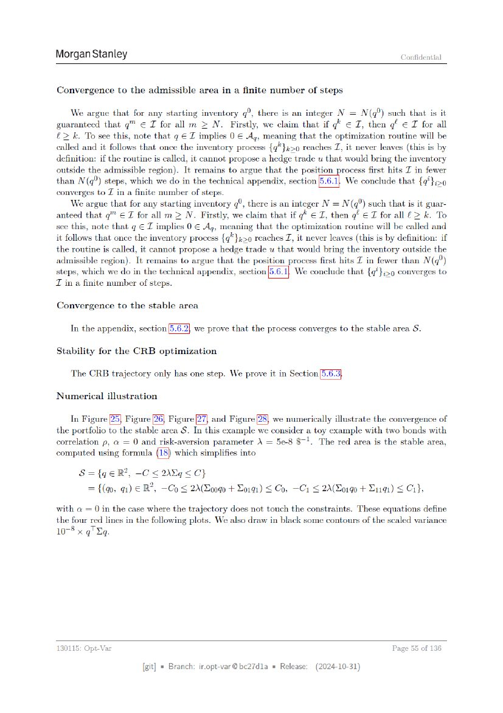

## 原文OCRテキスト

```text
Morgan Stanley                                                                                  Confidential


Convergence to the admissible area in a finite number                     of steps

    We argue that for any starting inventory g°, there is an integer N = N(q°) such that is it
guaranteed that q” € T for all m > N. Firstly, we claim that if g* € Z, then q! € T for all
£>k. To see this, note that q          €Z implies 0 € Ay, meaning that the optimization routine will be
called and it follows that once the inventory process {q*},>9 reaches T, it never leaves (this is by
definition: if the routine is called, it cannot propose a hedge trade u that would bring the inventory
outside the admissible region). It remains to argue that the position process first hits I in fewer
than N(q®) steps, which we do in the technical appendix, sectio1             We conclude that {q'}:s0
converges to T in a finite number of steps.
    We argue that for any starting inventory q°, there is an integer N = N(q°) such that is it guar-
anteed that g” € T for all m > N. Firstly, we claim that if g* € T, then q’ € T for all > k. To
see this, note that q € I implies 0 € Ay, meaning that the optimization routine will be called and
it follows that once the inventory process {q*},>09 reaches Z, it never leaves (this is by definition: if
the routine is called, it cannot propose a hedge trade u that would bring the inventory outside the
admissible region). It remains to argue that the position          process first hits Z in fewer than N(q°)
steps, which we do in the technical appendix, section               We conclude that {q'};s0 converges to
T in a finite number of steps.
Convergence to the stable area

   In the appendix, sectio:           2] we prove that the process converges to the stable area S.
Stability for the CRB            optimization

   The CRB trajectory only has one step. We prove it in Section
Numerical         illustration

                                                       we numerically illustrate the convergence of
the portfolio to the stable area S. In this example we consider a toy example with two bonds with
correlation p, a = 0 and risk-aversion parameter \ = 5e-8 $~!. The red area is the stable area,
computed using formula              which simplifies into

      S={qeR?,           -C<2\Nq<C}
         = {(go, a1) € R?, —Co < 2A(Zoogo + Zorg) < Co, —Ci < 2A(Zorgo + Vim) < Ci},
with a = 0 in the case where the trajectory does not touch the constraints. These equations define
the four red lines in the following plots. We also draw in black some contours of the scaled variance
10-8 x q' Sq.


130115: Opt-Var                                                                               Page 55 of 136

                           [git] « Branch: iropt-var@be27d1a = Release:    (2024-10-31)
```

# ページ 056


## 原文OCRテキスト

```text
Morgan Stanley                                                                                           Confidential


                            _         _ntohedgeseluton wh 2=08.A~ S608 infnts = False


Figure 25: Two example trajectories starting from (50000, 0) for the green one and (-45000, 75000)
for the purple one. The correlation value is p = 0.8 and the infinite horizon cost is not used.


                                      _ntoheoge selon
                                                   wih 2=0.9,A~ $08 iints = ae


Figure 26: Two example trajectories starting from (50000, 0) for the green one and (-45000, 75000)
for the purple one. The correlation value is p = 0.9 and the infinite horizon cost is not used.


130115: Opt-Var                                                                                        Page 56 of 136

                     [git] « Branch: iropt-var@be27d1a = Release:                       (2024-10-31)
```

# ページ 057

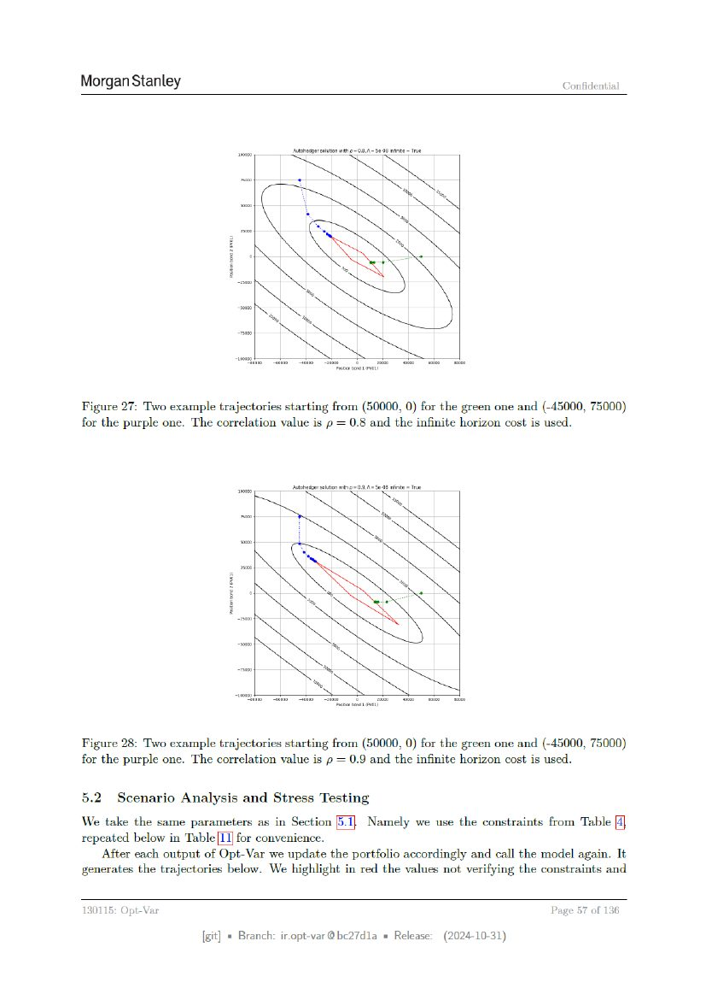

## 原文OCRテキスト

```text
Morgan Stanley                                                                                   Confidential


                            _         atanedoeslston mth 9~08,4~56.08 nt = Tr


Figure 27: Two example trajectories starting from (50000, 0) for the green one and (-45000, 75000)
for the purple one. The correlation value is p = 0.8 and the infinite horizon cost is used.


                            0                  hg


Figure 28: Two example trajectories starting from (50000, 0) for the green one and (-45000, 75000)
for the purple one. The correlation value is p = 0.9 and the infinite horizon cost is used.

5.2    Scenario Analysis and Stress Testing
We take the same parameters as in Section           Namely we use the constraints from Table
repeated below in Table [I] for convenience.
    ‘After each output of Opt-Var we update the portfolio accordingly and call the model again. It
generates the trajectories below. We highlight in red the values not verifying the constraints and

130115: Opt-Var                                                                                Page 57 of 136
                     [git] « Branch: iropt-var@be27d1a = Release:               (2024-10-31)
```

# ページ 058

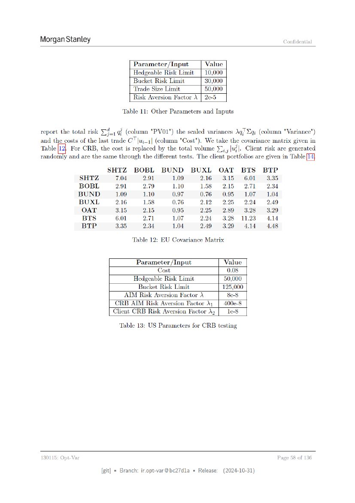

## 原文OCRテキスト

```text
Morgan Stanley                                                                                       Confidential


                                     Parameter /Input            Value
                                     Hedgeable Risk Limit | 10,000
                                     Bucket Risk Limit        30,000
                                     Trade Size Limit         50,000
                                     Risk Aversion Factor A | 2e-5

                                 Table 11: Other Parameters and Inputs


report the total risk 24, q (column "PV01') the scaled variances \g," Eq; (column "Variance’)
and the costs of the last trade CT u;_1| (column "Cost"). We take the covariance matrix given in
Table 13 For CRB, the cost: is replaced by the total volume 5), ; |u/. Client risk are generated
randomly and are the same through the different tests. The client portfolios are given in Table
                           SHTZ      BOBL       BUND       BUXL         OAT        BTS     BTP
                  SHTZ       7.04      2.91        1.09      216         3.15       601     3.35
                  BOBL       2.91      2.79        1.10      158         2.15       271     2.34
                  BUND       1.09      1.10       0.97       0.76        0.95       1.07    1.04
                  BUXL       2.16      1.58       0.76       212         2.25       2.24    2.49
                   OAT       3.15      2.15       0.95       2.25        2.89       3.28    3.29
                   BTS       6.01      2.71        1.07      2.24        3.28      11.23    414
                   BTP       3.35      2.34        1.04      249         3.29       414     4.48

                                     Table 12: EU Covariance Matrix


                                      Parameter /Input                   Value
                                              Cost.                        0.08
                                     Hedgeable Risk Limit                 50,000
                                      Bucket Risk Limit         125,000
                                  AIM Risk Aversion Factor \      8e-8
                              CRB AIM Risk Aversion Factor 1 | 400e-8
                             Client CRB Risk Aversion Factor Ay   le-8

                               Table 13: US Parameters for CRB testing


130115: Opt-Var                                                                                    Page 58 of 136

                         [git] « Branch: iropt-var@be27d1a = Release:    (2024-10-31)
```

# ページ 059

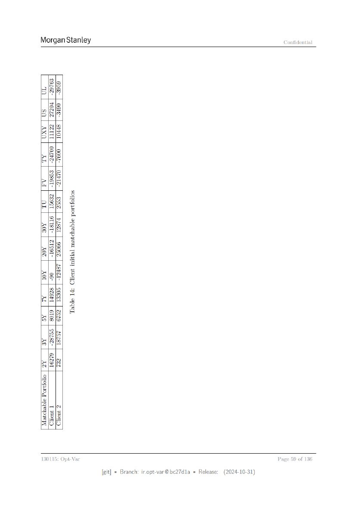

## 原文OCRテキスト

```text
Morgan Stanley                                                                      Confidential


  53 [3
BSA]        =
             &
   Sit]
   Rlz|    &3oe
>|Z\z|


130115: Opt-Var                                                                   Page 59 of 13¢
                  [git] » Branch: ir.opt-var @be27d1a » Release:   (2024-10-31)
```

# ページ 060

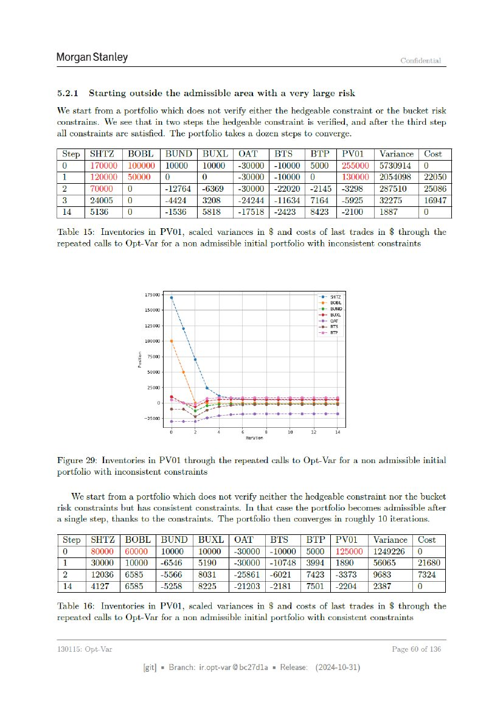

## 原文OCRテキスト

```text
Morgan Stanley                                                                                             Confidential


5.2.1     Starting outside the admissible area with a very large risk

We start from a portfolio which does not verify either the hedgeable constraint or the bucket risk
constrains. We see that in two steps the hedgeable constraint is verified, and after the third step
all constraints are satisfied. The portfolio takes a dozen steps to converge.
 Step | SHTZ        | BOBL   | BUND | BUXL | OAT                    | BTS        BTP | PVO1         | Variance | Cost
 0         170000   | 100000 | 10000 |     10000 | -30000 | -10000 | 5000 | 255000 | 5730914 | 0
 1         120000   | 50000 | 0            0       -30000 | -10000 | 0       130000 | 2054098 | 22050
 2         70000    | 0        -12764 |    -6369 | -30000 | -22020 | -2145 | -3298 | 287510 | 25086
 3         24005    | 0        -4424 |     3208    -24244 | -11634 | 7164 | -5925 | 32275       16947
 14        5136       0        -1536 |     5818    -17518 | -2423 | 8423 | -2100 | 1887         0

Table 15: Inventories in PVO1, scaled variances in $ and costs of last trades in $ through the
repeated calls to Opt-Var for a non admissible initial portfolio with inconsistent constraints


                                                                                         SWZ
                                                                                         poet
                                                                                         BUND
                                                                                         uxt


                                3      2      a     5               a       io   2         rv
                                                        Iteration

Figure 29: Inventories in PV01 through the repeated calls to Opt-Var for a non admissible initial
portfolio with inconsistent constraints

    We start from a portfolio which does not verify neither the hedgeable constraint nor the bucket
risk constraints but has consistent constraints. In that case the portfolio becomes admissible after
a single step, thanks to the constraints. The portfolio then converges in roughly 10 iterations.
 Step     | SHTZ | BOBL | BUND        | BUXL | OAT | BTS         BTP                    | PVO1 | Variance | Cost
 0          80000 | 60000 | 10000    | 10000 | -30000 | -10000 | 5000                   | 125000 | 1249226 | 0
 1          30000 | 10000 | -6546    | 5190    ~30000 | -10748 | 3994                   | 1890     56065     21680
 2          12036 | 6585    -5566    | 8031    -25861 | -6021 | 7423                    | -3373 | 9683       7324
 14         4127 | 6585     -5258    | 8225    -21203 | -2181 | 7501                    | -2204 | 2387       0

Table 16: Inventories in PVO1, scaled variances in $ and costs of last trades in $ through the
repeated calls to Opt-Var for a non admissible initial portfolio with consistent constraints

130115:   Opt-Var                                                                                        Page
                                                                                                           60 of 136

                         [git] = Branch: ir.opt-var@bc27d1a = Release:               (2024-10-31)
```

# ページ 061

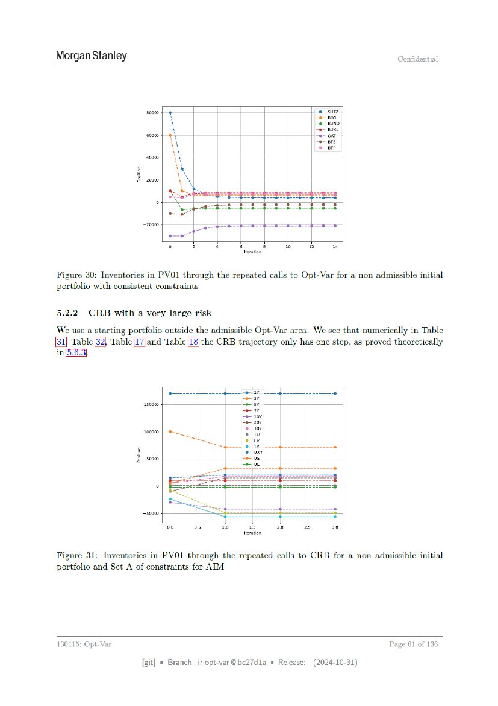

## 原文OCRテキスト

```text
Morgan Stanley                                                                                                 Confidential


                               O     2        a        6               @        10        2        ri
                                                           Iteration

Figure 30: Inventories in PV01 through the repeated calls to Opt-Var for a non admissible initial
portfolio with consistent constraints

5.2.2    CRB      with a very large risk

We use a starting portfolio outside the admissible Opt-Var area. We see that numerically in Table
     Table [32| Table[I7|and Table(I8]the CRB trajectory only has one step, as proved theoretically
in


                              oo         os       To          is           Zo        25           30
                                                           hreration

Figure 31: Inventories in PVO1 through the repeated calls to CRB for a non admissible initial
portfolio and Set A of constraints for AIM


130115: Opt-Var                                                                                              Page 61 of 136

                        [git] « Branch: iropt-var@be27d1a = Release:                          (2024-10-31)
```

# ページ 062

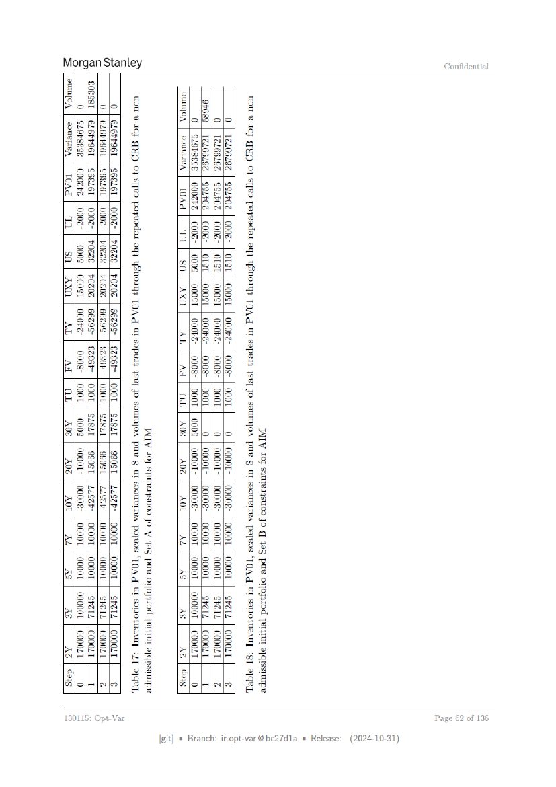

## 原文OCRテキスト

```text
Morgan Stanley                                                                      Confidential


                       El le             g
                       =|     |e         a


                       elelals|         =
                       gees             9
                       2/2/83|8


                            sigisjs}     86
                                         S


                                         2
                         =lelele         2
                       cisisisle|
                       EISieisis|       ==
                                        a

                         SPSS]          =
                                        >
                         elelelel       &
                         Sieg}
                       HISIS|S|S]       8=
                       Bays]             2g
                            slelekl     =


130115: Opt-Var                                                                   Page 62 of 13¢
                  [git] » Branch: ir.opt-var @be27d1a » Release:   (2024-10-31)
```

# ページ 063

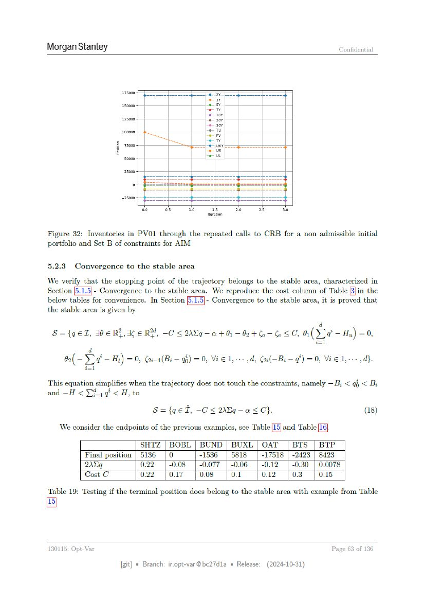

## 原文OCRテキスト

```text
Morgan Stanley                                                                                                 Confidential


                           175000
                           150000
                           125000
                           1100000
                         5 15000
                            50000
                            25000


                           25000
                                     00     os       10       15       20    25        30
                                                           hreration

Figure 32: Inventories in PVO1 through the repeated calls to CRB for a non admissible initial
portfolio and Set B of constraints for AIM

5.2.3     Convergence to the stable area

We verify that the stopping point of the trajectory belongs to the stable area, characterized in
Section            - Convergence to the stable area.         We reproduce the cost column of Table
below tables for convenience. In Section                   - Convergence to the stable area, it is proved that
the stable area is given by

                                                                                                        d
 S={qeTZ, WER
            3 RY, —C < WVq—at
                          0-H + G—-&<C, (3°                                                                  ‘— Hy) =0,
                                                                                                       i=l
              d

        62(— Sa’ — Hi) =0, @i-a(Bi—4h) = 0, Vie 1,--- 4d, G(—Bi—4‘) =0, Wi L,--- ,d}.
             i=1


This equation simplifies when the trajectory does not touch the constraints, namely —B; < gi < Bj
and —H < Y44q' < H, to

                                          S={qeT,         -C<2Eq-a<
                                                                  Ch.                                                   (18)
    We consider the endpoints of the previous examples, see Table                      [I5]and Table
                                     SHTZ | BOBL | BUND | BUXL | OAT                   | BTS       | BTP
             Final position | 5136         | 0          -1536 | 5818          -17518 | -2423 | 8423
             2\Xq             0.22           -0.08    | -0.077 | -0.06      | -0.12 | -0.30 | 0.0078
             Cost C           0.22           0.17       0.08     0.1          0.12     0.3     0.15

Table 19: Testing if the terminal position does belong to the stable area with example from Table


130115: Opt-Var                                                                                              Page 63 of 136

                           [git] « Branch: iropt-var@be27d1a = Release:           (2024-10-31)
```

# ページ 064


## 原文OCRテキスト

```text
Morgan Stanley                                                                             Confidential


                              SHTZ | BOBL       | BUND | BUXL | OAT | BTS | BTP
             Final position | 4127 | 6585         -5258 | 8225     ~21203 | -2181 | 7501
             2\Nq             0.22   0.14         -0.07   -0.045 | -0.12 | -0.30 | -0.04
             Cost C           0.22   0.17         0.08    0.1      0.12     0.3     0.15

Table 20: Testing if the terminal position does belong to the stable area with example from Table


absolute value than the associated cost Cj.

5.2.4    Trade continuity


tion. We demonstrate here numerically that close initial portfolios generate close trajectories. We
take the starting position [5100,—12000, 35100, 11300, 29950, 10200, 7000], close to the start-
ing position [5000, —10000, 35000, 11000, —30000, —10000, 7000] from Tabl
in Table 22] for convenience.
  Step   | SHTZ | BOBL | BUND | BUXL | OAT | BTS             BTP | PVO1 | Variance | Cost
  0        5100 | -12000 | 35100 | 11300 | -29950 | -10200 | 7000 | 6350 | 43251     0
  10       5161 | -4284 | 6774     11300 | -21636 | -2044 | 8305 | 3576 | 2751       0

Table 21: Inventories in PVO1, scaled variances in $ and costs of last trades in $ through the
repeated calls to Opt-Var for \ = 2e-58-1,

  Step | SHTZ | BOBL | BUND | BUXL | OAT | BTS             BTP | PVO1 | Variance | Cost
  0      5000 | -10000 | 35000 | 11000 | -30000 | -10000 | 7000 | 8000 | 40170     0
  10     5029 | -4232 | 6781     11000 | -21347 | -2011 | 8302 | 3522 | 2673       0

Table 22:    Inventories in PV01,    scaled variances in $ and costs of last trades in $ through the
repeated calls to Opt-Var for \ = 2e-5$-1.

5.2.5    CRB      trade continuity

We take the close starting positions
[80000, 60000, 10000, 10000, —30000, — 10000, 5000, 1000, —8000, —24000, 15000, 5000, —2000], and
[81000, 60000, 9000, 10000, 30000,     —11000, 5000, 1000, 8000, — 25000, 15000, 6000, —2000] and com-
pare the behaviour in Tables                    The trajectories are very similar.


130115: Opt-Var                                                                        Page 64 of 136

                        [git] « Branch: iropt-var@be27d1a = Release:   (2024-10-31)
```

# ページ 065

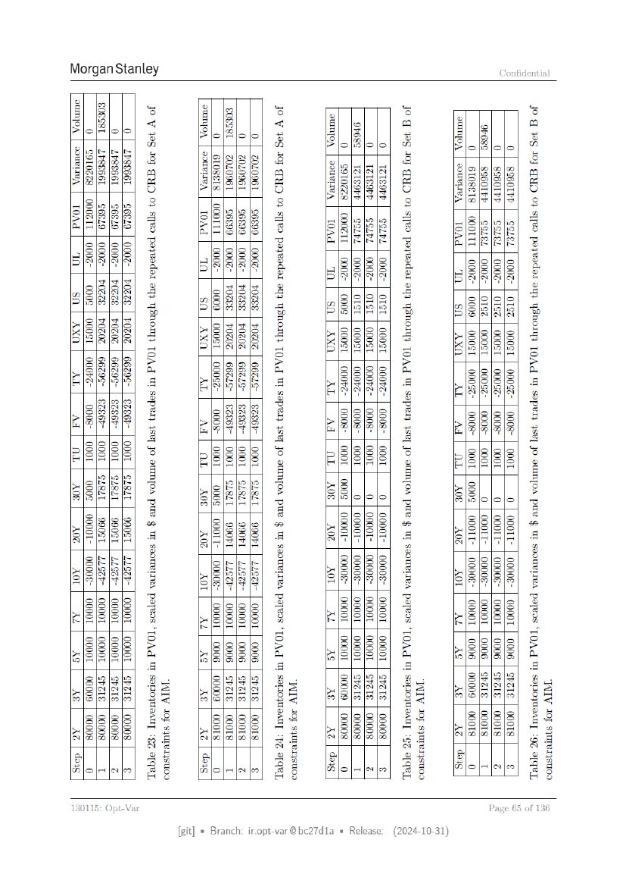

## 原文OCRテキスト

```text
Morgan Stanley                                                                                                                Confidential


 I         Fd
           Pea
                            ro}
                           oe
                                           2)
                                           2
                                                  |S            3
                                                               CI
                                                                        2                  CI
                                                                                             6             z                         é
                                                                                                                                     C1

S|         pS              <              Z|      |8           <                k          faa)
S\o[Zlole}                  <>            Siz
                                            IF IISIF]
                                                      =3                Z|S| _ 1%&          .>             El
                                                                                                          S|
                                                                                                                     fs|e                >
                           Dn                                  n       IF lofisjolo]       A              MI         IBlolo|         ®
 Shelter            |e      me             2                   he                                                                        Pay
 SISIZ|ZE
      B28]
Z\ZAIS|SIB)                =a
                             5             Slelalala
                                           EEE]
                                          IZ|SISIS|
                                                                5
                                                               =a       gheleeia|
                                                                        BISIAIRIA)
                                                                                           =ai]            2SIZIB IBIS               2i=)
 ZIAD            |S |B                    BI |S    Fa                   SlSIgigin
SIBSISIE}                  oOa            Z|EISR/E|IR]
                                          FRISIR               =OS      ISB   Ele]
                                                                        E|QISSIS|          =oO            LSaEIS
                                                                                                               (SIS|S |S
                                                                                                                 EIEIS|              ©
  Elslsls]
SIESSel                     =S              E
                                          =Slelebs|            e&       FREFF               22            FRR)                        s2
FISRIER)                   3              S\ISISSis|           S        |Shopehe}          S                    s                    a
AJAPSISIS]|                  &            EFS)                  =       SiSpspes|            =            S|SiSh3h3)                 =
     slsis|s|              z=                      Perri
                                                   slelel      s2       EISIEEle|          =3             Elsie]
                                                                                                          RISER)                      =
AlSiges|                    =                   sigisig|       =                            2                                            3
ER AIRR) 2                                BRIER)                £           siggis|          £                  eisigls|                 =
rook!      peal baal pul
                             =@           preer|                2@      BRIAR]
                                                                             rprypeye
                                                                                             25           BISISIS)  Pee
                                                                                                                      ae
                                                                                                                                         &°
VISIS|S(R|                                      Is|SiS|z)      8                           a                                         a
SISA
 i   Be] Ej=%                             SSSR)
                                          PSles feo fo} e=-S            LISSEIE)
                                                                             i fie |f
                                                                        SiSpspeps)           =
                                                                                           ER}                  selg|e|
                                                                                                          IAlSISiRis|
                                                                                                          KSIZisl\s\S} =             =&

-ISISS]|                     =                    slelel                                      82                        8
BEREE}
     bal
                            =2
                            >             GEBEE)2
                                          BERRI] =                      EEE)
                                                                        SEpssts|           2S=            Elselele|
                                                                                                          KIS s\sls| ==Ss
                                                                                                          BESS}
                                                                                                                iS          Ss |S     ~
                           Ss                                   S
     seis}
  slgigg
(Selsey
                           ==               Slalele
                                            Sissies}
                                                               =&           sieisis|
                                                                                           =&                   slelels|
                                                                                                                                     =
                                                                                                                                     &
ER]                          3.              SPS BBB] 42
                                          ERIBEIS]                      -(S\S|s|s)
                                                                        ERRRIS|             82            ESBS)
                                                                                                                SEE)                 =
                                                                                                              TRIAS                    &
     cla
  skies
           Rigg)           cs                  miele aols
                                            SIRS
                                                                                           oi
                                                                                                             slelele|
                                                                                                                                     z
                                                                                                                                      ==
                            S                                               Is \o    iS     g
eiselele|                   =              |S\BBIe|   =                 I. S/S sie           8            | jsisigys}
EPIT IF) 32                               FISISISIS]
                                          Bs |  YT
                                                                2%     IEee |B\B\2\2)
                                                                            | 472 IF |
                                                                                             2a           Elzlelz/2|
                                                                                                          Bu |? |?   °)
                                                                                                                                         =@
 elelele                                                       Ss                                 =                                  i

PISS}                      =              lglelgie|            =        5|gisigis|         =              lelslels]                  =
FIFI)                        2            EISISEE)               2      FIF|FEIS)           2             FSES|E)                     2
                           52                     lohehel      E=       le                 2E                                        2E
                             §            (Selig                $       |S                   $            |S                             €
                           3
                                           SiS le ie ie
                                          oa fim | la la       3g
                                                                        BB lololo          }
                                                                                                          SlSlelele                  z
     lo                                                         a           slolelo|         =                  slelole|                 =
  Sisisig}
SIS   l\Ss                 «                    Slslele|
                                                Sree           «        .|S|E(S/5|
                                                                          S/S\sls          «                sigs]
                                                                                                          ISIS ISS                   =
RITES]
S\|S falas)                 3
                             2            EEIss\s|
                                          IS |S   S|           3
                                                                2       SIS|SlS|S|
                                                                        RRR        ]        8
                                                                                             =            iS
                                                                                                          RR                FF]
                                                                                                                                     J
                                                                                                                                         2
  sielek|                     &                        g                  elslels|            £&             elelele|                    =
  SISK]
ISIS]
                            &3              Sickle}
                                          (SPSS
                                                       2
                                                  hs] ==
                                                                          S\SS\5|
                                                                        e\sisele|
                                                                                            2=               sigs
                                                                                                          =\SIS|SIS|                 3
EBRAR|
   EF                        =            ERISSS|
                                          ERE                           =F |2 fF FF           a           ElR
                                                                                                          Ell   BRIS]
                           od                                  vv                          vv                                        em}


     SEEE) 4&                                   SEEE| =2                -EEELE|    =8                           SESE) =2
     clelc|S                a                                   a           s\sisis         a                   =           So|o      o


RIS|S|SS}                                 eelsisie}                       SIS|S|s|                        RISISIS|S|
     slelekel]             =a
                                                               é
                                                               a
                                                                          elelele| =
                                                                          sigisis
                                                                                            a
                                                                                                             slelslcl =a
     Sissi]                =                    sigisig|       =        IS|S|S   S| =                     IE SISIS| =
BISSISs}                   &              BSS)                 &        BIS|S\S\S| &                      Ble elel=) &
                           s                                   a                    2                                  e
     elshohs|               2                    hohahe|       2            shohehe}        x                   Spspsps|             ¢
     SSISS)                 Sa                  SSS}           2s           Sls  is         Bg                                       Ba
-EERS|
B|ee\|s|5)                 22
                           22             LESERl
                                          (E|RRR|              2
                                                               £2       IEEE)
                                                                        BSRRR)             £22             SIRE]
                                                                                                           FEPFER)                   BS
                                                                                                                                     2S
                           B.                                  oe                          3.                 slslele]               2s
     eglss|                £=               Sisjgis|           2           sisigis|        24                 Sess)                  2s
|SS\sisis
    iS\s
IN |50     150 |6 |90
                           aan
                            ge
                                  2       mISISIS IS
                                           ISisicis
                                          IN ]90 |90 |90 }o0
                                                               7 g
                                                               Sn
                                                               a4
                                                                        BISiSislé
                                                                           Sjsijsis
                                                                        HIS isisis         an
                                                                                           Poel
                                                                                                      g    Algklzle
                                                                                                          I> |S lS sla               Sn
                                                                                                                                     gs
                                                                                                                                               2

 a                         2s              5                   2k       a                  2k              S                         2s
2
IAlolH|a|m|                a2
                           = 8             2
                                          In|jola|a|o|         a2 8
                                                               ws       z
                                                                        JAlo|a|s|eo}       24 8
                                                                                           "a             lB|o|4
                                                                                                             Sse]                    a2
                                                                                                                                     &


130115:          Opt-Var                                                                                                    Page
                                                                                                                              65 of 13¢
                                      [git] » Branch: ir.opt-var @be27d1a » Release:      (2024-10-31)
```

# ページ 066

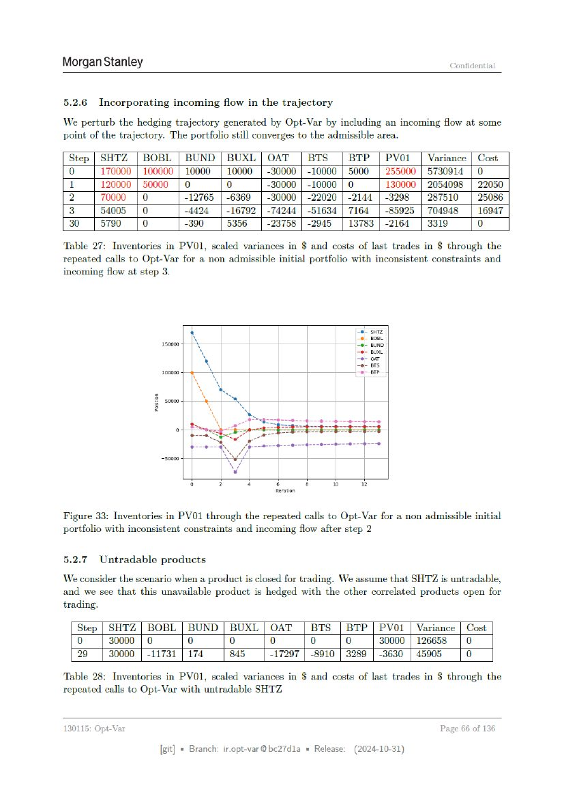

## 原文OCRテキスト

```text
Morgan Stanley                                                                                     Confidential


5.2.6        Incorporating incoming flow in the trajectory

We perturb the hedging trajectory generated by Opt-Var by including an incoming flow at some
point of the trajectory. The portfolio still converges to the admissible area.
 Step | SHTZ          | BOBL          | BUND | BUXL | OAT   | BTS          BTP     | PVO1   | Variance | Cost
 0           170000   | 100000 | 10000 | 10000 | -30000 | -10000 | 5000 | 255000 | 5730914 | 0
  1          120000   | 50000 | 0         0       -30000 | -10000 | 0       130000 | 2054098 | 22050
 2           70000    | 0        -12765 | -6369 | -30000 | -22020 | -2144 | -3298 | 287510     25086
 3           54005    | 0        -4424 | -16792 | -74244 | -51634 | 7164 | -85925 | 704948     16947
 30          5790       0        -390     5356    -23758 | -2945 | 13783 | -2164 | 3319        0

Table 27: Inventories in PV01, scaled variances in $ and costs of last trades in $ through the
repeated calls to Opt-Var for a non admissible initial portfolio with inconsistent constraints and
incoming flow at step 3.


                                                                                 SWZ
                                                                                 Bost
                            150000


                            1100000


                             50000


                           50000


Figure 33: Inventories in PVO1 through the repeated calls to Opt-Var for a non admissible initial
portfolio with inconsistent constraints and incoming flow after step 2

5.2.7        Untradable    products

We consider the scenario when a product is closed for trading. We assume that SHTZ is untradable,
and we see that this unavailable product is hedged with the other correlated products open for
trading.

      Step   | SHTZ | BOBL | BUND            | BUXL | OAT | BTS | BTP | PVO1 | Variance | Cost
      0        30000 | 0        0              0      0        0       0      30000 | 126658 0
      29       30000 | -11731 | 174            845    -17297 | -8910 | 3289 | -3630 | 45905  0

Table 28: Inventories in PV01, scaled variances in $ and costs of last trades in $ through the
repeated calls to Opt-Var with untradable SHTZ

130115: Opt-Var                                                                                  Page 66 of 136
                           [git] = Branch: ir.opt-var@bc27d1a = Release:    (2024-10-31)
```

# ページ 067

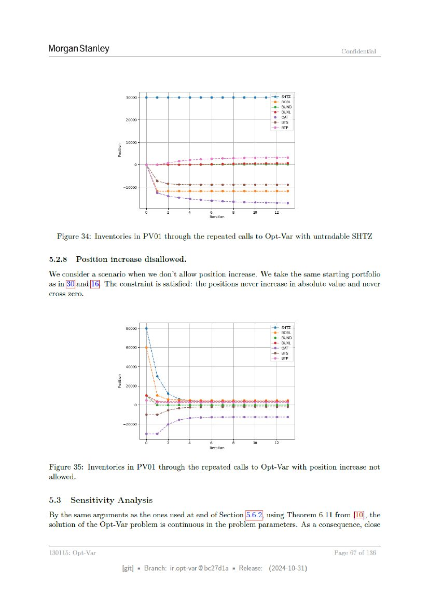

## 原文OCRテキスト

```text
Morgan Stanley                                                                            Confidential


                        30000         +             et


                        20000


                       10000


  Figure 34: Inventories in PVO1 through the repeated calls to Opt-Var with untradable SHTZ


5.2.8    Position increase disallowed.

We consider a scenario when we don’t allow position increase. We take the same starting portfolio
as in[30|and[16] The constraint is satisfied: the positions never increase in absolute value and never
cross zero.


                        40000

                     2 20000


                       20000


Figure 35: Inventories in PV01 through the repeated calls to Opt-Var with position increase not
allowed.

5.3     Sensitivity Analysis
By the same arguments as the ones used at end of Sectioi        using Theorem 6.11 from [IU], the
solution of the Opt-Var problem is continuous in the problem parameters. As a consequence, close

130115: Opt-Var                                                                         Page 67 of 136

                      [git] « Branch: iropt-var@be27d1a = Release:   (2024-10-31)
```

# ページ 068

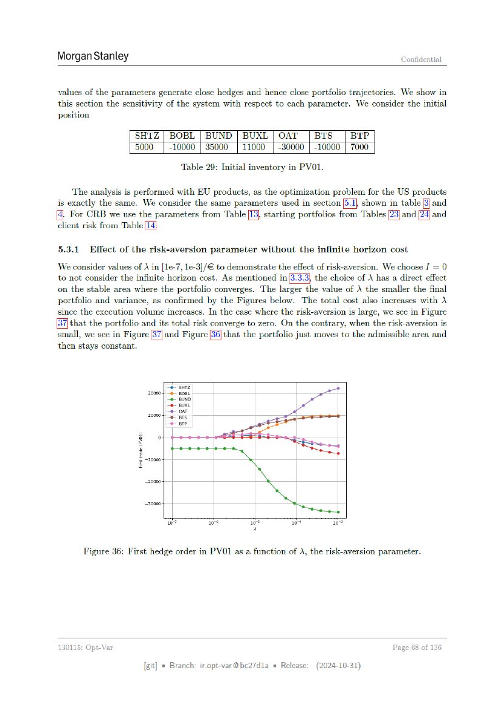

## 原文OCRテキスト

```text
Morgan Stanley                                                                                 Confidential


values of the parameters generate close hedges and hence close portfolio trajectories. We show in
this section the sensitivity of the system with respect to each parameter. We consider the initial
position
                     SHTZ | BOBL | BUND | BUXL | OAT | BTS             BTP
                     5000 | -10000 | 35000 | 11000 | -30000 | -10000 | 7000

                                      Table 29: Initial inventory in PVO1.
    ‘The analysis is performed with EU products, as the optimization problem for the US products

client risk from Table

5.3.1    Effect of the risk-aversion parameter               without the infinite horizon cost

We consider values of A in [le-7, 1e-3]/€ to demonstrate the effect of risk-aversion. We choose I = 0
to not consider the infinite horizon cost. As mentioned in|3.3.3} the choice of \ has a direct effect
on the stable area where the portfolio converges. The larger the value of \ the smaller the final
portfolio and variance, as confirmed by the Figures below. The total cost also increases with \
since the execution volume increases. In the case where the risk-aversion is large, we see in Figure
small, we see in Figure [37] and Figure           that the portfolio just moves to the admissible area and
then stays constant.


                          20000

                          0000


                         20000

                         30000

                                  1          10         To          1         o>


        Figure 36: First hedge order in PVO1 as a function of A, the risk-aversion parameter.


130115: Opt-Var                                                                              Page 68 of 136

                         [git] « Branch: iropt-var@be27d1a = Release:    (2024-10-31)
```

# ページ 069

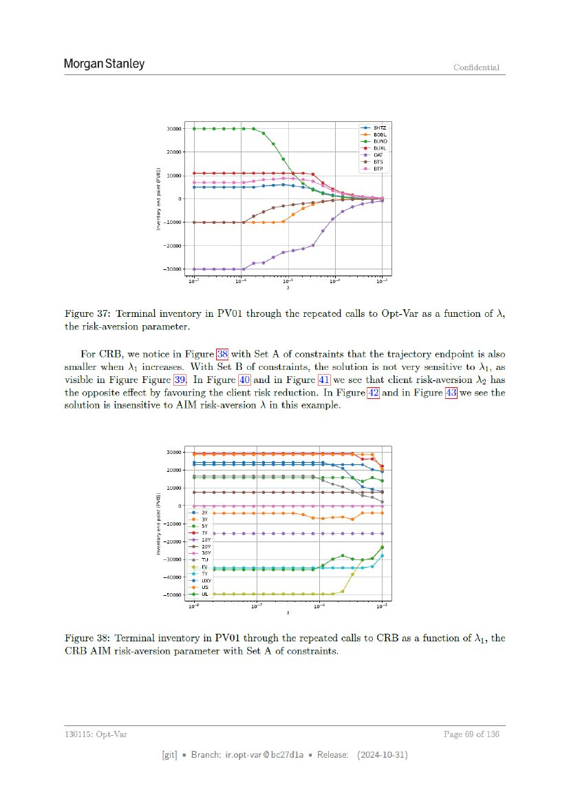

## 原文OCRテキスト

```text
Morgan Stanley                                                                                    Confidential


                          30000

                          20000


                         20000

                         30000
                                  1          10          To          1         o>


Figure 37: Terminal inventory in PVO1 through the repeated calls to Opt-Var as a function of A,
the risk-aversion parameter.
    For CRB, we notice in Figure [38] with Set A of constraints that the trajectory endpoint is also
smaller when 1 increases. With Set B of constraints, the solution is not very sensitive to \1, as
visible in Figure Figure [39]      In Figure [40] and in Figure [41] we see that client risk-aversi
the opposite effect by favouring the client risk reduction. In Figure
                                                                  [42] and in Figure
solution is insensitive to AIM risk-aversion \ in this example.


                                  7Pe eeece,esseqeegre=:
                                   Le
                                   pad
                                   ban
                                   rer
                                   pee                 ZL
                                  pa
                                  pad                            oe
                         40000    Baa
                                  =o]
                                  ous
                         50000 4 —* UL
                                 10               1077          10             10


Figure 38: Terminal inventory in PVO1 through the repeated calls to CRB as a function of \1, the
CRB AIM risk-aversion parameter with Set A of constraints.


130115: Opt-Var                                                                                 Page 69 of 136

                        [git] « Branch: iropt-var@be27d1a = Release:      (2024-10-31)
```

# ページ 070

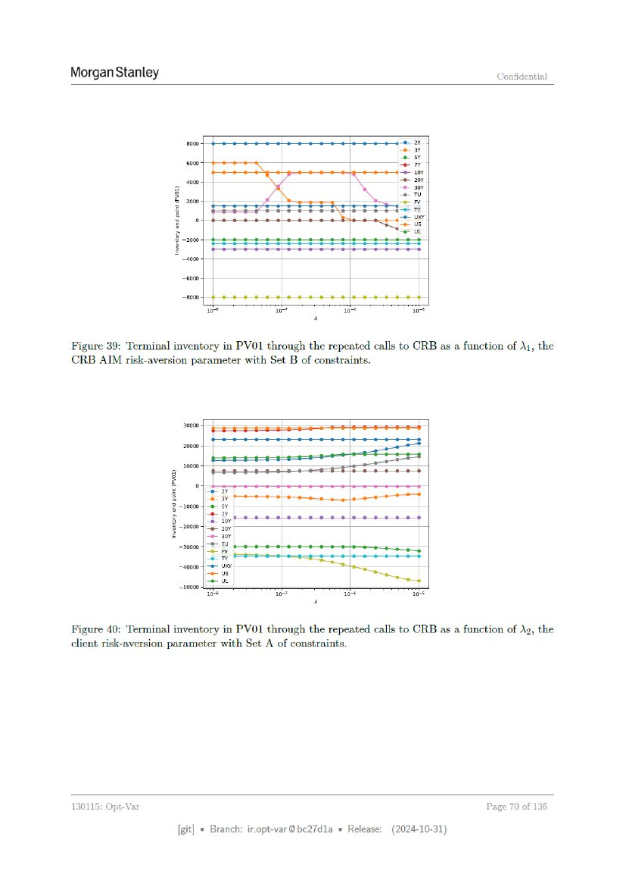

## 原文OCRテキスト

```text
Morgan Stanley                                                                       Confidential


                       2000                                        ae
                                                                   oY
                                                                   oY
                       6000                                        ae
                                        i                 ne       “= 10
                                                                   + 207
                    3 000                                          ~e 3ov
                    8                                              =
                    © 20m                                          ay
                     z                                             oY
                    a                                              ux
                     z                                          She us
                     >                                             =u
                    2 2000
                     H
                       4000
                      6000
                      2000
                              To            To           To             pd


Figure 39: Terminal inventory in PVO1 through the repeated calls to CRB as a function of \1, the
CRB AIM risk-aversion parameter with Set B of constraints.


                      30000
                      seo                                  as
                          10000                   senteesses
                    gol.
                    z           = on                      |,
                                                          oF
                     a          oY           |#222 2 |
                       -20000 4 -— sv
                     2          ae
                    3           Stor
                     § ~20000 4 5 2oy
                    i           = 30
                        30000 “$=
                                aayTH                          aa"
                     40000    fe UxY
                     50000
                              1             To           To             To


Figure 40: Terminal inventory in PVO1 through the repeated calls to CRB as a function of \s, the
client risk-aversion parameter with Set A of constraints.


130115: Opt-Var                                                                    Page 70 of 136

                     [git] « Branch: iropt-var@be27d1a = Release:   (2024-10-31)
```

# ページ 071

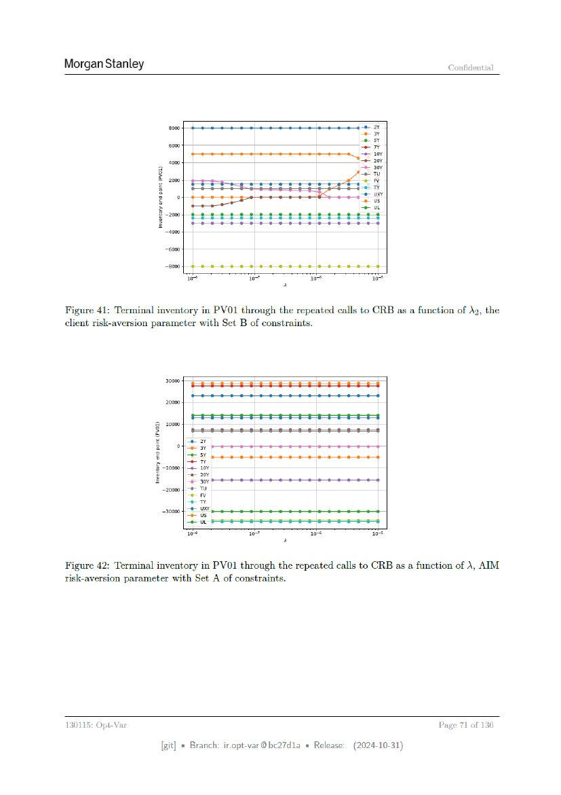

## 原文OCRテキスト

```text
Morgan Stanley                                                                           Confidential


                          2000                                            oY
                                                                          oy
                                                                          5y
                      000                                                 ae
                                                                       ~, tov
                                                                          —e 20v
                    = 4000                                                “S 30v
                    g                                                     “ou
                    &     2000                                         At      wv
                    z                   ———<                     AS
                     3                                                    = uw
                    zo                                                    “Sus
                     >                                                    uw
                    2 2000
                    ~ 4000

                        6000
                        2000
                                 To            7            ed               ni

Figure 41: Terminal inventory in PVO1 through the repeated calls to CRB as a function of \s, the
client risk-aversion parameter with Set B of constraints.


                         30000
                         20000
                    10000
                    z          ae
                     a      Oye ay
                    z          ay
                     5         Pa
                    3 20000 | -2- 10
                     i         a
                    i          = aor
                       20000 | -*- TU
                               Sv
                               pay
                       acon | 2 UY
                               us
                               eu
                               rad             ri           Fo               ws

Figure 42: Terminal inventory in PVO1 through the repeated calls to CRB as a function of A, AIM
risk-aversion parameter with Set A of constraints.


130115: Opt-Var                                                                        Page 71 of 136

                        [git] « Branch: iropt-var@be27d1a = Release:    (2024-10-31)
```

# ページ 072

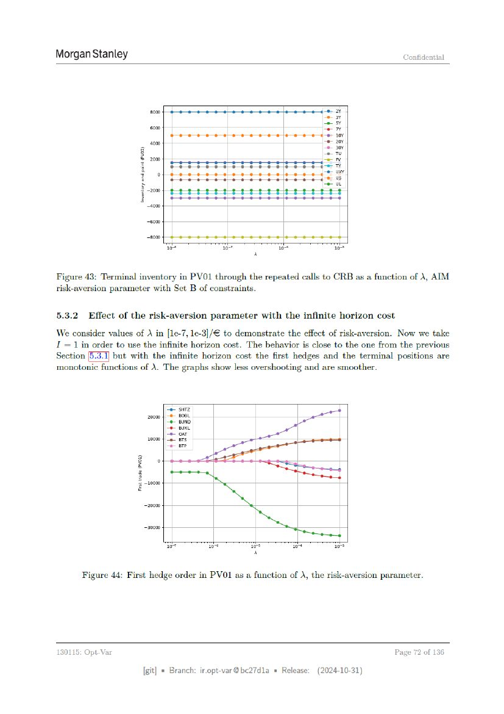

## 原文OCRテキスト

```text
Morgan Stanley                                                                              Confidential


                          2000                                          oY
                                                                        ae)
                                                                        -o5Y
                          6000                                          1
                                                                        -e 10v
                                                                        “e207
                                                                        © 30v
                                                                        “Tu
                                                                        ae
                                                                        oY
                                                                        = uxr
                                                                        ous
                                                                        eu


                                 10          107             10            10


Figure 43: Terminal inventory in PVO1 through the repeated calls to CRB as a function of A, AIM
risk-aversion parameter with Set B of constraints.

5.3.2    Effect of the risk-aversion parameter           with the infinite horizon cost

We consider values of ) in [le-7, 1e-3]/€ to demonstrate the effect of risk-aversion. Now we take
J =1    in order to use the infinite horizon cost. The behavior is close to the one from the previous
Section      but with the infinite horizon cost the first hedges and the terminal positions are
monotonic functions of A. The graphs show less overshooting and are smoother.


                        20000

                        30000

                                 ie     To          Te            Te       To


        Figure 44: First hedge order in PVO1 as a function of A, the risk-aversion parameter.


130115: Opt-Var                                                                           Page 72 of 136

                       [git] « Branch: iropt-var@be27d1a = Release:    (2024-10-31)
```

# ページ 073

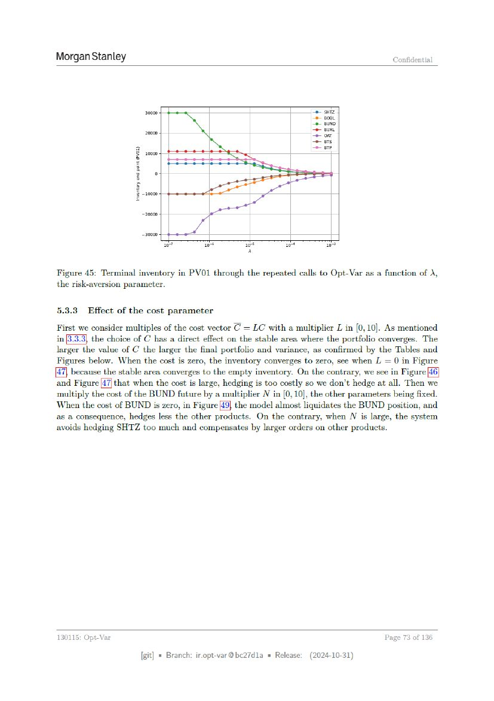

## 原文OCRテキスト

```text
Morgan Stanley                                                                           Confidential


                       30000

                       20000


                      20000

                      30000
                               1       10          To         1          o>


Figure 45: Terminal inventory in PVO1 through the repeated calls to Opt-Var as a function of A,
the risk-aversion parameter.

5.3.3    Effect of the cost parameter

First we consider multiples of the cost vector   C = LC with a multiplier L in 0,10]. As mentioned
          the choice of C has a direct effect on the stable area where the portfolio converges. The
larger the value of C the larger the final portfolio and variance, as confirmed by the Tables and
Figures below. When the cost is zero, the inventory converges to zero, see when L = 0 in Figure
    because the stable area converges to the empty inventory. On the contrary, we see in Figure[46]
and Figure |[47|that when the cost is large, hedging is too costly so we don’t hedge at all. Then we
multiply the cost of the BUND future by a multiplier N in (0, 10], the other parameters being fixed.
When the cost of BUND is zero, in Figure [19] the model almost liquidates the BUND position, and
as a consequence, hedges less the other products. On the contrary, when N is large, the system
avoids hedging SHTZ too much and compensates by larger orders on other products.


130115: Opt-Var                                                                        Page 73 of 136

                      [git] « Branch: iropt-var@be27d1a = Release:   (2024-10-31)
```

# ページ 074

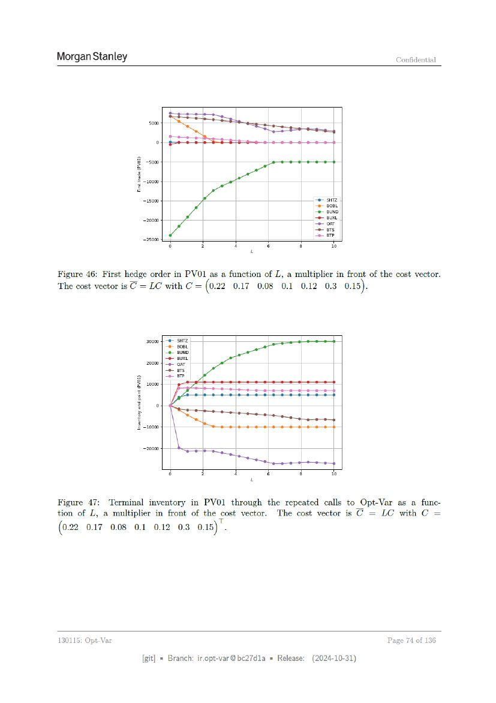

## 原文OCRテキスト

```text
Morgan Stanley                                                                                      Confidential


                           ‘5000


                          5000


                         15000

                         20000

                         25000


Figure 46: First hedge order in PVO1 as a function of L, a multiplier in front of the cost. vector.
The cost vector is T= LC with C = (0.22 0.17 0.08 0.1 0.12 0.3 0.15).


                          30000 | -e= surz
                                  epost
                                  2 BUND
                                  se Buxt
                          20000} 9 oT
                                  -e ots
                                   = oP
                                                       —je—2—2   | oo 2 of 2 0 op


                         20000


Figure 47:        Terminal inventory in PV01 through the repeated calls to Opt-Var as a func-
tion of LZ, a multiplier in front of the £cost vector.              The cost vector is     C = LC   with     C =
(0.22   0.17 0.08 0.1 0.12 03                0.15) .


130115: Opt-Var                                                                                 Page 74 of 136

                         [git] « Branch: iropt-var@be27d1a = Release:       (2024-10-31)
```

# ページ 075

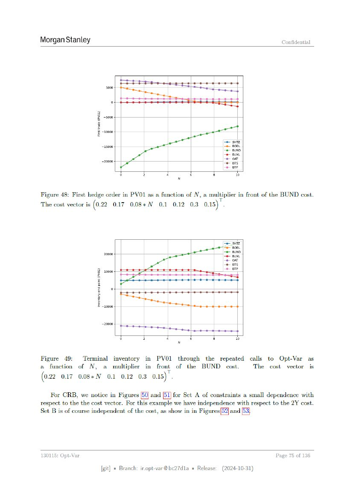

## 原文OCRテキスト

```text
Morgan Stanley                                                                            Confidential


                           5000


                       5000


                      15000

                      20000


Figure 48: First hedge order in PV01 as a function of N, a multiplier in front of the BUND cost.
                                                                     T
The cost vector is (0.22          0.17 0.08+N   0.1 0.12 03   0.15) .


                                                                         e sHTz
                                                                         epost
                       20000                                             -e BUND
                                                                         oe Bux
                                                                          © ont
                                                                         e BTs
                                                                          © 5p


                      20000


Figure 49: Terminal inventory in PVO01 through the repeated calls to Opt-Var as
a function of N, a multiplier in frontt of the BUND cost.     The cost vector is
(022 0.17 0.08%N 0.1 0.12 03 0.15) .

   For CRB, we notice in Figures                    for Set A of constraints a small dependence with
respect to the the cost vector. For this example we have independence with respect to the 2Y cost.
Set B is of course independent of the cost, as show in in Figures [52] and


130115: Opt-Var                                                                         Page 75 of 136
                      [git] « Branch: iropt-var@be27d1a = Release:       (2024-10-31)
```

# ページ 076

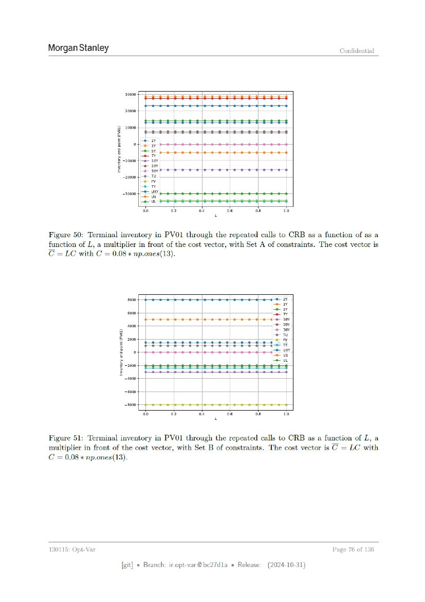

## 原文OCRテキスト

```text
Morgan Stanley                                                                            Confidential


                        30000

                        20000

                     10000
                      z          “eo
                      BOF 6 ay
                      z          -e 5y
                                 7
                      5 -10000 + -e- 107
                      5          e207
                     z           = 307
                        20000 |e TU
                                 “ew
                                 1
                        30000 $= es UY
                                 UL 889998888
                                  00     o2 a O6 oe                         10


Figure 50: Terminal inventory in PVO1 through the repeated calls to CRB as a function of as a
function of L, a multiplier in front of the cost vector, with Set A of constraints. The cost vector is
C =LC with C = 0.08 * np.ones(13).


                         8000                                           ey
                                                                        “oy
                                                                        + 5y
                         6000                                           ae
                                                                        “10
                         4000                                           + 20
                                                                         © 307
                      8z                                                wu
                       = 2000                                           ev
                        =                                               oY
                       a                                                = ue
                        z                                               ous
                        =                                               uw
                      2 -2000                  “+
                      z 4000

                        6000
                        2000
                                00     02       v7       06       08        ro

Figure 51: Terminal inventory in PVO1 through the repeated calls to CRB as a function of L, a
multiplier in front of the cost vector, with Set B of constraints. The cost vector is C = LC with
C = 0.08 * np.ones(13).


130115: Opt-Var                                                                         Page 76 of 136

                       [git] « Branch: iropt-var@be27d1a = Release:    (2024-10-31)
```

# ページ 077

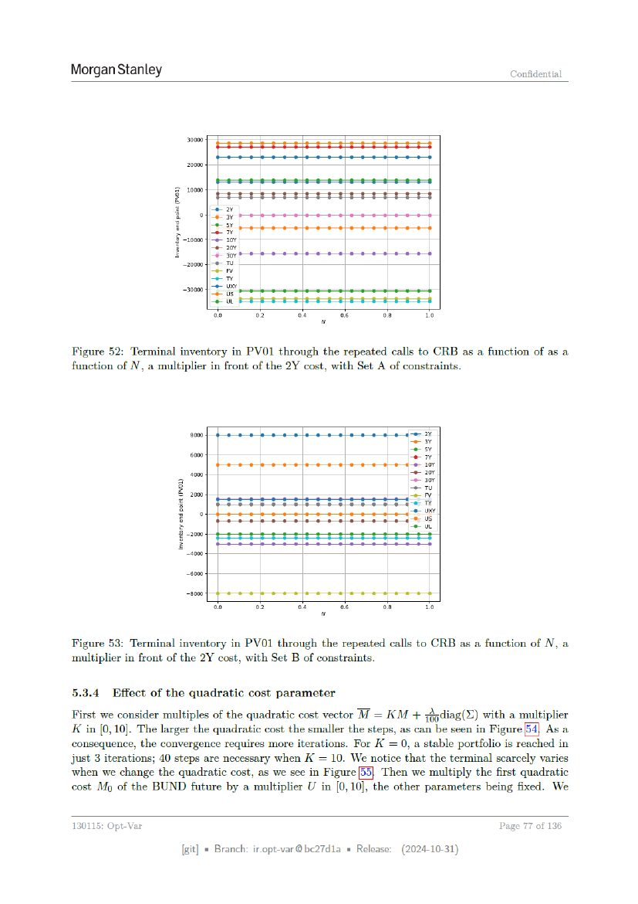

## 原文OCRテキスト

```text
Morgan Stanley                                                                          Confidential


                       30000

                       20000


                               “eo
                               oy
                               -e 5y
                               7
                               “2 10r
                               e207
                               = 307
                               =
                               “ew
                               1
                      30000    - uxy
                               es
                               eu            4-4                            +
                                00      02     oe       o6       oe        10


Figure 52: Terminal inventory in PVO1 through the repeated calls to CRB as a function of as
function of N, a multiplier in front of the 2Y cost, with Set A of constraints.


                        8000                                           ey
                                                                       oy
                                                                         5y
                        6000                                           ay
                                                                        = toy
                                                                       e207
                                                                        © 307
                                                                        Tu
                                                                       aa
                                                                       =
                                                                       eo uxr
                                                                       = us
                                                                       eu


                               oo       02     oe       o6       oe        To


Figure 53: Terminal inventory in PVO1 through the repeated calls to CRB as a function of N, a
multiplier in front of the 2Y cost, with Set B of constraints.

5.3.4    Effect of the quadratic cost parameter

First we consider multiples of the quadratic cost vector M = KM + ;Ajdiag(X) with a multiplier
K in [0,10]. The larger the quadratic cost the smaller the steps, as can be seen in Figure
 consequence, the convergence requires more iterations. For K = 0, a stable portfolio is reached in
 just 3 iterations; 40 steps are necessary when K = 10. We notice that the terminal scarcely varies
 when we change the quadratic cost, as we see in Figure [55] Then we multiply the first quadratic
 cost Mo of the BUND future by a multiplier U in [0,10], the other parameters being fixed. We

130115: Opt-Var                                                                       Page 77 of 136

                      [git] « Branch: iropt-var@be27d1a = Release:    (2024-10-31)
```

# ページ 078

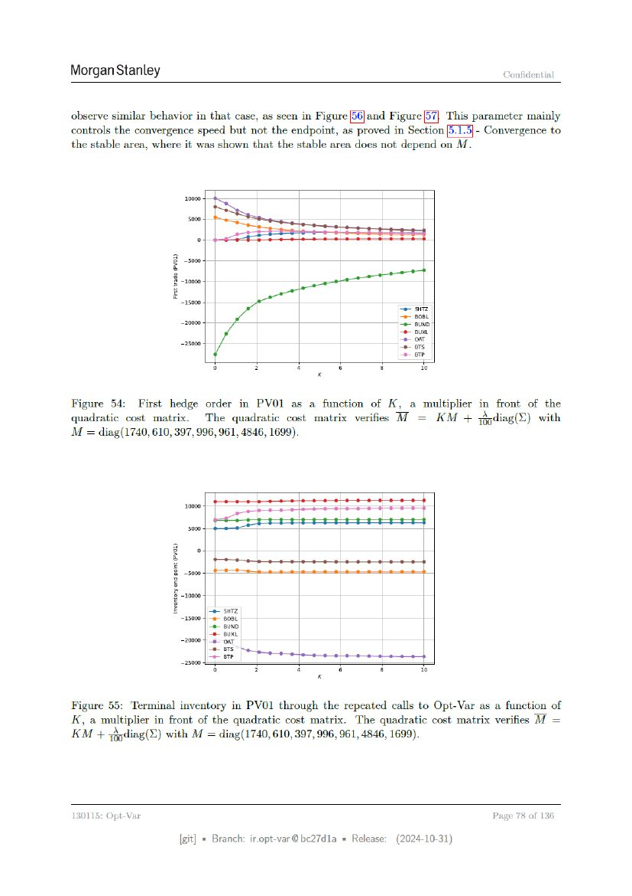

## 原文OCRテキスト

```text
Morgan Stanley                                                                              Confidential


observe similar behavior in that case, as seen in Figure [56]and Figure 57] This parameter mainly
controls the convergence speed but not the endpoint, as proved in Section         - Convergence to
the stable area, where it was shown that the stable area does not depend on


Figure 54:        First hedge order in PVO1 as a function of K, a multiplier in front of the
quadratic cost matrix.        The quadratic cost matrix verifies         M = KM + ;Apdiag(Z) with
M = diag(1740, 610, 397, 996, 961, 4846, 1699).


Figure 55: Terminal inventory in PV01 through the repeated calls to Opt-Var as a function of
K, a multiplier in front of the quadratic cost matrix.         The quadratic cost matrix verifies    MW =
KM + 7Apdiag(Z) with M = diag(1740, 610, 397, 996, 961, 4846, 1699).


130115: Opt-Var                                                                           Page 78 of 136

                         [git] « Branch: iropt-var@be27d1a = Release:   (2024-10-31)
```

# ページ 079

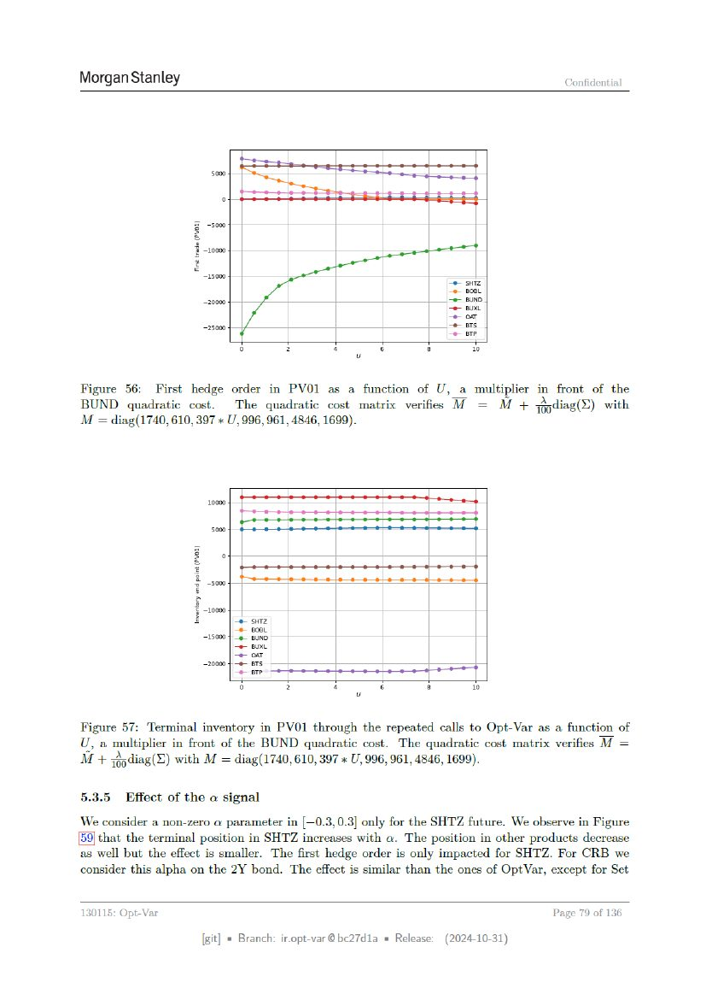

## 原文OCRテキスト

```text
Morgan Stanley                                                                                 Confidential


Figure 56:        First hedge order in PVO1 as a function of U, a multiplier in front of the
BUND     quadratic cost.          The quadratic cost matrix verifies          M =     M + Ajdiag(S) with
M = diag(1740, 610, 397 « U, 996, 961, 4846, 1699).


                          0000                                      ee
                                  —                      —
                           5000


                                 Se surz
                                 epost
                                 -e- BUND
                                 Se But
                                 “eon
                         20000 4 -e- ers,
                                 a              ae     ee      ee       =    eel


Figure 57: Terminal inventory in PVO1 through the repeated calls to Opt-Var as a function of
U, a multiplier in front of the BUND quadratic cost. The quadratic cost matrix verifies M =
M + ppdiag(S) with M = diag(1740,   610, 397 « U, 996, 961, 4846, 1699).

5.3.5    Effect of the a signal

We consider a non-zero @ parameter in [—0.3, 0.3] only for the SHTZ future. We observe in Figure
   that the terminal position in SHTZ increases with a. The position in other products decrease
as well but the effect is smaller.          The first hedge order is only impacted for SHTZ. For CRB we
consider this alpha on the 2Y bond. The effect is similar than the ones of OptVar, except for Set

130115: Opt-Var                                                                                   79 of 136

                         [git] « Branch: iropt-var@be27d1a = Release:       (2024-10-31)
```

# ページ 080

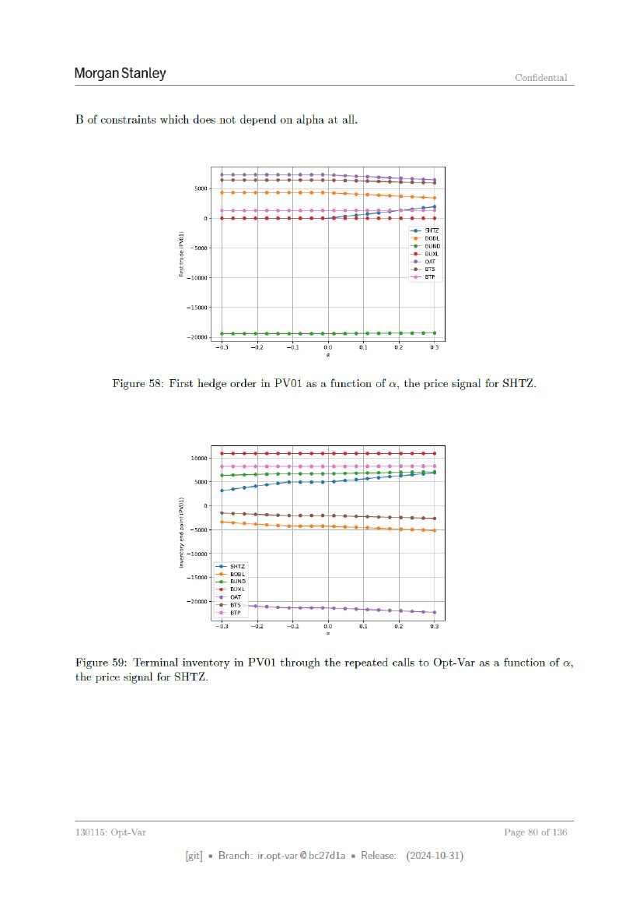

## 原文OCRテキスト

```text
Morgan Stanley                                                                              Confidential


B of constraints which does not depend on alpha at all.


                          000
                             °                       poss,       aaa
                      5                                                    == siz
                      g                                                    “Soot
                      2 so                                                 “= euno
                     i4                                                    =e aux
                                                                           So
                     i                                                     oo ats
                                                                           eon
                     = _ 10000

                       ~1s000

                       20000
                                 a    a.            00      oF        08        oS

        Figure 58: First hedge order in PVO1 as a function of ay, the price signal for SHTZ.


                         10000

                          5000   eet

                     go
                     z           te
                     2 som       Prtrertee   ele ete       ole             |

                     25 10000
                     z          Ae surz
                                epost
                        250007 pun
                                Se BUXL
                         200004 TES
                                 3 OFT   eee ee
                                e eTP              ete et
                                “3      “2  aa      oo      on        o2        03


Figure 59: Terminal inventory in PVO1 through the repeated calls to Opt-Var as a function of a,
the price signal for SHTZ.


130115: Opt-Var                                                                           Page 80 of 136

                       [git] « Branch: iropt-var@be27d1a = Release:        (2024-10-31)
```

# ページ 081


## 原文OCRテキスト

```text
Morgan Stanley                                                                          Confidential


                       30000                                  =


                       ,         peseeeesereee              eet
                    10000
                                                                     aad
                     e        yew
                      g          ey
                     3           ee                                  een
                      > -20000 ae7-5 soy
                    iH           e207
                     z           = 30
                         20000 Fe Tu
                                 aay
                                 aa
                         30000 | “e uxe
                                 + us
                                 eu                             ae a aoe
                                 “03.2   00 on                  02      03


Figure 60: Terminal inventory in PV01 through the repeated calls to CRB as a function of a, the
price signal for 2Y.


                           000                   =a
                                                 Th
                          6000
                                                 pay
                                                 7
                                                 paaty
                         4000                    Sy
                                                  30
                     2g                           7
                      & 200                      aay
                     2                           oY
                     Byz                         ee
                                                 Sos
                       >                         oar
                         LMA ZaESEEecEEueeteeasesl
                     © 4000

                       sooo
                       200


Figure 61: Terminal inventory in PV01 through the repeated calls to CRB as a function of a, the
price signal for 2Y.

5.3.6    Effect of the covariance matrix

‘We decompose the effects of variance and correlation in the covariance matrix. To do that we write
the covariance matrix as the product
                                               L=nén,


130115: Opt-Var                                                                       Page 81 of 136

                      [git] « Branch: iropt-var@be27d1a = Release:   (2024-10-31)
```

# ページ 082

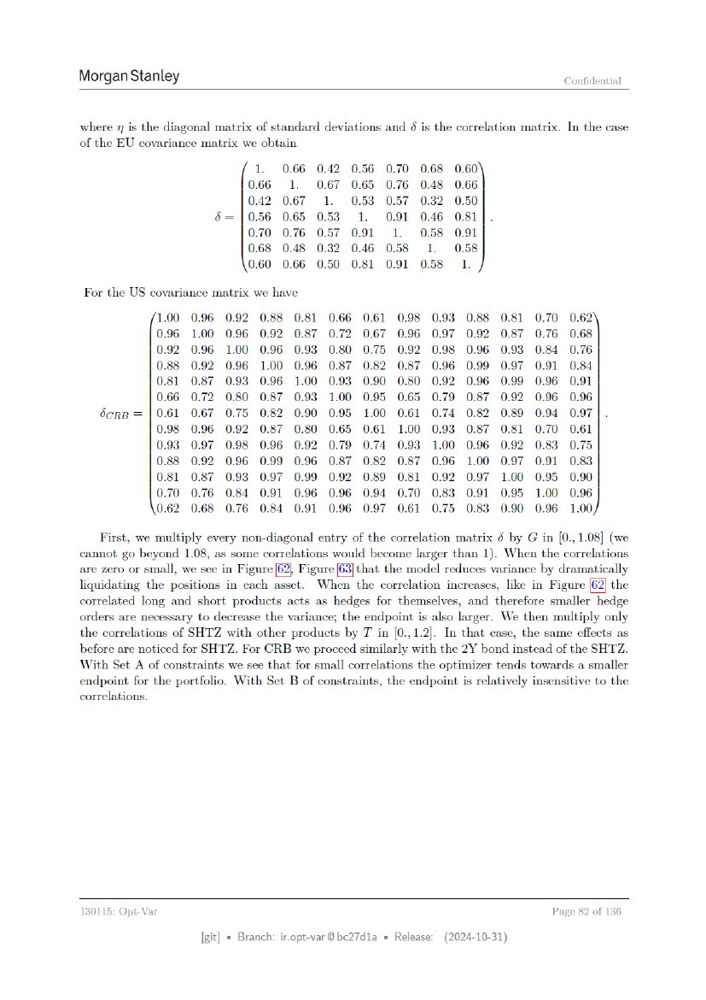

## 原文OCRテキスト

```text
Morgan Stanley                                                                                                     Confidential


where 77 is the diagonal matrix of standard deviations and 6 is the correlation matrix.                            In the case
of the EU covariance matrix we obtain

                                       1.      0.66     0.42     0.56     0.70     0.68     0.60
                                     0.66        1.     0.67     0.65     0.76     0.48     0.66
                                     0.42      0.67       1.     0.53     0.57     0.32     0.50
                                 =/|0.56       0.65     0.53       1.     0.91     0.46     0.81
                                     0.70      0.76     0.57     0.91       1.     0.58     0.91
                                     0.68      0.48     0.32     0.46     0.58       1.     0.58
                                     0.60      0.66     0.50     0.81     0.91     0.58       1.

For the US covariance matrix we have

                  1.00    0.96   0.92   0.88     0.81     0.66     0.61     0.98     0.93     0.88   0.81   0.70    0.62
                  0.96    1.00   0.96   0.92     0.87     0.72     0.67     0.96     0.97     0.92   0.87   0.76    0.68
                  0.92    0.96   1.00   0.96     0.93     0.80     0.75     0.92     0.98     0.96   0.93   0.84    0.76
                  0.88    0.92   0.96   1.00     0.96     0.87     0.82     0.87     0.96     0.99   0.97   0.91    0.84
                  0.81    0.87   0.93   0.96     1.00     0.93     0.90     0.80     0.92     0.96   0.99   0.96    0.91
                  0.66    0.72   0.80   0.87     0.93     1.00     0.95     0.65     0.79     0.87   0.92   0.96    0.96
    6crp =        |0.61   0.67   0.75   0.82     0.90     0.95     1.00     0.61     0.74     0.82   0.89   0.94    0.97
                  0.98    0.96   0.92   0.87     0.80     0.65     0.61     1.00     0.93     0.87   0.81   0.70    0.61
                  0.93    0.97   0.98   0.96     0.92     0.79     0.74     0.93     1.00     0.96   0.92   0.83    0.75
                  0.88    0.92   0.96   0.99     0.96     0.87     0.82     0.87     0.96     1.00   0.97   0.91    0.83
                  0.81    0.87   0.93   0.97     0.99     0.92     0.89     0.81     0.92     0.97   1.00   0.95    0.90
                  0.70    0.76   0.84   0.91     0.96     0.96     0.94     0.70     0.83     0.91   0.95   1.00    0.96
                  0.62    0.68   0.76   0.84     0.91     0.96     0.97     0.61     0.75     0.83   0.90   0.96    1.00,

    First, we multiply every non-diagonal entry of the correlation matrix 6 by G in [0., 1.08] (we
cannot go beyond 1.08, as some correlations would become larger than 1). When the correlations
are zero or small, we see in Figure (62, Figure [63] that the model reduces variance by dramatically
liquidating the positions in each asset. When the correlation increases, like in Figure
correlated long and short products acts as hedges for themselves, and therefore smaller hedge
orders are necessary to decrease the variance; the endpoint is also larger. We then multiply only
the correlations of SHTZ with other products by T in [0., 1.2]. In that case, the same effects as
before are noticed for SHTZ. For CRB we proceed similarly with the 2Y bond instead of the SHTZ.
With Set A of constraints we see that for small correlations the optimizer tends towards a smaller
endpoint for the portfolio. With Set B of constraints, the endpoint is relatively insensitive to the
correlations.


130115: Opt-Var                                                                                                Page 82 of 136

                            [git] « Branch: iropt-var@be27d1a = Release:                  (2024-10-31)
```

# ページ 083


## 原文OCRテキスト

```text
Morgan Stanley                                                                          Confidential


                                                                       eo siz
                                                                       =e soe.
                         20000                                         -e euND
                                                                       paar
                                                                       = om
                                                                       =
                         10000                                         aa
                    z
                    rar)
                    &
                        20000


                        ”        eee
                                 oo    08      oe         o8    os      To
                                                      6

Figure 62: First hedge order in PVO1 as a function of G, a multiplier in front of the correlation
matrix. The correlation matrix becomes Gé with 6 as above.


                         10000


                                 oo    o2      on         os    oe      To


Figure 63: Terminal inventory in PVO1 through the repeated calls to Opt-Var as a function ofG, a
multiplier in front of the correlation matrix. The correlation matrix becomes G6, with 5 as above.


130115: Opt-Var                                                                       Page 83 of 136

                        [git] « Branch: iropt-var@be27d1a = Release:   (2024-10-31)
```

# ページ 084


## 原文OCRテキスト

```text
Morgan Stanley                                                                                Confidential


                          10000

                           ‘5000


                         20000
                                 Se surz
                                 e BoeL
                                 “2 BUND
                         15000 Ae But
                                 -e ont
                                 eats                               0 oo     oo
                         20000 | ®- BT?» 0-209 |-9 9 -9- -e 00-0
                                  00     o2    oa       O6     oe       10        12


Figure 64: First hedge order in PVO1 as a function of T, a multiplier in front of the correlation
between SHTZ and other products. The correlation matrix becomes Td with 6 as above.


                                                                                  4
                          20000
                           000
                    g:            0   SSS          SSS        SS
                     % ~5000
                     2 -10000
                    E ~15000 | -e- sHTZ
                                      epost
                                      2 BUND
                         20000}       9 BUXL
                                      e oar
                          25004       e2 Ere
                                          eTP
                                       00     02    oe   06    08       vo        1
                                                          T

Figure 65: Terminal inventory in PVO1 through the repeated calls to Opt-Var as a function of T,
a multiplier in front of the correlation between SHTZ and other products. The correlation matrix
becomes T6 with 6 as above.


130115: Opt-Var                                                                             Page 84 of 136

                         [git] « Branch: iropt-var@be27d1a = Release:        (2024-10-31)
```

# ページ 085

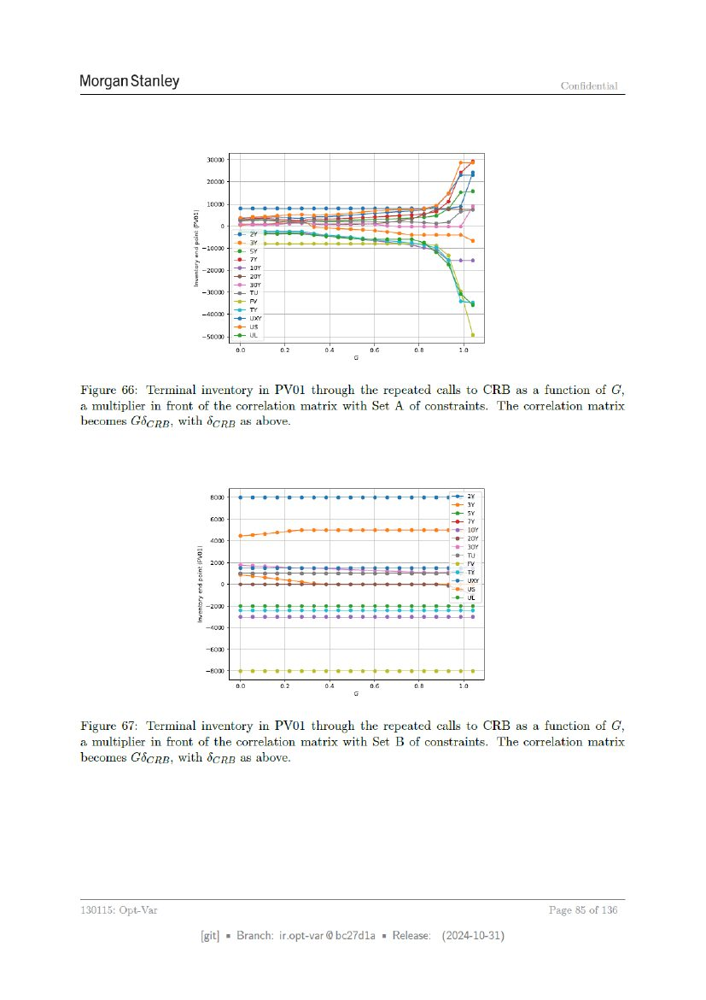

## 原文OCRテキスト

```text
Morgan Stanley                                                                        Confidential


                        0000                                             -
                        oo                                             fis
                        sow                                           4] Ls
                    5Eo                          iaa==:
                     z           Sead                      Pees
                                                             le 2 oo
                     3Es 10000} oy
                                 “5 3                                    ma
                      :          aa                                      Ly
                     8 oom |e 307
                      H          Sv
                     i           Sho
                         30000 | 2 Tu
                                 AW                                     Ss
                         0000 aan$Y
                                 Sos
                         sooo | 2 Ut
                                00         o2      a      06   oe       10


Figure 66: Terminal inventory in PVO1 through the repeated calls to CRB as a function of G,
a multiplier in front of the correlation matrix with Set A of constraints. The correlation matrix
becomes Gécrp, with dcrp as above.


                         8000                                         ey
                                                                      So
                                                                      sr
                         6000                                         7
                                ee                                    ey
                         4000                                         “e 20v
                     3                                                “S30
                     g= 200                                           0
                                                                      pay
                      z                                               tr
                      24                    oe                        wr
                       z                                              seus
                       >                                              su
                      Sled           oe oe et eo       aad
                      i
                         1000
                       =6000
                       8000
                                oo         02      oF     oe   oe       To

Figure 67: Terminal inventory in PVO1 through the repeated calls to CRB as a function of G,
a multiplier in front of the correlation matrix with Set B of constraints. The correlation matrix
becomes Gécrp, with dcrp as above.


130115: Opt-Var                                                                     Page 85 of 136

                      [git] « Branch: iropt-var@be27d1a = Release:   (2024-10-31)
```

# ページ 086

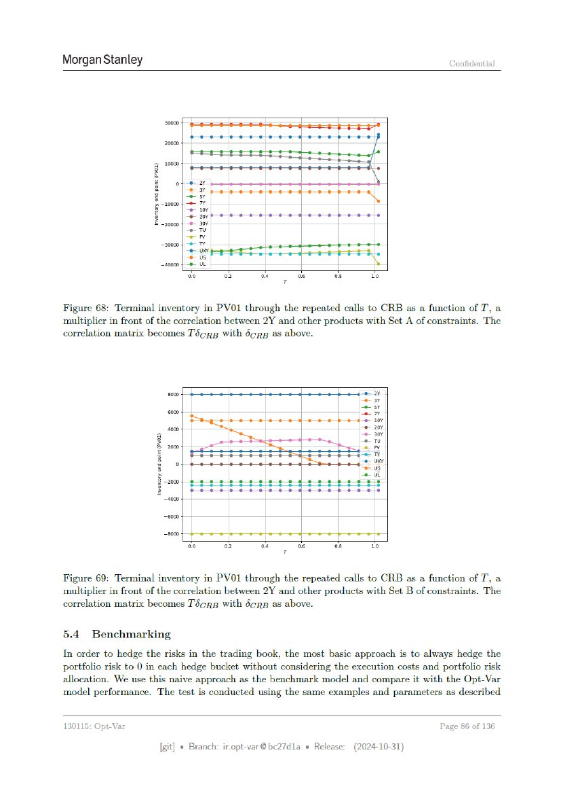

## 原文OCRテキスト

```text
Morgan Stanley                                                                          Confidential


                       30000 |e        Oe          ee        Ee      ee
                       20000


                              aed
                              oy
                              2 5y                                      N\
                              ae
                              “e 10y
                              “e207
                              “e307
                              =)
                              “ew
                      30000 f -*- TY
                              = uxe
                              -e us
                      40000 4-2 UL
                               00      o2     a         06      oe       10


Figure 68: Terminal inventory in PVO1 through the repeated calls to CRB as a function of T, a
multiplier in front of the correlation between 2Y and other products with Set A of constraints. The
correlation matrix becomes Tégrg with dcpp as above.


                        8000                                          ey
                                                                      aS)
                                                                      by
                                                                      7
                                                                      -e toy
                                                                      e207
                                                                       © 30Y
                                                                      Tu
                                                                      ae
                                                                      oY
                                                                      -e uxr
                                                                      “ous
                                                                      eu


                               oo      o2     on        6       oe       To


Figure 69: Terminal inventory in PVO1 through the repeated calls to CRB as a function of T, a
multiplier in front of the correlation between 2Y and other products with Set B of constraints. The
correlation matrix becomes Técre with dcrp as above.

5.4    Benchmarking
In order to hedge the risks in the trading book, the most basic approach is to always hedge the
portfolio risk to 0 in each hedge bucket without considering the execution costs and portfolio risk
allocation. We use this naive approach as the benchmark model and compare it with the Opt-Var
model performance. The test is conducted using the same examples and parameters as described

130115: Opt-Var                                                                       Page 86 of 136

                      [git] « Branch: iropt-var@be27d1a = Release:   (2024-10-31)
```

# ページ 087


## 原文OCRテキスト

```text
Morgan Stanley                                                                                               Confidential


in section 5.1.1}
    ‘The goal of using Opt-Var model for hedging is to balance the trade-off between portfolio vari-
ance, trading cost and alpha capture by minimizing the objective function defined by(I} Therefore,
we use the objective function value after executing the hedges as the metric to compare the per-
formance, and show that the objective function value reached after hedging by Opt-Var is always
smaller than the value reached by the simple hedging strategy for different risk aversion \ values.
We test \ values ranging from 0 to 2e-4 with every increase of le-6. This is consistent with the \
range we use in the production environment.
    Figures               show the testing results for the same example used in section [5
portfolio PVO1 {SHTZ, BOBL, BUND, BUXL, OAT, BTS, BTP} = {-981.47, 6405.88, -21370.15,
7235.52, -1203.48, 629.40}. Figure[70]plots the objective function value after executing the proposed
hedges by Opt-Var and the simple hedging strategy for different \ values. The blue line gives the
values of the Opt-Var hedger, and the orange line gives the values for the simple hedging strategy.
According to the plot, we see that the optimal objective function value increases with the increase of
the A value for Opt-Var, however it is always below the orange line, which is the objective function
value after hedging using the simple hedging strategy. This proves that the Opt-Var model is
outperforming the benchmark hedging strategy for all the different \ values that we tested. We
also take a look at the values of different parts of the objective function. Figure [7] gi
portfolio variance after hedging with Opt-Var and the simple strategy. The portfolio variance of
the simple strategy is 0 as it always fully hedges the risks to 0. The portfolio variance after hedging
with Opt-Var decreases with the increase of ), as the the larger the \ value is, the more risk-averse
we are, and so Opt-Var tends to execute more hedges to decrease the portfolio variance further.
            plots the variance cost value Varg          after hedging, which is the portfolio variance
after hedging times the given \ value. This gives the portfolio variance adjusted by our chosen
risk appetite. Finally, figure      shows the trading cost term Cost,          to execute the hedges.
The trading cost term for Opt-Var is always smaller than that of the simple hedging strategy
since the Opt-Var is executing fewer, smaller hedges. The smaller trading costs term in Opt-Var
compensated the extra portfolio variance costs for given 2, therefore overall we reached smaller
objective function value with the Opt-Var and therefore are better off.

                  7000.


                                                                                        — opt¥var Hedger
                     °.                                                                 — Simple Hedger
                           ry         35      30       75      160     us      10      Ft         260
                                                                »                                   x10

Figure 70: Comparison of the objective function values after hedging using Opt-Var and simple
hedging strategy for different risk aversion \ values. The objective function is expressed as F,
described in sectio


130115: Opt-Var                                                                                            Page 87 of 136

                                [git] « Branch: iropt-var@be27d1a = Release:   (2024-10-31)
```

# ページ 088

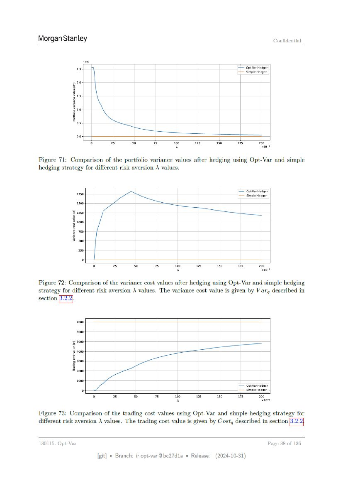

## 原文OCRテキスト

```text
Morgan Stanley                                                                                                          Confidential

                            108
                    as                                                                             — optvar Heager
                                                                                                   — simple Hesger
              520
                  21s
                  2 10.

              z os

                    00
                                  ry            %        30      %       160      us      wo      5           250
                                                                          »                                     x10

Figure 71: Comparison of the portfolio variance values after hedging using Opt-Var and simple
hedging strategy for different risk aversion \ values.

                                                                                                   — optivar Hedger
                    1750.                                                                          — Simpie Hedger
                    1500.
              S ras0.
                  5 000.
                  8 750


                     250

                                       o            2     30         7    100     us      150      us         200
                                                                           »                                    x10

Figure 72: Comparison of the variance cost values after hedging using Opt-Var and simple hedging
strategy for different risk aversion \ values. The variance cost value is given by Vary described in
section

                 7000
                 6000
              3 5000
              § 4000
              43000
              © 2000
                 1000
                                                                                                   — optvar Hedger
                     °                                                                             — Simple Hedger
                                       3            35    30         %    360     as      Ft}      5         280
                                                                           >                                   x10

Figure 73: Comparison of the trading cost values using Opt-Var and simple hedging strategy for
different risk aversion \ values. The trading cost value is given by Costy described in section

130115: Opt-Var                                                                                                       Page 88 of 136

                                           [git] « Branch: iropt-var@be27d1a = Release:   (2024-10-31)
```

# ページ 089


## 原文OCRテキスト

```text
Morgan Stanley                                                                                Confidential


    The same tests are applied to all the 100 examples we introduced in section            The plots
of the objective function value F, after hedging are presented in section [I3.2} in Figure [89] to [93]
‘As shown in the plots, the Opt-Var hedging strategy always reaches to a smaller objective function
value for different A values for all the 100 examples.
5.5     Outcome         Analysis and Backtesting
     In this section we analyse the Opt-Var model results and prove that the outcome satisfies what
we expect from the Opt-Var model. As described in sectior           the goal of the hedge calculator
is to propose hedge trades to control the risks to be within the risk limits and balance the trade-
off between portfolio variance, trading costs and alpha capturing. Therefore, the outcome of the
Opt-Var model should satisfy the below criteria:
5.5.1     Test Criteria

 Risk Limits

         (i) The net portfolio risk after hedging should be within the hedgeable risk limit.
         (ii) The risk in each bucket after hedging should be within the bucket risk limit.

 Trade Size Limit

         (i) The trade size for each proposed hedge should be within the trade size limit for the
             specific bucket.
 Portfolio Variance

         (i) The portfolio variance becomes smaller after hedging with Opt-Var, when A is not set
             to zero.

 Trading Cost

          (i) The cost to trade the hedges proposed by Opt-Var is smaller than hedging everything
              to zero risk.
         (ii) When we need to considerably reduce the risk, the hedges proposed by Opt-Var spread
              out to different buckets instead of only in one bucket. This way, it helps to reduce the
              total trading cost while reaching the same portfolio variance target.
      We conduct the tests using EU data. The parameters used are the same as section |5.

5.5.2     Risk Limits

To test this criteria, we check that the net portfolio risk after hedging is below the hedgeable risk
limit and the risk in each bucket is below the specific bucket risk limit for all the 100 examples we
test. The results are shown in table B0|below. The net portfolio risk and bucket risks are all below
the specified risk limits for all the 100 examples. This proves that the risk limits test criteria is
satisfied.


130115: Opt-Var                                                                          Page 89 of 136

                          [git] « Branch: iropt-var@be27d1a = Release:   (2024-10-31)
```

# ページ 090

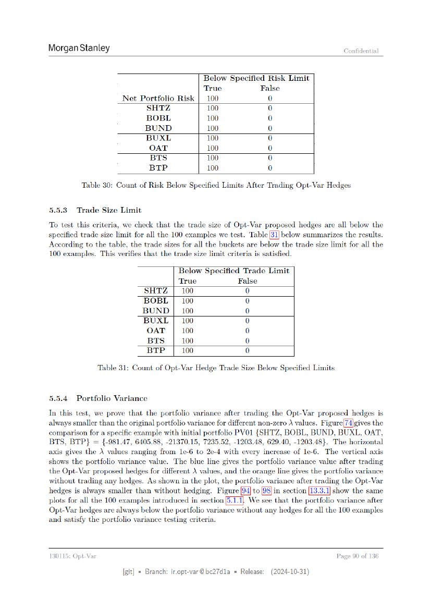

## 原文OCRテキスト

```text
Morgan Stanley                                                                                   Confidenti.


                                                 Below          Specified Risk Limit
                                                True                     False
                          Net   Portfolio Risk | 100                       0
                                  SHTZ            100                      1)
                                 BOBL                100                  0
                                 BUND                100                  0
                                 BUXL                100                  0
                                  OAT                100                  0
                                  BTS                100                  1)
                                  BTP                100                  0

           Table 30: Count of Risk Below Specified Limits After Trading Opt-Var Hedges


5.5.3    Trade Size Limit

To test this criteria, we check that the trade size of Opt-Var proposed hedges are all below the
specified trade size limit for all the 100 examples we test. Table  [31] below summarizes the results.
According to the table, the trade sizes for all the buckets are below the trade size limit for all the
100 examples. This verifies that the trade size limit criteria is satisfied.
                                           Below    Specified Trade Limit
                                           True              False
                                 SHTZ        100                    0
                                 BOBL        100                    0
                                BUND | _ 100                        0
                                BUXL | 100                          0
                                 OAT         100                    0
                                 BTS         100                    0
                                 BTP         100                    0

                   Table 31: Count of Opt-Var Hedge Trade Size Below Specified Limits


5.5.4    Portfolio Variance

In this test, we prove that the portfolio variance after trading the Opt-Var proposed hedges is
always smaller than the original portfolio variance for different non-zero \ values. Figure[?4]gives the
comparison for a specific example with initial portfolio PV01 {SHTZ, BOBL, BUND, BUXL, OAT,
BTS, BTP}         = {-981.47, 6405.88, -21370.15, 7235.52, -1203.48, 629.40, -1203.48}.       The horizontal
axis gives the \ values ranging from 1e-6 to 2e-4 with every increase of le-6. The vertical axis
shows the portfolio variance value. The blue line gives the portfolio variance value after trading
the Opt-Var proposed hedges for different A values, and the orange line gives the portfolio variance
without trading any hedges. As shown in the plot, the portfolio variance after trading the Opt-Var
hedges is always smaller than without hedging.             Figure              in section     show the same
plots for all the 100 examples introduced in section       We see that the portfolio variance after
Opt-Var hedges are always below the portfolio variance without any hedges for all the 100 examples
and satisfy the portfolio variance testing criteria.


130115: Opt-Var                                                                                     90 of 136

                          [git] « Branch: iropt-var@be27d1a = Release:         (2024-10-31)
```

# ページ 091

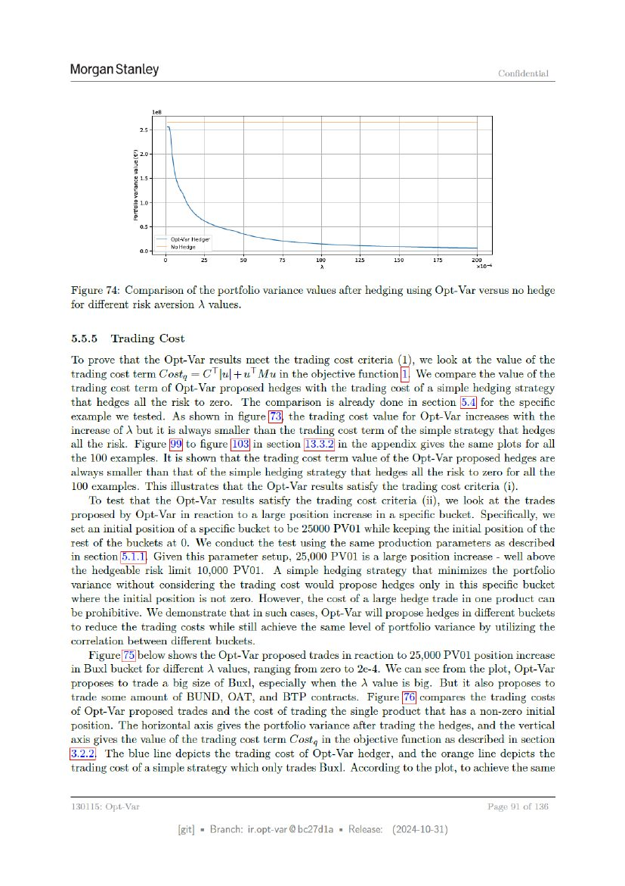

## 原文OCRテキスト

```text
Morgan Stanley                                                                                        Confidential

                       18
                  25


                      — optivar Hedger
                  00. — NoHedge
                       o           25      50       75      100      ws      150     us     200
                                                              »                               x10

Figure 74: Comparison of the portfolio variance values after hedging using Opt-Var versus no hedge
for different risk aversion \ values.

5.5.5    Trading Cost

To prove that the Opt-Var results meet the trading cost criteria (1), we look at the value of the
trading cost term Costy = C"|u|-+u' Mu in the objective function|I| We compare the value of the
trading cost term of Opt-Var proposed hedges with the trading cost of a simple hedging strategy
that hedges all the risk to zero. The comparison is already done in section          for the specific
example we tested. As shown in figure        the trading cost value for Opt-Var increases with the
increase of  but it is always smaller than the trading cost term of the simple strategy that hedges
all the risk. Figure [99] to figure [103] in section [13.3.2] in the appendix gives the same plots for all
the 100 examples.           It is shown that the trading cost term value of the Opt-Var proposed hedges are
always smaller than that of the simple hedging strategy that hedges all the risk to zero for all the
100 examples. This illustrates that the Opt-Var results satisfy the trading cost criteria (i).
    To test that the Opt-Var results satisfy the trading cost criteria (ii), we look at the trades
proposed by Opt-Var in reaction to a large position increase in a specific bucket. Specifically, we
set an initial position of a specific bucket to be 25000 PVO1 while keeping the initial position of the
rest of the buckets at 0. We conduct the test using the same production parameters as described
in section             Given this parameter setup, 25,000 PVO1 is a large position increase - well above
the hedgeable risk limit 10,000 PVO1. A simple hedging strategy that minimizes the portfolio
variance without considering the trading cost would propose hedges only in this specific bucket
where the initial position is not zero. However, the cost of a large hedge trade in one product can
be prohibitive. We demonstrate that in such cases, Opt-Var will propose hedges in different buckets
to reduce the trading costs while still achieve the same level of portfolio variance by utilizing the
correlation between different buckets.
    Figure[75]below shows the Opt-Var proposed trades in reaction to 25,000 PVO01 position increase
in Buxl bucket for different \ values, ranging from zero to 2e-4. We can see from the plot, Opt-Var
proposes to trade a big size of Buxl, especially when the ) value is big. But it also proposes to
trade some amount of BUND, OAT, and BTP contracts. Figure [76] compares the trading costs
of Opt-Var proposed trades and the cost of trading the single product that has a non-zero initial
position. The horizontal axis gives the portfolio variance after trading the hedges, and the vertical
   is gives the value of the trading cost term Cost, in the objective function as described in section
         The blue line depicts the trading cost of Opt-Var hedger, and the orange line depicts the
      ing cost of a simple strategy which only trades Buxl. According to the plot, to achieve the same

130115: Opt-Var                                                                                     Page 91 of 136
                              [git] « Branch: iropt-var@be27d1a = Release:   (2024-10-31)
```

# ページ 092

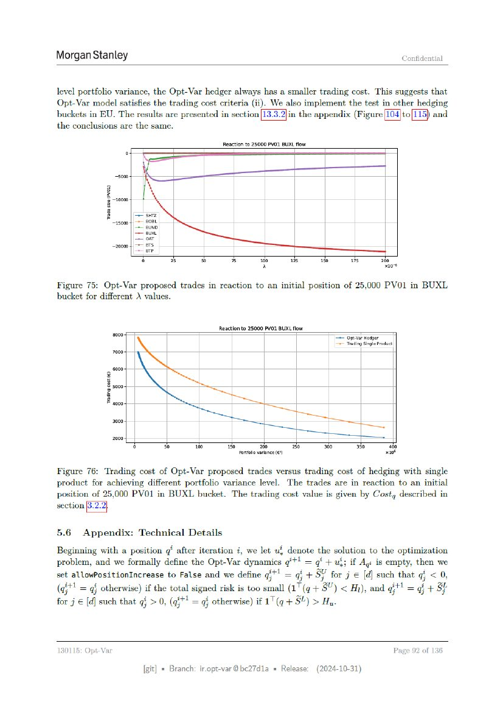

## 原文OCRテキスト

```text
Morgan Stanley                                                                                                                               Confidential


level portfolio variance, the Opt-Var hedger always has a smaller trading cost. This suggests that
Opt-Var model satisfies the trading cost criteria (ii). We also implement the test in other hedging
buckets in EU. The results are presented in section [13.3.2] i           ix (Fi
the conclusions are the same.
                                                              Reaction to 25000 PVO1 BUXL flow


                   S000

                  “20000

                  15000

                  2000
                                a             Ba      Pa         %              a0             us      Fy            us           200
                                                                                 a                                                  x10

Figure 75: Opt-Var proposed trades in reaction to an initial position of 25,000 PV01 in BUXL
bucket for different A values.

                                                             Reactionto 25000 PVO1 BUXL flow
                                                                                                               = Opt-Var Hedger
                                                                                                               = Trading Single Product


                  2000
                           ry            30         100         10              20             20       7360           7350           “460
                                                                     Portfolio variance (€)                                          x10

Figure 76: Trading cost of Opt-Var proposed trades versus trading cost of hedging with single
product for achieving different portfolio variance level. The trades are in reaction to an initial
position of 25,000 PVO1 in BUXL bucket. The trading cost value is given by Costg described in
section

5.6    Appendix:                Technical          Details

Beginning with a position g' after iteration i, we let ui denote the solution to the optimization
problem, and we formally define the Opt-Var dynamics q'*! = qi + ul; if Ag is empty, then we
set allowPositionIncrease to False and we define gt                                           =Gt Sy for j € [d] such that gj < 0,
(qi** = qi otherwise) if the total signed risk is too small (1'(q+ $Y) < Hj), and git! = qi + SE
for j € [d] such that qi > 0, (g}*! = qi otherwise) if 17                                     (q+ 5") > Hy.


130115: Opt-Var                                                                                                                           Page 92 of 136

                                    [git] « Branch: iropt-var@be27d1a = Release:                      (2024-10-31)
```

# ページ 093

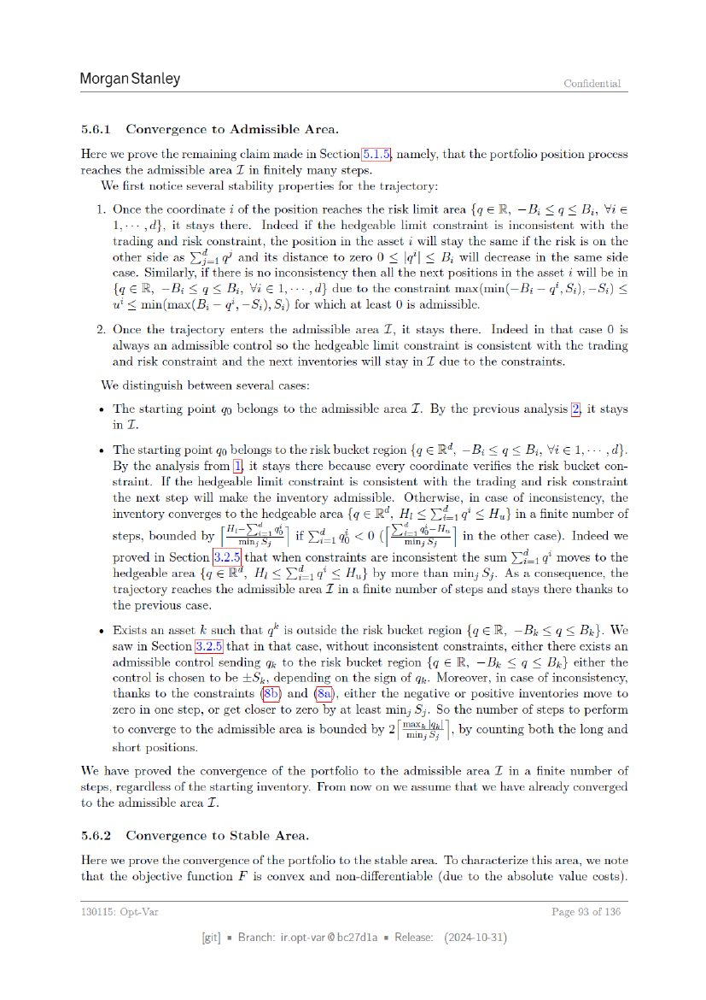

## 原文OCRテキスト

```text
Morgan Stanley                                                                                            Confidential


5.6.1      Convergence to Admissible Area.

Here we prove the remaining claim made in Sectio      3] namely, that the portfolio position process
reaches the admissible area T in finitely many steps.
    We first notice several stability properties for the trajectory:
   1. Once the coordinate i of the position reaches the risk limit area {q € R, —B; <q < Bi, Vie
            .d}, it stays there. Indeed if the hedgeable limit constraint is inconsistent with the
      trading and risk constraint, the position in the asset i will stay the same if the risk is on the
        other side as D4, q/ and its distance to zero 0 < |q'| < B; will decrease in the same side
        case. Similarly, if there is no inconsistency then all the next positions in the asset ¢ will be in
        {qe R, -B; <q < Bi, Vie 1,--- ,d} due to the constraint max(min(—B; — q', $;),—S;) <
        ué < min(max(B; — q', —S;),S;) for which at least 0 is admissible.
   2. Once the trajectory enters the admissible area Z, it stays there. Indeed in that case 0 is
      always an admissible control so the hedgeable limit constraint is consistent with the trading
        and risk constraint         and   the next   inventories will stay in Z due to the constraints.

    We distinguish between several cases:
   + The starting point qo belongs to the admissible area Z. By the previous analysi                           it stays
      in TZ.
   ¢ The starting point go belongs to the risk bucket region {q € R¢, —B; < q < Bi, Vie 1,--- ,d}.
     By the analysis from  [I] it stays there because every coordinate verifies the risk bucket con-
        straint.   If the hedgeable limit constraint is consistent with the trading and risk constraint
        the next: step will make the inventory admissible. Otherwise, in case of inconsistency, the
        inventory converges to the hedgeable area {q € R%, A < Sy                   ¢q' < Hu} ina finite number of
        steps, bounded by tee]                       if D4, ai <0 (Ee)              in the other case). Indeed we
        proved in Section [3.2.5]         that when constraints are inconsistent the sum 7,           q‘ moves to the
        hedgeable area {q €R%, Hi < 44 q' < Hu} by more than min, $;. As a consequence, the
        trajectory reaches the admissible area Z in a finite number of steps and stays there thanks to
        the previous case.
   + Exists an asset k such that q* is outside the risk bucket region {7                  €R, ~By <q < By}. We
                                5|that in that case, without       inconsistent constraints,    either there exists an
        admissible control sending qg to the risk bucket region {q € R, —By < q < Bg} either the
        control is chosen to be +5,, depending on the sign of gy. Moreover, in case of inconsistency,
        thanks to the constraints                           , either the negative or positive inventories move to
        zero in one step, or get closer to zero by at least minj $j. So the number of steps to perform
        to converge to the admissible area is bounded by 2p max.  gil
                                                             min, S, |; by counting both the long and
        short positions.
We have proved the convergence of the portfolio to the admissible area Z in a finite number of
steps, regardless of the starting inventory. From now on we assume that we have already converged
to the admissible area Z.
5.6.2      Convergence to Stable Area.

Here we prove the convergence of the portfolio to the stable area. To characterize this area, we note
that the objective function F is convex and non-differentiable (due to the absolute value costs).
130115: Opt-Var                                                                                         Page 93 of 136

                            [git] « Branch: iropt-var@be27d1a = Release:         (2024-10-31)
```

# ページ 094

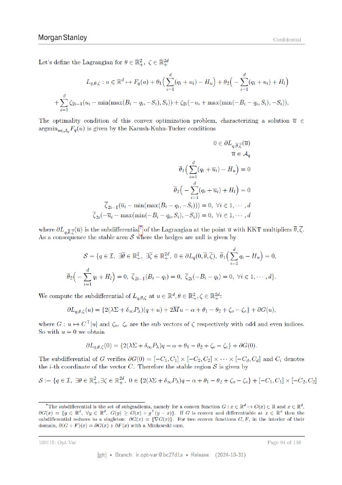

## 原文OCRテキスト

```text
Morgan Stanley                                                                                     Confidential


Let’s define the Lagrangian for 0 ¢ R2, ¢ < R24
                                                       d                                 d
                    Laog      ue RE      Fy(u) + a(S          +uj)— Hy) + 0( — Sai tui) + cn)
                                                      i=l                              i=1
          d
      +30 Gai-1(ui — min(max(B; — qi, —S1), Si) + Gai(—ui + max(min(—B;— qi, Si), -Si)),
         i=1

The optimality condition of this convex optimization problem, characterizing a solution 7 €
argmin,< 4, F,(u) is given by the Karush-Kuhn-Tucker conditions
                                                                            0c OL gaz)
                                                                                  wed,

                                                             a(S +%) ~ Hy) =0
                                                                a
                                                            ( - Sa        +%i) + Mi) =
                                                                i=l

                             Cxi-1Gi — min(max(B;— qi, —Si))) = 0, Vie Led
                        Coi(—% — max(min(—B; — q;,5;),—S;)) =0, Viel,                        d
where OL, 5,2(7) is the subdifferentia[’|of the Lagrangian at the point 7 with KKT multipliers 9,7.
As a consequence the stable area        S where the hedges are null is given by
                                                                                   d
                   S={qeT,            WER, Ke RY,            0€ 9L,(0,8,0), 8:( dai — Hu) =,
                                                                                 i=l
                    a
               B2(— vat Hy) = 0, Co           (Bi — gi) = 9, Coi(—Bi — 41) = 0, Vie 1,--- dh.
                   =
We compute the subdifferential of Lyg¢ at u € R4,0 € R2,¢ € R%:
          OL go.¢(u) = {2AE + bo0Py)(q+ uw) + 2M u — a + 61 — 02 + Co — Ge} + OG(u),
where G: ur C™u| and G, Ce are the sub vectors of ¢ respectively with odd and even indices.
So with u = 0 we obtain
                    OLq0,¢(0) = {2(AX + 6.Py)q — a + 01 — 02 + Go — Ge} + OG(0).
The subdifferential of G verifies IG(0) = [-C1,C] x [-C2, Cy] x «+» x [-Cy, Cy] and C; denotes
the i-th coordinate of the vector C. Therefore the stable region S is given by
S:= {qe T, WERL IC ERY, 0                   {AAU + bacPa)q
                                                       — @ + 1 — 02 + Co — Co} + [-C1, C1] x [-C2, C2]

   The subdifferential is the set of subgradients, namely for a convex function G: x € R¢++ G(x) € Rand rE R*,
OG(x) = {g € R*, Vy € R*, Gly) > G(x) +9" (y—=)}. If G is convex and differentiable at x € R* then the
subdifferential reduces to a singleton: 8G(x) = {VG(z)}. For two convex functions G,F, in the interior of their
domain, (G + F)(x) = 8G(x) + AF (x) with a Minkowski sum.


130115: Opt-Var                                                                                  Page 94 of 136

                           [git] « Branch: iropt-var@be27d1a = Release:     (2024-10-31)
```

# ページ 095

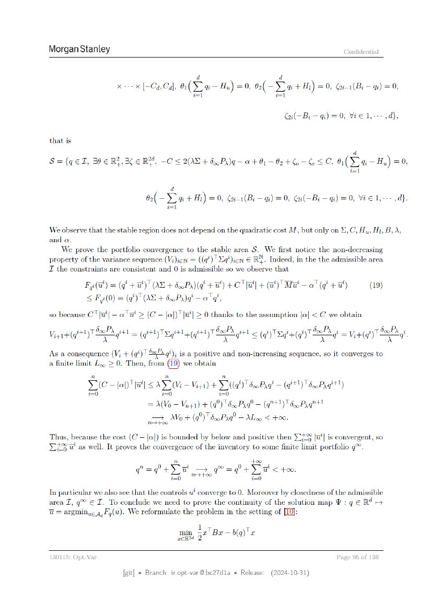

## 原文OCRテキスト

```text
Morgan Stanley                                                                                                Confidential


                        +x[-Ca, Ca], (Soa Hy) = 0, 02(- Sati)                                        =0, Cai-1(Bi
                                                                                                             — ai) = 0,
                                                                                 i=l


                                                                                       Qi(-Bi    — a) = 0, Vie 1,--- df,

that is
                                                                                                                 d
S={qeT, WER,
           AC ERY,                  —C< AL + 5.Py)q— a+ 01-0 +6- Ge SC, 0:(So4i—Hu)                                           =0
                                                                                                                i=1


                                     d

                             0o( = So ai + Mh) =0, G:-1(Bi
                                                       - ai) =0, Gi(-Bi
                                                                    - ai) =0, VEE 1, ,d}.
                                    i=l


We observe that the stable region does not depend on the quadratic cost M, but only on S,C, Hy, Hi, B, A,
and a.
   We prove the portfolio convergence to the stable area S. We first notice the non-decreasing
property of the variance sequence (Vi)ien = ((q°) 'Xq')iew € RY. Indeed, in the the admissible area
T the constraints are consistent and 0 is admissible so we observe that
            Fu @) = (9 +7)" (AD + dPa)(gi +H) + C7 | + (Mat                                     aT     (q+)            (19)
             S Fy(0) = (d/)"QE + bx0Ps)a' = 0%,
so because C {z'|
                — aa > (C — |a|)"|z"| > 0 thanks to the assumption |a| < C we obtain
      ‘   bxoP                    Sx0P}
Vag (ght) SAGth = (git)
                     Bg the (ght) SAG   < (g') "Ea Hg) Sgt
                                                        So0P_§
                                                               = Vira)iy T S00Ph
                                                                            Sat. i
As a consequence (V; + (q')' ®=4q"), is a positive and non-increasing sequence, so it converges to
a finite limit Ly > 0. Then, from        (19) we obtain

             yie- lal)" im       ADU (Vi— Visa) +                   ) baoPad’ ~ (q'*") "baoPaa'*)
                                                          i=0

                              = Ava = Vass)+ (9°) SooPra? = (a1) da0Paqhtt
                              norte V0 + (d?) "Sa0Pxa? = Mow < +00.
Thus, because the cost (C'— |a|) is bounded by below and positive then °° [z'| is convergent, so
TERT! as well. It proves the convergence of the inventory to some finite limit portfolio q®.
                                         n                                $00
                          g=P+d7
                           n_ 0  ai
                                    noe                   co _
                                                                Hd 0 + OT ai < too.
                                     i=0                                  i=0

In particular we also see that the controls u! converge to 0. Moreover by closedness of the admissible
area T, g®° € I. To conclude we need to prove the continuity of the solution map                         U : q ¢ R44
7 =argmin,¢4,F;(u). We reformulate the problem in the setting of [IQ]:

                                             nin,~ 50"
                                                   i+ Bur        O(a)"T
130115: Opt-Var                                                                                          Page 95 of 136

                      [git] « Branch: iropt-var@be27d1a = Release:              (2024-10-31)
```

# ページ 096

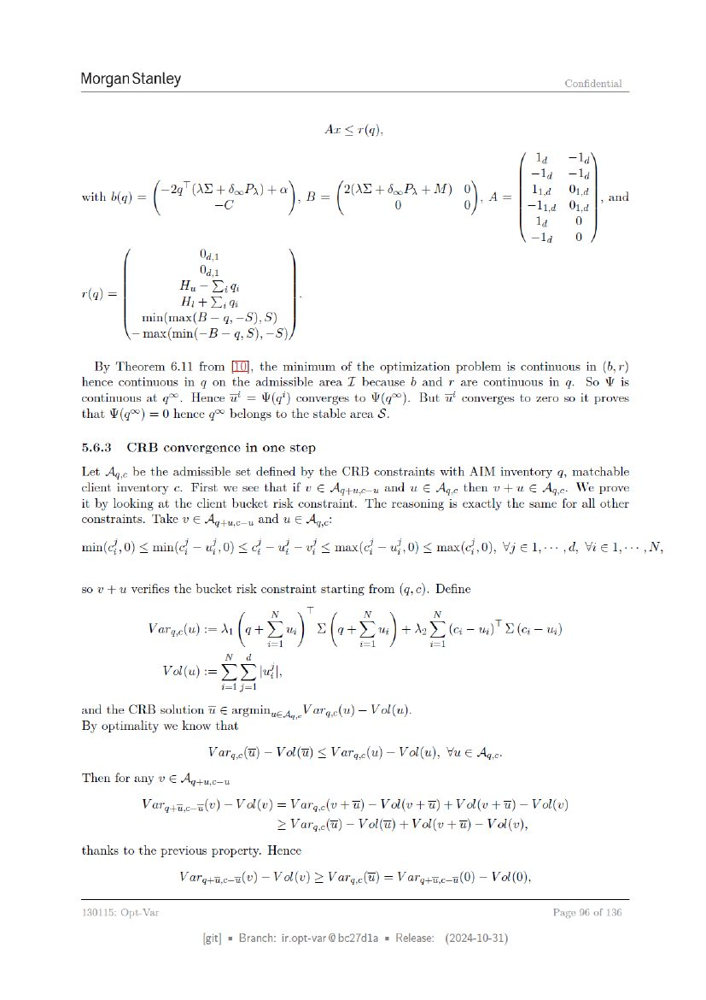

## 原文OCRテキスト

```text
Morgan Stanley                                                                                                 Confidential


                                                         Ax <1(q),
                                                                                                        da      -la
                                                                                                    la          -la
  5                29!
                    (AL + docPy)          +                 AD+ docPy +M)               0           1           0.
wath a) = (          a           Teh)           “), p=       (7          ra          gh      aa     tee         0 [ae
                                                                                                     la              0
                                                                                                    -la              0
                           0a1
                           0a1
         =            Hy
                       - Lit
r(@) =                M+     DiGi
               min(max(B — q,—S),$)
             —max(min(—B — q, S),—S)

   By Theorem 6.11 from [IQ], the minimum of the optimization problem is continuous in (b,r)
hence continuous in g on the admissible area Z because b and r are continuous in g. So W is
continuous at g~.        Hence @ = W(q') converges to V(g~).                  But @ converges to zero so it proves
that U(q®) = 0 hence q® belongs to the stable area S.

5.6.3.       CRB   convergence         in one step

Let Ag,- be the admissible set defined by the CRB constraints with AIM inventory g, matchable
client inventory c. First we see that if v € Agyu—u and u € Age then v + u € Aye. We prove
it by looking at the client bucket risk constraint. The reasoning is exactly the same for all other
constraints. Take v € Agyuc—u and u € Age:

min(c,0) < min(¢ — w,0) < ¢f — ul — u) < max(c — w!,0) < max(,0), ¥j                                €1,--- ,d, VEEL, N,

so v +u      verifies the bucket risk constraint starting from (q,c). Define
                                                   T
                                           N                      N             N
                Vargc(u) = M1 (: + y)                  z (: + y») +2) (eG — ui)’ Z(G ui)
                                  va      i=1                     i=l          i=1


                   Vol(u) = S> >> lui,
                                 i=1j=1
and the CRB solution @ € argminye 4, .Varge(                      —Vol(u).
By optimality we know that
                            Vargc(u) — Vol(t) < Vargc(u) — Vol(u), Yu € Age.
Then for any v € Agyu,c—u

               Vargyac—a(v) — Vol(v) = Varge(v + %) — Vol(v + %) + Vol(v + %) — Vol(v)
                                               > Varg,(@) — Vol(u) + Vol(v +a) — Vol(v),

thanks to the previous property. Hence
                      Varg+a,c-a(v) — Vol(v) > Vargc(t)                 = Varg+ac—a(0) — Vol(0),

130115: Opt-Var                                                                                              Page 96 of 136

                           [git] « Branch: iropt-var@be27d1a = Release:              (2024-10-31)
```

# ページ 097

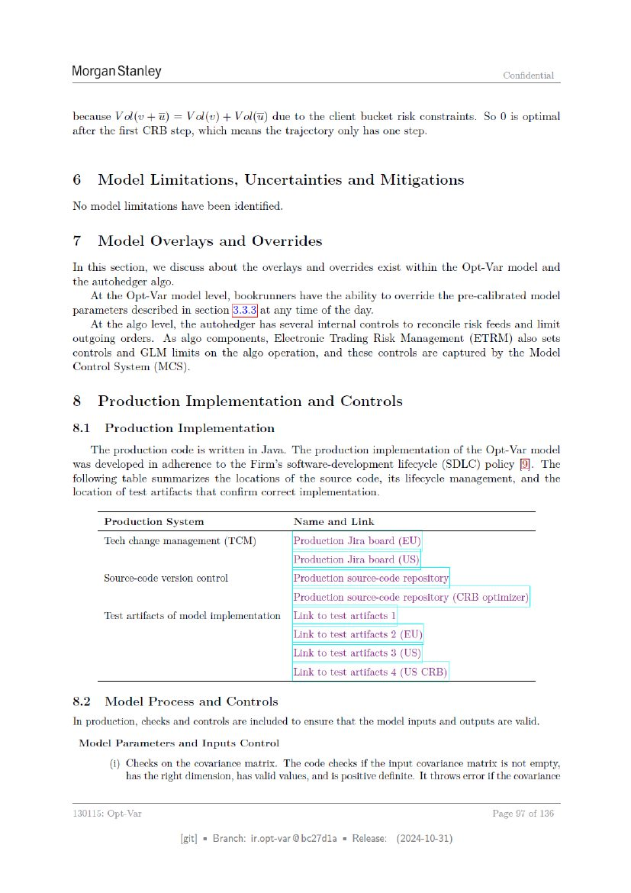

## 原文OCRテキスト

```text
Morgan Stanley                                                                                             Confidential


because Vol(v + 7) = Vol(v) + Vol(z) due to the client bucket risk constraints. So 0 is optimal
after the first CRB step, which means the trajectory only has one step.


6       Model        Limitations,           Uncertainties and Mitigations
No model limitations have been identified.


7       Model        Overlays and Overrides
In this section, we discuss about the overlays and overrides exist within the Opt-Var model and
the autohedger algo.
    At the Opt-Var model level, bookrunners have the ability to override the pre-calibrated model
parameters described in section              [3.3.3|at any time of the day.
       At the algo level, the autohedger has several internal controls to reconcile risk feeds and limit
outgoing orders.        As algo components, Electronic Trading Risk Management                        (ETRM)   also sets
controls and GLM limits on the algo operation, and these controls are captured by the Model
Control System (MCS).

8       Production            Implementation                 and     Controls

8.1.      Production Implementation
    The production code is written in Java. The production implementation of the Opt-Var model
was developed in adherence to the Firm’s software-development lifecycle (SDLC) policy [J]. The
following table summarizes the locations of the source code, its lifecycle management, and the
location of test artifacts that confirm         correct    implementation.


         Production      System                           Name     and   Link

         Tech change management (TCM)                     Production Jira board (BU)
                                                          Production Jira board (US)
         Source-code version control                      Production source-code repository|
                                                          Production source-code repository (CRB optimizer)
         Test artifacts of model implementation           Link to test artifacts   1

                                                          Link to test artifacts 2 (BU)
                                                          Link to test artifacts 3 (US)
                                                          Link to test artifacts 4 (US CRB)

8.2       Model Process and Controls
In production, checks and controls are included to ensure that the model inputs and outputs are valid.
    Model    Parameters     and Inputs    Control

            (i) Checks on the covariance matrix. The code checks if the input covariance matrix is not empty,
                has the right dimension, has valid values, and is positive definite. It throws error if the covariance

130115: Opt-Var                                                                                          Page 97 of 136

                            [git] « Branch: iropt-var@be27d1a = Release:               (2024-10-31)
```

# ページ 098

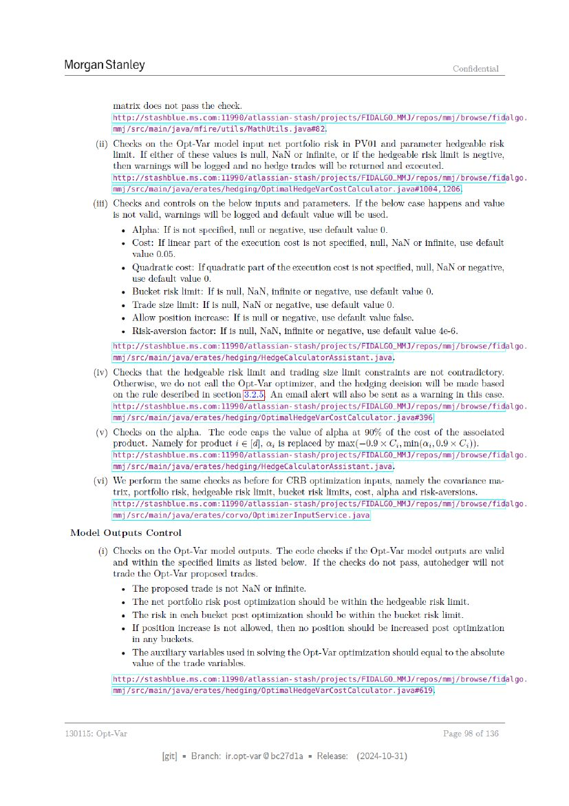

## 原文OCRテキスト

```text
Morgan Stanley                                                                                      Confidential


            matrix does not pass the check.
            http: //stashblue.ms. com:11990/atlassian- stash/projects/FIDALGO_MMJ/repos/mmj/browse/fidalgo.
            mmj /src/main/java/mfire/utils/MathUtils. java#82)
       (i) Checks on the Opt-Var model input net portfolio risk in PVO1 and parameter hedgeable risk
           limit. If either of these values is null, NaN or infinite, or if the hedgeable risk limit is negtive,
           then warnings will be logged and no hedge trades will be returned and executed.
            (http: //stashblue.ms .com:11990/atlassian- stash/projects/FIDALGO_MMJ/repos/mmj/browse/fidalgo.
            [mmj /src/main/java/erates/hedging/OptimalHedgeVarCost  Calculator. java#1004, 1206,
            Checks and controls on the below inputs and parameters. If the below case happens and value
            is not valid, warnings will be logged and default value will be used.
               + Alpha: If is not specified, null or negative, use default value 0.
               + Cost: If linear part of the execution cost is not specified, null, NaN or infinite, use default
                  value 0.05.
               + Quadratic cost: If quadratic part of the execution cost is not specified, null, NaN or negative,
                  use default value 0.
               + Bucket risk limit: If is null, NaN, infinite or negative, use default value 0.
               + Trade size limit: If is null, NaN or negative, use default value 0.
               + Allow position increase: If is null or negative, use default value false.
               + Risk-aversion factor: If is null, NaN, infinite or negative, use default value 4e-6.
           (http: //stashblue.ms .com:11990/atlassian- stash/projects/FIDALGO_MMJ/repos/mmj/browse/fidalgo.
           |mmj /src/main/java/erates/hedging/HedgeCalculatorAssistant. java|
       (iv) Checks that the hedgeable risk limit and trading size limit constraints are not contradictory.
            Otherwise, we do not call the Opt-Var optimizer, and the hedging decision will be made based
            on the rule described in section     An email alert will also be sent as a warning in this case.
           {http://stashblue.ms.com:11990/atlassian- stash/projects/FIDALGO_MMJ/repos/mmj/browse/fidalgo.
           mj /src/main/java/erates/hedging/OptimalHedgeVarCostCalculator.   java#396|
       (v) Checks on the alpha.     The code caps the value of alpha at 90% of the cost of the associated
            product. Namely for product é € [d], @, is replaced by max(—0.9 x C,, min(a,,0.9 x C,)).
            (http://stashblue.ms .com:11990/atlassian- stash/projects/FIDALGO_MMJ/repos/mmj/browse/fidalgo.
            |nmj /src/main/java/erates/hedging/HedgeCalculatorAssistant. java|
       (vi) We perform the same checks as before for CRB optimization inputs, namely the covariance ma-
            trix, portfolio risk, hedgeable risk limit, bucket risk limits, cost, alpha and risk-aversions.
            http: //stashblue.ms. com:11990/atlassian- stash/projects/FIDALGO_MMJ/repos/mmj/browse/fidalgo.
            inmj /src/main/java/erates/corvo/Optimizer InputService . java|
 Model Outputs Control
        (i) Checks on the Opt-Var model outputs. The code checks if the Opt-Var model outputs are valid
            and within the specified limits as listed below. If the checks do not pass, autohedger will not
            trade the Opt-Var proposed trades.
              + The proposed trade is not NaN or infinite.
              + The net portfolio risk post optimization should be within the hedgeable risk limit.
              + The risk in each bucket post optimization should be within the bucket risk limit.
              « If position increase is not allowed, then no position should be increased post optimization
                in any buckets.
              + The ausiliary variables used in solving the Opt-Var optimization should equal to the absolute
                value of the trade variables.
            http: //stashblue.ms. com:11990/atlassian- stash/projects/FIDALGO_MMJ/repos/mmj/browse/fidalgo.
            nmj /src/main/java/erates/hedging/OptimalHedgeVarCost  Calculator. java#619)


130115: Opt-Var                                                                                   Page 98 of 136

                        [git] * Branch: r.opt-var@bc27d1a = Release: (2024-10-31)
```

# ページ 099

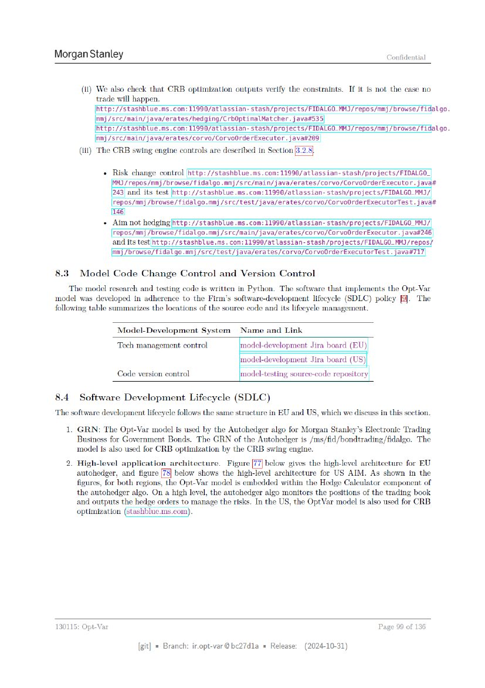

## 原文OCRテキスト

```text
Morgan Stanley                                                                                        Confidential


           (ii) We also check that CRB optimization outputs verify the constraints. If it is not the case no
               trade will happen.
               http: //stashblue.ms. com:11990/atlassian- stash/projects/FIDALGO_MMJ/repos/mmj/browse/fidalgo.
               inmj /src/main/java/erates/hedging/CrbOptimalMat   cher. java#535|
               inttp: //stashblue. ms. com:11990/atlassian- stash/projects/FIDALGO_MMJ/repos/mmj/browse/fidalgo.
               mmj /src/main/java/erates/corvo/CorvoOrderExecutor.     java#209|
          (ili) The CRB swing engine controls are described in Sectior
                 «   Risk change control /http: //stashblue.ms.com:11990/atlass ian-stash/projects/FIDALGO_|
                     MM3 /repos /mmj/browse/fidalgo .mnj/src/main/java/erates/corvo/CorvoOrderExecutor.   java#
                      243 and its test http://stashblue .ms.com:11990/atlassian- stash/projects/FIDALGO_MMJ/
                     (repos /mmj /browse/fidalgo.mmj /src/test/java/erates/corvo/CorvoOrderExecutorTest.  java#

                 « Aim not hedging|http://stashblue .ms .com:11990/atlassian- stash/projects/FIDALGO_MMJ/|
                     {repos/mmj /browse/fidalgo.mmj /src/main/java/erates/corvo/CorvoOrderExecutor. java#246|
                     and its test|ht tp: //s tashblue.ms . com: 11990/at lassian- stash/projects/FIDALGO_MMJ/repos/
                     {nmj /browse/fidalgo.mmj /src/test/java/erates/corvo/CorvoOrderExecutorTest. java#717)

8.3       Model      Code Change         Control and Version Control
    The model research and testing code is written in Python. The software that implements the Opt-Var
model was developed in adherence to the Firm’s software-development lifecycle (SDLC) policy [J]. The
following table summarizes the locations of the source code and its lifecycle management.
                        Model-Development      System      Name and Link
                      Tech management control              model-development    Jira board (EU)
                                                           model-development Jira board (US)
                      Code version control                 model-testing source-code repository

8.4.      Software Development Lifecycle (SDLC)
The software development lifecycle follows the same structure in EU and US, which we discuss in this section.

       1. GRN: The Opt-Var model is used by the Autohedger algo for Morgan Stanley’s Electronic Trading
          Business for Government Bonds. The GRN of the Autohedger is /ms/fid/bondtrading/fidalgo. The
          model is also used for CRB optimization by the CRB swing engine.
       2. High-level application architecture. Figure [77] below gives the high-level architecture for EU
          autohedger, and figure [78] below shows the high-level architecture for US AIM. As shown in the
          figures, for both regions, the Opt-Var model is embedded within the Hedge Calculator component of
          the autohedger algo. On a high level, the autohedger algo monitors the positions of the trading book
          and outputs the hedge orders to manage the risks. In the US, the OptVar model is also used for CRB
         optimization    (stashblue.ms.com).


130115: Opt-Var                                                                                    Page 99 of 136

                            [git] « Branch: iropt-var@be27d1a = Release:       (2024-10-31)
```

# ページ 100


## 原文OCRテキスト

```text
Morgan Stanley                                                                         Confidential


                                                          Done Hedge Trades:


                           Figure 77: Autohedger Diagram (EU)


130115: Opt-Var                                                                     Page 100 of 136

                  [git] « Branch: iropt-var@be27d1a = Release:       (2024-10-31)
```

# ページ 101

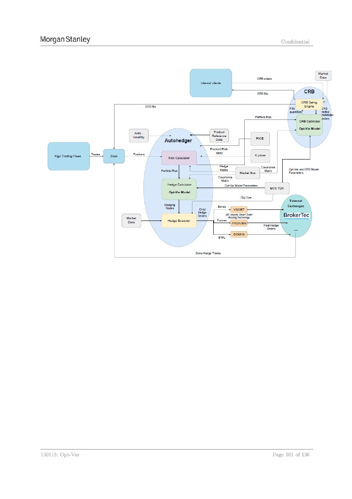

## 原文OCRテキスト

```text
Morgan Stanley                                                         Confidential


  mn ee           vy


                       i
                           |
                                        one


                                       rotons]
                                                   ca


                                                 Las
                                                        |   vee |


                                                              Commaree | | operandMe


                           \
                               \
                                   \


130115: Opt-Var                                                     Page 101 of 136
```

# ページ 102

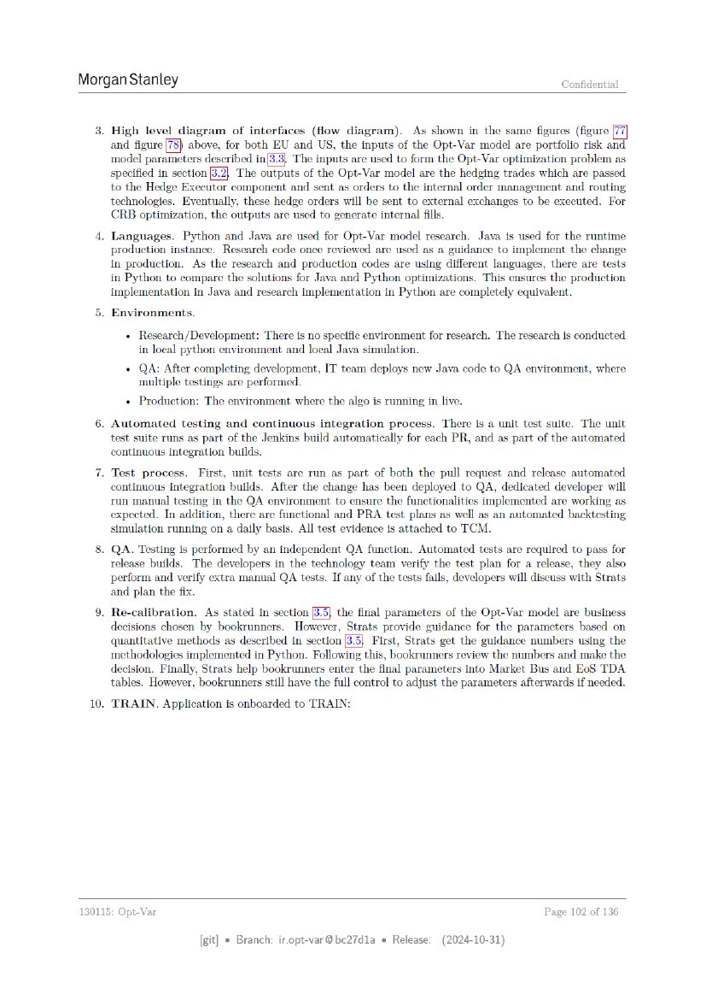

## 原文OCRテキスト

```text
Morgan Stanley                                                                                   Confidential


   3. High level diagram of interfaces (Bow diagram).              As shown in the same figures (figur

      specified in section {3.3} The outputs of the Opt-Var model are the hedging trades which are passed
      to the Hedge Executor    component and sent as orders to the internal order management and routing
      technologies. Eventually, these hedge orders will be sent to external exchanges to be executed. For
      CRB optimization, the outputs are used to generate internal fills.
   4. Languages. Python and Java are used for Opt-Var model research. Java is used for the runtime
      production instance. Research code once reviewed are used as a guidance to implement the change
      in production. As the research and production codes are using different languages, there are tests
      in Python to compare the solutions for Java and Python optimizations. This ensures the production
      implementation in Java and research implementation in Python are completely equivalent.
   5. Environments.

         + Research/Development: There is no specific environment for research. The research is conducted
           in local python environment and local Java simulation.
         + QA: After completing development, IT team deploys new Java code to QA environment, where
            multiple testings are performed.
         + Production: The environment where the algo is running in live.
   6. Automated testing and continuous integration process. There is a unit test suite. The unit
      test suite runs as part of the Jenkins build automatically for each PR, and as part of the automated
      continuous integration builds.
   7. Test process.     First, unit tests are run as part of both the pull request and release automated
      continuous integration builds, After the change has been deployed to QA, dedicated developer will
      run manual testing in the QA environment to ensure the functionalities implemented are working as
      expected. In addition, there are functional and PRA test plans as well as an automated backtesting
      simulation running on a daily basis. All test evidence is attached to TCM.
   8. QA. Testing is performed by an independent QA function. Automated tests are required to pass for
      release builds. The developers in the technology team verify the test plan for a release, they also
      perform and verify extra manual QA tests. If any of the tests fails, developers will discuss with Strats
      and plan the fix.
   9. Re-calibration. As stated in section [3.5} the final parameters of the Opt-Var model are business
      decisions chosen by bookrunners. However, Strats provide guidance for the parameters based on
      quantitative methods as described in section         First, Strats get the guidance numbers using the
      methodologies implemented in Python. Following this, bookrunners review the numbers and make the
      decision. Finally, Strats help bookrunners enter the final parameters into Market Bus and EoS TDA
      tables. However, bookrunners still have the full control to adjust the parameters afterwards if needed.
  10. TRAIN. Application is onboarded to TRAIN:


130115: Opt-Var                                                                               Page   102 of 136

                         [git] « Branch: iropt-var@be27d1a = Release:      (2024-10-31)
```

# ページ 103

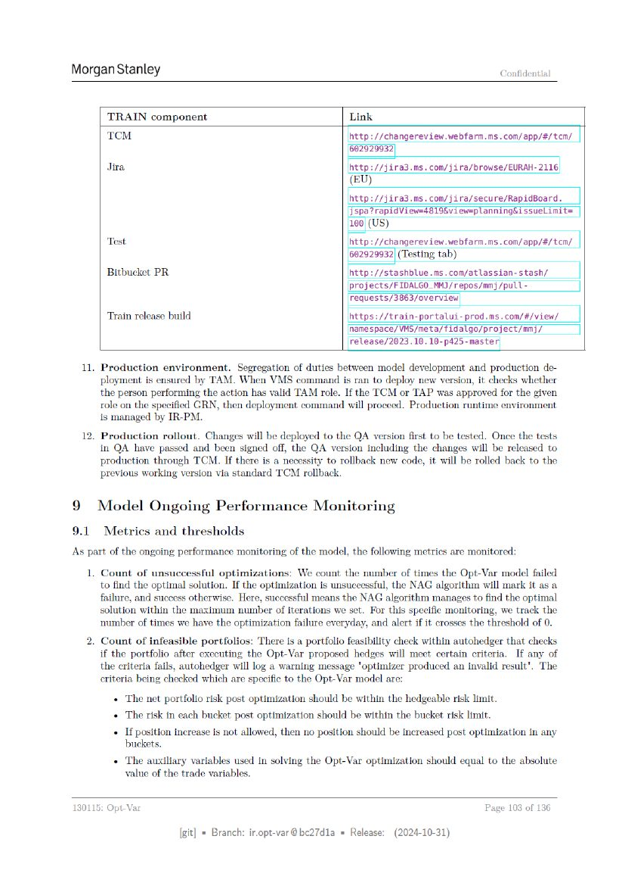

## 原文OCRテキスト

```text
Morgan Stanley                                                                                       Confidential


          TRAIN     component                                    Link

          TCM                                                    |http ://changereview.webfarm.ms .com/app/#/tcm/   ]
                                                                 602929932
          Jira,                                                  http: //jira3.ms. com/jira/browse/EURAH-2116
                                                                 (EU)
                                                                 |nttp://jira3.ms.com/jira/secure/RapidBoard.
                                                                 jspa?rapidView=48196view=planningSissueLimit= |
                                                                 100 (US)
          Test                                                   http: //changereview.webfarm.ms .com/app/#/tcm/
                                                                 602929932| (Testing tab)
          Bitbucket PR.                                          http: //stashblue.ms.com/atlassian-stash/          ]
                                                                 [proj ects/FIDALGO_MMJ/repos/mmj/pull-             ]
                                                                 requests/3863/overview
          Train release build                                    https://train-portalui-prod.ms.com/#/view/         ]
                                                                 {name space/VMS/meta/fidalgo/project/mmj/          ]
                                                                 release/2023. 10. 10-p425-master|

    11. Production environment. Segregation of duties between model development and production de-
        ployment is ensured by TAM. When VMS command is ran to deploy new version, it checks whether
        the person performing the action has valid TAM role. If the TCM or TAP was approved for the given
        role on the specified GRN, then deployment command will proceed. Production runtime environment
        is managed by IR-PM.
    12. Production rollout. Changes will be deployed to the QA version first to be tested. Once the tests
        in QA have passed and been signed off, the QA version including the changes will be released to
        production through TCM. If there is a necessity to rollback new code, it will be rolled back to the
        previous working version via standard TCM rollback.

9       Model       Ongoing Performance Monitoring
9.1      Metrics and thresholds
As part of the ongoing performance monitoring of the model, the following metrics are monitored:
   1. Count of unsuccessful optimizations: We count the number of times the Opt-Var model failed
       to find the optimal solution. If the optimization is unsuccessful, the NAG algorithm will mark it as a
       failure, and success otherwise. Here, successful means the NAG algorithm manages to find the optimal
         solution within the maximum number of iterations we set. For this specific monitoring, we track the
         number of times we have the optimization failure everyday, and alert if it crosses the threshold of 0.
      2. Count of infeasible portfolios: There is a portfolio feasibility check within autohedger that checks
         if the portfolio after executing the Opt-Var proposed hedges will meet certain criteria. If any of
         the criteria fails, autohedger will log a warning message "optimizer produced an invalid result". The
         criteria being checked which are specific to the Opt-Var model are:
             + The net portfolio risk post optimization should be within the hedgeable risk limit.
             + The risk in each bucket post optimization should be within the bucket risk limit.
            + If position increase is not allowed, then no position should be increased post optimization in any
              buckets.
            + The auxiliary variables used in solving the Opt-Var optimization should equal to the absolute
              value of the trade variables.

130115: Opt-Var                                                                                 Page   103 of 136

                           [git] « Branch: iropt-var@be27d1a = Release:     (2024-10-31)
```

# ページ 104


## 原文OCRテキスト

```text
Morgan Stanley                                                                                                          Confidential


          In our monitoring test, we count the number of times we see the warning message on a daily basis,
          and alert if it crosses the threshold of 0.
      3. Count of trades with size above limit: The trade size proposed by the Opt-Var model should be
         within the specified trade size limit. For monitoring purpose, we check the number of trades proposed
         by Opt-Var that exceeded the trade size limit on a daily basis. We are alerted if the number of
         violations crosses the threshold of 0.
      The breach criteria of the metrics are as the following:
      +   Count    of unsuccessful     optimizations:         If the   count   crosses   the   threshold   on   three    consecutive
        business days.
      + Count of infeasible portfolios: If the count crosses the threshold on three consecutive business
        days.
      +   Count   of trades    with   size   above   limit:    If the count    crosses the threshold       on three consecutive
          business days.
For CRB optimization, we report the count of unsuccessful optimizations and count of infeasible portfolios
metrics. The trade size constraint is not used in CRB hence is not part of the monitoring. The breach
criteria are the same for CRB. This corresponds to the segment US_CRB.

                  below summarizes the ongoing monitoring metadata.


9.2       Escalation
Upon breach of the criteria for any of the three metrics, the model developers will send a notification to
MRM as soon as possible but within 1 week. The notification will include information on the trigger and
the explanation of the reason of the trigger. If remediation or any action is required, model developers need
to let MRM know the associated actions taken to remediate the trigger. The review of the triggers as well
as the conclusions will be presented to MRM within 6 weeks. If for any reason the notification on threshold
breach or the conclusion are not going to be sent within the deadline, MRM is notified prior to the deadline
and Strats provide a new expected deadline for the completion of the action.

9.3       Data shared with MRM
Strategically, the plan is to make data available to MRM through Invigilator. Feasibility and details are to.
be determined. The plan is detailed below:

Phased plan for automation, breach escalation and data availability:
   + Phase 1:
             — Performance monitoring report is automatically gencrated daily and sent to Strats.
           ~— CSV file with breaches automatically generated daily for Invigilator to read.
           ~ Based on the breaches in the daily performance report, Strats escalate to MRM.
           — Strats generate and send the pdf report to MRM quarterly (see figure [S0Jas an example for EU).
           ~ Strats provide CSV file with data to MRM along with quarterly report.
      + Phase 2:
           ~ Invigilator reads and displays the model in its GUI.
           ~ Invigilator reads data metrics and displays data breaches in GUI.
           ~ Invigilator has dedicated MRM-role level access/view permissions.

130115: Opt-Var                                                                                                  Page     104 of 136

                              [git] « Branch: iropt-var@be27d1a = Release:               (2024-10-31)
```

# ページ 105

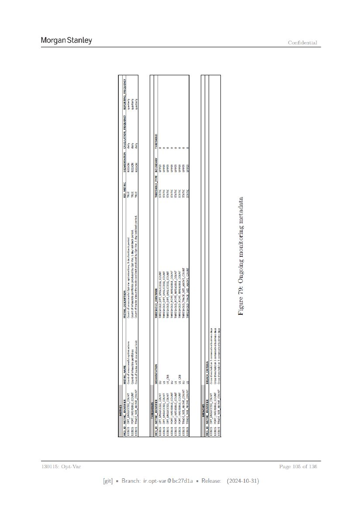

## 原文OCRテキスト

```text
Morgan Stanley


                                       EEEEEEES                       &
                                       ag                             °


                 [git] » Branch: ir.opt-var @be27d1a » Release:   (2024-10-31)
```

# ページ 106

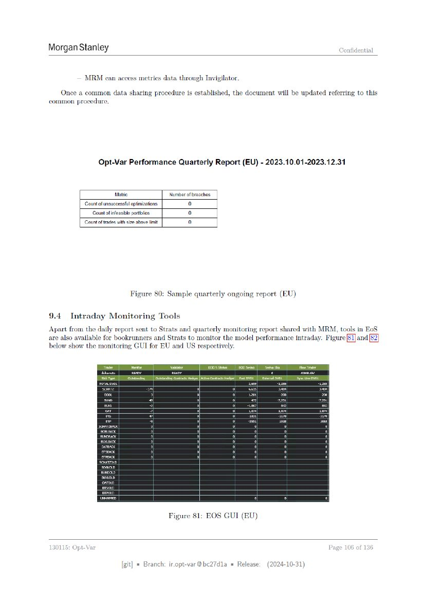

## 原文OCRテキスト

```text
Morgan Stanley                                                                                                              Confidential


        — MRM can access metrics data through Invigilator.
   Once a common data sharing procedure is established, the document will be updated referring to this
common procedure.


                   Opt-Var Performance Quarterly Report (EU) - 2023.10.01-2023.12.31


                            Metnc                    Number of breaches
            Count of unsuccessful optimizations              0
                Count of infeasible portfolios               0
            Count  of trades with size above limit           0


                                    Figure 80: Sample quarterly ongoing report (EU)

9.4    Intraday Monitoring Tools
Apart from the daily report sent to Strats and quarterly monitoring report shared with MRM, tools in EoS
are also available for bookrunners and Strats to monitor the model performance intraday. Figure [ST]and
below show the monitoring GUI for EU and US respectively.

                                                                          eoDssans | E00 Swing | Suna ea     How Trader
                    Rak Tipe


                                                     Figure 81: EOS GUI (EU)

130115: Opt-Var                                                                                                           age 106
                                                                                                                                of 136

                               [git] » Branch: ir.opt-var @be27d1a » Release:                      (2024-10-31)
```

# ページ 107

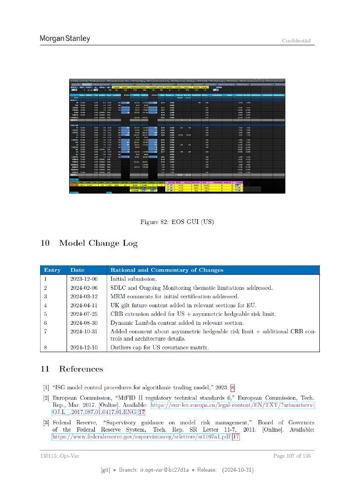

## 原文OCRテキスト

```text
Morgan Stanley                                                                                                   Confidential


                                            Figure 82: EOS GUI (US)

10      Model          Change         Log


                                Rational and Commentary of Changes
 1            2023-12-06       Initial submission.
 2            2024-02-06     | SDLC and Ongoing Monitoring thematic limitations addressed.
 3            2024-03-12       MRM     comments      for initial certification addressed.
 4            2024-04-11 | UK gilt future content added in relevant sections for EU.
 5            2024-07-25 | CRB extension added for US + asymmetric hedgeable risk limit.
 6            2024-08-30 | Dynamic Lambda content added in relevant section.
 7            2024-10-31 | Added comment about asymmetric hedgeable risk limit + additional CRB con-
                               trols and architecture details.
 8            2024-12-10       Outliers cap for US covariance matrix.


11      References

 [1] “ISG model control procedures for algorithmic trading model,” 2023.
 [2] European Commission, “MiFID II regulatory technical standards 6,” European Commission, Tech.
     Rep., Mar. 2017. [Online]. Available: {https: //eur-lex.europa.eu/legal-content
                                                                             /EN/TXT      /?uri=uriserv:]
     OJ.L_.2017.087.01.0417.01-ENG)[T

 [3] Federal Reserve,        “Supervisory guidance on model risk management,”                       Board of Governors
     of the       Federal   Reserve    System,    Tech.     Rep.    SR    Letter   11-7,    2011.    [Online].      Available:
     (https: / /www.federalreserve.gov /supervisionreg/srletters/sr1107a1.pdf|

130115: Opt-Var                                                                                           Page     107 of 136

                            [git] » Branch: ir.opt-var @be27d1a » Release:         (2024-10-31)
```

# ページ 108

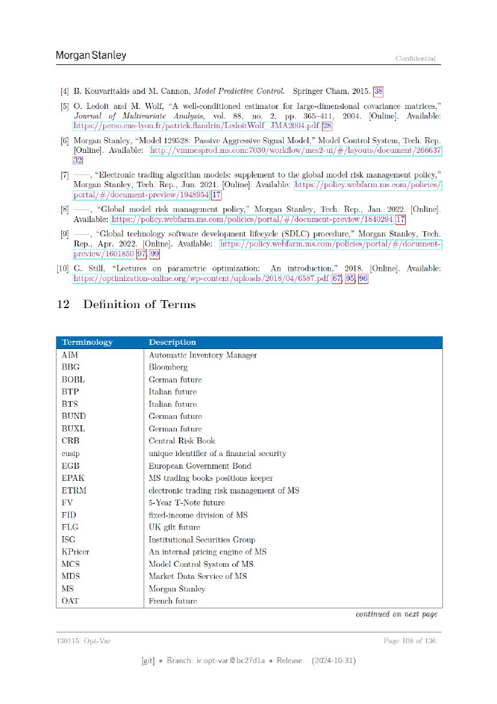

## 原文OCRテキスト

```text
Morgan Stanley                                                                                     Confidential


 [4] B. Kouvaritakis and M. Cannon, Model Predictive Control. Springer Cham, 2015.
 [5] O. Ledoit and M. Wolf, “A well-conditioned estimator for large-dimensional covariance matrices,”
     Journal of Multivariate Analysis, vol. 88, no. 2, pp. 365-411, 2004. [Online]. Available:
     [https://perso.ens-lyon.fr/patrick flandrin /Ledoit Wolf _JMA2004.pdf]23|
 [6] Morgan Stanley, “Model 129528: Passive Aggressive Signal Model,” Model Control System, Tech. Rep.
     [Online]. Available: http: //vmmesprod .ms.com:7030/workflow       /mes2-ui/# layouts /document /266637|
     B2]
 [7] —, “Electronic trading algorithm models: supplement to the global model risk management policy,”
      Morgan Stanley, Tech. Rep., Jun, 2021.    [Online]. Available: |https://policy.webfarm.ms.com/policies/|
     {portal /#/document-preview /194895.
 [8] ——, “Global model risk management policy,” Morgan Stanley, Tech. Rep., Jan. 2022. [Online].
     Available: [https://policy.webfarm.ms.com
                                             /policies /portal/#/document-preview /1840204[17|
 [9] ——, “Global technology software development lifecycle (SDLC) procedure,” Morgan Stanley, Tech.
     Rep., Apr. 2022. [Online]. Available: https: //policy.webfarm.ms.com /policies/portal/#/document-]
      preview /1601850
[10] G. Still, “Lectures on parametric optimization: An introduction,” 2018. [Online]. Available:
     (https: //optimization-online.org/wp-content /uploads/2018/04/6587. pdf|

12         Definition of Terms


                           I      ption
                           Automatic Inventory Manager
                           Bloomberg
                          German future
                          Ttalian future
                          Ttalian future
                          German future
                          German future
                          Central Risk Book
                          unique identifier of a financial security
                          European Government Bond
                          MS trading books positions keeper
                          electronic trading risk management of MS
                          5-Year T-Note future
                          fixed-income division of MS
                          UK gilt future
                          Institutional Securities Group
                          ‘An internal pricing engine of MS
                          Model Control System of MS
                          Market Data Service of MS
                          Morgan Stanley
 OAT                      French future
                                                                                        continued on next page

130115:    Opt-Var                                                                             Page   108 of 136

                         [git] « Branch: iropt-var@be27d1a = Release:    (2024-10-31)
```

# ページ 109

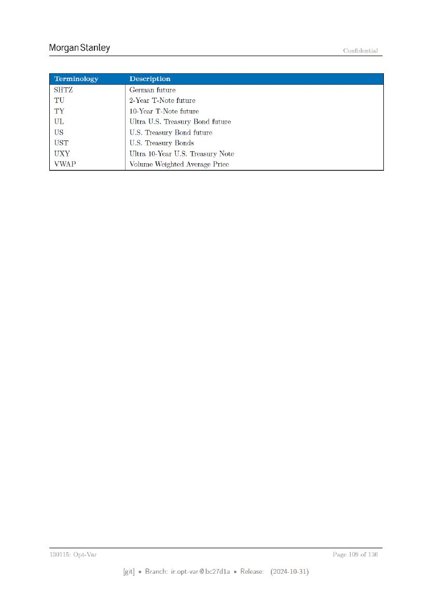

## 原文OCRテキスト

```text
Morgan Stanley                                                                        Confidential


Terminology          Description
SHTZ                 German future
TU                   2-Year T-Note future
TY                   10-Year T-Note future
UL                   Ultra US. Treasury Bond future
us                   U.S. Treasury Bond future
UST                  USS. Treasury Bonds
UXY                  Ultra 10-Year U.S. Treasury Note
VWAP                 Volume Weighted Average Price


130115:   Opt-Var                                                                  Page   109 of 136

                    [git] = Branch: ir.opt-var@bc27d1a = Release:   (2024-10-31)
```

# ページ 110

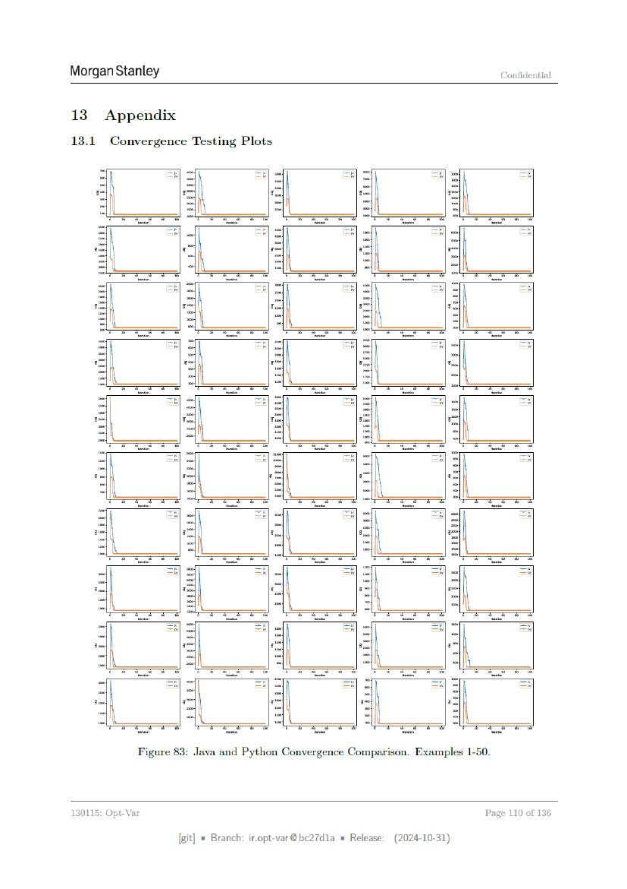

## 原文OCRテキスト

```text
Morgan Stanley                                                                             Confidential


13.     Appendix
13.1.    Convergence        Testing Plots


                                                                  ae
                                                                   =)


                  Figure 83: Java and Python Convergence Comparison. Examples 1-50.


130115: Opt-Var                                                                         Page 110 of 136

                         [git] = Branch: ir.opt-var@bc27d1a = Release:   (2024-10-31)
```

# ページ 111

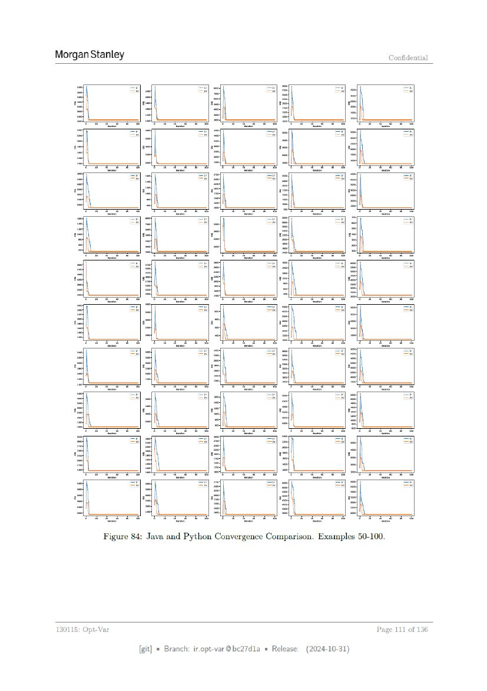

## 原文OCRテキスト

```text
Morgan Stanley                                                                          Confidential


              Figure 84: Java and Python Convergence Comparison. Examples 50-100.


130115: Opt-Var                                                                      Page 111 of 136

                      [git] = Branch: ir.opt-var@bc27d1a = Release:   (2024-10-31)
```

# ページ 112

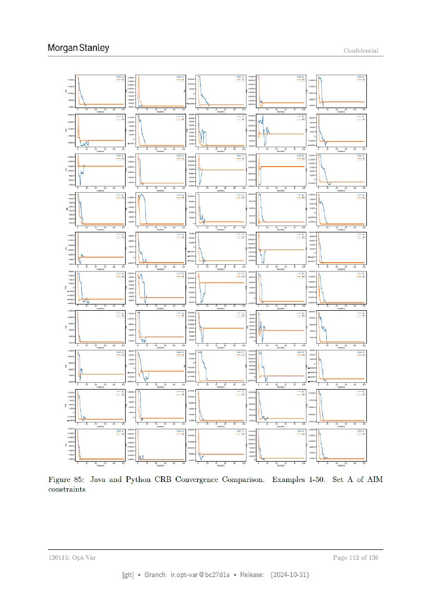

## 原文OCRテキスト

```text
Morgan Stanley                                                                       Confidential


Figure 85: Java and Python CRB Convergence Comparison.             Examples 1-50. Set A of AIM
constraints


130115:   Opt-Var                                                                 Page   112 of 136

                    [git] « Branch: iropt-var@be27d1a = Release:   (2024-10-31)
```

# ページ 113

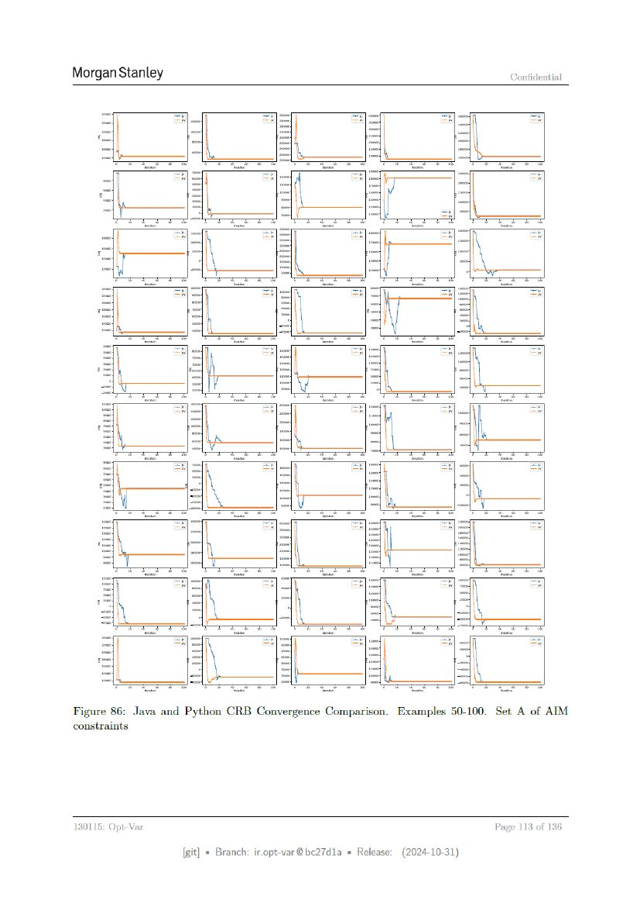

## 原文OCRテキスト

```text
Morgan Stanley                                                                       Confidential


Figure 86: Java and Python CRB Convergence Comparison. Examples 50-100. Set A of AIM
constraints


130115:   Opt-Var                                                                 Page   113   of 136

                    [git] « Branch: iropt-var@be27d1a = Release:   (2024-10-31)
```

# ページ 114


## 原文OCRテキスト

```text
Morgan Stanley                                                                       Confidential


Figure 87: Java and Python CRB Convergence Comparison.             Examples 1-50. Set B of AIM
constraints


130115:   Opt-Var                                                                 Page   114 of 136

                    [git] « Branch: iropt-var@be27d1a = Release:   (2024-10-31)
```

# ページ 115

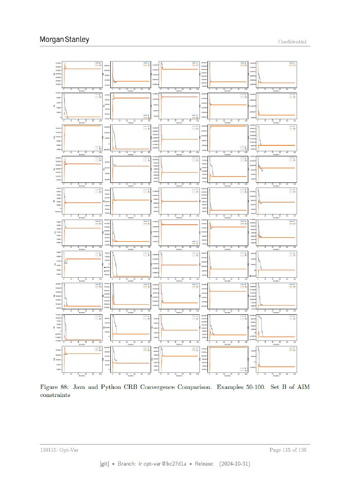

## 原文OCRテキスト

```text
Morgan Stanley                                                                     Confidential


Figure 88: Java and Python CRB Convergence Comparison. Examples 50-100. Set B of AIM
constraints


130115: Opt-Var                                                                 Page 115 of 136
                  [git] « Branch: iropt-var@be27d1a = Release:   (2024-10-31)
```

# ページ 116

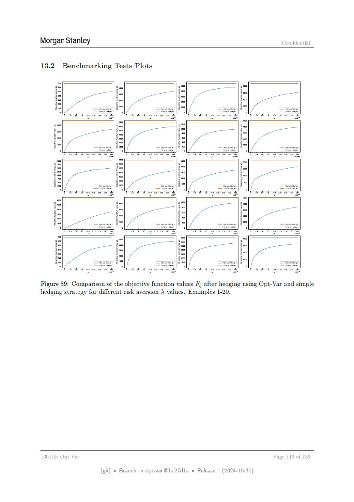

## 原文OCRテキスト

```text
Morgan Stanley                                                                        Confidential


13.2     Benchmarking Tests Plots


Figure 89: Comparison of the objective function values Fy after hedging using Opt-Var and simple
hedging strategy for different risk aversion \ values. Examples 1-20.


130115: Opt-Var                                                                    Page 116 of 136

                     [git] « Branch: iropt-var@be27d1a = Release:   (2024-10-31)
```

# ページ 117

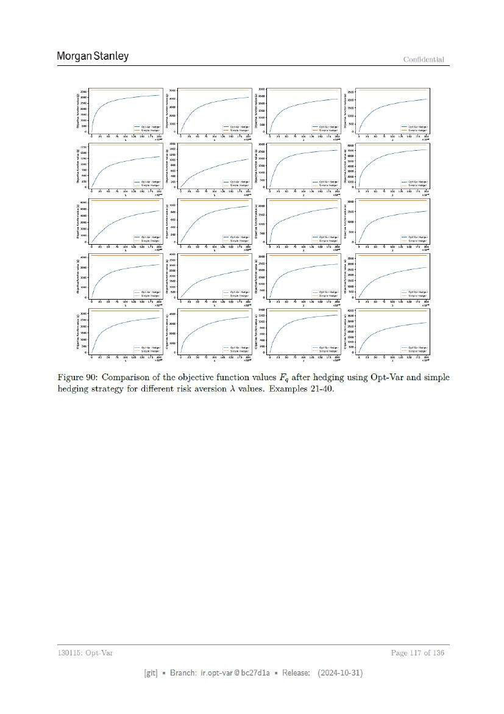

## 原文OCRテキスト

```text
Morgan Stanley                                                                        Confidential


Figure 90: Comparison of the objective function values F, after hedging using Opt-Var and simple
hedging strategy for different risk aversion \ values. Examples 21-40.


130115:   Opt-Var                                                                  Page   117 of 136


                     [git] « Branch: iropt-var@be27d1a = Release:   (2024-10-31)
```

# ページ 118

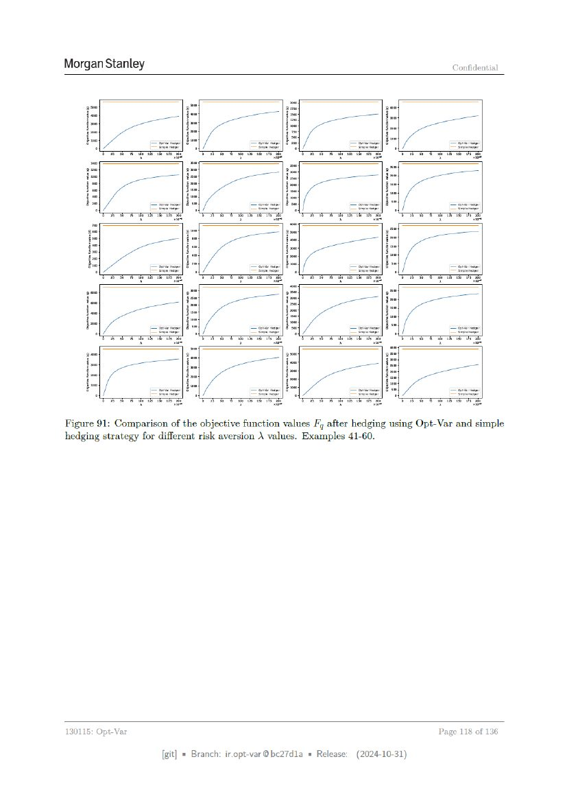

## 原文OCRテキスト

```text
Morgan Stanley                                                                            Confidential


Figure 91: Comparison of the objective function values F, after hedging using Opt-Var and simple
hedging strategy for different risk aversion \ values. Examples 41-60.


130115:   Opt-Var                                                                  Page     118 of 136


                     [git] « Branch: iropt-var@be27d1a = Release:   (2024-10-31)
```

# ページ 119


## 原文OCRテキスト

```text
Morgan Stanley                                                                         Confidential


Figure 92: Comparison of the objective function values F, after hedging using Opt-Var and simple
hedging strategy for different risk aversion \ values. Examples 61-80.


130115:   Opt-Var                                                                   Page   119 of 136


                      [git] « Branch: iropt-var@be27d1a = Release:   (2024-10-31)
```

# ページ 120

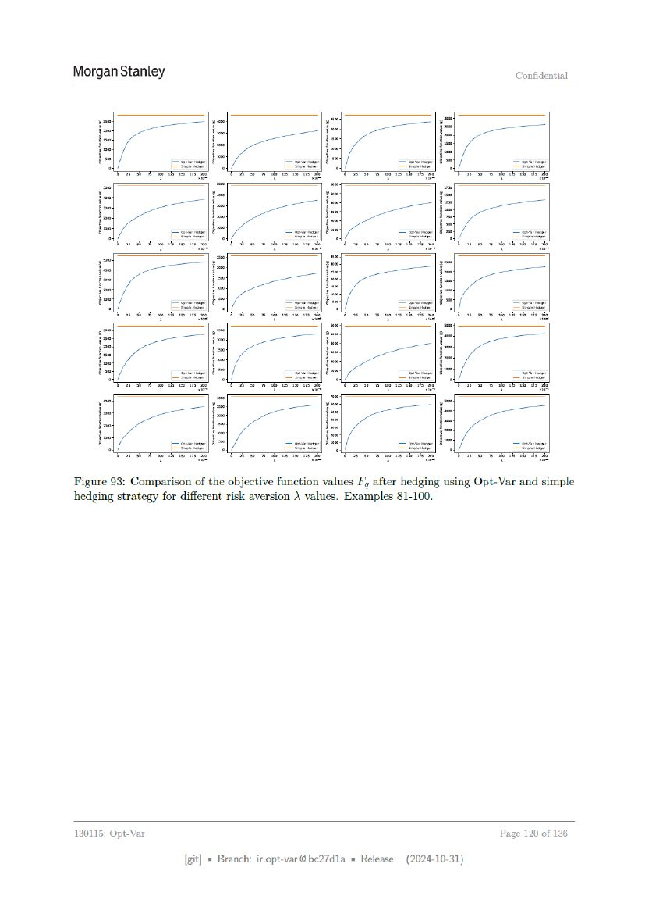

## 原文OCRテキスト

```text
Morgan Stanley                                                                            Confidential


Figure 93: Comparison of the objective function values F, after hedging using Opt-Var and simple
hedging strategy for different risk aversion \ values. Examples 81-100.


130115: Opt-Var                                                                    Page     120 of 136

                     [git] « Branch: iropt-var@be27d1a = Release:   (2024-10-31)
```

# ページ 121

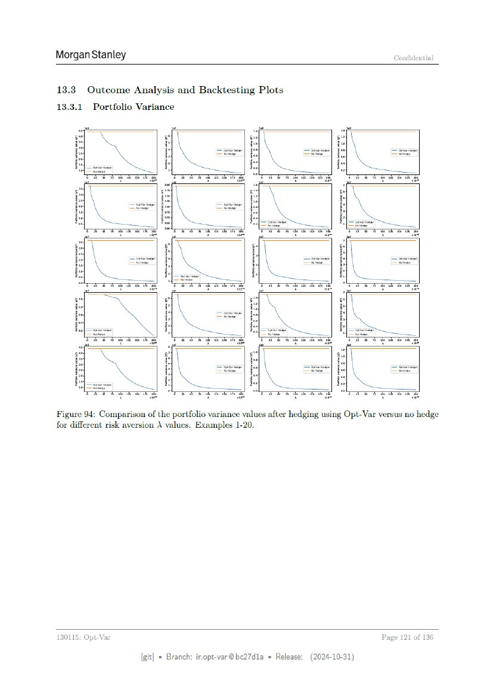

## 原文OCRテキスト

```text
Morgan Stanley                                                                            Confidential


13.3.    Outcome   Analysis and Backtesting Plots
13.3.1    Portfolio Variance


Figure 94: Comparison of the portfolio variance values after hedging using Opt-Var versus no hedge
for different risk aversion \ values. Examples 1-20.


130115: Opt-Var                                                                     Pag     121 of 136

                     [git] « Branch: iropt-var@be27d1a = Release:   (2024-10-31)
```

# ページ 122

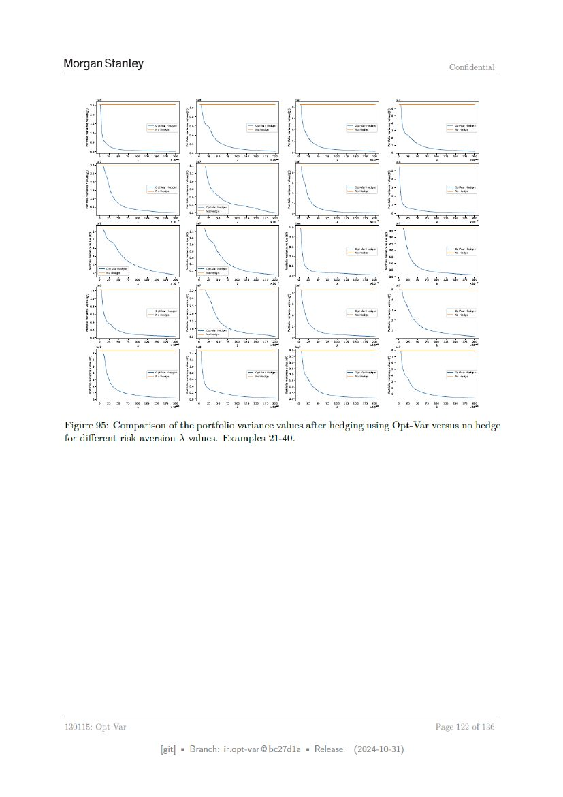

## 原文OCRテキスト

```text
Morgan Stanley                                                                         Confidential


Figure 95: Comparison of the portfolio variance values after hedging using Opt-Var versus no hedge
for different risk aversion \ values. Examples 21-40.


130115: Opt-Var                                                                     Page   122 of 136


                      [git] « Branch: iropt-var@be27d1a = Release:   (2024-10-31)
```

# ページ 123


## 原文OCRテキスト

```text
Morgan Stanley                                                                         Confidential


Figure 96: Comparison of the portfolio variance values after hedging using Opt-Var versus no hedge
for different risk aversion \ values. Examples 41-60.


130115: Opt-Var                                                                     Page   123 of 136


                      [git] « Branch: iropt-var@be27d1a = Release:   (2024-10-31)
```

# ページ 124

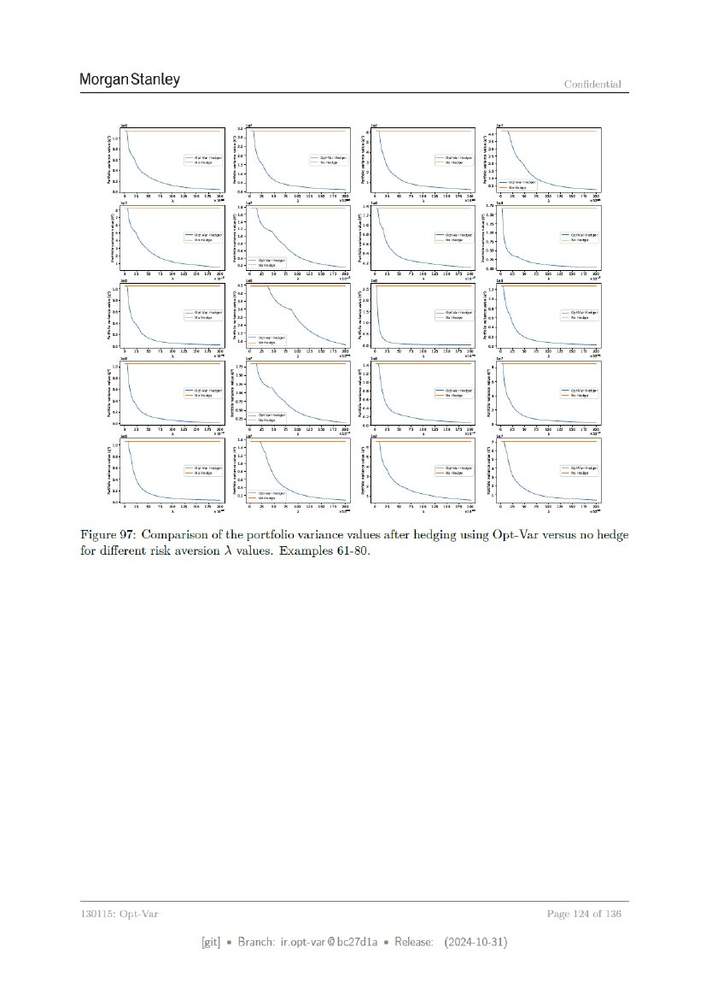

## 原文OCRテキスト

```text
Morgan Stanley                                                                         Confidential


     ifo.


Figure 97: Comparison of the portfolio variance values after hedging using Opt-Var versus no hedge
for different risk aversion \ values. Examples 61-80.


130115: Opt-Var                                                                     Page   124 of 136


                      [git] « Branch: iropt-var@be27d1a = Release:   (2024-10-31)
```

# ページ 125

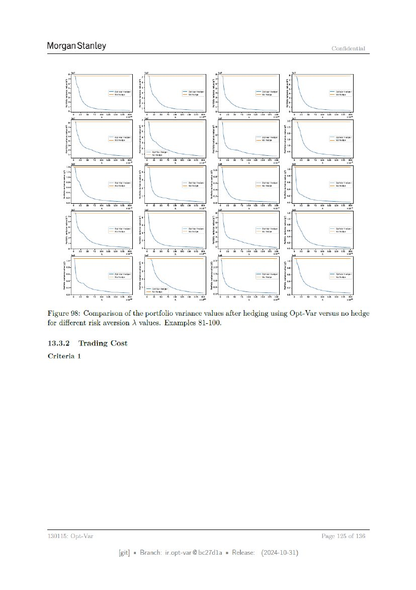

## 原文OCRテキスト

```text
Morgan Stanley                                                                         Confidential


Figure 98: Comparison of the portfolio variance values after hedging using Opt-Var versus no hedge
for different risk aversion   values. Examples 81-100.

13.3.2    Trading Cost
Criteria 1


130115: Opt-Var                                                                          125 of 136

                        [git] « Branch: iropt-var@be27d1a = Release:   (2024-10-31)
```

# ページ 126


## 原文OCRテキスト

```text
Morgan Stanley                                                                             Confidential


                  a

Figure 99: Comparison of the trading cost values using Opt-Var and simple hedging strategy for
different risk aversion A values. The trading cost value is given by Costg described in section
Examples 1-20.


130115: Opt-Var                                                                     Page     126 of 136

                      [git] « Branch: iropt-var@be27d1a = Release:   (2024-10-31)
```

# ページ 127


## 原文OCRテキスト

```text
Morgan Stanley                                                                         Confidential


Figure 100: Comparison of the trading cost values using Opt-Var and simple hedging strategy for
different risk aversion \ values. The trading cost value is given by Costg described in section|3.
Examples 21-40.


130115: Opt-Var                                                                     Page   127 of 136


                     [git] « Branch: iropt-var@be27d1a = Release:   (2024-10-31)
```

# ページ 128

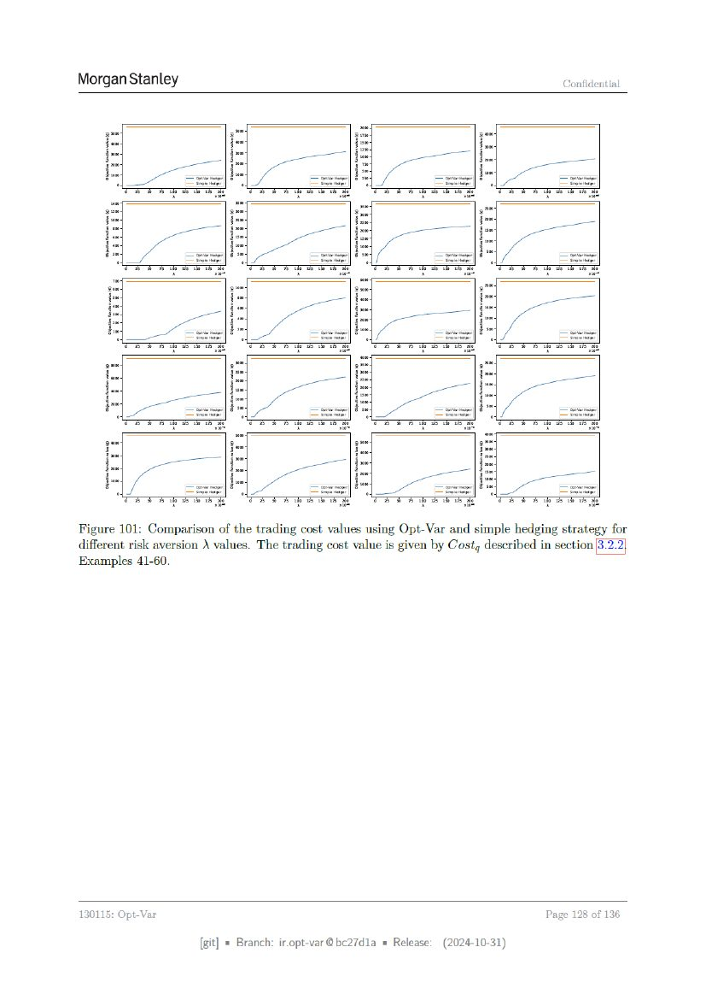

## 原文OCRテキスト

```text
Morgan Stanley                                                                         Confidential


                  a

Figure 101: Comparison of the trading cost values using Opt-Var and simple hedging strategy for
different risk aversion A values. The trading cost value is given by Costg described in section
Examples 41-60.


130115: Opt-Var                                                                     Page 128 of 136

                      [git] « Branch: iropt-var@be27d1a = Release:   (2024-10-31)
```

# ページ 129

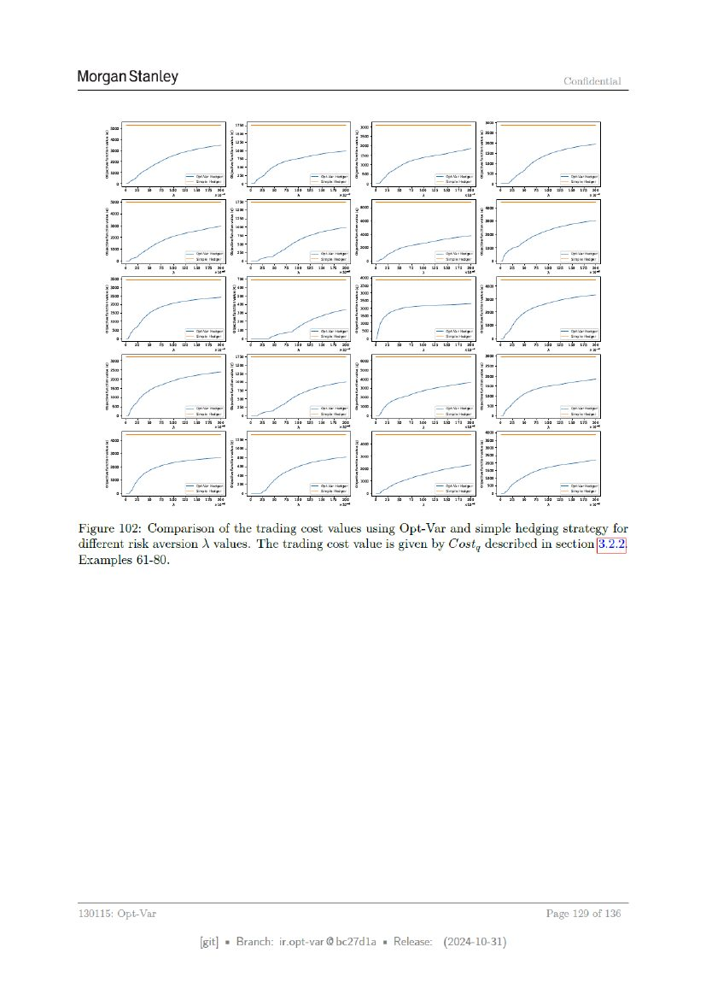

## 原文OCRテキスト

```text
Morgan Stanley                                                                            Confidential


                            i:
         Ce                      TFS                    TS    ee               Te           ae

Figure 102: Comparison of the trading cost values using Opt-Var and simple hedging strategy for
different risk aversion A values. The trading cost value is given by Cost, described in section|3.2.2|
Examples 61-80.


130115: Opt-Var                                                                        Page 129 of 136

                      [git] « Branch: iropt-var@be27d1a = Release:   (2024-10-31)
```

# ページ 130

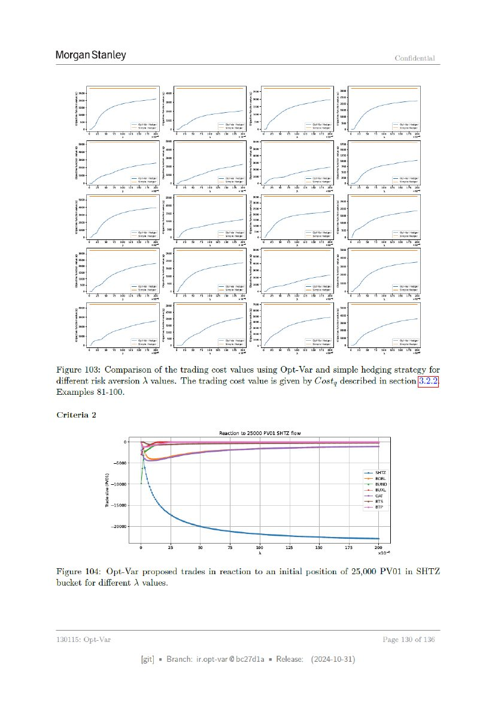

## 原文OCRテキスト

```text
Morgan Stanley                                                                                                 Confidential


                   ee

Figure 103: Comparison of the trading cost values using Opt-Var and simple hedging strategy for
different risk aversion A values. The trading cost value is given by Costg described in section
Examples 81-100.
Criteria 2

                                                     Reaction to 25000 PVO1 SHTZ flow


                   5000

                  210000

              E asco
                  2000

                           r)          3       %        7          Fr}         us        70      Ts    260
                                                                    iN                                   x10

Figure 104: Opt-Var proposed trades in reaction to an initial position of 25,000 PVO1 in SHTZ
bucket for different values.


130115: Opt-Var                                                                                                  130 of 136

                                [git] « Branch: iropt-var@be27d1a = Release:            (2024-10-31)
```

# ページ 131

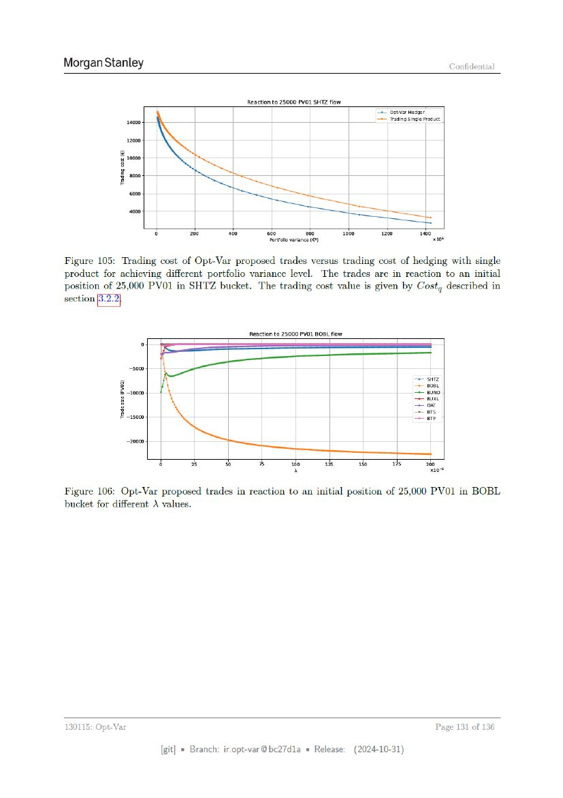

## 原文OCRテキスト

```text
Morgan Stanley                                                                                                                                 Confidential


                                                           Reaction to 25000 PVO1 SHTZ flow
                                                                                                                 = Optvar Hedger
                    14000                                                                                        = Trading Single Product

                    32000
                    10000
                  3 8000

                     6000
                     4000

                            Q              200      “400           ‘600               ‘200          3000          1200            1400
                                                                     Portfolio variance (€*)                                             aoe

Figure 105: Trading cost of Opt-Var proposed trades versus trading cost of hedging with single
product for achieving different portfolio variance level. The trades are in reaction to an initial
position of 25,000 PV01 in SHTZ bucket. The trading cost value is given by Cost, described in
section [3.2.2]


                                                           Reaction to 25000 PVO1 BOBL flow


                     5000


                    2000

                                a          Ba      Pa          %               a0              us           Fy           as         200
                                                                                »                                                     x10

Figure 106: Opt-Var proposed trades in reaction to an initial position of 25,000 PVO1 in BOBL
bucket for different values.


130115: Opt-Var                                                                                                                           Page 131 of 136

                                    [git] « Branch: iropt-var@be27d1a = Release:                           (2024-10-31)
```

# ページ 132


## 原文OCRテキスト

```text
Morgan Stanley                                                                                                                               Confidential


                                                             Reactionto 25000 PVO1 BOBL flow
                                                                                                             <= opt¥var Hedger
                  7000.                                                                                      = Trading Sinal
                                                                                                                         Single Product


                  3000

                  2000
                           ry                   100       7260              7360                 “00         “30                 oo
                                                                     Portola variance (@)                                             xaot

Figure 107: Trading cost of Opt-Var proposed trades versus trading cost of hedging with single
product for achieving different portfolio variance level. The trades are in reaction to an initial
position of 25,000 PVO1 in BOBL bucket. The trading cost value is given by Costg described in
sectio


                          ——
                           Reactionto 25000 PVO1 BUND flow


                   5000
                5                                                                                                            siz
              Fy                                                                                                             poet
                & -10000                                                                                                     + BUND
                 1                                                                                                           eux
                 H                                                                                                              on
              48 -15000                                                                                                      ers
                                                                                                                              —78

                  2000

                                r)          3         %          7             300          us          70         Ts             260
                                                                                iN                                                  x10

Figure 108: Opt-Var proposed trades in reaction to an initial position of 25,000 PVO1 in BUND
bucket for different values.


130115: Opt-Var                                                                                                                        Page 132 of 136

                                     [git] « Branch: iropt-var@be27d1a = Release:                      (2024-10-31)
```

# ページ 133

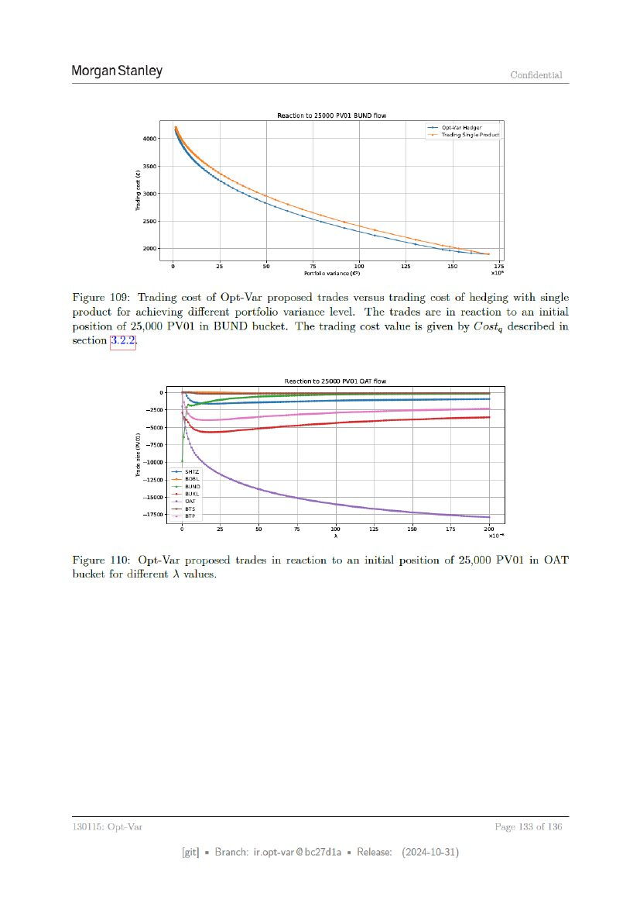

## 原文OCRテキスト

```text
Morgan Stanley                                                                                                                      Confidential


                                                      Reactionto 25000 PVO1 BUND flow
                                                                                                        <= optivar Hedger
                  4000                                                                                  = Trading Single Product


                  3500
               ¥
                8
              3 3000.

                  2500

                  2000
                          o          35          50              75                100        ws              150             vs
                                                              Portfolio variance (€*)                                        wage

Figure 109: Trading cost of Opt-Var proposed trades versus trading cost of hedging with single
product for achieving different portfolio variance level. The trades are in reaction to an initial
position of 25,000 PVO1 in BUND bucket. The trading cost value is given by Costg described in
section B23


                                                        Reaction to 25000 PVO1 OAT flow

                2500
                5000
              g
              = ~7500
              geo
                  12500   4 soet
                  15000
                  1750}   — erp
                           r)        3       %            7             Fr}              us        70         Ts           260
                                                                          a                                                  x10

Figure 110: Opt-Var proposed trades in reaction to an initial position of 25,000 PVO1 in OAT
bucket for different values.


130115: Opt-Var                                                                                                                Page   133 of 136


                              [git] « Branch: iropt-var@be27d1a = Release:                    (2024-10-31)
```

# ページ 134

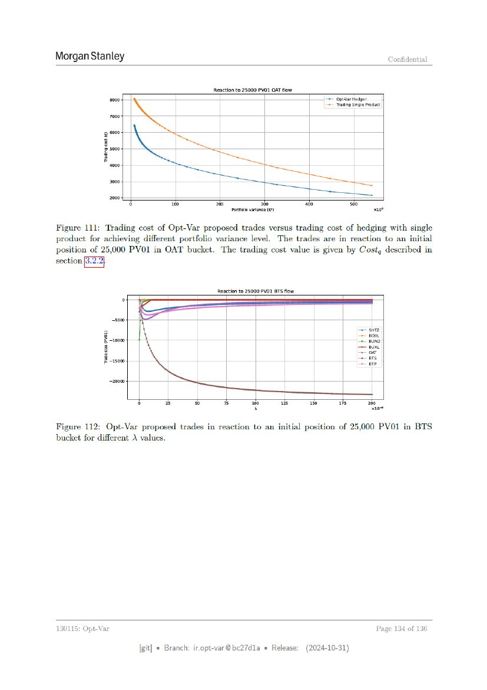

## 原文OCRテキスト

```text
Morgan Stanley                                                                                                                         Confidential


                                                          Reaction to 25000 PVO1 OAT flow
                  ‘8000                                                                                  <= opt¥var Hedger
                                                                                                         = Trading Single Product


                  2000
                           ry                   100       260                       7360          “60               ‘500
                                                                    Portfolio variance (@)                                      xaot

Figure 111: Trading cost of Opt-Var proposed trades versus trading cost of hedging with single
product for achieving different portfolio variance level. The trades are in reaction to an initial
position of 25,000 PVO1 in OAT bucket. The trading cost value is given by Costy described in
sectio!

                                                           Reaction to 25000 PVO1 BTS flow


                   5000
               5                                                                                                           swe
              Fy                                                                                                           poet
              & -10000                                                                                                     + BUND
                 1                                                                                                         = eux
                 H                                                                                                          = ont
               4B -15000                                                                                                   ers
                                                                                                                            —78

                  2000

                                r)          3         %         7              300           us     70         Ts             260
                                                                                iN                                              x10

Figure 112: Opt-Var proposed trades in reaction to an initial position of 25,000 PVO1 in BTS
bucket for different A values.


130115: Opt-Var                                                                                                                  Page    134 of 136


                                     [git] « Branch: iropt-var@be27d1a = Release:                 (2024-10-31)
```

# ページ 135

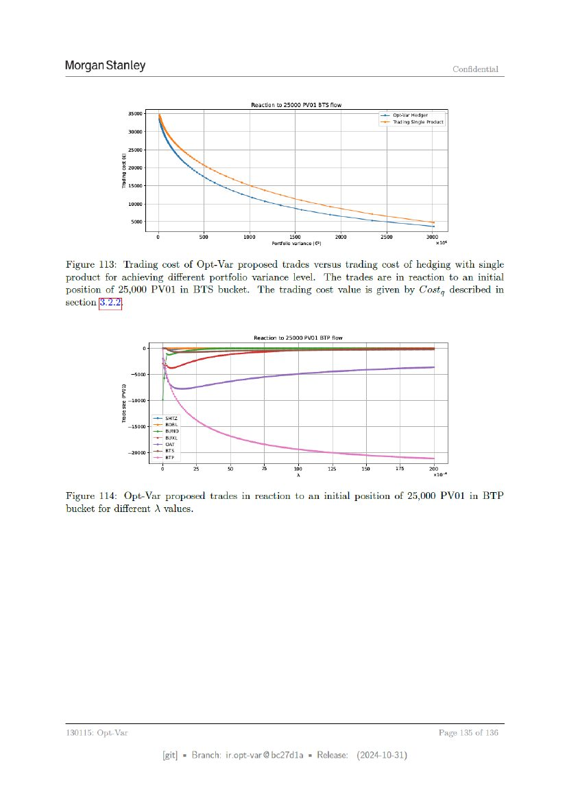

## 原文OCRテキスト

```text
Morgan Stanley                                                                                                                                        Confidential


                                                                  Reaction to 25000 PVO1 BTS flow
                      35000                                                                                           = Optvar Hedger
                                                                                                                      <= Trading Single Product


                  ¥
                   3 20000
                  E 15000

                       0000
                       so00
                                   Q               ‘500        3000                1500                  2000         2500              "3000
                                                                            Portola variance (€*)                                               x08

Figure 113: Trading cost of Opt-Var proposed trades versus trading cost of hedging with single
product for achieving different portfolio variance level. The trades are in reaction to an initial
position of 25,000 PVO1 in BTS bucket. The trading cost value is given by Cost, described in
section [3.2.2]


                                                                      Reaction to 25000 PVO1 BTP flow
                               o

                       5000
                  g
                  2                      \
                      ~30000
                  i            se sHTz
                      ~as000 | —— 808
                               + BUND
                               Bux
                               — oar
                      20000 | = 8r5
                               = erp
                                 a            Ba          Pa            %            a0             us           Fy          as           200
                                                                                      »                                                     x10

Figure 114: Opt-Var proposed trades in reaction to an initial position of 25,000 PV01 in BTP
bucket for different values.


130115: Opt-Var                                                                                                                                  Page   135 of 136


                                       [git] « Branch: iropt-var@be27d1a = Release:                             (2024-10-31)
```

# ページ 136

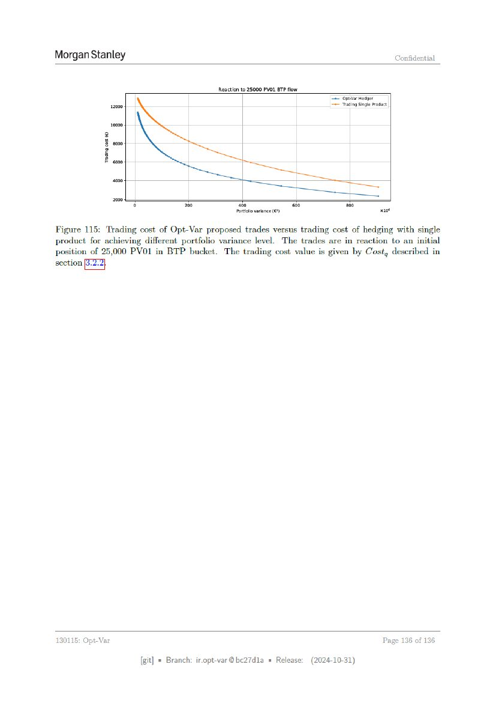

## 原文OCRテキスト

```text
Morgan Stanley                                                                                                                 Confidential


                                                     Reaction to 25000 PVO1 BTP flow
                                                                                                  = Optvar Hedger
                    32000                                                                         <= Trading Single Product

                    0000

                  $ e000

                  © ooo

                     4000

                     2000
                            °               260             “400                      ‘600              ‘200
                                                            Portfolio variance (€*)                                      aoe

Figure 115: Trading cost of Opt-Var proposed trades versus trading cost of hedging with single
product for achieving different portfolio variance level. The trades are in reaction to an initial
position of 25,000 PVO1 in BTP bucket. The trading cost value is given by Cost, described in
section [3.2.2]


130115: Opt-Var                                                                                                           Page 136 of 136

                                [git] « Branch: iropt-var@be27d1a = Release:                 (2024-10-31)
```
