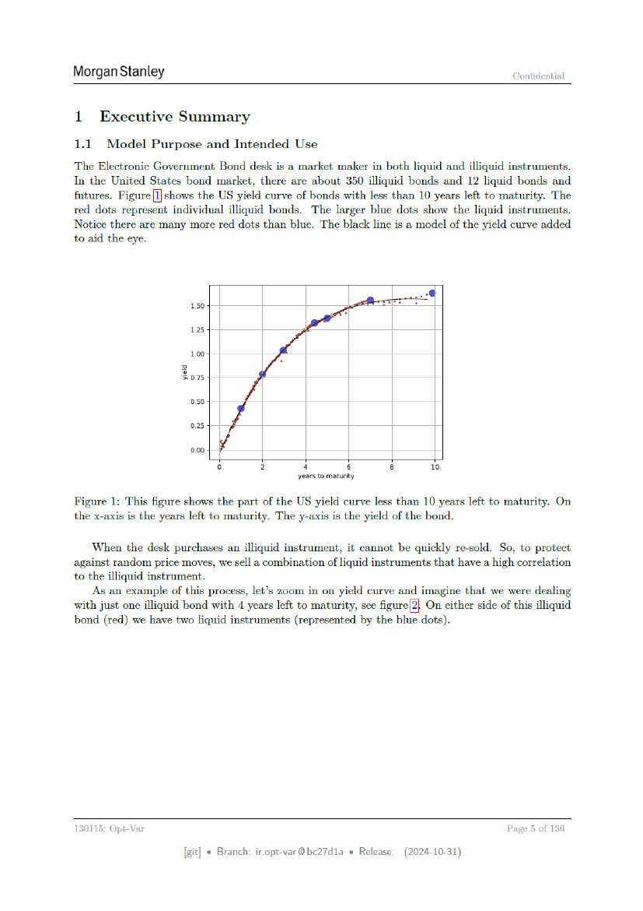

# Page 005



## OCR layout text

```text
Morgan Stanley                                                                              Confidential


1      Executive Summary
1.1.   Model      Purpose      and Intended   Use

The Electronic Government Bond desk is a market maker in both liquid and illiquid instruments.
In the United States bond market, there are about 350 illiquid bonds and 12 liquid bonds and
futures. Figure [I]shows the US yield curve of bonds with less than 10 years left to maturity. The
red dots represent individual illiquid bonds. The larger blue dots show the liquid instruments.
Notice there are many more red dots than blue. The black line is a model of the yield curve added
to aid the eye.


                        1.50
                        1.25
                        1.00
                      Zor
                        0.50
                        0.25

                        0.00
                                0      2         4             6      8        10
                                               years to maturity

Figure 1: This figure shows the part of the US yield curve less than 10 years left to maturity. On
the x-axis is the years left to maturity. The y-axis is the yield of the bond.
    When the desk purchases an illiquid instrument, it cannot be quickly re-sold. So, to protect
against random price moves, we sell a combination of liquid instruments that have a high correlation
to the illiquid instrument.
    ‘As an example of this process, let’s zoom in on yield curve and imagine that we were dealing
with just one illiquid bond with 4 years left to maturity, see figure[2| On either side of this illiquid
bond (red) we have two liquid instruments (represented by the blue dots).


130115: Opt-Var                                                                            Page 5 of 136
                       [git] « Branch: iropt-var@be27d1a = Release:       (2024-10-31)
```
