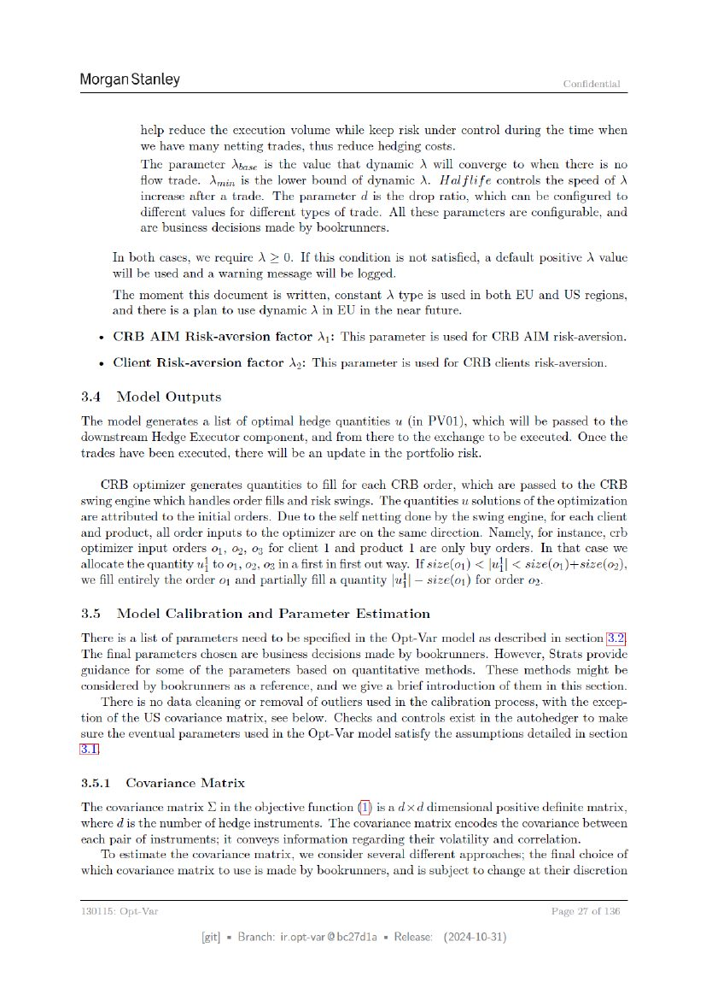

# Page 027



## OCR layout text

```text
Morgan Stanley                                                                                 Confidential


                 help reduce the execution volume while keep risk under control during the time when
                 we have many netting trades, thus reduce hedging costs.
                 The parameter Ayase is the value that dynamic \ will converge to when there is no
                 flow trade. Amin is the lower bound of dynamic \. Hal flife controls the speed of
                 increase after a trade. The parameter d is the drop ratio, which can be configured to
                 different values for different types of trade. All these parameters are configurable, and
                 are business decisions made by bookrunners.
           In both cases, we require \ > 0. If this condition is not satisfied, a default positive \ value
           will be used and a warning message will be logged.
           The moment this document is written, constant A type is used in both EU and US regions,
           and there is a plan to use dynamic \ in EU in the near future.
       «   CRB    AIM    Risk-aversion factor \;: This parameter is used for CRB AIM risk-aversion.

       «   Client Risk-aversion factor \2: This parameter is used for CRB clients risk-aversion.

3.4.       Model     Outputs

The model generates a list of optimal hedge quantities u (in PVO01), which will be passed to the
downstream Hedge Executor component, and from there to the exchange to be executed. Once the
trades have been executed, there will be an update in the portfolio risk.
    CRB optimizer generates quantities to fill for each CRB order, which are passed to the CRB
swing engine which handles order fills and risk swings. The quantities u solutions of the optimization
are attributed to the initial orders. Due to the self netting done by the swing engine, for each client
and product, all order inputs to the optimizer are on the same direction. Namely, for instance, erb
optimizer input orders 01, 02, 03 for client 1 and product 1 are only buy orders. In that case we
allocate the quantity w} to 01, 02, 03 ina first in first out way. If size(o1) < |u}| < size(o1)+size(o2),
we fill entirely the order 0; and partially fill a quantity |u{|— size(o,) for order 09.

3.5        Model     Calibration and Parameter Estimation
There is a list of parameters need to be specified in the Opt-Var model as described in section
The final parameters chosen are business decisions made by bookrunners. However, Strats provide
guidance for some of the parameters based on quantitative methods. These methods might be
considered by bookrunners as a reference, and we give a brief introduction of them in this section.
    There is no data cleaning or removal of outliers used in the calibration process, with the excep-
tion of the US covariance matrix, see below. Checks and controls exist in the autohedger to make
sure the eventual parameters used in the Opt-Var model satisfy the assumptions detailed in section
BI

3.5.1        Covariance Matrix

The covariance matrix © in the objective function (I) is a dx d dimensional positive definite matrix,
where d is the number of hedge instruments. The covariance matrix encodes the covariance between
each pair of instruments; it conveys information regarding their volatility and correlation.
    To estimate the covariance matrix, we consider several different approaches; the final choice of
which covariance matrix to use is made by bookrunners, and is subject to change at their discretion

130115: Opt-Var                                                                             Page 27 of 136

                            [git] « Branch: iropt-var@be27d1a = Release:   (2024-10-31)
```
