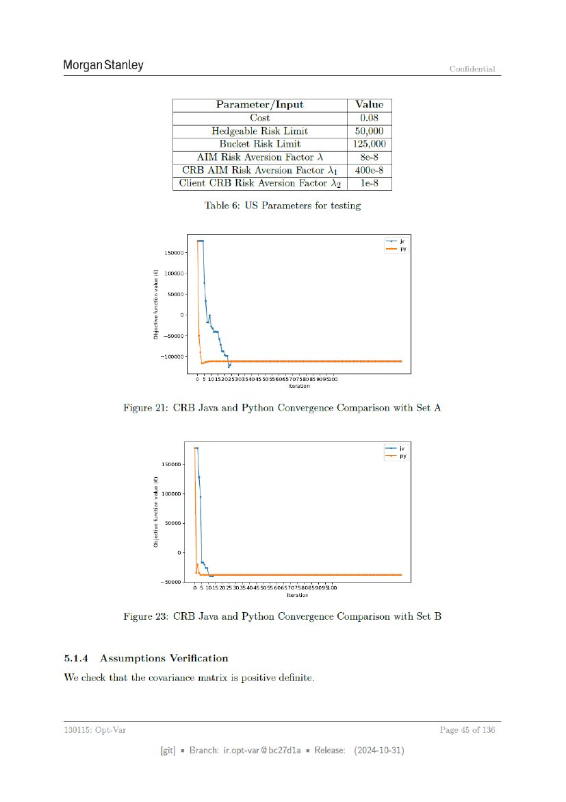

# Page 045



## OCR layout text

```text
Morgan Stanley                                                                                                        Confidential


                                                   Parameter /Input                            Value
                                                               Cost                             0.08
                                                  Hedgeable Risk Limit                         50,000
                                               Bucket Risk Limit                               125,000
                                           AIM Risk Aversion Factor \                            8e-8
                                       CRB AIM Risk Aversion Factor \1_|                       400e-8
                                      Client CRB Risk Aversion Factor Ag                         le-8

                                               Table 6: US Parameters for testing

                                                                                                         =
                               150000                                                                         Pe
                          &    100000

                          2     50000

                          2             °

                          3 80000

                              100000
                                                       ¥
                                            © 5 1015202530354045 5055606570758085 9095100
                                                                         Iteration

                    Figure 21: CRB Java and Python Convergence Comparison with Set A


                                                                                                         =
                                                                                                         hy
                              100
                          4 sooeo
                          3 s0000
                          6


                              50000
                                            © 5 10152025 30.35 4045 5055 6065707580859095100
                                                                             Iteration

                    Figure 23: CRB Java and Python Convergence Comparison with Set B

5.1.4      Assumptions Verification

We check that the covariance matrix is positive definite.


130115:   Opt-Var                                                                                                  Page   5 of 136

                              [git] = Branch: ir.opt-var@bc27d1a = Release:                    (2024-10-31)
```
