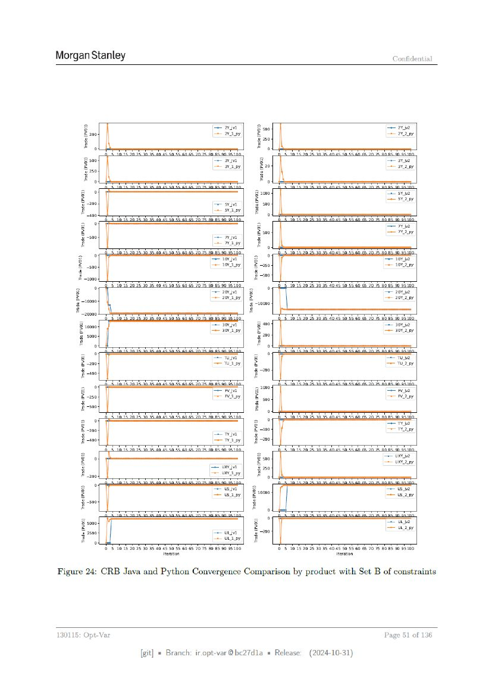

# Page 051



## OCR layout text

```text
Morgan Stanley                                                                                                                                             Confidential


                                                                       aa                      B soo                                                   Ne
             2 200.                                                    Sain}       2                                                                   =       ay
              ra                                                                    & 250
               ?
               Foo                                                                 Fog
               3 s00                                            a ar                2g                                                                 VN
               2                                                = Biey                 220                                                             ey
                5 250                                                                   ra
                                                                                       ?
               Foo                                                                     Fo
                                                                               3 2000                                                                  ares
                                                                                2                                                                      sv wy
                                                                si        |                500
                                                                + SYA py        ?
                                                                                Fo
                          Cb          woo pakah shh ches ove sh ahah Gad                           DET                    A aba dak oh     cheb 2)   abe wh Ohad
             z°                                                                    2                                                                  re
             2                                                                  2 soo                                                                 vay
               ~500                                             ears                ra
            ?g                                                  + Wapy            ?EB
                     pq         aa         aa ea a Tw wh oh go                                ppb                            ea       De      eT A ayes ogo
           2g                                                  im              |Z                                                                   — 10" N2
            = -s00                                             —roviey|        2-20                                                                 102 wy
            i£ ~2000                                                           3-00
                                                                               &
                     pd         Sab   aa bab teh eb Ta hh              de                     o pip                 aba          a    ha        Th   aha   Shad
          a                                                    av         | 2                                                                         = 207 N2
          2                                                    = rovisy| 2                                                                            = avy
          0009                                                              ‘g 20000
          & 20000                                                                      &
                        E       a     age       khSa oh se cachJo Fo sh ohob ago                       Dib                  abs dae        hab Dh aha Sh Shade
              2 sooo                                                   me 307 vt               geo                                                 — 3012
              2                                                        Swi)                    2                                                   302
              § $000                                                                           70
               ®
              fo                                                                               ®
                                                                                               fo
                                                                      we           |       §= 0                                                        —— Tuy
                                                                      =                     +                                                          Wy
                                                                                            $200
                                                                                            e
                                                                      aa |                 37%                                                         FN
                                                                      = we7                z                                                           eave 7
                                                                                           2
                                                                                fo
                                                                              =A 0                                              if                     Tyne
                                                                              2-200                                                                    vay
                                                                       rm | §
                                                                       —visy|  F200
             z              L                                                         z                                                               UN V2
             ze                                                                      00                                                               U2 ay
            raz                                                    Samrat
                                                                   = ws.ay]           @ 250
                                                                                     zEy
             £ 200
                      °                        aa                     ra                                                        2a
            8=                                                      uw        | 3                                                                      US v2
                                                                    —usasy | 2 1000
            § -s00                                                              Fy
            g                                                                   By
            28 sooo                                                               z°
                                                                                  3                                             “                      cans 2
             2                                                                    2                                                                    = ay
              % 2500                                                um | $-200
             g
             By                                                     urs]          g8
                          @ 5105      2095 3) 3640.45.50
                                                     55 GOES 1075 6 8.90 HiG0                          © 5 015205           3035 40.5 50 55.60 G 70 Ts 80S
                                                                                                                                                         50 95300

Figure 24: CRB Java and Python Convergence Comparison by product with Set B of constraints


130115:          Opt-Var                                                                                                                              Page    51    of 136

                                            [git] = Branch: ir.opt-var@bc27d1a = Release:                                 (2024-10-31)
```
