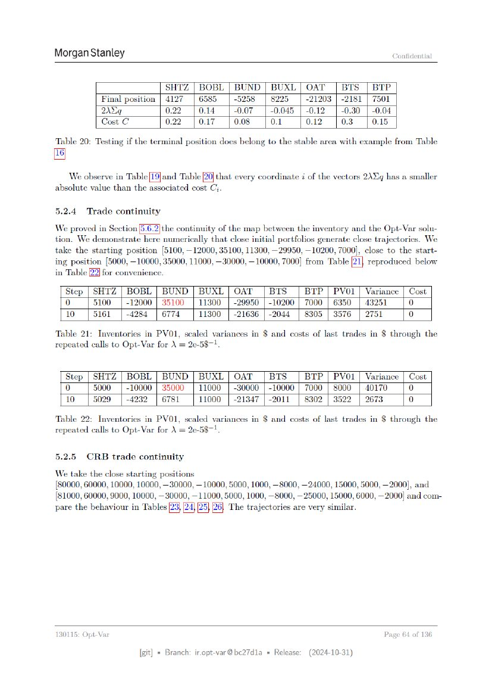

# Page 064



## OCR layout text

```text
Morgan Stanley                                                                             Confidential


                              SHTZ | BOBL       | BUND | BUXL | OAT | BTS | BTP
             Final position | 4127 | 6585         -5258 | 8225     ~21203 | -2181 | 7501
             2\Nq             0.22   0.14         -0.07   -0.045 | -0.12 | -0.30 | -0.04
             Cost C           0.22   0.17         0.08    0.1      0.12     0.3     0.15

Table 20: Testing if the terminal position does belong to the stable area with example from Table


absolute value than the associated cost Cj.

5.2.4    Trade continuity


tion. We demonstrate here numerically that close initial portfolios generate close trajectories. We
take the starting position [5100,—12000, 35100, 11300, 29950, 10200, 7000], close to the start-
ing position [5000, —10000, 35000, 11000, —30000, —10000, 7000] from Tabl
in Table 22] for convenience.
  Step   | SHTZ | BOBL | BUND | BUXL | OAT | BTS             BTP | PVO1 | Variance | Cost
  0        5100 | -12000 | 35100 | 11300 | -29950 | -10200 | 7000 | 6350 | 43251     0
  10       5161 | -4284 | 6774     11300 | -21636 | -2044 | 8305 | 3576 | 2751       0

Table 21: Inventories in PVO1, scaled variances in $ and costs of last trades in $ through the
repeated calls to Opt-Var for \ = 2e-58-1,

  Step | SHTZ | BOBL | BUND | BUXL | OAT | BTS             BTP | PVO1 | Variance | Cost
  0      5000 | -10000 | 35000 | 11000 | -30000 | -10000 | 7000 | 8000 | 40170     0
  10     5029 | -4232 | 6781     11000 | -21347 | -2011 | 8302 | 3522 | 2673       0

Table 22:    Inventories in PV01,    scaled variances in $ and costs of last trades in $ through the
repeated calls to Opt-Var for \ = 2e-5$-1.

5.2.5    CRB      trade continuity

We take the close starting positions
[80000, 60000, 10000, 10000, —30000, — 10000, 5000, 1000, —8000, —24000, 15000, 5000, —2000], and
[81000, 60000, 9000, 10000, 30000,     —11000, 5000, 1000, 8000, — 25000, 15000, 6000, —2000] and com-
pare the behaviour in Tables                    The trajectories are very similar.


130115: Opt-Var                                                                        Page 64 of 136

                        [git] « Branch: iropt-var@be27d1a = Release:   (2024-10-31)
```
