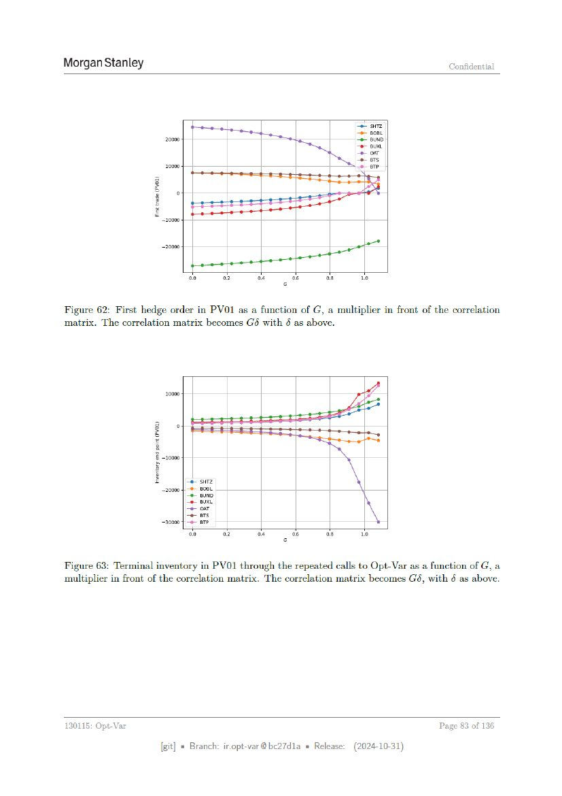

# Page 083



## OCR layout text

```text
Morgan Stanley                                                                          Confidential


                                                                       eo siz
                                                                       =e soe.
                         20000                                         -e euND
                                                                       paar
                                                                       = om
                                                                       =
                         10000                                         aa
                    z
                    rar)
                    &
                        20000


                        ”        eee
                                 oo    08      oe         o8    os      To
                                                      6

Figure 62: First hedge order in PVO1 as a function of G, a multiplier in front of the correlation
matrix. The correlation matrix becomes Gé with 6 as above.


                         10000


                                 oo    o2      on         os    oe      To


Figure 63: Terminal inventory in PVO1 through the repeated calls to Opt-Var as a function ofG, a
multiplier in front of the correlation matrix. The correlation matrix becomes G6, with 5 as above.


130115: Opt-Var                                                                       Page 83 of 136

                        [git] « Branch: iropt-var@be27d1a = Release:   (2024-10-31)
```
