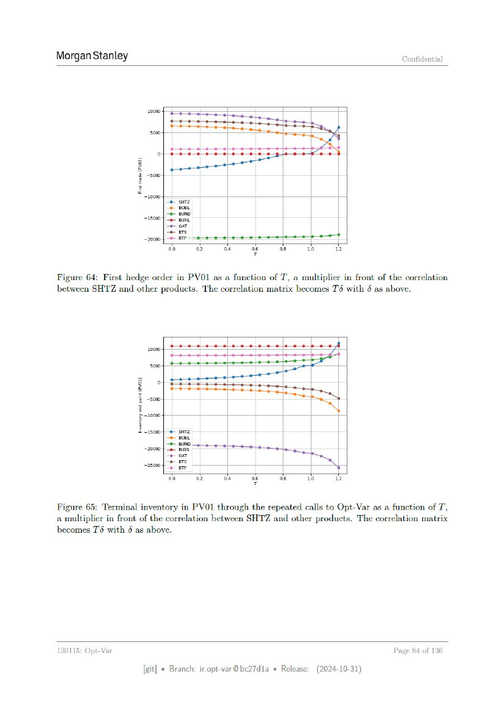

# Page 084



## OCR layout text

```text
Morgan Stanley                                                                                Confidential


                          10000

                           ‘5000


                         20000
                                 Se surz
                                 e BoeL
                                 “2 BUND
                         15000 Ae But
                                 -e ont
                                 eats                               0 oo     oo
                         20000 | ®- BT?» 0-209 |-9 9 -9- -e 00-0
                                  00     o2    oa       O6     oe       10        12


Figure 64: First hedge order in PVO1 as a function of T, a multiplier in front of the correlation
between SHTZ and other products. The correlation matrix becomes Td with 6 as above.


                                                                                  4
                          20000
                           000
                    g:            0   SSS          SSS        SS
                     % ~5000
                     2 -10000
                    E ~15000 | -e- sHTZ
                                      epost
                                      2 BUND
                         20000}       9 BUXL
                                      e oar
                          25004       e2 Ere
                                          eTP
                                       00     02    oe   06    08       vo        1
                                                          T

Figure 65: Terminal inventory in PVO1 through the repeated calls to Opt-Var as a function of T,
a multiplier in front of the correlation between SHTZ and other products. The correlation matrix
becomes T6 with 6 as above.


130115: Opt-Var                                                                             Page 84 of 136

                         [git] « Branch: iropt-var@be27d1a = Release:        (2024-10-31)
```
