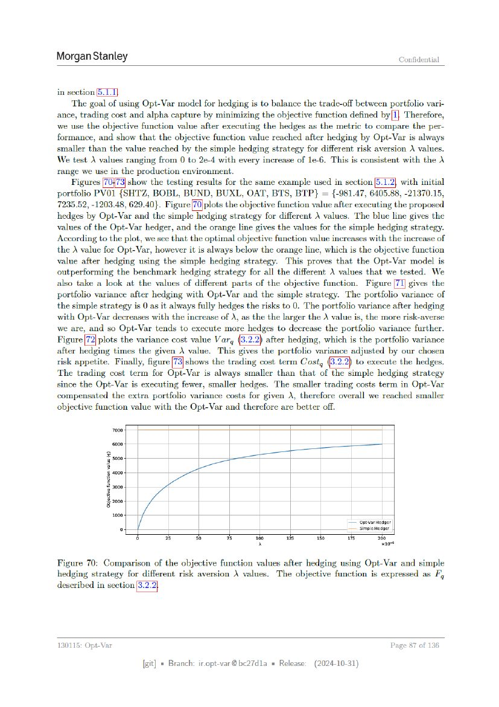

# Page 087



## OCR layout text

```text
Morgan Stanley                                                                                               Confidential


in section 5.1.1}
    ‘The goal of using Opt-Var model for hedging is to balance the trade-off between portfolio vari-
ance, trading cost and alpha capture by minimizing the objective function defined by(I} Therefore,
we use the objective function value after executing the hedges as the metric to compare the per-
formance, and show that the objective function value reached after hedging by Opt-Var is always
smaller than the value reached by the simple hedging strategy for different risk aversion \ values.
We test \ values ranging from 0 to 2e-4 with every increase of le-6. This is consistent with the \
range we use in the production environment.
    Figures               show the testing results for the same example used in section [5
portfolio PVO1 {SHTZ, BOBL, BUND, BUXL, OAT, BTS, BTP} = {-981.47, 6405.88, -21370.15,
7235.52, -1203.48, 629.40}. Figure[70]plots the objective function value after executing the proposed
hedges by Opt-Var and the simple hedging strategy for different \ values. The blue line gives the
values of the Opt-Var hedger, and the orange line gives the values for the simple hedging strategy.
According to the plot, we see that the optimal objective function value increases with the increase of
the A value for Opt-Var, however it is always below the orange line, which is the objective function
value after hedging using the simple hedging strategy. This proves that the Opt-Var model is
outperforming the benchmark hedging strategy for all the different \ values that we tested. We
also take a look at the values of different parts of the objective function. Figure [7] gi
portfolio variance after hedging with Opt-Var and the simple strategy. The portfolio variance of
the simple strategy is 0 as it always fully hedges the risks to 0. The portfolio variance after hedging
with Opt-Var decreases with the increase of ), as the the larger the \ value is, the more risk-averse
we are, and so Opt-Var tends to execute more hedges to decrease the portfolio variance further.
            plots the variance cost value Varg          after hedging, which is the portfolio variance
after hedging times the given \ value. This gives the portfolio variance adjusted by our chosen
risk appetite. Finally, figure      shows the trading cost term Cost,          to execute the hedges.
The trading cost term for Opt-Var is always smaller than that of the simple hedging strategy
since the Opt-Var is executing fewer, smaller hedges. The smaller trading costs term in Opt-Var
compensated the extra portfolio variance costs for given 2, therefore overall we reached smaller
objective function value with the Opt-Var and therefore are better off.

                  7000.


                                                                                        — opt¥var Hedger
                     °.                                                                 — Simple Hedger
                           ry         35      30       75      160     us      10      Ft         260
                                                                »                                   x10

Figure 70: Comparison of the objective function values after hedging using Opt-Var and simple
hedging strategy for different risk aversion \ values. The objective function is expressed as F,
described in sectio


130115: Opt-Var                                                                                            Page 87 of 136

                                [git] « Branch: iropt-var@be27d1a = Release:   (2024-10-31)
```
