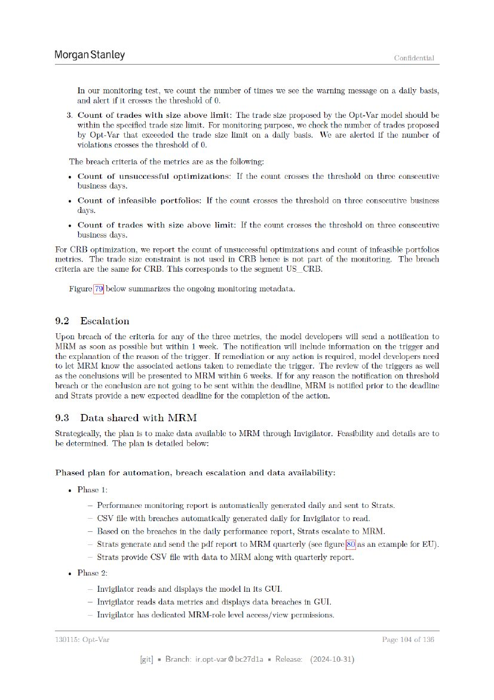

# Page 104



## OCR layout text

```text
Morgan Stanley                                                                                                          Confidential


          In our monitoring test, we count the number of times we see the warning message on a daily basis,
          and alert if it crosses the threshold of 0.
      3. Count of trades with size above limit: The trade size proposed by the Opt-Var model should be
         within the specified trade size limit. For monitoring purpose, we check the number of trades proposed
         by Opt-Var that exceeded the trade size limit on a daily basis. We are alerted if the number of
         violations crosses the threshold of 0.
      The breach criteria of the metrics are as the following:
      +   Count    of unsuccessful     optimizations:         If the   count   crosses   the   threshold   on   three    consecutive
        business days.
      + Count of infeasible portfolios: If the count crosses the threshold on three consecutive business
        days.
      +   Count   of trades    with   size   above   limit:    If the count    crosses the threshold       on three consecutive
          business days.
For CRB optimization, we report the count of unsuccessful optimizations and count of infeasible portfolios
metrics. The trade size constraint is not used in CRB hence is not part of the monitoring. The breach
criteria are the same for CRB. This corresponds to the segment US_CRB.

                  below summarizes the ongoing monitoring metadata.


9.2       Escalation
Upon breach of the criteria for any of the three metrics, the model developers will send a notification to
MRM as soon as possible but within 1 week. The notification will include information on the trigger and
the explanation of the reason of the trigger. If remediation or any action is required, model developers need
to let MRM know the associated actions taken to remediate the trigger. The review of the triggers as well
as the conclusions will be presented to MRM within 6 weeks. If for any reason the notification on threshold
breach or the conclusion are not going to be sent within the deadline, MRM is notified prior to the deadline
and Strats provide a new expected deadline for the completion of the action.

9.3       Data shared with MRM
Strategically, the plan is to make data available to MRM through Invigilator. Feasibility and details are to.
be determined. The plan is detailed below:

Phased plan for automation, breach escalation and data availability:
   + Phase 1:
             — Performance monitoring report is automatically gencrated daily and sent to Strats.
           ~— CSV file with breaches automatically generated daily for Invigilator to read.
           ~ Based on the breaches in the daily performance report, Strats escalate to MRM.
           — Strats generate and send the pdf report to MRM quarterly (see figure [S0Jas an example for EU).
           ~ Strats provide CSV file with data to MRM along with quarterly report.
      + Phase 2:
           ~ Invigilator reads and displays the model in its GUI.
           ~ Invigilator reads data metrics and displays data breaches in GUI.
           ~ Invigilator has dedicated MRM-role level access/view permissions.

130115: Opt-Var                                                                                                  Page     104 of 136

                              [git] « Branch: iropt-var@be27d1a = Release:               (2024-10-31)
```
