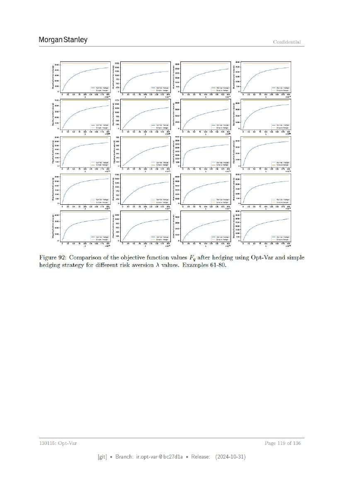

# Page 119



## OCR layout text

```text
Morgan Stanley                                                                         Confidential


Figure 92: Comparison of the objective function values F, after hedging using Opt-Var and simple
hedging strategy for different risk aversion \ values. Examples 61-80.


130115:   Opt-Var                                                                   Page   119 of 136


                      [git] « Branch: iropt-var@be27d1a = Release:   (2024-10-31)
```
