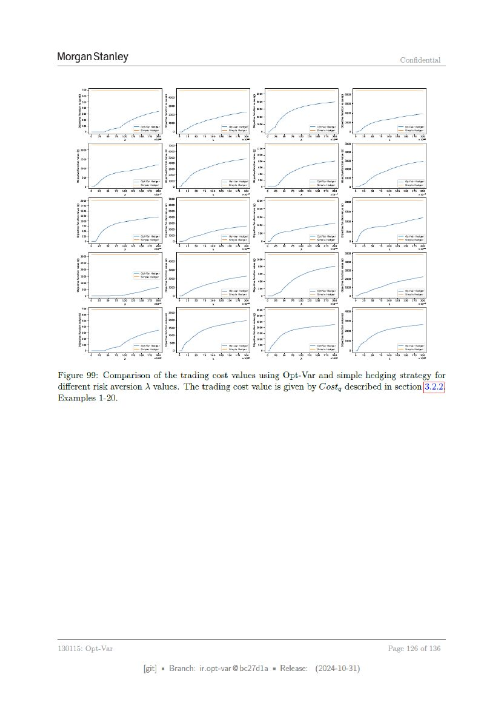

# Page 126



## OCR layout text

```text
Morgan Stanley                                                                             Confidential


                  a

Figure 99: Comparison of the trading cost values using Opt-Var and simple hedging strategy for
different risk aversion A values. The trading cost value is given by Costg described in section
Examples 1-20.


130115: Opt-Var                                                                     Page     126 of 136

                      [git] « Branch: iropt-var@be27d1a = Release:   (2024-10-31)
```
