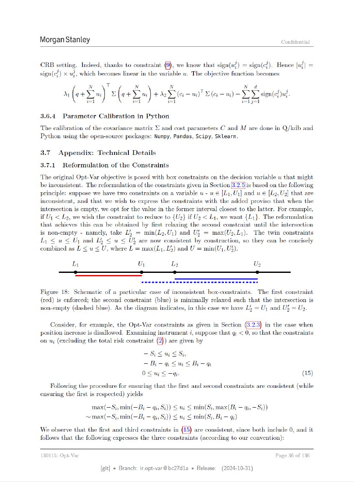

# ページ 036



## 原文OCRテキスト

```text
Morgan Stanley                                                                                               Confidential


CRB setting.       Indeed, thanks to constraint (9), we know that sign(w}) = sign(c}).                      Hence |u}| =
sign(c!) x ul, which becomes linear in the variable u. The objective function becomes
                     N       T          N                   N                           N      d
          ML (1+)                = (+s)               +23        (eG — ui)’ DG —ui) — OY sign(d ud.
                    i=1                i=l                i=1                          i=1 j=

3.6.4     Parameter       Calibration in Python

The calibration of the covariance matrix               © and cost parameters C and M are done in Q/kdb and
Python using the open-source packages: Numpy, Pandas, Scipy, Sklearn.

3.7     Appendix:         Technical Details

3.7.1     Reformulation of the Constraints

The original Opt-Var objective is posed with box constraints on the decision variable u that might
be inconsistent. The reformulation of the constraints given in Section|3.2.5]is based on the following
principle: suppose we have two constraints on a variable u - u € [L1,Ui] and w € (Lo, Us] that are
inconsistent, and that we wish to express the constraints with the added proviso that when the
intersection is empty, we opt for the value in the former interval closest to the latter. For example,
if U; < Lo, we wish the constraint to reduce to {U9} if Uy < L1, we want {Ly}. The reformulation
that achieves this can be obtained by first relaxing the second constraint until the intersection
is non-empty - namely, take L, = min(L9,U;) and Ul = max(U9,L1). The twin constraints
Ly <u < U; and Lh < wu < US are now consistent by construction, so they can be concisely
combined as L < u <U, where L = max(L1,L4) and U = min(U;, U3).
              Ly                             U1             Ly
               -                              o-             .                                     .-


Figure 18: Schematic of a particular case of inconsistent box-constraints. The first constraint
(red) is enforced; the second constraint (blue) is minimally relaxed such that the intersection is
non-empty (dashed blue). As the diagram indicates, in this case we have Ly = U; and Uj = Up.
      Consider, for example, the Opt-Var constraints as given in Section (3.2.3)                        in the case when
position increase is disallowed. Examining instrument i, suppose that q; < 0, so that the constraints
on uj (excluding the total risk constraint (2)) are given by
                                                   -Sisui sc Si,
                                                   -B-g         sus   Bi-4G
                                               O<us—a.                                                                (15)
    Following the procedure for ensuring that the first and second constraints are consistent (while
ensuring the first is respected) yields
                      max(—Sj, min(—B; — qi, S;)) < uj < min(S;, max(B; — qi, —S;))
                    ~max(—S;,min(—B; — qi, S;)) < ui < min(S;,Bi — gi)
We observe that the first and third constraints in                    are consistent, since both include 0, and it
follows that the following expresses the three constraints (according to our convention):

130115: Opt-Var                                                                                            Page 36 of 136

                           [git] « Branch: iropt-var@be27d1a = Release:         (2024-10-31)
```
