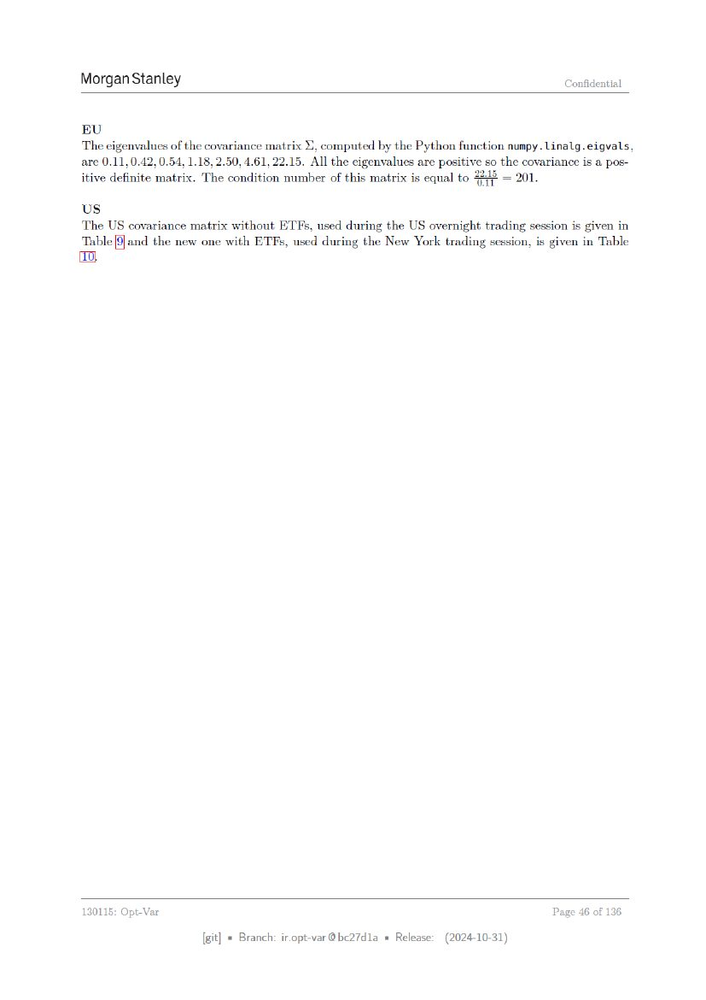

# ページ 046



## 原文OCRテキスト

```text
Morgan Stanley                                                                                Confidential


EU
The eigenvalues of the covariance matrix ©, computed by the Python function numpy. Linalg.eigvals,
are 0.11, 0.42, 0.54, 1.18, 2.50, 4.61, 22.15. All the eigenvalues are positive so the covariance is a pos-
itive definite matrix. The condition number of this matrix is equal to 248 = 201.
Us
The US covariance matrix without ETFs, used during the US overnight trading session is given in
Table [9] and the new one with ETFs, used during the New York trading session, is given in Table
{to}


 130115: Opt-Var                                                                            Page 46 of 136

                       [git] « Branch: iropt-var@be27d1a = Release:    (2024-10-31)
```
