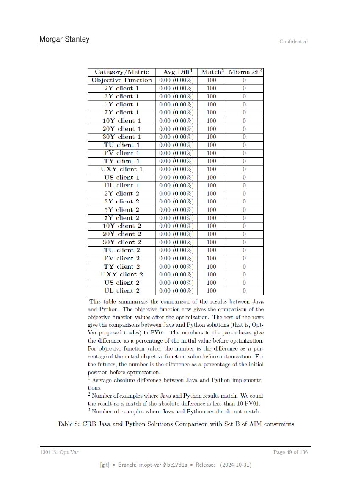

# ページ 049



## 原文OCRテキスト

```text
Morgan Stanley                                                                                   Confidential


                     Category /Metric      Avg Diff! | Match*]                    Mismatch")
                    Objective Function | 0.00 (0.00%)    100                           0
                            2Y client 1           0.00 (0.00%)          100            0
                            3Y client 1           0.00 (0.00%)          100            0
                            5Y client 1           0.00 (0.00%)          100            0
                            7Y client 1           0.00 (0.00%) | 100                   0
                           10Y    client     1    0.00   (0.00%)        100            0
                           20Y    client     1    0.00   (0.00%)        100            0
                           30Y    client     1    0.00   (0.00%)        100            0
                           TU    client    1      0.00   (0.00%)        100            0
                           FV    client    1      0.00   (0.00%)        100            0
                            TY client 1           0.00 (0.00%)      |   100            0
                           UXY client 1           [0.00 (0.00%)    |    _100           0
                            US client 1           0.00 (0.00%)     [|   _100           0
                            UL client 1           0.00 (0.00%)      |   100            0
                            2Y client 2           0.00 (0.00%)          100            0
                            3Y client 2           0.00 (0.00%)          100            0
                            5Y client 2           0.00 (0.00%)          100            0
                            TY client 2           0.00 (0.00%) [| _100                 0
                           10Y client 2           0.00 (0.00%)          100            0
                           20Y client 2           0.00 (0.00%)          100            0
                           30Y   client     2     0.00 (0.00%)          100            0
                            TU client 2           0.00 (0.00%) |        100            0
                            FV client 2           0.00 (0.00%) |        100            0
                            TY   client    2      0.00 (0.00%)          100            0
                           UXY client 2 __ | 0.00 (0.00%) | _100                       0
                            US client 2      0.00 (0.00%) [| _100                      0
                            UL client 2      0.00 (0.00%)    [100                      0
                   This table summarizes the comparison of the results between Java
                  and Python. The objective function row gives the comparison of the
                  objective function values after the optimization. The rest of the rows
                  give the comparisons between Java and Python solutions (that is, Opt-
                  Var proposed trades) in PVO1. The numbers in the parentheses give
                  the difference as a percentage of the initial value before optimization.
                  For objective function value, the number is the difference as a per-
                  centage of the initial objective function value before optimization. For
                  the futures, the number is the difference as a percentage of the initial
                  position before optimization.
                  | Average absolute difference between Java and Python implementa-
                  tions.
                  2 Number of examples where Java and Python results match. We count
                  the result as a match if the absolute difference is less than 10 PVO1.
                  ° Number of examples where Java and Python results do not match.
       Table 8: CRB Java and Python Solutions Comparison with Set B of AIM constraints


130115: Opt-Var                                                                                Page 49 of 136

                           [git] « Branch: iropt-var@be27d1a = Release:        (2024-10-31)
```
