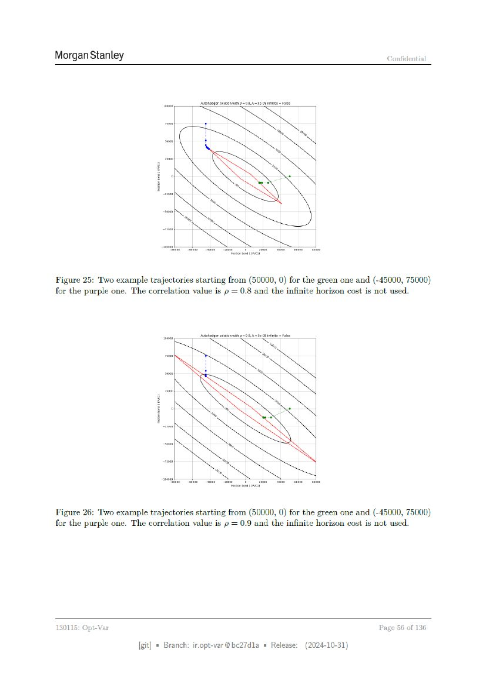

# ページ 056



## 原文OCRテキスト

```text
Morgan Stanley                                                                                           Confidential


                            _         _ntohedgeseluton wh 2=08.A~ S608 infnts = False


Figure 25: Two example trajectories starting from (50000, 0) for the green one and (-45000, 75000)
for the purple one. The correlation value is p = 0.8 and the infinite horizon cost is not used.


                                      _ntoheoge selon
                                                   wih 2=0.9,A~ $08 iints = ae


Figure 26: Two example trajectories starting from (50000, 0) for the green one and (-45000, 75000)
for the purple one. The correlation value is p = 0.9 and the infinite horizon cost is not used.


130115: Opt-Var                                                                                        Page 56 of 136

                     [git] « Branch: iropt-var@be27d1a = Release:                       (2024-10-31)
```
