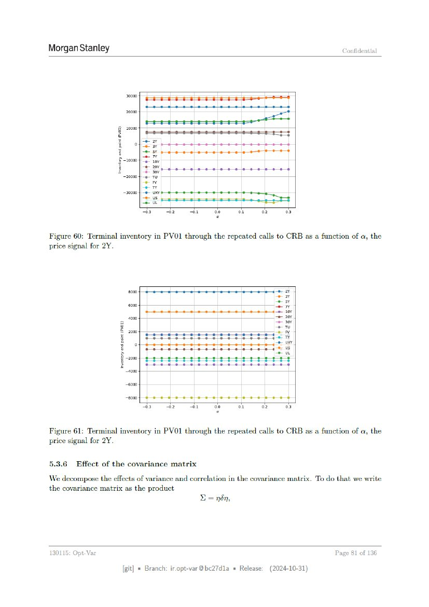

# ページ 081



## 原文OCRテキスト

```text
Morgan Stanley                                                                          Confidential


                       30000                                  =


                       ,         peseeeesereee              eet
                    10000
                                                                     aad
                     e        yew
                      g          ey
                     3           ee                                  een
                      > -20000 ae7-5 soy
                    iH           e207
                     z           = 30
                         20000 Fe Tu
                                 aay
                                 aa
                         30000 | “e uxe
                                 + us
                                 eu                             ae a aoe
                                 “03.2   00 on                  02      03


Figure 60: Terminal inventory in PV01 through the repeated calls to CRB as a function of a, the
price signal for 2Y.


                           000                   =a
                                                 Th
                          6000
                                                 pay
                                                 7
                                                 paaty
                         4000                    Sy
                                                  30
                     2g                           7
                      & 200                      aay
                     2                           oY
                     Byz                         ee
                                                 Sos
                       >                         oar
                         LMA ZaESEEecEEueeteeasesl
                     © 4000

                       sooo
                       200


Figure 61: Terminal inventory in PV01 through the repeated calls to CRB as a function of a, the
price signal for 2Y.

5.3.6    Effect of the covariance matrix

‘We decompose the effects of variance and correlation in the covariance matrix. To do that we write
the covariance matrix as the product
                                               L=nén,


130115: Opt-Var                                                                       Page 81 of 136

                      [git] « Branch: iropt-var@be27d1a = Release:   (2024-10-31)
```
