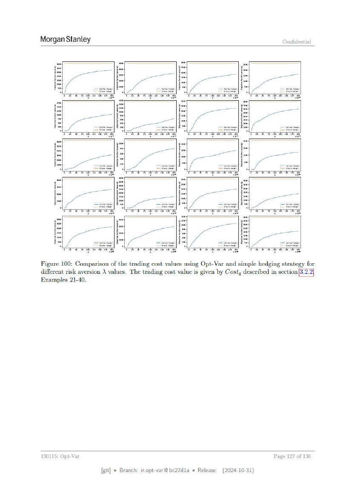

# ページ 127



## 原文OCRテキスト

```text
Morgan Stanley                                                                         Confidential


Figure 100: Comparison of the trading cost values using Opt-Var and simple hedging strategy for
different risk aversion \ values. The trading cost value is given by Costg described in section|3.
Examples 21-40.


130115: Opt-Var                                                                     Page   127 of 136


                     [git] « Branch: iropt-var@be27d1a = Release:   (2024-10-31)
```
