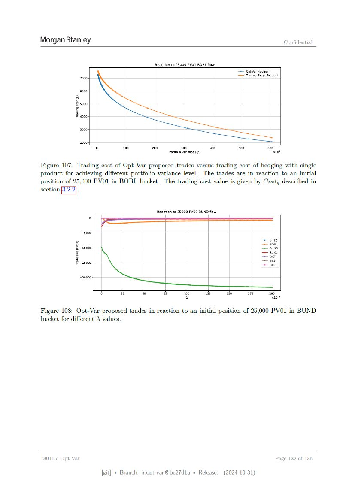

# ページ 132



## 原文OCRテキスト

```text
Morgan Stanley                                                                                                                               Confidential


                                                             Reactionto 25000 PVO1 BOBL flow
                                                                                                             <= opt¥var Hedger
                  7000.                                                                                      = Trading Sinal
                                                                                                                         Single Product


                  3000

                  2000
                           ry                   100       7260              7360                 “00         “30                 oo
                                                                     Portola variance (@)                                             xaot

Figure 107: Trading cost of Opt-Var proposed trades versus trading cost of hedging with single
product for achieving different portfolio variance level. The trades are in reaction to an initial
position of 25,000 PVO1 in BOBL bucket. The trading cost value is given by Costg described in
sectio


                          ——
                           Reactionto 25000 PVO1 BUND flow


                   5000
                5                                                                                                            siz
              Fy                                                                                                             poet
                & -10000                                                                                                     + BUND
                 1                                                                                                           eux
                 H                                                                                                              on
              48 -15000                                                                                                      ers
                                                                                                                              —78

                  2000

                                r)          3         %          7             300          us          70         Ts             260
                                                                                iN                                                  x10

Figure 108: Opt-Var proposed trades in reaction to an initial position of 25,000 PVO1 in BUND
bucket for different values.


130115: Opt-Var                                                                                                                        Page 132 of 136

                                     [git] « Branch: iropt-var@be27d1a = Release:                      (2024-10-31)
```
