# Winning-Probability Model for EUGV RFQ Pricing - 全ページ日本語ナビゲーション版
> 完全な逐語訳ではありません。日本語メモ、ページ画像、原文OCRをページごとにまとめています。

## 主要日本語ノート

詳しい要約訳は `main_translation_ja.md` を参照してください。


---

# Page 001 - 日本語版

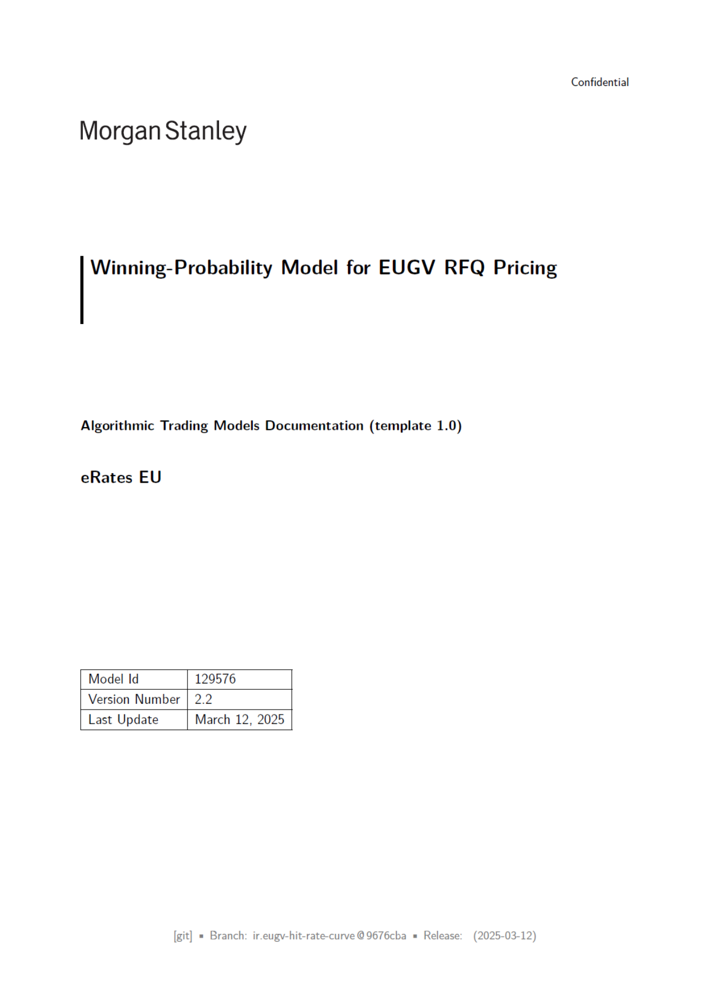

## 日本語メモ

**該当箇所:** 表紙

Morgan Stanleyの機密文書。EUGV RFQ Pricing向けWinning-Probability Modelのモデル文書で、モデルID、バージョン、更新日、gitブランチ情報が示されている。

## 原文OCR/Text Layer

> OCR由来のため、誤認識があります。正確な図表・数式・レイアウトは上のページ画像を確認してください。

```text
Confidential
Morgan Stanley
Winning-Probability Model for EUGV RFQ Pricing
Algorithmic Trading Models Documentation (template 1.0)
eRates EU
Model Id
129576
Version Number | 2.2
Last Update
March 12, 2025
[git]
= Branch:
ir.eugy-hit-rate-curve @9676cba
= Release:
(2025-03-12)
```


---

# Page 002 - 日本語版


## 日本語メモ

**該当箇所:** 文書バージョン管理・モデル識別

版数、主要変更、作成者、モデル名、モデルID、プラットフォーム、ティア、開発者、オーナー、利用者を整理している。

## 原文OCR/Text Layer

> OCR由来のため、誤認識があります。正確な図表・数式・レイアウトは上のページ画像を確認してください。

```text
Morgan Stanley
Confidential
Document Version Control
Version
Date
Summary of Key Changes
Author
1.0
March 13, 2023
Initial submission
Audrey Valreau
11
January 5, 2024
| Tiering justification provided
Audrey Valreau
1.2
January 29, 2024
| On-going
monitoring,
monitoring
metric
and | Audrey Valreau
SDLC criteria updated
13
July 15, 2024
Model scope expansion to EU bonds
Audrey Valreau
2.0
September 5, 2024 | Model scope expansion to UK Gilt bonds and use | Marina Johnson
of a three-feature calibration for Gilts
21
December 4, 2024
| Model revalidation
Audrey Valreau
2.2
March 12, 2025
Model scope expansion to UK inflation bonds
Audrey Valreau
Model Identification and Stakeholders Summary
Model Name
Winning-Probability Model for EUGV RFQ Pricing
Model 1D*
129576
IViermrvarnaimeml
eQuote_QUOTEMANAGER
Model Tier
Tier 1: Materiality High, Complexity Medium
Legal Entity
Morgan Stanley
rm erate
Audrey Valreau, Marina Johnson
Model Owners
Thomas Klocker
Model Users
eRates Trading (global)
Model Validators
[Ry
“MCS Model Number
™** e.g. System Names
129576:
Winning-Probability Model
for
EUGV
RFQ
Pricing
Page
2 of 73
[git]
= Branch:
ir.eugy-hit-rate-curve @9676cba
= Release:
(2025-03-12)
```


---

# Page 003 - 日本語版


## 日本語メモ

**該当箇所:** 目次

Executive SummaryからDefinition of Termsまで、全体構成とページ番号を示す目次。

## 原文OCR/Text Layer

> OCR由来のため、誤認識があります。正確な図表・数式・レイアウトは上のページ画像を確認してください。

```text
Morgan Stanley
Confidential
Table of Contents
T-1__Model
Purpose
and
Intended
Use
[L2__Model Description Summary]...
.
[L3_Key Assumptions and Limitations].
4
Overall Model Performance Assessment]
5
Summary
of
Results
2
Business and Algo Description|
[3.2
Model
Specification]
[3.3
Model
Inputs and
Data]
3.6
Numerical
Implementation]
[4
Model Development and Selection Process)... 2.6...
ee eee ee
ee
G1
Model Segmentation and Variable Selection]
vente ee
[23
Censored Economic Information from RFQ Auctions]
[24_From Price to Margin and the Introduction of Hit-Rate Curves)
25
The MS Autoquoting Complex]...
2.6
Summa
[2.7
Regulatory and Policy Requirements}
3.1
Model
Assumptions
(£2
Alternative Theories and Approaches
(£3_Contributions from Key Stakeholder
see
[5.2
Scenario Analysis and Stress Testing]
5.3
Sensitivity
Analysis]...
2... 2...
54
Benchmarkingl.............
5
Outcome Analysis and Backtesting]
.
(©
Model Limitations, Uncertainties and Mitigation
[7
Model Overlays and Overrides]
©
Production Implementation and Control
.
B.L_
Production Implementation]
Model
Testing}
8.3
[odel
Code
Change
Control
an
[4
Software Development Lifecycle]
[1
Model Ongoing Performance Monitoring]
.
9.1
Metrics
being monitored
9.3
Data shared wit)
10 Model Change Log
129576:
Winning-Probability Model for
EUGV
RFQ
Pricing
[git]
= Branch:
ir.eugy-hit-rate-curve @9676cba
= Release:
(2025-03-12)
Page
3 of 73
```


---

# Page 004 - 日本語版


## 日本語メモ

**該当箇所:** 1 Executive Summary

モデル目的、概要、前提、性能評価、結果要約。RFQのスプレッド獲得率と約定確率の関係をロジスティック回帰で表す。

## 原文OCR/Text Layer

> OCR由来のため、誤認識があります。正確な図表・数式・レイアウトは上のページ画像を確認してください。

```text
Morgan Stanley
Confidential
1
Executive Summary
1.1.
Model Purpose and Intended Use
The purpose of the probability curve model described in the document is to represent the re-
lationship between market spread captured and probability of trading. The model will be used
in the automated market-making pricing components, where it is intended to assist in the quote
construction process.
The specific scope of application is the European Government (EUGV) and UK Government
(UKGV) bond spaces, including UK inflation. The model will reside in algorithms captured by the
Model Control System (MCS) legal entity.
1.2.
Model Description Summary
The model uses standard logistic regression methods to estimate the relationship between spread
and trading probability, based on historical auction data available to the Firm. The model outputs
feature coefficients used to describe this relationship, in order to generate probability curves for
incoming auctions - see section
[2] for details on probability curves, and section
2-|for details on
the trade auction process.
Inputs to the model include market data, as well as information on the security being traded
at the time. Other information concerning the parameters of incoming auctions is also included.
The model has a tiering of 1 as determined by its high ‘Materiality’ and medium ‘Complexity’
ratings.
Materiality and Complexity are each derived from two sub-tiers. For Materiality, the two sub-
tiers are ‘Usage’ and ‘Reliance’. For Complexity the two sub-tiers are ‘Specificity’ and ‘Processing’.
Guidance on tiering assessments for each component can be found in section 5 of the tiering docu-
mentation [I].
‘The Materiality of the model is high due to high Usage and medium Reliance.
The model has high Usage. Models in Macro can be used by different algos with different
metrics, Metrics are not comparable, and therefore a conservative approach has been taken.
The model has medium Reliance. The quoting algorithm can continue to price clients even
when the model is (a) either not operational, or (b) has not been calibrated. Prices sent to clients
are subject to rigorous price verification and benchmarking to external reference prices prior to
publication.
The Complexity of the model is medium due to medium Specificity and medium Processing.
The model has medium Specificity as the model provides a point of estimate of the probability of
execution at a given bid-offer spread.
‘The model has medium Processing as the calibration, run off-line, is based on logistic regression.
‘As per the tiering documentation, the overall tier of the model is 1.
1.3.
Key Assumptions and Limitations
The model is based on the following key assumptions, which are detailed further in sectior
+ The auctions seen by MS are sufficient to represent the market as a whole - further detail on
this is provided in sectioi
+ The probability curve will resemble a sigmoid function.
+ The auction tie rate is negligible.
129576: Winning-Probability Model for
EUGV RFQ Pricing
Page 4 of 73
[git]
= Branch:
ir.eugy-hit-rate-curve @9676cba
= Release:
(2025-03-12)
```


---

# Page 005 - 日本語版

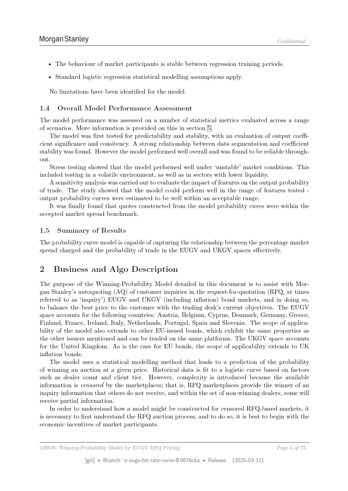

## 日本語メモ

**該当箇所:** 1 Executive Summary

モデル目的、概要、前提、性能評価、結果要約。RFQのスプレッド獲得率と約定確率の関係をロジスティック回帰で表す。

## 原文OCR/Text Layer

> OCR由来のため、誤認識があります。正確な図表・数式・レイアウトは上のページ画像を確認してください。

```text
Morgan Stanley
Confidential
+ The behaviour of market participants is stable between regression training periods.
+ Standard logistic regression statistical modelling assumptions apply.
No limitations have been identified for the model.
1.4
Overall Model Performance Assessment
The model performance was assessed on a number of statistical metrics evaluated across a range
of scenarios. More information is provided on this in section
The model was first tested for predictability and stability, with an evaluation of output coeffi-
cient significance and consitency. A strong relationship between data segmentation and coefficient
stability was found. However the model performed well overall and was found to be reliable through-
out.
Stress testing showed that the model performed well under ‘unstable’ market conditions. This
included testing in a volatile environment, as well as in sectors with lower liquidity.
A sensitivity analysis was carried out to evaluate the impact of features on the output probability
of trade. The study showed that the model could perform well in the range of features tested -
output probability curves were estimated to be well within an acceptable range.
Tt was finally found that quotes constructed from the model probability cuves were within the
accepted market spread benchmark.
1.5
Summary of Results
The probability curve model is capable of capturing the relationship between the percentage market
spread charged and the probability of trade in the EUGV and UKGV spaces effectively.
2
Business and Algo Description
The purpose of the Winning-Probability Model detailed in this document is to assist with Mor-
gan Stanley’s autoquoting (AQ) of customer inquiries in the request-for-quotation (RFQ, at times
referred to as ‘inquiry’) EUGV and UKGV (including inflation) bond markets, and in doing so,
to balance the best price to the customer with the trading desk’s current objectives. The EUGV
space accounts for the following countries: Austria, Belgium, Cyprus, Denmark, Germany, Greece,
Finland, France, Ireland, Italy, Netherlands, Portugal, Spain and Slovenia. The scope of applica-
bility of the model also extends to other EU-issued bonds, which exhibit the same properties as
the other issuers mentioned and can be traded on the same platforms. The UKGV space accounts
for the United Kingdom. As is the case for EU bonds, the scope of applicability extends to UK
inflation bonds.
The model uses a statistical modelling method that leads to a prediction of the probability
of winning an auction at a given price. Historical data is fit to a logistic curve based on factors
such as dealer count and client tier.
However, complexity is introduced because the available
information is censored by the marketplaces; that is, RFQ marketplaces provide the winner of an
inquiry information that others do not receive, and within the set of non-winning dealers, some will
receive partial information.
In order to understand how a model might be constructed for censored RFQ-based markets, it
is necessary to first understand the RFQ auction process, and to do so, it is best to begin with the
economic incentives of market participants.
129576: Winning-Probability Model for
EUGV RFQ Pricing
Page
5 of 73
[git]
= Branch:
ir.eugy-hit-rate-curve @9676cba
= Release:
(2025-03-12)
```


---

# Page 006 - 日本語版

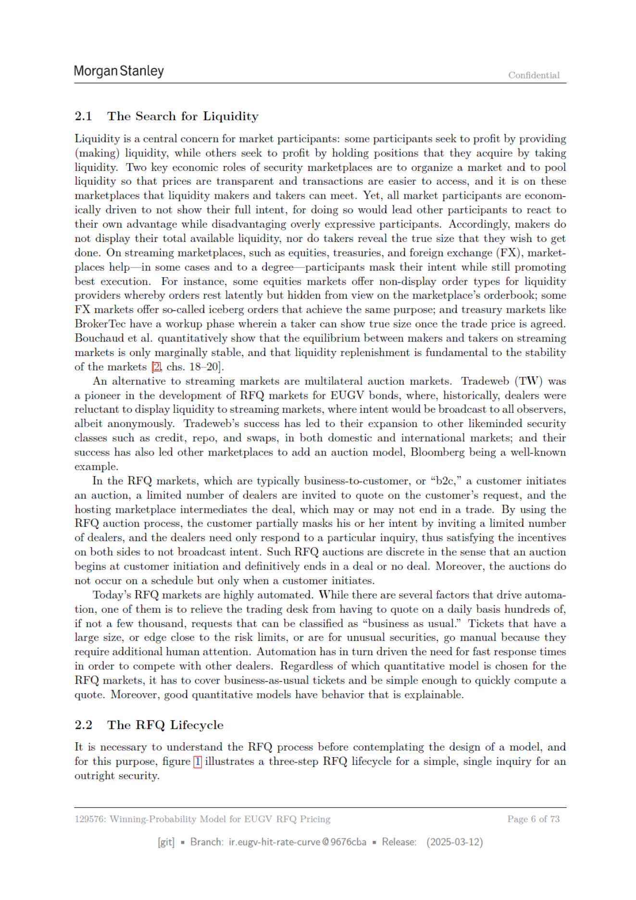

## 日本語メモ

**該当箇所:** 2.1 The Search for Liquidity / 2.2 RFQ Lifecycle

RFQ市場が流動性と情報秘匿をどう両立するか、また顧客・マーケットプレイス・ディーラー間のRFQライフサイクルを説明する。

## 原文OCR/Text Layer

> OCR由来のため、誤認識があります。正確な図表・数式・レイアウトは上のページ画像を確認してください。

```text
Morgan Stanley
Confidential
2.1
The Search for Liquidity
Liquidity is a central concern for market participants: some participants seek to profit by providing
(making) liquidity, while others seek to profit by holding positions that they acquire by taking
liquidity. Two key economic roles of security marketplaces are to organize a market and to pool
liquidity so that prices are transparent and transactions are easier to access, and it is on these
marketplaces that liquidity makers and takers can meet. Yet, all market participants are econom-
ically driven to not show their full intent, for doing so would lead other participants to react to
their own advantage while disadvantaging overly expressive participants. Accordingly, makers do
not display their total available liquidity, nor do takers reveal the true size that they wish to get
done. On streaming marketplaces, such as equities, treasuries, and foreign exchange (FX), market-
places help—in some cases and to a degree—participants mask their intent while still promoting
best execution.
For instance, some equities markets offer non-display order types for liquidity
providers whereby orders rest latently but hidden from view on the marketplace’s orderbook; some
FX markets offer so-called iceberg orders that achieve the same purpose; and treasury markets like
BrokerTec have a workup phase wherein a taker can show true size once the trade price is agreed.
Bouchaud et al. quantitatively show that the equilibrium between makers and takers on streaming
markets is only marginally stable, and that liquidity replenishment is fundamental to the stability
of the markets [J chs. 18-20].
‘An alternative to streaming markets are multilateral auction markets. Tradeweb (TW) was
a pioneer in the development of RFQ markets for EUGV bonds, where, historically, dealers were
reluctant to display liquidity to streaming markets, where intent would be broadcast to all observers,
albeit anonymously. Tradeweb’s success has led to their expansion to other likeminded security
classes such as credit, repo, and swaps, in both domestic and international markets; and their
success has also led other marketplaces to add an auction model, Bloomberg being a well-known
example.
In the RFQ markets, which are typically business-to-customer, or “b2c,” a customer initiates
an auction, a limited number of dealers are invited to quote on the customer’s request, and the
hosting marketplace intermediates the deal, which may or may not end in a trade. By using the
RFQ auction process, the customer partially masks his or her intent by inviting a limited number
of dealers, and the dealers need only respond to a particular inquiry, thus satisfying the incentives
on both sides to not broadcast intent. Such RFQ auctions are discrete in the sense that an auction
begins at customer initiation and definitively ends in a deal or no deal. Moreover, the auctions do
not occur on a schedule but only when a customer initiates.
Today’s RFQ markets are highly automated. While there are several factors that drive automa-
tion, one of them is to relieve the trading desk from having to quote on a daily basis hundreds of,
if not a few thousand, requests that can be classified as “business as usual.” Tickets that have a
large size, or edge close to the risk limits, or are for unusual securities, go manual because they
require additional human attention. Automation has in turn driven the need for fast response times
in order to compete with other dealers. Regardless of which quantitative model is chosen for the
RFQ markets, it has to cover business-as-usual tickets and be simple enough to quickly compute a
quote. Moreover, good quantitative models have behavior that is explainable.
2.2
The RFQ Lifecycle
It is necessary to understand the RFQ process before contemplating the design of a model, and
for this purpose, figure [I] illustrates a three-step RFQ lifecycle for a simple, single inquiry for an
outright security.
129576: Winning-Probability Model for
EUGV RFQ Pricing
Page 6 of 73
[git]
= Branch:
ir.eugy-hit-rate-curve @9676cba
= Release:
(2025-03-12)
```


---

# Page 007 - 日本語版

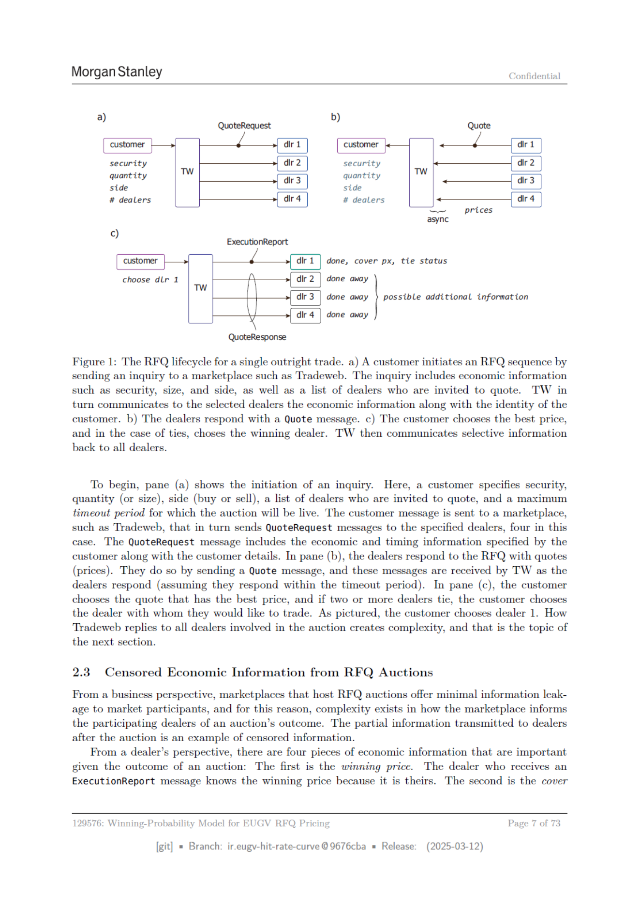

## 日本語メモ

**該当箇所:** 2.2-2.3 RFQ Lifecycle / Censored Information

Tradeweb等のRFQで勝者・カバー価格・タイ情報がディーラーごとに部分的にしか見えないことを、図1・表1で整理している。

## 原文OCR/Text Layer

> OCR由来のため、誤認識があります。正確な図表・数式・レイアウトは上のページ画像を確認してください。

```text
Morgan Stanley
Confidential
a)
b)
QuoteRequest
Quote
ane
security
+> dir 2
]
security
dir 2
}
;
Tw
.
quantity
ar3
quantity
dr3
# dealers
++ dir4
]
# dealers
dir4
|
c)
~~
prices
async
ExecutionReport
done, cover px, tie status
choose dlr 1
ah
| dir
2) done away
Tw
[|
>
{ars | done away } possible additional information
+
—f dir
4) done away
QuoteResponse
Figure 1: The RFQ lifecycle for a single outright trade. a) A customer initiates an RFQ sequence by
sending an inquiry to a marketplace such as Tradeweb. The inquiry includes economic information
such as security, size, and side, as well as a list of dealers who are invited to quote. TW in
turn communicates to the selected dealers the economic information along with the identity of the
customer. b) The dealers respond with a Quote message. c) The customer chooses the best price,
and in the case of ties, choses the winning dealer. TW then communicates selective information
back to all dealers.
To begin, pane (a) shows the initiation of an inquiry.
Here, a customer specifies security,
quantity (or size), side (buy or sell), a list of dealers who are invited to quote, and a maximum
timeout period for which the auction will be live. The customer message is sent to a marketplace,
such as Tradeweb, that in turn sends QuoteRequest messages to the specified dealers, four in this
case. The QuoteRequest message includes the economic and timing information specified by the
customer along with the customer details. In pane (b), the dealers respond to the RFQ with quotes
(prices). They do so by sending a Quote message, and these messages are received by TW as the
dealers respond (assuming they respond within the timeout period).
In pane (c), the customer
chooses the quote that has the best price, and if two or more dealers tie, the customer chooses
the dealer with whom they would like to trade. As pictured, the customer chooses dealer 1. How
Tradeweb replies to all dealers involved in the auction creates complexity, and that is the topic of
the next section.
2.3.
Censored Economic Information from RFQ Auctions
From a business perspective, marketplaces that host RFQ auctions offer minimal information leak-
age to market participants, and for this reason, complexity exists in how the marketplace informs
the participating dealers of an auction’s outcome. The partial information transmitted to dealers
after the auction is an example of censored information.
From a dealer’s perspective, there are four pieces of economic information that are important
given the outcome of an auction: The first is the winning price.
The dealer who receives an
ExecutionReport message knows the winning price because it is theirs. The second is the cover
129576: Winning-Probability Model for
EUGV RFQ Pricing
Page
7 of 73
[git]
= Branch:
ir.eugy-hit-rate-curve @9676cba
= Release:
(2025-03-12)
```


---

# Page 008 - 日本語版

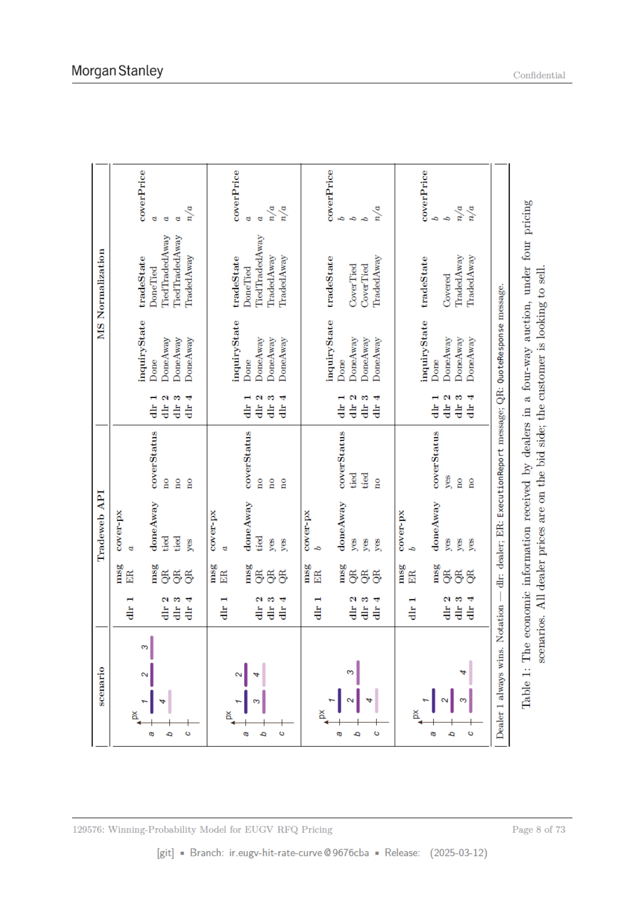

## 日本語メモ

**該当箇所:** 2.2-2.3 RFQ Lifecycle / Censored Information

Tradeweb等のRFQで勝者・カバー価格・タイ情報がディーラーごとに部分的にしか見えないことを、図1・表1で整理している。

## 原文OCR/Text Layer

> OCR由来のため、誤認識があります。正確な図表・数式・レイアウトは上のページ画像を確認してください。

```text
Morgan Stanley
Confidential
8
8
8
8
g
g
g
2
=
=
=
=
a
a
cy
&
=
=
=
=
5.268
gS
5.8
58s
2
ress
Booed
Sa538
=
I
>
a
g
g
2
3
be
io
g
g_re
g
e
2
88
&
3
Bygee
S
382
#
122
ga
3
Rages
g
SEs
Q
Bee
ge
€
seacy
Ss
Ses
3
Sug
S)
Ee
E
ashe ek
#
SSE
B
SEE
|F
=
Eg
EARE4E
&
88a
£
cee
|2
a2
Zz
ze}
$4
a
g
g
g
2
g|
3s
2
s
s
s
,
=...
|2|
28
BD
PEP
DB
PEP
DH
FEF
a
BRE
|8
a
p>
Bes
p>
BBB
B
Bee
B
Bee
3
ao
SeSad
32339
22883
$2333
|S]
Es
ge 555
gS 558
E553
Ze555
[8]
25
Faqaaa
Faaaa
#aqqa
Faqgaa
|/2
ae
S|
3
anaes
saat
saat
naew
[Sl
25
Baas
BREE
BEES
Bees
|Z]
ae
Duy
BUI
DUTT
DUTT
&
aa
_
S|
2
BS
gS
Ss
s
s
+
2
Fa
Fa
g
g
c|
cs
£
£
£
4
a]
25
§
§
5
5
2|
Be
Zeee
Beee
eae
B£e0
|e]
LS
.
s228
8222
ses8
8522
|8)
ge
a
3)
36
<1,
z
x
z
x
z
4
z
£1
Se
2/k
A
8
A
8
Rog
28
gs
<
4
<
4
<
ra
<
ie
2
g/g
5
Ey
ae
z
 &
5)
38
3
Suze
8
5
5
=|
£2
Ei
a
sees
Se
sie
5.
sfee
|.
S288
3
a6
a
8
&
»
oe
we
wee
of
=|
BS
Ze
Pewee
[Peo
Ree
|e
gue
|Pe
Pewee
||
2s
BE
FOGG
jE
OOO
[EG
EOOS
|B
EOOO
|¥
BS
4
aot
4
aod
4
nod
4
aot
{|
$4
=
#22
|
e822
|
#22)
2
see
[s|
2A
ai
UT
ai
TTT
ai
TTT
7
TTT
3
B82
=
g
3/
2
4
§
°
a4)
#8
2|
68
a
g
s
“
i
-|
“|-
-|
ee
5
a/
a
2
+]+
ro
cpady
rp
apo
=
S
2
o
2
6
oa
©
so
2
0
co ao
|é
129576:
Winning-Probability
Model
for
EUGV
RFQ Pricing
age
8 of 73
[git]
= Branch:
ir.eugy-hit-rate-curve @9676cba
= Release:
(2025-03-12)
```


---

# Page 009 - 日本語版


## 日本語メモ

**該当箇所:** 2.2-2.3 RFQ Lifecycle / Censored Information

Tradeweb等のRFQで勝者・カバー価格・タイ情報がディーラーごとに部分的にしか見えないことを、図1・表1で整理している。

## 原文OCR/Text Layer

> OCR由来のため、誤認識があります。正確な図表・数式・レイアウトは上のページ画像を確認してください。

```text
Morgan Stanley
Confidential
price, which is the best price offered by the dealers who have lost the auction. Lastly, dealers may
tie at the winning or cover prices. Ties are not an edge case but can represent a significant portion
of auction results, and this is because of the relatively coarse price increments in some markets,
such as EUGV bonds, and the high demand to participate in these markets.
In order to organize the possible outcomes of an auction, table [I] breaks down four scenarios
where a customer wants to sell and so the dealers price on the bid side;
a customer naturally
wants the highest price.
The first main column illustrates the quoted prices, the second main
column tabulates the messages sent from TW to the dealers, and the third main column interprets
the TW messages into an MS-normalized form. The TW messages are documented in their API
specifications found in [TZ]. And, for simplicity, dealer 1 is always the winner here.
In the first scenario, three dealers quote the best price while the fourth quotes a lower price.
Dealer
1 receives an ExecutionReport message, thereby informing the dealer that they have the
winning price. In that report, dealer 1 is informed of the cover price, and since the cover price here
is the same as the winning price, the dealer can infer that other dealers tied at the winning price
(although the number of tied dealers remains concealed). As a result, dealer 1 is assigned an MS
inquiryState of Done and a tradeState of DoneTied. Dealers 2-4 receive QuoteResponse messages
with tailored information, and the simple fact that they receive this message means that they
lost, or were DoneAway. Dealers 2 and 3 receive additional information from TW in the doneAway
message field that they tied, and so they know that they tied at the best price; their MS tradeState
is TiedTradedAway. Because there was a tie at the winning price, these dealers also know the cover
price: it is the same as the winning price. Lastly, dealer 4 receives no additional information from
TW; the dealer only knows that they quoted below both the winning and cover prices, and that
no tie information
is furnished. Thus, their MS tradeState
is TradedAway and the cover price is
unknown.
Scenario 2 is similar, but here dealers 3 and 4 quote at the same, lower price. Dealer 2 knows
that they tied at the winning price, and therefore the winning price is also the cover price. Dealer 3
no longer has visibility into the cover price and thus knows the same information as dealer 4: they
are neither at the winning nor cover prices, nor do they know tie information.
Scenario 3 lowers the quote prices of dealers 2 and 4. In this case, dealer 1 infers that there was
no tie at the winning price because the reported cover price, price b, is below their own winning
price. Dealers 2 and 3 learn that they are tied at the cover price because the QuoteResponse message
indicates that they tied in the coverStatus field. And so, these dealers would be marked as DoneAway
and CoverTied in the MS normalization fields, and they infer that the cover price is b. Once again,
dealer 4 has no information beyond the fact that they did not win nor were they at cover.
Scenario 4 is the most straightforward example because of the absence of ties at the winning
and cover prices. Here, dealer 1 once again learns of the cover price (price 6) and thus infers that
no other dealers tied at the winning price. Dealer 2 learns that they were cover but that there was
no cover tie, and dealers 3 and 4, like before, only know that the trade was done away from their
quote.
To conclude, it should be observed that the customer always knows all of the auction prices:
dealers operate at an information disadvantage to customers.
Lastly, while the dealers in the
scenarios above were labeled consistently, in practice Morgan Stanley may end up in any one of
these four terminal conditions. Consequently, it is imperative to construct a pricing model that
maximizes the information that is available even in this censored environment.
129576: Winning-Probability Model for
EUGV RFQ Pricing
Page
9 of 73
[git]
= Branch:
ir.eugy-hit-rate-curve @9676cba
= Release:
(2025-03-12)
```


---

# Page 010 - 日本語版

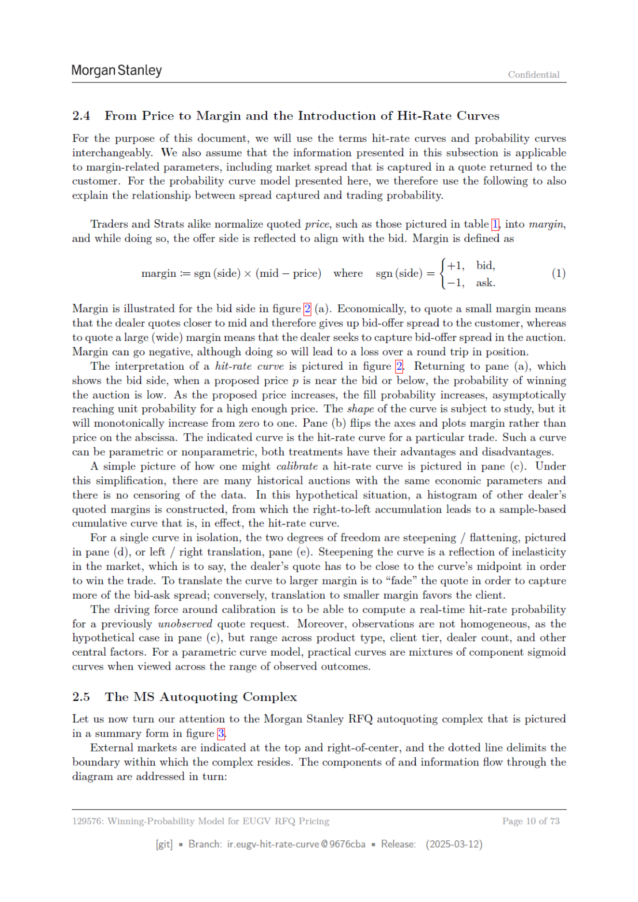

## 日本語メモ

**該当箇所:** 2.4 Hit-Rate Curves

価格をサイド補正済みmarginに正規化し、marginと勝率の関係をhit-rate/probability curveとして扱う。図2で曲線の平行移動・急峻化を示す。

## 原文OCR/Text Layer

> OCR由来のため、誤認識があります。正確な図表・数式・レイアウトは上のページ画像を確認してください。

```text
Morgan Stanley
Confidential
2.4
From Price to Margin and the Introduction of Hit-Rate Curves
For the purpose of this document, we will use the terms hit-rate curves and probability curves
interchangeably. We also assume that the information presented in this subsection is applicable
to margin-related parameters, including market spread that is captured in a quote returned to the
customer. For the probability curve model presented here, we therefore use the following to also
explain the relationship between spread captured and trading probability.
Traders and Strats alike normalize quoted price, such as those pictured in table[I]
into margin,
and while doing so, the offer side is reflected to align with the bid. Margin is defined as
+1,
bid,
“1
ask
(1)
margin := sgn (side) x (mid — price)
where
sgn (side) = {
Margin is illustrated for the bid side in figure[J|
(a). Economically, to quote a small margin means
that the dealer quotes closer to mid and therefore gives up bid-offer spread to the customer, whereas
to quote a large (wide) margin means that the dealer seeks to capture bid-offer spread in the auction.
Margin can go negative, although doing so will lead to a loss over a round trip in position.
The interpretation of a hit-rate curve is pictured in figure [| Returning to pane (a), which
shows the bid side, when a proposed price p is near the bid or below, the probability of winning
the auction is low. As the proposed price increases, the fill probability increases, asymptotically
reaching unit probability for a high enough price. The shape of the curve is subject to study, but it
will monotonically increase from zero to one. Pane (b) flips the axes and plots margin rather than
price on the abscissa. The indicated curve is the hit-rate curve for a particular trade. Such a curve
can be parametric or nonparametric, both treatments have their advantages and disadvantages.
A simple picture of how one might calibrate a hit-rate curve is pictured in pane (c).
Under
this simplification, there are many historical auctions with the same economic parameters and
there is no censoring of the data.
In this hypothetical situation, a histogram of other dealer’s
quoted margins is constructed, from which the right-to-left accumulation leads to a sample-based
cumulative curve that: is, in effect, the hit-rate curve.
For a single curve in isolation, the two degrees of freedom are steepening / flattening, pictured
in pane (d), or left / right translation, pane (e). Steepening the curve is a reflection of inelasticity
in the market, which is to say, the dealer’s quote has to be close to the curve’s midpoint in order
to win the trade. To translate the curve to larger margin is to “fade” the quote in order to capture
more of the bid-ask spread; conversely, translation to smaller margin favors the client.
The driving force around calibration is to be able to compute a real-time hit-rate probability
for a previously unobserved quote request. Moreover, observations are not homogeneous, as the
hypothetical case in pane (c), but range across product type, client tier, dealer count, and other
central factors. For a parametric curve model, practical curves are mixtures of component sigmoid
curves when viewed across the range of observed outcomes.
2.5
The MS Autoquoting Complex
Let us now turn our attention to the Morgan Stanley RFQ autoquoting complex that is pictured
in a summary form in figure
External markets are indicated at the top and right-of-center, and the dotted line delimits the
boundary within which the complex resides. The components of and information flow through the
diagram are addressed in turn:
129576: Winning-Probability Model for
EUGV RFQ Pricing
Page 10 of 73
[git]
= Branch:
ir.eugy-hit-rate-curve @9676cba
= Release:
(2025-03-12)
```


---

# Page 011 - 日本語版


## 日本語メモ

**該当箇所:** 2.4 Hit-Rate Curves

価格をサイド補正済みmarginに正規化し、marginと勝率の関係をhit-rate/probability curveとして扱う。図2で曲線の平行移動・急峻化を示す。

## 原文OCR/Text Layer

> OCR由来のため、誤認識があります。正確な図表・数式・レイアウトは上のページ画像を確認してください。

```text
Morgan Stanley
Confidential
a
b
)
px
)
offer
PCW(u)=1)
win prob
1
margin jt
na |,
|
Ty
proposed
hit-rate curve
margin
<— quote price p
bid
0
margin
0
+> PW(p)=1)
0
1
¢ >
1
frequency of historically
ZA
observed dealer quotes
cumulative curve
0
margin
0
d)
e)
Pp
Pp
1
1
steepen
translate
0
margin
0
margin
0
0
Figure 2: From prices to margin, and the development of hit-rate curves. Pane (a), as a proposed
price p on the bid side is increased through mid and toward the offer, the probability of winning
an auction increases. Margin is defined as the spread between mid and the proposed price, sign-
corrected for side. Pane (b), normalization of prices to margin: margin is side-corrected distance
from mid. The hit-rate curve traces the win probability indicated in pane (a). Pane (c), a hit-rate
curve can in theory be calibrated by observing the other dealer's quotes (in margin) across many
auctions.
Panes (d-e), a parametric hit-rate curve can be flattened or steepened to reflect the
elasticity of the market, and/or translated left and right to fade or aggress the market.
+ Auction initiation: From the MS perspective, an RFQ auction begins when a QuoteRequest
message is received from the marketplace (TW, Bloomberg (BBG), BV, and MA). The ex-
ample here focuses on a TW inquiry along message-path a.
« Order Router: The lines to the marketplaces are handled by this component, and messages
are translated between exchange-specific protocols and the internal MS data format. Also,
while this component is called an order router, its function is to direct messages back to the
originating market and not elsewhere. The Order Router forwards inbound messages to the
Inquiry Manager via message-path b.
: Winning-Probability Model for EUGV RFQ Pricing
Page 11 of 73
[git]
= Branch:
ir.eugy-hit-rate-curve @9676cba
= Release:
(2025-03-12)
```


---

# Page 012 - 日本語版

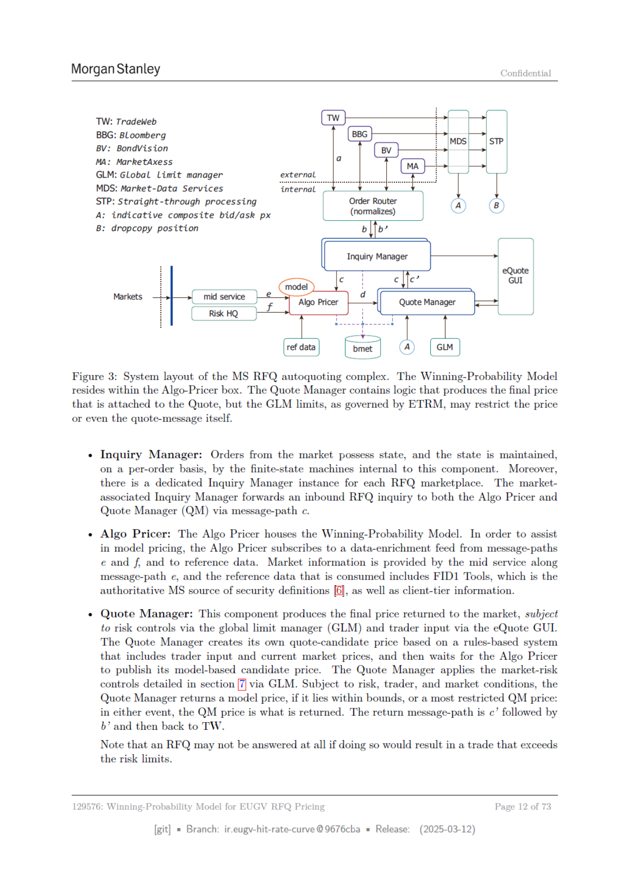

## 日本語メモ

**該当箇所:** 2.5-2.7 MS Autoquoting Complex / Policy

MSのRFQ自動クォート構成、Order Router、Inquiry Manager、Algo Pricer、Quote Manager、GLM、Mid Service等の役割を図3で説明する。

## 原文OCR/Text Layer

> OCR由来のため、誤認識があります。正確な図表・数式・レイアウトは上のページ画像を確認してください。

```text
Morgan Stanley
Confidential
TW: TradeWeb
i) ee
BBG: Bloomberg
(686
}———>
BV: BondVision
BV
MA: MarketAxess
a
GLM: Global Limit manager
external
MDS: Market-Data Services
internal
STP: Straight-through processing
Order Router
A: indicative composite bid/ask px
(normalizes)
B: dropcopy position
Quote
GUI
Figure 3: System layout of the MS RFQ autoquoting complex. The Winning-Probability Model
resides within the Algo-Pricer box. The Quote Manager contains logic that produces the final price
that is attached to the Quote, but the GLM limits, as governed by ETRM, may restrict the price
or even the quote-message itself.
« Inquiry Manager:
Orders from the market possess state, and the state
is maintained,
on a per-order basis, by the finit
there is a dedicated Inquiry Manager instance for each RFQ marketplace.
The market-
associated Inquiry Manager forwards an inbound RFQ inquiry to both the Algo Pricer and
Quote Manager (QM) via message-path c.
state machines internal
to this component.
Moreover,
+ Algo Pricer: The Algo Pricer houses the Winning-Probability Model.
In order to assist
in model pricing, the Algo Pricer subscribes to a data-enrichment feed from message-paths
e and f, and to reference data. Market information is provided by the mid service along
message-path ¢, and the reference data that is consumed includes FID1 Tools, which is the
authoritative MS source of security definitions [6], as well as client-tier information.
+ Quote Manager: This component produces the final price returned to the market, subject
to risk controls via the global limit manager (GLM) and trader input via the eQuote GUL
The Quote Manager creates its own quote-candidate price based on a rules-based system
that includes trader input and current market prices, and then waits for the Algo Pricer
to publish its model-based candidate price.
The Quote Manager applies the market-risk
controls detailed in section [7] via GLM. Subject to risk, trader, and market conditions, the
Quote Manager returns a model price, if it lies within bounds, or a most restricted QM price:
in either event, the QM price is what is returned. The return message-path is c’ followed by
b’ and then back to TW.
Note that an RFQ may not be answered at all if doing so would result in a trade that exceeds
the risk limits.
129576: Winning-Probability Model for
EUGV
RFQ Pricing
Page 12 of 73
[git]
= Branch:
ir.eugy-hit-rate-curve @9676cba
= Release:
(2025-03-12)
```


---

# Page 013 - 日本語版

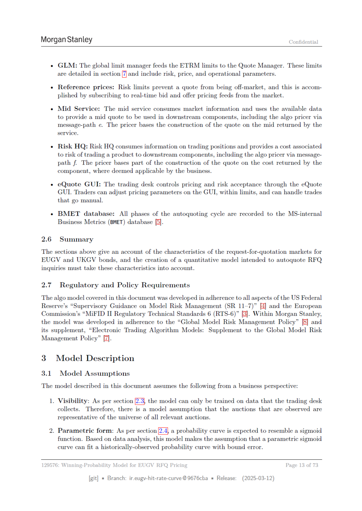

## 日本語メモ

**該当箇所:** 2.5-2.7 MS Autoquoting Complex / Policy

MSのRFQ自動クォート構成、Order Router、Inquiry Manager、Algo Pricer、Quote Manager、GLM、Mid Service等の役割を図3で説明する。

## 原文OCR/Text Layer

> OCR由来のため、誤認識があります。正確な図表・数式・レイアウトは上のページ画像を確認してください。

```text
Morgan Stanley
Confidential
+ GLM: The global limit manager feeds the ETRM limits to the Quote Manager. These limits
are detailed in section
[Z| and include risk, price, and operational parameters.
+ Reference prices: Risk limits prevent a quote from being off-market, and this is accom-
plished by subscribing to real-time bid and offer pricing feeds from the market.
+ Mid Service: The mid service consumes market information and uses the available data
to provide a mid quote to be used in downstream components, including the algo pricer via
message-path e. The pricer bases the construction of the quote on the mid returned by the
service.
« Risk HQ: Risk HQ consumes information on trading positions and provides a cost associated
to risk of trading a product to downstream components, including the algo pricer via message-
path f, The pricer bases part of the construction of the quote on the cost returned by the
component, where deemed applicable by the business.
* eQuote GUI: The trading desk controls pricing and risk acceptance through the eQuote
GUI. Traders can adjust pricing parameters on the GUI, within limits, and can handle trades
that go manual.
« BMET database:
All phases of the autoquoting cycle are recorded to the MS-internal
Business Metrics (BMET) database [5].
2.6
Summary
The sections above give an account of the characteristics of the request-for-quotation markets for
EUGV and UKGV bonds, and the creation of a quantitative model intended to autoquote RFQ
inquiries must take these characteristics into account.
2.7
Regulatory and Policy Requirements
The algo model covered in this document was developed in adherence to all aspects of the US Federal
Reserve's “Supervisory Guidance on Model Risk Management (SR 11-7)” [IJ and the European
Commission’s “MiFID II Regulatory Technical Standards 6 (RTS-6)” [5]. Within Morgan Stanley,
the model was developed in adherence to the “Global Model Risk Management Policy”
[3] and
its supplement, “Electronic Trading Algorithm Models: Supplement to the Global Model Risk
Management Policy” [7].
3
Model Description
3.1
Model Assumptions
The model described in this document assumes the following from a business perspective:
1. Visibility: As per sectior
the model can only be trained on data that the trading desk
collects.
Therefore, there is a model assumption that the auctions that are observed are
representative of the universe of all relevant auctions.
2. Parametric form: As per section [2.4] a probability curve is expected to resemble a sigmoid
function. Based on data analysis, this model makes the assumption that a parametric sigmoid
curve can fit a historically-observed probability curve with bound error.
129576: Winning-Probability Model for
EUGV RFQ Pricing
Page 13 of 73
[git]
= Branch:
ir.eugy-hit-rate-curve @9676cba
= Release:
(2025-03-12)
```


---

# Page 014 - 日本語版

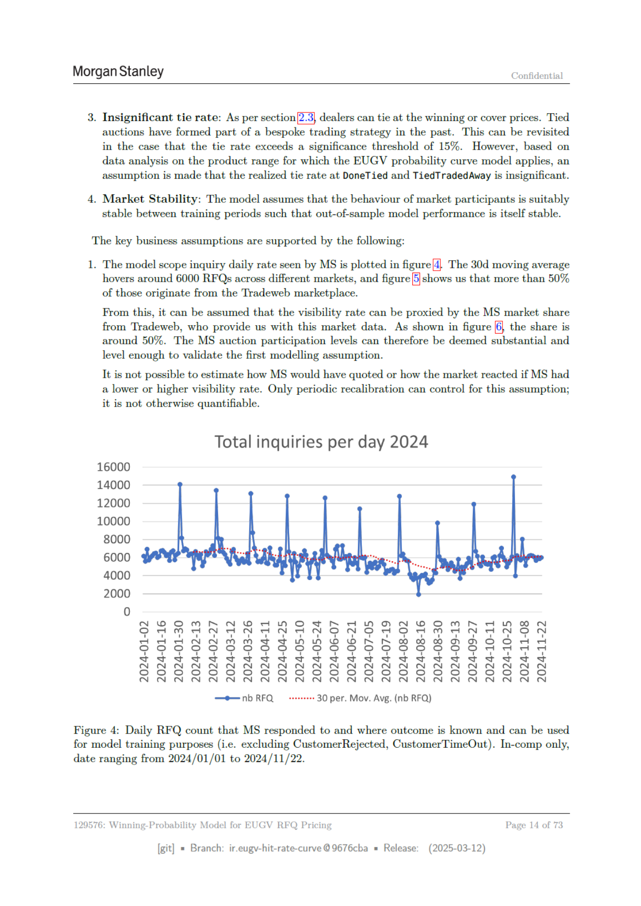

## 日本語メモ

**該当箇所:** 3.1 Model Assumptions

モデルの主要前提。MSが観測するオークションの代表性、hit-rate曲線のシグモイド形状、タイ率、参加者行動の安定性、ロジスティック回帰の統計前提など。

## 原文OCR/Text Layer

> OCR由来のため、誤認識があります。正確な図表・数式・レイアウトは上のページ画像を確認してください。

```text
Morgan Stanley
Confidential
3. Insignificant tie rate: As per section{2.3| dealers can tie at the winning or cover prices. Tied
auctions have formed part of a bespoke trading strategy in the past. This can be revisited
in the case that the tie rate exceeds a significance threshold of 15%.
However, based on
data analysis on the product range for which the EUGV probability curve model applies, an
assumption is made that the realized tie rate at DoneTied and TiedTradedAway is insignificant.
4. Market Stability: The model assumes that the behaviour of market participants is suitably
stable between training periods such that out-of-sample model performance is itself stable.
‘The key business assumptions are supported by the following:
1. The model scope inquiry daily rate seen by MS is plotted in figure[J. The 30d moving average
hovers around 6000 RFQs across different markets, and figure
[J]shows us that more than 50%
of those originate from the Tradeweb marketplace.
From this, it can be assumed that the visibility rate can be proxied by the MS market share
from Tradeweb, who provide us with this market data. As shown in figure [6] the share is
around 50%. The MS auction participation levels can therefore be deemed substantial and
level enough to validate the first modelling assumption.
It is not possible to estimate how MS would have quoted or how the market reacted if MS had
a lower or higher visibility rate. Only periodic recalibration can control for this assumption;
it is not otherwise quantifiable.
Total inquiries per day 2024
16000
14000
12000
10000
8000
6000
4000
2000
Figure 4: Daily RFQ count that MS responded to and where outcome is known and can be used
for model training purposes (i.e. excluding CustomerRejected, CustomerTimeOut). In-comp only,
date ranging from 2024/01/01 to 2024/11/22.
129576: Winning-Probability Model
for EUGV
RFQ Pricing
Page
14
of 73
[git]
Branch: ir.eugy-hit-rate-curve @9676cba
= Release:
(2025-03-12)
```


---

# Page 015 - 日本語版

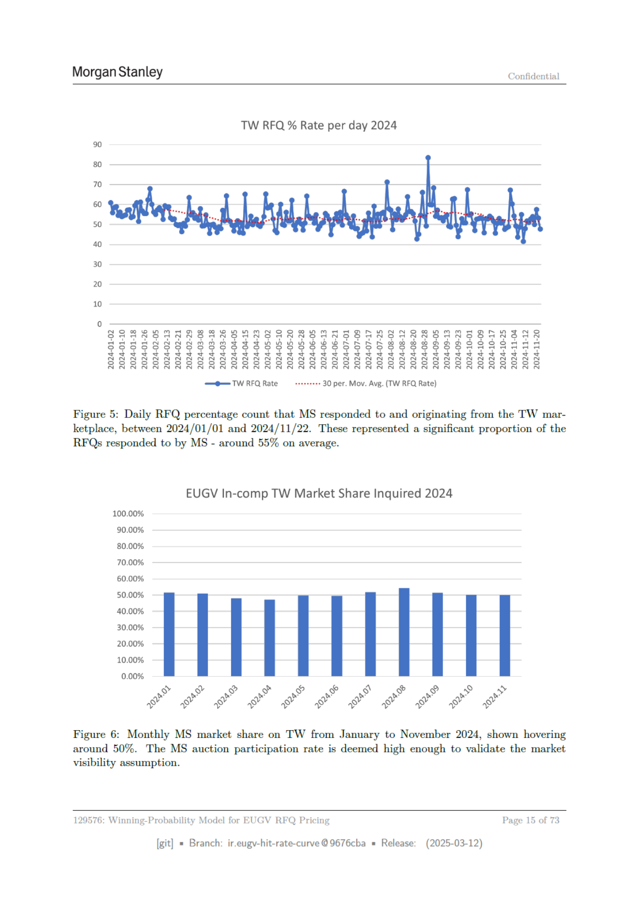

## 日本語メモ

**該当箇所:** 3.1 Model Assumptions

モデルの主要前提。MSが観測するオークションの代表性、hit-rate曲線のシグモイド形状、タイ率、参加者行動の安定性、ロジスティック回帰の統計前提など。

## 原文OCR/Text Layer

> OCR由来のため、誤認識があります。正確な図表・数式・レイアウトは上のページ画像を確認してください。

```text
Morgan Stanley
Confidential
TW RFQ % Rate per day 2024
30
20
10
—o—
TW RFQ Rate
+ 30 per. Mov. Avg. (TW RFQ Rate)
Figure 5: Daily RFQ percentage count that MS responded to and originating from the TW mar-
ketplace, between 2024/01/01 and 2024/11/22. These represented a significant proportion of the
RFQs responded to by MS - around 55% on average.
EUGV In-comp TW Market Share Inquired 2024
100 00%
90.00%
80 00%
70 00%
60 00%
50 00%
40.00%
30.00%
i
20.00%
10 00%
i
0.00%
>
x
e
Se
Se
£
Ss
$
&
S
oy
.
os
os
os
.
~
x
x?
~
~
~
*
*
*
*
*
*
sv
FX
SK
Figure 6: Monthly MS market share on TW from January to November 2024, shown hovering
around 50%. The MS auction participation rate is deemed high enough to validate the market
visibility assumption.
129576: Winning-Probability Model for EUGV RFQ Pricing
Page 15 of 73
[git]
Branch: ir.eugy-hit-rate-curve @9676cba
= Release:
(2025-03-12)
```


---

# Page 016 - 日本語版

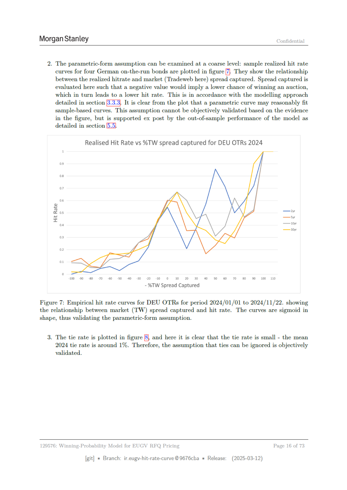

## 日本語メモ

**該当箇所:** 3.1 Model Assumptions

モデルの主要前提。MSが観測するオークションの代表性、hit-rate曲線のシグモイド形状、タイ率、参加者行動の安定性、ロジスティック回帰の統計前提など。

## 原文OCR/Text Layer

> OCR由来のため、誤認識があります。正確な図表・数式・レイアウトは上のページ画像を確認してください。

```text
Morgan Stanley
Confidential
2. The parametric-form assumption can be examined at a coarse level: sample realized hit rate
curves for four German on-the-run bonds are plotted in figure [7] They show the relationship
between the realized hitrate and market (Tradeweb here) spread captured. Spread captured is
evaluated here such that a negative value would imply a lower chance of winning an auction,
which in turn leads to a lower hit rate. This is in accordance with the modelling approach
detailed in sectio
It is clear from the plot that a parametric curve may reasonably fit
sample-based curves. This assumption cannot be objectively validated based on the evidence
in the figure, but
is
supported ex post by the out-of-sample performance of the model as
detailed in section
BS
Realised Hit Rate vs %TW spread captured for DEU OTRs 2024
09
os
o7
os
—w
os
—s
oa
10
02
100
90
8
70
60
50
40
30
2
1
0
10
2
30
4
50
69
7
8
9%
100
110
- %TW Spread Captured
Figure 7: Empirical hit rate curves for DEU OTRs for period 2024/01/01 to 2024/11/22. showing
the relationship between market (TW) spread captured and hit rate. The curves are sigmoid in
shape, thus validating the parametric-form assumption.
3. The tie rate is plotted in figure 3, and here it is clear that the tie rate is small - the mean
2024 tie rate is around 1%. Therefore, the assumption that ties can be ignored is objectively
validated.
129576: Winning-Probability Model
for
EUGV
RFQ Pricing
Page
16 of 73
[git]
Branch:
ir.eugy-hit-rate-curve @9676cba
= Release:
(2025-03-12)
```


---

# Page 017 - 日本語版

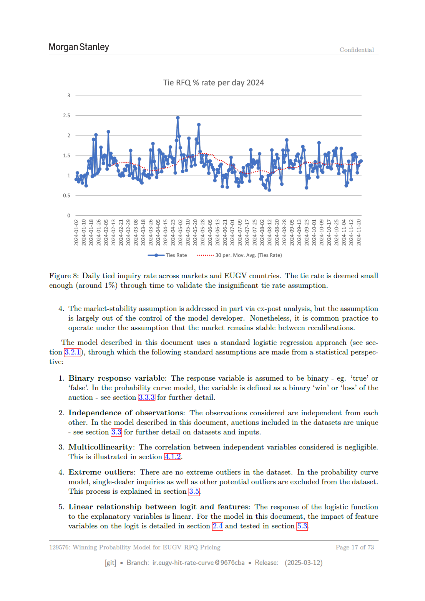

## 日本語メモ

**該当箇所:** 3.1 Model Assumptions

モデルの主要前提。MSが観測するオークションの代表性、hit-rate曲線のシグモイド形状、タイ率、参加者行動の安定性、ロジスティック回帰の統計前提など。

## 原文OCR/Text Layer

> OCR由来のため、誤認識があります。正確な図表・数式・レイアウトは上のページ画像を確認してください。

```text
Morgan Stanley
Confidential
Tie RFQ % rate per day 2024
SSSSSSSSSSSSESSSESSSSSSSSESSSSSSssgssggssgs
RSRRRRRARARARARRARRARARARARRARRARARARARARRAR
Ties Rate
-++++++++ 30 per. Mov. Avg. (Ties Rate)
Figure 8: Daily tied inquiry rate across markets and EUGV countries. The tie rate is deemed small
enough (around 1%) through time to validate the insignificant tie rate assumption.
4. The market-stability assumption is addressed in part via ex-post analysis, but the assumption
is largely out of the control of the model developer.
Nonetheless, it is common practice to
operate under the assumption that the market remains stable between recalibrations.
‘The model described in this document uses a standard logistic regression approach (see sec-
through which the following standard assumptions are made from a statistical perspec-
1. Binary response variable: The response variable is assumed to be binary - eg.
‘true’ or
‘false’. In the probability curve model, the variable is defined as a binary ‘win’ or ‘loss’ of the
auction - see section
[3.3.3] for further detail.
2. Independence of observations: The observations considered are independent from each
other. In the model described in this document, auctions included in the datasets are unique
~ see sectio:
for further detail on datasets and inputs.
3. Multicollinearity: The correlation between independent variables considered is negligible.
This is illustrated in section
4, Extreme outliers: There are no extreme outliers in the dataset.
In the probability curve
model, single-dealer inquiries as well as other potential outliers are excluded from the dataset.
This process is explained in section
5. Linear relationship between logit and features: The response of the logistic function
to the explanatory variables is linear. For the model in this document, the impact of feature
variables on the logit is detailed in section 2.4] and tested in section
129576: Winning-Probability Model
for EUGV RFQ Pricing
Page 17 of 73
[git]
Branch: ir.eugy-hit-rate-curve @9676cba
= Release:
(2025-03-12)
```


---

# Page 018 - 日本語版

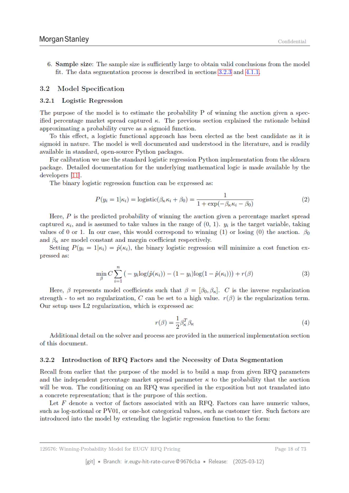

## 日本語メモ

**該当箇所:** 3.2 Model Specification

単純ロジスティック回帰からRFQファクターを導入した拡張形までを定式化し、データ分割とサンプル数低下のトレードオフを説明する。

## 原文OCR/Text Layer

> OCR由来のため、誤認識があります。正確な図表・数式・レイアウトは上のページ画像を確認してください。

```text
Morgan Stanley
Confidential
6. Sample size: The sample size is sufficiently large to obtain valid conclusions from the model
fit. The data segmentation process is described in sections
3.2
Model Specification
3.2.1
Logistic Regression
The purpose of the model is to estimate the probability P of winning the auction given a spec-
ified percentage market spread captured x. The previous section explained the rationale behind
approximating a probability curve as a sigmoid function.
To this effect, a logistic functional approach has been elected as the best candidate as it is
sigmoid in nature. The model is well documented and understood in the literature, and is readily
available in standard, open-source Python packages.
For calibration we use the standard logistic regression Python implementation from the sklearn
package. Detailed documentation for the underlying mathematical logic is made available by the
developers [II].
The binary logistic regression function can be expressed as:
1
P(yi = 1 ki) = logistic(8.Ki + 80) = Trexp
ani — Bo)
(2)
Here, P is the predicted probability of winning the auction given a percentage market spread
captured «;, and is assumed to take values in the range of (0, 1). y; is the target variable, taking
values of 0 or 1. In our case, this would correspond to winning (1) or losing (0) the auction. Bo
and 8, are model constant and margin coefficient respectively.
Setting P(y; = 1|xi) = p(mi), the binary logistic regression will minimize a cost function ex-
pressed
as:
mn
( — yilog(p(wi)) — (1 — yi)log( — p(mi))) + 7(8)
(3)
Here,
represents model coefficients such that 8 = [80, Bx].
C is the inverse regularization
strength - to set no regularization, C can be set to a high value. r() is the regularization term.
Our setup uses L2 regularization, which is expressed as:
(3) = 568 Be
)
Additional detail on the solver and process are provided in the numerical implementation section
of this document.
3.2.2
Introduction of RFQ Factors and the Necessity of Data Segmentation
Recall from earlier that the purpose of the model is to build a map from given RFQ parameters
and the independent percentage market spread parameter # to the probability that the auction
will be won. The conditioning on an RFQ was specified in the exposition but not translated into
a concrete representation; that is the purpose of this section.
Let F denote a vector of factors associated with an RFQ. Factors can have numeric values,
such as log-notional or PVO1, or one-hot categorical values, such as customer tier. Such factors are
introduced into the model by extending the logistic regression function to the form:
129576: Winning-Probability Model for
EUGV RFQ Pricing
Page 18 of 73
[git]
= Branch:
ir.eugy-hit-rate-curve @9676cba
= Release:
(2025-03-12)
```


---

# Page 019 - 日本語版

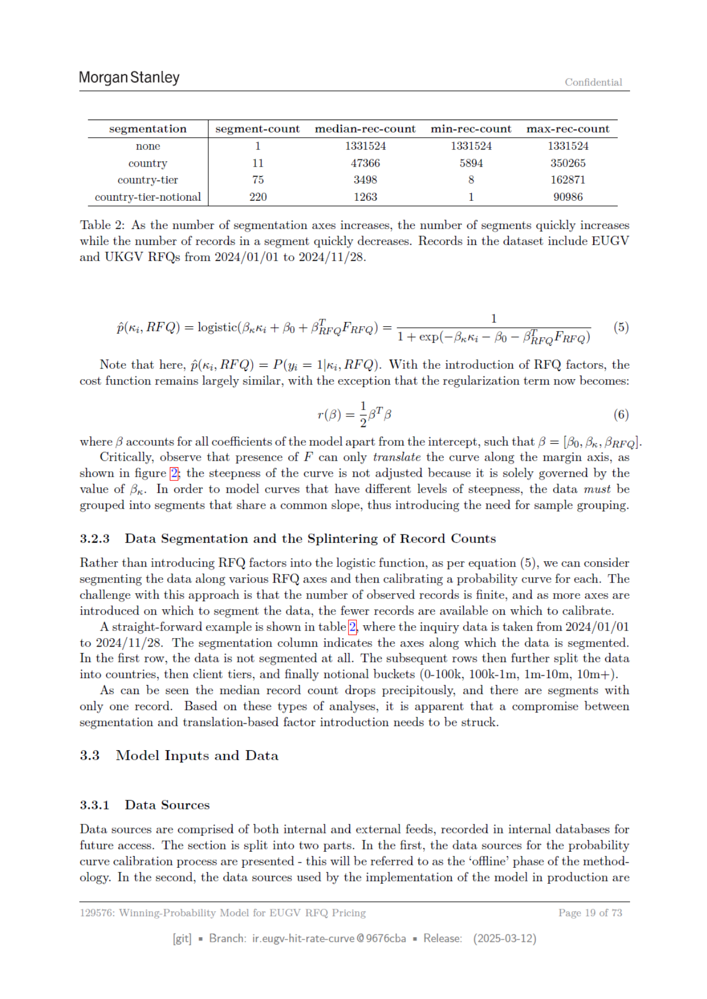

## 日本語メモ

**該当箇所:** 3.2 Model Specification

単純ロジスティック回帰からRFQファクターを導入した拡張形までを定式化し、データ分割とサンプル数低下のトレードオフを説明する。

## 原文OCR/Text Layer

> OCR由来のため、誤認識があります。正確な図表・数式・レイアウトは上のページ画像を確認してください。

```text
Morgan Stanley
Confidential
segmentation
| segment-count
_median-rec-count
_min-rec-count
_max-rec-count
none
1
1331524
1331524
1331524
country
u
47366
5804
350265
country-tier
75
3498
8
162871
country-tier-notional
220
1263
1
90986
Table 2: As the number of segmentation axes increases, the number of segments quickly increases
while the number of records in a segment quickly decreases. Records in the dataset include EUGV
and UKGV RFQs from 2024/01/01 to 2024/11/28.
1
1+ exp(—Bxtti — Bo — BhrgF RFQ)
Note that here, p(x,
RFQ) = P(y: = 1|s:, RFQ). With the introduction of RFQ factors, the
cost function remains largely similar, with the exception that the regularization term now becomes:
(xi, RFQ) = logistic( 8.4: + 80 + BhrqF RFQ) =
(5)
r(8) = 56t8
(6)
where 8 accounts for all coefficients of the model apart from the intercept, such that 8 = [9, 8x, Baral:
Critically, observe that presence of F can only translate the curve along the margin axis, as
shown in figure } the steepness of the curve is not adjusted because it is solely governed by the
value of ;.
In order to model curves that have different levels of steepness, the data must be
grouped into segments that share a common slope, thus introducing the need for sample grouping.
3.2.3.
Data Segmentation and the Splintering of Record Counts
Rather than introducing RFQ factors into the logistic function, as per equation (5), we can consider
segmenting the data along various RFQ axes and then calibrating a probability curve for each. The
challenge with this approach is that the number of observed records is finite, and as more axes are
introduced on which to segment the data, the fewer records are available on which to calibrate.
A straight-forward example is shown in table}
where the inquiry data is taken from 2024/01/01
to 2024/11/28. The segmentation column indicates the axes along which the data is segmented.
In the first row, the data is not segmented at all. The subsequent rows then further split the data
into countries, then client tiers, and finally notional buckets (0-100k, 100k-1m, 1m-10m, 10m+).
‘As can be seen the median record count drops precipitously, and there are segments with
only one record.
Based on these types of analyses, it is apparent that a compromise between
segmentation and translation-based factor introduction needs to be struck.
3.3.
Model Inputs and Data
3.3.1
Data Sources
Data sources are comprised of both internal and external feeds, recorded in internal databases for
future access. The section is split into two parts. In the first, the data sources for the probability
curve calibration process are presented - this will be referred to as the ‘offline’ phase of the method-
ology. In the second, the data sources used by the implementation of the model in production are
126
6: Winning-Probability Model
for
EUGV
RFQ Pricing
Page 19 of 73
[git]
= Branch:
ir.eugy-hit-rate-curve @9676cba
= Release:
(2025-03-12)
```


---

# Page 020 - 日本語版

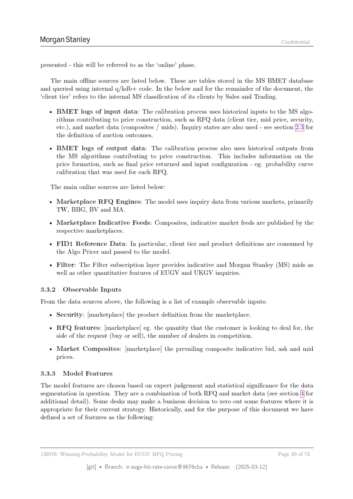

## 日本語メモ

**該当箇所:** 3.3 Model Inputs and Data / 3.4 Outputs

オフライン校正と本番実装で使うデータソース、観測入力、特徴量、ターゲット変数、モデル出力を定義する。

## 原文OCR/Text Layer

> OCR由来のため、誤認識があります。正確な図表・数式・レイアウトは上のページ画像を確認してください。

```text
Morgan Stanley
Confidential
presented - this will be referred to as the ‘online’ phase.
The main offline sources are listed below. These are tables stored in the MS BMET database
and queried using internal q/kdb+ code. In the below and for the remainder of the document, the
‘client tier’ refers to the internal MS classification of its clients by Sales and Trading.
+ BMET logs of input data: The calibration process uses historical inputs to the MS algo-
rithms contributing to price construction, such as RFQ data (client tier, mid price, security,
etc.), and market data (composites / mids). Inquiry states are also used - see sectio:
the definition of auction outcomes.
+ BMET logs of output data: The calibration process also uses historical outputs from
the MS algorithms contributing to price construction.
This includes information on the
price formation, such as final price returned and input configuration - eg. probability curve
calibration that was used for each RFQ.
The main online sources are listed below:
+ Marketplace RFQ Engines: The model uses inquiry data from various markets, primarily
TW, BBG, BV and MA.
+ Marketplace Indicative Feeds: Composites, indicative market feeds are published by the
respective marketplaces.
«
FID1 Reference Data:
In particular, client tier and product definitions are consumed by
the Algo Pricer and passed to the model.
«
Filter: The Filter subscription layer provides indicative and Morgan Stanley (MS) mids as
well as other quantitative features of EUGV and UKGV inquiries.
3.3.2
Observable Inputs
From the data sources above, the following is a list of example observable inputs:
«
Security: [marketplace] the product definition from the marketplace.
+ RFQ features: [marketplace] eg. the quantity that the customer is looking to deal for, the
side of the request (buy or sell), the number of dealers in competition.
+ Market Composites: [marketplace] the prevailing composite indicative bid, ask and mid
prices.
3.3.3
Model Features
The model features are chosen based on expert judgement and statistical significance for the data
segmentation in question. They are a combination of both RFQ and market data (see section [f] for
additional detail). Some desks may make a business decision to zero out some features where it is
appropriate for their current strategy. Historically, and for the purpose of this document we have
defined a set of features as the following:
129576: Winning-Probability Model for
EUGV RFQ Pricing
Page
20 of 73
[git]
= Branch:
ir.eugy-hit-rate-curve @9676cba
= Release:
(2025-03-12)
```


---

# Page 021 - 日本語版

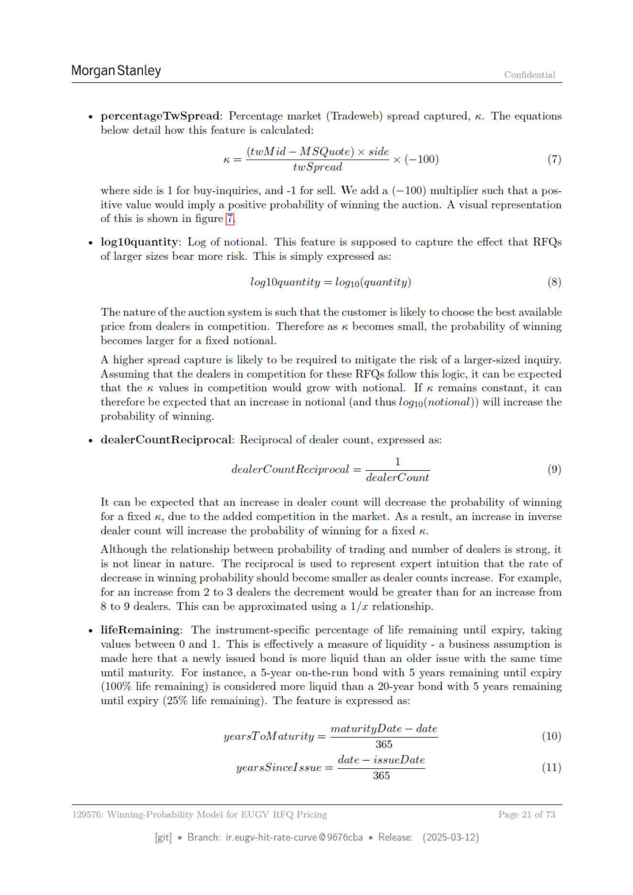

## 日本語メモ

**該当箇所:** 3.3 Model Inputs and Data / 3.4 Outputs

オフライン校正と本番実装で使うデータソース、観測入力、特徴量、ターゲット変数、モデル出力を定義する。

## 原文OCR/Text Layer

> OCR由来のため、誤認識があります。正確な図表・数式・レイアウトは上のページ画像を確認してください。

```text
Morgan Stanley
Confidential
+ percentageTwSpread: Percentage market (Tradeweb) spread captured, . The equations
below detail how this feature is calculated:
_ (twMid — MSQuote) x side
k=
‘Spread
x (-100)
(7)
where side is 1 for buy-inquiries, and -1 for sell. We add a (—100) multiplier such that a pos-
itive value would imply a positive probability of winning the auction. A visual representation
of this is shown in figure
+ log10quantity: Log of notional. This feature is supposed to capture the effect that RFQs
of larger sizes bear more risk. This is simply expressed as:
logl0quantity = logio(quantity)
(8)
The nature of the auction system is such that the customer is likely to choose the best available
price from dealers in competition. Therefore as « becomes small, the probability of winning
becomes larger for a fixed notional.
A higher spread capture is likely to be required to mitigate the risk of a larger-sized inquiry.
Assuming that the dealers in competition for these RFQs follow this logic, it can be expected
that the « values in competition would grow with notional.
If « remains constant,
it can
therefore be expected that an increase in notional (and thus logio(notional)) will increase the
probability of winning.
« dealerCountReciprocal: Reciprocal of dealer count, expressed
1
—_
¢
dealerCount
9)
dealerCount Reciprocal =
It can be expected that an increase in dealer count will decrease the probability of winning
for a fixed x, due to the added competition in the market. As a result, an increase in inverse
dealer count will increase the probability of winning for a fixed x.
Although the relationship between probability of trading and number of dealers is strong, it
is not linear in nature. The reciprocal is used to represent expert intuition that the rate of
decrease in winning probability should become smaller as dealer counts increase. For example,
for an increase from 2 to 3 dealers the decrement would be greater than for an increase from
8 to 9 dealers. This can be approximated using a 1/s relationship.
+ lifeRemaining: The instrument-specific percentage of life remaining until expiry, taking
values between 0 and 1. This is effectively a measure of liquidity - a business assumption is
made here that a newly issued bond is more liquid than an older issue with the same time
until maturity. For instance, a 5-year on-the-run bond with 5 years remaining until expiry
(100% life remaining) is considered more liquid than a 20-year bond with 5 years remaining
until expiry (25% life remaining). The feature is expressed as:
maturityDate — date
rsToM
aturity
=
10
yearsToM
aturity
=
(10)
date
—
i:
Dat
yearsSincel
ssue = "SSUES
(11)
365
:
Winning-Probability Model for EUGV RFQ Pricing
Page
21 of 73
[git]
= Branch:
ir.eugy-hit-rate-curve @9676cba
= Release:
(2025-03-12)
```


---

# Page 022 - 日本語版


## 日本語メモ

**該当箇所:** 3.3 Model Inputs and Data / 3.4 Outputs

オフライン校正と本番実装で使うデータソース、観測入力、特徴量、ターゲット変数、モデル出力を定義する。

## 原文OCR/Text Layer

> OCR由来のため、誤認識があります。正確な図表・数式・レイアウトは上のページ画像を確認してください。

```text
Morgan Stanley
Confidential
yearsToM aturity
maturityDate — date
lifeR
ini
=
=
ifeRemaining =~ ToMaturity
+ yearsSincelssuc ~ maturityDate
— issueDate
(12)
A lower percentage life remaining introduces more risk, as its liquidity is assumed to be lower.
Following the logic detailed above for the log]0quantity feature, if « remains constant, it can
therefore be expected that a decrease in lifeRemaining parameter will increase the winning
probability.
+ dpdy: The dpdy of each instrument in question.
This is a measure of risk, relating the
change in price with respect to the change in yield of a security.
A higher dpdy represents higher risk. Following the logic detailed above for the log1Oquantity
feature, if x remains constant, it can therefore be expected that an increase in dpdy will
increase the winning probability.
The model target variable is the outcome of the auction, ie.
the win/loss result.
It can be
expressed as:
.
1,
if inquiryState is Done,
(as)
win =
0,
if inquiryState is one of TradedAway, TiedTradedAway, Covered, CoverTied.
3.4
Model Outputs
The offline calibration outputs coefficients for the chosen features. No transformation of the output
data is necessary for consumption by downstream pricing components in production.
For the
he coefficient:
features described in section
e as follows:
Bo: intercept (constant).
+
Bi: coefficient of percentageTwSpread.
+
By: coefficient of log]Oquantity.
+
83: coefficient of dealerCountReciprocal.
+
B4: coefficient of lifeRemaining.
+ Bs: coefficient of dpdy.
The online implementation of the model ouputs the probability curve for each incoming RFQ,
using equation 5. The curves are created using the model coefficients relevant to the inquiry - those
corresponding to the calibrated segment in which the inquiry sits.
3.5
Model Calibration and Parameter Estimation
The inquiry datasets are fetched from the internal MS BMET database and stored in a shared drive
location. The files can be backfilled in case of process failure, or in case new information is to be
added.
The data is first refined using the following steps:
: Winning-Probability Model
for
EUGV
RFQ Pricing
Page 22 of 73
[git]
= Branch:
ir.eugy-hit-rate-curve @9676cba
= Release:
(2025-03-12)
```


---

# Page 023 - 日本語版

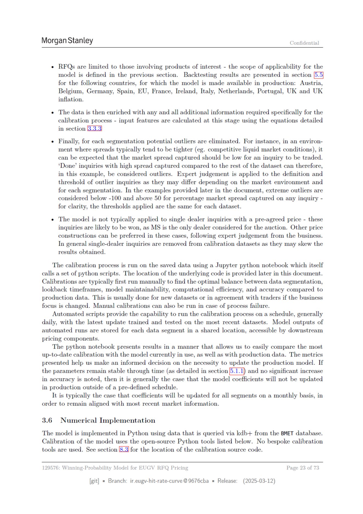

## 日本語メモ

**該当箇所:** 3.5-3.6 Calibration / Numerical Implementation

モデル校正、パラメータ推定、数値実装、パッケージや実行上の注意点を扱う。

## 原文OCR/Text Layer

> OCR由来のため、誤認識があります。正確な図表・数式・レイアウトは上のページ画像を確認してください。

```text
Morgan Stanley
Confidential
+ RFQs are limited to those involving products of interest - the scope of applicability for the
model is defined in the previous section. Backtesting results are presented in section
for the following countries, for which the model is made available in production: Austria,
Belgium, Germany, Spain, EU, France, Ireland, Italy, Netherlands, Portugal, UK and UK
inflation.
+ The data is then enriched with any and all additional information required specifically for the
calibration process - input features are calculated at this stage using the equations detailed
in section B.3.3)
+ Finally, for each segmentation potential outliers are eliminated. For instance, in an environ-
ment where spreads typically tend to be tighter (eg. competitive liquid market conditions), it
can be expected that the market spread captured should be low for an inquiry to be traded.
‘Done’ inquiries with high spread captured compared to the rest of the dataset can therefore,
in this example, be considered outliers. Expert judgement is applied to the definition and
threshold of outlier inquiries as they may differ depending on the market environment and
for each segmentation. In the examples provided later in the document, extreme outliers are
considered below -100 and above 50 for percentage market spread captured on any inquiry -
for clarity, the thresholds applied are the same for each dataset.
+ The model is not typically applied to single dealer inquiries with a pre-agreed price - these
inquiries are likely to be won, as MS is the only dealer considered for the auction. Other price
constructions can be preferred in these cases, following expert judgement from the business.
In general single-dealer inquiries are removed from calibration datasets as they may skew the
results obtained.
The calibration process is run on the saved data using a Jupyter python notebook which itself
calls a set of python scripts. The location of the underlying code is provided later in this document.
Calibrations are typically first run manually to find the optimal balance between data segmentation,
lookback timeframes, model maintainability, computational efficiency, and accuracy compared to
production data. This is usually done for new datasets or in agreement with traders if the business
focus is changed. Manual calibrations can also be run in case of process failure.
Automated scripts provide the capability to run the calibration process on a schedule, generally
daily, with the latest update trained and tested on the most recent datasets. Model outputs of
automated runs are stored for each data segment in a shared location, accessible by downstream
pricing components.
The python notebook presents results in
a manner that allows us to easily compare the most
up-to-date calibration with the model currently in use, as well as with production data. The metrics
presented help us make an informed decision on the necessity to update the production model. If
the parameters remain stable through time (as detailed in section
and no significant increase
in accuracy is noted, then it is generally the case that the model coefficients will not be updated
in production outside of a pre-defined schedule.
It is typically the case that coefficients will be updated for all segments on a monthly basis, in
order to remain aligned with most recent market information.
3.6
Numerical Implementation
The model is implemented in Python using data that is queried via kdb+ from the BMET database.
Calibration of the model uses the open-source Python tools listed below. No bespoke calibration
tools are used. See section [8.3] for the location of the calibration source code.
129576: Winning-Probability Model
for
EUGV
RFQ Pricing
Page 23 of 73
[git]
= Branch:
ir.eugy-hit-rate-curve @9676cba
= Release:
(2025-03-12)
```


---

# Page 024 - 日本語版

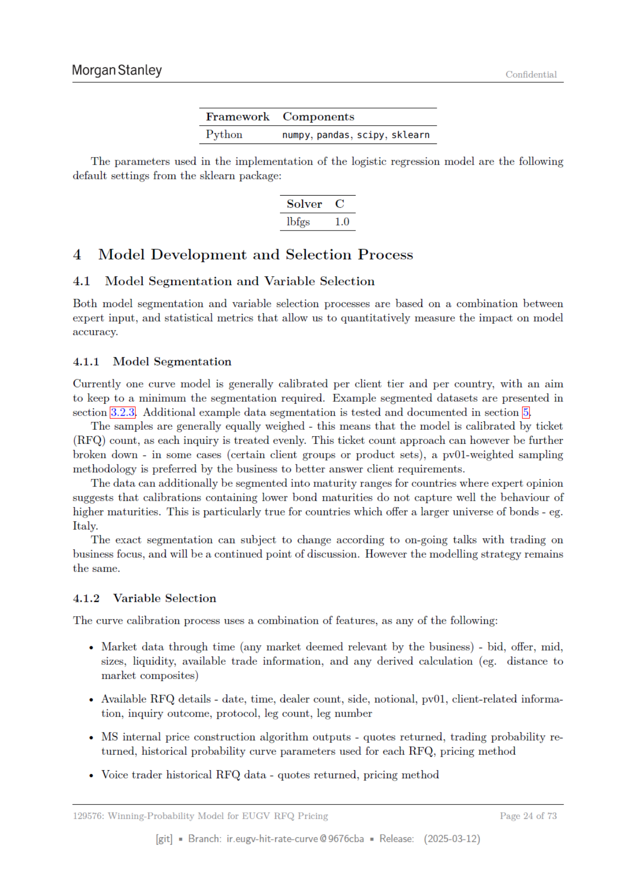

## 日本語メモ

**該当箇所:** 4 Model Development and Selection Process

セグメンテーション、特徴量選択、代替アプローチ、ステークホルダーや独立ソースからの貢献を整理する。

## 原文OCR/Text Layer

> OCR由来のため、誤認識があります。正確な図表・数式・レイアウトは上のページ画像を確認してください。

```text
Morgan Stanley
Confidential
Framework
Components
Python
numpy, pandas, scipy, sklearn
‘The parameters used in the implementation of the logistic regression model are the following
default settings from the sklearn package:
Solver
C
Ibfgs
1.0
4
Model Development and Selection Process
4.1
Model Segmentation and Variable Selection
Both model segmentation and variable selection processes are based on a combination between
expert input, and statistical metrics that allow us to quantitatively measure the impact on model
accuracy.
4.1.1
Model Segmentation
Currently one curve model is generally calibrated per client tier and per country, with an aim
to keep to a minimum the segmentation required. Example segmented datasets are presented in
i
Additional example data segmentation is tested and documented in section
The samples are generally equally weighed - this means that the model is calibrated by ticket
(RFQ) count, as each inquiry is treated evenly. This ticket count approach can however be further
broken down - in some cases (certain client groups or product sets), a pvOl-weighted sampling
methodology is preferred by the business to better answer client requirements.
The data can additionally be segmented into maturity ranges for countries where expert opinion
suggests that calibrations containing lower bond maturities do not capture well the behaviour of
higher maturities. This is particularly true for countries which offer a larger universe of bonds - eg.
Italy.
The exact segmentation can subject to change according to on-going talks with trading on
business focus, and will be a continued point of discussion. However the modelling strategy remains
the same.
4.1.2.
Variable Selection
The curve calibration process uses a combination of features, as any of the following:
+ Market data through time (any market deemed relevant by the business) - bid, offer, mid,
sizes, liquidity, available trade information, and any derived calculation (eg.
distance to
market composites)
« Available RFQ details - date, time, dealer count, side, notional, pv01, client-related informa-
tion, inquiry outcome, protocol, leg count, leg number
+ MS internal price construction algorithm outputs - quotes returned, trading probability re-
turned, historical probability curve parameters used for each RFQ, pricing method
+ Voice trader historical RFQ data - quotes returned, pricing method
129576: Winning-Probability Model
for
EUGV
RFQ Pricing
Page 24 of 73
[git]
= Branch:
ir.eugy-hit-rate-curve @9676cba
= Release:
(2025-03-12)
```


---

# Page 025 - 日本語版

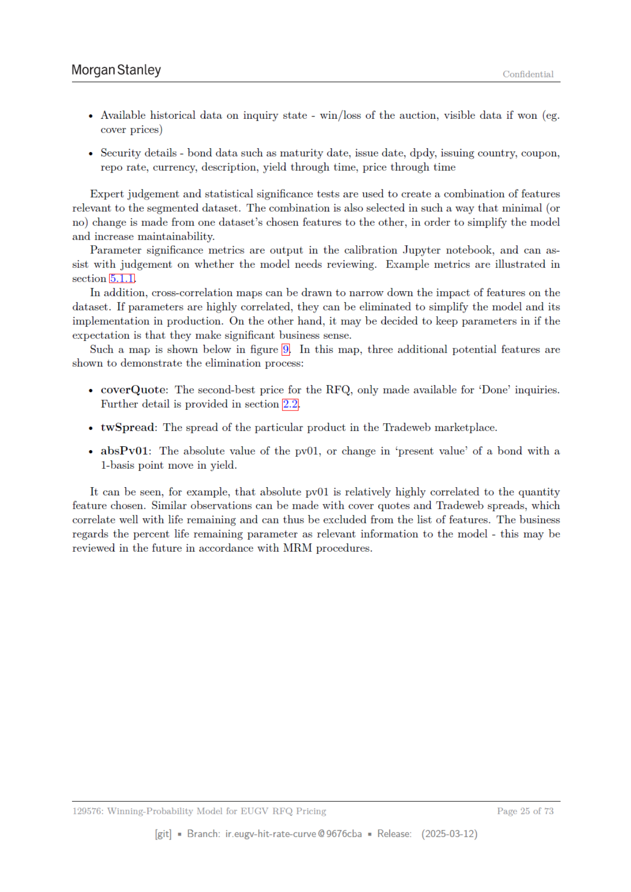

## 日本語メモ

**該当箇所:** 4 Model Development and Selection Process

セグメンテーション、特徴量選択、代替アプローチ、ステークホルダーや独立ソースからの貢献を整理する。

## 原文OCR/Text Layer

> OCR由来のため、誤認識があります。正確な図表・数式・レイアウトは上のページ画像を確認してください。

```text
Morgan Stanley
Confidential
+ Available historical data on inquiry state - win/loss of the auction, visible data if won (eg.
cover prices)
+ Security details - bond data such as maturity date, issue date, dpdy, issuing country, coupon,
repo rate, currency, description, yield through time, price through time
Expert judgement and statistical significance tests are used to create a combination of features
relevant to the segmented dataset. The combination is also selected in such a way that minimal (or
no) change is made from one dataset’s chosen features to the other, in order to simplify the model
and increase maintainability.
Parameter significance metrics are output in the calibration Jupyter notebook, and can as-
sist with judgement on whether the model needs reviewing. Example metrics are illustrated in
section 5.L1l
In addition, cross-correlation maps can be drawn to narrow down the impact of features on the
dataset. If parameters are highly correlated, they can be eliminated to simplify the model and its
implementation in production. On the other hand, it may be decided to keep parameters in if the
expectation is that they make significant business sense.
Such a map is shown below in figure [J] In this map, three additional potential features are
shown to demonstrate the elimination process:
+ coverQuote: The second-best price for the RFQ, only made available for ‘Done’ inquiries.
Further detail is provided in section
« twSpread: The spread of the particular product in the Tradeweb marketplace.
+ absPv01: The absolute value of the pv01, or change in ‘present value’ of a bond with a
1-basis point move in yield.
It can be seen, for example, that absolute pv01 is relatively highly correlated to the quantity
feature chosen. Similar observations can be made with cover quotes and Tradeweb spreads, which
correlate well with life remaining and can thus be excluded from the list of features. The business
regards the percent life remaining parameter as relevant information to the model - this may be
reviewed in the future in accordance with MRM procedures.
:
Winning-Probability Model for EUGV RFQ Pricing
of 73
[git]
= Branch:
ir.eugy-hit-rate-curve @9676cba
= Release:
(2025-03-12)
```


---

# Page 026 - 日本語版


## 日本語メモ

**該当箇所:** 4 Model Development and Selection Process

セグメンテーション、特徴量選択、代替アプローチ、ステークホルダーや独立ソースからの貢献を整理する。

## 原文OCR/Text Layer

> OCR由来のため、誤認識があります。正確な図表・数式・レイアウトは上のページ画像を確認してください。

```text
Morgan Stanley
Confidential
10
percentageTwSpread
loglOquantity
os
absPVO}
+06
ealerCountReciprocal
percentLifeRemaining
+04
pay
coverQuote
02
twSpread
Tr)
PPP
Ppeg
s
$3
5
if
§
2
‘
toi
Figure 9: Model feature cross-correlation heatmap, which can be used to validate the multicollinear-
ity standard statistical assumption of logistic regression. Example dataset taken from January to
November 2024, DEU inquiries across all client tiers. Here, coverQuotes, twSpread, and absPv01
can be eliminated due to their high correlation with life remaining and log10Quantity respectively.
4.2
Alternative Theories and Approaches
Alternative approaches are considered on both segmentation and feature selection.
4.2.1
Alternative Data Segmentation
Part of the data segmentation relies on business requirements. If these are altered, it may be that a
different method of data sampling is necessary to optimize the calibration. As an example, if either
new clients are considered, or if existing client statuses change, then it may be that the current
segmentation does not capture the behaviour of the affected groups as effectively. In a similar way,
it may be that new products are introduced to the market, or that market conditions change such
that the bond grouping is no longer valid in the current climate. For this, flexibility is required on
129576: Winning-Probability Model for EUGV RFQ Pricing
age
26 of 73
[git]
Branch: ir.eugy-hit-rate-curve @9676cba
= Release:
(2025-03-12)
```


---

# Page 027 - 日本語版

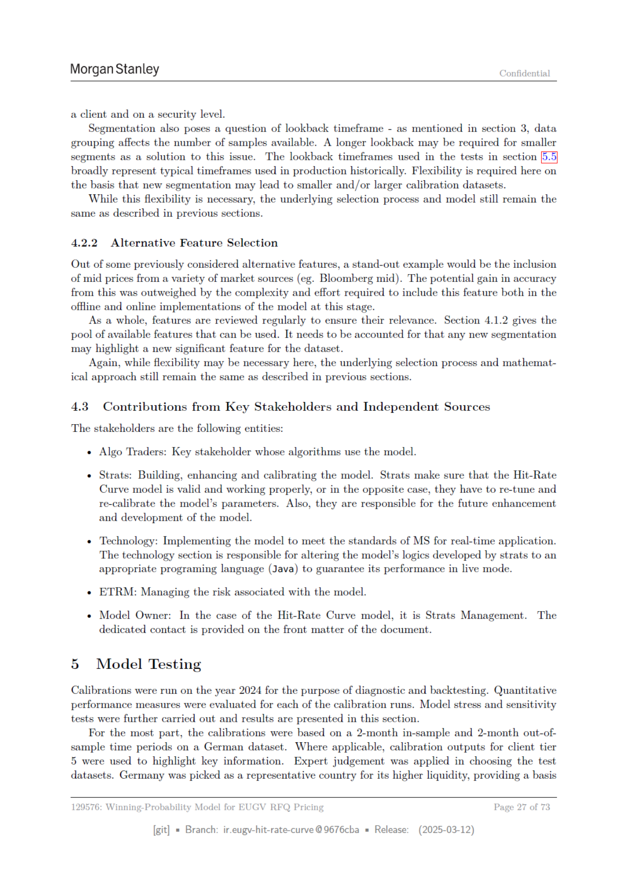

## 日本語メモ

**該当箇所:** 4 Model Development and Selection Process

セグメンテーション、特徴量選択、代替アプローチ、ステークホルダーや独立ソースからの貢献を整理する。

## 原文OCR/Text Layer

> OCR由来のため、誤認識があります。正確な図表・数式・レイアウトは上のページ画像を確認してください。

```text
Morgan Stanley
Confidential
a client and on a security level.
Segmentation also poses a question of lookback timeframe - as mentioned in section 3, data
grouping affects the number of samples available. A longer lookback may be required for smaller
segments as a solution to this issue. The lookback timeframes used in the tests in section
[5
broadly represent typical timeframes used in production historically. Flexibility is required here on
the basis that new segmentation may lead to smaller and/or larger calibration datasets.
While this flexibility is necessary, the underlying selection process and model still remain the
same as described in previous sections.
4.2.2
Alternative Feature Selection
Out of some previously considered alternative features, a stand-out example would be the inclusion
of mid prices from a variety of market sources (eg. Bloomberg mid). The potential gain in accuracy
from this was outweighed by the complexity and effort required to include this feature both in the
offline and online implementations of the model at this stage.
‘As a whole, features are reviewed regularly to ensure their relevance. Section 4.1.2 gives the
pool of available features that can be used. It needs to be accounted for that any new segmentation
may highlight a new significant feature for the dataset.
‘Again, while flexibility may be necessary here, the underlying selection process and mathemat-
ical approach still remain the same as described in previous sections.
4.3
Contributions from Key Stakeholders and Independent Sources
The stakeholders are the following entities:
« Algo Traders: Key stakeholder whose algorithms use the model.
+ Strats: Building, enhancing and calibrating the model. Strats make sure that the Hit-Rate
Curve model is valid and working properly, or in the opposite case, they have to re-tune and
re-calibrate the model’s parameters. Also, they are responsible for the future enhancement
and development of the model.
+ Technology: Implementing the model to meet the standards of MS for real-time application.
The technology section is responsible for altering the model’s logics developed by strats to an
appropriate programing language (Java) to guarantee its performance in live mode.
+ ETRM: Managing the risk associated with the model.
« Model Owner:
In the case of the Hit-Rate Curve model,
it
is Strats Management.
The
dedicated contact is provided on the front matter of the document.
5
Model Testing
Calibrations were run on the year 2024 for the purpose of diagnostic and backtesting. Quantitative
performance measures were evaluated for each of the calibration runs. Model stress and sensitivity
tests were further carried out and results are presented in this section.
For the most part, the calibrations were based on a 2-month in-sample and 2-month out-of-
sample time periods on a German dataset. Where applicable, calibration outputs for client tier
5 were used to highlight key information.
Expert judgement was applied in choosing the test
datasets. Germany was picked as a representative country for its higher liquidity, providing a basis
129576: Winning-Probability Model
for
EUGV
RFQ Pricing
Page 27 of 73
[git]
= Branch:
ir.eugy-hit-rate-curve @9676cba
= Release:
(2025-03-12)
```


---

# Page 028 - 日本語版

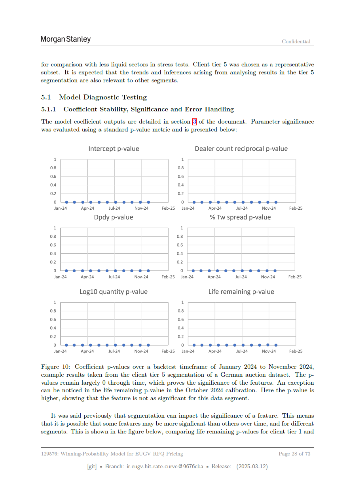

## 日本語メモ

**該当箇所:** 5.1 Model Diagnostic Testing

係数の安定性・有意性、モデル予測可能性、バックテスト期間でのreliability plot等を用いた診断テスト。

## 原文OCR/Text Layer

> OCR由来のため、誤認識があります。正確な図表・数式・レイアウトは上のページ画像を確認してください。

```text
Morgan Stanley
Confidential
for comparison with less liquid sectors in stress tests. Client tier 5 was chosen as a representative
subset.
It is expected that the trends and inferences arising from analysing results in the tier 5
segmentation are also relevant to other segments.
5.1
Model Diagnostic Testing
5.1.1
Coefficient Stability, Significance and Error Handling
The model coefficient outputs are detailed in section [3] of the document. Parameter significance
was evaluated using a standard p-value metric and is presented below:
Intercept p-value
Dealer count reciprocal p-value
1
1
os
os
06
o6
o4
04
o2
0.2
)
o—ee-e-@
©
©
©
©
©
©
0
o-o-0--0-@
©
©
©
©
6
@
Jan-24
Apr-24
Jul-24
Nov-24
Feb-25
 Jan-24
Apr-24
Jul-24
Nov-24
Feb-25
Dpdy p-value
% Tw spread p-value
1
1
08
Os
0.6
06
04
oa
0.2
0.2
0
o-e--e--@-e-e-e-@-e-e-@
0
o-oo
e--0-e-0-e-@-@-@
Jan-24
Apr-24
Jul-24
Nov-24
Feb-25
 Jan-24
Apr-24
Jul-24
Nov-24
Feb-25
Log10 quantity p-value
Life remaining p-value
1
1
08
Os
0.6
06
0.4
04
0.2
02
oO
o—e—e--0-0-@-0-@-@-@-@
ie)
o—0—@-_0
0000-0
@-@
Jan-24
Apr-24
Jul-24
Nov-24
Feb-25
 Jan-24
Apr-24
Jul-24
Nov-24
Feb-25
Figure 10:
Coefficient p-values over a backtest timeframe of January 2024 to November 2024,
example results taken from the client tier 5 segmentation of a German auction dataset. The p-
values remain largely 0 through time, which proves the significance of the features. An exception
can be noticed in the life remaining p-value in the October 2024 calibration. Here the p-value is
higher, showing that the feature is not as significant for this data segment.
It was said previously that segmentation can impact the significance of a feature. This means
that it is possible that some features may be more signficant than others over time, and for different
segments. This is shown in the figure below, comparing life remaining p-values for client tier
1 and
129576: Winning-Probability Model
for
EUGV
RFQ Pricing
Page 28 of
73
[git]
Branch:
ir.eugy-hit-rate-curve @9676cba
= Release:
(2025-03-12)
```


---

# Page 029 - 日本語版


## 日本語メモ

**該当箇所:** 5.1 Model Diagnostic Testing

係数の安定性・有意性、モデル予測可能性、バックテスト期間でのreliability plot等を用いた診断テスト。

## 原文OCR/Text Layer

> OCR由来のため、誤認識があります。正確な図表・数式・レイアウトは上のページ画像を確認してください。

```text
Morgan Stanley
Confidential
tier 5:
Life remaining p-value
0.008
0007
e
0.006
0.005
0.004
0.003
0.002
0001
0
Jan-24 — Feb-24
= Apr-24-—Jun-24—Jul-2@_—Sep-24
= Nov-24—Dec-24
es eT1
Figure 11: Life remaining coefficient p-values over a backtest timeframe of January 2024 to Novem-
ber 2024, example results taken from client tiers 1 and 5. The October 2024 p-value rises for tier
5, while remaining at 0 for tier 1. The feature is therefore not as significant for the tier 5 data
segment compared to the tier 1 dataset.
While the p-value increased for the tier 5 dataset in October 2024, it remained at a stable value
of 0 for client tier
1.
The feature therefore had more significance for tier
1 than tier 5 for this
calibration.
Aside from the exception above, the p-values remain largely at 0 through time, which serves to
demonstrate the significance of the features during the backtesting timeframe.
In general, value-
specific cut-offs are not defined as thresholds for this metric. Instead p-value moves are monitored
and expert judgement is applied to interpret numerical values given the context (segmentation and
market conditions).
Parameter significance using only three features is presented below:
129576: Winning-Probability Model for EUGV RFQ Pricing
Page 29 of 73
[git]
Branch: ir.eugy-hit-rate-curve @9676cba
= Release:
(2025-03-12)
```


---

# Page 030 - 日本語版

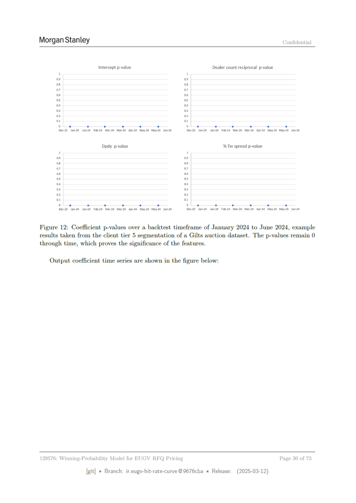

## 日本語メモ

**該当箇所:** 5.1 Model Diagnostic Testing

係数の安定性・有意性、モデル予測可能性、バックテスト期間でのreliability plot等を用いた診断テスト。

## 原文OCR/Text Layer

> OCR由来のため、誤認識があります。正確な図表・数式・レイアウトは上のページ画像を確認してください。

```text
Morgan Stanley
Confidential
Intercept p-value
Dealer count reciprocal p-value
a
1
os
03
08
os
07
o7
os
os
os
os
03
03
02
02
oa
03
ole
.
.
.
*
°
ole
.
.
.
°
.
Dec23
an24
Jan2¢
Feb24
Mar2¢ Mar24 Apr24
Map26 May24 Jun26
Dec28
Jan24
Jan28
Feb24 Nar24 Mar24 Apr24 May24 May24 sun24
Dpdy p-value
% Tw spread p-value
a
a
0s
os
07
07
os
os
o4
os
03
03
02
02
03
on
oe
°
.
.
.
.
ole
.
.
.
.
.
Dec29
Jen-24
Jan2¢
Fe>2s Mar26 Mar26 Apr2é May24 May24 Jun26
ec25
Jan24
Jan28
Fe>24 Mar28 Mar24 Apr24 May26 May24 un26
Figure 12: Coefficient p-values over a backtest timeframe of January 2024 to June 2024, example
results taken from the client tier 5 segmentation of a Gilts auction dataset. The p-values remain 0
through time, which proves the significance of the features.
Output coefficient time series are shown in the figure below:
129576: Winning-Probability Model for EUGV RFQ Pricing
Page 30 of 73
[git]
Branch: ir.eugy-hit-rate-curve @9676cba
= Release:
(2025-03-12)
```


---

# Page 031 - 日本語版

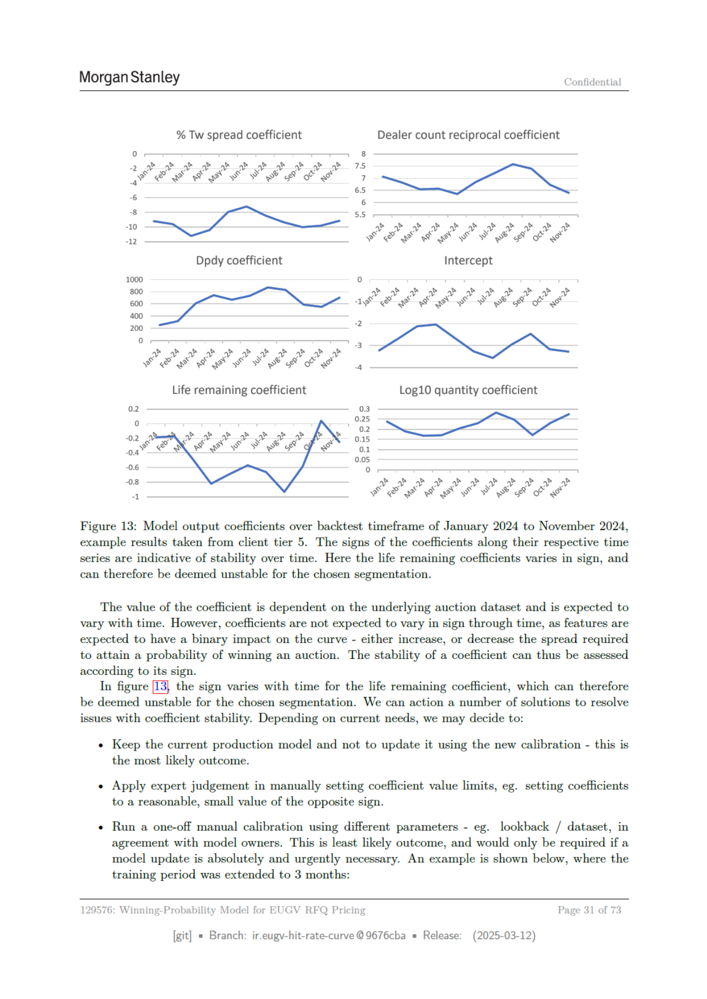

## 日本語メモ

**該当箇所:** 5.1 Model Diagnostic Testing

係数の安定性・有意性、モデル予測可能性、バックテスト期間でのreliability plot等を用いた診断テスト。

## 原文OCR/Text Layer

> OCR由来のため、誤認識があります。正確な図表・数式・レイアウトは上のページ画像を確認してください。

```text
Morgan Stanley
Confidential
% Tw spread coefficient
Dealer count reciprocal coefficient
°
8
Dinh
qb
gh
ah
nb
ab
gh
ah
oh
ah
75
2
a
oP
oh
Po
PD
PPP
PP
PP
OP
OP
ES
CPX
Ne
7 NO
65
6
ad
55
to
Ca
a
a
2
SES LPS
NS FE LF
Dpdy coefficient
Intercept
1000
°
800
600
400
200
2
°
ZN
ah ah
gh
oh oh oh oh oh
oh oh oP
og
%
s
SFP FM MS
WN pe oF of VF
Dogh
gh
ah
gh
gh
ah
gh
oh
PP
PP Ph oP
Rae
PLS
SS
POF PN
Life remaining coefficient
Log10 quantity coefficient
0.25
0.2
0.05
gh hh gh oh gh gh ah ah oP
SFP
CWP
HK Ky
oF
Figure 13: Model output coefficients over backtest timeframe of January 2024 to November 2024,
example results taken from client tier 5. The signs of the coefficients along their respective time
series are indicative of stability over time. Here the life remaining coefficients varies in sign, and
can therefore be deemed unstable for the chosen segmentation.
The value of the coefficient is dependent on the underlying auction dataset and is expected to
vary with time. However, coefficients are not expected to vary in sign through time, as features are
expected to have a binary impact on the curve - either increase, or decrease the spread required
to attain a probability of winning an auction. The stability of a coefficient can thus be assessed
according to its sign.
the sign varies with time for the life remaining coefficient, which can therefore
be deemed unstable for the chosen segmentation. We can action a number of solutions to resolve
issues with coefficient stability. Depending on current needs, we may decide to:
+ Keep the current production model and not to update it using the new calibration - this is
the most likely outcome.
+ Apply expert judgement in manually setting coefficient value limits, eg. setting coefficients
to a reasonable, small value of the opposite sign.
+ Run a one-off manual calibration using different parameters - eg. lookback / dataset, in
agreement with model owners. This is least likely outcome, and would only be required if a
model update is absolutely and urgently necessary. An example is shown below, where the
training period was extended to 3 months:
129576: Winning-Probability Model for EUGV RFQ Pricing
Page 31 of 73
[git]
Branch: ir.eugy-hit-rate-curve @9676cba
= Release:
(2025-03-12)
```


---

# Page 032 - 日本語版

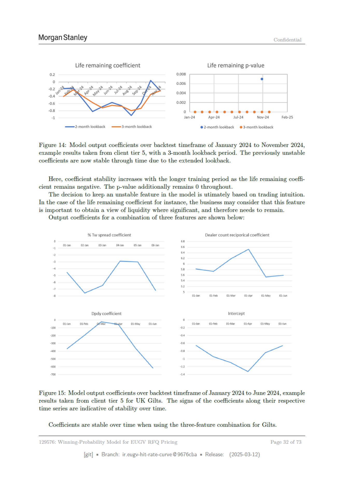

## 日本語メモ

**該当箇所:** 5.1 Model Diagnostic Testing

係数の安定性・有意性、モデル予測可能性、バックテスト期間でのreliability plot等を用いた診断テスト。

## 原文OCR/Text Layer

> OCR由来のため、誤認識があります。正確な図表・数式・レイアウトは上のページ画像を確認してください。

```text
Morgan Stanley
Confidential
Life remaining coefficient
Life remaining p-value
02
0.008
|
d
0.006
0
02 Peg
oh oh gh gh oh ohh
|
e
oP
SS
SS
004
oa*
we
ye
wg
|
os
om
|
08
0 |
-@
@/¢
@
@
©
©
@
¢
©
4
Jan24Apr24—Juk2d—
Nove
‘Feb-aS
—2-month lookback
—=3-month lookback
‘© 2month lookback
© 3-month lookback
Figure 14: Model output coefficients over backtest timeframe of January 2024 to November 2024,
example results taken from client tier 5, with a 3-month lookback period. The previously unstable
coefficients are now stable through time due to the extended lookback.
Here, coefficient stability increases with the longer training period as the life remaining coeffi-
cient remains negative. The p-value additionally remains 0 throughout.
‘The decision to keep an unstable feature in the model is utimately based on trading intuition.
In the case of the life remaining coefficient for instance, the business may consider that this feature
is important to obtain a view of liquidity where significant, and therefore needs to remain.
Output coefficients for a combination of three features are shown below:
% Tw spread coefficient
Dealer count reciporical coefficient
Oi-jn
OD Jon
Bonn
Son
an
_
4
se
s
36
a
orn
oie
OL Mar.
ObApr © OL-May—Ot-tn
Dpdy coefficient
Intercept
onsen
A
oLMay
on
Orin
= OLfe>OFMar—Ol-Amr—
Olay
Ol-un
Figure 15: Model output coefficients over backtest timeframe of January 2024 to June 2024, example
results taken from client tier 5 for UK Gilts. The signs of the coefficients along their respective
time series are indicative of stability over time.
Coefficients are stable over time when using the three-feature combination for Gilts.
129576: Winning-Probability Model
for EUGV
RFQ Pricing
Page 32 of 73
[git]
Branch: ir.eugy-hit-rate-curve @9676cba
= Release:
(2025-03-12)
```


---

# Page 033 - 日本語版

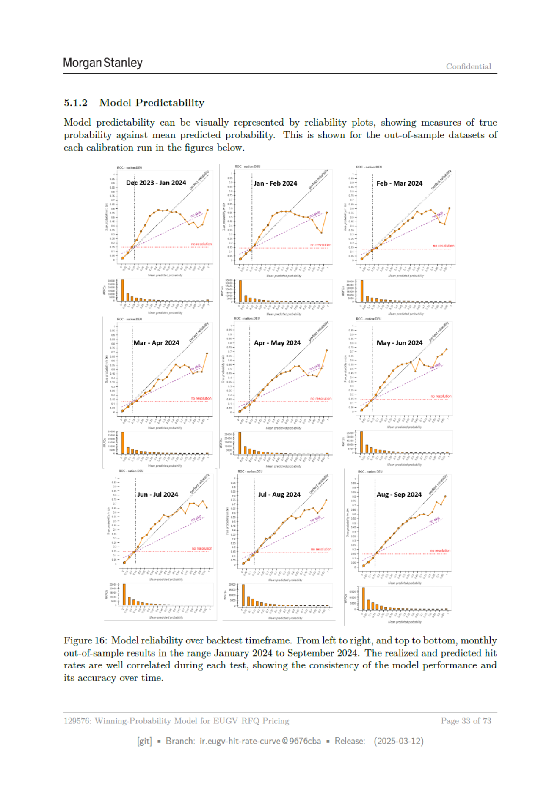

## 日本語メモ

**該当箇所:** 5.1 Model Diagnostic Testing

係数の安定性・有意性、モデル予測可能性、バックテスト期間でのreliability plot等を用いた診断テスト。

## 原文OCR/Text Layer

> OCR由来のため、誤認識があります。正確な図表・数式・レイアウトは上のページ画像を確認してください。

```text
Morgan Stanley
Confidential
5.1.2
Model Predictability
Model predictability can be visually represented by reliability plots, showing measures of true
probability against mean predicted probability. This is shown for the out-of-sample datasets of
each calibration run in the figures below.
£
if,
&
Dec 2023 - Jan 2024 ra
"|
lan-Feb 2024
4
| Feb-Mar 2024 2
| May - Jun 2024
Figure 16: Model reliability over backtest timeframe. From left to right, and top to bottom, monthly
out-of-sample results in the range January 2024 to September 2024. The realized and predicted hit
rates are well correlated during each test, showing the consistency of the model performance and
its accuracy over time.
129576: Winning-Probability Model for EUGV RFQ Pricing
Page 33 of 73
[git]
Branch: ir.eugy-hit-rate-curve @9676cba
= Release:
(2025-03-12)
```


---

# Page 034 - 日本語版


## 日本語メモ

**該当箇所:** 5.1 Model Diagnostic Testing

係数の安定性・有意性、モデル予測可能性、バックテスト期間でのreliability plot等を用いた診断テスト。

## 原文OCR/Text Layer

> OCR由来のため、誤認識があります。正確な図表・数式・レイアウトは上のページ画像を確認してください。

```text
Morgan Stanley
Confidential
‘Sep-Oct 2024
=
‘Oct-Nov 2024
¢
Figure 17: Model reliability over backtest timeframe. From left to right, monthly out-of-sample
results in the range September 2024 to November 2024. The realized and predicted hit rates are
well correlated during each test, showing the consistency of the model performance and its accuracy
over time.
In these plots, the dataset is divided into predicted probability buckets, for which realized hit
rate and predicted hit rate are evaluated as follows:
N
realizedH
it Rate = xu ==1)
(14)
i=1
1
N
predictedH
it Rate = NW Yi)
(15)
i=l
where N is the number of i elements in the dataset. The red line represents the ‘no resolution
threshold’, and the purple, the ‘no skill threshold’ - ie. poor resolution. The black dotted line
represents perfect reliability - ie. a one-to-one relationship between prediction and production.
‘The distribution of mean predicted probability is drawn at the bottom of each reliability plot.
This shows the number of inquiries per probability bucket, which is deemed significant from 500
by the business - deviations between true and predicted probability are only investigated if the
underlying number of observations is above this threshold.
The distribution is also consistent
through time, with the bulk of the RFQs placed in lower probability bins - ie. to be quoted with
lower margins for a higher chance of winning the auction. This is potentially indicative of the
aggressiveness of the model, which can be tuned in accordance with the busin:
A relatively strong linear relationship between realized and predicted hit rate is maintained
throughout the backtest where RFQ buckets are significant (i.e. higher than 500 data points).
This serves to illustrate the consistency of the model performance as well as its accuracy.
‘Accuracy also seems to increase somewhat with time - this could be attributed to a change in
underlying dataset mirroring a change in market conditions from previous year (2023) to current
year (2024). In this case the business may decide to action a lookback reduction and recalibration
to only account for more current underlying data (e.g. in this case, calibrating the model solely on
available 2024 auction data).
Additional quantitative measures on model accuracy are provided in section
5.5
129576: Winning-Probability Model for
EUGV RFQ Pricing
Page 34 of 73
[git]
Branch:
ir.eugy-hit-rate-curve @9676cba
= Release:
(2025-03-12)
```


---

# Page 035 - 日本語版


## 日本語メモ

**該当箇所:** 5.2 Scenario Analysis and Stress Testing

ボラティリティケースと流動性ケースでのストレステスト。市場不安定化や低流動性下での性能を確認する。

## 原文OCR/Text Layer

> OCR由来のため、誤認識があります。正確な図表・数式・レイアウトは上のページ画像を確認してください。

```text
Morgan Stanley
Confidential
5.2
Scenario Analysis and Stress Testing
‘Two possible scenarios were investigated in this section with the aim to stress test the model. They
correspond to what could be described as ‘unstable’ market conditions. The first was concerned with
increased volatility, and the second, with decreased liquidity. To this end, additional calibrations
were run on different datasets.
5.2.1
Volatility Case
The visible range of parameters such as life remaining, dpdy, dealer count, or even notional is
somewhat known. Indeed, it can be expected that the business will set the products of interest,
thus limiting the range of dpdy and life remaining. From historical data, dealer counts are typically
found to be in the region of 1 to 30, with more than 95% of inquiries below 15. Finally, notional
can also be expected to be set by business - traders typically decide the sizes at which they are
willing to quote.
The final feature of the model is however not as easily bound. The use of percentage TW spread
as a feature (see section |3) introduces uncertainty related to live market conditions. The spread
can be expected to move (tighten or widen) according to a variety of factors. These can include
number of dealers currently active, which affects the accuracy of the aggregated composite.
Also related to TW spread is the volatility related to the current economic climate. External
influences such as economic events, or key dates in the economic calendar such as month or quarter-
ends, can affect the stability of the market spreads. This is well reported in the literature and will
not be further detailed here.
It is important to understand the effects of the spread volatility on the stability of the model.
To this end, a period of higher volatility was identified using historical TW spread data.
A 2Y
on-the-run German bond was selected as a good indicator of ‘atypical’ spread behaviour - variations
are more clearly visible on a bond for which the spread is usually stable. The figure below shows
the TW spread over the course of the past year for this bond.
2-year DEU on-the-run historical TW spread 2024
0.1
009
008
007
006
0.05
0.04
003
002
001
avgSpread
minSpread
maxSpread
Figure 18: Historical TW spread data for 2yr German on-the-run bond as a measure representative
of volatility, weekly aggregated data between January 2024 and November 2024. An increase in
volatility can be observed in June-July 2024, which is thus a suitable testing timeframe for the
model’s applicability to volatile periods.
129576: Winning-Probability Model for EUGV RFQ Pricing
[git]
Branch: ir.eugy-hit-rate-curve @9676cba
= Release:
(2025-03-12)
```


---

# Page 036 - 日本語版


## 日本語メモ

**該当箇所:** 5.2 Scenario Analysis and Stress Testing

ボラティリティケースと流動性ケースでのストレステスト。市場不安定化や低流動性下での性能を確認する。

## 原文OCR/Text Layer

> OCR由来のため、誤認識があります。正確な図表・数式・レイアウトは上のページ画像を確認してください。

```text
Morgan Stanley
Confidential
‘The plot shows an increase in market movements around the more recent dates, particularly
around June-July 2024. This is therefore a suitable environment for stress testing of the curve
model. The training dataset used was the preceding
2 months, April-May 2024. Out-of-sample
reliability was presented in figure
[10
but is recreated here for clarity:
ROC
- nation:DEU
095
09
08s
075
06s
2
oss
3
05
S 045
©
03s
03
025
015
on
Mean
predicted probability
‘I
Mea
dd probability
Figure 19: Reliability plot for June-July 2024 DEU test data. The realized and predicted hit rates
are well correlated, demonstrating the model’s applicability to volatile market conditions.
‘The plot shows good correlation between predicted and realized probability. Additional statis-
tical metrics are evaluated as follows:
+ Hit rate difference:
this is a measure of the difference between actual (realized) and
predicted hit rates, calculated as:
hit Rate
Dif f = |predictedHitRate — realizedHitRate|
(16)
The predicted and realized hit rate equations are shown in section
to be small for good model performance.
We expect this value
129576: Winning-Probability Model
for EUGV
RFQ Pricing
Page 36 of 73
[git]
Branch: ir.eugy-hit-rate-curve @9676cba
= Release:
(2025-03-12)
```


---

# Page 037 - 日本語版

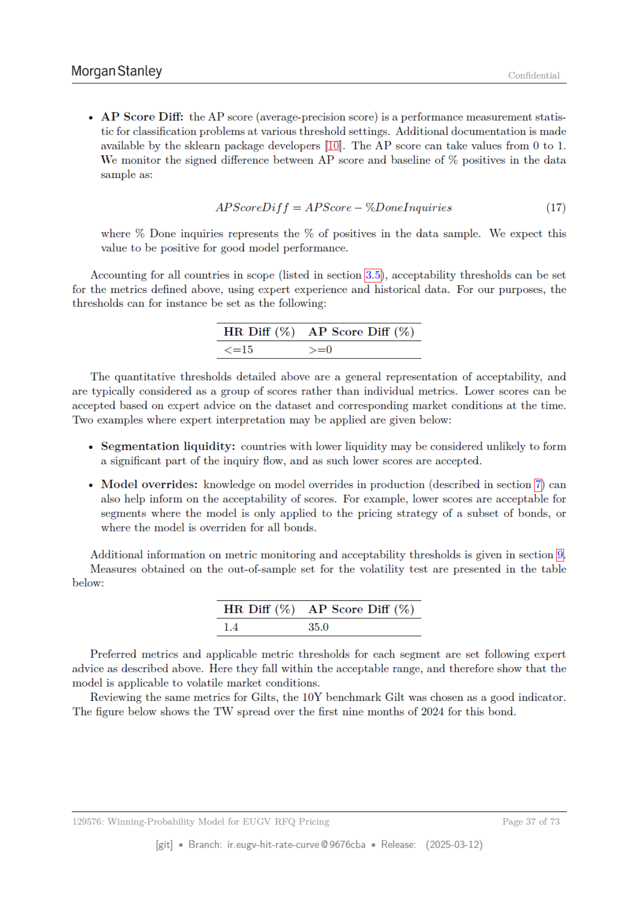

## 日本語メモ

**該当箇所:** 5.2 Scenario Analysis and Stress Testing

ボラティリティケースと流動性ケースでのストレステスト。市場不安定化や低流動性下での性能を確認する。

## 原文OCR/Text Layer

> OCR由来のため、誤認識があります。正確な図表・数式・レイアウトは上のページ画像を確認してください。

```text
Morgan Stanley
Confidential
+ AP Score Diff: the AP score (average-precision score) is
a performance measurement statis-
tic for classification problems at various threshold settings. Additional documentation is made
available by the sklearn package developers [I]. The AP score can take values from 0 to 1.
We monitor the signed difference between AP score and baseline of % positives in the data
sample as:
APScoreDif f = APScore — %DoneInquiries
(17)
where % Done inquiries represents the % of positives in the data sample. We expect this
value to be positive for good model performance.
Accounting for all countries in scope (listed in sectior
for the metrics defined above, using expert experience an
thresholds can for instance be set as the following:
, acceptability thresholds can be set
istorical data. For our purposes, the
HR Diff (%)
AP Score Diff (%)
<=15
>=0
‘The quantitative thresholds detailed above are a general representation of acceptability, and
are typically considered as a group of scores rather than individual metrics. Lower scores can be
accepted based on expert advice on the dataset and corresponding market conditions at the time.
‘Two examples where expert interpretation may be applied are given below:
« Segmentation liquidity: countries with lower liquidity may be considered unlikely to form
a significant part of the inquiry flow, and as such lower scores are accepted.
+ Model overrides: knowledge on model overrides in production (described in section
[7) can
also help inform on the acceptability of scores. For example, lower scores are acceptable for
segments where the model is only applied to the pricing strategy of a subset of bonds, or
where the model is overriden for all bonds.
Additional information on metric monitoring and acceptability thresholds is given in section [9
Measures obtained on the out-of-sample set for the volatility test are presented in the table
below:
HR Diff (%)
AP Score Diff (%)
14
35.0
Preferred metrics and applicable metric thresholds for each segment are set following expert
advice as described above. Here they fall within the acceptable range, and therefore show that the
model is applicable to volatile market conditions.
Reviewing the same metrics for Gilts, the 10Y benchmark Gilt was chosen as a good indicator.
The figure below shows the TW spread over the first nine months of 2024 for this bond.
129576: Winning-Probability Model for
EUGV RFQ Pricing
Page
37 of 73
[git]
= Branch:
ir.eugy-hit-rate-curve @9676cba
= Release:
(2025-03-12)
```


---

# Page 038 - 日本語版

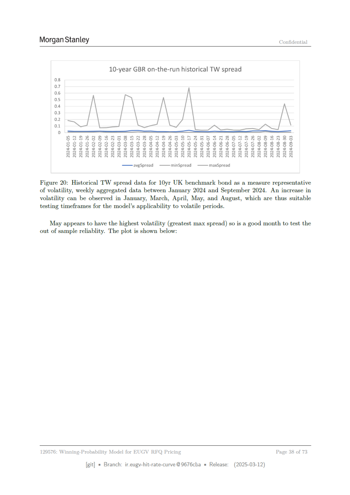

## 日本語メモ

**該当箇所:** 5.2 Scenario Analysis and Stress Testing

ボラティリティケースと流動性ケースでのストレステスト。市場不安定化や低流動性下での性能を確認する。

## 原文OCR/Text Layer

> OCR由来のため、誤認識があります。正確な図表・数式・レイアウトは上のページ画像を確認してください。

```text
Morgan Stanley
Confidential
10-year GBR on-the-run historical TW spread
08
07
06
05
04
03
02
o1
—avgSpread
minSpread
maxSpread
Figure 20: Historical TW spread data for 10yr UK benchmark bond as a measure representative
of volatility, weekly aggregated data between January 2024 and September 2024. An increase in
volatility can be observed in January, March, April, May, and August, which are thus suitable
testing timeframes for the model’s applicability to volatile periods.
May appears to have the highest volatility (greatest max spread) so is a good month to test the
out of sample reliablity. The plot is shown below:
129576: Winning-Probability Model for EUGV RFQ Pricing
Page 38 of 73
[git]
Branch: ir.eugy-hit-rate-curve @9676cba
= Release:
(2025-03-12)
```


---

# Page 039 - 日本語版

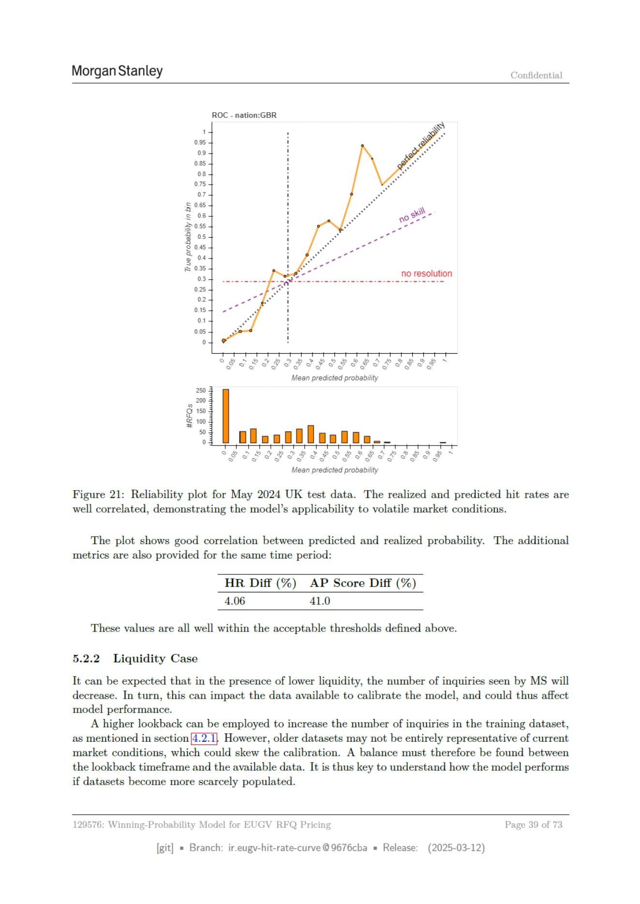

## 日本語メモ

**該当箇所:** 5.2 Scenario Analysis and Stress Testing

ボラティリティケースと流動性ケースでのストレステスト。市場不安定化や低流動性下での性能を確認する。

## 原文OCR/Text Layer

> OCR由来のため、誤認識があります。正確な図表・数式・レイアウトは上のページ画像を確認してください。

```text
Morgan Stanley
Confidential
ROC
nation GBR
if
oss
oo
PE SESSEESESESE™
Mean predicted probability
Figure 21: Reliability plot for May 2024 UK test data. The realized and predicted hit rates are
well correlated, demonstrating the model’s applicability to volatile market conditions.
The plot shows good correlation between predicted and realized probability. The additional
metrics are also provided for the same time period:
HR Diff (%)
AP Score Diff (%)
4.06
41.0
These values are all well within the acceptable thresholds defined above.
5.2.2
Liquidity Case
It can be expected that in the presence of lower liquidity, the number of inquiries seen by MS will
decrease. In turn, this can impact the data available to calibrate the model, and could thus affect
model performance.
‘A higher lookback can be employed to increase the number of inquiries in the training dataset,
as mentioned in section
However, older datasets may not be entirely representative of current
market conditions, which
could skew the calibration. A balance must therefore be found between
the lookback timeframe and the available data. It is thus key to understand how the model performs
if datasets become more scarcely populated.
129576: Winning-Probability Model
for
EUGV
RFQ Pricing
ze
39 of 73
[git]
Branch:
ir.eugy-hit-rate-curve @9676cba
= Release:
(2025-03-12)
```


---

# Page 040 - 日本語版

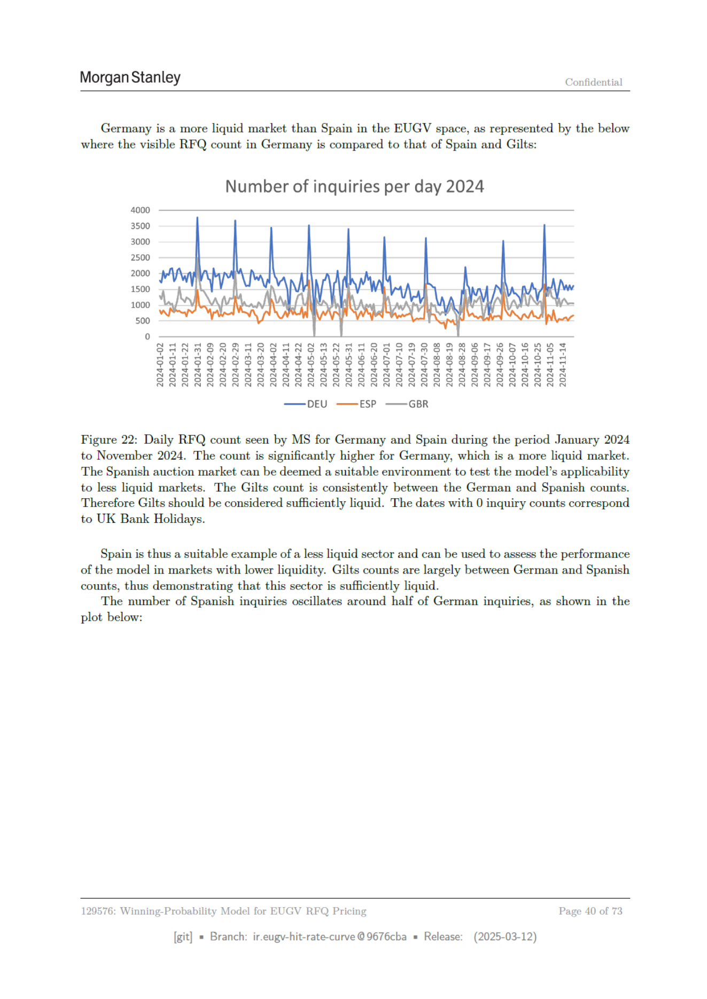

## 日本語メモ

**該当箇所:** 5.2 Scenario Analysis and Stress Testing

ボラティリティケースと流動性ケースでのストレステスト。市場不安定化や低流動性下での性能を確認する。

## 原文OCR/Text Layer

> OCR由来のため、誤認識があります。正確な図表・数式・レイアウトは上のページ画像を確認してください。

```text
Morgan Stanley
Confidential
Germany is a more liquid market than Spain in the EUGV space, as represented by the below
where the visible RFQ count in Germany is compared to that of Spain and Gilts:
Number of inquiries per day 2024
4000
3500
3000
2500
2000
1500
1000
500
Figure 22: Daily RFQ count seen by MS for Germany and Spain during the period January 2024
to November 2024. The count is significantly higher for Germany, which is a more liquid market.
The Spanish auction market can be deemed a suitable environment to test the model’s applicability
to less liquid markets.
The Gilts count is consistently between the German and Spanish counts.
Therefore Gilts should be considered sufficiently liquid. The dates with 0 inquiry counts correspond
to UK Bank Holidays.
Spain is thus a suitable example of a less liquid sector and can be used to assess the performance
of the model in markets with lower liquidity. Gilts counts are largely between German and Spanish
counts, thus demonstrating that this sector is sufficiently liquid.
‘The number of Spanish inquiries oscillates around half of German inquiries, as shown in the
plot below:
129576: Winning-Probability Model for EUGV RFQ Pricing
Page 40 of 73
[git]
Branch: ir.eugy-hit-rate-curve @9676cba
= Release:
(2025-03-12)
```


---

# Page 041 - 日本語版


## 日本語メモ

**該当箇所:** 5.2 Scenario Analysis and Stress Testing

ボラティリティケースと流動性ケースでのストレステスト。市場不安定化や低流動性下での性能を確認する。

## 原文OCR/Text Layer

> OCR由来のため、誤認識があります。正確な図表・数式・レイアウトは上のページ画像を確認してください。

```text
Morgan Stanley
Confidential
ESP / DEU RFQ rate 2024
120
100
80
60
40
20
—ESP/DEU rate
«++++++++
30 per Mov. Avg (ESP/DEU rate)
Figure 23: Daily ESP RFQ / DEU RFQ rate during the period January 2024 to November 2024.
The rate oscillates around half, further demonstrating that the Spanish bond market is less liquid
than the German bond market. From the inquiry rates, it can be estimated that the training
and testing timeframes would need to be doubled from Germany to Spain in order to maintain an
equivalent number of observations in the data samples.
A simple extrapolation can be made here in terms of the amount of data required to match
that contained in the DEU datasets. While a two-month train and two-month test was used in
calibrations in section {5.1.2, here a four-month train and four-month test can be used to verify
model suitability for Spanish inquiries.
‘A sample calibration was run on the Spanish dataset with a training period of January-April
2024, and testing period of May-August 2024. The corresponding out-of-sample reliability plot is
shown in the figure below:
129576: Winning-Probability Model for EUGV RFQ Pricing
Page
41 of 73
[git]
Branch: ir.eugy-hit-rate-curve @9676cba
= Release:
(2025-03-12)
```


---

# Page 042 - 日本語版

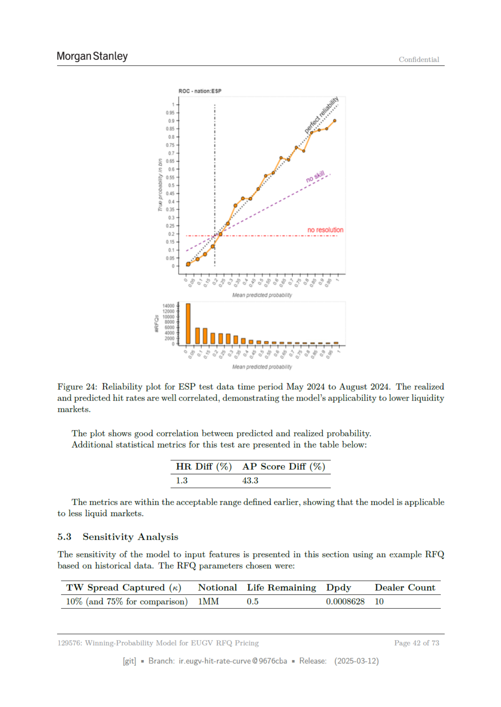

## 日本語メモ

**該当箇所:** 5.3 Sensitivity Analysis / 5.4 Benchmarking

market spread captured、dealer count、life remaining、duration/PV01、notional等への感応度と、外部・内部ベンチマークとの比較。

## 原文OCR/Text Layer

> OCR由来のため、誤認識があります。正確な図表・数式・レイアウトは上のページ画像を確認してください。

```text
Morgan Stanley
Confidential
ROC
- nation:€SP
Figure 24: Reliability plot for ESP test data time period May 2024 to August 2024. The realized
and predicted hit rates are well correlated, demonstrating the model’s applicability to lower liquidity
markets.
The plot shows good correlation between predicted and realized probability.
Additional statistical metrics for this test are presented in the table below:
HR Diff (%)
AP Score Diff (%)
13
43.3
‘The metrics are within the acceptable range defined earlier, showing that the model is applicable
to less liquid markets.
5.3
Sensitivity Analysis
The sensitivity of the model to input features is presented in this section using an example RFQ
based on historical data. The RFQ parameters chosen were:
TW Spread Captured (x)
Notional
Life Remaining
Dpdy
Dealer Count
10% (and 75% for comparison)
1MM
0.5
0.0008628
10
129576: Winning-Probability Model
for
EUGV
RFQ Pricing
Page
42 of 73
[git]
Branch:
ir.eugy-hit-rate-curve @9676cba
= Release:
(2025-03-12)
```


---

# Page 043 - 日本語版

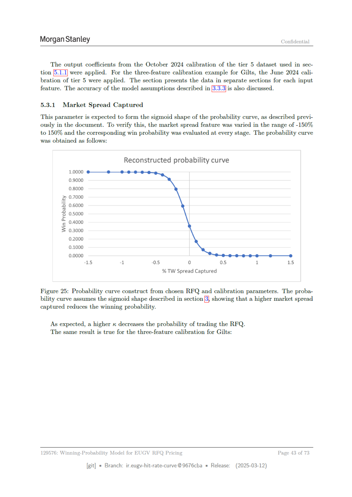

## 日本語メモ

**該当箇所:** 5.3 Sensitivity Analysis / 5.4 Benchmarking

market spread captured、dealer count、life remaining、duration/PV01、notional等への感応度と、外部・内部ベンチマークとの比較。

## 原文OCR/Text Layer

> OCR由来のため、誤認識があります。正確な図表・数式・レイアウトは上のページ画像を確認してください。

```text
Morgan Stanley
Confidential
‘The output coefficients from the October 2024 calibration of the tier
5 dataset used in sec-
were applied. For the three-feature calibration example for Gilts, the June 2024 cali-
bration of tier 5 were applied. The section presents the data
in
separate sections for each input
feature. The accuracy of the model assumptions described in
also discussed.
5.3.1
Market Spread Captured
This parameter is expected to form the sigmoid shape of the probability curve, as described previ-
ously in the document. To verify this, the market spread feature was varied in the range of -150%
to 150% and the corresponding win probability was evaluated at every stage. The probability curve
was obtained as follows:
Reconstructed probability curve
1.0000
0.9000
0.8000
= 0.7000
5 0.6000
8 0.5000
= 0.4000
3 0.3000
0.2000
0.1000
0.0000
1.5
1
0.5
0
0.5
1
15
% TW Spread Captured
Figure 25: Probability curve construct from chosen RFQ and calibration parameters. The proba-
bility curve assumes the sigmoid shape described in section [3] showing that a higher market spread
captured reduces the winning probability.
‘As expected, a higher « decreases the probability of trading the RFQ.
‘The same result is true for the three-feature calibration for Gilts:
129576: Winning-Probability Model
for
EUGV
RFQ Pricing
Page
43 of 73
[git]
Branch:
ir.eugy-hit-rate-curve @9676cba
= Release:
(2025-03-12)
```


---

# Page 044 - 日本語版


## 日本語メモ

**該当箇所:** 5.3 Sensitivity Analysis / 5.4 Benchmarking

market spread captured、dealer count、life remaining、duration/PV01、notional等への感応度と、外部・内部ベンチマークとの比較。

## 原文OCR/Text Layer

> OCR由来のため、誤認識があります。正確な図表・数式・レイアウトは上のページ画像を確認してください。

```text
Morgan Stanley
Confidential
Reconstructed probability curve - 3 features
1.0000
0.9000
0.8000
> 0.7000
5 0.6000
8 0.5000
~ 0.4000
3 0.3000
0.2000
0.1000
0.0000
“15
-l
-0.5
0
0.5
1
15
% TW Spread Captured
Figure 26: Probability curve construct from chosen RFQ and three-feature calibration parameters.
The probability curve assumes the sigmoid shape described in section [3] showing that a higher
market spread captured reduces the winning probability.
5.3.2
Dealer Count Reciprocal
The expected range for this parameter is 0 to 30, as per previous sections. Varying this feature is
expected to translate the curve along the x-axis. The following was obtained when varying dealer
counts:
129576: Winning-Probability Model for EUGV RFQ Pricing
Page
44 of 73
[git]
Branch: ir.eugy-hit-rate-curve @9676cba
= Release:
(2025-03-12)
```


---

# Page 045 - 日本語版


## 日本語メモ

**該当箇所:** 5.3 Sensitivity Analysis / 5.4 Benchmarking

market spread captured、dealer count、life remaining、duration/PV01、notional等への感応度と、外部・内部ベンチマークとの比較。

## 原文OCR/Text Layer

> OCR由来のため、誤認識があります。正確な図表・数式・レイアウトは上のページ画像を確認してください。

```text
Morgan Stanley
Confidential
Probability curves for various dealer counts
1.0000
0.9000
0.8000
2 0.7000
2 0.6000
6 0.5000
© 0.4000
= 0.3000
0.2000
0.1000
0.0000
“15
“1
05
0
05
1
15
% TW Spread Captured
—e-2 -©-3 -e-4 -e-5 -e-10 -0-15 —e-30
Figure 27: Probability curve construct from chosen RFQ and calibration parameters, for varying
dealer counts. The dealer count decreases the probability of winning the auction for a fixed «. The
%TW spread captured values remain within an acceptable range, with a variation below 50% from
2 to 30 dealers.
The following was obtained when varying dealer counts for the three-feature Gilts calibration:
Probability curves for various dealer counts - 3 features
1.0000
0.9000
0.8000
2 0.7000
2 0.6000
6 0.5000
© 0.4000
= 0.3000
0.2000
0.1000
0.0000
“15
“1
05
0
05
1
15
% TW Spread Captured
—e-2 —0-3 —e-4 —e-5 —e-15 —0-30
Figure 28: Probability curve construct from chosen RFQ and three-feature calibration parameters,
for varying dealer counts. The dealer count decreases the probability of winning the auction for
a fixed x. The %TW spread captured values remain within an acceptable range, with a variation
below 50% from 2 to 30 dealers.
The translation of the curve is clear from smaller to larger dealer counts, with higher dealer
: Winning-Probability Model for
EUGV RFQ Pricing
Page
45 of 73
[git]
Branch: ir.eugy-hit-rate-curve @9676cba
= Release:
(2025-03-12)
```


---

# Page 046 - 日本語版


## 日本語メモ

**該当箇所:** 5.3 Sensitivity Analysis / 5.4 Benchmarking

market spread captured、dealer count、life remaining、duration/PV01、notional等への感応度と、外部・内部ベンチマークとの比較。

## 原文OCR/Text Layer

> OCR由来のため、誤認識があります。正確な図表・数式・レイアウトは上のページ画像を確認してください。

```text
Morgan Stanley
Confidential
counts reducing the winning probability as per rationale described in section
The %TW
spread captured values however remain within an acceptable range, with a variation below 50%
from 2 to 30 dealers.
‘The use of dealer count reciprocal can also be verified here. Recall from sectio:
reciprocal was chosen so as to model trading intuition on decreasing rates of winning probability.
The figures below illustrate this point by fixing x to 10% market spread and varying dealer counts:
Win probability against dealer count
co}
5
10
15
20
25
30
35
Dealer Count
Figure 29: Win probability against dealer count for a fixed « of 0.1.
The winning probability
decreases with dealer counts following an approximate 1/: functional form.
129576: Winning-Probability Model for EUGV RFQ Pricing
Page
46 of 73
[git]
Branch: ir.eugy-hit-rate-curve @9676cba
= Release:
(2025-03-12)
```


---

# Page 047 - 日本語版

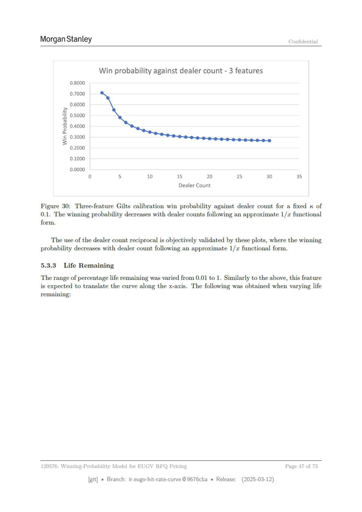

## 日本語メモ

**該当箇所:** 5.3 Sensitivity Analysis / 5.4 Benchmarking

market spread captured、dealer count、life remaining、duration/PV01、notional等への感応度と、外部・内部ベンチマークとの比較。

## 原文OCR/Text Layer

> OCR由来のため、誤認識があります。正確な図表・数式・レイアウトは上のページ画像を確認してください。

```text
Morgan Stanley
Confidential
Win probability against dealer count - 3 features
0.8000
0.7000
0.6000
= 0.5000
©
0.4000
© 0.3000
0.2000
0.1000
0.0000
0
5
10
1s
20
25
30
35
Dealer Count
Figure 30: Three-feature Gilts calibration win probability against dealer count for a fixed # of
0.1. The winning probability decreases with dealer counts following an approximate 1/:r functional
form.
The use of the dealer count reciprocal is objectively validated by these plots, where the winning
probability decreases with dealer count following an approximate 1/. functional form.
5.3.3
Life Remaining
The range of percentage life remaining was varied from 0.01 to 1. Similarly to the above, this feature
is expected to translate the curve along the x-axis. The following was obtained when varying life
remaining:
129576: Winning-Probability Model for EUGV RFQ Pricing
Page
47 of 73
[git]
Branch: ir.eugy-hit-rate-curve @9676cba
= Release:
(2025-03-12)
```


---

# Page 048 - 日本語版


## 日本語メモ

**該当箇所:** 5.3 Sensitivity Analysis / 5.4 Benchmarking

market spread captured、dealer count、life remaining、duration/PV01、notional等への感応度と、外部・内部ベンチマークとの比較。

## 原文OCR/Text Layer

> OCR由来のため、誤認識があります。正確な図表・数式・レイアウトは上のページ画像を確認してください。

```text
Morgan Stanley
Confidential
Probability curves for various life remaining parameters
1.0000
0.9000
0.8000
2 0.7000
2 0.6000
6 0.5000
© 0.4000
= 0.3000
0.2000
0.1000
0.0000
15
“1
05
0
05
1
15
% TW Spread Captured
—e-0.01
—e-0.1
—e-0.15
—®-0.2
—®-04 —®-05 —®-07 —e-09
—e-1
Figure 31: Probability curve construct from chosen RFQ and calibration parameters, for varying
life remaining parameters. The feature was deemed not significant for the tier 5 dataset, which is
made apparent here with the lack of impact on the reconstructed curve.
The translation of the curve is not noticeable from lower to higher amounts of percentage life
remaining. In the tier 5 dataset, the life remaining coefficient was not deemed significant relatively
to others for the October 2024 calibration (see figure [Ii]. It is therefore expected that the impact
of varying this parameter on the curve would be negligible, as is demonstrated here.
A separate test was run using tier 1 coefficients, for which the life remaining p-value was 0 in
the October 2024 calibration. Results obtained are as follows:
129576: Winning-Probability Model for EUGV RFQ Pricing
Page 48 of 73
[git]
Branch: ir.eugy-hit-rate-curve @9676cba
= Release:
(2025-03-12)
```


---

# Page 049 - 日本語版


## 日本語メモ

**該当箇所:** 5.3 Sensitivity Analysis / 5.4 Benchmarking

market spread captured、dealer count、life remaining、duration/PV01、notional等への感応度と、外部・内部ベンチマークとの比較。

## 原文OCR/Text Layer

> OCR由来のため、誤認識があります。正確な図表・数式・レイアウトは上のページ画像を確認してください。

```text
Morgan Stanley
Confidential
Probability curves for various life remaining parameters
1.0000
0.9000
0.8000
2 0.7000
2 0.6000
6 0.5000
© 0.4000
= 0.3000
0.2000
0.1000
0.0000
15
“1
05
0
05
1
15
% TW Spread Captured
—e-0.01
—e-0.1
—e-0.15
—®-0.2
—®-04 —®-05
—®-07 —e-09
—e-1
Figure 32: Probability curve construct from chosen RFQ and tier 1 calibration parameters, for
varying life remaining parameters. The feature was deemed significant for the tier 1 dataset, which
is made apparent: here with the negative translation of the reconstructed curve with increasing life
remaining. It is made apparent here that the percentage life remaining decreases the probability of
winning the auction for a fixed x. The %TW spread captured values remain within an acceptable
range, with a variation below 50% from 1% to 100% life remaining.
The impact of the coefficient is visible here, with a lower life remaining parameter increasing
the probability of trading for a fixed x. The rationale behind the negative translation of the curve
with percent life remaining is detailed in section [3.3.3] The spread variation remains within an
acceptable range below 50% between higher and lower parameters.
Percent life remaining is not a feature in the Gilts three-feature model, and therefore does not
need to be validated in this context.
5.3.4
Dpdy
In a similar fashion as the above, the results for the dpdy feature ranging from 0.00001 to 0.001
are presented below:
129576: Winning-Probability Model for EUGV RFQ Pricing
Page
49 of 73
[git]
Branch: ir.eugy-hit-rate-curve @9676cba
= Release:
(2025-03-12)
```


---

# Page 050 - 日本語版


## 日本語メモ

**該当箇所:** 5.3 Sensitivity Analysis / 5.4 Benchmarking

market spread captured、dealer count、life remaining、duration/PV01、notional等への感応度と、外部・内部ベンチマークとの比較。

## 原文OCR/Text Layer

> OCR由来のため、誤認識があります。正確な図表・数式・レイアウトは上のページ画像を確認してください。

```text
Morgan Stanley
Confidential
Probability curves for various dpdys
1.0000
= 08000
06000
& 0.4000
= 02000
0.0000
“15
-1
-0.5
0
0.5
1
15
% TW Spread Captured
—®— 0.00001 —e—0.00005 —e—0.0001 —e—0.00025 —e—0.0005
—®—0.0006 —®—0.0007
—e®—0.0008 —®—0.0009 —®—0.001
Figure 33: Probability curve construct from chosen RFQ and calibration parameters, for varying
dpdy inputs. It is shown here that the dpdy increases the probability of winning the auction for
a fixed x. The %TW spread captured values remain within an acceptable range, with a variation
below 50% from 0.00001 to 0.001 dpdy values.
The rationale behind the positive translation of the curve with dpdy is detailed in section [3.3.3}
The translation of the curve is small, and in turn so are the « variations.
The equivalent plot for the Gilts three-feature calibration is below:
Probability curves for various dpdys - 3 features
1.0000
2 0.8000
3
0.6000
a
0.4000
=
0.2000
0.0000
“15
a
-0.5
0
0.5
1
15
% TW Spread Captured
—e—0.00001 -e—0 00005 -e—0.0001 —e—0 00025
—-e— 0.0005
—e—0.0006 —e—00007 —e—0.0008 —e—00009 —e—0.001
Figure 34: Probability curve construct from chosen RFQ and three-feature calibration parameters,
for varying dpdy inputs. The %TW spread captured values remain within an acceptable range,
with a variation below 50% from 0.00001 to 0.001 dpdy values.
129576: Winning-Probability Model for EUGV RFQ Pricing
Page 50 of 73
[git]
Branch: ir.eugy-hit-rate-curve @9676cba
= Release:
(2025-03-12)
```


---

# Page 051 - 日本語版

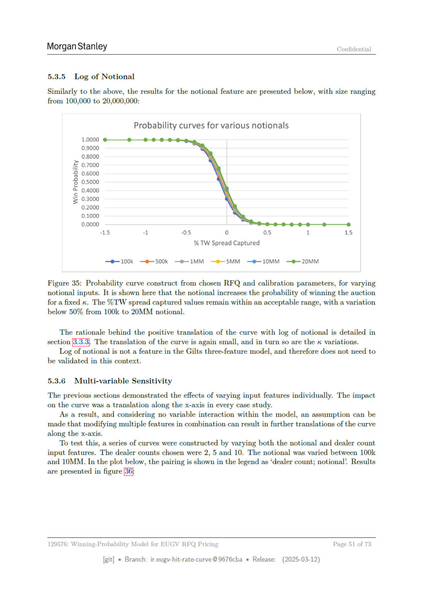

## 日本語メモ

**該当箇所:** 5.3 Sensitivity Analysis / 5.4 Benchmarking

market spread captured、dealer count、life remaining、duration/PV01、notional等への感応度と、外部・内部ベンチマークとの比較。

## 原文OCR/Text Layer

> OCR由来のため、誤認識があります。正確な図表・数式・レイアウトは上のページ画像を確認してください。

```text
Morgan Stanley
Confidential
5.3.5
Log of Notional
Similarly to the above, the results for the notional feature are presented below, with size ranging
from 100,000 to 20,000,000:
Probability curves for various notionals
1.0000
0.9000
0.8000
= 0.7000
8 06000
‘©
0 5000
=
0 4000
= 0.3000
0.2000
0.1000
0.0000
-15
-1
05
0
05
1
15
% TW Spread Captured
—e—100k
—e—-500k
—e-1MM
—e®—5MM
—®—10MM
—e—20MM
Figure 35: Probability curve construct from chosen RFQ and calibration parameters, for varying
notional inputs. It is shown here that the notional increases the probability of winning the auction
for a fixed «. The %TW spread captured values remain within an acceptable range, with a variation
below 50% from 100k to 20MM notional.
The rationale behind the positive translation of the curve with log of notional is detailed in
The translation of the curve is again small, and in turn so are the « variations.
Log of notional is not a feature in the Gilts three-feature model, and therefore does not need to
be validated in this context.
5.3.6
Multi-variable Sensitivity
The previous sections demonstrated the effects of varying input features individually. The impact
on the curve was a translation along the x-axis in every case study.
‘As a result, and considering no variable interaction within the model, an assumption can be
made that modifying multiple features in combination can result in further translations of the curve
along the x-axis.
To test this, a series of curves were constructed by varying both the notional and dealer count
input features. The dealer counts chosen were 2, 5 and 10. The notional was varied between 100k
and 10MM. In the plot below, the pairing is shown in the legend as ‘dealer count; notional’. Results
129576: Winning-Probability Model for EUGV
RFQ Pricing
Page 51 of 73
[git]
Branch: ir.eugy-hit-rate-curve @9676cba
= Release:
(2025-03-12)
```


---

# Page 052 - 日本語版

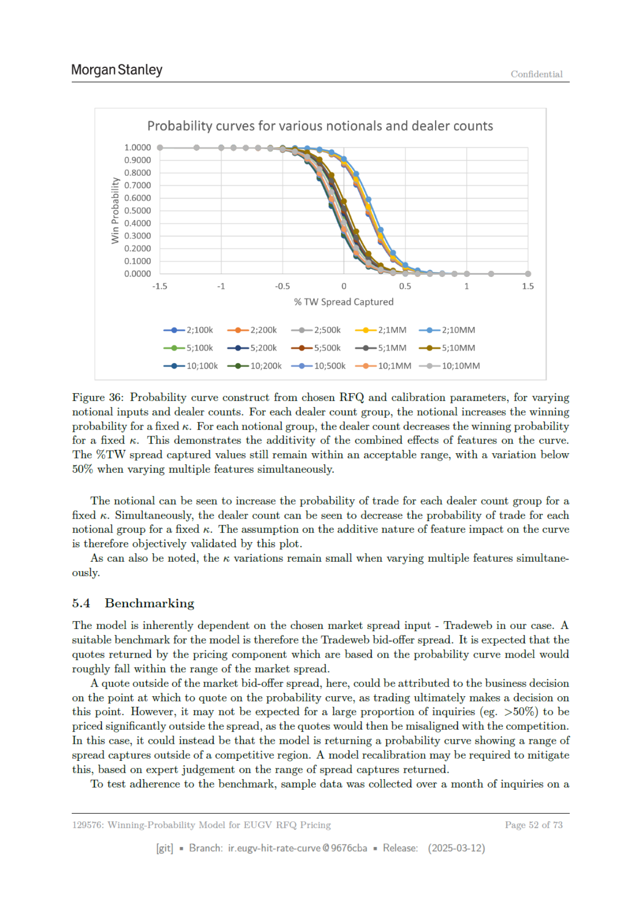

## 日本語メモ

**該当箇所:** 5.3 Sensitivity Analysis / 5.4 Benchmarking

market spread captured、dealer count、life remaining、duration/PV01、notional等への感応度と、外部・内部ベンチマークとの比較。

## 原文OCR/Text Layer

> OCR由来のため、誤認識があります。正確な図表・数式・レイアウトは上のページ画像を確認してください。

```text
Morgan Stanley
Confidential
Probability curves for various notionals and dealer counts
1.0000
aed
‘0-2
0.9000
0.8000
>
=
0.7000
8 0.6000
8 0.5000
© 0.4000
= 0.3000
0.2000
0.1000
0.0000
ain
-
15
ol
-05
0
05
1
15
% TW Spread Captured
—@—2,100k
—e—2;200k
—e—2,500k
—e—2,1MM
—®—2;10MM
—@—5,100k
—@—5;200k
—@—5,500k
—@=5,1MM
—®=5;10MM
—@—10,100k
—@—10,200k
—e—10;500k
—e—10;1MM
10;10MM
Figure 36: Probability curve construct from chosen RFQ and calibration parameters, for varying
notional inputs and dealer counts. For each dealer count group, the notional increases the winning
probability for a fixed x. For each notional group, the dealer count decreases the winning probability
for a fixed x.
This demonstrates the additivity of the combined effects of features on the curve.
The %TW spread captured values still remain within an acceptable range, with a variation below
50% when varying multiple features simultaneously.
‘The notional can be seen to increase the probability of trade for each dealer count group for a
fixed x. Simultaneously, the dealer count can be seen to decrease the probability of trade for each
notional group for a fixed x. The assumption on the additive nature of feature impact on the curve
is therefore objectively validated by this plot.
‘As can also be noted, the « variations remain small when varying multiple features simultane-
ously.
5.4
Benchmarking
The model is inherently dependent on the chosen market spread input - Tradeweb in our case. A
suitable benchmark for the model is therefore the Tradeweb bid-offer spread. It is expected that the
quotes returned by the pricing component which are based on the probability curve model would
roughly fall within the range of the market spread.
‘A quote outside of the market bid-offer spread, here, could be attributed to the business decision
on the point at which to quote on the probability curve, as trading ultimately makes a decision on
this point. However, it may not be expected for a large proportion of inquiries (eg. >50%) to be
priced significantly outside the spread, as the quotes would then be misaligned with the competition.
In this case, it could instead be that the model is returning a probability curve showing a range of
spread captures outside of a competitive region. A model recalibration may be required to mitigate
this, based on expert judgement on the range of spread captures returned.
To test adherence to the benchmark, sample data was collected over a month of inquiries on a
129576: Winning-Probability Model
for EUGV
RFQ Pricing
Page 52 of 73
[git]
Branch: ir.eugy-hit-rate-curve @9676cba
= Release:
(2025-03-12)
```


---

# Page 053 - 日本語版

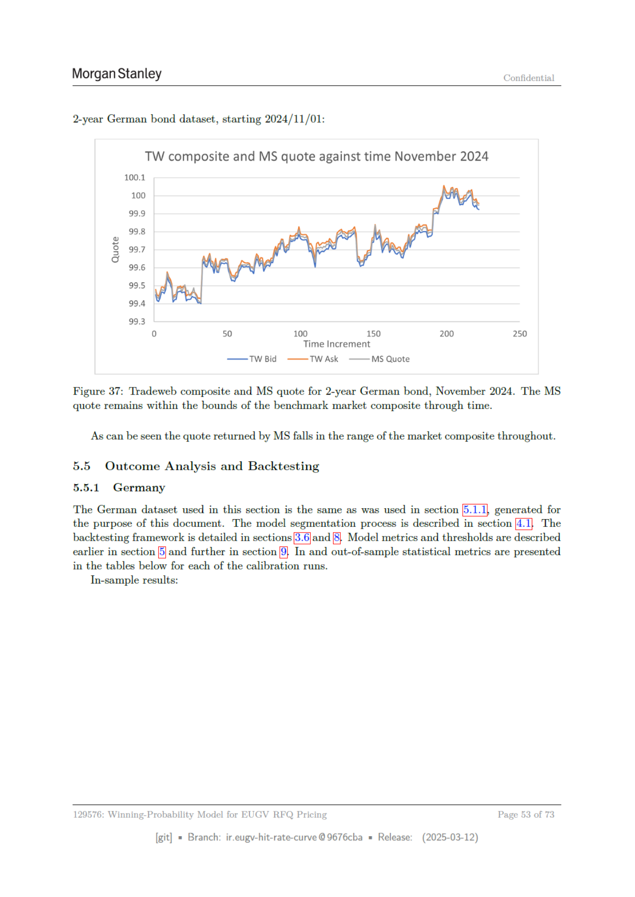

## 日本語メモ

**該当箇所:** 5.5 Outcome Analysis and Backtesting / 6-7 Limitations/Overlays

国別・商品別のアウトカム分析とバックテスト。制限、緩和策、オーバーレイやオーバーライドの扱いも含む。

## 原文OCR/Text Layer

> OCR由来のため、誤認識があります。正確な図表・数式・レイアウトは上のページ画像を確認してください。

```text
Morgan Stanley
Confidential
2-year German bond dataset, starting 2024/11/01:
TW composite and MS quote against time November 2024
100 1
100
999
998
S
997
996
995
994
993
0
50
100
150
200
250
Time Increment
——TWBid
——TWAsk
——MS Quote
Figure 37: Tradeweb composite and MS quote for 2-year German bond, November 2024. The MS
quote remains within the bounds of the benchmark market composite through time.
As can be seen the quote returned by MS falls in the range of the market composite throughout.
5.5
Outcome Analysis and Backtesting
5.5.1
Germany
The German dataset used in this section is the same as was used in section
generated for
the purpose of this document. The model segmentation process is described in section [f
backtesting framework is detailed in sections
[3.6jand[§]
Model metrics and thresholds are described
earlier in section [JJ and further in section J} In and out-of-sample statistical metrics are presented
in the tables below for each of the calibration runs.
In-sample results:
129576: Winning-Probability Model for EUGV RFQ Pricing
Page 53 of 73
[git]
Branch: ir.eugy-hit-rate-curve @9676cba
= Release:
(2025-03-12)
```


---

# Page 054 - 日本語版

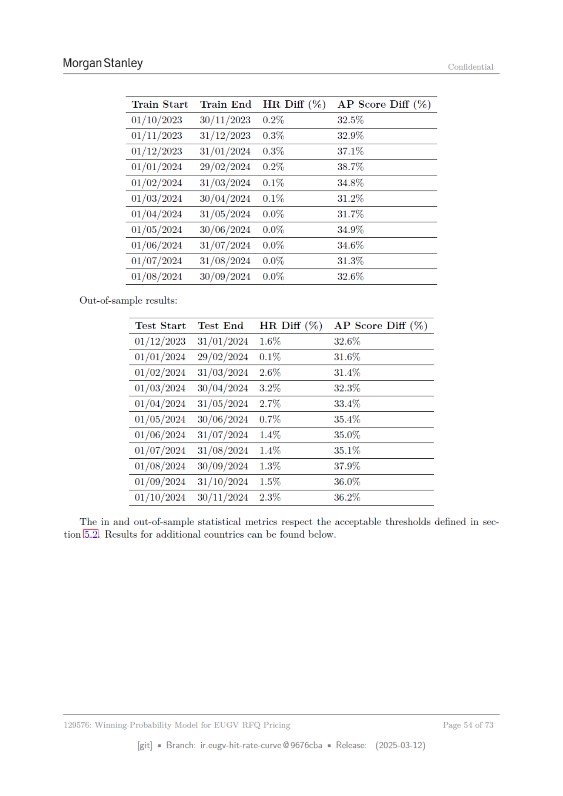

## 日本語メモ

**該当箇所:** 5.5 Outcome Analysis and Backtesting / 6-7 Limitations/Overlays

国別・商品別のアウトカム分析とバックテスト。制限、緩和策、オーバーレイやオーバーライドの扱いも含む。

## 原文OCR/Text Layer

> OCR由来のため、誤認識があります。正確な図表・数式・レイアウトは上のページ画像を確認してください。

```text
Morgan Stanley
Confidenti
Train Start
Train End
HR Diff (%)
AP Score Diff (%)
01/10/2023
30/11/2023
0.2%
32.5%
01/11/2023
31/12/2023
0.3%
32.9%
01/12/2023
31/01/2024
0.3%
37.1%
01/01/2024
29/02/2024
0.2%
38.7%
01/02/2024
31/03/2024
0.1%
34.8%
01/03/2024
30/04/2024
0.1%
31.2%
01/04/2024
31/05/2024
0.0%
31.7%
01/05/2024
30/06/2024
0.0%
34.9%
01/06/2024
31/07/2024
0.0%
34.6%
01/07/2024
31/08/2024
0.0%
31.3%
01/08/2024
30/09/2024
0.0%
32.6%
Out-of-sample results:
Test Start
Test End
HR Diff (%)
AP Score Diff (%)
01/12/2023
31/01/2024
1.6%
32.6%
01/01/2024
29/02/2024
0.1%
31.6%
01/02/2024
31/03/2024
2.6%
31.4%
01/03/2024
30/04/2024
4
01/04/2024
31/05/2024
33.4%
01/05/2024
30/06/2024
35.4%
01/06/2024
31/07/2024
1.4%
35.0%
01/07/2024
31/08/2024
1.4%
35.1%
01/08/2024
30/09/2024
1.3%
37.9%
01/09/2024
31/10/2024
1.5%
36.0%
01/10/2024
30/11/2024
2.3%
36.2%
The in and out-of-sample statistical metrics respect the acceptable thresholds defined in sec-
tion B21 Results for additional countries can be found below.
129576: Winning-Probability Model
for
EUGV
RFQ Pricing
Page
54 of 73
[git]
= Branch:
ir.eugy-hit-rate-curve @9676cba
= Release:
(2025-03-12)
```


---

# Page 055 - 日本語版


## 日本語メモ

**該当箇所:** 5.5 Outcome Analysis and Backtesting / 6-7 Limitations/Overlays

国別・商品別のアウトカム分析とバックテスト。制限、緩和策、オーバーレイやオーバーライドの扱いも含む。

## 原文OCR/Text Layer

> OCR由来のため、誤認識があります。正確な図表・数式・レイアウトは上のページ画像を確認してください。

```text
Morgan Stanley
Confidential
5.5.2
Austria
In-sample results:
Train Start
Train End
HR Diff (%)
AP Score Diff (%)
01/06/2023
30/09/2023
0.2%
53.1%
01/07/2023
31/10/2023
0.2%
46.0%
01/08/2023
30/11/2023
0.2%
41.5%
01/09/2023
31/12/2023
0.2%
38.7%
01/10/2023
31/01/2024
0.1%
37.0%
01/11/2023
29/02/2024
0.1%
37.4%
01/12/2023
31/03/2024
0.1%
36.3%
01/01/2024
30/04/2024
0.0%
37.1%
01/02/2024
31/05/2024
0.0%
38.5%
01/03/2024
30/06/2024
0.0%
42.9%
01/04/2024
31/07/2024
0.0%
53.6%
Out-of-sample results:
Test Start
HR Diff (%)
AP Score Diff (%)
01/10/2023
1.5%
36.4%
01/11/2023
29/02/2024
2.2%
34.1%
01/12/2023
31/03/2024
0.4%
34.8%
01/01/2024
30/04/2024
1.1%
36.3%
01/02/2024
31/05/2024
0.1%
36.7%
01/03/2024
30/06/2024
1.4%
39.8%
01/04/2024
31/07/2024
1.4%
49.9%
01/05/2024
31/08/2024
2.9%
61.3%
01/06/2024
30/09/2024
3.9%
59.9%
01/07/2024
31/10/2024
2.2%
62.7%
01/08/2024
30/11/2024
1.3%
55.2%
129576:
Winning-Probability Model
for
EUGV
RFQ Pricing
Page
5
[git]
= Branch:
ir.eugy-hit-rate-curve @9676cba
= Release:
(2025-03-12)
```


---

# Page 056 - 日本語版


## 日本語メモ

**該当箇所:** 5.5 Outcome Analysis and Backtesting / 6-7 Limitations/Overlays

国別・商品別のアウトカム分析とバックテスト。制限、緩和策、オーバーレイやオーバーライドの扱いも含む。

## 原文OCR/Text Layer

> OCR由来のため、誤認識があります。正確な図表・数式・レイアウトは上のページ画像を確認してください。

```text
Morgan Stanley
Confidential
5.5.3
Belgium
In-sample results:
Train Start
Train End
HR Diff (%)
AP Score Diff (%)
01/06/2023
30/09/2023
0.4%
45.3%
01/07/2023
31/10/2023
0.5%
39.6%
01/08/2023
30/11/2023
0.4%
37.8%
01/09/2023
31/12/2023
0.4%
40.5%
01/10/2023
31/01/2024
0.5%
42.8%
01/11/2023
29/02/2024
0.5%
42.5%
01/12/2023
31/03/2024
0.6%
41.6%
01/01/2024
30/04/2024
0.6%
40.0%
01/02/2024
31/05/2024
0.4%
38.1%
01/03/2024
30/06/2024
0.2%
38.9%
01/04/2024
31/07/2024
0.2%
38.6%
Out-of-sample results:
Test Start
Test End
HR Diff (%)
AP Score Diff (%)
01/10/2023
31/01/2024
0.9%
41.8%
01/11/2023
29/02/2024
1.7%
41.9%
01/12/2023
31/03/2024
0.4%
38.3%
01/01/2024
30/04/2024
2.4%
32.9%
01/02/2024
31/05/2024
4.3%
29.0%
01/03/2024
30/06/2024
3.4%
29.1%
01/04/2024
31/07/2024
2.0%
29.5%
01/05/2024
31/08/2024
0.4%
31.5%
01/06/2024
30/09/2024
3.0%
34.3%
01/07/2024
31/10/2024
1.1%
33.9%
01/08/2024
30/11/2024
0.6%
33.6%
129576:
Winning-Probability Model
for
EUGV
RFQ Pricing
Page
[git]
= Branch:
ir.eugy-hit-rate-curve @9676cba
= Release:
(2025-03-12)
```


---

# Page 057 - 日本語版


## 日本語メモ

**該当箇所:** 5.5 Outcome Analysis and Backtesting / 6-7 Limitations/Overlays

国別・商品別のアウトカム分析とバックテスト。制限、緩和策、オーバーレイやオーバーライドの扱いも含む。

## 原文OCR/Text Layer

> OCR由来のため、誤認識があります。正確な図表・数式・レイアウトは上のページ画像を確認してください。

```text
Morgan Stanley
Confidential
5.5.4
Spain
In-sample results:
Train Start
Train End
HR Diff (%)
AP Score Diff (%)
01/06/2023
30/09/2023
0.0%
35.6%
01/07/2023
31/10/2023
0.1%
39.0%
01/08/2023
30/11/2023
0.1%
40.1%
01/09/2023
31/12/2023
0.1%
40.7%
01/10/2023
31/01/2024
0.1%
40.4%
01/11/2023
29/02/2024
0.2%
39.2%
01/12/2023
31/03/2024
0.4%
39.4%
01/01/2024
30/04/2024
0.2%
38.1%
01/02/2024
31/05/2024
0.0%
37.2%
01/03/2024
30/06/2024
0.0%
37.3%
01/04/2024
31/07/2024
0.0%
35.6%
Out-of-sample results:
Test Start
Test End
HR Diff (%)
AP Score Diff (%)
01/10/2023
31/01/2024
1.3%
37.8%
01/11/2023
29/02/2024
1.1%
37.1%
01/12/2023
31/03/2024
1.8%
38.8%
01/01/2024
30/04/2024
0.4%
38.2%
01/02/2024
31/05/2024
1.8%
40.4%
01/03/2024
30/06/2024
3.6%
41.3%
01/04/2024
31/07/2024
4.4%
38.7%
01/05/2024
31/08/2024
1.3%
43.3%
01/06/2024
30/09/2024
0.1%
42.4%
01/07/2024
31/10/2024
1.3%
39.1%
01/08/2024
30/11/2024
2.2%
40.5%
129576:
Winning-Probability Model
for
EUGV
RFQ Pricing
Page
[git]
= Branch:
ir.eugy-hit-rate-curve @9676cba
= Release:
(2025-03-12)
```


---

# Page 058 - 日本語版


## 日本語メモ

**該当箇所:** 5.5 Outcome Analysis and Backtesting / 6-7 Limitations/Overlays

国別・商品別のアウトカム分析とバックテスト。制限、緩和策、オーバーレイやオーバーライドの扱いも含む。

## 原文OCR/Text Layer

> OCR由来のため、誤認識があります。正確な図表・数式・レイアウトは上のページ画像を確認してください。

```text
Morgan Stanley
Confidential
5.5.5
EU
In-sample results:
Train Start
Train End
HR Diff (%)
AP Score Diff (%)
01/06/2023
30/09/2023
0.3%
28.8%
01/07/2023
31/10/2023
0.4%
28.6%
01/08/2023
30/11/2023
0.5%
25.2%
01/09/2023
31/12/2023
0.4%
24.7%
01/10/2023
31/01/2024
0.3%
27.0%
01/11/2023
29/02/2024
0.3%
29.0%
01/12/2023
31/03/2024
0.3%
30.9%
01/01/2024
30/04/2024
0.2%
32.6%
01/02/2024
31/05/2024
0.1%
34.3%
01/03/2024
30/06/2024
0.1%
35.2%
01/04/2024
31/07/2024
0.0%
34.5%
Out-of-sample results:
Test Start
Test End
HR Diff (%)
AP Score Diff (%)
01/10/!
31/01/2024
6.6%
%
01/11/2023
29/02/2024
7.8%
29.9%
01/12/2023
31/03/2024
6.4%
31.1%
01/01/2024
30/04/2024
3.1%
33.0%
01/02/2024
31/05/2024
0.4%
34.3%
01/03/2024
30/06/2024
3.2%
35.6%
01/04/2024
31/07/2024
4.9%
35.7%
01/05/2024
31/08/2024
6.0%
31.1%
01/06/2024
30/09/2024
6.0%
30.1%
01/07/2024
31/10/2024
4.2%
31.9%
01/08/2024
30/11/2024
2.4%
29.4%
129576:
Winning-Probability Model
for
EUGV
RFQ Pricing
Page
58
of 73
[git]
= Branch:
ir.eugy-hit-rate-curve @9676cba
= Release:
(2025-03-12)
```


---

# Page 059 - 日本語版


## 日本語メモ

**該当箇所:** 5.5 Outcome Analysis and Backtesting / 6-7 Limitations/Overlays

国別・商品別のアウトカム分析とバックテスト。制限、緩和策、オーバーレイやオーバーライドの扱いも含む。

## 原文OCR/Text Layer

> OCR由来のため、誤認識があります。正確な図表・数式・レイアウトは上のページ画像を確認してください。

```text
Morgan Stanley
Confidential
5.5.6
France
In-sample results:
Train Start
Train End
HR Diff (%)
AP Score Diff (%)
01/10/2023
30/11/2023
0.1%
43.2%
01/11/2023
31/12/2023
0.0%
44.1%
01/12/2023
31/01/2024
0.2%
43.5%
01/01/2024
29/02/2024
0.2%
42.1%
01/02/2024
31/03/2024
0.2%
36.5%
01/03/2024
30/04/2024
0.0%
33.1%
01/04/2024
31/05/2024
0.2%
32.1%
01/05/2024
30/06/2024
0.0%
34.0%
01/06/2024
31/07/2024
0.0%
35.9%
01/07/2024
31/08/2024
0.0%
34.5%
01/08/2024
30/09/2024
0.1%
32.7%
Out-of-sample results:
Test Start
Test End
HR Diff (%)
AP Score Diff (%)
01/12/2023
31/01/2024
0.3%
01/01/2024
29/02/2024
1.5%
01/02/2024
31/03/2024
3.0%
01/03/2024
30/04/2024
2.8%
01/04/2024
31/05/2024
2.0%
01/05/2024
30/06/2024
0.7%
01/06/2024
31/07/2024
1.3%
01/07/2024
31/08/2024
1.8%
01/08/2024
30/09/2024
2.7%
01/09/2024
31/10/2024
1.6%
01/10/2024
30/11/2024
0.3%
129576: Winning-Probability Model
for
EUGV
RFQ Pricing
Page
59 of 73
[git]
= Branch:
ir.eugy-hit-rate-curve @9676cba
= Release:
(2025-03-12)
```


---

# Page 060 - 日本語版

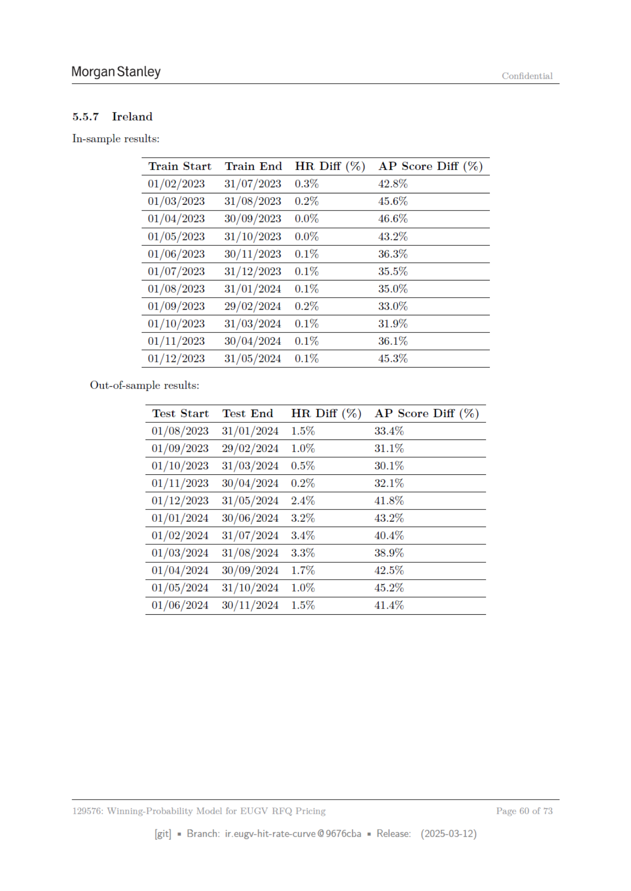

## 日本語メモ

**該当箇所:** 5.5 Outcome Analysis and Backtesting / 6-7 Limitations/Overlays

国別・商品別のアウトカム分析とバックテスト。制限、緩和策、オーバーレイやオーバーライドの扱いも含む。

## 原文OCR/Text Layer

> OCR由来のため、誤認識があります。正確な図表・数式・レイアウトは上のページ画像を確認してください。

```text
Morgan Stanley
Confidential
5.5.7
Ireland
In-sample results:
Train Start
Train End
HR Diff (%)
AP Score Diff (%)
01/02/2023
31/07/2023
0.3%
42.8%
01/03/2023
31/08/2023
0.2%
45.6%
01/04/2023
30/09/2023
0.0%
16.6%
01/05/2023
31/10/2023
0.0%
43.2%
01/06/2023
30/11/2023
0.1%
36.3%
01/07/2023
31/12/2023
0.1%
35.5%
01/08/2023
31/01/2024
0.1%
35.0%
01/09/2023
29/02/2024
0.2%
33.0%
01/10/2023
31/03/2024
0.1%
31.9%
01/11/2023
30/04/2024
0.1%
36.1%
01/12/2023
31/05/2024
0.1%
45.3%
Out-of-sample results:
Test Start
Test End
HR Diff (%)
AP Score Diff (%)
01/08/2023
31/01/2024
1.5%
33.4%
01/09/2023
29/02/2024
1.0%
31.1%
01/10/2023
31/03/2024
0.5%
30.1%
01/11/2023
30/04/2024
0.2%
32.1%
01/12/2023
31/05/2024
2.4%
41.8%
01/01/2024
30/06/2024
3.2%
43.2%
01/02/2024
31/07/2024
3.4%
40.4%
01/03/2024
31/08/2024
3.3%
38.9%
01/04/2024
30/09/2024
1.7%
42.5%
01/05/2024
31/10/2024
1.0%
45.2%
01/06/2024
30/11/2024
1.5%
41.4%
129576:
Winning-Probability
Model
for
EUGV
RFQ Pricing
Page
60
of 73
[git]
= Branch:
ir.eugy-hit-rate-curve @9676cba
= Release:
(2025-03-12)
```


---

# Page 061 - 日本語版


## 日本語メモ

**該当箇所:** 5.5 Outcome Analysis and Backtesting / 6-7 Limitations/Overlays

国別・商品別のアウトカム分析とバックテスト。制限、緩和策、オーバーレイやオーバーライドの扱いも含む。

## 原文OCR/Text Layer

> OCR由来のため、誤認識があります。正確な図表・数式・レイアウトは上のページ画像を確認してください。

```text
Morgan Stanley
Confidential
5.5.8
Italy
In-sample results:
Train Start
Train End
HR Diff (%)
AP Score Diff (%)
01/08/2023
31/10/2023
0.1%
23.8%
01/09/2023
30/11/2023
0.1%
27.0%
01/10/2023
31/12/2023
0.2%
31.3%
01/11/2023
31/01/2024
0.3%
37.3%
01/12/2023
29/02/2024
0.3%
36.6%
01/01/2024
31/03/2024
0.2%
36.2%
01/02/2024
30/04/2024
0.1%
34.3%
01/03/2024
31/05/2024
0.0%
35.0%
01/04/2024
30/06/2024
0.0%
36.1%
01/05/2024
31/07/2024
0.0%
34.6%
01/06/2024
31/08/2024
0.0%
33.5%
Out-of-sample results:
Test Start
Test End
HR Diff (%)
AP Score Diff (%)
01/11/2023
31/01/2024
0.9%
36.6%
01/12/2023
29/02/2024
1.3%
35.5%
01/01/2024
31/03/2024
0.4%
01/02/2024
30/04/2024
0.4%
34.6%
01/03/2024
31/05/2024
1.2%
35.5%
01/04/2024
30/06/2024
0.5%
36.1%
01/05/2024
31/07/2024
0.2%
35.0%
01/06/2024
31/08/2024
0.6%
35.2%
01/07/2024
30/09/2024
2.8%
36.8%
01/08/2024
31/10/2024
3.8%
41.3%
01/09/2024
30/11/2024
3.0%
42.0%
129576:
Winning-Probability
Model
for
EUGV
RFQ Pricing
Page
61
of 73
[git]
= Branch:
ir.eugy-hit-rate-curve @9676cba
= Release:
(2025-03-12)
```


---

# Page 062 - 日本語版


## 日本語メモ

**該当箇所:** 5.5 Outcome Analysis and Backtesting / 6-7 Limitations/Overlays

国別・商品別のアウトカム分析とバックテスト。制限、緩和策、オーバーレイやオーバーライドの扱いも含む。

## 原文OCR/Text Layer

> OCR由来のため、誤認識があります。正確な図表・数式・レイアウトは上のページ画像を確認してください。

```text
Morgan Stanley
Confidential
5.5.9
Netherlands
In-sample results:
Train Start
Train End
HR Diff (%)
AP Score Diff (%)
01/02/2023
31/07/2023
0.1%
46.2%
01/03/2023
31/08/2023
0.1%
46.5%
01/04/2023
30/09/2023
0.2%
52.7%
01/05/2023
31/10/2023
0.4%
53.8%
01/06/2023
30/11/2023
0.2%
54.4%
01/07/2023
31/12/2023
0.1%
55.4%
01/08/2023
31/01/2024
0.3%
57.1%
01/09/2023
29/02/2024
0.2%
55.9%
01/10/2023
31/03/2024
0.2%
50.3%
01/11/2023
30/04/2024
0.1%
48.3%
01/12/2023
31/05/2024
0.1%
43.6%
Out-of-sample results:
Test Start
Test End
HR Diff (%)
AP Score Diff (%)
01/08/2023
31/01/2024
0.4%
54.4%
01/09/:
29/02/2024
0.0%
53.1%
01/10/2023
31/03/2024
0.2%
45.5%
01/11/2023
30/04/2024
0.0%
41.0%
01/12/2023
31/05/2024
0.6%
33.3%
01/01/2024
30/06/2024
2.1%
25.6%
01/02/2024
31/07/2024
1.0%
30.7%
01/03/2024
31/08/2024
0.8%
32.6%
01/04/2024
30/09/2024
0.9%
33.7%
01/05/2024
31/10/2024
0.1%
32.7%
01/06/2024
30/11/2024
1.4%
37.8%
129576: Winning-Probability Model
for
EUGV
RFQ Pricing
Page
62 of 73
[git]
= Branch:
ir.eugy-hit-rate-curve @9676cba
= Release:
(2025-03-12)
```


---

# Page 063 - 日本語版


## 日本語メモ

**該当箇所:** 5.5 Outcome Analysis and Backtesting / 6-7 Limitations/Overlays

国別・商品別のアウトカム分析とバックテスト。制限、緩和策、オーバーレイやオーバーライドの扱いも含む。

## 原文OCR/Text Layer

> OCR由来のため、誤認識があります。正確な図表・数式・レイアウトは上のページ画像を確認してください。

```text
Morgan Stanley
Confidential
5.5.10
Portugal
In-sample results:
Train Start
Train End
HR Diff (%)
AP Score Diff (%)
01/02/2023
31/07/2023
0.1%
30.7%
01/03/2023
31/08/2023
0.1%
30.6%
01/04/2023
30/09/2023
0.0%
31.6%
01/05/2023
31/10/2023
0.0%
31.2%
01/06/2023
30/11/2023
0.1%
31.7%
01/07/2023
31/12/2023
0.1%
30.9%
01/08/2023
31/01/2024
0.1%
34.4%
01/09/2023
29/02/2024
0.1%
35.8%
01/10/2023
31/03/2024
0.1%
41.4%
01/11/2023
30/04/2024
0.1%
44.6%
01/12/2023
31/05/2024
0.0%
45.7%
Out-of-sample results:
Test Start
Test End
HR Diff (%)
AP Score Diff (%)
01/08/2023
31/01/2024
0.1%
33.3%
01/09/2023
29/02/2024
0.6%
34.1%
01/10/2023
31/03/2024
2.5%
40.0%
01/11/2023
30/04/2024
6.5%
44.7%
01/12/2023
31/05/2024
8.2%
43.2%
01/01/2024
30/06/2024
8.5%
40.5%
01/02/2024
31/07/2024
8.4%
39.8%
01/03/2024
31/08/2024
9.0%
40.5%
01/04/2024
30/09/2024
3.8%
41.9%
01/05/2024
31/10/2024
0.2%
46.3%
01/06/2024
30/11/2024
0.5%
49.1%
129576:
Winning-Probability
Model
for
EUGV
RFQ Pricing
Page
63 of 73
[git]
= Branch:
ir.eugy-hit-rate-curve @9676cba
= Release:
(2025-03-12)
```


---

# Page 064 - 日本語版

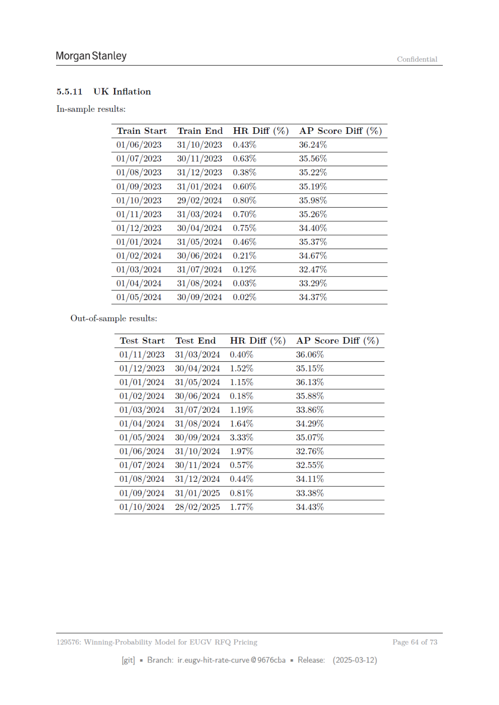

## 日本語メモ

**該当箇所:** 5.5 Outcome Analysis and Backtesting / 6-7 Limitations/Overlays

国別・商品別のアウトカム分析とバックテスト。制限、緩和策、オーバーレイやオーバーライドの扱いも含む。

## 原文OCR/Text Layer

> OCR由来のため、誤認識があります。正確な図表・数式・レイアウトは上のページ画像を確認してください。

```text
Morgan Stanley
Confidential
5.5.11
UK Inflation
In-sample results:
Train Start
Train End
HR Diff (%)
AP Score Diff (%)
01/06/2023
31/10/2023
0.43%
36.24%
01/07/2023
30/11/2023
0.63%
35.56%
01/08/2023
31/12/2023
0.38%
35.22%
01/09/2023
31/01/2024
0.60%
35.19%
01/10/2023
29/02/2024
0.80%
35.98%
01/11/2023
31/03/2024
0.70%
35.26%
01/12/2023
30/04/2024
0.75%
34.40%
01/01/2024
31/05/2024
0.46%
35.37%
01/02/2024
30/06/2024
0.21%
34.67%
01/03/2024
31/07/2024
0.12%
32.47%
01/04/2024
31/08/2024
0.03%
33.29%
01/05/2024
30/09/2024
0.02%
34.37%
Out-of-sample results:
Test Start
Test End
HR Diff (%)
AP Score Diff (%)
01/11/2023
31/03/2024
0.40%
36.06%
01/12/2023
30/04/2024
1.52%
35.15%
01/01/2024
31/05/2024
1.15%
36.13%
01/02/2024
30/06/2024
0.18%
35.88%
01/03/2024
31/07/2024
1.19%
33.86%
01/04/2024
31/08/2024
1.64%
34.20%
01/05/2024
30/09/2024
3.33%
35.07%
01/06/2024
31/10/2024
1.97%
32.76%
01/07/2024
30/11/2024
0.57%
32.55%
01/08/2024
31/12/2024
0.44%
34.11%
01/09/2024
31/01/2025
0.81%
33.38%
01/10/2024
28/02/2025
1.77%
34.43%
129576: Winning-Probability Model
for
EUGV
RFQ Pricing
Page
64 of 73
[git]
= Branch:
ir.eugy-hit-rate-curve @9676cba
= Release:
(2025-03-12)
```


---

# Page 065 - 日本語版

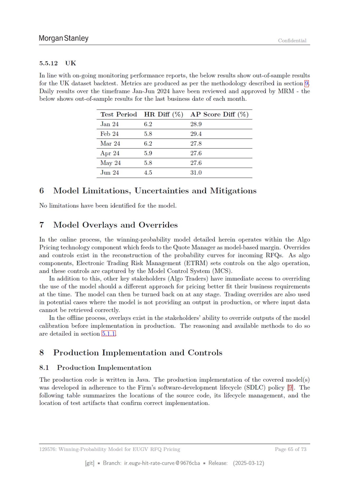

## 日本語メモ

**該当箇所:** 5.5 Outcome Analysis and Backtesting / 6-7 Limitations/Overlays

国別・商品別のアウトカム分析とバックテスト。制限、緩和策、オーバーレイやオーバーライドの扱いも含む。

## 原文OCR/Text Layer

> OCR由来のため、誤認識があります。正確な図表・数式・レイアウトは上のページ画像を確認してください。

```text
Morgan Stanley
Confidential
5.5.12
UK
In line with on-going monitoring performance reports, the below results show out-of-sample results
for the UK dataset backtest. Metrics are produced as per the methodology described in section J}
Daily results over the timeframe Jan-Jun 2024 have been reviewed and approved by MRM - the
below shows out-of-sample results for the last business date of each month.
Test Period
HR Diff (%)
AP Score Diff (%)
Jan 24
6.2
28.9
Feb 24
5.8
29.4
Mar 24
6.2
27.8
Apr 24
5.9
27.6
May 24
5.8
27.6
Jun 24
45
31.0
6
Model Limitations, Uncertainties and Mitigations
No limitations have been identified for the model.
7
Model Overlays and Overrides
In the online process, the winning-probability model detailed herein operates within the Algo
Pricing technology component which feeds to the Quote Manager as model-based margin. Overrides
and controls exist in the reconstruction of the probability curves for incoming RFQs.
As algo
components, Electronic Trading Risk Management (ETRM) sets controls on the algo operation,
and these controls are captured by the Model Control System (MCS).
In addition to this, other key stakeholders (Algo Traders) have immediate access to overriding
the use of the model should a different approach for pricing better fit their business requirements
at the time. The model can then be turned back on at any stage. Trading overrides are also used
in potential cases where the model is not providing an output in production, or where input data
cannot be retrieved correctly.
In the offline process, overlays exist in the stakeholders’ ability to override outputs of the model
calibration before implementation in production.
The reasoning and available methods to do so
8
Production Implementation and Controls
8.1
Production Implementation
The production code is written in Java. The production implementation of the covered model(s)
was developed in adherence to the Firm’s software-development lifecycle (SDLC) policy [JJ. The
following table summarizes the locations of the source code, its lifecycle management, and the
location of test artifacts that confirm correct implementation.
129576: Winning-Probability Model for
EUGV RFQ Pricing
Page 65 of 73
[git]
= Branch:
ir.eugy-hit-rate-curve @9676cba
= Release:
(2025-03-12)
```


---

# Page 066 - 日本語版


## 日本語メモ

**該当箇所:** 8 Production Implementation and Controls

本番実装、プロセス管理、コード変更管理、バージョン管理、SDLC基準を記述する。

## 原文OCR/Text Layer

> OCR由来のため、誤認識があります。正確な図表・数式・レイアウトは上のページ画像を確認してください。

```text
Morgan Stanley
Confidential
Production System
Name and Link
Tech change management (TCM)
|http: //jira3.ms.com/jira/secure/RapidBoard.
]
[jspa? rapidView=4398)
Source-code version control
http: //stashblue.ms.com/atlassian-stash/
]
[projects/FIDALGO_ERATES/repos/erates/browse/
|
(rates /b2c/algo_pricer/common/rates_algopricer_|
{common_domain/src/main/java/rates/algopricer/
|
probabilitycurve|
Test artifacts of model implementation
http: //stashblue.ms.com/atlassian-stash/
]
\projects/FIDALGO_ERATES/repos/erates/browse/
|
[rates /b2c/algo_pricer/eugv/rates_algopricer__
|
leugv_app/src/test/resources/rates/algopricer/
|
[regression/eu/testcases/curve_selection|
8.2
Model Process and Controls
The following controls are used to ensure that all model functions are designed as expected:
+ Junit test to ensure that correct curve parameters are selected by the algo pricing component.
Corresponding repository detailed in the previous section.
«
Junit test to verify the quote returned to the customer based on the reconstructed probability
curve, Found in the same repository as the above.
« Replay capability - providing the ability to emulate the integration of probability curve cal-
ibrations into the production algo pricing component, in a simulated environment. Simulation
repository: |http://stashblue.ms
. com/atlassian-stash/projects/FIDALGO_ERATES/repos/erates/
browse/rates/b2c/algo_pricer/eugv/rates_algopricer_eugv_app/src/test/resources/config/
algopricer/sim
The production implementation also contains price away check controls to ensure that the price
does not diverge significantly from the reference mid.
The model developers agree to provide MRM with access to model performance data in template
form. Further information is provided in section [9]
8.3
Model Code Change Control and Version Control
The model-calibration code is written in Python.
The software that implements the covered
model(s) was developed in adherence to the Firm’s software-development lifecycle (SDLC) policy
[J]. The following table summarizes the locations of the source code and its lifecycle management.
Model-Development System
Name and Link
Tech management control
|http: //jira3.ms.com/jira/secure/RapidBoard.
]
[jspa? rapidView=4398)
Code version control
http: //stashblue.ms.com/atlassian-stash/
]
[projects/ERATES_MMA/repos/mma/browse/
bacCurves?at=refs%2Fheads%2Fdev|
129576: Winning-Probability Model for
EUGV RFQ Pricing
Page 66 of 73
[git]
= Branch:
ir.eugy-hit-rate-curve @9676cba
= Release:
(2025-03-12)
```


---

# Page 067 - 日本語版

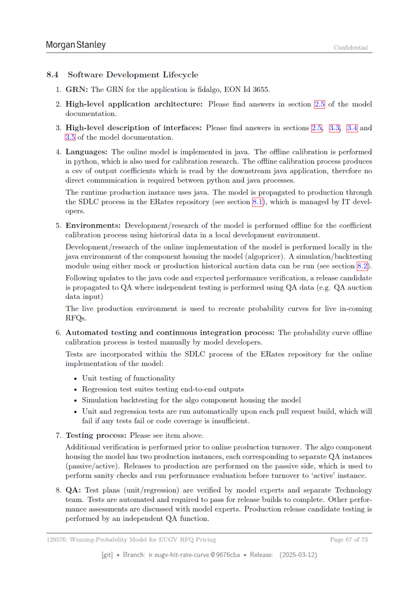

## 日本語メモ

**該当箇所:** 8 Production Implementation and Controls

本番実装、プロセス管理、コード変更管理、バージョン管理、SDLC基準を記述する。

## 原文OCR/Text Layer

> OCR由来のため、誤認識があります。正確な図表・数式・レイアウトは上のページ画像を確認してください。

```text
Morgan Stanley
Confidential
8.4
Software Development Lifecycle
1. GRN: The GRN for the application is fidalgo, EON Id 3655.
2. High-level application architecture:
Please find answers in section
of the model
documentation.
3. High-level description of interfaces: Please find answers in sections
[2
4, Languages: The online model is implemented in java. The offline calibration is performed
in python, which is also used for calibration research. The offline calibration process produces
a csv of output coefficients which is read by the downstream java application, therefore no
direct communication is required between python and java processes.
The runtime production instance uses java. The model is propagated to production through
the SDLC process in the ERates repository (see section
8.1), which is managed by IT devel-
opers.
5. Environments: Development/research of the model is performed offline for the coefficient
calibration process using historical data in a local development environment.
Development/research of the online implementation of the model is performed locally in the
java environment of the component housing the model (algopricer). A simulation/backtesti
module using either mock or production historical auction data can be run (see section
Following updates to the java code and expected performance verification, a release candidate
is propagated to QA where independent testing is performed using QA data (e.g. QA auction
data input)
The live production environment is used to recreate probability curves for live in-coming
RFQs.
6. Automated testing and continuous integration process: The probability curve offline
calibration process is tested manually by model developers.
Tests are incorporated within the SDLC process of the ERates repository for the online
implementation of the model:
* Unit testing of functionality
« Regression test suites testing end-to-end outputs
Simulation backtesting for the algo component housing the model
+ Unit and regression tests are run automatically upon each pull request build, which will
fail if any tests fail or code coverage is insufficient.
7. Testing process: Please see item above.
Additional verification is performed prior to online production turnover. The algo component
housing the model has two production instances, each corresponding to separate QA instances
(passive/active). Releases to production are performed on the passive side, which is used to
perform sanity checks and run performance evaluation before turnover to ‘active’ instance.
8. QA: Test. plans (unit/regression) are verified by model experts and separate Technology
team. Tests are automated and required to pass for release builds to complete. Other perfor-
mance assessments are discussed with model experts. Production release candidate testing is
performed by an independent QA function.
6: Winning-Probability Model
for
EUGV
RFQ Pricing
Page 67 of 73
[git]
= Branch:
ireugy-hit-rate-curve @9676cba
= Release:
(2025-03-12)
```


---

# Page 068 - 日本語版

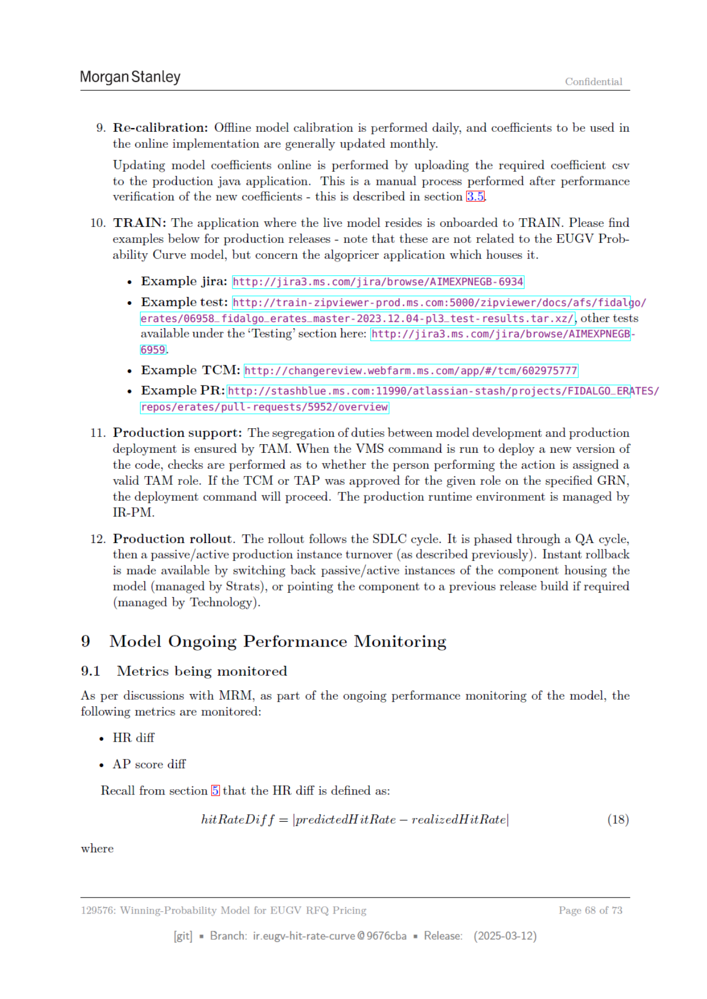

## 日本語メモ

**該当箇所:** 9 Ongoing Performance Monitoring / 10-11

継続モニタリング指標、エスカレーション基準、MRMへの共有データ、変更ログ、参考文献。

## 原文OCR/Text Layer

> OCR由来のため、誤認識があります。正確な図表・数式・レイアウトは上のページ画像を確認してください。

```text
Morgan Stanley
Confidential
9. Re-calibration: Offline model calibration is performed daily, and coefficients to be used in
the online implementation are generally updated monthly.
Updating model coefficients online is performed by uploading the required coefficient csv
to the production java application. This is
a manual process performed after performance
verification of the new coefficients - this is described in section
10. TRAIN: The application where the live model resides is onboarded to TRAIN, Please find
examples below for production releases - note that these are not related to the EUGV Prob-
ability Curve model, but concern the algopricer application which houses it.
« Example jira: http: //jira3.ms.com/jira/browse/AIMEXPNEGB- 6934)
+ Example test: |nttp://train-zipviewer-prod.ms.com:5000/zipviewer/docs/afs/fidalyo/
erates /06958_fidalgo_erates_master-2023.12.04-p13_test- results. tar.xz/| other tests
available under the ‘Testing’ section here: http: //jira3.ms
. com/jira/browse/AIMEXPNEGB-
« Example TCM: http: //changereview.webfarm.ms
. com/app/#/tcm/602975777|
+ Example PR:|http://stashblue
.ms
. com:11990/atlassian- stash/projects/FIDALGO_ERATES/
[repos/erates/pull - requests/5952/overview|
11. Production support: The segregation of duties between model development and production
deployment is ensured by TAM. When the VMS command is run to deploy a new version of
the code, checks are performed as to whether the person performing the action is assigned a
valid TAM role.
If the TCM or TAP was approved for the given role on the specified GRN,
the deployment command will proceed. The production runtime environment is managed by
IR-PM.
12. Production rollout. The rollout follows the SDLC cycle.
It is phased through a QA cycle,
then a passive/active production instance turnover (as described previously). Instant rollback
is made available by switching back passive/active instances of the component housing the
model (managed by Strats), or pointing the component to a previous release build if required
(managed by Technology).
9
Model Ongoing Performance Monitoring
9.1
Metrics being monitored
‘As per discussions with MRM, as part of the ongoing performance monitoring of the model, the
following metrics are monitored:
+ HR diff
+ AP score diff
Recall from section
B]that the HR diff is defined as:
hit RateDif f = |predictedH
it Rate — realizedHit Rate|
18)
where
129576: Winning-Probability Model for
EUGV RFQ Pricing
Page 68 of 73
[git]
= Branch:
ir.eugy-hit-rate-curve @9676cba
= Release:
(2025-03-12)
```


---

# Page 069 - 日本語版

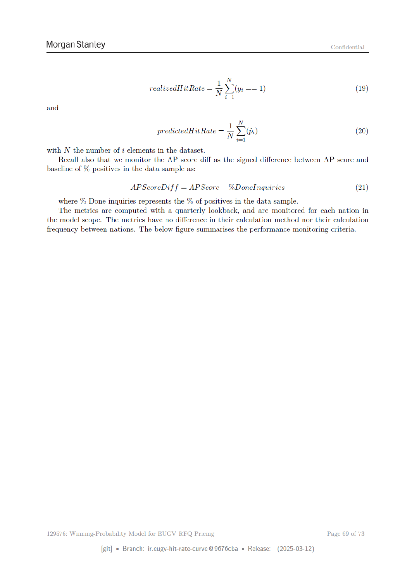

## 日本語メモ

**該当箇所:** 9 Ongoing Performance Monitoring / 10-11

継続モニタリング指標、エスカレーション基準、MRMへの共有データ、変更ログ、参考文献。

## 原文OCR/Text Layer

> OCR由来のため、誤認識があります。正確な図表・数式・レイアウトは上のページ画像を確認してください。

```text
Morgan Stanley
Confidential
oe
if
realizedHitRate =~ Lu ==1)
(19)
and
1
N
predictedHit
Rate = = (pi)
(20)
i=l
with N the number of i elements in the dataset.
Recall also that we monitor the AP score diff as the signed difference between AP score and
baseline of % positives in the data sample as:
APScoreDif f = APScore — %DoneInquiries
(21)
where % Done inquiries represents the % of positives in the data sample.
The metrics are computed with a quarterly lookback, and are monitored for each nation in
the model scope. The metrics have no difference in their calculation method nor their calculation
frequency between nations. The below figure summarises the performance monitoring criteria.
129576: Winning-Probability Model for
EUGV RFQ Pricing
Page 69 of 73
[git]
= Branch:
ir.eugy-hit-rate-curve @9676cba
= Release:
(2025-03-12)
```


---

# Page 070 - 日本語版

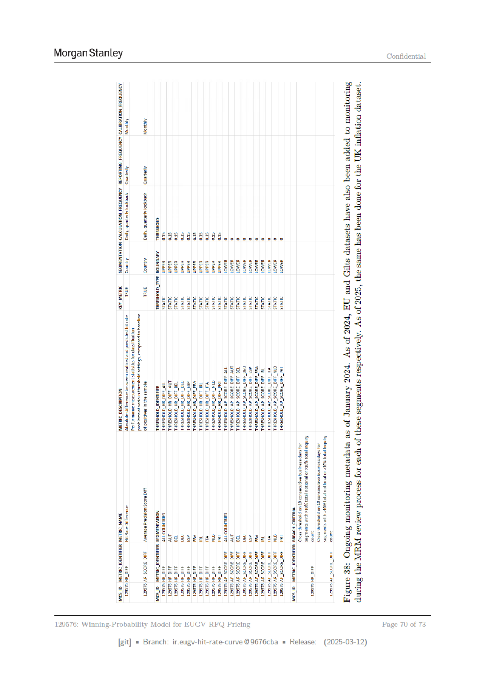

## 日本語メモ

**該当箇所:** 9 Ongoing Performance Monitoring / 10-11

継続モニタリング指標、エスカレーション基準、MRMへの共有データ、変更ログ、参考文献。

## 原文OCR/Text Layer

> OCR由来のため、誤認識があります。正確な図表・数式・レイアウトは上のページ画像を確認してください。

```text
Morgan Stanley
Confidenti:
3 zoe
i:
a2
2
g
H
Hoi
3 ge
é
qi
: gio
gs
=
3
88
8
22923293983 cleccccsle
i
g
=
fr
ot
bceecesesegSSGEe88Ee
$s
§
ghShhPEEESESSESessess
2S/6 ESSE 5 S56 sls
BS|SS S/s/6
euzgdagesse sss
EUSRESSERERLASES
SEG ES
FEE EEEEEREEEEEEEEEEE
eee
eee
5
2
:
3
§4
Q
Boge
E
Be
5
f
Bs
g
2 Fa2GR8
eSB
2a Rae e2
&
3
HEGLGDGQGgIEESGAEIGE
2
See ee
seer geegageges
8
o8ReeRReRReeRe
eee Re
SPE
REC ELE EEL LEE EEL ED
129576: Winning-Probability Model
for EUGV
RFQ Pricing
Page 70 of 73
[git]
Branch:
ir.eugy-hit-rate-curve @9676cba
= Release:
(2025-03-12)
```


---

# Page 071 - 日本語版

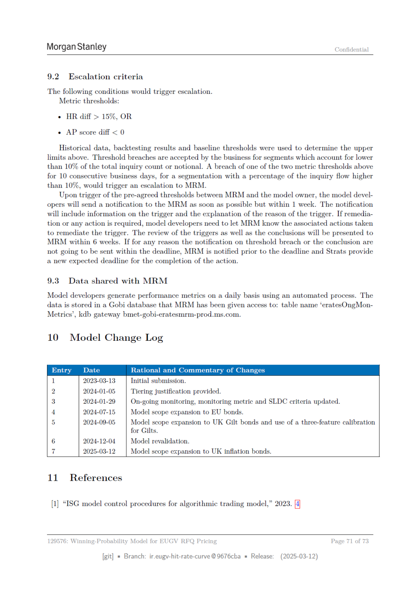

## 日本語メモ

**該当箇所:** 9 Ongoing Performance Monitoring / 10-11

継続モニタリング指標、エスカレーション基準、MRMへの共有データ、変更ログ、参考文献。

## 原文OCR/Text Layer

> OCR由来のため、誤認識があります。正確な図表・数式・レイアウトは上のページ画像を確認してください。

```text
Morgan Stanley
Confidential
9.2
Escalation criteria
The following conditions would trigger escalation.
Metric thresholds:
+ HR diff > 15%, OR
+ AP score diff < 0
Historical data, backtesting results and baseline thresholds were used to determine the upper
limits above. Threshold breaches are accepted by the business for segments which account for lower
than 10% of the total inquiry count or notional. A breach of one of the two metric thresholds above
for 10 consecutive business days, for a segmentation with a percentage of the inquiry flow higher
than 10%, would trigger an escalation to MRM.
Upon trigger of the pre-agreed thresholds between MRM and the model owner, the model devel-
opers will send a notification to the MRM as soon as possible but within 1 week. The notification
will include information on the trigger and the explanation of the reason of the trigger. If remedia-
tion or any action is required, model developers need to let MRM know the associated actions taken
to remediate the trigger. The review of the triggers as well as the conclusions will be presented to
MRM within 6 weeks. If for any reason the notification on threshold breach or the conclusion are
not going to be sent within the deadline, MRM is notified prior to the deadline and Strats provide
a new expected deadline for the completion of the action.
9.3
Data shared with MRM
Model developers generate performance metrics on a daily basis using an automated process. The
data is stored in
a
Gobi database that MRM has been given access to: table name ‘eratesOngMon-
Metrics’, kdb gateway bmet-gobi-eratesmrm-prod.ms.com.
10
Model Change Log
Rational and Commentary of Changes
1
2023-03-13
| Initial submission.
2
2024-01-05
| Tiering justification provided.
3
2024-01-29
| On-going monitoring, monitoring metric and SLDC criteria updated.
4
2024-07-15
| Model scope expansion to EU bonds.
5
2024-09-05
| Model scope expansion to UK Gilt bonds and use of a three-feature calibration
for Gilts.
6
2024-12-04
| Model revalidation.
7
2025-03-12
| Model scope expansion to UK inflation bonds.
11
References
[1] “ISG model control procedures for algorithmic trading model,” 2023.
129576:
Winning-Probability Model
for
EUGV
RFQ
Pricing
Page 71 of 73
[git]
= Branch:
ir.eugy-hit-rate-curve @9676cba
= Release:
(2025-03-12)
```


---

# Page 072 - 日本語版

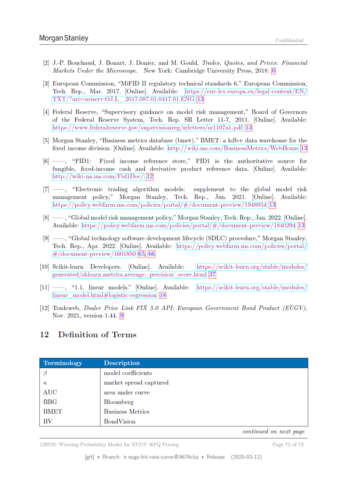

## 日本語メモ

**該当箇所:** 12 Definition of Terms

専門用語の定義。RFQ、BMET、GLM、MCS、TW、UKGV、EUGV等の略語・用語を整理する。

## 原文OCR/Text Layer

> OCR由来のため、誤認識があります。正確な図表・数式・レイアウトは上のページ画像を確認してください。

```text
Morgan Stanley
Confidential
[2] J-P. Bouchaud, J. Bonart, J. Donier, and M. Gould, Trades, Quotes, and Prices: Financial
Markets Under the Microscope.
New York: Cambridge University Press, 2018. [6]
[3] European Commission, “MiFID II regulatory technical standards 6,” European Commission,
Tech. Rep., Mar. 2017. [Online]. Available:
[https://eur-lex.europa.eu/legal-content/EN/|
[TXT /Puri=uriserv:OJ.L_.2017.087.01.0417.01.
ENG
[4] Federal Reserve, “Supervisory guidance on model risk management,” Board of Governors
of the Federal Reserve System,
Tech. Rep. SR Letter
11-7,
2011.
[Online]. Available:
[https://www. federalreserve.gov /supervisionreg /srletters/sr1107a1.pdf|
[5] Morgan Stanley, “Business metrics database (bmet),” BMET: a kdb+ data warehouse for the
fixed income division. [Online]. Available: http: //wiki.ms.com/BusinessMetries/WebHome|
”
FID1
is
the
authoritative
source
for
[6] ——,
“FID1:
Fixed income reference store,
fungible, fixed-income cash and derivative product reference data.
[Online]. Available:
http:
//wiki-na.ms.com/Fid1Doc//|[12|
[7] ——,
“Electronic trading algorithm models:
supplement
to
the
global model
risk
management
policy,”
Morgan
Stanley,
Tech.
Rep.,
Jun.
2021.
[Onlin
https:
//policy.webfarm.ms.com [policies /portal/# /document-preview /194895:
[8] ——, “Global model risk management policy,” Morgan Stanley, Tech. Rep., Jan. 2022. [Online].
Available: (https: //policy. webfarm.ms.com policies /portal/#/document-preview/1840204) [13]
[9]
—,
“Global technology software development lifecycle (SDLC) procedure,” Morgan Stanley,
Tech. Rep., Apr. 2022. [Onlin
ilable: https: //policy.webfarm.ms.com/policies/portal/|
#/document-preview/160185(
[10] Scikit-learn
Developers.
[Online].
Available:
https:
\generated/sklearn.metrics.average_precision_score.htm
cikit-learn.org/stable/modules/|
(11] ——,
“1.1.
linear models.”
[Online].
Available:
_{https://scikit-learn.org/stable/modules/|
linear_model.html#logistic-regression|
[12] Tradeweb, Dealer Price Link FIX 5.0 API: European Government Bond Product (EUGV),
Nov. 2021, version 1.44.
12
Definition of Terms
Terminology
Description
B
model coefficients
K
market spread captured
AUC
area under curve
BBG
Bloomberg
BMET
Business Metrics
BV
BondVision
continued on next page
129576: Winning-Probability Model for
EUGV RFQ Pricing
Page 72 of 73
[git]
= Branch:
ir.eugy-hit-rate-curve @9676cba
= Release:
(2025-03-12)
```


---

# Page 073 - 日本語版


## 日本語メモ

**該当箇所:** 12 Definition of Terms

専門用語の定義。RFQ、BMET、GLM、MCS、TW、UKGV、EUGV等の略語・用語を整理する。

## 原文OCR/Text Layer

> OCR由来のため、誤認識があります。正確な図表・数式・レイアウトは上のページ画像を確認してください。

```text
Morgan Stanley
Confidential
iption
Cc
inverse regularization strength
cusip
unique identifier of a financial security
DEU
Germany
ESP
Spain
ETRM
electronic trading risk management of MS
EUGV
European government (bonds)
FID
fixed-income division of MS
GLM
global limit manager
HR
hit rate
ISG
Institutional Securities Group
MA
MarketAxess
MAPE
mean average percentage error
MCS
Model Control System of MS
MDS
Market Data Service of MS
MS
Morgan Stanley
OTR
on-the-run
QM
quote manager
r
regularization
RFQ
request-for-quotation
ROC
receiver operating characteristic
SDLC
software-development lifecycle
TCM
Technology Change Management
TW
Tradeweb
Yi
target variable (auction win/loss)
129576: Winning-Probability Model for
EUGV
RFQ
Pricing
Page
73 of 73
[git]
= Branch:
ir.eugy-hit-rate-curve @9676cba
= Release:
(2025-03-12)
```

