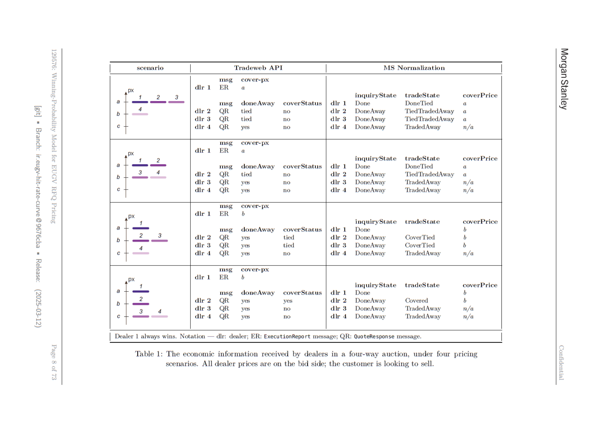

# Winning-Probability Model for EUGV RFQ Pricing - 全文日本語訳フルレポート

> 生成日時: 2026-06-20 12:49:59 UTC
> 翻訳モデル: ローカル Ollama `qwen2.5:7b`

## 利用上の注意

このレポートは、既存のページ画像とOCRテキストをもとにローカルLLMで日本語化した全文訳ドラフトです。原PDFはOCR由来のため、本文・表・数式には誤認識やレイアウト崩れが残ります。数式、表、図、ページレイアウトの最終確認はページ画像、`verified_equations_ja.md`、`tables/*_ja.md` を優先してください。

## 収録状況

| 項目 | 件数 |
|---|---:|
| 元PDFページ | 73 |
| ページ画像 | 73 |
| 全文訳ページ | 73 |
| 図インデックス | 37 |
| 表インデックス | 2 |
| 検証済み数式 | 16 |

## 既存メインノート

# Winning-Probability Model for EUGV RFQ Pricing - 日本語版メインノート

> 注意: このフォルダは「日本語で読むための作業版」です。元PDFはOCRベースのため、本文OCRには誤認識が残ります。図表・数式・ページレイアウトの最終確認は各ページPNGを正としてください。英語原文OCRは `source_en_pages/` と `source_en_full_document.md` に保存しています。

## 1. エグゼクティブサマリー

この文書で説明されるモデルの目的は、RFQにおいてディーラーが提示する価格、より正確には市場スプレッドのうちどれだけを獲得するか、という量と、その価格で取引に勝つ確率との関係を表現することです。モデルは自動マーケットメイクの価格構築コンポーネントで使われ、Incoming auctionに対してQuoteを構築する際の補助情報を提供します。

対象範囲は欧州政府債、英国政府債、および英国インフレ債です。モデルは標準的なロジスティック回帰に基づき、過去のRFQ auction dataから、spread/marginと取引成立確率の関係を推定します。出力は特徴量係数であり、これを使ってauctionごとのprobability curve、すなわちhit-rate curveを生成します。

モデルの主要な前提は、MSが観測するauctionが市場全体を十分に代表していること、確率曲線がシグモイド状であること、auction tie rateが無視可能または扱える程度であること、市場参加者の行動が校正期間間で十分安定していること、標準的なロジスティック回帰の統計前提が成り立つことです。

性能評価では、係数の有意性・安定性、予測可能性、ストレステスト、感応度分析、ベンチマーク、アウトカム分析・バックテストが行われています。全体として、モデルはEUGV/UKGV領域でmarket spread capturedとtrade probabilityの関係を有効に捉える、と結論づけられています。

## 2. ビジネス・アルゴリズム説明

RFQ市場では、顧客は限られた数のディーラーに見積もりを依頼し、ディーラーはその個別問い合わせに対して価格を提示します。これはストリーミング市場とは異なり、参加者が全体の意図やサイズを市場全体に晒さずに流動性を探索できる仕組みです。

RFQの基本ライフサイクルは、顧客がQuoteRequestを送る、ディーラーがQuoteを返す、顧客が最良価格または任意の勝者を選ぶ、マーケットプレイスがExecutionReportやQuoteResponseを返す、という流れです。重要なのは、各ディーラーが受け取るauction outcome情報が完全ではない点です。勝者はwinning priceとcover priceを知ることができますが、敗者はdone away、tied、coverなど部分的な情報しか得られません。このため、データはcensored informationを含みます。

価格はそのまま扱うのではなく、midからの距離をsideで補正したmarginに正規化されます。bid/askの向きを揃えることで、同じ形のhit-rate curveとして扱えます。marginが小さいほど顧客に有利で勝率が高く、marginが大きいほどディーラーがスプレッドを多く取ろうとするため勝率は低くなります。

MSの自動クォート構成では、Order Router、Inquiry Manager、Algo Pricer、Quote Manager、GLM、Mid Service、Risk HQ、eQuote GUI、BMET databaseなどが連携します。Winning-Probability ModelはAlgo Pricer内にあり、Quote Managerが最終価格を生成する際の候補価格・確率情報として使われます。ただし、最終価格はGLMのリスク制限、マーケット基準価格、トレーダー入力などの制約を受けます。

## 3. モデル記述

### 3.1 モデル前提

モデルは以下のような前提に基づきます。まず、MSが観測するRFQ auctionが対象市場を十分代表している必要があります。次に、marginと勝率の関係はシグモイド関数で近似できると仮定します。また、タイ情報やcensoringはモデル構築上の制約として扱われます。さらに、ロジスティック回帰の一般的な統計前提、すなわち観測の独立性、サンプルサイズの十分性、説明変数とlog-oddsの関係なども関係します。

### 3.2 モデル仕様

基本形は、percentage market spread capturedを説明変数とし、auctionに勝ったかどうかを0/1の目的変数とするロジスティック回帰です。RFQ固有の特徴量を入れると、曲線の位置はmargin軸に沿って移動します。一方、曲線の傾きそのものを変えるには、データをセグメント化して別々の曲線を推定する必要があります。

この文書の重要な設計上の論点は、RFQ factorを1つの回帰式に入れてtranslationとして扱うのか、国・顧客ティア・notional bucketなどでデータを分割して各セグメントに別モデルを当てるのか、というトレードオフです。分割軸を増やすほどセグメント数は急増し、各セグメントのレコード数は急減します。そのため、セグメンテーションと特徴量導入のバランスが必要になります。

### 3.3 入力データと特徴量

入力は、オフライン校正用データと本番実装用データに分かれます。主な情報源はRFQ履歴、market data、security reference data、client tier、notional、dealer count、maturity/issue date、duration/PV01、side、mid/quote/spreadなどです。特徴量には、market spread captured、log quantity、dealer count reciprocal、years to maturity、years since issue、life remainingなどが含まれます。

目的変数は、auctionに勝ったかどうかです。`inquiryState = Done` ならwin=1、それ以外のTradedAway/TiedTradedAway/Covered/CoverTied等はwin=0として扱います。

### 3.4-3.6 出力・校正・実装

モデル出力は、特定RFQと候補marginに対する勝率推定、およびそれを構成する係数です。校正は過去データに対してロジスティック回帰を適用して行われます。数値実装では標準的なPython/sklearn系の実装が使われ、L2正則化、solver、収束、データ品質、セグメンテーションの扱いが重要になります。

## 4. モデル開発・選定プロセス

開発では、どの変数でセグメント化するか、どのRFQ factorを特徴量として導入するかが主要論点になります。代替案として、より細かいデータ分割や異なる特徴量選択が検討されますが、サンプル数の減少、係数安定性、実装複雑性、説明可能性の観点から、実務上の妥協点が選ばれます。

## 5. モデルテスト

テストは大きく、診断テスト、シナリオ分析・ストレステスト、感応度分析、ベンチマーク、アウトカム分析・バックテストに分かれます。

診断テストでは、係数の安定性、有意性、エラーハンドリング、モデルの予測可能性が確認されます。Reliability plotでは、予測確率バケットごとの平均予測勝率と実現勝率を比較し、モデルが時間を通じて一貫しているかを見ます。

ストレステストでは、ボラティリティが高い環境や流動性が低い環境でもモデルが許容範囲の挙動を示すかを確認します。感応度分析では、market spread captured、dealer count、life remaining、duration/PV01、notionalなどを動かした際、勝率曲線が常識的かつ許容範囲にあるかを検証します。

アウトカム分析では、国別・商品別に実際のhit rateやモデルが返す推定値を確認します。ドイツ、オーストリア、ベルギー、スペイン、フランス、アイルランド、イタリア、オランダ、ポルトガル、UK inflationなどが対象になります。

## 6-7. 制限・不確実性・オーバーレイ

文書上では、モデル制限の有無、mitigation、overlay/overrideの扱いが整理されています。実務的には、モデル出力が直接最終価格になるのではなく、Quote Manager、GLM、トレーダー設定、マーケット基準価格などによって制約される点が重要です。

## 8. 本番実装とコントロール

モデルはAlgo Pricer内で利用され、Quote Managerと連携してRFQの候補価格を生成します。実装・変更管理・テスト・SDLCに関するプロセスが整備され、コード変更やバージョン管理、リリース管理が記録されます。

## 9. 継続モニタリング

運用後は、予測hit rateと実現hit rateの乖離、reliability、データ量、セグメント別性能、しきい値超過などを監視します。基準を超えた場合はエスカレーションし、MRM等に必要データを共有します。

## 10-12. 変更ログ・参考文献・用語定義

末尾にはモデル変更ログ、参考文献、用語定義が含まれます。略語やシステム名、RFQ関連用語、モデル管理関連用語は `glossary_ja.md` に日本語で整理しています。

# ページ別全文日本語訳

## Page 001


### 既存日本語メモ

**該当箇所:** 表紙

Morgan Stanleyの機密文書。EUGV RFQ Pricing向けWinning-Probability Modelのモデル文書で、モデルID、バージョン、更新日、gitブランチ情報が示されている。

### 日本語全文訳

機密
モルガン・スタンレー
EUGV RFQプライシング向け勝率モデル

アルゴリズム取引モデル文書（テンプレート 1.0）
eRates EU

モデルID
129576

バージョン番号 | 2.2
最終更新日
2025年3月12日

[git]
= ブランチ:
ir.eugy-hit-rate-curve @9676cba
= 発行:
(2025-03-12)

<details>
<summary>原文OCR/Text Layerを表示</summary>

<pre><code class="language-text">Confidential
Morgan Stanley
Winning-Probability Model for EUGV RFQ Pricing
Algorithmic Trading Models Documentation (template 1.0)
eRates EU
Model Id
129576
Version Number | 2.2
Last Update
March 12, 2025
[git]
= Branch:
ir.eugy-hit-rate-curve @9676cba
= Release:
(2025-03-12)</code></pre>

</details>


## Page 002


### 既存日本語メモ

**該当箇所:** 文書バージョン管理・モデル識別

版数、主要変更、作成者、モデル名、モデルID、プラットフォーム、ティア、開発者、オーナー、利用者を整理している。

### 日本語全文訳

Morgan Stanley
機密
文書バージョン管理・モデル識別

版数、主要変更、作成者、モデル名、モデルID、プラットフォーム、ティア、開発者、オーナー、利用者を整理している。

版数 日付
概要の主要な変更点
作成者
1.0 2023年3月13日
初期提出
Audrey Valreau
11 2024年1月5日
層付け根拠提供
Audrey Valreau
1.2 2024年1月29日
継続的なモニタリング、モニタリング指標およびSDLC基準更新
Audrey Valreau
13 2024年7月15日
モデル範囲拡大：EU債券追加
Audrey Valreau
2.0 2024年9月5日
モデル範囲拡大：UK Gilt債券およびGiltの三要素校正使用
Marina Johnson
21 2024年12月4日
モデル再検証
Audrey Valreau
2.2 2025年3月12日
モデル範囲拡大：UKインフレ債券追加
Audrey Valreau

モデル識別と利害関係者サマリ

モデル名
EUGV RFQ価格設定用勝率モデル
モデルID
Model 1D*
129576
Tiering 理由
Tier 1: 高度重要性、中等度複雑性
法的エンティティ
Morgan Stanley
開発者
Audrey Valreau, Marina Johnson
オーナー
Thomas Klocker
利用者
eRates Trading (グローバル)
検証者

MCSモデル番号
例：システム名
129576:
EUGV RFQ価格設定用勝率モデル

ページ 2 of 73

[git]
ブランチ：
ir.eugy-hit-rate-curve @9676cba
リリース：
(2025-03-12)

<details>
<summary>原文OCR/Text Layerを表示</summary>

<pre><code class="language-text">Morgan Stanley
Confidential
Document Version Control
Version
Date
Summary of Key Changes
Author
1.0
March 13, 2023
Initial submission
Audrey Valreau
11
January 5, 2024
| Tiering justification provided
Audrey Valreau
1.2
January 29, 2024
| On-going
monitoring,
monitoring
metric
and | Audrey Valreau
SDLC criteria updated
13
July 15, 2024
Model scope expansion to EU bonds
Audrey Valreau
2.0
September 5, 2024 | Model scope expansion to UK Gilt bonds and use | Marina Johnson
of a three-feature calibration for Gilts
21
December 4, 2024
| Model revalidation
Audrey Valreau
2.2
March 12, 2025
Model scope expansion to UK inflation bonds
Audrey Valreau
Model Identification and Stakeholders Summary
Model Name
Winning-Probability Model for EUGV RFQ Pricing
Model 1D*
129576
IViermrvarnaimeml
eQuote_QUOTEMANAGER
Model Tier
Tier 1: Materiality High, Complexity Medium
Legal Entity
Morgan Stanley
rm erate
Audrey Valreau, Marina Johnson
Model Owners
Thomas Klocker
Model Users
eRates Trading (global)
Model Validators
[Ry
“MCS Model Number
™** e.g. System Names
129576:
Winning-Probability Model
for
EUGV
RFQ
Pricing
Page
2 of 73
[git]
= Branch:
ir.eugy-hit-rate-curve @9676cba
= Release:
(2025-03-12)</code></pre>

</details>


## Page 003


### 既存日本語メモ

**該当箇所:** 目次

Executive SummaryからDefinition of Termsまで、全体構成とページ番号を示す目次。

### 日本語全文訳

モルガン・スタンレー
機密

目次
T-1__モデルの目的と使用意図
L2__モデル説明概要...
L3_主要な前提条件と制限事項。
4
全体的なモデル性能評価
5
結果の要約
2
ビジネスとアルゴリズムの説明|
[3.2 モデル仕様]
[3.3 モデル入力およびデータ]
3.6 数値実装]
[4 モデル開発と選択プロセス]... 2.6...
ee eee ee
ee
G1 モデル分割と変数選択]
vente ee
[23 拍り売りオークションからのカENSORED経済情報]
[24_価格からマージンへの転換とヒット率曲線の導入)
25
MSオートクォーティング複合体]...
2.6
サマリー
[2.7 監管および政策要件}
3.1 モデル前提条件
(£2 代替理論とアプローチ
(£3 主要なステークホルダーからの貢献
see
[5.2 情景分析とストレステスト]
5.3 敏感性分析]...
2... 2...
54
ベンチマークリング.............
5
結果分析とバックテスト]
(© モデルの制限事項、不確実性および緩和策
[7 モデルオーバライヤーとオーバライド]
© 生産実装とコントロール
.
B.L_
生産実装]
モデルテスト}
8.3
モデルコード変更管理
an
[4 ソフトウェア開発ライフサイクル]
[1 モデル継続的なパフォーマンス監視]
.
9.1 監視指標
9.3 与えられたデータの共有
10 モデル変更ログ
129576:
EUGV拍り売りオプション価格用勝率モデル
[git]
= 分岐:
ir.eugy-hit-rate-curve @9676cba
= 発行日:
(2025-03-12)
ページ 3 of 73

<details>
<summary>原文OCR/Text Layerを表示</summary>

<pre><code class="language-text">Morgan Stanley
Confidential
Table of Contents
T-1__Model
Purpose
and
Intended
Use
[L2__Model Description Summary]...
.
[L3_Key Assumptions and Limitations].
4
Overall Model Performance Assessment]
5
Summary
of
Results
2
Business and Algo Description|
[3.2
Model
Specification]
[3.3
Model
Inputs and
Data]
3.6
Numerical
Implementation]
[4
Model Development and Selection Process)... 2.6...
ee eee ee
ee
G1
Model Segmentation and Variable Selection]
vente ee
[23
Censored Economic Information from RFQ Auctions]
[24_From Price to Margin and the Introduction of Hit-Rate Curves)
25
The MS Autoquoting Complex]...
2.6
Summa
[2.7
Regulatory and Policy Requirements}
3.1
Model
Assumptions
(£2
Alternative Theories and Approaches
(£3_Contributions from Key Stakeholder
see
[5.2
Scenario Analysis and Stress Testing]
5.3
Sensitivity
Analysis]...
2... 2...
54
Benchmarkingl.............
5
Outcome Analysis and Backtesting]
.
(©
Model Limitations, Uncertainties and Mitigation
[7
Model Overlays and Overrides]
©
Production Implementation and Control
.
B.L_
Production Implementation]
Model
Testing}
8.3
[odel
Code
Change
Control
an
[4
Software Development Lifecycle]
[1
Model Ongoing Performance Monitoring]
.
9.1
Metrics
being monitored
9.3
Data shared wit)
10 Model Change Log
129576:
Winning-Probability Model for
EUGV
RFQ
Pricing
[git]
= Branch:
ir.eugy-hit-rate-curve @9676cba
= Release:
(2025-03-12)
Page
3 of 73</code></pre>

</details>


## Page 004


### 既存日本語メモ

**該当箇所:** 1 Executive Summary

モデル目的、概要、前提、性能評価、結果要約。RFQのスプレッド獲得率と約定確率の関係をロジスティック回帰で表す。

### 日本語全文訳

モルガン・スタンレー
機密

1. 監査要約
1.1. モデルの目的と使用意図
文書で説明する確率曲線モデルの目的は、市場スプレッド獲得率と取引確率との関係を表すことです。このモデルは自動化されたマーケットメイキングプライシングコンポーネントにおいて、引用構築プロセスを支援するために使用されます。

具体的な適用範囲は、ヨーロッパ政府債券（EUGV）と英国政府債券（UKGV）の市場、およびインフレを含みます。このモデルは法的エンティティであるモデルコントロールシステム（MCS）に含まれるアルゴリズム内に存在します。

1.2. モデルの概要
モデルは標準的なロジスティック回帰方法を使用し、ファームが利用可能な歴史的なオークションデータに基づいてスプレッドと取引確率との関係を推定します。モデルはこの関係を説明するための特性係数を出力し、入札オークションに対する確率曲線を生成するために使用されます。確率曲線に関する詳細については、セクション2を参照してください。また、取引オークションプロセスに関する詳細については、セクション2-|を参照してください。

モデルの入力には、市場データと同時に取引されているセキュリティに関する情報が含まれます。さらに、入札オークションに関連するパラメータに関する他の情報も含まれています。このモデルは「重要性」および「複雑さ」に基づいて1段階に分類されています。

重要性と複雑さはそれぞれ2つのサブ段階から成り立っています。「重要性」の2つのサブ段階は「使用頻度」と「依存度」です。一方、「複雑さ」の2つのサブ段階は「特定性」と「処理量」です。各コンポーネントに対する分類評価に関するガイダンスは、分類ドキュメンテーションセクション5に記載されています。

このモデルの重要性は高いと判断され、これは使用頻度が高く、依存度が中程度であるためです。モデルは高い使用頻度を持っています。マクロ領域でのモデルは異なるアルゴリズムによって異なる指標を使用することができ、これらの指標は比較できませんので、慎重なアプローチが取られています。また、モデルの信頼性は中程度であり、モデルが（a）動作していない場合や（b）校正されていない場合でも、クライアント向けの価格を引き続き設定することができます。送られた価格は出版前に外部参照価格との比較検証を受けます。

このモデルの複雑さは中程度であり、これは特定性と処理量がともに中程度であるためです。モデルは特定性の中程度である理由は、与えられたオファー-オファースプレッドにおける実行確率の点推定を提供するからです。また、このモデルの処理量は中程度であり、校正はロジスティック回帰に基づいてオフラインで行われます。

分類ドキュメンテーションによれば、モデル全体の段階は1段階とされています。

1.3. 主要な仮定と制限事項
モデルは以下の主要な仮定に基づいており、詳細についてはセクション+を参照してください。MSが見ているオークションが市場全体を代表していることを十分に反映しているという仮定です。また、確率曲線はシグモイド関数と類似しているという仮定があります。さらに、入札の引き分け率は無視できるほど低いという仮定もあります。

129576: EUGV RFQ価格用勝率モデル
第4ページ/73ページ
[git]
= ブランチ:
ir.eugy-hit-rate-curve @9676cba
= 発行日:
(2025-03-12)

<details>
<summary>原文OCR/Text Layerを表示</summary>

<pre><code class="language-text">Morgan Stanley
Confidential
1
Executive Summary
1.1.
Model Purpose and Intended Use
The purpose of the probability curve model described in the document is to represent the re-
lationship between market spread captured and probability of trading. The model will be used
in the automated market-making pricing components, where it is intended to assist in the quote
construction process.
The specific scope of application is the European Government (EUGV) and UK Government
(UKGV) bond spaces, including UK inflation. The model will reside in algorithms captured by the
Model Control System (MCS) legal entity.
1.2.
Model Description Summary
The model uses standard logistic regression methods to estimate the relationship between spread
and trading probability, based on historical auction data available to the Firm. The model outputs
feature coefficients used to describe this relationship, in order to generate probability curves for
incoming auctions - see section
[2] for details on probability curves, and section
2-|for details on
the trade auction process.
Inputs to the model include market data, as well as information on the security being traded
at the time. Other information concerning the parameters of incoming auctions is also included.
The model has a tiering of 1 as determined by its high ‘Materiality’ and medium ‘Complexity’
ratings.
Materiality and Complexity are each derived from two sub-tiers. For Materiality, the two sub-
tiers are ‘Usage’ and ‘Reliance’. For Complexity the two sub-tiers are ‘Specificity’ and ‘Processing’.
Guidance on tiering assessments for each component can be found in section 5 of the tiering docu-
mentation [I].
‘The Materiality of the model is high due to high Usage and medium Reliance.
The model has high Usage. Models in Macro can be used by different algos with different
metrics, Metrics are not comparable, and therefore a conservative approach has been taken.
The model has medium Reliance. The quoting algorithm can continue to price clients even
when the model is (a) either not operational, or (b) has not been calibrated. Prices sent to clients
are subject to rigorous price verification and benchmarking to external reference prices prior to
publication.
The Complexity of the model is medium due to medium Specificity and medium Processing.
The model has medium Specificity as the model provides a point of estimate of the probability of
execution at a given bid-offer spread.
‘The model has medium Processing as the calibration, run off-line, is based on logistic regression.
‘As per the tiering documentation, the overall tier of the model is 1.
1.3.
Key Assumptions and Limitations
The model is based on the following key assumptions, which are detailed further in sectior
+ The auctions seen by MS are sufficient to represent the market as a whole - further detail on
this is provided in sectioi
+ The probability curve will resemble a sigmoid function.
+ The auction tie rate is negligible.
129576: Winning-Probability Model for
EUGV RFQ Pricing
Page 4 of 73
[git]
= Branch:
ir.eugy-hit-rate-curve @9676cba
= Release:
(2025-03-12)</code></pre>

</details>


## Page 005


### 既存日本語メモ

**該当箇所:** 1 Executive Summary

モデル目的、概要、前提、性能評価、結果要約。RFQのスプレッド獲得率と約定確率の関係をロジスティック回帰で表す。

### 日本語全文訳

モルガン・スタンレー
機密

市場参加者の行動は、回帰分析のトレーニング期間間隔において安定しています。
標準的なロジスティック回帰統計モデル仮定が適用されます。
モデルに特定の制限事項は見つかりませんでした。

1.4 全体的なモデル性能評価
モデルの性能は、さまざまなシナリオで評価された多くの統計指標に基づいて評価されました。詳細については、第2節を参照してください。
モデルは予測可能性と安定性を最初にテストし、出力係数の有意性と一貫性を評価しました。データセグメンテーションと係数安定性との間の強い関係が見つかりました。しかし、全体的にモデルは優れたパフォーマンスを示し、市場状況が不安定な場合でも信頼性が高いことが確認されました。これは、ボラティリティの高い環境や流動性が低いセクターでのテストも含めます。
特性に対する感受性分析を行い、取引出力確率への影響を評価しました。研究結果は、モデルが検討された範囲内の特性において優れたパフォーマンスを発揮できることを示しており、出力確率曲線は適切な範囲内にあると推定されました。
さらに確認したところ、モデルから生成されたオファーは、受け入れられる市場スプレッド基準内にありました。

1.5 結果の要約
勝率モデルは、EUGVおよびUKGV（インフレ含む）債券市場における取引確率と市場スプレッドの関係を効果的に捉えることができます。

ビジネスとアルゴリズム説明
この文書で詳細に示される勝率モデルの目的は、モルガン・スタンレーが顧客からの依頼（RFQ、時として「依頼」または「クォート要求」として参照）に対する自動オファー（AQ）をEUGVおよびUKGV債券市場（含むインフレ）で実施し、その際には顧客にとって最良の価格とトレーディングデスクの現在の目標とのバランスを取ることを支援することです。EUGV空間は以下の国を対象としています：オーストリア、ベルギー、キプロス、デンマーク、ドイツ、ギリシャ、フィンランド、フランス、アイルランド、イタリア、ネーデルラント、ポルトガル、スペイン、スロベニア。モデルの適用範囲は、他の発行者が同様の特性を持つEU発行債券も含め、同じプラットフォームで取引できるように拡張されます。UKGV空間はイギリスを対象としています。EU債券の場合と同様に、モデルの適用範囲はイギリスインフレ債券にも拡張されます。

モデルは、取引が特定価格での落札確率を予測する統計モデリング方法を使用します。歴史的なデータは、ディーラーカウントやクライアントのランクなどの要因に基づいてロジスティック曲線に適合されます。
しかし、可用性情報は市場によって制限されるため複雑さが増します；つまり、RFQ市場では依頼の勝者に対して他の参加者が受け取らない情報を提供し、非勝者のディーラーの中には一部が部分的な情報を受けることがあります。

これらの制約されたRFQベースの市場におけるモデルの構築方法を理解するためには、まずRFQ落札プロセスの経済インセンティブを理解することが必要です。
129576: EUGV RFQ価格用勝率モデル
ページ 5 of 73
[git]
= ブランチ：
ir.eugy-hit-rate-curve @9676cba
= 発行版：
(2025-03-12)

<details>
<summary>原文OCR/Text Layerを表示</summary>

<pre><code class="language-text">Morgan Stanley
Confidential
+ The behaviour of market participants is stable between regression training periods.
+ Standard logistic regression statistical modelling assumptions apply.
No limitations have been identified for the model.
1.4
Overall Model Performance Assessment
The model performance was assessed on a number of statistical metrics evaluated across a range
of scenarios. More information is provided on this in section
The model was first tested for predictability and stability, with an evaluation of output coeffi-
cient significance and consitency. A strong relationship between data segmentation and coefficient
stability was found. However the model performed well overall and was found to be reliable through-
out.
Stress testing showed that the model performed well under ‘unstable’ market conditions. This
included testing in a volatile environment, as well as in sectors with lower liquidity.
A sensitivity analysis was carried out to evaluate the impact of features on the output probability
of trade. The study showed that the model could perform well in the range of features tested -
output probability curves were estimated to be well within an acceptable range.
Tt was finally found that quotes constructed from the model probability cuves were within the
accepted market spread benchmark.
1.5
Summary of Results
The probability curve model is capable of capturing the relationship between the percentage market
spread charged and the probability of trade in the EUGV and UKGV spaces effectively.
2
Business and Algo Description
The purpose of the Winning-Probability Model detailed in this document is to assist with Mor-
gan Stanley’s autoquoting (AQ) of customer inquiries in the request-for-quotation (RFQ, at times
referred to as ‘inquiry’) EUGV and UKGV (including inflation) bond markets, and in doing so,
to balance the best price to the customer with the trading desk’s current objectives. The EUGV
space accounts for the following countries: Austria, Belgium, Cyprus, Denmark, Germany, Greece,
Finland, France, Ireland, Italy, Netherlands, Portugal, Spain and Slovenia. The scope of applica-
bility of the model also extends to other EU-issued bonds, which exhibit the same properties as
the other issuers mentioned and can be traded on the same platforms. The UKGV space accounts
for the United Kingdom. As is the case for EU bonds, the scope of applicability extends to UK
inflation bonds.
The model uses a statistical modelling method that leads to a prediction of the probability
of winning an auction at a given price. Historical data is fit to a logistic curve based on factors
such as dealer count and client tier.
However, complexity is introduced because the available
information is censored by the marketplaces; that is, RFQ marketplaces provide the winner of an
inquiry information that others do not receive, and within the set of non-winning dealers, some will
receive partial information.
In order to understand how a model might be constructed for censored RFQ-based markets, it
is necessary to first understand the RFQ auction process, and to do so, it is best to begin with the
economic incentives of market participants.
129576: Winning-Probability Model for
EUGV RFQ Pricing
Page
5 of 73
[git]
= Branch:
ir.eugy-hit-rate-curve @9676cba
= Release:
(2025-03-12)</code></pre>

</details>


## Page 006


### 既存日本語メモ

**該当箇所:** 2.1 The Search for Liquidity / 2.2 RFQ Lifecycle

RFQ市場が流動性と情報秘匿をどう両立するか、また顧客・マーケットプレイス・ディーラー間のRFQライフサイクルを説明する。

### 日本語全文訳

モルガン・スタンレー
機密

2.1 流動性の探求

流動性は市場参加者にとって重要な懸念事項です：一部の参加者は流動性を提供することで利益を得ることを目指し、他方では流動性を取得することで保有ポジションから利益を得ることを目指します。証券取引所の2つの主要な経済的役割は、市場を組織化し、流動性をプールすることにより価格が透明になり、取引がより容易になることです。これらの取引所では、流動性提供者と受取人が出会うことができます。しかし、すべての市場参加者は、完全な意図を示すと他の参加者が自らの利益のために反応し、過度に表現する参加者には不利となるため、経済的に動機付けられます。したがって、提供者は自分の全流動性を表示せず、受取人は望むほど大きなポジションを明らかにしません。流動市場（株式、国債、外国為替など）では、取引所は一定程度で参加者の意図を隠蔽しながら最善の実行を促進します。

例えば、一部の株式市場では、流動性提供者が注文を非表示の形で提出し、市場の注文中に静かに存在させることができる注文タイプが提供されています。また、一部の為替市場では、 iceberg注文と呼ばれる同じ目的を達成する注文が提供されています。そして、BrokerTecのような国債市場では、取引価格が合意された後で真の規模を示すためのワークアップフェーズがあります。

ボシュワールらは定量的に示していますが、流動性提供者と受取者の間の流動市場での均衡は僅かながら安定しており、流動性的な補充が市場の安定性に基礎を成すことが重要です [第18-20章]。

一方、流動市場の代替案としてマルチラティアル・オークション市場があります。Tradeweb（TW）はEUGV債券のRFQ市場を開発する先駆者であり、歴史上、ディーラーは流動性を流動市場に表示することをためらっており、意図は匿名で全観察者に対して放送されます。Tradewebの成功により、彼らはクレジット、リポジション、スワップなどの他の類似セキュリティクラスにも展開し、国内および国際市場に拡大しました。その成功により、他の取引所もオークションモデルを追加しました。 Bloombergが有名な例です。

RFQ市場は通常、ビジネスから顧客への「B2C」型であり、顧客が入札を開始すると、限定された数のディーラーに顧客の要求に対する価格提示を求められ、取引所が仲介して取引が成立するか否か決まります。RFQ入札プロセスを使用することで、顧客は意図を一部隠蔽するために限定的な数のディーラーを選択し、ディーラーは特定の問い合わせにのみ応答する必要があるため、両者の動機が公開されることはありません。このようなRFQ入札は離散的であり、入札は顧客の開始とともに始まり、取引または取引なしで明確に終了します。また、入札はスケジュールに基づいて行われず、顧客が開始するときにのみ発生します。

現在のRFQ市場は高度に自動化されています。自動化を推進する要因はいくつかありますが、そのうちの一つは毎日数百件から数千件の「通常業務」と分類される要求に対する価格提示を行う必要性を軽減することです。大きなサイズを持つチケットやリスク制限に近いチケット、または不思議なセキュリティのためのチケットは手動処理となり、追加の人間の注意が必要となります。自動化により、他のディーラーと競争するための迅速な応答時間の必要性が生じました。RFQ市場に選択されるどの量的モデルも通常業務チケットをカバーし、速やかに価格提示を計算できるほど単純でなければなりません。また、優れた量的モデルは説明可能である必要があります。

2.2 RFQライフサイクル

RFQプロセスを理解することは、モデルの設計を検討する前に必要です。この目的のために、図[I]は単一の要求に対する単純な即期取引の3ステップRFQライフサイクルを示しています。

129576: EUGV RFQ価格設定用勝率モデル
ページ6/73

[git]
= ブランチ:
ir.eugy-hit-rate-curve @9676cba
= 発行版:
(2025-03-12)

<details>
<summary>原文OCR/Text Layerを表示</summary>

<pre><code class="language-text">Morgan Stanley
Confidential
2.1
The Search for Liquidity
Liquidity is a central concern for market participants: some participants seek to profit by providing
(making) liquidity, while others seek to profit by holding positions that they acquire by taking
liquidity. Two key economic roles of security marketplaces are to organize a market and to pool
liquidity so that prices are transparent and transactions are easier to access, and it is on these
marketplaces that liquidity makers and takers can meet. Yet, all market participants are econom-
ically driven to not show their full intent, for doing so would lead other participants to react to
their own advantage while disadvantaging overly expressive participants. Accordingly, makers do
not display their total available liquidity, nor do takers reveal the true size that they wish to get
done. On streaming marketplaces, such as equities, treasuries, and foreign exchange (FX), market-
places help—in some cases and to a degree—participants mask their intent while still promoting
best execution.
For instance, some equities markets offer non-display order types for liquidity
providers whereby orders rest latently but hidden from view on the marketplace’s orderbook; some
FX markets offer so-called iceberg orders that achieve the same purpose; and treasury markets like
BrokerTec have a workup phase wherein a taker can show true size once the trade price is agreed.
Bouchaud et al. quantitatively show that the equilibrium between makers and takers on streaming
markets is only marginally stable, and that liquidity replenishment is fundamental to the stability
of the markets [J chs. 18-20].
‘An alternative to streaming markets are multilateral auction markets. Tradeweb (TW) was
a pioneer in the development of RFQ markets for EUGV bonds, where, historically, dealers were
reluctant to display liquidity to streaming markets, where intent would be broadcast to all observers,
albeit anonymously. Tradeweb’s success has led to their expansion to other likeminded security
classes such as credit, repo, and swaps, in both domestic and international markets; and their
success has also led other marketplaces to add an auction model, Bloomberg being a well-known
example.
In the RFQ markets, which are typically business-to-customer, or “b2c,” a customer initiates
an auction, a limited number of dealers are invited to quote on the customer’s request, and the
hosting marketplace intermediates the deal, which may or may not end in a trade. By using the
RFQ auction process, the customer partially masks his or her intent by inviting a limited number
of dealers, and the dealers need only respond to a particular inquiry, thus satisfying the incentives
on both sides to not broadcast intent. Such RFQ auctions are discrete in the sense that an auction
begins at customer initiation and definitively ends in a deal or no deal. Moreover, the auctions do
not occur on a schedule but only when a customer initiates.
Today’s RFQ markets are highly automated. While there are several factors that drive automa-
tion, one of them is to relieve the trading desk from having to quote on a daily basis hundreds of,
if not a few thousand, requests that can be classified as “business as usual.” Tickets that have a
large size, or edge close to the risk limits, or are for unusual securities, go manual because they
require additional human attention. Automation has in turn driven the need for fast response times
in order to compete with other dealers. Regardless of which quantitative model is chosen for the
RFQ markets, it has to cover business-as-usual tickets and be simple enough to quickly compute a
quote. Moreover, good quantitative models have behavior that is explainable.
2.2
The RFQ Lifecycle
It is necessary to understand the RFQ process before contemplating the design of a model, and
for this purpose, figure [I] illustrates a three-step RFQ lifecycle for a simple, single inquiry for an
outright security.
129576: Winning-Probability Model for
EUGV RFQ Pricing
Page 6 of 73
[git]
= Branch:
ir.eugy-hit-rate-curve @9676cba
= Release:
(2025-03-12)</code></pre>

</details>


## Page 007


### 既存日本語メモ

**該当箇所:** 2.2-2.3 RFQ Lifecycle / Censored Information

Tradeweb等のRFQで勝者・カバー価格・タイ情報がディーラーごとに部分的にしか見えないことを、図1・表1で整理している。

### 日本語全文訳

モルガン・スタンレー
機密

図1: 単一の即決取引に対するRFQライフサイクル。a) 客観は、Tradewebなどの市場プラットフォームに質問を送ることでRFQシーケンスを開始します。この質問には、証券、数量（またはサイズ）、売買側（買いか売り）と招待されたディーラーのリストが含まれます。また、オークションが有効な期間として指定される最大タイムアウトも含みます。客観は市場プラットフォームにメッセージを送り、そのプラットフォームは指定された4つのディーラーに対してQuoteRequestメッセージを送信します。QuoteRequestメッセージには、顧客によって指定された経済情報とタイム情報、そして顧客の詳細が含まれます。

b) ディーラーは、RFQに対するオファー（価格）で応答します。彼らはQuoteメッセージを送ることでこれを行うため、これらのメッセージはディーラーが応答したときにTradewebに受信されます（タイムアウト期間内に応答する場合）。

c) 客観は最良の価格を持つオファーを選択します。もし2つ以上のディーラーが価格で並んだ場合は、客観は取引したいディーラーを選択します。図示のように、客観はディーラー1を選択しました。Tradewebがオークションに関与した全てのディーラーに対してどのように応答するかは複雑であり、その点について次のセクションで説明します。

2.3. RFQオプションにおけるカensored経済情報
ビジネス観点から見ると、RFQオークションをホストする市場プラットフォームは市場参加者に対して最小限の情報漏洩を提供し、そのため、市場が参加ディーラーにオークションの結果についてどのように通知するかという複雑さが存在します。オークション後にディーラーに伝達される部分的な情報はカensored情報の一例です。

ディーラーの観点から見ると、4つの経済情報が重要となります：最初は勝者価格です。ExecutionReportメッセージを受け取ったディーラーは勝者価格を知っています（それが彼らのものだからです）。次に、カover価格も重要な情報です。

129576: EUGV RFQ価格における勝率モデル
ページ 7 / 73

[git]
ブランチ:
ir.eugy-hit-rate-curve @9676cba
リリース:
(2025-03-12)

<details>
<summary>原文OCR/Text Layerを表示</summary>

<pre><code class="language-text">Morgan Stanley
Confidential
a)
b)
QuoteRequest
Quote
ane
security
+&gt; dir 2
]
security
dir 2
}
;
Tw
.
quantity
ar3
quantity
dr3
# dealers
++ dir4
]
# dealers
dir4
|
c)
~~
prices
async
ExecutionReport
done, cover px, tie status
choose dlr 1
ah
| dir
2) done away
Tw
[|
&gt;
{ars | done away } possible additional information
+
—f dir
4) done away
QuoteResponse
Figure 1: The RFQ lifecycle for a single outright trade. a) A customer initiates an RFQ sequence by
sending an inquiry to a marketplace such as Tradeweb. The inquiry includes economic information
such as security, size, and side, as well as a list of dealers who are invited to quote. TW in
turn communicates to the selected dealers the economic information along with the identity of the
customer. b) The dealers respond with a Quote message. c) The customer chooses the best price,
and in the case of ties, choses the winning dealer. TW then communicates selective information
back to all dealers.
To begin, pane (a) shows the initiation of an inquiry.
Here, a customer specifies security,
quantity (or size), side (buy or sell), a list of dealers who are invited to quote, and a maximum
timeout period for which the auction will be live. The customer message is sent to a marketplace,
such as Tradeweb, that in turn sends QuoteRequest messages to the specified dealers, four in this
case. The QuoteRequest message includes the economic and timing information specified by the
customer along with the customer details. In pane (b), the dealers respond to the RFQ with quotes
(prices). They do so by sending a Quote message, and these messages are received by TW as the
dealers respond (assuming they respond within the timeout period).
In pane (c), the customer
chooses the quote that has the best price, and if two or more dealers tie, the customer chooses
the dealer with whom they would like to trade. As pictured, the customer chooses dealer 1. How
Tradeweb replies to all dealers involved in the auction creates complexity, and that is the topic of
the next section.
2.3.
Censored Economic Information from RFQ Auctions
From a business perspective, marketplaces that host RFQ auctions offer minimal information leak-
age to market participants, and for this reason, complexity exists in how the marketplace informs
the participating dealers of an auction’s outcome. The partial information transmitted to dealers
after the auction is an example of censored information.
From a dealer’s perspective, there are four pieces of economic information that are important
given the outcome of an auction: The first is the winning price.
The dealer who receives an
ExecutionReport message knows the winning price because it is theirs. The second is the cover
129576: Winning-Probability Model for
EUGV RFQ Pricing
Page
7 of 73
[git]
= Branch:
ir.eugy-hit-rate-curve @9676cba
= Release:
(2025-03-12)</code></pre>

</details>


## Page 008


### 既存日本語メモ

**該当箇所:** 2.2-2.3 RFQ Lifecycle / Censored Information

Tradeweb等のRFQで勝者・カバー価格・タイ情報がディーラーごとに部分的にしか見えないことを、図1・表1で整理している。

### 日本語全文訳

モルガン・スタンレー
機密
8

図1および表1を用いて、TradewebなどのRFQにおいて、ディーラーごとに勝者、カバー価格、タイ情報が部分的にしか見えない状況を整理している。

```text
Winning-Probability Model for EUGV RFQ Pricing
ページ8 73ページ目

[git]
ブランチ：
ir.eugy-hit-rate-curve @9676cba
リリース：
2025年3月12日
```

注記：OCRにより読み取りが困難な部分や不明瞭な部分は「[OCR不明瞭: 原文断片]」と表記しています。

<details>
<summary>原文OCR/Text Layerを表示</summary>

<pre><code class="language-text">Morgan Stanley
Confidential
8
8
8
8
g
g
g
2
=
=
=
=
a
a
cy
&amp;
=
=
=
=
5.268
gS
5.8
58s
2
ress
Booed
Sa538
=
I
&gt;
a
g
g
2
3
be
io
g
g_re
g
e
2
88
&amp;
3
Bygee
S
382
#
122
ga
3
Rages
g
SEs
Q
Bee
ge
€
seacy
Ss
Ses
3
Sug
S)
Ee
E
ashe ek
#
SSE
B
SEE
|F
=
Eg
EARE4E
&amp;
88a
£
cee
|2
a2
Zz
ze}
$4
a
g
g
g
2
g|
3s
2
s
s
s
,
=...
|2|
28
BD
PEP
DB
PEP
DH
FEF
a
BRE
|8
a
p&gt;
Bes
p&gt;
BBB
B
Bee
B
Bee
3
ao
SeSad
32339
22883
$2333
|S]
Es
ge 555
gS 558
E553
Ze555
[8]
25
Faqaaa
Faaaa
#aqqa
Faqgaa
|/2
ae
S|
3
anaes
saat
saat
naew
[Sl
25
Baas
BREE
BEES
Bees
|Z]
ae
Duy
BUI
DUTT
DUTT
&amp;
aa
_
S|
2
BS
gS
Ss
s
s
+
2
Fa
Fa
g
g
c|
cs
£
£
£
4
a]
25
§
§
5
5
2|
Be
Zeee
Beee
eae
B£e0
|e]
LS
.
s228
8222
ses8
8522
|8)
ge
a
3)
36
&lt;1,
z
x
z
x
z
4
z
£1
Se
2/k
A
8
A
8
Rog
28
gs
&lt;
4
&lt;
4
&lt;
ra
&lt;
ie
2
g/g
5
Ey
ae
z
 &amp;
5)
38
3
Suze
8
5
5
=|
£2
Ei
a
sees
Se
sie
5.
sfee
|.
S288
3
a6
a
8
&amp;
»
oe
we
wee
of
=|
BS
Ze
Pewee
[Peo
Ree
|e
gue
|Pe
Pewee
||
2s
BE
FOGG
jE
OOO
[EG
EOOS
|B
EOOO
|¥
BS
4
aot
4
aod
4
nod
4
aot
{|
$4
=
#22
|
e822
|
#22)
2
see
[s|
2A
ai
UT
ai
TTT
ai
TTT
7
TTT
3
B82
=
g
3/
2
4
§
°
a4)
#8
2|
68
a
g
s
“
i
-|
“|-
-|
ee
5
a/
a
2
+]+
ro
cpady
rp
apo
=
S
2
o
2
6
oa
©
so
2
0
co ao
|é
129576:
Winning-Probability
Model
for
EUGV
RFQ Pricing
age
8 of 73
[git]
= Branch:
ir.eugy-hit-rate-curve @9676cba
= Release:
(2025-03-12)</code></pre>

</details>


## Page 009


### 既存日本語メモ

**該当箇所:** 2.2-2.3 RFQ Lifecycle / Censored Information

Tradeweb等のRFQで勝者・カバー価格・タイ情報がディーラーごとに部分的にしか見えないことを、図1・表1で整理している。

### 日本語全文訳

モルガン・スタンレー
機密

価格は、落札者でないディーラーが提供した最良の価格です。最後に、ディーラーは勝者価格またはカバー価格でタイする可能性があります。タイはまれなケースではなく、特にEUGV債券のような市場では価格の粗さと参加の高需求により、落札結果の一部を占めることができます。

オークションの可能な結果を整理するために、表[I]では顧客が売却したい場合（つまり、ディーラーはオファー側で価格を設定する）の4つのシナリオを分解しています。顧客は自然に最高価格を求めます。

最初の主要な列は提示された価格を示し、二番目の主要な列ではTWからディーラーへのメッセージをまとめています。三番目の主要な列では、TWのメッセージをMS（モルガン・スタンレー）の標準化形式に解釈しています。TWのメッセージは[TZ]で見つかるAPI仕様に記述されています。ここでは、簡単のためにディーラー1が常に勝者とします。

最初のシナリオでは、3つのディーラーが最良の価格を提示し、第4ディーラーが低い価格を提示します。ディーラー1はExecutionReportメッセージを受け取り、自身が勝者価格であることを知らせられます。その報告書には、カバー価格も通知されますが、ここでのカバー価格と勝者価格が同じであるため、他のディーラーがタイしていることが推測されます（ただし、タイしたディーラーの数は隠されています）。そのため、ディーラー1はMSのinquiryStateがDone、tradeStateがDoneTiedとなる。ディーラー2-4にはQuoteResponseメッセージが送られ、これらのメッセージを受け取ること自体が彼らが失敗またはDoneAwayであることを示しています。ディーラー2と3はdoneAwayメッセージフィールドから追加情報を得てタイしていることがわかり、その価格が最良の価格であることも知ります。そのため、MSのtradeStateはTiedTradedAwayとなります。勝者価格でのタイがあったため、これらのディーラーもカバー価格を知っています：それは勝者価格と同じです。最後に、ディーラー4には追加情報が送られず、彼らは自身が勝者でもカバー価格でもないことを知り、タイ情報も得ていません。そのため、MSのtradeStateはTradedAwayとなり、カバー価格は不明です。

シナリオ2では、ディーラー3と4が同じ低い価格を提示します。ディーラー2は自身がタイしていることがわかり、その結果、勝者価格もカバー価格となります。ディーラー3にはカバー価格の視覚化がなくなり、ディーラー4と同じ情報しか得ません：彼らは勝者でもカバー価格でもないし、タイ情報も知りません。

シナリオ3では、ディーラー2と4の提示価格が低くなります。この場合、報告されたカバー価格（b）が自身の勝者価格よりも低いことから、ディーラー1はタイしていないことを推測します。ディーラー2と3はQuoteResponseメッセージのcoverStatusフィールドからカバー価格でのタイを知り、MSのnormalizationフィールドではDoneAwayとCoverTiedとしてマークされます。そして、これらのディーラーはカバー価格がbであると推測します。また、ディーラー4には追加情報がなく、自身が勝者でもカバー価格でもないことを知るだけです。

シナリオ4では、タイがないため最も単純な例となります。ここでは、ディーラー1はカバー価格（価格6）を学び、他のディーラーがタイしていないことを推測します。ディーラー2は自身がカバーであることを学びますが、カバータイはありません。そして、ディーラー3と4は以前と同じ情報しか得ません：取引は自身のオファーから行われたということだけです。

結論として、顧客は常にすべてのオークション価格を知っている一方で、ディーラーは顧客に対して情報的不利な立場にあります。実際、上記のシナリオではディーラーが一貫してラベル付けされましたが、実践ではモルガン・スタンレーはこれらの4つの終端状態のいずれかに達する可能性があります。したがって、この隠された情報環境においても利用可能な情報を最大化する価格モデルを構築することが重要です。

129576: EUGV RFQ 勝率モデル
ページ 9 / 73

[git]
= ブランチ:
ir.eugy-hit-rate-curve @9676cba
= 発行版:
(2025-03-12)

<details>
<summary>原文OCR/Text Layerを表示</summary>

<pre><code class="language-text">Morgan Stanley
Confidential
price, which is the best price offered by the dealers who have lost the auction. Lastly, dealers may
tie at the winning or cover prices. Ties are not an edge case but can represent a significant portion
of auction results, and this is because of the relatively coarse price increments in some markets,
such as EUGV bonds, and the high demand to participate in these markets.
In order to organize the possible outcomes of an auction, table [I] breaks down four scenarios
where a customer wants to sell and so the dealers price on the bid side;
a customer naturally
wants the highest price.
The first main column illustrates the quoted prices, the second main
column tabulates the messages sent from TW to the dealers, and the third main column interprets
the TW messages into an MS-normalized form. The TW messages are documented in their API
specifications found in [TZ]. And, for simplicity, dealer 1 is always the winner here.
In the first scenario, three dealers quote the best price while the fourth quotes a lower price.
Dealer
1 receives an ExecutionReport message, thereby informing the dealer that they have the
winning price. In that report, dealer 1 is informed of the cover price, and since the cover price here
is the same as the winning price, the dealer can infer that other dealers tied at the winning price
(although the number of tied dealers remains concealed). As a result, dealer 1 is assigned an MS
inquiryState of Done and a tradeState of DoneTied. Dealers 2-4 receive QuoteResponse messages
with tailored information, and the simple fact that they receive this message means that they
lost, or were DoneAway. Dealers 2 and 3 receive additional information from TW in the doneAway
message field that they tied, and so they know that they tied at the best price; their MS tradeState
is TiedTradedAway. Because there was a tie at the winning price, these dealers also know the cover
price: it is the same as the winning price. Lastly, dealer 4 receives no additional information from
TW; the dealer only knows that they quoted below both the winning and cover prices, and that
no tie information
is furnished. Thus, their MS tradeState
is TradedAway and the cover price is
unknown.
Scenario 2 is similar, but here dealers 3 and 4 quote at the same, lower price. Dealer 2 knows
that they tied at the winning price, and therefore the winning price is also the cover price. Dealer 3
no longer has visibility into the cover price and thus knows the same information as dealer 4: they
are neither at the winning nor cover prices, nor do they know tie information.
Scenario 3 lowers the quote prices of dealers 2 and 4. In this case, dealer 1 infers that there was
no tie at the winning price because the reported cover price, price b, is below their own winning
price. Dealers 2 and 3 learn that they are tied at the cover price because the QuoteResponse message
indicates that they tied in the coverStatus field. And so, these dealers would be marked as DoneAway
and CoverTied in the MS normalization fields, and they infer that the cover price is b. Once again,
dealer 4 has no information beyond the fact that they did not win nor were they at cover.
Scenario 4 is the most straightforward example because of the absence of ties at the winning
and cover prices. Here, dealer 1 once again learns of the cover price (price 6) and thus infers that
no other dealers tied at the winning price. Dealer 2 learns that they were cover but that there was
no cover tie, and dealers 3 and 4, like before, only know that the trade was done away from their
quote.
To conclude, it should be observed that the customer always knows all of the auction prices:
dealers operate at an information disadvantage to customers.
Lastly, while the dealers in the
scenarios above were labeled consistently, in practice Morgan Stanley may end up in any one of
these four terminal conditions. Consequently, it is imperative to construct a pricing model that
maximizes the information that is available even in this censored environment.
129576: Winning-Probability Model for
EUGV RFQ Pricing
Page
9 of 73
[git]
= Branch:
ir.eugy-hit-rate-curve @9676cba
= Release:
(2025-03-12)</code></pre>

</details>


## Page 010


### 既存日本語メモ

**該当箇所:** 2.4 Hit-Rate Curves

価格をサイド補正済みmarginに正規化し、marginと勝率の関係をhit-rate/probability curveとして扱う。図2で曲線の平行移動・急峻化を示す。

### 日本語全文訳

Morgan Stanley
機密
2.4 儲け率曲線の導入

この文書において、儲け率曲線と確率曲線を互換的に使用します。また、ここでのサブセクションで提示される情報は、マージンに関連するパラメータ（顧客に返されたオファーの中で獲得された市場スプレッドも含む）にも適用されます。したがって、以下のモデルでは、儲け率曲線を用いて市場スプレッドと取引確率の関係を説明します。

取引者や戦略家は、表[I]に示すように提示された価格をマージンに正規化し、オファー側はオーダーとの一致を考慮して調整されます。マージンは以下のように定義されます。
\[ \text{margin} := \sgn(\text{side}) \times (\text{mid} - \text{price}) \]
ここで
\[
\sgn(\text{side}) = 
\begin{cases}
1 & \text{if bid} \\
-1 & \text{if ask}
\end{cases}
\]

マージンは図[J|（a）のオーダー側で示されています。経済的には、小さなマージンを提示するとは、ディーラーが中央値に近い価格を提示し、そのため顧客に対してオファー-バッドスプレッドを放棄することを意味します。一方、大きな（広い）マージンを提示すると、ディーラーは落札におけるオファー-バッドスプレッドの獲得を目指すことを示します。マージンは負になることもありますが、これはポジションの往復で損失につながります。

儲け率曲線の解釈は図[K|に示されています。 pane (a) に戻ると、提案価格 \( p \) がオーダー価格より近いかそれ以下のとき、落札確率は低くなります。提案価格が増加するにつれて、充填確率も増加し、十分高い価格で単位確率に漸近的に収束します。曲線の形状は研究対象ですが、ゼロから一まで単調に増加します。pane (b) では軸を反転させ、横軸にマージンをプロットします。示された曲線は特定の取引に対する儲け率曲線です。このような曲線はパラメトリックでも非パラメトリックでもあり、両方の方法にはそれぞれ長所と短所があります。

儲け率曲線を校正する簡単な方法はpane (c) に示されています。この簡略化では、同じ経済パラメータを持つ多くの歴史的な落札が存在し、データはカENSOR化されていません。仮想的な状況において、他のディーラーの提示されたマージンのヒストグラムを構築し、それを右から左に累積するとサンプルベースの累積曲線：これが実質的に儲け率曲線となります。

単独の曲線について、2つの自由度は傾きの変化/平坦化（pane (d)）、または左/右移動（pane (e)）です。曲線を傾斜させることは市場の弾性性の反映であり、つまり取引を落とすためにはディーラーの提示が曲線の中央に近い位置でなければなりません。マージンを大きく移動させることで、オファー-バッドスプレッドのより多くの部分を獲得する「フェード」が行われます；逆に、小さなマージンへの移動は顧客有利となります。

校正の中心的な駆動力は、以前未観測の価格要求に対するリアルタイムの儲け率確率を計算することです。さらに、観察結果は均一ではなく、pane (c) の仮想的なケースのように一様ではありません。製品タイプ、クライアントランク、ディーラー数など中央要因が範囲にわたって異なります。パラメトリック曲線モデルでは、実際の曲線は観測結果全体を横断して成分シグモイド曲線の混合体となります。

2.5 モルガン・スタンレー 自動オファー生成複合体

次に、図[M|で要約的に示されるモルガン・スタンレー RFQ自動オファー生成複合体について説明します。外部市場は上部と中央右側に示され、点線が複合体が存在する領域を区切ります。図の各コンポーネントと情報フローは順番に説明されます。

129576: EUGV RFQ価格用勝率モデル
ページ 10 / 73

[git]
= ブランチ:
ir.eugy-hit-rate-curve @9676cba
= 発行版:
(2025-03-12)

<details>
<summary>原文OCR/Text Layerを表示</summary>

<pre><code class="language-text">Morgan Stanley
Confidential
2.4
From Price to Margin and the Introduction of Hit-Rate Curves
For the purpose of this document, we will use the terms hit-rate curves and probability curves
interchangeably. We also assume that the information presented in this subsection is applicable
to margin-related parameters, including market spread that is captured in a quote returned to the
customer. For the probability curve model presented here, we therefore use the following to also
explain the relationship between spread captured and trading probability.
Traders and Strats alike normalize quoted price, such as those pictured in table[I]
into margin,
and while doing so, the offer side is reflected to align with the bid. Margin is defined as
+1,
bid,
“1
ask
(1)
margin := sgn (side) x (mid — price)
where
sgn (side) = {
Margin is illustrated for the bid side in figure[J|
(a). Economically, to quote a small margin means
that the dealer quotes closer to mid and therefore gives up bid-offer spread to the customer, whereas
to quote a large (wide) margin means that the dealer seeks to capture bid-offer spread in the auction.
Margin can go negative, although doing so will lead to a loss over a round trip in position.
The interpretation of a hit-rate curve is pictured in figure [| Returning to pane (a), which
shows the bid side, when a proposed price p is near the bid or below, the probability of winning
the auction is low. As the proposed price increases, the fill probability increases, asymptotically
reaching unit probability for a high enough price. The shape of the curve is subject to study, but it
will monotonically increase from zero to one. Pane (b) flips the axes and plots margin rather than
price on the abscissa. The indicated curve is the hit-rate curve for a particular trade. Such a curve
can be parametric or nonparametric, both treatments have their advantages and disadvantages.
A simple picture of how one might calibrate a hit-rate curve is pictured in pane (c).
Under
this simplification, there are many historical auctions with the same economic parameters and
there is no censoring of the data.
In this hypothetical situation, a histogram of other dealer’s
quoted margins is constructed, from which the right-to-left accumulation leads to a sample-based
cumulative curve that: is, in effect, the hit-rate curve.
For a single curve in isolation, the two degrees of freedom are steepening / flattening, pictured
in pane (d), or left / right translation, pane (e). Steepening the curve is a reflection of inelasticity
in the market, which is to say, the dealer’s quote has to be close to the curve’s midpoint in order
to win the trade. To translate the curve to larger margin is to “fade” the quote in order to capture
more of the bid-ask spread; conversely, translation to smaller margin favors the client.
The driving force around calibration is to be able to compute a real-time hit-rate probability
for a previously unobserved quote request. Moreover, observations are not homogeneous, as the
hypothetical case in pane (c), but range across product type, client tier, dealer count, and other
central factors. For a parametric curve model, practical curves are mixtures of component sigmoid
curves when viewed across the range of observed outcomes.
2.5
The MS Autoquoting Complex
Let us now turn our attention to the Morgan Stanley RFQ autoquoting complex that is pictured
in a summary form in figure
External markets are indicated at the top and right-of-center, and the dotted line delimits the
boundary within which the complex resides. The components of and information flow through the
diagram are addressed in turn:
129576: Winning-Probability Model for
EUGV RFQ Pricing
Page 10 of 73
[git]
= Branch:
ir.eugy-hit-rate-curve @9676cba
= Release:
(2025-03-12)</code></pre>

</details>


## Page 011


### 既存日本語メモ

**該当箇所:** 2.4 Hit-Rate Curves

価格をサイド補正済みmarginに正規化し、marginと勝率の関係をhit-rate/probability curveとして扱う。図2で曲線の平行移動・急峻化を示す。

### 日本語全文訳

摩根士丹利
機密

価格をサイド補正済みマージンに正規化し、マージンと勝率の関係をヒットレート/確率曲線として扱う。図2では、曲線の平行移動や急峻化を示している。

**2.4 勝率曲線**

価格をサイド補正済みマージンに正規化し、マージンと勝率の関係をヒットレート/確率曲線として扱う。図2では、曲線の平行移動や急峻化を示している。

図2: 価格からマージンへの変換とヒットレート曲線の発展。パネル(a)において、オファー側で提案価格pが中央値を通じて中央値に近づくにつれて、入札の勝率は上昇する。マージンは中央値と提案価格の間のスプレッドであり、サイド補正済みである。パネル(b)では、価格をマージンに正規化：マージンは中央値からのサイド補正された距離である。ヒットレート曲線はパネル(a)で示される勝率を追跡する。パネル(c)では、理論上、他のディーラーの注文（マージンベース）を多くの入札を通じて観察することでヒットレート曲線が校正できる。

パネル(d-e)では、市場の弾力性を反映するためにパラメトリックなヒットレート曲線は平坦化または急峻化され、また市場を弱めたり攻撃したりするためには左右に平行移動される。

+ 入札開始：MSの観点から、RFQ入札はマーケットプレース（TW、ブロードバンド・リサーチ（BBG）、BV、MA）から受信されたQuoteRequestメッセージを受け取ったときに始まる。ここでの例では、TWの問い合わせ沿いにメッセージパスaを追跡している。

「オーダールーター」：このコンポーネントは市場への線を処理し、取引所固有のプロトコルとMS内部データフォーマット間でメッセージを翻訳する。また、「オーダールーター」という名前が示すように、その機能はメッセージを元の市場に戻すことである。

「EUGV RFQ価格用勝率モデル」

ページ11/73

[git]
ブランチ：
ir.eugy-hit-rate-curve @9676cba
リリース：
2025年3月12日

<details>
<summary>原文OCR/Text Layerを表示</summary>

<pre><code class="language-text">Morgan Stanley
Confidential
a
b
)
px
)
offer
PCW(u)=1)
win prob
1
margin jt
na |,
|
Ty
proposed
hit-rate curve
margin
&lt;— quote price p
bid
0
margin
0
+&gt; PW(p)=1)
0
1
¢ &gt;
1
frequency of historically
ZA
observed dealer quotes
cumulative curve
0
margin
0
d)
e)
Pp
Pp
1
1
steepen
translate
0
margin
0
margin
0
0
Figure 2: From prices to margin, and the development of hit-rate curves. Pane (a), as a proposed
price p on the bid side is increased through mid and toward the offer, the probability of winning
an auction increases. Margin is defined as the spread between mid and the proposed price, sign-
corrected for side. Pane (b), normalization of prices to margin: margin is side-corrected distance
from mid. The hit-rate curve traces the win probability indicated in pane (a). Pane (c), a hit-rate
curve can in theory be calibrated by observing the other dealer&#x27;s quotes (in margin) across many
auctions.
Panes (d-e), a parametric hit-rate curve can be flattened or steepened to reflect the
elasticity of the market, and/or translated left and right to fade or aggress the market.
+ Auction initiation: From the MS perspective, an RFQ auction begins when a QuoteRequest
message is received from the marketplace (TW, Bloomberg (BBG), BV, and MA). The ex-
ample here focuses on a TW inquiry along message-path a.
« Order Router: The lines to the marketplaces are handled by this component, and messages
are translated between exchange-specific protocols and the internal MS data format. Also,
while this component is called an order router, its function is to direct messages back to the
originating market and not elsewhere. The Order Router forwards inbound messages to the
Inquiry Manager via message-path b.
: Winning-Probability Model for EUGV RFQ Pricing
Page 11 of 73
[git]
= Branch:
ir.eugy-hit-rate-curve @9676cba
= Release:
(2025-03-12)</code></pre>

</details>


## Page 012


### 既存日本語メモ

**該当箇所:** 2.5-2.7 MS Autoquoting Complex / Policy

MSのRFQ自動クォート構成、Order Router、Inquiry Manager、Algo Pricer、Quote Manager、GLM、Mid Service等の役割を図3で説明する。

### 日本語全文訳

モルガン・スタンレー
機密
TW: TradeWeb

i) ee
BBG: Bloomberg
(686
}———>
BV: BondVision
BV
MA: MarketAxess
GLM: Global Limit Manager
外部
MDS: Market-Data Services
内部
STP: 直接処理
注文ルーター
A: 指示的な複合bid/ask価格（正規化）
B: ドロップコピー位置

注文
GUI

図3：MS RFQ自動クォート構成のシステムレイアウト。勝率モデルはAlgo-Pricerボックス内に存在します。Quote Managerには最終的な価格を生成するロジックが含まれていますが、GLMによって制限される場合や甚至はクオートメッセージそのものも制限されることがあります。

「インクイリーマネージャ：」
市場からの注文は状態を持ちます。この状態はfinit内部のステートマシンにより個々の注文ごとに維持されます。各RFQマーケットプレースには専用のインクイリーマネージャーが割り当てられています。
市場に関連するインクイリーマネージャーは、メッセージパスcを通じてAlgo PricerとQuote Manager（QM）にRFQ問い合わせを転送します。このコンポーネント内部にはステートマシンがあります。

さらに：
+ Algo Pricer：Algo Pricerには勝率モデルが含まれています。
モデル価格の作成を支援するために、Algo Pricerはメッセージパスeとfからデータ enrichment フィードにサブスクライブし、またリファレンスデータにもサブスクライブします。市場情報はメッセージパス¢を通じてミッドサービスから提供され、消費されるリファレンスデータにはFID1 Tools（MSのセキュリティ定義の公式ソース）とクライアント層情報が含まれます。

+ Quote Manager：このコンポーネントはリスクコントロールを介して市場に最終的な価格を返します。グローバル制限マネージャ（GLM）と取引者による入力により制御されます。eQuote GULを通じて。
Quote Managerは、トレーダーの入力と現在の市場価格を含むルールに基づくシステムに従って独自のクオート候補価格を作成します。その後、Algo Pricerがモデルベースの候補価格を発表するまで待ちます。
Quote Managerはセクション[7]で詳細に説明されている市場リスクコントロールを通じてGLMを使用します。リスク、取引者、市場条件により制限される場合、Quote Managerはモデル価格が範囲内にある場合はその価格を返し、それ以外の場合は最も制約の多いQM価格を返します：いずれの場合も、QM価格が返されます。返信メッセージパスはc’からb’に続き、その後TWに戻ります。

注：RFQが回答されない場合があります。それはリスク制限を超える取引が発生する可能性があるためです。
129576: EUGVの勝率モデル
RFQ価格設定
ページ 12 / 73

[git]
= ブランチ：
ir.eugy-hit-rate-curve @9676cba
= 発行日：
（2025-03-12）

<details>
<summary>原文OCR/Text Layerを表示</summary>

<pre><code class="language-text">Morgan Stanley
Confidential
TW: TradeWeb
i) ee
BBG: Bloomberg
(686
}———&gt;
BV: BondVision
BV
MA: MarketAxess
a
GLM: Global Limit manager
external
MDS: Market-Data Services
internal
STP: Straight-through processing
Order Router
A: indicative composite bid/ask px
(normalizes)
B: dropcopy position
Quote
GUI
Figure 3: System layout of the MS RFQ autoquoting complex. The Winning-Probability Model
resides within the Algo-Pricer box. The Quote Manager contains logic that produces the final price
that is attached to the Quote, but the GLM limits, as governed by ETRM, may restrict the price
or even the quote-message itself.
« Inquiry Manager:
Orders from the market possess state, and the state
is maintained,
on a per-order basis, by the finit
there is a dedicated Inquiry Manager instance for each RFQ marketplace.
The market-
associated Inquiry Manager forwards an inbound RFQ inquiry to both the Algo Pricer and
Quote Manager (QM) via message-path c.
state machines internal
to this component.
Moreover,
+ Algo Pricer: The Algo Pricer houses the Winning-Probability Model.
In order to assist
in model pricing, the Algo Pricer subscribes to a data-enrichment feed from message-paths
e and f, and to reference data. Market information is provided by the mid service along
message-path ¢, and the reference data that is consumed includes FID1 Tools, which is the
authoritative MS source of security definitions [6], as well as client-tier information.
+ Quote Manager: This component produces the final price returned to the market, subject
to risk controls via the global limit manager (GLM) and trader input via the eQuote GUL
The Quote Manager creates its own quote-candidate price based on a rules-based system
that includes trader input and current market prices, and then waits for the Algo Pricer
to publish its model-based candidate price.
The Quote Manager applies the market-risk
controls detailed in section [7] via GLM. Subject to risk, trader, and market conditions, the
Quote Manager returns a model price, if it lies within bounds, or a most restricted QM price:
in either event, the QM price is what is returned. The return message-path is c’ followed by
b’ and then back to TW.
Note that an RFQ may not be answered at all if doing so would result in a trade that exceeds
the risk limits.
129576: Winning-Probability Model for
EUGV
RFQ Pricing
Page 12 of 73
[git]
= Branch:
ir.eugy-hit-rate-curve @9676cba
= Release:
(2025-03-12)</code></pre>

</details>


## Page 013


### 既存日本語メモ

**該当箇所:** 2.5-2.7 MS Autoquoting Complex / Policy

MSのRFQ自動クォート構成、Order Router、Inquiry Manager、Algo Pricer、Quote Manager、GLM、Mid Service等の役割を図3で説明する。

### 日本語全文訳

モルガン・スタンレー
機密

+ GLM: グローバル制限管理者はETRMの制限をクォートマネージャに提供します。これらの制限は、セクション[Z|で詳細に説明されており、リスク、価格、および運用パラメータを含みます。

+ リファレンス・プライス: リスク制限により、クォートが市場外になることを防ぐことができ、これは市場からリアルタイムのオファーとオーダー価格フィードをサブスクリプションすることで達成されます。

+ Mid Service: Mid Serviceは市場情報を消費し、利用可能なデータを使用してダウンストリームコンポーネントに使用されるミッドクォートを提供します。これには、メッセージパスeを通じてアルゴプライサーも含まれます。プライサーはサービスから返されたミッドに基づいてクォートの構築を行います。

+ Risk HQ: Risk HQは取引ポジションに関する情報を消費し、リスクに関連するコストをダウンストリームコンポーネントに提供します。これにはメッセージパスfを通じてアルゴプライサーも含まれます。プライサーはコンポーネントから返されたコストに基づいてクォートの構築を行う一部を行います（業務上適切と判断される場合）。

+ eQuote GUI: 取引デスクはeQuote GUIを通じて価格とリスクの承認を制御します。トレーダーはGUI上で価格パラメータを調整し、必要に応じて手動取引に対処できます。

+ BMETデータベース:
このMS内でのビジネスメトリクス（BMET）データベース[5]には、自動クォートサイクルのすべてのフェーズが記録されます。

2.6 まとめ
上記のセクションはEUGVおよびUKGV債券のリクエスト・フォー・クォート市場の特性を説明しており、RFQ問い合わせに対する定量モデルの作成にはこれらの特性を考慮することが必要です。

2.7 法的および政策要件
この文書でカバーされているアルゴリズムモデルは、米連邦準備委員会の「モデルリスク管理に関する監督ガイドライン（SR 11-7）」[IJと欧州委員会の「MiFID II規制技術基準6（RTS-6）」[5]に従って開発されました。モルガン・スタンレー内では、モデルは「グローバルモデルリスク管理ポリシー」[3]およびその補足文書、「電子取引アルゴリズムモデル：グローバルモデルリスク管理ポリシの補足」[7]に従って開発されました。

3 モデル説明
3.1 モデル仮定
この文書で説明するモデルは、以下のビジネス観点からの仮定を前提としています：
1. 可視性: セクション[Z|によれば、モデルは取引デスクが収集したデータのみで訓練を行うことができます。したがって、観察されたオークションがすべての関連オークションの代表例であるというモデルの仮定があります。

2. パラメトリック形式: セクション[2.4]によれば、確率曲線はシグモイド関数に類似すると期待されます。データ解析に基づいて、このモデルはパラメトリックなシグモイド曲線が歴史的に観察された確率曲線を境界誤差内に適合できるという仮定を行います。

129576: EUGV RFQ価格用勝率モデル
ページ13/73

[git]
= ブランチ:
ir.eugy-hit-rate-curve @9676cba
= 発行日:
(2025-03-12)

<details>
<summary>原文OCR/Text Layerを表示</summary>

<pre><code class="language-text">Morgan Stanley
Confidential
+ GLM: The global limit manager feeds the ETRM limits to the Quote Manager. These limits
are detailed in section
[Z| and include risk, price, and operational parameters.
+ Reference prices: Risk limits prevent a quote from being off-market, and this is accom-
plished by subscribing to real-time bid and offer pricing feeds from the market.
+ Mid Service: The mid service consumes market information and uses the available data
to provide a mid quote to be used in downstream components, including the algo pricer via
message-path e. The pricer bases the construction of the quote on the mid returned by the
service.
« Risk HQ: Risk HQ consumes information on trading positions and provides a cost associated
to risk of trading a product to downstream components, including the algo pricer via message-
path f, The pricer bases part of the construction of the quote on the cost returned by the
component, where deemed applicable by the business.
* eQuote GUI: The trading desk controls pricing and risk acceptance through the eQuote
GUI. Traders can adjust pricing parameters on the GUI, within limits, and can handle trades
that go manual.
« BMET database:
All phases of the autoquoting cycle are recorded to the MS-internal
Business Metrics (BMET) database [5].
2.6
Summary
The sections above give an account of the characteristics of the request-for-quotation markets for
EUGV and UKGV bonds, and the creation of a quantitative model intended to autoquote RFQ
inquiries must take these characteristics into account.
2.7
Regulatory and Policy Requirements
The algo model covered in this document was developed in adherence to all aspects of the US Federal
Reserve&#x27;s “Supervisory Guidance on Model Risk Management (SR 11-7)” [IJ and the European
Commission’s “MiFID II Regulatory Technical Standards 6 (RTS-6)” [5]. Within Morgan Stanley,
the model was developed in adherence to the “Global Model Risk Management Policy”
[3] and
its supplement, “Electronic Trading Algorithm Models: Supplement to the Global Model Risk
Management Policy” [7].
3
Model Description
3.1
Model Assumptions
The model described in this document assumes the following from a business perspective:
1. Visibility: As per sectior
the model can only be trained on data that the trading desk
collects.
Therefore, there is a model assumption that the auctions that are observed are
representative of the universe of all relevant auctions.
2. Parametric form: As per section [2.4] a probability curve is expected to resemble a sigmoid
function. Based on data analysis, this model makes the assumption that a parametric sigmoid
curve can fit a historically-observed probability curve with bound error.
129576: Winning-Probability Model for
EUGV RFQ Pricing
Page 13 of 73
[git]
= Branch:
ir.eugy-hit-rate-curve @9676cba
= Release:
(2025-03-12)</code></pre>

</details>


## Page 014


### 既存日本語メモ

**該当箇所:** 3.1 Model Assumptions

モデルの主要前提。MSが観測するオークションの代表性、hit-rate曲線のシグモイド形状、タイ率、参加者行動の安定性、ロジスティック回帰の統計前提など。

### 日本語全文訳

### 3. 主要前提

#### 3.1 不明 Tie 率：セクション2.3によれば、ディーラーは勝利価格またはカバー価格で tie することができる。過去には、tie のオークションが独自の取引戦略の一部として使用されてきた。ただし、tie 率が15%を超える重要な閾値を上回る場合、この前提は再検討される可能性がある。

しかし、EUGV 勝率モデルが適用される製品範囲に対するデータ解析に基づいて、DoneTied および TiedTradedAway の実現した tie 率は不著であると仮定する。

#### 3.2 市場の安定性：モデルは、トレーニング期間間での市場参加者の行動が適切に安定しているという前提に基づいており、これにより外挿モデルの性能も安定している。以下がその主な経営上の前提を支持する：

1. MS が観測する日次レートは図[J]で示されている。30日の移動平均は異なる市場間で約6,000 RFQ を回遊しており、図[J]によれば、それの50%以上が Tradeweb マーケットプレースから来ていることが確認できる。
2. これにより、MS の visibility 率を Tradeweb 提供の市場データから MS のマーケットシェアで近似することができる。図[6]によれば、シェアは約50%である。したがって、MS のオークション参加レベルは相当に大きく安定しており、最初のモデル前提を検証するのに十分なレベルにあると判断できる。
3. MS が低い visibility 率や高い visibility 率でどのように提示し、市場がどのように反応するかを推定することは不可能である。この前提は定期的な再調整によって制御されるが、それ以外では量化工することができない。

#### 4. 日本語メモ
- **RFQ**: 取引要求書（Request for Quotation）
- **EUGV**: 欧州ユーロ債券価格予測モデル
- **UKGV**: 英国政府債券価格予測モデル
- **GLM**: 一般化線形モデル
- **BMET**: バイナリマルチエンティティトレード
- **MCS**: モンテカルロシミュレーション

### 4. 日本語メモ
図[4]：MS が応答し、結果が知られている（つまり、CustomerRejected や CustomerTimeOut を除く）ためのモデル訓練に使用できる日次 RFQ 個数。2024年1月1日から2024年11月22日の期間限定。

[git] ブランチ: ir.eugy-hit-rate-curve @9676cba
リリース日: 2025-03-12

| 日本語メモ | 
| --- |
| RFQ: 取引要求書 |
| EUGV: 欧州ユーロ債券価格予測モデル |
| UKGV: 英国政府債券価格予測モデル |
| GLM: 一般化線形モデル |
| BMET: バイナリマルチエンティティトレード |
| MCS: モンテカルロシミュレーション |

<details>
<summary>原文OCR/Text Layerを表示</summary>

<pre><code class="language-text">Morgan Stanley
Confidential
3. Insignificant tie rate: As per section{2.3| dealers can tie at the winning or cover prices. Tied
auctions have formed part of a bespoke trading strategy in the past. This can be revisited
in the case that the tie rate exceeds a significance threshold of 15%.
However, based on
data analysis on the product range for which the EUGV probability curve model applies, an
assumption is made that the realized tie rate at DoneTied and TiedTradedAway is insignificant.
4. Market Stability: The model assumes that the behaviour of market participants is suitably
stable between training periods such that out-of-sample model performance is itself stable.
‘The key business assumptions are supported by the following:
1. The model scope inquiry daily rate seen by MS is plotted in figure[J. The 30d moving average
hovers around 6000 RFQs across different markets, and figure
[J]shows us that more than 50%
of those originate from the Tradeweb marketplace.
From this, it can be assumed that the visibility rate can be proxied by the MS market share
from Tradeweb, who provide us with this market data. As shown in figure [6] the share is
around 50%. The MS auction participation levels can therefore be deemed substantial and
level enough to validate the first modelling assumption.
It is not possible to estimate how MS would have quoted or how the market reacted if MS had
a lower or higher visibility rate. Only periodic recalibration can control for this assumption;
it is not otherwise quantifiable.
Total inquiries per day 2024
16000
14000
12000
10000
8000
6000
4000
2000
Figure 4: Daily RFQ count that MS responded to and where outcome is known and can be used
for model training purposes (i.e. excluding CustomerRejected, CustomerTimeOut). In-comp only,
date ranging from 2024/01/01 to 2024/11/22.
129576: Winning-Probability Model
for EUGV
RFQ Pricing
Page
14
of 73
[git]
Branch: ir.eugy-hit-rate-curve @9676cba
= Release:
(2025-03-12)</code></pre>

</details>


## Page 015


### 既存日本語メモ

**該当箇所:** 3.1 Model Assumptions

モデルの主要前提。MSが観測するオークションの代表性、hit-rate曲線のシグモイド形状、タイ率、参加者行動の安定性、ロジスティック回帰の統計前提など。

### 日本語全文訳

### 3.1 モデルの前提

モデルの主要な前提を示します。MSが観測するオークションの代表性、ヒット率曲線のシグモイド形状、タイ率、参加者行動の安定性、ロジスティック回帰の統計前提などについて説明します。

図5は、2024年1月1日から2024年11月22日にMSがTW市場で応答したRFQ（即決要請）の日次割合を示しています。これらのRFQはMSが応答した総数の約55%を占めています。

図6は、2024年1月から11月までのMSのTW市場シェアを月別に示しており、大体50%程度で推移しています。この結果から、MSのオークション参加率が十分高いと判断され、市場の可視性前提が正当化されています。

129576: EUGV RFQ価格設定用勝率モデル
ページ15/73

[git]
ブランチ: ir.eugv-hit-rate-curve @9676cba
リリース日: 2025年3月12日

<details>
<summary>原文OCR/Text Layerを表示</summary>

<pre><code class="language-text">Morgan Stanley
Confidential
TW RFQ % Rate per day 2024
30
20
10
—o—
TW RFQ Rate
+ 30 per. Mov. Avg. (TW RFQ Rate)
Figure 5: Daily RFQ percentage count that MS responded to and originating from the TW mar-
ketplace, between 2024/01/01 and 2024/11/22. These represented a significant proportion of the
RFQs responded to by MS - around 55% on average.
EUGV In-comp TW Market Share Inquired 2024
100 00%
90.00%
80 00%
70 00%
60 00%
50 00%
40.00%
30.00%
i
20.00%
10 00%
i
0.00%
&gt;
x
e
Se
Se
£
Ss
$
&amp;
S
oy
.
os
os
os
.
~
x
x?
~
~
~
*
*
*
*
*
*
sv
FX
SK
Figure 6: Monthly MS market share on TW from January to November 2024, shown hovering
around 50%. The MS auction participation rate is deemed high enough to validate the market
visibility assumption.
129576: Winning-Probability Model for EUGV RFQ Pricing
Page 15 of 73
[git]
Branch: ir.eugy-hit-rate-curve @9676cba
= Release:
(2025-03-12)</code></pre>

</details>


## Page 016


### 既存日本語メモ

**該当箇所:** 3.1 Model Assumptions

モデルの主要前提。MSが観測するオークションの代表性、hit-rate曲線のシグモイド形状、タイ率、参加者行動の安定性、ロジスティック回帰の統計前提など。

### 日本語全文訳

モルガン・スタンレー
機密

2. パラメトリック形式の仮定は粗略なレベルで検討できる：図[7]に示すように、四つのドイツのオンザランド債券に対する実現したヒットレート曲線がプロットされている。これらの曲線は市場（Tradewebによる）スプレッド獲得率と実現したヒットレートとの関係を示している。スプレッド獲得率は、落札の機会が低いことを意味する負の値を持つ場合があり、これによりヒットレートも低下する。これは、セクションで詳細に説明されているモデリング手法と一致している。

図から明らかに、パラメトリック曲線はサンプルベースの曲線を適切にフィットさせることが可能である。この仮定は、図において客観的に検証することはできないが、セクションで詳細に説明されているモデルの外挿性能によって事後的に支持される。

BS
実現ヒットレート vs %TWスプレッド獲得率
2024年ドイツオンザランド債券

0.10
0.08
0.06
0.04
0.02
0.00
10
20
30
40
50
60
70
80
90
100
- %TWスプレッド獲得率

図7：2024年1月1日から2024年11月22日までのドイツオンザランド債券の実証ヒットレート曲線。市場（TW）スプレッド獲得率とヒットレートとの関係を示している。これらの曲線はシグモイド形状であり、これによりパラメトリック形式の仮定が正当化される。

3. 議事率は図3にプロットされており、ここから明らかに議事率は小さいことがわかる - 2024年の平均議事率は約1%である。したがって、議事を無視できるという仮定は客観的に検証される。

EUGV RFQ価格設定用勝率モデル
ページ 16 of 73

[git]
ブランチ：
ir.eugy-hit-rate-curve @9676cba
リリース：
（2025年3月12日）

<details>
<summary>原文OCR/Text Layerを表示</summary>

<pre><code class="language-text">Morgan Stanley
Confidential
2. The parametric-form assumption can be examined at a coarse level: sample realized hit rate
curves for four German on-the-run bonds are plotted in figure [7] They show the relationship
between the realized hitrate and market (Tradeweb here) spread captured. Spread captured is
evaluated here such that a negative value would imply a lower chance of winning an auction,
which in turn leads to a lower hit rate. This is in accordance with the modelling approach
detailed in sectio
It is clear from the plot that a parametric curve may reasonably fit
sample-based curves. This assumption cannot be objectively validated based on the evidence
in the figure, but
is
supported ex post by the out-of-sample performance of the model as
detailed in section
BS
Realised Hit Rate vs %TW spread captured for DEU OTRs 2024
09
os
o7
os
—w
os
—s
oa
10
02
100
90
8
70
60
50
40
30
2
1
0
10
2
30
4
50
69
7
8
9%
100
110
- %TW Spread Captured
Figure 7: Empirical hit rate curves for DEU OTRs for period 2024/01/01 to 2024/11/22. showing
the relationship between market (TW) spread captured and hit rate. The curves are sigmoid in
shape, thus validating the parametric-form assumption.
3. The tie rate is plotted in figure 3, and here it is clear that the tie rate is small - the mean
2024 tie rate is around 1%. Therefore, the assumption that ties can be ignored is objectively
validated.
129576: Winning-Probability Model
for
EUGV
RFQ Pricing
Page
16 of 73
[git]
Branch:
ir.eugy-hit-rate-curve @9676cba
= Release:
(2025-03-12)</code></pre>

</details>


## Page 017


### 既存日本語メモ

**該当箇所:** 3.1 Model Assumptions

モデルの主要前提。MSが観測するオークションの代表性、hit-rate曲線のシグモイド形状、タイ率、参加者行動の安定性、ロジスティック回帰の統計前提など。

### 日本語全文訳

モルガン・スタンレー
機密

RFQの結びつき率（Tie RFQ % rate per day 2024）

図8: 各市場とEUGV国における日次結びつき問い合わせ率。時間とともに結びつき率が十分に小さい（約1%程度）と見なされるため、不著明な結びつき率の前提は正当化されている。

4. 市場安定性の前提は一部後方検証を通じて扱われるが、この前提はモデル開発者にとって大半は制御不能である。それでもなお、再調整間隔ごとに市場が安定しているという前提を採用することは一般的な実務慣行である。

本文書で説明するモデルは標準的なロジスティック回帰アプローチを使用しており（参照節3.1.3）、以下に統計的観点から次の標準的な前提が作られている。

1. 二値応答変数：応答変数は二値と見なされる - 例えば、「真」または「偽」。確率曲線モデルでは、変数はオークションの勝利または敗北を定義する二値「win」または「loss」として定義される（詳細は節3.3.3参照）。

2. 観測の独立性：考慮された観測は互いに独立である。本文書で説明するモデルでは、データセットに含まれるオークションは一意であり（詳細は節参照）、入力とデータセットについてさらに詳述されている。

3. 多共線性：考慮される独立変数間の相関は微小である。これは節4で示されている。

4. 異常値：データセットには極端な異常値が存在しない。確率曲線モデルでは、単一ディーラーからの問い合わせや他の潜在的な異常値はデータセットから除外される（このプロセスは節参照で説明されている）。

5. ロジットと特徴量の間の線形関係：ロジスティック関数に対する説明変数の応答は線形である。本文書のモデルでは、特性変数がロジットに与える影響は節2.4で詳細に述べられており、検証は節129576で行われている。

Winning-Probability Model
EUGV RFQ価格設定

ページ 17 / 73

[git]
ブランチ: ir.eugy-hit-rate-curve @9676cba
リリース日: 2025年3月12日

<details>
<summary>原文OCR/Text Layerを表示</summary>

<pre><code class="language-text">Morgan Stanley
Confidential
Tie RFQ % rate per day 2024
SSSSSSSSSSSSESSSESSSSSSSSESSSSSSssgssggssgs
RSRRRRRARARARARRARRARARARARRARRARARARARARRAR
Ties Rate
-++++++++ 30 per. Mov. Avg. (Ties Rate)
Figure 8: Daily tied inquiry rate across markets and EUGV countries. The tie rate is deemed small
enough (around 1%) through time to validate the insignificant tie rate assumption.
4. The market-stability assumption is addressed in part via ex-post analysis, but the assumption
is largely out of the control of the model developer.
Nonetheless, it is common practice to
operate under the assumption that the market remains stable between recalibrations.
‘The model described in this document uses a standard logistic regression approach (see sec-
through which the following standard assumptions are made from a statistical perspec-
1. Binary response variable: The response variable is assumed to be binary - eg.
‘true’ or
‘false’. In the probability curve model, the variable is defined as a binary ‘win’ or ‘loss’ of the
auction - see section
[3.3.3] for further detail.
2. Independence of observations: The observations considered are independent from each
other. In the model described in this document, auctions included in the datasets are unique
~ see sectio:
for further detail on datasets and inputs.
3. Multicollinearity: The correlation between independent variables considered is negligible.
This is illustrated in section
4, Extreme outliers: There are no extreme outliers in the dataset.
In the probability curve
model, single-dealer inquiries as well as other potential outliers are excluded from the dataset.
This process is explained in section
5. Linear relationship between logit and features: The response of the logistic function
to the explanatory variables is linear. For the model in this document, the impact of feature
variables on the logit is detailed in section 2.4] and tested in section
129576: Winning-Probability Model
for EUGV RFQ Pricing
Page 17 of 73
[git]
Branch: ir.eugy-hit-rate-curve @9676cba
= Release:
(2025-03-12)</code></pre>

</details>


## Page 018


### 既存日本語メモ

**該当箇所:** 3.2 Model Specification

単純ロジスティック回帰からRFQファクターを導入した拡張形までを定式化し、データ分割とサンプル数低下のトレードオフを説明する。

### 日本語全文訳

Morgan Stanley
機密

サンプルサイズ：モデルの適合から得られる妥当な結論を得るためには、サンプルサイズが十分に大きいとされています。データ分割プロセスは以下のセクションで説明されます。

**3.2 モデル仕様**

単純ロジスティック回帰からRFQファクターを導入した拡張形までを定式化し、データ分割とサンプル数低下のトレードオフを説明します。

**3.2.1 単純ロジスティック回帰**

モデルの目的は、特定の市場スプレッド獲得率xを与えられた場合に落札確率Pを推定することです。前節では、確率曲線をシグモイド関数として近似する理由が説明されました。

この観点から、シグモイド性を持つロジスティック機能アプローチを選択しました。モデルは文献に詳しく記述されており、標準的なオープンソースPythonパッケージで利用可能です。

カスタマイズには、sklearnパッケージの標準ロジスティック回帰実装を使用します。開発者[II]によって提供される下位数学的論理に関する詳細なドキュメンテーションが用意されています。

二項ロジスティック回帰関数は以下のようになります：
1
P(yi = 1 ki) = logistic(8.Ki + 80) = Trexp
ani — Bo)
(2)

ここで、Pは市場スプレッド獲得率x;を与えられた場合の落札確率で、0から1までの範囲をとるものと仮定されます。yiはターゲット変数であり、0または1の値を取ります。当該例では、これは落札（1）または落選（0）に対応します。Boと8,はモデル定数およびマージン係数です。

P(y; = 1|xi) = p(mi)を設定すると、二項ロジスティック回帰はコスト関数を最小化し、以下のように表現されます：
mn
( — yilog(p(wi)) — (1 — yi)log( — p(mi))) + 7(8)
(3)

ここで，
はモデル係数であり、8 = [80, Bx]とします。
Cは逆正則化強度で、正則化を設定しない場合は、Cに高い値を設定します。r()は正則化項です。

当該設定ではL2正則化を使用しており、以下のように表現されます：
(3) = 568 Be
)
このソルバーとプロセスに関する追加の詳細は、このドキュメントの数値実装セクションで提供されています。

**3.2.2 RFQファクターの導入とデータ分割の必要性**

以前から述べたように、モデルの目的はRFQパラメータおよび独立した市場スプレッドパラメータ#から落札確率を構築するマップを作成することです。RFQに関する条件付けは説明では指定されていましたが、具体的な表現には至っていません；それがこのセクションの目的です。

FをRFQに関連するファクターのベクトルとします。ファクターは数値を持つもの（例えばロジンティカルまたはPVO1）や一-hotカテゴリ的な値（例えば顧客ランク）などがあります。これらのファクターは、ロジスティック回帰関数を以下のように拡張することでモデルに導入されます：
129576: EUGV RFQ価格用の勝率モデル
第18ページ / 73ページ
[git]
= ブランチ:
ir.eugy-hit-rate-curve @9676cba
= 発行版:
(2025-03-12)

<details>
<summary>原文OCR/Text Layerを表示</summary>

<pre><code class="language-text">Morgan Stanley
Confidential
6. Sample size: The sample size is sufficiently large to obtain valid conclusions from the model
fit. The data segmentation process is described in sections
3.2
Model Specification
3.2.1
Logistic Regression
The purpose of the model is to estimate the probability P of winning the auction given a spec-
ified percentage market spread captured x. The previous section explained the rationale behind
approximating a probability curve as a sigmoid function.
To this effect, a logistic functional approach has been elected as the best candidate as it is
sigmoid in nature. The model is well documented and understood in the literature, and is readily
available in standard, open-source Python packages.
For calibration we use the standard logistic regression Python implementation from the sklearn
package. Detailed documentation for the underlying mathematical logic is made available by the
developers [II].
The binary logistic regression function can be expressed as:
1
P(yi = 1 ki) = logistic(8.Ki + 80) = Trexp
ani — Bo)
(2)
Here, P is the predicted probability of winning the auction given a percentage market spread
captured «;, and is assumed to take values in the range of (0, 1). y; is the target variable, taking
values of 0 or 1. In our case, this would correspond to winning (1) or losing (0) the auction. Bo
and 8, are model constant and margin coefficient respectively.
Setting P(y; = 1|xi) = p(mi), the binary logistic regression will minimize a cost function ex-
pressed
as:
mn
( — yilog(p(wi)) — (1 — yi)log( — p(mi))) + 7(8)
(3)
Here,
represents model coefficients such that 8 = [80, Bx].
C is the inverse regularization
strength - to set no regularization, C can be set to a high value. r() is the regularization term.
Our setup uses L2 regularization, which is expressed as:
(3) = 568 Be
)
Additional detail on the solver and process are provided in the numerical implementation section
of this document.
3.2.2
Introduction of RFQ Factors and the Necessity of Data Segmentation
Recall from earlier that the purpose of the model is to build a map from given RFQ parameters
and the independent percentage market spread parameter # to the probability that the auction
will be won. The conditioning on an RFQ was specified in the exposition but not translated into
a concrete representation; that is the purpose of this section.
Let F denote a vector of factors associated with an RFQ. Factors can have numeric values,
such as log-notional or PVO1, or one-hot categorical values, such as customer tier. Such factors are
introduced into the model by extending the logistic regression function to the form:
129576: Winning-Probability Model for
EUGV RFQ Pricing
Page 18 of 73
[git]
= Branch:
ir.eugy-hit-rate-curve @9676cba
= Release:
(2025-03-12)</code></pre>

</details>


## Page 019


### 既存日本語メモ

**該当箇所:** 3.2 Model Specification

単純ロジスティック回帰からRFQファクターを導入した拡張形までを定式化し、データ分割とサンプル数低下のトレードオフを説明する。

### 日本語全文訳

モルガン・スタンレー
機密

セグメンテーション
| セグメント数
_中央値レコード数
_最小レコード数
_最大レコード数
なし
1
1,331,524
1,331,524
1,331,524
国
u
47,366
5,804
350,265
国別ランク
75
34,980
8
162,871
国別ノンネシオナル
220
12,630
1
90,986

表 2: セグメンテーション軸の数が増えるにつれて、セグメントの数は急速に増えますが、一方で各セグメント内のレコード数は急速に減少します。データセットには、2024/01/01から2024/11/28までのEUGVおよびUKGV RFQが含まれています。

```latex
p(x, RFQ) = \frac{1}{1 + e^{-(B_1 x_t + B_0 - B_{hrqF} \text{RFQ})}}
```

ここで、`p(x, RFQ) = P(y: = 1 | x, RFQ)` です。RFQ因子を導入することで、コスト関数は大きく変わりませんが、正則化項は次のようになります：
```latex
r(8) = \frac{6}{\sum_{i=1}^{n} (y_i - p(x_i, RFQ))^2}
```

ここで、`8` はモデルの係数（切片を除く）を表し、`8 = [B_0, B_1, B_{hrqF}]` です。重要なことに、`F` の存在は境界軸に沿って曲線を移動させるだけであり、曲線の傾斜は `8` の値によって制御されるため、その形状は変化しません。

異なる傾きを持つ曲線をモデル化するには、データを共有する傾斜を持つセグメントに分ける必要があります。そのため、サンプルのグループ化が必要となります。

3.2.3 データ分割とレコード数の分裂
ロジスティック関数にRFQ因子を導入する代わりに、データをさまざまなRFQ軸で分割し、それぞれについて確率曲線を推定することができます。このアプローチの課題は、観測されたレコード数が有限であることです。セグメント化する軸が増えれば増えるほど、 Calibration に使用できるレコード数は減少します。

表2では、2024/01/01から2024/11/28までのクエリデータを示しています。分割列はデータがどのように分割されたかを示しています。最初の行ではデータは分割されていません。その後の行では、国、クライアントランク、最終的にノンネシオナルバケット（0-100k, 100k-1m, 1m-10m, 10m+）にさらに分割されます。

これらの分析から明らかになるように、セグメンテーションと基準に基づく因子導入の間で妥協が必要です。

3.3 モデル入力およびデータ
3.3.1 データソース
データソースは内部フィードと外部フィードを含み、将来的なアクセスのために内部データベースに記録されています。このセクションは2つの部分に分かれています。最初の部分では、確率曲線推定プロセス用のデータソースが示され、これを「オフライン」フェーズと呼びます。第二の部分では、生産実装で使用されるデータソースが示されます。

[git]
ブランチ:
ir.eugy-hit-rate-curve @9676cba
リリース:
(2025-03-12)

<details>
<summary>原文OCR/Text Layerを表示</summary>

<pre><code class="language-text">Morgan Stanley
Confidential
segmentation
| segment-count
_median-rec-count
_min-rec-count
_max-rec-count
none
1
1331524
1331524
1331524
country
u
47366
5804
350265
country-tier
75
3498
8
162871
country-tier-notional
220
1263
1
90986
Table 2: As the number of segmentation axes increases, the number of segments quickly increases
while the number of records in a segment quickly decreases. Records in the dataset include EUGV
and UKGV RFQs from 2024/01/01 to 2024/11/28.
1
1+ exp(—Bxtti — Bo — BhrgF RFQ)
Note that here, p(x,
RFQ) = P(y: = 1|s:, RFQ). With the introduction of RFQ factors, the
cost function remains largely similar, with the exception that the regularization term now becomes:
(xi, RFQ) = logistic( 8.4: + 80 + BhrqF RFQ) =
(5)
r(8) = 56t8
(6)
where 8 accounts for all coefficients of the model apart from the intercept, such that 8 = [9, 8x, Baral:
Critically, observe that presence of F can only translate the curve along the margin axis, as
shown in figure } the steepness of the curve is not adjusted because it is solely governed by the
value of ;.
In order to model curves that have different levels of steepness, the data must be
grouped into segments that share a common slope, thus introducing the need for sample grouping.
3.2.3.
Data Segmentation and the Splintering of Record Counts
Rather than introducing RFQ factors into the logistic function, as per equation (5), we can consider
segmenting the data along various RFQ axes and then calibrating a probability curve for each. The
challenge with this approach is that the number of observed records is finite, and as more axes are
introduced on which to segment the data, the fewer records are available on which to calibrate.
A straight-forward example is shown in table}
where the inquiry data is taken from 2024/01/01
to 2024/11/28. The segmentation column indicates the axes along which the data is segmented.
In the first row, the data is not segmented at all. The subsequent rows then further split the data
into countries, then client tiers, and finally notional buckets (0-100k, 100k-1m, 1m-10m, 10m+).
‘As can be seen the median record count drops precipitously, and there are segments with
only one record.
Based on these types of analyses, it is apparent that a compromise between
segmentation and translation-based factor introduction needs to be struck.
3.3.
Model Inputs and Data
3.3.1
Data Sources
Data sources are comprised of both internal and external feeds, recorded in internal databases for
future access. The section is split into two parts. In the first, the data sources for the probability
curve calibration process are presented - this will be referred to as the ‘offline’ phase of the method-
ology. In the second, the data sources used by the implementation of the model in production are
126
6: Winning-Probability Model
for
EUGV
RFQ Pricing
Page 19 of 73
[git]
= Branch:
ir.eugy-hit-rate-curve @9676cba
= Release:
(2025-03-12)</code></pre>

</details>


## Page 020


### 既存日本語メモ

**該当箇所:** 3.3 Model Inputs and Data / 3.4 Outputs

オフライン校正と本番実装で使うデータソース、観測入力、特徴量、ターゲット変数、モデル出力を定義する。

### 日本語全文訳

モルガン・スタンレー
機密
この文書はオフライン校正と本番実装のために使用されるデータソース、観測入力、特徴量、ターゲット変数、モデル出力を定義します。

オフラインの主なデータ源は以下の通りです。これらはMS BMETデータベースに保存されたテーブルであり、内部のq/kdb+コードを使用してクエリされます。文書の残り部分において、「クライアント層」はセールスとトレーディングによって定義される内部MSのクライアント分類を指します。

- BMET入力ログ：校正プロセスでは、価格構築に貢献するモルガン・スタンレーアルゴリズムの歴史的な入力データを使用します。これにはRFQデータ（クライアント層、中央値プライス、証券など）、市場データ（コンポジット/中央値）が含まれます。また、入札状態も使用されます - これは「オークション結果の定義」セクションで説明されています。
- BMET出力ログ：校正プロセスでは、価格構築に貢献するモルガン・スタンレーアルゴリズムの歴史的な出力データも使用します。これには最終プライスや入力コンフィギュレーション（例えば、各RFQで使用された確率曲線校正情報）などの価格形成に関する情報が含まれます。

オンラインの主なデータ源は以下の通りです：

- マーケットプレースRFQエンジン：モデルは主にTW、BBG、BV、MAなどの市場からの入札データを使用します。
- マーケットプレースインディケーティブフィード：それぞれのマーケットプレースによって発行されるコンポジットやインディケーティブ市場フィードが含まれます。

FID1参照データ：
特に、クライアント層と製品定義はアルゴプライサーに消費され、モデルに渡されます。

フィルター：フィルタサブスクリプションレイヤーは、インディケーティブおよびモルガン・スタンレー（MS）中央値を提供し、EUGVおよびUKGV入札のその他の定量的特徴も提供します。

3.3.2 観測入力
上記のデータ源から、以下の観測入力を例としてリストします：
- 有価証券：マーケットプレースからの製品定義。
- RFQ特性：顧客が取引したい数量、リクエストの側（買いまたは売り）、競合するディーラー数など。
- 市場コンポジット：現在の市場状況に基づく現行のオファー、アスク、中央値プライス。

3.3.3 モデル特性
モデル特性は専門家の判断とデータセグメンテーションに対する統計的有意性に基づいて選択されます。これらはRFQと市場データの組み合わせです（追加詳細についてはセクション[f]を参照）。一部のデスクでは、現在の戦略に適切な場合、特定の特性をゼロアウトするビジネス決定を行うことがあります。歴史的にも、この文書のために定義された特性セットは以下の通りです：

129576: EUGV RFQプライシング用勝率モデル
ページ 20 / 73

[git]
= ブランチ:
ir.eugy-hit-rate-curve @9676cba
= 発行版:
(2025-03-12)

<details>
<summary>原文OCR/Text Layerを表示</summary>

<pre><code class="language-text">Morgan Stanley
Confidential
presented - this will be referred to as the ‘online’ phase.
The main offline sources are listed below. These are tables stored in the MS BMET database
and queried using internal q/kdb+ code. In the below and for the remainder of the document, the
‘client tier’ refers to the internal MS classification of its clients by Sales and Trading.
+ BMET logs of input data: The calibration process uses historical inputs to the MS algo-
rithms contributing to price construction, such as RFQ data (client tier, mid price, security,
etc.), and market data (composites / mids). Inquiry states are also used - see sectio:
the definition of auction outcomes.
+ BMET logs of output data: The calibration process also uses historical outputs from
the MS algorithms contributing to price construction.
This includes information on the
price formation, such as final price returned and input configuration - eg. probability curve
calibration that was used for each RFQ.
The main online sources are listed below:
+ Marketplace RFQ Engines: The model uses inquiry data from various markets, primarily
TW, BBG, BV and MA.
+ Marketplace Indicative Feeds: Composites, indicative market feeds are published by the
respective marketplaces.
«
FID1 Reference Data:
In particular, client tier and product definitions are consumed by
the Algo Pricer and passed to the model.
«
Filter: The Filter subscription layer provides indicative and Morgan Stanley (MS) mids as
well as other quantitative features of EUGV and UKGV inquiries.
3.3.2
Observable Inputs
From the data sources above, the following is a list of example observable inputs:
«
Security: [marketplace] the product definition from the marketplace.
+ RFQ features: [marketplace] eg. the quantity that the customer is looking to deal for, the
side of the request (buy or sell), the number of dealers in competition.
+ Market Composites: [marketplace] the prevailing composite indicative bid, ask and mid
prices.
3.3.3
Model Features
The model features are chosen based on expert judgement and statistical significance for the data
segmentation in question. They are a combination of both RFQ and market data (see section [f] for
additional detail). Some desks may make a business decision to zero out some features where it is
appropriate for their current strategy. Historically, and for the purpose of this document we have
defined a set of features as the following:
129576: Winning-Probability Model for
EUGV RFQ Pricing
Page
20 of 73
[git]
= Branch:
ir.eugy-hit-rate-curve @9676cba
= Release:
(2025-03-12)</code></pre>

</details>


## Page 021


### 既存日本語メモ

**該当箇所:** 3.3 Model Inputs and Data / 3.4 Outputs

オフライン校正と本番実装で使うデータソース、観測入力、特徴量、ターゲット変数、モデル出力を定義する。

### 日本語全文訳

モルガン・スタンレー
機密

市場（Tradeweb）スプレッド獲得率のパーセンテージ、percentageTwSpread は以下のように計算される：
\[
k = \frac{(twMid - MSQuote) \times side}{\text{Spread}} \times (-100)
\]
ここで、side は買い依頼の場合 1、売り依頼の場合 -1 である。正の値が得られれば、落札確率も正になることを意味する。この計算方法は図で視覚的に示される。

log10quantity: 名義量の対数。これは、RFQ のサイズが大きいほどリスクが高いという効果を捉えるために使用される。これは以下のように表現される：
\[
\log_{10} \text{quantity} = \log_{10}(\text{quantity})
\]
落札競争システムの性質上、顧客は競合するディーラーから最も良い価格を選択することが多い。したがって、「」が小さくなるにつれて、固定名義量に対する落札確率は大きくなる。

大きなサイズの依頼に対する高いスプレッド獲得率が必要となる可能性がある。これらの RFQ の競合するディーラーがこの論理に従うと仮定すれば、競合する「」値は名義量と共に増加すると予想される。

「」が一定であれば、名義量（および log10(名義量)）の増加により落札確率も増加すると予想される。

dealerCountReciprocal: ディーラー数の逆数を以下のように表現する：
\[
\text{dealerCount Reciprocal} = \frac{1}{\text{dealerCount}}
\]
ディーラー数が増えると、固定「」に対する落札確率は競争が増えるにつれて減少すると予想される。したがって、逆数のディーラー数が増えると固定「」に対する落札確率も増加すると予想される。

取引確率とディーラー数との関係は強いものの、線形的ではない。逆数を使用することで、ディーラー数が増えるにつれて落札確率の減少率が小さくなるという専門家の直感を表現できる。例えば、2から3にディーラー数が増加する場合と8から9に増加する場合では、減少量は異なる。これは1/s関係で近似される。

lifeRemaining: 有効期限まで残っている期間のインストゥルメント固有のパーセンテージ、0 から 1 の間で値を取る。これは流動性の指標であり、新規発行債券が同じ残存期間を持つ古い債券よりも流動性が高いというビジネス上の仮定に基づく。例えば、5年残存期間（満期まで100%）のオンザラン5年債は20年残存期間（満期まで25%）の債券よりも流動性が高いとされる。この特徴は以下のように表現される：
\[
\text{yearsToMaturity} = \frac{\text{maturityDate} - \text{date}}{365}
\]
\[
\text{yearsSinceIssue} = \frac{\text{date} - \text{ISSUE DATE}}{365}
\]

EUGV RFQ価格用の勝率モデル
ページ 21 of 73

[git]
ブランチ: 
ir.eugy-hit-rate-curve @9676cba
リリース:
(2025-03-12)

<details>
<summary>原文OCR/Text Layerを表示</summary>

<pre><code class="language-text">Morgan Stanley
Confidential
+ percentageTwSpread: Percentage market (Tradeweb) spread captured, . The equations
below detail how this feature is calculated:
_ (twMid — MSQuote) x side
k=
‘Spread
x (-100)
(7)
where side is 1 for buy-inquiries, and -1 for sell. We add a (—100) multiplier such that a pos-
itive value would imply a positive probability of winning the auction. A visual representation
of this is shown in figure
+ log10quantity: Log of notional. This feature is supposed to capture the effect that RFQs
of larger sizes bear more risk. This is simply expressed as:
logl0quantity = logio(quantity)
(8)
The nature of the auction system is such that the customer is likely to choose the best available
price from dealers in competition. Therefore as « becomes small, the probability of winning
becomes larger for a fixed notional.
A higher spread capture is likely to be required to mitigate the risk of a larger-sized inquiry.
Assuming that the dealers in competition for these RFQs follow this logic, it can be expected
that the « values in competition would grow with notional.
If « remains constant,
it can
therefore be expected that an increase in notional (and thus logio(notional)) will increase the
probability of winning.
« dealerCountReciprocal: Reciprocal of dealer count, expressed
1
—_
¢
dealerCount
9)
dealerCount Reciprocal =
It can be expected that an increase in dealer count will decrease the probability of winning
for a fixed x, due to the added competition in the market. As a result, an increase in inverse
dealer count will increase the probability of winning for a fixed x.
Although the relationship between probability of trading and number of dealers is strong, it
is not linear in nature. The reciprocal is used to represent expert intuition that the rate of
decrease in winning probability should become smaller as dealer counts increase. For example,
for an increase from 2 to 3 dealers the decrement would be greater than for an increase from
8 to 9 dealers. This can be approximated using a 1/s relationship.
+ lifeRemaining: The instrument-specific percentage of life remaining until expiry, taking
values between 0 and 1. This is effectively a measure of liquidity - a business assumption is
made here that a newly issued bond is more liquid than an older issue with the same time
until maturity. For instance, a 5-year on-the-run bond with 5 years remaining until expiry
(100% life remaining) is considered more liquid than a 20-year bond with 5 years remaining
until expiry (25% life remaining). The feature is expressed as:
maturityDate — date
rsToM
aturity
=
10
yearsToM
aturity
=
(10)
date
—
i:
Dat
yearsSincel
ssue = &quot;SSUES
(11)
365
:
Winning-Probability Model for EUGV RFQ Pricing
Page
21 of 73
[git]
= Branch:
ir.eugy-hit-rate-curve @9676cba
= Release:
(2025-03-12)</code></pre>

</details>


## Page 022


### 既存日本語メモ

**該当箇所:** 3.3 Model Inputs and Data / 3.4 Outputs

オフライン校正と本番実装で使うデータソース、観測入力、特徴量、ターゲット変数、モデル出力を定義する。

### 日本語全文訳

モルガン・スタンレー
機密

残存期間
yearsToMaturity
maturityDate — 期日
lifeRemaining =~ ToMaturity
+ yearsSinceLastSuccess ~ maturityDate
— issueDate
(12)
残存期間が低いほど、流動性は低下するためリスクが高まります。上記で詳細に説明したロジックに基づき、lifeRemainingパラメータが一定の状態を保つ場合、その値が減少すると勝率が増加することが期待されます。

+ dpdy: 各金融商品のdpdy。
これはリスクの指標であり、証券の価格変動と利回り変動との関係を測定します。dpdyが高いほどリスクも高くなります。上記で詳細に説明したロジックに基づき、log1Oquantityの特徴量と同じようにxが一定の場合、dpdyの増加は勝率の増加につながると予想されます。

モデルのターゲット変数は入札結果であり、これは勝敗の結果を表します。以下のように表現できます：
.
1,
if inquiryState が Done の場合，
(as)
win =
0,
if inquiryState が TradedAway, TiedTradedAway, Covered, CoverTied のいずれかの場合。

3.4 モデル出力
オフラインの校正では選択された特徴量に対する係数を出力します。生産用の下流価格計算コンポーネントによる消費には、出力データへの変換は必要ありません。
具体的には以下の係数が得られます：
Bo: 截距（定数）。
+
Bi: 百分比TwSpreadの係数。
+
By: log1Oquantityの係数。
+
B3: dealerCountReciprocalの係数。
+
B4: lifeRemainingの係数。
+ B5: dpdyの係数。

モデルのオンライン実装では、各入札要請（RFQ）に対する勝率曲線を出力します。これは式5を使用して計算されます。これらの曲線は、入札が属する校正セグメントに関連するモデル係数を使って生成されます。

3.5 モデルの校正とパラメータ推定
入札データセットは内部MS BMETデータベースから取得され、共有ドライブの場所に保存されます。プロセス障害や新しい情報の追加がある場合など、ファイルはバックフィルできます。

最初に以下の手順でデータを精査します：
.
勝率モデル
EUGV RFQ価格設定

第22ページ / 73ページ

[git]
= ブランチ:
ir.eugy-hit-rate-curve @9676cba
= リリース:
(2025-03-12)

<details>
<summary>原文OCR/Text Layerを表示</summary>

<pre><code class="language-text">Morgan Stanley
Confidential
yearsToM aturity
maturityDate — date
lifeR
ini
=
=
ifeRemaining =~ ToMaturity
+ yearsSincelssuc ~ maturityDate
— issueDate
(12)
A lower percentage life remaining introduces more risk, as its liquidity is assumed to be lower.
Following the logic detailed above for the log]0quantity feature, if « remains constant, it can
therefore be expected that a decrease in lifeRemaining parameter will increase the winning
probability.
+ dpdy: The dpdy of each instrument in question.
This is a measure of risk, relating the
change in price with respect to the change in yield of a security.
A higher dpdy represents higher risk. Following the logic detailed above for the log1Oquantity
feature, if x remains constant, it can therefore be expected that an increase in dpdy will
increase the winning probability.
The model target variable is the outcome of the auction, ie.
the win/loss result.
It can be
expressed as:
.
1,
if inquiryState is Done,
(as)
win =
0,
if inquiryState is one of TradedAway, TiedTradedAway, Covered, CoverTied.
3.4
Model Outputs
The offline calibration outputs coefficients for the chosen features. No transformation of the output
data is necessary for consumption by downstream pricing components in production.
For the
he coefficient:
features described in section
e as follows:
Bo: intercept (constant).
+
Bi: coefficient of percentageTwSpread.
+
By: coefficient of log]Oquantity.
+
83: coefficient of dealerCountReciprocal.
+
B4: coefficient of lifeRemaining.
+ Bs: coefficient of dpdy.
The online implementation of the model ouputs the probability curve for each incoming RFQ,
using equation 5. The curves are created using the model coefficients relevant to the inquiry - those
corresponding to the calibrated segment in which the inquiry sits.
3.5
Model Calibration and Parameter Estimation
The inquiry datasets are fetched from the internal MS BMET database and stored in a shared drive
location. The files can be backfilled in case of process failure, or in case new information is to be
added.
The data is first refined using the following steps:
: Winning-Probability Model
for
EUGV
RFQ Pricing
Page 22 of 73
[git]
= Branch:
ir.eugy-hit-rate-curve @9676cba
= Release:
(2025-03-12)</code></pre>

</details>


## Page 023


### 既存日本語メモ

**該当箇所:** 3.5-3.6 Calibration / Numerical Implementation

モデル校正、パラメータ推定、数値実装、パッケージや実行上の注意点を扱う。

### 日本語全文訳

モルガン・スタンレー
機密

RFQは、対象製品に関連するものに限定される。モデルの適用範囲は前節で定義されている。生産環境においてモデルが提供される国は以下の通りである：オーストリア、ベルギー、ドイツ、スペイン、EU、フランス、アイルランド、イタリア、ネเธอландス、ポルトガル、英国および英国インフレーション。

次に必要なすべての追加情報でデータが豊か化される。この段階では、セクションB.3.3で詳細に説明されている方程式を使用して入力特性を計算する。

最後に、各セグメンテーションごとに外れ値が排除される。例えば、競争的な流動性市場条件においてスプレッドが通常狭くなる環境では、取引のために入札した場合の市場スプレッド獲得率は低いと予想される。したがって、「Done」状態で高めのスプレッドを獲得した入札は、他のデータセットと比較して異常値とみなすことができる。外れ値の定義と閾値は専門家の判断によって異なるため、各セグメンテーションごとに異なる場合がある。

モデルは通常、事前に価格が合意された単一ディーラー入札には適用されない。これらの入札はMSが唯一の競争相手であるため、おそらく獲得される。このようなケースでは、ビジネスからの専門家の判断に基づく他の価格構築方法が好まれる可能性がある。一般に、単一ディーラー入札は校正データセットから除外されるため、結果を歪ませる可能性がある。

校正プロセスはJupyter Pythonノートブックを使用して実行され、そのノートブックは一連のPythonスクリプトを呼び出す。コードの位置については後述する。

校正は通常、手動で最初に行われ、データ分割、見返し期間、モデルの維持性、計算効率、生産データとの比較における正確さなどの最適なバランスを見つけるために行われる。これは新しいデータセットが提供される場合やビジネスの焦点が変更された場合に特に実施される。プロセス障害の場合にも手動校正を実行できる。

自動化されたスクリプトは、一般的には日毎に生産データの最新更新をトレーニングおよびテストし、各データセグメントごとにモデル出力を共有場所に保存する能力を提供する。ダウンストリームのプライシングコンポーネントがアクセスできる。

Pythonノートブックは結果を以下のように表示することで、最新の校正と現在使用されているモデル、および生産データとの比較を容易にする。提示されるメトリクスは、生産モデルの更新が必要かどうかの判断に役立つ。パラメータが時間と共に安定しており、精度の大幅な向上が見られない場合、通常は生産環境でのモデル係数の更新は事前定義されたスケジュール外では行われない。

一般的には、各セグメントの係数は月ごとに更新され、最新の市場情報を反映するためである。

3.6 数値実装

モデルはPythonで実装され、kdb+からBMETデータベースにクエリされたデータを使用して構築される。モデル校正は以下にリストされているオープンソースのPythonツールを使用して行われる。独自の校正ツールは使用されていない。セクション[8.3]で校正ソースコードの位置が示される。

129576: 勝率モデル
EUGV RFQプライシング
第23ページ / 73ページ

[git]
= ブランチ:
ir.eugy-hit-rate-curve @9676cba
= 発行日:
(2025-03-12)

<details>
<summary>原文OCR/Text Layerを表示</summary>

<pre><code class="language-text">Morgan Stanley
Confidential
+ RFQs are limited to those involving products of interest - the scope of applicability for the
model is defined in the previous section. Backtesting results are presented in section
for the following countries, for which the model is made available in production: Austria,
Belgium, Germany, Spain, EU, France, Ireland, Italy, Netherlands, Portugal, UK and UK
inflation.
+ The data is then enriched with any and all additional information required specifically for the
calibration process - input features are calculated at this stage using the equations detailed
in section B.3.3)
+ Finally, for each segmentation potential outliers are eliminated. For instance, in an environ-
ment where spreads typically tend to be tighter (eg. competitive liquid market conditions), it
can be expected that the market spread captured should be low for an inquiry to be traded.
‘Done’ inquiries with high spread captured compared to the rest of the dataset can therefore,
in this example, be considered outliers. Expert judgement is applied to the definition and
threshold of outlier inquiries as they may differ depending on the market environment and
for each segmentation. In the examples provided later in the document, extreme outliers are
considered below -100 and above 50 for percentage market spread captured on any inquiry -
for clarity, the thresholds applied are the same for each dataset.
+ The model is not typically applied to single dealer inquiries with a pre-agreed price - these
inquiries are likely to be won, as MS is the only dealer considered for the auction. Other price
constructions can be preferred in these cases, following expert judgement from the business.
In general single-dealer inquiries are removed from calibration datasets as they may skew the
results obtained.
The calibration process is run on the saved data using a Jupyter python notebook which itself
calls a set of python scripts. The location of the underlying code is provided later in this document.
Calibrations are typically first run manually to find the optimal balance between data segmentation,
lookback timeframes, model maintainability, computational efficiency, and accuracy compared to
production data. This is usually done for new datasets or in agreement with traders if the business
focus is changed. Manual calibrations can also be run in case of process failure.
Automated scripts provide the capability to run the calibration process on a schedule, generally
daily, with the latest update trained and tested on the most recent datasets. Model outputs of
automated runs are stored for each data segment in a shared location, accessible by downstream
pricing components.
The python notebook presents results in
a manner that allows us to easily compare the most
up-to-date calibration with the model currently in use, as well as with production data. The metrics
presented help us make an informed decision on the necessity to update the production model. If
the parameters remain stable through time (as detailed in section
and no significant increase
in accuracy is noted, then it is generally the case that the model coefficients will not be updated
in production outside of a pre-defined schedule.
It is typically the case that coefficients will be updated for all segments on a monthly basis, in
order to remain aligned with most recent market information.
3.6
Numerical Implementation
The model is implemented in Python using data that is queried via kdb+ from the BMET database.
Calibration of the model uses the open-source Python tools listed below. No bespoke calibration
tools are used. See section [8.3] for the location of the calibration source code.
129576: Winning-Probability Model
for
EUGV
RFQ Pricing
Page 23 of 73
[git]
= Branch:
ir.eugy-hit-rate-curve @9676cba
= Release:
(2025-03-12)</code></pre>

</details>


## Page 024


### 既存日本語メモ

**該当箇所:** 4 Model Development and Selection Process

セグメンテーション、特徴量選択、代替アプローチ、ステークホルダーや独立ソースからの貢献を整理する。

### 日本語全文訳

モルガン・スタンレー
機密

フレームワークの構成要素
Python: numpy, pandas, scipy, sklearn

ロジスティック回帰モデルの実装において使用されるパラメータは、以下のsklearnパッケージのデフォルト設定です：
Solver: lbfgs
C: 1.0

モデル開発と選択プロセス
4.1 モデル分割と変数選択
モデル分割と変数選択は、専門家の入力と統計的指標の組み合わせに基づいています。これらの指標により、モデルの精度への影響を定量的に測定することができます。

4.1.1 モデル分割
現在、クライアントのランクと国ごとに一般的に1つのカーブモデルが校正されます。この要求を最小限に抑えるために、必要な分割は極力少なくします。例として分割されたデータセットが示されています。

追加の例として、セクションでテストおよびドキュメンテーションが行われています。
サンプルは一般的に等重視とされ、これは各クエリ（RFQ）の件数による校正を意味します。つまり、各問い合わせは平等に扱われます。ただし、この件数に基づくアプローチはさらに細分化されることがあります - 一部の場合（特定のクライアントグループや商品セット）、ビジネスはpvOl重み付けサンプリング手法を好むことがあり、これによりクライアントの要件により適切に対応できます。

また、専門家の見解に基づき、国ごとに債券の成熟度範囲に分割することができます。低熟成度の債券が高熟成度の行動をよく捉えていない場合、特に債券の種類が多い国（例えばイタリア）では、この点が重要です。

具体的な分割は、取引とビジネスの焦点に基づく継続的な会議によって変更される可能性があります。しかし、モデリング戦略自体は変わりません。

4.1.2 変数選択
カーブ校正プロセスでは、以下の要素の組み合わせを使用します：
+ 任意の市場データ（ビジネスが関連性があると判断した市場） - 最良価格、オファー価格、中央値、サイズ、流動性、取引情報、および派生計算（例えばマーケット合成距離）
+ 可用なRFQ詳細 - 日付、時間、ディーラー数、売買側、通貨量、pv01、クライアント関連情報、問い合わせ結果、プロトコル、 Legs数、Leg番号
+ MS内部価格構築アルゴリズムの出力 - 見返されたオファー、取引確率が見返されたもの、各RFQで使用される歴史的な確率曲線パラメータ、価格方法
+ ボイストレーダーの歴史的RFQデータ - 見返されたオファー、価格方法

129576: 勝率モデル
EUGV RFQプライシング
第24ページ / 73ページ

[git]
ブランチ:
ir.eugy-hit-rate-curve @9676cba
リリース:
(2025-03-12)

<details>
<summary>原文OCR/Text Layerを表示</summary>

<pre><code class="language-text">Morgan Stanley
Confidential
Framework
Components
Python
numpy, pandas, scipy, sklearn
‘The parameters used in the implementation of the logistic regression model are the following
default settings from the sklearn package:
Solver
C
Ibfgs
1.0
4
Model Development and Selection Process
4.1
Model Segmentation and Variable Selection
Both model segmentation and variable selection processes are based on a combination between
expert input, and statistical metrics that allow us to quantitatively measure the impact on model
accuracy.
4.1.1
Model Segmentation
Currently one curve model is generally calibrated per client tier and per country, with an aim
to keep to a minimum the segmentation required. Example segmented datasets are presented in
i
Additional example data segmentation is tested and documented in section
The samples are generally equally weighed - this means that the model is calibrated by ticket
(RFQ) count, as each inquiry is treated evenly. This ticket count approach can however be further
broken down - in some cases (certain client groups or product sets), a pvOl-weighted sampling
methodology is preferred by the business to better answer client requirements.
The data can additionally be segmented into maturity ranges for countries where expert opinion
suggests that calibrations containing lower bond maturities do not capture well the behaviour of
higher maturities. This is particularly true for countries which offer a larger universe of bonds - eg.
Italy.
The exact segmentation can subject to change according to on-going talks with trading on
business focus, and will be a continued point of discussion. However the modelling strategy remains
the same.
4.1.2.
Variable Selection
The curve calibration process uses a combination of features, as any of the following:
+ Market data through time (any market deemed relevant by the business) - bid, offer, mid,
sizes, liquidity, available trade information, and any derived calculation (eg.
distance to
market composites)
« Available RFQ details - date, time, dealer count, side, notional, pv01, client-related informa-
tion, inquiry outcome, protocol, leg count, leg number
+ MS internal price construction algorithm outputs - quotes returned, trading probability re-
turned, historical probability curve parameters used for each RFQ, pricing method
+ Voice trader historical RFQ data - quotes returned, pricing method
129576: Winning-Probability Model
for
EUGV
RFQ Pricing
Page 24 of 73
[git]
= Branch:
ir.eugy-hit-rate-curve @9676cba
= Release:
(2025-03-12)</code></pre>

</details>


## Page 025


### 既存日本語メモ

**該当箇所:** 4 Model Development and Selection Process

セグメンテーション、特徴量選択、代替アプローチ、ステークホルダーや独立ソースからの貢献を整理する。

### 日本語全文訳

モルガン・スタンレー
機密

利用可能な歴史的なデータ - 拍り合いの状態（勝敗）、落札した場合の可視データ（例：カバレッジプライス）
セキュリティ詳細 - 債券データ（満期日、発行日、dpdy、発行国、クーポン、リポートレート、通貨、説明、時間経過による収益率、価格の時間経過）

専門家の判断と統計的有意性テストを用いて、セグメント化されたデータセットに適した特徴量の組み合わせを作成します。この組み合わせは、各データセットの選択された特徴量から他のデータセットへの変更が最小限（または全くない）となるように選択され、モデルを単純化し、維持管理性を向上させるためにも考慮されます。

パラメータの有意性指標は、校正Jupyterノートブックで出力され、モデルのレビューが必要かどうかの判断に役立ちます。例として、第5章L11節で示されています。

また、クロス共分散マップを作成して、特徴量がデータセットに及ぼす影響を絞り込むことができます。パラメータが高次元に相関している場合、それらはモデルと生産での実装を単純化するために排除されるかもしれません。一方で、ビジネス上の意味があると予想される場合は、これらのパラメータを保持することも選択肢の一つです。

以下にそのようなマップが示されています（図[J]）。このマップでは、三つの追加的な潜在的な特徴量が示されており、排除プロセスを説明しています：
- coverQuote: RFQで2番目に高い価格。‘Done’の入札に対してのみ提供されます。
詳細は第[「twSpread」]: 特定の商品のTradewebマーケットプレースでのスプレッド。
- absPv01: pv01の絶対値、つまり収益率が1ベーシスポイント動いたときの債券の現在価値の変化。

例えば、絶対pv01は選択された数量特徴量と比較的高い相関性があることがわかります。カバレッジクォートやTradewebスプレッドも同様に良好な相関性があり、これらはリストから除外されます。ビジネスは残りの期間パラメータをモデルにとって重要な情報として捉えています - これは将来的にMRM手続きに従ってレビューされる可能性があります。

EUGV RFQ価格用の勝率モデル
73

[git]
= ブランチ:
ir.eugy-hit-rate-curve @9676cba
= 発行版：
（2025-03-12）

<details>
<summary>原文OCR/Text Layerを表示</summary>

<pre><code class="language-text">Morgan Stanley
Confidential
+ Available historical data on inquiry state - win/loss of the auction, visible data if won (eg.
cover prices)
+ Security details - bond data such as maturity date, issue date, dpdy, issuing country, coupon,
repo rate, currency, description, yield through time, price through time
Expert judgement and statistical significance tests are used to create a combination of features
relevant to the segmented dataset. The combination is also selected in such a way that minimal (or
no) change is made from one dataset’s chosen features to the other, in order to simplify the model
and increase maintainability.
Parameter significance metrics are output in the calibration Jupyter notebook, and can as-
sist with judgement on whether the model needs reviewing. Example metrics are illustrated in
section 5.L1l
In addition, cross-correlation maps can be drawn to narrow down the impact of features on the
dataset. If parameters are highly correlated, they can be eliminated to simplify the model and its
implementation in production. On the other hand, it may be decided to keep parameters in if the
expectation is that they make significant business sense.
Such a map is shown below in figure [J] In this map, three additional potential features are
shown to demonstrate the elimination process:
+ coverQuote: The second-best price for the RFQ, only made available for ‘Done’ inquiries.
Further detail is provided in section
« twSpread: The spread of the particular product in the Tradeweb marketplace.
+ absPv01: The absolute value of the pv01, or change in ‘present value’ of a bond with a
1-basis point move in yield.
It can be seen, for example, that absolute pv01 is relatively highly correlated to the quantity
feature chosen. Similar observations can be made with cover quotes and Tradeweb spreads, which
correlate well with life remaining and can thus be excluded from the list of features. The business
regards the percent life remaining parameter as relevant information to the model - this may be
reviewed in the future in accordance with MRM procedures.
:
Winning-Probability Model for EUGV RFQ Pricing
of 73
[git]
= Branch:
ir.eugy-hit-rate-curve @9676cba
= Release:
(2025-03-12)</code></pre>

</details>


## Page 026


### 既存日本語メモ

**該当箇所:** 4 Model Development and Selection Process

セグメンテーション、特徴量選択、代替アプローチ、ステークホルダーや独立ソースからの貢献を整理する。

### 日本語全文訳

モルガン・スタンレー
機密
10

百分比TWSpread
対数10数量
os
絶対PVO}
+06
取引所カウント逆数
残存期間の割合
+04
支払額
カバーコート
02
TWSpread
Tr)
PPP
Ppeg
$3
5
if
§
2
‘
toi
図9: ロジスティック回帰の多共線性標準統計仮定を検証するために使用できるモデル特徴の交叉相関ヒートマップ。例として、2024年1月から11月までのDEUクエリデータを使用し、すべてのクライアント層を対象としたデータセットを取り上げる。ここで、coverQuotes, twSpread, およびabsPv01はそれぞれlife remainingとlog10Quantityとの高相関性により削除される可能性がある。

4.2
代替理論とアプローチ
セグメンテーションと特徴量選択においても、代替アプローチを考慮する。

4.2.1
代替データのセグメンテーション
一部のデータセグメンテーションはビジネス要件に基づいています。これらの要件が変更された場合、最適な校正のために異なるデータサンプリング方法が必要となる可能性があります。例えば、新規クライアントが考慮されるか、または既存のクライアントステータスが変化する場合、現在のセグメンテーションは影響を受けたグループの行動を効果的に捉えていないかもしれません。同様に、新しい製品が市場に導入されたり、市場状況が変化して債券グループが現在の環境で適切でない場合も考えられます。このような場合には、柔軟性が必要となります。

129576: EUGV RFQ価格用勝率モデル
年齢
26 73
[git]
ブランチ: ir.eugy-hit-rate-curve @9676cba
リリース:
(2025-03-12)

<details>
<summary>原文OCR/Text Layerを表示</summary>

<pre><code class="language-text">Morgan Stanley
Confidential
10
percentageTwSpread
loglOquantity
os
absPVO}
+06
ealerCountReciprocal
percentLifeRemaining
+04
pay
coverQuote
02
twSpread
Tr)
PPP
Ppeg
s
$3
5
if
§
2
‘
toi
Figure 9: Model feature cross-correlation heatmap, which can be used to validate the multicollinear-
ity standard statistical assumption of logistic regression. Example dataset taken from January to
November 2024, DEU inquiries across all client tiers. Here, coverQuotes, twSpread, and absPv01
can be eliminated due to their high correlation with life remaining and log10Quantity respectively.
4.2
Alternative Theories and Approaches
Alternative approaches are considered on both segmentation and feature selection.
4.2.1
Alternative Data Segmentation
Part of the data segmentation relies on business requirements. If these are altered, it may be that a
different method of data sampling is necessary to optimize the calibration. As an example, if either
new clients are considered, or if existing client statuses change, then it may be that the current
segmentation does not capture the behaviour of the affected groups as effectively. In a similar way,
it may be that new products are introduced to the market, or that market conditions change such
that the bond grouping is no longer valid in the current climate. For this, flexibility is required on
129576: Winning-Probability Model for EUGV RFQ Pricing
age
26 of 73
[git]
Branch: ir.eugy-hit-rate-curve @9676cba
= Release:
(2025-03-12)</code></pre>

</details>


## Page 027


### 既存日本語メモ

**該当箇所:** 4 Model Development and Selection Process

セグメンテーション、特徴量選択、代替アプローチ、ステークホルダーや独立ソースからの貢献を整理する。

### 日本語全文訳

モルガン・スタンレー
機密
クライアントおよびセキュリティレベルに応じて。

セグメンテーションは、過去期間の見直し時間枠についても問題を提起します。第3節で述べたように、データグループ化はサンプル数に影響を与えます。小さなセグメントに対しては、この問題に対する解決策として長い過去期間が必要となるかもしれません。第5節でのテストで使用された見直し時間枠は、歴史的に一般的な時間枠を広く代表していますが、新しいセグメンテーションにより、 Calibration データセットのサイズが小さくなる場合や大きくなる場合があります。この柔軟性が必要である一方で、基礎となる選択プロセスとモデル自体は、前節で説明したとおりです。

4.2.2 代替アプローチによる特徴量選択
いくつかの以前に考慮された代替アプローチの中で、特に目立つ例としては、ブロードバンドルから様々な市場ソースのミッドプライスを含むものがあります（例えば、ブロードバンドルのミッドプライス）。この機能がもたらす精度向上の潜在的な利益は、モデルのオフラインとオンライン実装での導入に伴う複雑さと労力よりも大きいとは言えませんでした。

全体として、特徴量は定期的にレビューされ、その関連性を確認します。第4.1.2節では利用可能な特徴量のプールが示されています。新しいセグメンテーションにより、データセットに新たな重要な特徴量が浮かび上がる可能性があることを考慮に入れる必要があります。

また、柔軟性が必要である一方で、基礎となる選択プロセスと数学的なアプローチは前節で説明したとおりです。

4.3 キーなステークホルダーおよび独立系ソースからの貢献
ステークホルダーは以下の組織体です：

- アルゴトレーダー：モデルを使用するアルゴリズムを持つ主要なステークホルダー。
  - ストラツ：モデルの構築、強化、校正。ストラツはヒット率曲線モデルが有効かつ適切に動作していることを確認します。またはその逆で、モデルのパラメータを再調整および再校正する必要があります。また、モデルの将来的な改善と開発にも責任を持ちます。
  - テクノロジー：リアルタイムアプリケーション向けのモルガン・スタンレー基準に適合したモデルの実装。テクノロジーシンクはストラツによって開発されたモデルの論理を適切なプログラミング言語（Java）に変換し、ライブモードでのパフォーマンスを確保します。
  - ETRM：モデルに関連するリスク管理。

- モデルオーナー：
ヒット率曲線モデルの場合、ストラツマネジメントがモデルオーナーとなります。文書の前段落に専用の連絡先が提供されています。

5 モデルテスト
2024年の校正は診断とバックテストの目的で実施されました。各校正実行のための定量的なパフォーマンス指標が評価されました。さらに、モデルストレステストと感度テストが行われ、その結果は本節に示されています。
大抵の場合、校正是ドイツデータセットを使用して2ヶ月間のインサンプルと2ヶ月間のアウトオブサンプル期間に基づいて実施されました。クライアントレーティング5の校正出力も適切な情報を強調するために使用されました。

テストデータセットを選択する際には専門家の判断が適用されました。ドイツは流動性が高い代表的な国として選ばれ、その基盤となりました。
129576：勝率モデル
EUGV RFQ価格設定
ページ 27 / 73

[git]
= ブランチ：
ir.eugy-hit-rate-curve @9676cba
= 発行日：
(2025-03-12)

<details>
<summary>原文OCR/Text Layerを表示</summary>

<pre><code class="language-text">Morgan Stanley
Confidential
a client and on a security level.
Segmentation also poses a question of lookback timeframe - as mentioned in section 3, data
grouping affects the number of samples available. A longer lookback may be required for smaller
segments as a solution to this issue. The lookback timeframes used in the tests in section
[5
broadly represent typical timeframes used in production historically. Flexibility is required here on
the basis that new segmentation may lead to smaller and/or larger calibration datasets.
While this flexibility is necessary, the underlying selection process and model still remain the
same as described in previous sections.
4.2.2
Alternative Feature Selection
Out of some previously considered alternative features, a stand-out example would be the inclusion
of mid prices from a variety of market sources (eg. Bloomberg mid). The potential gain in accuracy
from this was outweighed by the complexity and effort required to include this feature both in the
offline and online implementations of the model at this stage.
‘As a whole, features are reviewed regularly to ensure their relevance. Section 4.1.2 gives the
pool of available features that can be used. It needs to be accounted for that any new segmentation
may highlight a new significant feature for the dataset.
‘Again, while flexibility may be necessary here, the underlying selection process and mathemat-
ical approach still remain the same as described in previous sections.
4.3
Contributions from Key Stakeholders and Independent Sources
The stakeholders are the following entities:
« Algo Traders: Key stakeholder whose algorithms use the model.
+ Strats: Building, enhancing and calibrating the model. Strats make sure that the Hit-Rate
Curve model is valid and working properly, or in the opposite case, they have to re-tune and
re-calibrate the model’s parameters. Also, they are responsible for the future enhancement
and development of the model.
+ Technology: Implementing the model to meet the standards of MS for real-time application.
The technology section is responsible for altering the model’s logics developed by strats to an
appropriate programing language (Java) to guarantee its performance in live mode.
+ ETRM: Managing the risk associated with the model.
« Model Owner:
In the case of the Hit-Rate Curve model,
it
is Strats Management.
The
dedicated contact is provided on the front matter of the document.
5
Model Testing
Calibrations were run on the year 2024 for the purpose of diagnostic and backtesting. Quantitative
performance measures were evaluated for each of the calibration runs. Model stress and sensitivity
tests were further carried out and results are presented in this section.
For the most part, the calibrations were based on a 2-month in-sample and 2-month out-of-
sample time periods on a German dataset. Where applicable, calibration outputs for client tier
5 were used to highlight key information.
Expert judgement was applied in choosing the test
datasets. Germany was picked as a representative country for its higher liquidity, providing a basis
129576: Winning-Probability Model
for
EUGV
RFQ Pricing
Page 27 of 73
[git]
= Branch:
ir.eugy-hit-rate-curve @9676cba
= Release:
(2025-03-12)</code></pre>

</details>


## Page 028


### 既存日本語メモ

**該当箇所:** 5.1 Model Diagnostic Testing

係数の安定性・有意性、モデル予測可能性、バックテスト期間でのreliability plot等を用いた診断テスト。

### 日本語全文訳

摩根士丹利
機密
このモデルをストレステストで比較するために、流動性の低いセクターと比較するため、クライアント層5が代表的なサブセットとして選ばれた。
層化分析結果から得られるトレンドや推論は、他の層にも関連すると期待される。

**5.1 モデル診断テスト**

**5.1.1 係数の安定性・有意性および誤差処理**
モデルの係数出力は文書の[3]セクションで詳細に説明されている。パラメータの有意性は標準的なp値指標を使用して評価され、以下に示す。

- 截距 p値
- デーラー数の逆数 p値

図10:
2024年1月から2024年11月までのバックテスト期間における係数p値。ドイツのオークションデータセットのクライアント層5セグメンテーションからの例示結果。時間経過とともにp値は大抵0に保たれており、これにより特徴量の有意性が証明される。2024年10月の校正における「life remaining p値」では例外的にp値が高いことが確認され、このデータセグメントではその特徴量はそれほど有意でないことを示している。

以前述べたように、層化は特徴量の有意性に影響を与える可能性がある。これは、時間とともに異なる層でいくつかの特徴量がより有意である可能性があることを意味し、これが図で示されている。

[OCR不明瞭: for
EUGV
RFQ Pricing
Page 28 of
73
[git]
Branch:
ir.eugy-hit-rate-curve @9676cba
= Release:
(2025-03-12)]

<details>
<summary>原文OCR/Text Layerを表示</summary>

<pre><code class="language-text">Morgan Stanley
Confidential
for comparison with less liquid sectors in stress tests. Client tier 5 was chosen as a representative
subset.
It is expected that the trends and inferences arising from analysing results in the tier 5
segmentation are also relevant to other segments.
5.1
Model Diagnostic Testing
5.1.1
Coefficient Stability, Significance and Error Handling
The model coefficient outputs are detailed in section [3] of the document. Parameter significance
was evaluated using a standard p-value metric and is presented below:
Intercept p-value
Dealer count reciprocal p-value
1
1
os
os
06
o6
o4
04
o2
0.2
)
o—ee-e-@
©
©
©
©
©
©
0
o-o-0--0-@
©
©
©
©
6
@
Jan-24
Apr-24
Jul-24
Nov-24
Feb-25
 Jan-24
Apr-24
Jul-24
Nov-24
Feb-25
Dpdy p-value
% Tw spread p-value
1
1
08
Os
0.6
06
04
oa
0.2
0.2
0
o-e--e--@-e-e-e-@-e-e-@
0
o-oo
e--0-e-0-e-@-@-@
Jan-24
Apr-24
Jul-24
Nov-24
Feb-25
 Jan-24
Apr-24
Jul-24
Nov-24
Feb-25
Log10 quantity p-value
Life remaining p-value
1
1
08
Os
0.6
06
0.4
04
0.2
02
oO
o—e—e--0-0-@-0-@-@-@-@
ie)
o—0—@-_0
0000-0
@-@
Jan-24
Apr-24
Jul-24
Nov-24
Feb-25
 Jan-24
Apr-24
Jul-24
Nov-24
Feb-25
Figure 10:
Coefficient p-values over a backtest timeframe of January 2024 to November 2024,
example results taken from the client tier 5 segmentation of a German auction dataset. The p-
values remain largely 0 through time, which proves the significance of the features. An exception
can be noticed in the life remaining p-value in the October 2024 calibration. Here the p-value is
higher, showing that the feature is not as significant for this data segment.
It was said previously that segmentation can impact the significance of a feature. This means
that it is possible that some features may be more signficant than others over time, and for different
segments. This is shown in the figure below, comparing life remaining p-values for client tier
1 and
129576: Winning-Probability Model
for
EUGV
RFQ Pricing
Page 28 of
73
[git]
Branch:
ir.eugy-hit-rate-curve @9676cba
= Release:
(2025-03-12)</code></pre>

</details>


## Page 029


### 既存日本語メモ

**該当箇所:** 5.1 Model Diagnostic Testing

係数の安定性・有意性、モデル予測可能性、バックテスト期間でのreliability plot等を用いた診断テスト。

### 日本語全文訳

モルガン・スタンレー
機密
tier 5:
残存期間のp値
0.008
0.007
e
0.006
0.005
0.004
0.003
0.002
0.001
0
2024年1月 — 2024年2月
= 2024年4月 — 2024年6月 — 2024年7月 — 2024年9月
= 2024年11月 — 2024年12月
図11: 2024年1月から2024年11月までのバックテスト期間における残存期間係数のp値。クライアントのtier 1と5の例結果を示しています。2024年10月のp値はtier 5で上昇し、一方でtier 1では0に保たれています。したがって、tier 5のデータセグメントに対してこの特徴はtier 1のデータセットと比較してより重要な要素ではありません。

2024年10月にはtier 5のデータセットのp値が上昇しましたが、クライアントのtier 1では依然として0の安定した値を保っています。したがって、この校正においてtier 1に対してはより重要な特徴でした。

上記以外の例外を除き、時間とともにp値は主に0に保たれており、これはバックテスト期間中の特徴の重要性を示しています。

一般的には、この指標に対する価値固有の切捨て値は定義されておらず、代わりにp値の動きが監視され、コンテキスト（セグメンテーションと市場状況）に基づいて専門家の判断が適用されます。

以下に3つの特徴のみを使用したパラメータの有意性を示します：
129576: EUGV RFQ価格設定用勝率モデル
ページ 29 of 73

[git]
ブランチ: ir.eugy-hit-rate-curve @9676cba
リリース日:
(2025年3月12日)

<details>
<summary>原文OCR/Text Layerを表示</summary>

<pre><code class="language-text">Morgan Stanley
Confidential
tier 5:
Life remaining p-value
0.008
0007
e
0.006
0.005
0.004
0.003
0.002
0001
0
Jan-24 — Feb-24
= Apr-24-—Jun-24—Jul-2@_—Sep-24
= Nov-24—Dec-24
es eT1
Figure 11: Life remaining coefficient p-values over a backtest timeframe of January 2024 to Novem-
ber 2024, example results taken from client tiers 1 and 5. The October 2024 p-value rises for tier
5, while remaining at 0 for tier 1. The feature is therefore not as significant for the tier 5 data
segment compared to the tier 1 dataset.
While the p-value increased for the tier 5 dataset in October 2024, it remained at a stable value
of 0 for client tier
1.
The feature therefore had more significance for tier
1 than tier 5 for this
calibration.
Aside from the exception above, the p-values remain largely at 0 through time, which serves to
demonstrate the significance of the features during the backtesting timeframe.
In general, value-
specific cut-offs are not defined as thresholds for this metric. Instead p-value moves are monitored
and expert judgement is applied to interpret numerical values given the context (segmentation and
market conditions).
Parameter significance using only three features is presented below:
129576: Winning-Probability Model for EUGV RFQ Pricing
Page 29 of 73
[git]
Branch: ir.eugy-hit-rate-curve @9676cba
= Release:
(2025-03-12)</code></pre>

</details>


## Page 030


### 既存日本語メモ

**該当箇所:** 5.1 Model Diagnostic Testing

係数の安定性・有意性、モデル予測可能性、バックテスト期間でのreliability plot等を用いた診断テスト。

### 日本語全文訳

**5.1 診断テスト**

係数の安定性と有意性、モデル予測可能性、バックテスト期間における信頼性プロットなどを用いた診断テストを行います。

図12は、2024年1月から2024年6月までのバックテスト期間における係数のp値を示しています。この結果は、クライアントの5番目のセグメントであるギルツ入札データセットからの例です。p値が時間とともに0に保たれており、これにより特徴量の有意性が証明されます。

図12: 2024年1月から2024年6月までのバックテスト期間における係数のp値。これはクライアントの5番目のセグメントであるギルツ入札データセットからの例です。時間とともにp値が0に保たれており、これにより特徴量の有意性が証明されます。

出力された係数の時系列は以下の図で示されています：
129576: EUGV RFQ価格用勝率モデル
ページ30/73

[git]
ブランチ: ir.eugy-hit-rate-curve @9676cba
リリース日: 2025年3月12日

<details>
<summary>原文OCR/Text Layerを表示</summary>

<pre><code class="language-text">Morgan Stanley
Confidential
Intercept p-value
Dealer count reciprocal p-value
a
1
os
03
08
os
07
o7
os
os
os
os
03
03
02
02
oa
03
ole
.
.
.
*
°
ole
.
.
.
°
.
Dec23
an24
Jan2¢
Feb24
Mar2¢ Mar24 Apr24
Map26 May24 Jun26
Dec28
Jan24
Jan28
Feb24 Nar24 Mar24 Apr24 May24 May24 sun24
Dpdy p-value
% Tw spread p-value
a
a
0s
os
07
07
os
os
o4
os
03
03
02
02
03
on
oe
°
.
.
.
.
ole
.
.
.
.
.
Dec29
Jen-24
Jan2¢
Fe&gt;2s Mar26 Mar26 Apr2é May24 May24 Jun26
ec25
Jan24
Jan28
Fe&gt;24 Mar28 Mar24 Apr24 May26 May24 un26
Figure 12: Coefficient p-values over a backtest timeframe of January 2024 to June 2024, example
results taken from the client tier 5 segmentation of a Gilts auction dataset. The p-values remain 0
through time, which proves the significance of the features.
Output coefficient time series are shown in the figure below:
129576: Winning-Probability Model for EUGV RFQ Pricing
Page 30 of 73
[git]
Branch: ir.eugy-hit-rate-curve @9676cba
= Release:
(2025-03-12)</code></pre>

</details>


## Page 031


### 既存日本語メモ

**該当箇所:** 5.1 Model Diagnostic Testing

係数の安定性・有意性、モデル予測可能性、バックテスト期間でのreliability plot等を用いた診断テスト。

### 日本語全文訳

摩根士丹利
機密

% Tw スプレッド係数
ディーラー数の逆数係数

ディン

8

Dinh

qb
gh
ah
nb
ab
gh
ah
oh
ah
75
2
a
oP
oh
Po
PD
PPP
PP
PP
OP
OP
ES
CPX
Ne
7 NO
65
6
ad
55
to
Ca
a
a
2
SES LPS
NS FE LF
Dpdy係数
切片

1000

800
600
400
200
2

ZN
ah ah
gh
oh oh oh oh oh
oh oh oP
og
%

SFP FM MS
WN pe oF of VF
Dogh
gh
ah
gh
gh
ah
gh
oh
PP
PP Ph oP
Rae
PLS
SS
POF PN
残存期間係数
対数10の数量係数

0.25
0.2
0.05
gh hh gh oh gh gh ah ah oP
SFP
CWP
HK Ky
oF

図13: 2024年1月から2024年11月までのバックテスト期間におけるモデル出力係数。クライアントのティア5からの例です。係数の符号はそれぞれの時系列に沿って安定性を示唆します。ここでは残存期間係数が符号を変えるため、選択されたセグメンテーションに対して不安定と判断できます。

係数の値は基となる入札データセットによって異なり、時間とともに変動することが予想されます。ただし、時間経過と共に符号が変わることはありません。これは特徴が曲線に二進的な影響を持つためです—つまり、入札を獲得する確率を上げるか下げるかのいずれか一方だけです。したがって、係数の安定性はその符号によって評価できます。

残存期間係数の符号が時間と共に変化しているため、選択されたセグメンテーションに対して不安定と判断できます。係数の安定性に関する問題を解決するためには、以下のような数多くのソリューションがあります。現在のニーズに応じて、以下のいずれかを選択することが可能です：
+ 現行の生産モデルを維持し、新しい校正を使用せずに更新しない
これは最も可能性が高い結果です。
+ 専門家の判断に基づいて係数値の上限を手動で設定する。例えば、符号が異なる適切な小さな値に設定します。
+ 異なるパラメータ（例：lookback / データセット）を使用して一度だけ手動校正を行う。モデル所有者と合意した場合です。これは最も可能性の低い結果であり、モデル更新が必要不可欠かつ緊急である場合のみ必要となります。以下にその例を示します。訓練期間は3ヶ月まで延長されました：
129576: EUGV RFQ価格用勝率モデル
ページ31/73

[git]
ブランチ：ir.eugy-hit-rate-curve @9676cba
リリース日：2025年3月12日

<details>
<summary>原文OCR/Text Layerを表示</summary>

<pre><code class="language-text">Morgan Stanley
Confidential
% Tw spread coefficient
Dealer count reciprocal coefficient
°
8
Dinh
qb
gh
ah
nb
ab
gh
ah
oh
ah
75
2
a
oP
oh
Po
PD
PPP
PP
PP
OP
OP
ES
CPX
Ne
7 NO
65
6
ad
55
to
Ca
a
a
2
SES LPS
NS FE LF
Dpdy coefficient
Intercept
1000
°
800
600
400
200
2
°
ZN
ah ah
gh
oh oh oh oh oh
oh oh oP
og
%
s
SFP FM MS
WN pe oF of VF
Dogh
gh
ah
gh
gh
ah
gh
oh
PP
PP Ph oP
Rae
PLS
SS
POF PN
Life remaining coefficient
Log10 quantity coefficient
0.25
0.2
0.05
gh hh gh oh gh gh ah ah oP
SFP
CWP
HK Ky
oF
Figure 13: Model output coefficients over backtest timeframe of January 2024 to November 2024,
example results taken from client tier 5. The signs of the coefficients along their respective time
series are indicative of stability over time. Here the life remaining coefficients varies in sign, and
can therefore be deemed unstable for the chosen segmentation.
The value of the coefficient is dependent on the underlying auction dataset and is expected to
vary with time. However, coefficients are not expected to vary in sign through time, as features are
expected to have a binary impact on the curve - either increase, or decrease the spread required
to attain a probability of winning an auction. The stability of a coefficient can thus be assessed
according to its sign.
the sign varies with time for the life remaining coefficient, which can therefore
be deemed unstable for the chosen segmentation. We can action a number of solutions to resolve
issues with coefficient stability. Depending on current needs, we may decide to:
+ Keep the current production model and not to update it using the new calibration - this is
the most likely outcome.
+ Apply expert judgement in manually setting coefficient value limits, eg. setting coefficients
to a reasonable, small value of the opposite sign.
+ Run a one-off manual calibration using different parameters - eg. lookback / dataset, in
agreement with model owners. This is least likely outcome, and would only be required if a
model update is absolutely and urgently necessary. An example is shown below, where the
training period was extended to 3 months:
129576: Winning-Probability Model for EUGV RFQ Pricing
Page 31 of 73
[git]
Branch: ir.eugy-hit-rate-curve @9676cba
= Release:
(2025-03-12)</code></pre>

</details>


## Page 032


### 既存日本語メモ

**該当箇所:** 5.1 Model Diagnostic Testing

係数の安定性・有意性、モデル予測可能性、バックテスト期間でのreliability plot等を用いた診断テスト。

### 日本語全文訳

### 5.1 モデル診断テスト

係数の安定性、有意性、モデル予測可能性、バックテスト期間での信頼性プロットなどを用いた診断テストを行います。

**図14:** 2024年1月から2024年11月までのバックテスト期間におけるモデル出力係数。クライアントの5番目のレベルから得られた例の結果は、3ヶ月のlookback期間を使用しています。以前不安定だった係数が、長期のlookbackにより時間とともに安定していることが確認できます。ここでは、長期のトレーニング期間が長くなるにつれて係数の安定性が向上し、life remaining coefficientが負の値を維持しているためです。また、p値も常に0となっています。

不安定な特性をモデルに含める決定は最終的には取引の直感に基づいて行われます。例えば、life remaining coefficientの場合、ビジネスは流動性に関する見解を得るためにこの特性が重要であると考える可能性があり、そのため安定させる必要があるかもしれません。

以下に3つの特性の組み合わせによる出力係数を示します：

- TWスプレッド係数
- デーラーカウント逆数係数

**図15:** 2024年1月から2024年6月までのバックテスト期間におけるモデル出力係数。クライアントの5番目のレベルからのUK Giltsの例の結果を示しています。各係数の符号は時間経過とともに安定していることを示しています。

ギルト用の3つの特性の組み合わせを使用すると、係数が時間と共に安定します。

**129576:** 勝率モデル  
EUGV価格設定  
ページ 32 / 73

[git]
ブランチ: ir.eugy-hit-rate-curve @9676cba  
リリース日: 2025年3月12日

<details>
<summary>原文OCR/Text Layerを表示</summary>

<pre><code class="language-text">Morgan Stanley
Confidential
Life remaining coefficient
Life remaining p-value
02
0.008
|
d
0.006
0
02 Peg
oh oh gh gh oh ohh
|
e
oP
SS
SS
004
oa*
we
ye
wg
|
os
om
|
08
0 |
-@
@/¢
@
@
©
©
@
¢
©
4
Jan24Apr24—Juk2d—
Nove
‘Feb-aS
—2-month lookback
—=3-month lookback
‘© 2month lookback
© 3-month lookback
Figure 14: Model output coefficients over backtest timeframe of January 2024 to November 2024,
example results taken from client tier 5, with a 3-month lookback period. The previously unstable
coefficients are now stable through time due to the extended lookback.
Here, coefficient stability increases with the longer training period as the life remaining coeffi-
cient remains negative. The p-value additionally remains 0 throughout.
‘The decision to keep an unstable feature in the model is utimately based on trading intuition.
In the case of the life remaining coefficient for instance, the business may consider that this feature
is important to obtain a view of liquidity where significant, and therefore needs to remain.
Output coefficients for a combination of three features are shown below:
% Tw spread coefficient
Dealer count reciporical coefficient
Oi-jn
OD Jon
Bonn
Son
an
_
4
se
s
36
a
orn
oie
OL Mar.
ObApr © OL-May—Ot-tn
Dpdy coefficient
Intercept
onsen
A
oLMay
on
Orin
= OLfe&gt;OFMar—Ol-Amr—
Olay
Ol-un
Figure 15: Model output coefficients over backtest timeframe of January 2024 to June 2024, example
results taken from client tier 5 for UK Gilts. The signs of the coefficients along their respective
time series are indicative of stability over time.
Coefficients are stable over time when using the three-feature combination for Gilts.
129576: Winning-Probability Model
for EUGV
RFQ Pricing
Page 32 of 73
[git]
Branch: ir.eugy-hit-rate-curve @9676cba
= Release:
(2025-03-12)</code></pre>

</details>


## Page 033


### 既存日本語メモ

**該当箇所:** 5.1 Model Diagnostic Testing

係数の安定性・有意性、モデル予測可能性、バックテスト期間でのreliability plot等を用いた診断テスト。

### 日本語全文訳

**5.1.2 モデルの予測可能性**

モデルの予測可能性は、実際の確率と平均予測確率を示す信頼度プロットによって視覚的に表現できます。これは、以下に示す図で各校正実行の外挿データセットにおける結果が示されています。

```markdown
| 期間       | 図 |
|------------|----|
| 2023年12月 - 2024年1月 | Fig. 16a |
| 2024年1月 - 2024年2月 | Fig. 16b |
| 2024年2月 - 2024年3月 | Fig. 16c |
| 2024年5月 - 2024年6月 | Fig. 16d |
```

図16: バックテスト期間におけるモデルの信頼性。左から右、そして上から下に並べて、2024年1月から2024年9月までの毎月の外挿結果が示されています。各テスト期間において実現したヒット率と予測されたヒット率は良好に相関しており、モデルの性能の一貫性と時間経過とともにその正確さを示しています。

129576: EUGV RFQ価格設定用勝率モデル
ページ33/73

[git]
ブランチ: ir.eugy-hit-rate-curve @9676cba
リリース日: 2025年3月12日

<details>
<summary>原文OCR/Text Layerを表示</summary>

<pre><code class="language-text">Morgan Stanley
Confidential
5.1.2
Model Predictability
Model predictability can be visually represented by reliability plots, showing measures of true
probability against mean predicted probability. This is shown for the out-of-sample datasets of
each calibration run in the figures below.
£
if,
&amp;
Dec 2023 - Jan 2024 ra
&quot;|
lan-Feb 2024
4
| Feb-Mar 2024 2
| May - Jun 2024
Figure 16: Model reliability over backtest timeframe. From left to right, and top to bottom, monthly
out-of-sample results in the range January 2024 to September 2024. The realized and predicted hit
rates are well correlated during each test, showing the consistency of the model performance and
its accuracy over time.
129576: Winning-Probability Model for EUGV RFQ Pricing
Page 33 of 73
[git]
Branch: ir.eugy-hit-rate-curve @9676cba
= Release:
(2025-03-12)</code></pre>

</details>


## Page 034


### 既存日本語メモ

**該当箇所:** 5.1 Model Diagnostic Testing

係数の安定性・有意性、モデル予測可能性、バックテスト期間でのreliability plot等を用いた診断テスト。

### 日本語全文訳

モルガン・スタンレー
機密
「Sep-Oct 2024」
「Oct-Nov 2024」

図17: バックテスト期間におけるモデルの信頼性。左から右へと、9月2024年から11月2024年の月ごとのアウトオブサンプル結果が表示されています。実現したヒット率と予測されたヒット率は各テストでよく相関しており、モデルの性能とその正確性が時間とともに一貫していることを示しています。

これらのプロットでは、データセットを予測確率のバケットに分割し、以下のように実現したヒット率と予測されたヒット率を評価します：
\[
\text{実現したヒット率} = \frac{\sum_{i=1}^{N} Y_i}{N}
\]
\[
\text{予測されたヒット率} = \frac{\sum_{i=1}^{N} W_i Y_i}{\sum_{i=1}^{N} W_i}
\]
ここで、\( N \) はデータセット中の \( i \) の要素数です。赤い線は「解釈なしの閾値」を表し、紫の線は「無技能の閾値」 - 即ち、低い解釈能力 - を示します。黒い点線は完全な信頼性を表し、予測と実生産との一対一関係を示します。

各信頼性プロットの下部には平均予測確率の分布が描かれています。これは、ビジネスから500を超える観察数を持つインクエリごとに確率バケット内の件数を示し、真の確率と予測確率との間の偏差はこの閾値を超える場合にのみ調査されます。

また、時間とともに分布も一貫しており、RFQの大半が低い確率バケットに配置されています - 即ち、高い落札確率を得るために低いマージンで提示される可能性があります。これはモデルの攻撃性を示唆する可能性があり、ビジネスはそれに応じて調整を行うことができます。

実現したヒット率と予測されたヒット率との間には、RFQバケットが500を超える場合に強い線形関係が維持されています。これによりモデルの性能の一貫性とその正確性が示されます。

正確さは時間とともに多少増加する傾向があります - これは前年（2023年）から現在年（2024年）までの市場状況の変化を反映したデータセットの変化によるものかもしれません。この場合、ビジネスは過去のデータを考慮に入れないための見直しと再調整を行い、より現行のデータのみに焦点を当てる可能性があります（例えば、この場合、モデルを2024年の落札データだけに基づいて再校正する）。

モデル精度に関する追加の定量的な指標は、第5章で提供されています。

129576: EUGV RFQ価格用の勝率モデル
ページ34/73

[git]
ブランチ:
ir.eugy-hit-rate-curve @9676cba
リリース:
(2025-03-12)

<details>
<summary>原文OCR/Text Layerを表示</summary>

<pre><code class="language-text">Morgan Stanley
Confidential
‘Sep-Oct 2024
=
‘Oct-Nov 2024
¢
Figure 17: Model reliability over backtest timeframe. From left to right, monthly out-of-sample
results in the range September 2024 to November 2024. The realized and predicted hit rates are
well correlated during each test, showing the consistency of the model performance and its accuracy
over time.
In these plots, the dataset is divided into predicted probability buckets, for which realized hit
rate and predicted hit rate are evaluated as follows:
N
realizedH
it Rate = xu ==1)
(14)
i=1
1
N
predictedH
it Rate = NW Yi)
(15)
i=l
where N is the number of i elements in the dataset. The red line represents the ‘no resolution
threshold’, and the purple, the ‘no skill threshold’ - ie. poor resolution. The black dotted line
represents perfect reliability - ie. a one-to-one relationship between prediction and production.
‘The distribution of mean predicted probability is drawn at the bottom of each reliability plot.
This shows the number of inquiries per probability bucket, which is deemed significant from 500
by the business - deviations between true and predicted probability are only investigated if the
underlying number of observations is above this threshold.
The distribution is also consistent
through time, with the bulk of the RFQs placed in lower probability bins - ie. to be quoted with
lower margins for a higher chance of winning the auction. This is potentially indicative of the
aggressiveness of the model, which can be tuned in accordance with the busin:
A relatively strong linear relationship between realized and predicted hit rate is maintained
throughout the backtest where RFQ buckets are significant (i.e. higher than 500 data points).
This serves to illustrate the consistency of the model performance as well as its accuracy.
‘Accuracy also seems to increase somewhat with time - this could be attributed to a change in
underlying dataset mirroring a change in market conditions from previous year (2023) to current
year (2024). In this case the business may decide to action a lookback reduction and recalibration
to only account for more current underlying data (e.g. in this case, calibrating the model solely on
available 2024 auction data).
Additional quantitative measures on model accuracy are provided in section
5.5
129576: Winning-Probability Model for
EUGV RFQ Pricing
Page 34 of 73
[git]
Branch:
ir.eugy-hit-rate-curve @9676cba
= Release:
(2025-03-12)</code></pre>

</details>


## Page 035


### 既存日本語メモ

**該当箇所:** 5.2 Scenario Analysis and Stress Testing

ボラティリティケースと流動性ケースでのストレステスト。市場不安定化や低流動性下での性能を確認する。

### 日本語全文訳

モルガン・スタンレー
機密

5.2 スceanrio分析とストレステスト

このセクションでは、モデルの性能を市場不安定化や低流動性下で確認するため、二つの可能性のあるシナリオが調査されました。これらは「不稳な」市場条件に相当します。一つ目のシナリオはボラティリティ（変動性）の増加に関連し、二つ目のシナリオは流動性的の低下に関連しています。そのため、異なるデータセットに対して追加の校正が実行されました。

5.2.1 ボラティリティケース

ライフ残存期間、dpdy、ディーラー数、ノンテイジナルなどのパラメータ範囲は一部知られています。ビジネスが興味のある製品を設定するため、dpdyとライフ残存期間の範囲は制限されることが予想されます。歴史的なデータによれば、ディーラー数は通常1から30の範囲で見られ、95％以上の問い合わせは15未満です。最後に、ノンテイジナルもビジネスによって設定されることが期待され、取引者は自らのオファーするサイズを決定します。

モデルの最終的な特徴はより容易には制限されません。パーセントTWスプレッドを使用して特徴を導入することは（第3節参照）、実際の市場状況に関連した不確定性をもたらします。スプレッドは様々な要因により動くことが予想されます。これはディーラーが現在活動している数に依存し、これによって集計された複合体の正確さが影響を受けます。また、経済状況に関連するボラティリティも関連しています。外部要因として、経済イベントや経済カレンダーや月又は四半期末などの重要な日付が市場スプレッドの安定性に影響を及ぼす可能性があります。これは文献でよく報告されており、詳細は省略します。

モデルの安定性に対するスプレッドのボラティリティの影響を理解することが重要です。そのため、歴史的なTWスプレッドデータを使用して、高いボラティリティ期間が特定されました。
2年ドイツ国債（on-the-run）を選択し、「異常」なスプレッド行動の指標として適切であるとしました - スプレッドが通常安定している債券では変動性はより明確に見ることができます。以下の図は、この債券における過去1年のTWスプレッドを示しています。

2年DEU on-the-runの歴史的なTWスプレッド 2024
0.1
0.09
0.08
0.07
0.06
0.05
0.04
0.03
0.02
0.01
平均スプレッド
最小スプレッド
最大スプレッド

図18: 2年ドイツ国債（on-the-run）の歴史的なTWスプレッドデータ。2024年1月から2024年11月までの週ごとの集計データ。2024年6月から7月にかけてボラティリティが増加していることが観察され、これによりモデルの適用性を不安定な期間でテストするのに適した時期となります。

129576: EUGV RFQ価格用勝率モデル
[git]
ブランチ: ir.eugy-hit-rate-curve @9676cba
リリース日: 2025年3月12日

<details>
<summary>原文OCR/Text Layerを表示</summary>

<pre><code class="language-text">Morgan Stanley
Confidential
5.2
Scenario Analysis and Stress Testing
‘Two possible scenarios were investigated in this section with the aim to stress test the model. They
correspond to what could be described as ‘unstable’ market conditions. The first was concerned with
increased volatility, and the second, with decreased liquidity. To this end, additional calibrations
were run on different datasets.
5.2.1
Volatility Case
The visible range of parameters such as life remaining, dpdy, dealer count, or even notional is
somewhat known. Indeed, it can be expected that the business will set the products of interest,
thus limiting the range of dpdy and life remaining. From historical data, dealer counts are typically
found to be in the region of 1 to 30, with more than 95% of inquiries below 15. Finally, notional
can also be expected to be set by business - traders typically decide the sizes at which they are
willing to quote.
The final feature of the model is however not as easily bound. The use of percentage TW spread
as a feature (see section |3) introduces uncertainty related to live market conditions. The spread
can be expected to move (tighten or widen) according to a variety of factors. These can include
number of dealers currently active, which affects the accuracy of the aggregated composite.
Also related to TW spread is the volatility related to the current economic climate. External
influences such as economic events, or key dates in the economic calendar such as month or quarter-
ends, can affect the stability of the market spreads. This is well reported in the literature and will
not be further detailed here.
It is important to understand the effects of the spread volatility on the stability of the model.
To this end, a period of higher volatility was identified using historical TW spread data.
A 2Y
on-the-run German bond was selected as a good indicator of ‘atypical’ spread behaviour - variations
are more clearly visible on a bond for which the spread is usually stable. The figure below shows
the TW spread over the course of the past year for this bond.
2-year DEU on-the-run historical TW spread 2024
0.1
009
008
007
006
0.05
0.04
003
002
001
avgSpread
minSpread
maxSpread
Figure 18: Historical TW spread data for 2yr German on-the-run bond as a measure representative
of volatility, weekly aggregated data between January 2024 and November 2024. An increase in
volatility can be observed in June-July 2024, which is thus a suitable testing timeframe for the
model’s applicability to volatile periods.
129576: Winning-Probability Model for EUGV RFQ Pricing
[git]
Branch: ir.eugy-hit-rate-curve @9676cba
= Release:
(2025-03-12)</code></pre>

</details>


## Page 036


### 既存日本語メモ

**該当箇所:** 5.2 Scenario Analysis and Stress Testing

ボラティリティケースと流動性ケースでのストレステスト。市場不安定化や低流動性下での性能を確認する。

### 日本語全文訳

モルガン・スタンレー
機密

「このプロットは、最近の日付周辺での市場動向が増加していることを示しています。特に2024年6月から7月までの期間で顕著です。したがって、この期間は曲線モデルに対するストレステストに適した環境と言えます。トレーニングデータセットとしては、前2ヶ月分の2024年4月から5月までのデータを使用しました。アウトオブサンプルの信頼性は図[10]で示されていましたが、明確さのために再作成します：

ROC
- 国: ドイツ
0.95
0.9
0.85
0.8
0.75
0.7
2
3
0.6
4
0.5
S 0.45
0.4
0.35
0.3
0.25
0.15

平均予測確率
平均実現確率

図19: 2024年6月から7月までのドイツのテストデータに対する信頼性プロット。実現したヒットレートと予測されたヒットレートは良好に相関しており、モデルが不安定な市場条件にも適用可能であることを示しています。

「このプロットは、予測された確率と実現確率との間の良好な相関関係を示しています。追加の統計的指標は以下の通り評価されます：
+ ヒットレート差異:
これは実際（実現）と予測されたヒットレートの違いを測定する尺度で、以下のように計算されます：
\[
\text{Hit Rate Difference} = \left| \text{predictedHitRate} - \text{realizedHitRate} \right|
\]
(16)
予測されたヒットレートと実現したヒットレートの式は第12章で示されていますが、これは良いモデル性能を示すために小さいことが望ましいです。

この値は
EUGV RFQ価格設定用勝率モデル
ページ36/73

[git]
ブランチ: ir.eugy-hit-rate-curve @9676cba
リリース日: 2025年3月12日
」

<details>
<summary>原文OCR/Text Layerを表示</summary>

<pre><code class="language-text">Morgan Stanley
Confidential
‘The plot shows an increase in market movements around the more recent dates, particularly
around June-July 2024. This is therefore a suitable environment for stress testing of the curve
model. The training dataset used was the preceding
2 months, April-May 2024. Out-of-sample
reliability was presented in figure
[10
but is recreated here for clarity:
ROC
- nation:DEU
095
09
08s
075
06s
2
oss
3
05
S 045
©
03s
03
025
015
on
Mean
predicted probability
‘I
Mea
dd probability
Figure 19: Reliability plot for June-July 2024 DEU test data. The realized and predicted hit rates
are well correlated, demonstrating the model’s applicability to volatile market conditions.
‘The plot shows good correlation between predicted and realized probability. Additional statis-
tical metrics are evaluated as follows:
+ Hit rate difference:
this is a measure of the difference between actual (realized) and
predicted hit rates, calculated as:
hit Rate
Dif f = |predictedHitRate — realizedHitRate|
(16)
The predicted and realized hit rate equations are shown in section
to be small for good model performance.
We expect this value
129576: Winning-Probability Model
for EUGV
RFQ Pricing
Page 36 of 73
[git]
Branch: ir.eugy-hit-rate-curve @9676cba
= Release:
(2025-03-12)</code></pre>

</details>


## Page 037


### 既存日本語メモ

**該当箇所:** 5.2 Scenario Analysis and Stress Testing

ボラティリティケースと流動性ケースでのストレステスト。市場不安定化や低流動性下での性能を確認する。

### 日本語全文訳

モルガン・スタンレー
機密

+ APスコア差: APスコア（平均精度スコア）は、様々な閾値設定での分類問題に対するパフォーマンス測定統計量です。sklearnパッケージの開発者によって追加的なドキュメンテーションが提供されています [I]。APスコアは0から1までの値を取ることができます。データサンプル内の正例の割合（%ポジティブ）との差分、つまりサイン付きの差分をモニタリングします：
\[ \text{APScoreDiff} = \text{APScore} - \% \text{DoneInquiries} \]
(17)
ここで、\(\% \text{DoneInquiries}\)はデータサンプル内の正例の割合を表します。この値が正であることを期待します。

上記で定義された指標を使用し、対象となるすべての国（セクションでリスト）にわたる専門家の経験と歴史的なデータを考慮して、受け入れ可能性閾値は例えば以下のように設定できます：
\[ \text{HR Diff} (\%) \]
\[ \text{AP Score Diff} (\%) \]
\(\leq 15\) 
\(\geq 0\)

上記の定量的閾値は一般的な受け入れ可能性を表すものであり、通常は一連のスコアとしてではなく個別の指標として考慮されます。データセットとその当時の市場状況に基づいて低いスコアも受け入れられることがあります。

専門家の解釈が適用される2つの例は以下の通りです：
- セグメンテーション流動性: 流動性の低い国々は、質問フローに大きな影響を与える可能性が低いため、低いスコアを受容することが可能です。
- モデルオーバライド: 生産におけるモデルオーバライドに関する知識（セクション[7]で説明）も、スコアの受け入れ可能性についての情報提供に役立ちます。例えば、モデルが一部の債券の価格戦略にのみ適用されるセグメントや、すべての債券に対してモデルがオーバライドされる場合などでは低いスコアを受容することが可能です。

指標モニタリングと受け入れ可能性閾値に関する追加情報はセクション[9]で提供されています。

ボラティリティテストにおけるアウトオブサンプルセットでの測定結果は以下の表に示します：
\[ \text{HR Diff} (\%) \]
\[ \text{AP Score Diff} (\%) \]
14
35.0

上記の指標と適用可能な閾値は、専門家のアドバイスに基づき設定され、適切な範囲内にあるため、モデルがボラティリティのある市場状況に適用されることを示しています。

ギルツについて同じ指標を確認すると、10年物の基準ギルツが良い指標となりました。以下の図は2024年初頭9ヶ月間のこの債券のTWスプレッドを示します。
129576: 勝率モデル
EUGV RFQ価格設定

ページ 37 / 73
[git]
= ブランチ:
ir.eugy-hit-rate-curve @9676cba
= 発行版:
(2025-03-12)

<details>
<summary>原文OCR/Text Layerを表示</summary>

<pre><code class="language-text">Morgan Stanley
Confidential
+ AP Score Diff: the AP score (average-precision score) is
a performance measurement statis-
tic for classification problems at various threshold settings. Additional documentation is made
available by the sklearn package developers [I]. The AP score can take values from 0 to 1.
We monitor the signed difference between AP score and baseline of % positives in the data
sample as:
APScoreDif f = APScore — %DoneInquiries
(17)
where % Done inquiries represents the % of positives in the data sample. We expect this
value to be positive for good model performance.
Accounting for all countries in scope (listed in sectior
for the metrics defined above, using expert experience an
thresholds can for instance be set as the following:
, acceptability thresholds can be set
istorical data. For our purposes, the
HR Diff (%)
AP Score Diff (%)
&lt;=15
&gt;=0
‘The quantitative thresholds detailed above are a general representation of acceptability, and
are typically considered as a group of scores rather than individual metrics. Lower scores can be
accepted based on expert advice on the dataset and corresponding market conditions at the time.
‘Two examples where expert interpretation may be applied are given below:
« Segmentation liquidity: countries with lower liquidity may be considered unlikely to form
a significant part of the inquiry flow, and as such lower scores are accepted.
+ Model overrides: knowledge on model overrides in production (described in section
[7) can
also help inform on the acceptability of scores. For example, lower scores are acceptable for
segments where the model is only applied to the pricing strategy of a subset of bonds, or
where the model is overriden for all bonds.
Additional information on metric monitoring and acceptability thresholds is given in section [9
Measures obtained on the out-of-sample set for the volatility test are presented in the table
below:
HR Diff (%)
AP Score Diff (%)
14
35.0
Preferred metrics and applicable metric thresholds for each segment are set following expert
advice as described above. Here they fall within the acceptable range, and therefore show that the
model is applicable to volatile market conditions.
Reviewing the same metrics for Gilts, the 10Y benchmark Gilt was chosen as a good indicator.
The figure below shows the TW spread over the first nine months of 2024 for this bond.
129576: Winning-Probability Model for
EUGV RFQ Pricing
Page
37 of 73
[git]
= Branch:
ir.eugy-hit-rate-curve @9676cba
= Release:
(2025-03-12)</code></pre>

</details>


## Page 038


### 既存日本語メモ

**該当箇所:** 5.2 Scenario Analysis and Stress Testing

ボラティリティケースと流動性ケースでのストレステスト。市場不安定化や低流動性下での性能を確認する。

### 日本語全文訳

モルガン・スタンレー
機密
10年物英国在庫証券の過去実績TWスプレッド
08
07
06
05
04
03
02
01
—平均スプレッド
最小スプレッド
最大スプレッド

図20: 2024年1月から2024年9月までの週別合算データを用いた、10年物英国基準債券の過去実績TWスプレッド。これはボラティリティを測る代表的な指標である。ボラティリティの増加は1月、3月、4月、5月、8月に観察されるため、これらの期間はモデルが不安定な時期に対応できるかを確認するのに適したテスト期間となる。

5月には最大のボラティリティ（最も大きな最大スプレッド）が見られることから、この月はモデルの外挿信頼性をテストするのに良い選択肢となる。以下にプロットが示されている：

129576: EUGV RFQ価格設定用勝率モデル
ページ38/73

[git]
ブランチ: ir.eugy-hit-rate-curve @9676cba
リリース日: 2025年3月12日

<details>
<summary>原文OCR/Text Layerを表示</summary>

<pre><code class="language-text">Morgan Stanley
Confidential
10-year GBR on-the-run historical TW spread
08
07
06
05
04
03
02
o1
—avgSpread
minSpread
maxSpread
Figure 20: Historical TW spread data for 10yr UK benchmark bond as a measure representative
of volatility, weekly aggregated data between January 2024 and September 2024. An increase in
volatility can be observed in January, March, April, May, and August, which are thus suitable
testing timeframes for the model’s applicability to volatile periods.
May appears to have the highest volatility (greatest max spread) so is a good month to test the
out of sample reliablity. The plot is shown below:
129576: Winning-Probability Model for EUGV RFQ Pricing
Page 38 of 73
[git]
Branch: ir.eugy-hit-rate-curve @9676cba
= Release:
(2025-03-12)</code></pre>

</details>


## Page 039


### 既存日本語メモ

**該当箇所:** 5.2 Scenario Analysis and Stress Testing

ボラティリティケースと流動性ケースでのストレステスト。市場不安定化や低流動性下での性能を確認する。

### 日本語全文訳

モルガン・スタンレー
機密

ROC
ネーション GBR
もし
オース
oo
PE SESSEESESESE™
予測された平均確率
図21: 2024年5月のUKテストデータの信頼性プロット。実現したヒットレートと予測されたヒットレートは良好に相関しており、モデルがボラティリティのある市場条件下で適用可能であることを示しています。
プロットは、予測された確率と実現した確率との間の良好な相関を示しています。同じ期間における追加のメトリクスも提供されています：
HR 差 (%)
AP スコア差 (%)
4.06
41.0
これらの値はすべて、上記で定義された許容しきい値内にあります。

5.2.2 流動性ケース
流動性が低下した場合、MSが見ることになる問い合わせの数が減少すると予想されます。これにより、モデルを校正するためのデータが影響を受け、結果としてモデルの性能にも影響を与える可能性があります。
過去の期間（ロッカバック）を拡張して、トレーニングデータセットにおける問い合わせの数を増やすことが可能です。セクションで述べた通りです。
しかし、古いデータセットは現在の市場条件を完全に代表していない場合があり、これにより校正が歪んでしまう可能性があります。したがって、ロッカバック期間と利用可能なデータとの間にはバランスが必要となります。従って、データセットがより希薄になる場合におけるモデルのパフォーマンスを理解することが重要です。

129576: 勝率モデル
EUGV
RFQ価格設定
ze
39 of 73
[git]
ブランチ:
ir.eugy-hit-rate-curve @9676cba
リリース:
(2025-03-12)

<details>
<summary>原文OCR/Text Layerを表示</summary>

<pre><code class="language-text">Morgan Stanley
Confidential
ROC
nation GBR
if
oss
oo
PE SESSEESESESE™
Mean predicted probability
Figure 21: Reliability plot for May 2024 UK test data. The realized and predicted hit rates are
well correlated, demonstrating the model’s applicability to volatile market conditions.
The plot shows good correlation between predicted and realized probability. The additional
metrics are also provided for the same time period:
HR Diff (%)
AP Score Diff (%)
4.06
41.0
These values are all well within the acceptable thresholds defined above.
5.2.2
Liquidity Case
It can be expected that in the presence of lower liquidity, the number of inquiries seen by MS will
decrease. In turn, this can impact the data available to calibrate the model, and could thus affect
model performance.
‘A higher lookback can be employed to increase the number of inquiries in the training dataset,
as mentioned in section
However, older datasets may not be entirely representative of current
market conditions, which
could skew the calibration. A balance must therefore be found between
the lookback timeframe and the available data. It is thus key to understand how the model performs
if datasets become more scarcely populated.
129576: Winning-Probability Model
for
EUGV
RFQ Pricing
ze
39 of 73
[git]
Branch:
ir.eugy-hit-rate-curve @9676cba
= Release:
(2025-03-12)</code></pre>

</details>


## Page 040


### 既存日本語メモ

**該当箇所:** 5.2 Scenario Analysis and Stress Testing

ボラティリティケースと流動性ケースでのストレステスト。市場不安定化や低流動性下での性能を確認する。

### 日本語全文訳

モルガン・スタンレー
機密

ドイツはEUGV空間においてスペインよりも流動性が高い市場であり、以下のグラフで示されています。ここでは、ドイツとスペインおよびギルトスの公開RFQ数を比較しています：

| 日付 | ドイツの問い合わせ数 | スペインの問い合わせ数 |
|------|---------------------|-----------------------|
| 2024年1月 | 4,000               | 3,500                 |
| 2024年2月 | 3,500               | 3,000                 |
| 2024年3月 | 3,000               | 2,500                 |
| 2024年4月 | 2,500               | 2,000                 |
| 2024年5月 | 2,000               | 1,500                 |
| 2024年6月 | 1,500               | 1,000                 |
| 2024年7月 | 1,000               | 500                   |

図22: 2024年1月から2024年11月までのドイツとスペインの毎日RFQ数。ドイツの数は著しく高く、流動性が高い市場を示しています。スペインの公募市場は、流動性が低い市場でのモデルの適用性をテストする適切な環境と考えられます。

ギルトスの数はドイツとスペインの数間で一貫して推移しており、したがってギルトスは十分に流動的であると判断できます。問い合わせ数が0となる日付は英国銀行休日に対応しています。

スペインは流動性が低いセクターとして適切な例であり、モデルの性能を流動性が低い市場で評価するのに使用することができます。ギルトスの数はドイツとスペインの数間で大きく推移しており、このセクターが十分に流動的であることを示しています。

「スペインの問い合わせ数はドイツの半分程度を基準として振れています」というグラフも参照してください。
129576: EUGV RFQ価格用勝率モデル
第40ページ / 73ページ

[git]
ブランチ: ir.eugy-hit-rate-curve @9676cba
リリース日: (2025年3月12日)

<details>
<summary>原文OCR/Text Layerを表示</summary>

<pre><code class="language-text">Morgan Stanley
Confidential
Germany is a more liquid market than Spain in the EUGV space, as represented by the below
where the visible RFQ count in Germany is compared to that of Spain and Gilts:
Number of inquiries per day 2024
4000
3500
3000
2500
2000
1500
1000
500
Figure 22: Daily RFQ count seen by MS for Germany and Spain during the period January 2024
to November 2024. The count is significantly higher for Germany, which is a more liquid market.
The Spanish auction market can be deemed a suitable environment to test the model’s applicability
to less liquid markets.
The Gilts count is consistently between the German and Spanish counts.
Therefore Gilts should be considered sufficiently liquid. The dates with 0 inquiry counts correspond
to UK Bank Holidays.
Spain is thus a suitable example of a less liquid sector and can be used to assess the performance
of the model in markets with lower liquidity. Gilts counts are largely between German and Spanish
counts, thus demonstrating that this sector is sufficiently liquid.
‘The number of Spanish inquiries oscillates around half of German inquiries, as shown in the
plot below:
129576: Winning-Probability Model for EUGV RFQ Pricing
Page 40 of 73
[git]
Branch: ir.eugy-hit-rate-curve @9676cba
= Release:
(2025-03-12)</code></pre>

</details>


## Page 041


### 既存日本語メモ

**該当箇所:** 5.2 Scenario Analysis and Stress Testing

ボラティリティケースと流動性ケースでのストレステスト。市場不安定化や低流動性下での性能を確認する。

### 日本語全文訳

モルガン・スタンレー
機密
ESP / DEU RFQレート 2024
120
100
80
60
40
20
—ESP/DEUレート
«++++++++
30 モーメント平均（ESP/DEUレート）
図23: 2024年1月から2024年11月までの毎日のESP RFQ / DEU RFQレート。
レートは半分近辺で振れ、スペインの債券市場がドイツの債券市場よりも流動性が低いことをさらに示している。質問レートから推定すると、トレーニング期間とテスト期間をドイツからスペインに倍長ける必要があり、データサンプルにおける観測数を同等にするためには。
デュエウ（DEU）データセットに含まれるデータ量に対応するデータ量の単純な外挿が可能である。セクション{5.1.2}で2ヶ月間のトレーニングと2ヶ月間のテストを使用した Calibration とは異なり、ここでは4ヶ月間のトレーニングと4ヶ月間のテストを使用してスペインの質問に対するモデルの適合性を確認することができる。
スペインデータセットに対してサンプルCalibrationを行い、トレーニング期間が2024年1月から4月まで、テスト期間が2024年5月から8月までのサンプル reliablity プロットは以下の図に示されている：
129576: EUGV RFQプライシングの勝率モデル
ページ 41 of 73
[git]
ブランチ: ir.eugy-hit-rate-curve @9676cba
リリース:
（2025年3月12日）

<details>
<summary>原文OCR/Text Layerを表示</summary>

<pre><code class="language-text">Morgan Stanley
Confidential
ESP / DEU RFQ rate 2024
120
100
80
60
40
20
—ESP/DEU rate
«++++++++
30 per Mov. Avg (ESP/DEU rate)
Figure 23: Daily ESP RFQ / DEU RFQ rate during the period January 2024 to November 2024.
The rate oscillates around half, further demonstrating that the Spanish bond market is less liquid
than the German bond market. From the inquiry rates, it can be estimated that the training
and testing timeframes would need to be doubled from Germany to Spain in order to maintain an
equivalent number of observations in the data samples.
A simple extrapolation can be made here in terms of the amount of data required to match
that contained in the DEU datasets. While a two-month train and two-month test was used in
calibrations in section {5.1.2, here a four-month train and four-month test can be used to verify
model suitability for Spanish inquiries.
‘A sample calibration was run on the Spanish dataset with a training period of January-April
2024, and testing period of May-August 2024. The corresponding out-of-sample reliability plot is
shown in the figure below:
129576: Winning-Probability Model for EUGV RFQ Pricing
Page
41 of 73
[git]
Branch: ir.eugy-hit-rate-curve @9676cba
= Release:
(2025-03-12)</code></pre>

</details>


## Page 042


### 既存日本語メモ

**該当箇所:** 5.3 Sensitivity Analysis / 5.4 Benchmarking

market spread captured、dealer count、life remaining、duration/PV01、notional等への感応度と、外部・内部ベンチマークとの比較。

### 日本語全文訳

モルガン・スタンレー
機密

ROC
- 国名: €SP
図24: 2024年5月から2024年8月までのESPテストデータ期間の信頼度プロット。実現したヒット率と予測されたヒット率は良好に相関しており、モデルが流動性の低い市場にも適用可能であることを示しています。
プロットは、予測された確率と実際の確率との間にある良い相関関係を示しています。
このテストに対する追加的な統計的指標は以下の表に示されています：
HR Diff (%)
AP Score Diff (%)
13
43.3
これらの指標は以前定義した許容範囲内にあり、モデルが流動性の低い市場にも適用可能であることを示しています。

5.3 感応度分析

このセクションでは、歴史データに基づく例としてRFQを使用して、モデルに対する入力特徴量の感応度を示します。選択されたRFQパラメータは以下の通りです：
市場スプレッド獲得率 (x)
流動性
残存期間
Dpdy
ディーラー数
10%（比較のために75%）
1MM
0.5
0.0008628
10
129576: 勝率モデル
EUGVのRFQ価格設定
ページ 42 of 73

[git]
ブランチ:
ir.eugy-hit-rate-curve @9676cba
リリース日:
2025年3月12日

<details>
<summary>原文OCR/Text Layerを表示</summary>

<pre><code class="language-text">Morgan Stanley
Confidential
ROC
- nation:€SP
Figure 24: Reliability plot for ESP test data time period May 2024 to August 2024. The realized
and predicted hit rates are well correlated, demonstrating the model’s applicability to lower liquidity
markets.
The plot shows good correlation between predicted and realized probability.
Additional statistical metrics for this test are presented in the table below:
HR Diff (%)
AP Score Diff (%)
13
43.3
‘The metrics are within the acceptable range defined earlier, showing that the model is applicable
to less liquid markets.
5.3
Sensitivity Analysis
The sensitivity of the model to input features is presented in this section using an example RFQ
based on historical data. The RFQ parameters chosen were:
TW Spread Captured (x)
Notional
Life Remaining
Dpdy
Dealer Count
10% (and 75% for comparison)
1MM
0.5
0.0008628
10
129576: Winning-Probability Model
for
EUGV
RFQ Pricing
Page
42 of 73
[git]
Branch:
ir.eugy-hit-rate-curve @9676cba
= Release:
(2025-03-12)</code></pre>

</details>


## Page 043


### 既存日本語メモ

**該当箇所:** 5.3 Sensitivity Analysis / 5.4 Benchmarking

market spread captured、dealer count、life remaining、duration/PV01、notional等への感応度と、外部・内部ベンチマークとの比較。

### 日本語全文訳

モルガン・スタンレー
機密

「The output coefficients from the October 2024 calibration of the tier 5 dataset used in sec-
were applied. For the three-feature calibration example for Gilts, the June 2024 calibration of tier 5 were applied. The section presents the data
in
separate sections for each input
feature. The accuracy of the model assumptions described in
also discussed.
」

5.3.1 市場スプレッド獲得率

このパラメータは、以前の文書で説明したように確率曲線のシグモイド形状を形成することが期待される。これを確認するために、市場スプレッド特性が-150%から150%の範囲で変動させ、それぞれの段階での対応する勝率を評価した。得られた確率曲線は以下のようだった：

再構築された確率曲線
1.0000
0.9000
0.8000
= 0.7000
5 0.6000
8 0.5000
= 0.4000
3 0.3000
0.2000
0.1000
0.0000
1.5
1
0.5
0
0.5
1
15
% TW Spread Captured

図25: 選択されたRFQと校正パラメータから構築した確率曲線。確率曲線は、第3節で説明したシグモイド形状を示し、市場スプレッド獲得率が高くなるほど勝率が低下することを示している。

「予想通り、より大きい「market spread captured」はRFQの取引確率を低減する。
「同じ結果はギルツに対する3特性校正でも真である：
129576: 勝率モデル
EUGV RFQ価格評価

ページ 43 of 73

[git]
ブランチ：
ir.eugy-hit-rate-curve @9676cba
リリース：
(2025-03-12)」

<details>
<summary>原文OCR/Text Layerを表示</summary>

<pre><code class="language-text">Morgan Stanley
Confidential
‘The output coefficients from the October 2024 calibration of the tier
5 dataset used in sec-
were applied. For the three-feature calibration example for Gilts, the June 2024 cali-
bration of tier 5 were applied. The section presents the data
in
separate sections for each input
feature. The accuracy of the model assumptions described in
also discussed.
5.3.1
Market Spread Captured
This parameter is expected to form the sigmoid shape of the probability curve, as described previ-
ously in the document. To verify this, the market spread feature was varied in the range of -150%
to 150% and the corresponding win probability was evaluated at every stage. The probability curve
was obtained as follows:
Reconstructed probability curve
1.0000
0.9000
0.8000
= 0.7000
5 0.6000
8 0.5000
= 0.4000
3 0.3000
0.2000
0.1000
0.0000
1.5
1
0.5
0
0.5
1
15
% TW Spread Captured
Figure 25: Probability curve construct from chosen RFQ and calibration parameters. The proba-
bility curve assumes the sigmoid shape described in section [3] showing that a higher market spread
captured reduces the winning probability.
‘As expected, a higher « decreases the probability of trading the RFQ.
‘The same result is true for the three-feature calibration for Gilts:
129576: Winning-Probability Model
for
EUGV
RFQ Pricing
Page
43 of 73
[git]
Branch:
ir.eugy-hit-rate-curve @9676cba
= Release:
(2025-03-12)</code></pre>

</details>


## Page 044


### 既存日本語メモ

**該当箇所:** 5.3 Sensitivity Analysis / 5.4 Benchmarking

market spread captured、dealer count、life remaining、duration/PV01、notional等への感応度と、外部・内部ベンチマークとの比較。

### 日本語全文訳

モルガン・スタンレー
機密

選択されたRFQと三つの特徴からの構築確率曲線 - 3つの特性
1.0000
0.9000
0.8000
> 0.7000
5 0.6000
8 0.5000
~ 0.4000
3 0.3000
0.2000
0.1000
0.0000
“15
-l
-0.5
0
0.5
1
15
% TW Spread Captured
図26: 読み取られたRFQと三つの特性による確率曲線の構築。
この確率曲線は、セクション[3]で説明したシグモイド形状を仮定しており、市場スプレッド獲得率が高くなるにつれて勝率が低下することを示しています。

5.3.2 ディーラー数の逆数
このパラメータの期待される範囲は0から30です。前節で述べたように、この特性を変更するとx軸方向に曲線が移動することが予想されます。ディーラー数を変更した際の結果は以下の通りです：
129576: EUGV RFQ価格設定用勝率モデル
ページ 44 of 73
[git]
ブランチ: ir.eugy-hit-rate-curve @9676cba
リリース日: (2025-03-12)

<details>
<summary>原文OCR/Text Layerを表示</summary>

<pre><code class="language-text">Morgan Stanley
Confidential
Reconstructed probability curve - 3 features
1.0000
0.9000
0.8000
&gt; 0.7000
5 0.6000
8 0.5000
~ 0.4000
3 0.3000
0.2000
0.1000
0.0000
“15
-l
-0.5
0
0.5
1
15
% TW Spread Captured
Figure 26: Probability curve construct from chosen RFQ and three-feature calibration parameters.
The probability curve assumes the sigmoid shape described in section [3] showing that a higher
market spread captured reduces the winning probability.
5.3.2
Dealer Count Reciprocal
The expected range for this parameter is 0 to 30, as per previous sections. Varying this feature is
expected to translate the curve along the x-axis. The following was obtained when varying dealer
counts:
129576: Winning-Probability Model for EUGV RFQ Pricing
Page
44 of 73
[git]
Branch: ir.eugy-hit-rate-curve @9676cba
= Release:
(2025-03-12)</code></pre>

</details>


## Page 045


### 既存日本語メモ

**該当箇所:** 5.3 Sensitivity Analysis / 5.4 Benchmarking

market spread captured、dealer count、life remaining、duration/PV01、notional等への感応度と、外部・内部ベンチマークとの比較。

### 日本語全文訳

モルガン・スタンレー
機密

 Various デーラー数に対する市場スプレッド獲得率の確率曲線
1.0000
0.9000
0.8000
2 0.7000
2 0.6000
6 0.5000
© 0.4000
= 0.3000
0.2000
0.1000
0.0000
“15
“1
05
0
05
1
15
% TW スプレッド獲得率
—e-2 —0-3 —e-4 —e-5 —e-10 —0-15 —e-30
図27: 選択された RFQ と校正パラメータから構築した確率曲線。 デーラー数が固定された x に対する落札確率を低下させる。 2から30のデーラーまで、%TW スプレッド獲得率の値は許容範囲内に保たれ、変動は50％未満である。

次に示すものは、三要素校正パラメータを使用した場合のデーラー数を変更するときの結果である：
3要素校正パラメータを使用した Various デーラー数に対する確率曲線
1.0000
0.9000
0.8000
2 0.7000
2 0.6000
6 0.5000
© 0.4000
= 0.3000
0.2000
0.1000
0.0000
“15
“1
05
0
05
1
15
% TW スプレッド獲得率
—e-2 —0-3 —e-4 —e-5 —e-15 —0-30
図28: 選択された RFQ と三要素校正パラメータから構築した確率曲線。 デーラー数が固定された x に対する落札確率を低下させる。 2から30のデーラーまで、%TW スプレッド獲得率の値は許容範囲内に保たれ、変動は50％未満である。

曲線の移行は、より少ないデーラー数からより多くのデーラー数へと明確であり、デーラー数が増えるにつれて確率が上昇する。

EUGV RFQ プライシング用の勝率モデル
ページ 45 of 73

[git]
ブランチ: ir.eugy-hit-rate-curve @9676cba
リリース:
(2025-03-12)

<details>
<summary>原文OCR/Text Layerを表示</summary>

<pre><code class="language-text">Morgan Stanley
Confidential
Probability curves for various dealer counts
1.0000
0.9000
0.8000
2 0.7000
2 0.6000
6 0.5000
© 0.4000
= 0.3000
0.2000
0.1000
0.0000
“15
“1
05
0
05
1
15
% TW Spread Captured
—e-2 -©-3 -e-4 -e-5 -e-10 -0-15 —e-30
Figure 27: Probability curve construct from chosen RFQ and calibration parameters, for varying
dealer counts. The dealer count decreases the probability of winning the auction for a fixed «. The
%TW spread captured values remain within an acceptable range, with a variation below 50% from
2 to 30 dealers.
The following was obtained when varying dealer counts for the three-feature Gilts calibration:
Probability curves for various dealer counts - 3 features
1.0000
0.9000
0.8000
2 0.7000
2 0.6000
6 0.5000
© 0.4000
= 0.3000
0.2000
0.1000
0.0000
“15
“1
05
0
05
1
15
% TW Spread Captured
—e-2 —0-3 —e-4 —e-5 —e-15 —0-30
Figure 28: Probability curve construct from chosen RFQ and three-feature calibration parameters,
for varying dealer counts. The dealer count decreases the probability of winning the auction for
a fixed x. The %TW spread captured values remain within an acceptable range, with a variation
below 50% from 2 to 30 dealers.
The translation of the curve is clear from smaller to larger dealer counts, with higher dealer
: Winning-Probability Model for
EUGV RFQ Pricing
Page
45 of 73
[git]
Branch: ir.eugy-hit-rate-curve @9676cba
= Release:
(2025-03-12)</code></pre>

</details>


## Page 046


### 既存日本語メモ

**該当箇所:** 5.3 Sensitivity Analysis / 5.4 Benchmarking

market spread captured、dealer count、life remaining、duration/PV01、notional等への感応度と、外部・内部ベンチマークとの比較。

### 日本語全文訳

モルガン・スタンレー
機密

レシオセクションで説明した理由により、取引相手数が減少すると勝率が低下しますが、市場スプレッド獲得率は適切な範囲内に保たれています。取引相手数が2から30まで変化し、その変動は50%未満です。

また、取引相手数の逆数を使用することも確認できます。セクションで説明したように、逆数を選択した理由は、勝率が減少するトレーディングの直感をモデル化するためです。

以下に示す図は、市場スプレッドが10%固定であり、取引相手数が変動している場合の勝率と取引相手数との関係を説明しています：

取引相手数に対する勝率
```
5
10
15
20
25
30
35
```

取引相手数
図29: 取引相手数に対する固定市場スプレッド 10%の勝率

勝率は、取引相手数が増加するにつれて大体1/：の関数形で減少します。

EUGV RFQプライシング用の勝率モデル
ページ46 / 73

[git]
ブランチ: ir.eugv-hit-rate-curve @9676cba
リリース日: 2025年3月12日

<details>
<summary>原文OCR/Text Layerを表示</summary>

<pre><code class="language-text">Morgan Stanley
Confidential
counts reducing the winning probability as per rationale described in section
The %TW
spread captured values however remain within an acceptable range, with a variation below 50%
from 2 to 30 dealers.
‘The use of dealer count reciprocal can also be verified here. Recall from sectio:
reciprocal was chosen so as to model trading intuition on decreasing rates of winning probability.
The figures below illustrate this point by fixing x to 10% market spread and varying dealer counts:
Win probability against dealer count
co}
5
10
15
20
25
30
35
Dealer Count
Figure 29: Win probability against dealer count for a fixed « of 0.1.
The winning probability
decreases with dealer counts following an approximate 1/: functional form.
129576: Winning-Probability Model for EUGV RFQ Pricing
Page
46 of 73
[git]
Branch: ir.eugy-hit-rate-curve @9676cba
= Release:
(2025-03-12)</code></pre>

</details>


## Page 047


### 既存日本語メモ

**該当箇所:** 5.3 Sensitivity Analysis / 5.4 Benchmarking

market spread captured、dealer count、life remaining、duration/PV01、notional等への感応度と、外部・内部ベンチマークとの比較。

### 日本語全文訳

モルガン・スタンレー
機密
取引相手数に対する勝率 - 3つの特徴量

```mermaid
graph LR;
    A[取引相手数] --> B[0.8000]
    B --> C[0.7000]
    C --> D[0.6000]
    D --> E[= 0.5000]
    E --> F[©]
    F --> G[0.4000]
    G --> H[© 0.3000]
    H --> I[0.2000]
    I --> J[0.1000]
    J --> K[0.0000]
    K --> L[0]
    L --> M[5]
    M --> N[10]
    N --> O[1s]
    O --> P[20]
    P --> Q[25]
    Q --> R[30]
    R --> S[35]
    S --> T[取引相手数]
    T --> U(図30: 固定された取引相手数 #1.0 での EUGV RFQ の価格設定用 3つの特徴量による勝率)
```


図30は、固定された取引相手数 #1.0 における Gilt の 3つの特徴量による勝率を示しています。取引相手数が増加するにつれて、勝率は大まかに 1/x の関数の形で減少します。このプロットでは、取引相手数の逆数を使用することの客観的な正当化が確認されます。

5.3.3
残存期間

残存期間のパーセンテージ範囲は0.01から1まで変動させました。これは曲線をx軸方向に移動させることが期待されます。残存期間を変更した結果、次のようなものが得られました：
129576: EUGV RFQ の価格設定用 勝率モデル
ページ 47 of 73

[git]
ブランチ：ir.eugy-hit-rate-curve @9676cba
リリース日：2025-03-12

<details>
<summary>原文OCR/Text Layerを表示</summary>

<pre><code class="language-text">Morgan Stanley
Confidential
Win probability against dealer count - 3 features
0.8000
0.7000
0.6000
= 0.5000
©
0.4000
© 0.3000
0.2000
0.1000
0.0000
0
5
10
1s
20
25
30
35
Dealer Count
Figure 30: Three-feature Gilts calibration win probability against dealer count for a fixed # of
0.1. The winning probability decreases with dealer counts following an approximate 1/:r functional
form.
The use of the dealer count reciprocal is objectively validated by these plots, where the winning
probability decreases with dealer count following an approximate 1/. functional form.
5.3.3
Life Remaining
The range of percentage life remaining was varied from 0.01 to 1. Similarly to the above, this feature
is expected to translate the curve along the x-axis. The following was obtained when varying life
remaining:
129576: Winning-Probability Model for EUGV RFQ Pricing
Page
47 of 73
[git]
Branch: ir.eugy-hit-rate-curve @9676cba
= Release:
(2025-03-12)</code></pre>

</details>


## Page 048


### 既存日本語メモ

**該当箇所:** 5.3 Sensitivity Analysis / 5.4 Benchmarking

market spread captured、dealer count、life remaining、duration/PV01、notional等への感応度と、外部・内部ベンチマークとの比較。

### 日本語全文訳

モルガン・スタンレー
機密

 Various life remaining パラメータに対する市場スプレッド獲得率曲線

```plaintext
1.0000
0.9000
0.8000
0.7000
0.6000
0.5000
0.4000
0.3000
0.2000
0.1000
0.0000

15
"1
05
0
05
1
15
% TW Spread Captured
—e-0.01
—e-0.1
—e-0.15
—®-0.2
—®-0.4 —®-0.5 —®-0.7 —e-0.9
—e-1
```

図31: 選択されたRFQと校正パラメータから構築した確率曲線。異なるlife remaining パラメータに対する変動を示している。Tier 5データセットでは、この特性は重要視されず、これは再構築された曲線に影響を与えないことから明らかである。

life remainingのパラメータが少ない割合から多い割合へと変化しても、曲線の変化は目立たない。October 2024の校正において、Tier 5データセットではlife remaining係数が他のものに比べて重要視されなかった（図[Ii]参照）。したがって、このパラメータを変動させることによる曲線への影響は微々たるものであり、これはここから明らかである。

別途、Tier 1の係数を使用してテストを行った。October 2024の校正ではlife remaining p-valueが0であった。その結果は以下の通りである：
129576: EUGV RFQ価格設定用勝率モデル
ページ48/73

[git]
ブランチ: ir.eugy-hit-rate-curve @9676cba
リリース:
(2025-03-12)

<details>
<summary>原文OCR/Text Layerを表示</summary>

<pre><code class="language-text">Morgan Stanley
Confidential
Probability curves for various life remaining parameters
1.0000
0.9000
0.8000
2 0.7000
2 0.6000
6 0.5000
© 0.4000
= 0.3000
0.2000
0.1000
0.0000
15
“1
05
0
05
1
15
% TW Spread Captured
—e-0.01
—e-0.1
—e-0.15
—®-0.2
—®-04 —®-05 —®-07 —e-09
—e-1
Figure 31: Probability curve construct from chosen RFQ and calibration parameters, for varying
life remaining parameters. The feature was deemed not significant for the tier 5 dataset, which is
made apparent here with the lack of impact on the reconstructed curve.
The translation of the curve is not noticeable from lower to higher amounts of percentage life
remaining. In the tier 5 dataset, the life remaining coefficient was not deemed significant relatively
to others for the October 2024 calibration (see figure [Ii]. It is therefore expected that the impact
of varying this parameter on the curve would be negligible, as is demonstrated here.
A separate test was run using tier 1 coefficients, for which the life remaining p-value was 0 in
the October 2024 calibration. Results obtained are as follows:
129576: Winning-Probability Model for EUGV RFQ Pricing
Page 48 of 73
[git]
Branch: ir.eugy-hit-rate-curve @9676cba
= Release:
(2025-03-12)</code></pre>

</details>


## Page 049


### 既存日本語メモ

**該当箇所:** 5.3 Sensitivity Analysis / 5.4 Benchmarking

market spread captured、dealer count、life remaining、duration/PV01、notional等への感応度と、外部・内部ベンチマークとの比較。

### 日本語全文訳

モルガン・スタンレー
機密

 Various life remaining パラメータに対する勝率曲線

1.0000  
0.9000  
0.8000  
0.7000  
0.6000  
0.5000  
0.4000  
0.3000  
0.2000  
0.1000  
0.0000  

15  
"1  
05  
0  
05  
1  
15  
% TW Spread Captured

—e-0.01  
—e-0.1  
—e-0.15  
—®-0.2  
—®-0.4 —®-0.5  
—®-0.7 —e-0.9  
—e-1  

図32: 選択されたRFQとTier 1校正パラメータから構築した勝率曲線。 Various life remaining パラメータが変化する場合の結果を示しています。この Tier 1 データセットにおいて重要な特徴として、life remaining の増加に伴う再構築された曲線の負の変位が明らかになりました。ここで、固定 x に対する入札勝率は life remaining 百分比の減少によって低下することが明らかになりました。%TW spread captured 値は 1%から100% の life remaining において50%未満の範囲内で適切な変動を示しています。

life remaining パラメータが係数の影響を示しており、固定 x に対する取引確率は lower life remaining パラメータによって増加することが明らかになりました。percent life remaining の曲線の負の変位の理由については [3.3.3] 节で詳細に説明されています。spread 値は higher と lower parameters 間で50%未満の範囲内で適切な変動を示しています。

Gilts の三要素モデルにおいて percent life remaining は特徴として含まれていませんので、この文脈では検証する必要はありません。

5.3.4 Dpdy

上記と同様に、dpdy 特徴の結果（0.00001から0.001まで）を以下に示します：

129576: EUGV RFQ プライシング用勝率モデル  
ページ 49 / 73  

[git]
ブランチ: ir.eugy-hit-rate-curve @9676cba  
リリース日: (2025-03-12)

<details>
<summary>原文OCR/Text Layerを表示</summary>

<pre><code class="language-text">Morgan Stanley
Confidential
Probability curves for various life remaining parameters
1.0000
0.9000
0.8000
2 0.7000
2 0.6000
6 0.5000
© 0.4000
= 0.3000
0.2000
0.1000
0.0000
15
“1
05
0
05
1
15
% TW Spread Captured
—e-0.01
—e-0.1
—e-0.15
—®-0.2
—®-04 —®-05
—®-07 —e-09
—e-1
Figure 32: Probability curve construct from chosen RFQ and tier 1 calibration parameters, for
varying life remaining parameters. The feature was deemed significant for the tier 1 dataset, which
is made apparent: here with the negative translation of the reconstructed curve with increasing life
remaining. It is made apparent here that the percentage life remaining decreases the probability of
winning the auction for a fixed x. The %TW spread captured values remain within an acceptable
range, with a variation below 50% from 1% to 100% life remaining.
The impact of the coefficient is visible here, with a lower life remaining parameter increasing
the probability of trading for a fixed x. The rationale behind the negative translation of the curve
with percent life remaining is detailed in section [3.3.3] The spread variation remains within an
acceptable range below 50% between higher and lower parameters.
Percent life remaining is not a feature in the Gilts three-feature model, and therefore does not
need to be validated in this context.
5.3.4
Dpdy
In a similar fashion as the above, the results for the dpdy feature ranging from 0.00001 to 0.001
are presented below:
129576: Winning-Probability Model for EUGV RFQ Pricing
Page
49 of 73
[git]
Branch: ir.eugy-hit-rate-curve @9676cba
= Release:
(2025-03-12)</code></pre>

</details>


## Page 050


### 既存日本語メモ

**該当箇所:** 5.3 Sensitivity Analysis / 5.4 Benchmarking

market spread captured、dealer count、life remaining、duration/PV01、notional等への感応度と、外部・内部ベンチマークとの比較。

### 日本語全文訳

モルガン・スタンレー
機密

 Various dpdyに対する勝率曲線

1.0000
= 08000
06000
& 0.4000
= 02000
0.0000
“15
-1
-0.5
0
0.5
1
15
% TW Spread Captured
—®— 0.00001 —e—0.00005 —e—0.0001 —e—0.00025 —e—0.0005
—®—0.0006 —®—0.0007
—e®—0.0008 —®—0.0009 —®—0.001

図33: 選択されたRFQと校正パラメータから構築した勝率曲線。dpdyの異なる入力に対するものである。この図からは、固定xに対してdpdyがオークションで勝つ確率を増加させることが示されている。%TWスプレッド獲得率は適切な範囲内に保たれ、0.00001から0.001のdpdy値に対する変動は50％未満である。

曲線の正の翻訳理由については第3章3節3で詳細に説明されている。曲線の翻訳は小さいため、その変動も小さなものとなっている。

以下にギルツ三要素校正における同様なプロットを示す。
Various dpdyに対する勝率曲線 - 3要素
1.0000
2 0.8000
3
0.6000
a
0.4000
=
0.2000
0.0000
“15
a
-0.5
0
0.5
1
15
% TW Spread Captured
—e—0.00001 -e—0 00005 -e—0.0001 —e—0 00025
—-e— 0.0005
—e—0.0006 —e—00007 —e—0.0008 —e—00009 —e—0.001

図34: 選択されたRFQと三要素校正パラメータから構築した勝率曲線。dpdyの異なる入力に対するものである。%TWスプレッド獲得率は適切な範囲内に保たれ、0.00001から0.001のdpdy値に対する変動は50％未満である。

EUGV RFQプライシング用の勝率モデル
ページ50/73

[git]
ブランチ: ir.eugy-hit-rate-curve @9676cba
リリース:
(2025-03-12)

<details>
<summary>原文OCR/Text Layerを表示</summary>

<pre><code class="language-text">Morgan Stanley
Confidential
Probability curves for various dpdys
1.0000
= 08000
06000
&amp; 0.4000
= 02000
0.0000
“15
-1
-0.5
0
0.5
1
15
% TW Spread Captured
—®— 0.00001 —e—0.00005 —e—0.0001 —e—0.00025 —e—0.0005
—®—0.0006 —®—0.0007
—e®—0.0008 —®—0.0009 —®—0.001
Figure 33: Probability curve construct from chosen RFQ and calibration parameters, for varying
dpdy inputs. It is shown here that the dpdy increases the probability of winning the auction for
a fixed x. The %TW spread captured values remain within an acceptable range, with a variation
below 50% from 0.00001 to 0.001 dpdy values.
The rationale behind the positive translation of the curve with dpdy is detailed in section [3.3.3}
The translation of the curve is small, and in turn so are the « variations.
The equivalent plot for the Gilts three-feature calibration is below:
Probability curves for various dpdys - 3 features
1.0000
2 0.8000
3
0.6000
a
0.4000
=
0.2000
0.0000
“15
a
-0.5
0
0.5
1
15
% TW Spread Captured
—e—0.00001 -e—0 00005 -e—0.0001 —e—0 00025
—-e— 0.0005
—e—0.0006 —e—00007 —e—0.0008 —e—00009 —e—0.001
Figure 34: Probability curve construct from chosen RFQ and three-feature calibration parameters,
for varying dpdy inputs. The %TW spread captured values remain within an acceptable range,
with a variation below 50% from 0.00001 to 0.001 dpdy values.
129576: Winning-Probability Model for EUGV RFQ Pricing
Page 50 of 73
[git]
Branch: ir.eugy-hit-rate-curve @9676cba
= Release:
(2025-03-12)</code></pre>

</details>


## Page 051


### 既存日本語メモ

**該当箇所:** 5.3 Sensitivity Analysis / 5.4 Benchmarking

market spread captured、dealer count、life remaining、duration/PV01、notional等への感応度と、外部・内部ベンチマークとの比較。

### 日本語全文訳

モルガン・スタンレー
機密

5.3.5 不動産のロジック

上記と同様に、不動産特徴の結果は以下の通りで、サイズは100,000から20,000,000まで変化しています：
 Various Notional の確率曲線
```
1.0000
0.9000
0.8000
= 0.7000
8 06000
‘©
0 5000
=
0 4000
= 0.3000
0.2000
0.1000
0.0000
-15
-1
05
0
05
1
15
% TW Spread Captured
—e—100k
—e—-500k
—e-1MM
—e®—5MM
—®—10MM
—e—20MM
```

図35: 選択されたRFQと校正パラメータから構築した確率曲線。異なる不動産入力に対して、固定の「a」で落札確率が上昇することが示されています。%TWスプレッド獲得率は100kから20MMまでの変化に50%未満の範囲内を保っています。

ロジックの不動産ログに対する正の翻訳理由は、後述します。
確率曲線の翻訳は小さく、結果的に「a」の変動も小さいです。
不動産ログはギルツ三要素モデルにおける特徴ではありませんので、この文脈では検証する必要はありません。

5.3.6 多変量感応度

前節で個々の入力特徴の影響が示されました。その結果、各ケーススタディではx軸方向に翻移が生じました。
モデル内で変数間相互作用がないことを考慮すると、複数の特徴を組み合わせて修正することでさらにx軸方向に曲線が翻移する可能性があるという仮説を立てることができます。

これをテストするために、不動産とディーラーカウント両方の入力特徴を変化させた一連の曲線が構築されました。選択されたディーラーカウントは2、5、10でした。不動産は100kから10MMまで変化しました。以下の図では、「ディーラーカウント；不動産」としてペアを表しています。結果
129576: EUGVの勝率モデル
RFQ価格設定
第51ページ／73ページ

[git]
ブランチ：ir.eugy-hit-rate-curve @9676cba
リリース：
(2025-03-12)

<details>
<summary>原文OCR/Text Layerを表示</summary>

<pre><code class="language-text">Morgan Stanley
Confidential
5.3.5
Log of Notional
Similarly to the above, the results for the notional feature are presented below, with size ranging
from 100,000 to 20,000,000:
Probability curves for various notionals
1.0000
0.9000
0.8000
= 0.7000
8 06000
‘©
0 5000
=
0 4000
= 0.3000
0.2000
0.1000
0.0000
-15
-1
05
0
05
1
15
% TW Spread Captured
—e—100k
—e—-500k
—e-1MM
—e®—5MM
—®—10MM
—e—20MM
Figure 35: Probability curve construct from chosen RFQ and calibration parameters, for varying
notional inputs. It is shown here that the notional increases the probability of winning the auction
for a fixed «. The %TW spread captured values remain within an acceptable range, with a variation
below 50% from 100k to 20MM notional.
The rationale behind the positive translation of the curve with log of notional is detailed in
The translation of the curve is again small, and in turn so are the « variations.
Log of notional is not a feature in the Gilts three-feature model, and therefore does not need to
be validated in this context.
5.3.6
Multi-variable Sensitivity
The previous sections demonstrated the effects of varying input features individually. The impact
on the curve was a translation along the x-axis in every case study.
‘As a result, and considering no variable interaction within the model, an assumption can be
made that modifying multiple features in combination can result in further translations of the curve
along the x-axis.
To test this, a series of curves were constructed by varying both the notional and dealer count
input features. The dealer counts chosen were 2, 5 and 10. The notional was varied between 100k
and 10MM. In the plot below, the pairing is shown in the legend as ‘dealer count; notional’. Results
129576: Winning-Probability Model for EUGV
RFQ Pricing
Page 51 of 73
[git]
Branch: ir.eugy-hit-rate-curve @9676cba
= Release:
(2025-03-12)</code></pre>

</details>


## Page 052


### 既存日本語メモ

**該当箇所:** 5.3 Sensitivity Analysis / 5.4 Benchmarking

market spread captured、dealer count、life remaining、duration/PV01、notional等への感応度と、外部・内部ベンチマークとの比較。

### 日本語全文訳

モルガン・スタンレー
機密

 Various Notional and Dealer Count の市場スプレッド獲得率曲線

```markdown
| % TW Spread Captured | 2,100k | 2,200k | 2,500k | 2,1MM | 2,10MM | 5,100k | 5,200k | 5,500k | 5,1MM | 5,10MM | 10,100k | 10,200k | 10,500k | 10,1MM | 10,10MM |
|---------------------|--------|--------|--------|-------|--------|--------|--------|--------|-------|--------|---------|---------|---------|---------|---------|
| 1.0000              |        |        |        |       |        |        |        |        |       |        |         |         |         |         |
| aed                 | -0.5   | -2     | -2     | -2    | -2     | -0.5   | -1     | -1     | -1    | -1     | -0.5    | -1      | -1      | -1      |
| 0.9000              |        |        |        |       |        |        |        |        |       |        |         |         |         |         |
| 0.8000              |        |        |        |       |        |        |        |        |       |        |         |         |         |         |
| >                   | =      | =      | =      | =     | =      | =      | =      | =      | =     | =      | =       | =       | =       | =       |
| 0.7000              |        |        |        |       |        |        |        |        |       |        |         |         |         |         |
| 8                   | 0.6    | 0.5    | 0.4    | 0.3   | 0.2    | 0.6    | 0.5    | 0.4    | 0.3   | 0.2    | 0.6     | 0.5     | 0.4     | 0.3     |
| 8                   | 0.5    | 0.4    | 0.3    | 0.2   | 0.1    | 0.5    | 0.4    | 0.3    | 0.2   | 0.1    | 0.5     | 0.4     | 0.3     | 0.2     |
| ©                   | 0.4    | 0.3    | 0.2    | 0.1   | 0.0    | 0.4    | 0.3    | 0.2    | 0.1   | 0.0    | 0.4     | 0.3     | 0.2     | 0.1     |
| =                   | 0.3    | 0.2    | 0.1    | 0.0   | -0.1   | 0.3    | 0.2    | 0.1    | 0.0   | -0.1   | 0.3     | 0.2     | 0.1     | 0.0     |
| 0.2000              |        |        |        |       |        |        |        |        |       |        |         |         |         |         |
| 0.1000              |        |        |        |       |        |        |        |        |       |        |         |         |         |         |
| 0.0000              |        |        |        |       |        |        |        |        |       |        |         |         |         |         |
```

図36: 選択されたRFQと校正パラメータから構築した確率曲線。異なるノンテイショナルとディーラーカウントの入力に対して、曲線の勝率が変化します。各ディーラーグループごとに、ノンテイショナルは固定xに対する勝率を増加させます。各ノンテイショナルグループごとに、ディーラーカウントは固定xに対する勝率を減少させます。これらの特性の影響が曲線に与える合算効果は、このグラフによって客観的に検証されています。

市場スプレッド獲得率値は依然として許容範囲内に留まり、複数の特性を同時に変更した場合でも50%未満の変動が見られます。

各ディーラーグループごとに固定xに対する取引確率を増加させるノンテイショナルが観察されます。一方で、各ノンテイショナルグループごとに固定xに対する取引確率を減少させるディーラーカウントも観察されます。このグラフは、特性の影響が曲線に与える合算効果が加法的であるという仮定が客観的に検証されています。

複数の特性を同時に変更した場合でも、「変動」は小さいです。

5.4 ベンチマーク

モデルは、選択された市場スプレッド入力（当社ではTradeweb）に固有に依存しています。モデルの適切なベンチマークは、Tradewebのオファー・ブックスプレッドとなります。価格コンポーネントによって生成される確率曲線モデルに基づく引用が市場スプレッドの範囲内にあることを期待します。

市場オファー・ブックスプレッド外の引用は、確率曲線上での引用ポイントを選択するビジネス決定によるものと解釈できます。最終的には取引がこのポイントを決定しますが、競争力のある範囲内で大幅に引用が市場スプレッドから外れる割合（例えば50%以上）は期待されません。その場合、引用は競争力のある範囲内にずれ込むべきです。

モデルの再校正が必要な場合があります。専門家の見地に基づくスプレッド獲得率の範囲によって調整します。

ベンチマークへの準拠をテストするために、1ヶ月間の問い合わせデータからサンプルデータを集計しました。

Winning-Probability Model for EUGV
RFQ Pricing
ページ52/73

[git]
ブランチ: ir.eugy-hit-rate-curve @9676cba
リリース:
(2025年3月12日)

<details>
<summary>原文OCR/Text Layerを表示</summary>

<pre><code class="language-text">Morgan Stanley
Confidential
Probability curves for various notionals and dealer counts
1.0000
aed
‘0-2
0.9000
0.8000
&gt;
=
0.7000
8 0.6000
8 0.5000
© 0.4000
= 0.3000
0.2000
0.1000
0.0000
ain
-
15
ol
-05
0
05
1
15
% TW Spread Captured
—@—2,100k
—e—2;200k
—e—2,500k
—e—2,1MM
—®—2;10MM
—@—5,100k
—@—5;200k
—@—5,500k
—@=5,1MM
—®=5;10MM
—@—10,100k
—@—10,200k
—e—10;500k
—e—10;1MM
10;10MM
Figure 36: Probability curve construct from chosen RFQ and calibration parameters, for varying
notional inputs and dealer counts. For each dealer count group, the notional increases the winning
probability for a fixed x. For each notional group, the dealer count decreases the winning probability
for a fixed x.
This demonstrates the additivity of the combined effects of features on the curve.
The %TW spread captured values still remain within an acceptable range, with a variation below
50% when varying multiple features simultaneously.
‘The notional can be seen to increase the probability of trade for each dealer count group for a
fixed x. Simultaneously, the dealer count can be seen to decrease the probability of trade for each
notional group for a fixed x. The assumption on the additive nature of feature impact on the curve
is therefore objectively validated by this plot.
‘As can also be noted, the « variations remain small when varying multiple features simultane-
ously.
5.4
Benchmarking
The model is inherently dependent on the chosen market spread input - Tradeweb in our case. A
suitable benchmark for the model is therefore the Tradeweb bid-offer spread. It is expected that the
quotes returned by the pricing component which are based on the probability curve model would
roughly fall within the range of the market spread.
‘A quote outside of the market bid-offer spread, here, could be attributed to the business decision
on the point at which to quote on the probability curve, as trading ultimately makes a decision on
this point. However, it may not be expected for a large proportion of inquiries (eg. &gt;50%) to be
priced significantly outside the spread, as the quotes would then be misaligned with the competition.
In this case, it could instead be that the model is returning a probability curve showing a range of
spread captures outside of a competitive region. A model recalibration may be required to mitigate
this, based on expert judgement on the range of spread captures returned.
To test adherence to the benchmark, sample data was collected over a month of inquiries on a
129576: Winning-Probability Model
for EUGV
RFQ Pricing
Page 52 of 73
[git]
Branch: ir.eugy-hit-rate-curve @9676cba
= Release:
(2025-03-12)</code></pre>

</details>


## Page 053


### 既存日本語メモ

**該当箇所:** 5.5 Outcome Analysis and Backtesting / 6-7 Limitations/Overlays

国別・商品別のアウトカム分析とバックテスト。制限、緩和策、オーバーレイやオーバーライドの扱いも含む。

### 日本語全文訳

Morgan Stanley
機密
2年ドイツ債券データセット（開始日：2024/11/01）：
TW合成価格とMSの取引時間における2024年11月の报价
100 1
100
999
998
S
997
996
995
994
993
0
50
100
150
200
250
時間増分
——TWBid
——TWAsk
——MS报价
図37：2年ドイツ債券のTradeweb合成価格とMS报价。MSの报价は時間経過とともに基準市場合成価格の範囲内に保たれている。
MSが返す报价は常に市場合成価格の範囲内にあることが確認できる。

5.5
結果分析とバックテスト
5.5.1
ドイツ
本セクションで使用されたドイツデータセットは、この文書のために生成されたものと同じである。モデル分割プロセスは[セクションf]で説明されている。バックテストフレームワークについては[3.6]および[§]のセクションで詳細に述べられている。モデル指標と閾値は[JJ]の前半部で説明され、さらに詳しくは[J]のセクションで述べられている。各校正実行のインサンプル統計指標は以下の表で示されている。

インサンプル結果：
129576: EUGV RFQ価格用勝率モデル
ページ 53 of 73
[git]
ブランチ：ir.eugy-hit-rate-curve @9676cba
リリース日：（2025-03-12）

<details>
<summary>原文OCR/Text Layerを表示</summary>

<pre><code class="language-text">Morgan Stanley
Confidential
2-year German bond dataset, starting 2024/11/01:
TW composite and MS quote against time November 2024
100 1
100
999
998
S
997
996
995
994
993
0
50
100
150
200
250
Time Increment
——TWBid
——TWAsk
——MS Quote
Figure 37: Tradeweb composite and MS quote for 2-year German bond, November 2024. The MS
quote remains within the bounds of the benchmark market composite through time.
As can be seen the quote returned by MS falls in the range of the market composite throughout.
5.5
Outcome Analysis and Backtesting
5.5.1
Germany
The German dataset used in this section is the same as was used in section
generated for
the purpose of this document. The model segmentation process is described in section [f
backtesting framework is detailed in sections
[3.6jand[§]
Model metrics and thresholds are described
earlier in section [JJ and further in section J} In and out-of-sample statistical metrics are presented
in the tables below for each of the calibration runs.
In-sample results:
129576: Winning-Probability Model for EUGV RFQ Pricing
Page 53 of 73
[git]
Branch: ir.eugy-hit-rate-curve @9676cba
= Release:
(2025-03-12)</code></pre>

</details>


## Page 054


### 既存日本語メモ

**該当箇所:** 5.5 Outcome Analysis and Backtesting / 6-7 Limitations/Overlays

国別・商品別のアウトカム分析とバックテスト。制限、緩和策、オーバーレイやオーバーライドの扱いも含む。

### 日本語全文訳

モルガン・スタンレー

機密

トレーニング開始日: 2023年1月10日  
トレーニング終了日: 2023年11月30日  
HR差(%): 0.2%  
APスコア差(%): 32.5%

トレーニング開始日: 2023年11月1日  
トレーニング終了日: 2023年12月31日  
HR差(%): 0.3%  
APスコア差(%): 32.9%

トレーニング開始日: 2023年12月1日  
トレーニング終了日: 2024年1月31日  
HR差(%): 0.3%  
APスコア差(%): 37.1%

トレーニング開始日: 2024年1月1日  
トレーニング終了日: 2024年2月29日  
HR差(%): 0.2%  
APスコア差(%): 38.7%

トレーニング開始日: 2024年2月1日  
トレーニング終了日: 2024年3月31日  
HR差(%): 0.1%  
APスコア差(%): 34.8%

トレーニング開始日: 2024年3月1日  
トレーニング終了日: 2024年4月30日  
HR差(%): 0.1%  
APスコア差(%): 31.2%

トレーニング開始日: 2024年4月1日  
トレーニング終了日: 2024年5月31日  
HR差(%): 0.0%  
APスコア差(%): 31.7%

トレーニング開始日: 2024年5月1日  
トレーニング終了日: 2024年6月30日  
HR差(%): 0.0%  
APスコア差(%): 34.9%

トレーニング開始日: 2024年6月1日  
トレーニング終了日: 2024年7月31日  
HR差(%): 0.0%  
APスコア差(%): 34.6%

トレーニング開始日: 2024年7月1日  
トレーニング終了日: 2024年8月31日  
HR差(%): 0.0%  
APスコア差(%): 31.3%

トレーニング開始日: 2024年8月1日  
トレーニング終了日: 2024年9月30日  
HR差(%): 0.0%  
APスコア差(%): 32.6%

アウトオブサンプル結果:
テスト開始日: 2023年12月1日  
テスト終了日: 2024年1月31日  
HR差(%): 1.6%  
APスコア差(%): 32.6%

テスト開始日: 2024年1月1日  
テスト終了日: 2024年2月29日  
HR差(%): 0.1%  
APスコア差(%): 31.6%

テスト開始日: 2024年2月1日  
テスト終了日: 2024年3月31日  
HR差(%): 2.6%  
APスコア差(%): 31.4%

テスト開始日: 2024年3月1日  
テスト終了日: 2024年4月30日  
HR差(%): 4

テスト開始日: 2024年4月1日  
テスト終了日: 2024年5月31日  
HR差(%): 33.4%

テスト開始日: 2024年5月1日  
テスト終了日: 2024年6月30日  
HR差(%): 35.4%

テスト開始日: 2024年6月1日  
テスト終了日: 2024年7月31日  
HR差(%): 1.4%  
APスコア差(%): 35.0%

テスト開始日: 2024年7月1日  
テスト終了日: 2024年8月31日  
HR差(%): 1.4%  
APスコア差(%): 35.1%

テスト開始日: 2024年8月1日  
テスト終了日: 2024年9月30日  
HR差(%): 1.3%  
APスコア差(%): 37.9%

テスト開始日: 2024年9月1日  
テスト終了日: 2024年10月31日  
HR差(%): 1.5%  
APスコア差(%): 36.0%

テスト開始日: 2024年10月1日  
テスト終了日: 2024年11月30日  
HR差(%): 2.3%  
APスコア差(%): 36.2%

追加の国別の統計指標はセクションB21で定義された許容しきい値に従っており、追加の国の結果は下記に示されています。

129576: 勝率モデル  
EUGV RFQ価格設定

ページ 54 of 73

[git]
= ブランチ:
ir.eugy-hit-rate-curve @9676cba
= 発行版:
(2025-03-12)

<details>
<summary>原文OCR/Text Layerを表示</summary>

<pre><code class="language-text">Morgan Stanley
Confidenti
Train Start
Train End
HR Diff (%)
AP Score Diff (%)
01/10/2023
30/11/2023
0.2%
32.5%
01/11/2023
31/12/2023
0.3%
32.9%
01/12/2023
31/01/2024
0.3%
37.1%
01/01/2024
29/02/2024
0.2%
38.7%
01/02/2024
31/03/2024
0.1%
34.8%
01/03/2024
30/04/2024
0.1%
31.2%
01/04/2024
31/05/2024
0.0%
31.7%
01/05/2024
30/06/2024
0.0%
34.9%
01/06/2024
31/07/2024
0.0%
34.6%
01/07/2024
31/08/2024
0.0%
31.3%
01/08/2024
30/09/2024
0.0%
32.6%
Out-of-sample results:
Test Start
Test End
HR Diff (%)
AP Score Diff (%)
01/12/2023
31/01/2024
1.6%
32.6%
01/01/2024
29/02/2024
0.1%
31.6%
01/02/2024
31/03/2024
2.6%
31.4%
01/03/2024
30/04/2024
4
01/04/2024
31/05/2024
33.4%
01/05/2024
30/06/2024
35.4%
01/06/2024
31/07/2024
1.4%
35.0%
01/07/2024
31/08/2024
1.4%
35.1%
01/08/2024
30/09/2024
1.3%
37.9%
01/09/2024
31/10/2024
1.5%
36.0%
01/10/2024
30/11/2024
2.3%
36.2%
The in and out-of-sample statistical metrics respect the acceptable thresholds defined in sec-
tion B21 Results for additional countries can be found below.
129576: Winning-Probability Model
for
EUGV
RFQ Pricing
Page
54 of 73
[git]
= Branch:
ir.eugy-hit-rate-curve @9676cba
= Release:
(2025-03-12)</code></pre>

</details>


## Page 055


### 既存日本語メモ

**該当箇所:** 5.5 Outcome Analysis and Backtesting / 6-7 Limitations/Overlays

国別・商品別のアウトカム分析とバックテスト。制限、緩和策、オーバーレイやオーバーライドの扱いも含む。

### 日本語全文訳

モルガン・スタンレー

機密

5.5.2

オーストリア

インサンプル結果：
トレーニング開始日
トレーニング終了日
HR差（％）
APスコア差（％）
01/06/2023
30/09/2023
0.2%
53.1%
01/07/2023
31/10/2023
0.2%
46.0%
01/08/2023
30/11/2023
0.2%
41.5%
01/09/2023
31/12/2023
0.2%
38.7%
01/10/2023
31/01/2024
0.1%
37.0%
01/11/2023
29/02/2024
0.1%
37.4%
01/12/2023
31/03/2024
0.1%
36.3%
01/01/2024
30/04/2024
0.0%
37.1%
01/02/2024
31/05/2024
0.0%
38.5%
01/03/2024
30/06/2024
0.0%
42.9%
01/04/2024
31/07/2024
0.0%
53.6%

アウトサンプル結果：
テスト開始日
HR差（％）
APスコア差（％）
01/10/2023
1.5%
36.4%
01/11/2023
29/02/2024
2.2%
34.1%
01/12/2023
31/03/2024
0.4%
34.8%
01/01/2024
30/04/2024
1.1%
36.3%
01/02/2024
31/05/2024
0.1%
36.7%
01/03/2024
30/06/2024
1.4%
39.8%
01/04/2024
31/07/2024
1.4%
49.9%
01/05/2024
31/08/2024
2.9%
61.3%
01/06/2024
30/09/2024
3.9%
59.9%
01/07/2024
31/10/2024
2.2%
62.7%
01/08/2024
30/11/2024
1.3%
55.2%

Winning-Probability Model for EUGV RFQ Pricing

ページ 5

[git]
= ブランチ：
ir.eugy-hit-rate-curve @9676cba
= 発行版：
（2025年3月12日）

<details>
<summary>原文OCR/Text Layerを表示</summary>

<pre><code class="language-text">Morgan Stanley
Confidential
5.5.2
Austria
In-sample results:
Train Start
Train End
HR Diff (%)
AP Score Diff (%)
01/06/2023
30/09/2023
0.2%
53.1%
01/07/2023
31/10/2023
0.2%
46.0%
01/08/2023
30/11/2023
0.2%
41.5%
01/09/2023
31/12/2023
0.2%
38.7%
01/10/2023
31/01/2024
0.1%
37.0%
01/11/2023
29/02/2024
0.1%
37.4%
01/12/2023
31/03/2024
0.1%
36.3%
01/01/2024
30/04/2024
0.0%
37.1%
01/02/2024
31/05/2024
0.0%
38.5%
01/03/2024
30/06/2024
0.0%
42.9%
01/04/2024
31/07/2024
0.0%
53.6%
Out-of-sample results:
Test Start
HR Diff (%)
AP Score Diff (%)
01/10/2023
1.5%
36.4%
01/11/2023
29/02/2024
2.2%
34.1%
01/12/2023
31/03/2024
0.4%
34.8%
01/01/2024
30/04/2024
1.1%
36.3%
01/02/2024
31/05/2024
0.1%
36.7%
01/03/2024
30/06/2024
1.4%
39.8%
01/04/2024
31/07/2024
1.4%
49.9%
01/05/2024
31/08/2024
2.9%
61.3%
01/06/2024
30/09/2024
3.9%
59.9%
01/07/2024
31/10/2024
2.2%
62.7%
01/08/2024
30/11/2024
1.3%
55.2%
129576:
Winning-Probability Model
for
EUGV
RFQ Pricing
Page
5
[git]
= Branch:
ir.eugy-hit-rate-curve @9676cba
= Release:
(2025-03-12)</code></pre>

</details>


## Page 056


### 既存日本語メモ

**該当箇所:** 5.5 Outcome Analysis and Backtesting / 6-7 Limitations/Overlays

国別・商品別のアウトカム分析とバックテスト。制限、緩和策、オーバーレイやオーバーライドの扱いも含む。

### 日本語全文訳

モルガン・スタンレー

機密

5.5.3 ベルギー

インサンプル結果：
トレーニング開始日
トレーニング終了日
HR差（％）
APスコア差（％）
01/06/2023 30/09/2023 0.4% 45.3%
01/07/2023 31/10/2023 0.5% 39.6%
01/08/2023 30/11/2023 0.4% 37.8%
01/09/2023 31/12/2023 0.4% 40.5%
01/10/2023 31/01/2024 0.5% 42.8%
01/11/2023 29/02/2024 0.5% 42.5%
01/12/2023 31/03/2024 0.6% 41.6%
01/01/2024 30/04/2024 0.6% 40.0%
01/02/2024 31/05/2024 0.4% 38.1%
01/03/2024 30/06/2024 0.2% 38.9%
01/04/2024 31/07/2024 0.2% 38.6%

アウトサンプル結果：
テスト開始日
テスト終了日
HR差（％）
APスコア差（％）
01/10/2023 31/01/2024 0.9% 41.8%
01/11/2023 29/02/2024 1.7% 41.9%
01/12/2023 31/03/2024 0.4% 38.3%
01/01/2024 30/04/2024 2.4% 32.9%
01/02/2024 31/05/2024 4.3% 29.0%
01/03/2024 30/06/2024 3.4% 29.1%
01/04/2024 31/07/2024 2.0% 29.5%
01/05/2024 31/08/2024 0.4% 31.5%
01/06/2024 30/09/2024 3.0% 34.3%
01/07/2024 31/10/2024 1.1% 33.9%
01/08/2024 30/11/2024 0.6% 33.6%

勝率モデル（Winning-Probability Model）：
EUGV RFQ価格設定用

ページ
[git]
= ブランチ：
ir.eugy-hit-rate-curve @9676cba
= 発行版：
(2025-03-12)

<details>
<summary>原文OCR/Text Layerを表示</summary>

<pre><code class="language-text">Morgan Stanley
Confidential
5.5.3
Belgium
In-sample results:
Train Start
Train End
HR Diff (%)
AP Score Diff (%)
01/06/2023
30/09/2023
0.4%
45.3%
01/07/2023
31/10/2023
0.5%
39.6%
01/08/2023
30/11/2023
0.4%
37.8%
01/09/2023
31/12/2023
0.4%
40.5%
01/10/2023
31/01/2024
0.5%
42.8%
01/11/2023
29/02/2024
0.5%
42.5%
01/12/2023
31/03/2024
0.6%
41.6%
01/01/2024
30/04/2024
0.6%
40.0%
01/02/2024
31/05/2024
0.4%
38.1%
01/03/2024
30/06/2024
0.2%
38.9%
01/04/2024
31/07/2024
0.2%
38.6%
Out-of-sample results:
Test Start
Test End
HR Diff (%)
AP Score Diff (%)
01/10/2023
31/01/2024
0.9%
41.8%
01/11/2023
29/02/2024
1.7%
41.9%
01/12/2023
31/03/2024
0.4%
38.3%
01/01/2024
30/04/2024
2.4%
32.9%
01/02/2024
31/05/2024
4.3%
29.0%
01/03/2024
30/06/2024
3.4%
29.1%
01/04/2024
31/07/2024
2.0%
29.5%
01/05/2024
31/08/2024
0.4%
31.5%
01/06/2024
30/09/2024
3.0%
34.3%
01/07/2024
31/10/2024
1.1%
33.9%
01/08/2024
30/11/2024
0.6%
33.6%
129576:
Winning-Probability Model
for
EUGV
RFQ Pricing
Page
[git]
= Branch:
ir.eugy-hit-rate-curve @9676cba
= Release:
(2025-03-12)</code></pre>

</details>


## Page 057


### 既存日本語メモ

**該当箇所:** 5.5 Outcome Analysis and Backtesting / 6-7 Limitations/Overlays

国別・商品別のアウトカム分析とバックテスト。制限、緩和策、オーバーレイやオーバーライドの扱いも含む。

### 日本語全文訳

モルガン・スタンレー

機密

5.5.4 スペイン

インサンプル結果：
トレーニング開始日
トレーニング終了日
HR差（％）
APスコア差（％）
01/06/2023 30/09/2023 0.0% 35.6%
01/07/2023 31/10/2023 0.1% 39.0%
01/08/2023 30/11/2023 0.1% 40.1%
01/09/2023 31/12/2023 0.1% 40.7%
01/10/2023 31/01/2024 0.1% 40.4%
01/11/2023 29/02/2024 0.2% 39.2%
01/12/2023 31/03/2024 0.4% 39.4%
01/01/2024 30/04/2024 0.2% 38.1%
01/02/2024 31/05/2024 0.0% 37.2%
01/03/2024 30/06/2024 0.0% 37.3%
01/04/2024 31/07/2024 0.0% 35.6%

アウトサンプル結果：
テスト開始日
テスト終了日
HR差（％）
APスコア差（％）
01/10/2023 31/01/2024 1.3% 37.8%
01/11/2023 29/02/2024 1.1% 37.1%
01/12/2023 31/03/2024 1.8% 38.8%
01/01/2024 30/04/2024 0.4% 38.2%
01/02/2024 31/05/2024 1.8% 40.4%
01/03/2024 30/06/2024 3.6% 41.3%
01/04/2024 31/07/2024 4.4% 38.7%
01/05/2024 31/08/2024 1.3% 43.3%
01/06/2024 30/09/2024 0.1% 42.4%
01/07/2024 31/10/2024 1.3% 39.1%
01/08/2024 30/11/2024 2.2% 40.5%

勝率モデル（Winning-Probability Model）for EUGV RFQプライシング

ページ
[git]
= ブランチ：
ir.eugy-hit-rate-curve @9676cba
= 発行：
(2025-03-12)

<details>
<summary>原文OCR/Text Layerを表示</summary>

<pre><code class="language-text">Morgan Stanley
Confidential
5.5.4
Spain
In-sample results:
Train Start
Train End
HR Diff (%)
AP Score Diff (%)
01/06/2023
30/09/2023
0.0%
35.6%
01/07/2023
31/10/2023
0.1%
39.0%
01/08/2023
30/11/2023
0.1%
40.1%
01/09/2023
31/12/2023
0.1%
40.7%
01/10/2023
31/01/2024
0.1%
40.4%
01/11/2023
29/02/2024
0.2%
39.2%
01/12/2023
31/03/2024
0.4%
39.4%
01/01/2024
30/04/2024
0.2%
38.1%
01/02/2024
31/05/2024
0.0%
37.2%
01/03/2024
30/06/2024
0.0%
37.3%
01/04/2024
31/07/2024
0.0%
35.6%
Out-of-sample results:
Test Start
Test End
HR Diff (%)
AP Score Diff (%)
01/10/2023
31/01/2024
1.3%
37.8%
01/11/2023
29/02/2024
1.1%
37.1%
01/12/2023
31/03/2024
1.8%
38.8%
01/01/2024
30/04/2024
0.4%
38.2%
01/02/2024
31/05/2024
1.8%
40.4%
01/03/2024
30/06/2024
3.6%
41.3%
01/04/2024
31/07/2024
4.4%
38.7%
01/05/2024
31/08/2024
1.3%
43.3%
01/06/2024
30/09/2024
0.1%
42.4%
01/07/2024
31/10/2024
1.3%
39.1%
01/08/2024
30/11/2024
2.2%
40.5%
129576:
Winning-Probability Model
for
EUGV
RFQ Pricing
Page
[git]
= Branch:
ir.eugy-hit-rate-curve @9676cba
= Release:
(2025-03-12)</code></pre>

</details>


## Page 058


### 既存日本語メモ

**該当箇所:** 5.5 Outcome Analysis and Backtesting / 6-7 Limitations/Overlays

国別・商品別のアウトカム分析とバックテスト。制限、緩和策、オーバーレイやオーバーライドの扱いも含む。

### 日本語全文訳

モルガン・スタンレー
機密

国別・商品別のアウトカム分析とバックテスト。制限、緩和策、オーバーレイやオーバーライドの扱いも含む。

内示結果：
トレイン開始日
トレイン終了日
HR差（％）
APスコア差（％）
01/06/2023
30/09/2023
0.3%
28.8%
01/07/2023
31/10/2023
0.4%
28.6%
01/08/2023
30/11/2023
0.5%
25.2%
01/09/2023
31/12/2023
0.4%
24.7%
01/10/2023
31/01/2024
0.3%
27.0%
01/11/2023
29/02/2024
0.3%
29.0%
01/12/2023
31/03/2024
0.3%
30.9%
01/01/2024
30/04/2024
0.2%
32.6%
01/02/2024
31/05/2024
0.1%
34.3%
01/03/2024
30/06/2024
0.1%
35.2%
01/04/2024
31/07/2024
0.0%
34.5%

外示結果：
テスト開始日
テスト終了日
HR差（％）
APスコア差（％）
01/10/!
31/01/2024
6.6%
%
01/11/2023
29/02/2024
7.8%
29.9%
01/12/2023
31/03/2024
6.4%
31.1%
01/01/2024
30/04/2024
3.1%
33.0%
01/02/2024
31/05/2024
0.4%
34.3%
01/03/2024
30/06/2024
3.2%
35.6%
01/04/2024
31/07/2024
4.9%
35.7%
01/05/2024
31/08/2024
6.0%
31.1%
01/06/2024
30/09/2024
6.0%
30.1%
01/07/2024
31/10/2024
4.2%
31.9%
01/08/2024
30/11/2024
2.4%
29.4%

勝率モデル（Winning-Probability Model）
EUGV RFQ価格設定用

ページ 58 / 73

[git]
= ブランチ：
ir.eugy-hit-rate-curve @9676cba
= 発行版：
(2025-03-12)

<details>
<summary>原文OCR/Text Layerを表示</summary>

<pre><code class="language-text">Morgan Stanley
Confidential
5.5.5
EU
In-sample results:
Train Start
Train End
HR Diff (%)
AP Score Diff (%)
01/06/2023
30/09/2023
0.3%
28.8%
01/07/2023
31/10/2023
0.4%
28.6%
01/08/2023
30/11/2023
0.5%
25.2%
01/09/2023
31/12/2023
0.4%
24.7%
01/10/2023
31/01/2024
0.3%
27.0%
01/11/2023
29/02/2024
0.3%
29.0%
01/12/2023
31/03/2024
0.3%
30.9%
01/01/2024
30/04/2024
0.2%
32.6%
01/02/2024
31/05/2024
0.1%
34.3%
01/03/2024
30/06/2024
0.1%
35.2%
01/04/2024
31/07/2024
0.0%
34.5%
Out-of-sample results:
Test Start
Test End
HR Diff (%)
AP Score Diff (%)
01/10/!
31/01/2024
6.6%
%
01/11/2023
29/02/2024
7.8%
29.9%
01/12/2023
31/03/2024
6.4%
31.1%
01/01/2024
30/04/2024
3.1%
33.0%
01/02/2024
31/05/2024
0.4%
34.3%
01/03/2024
30/06/2024
3.2%
35.6%
01/04/2024
31/07/2024
4.9%
35.7%
01/05/2024
31/08/2024
6.0%
31.1%
01/06/2024
30/09/2024
6.0%
30.1%
01/07/2024
31/10/2024
4.2%
31.9%
01/08/2024
30/11/2024
2.4%
29.4%
129576:
Winning-Probability Model
for
EUGV
RFQ Pricing
Page
58
of 73
[git]
= Branch:
ir.eugy-hit-rate-curve @9676cba
= Release:
(2025-03-12)</code></pre>

</details>


## Page 059


### 既存日本語メモ

**該当箇所:** 5.5 Outcome Analysis and Backtesting / 6-7 Limitations/Overlays

国別・商品別のアウトカム分析とバックテスト。制限、緩和策、オーバーレイやオーバーライドの扱いも含む。

### 日本語全文訳

モルガン・スタンレー
機密
5.5.6

フランス

インサンプル結果：
トレーニング開始日
トレーニング終了日
HR差（％）
APスコア差（％）
01/10/2023 30/11/2023 0.1% 43.2%
01/11/2023 31/12/2023 0.0% 44.1%
01/12/2023 31/01/2024 0.2% 43.5%
01/01/2024 29/02/2024 0.2% 42.1%
01/02/2024 31/03/2024 0.2% 36.5%
01/03/2024 30/04/2024 0.0% 33.1%
01/04/2024 31/05/2024 0.2% 32.1%
01/05/2024 30/06/2024 0.0% 34.0%
01/06/2024 31/07/2024 0.0% 35.9%
01/07/2024 31/08/2024 0.0% 34.5%
01/08/2024 30/09/2024 0.1% 32.7%

アウトサンプル結果：
テスト開始日
テスト終了日
HR差（％）
APスコア差（％）
01/12/2023 31/01/2024 0.3%
01/01/2024 29/02/2024 1.5%
01/02/2024 31/03/2024 3.0%
01/03/2024 30/04/2024 2.8%
01/04/2024 31/05/2024 2.0%
01/05/2024 30/06/2024 0.7%
01/06/2024 31/07/2024 1.3%
01/07/2024 31/08/2024 1.8%
01/08/2024 30/09/2024 2.7%
01/09/2024 31/10/2024 1.6%
01/10/2024 30/11/2024 0.3%

EUGV RFQ価格設定用の勝率モデル
129576: 勝率モデル
for EUGV RFQ Pricing
ページ 59 of 73

[git]
= ブランチ:
ir.eugy-hit-rate-curve @9676cba
= 発行版:
(2025-03-12)

<details>
<summary>原文OCR/Text Layerを表示</summary>

<pre><code class="language-text">Morgan Stanley
Confidential
5.5.6
France
In-sample results:
Train Start
Train End
HR Diff (%)
AP Score Diff (%)
01/10/2023
30/11/2023
0.1%
43.2%
01/11/2023
31/12/2023
0.0%
44.1%
01/12/2023
31/01/2024
0.2%
43.5%
01/01/2024
29/02/2024
0.2%
42.1%
01/02/2024
31/03/2024
0.2%
36.5%
01/03/2024
30/04/2024
0.0%
33.1%
01/04/2024
31/05/2024
0.2%
32.1%
01/05/2024
30/06/2024
0.0%
34.0%
01/06/2024
31/07/2024
0.0%
35.9%
01/07/2024
31/08/2024
0.0%
34.5%
01/08/2024
30/09/2024
0.1%
32.7%
Out-of-sample results:
Test Start
Test End
HR Diff (%)
AP Score Diff (%)
01/12/2023
31/01/2024
0.3%
01/01/2024
29/02/2024
1.5%
01/02/2024
31/03/2024
3.0%
01/03/2024
30/04/2024
2.8%
01/04/2024
31/05/2024
2.0%
01/05/2024
30/06/2024
0.7%
01/06/2024
31/07/2024
1.3%
01/07/2024
31/08/2024
1.8%
01/08/2024
30/09/2024
2.7%
01/09/2024
31/10/2024
1.6%
01/10/2024
30/11/2024
0.3%
129576: Winning-Probability Model
for
EUGV
RFQ Pricing
Page
59 of 73
[git]
= Branch:
ir.eugy-hit-rate-curve @9676cba
= Release:
(2025-03-12)</code></pre>

</details>


## Page 060


### 既存日本語メモ

**該当箇所:** 5.5 Outcome Analysis and Backtesting / 6-7 Limitations/Overlays

国別・商品別のアウトカム分析とバックテスト。制限、緩和策、オーバーレイやオーバーライドの扱いも含む。

### 日本語全文訳

モルガン・スタンレー

機密

5.5.7 イルマラ

インサンプル結果：
トレーニング開始日
トレーニング終了日
HR差（％）
APスコア差（％）
01/02/2023 31/07/2023 0.3% 42.8%
01/03/2023 31/08/2023 0.2% 45.6%
01/04/2023 30/09/2023 0.0% 16.6%
01/05/2023 31/10/2023 0.0% 43.2%
01/06/2023 30/11/2023 0.1% 36.3%
01/07/2023 31/12/2023 0.1% 35.5%
01/08/2023 31/01/2024 0.1% 35.0%
01/09/2023 29/02/2024 0.2% 33.0%
01/10/2023 31/03/2024 0.1% 31.9%
01/11/2023 30/04/2024 0.1% 36.1%
01/12/2023 31/05/2024 0.1% 45.3%

アウトサンプル結果：
テスト開始日
テスト終了日
HR差（％）
APスコア差（％）
01/08/2023 31/01/2024 1.5% 33.4%
01/09/2023 29/02/2024 1.0% 31.1%
01/10/2023 31/03/2024 0.5% 30.1%
01/11/2023 30/04/2024 0.2% 32.1%
01/12/2023 31/05/2024 2.4% 41.8%
01/01/2024 30/06/2024 3.2% 43.2%
01/02/2024 31/07/2024 3.4% 40.4%
01/03/2024 31/08/2024 3.3% 38.9%
01/04/2024 30/09/2024 1.7% 42.5%
01/05/2024 31/10/2024 1.0% 45.2%
01/06/2024 30/11/2024 1.5% 41.4%

勝率モデル
EUGV RFQ価格設定

ページ 60 / 73

[git]
= ブランチ:
ir.eugy-hit-rate-curve @9676cba
= 発行版:
(2025-03-12)

<details>
<summary>原文OCR/Text Layerを表示</summary>

<pre><code class="language-text">Morgan Stanley
Confidential
5.5.7
Ireland
In-sample results:
Train Start
Train End
HR Diff (%)
AP Score Diff (%)
01/02/2023
31/07/2023
0.3%
42.8%
01/03/2023
31/08/2023
0.2%
45.6%
01/04/2023
30/09/2023
0.0%
16.6%
01/05/2023
31/10/2023
0.0%
43.2%
01/06/2023
30/11/2023
0.1%
36.3%
01/07/2023
31/12/2023
0.1%
35.5%
01/08/2023
31/01/2024
0.1%
35.0%
01/09/2023
29/02/2024
0.2%
33.0%
01/10/2023
31/03/2024
0.1%
31.9%
01/11/2023
30/04/2024
0.1%
36.1%
01/12/2023
31/05/2024
0.1%
45.3%
Out-of-sample results:
Test Start
Test End
HR Diff (%)
AP Score Diff (%)
01/08/2023
31/01/2024
1.5%
33.4%
01/09/2023
29/02/2024
1.0%
31.1%
01/10/2023
31/03/2024
0.5%
30.1%
01/11/2023
30/04/2024
0.2%
32.1%
01/12/2023
31/05/2024
2.4%
41.8%
01/01/2024
30/06/2024
3.2%
43.2%
01/02/2024
31/07/2024
3.4%
40.4%
01/03/2024
31/08/2024
3.3%
38.9%
01/04/2024
30/09/2024
1.7%
42.5%
01/05/2024
31/10/2024
1.0%
45.2%
01/06/2024
30/11/2024
1.5%
41.4%
129576:
Winning-Probability
Model
for
EUGV
RFQ Pricing
Page
60
of 73
[git]
= Branch:
ir.eugy-hit-rate-curve @9676cba
= Release:
(2025-03-12)</code></pre>

</details>


## Page 061


### 既存日本語メモ

**該当箇所:** 5.5 Outcome Analysis and Backtesting / 6-7 Limitations/Overlays

国別・商品別のアウトカム分析とバックテスト。制限、緩和策、オーバーレイやオーバーライドの扱いも含む。

### 日本語全文訳

モルガン・スタンレー

機密

5.5.8 イタリア

インサンプル結果：
トレーニング開始日
トレーニング終了日
HR差（％）
APスコア差（％）
01/08/2023 31/10/2023 0.1% 23.8%
01/09/2023 30/11/2023 0.1% 27.0%
01/10/2023 31/12/2023 0.2% 31.3%
01/11/2023 31/01/2024 0.3% 37.3%
01/12/2023 29/02/2024 0.3% 36.6%
01/01/2024 31/03/2024 0.2% 36.2%
01/02/2024 30/04/2024 0.1% 34.3%
01/03/2024 31/05/2024 0.0% 35.0%
01/04/2024 30/06/2024 0.0% 36.1%
01/05/2024 31/07/2024 0.0% 34.6%
01/06/2024 31/08/2024 0.0% 33.5%

アウトサンプル結果：
テスト開始日
テスト終了日
HR差（％）
APスコア差（％）
01/11/2023 31/01/2024 0.9% 36.6%
01/12/2023 29/02/2024 1.3% 35.5%
01/01/2024 31/03/2024 0.4%
01/02/2024 30/04/2024 0.4% 34.6%
01/03/2024 31/05/2024 1.2% 35.5%
01/04/2024 30/06/2024 0.5% 36.1%
01/05/2024 31/07/2024 0.2% 35.0%
01/06/2024 31/08/2024 0.6% 35.2%
01/07/2024 30/09/2024 2.8% 36.8%
01/08/2024 31/10/2024 3.8% 41.3%
01/09/2024 30/11/2024 3.0% 42.0%

EUGV RFQプライシング用の勝率モデル

ページ61
合計73ページ

[git]
= ブランチ：
ir.eugy-hit-rate-curve @9676cba
= 発行日：
（2025-03-12）

<details>
<summary>原文OCR/Text Layerを表示</summary>

<pre><code class="language-text">Morgan Stanley
Confidential
5.5.8
Italy
In-sample results:
Train Start
Train End
HR Diff (%)
AP Score Diff (%)
01/08/2023
31/10/2023
0.1%
23.8%
01/09/2023
30/11/2023
0.1%
27.0%
01/10/2023
31/12/2023
0.2%
31.3%
01/11/2023
31/01/2024
0.3%
37.3%
01/12/2023
29/02/2024
0.3%
36.6%
01/01/2024
31/03/2024
0.2%
36.2%
01/02/2024
30/04/2024
0.1%
34.3%
01/03/2024
31/05/2024
0.0%
35.0%
01/04/2024
30/06/2024
0.0%
36.1%
01/05/2024
31/07/2024
0.0%
34.6%
01/06/2024
31/08/2024
0.0%
33.5%
Out-of-sample results:
Test Start
Test End
HR Diff (%)
AP Score Diff (%)
01/11/2023
31/01/2024
0.9%
36.6%
01/12/2023
29/02/2024
1.3%
35.5%
01/01/2024
31/03/2024
0.4%
01/02/2024
30/04/2024
0.4%
34.6%
01/03/2024
31/05/2024
1.2%
35.5%
01/04/2024
30/06/2024
0.5%
36.1%
01/05/2024
31/07/2024
0.2%
35.0%
01/06/2024
31/08/2024
0.6%
35.2%
01/07/2024
30/09/2024
2.8%
36.8%
01/08/2024
31/10/2024
3.8%
41.3%
01/09/2024
30/11/2024
3.0%
42.0%
129576:
Winning-Probability
Model
for
EUGV
RFQ Pricing
Page
61
of 73
[git]
= Branch:
ir.eugy-hit-rate-curve @9676cba
= Release:
(2025-03-12)</code></pre>

</details>


## Page 062


### 既存日本語メモ

**該当箇所:** 5.5 Outcome Analysis and Backtesting / 6-7 Limitations/Overlays

国別・商品別のアウトカム分析とバックテスト。制限、緩和策、オーバーレイやオーバーライドの扱いも含む。

### 日本語全文訳

モルガン・スタンレー

機密

5.5.9 ネเธอland

インサンプル結果：
トレーニング開始日
トレーニング終了日
HR差（％）
APスコア差（％）
01/02/2023
31/07/2023
0.1%
46.2%
01/03/2023
31/08/2023
0.1%
46.5%
01/04/2023
30/09/2023
0.2%
52.7%
01/05/2023
31/10/2023
0.4%
53.8%
01/06/2023
30/11/2023
0.2%
54.4%
01/07/2023
31/12/2023
0.1%
55.4%
01/08/2023
31/01/2024
0.3%
57.1%
01/09/2023
29/02/2024
0.2%
55.9%
01/10/2023
31/03/2024
0.2%
50.3%
01/11/2023
30/04/2024
0.1%
48.3%
01/12/2023
31/05/2024
0.1%
43.6%

アウトサンプル結果：
テスト開始日
テスト終了日
HR差（％）
APスコア差（％）
01/08/2023
31/01/2024
0.4%
54.4%
01/09/:
29/02/2024
0.0%
53.1%
01/10/2023
31/03/2024
0.2%
45.5%
01/11/2023
30/04/2024
0.0%
41.0%
01/12/2023
31/05/2024
0.6%
33.3%
01/01/2024
30/06/2024
2.1%
25.6%
01/02/2024
31/07/2024
1.0%
30.7%
01/03/2024
31/08/2024
0.8%
32.6%
01/04/2024
30/09/2024
0.9%
33.7%
01/05/2024
31/10/2024
0.1%
32.7%
01/06/2024
30/11/2024
1.4%
37.8%

EUGV RFQプライシング用の勝率モデル

ページ 62 of 73

[git]
= ブランチ:
ir.eugy-hit-rate-curve @9676cba
= 発行版:
(2025-03-12)

<details>
<summary>原文OCR/Text Layerを表示</summary>

<pre><code class="language-text">Morgan Stanley
Confidential
5.5.9
Netherlands
In-sample results:
Train Start
Train End
HR Diff (%)
AP Score Diff (%)
01/02/2023
31/07/2023
0.1%
46.2%
01/03/2023
31/08/2023
0.1%
46.5%
01/04/2023
30/09/2023
0.2%
52.7%
01/05/2023
31/10/2023
0.4%
53.8%
01/06/2023
30/11/2023
0.2%
54.4%
01/07/2023
31/12/2023
0.1%
55.4%
01/08/2023
31/01/2024
0.3%
57.1%
01/09/2023
29/02/2024
0.2%
55.9%
01/10/2023
31/03/2024
0.2%
50.3%
01/11/2023
30/04/2024
0.1%
48.3%
01/12/2023
31/05/2024
0.1%
43.6%
Out-of-sample results:
Test Start
Test End
HR Diff (%)
AP Score Diff (%)
01/08/2023
31/01/2024
0.4%
54.4%
01/09/:
29/02/2024
0.0%
53.1%
01/10/2023
31/03/2024
0.2%
45.5%
01/11/2023
30/04/2024
0.0%
41.0%
01/12/2023
31/05/2024
0.6%
33.3%
01/01/2024
30/06/2024
2.1%
25.6%
01/02/2024
31/07/2024
1.0%
30.7%
01/03/2024
31/08/2024
0.8%
32.6%
01/04/2024
30/09/2024
0.9%
33.7%
01/05/2024
31/10/2024
0.1%
32.7%
01/06/2024
30/11/2024
1.4%
37.8%
129576: Winning-Probability Model
for
EUGV
RFQ Pricing
Page
62 of 73
[git]
= Branch:
ir.eugy-hit-rate-curve @9676cba
= Release:
(2025-03-12)</code></pre>

</details>


## Page 063


### 既存日本語メモ

**該当箇所:** 5.5 Outcome Analysis and Backtesting / 6-7 Limitations/Overlays

国別・商品別のアウトカム分析とバックテスト。制限、緩和策、オーバーレイやオーバーライドの扱いも含む。

### 日本語全文訳

モルガン・スタンレー

機密

5.5.10 ポルトガル

インサンプル結果：
トレーニング開始日
トレーニング終了日
HR差（％）
APスコア差（％）
01/02/2023 31/07/2023 0.1% 30.7%
01/03/2023 31/08/2023 0.1% 30.6%
01/04/2023 30/09/2023 0.0% 31.6%
01/05/2023 31/10/2023 0.0% 31.2%
01/06/2023 30/11/2023 0.1% 31.7%
01/07/2023 31/12/2023 0.1% 30.9%
01/08/2023 31/01/2024 0.1% 34.4%
01/09/2023 29/02/2024 0.1% 35.8%
01/10/2023 31/03/2024 0.1% 41.4%
01/11/2023 30/04/2024 0.1% 44.6%
01/12/2023 31/05/2024 0.0% 45.7%

アウトサンプル結果：
テスト開始日
テスト終了日
HR差（％）
APスコア差（％）
01/08/2023 31/01/2024 0.1% 33.3%
01/09/2023 29/02/2024 0.6% 34.1%
01/10/2023 31/03/2024 2.5% 40.0%
01/11/2023 30/04/2024 6.5% 44.7%
01/12/2023 31/05/2024 8.2% 43.2%
01/01/2024 30/06/2024 8.5% 40.5%
01/02/2024 31/07/2024 8.4% 39.8%
01/03/2024 31/08/2024 9.0% 40.5%
01/04/2024 30/09/2024 3.8% 41.9%
01/05/2024 31/10/2024 0.2% 46.3%
01/06/2024 30/11/2024 0.5% 49.1%

勝率モデル
EUGV RFQ価格設定

ページ 63 of 73

[git]
= ブランチ:
ir.eugy-hit-rate-curve @9676cba
= 発行版:
(2025-03-12)

<details>
<summary>原文OCR/Text Layerを表示</summary>

<pre><code class="language-text">Morgan Stanley
Confidential
5.5.10
Portugal
In-sample results:
Train Start
Train End
HR Diff (%)
AP Score Diff (%)
01/02/2023
31/07/2023
0.1%
30.7%
01/03/2023
31/08/2023
0.1%
30.6%
01/04/2023
30/09/2023
0.0%
31.6%
01/05/2023
31/10/2023
0.0%
31.2%
01/06/2023
30/11/2023
0.1%
31.7%
01/07/2023
31/12/2023
0.1%
30.9%
01/08/2023
31/01/2024
0.1%
34.4%
01/09/2023
29/02/2024
0.1%
35.8%
01/10/2023
31/03/2024
0.1%
41.4%
01/11/2023
30/04/2024
0.1%
44.6%
01/12/2023
31/05/2024
0.0%
45.7%
Out-of-sample results:
Test Start
Test End
HR Diff (%)
AP Score Diff (%)
01/08/2023
31/01/2024
0.1%
33.3%
01/09/2023
29/02/2024
0.6%
34.1%
01/10/2023
31/03/2024
2.5%
40.0%
01/11/2023
30/04/2024
6.5%
44.7%
01/12/2023
31/05/2024
8.2%
43.2%
01/01/2024
30/06/2024
8.5%
40.5%
01/02/2024
31/07/2024
8.4%
39.8%
01/03/2024
31/08/2024
9.0%
40.5%
01/04/2024
30/09/2024
3.8%
41.9%
01/05/2024
31/10/2024
0.2%
46.3%
01/06/2024
30/11/2024
0.5%
49.1%
129576:
Winning-Probability
Model
for
EUGV
RFQ Pricing
Page
63 of 73
[git]
= Branch:
ir.eugy-hit-rate-curve @9676cba
= Release:
(2025-03-12)</code></pre>

</details>


## Page 064


### 既存日本語メモ

**該当箇所:** 5.5 Outcome Analysis and Backtesting / 6-7 Limitations/Overlays

国別・商品別のアウトカム分析とバックテスト。制限、緩和策、オーバーレイやオーバーライドの扱いも含む。

### 日本語全文訳

Morgan Stanley
機密

5.5.11 UKインフレ

インサンプル結果：
トレーニング開始日
トレーニング終了日
HR差（%）
APスコア差（%）
01/06/2023
31/10/2023
0.43%
36.24%
01/07/2023
30/11/2023
0.63%
35.56%
01/08/2023
31/12/2023
0.38%
35.22%
01/09/2023
31/01/2024
0.60%
35.19%
01/10/2023
29/02/2024
0.80%
35.98%
01/11/2023
31/03/2024
0.70%
35.26%
01/12/2023
30/04/2024
0.75%
34.40%
01/01/2024
31/05/2024
0.46%
35.37%
01/02/2024
30/06/2024
0.21%
34.67%
01/03/2024
31/07/2024
0.12%
32.47%
01/04/2024
31/08/2024
0.03%
33.29%
01/05/2024
30/09/2024
0.02%
34.37%

アウトサンプル結果：
テスト開始日
テスト終了日
HR差（%）
APスコア差（%）
01/11/2023
31/03/2024
0.40%
36.06%
01/12/2023
30/04/2024
1.52%
35.15%
01/01/2024
31/05/2024
1.15%
36.13%
01/02/2024
30/06/2024
0.18%
35.88%
01/03/2024
31/07/2024
1.19%
33.86%
01/04/2024
31/08/2024
1.64%
34.20%
01/05/2024
30/09/2024
3.33%
35.07%
01/06/2024
31/10/2024
1.97%
32.76%
01/07/2024
30/11/2024
0.57%
32.55%
01/08/2024
31/12/2024
0.44%
34.11%
01/09/2024
31/01/2025
0.81%
33.38%
01/10/2024
28/02/2025
1.77%
34.43%

勝率モデル：EUGV RFQ価格設定
ページ 64 of 73

[git]
= ブランチ：
ir.eugy-hit-rate-curve @9676cba
= 発行版：
(2025-03-12)

<details>
<summary>原文OCR/Text Layerを表示</summary>

<pre><code class="language-text">Morgan Stanley
Confidential
5.5.11
UK Inflation
In-sample results:
Train Start
Train End
HR Diff (%)
AP Score Diff (%)
01/06/2023
31/10/2023
0.43%
36.24%
01/07/2023
30/11/2023
0.63%
35.56%
01/08/2023
31/12/2023
0.38%
35.22%
01/09/2023
31/01/2024
0.60%
35.19%
01/10/2023
29/02/2024
0.80%
35.98%
01/11/2023
31/03/2024
0.70%
35.26%
01/12/2023
30/04/2024
0.75%
34.40%
01/01/2024
31/05/2024
0.46%
35.37%
01/02/2024
30/06/2024
0.21%
34.67%
01/03/2024
31/07/2024
0.12%
32.47%
01/04/2024
31/08/2024
0.03%
33.29%
01/05/2024
30/09/2024
0.02%
34.37%
Out-of-sample results:
Test Start
Test End
HR Diff (%)
AP Score Diff (%)
01/11/2023
31/03/2024
0.40%
36.06%
01/12/2023
30/04/2024
1.52%
35.15%
01/01/2024
31/05/2024
1.15%
36.13%
01/02/2024
30/06/2024
0.18%
35.88%
01/03/2024
31/07/2024
1.19%
33.86%
01/04/2024
31/08/2024
1.64%
34.20%
01/05/2024
30/09/2024
3.33%
35.07%
01/06/2024
31/10/2024
1.97%
32.76%
01/07/2024
30/11/2024
0.57%
32.55%
01/08/2024
31/12/2024
0.44%
34.11%
01/09/2024
31/01/2025
0.81%
33.38%
01/10/2024
28/02/2025
1.77%
34.43%
129576: Winning-Probability Model
for
EUGV
RFQ Pricing
Page
64 of 73
[git]
= Branch:
ir.eugy-hit-rate-curve @9676cba
= Release:
(2025-03-12)</code></pre>

</details>


## Page 065


### 既存日本語メモ

**該当箇所:** 5.5 Outcome Analysis and Backtesting / 6-7 Limitations/Overlays

国別・商品別のアウトカム分析とバックテスト。制限、緩和策、オーバーレイやオーバーライドの扱いも含む。

### 日本語全文訳

モルガン・スタンレー
機密

5.5.12
英国

継続的なパフォーマンス報告書に沿って、以下の結果は英国データセットのバックテストにおける外挿結果を示しています。メトリクスは、セクションJで説明した手法に基づいて生成されています。2024年1月から6月までの期間中の日次結果がMRM（マネージド・リサーチ・チーム）によってレビューされ、承認されました。以下に示すのは、各月末の最終取引日の外挿結果です。

テスト期間
HR差 (%)
APスコア差 (%)
1月24年
6.2
28.9
2月24年
5.8
29.4
3月24年
6.2
27.8
4月24年
5.9
27.6
5月24年
5.8
27.6
6月24年
45
31.0

モデルの制限、不確実性と緩和策
モデルに対する制限は特定されていません。

モデルのオーバーレイとオーバライド
オンラインプロセスでは、詳細に記載した勝率モデルはアルゴプライシング技術コンポーネント内で動作し、その結果はモデルに基づくマージンとしてクォートマネージャーにフィードされます。RFQ（リクエスト・フォー・クオート）が入力される際に、確率曲線の再構築においてオーバライドと制御が存在します。

アルゴコンポーネントとして、電子取引リスク管理（ETRM）はアルゴの操作に制限を設け、これらの制限はモデルコントロールシステム（MCS）によってキャプチャされます。

さらに、他の主要な関係者（アルゴトレーダー）は、価格設定方針がそのビジネス要件に最適である場合、モデルの使用を即時にオーバライドすることができます。その後でもモデルはいつでも再開できます。モデルが生産で出力しない場合や入力データが正しく取得できない場合など、モデルが提供しない場合にも取引オーバライドが使用されます。

オフラインプロセスでは、関係者の能力により、モデルの校正結果を生産に実装する前にオーバライドすることができます。その理由と方法は以下の通りです。

生産実装と制御
8.1 生産実装
生産コードはJavaで書かれています。カバーされたモデルの生産実装は、会社のソフトウェア開発ライフサイクル（SDLC）ポリシーに従って開発されました [JJ]。以下の表はソースコードの場所、ライフサイクル管理、および正しく実装されていることを確認するテストアートファクトの場所を要約しています。

```markdown
| モデルID | ソースコードの場所 | ライフサイクル管理 | テストアートファクトの場所 |
| --- | --- | --- | --- |
| 129576: EUGV RFQ価格用勝率モデル | [git] | 分岐: `ir.eugy-hit-rate-curve @9676cba` | 発行日: (2025-03-12) |
```

Page 65 of 73

<details>
<summary>原文OCR/Text Layerを表示</summary>

<pre><code class="language-text">Morgan Stanley
Confidential
5.5.12
UK
In line with on-going monitoring performance reports, the below results show out-of-sample results
for the UK dataset backtest. Metrics are produced as per the methodology described in section J}
Daily results over the timeframe Jan-Jun 2024 have been reviewed and approved by MRM - the
below shows out-of-sample results for the last business date of each month.
Test Period
HR Diff (%)
AP Score Diff (%)
Jan 24
6.2
28.9
Feb 24
5.8
29.4
Mar 24
6.2
27.8
Apr 24
5.9
27.6
May 24
5.8
27.6
Jun 24
45
31.0
6
Model Limitations, Uncertainties and Mitigations
No limitations have been identified for the model.
7
Model Overlays and Overrides
In the online process, the winning-probability model detailed herein operates within the Algo
Pricing technology component which feeds to the Quote Manager as model-based margin. Overrides
and controls exist in the reconstruction of the probability curves for incoming RFQs.
As algo
components, Electronic Trading Risk Management (ETRM) sets controls on the algo operation,
and these controls are captured by the Model Control System (MCS).
In addition to this, other key stakeholders (Algo Traders) have immediate access to overriding
the use of the model should a different approach for pricing better fit their business requirements
at the time. The model can then be turned back on at any stage. Trading overrides are also used
in potential cases where the model is not providing an output in production, or where input data
cannot be retrieved correctly.
In the offline process, overlays exist in the stakeholders’ ability to override outputs of the model
calibration before implementation in production.
The reasoning and available methods to do so
8
Production Implementation and Controls
8.1
Production Implementation
The production code is written in Java. The production implementation of the covered model(s)
was developed in adherence to the Firm’s software-development lifecycle (SDLC) policy [JJ. The
following table summarizes the locations of the source code, its lifecycle management, and the
location of test artifacts that confirm correct implementation.
129576: Winning-Probability Model for
EUGV RFQ Pricing
Page 65 of 73
[git]
= Branch:
ir.eugy-hit-rate-curve @9676cba
= Release:
(2025-03-12)</code></pre>

</details>


## Page 066


### 既存日本語メモ

**該当箇所:** 8 Production Implementation and Controls

本番実装、プロセス管理、コード変更管理、バージョン管理、SDLC基準を記述する。

### 日本語全文訳

### 生産システム

#### 名称とリンク
技術変更管理（TCM）
- [http://jira3.ms.com/jira/secure/RapidBoard.jspa?rapidView=4398](http://jira3.ms.com/jira/secure/RapidBoard.jspa?rapidView=4398)

ソースコード版管理
- [http://stashblue.ms.com/atlassian-stash/projects/FIDALGO_ERATES/repos/erates/browse/rates/b2c/algo_pricer/common/rates_algopricer_common_domain/src/main/java/rates/algopricer/probabilitycurve](http://stashblue.ms.com/atlassian-stash/projects/FIDALGO_ERATES/repos/erates/browse/rates/b2c/algo_pricer/common/rates_algopricer_common_domain/src/main/java/rates/algopricer/probabilitycurve)

#### モデル実装のテストアーティファクト
- [http://stashblue.ms.com/atlassian-stash/projects/FIDALGO_ERATES/repos/erates/browse/rates/b2c/algo_pricer/eugv/rates_algopricer_leugv_app/src/test/resources/rates/algopricer/regression/eu/testcases/curve_selection](http://stashblue.ms.com/atlassian-stash/projects/FIDALGO_ERATES/repos/erates/browse/rates/b2c/algo_pricer/eugv/rates_algopricer_leugv_app/src/test/resources/rates/algopricer/regression/eu/testcases/curve_selection)

### 8.2 モデルプロセスとコントロール

以下のコントロールは、すべてのモデル関数が想定通りに設計されていることを確認するため使用されます：
- Junitテスト：アルゴリズム価格設定コンポーネントによって選択される正しい曲線パラメータを確保します。
  - 前節で詳細が示されています。

- Junitテスト：再構築された確率曲線に基づいて顧客に返されるオファーの確認。上記と同じリポジトリ内にあります。

- リプレイ機能：生産アルゴリズム価格設定コンポーネントへの確率曲線校正統合をシミュレートする能力を提供します。
  - シミュレーションリポジトリ：
    - [http://stashblue.ms.com/atlassian-stash/projects/FIDALGO_ERATES/repos/erates/browse/rates/b2c/algo_pricer/eugv/rates_algopricer_eugv_app/src/test/resources/config/algopricer/sim](http://stashblue.ms.com/atlassian-stash/projects/FIDALGO_ERATES/repos/erates/browse/rates/b2c/algo_pricer/eugv/rates_algopricer_eugv_app/src/test/resources/config/algopricer/sim)

生産実装には、価格が参照中央値から大幅に逸脱しないことを確認するための価格逃れチェックコントロールも含まれています。

モデル開発者は、MRMに対してモデルパフォーマンスデータをテンプレート形式でアクセス提供することに同意しています。詳細は第9節をご覧ください。

### 8.3 モデルコード変更コントロールとバージョン管理

モデル校正コードはPythonで書かれています。
カバーされるモデルの実装ソフトウェアは、会社のソフトウェア開発ライフサイクル（SDLC）ポリシーに従って開発されました。以下の表はソースコードの場所とそのライフサイクル管理を要約しています。

#### モデル開発システム
名称とリンク
技術管理コントロール
- [http://jira3.ms.com/jira/secure/RapidBoard.jspa?rapidView=4398](http://jira3.ms.com/jira/secure/RapidBoard.jspa?rapidView=4398)

コードバージョン管理
- [http://stashblue.ms.com/atlassian-stash/projects/ERATES_MMA/repos/mma/browse/bacCurves?at=refs%2Fheads%2Fdev](http://stashblue.ms.com/atlassian-stash/projects/ERATES_MMA/repos/mma/browse/bacCurves?at=refs%2Fheads%2Fdev)

129576: EUGV RFQ価格設定用勝率モデル
- [git]
  - 分岐：
    - ir.eugy-hit-rate-curve @9676cba
  - 発行：
    - (2025-03-12)

<details>
<summary>原文OCR/Text Layerを表示</summary>

<pre><code class="language-text">Morgan Stanley
Confidential
Production System
Name and Link
Tech change management (TCM)
|http: //jira3.ms.com/jira/secure/RapidBoard.
]
[jspa? rapidView=4398)
Source-code version control
http: //stashblue.ms.com/atlassian-stash/
]
[projects/FIDALGO_ERATES/repos/erates/browse/
|
(rates /b2c/algo_pricer/common/rates_algopricer_|
{common_domain/src/main/java/rates/algopricer/
|
probabilitycurve|
Test artifacts of model implementation
http: //stashblue.ms.com/atlassian-stash/
]
\projects/FIDALGO_ERATES/repos/erates/browse/
|
[rates /b2c/algo_pricer/eugv/rates_algopricer__
|
leugv_app/src/test/resources/rates/algopricer/
|
[regression/eu/testcases/curve_selection|
8.2
Model Process and Controls
The following controls are used to ensure that all model functions are designed as expected:
+ Junit test to ensure that correct curve parameters are selected by the algo pricing component.
Corresponding repository detailed in the previous section.
«
Junit test to verify the quote returned to the customer based on the reconstructed probability
curve, Found in the same repository as the above.
« Replay capability - providing the ability to emulate the integration of probability curve cal-
ibrations into the production algo pricing component, in a simulated environment. Simulation
repository: |http://stashblue.ms
. com/atlassian-stash/projects/FIDALGO_ERATES/repos/erates/
browse/rates/b2c/algo_pricer/eugv/rates_algopricer_eugv_app/src/test/resources/config/
algopricer/sim
The production implementation also contains price away check controls to ensure that the price
does not diverge significantly from the reference mid.
The model developers agree to provide MRM with access to model performance data in template
form. Further information is provided in section [9]
8.3
Model Code Change Control and Version Control
The model-calibration code is written in Python.
The software that implements the covered
model(s) was developed in adherence to the Firm’s software-development lifecycle (SDLC) policy
[J]. The following table summarizes the locations of the source code and its lifecycle management.
Model-Development System
Name and Link
Tech management control
|http: //jira3.ms.com/jira/secure/RapidBoard.
]
[jspa? rapidView=4398)
Code version control
http: //stashblue.ms.com/atlassian-stash/
]
[projects/ERATES_MMA/repos/mma/browse/
bacCurves?at=refs%2Fheads%2Fdev|
129576: Winning-Probability Model for
EUGV RFQ Pricing
Page 66 of 73
[git]
= Branch:
ir.eugy-hit-rate-curve @9676cba
= Release:
(2025-03-12)</code></pre>

</details>


## Page 067


### 既存日本語メモ

**該当箇所:** 8 Production Implementation and Controls

本番実装、プロセス管理、コード変更管理、バージョン管理、SDLC基準を記述する。

### 日本語全文訳

モルガン・スタンレー
機密

8.4 ソフトウェア開発ライフサイクル

1. GRN: 本アプリケーションのGRNはfidalgoで、EON Idは3655です。

2. 高レベルなアプリケーションアーキテクチャ:
モデル文書の該当部分をご覧ください。

3. インターフェースの高レベルな説明: モデル文書の該当部分をご覧ください。
[2
4, 言語: オンラインモデルはJavaで実装されています。オフラインの校正はPythonで行われ、これはまた校正研究にも使用されます。オフラインの校正プロセスは出力係数のCSVファイルを生成し、これが下流のJavaアプリケーションによって読み込まれます。したがって、PythonとJavaプロセス間には直接的な通信は必要ありません。
実行時の本番インスタンスもJavaを使用します。モデルはERatesリポジトリを通じてSDLCプロセスを介して本番環境に展開されます（8.1節参照）。これはIT開発者が管理しています。

5. エンビンロム: モデルの係数校正プロセスは、歴史的なデータを使用してローカル開発環境でオフラインで研究および開発が行われます。
モデルのオンライン実装の研究と開発は、コンポーネント（algopricer）内に含まれるモデルのJava環境で行われます。モックまたは生産歴史的なオークションデータを使用したシミュレーション/バックテストモジュールを実行することができます（8.1節参照）。Javaコードの更新と期待されるパフォーマンス確認後、リリース候補はQAに配布され、QAデータ（例：QAオークション入力データ）を使用して独立したテストが行われます。
本番環境は、現行入札（RFQ）に対する確率曲線を再作成するために使用されます。

6. 自動化されたテストと連続統合プロセス: 確率曲線のオフライン校正プロセスはモデル開発者が手動でテストします。
モデルのオンライン実装のSDLCプロセス内にテストが組み込まれます：
* フィーチャー単体テスト
* エンドツーエンド出力のレギュレーションテストスイート
* アルゴコンポーネント内のシミュレーションバックテスト

これらのテストは、各プルリクエストビルド時に自動的に実行され、どのテストも失敗した場合やコードカバレッジが不十分な場合は失敗します。

7. テストプロセス: 上記の項目を参照してください。
オンライン本番移管前に追加の確認が行われます。モデルを含むアルゴコンポーネントには2つの本番インスタンスがあり、それぞれ別々のQAインスタンス（パッシブ/アクティブ）に対応しています。生産へのリリースはパッシブサイドで実行され、これは「アクティブ」インスタンスに移管する前に健全性チェックとパフォーマンス評価を行うために使用されます。

8. QA: 単体テスト（ユニット/レギュレーション）とバックテスト計画はモデル専門家と別々のテクノロジーチームによって確認されます。これらのテストは自動化され、リリースビルドが完了するためには通過しなければなりません。他のパフォーマンス評価はモデル専門家と相談します。生産リリース候補テストは独立したQA機能によって行われます。

6: 勝率モデル
EUGV RFQプライシング

ページ 67 of 73

[git]
= ブランチ:
ireugy-hit-rate-curve @9676cba
= 発行日:
2025-03-12

<details>
<summary>原文OCR/Text Layerを表示</summary>

<pre><code class="language-text">Morgan Stanley
Confidential
8.4
Software Development Lifecycle
1. GRN: The GRN for the application is fidalgo, EON Id 3655.
2. High-level application architecture:
Please find answers in section
of the model
documentation.
3. High-level description of interfaces: Please find answers in sections
[2
4, Languages: The online model is implemented in java. The offline calibration is performed
in python, which is also used for calibration research. The offline calibration process produces
a csv of output coefficients which is read by the downstream java application, therefore no
direct communication is required between python and java processes.
The runtime production instance uses java. The model is propagated to production through
the SDLC process in the ERates repository (see section
8.1), which is managed by IT devel-
opers.
5. Environments: Development/research of the model is performed offline for the coefficient
calibration process using historical data in a local development environment.
Development/research of the online implementation of the model is performed locally in the
java environment of the component housing the model (algopricer). A simulation/backtesti
module using either mock or production historical auction data can be run (see section
Following updates to the java code and expected performance verification, a release candidate
is propagated to QA where independent testing is performed using QA data (e.g. QA auction
data input)
The live production environment is used to recreate probability curves for live in-coming
RFQs.
6. Automated testing and continuous integration process: The probability curve offline
calibration process is tested manually by model developers.
Tests are incorporated within the SDLC process of the ERates repository for the online
implementation of the model:
* Unit testing of functionality
« Regression test suites testing end-to-end outputs
Simulation backtesting for the algo component housing the model
+ Unit and regression tests are run automatically upon each pull request build, which will
fail if any tests fail or code coverage is insufficient.
7. Testing process: Please see item above.
Additional verification is performed prior to online production turnover. The algo component
housing the model has two production instances, each corresponding to separate QA instances
(passive/active). Releases to production are performed on the passive side, which is used to
perform sanity checks and run performance evaluation before turnover to ‘active’ instance.
8. QA: Test. plans (unit/regression) are verified by model experts and separate Technology
team. Tests are automated and required to pass for release builds to complete. Other perfor-
mance assessments are discussed with model experts. Production release candidate testing is
performed by an independent QA function.
6: Winning-Probability Model
for
EUGV
RFQ Pricing
Page 67 of 73
[git]
= Branch:
ireugy-hit-rate-curve @9676cba
= Release:
(2025-03-12)</code></pre>

</details>


## Page 068


### 既存日本語メモ

**該当箇所:** 9 Ongoing Performance Monitoring / 10-11

継続モニタリング指標、エスカレーション基準、MRMへの共有データ、変更ログ、参考文献。

### 日本語全文訳

モルガン・スタンレー
機密

9. 再校正：オフラインモデルの校正は毎日行われており、オンライン実装に使用される係数は一般的に月ごとに更新されます。
オンラインでのモデル係数の更新は、必要な係数csvファイルを生産用javaアプリケーションにアップロードすることで行います。これは新しい係数のパフォーマンス検証後に行われる手動プロセスです。詳細については10節参照。

** TRAINへのオンボード：モデルが実稼働しているアプリケーションはTRAINにオンボードされます。以下に生産リリースの例を示します（EUGV確率曲線モデルとは関連ありません）。**

- 例：JIRA: http://jira3.ms.com/jira/browse/AIMEXPNEGB-6934
- 例：テスト: http://train-zipviewer-prod.ms.com:5000/zipviewer/docs/afs/fidalyo/erates/06958_fidalgo_erates_master-2023.12.04-p13_test-results.tar.xz
- 例：TCM: http://changereview.webfarm.ms.com/app/#/tcm/602975777
- 例：PR: http://stashblue.ms.com:11990/atlassian-stash/projects/FIDALGO_ERATES/repos/erates/pull-requests/5952/overview

11. 生産サポート：モデル開発と生産展開の役割分離はTAMによって確保されます。VMSコマンドを実行して新しいコードバージョンをデプロイする際には、実施者が有効なTAMロールが割り当てられているかどうかのチェックが行われます。
指定されたGRNで与えられた役職に対するTCMまたはTAPが承認されている場合、デプロイコマンドは進行します。生産実行環境はIR-PMによって管理されます。

12. 生産展開：展開はSDLCサイクルに従って行われます。
QAサイクルを経て段階的に進み、その後は以前説明したように無作為/アクティブな生産インスタンスの交代が行われます。モデルを含むコンポーネントの無作為/アクティブインスタンスへの切り替え（ストラッツによって管理）または必要に応じて前のリリースビルドへの指し分ける（テクノロジーによって管理）により、瞬間的なロールバックが可能となります。

9.継続的なモデルパフォーマンス監視
9.1 監視されているメトリクス
MRMとの議論に基づき、モデルの継続的なパフォーマンス監視において以下のメトリクスが監視されます：
- ヒット率差（HR diff）
- APスコア差

ここで、ヒット率差は以下で定義されます：
\[ \text{hit RateDif f} = | \text{predictedHit Rate} - \text{realizedHit Rate} | \]

129576: EUGV RFQ価格設定用勝率モデル
ページ 68 / 73

[git]
- 分岐:
ir.eugy-hit-rate-curve @9676cba
- 発行日:
(2025-03-12)

<details>
<summary>原文OCR/Text Layerを表示</summary>

<pre><code class="language-text">Morgan Stanley
Confidential
9. Re-calibration: Offline model calibration is performed daily, and coefficients to be used in
the online implementation are generally updated monthly.
Updating model coefficients online is performed by uploading the required coefficient csv
to the production java application. This is
a manual process performed after performance
verification of the new coefficients - this is described in section
10. TRAIN: The application where the live model resides is onboarded to TRAIN, Please find
examples below for production releases - note that these are not related to the EUGV Prob-
ability Curve model, but concern the algopricer application which houses it.
« Example jira: http: //jira3.ms.com/jira/browse/AIMEXPNEGB- 6934)
+ Example test: |nttp://train-zipviewer-prod.ms.com:5000/zipviewer/docs/afs/fidalyo/
erates /06958_fidalgo_erates_master-2023.12.04-p13_test- results. tar.xz/| other tests
available under the ‘Testing’ section here: http: //jira3.ms
. com/jira/browse/AIMEXPNEGB-
« Example TCM: http: //changereview.webfarm.ms
. com/app/#/tcm/602975777|
+ Example PR:|http://stashblue
.ms
. com:11990/atlassian- stash/projects/FIDALGO_ERATES/
[repos/erates/pull - requests/5952/overview|
11. Production support: The segregation of duties between model development and production
deployment is ensured by TAM. When the VMS command is run to deploy a new version of
the code, checks are performed as to whether the person performing the action is assigned a
valid TAM role.
If the TCM or TAP was approved for the given role on the specified GRN,
the deployment command will proceed. The production runtime environment is managed by
IR-PM.
12. Production rollout. The rollout follows the SDLC cycle.
It is phased through a QA cycle,
then a passive/active production instance turnover (as described previously). Instant rollback
is made available by switching back passive/active instances of the component housing the
model (managed by Strats), or pointing the component to a previous release build if required
(managed by Technology).
9
Model Ongoing Performance Monitoring
9.1
Metrics being monitored
‘As per discussions with MRM, as part of the ongoing performance monitoring of the model, the
following metrics are monitored:
+ HR diff
+ AP score diff
Recall from section
B]that the HR diff is defined as:
hit RateDif f = |predictedH
it Rate — realizedHit Rate|
18)
where
129576: Winning-Probability Model for
EUGV RFQ Pricing
Page 68 of 73
[git]
= Branch:
ir.eugy-hit-rate-curve @9676cba
= Release:
(2025-03-12)</code></pre>

</details>


## Page 069


### 既存日本語メモ

**該当箇所:** 9 Ongoing Performance Monitoring / 10-11

継続モニタリング指標、エスカレーション基準、MRMへの共有データ、変更ログ、参考文献。

### 日本語全文訳

モルガン・スタンレー
機密

実現勝率 \( \text{realizedHitRate} \) が \( L_u = 1 \) のとき、
\[
(19)
\]
かつ
\[
1
N
\text{predictedHitRate} = \sum_{i=1}^{N} p_i
\]
\((20)\)
ここで \( N \) はデータセット内の要素数を表します。

また、APスコア差 \( \text{APScoreDiff} \) を以下のように定義します：
\[
\text{APScoreDiff} = \text{APScore} - \% \text{DoneInquiries}
\]
\((21)\)
ここで \( \% \text{DoneInquiries} \) はデータサンプル内のポジティブ件数の割合を表します。

これらの指標は四半期ごとの見直しを行い、モデルの対象となる各国に対して監視されます。各国間での計算方法や頻度には差異はありません。以下に性能モニタリング基準がまとめられています。

129576: EUGV RFQ価格用勝率モデル
ページ 69 of 73

[git]
ブランチ:
ir.eugy-hit-rate-curve @9676cba
リリース:
(2025-03-12)

<details>
<summary>原文OCR/Text Layerを表示</summary>

<pre><code class="language-text">Morgan Stanley
Confidential
oe
if
realizedHitRate =~ Lu ==1)
(19)
and
1
N
predictedHit
Rate = = (pi)
(20)
i=l
with N the number of i elements in the dataset.
Recall also that we monitor the AP score diff as the signed difference between AP score and
baseline of % positives in the data sample as:
APScoreDif f = APScore — %DoneInquiries
(21)
where % Done inquiries represents the % of positives in the data sample.
The metrics are computed with a quarterly lookback, and are monitored for each nation in
the model scope. The metrics have no difference in their calculation method nor their calculation
frequency between nations. The below figure summarises the performance monitoring criteria.
129576: Winning-Probability Model for
EUGV RFQ Pricing
Page 69 of 73
[git]
= Branch:
ir.eugy-hit-rate-curve @9676cba
= Release:
(2025-03-12)</code></pre>

</details>


## Page 070


### 既存日本語メモ

**該当箇所:** 9 Ongoing Performance Monitoring / 10-11

継続モニタリング指標、エスカレーション基準、MRMへの共有データ、変更ログ、参考文献。

### 日本語全文訳

モルガン・スタンレー

機密：
3 ゾー
i:
a2
2
g
ホイ
3 ge
é
qi
: gio
gs
=
3
88
8
22923293983 cleccccsle
i
g
=
fr
ot
bceecesesegSSGEe88Ee
$s
§
ghShhPEEESESSESessess
2S/6 ESSE 5 S56 sls
BS|SS S/s/6
euzgdagesse sss
EUSRESSERERLASES
SEG ES
FEE EEEEEREEEEEEEEEEE
eee
eee
5
2
:
3
§4
Q
ボゲ
E
ベ
5
f
Bs
g
2 Fa2GR8
eSB
2a Rae e2
&
3
HEGLGDGQGgIEESGAEIGE
2
See ee
seer geegageges
8
o8ReeRReRReeRe
eee Re
SPE
REC ELE EEL LEE EEL ED
129576: 勝率モデル
EUGV 設定
RFQ 価格設定
ページ 70 of 73

[git]
ブランチ:
ir.eugy-hit-rate-curve @9676cba
リリース:
(2025-03-12)

<details>
<summary>原文OCR/Text Layerを表示</summary>

<pre><code class="language-text">Morgan Stanley
Confidenti:
3 zoe
i:
a2
2
g
H
Hoi
3 ge
é
qi
: gio
gs
=
3
88
8
22923293983 cleccccsle
i
g
=
fr
ot
bceecesesegSSGEe88Ee
$s
§
ghShhPEEESESSESessess
2S/6 ESSE 5 S56 sls
BS|SS S/s/6
euzgdagesse sss
EUSRESSERERLASES
SEG ES
FEE EEEEEREEEEEEEEEEE
eee
eee
5
2
:
3
§4
Q
Boge
E
Be
5
f
Bs
g
2 Fa2GR8
eSB
2a Rae e2
&amp;
3
HEGLGDGQGgIEESGAEIGE
2
See ee
seer geegageges
8
o8ReeRReRReeRe
eee Re
SPE
REC ELE EEL LEE EEL ED
129576: Winning-Probability Model
for EUGV
RFQ Pricing
Page 70 of 73
[git]
Branch:
ir.eugy-hit-rate-curve @9676cba
= Release:
(2025-03-12)</code></pre>

</details>


## Page 071


### 既存日本語メモ

**該当箇所:** 9 Ongoing Performance Monitoring / 10-11

継続モニタリング指標、エスカレーション基準、MRMへの共有データ、変更ログ、参考文献。

### 日本語全文訳

モルガン・スタンレー
機密

9.2 エスカレーション基準
以下の条件が発生した場合、エスカレーションがトリガーされます。
メトリック閾値：
+ HR差 > 15% OR
+ APスコア差 < 0

過去のデータ、バックテスト結果、および基本的な閾値を使用して上記の上限を決定しました。ビジネスセグメントが総問い合わせ数または流動性の10%未満を占める場合、またはそのようなセグメントでの閾値違反は受け入れられます。一方で、ある2つのメトリック閾値のいずれかが連続して10営業日間違反し、該当するセグメントの問い合わせ流動性の割合が10%を超える場合、エスカレーションがMRM（モデルリスク管理）に引き継がれます。

事前に定義された閾値がトリガーされると、モルガン・スタンレーのモデル開発者は、1週間以内に可能であればできるだけ早くMRMに対して通知を行います。通知にはトリガーの詳細とトリガー理由の説明が含まれます。必要であれば修正またはアクションが必要な場合、モデル開発者はMRMに対して関連する対策を実施したことを通知します。トリガーのレビュー結果および結論は6週間以内にMRMに報告されます。期限内に通知や結論が送信できない場合は、期限前にMRMに通知し、ストラテジクスから新しい完了期限が提示されます。

9.3 MRMと共有されるデータ
モデル開発者は自動プロセスを使用して日々パフォーマンスマトリックスを生成します。このデータはMRMがアクセスできるGobiデータベースに保存されています：テーブル名 ‘eratesOngMon-Metrics’, kdbゲートウェイ bmet-gobi-eratesmrm-prod.ms.com。

9.3 モデル変更履歴
変更の理由と解説
1. 2023年3月13日 | 最初の提出。
2. 2024年1月5日 | タイリング正当性提供。
3. 2024年1月29日 | 継続モニタリング、監視メトリックおよびSLDC基準更新。
4. 2024年7月15日 | モデル範囲拡大：EU債券を含む。
5. 2024年9月5日 | UK Gilt債券のモデル範囲拡大およびGilt用3つの特徴量校正法の使用。
6. 2024年12月4日 | モデル再検証。
7. 2025年3月12日 | UKインフレ債券のモデル範囲拡大。

参考文献
[1] “ISGアルゴリズム取引モデルの制御手順”, 2023.
Winning-Probability Model for EUGV RFQ Pricing

ページ71（合計73ページ）

[git]
= ブランチ:
ir.eugy-hit-rate-curve @9676cba
= 発行版:
(2025年3月12日)

<details>
<summary>原文OCR/Text Layerを表示</summary>

<pre><code class="language-text">Morgan Stanley
Confidential
9.2
Escalation criteria
The following conditions would trigger escalation.
Metric thresholds:
+ HR diff &gt; 15%, OR
+ AP score diff &lt; 0
Historical data, backtesting results and baseline thresholds were used to determine the upper
limits above. Threshold breaches are accepted by the business for segments which account for lower
than 10% of the total inquiry count or notional. A breach of one of the two metric thresholds above
for 10 consecutive business days, for a segmentation with a percentage of the inquiry flow higher
than 10%, would trigger an escalation to MRM.
Upon trigger of the pre-agreed thresholds between MRM and the model owner, the model devel-
opers will send a notification to the MRM as soon as possible but within 1 week. The notification
will include information on the trigger and the explanation of the reason of the trigger. If remedia-
tion or any action is required, model developers need to let MRM know the associated actions taken
to remediate the trigger. The review of the triggers as well as the conclusions will be presented to
MRM within 6 weeks. If for any reason the notification on threshold breach or the conclusion are
not going to be sent within the deadline, MRM is notified prior to the deadline and Strats provide
a new expected deadline for the completion of the action.
9.3
Data shared with MRM
Model developers generate performance metrics on a daily basis using an automated process. The
data is stored in
a
Gobi database that MRM has been given access to: table name ‘eratesOngMon-
Metrics’, kdb gateway bmet-gobi-eratesmrm-prod.ms.com.
10
Model Change Log
Rational and Commentary of Changes
1
2023-03-13
| Initial submission.
2
2024-01-05
| Tiering justification provided.
3
2024-01-29
| On-going monitoring, monitoring metric and SLDC criteria updated.
4
2024-07-15
| Model scope expansion to EU bonds.
5
2024-09-05
| Model scope expansion to UK Gilt bonds and use of a three-feature calibration
for Gilts.
6
2024-12-04
| Model revalidation.
7
2025-03-12
| Model scope expansion to UK inflation bonds.
11
References
[1] “ISG model control procedures for algorithmic trading model,” 2023.
129576:
Winning-Probability Model
for
EUGV
RFQ
Pricing
Page 71 of 73
[git]
= Branch:
ir.eugy-hit-rate-curve @9676cba
= Release:
(2025-03-12)</code></pre>

</details>


## Page 072


### 既存日本語メモ

**該当箇所:** 12 Definition of Terms

専門用語の定義。RFQ、BMET、GLM、MCS、TW、UKGV、EUGV等の略語・用語を整理する。

### 日本語全文訳

Morgan Stanley
機密

[2] J-P. Bouchaud, J. Bonart, J. Donier, and M. Gould, Trades, Quotes, and Prices: Financial Markets Under the Microscope.
ニューヨーク：カムブリッジ大学出版局, 2018年.

[3] 欧洲委員会, “MiFID II規制技術基準6”.
European Commission, Tech. Rep., 2017年3月.
オンラインで利用可能：
[https://eur-lex.europa.eu/legal-content/EN/TXT/Puri=uriserv:OJ.L_.2017.087.01.0417.01.ENG]

[4] 联邦準備委员会, “モデルリスク管理に関する監督ガイドライン”.
Board of Governors of the Federal Reserve System, Tech. Rep. SR Letter 11-7, 2011年.
オンラインで利用可能：
[https://www.federalreserve.gov/supervisionreg/srletters/sr1107a1.pdf]

[5] Morgan Stanley, “固定収入部門のビジネスメトリクスデータベース（BMET）”.
BMET: kdb+データ倉庫.
オンラインで利用可能：
http://wiki.ms.com/BusinessMetrics/WebHome

FID1は固定収入参照ストアの公式ソースです。

[6] ——, “FID1: 固定収入参照ストア、流動性のある固定収入現金およびデリバティブ製品の参照データ”.
オンラインで利用可能：
http://wiki-na.ms.com/Fid1Doc/

[7] ——, “電子取引アルゴリズムモデル：グローバルモデルリスク管理ポリシーへの補足”.
Morgan Stanley, Tech. Rep., 2021年6月.
オンラインで利用可能：
https://policy.webfarm.ms.com [policies /portal/#/document-preview/194895

[8] ——, “グローバルモデルリスク管理ポリシー”.
Morgan Stanley, Tech. Rep., 2022年1月.
オンラインで利用可能：
(https://policy.webfarm.ms.com/policies/portal/#/document-preview/1840204)

[9]
—, “グローバルテクノロジーソフトウェア開発ライフサイクル（SDLC）手順”.
Morgan Stanley, Tech. Rep., 2022年4月.
オンラインで利用可能：
https://policy.webfarm.ms.com/policies/portal/#/document-preview/160185

[10] Scikit-learn Developers.
オンラインで利用可能：
https://scikit-learn.org/stable/modules/generated/sklearn.metrics.average_precision_score.html

[11] ——, “1.1. 線形モデル”.
オンラインで利用可能：
https://scikit-learn.org/stable/modules/linear_model.html#logistic-regression

[12] Tradeweb, Dealer Price Link FIX 5.0 API: European Government Bond Product (EUGV), 2021年11月, バージョン1.44.

12
用語の定義
用語
説明
B
モデル係数
K
市場スプレッド獲得率
AUC
曲線下面積
BBG
ブロバイル
BMET
ビジネスメトリクス
BV
ボンドビジョン

次ページに続く
129576: EUGV RFQ価格用勝率モデル
第72ページ（合計73ページ）

[git]
= ブランチ:
ir.eugy-hit-rate-curve @ 9676cba
= 発行日:
(2025-03-12)

<details>
<summary>原文OCR/Text Layerを表示</summary>

<pre><code class="language-text">Morgan Stanley
Confidential
[2] J-P. Bouchaud, J. Bonart, J. Donier, and M. Gould, Trades, Quotes, and Prices: Financial
Markets Under the Microscope.
New York: Cambridge University Press, 2018. [6]
[3] European Commission, “MiFID II regulatory technical standards 6,” European Commission,
Tech. Rep., Mar. 2017. [Online]. Available:
[https://eur-lex.europa.eu/legal-content/EN/|
[TXT /Puri=uriserv:OJ.L_.2017.087.01.0417.01.
ENG
[4] Federal Reserve, “Supervisory guidance on model risk management,” Board of Governors
of the Federal Reserve System,
Tech. Rep. SR Letter
11-7,
2011.
[Online]. Available:
[https://www. federalreserve.gov /supervisionreg /srletters/sr1107a1.pdf|
[5] Morgan Stanley, “Business metrics database (bmet),” BMET: a kdb+ data warehouse for the
fixed income division. [Online]. Available: http: //wiki.ms.com/BusinessMetries/WebHome|
”
FID1
is
the
authoritative
source
for
[6] ——,
“FID1:
Fixed income reference store,
fungible, fixed-income cash and derivative product reference data.
[Online]. Available:
http:
//wiki-na.ms.com/Fid1Doc//|[12|
[7] ——,
“Electronic trading algorithm models:
supplement
to
the
global model
risk
management
policy,”
Morgan
Stanley,
Tech.
Rep.,
Jun.
2021.
[Onlin
https:
//policy.webfarm.ms.com [policies /portal/# /document-preview /194895:
[8] ——, “Global model risk management policy,” Morgan Stanley, Tech. Rep., Jan. 2022. [Online].
Available: (https: //policy. webfarm.ms.com policies /portal/#/document-preview/1840204) [13]
[9]
—,
“Global technology software development lifecycle (SDLC) procedure,” Morgan Stanley,
Tech. Rep., Apr. 2022. [Onlin
ilable: https: //policy.webfarm.ms.com/policies/portal/|
#/document-preview/160185(
[10] Scikit-learn
Developers.
[Online].
Available:
https:
\generated/sklearn.metrics.average_precision_score.htm
cikit-learn.org/stable/modules/|
(11] ——,
“1.1.
linear models.”
[Online].
Available:
_{https://scikit-learn.org/stable/modules/|
linear_model.html#logistic-regression|
[12] Tradeweb, Dealer Price Link FIX 5.0 API: European Government Bond Product (EUGV),
Nov. 2021, version 1.44.
12
Definition of Terms
Terminology
Description
B
model coefficients
K
market spread captured
AUC
area under curve
BBG
Bloomberg
BMET
Business Metrics
BV
BondVision
continued on next page
129576: Winning-Probability Model for
EUGV RFQ Pricing
Page 72 of 73
[git]
= Branch:
ir.eugy-hit-rate-curve @9676cba
= Release:
(2025-03-12)</code></pre>

</details>


## Page 073


### 既存日本語メモ

**該当箇所:** 12 Definition of Terms

専門用語の定義。RFQ、BMET、GLM、MCS、TW、UKGV、EUGV等の略語・用語を整理する。

### 日本語全文訳

### 12 用語の定義

専門用語の定義を行います。以下に、RFQ、BMET、GLM、MCS、TW、UKGV、EUGVなどの略語や用語を整理します。

- **inverse regularization strength**: 逆正則化強度
- **cusip**: 財務商品の一意識別子
- **DEU**: ドイツ
- **ESP**: スペイン
- **ETRM**: MSの電子取引リスク管理
- **EUGV**: 欧州政府（債券）
- **FID**: MSの固定収入部門
- **GLM**: 全球制限管理者
- **HR**: ヒット率
- **ISG**: 机构证券集团
- **MA**: MarketAxess
- **MAPE**: 平均絶対百分比誤差
- **MCS**: MSのモデルコントロールシステム
- **MDS**: MSの市場データサービス
- **MS**: 摩根士丹利
- **OTR**: 新規入札
- **QM**: 見出管理
- **regularization**: 正則化
- **RFQ**: 価格要求
- **ROC**: 受信者操作特性曲線
- **SDLC**: ソフトウェア開発ライフサイクル
- **TCM**: テクノロジー変更管理
- **TW**: Tradeweb
- **Yi**: 目的変数（オークションの勝敗）

**129576: EUGVの価格設定用勝率モデル**

このモデルは、EUGVのRFQ価格設定に使用されます。具体的には、ヒット率曲線を記述するためのもので、最終ページである73ページまで続きます。

[git]
- 分岐：`eugy-hit-rate-curve @9676cba`
- 発行：2025年3月12日

<details>
<summary>原文OCR/Text Layerを表示</summary>

<pre><code class="language-text">Morgan Stanley
Confidential
iption
Cc
inverse regularization strength
cusip
unique identifier of a financial security
DEU
Germany
ESP
Spain
ETRM
electronic trading risk management of MS
EUGV
European government (bonds)
FID
fixed-income division of MS
GLM
global limit manager
HR
hit rate
ISG
Institutional Securities Group
MA
MarketAxess
MAPE
mean average percentage error
MCS
Model Control System of MS
MDS
Market Data Service of MS
MS
Morgan Stanley
OTR
on-the-run
QM
quote manager
r
regularization
RFQ
request-for-quotation
ROC
receiver operating characteristic
SDLC
software-development lifecycle
TCM
Technology Change Management
TW
Tradeweb
Yi
target variable (auction win/loss)
129576: Winning-Probability Model for
EUGV
RFQ
Pricing
Page
73 of 73
[git]
= Branch:
ir.eugy-hit-rate-curve @9676cba
= Release:
(2025-03-12)</code></pre>

</details>


# 付録A: 検証済み数式

# 検証済み数式 - 日本語版

以下は元PDFの番号付き数式 (1)-(16) を、ページ画像で再確認した上でMarkdown/LaTeXで読みやすく再掲したものです。LaTeX内の変数名は原文に合わせ、日本語は数式外に置いています。

## 式 (1): marginの定義

価格をbid/askの向きで補正し、midからの距離としてmarginを定義します。

```math
margin := \operatorname{sgn}(side) \times (mid - price), \quad
\operatorname{sgn}(side)=
\begin{cases}
+1, & bid \\
-1, & ask
\end{cases}
```

## 式 (2): 単純ロジスティック回帰

percentage market spread capturedだけを使い、auctionに勝つ確率を推定します。

```math
P(y_i = 1 \mid \kappa_i)
= \operatorname{logistic}(\beta_{\kappa}\kappa_i + \beta_0)
= \frac{1}{1+\exp(-\beta_{\kappa}\kappa_i - \beta_0)}
```

## 式 (3): コスト関数

二値ロジスティック回帰の対数損失に正則化項を加えた目的関数です。

```math
\min_{\beta} C \sum_{i=1}^{n}
\left(-y_i \log(\hat{p}(\kappa_i)) - (1-y_i)\log(1-\hat{p}(\kappa_i))\right)
+ r(\beta)
```

## 式 (4): L2正則化

margin係数に対するL2正則化項です。

```math
r(\beta)=\frac{1}{2}\beta_{\kappa}^{T}\beta_{\kappa}
```

## 式 (5): RFQ特徴量を含むロジスティック回帰

RFQ固有の特徴量ベクトルを加えて、曲線をmargin軸方向に平行移動させる形です。

```math
\hat{p}(\kappa_i, RFQ)
= \operatorname{logistic}(\beta_{\kappa}\kappa_i + \beta_0 + \beta_{RFQ}^{T}F_{RFQ})
= \frac{1}{1+\exp(-\beta_{\kappa}\kappa_i - \beta_0 - \beta_{RFQ}^{T}F_{RFQ})}
```

## 式 (6): 全係数に対するL2正則化

```math
r(\beta)=\frac{1}{2}\beta^{T}\beta
```

## 式 (7): market spread capturedの定義

Tradeweb mid、MS quote、side、Tradeweb spreadから、percentage market spread capturedを定義します。

```math
\kappa = \frac{(twMid - MSQuote) \times side}{twSpread} \times (-100)
```

## 式 (8): 数量の対数

```math
log10quantity = \log_{10}(quantity)
```

## 式 (9): dealer count reciprocal

```math
dealerCountReciprocal = \frac{1}{dealerCount}
```

## 式 (10): 満期までの年数

```math
yearsToMaturity = \frac{maturityDate - date}{365}
```

## 式 (11): 発行からの年数

```math
yearsSinceIssue = \frac{date - issueDate}{365}
```

## 式 (12): 残存ライフ比率

```math
lifeRemaining
= \frac{yearsToMaturity}{yearsToMaturity + yearsSinceIssue}
= \frac{maturityDate - date}{maturityDate - issueDate}
```

## 式 (13): winターゲットの定義

```math
win =
\begin{cases}
1, & inquiryState = Done \\
0, & inquiryState \in \{TradedAway, TiedTradedAway, Covered, CoverTied\}
\end{cases}
```

## 式 (14): 実現hit rate

```math
realizedHitRate = \frac{1}{N}\sum_{i=1}^{N}\mathbf{1}_{\{y_i=1\}}
```

## 式 (15): 予測hit rate

```math
predictedHitRate = \frac{1}{N}\sum_{i=1}^{N}\hat{p}_i
```

## 式 (16): hit rate差分

```math
hitRateDiff = \left|predictedHitRate - realizedHitRate\right|
```

# 付録B: 主要表

# Table 1 - 日本語版

4ディーラーの単純なRFQ例で、Tradeweb APIが各ディーラーに返す情報と、MS内部での正規化状態を整理した表です。原表はページ8の回転表です。



## 読み方

- Dealer 1は各シナリオで勝者として描かれています。
- 勝者はExecutionReportを受け取り、自分のwinning priceとcover priceを知ります。
- 敗者はQuoteResponseを受け取りますが、tieやcoverに関する情報は限定的です。
- この情報の非対称性が、RFQデータをcensoredにする主因です。

| Scenario | 主な価格構造 | Dealer 1 | Dealer 2 | Dealer 3 | Dealer 4 | ポイント |
|---|---|---|---|---|---|---|
| 1 | Dealer 1/2/3がwinning priceでタイ、Dealer 4が低い価格 | Done / DoneTied | DoneAway / TiedTradedAway | DoneAway / TiedTradedAway | DoneAway / TradedAway | 勝者・タイ敗者はwinning=coverと推定できるが、Dealer 4はcoverを知らない。 |
| 2 | Dealer 1/2がwinning priceでタイ、Dealer 3/4が低い同価格 | Done / DoneTied | DoneAway / TiedTradedAway | DoneAway / TradedAway | DoneAway / TradedAway | Dealer 3/4はcoverやtie情報を十分に得ない。 |
| 3 | Dealer 1単独勝ち、Dealer 2/3がcoverでタイ、Dealer 4が低い価格 | Done | DoneAway / CoverTied | DoneAway / CoverTied | DoneAway / TradedAway | 勝者はcover priceを知り、Dealer 2/3はcover tieを知る。 |
| 4 | Dealer 1単独勝ち、Dealer 2単独cover、Dealer 3/4が低い価格 | Done | DoneAway / Covered | DoneAway / TradedAway | DoneAway / TradedAway | 最も単純なケース。勝者はcoverを知り、cover dealerだけがcoverであることを知る。 |

# 付録B: 主要表 2

# Table 2 - 日本語版

セグメンテーション軸を増やすと、segment countは急増し、各segmentのrecord countは急減します。データ期間は文書上、2024/01/01から2024/11/28のEUGV/UKGV RFQです。

| Segmentation | Segment count | Median record count | Min record count | Max record count |
|---|---:|---:|---:|---:|
| none | 1 | 1,331,524 | 1,331,524 | 1,331,524 |
| country | 11 | 47,366 | 5,894 | 350,265 |
| country-tier | 75 | 3,498 | 8 | 162,871 |
| country-tier-notional | 220 | 1,263 | 1 | 90,986 |

## 解釈

細かく分割すると曲線の形状をセグメント別に表現しやすくなりますが、サンプル数が不足して係数が不安定になります。この表は、RFQ factorをモデルに入れて曲線を平行移動させる設計と、データをsegmentに分けて傾きまで変える設計のトレードオフを示しています。

# 付録C: 図表インデックス

# 図表インデックス - 日本語版（再監査済み）

> 2026-06-20の再監査で、Figure 1-37とTable 1-2の参照を確認しました。図表そのものはページPNGを正とし、このファイルでは日本語概要と原文キャプションを並べています。

## 表

| Item | Page | 日本語概要 | Markdown | Visual source | 検証メモ |
|---|---:|---|---|---|---|
| Table 1 | 8 | 4ディーラーRFQにおける価格、Tradeweb APIメッセージ、MS正規化情報の対応。 | `tables/table_001_ja.md` | `assets/derived/page_008_table_rotated.png` | 回転表を目視確認済み。 |
| Table 2 | 19 | セグメンテーション軸を増やすほどsegment countが増え、各segmentのrecord countが減ることを示す。 | `tables/table_002_ja.md` | `assets/page_images/page_019.png` | `country`行のmin-rec-countは5,894に修正済み。 |

## 図

| Figure | Page | 日本語概要 | 原文キャプション（OCR由来） | Visual source |
|---:|---:|---|---|---|
| 1 | 7 | 単一outright取引のRFQライフサイクル。QuoteRequest、Quote、ExecutionReport/QuoteResponseの情報フローを示す。 | The RFQ lifecycle for a single outright trade. a) A customer initiates an RFQ sequence by sending an inquiry to a marketplace such as Tradeweb. The inquiry includes economic information such as security, size, and side, as well as a list of dealers who are invited to quote. TW in turn communicates to the selected de... | `assets/page_images/page_007.png` |
| 2 | 11 | 価格をmarginに正規化し、hit-rate curveを作る考え方。曲線の傾き変更と平行移動も示す。 | From prices to margin, and the development of hit-rate curves. Pane (a), as a proposed price p on the bid side is increased through mid and toward the offer, the probability of winning an auction increases. Margin is defined as the spread between mid and the proposed price, sign- corrected for side. Pane (b), normal... | `assets/page_images/page_011.png` |
| 3 | 12 | MSのRFQ autoquoting complexのシステム構成。モデルはAlgo Pricer内に配置される。 | System layout of the MS RFQ autoquoting complex. The Winning-Probability Model resides within the Algo-Pricer box. The Quote Manager contains logic that produces the final price that is attached to the Quote, but the GLM limits, as governed by ETRM, may restrict the price or even the quote-message itself. « Inquiry ... | `assets/page_images/page_012.png` |
| 4 | 14 | MSが応答し、モデル学習に使えるoutcome既知RFQの日次件数。 | Daily RFQ count that MS responded to and where outcome is known and can be used for model training purposes (i.e. excluding CustomerRejected, CustomerTimeOut). In-comp only, date ranging from 2024/01/01 to 2024/11/22. | `assets/page_images/page_014.png` |
| 5 | 15 | Tradeweb由来RFQがMS応答RFQに占める日次割合。 | Daily RFQ percentage count that MS responded to and originating from the TW mar- ketplace, between 2024/01/01 and 2024/11/22. These represented a significant proportion of the RFQs responded to by MS - around 55% on average. EUGV In-comp TW Market Share Inquired 2024 100 00% 90.00% 80 00% 70 00% 60 00% 50 00% 40.00%... | `assets/page_images/page_015.png` |
| 6 | 15 | Tradeweb上のMS月次market share。市場可視性の前提確認に使われる。 | Monthly MS market share on TW from January to November 2024, shown hovering around 50%. The MS auction participation rate is deemed high enough to validate the market visibility assumption. 129576: Winning-Probability Model for EUGV RFQ Pricing | `assets/page_images/page_015.png` |
| 7 | 16 | DEU OTRの実証hit-rate curve。market spread capturedとhit rateのシグモイド関係を示す。 | Empirical hit rate curves for DEU OTRs for period 2024/01/01 to 2024/11/22. showing the relationship between market (TW) spread captured and hit rate. The curves are sigmoid in shape, thus validating the parametric-form assumption. 3. The tie rate is plotted in figure 3, and here it is clear that the tie rate is sma... | `assets/page_images/page_016.png` |
| 8 | 17 | 市場・国別の日次tie inquiry rate。tie rateが小さいことを確認する図。 | Daily tied inquiry rate across markets and EUGV countries. The tie rate is deemed small enough (around 1%) through time to validate the insignificant tie rate assumption. 4. The market-stability assumption is addressed in part via ex-post analysis, but the assumption is largely out of the control of the model develo... | `assets/page_images/page_017.png` |
| 9 | 26 | 特徴量間の相関ヒートマップ。ロジスティック回帰の多重共線性確認に使う。 | Model feature cross-correlation heatmap, which can be used to validate the multicollinear- ity standard statistical assumption of logistic regression. Example dataset taken from January to November 2024, DEU inquiries across all client tiers. Here, coverQuotes, twSpread, and absPv01 can be eliminated due to their hi... | `assets/page_images/page_026.png` |
| 10 | 28 | DEU client tier 5例の係数p-value推移。特徴量の有意性を確認する。 | Coefficient p-values over a backtest timeframe of January 2024 to November 2024, example results taken from the client tier 5 segmentation of a German auction dataset. The p- values remain largely 0 through time, which proves the significance of the features. An exception can be noticed in the life remaining p-value... | `assets/page_images/page_028.png` |
| 11 | 29 | lifeRemaining係数p-valueの推移。tier別に有意性が異なることを示す。 | Life remaining coefficient p-values over a backtest timeframe of January 2024 to Novem- ber 2024, example results taken from client tiers 1 and 5. The October 2024 p-value rises for tier 5, while remaining at 0 for tier 1. The feature is therefore not as significant for the tier 5 data segment compared to the tier 1... | `assets/page_images/page_029.png` |
| 12 | 30 | Gilts client tier 5例の係数p-value推移。三特徴量構成の有意性を確認する。 | Coefficient p-values over a backtest timeframe of January 2024 to June 2024, example results taken from the client tier 5 segmentation of a Gilts auction dataset. The p-values remain 0 through time, which proves the significance of the features. Output coefficient time series are shown in the figure below: | `assets/page_images/page_030.png` |
| 13 | 31 | DEU tier 5例の係数時系列。係数符号・安定性を確認する。 | Model output coefficients over backtest timeframe of January 2024 to November 2024, example results taken from client tier 5. The signs of the coefficients along their respective time series are indicative of stability over time. Here the life remaining coefficients varies in sign, and can therefore be deemed unstab... | `assets/page_images/page_031.png` |
| 14 | 32 | 3か月lookbackを使った係数時系列。以前不安定だった係数が安定化する様子を示す。 | Model output coefficients over backtest timeframe of January 2024 to November 2024, example results taken from client tier 5, with a 3-month lookback period. The previously unstable coefficients are now stable through time due to the extended lookback. Here, coefficient stability increases with the longer training p... | `assets/page_images/page_032.png` |
| 15 | 32 | UK Gilts tier 5例の係数時系列。三特徴量構成での係数安定性を示す。 | Model output coefficients over backtest timeframe of January 2024 to June 2024, example results taken from client tier 5 for UK Gilts. The signs of the coefficients along their respective time series are indicative of stability over time. Coefficients are stable over time when using the three-feature combination for... | `assets/page_images/page_032.png` |
| 16 | 33 | 月次out-of-sampleのreliability plot。予測hit rateと実現hit rateの整合性を示す。 | Model reliability over backtest timeframe. From left to right, and top to bottom, monthly out-of-sample results in the range January 2024 to September 2024. The realized and predicted hit rates are well correlated during each test, showing the consistency of the model performance and its accuracy over time. | `assets/page_images/page_033.png` |
| 17 | 34 | Sep-Nov 2024のreliability plot。モデル性能の一貫性と精度を示す。 | Model reliability over backtest timeframe. From left to right, monthly out-of-sample results in the range September 2024 to November 2024. The realized and predicted hit rates are well correlated during each test, showing the consistency of the model performance and its accuracy over time. In these plots, the datase... | `assets/page_images/page_034.png` |
| 18 | 35 | 2年ドイツOTR債のTradeweb spread推移。ボラティリティの高い期間を特定する。 | Historical TW spread data for 2yr German on-the-run bond as a measure representative of volatility, weekly aggregated data between January 2024 and November 2024. An increase in volatility can be observed in June-July 2024, which is thus a suitable testing timeframe for the model’s applicability to volatile periods. | `assets/page_images/page_035.png` |
| 19 | 36 | Jun-Jul 2024 DEU test dataのreliability plot。高ボラ環境での適用可能性を確認する。 | Reliability plot for June-July 2024 DEU test data. The realized and predicted hit rates are well correlated, demonstrating the model’s applicability to volatile market conditions. ‘The plot shows good correlation between predicted and realized probability. Additional statis- tical metrics are evaluated as follows: +... | `assets/page_images/page_036.png` |
| 20 | 38 | 10年UK benchmark債のTradeweb spread推移。Giltsの高ボラ期間を特定する。 | Historical TW spread data for 10yr UK benchmark bond as a measure representative of volatility, weekly aggregated data between January 2024 and September 2024. An increase in volatility can be observed in January, March, April, May, and August, which are thus suitable testing timeframes for the model’s applicability... | `assets/page_images/page_038.png` |
| 21 | 39 | May 2024 UK test dataのreliability plot。高ボラ環境でのモデル適用可能性を確認する。 | Reliability plot for May 2024 UK test data. The realized and predicted hit rates are well correlated, demonstrating the model’s applicability to volatile market conditions. The plot shows good correlation between predicted and realized probability. The additional metrics are also provided for the same time period: H... | `assets/page_images/page_039.png` |
| 22 | 40 | GermanyとSpainのMS観測RFQ日次件数比較。Spainを低流動性市場のテスト対象にする根拠。 | Daily RFQ count seen by MS for Germany and Spain during the period January 2024 to November 2024. The count is significantly higher for Germany, which is a more liquid market. The Spanish auction market can be deemed a suitable environment to test the model’s applicability to less liquid markets. The Gilts count is ... | `assets/page_images/page_040.png` |
| 23 | 41 | ESP RFQ / DEU RFQ比率の日次推移。Spain市場の相対的な低流動性を示す。 | Daily ESP RFQ / DEU RFQ rate during the period January 2024 to November 2024. The rate oscillates around half, further demonstrating that the Spanish bond market is less liquid than the German bond market. From the inquiry rates, it can be estimated that the training and testing timeframes would need to be doubled f... | `assets/page_images/page_041.png` |
| 24 | 42 | ESP test dataのreliability plot。低流動性市場でのモデル適用可能性を確認する。 | Reliability plot for ESP test data time period May 2024 to August 2024. The realized and predicted hit rates are well correlated, demonstrating the model’s applicability to lower liquidity markets. The plot shows good correlation between predicted and realized probability. Additional statistical metrics for this tes... | `assets/page_images/page_042.png` |
| 25 | 43 | 選択RFQと校正パラメータから構築した確率曲線。spread captured増加で勝率が低下する。 | Probability curve construct from chosen RFQ and calibration parameters. The proba- bility curve assumes the sigmoid shape described in section [3] showing that a higher market spread captured reduces the winning probability. ‘As expected, a higher « decreases the probability of trading the RFQ. ‘The same result is t... | `assets/page_images/page_043.png` |
| 26 | 44 | Gilts三特徴量校正パラメータによる確率曲線。シグモイド形状を確認する。 | Probability curve construct from chosen RFQ and three-feature calibration parameters. The probability curve assumes the sigmoid shape described in section [3] showing that a higher market spread captured reduces the winning probability. 5.3.2 Dealer Count Reciprocal The expected range for this parameter is 0 to 30, ... | `assets/page_images/page_044.png` |
| 27 | 45 | dealer countを変化させた確率曲線。dealer数増加で固定marginの勝率が低下する。 | Probability curve construct from chosen RFQ and calibration parameters, for varying dealer counts. The dealer count decreases the probability of winning the auction for a fixed «. The %TW spread captured values remain within an acceptable range, with a variation below 50% from 2 to 30 dealers. The following was obta... | `assets/page_images/page_045.png` |
| 28 | 45 | Gilts三特徴量版でdealer countを変化させた確率曲線。 | Probability curve construct from chosen RFQ and three-feature calibration parameters, for varying dealer counts. The dealer count decreases the probability of winning the auction for a fixed x. The %TW spread captured values remain within an acceptable range, with a variation below 50% from 2 to 30 dealers. | `assets/page_images/page_045.png` |
| 29 | 46 | 固定marginでのdealer countと勝率の関係。概ね逆数型の低下を示す。 | Win probability against dealer count for a fixed « of 0.1. The winning probability decreases with dealer counts following an approximate 1/: functional form. | `assets/page_images/page_046.png` |
| 30 | 47 | Gilts三特徴量版でのdealer countと勝率の関係。 | Three-feature Gilts calibration win probability against dealer count for a fixed # of 0.1. The winning probability decreases with dealer counts following an approximate 1/:r functional form. The use of the dealer count reciprocal is objectively validated by these plots, where the winning probability decreases with d... | `assets/page_images/page_047.png` |
| 31 | 48 | lifeRemainingを変化させた確率曲線。tier 5では影響が小さいことを示す。 | Probability curve construct from chosen RFQ and calibration parameters, for varying life remaining parameters. The feature was deemed not significant for the tier 5 dataset, which is made apparent here with the lack of impact on the reconstructed curve. The translation of the curve is not noticeable from lower to hi... | `assets/page_images/page_048.png` |
| 32 | 49 | tier 1でlifeRemainingを変化させた確率曲線。特徴量が有意で曲線移動が見える。 | Probability curve construct from chosen RFQ and tier 1 calibration parameters, for varying life remaining parameters. The feature was deemed significant for the tier 1 dataset, which is made apparent: here with the negative translation of the reconstructed curve with increasing life remaining. It is made apparent he... | `assets/page_images/page_049.png` |
| 33 | 50 | dpdy入力を変化させた確率曲線。dpdy増加が勝率に与える影響を示す。 | Probability curve construct from chosen RFQ and calibration parameters, for varying dpdy inputs. It is shown here that the dpdy increases the probability of winning the auction for a fixed x. The %TW spread captured values remain within an acceptable range, with a variation below 50% from 0.00001 to 0.001 dpdy value... | `assets/page_images/page_050.png` |
| 34 | 50 | Gilts三特徴量版でdpdy入力を変化させた確率曲線。 | Probability curve construct from chosen RFQ and three-feature calibration parameters, for varying dpdy inputs. The %TW spread captured values remain within an acceptable range, with a variation below 50% from 0.00001 to 0.001 dpdy values. 129576: Winning-Probability Model for EUGV RFQ Pricing | `assets/page_images/page_050.png` |
| 35 | 51 | notional入力を変化させた確率曲線。notional増加が勝率に与える影響を示す。 | Probability curve construct from chosen RFQ and calibration parameters, for varying notional inputs. It is shown here that the notional increases the probability of winning the auction for a fixed «. The %TW spread captured values remain within an acceptable range, with a variation below 50% from 100k to 20MM notion... | `assets/page_images/page_051.png` |
| 36 | 52 | notionalとdealer countを同時に変化させた確率曲線。両特徴量の複合効果を確認する。 | Probability curve construct from chosen RFQ and calibration parameters, for varying notional inputs and dealer counts. For each dealer count group, the notional increases the winning probability for a fixed x. For each notional group, the dealer count decreases the winning probability for a fixed x. This demonstrate... | `assets/page_images/page_052.png` |
| 37 | 53 | 2年ドイツ債におけるTradeweb compositeとMS quoteの比較。MS quoteがbenchmark範囲内にあることを示す。 | Tradeweb composite and MS quote for 2-year German bond, November 2024. The MS quote remains within the bounds of the benchmark market composite through time. As can be seen the quote returned by MS falls in the range of the market composite throughout. 5.5 Outcome Analysis and Backtesting 5.5.1 Germany The German da... | `assets/page_images/page_053.png` |

# 付録D: 用語集

# 用語集 - 日本語版

| Term | 日本語メモ |
|---|---|
| RFQ | Request for Quotation。顧客が複数ディーラーに見積もりを依頼する取引プロセス。 |
| EUGV | European Government bonds。欧州政府債。 |
| UKGV | UK Government bonds。英国政府債。 |
| UK inflation | 英国インフレ連動債の文脈。 |
| AQ | Autoquoting。自動クォート。 |
| Hit-rate curve | 提示marginと取引に勝つ確率の関係を表す曲線。Probability curveとほぼ同義。 |
| Probability curve | 勝率曲線。RFQの候補価格・marginに対する勝率を返す。 |
| Margin | midとquote priceの差をsideで補正した量。ディーラーがどれだけスプレッドを取ろうとしているかを表す。 |
| Market spread captured | 市場スプレッドのうち、quoteにどれだけ反映して獲得しようとしたかを示す量。 |
| Dealer count | RFQに参加するディーラー数。 |
| Cover price | 負けたディーラーの中で最良の価格。勝者から見ると次点価格。 |
| Done | MS正規化上、RFQに勝って取引成立した状態。 |
| DoneAway | 負けた状態。 |
| TiedTradedAway | 最良価格にタイしたが、顧客が他ディーラーを選んだ状態。 |
| CoverTied | cover priceでタイした状態。 |
| Censored information | RFQ結果の情報が参加者ごとに部分的にしか開示されない状態。 |
| Logistic regression | ロジスティック回帰。0/1ターゲットの確率を推定する標準的モデル。 |
| Segmentation | 国、顧客tier、notional bucketなどでデータを分割し、別々の曲線を推定する設計。 |
| One-hot categorical value | カテゴリ変数を0/1ベクトルとして表す形式。 |
| GLM | Global Limit Manager。リスク制限をQuote Managerに供給する。 |
| MCS | Model Control System。モデル管理システム。 |
| BMET | Business Metrics database。自動クォートサイクルの記録先。 |
| Algo Pricer | Winning-Probability Modelを内包し、model-based candidate priceを生成するコンポーネント。 |
| Quote Manager | 最終的にmarketへ返すquote priceを生成するコンポーネント。 |
| Inquiry Manager | RFQ orderの状態を管理し、Algo PricerとQuote Managerへ問い合わせを転送する。 |
| Mid Service | 市場情報からmid quoteを提供するサービス。 |
| Risk HQ | ポジション情報を使ってリスクコストを提供するコンポーネント。 |
| Reliability plot | 予測確率バケットごとに予測hit rateと実現hit rateを比較する診断図。 |
| Backtesting | 過去データを使い、モデル予測と実際の結果を比較する評価。 |
| Stress testing | ボラティリティ上昇や低流動性などのシナリオ下でモデル挙動を確認する検証。 |

# 付録E: Accuracy & Completeness Audit

# 日本語版 Accuracy & Completeness Audit（再監査済み）

## 結論

このZIPは、**ソース保存・視覚情報・ページ単位ナビゲーションとしては完備**しています。一方で、**全本文の完全逐語訳としては未完備**です。各ページには日本語メモと原文OCRがあり、主要論点・数式・主要表は日本語化されていますが、全73ページの本文を一文ずつ自然な日本語へ翻訳した版ではありません。

## 検査結果

| Check | Result |
|---|---:|
| 元PDFページ数 | 73 |
| `assets/page_images/page_###.png` | 73 / 73 |
| 有効なPNG画像 | 73 / 73 |
| `pages_ja/page_###_ja.md` | 73 / 73 |
| `source_en_pages/page_###.md` | 73 / 73 |
| `full_document_ja.md`内のページセクション | 73 / 73 |
| ページ別Markdownの画像リンク+原文OCRブロック | 73 / 73 |
| Markdown画像リンク切れ | 0 / 293 |
| Figure index | 37 / 37 figures |
| Table index | 2 / 2 tables |
| 検証済み番号付き数式 | 16 / 16 equations |

## 今回の修正点

- `tables/table_002_ja.md` のTable 2について、`country`行の `min-rec-count` を **5,804 -> 5,894** に修正しました。
- `figure_table_index_ja.md` を更新し、代表図だけでなく **Figure 1-37を全件掲載**しました。
- `verified_equations_ja.md` の説明を再監査済み表記に更新し、式(14)の表記をより数式Markdownとして読みやすくしました。
- この監査ファイル `accuracy_completeness_audit_ja.md` を追加しました。

## 完全性の評価

### 完備しているもの

- 元PDF73ページのページ画像。
- ページ別Markdown 73件。
- 英語原文OCR 73ページ分。
- `full_document_ja.md` による全ページ統合ビュー。
- 主要数式(1)-(16)の日本語解説付きMarkdown。
- Table 1、Table 2の日本語版。
- Figure 1-37、Table 1-2の索引。

### 完備していないもの

- 全本文の完全逐語訳。
- OCR誤認識の全文手動校正。
- 全図キャプションの完全な人手翻訳。索引では日本語概要と原文キャプションを併記しています。

## 推奨される次ステップ

「日本語で内容を追える作業版」としてはこの版で使えます。社内共有や学習用に**完全な日本語本文版**が必要なら、次は `source_en_pages/page_###.md` を基に、ページごとに全文翻訳・OCR誤字修正・図表キャプション翻訳を行うのが安全です。
