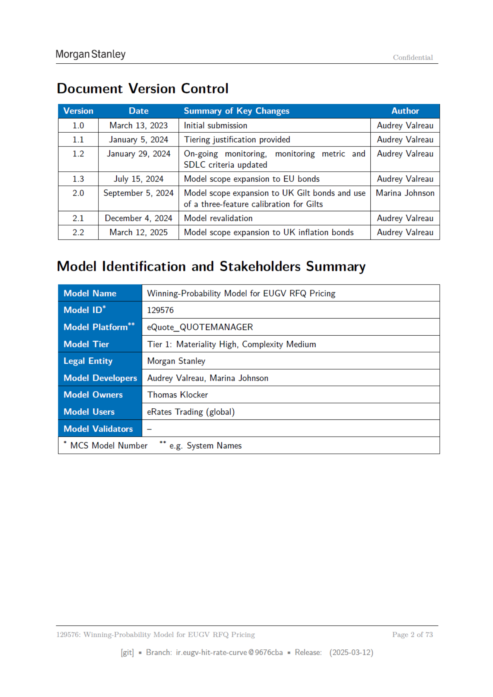

# Page 002 - 日本語版



## 日本語メモ

**該当箇所:** 文書バージョン管理・モデル識別

版数、主要変更、作成者、モデル名、モデルID、プラットフォーム、ティア、開発者、オーナー、利用者を整理している。

## 原文OCR/Text Layer

> OCR由来のため、誤認識があります。正確な図表・数式・レイアウトは上のページ画像を確認してください。

```text
Morgan Stanley
Confidential
Document Version Control
Version
Date
Summary of Key Changes
Author
1.0
March 13, 2023
Initial submission
Audrey Valreau
11
January 5, 2024
| Tiering justification provided
Audrey Valreau
1.2
January 29, 2024
| On-going
monitoring,
monitoring
metric
and | Audrey Valreau
SDLC criteria updated
13
July 15, 2024
Model scope expansion to EU bonds
Audrey Valreau
2.0
September 5, 2024 | Model scope expansion to UK Gilt bonds and use | Marina Johnson
of a three-feature calibration for Gilts
21
December 4, 2024
| Model revalidation
Audrey Valreau
2.2
March 12, 2025
Model scope expansion to UK inflation bonds
Audrey Valreau
Model Identification and Stakeholders Summary
Model Name
Winning-Probability Model for EUGV RFQ Pricing
Model 1D*
129576
IViermrvarnaimeml
eQuote_QUOTEMANAGER
Model Tier
Tier 1: Materiality High, Complexity Medium
Legal Entity
Morgan Stanley
rm erate
Audrey Valreau, Marina Johnson
Model Owners
Thomas Klocker
Model Users
eRates Trading (global)
Model Validators
[Ry
“MCS Model Number
™** e.g. System Names
129576:
Winning-Probability Model
for
EUGV
RFQ
Pricing
Page
2 of 73
[git]
= Branch:
ir.eugy-hit-rate-curve @9676cba
= Release:
(2025-03-12)
```
